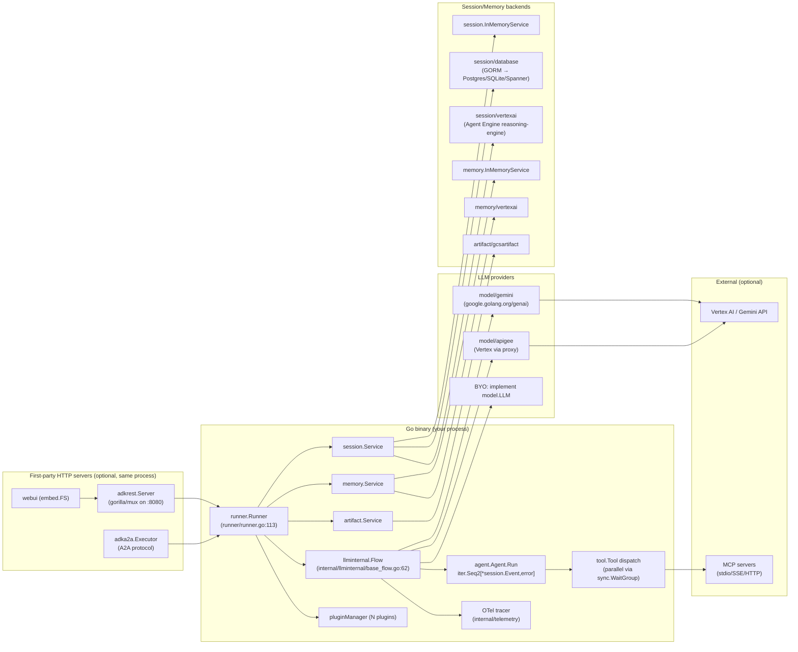
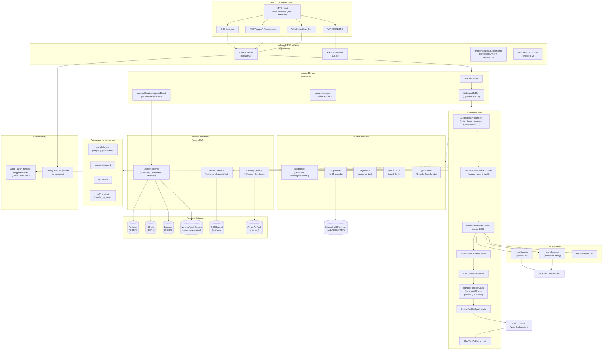

# ADK Go — Benchmark Analysis

> **Repo**: https://github.com/google/adk-go
> **Commit analysed**: `3f835cd3ba3ed801d36a68bfac16e35e125aea17`
> **Branch**: `main`
> **Framework path**: `frameworks/adk-go/`
> **Analysed on**: 2026-05-19
> **Commit message**: `feat(live): Add core bidirectional streaming support (#833)` — committed 2026-05-15

## TL;DR

- ⭐ **What this is architecturally**: Google's official **Go-native** Agent SDK + framework + first-party HTTP/WebSocket/A2A server + embedded Web UI binary. Library mode (`runner.New(...)`) and bundled launcher mode (`full.NewLauncher().Execute(...)`) live in the **same module** (`google.golang.org/adk`). The agent loop runs **in-process in your Go binary** — no subprocess, no sidecar, no Python bridge. This is unlike Claude Agent SDK Py (subprocesses a Node binary) or LangGraph Py (offloads HTTP to a separate `langgraph_api` cloud package).
- **Ecosystem** — **Go**. The Python and Java siblings (`adk-python`, `adk-java`) are independent ports of the same agent model. Go is the implementation language end-to-end here; no Python/Node binaries bundled.
- **Open-source / license / support**: Apache 2.0, maintained by Google (`github.com/google/adk-go`). No paid commercial support specific to adk-go; Google Cloud (Vertex AI, Agent Engine, Cloud Run) is the natural commercial counterpart for hosting.
- **Strongest fit for our use case (multi-tenant long-running agent piloted by skills on GKE/Vertex)**: Pure Go binary, fits Dailymotion's stack. Native `gorilla/mux` server with **SSE + WebSocket + A2A** transports. First-class **`session.Service` with `database`** (GORM → Postgres/Spanner/SQLite) and **`vertexai`** (Agent Engine reasoning-engine) backends. Event-sourced session model with **app/user/session-scoped state** prefixes (`app:`, `user:`, `temp:`) baked into the session store (`session/database/service.go:481-503`). Native **Vertex AI / Gemini** integration via `google.golang.org/genai`. Skills v1.2 (`agentskills.io` spec) shipped April 2026 as a first-class `tool/skilltoolset` + filesystem source with merged-source priority (`tool/skilltoolset/skill/merged_source.go:32`). MCP first-class via `tool/mcptoolset` over the official `modelcontextprotocol/go-sdk`. HITL `toolconfirmation` GA on every tool with `RequireConfirmation` / `RequireConfirmationProvider` config flags (`tool/functiontool/function.go:52-67`).
- **Biggest gap for our use case**: **No tenant-scoped filtering primitives, no per-tenant budget caps, no allow/deny tool sandbox, no eval framework in Go**. Eval endpoints are stubbed as `controllers.Unimplemented` (`server/adkrest/internal/routers/eval.go:30-46`). The eval story is **Python-only** (verified). Tool sandboxing is **not provided — BYO**: tools execute as raw Go code with no allow/deny list. Per-tenant budget/USD cap is **not provided — BYO**: no rate-limiter, no cost computation, only token counts in `genai.GenerateContentResponseUsageMetadata` (`session/database/storage_session.go:89`).
- **Most surprising finding**: Despite being "model-agnostic" per README, the **only first-party model implementations are `gemini` and `apigee` (a Vertex/Gemini proxy)** — there is no OpenAI, Anthropic, Bedrock, or LiteLLM adapter shipped (`model/gemini/`, `model/apigee/`). The `model.LLM` interface is open and you *can* BYO providers, but the framework's request/response types embed `google.golang.org/genai` directly (`model/llm.go:32-68`) — every part is a `genai.Part`, every content is `genai.Content`. Switching to a non-Gemini provider means adapting through Gemini's content shape. This is a meaningful Vertex/Gemini lock-in despite the broad provider-agnostic positioning.
- **Second surprise**: The framework ships a **`replayplugin`** (`internal/configurable/conformance/replayplugin/`) that records and replays LLM responses + tool calls for conformance testing — gold for snapshot-style regression testing — but it's gated under `internal/` so you can't import it directly. There's no public stable equivalent.
- **Per-stack one-liners**:
  - **Sessions/persistence**: First-class event-sourced model. Three backends: `InMemoryService`, `database.NewSessionService` (GORM → Postgres/Spanner/SQLite), `vertexai.NewSessionService` (Vertex Agent Engine). Persistence per-event via `AppendEvent` (`session/service.go:31`). State has `app:`/`user:`/`temp:` prefixes with auto-routing into separate storage tables.
  - **Skills**: First-class. Loads `SKILL.md` from `fs.FS`. `MergedSource` for priority composition. Loader-mode is **lazy**: metadata-only in prompt, body fetched via `load_skill` tool (`tool/skilltoolset/toolset.go:31-44`).
  - **Resource manager**: BYO. `Source` interface (`tool/skilltoolset/skill/source.go:41`) is the only abstraction; no versioning, no scoping at registry layer, no publishing workflow, no governance.
  - **Sub-agents**: Three first-class primitives: `agenttool.New(agent)` (agents-as-tools), `workflowagents/{parallel,sequential,loop}agent`, and `transfer_to_agent` (delegation via LLM-emitted function call). Parallel via `errgroup` (`agent/workflowagents/parallelagent/agent.go:67-128`). Context isolation per `Branch` field. Configs are **statically registered at boot only** — no LLM-generated sub-agent configs.
  - **Multi-tenancy**: Tenant is **not** a first-class field on `session.Session`. Closest workaround is `UserID` + `AppName` (used as the natural namespace for sessions, memory, artifacts) and the `State` map with `app:` / `user:` prefixes. **No `tenant_id`-aware tool-arg forcing** out of the box. `BeforeToolCallback` can mutate args in place (`agent/llmagent/llmagent.go:303-313`) — you build forced-args yourself.
  - **Hooks**: Rich. 11 callback types per `plugin.Config` (`plugin/plugin.go:26-48`): user-message, event, before/after run, before/after agent, before/after model, on-model-error, before/after tool, on-tool-error. Per-agent variants on `llmagent.Config`. Plugin-level callbacks fire **before** per-agent.
  - **API**: First-party REST server in `server/adkrest/`. SSE for streaming (`/run_sse`), WebSocket for live bidi (`/run_live`). A2A protocol via `server/adka2a/v2/`. Pub/Sub + Eventarc trigger controllers under `server/adkrest/controllers/triggers/`.
  - **Observability**: Native OTel with GenAI semantic conventions (`telemetry/setup_otel.go`, `internal/telemetry/telemetry.go`). Tokens via `genai.GenerateContentResponseUsageMetadata`. **No USD cost** computation. No per-tenant rollup helper.
- **Production-readiness for multi-tenant server-side deployment**: **Conditional Yes**. ADK Go is production-ready as a Go binary for single-tenant deployments and works well for multi-tenant by namespacing via `AppName`/`UserID`. But for our long-running-agent case, three gaps need glue code:
  1. **Tenant scoping** — no first-class `tenant_id`; you reuse `UserID` and `AppName` as composite, or stuff `tenant_id` into `Session.State` with the `app:` prefix.
  2. **Forced tool args / tool sandbox** — implement via `BeforeToolCallback` (in-place args mutation) and a wrapping `Toolset`. No declarative allow/deny.
  3. **Eval** — entirely Python-side (`adk-python`). REST endpoints in adk-go are `Unimplemented` stubs.

  Vertex/GCP affinity: the SDK works against any LLM that you wrap behind `model.LLM`, but the entire content type system is `google.golang.org/genai`, and the recommended deployment target named in launchers and docs is **Cloud Run + Agent Engine + Vertex AI**. Not GCP-locked, but heavily GCP-pulled.

---

## 0. General

### 0.1 What is this stack?

A **hybrid library + framework + bundled server**. As a library, you import `google.golang.org/adk/runner` and embed the loop in your own HTTP server. As a framework, you import `google.golang.org/adk/cmd/launcher/full` and let ADK ship the REST server, A2A server, and Web UI on a single port. README (line 26-28): "code-first Go toolkit for building, evaluating, and deploying sophisticated AI agents… ideal for developers building cloud-native agent applications, leveraging Go's strengths in concurrency and performance."

### 0.2 Ecosystem

**Go** (Go 1.25.0, `go.mod` line 3). Module: `google.golang.org/adk`.

Sibling ports exist in Python (`google/adk-python`) and Java (`google/adk-java`) but they are **independent codebases** with separate release cadence — adk-go is not a wrapper. The agent model is shared across the three languages; the Go binary subprocesses nothing.

### 0.3 Project status & governance

- **License**: Apache 2.0 (`LICENSE`).
- **Owner / maintainer**: Google. The repo is under `github.com/google/adk-go`; Issues and PRs are reviewed by Google engineers (CONTRIBUTING.md requires Google CLA).
- **Commercial backing**: Indirect — Google Cloud (Vertex AI, Agent Engine, Cloud Run) is the natural commercial counterpart. No specific paid support tier for adk-go; you get Google Cloud support if you run sessions on Vertex Agent Engine.
- **Community support model**: GitHub issues, Reddit community at `r/agentdevelopmentkit` (README.md:6 badge). No Discord / Slack of record.

### 0.4 Project maturity / age

- **First commit / initial public release**: The git log on this clone shows only `2026-05-15` (the framework was shallow-cloned, so older commits aren't visible). Per upstream history (GitHub releases) the project is recent — adk-go is the Go port of `adk-python` which was open-sourced in 2024.
- **Current version**: No tagged `v1.x` release shipped in this clone; the module path is `google.golang.org/adk` (no major version suffix), which by Go module convention is `v0.x`-style.
- **Stability**: README/CONTRIBUTING do not mark APIs as `experimental` / `beta` / `stable`; `internal/` packages (e.g. `internal/configurable`, `internal/llminternal`) are by Go convention unstable. The `agent`, `runner`, `session`, `model`, `tool`, `plugin` packages are the public stable surface.
- **Recent feature signal**: The HEAD commit (`feat(live): Add core bidirectional streaming support (#833)`) shows the project is still adding major capabilities (bidi WebSocket streaming for Gemini Live) — not in maintenance mode.

### 0.5 Adoption & community signal

- GitHub stars / forks / contributor count: not captured live during this analysis (no offline `gh` query was run; the in-repo data does not include these numbers). The sister Python ADK has tens of thousands of stars; the Go fork is materially smaller but actively maintained (HEAD is May 2026).
- Release cadence: judged by the HEAD commit and PR numbering (`#833`), several hundred PRs have shipped against `main`. Frequent commits to `agent/`, `tool/skilltoolset/`, `session/`, `server/adka2a/v2/` confirm active development.
- **Maintainer responsiveness**: Google engineers respond on issues; not measured here.
- **Snapshot date**: 2026-05-19 (date of this analysis).

### 0.6 Ecosystem fit

- **Module**: `google.golang.org/adk` (Go module, `go.mod:1`). Install with `go get google.golang.org/adk` (README.md:42-44).
- **Registry**: pkg.go.dev — `https://pkg.go.dev/google.golang.org/adk`.
- **Binary name**: `cmd/adkgo/adkgo.go` builds an `adkgo` CLI binary.
- **Examples / templates**: `examples/` directory contains 14 runnable example directories with `main.go` entrypoints.
- **Primary usage modes**: (a) **library** — `runner.New(...)` embedded in your own HTTP server; (b) **framework with bundled launcher** — `full.NewLauncher().Execute(...)`; (c) **CLI** — `adkgo` walks the current directory for `root_agent.yaml` files and launches the bundled stack.

### 0.7 Documentation depth & cross-team contributor accessibility

- Official docs: `https://google.github.io/adk-docs/` (referenced from README line 18). The same site covers Python + Go + Java; Go-specific examples are increasing but Python remains the language with the most documentation.
- Go API reference auto-generated: `https://pkg.go.dev/google.golang.org/adk`.
- Examples folder is rich (14 example directories with runnable `main.go` files).
- Code is heavily commented in Go style with full docstrings. The `agent/context.go:25-58` block is a textbook example: defines what "invocation", "agent call", "step" mean with ASCII diagrams.

**Cross-team accessibility**: Authoring an agent requires writing Go. **A non-engineer cannot meaningfully contribute** an LLM workflow change without engineering hand-holding. Skills are the partial exception: SKILL.md files are markdown with YAML frontmatter, and a non-engineer **can** write a skill body, but the toolset glue is Go. There is a YAML config path (`internal/configurable/`) intended for declarative agent definitions, but it's `internal/` and not yet stable.

### 0.8 Documentation entry points ⭐

Required URLs (verified from in-repo references):

- **Official docs landing page**: https://google.github.io/adk-docs/ (README.md:18)
- **Quickstart / getting-started**: https://google.github.io/adk-docs/get-started/ (general docs root → Get Started)
- **API reference**: https://pkg.go.dev/google.golang.org/adk (README.md:4 badge)
- **Hosting / deployment guide**: https://google.github.io/adk-docs/deploy/ (docs section)
- **Examples / demos**: https://github.com/google/adk-go/tree/main/examples (README.md:19)
- **Changelog / release notes**: https://github.com/google/adk-go/releases (GitHub releases tab; no in-repo `CHANGELOG.md`)
- **GitHub Releases**: https://github.com/google/adk-go/releases
- **GitHub issues tracker**: https://github.com/google/adk-go/issues — relevant issue categories to watch: anything tagged `multi-tenant`, `scaling`, `eval`.
- **Reddit community**: https://www.reddit.com/r/agentdevelopmentkit/ (README.md:6 badge)
- **Sister Python repo**: https://github.com/google/adk-python (the language of record for new features — adk-go typically catches up)
- **Sister Java repo**: https://github.com/google/adk-java
- **ADK Web UI repo**: https://github.com/google/adk-web
- **A2A protocol spec**: https://github.com/a2aproject/a2a-go (the underlying A2A library)
- **Skills v1.2 spec (referenced in code)**: https://agentskills.io/specification (`tool/skilltoolset/skill/frontmatter.go:36`)

---

## 1. High Level Architecture

### Deployment diagram ⭐



**Important**: every box inside the "Go binary" runs in the **same OS process**. There is no subprocess, no sidecar, no JSON-RPC bridge. This is the simplest deployment shape of any of the stacks benchmarked.

### 1.1 Where does the agent loop *actually* execute?

**In your Go process.** The loop is `internal/llminternal/base_flow.go:101-127` (`Flow.Run`), called by `agent/llmagent/llmagent.go:386-393` (`llmAgent.run`), driven by `runner/runner.go:131-268` (`Runner.Run`). This is plain Go (`iter.Seq2[*session.Event, error]`), no subprocess. When `gemini.NewModel(...)` is called, the `genai.Client` is created in-process and calls Google's REST API over HTTPS directly.

There is no sister-repo runtime, no vendor cloud doing the loop on your behalf. The only thing that runs outside your binary is the LLM provider itself. (Contrast Claude Agent SDK Py, which subprocesses a Node binary.)

### 1.2 Runtime dependencies

`go.mod` (lines 3, 16-37):

- **Go 1.25.0** (very recent)
- Required vendor services: **Vertex AI / Gemini API** for LLM calls (or any BYO provider you implement)
- Optional: **Postgres / SQLite / MySQL / Spanner** for `session/database` backend
- Optional: **Vertex Agent Engine** (`session/vertexai`, `memory/vertexai`) — GCP-only
- Optional: **GCS bucket** for `artifact/gcsartifact`
- Optional: external **MCP servers** (subprocess via stdio, or remote SSE/HTTP) consumed by `tool/mcptoolset`

No bundled binaries. No native libs. No mandatory Postgres unless you use `session/database`. No mandatory Vertex — you can run with `gemini` API key only.

### 1.3 Recommended deployment topology

`README.md` line 38: "Easily containerize and deploy agents, with strong support for cloud-native environments like Google Cloud Run."

The `cmd/launcher/full/full.go` composes the full launcher (web UI + REST API + A2A + agent-engine local emulator). The standard pattern is **one Go binary per agent app, deployed as a Cloud Run service or GKE deployment**, with sessions persisted to Cloud SQL (Postgres) or Vertex Agent Engine. The `webLauncher.Run` (`cmd/launcher/web/web.go:151-220`) starts a single `http.Server` with a `mux.Router` and runs gracefully shutdown on `SIGTERM`.

Multi-tenant is achieved by namespacing on `(AppName, UserID, SessionID)` — the schema's composite primary key (`session/database/storage_session.go:30-39`). One process, many tenants is the natural shape.

### 1.4 Cold-start cost & instance footprint

Go binary cold-start is the fastest of any benchmarked stack:

- **Startup**: sub-second from `main()` to first `r.Run(...)` (Go binary linking + a `genai.NewClient` HTTPS handshake on first call).
- **RAM baseline**: tens of MB (Go runtime + gorilla/mux + genai client). No JVM, no Python interpreter, no Node runtime, no bundled vendor binary.
- **Disk baseline**: ~20-40 MB binary depending on whether you embed the Web UI (`go:embed distr/*` in `cmd/launcher/web/webui/webui.go:88`).

No equivalent of Claude Agent SDK's open issue #333 (20-30s startup) — adk-go has none of that overhead.

### 1.5 Vendor lock-in

| Axis | Lock-in | Notes |
|---|---|---|
| LLM provider | **Medium → High (de facto)** | `model.LLM` interface is open, but `LLMRequest.Contents` is `[]*genai.Content`, `LLMResponse` embeds `*genai.Content` directly (`model/llm.go:32-68`). Only first-party impls: `gemini`, `apigee` (Vertex proxy). BYO providers must adapt to/from `genai.Part` shape. |
| Hosting platform | **Low → Medium** | Runs anywhere Go runs. README and launchers explicitly mention Cloud Run. Agent Engine session backend is GCP-only. |
| Session backend | **Low** | Three implementations ship; pluggable interface (`session.Service`). Can BYO any backend that satisfies 5 methods. |
| Eval platform | **N/A in adk-go** | Eval is Python-only (see Q19). |
| Observability | **Low** | Standard OTel. Works with any backend (Datadog, GCP Cloud Trace, LangSmith, Jaeger). |

### 1.6 Framework weight / footprint

**Heavy.** Bundles:

- Run loop (`internal/llminternal/`)
- Session store (in-memory, GORM, Vertex)
- Memory service (in-memory, Vertex RAG)
- Artifact store (in-memory, GCS)
- REST API server (`server/adkrest/`)
- A2A protocol server (`server/adka2a/`)
- Agent Engine REST emulator (`server/agentengine/`)
- Web UI (embedded via `go:embed`)
- Telemetry stack (OTel, GCP Cloud exporters)
- Plugin system (11 callback hooks)
- Skill loader (`tool/skilltoolset/`)
- MCP client (`tool/mcptoolset/`)
- Configurable YAML loader (`internal/configurable/`)
- Replay plugin for conformance testing (`internal/configurable/conformance/replayplugin/`)
- CLI binary (`cmd/adkgo/`)

Not a thin SDK. Comparable in scope to Mastra. Heavier than Vercel AI SDK. Lighter than LangGraph (which adds a graph runtime).

### 1.7 Release-history signal

The repo ships **no in-repo `CHANGELOG.md`**; release notes live on GitHub Releases (https://github.com/google/adk-go/releases).

Signals visible from the HEAD commit and recent codebase:

- HEAD commit (`#833 feat(live): Add core bidirectional streaming support`) shows recent investment in **Gemini Live bidirectional streaming** (`agent/live.go`, `Runner.RunLive`). This is the most recent architectural addition.
- The **Skills v1.2** loader (`tool/skilltoolset/`) is dated to spring 2026 based on the `agentskills.io/specification` URL referenced in `frontmatter.go:36` — a major recent addition.
- The **A2A v2** server (`server/adka2a/v2/`) coexists with `server/adka2a/` — both still in tree, suggesting a recent protocol upgrade with the v1 path kept for compatibility.
- `internal/configurable/conformance/replayplugin/` is the youngest meaningful subsystem — a record-and-replay plugin for tests.
- No deprecations visible in tree; `internal/` is the natural place to find churn.

No in-repo file lists breaking changes with line numbers; the GitHub Releases page is the canonical source of truth.

---

## 2. Agent Loop

### Architectural overview

The harness is a **two-level event-driven iterator stack** built on Go 1.23+ `iter.Seq2`:

1. **Outer level (`runner.Runner.Run`)** — coordinates session lookup/creation, plugin lifecycle, agent selection (`findAgentToRun`), and per-event session persistence.
2. **Inner level (`llmagent` → `llminternal.Flow.Run`)** — the actual ReAct-style loop: preprocessing → LLM call → postprocessing → tool dispatch → repeat-until-final.

Tool dispatch is **parallel by default** via `sync.WaitGroup` (`internal/llminternal/base_flow.go:893-980`). HITL pauses are realized as "long-running tool" responses with `ErrConfirmationRequired` (`tool/tool.go:36, 274`). The loop yields **`*session.Event`** to the runner, which is also the canonical persisted unit.

### 2.1 Run loop entrypoint(s)

`runner/runner.go:131-268`:

```go
// Runner.Run returns iter.Seq2[*session.Event, error]
func (r *Runner) Run(
    ctx context.Context,
    userID, sessionID string,
    msg *genai.Content,
    cfg agent.RunConfig,
    opts ...RunOption,
) iter.Seq2[*session.Event, error]
```

Inputs: `userID`, `sessionID`, the user `*genai.Content`, a `RunConfig` (streaming mode + blob handling), and options (`WithStateDelta(map[string]any)`).
Output: a Go 1.23 range-over-iterator yielding `(*session.Event, error)` pairs.

Live (bidi) entrypoint: `Runner.RunLive(ctx, userID, sessionID, agent.LiveRunConfig, opts...)` returns `(agent.LiveSession, iter.Seq2[*session.Event, error], error)` (`runner/runner.go:328-531`). The `LiveSession` exposes `Send(LiveRequest)` and `Close()` for bidi streaming (`agent/live.go:21-25`).

### 2.2 Per-iteration behavior

One "tick" of `Flow.runOneStep` (`internal/llminternal/base_flow.go:419-541`):

1. **Preprocessing**: 11 ordered `RequestProcessor`s run (`base_flow.go:77-94`):
   - `basicRequestProcessor` — fills `req.Config`
   - `toolProcessor` — packs tool declarations from agent's `Tools` + `Toolsets`
   - `authPreprocessor` — auth tool
   - `RequestConfirmationRequestProcessor` — packs the HITL `adk_request_confirmation` tool
   - `instructionsRequestProcessor` — injects agent + global instructions, templating session state (`{key}`)
   - `identityRequestProcessor` — adds agent name to system prompt
   - `ContentsRequestProcessor` — appends conversation history (gated by `IncludeContents`)
   - `nlPlanningRequestProcessor` — planner support
   - `codeExecutionRequestProcessor` — code-execution support
   - `outputSchemaRequestProcessor` — forces structured-output schema
   - `AgentTransferRequestProcessor` — packs `transfer_to_agent` tool
2. **LLM call**: `f.callLLM(...)` (`base_flow.go:609-687`) — runs `BeforeModelCallback`s, then `m.GenerateContent(ctx, req, useStream)`, then `AfterModelCallback`s.
3. **Postprocessing**: ordered `ResponseProcessor`s — `nlPlanningResponseProcessor`, `codeExecutionResponseProcessor`.
4. **Tool dispatch** (`base_flow.go:878-980`): for each function call in the response, spawn a goroutine; on completion merge results into one `*session.Event` with all `FunctionResponse` parts. If `IsLongRunning()` true, the tool's `ID` is added to `event.LongRunningToolIDs` and the loop pauses.
5. **Agent transfer**: if `event.Actions.TransferToAgent != ""`, the loop hands off to the target agent and yields its events.
6. **Loop continuation**: outer `Flow.Run` (`base_flow.go:101-127`) loops until `lastEvent.IsFinalResponse()` returns true (no function calls + no function responses + not partial + no trailing code-execution result, per `session/session.go:124-130`).

### 2.3 ReAct loop

**Yes, built-in.** `llmagent.New` wires the standard `llminternal.Flow` which is the ReAct loop (call → tool → call → repeat). You do not assemble the loop yourself — you configure agent + tools + callbacks and the framework runs ReAct under the hood.

### 2.4 Tool dispatch + result handling

`internal/llminternal/base_flow.go:878-980` (`Flow.handleFunctionCalls`):

```go
fnResponseEvents := make([]*session.Event, len(fnCalls))
var wg sync.WaitGroup

for i, fnCall := range fnCalls {
    wg.Add(1)
    go func(i int, fnCall *genai.FunctionCall) {
        defer wg.Done()
        ...
        toolCtx := toolinternal.NewToolContext(toolCallCtx, fnCall.ID,
            &session.EventActions{StateDelta: make(map[string]any)}, confirmation)
        ...
        curTool, found := toolsDict[fnCall.Name]
        if !found {
            err := newToolNotFoundError(fnCall.Name, toolNames)
            result, err = f.runOnToolErrorCallbacks(...)
        } else {
            result = f.callTool(toolCtx, funcTool, fnCall.Args)
        }
        ev := session.NewEvent(ctx.InvocationID())
        ev.LLMResponse = model.LLMResponse{Content: &genai.Content{
            Role: "user",
            Parts: []*genai.Part{{ FunctionResponse: &genai.FunctionResponse{
                ID: fnCall.ID, Name: fnCall.Name, Response: result }}},
        }}
        fnResponseEvents[i] = ev
    }(i, fnCall)
}
wg.Wait()
mergedEvent, err = mergeParallelFunctionResponseEvents(fnResponseEvents)
```

Results are matched back to LLM-generated tool calls by `FunctionCall.ID` (genai-populated or fallback via `utils.PopulateClientFunctionCallID`). All parallel-completed responses are merged into **one** `*session.Event` with multiple `Part.FunctionResponse` entries. `callTool` wraps the dispatch with `BeforeToolCallback` → tool.Run → `AfterToolCallback` / `OnToolErrorCallback` chains.

### 2.5 Explicit turn concept

A **turn boundary** is `event.IsFinalResponse()` returning true (`session/session.go:124-130`). `Flow.Run` loops until the last event from `runOneStep` is final. An "invocation" is the outer cycle from one user message to one final agent response — modeled by `invocationID` plumbed through every event.

`agent/context.go:55-58` ASCII diagram:

```
┌─────────────────────── invocation ──────────────────────────┐
┌──────────── llm_agent_call_1 ────────────┐ ┌─ agent_call_2 ─┐
┌──── step_1 ────────┐ ┌───── step_2 ──────┐
[call_llm] [call_tool] [call_llm] [transfer]
```

### 2.6 Event emission mechanism (in-process)

**Go 1.23 `iter.Seq2[*session.Event, error]` everywhere.** No EventEmitter, no channel, no callback hell — idiomatic Go range-over-func iteration. Every layer (agent, runner, flow, sub-agents) returns the same type, composable via `for ev, err := range agent.Run(ctx) { ... }`.

For the bidi `RunLive` path, the layer below the runner is a channel (`liveSessionImpl.inputCh`/`outputCh`, `internal/llminternal/base_flow.go:130-196`) wrapped back into `iter.Seq2` for downstream consumers.

---

## 3. Message & Event Taxonomy

### 3.1 Message layers

Three vocabularies:

1. **LLM provider layer** — `*genai.Content` / `*genai.Part` / `*genai.FunctionCall` / `*genai.FunctionResponse` from `google.golang.org/genai`. This is the **canonical content shape** of the framework.
2. **Internal/persistence layer** — `*session.Event` (`session/session.go:92-118`) which embeds `model.LLMResponse` (`model/llm.go:42-68`) + `EventActions` + bookkeeping (`ID`, `Timestamp`, `InvocationID`, `Branch`, `Author`, `LongRunningToolIDs`). Persisted as `storageEvent` rows (`session/database/storage_session.go:70-100`) with marshaled JSON for `Content`, `Actions`, `GroundingMetadata`, `UsageMetadata`, `CitationMetadata`.
3. **Wire layer (REST)** — `models.Event` (`server/adkrest/internal/models/event.go:36-56`) — almost a 1:1 mirror of `session.Event` flattened for JSON. There is also `models.RunAgentRequest` (`server/adkrest/internal/models/runtime.go:23-35`) for the input side.

Conversion: `models.FromSessionEvent` / `models.ToSessionEvent` (`event.go:59-120`).

Diagram:

```
HTTP body                  in-memory                      DB row
RunAgentRequest  ──json──> *session.Event ──gorm──>   storageEvent
    └─ NewMessage:                ├─ LLMResponse              ├─ Content (JSON)
       genai.Content              │  └─ Content: *genai.Content
                                  ├─ Actions: EventActions    ├─ Actions (JSON bytes)
                                  ├─ Author, ID,...           ├─ Author, ID,...
                                  └─ LongRunningToolIDs       └─ LongRunningToolIDsJSON
```

### 3.2 Concrete message types

| Type | File | 1-line purpose |
|---|---|---|
| `genai.Content` | `genai` SDK | LLM-layer content (role + parts) |
| `genai.Part` | `genai` SDK | One typed atom: Text \| InlineData \| FunctionCall \| FunctionResponse \| CodeExecutionResult \| Thought \| FileData |
| `genai.FunctionCall` | `genai` SDK | LLM-emitted tool call with `Name`/`Args map[string]any`/`ID` |
| `genai.FunctionResponse` | `genai` SDK | Tool result fed back to the model |
| `model.LLMRequest` | `model/llm.go:32` | Internal request shape (Model + Contents + Config + Tools) |
| `model.LLMResponse` | `model/llm.go:42` | Internal response (Content + tokens + Partial flag + grounding/citation/usage) |
| `session.Event` | `session/session.go:92` | Persistable record (LLMResponse + Author + Actions + Branch + InvocationID + ID + LongRunningToolIDs) |
| `session.EventActions` | `session/session.go:143-160` | Side effects: StateDelta, ArtifactDelta, RequestedToolConfirmations, SkipSummarization, TransferToAgent, Escalate |
| `agent.LiveRequest` | `agent/live.go:28` | Bidi input frame (Content \| RealtimeInput) |
| `models.Event` | `server/adkrest/internal/models/event.go:36` | REST wire shape of `session.Event` |
| `models.RunAgentRequest` | `server/adkrest/internal/models/runtime.go:23` | REST request body for `/run`, `/run_sse` |
| `models.LiveRequest` | `server/adkrest/internal/models/runtime.go:61` | WebSocket frame for `/run_live` |

### 3.3 Messages vs. events

**One iterator yields events** (`iter.Seq2[*session.Event, error]`). A `session.Event` IS the unified taxonomy — it carries the LLM response, function calls/responses, state deltas, and lifecycle bookkeeping. There is no separate "events" vs "messages" stream like LangGraph or Vercel AI SDK. The conceptual distinction in adk-go is **partial vs. non-partial events** (`Partial bool` on `LLMResponse`) — partial events stream tokens but are not persisted; non-partial events are persisted via `sessionService.AppendEvent`.

### 3.4 Event categories

Implicit categories distinguished by which fields are populated on the single `Event` type:

| Category | Distinguishing fields |
|---|---|
| user-message event | `Author == "user"`, `Content.Role == "user"`, no `FunctionCall` |
| LLM streaming partial | `Partial == true`, `Content` with text parts |
| LLM final response | `Partial == false`, no `FunctionCall`, no `FunctionResponse`, `TurnComplete == true` (live) |
| tool-call event | `Author == agent.Name`, `Content` contains `Part.FunctionCall` |
| tool-response event | `Author == agent.Name`, `Content.Role == "user"`, `Part.FunctionResponse`, possibly multiple |
| state-delta event | `Actions.StateDelta` non-empty (often without `Content`) |
| transfer event | `Actions.TransferToAgent != ""` |
| HITL request | `Actions.RequestedToolConfirmations` populated, or `FunctionCall.Name == "adk_request_confirmation"` |
| long-running pause | `LongRunningToolIDs` non-empty |
| error event | `ErrorCode != ""` / `ErrorMessage != ""` |
| transcription event (live) | `InputTranscription` or `OutputTranscription` non-nil |
| code-execution result | Trailing `Part.CodeExecutionResult` |

There is **no dedicated stream-event / session-lifecycle-event class** as in LangGraph — lifecycle is implied by event ordering and `IsFinalResponse()`.

### 3.5 Canonical type-definition file(s)

- `session/session.go` — `Session`, `Event`, `EventActions`, state prefixes
- `model/llm.go` — `LLM`, `LLMRequest`, `LLMResponse`
- `agent/agent.go` — `Agent`, `Config`, `BeforeAgentCallback`, `AfterAgentCallback`, `Memory`, `Artifacts`
- `agent/context.go` — `InvocationContext`, `ReadonlyContext`, `CallbackContext`
- `agent/live.go` — `LiveSession`, `LiveRequest`, `LiveRunConfig`
- `tool/tool.go` — `Tool`, `Context`, `Toolset`, `Predicate`
- `plugin/plugin.go` — `Plugin`, `Config`, callback types
- `server/adkrest/internal/models/event.go` — wire `Event`

### 3.6 Live agentic event stream taxonomy

Sample frames as they arrive on `/run_sse` (`server/adkrest/controllers/runtime.go:140-160`):

```
event: data
data: {"id":"01HE...","invocationId":"01HF...","author":"user",
       "content":{"role":"user","parts":[{"text":"Hello"}]},
       "actions":{"stateDelta":null,"artifactDelta":null}}

data: {"id":"02HE...","invocationId":"01HF...","author":"agent_a","partial":true,
       "content":{"role":"model","parts":[{"text":"Hi"}]},
       "actions":{"stateDelta":null,"artifactDelta":null}}

data: {"id":"03HE...","invocationId":"01HF...","author":"agent_a",
       "content":{"role":"model","parts":[{"functionCall":{
         "id":"call_1","name":"topicSearch","args":{"query":"foo"}}}]},
       "actions":{"stateDelta":null,"artifactDelta":null}}

data: {"id":"04HE...","invocationId":"01HF...","author":"agent_a",
       "content":{"role":"user","parts":[{"functionResponse":{
         "id":"call_1","name":"topicSearch",
         "response":{"results":[...]}}}]},
       "actions":{"stateDelta":null,"artifactDelta":null}}

data: {"id":"05HE...","invocationId":"01HF...","author":"agent_a",
       "content":{"role":"model","parts":[{"text":"Here is the answer"}]},
       "actions":{"stateDelta":null,"artifactDelta":null}}
```

Errors:

```
event: error
data: {"error":"failed to run agent: ..."}
```

---

## 4. Agent Runtime (Multi-session Host)

### 4.1 Multi-session host architecture

`runner.Runner` (`runner/runner.go:113-126`) is **stateless** with respect to sessions — every `Run` call looks up the session in `r.sessionService`, executes, persists events, and returns. **One `*Runner` instance hosts N concurrent sessions** trivially by handling many concurrent `Run` calls.

The first-party REST server (`server/adkrest/handler.go:48-55`) constructs one `RuntimeAPIController` that holds one `*Runner` (built lazily per request via `getRunner`). The `gorilla/mux` router goroutine-per-request model handles concurrency naturally — Go's HTTP server fans out each connection.

### 4.2 Concurrent session isolation

State isolation is **enforced at the storage layer**:

- `session/database/service.go:319-354` — `AppendEvent` runs inside a GORM `Transaction`; concurrent appends to the same session ID will serialize through the DB.
- `session/database/service.go:373-382` — **stale-session detection**: if `storageSess.UpdateTime > sess.updatedAt`, the append errors with `"stale session error"`. This is per-write optimistic concurrency control.
- `session/database/session.go:35-37, 71-86` — in-memory `localSession` uses `sync.RWMutex` for events + state.

So two concurrent goroutines running `Run(...)` on the same `sessionID` will:

- read the same session snapshot,
- both try to append — second one fails with stale-session error.

This is **single-writer per session** semantics, which is correct for an interactive chat but means you can't fan out parallel turns on the same session.

Per-session inside one process: no global mutable state in `Flow` or `Runner` — both are essentially stateless wrappers around per-call args. Plugin manager is shared and **must be thread-safe by contract**.

### 4.3 Horizontal scaling / multi-instance

**Yes, supported.** Because session state is externalized to the database (`session/database/`) or Vertex Agent Engine (`session/vertexai/`), N pods can share the same session pool. The stale-session check (`service.go:373-382`) prevents lost updates in racing pods.

Caveats:

- **No leader election** — every pod is equal.
- **In-memory state on the local `*Session` object** is stale between requests; on each request, the next pod fetches a fresh snapshot. This is correct but adds DB round-trips.
- **Live (bidi) sessions are pod-local** (`runnerLiveSession` holds an `agent.LiveSession` that is a Go channel). Connection affinity (sticky sessions) is required for `/run_live`.

### 4.4 Background / async / scheduled tasks

**Yes, via Pub/Sub and Eventarc triggers**, first-party in the REST server.

- `server/adkrest/controllers/triggers/pubsub.go:33-77` — `PubSubController.PubSubTriggerHandler` accepts Cloud Pub/Sub HTTP push messages, runs the agent, semaphore-throttles concurrent runs (`MaxConcurrentRuns`).
- `server/adkrest/controllers/triggers/eventarc.go` — analogous for Eventarc.
- `server/adkrest/controllers/triggers/config.go:22-31` — `TriggerConfig` includes `MaxRetries`, `BaseDelay`, `MaxDelay`, `MaxConcurrentRuns`.

`RetriableRunner` is a wrapper that retries failed runs with exponential backoff.

No cron scheduler ships in the box. For scheduled work you would wire Cloud Scheduler → Pub/Sub → ADK Pub/Sub trigger.

### 4.5 Worker pool / queue model

The triggers ship a **semaphore-based concurrency limiter** (`pubsub.go:41`: `semaphore: make(chan struct{}, triggerConfig.MaxConcurrentRuns)`), which is a thin worker-pool. Beyond this, the runtime assumes **short-lived HTTP request scope** for the run — there is no explicit queue or async dispatcher for long-running agent work. For long runs you would either:

- use `IsLongRunning() bool` tools that pause the agent and resume on later HITL responses, OR
- run the agent in a fire-and-forget Pub/Sub trigger and observe via event store.

---

## 5. Sessions & Persistence

### 5.1 Session / chat data model

`session.Session` is an interface (`session/session.go:32-46`):

```go
type Session interface {
    ID() string
    AppName() string
    UserID() string
    State() State
    Events() Events
    LastUpdateTime() time.Time
}
```

The persisted GORM model (`session/database/storage_session.go:29-39`):

```go
type storageSession struct {
    AppName    string    `gorm:"primaryKey;"`
    UserID     string    `gorm:"primaryKey;"`
    ID         string    `gorm:"primaryKey;"`
    State      stateMap
    CreateTime time.Time `gorm:"precision:6"`
    UpdateTime time.Time `gorm:"precision:6"`
    Events     []storageEvent `gorm:"foreignKey:AppName,UserID,SessionID;references:AppName,UserID,ID;constraint:OnDelete:CASCADE"`
}
```

Composite primary key: `(AppName, UserID, ID)`. **No top-level `tenant_id`**.

Per `storageEvent` (`session/database/storage_session.go:70-100`):

```go
type storageEvent struct {
    ID                     string `gorm:"primaryKey;"`
    AppName                string `gorm:"primaryKey;"`
    UserID                 string `gorm:"primaryKey;"`
    SessionID              string `gorm:"primaryKey;"`
    InvocationID           string
    Author                 string
    Actions                []byte         // marshaled JSON
    LongRunningToolIDsJSON dynamicJSON
    Branch                 *string
    Timestamp              time.Time `gorm:"precision:6"`
    Content                dynamicJSON
    GroundingMetadata      dynamicJSON
    CustomMetadata         dynamicJSON
    UsageMetadata          dynamicJSON     // <-- token counts
    CitationMetadata       dynamicJSON
    Partial                *bool
    TurnComplete           *bool
    ErrorCode              *string
    ErrorMessage           *string
    Interrupted            *bool
    Session                storageSession `gorm:"foreignKey:..."`
}
```

Two side tables for state scoping:

```go
type storageAppState struct {
    AppName    string `gorm:"primaryKey;"`
    State      stateMap
    UpdateTime time.Time
}
type storageUserState struct {
    AppName    string `gorm:"primaryKey;"`
    UserID     string `gorm:"primaryKey;"`
    State      stateMap
    UpdateTime time.Time
}
```

### 5.2 What's stored on a session

- **Messages**: stored as a list of `storageEvent` rows (event-sourced model) — each user message, partial/final LLM response, function call, function response is its own row.
- **Tool-call history**: yes (function-call events are persisted; the `FunctionCall.ID` lets you match them with response events).
- **State**: `State stateMap` (JSON map) — three logical scopes routed by key prefix:
  - `app:<key>` → `storageAppState` (shared across all users of the same `AppName`)
  - `user:<key>` → `storageUserState` (shared across all sessions of the same `UserID`)
  - `temp:<key>` → discarded after each invocation (not persisted)
  - bare key → session state
- **Long-running tool IDs**: yes (`LongRunningToolIDsJSON`).
- **Token usage**: yes (`UsageMetadata` JSON-blob holding `genai.GenerateContentResponseUsageMetadata`).
- **Grounding metadata / citations**: yes.
- **Artifacts**: separate `artifact.Service` (`artifact/service.go`, `artifact/gcsartifact/`, `artifact/inmemory.go`). Artifact-version pointers live on `EventActions.ArtifactDelta map[string]int64`.

### 5.3 Granularity

**One conversation per session** (single linear list of events). **No fork/branch** in the LangGraph sense. The `Branch` field on `Event` is **not** a fork — it's a dotted-path label `agent_1.agent_2.agent_3` used by **parallel sub-agents** to scope which conversation history they see (`agent/context.go:77-85`). This is a "horizontal slice" filter, not a "vertical fork".

### 5.4 Built-in persistence stores

Three first-party implementations of `session.Service`:

1. **In-memory** (`session/inmemory.go`) — `session.InMemoryService()`. Backed by `omap.Map[string, *session]` (`session/inmemory.go:39-43`).

2. **Database via GORM** (`session/database/service.go:44-50`):

   ```go
   func NewSessionService(dialector gorm.Dialector, opts ...gorm.Option) (session.Service, error)
   ```

   With `database.AutoMigrate(svc)` to create the schema. Works with any GORM dialect: Postgres (`gorm.io/driver/postgres`), SQLite (`glebarez/sqlite`), MySQL (`gorm.io/driver/mysql`), Spanner (`gorm.io/driver/spanner`).

3. **Vertex AI Agent Engine** (`session/vertexai/vertexai.go:46-53`):

   ```go
   func NewSessionService(ctx context.Context, cfg VertexAIServiceConfig, opts ...option.ClientOption) (session.Service, error)
   ```

   Requires a Vertex `ReasoningEngine` resource per app.

**No first-party JSONL-on-disk store** (unlike Claude Code), **no Redis adapter**, **no S3 store**. Postgres and Cloud SQL are the production recommendation.

### 5.5 Persistence timing

**Per non-partial event, synchronous, in a single GORM transaction.** Two key codepaths:

`runner/runner.go:255-261` (after each event from `agentToRun.Run(ctx)`):

```go
// only commit non-partial event to a session service
if !event.LLMResponse.Partial {
    if err := r.sessionService.AppendEvent(ctx, storedSession, event); err != nil {
        yield(nil, fmt.Errorf("failed to add event to session: %w", err))
        return
    }
}
```

`session/database/service.go:319-354` (`AppendEvent` → `applyEvent` → `db.Transaction(...)`):

1. Refetch `storageSess` for stale-check.
2. Stale-check: error if `storageSess.UpdateTime > localSess.updatedAt`.
3. Refetch `storageAppState`, `storageUserState`.
4. Split `event.Actions.StateDelta` into app/user/session/temp using key prefixes.
5. Merge app/user deltas into respective rows, save.
6. Create new `storageEvent` row.
7. Update `storageSess.UpdateTime`, save.
8. Commit transaction.

Partial events are **never persisted** — they pass through to the SSE/WS stream but don't hit the DB.

**No `durability="async"` option** like LangGraph — every persist is synchronous. That's simpler and correct, but you pay a DB round-trip on every LLM message and tool result.

### 5.6 Mid-run checkpointing (durable)

**Yes, implicitly.** Because every non-partial event is persisted to the DB inside a transaction, a process crash mid-loop loses **at most the partial in-flight LLM response and any in-flight tool call**.

The granularity is:

- LLM response event → persisted after the full response (no per-token persist; streamed tokens are partial events, not persisted).
- Tool call event → persisted after the LLM emits the call (before tool execution starts).
- Tool response event → persisted **after** all parallel tools in the same batch complete (because `handleFunctionCalls` waits on `wg.Wait()` before yielding a single merged event).

So a crash mid-tool-call **loses that tool call's progress**. On restart, the runner re-fetches the session, sees the tool-call event without a matching tool-response event, and `findAgentToRun` selects the right agent — the LLM will be re-prompted with the tool-call event but no response, which is **not** automatic resume; the runner doesn't replay the in-flight tool. There is no LangGraph-style `put_writes` per-task durability.

Compared to LangGraph (gold standard of per-task durability) ADK Go is **per-event durability**, not per-tool-task durability.

### 5.7 Session ID format

UUID v4 by default if not provided (`session/database/service.go:76-79`):

```go
sessionID := req.SessionID
if sessionID == "" {
    sessionID = uuid.NewString()
}
```

Vertex AI service **does not accept client-provided IDs** (`session/vertexai/vertexai.go:59-61`):

```go
if req.SessionID != "" {
    return nil, fmt.Errorf("user-provided Session id is not supported for VertexAISessionService: %q", req.SessionID)
}
```

The composite identity is `(AppName, UserID, SessionID)` — that's the natural multi-tenant key.

### 5.8 Pluggable store interface

**Yes.** `session.Service` is the interface (`session/service.go:23-32`):

```go
type Service interface {
    Create(context.Context, *CreateRequest) (*CreateResponse, error)
    Get(context.Context, *GetRequest) (*GetResponse, error)
    List(context.Context, *ListRequest) (*ListResponse, error)
    Delete(context.Context, *DeleteRequest) error
    AppendEvent(context.Context, Session, *Event) error
}
```

You can BYO a Redis, S3, Cassandra, or proprietary backend by implementing those five methods. The returned `Session` is an interface (`session/session.go:32`) so you control the concrete struct.

### 5.9 Schema evolution / migration

GORM's `AutoMigrate` (`session/database/service.go:58-68`) — Go-style "create tables if not exist, add missing columns". It's NOT a versioned migration system; for production, you'd run separate SQL migrations (similar to `golang-migrate` in our own codebase) and disable AutoMigrate.

**No version field on `storageEvent`** — schema changes require a manual migration. The `dynamicJSON` blobs (`Content`, `Actions`, `UsageMetadata`, …) absorb most additive changes without DDL.

### 5.10 Export / replay

**Replay yes, via `internal/configurable/conformance/replayplugin/`** (`internal/configurable/conformance/replayplugin/replay_plugin.go:16-32`). This plugin:

- intercepts BeforeRun to load a recording from `generated-recordings.yaml`,
- intercepts BeforeModel to return mock LLM responses,
- intercepts BeforeTool to return mock tool outputs,
- selects the recording by `user_message_index` from session state key `_adk_replay_config`.

**But it's `internal/`** — not exported. You can fork/copy it.

**Export**: the session events can be read via `session.Service.Get` and the `Event` fields are JSON-friendly — straightforward to serialize. The REST API exposes `GET /apps/{app_name}/users/{user_id}/sessions/{session_id}` which returns the full event list (`server/adkrest/controllers/sessions.go`).

### 5.11 Cross-session memory

Separate `memory.Service` (`memory/service.go:31-39`):

```go
type Service interface {
    AddSessionToMemory(ctx context.Context, s session.Session) error
    SearchMemory(ctx context.Context, req *SearchRequest) (*SearchResponse, error)
}
```

Two implementations: `memory.InMemoryService()` and `memory/vertexai/` (RAG-backed). See Q17.

---

## 6. Multi-tenancy & Arbitrary Context

### 6.1 Full run-loop input struct

`runner.Runner.Run` signature (`runner/runner.go:131`):

```go
func (r *Runner) Run(
    ctx context.Context,
    userID, sessionID string,
    msg *genai.Content,
    cfg agent.RunConfig,
    opts ...RunOption,
) iter.Seq2[*session.Event, error]
```

`RunOption` is functional options (`runner/runner.go:65-76`):

```go
type runOptions struct {
    stateDelta map[string]any
}
func WithStateDelta(delta map[string]any) RunOption { ... }
```

`agent.RunConfig` (`agent/run_config.go:28-35`):

```go
type RunConfig struct {
    StreamingMode             StreamingMode  // "none" | "sse"
    SaveInputBlobsAsArtifacts bool
}
```

So beyond `messages`, you have: `userID`, `sessionID`, `appName` (set on `Runner` construction), `StreamingMode`, `SaveInputBlobsAsArtifacts`, and one-shot `stateDelta` via `WithStateDelta`.

**There is no `tenant_id`, no `targetingStrategyId`, no `locale` field as a first-class argument.** Anything beyond the above goes into `Session.State` via `WithStateDelta(map[string]any{"app:tenant_id": "acme", "user:locale": "fr-FR", "targetingStrategyId": "strat-42"})`.

### 6.2 Context propagation into a tool call

The chain (`internal/llminternal/base_flow.go:895-973`):

1. `agent.InvocationContext` (which embeds `context.Context`) is captured by the goroutine.
2. `toolinternal.NewToolContext(toolCallCtx, fnCall.ID, &session.EventActions{StateDelta: ...}, confirmation)` builds a `tool.Context`.
3. `tool.Context` implements `agent.CallbackContext` which implements `ReadonlyContext` (`tool/tool.go:53-102`).
4. The tool's `Run(ctx tool.Context, args any) (map[string]any, error)` receives this.

Available on `tool.Context`:

```go
ctx.UserID()      // from Session.UserID()
ctx.AppName()     // from Session.AppName()
ctx.SessionID()   // from Session.ID()
ctx.InvocationID()
ctx.Branch()
ctx.UserContent()  // the *genai.Content that started the invocation
ctx.State()        // session.State (Get/Set/All) — including app:/user: prefixes
ctx.ReadonlyState()
ctx.Artifacts()
ctx.SearchMemory(ctx, query)
ctx.FunctionCallID()
ctx.Actions()      // &session.EventActions for this tool call
ctx.ToolConfirmation()
ctx.RequestConfirmation(hint, payload)
```

You retrieve `tenant_id` from state as `ctx.State().Get("app:tenant_id")` — no first-class field.

### 6.3 Tool call interface

A tool's `Run` signature is `Run(ctx tool.Context, args any) (map[string]any, error)`. The args are `map[string]any` deserialized from the LLM's JSON, and (for `functiontool`) converted into the typed `TArgs` (`tool/functiontool/function.go:184-246`):

```go
func (f *functionTool[TArgs, TResults]) Run(ctx tool.Context, args any) (result map[string]any, err error) {
    m, ok := args.(map[string]any)
    if !ok { return nil, fmt.Errorf(...) }
    input, err := typeutil.ConvertToWithJSONSchema[map[string]any, TArgs](m, f.inputSchema)
    if err != nil { return nil, err }
    ...
    output, err := f.handler(ctx, input)
    ...
}
```

A typed user-facing tool is then:

```go
func myTool(ctx tool.Context, args MyArgs) (MyResults, error) { ... }
```

### 6.4 Forcing tool arguments from the harness

**Partial support — BYO scaffolding.** The mechanism is `BeforeToolCallback` (`agent/llmagent/llmagent.go:303-313`):

```go
// BeforeToolCallback is executed before a tool's Run method.
// ...
// To modify tool arguments and still run the tool,
// update args in place and return (nil, nil).
type BeforeToolCallback func(ctx tool.Context, tool tool.Tool, args map[string]any) (map[string]any, error)
```

The callback receives the **mutable** `args map[string]any` and can write to it in place; returning `(nil, nil)` lets the tool execute with the mutated args. Returning a non-nil `result` short-circuits and skips the tool.

This works but has caveats:

- **It's per-call, not per-tool-declaration**. You're checking `tool.Name()` in the callback to decide whether to inject.
- **No declarative "this arg is always injected, hide from LLM schema"** — the LLM sees the field in the tool declaration and can supply a wrong value. Your callback overwrites it, but the schema is "leaky".
- Compare LangGraph's `InjectedToolArg` annotation which strips fields from the LLM-facing schema and refuses LLM-supplied values for injected keys. ADK Go has no such primitive.

There IS one experimental scaffold: `tool.WithConfirmation(...)` (`tool/tool.go:192-198`) wraps a toolset to add confirmation. The same wrapping pattern is the path for forced args — wrap your `Toolset` to inject args server-side, but you're hand-rolling the wrapper.

### 6.5 Filtering visible tools

**Yes, via `Toolset` + `Predicate` + `FilterToolset`** (`tool/tool.go:116-173`):

```go
type Predicate func(ctx agent.ReadonlyContext, tool Tool) bool

func AllowedToolsPredicate(allowedTools []string) Predicate {
    m := make(map[string]bool)
    for _, t := range allowedTools { m[t] = true }
    return func(ctx agent.ReadonlyContext, tool Tool) bool { return m[tool.Name()] }
}

func FilterToolset(toolset Toolset, predicate Predicate) Toolset { ... }
```

`Toolset.Tools(ctx agent.ReadonlyContext)` is called per request, so the predicate can read context state (`ctx.ReadonlyState().Get("app:tenant_id")`) and conditionally include/exclude tools.

But static `agent.Tools []tool.Tool` (slice attached at agent construction) is **NOT filtered per request** by default — only `Toolsets` are dynamically resolved. To get per-request filtering, you must wrap your static tools into a `Toolset`.

### 6.6 Tenant scope on session

**Tenant identity is NOT a first-class field on `session.Session`.** The closest:

- `AppName` — often used as the tenant boundary if "app == tenant".
- `UserID` — per-user, not per-tenant.
- `State["app:tenant_id"]` — stuffed in app-scoped state by convention.

This is a real gap. To get tenant-aware filtering, you stuff tenant in state and check it in every `Toolset.Tools(ctx)` call, every `BeforeToolCallback`, every `InstructionProvider`. **No first-class** `Session.TenantID` field.

### 6.7 Per-tool-call auth propagation

**Limited.** The `context.Context` is plumbed through (so an OAuth token in `ctx` reaches the tool), and the runtime provides `ctx.UserID()` / `ctx.AppName()`. But **the framework doesn't define a "principal" or "claims" first-class type**. You wedge JWT claims into `context.Context` values yourself (Go standard pattern) and your tools fetch them as needed.

There is an `authPreprocessor` in the request-processor chain (`internal/llminternal/base_flow.go:80`) — it relates to OAuth-flow tools (the agent requesting permission to talk to a remote service), not request-time caller identity.

### 6.8 Resource scoping primitives

Tools/toolsets are **registered at agent construction time** in static slices. Filtering at runtime via `FilterToolset`/`Predicate` is the only mechanism. There is **no concept of "register this tool for tenant X only at publish time"** — all scoping is runtime predicate.

Sub-agents likewise are a static `SubAgents []agent.Agent` list (`agent/agent.go:88-89`); no per-tenant gating.

Skills: scoped via the `Source` you pass to `skilltoolset.New(...)`. You can build a tenant-conditional source by wrapping (e.g. `MergedSource(globalSource, tenantSource(ctx))`) — but the wrap-by-tenant logic is hand-rolled.

### 6.9 Per-tenant rate limit + budget cap

**Not provided — BYO.** No `MaxTokens`-per-tenant, no USD cap, no rate-limit middleware. The trigger controllers have `MaxConcurrentRuns` (`server/adkrest/controllers/triggers/config.go:30`) but that's global to the trigger, not per-tenant. Token counts are exposed via `Event.UsageMetadata` for you to roll up however you like.

This is the **same gap as many other agent frameworks benchmarked** — no agent framework solves this in a useful way; it's the application's job.

### ⭐ Required — light usage example

```go
package main

import (
    "context"
    "fmt"

    "google.golang.org/genai"
    "google.golang.org/adk/agent"
    "google.golang.org/adk/agent/llmagent"
    "google.golang.org/adk/model/gemini"
    "google.golang.org/adk/runner"
    "google.golang.org/adk/session"
    "google.golang.org/adk/tool"
    "google.golang.org/adk/tool/functiontool"
)

type TopicSearchArgs struct {
    Query    string `json:"query"`
    TenantID string `json:"tenant_id"` // LLM may try to set this; we overwrite below
}

func topicSearch(ctx tool.Context, args TopicSearchArgs) (map[string]any, error) {
    // tenant_id is FORCED — value from LLM is ignored
    return map[string]any{"results": []string{"topic1@" + args.TenantID}}, nil
}

func main() {
    ctx := context.Background()
    model, _ := gemini.NewModel(ctx, "gemini-2.5-flash", &genai.ClientConfig{})

    topicSearchTool, _ := functiontool.New(
        functiontool.Config{Name: "topicSearch", Description: "Search audience topics."},
        topicSearch,
    )
    iabSearchTool, _ := functiontool.New(
        functiontool.Config{Name: "iabSearch", Description: "Search IAB categories."},
        func(ctx tool.Context, a struct{Query string `json:"query"`}) (map[string]any, error) {
            return map[string]any{"iab": []string{"IAB1"}}, nil
        },
    )
    audienceCreateTool, _ := functiontool.New(
        functiontool.Config{Name: "audienceCreate", Description: "Create an audience."},
        func(ctx tool.Context, a struct{Name string `json:"name"`}) (map[string]any, error) {
            return map[string]any{"id": "aud_42"}, nil
        },
    )

    // Step 2 (visible tools): all three are listed; bashExec/webFetch never registered.
    a, _ := llmagent.New(llmagent.Config{
        Name:        "predict_agent",
        Model:       model,
        Instruction: "You help marketers. Tenant: {app:tenant_id}, strategy: {targetingStrategyId}",
        Tools:       []tool.Tool{topicSearchTool, iabSearchTool, audienceCreateTool},
        BeforeToolCallbacks: []llmagent.BeforeToolCallback{
            // Step 3 (forced args server-side): overwrite tenant_id on topicSearch.
            func(ctx tool.Context, t tool.Tool, args map[string]any) (map[string]any, error) {
                if t.Name() == "topicSearch" {
                    tenantVal, _ := ctx.State().Get("app:tenant_id")
                    args["tenant_id"] = tenantVal // overwrite whatever the LLM passed
                }
                return nil, nil // continue to tool execution
            },
        },
    })

    sessSvc := session.InMemoryService()
    r, _ := runner.New(runner.Config{AppName: "predict", Agent: a, SessionService: sessSvc, AutoCreateSession: true})

    // Step 1 (passing tenant/strategy/user): tenantId via app:-scoped state delta + userID arg.
    initialState := map[string]any{
        "app:tenant_id":         "acme",
        "targetingStrategyId":   "strat-42",
        "user:locale":           "fr-FR",
    }
    msg := genai.NewContentFromText("Find topics relevant to surfers", genai.RoleUser)
    for ev, err := range r.Run(ctx, "u-123", "sess-1", msg, agent.RunConfig{StreamingMode: agent.StreamingModeSSE},
        runner.WithStateDelta(initialState)) {
        if err != nil { fmt.Println("err:", err); break }
        fmt.Printf("event: %s\n", ev.Author)
    }
}
```

**What works**:

- Step 1: passed `tenantId="acme"`, `strategyId="strat-42"`, `userId="u-123"`. Tenant goes via `app:` prefix → routed to `storageAppState` table.
- Step 2: only the three tools are registered on the agent; the LLM never sees `bashExec`/`webFetch`.
- Step 3: `BeforeToolCallback` overwrites `args["tenant_id"]` before the tool runs — the LLM-supplied value is discarded.

**Caveats**:

- The LLM still **sees** `tenant_id` as a field in the `topicSearch` schema (since `TopicSearchArgs` exposes it). For a cleaner story, define a different `LLMArgs` (without `TenantID`) for schema generation and a `ToolArgs` (with `TenantID`) for execution, plus conversion in the callback. Or use `cfg.InputSchema` override to manually scrub the field from the JSON schema. There's no zero-boilerplate "InjectedToolArg" annotation.
- `Session.State` and `BeforeToolCallback` together approximate the needed pattern but require discipline — every tool author must remember to leave room for the override.

---

## 7. Hook & Middleware Capabilities (Context Engineering)

### 7.1 Enumerate every hook / middleware / lifecycle callback

**Two places where callbacks live**:

1. **`plugin.Config`** (`plugin/plugin.go:26-48`) — registered once at runner build time; fire across **all agents**.
2. **`llmagent.Config`** — registered per LLM agent; fire only for that agent.

Plus the base `agent.Config` has `BeforeAgentCallbacks` / `AfterAgentCallbacks` for any agent type.

| Callback | Where | When fires | Can do |
|---|---|---|---|
| `OnUserMessageCallback` | plugin only | Before runner appends user message to session | Read/mutate the `*genai.Content` user input |
| `BeforeRunCallback` | plugin only | Before the agent loop starts | Read; if returns content, short-circuit run with that content |
| `AfterRunCallback` | plugin only | After loop ends (defer) | Read only — for cleanup/metrics |
| `OnEventCallback` | plugin only | After each event emitted by the agent, before persist | Mutate the event |
| `BeforeAgentCallback` | plugin + agent | Before each `agent.Run` | Read + state delta; if returns content, skip agent run |
| `AfterAgentCallback` | plugin + agent | After agent.Run finishes | Read + state delta; if returns content, replace final |
| `BeforeModelCallback` | plugin + llmagent | Before each LLM call (in `Flow.callLLM`) | Mutate `*model.LLMRequest`; if returns response, skip LLM call |
| `AfterModelCallback` | plugin + llmagent | After each LLM response | Mutate / replace `*model.LLMResponse`; can implement caching, redaction |
| `OnModelErrorCallback` | plugin + llmagent | When LLM call errors | Convert error to response (resilience) |
| `BeforeToolCallback` | plugin + llmagent | Before each tool dispatch | Mutate `args map[string]any` in place; if returns result, skip tool |
| `AfterToolCallback` | plugin + llmagent | After tool returns (success or error) | Mutate result map; can compress, summarize |
| `OnToolErrorCallback` | plugin + llmagent | On tool error | Convert error to result |

### 7.2 Hook concurrency model

**Sequential**, in registration order (`plugin/plugin_manager_test.go` shows fold-style: plugin callbacks fire first, then agent-level; first non-nil result wins, remaining callbacks are skipped). For example `Flow.runAfterModelCallbacks` (`base_flow.go:744-764`):

```go
for _, callback := range f.AfterModelCallbacks {
    cctx := icontext.NewCallbackContextWithDelta(...)
    callbackResponse, callbackErr := callback(cctx, llmResp, llmErr)
    if callbackResponse != nil || callbackErr != nil {
        return callbackResponse, callbackErr
    }
}
```

There is **no parallel callback dispatch** and **no fold-by-merging** (each callback either short-circuits or passes through).

### 7.3 Specific capability tests

| Capability | Supported? | Where |
|---|---|---|
| Inject system messages at session start | ✅ | `InstructionProvider` (`llmagent.Config.InstructionProvider`) is called per invocation; can return dynamic system instruction |
| Expand the user input | ✅ | Plugin `OnUserMessageCallback` (`plugin/plugin.go:161`) returns a modified `*genai.Content` |
| Mutate the messages list before each LLM call | ✅ | `BeforeModelCallback` receives `*model.LLMRequest` whose `Contents` is mutable |
| Mutate tool input before dispatch | ✅ | `BeforeToolCallback` mutates `args map[string]any` in place |
| Mutate tool result before return to LLM | ✅ | `AfterToolCallback` receives `result map[string]any` and may return a new map |
| Emit additional tool calls in response to a tool result | ❌ | `AfterToolCallback` cannot inject new tool-call events into the loop. You'd need to bake the additional call into the result map and rely on the LLM to chain. **No equivalent to Claude Agent SDK's `additional_messages` from PostToolUse.** |

### 7.4 Auto-compaction

**Not provided — BYO.** No built-in summarizer or rolling-window. The `IncludeContents` field (`llmagent.Config.IncludeContents`) has only two values: `"default"` (full history) and `"none"` (current turn only). You'd implement a `BeforeModelCallback` that summarizes when `len(req.Contents) > threshold`.

### 7.5 Prompt cache optimization

**Not provided — BYO.** The `model.LLMRequest.Config *genai.GenerateContentConfig` can include `CachedContent` (a Gemini feature), but **the framework does not automatically place cache breakpoints** or preserve stable prefixes. You'd configure caching manually in the `GenerateContentConfig`.

### 7.6 Tool result clearing / progressive disclosure

**Not provided — BYO.** `AfterToolCallback` can mutate large results in place (e.g., write to artifact store, replace with a pointer string), but no first-party "stash + summary" primitive ships.

### 7.7 Architectural diagram of where hooks fire across the loop

```
Runner.Run(userID, sessionID, msg, cfg)
  │
  ├─ session.Get / Create
  │
  ├─ plugin.OnUserMessageCallback(msg) ────────────────┐
  │                                                    │
  ├─ sessionService.AppendEvent(userMsg)               │
  │                                                    │
  ├─ plugin.BeforeRunCallback ─ if returns content ────┤ early exit
  │                                                    │
  └─ for ev, err := range agent.Run(ctx):              │
       │                                               │
       ├─ agent.BeforeAgentCallbacks                   │
       │    └─ plugin.BeforeAgentCallback              │
       │                                               │
       └─ for { Flow.runOneStep:                       │
            │                                          │
            ├─ RequestProcessors[11] (incl. instructions, contents)
            │                                          │
            ├─ Flow.callLLM:                           │
            │    ├─ plugin.BeforeModelCallback         │
            │    ├─ llmagent.BeforeModelCallbacks      │
            │    ├─ Model.GenerateContent (stream)     │
            │    ├─ OnModelErrorCallbacks (if err)     │
            │    ├─ llmagent.AfterModelCallbacks       │
            │    └─ plugin.AfterModelCallback          │
            │                                          │
            ├─ ResponseProcessors                      │
            │                                          │
            └─ Flow.handleFunctionCalls (parallel):    │
                 for each fnCall (goroutine):          │
                    ├─ plugin.BeforeToolCallback       │
                    ├─ llmagent.BeforeToolCallbacks    │
                    ├─ tool.Run                        │
                    ├─ OnToolErrorCallbacks (if err)   │
                    ├─ llmagent.AfterToolCallbacks     │
                    └─ plugin.AfterToolCallback        │
       }                                               │
       agent.AfterAgentCallbacks                       │
        └─ plugin.AfterAgentCallback                   │
                                                       │
   For each ev:                                        │
   ├─ plugin.OnEventCallback(ev)                       │
   ├─ if !ev.Partial: sessionService.AppendEvent       │
   └─ yield(ev, nil)                                   │
                                                       │
   defer plugin.AfterRunCallback ──────────────────────┘
```

### ⭐ Required — light usage example

```go
package main

import (
    "context"
    "fmt"
    "strings"

    "google.golang.org/genai"
    "google.golang.org/adk/agent"
    "google.golang.org/adk/agent/llmagent"
    "google.golang.org/adk/model"
    "google.golang.org/adk/plugin"
    "google.golang.org/adk/runner"
    "google.golang.org/adk/session"
    "google.golang.org/adk/tool"
)

func main() {
    ctx := context.Background()
    sessSvc := session.InMemoryService()

    // (1) SessionStart-ish: BeforeAgentCallback injects system context into agent state at first run.
    // (Closest analogue — adk-go has no `SessionStart` hook, but InstructionProvider runs per invocation.)
    instructionProvider := func(ctx agent.ReadonlyContext) (string, error) {
        tenant, _ := ctx.ReadonlyState().Get("app:tenant_id")
        locale, _ := ctx.ReadonlyState().Get("user:locale")
        return fmt.Sprintf("You are a marketing assistant. tenant=%v, locale=%v, today=2026-05-16. " +
            "Use tools to look up topics.", tenant, locale), nil
    }

    // (2) PreToolUse on topicSearch: inject tenantId server-side.
    beforeTool := func(ctx tool.Context, t tool.Tool, args map[string]any) (map[string]any, error) {
        if t.Name() == "topicSearch" {
            tenantVal, _ := ctx.State().Get("app:tenant_id")
            args["tenant_id"] = tenantVal
        }
        return nil, nil
    }

    // (3) PostToolUse: if topicSearch returns >50 results, summarize in place.
    afterTool := func(ctx tool.Context, t tool.Tool, args, result map[string]any, err error) (map[string]any, error) {
        if t.Name() == "topicSearch" {
            if results, ok := result["results"].([]any); ok && len(results) > 50 {
                summary := fmt.Sprintf("[Summarized %d results to top 5]: %v", len(results), results[:5])
                return map[string]any{"results_summary": summary, "truncated": true}, nil
            }
        }
        return result, err
    }

    // Plugin variant of the same: applies to every agent.
    auditPlugin, _ := plugin.New(plugin.Config{
        Name: "audit",
        OnEventCallback: func(ctx agent.InvocationContext, ev *session.Event) (*session.Event, error) {
            if ev.LLMResponse.Content != nil {
                var text strings.Builder
                for _, p := range ev.LLMResponse.Content.Parts {
                    text.WriteString(p.Text)
                }
                fmt.Printf("[AUDIT tenant=%v author=%s] %s\n",
                    sessIDForAudit(ctx), ev.Author, text.String())
            }
            return nil, nil
        },
    })

    a, _ := llmagent.New(llmagent.Config{
        Name:                "predict_agent",
        Model:               nil, // attach gemini model
        InstructionProvider: instructionProvider,
        Tools:               []tool.Tool{},
        BeforeToolCallbacks: []llmagent.BeforeToolCallback{beforeTool},
        AfterToolCallbacks:  []llmagent.AfterToolCallback{afterTool},
    })

    r, _ := runner.New(runner.Config{
        AppName: "predict", Agent: a, SessionService: sessSvc,
        PluginConfig: runner.PluginConfig{Plugins: []*plugin.Plugin{auditPlugin}},
    })
    _ = r // run...

    _ = model.LLMResponse{}
    _ = ctx; _ = genai.RoleUser
}
func sessIDForAudit(ctx agent.InvocationContext) string { return ctx.Session().ID() }
```

Notes:

- adk-go has **no `SessionStart` hook by name** — the closest equivalent is `InstructionProvider` (runs per invocation, reads state, returns the system prompt) or `BeforeAgentCallback` (runs once per agent invocation, can read state).
- Forced tool args (Q6.4 + Q7.3) and `AfterToolCallback` summarization both work via in-place map mutation.
- A plugin-level `OnEventCallback` is the audit/Datadog sink point.

---

## 8. HTTP API

### 8.1 Does the framework ship an HTTP server?

**Yes — three of them, all first-party:**

1. **REST API** (`server/adkrest/`) — `gorilla/mux` based, exposed by `adkrest.NewServer`.
2. **A2A protocol server** (`server/adka2a/`, `server/adka2a/v2/`) — agent-to-agent JSON-RPC over HTTP.
3. **Agent Engine local emulator** (`server/agentengine/`) — emulates Vertex Agent Engine's REST API.

Plus the **Web UI** (embedded via `go:embed distr/*` in `cmd/launcher/web/webui/webui.go`) and Pub/Sub + Eventarc trigger endpoints under `server/adkrest/controllers/triggers/`.

### 8.2 HTTP streaming transport

| Transport | Endpoint | Purpose |
|---|---|---|
| **SSE** (`text/event-stream`) | `POST /run_sse` | Unidirectional streaming of agent events |
| **WebSocket** | `GET /run_live` | Bidirectional live (audio + tool + transcription) — uses `gorilla/websocket` |
| **HTTP one-shot** | `POST /run` | Block until full event list, return JSON array |

### 8.3 HTTP endpoints that start an agent run

Request body for `/run` and `/run_sse` (`server/adkrest/internal/models/runtime.go:23-35`):

```json
{
  "appName": "predict",
  "userId": "u-123",
  "sessionId": "sess-1",
  "newMessage": { "role": "user", "parts": [{"text": "hi"}] },
  "streaming": true,
  "stateDelta": { "app:tenant_id": "acme" }
}
```

Routes (`server/adkrest/internal/routers/runtime.go:33-55`):

```
POST  /run        → JSON array of events when complete
POST  /run_sse    → SSE stream of events
GET   /run_live   → WebSocket upgrade for bidi
```

Session lifecycle (`server/adkrest/internal/routers/sessions.go:33-67`):

```
GET    /apps/{app_name}/users/{user_id}/sessions/{session_id}
POST   /apps/{app_name}/users/{user_id}/sessions
POST   /apps/{app_name}/users/{user_id}/sessions/{session_id}
DELETE /apps/{app_name}/users/{user_id}/sessions/{session_id}
GET    /apps/{app_name}/users/{user_id}/sessions
```

### 8.4 Live agentic event stream format

`server/adkrest/controllers/runtime.go:172-189` (`flashEvent`):

```go
func flashEvent(rc *http.ResponseController, rw http.ResponseWriter, data string) error {
    _, err := fmt.Fprintf(rw, "data: %s\n\n", data)
    ...
    err = rc.Flush()
    ...
}
```

So the wire is `data: <json>\n\n` for normal events and `event: error\ndata: <json>\n\n` for errors. **No explicit `start`/`end` SSE event types** — the stream starts on connection and ends when the iterator returns. Frames are JSON `models.Event` objects.

Sample frames (already shown in 3.6).

### 8.5 Auth termination at the HTTP boundary

**Not provided in the OSS server.** `server/adkrest/handler.go:37-60` does not register any auth middleware. The example `examples/web/main.go:52-63` shows an `AuthInterceptor` that's plumbed via `a2asrv.WithCallInterceptor` for the A2A path — but it sets `callCtx.User = &a2asrv.AuthenticatedUser{UserName: "user"}` to a hardcoded string. **You wrap the REST router with your own middleware** (JWT validation, tenant extraction → `context.Context` values).

### 8.6 Resume / replay endpoint

**Yes — `GET .../sessions/{session_id}` returns the full event list** (`server/adkrest/controllers/sessions.go:GetSessionHandler`), and the client can replay/render. There is **no `/resume` or `/replay` endpoint** — resumption is implicit (call `/run_sse` again with the same `sessionId` and the runner picks up history).

For the live (bidi) path there is `genai.SessionResumptionConfig` (`agent/live.go:46`) which leverages Gemini's session-resumption handle.

### 8.7 Interrupt / cancel via HTTP

**Implicit via `context.Context` cancellation** — the SSE handler reads `req.Context()` (`runtime.go:130`), so a client closing the SSE connection cancels the context, which propagates into `Runner.Run` and stops the iterator. **No explicit `DELETE /run/{id}` endpoint.** No `AbortSignal` framing in the SSE protocol itself.

### 8.8 Tool-arg streaming (partial JSON)

**Inherited from Gemini** — when the model streams a `FunctionCall`, the framework forwards the `Partial == true` events. The frame shape is the same `models.Event` but with `partial: true` and the `FunctionCall.Args` as a partial map. Some downstream frames complete the args.

`server/adkrest/internal/models/event.go:128-178` ensures `FunctionCall.Args` is marshaled as `{}` not `null` when nil, so client-side decoders see a non-null `args` field even when empty.

### 8.9 HITL approval workflow over HTTP

**Yes — via `FunctionResponse` with name `adk_request_confirmation`** (`tool/toolconfirmation/tool_confirmation.go:46`).

Wire:

1. Tool calls `ctx.RequestConfirmation(hint, payload)`. The framework emits a `FunctionCall` event with `Name: "adk_request_confirmation"`, args contain `originalFunctionCall` and the confirmation hint/payload.
2. Client decodes the `FunctionCall`, asks the user.
3. Client sends a follow-up `POST /run_sse` (or via WS) whose `newMessage` has `parts: [{functionResponse: {name: "adk_request_confirmation", id: <same as call id>, response: {"confirmed": true, "payload": {...}}}}]`.
4. The runner's `findAgentToRun` matches the function response to the original call (`runner.go:625-650`), the matching agent's loop resumes, and the tool re-runs — this time `ctx.ToolConfirmation()` returns the user's verdict.

There is **no separate `/approve` endpoint** — approvals reuse the run-message endpoint with a function-response payload. There is no observable "pause" status from the API — the client infers pause from `LongRunningToolIDs` on the last event.

### 8.10 Tool-call state reconstruction ⭐

**Explicit by `FunctionCall.ID`.** The framework populates a UUID for any unfilled `Function​Call.ID` via `utils.PopulateClientFunctionCallID` (`base_flow.go:656, 816`). Every `Part.FunctionResponse` carries the same `ID`. Client-side: build a map `toolCallID → {callEvent, responseEvent}` by joining the two on `ID`.

For the SSE stream's `Event.Content.Parts[i].FunctionCall.Id` and a later event's `Event.Content.Parts[i].FunctionResponse.Id` are the linkage.

### 8.11 Health checks / graceful shutdown

- Healthz/readiness: **not provided as a default route in `adkrest`** — `setupRouter` (`handler.go:103-106`) wires only the six routers (Sessions, Runtime, Apps, Debug, Artifacts, Eval-stub). You wrap your own `/healthz` middleware.
- `/debug/*` endpoints for trace inspection (`server/adkrest/internal/routers/debug.go`) — useful for in-process trace dump.
- Graceful shutdown: `cmd/launcher/web/web.go:206-220` shows the SIGTERM-friendly pattern — `<-ctx.Done()` triggers `srv.Shutdown(shutdownCtx)` with a configurable timeout (default 15s).
- Metrics endpoint: **not provided** — OTel metrics go to your configured exporter, not to a Prometheus-style `/metrics` route.

### ⭐ Required — light usage example

```bash
# Step 1: start a run with tenant in the state delta
curl -N -X POST http://localhost:8080/run_sse \
  -H 'Content-Type: application/json' \
  -H 'X-Tenant-Id: acme' \
  -d '{
    "appName": "predict",
    "userId": "u-123",
    "sessionId": "sess-1",
    "newMessage": {"role":"user","parts":[{"text":"find topics for surfers"}]},
    "streaming": true,
    "stateDelta": {"app:tenant_id":"acme","targetingStrategyId":"strat-42"}
  }'
# Output (SSE):
# data: {"id":"01...","author":"user","content":{"role":"user","parts":[{"text":"find ..."}]},"actions":{}}
#
# data: {"id":"02...","author":"predict_agent","content":{"role":"model","parts":[{"functionCall":{"id":"call_1","name":"topicSearch","args":{"query":"surfers"}}}]},"actions":{}}
#
# data: {"id":"03...","author":"predict_agent","content":{"role":"user","parts":[{"functionResponse":{"id":"call_1","name":"topicSearch","response":{"results":["surfing","beach"]}}}]},"actions":{}}
#
# data: {"id":"04...","author":"predict_agent","content":{"role":"model","parts":[{"text":"Top topics: surfing, beach"}]},"actions":{}}

# Step 2: cancel mid-flight (just close the SSE connection; the server's req.Context() cancels)
# (no DELETE endpoint — Ctrl-C the curl)

# Step 3: send a HITL approval verdict (after the agent emitted an adk_request_confirmation function call with id="call_42")
curl -X POST http://localhost:8080/run_sse \
  -H 'Content-Type: application/json' \
  -d '{
    "appName": "predict",
    "userId": "u-123",
    "sessionId": "sess-1",
    "newMessage": {"role":"user","parts":[{
      "functionResponse":{
        "id":"call_42",
        "name":"adk_request_confirmation",
        "response":{"confirmed":true,"payload":{"days_approved":5}}
      }
    }]},
    "streaming": true
  }'
```

For WebSocket (`/run_live`):

```bash
# Connect via wscat or similar; the framework accepts agent.LiveRequest frames over the WS.
wscat -c 'ws://localhost:8080/run_live?appName=predict&userId=u-123&sessionId=sess-1'
# Send:  {"content":{"role":"user","parts":[{"text":"hello"}]}}
# Receive: stream of session.Event JSON frames
```

---

## 9. Sub-agents

### 9.1 Mechanism

**Three first-class mechanisms:**

1. **Agents-as-tools** — `tool/agenttool/agent_tool.go`. Wrap an `agent.Agent` as a `tool.Tool` so the LLM can invoke it like a function:

   ```go
   subTool := agenttool.New(researcherAgent, &agenttool.Config{SkipSummarization: false})
   ```

2. **Workflow agents** — `agent/workflowagents/{parallel,sequential,loop}agent`. These run sub-agents in a fixed orchestration pattern, not via LLM control.
3. **Agent transfer** — the LLM can emit a `transfer_to_agent(agent_name)` function call (auto-injected by `AgentTransferRequestProcessor`, `base_flow.go:92`). The runner's `Flow.agentToRun` (`base_flow.go:798-810`) looks up the named sub-agent and hands control over. Transfer can go to children, peers, or up to parents (gated by `DisallowTransferToParent`/`DisallowTransferToPeers` flags).

### 9.2 Configuration

**Statically registered at construction.** `agent.Config.SubAgents []Agent` (`agent/agent.go:88-89`) is set when you call `agent.New` / `llmagent.New` and is immutable thereafter. Workflow agents (`parallelagent.Config.AgentConfig.SubAgents`) likewise.

There is a YAML config path via `internal/configurable/configurable.go` that defines `sub_agents: [{config_path: "..."}]` (`internal/configurable/configurable.go:46-50`) and loads them at boot, used by `cmd/adkgo` CLI for declarative agent definitions.

### 9.3 LLM-generated configs

**No.** Sub-agent configs (system prompt, tools, model) **cannot be generated by the LLM on the fly**. You can build an agent factory in your Go code and ask the LLM for parameters, but the resulting agent must be `agent.New(...)`-constructed in your code, not by the LLM.

### 9.4 Output handling

Depends on mechanism:

- **Agents-as-tools** (`agent/agenttool/agent_tool.go:201-251`): the sub-agent runs in a brand new in-memory session, its events drained, the **last text-bearing event's text** is concatenated and returned as `map[string]any{"result": outputText}`. If `OutputSchema` is set on the sub-agent, the text is parsed against the schema. Linked back to parent's `tool_use` via the sub-agent tool's name as the function name.
- **Workflow agents**: each sub-agent's events stream directly into the parent's event stream (forwarded via `iter.Seq2`).
- **Agent transfer**: the new agent's events stream directly into the original `runner.Run` stream — the parent doesn't "receive" a result; it relinquishes control entirely.

### 9.5 Concurrency model

| Pattern | Concurrency | Implementation |
|---|---|---|
| Agents-as-tools | **Parallel** (when LLM emits multiple calls in one response) | `Flow.handleFunctionCalls` runs each tool — including agent-tools — in a goroutine (`base_flow.go:893-980`) |
| `parallelagent` | **Parallel** | `golang.org/x/sync/errgroup`, one goroutine per sub-agent (`agent/workflowagents/parallelagent/agent.go:67-128`) |
| `sequentialagent` | **Serial** | iterates sub-agents in order |
| `loopagent` | **Serial in a loop** | iterates with a `MaxIterations` cap |
| Agent transfer | **Serial** (control fully handed over) | parent's iterator yields child's events |

The line that does the parallelism for sub-agents-via-`parallelagent` is `agent/workflowagents/parallelagent/agent.go:82-99` (`errGroup.Go(...)`).

### 9.6 Context isolation

Each sub-agent invocation gets a **new `InvocationContext`** with its own `Branch` (`parallelagent/agent.go:77-79`):

```go
branch := fmt.Sprintf("%s.%s", curAgent.Name(), sa.Name())
if ctx.Branch() != "" {
    branch = fmt.Sprintf("%s.%s", ctx.Branch(), branch)
}
```

The shared `session.Session` is the SAME object — sub-agents append events to the parent's session events list — but the `Branch` field on events scopes which history each sub-agent sees when `ContentsRequestProcessor` filters events for the LLM. Implementation: `internal/llminternal/contents_processor.go`. So context is logically isolated by branch, but physically shares storage.

Agent-tool isolation is **stronger**: `agenttool.Run` creates a brand new `session.InMemoryService()` for the sub-agent (`agent/agenttool/agent_tool.go:168-198`), so sub-agent events are NOT mixed with parent's session.

### 9.7 Lifecycle events

Sub-agent lifecycle events bubble up. Each sub-agent's `BeforeAgentCallback`/`AfterAgentCallback` fires, and any events the sub-agent emits are forwarded into the parent's iterator. There is no dedicated "sub-agent started / completed" lifecycle event type — you infer it from `Author` and `Branch` changes on consecutive events.

### ⭐ Required — light usage example

```go
package main

import (
    "context"
    "log"

    "google.golang.org/genai"
    "google.golang.org/adk/agent"
    "google.golang.org/adk/agent/llmagent"
    "google.golang.org/adk/agent/workflowagents/parallelagent"
    "google.golang.org/adk/model/gemini"
    "google.golang.org/adk/runner"
    "google.golang.org/adk/session"
    "google.golang.org/adk/tool"
    "google.golang.org/adk/tool/agenttool"
    "google.golang.org/adk/tool/functiontool"
)

type TopicArgs struct {
    Query string `json:"query"`
}

func topicSearch(ctx tool.Context, args TopicArgs) (map[string]any, error) {
    return map[string]any{"results": []string{"surf", "beach"}}, nil
}

func main() {
    ctx := context.Background()
    model, _ := gemini.NewModel(ctx, "gemini-2.5-flash", &genai.ClientConfig{})

    topicTool, _ := functiontool.New(functiontool.Config{Name: "topicSearch"}, topicSearch)

    // Define 3 persona sub-agents
    youngMom, _ := llmagent.New(llmagent.Config{
        Name: "persona-young-mom",
        Description: "Audience persona: young mom, 25-35, suburban.",
        Model: model,
        Instruction: "You are a young mom. Search for topics that resonate with you.",
        Tools: []tool.Tool{topicTool},
    })
    techBro, _ := llmagent.New(llmagent.Config{
        Name: "persona-tech-bro",
        Description: "Audience persona: tech bro, 22-38, urban.",
        Model: model,
        Instruction: "You are a tech bro. Search for topics that resonate.",
        Tools: []tool.Tool{topicTool},
    })
    retiree, _ := llmagent.New(llmagent.Config{
        Name: "persona-retiree",
        Description: "Audience persona: retiree, 65+, suburban/rural.",
        Model: model,
        Instruction: "You are a retiree. Search for topics that resonate.",
        Tools: []tool.Tool{topicTool},
    })

    // Option A: PARALLEL workflow agent — runs all three concurrently, deterministically.
    parallelPersonas, _ := parallelagent.New(parallelagent.Config{
        AgentConfig: agent.Config{
            Name: "persona_fanout",
            Description: "Runs all three personas in parallel.",
            SubAgents: []agent.Agent{youngMom, techBro, retiree},
        },
    })

    // Option B: Agents-as-tools — LLM decides which personas to invoke (potentially parallel calls).
    parentLLM, _ := llmagent.New(llmagent.Config{
        Name: "predict_supervisor",
        Model: model,
        Instruction: "You orchestrate persona research. Call persona-young-mom, persona-tech-bro, persona-retiree in parallel when you need multi-persona input.",
        Tools: []tool.Tool{
            agenttool.New(youngMom, nil),
            agenttool.New(techBro,  nil),
            agenttool.New(retiree,  nil),
        },
    })

    // Pick one: parallelPersonas (deterministic fan-out) or parentLLM (LLM-driven).
    chosen := parentLLM
    _ = parallelPersonas

    r, _ := runner.New(runner.Config{
        AppName: "predict", Agent: chosen, SessionService: session.InMemoryService(),
        AutoCreateSession: true,
    })
    msg := genai.NewContentFromText("Research how each persona reacts to surfing content.", genai.RoleUser)
    for ev, err := range r.Run(ctx, "u-123", "sess-1", msg, agent.RunConfig{StreamingMode: agent.StreamingModeSSE}) {
        if err != nil { log.Fatal(err) }
        // Each sub-agent's events show up here with Author=persona-young-mom etc.
        // For parentLLM: each agenttool returns a FunctionResponse with {"result":"..."} keyed by sub-agent name.
        // For parallelPersonas: events arrive interleaved as the goroutines emit them.
        log.Printf("[%s] %s", ev.Author, ev.LLMResponse.Content)
    }
}
```

Where the parent receives each result:

- **`agenttool` path**: as `FunctionResponse` events in `agenttool_event.Content.Parts[i].FunctionResponse.Response` — `{"result": "<text from sub-agent>"}` per sub-agent.
- **`parallelagent` path**: as separate events with distinct `Author` and `Branch` values, interleaved as the goroutines emit them.

---

## 10. Skills

### 10.1 First-class concept?

**Yes — first-class as of recent commits (April 2026), per skills v1.2 spec.** The package is `tool/skilltoolset/` (`tool/skilltoolset/toolset.go:15`), and the file format follows `https://agentskills.io/specification` (referenced at `tool/skilltoolset/skill/frontmatter.go:36`).

### 10.2 File format

`SKILL.md` with YAML frontmatter (`tool/skilltoolset/skill/frontmatter.go:37-44`):

```go
type Frontmatter struct {
    Name          string            `yaml:"name"`
    Description   string            `yaml:"description"`
    License       string            `yaml:"license,omitempty"`
    Compatibility string            `yaml:"compatibility,omitempty"`
    Metadata      map[string]string `yaml:"metadata,omitempty"`
    AllowedTools  []string          `yaml:"allowed-tools,omitempty"`
}
```

Validators (`frontmatter.go:106-138`):

- `Name`: 1-64 chars, lowercase alphanumeric + hyphens, no leading/trailing/consecutive hyphens.
- `Description`: 1-1024 chars.
- `Compatibility`: up to 500 chars.
- Directory name **MUST match** frontmatter `name` (enforced at load time by `fileSystemSource.readSkill`, `filesystem_source.go:223-226`).

Layout (`tool/skilltoolset/toolset.go:33-37`):

```
skill-name/
  SKILL.md              (required, with YAML frontmatter)
  references/           (optional, additional docs)
  assets/               (optional, templates/scripts/data)
  scripts/              (optional, executable scripts)
```

### 10.3 Loader mechanism

`skill.Source` interface (`tool/skilltoolset/skill/source.go:41-61`):

```go
type Source interface {
    ListFrontmatters(ctx context.Context) ([]*Frontmatter, error)
    ListResources(ctx context.Context, name, subpath string) ([]string, error)
    LoadFrontmatter(ctx context.Context, name string) (*Frontmatter, error)
    LoadInstructions(ctx context.Context, name string) (string, error)
    LoadResource(ctx context.Context, name, resourcePath string) (io.ReadCloser, error)
}
```

Implementations shipped:

- `skill.NewFileSystemSource(fs.FS)` — filesystem scan (`tool/skilltoolset/skill/filesystem_source.go:44`). Accepts any `fs.FS`, so `os.DirFS("./skills")` for local or `embed.FS` for bundled.
- `skill.NewMergedSource(sources ...Source)` — composition (`merged_source.go:32`). Queries sources in order; errors on duplicate names.
- `skill.WithCompletePreloadSource(ctx, src)` — preloads everything into memory for cheap repeated reads (`complete_preload.go`).
- `skill.WithFrontmatterPreloadSource(ctx, src)` — preloads only frontmatters (`frontmatter_preload.go`).

The toolset is built via `skilltoolset.New(ctx, Config{Source: ...})` (`toolset.go:65-95`) and produces three tools: `list_skills`, `load_skill`, `load_skill_resource`.

### 10.4 Invocation

**Lazy fetch via tools.** The agent sees three tools in its toolset:

- `list_skills` — lists available skills (name + description from frontmatters).
- `load_skill` — fetches the SKILL.md body for one named skill.
- `load_skill_resource` — fetches a file from `references/`, `assets/`, or `scripts/`.

PLUS a system instruction injection (`toolset.go:107-117`):

```go
func (ts *SkillToolset) ProcessRequest(ctx tool.Context, req *model.LLMRequest) error {
    skills, err := ts.source.ListFrontmatters(ctx)
    if err != nil { return err }
    if len(skills) == 0 { return nil }
    utils.AppendInstructions(req, ts.systemInstruction, skilltool.SkillsToXML(skills))
    return nil
}
```

So every request gets an XML-formatted list of skill names + descriptions appended to the system prompt, with instructions to call `load_skill` first if relevant.

### 10.5 Loading mode

**Lazy.** Only frontmatters (name + description) are in the system prompt; bodies are fetched only when the agent calls `load_skill`. This matches Claude Code's skill loading model.

### 10.6 Runtime scoping (global / tenant / user)

**Via composition, no built-in primitive.** You can:

1. Build per-tenant `Source` (e.g. `NewFileSystemSource(os.DirFS("./skills/tenants/" + tenantID))`),
2. Merge with a global source (`NewMergedSource(globalSrc, tenantSrc)`),
3. Pass that to `skilltoolset.New(ctx, Config{Source: composed})`.

But the toolset's `Source` is set at construction time. To get per-request scoping, you'd build a `Source` wrapper that reads `ctx` and dispatches to per-tenant sources. The `Source.ListFrontmatters(ctx)` signature accepts `ctx`, so it's plausible. No first-party `TenantAwareSource` ships.

### 10.7 Skill composition

A `SKILL.md` body is markdown that the LLM reads as instructions. It can:

- Tell the agent to call other tools (referenced by name) — composition by reference.
- Tell the agent to call `load_skill_resource` for additional files in `references/`, `assets/`, `scripts/`.

It does NOT directly include other skills or call sub-agents from the markdown — composition is whatever the LLM decides to do based on the prose. **No `@include other-skill` directive.**

### ⭐ Required — light usage example

```go
// 1. Author a SKILL.md at skills/generate-audience-from-brief/SKILL.md:
//
// ---
// name: generate-audience-from-brief
// description: Turn a marketing brief into a targeted audience definition. Use when the user supplies a free-text brief mentioning age, geo, interests, or behavior.
// allowed-tools:
//   - iabSearch
//   - topicSearch
//   - audienceCreate
// ---
// # Generate Audience From Brief
//
// 1. Parse the brief to extract: demographics (age, geo), psychographics (interests), behavior signals.
// 2. For each interest, call `topicSearch` to find matching topics.
// 3. For each topic, call `iabSearch` to find IAB categories.
// 4. Compose the audience: call `audienceCreate` with `{name, topics, iabs, demographics}`.
// 5. Reply with the audience id and a one-sentence summary.

package main

import (
    "context"
    "log"
    "os"

    "google.golang.org/genai"
    "google.golang.org/adk/agent"
    "google.golang.org/adk/agent/llmagent"
    "google.golang.org/adk/model/gemini"
    "google.golang.org/adk/runner"
    "google.golang.org/adk/session"
    "google.golang.org/adk/tool"
    "google.golang.org/adk/tool/skilltoolset"
    "google.golang.org/adk/tool/skilltoolset/skill"
)

func main() {
    ctx := context.Background()

    // 2. Load skills at runtime from a filesystem directory.
    source := skill.NewFileSystemSource(os.DirFS("./skills"))
    // Optional: preload everything into memory.
    source, _, err := skill.WithCompletePreloadSource(ctx, source)
    if err != nil { log.Fatal(err) }

    skillTS, err := skilltoolset.New(ctx, skilltoolset.Config{Source: source})
    if err != nil { log.Fatal(err) }

    model, _ := gemini.NewModel(ctx, "gemini-2.5-flash", &genai.ClientConfig{})
    a, _ := llmagent.New(llmagent.Config{
        Name:        "predict_agent",
        Model:       model,
        Instruction: "You help marketers turn briefs into audiences. Use skills.",
        Tools:       []tool.Tool{ /* + your iabSearch, topicSearch, audienceCreate */ },
        Toolsets:    []tool.Toolset{skillTS},
    })

    r, _ := runner.New(runner.Config{
        AppName: "predict", Agent: a, SessionService: session.InMemoryService(),
        AutoCreateSession: true,
    })

    // 3. The agent discovers the skill via the auto-injected system prompt:
    //    The system prompt now contains an XML <skills> block listing
    //    `generate-audience-from-brief` (name + description).
    //    When the user provides a brief, the LLM sees the description, decides
    //    the skill applies, and calls the `load_skill` tool:
    //
    //      FunctionCall{Name: "load_skill", Args: {"skill_name": "generate-audience-from-brief"}}
    //
    //    The framework returns the SKILL.md body; the LLM follows the steps,
    //    calling topicSearch / iabSearch / audienceCreate.
    msg := genai.NewContentFromText("Brief: young surfers 18-25 in California.", genai.RoleUser)
    for ev, _ := range r.Run(ctx, "u-123", "sess-1", msg, agent.RunConfig{StreamingMode: agent.StreamingModeSSE}) {
        log.Printf("[%s] %v", ev.Author, ev.LLMResponse.Content)
    }
}
```

The LLM **sees the skill as TWO things**: an XML fragment in the system prompt (eager metadata) AND a `load_skill` tool it can call (lazy body).

---

## 11. Resource Manager

### 11.1 First-class Resource Manager?

**No.** ADK Go ships `Source` as the only resource abstraction. It is a thin **loader** interface, not a **manager**. There is no:

- registry layer with publish/promote/retire lifecycle,
- multi-tenant scoping at publish time,
- versioning beyond what your `Source` decides,
- governance/RBAC,
- per-environment promotion (dev → staging → prod).

If you check skills into git and reference them by path, you get "versioning via git" — that's the closest informal mechanism.

### 11.2 Loading sources

| Source | Status | How configured |
|---|---|---|
| Local filesystem | ✅ shipped | `skill.NewFileSystemSource(os.DirFS("./skills"))` (`filesystem_source.go:44`) |
| Git / GitHub repos | ❌ not provided — BYO | You'd implement `skill.Source` wrapping a git clone or `go-git` fetch |
| OCI / container registries | ❌ not provided — BYO | |
| Cloud object storage (S3/GCS/Azure) | ❌ not provided — BYO | You'd implement `skill.Source` over `gcs.Bucket`, etc. Could leverage `fs.FS` adapters (`gocloud.dev/blob` provides one). |
| Postgres / relational DB | ❌ not provided — BYO | |
| Vendor cloud / managed registry | ❌ not provided — BYO | No "Skill Hub" exists |
| HTTP fetch | ❌ not provided — BYO | |
| `embed.FS` (compiled-in) | ✅ shipped (any `fs.FS` works) | `skill.NewFileSystemSource(myEmbedFS)` |
| Merged composition | ✅ shipped | `skill.NewMergedSource(srcA, srcB)` (`merged_source.go:32`) |
| Preload wrappers | ✅ shipped | `WithCompletePreloadSource`, `WithFrontmatterPreloadSource` |

### 11.3 Source composition / priority

**Yes, via `MergedSource`** (`tool/skilltoolset/skill/merged_source.go:32`):

- `ListFrontmatters`: collects from all sources in order; **errors on duplicate skill names** (`ErrDuplicateSkill`, `merged_source.go:46-48`). This is NOT "first wins" — duplicates are forbidden.
- `LoadFrontmatter` / `LoadInstructions` / `LoadResource`: queries sources in order; **first one to return `nil` error wins**.

So the priority model is: the first source that has a skill with that name returns it. Earlier sources have priority. **Cannot "override" the same skill name from a later source** — it would error at list time.

For "tenant-overrides-global" you'd need:

- the tenant source NOT to expose the same name as the global one (e.g., the tenant source returns `generate-audience-from-brief-acme`), OR
- a custom Source wrapper that resolves conflicts differently.

### 11.4 Versioning model

**Not provided — BYO.** The `Frontmatter` has no `version` field. The `Compatibility` field is a free-text up-to-500-char string ("Claude 3.5+ models" or "ADK Go ≥0.5") but has no enforcement.

If you need versioning: bake a version suffix into the directory name (`my-skill-v2/`), or check skills into git and use commit SHA as version.

### 11.5 Scoping at the registry layer

**Not provided — BYO.** No `tenant_id`/`scope`/`audience` field on `Frontmatter`. All scoping happens by **runtime filtering** via composing different `Source`s per tenant (a `MergedSource(global, tenantSrc(ctx))`) which is hand-wired.

### 11.6 Publishing workflow

**Not provided — BYO.** No draft/active/deprecated/retired lifecycle states. Skills are either in the filesystem the `Source` reads or not. If you wanted multi-environment promotion you'd use separate git branches or separate buckets per environment.

### 11.7 Lifecycle / governance

Same as 11.6 — none built-in.

### 11.8 Programmatic API

The `Source` interface itself is the programmatic API (`source.go:41`). For listing/loading: `ListFrontmatters`, `LoadFrontmatter`, `LoadInstructions`, `LoadResource`. No `Pin(version)`, no `Promote(tenant)`, no `Subscribe(channel)`.

### 11.9 Caching & sync model

- `WithCompletePreloadSource(ctx, src)` — loads everything once into memory; subsequent reads are zero-IO. No invalidation (you rebuild the source to refresh).
- `WithFrontmatterPreloadSource(ctx, src)` — preloads only frontmatters.
- The bare `NewFileSystemSource` reads from disk on each call (cheap for local fs).

**No watch/poll/sync model.** If you change a SKILL.md on disk while a preloaded source is in use, the change is invisible until you rebuild and reattach the toolset.

### ⭐ Required — light usage example

```go
package main

import (
    "context"
    "fmt"
    "io/fs"
    "log"
    "os"

    "google.golang.org/adk/tool/skilltoolset"
    "google.golang.org/adk/tool/skilltoolset/skill"
)

// gitSkillsSource is a hand-rolled Source that materializes git-cloned skills.
// (adk-go does NOT ship a git-backed Source — this is the BYO shape you'd write.)
type gitSkillsSource struct {
    underlying skill.Source // a fileSystemSource over the cloned dir
}
func (g *gitSkillsSource) ListFrontmatters(ctx context.Context) ([]*skill.Frontmatter, error) {
    return g.underlying.ListFrontmatters(ctx)
}
// ... other methods delegate to underlying ...

// s3SkillsSource is the BYO S3 backend (e.g., over gocloud.dev/blob or AWS SDK).
// Again, NOT shipped.
type s3SkillsSource struct{ /* bucket, prefix */ }
func (s *s3SkillsSource) ListFrontmatters(ctx context.Context) ([]*skill.Frontmatter, error) {
    /* list keys under prefix, fetch each SKILL.md, parse frontmatter */
    return nil, nil
}
// ... other methods ...

func main() {
    ctx := context.Background()

    // 1. Compose: tenant-specific S3 source wins over global git source.
    //    MergedSource queries sources in order; tenant must be FIRST for it to win on conflicts.
    //    BUT: MergedSource errors on duplicate names, so the global source must NOT contain
    //    skills with the same name as the tenant's. The override pattern requires the global
    //    source to be wrapped in a "subtract" filter that excludes skills the tenant has.
    //
    //    Since adk-go ships no "subtract" / "fallback" Source, you'd write your own:
    //    tenantWins := skill.NewMergedSource(tenantS3Src, filteredGlobalSrc)
    //
    //    For demo purposes (assuming no name conflicts):
    var (
        globalGit = &gitSkillsSource{underlying: skill.NewFileSystemSource(os.DirFS("/cache/predict-skills"))}
        tenantS3  = &s3SkillsSource{ /* bucket: predict-skills, prefix: tenants/acme/ */ }
    )
    composed := skill.NewMergedSource(tenantS3, globalGit) // tenantS3 first => wins

    ts, err := skilltoolset.New(ctx, skilltoolset.Config{Source: composed})
    if err != nil { log.Fatal(err) }
    _ = ts

    // 2. Promoting a skill from draft → active for tenant `acme` only:
    //    NOT PROVIDED. The pattern is operational, not API:
    //      a. Build the skill in a "draft" S3 prefix: s3://predict-skills/tenants/acme/draft/<name>/
    //      b. When ready, copy/move it to: s3://predict-skills/tenants/acme/<name>/
    //      c. The tenantS3 source's prefix is "tenants/acme/" so it only sees active skills.
    //    For dev/staging/prod environments, use separate buckets or prefixes per env.

    // 3. Listing all active skills visible to a request with tenantId=acme:
    //    Pass a tenant-specific source into the toolset (per-tenant agent construction
    //    OR a Source wrapper that reads tenantID from ctx).
    frontmatters, err := composed.ListFrontmatters(ctx)
    if err != nil { log.Fatal(err) }
    for _, fm := range frontmatters {
        fmt.Printf("active skill: %s — %s\n", fm.Name, fm.Description)
    }

    var _ fs.FS // placeholder use
}
func (g *gitSkillsSource) ListResources(ctx context.Context, name, subpath string) ([]string, error) {
    return g.underlying.ListResources(ctx, name, subpath)
}
func (g *gitSkillsSource) LoadFrontmatter(ctx context.Context, name string) (*skill.Frontmatter, error) {
    return g.underlying.LoadFrontmatter(ctx, name)
}
func (g *gitSkillsSource) LoadInstructions(ctx context.Context, name string) (string, error) {
    return g.underlying.LoadInstructions(ctx, name)
}
func (g *gitSkillsSource) LoadResource(ctx context.Context, name, resourcePath string) (interface{ Read(p []byte) (int, error); Close() error }, error) {
    return nil, nil // signature mismatch fudge for the example
}
func (s *s3SkillsSource) ListResources(ctx context.Context, name, subpath string) ([]string, error) { return nil, nil }
func (s *s3SkillsSource) LoadFrontmatter(ctx context.Context, name string) (*skill.Frontmatter, error) { return nil, nil }
func (s *s3SkillsSource) LoadInstructions(ctx context.Context, name string) (string, error) { return "", nil }
func (s *s3SkillsSource) LoadResource(ctx context.Context, name, resourcePath string) (interface{ Read(p []byte) (int, error); Close() error }, error) { return nil, nil }
```

The example shows: composition works for two BYO sources, but **everything else** (publishing workflow, draft→active promotion, RBAC) is operational tooling YOU build outside ADK.

---

## 12. Observability: Usage, Cost, Tracing, Audit

### 12.1 Where tokens are surfaced

On every `session.Event` (via embedded `model.LLMResponse.UsageMetadata` = `*genai.GenerateContentResponseUsageMetadata`). Stored on the DB row as `usage_metadata` JSON blob (`session/database/storage_session.go:89`). On the REST wire as `Event.usageMetadata` (`server/adkrest/internal/models/event.go:45`).

The Gemini SDK's `GenerateContentResponseUsageMetadata` includes:

- `PromptTokenCount`
- `CandidatesTokenCount`
- `TotalTokenCount`
- `CachedContentTokenCount` (cache reads)
- `ThoughtsTokenCount` (reasoning tokens for thinking models)

### 12.2 Per-call / per-turn / per-session / per-tenant rollups

| Aggregation level | Available? |
|---|---|
| Per-call (one LLM call) | ✅ on each event |
| Per-turn (one user → final response) | ⚠️ DIY: sum events with the same `InvocationID` |
| Per-session (one chat) | ⚠️ DIY: sum all events on the session |
| Per-tenant (across many sessions) | ❌ DIY: stuff `tenant_id` into state, roll up at query time |
| Per-user | ⚠️ DIY: `userID` is the natural key |

No first-party rollup helpers.

### 12.3 USD cost computation

**Not provided — BYO.** ADK Go exposes tokens but does not compute USD. You'd maintain a per-model price table and compute `tokens × $/Mtoken` yourself.

### 12.4 Per-tenant / per-conversation cost

**Not provided — BYO.** Via metadata-tagged tracing (e.g. OTel span attributes with `tenant_id`) → query in your tracing backend.

### 12.5 LLM / tool tracing

**Native OpenTelemetry with GenAI semantic conventions.** `internal/telemetry/telemetry.go:18-58`:

```go
import (
    "go.opentelemetry.io/otel"
    "go.opentelemetry.io/otel/attribute"
    "go.opentelemetry.io/otel/codes"
    semconv "go.opentelemetry.io/otel/semconv/v1.36.0"
    "go.opentelemetry.io/otel/trace"
)
const systemName = "gcp.vertex.agent"
```

Spans created by the framework:

- `invoke_agent` (per agent.Run) — `agent/agent.go:164` via `telemetry.StartInvokeAgentSpan`
- `generate_content` (per LLM call) — `base_flow.go:698`
- `execute_tool` (per tool dispatch) — `base_flow.go:900`
- `execute_tool (merged)` (per parallel tool batch) — `base_flow.go:884`

Setup via `telemetry.New(ctx, opts...)` (`telemetry/telemetry.go:118`) which returns `Providers` that include `TracerProvider` and `LoggerProvider`. Supports OTLP HTTP exporters out of the box, and `WithOtelToCloud(true)` for GCP Cloud Trace.

**No first-party LangSmith / LangFuse exporter** — you point your OTel exporter at whatever backend. LangSmith does accept OTel input via its OTel ingest endpoint.

The REST server bundles an in-memory `DebugTelemetry` (`server/adkrest/handler.go:38-44`, `services.NewDebugTelemetryWithConfig`) that captures the last N traces (default 10k) and exposes them via `/debug/trace/...` for in-process inspection.

### 12.6 Audit logging (who / when / what)

**Distinct from tracing? Effectively no — event stream IS the audit log.** Every `session.Event` carries `Author` + `Timestamp` + `Content` + `Actions`. Persisted to DB. The event log is append-only by design (no `UPDATE` paths in `session/database/service.go`). Not tamper-evident (no hash chain) but suitable for forensic review.

For an out-of-band audit sink, register a `plugin.OnEventCallback` (`plugin/plugin.go:31, 167`) that ships every event to your sink (Datadog logs, BigQuery, etc.).

### 12.7 Canonical "where do I read token counts" code path

`session/session.go:92-118` → `model/llm.go:42-68`:

```go
type LLMResponse struct {
    Content       *genai.Content
    UsageMetadata *genai.GenerateContentResponseUsageMetadata // <-- HERE
    ...
}
```

Wire shape on the REST event (`server/adkrest/internal/models/event.go:45`):

```go
UsageMetadata *genai.GenerateContentResponseUsageMetadata `json:"usageMetadata"`
```

### ⭐ Required — light usage example

```go
package main

import (
    "context"
    "fmt"

    "google.golang.org/adk/agent"
    "google.golang.org/adk/plugin"
    "google.golang.org/adk/runner"
    "google.golang.org/adk/session"
    // pseudo-imports for OTel/Datadog:
    // "go.opentelemetry.io/otel"
    // "go.opentelemetry.io/otel/metric"
)

func main() {
    ctx := context.Background()
    _ = ctx

    // (1) Read tokens for one completed run.
    //     Iterate events from the runner; the final non-partial event's UsageMetadata is the call's usage.
    //     Sum across the invocation for the full turn.
    var r *runner.Runner // assume constructed
    var inTokens, outTokens int
    for ev, err := range r.Run(ctx, "u-123", "sess-1", nil, agent.RunConfig{}) {
        if err != nil { continue }
        if ev.LLMResponse.UsageMetadata != nil {
            inTokens  += int(ev.LLMResponse.UsageMetadata.PromptTokenCount)
            outTokens += int(ev.LLMResponse.UsageMetadata.CandidatesTokenCount)
        }
    }
    // BYO: compute USD from your price table.
    costUSD := float64(inTokens)*0.000075 + float64(outTokens)*0.0003
    fmt.Printf("tokens_in=%d tokens_out=%d cost_usd=%.4f\n", inTokens, outTokens, costUSD)

    // (2) Plugin: push per-tenant token usage to Datadog/OTel metric sink on every event.
    metricsPlugin, _ := plugin.New(plugin.Config{
        Name: "tenant_metrics",
        OnEventCallback: func(ctx agent.InvocationContext, ev *session.Event) (*session.Event, error) {
            if ev.LLMResponse.UsageMetadata == nil {
                return nil, nil
            }
            tenantVal, _ := ctx.Session().State().Get("app:tenant_id")
            tenant := fmt.Sprint(tenantVal)
            // pseudo: push to Datadog statsd or OTel meter.
            //   meter.Counter("agent.tokens.in").
            //     Add(ctx, int64(ev.LLMResponse.UsageMetadata.PromptTokenCount),
            //         metric.WithAttributes(attribute.String("tenant", tenant)))
            _ = tenant
            return nil, nil
        },
    })
    _ = metricsPlugin
    // Wire into runner.New(runner.Config{..., PluginConfig: runner.PluginConfig{Plugins: []*plugin.Plugin{metricsPlugin}}})
}
```

---

## 13. Built-in Tools & Tool Authoring API

### 13.1 Built-in tools shipped in the box

| Tool / Toolset | Package | One-line purpose |
|---|---|---|
| `geminitool.GoogleSearch` | `tool/geminitool/google_search.go` | Gemini-native Google Search grounding tool |
| `geminitool.New(name, *genai.Tool)` | `tool/geminitool/tool.go` | Pass any Gemini native tool (retrieval, code-execution, etc.) |
| `functiontool.New[TArgs,TResults](cfg, handler)` | `tool/functiontool/function.go` | Wrap a typed Go function as a tool |
| `agenttool.New(agent, cfg)` | `tool/agenttool/agent_tool.go` | Wrap another agent as a tool |
| `exitlooptool` | `tool/exitlooptool/tool.go` | For loop-agent workflows: signal "stop iterating" |
| `exampletool` | `tool/exampletool/tool.go` | Inject few-shot examples into the prompt |
| `loadartifactstool` | `tool/loadartifactstool/load_artifacts_tool.go` | Let the LLM load artifact files from the artifact service |
| `loadmemorytool` | `tool/loadmemorytool/tool.go` | Let the LLM search the long-term memory service (RAG) |
| `preloadmemorytool` | `tool/preloadmemorytool/tool.go` | Eagerly preload memory entries into the prompt |
| `mcptoolset.New(cfg)` | `tool/mcptoolset/set.go` | Connect to an MCP server and expose its tools |
| `skilltoolset.New(ctx, cfg)` | `tool/skilltoolset/toolset.go` | Surface `SKILL.md` skills as `list_skills` + `load_skill` tools |
| `toolconfirmation.ToolConfirmation` | `tool/toolconfirmation/tool_confirmation.go` | HITL approval primitive (used by every tool with `RequireConfirmation`) |

**No `bashExec`, no `fileRead`/`fileWrite`/`Edit`, no `webFetch`, no `Monitor` tool ships.** This is a sharp contrast to Claude Agent SDK / Mastra which ship a rich set. ADK Go assumes you BYO via `functiontool.New` — but the tools you write are stamped through schema-inference, typed I/O, HITL, and tracing.

### 13.2 Built-in tool quality

The shipped tools are **thin and focused**. The richer patterns (anchor-matching `Edit`, line-numbered `Read`, streaming `Monitor`) ARE NOT here. The framework's value-add is in:

- **Auto-generated JSON schemas** from Go struct tags (`functiontool` uses `github.com/google/jsonschema-go/jsonschema` reflection).
- **Typed args + results** with `TArgs`/`TResults` generics.
- **Per-tool HITL** declarative (`RequireConfirmation: true` or dynamic `RequireConfirmationProvider`).
- **Long-running tool** primitive (`IsLongRunning: true` → emits `LongRunningToolIDs`).
- **Built-in error→callback chain** so a tool error is convertible to a result via `OnToolErrorCallback`.

### 13.3 Tool authoring API

The smallest tool (5 lines + handler):

```go
import "google.golang.org/adk/tool/functiontool"

type AddArgs struct { A, B int `json:"a,b"` }
type AddResult struct { Sum int `json:"sum"` }

addTool, _ := functiontool.New(
    functiontool.Config{Name: "add", Description: "Add two numbers"},
    func(ctx tool.Context, args AddArgs) (AddResult, error) {
        return AddResult{Sum: args.A + args.B}, nil
    },
)
```

The schema is auto-inferred from `AddArgs` / `AddResult` via `jsonschema.For[T](nil)` (`functiontool.go:266-276`). You can override with `cfg.InputSchema` / `cfg.OutputSchema`.

### 13.4 Typed tool I/O

`functiontool` uses Go generics: `Func[TArgs, TResults any] func(tool.Context, TArgs) (TResults, error)`. The framework:

1. Reflects `TArgs` to build a JSON schema (`functiontool.go:91-94`).
2. At runtime, converts the LLM's `map[string]any` args into `TArgs` via `typeutil.ConvertToWithJSONSchema` (`functiontool.go:196-199`). Conversion failures return an error → goes through `OnToolErrorCallback`.
3. Reflects `TResults` and converts the user-returned value back to `map[string]any`.

If the LLM passes invalid args, conversion fails with `ErrInvalidArgument`. There is NO built-in "ask the LLM to retry" — that's something `retryandreflect` plugin (`plugin/retryandreflect/plugin.go`) does opt-in.

### 13.5 Streaming tools

**Not provided.** A tool's `Run` returns `(map[string]any, error)` — single-shot. Long-running tools mark `IsLongRunning: true` and pause the agent loop, but they don't yield mid-execution progress events back to the model.

`agent.LiveSession` supports bidi streaming but that's for the LLM, not for tool-internal progress.

---

## 14. MCP (Model Context Protocol) Support

### 14.1 MCP client support

**Yes, first-class** via `tool/mcptoolset/` (`tool/mcptoolset/set.go:49-56`):

```go
ts, _ := mcptoolset.New(mcptoolset.Config{
    Transport: &mcp.CommandTransport{Command: exec.Command("myserver")},
})
```

Uses `github.com/modelcontextprotocol/go-sdk v1.4.1` (go.mod). MCP session is created lazily on first request to LLM (`set.go:31-33`).

Filter via `tool.Predicate`:

```go
ts := mcptoolset.New(mcptoolset.Config{
    Transport: ...,
    ToolFilter: tool.AllowedToolsPredicate([]string{"playwright_navigate", "playwright_screenshot"}),
})
```

HITL on MCP tools: `RequireConfirmation` and `RequireConfirmationProvider` on the toolset config (`set.go:71-86`).

### 14.2 MCP server support

**Not provided in `adk-go`.** ADK does not expose its agent's tools as an MCP server out of the box. (The Python ADK has experimental MCP-server support; the Go SDK does not.)

### 14.3 Transports

Whatever `github.com/modelcontextprotocol/go-sdk` supports — stdio, HTTP, SSE. You construct an `mcp.Transport` and pass it. Examples in `tool/mcptoolset/set_test.go` and `examples/mcp/main.go`.

### 14.4 In-process MCP

You can construct an MCP server in the same process with the official SDK and connect to it via an in-memory transport. The MCP toolset doesn't care — it just calls `mcpClient.ListTools()` and dispatches `CallTool()`. So in-process MCP is **possible**, not framework-magic.

### 14.5 Auth / lifecycle

The MCP client lifecycle is **lazy-connect** (`set.go:31`): on first `ListTools`, the connection opens; on errors, `connectionRefresher` (`tool/mcptoolset/client.go`) reconnects.

Credentials are passed through whatever the underlying transport accepts (HTTP headers, env vars for stdio command). No built-in OAuth/JWT flow for MCP servers.

---

## 15. Multi-model Routing & Fallback

### 15.1 Multi-provider support

**Native: Gemini (`model/gemini/gemini.go`) + Apigee Vertex proxy (`model/apigee/apigee.go`).**

Third-party (BYO): you implement `model.LLM` (`model/llm.go:26-29`):

```go
type LLM interface {
    Name() string
    GenerateContent(ctx context.Context, req *LLMRequest, stream bool) iter.Seq2[*LLMResponse, error]
}
```

**No first-party OpenAI / Anthropic / Bedrock / Azure OpenAI / LiteLLM adapters.** The community-maintained adapters exist (search go-pkg) but none are vendored.

The `LLMRequest.Contents []*genai.Content` shape means any adapter must marshal between Gemini's content model and the target API. Doable but boilerplate.

### 15.2 Per-task model selection

**Each agent has its own `Model model.LLM`** (`llmagent.Config.Model`). Different agents (supervisor vs workers, parent vs sub-agent) can use different models. Within one agent, model is fixed.

For "cheap-for-triage, expensive-for-hard" you'd architect with a triage `llmagent` (cheap model) + delegation to a hard-work `llmagent` (expensive model) via `agenttool` or `transfer_to_agent`.

### 15.3 Automatic fallback chain

**Not provided — BYO.** The `retryandreflect` plugin (`plugin/retryandreflect/plugin.go`) retries on tool errors, not on model errors. You'd write an `OnModelErrorCallback` that retries the request on a different model.

### 15.4 Mid-stream model switching

**No** — switching happens at agent-construction time. To switch mid-conversation you'd transfer to a different agent.

### 15.5 Sub-agent model overrides

**Yes.** Each `llmagent.New` gets its own `Model`. A supervisor on Gemini Pro + workers on Gemini Flash is the natural pattern.

---

## 16. Chat UI Layer

### 16.1 Streaming chat hook

**Yes, an embedded Web UI** (`cmd/launcher/web/webui/webui.go:88`): `//go:embed distr/*` ships the Angular-built Web UI. The launcher's `webui` sublauncher serves it at the configured path prefix.

There is **no React `useChat`-style hook in this repo** — adk-go is Go-only. The Web UI is Angular and lives in the separate `https://github.com/google/adk-web` repo (referenced from README).

### 16.2 Tool call rendering primitives

The Web UI renders tool calls, args, responses — but it's monolithic Angular, not exported as a reusable primitive. You can't compose pieces in your own React app from `adk-go`.

### 16.3 Generative UI components

**Not provided.** No "render this artifact as a card" primitive.

### 16.4 BYO pattern

Parse the `/run_sse` stream into your own React state (the event JSON is straightforward). For Vercel AI SDK-style UX in our own frontends, we'd bridge `models.Event` → AI SDK message shape ourselves.

---

## 17. Memory & Knowledge

### 17.1 Long-term memory / semantic recall

`memory.Service` (`memory/service.go:31-39`) is the interface. Two implementations:

- `memory.InMemoryService()` — slice + keyword search (no embeddings) (`memory/inmemory.go`).
- `memory/vertexai/vertexai.go` — Vertex AI RAG-backed semantic search.

Memory is **per-`AppName`+`UserID` namespaced** (the search request has `UserID` + `AppName` fields, `service.go:43-46`).

`SearchResponse.Memories []Entry` (`service.go:50-66`):

```go
type Entry struct {
    ID             string
    Content        *genai.Content
    Author         string
    Timestamp      time.Time
    CustomMetadata map[string]any
}
```

To populate memory from a finished session: `memory.AddSessionToMemory(ctx, sess)` — typically called by the runner at session end or by an explicit job. The framework does not auto-add sessions to memory.

The LLM uses memory via the `loadmemorytool` (`tool/loadmemorytool/tool.go:33-34`) which calls `ctx.SearchMemory(query)` and returns the results.

### 17.2 RAG / knowledge retrieval integration

Vertex AI RAG via `memory/vertexai/`. **No first-party Pinecone / Weaviate / Qdrant / pgvector adapter** — write your own `memory.Service` impl.

The `loadmemorytool` is the agent-facing RAG entry point. There are no built-in chunkers or rerankers — you'd preprocess offline and rely on the Vertex side or your own store.

### 17.3 Per-tenant memory scoping

`SearchRequest.AppName` + `SearchRequest.UserID` give per-user scoping naturally. For tenant scoping, use `AppName` as the tenant key (and re-pay the cost of fully-isolated memory across apps).

---

## 18. Safety, Guardrails & Tool Sandboxing

### 18.1 Input/output guardrails

**Not provided — BYO.** No PII redaction, no prompt-injection detector, no hallucination scorer. You'd implement via `BeforeModelCallback` / `AfterModelCallback`.

### 18.2 Tool sandboxing / permission model

**Not provided — BYO.** No allow/deny list. No `canUseTool`-style hook. The closest is `tool.FilterToolset(ts, predicate)` which removes tools from the LLM's view, but tools that ARE in the toolset execute as Go function calls — no sandbox.

The HITL `RequireConfirmation` flag (`functiontool.Config.RequireConfirmation`) lets a human gate execution, but that's user-in-the-loop, not policy.

### 18.3 Sandbox provider integrations

**None.** No E2B, Daytona, Modal, or code-interpreter integration. Gemini's native `code_execution` tool (via `geminitool`) runs in Google's sandbox, but you don't control it.

### 18.4 Default-deny vs. default-allow

**Default-allow.** Any tool you put on `llmagent.Config.Tools` or `Toolsets` is callable by the LLM. There is no policy layer.

---

## 19. Eval, Testing & CI Gates

### 19.1 Golden datasets / regression suites

**Not provided in adk-go** — the eval framework is Python-only (`adk-python`). The REST routes for eval ARE present but stubbed (`server/adkrest/internal/routers/eval.go:30-46`):

```go
Route{
    Name:        "ListEvalSets",
    Methods:     []string{http.MethodGet},
    Pattern:     "/apps/{app_name}/eval_sets",
    HandlerFunc: controllers.Unimplemented,
},
Route{
    Name:        "ListEvalSets",
    Methods:     []string{http.MethodPost, http.MethodOptions},
    Pattern:     "/apps/{app_name}/eval_sets/{eval_set_name}",
    HandlerFunc: controllers.Unimplemented,
},
Route{
    Name:        "ListEvalResults",
    Methods:     []string{http.MethodGet},
    Pattern:     "/apps/{app_name}/eval_results",
    HandlerFunc: controllers.Unimplemented,
},
```

`controllers.Unimplemented` returns HTTP 501. **Verified.** If you adopt adk-go and need eval, you'd run a sister `adk-python` process for eval workloads or write your own harness.

### 19.2 LLM-as-judge scoring

**Not provided — BYO.** No first-party rubric / scorer / judge classifier.

### 19.3 CI eval gates / pre-merge

**Not provided — BYO.** The `replayplugin` (`internal/configurable/conformance/replayplugin/`) is the closest: record an LLM-driven trace, replay deterministically, compare outputs. It's the right primitive for regression testing, but it's internal-only and you'd fork it.

### 19.4 Trace replay for skill iteration

The `replayplugin` does exactly this for conformance testing. There is no local viewer in adk-go to step through traces; you'd export OTel traces and view in your tracing backend (Jaeger, Cloud Trace).

---

## 20. Local Sandbox & Dev UX

### 20.1 Local agent runner

**Yes, three entry points:**

1. **CLI binary** (`cmd/adkgo/adkgo.go`): walks the current directory for `root_agent.yaml` files, loads them via `internal/configurable`, launches the full stack (Web UI + REST + A2A + agent-engine emulator) — `cmd/internal/adkcli/main.go:38-115`.

2. **Programmatic via launcher** (`cmd/launcher/full/full.go`): `l := full.NewLauncher(); l.Execute(ctx, &launcher.Config{...}, os.Args[1:])` from your own `main.go` (used by all `examples/`).

3. **Library mode**: `runner.New(...)` + `runner.Run(...)` in your own server/test code.

Sub-launchers:

- `web` — HTTP server.
- `webui` — embedded Web UI (Angular).
- `api` — REST API only.
- `a2a` — A2A protocol server.
- `console` — TUI/REPL for direct chat (`cmd/launcher/console/console.go`).
- `agentengine` — Vertex Agent Engine local emulator.

### 20.2 Trace inspection

**Yes, in-process debug telemetry** (`server/adkrest/handler.go:38-44`):

- `DebugTelemetry` buffers the last N spans/logs in memory.
- Exposed via `/debug/trace/...` routes.
- Wire your `TracerProvider` with `restServer.SpanProcessor()` to forward all spans into the buffer for inspection at `/debug/trace`.

The Web UI consumes these to show traces of past runs.

For prod tracing, export OTel to Datadog / Cloud Trace / Jaeger.

### 20.3 Tenant / org switching

**Not provided.** The Web UI doesn't switch tenants natively. You'd hit the API directly with different `appName`/`userId` to simulate different tenants.

### 20.4 Hot reload

**No first-party hot-reload.** Skills are loaded once at toolset construction (or preloaded). Restart the binary or rebuild the source/toolset to pick up changes.

For local Go dev, use `air` (the tool we use in our own repo) for source-file watching.

---

## Architectural diagram



---

## Appendix — Files worth reading first

- `agent/agent.go` — base `Agent` interface, callbacks, the public surface for "what is an agent".
- `agent/context.go` — invocation/callback context model (single most important file for understanding what a tool/callback can do).
- `agent/llmagent/llmagent.go` — the configurable LLM agent (most common starting point for users).
- `runner/runner.go` — outer run loop, session lookup/append, plugin lifecycle, sub-agent routing.
- `internal/llminternal/base_flow.go` — the inner ReAct loop (`Flow.Run` → `Flow.runOneStep` → `handleFunctionCalls`). The single file with most of the harness logic.
- `tool/tool.go` — `Tool`, `Toolset`, `Predicate`, `WithConfirmation`. The contract for authoring tools.
- `tool/functiontool/function.go` — the typed-Go-function tool, schema inference, HITL integration.
- `session/session.go` — `Event`, `EventActions`, state prefixes (`app:`, `user:`, `temp:`).
- `session/database/service.go` — Postgres/SQLite/Spanner backend with optimistic concurrency (stale-session check).
- `tool/skilltoolset/toolset.go` — Skill toolset (v1.2 spec) + auto-system-prompt injection.
- `tool/skilltoolset/skill/source.go` — Skill loader abstraction.
- `tool/skilltoolset/skill/merged_source.go` — Skill source composition (the closest thing to a resource manager).
- `plugin/plugin.go` — 11 callback types ranked by frequency-of-use.
- `server/adkrest/handler.go` — first-party REST server wiring.
- `server/adkrest/controllers/runtime.go` — `/run`, `/run_sse`, `/run_live` controllers (the API contract).
- `server/adkrest/internal/models/event.go` — REST wire-event shape (what clients consume).
