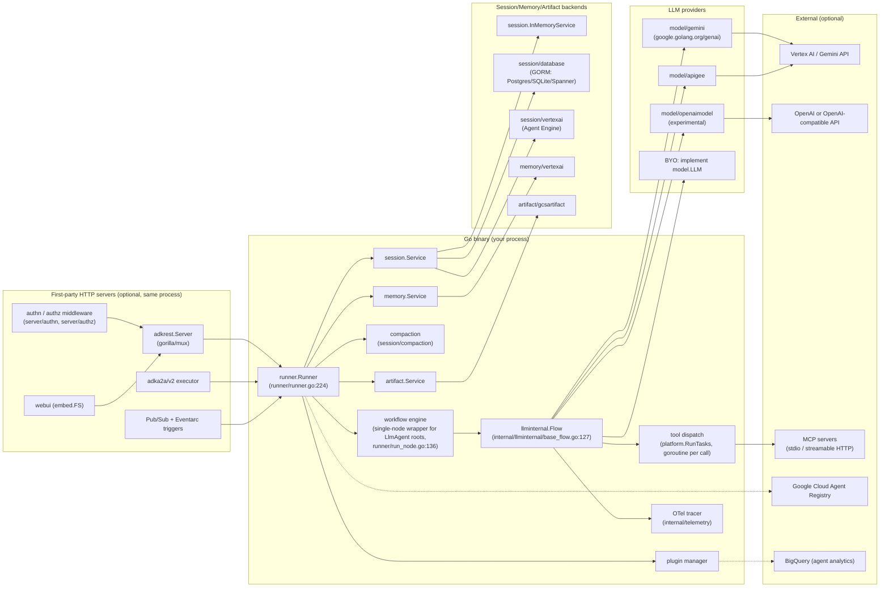
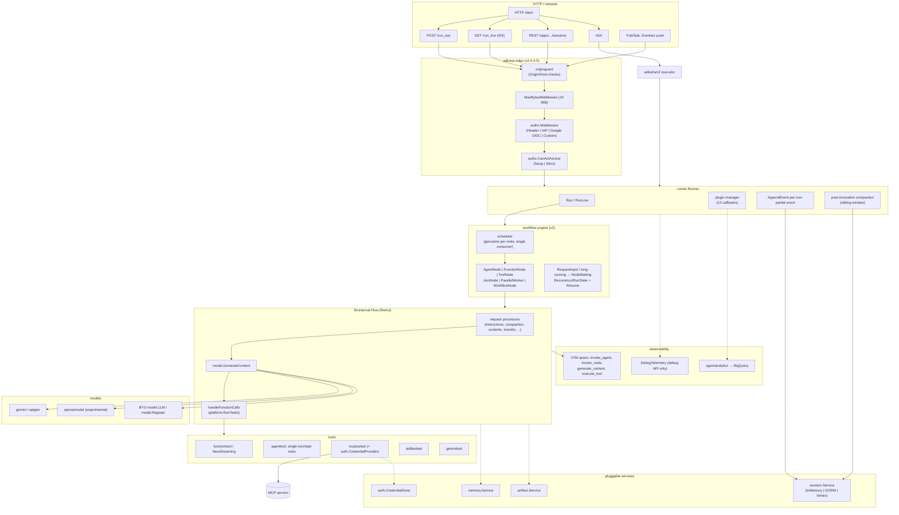

# ADK Go — Benchmark Analysis

> **Repo**: https://github.com/google/adk-go
> **Commit analysed**: `cb96cf16de065650b07ef504e317ace86a9e06b7` (v2.5.0 + 3 commits)
> **Branch**: `main`
> **Framework path**: `frameworks/adk-go/`
> **Analysed on**: 2026-10-01

## TL;DR

- ⭐ **What this is architecturally**: Google's official **Go-native** agent SDK + framework + first-party HTTP/WebSocket/A2A server + embedded Web UI. Library mode (`runner.New(...)`) and bundled launcher mode (`full.NewLauncher().Execute(...)`) live in the **same module**, which moved to **`google.golang.org/adk/v2`** with the v2.0.0 release (2026-06-30). The agent loop runs **in-process in your Go binary**: no subprocess, no sidecar, no Python bridge. Since v2, an `LlmAgent` root is executed through a new **graph workflow engine** (`workflow/`) wrapped as a single-node graph (`runner/run_node.go:136-143`); the ReAct loop itself is still `internal/llminternal/base_flow.go`.
- **Ecosystem** — **Go** (go.mod `go 1.26.6`). Python, Java, Kotlin and TypeScript ADKs are separate ports of the same agent model; nothing is bundled from them.
- **Open-source / license / support**: Apache 2.0, maintained by Google. No paid support specific to adk-go; Google Cloud (Vertex AI, Agent Engine, Cloud Run, Agent Registry) is the commercial counterpart.
- **Maturity / adoption (2026-10-01)**: 8,837 stars, 1,024 forks, ~111 contributors, repo created 2025-05-05. v1.0.0 shipped 2026-03-23, v2.0.0 on 2026-06-30, v2.5.0 on 2026-09-30. Two release lines are maintained in parallel (`main` = 2.x, `v1` = 1.x backports, latest v1.7.0). Roughly weekly-to-biweekly minor releases, CI guards the exported API against accidental breaks (`.github/workflows/apidiff.yml`).
- **Strongest fit for our use case**: Pure Go binary that fits a GKE/Cloud Run stack. First-party REST server with SSE + WebSocket + A2A, now with **pluggable authentication and per-user authorization** (`server/authn`, `server/authz`, v2.4.0+), `/health`, `/version`, request-size limits and an origin/DNS-rebinding guard. Event-sourced `session.Service` with GORM (Postgres/SQLite/Spanner) and Vertex Agent Engine backends. **Built-in context compaction** (sliding-window and token-threshold tail retention, `session/compaction/`, v2.3.0). Lazy `SKILL.md` skills. MCP client with per-request credential providers (`tool/mcptoolset/set.go:122`). A graph workflow engine with fan-out/fan-in, per-node retry/timeout and HITL pause/resume.
- **Biggest gap for our use case**: still **no tenant-scoped primitives, no per-tenant budget caps, no allow/deny tool policy, no Go eval framework**. The eval REST routes now answer a deliberate 501 that says "Use adk-python for eval workflows" (`server/adkrest/internal/routers/eval.go:23-35`). No USD cost. Workflow pause/resume is reconstructed from session history for HITL interrupts only; there is no crash-resume of a half-finished graph (`workflow/persistence.go:60-80`).
- **Most surprising finding**: the root agent no longer runs on the "classic" agent path. Every `LlmAgent` root is wrapped in a synthetic `START -> node` workflow so that all execution goes through one graph engine (`runner/run_node.go:130-143`). That gives uniform HITL/resume semantics, but it means the hot path now includes the scheduler (`workflow/scheduler.go`), and a few behaviours differ between root types (for example compaction and HITL resume are wired in both paths separately, `runner/runner.go:568-626`).
- **Second surprise**: provider lock-in eased but did not disappear. An **experimental OpenAI model** (`model/openaimodel/`, Responses and Chat Completions APIs, any OpenAI-compatible `BaseURL`) and a name-based model registry (`model/registry.go`) shipped in v2.1–v2.5. There is still **no native Anthropic adapter** (open issues #225, #1097), and every request/response is still a `genai.Content`.
- **Per-capability one-liners**:
  - **Sessions/persistence**: First-class event-sourced model. Three backends: in-memory, GORM (`database.NewSessionService` / `NewSessionServiceFromDB`), Vertex Agent Engine. Synchronous persistence per non-partial event (`runner/runner.go:764-770`). `app:`/`user:`/`temp:` state prefixes. Schema changes need `database.AutoMigrate` on every startup (v2.5 added two columns).
  - **Skills**: First-class `tool/skilltoolset` (agentskills.io spec), lazy (`list_skills` metadata in prompt, `load_skill` body on demand). Unchanged in substance since v1.2.
  - **Resource manager**: BYO. `skill.Source` + `MergedSource` only. New `agentregistry` package is a read-only client for Google Cloud Agent Registry (agents, MCP servers, model endpoints), not a skill registry.
  - **Sub-agents**: Four mechanisms: `agenttool` (agent-as-tool, isolated in-memory session), `transfer_to_agent`, **new `Mode`** on `llmagent` (`ModeSingleTurn` and `ModeTask` sub-agents become tools on the parent, `agent/llmagent/llmagent.go:138-180`), and the **new graph workflow** (`workflow/` + `agent/workflowagent`). Legacy `workflowagents/{parallel,sequential,loop}agent` still ship. Static registration only.
  - **Multi-tenancy**: No `tenant_id` field. Identity is `(AppName, UserID, SessionID)`, now exposed as a typed `agent.Identity` (`agent/common_context.go:57-70`). The REST server can authenticate a caller (`authn.Caller{UserID, Claims}`) and enforce caller == path user (`authz.NewStrict()`), but tenant claims and forced tool args are still hand-wired via `BeforeToolCallback`.
  - **Hooks**: 12 plugin callbacks + per-agent callbacks; plugin callbacks short-circuit agent-level ones. No `additional_messages`-style emission.
  - **API**: `server/adkrest` (REST + SSE `/run_sse` + WS `/run_live`), A2A (`server/adka2a/v2`), Agent Engine emulator, Pub/Sub + Eventarc triggers. No cancel endpoint; cancel = close the connection.
  - **Observability**: OTel GenAI semconv spans (`invoke_agent`, `invoke_node`, `generate_content`, `execute_tool`), opt-in prompt/response content on spans, new **BigQuery Agent Analytics plugin** (`plugin/agentanalytics`, separate Go module). Tokens only, no USD.
- **Production-readiness for multi-tenant server-side deployment**: **Conditional Yes**, stronger than at v1.2. The HTTP edge is now production-shaped (authn/authz seams, health, size limits, origin guard). Remaining glue for our case:
  1. **Tenant scoping**: no first-class tenant; put tenant in an authenticated claim (`authn.Caller.Claims`) or in a context value, and read it in callbacks/toolsets.
  2. **Forced tool args / tool policy**: `BeforeToolCallback` in-place mutation plus a wrapping `Toolset`. No declarative allow/deny, no hidden-arg annotation. Streaming tools bypass tool callbacks entirely (`internal/llminternal/base_flow.go:1359-1411`).
  3. **Eval**: Python-only.

  Vertex/GCP affinity: still optimised for Gemini/Vertex (genai types, Agent Engine, Agent Registry, IAP/OIDC authenticators, BigQuery analytics, Cloud Run deploy CLI). Not GCP-locked, but GCP-pulled.

---

## 0. General

### 0.1 What is this stack?

A **hybrid library + framework + bundled server**. As a library, you import `google.golang.org/adk/v2/runner` and embed the loop in your own HTTP server. As a framework, you import `google.golang.org/adk/v2/cmd/launcher/full` and let ADK serve the REST API, A2A server and Web UI on one port. README: "An open-source, code-first Go toolkit for building, evaluating, and deploying sophisticated AI agents with flexibility and control."

v2.0.0 added a **graph-based workflow engine** ("Agent workflows — a new graph-based orchestration engine", v2.0.0 release notes) and **collaboration agents** (`chat` / `task` / `single_turn` modes on `LlmAgent`), so ADK Go is now also a lightweight orchestration framework in the LangGraph sense, though without durable mid-run checkpointing.

### 0.2 Ecosystem

**Go** (`go.mod:3`, `go 1.26.6`). Module: `google.golang.org/adk/v2` (`go.mod:1`). The BigQuery analytics plugin is a separate module, `google.golang.org/adk/plugin/agentanalytics` (`plugin/agentanalytics/go.mod:1`).

Sibling ports exist in Python (`google/adk-python`), Java (`google/adk-java`), Kotlin (`google/adk-kotlin`) and TypeScript (`google/adk-js`) (README.md:18-24). They are **independent codebases**; adk-go subprocesses nothing. Several v2 features are explicit ports of adk-python behaviour (for example `workflow/persistence.go:60-80` cites `_rehydration_utils.py`).

### 0.3 Project status & governance

- **License**: Apache 2.0 (`LICENSE`), with an exception for `internal/httprr` (README.md).
- **Owner / maintainer**: Google. `.github/CODEOWNERS` was added in this period; PRs need a linked issue (`.github/workflows/require-linked-issue.yml`) and Google CLA.
- **Commercial backing**: Indirect, via Google Cloud (Vertex AI, Agent Engine, Cloud Run, Agent Registry, BigQuery). No adk-go-specific paid support.
- **Community support model**: GitHub issues, Reddit `r/agentdevelopmentkit` (README.md:6). No Discord/Slack of record.

### 0.4 Project maturity / age

- **Repository created**: 2025-05-05 (GitHub API). First GitHub release: v0.2.0 (2025-11-21); `v0.1.0` tag exists.
- **Current versions**: **v2.5.0** (2026-09-30) on `main`; **v1.7.0** (2026-09-14) on the `v1` maintenance branch. v1.0.0 shipped 2026-03-23, v2.0.0 on 2026-06-30. `internal/version/version.go:21` reads `2.5.0`.
- **Stability**: Public packages follow semver under the `/v2` module path; an `apidiff` CI job guards against accidental breaking changes (`.github/workflows/apidiff.yml`, `.github/scripts/apidiff.sh`). Some packages are marked experimental in their docs, notably `model/openaimodel` ("EXPERIMENTAL: This package is experimental", `model/openaimodel/doc.go:17-18`). `internal/` packages (`internal/configurable`, `internal/llminternal`, `internal/workflowinternal`) are unstable by Go convention.
- **Breaking-change policy in practice**: v2.0.0 moved the module path and changed `session.NewEvent` and the context types (README-v2.md:6-80). v2.5.0 still shipped breaking changes in a minor release (new DB columns, loopback default bind, cross-origin refusal, request size limits; see 1.7).

### 0.5 Adoption & community signal

Captured **2026-10-01** via `gh api repos/google/adk-go`:

| Signal | Value |
|---|---|
| Stars | 8,837 |
| Forks | 1,024 |
| Watchers | 106 |
| Contributors | ~111 (contributors API, anonymous included) |
| Open issues + PRs | 204 |
| Commits between previous analysis (v1.2.0+13, 2026-05-15) and this one | 276 |
| Commits in September 2026 | 100+ |
| Releases since 2026-05-19 | v1.3.0, v1.4.0, v1.5.0, v1.5.1, v1.6.0, v1.6.1, v1.7.0, v2.0.0, v2.1.0, v2.2.0, v2.3.0, v2.4.0, v2.5.0 |

Release automation is release-please (`.github/workflows/release.yml`, `.github/release-please-config.json`), with an automated `v1-needed` backport flow (`.github/workflows/backport.yml`, CONTRIBUTING.md:53-70). Maintainers are active: release notes show many first-time contributors per release, and PR review conventions are codified in `AGENTS.md` and `.agents/skills/adk-go-self-review/SKILL.md`.

### 0.6 Ecosystem fit

- **Module**: `google.golang.org/adk/v2`. Install with `go get google.golang.org/adk/v2` (README.md:47).
- **Registry**: https://pkg.go.dev/google.golang.org/adk/v2
- **CLI**: `cmd/adkgo` (deploy to Cloud Run / Agent Engine, `cmd/adkgo/internal/deploy/`) and `cmd/internal/adkcli` (scans for `root_agent.yaml`, `cmd/internal/adkcli/main.go:57-81`).
- **Examples**: 41 runnable `main.go` examples under `examples/` (workflow, multi-agent collaboration, compaction, OpenAI, agent registry, bidi streaming, MCP, skills, telemetry, tool confirmation, REST, web).
- **Usage modes**: (a) library (`runner.New`), (b) bundled launcher (`full.NewLauncher()`), (c) CLI/YAML (`root_agent.yaml` via `internal/configurable`, still internal).
- **Docs for coding agents**: `adk.dev/llms.txt` and `adk.dev/llms-full.txt` (README.md:50-56).

### 0.7 Documentation depth & cross-team contributor accessibility

- Official docs: https://google.github.io/adk-docs/ (README.md:18), with the newer `adk.dev` domain used for llms.txt and graph docs (`workflow/run_node.go` links `https://adk.dev/graphs/dynamic/`). One site covers Python, Go, Java, Kotlin, TypeScript; Python remains the most complete.
- Go API reference: https://pkg.go.dev/google.golang.org/adk/v2.
- In-code documentation is unusually thorough. Godoc comments explain design trade-offs at length (for example `session/compaction/compaction.go:15-40`, `server/adkrest/handler.go:155-260`).
- Per-example READMEs were added for the workflow samples (`examples/workflow/*/README.md`).

**Cross-team accessibility**: authoring an agent still means writing Go. Skills are the exception: a non-engineer can write a `SKILL.md`, but the toolset wiring is Go. The YAML path (`root_agent.yaml`, `internal/configurable/`, now including `configurable_workflow.go`) is still `internal/`.

### 0.8 Documentation entry points ⭐

- **Official docs landing page**: https://google.github.io/adk-docs/ (README.md:18); LLM-oriented index: https://adk.dev/llms.txt
- **Quickstart / getting-started**: https://google.github.io/adk-docs/get-started/
- **API reference**: https://pkg.go.dev/google.golang.org/adk/v2 (README.md:4 badge)
- **Hosting / deployment guide**: https://google.github.io/adk-docs/deploy/
- **Examples / demos**: https://github.com/google/adk-go/tree/main/examples (README.md:19)
- **Changelog / release notes**: no in-repo `CHANGELOG.md`; v1→v2 migration notes in https://github.com/google/adk-go/blob/main/README-v2.md
- **GitHub Releases**: https://github.com/google/adk-go/releases
- **GitHub issues tracker**: https://github.com/google/adk-go/issues — relevant open issues: #225 (Claude model support), #1097 (V1/V2 parity and OpenAI/Anthropic endpoint support), #540 (skills support, open although `skilltoolset` ships).
- **Reddit community**: https://www.reddit.com/r/agentdevelopmentkit/ (README.md:6)
- **Sister repos**: https://github.com/google/adk-python, https://github.com/google/adk-java, https://github.com/google/adk-kotlin, https://github.com/google/adk-js, https://github.com/google/adk-web
- **A2A Go SDK**: https://github.com/a2aproject/a2a-go (`go.mod:9,50`, v0.3.15 and v2.5.0)
- **Skills spec (referenced in code)**: https://agentskills.io/specification (`tool/skilltoolset/skill/frontmatter.go:37`)

---

## 1. High Level Architecture

### Deployment diagram ⭐


```mermaid
flowchart LR
  subgraph host["Go binary (your process)"]
    direction TB
    rt["runner.Runner<br/>(runner/runner.go:224)"]
    rt --> wf["workflow engine<br/>(single-node wrapper for LlmAgent roots,<br/>runner/run_node.go:136)"]
    wf --> flow["llminternal.Flow<br/>(internal/llminternal/base_flow.go:127)"]
    flow --> tools["tool dispatch<br/>(platform.RunTasks, goroutine per call)"]
    rt --> sessSvc["session.Service"]
    rt --> compact["compaction<br/>(session/compaction)"]
    rt --> artSvc["artifact.Service"]
    rt --> memSvc["memory.Service"]
    rt --> plugins["plugin manager"]
    flow --> tracer["OTel tracer<br/>(internal/telemetry)"]
  end

  subgraph servers["First-party HTTP servers (optional, same process)"]
    authn["authn / authz middleware<br/>(server/authn, server/authz)"]
    rest["adkrest.Server<br/>(gorilla/mux)"]
    a2a["adka2a/v2 executor"]
    webui["webui (embed.FS)"]
    trig["Pub/Sub + Eventarc triggers"]
  end
  authn --> rest
  rest --> rt
  a2a --> rt
  trig --> rt
  webui --> rest

  subgraph providers["LLM providers"]
    gemini["model/gemini<br/>(google.golang.org/genai)"]
    apigee["model/apigee"]
    oai["model/openaimodel<br/>(experimental)"]
    byo["BYO: implement model.LLM"]
  end
  flow --> gemini
  flow --> apigee
  flow --> oai
  flow --> byo

  subgraph stores["Session/Memory/Artifact backends"]
    inmem["session.InMemoryService"]
    pg["session/database<br/>(GORM: Postgres/SQLite/Spanner)"]
    vert["session/vertexai<br/>(Agent Engine)"]
    memVert["memory/vertexai"]
    gcs["artifact/gcsartifact"]
  end
  sessSvc --> inmem
  sessSvc --> pg
  sessSvc --> vert
  memSvc --> memVert
  artSvc --> gcs

  subgraph external["External (optional)"]
    vertex["Vertex AI / Gemini API"]
    openai["OpenAI or OpenAI-compatible API"]
    mcp["MCP servers<br/>(stdio / streamable HTTP)"]
    reg["Google Cloud Agent Registry"]
    bq["BigQuery (agent analytics)"]
  end
  gemini --> vertex
  apigee --> vertex
  oai --> openai
  tools --> mcp
  rt -.-> reg
  plugins -.-> bq
```

**Important**: every box inside the "Go binary" runs in the **same OS process**. There is no subprocess, no sidecar, no JSON-RPC bridge. MCP stdio servers are the only subprocesses, and only if you configure them.

### 1.1 Where does the agent loop *actually* execute?

**In your Go process.** `runner.Runner.Run` (`runner/runner.go:536`) resolves the session, and for an `LlmAgent` root hands off to `runNode` (`runner/runner.go:568-626`), which wraps the agent in a single-node `workflow.Workflow` (`runner/run_node.go:136-143`) and drives it through `workflow.Workflow.Run` / `Resume` (`runner/run_node.go:182-194`). The workflow node calls the agent, whose ReAct loop is still `internal/llminternal/base_flow.go:127-176` (`Flow.Run`). Non-LLM roots (e.g. a legacy `sequentialagent`) run on the older direct path (`runner/runner.go:632-788`).

Everything is plain Go (`iter.Seq2[*session.Event, error]`). The only thing outside your binary is the LLM provider (Gemini via `google.golang.org/genai`, or OpenAI via `openai-go`).

### 1.2 Runtime dependencies

- **Go 1.26.6** (`go.mod:3`). v2.0 release notes say "requires Go 1.25+", but the module now declares 1.26.6.
- **LLM provider**: Gemini API / Vertex AI, or OpenAI / any OpenAI-compatible endpoint (experimental), or BYO `model.LLM`.
- Optional **Postgres / SQLite / MySQL / Spanner** for `session/database` (you must run `database.AutoMigrate` on every startup, `session/database/service.go:74-94`).
- Optional **Vertex Agent Engine** (`session/vertexai`, `memory/vertexai`), **GCS** (`artifact/gcsartifact`), **BigQuery** (`plugin/agentanalytics`), **Google Cloud Agent Registry** (`agentregistry`).
- Optional external **MCP servers** (stdio subprocess or streamable HTTP).

No bundled binaries, no native libs.

### 1.3 Recommended deployment topology

README.md:40: "Easily containerize and deploy agents, with strong support for cloud-native environments like Google Cloud Run." `adkgo deploy` generates Dockerfiles and deploys to Cloud Run or Agent Engine (`cmd/adkgo/internal/deploy/cloudrun/cloudrun.go`, `cmd/adkgo/internal/deploy/agentengine/agentengine.go`).

The natural shape is **one Go binary per agent app** (Cloud Run service or GKE deployment), sessions in Cloud SQL Postgres or Agent Engine, **one process serving many users/tenants**. The REST server's godoc now explicitly says that a server reachable over a network "needs an Authenticator" (`server/adkrest/handler.go:203-210`), and v2.5 changed the web launcher to bind `127.0.0.1` by default (`cmd/launcher/web/web.go:367`): you must pass `-host 0.0.0.0` in a container.

Multi-tenant namespacing is still the composite key `(AppName, UserID, SessionID)` (`session/database/storage_session.go:31-41`).

### 1.4 Cold-start cost & instance footprint

Unchanged in kind:

- **Startup**: sub-second (Go binary + a lazy HTTPS client on first model call).
- **RAM baseline**: tens of MB.
- **Disk baseline**: tens of MB, larger with the embedded Web UI (`cmd/launcher/web/webui/webui.go:92`, `//go:embed distr/*`). The embedded UI bundle was refreshed in this period and accounts for ~12% of the changed files.

No equivalent of the 20–30 s startups seen in subprocess-based SDKs. Not measured in this analysis.

### 1.5 Vendor lock-in

| Axis | Lock-in | Notes |
|---|---|---|
| LLM provider | **Medium** (was Medium→High) | `LLMRequest.Contents` is still `[]*genai.Content` and `LLMResponse` embeds genai types (`model/llm.go:32-67`). First-party impls are now `gemini`, `apigee` and the **experimental** `openaimodel` (Responses + Chat Completions, any OpenAI-compatible `BaseURL`, `model/openaimodel/openaimodel.go:47-59`). No native Anthropic/Bedrock adapter. Gemini-only config fields are rejected by `openaimodel` (`model/openaimodel/doc.go:43-56`). |
| Hosting platform | **Low → Medium** | Runs anywhere Go runs. Deploy CLI, IAP/OIDC authenticators, Agent Engine backends and Agent Registry are GCP-specific but optional. |
| Session backend | **Low** | Three implementations; `session.Service` is 5 methods (`session/service.go:46-77`). |
| Eval platform | **N/A in adk-go** | Eval is Python-only (Q19). |
| Observability | **Low** | Standard OTel. The BigQuery analytics plugin is optional and GCP-specific. |

### 1.6 Framework weight / footprint

**Heavy, and heavier than at v1.2.** The diff from the previous analysis is 878 files, +156k/−8.7k lines (including tests and the embedded UI). Bundles:

- Run loop (`internal/llminternal/`)
- **Graph workflow engine** (`workflow/`, ~5k non-test lines) and `agent/workflowagent`
- Session store (in-memory, GORM, Vertex) + **compaction** (`session/compaction`, `internal/compactioninternal`)
- Memory (in-memory, Vertex), artifacts (in-memory, GCS)
- REST server (`server/adkrest/`) with **authn/authz** (`server/authn`, `server/authz`) and origin guard (`internal/originguard`)
- A2A server (`server/adka2a/`, `server/adka2a/v2/`), Agent Engine emulator (`server/agentengine/`)
- **Outbound auth** (`auth/`, `auth/gcp/`)
- **Agent Registry client** (`agentregistry/`)
- Model adapters (`model/gemini`, `model/apigee`, `model/openaimodel`) + name registry (`model/registry.go`)
- Plugins: `loggingplugin`, `retryandreflect`, `functioncallmodifier`, `agentanalytics` (BigQuery, separate module)
- Telemetry (OTel, GCP exporters), skills, MCP client, YAML config loader, record/replay plugins (internal)
- `platform/` seams for time, UUID and task fan-out (deterministic replay support)
- Web UI (embedded), CLI

Comparable to Mastra in scope. Lighter than LangGraph Platform (no durable checkpoint store), heavier than Vercel AI SDK.

### 1.7 Release-history signal

No in-repo `CHANGELOG.md`. Sources: GitHub Releases and `README-v2.md` (migration guide).

- **v1.3.0 (2026-05-19) / v1.4.0 (2026-05-29)**: Gemini Live bidi streaming (session resumption, streaming tools, sequential live run), a2a-go/v2, structured A2A errors, conformance record plugin.
- **v2.0.0 (2026-06-30)**: module path `google.golang.org/adk/v2`; graph **workflow engine** (static/dynamic graphs, conditional routing, fan-out/fan-in via `JoinNode`, parallel workers, per-node retries/timeouts, schema validation, HITL pause/resume); **collaboration agents** (`chat`/`task`/`single_turn`); **context unification** (`ToolContext` + `CallbackContext` → `agent.Context`, `agent.StrictContextMock`). Breaking: `session.NewEvent(ctx, invocationID)` (README-v2.md:8-43), mocks must implement the unified context (README-v2.md:45-80).
- **v2.1.0**: `platform.WithTaskRunner` (caller-controlled tool fan-out), model registry (`model.Register`/`NewLLM`), public `toolutils.PackTool`, `runner.NewInMemory`, Agent Registry client, `auth` package, MCP per-request auth (`mcptoolset.Config.Auth`), BigQuery Agent Analytics plugin, first OpenAI support (#1178).
- **v2.2.0**: h2c on the web launcher, Vertex `DeleteSession` ownership check, consistent `Event` JSON encoding.
- **v2.3.0**: `/health` endpoint, **context compaction** (sliding window + token-threshold), compaction available on every serving surface, opt-in GenAI content on spans.
- **v2.4.0**: **REST authentication and authorization** (#1561), `NewSessionServiceFromDB`, `session.ErrNotFound`, REST endpoints aligned with ADK Web.
- **v2.5.0 (2026-09-30)**: Google OIDC authenticator, GCP credential provider + `CredentialStore`, OpenAI Chat Completions, DNS-rebinding/cross-origin refusal, 10 MiB request-body limit, debug-only agent graph routes. Breaking items listed in the release: two new nullable columns on `events` (must run `AutoMigrate`), web launcher binds loopback by default, cross-origin browser requests refused, size limits, `gcp.Client.RetrieveCredential` return type, `artifact.SaveRequest` no longer comparable; telemetry `gen_ai.usage.input_tokens` now includes tool-use prompt tokens.

Fast-moving areas: workflow engine, compaction, server hardening, auth, OpenAI adapter. Breaking changes still land in minor releases, so pin versions and read each release's "Breaking changes" section.

---

## 2. Agent Loop

### Architectural overview

The harness is now a **three-level iterator stack** built on Go `iter.Seq2`:

1. **Runner (`runner.Runner.Run`)** — session lookup/creation, plugin lifecycle (`BeforeRun`/`AfterRun`/`OnEvent`), per-event persistence, post-invocation compaction.
2. **Workflow engine (`workflow.Workflow`)** — new in v2. For an `LlmAgent` root the runner builds a synthetic `START -> agentNode` graph (`runner/run_node.go:130-143`). The scheduler runs each node in its own goroutine and a single consumer goroutine applies state, yields events and schedules successors (`workflow/workflow.go:277-289`). HITL pauses become `NodeWaiting` and are resumed on a later turn.
3. **LLM flow (`llminternal.Flow.Run`)** — the ReAct loop: request processors → LLM call → response processors → tool dispatch → repeat until final (`internal/llminternal/base_flow.go:127-176`).

Tool dispatch is **parallel by default** through `platform.RunTasks` (`internal/llminternal/base_flow.go:1320-1501`), which runs one goroutine per call unless the caller installs its own `platform.TaskRunner` (`platform/exec.go:21-48`). The loop yields `*session.Event`, which is also the persisted unit.

### 2.1 Run loop entrypoint(s)

`runner/runner.go:536`:

```go
func (r *Runner) Run(
    ctx context.Context,
    userID, sessionID string,
    msg *genai.Content,
    cfg agent.RunConfig,
    opts ...RunOption,
) iter.Seq2[*session.Event, error]
```

Inputs: `userID`, `sessionID`, the user `*genai.Content`, `agent.RunConfig` (`StreamingMode`, `SaveInputBlobsAsArtifacts`, `agent/run_config.go:29-34`), and options: `WithStateDelta(map[string]any)` and, new, `WithYieldUserMessage()` (`runner/runner.go:89-111`).
Output: a range-over-func iterator of `(*session.Event, error)`.

Other entrypoints:

- `runner.NewInMemory(appName, agent)` — convenience constructor with in-memory session/artifact/memory services (`runner/runner.go:210-221`).
- `Runner.RunLive(ctx, userID, sessionID, agent.LiveRunConfig, opts...)` → `(agent.LiveSession, iter.Seq2[*session.Event, error], error)` for Gemini Live bidi streaming (`runner/runner.go:850`, `agent/live.go:22-48`).
- `workflow.Workflow.Run(ctx agent.InvocationContext)` and `Resume(...)` when you drive a graph yourself (`workflow/workflow.go:289`, `workflow/resume.go:73`). Usually you wrap the graph with `workflowagent.New(...)` and give it to a runner (`agent/workflowagent/workflow.go:45-60`).

### 2.2 Per-iteration behavior

One "step" of `Flow.runOneStep` (`internal/llminternal/base_flow.go:742-878`):

1. **Preprocessing** (`base_flow.go:754`): 14 ordered request processors (`base_flow.go:86-105`):
   - `basicRequestProcessor` — fills `req.Config`
   - `toolProcessor` — packs declarations from `Tools` + `Toolsets`
   - `authPreprocessor` — auth tool
   - `RequestConfirmationRequestProcessor` — HITL `adk_request_confirmation` handling
   - `instructionsRequestProcessor` — agent + global instructions with `{state}` templating
   - `identityRequestProcessor` — agent name/description
   - **`CompactionRequestProcessor`** (new) — token-threshold compaction before history is assembled
   - `ContentsRequestProcessor` — history, filtered by branch and `IsolationScope`
   - `nlPlanningRequestProcessor`, `codeExecutionRequestProcessor`, `outputSchemaRequestProcessor`
   - `AgentTransferRequestProcessor` — packs `transfer_to_agent`
   - `removeDisplayNameIfExists`
2. **LLM call** (`base_flow.go:772`, `callLLM` at `base_flow.go:945`): plugin `BeforeModelCallback`, then agent `BeforeModelCallbacks`, then `model.GenerateContent(ctx, req, stream)` inside a `generate_content` span (`base_flow.go:1039-1090`), then `AfterModelCallbacks` / `OnModelErrorCallbacks`.
3. **Postprocessing** (`base_flow.go:777`): `nlPlanningResponseProcessor`, `codeExecutionResponseProcessor`.
4. **Tool dispatch** (`base_flow.go:813`, `handleFunctionCalls` at `base_flow.go:1306`): one task per function call, merged into one event. Long-running tools and "deferred" tools return no response and pause the step (`base_flow.go:1424-1431`).
5. **Agent transfer** (`base_flow.go:848-860`): if `Actions.TransferToAgent` is set, run the target agent and yield its events.
6. **Loop continuation** (`base_flow.go:127-176`): repeat until `lastEvent.IsFinalResponse()` (`session/session.go:218-232`). New guards: a model that keeps producing thought-only turns is cut off after 10 in a row (`maxConsecutiveThoughtOnlyTurns`, `base_flow.go:125`), and a step that ends on a partial event stops with a warning (`base_flow.go:164-174`).

### 2.3 ReAct loop

**Yes, built-in.** `llmagent.New` wires `llminternal.Flow`. You configure agent + tools + callbacks; the framework runs the loop. v2 adds per-placement **modes** (`agent/llmagent/llmagent.go:343-367`): `ModeChat` (default at a runner root), `ModeTask` (multi-turn with the user until it calls `finish_task`), `ModeSingleTurn` (default at a workflow node; completes without chatting). The runner rejects a non-chat root (`runner/runner.go:577-582`).

### 2.4 Tool dispatch + result handling

`internal/llminternal/base_flow.go:1306-1507` (`Flow.handleFunctionCalls`), abridged:

```go
fnResponseEvents := make([]*session.Event, len(fnCalls))

// Tool calls run via the context's task runner: concurrent goroutines by
// default, or a caller-installed runner (platform.WithTaskRunner).
tasks := make([]func(context.Context), len(fnCalls))
for i, fnCall := range fnCalls {
    tasks[i] = func(taskCtx context.Context) {
        sctx, span := telemetry.StartExecuteToolSpan(taskCtx, ...)
        defer span.End()
        toolCallCtx := ctx.WithContext(sctx)
        toolCtx := agent.NewToolContext(toolCallCtx, fnCall.ID,
            &session.EventActions{StateDelta: make(map[string]any)}, confirmation)
        ...
        curTool, found = toolsDict[fnCall.Name]
        switch {
        case !found:            // OnToolErrorCallback chain on "tool not found"
        case streaming tool:    // RunStream: chunks to live session, or concatenated
        default:
            result = f.callTool(toolCtx, funcTool, fnCall.Args)
        }
        ev := session.NewEvent(ctx, ctx.InvocationID())
        ev.LLMResponse = model.LLMResponse{Content: &genai.Content{Role: "user",
            Parts: []*genai.Part{{FunctionResponse: &genai.FunctionResponse{
                ID: fnCall.ID, Name: fnCall.Name, Response: result}}}}}
        fnResponseEvents[i] = ev
    }
}
platform.RunTasks(ctx, tasks)
mergedEvent, err = mergeParallelFunctionResponseEvents(fnResponseEvents)
```

Results are matched to calls by `FunctionCall.ID` (filled by `utils.PopulateClientFunctionCallID` when the provider leaves it empty, `base_flow.go:999, 1164`). Parallel responses are merged into **one** event (`base_flow.go:1614`). `callTool` (`base_flow.go:1520-1566`) runs plugin `BeforeToolCallback` → agent `BeforeToolCallbacks` → `tool.Run` → `OnToolErrorCallback` chain → plugin `AfterToolCallback` → agent `AfterToolCallbacks`.

New in v2.1: `platform.WithTaskRunner(ctx, runner)` lets the host bound concurrency or run tool calls sequentially (`platform/exec.go:35-48`).

### 2.5 Explicit turn concept

A **turn boundary** is `event.IsFinalResponse()` (`session/session.go:218-232`): true when the event has no function calls/responses, is not partial and has no trailing code-execution result, or when it sets `SkipSummarization` or `LongRunningToolIDs`. Compaction events are explicitly *not* final (`session/session.go:219-225`). An **invocation** is one user message to one final response, carried by `InvocationID` on every event.

`agent/context.go:55-58`:

```
┌─────────────────────── invocation ──────────────────────────┐
┌──────────── llm_agent_call_1 ────────────┐ ┌─ agent_call_2 ─┐
┌──── step_1 ────────┐ ┌───── step_2 ──────┐
[call_llm] [call_tool] [call_llm] [transfer]
```

In a workflow, a node activation is an additional unit: node events carry `NodeInfo.Path` (`session/session.go:148-172`).

### 2.6 Event emission mechanism (in-process)

**`iter.Seq2[*session.Event, error]` at every layer** (runner, workflow, node, agent, flow). The workflow scheduler internally uses a buffered channel fed by per-node goroutines and drained by one consumer goroutine, then re-exposes an `iter.Seq2` (`workflow/workflow.go:277-289`, `workflow/scheduler.go:358-405`). `RunLive` uses channels underneath (`internal/llminternal/base_flow.go:261-318`) and re-wraps them as `iter.Seq2`.

---

## 3. Message & Event Taxonomy

### 3.1 Message layers

Three vocabularies, unchanged in shape:

1. **LLM provider layer** — `genai.Content` / `genai.Part` / `genai.FunctionCall` / `genai.FunctionResponse`. Canonical for every provider; `openaimodel` translates to and from OpenAI shapes (`model/openaimodel/internal/shared/contents.go`).
2. **Internal/persistence layer** — `session.Event` (`session/session.go:100-149`) embeds `model.LLMResponse` (`model/llm.go:42-67`) plus `EventActions` and bookkeeping. v2 added workflow fields: `IsolationScope`, `Routes`, `RequestedInput`, `Output`, `NodeInfo`. Persisted as `storageEvent` rows (`session/database/storage_session.go:73-109`) with JSON columns, including new `RoutesJSON`, `OutputJSON`, `NodeInfoJSON`, `RequestedInputJSON`, `IsolationScope`, `InputTranscription`, `OutputTranscription`.
3. **Wire layer (REST)** — `models.Event` (`server/adkrest/internal/models/event.go:39-64`), converted by `ToSessionEvent` / `FromSessionEvent` (`event.go:67, 113`). Request side: `models.RunAgentRequest` (`server/adkrest/internal/models/runtime.go:23-40`).

```
HTTP body                  in-memory                       DB row
RunAgentRequest  ──json──> *session.Event ──gorm──>    storageEvent
    └─ NewMessage:                ├─ LLMResponse               ├─ Content (JSON)
       genai.Content              │  └─ Content: *genai.Content
                                  ├─ Actions: EventActions     ├─ Actions (JSON bytes)
                                  │   └─ Compaction (v2.3)     │
                                  ├─ NodeInfo / Output (v2)    ├─ NodeInfoJSON / OutputJSON
                                  └─ LongRunningToolIDs        └─ LongRunningToolIDsJSON
```

### 3.2 Concrete message types

| Type | File | 1-line purpose |
|---|---|---|
| `genai.Content` / `genai.Part` | `genai` SDK | LLM-layer content; a Part is Text \| InlineData \| FunctionCall \| FunctionResponse \| CodeExecutionResult \| Thought \| FileData |
| `genai.FunctionCall` / `FunctionResponse` | `genai` SDK | Tool call (`Name`, `Args`, `ID`) and tool result |
| `model.LLMRequest` | `model/llm.go:32` | Internal request (Model, Contents, Config, Tools) |
| `model.LLMResponse` | `model/llm.go:42` | Internal response (Content, usage, Partial, TurnComplete, transcriptions, FinishReason) |
| `session.Event` | `session/session.go:100` | Persisted record (LLMResponse + Author + Actions + Branch + IsolationScope + InvocationID + workflow fields) |
| `session.EventActions` | `session/session.go:249-276` | StateDelta, ArtifactDelta, RequestedToolConfirmations, SkipSummarization, TransferToAgent, Escalate, **Compaction** |
| `session.EventCompaction` | `session/session.go:336-380` | Summary record: covered time range, summary content, excluded events |
| `session.NodeInfo` | `session/session.go:153-180` | Workflow node path and output routing |
| `session.RequestInput` | `session/session.go:184-215` | Workflow HITL prompt (InterruptID, Message, ResponseSchema, Payload) |
| `agent.LiveRequest` | `agent/live.go:28` | Bidi input frame |
| `models.Event` | `server/adkrest/internal/models/event.go:39` | REST wire event |
| `models.RunAgentRequest` | `server/adkrest/internal/models/runtime.go:23` | REST body for `/run`, `/run_sse` |
| `models.LiveRequest` | `server/adkrest/internal/models/runtime.go:67` | WebSocket frame for `/run_live` |

### 3.3 Messages vs. events

**One iterator yields events**. `session.Event` is the unified taxonomy for LLM output, tool calls/results, state deltas, compaction records, workflow outputs and HITL prompts. Partial events stream but are not persisted; non-partial events are persisted (`runner/runner.go:764-770`, `runner/run_node.go:235-240`).

### 3.4 Event categories

Categories are implicit, by populated fields on the single `Event` type:

| Category | Distinguishing fields |
|---|---|
| user-message event | `Author == "user"`, no `FunctionCall` |
| LLM streaming partial | `Partial == true` |
| LLM final response | not partial, no FunctionCall/FunctionResponse |
| tool-call event | `Content` contains `Part.FunctionCall` |
| tool-response event | `Content.Role == "user"` with one or more `Part.FunctionResponse` |
| state-delta event | `Actions.StateDelta` non-empty |
| transfer event | `Actions.TransferToAgent != ""` |
| tool-confirmation HITL | `FunctionCall.Name == "adk_request_confirmation"` (`tool/toolconfirmation/tool_confirmation.go:46`) |
| workflow HITL | `RequestedInput != nil`, `FunctionCall.Name == "adk_request_input"` (`workflow/request_input.go:36`) |
| long-running pause | `LongRunningToolIDs` non-empty |
| compaction record | `Actions.Compaction != nil`, no content (`session/session.go:276`) |
| workflow node output | `Output != nil`, `NodeInfo.Path` set |
| error event | `ErrorCode` / `ErrorMessage` set |
| transcription (live) | `InputTranscription` / `OutputTranscription` set |

There is still **no dedicated lifecycle event class** (run-started, sub-agent-started). Lifecycle is inferred from ordering, `Author`, `Branch` and `NodeInfo.Path`.

### 3.5 Canonical type-definition file(s)

- `session/session.go` — `Session`, `Event`, `EventActions`, `EventCompaction`, `NodeInfo`, `RequestInput`, state prefixes
- `model/llm.go` — `LLM`, `LLMRequest`, `LLMResponse`
- `agent/agent.go`, `agent/context.go`, `agent/common_context.go` — `Agent`, unified `Context`, `InvocationContext`, `ReadonlyContext`, `Identity`
- `agent/live.go` — live types
- `tool/tool.go` — `Tool`, `Toolset`, `Predicate`, `WithConfirmation`
- `workflow/workflow.go`, `workflow/state.go` — `Node`, `Edge`, `NodeStatus`, `RunState`
- `plugin/plugin.go` — plugin callbacks
- `server/adkrest/internal/models/event.go` — wire `Event`

### 3.6 Live agentic event stream taxonomy

Frames on `/run_sse` (`server/adkrest/controllers/runtime.go:226-314`, `Content-Type: text/event-stream; charset=UTF-8` since v2.5):

```
data: {"id":"01HE...","invocationId":"01HF...","author":"user",
       "content":{"role":"user","parts":[{"text":"Hello"}]},
       "actions":{"stateDelta":{},"artifactDelta":{}}}

data: {"id":"02HE...","invocationId":"01HF...","author":"agent_a","partial":true,
       "content":{"role":"model","parts":[{"text":"Hi"}]},"actions":{...}}

data: {"id":"03HE...","invocationId":"01HF...","author":"agent_a",
       "content":{"role":"model","parts":[{"functionCall":{
         "id":"call_1","name":"topicSearch","args":{"query":"foo"}}}]},"actions":{...}}

data: {"id":"04HE...","invocationId":"01HF...","author":"agent_a",
       "content":{"role":"user","parts":[{"functionResponse":{
         "id":"call_1","name":"topicSearch","response":{"results":[...]}}}]},"actions":{...}}

data: {"id":"05HE...","invocationId":"01HF...","author":"agent_a",
       "content":{"role":"model","parts":[{"text":"Here is the answer"}]},
       "usageMetadata":{"promptTokenCount":812,"candidatesTokenCount":41,"totalTokenCount":853},
       "actions":{...}}
```

Errors:

```
event: error
data: {"error":"..."}
```

Compaction failures are logged and not streamed as errors (`runtime.go:283-290`). Field names follow the `models.Event` JSON tags; values above are illustrative.

---

## 4. Agent Runtime (Multi-session Host)

### 4.1 Multi-session host architecture

`runner.Runner` (`runner/runner.go:224-240`) holds no per-session state. Each `Run` loads the session, executes, persists, and returns, so **one `*Runner` serves N concurrent sessions**. The workflow engine is also per-invocation: "A single returned agent instance can serve many concurrent sessions: the per-invocation run state lives in session.State, not on the agent" (`agent/workflowagent/workflow.go:39-44`).

The REST server builds a runner per request from the agent loader (`server/adkrest/controllers/runtime.go:353`), and Go's HTTP server gives one goroutine per request.

### 4.2 Concurrent session isolation

Enforced in the storage layer, as before:

- `session/database/service.go:410-492` — `applyEvent` runs in one GORM transaction.
- `session/database/service.go:424-434` — **stale-session check**: if the stored `UpdateTime` is newer than the in-memory session's, the append fails with `stale session error`. Optimistic concurrency per session; v2.3 fixed the timestamp precision (UnixMicro) and `UpdateTime` maintenance on app/user state writes.
- `session/database/session.go:36` — `sync.RWMutex` on the local session; v2.4 made `Events()` snapshot under the read lock for database and Vertex backends (#1559).

Two concurrent `Run` calls on one session ID: the second append fails. **Single-writer per session**.

Inside one process the new mode resolution is explicitly per-invocation rather than mutating the shared agent (`internal/llminternal/mode.go:19-25`, fix #1267), because one agent instance serves many concurrent invocations. Plugins are shared and must be thread-safe.

### 4.3 Horizontal scaling / multi-instance

**Supported** with a shared session store (`session/database`, `session/vertexai`). The stale-session check prevents lost updates across pods. No leader election.

Caveats:

- Each request reloads the session (DB round trip).
- **Live (bidi) sessions are pod-local**; `/run_live` needs sticky routing.
- **Workflow pauses survive across pods** because pause state is rebuilt from session events on the next turn (`runner/run_node.go:179-194`, `workflow/persistence.go:60-80`).
- `auth.InMemoryCredentialStore` is process-local (`auth/store.go:177-195`); use a shared `CredentialStore` implementation if credential caching must be shared.

### 4.4 Background / async / scheduled tasks

**Pub/Sub and Eventarc triggers** ship in the REST server:

- `server/adkrest/controllers/triggers/pubsub.go:76-113` — `PubSubTriggerHandler`, throttled by a semaphore (`pubsub.go:102-104`).
- `server/adkrest/controllers/triggers/eventarc.go` — same for Eventarc.
- `server/adkrest/controllers/triggers/config.go:20-29` — `TriggerConfig{MaxRetries, BaseDelay, MaxDelay, MaxConcurrentRuns}`.
- `RetriableRunner` retries with exponential backoff on resource exhaustion (`triggers/triggers.go:135-240`).

Trigger routes are covered by the 10 MiB body limit since v2.5. No cron scheduler; use Cloud Scheduler → Pub/Sub.

### 4.5 Worker pool / queue model

Still **request-scoped**. The trigger semaphore is the only worker-pool primitive. The workflow engine adds in-process concurrency control (`workflow.WithMaxConcurrency`, `workflow/workflow.go:199-213`; `ParallelWorker` with `maxConcurrency`, `workflow/parallel_worker.go:39`) and per-node `Timeout` / `RetryConfig` (`workflow/config.go:55-133`), but there is no durable queue: a run lives as long as the request/iterator that drives it. For long-running work: long-running tools or workflow HITL pauses (resume on a later request), or fire-and-forget Pub/Sub triggers.

---

## 5. Sessions & Persistence

### 5.1 Session / chat data model

`session.Session` interface (`session/session.go:40-55`):

```go
type Session interface {
    ID() string
    AppName() string
    UserID() string
    State() State
    Events() Events
    LastUpdateTime() time.Time
}
```

GORM model (`session/database/storage_session.go:31-41`):

```go
type storageSession struct {
    AppName    string `gorm:"primaryKey;"`
    UserID     string `gorm:"primaryKey;"`
    ID         string `gorm:"primaryKey;"`
    State      stateMap
    CreateTime time.Time `gorm:"precision:6"`
    UpdateTime time.Time `gorm:"precision:6"`
    Events []storageEvent `gorm:"foreignKey:AppName,UserID,SessionID;references:AppName,UserID,ID;constraint:OnDelete:CASCADE"`
}
```

Composite primary key `(AppName, UserID, ID)`. **No `tenant_id`**.

`storageEvent` (`session/database/storage_session.go:73-109`):

```go
type storageEvent struct {
    ID, AppName, UserID, SessionID string // composite PK
    InvocationID           string
    Author                 string
    Actions                []byte      // JSON-marshalled EventActions (incl. Compaction)
    LongRunningToolIDsJSON dynamicJSON
    RoutesJSON             dynamicJSON // v2 workflow
    OutputJSON             dynamicJSON // v2 workflow
    NodeInfoJSON           dynamicJSON // v2 workflow
    RequestedInputJSON     dynamicJSON // v2 workflow HITL
    Branch                 *string
    IsolationScope         *string     // v2
    Timestamp              time.Time `gorm:"precision:6"`
    Content, GroundingMetadata, CustomMetadata, UsageMetadata, CitationMetadata dynamicJSON
    InputTranscription, OutputTranscription dynamicJSON // v2.5 (#1662)
    Partial, TurnComplete *bool
    ErrorCode, ErrorMessage *string
    Interrupted *bool
}
```

Side tables `storageAppState` (`storage_session.go:397`) and `storageUserState` (`storage_session.go:409`) hold `app:` and `user:` scoped state.

### 5.2 What's stored on a session

- **Messages**: one `storageEvent` row per non-partial event (event-sourced).
- **Tool-call history**: function-call and function-response events, joined by `FunctionCall.ID`.
- **State** (`session/session.go:415-432`): `app:` (shared by every user of the app), `user:` (shared across a user's sessions in the app), `temp:` (dropped after the invocation; v2.5 also strips them from the stored event record in the in-memory and Vertex services), bare key = session. Prefixes do not compose (`app:temp:x` is app-scoped and persists, `session/session.go:417-419`).
- **Compaction records** (`Actions.Compaction`): summaries are appended as events; history is never rewritten (`session/compaction/compaction.go:15-22`).
- **Workflow state**: node outputs, routes, HITL requests on events.
- **Token usage**, grounding, citations, live transcriptions.
- **Artifacts**: separate `artifact.Service`; version pointers on `EventActions.ArtifactDelta`. v2.5 added guaranteed version metadata and `CustomMetadata` on `artifact.SaveRequest`.

### 5.3 Granularity

**One linear conversation per session**. No LangGraph-style fork. Two visibility filters scope what each agent sees:

- `Branch` (`agent_1.agent_2`) — used by parallel sub-agents and by `workflow.RunNode(..., WithUseSubBranch())` (`workflow/run_node.go`).
- `IsolationScope` (new) — exact-match filter for task-mode sub-agents (`session/session.go:117-121`, `internal/llminternal/contents_processor.go:142-150`).

Both filter the history sent to the LLM; storage is shared.

### 5.4 Built-in persistence stores

1. **In-memory** — `session.InMemoryService()` (`session/inmemory.go:41`).
2. **Database via GORM** (`session/database/service.go:52-94`):

   ```go
   func NewSessionService(dialector gorm.Dialector, opts ...gorm.Option) (session.Service, error)
   func NewSessionServiceFromDB(db *gorm.DB) (session.Service, error) // v2.4: share an existing pool
   func AutoMigrate(service session.Service) error                    // run on every startup
   ```

   Postgres, SQLite, MySQL, Spanner via GORM dialects (`gorm.io/gorm v1.31.2`, `go.mod:35`).
3. **Vertex AI Agent Engine** (`session/vertexai/vertexai.go:49`). Now accepts client-provided session IDs (`session/vertexai/vertexai_client.go:91-95`, #721) and enforces user ownership on delete (#1195).

No JSONL-on-disk, Redis or S3 store.

### 5.5 Persistence timing

**Per non-partial event, synchronously, in one transaction.** Both runner paths do the same thing.

Node path (`runner/run_node.go:235-240`):

```go
if !event.LLMResponse.Partial {
    if err := r.sessionService.AppendEvent(ictx, storedSession, event); err != nil {
        yield(nil, fmt.Errorf("failed to add event to session: %w", err))
        return
    }
}
```

Direct agent path: `runner/runner.go:764-770`. `AppendEvent` (`session/database/service.go:364-405`) assigns an ID if missing, truncates the timestamp to microseconds, strips `temp:` keys, then `applyEvent` (`service.go:410-492`) does stale-check → load app/user state → split the state delta by prefix → save state rows → insert event → bump `UpdateTime` → commit.

Partial events are never persisted. No async durability mode.

Two compaction write paths add to this: **sliding-window** summaries are appended after the invocation through the runner's normal append path (plugins see them), and **token-threshold** summaries are appended inside the invocation directly by the compaction processor, bypassing `OnEventCallback` plugins (`session/compaction/compaction.go:181-201`).

### 5.6 Mid-run checkpointing (durable)

**Per-event durability, plus HITL resume. No crash resume.**

- Every non-partial event is committed before the next is produced, so a crash loses at most the in-flight LLM response or tool batch (the merged tool-response event is written after all parallel tools finish).
- **Workflow pause/resume** (new): when a node yields a `RequestInput` or a long-running tool call, the node goes to `NodeWaiting` and the run ends. On the next turn the runner calls `wf.ReconstructRunState(session, invocationID)` (`runner/run_node.go:179-186`), which rebuilds node states by scanning session events for interrupts and their responses (`workflow/persistence.go:60-80`), then `wf.Resume(...)` (`workflow/resume.go:45-73`). This is history-based rehydration, not a stored checkpoint blob.
- **Not covered**: a process crash in the middle of a graph. `ReconstructRunState` "Returns (nil, nil) when no node has interrupt history" (`workflow/persistence.go:69-70`), so a crashed run is not resumed at the failed node; the next user message starts a fresh run. `NodeRunning` is documented as needing re-scheduling "after a process restart" (`workflow/state.go:39-42`), but no code path does that today. The workflow constructor also notes a TODO that a graph change between deploys "silently corrupts the resume path" (`workflow/workflow.go:247-252`).
- Per-node `RetryConfig` (`workflow/config.go:94-133`) retries failures in-process only.

Compared with LangGraph's per-task `put_writes`, ADK Go is still **per-event durability** with HITL-scoped resume.

### 5.7 Session ID format

UUID by default via the platform seam (`session/database/service.go:101-104`):

```go
sessionID := req.SessionID
if sessionID == "" {
    sessionID = platform.NewUUID(ctx)
}
```

`platform.WithUUIDProvider` / `WithTimeProvider` let a host make IDs and timestamps deterministic (`platform/uuid.go`, `platform/time.go`; README-v2.md:8-43). The Vertex backend now also accepts caller-provided IDs (see 5.4). Composite identity: `(AppName, UserID, SessionID)`. On a HITL reply the runner reuses the paused run's invocation ID so pause and answer share it (`runner/run_node.go:433-446`).

### 5.8 Pluggable store interface

**Yes.** `session.Service` (`session/service.go:46-77`):

```go
type Service interface {
    Create(context.Context, *CreateRequest) (*CreateResponse, error)
    Get(context.Context, *GetRequest) (*GetResponse, error)
    List(context.Context, *ListRequest) (*ListResponse, error)
    Delete(context.Context, *DeleteRequest) error
    AppendEvent(context.Context, Session, *Event) error
}
```

v2 tightened the contract in godoc: wrap `session.ErrNotFound` for missing sessions (`service.go:23-41`), assign IDs to ID-less events, and round-trip `EventActions.Compaction` (`service.go:52-75`). A shared conformance suite is public: `session/sessiontestsuite` (renamed from `session/session_test`). Use it to validate a custom backend.

### 5.9 Schema evolution / migration

Still GORM `AutoMigrate` (`session/database/service.go:74-94`): creates tables, adds columns, alters type/size/nullability, never drops. v2.5 documents that it "is meant to run on every startup" and the service "does not create its tables". The v2.5 release added two columns (`input_transcription`, `output_transcription`) and states that an un-migrated database **fails to write events** after upgrade. No versioned migration tool; if you manage DDL yourself (e.g. golang-migrate), track each release's "Breaking changes" section. The v2 workflow fields also arrived as new JSON columns.

### 5.10 Export / replay

- **Export**: `GET /apps/{app}/users/{user}/sessions/{id}` returns the event list (`server/adkrest/internal/routers/sessions.go:38-40`). `session.Event` now has a consistent JSON encoding (v2.2; `EventActions.MarshalJSON` and `Event.UnmarshalJSON`, `session/session.go:279-316, 489`).
- **Replay**: `internal/configurable/conformance/replayplugin/` replays recorded LLM responses and tool outputs; a matching `recordplugin` (`internal/configurable/conformance/recordplugin/record_plugin.go`) now records them. Both are **`internal/`**, so you must copy them. The `platform` time/UUID/task-runner seams are the public building blocks for deterministic replay.

### 5.11 Cross-session memory

Separate `memory.Service` (`memory/service.go:31-39`): `AddSessionToMemory`, `SearchMemory`. Implementations: in-memory (keyword) and Vertex. See Q17.

---

## 6. Multi-tenancy & Tenant Identity ⭐ THE KEY QUESTION

### 6.1 Run-loop tenant identity

`Runner.Run` (`runner/runner.go:536`) takes `ctx`, `userID`, `sessionID`, the message, `agent.RunConfig` and `RunOption`s. `AppName` is fixed on the `Runner` (`runner/runner.go:48-50`). The only per-call carrier for extra data is still `WithStateDelta(map[string]any)` (`runner/runner.go:96-101`), plus whatever you put on `ctx`.

What changed in v2:

- **`agent.Identity`** (`agent/common_context.go:57-70`) types the invocation identity as `{UserID, AppName, SessionID}` and `agent.IdentityFromContext(ctx)` recovers it from any plain `context.Context` derived from the invocation (`agent/common_context.go:242-253`). It is read live from the session. The godoc is explicit that ADK does not authenticate `UserID`: "ADK's own REST server takes it from the request body" (`agent/common_context.go:58-63`).
- **`authn.Caller{UserID, Claims map[string]any}`** (`server/authn/authn.go:47-55`) is put on the request context by the REST middleware when an `Authenticator` is configured, and is readable with `authn.CallerFromContext(ctx)`. Because the REST handler passes `req.Context()` into `Runner.Run` (`server/adkrest/controllers/runtime.go:279`), these claims are reachable from callbacks and tools through `ctx.Value` chaining.

There is still **no `tenant_id`, `targetingStrategyId` or `locale` field** anywhere in the run API or the session schema (`session/database/storage_session.go:31-41`). Options:

| Carrier | Scope | Trust | Notes |
|---|---|---|---|
| `AppName` | per runner / per app | server-controlled | Use one app per tenant if isolation of `app:` state, memory and artifacts must be total. |
| `UserID` | per user | from request body unless `authz.NewStrict()` is enforced | Composite IDs (`acme:u-123`) are a common workaround. |
| `ctx` value / `authn.Caller.Claims` | per request | server-controlled | Best fit for tenant identity. Not persisted, so it must be re-derived on every request. |
| `WithStateDelta` session key (`tenant_id`) | per session | **client-controlled on `/run_sse`** (`stateDelta` in the body) | Usable for instruction templating; do not trust it for authorization. |
| `app:` state key | **every user of the AppName** | — | Not a per-tenant carrier unless AppName = tenant. The previous version of this report used `app:tenant_id`; that is shared across all users of the app (`session/session.go:421-423`). |

### 6.2 Tenant identity propagation into tool calls

Call path:

1. `Runner.Run(ctx, ...)` builds the invocation context from `ctx` (`runner/run_node.go:270` `newNodeInvocationContext`, or `runner/runner.go:686-694` on the direct path).
2. `Flow.handleFunctionCalls` builds a per-call context with `agent.NewToolContext(toolCallCtx, fnCall.ID, &session.EventActions{...}, confirmation)` (`internal/llminternal/base_flow.go:1333-1338`).
3. The tool receives an **`agent.Context`** (v2 unified `ToolContext` and `CallbackContext` into one interface, `agent/context.go:138-240`).

Available on `agent.Context`:

```go
ctx.UserID(); ctx.AppName(); ctx.SessionID(); ctx.InvocationID(); ctx.Branch()
ctx.UserContent()            // *genai.Content that started the invocation
ctx.State()                  // session.State incl. app:/user: prefixes
ctx.ReadonlyState()
ctx.Artifacts(); ctx.SearchMemory(ctx, query)
ctx.FunctionCallID(); ctx.Actions(); ctx.ToolConfirmation(); ctx.RequestConfirmation(hint, payload)
ctx.Path(); ctx.RunID(); ctx.ResumedInput(id)   // workflow node info (v2)
ctx.Value(key)               // any value placed on the ctx passed to Runner.Run
```

### 6.3 Tool call interface

`functiontool.Func` (`tool/functiontool/function.go:73`):

```go
type Func[TArgs, TResults any] func(agent.Context, TArgs) (TResults, error)
```

Dispatch converts the LLM's `map[string]any` into `TArgs` against the inferred JSON schema (`tool/functiontool/function.go:186-250`):

```go
func (f *functionTool[TArgs, TResults]) Run(ctx agent.Context, args any) (result map[string]any, err error) {
    m, ok := args.(map[string]any)
    ...
    input, err := typeutil.ConvertToWithJSONSchema[map[string]any, TArgs](m, f.inputSchema)
    ...
    output, err := f.handler(ctx, input)
    ...
}
```

Since v2.2 function-call arguments may arrive as a JSON string or an object (#1254). A non-map result is wrapped only if it marshals (#1586).

### 6.4 Forcing tool arguments from the harness

**Partial support — BYO scaffolding.** The mechanism is unchanged: `BeforeToolCallback` (`agent/llmagent/llmagent.go:388-397`):

```go
// BeforeToolCallback is executed before a tool's Run method.
// ...
// To modify tool arguments and still run the tool,
// update args in place and return (nil, nil).
type BeforeToolCallback func(ctx agent.Context, tool tool.Tool, args map[string]any) (map[string]any, error)
```

Caveats:

- Per call, keyed on `tool.Name()`. A plugin-level `BeforeToolCallback` applies it across all agents, and a plugin returning a non-nil result **skips** agent-level callbacks (`internal/llminternal/base_flow.go:1523-1529`).
- **The schema still leaks the field**: no "injected arg" annotation hides it from the LLM. The cleaner pattern is not to declare `tenant_id` in `TArgs` at all and read it inside the tool from `ctx` (6.1).
- **Streaming tools are not covered**: `functiontool.NewStreaming` tools run through `RunStream` without `callTool`, so Before/After tool callbacks do not fire for them (`internal/llminternal/base_flow.go:1359-1411`).
- `plugin/functioncallmodifier` (`plugin/functioncallmodifier/plugin.go:27-45`) goes the other way: it *adds* fields to declarations and strips them from calls. It does not hide or force arguments.

### 6.5 Tenant-aware visible tool selection

**Yes, via `Toolset` + `Predicate`** (`tool/tool.go:51-125`):

```go
type Toolset interface {
    Name() string
    Tools(ctx agent.ReadonlyContext) ([]Tool, error)   // resolved per request
}
type Predicate func(ctx agent.ReadonlyContext, tool Tool) bool
func AllowedToolsPredicate(allowedTools []string) Predicate
func FilterToolset(toolset Toolset, predicate Predicate) Toolset
```

`Toolset.Tools(ctx)` runs per LLM request, so a predicate can branch on state or on a ctx value. Static `llmagent.Config.Tools` is **not** filtered per request; wrap tools in a `Toolset` for that. `mcptoolset.Config.ToolFilter` is now deprecated in favour of `tool.FilterToolset` (`tool/mcptoolset/set.go:124-128`).

Sub-agents remain a static `SubAgents []agent.Agent` list (`agent/agent.go:88-91`), skills are scoped by the `skill.Source` you pass at construction (Q11.5). No publish-time tenant scoping.

### 6.6 Per-tool-call auth propagation

**Improved: inbound and outbound seams now exist, but they are not joined to a tenant model.**

- **Inbound**: `adkrest.ServerConfig.Authenticator` / `Authorizer` (`server/adkrest/handler.go:169-200`). Built-in authenticators: `NewHeader(name)` (trusts a gateway header), `NewIdentityAwareProxy()` (Google IAP headers), `NewGoogleOIDC(cfg)` (ID-token validation with audience and service-account allow-list), `NewCustom(fn)`, `NewNoop()` (`server/authn/*.go`). Authorizer: `authz.NewStrict()` requires `Caller.UserID == {user_id}` in the path/body (`server/authz/strict.go:31-41`); it is checked on `/run`, `/run_sse`, `/run_live`, sessions, artifacts and debug routes (`server/adkrest/controllers/runtime.go:171, 243, 413`).
- **Outbound**: `auth.CredentialProvider` (`auth/providers.go:31-47`) resolves a credential per call from `ctx`; built-ins are `StaticToken`, `APIKey`, `TokenSourceProvider`, `ADC`, `ServiceAccount`. `auth/gcp.NewProvider` resolves **per-end-user** Google credentials from the Agent Identity / IAM Connector services using the acting user from the invocation identity (`auth/gcp/doc.go:15-26`). `auth.CredentialStore` caches per `{AppName, UserID, Key}` (`auth/store.go:46-82`). `mcptoolset.Config.Auth` applies a provider to every MCP HTTP request (`tool/mcptoolset/set.go:113-122`).
- **Gap**: `authn.Caller` is not automatically mapped to `session.UserID`; you set `userId` in the body and `authz.Strict` checks they match. `auth.ConsentRequiredError` is defined (`auth/providers.go:59-86`) and its doc says the tool layer turns it into a HITL consent round-trip, but no code outside `auth/` handles it at this commit.

### 6.7 Per-tenant rate limit + budget cap

**Not provided — BYO.** No token or USD cap, no rate limiter. `TriggerConfig.MaxConcurrentRuns` (`server/adkrest/controllers/triggers/config.go:27-28`) is global to a trigger. `LiveRunConfig.MaxLLMCalls` (`agent/live.go:48`) caps LLM calls per live run, not per tenant. Token counts are on each event's `UsageMetadata` for you to aggregate.

### ⭐ Required — light usage example

```go
package main

import (
    "context"
    "fmt"

    "google.golang.org/genai"

    "google.golang.org/adk/v2/agent"
    "google.golang.org/adk/v2/agent/llmagent"
    "google.golang.org/adk/v2/model/gemini"
    "google.golang.org/adk/v2/runner"
    "google.golang.org/adk/v2/session"
    "google.golang.org/adk/v2/tool"
    "google.golang.org/adk/v2/tool/functiontool"
)

type tenantKey struct{}
type Tenant struct{ ID, StrategyID string }

type TopicArgs struct {
    Query    string `json:"query"`
    TenantID string `json:"tenant_id,omitempty"` // visible in schema; overwritten below
}

func main() {
    ctx := context.Background()
    m, _ := gemini.NewModel(ctx, "gemini-2.5-flash", &genai.ClientConfig{})

    topicSearch, _ := functiontool.New(functiontool.Config{Name: "topicSearch", Description: "Search topics."},
        func(ctx agent.Context, a TopicArgs) (map[string]any, error) {
            return map[string]any{"results": []string{"surf@" + a.TenantID}}, nil
        })
    iabSearch, _ := functiontool.New(functiontool.Config{Name: "iabSearch", Description: "Search IAB."},
        func(ctx agent.Context, a struct{ Query string `json:"query"` }) (map[string]any, error) {
            return map[string]any{"iab": []string{"IAB1"}}, nil
        })
    audienceCreate, _ := functiontool.New(functiontool.Config{Name: "audienceCreate", Description: "Create audience."},
        func(ctx agent.Context, a struct{ Name string `json:"name"` }) (map[string]any, error) {
            return map[string]any{"id": "aud_42"}, nil
        })

    a, _ := llmagent.New(llmagent.Config{
        Name:        "predict_agent",
        Model:       m,
        Instruction: "You help marketers. Strategy: {targeting_strategy_id}.",
        // Step 2: only these three tools are registered; bashExec/webFetch never are.
        // For per-tenant selection, put them in a tool.FilterToolset with a ctx-aware Predicate.
        Tools: []tool.Tool{topicSearch, iabSearch, audienceCreate},
        BeforeToolCallbacks: []llmagent.BeforeToolCallback{
            // Step 3: force tenant_id server-side, whatever the LLM sent.
            func(ctx agent.Context, t tool.Tool, args map[string]any) (map[string]any, error) {
                if t.Name() == "topicSearch" {
                    tenant, ok := ctx.Value(tenantKey{}).(Tenant)
                    if !ok {
                        return nil, fmt.Errorf("no tenant on context")
                    }
                    args["tenant_id"] = tenant.ID
                }
                return nil, nil
            },
        },
    })

    r, _ := runner.New(runner.Config{AppName: "predict", Agent: a,
        SessionService: session.InMemoryService(), AutoCreateSession: true})

    // Step 1: tenant on ctx (server-controlled), user as userID, strategy as session state.
    ctx = context.WithValue(ctx, tenantKey{}, Tenant{ID: "acme", StrategyID: "strat-42"})
    msg := genai.NewContentFromText("Find topics relevant to surfers", genai.RoleUser)
    for ev, err := range r.Run(ctx, "u-123", "sess-1", msg,
        agent.RunConfig{StreamingMode: agent.StreamingModeSSE},
        runner.WithStateDelta(map[string]any{"targeting_strategy_id": "strat-42"})) {
        if err != nil {
            break
        }
        fmt.Println(ev.Author)
    }
}
```

What works:

- **Step 1**: `tenantId="acme"` travels on `ctx` (in the REST server, put it in `authn.Caller.Claims` from a custom `Authenticator` and read it with `authn.CallerFromContext`). `userId="u-123"` is the `userID` argument. `targetingStrategyId="strat-42"` is session state, templated into the instruction.
- **Step 2**: only the three tools are registered. Per-tenant variation needs a `Toolset` + `Predicate`.
- **Step 3**: `BeforeToolCallback` overwrites `args["tenant_id"]`; the LLM's value is discarded.

Caveats: the LLM still sees `tenant_id` in the `topicSearch` schema (drop it from `TopicArgs` and read the tenant inside the tool to avoid that). The ctx value is not persisted, so a HITL resume on a later request must re-establish it.

---

## 7. Hook & Middleware Capabilities (Context Engineering)

### 7.1 Enumerate every hook / middleware / lifecycle callback

Callbacks live in three places:

1. **`plugin.Config`** (`plugin/plugin.go:30-52`), registered on the runner (`runner.Config.PluginConfig`) or the REST server (`ServerConfig.PluginConfig`); fire for every agent.
2. **`llmagent.Config`** (`agent/llmagent/llmagent.go:183-352`), per LLM agent.
3. **`agent.Config`** (`agent/agent.go:88-108`): `BeforeAgentCallbacks` / `AfterAgentCallbacks` for any agent type (also on `workflowagent.Config`).

| Callback | Where | When it fires | Can do |
|---|---|---|---|
| `OnUserMessageCallback` | plugin | before the user message is appended | replace the `*genai.Content` |
| `BeforeRunCallback` | plugin | before the run starts | return content to short-circuit the run |
| `AfterRunCallback` | plugin | deferred at run end | read only (cleanup/metrics) |
| `OnEventCallback` | plugin | each event, before persist | replace/mutate the event |
| `BeforeAgentCallback` | plugin + agent | before each `agent.Run` | state delta; return content to skip the agent |
| `AfterAgentCallback` | plugin + agent | after `agent.Run` | state delta; return content to append a final event |
| `BeforeModelCallback` | plugin + llmagent | before each LLM call | mutate `*model.LLMRequest`; return a response to skip the call |
| `AfterModelCallback` | plugin + llmagent | after each LLM response | replace/mutate `*model.LLMResponse` |
| `OnModelErrorCallback` | plugin + llmagent | LLM error | convert error into a response |
| `BeforeToolCallback` | plugin + llmagent | before tool dispatch (non-streaming tools) | mutate `args` in place; return a result to skip the tool |
| `AfterToolCallback` | plugin + llmagent | after tool returns | replace/mutate result |
| `OnToolErrorCallback` | plugin + llmagent | tool error (incl. "tool not found") | convert error into a result |
| `InstructionProvider` / `GlobalInstructionProvider` | llmagent | each request (`instructionsRequestProcessor`) | return the system instruction dynamically |
| `Toolset.ProcessRequest` (`toolinternal.RequestProcessor`) | tool/toolset | each request (`base_flow.go:908-940`) | mutate `LLMRequest` (used by skills, confirmations) |
| `compaction.Summarizer` | runner/server config | when a compaction triggers | supply the summary content |

Shipped plugins: `loggingplugin`, `retryandreflect` (tool-error reflection/retry), `functioncallmodifier`, `agentanalytics` (BigQuery, separate module).

### 7.2 Hook concurrency model

**Sequential**, in registration order. Plugin callbacks run first; the first non-nil result or error wins and the remaining callbacks, **including agent-level ones**, are skipped (`internal/llminternal/base_flow.go:1520-1566` for tools, `base_flow.go:945-1000` for model). Within one tool batch, callbacks for different tool calls run concurrently on their own goroutines, so callbacks touching shared state must be thread-safe.

### 7.3 Specific capability tests

| Capability | Supported? | Where |
|---|---|---|
| Inject system messages at session start | ✅ | `InstructionProvider` per request; `BeforeAgentCallback` can write state; `{key}` templating from session state |
| Expand the user input | ✅ | plugin `OnUserMessageCallback` (`plugin/plugin.go:182`) |
| Mutate the messages list before each LLM call | ✅ | `BeforeModelCallback` gets a mutable `*model.LLMRequest` |
| Mutate tool input before dispatch | ✅ (non-streaming tools) | `BeforeToolCallback` |
| Mutate tool result before return to LLM | ✅ (non-streaming tools) | `AfterToolCallback` |
| Emit additional tool calls in response to a tool result | ❌ | No `additional_messages` equivalent. In a workflow you can route a tool node's output to another node, but that is graph wiring, not a hook. |

### 7.4 Auto-compaction

**Now built-in (v2.3.0).** `session/compaction` with two strategies (`session/compaction/compaction.go:157-219`):

```go
type Config struct {
    CompactionInterval int // sliding window: summarize every N completed invocations
    OverlapSize        int // invocations repeated across consecutive windows
    TokenThreshold     int // tail retention: compact mid-invocation once prompt tokens cross this
    EventRetentionSize int // raw events kept when tail retention fires (required with TokenThreshold)
    Summarizer         Summarizer // nil => LLMSummarizer over the root agent's model
}
```

- **Sliding window** runs after an invocation completes and its events are persisted (`runner/runner.go:263`, `compactAfterInvocation`), from a `defer` so it also runs when the consumer breaks out early. Failed invocations are never summarized (`runner/runner.go:541-552`).
- **Tail retention** runs inside the request pipeline via `CompactionRequestProcessor`, placed before `ContentsRequestProcessor` (`internal/llminternal/base_flow.go:93-95`, `internal/llminternal/compaction_processor.go:42`).
- History is never deleted: a summary event carries `Actions.Compaction` and the contents processor substitutes it for the covered range (`internal/llminternal/contents_processor.go:91, 129-131`).
- Default summarizer: `compaction.NewLLMSummarizer` with the root agent's model and `GenerateContentConfig`, bounded by a 60 s timeout (`runner/runner.go:158-207`). Non-LLM roots need an explicit `Summarizer`.
- Wiring: `runner.Config.Compaction` (`runner/runner.go:62-77`) or `adkrest.ServerConfig.Compaction` (server-wide, validated at startup, `server/adkrest/handler.go:44-69`).
- Trade-off documented in code: sliding window reduces prompt size by a constant factor, only tail retention bounds it, and tail-retention summaries bypass plugins (so a redaction plugin does not see them) (`session/compaction/compaction.go:181-201`).

### 7.5 Prompt cache optimization

**Not provided — BYO.** No automatic cache breakpoints or explicit context-cache management. Gemini's implicit caching happens provider-side; you can set `GenerateContentConfig.CachedContent` yourself. `openaimodel` rejects `CachedContent` (`model/openaimodel/doc.go:43-48`). Usage reports `CachedContentTokenCount` when the provider returns it.

### 7.6 Tool result clearing

**Not provided — BYO.** No API removes or stubs a tool result in history. Workarounds: shrink results in `AfterToolCallback` before they are persisted, or rewrite `req.Contents` in `BeforeModelCallback` (affects the prompt, not storage). Compaction eventually folds old tool outputs into a summary, and the `LLMSummarizer` truncates long tool content in the transcript it summarizes (`MaxToolContentChars`, `session/compaction/llm_summarizer.go:112-120`). Since v2.5, a function call with no response is no longer sent to the model (#1669).

### 7.7 Progressive disclosure

Partial, through tools rather than a generic mechanism:

- **Skills**: frontmatter only in the system prompt, body via `load_skill`, files via `load_skill_resource` (Q10).
- **Artifacts**: `loadartifactstool` lists artifact names and loads content on demand (`tool/loadartifactstool/load_artifacts_tool.go`); v2.5 lets sub-agents run via `agenttool` share artifacts with the parent (#1654).
- **Memory**: `loadmemorytool` (on demand) vs `preloadmemorytool` (eager).
- **Compaction** keeps a summary in place of old history.

No filesystem-stash or summary-handle primitive for arbitrary tool outputs.

### 7.8 Architectural diagram of where hooks fire across the loop

```
Runner.Run(ctx, userID, sessionID, msg, cfg)
  ├─ session Get / Create
  ├─ [LlmAgent root] build workflow START -> agentNode; ReconstructRunState (HITL resume?)
  ├─ plugin.OnUserMessageCallback(msg)
  ├─ sessionService.AppendEvent(userMsg)
  ├─ plugin.BeforeRunCallback ── content? ──> early exit
  │
  └─ for ev := range workflow.Run / Resume  (or agent.Run on the direct path)
       ├─ node span "invoke_agent <name>"
       ├─ agent BeforeAgentCallbacks  (plugin first)
       └─ Flow.Run loop, each step:
            ├─ request processors: basic, tools(+Toolset.ProcessRequest), auth, confirmations,
            │    InstructionProvider, identity, Compaction(tail retention), contents, ...
            ├─ callLLM: plugin.BeforeModel → agent BeforeModel → GenerateContent
            │           → OnModelError (on error) → plugin/agent AfterModel
            ├─ response processors
            └─ handleFunctionCalls (platform.RunTasks, one task per call):
                 plugin.BeforeTool → agent BeforeTool → tool.Run
                 → OnToolError → plugin.AfterTool → agent AfterTool
                 (streaming tools: RunStream only, no tool callbacks)
       agent AfterAgentCallbacks
   per event:
     ├─ plugin.OnEventCallback(ev)
     ├─ if !ev.Partial: sessionService.AppendEvent
     └─ yield(ev)
   after loop / defer:
     ├─ sliding-window compaction (summary event via normal append path)
     └─ plugin.AfterRunCallback
```

### ⭐ Required — light usage example

```go
package main

import (
    "fmt"

    "google.golang.org/adk/v2/agent"
    "google.golang.org/adk/v2/agent/llmagent"
    "google.golang.org/adk/v2/plugin"
    "google.golang.org/adk/v2/runner"
    "google.golang.org/adk/v2/session"
    "google.golang.org/adk/v2/session/compaction"
    "google.golang.org/adk/v2/tool"
)

type tenantKey struct{}

func main() {
    // (1) "SessionStart": no hook by that name. InstructionProvider runs on every request
    //     and can read state; the tenant comes from ctx.
    instructions := func(ctx agent.ReadonlyContext) (string, error) {
        tenant, _ := ctx.Value(tenantKey{}).(string) // ReadonlyContext embeds context.Context
        locale, _ := ctx.ReadonlyState().Get("user:locale")
        return fmt.Sprintf("tenant=%s, locale=%v, today=2026-05-16. Use tools to look up topics.",
            tenant, locale), nil
    }

    // (2) PreToolUse on topicSearch: force tenantId server-side.
    beforeTool := func(ctx agent.Context, t tool.Tool, args map[string]any) (map[string]any, error) {
        if t.Name() == "topicSearch" {
            args["tenant_id"], _ = ctx.Value(tenantKey{}).(string)
        }
        return nil, nil
    }

    // (3) PostToolUse: >50 results -> summarize in place before it reaches the LLM and the DB.
    afterTool := func(ctx agent.Context, t tool.Tool, args, result map[string]any, err error) (map[string]any, error) {
        if t.Name() == "topicSearch" {
            if rs, ok := result["results"].([]any); ok && len(rs) > 50 {
                return map[string]any{"results": rs[:5], "truncated_from": len(rs)}, nil
            }
        }
        return nil, nil // keep original result
    }

    audit, _ := plugin.New(plugin.Config{
        Name: "audit",
        OnEventCallback: func(ic agent.InvocationContext, ev *session.Event) (*session.Event, error) {
            fmt.Printf("[audit app=%s user=%s] author=%s\n", ic.Session().AppName(), ic.Session().UserID(), ev.Author)
            return nil, nil
        },
    })

    a, _ := llmagent.New(llmagent.Config{
        Name: "predict_agent", Model: nil, // attach a model
        InstructionProvider: instructions,
        BeforeToolCallbacks: []llmagent.BeforeToolCallback{beforeTool},
        AfterToolCallbacks:  []llmagent.AfterToolCallback{afterTool},
    })

    _, _ = runner.New(runner.Config{
        AppName: "predict", Agent: a, SessionService: session.InMemoryService(),
        PluginConfig: runner.PluginConfig{Plugins: []*plugin.Plugin{audit}},
        // Built-in compaction (v2.3+): summarize every 5 invocations, and compact
        // mid-turn once the prompt exceeds 100k tokens, keeping the last 20 events raw.
        Compaction: &compaction.Config{CompactionInterval: 5, TokenThreshold: 100_000, EventRetentionSize: 20},
    })
}
```

Notes:

- `ReadonlyContext` embeds `context.Context` (`agent/context.go:121-124`), so `ctx.Value` works in an `InstructionProvider` as well as in tool callbacks.
- No `SessionStart` hook by name. `BeforeAgentCallback` is the other option (runs once per agent activation).
- Returning `(nil, nil)` from `AfterToolCallback` keeps the original result; returning a map replaces it.
- An `OnEventCallback` plugin is the audit sink, but tail-retention compaction summaries bypass it (7.4).

---

## 8. HTTP API

### 8.1 Does the framework ship an HTTP server?

**Yes, first-party, in the same module:**

1. **REST API** — `server/adkrest/` (`adkrest.NewServer(ServerConfig)` returns an `http.Handler`, `server/adkrest/handler.go:55-148`). `gorilla/mux` based.
2. **A2A protocol server** — `server/adka2a/v2/` (a2a-go v2) and the older `server/adka2a/`.
3. **Agent Engine emulator** — `server/agentengine/`, now including `streaming_agent_run_with_events`.
4. **Triggers** — Pub/Sub and Eventarc push endpoints (`server/adkrest/controllers/triggers/`).
5. **Web UI** — embedded Angular build (`cmd/launcher/web/webui/webui.go:92`).

Launchers compose these: `full`, `prod`, `universal`, `web` (with `api`, `a2a`, `webui`, `triggers` sub-launchers), `console`, `agentengine` (`cmd/launcher/`). Library mode (`runner.Run` behind your own handler) remains fully supported.

### 8.2 HTTP streaming protocol (SSE/WS)

| Transport | Endpoint | Purpose |
|---|---|---|
| **SSE** (`text/event-stream; charset=UTF-8`) | `POST /run_sse` | Stream `session.Event` JSON frames |
| **WebSocket** (`gorilla/websocket`) | `GET /run_live` | Bidi live (audio, text, tool calls, transcriptions); frames > 16 MiB close the connection (v2.5) |
| **JSON one-shot** | `POST /run` | Block until done, return the event array |

Optional **h2c** on the web launcher (`-h2c`, `cmd/launcher/web/web.go:374`). The wire format is ADK's own event JSON; no Vercel AI SDK or AG-UI protocol adapter.

### 8.3 HTTP endpoints that start an agent run

Routes (`server/adkrest/internal/routers/runtime.go:36-54`):

```
POST /run        → JSON array of events
POST /run_sse    → SSE stream of events
GET  /run_live   → WebSocket (query: appName|app_name, userId|user_id, sessionId|session_id)
```

Body for `/run` and `/run_sse` (`server/adkrest/internal/models/runtime.go:23-40`):

```json
{
  "appName": "predict",
  "userId": "u-123",
  "sessionId": "sess-1",
  "newMessage": { "role": "user", "parts": [{"text": "hi"}] },
  "streaming": true,
  "stateDelta": { "targeting_strategy_id": "strat-42" },
  "functionCallEventId": "optional, accepted for adk-python parity, ignored"
}
```

The session must exist (`validateSessionExists`, `runtime.go:249-253`, 404 otherwise). Session routes (`server/adkrest/internal/routers/sessions.go:36-74`):

```
GET    /apps/{app_name}/users/{user_id}/sessions
POST   /apps/{app_name}/users/{user_id}/sessions
POST   /apps/{app_name}/users/{user_id}/sessions/{session_id}
GET    /apps/{app_name}/users/{user_id}/sessions/{session_id}
PATCH  /apps/{app_name}/users/{user_id}/sessions/{session_id}      (new: update session)
DELETE /apps/{app_name}/users/{user_id}/sessions/{session_id}
```

Plus artifacts (`.../sessions/{session_id}/artifacts[/{name}[/versions/{v}]]`), `GET /list-apps`, `GET /version`, `GET /health`, and debug/graph routes when `IncludeDebugAPI` is set. All bodies are capped at 10 MiB by default (`MaxBytesMiddleware`, `server/adkrest/handler.go:85-88`, `server/adkrest/middleware.go`).

### 8.4 Interrupt / cancel in-flight run

**Close the connection.** The SSE handler runs the agent on `req.Context()` (`server/adkrest/controllers/runtime.go:279`), so a client disconnect cancels the context and the iterator stops; v2 fixed nil event loops after cancellation (#1479) and propagates cancellation into workflow nodes (#1258). For `/run_live`, send `{"close": true}` (`models.LiveRequest.Close`, `server/adkrest/internal/models/runtime.go:67-73`) or close the socket.

**No `DELETE /run/{id}` or cancel endpoint**, and no run ID to target one from another connection or pod. Cross-pod cancel is BYO.

### 8.5 Resume / replay endpoint

- **Reopen a session**: `GET .../sessions/{session_id}` returns the persisted events; render them client-side. No server-side replay of the live stream, no `Last-Event-ID` support.
- **Continue a paused run**: there is no `/resume` route. Send the HITL answer as a `functionResponse` in `newMessage` to `/run_sse`. On the node path the runner rebuilds the paused workflow from history and calls `Resume` (`runner/run_node.go:179-194`, `buildResumeResponses` at `run_node.go:326`).
- **Live**: Gemini session resumption via `LiveRunConfig.SessionResumption` (`agent/live.go:46`).

### 8.6 HITL approval workflow

Two pause mechanisms, both answered through the normal run endpoint:

1. **Tool confirmation** — a tool with `RequireConfirmation` / `RequireConfirmationProvider`, or one that calls `ctx.RequestConfirmation(hint, payload)`, causes an `adk_request_confirmation` function call (`tool/toolconfirmation/tool_confirmation.go:46`). Applies to function tools, MCP toolsets and (since v2.5) streaming tools (#1596).
2. **Workflow input request** (v2) — a node yields `workflow.NewRequestInputEvent(...)`, producing an `adk_request_input` function call with `RequestedInput{InterruptID, Message, ResponseSchema, Payload}` (`workflow/request_input.go:36-72`, `session/session.go:184-215`). The resume payload is validated against `ResponseSchema` (`workflow/resume.go:253`).

Client flow: detect the call (and `longRunningToolIds` on the event), ask the user, then `POST /run_sse` with `newMessage.parts[].functionResponse` using the **same `id`** and the function name. `findAgentToRun` / `handleUserFunctionCallResponse` route the reply to the agent that asked (`runner/runner.go:1151-1210`). The pause is observable only through the event content; there is no run-status endpoint. v2 added several correctness fixes (confirmations resumed only from agent-authored events #1357, conflicting confirmations rejected #1369, request-order resume #1169). The `console` launcher can now answer HITL prompts in a terminal (`cmd/launcher/console/hitl.go`).

### 8.7 Token streaming

All three kinds arrive as the same `data: <models.Event JSON>` frame (`server/adkrest/controllers/runtime.go:329-338`), distinguished by fields:

- **Text delta**: `partial: true` with a text part.

  ```
  data: {"id":"…","author":"predict_agent","partial":true,"content":{"role":"model","parts":[{"text":"Top top"}]},"actions":{…}}
  ```

- **Partial tool arguments**: the stream aggregator yields every raw provider chunk as a partial event and assembles function-call arguments from `partialArgs` / `willContinue` into the final non-partial event (`internal/llminternal/stream_aggregator.go:59-76, 129-175`). Only models/backends that stream arguments produce them; the genai SDK marks these fields "not supported in Gemini API" (Vertex only). Illustrative partial frame:

  ```
  data: {"partial":true,"content":{"role":"model","parts":[{"functionCall":{"name":"topicSearch","partialArgs":[{"jsonPath":"$.query","stringValue":"surf"}],"willContinue":true}}]}}
  ```

- **Agent activity**: complete tool-call and tool-result events (non-partial), state-delta events, transfer events, workflow node outputs (`output`, `nodeInfo.path`), compaction events. No dedicated lifecycle frames (`run_started`, `tool_started`).

### 8.8 Authentication & Authorisation

**Now first-party (v2.4.0+, #1561).** `adkrest.ServerConfig` (`server/adkrest/handler.go:169-200`):

```go
// Authenticator authenticates inbound requests to every endpoint except the
// public ones (/health and /version) ... When nil it defaults to [authn.Noop] ...
Authenticator authn.Authenticator
// Authorizer decides whether the authenticated caller's identity may act as the user
// named in a request ... When nil it defaults to [authz.Noop] ...
Authorizer authz.Authorizer
```

- **Authentication**: `authn.Middleware` wraps every non-public route (`server/adkrest/internal/routers/routers.go:44-49, 93`) and answers 401/403/500. Providers: `NewHeader`, `NewIdentityAwareProxy`, `NewGoogleOIDC` (v2.5, audience + allowed service accounts, `server/authn/googleoidc.go:61-104`), `NewCustom`, `NewNoop`.
- **Authorization**: one check, `CanActAsUser(ctx, userID)` (`server/authz/authz.go:30-35`). `authz.NewStrict()` requires the authenticated `UserID` to equal the request's `userId` (`server/authz/strict.go:31-41`). Enforced in runtime, sessions, artifacts and debug controllers.
- **Browser hardening (v2.5)**: origin/Host checks against `AllowedOrigins` and `BindHost` to block cross-origin and DNS-rebinding access (`internal/originguard/originguard.go`, `server/adkrest/handler.go:202-260`).
- **Not provided**: tenant-level or resource-level authorization (e.g. "user may act only within tenant acme"), app-level authorization (`appName` is not checked), RBAC. Defaults are open (`Noop`), so a deployment without an `Authenticator` is unauthenticated.

### 8.9 Tool-call state reconstruction

**Explicit `FunctionCall.ID`.** The framework fills missing IDs (`utils.PopulateClientFunctionCallID`, `internal/llminternal/base_flow.go:999, 1164`); every `functionResponse` carries the same `id`. Parallel tool results arrive as one event with several `functionResponse` parts. Client side: join `content.parts[].functionCall.id` to a later `content.parts[].functionResponse.id`. For long-running tools, `longRunningToolIds` on the call event lists the IDs whose responses will come later (from the client). `FunctionCall.Args` is always serialized as `{}` rather than omitted (`server/adkrest/internal/models/event.go:150-160`).

### 8.10 Health checks / graceful shutdown

- **`GET|HEAD /health`** → `{"status":"ok"}`, public, registered before auth (`server/adkrest/handler.go:90`, v2.3.0). Liveness only; no readiness check of the session store.
- **`GET /version`** → ADK version, public (`server/adkrest/internal/routers/version.go:36-44`).
- **Graceful shutdown**: the web launcher calls `srv.Shutdown` on context cancellation with `-shutdown-timeout` (default 15 s) and now shuts telemetry down too (`cmd/launcher/web/web.go:200-246, 372`).
- **Metrics**: no `/metrics` route; OTel exporters only.
- Request size limit: `-max_request_body_size` (default 10 MiB, `cmd/launcher/web/web.go:375`).

### ⭐ Required — light usage example

Server side (Go), so that `X-Tenant-Id` is actually consumed:

```go
srv, _ := adkrest.NewServer(adkrest.ServerConfig{
    SessionService: sessSvc, AgentLoader: agent.NewSingleLoader(rootAgent),
    // Gateway has already validated the JWT and sets these headers.
    Authenticator: authn.NewCustom(func(r *http.Request) (*authn.Caller, error) {
        uid, tenant := r.Header.Get("X-User-Id"), r.Header.Get("X-Tenant-Id")
        if uid == "" || tenant == "" {
            return nil, authn.ErrUnauthenticated
        }
        return &authn.Caller{UserID: uid, Claims: map[string]any{"tenant_id": tenant}}, nil
    }),
    Authorizer: authz.NewStrict(), // body userId must equal the authenticated user
})
// Tools/callbacks: caller, _ := authn.CallerFromContext(ctx); caller.Claims["tenant_id"]
```

```bash
# 1. Create the session, then start a run
curl -X POST http://localhost:8080/apps/predict/users/u-123/sessions/sess-1 \
  -H 'X-User-Id: u-123' -H 'X-Tenant-Id: acme' -H 'Content-Type: application/json' -d '{}'

curl -N -X POST http://localhost:8080/run_sse \
  -H 'X-User-Id: u-123' -H 'X-Tenant-Id: acme' -H 'Content-Type: application/json' \
  -d '{"appName":"predict","userId":"u-123","sessionId":"sess-1","streaming":true,
       "newMessage":{"role":"user","parts":[{"text":"find topics for surfers"}]}}'

# 2. SSE stream (abridged)
# data: {"author":"predict_agent","content":{"role":"model","parts":[{"functionCall":{"id":"call_1","name":"topicSearch","args":{"query":"surfers"}}}]},...}
# data: {"author":"predict_agent","content":{"role":"user","parts":[{"functionResponse":{"id":"call_1","name":"topicSearch","response":{"results":["surfing"]}}}]},...}
# data: {"author":"predict_agent","content":{"role":"model","parts":[{"text":"Top topics: surfing"}]},"usageMetadata":{...},...}

# 3. Cancel mid-flight: no endpoint. Close the connection (Ctrl-C); req.Context() is cancelled.

# 4. HITL approval for a paused adk_request_confirmation call with id "call_42"
curl -N -X POST http://localhost:8080/run_sse \
  -H 'X-User-Id: u-123' -H 'X-Tenant-Id: acme' -H 'Content-Type: application/json' \
  -d '{"appName":"predict","userId":"u-123","sessionId":"sess-1","streaming":true,
       "newMessage":{"role":"user","parts":[{"functionResponse":{
         "id":"call_42","name":"adk_request_confirmation","response":{"confirmed":true}}}]}}'
```

WebSocket variant: `wscat -c 'ws://localhost:8080/run_live?appName=predict&userId=u-123&sessionId=sess-1'`, then send `{"content":{"role":"user","parts":[{"text":"hello"}]}}`. When served through the `web` launcher the API is mounted under `-path_prefix` (default `/api`, `cmd/launcher/web/api/api.go:347`).

---

## 9. Sub-agents

### 9.1 Mechanism

**Both agents-as-tools and first-class primitives, in five flavours:**

1. **`agenttool.New(agent, cfg)`** (`tool/agenttool/agent_tool.go:58`) — wraps any agent as a tool; the LLM calls it like a function.
2. **`transfer_to_agent`** — LLM-emitted handoff to a child, peer or parent (`AgentTransferRequestProcessor`; executed at `internal/llminternal/base_flow.go:848-860`). Control moves; the parent does not receive a result.
3. **Collaboration modes (v2)** — on `llmagent.Config.Mode` (`agent/llmagent/llmagent.go:343-367`). For each sub-agent with `ModeSingleTurn` or `ModeTask`, the parent gets an auto-installed tool named after the sub-agent (`installTaskTools`, `agent/llmagent/llmagent.go:138-180`). `ModeTask` sub-agents can talk to the user over several turns and return control with `finish_task` (`internal/workflowinternal/finish_task_tool.go:32`).
4. **Graph workflows (v2)** — `workflow.New(name, edges)` with `NewAgentNode`, `NewFunctionNode`, `NewToolNode`, `NewJoinNode`, `NewParallelWorker`, `NewWorkflowNode` (nested), dynamic nodes (`workflow/*.go`), run as an agent via `workflowagent.New` (`agent/workflowagent/workflow.go:45`).
5. **Legacy workflow agents** — `agent/workflowagents/{parallel,sequential,loop}agent`, still shipped and fixed in this period (e.g. parallel teardown #1186).

### 9.2 Configuration

**Go structs registered at construction.** `agent.Config.SubAgents` (`agent/agent.go:88-91`), `llmagent.Config.SubAgents`/`Mode`, `workflowagent.Config{Edges, SubAgents}`, `workflow.NodeConfig{ParallelWorker, RerunOnResume, WaitForOutput, RetryConfig, Timeout}` (`workflow/config.go:55-92`). The YAML path (`internal/configurable/`, now with `configurable_workflow.go`) is internal. Remote A2A agents can be resolved from Google Cloud Agent Registry at startup (`agentregistry.Client.RemoteAgent`, `agentregistry/factory.go:180`).

### 9.3 LLM-generated configs

**No.** The LLM can pick which registered sub-agent or tool to call, and dynamic workflow nodes can decide at runtime which **pre-built** node to run (`workflow.NewDynamicNode`, `workflow/dynamic_node.go:48`), but system prompts, tools and models of sub-agents are fixed in Go code.

### 9.4 Output handling

- **`agenttool`**: the sub-agent runs in a fresh in-memory session (`tool/agenttool/agent_tool.go:152-160`, artifacts now forwarded to the parent's service), and the last text output becomes `{"result": "<text>"}` (`agent_tool.go:233`), or a structured object if the sub-agent has an `OutputSchema`. Linked to the parent by the function call ID. Thinking parts are filtered (#696).
- **Single-turn / task tools**: run via `workflow.RunNode(toolCtx, node, input, workflow.WithUseSubBranch())` and return `{"result": ...}` (`internal/workflowinternal/single_turn_tool.go:79-84`); input/output can be typed from the sub-agent's `InputSchema`/`OutputSchema`.
- **Graph nodes**: typed `Output` values on events (`session.Event.Output`), routed along edges; a `JoinNode` exposes `map[nodeName]output` to its successor.
- **Transfer / legacy workflow agents**: the child's events stream straight into the parent's iterator.

### 9.5 Concurrency model

| Pattern | Concurrency | Where |
|---|---|---|
| Agents-as-tools / single-turn tools | Parallel when the LLM emits several calls in one response | `platform.RunTasks` (`internal/llminternal/base_flow.go:1501`, `platform/exec.go:50-80`), overridable with `platform.WithTaskRunner` |
| Graph fan-out | Parallel; one goroutine per scheduled node | `workflow/scheduler.go:405` (`go runNode(...)`), capped by `workflow.WithMaxConcurrency` |
| `ParallelWorker` | Parallel per list item, bounded | `workflow/parallel_worker.go:39, 155` |
| `parallelagent` (legacy) | Parallel via `errgroup` | `agent/workflowagents/parallelagent/agent.go:77-88` |
| `sequentialagent` / `loopagent` | Serial | — |
| Transfer | Serial (control handed over) | — |

### 9.6 Context isolation

- **`agenttool`**: strongest. New `session.InMemoryService()` per call (`tool/agenttool/agent_tool.go:152`); sub-agent events are not stored in the parent session.
- **Single-turn / task tools and graph nodes**: same session, separated by **branch** (`WithUseSubBranch` derives `<parentBranch>.<child>@<runID>`, `workflow/run_node.go`) and, for task mode, by **`IsolationScope`** (exact match, `session/session.go:117-121`). An `LlmAgent` at a graph node defaults to single-turn and does not see the chat history (`internal/llminternal/mode.go:19-22`).
- **`parallelagent`**: branch `parent.child` (`parallelagent/agent.go:83-86`), filtered in `ContentsRequestProcessor` (`internal/llminternal/contents_processor.go:142-150`).

Isolation is a prompt-history filter over shared storage, except for `agenttool`.

### 9.7 Lifecycle events

No dedicated "sub-agent started/completed" event. You infer lifecycle from `Author`, `Branch`, `IsolationScope` and `NodeInfo.Path` changes. Telemetry does have explicit spans: `invoke_agent <name>` per agent and `invoke_node <name>` per workflow node, including per-item spans for parallel workers (`internal/telemetry/node_tracing.go:35, 87-125`).

### 9.8 Sub-agent model override

**Yes.** Every `llmagent.Config` has its own `Model model.LLM` (`agent/llmagent/llmagent.go:231`), so a Gemini Pro coordinator with Gemini Flash or OpenAI workers is a configuration choice. The model registry (`model.Register` / `model.NewLLM`, `model/registry.go:74, 102`) lets you resolve models by name.

### ⭐ Required — light usage example

```go
package main

import (
    "context"
    "log"

    "google.golang.org/genai"

    "google.golang.org/adk/v2/agent"
    "google.golang.org/adk/v2/agent/llmagent"
    "google.golang.org/adk/v2/agent/workflowagent"
    "google.golang.org/adk/v2/model/gemini"
    "google.golang.org/adk/v2/runner"
    "google.golang.org/adk/v2/tool"
    "google.golang.org/adk/v2/tool/functiontool"
    "google.golang.org/adk/v2/workflow"
)

type TopicArgs struct{ Query string `json:"query"` }

func main() {
    ctx := context.Background()
    m, _ := gemini.NewModel(ctx, "gemini-2.5-flash", &genai.ClientConfig{})
    topicTool, _ := functiontool.New(functiontool.Config{Name: "topicSearch", Description: "Search topics."},
        func(ctx agent.Context, a TopicArgs) (map[string]any, error) {
            return map[string]any{"results": []string{"surf", "beach"}}, nil
        })

    // 1. Three persona sub-agents. ModeSingleTurn = callable as a tool, no chat with the user.
    persona := func(name, prompt string) agent.Agent {
        a, _ := llmagent.New(llmagent.Config{
            Name: name, Description: "Audience persona " + name, Model: m,
            Instruction: prompt, Tools: []tool.Tool{topicTool}, Mode: llmagent.ModeSingleTurn,
        })
        return a
    }
    mom := persona("persona-young-mom", "You are a young mom. Find topics that resonate.")
    tech := persona("persona-tech-bro", "You are a tech bro. Find topics that resonate.")
    retiree := persona("persona-retiree", "You are a retiree. Find topics that resonate.")

    // 2a. LLM-driven: the parent gets one tool per persona and may call all three in one
    //     response; the calls run concurrently (platform.RunTasks).
    parent, _ := llmagent.New(llmagent.Config{
        Name: "predict_supervisor", Model: m,
        Instruction: "Ask all three personas in parallel, then compare their topics.",
        SubAgents:   []agent.Agent{mom, tech, retiree},
    })

    // 2b. Deterministic: graph fan-out to the three personas, fan-in with a JoinNode.
    nMom, _ := workflow.NewAgentNode(mom, workflow.NodeConfig{})
    nTech, _ := workflow.NewAgentNode(tech, workflow.NodeConfig{})
    nRet, _ := workflow.NewAgentNode(retiree, workflow.NodeConfig{})
    join := workflow.NewJoinNode("gather")
    eb := workflow.NewEdgeBuilder()
    eb.AddFanOut(workflow.Start, nMom, nTech, nRet)
    eb.AddFanIn(join, nMom, nTech, nRet)
    fanout, _ := workflowagent.New(workflowagent.Config{
        Name: "persona_fanout", Edges: eb.Build(), SubAgents: []agent.Agent{mom, tech, retiree},
    })
    _ = fanout // pick parent or fanout as the runner root

    r, _ := runner.NewInMemory("predict", parent)
    msg := genai.NewContentFromText("How does each persona react to surfing content?", genai.RoleUser)
    for ev, err := range r.Run(ctx, "u-123", "sess-1", msg, agent.RunConfig{StreamingMode: agent.StreamingModeSSE}) {
        if err != nil {
            log.Fatal(err)
        }
        // 3. parent: one event with three functionResponse parts {"result": ...}, keyed by call ID.
        //    fanout: node events (Author = persona, NodeInfo.Path set); the JoinNode's Output
        //    is map[nodeName]output.
        log.Printf("[%s] %v", ev.Author, ev.Output)
    }
}
```

Where the parent receives each result: in path **2a** as `functionResponse` parts named after each persona, linked by call ID; in path **2b** as per-node `Output` values on events, aggregated by the `JoinNode`. Each persona can use a different `Model` (9.8).

---

## 10. Skills

### 10.1 First-class concept?

**Yes.** `tool/skilltoolset/` (since v1.2, April 2026) implements the agentskills.io format (`tool/skilltoolset/skill/frontmatter.go:36-37`). Changes in this period are small: `allowed-tools` now also accepts a scalar string (#1301), and the `load_skill` parameter is documented as `name` (#919). Open issue #540 ("When will skills be supported?") predates or ignores this; the package is in the public API.

### 10.2 File format

`SKILL.md` with YAML frontmatter (`tool/skilltoolset/skill/frontmatter.go:38-45`):

```go
type Frontmatter struct {
    Name          string            `yaml:"name"`
    Description   string            `yaml:"description"`
    License       string            `yaml:"license,omitempty"`
    Compatibility string            `yaml:"compatibility,omitempty"`
    Metadata      map[string]string `yaml:"metadata,omitempty"`
    AllowedTools  []string          `yaml:"allowed-tools,omitempty"` // list or space/comma-separated scalar
}
```

Validation (`frontmatter.go:196-235`): `name` 1–64 chars, lowercase alphanumerics and hyphens; `description` 1–1024 chars; `compatibility` ≤ 500 chars. The directory name must equal `name` (`tool/skilltoolset/skill/filesystem_source.go:223`). `allowed-tools` is parsed and returned by `load_skill` (`internal/skilltool/load_skill.go:38, 82`) but **not enforced**: nothing restricts the agent's tools while a skill is active.

Layout (`tool/skilltoolset/toolset.go:34-41`): `SKILL.md`, optional `references/`, `assets/`, `scripts/`.

### 10.3 Loader mechanism

`skill.Source` (`tool/skilltoolset/skill/source.go:41-61`):

```go
type Source interface {
    ListFrontmatters(ctx context.Context) ([]*Frontmatter, error)
    ListResources(ctx context.Context, name, subpath string) ([]string, error)
    LoadFrontmatter(ctx context.Context, name string) (*Frontmatter, error)
    LoadInstructions(ctx context.Context, name string) (string, error)
    LoadResource(ctx context.Context, name, resourcePath string) (io.ReadCloser, error)
}
```

Shipped implementations: `NewFileSystemSource(fs.FS)` (`filesystem_source.go:44`, any `fs.FS` incl. `embed.FS`), `NewMergedSource(...)` (`merged_source.go:32`), `WithCompletePreloadSource` (`complete_preload.go:57`), `WithFrontmatterPreloadSource` (`frontmatter_preload.go:37`). `skilltoolset.New(ctx, Config{Source, Name, SystemInstruction})` (`toolset.go:68`) yields `list_skills`, `load_skill`, `load_skill_resource`.

### 10.4 Invocation

**Tool calls plus a system-prompt fragment.** `SkillToolset.ProcessRequest` appends the instruction block and an `<available_skills>` XML list of names and descriptions to every request (`tool/skilltoolset/toolset.go:110-120`, `internal/skilltool/list_skills.go:56-70`):

```go
func (ts *SkillToolset) ProcessRequest(ctx agent.Context, req *model.LLMRequest) error {
    skills, err := ts.source.ListFrontmatters(ctx)
    ...
    utils.AppendInstructions(req, ts.systemInstruction, skilltool.SkillsToXML(skills))
    return nil
}
```

The default instruction tells the model it "MUST use the `load_skill` tool with `name=\"<SKILL_NAME>\"`" before following a skill (`toolset.go:45-47`).

### 10.5 Loading mode

**Lazy.** Only frontmatter is in the prompt; the body and resources are fetched by tool calls.

### 10.6 Skill composition

The body can reference other tools by name and pull bundled files with `load_skill_resource`. No include directive, no skill-calls-skill or skill-calls-sub-agent mechanism; composition is whatever the LLM does with the prose. `scripts/` are only readable: the toolset has no execution tool.

### ⭐ Required — light usage example

```go
// skills/generate-audience-from-brief/SKILL.md
//
// ---
// name: generate-audience-from-brief
// description: Turn a marketing brief into a targeted audience definition. Use when the user supplies a free-text brief mentioning age, geo, interests or behaviour.
// allowed-tools: topicSearch iabSearch audienceCreate
// ---
// # Generate Audience From Brief
// 1. Extract demographics, interests and behaviour signals from the brief.
// 2. Call `topicSearch` for each interest, then `iabSearch` for each topic.
// 3. Call `audienceCreate` with {name, topics, iabs, demographics}.
// 4. Reply with the audience id and a one-sentence summary.

package main

import (
    "context"
    "log"
    "os"

    "google.golang.org/genai"

    "google.golang.org/adk/v2/agent"
    "google.golang.org/adk/v2/agent/llmagent"
    "google.golang.org/adk/v2/model/gemini"
    "google.golang.org/adk/v2/runner"
    "google.golang.org/adk/v2/tool"
    "google.golang.org/adk/v2/tool/skilltoolset"
    "google.golang.org/adk/v2/tool/skilltoolset/skill"
)

func main() {
    ctx := context.Background()

    // Load at runtime from a directory (or an embed.FS), preloaded into memory.
    src, closeSrc, err := skill.WithCompletePreloadSource(ctx, skill.NewFileSystemSource(os.DirFS("./skills")))
    if err != nil {
        log.Fatal(err)
    }
    defer closeSrc(ctx)
    skills, err := skilltoolset.New(ctx, skilltoolset.Config{Source: src})
    if err != nil {
        log.Fatal(err)
    }

    m, _ := gemini.NewModel(ctx, "gemini-2.5-flash", &genai.ClientConfig{})
    a, _ := llmagent.New(llmagent.Config{
        Name: "predict_agent", Model: m,
        Instruction: "You help marketers turn briefs into audiences.",
        Tools:       []tool.Tool{ /* topicSearch, iabSearch, audienceCreate */ },
        Toolsets:    []tool.Toolset{skills},
    })
    r, _ := runner.NewInMemory("predict", a)

    // Discovery: the prompt gets <available_skills><skill><name>generate-audience-from-brief…
    // Invocation: the model calls load_skill {"name":"generate-audience-from-brief"},
    // receives the body (+ allowed-tools, not enforced), then calls the listed tools.
    msg := genai.NewContentFromText("Brief: young surfers 18-25 in California.", genai.RoleUser)
    for ev, _ := range r.Run(ctx, "u-123", "sess-1", msg, agent.RunConfig{}) {
        log.Printf("[%s] %v", ev.Author, ev.LLMResponse.Content)
    }
}
```

The LLM sees the skill as an XML fragment in the system prompt (metadata) and a `load_skill` tool (body).

---

## 11. Resource Manager

### 11.1 First-class Resource Manager?

**No.** For skills, `skill.Source` is a loader interface, not a manager: no registry, publishing workflow, versioning, scoping or governance.

New in this period, adjacent but not a skill manager: **`agentregistry`** (`agentregistry/doc.go:15-23`), a client for **Google Cloud Agent Registry** ("a governed catalog of A2A agents, MCP servers, and model endpoints"). It can list/get agents, MCP servers and endpoints (`agentregistry/client.go:30-98`) and turn an entry into a runnable `RemoteAgent` (A2A) or an `MCPToolset` (`agentregistry/factory.go:180, 346`). Publishing, versioning and access control live in the Google Cloud service, not in ADK, and skills are not a resource type there.

### 11.2 Loading sources

| Source | Status | How configured |
|---|---|---|
| Local filesystem | ✅ | `skill.NewFileSystemSource(os.DirFS("./skills"))` |
| `embed.FS` | ✅ | any `fs.FS` |
| Git / GitHub | ❌ Not provided — BYO | clone/fetch yourself, then a filesystem source |
| OCI registries | ❌ Not provided — BYO | |
| Cloud object storage (S3/GCS/Azure) | ❌ Not provided — BYO | implement `skill.Source`, or adapt a bucket to `fs.FS` |
| Postgres / relational DB | ❌ Not provided — BYO | |
| Vendor cloud / managed registry | ⚠️ agents, MCP servers and model endpoints only | `agentregistry.New(ctx, Config{...})` → `RemoteAgent` / `MCPToolset`; no skills |
| HTTP fetch | ❌ Not provided — BYO | |
| Composition / preload | ✅ | `NewMergedSource`, `WithCompletePreloadSource`, `WithFrontmatterPreloadSource` |

### 11.3 Source composition / priority

`NewMergedSource` (`tool/skilltoolset/skill/merged_source.go:32`): `ListFrontmatters` concatenates in order and **errors on duplicate names** (`ErrDuplicateSkill`, `merged_source.go:47`); `Load*` methods return the first source that succeeds. So there is no override semantics: "tenant wins over global" needs a custom `Source` that de-duplicates.

### 11.4 Versioning model

**Not provided — BYO.** No version field in `Frontmatter`; `compatibility` is free text. Use directory names, git SHAs or bucket prefixes.

### 11.5 Scoping

**Not provided — BYO**, on both halves:

- **Registry side**: no tenant/user/audience field on a skill.
- **Runtime side**: the toolset's `Source` is fixed at construction, but every `Source` method receives the agent context (`toolset.go:110-113` passes `ctx` to `ListFrontmatters`), so a wrapper can select per-tenant sources from a ctx value or session state on each request. No `TenantAwareSource` ships. The alternative is one `SkillToolset` per tenant and choosing it via a `Toolset` predicate or per-tenant agent construction.

### 11.6 Deployment workflow

**Not provided — BYO.** No draft → review → publish → promote flow, no environments. Use separate directories/buckets/branches per environment.

### 11.7 Lifecycle / governance

**Not provided — BYO** for skills. Agent Registry entries are governed by the Google Cloud service (IAM), outside ADK.

### 11.8 Programmatic API

The `Source` methods (list, load frontmatter/instructions/resources). No `Pin`, `Promote` or `Subscribe`. For registry-held agents and MCP servers: `ListAgents`, `GetAgent`, `AllAgents`, `ListMCPServers`, `GetMCPServer`, `AllMCPServers`, `ListEndpoints`, `GetEndpoint`, `AllEndpoints` (`agentregistry/client.go:30-98`).

### 11.9 Caching & sync model

`WithCompletePreloadSource` loads everything once; `WithFrontmatterPreloadSource` caches only frontmatter; bare `NewFileSystemSource` reads on each call. No invalidation, watch or periodic sync: rebuild the source (and toolset) to pick up changes.

### ⭐ Required — light usage example

```go
package main

import (
    "context"
    "fmt"
    "io"
    "os"

    "google.golang.org/adk/v2/tool/skilltoolset"
    "google.golang.org/adk/v2/tool/skilltoolset/skill"
)

type tenantKey struct{}

// tenantOverlay is BYO: ADK ships no tenant-aware or override-capable Source.
// Tenant skills shadow global skills with the same name.
type tenantOverlay struct {
    global  skill.Source            // e.g. FileSystemSource over a git clone of dailymotion/predict-skills
    tenants map[string]skill.Source // e.g. a BYO Source over s3://predict-skills/tenants/<id>/active/
}

func (o *tenantOverlay) tenantSrc(ctx context.Context) (skill.Source, bool) {
    t, _ := ctx.Value(tenantKey{}).(string)
    s, ok := o.tenants[t]
    return s, ok
}

func (o *tenantOverlay) pick(ctx context.Context, name string) skill.Source {
    if s, ok := o.tenantSrc(ctx); ok {
        if _, err := s.LoadFrontmatter(ctx, name); err == nil {
            return s
        }
    }
    return o.global
}

func (o *tenantOverlay) ListFrontmatters(ctx context.Context) ([]*skill.Frontmatter, error) {
    seen, out := map[string]bool{}, []*skill.Frontmatter{}
    if s, ok := o.tenantSrc(ctx); ok {
        fms, err := s.ListFrontmatters(ctx)
        if err != nil {
            return nil, err
        }
        for _, fm := range fms {
            seen[fm.Name], out = true, append(out, fm)
        }
    }
    fms, err := o.global.ListFrontmatters(ctx)
    if err != nil {
        return nil, err
    }
    for _, fm := range fms {
        if !seen[fm.Name] {
            out = append(out, fm)
        }
    }
    return out, nil
}
func (o *tenantOverlay) ListResources(ctx context.Context, n, p string) ([]string, error) {
    return o.pick(ctx, n).ListResources(ctx, n, p)
}
func (o *tenantOverlay) LoadFrontmatter(ctx context.Context, n string) (*skill.Frontmatter, error) {
    return o.pick(ctx, n).LoadFrontmatter(ctx, n)
}
func (o *tenantOverlay) LoadInstructions(ctx context.Context, n string) (string, error) {
    return o.pick(ctx, n).LoadInstructions(ctx, n)
}
func (o *tenantOverlay) LoadResource(ctx context.Context, n, p string) (io.ReadCloser, error) {
    return o.pick(ctx, n).LoadResource(ctx, n, p)
}

func main() {
    ctx := context.Background()
    // 1. Register sources: git clone (done at deploy time) + per-tenant S3 prefix (BYO Source).
    overlay := &tenantOverlay{
        global:  skill.NewFileSystemSource(os.DirFS("/srv/predict-skills")),
        tenants: map[string]skill.Source{"acme": skill.NewFileSystemSource(os.DirFS("/mnt/s3/tenants/acme/active"))},
    }
    ts, _ := skilltoolset.New(ctx, skilltoolset.Config{Source: overlay})
    _ = ts // add to llmagent.Config.Toolsets

    // 2. Promote draft -> active for acme: Not provided. Operationally, copy
    //    tenants/acme/draft/<skill>/ to tenants/acme/active/<skill>/ and rebuild/refresh the source.

    // 3. List active skills visible to tenantId=acme.
    fms, _ := overlay.ListFrontmatters(context.WithValue(ctx, tenantKey{}, "acme"))
    for _, fm := range fms {
        fmt.Println(fm.Name, "-", fm.Description)
    }
}
```

Everything beyond the `Source` interface (git/S3 fetching, promotion, RBAC, versioning) is outside ADK.

---

## 12. Observability: Usage, Cost, Tracing, Audit

### 12.1 Where tokens are surfaced

On every non-partial model event via `model.LLMResponse.UsageMetadata` (`*genai.GenerateContentResponseUsageMetadata`, `model/llm.go:46`), persisted as the `usage_metadata` JSON column (`session/database/storage_session.go:97`) and sent on the wire as `usageMetadata` (`server/adkrest/internal/models/event.go:48`). Streaming usage is now retained on the final aggregated response (#1257). `openaimodel` maps OpenAI usage into the same struct.

Fields include `PromptTokenCount`, `CandidatesTokenCount`, `TotalTokenCount`, `CachedContentTokenCount`, `ThoughtsTokenCount`, `ToolUsePromptTokenCount`.

Compaction summaries report their own cost in `SummarizeResult.Usage` (`session/compaction/compaction.go:281-291`), traced via `internal/telemetry/compaction.go`.

### 12.2 Per-call / per-turn / per-session / per-tenant rollups

| Level | Available? |
|---|---|
| Per LLM call | ✅ on each event and on the `generate_content` span (`gen_ai.usage.input_tokens` / `output_tokens`) |
| Per invocation (turn) | ⚠️ DIY: sum events with the same `InvocationID` |
| Per session | ⚠️ DIY |
| Per user / per tenant | ❌ DIY (BigQuery analytics plugin gives `user_id` rows you can aggregate in SQL) |

### 12.3 USD cost computation

**Not provided — BYO.** Tokens only.

### 12.4 Per-tenant / per-conversation cost

**Not provided — BYO.** Options: OTel span attributes (add tenant via your own span processor or plugin), or the **BigQuery Agent Analytics plugin** (`plugin/agentanalytics`), whose rows carry `session_id`, `invocation_id`, `user_id`, `agent`, `attributes.usage_metadata` and `latency_ms` plus `CustomTags` (`plugin/agentanalytics/schema.go:31-70`, `config.go:53`); join with a price table in SQL. Tenant is not a column; use `CustomTags` (static per plugin instance) or encode it in `user_id`.

### 12.5 LLM / tool tracing

**Native OpenTelemetry, GenAI semantic conventions** (`internal/telemetry/telemetry.go:29-40`, semconv v1.36.0, instrumentation name `gcp.vertex.agent`):

- `invoke_agent <name>` — per agent activation (`agent/agent.go:166`)
- `invoke_node <name>` — per workflow node and per parallel-worker item (`workflow/node_span.go:43`, `internal/telemetry/node_tracing.go:35-125`)
- `generate_content <model>` — per LLM call (`internal/llminternal/base_flow.go:1041`), with `gen_ai.usage.*` and semconv finish reasons (`stop`, `length`, since v2.5)
- `execute_tool <name>` and `execute_tool (merged)` (`base_flow.go:1312, 1327`)
- compaction spans (`internal/telemetry/compaction.go`)

Prompt/response **content on spans is opt-in** with `OTEL_INSTRUMENTATION_GENAI_CAPTURE_MESSAGE_CONTENT` (`internal/telemetry/logger.go:37, 90`, `internal/telemetry/genaimessages.go:126-161`, v2.3). Logs moved to OTel logs 0.21 (#1335).

Setup: `telemetry.New(ctx, opts...)` (`telemetry/telemetry.go:114`) with `WithOtelToCloud`, `WithSpanProcessors`, `WithLogRecordProcessors`, `WithTracerProvider`, etc. (`telemetry/config.go:67-135`). No LangSmith/Langfuse exporter; point OTLP at any backend.

The REST server's in-memory `DebugTelemetry` (default 10k traces) backs `/debug/trace/...`, now **only when `IncludeDebugAPI` is set** (`server/adkrest/handler.go:128-138`).

### 12.6 Audit logging (who / when / what)

- **Event log**: every `session.Event` (author, timestamp, content, actions) is appended, never updated. Not tamper-evident.
- **Plugin sink**: `OnEventCallback` sees every event before persistence, except tail-retention compaction summaries (`session/compaction/compaction.go:181-201`).
- **BigQuery Agent Analytics plugin** (new, v2.1+): a first-party structured sink that hooks all 12 plugin callbacks (`plugin/agentanalytics/bigquery_agent_analytics_plugin.go:226-290`), batches to BigQuery via the Storage Write API with retries, day-partitioned and clustered by `event_type, agent, user_id` (`bigquery_agent_analytics_plugin.go:105-108`, `config.go:68-90`). Content is truncated to `MaxContentLen` (500 KiB default). Separate Go module, GCP-specific.
- **Who** is only as good as `UserID`: with `authz.NewStrict()` it matches the authenticated caller.

### 12.7 Canonical "where do I read token counts" code path

`session.Event` embeds `model.LLMResponse` (`session/session.go:100-101`) → `model/llm.go:42-67`:

```go
type LLMResponse struct {
    Content       *genai.Content                              `json:"content,omitempty"`
    ...
    UsageMetadata *genai.GenerateContentResponseUsageMetadata `json:"usageMetadata,omitempty"` // <-- here
    ...
    Partial      bool `json:"partial,omitempty"`
    TurnComplete bool `json:"turnComplete,omitempty"`
    ...
}
```

Wire: `server/adkrest/internal/models/event.go:48`. Span attributes: `internal/telemetry/telemetry.go:140-147` (input = prompt + tool-use prompt tokens; output = candidates + thoughts).

### ⭐ Required — light usage example

```go
package main

import (
    "context"
    "fmt"

    "google.golang.org/adk/v2/agent"
    "google.golang.org/adk/v2/plugin"
    "google.golang.org/adk/v2/runner"
    "google.golang.org/adk/v2/session"
)

type tenantKey struct{}

func main() {
    ctx := context.Background()
    var r *runner.Runner // constructed elsewhere

    // (1) tokens_in / tokens_out / cost_usd for one completed run.
    var in, out int32
    for ev, err := range r.Run(ctx, "u-123", "sess-1", nil, agent.RunConfig{}) {
        if err != nil || ev.LLMResponse.Partial || ev.LLMResponse.UsageMetadata == nil {
            continue
        }
        u := ev.LLMResponse.UsageMetadata
        in += u.PromptTokenCount + u.ToolUsePromptTokenCount
        out += u.CandidatesTokenCount + u.ThoughtsTokenCount
    }
    costUSD := float64(in)*0.30/1e6 + float64(out)*2.50/1e6 // BYO price table
    fmt.Printf("tokens_in=%d tokens_out=%d cost_usd=%.6f\n", in, out, costUSD)

    // (2) Per-tenant token metrics on every model response.
    metrics, _ := plugin.New(plugin.Config{
        Name: "tenant_metrics",
        OnEventCallback: func(ic agent.InvocationContext, ev *session.Event) (*session.Event, error) {
            if u := ev.LLMResponse.UsageMetadata; u != nil && !ev.LLMResponse.Partial {
                tenant, _ := ic.Value(tenantKey{}).(string) // InvocationContext embeds context.Context
                _ = tenant
                // meter.Int64Counter("agent.tokens.in").Add(ic, int64(u.PromptTokenCount),
                //     metric.WithAttributes(attribute.String("tenant", tenant)))
            }
            return nil, nil
        },
    })
    _ = metrics // runner.Config{PluginConfig: runner.PluginConfig{Plugins: []*plugin.Plugin{metrics}}}

    // Alternative: first-party BigQuery sink, then aggregate per user/tenant in SQL.
    // bq, _ := agentanalytics.NewBigQueryAgentAnalyticsPlugin(ctx, "my-project", "agent_analytics", "events")
}
```

---

## 13. Built-in Tools & Tool Authoring API

### 13.1 Built-in tools shipped in the box

| Tool / Toolset | Package | Purpose |
|---|---|---|
| `geminitool.GoogleSearch{}` | `tool/geminitool/google_search.go:28` | Gemini-native Google Search grounding (runs inside the model) |
| `geminitool.New(name, desc, *genai.Tool)` | `tool/geminitool/tool.go:43` | Pass any Gemini native tool (code execution, retrieval, ...) |
| `functiontool.New[TArgs,TResults]` | `tool/functiontool/function.go:80` | Typed Go function as a tool |
| `functiontool.NewStreaming[TArgs]` (new) | `tool/functiontool/streaming_function.go:37` | Go function yielding string chunks |
| `agenttool.New(agent, cfg)` | `tool/agenttool/agent_tool.go:58` | Agent as a tool |
| single-turn / task agent tools (new, auto-installed) | `internal/workflowinternal/` | Sub-agents with `ModeSingleTurn` / `ModeTask`, plus `finish_task` |
| `exitlooptool` | `tool/exitlooptool/tool.go` | Stop a loop agent |
| `exampletool` | `tool/exampletool/tool.go` | Few-shot examples injected into the prompt |
| `loadartifactstool` | `tool/loadartifactstool/load_artifacts_tool.go` | Load artifacts on demand |
| `loadmemorytool` / `preloadmemorytool` | `tool/loadmemorytool/`, `tool/preloadmemorytool/` | Memory search on demand / eager preload |
| `mcptoolset.New(cfg)` | `tool/mcptoolset/set.go:52` | MCP server tools |
| `skilltoolset.New(ctx, cfg)` | `tool/skilltoolset/toolset.go:68` | `list_skills`, `load_skill`, `load_skill_resource` |
| `agentregistry.Client.MCPToolset` (new) | `agentregistry/factory.go:346` | MCP toolset resolved from Google Cloud Agent Registry |
| `toolconfirmation` | `tool/toolconfirmation/tool_confirmation.go` | HITL confirmation primitive |
| `toolutils.PackTool` (now public) | `tool/toolutils/toolutils.go:40` | Helper to register a custom tool declaration on a request |

**No bash, file read/write/edit, web fetch or monitor tools.** The framework's value is in the authoring surface rather than the catalogue: schema inference from Go types, typed args/results, declarative HITL (`RequireConfirmation`, `RequireConfirmationProvider`), long-running tools, error-to-result callbacks, per-call tracing, and the `retryandreflect` plugin that feeds tool errors back for a bounded number of retries (`plugin/retryandreflect/plugin.go:73, 96`). In a graph, `workflow.NewToolNode` runs a tool as a node without an LLM (`workflow/tool_node.go:90`).

### 13.2 Tool authoring API

Smallest tool:

```go
import (
    "google.golang.org/adk/v2/agent"
    "google.golang.org/adk/v2/tool/functiontool"
)

type AddArgs struct {
    A int `json:"a"`
    B int `json:"b"`
}
type AddResult struct {
    Sum int `json:"sum"`
}

addTool, _ := functiontool.New(
    functiontool.Config{Name: "add", Description: "Add two numbers"},
    func(ctx agent.Context, args AddArgs) (AddResult, error) {
        return AddResult{Sum: args.A + args.B}, nil
    },
)
```

`functiontool.Config` (`tool/functiontool/function.go:38-69`): `Name`, `Description`, `InputSchema`/`OutputSchema` overrides, `IsLongRunning`, `RequireConfirmation`, `RequireConfirmationProvider`. Schemas are inferred with `github.com/google/jsonschema-go` (`function.go:275`); args are converted with `typeutil.ConvertToWithJSONSchema` and conversion errors go through `OnToolErrorCallback`. Arguments may arrive as a JSON string or an object (v2.2). The handler context is `agent.Context` (v2; it was `tool.Context` in v1).

### 13.3 Streaming tools

**New, but limited to live mode.** `functiontool.NewStreaming` (`tool/functiontool/streaming_function.go:34-37`):

```go
type StreamingFunc[TArgs any] func(agent.Context, TArgs) iter.Seq2[string, error]
```

- In a **live (bidi) session**, the call returns `"The function is running asynchronously..."` immediately; each chunk is sent back into the live session as a user message `Function <name> returned: <chunk>`, and the model can stop it with `stop_streaming` (`internal/llminternal/base_flow.go:1341-1399`).
- In **non-live runs**, chunks are concatenated into one `{"result": ...}` (`base_flow.go:1400-1410`). The model sees nothing mid-execution, and no progress events reach the HTTP client.
- Streaming tools skip Before/After/OnError tool callbacks (they do not go through `callTool`).

### 13.4 Tool sandboxing / permission model

**Not provided — BYO. Default-allow.**

- No allow/deny policy layer and no `canUseTool`-style hook beyond `BeforeToolCallback` (which can return a result to block a call).
- Visibility filtering: `tool.FilterToolset` / `Predicate` (Q6.5).
- Human gate: `RequireConfirmation` / `RequireConfirmationProvider` per function tool or MCP toolset, `tool.WithConfirmation(toolset, ...)` for any toolset (`tool/tool.go:128-145`).
- Execution: tools are Go functions in your process; no sandbox providers (E2B, Daytona, Modal). Gemini `code_execution` via `geminitool` runs in Google's sandbox. `skilltoolset` deliberately has no script-execution tool.
- Hardening in this period is at the server edge (auth, origin guard, size limits), not around tools. A path-traversal fix in the YAML `AgentTool` config loader (#878) is the only tool-adjacent security fix in the delta.

---

## 14. MCP (Model Context Protocol) Support

### 14.1 MCP client support

**First-class** via `tool/mcptoolset` on `github.com/modelcontextprotocol/go-sdk v1.8.0` (`go.mod:18`, was v1.4.1):

```go
ts, err := mcptoolset.New(mcptoolset.Config{
    Endpoint: "https://mcp.example.com/mcp",            // new: builds a streamable HTTP transport
    Auth:     auth.StaticToken(os.Getenv("MCP_TOKEN")), // new: per-request credential provider
    RequireConfirmation: false,
})
ts = tool.FilterToolset(ts, tool.AllowedToolsPredicate([]string{"search", "fetch"}))
```

`Config` (`tool/mcptoolset/set.go:102-145`): `Client`, `Transport`, `Endpoint`, `Auth`, deprecated `ToolFilter`, `RequireConfirmation`, `RequireConfirmationProvider`. v2.5 validates the connection configuration at construction (#1687). Non-text tool results (images, resources) are now rendered or reported instead of dropped (#1401, #1473). MCP servers can also be resolved from Agent Registry (`agentregistry/factory.go:346`).

### 14.2 MCP server support

**Not provided.** ADK Go does not expose an agent's tools as an MCP server. (`examples/mcp/main.go` creates an in-process MCP server with the go-sdk only to demo the client.)

### 14.3 Transports

Any `mcp.Transport` from the go-sdk: stdio (`mcp.CommandTransport`), streamable HTTP (`mcp.StreamableClientTransport`, or `Endpoint`), SSE, and in-memory transports. `Auth` requires streamable HTTP; combining it with stdio is a configuration error (`set.go:113-118`).

### 14.4 In-process MCP

Possible with the go-sdk's in-memory transport (as in `examples/mcp/main.go`); nothing ADK-specific.

### 14.5 Auth / lifecycle

- **Auth**: `Config.Auth auth.CredentialProvider` resolves a credential per outgoing HTTP request through a context-aware `RoundTripper`, applied last (overwrites `Authorization`) (`tool/mcptoolset/set.go:113-122`, `auth/transport.go:31-39`). Built-ins: static bearer, API-key header, OAuth2 token source, ADC, service account, and per-end-user GCP credentials (`auth/gcp`). No interactive OAuth consent flow wired to MCP yet (6.6).
- **Lifecycle**: lazy session creation on first request (`set.go:33`); `connectionRefresher` reconnects on failure (`tool/mcptoolset/client.go:36-62`). Version negotiation is the go-sdk's.

---

## 15. Multi-model Routing & Fallback

### 15.1 Multi-provider support

**Native**:

- `model/gemini` — Gemini API and Vertex AI (`model/gemini/gemini.go:49`).
- `model/apigee` — Gemini through an Apigee proxy.
- **`model/openaimodel`** (new, **experimental**) — OpenAI Responses API (default) or Chat Completions API (v2.5), with `BaseURL` for OpenAI-compatible endpoints (`model/openaimodel/openaimodel.go:32-59, 78`). Gemini-only config fields are rejected by name; function tools are always sent with `strict: false` (`model/openaimodel/doc.go:20-60`). Reasoning is surfaced as thought parts but never replayed to the API.

**Not native**: Anthropic, Bedrock, Azure OpenAI (except through an OpenAI-compatible endpoint), LiteLLM (usable as an OpenAI-compatible proxy). Open issues #225 and #1097 ask for Anthropic.

`model.LLM` (`model/llm.go:26-29`) is still the BYO seam, and adapters must convert to and from `genai.Content`. New **name-based registry**: `model.Register(pattern, factory)` and `model.NewLLM(ctx, name)` (`model/registry.go:74, 102`), opt-in (providers do not self-register). Each agent has its own `Model`, so model choice is per agent.

### 15.2 Automatic fallback chain

**Not provided — BYO.** Options:

- `OnModelErrorCallback` that calls another `model.LLM` and returns its response.
- A wrapping `model.LLM` (the `examples/workflow/complex` sample's `resilientModel` adds timeout + retries + a static fallback text, `examples/workflow/complex/main.go:155-166`).
- Workflow `NodeConfig.RetryConfig` retries a node with backoff (`workflow/config.go:94-133`), but on the same model.

### 15.3 Mid-stream model switching

**At agent boundaries only.** The model is fixed per `llmagent`; switch by transferring to, or calling, an agent configured with another model, or route between agent nodes in a workflow. A `BeforeModelCallback` can change `req.Model`, but it cannot change the provider client.

---

## 16. Chat UI Layer

### 16.1 Generative UI components

**Not provided.**

### 16.2 Tool call rendering primitives

ADK Web (Angular, `github.com/google/adk-web`) renders tool calls, arguments, results, HITL prompts, traces and the agent graph. It is embedded as a monolithic build (`cmd/launcher/web/webui/webui.go:92`) and its bundle was updated in this period. No reusable components for your own frontend.

### 16.3 Streaming chat hook

**Not provided.** No React/TS client in this repo; the dev UI is the only first-party client.

### 16.4 BYO pattern

Consume `/run_sse` in your frontend: accumulate `partial` text by event, finalize on the non-partial event with the same content, join tool calls/results on `functionCall.id` / `functionResponse.id`, and render `adk_request_confirmation` / `adk_request_input` calls as approval or input forms whose answers go back as `functionResponse` parts. Put an authenticating gateway or `adkrest` `Authenticator` in front.

---

## 17. Memory & Knowledge

### 17.1 Long-term memory / semantic recall

`memory.Service` (`memory/service.go:31-39`): `AddSessionToMemory(ctx, session)` and `SearchMemory(ctx, *SearchRequest{Query, UserID, AppName})` returning `[]Entry{ID, Content, Author, Timestamp, CustomMetadata}` (`memory/service.go:42-66`).

- `memory.InMemoryService()` — keyword match; v2.5 ranks and limits results and handles non-ASCII substrings (#1528), and scans under a read lock (#1139).
- `memory/vertexai` — Vertex AI memory (Agent Engine).

Population is explicit (`AddSessionToMemory`), not automatic. The agent reads memory through `loadmemorytool`, `preloadmemorytool` or `ctx.SearchMemory`. A `compactionrecall` example shows compaction combined with memory recall (`examples/compactionrecall/`).

### 17.2 RAG / knowledge retrieval integration

Vertex-backed memory and Gemini-native retrieval tools via `geminitool`. **No pgvector / Pinecone / Qdrant / Weaviate adapters, chunkers or rerankers.** BYO `memory.Service` or a function tool.

### 17.3 Per-tenant memory scoping

Scoped by `AppName` + `UserID` in every search request. Tenant scoping means one `AppName` per tenant or encoding tenant in `UserID`; nothing finer.

---

## 18. Safety & Policy

### 18.1 Input/output guardrails

**Not provided — BYO.** No PII redaction, prompt-injection or hallucination detection. Implement in `BeforeModelCallback` / `AfterModelCallback` or plugin `OnUserMessageCallback` / `OnEventCallback`. Two caveats added by v2: tail-retention compaction summaries bypass `OnEventCallback` plugins (`session/compaction/compaction.go:181-201`), and opt-in GenAI span content (`OTEL_INSTRUMENTATION_GENAI_CAPTURE_MESSAGE_CONTENT`) exports prompts to your tracing backend unless you leave it off. `openaimodel` rejects `SafetySettings` and `ModelArmorConfig` (`model/openaimodel/doc.go:44-47`), so Gemini-side safety settings do not carry over to OpenAI models.

---

## 19. Eval, Testing & CI Gates

### 19.1 Golden datasets / regression suites

**Not provided in adk-go.** The eval endpoints (sets, cases, runs, results) are routed only so the web UI gets a clear answer: they return 501 with "agent evaluation is not installed in ADK Go. Use adk-python for eval workflows." (`server/adkrest/internal/routers/eval.go:23-35, 39-108`). `/dev/apps/{app}/metrics-info` returns metadata only.

Testing building blocks that do exist:

- `agent.StrictContextMock` and `agent/context_mock.go` for unit tests of tools/callbacks (README-v2.md:65-80).
- `session/sessiontestsuite` — public conformance suite for custom session backends.
- `platform` time/UUID/task-runner seams for deterministic runs.
- Internal: `recordplugin` / `replayplugin` (record and replay LLM and tool I/O), `internal/httprr` (HTTP record/replay), `internal/telemetry/telemetrytest`.

### 19.2 LLM-as-judge scoring

**Not provided — BYO.**

### 19.3 CI eval gates / pre-merge

**Not provided — BYO.** The record/replay plugins are the right primitive for snapshot regression tests but are `internal/`; copy them.

### 19.4 Trace replay for skill iteration

No stepper over past traces. The web UI shows traces from the in-memory `DebugTelemetry` buffer when `-include_debug_api` is set; for history, export OTel to Cloud Trace/Jaeger/Datadog or use the BigQuery analytics table.

---

## 20. Local Sandbox & Dev UX

### 20.1 Local agent runner

1. **Launcher from your `main.go`**: `full.NewLauncher().Execute(ctx, &launcher.Config{AgentLoader: ...}, os.Args[1:])`. Sub-launchers: `web` (`api`, `a2a`, `webui`, triggers), `console` (terminal chat, now with HITL prompts, `cmd/launcher/console/hitl.go`), `agentengine`, plus `prod` and `universal` compositions (`cmd/launcher/`).
2. **YAML CLI**: `cmd/internal/adkcli` scans for `root_agent.yaml` (`cmd/internal/adkcli/main.go:57-81`).
3. **Library**: `runner.NewInMemory(appName, agent)` for tests and scripts.

v2.5 dev-UX defaults: the web server binds `127.0.0.1` (`-host 0.0.0.0` in containers), cross-origin browsers are refused unless `-webui_address` matches (`cmd/launcher/web/api/api.go:346`), and the trace/graph panels need `-include_debug_api`.

### 20.2 Trace inspection

`/debug/trace/{event_id}` and `/debug/trace/session/{session_id}` from the in-memory `DebugTelemetry` (register `restServer.SpanProcessor()` / `LogProcessor()` on your providers), plus the agent-graph routes; all gated behind `IncludeDebugAPI` since v2.5 (`server/adkrest/handler.go:128-138`). The handler comment warns not to enable it in production.

### 20.3 Tenant / org switching

**Not provided.** The web UI picks app and user; tenant switching means another `appName`/`userId`, or headers if you configured a header-based `Authenticator`.

### 20.4 Hot reload

**Not provided.** Skills are read at toolset construction or preload; agents are Go code. Restart (or use a file watcher such as `air`).

---

## Architectural diagram


```mermaid
flowchart TB
  subgraph httpLayer["HTTP / network"]
    client["HTTP client"]
    sse["POST /run_sse"]
    ws["GET /run_live (WS)"]
    rest["REST /apps/.../sessions"]
    a2aHTTP["A2A"]
    trig["Pub/Sub, Eventarc push"]
  end
  client --> sse & ws & rest & a2aHTTP

  subgraph edge["adkrest edge (v2.4-2.5)"]
    origin["originguard<br/>(Origin/Host checks)"]
    size["MaxBytesMiddleware (10 MiB)"]
    authn["authn.Middleware<br/>(Header | IAP | Google OIDC | Custom)"]
    authz["authz.CanActAsUser<br/>(Noop | Strict)"]
  end
  sse & ws & rest & trig --> origin --> size --> authn --> authz

  authz --> runnerBox
  a2aHTTP --> a2a["adka2a/v2 executor"] --> runnerBox

  subgraph runnerBox["runner.Runner"]
    runFn["Run / RunLive"]
    plugins["plugin manager<br/>(12 callbacks)"]
    appendEv["AppendEvent per non-partial event"]
    compactPost["post-invocation compaction<br/>(sliding window)"]
  end

  runFn --> wfBox

  subgraph wfBox["workflow engine (v2)"]
    sched["scheduler<br/>(goroutine per node, single consumer)"]
    nodes["AgentNode | FunctionNode | ToolNode<br/>JoinNode | ParallelWorker | WorkflowNode"]
    hitl["RequestInput / long-running → NodeWaiting<br/>ReconstructRunState + Resume"]
  end
  sched --> nodes
  nodes --> flowBox

  subgraph flowBox["llminternal.Flow (ReAct)"]
    preproc["request processors<br/>(instructions, compaction, contents, transfer, ...)"]
    llm["model.GenerateContent"]
    dispatch["handleFunctionCalls<br/>(platform.RunTasks)"]
  end
  preproc --> llm --> dispatch
  dispatch --> tools

  subgraph tools["tools"]
    fn["functiontool / NewStreaming"]
    at["agenttool, single-turn/task tools"]
    mcpT["mcptoolset (+ auth.CredentialProvider)"]
    sk["skilltoolset"]
    gt["geminitool"]
  end
  mcpT --> mcpExt[("MCP servers")]

  subgraph services["pluggable services"]
    sessSvc["session.Service<br/>(InMemory | GORM | Vertex)"]
    memSvc["memory.Service"]
    artSvc["artifact.Service"]
    credStore["auth.CredentialStore"]
  end
  appendEv --> sessSvc
  compactPost --> sessSvc
  flowBox -.-> memSvc & artSvc
  mcpT -.-> credStore

  subgraph providers["models"]
    gemini["gemini / apigee"]
    oai["openaimodel (experimental)"]
    byo["BYO model.LLM / model.Register"]
  end
  llm --> gemini & oai & byo

  subgraph observ["observability"]
    otel["OTel spans: invoke_agent, invoke_node,<br/>generate_content, execute_tool"]
    bq["agentanalytics → BigQuery"]
    debug["DebugTelemetry (debug API only)"]
  end
  flowBox --> otel
  plugins -.-> bq
  runnerBox -.-> debug
```

---

## Appendix — Files worth reading first

- `runner/runner.go` — `Runner.Run` / `RunLive`, plugin lifecycle, persistence, compaction hooks, HITL routing (`findAgentToRun`).
- `runner/run_node.go` — how an `LlmAgent` root is wrapped in a single-node workflow and resumed from history.
- `internal/llminternal/base_flow.go` — the ReAct loop, request processors, tool dispatch and callback chains.
- `workflow/workflow.go`, `workflow/scheduler.go`, `workflow/persistence.go` — graph engine, concurrency, pause/resume reconstruction.
- `agent/context.go`, `agent/common_context.go` — unified `agent.Context`, `Identity`, `IdentityFromContext`.
- `agent/llmagent/llmagent.go` — `Config`, callbacks, `Mode`, auto-installed task tools.
- `session/session.go`, `session/service.go` — `Event`, `EventActions`, `EventCompaction`, state prefixes, store contract.
- `session/database/service.go`, `session/database/storage_session.go` — GORM backend, stale-session check, schema.
- `session/compaction/compaction.go` — compaction strategies and their trade-offs.
- `server/adkrest/handler.go`, `server/authn/authn.go`, `server/authz/authz.go` — REST server config, auth seams, origin guard.
- `server/adkrest/controllers/runtime.go` — `/run`, `/run_sse`, `/run_live`.
- `tool/tool.go`, `tool/functiontool/function.go` — tool contracts, filtering, confirmation.
- `tool/skilltoolset/toolset.go`, `tool/skilltoolset/skill/source.go` — skills.
- `tool/mcptoolset/set.go`, `auth/providers.go` — MCP client and outbound credentials.
- `model/llm.go`, `model/openaimodel/doc.go`, `model/registry.go` — model seam, OpenAI adapter limits, registry.
- `plugin/plugin.go`, `plugin/agentanalytics/` — plugin callbacks and the BigQuery sink.
