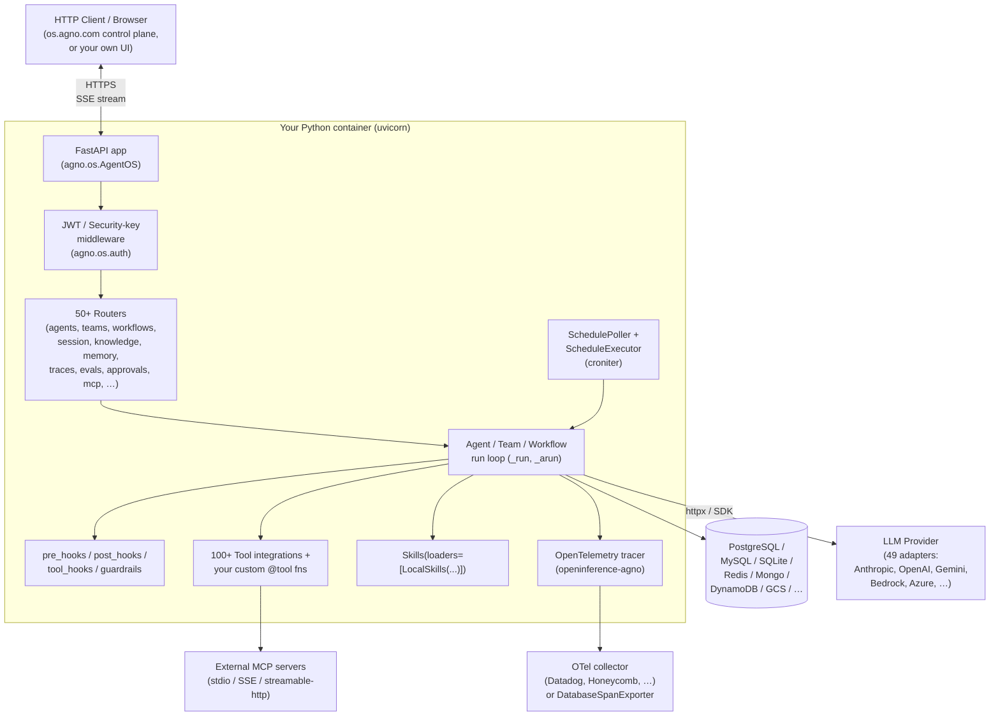
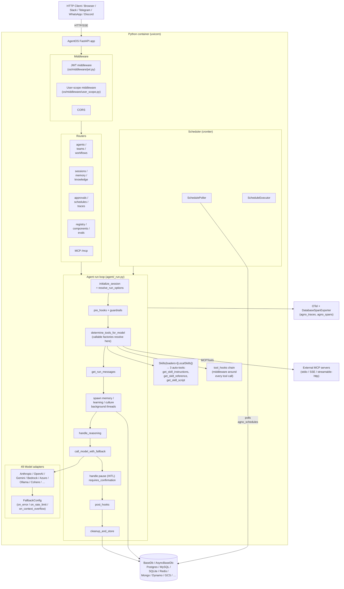

# Agno Python — Benchmark Analysis

> **Repo**: https://github.com/agno-agi/agno
> **Commit analysed**: `bb7ddb05ba5163209dc426b2809a673d97755476`
> **Branch**: `main`
> **Framework path**: `frameworks/agno`
> **Analysed on**: 2026-05-19

Analysed at version `agno==2.6.7` (`libs/agno/pyproject.toml:3`). All file paths in this document are relative to `frameworks/agno/` unless otherwise noted.

## TL;DR

- **Agno is an opinionated, batteries-included Python framework + runtime ("AgentOS").** The agent loop is a 4,900-line synchronous/async function pair (`_run`, `_run_stream`, `_arun`, `_arun_stream`) in `libs/agno/agno/agent/_run.py`. AgentOS is a FastAPI app produced by `AgentOS.get_app()` that mounts >50 endpoints with SSE streaming, JWT auth, RBAC scopes, scheduler, traces, evals, knowledge, memory and an MCP server endpoint. Everything runs in your Python process — no subprocess, no vendor cloud is required.
- **Ecosystem**: **Python** (3.7+, with pydantic v2 + sqlalchemy v2 for the `os` server extra).
- **Open source under Apache 2.0** (`libs/agno/LICENSE`), maintained by **Agno AGI** (the company at `https://agno.com`). There is a managed control plane UI at `https://os.agno.com` you point at your self-hosted runtime; you keep your data and your container. No mandatory SaaS, no key-handoff.
- **Strong production posture out-of-box**: typed JWT scopes (`agent-os:my-os:agents:my-agent:read`), per-resource access checks (`require_resource_access`), JWT user_id scoping, AsyncBaseDb / BaseDb abstractions for Postgres/MySQL/SQLite/Redis/Mongo/Dynamo/Firestore/SurrealDB/Singlestore/GCS-JSON, cron-driven `ScheduleExecutor` + `SchedulePoller`, FastAPI background tasks for hooks, resumable SSE for background runs, OpenTelemetry tracing via `openinference-instrumentation-agno`.
- **49 model providers** under `libs/agno/agno/models/` (Anthropic, OpenAI, Gemini, Bedrock, Azure, Cohere, Mistral, Ollama, vLLM, LiteLLM, Groq, etc.). First-class **typed `FallbackConfig`** with `on_error` / `on_rate_limit` / `on_context_overflow` lists (`libs/agno/agno/models/fallback.py:20-40`).
- **>100 built-in tool integrations** in `libs/agno/agno/tools/` (web search, GitHub, Slack, Postgres, Mongo, AWS, GCP, E2B, Daytona, Docker, Browserbase, exa, jira, calendar, …). Tools are defined with a `@tool(...)` decorator → `Function` Pydantic model; `Toolkit` aggregates multiple `Function`s. Tools may declare `requires_confirmation=True`, `requires_user_input=True`, `external_execution=True` for HITL.
- **Skills as a first-class concept**: `Skills(loaders=[LocalSkills(...)])` loads `SKILL.md`-style folders with optional `scripts/` + `references/` subdirs and YAML frontmatter (`libs/agno/agno/skills/loaders/local.py`). Loading is **eager metadata in system prompt**, **lazy body via 3 auto-generated tools** (`get_skill_instructions`, `get_skill_reference`, `get_skill_script`). Only one loader (`LocalSkills`) ships; no S3/Git/registry source — registry-side scoping is BYO.
- **`Team` is the sub-agent primitive**: `Team(members=[agent1, agent2, ...])` with four modes (`coordinate`, `route`, `broadcast`, `tasks`). The leader gets auto-generated `delegate_task_to_member` / `delegate_task_to_members` tools. Parallel fan-out is **sequential by default** — `delegate_task_to_members` loops over members serially (`libs/agno/agno/team/_default_tools.py:828`). Async fan-out via `adelegate_task_to_members` does use `asyncio.gather`.
- **`pre_hooks` / `post_hooks` / `tool_hooks` are the middleware story.** `pre_hooks` receive `run_input`, `run_context`, `session`, `agent`, `user_id`; can mutate `run_input` before the LLM sees it (so SessionStart-style injection works). `post_hooks` receive `run_output`. `tool_hooks` wrap *every* tool call as middleware `(name, next_func, args) → next_func(**args)` — you can mutate `args` here, which is how you force `tenantId` server-side. `BaseGuardrail` is a typed pre/post hook with `check()`/`acheck()` that can raise `InputCheckError` / `OutputCheckError`.
- **Most decision-relevant finding for our use case**: Agno is the only framework in this benchmark that ships **all** of: skills loader, sub-agents (Team), FastAPI server with SSE + auth + RBAC, multi-database session persistence, cron scheduler, evals, OTel tracing, and HITL approval out of the box. The cost is that you adopt the whole platform — the `Agent` dataclass has **~80 constructor parameters** and `agent.py` is 1,735 lines. There is no slim "just-the-loop" alternative.
- **Biggest gap for our use case**: no **per-tenant USD budget cap**, no **tenant-scoped resource manager** (Skills/tools are global per Agent instance — runtime filtering relies on callable-factory `tools=lambda run_context: [...]`). No **versioned/published-from-S3 skill registry**. **Auto-compaction / prompt-cache breakpoints** are not built in (you get `compression_manager` for tool-result compression, but no Claude/OpenAI cache-breakpoint placement).
- **Most surprising finding**: the agent run loop is a single sync function that catches `RunCancelledException` and `InputCheckError`/`OutputCheckError` inline, then commits cleanup-and-store in a `finally`. Background memory / cultural-knowledge / learning extraction run in **threads** during sync, **asyncio tasks** during async — and `wait_for_open_threads` is called *twice* (once on the pause/return path and once on the success path). This is closer to a hand-rolled async runtime than a graph runtime.
- **Production-readiness verdict for multi-tenant server-side deployment**: 🟢 **production-ready** for the platform features (auth, RBAC, SSE, persistence, scheduling). 🟡 for tenant-scoped resource governance (you still need to wrap `Skills` and `tools` in callable factories that filter on `run_context`, and there's no first-party budget cap). The framework will not block you, but you will write the multi-tenant glue yourself.
- **One-line verdicts** — Sessions/persistence: 🟢 10 DB adapters, abstract `BaseDb`/`AsyncBaseDb`, sync persistence on turn end. Skills: 🟢 SKILL.md spec, 🟡 only `LocalSkills` source. Resource manager: 🟡 in-process `Registry` for tools/models/dbs, no publishing/versioning workflow. Sub-agents: 🟢 first-class `Team` primitive with 4 modes. Multi-tenancy: 🟡 `user_id`/`session_id` first-class + JWT RBAC, but `tenant_id` is metadata-only and tool-arg forcing requires `tool_hooks`. Hooks: 🟢 pre/post/tool + guardrails + background-tasks. API: 🟢 FastAPI app with SSE, resumable runs, cancel, continue. Observability: 🟢 OTel via openinference + token + cost (USD) computation in `Metrics.cost`.

---

## 0. General

### 0.1 What is this stack?

A **library + runtime** (Agno) plus an optional **infrastructure CLI** (Agno Infra). The library defines `Agent`, `Team`, `Workflow`, `Skills`, tools, db adapters and the `AgentOS` FastAPI server. AgentOS is the production server you `uvicorn`-run; it hosts many agents/teams/workflows behind 50+ HTTP endpoints. From `README.md:18-21`: "Agno is an SDK for building agent platforms. Build agents using any agent framework. Run them as production services with tracing, scheduling, and RBAC. Manage using a single control plane."

### 0.2 Ecosystem

**Python** (3.7+, `libs/agno/pyproject.toml:6`). Single-language project; no .NET / Go / TS sibling. The server extra adds FastAPI / uvicorn / SQLAlchemy / PyJWT / OpenTelemetry on top of the same Python runtime.

### 0.3 Project status & governance

- **License**: Apache 2.0 (`libs/agno/LICENSE`, classifier `License :: OSI Approved :: Apache Software License` in `libs/agno/pyproject.toml:25`).
- **Owner**: Agno AGI (commercial company, founder/maintainer Ashpreet Bedi listed as project author in `libs/agno/pyproject.toml:9-10`).
- **Commercial backing**: yes — the team operates a managed UI at `https://os.agno.com` that points at your self-hosted runtime. The framework itself is fully open source.

### 0.4 Project maturity / age

- Current version: **2.6.7** (`libs/agno/pyproject.toml:3`), classifier `Development Status :: 5 - Production/Stable`.
- The 2.x line is current; the codebase has a `default_schema_version = "2.0.0"` baseline (`libs/agno/agno/db/base.py:34`) and an active migrations manager (`libs/agno/agno/db/migrations/`).
- Repo has 2 published Python packages: `agno` (the library) and `agno-infra` (infra CLI, `libs/agno_infra/`).

### 0.5 Adoption & community signal

Captured via the public README / repo on 2026-05-16 (commit `bb7ddb0`):
- GitHub stars/forks: not captured in this study (no WebFetch was used). The repo is active — `git log --oneline -10` would confirm cadence, but the codebase carries hundreds of recent files and recent commits across many subsystems (skills, agent OS, tracing).
- The repo ships ~200+ cookbook examples across 20+ topic folders (`cookbook/00_quickstart` → `cookbook/99_docs`).
- CI is present: `.github/workflows/`, mypy enforcement (`mypy==1.18.2`), ruff format/check (`ruff==0.14.3`), pytest test suite (`libs/agno/tests/`).

### 0.6 Ecosystem fit

- **Primary language**: Python 3.7+ (`libs/agno/pyproject.toml:6`).
- **Packages**: `agno` (core), `agno-infra` (CLI for AWS/Docker/local infra). PyPI; install via `pip install agno`.
- **Dependencies**: pydantic, httpx[http2], typer, rich, gitpython, docstring-parser, pyyaml, packaging (`libs/agno/pyproject.toml:29-43`). Optional extras: `os` (fastapi, uvicorn, sqlalchemy, PyJWT, opentelemetry, openinference, croniter, pytz), `scheduler`, `opentelemetry`, `weave`, `openlit`, `whatsapp-crypto`.
- **Used as**: library + self-hosted server.

### 0.7 Documentation depth & cross-team contributor accessibility

- Official docs are at `https://docs.agno.com` (not fetched in this study). The README mentions `https://docs.agno.com/llms-full.txt` for AI-coding-agent indexing.
- The repo itself ships extensive cookbooks under `cookbook/` (organized by topic, with `README.md` + `TEST_LOG.md` per cookbook). The `CLAUDE.md` at repo root instructs Claude Code to test cookbooks.
- Non-engineers (Product/Data) can author **`SKILL.md` files** — markdown with YAML frontmatter — to extend agents without writing Python. Tool authoring still requires Python (`@tool` decorator).

### 0.8 Documentation entry points

- Official docs landing page: https://docs.agno.com
- Quickstart: https://docs.agno.com/first-agent
- API reference: https://docs.agno.com (auto-generated from code)
- Hosting / deployment / production guide: https://docs.agno.com/runtime/deploy
- Examples / cookbook: `cookbook/` in this repo, https://docs.agno.com/tutorials
- Changelog: https://github.com/agno-agi/agno/releases
- GitHub Releases: https://github.com/agno-agi/agno/releases
- GitHub Issues: https://github.com/agno-agi/agno/issues
- Discord / community: linked from https://agno.com (newsletter "The Agno Loop")

---

## 1. High Level Architecture

### Deployment diagram



### 1.1 Where does the agent loop *actually* execute?

**In your Python process.** `Agent.run(...)` dispatches to `agno.agent._run.run_dispatch(...)` (`libs/agno/agno/agent/agent.py:1362`), which calls `_run(agent, ...)` (`libs/agno/agno/agent/_run.py:324-712`). The loop is a single Python function that:

1. Reads/creates the session via `read_or_create_session` (sync DB call).
2. Resolves dependencies.
3. Executes `pre_hooks` (and `BaseGuardrail` instances).
4. Determines tools.
5. Builds messages.
6. Spawns memory / learning / cultural-knowledge **background threads**.
7. Calls the model: `call_model_with_fallback(agent.model, agent.fallback_config, ...)` (`_run.py:510`).
8. Updates `RunOutput`.
9. Runs `post_hooks`.
10. Waits for the background threads.
11. Creates session summary if enabled.
12. Stores the run + session.

There is no subprocess, no vendor cloud unless you opt in.

### 1.2 Runtime dependencies

- Python 3.7+ (the floor is high — note pydantic v2, sqlalchemy v2 are pulled in for `os` extra).
- For the server: `agno[os]` adds fastapi[standard], uvicorn, sqlalchemy, PyJWT, opentelemetry-sdk, openinference-instrumentation-agno, croniter, pytz (`libs/agno/pyproject.toml:69`).
- Optional database driver of your choice (psycopg2 / asyncpg for Postgres, aiosqlite for async SQLite, redis-py, motor, pymongo, etc.).
- Optional MCP client (`mcp` package, dev-deps in `libs/agno/pyproject.toml:63`).
- LLM provider API: at least one of the 49 model adapters (Anthropic, OpenAI, Gemini, Bedrock, Azure, …) — keys passed via env or per-Model construction.
- Optional vendor: the hosted control-plane UI at `https://os.agno.com` is optional; it is just a remote viewer pointed at your self-hosted runtime.

### 1.3 Recommended deployment topology

From `cookbook/00_quickstart/run.py:88` and `libs/agno/agno/os/app.py:1466-1533`: the canonical pattern is `agent_os.serve(app="run:app", reload=True)` which calls `uvicorn.run(...)`. The docs implicitly recommend **one process serves many concurrent sessions and many agents** (one-process-many-tenants). Auth, RBAC, scheduling and tracing are all handled inside this single process. Horizontal scaling is by pointing multiple stateless uvicorn workers at the same `BaseDb`/`AsyncBaseDb`-backed DB (see Q4.3).

### 1.4 Cold-start cost & instance footprint

- Cold start: Python interpreter import + FastAPI app + AgentOS init (`_initialize_sync_databases`, `_initialize_async_databases` via `db_lifespan`, `libs/agno/agno/os/app.py:99-108`). With Postgres-backed `BaseDb`, this includes SQLAlchemy engine creation and (optionally) table creation/migration via `MigrationManager`.
- RAM baseline: pydantic v2 + 100+ tool modules + 49 model adapters. Not measured here; the `pyproject.toml` dependencies indicate a moderate footprint (httpx[http2], rich, pydantic, sqlalchemy).
- Not provided — exact RAM/disk numbers BYO.

### 1.5 Vendor lock-in

- **LLM-provider lock-in**: 🟢 minimal — 49 providers under `libs/agno/agno/models/`, abstract `Model` base in `agno.models.base`.
- **Hosting-platform lock-in**: 🟢 none — it's just a Python process running uvicorn.
- **Eval-platform lock-in**: 🟢 none — `BaseEval` and `Scorer`-style classes are in-repo; OTel tracing is provider-neutral.

### 1.6 Framework weight / footprint

**Heavy.** `libs/agno/agno/` is ~50 subpackages: agent (10k+ LOC across 17 files), team (similar), workflow, tools (130+ files), models (49 providers), db (10 adapters), knowledge, memory, learning, eval, guardrails, hooks, skills, registry, scheduler, tracing, culture, compression, context, integrations, os (the FastAPI server, 7k LOC), reasoning, run, session, vectordb (multiple adapters). The `Agent` constructor has 80+ parameters (`libs/agno/agno/agent/agent.py:376-494`). This is firmly in the "platform" category, not "thin SDK".

### 1.7 Release-history signal

No top-level `CHANGELOG.md` in the repo at this commit. Release history lives on GitHub Releases (not fetched here). The `Development Status :: 5 - Production/Stable` classifier and 2.6.7 version suggest a stable 2.x line. The `default_schema_version = "2.0.0"` in `libs/agno/agno/db/base.py:34` plus the active `libs/agno/agno/db/migrations/` package signal that schema breakage has been seen and is being managed.

---

## 2. Agent Loop

### 2.1 Run loop entrypoint(s)

Signature in `libs/agno/agno/agent/agent.py:1336-1361`:

```python
def run(
    self,
    input: Union[str, List, Dict, Message, BaseModel, List[Message]],
    *,
    stream: Optional[bool] = None,
    stream_events: Optional[bool] = None,
    user_id: Optional[str] = None,
    session_id: Optional[str] = None,
    session_state: Optional[Dict[str, Any]] = None,
    run_context: Optional[RunContext] = None,
    run_id: Optional[str] = None,
    audio: Optional[Sequence[Audio]] = None,
    images: Optional[Sequence[Image]] = None,
    videos: Optional[Sequence[Video]] = None,
    files: Optional[Sequence[File]] = None,
    knowledge_filters: Optional[Union[Dict[str, Any], List[FilterExpr]]] = None,
    add_history_to_context: Optional[bool] = None,
    add_dependencies_to_context: Optional[bool] = None,
    add_session_state_to_context: Optional[bool] = None,
    dependencies: Optional[Dict[str, Any]] = None,
    metadata: Optional[Dict[str, Any]] = None,
    output_schema: Optional[Union[Type[BaseModel], Dict[str, Any]]] = None,
    yield_run_output: Optional[bool] = None,
    debug_mode: Optional[bool] = None,
    **kwargs: Any,
) -> Union[RunOutput, Iterator[Union[RunOutputEvent, RunOutput]]]:
```

Async sibling: `arun(...)` with the same signature, returning `Coroutine[..., RunOutput]` or `AsyncIterator[RunOutputEvent]` (`libs/agno/agno/agent/agent.py:1443-1495`). Also `continue_run` / `acontinue_run` to resume after HITL pause.

Dispatch goes through `agno.agent._run.run_dispatch` → `_run` (non-stream) or `_run_stream` (stream).

### 2.2 Per-iteration behavior

The "iteration" in Agno is encapsulated inside `call_model_with_fallback` → the underlying `Model.response(...)`, which itself runs the LLM-tool-LLM cycle internally for each provider. The harness sees one logical "turn" per `_run` invocation: prepare messages → call model with tool list → model emits assistant message (potentially with tool calls) → tool dispatch happens inside `Model.run_function_calls()` → model is re-invoked with tool results → repeat until the model emits a terminal assistant message or until `tool_call_limit` is exceeded. The harness then runs post-hooks and persists.

So the explicit per-loop steps in `_run` (`_run.py:382-712`) are:

1. Read/create session
2. Resolve dependencies
3. Execute pre-hooks (mutate `run_input`)
4. Get tools
5. Build messages
6. Start memory/learning/culture background threads
7. Reasoning step (if `reasoning=True`)
8. **Call the model** — `call_model_with_fallback` (`_run.py:510-521`) returns a complete `ModelResponse` that has already done its tool-call loop
9. Update `RunOutput`
10. Pause-on-confirmation check (HITL)
11. Convert to structured format
12. Generate followups
13. Execute post-hooks
14. Wait for background threads
15. Create session summary
16. Cleanup and store

### 2.3 ReAct loop

Agno ships a **built-in tool-calling loop inside each `Model` adapter**. Tool dispatch is `_handle_pre_hook` → entrypoint → `_handle_post_hook` per `FunctionCall.execute()` (`libs/agno/agno/tools/function.py:1019-1080`). Reasoning mode adds an explicit ReAct-style thought-action-observation step (`agent.reasoning=True`, `reasoning_max_steps=10`, `libs/agno/agno/agent/agent.py:191-195`) which is implemented via `agno.reasoning.step` and the `handle_reasoning` helper (`_run.py:502`).

### 2.4 Tool dispatch + result handling

`determine_tools_for_model(agent, model=..., processed_tools=..., run_response=..., session=..., run_context=...)` (`_run.py:443-450`) resolves the final tool list. The model adapter (e.g. `agno.models.anthropic.claude`) then drives the tool-call cycle. When a tool call is parsed from the LLM response, `FunctionCall.execute()` builds entrypoint args (injecting `agent`, `team`, `run_context`, `fc`, media), runs the tool_hooks chain, and writes the result back into the message list as a `ToolExecution`.

### 2.5 Explicit turn concept

Agno uses **"run"** rather than "turn". One `run()` call = one turn = one LLM invocation cycle that may include N tool calls. `RunOutput.run_id` (UUID, `_run.py:1255`) is the turn-level identifier. Sessions contain a list of `RunOutput`s on `AgentSession.runs` (`libs/agno/agno/session/agent.py:37`).

### 2.6 Event emission mechanism (in-process)

Two surfaces:

- **Non-stream**: `_run` returns a single `RunOutput`.
- **Stream**: `_run_stream` is a generator that yields `RunOutputEvent` instances. `_arun_stream` is an `AsyncIterator`. The mechanism is plain Python `yield`. The 39 distinct event types live in `agno.run.agent.RunEvent` enum (`libs/agno/agno/run/agent.py:143-194`).

Events are produced via helpers in `agno.utils.events` (`create_run_started_event`, `create_tool_call_completed_event`, `create_pre_hook_started_event`, etc.) and passed through `handle_event(...)` which honours `agent.events_to_skip` and `agent.store_events`.

---

## 3. Message & Event Taxonomy

### 3.1 Message layers

Three layers:

1. **Persistence layer — `agno.models.message.Message`** (used both inside `RunOutput.messages` and as the on-wire LLM-prompt message). One unified pydantic model for system/user/assistant/tool.
2. **Run output layer — `RunOutput`** (`libs/agno/agno/run/agent.py:609`) and `RunInput` (`run/agent.py:38`): the *call-site* view, separating raw input from messages sent to the model.
3. **Stream event layer — `RunOutputEvent`** (`run/agent.py:522-558`): a union of ~32 dataclasses streamed to the consumer.

There is no separate "wire vs UI" distinction the way Mastra has `MastraDBMessage` vs `ChunkType`; Agno conflates persistence and prompt-construction into one `Message` shape.

### 3.2 Concrete message types

| Type | File | Purpose |
|------|------|---------|
| `Message` | `libs/agno/agno/models/message.py` | The universal message (role, content, tool_calls, tool_call_id, name, metrics, …) used everywhere |
| `RunInput` | `libs/agno/agno/run/agent.py:38-56` | Captures the literal input passed to `run()` (str/list/dict/Message/BaseModel + media) |
| `RunOutput` | `run/agent.py:609-695` | Returned by `run()` — has `messages`, `tools`, `content`, `metrics`, `events`, `status`, `requirements`, `session_state` |
| `RunMessages` | `libs/agno/agno/run/messages.py` | Working set during a single run (system_msg, user_msg, history_messages, extra_messages, messages_for_model) |
| `RunContext` | `libs/agno/agno/run/base.py:16-40` | The "live" object — `run_id`, `session_id`, `user_id`, `dependencies`, `session_state`, `metadata`, `messages`, `tools`, `knowledge_filters`, `output_schema` |
| `ToolExecution` | `libs/agno/agno/models/response.py` | Tool call record with id/name/args/result, `is_paused`, `requires_confirmation` |

### 3.3 Messages vs. events

Two separate taxonomies. `RunOutput.messages` is the persisted prompt history; `RunOutputEvent` is the live event stream. The stream is **not** automatically materialized into `messages` — the harness builds `RunOutput.messages` separately as it processes the model response.

### 3.4 Event categories

`agno.run.agent.RunEvent` (39 enum members, `run/agent.py:143-194`):

| Category | Events |
|----------|--------|
| Run lifecycle | `RunStarted`, `RunContent`, `RunContentCompleted`, `RunIntermediateContent`, `RunCompleted`, `RunError`, `RunCancelled`, `RunPaused`, `RunContinued` |
| Hook lifecycle | `PreHookStarted`, `PreHookCompleted`, `PostHookStarted`, `PostHookCompleted` |
| Tool lifecycle | `ToolCallStarted`, `ToolCallCompleted`, `ToolCallError` |
| Reasoning | `ReasoningStarted`, `ReasoningStep`, `ReasoningContentDelta`, `ReasoningCompleted` |
| Memory | `MemoryUpdateStarted`, `MemoryUpdateCompleted` |
| Session summary | `SessionSummaryStarted`, `SessionSummaryCompleted` |
| Parser / output model | `ParserModelResponseStarted`, `ParserModelResponseCompleted`, `OutputModelResponseStarted`, `OutputModelResponseCompleted` |
| Model request | `ModelRequestStarted`, `ModelRequestCompleted` (with `input_tokens`/`output_tokens`/`total_tokens`/`time_to_first_token`/`reasoning_tokens`/`cache_read_tokens`/`cache_write_tokens`) |
| Compression | `CompressionStarted`, `CompressionCompleted` |
| Followups | `FollowupsStarted`, `FollowupsCompleted` |
| Custom | `CustomEvent` (arbitrary attributes via `__init__(**kwargs)`) |

`TeamRunEvent` mirrors this for `Team`, adding member-delegation events.

### 3.5 Canonical type-definition file(s)

- `libs/agno/agno/run/agent.py` — `RunInput`, `RunEvent`, `RunOutputEvent` (union of 32 event dataclasses), `RunOutput`
- `libs/agno/agno/run/base.py` — `RunContext`, `BaseRunOutputEvent`, `RunStatus`
- `libs/agno/agno/run/team.py` — `TeamRunEvent` + `TeamRunOutput`
- `libs/agno/agno/models/message.py` — `Message`

### 3.6 Live agentic event stream taxonomy

Sample frames from the SSE wire format. The server-side helper is `format_sse_event(event)` (called in `agno.os.routers.agents.router:117`); each event is `event.to_json(indent=None)` with `event: <name>\ndata: <json>\n\n`.

**Run start**
```
event: RunStarted
data: {"created_at": 1715900000, "event": "RunStarted", "agent_id": "...", "run_id": "...", "session_id": "...", "model": "gpt-4o", "model_provider": "openai"}
```

**Content delta**
```
event: RunContent
data: {"event": "RunContent", "run_id": "...", "content": "Hello", "content_type": "str"}
```

**Tool call started**
```
event: ToolCallStarted
data: {"event": "ToolCallStarted", "run_id": "...", "tool": {"tool_call_id": "call_abc", "tool_name": "topicSearch", "tool_args": {"query": "..."}}}
```

**Tool call completed**
```
event: ToolCallCompleted
data: {"event": "ToolCallCompleted", "run_id": "...", "tool": {"tool_call_id": "call_abc", "result": "..."}, "content": "..."}
```

**Run completed**
```
event: RunCompleted
data: {"event": "RunCompleted", "run_id": "...", "content": "Final answer", "metrics": {"input_tokens": 123, "output_tokens": 45, "cost": 0.000567}, "session_state": {...}}
```

---

## 4. Agent Runtime (Multi-session Host)

### 4.1 Multi-session host architecture

Agno ships **`AgentOS`** (`libs/agno/agno/os/app.py:192`), a FastAPI host that wires up to N agents/teams/workflows behind shared routers. One process can host any number of agents and concurrent sessions:

```python
agent_os = AgentOS(
    id="my-os",
    agents=[agent_with_tools, agent_with_memory, ...],
    teams=[multi_agent_team],
    workflows=[sequential_workflow],
    config=config_path,
    tracing=True,
)
app = agent_os.get_app()
agent_os.serve(app="run:app", reload=True)
```

### 4.2 Concurrent session isolation

Each `run()`/`arun()` call creates its own `RunContext` (`_run.py:1323-1339`) and reads/writes its own `AgentSession` from the DB. The `Agent` object is **shared** across calls (you should not create agents in loops — see `CLAUDE.md`: "Never create agents in loops — reuse them for performance"). State that varies per call lives in `RunContext` (dependencies, session_state, metadata, knowledge_filters, output_schema, messages, tools).

Concurrent invocations of the *same* `Agent` instance are safe in async; the `Agent` itself is mostly immutable post-construction. The session is read/written by id under the hood through `BaseDb.upsert_session` and `BaseDb.get_session` (`libs/agno/agno/db/base.py:159-200`).

### 4.3 Horizontal scaling / multi-instance

Stateless workers can share a session pool by pointing at the same database (`db=PostgresDb(db_url=...)` or `db=AsyncPostgresDb(...)`). The session is keyed by `session_id` (UUID by default). There is no leader election. The scheduler uses **DB-backed leader election** via `agno_schedules` rows and `SchedulePoller` claiming locks (`libs/agno/agno/scheduler/poller.py`).

### 4.4 Background / async / scheduled tasks

🟢 First-party.

- **Scheduler**: `ScheduleManager` + `SchedulePoller` + `ScheduleExecutor`, croniter-driven (`libs/agno/agno/scheduler/`). DB-stored cron schedules in `agno_schedules` and `agno_schedule_runs` tables (`libs/agno/agno/db/base.py:71`). Configured via `AgentOS(scheduler_base_url=..., scheduler_poll_interval=...)`.
- **Background agent runs**: `agent.arun(..., background=True, stream=True)` produces a **resumable SSE stream**. The run runs in a detached `asyncio.Task` that survives client disconnect; events are buffered in `event_buffer` / `sse_subscriber_manager` (`libs/agno/agno/os/managers.py`) and a client can reconnect via `/agents/{agent_id}/runs/{run_id}/resume`.
- **FastAPI BackgroundTasks**: hooks decorated with `@hook(run_in_background=True)` (`libs/agno/agno/hooks/decorator.py:79`) are scheduled as FastAPI background tasks; globally set via `_run_hooks_in_background` on the agent (set by AgentOS).
- **Memory / learning / cultural-knowledge creation**: spawned in threads (sync) / asyncio tasks (async) inside `_run` via `_managers.start_memory_future` etc.

### 4.5 Worker pool / queue model

There is no first-party in-process queue (no Celery integration). The scheduler is **DB-polling**. For long-running runs you have:
- `background=True` for fire-and-forget with later `/resume`.
- Schedules for cron-driven runs.
- BYO Celery/RQ/Arq if you need a richer queue model.

---

## 5. Sessions & Persistence

### 5.1 Session / chat data model

`AgentSession` dataclass (`libs/agno/agno/session/agent.py:15-44`):

```python
@dataclass
class AgentSession:
    session_id: str
    agent_id: Optional[str] = None
    team_id: Optional[str] = None
    user_id: Optional[str] = None
    workflow_id: Optional[str] = None
    session_data: Optional[Dict[str, Any]] = None
    metadata: Optional[Dict[str, Any]] = None
    agent_data: Optional[Dict[str, Any]] = None
    runs: Optional[List[Union[RunOutput, TeamRunOutput]]] = None
    summary: Optional["SessionSummary"] = None
    created_at: Optional[int] = None
    updated_at: Optional[int] = None
```

Sibling types: `TeamSession` (`session/team.py`) and `WorkflowSession` (`session/workflow.py`).

### 5.2 What's stored on a session

- `runs`: list of every `RunOutput` (with `messages`, `tools`, `metrics`, `content`, `events` if `store_events=True`, …).
- `session_data`: catch-all dict (session_name, session_state, attached images/videos/audio).
- `metadata`: arbitrary metadata.
- `agent_data`: agent_id, name, model snapshot.
- `summary`: optional `SessionSummary` (generated by `SessionSummaryManager` when `enable_session_summaries=True`).

Storage is **per-run, not per-message**: each `RunOutput` is upserted into `AgentSession.runs` by `session.upsert_run(run)` (`session/agent.py:90-107`), and the whole session is upserted via `db.upsert_session(session)` at the end of `_run`.

### 5.3 Granularity

Single conversation per session (linear list of `RunOutput`s). No first-class branching/forking (LangGraph-style). You can fork by reading a session, copying the runs you want, and writing under a new session_id.

### 5.4 Built-in persistence stores

Adapters under `libs/agno/agno/db/`:

| Adapter | Module |
|---------|--------|
| Postgres (sync, SQLAlchemy) | `db/postgres/postgres.py:60` |
| Postgres (async, SQLAlchemy) | `db/postgres/async_postgres.py` |
| MySQL | `db/mysql/` |
| SQLite | `db/sqlite/` (sync + async) |
| Redis | `db/redis/` |
| Mongo | `db/mongo/` |
| DynamoDB | `db/dynamo/` |
| Firestore | `db/firestore/` |
| Singlestore | `db/singlestore/` |
| SurrealDB | `db/surrealdb/` |
| GCS JSON | `db/gcs_json/` |
| JSON (file) | `db/json/` |
| In-memory | `db/in_memory/` |

All inherit `BaseDb` or `AsyncBaseDb` (`db/base.py:30`). Tables auto-provisioned (`agno_sessions`, `agno_memories`, `agno_metrics`, `agno_traces`, `agno_spans`, `agno_evals`, `agno_knowledge`, `agno_schedules`, `agno_schedule_runs`, `agno_approvals`, `agno_components`, `agno_component_configs`, `agno_component_links`, `agno_learnings`, `agno_culture`, `agno_schema_versions`).

### 5.5 Persistence timing

**Per turn (end of `_run`)**, not per-token. The path in `_run.py:614-617`:

```python
# 13. Cleanup and store the run response and session
cleanup_and_store(
    agent, run_response=run_response, session=agent_session, run_context=run_context, user_id=user_id
)
```

`cleanup_and_store` (defined elsewhere in `_run.py`) calls `session.upsert_run(run_response)` followed by `db.upsert_session(session)`. Sync write — no `durability="async"` knob. The async path (`_arun`) uses `await db.aupsert_session(...)` via `AsyncBaseDb`.

**Pause / paused tools**: when an agent run hits a `requires_confirmation` tool, `handle_agent_run_paused` (`_run.py:193-200`) sets `run_response.status = RunStatus.paused` and the same `cleanup_and_store` writes the paused state. The client can later `continue_run(...)` with the user verdict.

### 5.6 Mid-run checkpointing (durable)

🟡 **Limited.** There is no per-tool-call checkpointing during a normal (non-paused) run. The only durable interrupt point is `RunStatus.paused` for HITL approvals. If the process crashes mid-tool-call on a non-paused run, the run is lost — only previous successful runs in the session persist.

### 5.7 Session ID format

UUID4 by default (`_run.py:1255` for `run_id`, `agent_id = id or str(uuid4())`). You can pass your own `session_id` to `agent.run(session_id="my-tenant:my-conv-42", ...)`. No tenant-prefix convention enforced.

### 5.8 Pluggable store interface

🟢 Yes — implement `BaseDb` or `AsyncBaseDb` (`db/base.py:30`, `db/base.py:???` for async). Abstract methods include `get_session`, `upsert_session`, `get_sessions`, `delete_session`, `rename_session`, plus memory/eval/trace/knowledge/component/schedule/approval CRUD. About 50 abstract methods per adapter — heavy contract, but well-typed.

### 5.9 Schema evolution / migration

`MigrationManager` (`libs/agno/agno/db/migrations/manager.py`) tracks `default_schema_version = "2.0.0"` (`db/base.py:34`) and applies version-bumped migrations on startup when called. Auto-provisioning is opt-in: `AgentOS(auto_provision_dbs=True)`.

### 5.10 Export / replay

- **Export**: `AgentSession.to_dict()` + `db.get_session(session_id)` returns a fully-serializable dict.
- **Replay**: not a first-party concept. You can read a session's `runs` list and walk it manually. There's no `replay_session(...)` helper.

### 5.11 Cross-session memory

Yes — see Q17. `UserMemory` is stored per `user_id` in the `agno_memories` table (`libs/agno/agno/db/schemas/memory.py:9-22`), independent of `session_id`. The `MemoryManager` extracts memories from each run and the agent recalls them via `add_memories_to_context=True`.

---

## 6. Multi-tenancy & Arbitrary Context ⭐

### 6.1 Full run-loop input struct

The fields beyond `messages` you can pass to `Agent.run(...)` (`agent.py:1336-1361`):

```python
input: Union[str, List, Dict, Message, BaseModel, List[Message]]
stream: Optional[bool]
stream_events: Optional[bool]
user_id: Optional[str]
session_id: Optional[str]
session_state: Optional[Dict[str, Any]]
run_context: Optional[RunContext]
run_id: Optional[str]
audio: Optional[Sequence[Audio]]
images: Optional[Sequence[Image]]
videos: Optional[Sequence[Video]]
files: Optional[Sequence[File]]
knowledge_filters: Optional[Union[Dict[str, Any], List[FilterExpr]]]
add_history_to_context: Optional[bool]
add_dependencies_to_context: Optional[bool]
add_session_state_to_context: Optional[bool]
dependencies: Optional[Dict[str, Any]]
metadata: Optional[Dict[str, Any]]
output_schema: Optional[Union[Type[BaseModel], Dict[str, Any]]]
debug_mode: Optional[bool]
**kwargs
```

The carrier for arbitrary call-time context is **`dependencies: Dict[str, Any]`** and **`metadata: Dict[str, Any]`**. Both end up on `RunContext` (`run/base.py:24-26`).

### 6.2 Context propagation into a tool call

`RunContext` is built once (`_run.py:1323`) and threaded through the entire run. When a tool is executed, `FunctionCall._build_entrypoint_args` (`tools/function.py:890-939`) injects `run_context` if the entrypoint has a `run_context: RunContext` parameter:

```python
# Check if the entrypoint has a run_context argument
if "run_context" in sig.parameters:
    entrypoint_args["run_context"] = self.function._run_context
```

So the canonical tool signature is:

```python
def my_tool(run_context: RunContext, query: str) -> str:
    tenant_id = run_context.dependencies["tenant_id"]
    user_id = run_context.user_id
    ...
```

`session_state` is mutable through `run_context.session_state` (and the tool can write back; the harness picks up the mutation, see `tools/function.py:1075-1080`).

### 6.3 Tool call interface

A tool can be defined three ways:

1. **Plain function with `@tool` decorator**:
```python
from agno.tools import tool
from agno.run import RunContext

@tool(name="topicSearch", description="Search topics for a tenant")
def topic_search(run_context: RunContext, query: str, top_k: int = 10) -> list[dict]:
    tenant_id = run_context.dependencies["tenant_id"]
    ...
```

2. **`Function` model directly** (`tools/function.py:132`): set `name`, `description`, `parameters` (JSON Schema), `entrypoint`.

3. **`Toolkit` subclass** (`tools/toolkit.py`): groups multiple `Function`s with shared state.

Return type: anything JSON-serializable (str / dict / list / BaseModel). Exceptions raise `AgentRunException` which propagates as a tool error to the model.

### 6.4 Forcing tool arguments from the harness

🟢 **Supported via `tool_hooks` middleware.** `tool_hooks` is a list of callables wrapping every tool call as middleware. Signature: `hook(function_name: str, next_func: callable, args: dict) -> Any`. The hook can mutate `args` before calling `next_func(**args)`.

Code path: `FunctionCall._build_nested_execution_chain` (`tools/function.py:971-1017`) wraps hooks around the entrypoint and passes `args` into each hook. From the cookbook `cookbook/02_agents/09_hooks/tool_hooks.py:19-31`:

```python
def logging_hook(function_name: str, func: callable, args: dict):
    print(f"[logging_hook] Calling {function_name} with args: {list(args.keys())}")
    return func(**args)
```

To force a server-side `tenant_id`:

```python
def force_tenant_id(function_name, func, args, run_context):
    if function_name in {"topicSearch", "iabSearch", "audienceCreate"}:
        args["tenant_id"] = run_context.dependencies["tenant_id"]   # overrides LLM
    return func(**args)

agent = Agent(..., tool_hooks=[force_tenant_id])
```

The hook has `run_context` injected automatically by `_build_hook_args` (`tools/function.py:941-969`) if it's a parameter. This is the recommended mechanism.

There is **no per-tool typed "spec T" / `inputSchema` override** the way some stacks (Mastra, Vercel AI SDK) ship — you just write a hook.

### 6.5 Filtering visible tools

🟢 Supported via **callable tool factories**. `agent.tools` can be `Callable[..., List]` (`agent.py:166`). The factory receives `agent`, `run_context`, `session_state` by name (`utils/callables.py:79-89`) and returns the final tool list:

```python
def tools_for_run(run_context):
    tenant = run_context.dependencies["tenant_id"]
    visible = ["topicSearch", "iabSearch", "audienceCreate"]
    return [t for t in ALL_TOOLS if t.name in visible]

agent = Agent(..., tools=tools_for_run, cache_callables=False)
```

`cache_callables=False` (default `True`) disables caching so the filter re-runs per request. Custom `callable_tools_cache_key` can key the cache on tenant id.

The same callable-factory pattern works for `knowledge`, `members` (Team), and instructions.

### 6.6 Tenant scope on session

🟡 **Metadata only.** `AgentSession` has `user_id`, `agent_id`, `team_id`, `workflow_id` as first-class fields, but **no `tenant_id` column**. You can stuff `tenant_id` into `session.metadata` or into `dependencies` per request. JWT scopes in AgentOS authentication recognize `agent-os:<os-id>:<resource-type>:<resource-id>:<scope>` (`libs/agno/agno/os/scopes.py`), so tenant separation at the *HTTP layer* is via `user_id` and resource-id scoping rather than a `tenant_id` field.

### 6.7 Per-tool-call auth propagation

The auth principal (JWT `sub`) is propagated to `user_id` on `RunContext` (`agno.os.routers.agents.router:587-593`). Tools that need to act under user permissions read `run_context.user_id`. For RemoteAgent calls, the JWT is forwarded via `auth_token` kwarg (`router.py:101-103`).

### 6.8 Resource scoping primitives

- **Skills**: per-Agent instance, no tenant scoping at the loader level. You can wrap `Skills` in a callable factory in `agent.tools` (Skills are also Functions internally).
- **Sub-agents (Team members)**: `members` can be a callable factory (`team.team.py:432`) — per-request resolved.
- **Tools**: callable factory as above.

No "register tool as global / tenant / user" first-class scoping at registration time. Q11 (Resource Manager) covers what *is* present.

### 6.9 Per-tenant rate limit + budget cap

🔴 **Not provided — BYO.** The closest first-party knob is `tool_call_limit` per agent (`agent.py:169`) — a count cap, not a budget cap. `Metrics.cost` is computed in USD (`libs/agno/agno/metrics.py:48`), but it's reported after the fact; nothing enforces "stop when tenant X exceeds $5/month". You'd need a pre-hook + DB-backed tenant counter.

### ⭐ Light usage example

```python
from agno.agent import Agent
from agno.models.openai import OpenAIResponses
from agno.run import RunContext
from agno.tools import tool

ALL_TOOLS = []  # populated below

@tool(name="topicSearch")
def topic_search(run_context: RunContext, query: str) -> list[dict]:
    tenant = run_context.dependencies["tenant_id"]
    # tenant is forced; we ignore any LLM-supplied tenant arg
    return _search(tenant=tenant, q=query)

@tool(name="iabSearch")
def iab_search(run_context: RunContext, code: str) -> list[dict]: ...

@tool(name="audienceCreate")
def audience_create(run_context: RunContext, definition: dict) -> str: ...

@tool(name="bashExec")
def bash_exec(cmd: str) -> str: ...

@tool(name="webFetch")
def web_fetch(url: str) -> str: ...

ALL_TOOLS = [topic_search, iab_search, audience_create, bash_exec, web_fetch]

ALLOWED_FOR_TENANT = {"topicSearch", "iabSearch", "audienceCreate"}

def tools_for_run(run_context: RunContext):
    # Step 2: only expose these tools to the LLM
    return [t for t in ALL_TOOLS if t.name in ALLOWED_FOR_TENANT]

def force_tenant_args(function_name, func, args, run_context):
    # Step 3: server-side override
    if function_name in ALLOWED_FOR_TENANT:
        args["tenant_id"] = run_context.dependencies["tenant_id"]
    return func(**args)

agent = Agent(
    model=OpenAIResponses(id="gpt-5"),
    tools=tools_for_run,
    tool_hooks=[force_tenant_args],
    cache_callables=False,
)

# Step 1: pass tenantId / targetingStrategyId / userId
result = agent.run(
    "Find lookalike audiences for high-value moms.",
    user_id="u-123",
    session_id="acme:conv-42",
    dependencies={
        "tenant_id": "acme",
        "targeting_strategy_id": "strat-42",
    },
)
```

---

## 7. Hook & Middleware Capabilities (Context Engineering)

### 7.1 Enumerate every hook / middleware / lifecycle callback

| Name | Fires when | Can do what |
|------|-----------|-------------|
| `pre_hooks` (Agent/Team) | After session is loaded, BEFORE the LLM call | Read & mutate `run_input` (the user message), read `run_context`, write `session_state`, raise `InputCheckError` to block |
| `post_hooks` (Agent/Team) | After LLM response, BEFORE return | Read & mutate `run_output`, raise `OutputCheckError`, side-effect (log, persist) |
| `BaseGuardrail` (subclass of pre/post hook) | Same as pre/post (subclass) | `check(...)` / `acheck(...)` raises `InputCheckError`/`OutputCheckError` — blocks |
| `tool_hooks` (Agent-level, list) | Around every tool call (middleware) | Mutate args, mutate result, swap implementation, short-circuit |
| `Function.pre_hook` (per-tool) | Before a specific tool call | Single-callable hook taking `fc/agent/team/run_context` |
| `Function.post_hook` (per-tool) | After a specific tool call | Read result, side-effect |
| `Function.tool_hooks` (per-tool list) | Middleware-style around a single tool | Same shape as agent-level tool_hooks |
| `@hook(run_in_background=True)` | Decorator on any pre/post hook | Marks the hook to run as FastAPI background task |

There is no separate `onSessionStart` lifecycle — `pre_hooks` fires once per `run()`. Persistent across-run setup is done at Agent construction time. There is no `onStreamFinish` either — `post_hooks` plays that role.

Files: `libs/agno/agno/agent/_hooks.py`, `libs/agno/agno/tools/function.py:834-1017`, `libs/agno/agno/hooks/decorator.py`, `libs/agno/agno/utils/hooks.py`, `libs/agno/agno/guardrails/`.

### 7.2 Hook concurrency model

- `pre_hooks` and `post_hooks`: run **sequentially** in registration order (`_hooks.py:97-148`).
- Guardrails (instances of `BaseGuardrail`) run first within each phase, so PII masking / prompt-injection checks block before non-blocking hooks fire.
- Hooks decorated with `@hook(run_in_background=True)` skip the synchronous chain and are scheduled as FastAPI background tasks via `background_tasks.add_task(...)` when available.
- `tool_hooks` form a **nested chain** built right-to-left via `functools.reduce` (`tools/function.py:1014-1017`). The leftmost hook wraps the next, which wraps the next, with the entrypoint at the innermost level. Each hook explicitly calls `next_func(**args)` to advance.

### 7.3 Specific capability tests

- **Inject system messages at session start**: ✅ via `pre_hooks` that mutates `run_input` (or by mutating `run_context.session_state` / `dependencies` which then surface through `instructions` placeholders like `"Tenant: {tenant_id}"`). Also via `additional_input` on Agent construction.
- **Expand user input** (slash commands, timestamp, attachments): ✅ via `pre_hook` reading & rewriting `run_input.input_content`.
- **Mutate the messages list before each LLM call**: 🟡 indirect. Pre-hooks fire **before message building**, not per-LLM-call. `run_context.messages` is the live message list and `tool_hooks` can read it via `run_context.messages`, but per-LLM-call mutation is not a first-class hook. The way to inject prompt-cache breakpoints or redaction is to mutate `agent.instructions` or `additional_input` ahead of time, or to subclass the model adapter.
- **Mutate tool input before dispatch**: ✅ via `tool_hooks` (Q6.4).
- **Mutate tool result before it returns to the LLM**: ✅ via `tool_hooks` middleware (capture the return value of `next_func(**args)`, transform, return transformed). Also `compression_manager` can compress tool results when `compress_tool_results=True` (`agent.py:354-356`).
- **Emit additional tool calls in response to a tool result**: 🔴 **Not directly.** There is no `additional_messages`-from-PostToolUse pattern. The closest is `default_tools` that the model can re-invoke, or having a `tool_hook` issue a follow-up call to another tool from inside the hook (not through the LLM).

### 7.4 Auto-compaction

🟡 **Partial.** `CompressionManager` (`libs/agno/agno/compression/manager.py`) compresses *tool results* when `compress_tool_results=True` (`agent.py:354-356`). Triggered as a step in the run loop with `CompressionStarted`/`CompressionCompleted` events. There is **no automatic message-history compaction / summarization** when context fills up — you set `num_history_messages`, `num_history_runs`, `max_tool_calls_from_history` (`agent.py:135-140`) for hard caps; alternatively `enable_session_summaries=True` produces a summary you can inject via `add_session_summary_to_context=True`.

### 7.5 Prompt cache optimization

🔴 **Not built in.** The framework reports `cache_read_tokens` / `cache_write_tokens` in `Metrics` (`metrics.py:45-46`) and surfaces them in `ModelRequestCompletedEvent`, but does not automatically place Anthropic/OpenAI cache breakpoints. If you want a stable prefix, you arrange it yourself via `instructions` and `add_history_to_context`.

### 7.6 Tool result clearing / progressive disclosure

- `compress_tool_results` + `CompressionManager` for in-place compression of tool outputs.
- `store_tool_messages: bool` to drop tool messages from `RunOutput`.
- `skills` mechanism is itself a "progressive disclosure" pattern: only skill metadata is in the system prompt; full body is fetched on demand via `get_skill_instructions` / `get_skill_reference` / `get_skill_script` tools (`libs/agno/agno/skills/agent_skills.py:148-183`).

### 7.7 Architectural diagram

```
run() entry
   │
   ├── 1. read_or_create_session
   ├── 2. resolve dependencies
   ├── 3. pre_hooks  ◄── guardrails first; can mutate run_input
   ├── 4. determine_tools_for_model
   │      └── callable-factory tools resolved here
   ├── 5. build messages
   ├── 6. spawn memory / learning / culture background threads
   ├── 7. handle_reasoning (if reasoning=True)
   ├── 8. call_model_with_fallback
   │      └── inside: model adapter loops on tool calls
   │             └── for each tool call:
   │                    Function.pre_hook
   │                    tool_hooks chain (outermost to innermost)
   │                       └── entrypoint(**args)  ◄── args can be mutated by any hook
   │                    Function.post_hook
   ├── 9. handle pause (HITL) — RunPaused event, return
   ├── 10. convert to structured format
   ├── 11. generate followups
   ├── 12. post_hooks  ◄── guardrails first; can raise OutputCheckError
   ├── 13. wait_for_open_threads
   ├── 14. create session_summary (if enabled)
   └── 15. cleanup_and_store → db.upsert_session
```

### ⭐ Light usage example

```python
from agno.agent import Agent
from agno.run import RunContext
from agno.run.agent import RunInput
from agno.hooks import hook
from agno.models.message import Message

# 1. Session-start-style injection via pre_hook
def inject_tenant_context(run_input: RunInput, run_context: RunContext):
    today = "2026-05-16"
    tenant = run_context.dependencies["tenant_id"]
    locale = run_context.dependencies["locale"]
    # Prepend a system note as additional_input on the run
    note = Message(role="system",
                   content=f"tenant={tenant}, locale={locale}, today={today}")
    # The harness will pick this up via agent.additional_input or by mutating run_input
    run_context.dependencies["__system_note__"] = note

# 2. Force tenantId on topicSearch
def force_tenant_args(function_name, func, args, run_context):
    if function_name == "topicSearch":
        args["tenant_id"] = run_context.dependencies["tenant_id"]
    return func(**args)

# 3. Summarize topicSearch results when >50
def shrink_topic_results(function_name, func, args, run_context):
    result = func(**args)
    if function_name == "topicSearch" and isinstance(result, list) and len(result) > 50:
        return {"summary": f"{len(result)} topics found; top 10: {result[:10]}"}
    return result

agent = Agent(
    model=...,
    tools=[topic_search, ...],
    pre_hooks=[inject_tenant_context],
    tool_hooks=[force_tenant_args, shrink_topic_results],   # order matters: force args first, shrink wraps
)

agent.run(
    "Find topics for back-to-school 2026",
    dependencies={"tenant_id": "acme", "locale": "fr-FR"},
)
```

---

## 8. HTTP API

### 8.1 Does the framework ship an HTTP server?

🟢 Yes — `AgentOS` produces a FastAPI app (`libs/agno/agno/os/app.py:682` is `get_app(self) -> FastAPI`). 50+ endpoints across many domains:

| Router | Purpose |
|--------|---------|
| `/agents/...` | Create/continue/cancel/list runs, list agents, list runs in a session |
| `/teams/...` | Same surface for Teams |
| `/workflows/...` | Same surface for Workflows |
| `/sessions/...` | List sessions, get/rename/delete |
| `/knowledge/...` | Knowledge upload, search, manage |
| `/memory/...` | User memory CRUD |
| `/evals/...` | Run/list evals |
| `/traces/...` | List traces and spans |
| `/approvals/...` | HITL approval workflow |
| `/schedules/...` | Cron schedule CRUD |
| `/registry/...` | List registered tools/models/dbs/agents/teams/workflows |
| `/components/...` | Component config versioning |
| `/metrics/...` | Aggregated metrics |
| `/health` | Health check |
| `/mcp/...` | MCP server endpoint (FastMCP-based, see `os/mcp.py`) |

### 8.2 HTTP streaming transport

- **SSE** (`text/event-stream`) is the default for `POST /agents/{agent_id}/runs?stream=true` (`agno.os.routers.agents.router:782-797`).
- **WebSocket** is wired up via `get_websocket_router` (`libs/agno/agno/os/router.py:???`).
- Resumable SSE for `background=true` runs.

### 8.3 HTTP endpoints that start an agent run

```http
POST /agents/{agent_id}/runs
Authorization: Bearer <jwt>
Content-Type: multipart/form-data

message: "Build me an audience"
stream: true
session_id: "acme:conv-42"
user_id: "u-123"
background: false
files: <optional file uploads>
```

Request shape from `agno.os.routers.agents.router:525-624`. Form-data because of multi-part file upload support (images, PDFs, audio, video). The path `agent_id` plus optional `version` query parameter selects which agent to run.

### 8.4 Live agentic event stream format

SSE wire format (one frame per event):

```
event: RunStarted
data: {"event":"RunStarted","run_id":"...","session_id":"...","model":"gpt-4o","model_provider":"openai"}

event: ToolCallStarted
data: {"event":"ToolCallStarted","run_id":"...","tool":{"tool_call_id":"call_abc","tool_name":"topicSearch","tool_args":{"query":"..."}}}

event: ToolCallCompleted
data: {"event":"ToolCallCompleted","run_id":"...","tool":{"tool_call_id":"call_abc","result":"..."}}

event: RunCompleted
data: {"event":"RunCompleted","run_id":"...","content":"...","metrics":{"input_tokens":120,"output_tokens":50,"cost":0.00045}}
```

Formatter: `agno.os.utils.format_sse_event` (`router.py:53`) — emits `event: <name>\ndata: <json>\n\n` where `<json> = event.to_json(indent=None)`.

### 8.5 Auth termination at the HTTP boundary

🟢 Yes — JWT middleware (`libs/agno/agno/os/middleware/jwt.py`) validates the bearer token, fills `request.state.user_id`, `request.state.scopes`, `request.state.accessible_resource_ids`. Per-route `Depends(require_resource_access("agents", "run", "agent_id"))` enforces RBAC. Also fallback to `os_security_key` env var for shared-secret mode (`auth.py:62-115`).

JWT scopes follow `agent-os:<os-id>:<resource-type>:<resource-id>:<scope>` plus an admin wildcard. Internal scheduler service uses a separate token (`INTERNAL_SERVICE_SCOPES`, `auth.py:17-27`).

### 8.6 Resume / replay endpoint

`POST /agents/{agent_id}/runs/{run_id}/resume` for background runs (`router.py:1374-1463`). Reconnects to an in-flight `asyncio.Task` and replays buffered SSE events for the client that just reconnected, then continues live.

`GET /agents/{agent_id}/runs/{run_id}` (`router.py:1306-1321`) returns the persisted run if the run is finished.

`GET /agents/{agent_id}/sessions/{session_id}/runs` (`router.py:1463-1478`) lists runs in a session.

### 8.7 Interrupt / cancel via HTTP

`POST /agents/{agent_id}/runs/{run_id}/cancel?session_id=...` (`router.py:824-906`). Calls `agent.acancel_run(run_id=run_id)` which sets a cancellation flag observed by `raise_if_cancelled` checkpoints inside `_run` (`_run.py:499`, `:505`, `:524`, `:588`).

### 8.8 Tool-arg streaming (partial JSON)

🟡 Depends on the model adapter. The `ToolCallStartedEvent` carries the *complete* tool call at the moment it is parsed. Partial-JSON tool-arg streaming is an OpenAI / Anthropic provider-side feature; Agno surfaces the final `tool_args` on `ToolCallStarted` for downstream UI.

### 8.9 HITL approval workflow over HTTP

🟢 First-class.

1. A tool decorated `@tool(requires_confirmation=True)` (or `requires_user_input=True`, or `external_execution=True`) causes the model loop to **pause** when the LLM tries to invoke it. The run returns with `status=RunStatus.paused` and `RunPausedEvent` is emitted.
2. The client checks `run_response.active_requirements` and per requirement calls `requirement.confirm(...)` / `requirement.reject(...)` (see `cookbook/00_quickstart/human_in_the_loop.py:174-204`).
3. Then `agent.continue_run(run_id=..., requirements=run_response.requirements)` (or HTTP `POST /agents/{agent_id}/runs/{run_id}/continue` with `tools=<json>`) resumes.

The HTTP `continue` endpoint accepts a `tools` JSON form field containing the tool execution objects with user verdicts (`router.py:908-1133`).

There is also an **admin approvals** track (`/approvals/...`) with separate persistence in `agno_approvals` table — approve/reject by approval id, not just at tool granularity (`libs/agno/agno/db/schemas/approval.py`).

### 8.10 Tool-call state reconstruction ⭐

🟢 Explicit `tool_call_id` linkage. Every tool execution carries a `tool_call_id` (UUID string, populated by the model adapter from the provider's id). The flow on the wire:

1. `ToolCallStartedEvent.tool.tool_call_id = "call_abc"`
2. `ToolCallCompletedEvent.tool.tool_call_id = "call_abc"` and `tool.result = "..."`

The `ToolExecution` dataclass (`libs/agno/agno/models/response.py`) is the carrier; it surfaces on both the event stream and `RunOutput.tools`.

Tool-result messages in `RunOutput.messages` carry `role="tool"` and `tool_call_id="call_abc"`. The client can therefore link `tool_use` and `tool_result` deterministically.

### 8.11 Health checks / graceful shutdown

🟢 `/health` router (`libs/agno/agno/os/routers/health.py`). FastAPI/uvicorn handles SIGTERM with a graceful drain via the `lifespan` context manager — `db_lifespan` calls `_close_databases()` on shutdown (`os/app.py:99-108`), `http_client_lifespan` closes httpx pools (`os/app.py:89-96`), `scheduler_lifespan` stops the poller (`os/app.py:111-142`).

### ⭐ Light usage example

```bash
# 1. Start a run with tenant context
curl -N -X POST "https://os.acme.local/agents/audience-builder/runs" \
  -H "Authorization: Bearer eyJ..." \
  -H "X-Tenant-Id: acme" \
  -F "message=Find lookalikes for high-value moms" \
  -F "session_id=acme:conv-42" \
  -F "user_id=u-123" \
  -F "stream=true"

# 2. Sample SSE response frames
# event: RunStarted
# data: {"event":"RunStarted","run_id":"r-7","session_id":"acme:conv-42","model":"gpt-4o"}
#
# event: ToolCallStarted
# data: {"event":"ToolCallStarted","run_id":"r-7","tool":{"tool_call_id":"c_1","tool_name":"topicSearch"}}
#
# event: RunCompleted
# data: {"event":"RunCompleted","run_id":"r-7","content":"...","metrics":{"input_tokens":420,"output_tokens":75,"cost":0.0021}}

# 3. Cancel a run mid-flight
curl -X POST "https://os.acme.local/agents/audience-builder/runs/r-7/cancel?session_id=acme:conv-42" \
  -H "Authorization: Bearer eyJ..."

# 4. Send a HITL approval verdict (continue a paused run)
curl -X POST "https://os.acme.local/agents/audience-builder/runs/r-7/continue" \
  -H "Authorization: Bearer eyJ..." \
  -F "session_id=acme:conv-42" \
  -F "user_id=u-123" \
  -F 'tools=[{"tool_call_id":"c_1","confirmed":true,"result":null}]' \
  -F "stream=true"
```

---

## 9. Sub-agents

### 9.1 Mechanism

**First-class primitive — `Team`** (`libs/agno/agno/team/team.py:73`). A `Team` is itself an agent-like object with a list of `members: List[Union[Agent, Team]]`. The team leader gets auto-generated delegation tools (`delegate_task_to_member`, `delegate_task_to_members`, `forward_task_to_member` depending on `mode`). Sub-agents are invoked through these delegation tools — agents-as-tools, but the harness handles the plumbing.

### 9.2 Configuration

Inline Python objects:

```python
bull = Agent(name="Bull Analyst", role="Make the bull case", model=..., tools=[...])
bear = Agent(name="Bear Analyst", role="Make the bear case", model=..., tools=[...])
team = Team(name="Investment Team", members=[bull, bear], mode="coordinate", model=...)
```

Optional `role: Optional[str]` on each member describes what it does (`agent.py:330`, `team.py:93`). `members` can also be a callable factory `Callable[..., List]` for per-request resolution.

### 9.3 LLM-generated configs

🔴 Not supported. Members must be pre-registered (or resolved by a callable factory that the host controls). The parent LLM cannot author a new sub-agent on the fly with a custom system prompt.

### 9.4 Output handling

`Team` modes (`libs/agno/agno/team/mode.py`):

| Mode | Output |
|------|--------|
| `coordinate` (default) | Leader picks members, crafts tasks, **synthesizes** member responses into a final answer |
| `route` | Leader **routes** to one specialist and returns that member's response directly (`respond_directly=True`) |
| `broadcast` | Leader delegates the same task to ALL members; results are concatenated |
| `tasks` | Autonomous task-based: leader decomposes into a shared `TaskList`, delegates, loops until done |

Each member run produces a `RunOutput` (or `TeamRunOutput`) that gets re-injected as a tool result into the leader's loop. Member runs are linked to the parent via `parent_run_id`.

### 9.5 Concurrency model

🟡 **Sequential by default in sync.** `delegate_task_to_members` (`team/_default_tools.py:813-938`) iterates over members and runs each `member_agent.run(...)` one at a time.

🟢 **Parallel in async**. `adelegate_task_to_members` (`team/_default_tools.py:941+`) does use `asyncio.gather` to fan-out. So if you want concurrent sub-agents you must `await team.arun(...)` and the underlying model must support async.

### 9.6 Context isolation

Each member call passes a *copy* of `run_context.session_state` (`team/_default_tools.py:831`):

```python
member_session_state_copy = copy(run_context.session_state)
```

so member mutations to `session_state` don't bleed back unless the leader explicitly merges. Member knowledge filters fall back to the leader's `run_context.knowledge_filters` if the member has no knowledge of its own (`_default_tools.py:845-847`). All members share the same `session_id`.

### 9.7 Lifecycle events

Yes — `TeamRunEvent` (sibling enum in `libs/agno/agno/run/team.py`) emits `MemberDelegationStarted`, `MemberDelegationCompleted`, and propagates member `RunStarted`/`ToolCallStarted`/`RunCompleted` upward with `parent_run_id` set on each frame.

### ⭐ Light usage example

```python
from agno.agent import Agent
from agno.team import Team
from agno.models.openai import OpenAIResponses
from agno.tools import tool
from agno.run import RunContext

@tool(name="topicSearch")
def topic_search(run_context: RunContext, query: str) -> list[dict]:
    return _search(run_context.dependencies["tenant_id"], query)

# 1. Three persona sub-agents
young_mom = Agent(
    name="persona-young-mom",
    role="Recommend topics for moms aged 25-40",
    instructions="Think like a busy mom: kids, school, family, wellness, deals.",
    model=OpenAIResponses(id="gpt-5"),
    tools=[topic_search],
)
tech_bro = Agent(
    name="persona-tech-bro",
    role="Recommend topics for tech-enthusiast men aged 25-40",
    instructions="Think like a tech bro: gadgets, finance, gaming, productivity.",
    model=OpenAIResponses(id="gpt-5"),
    tools=[topic_search],
)
retiree = Agent(
    name="persona-retiree",
    role="Recommend topics for retirees aged 60+",
    instructions="Think like a retiree: travel, health, gardening, news, hobbies.",
    model=OpenAIResponses(id="gpt-5"),
    tools=[topic_search],
)

# 2. Team in broadcast mode → all three run in parallel (in async)
persona_team = Team(
    name="persona-fanout",
    mode="broadcast",
    members=[young_mom, tech_bro, retiree],
    model=OpenAIResponses(id="gpt-5"),
    instructions="Synthesize the three persona recommendations into a strategy.",
)

# 3. Run async to actually fan-out concurrently; the parent receives each result
#    as a tool result in the leader's message history.
result = await persona_team.arun(
    "Recommend lookalike audience seeds for back-to-school 2026",
    dependencies={"tenant_id": "acme"},
)

# Member results are linked via parent_run_id; you can walk:
for member_run in (result.member_runs or []):
    print(member_run.agent_name, "→", member_run.content)
```

---

## 10. Skills

### 10.1 First-class concept?

🟢 First-class. `Skills` is a top-level Agent parameter (`agent.py:160-161`) and ships its own module `libs/agno/agno/skills/` with `Skill`, `Skills`, `SkillLoader`, `LocalSkills`, validator and errors.

### 10.2 File format

`SKILL.md` with YAML frontmatter (`libs/agno/agno/skills/loaders/local.py:127-158`). Frontmatter fields supported (`local.py:93-100`):

```yaml
---
name: code-review               # falls back to folder name
description: Code review with linting and best practices
license: Apache-2.0             # optional
metadata:                       # optional, arbitrary dict
  version: "1.0.0"
  author: agno-team
  tags: ["quality", "review"]
compatibility: ">=2.0"          # optional, free-form string
allowed-tools:                  # optional list of tool names
  - get_skill_reference
  - get_skill_script
---
# Free-form markdown body — the "instructions"
You are a code review assistant. When reviewing code, ...
```

Validation: `validate_skill_directory` (`libs/agno/agno/skills/validator.py`) enforces:
- Required: `SKILL.md` exists, frontmatter parseable, `description` non-empty.
- Optional: `scripts/` subfolder for executable scripts, `references/` subfolder for reference markdown.

### 10.3 Loader mechanism

`SkillLoader` ABC with two implementations:
- `LocalSkills(path, validate=True)` (`skills/loaders/local.py:12-66`) — scans a single skill folder or a parent directory of skills.

`Skills(loaders=[LocalSkills(str(skills_dir))])` aggregates skills from N loaders. Duplicate names are warned and the latest overwrites (`agent_skills.py:42`).

Only `LocalSkills` ships in v2.6.7 — no S3 / Git / OCI / vendor loader.

### 10.4 Invocation

**Hybrid**: skill *metadata* (name + description + scripts list + references list) is injected into the system prompt via `Skills.get_system_prompt_snippet()` (`agent_skills.py:88-146`). The agent sees an XML `<skills_system>` block listing available skills. Skill *body* is fetched on demand via auto-generated tools:

| Tool | Purpose |
|------|---------|
| `get_skill_instructions(skill_name)` | Returns the markdown body of a skill |
| `get_skill_reference(skill_name, reference_path)` | Returns a reference file from `references/` |
| `get_skill_script(skill_name, script_path, execute=False, args=None, timeout=30)` | Read or execute a script from `scripts/` |

`get_skill_script(execute=True)` actually **runs the script via `subprocess`** (`agent_skills.py:344-358`) — the tool will execute `python`/`bash`/etc. with the script as argv. There are path-traversal protections via `is_safe_path` (`skills/utils.py`).

### 10.5 Loading mode

**Lazy.** Body is not in the system prompt; only metadata is. The agent must explicitly call `get_skill_instructions(skill_name)` to load the body. From `agent_skills.py:117-125`:

> "Progressive Discovery Workflow: 1. **Browse**: Review the skill summaries below to understand what's available. 2. **Load**: When a task matches a skill, call `get_skill_instructions(skill_name)` first. 3. **Reference**: Use `get_skill_reference` to access specific documentation as needed. 4. **Scripts**: Use `get_skill_script` to read or execute scripts from a skill. … This approach ensures you only load detailed instructions when actually needed."

This is the Anthropic "Agent Skills" pattern.

### 10.6 Runtime scoping (global / tenant / user)

🟡 Per-Agent. The `Skills` object is constructed once at Agent construction. To vary the catalog per tenant at runtime, you have two options:

1. **Build a callable factory for `agent.tools`** that returns a *different* `Skills.get_tools()` set per request (since Skills work by exposing 3 tools).
2. **Construct multiple agents per tenant** and route HTTP-level by tenant. Heavy, but works.

There is no built-in `Skills(filter=lambda run_context: ...)` runtime hook.

### 10.7 Skill composition

🟡 Limited. A `SKILL.md` body can *describe* a workflow that the LLM follows, which may include "now call this script" or "now read this reference". It does **not** programmatically include other skills; there is no `imports: [other-skill]` directive in the frontmatter. Scripts and references bundled in the folder are first-class (see Q10.4).

### ⭐ Light usage example

**`./skills/generate-audience-from-brief/SKILL.md`**:
```markdown
---
name: generate-audience-from-brief
description: Build an audience definition from a 1-paragraph creative brief
license: MIT
metadata:
  version: "1.0.0"
  author: dailymotion
  tags: ["audience", "targeting", "creative"]
compatibility: ">=2.0"
allowed-tools:
  - topicSearch
  - audienceCreate
  - get_skill_reference
---
# Generate Audience From Brief

When the user gives you a creative brief (1 paragraph describing the campaign goal),
follow this workflow:

1. **Extract intent**: Parse the brief for product, persona, geography, urgency.
2. **Discover topics**: Call `topicSearch` with the persona + product as the query.
3. **Filter**: Drop topics with a coverage below 0.1% of the addressable market.
4. **Build the audience**: Call `audienceCreate` with the filtered topic list.
5. **Summarize**: Return a 3-bullet summary of the audience.

For examples, read `get_skill_reference("generate-audience-from-brief", "examples.md")`.
```

**Python**:
```python
from pathlib import Path
from agno.agent import Agent
from agno.skills import LocalSkills, Skills
from agno.models.openai import OpenAIResponses

skills_dir = Path("./skills").resolve()

agent = Agent(
    name="audience-agent",
    model=OpenAIResponses(id="gpt-5"),
    skills=Skills(loaders=[LocalSkills(str(skills_dir))]),
    tools=[topic_search, audience_create],
    instructions="You are an audience-building assistant.",
)

# The agent's system prompt now contains:
#   <skills_system> … <skill><name>generate-audience-from-brief</name>… </skills_system>
# Plus three auto-registered tools: get_skill_instructions, get_skill_reference, get_skill_script
#
# When the user asks "build an audience for our back-to-school launch", the LLM will:
#   1. See the skill in the system prompt and decide it's relevant
#   2. Call get_skill_instructions("generate-audience-from-brief") to fetch the body
#   3. Follow the workflow: topicSearch → filter → audienceCreate
agent.print_response("Build an audience for our back-to-school deals launch.")
```

---

## 11. Resource Manager

### 11.1 First-class Resource Manager?

🟡 **Partial.** Agno has a `Registry` class (`libs/agno/agno/registry/registry.py:22-110`) but it's an **in-process catalog of non-serializable Python objects**, not a multi-tenant publishing/scoping platform. From the docstring: *"Registry is used to manage non serializable objects like tools, models, databases, vector databases, agents, and teams."*

```python
@dataclass
class Registry:
    name: Optional[str] = None
    description: Optional[str] = None
    id: str = field(default_factory=lambda: str(uuid4()))
    tools: List[Any] = field(default_factory=list)
    models: List[Model] = field(default_factory=list)
    dbs: List[BaseDb] = field(default_factory=list)
    vector_dbs: List[VectorDb] = field(default_factory=list)
    schemas: List[Type[BaseModel]] = field(default_factory=list)
    functions: List[Callable] = field(default_factory=list)
    agents: List[Agent] = field(default_factory=list)
    teams: List[Team] = field(default_factory=list)
```

`Registry.get_agent(id)`, `get_team(id)`, `get_db(id)`, `get_function(name)` are lookup helpers.

There **is** a separate **Components** subsystem (`libs/agno/agno/os/routers/components/`) which versions configs (drafts, current, history) at the DB level — see Q11.6. But it is for *component configs* (e.g. a versioned set of instructions for an agent), not for skills or external resources.

### 11.2 Loading sources

| Source | Supported |
|--------|-----------|
| Local filesystem (skills) | 🟢 `LocalSkills(path)` |
| Local filesystem (anything else) | 🟢 normal Python imports |
| Git / GitHub repos | 🔴 Not provided — BYO |
| OCI / container registries | 🔴 Not provided — BYO |
| Cloud object storage (S3/GCS/Azure) | 🔴 Not provided — BYO (you can write a custom `SkillLoader`) |
| Postgres / relational DB | 🟢 Knowledge content via `Knowledge(contents_db=...)`. Sessions/memories/traces/components live in DB. Skills do NOT. |
| Vendor cloud / managed registry | 🔴 None |
| HTTP fetch | 🔴 Not provided — BYO |

### 11.3 Source composition / priority

🔴 Multi-source composition with priority/override is not modelled at the Skills layer. `Skills(loaders=[a, b, c])` will load all three; on name collision the later loader wins with a warning (`agent_skills.py:42-44`). No "S3 source overrides Git source for tenant X" pattern.

### 11.4 Versioning model

- **Components** (`os/routers/components/components.py`): drafts + current + version history per component. A component has `agno_components` (the definition) + `agno_component_configs` (versioned configs).
- **Skills**: only via the `metadata.version` field in the SKILL.md frontmatter — purely descriptive; the framework does not pin or rollback by version.
- **Schedules**: have version history of runs in `agno_schedule_runs`.

### 11.5 Scoping at the registry layer

🔴 Skills are not scoped at registry layer. Components have JWT-based access control via `Depends(require_resource_access(...))` on the router but no per-tenant "publish for tenant X" workflow visible in the current Components router.

### 11.6 Publishing workflow

🟡 Only for **Components** (a *component* is e.g. a versioned agent config). The router exposes `POST /components` to create, `PATCH /components/{id}` to update, `POST /components/{id}/configs` to add a new config version, `POST /components/{id}/configs/{version}/set-current` to promote — a draft → current model. There is no separate staging environment baked in.

### 11.7 Lifecycle / governance

- Component configs have versions and a "current" pointer. Old versions are not retired automatically but can be deleted via the `DELETE /components/{id}/configs/{version}` endpoint.
- RBAC: scope-based via JWT (`require_resource_access`). No "approval workflow" / RBAC role like "publisher" / "reviewer" is built in.

### 11.8 Programmatic API

- `Registry` itself has only `get_*` helpers; mutation is done by constructing the Registry with the desired lists. No `register_tool(tool)` runtime API.
- The `/registry` HTTP router (`os/routers/registry/registry.py`) lists registered resources for the AgentOS instance — read-only.
- `/components` router is mutation-capable.

### 11.9 Caching & sync model

- Skills are loaded **once at Agent construction** by `Skills._load_skills()` (`agent_skills.py:32-50`). To pick up filesystem changes, call `skills.reload()` (`agent_skills.py:52-59`).
- Callable factories for tools/knowledge can opt into per-key caching via `cache_callables=True` + a `callable_tools_cache_key` function (`agent.py:371-374`).
- The scheduler poller / DB-backed resources sync from DB on every operation; no in-memory cache layer.

### ⭐ Light usage example

```python
# Agno does NOT ship a multi-source / multi-tenant resource manager.
# Step 1 (Git+S3 priority): Not provided — BYO. You'd subclass SkillLoader to load
#   from each source, then construct Skills(loaders=[s3_loader, git_loader])
#   and rely on the "last loader wins" rule for the S3-overrides-Git semantics.
#
# Step 2 (draft → active for tenant): Not provided — BYO. Closest first-party
#   primitive is the /components router with versioned configs (draft + current),
#   but it's per-AgentOS, not per-tenant.
#
# Step 3 (list active skills for tenantId=acme): Per-Agent, not per-tenant.

# A pragmatic per-tenant pattern, fully BYO:
from agno.skills.loaders.base import SkillLoader

class S3SkillLoader(SkillLoader):
    def __init__(self, bucket: str, prefix: str):
        ...
    def load(self) -> list[Skill]:
        # Pull SKILL.md files from s3://bucket/prefix/, parse, return
        ...

class GitSkillLoader(SkillLoader):
    def __init__(self, repo_url: str, branch: str = "main"):
        ...
    def load(self) -> list[Skill]:
        # Sparse-checkout, walk, parse
        ...

def agent_for_tenant(tenant_id: str) -> Agent:
    loaders = [
        GitSkillLoader("git+https://github.com/dailymotion/predict-skills"),
        S3SkillLoader("predict-skills", f"tenants/{tenant_id}/"),  # this one wins (loaded last)
    ]
    return Agent(
        model=...,
        skills=Skills(loaders=loaders),
        # ... rest of config
    )

# Step 3: list active skills
agent = agent_for_tenant("acme")
print([s.name for s in agent.skills.get_all_skills()])
```

---

## 12. Observability: Usage, Cost, Tracing, Audit

### 12.1 Where tokens are surfaced

- **Per assistant message**: `Message.metrics: MessageMetrics` (token + cost on each LLM-produced message).
- **Per run**: `RunOutput.metrics: RunMetrics` (`run/agent.py:636`).
- **Per session**: `SessionMetrics` aggregated via `_session.update_session_metrics` (`agent/_session.py`).
- **Per model**: `RunMetrics.details: Dict[ModelType, Dict[str, ModelMetrics]]` — accumulated by (provider, model_id) within a run.
- **Streamed as events**: `ModelRequestCompletedEvent.input_tokens / output_tokens / total_tokens / cache_read_tokens / cache_write_tokens / reasoning_tokens / time_to_first_token` (`run/agent.py:467-479`).

### 12.2 Per-call / per-turn / per-session / per-tenant rollups

| Level | Object | Where |
|-------|--------|-------|
| Per LLM call | `MessageMetrics` | On each `Message.metrics` |
| Per turn (run) | `RunMetrics` | On `RunOutput.metrics` |
| Per session | `SessionMetrics` | On `AgentSession.session_data["metrics"]` (or via `db.get_metrics(...)`) |
| Per tenant | 🔴 Not first-party | BYO: aggregate by user_id / session.metadata["tenant_id"] |
| Per (provider, model) | `ModelMetrics` | On `RunMetrics.details` |

### 12.3 USD cost computation

🟢 Yes. `BaseMetrics.cost: Optional[float]` in USD (`libs/agno/agno/metrics.py:48`). The cost is computed by the model adapter using `agno.models.defaults.py` (pricing tables per model) and accumulated via `ModelMetrics.accumulate(other)` (`metrics.py:68-93`). `RunMetrics.cost` and `SessionMetrics.cost` follow.

### 12.4 Per-tenant / per-conversation cost

🟡 BYO. `RunOutput.metrics.cost` is available; you tag the session with `tenant_id` in metadata and aggregate via your own DB query against `agno_sessions` / `agno_metrics`.

### 12.5 LLM / tool tracing

🟢 OpenTelemetry via `openinference-instrumentation-agno` (`libs/agno/agno/tracing/setup.py:13-80`). `setup_tracing(db=db)` wires:
1. `TracerProvider`
2. `AgnoInstrumentor()` — auto-traces Agent runs, model calls, tool executions, team coordination, workflow steps
3. `BatchSpanProcessor` / `SimpleSpanProcessor` with a `DatabaseSpanExporter` that writes spans/traces to `agno_traces` and `agno_spans` tables (`tracing/exporter.py`).

Additionally, you can configure standard OTLP exporters (Datadog, Honeycomb, Jaeger) by adding your own `SpanProcessor` to the same `TracerProvider`. The `weave` and `openlit` extras (`pyproject.toml:79-81`) wire alternative backends.

### 12.6 Audit logging (who / when / what)

🟡 Indirect. There is no first-class "audit log" stream distinct from tracing. The combination of:
- JWT auth filling `request.state.user_id`,
- Per-resource RBAC via `require_resource_access`,
- Persisted traces (`agno_traces`/`agno_spans`),
- Persisted runs (with `user_id`, `agent_id`, timestamps),
- `agno_approvals` table for HITL audit trail (`db/schemas/approval.py`),

gives an audit-friendly footprint, but the framework doesn't ship a dedicated "audit hook event stream" abstraction.

### 12.7 Canonical "where do I read token counts" code path

`RunMetrics` dataclass at `libs/agno/agno/metrics.py:279`:

```python
@dataclass
class RunMetrics(BaseMetrics):
    input_tokens: int = 0
    output_tokens: int = 0
    total_tokens: int = 0
    cache_read_tokens: int = 0
    cache_write_tokens: int = 0
    reasoning_tokens: int = 0
    cost: Optional[float] = None
    audio_input_tokens: int = 0
    audio_output_tokens: int = 0
    audio_total_tokens: int = 0
    # ... plus details, time, model breakdown
```

Read as `run_response.metrics.total_tokens`, `run_response.metrics.cost`, etc.

### ⭐ Light usage example

```python
from agno.agent import Agent
from agno.db.sqlite import SqliteDb
from agno.models.openai import OpenAIResponses
from agno.tracing import setup_tracing

db = SqliteDb(db_file="tmp/agents.db")

# 1. Enable OpenTelemetry tracing (writes spans to DB and emits OTel)
setup_tracing(db=db)

agent = Agent(model=OpenAIResponses(id="gpt-5"), db=db)

# 2. Read tokens / cost for a completed run
run_response = agent.run("What's the weather in Paris?", user_id="u-123")
print("input_tokens:", run_response.metrics.input_tokens)
print("output_tokens:", run_response.metrics.output_tokens)
print("cost_usd:", run_response.metrics.cost)

# 3. Push per-tenant usage to a metric sink via a post_hook
def push_to_datadog(run_output, run_context):
    tenant = run_context.metadata.get("tenant_id", "unknown") if run_context.metadata else "unknown"
    m = run_output.metrics
    statsd.increment(f"agent.tokens.input", m.input_tokens, tags=[f"tenant:{tenant}"])
    statsd.increment(f"agent.tokens.output", m.output_tokens, tags=[f"tenant:{tenant}"])
    if m.cost is not None:
        statsd.gauge(f"agent.cost_usd", m.cost, tags=[f"tenant:{tenant}"])

agent = Agent(..., post_hooks=[push_to_datadog])
agent.run("Hi", metadata={"tenant_id": "acme"})
```

---

## 13. Built-in Tools & Tool Authoring API

### 13.1 Built-in tools shipped in the box

**Over 130 tool modules** under `libs/agno/agno/tools/`. A non-exhaustive catalog:

| Category | Modules |
|----------|---------|
| Web search | duckduckgo, brave_search, baidusearch, googlesearch, exa, perplexity, you, serper, websearch |
| LLM-native | dalle, eleven_labs, replicate, fal, lumai, deepl, cartesia, mlx_transcribe |
| Code & files | file, file_generation, csv_toolkit, docling, csv, json |
| Dev / git | github, gitlab, bitbucket, jira, linear, confluence, airflow |
| Messaging | slack, discord, telegram, twilio, webex, whatsapp, email, gmail, googlemail |
| Cloud | aws_lambda, aws_ses, gcp_storage, azure, daytona, e2b, docker, kubernetes |
| Browser | browserbase, playwright, crawl4ai, scrapegraph, firecrawl |
| Data / DB | postgres, mysql, mongodb, duckdb, sql, sqlite, redis, csv_toolkit |
| Domain | yfinance, financial_datasets, stripe, hackernews, reddit, x, googlemaps, weather, openweather, googlecal, wikipedia, arxiv, pubmed, newspaper |
| Knowledge / vec | langfuse, qdrant, zep, mem0, milvus, pinecone, weaviate, mongodb, elasticsearch |
| Eval / safety | guardrails, pii, prompt_injection |
| MCP | `agno/tools/mcp/mcp.py` — stdio / sse / streamable-http transports |

### 13.2 Built-in tool quality

Variable. Most are thin wrappers around the underlying SDK (e.g. `YFinanceTools(all=True)` wraps `yfinance`). Some encode patterns:

- **File tools** include line-numbered Read/Edit semantics.
- **Code execution tools** (`e2b`, `daytona`, `docker`) sandbox executions.
- **Knowledge search tools** know about filters/citations.

### 13.3 Tool authoring API

The minimal `@tool` definition (`libs/agno/agno/tools/decorator.py:87`):

```python
from agno.tools import tool

@tool
def get_weather(city: str) -> str:
    """Get the current weather for a city."""
    return f"It's sunny in {city}"
```

The decorator inspects the function signature + type hints + docstring (via `docstring-parser`) and builds a `Function` Pydantic model with a JSON Schema in `Function.parameters`. The decorator also accepts `name`, `description`, `strict`, `instructions`, `add_instructions`, `show_result`, `stop_after_tool_call`, `requires_confirmation`, `requires_user_input`, `user_input_fields`, `external_execution`, `external_execution_silent`, `pre_hook`, `post_hook`, `tool_hooks`, `cache_results`, `cache_dir`, `cache_ttl` (`tools/decorator.py:60-79`).

### 13.4 Typed tool I/O

🟢 Pydantic-driven. Type hints map to JSON Schema via Pydantic. On invalid args, the model adapter raises `AgentRunException` which is captured into a `ToolCallErrorEvent` and the result is fed back to the LLM as an error message (so the LLM can retry).

### 13.5 Streaming tools

🟡 Generator-tool support exists. A tool can be a generator function returning chunks; `FunctionCall.execute` detects `isgenerator(result)` and stores the generator (`tools/function.py:1057-1064`). The model adapter must consume it. There's no first-class "tool yields progress events to the LLM mid-execution" pattern — chunks are aggregated for the LLM.

---

## 14. MCP (Model Context Protocol) Support

### 14.1 MCP client support

🟢 First-class. `agno.tools.mcp.MCPTools(...)` (`libs/agno/agno/tools/mcp/mcp.py:29`) is a `Toolkit` that connects to an external MCP server and exposes its tools to the agent.

### 14.2 MCP server support

🟢 The AgentOS exposes an MCP server via FastMCP at `/mcp`. `agno.os.mcp.get_mcp_server(os, ...)` (`libs/agno/agno/os/mcp.py:64`) attaches dozens of MCP tools (`run_agent`, `run_team`, `run_workflow`, knowledge search, session list, memory CRUD, …). Wire transport is **Streamable HTTP** (`os/mcp.py:882`).

### 14.3 Transports

`MCPTools(transport="stdio" | "sse" | "streamable-http", ...)` (`tools/mcp/mcp.py:46`). Default is `streamable-http` when `url` is provided, `stdio` otherwise. SSE is marked deprecated in favor of streamable-http.

### 14.4 In-process MCP

🟡 Indirect — you don't define a Python function and surface it as an MCP tool with no subprocess. The way to add an in-process tool is via `@tool` and pass it directly to the agent. To expose your tools *as an MCP server*, you use `AgentOS`' `/mcp` endpoint which fronts your registered agents/teams/tools.

### 14.5 Auth / lifecycle

- `MCPTools(headers={"Authorization": "Bearer ..."})` for HTTP transports.
- `header_provider: Callable[..., dict]` for dynamic headers (e.g. per-request JWT).
- The Toolkit's `connect()` / `close()` is managed by the AgentOS lifespan (`mcp_lifespan`, `os/app.py:77-86`).

---

## 15. Multi-model Routing & Fallback

### 15.1 Multi-provider support

🟢 49 native providers under `libs/agno/agno/models/`: Anthropic, OpenAI (Chat + Responses), Gemini (Google), Bedrock, Vertex (Google), Azure, Cohere, Mistral, Ollama, Groq, Fireworks, DeepSeek, DeepInfra, Cerebras, Hugging Face, LiteLLM, llama_cpp, LM Studio, NVIDIA, Perplexity, Together, xAI, OpenRouter, Sambanova, Portkey, Requesty, Cometapi, AIMLAPI, IBM, InternLM, LangDB, Meta, Moonshot, Nebius, Neosantara, Nexus, Ollama, OpenRouter, Perplexity, vLLM (via OpenAI-compatible), etc.

### 15.2 Per-task model selection

🟡 You assign the model **per agent**, not per task. Patterns:
- Different sub-agents with different models: `Agent(model=Sonnet, ...)` for the leader, `Agent(model=Haiku, ...)` for cheap workers, composed in a `Team`.
- `agent.run(..., model=different_model)` — not supported at run() level; the model is fixed on the Agent.
- `parser_model: Optional[Model]` (`agent.py:293`) for the dedicated structured-output parsing step.
- `output_model: Optional[Model]` (`agent.py:297`) for a separate output-shaping pass.
- `reasoning_model: Optional[Model]` (`agent.py:192`) for the reasoning step.

So you do get *some* per-task model swap via reasoning/parser/output overrides, just not a generic per-call swap.

### 15.3 Automatic fallback chain

🟢 First-class. `FallbackConfig` (`libs/agno/agno/models/fallback.py:20-40`):

```python
FallbackConfig(
    on_error=[Claude(id="claude-sonnet-4-20250514")],          # any retryable error
    on_rate_limit=[OpenAIChat(id="gpt-4o-mini")],              # 429
    on_context_overflow=[Claude(id="claude-sonnet-4-20250514")],  # context too long
    callback=on_fallback_log,                                  # (primary_id, fallback_id, err) -> None
)
```

Three error categories, separate fallback lists, optional callback for instrumentation. `Agent(fallback_config=FallbackConfig(...))` or shortcut `Agent(fallback_models=[...])` (`agent.py:74-76`).

### 15.4 Mid-stream model switching

🔴 No first-class mid-stream switch. The fallback fires when the primary `Model.response(...)` raises a classified error; the entire request is retried against the fallback. Within a single successful LLM call, you cannot switch.

### 15.5 Sub-agent model overrides

🟢 Each `Team.members[i]` is itself an `Agent` with its own model. Supervisor Claude / worker Haiku is straightforward.

---

## 16. Chat UI Layer

### 16.1 Streaming chat hook

🔴 No first-party React/Vue/Svelte chat hook. The AgentOS exposes SSE; you implement your own client. Agno operates a hosted control-plane UI at https://os.agno.com that you can point at your local AgentOS, but the source for that UI is not in the repo.

### 16.2 Tool call rendering primitives

🔴 None in-repo. `ToolCallStartedEvent.tool` has `tool_name` and `tool_args` — your UI parses these.

### 16.3 Generative UI components

🔴 Not provided — BYO.

### 16.4 BYO pattern

Connect to `POST /agents/{agent_id}/runs?stream=true` (form-encoded), parse SSE frames, build your own React state machine. The cookbook `cookbook/00_quickstart/run.py` shows AgentOS exposing the API; the user is expected to consume from the os.agno.com hosted dashboard or roll their own.

The package ships **interface adapters** for chat platforms (`libs/agno/agno/os/interfaces/`): Slack, Telegram, WhatsApp, Discord, AG-UI, A2A. Each translates platform-native messages to/from Agent runs.

---

## 17. Memory & Knowledge

### 17.1 Long-term memory / semantic recall

🟢 `MemoryManager` (`libs/agno/agno/memory/`). `Agent(enable_agentic_memory=True)` lets the agent write/recall facts via tool calls. `Agent(update_memory_on_run=True)` causes the manager to auto-extract user facts from each run. Stored as `UserMemory` rows (`db/schemas/memory.py:9-44`) keyed by `user_id`, with `topics: List[str]`, `feedback`, `created_at`. Recalled via `add_memories_to_context=True`.

### 17.2 RAG / knowledge retrieval integration

🟢 First-class. `Knowledge` class (`libs/agno/agno/knowledge/knowledge.py`) with vector DB integrations (Chroma, Qdrant, Pinecone, Weaviate, Milvus, MongoDB Atlas, Lance, PgVector, Singlestore, Cassandra, ClickHouse). Embedders include OpenAI, Gemini, Cohere, Ollama, HuggingFace, Bedrock, Voyage, Mistral, JinaAI, AWS Titan. Readers: text, markdown, pdf, docx, csv, json, sitemap, website, S3, GCS, …. Filters (`knowledge_filters`, `enable_agentic_knowledge_filters`) let the agent choose filters at runtime.

`Agent(knowledge=..., search_knowledge=True, add_search_knowledge_instructions=True)` adds an automatic `search_knowledge` tool. The agent can also write back via `update_knowledge=True`.

### 17.3 Per-tenant memory scoping

🟡 `UserMemory.user_id` is the scoping key. To get per-*tenant* scoping you set `user_id` to a tenant-prefixed value (`user_id="acme:alice"`) or filter at query time using `metadata`.

---

## 18. Safety, Guardrails & Tool Sandboxing

### 18.1 Input/output guardrails

🟢 First-class. `BaseGuardrail` (`libs/agno/agno/guardrails/base.py:8`) with `check(...)` / `acheck(...)` raising `InputCheckError` / `OutputCheckError`. Three built-in guardrails:

- `PromptInjectionGuardrail` (`guardrails/prompt_injection.py:9`)
- `PIIDetectionGuardrail` (`guardrails/pii.py:10`)
- `OpenAIModerationGuardrail` (`guardrails/openai.py:12`)

Passed as `pre_hooks=[PromptInjectionGuardrail()]` or `post_hooks=[PIIDetectionGuardrail()]`.

### 18.2 Tool sandboxing / permission model

- `@tool(requires_confirmation=True)` → HITL gate per tool.
- `tool_hooks` can deny tools server-side.
- Skills can declare `allowed-tools` in frontmatter (`skills/loaders/local.py:100`).
- Path-traversal protections in skill loaders (`is_safe_path` in `skills/utils.py`).
- RBAC via JWT scopes at the HTTP layer.

### 18.3 Sandbox provider integrations

🟢 `E2B`, `Daytona`, `Docker` tools all run code in remote/isolated sandboxes (`tools/e2b.py`, `tools/daytona.py`, `tools/docker.py`).

### 18.4 Default-deny vs. default-allow

**Default-allow** at tool registration (you ship the catalog), then deny via `tool_hooks` / guardrails / RBAC. JWT auth is **deny by default** when `os_security_key` or JWT is configured.

---

## 19. Eval, Testing & CI Gates

### 19.1 Golden datasets / regression suites

🟢 `AccuracyEval` (`libs/agno/agno/eval/accuracy.py`), `PerformanceEval`, `ReliabilityEval`, `AgentAsJudge` (`eval/agent_as_judge.py`). `BaseEval` is also a hook target, so it can run as `pre_hooks` / `post_hooks`.

The eval system stores results in `agno_evals` table via `db.create_eval_run` / `db.update_eval_run` / `db.get_eval_runs`. Result types: `AccuracyEvaluation`, `PerformanceEvaluation`, etc.

### 19.2 LLM-as-judge scoring

🟢 `AccuracyEval` uses an LLM (default the agent's model) to score outputs 1–10 against `expected_output` with reasoning (`eval/accuracy.py:24-58`).

### 19.3 CI eval gates / pre-merge

🟡 No first-party "pre-merge gate" CLI. You run evals via `eval.run()` / `eval.arun()` and assert on the returned score. Pytest integration is implicit: write a test that runs an eval and asserts `result.score >= 8`.

### 19.4 Trace replay for skill iteration

🟡 Traces are persisted in `agno_traces`/`agno_spans` and viewable in https://os.agno.com. No CLI for stepping through traces locally.

---

## 20. Local Sandbox & Dev UX

### 20.1 Local agent runner

🟢 The AgentOS *is* the local sandbox: `python run.py` starts a uvicorn server on port 7777 and you point the os.agno.com hosted UI at it. There is also the `ag` / `agno` CLI from `agno-infra` (`libs/agno_infra/`) for infra scaffolding (Docker, AWS, local templates).

`Agent.print_response("...")` and `Agent.cli_app()` (`agent/_cli.py`) give a rich terminal-based REPL for quick experimentation without a server.

### 20.2 Trace inspection

Browse traces in the hosted UI, or query the `agno_traces` table directly.

### 20.3 Tenant / org switching

🔴 Not first-class. You'd run multiple AgentOS instances or pass different `user_id` / `dependencies` from the client.

### 20.4 Hot reload

🟢 `agent_os.serve(reload=True)` enables uvicorn auto-reload on `.py` and `.yaml` changes (`os/app.py:1518-1521`).

---

## Architectural diagram



---

## Appendix — Files worth reading first

- `libs/agno/agno/agent/agent.py:69-494` — The `Agent` dataclass and 80-parameter constructor; the public surface.
- `libs/agno/agno/agent/_run.py:324-712` — The synchronous `_run` function. The 17-step harness in one place.
- `libs/agno/agno/agent/_run.py:2046-2400` — The async streaming variant `_arun_stream`.
- `libs/agno/agno/run/agent.py:143-558` — `RunEvent` enum and the 32 event dataclasses. The wire-format contract.
- `libs/agno/agno/run/base.py:16-40` — `RunContext`. The carrier of per-run state through every hook and tool.
- `libs/agno/agno/team/team.py:73-700` — `Team` definition. Sub-agent orchestration.
- `libs/agno/agno/team/_default_tools.py:538-940` — `delegate_task_to_member` / `delegate_task_to_members`. How the leader's tool calls become member runs.
- `libs/agno/agno/tools/function.py:132-300` + `:760-1100` — `Function` model and `FunctionCall.execute()` with hook chain.
- `libs/agno/agno/tools/decorator.py:87-200` — The `@tool` decorator and how a Python function becomes a `Function`.
- `libs/agno/agno/skills/agent_skills.py:14-220` — `Skills` class and the 3 auto-registered tools.
- `libs/agno/agno/skills/loaders/local.py:12-217` — `LocalSkills` loader and SKILL.md parsing.
- `libs/agno/agno/db/base.py:30-400` — `BaseDb` abstract class. The persistence contract.
- `libs/agno/agno/os/app.py:192-1533` — `AgentOS` class, `get_app()`, `serve()`.
- `libs/agno/agno/os/routers/agents/router.py:506-1542` — The agent HTTP router with create/cancel/continue/resume endpoints and SSE streaming.
- `libs/agno/agno/metrics.py:36-410` — `BaseMetrics`, `ModelMetrics`, `RunMetrics`, `SessionMetrics`. Cost computation.
- `libs/agno/agno/models/fallback.py:20-115` — `FallbackConfig` and fallback selection logic.
- `libs/agno/agno/hooks/decorator.py:42-165` — `@hook(run_in_background=True)` decorator.
- `libs/agno/agno/scheduler/poller.py` + `executor.py` — Cron scheduler.
- `cookbook/00_quickstart/human_in_the_loop.py` — Canonical HITL pattern.
- `cookbook/02_agents/09_hooks/tool_hooks.py` — Canonical `tool_hooks` middleware pattern.
- `cookbook/02_agents/16_skills/basic_skills.py` + `sample_skills/code-review/SKILL.md` — Canonical Skills pattern.
