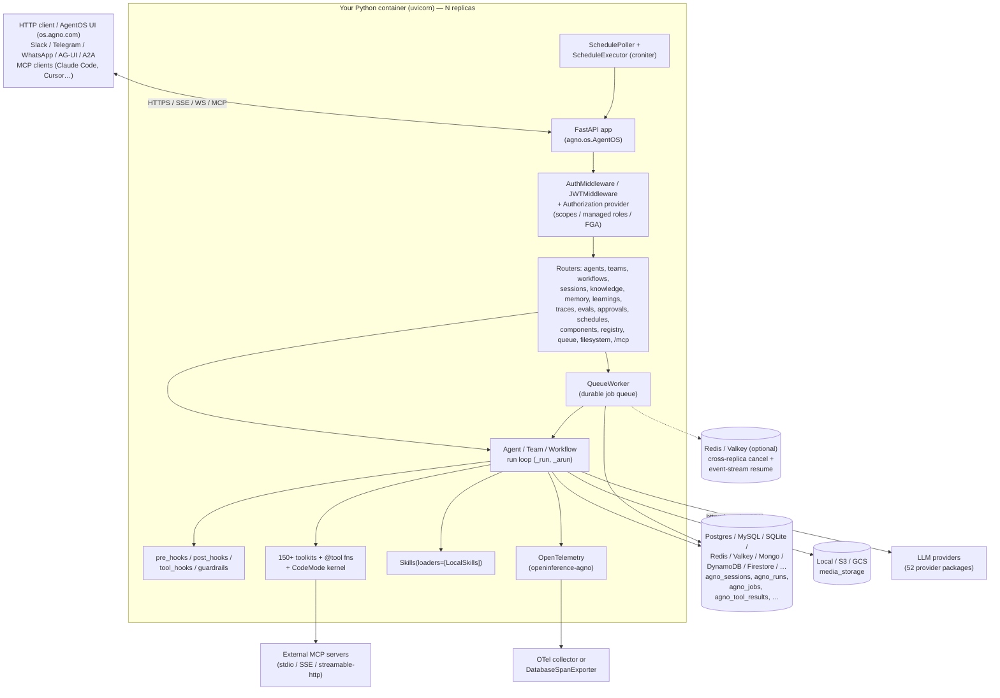
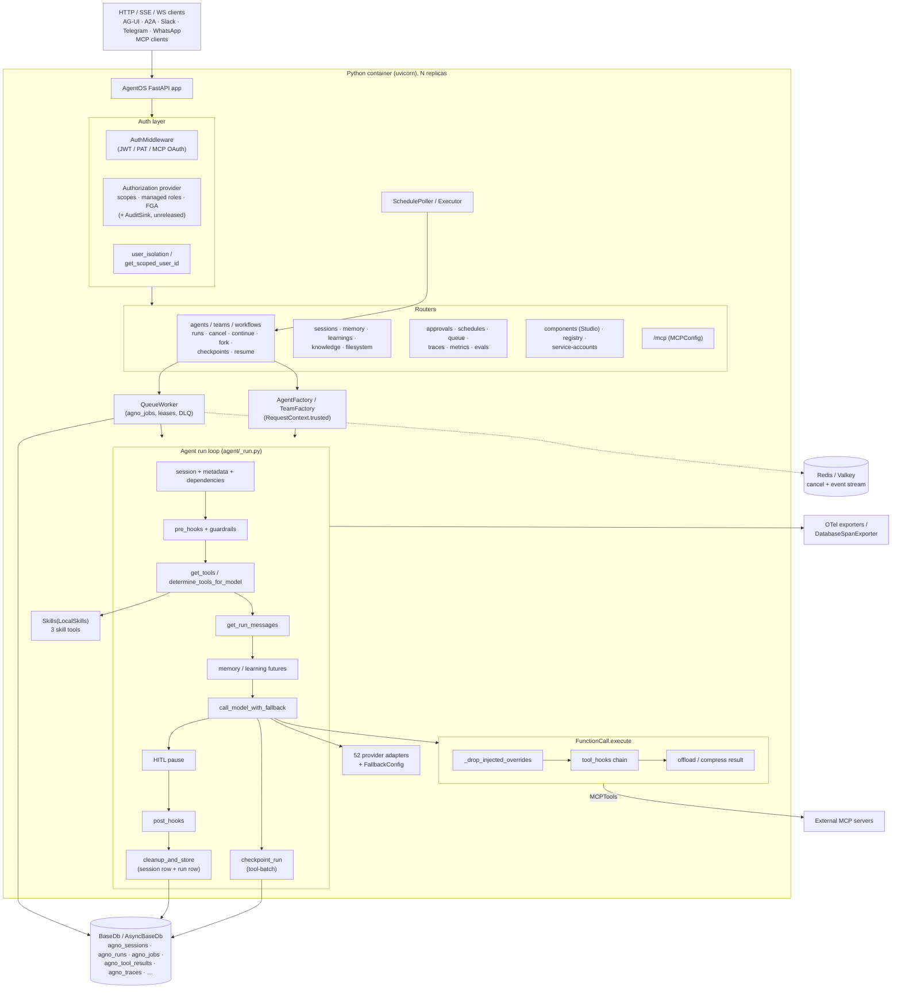

# Agno Python — Benchmark Analysis

> **Repo**: https://github.com/agno-agi/agno
> **Commit analysed**: `657c9f70e913ba0336f1cfba0341e60a47da66e0`
> **Branch**: `main`
> **Framework path**: `frameworks/agno`
> **Analysed on**: 2026-10-01

Analysed at `main` 22 commits after the `v3.0.11` tag (`git describe`: `v3.0.11-22-g657c9f70e`). `libs/agno/pyproject.toml:3` already reads `version = "3.1.0"`, but 3.1.0 is not published on GitHub Releases as of 2026-10-01; features that exist only on `main` (not in `v3.0.11`) are flagged "unreleased" below. Previous analysis: `bb7ddb05` (`agno==2.6.7`, 2026-05-19). All file paths in this document are relative to `frameworks/agno/` unless otherwise noted.

## TL;DR

- **Agno is an opinionated, batteries-included Python framework + runtime ("AgentOS").** The agent loop is a sync/async function family (`_run`, `_run_stream`, `_arun`, `_arun_stream`, plus `_arun_background*` and `_continue_run*`) in `libs/agno/agno/agent/_run.py` (6,729 lines). AgentOS is a FastAPI app produced by `AgentOS.get_app()` that mounts the agents/teams/workflows run API with SSE, JWT auth + RBAC, a durable background job queue, scheduler, traces, evals, knowledge, memory, approvals, a filesystem API and an MCP server. Everything runs in your Python process — no subprocess, no vendor cloud required.
- **Ecosystem**: **Python** (`requires-python = ">=3.9,<4"`, raised from 3.7 in the 3.x line).
- **Open source under Apache 2.0** (`libs/agno/LICENSE`), maintained by **Agno** (the company at `https://agno.com`). An optional hosted control-plane UI (`https://os.agno.com`) connects to your self-hosted runtime; data stays in your DB.
- **Maturity/adoption (2026-10-01)**: 42,439 stars, 6,055 forks, 589 contributors, ~1.7 M PyPI downloads/month. Very fast cadence: 58 GitHub releases between 2026-05-15 and 2026-09-23, 571 commits between the two analysed commits. **v3.0.0 (2026-08-24) is a breaking release with a mandatory DB migration** — runs moved out of the session JSON blob into an `agno_runs` table.
- **Where the loop executes**: in-process. `Agent.run()` → `_run.run_dispatch()` → `_run()`; the LLM↔tool cycle runs inside the `Model` adapter via `call_model_with_fallback`.
- **Strongest choice for our use case**: the platform layer is now deep. Since the last analysis Agno added **tool-batch mid-run checkpointing + run fork/regenerate/continue-from** (v2.6.19), a **durable DB-backed job queue** with idempotency keys, bounded concurrency and multi-replica reclaim (v3.0), **per-user isolation across sessions, memory, knowledge and 17 vector DBs** (v3.0), **tool-result offloading** to an `AgentFS` store (v3.0), an **eval suite runner with CI exit codes** (v2.7), and (unreleased on `main`) a **pluggable authorization layer** with managed roles, OpenFGA ReBAC and a DB-backed decision/change **audit trail**. Per-request **`AgentFactory`** construction with a `TrustedContext` built only from verified JWT claims is the cleanest tenant-aware tool-selection seam in the benchmark.
- **Weakest / biggest gap**: still **no first-class `tenant_id`** — isolation is per `user_id` (open feature request [#9831](https://github.com/agno-agi/agno/issues/9831)). **No per-tenant USD budget cap**, and **USD cost is only populated when the provider's usage payload carries a `cost` field** (`models/openai/chat.py:1036`) — Agno has no pricing table (correction vs. the previous report). **No automatic history compaction** (open issues #8790, #9542). **Skills: only `LocalSkills`**, unchanged since 2.6.7.
- **Most surprising finding**: `tool_hooks` can force an argument only by **mutating the `args` dict in place**. The innermost entrypoint ignores the kwargs a hook passes to `next_func(...)` and re-reads `FunctionCall.arguments` (`tools/function.py:2485-2496`), and a zero-argument call starts the chain with a fresh `{}` (`tools/function.py:2642`), so in-place mutation is lost there too. The robust pattern is to read tenant identity from `run_context` inside the tool; since v2.9 the framework strips any model-supplied value for framework-owned parameters such as `run_context` (`_drop_injected_overrides`, `tools/function.py:2375`).
- **One-line verdicts** — Sessions/persistence: 🟢 runs table (O(1) per-run writes), 14 DB adapters, tool-batch checkpoints, fork/regenerate. Skills: 🟢 SKILL.md spec with lazy body, 🟡 only `LocalSkills`. Resource manager: 🟡 Studio components gained draft→publish, archive/restore and compare-and-set, but no skill registry, no external sources. Sub-agents: 🟢 `Team` with 4 modes (parallel only in `arun`). Multi-tenancy: 🟡 user-level isolation + factories + JWT `dependencies_claims`, no tenant column. Hooks: 🟢 pre/post/tool hooks + guardrails + background hooks. API: 🟢 FastAPI + SSE with resumable event index, cancel, continue/fork/checkpoints, durable queue. Observability: 🟢 OTel via openinference + DB span exporter; 🟡 USD cost provider-dependent.
- **Production-readiness verdict for multi-tenant server-side deployment**: 🟢 for the platform (auth, RBAC, SSE, durable queue, persistence, scheduling, audit on `main`). 🟡 for tenant governance: you model tenant as user or as JWT-claim dependencies yourself, and budget enforcement is BYO. The v2→v3 migration is non-trivial (DB migration, entity-memory re-key, vector-DB `user_id` migrations), and the API surface still moves fast (MCP config renamed twice in 2.7→3.0.2).

---

## 0. General

### 0.1 What is this stack?

A **library + runtime** (Agno SDK + AgentOS) plus CLIs (`agnoctl`, published as `agno` command, and the older `agno-infra`). The library defines `Agent`, `Team`, `Workflow`, `Skills`, tools, DB adapters, knowledge, evals and the `AgentOS` FastAPI server. From `README.md`: "Agno is a framework and runtime for agent platforms. Build agents, run them as a service, manage your platform using a web UI."

### 0.2 Ecosystem

**Python** (`requires-python = ">=3.9,<4"`, `libs/agno/pyproject.toml:5`). Single-language project. The `os` extra adds FastAPI, uvicorn, SQLAlchemy, PyJWT, OpenTelemetry and croniter on the same runtime (`libs/agno/pyproject.toml:80`).

### 0.3 Project status & governance

- **License**: Apache 2.0 (`libs/agno/LICENSE`, classifier in `libs/agno/pyproject.toml`).
- **Owner**: Agno (company; authors now listed as "Agno Team", `libs/agno/pyproject.toml:8-10`; previously Ashpreet Bedi).
- **Commercial backing**: yes. The hosted AgentOS UI at `https://os.agno.com` connects to your self-hosted runtime; starter deploy templates (`agentos-docker`, `agentos-aws`, `agentos-gcp`, `agentos-railway`, `agentos-helm`, …) are linked from `README.md`. The framework itself is fully open source; no paid-support SKU is visible in the repo.

### 0.4 Project maturity / age

- GitHub repo created **2022-05-04** (GitHub API; the project was previously published as `phidata`).
- Current line: **3.x**. `v3.0.0` shipped 2026-08-24 as a breaking release; latest tag `v3.0.11` (2026-09-23). `main` carries `version = "3.1.0"` (`libs/agno/pyproject.toml:3`) with unreleased authorization/user-management work (commit `6a7b20541`, "feat: v3.1").
- Classifier `Development Status :: 5 - Production/Stable`. Schema migrations are versioned (`libs/agno/agno/db/migrations/versions/v3_0_0.py`), and stale databases raise typed `MigrationRequiredError` / `SchemaMismatchError` (v3.0.0 release notes).
- Published packages: `agno` (library), `agnoctl` (CLI, `libs/agnoctl/pyproject.toml`, v0.2.1), `agno-infra` (`libs/agno_infra/`).

### 0.5 Adoption & community signal

Captured via `gh api repos/agno-agi/agno` and pypistats on **2026-10-01**:
- **Stars 42,439**, **forks 6,055**, **watchers 238**, **contributors 589** (incl. anonymous).
- **Open issues 817**, **open PRs 906** (GitHub search API).
- **PyPI downloads**: ~1.71 M last month, ~469 k last week (pypistats.org).
- **Commit activity**: 571 commits between `bb7ddb05` (2026-05-15) and `657c9f70` (2026-10-01); 126 commits since 2026-09-01. Last push 2026-10-01.
- **Release cadence**: 58 GitHub releases (incl. pre-releases) between 2026-05-15 and 2026-09-23 — roughly two per week; 2.6.8 → 2.6.22, 2.7.0 → 2.7.4, 2.8.0 → 2.8.7, 2.9.0, 3.0.0a1–a5, 3.0.0 → 3.0.11.
- CI: `.github/workflows/` (incl. `test_on_release.yml`), mypy 2.1.0, ruff 0.15.20, pytest 9.1.1 (`libs/agno/pyproject.toml` dev extra). Each cookbook carries a `TEST_LOG.md`.

### 0.6 Ecosystem fit

- **Packages**: `agno` on PyPI (`pip install agno`), extras `os`, `mcp`, `scheduler`, `postgres`, `fga`, `pages`, `opentelemetry`, plus per-integration extras. `agnoctl` on PyPI (`uvx agno connect`, `agno create`, `agno up/down`, `agno tokens ...`; v2.7.0 release notes).
- **Core dependencies**: `agnoctl`, docstring-parser, h11, httpx[http2], packaging, pydantic, pydantic-settings, pyyaml, rich, typing-extensions (`libs/agno/pyproject.toml:26-41`).
- **Examples**: `cookbook/` with numbered topic folders (`00_quickstart` … `13_filesystem`, `90_models`, `91_tools`, `93_components`, `99_docs`) plus `data_labeling/`, `environments/`; AgentOS examples in `cookbook/05_agent_os/01_getting_started` … `27_public_pages`.
- **Used as**: library + self-hosted server; README now drives users to template repos and a coding-agent prompt.

### 0.7 Documentation depth & cross-team contributor accessibility

- Official docs at `https://docs.agno.com` (English), with `llms-full.txt` for coding agents. v3 has dedicated migration and changelog pages.
- In-repo docs are deep: `libs/agno/agno/db/migrations/V3_MIGRATION_GUIDE.md`, `libs/agno/migrations/v2_to_v3/README.md` (per-vector-DB matrix), cookbooks with READMEs and test logs.
- Non-engineers can author **`SKILL.md`** files and, via the AgentOS UI/Studio, compose agents from a governed component catalog (draft → publish). Tool authoring still requires Python (`@tool`).

### 0.8 Documentation entry points ⭐

- Official docs landing page: https://docs.agno.com
- Quickstart: https://docs.agno.com/first-agent
- API reference: https://docs.agno.com (reference section)
- Hosting / deployment / production guide: https://docs.agno.com/runtime/deploy (plus template repos linked from `README.md`, e.g. https://github.com/agno-agi/agentos-docker)
- v3 migration guide: https://docs.agno.com/other/v3-migration ; in-repo `libs/agno/agno/db/migrations/V3_MIGRATION_GUIDE.md`
- Examples / demos: `cookbook/` in this repo
- Changelog / release notes: https://docs.agno.com/other/v3-changelog (no in-repo CHANGELOG)
- GitHub Releases: https://github.com/agno-agi/agno/releases
- GitHub issues: https://github.com/agno-agi/agno/issues — relevant open issues: [#9831](https://github.com/agno-agi/agno/issues/9831) first-class tenant scope separate from `user_id`; [#9151](https://github.com/agno-agi/agno/issues/9151) governance middleware incl. cost budgets; [#8790](https://github.com/agno-agi/agno/issues/8790) / [#9542](https://github.com/agno-agi/agno/issues/9542) history compaction; [#8606](https://github.com/agno-agi/agno/issues/8606) skill-scoped tools; [#8304](https://github.com/agno-agi/agno/issues/8304) `tool_call_limit` does not stop the loop (bug).
- Discord / community: linked from https://agno.com

---

## 1. High Level Architecture

### Deployment diagram


```mermaid
flowchart TB
    Client["HTTP client / AgentOS UI (os.agno.com)<br/>Slack / Telegram / WhatsApp / AG-UI / A2A<br/>MCP clients (Claude Code, Cursor…)"]

    subgraph Container["Your Python container (uvicorn) — N replicas"]
        FastAPI["FastAPI app<br/>(agno.os.AgentOS)"]
        Auth["AuthMiddleware / JWTMiddleware<br/>+ Authorization provider<br/>(scopes / managed roles / FGA)"]
        Routers["Routers: agents, teams, workflows,<br/>sessions, knowledge, memory, learnings,<br/>traces, evals, approvals, schedules,<br/>components, registry, queue, filesystem, /mcp"]
        Queue["QueueWorker<br/>(durable job queue)"]
        Scheduler["SchedulePoller +<br/>ScheduleExecutor (croniter)"]
        AgentLoop["Agent / Team / Workflow<br/>run loop (_run, _arun)"]
        Hooks["pre_hooks / post_hooks /<br/>tool_hooks / guardrails"]
        Tools["150+ toolkits + @tool fns<br/>+ CodeMode kernel"]
        Skills["Skills(loaders=[LocalSkills])"]
        Tracing["OpenTelemetry<br/>(openinference-agno)"]
    end

    Client <-->|HTTPS / SSE / WS / MCP| FastAPI
    FastAPI --> Auth --> Routers --> AgentLoop
    Routers --> Queue --> AgentLoop
    Scheduler --> FastAPI
    AgentLoop --> Hooks
    AgentLoop --> Tools
    AgentLoop --> Skills
    AgentLoop --> Tracing

    DB[(Postgres / MySQL / SQLite /<br/>Redis / Valkey / Mongo /<br/>DynamoDB / Firestore / …<br/>agno_sessions, agno_runs,<br/>agno_jobs, agno_tool_results, …)]
    Redis[("Redis / Valkey (optional)<br/>cross-replica cancel +<br/>event-stream resume")]
    Media[("Local / S3 / GCS<br/>media_storage")]
    LLM["LLM providers<br/>(52 provider packages)"]
    OTLP["OTel collector or<br/>DatabaseSpanExporter"]
    MCP["External MCP servers<br/>(stdio / SSE / streamable-http)"]

    AgentLoop --> DB
    Queue --> DB
    Queue -.-> Redis
    AgentLoop --> Media
    AgentLoop -->|httpx / vendor SDK| LLM
    Tracing --> OTLP
    Tools --> MCP
```

### 1.1 Where does the agent loop *actually* execute?

**In your Python process.** `Agent.run(...)` (`libs/agno/agno/agent/agent.py:1480-1530`) dispatches to `_run.run_dispatch(...)` (`libs/agno/agno/agent/_run.py:1307`), which calls `_run(agent, ...)` (`_run.py:367`). Each attempt (the loop retries up to `agent.retries`) executes 16 numbered steps (`_run.py:435-675`):

1. Read or create the session (reuse a pre-read session on the first attempt).
2. Update metadata and session state.
3. Resolve dependencies (callables may now receive `agent`, `run_context`, `run_input`, `session`; v3.0.7).
4. Execute `pre_hooks` (guardrails, evals, plain callables).
5. Determine tools (`agent.get_tools` + `determine_tools_for_model`; callable factories resolve here).
6. Build run messages.
7. Start background futures for memory and learning extraction.
8. Reasoning step (only when `reasoning_model` / `reasoning_agent` is set; `reasoning=True` was removed in v3).
9. Call the model: `call_model_with_fallback(...)` (`_run.py:553-573`) — the adapter runs the LLM↔tool cycle; with `checkpoint="tool-batch"` an `after_tool_results` callback persists a checkpoint after each tool batch.
10. Update `RunOutput`; if any tool is paused (HITL), persist and return `paused`.
11. Store media; 12. convert to structured output; 12b. follow-ups.
13. Execute `post_hooks`.
14. Wait for background futures.
15. Create session summary if enabled.
16. `cleanup_and_store` → session row + run row.

No subprocess and no vendor cloud unless you opt in (e.g. `GeminiInteractions` managed agents, external-framework agents under `libs/agno/agno/agents/`).

### 1.2 Runtime dependencies

- **Python 3.9+**.
- **Server**: `agno[os]` adds fastapi, python-multipart, uvicorn, websockets, sqlalchemy[asyncio], PyJWT, opentelemetry-sdk, openinference-instrumentation-agno, croniter/pytz (`libs/agno/pyproject.toml:80`).
- **Database**: one of the adapters (Postgres via psycopg 3 in the `postgres` extra, `libs/agno/pyproject.toml:195`; SQLite; MySQL; Mongo; Redis/Valkey; DynamoDB; Firestore; …). **Background runs now require a DB** on the component (v3.0.0 breaking change).
- **Optional Redis/Valkey** for cross-replica cancellation and SSE resume (`QueueConfig.redis`, `libs/agno/agno/job_queue/config.py:69-75`). "Redis is optional coordination, never truth" (v3.0.0 notes).
- **Optional object storage** (S3/GCS) for `media_storage` (v3.0.0).
- **Optional MCP**: `agno[mcp]` = `mcp>=2.1,<3` + `fastmcp>=4,<5` (`libs/agno/pyproject.toml:81`).
- **Optional OpenFGA** server for ReBAC (`agno[fga]`, `libs/agno/pyproject.toml:83`; unreleased).
- **LLM provider API**: at least one provider key.
- **Optional vendor**: the hosted UI at `https://os.agno.com`.

### 1.3 Recommended deployment topology

**One process serves many agents and many concurrent sessions; scale out with stateless replicas against a shared DB.** `README.md` points to per-platform template repos (Docker, AWS, GCP, Azure, Railway, Fly, Render, Modal, Helm) that run AgentOS + Postgres. `agent_os.serve(app="run:app", reload=True)` wraps `uvicorn.run` (`libs/agno/agno/os/app.py:2821-2890`). Multi-replica concerns are explicit in v3: `QueueConfig` documents that timing/budget fields must be uniform across replicas (`job_queue/config.py:77-90`), MCP can be served stateless for no session affinity (`MCPConfig(stateless=True)`, `libs/agno/agno/os/config.py:239`).

### 1.4 Cold-start cost & instance footprint

- Cold start = Python import + FastAPI app + AgentOS init (`db_lifespan` → `_initialize_sync_databases` / `_initialize_async_databases`, `os/app.py:190-201`) + optional MCP connect (`mcp_lifespan`, `os/app.py:107`) + scheduler start (`os/app.py:204-234`). With `auto_provision_dbs=True` (default, `os/app.py:314`) tables are created on boot.
- v3.0.1 caches derived tool schemas across runs and loads session history incrementally per turn, reducing per-run overhead for large toolkits and long sessions (v3.0.1 notes). v3.0.4 made `agno.tools.file` / `agno.tools.knowledge` lazy-import (44.8 ms saved on `FileTools` import).
- RAM/disk baseline: Not provided — BYO measurement. The package is ~455 k lines of Python (`libs/agno/agno/`), but most toolkits/providers are lazily imported.

### 1.5 Vendor lock-in

- **LLM-provider lock-in**: 🟢 minimal — 52 provider packages under `libs/agno/agno/models/`, abstract `Model` base, `"provider:model-id"` strings.
- **Hosting-platform lock-in**: 🟢 none — a uvicorn process; templates for many clouds.
- **Eval-platform lock-in**: 🟢 none — evals, scorers and environments are in-repo; OTel is provider-neutral.

### 1.6 Framework weight / footprint

**Heavy.** `libs/agno/agno/` has ~40 subpackages (agent, team, workflow, tools, models, db, knowledge, vectordb, memory, learn, eval, scorer, environments, guardrails, hooks, skills, registry, scheduler, job_queue, tracing, compression, offload, fs, context, os, …). Between `bb7ddb05` and `657c9f70` the package diff is +177 k / −31 k lines across 707 files; `os/` alone is ~62 k lines. `Agent.__init__` takes ~110 keyword parameters (`libs/agno/agno/agent/agent.py:396-508`); `agent.py` is 1,986 lines and `_run.py` 6,729. Firmly a "platform", not a thin SDK.

### 1.7 Release-history signal

No in-repo `CHANGELOG.md`; release notes live on GitHub Releases and `https://docs.agno.com/other/v3-changelog`. Highlights from 2.6.8 → 3.0.11 (+ `main`):

- **v2.6.15**: AgentOS MCP server becomes an extension point (`MCPServerConfig`, custom tools, caller identity injection). Call-site `dependencies` now merge with configured ones (call-site wins).
- **v2.6.19**: **tool-batch checkpointing**, unified `/continue` (regenerate, continue-from, fork), **session fork**; `StudioTool` for dynamic composition.
- **v2.7.0**: `agnoctl` CLI, **service-account PATs** (`agno_pat_…`, SHA-256-hashed), single `AuthMiddleware` across REST/MCP/WebSocket, MCP surface shrunk 19 → 8 tools (breaking), `AgentOS(authorization=True)` without keys now fails fast, **eval suite runner** (`agno.eval.suite`).
- **v2.7.2**: OAuth on the AgentOS MCP endpoint; AG-UI client tools.
- **v2.8.0**: `agno.scorer` (Code/Judge/ToolCall scorers), `agno.environments` (pass@k rollouts, SFT export); `ReliabilityEval` now matches executions (verdicts may flip).
- **v2.9.0**: security fixes — MCP `tool_name` override blocked, tool-result cache keyed per user; rehydration fails loudly (`ComponentRehydrationError`, HTTP 422).
- **v3.0.0 (breaking, migration required)**: runs table (`agno_runs`), `agno_jobs` durable queue, `agno_tool_results` offload index, per-user isolation extended to metrics/schedules/evals/knowledge/components/entity memory/17 vector DBs, tool-result offloading, media offloading, `CodeMode`, Studio 3.0 governed catalog. Removed: culture feature, `MultiMCPTools`, `reasoning=True`, `updated_tools` on `continue_run`, `JWTMiddleware(secret_key=…)`, `GET /models`, `AgentOS(enable_mcp_server=…, mcp_config=…)`. Renamed agent params (`enable_user_memories` → `update_memory_on_run`, `search_session_history` → `search_past_sessions`, …).
- **v3.0.2**: run `metadata` precedence changed (call-site wins); MCP config renamed again (`mcp=`, `MCPConfig`, `default_tools`), agents/teams/workflows/toolkits publishable as named MCP tools.
- **v3.0.5–3.0.7**: ingestion failures surfaced (`partial` status, `EmbeddingError`), stateless MCP serving, `MCPTools(protocol_mode=…)` on `fastmcp.Client`, `PublicSurface` for anonymous public serving, `Knowledge` keyword-only.
- **v3.0.10–3.0.11**: `CodingTools.run_shell` opt-in, knowledge-level reranker pipeline, `cancellation_stage` on run outputs.
- **`main` (unreleased 3.1)**: `agno.os.authz` (pluggable `AuthorizationProvider`, managed roles, `UserDirectory`, OpenFGA adapter, audit sinks), filesystem router, MCP default/lifecycle tools opt-in.

The fast-moving areas are AgentOS auth, MCP serving, storage layout and knowledge ingestion. Expect breaking renames between minors.

---

## 2. Agent Loop

### 2.1 Run loop entrypoint(s)

Signature in `libs/agno/agno/agent/agent.py:1480-1505` (unchanged shape since 2.6.7):

```python
def run(
    self,
    input: Union[str, List, Dict, Message, BaseModel, List[Message]],
    *,
    stream: Optional[bool] = None,
    stream_events: Optional[bool] = None,
    user_id: Optional[str] = None,
    session_id: Optional[str] = None,
    session_state: Optional[Dict[str, Any]] = None,
    run_context: Optional[RunContext] = None,
    run_id: Optional[str] = None,
    audio: Optional[Sequence[Audio]] = None,
    images: Optional[Sequence[Image]] = None,
    videos: Optional[Sequence[Video]] = None,
    files: Optional[Sequence[File]] = None,
    knowledge_filters: Optional[Union[Dict[str, Any], List[FilterExpr]]] = None,
    add_history_to_context: Optional[bool] = None,
    add_dependencies_to_context: Optional[bool] = None,
    add_session_state_to_context: Optional[bool] = None,
    dependencies: Optional[Dict[str, Any]] = None,
    metadata: Optional[Dict[str, Any]] = None,
    output_schema: Optional[Union[Type[BaseModel], Dict[str, Any]]] = None,
    yield_run_output: Optional[bool] = None,
    debug_mode: Optional[bool] = None,
    **kwargs: Any,
) -> Union[RunOutput, Iterator[Union[RunOutputEvent, RunOutput]]]:
```

Async sibling `arun(...)` (`agent.py:1587`) returns `RunOutput` or `AsyncIterator[RunOutputEvent]`; `arun(..., background=True)` goes through `_arun_background` / `_arun_background_stream` (`_run.py:1941`, `:2061`).

`continue_run` / `acontinue_run` grew into a general "resume / regenerate / fork" entrypoint (`agent.py:1677-1722`):

```python
def continue_run(self, run_response=None, *, run_id=None,
    requirements: Optional[List[RunRequirement]] = None,
    input: Optional[str] = None,
    continue_from: Union[int, Literal["end", "last_user"]] = "end",
    fork: bool = False, regenerate: bool = False,
    replace_original: Optional[bool] = None,
    additional_instructions: Optional[str] = None, ...)
```

`updated_tools=` was removed in v3; HITL resumes pass `requirements`. Sessions can also be forked with `fork_session_dispatch` (`_run.py:6600`).

### 2.2 Per-iteration behavior

The harness sees one logical run per `_run` call; the LLM↔tool iteration is inside the `Model` adapter: prepare messages → call model with tools → parse tool calls → `FunctionCall.execute()` (pre_hook → tool_hooks chain → entrypoint → post_hook) → append tool results → re-call model → until no tool calls or `tool_call_limit` (note open bug #8304 reporting the limit not stopping the loop). With `checkpoint="tool-batch"`, after each tool batch the adapter calls `after_tool_results`, which syncs `run_response.messages/tools` and persists a `running` checkpoint (`_run.py:6505-6528`, `:6466-6487`). The 16 harness steps around that call are listed in Q1.1.

### 2.3 ReAct loop

**Built in.** The tool-calling loop lives in each `Model` adapter (`libs/agno/agno/models/base.py`). An explicit reasoning phase runs when `reasoning_model` (a native reasoning model) or `reasoning_agent` is set (`agent.py:215-216`, `handle_reasoning` at step 8). `reasoning=True` / CoT-by-default was removed in v3.0.0.

### 2.4 Tool dispatch + result handling

`determine_tools_for_model(...)` resolves the final tool list (step 5). When the LLM emits a call, `FunctionCall.execute()` (`tools/function.py:2589`):

1. Builds entrypoint args, injecting `agent`, `team`, `run_context`, `fc`, media and `_agno_*` channels by parameter name (`_build_entrypoint_args`, `function.py:2257-2275`).
2. **Drops model-supplied values for framework-owned parameters** (`_drop_injected_overrides`, `function.py:2375-2394`; new since v2.9) so the LLM cannot override `run_context`/identity.
3. Runs `Function.pre_hook`, checks the (now per-user-keyed) result cache, then runs the `tool_hooks` chain or the entrypoint directly (`function.py:2636-2647`).
4. Wraps the result in `FunctionExecutionResult`; generators are stored for the adapter to drain (`function.py:2652`).

Results are appended as `role="tool"` messages and as `ToolExecution` records on `RunOutput.tools`. With `offload_tool_results=True`, results over 16,000 chars are written to the `ResultStore` and replaced by an envelope with a `result_id` (Q7.6).

### 2.5 Explicit turn concept

Agno uses **"run"**. One `run()` = one turn = one model loop with N tool calls. `run_id` defaults to `str(uuid4())` (`_run.py:1346`). In v3 each run is stored as its own row in `agno_runs` with a `run_index` inside the session (`libs/agno/agno/db/migrations/V3_MIGRATION_GUIDE.md:23-48`); `AgentSession.runs` is re-attached on read.

### 2.6 Event emission mechanism (in-process)

- **Non-stream**: `_run` returns `RunOutput`.
- **Stream**: `_run_stream` is a generator yielding `RunOutputEvent`; `_arun_stream` an `AsyncIterator`. The enum `RunEvent` has 37 members (`libs/agno/agno/run/agent.py:144-194`).
- Events are built by helpers in `agno.utils.events` and pass through `handle_event(...)`, which honours `events_to_skip` and `store_events`.
- New in 3.x: every streamed event carries a monotonic `event_index` stamped at publish time (`_EventIndexCarrier`, `libs/agno/agno/run/base.py:47-71`), which the HTTP resume endpoint uses for exact replay.

---

## 3. Message & Event Taxonomy

### 3.1 Message layers

Three layers (unchanged design):

1. **`agno.models.message.Message`** — one pydantic model for system/user/assistant/tool, used both in the prompt and in persisted `RunOutput.messages`. In 3.x it also carries `checkpoint_status` / `checkpoint_created_at` markers for tool-batch checkpoints (`_run.py:6396-6403`).
2. **Run I/O** — `RunInput` (`run/agent.py:39`) and `RunOutput` (`run/agent.py:618`), plus `TeamRunOutput` / `WorkflowRunOutput`.
3. **Stream events** — `RunOutputEvent` union (`run/agent.py:525`), `TeamRunOutputEvent`, `WorkflowRunOutputEvent`.

```
user input ─► RunInput ─► RunMessages (system/user/history) ─► Message[] ─► provider SDK
                                                              ◄─ ModelResponse (+ToolExecution)
RunOutput { messages: Message[], tools: ToolExecution[], metrics, requirements, … }
      └─ streamed as RunOutputEvent* ─► format_sse_event_with_index ─► SSE frame
```

### 3.2 Concrete message types

| Type | File | Purpose |
|------|------|---------|
| `Message` | `libs/agno/agno/models/message.py` | Universal message (role, content, tool_calls, tool_call_id, metrics, checkpoint markers) |
| `RunInput` | `libs/agno/agno/run/agent.py:39` | Literal input passed to `run()` plus media |
| `RunOutput` | `run/agent.py:618-702` | Result: `messages`, `tools`, `content`, `metrics`, `status`, `requirements`, `cancellation_stage`, checkpoint/fork/regenerate lineage, `queue_attempt` |
| `RunMessages` | `libs/agno/agno/run/messages.py` | Working set for one run (system, user, history, extra, messages_for_model) |
| `RunContext` | `libs/agno/agno/run/base.py:16-44` | Live per-run carrier: `run_id`, `session_id`, `user_id`, `workflow_id/name`, `dependencies`, `knowledge_filters`, `metadata`, `session_state`, `output_schema`, `messages`, resolved `tools/knowledge/members`, `client_tools` |
| `ToolExecution` | `libs/agno/agno/models/response.py` | Tool call record (id, name, args, result, paused/confirmation flags) |
| `RunRequirement` | `libs/agno/agno/run/requirement.py` | HITL requirement (confirm / user input / external execution) |

### 3.3 Messages vs. events

Two taxonomies. `RunOutput.messages` is the persisted history; `RunOutputEvent` is the live stream. Events are persisted on the run only when `store_events=True`; the AgentOS event stream (`os/event_streams/`, in-memory or Redis) buffers them for resume.

### 3.4 Event categories

`RunEvent` (`run/agent.py:144-194`):

| Category | Events |
|----------|--------|
| Run lifecycle | `RunStarted`, `RunContent`, `RunContentCompleted`, `RunIntermediateContent`, `RunCompleted`, `RunError`, `RunCancelled`, `RunPaused`, `RunContinued` |
| Hook lifecycle | `PreHookStarted`, `PreHookCompleted`, `PostHookStarted`, `PostHookCompleted` |
| Tool lifecycle | `ToolCallStarted`, `ToolCallCompleted`, `ToolCallError` |
| Reasoning | `ReasoningStarted`, `ReasoningStep`, `ReasoningContentDelta`, `ReasoningCompleted` |
| Memory | `MemoryUpdateStarted`, `MemoryUpdateCompleted` |
| Session summary | `SessionSummaryStarted`, `SessionSummaryCompleted` |
| Parser / output model | `ParserModelResponseStarted/Completed`, `OutputModelResponseStarted/Completed` |
| Model request | `ModelRequestStarted`, `ModelRequestCompleted` (tokens, TTFT, cache tokens; `run/agent.py:470-483`) |
| Compression | `CompressionStarted`, `CompressionCompleted` |
| Followups | `FollowupsStarted`, `FollowupsCompleted` |
| Custom | `CustomEvent` |

`TeamRunEvent` (`run/team.py:133-188`) mirrors this with a `Team` prefix and adds task-mode events (`TeamTaskIterationStarted/Completed`, `TeamTaskStateUpdated`, `TeamTaskCreated`, `TeamTaskUpdated`). Sub-agent activity is surfaced by streaming the member's own events (Q9.7); there are no dedicated "delegation started" events.

### 3.5 Canonical type-definition file(s)

- `libs/agno/agno/run/agent.py` — `RunInput`, `RunEvent`, event dataclasses, `RunOutputEvent`, `RunOutput`
- `libs/agno/agno/run/base.py` — `RunContext`, `BaseRunOutputEvent`, `RunStatus`, `CancellationStage` (`:391`)
- `libs/agno/agno/run/team.py` — `TeamRunEvent`, `TeamRunOutput`
- `libs/agno/agno/models/message.py` — `Message`

### 3.6 Live agentic event stream taxonomy

Server helper `format_sse_event_with_index(event, event_index, run_id)` (`libs/agno/agno/os/utils.py:312`) emits `event: <name>\ndata: <json>\n\n` with `event_index` and `run_id` injected; idle streams get `: keepalive` comments (`os/utils.py:443`).

**Run start**
```
event: RunStarted
data: {"event":"RunStarted","event_index":0,"run_id":"r-7","session_id":"s-1","agent_id":"audience","model":"gpt-5.5","model_provider":"OpenAI"}
```
**Content delta**
```
event: RunContent
data: {"event":"RunContent","event_index":3,"run_id":"r-7","content":"Hello","content_type":"str"}
```
**Tool call started / completed**
```
event: ToolCallStarted
data: {"event":"ToolCallStarted","event_index":4,"run_id":"r-7","tool":{"tool_call_id":"call_abc","tool_name":"topicSearch","tool_args":{"query":"…"}}}

event: ToolCallCompleted
data: {"event":"ToolCallCompleted","event_index":5,"run_id":"r-7","tool":{"tool_call_id":"call_abc","result":"…"}}
```
**Run completed**
```
event: RunCompleted
data: {"event":"RunCompleted","event_index":9,"run_id":"r-7","content":"Final answer","metrics":{"input_tokens":123,"output_tokens":45}}
```

---

## 4. Agent Runtime (Multi-session Host)

### 4.1 Multi-session host architecture

`AgentOS` (`libs/agno/agno/os/app.py:284`) hosts N agents/teams/workflows (static instances, `RemoteAgent`s, external-framework agents via `AgentProtocol`, or per-request **factories**) behind shared routers:

```python
agent_os = AgentOS(
    id="my-os",
    db=PostgresDb(db_url=...),
    agents=[support_agent, AgentFactory(id="workspace", db=db, factory=build_agent)],
    teams=[research_team],
    authorization=True,
    user_isolation=True,
    queue=QueueConfig(durable=True, redis="redis://..."),
    scheduler=True,
    mcp=True,
    tracing=True,
)
app = agent_os.get_app()
```

Constructor parameters: `os/app.py:285-325`.

### 4.2 Concurrent session isolation

Each call builds its own `RunContext` and reads/writes its own session. The `Agent` instance is shared, so per-call variation belongs in `RunContext` (dependencies, metadata, session_state, knowledge_filters, resolved tools). v3.0.2 stopped writing session metadata back onto the shared component (run-metadata precedence change). Isolation risks fixed in this window: per-user tool-result cache keys (v2.9.0), SQLite bulk `upsert_sessions` owner check (v3.0.8), entity memory keyed per user (v3.0.0). With `user_isolation=True` the API enforces "each caller sees only their own sessions/memories" under `authorization=True` (`os/app.py:377-378`).

### 4.3 Horizontal scaling / multi-instance

Stateless replicas share one DB. v3 adds explicit multi-replica machinery:
- **Durable queue**: accepted background runs are committed rows in `agno_jobs`, claimed by any replica's worker with leases, heartbeats and fenced writes (`QueueConfig`, `job_queue/config.py:56-116`).
- **Cross-replica cancel and SSE resume** via `QueueConfig(redis=...)` (Redis or Valkey).
- **Scheduler** remains DB-polling (`SchedulePoller`), with schedules now keyed `(user_id, name)`.
- **Stateless MCP** (`MCPConfig(stateless=True)`) so `/mcp` needs no session affinity.

No leader election is needed for runs; sessions are keyed by `session_id`.

### 4.4 Background / async / scheduled tasks

🟢 First-party.
- **Background runs**: `POST /agents/{id}/runs` with `background=true` → `_arun_background` persists a `PENDING` run, waits for a concurrency slot (default 32 per replica, `AGNO_BACKGROUND_MAX_CONCURRENCY`) and executes detached (`_run.py:1941-2060`). Streaming variant buffers SSE for `/resume`.
- **Durable mode**: `QueueConfig(durable=True)` — runs survive crashes/deploys, `Idempotency-Key` dedupe, 429 on full queue, `GET /queue/jobs`, `POST …/requeue`, `GET /queue/stats` (v3.0.0).
- **Scheduler**: `ScheduleManager` / `SchedulePoller` / `ScheduleExecutor` (`libs/agno/agno/scheduler/`), started by `scheduler_lifespan` (`os/app.py:204-234`).
- **Background hooks**: `@hook(run_in_background=True)` (`libs/agno/agno/hooks/decorator.py:48`) or `AgentOS(run_hooks_in_background=True)`.
- **Memory / learning extraction**: background threads (sync) / tasks (async) inside the run (step 7).

### 4.5 Worker pool / queue model

🟢 **New in v3: first-party durable job queue** (`libs/agno/agno/job_queue/`, `libs/agno/agno/os/job_queue.py`). The queue store is the AgentOS DB by default or a dedicated DB/Redis (`QueueConfig.db`). Knobs: `max_concurrency`, `max_queue_depth` (default 1000), `max_attempts` (default 1 = a crashed run fails visibly; >1 re-executes the run on another replica with fenced writes), `retry_delay_seconds` with jittered backoff, per-run `timeout_seconds`, lease grace, retention. Failed tickets land in a dead-letter state and can be requeued. There is no Celery/RQ integration; none is needed for the run path.

---

## 5. Sessions & Persistence

### 5.1 Session / chat data model

`AgentSession` (`libs/agno/agno/session/agent.py:15-45`), unchanged fields:

```python
@dataclass
class AgentSession:
    session_id: str
    agent_id: Optional[str] = None
    team_id: Optional[str] = None
    user_id: Optional[str] = None
    workflow_id: Optional[str] = None
    session_data: Optional[Dict[str, Any]] = None   # session_name, session_state, media
    metadata: Optional[Dict[str, Any]] = None
    agent_data: Optional[Dict[str, Any]] = None
    runs: Optional[List[Union[RunOutput, TeamRunOutput]]] = None  # re-attached from agno_runs
    summary: Optional["SessionSummary"] = None
    created_at: Optional[int] = None
    updated_at: Optional[int] = None
```

`to_dict(include_runs=...)` can now omit runs. Siblings: `TeamSession`, `WorkflowSession`. The new `agno_runs` row schema (`V3_MIGRATION_GUIDE.md:25-39`): `run_id`, `session_id`, `run_type`, `agent_id`, `team_id`, `workflow_id`, `user_id`, `parent_run_id`, `status`, `run_index`, `run_data` (JSON), timestamps.

### 5.2 What's stored on a session

- **Session row**: `session_data` (incl. `session_state`), `metadata`, `agent_data`, `summary`, timestamps.
- **Run rows** (one per run): full `RunOutput` — messages, tool executions, metrics, events (if `store_events`), requirements, checkpoint index, fork/regenerate lineage.
- **Media**: inline base64 by default; with `media_storage=S3MediaStorage(...)` (or local/GCS) only a `MediaReference` is stored (`agent.py:235`, v3.0.0).
- **Large tool results**: with offloading, the run keeps an envelope; payloads live in the filesystem store indexed by `agno_tool_results`.
- History is reconstructed from previous runs; `store_history_messages=False` (default) avoids quadratic growth (`agent.py:236-243`).

### 5.3 Granularity

Linear list of runs per session, **plus first-class branching since v2.6.19**: `continue_run(fork=True)` clones a run into a sibling with `forked_from_run_id` / `forked_from_message_index` (`_fork_run`, `_run.py:3126`); `regenerate=True` re-generates the last response with `regenerated_from` lineage; `POST /agents/{id}/sessions/{session_id}/fork` forks a whole session (`forked_from_session_id`, `fork_session_dispatch`, `_run.py:6600`). Lineage fields: `run/agent.py:681-696`.

### 5.4 Built-in persistence stores

Adapters under `libs/agno/agno/db/` (all implement `BaseDb` or `AsyncBaseDb`):

| Adapter | Module | v3 runs table |
|---------|--------|---------------|
| Postgres (sync / async) | `db/postgres/`, `db/async_postgres/` | ✅ |
| SQLite (sync / async) | `db/sqlite/` | ✅ |
| MySQL (sync / async) | `db/mysql/` | ✅ |
| SingleStore | `db/singlestore/` | ✅ |
| MongoDB (sync / async) | `db/mongo/` | ✅ (`agno_runs` collection) |
| Firestore | `db/firestore/` | ✅ |
| Redis | `db/redis/` | ✅ (per-run keys + sorted set) |
| **Valkey** (new, v2.7.3) | `db/valkey/` | ✅ |
| DynamoDB | `db/dynamo/` | ✅ (GSI on `session_id`) |
| SurrealDB | `db/surrealdb/` | ✅ |
| JSON file / GCS JSON | `db/json/`, `db/gcs_json/` | ✅ |
| In-memory | `db/in_memory/` | inline |
| **ClickHouse** (new, v2.6.20, traces-oriented) | `db/clickhouse/` | inline |

Default tables (`db/base.py:330-374`): `agno_sessions`, `agno_runs`, `agno_memories`, `agno_metrics`, `agno_eval_runs`, `agno_knowledge`, `agno_traces`, `agno_spans`, `agno_schema_versions`, `agno_components`, `agno_component_configs`, `agno_component_links`, `agno_learnings`, `agno_schedules`, `agno_schedule_runs`, `agno_jobs`, `agno_tool_results`, `agno_approvals`, `agno_auth_tokens`, `agno_service_accounts`, five `agno_mcp_oauth_*` tables and (unreleased) six `agno_authz_*` tables. `agno_culture` was removed in v3.

### 5.5 Persistence timing

**Per run end by default; per tool batch when `checkpoint="tool-batch"`.** Terminal path: `cleanup_and_store` (`_run.py:6212-6246`) → `persist_run_in_session` (`_run.py:6124-6174`), which upserts the run into the in-memory session, refreshes session metrics and then writes **the session row and this single run row** ("both O(1)"). Writes are synchronous in `_run`, awaited in `_arun`. No async/debounced durability mode.

Paused HITL runs, cancelled runs (v2.6.10) and errored runs are also persisted. Background runs persist a `PENDING` row immediately.

### 5.6 Mid-run checkpointing (durable)

🟢 **Supported at tool-batch granularity (new since the last analysis).** `Agent(checkpoint="tool-batch")` or `AgentOS(checkpoint="tool-batch")` (`agent.py:149-154`, resolved by `set_checkpoint`, `agent/_init.py:67-84`). After each model turn's tool batch, `build_after_tool_results_callback` → `checkpoint_run` sets `status=running`, records `last_checkpoint_at_message_index`, marks the message, and persists (`_run.py:6466-6528`):

```python
def checkpoint_run(agent, run_response, session, run_context=None) -> None:
    if agent.checkpoint != "tool-batch":
        return
    run_response.status = RunStatus.running
    run_response.last_checkpoint_at_message_index = len(run_response.messages or [])
    _mark_checkpoint_message(run_response)
    persist_run_in_session(agent, run_response, session, run_context)
```

After a crash the run row holds the last completed tool batch; `continue_run(run_id=..., continue_from=<message_index>)` resumes from a checkpoint (agent/team continue accepts ERROR-state runs, `os/job_queue.py:1268-1272`). `GET /agents/{id}/runs/{run_id}/checkpoints` lists boundaries (`os/checkpoints.py`). Limits: `checkpoint="tools"` (per individual tool call) still raises "reserved … not available yet" (`agent/_init.py:77-80`); a tool call in flight at crash time is re-executed on resume; the durable queue's automatic reclaim re-executes the run rather than resuming from the checkpoint.

### 5.7 Session ID format

UUID4 by default; caller may pass any string (`session_id="acme:conv-42"`). No tenant prefix convention. Session creation with an existing id is now rejected instead of overwriting history (v2.7.4).

### 5.8 Pluggable store interface

🟢 Implement `BaseDb` (`db/base.py:295`) or `AsyncBaseDb` (`db/base.py:2282`). 82 `@abstractmethod`s in `db/base.py` (sessions, memories, metrics, evals, knowledge, traces, components, schedules, approvals, learnings, …). The v3 run APIs (`get_run`, `get_runs`, `upsert_run`, `delete_run`, `delete_runs`, `db/base.py:603-671`) are concrete with fallbacks, so a custom adapter can keep runs inline until it opts in. Heavy but well-typed contract.

### 5.9 Schema evolution / migration

`MigrationManager` (`libs/agno/agno/db/migrations/manager.py`) with versioned steps (`versions/v2_3_0.py`, `v2_5_0.py`, `v2_5_6.py`, `v3_0_0.py`). **v3 requires `await MigrationManager(db).up()` before serving** (or `POST /databases/all/migrate`): it creates `agno_runs`, copies legacy blobs idempotently, re-keys user-namespace entity memory, and adds schedule provenance columns. `down(target_version="2.5.6")` reverts except the entity-memory re-key. Legacy columns are cleaned with `db.cleanup_legacy_runs_column()` / `cleanup_legacy_runs_field()` (`V3_MIGRATION_GUIDE.md:191-221`). Vector DBs need separate per-backend `user_id` migrations (`libs/agno/migrations/v2_to_v3/`); Weaviate must be recreated. Typed `MigrationRequiredError` replaces silent misbehaviour.

### 5.10 Export / replay

- **Export**: `db.get_session(session_id)` → `to_dict()`; `db.get_runs(session_id=..., status=..., limit=..., page=...)` for direct run export (v3).
- **Replay**: no deterministic re-execution helper. `continue_run(regenerate=True)` / `continue_from=N` re-runs from a past boundary against the live model; `agno.environments` exports passing rollouts as SFT JSONL (`to_sft_jsonl`, v2.8.0). HTTP event replay for in-flight runs: Q8.5.

### 5.11 Cross-session memory

Yes — see Q17. `UserMemory` keyed by `user_id` (`libs/agno/agno/db/schemas/memory.py:9-22`); `LearningMachine` stores (user profile, entity memory, decision log) via `Agent(learning=...)` (`agent.py:286`). Culture was removed in v3.

---

## 6. Multi-tenancy & Tenant Identity ⭐ THE KEY QUESTION

### 6.1 Run-loop tenant identity

There is **no `tenant_id` field** anywhere in the run or session model; identity is `user_id` plus free-form dicts. Fields beyond `input` on `Agent.run(...)` (`agent.py:1480-1505`): `user_id`, `session_id`, `session_state`, `run_context`, `run_id`, media, `knowledge_filters`, `dependencies`, `metadata`, `output_schema`, and context-toggle flags. All land on `RunContext` (`run/base.py:16-44`):

```python
@dataclass
class RunContext:
    run_id: str
    session_id: str
    user_id: Optional[str] = None
    workflow_id: Optional[str] = None
    workflow_name: Optional[str] = None
    dependencies: Optional[Dict[str, Any]] = None
    knowledge_filters: Optional[Union[Dict[str, Any], List[FilterExpr]]] = None
    metadata: Optional[Dict[str, Any]] = None
    session_state: Optional[Dict[str, Any]] = None
    output_schema: Optional[Union[Type[BaseModel], Dict[str, Any]]] = None
    messages: Optional[List[Message]] = None
    tools: Optional[List[Any]] = None
    knowledge: Optional[Any] = None
    members: Optional[List[Any]] = None
    client_tools: Optional[List[Any]] = None
```

Carriers for tenant identity: `dependencies` (merged configured + call-site since v2.6.15, call-site wins) and `metadata` (component → session → call-site precedence since v3.0.2). At the HTTP layer, three trusted sources exist:
- **JWT `sub` → `user_id`** (forced for scoped non-admin callers, `os/routers/agents/router.py:686-700`).
- **`JWTMiddleware(dependencies_claims=[...], session_state_claims=[...])`** copies chosen JWT claims into `request.state.dependencies` / `session_state` (`os/middleware/jwt.py:597-598`, `:1708-1728`); the run router then **overrides** any client-supplied `dependencies` with them (`router.py:713-717`). This is the tamper-proof way to get `tenant_id` into `run_context.dependencies`.
- **`RequestContext.trusted`** (`TrustedContext(claims, scopes)`, `libs/agno/agno/factory/utils.py:43-70`) for factories — "Nothing the client can set directly lands here."

Open request [#9831](https://github.com/agno-agi/agno/issues/9831) asks for a first-class tenant scope in DB adapters, separate from `user_id`.

### 6.2 Tenant identity propagation into tool calls

`RunContext` is built once per run (`run_dispatch`, `_run.py:1420`) and attached to each `Function` as `_run_context`. `FunctionCall._build_entrypoint_args` injects it by parameter name (`tools/function.py:2257-2275`):

```python
if "agent" in sig.parameters:
    entrypoint_args["agent"] = self.function._agent
if "team" in sig.parameters:
    entrypoint_args["team"] = self.function._team
if "run_context" in sig.parameters:
    entrypoint_args["run_context"] = self.function._run_context
```

`run_context` (and the `_agno_*` channels, or any parameter annotated `RunContext`) is excluded from the model-facing schema, and since v2.9 `_drop_injected_overrides` (`function.py:2375`) discards a model-supplied value for such names before any hook runs. Team members receive the leader's `RunContext` dependencies; `StudioRunnerTools` threads the caller's `user_id` into sub-runs (v2.9.0).

### 6.3 Tool call interface

```python
from agno.tools import tool
from agno.run import RunContext

@tool(name="topicSearch", description="Search topics for the caller's tenant")
def topic_search(run_context: RunContext, query: str, top_k: int = 10) -> list[dict]:
    tenant_id = run_context.dependencies["tenant_id"]   # trusted, not in LLM schema
    return search(tenant_id, query, top_k)
```

Alternatives: build a `Function` directly (`tools/function.py:1207`) or subclass `Toolkit`. Return any JSON-serialisable value, a `ToolResult` (with media artifacts), or a generator. `@tool` options (`tools/decorator.py:60-84`) now include `title` and MCP `annotations` (v3.0.2).

### 6.4 Forcing tool arguments from the harness

🟢 **Two mechanisms; one has a sharp edge.**

1. **Recommended: don't expose the argument.** Read `tenant_id` from `run_context` inside the tool (Q6.3). The LLM never sees a `tenant_id` parameter, and framework-owned parameters cannot be overridden by the model (`_drop_injected_overrides`).
2. **`tool_hooks` middleware** for tools you don't own (MCP tools, third-party toolkits) whose schema includes the argument. A hook receives `function_name`, `func` (next in chain), `args`, and `run_context` (`_build_hook_args`, `function.py:2429-2457`). **Caveat**: the innermost entrypoint ignores the kwargs passed to `next_func(...)` and re-reads `self.arguments` (`function.py:2485-2496`); the chain is seeded with `self.arguments or {}` (`function.py:2642`). So the override works only if you **mutate `args` in place**, and is silently lost when the model calls the tool with zero arguments:

```python
def force_tenant_id(function_name, func, args, run_context):
    if function_name in {"topicSearch", "iabSearch", "audienceCreate"}:
        args["tenant_id"] = run_context.dependencies["tenant_id"]   # in place — required
    return func(**args)

agent = Agent(..., tool_hooks=[force_tenant_id])
```

`return func(**{**args, "tenant_id": t})` would not reach the tool. There is no typed per-tool "fixed args" spec.

### 6.5 Tenant-aware visible tool selection

🟢 Three first-party mechanisms:

1. **Callable tool factory** on the agent: `tools=Callable[..., List]` (`agent.py:190`) receives `agent`, `team`, `run_context`, `session_state` by name (`utils/callables.py:60-90`). Results are cached per key; the default key is `run_context.user_id`, then `session_id` (`utils/callables.py:133-174`). Set `callable_tools_cache_key=lambda run_context: run_context.dependencies["tenant_id"]` (`agent.py:392`) or `cache_callables=False`.
2. **`AgentFactory` / `TeamFactory` / `WorkflowFactory`** registered in `AgentOS(agents=[...])` (`libs/agno/agno/agent/factory.py`, `libs/agno/agno/factory/base.py:23-63`): AgentOS calls `factory(RequestContext)` on every request and runs the returned agent. `ctx.trusted.claims` / `ctx.trusted.scopes` come only from verified middleware; raise `FactoryPermissionError` for 403 (`cookbook/05_agent_os/21_factories/03_with_jwt_rbac.py:50-68`). This also varies model, instructions, skills and knowledge per tenant.
3. **AG-UI `client_tools`** are additive per run (`RunContext.client_tools`), not a filter.

### 6.6 Per-tool-call auth propagation

The verified JWT `sub` becomes `run_context.user_id` (forced for scoped callers). Selected JWT claims arrive via `dependencies_claims`. For remote agents and MCP, the caller's bearer token is forwarded (`_forwarded_auth_token`, `os/mcp.py:793`; `BaseRemote.acancel_run(auth_token=...)`, v3.0.2). AgentOS MCP custom tools can declare an identity parameter that is filled server-side (v2.6.15). There is no per-tool OAuth token vault; tools that call downstream APIs on the user's behalf read `run_context` and fetch credentials themselves.

### 6.7 Per-tenant rate limit + budget cap

🔴 **Not provided — BYO.** Available pieces: `tool_call_limit` (count cap, open bug #8304), queue-level `max_concurrency` / `max_queue_depth` (global, not per tenant), `PublicSurface` shared quotas for anonymous serving (v3.0.7, not tenant-aware). No token or USD ceiling. Cost is only known when the provider reports it (Q12.3). Open request [#9151](https://github.com/agno-agi/agno/issues/9151) proposes cost budgets. BYO: a pre-hook that checks a tenant counter and raises `InputCheckError`, plus a post-hook that increments it from `run_output.metrics`.

### ⭐ Light usage example (Q6)

```python
from agno.agent import Agent
from agno.models.openai import OpenAIResponses
from agno.run import RunContext
from agno.tools import tool

@tool(name="topicSearch")
def topic_search(run_context: RunContext, query: str) -> list[dict]:
    # Step 3: tenant comes from the harness, never from the LLM (not in the schema)
    return search(tenant=run_context.dependencies["tenant_id"], q=query)

@tool(name="iabSearch")
def iab_search(run_context: RunContext, code: str) -> list[dict]: ...
@tool(name="audienceCreate")
def audience_create(run_context: RunContext, definition: dict) -> str: ...
@tool(name="bashExec")
def bash_exec(cmd: str) -> str: ...
@tool(name="webFetch")
def web_fetch(url: str) -> str: ...

ALL_TOOLS = [topic_search, iab_search, audience_create, bash_exec, web_fetch]
ALLOWED = {"topicSearch", "iabSearch", "audienceCreate"}

def tools_for_run(run_context: RunContext):
    # Step 2: only these tools are visible to the LLM
    return [t for t in ALL_TOOLS if t.name in ALLOWED]

agent = Agent(
    model=OpenAIResponses(id="gpt-5.5"),
    tools=tools_for_run,
    callable_tools_cache_key=lambda run_context: run_context.dependencies["tenant_id"],
)

# Step 1: identity into the run (over HTTP: JWTMiddleware(dependencies_claims=["tenant_id", "targeting_strategy_id"]))
result = agent.run(
    "Find lookalike audiences for high-value moms.",
    user_id="u-123",
    session_id="acme:conv-42",
    dependencies={"tenant_id": "acme", "targeting_strategy_id": "strat-42"},
)
```

For third-party tools whose schema has a `tenantId` argument, add the in-place `tool_hooks` override from Q6.4.

---

## 7. Hook & Middleware Capabilities (Context Engineering)

### 7.1 Enumerate every hook / middleware / lifecycle callback

| Name | Fires when | Can do what |
|------|-----------|-------------|
| `pre_hooks` (Agent/Team) | After session load + dependency resolution, before tools/messages are built (step 4) | Read/mutate `run_input`, read `run_context`/`session`, write `session_state`, raise `InputCheckError` to block |
| `post_hooks` (Agent/Team) | After output, before return (step 13) | Read/mutate `run_output`, raise `OutputCheckError`, side effects; resolved approval record available in `run_output.metadata["approval"]` (v2.6.9) |
| `BaseGuardrail` | As a pre/post hook | `check`/`acheck` raises to block |
| `BaseEval` | As a pre/post hook | Inline evaluation |
| `tool_hooks` (Agent-level list) | Around every tool call | Mutate args in place, transform result, short-circuit, retry |
| `Function.pre_hook` / `post_hook` | Before/after one tool | Side effects, read `fc` / `run_context` |
| `Function.tool_hooks` | Around one tool | Same as agent-level |
| `@hook(run_in_background=True)` | Decorator on pre/post hooks | Scheduled as FastAPI background task |
| Callable `instructions` / `system_message` | When building the system message | Return per-run text from `run_context` (`utils/agent.py:1232-1265`) |
| Callable `dependencies` values | Step 3, before pre-hooks | Compute per-run values; may receive `agent`, `run_context`, `run_input`, `session` (v3.0.7) |
| `FallbackConfig.callback` | On model fallback | Observe `(primary_id, fallback_id, error)` |
| `checkpoint="tool-batch"` callback | After each tool batch | Internal persistence hook (not user-pluggable) |
| `AuditSink` (unreleased) | Every authz decision / role change | Append-only audit (`os/authz/audit.py`) |

No dedicated `onSessionStart` hook — `pre_hooks` fire once per run.

### 7.2 Hook concurrency model

- `pre_hooks` / `post_hooks`: **sequential, registration order** (`agent/_hooks.py:97-140`). Guardrails are not re-ordered in normal mode; in global background mode (`AgentOS(run_hooks_in_background=True)`) guardrails run synchronously first and other hooks are queued only after all guardrails pass (`_hooks.py:74-95`).
- `@hook(run_in_background=True)` hooks are queued as FastAPI background tasks with copied args.
- `tool_hooks`: nested chain built with `functools.reduce` (`tools/function.py:2459-2528`); the first hook is outermost. Async hooks are skipped in sync runs; sync hooks that return `function_call(**arguments)` now work in async chains (v3.0.11 fix).

### 7.3 Specific capability tests

- **Inject system messages at session start**: ✅ `instructions=callable(run_context)` or `additional_context`; `add_datetime_to_context=True`; `dependencies` templated into instructions (`resolve_in_context=True`). A `pre_hook` can also rewrite `run_input`.
- **Expand the user input**: ✅ `pre_hook` rewriting `run_input.input_content`.
- **Mutate messages before each LLM call**: 🟡 no per-LLM-call hook. `RunContext.messages` is a live reference (hooks get a shallow copy). Prompt-cache placement is via model flags (Q7.5).
- **Mutate tool input before dispatch**: ✅ `tool_hooks` with in-place `args` mutation (caveat in Q6.4).
- **Mutate tool result before it returns to the LLM**: ✅ `tool_hooks` (transform `func(**args)` result); `compress_tool_results` + `CompressionManager`; `offload_tool_results`.
- **Emit additional tool calls in response to a tool result**: 🔴 not via the LLM. A hook can call other functions directly; there is no `additional_messages` mechanism.

### 7.4 Auto-compaction

🟡 **Partial, unchanged in kind.** `CompressionManager` compresses individual tool results when `compress_tool_results=True` (`agent.py:366`), emitting `CompressionStarted/Completed`. History is capped by `num_history_runs` / `num_history_messages` / `max_tool_calls_from_history` (`agent.py:160-165`). `enable_session_summaries` produces a summary you can add to context. **No automatic token-budget history compaction** — open issues #8790 (rolling compaction), #9542 (token-budget compression on the runs table), #8342.

### 7.5 Prompt cache optimization

🟡 **Manual, Anthropic-specific (correction: this already existed at 2.6.7).** `Claude(cache_system_prompt=True, extended_cache_time=True, cache_tools=True)` and `system_prompt_blocks=[SystemPromptBlock(text=..., cache=True, ttl="1h")]` (`libs/agno/agno/models/anthropic/claude.py:75-92`, `:141-150`); `cache_tools` tags the last tool with `cache_control` (`claude.py:608-611`). OpenAI caching is provider-automatic. No automatic breakpoint placement on history messages. `cache_read_tokens` / `cache_write_tokens` are reported in metrics.

### 7.6 Tool result clearing

🟢 **New in v3: tool-result offloading.** `Agent(offload_tool_results=True)` (`agent.py:376`) or `ResultStore(threshold_chars=..., preview_lines=..., ttl_seconds=...)` (`libs/agno/agno/offload/store.py:343-370`): results over 16,000 chars are written to `AgentFS` with an index in `agno_tool_results`; the message keeps a preview, size and `result_id`; the agent gets `read_result` / `search_result` tools. Team members share the team's store. Also: `store_tool_messages=False` drops tool messages from the stored run; `compress_tool_results` summarises in place.

### 7.7 Progressive disclosure

- **Skills**: metadata in the system prompt, body/references/scripts fetched via tools (Q10.5).
- **Offloaded results**: `read_result` / `search_result` page through stashed payloads (Q7.6).
- **Filesystem**: `Agent(filesystem=True | FileSystem(...))` gives a durable DB-backed filesystem per user partition (`agent.py:142-146`).
- **CodeMode** (v3.0.0): one IPython kernel per session; the model composes tool calls in Python without round-tripping intermediate results through the transcript (`libs/agno/agno/tools/code/code_mode.py:211-241`).
- **Knowledge pages** (v3.0.7+): `PageFileSystem` read-only page tools, `read_full_page`.
- **Context providers** (`libs/agno/agno/context/`): `query_<id>` tools over Gmail/Calendar/Drive/Slack/DB/wiki, optionally via sub-agents.

### 7.8 Architectural diagram

```
run() entry
   │
   ├── 1. read_or_create_session
   ├── 2. update metadata / session_state
   ├── 3. resolve dependencies (callables: agent, run_context, run_input, session)
   ├── 4. pre_hooks  ◄── guardrails / evals / callables; may mutate run_input
   ├── 5. get_tools + determine_tools_for_model  ◄── callable tool factories
   ├── 6. get_run_messages  ◄── callable instructions / system_message
   ├── 7. start memory + learning futures
   ├── 8. handle_reasoning (reasoning_model)
   ├── 9. call_model_with_fallback  ◄── FallbackConfig(on_error / on_rate_limit / on_context_overflow)
   │      └── model adapter loop, per tool call:
   │             _drop_injected_overrides
   │             Function.pre_hook
   │             tool_hooks chain (outermost → innermost; mutate args in place)
   │                └── entrypoint(**entrypoint_args, **fc.arguments)
   │             Function.post_hook
   │             offload / compress result
   │        after each tool batch: checkpoint_run (checkpoint="tool-batch")
   ├── 10. paused? → persist PAUSED, emit RunPaused, return
   ├── 11–12. media, structured output, followups
   ├── 13. post_hooks  ◄── guardrails / evals / callables
   ├── 14. wait for background futures
   ├── 15. session summary
   └── 16. cleanup_and_store → upsert session row + run row
```

### ⭐ Light usage example (Q7)

```python
from agno.agent import Agent
from agno.run import RunContext

# 1. "SessionStart"-style context: callable instructions see the run's trusted identity
def tenant_instructions(run_context: RunContext) -> str:
    d = run_context.dependencies or {}
    return f"tenant={d['tenant_id']}, locale={d['locale']}, today=2026-10-01"

# 2. PreToolUse-style: force tenantId for a third-party topicSearch tool (mutate in place)
def force_tenant_args(function_name, func, args, run_context):
    if function_name == "topicSearch":
        args["tenantId"] = run_context.dependencies["tenant_id"]
    return func(**args)

# 3. PostToolUse-style: shrink large topicSearch results before the LLM sees them
def shrink_topic_results(function_name, func, args):
    result = func(**args)
    if function_name == "topicSearch" and isinstance(result, list) and len(result) > 50:
        return {"summary": f"{len(result)} topics; top 10: {result[:10]}"}
    return result

agent = Agent(
    model=...,
    tools=[topic_search_toolkit],
    instructions=tenant_instructions,
    tool_hooks=[force_tenant_args, shrink_topic_results],  # force_tenant_args is outermost
)
agent.run("Find topics for back-to-school", dependencies={"tenant_id": "acme", "locale": "fr-FR"})
```

---

## 8. HTTP API

### 8.1 Does the framework ship an HTTP server?

🟢 Yes — `AgentOS.get_app() -> FastAPI` (`libs/agno/agno/os/app.py:1415`). Routers under `libs/agno/agno/os/routers/`:

| Router | Purpose |
|--------|---------|
| `/agents/...`, `/teams/...`, `/workflows/...` | Run, cancel, continue, fork, checkpoints, resume, list runs |
| `/sessions/...` | Sessions CRUD |
| `/knowledge/...` | Ingest (URL / path / text, per-page), search, refresh |
| `/memory/...`, `/learnings/...` | Memory + learnings CRUD |
| `/evals/...`, `/traces/...`, `/metrics/...` | Evals, traces/spans with latency/error stats, metrics (+ background refresh) |
| `/approvals/...` | Admin approval queue (`resolve`) |
| `/schedules/...` | Cron schedules |
| `/components/...`, `/registry/...` | Studio catalog (draft/publish/archive/restore), registry listing |
| `/queue/...` | Durable job queue (jobs, requeue, stats) |
| `/service-accounts/...` | PATs |
| `/filesystem/...` | Filesystem API (unreleased) |
| `/databases/.../migrate` | Run migrations |
| `/health`, `/info`, `/` | Health, discovery (`agno_version`, MCP, auth mode) |
| `/mcp` (+ `/mcp/server-card`) | MCP server |
| `/workflows/ws` | WebSocket for workflows |
| Interfaces | Slack, Telegram, WhatsApp, AG-UI, A2A (`os/interfaces/`) |
| Roles/users admin (unreleased) | `os/authz/admin_router.py` |

`PublicSurface` (v3.0.7, `os/public/`) serves selected agents/teams/workflows anonymously with quotas and output bounds.

### 8.2 HTTP streaming protocol (SSE/WS)

- **SSE** (`text/event-stream`) for `POST /agents/{agent_id}/runs` with `stream=true` (default `True`, `router.py:660`), with `event_index` on every frame and `: keepalive` comments.
- **WebSocket** only for workflows (`/workflows/ws`, `libs/agno/agno/os/router.py:310-330`).
- **MCP Streamable HTTP** at `/mcp`; AG-UI and A2A protocols via interfaces.

### 8.3 HTTP endpoints that start an agent run

`POST /agents/{agent_id}/runs` (`router.py:619-686`), `multipart/form-data`:

```http
POST /agents/{agent_id}/runs
Authorization: Bearer <jwt or agno_pat_...>
Idempotency-Key: <optional, durable queue dedupe>
Content-Type: multipart/form-data

message=Build me an audience
stream=true
session_id=acme:conv-42
user_id=u-123          # ignored for scoped callers: JWT sub wins
background=false
version=3              # optional component version
factory_input={"tier":"pro"}   # validated against AgentFactory.input_schema
files=<uploads>         # .zip/.eml unpacked (v3.0.6)
files_metadata=[...]
```

Extra form fields (`dependencies`, `metadata`, `session_state`, …) are parsed by `get_request_kwargs`; JWT-derived `request.state.*` values override them (`router.py:705-722`).

### 8.4 Interrupt / cancel in-flight run

`POST /agents/{agent_id}/runs/{run_id}/cancel?session_id=...` (`router.py:1146`). Sets a cancellation flag checked by `raise_if_cancelled` at loop checkpoints (`run/cancel.py:99`); with `QueueConfig(redis=...)` cancellation works from any replica, and queued jobs are cancellable while `PENDING`. Cancelled runs are persisted with a machine-readable `cancellation_stage` (`PENDING`, `EXECUTING`, `INTERRUPTED`; v3.0.11).

### 8.5 Resume / replay endpoint

- `POST /agents/{agent_id}/runs/{run_id}/resume` with form `last_event_index` and `session_id` (`router.py:2267-2300`): sends missed events since that index (from the in-memory or Redis event stream, falling back to stored events), then continues live.
- `GET /agents/{agent_id}/runs/{run_id}` returns the persisted run (`router.py:2023`); `GET /agents/{agent_id}/runs` lists runs (`router.py:2385`).
- `GET /agents/{agent_id}/runs/{run_id}/checkpoints[/{message_index}]` lists/reads checkpoint boundaries (`router.py:2127`, `:2197`).
- External-framework agents (LangGraph, Claude, DSPy) stream inline for `background=true` and are not resumable (v3.0.0).

### 8.6 HITL approval workflow

🟢 First-class, two tracks.

1. **Per-run requirements**: tools decorated `@tool(requires_confirmation=True)` (or `requires_user_input`, `external_execution`) pause the run; `RunPaused` is emitted and the run row has `status=PAUSED` with `requirements`. The client resumes with `POST /agents/{agent_id}/runs/{run_id}/continue` (`router.py:1269-1360`) carrying `tools=<JSON of tool executions with verdicts>`; the same endpoint also accepts `input`, `continue_from`, `fork`, `regenerate`, `replace_original`.
2. **Admin approvals**: `@approval` (`libs/agno/agno/approval/`) records an approval row; operators list `GET /approvals` and decide `POST /approvals/{approval_id}/resolve` (`os/routers/approvals/router.py:82-214`). Non-admins get 404 under user isolation. Slack and AG-UI interfaces render approval cards.

The pause state is observable via the `RunPaused` frame, `GET /agents/{id}/runs/{run_id}`, and `GET /approvals/{id}/status`.

### 8.7 Token streaming

- **Text delta**: `RunContent` frames with `content` chunks (sample in Q3.6). `ReasoningContentDelta` for reasoning tokens.
- **Partial tool arguments**: 🔴 not streamed. `ToolCallStarted` carries complete `tool_args` once the provider finishes the call.
- **Agent activity**: `ToolCallStarted/Completed/Error`, `ModelRequestStarted/Completed`, hook, memory and compression events.

```
event: RunContent
data: {"event":"RunContent","event_index":3,"run_id":"r-7","content":"Here are"}

event: ToolCallStarted
data: {"event":"ToolCallStarted","event_index":4,"run_id":"r-7","tool":{"tool_call_id":"c_1","tool_name":"topicSearch","tool_args":{"query":"moms"}}}

event: ModelRequestCompleted
data: {"event":"ModelRequestCompleted","event_index":6,"run_id":"r-7","input_tokens":420,"output_tokens":75,"time_to_first_token":0.41}
```

### 8.8 Authentication & Authorisation

🟢 **Terminated at the server; substantially extended in this window.**
- **Single `AuthMiddleware`** across REST, `/mcp` and WebSocket (`os/middleware/jwt.py:494`; `JWTMiddleware` kept as alias). JWT via `verification_keys` / JWKS (`secret_key` removed in v3). Service-account **PATs** (`agno_pat_…`, hashed, scoped per user, revocable; v2.7.0). OAuth for `/mcp` (`AgentOS(mcp_auth=...)`, v2.7.2).
- **RBAC**: scopes `agent-os:<os-id>:<resource-type>:<resource-id>:<action>`, route-level `require_resource_access` (`os/auth.py:913`), data-driven route → scope mapping shared by REST/MCP/A2A (v2.7.0). `AgentOS(authorization=True)` without keys now fails fast.
- **Resource-level**: `user_isolation=True` scopes sessions, memories, metrics, schedules, evals, knowledge, components, traces per user (`os/app.py:377-378`; v3.0.0); `get_scoped_user_id` forces JWT `sub` as `user_id`.
- **Unreleased on `main`**: `agno.os.authz` — `Authorization(...)` object with pluggable `AuthorizationProvider` (scope-based default, managed roles via `NativePolicyEngine`, OpenFGA ReBAC via `FGAAuthorizationProvider`), `UserDirectory` (roster + disable kill switch), and `AuditSink` (`os/authz/__init__.py:1-43`). `AuthorizationContext.claims` exposes arbitrary claims such as `tenant_id` to custom providers (`os/authz/provider.py:16-36`).

No built-in tenant model: tenant boundaries must be expressed as users, scopes, claims or a custom provider.

### 8.9 Tool-call state reconstruction

🟢 Explicit `tool_call_id`. `ToolCallStarted.tool.tool_call_id` and `ToolCallCompleted.tool.tool_call_id` carry the provider id; persisted tool messages have `role="tool"` + `tool_call_id`; `RunOutput.tools` holds the same `ToolExecution` objects. `event_index` gives ordering across reconnects; `parent_run_id` links member events to the team run.

### 8.10 Health checks / graceful shutdown

- `GET /health` (`os/routers/health.py:8`), `GET /info` (unauthenticated discovery, v2.7.0), `GET /mcp/server-card`.
- Metrics: `GET /metrics` is usage metrics, not Prometheus. No `/readyz`.
- Shutdown via FastAPI lifespans: `db_lifespan` drains in-flight cancel-persist tasks (`_drain_cancel_persist_tasks`, 30 s) then closes DBs (`os/app.py:144-201`); `http_client_lifespan` closes httpx pools; `scheduler_lifespan` stops the poller; `queue_lifespan` stops workers (`os/job_queue.py`). With the durable queue, unfinished jobs are reclaimed by another replica after lease expiry.

### ⭐ Light usage example (Q8)

```bash
# 1. Start a run (tenant comes from the JWT via dependencies_claims; the header is informational)
curl -N -X POST "https://os.acme.local/agents/audience-builder/runs" \
  -H "Authorization: Bearer eyJ..." -H "X-Tenant-Id: acme" \
  -F "message=Find lookalikes for high-value moms" \
  -F "session_id=acme:conv-42" -F "stream=true"

# 2. SSE frames
# event: RunStarted
# data: {"event":"RunStarted","event_index":0,"run_id":"r-7","session_id":"acme:conv-42"}
# event: ToolCallStarted
# data: {"event":"ToolCallStarted","event_index":4,"run_id":"r-7","tool":{"tool_call_id":"c_1","tool_name":"audienceCreate"}}
# event: RunPaused
# data: {"event":"RunPaused","event_index":5,"run_id":"r-7","tools":[{"tool_call_id":"c_1","requires_confirmation":true}]}

# 3. Cancel mid-flight
curl -X POST "https://os.acme.local/agents/audience-builder/runs/r-7/cancel?session_id=acme:conv-42" \
  -H "Authorization: Bearer eyJ..."

# 4. Approve the paused tool call and resume
curl -N -X POST "https://os.acme.local/agents/audience-builder/runs/r-7/continue" \
  -H "Authorization: Bearer eyJ..." \
  -F "session_id=acme:conv-42" \
  -F 'tools=[{"tool_call_id":"c_1","tool_name":"audienceCreate","confirmed":true}]' \
  -F "stream=true"
```

`Tenant-Id` headers are not parsed by AgentOS; use `JWTMiddleware(dependencies_claims=["tenant_id"])` or a factory.

---

## 9. Sub-agents

### 9.1 Mechanism

**First-class `Team`** (`libs/agno/agno/team/team.py:81`) with `members: Union[List[Union[Agent, Team]], Callable[..., List]]` (`team.py:86`). The leader gets auto-generated delegation tools (`delegate_task_to_member`, `delegate_task_to_members`, task-list tools in `tasks` mode). Also: `Workflow` steps, `RemoteAgent`/`RemoteTeam` over HTTP/A2A, `StudioRunnerTools` to dispatch catalog components (v2.9.0), `AdvisorTools` (v2.8.7), and external-framework agents.

### 9.2 Configuration

Inline Python objects, or a `TeamFactory` per request, or Studio components stored in the DB:

```python
bull = Agent(name="Bull Analyst", role="Make the bull case", model=..., tools=[...])
bear = Agent(name="Bear Analyst", role="Make the bear case", model=..., tools=[...])
team = Team(name="Investment Team", members=[bull, bear], mode="coordinate", model=...)
```

`role` on members (`agent.py:353`). `members` may be a callable factory resolved per run (`get_resolved_members`).

### 9.3 LLM-generated configs

🟡 Not in `Team`: members are pre-registered or produced by host code. **`StudioTools`** lets an agent create/edit agent/team/workflow components at runtime, but `create_*` writes a DRAFT that serves nobody until published (Studio 3.0, v3.0.0). Not an ad-hoc "spawn a sub-agent with this prompt" primitive.

### 9.4 Output handling

`TeamMode` (`libs/agno/agno/team/mode.py`): `coordinate` (leader synthesises), `route` (member answer returned directly), `broadcast` (same task to all), `tasks` (shared task list, loop until done). Each member run returns a `RunOutput`/`TeamRunOutput` whose content becomes the delegation tool's result in the leader's loop; all member runs are collected on `TeamRunOutput.member_responses` (`run/team.py:287`) and stored as their own rows with `parent_run_id`.

### 9.5 Concurrency model

- **Sync `run`**: sequential — `delegate_task_to_members` loops "Run all the members sequentially" (`team/_default_tools.py:1051-1069`).
- **Async `arun`**: parallel — `adelegate_task_to_members` fans out with `asyncio.gather(..., return_exceptions=True)` (`team/_default_tools.py:1480`); streaming fan-out multiplexes through an `asyncio.Queue` (`_default_tools.py:1242`). `TeamMode.broadcast` documents the same split (`mode.py`).

### 9.6 Context isolation

Each member gets a shallow copy of `run_context.session_state` (`_default_tools.py:712`, `:1069`), so writes don't bleed back unless merged. Members share the team `session_id`; history passed to members is controlled by `add_team_history_to_members` (`team.py:143`); nested teams retrieve their own history (v2.8.1). Offloaded tool results are shared across the team store.

### 9.7 Lifecycle events

Member events are forwarded into the team stream when `stream_member_events=True` (default, `team.py:384`), with `parent_run_id` linking to the team run. Team-level `TeamToolCallStarted/Completed` frames bracket each delegation call. There are no dedicated `MemberDelegationStarted/Completed` events (correction vs. previous report). Paused member runs are persisted so team HITL resume survives a reload (v2.9.0).

### 9.8 Sub-agent model override

🟢 Each member is a full `Agent` with its own `model`, `fallback_config`, `reasoning_model`, etc. Supervisor-Sonnet + worker-Haiku is just two `Agent(model=...)` values.

### ⭐ Light usage example (Q9)

```python
from agno.agent import Agent
from agno.team import Team
from agno.models.anthropic import Claude

personas = {
    "persona-young-mom": "Think like a busy mom aged 25-40: kids, school, wellness, deals.",
    "persona-tech-bro": "Think like a tech enthusiast aged 25-40: gadgets, finance, gaming.",
    "persona-retiree": "Think like a retiree 60+: travel, health, gardening, news.",
}
members = [
    Agent(name=n, role=p, instructions=p, model=Claude(id="claude-haiku-4-5"), tools=[topic_search])
    for n, p in personas.items()
]

team = Team(
    name="persona-fanout",
    mode="broadcast",                       # same task to every member
    members=members,
    model=Claude(id="claude-sonnet-4-5"),
    instructions="Synthesize the three persona recommendations into one strategy.",
)

result = await team.arun(                     # arun → members run concurrently (asyncio.gather)
    "Recommend lookalike audience seeds for back-to-school 2026",
    dependencies={"tenant_id": "acme"},
)
for member_run in result.member_responses:    # each member's RunOutput, parent_run_id = result.run_id
    print(member_run.agent_name, "→", member_run.content)
```

---

## 10. Skills

### 10.1 First-class concept?

🟢 First-class. `Agent(skills=Skills(...))` (`agent.py:182-184`); module `libs/agno/agno/skills/` (`Skill`, `Skills`, `SkillLoader`, `LocalSkills`, validator, errors). The module changed only for path-safety hardening and optional-argument handling between 2.6.7 and `main`.

### 10.2 File format

`SKILL.md` with YAML frontmatter, parsed in `libs/agno/agno/skills/loaders/local.py:127-158` (file unchanged). Supported fields (`local.py:93-100`):

```yaml
---
name: code-review               # falls back to folder name
description: Code review with linting and best practices   # required
license: Apache-2.0
metadata: {version: "1.0.0", author: agno-team, tags: [quality]}
compatibility: ">=2.0"
allowed-tools: [get_skill_reference, get_skill_script]
---
# Markdown body = instructions
```

`validate_skill_directory` (`skills/validator.py`) requires `SKILL.md`, parseable frontmatter and a non-empty `description`; optional `scripts/` and `references/` subfolders.

### 10.3 Loader mechanism

`SkillLoader` ABC (`skills/loaders/base.py`) with one implementation, `LocalSkills(path, validate=True)` (`skills/loaders/local.py:12-66`) — a single skill folder or a parent of many. `Skills(loaders=[...])` loads all loaders in order; duplicate names log a warning and the later one wins (`skills/agent_skills.py:34-52`). Still **only `LocalSkills`** ships; no S3/Git/registry loader.

### 10.4 Invocation

**Hybrid.** Metadata (name, description, scripts, references) is injected into the system prompt as a `<skills_system>` block by `get_system_prompt_snippet()` (`agent_skills.py:90-149`). Bodies are fetched via three auto-registered tools (`get_tools`, `agent_skills.py:150-186`):

| Tool | Purpose |
|------|---------|
| `get_skill_instructions(skill_name)` | Markdown body |
| `get_skill_reference(skill_name, reference_path)` | File under `references/` |
| `get_skill_script(skill_name, script_path, execute=False, args=None, timeout=30)` | Read or **execute** a script under `scripts/` via `subprocess.run` (`agent_skills.py:363`, `skills/utils.py:134-165`) |

Paths are resolved with `safe_join_relative_path` (`agno.utils.path_safety`, v2.6.8 hardening); missing `reference_path`/`script_path` now return a structured error listing available files (v2.6.x fix #9096).

### 10.5 Loading mode

**Lazy body, eager metadata.** The prompt tells the model to browse summaries, then call `get_skill_instructions` first (`agent_skills.py:119-127`). Tools named in `allowed-tools` are not hidden until activation; open request [#8606](https://github.com/agno-agi/agno/issues/8606) asks for skill-scoped tools.

### 10.6 Skill composition

🟡 A body can instruct the model to read references or run bundled scripts (first-class), and those scripts can do anything. No `imports:`/include directive between skills and no "skill invokes sub-agent" primitive beyond telling the LLM to delegate.

### ⭐ Light usage example (Q10)

**`./skills/generate-audience-from-brief/SKILL.md`**:
```markdown
---
name: generate-audience-from-brief
description: Build an audience definition from a 1-paragraph creative brief
metadata:
  version: "1.0.0"
  author: dailymotion
allowed-tools: [topicSearch, audienceCreate, get_skill_reference]
---
# Generate Audience From Brief

1. Extract product, persona, geography and urgency from the brief.
2. Call `topicSearch` with persona + product.
3. Drop topics below 0.1% coverage.
4. Call `audienceCreate` with the remaining topics.
5. Return a 3-bullet summary. Examples: `get_skill_reference("generate-audience-from-brief", "examples.md")`.
```

**Python**:
```python
from pathlib import Path
from agno.agent import Agent
from agno.skills import LocalSkills, Skills

agent = Agent(
    model=...,
    skills=Skills(loaders=[LocalSkills(str(Path("./skills").resolve()))]),
    tools=[topic_search, audience_create],
)
# System prompt now contains <skills_system> with the skill's name/description,
# and the agent has get_skill_instructions / get_skill_reference / get_skill_script.
# The LLM calls get_skill_instructions("generate-audience-from-brief"), then follows it.
agent.print_response("Build an audience for our back-to-school deals launch.")
```

---

## 11. Resource Manager

### 11.1 First-class Resource Manager?

🟡 **Partial, grown since 2.6.7, but not for skills.** Two pieces:

- **`Registry`** (`libs/agno/agno/registry/registry.py:75-115`): in-process catalog of non-serialisable objects (tools, models, DBs, vector DBs, schemas, functions, knowledge, learning machines, memory/summary managers, agents, teams, workflows). Now has mutation helpers (`add_tool`, `add_model`, `add_knowledge`, `add_learning`, …, `registry.py:398-680`), distinguishes **declared** from discovered tools for Studio's palette (`tool_is_declared`, `registry.py:497`), and auto-populates from AgentOS components (v2.6.13).
- **Studio components** (`/components`, `libs/agno/agno/os/routers/components/components.py`): DB-stored agent/team/workflow configs with versions. Studio 3.0 (v3.0.0) made it a **governed catalog**: `create_*` writes a DRAFT, `publish_component` makes it servable, compare-and-set guards (typed 409s), tombstoned deletes, archive/restore, dependent tracking, per-owner drafts. AgentOS dispatch only runs published configs and fails loudly on unresolvable references (`ComponentRehydrationError`, v2.9.0).

Skills are not part of either: `Skills` is not serialised into component configs.

### 11.2 Loading sources

| Source | Supported |
|--------|-----------|
| Local filesystem (skills) | 🟢 `LocalSkills(path)` |
| Local filesystem (code) | 🟢 Python imports |
| Git / GitHub repos | 🔴 Not provided — BYO (custom `SkillLoader`) |
| OCI / container registries | 🔴 Not provided — BYO |
| Cloud object storage (S3/GCS/Azure) | 🔴 Not provided — BYO for skills (S3/GCS/Azure/SharePoint exist as **knowledge** loaders) |
| Postgres / relational DB | 🟡 agent/team/workflow **components** live in `agno_components` / `agno_component_configs`; skills do not |
| Vendor cloud / managed registry | 🔴 None |
| HTTP fetch | 🔴 Not provided — BYO for skills |

### 11.3 Source composition / priority

🔴 For skills: `Skills(loaders=[a, b, c])` loads all; on name collision the later loader wins with a warning (`agent_skills.py:44-46`). No per-tenant precedence rules. For the registry, ambiguous knowledge/learning names are tracked and strict resolution refuses them (`registry.py:91-113`).

### 11.4 Versioning model

- **Components**: integer config versions with a current pointer, draft vs. published stage, pinned member versions honoured (v2.9.0), archive/restore. Runs can target `version=` (`router.py:674`).
- **Skills**: only descriptive `metadata.version` in frontmatter.
- **Schedules**: run history in `agno_schedule_runs`.

### 11.5 Scoping

🟡 **Per-user for components, nothing for skills.** v3.0.0 per-user isolation covers components: unowned components are shared (readable by all, editable by admin); owned drafts are visible only to their owner (`may_read_draft_configs`, `components.py:376-405`). No "publish for tenant X" scope, and runtime visibility of skills/tools per tenant must be implemented with factories (Q6.5).

### 11.6 Deployment workflow

🟡 Components: draft → publish (set-current) → archive/restore, via REST (`/components`, `/components/{id}/configs`, `/configs/{version}/set-current`, `/restore`) or `StudioTools`. No multi-environment promotion or approval gate between environments; use separate AgentOS deployments/DBs per environment.

### 11.7 Lifecycle / governance

- States: draft, published (current), archived/tombstoned (v3.0.0).
- RBAC: JWT scopes per resource (`components:write`, …); `system:*` scopes renamed `config:*` (v3.0.0). Unreleased managed roles + change-audit sink (`os/authz/audit.py`) record who changed roles/assignments; component publish events are not part of that audit.

### 11.8 Programmatic API

- `Registry.add_*` / `get_*` (`registry.py:398-890`), read-only `/registry` router.
- `/components` router and `StudioTools` (~31 tools with a machine-readable envelope, v3.0.0); `list_components(name=...)` filter (v2.9.0).
- `Skills.get_all_skills()`, `get_skill_names()`, `reload()` (`agent_skills.py:54-88`).

### 11.9 Caching & sync model

- Skills load once at construction; `skills.reload()` re-reads (`agent_skills.py:54-61`).
- Callable factories cache per key (default `user_id`), configurable (`utils/callables.py:133-174`).
- Components are read from the DB on dispatch; AgentOS factories run per request.

### ⭐ Light usage example (Q11)

```python
# Step 1 (Git + S3 sources, S3 wins for tenant acme): Not provided — BYO loaders.
from agno.skills import Skills
from agno.skills.loaders.base import SkillLoader
from agno.skills.skill import Skill
from agno.agent import Agent, AgentFactory
from agno.factory import RequestContext

class GitSkillLoader(SkillLoader):
    def __init__(self, repo_url: str): ...
    def load(self) -> list[Skill]: ...          # sparse-checkout + parse SKILL.md

class S3SkillLoader(SkillLoader):
    def __init__(self, bucket: str, prefix: str): ...
    def load(self) -> list[Skill]: ...          # list + parse; filter on frontmatter metadata.status == "active"

# Step 2 (draft → active for tenant acme only): Not provided — BYO. Closest first-party
#   analogue is Studio components (draft → publish), which covers agent configs, not skills.

# Step 3: per-request visibility via an AgentFactory keyed on a trusted JWT claim
def build(ctx: RequestContext) -> Agent:
    tenant = ctx.trusted.claims["tenant_id"]
    skills = Skills(loaders=[
        GitSkillLoader("git+https://github.com/dailymotion/predict-skills"),
        S3SkillLoader("predict-skills", f"tenants/{tenant}/"),   # loaded last → wins on name clash
    ])
    return Agent(model=..., skills=skills)

factory = AgentFactory(id="predict", db=db, factory=build)
print(factory.resolve(RequestContext(trusted=...), expected_type=Agent).skills.get_skill_names())
```

---

## 12. Observability: Usage, Cost, Tracing, Audit

### 12.1 Where tokens are surfaced

- **Per assistant message**: `Message.metrics: MessageMetrics`.
- **Per run**: `RunOutput.metrics: RunMetrics` (`run/agent.py:643`), incl. background memory/learning model usage merged in (`merge_background_metrics`, `_run.py:645-648`).
- **Per model**: `RunMetrics.details[model_type]` keyed by (provider, id) (`accumulate_model_metrics`, `metrics.py:631`).
- **Per session**: `SessionMetrics` (`metrics.py:448`), updated in `persist_run_in_session`.
- **Streamed**: `ModelRequestCompletedEvent` (`run/agent.py:470-483`) with input/output/total/reasoning/cache tokens and TTFT.
- **Tool calls**: `ToolCallMetrics` (`metrics.py:114`).

### 12.2 Per-call / per-turn / per-session / per-tenant rollups

| Level | Object | Where |
|-------|--------|-------|
| Per LLM call | `MessageMetrics` | `Message.metrics` |
| Per run | `RunMetrics` | `RunOutput.metrics` |
| Per session | `SessionMetrics` | session data / `db.get_metrics` |
| Per user per day | `agno_metrics` | AgentOS `/metrics` (aggregated per user per day since v3.0.0) |
| Per tenant | 🔴 BYO | aggregate by `user_id` or metadata |
| Per (provider, model) | `ModelMetrics` | `RunMetrics.details` |

### 12.3 USD cost computation

🟡 **Provider-reported only (correction vs. previous report).** `BaseMetrics.cost: Optional[float]` exists (`metrics.py:47`) and is accumulated when the response usage carries a cost (`metrics.py:709-710`). The only producer is the OpenAI-compatible chat adapter, which copies `response_usage.cost` if present (`models/openai/chat.py:1036`) — e.g. gateways such as OpenRouter that return cost. Agno ships **no pricing table**; for Anthropic, OpenAI direct, Gemini, Bedrock etc. `cost` stays `None`. Compute USD yourself from tokens.

### 12.4 Per-tenant / per-conversation cost

🔴 BYO. Per-session token totals are first-party; USD and tenant attribution are not. Tag runs with `metadata={"tenant_id": ...}` (or encode tenant in `user_id`) and aggregate from `agno_runs` / `agno_sessions`, or push from a post-hook.

### 12.5 LLM / tool tracing

🟢 OpenTelemetry via `openinference-instrumentation-agno` (`libs/agno/agno/tracing/setup.py:13-80`, unchanged): `setup_tracing(db=db)` or `AgentOS(tracing=True)` wires a `TracerProvider`, `AgnoInstrumentor`, and a `DatabaseSpanExporter` writing to `agno_traces` / `agno_spans`. Add your own OTLP `SpanProcessor` for Datadog/Honeycomb/Jaeger. New: ClickHouse as a high-volume trace store (v2.6.20), trace latency/error stats by agent/team/workflow/endpoint and tool/model call stats (v2.8.5, Postgres/SQLite), per-user trace ownership (v2.7.0), The Context Company / Latitude / Confident AI examples.

### 12.6 Audit logging (who / when / what)

🟡 → 🟢 on `main` (unreleased). Released v3.0.11: persisted runs (with `user_id`, status, timestamps), traces, `agno_approvals` (resolved_by/resolved_at, surfaced in `run_output.metadata["approval"]`), hashed PATs. **Unreleased `agno.os.authz.audit`** (`os/authz/audit.py:1-25`) adds two append-only trails via `Authorization(audit=DbAuditSink(...))`: **decision audit** (every protected request: principal, route, required vs. held scopes, non-secret token reference) in `agno_authz_decisions`, and **change audit** (role/assignment mutations with actor and before/after) in `agno_authz_audit`. Custom `AuditSink` implementations are supported (`cookbook/05_agent_os/26_authorization/11_custom_audit_sink.py`). Not tamper-evident (no hash chain).

### 12.7 Canonical "where do I read token counts" code path

`RunMetrics` at `libs/agno/agno/metrics.py:278`, inheriting `BaseMetrics` (`metrics.py:35-47`):

```python
@dataclass
class BaseMetrics:
    input_tokens: int = 0
    output_tokens: int = 0
    total_tokens: int = 0
    audio_input_tokens: int = 0
    audio_output_tokens: int = 0
    audio_total_tokens: int = 0
    cache_read_tokens: int = 0
    cache_write_tokens: int = 0
    reasoning_tokens: int = 0
    cost: Optional[float] = None
```

Read `run_response.metrics.input_tokens`, `.output_tokens`, `.details`. `agno.models.metrics` / the `Metrics` alias were removed in v3 — import from `agno.metrics`.

### ⭐ Light usage example (Q12)

```python
from agno.agent import Agent
from agno.db.postgres import PostgresDb
from agno.models.anthropic import Claude
from agno.tracing import setup_tracing

db = PostgresDb(db_url="postgresql+psycopg://...")
setup_tracing(db=db)                               # OTel spans → agno_traces / agno_spans

PRICE = {"claude-sonnet-4-5": (3e-6, 15e-6)}       # BYO pricing: Agno has no price table

def push_usage(run_output, run_context):
    tenant = (run_context.dependencies or {}).get("tenant_id", "unknown")
    m = run_output.metrics
    pin, pout = PRICE.get(run_output.model, (0, 0))
    cost_usd = m.cost if m.cost is not None else m.input_tokens * pin + m.output_tokens * pout
    statsd.increment("agent.tokens.input", m.input_tokens, tags=[f"tenant:{tenant}"])
    statsd.increment("agent.tokens.output", m.output_tokens, tags=[f"tenant:{tenant}"])
    statsd.histogram("agent.cost_usd", cost_usd, tags=[f"tenant:{tenant}"])

agent = Agent(model=Claude(id="claude-sonnet-4-5"), db=db, post_hooks=[push_usage])
r = agent.run("Hi", user_id="u-123", dependencies={"tenant_id": "acme"})
print(r.metrics.input_tokens, r.metrics.output_tokens, r.metrics.cost)  # cost is None for Anthropic
```

---

## 13. Built-in Tools & Tool Authoring API

### 13.1 Built-in tools shipped in the box

~150 modules/packages under `libs/agno/agno/tools/` (134 entries at 2.6.7). Mostly thin SDK wrappers; a few encode agent-aware patterns:

| Category | Examples |
|----------|----------|
| Web search / fetch | `websearch` (DuckDuckGo-based; `DuckDuckGoTools` now built on it), brave, exa, tavily, serper, serply, searchapi, scavio, sofya, you, parallel, firecrawl, crawl4ai, spider, `webtools` |
| Files & code | `file/` (`FileTools`, `FileGenerationTools` incl. docx/html/code), `local_file_system` (restricted to base dir by default), `coding` (`run_shell` opt-in since v3.0.10), `shell`, **`code/` CodeMode** (persistent IPython kernel, tools as awaitable handles, snapshot to FileSystem) |
| Sandboxes | `e2b`, `daytona`, `docker`, `superserve` (Firecracker), Antigravity |
| Knowledge | `knowledge/` (`KnowledgeTools` read side, `KnowledgeManagementTools` write side; `remove_content` requires confirmation; `ingest_path` opt-in) |
| Platform | `studio` (`StudioTools`), `studio_runner`, AgentOS tools (usage/latency/approvals), `AdvisorTools` |
| Dev / SaaS | github, gitlab, jira, linear, confluence, airflow, redmine, `google/*` (Gmail, Calendar, Drive, Sheets, BigQuery, Maps — flat modules removed in v3) |
| Messaging | slack, telegram, whatsapp, twilio, plivo, email, AtomicMail |
| Data | sql, postgres, duckdb, csv, `finance/` (FinanceTools, swappable providers) |
| Media | dalle, eleven_labs, fal, minimax video, wavespeed, gandr, smallest, twelvelabs, aimlapi |
| MCP | `mcp/` (`MCPTools`; `MultiMCPTools` removed in v3) |

Agent-aware ones: `CodeMode` (cuts schema width and transcript round-trips), offload `read_result`/`search_result` (paged reads), `PageFileSystem` (bounded read-only grep/list over knowledge pages), `LocalFileSystemTools`/`FileTools` with path containment (`agno.utils.path_safety`).

### 13.2 Tool authoring API

```python
from agno.tools import tool

@tool
def get_weather(city: str) -> str:
    """Get the current weather for a city."""
    return f"It's sunny in {city}"
```

`@tool` (`libs/agno/agno/tools/decorator.py:60-90`) builds a `Function` (`tools/function.py:1207`) with JSON Schema from type hints + docstring. Options: `name`, `description`, `title`, `annotations` (MCP hints), `strict`, `instructions`, `show_result`, `stop_after_tool_call`, `requires_confirmation`, `requires_user_input`, `user_input_fields`, `external_execution(_silent)`, `pre_hook`, `post_hook`, `tool_hooks`, `cache_results`/`cache_dir`/`cache_ttl` (cache keys include `user_id`/`session_id` since v2.9.0). Toolkits get a stable `id` and a `timeout` (v2.6.22, v3.0.0). Derived schemas are cached across runs (v3.0.1). Invalid args are returned to the model as tool errors (`ToolCallErrorEvent`).

### 13.3 Streaming tools

🟡 Sync and async generator tools are supported (`isgenerator` handling, `function.py:2652`; async-generator fix in v2.6.21); chunks are streamed as content but aggregated into one tool result for the model. MCP tools emit progress notifications on the AgentOS MCP server for long-running runs (v2.7.0). No "partial result to the LLM mid-execution" pattern.

### 13.4 Tool sandboxing / permission model

- **Default posture**: allow — every registered tool is callable. Deny via callable factories, factories with trusted claims, `tool_hooks`, guardrails, or HITL.
- **HITL gates**: `requires_confirmation`, `requires_user_input`, `external_execution`, admin `@approval`.
- **Identity hardening**: `_drop_injected_overrides` (v2.9), MCP `tool_name` override blocked (v2.9.0), per-user cache keys.
- **Path safety**: centralised `safe_join` / `safe_join_relative_path` (v2.6.8); file tools contained to base dir; `CodingTools.run_shell` opt-in and shell-less in restricted mode (v3.0.10).
- **Sandbox providers**: E2B, Daytona, Docker, Superserve, Antigravity (managed). `CodeMode` runs an **in-process-host IPython kernel** — not a sandbox; `allow_shell=False` disables `%%bash` (v3.0.2 fix).
- **Skill scripts** execute via `subprocess` on the host (Q10.4) — no sandbox.
- **HTTP layer**: JWT scopes deny by default once `authorization=True`.

---

## 14. MCP (Model Context Protocol) Support

### 14.1 MCP client support

🟢 First-class `MCPTools` toolkit (`libs/agno/agno/tools/mcp/mcp.py:242`), now built on `fastmcp.Client` (v3.0.6). Handles servers returning only `structuredContent`, preserves `_meta`, audio content and paginated `tools/list`. `MultiMCPTools` was removed in v3 — use one `MCPTools` per server. `MCPToolbox` for Google's toolbox.

### 14.2 MCP server support

🟢 AgentOS serves MCP at `/mcp` (configurable `path`, `path_aliases`, `root_host`) via `AgentOS(mcp=True | MCPConfig(...))` (`libs/agno/agno/os/config.py:36`; built by `get_mcp_server`, `os/mcp.py:2984`). Default operator surface of 8 tools (`get_agentos_config`, `run_agent`, `run_team`, `run_workflow`, `continue_run`, `cancel_run`, `get_sessions`, `get_session_runs`; `os/mcp.py:88-97`); with `MCPConfig`, defaults are opt-in (`default_tools=True`, `lifecycle_tools=True`; latest change on `main`, #10285). `MCPConfig.tools` publishes agents/teams/workflows (`component.as_tool(name=...)`), toolkits and functions as individually named MCP tools with titles and behaviour annotations (v3.0.2). Trimmed results by default (`result_mode`, `config.py:201`). Server card at `/mcp/server-card`. `agno connect` wires Claude Code/Cursor/Codex/ChatGPT clients with PATs.

### 14.3 Transports

Client: `MCPTools(transport="stdio" | "sse" | "streamable-http")` (`mcp.py:260`), `protocol_mode="legacy" | "auto"` (`mcp.py:271`; "auto" negotiates sessionless MCP from spec `2026-07-28`). Server: Streamable HTTP, optionally `stateless=True` (`config.py:239`), DNS-rebinding protection via `allowed_hosts` (`config.py:224`).

### 14.4 In-process MCP

🟡 Not needed for local tools: pass `@tool` functions directly. To publish in-process functions/toolkits as MCP, add them to `MCPConfig(tools=[...])`; framework parameters (`RunContext`, `Agent`, `_agno_*`) are kept out of the client-facing schema and filled server-side (v3.0.2). No in-process MCP client transport for consuming an MCP server without a network/stdio hop.

### 14.5 Auth / lifecycle

- Client: static `headers=` (`mcp.py:269`, v3.0.5), dynamic `header_provider(...)` (`mcp.py:270`), `StreamableHTTPClientParams`; `MCPToolbox(auth_token_getters=...)`. Connection failures no longer crash agents (v2.6.10); clean error on unreachable server (v2.7.3). AgentOS manages connect/close in `mcp_lifespan` (`os/app.py:107`).
- Server: same `AuthMiddleware` as REST, scope checks per MCP tool mapped to REST routes, OAuth authorization server option (`mcp_auth`, `os/mcp_auth.py`), PATs, `PublicSurface(mcp=True)` limited to localhost unless `allowed_hosts` set (v3.0.10).

---

## 15. Multi-model Routing & Fallback

### 15.1 Multi-provider support

🟢 **52 provider packages** under `libs/agno/agno/models/` (41 at 2.6.7). Native adapters: Anthropic (+ Bedrock/Vertex Claude), OpenAI (Chat + Responses, incl. `AzureOpenAIResponses` v3.0.10), Google Gemini / Vertex / `GeminiInteractions` managed agents, AWS Bedrock, Azure AI Foundry, Cohere, Mistral (≥2.0 SDK), Groq, DeepSeek, xAI (SuperGrok OAuth), Ollama, vLLM, LM Studio, llama.cpp, Cerebras, Together, Fireworks, Nebius, NVIDIA, IBM, Meta, Moonshot, Perplexity, OpenRouter, LiteLLM, Portkey, Requesty, Cloudflare AI Gateway, RampRouter, TrustedRouter, Synthorai, MiniMax, Xiaomi MiMo, Inception, TokenLab, Tuning Engines, Y-API, llmman, … Model strings `"provider:model-id"` resolve via the provider lookup table.

### 15.2 Automatic fallback chain

🟢 `FallbackConfig` (`libs/agno/agno/models/fallback.py:21-45`):

```python
FallbackConfig(
    on_error=[Claude(id="claude-sonnet-4-5")],           # any retryable error
    on_rate_limit=["openai:gpt-5.5-mini"],                # 429
    on_context_overflow=[Gemini(id="gemini-3.7-flash")],  # context window exceeded
    callback=lambda primary, fallback, err: log(primary, fallback, err),
)
```

`Agent(fallback_config=...)` or shortcut `Agent(fallback_models=[...])` (`agent.py:79-83`). Error classification moved to `ModelProviderError.classify(error)` (v3.0.0). The fallback model's response is persisted in history (v2.6.22 fix).

### 15.3 Mid-stream model switching

🟡 No in-stream switch; fallback retries the whole model request. Switching at turn boundaries: use an `AgentFactory` to pick the model per request (`cookbook/05_agent_os/21_factories/04_tiered_model.py`), or separate `reasoning_model`, `parser_model` (`agent.py:316`), `output_model` (`agent.py:320`), `followup_model`. `run()` has no `model=` override.

---

## 16. Chat UI Layer

### 16.1 Generative UI components

🔴 Not provided — BYO. (The hosted AgentOS UI renders runs, but its source is not in the repo.)

### 16.2 Tool call rendering primitives

🔴 None in-repo. `ToolCallStarted/Completed` frames carry `tool_name`, `tool_args`, `result`; `RunPaused` carries requirements for approval UIs.

### 16.3 Streaming chat hook

🔴 No first-party React/Vue hook. **AG-UI** interface (`libs/agno/agno/os/interfaces/agui/`) speaks the AG-UI protocol (≥1.0 supported in v3.0.11) with client tools, state events and HITL, so CopilotKit-style AG-UI clients work; an OpenUI client example exists in the cookbook (v3.0.0).

### 16.4 BYO pattern

Consume `POST /agents/{id}/runs` SSE, keep the last `event_index`, reconnect with `/resume`; or mount the AG-UI interface and use an AG-UI client. Chat-platform interfaces (Slack — per-channel sessions, approval cards; Telegram; WhatsApp) and A2A ship in `os/interfaces/`. `AgentOSClient` (`libs/agno/agno/client/`) is a Python client.

---

## 17. Memory & Knowledge

### 17.1 Long-term memory / semantic recall

🟢 `MemoryManager` (`libs/agno/agno/memory/`): `update_memory_on_run=True` (renamed from `enable_user_memories` in v3) auto-extracts facts; `enable_agentic_memory=True` gives the agent memory tools; `add_memories_to_context` recalls them. `UserMemory` rows keyed by `user_id` with topics (`db/schemas/memory.py:9-22`). **`LearningMachine`** (`Agent(learning=...)`, `libs/agno/agno/learn/`) adds user profile, entity memory and decision-log stores; entity memory under `namespace="user"` is now isolated per user (v3.0.0). `search_past_sessions` searches previous sessions.

### 17.2 RAG / knowledge retrieval integration

🟢 `Knowledge` (`libs/agno/agno/knowledge/knowledge.py`, keyword-only since v3.0.7): many vector DBs (PgVector, Qdrant, Pinecone, Weaviate, Milvus, LanceDB, Chroma, MongoDB, Redis, Valkey, OpenSearch, Elasticsearch, ClickHouse, SurrealDB, Couchbase, Cassandra, …), embedders, readers. New in this window: per-page website and per-file folder ingestion with digest-driven refresh and cascade delete (v3.0.3), `SitemapReader`, `partial` ingest status and `EmbeddingError` (v3.0.5), page storage with revisions and `PageFileSystem` (`agno[pages]`, v3.0.7), knowledge-level reranker pipeline with `MMRReranker` and `RecencyReranker` (v3.0.11). `search_knowledge=True` adds a search tool; `KnowledgeManagementTools` add write tools.

### 17.3 Per-tenant memory scoping

🟡 **Per user, not per tenant.** v3.0.0 adds per-user RAG isolation: every chunk has an owner `user_id`, and scoped search returns own-OR-shared (`user_id=None` = shared bucket) results (`knowledge.py:584-657`; backend matrix in `libs/agno/migrations/v2_to_v3/README.md`). LightRAG / LlamaIndex / LangChain wrappers cannot scope. Memories and learnings are keyed by `user_id`. For tenant scoping, either map tenant → `user_id` (losing per-human isolation) or use `knowledge_filters` on metadata.

---

## 18. Safety & Policy

### 18.1 Input/output guardrails

🟢 `BaseGuardrail` (`libs/agno/agno/guardrails/base.py:8`) with `check`/`acheck` raising `InputCheckError`/`OutputCheckError`. Built-ins: `PromptInjectionGuardrail` (`guardrails/prompt_injection.py:9`), `PIIDetectionGuardrail` (`guardrails/pii.py:10`; `custom_patterns` accepts raw regex strings since v2.6.19), `OpenAIModerationGuardrail` (`guardrails/openai.py:12`). Used as `pre_hooks`/`post_hooks`. External firewall example: DeepKeep AI Firewall cookbook (v3.0.1). LLM-judge prompts fence judged output behind a per-call nonce (v2.8.0). Hallucination detection: Not provided — BYO.

---

## 19. Eval, Testing & CI Gates

### 19.1 Golden datasets / regression suites

🟢 Expanded. `AccuracyEval`, `PerformanceEval`, `ReliabilityEval` (now matches **executions**, v2.8.0), `AgentAsJudgeEval` (`libs/agno/agno/eval/`). New **suite runner** `agno.eval.suite` (v2.7.0): declare `Case(name, input, agent|team, criteria, judge_mode, expected_tool_calls, scorer, tags, timeout_seconds)` (`eval/suite.py:61-120`), run with `run_cases` / `arun_cases` (`suite.py:513-635`); `SuiteResult.to_dict()` is a stable CI contract. **Scorers** (`agno.scorer`: `CodeScorer`, `JudgeScorer`, `ToolCallScorer`, v2.8.0). **Environments** (`agno.environments`: `Environment` + `Task` + `run_rollouts(env, k=8)` for pass@k in isolated sessions, `save/load/diff`, SFT export). Results stored in `agno_eval_runs` (`eval_id` → `run_id` in v3).

### 19.2 LLM-as-judge scoring

🟢 `AgentAsJudgeEval` (binary or numeric 1–10 with threshold), `JudgeScorer` (explicit model, normalised scores), `AccuracyEval` (score vs. `expected_output`).

### 19.3 CI eval gates / pre-merge

🟢 **New**: `agno.eval.suite.cli(CASES, db=...)` is an argparse CLI with `--name`, `--tag`, `--json-output`, returning a process exit code (0 pass, non-zero on failures/output errors, 2 when no cases match; `suite.py:807-1000`) — `sys.exit(cli(CASES))` drops into any CI job. No hosted gate.

### 19.4 Trace replay for skill iteration

🟡 Traces are in `agno_traces`/`agno_spans` and viewable in the AgentOS UI; `continue_run(regenerate=True | continue_from=N)` re-runs from a past point; environments `diff` compares rollout sets. No local step-through trace viewer.

---

## 20. Local Sandbox & Dev UX

### 20.1 Local agent runner

🟢 `python run.py` → AgentOS on port 7777, connect the AgentOS UI. `agnoctl`: `agno create` (templates incl. Azure/Helm/Modal/Render), `agno up/down/restart/status`, `agno connect` (MCP into coding agents). `Agent.print_response(...)` / `cli_app()` for terminal REPLs.

### 20.2 Trace inspection

AgentOS UI (traces with latency/error stats), or query `agno_traces` / `agno_spans`; `AgentOSTools` can report usage/latency/failures conversationally (v2.8.5).

### 20.3 Tenant / org switching

🟡 Not first-class. With `user_isolation=True` and JWTs (or PATs per identity, or `NoAuthIdentityMiddleware` user ids without auth), switching identity switches the visible sessions/memories/knowledge; tenant switching = issuing tokens with different claims to a factory.

### 20.4 Hot reload

🟢 `agent_os.serve(reload=True)` → uvicorn reload, `.yaml/.yml` added to `reload_includes` (`os/app.py:2885-2889`). `Skills.reload()` for skill files without restart.

---

## Architectural diagram


```mermaid
flowchart TB
    Client["HTTP / SSE / WS clients<br/>AG-UI · A2A · Slack · Telegram · WhatsApp<br/>MCP clients"]

    subgraph Container["Python container (uvicorn), N replicas"]
        FastAPI["AgentOS FastAPI app"]

        subgraph Auth["Auth layer"]
            AM["AuthMiddleware<br/>(JWT / PAT / MCP OAuth)"]
            AZ["Authorization provider<br/>scopes · managed roles · FGA<br/>(+ AuditSink, unreleased)"]
            UI["user_isolation /<br/>get_scoped_user_id"]
        end

        subgraph Routers["Routers"]
            R1["agents / teams / workflows<br/>runs · cancel · continue · fork ·<br/>checkpoints · resume"]
            R2["sessions · memory · learnings ·<br/>knowledge · filesystem"]
            R3["approvals · schedules · queue ·<br/>traces · metrics · evals"]
            R4["components (Studio) · registry ·<br/>service-accounts"]
            R5["/mcp (MCPConfig)"]
        end

        Factory["AgentFactory / TeamFactory<br/>(RequestContext.trusted)"]
        Queue["QueueWorker<br/>(agno_jobs, leases, DLQ)"]

        subgraph RunLoop["Agent run loop (agent/_run.py)"]
            Init["session + metadata + dependencies"]
            Pre["pre_hooks + guardrails"]
            Tools["get_tools / determine_tools_for_model"]
            Build["get_run_messages"]
            BG["memory / learning futures"]
            Model["call_model_with_fallback"]
            CP["checkpoint_run<br/>(tool-batch)"]
            Pause["HITL pause"]
            Post["post_hooks"]
            Store["cleanup_and_store<br/>(session row + run row)"]
        end

        subgraph ToolExec["FunctionCall.execute"]
            Drop["_drop_injected_overrides"]
            TH["tool_hooks chain"]
            Off["offload / compress result"]
        end

        Skills["Skills(LocalSkills)<br/>3 skill tools"]
        Models["52 provider adapters<br/>+ FallbackConfig"]
        Sched["SchedulePoller / Executor"]
    end

    DB[(BaseDb / AsyncBaseDb<br/>agno_sessions · agno_runs · agno_jobs ·<br/>agno_tool_results · agno_traces · …)]
    Redis[(Redis / Valkey<br/>cancel + event stream)]
    OTel["OTel exporters /<br/>DatabaseSpanExporter"]
    Mcps["External MCP servers"]

    Client --> FastAPI --> Auth --> Routers
    R1 --> Factory --> RunLoop
    R1 --> Queue --> RunLoop
    Sched --> R1
    Init --> Pre --> Tools --> Build --> BG --> Model --> Pause --> Post --> Store
    Model --> CP --> DB
    Model --> Models
    Model --> ToolExec
    Drop --> TH --> Off
    Tools --> Skills
    Store --> DB
    Queue --> DB
    Queue -.-> Redis
    RunLoop --> OTel
    ToolExec -->|MCPTools| Mcps
```

---

## Appendix — Files worth reading first

- `libs/agno/agno/agent/agent.py:75-395` — `Agent` dataclass (~110 constructor params): hooks, checkpoint, offload, filesystem, skills, fallback.
- `libs/agno/agno/agent/_run.py:367-700` — `_run`: the 16-step harness. `:1941-2250` background runs; `:3063-3380` continue/fork/regenerate helpers; `:6124-6530` persistence and tool-batch checkpointing.
- `libs/agno/agno/run/agent.py:144-702` — `RunEvent`, event dataclasses, `RunOutput` (lineage, cancellation stage).
- `libs/agno/agno/run/base.py:16-71` — `RunContext` and `event_index` carrier.
- `libs/agno/agno/tools/function.py:2257-2660` — tool arg injection, `_drop_injected_overrides`, `tool_hooks` chain, `execute()`.
- `libs/agno/agno/factory/base.py` + `factory/utils.py` — per-request factories and `TrustedContext`.
- `libs/agno/agno/team/_default_tools.py:690-1490` — member delegation, sequential vs. `asyncio.gather` fan-out.
- `libs/agno/agno/skills/agent_skills.py` + `skills/loaders/local.py` — Skills and the only loader.
- `libs/agno/agno/db/base.py:295-680` — `BaseDb` contract, table names, v3 run APIs; `libs/agno/agno/db/migrations/V3_MIGRATION_GUIDE.md`.
- `libs/agno/agno/os/app.py:284-560` (`AgentOS.__init__`), `:1415` (`get_app`), `:2821` (`serve`).
- `libs/agno/agno/os/routers/agents/router.py:600-2400` — run/cancel/continue/fork/checkpoints/resume endpoints.
- `libs/agno/agno/os/middleware/jwt.py` + `libs/agno/agno/os/authz/` — auth, claims → dependencies, pluggable authorization and audit.
- `libs/agno/agno/job_queue/config.py` + `libs/agno/agno/os/job_queue.py` — durable queue.
- `libs/agno/agno/offload/store.py` — tool-result offloading.
- `libs/agno/agno/os/mcp.py` + `os/config.py:36-240` — MCP server and `MCPConfig`.
- `libs/agno/agno/metrics.py` — metrics types; `models/openai/chat.py:1036` — the only cost source.
- `libs/agno/agno/eval/suite.py` — eval suite runner + CLI.
- `cookbook/05_agent_os/21_factories/03_with_jwt_rbac.py` — trusted-claims tool selection.
- `cookbook/02_agents/18_checkpointing/`, `19_regenerate/`, `21_fork_session/`, `22_result_offloading/` — v2.6.19–v3 run-control features.
- `cookbook/05_agent_os/26_authorization/` — managed roles, audit sinks, FGA (unreleased APIs).
