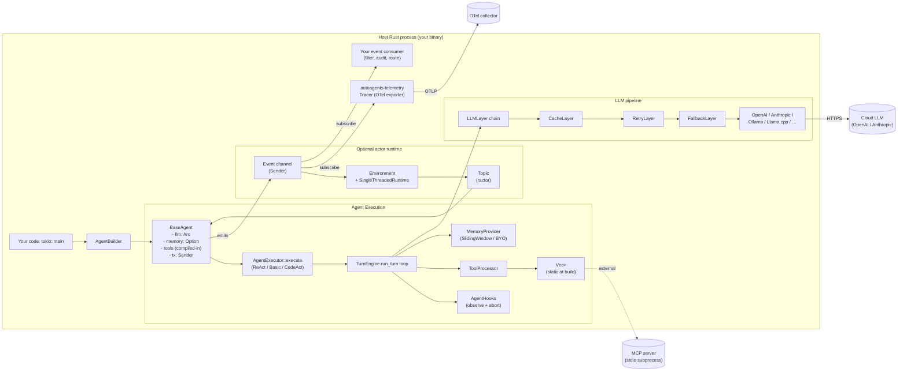

# AutoAgents Rust — Benchmark Study

> **Repo**: https://github.com/liquidos-ai/AutoAgents
> **Commit studied**: 57ebeaa4e18989909013ebd58351b3ef6a5586e0
> **Branch**: main
> **Framework path**: frameworks/autoagents
> **Studied on**: 2026-05-16

## TL;DR

- ⭐ **What is this stack architecturally?** AutoAgents is a **Rust-native, in-process multi-crate library** built around a typed `AgentExecutor` trait, a sliding-window memory provider, and an optional `ractor`-based actor runtime (`SingleThreadedRuntime`) for pub/sub coordination of multiple agents. There is no SDK-supplied HTTP server — the framework is *purely a library* (with a separate `AutoAgents-CLI` repo for YAML-driven runs).
- **License & owner**: Dual MIT OR Apache-2.0, maintained by [Liquidos AI](https://liquidos.ai) (community contributors via GitHub). Community support only — no managed cloud or paid tier surfaced.
- **Maturity**: Workspace version `0.3.7` (see `Cargo.toml:21`). Repo published on crates.io; uses Rust edition 2024 (`Cargo.toml:22`); the shallow submodule shows only the most recent commit "[MAINT]: Fix CI Issues (#228)" from 2026-05-13.
- **Where the loop runs**: In your own Rust process. `BaseAgent::run` calls `AgentExecutor::execute` → `TurnEngine::run_turn`, which calls the LLM provider in the same task; tool dispatch happens in `ToolProcessor::process_single_tool_call_with_hooks`. There is no subprocess, no daemon, no vendor cloud (`crates/autoagents-core/src/agent/direct.rs:83`, `crates/autoagents-core/src/agent/executor/turn_engine.rs:148`).
- **Strongest architectural choice for our use case**: Typed Rust trait surface — `AgentDeriveT::tools`, `AgentExecutor`, `AgentHooks`, `MemoryProvider`, `LLMLayer` — every extension point is a Rust trait you implement, with the `LLMLayer` pipeline (retry + fallback + cache) being a genuinely well-designed composable surface for cross-cutting LLM concerns (`crates/autoagents-llm/src/pipeline/mod.rs:36`, `crates/autoagents-llm/src/optim/fallback.rs:64`).
- **Weakest / biggest gap**: No session abstraction whatsoever, no HTTP/SSE server, no skills concept, no resource manager, no MCP server (only client), no first-party multi-tenancy primitives. The "session" is the in-memory `MemoryProvider` held by an `AgentBuilder` — there is no `SessionStore`, persistence, mid-run checkpointing, or replay.
- **Most surprising finding (good)**: The `optim::FallbackLayer` and `RetryLayer` are real, composable, well-documented LLM pipeline layers — better than most TS/Py stacks (`crates/autoagents-llm/src/optim/fallback.rs:88`). The `codeact` executor uses an embedded Deno AST + rquickjs JS runtime to run sandboxed TypeScript that calls registered tools as `external_*` functions (`crates/autoagents-core/src/agent/prebuilt/executor/codeact.rs:36`).
- **Most surprising finding (bad)**: No way to **force tool arguments from the harness** in the public API. Hooks observe but cannot mutate tool inputs — `on_tool_call(&self, _tool_call: &ToolCall, _ctx: &Context) -> HookOutcome` only returns `Continue` or `Abort` (`crates/autoagents-core/src/agent/hooks.rs:34`). The only way to inject `tenantId` into a tool's arguments is at tool-construction time as a captured field on your struct.
- **One-line verdicts**:
  - Sessions/persistence: **Not provided — BYO** (only in-memory sliding-window memory).
  - Skills: **Not provided — BYO** (no SKILL.md concept).
  - Resource manager: **Not provided — BYO**.
  - Sub-agents: **Implicit only** — actors subscribed to topics on a shared runtime; no `SubAgent` primitive.
  - Multi-tenancy: **Not provided — BYO** (no tenant/user field on `Task` or `Context`).
  - Hooks: **Observe-and-abort only**, no mutate-input/mutate-result/inject-message capability.
  - API: **Not provided — BYO** HTTP layer.
  - Observability: **OpenTelemetry exporter** (`autoagents-telemetry`) — converts `Event`s from the agent's event stream into spans/metrics.
- **Production-readiness verdict for multi-tenant server-side deployment**: **Significant BYO surface required.** AutoAgents gives you a typed Rust loop, retry/fallback LLM layers, OTel tracing, and an actor pub/sub runtime. But you must implement: HTTP layer, session persistence, tenant scoping, skill loader, resource registry, tool-arg injection, HITL approval, cost rollups. Suitable when you want maximum control and Rust performance, not when you want a batteries-included multi-tenant platform.

## 0. Architectural Overview & Deployment Model

```
┌──────────────────────── Host Rust process ────────────────────────┐
│                                                                   │
│  ┌────────────────────────────────────────────┐                   │
│  │       AgentBuilder<T, A> (T = ReAct /      │                   │
│  │       Basic / CodeAct ; A = Direct /        │                   │
│  │       ActorAgent)                           │                   │
│  └────────────────────────────────────────────┘                   │
│           │                                                       │
│           ▼                                                       │
│  ┌────────────────────────────────────────────┐                   │
│  │       BaseAgent<T, A>                       │                   │
│  │       - llm: Arc<dyn LLMProvider>           │                   │
│  │       - memory: Option<MemoryProvider>      │                   │
│  │       - tx: Sender<Event>                   │                   │
│  └────────────────────────────────────────────┘                   │
│           │                                                       │
│           ▼                                                       │
│  ┌────────────────────────────────────────────┐                   │
│  │       AgentExecutor::execute(task, ctx)     │                   │
│  │       → TurnEngine::run_turn loop           │                   │
│  │       → ToolProcessor::process_single_*     │                   │
│  └────────────────────────────────────────────┘                   │
│           │              │                  │                     │
│           ▼              ▼                  ▼                     │
│  ┌──────────────┐  ┌────────────┐  ┌────────────────────┐         │
│  │ LLMLayer     │  │  Memory    │  │ Tool registry      │         │
│  │ pipeline     │  │  (in-mem   │  │ (Vec<Box<ToolT>>)  │         │
│  │ (Cache /     │  │  sliding   │  │  MCP client wraps  │         │
│  │  Retry /     │  │  window)   │  │  external stdio    │         │
│  │  Fallback)   │  │            │  │  MCP servers       │         │
│  └──────────────┘  └────────────┘  └────────────────────┘         │
│           │                                                       │
│  ┌────────┴───────────────────────────────────────────┐           │
│  │   Optional: SingleThreadedRuntime (ractor actors)  │           │
│  │   + Environment + Topic<Task> pub/sub channel      │           │
│  └─────────────────────────────────────────────────────┘          │
│                                                                   │
└───────────────────────────────────────────────────────────────────┘
        │                                       │
        ▼                                       ▼
    LLM provider HTTP                       External MCP server
    (OpenAI / Anthropic / …)               (subprocess via stdio)
        │
        ▼
  Telemetry: autoagents-telemetry
  (Event stream → OTel OTLP exporter)
```

### 0.1 What is this stack?
A **Rust workspace of crates** (`autoagents-core`, `autoagents-llm`, `autoagents-protocol`, `autoagents-toolkit`, `autoagents-telemetry`, `autoagents-guardrails`, `autoagents-derive`, plus speech/llamacpp/mistral-rs/qdrant adapters) that you embed in your own Rust binary. Python bindings (`autoagents-py`) exist via PyO3/maturin. No standalone server or daemon. A **separate** `AutoAgents-CLI` repo lets you describe agents in YAML and serve them over HTTP, but it is not part of this study (`README.md:289`).

### 0.2 Project status & governance
- **License**: dual MIT OR Apache-2.0 (`Cargo.toml:24`).
- **Owner**: Liquidos AI (`README.md:511`). Project hosted under `liquidos-ai/AutoAgents` on GitHub.
- **Commercial backing/support**: none surfaced — README references community channels only: GitHub Issues, Discussions, Discord (`README.md:425`).
- **Translations**: README is translated to 7 languages (zh, ja, es, fr, de, ko, pt-BR), which signals user reach but not enterprise support.

### 0.3 Project maturity / age
- Current crate version: `0.3.7` workspace-wide (`Cargo.toml:21`).
- The shallow-cloned submodule shows only one commit (HEAD = `57ebeaa…` dated 2026-05-13), so the in-repo history isn't visible from this checkout. PyPI download badge implies active Python distribution.
- Edition `2024` (`Cargo.toml:22`) — bleeding-edge Rust.
- README declares the project "**production-grade**", but the 0.3.x version, lack of session/HTTP primitives, and absence of changelog files (`CHANGELOG.md`/`HISTORY.md`/`RELEASES.md` are all absent — verified) suggest pre-1.0 maturity.

### 0.4 Adoption & community signal
Captured via README/repo on 2026-05-16 (cannot fetch live stars from this environment):
- README links to crates.io badge, codecov badge, Discord (`https://discord.gg/zfAF9MkEtK`), and DeepWiki (`https://deepwiki.com/liquidos-ai/AutoAgents`).
- Active translations and a sibling `AutoAgents-Experimental-Backends` repo (Burn, Onnx) suggest an active community.
- Cannot quantify stars/forks/contributors from this offline study.

### 0.5 Ecosystem fit
- **Primary language**: Rust (latest stable, 2024 edition).
- **Package names**: `autoagents` on crates.io; `autoagents-py` on PyPI (Python wrapper around the Rust core, see `bindings/python/`).
- **Examples/templates**: 20+ examples under `examples/` covering basic, design patterns (chaining/parallel/planning/reflection/routing), MCP, code mode (CodeAct), RAG via Qdrant, WASM tool sandbox, Wolfram-Alpha, speech.
- **Use as a library**: this is **always a library**. There is no daemon, hosted platform, or CLI bundled.

### 0.6 Where does the agent loop *actually* execute?
**Inside the caller's tokio runtime, in the same Rust process.** Concretely:

`crates/autoagents-core/src/agent/direct.rs:83`
```rust
pub async fn run(&self, task: Task) -> Result<<T as AgentDeriveT>::Output, RunnableAgentError> {
    let context = self.create_context();
    let hook_outcome = self.inner.on_run_start(&task, &context).await;
    match hook_outcome { HookOutcome::Abort => return Err(...), _ => {} }
    match self.inner().execute(&task, context.clone()).await { ... }
}
```

`crates/autoagents-core/src/agent/prebuilt/executor/react.rs:264` then drives a loop of `engine.run_turn(...)` calls up to `max_turns` (default 10). The LLM HTTP call happens in `TurnEngine::get_llm_response` (`turn_engine.rs:511`), invoked from `run_turn` (`turn_engine.rs:178`). All this runs as ordinary `async fn` on the calling task.

### 0.7 Runtime dependencies
- **Rust 1.75+** (edition 2024 in the workspace; README says "latest stable").
- **tokio** (`rt-multi-thread`, `macros`) — required at runtime.
- **ractor** crate when the actor runtime is enabled (default for `not(target_arch="wasm32")`).
- Optional features pull in: `wasmtime` (sandboxed WASM tools), `deno_ast` + `rquickjs` (CodeAct executor), `rmcp` (MCP client), `qdrant-client`, `tch`/`burn`/`mistral-rs`/`llama-cpp` for local models.
- **No mandatory database**, no Redis, no Postgres, no LangSmith. Vendor LLM providers are optional features (each provider gated behind a Cargo feature: `openai`, `anthropic`, `ollama`, …, see `crates/autoagents/Cargo.toml:13`).

### 0.8 Recommended deployment topology
**Not explicitly addressed in the docs.** The docs/architecture page describes "direct agents" (inline) and "actor agents" (in a runtime), but does not prescribe container-per-tenant vs. shared process. Effectively, you embed AutoAgents in whatever Rust binary you build — Axum, Actix, custom — and you decide the topology. The README's "Performance" section says "**Scalable**: Horizontal scaling with multi-agent coordination" but that refers to the in-process actor runtime, not multi-process deployment (`README.md:434`).

### 0.9 Cold-start cost & instance footprint
**Not benchmarked or documented.** Being Rust, a release binary's cold start is essentially process startup time (typically <100ms). Memory baseline is small (no embedded vector store, no LLM weights unless you use llama.cpp/mistral-rs features). Compile time is the real cost: a full `cargo build --workspace --all-features` is significant.

### 0.10 Vendor lock-in
- **LLM provider**: low — unified `LLMProvider` trait abstracts 10+ cloud + 3 local providers (`README.md:53`).
- **Hosting platform**: none — runs anywhere Rust runs.
- **Eval platform**: none — no eval framework.
- **Observability platform**: OTel-standard via `autoagents-telemetry`, with optional Langfuse provider; both swappable.

### 0.11 Framework weight / footprint
**Heavy by total LOC** (multi-crate workspace including speech, vector stores, derive macros, guardrails, WASM sandbox), but the **core surface** (`autoagents-core`) is focused: agent / executor / memory / tool / context / hooks / runtime. You only pull what you use via Cargo features.

### 0.12 Release-history signal
**No in-repo changelog files.** Verified: no `CHANGELOG.md`, `HISTORY.md`, or `RELEASES.md`. Release history would have to be reconstructed from GitHub Releases / crates.io published versions. The repo's `PUBLISH.md` documents the release process but not historical changes. The shallow submodule HEAD is "[MAINT]: Fix CI Issues (#228)" — a maintenance commit, no architectural signal in this single visible commit.

### 0.13 Documentation depth & cross-team contributor accessibility
- Docs live under `docs/content/` as Docusaurus markdown (`docusaurus.config.ts`). Sections: `getting-started/`, `core-concepts/`, `llm-providers/`, `developer/`.
- Pages are short and conceptual — e.g. `architecture.md` is 36 lines, `executors.md` is 60 lines.
- A non-engineer **cannot** author content for an agent — every extension is a Rust trait implementation requiring compile cycles. No YAML/JSON-driven config except the MCP TOML config (`examples/mcp/config.toml`) and the separate `AutoAgents-CLI` (not in this repo).

### 0.14 Documentation entry points
- **Official docs landing page**: https://liquidos-ai.github.io/AutoAgents/
- **Quickstart / getting-started**: https://liquidos-ai.github.io/AutoAgents/docs/getting-started/quick-start (path inferred from `docs/content/getting-started/quick-start.md`).
- **API reference**: docs.rs — https://docs.rs/autoagents/
- **Hosting / deployment / production guide**: Not provided — BYO. (No dedicated production guide in `docs/content/`.)
- **Examples / demos repo**: https://github.com/liquidos-ai/AutoAgents/tree/main/examples
- **AutoAgents-CLI**: https://github.com/liquidos-ai/AutoAgents-CLI (separate repo; YAML-driven runs over HTTP).
- **Experimental backends**: https://github.com/liquidos-ai/AutoAgents-Experimental-Backends (Burn, Onnx).
- **Android example**: https://github.com/liquidos-ai/AutoAgents-Android-Example
- **Changelog / release notes**: Not provided — BYO via GitHub Releases.
- **GitHub Releases**: https://github.com/liquidos-ai/AutoAgents/releases
- **GitHub issues tracker**: https://github.com/liquidos-ai/AutoAgents/issues
- **DeepWiki**: https://deepwiki.com/liquidos-ai/AutoAgents
- **Discord**: https://discord.gg/zfAF9MkEtK

---

## 1. Agent Harness (Run Loop) & Message Taxonomy

### Run loop

#### 1.1 Run loop entrypoint(s)

There are two main entrypoints depending on the agent's `AgentType`:

**Direct agent** — `BaseAgent<T, DirectAgent>::run` / `::run_stream` at `crates/autoagents-core/src/agent/direct.rs:83`:
```rust
pub async fn run(&self, task: Task) -> Result<<T as AgentDeriveT>::Output, RunnableAgentError>

pub async fn run_stream(&self, task: Task)
    -> Result<BoxRuntimeStream<Result<<T as AgentDeriveT>::Output, Error>>, RunnableAgentError>
```

**Actor agent** — `BaseAgent<T, ActorAgent>::run` / `::run_stream` at `crates/autoagents-core/src/agent/actor.rs:129`. The actor variant takes `self: Arc<Self>` and emits protocol `Event`s through a runtime-owned channel.

Underneath both, the executor trait is the universal abstraction at `crates/autoagents-core/src/agent/executor/mod.rs:50`:
```rust
async fn execute(&self, task: &Task, context: Arc<Context>) -> Result<Self::Output, Self::Error>;

async fn execute_stream(&self, task: &Task, context: Arc<Context>)
    -> Result<BoxRuntimeStream<Result<Self::Output, Self::Error>>, Self::Error>;
```

`Task` (defined in `autoagents-protocol/src/task.rs:9`) is the input contract — `prompt`, optional `image`, optional `system_prompt`, `submission_id` (UUID), `completed`, `result`. No tenant or user field.

#### 1.2 Per-iteration behavior

The shared `TurnEngine::run_turn` (`crates/autoagents-core/src/agent/executor/turn_engine.rs:148`) describes one iteration:

1. Emit `Event::TurnStarted`.
2. Call `hooks.on_turn_start`.
3. Build `Vec<ChatMessage>` = system prompt + recalled memory + (optionally) user prompt (`build_messages`, `turn_engine.rs:578`).
4. Call `get_llm_response` (`turn_engine.rs:511`) — invokes `llm.chat_with_tools(...)` or `llm.chat(...)` depending on `ToolMode::Enabled/Disabled`.
5. Store the user message in memory (once per run).
6. If there are tool calls and `ToolMode::Enabled`: dispatch via `process_tool_calls_with_hooks`, store the tool interaction in memory, record results in `AgentState`, emit `Event::TurnCompleted{final_turn:false}`, return `TurnResult::Continue(Some(output))`.
7. Else: store the assistant message, emit `TurnCompleted{final_turn:true}`, return `TurnResult::Complete(output)`.

`ReActAgent::execute` (`react.rs:264`) drives this loop up to `max_turns` (default 10, `executor/mod.rs:33`).

#### 1.3 ReAct loop

**Yes**, AutoAgents ships a built-in ReAct loop via `ReActAgent<T>` (`crates/autoagents-core/src/agent/prebuilt/executor/react.rs:146`). Also ships:
- `BasicAgent<T>` — single-turn, no tools (`basic.rs`).
- `CodeActAgent<T>` — multi-turn with sandboxed TypeScript via Deno AST + rquickjs (`codeact.rs:36`); the LLM only sees a single `execute_typescript` tool and your registered tools are exposed as `external_*` functions.

You can also write your own executor by implementing `AgentExecutor`.

#### 1.4 Tool dispatch + result handling

`ToolProcessor::process_single_tool_call_with_hooks` (`crates/autoagents-core/src/agent/executor/tool_processor.rs:50`) is the dispatch entrypoint:

```rust
match hooks.on_tool_call(call, context).await {
    HookOutcome::Abort => { return None; } // skip execution
    HookOutcome::Continue => {}
}
hooks.on_tool_start(call, context).await;
let result = Self::process_single_tool_call(tools, call, tool_context, tx_event).await;
if result.success { hooks.on_tool_result(call, &result, context).await; }
else { hooks.on_tool_error(call, result.result.clone(), context).await; }
```

`process_single_tool_call` (`tool_processor.rs:85`) does the actual `tool.execute(parsed_args)` and emits `Event::ToolCallRequested` then `Event::ToolCallCompleted` / `Event::ToolCallFailed`. Tools are matched **by name** from `Vec<Box<dyn ToolT>>` (linear scan, `tool_processor.rs:108`).

Tool results are fed back into memory as separate `ChatMessage` entries via `MemoryAdapter::store_tool_interaction` (called from `turn_engine.rs:203`).

#### 1.5 Explicit turn concept

A **turn** = one trip through `TurnEngine::run_turn`. It boundary is: one LLM call + (optionally) one batch of tool dispatches. The loop terminates on:
- LLM returns no tool calls → `TurnResult::Complete` → break.
- `max_turns` reached → `Err(MaxTurnsExceeded)` unless we have accumulated content (`react.rs:312`).

Each turn emits `Event::TurnStarted{turn_number, max_turns}` and `Event::TurnCompleted{turn_number, final_turn}` (`autoagents-protocol/src/protocol.rs:128`).

#### 1.6 Event emission mechanism (in-process)

Events are emitted via an `mpsc::Sender<Event>` stored on `Context.tx`. `EventHelper` (`crates/autoagents-core/src/agent/executor/event_helper.rs`) is a wrapper around `Sender<Event>::send(...)`.

Two consumption modes:
- **DirectAgent**: `DirectAgentHandle.rx: BoxEventStream<Event>` is given to you at build time; `subscribe_events()` returns a fanned-out stream using `EventFanout` (`direct.rs:51`).
- **ActorAgent**: events flow through the runtime; `Environment::take_event_receiver` (single consumer) or `Environment::subscribe_events` (broadcast) returns a stream (`environment.rs:112`).

The in-process delivery is via `tokio::sync::mpsc::channel` (`crates/autoagents-core/src/agent/constants.rs:DEFAULT_CHANNEL_BUFFER`).

### Message & event taxonomy

#### 1.7 Message layers

Three distinct vocabularies exist:

1. **LLM wire messages** — `ChatMessage { role: ChatRole, message_type: MessageType, content: String }` from `autoagents-llm/src/chat/mod.rs`. Roles: `System`, `User`, `Assistant`, `Tool`. This is what gets sent to OpenAI/Anthropic/etc.
2. **Protocol events** — `enum Event` from `autoagents-protocol/src/protocol.rs:24`. Variants: `NewTask`, `TaskStarted`, `TaskComplete`, `TaskError`, `PublishMessage`, `SendMessage`, `ToolCallRequested`, `ToolCallCompleted`, `ToolCallFailed`, `CodeExecutionStarted/Console/Completed/Failed`, `TurnStarted`, `TurnCompleted`, `StreamChunk`, `StreamToolCall`, `StreamComplete`.
3. **Stream chunks** — `enum StreamChunk` from `autoagents-protocol/src/llm.rs:70` (re-exported through `autoagents-llm/src/chat/mod.rs:76`). Variants: `Text`, `ReasoningContent`, `ToolUseStart`, `ToolUseInputDelta`, `ToolUseComplete`, `Done`, `Usage`. These are wrapped inside `Event::StreamChunk { sub_id, chunk }`.

Conversion:
- LLM provider produces `StreamChunk`s. `TurnEngine::stream_with_tools` (`turn_engine.rs:416`) accumulates them, splits text from tool calls, and emits `Event::StreamChunk` per chunk plus `Event::StreamToolCall` per complete tool call.
- Final results bubble up to the caller as `<T as AgentDeriveT>::Output` (typed Rust struct).

#### 1.8 Concrete message types

| Type | Layer | Purpose |
|---|---|---|
| `Task` (`autoagents-protocol/src/task.rs:9`) | input | unit of work: prompt + optional image + optional system_prompt + submission_id |
| `ChatMessage` (`autoagents-llm/src/chat/mod.rs`) | LLM wire | role/content/message_type sent to provider |
| `ChatRole::System/User/Assistant/Tool` | LLM wire | role enum |
| `MessageType::Text / Image((mime, bytes)) / Pdf / ToolUse / ToolResult` | LLM wire | content discriminator |
| `ToolCall { id, call_type, function: FunctionCall }` (`autoagents-protocol/src/llm.rs:54`) | LLM wire | LLM-generated tool invocation |
| `ToolCallResult { tool_name, success, arguments, result }` (`autoagents-protocol/src/tool.rs`) | internal | tool execution outcome |
| `StreamChunk` (7 variants, see 1.7) | streaming | per-chunk LLM stream delta |
| `StreamResponse { choices: [StreamChoice], usage }` (`autoagents-llm/src/chat/mod.rs:41`) | streaming | structured stream wrapper |
| `Event` (17 variants) | protocol | runtime event |
| `InternalEvent::ProtocolEvent(Event) / Shutdown` (`protocol.rs:163`) | runtime | runtime control |
| `TurnResult::Continue(Option<T>) / Complete(T)` (`executor/mod.rs:18`) | executor | per-turn termination signal |
| `TurnDelta::Text / ReasoningContent / ToolResults / Done` (`turn_engine.rs:82`) | executor stream | typed streaming delta |
| `HookOutcome::Continue / Abort` (`hooks.rs:10`) | hooks | hook short-circuit signal |
| `Usage { prompt_tokens, completion_tokens, total_tokens, … }` (`chat/mod.rs:16`) | LLM wire | token accounting |

#### 1.9 Messages vs. events

**Two separate taxonomies.** `ChatMessage` is what crosses the wire to the LLM. `Event` is the in-process observability/coordination stream. They overlap only loosely: when streaming, the engine emits `Event::StreamChunk(StreamChunk::Text(...))` per LLM token, but the canonical assistant message stored in memory is a single concatenated `ChatMessage`.

#### 1.10 Event categories

| Category | Variants | Defining property |
|---|---|---|
| Lifecycle (task) | `TaskStarted`, `TaskComplete`, `TaskError`, `NewTask` | top-level run boundaries |
| Turn | `TurnStarted{turn_number, max_turns}`, `TurnCompleted{final_turn}` | per-iteration boundaries |
| Tool | `ToolCallRequested`, `ToolCallCompleted`, `ToolCallFailed` | tool dispatch lifecycle |
| Code exec (CodeAct) | `CodeExecutionStarted/Console/Completed/Failed` | sandbox lifecycle |
| Stream | `StreamChunk{chunk}`, `StreamToolCall{tool_call}`, `StreamComplete` | streaming deltas |
| Actor IPC | `PublishMessage{topic_name, topic_type, message}`, `SendMessage` | runtime pub/sub |
| Hook | none — hooks are direct async fn calls, not events | — |
| Sub-agent | none — no first-class sub-agent primitive | — |

#### 1.11 Canonical type-definition file(s)

- `crates/autoagents-protocol/src/protocol.rs:24` — `Event` enum (single source of truth for event taxonomy).
- `crates/autoagents-protocol/src/llm.rs:70` — `StreamChunk` enum.
- `crates/autoagents-protocol/src/task.rs:9` — `Task` struct.
- `crates/autoagents-protocol/src/tool.rs` — `ToolCallResult` struct.
- `crates/autoagents-llm/src/chat/mod.rs:1-200` — `ChatMessage`, `ChatRole`, `MessageType`, `StreamResponse`, `Usage`.

#### 1.12 Live agentic event stream taxonomy

Sample frames (Rust pseudocode for an actor agent stream):

```rust
// Task lifecycle
Event::TaskStarted { sub_id: <UUID>, actor_id: <UUID>, actor_name: "math_agent", task_description: "What is 1+1?" }

// Turn boundary
Event::TurnStarted { sub_id, actor_id, turn_number: 0, max_turns: 10 }

// Streamed text chunk
Event::StreamChunk { sub_id, chunk: StreamChunk::Text("The answer is ") }

// Reasoning content (for reasoning models)
Event::StreamChunk { sub_id, chunk: StreamChunk::ReasoningContent("Let me think…") }

// Tool call from streaming
Event::StreamToolCall { sub_id, tool_call: { id: "call_1", function: { name: "Addition", arguments: "{\"left\":1,\"right\":1}" } } }

// Tool dispatch
Event::ToolCallRequested { sub_id, actor_id, id: "call_1", tool_name: "Addition", arguments: "{\"left\":1,\"right\":1}" }
Event::ToolCallCompleted { sub_id, actor_id, id: "call_1", tool_name: "Addition", result: 2 }

// Turn end
Event::TurnCompleted { sub_id, actor_id, turn_number: 0, final_turn: true }

// Task end
Event::TaskComplete { sub_id, actor_id, actor_name: "math_agent", result: "{\"value\":2,…}" }
```

---

## 2. Agent Runtime (Multi-session Host)

### 2.1 Multi-session host architecture
**Mixed.** AutoAgents ships an `Environment` + `Runtime` (`SingleThreadedRuntime`) layer that hosts multiple agents *as actors* in one process and routes typed messages between them via topics (`crates/autoagents-core/src/runtime/single_threaded.rs:35`, `crates/autoagents-core/src/environment.rs:40`). This is closer to an **in-process actor system** than a "multi-session host".

The runtime does **not** model "sessions" as a first-class concept. It has:
- A `subscriptions: HashMap<String, Subscription>` for topic-name → list of subscribed actors.
- `external_tx/external_rx` for delivering events to the caller.
- `broadcast_tx` for fan-out to multiple subscribers.

You would build "sessions" yourself by spawning one or more agents per logical session and routing tasks through a per-session topic — there is no built-in `Session` type.

### 2.2 Concurrent session isolation
Each `BaseAgent` instance holds its own `Arc<Mutex<Box<dyn MemoryProvider>>>`, so memory is per-agent-instance (`base.rs:63`). If you spawn one agent per session, isolation is naturally enforced. If you share a single agent across sessions, memory will bleed — there is no automatic per-call isolation. **No tenant-scoped isolation primitives.**

### 2.3 Horizontal scaling / multi-instance
**Not addressed.** The runtime is `SingleThreadedRuntime` (despite the name, it can drive many tokio tasks; "single threaded" refers to the runtime's event-loop ownership model — `single_threaded.rs:35`). There is no leader election, distributed lock, shared store, or "N pods serve the same session pool" pattern. Horizontal scaling is BYO.

### 2.4 Background / async / scheduled tasks
**Not provided — BYO.** No cron, no schedulers, no webhook receivers. Long-running background work can be done by spawning your own `tokio::spawn` and routing tasks through a `Topic<Task>`, but there is no first-party primitive.

### 2.5 Worker pool / queue model
**Not provided — BYO.** Tasks are delivered to actors via `actor_ref.cast(message)` (in `ractor`). No durable queue, no retry semantics at the queue layer (LLM-level retries exist in `optim::RetryLayer`).

---

## 3. Sessions & Persistence

**This is the weakest section of the framework.** AutoAgents has no `Session` type, no persistence store, no checkpointer.

### 3.1 Session / chat data model
**Not provided — BYO.** The closest equivalents:
- `Task` (input only, no parent-session linkage) — `prompt`, `image`, `system_prompt`, `submission_id`, `completed`, `result` (`autoagents-protocol/src/task.rs:9`).
- `AgentState` (`crates/autoagents-core/src/agent/state.rs`) — in-memory record of `Task`s and `ToolCallResult`s for the lifetime of the `Context` (single run).
- `MemoryProvider` (`autoagents-core/src/agent/memory/mod.rs:795`) — `remember`, `recall`, `clear`. The bundled impl is `SlidingWindowMemory` (`memory/sliding_window.rs`).

No `id`, `tenant_id`, `user_id`, `created_at`, `parent_session_id`, `metadata`, `usage`, or `model` field on any session-like type.

### 3.2 What's stored on a session
The `SlidingWindowMemory` holds a `VecDeque<ChatMessage>` of bounded size (`memory/sliding_window.rs:30`). That's it. No tool-call history (those go through `AgentState` per-run), no scratchpad files, no attachments.

### 3.3 Granularity
**One in-memory window per agent instance.** No thread/branch model, no forking. If you want to fork, you'd have to `clone_box()` the memory provider and start a fresh agent.

### 3.4 Built-in persistence stores
**None.** No JSONL, no SQLite, no Postgres, no Redis, no S3. The `MemoryProvider` trait has `clone_box`, `preload(Vec<ChatMessage>) -> bool`, and `export() -> Vec<ChatMessage>` hooks (`memory/mod.rs:884-903`) — these are the BYO contract to persist memory in your own storage layer.

### 3.5 Persistence timing
**N/A** since no persistence ships. The in-memory `SlidingWindowMemory::remember` is called per assistant message (`turn_engine.rs:229`) and per tool-interaction batch (`turn_engine.rs:203`).

### 3.6 Mid-run checkpointing (durable)
**Not provided — BYO.** A crash mid-tool-call loses all in-memory state.

### 3.7 Session ID format
**No session ID exists.** The closest IDs are:
- `submission_id: SubmissionId = Uuid` — per `Task` (`autoagents-protocol/src/protocol.rs:11`).
- `actor_id: ActorID = Uuid` — per `BaseAgent` (`base.rs:99`, generated in `BaseAgent::new`).
- `runtime_id: RuntimeID = Uuid` — per `SingleThreadedRuntime` (`single_threaded.rs:36`).

### 3.8 Pluggable store interface
**Yes** — `MemoryProvider` trait is the plug point (`memory/mod.rs:795`):
```rust
#[async_trait]
pub trait MemoryProvider: Send + Sync {
    async fn remember(&mut self, message: &ChatMessage) -> Result<(), LLMError>;
    async fn recall(&self, query: &str, limit: Option<usize>) -> Result<Vec<ChatMessage>, LLMError>;
    async fn clear(&mut self) -> Result<(), LLMError>;
    fn memory_type(&self) -> MemoryType;
    fn size(&self) -> usize;
    fn clone_box(&self) -> Box<dyn MemoryProvider>;
    fn id(&self) -> Option<String> { None }
    fn preload(&mut self, _data: Vec<ChatMessage>) -> bool { false }
    fn export(&self) -> Vec<ChatMessage> { Vec::new() }
    // … needs_summary, replace_with_summary, get_event_receiver, remember_with_role
}
```
You implement this for your own Postgres/Redis/S3 backing store. The trait is async-friendly and serializable since `ChatMessage` is `Serialize/Deserialize`.

### 3.9 Schema evolution / migration
**Not provided — BYO.** Since AutoAgents does not own a schema, you migrate your own.

### 3.10 Export / replay
**Partial.** `MemoryProvider::export()` returns `Vec<ChatMessage>` and `preload()` re-hydrates one. Replay (deterministic re-execution of past events) is not provided — events are emitted but not stored.

### 3.11 Cross-session memory
**Not provided — BYO.** No long-term memory abstraction. (See Q15 — same answer.)

---

## 4. Multi-tenancy & Arbitrary Context ⭐ THE KEY QUESTION

This is the **critical gap** for our use case. AutoAgents lacks first-class multi-tenant primitives.

### 4.1 Full run-loop input struct
The `Task` (`autoagents-protocol/src/task.rs:9`) is the *only* per-run input besides the agent's static config:
```rust
pub struct Task {
    pub prompt: String,
    pub image: Option<(ImageMime, Vec<u8>)>,
    pub system_prompt: Option<String>,
    pub submission_id: SubmissionId,
    pub completed: bool,
    pub result: Option<Value>,
}
```
**No `tenant_id`, `user_id`, `metadata`, `locale`, or arbitrary context fields.** You cannot pass per-call context through the public surface without abuse (e.g., stuffing it into `system_prompt` or `prompt`).

### 4.2 Context propagation into a tool call
Tools see **only** their typed JSON arguments. `ToolRuntime::execute` signature (`crates/autoagents-core/src/tool/runtime/mod.rs:15`):
```rust
async fn execute(&self, args: serde_json::Value) -> Result<serde_json::Value, ToolCallError>;
```
**There is no `Context` parameter.** The tool implementation has access only to its own `&self` fields (captured at construction time) and the LLM-generated `args`.

### 4.3 Tool call interface
Full tool authoring surface (`crates/autoagents-core/src/tool/mod.rs:24`):
```rust
pub trait ToolT: Send + Sync + Debug + ToolRuntime {
    fn name(&self) -> &str;
    fn description(&self) -> &str;
    fn args_schema(&self) -> Value;
    fn output_schema(&self) -> Option<Value> { None }
}
#[async_trait]
pub trait ToolRuntime: Send + Sync + Debug {
    async fn execute(&self, args: serde_json::Value) -> Result<serde_json::Value, ToolCallError>;
}
```
The `#[tool(...)]` derive macro on a unit struct generates `ToolT` from `name`, `description`, `input` (a `ToolInput`-derived struct), giving you typed deserialization. Example (`README.md:196`):
```rust
#[tool(name = "Addition", description = "Add two numbers", input = AdditionArgs)]
struct Addition {}

#[async_trait]
impl ToolRuntime for Addition {
    async fn execute(&self, args: Value) -> Result<Value, ToolCallError> {
        let typed: AdditionArgs = serde_json::from_value(args)?;
        Ok((typed.left + typed.right).into())
    }
}
```

### 4.4 Forcing tool arguments from the harness
**Not provided — BYO.** This is the killer gap.

- Hooks (`AgentHooks::on_tool_call`) take `&ToolCall` by **shared reference**, not `&mut`, and return `HookOutcome::Continue/Abort` only — they cannot mutate the args (`hooks.rs:34`):
  ```rust
  async fn on_tool_call(&self, _tool_call: &ToolCall, _ctx: &Context) -> HookOutcome { HookOutcome::Continue }
  ```
- `ToolProcessor::process_single_tool_call_with_hooks` passes `&call` and `&result` immutably (`tool_processor.rs:50-82`).

The only workaround:
1. Capture tenant id as a field on the tool struct at *construction* time (per-agent-instance, not per-call), e.g. `struct TopicSearch { tenant_id: String }`.
2. The LLM still sees the tool's schema and can pass *its own* tenant id, which your tool must then **ignore** in favor of `self.tenant_id`.

This works for static, agent-scoped tenant binding but does not solve the **per-request** dynamic injection that a multi-tenant server needs without rebuilding the agent per request.

### 4.5 Filtering visible tools
**Per-instance only.** `AgentDeriveT::tools()` returns `Vec<Box<dyn ToolT>>` at agent build time (`base.rs:46`); the derive macro typically returns a fixed list. To filter at runtime, you must construct a different agent per tenant or implement `AgentDeriveT::tools` manually with conditional logic.

There is **no** `activeTools`, `allowed_tools`, or `prepareStep` hook to change the toolset between turns.

### 4.6 Tenant scope on session
**Not provided — BYO.** Neither `Task` nor `Context` nor `AgentConfig` carries a tenant field.

### 4.7 Per-tool-call auth propagation
**Not provided — BYO.** The caller's identity does not reach the tool. You'd capture it as a struct field on the tool at construction.

### 4.8 Resource scoping primitives
**Not provided — BYO** at the framework level. You'd implement scoping at your own registration layer (e.g., a per-tenant `AgentBuilder` factory).

### 4.9 Per-tenant rate limit + budget cap
**Not provided — BYO.** There's `ExecutorConfig { max_turns }` (`executor/mod.rs:28`, default 10) — a turn cap — but no USD budget, no per-tenant cost tracking. You'd build it on top of `Usage` extracted from `Event::StreamChunk(StreamChunk::Usage(...))`.

### ⭐ Light usage example

Building a per-tenant agent (the closest approximation):

```rust
use autoagents::core::agent::{AgentBuilder, AgentDeriveT, AgentHooks, DirectAgent};
use autoagents::core::agent::prebuilt::executor::ReActAgent;
use autoagents::core::agent::task::Task;
use autoagents::core::tool::{ToolT, ToolRuntime, ToolCallError};
use autoagents_derive::{agent, AgentHooks, ToolInput, tool};

// Step 1 (workaround for tenantId/userId/strategyId):
//   AutoAgents has no per-call context, so we capture them as struct fields
//   at agent construction time. One agent instance per (tenant, user) pair.
//   To pass them into Task is *not* possible through the public API.
#[derive(ToolInput, serde::Serialize, serde::Deserialize, Debug)]
pub struct TopicSearchArgs { #[input(description = "search query")] query: String }

#[tool(name = "topicSearch", description = "Search topics", input = TopicSearchArgs)]
struct TopicSearch { tenant_id: String }   // captured at construction, NOT from LLM args

#[async_trait::async_trait]
impl ToolRuntime for TopicSearch {
    async fn execute(&self, args: serde_json::Value) -> Result<serde_json::Value, ToolCallError> {
        let q: TopicSearchArgs = serde_json::from_value(args)?;
        // Step 3 (forced tenant_id): we IGNORE anything the LLM passed about
        //   tenant; we use self.tenant_id captured at build time.
        Ok(serde_json::json!({ "tenant": self.tenant_id, "query": q.query, "results": [] }))
    }
}

// Step 2 (visible tools): #[agent] macro lists tools statically. To skip
//   bashExec/webFetch we simply do not include them in the `tools = [...]`
//   array. There is no runtime filter.
#[agent(
    name = "predict_agent",
    description = "You are an audience prediction agent",
    tools = [TopicSearch],  // skipping bashExec, webFetch by omission
)]
#[derive(Clone, AgentHooks)]
pub struct PredictAgent {}

pub async fn build_agent_for_tenant(
    llm: std::sync::Arc<dyn autoagents::llm::LLMProvider>,
    tenant_id: &str, user_id: &str, strategy_id: &str,
) -> Result<_, autoagents::core::error::Error> {
    // Re-create the agent per-tenant since tool needs the tenant captured.
    // There is no per-call equivalent.
    let inner = PredictAgent {};
    let agent_handle = AgentBuilder::<_, DirectAgent>::new(ReActAgent::new(inner))
        .llm(llm)
        .build().await?;
    // Step 1 has NO way to pass user_id/strategy_id through `run(...)` — you'd
    //   need to stuff them into Task::system_prompt or use them in your wrapper.
    let task = Task::new(format!(
        "(tenant={tenant_id}, user={user_id}, strategy={strategy_id}) generate audience"
    ));
    let _result = agent_handle.agent.run(task).await?;
    Ok(())
}
```

**What's not provided**:
- **Step 1**: passing `tenantId`/`userId`/`strategyId` through `agent.run(task)` — **Not provided — BYO**. The only way is to stuff them in `Task::system_prompt` or `Task::prompt`, or capture them as agent struct fields and instantiate one agent per tuple.
- **Step 2**: per-tenant runtime filtering of tools — **Not provided — BYO**. Tools are static per agent instance.
- **Step 3**: forcing `tenant_id` server-side — works *only* if you accept "one agent per tenant" and capture tenant on the tool struct.

---

## 5. Hook & Middleware Capabilities (Context Engineering)

### 5.1 Enumerate every hook
The `AgentHooks` trait (`crates/autoagents-core/src/agent/hooks.rs:20`) has 9 methods:

| Hook | Fires when | Read / Mutate / Block |
|---|---|---|
| `on_agent_create` | after `BaseAgent::new` succeeds | Read-only (`&self`) |
| `on_run_start(task, ctx) -> HookOutcome` | before `execute` (`direct.rs:91`, `actor.rs:145`) | Read + **Abort** (no mutate) |
| `on_run_complete(task, result, ctx)` | after successful `execute` | Read-only |
| `on_turn_start(turn_index, ctx)` | start of each turn (`turn_engine.rs:168`) | Read-only |
| `on_turn_complete(turn_index, ctx)` | end of each turn | Read-only |
| `on_tool_call(tool_call, ctx) -> HookOutcome` | before tool dispatch | Read + **Abort** (no mutate) |
| `on_tool_start(tool_call, ctx)` | after `on_tool_call` returned Continue | Read-only |
| `on_tool_result(tool_call, result, ctx)` | after successful tool execution | Read-only |
| `on_tool_error(tool_call, err, ctx)` | after failed tool execution | Read-only |
| `on_agent_shutdown` | actor agent only, on `post_stop` | Read-only |

The derive macro `#[derive(AgentHooks)]` generates a default impl with all methods being the trait defaults (no-op + `Continue`).

### 5.2 Hook concurrency model
Hooks are invoked **sequentially** in the executor's task. They are `async fn` so they can await freely, but there's no parallel or folded matcher system — each hook method is called exactly once per fire-point on the single registered `AgentHooks` instance. There is no "register many hook handlers and run them all" pattern; you implement `AgentHooks` on your agent struct and that's the one place hooks live.

### 5.3 Specific capability tests

| Capability | Supported? | Notes |
|---|---|---|
| Inject system messages at session start | **Partial** — via `Task::system_prompt` set by the caller (`turn_engine.rs:585`). No hook to inject *after* the task is created. | The `system_prompt` field on `Task` is used as the system message. |
| Expand the user input (slash commands, attachments) | **Not provided — BYO**. `on_run_start` cannot mutate `task.prompt`. | Wrap the call site. |
| Mutate the messages list before each LLM call | **Not provided — BYO**. `build_messages` is private in `TurnEngine`. | Override at the executor layer by implementing your own `AgentExecutor`. |
| Mutate / decorate tool input before dispatch | **Not provided — BYO**. `on_tool_call` takes `&ToolCall`, not `&mut`. | Workaround: capture context as a struct field on the tool and ignore LLM-generated values. |
| Mutate / decorate tool result before it returns to the LLM | **Not provided — BYO**. `on_tool_result` is observe-only. | Wrap tool execution in your own `ToolRuntime` impl that post-processes. |
| Emit additional tool calls from a tool result | **Not provided — BYO**. No `additional_messages` mechanism. | Engineer your own logic in `execute`. |

### 5.4 Auto-compaction
**Partial.** `SlidingWindowMemory` with `TrimStrategy::Summarize` (`memory/sliding_window.rs:13`) marks memory as `needs_summary` when overflow occurs, but does *not* actually summarize — it just flips a flag. You'd call `MemoryProvider::replace_with_summary(text)` yourself after generating a summary externally. There is no built-in summarizer agent.

### 5.5 Prompt cache optimization
**Provider-cache aware via `CacheLayer` in the LLM pipeline** (`crates/autoagents-llm/src/optim/cache.rs`). This is a *result* cache layer (cache the LLM response for identical message+tool+schema input), not a stable-prefix breakpoint mechanism for Anthropic/OpenAI prompt caching. The framework does *not* insert `cache_control` markers or place breakpoints automatically — you'd manage that in your provider wrapper or in `ChatMessage` construction (if the provider supports it).

### 5.6 Tool result clearing / progressive disclosure
**Not provided — BYO.** Tool results go directly into `MemoryAdapter::store_tool_interaction`. The only knob is the sliding-window size — large outputs will simply push older messages out the back.

### 5.7 Hook fire-points diagram

```
DirectAgentHandle.run(task)
  │
  ├─ create_context()
  │
  ├─ ┌─── on_run_start(task, ctx) ──── (may Abort)
  │
  ├─ AgentExecutor::execute(task, ctx)  e.g. ReActAgent::execute
  │     │
  │     │   for turn_index in 0..max_turns {
  │     ├──── TurnEngine::run_turn
  │     │     │
  │     │     ├─ EventHelper::send_turn_started → Event::TurnStarted
  │     │     ├─ ┌── on_turn_start(turn_index, ctx)
  │     │     │
  │     │     ├─ build_messages() = [system] + memory.recall() + [user?]
  │     │     ├─ get_llm_response()    ──► LLM HTTP call
  │     │     │     (with LLMLayer pipeline: Cache → Retry → Fallback)
  │     │     │
  │     │     ├─ for tool_call in response.tool_calls:
  │     │     │    ├─ ┌── on_tool_call(tool_call, ctx) ──── (may Abort=skip)
  │     │     │    ├─ ┌── on_tool_start(tool_call, ctx)
  │     │     │    ├─ EventHelper::send Event::ToolCallRequested
  │     │     │    ├─ tool.execute(args)
  │     │     │    ├─ EventHelper::send Event::ToolCallCompleted/Failed
  │     │     │    └─ if success: ┌── on_tool_result(call, result, ctx)
  │     │     │       else:       ┌── on_tool_error(call, err, ctx)
  │     │     │
  │     │     ├─ memory.store_tool_interaction(...)
  │     │     ├─ EventHelper::send_turn_completed → Event::TurnCompleted
  │     │     └─ ┌── on_turn_complete(turn_index, ctx)
  │     │
  │     └─ }
  │
  └─ ┌── on_run_complete(task, result, ctx)
```

### ⭐ Light usage example

```rust
use autoagents::async_trait;
use autoagents::core::agent::{AgentHooks, Context, HookOutcome};
use autoagents::core::agent::task::Task;
use autoagents_derive::agent;
use autoagents_llm::ToolCall;
use autoagents::core::tool::ToolCallResult;
use serde_json::Value;

#[agent(name = "my_agent", description = "You are a helpful assistant")]
#[derive(Default, Clone)]
pub struct MyAgent {}

#[async_trait]
impl AgentHooks for MyAgent {
    // 1. Inject "tenant=acme, locale=fr-FR, today=2026-05-16" — best-effort:
    //    AutoAgents has no message-mutation hook. The only place to do this is
    //    BEFORE calling agent.run(...): set Task::system_prompt yourself.
    async fn on_run_start(&self, _task: &Task, _ctx: &Context) -> HookOutcome {
        // We CANNOT mutate _task here (it's &Task). We can only Continue/Abort.
        println!("session starting; system prompt should already contain tenant=acme, locale=fr-FR, today=2026-05-16");
        HookOutcome::Continue
    }

    // 2. PreToolUse on topicSearch to add tenantId server-side — NOT supported.
    //    on_tool_call receives &ToolCall; you cannot mutate arguments here.
    async fn on_tool_call(&self, tool_call: &ToolCall, _ctx: &Context) -> HookOutcome {
        if tool_call.function.name == "topicSearch" {
            // We can ONLY observe; we cannot inject tenant_id into the args.
            // Workaround: capture tenant in the tool's struct fields and ignore
            // LLM-provided values in the tool's execute() implementation.
        }
        HookOutcome::Continue
    }

    // 3. PostToolUse summarization of >50 results — NOT supported as mutation.
    //    on_tool_result is observe-only; we can log/audit but the result is
    //    already on its way back to the LLM.
    async fn on_tool_result(&self, _call: &ToolCall, result: &ToolCallResult, _ctx: &Context) {
        if let Value::Array(items) = &result.result {
            if items.len() > 50 {
                // We can audit, but the framework will feed the full result back.
                eprintln!("topicSearch returned {} items; framework will NOT summarize", items.len());
            }
        }
    }
}
```

**Bottom line for Q5**: hooks in AutoAgents are **observe-and-abort**, not mutate-and-decorate. For the three patterns in the prompt — system-prompt injection at session start, forced tool args, post-tool result summarization — none are first-party.

---

## 6. Agent API Exposition

### 6.1 Does the stack ship an HTTP/network server?
**No — library only.** AutoAgents does not bundle Axum / Actix / Tonic / anything. The separate `AutoAgents-CLI` (https://github.com/liquidos-ai/AutoAgents-CLI) wraps it in an HTTP server, but that is a *different repository* and not in scope here.

### 6.2 Streaming transport
**Not provided — BYO.** `run_stream` returns a `BoxRuntimeStream<Result<<T>::Output, Error>>` in-process; you'd serialize each frame to SSE / WebSocket in your own HTTP handler.

### 6.3 Endpoints that start an agent run
**Not provided — BYO.**

### 6.4 Live agentic event stream format
**In-process only.** `Environment::subscribe_events(runtime_id)` yields a `BoxEventStream<Event>` of the protocol `Event` enum (which is `Serialize/Deserialize`, so you can JSON-encode it to your wire format). See Q1.12 for sample frames.

### 6.5 Auth termination at API boundary
**Not provided — BYO.**

### 6.6 Resume / replay endpoint
**Not provided — BYO.**

### 6.7 Interrupt / cancel via API
**Not provided.** Internally, you can drop the `JoinHandle` returned by `Environment::run()` or call `Environment::shutdown()` to drain the runtime (`environment.rs:142`). For per-task cancellation you'd build your own `CancellationToken` and check it inside a hook.

### 6.8 Tool-arg streaming (partial JSON)
**Yes — in the in-process event stream.** `StreamChunk::ToolUseInputDelta { index, partial_json }` (`autoagents-protocol/src/llm.rs:78`) is emitted while the LLM is streaming the tool arguments. Providers that support it (Anthropic, OpenAI tool-streaming) produce these chunks; they get wrapped in `Event::StreamChunk { sub_id, chunk: StreamChunk::ToolUseInputDelta { … } }`.

### 6.9 HITL approval workflow
**Partial — abort-only.** `AgentHooks::on_tool_call` returning `HookOutcome::Abort` skips the call (`tool_processor.rs:60`). But there is no "pause and wait for external approval" state — the run cannot be persisted and resumed.

### 6.10 Tool-call state reconstruction
Linking `tool_use` events to results uses the **explicit `id` field** on `ToolCall` (`autoagents-protocol/src/llm.rs:54`). All events carry it:

```rust
Event::ToolCallRequested { id: "call_1", tool_name, arguments, … }
Event::ToolCallCompleted { id: "call_1", tool_name, result, … }
Event::ToolCallFailed    { id: "call_1", tool_name, error, … }
Event::StreamToolCall    { sub_id, tool_call: { id: "call_1", function, … } }
```
Streaming chunks `ToolUseStart { id, … }` and `ToolUseComplete { tool_call: { id, … } }` use the same id.

### 6.11 Health checks / graceful shutdown
**Partial in-process.** `Environment::shutdown` (`environment.rs:142`) and `SingleThreadedRuntime::stop` (`single_threaded.rs:319`) drain the runtime. No `/healthz` HTTP endpoint — BYO.

### ⭐ Light usage example

Since AutoAgents ships **no HTTP server**, the example below is **how you would build one yourself** with Axum on top of AutoAgents. Adjust for your stack.

```rust
// Not provided — BYO. Sketch only.

// 1. curl to start a run (with tenant header — your handler reads it):
//   curl -N -X POST http://localhost:8080/runs \
//        -H "X-Tenant-Id: acme" \
//        -H "Content-Type: application/json" \
//        -d '{"prompt":"Generate audience for skincare brief"}'
//
// 2. SSE stream you'd produce in your handler:
//   data: {"type":"TaskStarted","sub_id":"...","actor_name":"predict_agent"}
//   data: {"type":"StreamChunk","sub_id":"...","chunk":{"Text":"Calling topicSearch…"}}
//   data: {"type":"ToolCallRequested","sub_id":"...","id":"call_1","tool_name":"topicSearch",
//          "arguments":"{\"query\":\"skincare\"}"}
//   data: {"type":"ToolCallCompleted","sub_id":"...","id":"call_1","tool_name":"topicSearch",
//          "result":[...]}
//   data: {"type":"TaskComplete","sub_id":"...","result":"{...}"}
//
// 3. Cancel mid-flight: not provided. You'd track the JoinHandle for the run
//    yourself and abort:
//   curl -X DELETE http://localhost:8080/runs/<sub_id>
//
// 4. HITL approval: not provided. You'd freeze on Event::ToolCallRequested,
//    bubble it to the operator, wait for verdict, then resume — but AutoAgents
//    does not have a resume primitive, so you'd have to implement a custom
//    AgentExecutor that integrates with your queue/state machine.
```

---

## 7. Sub-agents

### 7.1 Mechanism
**Implicit only.** There is no `SubAgent`, `handoff`, or `delegate` primitive. The way multi-agent collaboration is expressed in AutoAgents:

1. Build multiple `BaseAgent<T, ActorAgent>` instances (one per role).
2. Subscribe each to a `Topic<Task>` on a shared `SingleThreadedRuntime`.
3. Publish a `Task` to the topic; the actor receives it via `handle()` and runs.
4. Collect results by listening to `Event::TaskComplete{sub_id, actor_name, result}` on the runtime's event stream.

See `examples/design_patterns/src/parallel.rs:101` for the canonical parallel pattern.

Agents are **not** invoked as tools by other agents in the framework — there is no `agent.run(...)`-as-a-tool wrapper. You can write one yourself by implementing `ToolRuntime` on a wrapper struct that owns an `Arc<BaseAgent<...>>`.

### 7.2 Configuration
**Rust struct registered at boot.** Each agent is a Rust type with `#[agent(name=..., description=..., tools=[...])]` macro on it. No markdown configs. Inlined per-call configs are not supported.

### 7.3 LLM-generated configs
**Not provided — BYO.** Configs are static, compile-time Rust. The parent LLM cannot generate a sub-agent config on the fly.

### 7.4 Output handling
Sub-agent output reaches the parent **only via `Event::TaskComplete{sub_id, actor_name, result}`** broadcast through the runtime's event stream. The parent must:
- Track `submission_id`s of the tasks it published.
- Filter incoming events by `sub_id` and `actor_name`.
- Assemble results manually.

Concrete example from `examples/design_patterns/src/parallel.rs:213`:
```rust
let mut results: HashMap<String, String> = HashMap::new();
let expected_keys = ["summarize", "questions", "key_terms"];
while let Some(event) = event_stream.next().await {
    match event {
        Event::TaskComplete { result, sub_id, actor_name, .. } => {
            if sub_id == submission_id {
                results.insert(actor_name.clone(), result.clone());
            }
            if expected_keys.iter().all(|k| results.contains_key(*k)) {
                // synthesize
            }
        }
        _ => {}
    }
}
```

### 7.5 Concurrency model
**Parallel via independent actor handle()s.** Each actor receives a published message and processes it in its own tokio task; multiple actors process the same published task concurrently. The "parallelism" is whatever you get from `runtime.publish(...)` being called multiple times and `ractor` dispatching to each actor.

`SingleThreadedRuntime::handle_publish_message` (`single_threaded.rs:122`) iterates subscribers **sequentially** to maintain strict ordering, but each subscriber's actor processes the message in its own task — so subscribers run in parallel after the publish loop returns:

```rust
for actor in &subscription.actors {
    if let Err(e) = self.transport.send(actor.as_ref(), Arc::clone(&message)).await { ... }
}
```

### 7.6 Context isolation
**Strong by default.** Each agent has its own `BaseAgent` with its own `memory`, `tools`, and `Context`. Parent's memory is not shared. You can pass *data* via the `Task::prompt` you publish, but the parent's chat history is not.

### 7.7 Lifecycle events
The parent gets `TaskStarted`, `TurnStarted/Completed`, `ToolCallRequested/Completed`, `TaskComplete` from the *child agent's* event stream — because all actors share the runtime's single broadcast channel. To filter, match on `actor_id` or `actor_name` and `sub_id`.

### ⭐ Light usage example

```rust
use autoagents::async_trait;
use autoagents::core::actor::Topic;
use autoagents::core::agent::memory::SlidingWindowMemory;
use autoagents::core::agent::prebuilt::executor::ReActAgent;
use autoagents::core::agent::task::Task;
use autoagents::core::agent::{ActorAgent, AgentBuilder};
use autoagents::core::environment::Environment;
use autoagents::core::runtime::{SingleThreadedRuntime, TypedRuntime};
use autoagents_derive::{agent, AgentHooks};

#[agent(name = "persona-young-mom", description = "You are a 32-year-old mom of two from Seattle…", tools = [TopicSearch])]
#[derive(Clone, AgentHooks)] pub struct YoungMomPersona {}

#[agent(name = "persona-tech-bro", description = "You are a 28-year-old SF tech worker…", tools = [TopicSearch])]
#[derive(Clone, AgentHooks)] pub struct TechBroPersona {}

#[agent(name = "persona-retiree", description = "You are a 68-year-old retiree in Florida…", tools = [TopicSearch])]
#[derive(Clone, AgentHooks)] pub struct RetireePersona {}

pub async fn run_parallel_personas(llm: std::sync::Arc<dyn autoagents::llm::LLMProvider>)
    -> Result<(), autoagents::core::error::Error> {
    let mem = Box::new(SlidingWindowMemory::new(10));
    let runtime = SingleThreadedRuntime::new(None);

    let mom_topic = Topic::<Task>::new("persona-young-mom");
    let bro_topic = Topic::<Task>::new("persona-tech-bro");
    let ret_topic = Topic::<Task>::new("persona-retiree");

    for (agent, topic) in [
        (ReActAgent::new(YoungMomPersona {}), mom_topic.clone()),
        (ReActAgent::new(TechBroPersona  {}), bro_topic.clone()),
        (ReActAgent::new(RetireePersona  {}), ret_topic.clone()),
    ] {
        AgentBuilder::<_, ActorAgent>::new(agent)
            .llm(llm.clone()).runtime(runtime.clone())
            .memory(mem.clone()).subscribe(topic).build().await?;
    }

    let mut env = Environment::new(None);
    env.register_runtime(runtime.clone()).await?;
    let mut events = env.take_event_receiver(None).await?;

    // PARENT publishes the same prompt to all three personas in parallel:
    let prompt = "What do you think about this skincare brief?";
    runtime.publish(&mom_topic, Task::new(prompt)).await?;
    runtime.publish(&bro_topic, Task::new(prompt)).await?;
    runtime.publish(&ret_topic, Task::new(prompt)).await?;

    // PARENT collects results by matching actor_name:
    use tokio_stream::StreamExt;
    let mut results = std::collections::HashMap::new();
    while let Some(event) = events.next().await {
        if let autoagents::protocol::Event::TaskComplete { actor_name, result, .. } = event {
            results.insert(actor_name, result);
            if results.len() == 3 { break; }
        }
    }
    println!("All persona outputs: {results:#?}");
    Ok(())
}
```

The parent **does not call sub-agents like tools**; it publishes to topics and collects via the event stream.

---

## 8. Skills

### 8.1 First-class concept?
**No — absent entirely.** There is no `SKILL.md`, no `Skill` trait, no `loadSkills(...)`, no skills directory convention, no documentation page on skills. The term "skill" does not appear in the codebase in the SKILL.md sense.

The framework's mental model is **agents** (Rust structs) and **tools** (Rust structs implementing `ToolT`). What another framework would call a "skill" (a markdown-described workflow) you would express as either:
- A custom agent (a new `#[agent(...)]` Rust type) — high friction (compile cycle).
- A multi-step tool — limited because tools are stateless single-call.
- The MCP tooling — see Q12.

### 8.2 File format
**Not provided — BYO.**

### 8.3 Loader mechanism
**Not provided — BYO.**

### 8.4 Invocation
**N/A.**

### 8.5 Loading mode
**N/A.**

### 8.6 Runtime scoping (global / tenant / user)
**N/A.**

### 8.7 Skill composition
**N/A.**

### ⭐ Light usage example

```rust
// Not provided — BYO.
//
// AutoAgents has no SKILL.md concept. The closest you could do is:
// 1. Author your "skill" as a Rust agent type:
//      #[agent(name = "generate-audience-from-brief",
//              description = "Long-form Markdown workflow goes here…",
//              tools = [SearchTool, QueryTool, AudienceBuilderTool])]
//      pub struct GenerateAudienceFromBrief {}
//
// 2. "Load it" = bring it into your binary at compile time.
//
// 3. The LLM "discovers" it only as a static agent: there's no metadata-only
//    surface, no lazy fetch, no SKILL.md registry. To present skills to the
//    LLM at runtime you'd need to BYO an "available_skills" tool that lists
//    your registered agents and a "run_skill" tool that publishes to a topic.
```

---

## 9. Resource Manager

### 9.1 First-class Resource Manager?
**No — absent entirely.** There is no `Registry`, no `SkillSource`, no plugin marketplace, no versioning, no publish workflow.

### 9.2 Loading sources
**Not provided — BYO.** The only "loading" the framework does is the MCP TOML config (`crates/autoagents-toolkit/src/mcp/config.rs:45`), which loads MCP server definitions from a local TOML file:

```toml
[[mcp.server]]
name = "brave_search"
protocol = "stdio"
command = "npx"
args = ["-y", "@modelcontextprotocol/server-brave-search"]
```

This is a local-filesystem TOML loader for MCP servers. It is *not* a general resource manager. Other sources (Git, OCI, S3, Postgres, vendor cloud, HTTP) are all **Not provided — BYO**.

### 9.3 Source composition / priority
**Not provided — BYO.**

### 9.4 Versioning model
**Not provided — BYO.** Cargo handles crate versions, but per-skill/per-tool versioning is absent.

### 9.5 Scoping at the registry layer
**Not provided — BYO.**

### 9.6 Publishing workflow
**Not provided — BYO.**

### 9.7 Lifecycle / governance
**Not provided — BYO.**

### 9.8 Programmatic API
**Not provided — BYO.**

### 9.9 Caching & sync model
**Not provided — BYO.**

### ⭐ Light usage example

```rust
// Not provided — BYO.
//
// 1. Registering git+https + s3 sources with tenant priority: NOT POSSIBLE
//    within AutoAgents. You would build a registry crate alongside it
//    that loads markdown / TOML / JSON definitions, materializes them
//    into tools/agents, then hands them to AgentBuilder.
//
// 2. Promoting a skill draft -> active for tenant=acme: NOT POSSIBLE.
//
// 3. Listing active skills for tenantId=acme:
//      Vec<String> = my_external_registry.list_for_tenant("acme");
//    AutoAgents has no per-tenant resource view.
```

---

## 10. Observability: Usage, Cost, Tracing, Audit

### 10.1 Where tokens are surfaced
- On a streaming chunk: `StreamChunk::Usage(Usage { prompt_tokens, completion_tokens, total_tokens, … })` (`autoagents-llm/src/chat/mod.rs:113`).
- On `StreamResponse.usage` (the structured stream variant, `chat/mod.rs:46`).
- Via the `ChatResponse::usage() -> Option<Usage>` trait method (`chat/mod.rs:389`).

Usage propagates into the `Event` stream as `Event::StreamChunk { chunk: StreamChunk::Usage(...) }`.

### 10.2 Per-call / per-turn / per-session / per-tenant rollups
**Per-call only out of the box.** `Usage` is emitted per LLM call. No first-party rollups for turn / session / tenant. The `autoagents-telemetry` runner aggregates spans into OTel, where you can build dashboards.

### 10.3 USD cost computation
**Not provided — BYO.** No price-per-1k-tokens table, no $ conversion.

### 10.4 Per-tenant / per-conversation cost
**Not provided — BYO.** Since there is no tenant field in the framework, any tenant-tagged cost is computed by your own code from the `Usage` events.

### 10.5 LLM / tool tracing
**OTel built-in via `autoagents-telemetry`.**
- `TelemetryProvider` trait (`crates/autoagents-telemetry/src/providers/mod.rs`) + bundled implementations for OTLP and Langfuse (`langfuse` feature flag).
- `Tracer::from_direct(provider, &mut handle)` (`crates/autoagents-telemetry/src/tracer.rs:30`) subscribes to a `DirectAgentHandle`'s event stream and converts events to spans.
- `Tracer::from_environment(provider, &mut env, runtime_id)` (`tracer.rs:41`) does the same for an actor environment.
- The runner (`autoagents-telemetry/src/runner.rs`) is the worker that maps `Event` → OTel span/metric.

OTLP config: `OtlpConfig` with `OtlpProtocol::Http / Grpc`, plus `RedactionConfig` (`crates/autoagents-telemetry/src/config.rs`).

### 10.6 Audit logging (who / when / what)
**BYO via the event stream.** Events carry `sub_id`, `actor_id`, `actor_name`, timestamps (you add them on receive). No tamper-evident or sequence-numbered audit log built in.

### 10.7 Canonical "where do I read token counts" code path

The pattern is: subscribe to the event stream, filter for `StreamChunk::Usage`.

```rust
use autoagents::protocol::{Event, StreamChunk};
use tokio_stream::StreamExt;

let mut events = handle.subscribe_events();
while let Some(event) = events.next().await {
    if let Event::StreamChunk { sub_id: _, chunk: StreamChunk::Usage(usage) } = event {
        println!("prompt={}, completion={}, total={}",
                 usage.prompt_tokens, usage.completion_tokens, usage.total_tokens);
    }
}
```

Definition: `Usage` at `crates/autoagents-llm/src/chat/mod.rs:16`.

### ⭐ Light usage example

```rust
// 1. Read tokens_in / tokens_out / cost_usd for one completed run.
//    AutoAgents gives you tokens; cost in USD is BYO.

use autoagents::protocol::{Event, StreamChunk};
use tokio_stream::StreamExt;

let agent_handle = AgentBuilder::<_, DirectAgent>::new(ReActAgent::new(MyAgent{}))
    .llm(llm).build().await?;
// Subscribe BEFORE running so you don't miss events:
let mut subscription = agent_handle.subscribe_events();
let final_output = agent_handle.agent.run(Task::new("hello")).await?;

let (mut tokens_in, mut tokens_out) = (0u32, 0u32);
while let Some(Event::StreamChunk { chunk: StreamChunk::Usage(u), .. }) =
    tokio::time::timeout(std::time::Duration::from_millis(50), subscription.next()).await.ok().flatten()
{
    tokens_in += u.prompt_tokens; tokens_out += u.completion_tokens;
}
let cost_usd = (tokens_in as f64 * 5e-6) + (tokens_out as f64 * 15e-6);  // BYO pricing table.

// 2. Push per-tenant token usage to a metric sink via the telemetry crate.
use autoagents_telemetry::{TelemetryConfig, OtlpConfig, OtlpProtocol, Tracer};
use std::sync::Arc;

let provider = /* your TelemetryProvider impl with attributes
                  including tenant_id="acme" */
let mut tracer = Tracer::from_direct(provider, &mut agent_handle);
tracer.start()?;        // begins forwarding Event → OTel spans w/ usage as attributes
// … run agents …
tracer.shutdown().await?;
```

---

## 11. Built-in Tools & Tool Authoring API

### 11.1 Built-in tools shipped in the box

From `crates/autoagents-toolkit/src/tools/`:

| Tool | Path | Purpose |
|---|---|---|
| `read_file` | `filesystem/read_file.rs` | Read a file from disk |
| `write_file` | `filesystem/write_file.rs` | Write a file to disk |
| `copy_file` | `filesystem/copy_file.rs` | Copy a file |
| `move_file` | `filesystem/move_file.rs` | Move/rename a file |
| `delete_file` | `filesystem/delete_file.rs` | Delete a file |
| `create_dir` | `filesystem/create_dir.rs` | Create a directory |
| `list_dir` | `filesystem/list_dir.rs` | List a directory |
| `search_file` | `filesystem/search_file.rs` | Glob-like file search |
| `brave_search` | `search/brave.rs` | Brave web search API |
| `wolfram_alpha` | `wolfram_alpha/` | Wolfram Alpha computational queries |
| `document_parsing` | `document_parsing/` | Parse documents (gated by `document-parsing` feature) |

Plus the **WASM tool sandbox** (`crates/autoagents-core/src/tool/runtime/wasm.rs`): a wasmtime-backed `WasmRuntime` you can use to run untrusted tools in a sandbox.

Plus the **CodeAct executor** (`crates/autoagents-core/src/agent/prebuilt/executor/codeact.rs`): an executor that lets the LLM compose tools by writing sandboxed TypeScript, executed in an embedded Deno/rquickjs JS runtime.

No built-in `bash`, `Edit` (anchor-based), `Monitor` (line-event streaming), `Glob`/`Grep` in the Claude-Code sense, `WebFetch`, or generic HTTP fetch.

### 11.2 Built-in tool quality
**Thin wrappers over stdlib + a few external SDKs.** They are useful for getting started but do not encode advanced patterns (no anchor-matching edits, no line-number returns, no event streaming from tools).

### 11.3 Tool authoring API
The `#[tool(...)]` derive macro generates `ToolT` impl from a struct. Smallest possible definition (`README.md:196`):

```rust
use autoagents::async_trait;
use autoagents::core::tool::{ToolCallError, ToolRuntime};
use autoagents_derive::{tool, ToolInput};
use serde::{Serialize, Deserialize};
use serde_json::Value;

#[derive(Serialize, Deserialize, ToolInput, Debug)]
pub struct AdditionArgs {
    #[input(description = "Left operand")] left: i64,
    #[input(description = "Right operand")] right: i64,
}

#[tool(name = "Addition", description = "Add two numbers", input = AdditionArgs)]
struct Addition {}

#[async_trait]
impl ToolRuntime for Addition {
    async fn execute(&self, args: Value) -> Result<Value, ToolCallError> {
        let a: AdditionArgs = serde_json::from_value(args)?;
        Ok((a.left + a.right).into())
    }
}
```

The macro derives `name()`, `description()`, `args_schema()` (from `ToolInput`'s `io_schema`), and a default `output_schema() -> None`. JSON-Schema is generated either from the static `io_schema()` literal or via `schemars` if you derive `JsonSchema` on the input type.

### 11.4 Typed tool I/O
- **Input validation**: when the executor invokes a tool, it does `serde_json::from_str::<Value>(tool_args)` then calls `tool.execute(parsed_args)` (`tool_processor.rs:124`). If the arg JSON is invalid, the executor produces a `ToolCallResult { success: false, result: {"error":"Failed to parse arguments: …"} }` (`tool_processor.rs:139`). The tool itself must `serde_json::from_value::<MyArgs>(args)` to type-check; failure yields `ToolCallError::SerdeError` and the same error result.
- **Output schema**: optional `output_schema()` (`ToolT`, `tool/mod.rs:32`).
- On invalid args, the LLM gets a textual error result in the next turn (it's a normal tool result with `success: false`).

### 11.5 Streaming tools
**Not provided — BYO.** `ToolRuntime::execute` returns a single `Value`, not a stream. A tool cannot yield progress events back to the model mid-execution. You could approximate by sending `Event::SendMessage` from inside a tool if you have access to a `Sender<Event>` — but `tool.execute(args)` has no `Context` access, so even that requires capturing the sender at tool construction time.

---

## 12. MCP (Model Context Protocol) Support

### 12.1 MCP client support
**Yes — first-party** via `autoagents-toolkit/src/mcp/` (gated by the `mcp` feature on the toolkit crate). Built on the `rmcp` Rust crate.

`McpToolsManager` (`crates/autoagents-toolkit/src/mcp/client.rs:23`) connects to one or many MCP servers, lists their tools, and wraps each as an `McpToolAdapter` implementing `ToolT`. You then surface them in your agent's `tools()`:

```rust
// from examples/mcp/src/main.rs:21
let mcp_tools = McpTools::from_config("./examples/mcp/config.toml").await?;
let tools = mcp_tools.get_tools().await;   // Vec<Arc<dyn ToolT>>
```

### 12.2 MCP server support
**Not provided — BYO.** AutoAgents can consume MCP servers but does not expose its own tools as an MCP server.

### 12.3 Transports
**Stdio only.** `rmcp::transport::TokioChildProcess` is used (`crates/autoagents-toolkit/src/mcp/client.rs:9`). The config carries `protocol`, `command`, `args`, `env`, `cwd`, `timeout` (`crates/autoagents-toolkit/src/mcp/config.rs:7`). SSE/HTTP transports are not wired up here even though `rmcp` supports them.

### 12.4 In-process MCP
**Not provided — BYO.** All MCP servers are external subprocesses.

### 12.5 Auth / lifecycle
- Env vars on the MCP server config (`env: HashMap<String, String>`, `config.rs:18`) — your auth tokens.
- Connection timeout (`timeout: u64`, default 30s, `config.rs:25`).
- No automatic reconnection on failure documented in the code I read.

---

## 13. Multi-model Routing & Fallback

### 13.1 Multi-provider support
**Native, broad.** From `crates/autoagents-llm/src/backends/`:
- `openai.rs`, `anthropic.rs`, `azure_openai.rs`, `openrouter.rs`, `deepseek.rs`, `xai.rs`, `phind.rs`, `groq.rs`, `google.rs`, `minimax.rs`, `ollama.rs`.

Plus local model crates: `autoagents-llamacpp`, `autoagents-mistral-rs`, and experimental Burn/Onnx backends. Each provider implements `LLMProvider` (which composes `ChatProvider + CompletionProvider + EmbeddingProvider + ModelsProvider`).

### 13.2 Per-task model selection
**Yes** — `AgentBuilder::llm(Arc<dyn LLMProvider>)` lets each agent take its own LLM. You can build different agents with different models. There is no built-in "router" that picks a model per task, but the `FallbackLayer` and `RetryLayer` give you the composable primitives.

### 13.3 Automatic fallback chain
**Yes — `FallbackLayer`** (`crates/autoagents-llm/src/optim/fallback.rs:64`):

```rust
PipelineBuilder::new(openai)
    .add_layer(RetryLayer::with_defaults())
    .add_layer(FallbackLayer::new(vec![anthropic, ollama]))
    .build()
// Request flow: RetryLayer → FallbackLayer → primary/fallback providers
```

`default_is_fallbackable` (`fallback.rs:88`) falls back on `HttpError`, `ProviderError`, `Generic`, `ResponseFormatError`, `NoToolSupport`. Auth and `InvalidRequest` errors propagate immediately (no fallback). Streaming methods fall back **only on the initial async call**, not mid-stream.

### 13.4 Mid-stream model switching
**Not provided — BYO** (mid-stream — you'd have to write a custom executor). Turn-boundary switching is possible by building a new agent or by rotating the provider on the layer chain (advanced).

### 13.5 Sub-agent model overrides
**Yes naturally** — every `AgentBuilder` takes its own `llm`. You can wire Sonnet to a supervisor agent and Haiku to worker agents on the same runtime.

---

## 14. Chat UI Layer

### 14.1 Streaming chat hook
**Not provided — BYO.** No `useChat`, no React/Svelte/Vue hook.

### 14.2 Tool call rendering primitives
**Not provided — BYO.**

### 14.3 Generative UI components
**Not provided — BYO.**

### 14.4 BYO pattern
Wire your own frontend to your own HTTP layer (Q6.1) and parse the `Event` JSON into UI state. The events are `Serialize/Deserialize`, so the conversion to a wire format (SSE / WebSocket frames) is straightforward.

---

## 15. Memory & Knowledge

### 15.1 Long-term memory / semantic recall
**Partial.** No first-party long-term memory abstraction with persistence. But there is:
- `autoagents-qdrant` — Qdrant vector store integration (`crates/autoagents-qdrant/`).
- `autoagents-core/src/vector_store/` — `VectorStore` trait with in-memory and Qdrant backends.
- `autoagents-core/src/embeddings/` — embedding abstraction.

You can build a long-term memory layer by writing a `MemoryProvider` that calls into a Qdrant `VectorStore`, but the framework doesn't ship a pre-built one.

### 15.2 RAG / knowledge retrieval integration
**Partial, library-level.** `autoagents-core/src/document.rs` + `autoagents-core/src/readers/` (PDF and others) + `autoagents-core/src/embeddings/` + `vector_store/`. Example: `examples/rag_qdrant_agent/`, `examples/vector_store_qdrant/`, `examples/vector_store_in_memory/`. You assemble retrieval yourself; the framework provides building blocks.

### 15.3 Per-tenant memory scoping
**Not provided — BYO.** You'd namespace your vector-store collections per tenant.

---

## 16. Safety, Guardrails & Tool Sandboxing

### 16.1 Input/output guardrails
**Yes, first-party** via `autoagents-guardrails`:
- `crates/autoagents-guardrails/src/guards/prompt_injection.rs`
- `crates/autoagents-guardrails/src/guards/regex_pii_redaction.rs`
- `crates/autoagents-guardrails/src/guards/toxicity.rs`

Plus an `LLMLayer` integration (`crates/autoagents-guardrails/src/layer.rs`) so guards plug into the LLM pipeline alongside cache/retry/fallback. Policies (`policy.rs`): **Block** (raise `LLMError::GuardrailBlocked`), **Sanitize** (mutate the message), **Audit** (log only).

See the test `test_run_turn_llm_error_does_not_store_user_message` (`turn_engine.rs:885`) for the `GuardrailBlocked` flow propagating up through the executor.

### 16.2 Tool sandboxing / permission model
- `AgentHooks::on_tool_call` returning `Abort` is the **allow/deny** primitive (per-call gate). No per-tool allowlist data structure.
- `WasmRuntime` for executing tools in a wasmtime sandbox (`crates/autoagents-core/src/tool/runtime/wasm.rs`).
- `CodeActAgent` runs sandboxed TypeScript via Deno AST + rquickjs (`codeact.rs:36`).

### 16.3 Sandbox provider integrations
**No** integrations with E2B / Daytona / Modal. AutoAgents brings its own sandbox (wasmtime + rquickjs).

### 16.4 Default-deny vs. default-allow
**Default-allow.** `AgentHooks::on_tool_call` defaults to `Continue`. There is no central ACL.

---

## 17. Eval, Testing & CI Gates

### 17.1 Golden datasets / regression suites
**Not provided — BYO.**

### 17.2 LLM-as-judge scoring
**Not provided — BYO.** There is a `crates/autoagents-llm/src/evaluator/parallel.rs` evaluator (used internally for parallelism), but it is not an LLM-as-judge primitive.

### 17.3 CI eval gates / pre-merge
**Not provided — BYO.** Standard `cargo test --features full --workspace` runs unit tests (`README.md:173`). No agent-behavior CI gates ship.

### 17.4 Trace replay for skill iteration
**Not provided — BYO.**

---

## 18. Local Sandbox & Dev UX

### 18.1 Local agent runner
**Yes — `cargo run --example <name>`** for any of the 20+ examples under `examples/`. The separate `AutoAgents-CLI` repo exposes a YAML-config-driven runner that serves agents over HTTP, but it is out of scope for this study.

### 18.2 Trace inspection
**Indirect.** Push traces to an OTLP collector (Tempo / Jaeger / Datadog) via `autoagents-telemetry` and inspect there.

### 18.3 Tenant / org switching
**Not provided — BYO.**

### 18.4 Hot reload
**Not provided — BYO.** Rust compilation means change-skill = recompile. Tools like `cargo watch` are external.

---

## Architectural diagram



---

## Appendix — Files worth reading first

- `crates/autoagents-core/src/agent/mod.rs` — top-level exports of the agent module, **entry point for understanding the public API**.
- `crates/autoagents-core/src/agent/base.rs:55` — `BaseAgent<T, A>` struct, the central agent type.
- `crates/autoagents-core/src/agent/direct.rs:83` — `DirectAgent::run` / `run_stream`, the in-process entrypoint.
- `crates/autoagents-core/src/agent/actor.rs:129` — `ActorAgent::run`, the runtime-hosted entrypoint.
- `crates/autoagents-core/src/agent/executor/turn_engine.rs:148` — `TurnEngine::run_turn`, the canonical per-iteration loop used by every executor.
- `crates/autoagents-core/src/agent/prebuilt/executor/react.rs:264` — `ReActAgent::execute`, the ReAct loop.
- `crates/autoagents-core/src/agent/hooks.rs:20` — `AgentHooks` trait, the full observability/abort surface.
- `crates/autoagents-core/src/agent/executor/tool_processor.rs:50` — `ToolProcessor::process_single_tool_call_with_hooks`, the tool dispatch path.
- `crates/autoagents-core/src/agent/memory/mod.rs:795` — `MemoryProvider` trait; the BYO contract for persistence.
- `crates/autoagents-protocol/src/protocol.rs:24` — `Event` enum, the canonical event taxonomy.
- `crates/autoagents-protocol/src/task.rs:9` — `Task` struct, the entire run-input surface (and why multi-tenancy is BYO).
- `crates/autoagents-llm/src/pipeline/mod.rs:36` + `optim/fallback.rs:64` + `optim/retry.rs:119` — `LLMLayer` pipeline and the genuinely well-designed retry/fallback layers.
- `crates/autoagents-toolkit/src/mcp/client.rs:23` — `McpToolsManager`, MCP client.
- `crates/autoagents-telemetry/src/tracer.rs:30` — `Tracer::from_direct/from_environment`, the OTel bridge.
- `examples/design_patterns/src/parallel.rs:101` — canonical "multi-agent collaboration" example showing how the actor + topic + event-stream pattern substitutes for first-class sub-agents.
