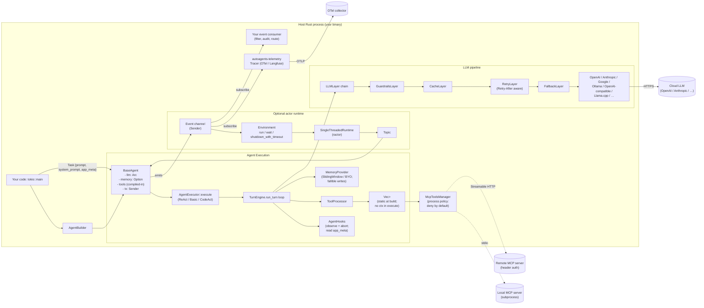

# AutoAgents Rust — Benchmark Analysis

> **Repo**: https://github.com/liquidos-ai/AutoAgents
> **Commit analysed**: 6301004371aa3fe274a309e493cdd3bfb07592db
> **Branch**: main
> **Framework path**: frameworks/autoagents
> **Analysed on**: 2026-10-01

## TL;DR

- ⭐ **What is this stack architecturally?** AutoAgents is a **Rust-native, in-process multi-crate library** built around a typed `AgentExecutor` trait, a sliding-window memory provider, and an optional `ractor`-based actor runtime (`SingleThreadedRuntime`) for pub/sub coordination of multiple agents. There is no SDK-supplied HTTP server; the framework is *purely a library* (a separate `AutoAgents-CLI` repo serves YAML-defined agents over HTTP).
- **Ecosystem**: **Rust** (edition 2024). Python bindings exist (`autoagents-py` via PyO3/maturin) but are a thin wrapper.
- **License & owner**: Dual MIT OR Apache-2.0 (`Cargo.toml:27`), maintained by [Liquidos AI](https://liquidos.ai) with community contributors. Community support only; no managed cloud or paid tier surfaced.
- **Maturity**: Workspace version `0.4.0` (`Cargo.toml:25`), released 2026-07-08 as the first minor bump since v0.3.0. Repo created 2025-02-22. On 2026-10-01: 761 stars, 89 forks, 25 contributors, 17 tags; the last commit on `main` is from 2026-08-26. Still pre-1.0, no changelog file.
- **Where the loop runs**: In your own Rust process. `BaseAgent::run` calls `AgentExecutor::execute` → `TurnEngine::run_turn`, which calls the LLM provider in the same task; tool dispatch happens in `ToolProcessor::process_single_tool_call_with_hooks`. No subprocess, no daemon, no vendor cloud (`crates/autoagents-core/src/agent/direct.rs:185`, `crates/autoagents-core/src/agent/executor/turn_engine.rs:148`).
- **Strongest architectural choice for our use case**: Typed Rust trait surface (`AgentDeriveT::tools`, `AgentExecutor`, `AgentHooks`, `MemoryProvider`, `LLMLayer`). Every extension point is a trait you implement. The `LLMLayer` pipeline (retry + fallback + cache + guardrails) is a well-designed composable surface for cross-cutting LLM concerns, and v0.4.0 made retry honour provider `Retry-After` hints on typed HTTP errors (`crates/autoagents-llm/src/optim/retry.rs:216`, `crates/autoagents-llm/src/optim/fallback.rs:116`).
- **Weakest / biggest gap**: No session abstraction, no HTTP/SSE server, no skills concept, no resource manager, no MCP server (client only), and tools still cannot see per-run tenant identity. There is no `SessionStore`, persistence, mid-run checkpointing, or replay.
- **Most surprising finding (good)**: The v0.4.0 cycle was mostly a security and robustness pass: deny-by-default MCP process policy (`crates/autoagents-toolkit/src/mcp/client.rs:53`), root-scoped filesystem tools that reject `..` and symlink escapes (`crates/autoagents-toolkit/src/utils/path_sandbox.rs`), SSRF-hardened document fetching (`crates/autoagents-toolkit/src/tools/document_parsing/config.rs:35`), memory write errors that now fail the turn instead of being swallowed, and a timeout-aware runtime shutdown (`crates/autoagents-core/src/environment.rs:307`). The `codeact` executor still runs sandboxed TypeScript that calls registered tools as `external_*` functions (`crates/autoagents-core/src/agent/prebuilt/executor/codeact.rs:907`).
- **Most surprising finding (bad)**: The new `Task::app_meta` field (`crates/autoagents-protocol/src/task.rs:19`) lets the caller pass arbitrary per-run metadata, but it stops at the run boundary. Hooks can read it (`on_run_start(&Task, …)`), but `ToolRuntime::execute(&self, args)` still has no context parameter, and `on_tool_call` returns only `Continue` or `Abort` (`crates/autoagents-core/src/agent/hooks.rs:34`). Forcing `tenantId` into tool arguments still requires one tool instance per tenant with the value captured as a struct field.
- **One-line verdicts**:
  - Sessions/persistence: **Not provided — BYO** (in-memory sliding-window memory only; `app_meta` can carry a `session_id`, but nothing stores it).
  - Skills: **Not provided — BYO** (no SKILL.md concept).
  - Resource manager: **Not provided — BYO**.
  - Sub-agents: **Implicit only**: actors subscribed to topics on a shared runtime; no `SubAgent` primitive.
  - Multi-tenancy: **Partial**: untyped `Task::app_meta` carries tenant identity into the run and hooks; no propagation to tools, no forced args, no tenant-aware tool filtering.
  - Hooks: **Observe-and-abort only**, no mutate-input/mutate-result/inject-message capability.
  - API: **Not provided — BYO** HTTP layer.
  - Observability: **OpenTelemetry exporter** (`autoagents-telemetry`) that converts `Event`s from the agent's event stream into spans/metrics; Langfuse provider optional.
- **Production-readiness verdict for multi-tenant server-side deployment**: **Significant BYO surface required.** AutoAgents gives you a typed Rust loop, retry/fallback LLM layers, OTel tracing, an actor pub/sub runtime, and (new in v0.4.0) hardened MCP/filesystem tool boundaries plus a run-level metadata slot. You must still implement the HTTP layer, session persistence, tenant scoping in tools, skill loader, resource registry, tool-arg injection, HITL approval, and cost rollups. Suitable when you want maximum control and Rust performance, not a batteries-included multi-tenant platform.

## 0. General

### 0.1 What is this stack?
A **Rust workspace of crates** (`autoagents-core`, `autoagents-llm`, `autoagents-protocol`, `autoagents-toolkit`, `autoagents-telemetry`, `autoagents-guardrails`, `autoagents-derive`, plus speech/llamacpp/mistral-rs/qdrant adapters) that you embed in your own Rust binary. Python bindings (`autoagents-py`) exist via PyO3/maturin. **It is a library, not a server, daemon, or hosted service.** A **separate** `AutoAgents-CLI` repo lets you describe agents in YAML and serve them over HTTP, but it is not part of this study (`README.md:295`).

### 0.2 Ecosystem
**Rust**: primary implementation language (edition 2024 in the workspace, `Cargo.toml:26`; README says "latest stable", `README.md:94`).

Second language: **Python**, via the `bindings/python/` crates (`autoagents-py`, plus `autoagents-guardrails-py`, llama.cpp and mistral-rs wheels published with v0.4.0). These use PyO3 + maturin to expose the Rust core. The Python surface is a thin wrapper, not the canonical API.

### 0.3 Project status & governance
- **License**: dual MIT OR Apache-2.0 (`Cargo.toml:27`). (GitHub's license detector reports only `Apache-2.0`.)
- **Owner**: Liquidos AI (`README.md:472`). Project hosted under `liquidos-ai/AutoAgents` on GitHub.
- **Commercial backing/support**: none surfaced. README references community channels only: GitHub Issues, Discussions, Discord (`README.md:439`).
- **Translations**: README is translated to 7 languages (zh, ja, es, fr, de, ko, pt-BR), which signals user reach but not enterprise support.

### 0.4 Project maturity / age
- First commit: 2025-02-22 ("first commit", `d7607ae`). Earliest tag: `v0.1.1-alpha.0`.
- Current crate version: `0.4.0` workspace-wide (`Cargo.toml:25`), GitHub release `v0.4.0` published 2026-07-08. This commit is 13 commits past that tag (`v0.4.0-13-g6301004`).
- Edition `2024` (`Cargo.toml:26`).
- README declares the project "**production-grade**" (`README.md:6`), but the 0.x version, lack of session/HTTP primitives, and absence of changelog files (`CHANGELOG.md`/`HISTORY.md`/`RELEASES.md` all absent, verified) indicate pre-1.0 maturity. APIs are not formally marked experimental/stable. v0.4.0 included small breaking changes (new `Task` field, `InternalEvent::ProtocolEvent(Box<Event>)`, `Environment::run()` now returns `Result<(), EnvironmentError>` instead of a join handle), so expect breaking changes on minor bumps.

### 0.5 Adoption & community signal
Captured via `gh api repos/liquidos-ai/AutoAgents` on **2026-10-01**:
- **Stars**: 761 · **Forks**: 89 · **Watchers**: 8 · **Open issues + PRs**: 26.
- **Contributors**: 25 (GitHub contributors API, including anonymous). 11 distinct commit authors since 2026-05-19.
- **Recent activity**: 50 commits between 2026-05-28 and 2026-08-26 (#230 → #309). Last push 2026-08-26; no commits in September 2026.
- **Release cadence**: v0.3.3 (2026-02-10), v0.3.4 (02-20), v0.3.5 (03-03), v0.3.6 (03-11), v0.3.7 (03-25), v0.4.0 (07-08). Roughly fortnightly in Q1 2026, then a 3.5-month gap before v0.4.0. No release since.
- Issue/PR numbers reach ~#312. Most PRs are by the core maintainer (`saivishwak`), with recurring outside contributors (`kgentic-dev`, `Parikalp-Bhardwaj`, `bigboss2063`).
- README links to crates.io badge, codecov badge, Discord (`https://discord.gg/zfAF9MkEtK`), and DeepWiki (`https://deepwiki.com/liquidos-ai/AutoAgents`).

### 0.6 Ecosystem fit
- **Package names**: `autoagents` on crates.io; `autoagents-py` on PyPI (Python wrapper around the Rust core, see `bindings/python/`), plus `autoagents-guardrails-py`, `autoagents-llamacpp-*` and `autoagents-mistral-rs-*` wheels.
- **Registry links**: https://crates.io/crates/autoagents and https://pypi.org/project/autoagents-py/ (per README badges).
- **Examples/templates**: 20+ examples under `examples/` covering basic, design patterns (chaining/parallel/planning/reflection/routing), MCP, code mode (CodeAct), coding agent, RAG via Qdrant, WASM tool sandbox, Wolfram-Alpha, speech, telemetry. v0.4.0 updated them to the `Environment::run()`/`wait()` lifecycle (`examples/design_patterns/src/environment_lifecycle.rs`).
- **Used as**: a **library** (no daemon, no hosted platform, no bundled CLI). Adjacent `AutoAgents-CLI` repo packages it for YAML-driven runs over HTTP.

### 0.7 Documentation depth & cross-team contributor accessibility
- Docs live under `docs/content/` as Docusaurus markdown. Sections: `getting-started/`, `core-concepts/`, `llm-providers/`, `developer/`, plus a new `faq.md` and `core-concepts/actor_agents.md` (89 lines) since the last analysis.
- Pages remain short and conceptual (e.g. `architecture.md` 36 lines, `executors.md` 60 lines). `core-concepts/tools.md` now documents the filesystem root sandbox and the MCP process policy.
- Language: **English only** (READMEs are translated but the docs site is English).
- A non-engineer (Product/Data) **cannot** author content for an agent: every extension is a Rust trait implementation requiring compile cycles. No YAML/JSON-driven config except the MCP TOML config (`examples/mcp/config.toml`) and the separate `AutoAgents-CLI` (not in this repo).

### 0.8 Documentation entry points ⭐
- **Official docs landing page**: https://liquidos-ai.github.io/AutoAgents/
- **Quickstart / getting-started**: https://liquidos-ai.github.io/AutoAgents/docs/getting-started/quick-start (path inferred from `docs/content/getting-started/quick-start.md`).
- **API reference**: docs.rs: https://docs.rs/autoagents/
- **Hosting / deployment / production guide**: Not provided — BYO. (No dedicated production guide in `docs/content/`.)
- **Examples / demos repo**: https://github.com/liquidos-ai/AutoAgents/tree/main/examples
- **Changelog / release notes**: Not provided in-repo (no `CHANGELOG.md`/`HISTORY.md`/`RELEASES.md`). Track via GitHub Releases.
- **GitHub Releases**: https://github.com/liquidos-ai/AutoAgents/releases (v0.4.0: https://github.com/liquidos-ai/AutoAgents/releases/tag/v0.4.0)
- **GitHub issues tracker**: https://github.com/liquidos-ai/AutoAgents/issues. Relevant merged PR: https://github.com/liquidos-ai/AutoAgents/pull/246 (`app_meta` on `Task`, "session/chat isolation").
- **Discord / community forum**: https://discord.gg/zfAF9MkEtK
- **Sibling repos**:
  - **AutoAgents-CLI**: https://github.com/liquidos-ai/AutoAgents-CLI (separate repo; YAML-driven runs over HTTP).
  - **Experimental backends**: https://github.com/liquidos-ai/AutoAgents-Experimental-Backends (Burn, Onnx).
  - **Android example**: https://github.com/liquidos-ai/AutoAgents-Android-Example
- **DeepWiki**: https://deepwiki.com/liquidos-ai/AutoAgents

---

## 1. High Level Architecture

### Deployment diagram ⭐

```
┌──────────────────────── Host Rust process ────────────────────────┐
│                                                                   │
│  ┌────────────────────────────────────────────┐                   │
│  │       AgentBuilder<T, A> (T = ReAct /      │                   │
│  │       Basic / CodeAct ; A = Direct /        │                   │
│  │       ActorAgent)                           │                   │
│  └────────────────────────────────────────────┘                   │
│           │                                                       │
│           ▼                                                       │
│  ┌────────────────────────────────────────────┐                   │
│  │       BaseAgent<T, A>                       │                   │
│  │       - llm: Arc<dyn LLMProvider>           │                   │
│  │       - memory: Option<MemoryProvider>      │                   │
│  │       - tx: Sender<Event>                   │                   │
│  └────────────────────────────────────────────┘                   │
│           │   Task { prompt, system_prompt, app_meta, … }         │
│           ▼                                                       │
│  ┌────────────────────────────────────────────┐                   │
│  │       AgentExecutor::execute(task, ctx)     │                   │
│  │       → TurnEngine::run_turn loop           │                   │
│  │       → ToolProcessor::process_single_*     │                   │
│  └────────────────────────────────────────────┘                   │
│           │              │                  │                     │
│           ▼              ▼                  ▼                     │
│  ┌──────────────┐  ┌────────────┐  ┌────────────────────┐         │
│  │ LLMLayer     │  │  Memory    │  │ Tool registry      │         │
│  │ pipeline     │  │  (in-mem   │  │ (Vec<Box<ToolT>>)  │         │
│  │ (Cache /     │  │  sliding   │  │  MCP client wraps  │         │
│  │  Retry /     │  │  window)   │  │  stdio + Streamable│         │
│  │  Fallback /  │  │            │  │  HTTP MCP servers  │         │
│  │  Guardrails) │  │            │  │                    │         │
│  └──────────────┘  └────────────┘  └────────────────────┘         │
│           │                                                       │
│  ┌────────┴───────────────────────────────────────────┐           │
│  │   Optional: SingleThreadedRuntime (ractor actors)  │           │
│  │   + Environment + Topic<Task> pub/sub channel      │           │
│  └─────────────────────────────────────────────────────┘          │
│                                                                   │
└───────────────────────────────────────────────────────────────────┘
        │                                       │              │
        ▼                                       ▼              ▼
    LLM provider HTTP                  Local MCP server   Remote MCP server
    (OpenAI / Anthropic / …)           (subprocess,       (Streamable HTTP,
        │                              policy-gated)      header auth)
        ▼
  Telemetry: autoagents-telemetry
  (Event stream → OTel OTLP exporter)
```

### 1.1 Where does the agent loop *actually* execute?
**Inside the caller's tokio runtime, in the same Rust process.** Concretely:

`crates/autoagents-core/src/agent/direct.rs:185`
```rust
pub async fn run(&self, task: Task) -> Result<<T as AgentDeriveT>::Output, RunnableAgentError> {
    let context = self.create_context();
    let hook_outcome = self.inner.on_run_start(&task, &context).await;
    match hook_outcome { HookOutcome::Abort => return Err(...), _ => {} }
    match self.inner().execute(&task, context.clone()).await { ... }
}
```

`crates/autoagents-core/src/agent/prebuilt/executor/react.rs:264` then drives a loop of `engine.run_turn(...)` calls up to `max_turns` (default 10). The LLM HTTP call happens in `TurnEngine::get_llm_response` (`turn_engine.rs:521`), invoked from `run_turn` (`turn_engine.rs:178`). All of this runs as ordinary `async fn` on the calling task: no subprocess, no daemon, no vendor cloud.

### 1.2 Runtime dependencies
- **Rust stable** (edition 2024 in the workspace; README says "latest stable", `README.md:94`).
- **tokio** (`rt-multi-thread`, `macros`) at runtime.
- **ractor** crate when the actor runtime is enabled (default for `not(target_arch="wasm32")`); bumped to 0.16.2 in this cycle.
- Optional features pull in: `wasmtime` (sandboxed WASM tools), `deno_ast` + `rquickjs` (CodeAct executor), `rmcp` (MCP client), `qdrant-client`, llama.cpp / mistral-rs for local models. WASI Preview2 builds of the OpenAI client are now supported (`crates/autoagents-llm/src/wasi_http.rs`).
- **No mandatory database**, no Redis, no Postgres, no LangSmith. Vendor LLM providers are optional Cargo features (`openai`, `anthropic`, `ollama`, …, see `crates/autoagents/Cargo.toml:12`).
- **External binaries**: only local MCP servers (subprocess via stdio) if you use them; remote MCP servers are now reachable over HTTP without a subprocess.

### 1.3 Recommended deployment topology
**Not explicitly addressed in the docs.** The docs describe "direct agents" (inline) and "actor agents" (in a runtime), but do not prescribe container-per-tenant vs. shared process. You embed AutoAgents in whatever Rust binary you build (Axum, Actix, custom) and you decide the topology. The README's "Performance" section says "**Scalable**: Horizontal scaling with multi-agent coordination" but that refers to the in-process actor runtime, not multi-process deployment (`README.md:449`).

### 1.4 Cold-start cost & instance footprint
**Not benchmarked or documented.** Being Rust, a release binary's cold start is essentially process startup time (typically <100 ms). Memory baseline is small (no embedded vector store, no LLM weights unless you use llama.cpp/mistral-rs features). Compile time is the real cost: a full `cargo build --workspace --all-features` is significant.

### 1.5 Vendor lock-in
- **LLM provider**: low. Unified `LLMProvider` trait abstracts 10 cloud + 3 local providers, plus a generic OpenAI-compatible provider for any other endpoint (`README.md:50`, `crates/autoagents-llm/src/providers/openai_compatible.rs:1`).
- **Hosting platform**: none; runs anywhere Rust runs (including WASI for parts of the LLM crate).
- **Eval platform**: none; no eval framework.
- **Observability platform**: OTel-standard via `autoagents-telemetry`, with optional Langfuse provider; both swappable.

### 1.6 Framework weight / footprint
**Heavy by total LOC** (multi-crate workspace including speech, vector stores, derive macros, guardrails, WASM sandbox, a llama.cpp provider that grew by ~10 kLOC this cycle), but the **core surface** (`autoagents-core`) is focused: agent / executor / memory / tool / context / hooks / runtime. You only pull what you use via Cargo features.

### 1.7 Release-history signal
**No in-repo changelog files** (verified: no `CHANGELOG.md`, `HISTORY.md`, or `RELEASES.md`). History comes from GitHub Releases and commit messages. `PUBLISH.md` documents the release process, and v0.4.0 added a version-consistency release gate (`scripts/release/check_version_consistency.py`).

Production-relevant changes between v0.3.7+26 (previous analysis) and v0.4.0+13 (this commit), per https://github.com/liquidos-ai/AutoAgents/releases/tag/v0.4.0 and `git log`:
- **Tenant/run metadata**: `Task::app_meta: Option<Value>` + `Task::with_app_meta` (#246, `crates/autoagents-protocol/src/task.rs:17-19`, `:59`), also exposed in Python (`bindings/python/autoagents/autoagents_py/task.py:34`).
- **Security hardening**: MCP local process trust model with deny-by-default `McpProcessPolicy` (#275); filesystem toolkit root sandbox (#272); `parse_document` SSRF and size limits (#267); LLM secret store and request-payload logging hardened so trace logs carry summaries instead of raw payloads (#277, `crates/autoagents-llm/src/request_diagnostics.rs`).
- **Error semantics**: typed HTTP status errors with `Retry-After` (#265); typed errors instead of provider panics for unsupported capabilities (#263); memory write failures now propagate (#262); runtime processing errors propagate (#304).
- **Runtime lifecycle**: `Environment::run()/wait()/run_background()` lifecycle and structured lookup errors (#264); timeout-aware shutdown `shutdown_with_timeout` (#299, #301).
- **Providers**: generic OpenAI-compatible provider exposed (#294), image generation for Google and OpenRouter (#292), Ollama model listing (#290), Anthropic structured output via `output_config.format` (#236), usage tokens for Ollama and Google (#230), `ChatProvider::model()` (#237), WASI Preview2 OpenAI Responses (#270).
- **Memory**: reasoning content preserved in tool-call history (#306).

Breaking changes to note: the new `Task` field (struct-literal construction breaks), `InternalEvent::ProtocolEvent(Box<Event>)` (`crates/autoagents-protocol/src/protocol.rs:166`), and `Environment::run()` signature.

---

## 2. Agent Loop

### 2.1 Run loop entrypoint(s)

There are two main entrypoints depending on the agent's `AgentType`:

**Direct agent**: `BaseAgent<T, DirectAgent>::run` / `::run_stream` at `crates/autoagents-core/src/agent/direct.rs:185` and `:225`:
```rust
pub async fn run(&self, task: Task) -> Result<<T as AgentDeriveT>::Output, RunnableAgentError>

pub async fn run_stream(&self, task: Task)
    -> Result<BoxRuntimeStream<Result<<T as AgentDeriveT>::Output, Error>>, RunnableAgentError>
```

**Actor agent**: `BaseAgent<T, ActorAgent>::run` / `::run_stream` at `crates/autoagents-core/src/agent/actor.rs:131` and `:185`. The actor variant takes `self: Arc<Self>` and emits protocol `Event`s through a runtime-owned channel. v0.4.0 added `run_stream_to_completion` (`actor.rs:253`), which drains a streaming execution inside the actor and emits `TaskError` on setup, empty-stream, or post-stream failures.

Underneath both, the executor trait is the universal abstraction at `crates/autoagents-core/src/agent/executor/mod.rs:50`:
```rust
async fn execute(&self, task: &Task, context: Arc<Context>) -> Result<Self::Output, Self::Error>;

async fn execute_stream(&self, task: &Task, context: Arc<Context>)
    -> Result<BoxRuntimeStream<Result<Self::Output, Self::Error>>, Self::Error>;
```

`Task` (defined in `autoagents-protocol/src/task.rs:9`) is the input contract: `prompt`, optional `image`, optional `system_prompt`, `submission_id` (UUID), `completed`, `result`, and (new) optional `app_meta: Option<serde_json::Value>`. See Q6.1.

### 2.2 Per-iteration behavior

The shared `TurnEngine::run_turn` (`crates/autoagents-core/src/agent/executor/turn_engine.rs:148`) describes one iteration:

1. Emit `Event::TurnStarted`.
2. Call `hooks.on_turn_start` (`turn_engine.rs:168`).
3. Build `Vec<ChatMessage>` = system prompt + recalled memory + (optionally) user prompt (`build_messages`, `turn_engine.rs:588`).
4. Call `get_llm_response` (`turn_engine.rs:521`), which invokes `llm.chat_with_tools(...)` or `llm.chat(...)` depending on `ToolMode::Enabled/Disabled`.
5. Store the user message in memory (once per run). Since v0.4.0 a memory write failure returns an error from the turn (`store_user(task).await?`) instead of being ignored.
6. If there are tool calls and `ToolMode::Enabled`: dispatch via `process_tool_calls_with_hooks`, store the tool interaction (now including the model's reasoning content) in memory via `store_tool_interaction_with_reasoning` (`turn_engine.rs:205`), record results in `AgentState`, emit `Event::TurnCompleted{final_turn:false}`, return `TurnResult::Continue(Some(output))`.
7. Else: store the assistant message (`turn_engine.rs:234`), emit `TurnCompleted{final_turn:true}`, return `TurnResult::Complete(output)`.

`ReActAgent::execute` (`react.rs:264`) drives this loop up to `max_turns` (default 10, `executor/mod.rs:33`).

### 2.3 ReAct loop

**Yes**, AutoAgents ships a built-in ReAct loop via `ReActAgent<T>` (`crates/autoagents-core/src/agent/prebuilt/executor/react.rs:146`). It also ships:
- `BasicAgent<T>`: single-turn, no tools (`basic.rs`).
- `CodeActAgent<T>`: multi-turn with sandboxed TypeScript via Deno AST + rquickjs (`codeact.rs:176`); the LLM only sees a single `execute_typescript` tool (`codeact.rs:56`) and your registered tools are exposed as `external_*` functions (`codeact.rs:907`).

You can also write your own executor by implementing `AgentExecutor`.

### 2.4 Tool dispatch + result handling

`ToolProcessor::process_single_tool_call_with_hooks` (`crates/autoagents-core/src/agent/executor/tool_processor.rs:50`) is the dispatch entrypoint:

```rust
match hooks.on_tool_call(call, context).await {
    HookOutcome::Abort => { return None; } // skip execution
    HookOutcome::Continue => {}
}
hooks.on_tool_start(call, context).await;
let result = Self::process_single_tool_call(tools, call, tool_context, tx_event).await;
if result.success { hooks.on_tool_result(call, &result, context).await; }
else { hooks.on_tool_error(call, result.result.clone(), context).await; }
```

`process_single_tool_call` (`tool_processor.rs:85`) does the actual `tool.execute(parsed_args)` and emits `Event::ToolCallRequested` then `Event::ToolCallCompleted` / `Event::ToolCallFailed`. Tools are matched **by name** from `Vec<Box<dyn ToolT>>` (linear scan, `tool_processor.rs:108`).

Tool results are fed back into memory as `ChatMessage` entries via `MemoryAdapter::store_tool_interaction_with_reasoning` (called from `turn_engine.rs:205`). Since #262 the assistant tool-use message and its tool results are written as one logical batch (`MemoryProvider::remember_many`, `memory/mod.rs:851`), so a bounded memory cannot persist an unmatched tool call.

### 2.5 Explicit turn concept

A **turn** = one trip through `TurnEngine::run_turn`. Its boundary is one LLM call + (optionally) one batch of tool dispatches. The loop terminates on:
- LLM returns no tool calls → `TurnResult::Complete` → break.
- `max_turns` reached → `Err(MaxTurnsExceeded)` unless content has accumulated (`react.rs:314-322`).
- A memory write or LLM error → error propagated out of the turn.

Each turn emits `Event::TurnStarted{turn_number, max_turns}` and `Event::TurnCompleted{turn_number, final_turn}` (`autoagents-protocol/src/protocol.rs:128`).

### 2.6 Event emission mechanism (in-process)

Events are emitted via an `mpsc::Sender<Event>` stored on `Context.tx`. `EventHelper` (`crates/autoagents-core/src/agent/executor/event_helper.rs`) wraps `Sender<Event>::send(...)`; v0.4.0 added `send_task_completed_value` used by `BaseAgent::finish_executor_run` (`base.rs:197`), which now turns a failure to emit `TaskComplete` into a `TaskError` instead of dropping it.

Two consumption modes:
- **DirectAgent**: `DirectAgentHandle.rx: BoxEventStream<Event>` is given to you at build time; `subscribe_events()` returns a fanned-out stream using `EventFanout` (`direct.rs:63`).
- **ActorAgent**: events flow through the runtime; `Environment::take_event_receiver` (single consumer, `environment.rs:255`) or `Environment::subscribe_events` (broadcast, `environment.rs:274`) returns a stream.

In-process delivery is via `tokio::sync::mpsc::channel` (`crates/autoagents-core/src/agent/constants.rs:DEFAULT_CHANNEL_BUFFER`).

---

## 3. Message & Event Taxonomy

### 3.1 Message layers

Three distinct vocabularies exist:

1. **LLM wire messages**: `ChatMessage { role: ChatRole, message_type: MessageType, content: String, reasoning_content: Option<String> }` from `autoagents-llm/src/chat/mod.rs:218`. Roles: `System`, `User`, `Assistant`, `Tool`. This is what gets sent to OpenAI/Anthropic/etc. `reasoning_content` is new in this cycle (#306) and is serde-backward-compatible (`chat/mod.rs:227`).
2. **Protocol events**: `enum Event` from `autoagents-protocol/src/protocol.rs:24`. Variants: `NewTask`, `TaskStarted`, `TaskComplete`, `TaskError`, `PublishMessage`, `SendMessage`, `ToolCallRequested`, `ToolCallCompleted`, `ToolCallFailed`, `CodeExecutionStarted/Console/Completed/Failed`, `TurnStarted`, `TurnCompleted`, `StreamChunk`, `StreamToolCall`, `StreamComplete`.
3. **Stream chunks**: `enum StreamChunk` from `autoagents-protocol/src/llm.rs:70` (mirrored in `autoagents-llm/src/chat/mod.rs:76`). Variants: `Text`, `ReasoningContent`, `ToolUseStart`, `ToolUseInputDelta`, `ToolUseComplete`, `Done`, `Usage`. These are wrapped inside `Event::StreamChunk { sub_id, chunk }`.

Conversion:
- LLM provider produces `StreamChunk`s. `TurnEngine::stream_with_tools` (`turn_engine.rs:421`) accumulates them, splits text from tool calls, and emits `Event::StreamChunk` per chunk plus `Event::StreamToolCall` per complete tool call.
- Final results bubble up to the caller as `<T as AgentDeriveT>::Output` (typed Rust struct).

### 3.2 Concrete message types

| Type | Layer | Purpose |
|---|---|---|
| `Task` (`autoagents-protocol/src/task.rs:9`) | input | unit of work: prompt + optional image + optional system_prompt + submission_id + optional `app_meta` JSON |
| `ChatMessage` (`autoagents-llm/src/chat/mod.rs:218`) | LLM wire | role/content/message_type/reasoning_content sent to provider |
| `ChatRole::System/User/Assistant/Tool` | LLM wire | role enum |
| `MessageType::Text / Image((mime, bytes)) / Pdf / ToolUse / ToolResult` | LLM wire | content discriminator |
| `ToolCall { id, call_type, function: FunctionCall }` (`autoagents-protocol/src/llm.rs:54`) | LLM wire | LLM-generated tool invocation |
| `ToolCallResult { tool_name, success, arguments, result }` (`autoagents-protocol/src/tool.rs`) | internal | tool execution outcome |
| `StreamChunk` (7 variants) | streaming | per-chunk LLM stream delta |
| `StreamResponse { choices: [StreamChoice], usage }` (`autoagents-llm/src/chat/mod.rs:41`) | streaming | structured stream wrapper |
| `Event` (17 variants) | protocol | runtime event |
| `InternalEvent::ProtocolEvent(Box<Event>) / Shutdown` (`protocol.rs:164-169`) | runtime | runtime control (event now boxed) |
| `TurnResult::Continue(Option<T>) / Complete(T)` (`executor/mod.rs:18`) | executor | per-turn termination signal |
| `TurnDelta::Text / ReasoningContent / ToolResults / Done` (`turn_engine.rs:82`) | executor stream | typed streaming delta |
| `HookOutcome::Continue / Abort` (`hooks.rs:10`) | hooks | hook short-circuit signal |
| `Usage { prompt_tokens, completion_tokens, total_tokens, … }` (`chat/mod.rs:16`) | LLM wire | token accounting |
| `RuntimeError::ShutdownTimeout { runtime_ids, timeout }` (`runtime/mod.rs:54`) | runtime | new: runtimes that failed to stop within a deadline |

### 3.3 Messages vs. events

**Two separate taxonomies.** `ChatMessage` is what crosses the wire to the LLM. `Event` is the in-process observability/coordination stream. They overlap only loosely: when streaming, the engine emits `Event::StreamChunk(StreamChunk::Text(...))` per LLM token, but the canonical assistant message stored in memory is a single concatenated `ChatMessage`.

### 3.4 Event categories

| Category | Variants | Defining property |
|---|---|---|
| Lifecycle (task) | `TaskStarted`, `TaskComplete`, `TaskError`, `NewTask` | top-level run boundaries |
| Turn | `TurnStarted{turn_number, max_turns}`, `TurnCompleted{final_turn}` | per-iteration boundaries |
| Tool | `ToolCallRequested`, `ToolCallCompleted`, `ToolCallFailed` | tool dispatch lifecycle |
| Code exec (CodeAct) | `CodeExecutionStarted/Console/Completed/Failed` | sandbox lifecycle |
| Stream | `StreamChunk{chunk}`, `StreamToolCall{tool_call}`, `StreamComplete` | streaming deltas |
| Actor IPC | `PublishMessage{topic_name, topic_type, message}`, `SendMessage` | runtime pub/sub |
| Hook | none; hooks are direct async fn calls, not events | — |
| Sub-agent | none; no first-class sub-agent primitive | — |

Events do **not** carry `Task::app_meta`; only `sub_id`/`actor_id`/`actor_name` identify the run. Correlating events to a tenant requires mapping `sub_id` → tenant in your own code.

### 3.5 Canonical type-definition file(s)

- `crates/autoagents-protocol/src/protocol.rs:24`: `Event` enum (single source of truth for event taxonomy).
- `crates/autoagents-protocol/src/llm.rs:70`: `StreamChunk` enum.
- `crates/autoagents-protocol/src/task.rs:9`: `Task` struct.
- `crates/autoagents-protocol/src/tool.rs`: `ToolCallResult` struct.
- `crates/autoagents-llm/src/chat/mod.rs:1-230`: `ChatMessage`, `ChatRole`, `MessageType`, `StreamResponse`, `Usage`.

### 3.6 Live agentic event stream taxonomy

Sample frames (Rust pseudocode for an actor agent stream):

```rust
// Task lifecycle
Event::TaskStarted { sub_id: <UUID>, actor_id: <UUID>, actor_name: "math_agent", task_description: "What is 1+1?" }

// Turn boundary
Event::TurnStarted { sub_id, actor_id, turn_number: 0, max_turns: 10 }

// Streamed text chunk
Event::StreamChunk { sub_id, chunk: StreamChunk::Text("The answer is ") }

// Reasoning content (for reasoning models)
Event::StreamChunk { sub_id, chunk: StreamChunk::ReasoningContent("Let me think…") }

// Tool call from streaming
Event::StreamToolCall { sub_id, tool_call: { id: "call_1", function: { name: "Addition", arguments: "{\"left\":1,\"right\":1}" } } }

// Tool dispatch
Event::ToolCallRequested { sub_id, actor_id, id: "call_1", tool_name: "Addition", arguments: "{\"left\":1,\"right\":1}" }
Event::ToolCallCompleted { sub_id, actor_id, id: "call_1", tool_name: "Addition", result: 2 }

// Turn end
Event::TurnCompleted { sub_id, actor_id, turn_number: 0, final_turn: true }

// Task end
Event::TaskComplete { sub_id, actor_id, actor_name: "math_agent", result: "{\"value\":2,…}" }
```

---

## 4. Agent Runtime (Multi-session Host)

### 4.1 Multi-session host architecture
**Mixed.** AutoAgents ships an `Environment` + `Runtime` (`SingleThreadedRuntime`) layer that hosts multiple agents *as actors* in one process and routes typed messages between them via topics (`crates/autoagents-core/src/runtime/single_threaded.rs:70`, `crates/autoagents-core/src/environment.rs:88`). This is closer to an **in-process actor system** than a "multi-session host".

The runtime does **not** model "sessions" as a first-class concept. It has:
- A `subscriptions: HashMap<String, Subscription>` for topic-name → list of subscribed actors.
- `external_tx/external_rx` for delivering events to the caller.
- `broadcast_tx` for fan-out to multiple subscribers.

v0.4.0 tightened the `Environment` lifecycle: `run()` spawns a managed task and returns `Result<(), EnvironmentError>` (`environment.rs:177`), `wait()` joins it and is cancellation-safe inside `tokio::select!` (`environment.rs:209`), `run_background()` starts runtimes without a managed task (`environment.rs:233`), and runtime lookup returns structured errors instead of panicking (#264).

You would build "sessions" yourself by spawning one or more agents per logical session and routing tasks through a per-session topic. `Task::app_meta` can now carry a `session_id`/`chat_id` alongside each task (that was the stated motivation for #246), but the runtime does not read it.

### 4.2 Concurrent session isolation
Each `BaseAgent` instance holds its own `Arc<Mutex<Box<dyn MemoryProvider>>>`, so memory is per-agent-instance (`base.rs:65`). If you spawn one agent per session, isolation is naturally enforced. If you share a single agent across sessions, memory will bleed; there is no automatic per-call isolation keyed on `app_meta` or anything else. **No tenant-scoped isolation primitives.**

### 4.3 Horizontal scaling / multi-instance
**Not addressed.** The runtime is `SingleThreadedRuntime` ("single threaded" refers to the runtime's event-loop ownership model, `single_threaded.rs:70`; it can drive many tokio tasks). There is no leader election, distributed lock, shared store, or "N pods serve the same session pool" pattern. Horizontal scaling is BYO.

### 4.4 Background / async / scheduled tasks
**Not provided — BYO.** No cron, no schedulers, no webhook receivers. Long-running background work can be done by spawning your own `tokio::spawn` and routing tasks through a `Topic<Task>`, but there is no first-party primitive.

### 4.5 Worker pool / queue model
**Not provided — BYO.** Tasks are delivered to actors via `actor_ref.cast(message)` (in `ractor`). No durable queue, no retry semantics at the queue layer (LLM-level retries exist in `optim::RetryLayer`). Runtime processing errors now propagate out of the event loop (#304) rather than being logged and dropped.

---

## 5. Sessions & Persistence

**This is the weakest section of the framework.** AutoAgents has no `Session` type, no persistence store, no checkpointer.

### 5.1 Session / chat data model
**Not provided — BYO.** The closest equivalents:
- `Task` (input only, no parent-session linkage): `prompt`, `image`, `system_prompt`, `submission_id`, `completed`, `result`, and the new free-form `app_meta: Option<Value>` (`autoagents-protocol/src/task.rs:9-20`). The field's doc comment names "session/chat isolation" as its purpose, and its tests use `{"session_id": "s1", "chat_id": "c1"}`, but no framework code reads it.
- `AgentState` (`crates/autoagents-core/src/agent/state.rs`): in-memory record of `Task`s (`task_history`) and `ToolCallResult`s for the lifetime of the `Context` (single run).
- `MemoryProvider` (`autoagents-core/src/agent/memory/mod.rs:834`): `remember`, `remember_many`, `recall`, `clear`. The bundled impl is `SlidingWindowMemory` (`memory/sliding_window.rs`).

No typed `id`, `tenant_id`, `user_id`, `created_at`, `parent_session_id`, `usage`, or `model` field on any session-like type.

### 5.2 What's stored on a session
The `SlidingWindowMemory` holds a `VecDeque<ChatMessage>` of bounded size (`memory/sliding_window.rs:34`). Since #306 the stored assistant tool-use message keeps the model's `reasoning_content`. That's it. No tool-call history beyond those messages (per-run results go through `AgentState`), no scratchpad files, no attachments.

### 5.3 Granularity
**One in-memory window per agent instance.** No thread/branch model, no forking. To fork, `clone_box()` the memory provider and start a fresh agent.

### 5.4 Built-in persistence stores
**None.** No JSONL, no SQLite, no Postgres, no Redis, no S3. The `MemoryProvider` trait has `clone_box`, `preload(Vec<ChatMessage>) -> bool`, and `export() -> Vec<ChatMessage>` hooks (`memory/mod.rs:936-952`); these are the BYO contract to persist memory in your own storage layer.

### 5.5 Persistence timing
**N/A** since no persistence ships. The in-memory writes happen per user message at run start, per assistant message (`turn_engine.rs:234`), and per tool-interaction batch (`turn_engine.rs:205`). Since #262 these writes are fallible: a `MemoryProvider::remember` error aborts the turn with `TurnEngineError::LLMError`, so a BYO durable provider can now surface write failures to the caller instead of silently losing messages.

### 5.6 Mid-run checkpointing (durable)
**Not provided — BYO.** A crash mid-tool-call loses all in-memory state.

### 5.7 Session ID format
**No session ID exists.** The closest IDs are:
- `submission_id: SubmissionId = Uuid`, per `Task` (`autoagents-protocol/src/protocol.rs:11`).
- `actor_id: ActorID = Uuid`, per `BaseAgent` (`base.rs:100`, generated in `BaseAgent::new`).
- `runtime_id: RuntimeID = Uuid`, per `SingleThreadedRuntime` (`single_threaded.rs:71`).
- Whatever you put in `Task::app_meta` (caller-defined, untyped).

### 5.8 Pluggable store interface
**Yes**: the `MemoryProvider` trait is the plug point (`memory/mod.rs:834`):
```rust
#[async_trait]
pub trait MemoryProvider: Send + Sync {
    async fn remember(&mut self, message: &ChatMessage) -> Result<(), LLMError>;
    async fn remember_many(&mut self, messages: &[ChatMessage]) -> Result<(), LLMError> { /* loops remember */ }
    async fn recall(&self, query: &str, limit: Option<usize>) -> Result<Vec<ChatMessage>, LLMError>;
    async fn clear(&mut self) -> Result<(), LLMError>;
    fn memory_type(&self) -> MemoryType;
    fn size(&self) -> usize;
    fn clone_box(&self) -> Box<dyn MemoryProvider>;
    fn id(&self) -> Option<String> { None }
    fn preload(&mut self, _data: Vec<ChatMessage>) -> bool { false }
    fn export(&self) -> Vec<ChatMessage> { Vec::new() }
    // … needs_summary, replace_with_summary, get_event_receiver, remember_with_role
}
```
You implement this for your own Postgres/Redis/S3 backing store. `remember_many` (new, `memory/mod.rs:851`) lets a provider write a tool-call + results batch atomically. `ChatMessage` is `Serialize/Deserialize`. The provider receives no `Task` or `app_meta`, so a multi-tenant store must be constructed per session with its key captured at build time.

### 5.9 Schema evolution / migration
**Not provided — BYO.** AutoAgents does not own a schema. New fields (`Task::app_meta`, `ChatMessage::reasoning_content`) use `#[serde(default)]`/skip-if-none so older payloads still deserialize (tests at `task.rs:90` and `chat/mod.rs:938`).

### 5.10 Export / replay
**Partial.** `MemoryProvider::export()` returns `Vec<ChatMessage>` and `preload()` re-hydrates one. Deterministic replay of past events is not provided; events are emitted but not stored.

### 5.11 Cross-session memory
**Not provided — BYO.** No long-term memory abstraction. (See Q17.)

---

## 6. Multi-tenancy & Tenant Identity ⭐ THE KEY QUESTION

AutoAgents gained a run-level metadata slot in v0.4.0 but still lacks first-class tenant primitives below the run boundary.

### 6.1 Run-loop tenant identity
The `Task` (`autoagents-protocol/src/task.rs:9`) is the only per-run input besides the agent's static config:
```rust
pub struct Task {
    pub prompt: String,
    pub image: Option<(ImageMime, Vec<u8>)>,
    #[serde(default)]
    pub system_prompt: Option<String>,
    pub submission_id: SubmissionId,
    pub completed: bool,
    pub result: Option<Value>,
    /// Arbitrary application-provided metadata (session/chat isolation, app context, anything the app threads through).
    #[serde(default)]
    pub app_meta: Option<Value>,
}

pub fn with_app_meta(mut self, meta: Value) -> Self { … }   // task.rs:59
```
**`app_meta` is the only identity carrier**: an untyped `serde_json::Value`. There are no typed `tenant_id`, `user_id`, or `locale` fields; you define the JSON shape and validate it yourself. `Context` (`crates/autoagents-core/src/agent/context.rs:26`) and `AgentConfig` still have no tenant field.

### 6.2 Tenant identity propagation into tool calls
**Not provided — BYO.** `app_meta` reaches:
- `AgentHooks::on_run_start(&Task, &Context)` and `on_run_complete(&Task, …)` directly (`hooks.rs:24`, called at `direct.rs:197`, `actor.rs:147`).
- `Context::state().task_history` indirectly: every prebuilt executor calls `record_task_state(&context, task)` (`turn_engine.rs:617`, `react.rs:269`), so `on_tool_call(&ToolCall, &Context)` can read the current task's `app_meta` from `ctx.state()`. This is a best-effort `try_lock` write, not a documented contract.

It does **not** reach tools. `ToolRuntime::execute` (`crates/autoagents-core/src/tool/runtime/mod.rs:15`) has no context parameter:
```rust
async fn execute(&self, args: serde_json::Value) -> Result<serde_json::Value, ToolCallError>;
```
The tool sees only its own `&self` fields (captured at construction) and the LLM-generated `args`.

### 6.3 Tool call interface
Full tool authoring surface (`crates/autoagents-core/src/tool/mod.rs:24`):
```rust
pub trait ToolT: Send + Sync + Debug + ToolRuntime {
    fn name(&self) -> &str;
    fn description(&self) -> &str;
    fn args_schema(&self) -> Value;
    fn output_schema(&self) -> Option<Value> { None }
}
#[async_trait]
pub trait ToolRuntime: Send + Sync + Debug {
    async fn execute(&self, args: serde_json::Value) -> Result<serde_json::Value, ToolCallError>;
}
```
The `#[tool(...)]` derive macro on a struct generates `ToolT` from `name`, `description`, `input` (a `ToolInput`-derived struct), giving you typed deserialization (`README.md:210`):
```rust
#[tool(name = "Addition", description = "Add two numbers", input = AdditionArgs)]
struct Addition {}

#[async_trait]
impl ToolRuntime for Addition {
    async fn execute(&self, args: Value) -> Result<Value, ToolCallError> {
        let typed: AdditionArgs = serde_json::from_value(args)?;
        Ok((typed.left + typed.right).into())
    }
}
```
There is no tenant-identity object in the signature.

### 6.4 Forcing tool arguments from the harness
**Not provided — BYO.** This remains the main gap.

- Hooks (`AgentHooks::on_tool_call`) take `&ToolCall` by **shared reference**, not `&mut`, and return `HookOutcome::Continue/Abort` only; they cannot mutate the args (`hooks.rs:34`):
  ```rust
  async fn on_tool_call(&self, _tool_call: &ToolCall, _ctx: &Context) -> HookOutcome { HookOutcome::Continue }
  ```
- `ToolProcessor::process_single_tool_call_with_hooks` passes `&call` and `&result` immutably (`tool_processor.rs:50-82`).

Workarounds:
1. Capture tenant id as a field on the tool struct at *construction* time (per-agent-instance, not per-call), e.g. `struct TopicSearch { tenant_id: String }`, and have the tool ignore any tenant value the LLM passes.
2. New with `app_meta`: an `on_tool_call` hook can now *detect* a mismatch (read `tenantId` from `ctx.state()`'s current task, compare with the LLM-supplied argument) and `Abort` the call. That is a validation gate, not an injection.

Neither solves **per-request** dynamic injection without rebuilding the agent (or its tools) per request.

### 6.5 Tenant-aware visible tool selection
**Per-instance only.** `AgentDeriveT::tools()` returns `Vec<Box<dyn ToolT>>` at agent build time (`base.rs:48`); the derive macro returns a fixed list. To filter by tenant, construct a different agent per tenant or implement `AgentDeriveT::tools` manually with conditional logic. There is **no** `activeTools`, `allowed_tools`, or `prepareStep` hook to change the toolset between turns, and nothing reads `app_meta` to filter tools. Scoping of resources (tools, MCP servers) is therefore done at your own per-tenant `AgentBuilder` factory.

### 6.6 Per-tool-call auth propagation
**Not provided — BYO.** The caller's identity does not reach the tool. You capture it as a struct field on the tool at construction. For remote MCP servers, auth headers are fixed per server config (`McpRemoteServerConfig::headers`, `crates/autoagents-toolkit/src/mcp/config.rs:49`), not per call.

### 6.7 Per-tenant rate limit + budget cap
**Not provided — BYO.** There is `ExecutorConfig { max_turns }` (`executor/mod.rs:28`, default 10), a turn cap, but no USD budget and no per-tenant cost tracking. `RetryLayer` honours provider `Retry-After` on rate-limit errors, which is backoff, not a per-tenant limiter. You'd build caps on top of `Usage` from `Event::StreamChunk(StreamChunk::Usage(...))`, correlating `sub_id` back to the tenant in your own map.

### ⭐ Light usage example

```rust
use autoagents::core::agent::{AgentBuilder, AgentHooks, Context, DirectAgent, HookOutcome};
use autoagents::core::agent::prebuilt::executor::ReActAgent;
use autoagents::core::agent::task::Task;
use autoagents::core::tool::{ToolCallError, ToolRuntime};
use autoagents_derive::{agent, tool, ToolInput};
use serde_json::json;

#[derive(ToolInput, serde::Serialize, serde::Deserialize, Debug)]
pub struct TopicSearchArgs { #[input(description = "search query")] query: String }

#[tool(name = "topicSearch", description = "Search topics", input = TopicSearchArgs)]
struct TopicSearch { tenant_id: String }   // Step 3: captured at construction, never from LLM args

#[async_trait::async_trait]
impl ToolRuntime for TopicSearch {
    async fn execute(&self, args: serde_json::Value) -> Result<serde_json::Value, ToolCallError> {
        let q: TopicSearchArgs = serde_json::from_value(args)?;
        Ok(json!({ "tenant": self.tenant_id, "query": q.query, "results": [] }))
    }
}

// Step 2: tools listed statically; bashExec/webFetch are simply not included.
#[agent(name = "predict_agent", description = "You are an audience prediction agent",
        tools = [TopicSearch /*, IabSearch, AudienceCreate */])]
#[derive(Clone)]
pub struct PredictAgent {}

#[async_trait::async_trait]
impl AgentHooks for PredictAgent {
    async fn on_run_start(&self, task: &Task, _ctx: &Context) -> HookOutcome {
        // Step 1 (read side): app_meta is visible to hooks.
        match task.app_meta.as_ref().and_then(|m| m.get("tenantId")) {
            Some(_) => HookOutcome::Continue,
            None => HookOutcome::Abort, // refuse runs without tenant identity
        }
    }
}

pub async fn run_for_tenant(llm: std::sync::Arc<dyn autoagents::llm::LLMProvider>)
    -> Result<(), autoagents::core::error::Error> {
    // Agent (and its tools) rebuilt per tenant because tools cannot see app_meta.
    let handle = AgentBuilder::<_, DirectAgent>::new(ReActAgent::new(PredictAgent {}))
        .llm(llm).build().await?;
    // Step 1: pass identity into the run.
    let task = Task::new("Generate audience for skincare brief").with_app_meta(json!({
        "tenantId": "acme", "userId": "u-123", "targetingStrategyId": "strat-42"
    }));
    let _out = handle.agent.run(task).await?;
    Ok(())
}
```

Note: in this sketch the `TopicSearch { tenant_id }` value has to be set where the tool list is built. With the `#[agent(tools = [...])]` macro that means implementing `AgentDeriveT::tools()` by hand for per-tenant construction.

**What's not provided**:
- **Step 1**: passing `tenantId`/`userId`/`targetingStrategyId` into `agent.run(task)` now **works** via `Task::with_app_meta` (untyped JSON). It reaches hooks, not tools.
- **Step 2**: per-tenant runtime filtering of tools: **Not provided — BYO**. Tools are static per agent instance; build the tool list per tenant.
- **Step 3**: forcing `tenant_id` server-side works *only* by capturing it on the tool struct (one tool instance per tenant). A hook can validate and abort, not inject.

---

## 7. Hook & Middleware Capabilities (Context Engineering)

### 7.1 Enumerate every hook / middleware / lifecycle callback
The `AgentHooks` trait (`crates/autoagents-core/src/agent/hooks.rs:20`, unchanged in v0.4.0) has 10 methods:

| Hook | Fires when | Read / Mutate / Block |
|---|---|---|
| `on_agent_create` | after `BaseAgent::new` succeeds | Read-only (`&self`) |
| `on_run_start(task, ctx) -> HookOutcome` | before `execute` (`direct.rs:197`, `actor.rs:147`) | Read (incl. `task.app_meta`) + **Abort** (no mutate) |
| `on_run_complete(task, result, ctx)` | after successful `execute` (`base.rs:227`) | Read-only |
| `on_turn_start(turn_index, ctx)` | start of each turn (`turn_engine.rs:168`) | Read-only |
| `on_turn_complete(turn_index, ctx)` | end of each turn | Read-only |
| `on_tool_call(tool_call, ctx) -> HookOutcome` | before tool dispatch | Read + **Abort** (no mutate) |
| `on_tool_start(tool_call, ctx)` | after `on_tool_call` returned Continue | Read-only |
| `on_tool_result(tool_call, result, ctx)` | after successful tool execution | Read-only |
| `on_tool_error(tool_call, err, ctx)` | after failed tool execution | Read-only |
| `on_agent_shutdown` | actor agent only, on `post_stop` (`actor.rs:347`) | Read-only |

The derive macro `#[derive(AgentHooks)]` generates a default impl with all methods being the trait defaults (no-op + `Continue`).

The `LLMLayer` pipeline is the second middleware surface, around LLM calls only: `CacheLayer`, `RetryLayer`, `FallbackLayer`, and the guardrails layer can block or sanitize messages (`crates/autoagents-guardrails/src/layer.rs`). Custom layers can mutate requests and responses, but they see `ChatMessage`s, not the `Task` or `app_meta`.

### 7.2 Hook concurrency model
Hooks are invoked **sequentially** in the executor's task. They are `async fn` so they can await freely, but there's no parallel or folded matcher system: each hook method is called once per fire-point on the single registered `AgentHooks` instance. There is no "register many hook handlers and run them all" pattern; you implement `AgentHooks` on your agent struct and that is the one place hooks live.

### 7.3 Specific capability tests

| Capability | Supported? | Notes |
|---|---|---|
| Inject system messages at session start | **Partial**: via `Task::system_prompt` set by the caller (`turn_engine.rs:595`). No hook can inject after the task is created. | `system_prompt` on `Task` is used as the system message. `app_meta` is not rendered into the prompt. |
| Expand the user input (slash commands, attachments) | **Not provided — BYO**. `on_run_start` cannot mutate `task.prompt`. | Wrap the call site. |
| Mutate the messages list before each LLM call | **Partial / BYO**. `build_messages` is private in `TurnEngine` (`turn_engine.rs:588`). A custom `LLMLayer` can rewrite messages for every call (e.g. redaction), but without run context. | Or implement your own `AgentExecutor`. |
| Mutate / decorate tool input before dispatch | **Not provided — BYO**. `on_tool_call` takes `&ToolCall`, not `&mut`. | Capture context on the tool struct; hook can only abort on mismatch. |
| Mutate / decorate tool result before it returns to the LLM | **Not provided — BYO**. `on_tool_result` is observe-only. | Wrap tool execution in your own `ToolRuntime` impl that post-processes. |
| Emit additional tool calls from a tool result | **Not provided — BYO**. No `additional_messages` mechanism. | Engineer your own logic in `execute`. |

### 7.4 Auto-compaction
**Not provided — BYO (flag only).** `SlidingWindowMemory` with `TrimStrategy::Summarize` (`memory/sliding_window.rs:13`) marks memory as `needs_summary` on overflow but does not summarize. Behaviour changed in v0.4.0 (#262): the first overflow is retained, and **further writes fail** until the caller invokes `replace_with_summary(text)`. Combined with fallible memory writes in the turn engine, an un-summarized Summarize-mode memory now makes the next turn return an error instead of growing unbounded. You must generate the summary yourself (no built-in summarizer agent). `TrimStrategy::Drop` (FIFO) is the default.

### 7.5 Prompt cache optimization
**Not provider-cache aware.** `CacheLayer` in the LLM pipeline (`crates/autoagents-llm/src/optim/cache.rs`) is a *result* cache (identical message+tool+schema input returns the cached response), not a stable-prefix breakpoint mechanism. The framework does not insert `cache_control` markers for Anthropic (verified: no `cache_control` in `crates/autoagents-llm/src`). The llama.cpp provider reuses KV-cache prefixes across calls (v0.4.0 release notes, #222), which only helps local inference.

### 7.6 Tool result clearing
**Not provided — BYO.** Tool results go directly into memory via `store_tool_interaction_with_reasoning`. There is no API to remove or stub a past tool result. The only knob is the sliding-window size: large outputs push older messages out the back (with `TrimStrategy::Drop`).

### 7.7 Progressive disclosure
**Partial, via CodeAct only.** With `CodeActAgent`, the LLM writes TypeScript that calls tools as `external_*` functions inside a fresh sandbox; intermediate tool results stay in the JS runtime and only the returned JSON value plus capped console output (`max_console_bytes` default 32 KiB, `codeact.rs:67-78`) reach the model. This keeps bulky intermediate results out of context. For ReAct/Basic executors there is no filesystem stash, summary handle, or lazy resource fetch. MCP `resources()` / `prompts()` are now listable from `McpToolsManager` (`crates/autoagents-toolkit/src/mcp/client.rs:646`, `:668`), but nothing wires them into the loop as lazily-fetched context.

### 7.8 Architectural diagram

```
DirectAgentHandle.run(task)              // task may carry app_meta
  │
  ├─ create_context()
  │
  ├─ ┌─── on_run_start(task, ctx) ──── (may Abort; can read task.app_meta)
  │
  ├─ AgentExecutor::execute(task, ctx)  e.g. ReActAgent::execute
  │     │   record_task_state(ctx, task)   → ctx.state().task_history
  │     │
  │     │   for turn_index in 0..max_turns {
  │     ├──── TurnEngine::run_turn
  │     │     │
  │     │     ├─ EventHelper::send_turn_started → Event::TurnStarted
  │     │     ├─ ┌── on_turn_start(turn_index, ctx)
  │     │     │
  │     │     ├─ build_messages() = [system] + memory.recall() + [user?]
  │     │     ├─ get_llm_response()    ──► LLM HTTP call
  │     │     │     (LLMLayer pipeline: Guardrails / Cache / Retry / Fallback)
  │     │     │
  │     │     ├─ for tool_call in response.tool_calls:
  │     │     │    ├─ ┌── on_tool_call(tool_call, ctx) ──── (may Abort=skip)
  │     │     │    ├─ ┌── on_tool_start(tool_call, ctx)
  │     │     │    ├─ EventHelper::send Event::ToolCallRequested
  │     │     │    ├─ tool.execute(args)            // no ctx, no app_meta
  │     │     │    ├─ EventHelper::send Event::ToolCallCompleted/Failed
  │     │     │    └─ if success: ┌── on_tool_result(call, result, ctx)
  │     │     │       else:       ┌── on_tool_error(call, err, ctx)
  │     │     │
  │     │     ├─ memory.store_tool_interaction_with_reasoning(...)?  (error aborts turn)
  │     │     ├─ EventHelper::send_turn_completed → Event::TurnCompleted
  │     │     └─ ┌── on_turn_complete(turn_index, ctx)
  │     │
  │     └─ }
  │
  └─ finish_executor_run → Event::TaskComplete → ┌── on_run_complete(task, result, ctx)
```

### ⭐ Light usage example

```rust
use autoagents::async_trait;
use autoagents::core::agent::{AgentHooks, Context, HookOutcome};
use autoagents::core::agent::task::Task;
use autoagents::core::tool::ToolCallResult;
use autoagents_derive::agent;
use autoagents_llm::ToolCall;
use serde_json::Value;

#[agent(name = "my_agent", description = "You are a helpful assistant")]
#[derive(Default, Clone)]
pub struct MyAgent {}

#[async_trait]
impl AgentHooks for MyAgent {
    // 1. SessionStart injection: NOT supported as a hook. Build the system prompt
    //    BEFORE run(): Task::new(p).with_system_prompt("tenant=acme, locale=fr-FR,
    //    today=2026-05-16"). The hook can only read app_meta and Continue/Abort.
    async fn on_run_start(&self, task: &Task, _ctx: &Context) -> HookOutcome {
        let tenant = task.app_meta.as_ref().and_then(|m| m.get("tenantId"));
        if tenant.is_none() { return HookOutcome::Abort; }
        HookOutcome::Continue
    }

    // 2. PreToolUse forced tenantId: NOT supported. &ToolCall is immutable.
    //    Best available: compare the LLM's value with app_meta and abort on mismatch.
    async fn on_tool_call(&self, call: &ToolCall, ctx: &Context) -> HookOutcome {
        if call.function.name == "topicSearch" {
            let state = ctx.state();
            let guard = state.lock().await;
            let expected = guard.task_history.last()
                .and_then(|t| t.app_meta.as_ref()?.get("tenantId").cloned());
            let args: Value = serde_json::from_str(&call.function.arguments).unwrap_or_default();
            if args.get("tenantId").is_some() && args.get("tenantId").cloned() != expected {
                return HookOutcome::Abort;
            }
        }
        HookOutcome::Continue
    }

    // 3. PostToolUse in-place summarization: NOT supported. Observe only.
    async fn on_tool_result(&self, _call: &ToolCall, result: &ToolCallResult, _ctx: &Context) {
        if let Value::Array(items) = &result.result {
            if items.len() > 50 {
                eprintln!("topicSearch returned {} items; framework will NOT summarize", items.len());
            }
        }
    }
}
```

**Bottom line for Q7**: hooks in AutoAgents are **observe-and-abort**, not mutate-and-decorate. `app_meta` lets hooks see tenant identity, which enables validation gates, but none of the three patterns (system-prompt injection from a hook, forced tool args, post-tool result rewriting) is first-party.

---

## 8. HTTP API

### 8.1 Does the framework ship an HTTP server?
**No: library only.** AutoAgents does not bundle Axum / Actix / Tonic / anything. The separate `AutoAgents-CLI` (https://github.com/liquidos-ai/AutoAgents-CLI) wraps it in an HTTP server, but that is a *different repository* and not in scope here. (The `http.rs` module added to `autoagents-llm` is the outbound HTTP client used for LLM calls, not a server.)

### 8.2 HTTP streaming protocol (SSE/WS)
**Not provided — BYO HTTP layer.** `run_stream` returns a `BoxRuntimeStream<Result<<T>::Output, Error>>` in-process, and `subscribe_events()` yields `Event`s; you serialize each frame to SSE / WebSocket in your own handler. `Event` is `Serialize/Deserialize`, so JSON-encoding is direct.

### 8.3 HTTP endpoints that start an agent run
**Not provided — BYO HTTP layer.** Host pattern: a POST handler that extracts tenant identity from auth headers, builds `Task::new(body.prompt).with_app_meta(json!({...}))`, and calls `agent.run_stream(task)`.

### 8.4 Interrupt / cancel in-flight run
**Not provided — BYO HTTP layer.** There is no per-task cancellation token in core. Options are: drop the future/stream of a direct agent run (tokio cancellation), or for actor runtimes call `Environment::shutdown()` (`environment.rs:293`) or the new `Environment::shutdown_with_timeout(Duration)` (`environment.rs:307`), which stop the whole runtime, not one task. `Environment::run()` no longer returns a `JoinHandle` (it stores it internally), so the old "abort the handle" approach is replaced by `shutdown*`.

### 8.5 Resume / replay endpoint
**Not provided — BYO HTTP layer.** No event log is stored, so there is nothing to replay. Reopening a conversation means re-hydrating memory via `MemoryProvider::preload` from your own store.

### 8.6 HITL approval workflow
**Partial: abort-only, no pause.** `AgentHooks::on_tool_call` returning `HookOutcome::Abort` skips the call (`tool_processor.rs:60`). A hook can `await` an external verdict (e.g. a oneshot channel fed by your HTTP handler) before returning, which blocks the run in memory, but there is no persisted pause state, no client-observable "awaiting approval" event, and the run cannot survive a restart. Surfacing this to an HTTP client is BYO.

### 8.7 Token streaming
**In-process only; the wire format is BYO.** All three kinds of data are available as `Event`s you can forward:
- **Text delta**: `Event::StreamChunk { sub_id, chunk: StreamChunk::Text("…") }`.
- **Partial tool args**: `StreamChunk::ToolUseInputDelta { index, partial_json }` (`autoagents-protocol/src/llm.rs:78`), emitted while providers that support tool-arg streaming (Anthropic, OpenAI) stream the call.
- **Agent activity**: `ToolCallRequested`, `ToolCallCompleted`, `TurnStarted`, `TaskComplete`, etc.

Sample frames once you JSON-encode them as SSE:
```
data: {"StreamChunk":{"sub_id":"…","chunk":{"Text":"Calling topicSearch…"}}}
data: {"StreamChunk":{"sub_id":"…","chunk":{"ToolUseInputDelta":{"index":0,"partial_json":"{\"query\":\"skin"}}}}
data: {"ToolCallRequested":{"sub_id":"…","id":"call_1","tool_name":"topicSearch","arguments":"{\"query\":\"skincare\"}"}}
```

### 8.8 Authentication & Authorisation
**Not provided — BYO HTTP layer.** No JWT validation, no route/thread/resource authorization. The new `app_meta` gives you a place to carry the authenticated identity into hooks after your handler validates it.

### 8.9 Tool-call state reconstruction
Linking `tool_use` events to results uses the **explicit `id` field** on `ToolCall` (`autoagents-protocol/src/llm.rs:54`). All events carry it:

```rust
Event::ToolCallRequested { id: "call_1", tool_name, arguments, … }
Event::ToolCallCompleted { id: "call_1", tool_name, result, … }
Event::ToolCallFailed    { id: "call_1", tool_name, error, … }
Event::StreamToolCall    { sub_id, tool_call: { id: "call_1", function, … } }
```
Streaming chunks `ToolUseStart { id, … }` and `ToolUseComplete { tool_call: { id, … } }` use the same id. When you forward these events over HTTP/SSE, the client can match `tool_use` → `tool_result` purely by `id`.

### 8.10 Health checks / graceful shutdown
**Partial in-process.** `Environment::shutdown` (`environment.rs:293`) drains runtimes without a deadline; `Environment::shutdown_with_timeout` (`environment.rs:307`) returns `RuntimeError::ShutdownTimeout { runtime_ids, timeout }` for runtimes that did not stop in time and marks the environment `ShutdownIncomplete` so it cannot be relaunched. `SingleThreadedRuntime::stop` (`single_threaded.rs:400`) now acknowledges shutdown (#301). This is a usable building block for a SIGTERM drain. No `/healthz`, `/readyz`, or `/metrics` endpoint: BYO.

### ⭐ Light usage example

Since AutoAgents ships **no HTTP server**, the example below is **how you would build one yourself** on top of AutoAgents. Not provided — BYO HTTP layer.

```bash
# 1. Start a run. Your handler maps X-Tenant-Id → Task::with_app_meta({"tenantId": …}).
curl -N -X POST http://localhost:8080/runs \
     -H "X-Tenant-Id: acme" -H "Content-Type: application/json" \
     -d '{"prompt":"Generate audience for skincare brief"}'

# 2. SSE stream you'd produce by JSON-encoding Event values:
# data: {"TaskStarted":{"sub_id":"…","actor_name":"predict_agent"}}
# data: {"ToolCallRequested":{"sub_id":"…","id":"call_1","tool_name":"topicSearch","arguments":"{\"query\":\"skincare\"}"}}
# data: {"ToolCallCompleted":{"sub_id":"…","id":"call_1","tool_name":"topicSearch","result":[…]}}
# data: {"TaskComplete":{"sub_id":"…","result":"{…}"}}

# 3. Cancel: not provided. Your handler drops the run's future (direct agent)
#    or stops the runtime (actor agent).
curl -X DELETE http://localhost:8080/runs/<sub_id>

# 4. HITL approval: not provided. Your on_tool_call hook would await a channel
#    that this endpoint resolves; the run stays in memory while waiting.
curl -X POST http://localhost:8080/runs/<sub_id>/approvals/call_1 -d '{"approved":true}'
```

---

## 9. Sub-agents

### 9.1 Mechanism
**Implicit only.** There is no `SubAgent`, `handoff`, or `delegate` primitive. Multi-agent collaboration in AutoAgents works like this:

1. Build multiple `BaseAgent<T, ActorAgent>` instances (one per role).
2. Subscribe each to a `Topic<Task>` on a shared `SingleThreadedRuntime`.
3. Publish a `Task` to the topic; the actor receives it via `handle()` and runs.
4. Collect results by listening to `Event::TaskComplete{sub_id, actor_name, result}` on the runtime's event stream.

See `examples/design_patterns/src/parallel.rs:101` for the canonical parallel pattern.

Agents are **not** invoked as tools by other agents in the framework; there is no `agent.run(...)`-as-a-tool wrapper. You can write one by implementing `ToolRuntime` on a wrapper struct that owns an `Arc<BaseAgent<...>>`.

### 9.2 Configuration
**Rust struct registered at boot.** Each agent is a Rust type with the `#[agent(name=..., description=..., tools=[...])]` macro. No markdown configs. Inlined per-call configs are not supported.

### 9.3 LLM-generated configs
**Not provided — BYO.** Configs are static, compile-time Rust. The parent LLM cannot generate a sub-agent config on the fly.

### 9.4 Output handling
Sub-agent output reaches the parent **only via `Event::TaskComplete{sub_id, actor_name, result}`** broadcast through the runtime's event stream. The parent must:
- Track `submission_id`s of the tasks it published.
- Filter incoming events by `sub_id` and `actor_name`.
- Assemble results manually.

There is **no linkage back to a parent `tool_use_id`** because sub-agents are not modelled as tool calls. The matching key is `(sub_id, actor_name)`. A published `Task` can carry `app_meta` (e.g. a parent correlation id), but `TaskComplete` does not echo it back.

Concrete example from `examples/design_patterns/src/parallel.rs:208`:
```rust
let mut results: HashMap<String, String> = HashMap::new();
let expected_keys = ["summarize", "questions", "key_terms"];
while let Some(event) = event_stream.next().await {
    match event {
        Event::TaskComplete { result, sub_id, actor_name, .. } => {
            if sub_id == submission_id {
                results.insert(actor_name.clone(), result.clone());
            }
            if expected_keys.iter().all(|k| results.contains_key(*k)) {
                // synthesize
            }
        }
        _ => {}
    }
}
```

### 9.5 Concurrency model
**Parallel via independent actor `handle()`s.** Each actor receives a published message and processes it in its own tokio task; multiple actors process the same published task concurrently.

`SingleThreadedRuntime::handle_publish_message` (`single_threaded.rs:166`) iterates subscribers **sequentially** to maintain strict ordering (`single_threaded.rs:190`), but each subscriber's actor processes the message in its own task, so subscribers run in parallel after the publish loop returns:

```rust
for actor in &subscription.actors {
    if let Err(e) = self.transport.send(actor.as_ref(), Arc::clone(&message)).await { ... }
}
```

### 9.6 Context isolation
**Strong by default.** Each agent has its own `BaseAgent` with its own `memory`, `tools`, and `Context`. Parent memory is not shared. You can pass *data* via the `Task::prompt` (and now `Task::app_meta`) you publish, but not the parent's chat history. Isolation is enforced by `BaseAgent` ownership of `Arc<Mutex<Box<dyn MemoryProvider>>>` and the absence of shared mutable state at the framework level. Note: the example below passes `mem.clone()` to several agents; `clone_box` produces independent copies, not shared memory.

### 9.7 Lifecycle events
The parent gets `TaskStarted`, `TurnStarted/Completed`, `ToolCallRequested/Completed`, `TaskComplete` from the *child agent's* event stream because all actors share the runtime's broadcast channel. Filter on `actor_id` or `actor_name` and `sub_id`. v0.4.0 made actor streaming runs always emit a terminal `TaskComplete` or `TaskError` (`actor.rs:253`), so the parent no longer waits forever on a silently failed child.

### 9.8 Sub-agent model override
**Yes, naturally.** Every `AgentBuilder` takes its own `llm: Arc<dyn LLMProvider>`, so you can wire Sonnet to a supervisor and Haiku to workers on the same runtime:
```rust
AgentBuilder::<_, ActorAgent>::new(ReActAgent::new(Supervisor {})).llm(sonnet.clone()).runtime(rt.clone())…
AgentBuilder::<_, ActorAgent>::new(ReActAgent::new(Worker {})).llm(haiku.clone()).runtime(rt.clone())…
```
Each `llm` can itself be a `PipelineBuilder` chain with its own retry/fallback layers. There is no built-in router that picks a model per task.

### ⭐ Light usage example

```rust
use autoagents::core::actor::Topic;
use autoagents::core::agent::memory::SlidingWindowMemory;
use autoagents::core::agent::prebuilt::executor::ReActAgent;
use autoagents::core::agent::task::Task;
use autoagents::core::agent::{ActorAgent, AgentBuilder};
use autoagents::core::environment::Environment;
use autoagents::core::runtime::{SingleThreadedRuntime, TypedRuntime};
use autoagents_derive::{agent, AgentHooks};

#[agent(name = "persona-young-mom", description = "You are a 32-year-old mom of two from Seattle…", tools = [TopicSearch])]
#[derive(Clone, AgentHooks)] pub struct YoungMomPersona {}

#[agent(name = "persona-tech-bro", description = "You are a 28-year-old SF tech worker…", tools = [TopicSearch])]
#[derive(Clone, AgentHooks)] pub struct TechBroPersona {}

#[agent(name = "persona-retiree", description = "You are a 68-year-old retiree in Florida…", tools = [TopicSearch])]
#[derive(Clone, AgentHooks)] pub struct RetireePersona {}

pub async fn run_parallel_personas(llm: std::sync::Arc<dyn autoagents::llm::LLMProvider>)
    -> Result<(), autoagents::core::error::Error> {
    let mem = Box::new(SlidingWindowMemory::new(10));
    let runtime = SingleThreadedRuntime::new(None);
    let topics = ["persona-young-mom", "persona-tech-bro", "persona-retiree"].map(Topic::<Task>::new);

    AgentBuilder::<_, ActorAgent>::new(ReActAgent::new(YoungMomPersona {}))
        .llm(llm.clone()).runtime(runtime.clone()).memory(mem.clone()).subscribe(topics[0].clone()).build().await?;
    AgentBuilder::<_, ActorAgent>::new(ReActAgent::new(TechBroPersona {}))
        .llm(llm.clone()).runtime(runtime.clone()).memory(mem.clone()).subscribe(topics[1].clone()).build().await?;
    AgentBuilder::<_, ActorAgent>::new(ReActAgent::new(RetireePersona {}))
        .llm(llm.clone()).runtime(runtime.clone()).memory(mem.clone()).subscribe(topics[2].clone()).build().await?;

    let mut env = Environment::new(None);
    env.register_runtime(runtime.clone()).await?;
    let mut events = env.take_event_receiver(None).await?;
    env.run()?;                                   // v0.4.0: returns Result, handle kept internally

    // PARENT publishes the same prompt to all three personas in parallel:
    for t in &topics { runtime.publish(t, Task::new("What do you think about this skincare brief?")).await?; }

    // PARENT collects results by matching actor_name:
    use tokio_stream::StreamExt;
    let mut results = std::collections::HashMap::new();
    while let Some(event) = events.next().await {
        if let autoagents::protocol::Event::TaskComplete { actor_name, result, .. } = event {
            results.insert(actor_name, result);
            if results.len() == 3 { break; }
        }
    }
    env.shutdown().await?;
    println!("All persona outputs: {results:#?}");
    Ok(())
}
```

The parent **does not call sub-agents like tools**; it publishes to topics and collects via the event stream.

---

## 10. Skills

### 10.1 First-class concept?
**No: absent entirely.** There is no `SKILL.md`, no `Skill` trait, no `loadSkills(...)`, no skills directory convention, no documentation page on skills. The term "skill" does not appear in the codebase in the SKILL.md sense.

The framework's mental model is **agents** (Rust structs) and **tools** (Rust structs implementing `ToolT`). What another framework would call a "skill" you would express as:
- A custom agent (a new `#[agent(...)]` Rust type): high friction (compile cycle).
- A multi-step tool: limited because tools are stateless single-call.
- MCP prompts: `McpToolsManager::prompts()` (`crates/autoagents-toolkit/src/mcp/client.rs:646`) can list server-provided prompts and `server_instructions()` (`client.rs:621`) returns server instructions with their tool names. These are raw MCP primitives, not a skills loader. See Q14.

### 10.2 File format
**Not provided — BYO.**

### 10.3 Loader mechanism
**Not provided — BYO.**

### 10.4 Invocation
**N/A.**

### 10.5 Loading mode
**N/A.**

### 10.6 Skill composition
**N/A.**

### ⭐ Light usage example

```rust
// Not provided — BYO.
//
// AutoAgents has no SKILL.md concept. The closest you could do is:
// 1. Author your "skill" as a Rust agent type:
//      #[agent(name = "generate-audience-from-brief",
//              description = "Long-form Markdown workflow goes here…",
//              tools = [SearchTool, QueryTool, AudienceBuilderTool])]
//      pub struct GenerateAudienceFromBrief {}
//
// 2. "Load it" = bring it into your binary at compile time.
//
// 3. The LLM "discovers" it only as a static agent: there's no metadata-only
//    surface, no lazy fetch, no SKILL.md registry. To present skills to the
//    LLM at runtime you'd need to BYO an "available_skills" tool that lists
//    your registered agents and a "run_skill" tool that publishes to a topic.
```

---

## 11. Resource Manager

### 11.1 First-class Resource Manager?
**No: absent entirely.** There is no `Registry`, no `SkillSource`, no plugin marketplace, no versioning, no publish workflow.

### 11.2 Loading sources
**Not provided — BYO.** The only "loading" the framework does is the MCP TOML config (`McpConfig::from_file`, `crates/autoagents-toolkit/src/mcp/config.rs:94`), which loads MCP server definitions from a local TOML file. v0.4.0 added a `type = "local" | "remote"` discriminator, array-form `command`, `timeout_ms`, and remote `url` + `headers`:

```toml
[[mcp.server]]
name = "brave_search"
type = "local"
command = ["mcp-server-brave-search"]
timeout_ms = 30000

[[mcp.server]]
name = "docs"
type = "remote"
url = "https://example.com/mcp"
[mcp.server.headers]
Authorization = "Bearer ${TOKEN}"
```

This is a local-filesystem TOML loader for MCP servers, not a general resource manager.

- **Local filesystem**: only for MCP TOML config (`./examples/mcp/config.toml`).
- **Git / GitHub repos**: Not provided — BYO.
- **OCI / container registries**: Not provided — BYO.
- **Cloud object storage (S3/GCS/Azure/R2/Vercel Blob)**: Not provided — BYO.
- **Postgres / relational DB**: Not provided — BYO.
- **Vendor cloud / managed registry**: Not provided — BYO.
- **HTTP fetch**: Not provided — BYO (remote MCP servers are tool endpoints, not resource sources).

### 11.3 Source composition / priority
**Not provided — BYO.**

### 11.4 Versioning model
**Not provided — BYO.** Cargo handles crate versions; per-skill/per-tool versioning is absent.

### 11.5 Scoping
**Not provided — BYO** on both halves: no publish-time tenant scope, and no runtime visibility filter (tools are fixed per agent instance, Q6.5). `app_meta` is not consulted by any registry or tool list.

### 11.6 Deployment workflow
**Not provided — BYO.** No draft → review → publish → promote flow and no multi-environment support.

### 11.7 Lifecycle / governance
**Not provided — BYO.** The closest governance primitive is the MCP `McpProcessPolicy` allowlist of executables (Q13.4), which gates which local MCP servers may run, not who may publish them.

### 11.8 Programmatic API
**Not provided — BYO** for resources in general. For MCP specifically, `McpToolsManager` now exposes `connect`/`disconnect` per server, `status()`, `refresh_tools()`, `tool_names()`, `prompts()`, `resources()`, and `resource_templates()` (`crates/autoagents-toolkit/src/mcp/client.rs:298-699`).

### 11.9 Caching & sync model
**Not provided — BYO.** MCP tool lists are cached in the manager and refreshed on `refresh_tools()` (`client.rs:551`); nothing watches for changes.

### ⭐ Light usage example

```rust
// Not provided — BYO.
//
// 1. Registering git+https + s3 sources with tenant priority: NOT POSSIBLE
//    within AutoAgents. You would build a registry crate alongside it
//    that loads markdown / TOML / JSON definitions, materializes them
//    into tools/agents, then hands them to AgentBuilder.
//
// 2. Promoting a skill draft -> active for tenant=acme: NOT POSSIBLE.
//
// 3. Listing active skills for tenantId=acme:
//      Vec<String> = my_external_registry.list_for_tenant("acme");
//    AutoAgents has no per-tenant resource view.
```

---

## 12. Observability: Usage, Cost, Tracing, Audit

### 12.1 Where tokens are surfaced
- On a streaming chunk: `StreamChunk::Usage(Usage { prompt_tokens, completion_tokens, total_tokens, … })` (`autoagents-llm/src/chat/mod.rs:113`).
- On `StreamResponse.usage` (the structured stream variant, `chat/mod.rs:46`).
- Via the `ChatResponse::usage() -> Option<Usage>` trait method (`chat/mod.rs:392`).

Usage propagates into the `Event` stream as `Event::StreamChunk { chunk: StreamChunk::Usage(...) }`. v0.4.0 added usage reporting for the Ollama and Google backends (#230); `Usage` accepts both OpenAI (`prompt_tokens`) and Anthropic (`input_tokens`) field names via serde aliases (`chat/mod.rs:18-22`).

### 12.2 Per-call / per-turn / per-session / per-tenant rollups
**Per-call only out of the box.** `Usage` is emitted per LLM call. No first-party rollups for turn / session / tenant. The `autoagents-telemetry` runner aggregates spans into OTel, where you can build dashboards.

### 12.3 USD cost computation
**Not provided — BYO.** No price table, no $ conversion.

### 12.4 Per-tenant / per-conversation cost
**Not provided — BYO.** Events don't carry `app_meta`, so tenant-tagged cost means mapping `sub_id` → tenant yourself (or tagging spans in a custom `TelemetryProvider`).

### 12.5 LLM / tool tracing
**OTel built-in via `autoagents-telemetry`.**
- `TelemetryProvider` trait (`crates/autoagents-telemetry/src/providers/mod.rs`) + bundled implementations for OTLP and Langfuse (`langfuse` feature flag).
- `Tracer::from_direct(provider, &mut handle)` (`crates/autoagents-telemetry/src/tracer.rs:30`) subscribes to a `DirectAgentHandle`'s event stream and converts events to spans.
- `Tracer::from_environment(provider, &mut env, runtime_id)` (`tracer.rs:41`) does the same for an actor environment.
- The runner (`autoagents-telemetry/src/runner.rs`) maps `Event` → OTel span/metric.

OTLP config: `OtlpConfig` with `OtlpProtocol::Http / Grpc`, plus `RedactionConfig` (`crates/autoagents-telemetry/src/config.rs`).

### 12.6 Audit logging (who / when / what)
**BYO via the event stream.** Events carry `sub_id`, `actor_id`, `actor_name`; you add timestamps and identity on receive. No tamper-evident or sequence-numbered audit log. Related hardening in v0.4.0: provider trace logs now emit request summaries instead of raw payloads (`crates/autoagents-llm/src/request_diagnostics.rs`), and API keys live in a hardened secret store (`crates/autoagents-llm/src/secret_store.rs`), so enabling trace logging no longer dumps prompts and keys.

### 12.7 Canonical "where do I read token counts" code path

Subscribe to the event stream and filter for `StreamChunk::Usage`.

```rust
use autoagents::protocol::{Event, StreamChunk};
use tokio_stream::StreamExt;

let mut events = handle.subscribe_events();
while let Some(event) = events.next().await {
    if let Event::StreamChunk { sub_id: _, chunk: StreamChunk::Usage(usage) } = event {
        println!("prompt={}, completion={}, total={}",
                 usage.prompt_tokens, usage.completion_tokens, usage.total_tokens);
    }
}
```

Definition: `Usage` at `crates/autoagents-llm/src/chat/mod.rs:16`.

### ⭐ Light usage example

```rust
// 1. Read tokens_in / tokens_out / cost_usd for one completed run.
//    AutoAgents gives you tokens; cost in USD is BYO.

use autoagents::protocol::{Event, StreamChunk};
use tokio_stream::StreamExt;

let mut agent_handle = AgentBuilder::<_, DirectAgent>::new(ReActAgent::new(MyAgent{}))
    .llm(llm).build().await?;
// Subscribe BEFORE running so you don't miss events:
let mut subscription = agent_handle.subscribe_events();
let task = Task::new("hello").with_app_meta(serde_json::json!({"tenantId": "acme"}));
let sub_id = task.submission_id;
let _final_output = agent_handle.agent.run(task).await?;

let (mut tokens_in, mut tokens_out) = (0u32, 0u32);
while let Some(Event::StreamChunk { chunk: StreamChunk::Usage(u), .. }) =
    tokio::time::timeout(std::time::Duration::from_millis(50), subscription.next()).await.ok().flatten()
{
    tokens_in += u.prompt_tokens; tokens_out += u.completion_tokens;
}
let cost_usd = (tokens_in as f64 * 5e-6) + (tokens_out as f64 * 15e-6);  // BYO pricing table.

// 2. Push per-tenant token usage to a metric sink.
//    Events lack app_meta, so keep your own sub_id → tenant map.
my_metrics.record("llm.tokens", tokens_in + tokens_out, &[("tenant", "acme"), ("sub_id", &sub_id.to_string())]);

//    Or forward all events to OTel spans:
use autoagents_telemetry::Tracer;
let provider = /* your TelemetryProvider impl adding tenant_id="acme" as a resource attribute */;
let mut tracer = Tracer::from_direct(provider, &mut agent_handle);
tracer.start()?;
// … run agents …
tracer.shutdown().await?;
```

---

## 13. Built-in Tools & Tool Authoring API

### 13.1 Built-in tools shipped in the box

From `crates/autoagents-toolkit/src/tools/`:

| Tool | Path | Purpose |
|---|---|---|
| `read_file` | `filesystem/read_file.rs` | Read a file from disk |
| `write_file` | `filesystem/write_file.rs` | Write a file to disk |
| `copy_file` | `filesystem/copy_file.rs` | Copy a file |
| `move_file` | `filesystem/move_file.rs` | Move/rename a file |
| `delete_file` | `filesystem/delete_file.rs` | Delete a file (directories non-recursive by default) |
| `create_dir` | `filesystem/create_dir.rs` | Create a directory |
| `list_dir` | `filesystem/list_dir.rs` | List a directory |
| `search_file` | `filesystem/search_file.rs` | Glob-like file search |
| `brave_search` | `search/brave.rs` | Brave web search API |
| `wolfram_alpha` | `wolfram_alpha/` | Wolfram Alpha computational queries |
| `parse_document` | `document_parsing/` | Parse local or fetched documents (gated by `document-parsing` feature); now with URL policy, size and redirect limits |

Plus the **WASM tool sandbox** (`crates/autoagents-core/src/tool/runtime/wasm.rs`): a wasmtime-backed `WasmRuntime` to run untrusted tools in a sandbox.

Plus the **CodeAct executor** (`crates/autoagents-core/src/agent/prebuilt/executor/codeact.rs`): lets the LLM compose tools by writing sandboxed TypeScript, executed in an embedded Deno/rquickjs runtime.

No built-in `bash`, anchor-based `Edit`, `Monitor` (line-event streaming), Claude-Code-style `Glob`/`Grep`, `WebFetch`, or generic HTTP fetch.

Quality: **thin wrappers over stdlib + a few external SDKs**, now with security boundaries (root-scoped paths, SSRF guard) but no agent-aware patterns (no anchor-matching edits, no line-number returns, no event streaming from tools).

### 13.2 Tool authoring API
The `#[tool(...)]` derive macro generates a `ToolT` impl from a struct. Smallest possible definition (`README.md:210`):

```rust
use autoagents::async_trait;
use autoagents::core::tool::{ToolCallError, ToolRuntime};
use autoagents_derive::{tool, ToolInput};
use serde::{Serialize, Deserialize};
use serde_json::Value;

#[derive(Serialize, Deserialize, ToolInput, Debug)]
pub struct AdditionArgs {
    #[input(description = "Left operand")] left: i64,
    #[input(description = "Right operand")] right: i64,
}

#[tool(name = "Addition", description = "Add two numbers", input = AdditionArgs)]
struct Addition {}

#[async_trait]
impl ToolRuntime for Addition {
    async fn execute(&self, args: Value) -> Result<Value, ToolCallError> {
        let a: AdditionArgs = serde_json::from_value(args)?;
        Ok((a.left + a.right).into())
    }
}
```

The macro derives `name()`, `description()`, `args_schema()` (from `ToolInput`), and a default `output_schema() -> None`. v0.4.0 (#266) made the derive production-safe: the schema is parsed once into a cached `Value` via the new hidden `ToolInputSchema` trait (`crates/autoagents-core/src/tool/mod.rs:47`), macro paths resolve through either the `autoagents` facade or `autoagents-core` directly, and a missing `#[derive(ToolInput)]` is a compile error rather than a runtime panic (`crates/autoagents-derive/tests/compile.rs`).

Typed I/O: the executor parses the arg JSON (`tool_processor.rs:124`); invalid JSON yields a `ToolCallResult { success: false, result: {"error":"Failed to parse arguments: …"} }` (`tool_processor.rs:139`), which the LLM sees as a normal tool result in the next turn. The tool itself must `serde_json::from_value::<MyArgs>(args)` to type-check. Optional `output_schema()` on `ToolT` (`tool/mod.rs:32`).

### 13.3 Streaming tools
**Not provided — BYO.** `ToolRuntime::execute` returns a single `Value`, not a stream. A tool cannot yield progress events to the model mid-execution. You can approximate by capturing a `Sender<Event>` at tool construction time and emitting `Event::SendMessage`, since `execute` gets no `Context`.

### 13.4 Tool sandboxing / permission model
- **Per-call gate**: `AgentHooks::on_tool_call` returning `Abort` is the allow/deny primitive. No per-tool allowlist data structure, no `canUseTool` callback with a modified input.
- **Default posture for agent tools**: **default-allow**. `on_tool_call` defaults to `Continue`; there is no central ACL.
- **Filesystem tools (new in v0.4.0, #272)**: every filesystem tool has `new()` (sandboxed to the process current directory), `new_with_root_dir(root)` and `new_unrestricted()` (`crates/autoagents-toolkit/src/tools/filesystem/read_file.rs:37-45`). Root-scoped tools reject absolute paths, `..` traversal, and symlink escapes (`crates/autoagents-toolkit/src/utils/path_sandbox.rs`). Directory deletion is non-recursive unless `recursive: true` (`docs/content/core-concepts/tools.md`). Filesystem access is now **default-deny outside the root**.
- **Document fetching (#267)**: `DocumentParserConfig` blocks private networks by default (`allow_private_networks: false`, `crates/autoagents-toolkit/src/tools/document_parsing/config.rs:35`, `:49`) with host/port allowlists, max download bytes, max redirects, and request timeout (`config.rs:97-142`).
- **MCP local processes (#275)**: `McpToolsManager::new()` and `McpTools::from_config` **deny every local MCP process by default** (`crates/autoagents-toolkit/src/mcp/client.rs:60`, `:196`, `:219`). You must pass `McpProcessPolicy::allow_commands([...])`, `allow_paths([...])`, or `allow_all()` (`client.rs:53-115`).
- **Code sandboxes**: `WasmRuntime` (wasmtime) for tools and `CodeActAgent` (rquickjs, no imports/network/process globals) for LLM-written code.
- **Sandbox provider integrations**: none (no E2B / Daytona / Modal).

---

## 14. MCP (Model Context Protocol) Support

### 14.1 MCP client support
**Yes: first-party** via `autoagents-toolkit/src/mcp/` (gated by the `mcp` feature on the toolkit crate). Built on the `rmcp` Rust crate.

`McpToolsManager` (`crates/autoagents-toolkit/src/mcp/client.rs:144`) connects to one or many MCP servers, lists their tools (paginated, up to `MAX_LIST_PAGES`), and wraps each as an `McpToolAdapter` implementing `ToolT`. You then surface them in your agent's `tools()`:

```rust
// from examples/mcp/src/main.rs:21
let process_policy = McpProcessPolicy::allow_commands(["mcp-server-brave-search"])?;
let mcp_tools = McpTools::from_config_with_process_policy("./examples/mcp/config.toml", process_policy).await?;
let tools = mcp_tools.get_tools().await;   // Vec<Arc<dyn ToolT>>
```

Beyond tools, the manager now exposes `server_instructions()`, `prompts()`, `resources()`, and `resource_templates()` (`client.rs:621-699`), and `connect_servers_allow_partial` (`client.rs:248`) to tolerate individual server failures.

### 14.2 MCP server support
**Not provided — BYO.** AutoAgents can consume MCP servers but does not expose its own tools as an MCP server.

### 14.3 Transports
**stdio and Streamable HTTP** (Streamable HTTP is new in v0.4.0).
- Local: `rmcp::transport::TokioChildProcess` (`client.rs:412`), configured by `McpLocalServerConfig { command, cwd, environment }` (`config.rs:41`).
- Remote: `StreamableHttpClientTransport` (`client.rs:435-437`), configured by `McpRemoteServerConfig { url, headers }` (`config.rs:49`).
- Legacy SSE is not wired; unknown `protocol` values map to `McpServerTransport::Unsupported` (`config.rs:33-37`).

### 14.4 In-process MCP
**Not provided — BYO.** All MCP servers are external (subprocess or remote HTTP). Native Rust tools are registered directly as `ToolT` instead.

### 14.5 Auth / lifecycle
- **Credentials**: env vars for local servers (`environment: HashMap<String, String>`) and static HTTP headers for remote servers (`headers`, e.g. `Authorization = "Bearer ${TOKEN}"`). OAuth is explicitly not handled; the docs say to inject credentials from your application boundary (`docs/content/core-concepts/tools.md`). Headers are per server config, not per call or per tenant.
- **Process trust**: deny-by-default `McpProcessPolicy`; relative commands resolve against the config file's directory (`McpConfig::base_dir`, `config.rs:126`).
- **Lifecycle**: `connect(server)` connects or reconnects one server (`client.rs:298`), `disconnect` (`client.rs:323`), `status()` returns `Connected | Disabled | Failed { error }` per server (`client.rs:37`, `:597`). A failed reconnect removes the server's stale tools (test at `client.rs:1297`). There is no automatic background reconnection or health polling.
- **Timeout**: `timeout_ms` per server, default 30 000 ms (`config.rs:5`).

---

## 15. Multi-model Routing & Fallback

### 15.1 Multi-provider support
**Native, broad.** From `crates/autoagents-llm/src/backends/`: `openai.rs`, `anthropic.rs`, `azure_openai.rs`, `openrouter.rs`, `deepseek.rs`, `xai.rs`, `phind.rs`, `groq.rs`, `google.rs`, `minimax.rs`, `ollama.rs`. The README now has a per-provider capability matrix (chat, streaming, tool calls, structured output, multimodal; `README.md:50-86`); unsupported capabilities return typed errors instead of panicking (#263).

New in this cycle:
- `OpenAICompatibleProvider<C: OpenAIProviderConfig>` is public (#294, `crates/autoagents-llm/src/providers/openai_compatible.rs:1-40`), for vLLM, LM Studio, llama.cpp server, gateways/proxies, or any unlisted OpenAI-format endpoint.
- `ImageGenerationProvider` trait (`crates/autoagents-llm/src/image_generation.rs:8`) with Google and OpenRouter implementations (#292).
- `ChatProvider::model()` accessor (`chat/mod.rs:695`), Ollama model listing, Anthropic structured output via `output_config.format`.

Local model crates: `autoagents-llamacpp`, `autoagents-mistral-rs`, plus experimental Burn/Onnx backends in a sibling repo. Each provider implements `LLMProvider` (`ChatProvider + CompletionProvider + EmbeddingProvider + ModelsProvider`). No Bedrock or Vertex backend; no LiteLLM adapter (the OpenAI-compatible provider can point at a LiteLLM proxy).

### 15.2 Automatic fallback chain
**Yes: `FallbackLayer`** (`crates/autoagents-llm/src/optim/fallback.rs:116`):

```rust
PipelineBuilder::new(openai)
    .add_layer(RetryLayer::with_defaults())
    .add_layer(FallbackLayer::new(vec![anthropic, ollama]))
    .build()
// Request flow: RetryLayer → FallbackLayer → primary/fallback providers
```

`default_is_fallbackable` (`fallback.rs:93`) now delegates to `crate::error::is_fallbackable`: it falls back on transport `HttpError`, provider/generic and capability errors, but not on auth, invalid-request, JSON/tool-config, or guardrail errors (`fallback.rs:85-92`). Streaming methods fall back only on the initial async call, not mid-stream.

`RetryLayer` (`crates/autoagents-llm/src/optim/retry.rs:116`) gained typed HTTP semantics in #265: `RateLimitError` and retryable `HttpStatusError` are retried with exponential back-off and full jitter, honouring provider `Retry-After` up to `RetryConfig::max_backoff` (`retry.rs:216-230`). Auth, invalid-request, JSON, tool-config, response-format and no-tool-support errors are never retried (`retry.rs:8-10`).

### 15.3 Mid-stream model switching
**Not provided — BYO** mid-stream (you'd have to write a custom executor). Turn-boundary or per-task switching is possible by building agents with different `llm`s (each `AgentBuilder::llm(Arc<dyn LLMProvider>)` is independent) or by writing a custom `LLMLayer` that routes per request. There is no built-in router.

---

## 16. Chat UI Layer

### 16.1 Generative UI components
**Not provided — BYO.**

### 16.2 Tool call rendering primitives
**Not provided — BYO.**

### 16.3 Streaming chat hook
**Not provided — BYO.** No `useChat`, no React/Svelte/Vue hook.

### 16.4 BYO pattern
Wire your own frontend to your own HTTP layer (Q8.1) and parse the `Event` JSON into UI state. The events are `Serialize/Deserialize`, so conversion to SSE / WebSocket frames is straightforward; link tool calls to results by `id` (Q8.9).

---

## 17. Memory & Knowledge

### 17.1 Long-term memory / semantic recall
**Partial.** No first-party long-term memory abstraction with persistence. But there is:
- `autoagents-qdrant`: Qdrant vector store integration (`crates/autoagents-qdrant/`), now with named-vector support covered by tests (#274).
- `autoagents-core/src/vector_store/`: `VectorStore` trait with in-memory and Qdrant backends.
- `autoagents-core/src/embeddings/`: embedding abstraction.

You can build a long-term memory layer by writing a `MemoryProvider` that calls into a Qdrant `VectorStore`, but the framework doesn't ship one.

### 17.2 RAG / knowledge retrieval integration
**Partial, library-level.** `autoagents-core/src/document.rs` + `autoagents-core/src/readers/` (PDF and others) + `autoagents-core/src/embeddings/` + `vector_store/`. Examples: `examples/rag_qdrant_agent/`, `examples/vector_store_qdrant/`, `examples/vector_store_in_memory/`. You assemble retrieval yourself; the framework provides building blocks.

### 17.3 Per-tenant memory scoping
**Not provided — BYO.** Namespace your vector-store collections per tenant. `MemoryProvider` does not receive `app_meta`, so the namespace must be fixed when the provider is constructed.

---

## 18. Safety & Policy

### 18.1 Input/output guardrails
**Yes, first-party** via `autoagents-guardrails`:
- `crates/autoagents-guardrails/src/guards/prompt_injection.rs`
- `crates/autoagents-guardrails/src/guards/regex_pii_redaction.rs`
- `crates/autoagents-guardrails/src/guards/toxicity.rs`

Plus an `LLMLayer` integration (`crates/autoagents-guardrails/src/layer.rs`) so guards plug into the LLM pipeline alongside cache/retry/fallback. Policies (`policy.rs`): **Block** (raise `LLMError::GuardrailBlocked`), **Sanitize** (mutate the message), **Audit** (log only). Guardrail errors are explicitly excluded from fallback, so a blocked request is not retried on another provider (`fallback.rs:87-88`). Python bindings for guardrails ship as `autoagents-guardrails-py` wheels with v0.4.0.

See `test_run_turn_llm_error_does_not_store_user_message` (`turn_engine.rs:955`) for the `GuardrailBlocked` flow propagating up through the executor.

No hallucination detection. Tool sandboxing and default posture are covered in Q13.4.

---

## 19. Eval, Testing & CI Gates

### 19.1 Golden datasets / regression suites
**Not provided — BYO.**

### 19.2 LLM-as-judge scoring
**Not provided — BYO.** `crates/autoagents-llm/src/evaluator/` is a parallel multi-provider evaluator utility, not an LLM-as-judge primitive.

### 19.3 CI eval gates / pre-merge
**Not provided — BYO** for agent behaviour. Standard `cargo test --features "full" --workspace` runs unit tests (`README.md:180`). The repo's own CI gained release-readiness gates (version consistency, compile-pass/compile-fail derive tests; #279, `scripts/release/check_version_consistency.py`), which protect the framework, not your agent.

### 19.4 Trace replay for skill iteration
**Not provided — BYO.**

---

## 20. Local Sandbox & Dev UX

### 20.1 Local agent runner
**Yes: `cargo run --example <name>`** for any of the 20+ examples under `examples/` (including an interactive `coding_agent` example). The separate `AutoAgents-CLI` repo exposes a YAML-config-driven runner that serves agents over HTTP, out of scope here.

### 20.2 Trace inspection
**Indirect.** Push traces to an OTLP collector (Tempo / Jaeger / Datadog) or Langfuse via `autoagents-telemetry` and inspect there.

### 20.3 Tenant / org switching
**Not provided — BYO.** You can vary `Task::app_meta` per run in a test harness, but nothing in the framework reacts to it.

### 20.4 Hot reload
**Not provided — BYO.** Rust compilation means change-skill = recompile. Tools like `cargo watch` are external.

---

## Architectural diagram


```mermaid
flowchart LR
    subgraph "Host Rust process (your binary)"
        Caller["Your code: tokio::main"]
        Caller --> Builder["AgentBuilder<T, A>"]
        Caller -- "Task {prompt, system_prompt, app_meta}" --> BA

        Builder --> BA["BaseAgent<T, A>\n- llm: Arc<dyn LLMProvider>\n- memory: Option<MemoryProvider>\n- tools (compiled-in)\n- tx: Sender<Event>"]

        subgraph "Agent Execution"
            BA --> ExecTrait["AgentExecutor::execute\n(ReAct / Basic / CodeAct)"]
            ExecTrait --> TE["TurnEngine.run_turn loop"]
            TE --> Hooks["AgentHooks\n(observe + abort;\nread app_meta)"]
            TE --> TP["ToolProcessor"]
            TP --> Tools["Vec<Box<dyn ToolT>>\n(static at build;\nno ctx in execute)"]
            TE --> Mem["MemoryProvider\n(SlidingWindow / BYO;\nfallible writes)"]
        end

        subgraph "LLM pipeline"
            TE --> LLM["LLMLayer chain"]
            LLM --> Guard["GuardrailsLayer"]
            Guard --> Cache["CacheLayer"]
            Cache --> Retry["RetryLayer\n(Retry-After aware)"]
            Retry --> Fallback["FallbackLayer"]
            Fallback --> Providers["OpenAI / Anthropic / Google /\nOllama / OpenAI-compatible /\nLlama.cpp / …"]
        end

        BA -- emits --> EvtBus["Event channel\n(Sender<Event>)"]

        subgraph "Optional actor runtime"
            Env["Environment\nrun / wait / shutdown_with_timeout"]
            RT["SingleThreadedRuntime\n(ractor)"]
            Topics["Topic<Task>"]
            Env --> RT --> Topics
            Topics --> BA
            EvtBus --> Env
        end

        EvtBus -- subscribe --> Tracer["autoagents-telemetry\nTracer (OTel / Langfuse)"]
        EvtBus -- subscribe --> UserCode["Your event consumer\n(filter, audit, route)"]
        Tools --> McpMgr["McpToolsManager\n(process policy:\ndeny by default)"]
    end

    Providers -- HTTPS --> CloudLLM[("Cloud LLM\n(OpenAI / Anthropic / …)")]
    Tracer -- OTLP --> OTel[("OTel collector")]
    McpMgr -. stdio .-> MCPLocal[("Local MCP server\n(subprocess)")]
    McpMgr -. Streamable HTTP .-> MCPRemote[("Remote MCP server\n(header auth)")]
```

---

## Appendix — Files worth reading first

- `crates/autoagents-core/src/agent/mod.rs`: top-level exports of the agent module, **entry point for understanding the public API**.
- `crates/autoagents-core/src/agent/base.rs:57`: `BaseAgent<T, A>` struct, the central agent type; `finish_executor_run` at `:197`.
- `crates/autoagents-core/src/agent/direct.rs:185`: `DirectAgent::run` / `run_stream`, the in-process entrypoint.
- `crates/autoagents-core/src/agent/actor.rs:131`: `ActorAgent::run`, the runtime-hosted entrypoint; `run_stream_to_completion` at `:253`.
- `crates/autoagents-core/src/agent/executor/turn_engine.rs:148`: `TurnEngine::run_turn`, the canonical per-iteration loop used by every executor.
- `crates/autoagents-core/src/agent/prebuilt/executor/react.rs:264`: `ReActAgent::execute`, the ReAct loop.
- `crates/autoagents-core/src/agent/hooks.rs:20`: `AgentHooks` trait, the full observability/abort surface.
- `crates/autoagents-core/src/agent/executor/tool_processor.rs:50`: `ToolProcessor::process_single_tool_call_with_hooks`, the tool dispatch path.
- `crates/autoagents-core/src/agent/memory/mod.rs:834`: `MemoryProvider` trait; the BYO contract for persistence.
- `crates/autoagents-protocol/src/task.rs:9`: `Task` struct incl. `app_meta`, the entire run-input surface (and why multi-tenancy below the run boundary is BYO).
- `crates/autoagents-protocol/src/protocol.rs:24`: `Event` enum, the canonical event taxonomy.
- `crates/autoagents-core/src/environment.rs:88`: `Environment` with `run`/`wait`/`shutdown_with_timeout`.
- `crates/autoagents-llm/src/pipeline/mod.rs:36` + `optim/fallback.rs:116` + `optim/retry.rs:116`: `LLMLayer` pipeline and the retry/fallback layers.
- `crates/autoagents-toolkit/src/mcp/client.rs:144`: `McpToolsManager`, MCP client (stdio + Streamable HTTP, process policy at `:53`).
- `crates/autoagents-toolkit/src/utils/path_sandbox.rs`: filesystem root sandbox used by the built-in file tools.
- `crates/autoagents-telemetry/src/tracer.rs:30`: `Tracer::from_direct/from_environment`, the OTel bridge.
- `examples/design_patterns/src/parallel.rs:101`: canonical multi-agent example showing how actors + topics + the event stream substitute for first-class sub-agents.
