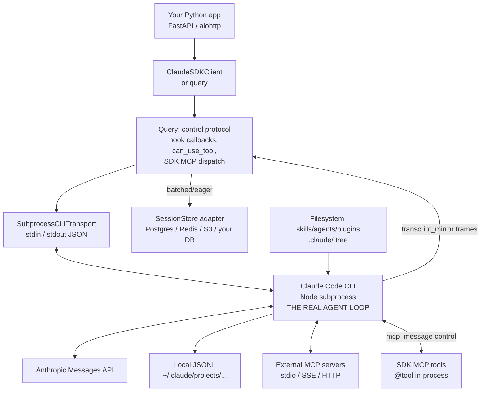

# Claude Agent SDK Python — Benchmark Study

> **Repo**: https://github.com/anthropics/claude-agent-sdk-python
> **Commit studied**: `c352a509929a712de65637cbafafcc3a1e3ba4f6`
> **Branch**: `main`
> **Framework path**: `frameworks/claude-agent-sdk-python`
> **Studied on**: 2026-05-16

## TL;DR

- **The run loop is not in Python.** Claude Agent SDK Python is a ~5 kLOC Python facade. The actual agent loop (turn boundaries, tool dispatch, planner, hook firing, system-prompt assembly, compaction, skill discovery, sub-agent fan-out, model routing) runs in the **bundled Claude Code CLI** — a Node.js binary spawned via `subprocess` over a stdin/stdout JSON control protocol (`src/claude_agent_sdk/_internal/transport/subprocess_cli.py:225`). The Python side is a transport, typed-message parser, hook callback router, and an in-process MCP host. **You cannot fork the loop without forking Claude Code.**
- **Open-source, Anthropic-owned, MIT-licensed, but classified `Development Status :: 3 - Alpha`** (`pyproject.toml:17`). Tightly coupled to the bundled CLI version which ships per release (currently `2.1.143`, `src/claude_agent_sdk/_cli_version.py`); the package version itself is at `0.2.82` (released 2026-05-13 with concurrency-doc clarifications).
- **Hooks are best-in-class.** 10 lifecycle events (`PreToolUse`, `PostToolUse`, `PostToolUseFailure`, `UserPromptSubmit`, `Stop`, `SubagentStop`, `PreCompact`, `Notification`, `SubagentStart`, `PermissionRequest` — `types.py:259-270`) plus an undocumented-but-real `SessionStart`, all strongly typed per event. Outputs can mutate tool input (`updatedInput`), replace tool output (`updatedToolOutput` works for any tool since 0.1.74), inject `additionalContext`, block (`continue_=False`), or defer the tool (`permissionDecision: "defer"` lands on `ResultMessage.deferred_tool_use`). Matchers fire **concurrently** per event — explicitly documented (`types.py:1766-1771`, change in 0.2.82).
- **Forcing tool arguments works** via either `can_use_tool` (`PermissionResultAllow.updated_input`) or `PreToolUse` hook (`updatedInput`). Both are out-of-band Python callbacks invoked via the control protocol, so `tenantId` injection is feasible without trusting the LLM (`types.py:233-239`, dispatch site `query.py:415-423`). Caveat: `can_use_tool` only fires on `"ask"`; `PreToolUse` fires on every tool call.
- **Multi-tenant scoping is filesystem-shaped, not API-shaped.** Skills, sub-agents, slash commands, plugins, and CLAUDE.md all load from `.claude/` directories on disk. There is no programmatic `registerSkill(tenantID, ...)` API. To scope to a tenant, you materialize a per-tenant `.claude/` tree and point the subprocess at it via `cwd` + `setting_sources` + `plugins[]`. The `skills` option (`types.py:1812-1830`) is only a "context filter" over already-on-disk skills — explicitly documented as "not a sandbox".
- **`max_budget_usd` is real, first-party, and unique in the comparison.** Implemented as a CLI flag (`subprocess_cli.py:262-263`) that the CLI evaluates after each turn. On overrun the run ends with `ResultMessage.subtype == "error_max_budget_usd"` (`examples/max_budget_usd.py:72`). Cost itself (`total_cost_usd`) is exposed on every `ResultMessage`.
- **Native MCP everywhere.** External stdio/SSE/HTTP MCP servers AND in-process `SdkMcpServer` are supported. In-process MCP tools are bridged through the control protocol (`query.py:548-721`), so a Python `@tool`-decorated coroutine runs in your process with full closure access — same effect as a native SDK tool. `strict_mcp_config` (0.1.74) lets you fence the CLI off from ambient project/user MCP servers.
- **Session store (0.1.64+) is the SDK's main multi-tenant lever.** Reference adapters for Postgres, Redis, S3 ship in `examples/session_stores/`. `SessionKey.project_key` is the documented tenant id; transcripts are mirrored from the CLI to your async store, with batched (default) or eager flush.
- **Per-stack one-liners**:
  - **Sessions/persistence**: filesystem-backed JSONL in CLI + optional `SessionStore` adapter mirror (Postgres/Redis/S3 references) → 🟢 production-shaped.
  - **Skills**: filesystem-only, no programmatic registration; multi-tenant requires per-tenant `.claude/skills/` trees → 🟡.
  - **Resource manager**: no first-party registry, no versioning, no publishing workflow → 🔴 BYO.
  - **Sub-agents**: first-class, configurable inline via `AgentDefinition`, dispatched by the CLI's built-in `Task` tool with native parallelism (`types.py:82-101`) → 🟢.
  - **Multi-tenancy**: forcing tool args works; tool-set filtering works; `SessionKey.project_key` scopes storage; per-tenant skills require disk staging → 🟡.
  - **Hooks**: 10 events, mutate input/output, block/defer/branch → 🟢 best-in-class.
  - **API**: library-only, no HTTP server. JSON-over-stdio with the CLI subprocess → 🔴 BYO.
  - **Observability**: usage on every `AssistantMessage.usage`, cost on every `ResultMessage.total_cost_usd`, OTel context auto-propagated (`subprocess_cli.py:441-462`), live `get_context_usage()` → 🟢.
- **Production-readiness for multi-tenant server-side deployment**: viable but with sharp edges — every request spawns a Node subprocess (cold-start cost), HTTP layer is BYO, skill catalog scoping is filesystem-staging-shaped, and no first-party registry. The CLI is the single point of architectural truth — every architectural decision the SDK exposes is filtered through "what does the bundled `claude` Node binary support today?"

## 0. Architectural Overview & Deployment Model

```
                ┌─────────────────────────────────────────────┐
                │      Your Python application                │
                │  (FastAPI / aiohttp / your HTTP layer)      │
                │                                             │
                │   ClaudeSDKClient  ← option/hooks/MCP →     │
                │        │                                    │
                │        ▼                                    │
                │   Query (control protocol RPC router)       │
                │   ├── hook callbacks                        │
                │   ├── can_use_tool callback                 │
                │   ├── SDK MCP server dispatch (in-process)  │
                │   └── transcript_mirror → SessionStore      │
                │        │ JSON-line over stdin/stdout        │
                └────────┼────────────────────────────────────┘
                         │
                         ▼
       ┌─────────────────────────────────────────────────────────┐
       │  Claude Code CLI  (Node.js subprocess, bundled in wheel)│
       │  THE ACTUAL AGENT LOOP RUNS HERE                        │
       │                                                         │
       │   - System prompt assembly                              │
       │   - Skill discovery + lazy load (filesystem scan)       │
       │   - Sub-agent registry (AgentDefinition + .claude/)     │
       │   - CLAUDE.md memory loading                            │
       │   - Plugins + slash commands                            │
       │   - Turn loop: model → tools → hooks → results          │
       │   - Persistence: local JSONL ~/.claude/projects/...     │
       └────────────────────┬────────────────────────────────────┘
                            │ HTTPS
                            ▼
       ┌─────────────────────────────────────────────────────────┐
       │  Anthropic API (claude-sonnet/opus/haiku) — model calls │
       └─────────────────────────────────────────────────────────┘
```

### 0.1 What is this stack?

Library. A Python wrapper around the bundled Node.js Claude Code CLI subprocess. Library-only — no HTTP server, no UI, no runtime daemon.

### 0.2 Project status & governance

- **License**: MIT (`pyproject.toml:11`).
- **Owner**: Anthropic, PBC (`pyproject.toml:13`). First-party SDK for Claude Code.
- **Backing**: Commercial — Anthropic's [Commercial Terms](https://www.anthropic.com/legal/commercial-terms) apply, and Claude Code is gated on an Anthropic API key.
- **Support**: Community (GitHub issues), no separate paid support tier beyond the underlying Claude API/Claude Code subscription.
- **Sister SDK**: A TypeScript counterpart (`claude-agent-sdk-typescript`) is referenced repeatedly in `CHANGELOG.md` as the parity baseline (e.g. "matches the TypeScript SDK's `includeHookEvents`" — `CHANGELOG.md:88-89`).

### 0.3 Project maturity / age

- **Current version**: `0.2.82` (`pyproject.toml:7`). Released 2026-05-13.
- **Bundled CLI version**: `2.1.143` (`src/claude_agent_sdk/_cli_version.py`, commit message of `c352a50`).
- **Status classifier**: `"Development Status :: 3 - Alpha"` (`pyproject.toml:17`). The semantic API has stabilized but the trove classifier is still alpha.
- **Origin**: Renamed from `claude-code-sdk` (`README.md:283`); migration guide in CHANGELOG `0.1.0`.
- **Stability signals**: API still evolves quickly. Recent breaking-adjacent changes include the `0.2.x` line introducing the `skills` top-level option (0.1.62), `SessionStore` adapter protocol (0.1.64), session-store eager flushing (0.1.73), defer hook decision + `strict_mcp_config` + `updatedToolOutput` for non-MCP tools (0.1.74), parallel-hooks doc clarification (0.2.82). Each release also bumps the bundled CLI version, so behavior changes in Claude Code ripple through.

### 0.4 Adoption & community signal

GitHub numbers (visible from this repo metadata, captured 2026-05-16): not directly enumerated in the repo, but Anthropic's first-party SDK has high visibility. Release cadence: ~3-7 days between releases (CHANGELOG shows 80+ releases in roughly a year). Active maintenance: PRs are referenced inline in CHANGELOG entries (e.g. #951, #932, #931, #955 in the 0.2.82 release), indicating active community contributions and routine maintainer engagement.

### 0.5 Ecosystem fit

- **Language**: Python 3.10+ (`pyproject.toml:10`).
- **Package**: `claude-agent-sdk` on PyPI.
- **Runtime deps**: `anyio>=4.0`, `sniffio>=1.0`, `mcp>=1.23` (bumped to address CVE-2025-66416 in 0.2.82), `typing_extensions>=4.0` (only on 3.10).
- **Optional extras**: `otel` (opentelemetry-api), `examples` (boto3, moto, redis, fakeredis, asyncpg for the SessionStore reference adapters), `dev`.
- **Bundled artifact**: each platform wheel ships the Claude Code Node binary under `src/claude_agent_sdk/_bundled/claude` — so the library has a chunky wheel and platform-specific releases (macOS x86_64 added in 0.1.49). No separate Node install needed.
- **Examples**: 18 standalone Python scripts under `examples/` and 4 reference SessionStore adapters under `examples/session_stores/`.

### 0.6 Where does the agent loop *actually* execute?

In the **Node.js Claude Code CLI subprocess**, NOT in Python. The Python entrypoint is a transport + control-protocol shim. The actual model-call → tool-call → tool-result → next-model-call cycle, system prompt assembly, permission evaluation, skill discovery, compaction, and Task sub-agent dispatch all execute in the CLI. This is the single most important architectural fact about this SDK.

Evidence: `SubprocessCLITransport._build_command()` (`src/claude_agent_sdk/_internal/transport/subprocess_cli.py:221-410`) assembles a `claude --output-format stream-json --verbose --input-format stream-json ...` command line, opens a subprocess (`subprocess_cli.py:474-482`), and JSON-line frames flow both directions over its stdin/stdout. The Python "loop" (`Query._read_messages` at `query.py:247-373`) does nothing but route frames.

### 0.7 Runtime dependencies

- Python 3.10+.
- A bundled `claude` Node binary (auto-discovered from `src/claude_agent_sdk/_bundled/`), or a system-installed `claude` (`subprocess_cli.py:81-112` walks `~/.npm-global/bin`, `/usr/local/bin`, `~/.local/bin`, etc.).
- An Anthropic API key (or Bedrock/Vertex credentials per Claude Code docs) — set in the subprocess env via `ClaudeAgentOptions.env`.
- Anthropic Messages API access.
- Optional OTel collector (`pip install claude-agent-sdk[otel]`).
- For external MCP: whatever the MCP server requires.

### 0.8 Recommended deployment topology

Not stated in the SDK repo. Implicit: every `query()` or `ClaudeSDKClient` connection spawns a new `claude` subprocess; the natural shape is "container-per-tenant" or "one-Python-process-many-CLI-subprocesses-but-one-CLI-per-active-conversation". The repo does ship a `Dockerfile.test` for CI but does not include a production Dockerfile or a hosted runtime.

### 0.9 Cold-start cost & instance footprint

- Cold start: each `connect()` does `_check_claude_version()` (2 s timeout — `subprocess_cli.py:723`), `anyio.open_process(...)` for the CLI binary, then an `initialize` control-protocol roundtrip (default 60 s timeout — `client.py:202-205`, configurable via `CLAUDE_CODE_STREAM_CLOSE_TIMEOUT`). Empirically the CLI takes a few seconds to be ready for the first prompt; cold-start latency is dominated by the Node startup. Issue #333 on the upstream tracker has reported 20–30 s cold start for some configurations.
- RAM: a CLI subprocess plus the Python parent — call it 200–500 MB per active session including model context.
- Disk: each session writes a JSONL transcript to `~/.claude/projects/<sanitized-cwd>/<session_id>.jsonl` (CLI-owned format).

### 0.10 Vendor lock-in

- **LLM provider**: 🔴 strongly Anthropic-locked. Claude Code CLI talks to Anthropic's Messages API directly; alternative providers route through Anthropic's gateway (Bedrock, Vertex) but only Claude models are first-class.
- **Hosting**: 🟢 none — pure library, deploys anywhere Python + the bundled `claude` binary run.
- **Eval/observability**: 🟢 none mandated. OTel is the only first-party path.
- **CLI binary**: 🔴 strongly Claude-Code-locked. You cannot swap the loop for a non-CLI implementation without rewriting the SDK; some power-users use `ClaudeAgentOptions.cli_path` to pin a different version but the wire protocol is closed-source and CLI-version-specific.

### 0.11 Framework weight / footprint

Thin Python SDK (~5 kLOC across `src/claude_agent_sdk/`): `types.py` (2,043 lines, all dataclasses & TypedDicts), `_internal/query.py` (899 lines, control protocol), `_internal/transport/subprocess_cli.py` (762 lines), `client.py` (627 lines), `__init__.py` (663 lines including the `@tool` decorator). Heavy lifting is in the bundled CLI binary, which is megabytes of Node bundle and not source-distributed here.

### 0.12 Release-history signal

`CHANGELOG.md` is well-maintained — every PyPI release has an entry with PR numbers. Recent themes (since 0.1.0 → 0.2.82):

- **Sessions & persistence**: full `SessionStore` adapter protocol added in 0.1.64 (`CHANGELOG.md:206`), eager flushing in 0.1.73 (`CHANGELOG.md:113`), session import/migration in 0.1.65, OpenTelemetry context propagation in 0.1.60 (`CHANGELOG.md:240`).
- **Hooks & safety**: defer hook decision in 0.1.74 (`CHANGELOG.md:89`), `updatedToolOutput` works for any tool in 0.1.74, parallel-hooks doc clarification in 0.2.82 (`CHANGELOG.md:17`), `include_hook_events` stream in 0.1.74, security CVE bump in 0.2.82.
- **MCP**: `strict_mcp_config` in 0.1.74, large-result fix in 0.1.55, runtime add/remove MCP servers in 0.1.46.
- **Skills**: top-level `skills` option in 0.1.62 (`CHANGELOG.md:223`), deprecation of `"Skill"` in `allowed_tools` in 0.1.77.
- **Cost/budget**: `max_budget_usd` (pre-existing), `api_error_status` on `ResultMessage` in 0.1.76, OTel trace context propagation in 0.1.60.
- **Sub-agents**: `list_subagents` / `get_subagent_messages` in 0.1.60.
- **Bundled CLI bumps**: nearly every release.

### 0.13 Documentation depth & cross-team contributor accessibility

- Official docs live at https://docs.anthropic.com/en/docs/claude-code/sdk and platform.claude.com.
- In-repo docs: `README.md` (~360 lines), `CHANGELOG.md` (1 k+ lines), `RELEASING.md`, `CLAUDE.md`.
- Code is heavily docstringed (`ClaudeAgentOptions` got per-field docstrings in 0.1.69, `CHANGELOG.md:150`).
- Accessibility for non-engineers: low — every interaction is a Python coroutine, JSON wire frames, and CLI flags. PMs/Data folks cannot meaningfully author here. Skill authoring (markdown SKILL.md files) is approachable, but the SDK doesn't help you publish them — that's a filesystem operation.

### 0.14 Documentation entry points

- Official docs landing: https://docs.anthropic.com/en/docs/claude-code/sdk (also https://platform.claude.com/docs/en/agent-sdk/python)
- Quickstart: https://docs.anthropic.com/en/docs/claude-code/sdk/sdk-overview
- API reference: in-repo docstrings + types.py + https://docs.anthropic.com/en/docs/claude-code/sdk-python
- Hosting / deployment / production guide: not provided as a single page — see Claude Code docs for "self-hosted" guidance.
- Examples / demos: `examples/` directory in this repo (`examples/quick_start.py`, `examples/hooks.py`, `examples/agents.py`, `examples/mcp_calculator.py`, `examples/max_budget_usd.py`, `examples/tool_permission_callback.py`, `examples/setting_sources.py`, `examples/session_stores/`)
- Changelog: `CHANGELOG.md` (in-repo)
- GitHub Releases: https://github.com/anthropics/claude-agent-sdk-python/releases
- Issues tracker: https://github.com/anthropics/claude-agent-sdk-python/issues
- Hooks docs: https://docs.anthropic.com/en/docs/claude-code/hooks
- Permissions guide: https://platform.claude.com/docs/en/agent-sdk/permissions
- Built-in tools: https://code.claude.com/docs/en/settings#tools-available-to-claude
- Discord / community: no dedicated forum; community signals through GitHub Issues.

---

## 1. Agent Harness (Run Loop) & Message Taxonomy

### Run loop

#### 1.1 Run loop entrypoint(s)

Two:

```python
# src/claude_agent_sdk/query.py:11
async def query(
    *,
    prompt: str | AsyncIterable[dict[str, Any]],
    options: ClaudeAgentOptions | None = None,
    transport: Transport | None = None,
) -> AsyncIterator[Message]:
```

```python
# src/claude_agent_sdk/client.py:67
class ClaudeSDKClient:
    def __init__(self, options=None, transport=None): ...
    async def connect(self, prompt=None) -> None: ...
    async def query(self, prompt, session_id="default") -> None: ...
    async def receive_messages(self) -> AsyncIterator[Message]: ...
    async def receive_response(self) -> AsyncIterator[Message]: ...   # until next ResultMessage
    async def interrupt(self) -> None: ...
    async def set_permission_mode(self, mode) -> None: ...
    async def set_model(self, model: str | None) -> None: ...
    async def stop_task(self, task_id: str) -> None: ...
    async def rewind_files(self, user_message_id: str) -> None: ...
    async def toggle_mcp_server(self, server_name, enabled) -> None: ...
    async def reconnect_mcp_server(self, server_name) -> None: ...
    async def get_mcp_status(self) -> McpStatusResponse: ...
    async def get_context_usage(self) -> ContextUsageResponse: ...
    async def disconnect(self) -> None: ...
```

`query()` is one-shot (single prompt, drains the iterator, exits). `ClaudeSDKClient` is bidirectional (keep stdin open, send multiple prompts, interrupt mid-flight, get live context usage, switch model/permission mode mid-conversation).

#### 1.2 Per-iteration behavior

The Python "loop" is just an async generator over stdout JSON frames (`src/claude_agent_sdk/_internal/query.py:247-373`):

```python
# src/claude_agent_sdk/_internal/query.py:247
async def _read_messages(self) -> None:
    """Read messages from transport and route them."""
    try:
        async for message in self.transport.read_messages():
            if self._closed:
                break
            msg_type = message.get("type")

            if msg_type == "control_response":
                # … route to pending control request waiter
                continue
            elif msg_type == "control_request":
                # … spawn handler for incoming hook/permission/mcp request
                self._spawn_control_request_handler(request)
                continue
            elif msg_type == "control_cancel_request":
                # … cancel inflight control task
                continue
            elif msg_type == "transcript_mirror":
                # … peel off and hand to SessionStore batcher
                continue

            if msg_type == "result":
                # flush transcript mirror; signal first-result event
                if self._transcript_mirror_batcher is not None:
                    await self._transcript_mirror_batcher.flush()
                self._first_result_event.set()
            # everything else → enqueued for the consumer iterator
            await self._message_send.send(message)
```

The actual per-iteration logic of the agent (call model → parse tool calls → run permission/hook gate → dispatch tool → collect result → re-prompt model) happens **inside the CLI subprocess**. We only see the result frames stream by.

#### 1.3 ReAct loop

Shipped, but in the CLI subprocess, not in Python. The Python harness does not expose a `tool_call → tool_result` loop you can intercept — only the wire-level frames the CLI emits.

#### 1.4 Tool dispatch + result handling

Three dispatch paths inside the CLI:

1. **Built-in tools** (`Read`, `Write`, `Bash`, `Grep`, `Glob`, `Edit`, `WebFetch`, `WebSearch`, `Task`, `Skill`, `TodoWrite`, …) — execute inside the CLI subprocess with whatever `cwd` / env / permissions you set.
2. **External MCP tools** (stdio/SSE/HTTP) — CLI spawns/connects to a separate process.
3. **In-process SDK MCP tools** (`@tool`-decorated Python functions) — CLI sends an `mcp_message` control request back to the SDK over stdin/stdout, the SDK runs the handler in-process and replies with the result via `_handle_sdk_mcp_request` (`query.py:548-721`).

Tool results come back to the model as `ToolResultBlock` content blocks (matched by `tool_use_id`).

#### 1.5 Explicit turn concept

A "turn" is defined by `ResultMessage`. The CLI emits exactly one `ResultMessage` per user prompt. `ResultMessage.num_turns` is also reported (`types.py:1144-1167`), so the CLI's internal concept counts assistant↔tool exchanges within a single user prompt. `max_turns` (`types.py:1653-1657`) caps the CLI's internal turn loop and triggers an `error_max_turns` result on overrun. `ResultMessage.stop_reason` (added in 0.1.46) clarifies why.

#### 1.6 Event emission mechanism (in-process)

`anyio` memory-object stream (`asyncio` `Queue` equivalent) with `max_buffer_size=100` (`query.py:121-123`). The transport read loop pushes; `receive_messages()` pops. Backpressure is via the bounded buffer — a slow consumer will block the read loop after 100 buffered messages.

### Message & event taxonomy

#### 1.7 Message layers

Three layers:

1. **Wire layer (CLI ↔ Python)** — line-delimited JSON over stdout. Each line is a discriminated dict with `type ∈ {"user", "assistant", "system", "result", "stream_event", "rate_limit_event", "control_request", "control_response", "control_cancel_request", "transcript_mirror"}`. Control / transcript frames are peeled off by the read loop and never surfaced.
2. **SDK message layer (Python public)** — typed dataclasses returned by the async iterator. Defined in `src/claude_agent_sdk/types.py`.
3. **Application layer (your code)** — your Python application can do whatever it wants with the dataclasses.

There is no separate "UI message" layer; the SDK message layer is what your application iterates.

```
   Anthropic API           Claude Code CLI            Python SDK             Your code
   ─────────────           ───────────────            ──────────             ─────────
   stream events    ───►   parse → loop      ───►    parse_message  ───►    isinstance dispatch
   (raw API SSE)            ↓                         ↓                       ↓
                            stdout JSON frames        Message dataclasses     UI / DB / metrics
```

#### 1.8 Concrete message types

Concrete public message dataclasses (`src/claude_agent_sdk/types.py:1014-1268`):

| Type | Purpose |
|---|---|
| `UserMessage` | A user turn — text or list of `ContentBlock`. `parent_tool_use_id` flags sub-agent injected turns. |
| `AssistantMessage` | A model turn. Holds `content: list[ContentBlock]`, `model`, `usage`, `stop_reason`, `session_id`. |
| `SystemMessage` | Lifecycle/init/notice with `subtype` discriminator. Subclasses for specific subtypes (see below). |
| `TaskStartedMessage` / `TaskProgressMessage` / `TaskNotificationMessage` | Sub-agent lifecycle (the CLI's `Task` tool) — `task_id`, `description`, `usage`, `status`. |
| `MirrorErrorMessage` | SDK-synthesized when `SessionStore.append()` failed; surfaces a dropped batch to the caller. |
| `HookEventMessage` | Hook lifecycle events when `include_hook_events=True`. Subtype is `hook_started` or `hook_response`. |
| `ResultMessage` | Terminal per-turn message. Carries `is_error`, `num_turns`, `total_cost_usd`, `usage`, `model_usage`, `stop_reason`, `permission_denials`, `deferred_tool_use`, `api_error_status`. |
| `StreamEvent` | Partial assistant streaming events (when `include_partial_messages=True`) — raw Anthropic API stream event in `event`. |
| `RateLimitEvent` | API rate-limit transitions (`allowed` → `allowed_warning` → `rejected`). |

`ContentBlock` is a discriminated union: `TextBlock | ThinkingBlock | ToolUseBlock | ToolResultBlock | ServerToolUseBlock | ServerToolResultBlock` (`types.py:993-1000`). `ServerTool*` blocks (added in 0.1.65) are for server-executed tools (`advisor`, `web_search`, `web_fetch`, `code_execution`, `bash_code_execution`, `text_editor_code_execution`, `tool_search_tool_regex`, `tool_search_tool_bm25` — `types.py:953-961`) — the caller never returns a result for those.

The discriminated `Message` union (`types.py:1261-1268`):

```python
Message = (
    UserMessage
    | AssistantMessage
    | SystemMessage
    | ResultMessage
    | StreamEvent
    | RateLimitEvent
)
```

#### 1.9 Messages vs. events

**Same iterator, single taxonomy.** Everything is a "message" on the same async generator. The "stream-event vs. turn-event vs. tool-event" categories you'd expect in Mastra/Vercel are all expressed as message-with-subtype on a single iterator:

- Stream event = `StreamEvent`
- Turn boundary = `ResultMessage` (one per turn)
- Tool event = `AssistantMessage` containing a `ToolUseBlock`, then a `UserMessage` containing a `ToolResultBlock` (matched by `tool_use_id`)
- Session lifecycle = `SystemMessage(subtype="init")` at start; CLI subprocess exit ends iteration
- Hook event = `HookEventMessage` when opt-in via `include_hook_events=True`
- Sub-agent lifecycle = `TaskStartedMessage` / `TaskProgressMessage` / `TaskNotificationMessage`

#### 1.10 Event categories

| Category | Mechanism |
|---|---|
| Stream event | `StreamEvent` (opt-in via `include_partial_messages=True`), carries raw Anthropic SSE event. |
| Turn event | `ResultMessage` per user prompt; `ResultMessage.num_turns` counts internal LLM↔tool exchanges within that prompt. |
| Message event | `UserMessage`, `AssistantMessage`. |
| Tool event | `ToolUseBlock` (on `AssistantMessage`) → `ToolResultBlock` (on subsequent `UserMessage`), linked by `tool_use_id`. |
| Session lifecycle | `SystemMessage(subtype="init")` at start; iterator end when subprocess exits. |
| Hook event | `HookEventMessage` (opt-in via `include_hook_events=True`) — subtype `hook_started` / `hook_response`. |
| Sub-agent event | `TaskStartedMessage`, `TaskProgressMessage`, `TaskNotificationMessage`. |
| Rate-limit event | `RateLimitEvent` whenever rate-limit status transitions. |
| Mirror error | `MirrorErrorMessage` when `SessionStore.append()` fails after retry. |

#### 1.11 Canonical type-definition file(s)

**`src/claude_agent_sdk/types.py`** (2,043 lines) is the single source of truth. Parser: **`src/claude_agent_sdk/_internal/message_parser.py`** (319 lines, drives the `match` on `type`/`subtype` to produce typed dataclasses).

#### 1.12 Live agentic event stream taxonomy

Sample frames (wire format on CLI stdout):

```json
// Start
{"type": "system", "subtype": "init", "session_id": "abc-123",
 "agents": [...], "tools": [...], "model": "claude-sonnet-4-5"}

// Mid-stream assistant tool call
{"type": "assistant", "session_id": "abc-123", "uuid": "...",
 "message": {"model": "claude-sonnet-4-5",
   "content": [
     {"type": "text", "text": "I'll list the files."},
     {"type": "tool_use", "id": "toolu_01XYZ", "name": "Bash",
      "input": {"command": "ls"}}],
   "stop_reason": "tool_use",
   "usage": {"input_tokens": 1024, "output_tokens": 42, ...}}}

// Tool result (CLI synthesizes a user message)
{"type": "user", "session_id": "abc-123",
 "message": {"content": [
   {"type": "tool_result", "tool_use_id": "toolu_01XYZ",
    "content": "file1.py\nfile2.py", "is_error": false}]}}

// Sub-agent lifecycle
{"type": "system", "subtype": "task_started", "task_id": "task-abc",
 "description": "Analyze code", "tool_use_id": "toolu_xyz"}

// Hook event (with include_hook_events)
{"type": "system", "subtype": "hook_started",
 "hook_event": "PreToolUse", "session_id": "abc-123"}

// Terminal
{"type": "result", "subtype": "success", "duration_ms": 5421,
 "duration_api_ms": 4800, "is_error": false, "num_turns": 3,
 "session_id": "abc-123", "total_cost_usd": 0.0042,
 "usage": {...}, "stop_reason": "end_turn"}
```

Control frames (CLI ↔ SDK — never visible to your iterator):

```json
{"type": "control_request", "request_id": "req_1_a3f9",
 "request": {"subtype": "can_use_tool", "tool_name": "Write",
   "input": {"file_path": "x.py"}, "tool_use_id": "toolu_01XYZ"}}

{"type": "control_response", "response": {"subtype": "success",
   "request_id": "req_1_a3f9",
   "response": {"behavior": "allow", "updatedInput": {"file_path": "/tmp/x.py"}}}}
```

---

## 2. Agent Runtime (Multi-session Host)

### 2.1 Multi-session host architecture

**Not provided — BYO.** There is no built-in multi-session runtime. Each `ClaudeSDKClient` or `query()` invocation spawns its own `claude` CLI subprocess and owns one conversation. Your Python host (FastAPI, aiohttp, Temporal worker, etc.) is responsible for managing the lifecycle of N clients across N tenants.

### 2.2 Concurrent session isolation

Isolation is at the OS-subprocess boundary: each session has its own `claude` Node process with its own `cwd`, env, JSONL transcript path, and MCP-server connections. State cannot bleed between subprocesses except through shared filesystem (your `~/.claude/projects/` lives across them) or your shared `SessionStore` adapter. Concurrent `@tool` handlers run in the same Python process — they share closures, globals, and any `asyncio.Lock`s you create.

### 2.3 Horizontal scaling / multi-instance

**BYO.** No leader election, no shared coordinator. You can run N Python pods that each spawn CLI subprocesses for different sessions; the `SessionStore` adapter is the only shared-state primitive the SDK ships, and it's append-only — concurrent writes to the same session from two pods would interleave unsafely (the SDK assumes one process owns one session at a time). The `SessionKey.project_key` field (`types.py:1276-1295`) is the documented sharding/tenant lever.

### 2.4 Background / async / scheduled tasks

**Not provided — BYO.** No cron, no webhook trigger, no agent-as-background-worker primitive. The closest first-party thing is `AgentDefinition.background: bool` (`types.py:99`), but that's a sub-agent hint for the CLI, not a host-level scheduler.

### 2.5 Worker pool / queue model

**Not provided — BYO.** The runtime model is "one CLI subprocess per active session, lifetime owned by the calling Python coroutine". For queue-shaped workloads you must layer your own (Celery, RQ, Temporal, AWS SQS workers — pick your poison).

---

## 3. Sessions & Persistence

### 3.1 Session / chat data model

There is no canonical "Session" dataclass — sessions are identified by `session_id` (a UUID string passed via `ClaudeAgentOptions.session_id` or generated by the CLI) plus a `project_key` for tenant scoping in the `SessionStore`:

```python
# src/claude_agent_sdk/types.py:1276
class SessionKey(TypedDict):
    project_key: str
    session_id: str
    subpath: NotRequired[str]   # for subagent transcripts
```

`SDKSessionInfo` (`types.py:1495-1528`) is the listing-time metadata view returned by `list_sessions()`:

```python
@dataclass
class SDKSessionInfo:
    session_id: str
    summary: str
    last_modified: int
    file_size: int | None = None
    custom_title: str | None = None
    first_prompt: str | None = None
    git_branch: str | None = None
    cwd: str | None = None
    tag: str | None = None
    created_at: int | None = None
```

Per-message rows are `SessionStoreEntry` (`types.py:1298-1311`) — opaque pass-through dicts with a `type`, `uuid`, and `timestamp`.

### 3.2 What's stored on a session

The CLI's on-disk JSONL transcript at `~/.claude/projects/<sanitized-cwd>/<session_id>.jsonl` stores every entry: user turns, assistant turns, tool calls, tool results, system markers, mode changes, custom titles, tags. The format is owned by the CLI; the SDK treats entries as opaque pass-through dicts (`SessionStoreEntry`). Subagent transcripts live in a sibling `subagents/agent-<id>.jsonl` directory.

### 3.3 Granularity

- One conversation per session by default.
- **Forking** is supported: `fork_session=True` + `resume=<id>` creates a new session-id branching from a prior session (`types.py:1790-1792`). Helper `fork_session()` in `__init__.py:30-34` does this from outside an active client.
- **Resume**: `ClaudeAgentOptions.resume=<id>` resumes the on-disk session; `ClaudeAgentOptions.continue_conversation=True` resumes the most recent in the current cwd.

### 3.4 Built-in persistence stores

- **Default**: local-disk JSONL written by the CLI to `~/.claude/projects/<sanitized-cwd>/<session_id>.jsonl`.
- **`InMemorySessionStore`** (`src/claude_agent_sdk/_internal/session_store.py:35-100`) — reference for testing.
- **Reference adapters under `examples/session_stores/`** (added 0.1.64) — not shipped in the wheel, copy-in:
  - Postgres (`postgres_session_store.py`, asyncpg + jsonb rows)
  - Redis (`redis_session_store.py`, RPUSH/LRANGE lists + zset index)
  - S3 (`s3_session_store.py`, JSONL part files)

### 3.5 Persistence timing

```python
# src/claude_agent_sdk/_internal/query.py:296-303
if msg_type == "result":
    # Flush pending transcript mirror entries before yielding
    # result so consumers observing the result can rely on the
    # SessionStore being up to date for this turn.
    if self._transcript_mirror_batcher is not None:
        await self._transcript_mirror_batcher.flush()
    self._first_result_event.set()
```

Default is **batched, flush-on-turn-end** (or eager with `session_store_flush="eager"` — added 0.1.73). Local JSONL is written by the CLI on every entry. The SDK guarantees the external store is up-to-date by the time you observe a `ResultMessage`. Backpressure: 500 entries / 1 MiB max-pending thresholds (`transcript_mirror_batcher.py:26-27`), with bounded retry (3 attempts, short backoff) before dropping a batch and surfacing it as `MirrorErrorMessage`.

### 3.6 Mid-run checkpointing (durable)

Best-effort: local JSONL on disk is updated by the CLI on every entry, so a crash mid-tool-call leaves the transcript with everything up to that point. The `SessionStore` adapter receives batched entries (~100 ms cadence during active turns); set `session_store_flush="eager"` for near-real-time forwarding. A `--resume <id>` after a crash re-loads the on-disk JSONL into a fresh subprocess. **No transactional "commit-per-tool-write" the way LangGraph's `_runner.commit() → put_writes()` works** — you get "everything before the last assistant message is durable, the in-flight LLM call may be lost".

### 3.7 Session ID format

UUID. Auto-generated by the CLI unless you supply `ClaudeAgentOptions.session_id` (must be a valid UUID — `types.py:1646-1650`). `SessionKey.project_key` lets you namespace separately (tenant-prefixing happens at the store-adapter level).

### 3.8 Pluggable store interface

`SessionStore` is a Protocol (`types.py:1370-1487`) with two required methods (`append`, `load`) and four optional ones (`list_sessions`, `list_session_summaries`, `delete`, `list_subkeys`). The SDK ships a **13-contract conformance test harness** at `claude_agent_sdk.testing.run_session_store_conformance` (`CHANGELOG.md:207`) — third-party adapter authors can run it to verify their implementation.

```python
class SessionStore(Protocol):
    async def append(self, key: SessionKey, entries: list[SessionStoreEntry]) -> None: ...
    async def load(self, key: SessionKey) -> list[SessionStoreEntry] | None: ...
    async def list_sessions(self, project_key: str) -> list[SessionStoreListEntry]: ...
    async def list_session_summaries(self, project_key: str) -> list[SessionSummaryEntry]: ...
    async def delete(self, key: SessionKey) -> None: ...
    async def list_subkeys(self, key: SessionListSubkeysKey) -> list[str]: ...
```

The store is **not** a primary write path — it's a mirror; the local JSONL is still the source of truth and the CLI is the only writer to it.

### 3.9 Schema evolution / migration

No formal migration helpers. The SDK keeps entries opaque, so backward-compat is the adapter author's responsibility. `import_session_to_store()` (added 0.1.65, `__init__.py:28`) lets you replay a local JSONL into any `SessionStore` adapter — used for migrating from local storage to remote stores.

### 3.10 Export / replay

- `list_sessions()` / `get_session_messages()` / `list_subagents()` / `get_subagent_messages()` — top-level helpers re-exported from `__init__.py:42-52`.
- Same functions with `_from_store()` suffixes for store-backed sessions.
- The on-disk JSONL is a transparent, append-only format and can be replayed by passing `resume=<id>` to a new `query()` call.
- `tag_session()`, `rename_session()`, `delete_session()`, `fork_session()` (and their `_via_store` variants) — `__init__.py:29-39`.

### 3.11 Cross-session memory

The CLI loads `CLAUDE.md` files from `cwd` when `setting_sources` includes `"project"` (and `~/.claude/CLAUDE.md` for user-level memory). This is the only first-party "cross-session knowledge that follows the agent" primitive. For semantic vector memory, see Q15 — **BYO**.

---

## 4. Multi-tenancy & Arbitrary Context

### 4.1 Full run-loop input struct

`ClaudeAgentOptions` is a single dataclass with ~50 fields (`src/claude_agent_sdk/types.py:1578-1939`). The big ones:

```python
@dataclass
class ClaudeAgentOptions:
    tools: list[str] | ToolsPreset | None = None
    allowed_tools: list[str] = field(default_factory=list)
    disallowed_tools: list[str] = field(default_factory=list)
    system_prompt: str | SystemPromptPreset | SystemPromptFile | None = None
    mcp_servers: dict[str, McpServerConfig] | str | Path = field(default_factory=dict)
    strict_mcp_config: bool = False
    permission_mode: PermissionMode | None = None
    continue_conversation: bool = False
    resume: str | None = None
    session_id: str | None = None
    max_turns: int | None = None
    max_budget_usd: float | None = None
    model: str | None = None
    fallback_model: str | None = None
    betas: list[SdkBeta] = field(default_factory=list)
    cwd: str | Path | None = None
    cli_path: str | Path | None = None
    settings: str | None = None
    add_dirs: list[str | Path] = field(default_factory=list)
    env: dict[str, str] = field(default_factory=dict)
    extra_args: dict[str, str | None] = field(default_factory=dict)
    stderr: Callable[[str], None] | None = None
    can_use_tool: CanUseTool | None = None
    hooks: dict[HookEvent, list[HookMatcher]] | None = None
    user: str | None = None
    include_partial_messages: bool = False
    include_hook_events: bool = False
    fork_session: bool = False
    agents: dict[str, AgentDefinition] | None = None
    setting_sources: list[SettingSource] | None = None
    skills: list[str] | Literal["all"] | None = None
    sandbox: SandboxSettings | None = None
    plugins: list[SdkPluginConfig] = field(default_factory=list)
    thinking: ThinkingConfig | None = None
    effort: EffortLevel | None = None
    output_format: dict[str, Any] | None = None
    enable_file_checkpointing: bool = False
    session_store: SessionStore | None = None
    session_store_flush: SessionStoreFlushMode = "batched"
    task_budget: TaskBudget | None = None
    permission_prompt_tool_name: str | None = None
```

There is **no field for arbitrary opaque user context** to be passed *into* tool handlers or hooks. To pass tenant context you must close over it in your Python callbacks (hooks, `can_use_tool`, `@tool` handlers).

### 4.2 Context propagation into a tool call

For an **SDK MCP tool** (in-process, decorated with `@tool`), the handler signature is `Callable[[dict[str, Any]], Awaitable[dict[str, Any]]]` (`src/claude_agent_sdk/__init__.py:162`):

```python
# src/claude_agent_sdk/__init__.py:196-220
>>> @tool("greet", "Greet a user", {"name": str})
... async def greet(args):
...     return {"content": [{"type": "text", "text": f"Hello, {args['name']}!"}]}
```

**The handler receives only the LLM-generated arguments.** No `RunContext`, no `ToolContext`, no tenant ID, no session ID, no caller-supplied closure. To get tenant context inside the tool you must capture it in Python closure scope at server construction time:

```python
def make_tools(tenant_id: str):
    @tool("list_dashboards", "List dashboards", {"limit": int})
    async def list_dashboards(args):
        # tenant_id captured from outer scope — never trusts the LLM
        rows = await db.fetch_for_tenant(tenant_id, args["limit"])
        return {"content": [{"type": "text", "text": json.dumps(rows)}]}
    return [list_dashboards]

server = create_sdk_mcp_server("my", tools=make_tools(tenant_id="acme"))
```

For an **external MCP tool** (stdio/SSE/HTTP), the tool runs out-of-process — only the LLM-generated args reach it. No SDK-level mechanism injects context.

For the **CLI's built-in tools**, the same applies — they run inside the CLI subprocess with whatever `cwd` / env you set.

### 4.3 Tool call interface

For SDK MCP tools, the entire signature is `Callable[[dict[str, Any]], Awaitable[dict[str, Any]]]` — args in, dict out, no context object. The `@tool` decorator parses an inline input schema and emits a JSON-schema for the model (`__init__.py:166-260`).

`ToolPermissionContext` (`types.py:191-229`) is the closest thing to a context object — but it's only passed to the `can_use_tool` callback and `PreToolUse`/`PostToolUse` hook inputs (`PreToolUseHookInput.tool_use_id`, `agent_id`, `session_id`, `cwd`, `transcript_path`):

```python
@dataclass
class ToolPermissionContext:
    signal: Any | None
    suggestions: list[PermissionUpdate]
    tool_use_id: str | None
    agent_id: str | None
    blocked_path: str | None = None
    decision_reason: str | None = None
    title: str | None = None
    display_name: str | None = None
    description: str | None = None
```

### 4.4 Forcing tool arguments from the harness

**Yes — two mechanisms.** Both are out-of-band Python callbacks invoked via the control protocol, so the LLM cannot bypass them.

**Mechanism A: `PreToolUse` hook with `updatedInput`** (`types.py:412-419`):

```python
async def inject_tenant(input_data, tool_use_id, context):
    # Hook fires before EVERY tool call regardless of permission mode
    tool_input = dict(input_data["tool_input"])
    tool_input["tenantId"] = current_tenant_id   # forced server-side
    return {
        "hookSpecificOutput": {
            "hookEventName": "PreToolUse",
            "updatedInput": tool_input,
        }
    }

options = ClaudeAgentOptions(
    hooks={"PreToolUse": [HookMatcher(matcher=None, hooks=[inject_tenant])]},
)
```

**Mechanism B: `can_use_tool` callback with `PermissionResultAllow(updated_input=...)`** (`types.py:233-239`, dispatch site `query.py:415-423`):

```python
async def can_use_tool(tool_name, input, ctx):
    if tool_name == "query_dashboards":
        input = {**input, "tenantId": current_tenant_id}
    return PermissionResultAllow(updated_input=input)

options = ClaudeAgentOptions(
    can_use_tool=can_use_tool,
    permission_mode="default",   # ensures the callback is invoked
)
```

Caveat: `can_use_tool` only fires when the CLI's permission evaluation reaches "ask" — tools already allowed by `allowed_tools` or `permission_mode="bypassPermissions"` bypass it (`types.py:1748-1758`). `PreToolUse` hook fires on **every** tool call regardless of permission state, which is what you want for forced argument injection.

### 4.5 Filtering visible tools

**Three layers, all explicit:**

1. **`tools`** (`types.py:1582-1591`) — base set: a `list[str]` of tool names, `[]` to disable all built-ins, or `{"type": "preset", "preset": "claude_code"}` for the default set. Sent as the `--tools` CLI flag (`subprocess_cli.py:241-250`).
2. **`allowed_tools`** (`types.py:1593-1603`) — auto-allow list; tools listed here run without permission prompt. Sent as `--allowedTools` (`subprocess_cli.py:256-257`).
3. **`disallowed_tools`** (`types.py:1666-1671`) — explicit deny: *"removed from the model's context"*. Sent as `--disallowedTools` (`subprocess_cli.py:265-266`).

To change the toolset **per session**, set these on `ClaudeAgentOptions` at construction. To change **mid-session**, there is no first-party `set_tools()` control request — but you can use `PreToolUse` hook to deny a tool conditionally with `permissionDecision: "deny"`. There is also `set_permission_mode()` to flip the whole mode (`client.py:319-344`) and `toggle_mcp_server(name, enabled)` to enable/disable an entire MCP server's tools (`client.py:424-448`).

### 4.6 Tenant scope on session

`SessionKey.project_key` (`types.py:1276-1295`) is the documented multi-tenant primitive for the **session store** specifically: *"Multi-tenant deployments should set this to a tenant ID or project name."* But that scopes session storage only, not the toolset/skills/agents the CLI can see. There is no first-class `tenant_id` field on `ClaudeAgentOptions` itself; you set `cwd`, `env`, and `setting_sources` per request and let those shape the CLI subprocess.

### 4.7 Per-tool-call auth propagation

**BYO.** Captured via closure into hook/tool callbacks. No SDK primitive automatically threads "the caller's JWT" to every tool call.

### 4.8 Resource scoping primitives

**The SDK's scoping mechanism is the filesystem.** Skills, sub-agents (`.claude/agents/*.md`), slash commands, plugins, MCP config, and CLAUDE.md memory all load from `setting_sources` (`types.py:1800-1810`): `user` (`~/.claude/`), `project` (`.claude/` in cwd), `local` (`.claude/settings.local.json`). The CLI subprocess inherits `cwd` and optionally `CLAUDE_CONFIG_DIR` via `env`.

For our multi-tenant long-running-agent case, this means **per-tenant resource scoping requires:**

- A per-tenant filesystem tree: `tenants/<tid>/.claude/skills/...`, `tenants/<tid>/.claude/agents/...`
- Setting `options.cwd = tenants/<tid>` per request
- Optionally `options.env["CLAUDE_CONFIG_DIR"] = tenants/<tid>/.claude` so credentials and the JSONL transcript live in the tenant tree
- Optionally `options.setting_sources=["project"]` to ignore the global user settings entirely

There is no in-memory `Registry` you can pass per-request that says "tenant acme sees skills X,Y; tenant bcm sees skills A,B" — the SDK's `skills` option (`types.py:1812-1830`) is a **filter** over what's already on disk.

### 4.9 Per-tenant rate limit + budget cap

🟢 **Real per-run USD budget cap.** `max_budget_usd: float | None` (`types.py:1659-1664`) is wired to the CLI flag `--max-budget-usd` (`subprocess_cli.py:262-263`). On overrun the run ends with `ResultMessage.subtype == "error_max_budget_usd"` (`examples/max_budget_usd.py:72`). **Caveat**: post-call check, so cost may exceed the cap by up to one API call. No per-tenant aggregation primitive — you set the cap per run; cross-run/per-tenant USD totals are BYO (sum `total_cost_usd` keyed by your tenant id).

`RateLimitEvent` (`types.py:1213-1224`) surfaces Anthropic's 5h/7d/seven_day_opus/sonnet/overage rate-limit transitions — observe and back off in your application.

### ⭐ Light usage example — multi-tenant + forced args + tool filtering

```python
# Pass tenantId, force it server-side on topicSearch, restrict visible tools.
async def my_can_use_tool(name, input_, ctx):
    if name == "topicSearch":
        input_ = {**input_, "tenantId": "acme"}   # forced — LLM can't override
    return PermissionResultAllow(updated_input=input_)

async def force_tenant_pretool(input_data, tool_use_id, ctx):
    if input_data["tool_name"] == "topicSearch":
        return {"hookSpecificOutput": {
            "hookEventName": "PreToolUse",
            "updatedInput": {**input_data["tool_input"], "tenantId": "acme"}}}
    return {}

options = ClaudeAgentOptions(
    cwd=f"tenants/acme",
    env={"USER_ID": "u-123", "TARGETING_STRATEGY_ID": "strat-42"},
    tools=["topicSearch", "iabSearch", "audienceCreate"],  # whitelist
    allowed_tools=["topicSearch", "iabSearch", "audienceCreate"],
    can_use_tool=my_can_use_tool,
    hooks={"PreToolUse": [HookMatcher(matcher="topicSearch",
                                       hooks=[force_tenant_pretool])]},
    permission_mode="default",
    session_store=my_postgres_store,            # SessionKey.project_key="acme"
)
async with ClaudeSDKClient(options=options) as client:
    await client.query("Create an audience for soccer fans")
```

---

## 5. Hook & Middleware Capabilities (Context Engineering)

This SDK has the most comprehensive hook system in the comparison.

### 5.1 Enumerated hook events

`HookEvent` (`src/claude_agent_sdk/types.py:259-270`):

```python
HookEvent = (
    Literal["PreToolUse"]
    | Literal["PostToolUse"]
    | Literal["PostToolUseFailure"]
    | Literal["UserPromptSubmit"]
    | Literal["Stop"]
    | Literal["SubagentStop"]
    | Literal["PreCompact"]
    | Literal["Notification"]
    | Literal["SubagentStart"]
    | Literal["PermissionRequest"]
)
```

Plus `SessionStart` (its specific output type exists at `types.py:454`).

| Hook | Fires | Can mutate / block |
|---|---|---|
| `PreToolUse` | Before any tool dispatch (built-in or MCP) | `updatedInput`, `permissionDecision: "allow" \| "deny" \| "ask" \| "defer"`, `additionalContext`. Can block, divert, or defer the call. |
| `PostToolUse` | After tool returns successfully | `updatedToolOutput` (replace tool output before it reaches the model — works for any tool since 0.1.74), `additionalContext`. |
| `PostToolUseFailure` | After tool raises / errors | `additionalContext`, plus `continue_=False` + `stopReason` to halt. |
| `UserPromptSubmit` | When user prompt is received, before model call | `additionalContext` injects pre-prompt context. Can block via `decision: "block"`. |
| `SessionStart` | At session init | `additionalContext` injects a "current date / tenant / etc." preamble. |
| `Stop` | Before a turn-end | `decision: "block"` to force the model to keep going. |
| `SubagentStop` | When a Task sub-agent finishes | Same as `Stop`. |
| `SubagentStart` | When a Task sub-agent starts | `additionalContext`. |
| `PreCompact` | Before context-window compaction | `additionalContext` + manual/auto trigger discrimination. |
| `Notification` | CLI-emitted notifications | `additionalContext`. |
| `PermissionRequest` | When permission prompt would be shown | `decision: dict` — fully programmatic permission verdict. |

Hook output schema (`types.py:516-560`):

```python
class SyncHookJSONOutput(TypedDict):
    continue_: NotRequired[bool]      # False stops the loop
    suppressOutput: NotRequired[bool]
    stopReason: NotRequired[str]
    decision: NotRequired[Literal["block"]]
    systemMessage: NotRequired[str]   # shown to the user
    reason: NotRequired[str]          # shown to the model
    hookSpecificOutput: NotRequired[HookSpecificOutput]
```

### 5.2 Hook concurrency model

**Concurrent — explicitly documented** (`types.py:1766-1771`): *"All `hook_callback` control requests for a given event fire in parallel, not sequentially. Design each hook to be independent; do not rely on one completing before another starts."* — clarified in 0.2.82 (`CHANGELOG.md:17`).

Hooks are registered as `dict[HookEvent, list[HookMatcher]]` on `ClaudeAgentOptions.hooks`. The Python SDK registers callback IDs at `initialize`-time (`query.py:182-200`) — the CLI references them by ID in subsequent `hook_callback` control requests, and the Python side dispatches to the actual coroutine.

```python
# src/claude_agent_sdk/types.py:584
@dataclass
class HookMatcher:
    matcher: str | None = None    # tool-name pattern, e.g. "Bash" or "Write|Edit"
    hooks: list[HookCallback] = field(default_factory=list)
    timeout: float | None = None  # default 60s
```

### 5.3 Specific capability tests

| Scenario | Supported | How |
|---|---|---|
| Inject system messages at session start ("current date is X, tenant is Y") | **Yes** | `SessionStart` hook returns `{"hookSpecificOutput": {"hookEventName": "SessionStart", "additionalContext": "..."}}`. See `examples/hooks.py:73-82`. |
| Expand user input (slash commands, attachments, time-stamp) | **Yes** | `UserPromptSubmit` hook returns `additionalContext`. `PreToolUse` `updatedInput` for tool-input expansion. |
| Mutate messages list before each LLM call (cache breakpoints, redaction) | **No, not directly** | Hooks do not expose the in-flight messages array. Cache breakpoints and message-array surgery happen inside the CLI subprocess and are not configurable from Python. You can inject *additional* context via `UserPromptSubmit` / `additionalContext`, but you cannot rewrite or redact the existing messages array. |
| Mutate / decorate tool input before dispatch (inject tenantId) | **Yes** | `PreToolUse` → `updatedInput` (`types.py:418`). Also `can_use_tool` → `PermissionResultAllow(updated_input=...)`. |
| Mutate / decorate tool result before returning to the LLM (redact, summarize) | **Yes** | `PostToolUse` → `updatedToolOutput` (`types.py:427-433`). Works for any built-in or MCP tool since 0.1.74 (was MCP-only previously). |
| Emit additional tool calls in response to a tool result | **No first-class equivalent** | `PostToolUse` can inject `additionalContext` (free-text system message) to nudge the model into making another call, but cannot synthetically emit a `tool_use` block on the model's behalf. |

### 5.4 Auto-compaction

🟢 **Built-in inside the CLI.** The CLI implements automatic context-window compaction when approaching the limit; the SDK exposes it via:

- `PreCompact` hook — fires before compaction with `trigger: "manual" | "auto"` and `custom_instructions` (`types.py:362-367`).
- `ContextUsageResponse.isAutoCompactEnabled` + `autoCompactThreshold` (`types.py:784, 799`).
- `ClaudeSDKClient.get_context_usage()` for live inspection.

Compaction logic itself is opaque (lives in the CLI binary); you can inject instructions via the `PreCompact` hook but cannot replace the algorithm.

### 5.5 Prompt cache optimization

🟢 Partial. The CLI handles Anthropic prompt-caching automatically; cache-token counts are surfaced on `AssistantMessage.usage["cache_creation_input_tokens"]` / `cache_read_input_tokens`. For cross-user cache hits, `SystemPromptPreset.exclude_dynamic_sections` (`types.py:42-53`, added 0.1.57) strips per-user dynamic sections out of the system prompt and re-injects them into the first user message — explicit support for multi-tenant cache amortization. Manual breakpoint placement: **BYO** (the CLI owns it).

### 5.6 Tool result clearing / progressive disclosure

🟡 Partial. `PostToolUse.updatedToolOutput` lets you replace large tool outputs with a summary before the model sees them. No first-party "stash to filesystem and replace with a token-budget summary" pattern, but it's straightforward to layer.

### 5.7 Architectural diagram — where hooks fire

```
                       ┌─────────────────────────────────────────────┐
                       │           Python (this SDK)                 │
                       │                                             │
                       │  ClaudeSDKClient / query()                  │
                       │       │                                     │
                       │       ▼                                     │
                       │  Query._handle_control_request              │
                       │   ├─ can_use_tool callback                  │
                       │   ├─ hook_callback (PreToolUse, …)          │
                       │   └─ mcp_message (SDK MCP tool dispatch)    │
                       └────────────────┬────────────────────────────┘
                                        │ JSON over stdio
                                        ▼
                       ┌─────────────────────────────────────────────┐
                       │      Claude Code CLI (Node subprocess)      │
                       │                                             │
                       │   user prompt ─┐                            │
                       │                ▼                            │
                       │  ┌─── SessionStart hook (1st turn) ──────┐  │
                       │  └──┬───────────────────────────────────┘  │
                       │     ▼                                       │
                       │  ┌─── UserPromptSubmit hook  ───────────┐  │
                       │  │  additionalContext, block            │  │
                       │  └──┬───────────────────────────────────┘  │
                       │     ▼                                       │
                       │   model call (streaming)                    │
                       │     ▼                                       │
                       │   tool_use block detected                   │
                       │     ▼                                       │
                       │  ┌─── PreToolUse hook  ─────────────────┐  │
                       │  │  updatedInput, deny, defer, ask      │  │
                       │  └──┬───────────────────────────────────┘  │
                       │     ▼                                       │
                       │   permission eval                           │
                       │     ▼                                       │
                       │  ┌─── PermissionRequest hook ───────────┐  │
                       │  │  or can_use_tool callback (over RPC) │  │
                       │  └──┬───────────────────────────────────┘  │
                       │     ▼                                       │
                       │   tool dispatch (built-in / MCP / SDK)      │
                       │     ▼                                       │
                       │   result or error                           │
                       │     ▼                                       │
                       │  ┌─── PostToolUse / PostToolUseFailure ──┐ │
                       │  │  updatedToolOutput, additionalContext │ │
                       │  └──┬───────────────────────────────────┘  │
                       │     ▼                                       │
                       │   loop: next model call ──► …               │
                       │     ▼                                       │
                       │  ┌─── PreCompact / Stop / SubagentStop ───┐│
                       │  └────────────────────────────────────────┘│
                       │     ▼                                       │
                       │   ResultMessage  (turn end)                 │
                       └─────────────────────────────────────────────┘
```

### ⭐ Light usage example — 3 hooks

```python
from claude_agent_sdk import ClaudeAgentOptions, ClaudeSDKClient, HookMatcher

async def session_start(input_data, tool_use_id, ctx):
    return {"hookSpecificOutput": {
        "hookEventName": "SessionStart",
        "additionalContext": "tenant=acme, locale=fr-FR, today=2026-05-16"}}

async def pre_topic_search(input_data, tool_use_id, ctx):
    if input_data["tool_name"] != "topicSearch":
        return {}
    return {"hookSpecificOutput": {
        "hookEventName": "PreToolUse",
        "updatedInput": {**input_data["tool_input"], "tenantId": "acme"}}}

async def summarize_topic_search(input_data, tool_use_id, ctx):
    if input_data["tool_name"] != "topicSearch":
        return {}
    rows = input_data.get("tool_response") or []
    if isinstance(rows, list) and len(rows) > 50:
        return {"hookSpecificOutput": {
            "hookEventName": "PostToolUse",
            "updatedToolOutput": {"summary": f"{len(rows)} topics returned (top 50 shown)",
                                  "topics": rows[:50]}}}
    return {}

options = ClaudeAgentOptions(
    hooks={
        "SessionStart": [HookMatcher(matcher=None, hooks=[session_start])],
        "PreToolUse":   [HookMatcher(matcher="topicSearch", hooks=[pre_topic_search])],
        "PostToolUse":  [HookMatcher(matcher="topicSearch", hooks=[summarize_topic_search])],
    },
)
```

---

## 6. Agent API Exposition

### 6.1 HTTP server?

**No.** Library-only. There is no `app.listen()`, no Flask/FastAPI integration, no built-in SSE endpoint. You BYO HTTP layer (FastAPI, aiohttp, Starlette, whatever) and wrap `query()` or `ClaudeSDKClient` in your handler.

### 6.2 Streaming transport

**Internal**: JSON-line over stdin/stdout to the CLI subprocess. Not HTTP — pure pipe IPC. The Python transport is `SubprocessCLITransport` (`src/claude_agent_sdk/_internal/transport/subprocess_cli.py`). For a non-subprocess transport, implement the `Transport` protocol (`src/claude_agent_sdk/_internal/transport/__init__.py`) and pass it as `transport=` to `query()` / `ClaudeSDKClient`.

**External** (to your end user): BYO. Most users expose SSE on top of `client.receive_messages()`.

### 6.3 Endpoints that start an agent run

Not provided — BYO. Pattern is "POST /chat → spawn ClaudeSDKClient → stream `receive_response()` as SSE → close".

### 6.4 Live agentic event stream format

See **Q1.12** — sample frames are the CLI's stdout format. Most consumers parse the typed `Message` dataclasses and re-emit in their own SSE schema.

### 6.5 Auth termination at API boundary

**BYO.** The SDK is not aware of HTTP; auth is your concern.

### 6.6 Resume / replay endpoint

`ClaudeAgentOptions.resume=<session_id>` re-opens an existing session from disk (or from `SessionStore` if `materialize_resume_session` materializes it). `continue_conversation=True` resumes the most recent in cwd. There is no resume *endpoint* — it's a parameter you pass when you spawn a new `ClaudeSDKClient`.

### 6.7 Interrupt / cancel via API

`ClaudeSDKClient.interrupt()` (`client.py:313-317`) sends a `control_request` with `subtype: "interrupt"` (`query.py:731-733`):

```python
async def interrupt(self) -> None:
    """Send interrupt control request."""
    await self._send_control_request({"subtype": "interrupt"})
```

The CLI handles the actual mid-LLM-call / mid-tool-call cancellation. There is **no Python `asyncio.CancelScope` for the run** — closing the iterator just kills the subprocess (`subprocess_cli.py:545-600`, with a 5s graceful + SIGTERM + 5s + SIGKILL fallback). An `atexit` handler also kills all live CLI subprocesses on parent Python exit (`subprocess_cli.py:37-47`, added 0.1.74).

`ClaudeSDKClient.stop_task(task_id)` cancels a specific sub-agent task by ID (`client.py:450-471`).

### 6.8 Tool-arg streaming (partial JSON)

🟢 Supported via `include_partial_messages=True` (`types.py:1776-1780`). `StreamEvent` carries the raw Anthropic SSE event (including `input_json_delta`) so you can show "Claude is generating Bash command: 'ls -l /var/'..." to your UI. (0.1.48 fixed the env-var wiring for fine-grained streaming.)

### 6.9 HITL approval workflow

🟡 Intra-process only. When the CLI hits a tool that requires permission and a `can_use_tool` callback is registered, the CLI sends a `control_request` of subtype `can_use_tool` over stdout. The Python read loop spawns a handler that awaits the user's `CanUseTool` callback and writes back a `control_response`:

```python
# src/claude_agent_sdk/_internal/query.py:384-436
if subtype == "can_use_tool":
    # ...
    response = await self.can_use_tool(
        permission_request["tool_name"],
        permission_request["input"],
        context,
    )
    if isinstance(response, PermissionResultAllow):
        response_data = {
            "behavior": "allow",
            "updatedInput": (
                response.updated_input
                if response.updated_input is not None
                else original_input
            ),
        }
    elif isinstance(response, PermissionResultDeny):
        response_data = {"behavior": "deny", "message": response.message}
```

From the Python side, the iterator keeps emitting earlier messages but you won't see a new `AssistantMessage` until you reply. Cross-request HITL (where the verdict comes from another HTTP call hours later) requires you to keep the `ClaudeSDKClient` alive in the process for that long — **the CLI subprocess must remain alive across the HITL window.**

A weaker form of HITL exists via `PreToolUse` hook returning `permissionDecision: "defer"` (added 0.1.74, `types.py:412-419`) — the CLI then ends the turn with `ResultMessage.deferred_tool_use: DeferredToolUse` set (`types.py:1131-1141`) so a *different* process can later inspect what was deferred and decide whether to resume.

### 6.10 Tool-call state reconstruction

⭐ **Explicit by `tool_use_id`** (`types.py:935-950`):

```python
@dataclass
class ToolUseBlock:
    id: str            # ← link key
    name: str
    input: dict[str, Any]

@dataclass
class ToolResultBlock:
    tool_use_id: str   # ← matches ToolUseBlock.id
    content: str | list[dict[str, Any]] | None = None
    is_error: bool | None = None
```

Reconstruction from the stream:

1. `AssistantMessage` arrives; iterate `message.content`; for each `ToolUseBlock`, record `(id, name, input)`.
2. Next `UserMessage` arrives; iterate `message.content`; for each `ToolResultBlock`, look up by `tool_use_id` to attach.

There is also `UserMessage.parent_tool_use_id` (`types.py:1020`) which marks user messages emitted *from inside a sub-agent's loop* — useful for filtering when reconstructing the main thread.

Sub-agent tasks are also linked via `task_id`:

```python
@dataclass
class TaskStartedMessage(SystemMessage):
    task_id: str
    description: str
    uuid: str
    session_id: str
    tool_use_id: str | None = None    # links to the Task tool call that spawned it
    task_type: str | None = None
```

### 6.11 Health checks / graceful shutdown

- `/healthz`, `/readyz`, `/metrics`: **BYO** (no HTTP layer).
- SIGTERM drain: the SDK's `close()` does a 5s graceful wait + SIGTERM + 5s + SIGKILL fallback (`subprocess_cli.py:571-595`). `atexit` registers a final cleanup pass.

### ⭐ Light usage example — wrap in FastAPI

```python
# Conceptual — the SDK is library-only, so you write the HTTP yourself.
from fastapi import FastAPI, Header, Request
from fastapi.responses import StreamingResponse
from claude_agent_sdk import ClaudeAgentOptions, ClaudeSDKClient, AssistantMessage, ResultMessage, TextBlock

app = FastAPI()
sessions: dict[str, ClaudeSDKClient] = {}

@app.post("/chat")
async def chat(req: Request, x_tenant_id: str = Header(...)):
    body = await req.json()
    options = ClaudeAgentOptions(
        cwd=f"tenants/{x_tenant_id}",
        max_budget_usd=1.0,
        session_id=body.get("session_id"),
    )
    client = ClaudeSDKClient(options=options)
    await client.connect(prompt=body["message"])
    sessions[body["session_id"]] = client
    async def stream():
        async for msg in client.receive_response():
            if isinstance(msg, AssistantMessage):
                for b in msg.content:
                    if isinstance(b, TextBlock):
                        yield f"data: {{\"text\": \"{b.text}\"}}\n\n"
            elif isinstance(msg, ResultMessage):
                yield f"data: {{\"done\": true, \"cost\": {msg.total_cost_usd}}}\n\n"
        await client.disconnect()
    return StreamingResponse(stream(), media_type="text/event-stream")

@app.delete("/chat/{sid}")
async def cancel(sid: str):
    client = sessions.get(sid)
    if client:
        await client.interrupt()
    return {"ok": True}
```

There is no first-party HITL-approval endpoint — you'd need to keep the `ClaudeSDKClient` alive across the user's HTTP round-trip and signal the verdict back through `can_use_tool` via an `asyncio.Event`.

---

## 7. Sub-agents

### 7.1 Mechanism

**Both** — sub-agents are first-class but invoked via a tool. The CLI ships a built-in `Task` tool that the parent LLM calls to delegate to a sub-agent. The sub-agent runs its own loop in the CLI subprocess.

### 7.2 Configuration

Two paths:

1. **Inline programmatic** via `AgentDefinition` (`types.py:82-101`):

```python
@dataclass
class AgentDefinition:
    description: str
    prompt: str
    tools: list[str] | None = None
    disallowedTools: list[str] | None = None
    model: str | None = None            # "sonnet"/"opus"/"haiku"/"inherit" or full id
    skills: list[str] | None = None
    memory: Literal["user", "project", "local"] | None = None
    mcpServers: list[str | dict[str, Any]] | None = None
    initialPrompt: str | None = None
    maxTurns: int | None = None
    background: bool | None = None
    effort: EffortLevel | int | None = None
    permissionMode: PermissionMode | None = None
```

Set on `ClaudeAgentOptions.agents={"code-reviewer": AgentDefinition(...)}`. Sent via the `initialize` control request (`client.py:217-222`, `query.py:207-208`).

2. **Filesystem markdown** at `.claude/agents/<name>.md` with YAML frontmatter (the conventional Claude Code format, loaded when `setting_sources` includes `"project"` or `"user"`). Example in-repo: `.claude/agents/test-agent.md`.

### 7.3 LLM-generated configs

🟡 **Partial.** `AgentDefinition` is a dataclass you can build at request time per-tenant. There is no requirement that the dict be statically declared at boot. The parent LLM cannot itself generate a new `AgentDefinition` mid-run, but the Python harness can decide per-request which agents to register.

### 7.4 Output handling

The parent LLM calls the `Task` tool; the sub-agent runs to completion; the result returns as a `ToolResultBlock` (text summary) on the next user message. The parent sees a single result string per sub-agent call — not a stream.

Streaming visibility from the harness is via the `Task*Message` lifecycle (`types.py:1059-1110`):

```python
@dataclass
class TaskStartedMessage(SystemMessage):
    task_id: str
    description: str
    uuid: str
    session_id: str
    tool_use_id: str | None = None     # links to the Task tool call
    task_type: str | None = None

@dataclass
class TaskProgressMessage(SystemMessage):
    task_id: str
    description: str
    usage: TaskUsage   # total_tokens, tool_uses, duration_ms
    ...

@dataclass
class TaskNotificationMessage(SystemMessage):
    task_id: str
    status: TaskNotificationStatus   # "completed" | "failed" | "stopped"
    output_file: str
    summary: str
    ...
```

So the harness gets per-task progress/usage telemetry even though the parent LLM gets just the summary string.

### 7.5 Concurrency model

🟢 **Parallel — first-class.** The CLI's `Task` tool supports parallel sub-agent fan-out natively. Sub-agent tool-lifecycle hooks interleave on the control channel; the SDK documents this and provides `_SubagentContextMixin` so hook handlers can attribute concurrent tool calls back to their sub-agent via `agent_id` / `agent_type` (`types.py:289-306`):

```python
class _SubagentContextMixin(TypedDict, total=False):
    """Optional sub-agent attribution fields for tool-lifecycle hooks.
    agent_id: Sub-agent identifier. Present only when the hook fires from
      inside a Task-spawned sub-agent; absent on the main thread.
    ...
    When multiple sub-agents run in parallel their tool-lifecycle hooks
    interleave over the same control channel — this is the only reliable
    way to attribute each one to the correct sub-agent."""
    agent_id: str
    agent_type: str
```

`background: bool` on `AgentDefinition` and `ClaudeSDKClient.stop_task(task_id)` give explicit control over backgrounded sub-agents. Parallelism is implemented in the CLI; Python only observes the resulting interleaved messages.

### 7.6 Context isolation

Each sub-agent has its **own transcript** at `<projects_dir>/<project_key>/<session_id>/subagents/agent-<id>.jsonl`. The `SessionStore` adapter sees them as separate `SessionKey` entries with a `subpath` (`types.py:1276-1295`). The parent does not see the sub-agent's internal turns; only the final summary string returned by the `Task` tool. The harness can list/inspect them via `list_subagents()` / `get_subagent_messages()` (exported from `__init__.py:46-52`, added 0.1.60).

The sub-agent's system prompt is its own — set via `AgentDefinition.prompt`. The parent's context is not inherited (the sub-agent starts fresh with its `prompt` + `initialPrompt`).

### 7.7 Lifecycle events

🟢 `TaskStartedMessage` / `TaskProgressMessage` / `TaskNotificationMessage` (added 0.1.46, `types.py:1059-1110`) carry per-task `task_id`, `description`, `usage`, `status`. Combined with `SubagentStart` / `SubagentStop` hooks, the parent can observe sub-agent lifecycle in flight.

### ⭐ Light usage example — 3 persona sub-agents in parallel

```python
from claude_agent_sdk import AgentDefinition, ClaudeAgentOptions, query

PERSONAS = {
    "persona-young-mom": "You are a 32-year-old mother of two. Pick topics relevant for parenting.",
    "persona-tech-bro": "You are a 28-year-old tech worker. Pick topics relevant for SaaS & crypto.",
    "persona-retiree":  "You are a 70-year-old retiree. Pick topics relevant for health & travel.",
}

options = ClaudeAgentOptions(
    agents={
        name: AgentDefinition(
            description=f"Persona simulator: {name}",
            prompt=prompt,
            tools=["topicSearch"],
            model="haiku",   # cheap workers
        )
        for name, prompt in PERSONAS.items()
    },
    model="claude-sonnet-4-5",   # supervisor
)

async for msg in query(
    prompt="Use the three persona agents in parallel to suggest five topics each "
           "for the keyword 'football'. Aggregate the results.",
    options=options,
):
    # The parent stream interleaves TaskStartedMessage/TaskProgressMessage from
    # each persona; each persona's final summary returns to the parent as a
    # ToolResultBlock keyed by tool_use_id.
    print(msg)
```

---

## 8. Skills

### 8.1 First-class concept?

🟢 **Yes, but filesystem-only.** Skills are a native concept in Claude Code (the CLI), and the SDK exposes a single `skills` option to filter them (`types.py:1812-1830`):

```python
skills: list[str] | Literal["all"] | None = None
```

### 8.2 File format

The SDK source does not define the SKILL.md schema (because the CLI owns it). Per Claude Code convention (visible in this repo's own `.claude/agents/test-agent.md`), it's a markdown file with YAML frontmatter — `name`, `description`, optional `tools`. The actual SKILL.md schema lives in the CLI's Node source, not in this repository.

Plugin format example (`examples/plugins/demo-plugin/.claude-plugin/plugin.json`):

```json
{"name": "demo-plugin",
 "description": "A demo plugin showing how to extend Claude Code",
 "version": "1.0.0",
 "author": {"name": "Claude Code Team"}}
```

Plugins can bundle `commands/`, `agents/`, `skills/`, and `hooks/`.

### 8.3 Loader mechanism

**Filesystem scan inside the CLI.** The CLI looks at `~/.claude/skills/`, `<cwd>/.claude/skills/`, and `<plugin>/skills/` directories (gated by `setting_sources`). The Python SDK auto-configures `setting_sources=["user", "project"]` and `allowed_tools` to include `Skill` when you set `options.skills` (`subprocess_cli.py:183-219`):

```python
# src/claude_agent_sdk/_internal/transport/subprocess_cli.py:183
def _apply_skills_defaults(self) -> tuple[list[str], list[str] | None]:
    """When ``options.skills`` is ``"all"``, injects the bare ``Skill`` tool;
    when it is a list, injects ``Skill(name)`` for each entry. In either
    case ``setting_sources`` defaults to ``["user", "project"]`` when
    unset so the CLI discovers installed skills without the caller having
    to wire up both options manually. ``None`` is a no-op."""

    if skills == "all":
        if "Skill" not in allowed_tools:
            allowed_tools.append("Skill")
    else:
        for name in skills:
            pattern = f"Skill({name})"
            if pattern not in allowed_tools:
                allowed_tools.append(pattern)
    if setting_sources is None:
        setting_sources = ["user", "project"]
```

The CLI does the actual SKILL.md parsing — it's not exposed in the Python SDK.

### 8.4 Invocation

**Tool call.** The CLI exposes a built-in `Skill` tool to the model. When the model wants to use skill X it calls `Skill(name="X")`, which (per the CLI's internal logic) loads the SKILL.md body into the conversation as context. Observable from Python as a `ToolUseBlock(name="Skill", input={"name": "..."})`.

### 8.5 Loading mode

**Lazy.** Per the CLI's design (and confirmed by `ContextUsageResponse.skills` showing "frontmatter breakdown" — `types.py:814-815`), the metadata (name + description from frontmatter) goes in the system prompt; the full body loads on `Skill(name=...)` invocation.

### 8.6 Runtime scoping (global / tenant / user)

🔴 **No programmatic per-tenant scoping API.** Skills live on disk under `~/.claude/skills/` or `<cwd>/.claude/skills/`. To scope per-tenant you must either:

- Materialize a per-tenant `.claude/skills/` directory tree, set `options.cwd=<tenant_dir>`, and set `options.setting_sources=["project"]` (excludes the global `~/.claude/`), or
- Use `options.skills=["allowed_skill_1", "allowed_skill_2"]` as a per-request **filter** over the globally-installed skills. But this is acknowledged as "a context filter, not a sandbox" (`types.py:1826-1830`) — the files remain accessible to Read/Bash. **Not safe for tenant isolation of sensitive logic.**

For our use case, the practical pattern is: a per-tenant `tenants/<tid>/.claude/skills/` tree, materialized before subprocess spawn, with `cwd=tenants/<tid>`. This adds non-trivial filesystem hygiene work (provisioning, cleanup, atomicity, retention).

### 8.7 Skill composition

The CLI supports cross-skill references implicitly via skill bodies that mention each other; via plugins which bundle multiple skills together (`SdkPluginConfig` — `types.py:824-831`); and via `AgentDefinition.skills` (`types.py:93`) which scopes which skills a sub-agent can see. Programmatic composition primitives: **BYO** at the SDK level.

### ⭐ Light usage example — skill authoring + scoping

```markdown
<!-- tenants/acme/.claude/skills/generate-audience-from-brief.md -->
---
name: generate-audience-from-brief
description: |
  Generate a Dailymotion audience definition from a free-text brief.
  Use whenever a marketer asks for "an audience for X" or pastes a campaign brief.
---

# Generate-Audience-From-Brief

1. Parse the brief into intent, demographic, content-affinity sections.
2. Call `topicSearch` for affinity candidates.
3. Call `iabSearch` for IAB taxonomy mapping.
4. Call `audienceCreate` with the assembled definition.
```

```python
# Loading at runtime — filesystem path is the loader
from claude_agent_sdk import ClaudeAgentOptions, query

options = ClaudeAgentOptions(
    cwd="tenants/acme",                   # CLI scans .claude/skills/ under here
    skills=["generate-audience-from-brief"],  # whitelist; also injects Skill tool
    setting_sources=["project"],          # exclude ~/.claude/ entirely
)

async for msg in query(
    prompt="Build me an audience for soccer fans who watch highlight reels",
    options=options,
):
    # The agent autonomously decides to call Skill(name="generate-audience-from-brief")
    # — observable as ToolUseBlock(name="Skill", input={"name": "..."})
    print(msg)
```

---

## 9. Resource Manager

### 9.1 First-class Resource Manager?

🔴 **Not provided — BYO.** No registry, no source abstraction, no publishing workflow, no versioning. The SDK's "resource manager" is the filesystem and the `setting_sources` flag.

### 9.2 Loading sources

| Source | Supported | How |
|---|---|---|
| Local filesystem | 🟢 Yes | `cwd` + `.claude/`, `~/.claude/`, `setting_sources` |
| Git / GitHub | 🔴 No | BYO clone + filesystem stage |
| OCI / container | 🔴 No | BYO |
| Cloud object storage | 🔴 No | BYO download to disk; only the `SessionStore` adapter touches S3/Postgres/Redis and that's for transcripts, not skills |
| Postgres / relational DB | 🔴 No | (Postgres `SessionStore` adapter is for transcripts) |
| Vendor cloud / managed registry | 🔴 No | BYO |
| HTTP fetch | 🔴 No | BYO |
| Plugins (local dir) | 🟢 Yes | `SdkPluginConfig{"type": "local", "path": ...}` (`types.py:824-831`) |

### 9.3 Source composition / priority

🟡 Layered by `setting_sources` (`types.py:1800-1810`):

- `user` → `~/.claude/`
- `project` → `<cwd>/.claude/`
- `local` → `<cwd>/.claude/settings.local.json`

When unset, all three load (CLI defaults). Pass `[]` to disable all filesystem sources (SDK isolation mode). Plugins add another layer via `options.plugins`.

The CLI defines the conflict-resolution order internally; the SDK doesn't expose precedence configuration.

### 9.4 Versioning model

🔴 None first-party. The CLI version itself is pinned via `_cli_version.py` (currently `2.1.143`); skill/agent versioning is the file mtime on disk.

### 9.5 Scoping at the registry layer

🔴 Not provided — BYO via filesystem layout (`tenants/<tid>/.claude/`).

### 9.6 Publishing workflow

🔴 Not provided.

### 9.7 Lifecycle / governance

🔴 Not provided.

### 9.8 Programmatic API

🟡 Partial:

- `options.skills=[...]` filters per request.
- `options.agents={"name": AgentDefinition(...)}` registers sub-agents per request.
- `options.plugins=[{"type": "local", "path": "..."}]` adds plugin dirs per request.
- `options.mcp_servers={"name": ...}` registers MCP servers per request.
- No `register_skill`/`promote_skill`/`pin_version` API.

### 9.9 Caching & sync model

🔴 Not provided — the CLI scans the filesystem on each subprocess spawn.

### ⭐ Light usage example — per-tenant skill scoping (best the SDK can do today)

```python
# Step 1: "register" a git-backed skill source — BYO
import subprocess
subprocess.run(["git", "clone", "https://github.com/dailymotion/predict-skills",
                "/var/cache/predict-skills"], check=True)

# Step 2: "register" an S3-backed per-tenant source — BYO
import boto3
s3 = boto3.client("s3")
s3.download_file("predict-skills", "tenants/acme/skills.tar.gz",
                 "/tmp/acme-skills.tar.gz")
# untar to tenants/acme/.claude/skills/...

# Step 3: stack them via filesystem precedence — tenant dir wins because it's
# the project source while the cloned-git tree only contributes via plugins[]
options = ClaudeAgentOptions(
    cwd="tenants/acme",
    setting_sources=["project"],   # excludes ~/.claude/ — tenant isolation
    plugins=[{"type": "local", "path": "/var/cache/predict-skills"}],
    skills="all",                   # let the model see every loaded skill
)

# Step 4: "promote draft → active for tenant acme" — BYO. There's no
# lifecycle state on disk; you'd implement it as e.g. a subdir convention
# `skills/draft/` vs `skills/active/` and only materialize `active/` into
# tenants/acme/.claude/skills/ on the production code path.

# Step 5: "list all active skills visible to a request" — partial. After
# spawning, observe the SystemMessage(subtype="init").data.skills or call
# get_context_usage() and inspect the "skills" category.
```

---

## 10. Observability: Usage, Cost, Tracing, Audit

### 10.1 Where tokens are surfaced

Three levels:

1. **Per LLM call** — `AssistantMessage.usage` (`types.py:1024-1037`) holds the Anthropic API usage block per assistant turn: `input_tokens`, `output_tokens`, `cache_creation_input_tokens`, `cache_read_input_tokens`. Pre-parsed from the wire dict.
2. **Per turn (terminal)** — `ResultMessage.usage` + `ResultMessage.model_usage` (`types.py:1144-1167`). `model_usage` is per-model (when fallback model was used mid-turn).
3. **Sub-agent tasks** — `TaskUsage` (`types.py:1047-1052`) on `TaskProgressMessage` / `TaskNotificationMessage`: `total_tokens`, `tool_uses`, `duration_ms`.

### 10.2 Per-call / per-turn / per-session / per-tenant rollups

- Per-call & per-turn & per-task: built-in.
- Per-session running counter: **BYO** — accumulate yourself by summing across `ResultMessage`s.
- Per-tenant: **BYO** (key on `SessionKey.project_key`).

### 10.3 USD cost computation

🟢 **`ResultMessage.total_cost_usd: float | None`** (`types.py:1155`). **The CLI computes this**, not the Python SDK. We get an authoritative USD figure per turn for free, including across model fallback. **Claude Agent SDK Python is the only stack in our comparison with first-party USD cost on the result object.**

### 10.4 Per-tenant / per-conversation cost

BYO — accumulate `total_cost_usd` keyed by your tenant id. The `SessionKey.project_key` is the natural tagging key.

### 10.5 LLM / tool tracing

🟢 **OpenTelemetry context auto-propagation** (`subprocess_cli.py:441-462`, added 0.1.60):

```python
# src/claude_agent_sdk/_internal/transport/subprocess_cli.py:441
try:
    from opentelemetry import propagate
    carrier: dict[str, str] = {}
    propagate.inject(carrier)
    if "traceparent" in carrier:
        # ...
        for k, v in carrier.items():
            key = k.upper()
            if key not in self._options.env:
                process_env[key] = v
except Exception:
    logger.debug("OTEL trace context injection failed", exc_info=True)
```

So the CLI's spans parent under the caller's distributed trace via the `TRACEPARENT`/`TRACESTATE` env vars. The CLI itself emits OTel spans (per Claude Code's own docs); you get an end-to-end trace if your OTel collector receives both Python and CLI spans. Install with `pip install claude-agent-sdk[otel]`.

No first-party LangSmith / LangFuse / Datadog adapters.

### 10.6 Audit logging

🟡 Indirect. The SessionStore mirror is your audit log — every transcript line (tool calls, tool results, prompts, mode changes) flows through `SessionStore.append()`. Combined with `include_hook_events=True` (added 0.1.74), you get a hook-execution audit stream as well (`HookEventMessage` carries `hook_event_name`, `subtype` ∈ `{"hook_started", "hook_response"}`, exit codes, outcomes). No tamper-evident chain.

### 10.7 Canonical "where do I read token counts" code path

```python
async for msg in client.receive_response():
    if isinstance(msg, AssistantMessage) and msg.usage:
        in_tok = msg.usage.get("input_tokens", 0)
        out_tok = msg.usage.get("output_tokens", 0)
        cache_read = msg.usage.get("cache_read_input_tokens", 0)
        cache_create = msg.usage.get("cache_creation_input_tokens", 0)
    elif isinstance(msg, ResultMessage):
        print(f"turn cost ${msg.total_cost_usd}, total tokens {msg.usage}")
```

`ClaudeSDKClient.get_context_usage()` (`client.py:506-540`, added 0.1.52) returns the same data as the CLI's `/context` command — categorized token counts (system prompt, tools, messages, MCP tools, memory files, agents, skills, slash commands), `totalTokens`, `maxTokens`, `percentage`, autocompact threshold.

### ⭐ Light usage example — observability

```python
# Read tokens + cost, push per-tenant rollup to OTel/Datadog
from opentelemetry import metrics, trace
from claude_agent_sdk import query, AssistantMessage, ResultMessage

meter = metrics.get_meter("agent")
tokens_in_counter = meter.create_counter("agent.tokens.in")
cost_counter = meter.create_counter("agent.cost.usd")

tenant_id = "acme"
async for msg in query(prompt="Hello", options=options):
    if isinstance(msg, AssistantMessage) and msg.usage:
        tokens_in_counter.add(msg.usage.get("input_tokens", 0),
                              {"tenant": tenant_id, "model": msg.model})
    elif isinstance(msg, ResultMessage):
        cost_counter.add(msg.total_cost_usd or 0, {"tenant": tenant_id})
        print(f"[{tenant_id}] tokens={msg.usage}, cost=${msg.total_cost_usd}")
```

OTel trace context is auto-propagated to the CLI subprocess; spans the CLI emits will parent under whatever active span you have when you call `query()` / `client.connect()`.

---

## 11. Built-in Tools & Tool Authoring API

### 11.1 Built-in tools shipped in the box

The CLI ships the full Claude Code toolset. Names enumerable from `examples/` & docs:

| Tool | Purpose |
|---|---|
| `Read` | File reads with line numbers, image support. |
| `Write` | File writes. |
| `Edit` | Anchor-matching edits. |
| `MultiEdit` | Multiple anchor edits per call. |
| `Bash` | Shell exec with sandbox + permission gates. |
| `Glob` | File globbing. |
| `Grep` | Ripgrep-backed search. |
| `WebFetch` | HTTP fetch. |
| `WebSearch` | Web search. |
| `Task` | Sub-agent dispatch (parallel-capable). |
| `Skill` | Lazy SKILL.md loader. |
| `TodoWrite` | Task-tracking surface for the model. |
| `Monitor` | Stream stdout/stderr from a background process. |

Plus server-executed tools surfaced via `ServerToolUseBlock` (`types.py:953-961`): `advisor`, `web_search`, `web_fetch`, `code_execution`, `bash_code_execution`, `text_editor_code_execution`, `tool_search_tool_regex`, `tool_search_tool_bm25`.

Full list lives in the Claude Code docs, not this repo.

### 11.2 Built-in tool quality

🟢 High. The Claude Code tooling encodes patterns: `Read` reads with line numbers and image rendering, `Edit` uses anchor matching, `Monitor` streams stdout line-by-line as events, `Bash` integrates with the sandbox settings (`types.py:873-916`), `WebFetch` honors network allowlists.

### 11.3 Tool authoring API

```python
# src/claude_agent_sdk/__init__.py:196
@tool("greet", "Greet a user", {"name": str})
async def greet(args):
    return {"content": [{"type": "text", "text": f"Hello, {args['name']}!"}]}

server = create_sdk_mcp_server(name="my", version="1.0.0", tools=[greet])
options = ClaudeAgentOptions(
    mcp_servers={"my": server},
    allowed_tools=["mcp__my__greet"],   # pre-approve (auto-allow)
)
```

The schema can be:
- A dict mapping `{name: type}` (e.g. `{"a": float, "b": float}`)
- A `TypedDict` class (converted to JSON Schema, fixed in 0.1.51)
- A raw JSON Schema dict
- `Annotated[type, "description"]` for per-parameter descriptions (added 0.1.52)

The decorator returns an `SdkMcpTool` dataclass (`__init__.py:155-164`); `create_sdk_mcp_server` builds an MCP server around them; the SDK MCP bridge (`query.py:548-721`) routes `tools/list` and `tools/call` JSON-RPC frames from the CLI back to the in-process handler.

### 11.4 Typed tool I/O

JSON-schema-driven, validated by the MCP runtime. Invalid args cause an MCP error response sent back to the CLI, which the model sees as a tool error. The decorator converts Python type hints to JSON Schema (`TypedDict` support fixed in 0.1.51 — `CHANGELOG.md:336-339`).

### 11.5 Streaming tools

🔴 Not supported in the SDK MCP server path. Tool handlers must return a single `{"content": [...]}` dict. The CLI itself streams tool output (e.g. `Monitor`) but third-party SDK MCP tools are request/response.

---

## 12. MCP (Model Context Protocol) Support

### 12.1 MCP client support

🟢 First-class. The CLI is the MCP client; the SDK exposes `mcp_servers` config (`types.py:1615-1620`).

### 12.2 MCP server support

🟢 First-class via `create_sdk_mcp_server` + `@tool` (in-process). The SDK does **not** expose a standalone "publish my tools as a stdio MCP server" entrypoint, but `python -m mcp` over an SDK tool collection would achieve the same.

### 12.3 Transports

🟢 stdio, SSE, HTTP (`McpStdioServerConfig`, `McpSSEServerConfig`, `McpHttpServerConfig` — `types.py:602-624`), plus `McpSdkServerConfig` (in-process — `types.py:627-633`).

### 12.4 In-process MCP

🟢 **Headline feature.** `@tool`-decorated coroutines run in the parent Python process via control-protocol bridge (`query.py:548-721`). No separate subprocess. Closure capture for tenant id / session id works naturally.

### 12.5 Auth / lifecycle

- Credentials: pass as env or headers in the MCP server config (`McpHttpServerConfig.headers`).
- Reconnection: `ClaudeSDKClient.reconnect_mcp_server(name)` (`client.py:402-422`).
- Health: `ClaudeSDKClient.get_mcp_status()` returns `McpServerStatus` per server (`types.py:712-737`).
- Toggle: `ClaudeSDKClient.toggle_mcp_server(name, enabled)` (`client.py:424-448`).
- Version negotiation: handled by the MCP library; the SDK MCP bridge hardcodes protocol `"2024-11-05"` (`query.py:591`).
- `strict_mcp_config: bool` (added 0.1.74) — when `True`, only `mcp_servers` are loaded; project/user/global MCP configs are ignored. **Critical for multi-tenant isolation.**

---

## 13. Multi-model Routing & Fallback

### 13.1 Multi-provider support

🟡 **Anthropic models only** (Sonnet/Opus/Haiku across versions). Bedrock and Vertex routing are supported by the underlying CLI but the SDK is opaque to it.

### 13.2 Per-task model selection

🟢 **Sub-agent override** via `AgentDefinition.model` (`types.py:92`) — Sonnet supervisor + Haiku workers is the canonical pattern.

### 13.3 Automatic fallback chain

🟢 `fallback_model: str | None` on `ClaudeAgentOptions` (`types.py:1679-1680`). Single-step fallback only — not a multi-rung chain. On overage/outage the CLI falls back; `ResultMessage.model_usage` shows the split.

### 13.4 Mid-stream model switching

🟢 `ClaudeSDKClient.set_model(model)` (`client.py:346-368`) switches at turn boundaries.

### 13.5 Sub-agent model overrides

🟢 `AgentDefinition.model="haiku"` etc. — first-class.

---

## 14. Chat UI Layer

### 14.1 Streaming chat hook

🔴 **Not provided — BYO.** No React `useChat`, no Vue/Svelte equivalents. Anthropic ships separate frontend SDKs (anthropic-sdk-typescript with React helpers) but Claude Agent SDK Python is backend-only.

### 14.2 Tool call rendering primitives

🔴 Not provided.

### 14.3 Generative UI components

🔴 Not provided.

### 14.4 BYO pattern

Parse the SDK message stream into your own SSE/WebSocket frames; render them with your favorite frontend library. The `tool_use_id` linkage (Q6.10) is the only structural help the SDK gives the UI layer.

---

## 15. Memory & Knowledge

### 15.1 Long-term memory / semantic recall

🟡 Partial via `CLAUDE.md` files (filesystem). No vector store, no embeddings, no semantic recall. The CLI loads `CLAUDE.md` automatically when `setting_sources` includes `project`. `AgentDefinition.memory: "user" | "project" | "local"` (`types.py:94`) scopes which CLAUDE.md a sub-agent sees.

### 15.2 RAG / knowledge retrieval integration

🔴 BYO. Layer it as an MCP server or SDK tool.

### 15.3 Per-tenant memory scoping

🟡 Filesystem-shaped. Per-tenant CLAUDE.md lives under `tenants/<tid>/CLAUDE.md` and the SDK loads it via `cwd`.

---

## 16. Safety, Guardrails & Tool Sandboxing

### 16.1 Input/output guardrails

🔴 No PII redaction, no prompt-injection detection, no hallucination detection. BYO via `UserPromptSubmit` / `PostToolUse` hooks.

### 16.2 Tool sandboxing / permission model

🟢 **`SandboxSettings`** (`types.py:873-916`, added 0.1.62 with refinements through 0.1.71). On macOS/Linux, controls bash sandboxing:

```python
class SandboxSettings(TypedDict, total=False):
    enabled: bool
    autoAllowBashIfSandboxed: bool
    excludedCommands: list[str]   # e.g. ["git", "docker"]
    allowUnsandboxedCommands: bool
    network: SandboxNetworkConfig  # allowed/denied domains, Unix sockets, ports
    ignoreViolations: SandboxIgnoreViolations
    enableWeakerNestedSandbox: bool   # Linux Docker-in-Docker
```

`SandboxNetworkConfig` (added 0.1.71, `types.py:835-858`) supports `allowedDomains`, `deniedDomains`, `allowManagedDomainsOnly`, `allowMachLookup` (macOS XPC), etc.

🟢 **Permissions**: `permission_mode` ∈ `{"default", "acceptEdits", "plan", "bypassPermissions", "dontAsk", "auto"}` (`types.py:24-26`). `auto` (added 0.1.57) uses a model classifier. `dontAsk` denies anything not pre-approved by allow rules. `can_use_tool` callback is the per-call interception point.

### 16.3 Sandbox provider integrations

🟡 First-party bash sandbox via OS primitives only (macOS sandbox-exec, Linux seccomp). No E2B/Daytona/Modal adapters.

### 16.4 Default-deny vs. default-allow

`permission_mode="default"` prompts on each dangerous tool. `permission_mode="dontAsk"` is a default-deny posture. `bypassPermissions` is default-allow (CAUTION). For multi-tenant servers, `default` with a `can_use_tool` callback is the natural posture.

---

## 17. Eval, Testing & CI Gates

### 17.1 Golden datasets / regression suites

🔴 Not provided.

### 17.2 LLM-as-judge scoring

🔴 Not provided.

### 17.3 CI eval gates / pre-merge

🔴 Not provided.

### 17.4 Trace replay for skill iteration

🟡 Indirect: on-disk JSONL transcripts can be re-loaded via `get_session_messages()` and re-played manually; the in-CLI `/replay` command works inside the CLI but is not exposed via SDK.

---

## 18. Local Sandbox & Dev UX

### 18.1 Local agent runner

🟢 The Claude Code CLI itself (`claude` binary) is a TUI you can run on your laptop. SDK ships `examples/quick_start.py` for headless local runs.

### 18.2 Trace inspection

🟡 Local JSONL transcripts at `~/.claude/projects/...`. The CLI ships `/context`, `/cost`, `/status` commands. SDK exposes `get_context_usage()` programmatically.

### 18.3 Tenant / org switching

BYO — different `cwd` per tenant.

### 18.4 Hot reload

🟢 Skills/agents/plugins are loaded on each subprocess spawn — change a SKILL.md on disk and the next `query()` picks it up. No long-lived caching daemon to flush.

---

## Architectural diagram



---

## Appendix — Files worth reading first

- **`src/claude_agent_sdk/types.py`** — single source of truth for every public type: `ClaudeAgentOptions`, all `*HookInput` / `*HookSpecificOutput`, `Message`, `SessionStore`, `ResultMessage`. Read this first; everything else is a thin layer over it.
- **`src/claude_agent_sdk/_internal/query.py`** — the Python-side run loop: read stdout, route control requests, dispatch hooks / `can_use_tool` / SDK MCP, manage stdin writes. The real "what does the SDK do" file.
- **`src/claude_agent_sdk/_internal/transport/subprocess_cli.py`** — how Python spawns and talks to the bundled CLI binary. The `_build_command` method shows every `ClaudeAgentOptions` field's CLI flag equivalent.
- **`src/claude_agent_sdk/client.py`** — `ClaudeSDKClient` interactive API (`interrupt`, `set_model`, `set_permission_mode`, `stop_task`, `get_mcp_status`, `get_context_usage`, `rewind_files`, `toggle_mcp_server`, `reconnect_mcp_server`).
- **`src/claude_agent_sdk/_internal/message_parser.py`** — the `match`-on-`type` parser that turns wire dicts into typed dataclasses.
- **`src/claude_agent_sdk/_internal/transcript_mirror_batcher.py`** — `SessionStore` mirror batching + retry semantics (500 entries / 1 MiB, 3 retries).
- **`src/claude_agent_sdk/_internal/sessions.py`** + **`session_store.py`** — session listing / `SessionKey` derivation / `InMemorySessionStore` reference.
- **`src/claude_agent_sdk/__init__.py`** — `@tool` decorator + `create_sdk_mcp_server` + every public re-export.
- **`examples/hooks.py`** — every hook pattern (block, mutate, defer, continue/stop) in one runnable file.
- **`examples/tool_permission_callback.py`** — canonical `can_use_tool` pattern, including `updated_input` for forcing tool arguments.
- **`examples/session_stores/postgres_session_store.py`** — reference `SessionStore` adapter showing the `SessionKey.project_key` multi-tenant pattern.
- **`examples/max_budget_usd.py`** — unique `max_budget_usd` feature in action; shows `error_max_budget_usd` result subtype.
- **`examples/agents.py`** — multi-agent fan-out and per-sub-agent model overrides.
- **`examples/mcp_calculator.py`** — in-process SDK MCP server with `@tool`.
- **`CHANGELOG.md`** — surface area moves fast; the recent changes (0.1.62 → 0.2.82) reshape skills, sessions, hooks. Worth scanning for date-checking features.
