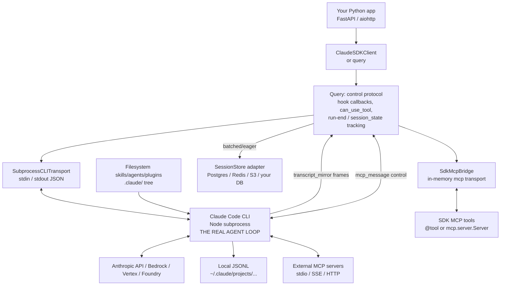

# Claude Agent SDK Python — Benchmark Analysis

> **Repo**: https://github.com/anthropics/claude-agent-sdk-python
> **Commit analysed**: `db750b20a88ae9645b1674d95193a88c89a265f9`
> **Branch**: `main`
> **Framework path**: `frameworks/claude-agent-sdk-python`
> **Analysed on**: 2026-10-01

## TL;DR

- ⭐ **Architectural shape**: ~13 k lines of Python (`src/`) wrapped around the bundled **Claude Code CLI** (Node.js binary), spawned with `anyio.open_process` and driven over a stdin/stdout JSON control protocol (`src/claude_agent_sdk/_internal/transport/subprocess_cli.py:570-795` builds the command line, `subprocess_cli.py:873` spawns it). The agent loop (turn boundaries, tool dispatch, planner, hook firing, system-prompt assembly, compaction, skill discovery, sub-agent fan-out, model routing) runs **in Node, not Python**. The Python side is a transport, typed-message parser, hook callback router, and an in-process MCP host. **You cannot fork the loop without forking Claude Code.**
- **Ecosystem**: Python (3.10+). The TypeScript counterpart `claude-agent-sdk-typescript` is the parity baseline.
- **Open-source, Anthropic-owned, MIT-licensed, classified `Development Status :: 3 - Alpha`** (`pyproject.toml:16`). Tightly coupled to the bundled CLI version (`2.1.286` per `src/claude_agent_sdk/_cli_version.py:3`); the Python package is at `0.2.163` (released 2026-09-30).
- **Maturity / adoption** (captured 2026-10-01): 8.2 k stars, 1.3 k forks, ~72 contributors, 169 GitHub releases since July 2025, ~29 M PyPI downloads in the last month. Cadence: 80 releases between 2026-05-19 and 2026-09-30 (roughly one every 1–2 days), most of them CLI bumps. SDK-facing additions in that window: typed `ResultError`, `terminal_reason`, typed per-model `ModelUsage`, `MessageOrigin`, `ConversationResetMessage`, `TaskUpdatedMessage`, truncating resume, `forward_subagent_text`, MCP 2.x support, `verbatim_prompts`, system-prompt `snapshot`.
- **Where the loop actually executes**: Inside the Node CLI subprocess, on every `query()` / `ClaudeSDKClient.connect()` call.
- **Strongest architectural choice for our use case**: Hooks (10 typed events plus `SessionStart`, can mutate input/output, block, defer, or branch — `types.py:284-295`) + `can_use_tool` callback + `max_budget_usd` per-run USD cap (`subprocess_cli.py:613-614`). Forcing tool arguments works via `PreToolUse.updatedInput` (`types.py:437-444`) or `PermissionResultAllow.updated_input` — both out-of-band Python callbacks invoked via the control protocol, so `tenantId` injection is feasible without trusting the LLM. Since 0.2.140 `can_use_tool` also works with plain string prompts to `query()`.
- **Weakest / biggest gap**: No first-class Resource Manager. Skills/agents/plugins live on disk under `.claude/` and `setting_sources`; multi-tenant scoping requires per-tenant filesystem trees. No programmatic `registerSkill(tenantID, ...)` API, no versioning, no publishing workflow. The `skills` option is "a context filter, not a sandbox" (`types.py:2325-2329`). Unchanged since the last analysis.
- **Most surprising finding (good)**: `max_budget_usd` is real, first-party, and unique in the comparison — a CLI flag the bundled binary honors, with a dedicated `ResultMessage.subtype == "error_max_budget_usd"` terminal state. Per-model USD cost is now typed (`ModelUsage.costUSD`, `types.py:1314-1337`).
- **Most surprising finding (bad)**: the bundled-binary model is hitting distribution limits. Platform wheels are now 93–103 MB; the Windows wheel crossed PyPI's 100 MiB per-file limit, so release tooling now skips over-limit wheels (#1309) and v0.2.163 on PyPI ships no Windows wheel (sdist only, which needs a separately installed CLI). Also, since CLI 2.1.257 the system prompt is **snapshotted on a session's first request by default** (`types.py:58-69`) — per-request edits to `append`/custom prompts on a resumed session are ignored unless you pass `snapshot: False`.
- **Per-stack one-liners**:
  - **Sessions/persistence**: CLI-owned filesystem JSONL + optional `SessionStore` adapter mirror (Postgres/Redis/S3 references), now with truncating resume (`resume_session_at` / `resume_drops_turn`) → 🟢 production-shaped.
  - **Skills**: filesystem-only, no programmatic registration; multi-tenant requires per-tenant `.claude/skills/` trees; names now validated at connect → 🟡.
  - **Resource manager**: no first-party registry, no versioning, no publishing workflow → 🔴 BYO.
  - **Sub-agents**: first-class, configurable inline via `AgentDefinition`, dispatched by the CLI's built-in Agent/`Task` tool with native parallelism (`types.py:107-126`); full nested transcript streamable via `forward_subagent_text` → 🟢.
  - **Multi-tenancy**: forcing tool args works; tool-set filtering works; `SessionKey.project_key` scopes storage; per-tenant skills require disk staging → 🟡.
  - **Hooks**: 10 events + `SessionStart`, mutate input/output, block/defer/branch, parallel-by-default → 🟢 best-in-class in this comparison.
  - **API**: library-only, no HTTP server. JSON-over-stdio with the CLI subprocess → 🔴 BYO HTTP layer.
  - **Observability**: usage on every `AssistantMessage.usage`, USD cost on `ResultMessage.total_cost_usd` and per model in `ModelUsage.costUSD`, OTel context auto-propagated (`subprocess_cli.py:827-852`), live `get_context_usage()` → 🟢.
- **Production-readiness for multi-tenant server-side deployment**: viable but with sharp edges — every session spawns a Node subprocess (cold-start cost; issue #333 "Performance Issues with Server-side Multi-instance Deployment" is still open), HTTP layer is BYO, skill catalog scoping is filesystem-staging-shaped, no first-party registry. The May–September releases mostly hardened the edges (zombie-process cleanup, argv/`--allowedTools` injection fixes, stdin lifetime with background agents, structured errors) rather than changing the architecture. The CLI remains the single point of architectural truth.

---

## 0. General

### 0.1 What is this stack?

**Library.** A Python wrapper around the bundled Node.js Claude Code CLI subprocess. Library-only — no HTTP server, no UI, no runtime daemon. Distributed as a Python package on PyPI; each platform wheel ships the `claude` Node binary under `src/claude_agent_sdk/_bundled/claude`.

### 0.2 Ecosystem

**Python** (3.10+ per `pyproject.toml:10`). A TypeScript counterpart (`claude-agent-sdk-typescript`) is maintained in parallel as the parity baseline (referenced repeatedly in `CHANGELOG.md` — e.g. "Matches the TypeScript SDK's `forwardSubagentText`", `CHANGELOG.md:160`; "matching the TypeScript SDK's `includeHookEvents`", `CHANGELOG.md:668`). The bundled CLI itself is Node.js.

### 0.3 Project status & governance

- **License**: MIT (`pyproject.toml:11`).
- **Owner**: Anthropic, PBC (`pyproject.toml:13`). First-party SDK for Claude Code.
- **Backing**: Commercial — Anthropic's [Commercial Terms](https://www.anthropic.com/legal/commercial-terms) apply, and Claude Code is gated on an Anthropic API key (or Bedrock/Vertex/Foundry credentials).
- **Support**: Community (GitHub issues), no separate paid support tier beyond the underlying Claude API / Claude Code subscription.
- **Parity check (calibration pass, 2026-10-01)**: the MIT `LICENSE` covers the Python wrapper only. The agent loop runs in the bundled proprietary Claude Code binary (`src/claude_agent_sdk/_cli_version.py:3`), and `README.md:375-377` states that use of the SDK is governed by Anthropic's Commercial Terms except where a component's own licence says otherwise. The wrapper is therefore auditable and forkable but the loop is not, which is why governance sits one point above the TypeScript SDK (no SDK source, all-rights-reserved `LICENSE.md`) and not at the top of the scale.

### 0.4 Project maturity / age

- **Repository created**: 2025-06-11; oldest GitHub release `v0.0.16` (2025-07-21).
- **Current Python package version**: `0.2.163` (`pyproject.toml:7`, `src/claude_agent_sdk/_version.py:3`), released 2026-09-30. The analysed commit is one CI-only commit past that tag.
- **Bundled CLI version**: `2.1.286` (`src/claude_agent_sdk/_cli_version.py:3`, `CHANGELOG.md:7`).
- **Status classifier**: `"Development Status :: 3 - Alpha"` (`pyproject.toml:16`). The semantic API has stabilized but the trove classifier is still alpha.
- **Origin**: Renamed from `claude-code-sdk` (`README.md`); migration guide in `CHANGELOG.md` `0.1.0` (`CHANGELOG.md:1382`).
- **Stability signals**: API still evolves, though the pace of SDK-visible change slowed after 0.2.82 — most of the 80 releases since 2026-05-19 are pure CLI bumps. Notable SDK-surface changes in that window: one explicit **breaking change** (skill-name validation in `skills`, 0.2.129, `CHANGELOG.md:247`), the `Message` union widened with `ConversationResetMessage` (0.2.137, `CHANGELOG.md:188` — code that exhaustively matches with `assert_never` must be updated), `mcp` dependency widened to `<3.0.0` (0.2.140, `CHANGELOG.md:159`), and a new terminal-error exception `ResultError` (0.2.140, `CHANGELOG.md:161`). Each release still bumps the bundled CLI, so behavior changes in Claude Code ripple through (e.g. the default system-prompt snapshot behavior from CLI 2.1.257, and e2e tests pinned to `claude-opus-5` after a CLI default-model change, 0.2.159).

### 0.5 Adoption & community signal

GitHub numbers captured 2026-10-01 via `gh api repos/anthropics/claude-agent-sdk-python`:

| Signal | Value |
|---|---|
| Stars | 8,198 |
| Forks | 1,310 |
| Watchers | 71 |
| Contributors | ~72 (contributors API, including anonymous) |
| Open issues / open PRs | 212 / 307 |
| PRs merged since 2026-05-19 | 40 |
| GitHub releases | 169 total; 80 between 2026-05-19 and 2026-09-30 |
| Last push | 2026-09-30 |
| PyPI downloads | ~28.9 M last month, ~6.9 M last week (pypistats.org) |

Release cadence is near-daily, driven by an auto-release workflow that bumps the bundled CLI. Maintainers reference PRs inline in each CHANGELOG entry (e.g. #1190/#1279, #1269, #1268 in the latest releases). The large open-PR count relative to merged PRs suggests a sizeable external-contribution backlog.

### 0.6 Ecosystem fit

- **Language**: Python 3.10+.
- **Package**: `claude-agent-sdk` on PyPI (https://pypi.org/project/claude-agent-sdk/).
- **Runtime deps**: `anyio>=4.0`, `sniffio>=1.0`, `mcp>=1.23.0,<3.0.0` (both mcp 1.x and 2.x supported since 0.2.140), `jsonschema>=4.20.0`, `typing_extensions>=4.0` (only on 3.10) (`pyproject.toml:27-33`).
- **Optional extras**: `otel` (opentelemetry-api), `dev` (includes `anyio[trio]` — the test suite runs under both asyncio and trio since 0.2.91), plus example dependencies for the SessionStore reference adapters.
- **Bundled artifact**: each platform wheel ships the Claude Code Node binary under `src/claude_agent_sdk/_bundled/claude`. For 0.2.163, PyPI hosts macOS arm64 (93 MB), macOS x86_64 (98 MB), Linux aarch64 (103 MB), Linux x86_64 (103 MB) wheels and a 365 KB sdist. **No Windows wheel** was uploaded: release CI now skips wheels over PyPI's 100 MiB per-file limit (#1309); a platform without a wheel falls back to the sdist, which needs a separately installed `claude` CLI.
- **Examples / templates**: 16 standalone Python scripts under `examples/` and reference SessionStore adapters under `examples/session_stores/`.
- **Primary mode of use**: Library embedded into a host process (FastAPI, aiohttp, CLI wrapper, batch worker, etc.).

### 0.7 Documentation depth & cross-team contributor accessibility

- Official docs live at https://code.claude.com/docs/en/agent-sdk (formerly https://docs.anthropic.com/en/docs/claude-code/sdk) and https://platform.claude.com/docs/en/agent-sdk/python.
- In-repo docs: `README.md` (377 lines), `CHANGELOG.md` (1,465 lines), `RELEASING.md`, `CLAUDE.md`.
- Code is heavily docstringed (`ClaudeAgentOptions` per-field docstrings since 0.1.69, `CHANGELOG.md:730`; docstrings aligned with the code in 0.2.160, #1293).
- **Accessibility for non-engineers**: low — every interaction is a Python coroutine, JSON wire frames, and CLI flags. PMs / Data folks cannot meaningfully author here. **Skill authoring** (markdown `SKILL.md` files) is approachable for non-engineers, but the SDK doesn't help you publish them — that's a filesystem operation.
- **Parity check (calibration pass, 2026-10-01)**: the hosting page (https://code.claude.com/docs/en/agent-sdk/hosting) and the session-storage page (https://code.claude.com/docs/en/agent-sdk/session-storage) are shared with the TypeScript SDK and carry Python tabs (for example `ClaudeAgentOptions(cwd=...)`, `session_store=`, `setting_sources=[]`); the same site has secure-deployment, observability, cost-tracking, sub-agent, skills and plugin pages. The earlier text under-credited this; the TS report's 4 for documentation depth applies equally here.

### 0.8 Documentation entry points

- Official docs landing: https://code.claude.com/docs/en/agent-sdk/overview (also https://platform.claude.com/docs/en/agent-sdk/python)
- Quickstart: https://code.claude.com/docs/en/agent-sdk/quickstart
- API reference: https://code.claude.com/docs/en/agent-sdk/python + in-repo docstrings in `src/claude_agent_sdk/types.py`
- Hosting / deployment / production guide: https://code.claude.com/docs/en/agent-sdk/hosting (Claude Code docs; not shipped in this repo)
- System prompt modification (including `snapshot`): https://code.claude.com/docs/en/agent-sdk/modifying-system-prompts (linked from `README.md`)
- Examples / demos: `examples/` directory in this repo (`examples/quick_start.py`, `examples/hooks.py`, `examples/agents.py`, `examples/mcp_calculator.py`, `examples/max_budget_usd.py`, `examples/tool_permission_callback.py`, `examples/setting_sources.py`, `examples/system_prompt.py`, `examples/session_stores/`)
- Changelog: `CHANGELOG.md` (in-repo)
- GitHub Releases: https://github.com/anthropics/claude-agent-sdk-python/releases
- Issues tracker: https://github.com/anthropics/claude-agent-sdk-python/issues — relevant open issue: [#333 Performance Issues with Server-side Multi-instance Deployment](https://github.com/anthropics/claude-agent-sdk-python/issues/333)
- Hooks docs: https://code.claude.com/docs/en/hooks
- Permissions guide: https://platform.claude.com/docs/en/agent-sdk/permissions
- Built-in tools: https://code.claude.com/docs/en/settings#tools-available-to-claude
- Discord / community: no dedicated forum; community signals through GitHub Issues.

---

## 1. High Level Architecture

### Deployment diagram

```
                ┌─────────────────────────────────────────────┐
                │      Your Python application                │
                │  (FastAPI / aiohttp / your HTTP layer)      │
                │                                             │
                │   ClaudeSDKClient  ← option/hooks/MCP →     │
                │        │                                    │
                │        ▼                                    │
                │   Query (control protocol RPC router)       │
                │   ├── hook callbacks                        │
                │   ├── can_use_tool callback                 │
                │   ├── SdkMcpBridge (in-process mcp Server)  │
                │   └── transcript_mirror → SessionStore      │
                │        │ JSON-line over stdin/stdout        │
                └────────┼────────────────────────────────────┘
                         │
                         ▼
       ┌─────────────────────────────────────────────────────────┐
       │  Claude Code CLI  (Node.js subprocess, bundled in wheel)│
       │  THE ACTUAL AGENT LOOP RUNS HERE                        │
       │                                                         │
       │   - System prompt assembly (+ first-request snapshot)   │
       │   - Skill discovery + lazy load (filesystem scan)       │
       │   - Sub-agent registry (AgentDefinition + .claude/)     │
       │   - Background agents / injected turns                  │
       │   - CLAUDE.md memory loading                            │
       │   - Plugins + slash commands                            │
       │   - Turn loop: model → tools → hooks → results          │
       │   - Persistence: local JSONL ~/.claude/projects/...     │
       └────────────────────┬────────────────────────────────────┘
                            │ HTTPS
                            ▼
       ┌─────────────────────────────────────────────────────────┐
       │  Anthropic API (or Bedrock / Vertex / Foundry / gateway)│
       │  — Claude model calls                                   │
       └─────────────────────────────────────────────────────────┘
```

### 1.1 Where does the agent loop *actually* execute?

In the **Node.js Claude Code CLI subprocess**, NOT in Python. The Python entrypoint is a transport + control-protocol shim. The actual model-call → tool-call → tool-result → next-model-call cycle, system prompt assembly, permission evaluation, skill discovery, compaction, and sub-agent dispatch all execute in the CLI. **This is the single most important architectural fact about this SDK.**

Evidence: `SubprocessCLITransport._build_command()` (`src/claude_agent_sdk/_internal/transport/subprocess_cli.py:570-795`) assembles a `claude --output-format stream-json --verbose --input-format stream-json ...` command line (`subprocess_cli.py:574`), `connect()` opens the subprocess with `anyio.open_process(...)` (`subprocess_cli.py:873`), and JSON-line frames flow both directions over its stdin/stdout. The Python "loop" (`Query._read_messages` at `_internal/query.py:388-576`) routes frames; since 0.2.160 it also tracks the CLI's `session_state_changed` frames to decide when the run is over (`_internal/query.py:446-453`, `924-1091`), but it still makes no model or tool decisions.

### 1.2 Runtime dependencies

- Python 3.10+.
- A bundled `claude` Node binary (auto-discovered from `src/claude_agent_sdk/_bundled/`), or a system-installed `claude` (`subprocess_cli.py:255-340` walks `~/.npm-global/bin`, `/usr/local/bin`, `~/.local/bin`, etc.). On Windows, `.bat`/`.cmd` shims (including npm's `claude.cmd`) are refused since 0.2.124 (`subprocess_cli.py:367-450`); use the native installer, an explicit `claude.exe`, or a platform wheel. Platforms without a published wheel (Windows for 0.2.163) require a separate CLI install.
- An Anthropic API key (or Bedrock/Vertex/Foundry credentials per Claude Code docs) — set in the subprocess env via `ClaudeAgentOptions.env`, or via an `apiKeyHelper` in user `settings.json` (now preserved on SessionStore resume, 0.2.137).
- Anthropic Messages API access (or a supported cloud provider).
- Optional OTel collector (`pip install claude-agent-sdk[otel]`).
- For external MCP: whatever the MCP server requires.

No required Postgres / Redis / vector DB / vendor service beyond the model provider.

### 1.3 Recommended deployment topology

Not stated in the SDK repo; the Claude Code docs have a separate hosting page (see 0.8). Implicit: every `query()` or `ClaudeSDKClient` connection spawns a new `claude` subprocess; the natural shape is "container-per-tenant" or "one-Python-process-many-CLI-subprocesses-but-one-CLI-per-active-conversation". The repo ships `Dockerfile.test` for CI (extended in this window) but no production Dockerfile or hosted runtime.

**Parity check (calibration pass, 2026-10-01)**: the "Not stated in the SDK repo" remark above is too strong. The vendor hosting guide linked in 0.8 is language-agnostic with Python tabs and documents four session patterns (ephemeral, long-running via a held `ClaudeSDKClient`, hybrid that requires `ClaudeAgentOptions.session_store` at `types.py:2403`, multi-agent container), sizing (1 GiB RAM and 1 CPU per agent), consistent hashing on `sessionId` for horizontal scale, and a multi-tenant recipe (`setting_sources=[]` at `types.py:2297`, `CLAUDE_CODE_DISABLE_AUTO_MEMORY` and `CLAUDE_CONFIG_DIR` via `env` at `types.py:2124`, per-tenant `cwd`). Python has no `startup()`/`prewarm()` equivalent and no queue or scheduler.

### 1.4 Cold-start cost & instance footprint

- Cold start: each `connect()` runs `_check_claude_version()` (`claude -v` with a 2 s timeout — `subprocess_cli.py:1164-1172`), `anyio.open_process(...)` for the CLI binary (`subprocess_cli.py:873`), then an `initialize` control-protocol roundtrip (timeout derived from `CLAUDE_CODE_STREAM_CLOSE_TIMEOUT`, minimum 60 s — `client.py:176-181`). Cold-start latency is dominated by Node startup. Issue #333 (still open on 2026-10-01) reports 20–30 s cold start for some multi-instance server configurations.
- Run lifetime: since 0.2.160, a `query()` run that serves hooks, `can_use_tool`, or SDK MCP keeps stdin (and therefore the subprocess) open after a `ResultMessage` until the CLI reports `idle`, bounded by `CLAUDE_CODE_PRINT_BG_WAIT_CEILING_MS` (default 10 minutes — `_internal/query.py:55-56`, `CHANGELOG.md:26`). Background sub-agents can therefore extend the life of a "one-shot" subprocess.
- RAM: a CLI subprocess plus the Python parent — call it 200–500 MB per active session including model context. (Not measured in this refresh.)
- Disk: wheel install is ~93–103 MB per platform (bundled CLI). Each session writes a JSONL transcript to `~/.claude/projects/<sanitized-cwd>/<session_id>.jsonl` (CLI-owned format).

### 1.5 Vendor lock-in

- **LLM provider**: 🔴 strongly Anthropic-locked. The CLI talks to Claude models only; routing through Bedrock, Vertex, Foundry, or a gateway is supported (`ModelUsage.provider` enumerates `firstParty`, `bedrock`, `vertex`, `foundry`, `anthropicAws`, `anthropicGoogleCloud`, `mantle`, `gateway` — `types.py:1333-1336`), but only Claude models are first-class.
- **Hosting**: 🟢 none — pure library, deploys anywhere Python + the bundled `claude` binary run.
- **Eval/observability**: 🟢 none mandated. OTel is the only first-party path.
- **CLI binary**: 🔴 strongly Claude-Code-locked. You cannot swap the loop for a non-CLI implementation without rewriting the SDK; `ClaudeAgentOptions.cli_path` pins a different binary but the wire protocol is CLI-version-specific.

### 1.6 Framework weight / footprint

Thin Python SDK relative to the work it delegates: ~12.9 k lines across 26 Python files in `src/claude_agent_sdk/` (up from ~10.6 k at the previous analysed commit). Main files: `types.py` (2,545 lines, dataclasses & TypedDicts), `_internal/query.py` (1,228 lines, control protocol + run-end tracking), `_internal/transport/subprocess_cli.py` (1,228 lines), `__init__.py` (772 lines, `@tool` decorator + re-exports), `client.py` (631 lines), `_internal/sdk_mcp_bridge.py` (384 lines, new — bridges the CLI to an in-process `mcp.server.Server`). Heavy lifting is in the bundled CLI binary, which is ~100 MB per platform and not source-distributed here.

### 1.7 Release-history signal

`CHANGELOG.md` is maintained per release with PR numbers; GitHub Releases mirror it at https://github.com/anthropics/claude-agent-sdk-python/releases. Themes since the previous analysis (0.2.82 → 0.2.163):

- **Breaking**: skill-name validation in `skills` raises `ValueError` at connect for wildcards, delimiters, leading `/` or surrounding whitespace (0.2.129, `CHANGELOG.md:247`). `Message` union widened with `ConversationResetMessage` (0.2.137, `CHANGELOG.md:188`).
- **Sessions & persistence**: truncating resume `resume_session_at` / `resume_drops_turn` (0.2.137, `CHANGELOG.md:190`); `settings.json` seeded into the temp config dir on SessionStore resume (0.2.137); trio support for session-store paths (0.2.88); `parent_tool_use_id` recovered for subagent transcripts (0.2.140).
- **Run lifecycle**: stdin kept open while background tasks are in flight (0.2.127, `CHANGELOG.md:267` — before this fix, SDK-MCP calls and `PreToolUse` hooks from background tasks could be silently bypassed with "Stream closed") and until the CLI reports `idle` (0.2.160, `CHANGELOG.md:26`); `TaskUpdatedMessage` for terminal background-task states (0.2.101, `CHANGELOG.md:458`); `MessageOrigin` on user/result messages (0.2.137, `CHANGELOG.md:189`).
- **Errors & cost**: `terminal_reason` and typed `ModelUsage` on `ResultMessage` (0.2.126, `CHANGELOG.md:277`); `ResultError` exception (0.2.140, `CHANGELOG.md:161`).
- **Permissions & safety**: `can_use_tool` with `query()` string prompts (0.2.140, `CHANGELOG.md:162`); warning when `can_use_tool` is shadowed by `allowed_tools`/`bypassPermissions` (0.2.111, `CHANGELOG.md:393`); argv-injection hardening for `resume`/`session_id`/`extra_args` (0.2.121, 0.2.124); `verbatim_prompts` to stop `@path` expansion and slash-command dispatch on untrusted text (0.2.158, `CHANGELOG.md:48`).
- **MCP**: `mcp` pinned below 2.0 (0.2.96), then 2.x supported alongside 1.x with an in-memory mcp transport replacing hand-rolled JSON-RPC (0.2.140, `CHANGELOG.md:159`).
- **Sub-agents**: `forward_subagent_text` (0.2.140, `CHANGELOG.md:160`).
- **Prompt caching**: `snapshot` option on `SystemPromptPreset` / new `SystemPromptCustom` (0.2.153, `CHANGELOG.md:77`).
- **Process hygiene**: shielded subprocess cleanup prevents zombie CLI children on cancellation; fix for silent whitespace loss on NDJSON lines >64 KiB (0.2.111, `CHANGELOG.md:390`).
- **Bundled CLI bumps**: nearly every release (2.1.146 → 2.1.286).

---

## 2. Agent Loop

### 2.1 Run loop entrypoint(s)

Two:

```python
# src/claude_agent_sdk/query.py:11
async def query(
    *,
    prompt: str | AsyncIterable[dict[str, Any]],
    options: ClaudeAgentOptions | None = None,
    transport: Transport | None = None,
) -> AsyncIterator[Message]:
```

```python
# src/claude_agent_sdk/client.py:26
class ClaudeSDKClient:
    def __init__(self, options=None, transport=None): ...               # :67
    async def connect(self, prompt=None) -> None: ...                    # :93
    async def query(self, prompt, session_id="default") -> None: ...     # :272
    async def receive_messages(self) -> AsyncIterator[Message]: ...      # :260
    async def receive_response(self) -> AsyncIterator[Message]: ...      # :566, until next ResultMessage
    async def interrupt(self) -> None: ...                               # :308
    async def set_permission_mode(self, mode) -> None: ...               # :314
    async def set_model(self, model: str | None) -> None: ...            # :341
    async def rewind_files(self, user_message_id: str) -> None: ...      # :364
    async def reconnect_mcp_server(self, server_name) -> None: ...       # :395
    async def toggle_mcp_server(self, server_name, enabled) -> None: ... # :417
    async def stop_task(self, task_id: str) -> None: ...                 # :443
    async def get_mcp_status(self) -> McpStatusResponse: ...             # :471
    async def get_context_usage(self) -> ContextUsageResponse: ...       # :504
    async def get_server_info(self) -> dict[str, Any] | None: ...        # :540
    async def disconnect(self) -> None: ...                              # :607
```

`query()` is one-shot (single prompt or a pre-built async iterable, drains the iterator, exits). `ClaudeSDKClient` is bidirectional (keep stdin open, send multiple prompts, interrupt mid-flight, get live context usage, switch model/permission mode mid-conversation). Terminal error results now raise `ResultError` (subclass of `ProcessError`, `_errors.py:56-117`) with `subtype`, `errors`, `result`, `api_error_status`, `terminal_reason`, `session_id`, and the raw payload, instead of a bare "exit code 1".

### 2.2 Per-iteration behavior

The Python "loop" is an async read loop over stdout JSON frames (`src/claude_agent_sdk/_internal/query.py:388-576`):

```python
# src/claude_agent_sdk/_internal/query.py:388 (abridged)
async def _read_messages(self) -> None:
    """Read messages from transport and route them."""
    try:
        async for message in self.transport.read_messages():
            if self._closed:
                break
            msg_type = message.get("type")

            if msg_type == "control_response":
                # … route to pending control request waiter
                continue
            elif msg_type == "control_request":
                # … spawn handler for incoming hook/permission/mcp request
                self._spawn_control_request_handler(request)
                continue
            elif msg_type == "control_cancel_request":
                # … cancel inflight control task
                continue
            elif msg_type == "transcript_mirror":
                # … peel off and hand to SessionStore batcher
                continue

            if msg_type == "system":
                self._track_task_lifecycle(message)          # background task bookkeeping
                if message.get("subtype") == "session_state_changed":
                    self._on_session_state(message.get("state"))

            if msg_type == "result":
                if self._transcript_mirror_batcher is not None:
                    await self._transcript_mirror_batcher.flush()
                # a result ends a turn, not necessarily the run: wait for "idle"
                # when background agents may still wake the session
                ...
            # everything else → enqueued for the consumer iterator
```

The per-iteration logic of the agent (call model → parse tool calls → run permission/hook gate → dispatch tool → collect result → re-prompt model) happens **inside the CLI subprocess**. Python sees the result frames and answers control requests.

### 2.3 ReAct loop

Shipped, but in the CLI subprocess, not in Python. The Python harness does not expose a `tool_call → tool_result` loop you can intercept — only the wire-level frames the CLI emits and the hook / permission / MCP callbacks it requests.

### 2.4 Tool dispatch + result handling

Three dispatch paths inside the CLI:

1. **Built-in tools** (`Read`, `Write`, `Bash`, `Grep`, `Glob`, `Edit`, `WebFetch`, `WebSearch`, Agent/`Task`, `Skill`, `TodoWrite`, …) — execute inside the CLI subprocess with whatever `cwd` / env / permissions you set.
2. **External MCP tools** (stdio/SSE/HTTP) — CLI spawns/connects to a separate process.
3. **In-process SDK MCP tools** (`@tool`-decorated Python functions, or any hand-built `mcp.server.Server`) — CLI sends an `mcp_message` control request over stdout; `Query._handle_sdk_mcp_request` (`_internal/query.py:753-782`) hands it to an `SdkMcpBridge`, which serves the in-process `mcp.server.Server` over mcp's own in-memory transport (`_internal/sdk_mcp_bridge.py:1-21`, `343-384`) and replies with the JSON-RPC result.

Tool results come back to the model as `ToolResultBlock` content blocks (matched by `tool_use_id`).

### 2.5 Explicit turn concept

A "turn" is defined by `ResultMessage`. The CLI emits one `ResultMessage` per user prompt — and, in streaming-input mode, also for turns the session injects on its own (background-task notifications, scheduled triggers, peer messages). `ResultMessage.origin` (`types.py:1372-1377`) distinguishes those from turns your application submitted. `ResultMessage.num_turns` counts assistant↔tool exchanges within the prompt. `max_turns` (`types.py:2050-2054`) caps the CLI's internal turn loop and triggers an `error_max_turns` result. `ResultMessage.stop_reason` and the newer `terminal_reason` (`"completed"`, `"max_turns"`, `"aborted_streaming"`, `"aborted_tools"`, … — `types.py:1363-1371`) explain why the turn ended. A `ResultMessage` ends a turn, not necessarily the run: since 0.2.160 the SDK keeps the run open until the CLI reports `idle` if background work may still produce turns.

### 2.6 Event emission mechanism (in-process)

`anyio` memory-object stream (`asyncio.Queue` equivalent) with `max_buffer_size=100` (`_internal/query.py:229-231`). The transport read loop pushes; `receive_messages()` pops. Backpressure is via the bounded buffer — a slow consumer blocks the read loop after 100 buffered messages. Both asyncio and trio backends are supported (tests run under both since 0.2.91).

---

## 3. Message & Event Taxonomy

### 3.1 Message layers

Three layers:

1. **Wire layer (CLI ↔ Python)** — line-delimited JSON over stdout. Each line is a discriminated dict with `type ∈ {"user", "assistant", "system", "result", "stream_event", "rate_limit_event", "conversation_reset", "control_request", "control_response", "control_cancel_request", "transcript_mirror"}`. Control / transcript frames (and `session_state_changed` frames the SDK requested only for itself) are peeled off by the read loop and never surfaced.
2. **SDK message layer (Python public)** — typed dataclasses returned by the async iterator. Defined in `src/claude_agent_sdk/types.py`.
3. **Application layer (your code)** — your Python application can do whatever it wants with the dataclasses.

There is no separate "UI message" layer; the SDK message layer is what your application iterates.

```
   Anthropic API           Claude Code CLI            Python SDK             Your code
   ─────────────           ───────────────            ──────────             ─────────
   stream events    ───►   parse → loop      ───►    parse_message  ───►    isinstance dispatch
   (raw API SSE)            ↓                         ↓                       ↓
                            stdout JSON frames        Message dataclasses     UI / DB / metrics
```

### 3.2 Concrete message types

Concrete public message dataclasses (`src/claude_agent_sdk/types.py:1124-1507`):

| Type | Purpose |
|---|---|
| `UserMessage` | A user turn — text or list of `ContentBlock`. `parent_tool_use_id` flags sub-agent turns; `origin: MessageOrigin` says who initiated an injected turn. |
| `AssistantMessage` | A model turn. Holds `content: list[ContentBlock]`, `model`, `usage`, `stop_reason`, `session_id`, `parent_tool_use_id`, `error`. |
| `SystemMessage` | Lifecycle/init/notice with `subtype` discriminator. Subclasses for specific subtypes (see below). |
| `TaskStartedMessage` / `TaskProgressMessage` / `TaskNotificationMessage` | Sub-agent / background task lifecycle — `task_id`, `description`, `usage`, `status`. |
| `TaskUpdatedMessage` | **New (0.2.101).** `system/task_updated` with a `patch` dict and `status ∈ {pending, running, paused, completed, failed, killed}`. Some background tasks report completion only here (`types.py:1254-1280`). |
| `MirrorErrorMessage` | SDK-synthesized when `SessionStore.append()` failed; surfaces a dropped batch to the caller. |
| `HookEventMessage` | Hook lifecycle events when `include_hook_events=True`. Subtype is `hook_started` or `hook_response`. |
| `ResultMessage` | Terminal per-turn message. Carries `is_error`, `num_turns`, `total_cost_usd`, `usage`, `model_usage: dict[str, ModelUsage]`, `stop_reason`, `terminal_reason`, `permission_denials`, `deferred_tool_use`, `api_error_status`, `origin`. |
| `StreamEvent` | Partial assistant streaming events (when `include_partial_messages=True`) — raw Anthropic API stream event in `event`. |
| `RateLimitEvent` | API rate-limit transitions (`allowed` → `allowed_warning` → `rejected`). |
| `ConversationResetMessage` | **New (0.2.137).** Emitted when `/clear` or another flow discards the transcript mid-connection. Carries `new_conversation_id`; running totals on later `ResultMessage`s restart from zero (`types.py:1439-1463`). |

`ContentBlock` is a discriminated union: `TextBlock | ThinkingBlock | ToolUseBlock | ToolResultBlock | ServerToolUseBlock | ServerToolResultBlock` (`types.py:1027-1034`). `ServerTool*` blocks are for server-executed tools (`advisor`, `web_search`, `web_fetch`, `code_execution`, `bash_code_execution`, `text_editor_code_execution`, `tool_search_tool_regex`, `tool_search_tool_bm25` — `types.py:987-996`) — the caller never returns a result for those.

`MessageOrigin` (`types.py:1048-1100`) is a TypedDict with a required `kind ∈ {"human", "channel", "peer", "task-notification", "coordinator", "unclassified", "observer", "auto-continuation", "observer-activity"}` and optional `subkind ∈ {"scheduled-trigger", "peer-send-message"}`, `from`, `fromSession`, `senderTaskId`, etc. `None` means the CLI did not attribute the message (prompts you send arrive that way unless you stamp `{"kind": "human"}`).

The discriminated `Message` union (`types.py:1499-1507`):

```python
Message = (
    UserMessage
    | AssistantMessage
    | SystemMessage
    | ResultMessage
    | StreamEvent
    | RateLimitEvent
    | ConversationResetMessage
)
```

### 3.3 Messages vs. events

**Same iterator, single taxonomy.** Everything is a "message" on the same async generator. The "stream-event vs. turn-event vs. tool-event" categories you'd expect in Mastra / Vercel are all expressed as message-with-subtype on a single iterator:

- Stream event = `StreamEvent`
- Turn boundary = `ResultMessage` (one per turn)
- Tool event = `AssistantMessage` containing a `ToolUseBlock`, then a `UserMessage` containing a `ToolResultBlock` (matched by `tool_use_id`)
- Session lifecycle = `SystemMessage(subtype="init")` at start; `ConversationResetMessage` on mid-session reset; CLI subprocess exit ends iteration
- Hook event = `HookEventMessage` when opt-in via `include_hook_events=True`
- Sub-agent lifecycle = `TaskStartedMessage` / `TaskProgressMessage` / `TaskNotificationMessage` / `TaskUpdatedMessage`

### 3.4 Event categories

| Category | Mechanism |
|---|---|
| Stream event | `StreamEvent` (opt-in via `include_partial_messages=True`), carries raw Anthropic SSE event. |
| Turn event | `ResultMessage` per turn; `num_turns` counts internal LLM↔tool exchanges; `origin` says whether the turn was yours or injected. |
| Message event | `UserMessage`, `AssistantMessage`. |
| Tool event | `ToolUseBlock` (on `AssistantMessage`) → `ToolResultBlock` (on subsequent `UserMessage`), linked by `tool_use_id`. |
| Session lifecycle | `SystemMessage(subtype="init")` at start; `ConversationResetMessage` on `/clear`-style resets; iterator end when subprocess exits. |
| Hook event | `HookEventMessage` (opt-in via `include_hook_events=True`) — subtype `hook_started` / `hook_response`. |
| Sub-agent event | `TaskStartedMessage`, `TaskProgressMessage`, `TaskNotificationMessage`, `TaskUpdatedMessage`; with `forward_subagent_text=True`, sub-agent text/thinking also arrives as `AssistantMessage` with `parent_tool_use_id` set. |
| Rate-limit event | `RateLimitEvent` whenever rate-limit status transitions. |
| Mirror error | `MirrorErrorMessage` when `SessionStore.append()` fails after retry. |

### 3.5 Canonical type-definition file(s)

**`src/claude_agent_sdk/types.py`** (2,545 lines) is the single source of truth. Parser: **`src/claude_agent_sdk/_internal/message_parser.py`** (395 lines; the `match` on `type`/`subtype` at `message_parser.py:96-378` produces typed dataclasses, including the new `task_updated` at `:266` and `conversation_reset` at `:378`). Error types: `src/claude_agent_sdk/_errors.py`.

### 3.6 Live agentic event stream taxonomy

Sample frames (wire format on CLI stdout):

```json
// Start
{"type": "system", "subtype": "init", "session_id": "abc-123",
 "agents": [...], "tools": [...], "model": "claude-sonnet-5"}

// Mid-stream assistant tool call
{"type": "assistant", "session_id": "abc-123", "uuid": "...",
 "message": {"model": "claude-sonnet-5",
   "content": [
     {"type": "text", "text": "I'll list the files."},
     {"type": "tool_use", "id": "toolu_01XYZ", "name": "Bash",
      "input": {"command": "ls"}}],
   "stop_reason": "tool_use",
   "usage": {"input_tokens": 1024, "output_tokens": 42, ...}}}

// Tool result (CLI synthesizes a user message)
{"type": "user", "session_id": "abc-123",
 "message": {"content": [
   {"type": "tool_result", "tool_use_id": "toolu_01XYZ",
    "content": "file1.py\nfile2.py", "is_error": false}]}}

// Sub-agent lifecycle
{"type": "system", "subtype": "task_started", "task_id": "task-abc",
 "description": "Analyze code", "tool_use_id": "toolu_xyz"}
{"type": "system", "subtype": "task_updated", "task_id": "task-abc",
 "patch": {"status": "completed", "end_time": 1727779200000}}

// Hook event (with include_hook_events)
{"type": "system", "subtype": "hook_started",
 "hook_event": "PreToolUse", "session_id": "abc-123"}

// Mid-session reset (/clear)
{"type": "conversation_reset", "new_conversation_id": "conv-2",
 "uuid": "...", "session_id": "abc-123"}

// Terminal
{"type": "result", "subtype": "success", "duration_ms": 5421,
 "duration_api_ms": 4800, "is_error": false, "num_turns": 3,
 "session_id": "abc-123", "total_cost_usd": 0.0042,
 "usage": {...}, "stop_reason": "end_turn", "terminal_reason": "completed",
 "modelUsage": {"claude-sonnet-5": {"inputTokens": 1024, "outputTokens": 42,
   "costUSD": 0.0042, "provider": "firstParty", ...}}}
```

Control frames (CLI ↔ SDK — never visible to your iterator):

```json
{"type": "control_request", "request_id": "req_1_a3f9",
 "request": {"subtype": "can_use_tool", "tool_name": "Write",
   "input": {"file_path": "x.py"}, "tool_use_id": "toolu_01XYZ"}}

{"type": "control_response", "response": {"subtype": "success",
   "request_id": "req_1_a3f9",
   "response": {"behavior": "allow", "updatedInput": {"file_path": "/tmp/x.py"}}}}
```

---

## 4. Agent Runtime (Multi-session Host)

### 4.1 Multi-session host architecture

**Not provided — BYO.** There is no built-in multi-session runtime. Each `ClaudeSDKClient` or `query()` invocation spawns its own `claude` CLI subprocess and owns one conversation. Your Python host (FastAPI, aiohttp, Temporal worker, etc.) is responsible for managing the lifecycle of N clients across N tenants.

### 4.2 Concurrent session isolation

Isolation is at the OS-subprocess boundary: each session has its own `claude` Node process with its own `cwd`, env, JSONL transcript path, and MCP-server connections. State cannot bleed between subprocesses except through shared filesystem (your `~/.claude/projects/` lives across them) or your shared `SessionStore` adapter. Concurrent `@tool` handlers run in the same Python process — they share closures, globals, and any locks you create. Each SDK MCP server gets one `SdkMcpBridge` session per `Query` (`_internal/sdk_mcp_bridge.py:11-21`), so a hand-built `mcp.server.Server` instance has its lifespan run once per query. Subprocess cleanup is shielded from cancellation since 0.2.111 (`subprocess_cli.py:962-1061`), so a cancelled request handler no longer leaves an orphaned `claude` child.

### 4.3 Horizontal scaling / multi-instance

**BYO.** No leader election, no shared coordinator. You can run N Python pods that each spawn CLI subprocesses for different sessions; the `SessionStore` adapter is the only shared-state primitive the SDK ships, and it's append-only — concurrent writes to the same session from two pods would interleave unsafely (the SDK assumes one process owns one session at a time). The `SessionKey.project_key` field (`types.py:1515-1534`) is the documented sharding/tenant lever. Cross-pod resume from a store works (store → temp JSONL → `--resume`), and since 0.2.137 copies `settings.json` / `cowork_settings.json` into the temp config dir so `apiKeyHelper` auth and user hooks survive the hop.

### 4.4 Background / async / scheduled tasks

**Host-level scheduling: Not provided — BYO.** No cron, no webhook trigger, no API in the Python SDK to create schedules. What changed in this window is that the CLI's own background work is now visible and handled correctly:

- `AgentDefinition.background: bool` (`types.py:124`) and `run_in_background` sub-agents keep running after a turn's `ResultMessage`; the SDK keeps stdin open until the CLI reports `idle` (bounded by `CLAUDE_CODE_PRINT_BG_WAIT_CEILING_MS`, default 10 min — `CHANGELOG.md:26`).
- In streaming-input mode the session can inject its own turns; `MessageOrigin.kind` / `subkind` (`types.py:1048-1100`) label them as `task-notification`, `scheduled-trigger`, `peer`, `channel`, etc. The SDK only surfaces these labels. How the CLI configures scheduled triggers is not documented in this repo — treat it as CLI-internal (I did not verify it).

**Parity check (calibration pass, 2026-10-01)**: the CLI-side scheduling the TS report documents applies to the same bundled CLI (`_cli_version.py:3`, 2.1.286, the version the TS report analyses): model-invoked `CronCreate` / `CronDelete` / `CronList` (durable jobs persisted to `.claude/scheduled_tasks.json`), `ScheduleWakeup` and a `RemoteTrigger` tool. The Python SDK ships no typed inputs for these tools and I did not run them from this repo, but it already models the resulting turns: `TaskNotificationOriginSubkind = Literal["scheduled-trigger", "peer-send-message"]` (`types.py:1062`) and the `subkind` field documented at `types.py:1093-1097` mark a fired schedule, `AgentDefinition.background` is at `types.py:124`, and `ClaudeSDKClient.stop_task` is at `client.py:443`. Scheduling is session-local, not distributed.

### 4.5 Worker pool / queue model

**Not provided — BYO.** The runtime model is "one CLI subprocess per active session, lifetime owned by the calling Python coroutine". For queue-shaped workloads layer your own (Celery, RQ, Temporal, SQS workers). Note that background sub-agents can now extend a run well past the first `ResultMessage`, which matters for worker timeouts.

---

## 5. Sessions & Persistence

### 5.1 Session / chat data model

There is no canonical "Session" dataclass — sessions are identified by `session_id` (a UUID string passed via `ClaudeAgentOptions.session_id` or generated by the CLI) plus a `project_key` for tenant scoping in the `SessionStore`:

```python
# src/claude_agent_sdk/types.py:1515
class SessionKey(TypedDict):
    project_key: str            # "Multi-tenant deployments should set this to a tenant ID"
    session_id: str
    subpath: NotRequired[str]   # for subagent transcripts, e.g. "subagents/agent-{id}"
```

`SDKSessionInfo` (`types.py:1742-1776`) is the listing-time metadata view returned by `list_sessions()`:

```python
@dataclass
class SDKSessionInfo:
    session_id: str
    summary: str
    last_modified: int
    file_size: int | None = None
    custom_title: str | None = None
    first_prompt: str | None = None
    git_branch: str | None = None
    cwd: str | None = None
    tag: str | None = None
    created_at: int | None = None
```

Per-message rows are `SessionStoreEntry` (`types.py:1537-1551`) — opaque pass-through dicts with a `type`, `uuid`, and `timestamp`. Read-side messages are `SessionMessage` (`types.py:1778-1810`), which now carries `parent_tool_use_id` and `parent_agent_id` for sub-agent transcripts.

### 5.2 What's stored on a session

The CLI's on-disk JSONL transcript at `~/.claude/projects/<sanitized-cwd>/<session_id>.jsonl` stores every entry: user turns, assistant turns, tool calls, tool results, system markers, mode changes, custom titles, tags. The format is owned by the CLI; the SDK treats entries as opaque pass-through dicts (`SessionStoreEntry`). Subagent transcripts live in a sibling `subagents/agent-<id>.jsonl` directory, with metadata that links back to the spawning Agent `tool_use` (recovered by the SDK since 0.2.140).

### 5.3 Granularity

- One conversation per session by default.
- **Forking**: `fork_session=True` + `resume=<id>` creates a new session-id branching from a prior session (`types.py:2249-2252`). Helper `fork_session()` (`_internal/session_mutations.py:240`, re-exported at `__init__.py:42-52`) does this from outside an active client.
- **Truncating resume / fork at a message (new, 0.2.137)**: `resume_session_at=<uuid>` resumes (usually with `fork_session`) from an earlier transcript entry; `resume_drops_turn=<prompt uuid>` makes the CLI refuse the resume if the discarded range contains anything other than that turn (e.g. an unobserved queued message or task notification) (`types.py:2253-2290`, wired as `--resume-session-at=` / `--resume-drops-turn=` at `subprocess_cli.py:708-721`). This is the primitive for "edit the last prompt and retry" without silently dropping messages.
- **Resume**: `ClaudeAgentOptions.resume=<id>` resumes the on-disk session; `continue_conversation=True` resumes the most recent in the current cwd.
- **Mid-session reset**: `/clear`-style flows replace the conversation inside one connection and are now surfaced as `ConversationResetMessage`.

### 5.4 Built-in persistence stores

- **Default**: local-disk JSONL written by the CLI to `~/.claude/projects/<sanitized-cwd>/<session_id>.jsonl`.
- **`InMemorySessionStore`** (`src/claude_agent_sdk/_internal/session_store.py:35-100`) — reference for testing.
- **Reference adapters under `examples/session_stores/`** — not shipped in the wheel, copy-in:
  - Postgres (`postgres_session_store.py`, asyncpg + jsonb rows)
  - Redis (`redis_session_store.py`, RPUSH/LRANGE lists + zset index)
  - S3 (`s3_session_store.py`, JSONL part files; revised in this window)

### 5.5 Persistence timing

```python
# src/claude_agent_sdk/_internal/query.py:455-461
if msg_type == "result":
    # Flush pending transcript mirror entries before yielding
    # result so consumers observing the result can rely on the
    # SessionStore being up to date for this turn.
    if self._transcript_mirror_batcher is not None:
        await self._transcript_mirror_batcher.flush()
```

Default is **batched, flush-on-turn-end** (or eager with `session_store_flush="eager"`). Local JSONL is written by the CLI on every entry. The SDK guarantees the external store is up-to-date by the time you observe a `ResultMessage`. Backpressure: 500 entries / 1 MiB max-pending thresholds (`transcript_mirror_batcher.py:28-29`), with bounded retry before dropping a batch and surfacing it as `MirrorErrorMessage`. The docstring now notes that a single timed-out `append()` also drops the batch and "may still land" (`types.py:1283-1297`).

### 5.6 Mid-run checkpointing (durable)

Best-effort: local JSONL on disk is updated by the CLI on every entry, so a crash mid-tool-call leaves the transcript with everything up to that point. The `SessionStore` adapter receives batched entries; set `session_store_flush="eager"` for near-real-time forwarding. A `resume=<id>` after a crash re-loads the JSONL (or store contents) into a fresh subprocess; `resume_session_at` lets you resume from a known-good entry. **No transactional "commit-per-tool-write" the way LangGraph's `_runner.commit() → put_writes()` works** — you get "everything before the last assistant message is durable, the in-flight LLM call may be lost". `close()` waits 5 s for the CLI to flush its session file after stdin EOF before SIGTERM (`subprocess_cli.py:1022-1047`).

### 5.7 Session ID format

UUID. Auto-generated by the CLI unless you supply `ClaudeAgentOptions.session_id` (must be a valid UUID — `types.py:2043-2048`). `SessionKey.project_key` lets you namespace separately (tenant-prefixing happens at the store-adapter level; paths over 200 chars are truncated and suffixed with a djb2 hash). `resume` / `session_id` are passed as single `--flag=value` argv tokens since 0.2.121 so a dash-prefixed value cannot be read as a flag.

### 5.8 Pluggable store interface

`SessionStore` is a Protocol (`types.py:1609-1740`) with two required methods (`append`, `load`) and four optional ones (`list_sessions`, `list_session_summaries`, `delete`, `list_subkeys`). The SDK ships a **13-contract conformance test harness** at `claude_agent_sdk.testing.run_session_store_conformance` (`CHANGELOG.md:786`) — third-party adapter authors can run it to verify their implementation. `load_timeout_ms` (default 60 s, `types.py:2421-2428`) bounds each `load()` / `list_subkeys()` during resume materialization.

```python
class SessionStore(Protocol):
    async def append(self, key: SessionKey, entries: list[SessionStoreEntry]) -> None: ...   # :1631
    async def load(self, key: SessionKey) -> list[SessionStoreEntry] | None: ...             # :1653
    async def list_sessions(self, project_key: str) -> list[SessionStoreListEntry]: ...      # :1677
    async def list_session_summaries(self, project_key: str) -> list[SessionSummaryEntry]: ...  # :1689
    async def delete(self, key: SessionKey) -> None: ...                                     # :1713
    async def list_subkeys(self, key: SessionListSubkeysKey) -> list[str]: ...               # :1726
```

The store is **not** a primary write path — it's a mirror; the local JSONL under `CLAUDE_CONFIG_DIR` is still the source of truth and the CLI is the only writer to it.

**Maturity label check (calibration pass, 2026-10-01)**: no alpha, beta or experimental marker is attached to the `SessionStore` feature itself (checked `types.py`, `_internal/session_store.py`, `_internal/session_store_validation.py`, `testing/`, `README.md`, `examples/session_stores/` and the session-storage docs page). The only alpha signal is the whole-package classifier `Development Status :: 3 - Alpha` (`pyproject.toml:16`), which does not cap the feature under the benchmark's maturity rule; the TypeScript `SessionStore` is explicitly tagged `@alpha`, which does.

### 5.9 Schema evolution / migration

No formal migration helpers. The SDK keeps entries opaque, so backward-compat is the adapter author's responsibility. `import_session_to_store()` (`__init__.py:41`) replays a local JSONL into any `SessionStore` adapter — used for migrating from local storage to remote stores.

### 5.10 Export / replay

- `list_sessions()` / `get_session_info()` / `get_session_messages()` / `list_subagents()` / `get_subagent_messages()` — top-level helpers re-exported from `__init__.py:55-66`. Subagent messages now carry `parent_tool_use_id` (the spawning Agent `tool_use`) and `parent_agent_id`, so nested transcripts can be stitched back to the parent.
- Same functions with `_from_store()` suffixes for store-backed sessions.
- The on-disk JSONL is a transparent, append-only format and can be replayed by passing `resume=<id>` (optionally `resume_session_at=<uuid>`) to a new `query()` call.
- `tag_session()`, `rename_session()`, `delete_session()`, `fork_session()` (and their `_via_store` variants) — `__init__.py:42-52`.

### 5.11 Cross-session memory

The CLI loads `CLAUDE.md` files from `cwd` when `setting_sources` includes `"project"` (and `~/.claude/CLAUDE.md` for user-level memory). This is the only first-party "cross-session knowledge that follows the agent" primitive. For semantic vector memory, see Q17 — **BYO**.

---

## 6. Multi-tenancy & Tenant Identity ⭐ THE KEY QUESTION

### 6.1 Run-loop tenant identity

`ClaudeAgentOptions` is a single dataclass with ~60 fields (`src/claude_agent_sdk/types.py:1971-2436`). The ones relevant to tenant identity and scoping:

```python
@dataclass
class ClaudeAgentOptions:
    tools: list[str] | ToolsPreset | None = None                     # :1974
    allowed_tools: list[str] = field(default_factory=list)           # :1985
    system_prompt: str | SystemPromptPreset | SystemPromptCustom | SystemPromptFile | None = None
    mcp_servers: dict[str, McpServerConfig] | str | Path = field(default_factory=dict)
    strict_mcp_config: bool = False
    permission_mode: PermissionMode | None = None
    resume: str | None = None
    session_id: str | None = None
    max_turns: int | None = None
    max_budget_usd: float | None = None                              # :2056
    disallowed_tools: list[str] = field(default_factory=list)        # :2063
    model: str | None = None
    fallback_model: str | None = None
    cwd: str | Path | None = None                                    # :2096
    settings: str | None = None
    env: dict[str, str] = field(default_factory=dict)                # :2124
    can_use_tool: CanUseTool | None = None                           # :2158
    hooks: dict[HookEvent, list[HookMatcher]] | None = None          # :2176
    user: str | None = None                                          # :2189
    forward_subagent_text: bool = False
    verbatim_prompts: bool = False
    resume_session_at: str | None = None
    resume_drops_turn: str | None = None
    agents: dict[str, AgentDefinition] | None = None
    setting_sources: list[SettingSource] | None = None               # :2297
    skills: list[str] | Literal["all"] | None = None                 # :2309
    sandbox: SandboxSettings | None = None
    plugins: list[SdkPluginConfig] = field(default_factory=list)
    session_store: SessionStore | None = None                        # :2403
    task_budget: TaskBudget | None = None
    # ... thinking, effort, output_format, betas, add_dirs, extra_args, etc.
```

There is **no tenant-identity field** carried into tool handlers or hooks. The closest things are:

- `user: str | None` — "Optional user identifier associated with the session" (`types.py:2189-2190`), passed to the CLI, not to your callbacks.
- `env` — arbitrary env vars for the CLI subprocess (visible to built-in `Bash` and to stdio MCP servers it spawns).
- `cwd` / `setting_sources` / `CLAUDE_CONFIG_DIR` — shape which on-disk resources the subprocess sees.
- `SessionKey.project_key` (`types.py:1515-1534`) — *"Multi-tenant deployments should set this to a tenant ID or project name."* It scopes **session storage** only, not the toolset/skills/agents.

To pass tenant identity into Python-side logic you close over it in your hooks, `can_use_tool`, and `@tool` handlers (see 6.2).

### 6.2 Tenant identity propagation into tool calls

For an **SDK MCP tool** (in-process, decorated with `@tool`), the handler type is `Callable[[T], Awaitable[dict[str, Any]]]` (`src/claude_agent_sdk/__init__.py:241-248`):

```python
# src/claude_agent_sdk/__init__.py:287 (docstring example)
>>> @tool("greet", "Greet a user", {"name": str})
... async def greet(args):
...     return {"content": [{"type": "text", "text": f"Hello, {args['name']}!"}]}
```

**The handler receives only the LLM-generated arguments.** No `RunContext`, no `ToolContext`, no tenant ID, no session ID. To get tenant identity inside the tool, capture it in Python closure scope when you build the server per request:

```python
def make_tools(tenant_id: str):
    @tool("list_dashboards", "List dashboards", {"limit": int})
    async def list_dashboards(args):
        # tenant_id captured from outer scope — never trusts the LLM
        rows = await db.fetch_for_tenant(tenant_id, args["limit"])
        return {"content": [{"type": "text", "text": json.dumps(rows)}]}
    return [list_dashboards]

server = create_sdk_mcp_server("my", tools=make_tools(tenant_id="acme"))
```

For an **external MCP tool** (stdio/SSE/HTTP), the tool runs out-of-process — only the LLM-generated args (plus whatever headers/env you put in the server config) reach it.

For the **CLI's built-in tools**, the same applies — they run inside the CLI subprocess with whatever `cwd` / env you set.

### 6.3 Tool call interface

For SDK MCP tools the signature is args-in, dict-out, no context object. The `@tool` decorator (`__init__.py:251-336`) takes `name`, `description`, `input_schema`, and optional MCP `annotations`, and returns an `SdkMcpTool` (`__init__.py:241-248`). Since 0.2.140 you can also pass any hand-built `mcp.server.Server` as `McpSdkServerConfig.instance` (`types.py:648-665`) and use mcp's own handler APIs.

`ToolPermissionContext` (`types.py:223-254`) is the closest thing to a context object — but it's only passed to the `can_use_tool` callback. Hook inputs carry `session_id`, `cwd`, `transcript_path`, `tool_use_id`, and (inside sub-agents) `agent_id` / `agent_type`:

```python
@dataclass
class ToolPermissionContext:
    signal: Any | None = None
    suggestions: list[PermissionUpdate] = field(default_factory=list)
    tool_use_id: str | None = None      # always non-empty when delivered
    agent_id: str | None = None
    blocked_path: str | None = None
    decision_reason: str | None = None
    title: str | None = None
    display_name: str | None = None
    description: str | None = None
```

### 6.4 Forcing tool arguments from the harness

**Yes — two mechanisms.** Both are out-of-band Python callbacks invoked via the control protocol, so the LLM cannot bypass them.

**Mechanism A: `PreToolUse` hook with `updatedInput`** (`types.py:437-444`):

```python
async def inject_tenant(input_data, tool_use_id, context):
    tool_input = dict(input_data["tool_input"])
    tool_input["tenantId"] = current_tenant_id   # forced server-side
    return {
        "hookSpecificOutput": {
            "hookEventName": "PreToolUse",
            "updatedInput": tool_input,
        }
    }

options = ClaudeAgentOptions(
    hooks={"PreToolUse": [HookMatcher(matcher=None, hooks=[inject_tenant])]},
)
```

**Mechanism B: `can_use_tool` callback with `PermissionResultAllow(updated_input=...)`** (`types.py:259-264`, dispatch site `_internal/query.py:586-636`):

```python
async def can_use_tool(tool_name, input, ctx):
    if tool_name == "query_dashboards":
        input = {**input, "tenantId": current_tenant_id}
    return PermissionResultAllow(updated_input=input)

options = ClaudeAgentOptions(
    can_use_tool=can_use_tool,
    permission_mode="default",   # ensures the callback is invoked
)
```

Caveat: `can_use_tool` only fires when the CLI's permission evaluation reaches "ask" — tools already allowed by `allowed_tools`, `permission_mode` (`acceptEdits` / `bypassPermissions`), settings allow-rules, **or a `PreToolUse` hook returning allow** skip it (`types.py:2158-2174`). Since 0.2.111 the SDK emits a `CanUseToolShadowedWarning` when it can see the shadowing (`types.py:1835-1925`), and since 0.2.140 `can_use_tool` also works for `query()` with a plain string prompt (`_configure_can_use_tool`, `types.py:1926-1950`). `PreToolUse` fires on **every** tool call regardless of permission state, which is what you want for forced argument injection. One historical exception worth knowing: before 0.2.127, `query()` closed stdin on the first `result` frame, so tool calls from still-running background sub-agents could fail with "Stream closed" and **bypass `PreToolUse` hooks** (`CHANGELOG.md:267`); 0.2.160 closed the remaining gap by waiting for the CLI's `idle` state (`CHANGELOG.md:26`). Pin `>=0.2.160` if you rely on hooks for tenant enforcement with background agents.

### 6.5 Tenant-aware visible tool selection

**Three explicit layers at session start:**

1. **`tools`** (`types.py:1974-1984`) — base set: a `list[str]` of tool names, `[]` to disable all built-ins, or `{"type": "preset", "preset": "claude_code"}`. Sent as `--tools` (`subprocess_cli.py:590-601`).
2. **`allowed_tools`** (`types.py:1985-1995`) — auto-allow list; tools listed here run without permission prompt. Sent as `--allowedTools` (`subprocess_cli.py:607-608`).
3. **`disallowed_tools`** (`types.py:2063-2068`) — explicit deny: *"removed from the model's context"*. Sent as `--disallowedTools` (`subprocess_cli.py:616-617`).

Plus `strict_mcp_config=True` (only the `mcp_servers` you pass are loaded) and `skills=[...]` / `agents={...}` per request.

To change the toolset **per session**, build `ClaudeAgentOptions` per tenant. **Mid-session**, there is no first-party `set_tools()` control request — use a `PreToolUse` hook to deny conditionally (`permissionDecision: "deny"`), `set_permission_mode()` (`client.py:314-339`), or `toggle_mcp_server(name, enabled)` (`client.py:417-441`) to enable/disable an entire MCP server.

**Resource scoping is filesystem-shaped.** Skills, sub-agents (`.claude/agents/*.md`), slash commands, plugins, MCP config, and CLAUDE.md memory all load from `setting_sources` (`types.py:2297-2307`): `user` (`~/.claude/`), `project` (`.claude/` in cwd), `local` (`.claude/settings.local.json`). Per-tenant visibility therefore means:

- A per-tenant filesystem tree: `tenants/<tid>/.claude/skills/...`, `tenants/<tid>/.claude/agents/...`
- `options.cwd = tenants/<tid>` per request
- Optionally `options.env["CLAUDE_CONFIG_DIR"] = tenants/<tid>/.claude` so credentials and the JSONL transcript live in the tenant tree
- `options.setting_sources=["project"]` to ignore the global user settings

There is no in-memory registry you can pass per request that says "tenant acme sees skills X,Y" — `skills` (`types.py:2309-2329`) is a **filter** over what's already on disk.

### 6.6 Per-tool-call auth propagation

**BYO.** Captured via closure into hook/tool callbacks, or passed as env/headers to MCP servers at session start. No SDK primitive automatically threads "the caller's JWT" to every tool call.

### 6.7 Per-tenant rate limit + budget cap

🟢 **Real per-run USD budget cap.** `max_budget_usd: float | None` (`types.py:2056-2061`) is wired to the CLI flag `--max-budget-usd` (`subprocess_cli.py:613-614`). On overrun the run ends with `ResultMessage.subtype == "error_max_budget_usd"` (`examples/max_budget_usd.py:72`), which now also raises `ResultError` with `subtype` set. **Caveat**: post-call check, so cost may exceed the cap by up to one API call. No per-tenant aggregation primitive — you set the cap per run; cross-run/per-tenant USD totals are BYO (sum `total_cost_usd` keyed by your tenant id; reset your accumulator on `ConversationResetMessage`, which zeroes running totals).

`RateLimitEvent` (`types.py:1425-1436`) surfaces Anthropic's 5h/7d/model/overage rate-limit transitions — observe and back off in your application.

### ⭐ Light usage example — multi-tenant + forced args + tool filtering

```python
# 1. Pass tenantId / userId / targetingStrategyId; 2. restrict visible tools;
# 3. force tenantId on every topicSearch call server-side.
TENANT = {"tenantId": "acme", "userId": "u-123", "targetingStrategyId": "strat-42"}

async def force_tenant_pretool(input_data, tool_use_id, ctx):
    return {"hookSpecificOutput": {
        "hookEventName": "PreToolUse",
        "updatedInput": {**input_data["tool_input"], "tenantId": TENANT["tenantId"]}}}

options = ClaudeAgentOptions(
    cwd="tenants/acme",                                   # tenant-scoped .claude/ tree
    setting_sources=["project"],
    user=TENANT["userId"],
    env={"TARGETING_STRATEGY_ID": TENANT["targetingStrategyId"]},
    mcp_servers={"predict": create_sdk_mcp_server("predict", tools=make_tools(tenant_id=TENANT["tenantId"]))},
    strict_mcp_config=True,
    tools=[],                                             # no built-ins (no Bash, no WebFetch)
    allowed_tools=["mcp__predict__topicSearch", "mcp__predict__iabSearch",
                   "mcp__predict__audienceCreate"],
    hooks={"PreToolUse": [HookMatcher(matcher="mcp__predict__topicSearch",
                                      hooks=[force_tenant_pretool])]},
    session_store=my_postgres_store,                      # SessionKey.project_key="acme"
)
async with ClaudeSDKClient(options=options) as client:
    await client.query("Create an audience for soccer fans")
```

Step 1 is "closure + env", not a typed identity object. Steps 2 and 3 are first-class.

---

## 7. Hook & Middleware Capabilities (Context Engineering)

This SDK has the most comprehensive hook system in the comparison. No hook events were added or removed between 0.2.82 and 0.2.163.

### 7.1 Enumerate every hook / middleware / lifecycle callback

`HookEvent` (`src/claude_agent_sdk/types.py:284-295`):

```python
HookEvent = (
    Literal["PreToolUse"]
    | Literal["PostToolUse"]
    | Literal["PostToolUseFailure"]
    | Literal["UserPromptSubmit"]
    | Literal["Stop"]
    | Literal["SubagentStop"]
    | Literal["PreCompact"]
    | Literal["Notification"]
    | Literal["SubagentStart"]
    | Literal["PermissionRequest"]
)
```

Plus `SessionStart` (its specific output type exists at `types.py:479`).

| Hook | Fires | Can mutate / block |
|---|---|---|
| `PreToolUse` | Before any tool dispatch (built-in or MCP) | `updatedInput`, `permissionDecision: "allow" \| "deny" \| "ask" \| "defer"`, `additionalContext`. Can block, divert, or defer the call. |
| `PostToolUse` | After tool returns successfully | `updatedToolOutput` (replace tool output before it reaches the model — any tool; built-in tools require their output schema, `types.py:447-461`), `additionalContext`. |
| `PostToolUseFailure` | After tool raises / errors | `additionalContext`, plus `continue_=False` + `stopReason` to halt. |
| `UserPromptSubmit` | When user prompt is received, before model call | `additionalContext` injects pre-prompt context. Can block via `decision: "block"`. |
| `SessionStart` | At session init | `additionalContext` injects a "current date / tenant / etc." preamble. |
| `Stop` | Before a turn-end | `decision: "block"` to force the model to keep going. |
| `SubagentStop` | When a sub-agent finishes | Same as `Stop`. |
| `SubagentStart` | When a sub-agent starts | `additionalContext`. |
| `PreCompact` | Before context-window compaction | `additionalContext` + manual/auto trigger discrimination. |
| `Notification` | CLI-emitted notifications | `additionalContext`. |
| `PermissionRequest` | When permission prompt would be shown | `decision: dict` — fully programmatic permission verdict. |

Hook output schema (`types.py:541-583`):

```python
class SyncHookJSONOutput(TypedDict):
    continue_: NotRequired[bool]      # False stops the loop
    suppressOutput: NotRequired[bool]
    stopReason: NotRequired[str]
    decision: NotRequired[Literal["block"]]
    systemMessage: NotRequired[str]   # shown to the user
    reason: NotRequired[str]          # shown to the model
    hookSpecificOutput: NotRequired[HookSpecificOutput]
```

### 7.2 Hook concurrency model

**Concurrent — explicitly documented** (`types.py:2176-2187`): *"all `hook_callback` control requests for a given event fire in parallel, not sequentially."* Design each hook to be independent.

Hooks are registered as `dict[HookEvent, list[HookMatcher]]` on `ClaudeAgentOptions.hooks`. The Python SDK registers callback IDs at `initialize` time (`_internal/query.py:318-345`) — the CLI references them by ID in subsequent `hook_callback` control requests, and the Python side dispatches to the coroutine (`_internal/query.py:640-654`).

```python
# src/claude_agent_sdk/types.py:606
@dataclass
class HookMatcher:
    matcher: str | None = None    # tool-name pattern, e.g. "Bash" or "Write|Edit"
    hooks: list[HookCallback] = field(default_factory=list)
    timeout: float | None = None  # default 60s
```

### 7.3 Specific capability tests

| Scenario | Supported | How |
|---|---|---|
| Inject system messages at session start ("current date is X, tenant is Y") | **Yes** | `SessionStart` hook returns `{"hookSpecificOutput": {"hookEventName": "SessionStart", "additionalContext": "..."}}`. See `examples/hooks.py:73-82`. Alternatively put it in `system_prompt` — but note the system prompt is snapshotted on the first request by default (7.5). |
| Expand user input (slash commands, attachments, time-stamp) | **Yes** | `UserPromptSubmit` hook returns `additionalContext`. The CLI's own `@path` and slash-command expansion can be switched **off** with `verbatim_prompts=True` (`types.py:2219-2248`) for prompts built from untrusted text. |
| Mutate messages list before each LLM call (cache breakpoints, redaction) | **No, not directly** | Hooks do not expose the in-flight messages array. Cache breakpoints and message-array surgery happen inside the CLI subprocess. You can inject *additional* context, but not rewrite or redact existing messages. `resume_session_at` lets you drop trailing entries between runs, not per call. |
| Mutate / decorate tool input before dispatch (inject tenantId) | **Yes** | `PreToolUse` → `updatedInput` (`types.py:443`). Also `can_use_tool` → `PermissionResultAllow(updated_input=...)`. |
| Mutate / decorate tool result before returning to the LLM (redact, summarize) | **Yes** | `PostToolUse` → `updatedToolOutput` (`types.py:452`). Any built-in or MCP tool; for built-in tools the replacement must match the tool's output schema or it is rejected and the original kept (`types.py:453-458`). |
| Emit additional tool calls in response to a tool result | **No first-class equivalent** | `PostToolUse` can inject `additionalContext` to nudge the model into making another call, but cannot synthetically emit a `tool_use` block on the model's behalf. |

### 7.4 Auto-compaction

🟢 **Built-in inside the CLI.** The CLI implements automatic context-window compaction when approaching the limit; the SDK exposes it via:

- `PreCompact` hook — fires before compaction with `trigger: "manual" | "auto"` and `custom_instructions` (`types.py:387-392`).
- `ContextUsageResponse.isAutoCompactEnabled` + `autoCompactThreshold` (`types.py:815, 830`).
- `ClaudeSDKClient.get_context_usage()` for live inspection (`client.py:504-538`).

Compaction logic itself is opaque (lives in the CLI binary); you can inject instructions via the `PreCompact` hook but cannot replace the algorithm. Compaction is also the point at which a snapshotted system prompt is re-recorded (`types.py:58-69`).

### 7.5 Prompt cache optimization

🟢 Partial, improved in this window. The CLI handles Anthropic prompt-caching automatically; cache-token counts are surfaced on `AssistantMessage.usage["cache_creation_input_tokens"]` / `cache_read_input_tokens` and per model on `ModelUsage.cacheReadInputTokens` / `cacheCreationInputTokens`.

- **Cross-user cache hits**: `SystemPromptPreset.exclude_dynamic_sections` (`types.py:46-57`) strips per-user dynamic sections (cwd, memory, git status) out of the system prompt and re-injects them into the first user message.
- **Cross-resume stability (new, 0.2.153, CLI 2.1.257+)**: `snapshot` on `SystemPromptPreset` and the new `SystemPromptCustom` (`types.py:58-78`). When true — **the default when omitted, except in `--bare` mode** — the session keeps the system prompt recorded on its first request for every later request, including after resume, so the cached prefix survives resumes. Side effect for multi-tenant hosts: changing `append` or a custom prompt on a resumed session has no effect until compaction or a new session; set `snapshot: False` if you rebuild the prompt per request.
- Manual breakpoint placement: **BYO** (the CLI owns it).

### 7.6 Tool result clearing

🟡 Partial. `PostToolUse.updatedToolOutput` replaces a tool's output with a stub or summary **before** the model sees it. There is no API to remove or replace a tool result that is already in the visible history; the closest after-the-fact tool is `resume_session_at` (truncate and resume from an earlier entry) or `rewind_files()` (file checkpoints, not messages).

### 7.7 Progressive disclosure

🟡 Partial, mostly CLI-native:

- **Skills** are lazy by design: metadata in the prompt, body loaded on `Skill(name=...)` (Q10.5).
- **Tool search**: server tools `tool_search_tool_regex` / `tool_search_tool_bm25` appear in `ServerToolName` (`types.py:987-996`), so the API can defer tool definitions until searched for. The SDK does not expose configuration for this.
- **Filesystem stash**: BYO — a `PostToolUse` hook can write a large output to disk and return a short summary plus path; the built-in `Read` tool re-reads on demand.

### 7.8 Architectural diagram — where hooks fire

```
                       ┌─────────────────────────────────────────────┐
                       │           Python (this SDK)                 │
                       │                                             │
                       │  ClaudeSDKClient / query()                  │
                       │       │                                     │
                       │       ▼                                     │
                       │  Query._handle_control_request              │
                       │   ├─ can_use_tool callback                  │
                       │   ├─ hook_callback (PreToolUse, …)          │
                       │   └─ mcp_message → SdkMcpBridge             │
                       └────────────────┬────────────────────────────┘
                                        │ JSON over stdio
                                        ▼
                       ┌─────────────────────────────────────────────┐
                       │      Claude Code CLI (Node subprocess)      │
                       │                                             │
                       │   user prompt ─┐                            │
                       │                ▼                            │
                       │  ┌─── SessionStart hook (1st turn) ──────┐  │
                       │  └──┬───────────────────────────────────┘  │
                       │     ▼                                       │
                       │  ┌─── UserPromptSubmit hook  ───────────┐  │
                       │  │  additionalContext, block            │  │
                       │  └──┬───────────────────────────────────┘  │
                       │     ▼                                       │
                       │   model call (streaming)                    │
                       │     ▼                                       │
                       │   tool_use block detected                   │
                       │     ▼                                       │
                       │  ┌─── PreToolUse hook  ─────────────────┐  │
                       │  │  updatedInput, deny, defer, ask      │  │
                       │  └──┬───────────────────────────────────┘  │
                       │     ▼                                       │
                       │   permission eval                           │
                       │     ▼                                       │
                       │  ┌─── PermissionRequest hook ───────────┐  │
                       │  │  or can_use_tool callback (over RPC) │  │
                       │  └──┬───────────────────────────────────┘  │
                       │     ▼                                       │
                       │   tool dispatch (built-in / MCP / SDK)      │
                       │     ▼                                       │
                       │   result or error                           │
                       │     ▼                                       │
                       │  ┌─── PostToolUse / PostToolUseFailure ──┐ │
                       │  │  updatedToolOutput, additionalContext │ │
                       │  └──┬───────────────────────────────────┘  │
                       │     ▼                                       │
                       │   loop: next model call ──► …               │
                       │     ▼                                       │
                       │  ┌─── PreCompact / Stop / SubagentStop ───┐│
                       │  └────────────────────────────────────────┘│
                       │     ▼                                       │
                       │   ResultMessage  (turn end)                 │
                       └─────────────────────────────────────────────┘
```

### ⭐ Light usage example — 3 hooks

```python
from claude_agent_sdk import ClaudeAgentOptions, ClaudeSDKClient, HookMatcher

async def session_start(input_data, tool_use_id, ctx):
    return {"hookSpecificOutput": {
        "hookEventName": "SessionStart",
        "additionalContext": "tenant=acme, locale=fr-FR, today=2026-05-16"}}

async def pre_topic_search(input_data, tool_use_id, ctx):
    if input_data["tool_name"] != "topicSearch":
        return {}
    return {"hookSpecificOutput": {
        "hookEventName": "PreToolUse",
        "updatedInput": {**input_data["tool_input"], "tenantId": "acme"}}}

async def summarize_topic_search(input_data, tool_use_id, ctx):
    if input_data["tool_name"] != "topicSearch":
        return {}
    rows = input_data.get("tool_response") or []
    if isinstance(rows, list) and len(rows) > 50:
        return {"hookSpecificOutput": {
            "hookEventName": "PostToolUse",
            "updatedToolOutput": {"summary": f"{len(rows)} topics returned (top 50 shown)",
                                  "topics": rows[:50]}}}
    return {}

options = ClaudeAgentOptions(
    hooks={
        "SessionStart": [HookMatcher(matcher=None, hooks=[session_start])],
        "PreToolUse":   [HookMatcher(matcher="topicSearch", hooks=[pre_topic_search])],
        "PostToolUse":  [HookMatcher(matcher="topicSearch", hooks=[summarize_topic_search])],
    },
)
```

---

## 8. HTTP API

### 8.1 Does the framework ship an HTTP server?

**No.** Library-only. There is no `app.listen()`, no Flask/FastAPI integration, no built-in SSE endpoint. You BYO HTTP layer (FastAPI, aiohttp, Starlette, whatever) and wrap `query()` or `ClaudeSDKClient` in your handler.

### 8.2 HTTP streaming protocol (SSE/WS)

**Internal**: JSON-line over stdin/stdout to the CLI subprocess. Not HTTP — pipe IPC. The Python transport is `SubprocessCLITransport` (`src/claude_agent_sdk/_internal/transport/subprocess_cli.py`). For a non-subprocess transport, implement the `Transport` protocol (`src/claude_agent_sdk/_internal/transport/__init__.py`) and pass it as `transport=` to `query()` / `ClaudeSDKClient`.

**External** (to your end user): **Not provided — BYO HTTP layer.** Most users expose SSE on top of `client.receive_messages()`.

### 8.3 HTTP endpoints that start an agent run

**Not provided — BYO HTTP layer.** Pattern is "POST /chat → spawn `ClaudeSDKClient` → stream `receive_response()` as SSE → close".

### 8.4 Interrupt / cancel in-flight run

`ClaudeSDKClient.interrupt()` (`client.py:308-312`) sends a `control_request` with `subtype: "interrupt"` (`_internal/query.py:792-794`):

```python
async def interrupt(self) -> None:
    """Send interrupt control request."""
    await self._send_control_request({"subtype": "interrupt"})
```

The CLI handles the actual mid-LLM-call / mid-tool-call cancellation; the resulting `ResultMessage.terminal_reason` is `"aborted_streaming"` or `"aborted_tools"` (`types.py:1363-1371`). In-process SDK MCP tools are cancelled on interrupt when running on mcp 2.x (or 1.27+); on older mcp 1.x they run to completion (`types.py` `McpSdkServerConfig` docstring, `sdk_mcp_bridge.py:258-275`). Closing the client kills the subprocess (`subprocess_cli.py:962-1061`: 5 s graceful wait, SIGTERM, 5 s, SIGKILL), inside a shielded cancel scope so cancellation of the caller no longer skips cleanup. An `atexit` handler kills any remaining CLI children (`subprocess_cli.py:61-68`).

`ClaudeSDKClient.stop_task(task_id)` cancels a specific sub-agent / background task by ID (`client.py:443-469`).

**HTTP exposure: BYO** — host pattern is "DELETE /chat/{sid} → look up the `ClaudeSDKClient` in your in-memory map → `await client.interrupt()`".

### 8.5 Resume / replay endpoint

`ClaudeAgentOptions.resume=<session_id>` re-opens an existing session from disk (or from `SessionStore`, which is materialized to a temp JSONL first). `continue_conversation=True` resumes the most recent in cwd. `resume_session_at` / `resume_drops_turn` resume from an earlier entry. There is no resume *endpoint* — it's a parameter you pass when you spawn a new `ClaudeSDKClient`. Replay of past events uses `get_session_messages()` / `get_session_messages_from_store()`. **HTTP exposure: BYO.**

### 8.6 HITL approval workflow

🟡 Intra-process only. When the CLI hits a tool that requires permission and a `can_use_tool` callback is registered, the CLI sends a `control_request` of subtype `can_use_tool` over stdout. The Python read loop spawns a handler that awaits your `CanUseTool` callback and writes back a `control_response`:

```python
# src/claude_agent_sdk/_internal/query.py:586-636 (abridged)
if subtype == "can_use_tool":
    ...
    response = await self.can_use_tool(
        permission_request["tool_name"],
        permission_request["input"],
        context,
    )
    if isinstance(response, PermissionResultAllow):
        response_data = {
            "behavior": "allow",
            "updatedInput": (
                response.updated_input
                if response.updated_input is not None
                else original_input
            ),
        }
    elif isinstance(response, PermissionResultDeny):
        response_data = {"behavior": "deny", "message": response.message}
```

While the callback awaits, no new `AssistantMessage` arrives. Cross-request HITL (where the verdict comes from another HTTP call hours later) requires keeping the `ClaudeSDKClient` alive in the process for that long — **the CLI subprocess must remain alive across the HITL window.** Since 0.2.140 this also works for `query()` with a string prompt (stdin stays open for permission requests).

A weaker form of HITL exists via `PreToolUse` returning `permissionDecision: "defer"` (`types.py:437-444`) — the CLI ends the turn with `ResultMessage.deferred_tool_use: DeferredToolUse` set (`types.py:1301-1311`) so a *different* process can later inspect what was deferred and decide whether to resume. This is the only pattern that does not pin a subprocess across the human's think time.

### 8.7 Token streaming

🟢 In-process, via `include_partial_messages=True` (`types.py:2192-2197`): one `StreamEvent` per Anthropic API stream event, carrying the raw event in `.event`. HTTP-level exposure is BYO — re-emit frames over your SSE channel. Sample frames as the CLI emits them (and as your SSE could forward them):

```json
// text delta
{"type": "stream_event", "uuid": "...", "session_id": "abc-123", "parent_tool_use_id": null,
 "event": {"type": "content_block_delta", "index": 0,
           "delta": {"type": "text_delta", "text": "I'll search topics"}}}

// partial tool arguments (before the LLM finishes the call)
{"type": "stream_event", "uuid": "...", "session_id": "abc-123", "parent_tool_use_id": null,
 "event": {"type": "content_block_delta", "index": 1,
           "delta": {"type": "input_json_delta", "partial_json": "{\"q\": \"socc"}}}

// agent activity (complete tool_use, then task lifecycle)
{"type": "assistant", "message": {"content": [{"type": "tool_use", "id": "toolu_01",
   "name": "mcp__predict__topicSearch", "input": {"q": "soccer"}}]}, "session_id": "abc-123"}
{"type": "system", "subtype": "task_progress", "task_id": "task-abc",
 "usage": {"total_tokens": 1200, "tool_uses": 2, "duration_ms": 3400}, "last_tool_name": "Grep"}
```

With `forward_subagent_text=True` (`types.py:2207-2218`), sub-agent text and thinking blocks are forwarded too (marked by `parent_tool_use_id`), so a UI can render the nested transcript.

### 8.8 Authentication & Authorisation

**Not provided — BYO HTTP layer.** The SDK is not aware of HTTP; JWT validation, tenant extraction, and per-thread authorization are your concern.

### 8.9 Tool-call state reconstruction

⭐ **Explicit by `tool_use_id`** (`types.py:970-985`):

```python
@dataclass
class ToolUseBlock:
    id: str            # ← link key
    name: str
    input: dict[str, Any]

@dataclass
class ToolResultBlock:
    tool_use_id: str   # ← matches ToolUseBlock.id
    content: str | list[dict[str, Any]] | None = None
    is_error: bool | None = None
```

Reconstruction from the stream:

1. `AssistantMessage` arrives; iterate `message.content`; for each `ToolUseBlock`, record `(id, name, input)`.
2. Next `UserMessage` arrives; iterate `message.content`; for each `ToolResultBlock`, look up by `tool_use_id` to attach.

`UserMessage.parent_tool_use_id` / `AssistantMessage.parent_tool_use_id` (`types.py:1129`, `1144`) mark messages emitted *from inside a sub-agent* — set to the spawning Agent `tool_use` id — useful for filtering when reconstructing the main thread. `StreamEvent` carries the same field. Sub-agent tasks are also linked via `task_id`:

```python
# src/claude_agent_sdk/types.py:1194
@dataclass
class TaskStartedMessage(SystemMessage):
    task_id: str
    description: str
    uuid: str
    session_id: str
    tool_use_id: str | None = None    # links to the Agent/Task tool call that spawned it
    task_type: str | None = None
```

### 8.10 Health checks / graceful shutdown

- `/healthz`, `/readyz`, `/metrics`: **Not provided — BYO HTTP layer.**
- SIGTERM drain: the SDK's `close()` does a 5 s graceful wait + SIGTERM + 5 s + SIGKILL fallback (`subprocess_cli.py:1022-1047`), shielded from cancellation (`subprocess_cli.py:994`). `atexit` registers a final reaper (`subprocess_cli.py:61-68`). Draining long-lived sessions (and background agents that hold stdin open up to the run-end ceiling) is the host's job.

### ⭐ Light usage example — wrap in FastAPI

```python
# Conceptual — the SDK is library-only, so you write the HTTP yourself.
import asyncio, json
from fastapi import FastAPI, Header, Request
from fastapi.responses import StreamingResponse
from claude_agent_sdk import (ClaudeAgentOptions, ClaudeSDKClient, AssistantMessage,
                              ResultMessage, TextBlock, ToolUseBlock,
                              PermissionResultAllow, PermissionResultDeny)

app = FastAPI()
sessions: dict[str, ClaudeSDKClient] = {}
pending: dict[str, tuple[asyncio.Event, dict]] = {}   # tool_use_id -> (event, verdict)

def make_can_use_tool(sid: str):
    async def can_use_tool(name, input_, ctx):
        ev, verdict = asyncio.Event(), {}
        pending[ctx.tool_use_id] = (ev, verdict)       # surfaced to the client via SSE
        await ev.wait()                                 # subprocess stays alive meanwhile
        return (PermissionResultAllow() if verdict.get("approve")
                else PermissionResultDeny(message="rejected by user"))
    return can_use_tool

@app.post("/chat")
async def chat(req: Request, x_tenant_id: str = Header(...)):
    body = await req.json()
    sid = body["session_id"]
    options = ClaudeAgentOptions(cwd=f"tenants/{x_tenant_id}", max_budget_usd=1.0,
                                 can_use_tool=make_can_use_tool(sid))
    client = ClaudeSDKClient(options=options)
    await client.connect()
    await client.query(body["message"])
    sessions[sid] = client
    async def stream():
        async for msg in client.receive_response():
            if isinstance(msg, AssistantMessage):
                for b in msg.content:
                    if isinstance(b, TextBlock):
                        yield f"data: {json.dumps({'text': b.text})}\n\n"
                    elif isinstance(b, ToolUseBlock):
                        yield f"data: {json.dumps({'tool_use': {'id': b.id, 'name': b.name}})}\n\n"
            elif isinstance(msg, ResultMessage):
                yield f"data: {json.dumps({'done': True, 'cost': msg.total_cost_usd, 'reason': msg.terminal_reason})}\n\n"
        await client.disconnect()
    return StreamingResponse(stream(), media_type="text/event-stream")

@app.delete("/chat/{sid}")
async def cancel(sid: str):
    if client := sessions.get(sid):
        await client.interrupt()
    return {"ok": True}

@app.post("/chat/{sid}/approvals/{tool_use_id}")
async def approve(sid: str, tool_use_id: str, req: Request):
    ev, verdict = pending.pop(tool_use_id)
    verdict.update(await req.json())
    ev.set()
    return {"ok": True}
```

Sample curl flows (all BYO above; the SDK doesn't ship them):

```bash
# 1. Start a run
curl -N -X POST http://localhost:8000/chat \
     -H 'X-Tenant-Id: acme' -H 'Content-Type: application/json' \
     -d '{"session_id": "sess-1", "message": "Plan an audience for soccer fans"}'

# 2. SSE the client would receive (your handler re-emits SDK Message frames):
# data: {"text": "I will start by searching topics..."}
# data: {"tool_use": {"id": "toolu_01", "name": "mcp__predict__topicSearch"}}
# data: {"done": true, "cost": 0.0042, "reason": "completed"}

# 3. Cancel
curl -X DELETE http://localhost:8000/chat/sess-1

# 4. HITL verdict for a paused tool call
curl -X POST http://localhost:8000/chat/sess-1/approvals/toolu_01 \
     -H 'Content-Type: application/json' -d '{"approve": true}'
```

---

## 9. Sub-agents

### 9.1 Mechanism

**Both** — sub-agents are first-class but invoked via a tool. The CLI ships a built-in Agent tool (historically `Task`) that the parent LLM calls to delegate to a sub-agent. The sub-agent runs its own loop in the CLI subprocess.

### 9.2 Configuration

Two paths:

1. **Inline programmatic** via `AgentDefinition` (`types.py:107-126`):

```python
@dataclass
class AgentDefinition:
    description: str
    prompt: str
    tools: list[str] | None = None
    disallowedTools: list[str] | None = None
    model: str | None = None            # "sonnet"/"opus"/"haiku"/"inherit" or full id
    skills: list[str] | None = None
    memory: Literal["user", "project", "local"] | None = None
    mcpServers: list[str | dict[str, Any]] | None = None
    initialPrompt: str | None = None
    maxTurns: int | None = None
    background: bool | None = None
    effort: EffortLevel | int | None = None
    permissionMode: PermissionMode | None = None
```

Set on `ClaudeAgentOptions.agents={"code-reviewer": AgentDefinition(...)}`. Sent via the `initialize` control request (`client.py:197-205`, `_internal/query.py:344-345`).

2. **Filesystem markdown** at `.claude/agents/<name>.md` with YAML frontmatter (the conventional Claude Code format, loaded when `setting_sources` includes `"project"` or `"user"`). Example in-repo: `.claude/agents/test-agent.md`.

### 9.3 LLM-generated configs

🟡 **Partial.** `AgentDefinition` is a dataclass you can build at request time per tenant. The parent LLM cannot itself generate a new `AgentDefinition` mid-run, but the Python harness can decide per request which agents to register.

### 9.4 Output handling

The parent LLM calls the Agent tool; the sub-agent runs to completion; the result returns as a `ToolResultBlock` (text summary) on the next user message. The parent LLM sees a single result string per sub-agent call — not a stream.

The harness sees more:

- By default, sub-agent `tool_use` / `tool_result` blocks stream as `AssistantMessage` / `UserMessage` with `parent_tool_use_id` set to the spawning Agent `tool_use` id — enough for a progress heartbeat.
- **New (0.2.140)**: `forward_subagent_text=True` also forwards the sub-agent's text and thinking blocks (`types.py:2207-2218`), so you can render the full nested transcript.
- `Task*Message` lifecycle (`types.py:1194-1280`):

```python
@dataclass
class TaskProgressMessage(SystemMessage):
    task_id: str
    description: str
    usage: TaskUsage            # total_tokens, tool_uses, duration_ms
    uuid: str
    session_id: str
    tool_use_id: str | None = None
    last_tool_name: str | None = None

@dataclass
class TaskNotificationMessage(SystemMessage):
    task_id: str
    status: TaskNotificationStatus   # "completed" | "failed" | "stopped"
    output_file: str
    summary: str
    ...

@dataclass
class TaskUpdatedMessage(SystemMessage):   # new in 0.2.101
    task_id: str
    patch: dict[str, Any]
    status: TaskUpdatedStatus | None = None   # pending/running/paused/completed/failed/killed
```

### 9.5 Concurrency model

🟢 **Parallel — first-class.** The CLI's Agent tool supports parallel sub-agent fan-out natively. Sub-agent tool-lifecycle hooks interleave on the control channel; `_SubagentContextMixin` lets hook handlers attribute concurrent tool calls back to their sub-agent via `agent_id` / `agent_type` (`types.py:314-331`):

```python
class _SubagentContextMixin(TypedDict, total=False):
    """...When multiple sub-agents run in parallel their tool-lifecycle hooks
    interleave over the same control channel — this is the only reliable
    way to attribute each one to the correct sub-agent."""
    agent_id: str
    agent_type: str
```

`background: bool` on `AgentDefinition` and `ClaudeSDKClient.stop_task(task_id)` give explicit control over backgrounded sub-agents; the SDK tracks in-flight tasks (`_internal/query.py:870-923`) and treats `TERMINAL_TASK_STATUSES` from either `TaskNotificationMessage` or `TaskUpdatedMessage` as done. Parallelism itself is implemented in the CLI (not surfaced as a line in the Python SDK); Python only observes the interleaved messages.

### 9.6 Context isolation

Each sub-agent has its **own transcript** at `<projects_dir>/<project_key>/<session_id>/subagents/agent-<id>.jsonl`. The `SessionStore` adapter sees them as separate `SessionKey` entries with a `subpath` (`types.py:1515-1534`). The parent does not see the sub-agent's internal turns; only the final summary string. The harness can list/inspect them via `list_subagents()` / `get_subagent_messages()` (`__init__.py:55-66`); since 0.2.140 each returned `SessionMessage` carries `parent_tool_use_id` and `parent_agent_id` (`types.py:1778-1810`).

The sub-agent's system prompt is its own — set via `AgentDefinition.prompt`. The parent's context is not inherited (the sub-agent starts fresh with its `prompt` + `initialPrompt`).

### 9.7 Lifecycle events

🟢 `TaskStartedMessage` / `TaskProgressMessage` / `TaskNotificationMessage` / `TaskUpdatedMessage` (`types.py:1194-1280`) carry per-task `task_id`, `description`, `usage`, `status`. Combined with `SubagentStart` / `SubagentStop` hooks and (optionally) `forward_subagent_text`, the parent can observe sub-agent lifecycle in flight. A task stopped via `TaskStop` may report `status="killed"` only through `TaskUpdatedMessage` (`types.py:1258-1268`) — consumers tracking active tasks must handle both.

### 9.8 Sub-agent model override

🟢 First-class. `AgentDefinition.model` (`types.py:117`) accepts an alias (`"sonnet"`, `"opus"`, `"haiku"`, `"inherit"`) or a full model id; `AgentDefinition.effort` sets per-agent reasoning effort. Sonnet supervisor + Haiku workers is the canonical pattern. Per-model spend shows up separately in `ResultMessage.model_usage` (`ModelUsage.costUSD`, `types.py:1314-1337`).

### ⭐ Light usage example — 3 persona sub-agents in parallel

```python
from claude_agent_sdk import (AgentDefinition, ClaudeAgentOptions, query,
                              AssistantMessage, ToolResultBlock, TaskNotificationMessage)

PERSONAS = {
    "persona-young-mom": "You are a 32-year-old mother of two. Pick topics relevant for parenting.",
    "persona-tech-bro": "You are a 28-year-old tech worker. Pick topics relevant for SaaS & crypto.",
    "persona-retiree":  "You are a 70-year-old retiree. Pick topics relevant for health & travel.",
}

options = ClaudeAgentOptions(
    agents={
        name: AgentDefinition(
            description=f"Persona simulator: {name}",
            prompt=prompt,
            tools=["mcp__predict__topicSearch"],
            model="haiku",   # cheap workers
        )
        for name, prompt in PERSONAS.items()
    },
    mcp_servers={"predict": predict_server},
    model="claude-sonnet-5",   # supervisor
)

async for msg in query(
    prompt="Use the three persona agents in parallel to suggest five topics each "
           "for the keyword 'football'. Aggregate the results.",
    options=options,
):
    # Each persona's final summary returns to the parent LLM as a ToolResultBlock keyed
    # by the Agent tool_use_id; the harness also gets TaskNotificationMessage per persona.
    if isinstance(msg, TaskNotificationMessage):
        print(msg.task_id, msg.status, msg.summary)
```

---

## 10. Skills

### 10.1 First-class concept?

🟢 **Yes, but filesystem-only.** Skills are a native concept in Claude Code (the CLI), and the SDK exposes a single `skills` option to enable/filter them (`types.py:2309-2329`):

```python
skills: list[str] | Literal["all"] | None = None
```

`None` applies no SDK configuration (CLI defaults still apply), `"all"` enables every discovered skill, a list enables only those names, and `[]` suppresses every skill from the listing. Since 0.2.129 names must be exact: wildcards (`*`, `plugin:*`), commas, parentheses, control characters, leading `/`, or surrounding whitespace raise `ValueError` at connect (`subprocess_cli.py:82-162`, `CHANGELOG.md:247`). This closed an `--allowedTools` injection path where a crafted skill name could add permission rules.

### 10.2 File format

The SDK source does not define the SKILL.md schema (the CLI owns it). Per Claude Code convention it's a `SKILL.md` file inside a skill directory, with YAML frontmatter `name` and `description` (optional fields such as allowed tools are CLI-defined). The repo now contains a real example used by its own maintainers, `.claude/skills/verify/SKILL.md:1-4`:

```markdown
---
name: verify
description: Drive this repo's build/release scripts end-to-end without touching the network. Use when verifying changes to scripts/download_cli.py, ...
---
```

Plugin format example (`examples/plugins/demo-plugin/.claude-plugin/plugin.json`):

```json
{"name": "demo-plugin",
 "description": "A demo plugin showing how to extend Claude Code",
 "version": "1.0.0",
 "author": {"name": "Claude Code Team"}}
```

Plugins can bundle `commands/`, `agents/`, `skills/`, and `hooks/`.

### 10.3 Loader mechanism

**Filesystem scan inside the CLI.** The CLI looks at `~/.claude/skills/`, `<cwd>/.claude/skills/`, and `<plugin>/skills/` directories (gated by `setting_sources`). The Python SDK auto-configures `setting_sources=["user", "project"]` and adds `Skill` / `Skill(name)` to `allowed_tools` when you set `options.skills` (`subprocess_cli.py:527-568`):

```python
# src/claude_agent_sdk/_internal/transport/subprocess_cli.py:550-566
skills = self._options.skills
if skills is None:
    return allowed_tools, setting_sources
_reject_non_list_skills(skills)

if skills == _SKILLS_ALL:
    if "Skill" not in allowed_tools:
        allowed_tools.append("Skill")
else:
    for name in skills:
        _validate_skill_name(name)
        pattern = f"Skill({name})"
        if pattern not in allowed_tools:
            allowed_tools.append(pattern)

if setting_sources is None:
    setting_sources = ["user", "project"]
```

The skill list is also sent in the `initialize` request (`types.py:2465`). The CLI does the SKILL.md parsing — it's not exposed in the Python SDK.

### 10.4 Invocation

**Tool call.** The CLI exposes a built-in `Skill` tool to the model. When the model wants skill X it calls `Skill(name="X")`, which loads the SKILL.md body into the conversation. Observable from Python as a `ToolUseBlock(name="Skill", input={...})`. Users can also invoke a skill as a slash command in a prompt (unless `verbatim_prompts=True`, which disables slash-command dispatch).

### 10.5 Loading mode

**Lazy.** The metadata (name + description from frontmatter) goes in the system prompt / skill listing; the full body loads on `Skill(name=...)` invocation (`ContextUsageResponse.skills` breaks down frontmatter cost — `types.py:845`). Note that with `verbatim_prompts=True`, the skill listing is not attached alongside the first prompt of a turn; it arrives after the turn's first tool call (`types.py:2236-2242`).

### 10.6 Skill composition

The CLI supports cross-skill references implicitly via skill bodies that mention each other, bundled `references/` / scripts alongside `SKILL.md` (read through the normal file tools), plugins that bundle multiple skills (`SdkPluginConfig` — `types.py:855-862`), and `AgentDefinition.skills` (`types.py:118`), which scopes which skills a sub-agent can see. Programmatic composition primitives: **BYO** at the SDK level.

### ⭐ Light usage example — skill authoring + loading

```markdown
<!-- tenants/acme/.claude/skills/generate-audience-from-brief/SKILL.md -->
---
name: generate-audience-from-brief
description: |
  Generate a Dailymotion audience definition from a free-text brief.
  Use whenever a marketer asks for "an audience for X" or pastes a campaign brief.
---

# Generate-Audience-From-Brief

1. Parse the brief into intent, demographic, content-affinity sections.
2. Call `topicSearch` for affinity candidates.
3. Call `iabSearch` for IAB taxonomy mapping.
4. Call `audienceCreate` with the assembled definition.
```

```python
# Loading at runtime — filesystem path is the loader
from claude_agent_sdk import ClaudeAgentOptions, query

options = ClaudeAgentOptions(
    cwd="tenants/acme",                       # CLI scans .claude/skills/ under here
    skills=["generate-audience-from-brief"],  # exact name; also injects Skill(name)
    setting_sources=["project"],              # exclude ~/.claude/ entirely
)

async for msg in query(
    prompt="Build me an audience for soccer fans who watch highlight reels",
    options=options,
):
    # The model sees the skill's name+description in its listing and decides to call
    # Skill(...) — observable as ToolUseBlock(name="Skill", input={...})
    print(msg)
```

---

## 11. Resource Manager

### 11.1 First-class Resource Manager?

🔴 **Not provided — BYO.** No registry, no source abstraction, no publishing workflow, no versioning. The SDK's "resource manager" is the filesystem and the `setting_sources` flag. Unchanged since the previous analysis.

### 11.2 Loading sources

| Source | Supported | How |
|---|---|---|
| Local filesystem | 🟢 Yes | `cwd` + `.claude/`, `~/.claude/`, `setting_sources` |
| Plugins (local dir) | 🟢 Yes | `SdkPluginConfig{"type": "local", "path": ...}` (`types.py:855-862`) — only `local` type supported |
| Git / GitHub | 🔴 No | BYO clone + filesystem stage |
| OCI / container | 🔴 No | BYO |
| Cloud object storage | 🔴 No | BYO download to disk; only the `SessionStore` adapter touches S3/Postgres/Redis and that's for transcripts, not skills |
| Postgres / relational DB | 🔴 No | (Postgres `SessionStore` adapter is for transcripts) |
| Vendor cloud / managed registry | 🔴 No | BYO |
| HTTP fetch | 🔴 No | BYO |

**Parity check (calibration pass, 2026-10-01)**: the rows above describe the SDK's programmatic sources only. `ClaudeAgentOptions.settings` (`types.py:2105-2116`) accepts an inline JSON string or a path and loads it into the flag-settings layer, so the Claude Code settings keys `extraKnownMarketplaces` and `enabledPlugins` can be supplied per query, as in the TS SDK. The SDK already knows these keys: `_internal/session_resume.py:391-392` strips them on store resume because they would network-install each declared marketplace. Through that tier the CLI can load plugins from GitHub/git (with ref/sha), npm, URL and sha256-pinned zip archives, so Git, npm and HTTP are "settings tier" rather than "No". Not a programmatic registry API, and Python has no `reload_plugins` or `managedSettings` counterpart (grep of `src/` finds neither).

### 11.3 Source composition / priority

🟡 Layered by `setting_sources` (`types.py:2297-2307`):

- `user` → `~/.claude/`
- `project` → `<cwd>/.claude/`
- `local` → `<cwd>/.claude/settings.local.json`

When unset, all three load (CLI defaults). Pass `[]` to disable all filesystem sources (SDK isolation mode). Plugins add another layer via `options.plugins`. The CLI defines the conflict-resolution order internally; the SDK doesn't expose precedence configuration.

### 11.4 Versioning model

🔴 None first-party. The CLI version itself is pinned via `_cli_version.py` (currently `2.1.286`); skill/agent versioning is whatever your filesystem staging does.

**Parity check (calibration pass, 2026-10-01)**: plugin manifests carry a version, and the settings tier (reachable through `ClaudeAgentOptions.settings`, `types.py:2105`) lets marketplace entries pin a git ref/sha, archives pin a sha256, and `enabledPlugins` take version constraints, the same as in the TS report. Skills and sub-agents on disk remain unversioned and there is no rollback API.

### 11.5 Scoping

🔴 **Registry-side: Not provided — BYO** via filesystem layout (`tenants/<tid>/.claude/`). **Runtime-side**: two options, neither a true tenant boundary:

- Materialize a per-tenant `.claude/skills/` tree, set `options.cwd=<tenant_dir>`, and set `options.setting_sources=["project"]` (excludes the global `~/.claude/`). This is the practical pattern; it adds filesystem hygiene work (provisioning, cleanup, atomicity, retention).
- Use `options.skills=[...]` as a per-request **filter** over installed skills. The docstring is explicit that this is "a **context filter**, not a sandbox: unlisted skills are hidden from the model's listing and rejected by the Skill tool, but their files remain on disk and are reachable via Read/Bash" (`types.py:2325-2329`). **Not safe for tenant isolation of sensitive logic.**

### 11.6 Deployment workflow

🔴 Not provided — no draft/review/publish/promote flow and no environment concept.

### 11.7 Lifecycle / governance

🔴 Not provided — no lifecycle states, no RBAC on who can publish.

**Parity check (calibration pass, 2026-10-01)**: left at "not provided". The TS report credits marketplace allow/block lists and managed-only rules that are delivered through `Options.managedSettings`; the Python options have no such field (`ClaudeAgentOptions`, `types.py` around 2010-2420, has `settings` but no `managed_settings`), so those admin controls are not reachable from the SDK API here.

### 11.8 Programmatic API

🟡 Partial, per request only:

- `options.skills=[...]` filters.
- `options.agents={"name": AgentDefinition(...)}` registers sub-agents.
- `options.plugins=[{"type": "local", "path": "..."}]` adds plugin dirs.
- `options.mcp_servers={"name": ...}` registers MCP servers (`strict_mcp_config=True` to make that the whole set).
- After connect, `get_server_info()` (`client.py:540-564`) returns the CLI's initialize payload (available commands, output styles), and `SystemMessage(subtype="init")` / `get_context_usage()` show the loaded skills and agents.
- No `register_skill` / `promote_skill` / `pin_version` API.

### 11.9 Caching & sync model

🔴 Not provided — the CLI scans the filesystem on each subprocess spawn.

### ⭐ Light usage example — per-tenant skill scoping (best the SDK can do today)

```python
# Step 1: "register" a git-backed skill source — BYO
import subprocess
subprocess.run(["git", "clone", "https://github.com/dailymotion/predict-skills",
                "/var/cache/predict-skills"], check=True)

# Step 2: "register" an S3-backed per-tenant source — BYO
import boto3
s3 = boto3.client("s3")
s3.download_file("predict-skills", "tenants/acme/skills.tar.gz", "/tmp/acme-skills.tar.gz")
# untar to tenants/acme/.claude/skills/...

# Step 3: stack them — tenant dir is the project source; the git tree is a plugin.
# Conflict resolution between project skills and plugin skills is CLI-internal;
# plugin skills are namespaced as "plugin:skill", so name collisions are avoided
# rather than resolved.
options = ClaudeAgentOptions(
    cwd="tenants/acme",
    setting_sources=["project"],   # excludes ~/.claude/
    plugins=[{"type": "local", "path": "/var/cache/predict-skills"}],
    skills="all",
)

# Step 4: "promote draft → active for tenant acme" — BYO. No lifecycle state exists;
# e.g. keep skills/draft/ vs skills/active/ and only materialize active/ into
# tenants/acme/.claude/skills/ on the production path.

# Step 5: "list all active skills visible to a request" — partial. After connect,
# read SystemMessage(subtype="init").data, or get_context_usage()["skills"].
```

---

## 12. Observability: Usage, Cost, Tracing, Audit

### 12.1 Where tokens are surfaced

Three levels:

1. **Per LLM call** — `AssistantMessage.usage` (`types.py:1139-1151`) holds the Anthropic API usage block per assistant turn: `input_tokens`, `output_tokens`, `cache_creation_input_tokens`, `cache_read_input_tokens`.
2. **Per turn (terminal)** — `ResultMessage.usage` + `ResultMessage.model_usage: dict[str, ModelUsage]` (`types.py:1340-1378`). `ModelUsage` is now typed (0.2.126, `types.py:1314-1337`): `inputTokens`, `outputTokens`, `cacheReadInputTokens`, `cacheCreationInputTokens`, `webSearchRequests`, `costUSD`, `contextWindow`, `maxOutputTokens`, plus optional `canonicalModel` and `provider`.
3. **Sub-agent tasks** — `TaskUsage` (`types.py:1161-1166`) on `TaskProgressMessage` / `TaskNotificationMessage`: `total_tokens`, `tool_uses`, `duration_ms`.

### 12.2 Per-call / per-turn / per-session / per-tenant rollups

- Per-call, per-turn, per-model, per-task: built-in.
- Per-session running counter: the CLI reports running totals on `ResultMessage` within a connection; these are **zeroed on `ConversationResetMessage`** (`types.py:1439-1463`) — snapshot them when that arrives. Across connections: BYO.
- Per-tenant: **BYO** (key on `SessionKey.project_key` or your own tenant id).

### 12.3 USD cost computation

🟢 **`ResultMessage.total_cost_usd: float | None`** (`types.py:1351`) and per-model **`ModelUsage.costUSD`** (`types.py:1326`). **The CLI computes these**, not the Python SDK, using `canonicalModel` for the pricing lookup. You get an authoritative USD figure per turn, split by model when a fallback or sub-agent model was used. Claude Agent SDK Python remains the only stack in our comparison with first-party USD cost on the result object.

### 12.4 Per-tenant / per-conversation cost

BYO — accumulate `total_cost_usd` (or `ModelUsage.costUSD`) keyed by your tenant id. `SessionKey.project_key` is the natural tagging key.

### 12.5 LLM / tool tracing

🟢 **OpenTelemetry context auto-propagation** (`subprocess_cli.py:827-852`):

```python
# src/claude_agent_sdk/_internal/transport/subprocess_cli.py:830
try:
    from opentelemetry import propagate
    carrier: dict[str, str] = {}
    propagate.inject(carrier)
    if "traceparent" in carrier:
        # scrub stale inherited TRACEPARENT/TRACESTATE, then write fresh values;
        # explicit ClaudeAgentOptions.env always wins
        for key in ("TRACEPARENT", "TRACESTATE"):
            if key not in self._options.env:
                process_env.pop(key, None)
        for k, v in carrier.items():
            key = k.upper()
            if key not in self._options.env:
                process_env[key] = v
except Exception:
    logger.debug("OTEL trace context injection failed", exc_info=True)
```

The CLI's spans parent under the caller's distributed trace via `TRACEPARENT`/`TRACESTATE` env vars. The CLI itself emits OTel spans (per Claude Code's docs); you get an end-to-end trace if your OTel collector receives both. Install with `pip install claude-agent-sdk[otel]`. No first-party LangSmith / LangFuse / Datadog adapters.

### 12.6 Audit logging (who / when / what)

🟡 Indirect. The SessionStore mirror is your audit log — every transcript line (tool calls, tool results, prompts, mode changes) flows through `SessionStore.append()`. `include_hook_events=True` adds a hook-execution stream (`HookEventMessage`). `MessageOrigin` on user/result messages (`types.py:1048-1100`) now records **who initiated a turn** (`human`, `task-notification`, `scheduled-trigger`, `peer`, `channel`, …), which is useful for audit when sessions inject their own turns. `ResultError` gives a structured failure record. No tamper-evident chain.

### 12.7 Canonical "where do I read token counts" code path

```python
async for msg in client.receive_response():
    if isinstance(msg, AssistantMessage) and msg.usage:
        in_tok = msg.usage.get("input_tokens", 0)
        out_tok = msg.usage.get("output_tokens", 0)
        cache_read = msg.usage.get("cache_read_input_tokens", 0)
        cache_create = msg.usage.get("cache_creation_input_tokens", 0)
    elif isinstance(msg, ResultMessage):
        print(f"turn cost ${msg.total_cost_usd}, total tokens {msg.usage}")
        for model, mu in (msg.model_usage or {}).items():
            print(model, mu["inputTokens"], mu["outputTokens"], mu["costUSD"])
```

Types: `AssistantMessage` (`types.py:1139`), `ResultMessage` (`types.py:1340`), `ModelUsage` (`types.py:1314`). `ClaudeSDKClient.get_context_usage()` (`client.py:504-538`) returns the same data as the CLI's `/context` command — categorized token counts (system prompt, tools, messages, MCP tools, memory files, agents, skills, slash commands), `totalTokens`, `maxTokens`, `percentage`, autocompact threshold.

### ⭐ Light usage example — observability

```python
# Read tokens + cost, push per-tenant rollup to OTel/Datadog
from opentelemetry import metrics
from claude_agent_sdk import query, AssistantMessage, ResultMessage

meter = metrics.get_meter("agent")
tokens_in = meter.create_counter("agent.tokens.in")
tokens_out = meter.create_counter("agent.tokens.out")
cost_usd = meter.create_counter("agent.cost.usd")

tenant_id = "acme"
async for msg in query(prompt="Hello", options=options):
    if isinstance(msg, ResultMessage):
        for model, mu in (msg.model_usage or {}).items():
            attrs = {"tenant": tenant_id, "model": mu.get("canonicalModel", model)}
            tokens_in.add(mu["inputTokens"], attrs)
            tokens_out.add(mu["outputTokens"], attrs)
            cost_usd.add(mu["costUSD"], attrs)
        print(f"[{tenant_id}] cost=${msg.total_cost_usd} reason={msg.terminal_reason}")
```

OTel trace context is auto-propagated to the CLI subprocess; spans the CLI emits parent under whatever span is active when you call `query()` / `client.connect()`.

---

## 13. Built-in Tools & Tool Authoring API

### 13.1 Built-in tools shipped in the box

The CLI ships the full Claude Code toolset. Names enumerable from `examples/` & docs:

| Tool | Purpose | Agent-aware pattern? |
|---|---|---|
| `Read` | File reads with line numbers, image support. | Yes — line-numbered output for later anchored edits. |
| `Write` | File writes. | Thin. |
| `Edit` | Anchor-matching edits. | Yes — exact-string anchors. |
| `MultiEdit` | Multiple anchor edits per call. | Yes. |
| `Bash` | Shell exec with sandbox + permission gates. | Yes — integrates with `SandboxSettings`. |
| `Glob` | File globbing. | Thin. |
| `Grep` | Ripgrep-backed search. | Thin. |
| `WebFetch` | HTTP fetch. | Honors allow/deny rules. |
| `WebSearch` | Web search. | Thin. |
| Agent / `Task` | Sub-agent dispatch (parallel-capable, background-capable). | Yes. |
| `Skill` | Lazy SKILL.md loader. | Yes. |
| `TodoWrite` | Task-tracking surface for the model. | Yes. |
| `Monitor` | Stream stdout/stderr from a background process. | Yes — line-event streaming. |

Plus server-executed tools surfaced via `ServerToolUseBlock` (`types.py:987-996`): `advisor`, `web_search`, `web_fetch`, `code_execution`, `bash_code_execution`, `text_editor_code_execution`, `tool_search_tool_regex`, `tool_search_tool_bm25`. The authoritative list lives in the Claude Code docs, not this repo, and moves with each CLI bump.

### 13.2 Tool authoring API

```python
# src/claude_agent_sdk/__init__.py:251 (decorator), :491 (server)
@tool("greet", "Greet a user", {"name": str})
async def greet(args):
    return {"content": [{"type": "text", "text": f"Hello, {args['name']}!"}]}

server = create_sdk_mcp_server(name="my", version="1.0.0", tools=[greet])
options = ClaudeAgentOptions(
    mcp_servers={"my": server},
    allowed_tools=["mcp__my__greet"],   # pre-approve (auto-allow)
)
```

The schema can be:
- A dict mapping `{name: type}` (e.g. `{"a": float, "b": float}`)
- A `TypedDict` class (converted to JSON Schema — `__init__.py:392-408`)
- A raw JSON Schema dict
- `Annotated[type, "description"]` for per-parameter descriptions

Optional `annotations` (MCP `ToolAnnotations`, camelCase or snake_case hint names accepted on every mcp version since 0.2.140). `create_sdk_mcp_server` builds an `mcp.server.Server` around the tools (`_internal/_mcp_compat.py` `build_tool_server`); invalid args become MCP error results the model sees as tool errors. **New in 0.2.140**: you can skip the decorator and pass any hand-built `mcp.server.Server` as the SDK server instance — resources, prompts, and all result content types reach the CLI verbatim through the in-memory bridge (`CHANGELOG.md:159`).

### 13.3 Streaming tools

🔴 Not supported for SDK MCP tools. Handlers return a single result. Server→client requests and notifications (sampling, elicitation, roots, logging, **progress**) from an in-process server are explicitly **not forwarded** to the CLI yet (`types.py` `McpSdkServerConfig` docstring, `types.py:648-665`). The CLI itself streams some built-in tool output (e.g. `Monitor`), but third-party tools are request/response.

### 13.4 Tool sandboxing / permission model

🟢 **Permissions**: `permission_mode` ∈ `{"default", "acceptEdits", "plan", "bypassPermissions", "dontAsk", "auto"}` (`types.py:25-27`). `auto` uses a model classifier to approve/deny each call. `dontAsk` denies anything not pre-approved by allow rules. `can_use_tool` is the per-call interception point; `PreToolUse` hooks gate every call. Since 0.2.111 the SDK warns (`CanUseToolShadowedWarning`) when `allowed_tools` or `bypassPermissions` would silently stop `can_use_tool` from ever firing.

🟢 **`SandboxSettings`** (`types.py:904-952`) controls OS-level bash sandboxing on macOS/Linux:

```python
class SandboxSettings(TypedDict, total=False):
    enabled: bool
    autoAllowBashIfSandboxed: bool
    excludedCommands: list[str]   # e.g. ["git", "docker"]
    allowUnsandboxedCommands: bool
    network: SandboxNetworkConfig  # sandbox's own network isolation for bash
    ignoreViolations: SandboxIgnoreViolations
    enableWeakerNestedSandbox: bool   # Linux Docker-in-Docker
```

`SandboxNetworkConfig` (`types.py:866-891`) supports `allowedDomains`, `deniedDomains`, `allowManagedDomainsOnly`, `allowMachLookup`, etc. The docstrings now separate the two layers: tool-level filesystem/network restrictions are **permission rules** (Read/Edit, WebFetch), while `sandbox.network` governs sandboxed bash.

🟡 **Sandbox providers**: OS primitives only (macOS sandbox-exec, Linux seccomp). No E2B/Daytona/Modal adapters.

**Default posture**: `permission_mode="default"` prompts (i.e. calls `can_use_tool`) on each dangerous tool; `dontAsk` is default-deny; `bypassPermissions` is default-allow. For multi-tenant servers, `default` or `dontAsk` with explicit allow rules plus a `PreToolUse` hook is the natural posture.

**Hardening in this window** (not features, but relevant to a server deployment): argv flag injection via `resume`/`session_id` fixed (0.2.121); `extra_args` values starting with `-` bound as `--flag=value` (0.2.124); Windows `.bat`/`.cmd` CLI shims refused (BatBadBut class, 0.2.124); skill names validated before going into `--allowedTools` (0.2.129).

---

## 14. MCP (Model Context Protocol) Support

### 14.1 MCP client support

🟢 First-class. The CLI is the MCP client; the SDK exposes `mcp_servers` config (`types.py:2010-2017`) as a dict, a path to an MCP config JSON file, or an inline JSON string.

### 14.2 MCP server support

🟢 In-process SDK servers via `create_sdk_mcp_server` + `@tool`, or (since 0.2.140) any hand-built `mcp.server.Server`. These are served **to the bundled CLI only**; the SDK does not expose a standalone "publish my tools as a stdio/HTTP MCP server for other clients" entrypoint. Because the tool server is now a real `mcp.server.Server`, running it standalone with the `mcp` library's own transports is straightforward, but that is BYO.

**Parity check (calibration pass, 2026-10-01)**: `create_sdk_mcp_server` (`__init__.py:491-619`) returns `McpSdkServerConfig(type="sdk", name=..., instance=server)` (`types.py:648`), an in-process server visible only to this SDK's CLI subprocess, which is exactly the capability the TS report scores for `createSdkMcpServer`. The benchmark therefore treats the two SDKs as equal on "expose tools through MCP".

### 14.3 Transports

🟢 stdio, SSE, HTTP (`McpStdioServerConfig`, `McpSSEServerConfig`, `McpHttpServerConfig` — `types.py:623-647`), plus `McpSdkServerConfig` (in-process — `types.py:648-665`).

### 14.4 In-process MCP

🟢 **Headline feature, reworked in 0.2.140.** `@tool` coroutines (or a custom `mcp.server.Server`) run in the parent Python process. The CLI's `mcp_message` control requests are routed by `Query._handle_sdk_mcp_request` (`_internal/query.py:753-782`) to an `SdkMcpBridge` (`_internal/sdk_mcp_bridge.py:343-384`), which runs one `Server.run` per query over mcp's in-memory streams — replacing the previous hand-rolled JSON-RPC dispatch. Consequences: resources and prompts now work; tool cancellation on interrupt works on mcp 2.x (and 1.27+); server→client requests (sampling, elicitation, progress) are not forwarded. Supports `mcp>=1.23.0,<3.0.0` (`pyproject.toml:31`). Closure capture for tenant id / session id works naturally.

### 14.5 Auth / lifecycle

- Credentials: pass as env (stdio) or headers (`McpHttpServerConfig.headers`) in the MCP server config.
- Reconnection: `ClaudeSDKClient.reconnect_mcp_server(name)` (`client.py:395-415`).
- Health: `ClaudeSDKClient.get_mcp_status()` returns `McpServerStatus` per server (`types.py:743-770`).
- Toggle: `ClaudeSDKClient.toggle_mcp_server(name, enabled)` (`client.py:417-441`).
- Version negotiation: handled by the `mcp` library for in-process servers (the hard-coded `"2024-11-05"` protocol string in the old dispatcher is gone) and by the CLI for external servers. An in-process server whose handshake fails is retried by the CLI each turn; one that dies after a good handshake stays down for the rest of the query (`sdk_mcp_bridge.py:16-21`).
- `strict_mcp_config: bool` — when `True`, only `mcp_servers` are loaded; project/user/global MCP configs are ignored. **Critical for multi-tenant isolation.**

---

## 15. Multi-model Routing & Fallback

### 15.1 Multi-provider support

🟡 **Claude models only**, across several providers. The CLI can serve Claude through the first-party API, Bedrock, Vertex, Azure Foundry, and gateways; `ModelUsage.provider` reports which one served each model (`firstParty`, `bedrock`, `vertex`, `foundry`, `anthropicAws`, `anthropicGoogleCloud`, `mantle`, `gateway` — `types.py:1333-1336`). Provider selection is CLI configuration (env vars / settings), opaque to the SDK. No OpenAI/Gemini/LiteLLM adapters.

### 15.2 Automatic fallback chain

🟢 `fallback_model: str | None` on `ClaudeAgentOptions` (`types.py:2076-2077`). Single-step fallback only — not a multi-rung chain. On overload/outage the CLI falls back; `ResultMessage.model_usage` shows the per-model split (with cost).

### 15.3 Mid-stream model switching

🟢 `ClaudeSDKClient.set_model(model)` (`client.py:341-362`) switches at turn boundaries. Note that a CLI bump can change the CLI's default model (the repo pinned its e2e tests to `claude-opus-5` after one, 0.2.159); pin `model=` explicitly in production.

---

## 16. Chat UI Layer

### 16.1 Generative UI components

🔴 Not provided.

### 16.2 Tool call rendering primitives

🔴 Not provided. The data needed is there (`ToolUseBlock`, `ToolResultBlock`, `parent_tool_use_id`, `ToolPermissionContext.title` / `display_name` / `description` for permission prompts — `types.py:223-254`), but no components.

### 16.3 Streaming chat hook

🔴 **Not provided — BYO.** No React `useChat`, no Vue/Svelte equivalents. Claude Agent SDK Python is backend-only.

### 16.4 BYO pattern

Parse the SDK message stream into your own SSE/WebSocket frames; render them with your frontend library. The `tool_use_id` linkage (Q8.9), `parent_tool_use_id` for nested sub-agent content, `forward_subagent_text` for full nested transcripts, and `ConversationResetMessage.new_conversation_id` (key an empty transcript on it) are the structural helpers the SDK gives a UI.

---

## 17. Memory & Knowledge

### 17.1 Long-term memory / semantic recall

🟡 Partial via `CLAUDE.md` files (filesystem). No vector store, no embeddings, no semantic recall. The CLI loads `CLAUDE.md` automatically when `setting_sources` includes `project`. `AgentDefinition.memory: "user" | "project" | "local"` (`types.py:119`) scopes which memory a sub-agent sees.

**Parity check (calibration pass, 2026-10-01)**: "Partial via `CLAUDE.md`" understates what the same bundled CLI (`_cli_version.py:3`) does. `AgentDefinition.memory` (`types.py:119`) is serialized to the CLI in the initialize request (`client.py:196-201`) and selects the CLI's agent-memory directories (`~/.claude/agent-memory/<agentType>/`, `.claude/agent-memory/`, `.claude/agent-memory-local/`, per the TS report). CLI auto memory under `~/.claude/projects/<project>/memory/` loads into the system prompt regardless of `setting_sources`: `types.py:47` names auto-memory among the per-user sections that `exclude_dynamic_sections` moves out of the prompt, and the hosting guide shows the Python `env={"CLAUDE_CODE_DISABLE_AUTO_MEMORY": "1"}` switch for multi-tenant hosts. `get_context_usage()` exposes `memoryFiles` (`types.py:818`, `client.py:519`). The one gap versus TS is that `memory_recall` / `memory_paths` events have no typed Python class and arrive as generic `SystemMessage` data. Memory is not tenant-scoped by default.

### 17.2 RAG / knowledge retrieval integration

🔴 BYO. Layer it as an MCP server or SDK tool (an in-process `mcp.server.Server` can now expose MCP resources as well as tools).

### 17.3 Per-tenant memory scoping

🟡 Filesystem-shaped. Per-tenant `CLAUDE.md` lives under `tenants/<tid>/CLAUDE.md` and the SDK loads it via `cwd`.

---

## 18. Safety & Policy

### 18.1 Input/output guardrails

🔴 No PII redaction, no prompt-injection classifier, no hallucination detection. BYO via `UserPromptSubmit` / `PreToolUse` / `PostToolUse` hooks.

One narrow first-party mitigation was added: **`verbatim_prompts=True`** (0.2.158, `types.py:2219-2248`) marks every outgoing user message `client_composed`, so the CLI delivers it exactly as written — no `@path` file-mention expansion, no `@server:resource` MCP expansion, no slash-command dispatch. Use it when prompts embed text the end user did not type (prior turns, tool results, third-party content), so an `@/etc/passwd` inside that text cannot make the CLI read a local file. It requires CLI 2.1.248+ and also skips the turn-start attachment pass (CLAUDE.md, skill/tool listings arrive after the first tool call instead).

Tool sandboxing and permission posture are covered in Q13.4.

---

## 19. Eval, Testing & CI Gates

### 19.1 Golden datasets / regression suites

🔴 Not provided.

### 19.2 LLM-as-judge scoring

🔴 Not provided.

### 19.3 CI eval gates / pre-merge

🔴 Not provided. (The repo's own e2e suite under `e2e-tests/` is SDK conformance testing, not an agent-eval harness.)

### 19.4 Trace replay for skill iteration

🟡 Indirect: on-disk JSONL transcripts can be re-loaded via `get_session_messages()` and replayed manually; `resume_session_at` + `fork_session` let you branch from a past point and re-run a different continuation. No viewer.

---

## 20. Local Sandbox & Dev UX

### 20.1 Local agent runner

🟢 The Claude Code CLI itself (`claude` binary) is a TUI you can run on your laptop. The SDK ships `examples/quick_start.py` and `examples/streaming_mode*.py` for headless local runs (asyncio, IPython, trio).

### 20.2 Trace inspection

🟡 Local JSONL transcripts at `~/.claude/projects/...`. The CLI ships `/context`, `/cost`, `/status` commands. The SDK exposes `get_context_usage()` and the session-reading helpers programmatically.

### 20.3 Tenant / org switching

BYO — different `cwd` / `CLAUDE_CONFIG_DIR` per tenant.

### 20.4 Hot reload

🟢 Skills/agents/plugins are loaded on each subprocess spawn — change a SKILL.md on disk and the next `query()` picks it up. **Exception**: system-prompt edits on a **resumed** session are ignored by default because of the first-request snapshot; set `snapshot: False` while iterating on prompt text (`types.py:58-69`, `README.md` "System Prompt").

---

## Architectural diagram


```mermaid
flowchart TD
    A[Your Python app<br/>FastAPI / aiohttp]
    B[ClaudeSDKClient<br/>or query]
    C[Query: control protocol<br/>hook callbacks, can_use_tool,<br/>run-end / session_state tracking]
    M[SdkMcpBridge<br/>in-memory mcp transport]
    D[SubprocessCLITransport<br/>stdin / stdout JSON]
    E[Claude Code CLI<br/>Node subprocess<br/>THE REAL AGENT LOOP]
    F[Anthropic API / Bedrock / Vertex / Foundry]
    G[Local JSONL<br/>~/.claude/projects/...]
    H[SessionStore adapter<br/>Postgres / Redis / S3 / your DB]
    I[External MCP servers<br/>stdio / SSE / HTTP]
    J[SDK MCP tools<br/>@tool or mcp.server.Server]
    K[Filesystem skills/agents/plugins<br/>.claude/ tree]

    A --> B
    B --> C
    C --> D
    D <--> E
    E <--> F
    E --> G
    E -- transcript_mirror frames --> C
    C -- batched/eager --> H
    E <--> I
    E <-- mcp_message control --> C
    C --> M
    M <--> J
    K --> E
```

---

## Appendix — Files worth reading first

- **`src/claude_agent_sdk/types.py`** — single source of truth for every public type: `ClaudeAgentOptions` (`:1971`), all `*HookInput` / `*HookSpecificOutput`, `Message` (`:1499`), `SessionStore` (`:1609`), `ResultMessage` (`:1340`), `ModelUsage` (`:1314`), `MessageOrigin` (`:1066`). Read this first.
- **`src/claude_agent_sdk/_internal/query.py`** — the Python-side run loop: read stdout, route control requests, dispatch hooks / `can_use_tool` / SDK MCP, track background tasks and the CLI's `session_state_changed` to decide when stdin can close.
- **`src/claude_agent_sdk/_internal/transport/subprocess_cli.py`** — how Python spawns and talks to the bundled CLI binary. `_build_command` (`:570-795`) shows every `ClaudeAgentOptions` field's CLI flag equivalent; skill-name validation (`:82-130`); shielded `close()` (`:962`).
- **`src/claude_agent_sdk/_internal/sdk_mcp_bridge.py`** — new: serves an in-process `mcp.server.Server` to the CLI over mcp's in-memory transport.
- **`src/claude_agent_sdk/client.py`** — `ClaudeSDKClient` interactive API (`interrupt`, `set_model`, `set_permission_mode`, `stop_task`, `get_mcp_status`, `get_context_usage`, `get_server_info`, `rewind_files`, `toggle_mcp_server`, `reconnect_mcp_server`).
- **`src/claude_agent_sdk/_internal/message_parser.py`** — the `match`-on-`type` parser that turns wire dicts into typed dataclasses.
- **`src/claude_agent_sdk/_errors.py`** — `ResultError` and the rest of the exception hierarchy.
- **`src/claude_agent_sdk/_internal/transcript_mirror_batcher.py`** — `SessionStore` mirror batching + retry semantics (500 entries / 1 MiB).
- **`src/claude_agent_sdk/_internal/sessions.py`** + **`session_resume.py`** + **`session_store.py`** — session listing, store-backed resume materialization, `InMemorySessionStore` reference.
- **`src/claude_agent_sdk/__init__.py`** — `@tool` decorator + `create_sdk_mcp_server` + every public re-export.
- **`examples/hooks.py`** — every hook pattern (block, mutate, defer, continue/stop) in one runnable file.
- **`examples/tool_permission_callback.py`** — canonical `can_use_tool` pattern, including `updated_input` for forcing tool arguments.
- **`examples/session_stores/postgres_session_store.py`** — reference `SessionStore` adapter showing the `SessionKey.project_key` multi-tenant pattern.
- **`examples/max_budget_usd.py`** — `max_budget_usd` in action; shows the `error_max_budget_usd` result subtype.
- **`CHANGELOG.md`** — surface area moves fast; entries 0.2.101 → 0.2.163 (lines 1–460) cover the run-lifecycle, error-typing, MCP 2.x, and safety changes summarized in 1.7.
