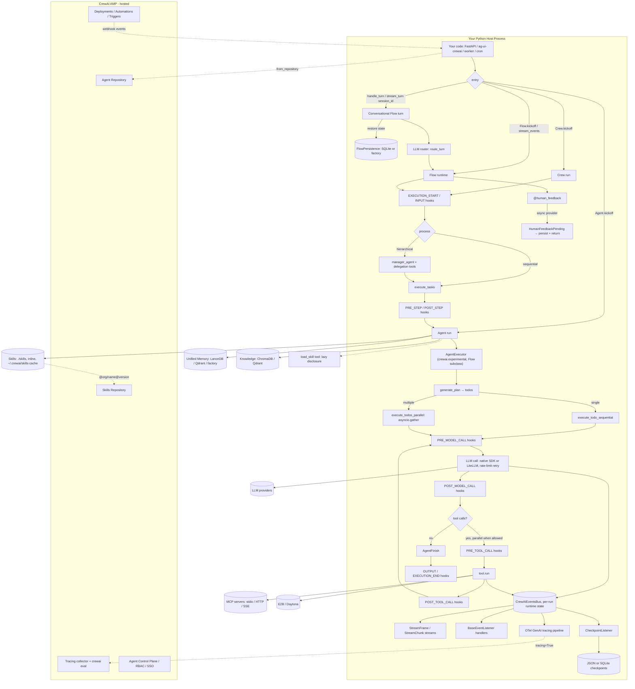

# CrewAI Python — Benchmark Analysis

> **Repo**: https://github.com/crewAIInc/crewAI
> **Commit analysed**: fbcf2de39d3f8252500b74a0751b92c5774c751b
> **Branch**: main
> **Framework path**: frameworks/crewai
> **Analysed on**: 2026-10-01

Package version at this commit: `crewai` **1.15.23** (`lib/crewai/src/crewai/__init__.py:51`), nine commits after the 1.15.23 tag (2026-09-28). The previous analysis (2026-05-19) studied `a95d2676` (`1.14.5a6`). Short paths such as `crew.py:995` are relative to `lib/crewai/src/crewai/`; other paths are relative to the submodule root.

## TL;DR

- ⭐ **What is this stack architecturally?** CrewAI is a **heavy Python framework** (Pydantic-first, ~127 kLOC of Python in `lib/crewai/src/crewai/` alone) whose mental model is **multi-agent first**: `Crew` (sequential / hierarchical task orchestration) + `Flow` (event-driven workflow DAG, now also authorable as declarative JSON/YAML `FlowDefinition`s). The new piece since May is the **conversational `Flow`** (promoted to stable in 1.15.18): a turn-based, session-aware chat primitive (`handle_turn(message, session_id=...)` / `stream_turn(...)`) with a persisted `ConversationState`. That is the closest CrewAI has come to a long-lived chat-agent primitive, but it is still a library object, not a server.
- **Ecosystem**: **Python** only (`>=3.10, <3.14`, `lib/crewai/pyproject.toml:9`).
- **Open-source / license / support**: MIT, owned by **crewAI, Inc.** (founder João Moura). Commercial backing via **AMP** (CrewAI's hosted Agent Management Platform, `https://app.crewai.com/`), whose docs moved out of this repo to `docs-platform.crewai.com` in 1.15.10. ~59.2 k stars / ~8.6 k forks captured **2026-10-01**.
- **Maturity / age**: public since October 2023 (repo created 2023-10-27). Current release **1.15.23** (2026-09-28). The project left the nightly-alpha run of May and now ships a stable patch release roughly weekly (1.15.0 on 2026-06-25 through 1.15.23). Breaking-change pace has slowed, but whole subsystems are still being added (declarative flows, interception hooks, skills registry, tracing pipeline).
- **Where the agent loop actually executes**: in your Python process. `Crew.kickoff()` → `Task.execute_sync()` → `Agent` → **`AgentExecutor`**, a `Flow` subclass with plan-and-execute / todo-list routing. It is still the default (`agent/core.py:392-400`) and **still lives in `crewai.experimental`** (`experimental/agent_executor.py:175`, `executor_type: Literal["experimental"]` at :192). No subprocess, no vendor cloud on the OSS path.
- **Strongest architectural choice for our use case**: the **skills subsystem** is now genuinely progressive. Path-discovered skills load at metadata level and the agent gets a `load_skill` tool to pull a skill body on demand (`skills/tool.py:22-69`, `agent/core.py:626-652`). Skills can come from local folders, inline `SKILL.md` strings, or **version-pinned AMP registry refs** (`@org/name@1.2.0`, `skills/registry.py:46-169`). Mid-run checkpointing, unified Memory and the `@human_feedback` pause/resume pattern are still first-party.
- **Weakest / biggest gap**: **multi-tenancy is still BYO.** No `tenant_id` / `user_id` anywhere (a grep for `tenant` in `lib/crewai/src` still only finds ChromaDB's `DEFAULT_TENANT`, `rag/chromadb/constants.py:9`), no hidden / harness-injected tool arguments, no per-tenant budget. The plumbing did improve: hooks can now be scoped to the current execution through a `contextvars` registry (`hooks/dispatch.py:101-209`), the event bus runtime state is per-run (`events/event_bus.py:84-90`), contextvars are copied across the executor's thread pools, and `llm_overlay` routes models per run (`llm_overlay.py:106-128`). You can now build a per-request tenant channel without process-global races, but you still build it.
- **Most surprising finding (good)**: the **interception-hook rework** (1.15.3). One dispatcher (`hooks/dispatch.py`) now drives ten interception points (execution start / input / output / execution end, pre/post model call, pre/post tool call, pre/post step), with `@on(point, agents=[...], tools=[...])` filters and a typed `HookAborted(reason, source)` that propagates through crews and flows. The legacy `before_tool_call` etc. hooks are adapters on the same queue.
- **Most surprising finding (bad)**: the **default executor is still "experimental" four months after it became the default** (May 13 → Oct 1). Separately, this refresh found that the May report was wrong on one point: neither executor runs "only the first tool call per turn". Both run multiple native tool calls in parallel on a `ThreadPoolExecutor` (`experimental/agent_executor.py:1735-1799`, `agents/crew_agent_executor.py:687-806`), and only fall back to one call when a tool in the batch has `result_as_answer` or `max_usage_count`. The stale docstring at `crew_agent_executor.py:693` still says "FIRST tool call".
- One-line verdicts:
  - **Sessions/persistence**: ✅ Crew/Flow/Agent checkpoints (JSON or SQLite) with fork; conversational Flows add a real chat session (`ConversationState`, `flow/conversational.py:150-165`) persisted through a pluggable `FlowPersistence` factory (`flow/persistence/factory.py:31`).
  - **Skills**: ✅ `SKILL.md` + YAML frontmatter, now with lazy `load_skill` disclosure, inline skills and registry refs. `allowed-tools` is still parsed but not enforced.
  - **Resource manager**: ⚠️ AMP **Skills Repository** (stable since 1.15.4): org-scoped, versioned via `metadata.version`, `crewai skill publish/install`, local cache at `~/.crewai/skills/`. Vendor-locked; no per-tenant scoping, no draft/active lifecycle.
  - **Sub-agents**: ⚠️ Unchanged: `Crew` hierarchical delegation, `Flow` orchestration, A2A. No first-class parallel agents-as-tools.
  - **Multi-tenancy**: ❌ Still BYO at every layer, though contextvar-scoped hooks and `llm_overlay` make a BYO tenant channel workable.
  - **Hooks**: ✅/⚠️ Much broader: ten interception points, filters, `HookAborted`. Still no hook that can emit extra tool calls, and the scoped (per-execution) registry is not exported from `crewai.hooks`.
  - **API**: ❌ OSS still ships **no HTTP server**. The documented path is the third-party `ag-ui-crewai` FastAPI endpoint + CopilotKit (`docs/edge/en/guides/frontend/overview.mdx:35-103`), or AMP.
  - **Observability**: ⚠️ Event bus (163 event classes), new first-party OpenTelemetry GenAI-semconv span pipeline (`telemetry/tracing/`) that ships to AMP when tracing is enabled. Still tokens only, no USD cost in OSS.
- **Production-readiness verdict for multi-tenant server-side deployment**: **Still not production-ready for our use case as a self-hosted library, but the gap narrowed.** Conversational Flows + the `StreamFrame` protocol + the AG-UI bridge give a credible chat-session path, and contextvar-scoped hooks remove the worst multi-tenant race. What remains BYO: the HTTP server and auth, tenant identity and forced tool args, per-tenant budgets, cancellation, and shared persistence backends beyond SQLite. Best fit is still batch crews and flows; an always-on multi-tenant chat agent is now feasible but needs a meaningful wrapper.

---

## 0. General

### 0.1 What is this stack?

CrewAI is a **batteries-included Python framework for multi-agent orchestration** (library + CLI, with an optional vendor-managed SaaS for hosting). It ships:
- two top-level primitives: `Crew` (a group of `Agent`s with `Task`s, sequential or hierarchical) and `Flow` (event-driven DAG with `@start`/`@listen`/`@router` decorators). Since 1.14.7 `flow.py` is split into a DSL (`flow/dsl/`), a declarative `FlowDefinition` (`flow/flow_definition.py:714`) and a runtime (`flow/runtime/__init__.py:444`); flows and crews can now also be declared in JSON/YAML (`project/json_loader.py`, `project/crew_definition.py`, `crewai run --definition`);
- **conversational Flows** (`flow/conversational.py`, `flow/conversational_mixin.py`): turn-based chat sessions on top of `Flow`, stable since 1.15.18;
- ~82 built-in tool packages (`lib/crewai-tools/src/crewai_tools/tools/`);
- a unified memory subsystem (LanceDB + LLM-driven recall);
- a skill loader (`SKILL.md` + YAML frontmatter) and an AMP-backed skills registry;
- a CLI (`crewai-cli`) for scaffolding, running, evaluating, replaying, deploying and publishing skills;
- an event bus (163 event classes across 20 event-type modules), an interception-hook dispatcher, and a first-party OpenTelemetry tracing pipeline.

**Crucially**: the OSS framework is still **library-only**. There is no HTTP server. AMP adds the deployment platform, triggers, RBAC, the skills and agent repositories, tracing UI and evaluation. The frontend story documented in-repo goes through the separately maintained `ag-ui-crewai` package and CopilotKit (see Q8 and Q16).

**For our use case (single long-running multi-tenant agent piloted by skills)**, the mismatch is smaller than in May. A conversational `Flow` gives you a session id, a persisted message history and a router that dispatches each turn to agents or crews. The single-agent path is `Agent.kickoff(messages)` running the `AgentExecutor`, which is still under `crewai.experimental.*`; `LiteAgent` remains deprecated for v2.0 (`lite_agent.py:189-190`).

### 0.2 Ecosystem

**Python** (only). Python `>= 3.10, < 3.14` (`lib/crewai/pyproject.toml:9`). No TypeScript / Go / Rust SDKs. The workspace ships six packages under `lib/`: `crewai`, `crewai-core`, `crewai-files`, `crewai-tools`, `cli` (`crewai-cli`, extracted into its own package in 1.14.5) and `devtools`.

### 0.3 Project status & governance

- **License**: MIT (`LICENSE`).
- **Owner / maintainer**: **crewAI, Inc.** Founder & CEO: João Moura. Most 1.15.x release notes list the same core maintainers (@joaomdmoura, @lorenzejay, @lucasgomide, @vinibrsl, @Vidit-Ostwal, @theCyberTech) plus outside contributors.
- **Funding**: Series A round (Oct 2024) led by Insight Partners + Blitzscaling Ventures (unchanged; not re-verified).
- **Commercial backing**: yes. Paid SaaS (**AMP**, https://app.crewai.com/) wraps the OSS framework. In 1.15.10 the AMP documentation was removed from this repo; `/en/enterprise/*` now redirects to `https://docs-platform.crewai.com/platform/en/*` (`docs/docs.json:59122-59123`). Newer AMP features visible from OSS: Agent Control Plane (Beta, with a documented "Cost Limit" policy type per `docs/edge/en/changelog.mdx:713`), Skills Repository, `crewai eval`.
- **Support model**: community (Discord, Discourse, GitHub Issues) for OSS; SLA-backed support via AMP.
- **Telemetry posture**: anonymous usage telemetry is on by default and has grown (project ids, coding-agent detection, deployment counts, hook dispatch counts per 1.15.11-1.15.21 notes). Disable with `CREWAI_DISABLE_TELEMETRY=true`. Tracing (prompts/responses to AMP) is separate and opt-in (Q12.5).

### 0.4 Project maturity / age

- **Earliest commit / first public release**: repo created 2023-10-27 (GitHub API); v0.1.0 on PyPI 2023-12-13.
- **Current version**: `crewai==1.15.23` (released **2026-09-28**). The commit analysed is nine commits past that tag.
- **Release cadence since May**: 1.14.5 (2026-05-19), 1.14.6 (05-28), 1.14.7 (06-11), 1.15.0 (06-25), then 23 patch releases to 1.15.23. Alphas/RCs still appear before some releases but are no longer the norm.
- **Stability signals**: the default `AgentExecutor` is still under `crewai.experimental` (`experimental/agent_executor.py:175`, `executor_type: Literal["experimental"]` at :192); `experimental/__init__.py:1` notes that Conversational Flow "graduated to `crewai.flow`". The Skills Repository moved into experimental in 1.14.6 and back out in 1.15.4. `crewai eval` lives in `lib/cli/src/crewai_cli/experimental/eval_crew.py`. `function_calling_llm` is deprecated (`crew.py:287-295`).

### 0.5 Adoption & community signal

GitHub numbers captured **2026-10-01** (GitHub API):
- **Stars**: ~59.2 k (59,247).
- **Forks**: ~8.6 k (8,616).
- **Watchers**: 398.
- **Contributors**: ~340 (including anonymous, via the contributors API).
- **Open issues**: 197. **Open PRs**: 314.
- **Recent activity**: last push 2026-10-01; 516 commits between the May analysis and this one.
- **Release cadence**: roughly weekly stable patch releases (15 releases between 2026-07-29 and 2026-09-28).
- **Maintainer responsiveness**: high by commit volume; I did not re-sample issue response times.
- **Discord**: `https://discord.com/invite/X4JWnZnxPb`. **Discourse**: `https://community.crewai.com/`.

### 0.6 Ecosystem fit

- **Primary language**: Python only.
- **Package names**: `crewai` (framework), `crewai-core` (shared runtime pieces: `PlusAPI`, lock store, settings), `crewai-cli` (CLI), `crewai-tools` (built-in tools), `crewai-files` (file utilities). All on PyPI and versioned in lockstep.
- **Registry**: PyPI — https://pypi.org/project/crewai/
- **Download signal**: not re-verified this round (May figure: >5 M monthly downloads).
- **Official templates**: `crewai create <resource>` (unified in 1.15.12) scaffolds crews, flows, JSON-first crews, declarative flows and skills (`lib/cli/src/crewai_cli/cli.py:199`). Templates now ship an `AGENTS.md` for coding agents (`lib/cli/src/crewai_cli/templates/AGENTS.md`).
- **Examples**: `https://github.com/crewAIInc/crewAI-examples` and the in-tree `docs/edge/en/guides/` pages.
- **Used as**: library (OSS) + hosted platform (AMP, Studio). The CLI increasingly assumes AMP (deploy, traces, eval, skills, org switching).

### 0.7 Documentation depth & cross-team contributor accessibility

- **Layout change**: docs are now versioned. `docs/edge/` is the editable tree and `docs/v1.x.y/` are frozen release snapshots (`AGENTS.md` "Changing Docs"); this is why ~30 k files changed between the two commits. Public URLs `https://docs.crewai.com/en/...` redirect (307) to the current default version, e.g. `/v1.15.23/en/...`.
- **Languages**: English, Arabic, Korean, Brazilian Portuguese (`docs/edge/{en,ar,ko,pt-BR}`); `DOCS_TRANSLATIONS.md` defines the sync workflow.
- **Pages**: 22 concept pages (`docs/edge/en/concepts/`), 35 `learn/` pages (including new execution-hook, streaming-contract and step-hook guides), 12 frontend guides, 17 observability integrations + overview. AMP docs are no longer in this repo.
- **Cross-team contributor accessibility**: Crew Studio (AMP) is a no-code builder. JSON-first crew projects (`crew.jsonc`, `agent.jsonc` templates under `lib/cli/src/crewai_cli/templates/json_crew/`) and declarative flow definitions make prompts and roles editable without Python. Authoring a `SKILL.md` is markdown + a small YAML header — doable by Product/Data.

### 0.8 Documentation entry points ⭐

- **Official docs landing**: https://docs.crewai.com/
- **Introduction**: https://docs.crewai.com/en/introduction
- **Quickstart**: https://docs.crewai.com/en/quickstart
- **Installation**: https://docs.crewai.com/en/installation
- **API reference**: https://docs.crewai.com/en/api-reference (concepts-style, not autogen)
- **Concepts (agents, crews, flows, tasks, memory, knowledge, skills, …)**: https://docs.crewai.com/en/concepts/agents
- **Skills (in-process loader + registry)**: https://docs.crewai.com/en/concepts/skills (the separate https://docs.crewai.com/en/skills page is about coding-agent skills)
- **Flows**: https://docs.crewai.com/en/concepts/flows
- **Conversational Flows**: https://docs.crewai.com/en/guides/flows/conversational-flows
- **Checkpointing**: https://docs.crewai.com/en/concepts/checkpointing
- **Execution hooks**: https://docs.crewai.com/en/learn/execution-hooks
- **Streaming runtime contract**: https://docs.crewai.com/en/learn/streaming-runtime-contract
- **Event listeners**: https://docs.crewai.com/en/concepts/event-listener
- **Tools catalog**: https://docs.crewai.com/en/tools/overview
- **MCP integration**: https://docs.crewai.com/en/mcp/overview
- **Production architecture**: https://docs.crewai.com/en/concepts/production-architecture
- **Frontend (AG-UI / CopilotKit)**: https://docs.crewai.com/en/guides/frontend/overview
- **Observability overview**: https://docs.crewai.com/en/observability/overview
- **AMP (moved to the platform docs site)**: https://docs-platform.crewai.com/platform/en/introduction
  - Deploy to AMP: https://docs-platform.crewai.com/platform/en/guides/deploy-to-amp
  - Agent Control Plane policies: https://docs-platform.crewai.com/platform/en/features/agent-control-plane/policies
  - Tools & integrations: https://docs-platform.crewai.com/platform/en/features/tools-and-integrations
  - Old `docs.crewai.com/en/enterprise/<page>` links (agent-repositories, automations, webhook-streaming, rbac, hallucination-guardrail, …) redirect to `docs-platform.crewai.com/platform/en/<page>`; I did not check each target page.
- **GitHub**: https://github.com/crewAIInc/crewAI
- **GitHub Releases**: https://github.com/crewAIInc/crewAI/releases
- **Issues**: https://github.com/crewAIInc/crewAI/issues
- **Changelog**: https://docs.crewai.com/en/changelog (source: `docs/edge/en/changelog.mdx`)
- **Community**: https://community.crewai.com/ (Discourse)
- **Discord**: https://discord.com/invite/X4JWnZnxPb
- **Sign up for AMP**: https://app.crewai.com/

Issues to surface for our use case (search GitHub Issues for these topics — they keep recurring):
- "multi-tenant" / "tenant isolation"
- "no HTTP server" / "deploy as service"
- "long-running session" / "conversational flow"
- "force tool args" / "context injection"

---

## 1. High Level Architecture

### Deployment diagram ⭐

```
                        ┌────────────────────────────────────────────────┐
                        │                Your Host Process                │
                        │  (Python 3.10–3.13, ~150 MB baseline w/ deps)  │
                        │                                                 │
                        │  ┌──────────────────────────────────────────┐  │
                        │  │ Your code (FastAPI, worker, cron, ...)   │  │
                        │  │  optional: ag-ui-crewai FastAPI endpoint │  │
                        │  │  crew.kickoff(...) / flow.handle_turn()  │  │
                        │  └────────────────┬─────────────────────────┘  │
                        │                   │                              │
                        │  ┌────────────────▼─────────────────────────┐  │
                        │  │ crewai library (in-process)              │  │
                        │  │  • Crew / Flow / conversational Flow     │  │
                        │  │  • Agent → AgentExecutor (experimental)  │  │
                        │  │  • Interception hooks (@on, HookAborted) │  │
                        │  │  • UnifiedMemory (LanceDB local)         │  │
                        │  │  • CrewAIEventsBus + StreamFrame streams │  │
                        │  │  • CheckpointConfig (JSON / SQLite)      │  │
                        │  │  • FlowPersistence (SQLite / pluggable)  │  │
                        │  └────┬─────────────┬───────────┬───────────┘  │
                        └───────┼─────────────┼───────────┼──────────────┘
                                │             │           │
                  ┌─────────────▼─┐     ┌─────▼─────┐  ┌──▼─────────────┐
                  │ LLM provider  │     │ MCP server│  │ Local files     │
                  │ (native: OAI, │     │ (stdio /  │  │  • ./skills/    │
                  │  Anthropic,   │     │  HTTP /   │  │  • .checkpoints │
                  │  Gemini, ...  │     │  SSE)     │  │  • LanceDB dir  │
                  │  or LiteLLM)  │     └───────────┘  │  • SQLite dbs   │
                  └───────────────┘                    │  • ~/.crewai/   │
                                                       │    skills cache │
                    optional REDIS_URL → Redis locks   └─────────────────┘

  Optional AMP (separate SaaS, docs at docs-platform.crewai.com):
                  ┌─────────────────────────────────────────────────┐
                  │ app.crewai.com (vendor-managed)                 │
                  │  • Deploy / Automations / Triggers              │
                  │  • Agent Repository (from_repository="...")     │
                  │  • Skills Repository (@org/name@version)        │
                  │  • Tracing collector ("Wharf") + crewai eval    │
                  │  • Agent Control Plane (policies, cost limit)   │
                  │  • Studio, RBAC, SSO, PII redaction             │
                  └─────────────────────────────────────────────────┘
```

### 1.1 Where does the agent loop actually execute?

**In your Python process.** Concretely:

- `Crew.kickoff(inputs)` (`crew.py:995`) opens a per-run event-bus scope and an execution UUID (`crew.py:1050-1052`), dispatches the `EXECUTION_START`/`INPUT` interception points (`crews/utils.py:298-312`), then runs `Process.sequential` or `Process.hierarchical`.
- For sequential: `_execute_tasks() → task.execute_sync(agent, ...)`; `Task` dispatches `PRE_STEP`/`POST_STEP` hooks (`task.py:690, 760`).
- The task calls the agent's executor, which is an **`AgentExecutor`** by default (`agent/core.py:392-400`), or the deprecated `CrewAgentExecutor` when opted into.
- **Default path**: `AgentExecutor` (`experimental/agent_executor.py:175`) is a `Flow[AgentExecutorState]` subclass: `generate_plan` (:385) → `execute_todo_sequential` (:1143) or `execute_todos_parallel` (:1260, `asyncio.gather` at :1291) → per-todo step execution → `execute_tool_action` (:1659) → `execute_native_tool` (:1735) → loop until todos are done.
- **Legacy path**: `CrewAgentExecutor` (`agents/crew_agent_executor.py`), which emits a `DeprecationWarning` on construction (:143-150); passing it explicitly as `executor_class` also warns (`agent/core.py:170-177`).
- **Conversational path**: `Flow.handle_turn(message, session_id=...)` (`flow/conversational_mixin.py:429`) restores state, appends the user message, runs `kickoff()` once, and persists the reply.
- LLM HTTP calls go directly from the same process to the provider (native SDKs for OpenAI / Anthropic / Azure / Bedrock / Gemini / Snowflake / OpenAI-compatible endpoints, LiteLLM otherwise).

There is **no subprocess, no separate runtime, no vendor binary**. The library *is* the loop.

### 1.2 Runtime dependencies

- **Language runtime**: Python `>= 3.10, < 3.14` (`lib/crewai/pyproject.toml:9`). Pure Python — no bundled binaries, **no Node**, **no Go**, no subprocessed vendor CLI.
- **Required infrastructure services**: none mandatory. LanceDB writes to local disk by default; checkpoints to `./.checkpoints/`; flow persistence defaults to a local SQLite file. Redis is used for locks only when `REDIS_URL` is set and `redis` is installed (`lib/crewai-core/src/crewai_core/lock_store.py:57-76`).
- **Required vendor services**: none for the OSS path. An LLM provider endpoint is needed at run time. Anonymous telemetry is on by default and disable-able (`CREWAI_DISABLE_TELEMETRY=true`). Tracing to AMP is opt-in (`tracing=True` or `CREWAI_TRACING_ENABLED=true`).
- **Optional sandbox / tool runtimes**: E2B or Daytona for code-exec sandbox tools; MCP servers as subprocesses (stdio) or HTTP/SSE endpoints.
- **Optional third-party bridge**: `ag-ui-crewai` + FastAPI/uvicorn if you follow the frontend guides (not a dependency of any `lib/` package).
- **AMP path**: requires the vendor cloud for hosted deployments, Agent/Skills Repositories, tracing, evaluation, RBAC, Studio.

### 1.3 Recommended deployment topology

OSS docs still assume **one Python process running a Crew/Flow per request** and describe crew design rather than horizontal scaling (`docs/edge/en/concepts/production-architecture.mdx`). The frontend guides add a concrete self-hosted shape: "a Python process that serves your Crew or Flow over AG-UI (FastAPI + `ag-ui-crewai`)" behind a CopilotKit runtime (`docs/edge/en/guides/frontend/overview.mdx:33-41`). AMP recommends GitHub-or-ZIP deploy to its managed runtime (`crewai deploy`, docs at `docs-platform.crewai.com/platform/en/guides/deploy-to-amp`). No vendor guidance on container-per-tenant vs. one-process-many-tenants for the OSS path, because OSS has no tenant primitive.

### 1.4 Cold-start cost & instance footprint

- **Startup latency**: a fresh `import crewai` + `kickoff()` is dominated by provider SDK imports; 1.14.7 lazy-loads docling to speed up import. Order of a second on a warm disk (estimate, not benchmarked). No 20–30 s startup penalty like Claude Agent SDK.
- **RAM baseline**: ~150 MB Python interpreter + framework (estimate), growing with memory store size.
- **Disk baseline**: ~50–100 MB of installed wheels (estimate); checkpoint files are small (~kB); LanceDB grows linearly with memory.

### 1.5 Vendor lock-in

| Layer | OSS lock-in | AMP lock-in |
|---|---|---|
| **LLM provider** | None — native SDKs for the major providers plus LiteLLM for the long tail. | None. |
| **Hosting** | None — anywhere Python runs. | Heavy — AMP-only deploys, automations and triggers. |
| **Eval/Observability** | Low — event bus + OTel; 17 documented integrations. The built-in tracing pipeline and `crewai eval` target AMP. | Heavy — tracing UI, `crewai eval`, hallucination guardrail, PII redaction, RBAC are AMP-only. |
| **Skills** | None for local `SKILL.md` files. | `@org/name` registry refs and `crewai skill publish/install` require AMP. |
| **Agents** | None for code / YAML / JSON definitions. | `Agent(from_repository=...)` requires AMP. |
| **Memory backend** | None — LanceDB default, Qdrant edge, pluggable factory. | None. |
| **Persistence** | None — JSON / SQLite providers, pluggable flow persistence factory. | None (same OSS code). |

### 1.6 Framework weight / footprint

**Heavy, and heavier than in May.** It bundles agent classes, two executors, crews, flows (DSL + declarative definitions + conversational mode), memory, knowledge, RAG, MCP client, A2A client/server, event bus, interception hooks, telemetry and a tracing pipeline, checkpoint engine, CLI with Textual TUIs, skill loader + registry client, tool catalog, guardrails, planning, training.

- 6 packages under `lib/`: `crewai`, `crewai-core`, `crewai-files`, `crewai-tools`, `cli`, `devtools`.
- 163 event classes across 20 modules in `events/types/`.
- `wc -l` over `lib/crewai/src/crewai/**/*.py` gives ~127 kLOC at this commit (the May report's ~70 kLOC was an estimate, so treat the growth figure loosely). Single files are large: `flow/runtime/__init__.py` 3,988 lines, `experimental/agent_executor.py` 3,360, `crew.py` 2,559, `agent/core.py` 2,264.

### 1.7 Release-history signal

`docs/edge/en/changelog.mdx` is the canonical in-repo changelog (mirrored to GitHub Releases). Entries since the May analysis that matter for our use case:

| Version | Date | Notable change | Changelog line |
|---|---|---|---|
| **1.14.5** | 2026-05-19 | `CrewAgentExecutor` deprecated, `AgentExecutor` default; CLI extracted into `crewai-cli`; 1.14.5a7 deprecates `function_calling_llm`. | `changelog.mdx:1338`, `:1377` |
| **1.14.6** | 2026-05-28 | `AgentExecutor` can restore from checkpoint; stdio MCP env-leak fix; Skills Repository moved behind `CREWAI_EXPERIMENTAL`. | `:1243` |
| **1.14.7** | 2026-06-11 | Chat API for conversational flows; pluggable default backends for memory / knowledge / RAG / flow persistence; overridable lock backend; runtime state scoped per run; `flow.py` split into DSL / definition / runtime; native Snowflake Cortex provider. | `:1039` |
| **1.15.0** | 2026-06-25 | Declarative `FlowDefinition` + JSON-first crews; conversational flows in the CLI TUI; skill-archive symlink traversal fix. | `:832` |
| **1.15.2** | 2026-07-07 | Inline skill definitions; stream frame protocol for flows. | `:680` |
| **1.15.3** | 2026-07-16 | Generic interception-hook dispatcher, execution-boundary and step interception points; tool-result caching made opt-in; per-call usage metrics on kickoff results. | `:588` |
| **1.15.4 – 1.15.9** | 2026-07-17 → 07-29 | Skills Repository promoted out of experimental; authenticated registry downloads; progressive disclosure for skills; tool failures surfaced instead of reported as success. | `:569`, `:431` |
| **1.15.16 – 1.15.18** | 2026-08-13 → 08-27 | Execution context with UUIDs; CopilotKit / AG-UI frontend guides; declarative conversational flows; **conversational flows promoted to stable**. | `:255`, `:184` |
| **1.15.19 – 1.15.23** | 2026-09-04 → 09-28 | Model-call hooks run on every path and propagate a deny; `llm_overlay` context variable for per-run model routing; human-feedback and pause events in tracing; `crewai eval` of the last traced run via AMP; retry of throttled provider calls. | `:148`, `:45`, `:7` |

Signal: the churn has moved from "rename core runtime pieces" to "add platform surface" (declarative definitions, tracing, eval, registry). Most 1.15.x releases are additive; still pin an exact version and read release notes before bumping.

---

## 2. Agent Loop

### 2.1 Run loop entrypoint(s)

There are **multiple** entrypoints, depending on which primitive you use:

```python
# crew.py:995 — multi-agent
def kickoff(
    self,
    inputs: dict[str, Any] | None = None,
    input_files: dict[str, FileInput] | None = None,
    from_checkpoint: CheckpointConfig | None = None,
) -> CrewOutput | CrewStreamingOutput:

# crew.py:1135
async def kickoff_async(...) -> CrewOutput | CrewStreamingOutput

# crew.py:1099 / 1189
def kickoff_for_each(self, inputs: list[dict[str, Any]], ...) -> list[CrewOutput | CrewStreamingOutput]
async def kickoff_for_each_async(...)

# agent/core.py:1775 — single-agent (replaces deprecated LiteAgent); kickoff_async at :2164
def kickoff(
    self,
    messages: str | list[LLMMessage],
    response_format: type[Any] | None = None,
    input_files: dict[str, FileInput] | None = None,
    from_checkpoint: CheckpointConfig | None = None,
) -> LiteAgentOutput | Coroutine[Any, Any, LiteAgentOutput]:

# flow/runtime/__init__.py:2069 — DAG workflow (kickoff_async at :2134)
def kickoff(
    self,
    inputs: dict[str, Any] | None = None,
    input_files: ... = None,
    from_checkpoint: CheckpointConfig | None = None,
    restore_from_state_id: str | None = None,
) -> Any | StreamSession[Any]

# flow/conversational_mixin.py:429 / :510 — conversational Flow, one turn
def handle_turn(self, message: str, *, session_id: str | None = None,
                intents: Sequence[str] | None = None, intent_llm=None, **kickoff_kwargs) -> Any
def stream_turn(self, message: str, *, session_id: str | None = None, ...) -> Any  # StreamFrame stream
```

Return types are concrete Pydantic models: `CrewOutput`, `LiteAgentOutput`, or `Any` (Flow). `CrewStreamingOutput` is returned when `Crew.stream=True`; a Flow with `stream=True` now returns a `StreamSession` of `StreamFrame`s (`types/streaming.py:115`) instead of the older `FlowStreamingOutput`. `flow/flow.py:33` is now a thin public `Flow(_ConversationalMixin, RuntimeFlow[T])` over the runtime class at `flow/runtime/__init__.py:444`.

### 2.2 Per-iteration behavior (Crew, default `AgentExecutor`)

`Crew.kickoff` walks tasks and each `Task` runs the agent's executor, which by default is `crewai.experimental.AgentExecutor`. That executor **is itself a `Flow[AgentExecutorState]`**, so per-iteration behavior is a flow-routed state machine, not a single while-loop:

```python
# experimental/agent_executor.py:175 — entry
class AgentExecutor(Flow[AgentExecutorState], BaseAgentExecutor):
    executor_type: Literal["experimental"] = "experimental"     # :192
    ...
    @start()
    def generate_plan(self): ...                                  # :385-386
    @router("single_todo_ready")
    def execute_todo_sequential(self): ...                        # :1143-1144
    @router("multiple_todos_ready")
    async def execute_todos_parallel(self): ...                   # :1260-1261
        # gathered = await asyncio.gather(*[_run_step(todo) ...], return_exceptions=True)  :1291
    @router("execute_tool")
    def execute_tool_action(self): ...                            # :1659-1660
    def execute_native_tool(self): ...                            # :1735
```

Behavior per iteration:
1. `generate_plan` — if planning is enabled, a planner LLM emits plan steps that become a todo list. If planning is off, a single todo is synthesized.
2. Router fans out to `execute_todo_sequential` or `execute_todos_parallel`; the parallel path runs ready todos via `asyncio.gather` (:1291).
3. Within each todo, a step executor does the LLM ↔ tool dance (native function calling or ReAct), bounded by `_get_max_step_iterations` (:579, default 15 per todo).
4. `execute_native_tool` (:1735) appends all tool calls from one LLM response into one assistant message, then runs them **in parallel** on a `ThreadPoolExecutor` (`max_workers = min(8, ...)`, contextvars copied, :1795-1799) when `_should_parallelize_native_tool_calls` (:1921) allows it. It falls back to serial when any tool in the batch has `result_as_answer` or `max_usage_count`. If a parallel call raises `ToolExecutionFailedError`, not-yet-started siblings are cancelled.
5. Loop until no todos remain → `AgentFinish`.

The **legacy `CrewAgentExecutor`** is still in tree and selected with `Agent(executor_class=CrewAgentExecutor)`. Its loop is the simpler shape:

```python
# crew_agent_executor.py (legacy) — _invoke_loop picks native tools vs. ReAct
def _invoke_loop(self) -> AgentFinish:
    use_native_tools = (
        hasattr(self.llm, "supports_function_calling")
        and callable(getattr(self.llm, "supports_function_calling", None))
        and self.llm.supports_function_calling()
        and self.original_tools
    )
    if use_native_tools:
        return self._invoke_loop_native_tools()
    return self._invoke_loop_react()
```

**Correction to the May report:** the legacy executor also runs multiple native tool calls in parallel. `_handle_native_tool_calls` (`crew_agent_executor.py:687`) still has a docstring saying it "Executes only the FIRST tool call" (:693), but when `len(parsed_calls) > 1` (:716) it uses a `ThreadPoolExecutor` with up to 8 workers (:777-778) and only falls back to `parsed_calls[0]` (:806) for `result_as_answer` / `max_usage_count` batches. The same logic existed at the OLD commit.

### 2.3 ReAct loop

Yes — the ReAct text-parsing path remains the fallback for LLMs without native function calling (`_invoke_loop_react` in the legacy executor; a ReAct branch inside the per-todo step executor of `AgentExecutor`). Prompts contain `Action:` / `Action Input:` / `Observation:` markers that are parsed into `AgentAction | AgentFinish | OutputParserError`.

### 2.4 Tool dispatch + result handling

For native tools, the executor parses each `tool_call` (OpenAI / Anthropic / Bedrock / Gemini shapes), then for each call:

```python
# per call (both executors)
args = parse_tool_call_args(tool_call.function.arguments)
# 1. run_before_tool_call_hooks(ctx)  — may mutate ctx.tool_input or abort (hooks/tool_hooks.py:173)
# 2. tool.run(**args)                  — validates against args_schema, enforces max_usage_count
# 3. run_after_tool_call_hooks(ctx)   — may replace ctx.tool_result (hooks/tool_hooks.py:193)
# append {"role": "tool", "tool_call_id": tool_call.id, "content": result}
```

`result_as_answer=True` on a tool ends the loop with that result as `AgentFinish`. New since May: a tool can return a structured `ToolFailure` (`tools/tool_failure.py`) so "ran but failed" results (Slack `ok:false`, MCP `isError`) are recorded as failures rather than successes, and `max_usage_count` exhaustion now returns a `ToolFailure` (`tools/base_tool.py:302-324`).

### 2.5 Explicit turn concept

Inside an executor, a "turn" is **one LLM call + the tool calls it requested + the appended tool results**. `max_iter` (default 25) bounds LLM calls per agent task; in `AgentExecutor` the budget is enforced per todo (`_get_max_step_iterations`, `experimental/agent_executor.py:579`).

At the conversational-Flow level there is now an explicit user-facing turn: one `handle_turn()` call = one user message + one `kickoff()` + one assistant reply, bracketed by `ConversationTurnStartedEvent` / `ConversationTurnCompletedEvent` / `ConversationTurnFailedEvent` (`events/types/flow_events.py:205-219`).

### 2.6 Event emission mechanism (in-process)

CrewAI uses a **singleton event bus** (`CrewAIEventsBus`, `events/event_bus.py:95`, double-checked singleton at :118-143) with synchronous and asynchronous handler queues:

```python
# events/event_bus.py (paraphrased)
class CrewAIEventsBus:
    _instance: ClassVar[CrewAIEventsBus | None] = None
    _sync_handlers: dict[type[BaseEvent], SyncHandlerSet]
    _async_handlers: dict[type[BaseEvent], AsyncHandlerSet]
    _sync_executor: ThreadPoolExecutor          # sync handlers dispatched to threads
    _async_loop_thread: threading.Thread        # daemon thread running asyncio loop
    def emit(self, source: Any, event: BaseEvent) -> None: ...
    def on(self, event_type: type[BaseEvent]) -> Callable[[Handler], Handler]: ...
```

What changed: the bus's runtime state (the event record used for checkpoints) is now **per run** through ContextVars (`_runtime_state_var` :84, `_registered_entity_ids_var` :87, scope depth :90). `_enter_runtime_scope` / `_exit_runtime_scope` (:318, :331) create and clear it around each outermost Crew/Flow kickoff, and `reset_runtime_state()` (:313) releases it explicitly.

For streaming, two mechanisms coexist:
- `Crew(stream=True)` still yields `StreamChunk` objects (`types/streaming.py:300`).
- Flows (and conversational turns, and `LLM.stream_events`) yield **`StreamFrame`** objects through a `StreamSession` (`types/streaming.py:31, 115`). Frames are built from bus events by `stream_frame_from_event` (`utilities/streaming.py:174`), and sinks are scoped per execution with a ContextVar (`events/stream_context.py:12`).

---

## 3. Message & Event Taxonomy

### 3.1 Message layers

Four vocabularies now:

1. **Wire / LLM-provider** messages: dicts shaped per provider (OpenAI / Anthropic / Bedrock / Gemini). Conversion lives in `llms/providers/*/completion.py` and `agent_utils.format_message_for_llm()`.
2. **Internal** `LLMMessage` (`utilities/types.py:16`): a `TypedDict` with `role`, `content` (`str | list[dict] | None`, the list form being multimodal parts), optional `files`, optional `cache_breakpoint`. The executor's `self.messages: list[LLMMessage]` is the in-memory thread.
3. **Conversation** messages (new): `ConversationMessage` / `AgentMessage` / `ConversationEvent` on a conversational Flow's `ConversationState` (`flow/conversational.py:119-165`). `messages` is the user-visible transcript; agent scratch work goes to `agent_threads` or private `events`.
4. **External / observability** stream: `BaseEvent` subclasses on the bus (163 classes in `events/types/`), projected either to `StreamChunk` (crew streaming) or to `StreamFrame` (flow / conversational / LLM streaming).

```
+---------------+      +------------------+      +----------------+
| user input    | -->  | ConversationMsg  | -->  | LLMMessage     | --> provider dict
| (str / turn)  |      | (conversational  |      | (executor      |
|               |      |  Flow state)     |      |  thread)       |
+---------------+      +------------------+      +----------------+
                                 │                        │
                                 └──── emit on bus ───────┘
                                              ▼
                                   +-----------------+
                                   | BaseEvent (163) |
                                   +-----------------+
                                     │          │          │
                                     ▼          ▼          ▼
                               StreamFrame  StreamChunk  listeners / OTel
                               (flows, LLM) (crews)      tracing / checkpoints
```

### 3.2 Concrete message types

| Type | File | Purpose |
|---|---|---|
| `LLMMessage` (TypedDict) | `utilities/types.py:16` | Internal message shape: `role`, `content`, optional `files`, `cache_breakpoint`. |
| `ConversationMessage` / `AgentMessage` / `ConversationEvent` / `ConversationState` | `flow/conversational.py:119-165` | Conversational-Flow transcript, per-agent scratch threads, private/public structured events, session state. |
| `BaseEvent` | `events/base_events.py` | Root of all events. Carries `event_id`, `parent_id`, `emission_sequence`, `timestamp`. |
| `CrewKickoffStarted/Completed/FailedEvent` | `events/types/crew_events.py` | Crew lifecycle. |
| `AgentExecutionStarted/Completed/ErrorEvent` | `events/types/agent_events.py` | Agent lifecycle. |
| `LLMCallStarted/Completed/FailedEvent`, `LLMStreamChunkEvent`, `LLMThinkingChunkEvent` | `events/types/llm_events.py` | Per-LLM-call events; `LLMCallCompletedEvent` (:90) now carries `usage`, `finish_reason`, `response_id`. |
| `ToolUsageStarted/Finished/ErrorEvent` | `events/types/tool_usage_events.py` | Tool dispatch (`from_cache` now carried on the native path). |
| `TaskStarted/Completed/FailedEvent`, `TaskEvaluationEvent` | `events/types/task_events.py` | Task lifecycle. |
| `Skill*Event` (discovery, loaded, activated, used, load failed) + `SkillDownloadStarted/Completed` | `events/types/skill_events.py`, `skills/events.py` | Skill loader and registry. |
| `Memory*Event` | `events/types/memory_events.py` | Memory subsystem. |
| `Knowledge*Event` | `events/types/knowledge_events.py` | RAG events. |
| `MCP*Event` | `events/types/mcp_events.py` | MCP connection and tool execution. |
| `FlowStarted/Finished/Failed/PausedEvent`, `MethodExecution*`, `HumanFeedbackRequested/Received`, `FlowInputRequested/Received`, `Conversation{MessageAdded,TurnStarted,TurnCompleted,TurnFailed,RouteSelected}Event` | `events/types/flow_events.py` (conversation events at :191-233) | Flow lifecycle, HITL, conversational turns. |
| `Checkpoint*Event` | `events/types/checkpoint_events.py` | Persistence. |
| `HookDispatchedEvent` | `events/types/hook_events.py:6` | One per interception-hook dispatch (point, outcome, hook count, abort reason). |
| `A2A*Event` (~30 classes) | `events/types/a2a_events.py` | A2A protocol. |
| `Sig*Event` (SIGTERM, SIGINT, SIGHUP, SIGTSTP, SIGCONT) | `events/types/system_events.py` | OS signal taxonomy. |
| `StreamChunk` (text or tool_call) | `types/streaming.py:300` | Crew streaming chunk. |
| `StreamFrame` | `types/streaming.py:31` | Flow / conversational / LLM streaming frame. |

Full count: **163** `BaseEvent` subclasses across **20** modules in `events/types/` (151 at the May commit).

### 3.3 Messages vs. events

**Separate taxonomies.** `LLMMessage` (and, for conversational Flows, `ConversationMessage`) is the conversational thread; `BaseEvent` subclasses are the lifecycle/observability stream. `BaseEvent`s flow through the bus to listeners; `LLMMessage`s live on `executor.messages`; `ConversationMessage`s live on the Flow state and are persisted.

The bridges are **streaming projections**: `Crew(stream=True)` translates `LLMStreamChunkEvent` into `StreamChunk`; flows translate every bus event into a `StreamFrame` and route it to a channel. Conversation transcript changes appear as `ConversationMessageAddedEvent` → `messages` channel.

### 3.4 Event categories

| Category | Examples | Notes |
|---|---|---|
| Lifecycle (entity-scoped) | `CrewKickoff*`, `AgentExecution*`, `Task*`, `Flow*` | One pair per entity start/end. |
| Conversational turn | `ConversationTurnStarted/Completed/Failed`, `ConversationMessageAdded`, `ConversationRouteSelected` | New; Flow-scoped. |
| LLM call | `LLMCall*`, `LLMStreamChunkEvent`, `LLMThinkingChunkEvent` | Per-provider-call. |
| Tool | `ToolUsageStarted/Finished/Error`, `ToolValidateInputError`, `ToolSelectionError`, `ToolExecutionError` | Errors are first-class. |
| Memory & knowledge | `Memory*`, `Knowledge*` | |
| MCP | `MCPConnection*`, `MCPToolExecution*`, `MCPConfigFetchFailed` | |
| Persistence | `Checkpoint*`, `CheckpointFork*`, `CheckpointRestore*`, `CheckpointPrunedEvent` | |
| Sub-agent / A2A | ~30 `A2A*` events | |
| HITL | `HumanFeedbackRequested/Received`, `FlowInputRequested/Received`, `FlowPausedEvent` | Now also exported to tracing (1.15.22). |
| Skill | `SkillDiscovery*`, `SkillLoaded`, `SkillActivated`, `SkillUsed`, `SkillLoadFailed`, `SkillDownload*` | |
| Hook | `HookDispatchedEvent` | New. |
| Reasoning / planning | `AgentReasoning*`, `PlanRefinement`, `PlanReplanTriggered`, `GoalAchievedEarly` | |
| Guardrail | `LLMGuardrail*` | |
| OS / system | `SIGTERM`, `SIGINT`, `SIGHUP`, `SIGTSTP`, `SIGCONT` | |

### 3.5 Canonical type-definition file(s)

- Messages: `lib/crewai/src/crewai/utilities/types.py:16` (`LLMMessage`); conversational: `lib/crewai/src/crewai/flow/conversational.py:119-165`.
- Streaming: `lib/crewai/src/crewai/types/streaming.py` (`StreamChannel` :21, `StreamFrame` :31, `StreamSession` :115, `AsyncStreamSession` :195, `StreamChunkType` :277, `ToolCallChunk` :284, `StreamChunk` :300).
- Events: `lib/crewai/src/crewai/events/types/*.py` (20 modules, 163 classes).
- Base event: `lib/crewai/src/crewai/events/base_events.py`.

### 3.6 Live agentic event stream taxonomy

**Crew streaming** (`Crew(stream=True)`) still yields `StreamChunk`:

```python
# types/streaming.py:300
class StreamChunk(BaseModel):
    content: str
    chunk_type: StreamChunkType         # "text" | "tool_call"
    task_index: int
    task_name: str
    task_id: str
    agent_role: str
    agent_id: str
    tool_call: ToolCallChunk | None     # populated when chunk_type == TOOL_CALL
```

`ToolCallChunk` carries `tool_id` (LLM-assigned id), `tool_name`, `arguments` (incrementally-built JSON string), `index`.

**Flow / conversational / LLM streaming** yields `StreamFrame`:

```python
# types/streaming.py:31-42
class StreamFrame(BaseModel):
    id: str              # event_id
    seq: int | None      # execution-local order
    type: str            # source event type, e.g. "tool_usage_started"
    channel: StreamChannel   # "llm" | "flow" | "tools" | "messages" | "lifecycle" | "custom"
    namespace: list[str]     # [channel, flow_name, method_name, session_id, call_id, tool_name, agent_role, task_name]
    timestamp: datetime
    parent_id: str | None = None
    previous_id: str | None = None
    data: dict[str, Any]
```

Sample frames (shape per `docs/edge/en/learn/streaming-runtime-contract.mdx`; payload keys follow the source event):

```python
StreamFrame(type="flow_started", channel="flow", seq=1, data={"flow_name": "SupportFlow", ...})
StreamFrame(type="llm_stream_chunk", channel="llm", seq=7, data={"chunk": "Based on", "call_id": "..."})   # frame.content == "Based on"
StreamFrame(type="tool_usage_started", channel="tools", seq=9, data={"tool_name": "topic_search", "tool_args": {...}, ...})
StreamFrame(type="conversation_message_added", channel="messages", seq=15, data={"role": "assistant", "content": "..."})
StreamFrame(type="flow_finished", channel="flow", seq=16, data={...})
```

`StreamSession` exposes channel projections (`stream.llm`, `stream.tools`, `stream.messages`, `stream.flow`, `stream.interleave([...])`). For other typed consumption (memory, checkpoints, …) you still write a `BaseEventListener`.

---

## 4. Agent Runtime (Multi-session Host)

### 4.1 Multi-session host architecture

**No.** CrewAI still ships **no multi-session host runtime**. A `Crew`/`Flow`/`Agent` is instantiated and `kickoff()` runs one execution; a conversational Flow handles one turn per `handle_turn()`. You manage concurrency with your own processes, threads or `asyncio` tasks.

Internal concurrency the framework does use:
- `crewai_event_bus._sync_executor` (`ThreadPoolExecutor`) and a daemon asyncio thread for async handlers.
- `Memory` background save pool.
- `Crew._execute_tasks`: `Future`s for `task.async_execution=True` tasks (`crew.py:1592-1619`, joined in `_process_async_tasks` at :2020-2025).
- Executors: thread pool for parallel native tool calls (Q2.2) and `asyncio.gather` for parallel todos.

### 4.2 Concurrent session isolation

Better than in May, still not a tenant boundary.

- **Per-run state is now isolated.** The event bus singleton keeps its runtime state (event record) in ContextVars scoped per outermost kickoff (`events/event_bus.py:84-90, 318-331`; changelog 1.14.7 "Scope runtime state per run to bound growth and isolate concurrent runs"). Each run also gets an execution UUID in a ContextVar (`execution.py:57, 89`).
- **ContextVars follow work across threads.** Task async execution (`task.py:617`), parallel tool calls (`experimental/agent_executor.py:1799`, `agents/crew_agent_executor.py:769`), MCP tools, memory and guardrails all use `contextvars.copy_context()`. A request-scoped ContextVar set by your HTTP handler now reaches tools and hooks reliably.
- **Hooks are still global by default.** `register_before_tool_call_hook`, `@on(...)` and even `@CrewBase` "crew-scoped" `@on` methods append to the process-wide list (`hooks/dispatch.py:97-121`; `project/crew_base.py:599-616` calls the global `register`). A per-execution registry exists (`scoped_hooks()` / `register_scoped()` in `hooks/dispatch.py:159-184`, resolved after global hooks at :201-209), but no framework entrypoint enters it and it is not exported from `crewai.hooks`. You can wrap your own kickoff in it (see Q6 example).
- **Listeners on the event bus are still process-global.** A listener sees every crew's events; filter by `source` or execution UUID yourself.

### 4.3 Horizontal scaling / multi-instance

**Mostly BYO, with new pluggable seams.** Still no shared session store, leader election or queue. What changed:
- **Pluggable default backends** (1.14.7): `set_flow_persistence_factory()` (`flow/persistence/factory.py:31`), `set_memory_storage_factory()` (`memory/storage/factory.py:33`), `set_knowledge_storage_factory()` (`knowledge/storage/factory.py:36`). One startup call can point every flow / memory / knowledge default at a shared backend you implement.
- **Locks**: `crewai_core.lock_store` uses Redis when `REDIS_URL` is set (`lib/crewai-core/src/crewai_core/lock_store.py:57-76`), otherwise file locks; `set_lock_backend()` (:45) overrides it.
- **Checkpoints**: still only `JsonProvider | SqliteProvider` (`state/checkpoint_config.py:177-178`); for shared storage implement a custom provider.
- **Conversational sessions**: state is keyed by `session_id` and restored from flow persistence on each turn, so with a shared `FlowPersistence` any worker can serve the next turn. I did not find any locking around concurrent turns on the same session id; that is yours to enforce.

AMP hosts the runtime and manages concurrency for you.

### 4.4 Background / async / scheduled tasks

**OSS: BYO** — `Crew.kickoff()` is a blocking call; nothing schedules anything. The CLI's `crewai triggers list|run` commands (`lib/cli/src/crewai_cli/cli.py`) operate on AMP triggers.

**AMP: first-party** — Automations + Triggers (Gmail, Google Calendar/Drive, Outlook/OneDrive/Teams, HubSpot/Salesforce, Slack, Zapier, webhook/API kickoff, cron). Docs moved to `docs-platform.crewai.com/platform/en/...`; I did not re-verify the trigger list against the new site.

### 4.5 Worker pool / queue model

OSS: none.
AMP: implicit — each deployment receives trigger events and runs the crew or flow.

---

## 5. Sessions & Persistence

### 5.1 Session / chat data model

CrewAI now has **two session notions**:

1. **A kickoff** of a Crew/Flow/Agent, identified by `Crew.id: UUID4` (`crew.py:297`, frozen), `Agent.id`, `Task.id`, `Flow` state `id`, plus a per-run execution UUID (`execution.py:57-89`).
2. **A conversational-Flow session** (new, stable since 1.15.18). The Flow's state is a `ConversationState`:

```python
# flow/conversational.py:150-165
class ConversationState(BaseModel):
    id: str = Field(default_factory=lambda: str(uuid4()))
    messages: list[ConversationMessage] = Field(default_factory=list)   # user-visible transcript
    current_user_message: str | None = None
    last_user_message: str | None = None
    last_intent: str | None = None
    ended: bool = False
    events: list[ConversationEvent] = Field(default_factory=list)       # private/public structured events
    agent_threads: dict[str, list[AgentMessage]] = Field(default_factory=dict)  # per-agent scratch
    session_ready: bool = False

# flow/conversational.py:119-130
class ConversationMessage(BaseModel):
    role: Literal["user", "assistant", "system", "tool"]
    content: str | list[dict[str, Any]] | None
    name: str | None = None
    tool_call_id: str | None = None
    tool_calls: list[dict[str, Any]] | None = None
    files: dict[str, Any] | None = None
    metadata: dict[str, Any] = Field(default_factory=dict)
```

Since 1.15.18 a chat flow can declare its own state shape, so you can add fields (for example `tenant_id`) by subclassing. There is still **no built-in `tenant_id`, `user_id`, `created_at` or `parent_session_id`**.

Fields on a `Crew` (abbreviated, `crew.py:164-417`): `name`, `cache`, `tasks`, `agents`, `process`, `memory`, `embedder`, `usage_metrics`, `manager_llm`, `manager_agent`, `function_calling_llm` (deprecated), `config`, `id`, `share_crew`, `step_callback`, `task_callback`, `before_kickoff_callbacks`, `after_kickoff_callbacks`, `stream`, `max_rpm`, `output_log_file`, `planning`, `planning_llm`, `knowledge_sources`, `chat_llm`, `knowledge`, `skills`, `security_config`, `checkpoint`, `token_usage`, `tracing`, `execution_context`, plus `checkpoint_*` restore fields.

### 5.2 What's stored on a session

- **Checkpoints** (Crew/Flow/Agent, when enabled): the `CheckpointListener` (`state/checkpoint_listener.py`) serializes the full runtime state on configured events: the Pydantic models, `RuntimeState.event_record` (event DAG), `executor.messages`, executor iteration counters and resume flags, checkpoint inputs. 1.14.6 dropped unroundtrippable callbacks and serializes `type[BaseModel]` fields as JSON schema.
- **Conversational sessions**: the `ConversationState` above (transcript, events, agent threads, last intent) via flow persistence (`@persist`, `flow/persistence/decorators.py:147`).
- **Pending human feedback**: `FlowPersistence.save_pending_feedback/load_pending_feedback` (`flow/persistence/base.py:70-108`).

Memory and knowledge stores live outside both — on their own backends.

### 5.3 Granularity

- **One conversation per `ConversationState` / session id**; no branching inside a conversation.
- **Branching via checkpoint fork**: `Crew.fork(config, branch=...)` (`crew.py:457`), `Flow.fork(config, branch=...)` (`flow/runtime/__init__.py:701`) and `Agent.fork(...)` clone execution into a new branch label, similar to LangGraph checkpoint forks.
- **`kickoff_for_each(inputs: list[dict])`** runs a fresh copy per input; no shared session.

### 5.4 Built-in persistence stores

Checkpoint providers (`state/provider/`):

```python
# state/checkpoint_config.py:177-178
provider: Annotated[
    JsonProvider | SqliteProvider,
    Field(discriminator="provider_type"),
] = Field(default_factory=JsonProvider)
```

- **`JsonProvider`**: one JSON file per checkpoint under `{location}/{branch}/...` (UTF-8 since 1.15.21).
- **`SqliteProvider`**: all checkpoints in one DB file, WAL mode, `(id, created_at, parent_id, branch, data)`.

Flow persistence (separate from checkpoints, used by `@persist`, pause/resume and conversational sessions):
- **`SQLiteFlowPersistence`** (`flow/persistence/sqlite.py:39`) with `flow_states` and `pending_feedback` tables; the default when no `persistence=` is passed.
- **`set_flow_persistence_factory(factory)`** (`flow/persistence/factory.py:31`) swaps the process-wide default for your own `FlowPersistence`.

**No Postgres / Redis / S3 / cloud-blob providers ship out of the box** for checkpoints or flow state. Redis appears only as an optional lock backend.

Memory: LanceDB local (default), Qdrant edge, or any `StorageBackend` (`memory/storage/backend.py:45`), now also settable globally via `set_memory_storage_factory()`.

### 5.5 Persistence timing

Checkpoints fire **on configured events**:

```python
# state/checkpoint_config.py:172-173
on_events: list[CheckpointEventType | Literal["*"]] = Field(
    default=["task_completed"],
```

Default is one checkpoint **after each task completes**; `on_events=["*"]` checkpoints on every event type in `CheckpointEventType` (:14). Writes happen synchronously in the listener.

Conversational sessions persist **at turn boundaries**: `handle_turn()` runs `kickoff()` (which restores the state from persistence first), then `_append_public_turn_result_and_persist(result)` (`flow/conversational_mixin.py:484-485`) appends the assistant reply and snapshots state. Flow methods decorated with `@persist` also save after the method completes.

### 5.6 Mid-run checkpointing (durable)

**Yes — still one of CrewAI's stronger features, now covering the default executor.** With `on_events=["*"]` (or tool events), a checkpoint fires per tool call. Restore and resume:

```python
# crew.py:432
@classmethod
def from_checkpoint(cls, config: CheckpointConfig) -> Crew:
    """Restore a Crew from a checkpoint, ready to resume via kickoff()."""
    ...

# crew.py:457
@classmethod
def fork(cls, config: CheckpointConfig, branch: str | None = None) -> Crew:
    """Fork a Crew from a checkpoint, creating a new execution branch."""
```

`_restore_runtime()` (`crew.py:481`) walks the event record for tasks that started but did not complete and sets `executor._resuming = True` (:515; the flag lives on `BaseAgentExecutor`, `agents/agent_builder/base_agent_executor.py:29`). The next `kickoff()` continues instead of resetting messages. 1.14.6 "Allow AgentExecutor to restore from checkpoint" closed the gap where the new default executor could not resume; 1.14.7 gated restore on an explicit flag so live snapshots are not replayed as a resume. Flows also accept `restore_from_state_id` on `kickoff` (`flow/runtime/__init__.py:2069`).

### 5.7 Session ID format

- Kickoff entities: `UUID4` via `uuid.uuid4()`, frozen, with `_deny_user_set_id` (`crew.py:608`) rejecting user-set ids outside checkpoint restore.
- Execution: a UUID4 per outermost run; hosts can bind their own id with `set_execution_uuid()` (`execution.py:70`), e.g. a job id.
- Conversational sessions: `ConversationState.id` defaults to a UUID4 string (`flow/conversational.py:157`), but `handle_turn(..., session_id=...)` accepts any caller string. A tenant-prefixed id such as `acme:u-123:chat-7` is possible and is the natural place to encode tenancy; the framework does not parse it. In the AG-UI bridge the AG-UI `threadId` is the `session_id` (`docs/edge/en/guides/frontend/conversational-flows.mdx`).

### 5.8 Pluggable store interface

Yes, several:

- **Checkpoint**: `BaseProvider` ABC in `state/provider/core.py` (`checkpoint`, `acheckpoint`, `prune`, `extract_id`, `from_checkpoint`, `afrom_checkpoint`), registered as a discriminated union on `CheckpointConfig.provider`.
- **Flow state / conversational sessions**: `FlowPersistence` ABC (`flow/persistence/base.py:18`): `init_db` (:38), `save_state` (:48), `load_state(flow_uuid)` (:60), `save_pending_feedback` / `load_pending_feedback` / `clear_pending_feedback` (:70-108). Install globally with `set_flow_persistence_factory` or per flow with `persistence=`.
- **Memory**: `StorageBackend` Protocol (`memory/storage/backend.py:45`) + `set_memory_storage_factory`.
- **Knowledge**: storage factory (`knowledge/storage/factory.py:36`).
- **Locks**: `set_lock_backend` (`lib/crewai-core/src/crewai_core/lock_store.py:45`).

### 5.9 Schema evolution / migration

**No first-party migration tooling.** Checkpoints and flow state are serialized Pydantic models; restoring across incompatible versions fails validation and you hand-roll a JSON transform. Recent releases hardened serialization (1.14.6a1 "Harden RuntimeState serialization across entity fields", 1.15.22 non-primitive types in `SQLiteFlowPersistence`) but added no migration helpers.

### 5.10 Export / replay

- **`crewai replay -t <task_id>`** (`lib/cli/src/crewai_cli/cli.py:388`) re-runs from a saved task output; since 1.15.22 it rejects replay when stored tasks differ from the current crew.
- **`crewai checkpoint list|info|resume|diff|prune`** (`cli.py:1342` group) inspects and resumes checkpoints.
- **`RuntimeState.event_record`** is serializable and restored on `from_checkpoint`; the `_replaying` ContextVar (`events/event_bus.py:68`) tells listeners to suppress side effects during replay.
- Conversational transcripts are plain Pydantic state and can be exported from your persistence backend.

Replay is deterministic enough to reconstruct UI state, not to re-issue external calls.

### 5.11 Cross-session memory

Cross-session memory is the **`Memory` subsystem** (Q17). A `Crew` with `memory=True` builds `Memory(root_scope=f"/crew/{crew_name}")` (`crew.py:666-678`), and every agent in the crew reads/writes that namespace across kickoffs. The default scope is shared across tenants; per-tenant recall requires your own `root_scope` (Q17.3).

---

## 6. Multi-tenancy & Tenant Identity ⭐ THE KEY QUESTION

### Architectural overview

**This is still CrewAI's weakest area for our use case, but the building blocks improved.** Multi-tenancy is **not modeled**: there is no `tenant_id` / `user_id` / `org_id` field on `Crew`, `Agent`, `Task`, `Flow`, `ConversationState` or `LiteAgent`. A grep for `tenant` in `lib/crewai/src/` still finds only `DEFAULT_TENANT = "default_tenant"` (`rag/chromadb/constants.py:9`), ChromaDB's own concept.

What changed since May is the plumbing you would build a tenant channel on:
- ContextVars now propagate into thread pools used for tasks, parallel tool calls, MCP and memory (Q4.2), so a request-scoped ContextVar set by your HTTP handler reaches every tool and hook of that run.
- Hooks can be registered **per execution** through a ContextVar registry (`hooks/dispatch.py:101-209`), so tenant-specific hooks no longer have to be process-global.
- `llm_overlay` (`llm_overlay.py:106-128`) routes agent roles or model strings to other models for the duration of a `with` block, which allows per-tenant model selection.
- Conversational Flows accept a caller-chosen `session_id` and a custom state shape, so tenancy can be encoded in the session.

None of those carry tenant identity *as a harness-trusted tool argument*. Tools still receive only LLM-generated arguments.

### 6.1 Run-loop tenant identity

There is no single run-loop input struct and **no tenant-identity field**. Each entrypoint has its own signature (Q2.1). The channels that can carry tenant identity:

| Channel | Where | Reaches tools? | Notes |
|---|---|---|---|
| `inputs` dict | `Crew.kickoff(inputs=...)`, `Flow.kickoff(inputs=...)` | Only via prompt interpolation (`{tenant_id}` in task text) | LLM-visible, so not trusted. |
| `Crew.config` | `crew.py:296` (`Json[dict] \| dict \| None`) | Hooks see it via `ctx.crew.config` | Not validated; `None` when you use `Agent.kickoff` (no crew). |
| `Agent.config` | `agents/agent_builder/base_agent.py:259` | Hooks see it via `ctx.agent.config` | Same caveats. |
| Conversational state | custom `ConversationState` subclass; `session_id` | Hooks see it via `ctx.flow` only at step / execution points | Persisted with the session. |
| Your own `ContextVar` | set before `kickoff()` | Yes, read inside tools and hooks | Reliable since contextvars are copied across executor threads. |
| `execution_context` | `crew.py:417` (`ExecutionContext`, `context.py:85`) | — | Snapshot of internal ids for checkpoint restore; no free-form metadata. |
| Execution UUID | `execution.py:57-89` | — | Run id only; `set_execution_uuid()` lets you bind your own id. |

### 6.2 Tenant identity propagation into tool calls

A tool's `_run(**kwargs)` receives **only the LLM-generated arguments validated against `args_schema`**. There is no `context` parameter and no `tool.execute(args, ctx)` pattern. Workable paths, best first:

1. **Per-request tool instances**: a `BaseTool` subclass with `tenant_id` set in its constructor, built per request. Simple and safe; costs a fresh `Agent`/`Crew` per request.
2. **ContextVar read inside the tool**: your handler sets `current_tenant.set("acme")` before kickoff; the tool reads it. Works across the executor's thread pools at this commit.
3. **`PRE_TOOL_CALL` hook mutating `ctx.tool_input`** (`hooks/tool_hooks.py:31-84`), with the hook registered per execution via `scoped_hooks()` / `register_scoped()` (`hooks/dispatch.py:159-184`). The value is injected after the LLM produced its arguments and before validation and dispatch.

### 6.3 Tool call interface

```python
# tools/base_tool.py:326-343
def run(self, *args: Any, **kwargs: Any) -> Any:
    if not args:
        kwargs = self._validate_kwargs(kwargs)     # :279, Pydantic args_schema
    limit_error = self._claim_usage()              # :302, returns ToolFailure on max_usage_count
    if limit_error:
        return limit_error
    result = self._run(*args, **kwargs)
    if asyncio.iscoroutine(result):
        result = asyncio.run(result)
    return result

# async variant at :345 (arun → _arun)

@abstractmethod
def _run(self, *args: Any, **kwargs: Any) -> Any: ...
```

`kwargs` are LLM-generated and validated by `args_schema` (auto-derived from the `_run` signature, `tools/base_tool.py:207`). **No context object is passed.** The hook context is the only place where tool, agent, task and crew references meet:

```python
# hooks/tool_hooks.py:54-84
class ToolCallHookContext:
    def __init__(self, tool_name: str, tool_input: dict[str, Any], tool: CrewStructuredTool,
                 agent=None, task=None, crew=None, tool_result=None, raw_tool_result=None): ...
    # tool_input is mutable in place; tool_result replaceable by after hooks
```

### 6.4 Forcing tool arguments from the harness

**Not first-class.** No `updatedInput` return, no `_inject_tool_args`, no hidden/system-only parameter, no typed `spec T`. The supported mechanism is in-place mutation in a pre-tool hook:

```python
from crewai.hooks import ToolCallHookContext

def force_tenant_id(ctx: ToolCallHookContext) -> None:
    if ctx.tool_name == "topic_search":
        ctx.tool_input["tenant_id"] = current_tenant.get()   # mutate in place; do not rebind the dict
```

Remaining problems:
- The LLM **still sees `tenant_id` in the tool schema** if it is a declared argument, and may fill it; the hook overwrites it, but the value is visible to the model. Keeping `tenant_id` out of `args_schema` and reading it from a ContextVar inside the tool avoids that.
- Hooks registered with `register_before_tool_call_hook` / `@on` are process-global; use `scoped_hooks()` for per-request registration. That API lives in `crewai.hooks.dispatch` and is not exported from `crewai.hooks`, so treat it as semi-internal.
- A failing hook (any exception other than `HookAborted`) is swallowed fail-open (`hooks/dispatch.py:277-292`). If forcing the tenant is a security control, raise `HookAborted` on error rather than letting the call proceed.

### 6.5 Tenant-aware visible tool selection

**At construction time, yes; per turn, no.** You build `Agent(tools=[...])` with the subset you want per tenant. There is still no `prepareStep(activeTools=...)` equivalent that changes the visible toolset between LLM calls. What exists:
- `BaseTool.max_usage_count` (`tools/base_tool.py:184`) caps calls and returns a `ToolFailure` afterwards.
- `@on(InterceptionPoint.PRE_TOOL_CALL, tools=[...], agents=[...])` filters + `HookAborted` can *block* a tool at call time (the LLM still sees it).
- MCP `tool_filter` (`mcp/filters.py`) filters a server's tools at connection time.
- Skills: per-tenant skill paths or registry refs at construction time (Q11.5).

### 6.6 Per-tool-call auth propagation

**Not provided.** The caller's identity does not reach tools automatically. Credentials are configured per tool instance (`api_key=...`) or via environment. AMP-connected integrations (platform tools, `crewai_platform_tools`, and MCP slugs resolved through AMP's OAuth proxy, `mcp/tool_resolver.py:201`) use org-level connections managed in AMP, not per-request user tokens. In OSS you thread a per-request token through a ContextVar or per-request tool instances yourself.

### 6.7 Per-tenant rate limit + budget cap

- **Rate limit**: `Agent.max_rpm` / `Crew.max_rpm` via `RPMController` (`utilities/rpm_controller.py`). **Process-local**, not per tenant. New since May: throttled provider calls are retried with backoff (`llms/retry.py:35-38`, `run_with_rate_limit_retry` at :124), which is resilience, not a quota.
- **USD budget cap**: **Not provided — BYO in OSS.** `UsageMetrics` (`types/usage_metrics.py:32-63`) is still tokens only:

  ```python
  class UsageMetrics(BaseModel):
      total_tokens: int
      prompt_tokens: int
      cached_prompt_tokens: int
      completion_tokens: int
      reasoning_tokens: int
      cache_creation_tokens: int
      successful_requests: int
  ```

  `LLM.completion_cost: float | None = None` (`llm.py:258`) is still declared but I found no code that populates it. AMP's Agent Control Plane (Beta) documents a "Cost Limit" policy type (`docs/edge/en/changelog.mdx:713`); it is AMP-only and I could not inspect it from this repo.

### ⭐ Required light usage example — multi-tenancy

We need:
1. Pass `tenant_id="acme"`, `targeting_strategy_id="strat-42"`, `user_id="u-123"` into the run-loop.
2. Make only `topic_search`, `iab_search`, `audience_create` visible (skip `bash_exec`, `web_fetch`).
3. Force `tenant_id="acme"` on every `topic_search` call regardless of LLM-generated args.

```python
from contextvars import ContextVar
from crewai import Agent, Crew, Task
from crewai.hooks import InterceptionPoint, HookAborted, ToolCallHookContext
from crewai.hooks.dispatch import scoped_hooks, register_scoped  # not re-exported from crewai.hooks

# Step 1: Not provided — BYO. No tenant field; use a ContextVar set per request.
request_ctx: ContextVar[dict] = ContextVar("request_ctx")

def run_for_request(tenant_id: str, strat_id: str, user_id: str, brief: str):
    request_ctx.set({"tenant_id": tenant_id, "strat_id": strat_id, "user_id": user_id})

    # Step 2: visible tools chosen at construction time (no per-turn activeTools).
    agent = Agent(role="Audience strategist", goal=f"Build audience for {strat_id}",
                  backstory="...", llm="openai/gpt-4o",
                  tools=[TopicSearchTool(), IabSearchTool(), AudienceCreateTool()])
    crew = Crew(agents=[agent],
                tasks=[Task(description="Brief: {brief}", expected_output="audience id", agent=agent)])

    # Step 3: per-execution hook, invisible to other requests in the same process.
    def enforce_tenant(ctx: ToolCallHookContext) -> None:
        if ctx.tool_name == "topic_search":
            tenant = request_ctx.get().get("tenant_id")
            if not tenant:
                raise HookAborted("missing tenant", source="tenant-guard")
            ctx.tool_input["tenant_id"] = tenant      # mutate in place

    with scoped_hooks():
        register_scoped(InterceptionPoint.PRE_TOOL_CALL, enforce_tenant)
        return crew.kickoff(inputs={"brief": brief})

result = run_for_request("acme", "strat-42", "u-123", "young moms in Q3")
```

Honest assessment of this code:
- **Step 1**: Not provided — BYO. The ContextVar approach now works across CrewAI's internal thread pools, which it did not reliably do in May.
- **Step 2**: works because the toolset is fixed per `Agent`. Reusing one agent across tenants means one toolset for all.
- **Step 3**: works per request thanks to `scoped_hooks()`. Caveats: semi-internal API; the LLM still sees `tenant_id` if `TopicSearchTool` declares it (prefer reading the ContextVar inside the tool); hook errors other than `HookAborted` fail open.

Bottom line: **CrewAI is still not architected for multi-tenant in-process serving**, but a disciplined wrapper (ContextVar + per-request agents + scoped hooks + tenant-prefixed session ids) is now viable without process-per-tenant isolation.

---

## 7. Hook & Middleware Capabilities (Context Engineering)

### Architectural overview

The hook surface was **rebuilt in 1.15.3** around one dispatcher (`hooks/dispatch.py`). Every interception point goes through `dispatch(point, ctx)`; the four legacy families (`before/after_llm_call`, `before/after_tool_call`) are adapters whose module-level registries are aliased to the dispatcher's global lists (`hooks/tool_hooks.py:131-139`, `hooks/llm_hooks.py:164-167`). A hook receives a typed context and may observe, mutate in place, return a replacement payload, or raise `HookAborted(reason, source)` (`hooks/dispatch.py:75-87`). Crew-level callbacks and event-bus listeners remain alongside.

### 7.1 Enumerate every hook / middleware / lifecycle callback

| Hook / callback | Fires when | Can do what | Where defined |
|---|---|---|---|
| `EXECUTION_START` | A crew or flow is about to begin | Mutate/replace `inputs`; abort the run | `hooks/dispatch.py:48`, ctx `hooks/contexts.py:33`; dispatched `crews/utils.py:298`, `flow/runtime/__init__.py:2250` |
| `INPUT` | Resolved inputs for the execution | Mutate/replace `inputs`; abort | `contexts.py:40`; `crews/utils.py:312` |
| `OUTPUT` | Final result is ready | Replace the output object; abort | `contexts.py:47`; `crew.py:1957`, `flow/runtime/__init__.py:1617` |
| `EXECUTION_END` | Crew/flow finished, success **or failure** (`status`, `error`) | Observe / replace output | `contexts.py:54-66`; `crew.py:1966`, `flow/runtime/__init__.py:1630` |
| `PRE_STEP` / `POST_STEP` | Before/after each task or flow method (`kind="task"\|"flow_method"`) | Mutate step input / replace step output; abort the step | `contexts.py:69-79`; `task.py:690, 760`, `flow/runtime/__init__.py:2919, 2976` |
| `PRE_MODEL_CALL` = `before_llm_call` | Before every LLM call | Mutate `ctx.messages` in place; return `False` or raise `HookAborted` to **block** (deny now propagates on every path, 1.15.19) | `hooks/llm_hooks.py:32` (`messages` at :91), register :230 |
| `POST_MODEL_CALL` = `after_llm_call` | After every LLM response | Return `str` to replace the response | `hooks/llm_hooks.py:266` |
| `PRE_TOOL_CALL` = `before_tool_call` | Before each tool dispatch | Mutate `ctx.tool_input` in place; return `False` / raise `HookAborted` to **block** | `hooks/tool_hooks.py:31-84`, reducer :142-150, register :208 |
| `POST_TOOL_CALL` = `after_tool_call` | After each tool execution | Return `str` to replace `tool_result` (`raw_tool_result` stays untouched) | `hooks/tool_hooks.py:153-161` |
| `@on(point, agents=[...], tools=[...])` | Decorator for any point | Registers globally with role / tool-name filters; inside `@CrewBase` defers registration to crew init | `hooks/dispatch.py:400-443`, `project/crew_base.py:599-616` |
| `scoped_hooks()` / `register_scoped()` | Per-execution registry (ContextVar) | Same as above, active only inside the `with` block; runs after global hooks | `hooks/dispatch.py:159-209` |
| `@before_llm_call` / `@before_tool_call` / … decorators and `@CrewBase` hook methods | Legacy decorator dialect | Same as legacy functions, optional `agents`/`tools` filters | `hooks/decorators.py`, `hooks/wrappers.py:29-156` |
| `Crew.before_kickoff_callbacks` / `after_kickoff_callbacks` | Before kickoff / after it returns | Transform `inputs` / `CrewOutput` | `crew.py:307, 314` |
| `Crew.step_callback` / `Agent.step_callback` | After each executor step | Observe | `crew.py:299`, `agent/core.py:262` |
| `Crew.task_callback` / `Task.callback` | After each task | Observe `TaskOutput` | `crew.py:303` |
| `BaseEventListener` / `@crewai_event_bus.on(Event)` | Any of 163 event types | Observe; cannot block | `events/base_event_listener.py` |
| LLM transport `BaseInterceptor` | At the httpx layer | Mutate outbound request / inspect response | `llms/hooks/base.py:24` |

### 7.2 Hook concurrency model

**Sequential, global first then scoped, in registration order** (`_resolve_hooks`, `hooks/dispatch.py:201-209`; `run_hooks` loop at :336-338). Each hook's return value is folded onto the context by a point-specific reducer (`_default_reducer` :252-262 replaces `ctx.payload`; tool/LLM reducers implement the legacy `False`/`str` conventions). `HookAborted` stops the chain and propagates; any other exception is swallowed fail-open with a warning when verbose (:277-292). Every dispatch emits a `HookDispatchedEvent` with outcome (`proceeded`/`modified`/`aborted`), hook count and duration (:224-249, :346-354). Hooks are synchronous even when called from async seams.

Event-bus listeners still run in a dependency-ordered plan (`events/handler_graph.py`): sync handlers in a thread pool, async handlers on a daemon loop. They cannot block.

### 7.3 Specific capability tests

| Capability | Yes/No | Evidence |
|---|---|---|
| Inject system messages at session start | **Partially** — `EXECUTION_START` / `INPUT` hooks (or `before_kickoff_callbacks`) mutate `inputs`, which are interpolated into task text. A literal system message needs a `PRE_MODEL_CALL` hook that inserts on the first call (`if ctx.iterations == 0: ctx.messages.insert(...)`). Conversational Flows also take a `ConversationConfig.system_prompt` (`flow/conversational.py:82`). | `hooks/contexts.py:33-44`, `hooks/llm_hooks.py:91-93` |
| Expand the user input (slash commands, time-stamp) | **Yes** — `INPUT` hook payload replacement, or `Agent.inject_date=True` (`agent/core.py:311`, default `False`; reworked in 1.15.15). | `hooks/contexts.py:40-44` |
| Mutate the messages list before each LLM call | **Yes** — `PRE_MODEL_CALL` with `ctx.messages` mutable in place. | `hooks/llm_hooks.py:91` |
| Mutate / decorate tool input before dispatch | **Yes** — `PRE_TOOL_CALL` with `ctx.tool_input` mutable in place. | `hooks/tool_hooks.py:78` |
| Mutate / decorate tool result before it returns to the LLM | **Yes** — `POST_TOOL_CALL` returning a `str`. | `hooks/tool_hooks.py:153-161` |
| Emit additional tool calls in response to a tool result | **No** — post-tool hooks return a string; no `additional_messages` equivalent. | — |

### 7.4 Auto-compaction

**Partial, reactive.** `Agent.respect_context_window: bool = True` (`agent/core.py:298`) makes executors call `handle_context_length()` (`utilities/agent_utils.py:793`) when the provider raises a context-length error; it summarizes via `summarize_messages()` (:1147), otherwise raises. No proactive threshold, no `PreCompact` hook. New `llms/context_window.py` centralizes context-window sizes per model (`resolve_context_window_size` at :324) but does not compact.

### 7.5 Prompt cache optimization

**Manual breakpoints, provider-translated.** `mark_cache_breakpoint(message)` (`llms/cache.py:27`) tags messages; both executors mark the system prompt and the per-task user prompt in `_setup_messages` (`experimental/agent_executor.py:347-369`, `agents/crew_agent_executor.py:195-224`):

```python
# Cache breakpoints: end-of-system caches the per-agent stable
# prefix; end-of-user caches the per-task stable prefix across
# ReAct-loop iterations.
self.messages.append(mark_cache_breakpoint(format_message_for_llm(system_prompt, role="system")))
self.messages.append(mark_cache_breakpoint(format_message_for_llm(user_prompt)))
```

The Anthropic adapter translates `cache_breakpoint=True` into `cache_control: {type: "ephemeral"}`; OpenAI / Gemini cache implicitly. 1.15.13 fixed under-reporting of Anthropic cache tokens. You can add your own breakpoints from a `PRE_MODEL_CALL` hook by calling `mark_cache_breakpoint` on messages.

### 7.6 Tool result clearing

**Manual.** A `POST_TOOL_CALL` hook can truncate or summarize a result before it enters history:

```python
def truncate_big(ctx: ToolCallHookContext) -> str | None:
    if ctx.tool_result and len(ctx.tool_result) > 5000:
        return ctx.tool_result[:5000] + "\n... [truncated]"
    return None
```

Removing an earlier tool result from history means editing `ctx.messages` in a `PRE_MODEL_CALL` hook yourself. No built-in clearing API.

### 7.7 Progressive disclosure

- **Skills: yes, first-party since 1.15.9.** Path and registry skills load at metadata level; the agent gets a `load_skill` tool that returns a skill's full instructions on demand, scoped to the current execution (`skills/tool.py:34-69`, wired by `agent/core.py:631-652`). Resource files (`scripts/`, `references/`, `assets/`) are cataloged only after an explicit `load_resources()`; the agent still needs a file tool to read them.
- **Tool outputs**: no filesystem stash or summary-handle pattern. The new `URLReadTool` and file tools can re-read sources on demand, but nothing moves large outputs out of context automatically.

### 7.8 Architectural diagram of where hooks fire

```
       ┌────────────────────────────────────────────────────────────────┐
       │ Crew.kickoff(inputs) / Flow.kickoff / handle_turn              │
       │   │                                                            │
       │   ├─► before_kickoff_callbacks(inputs) → inputs'               │
       │   ├─► EXECUTION_START (ctx.payload = inputs)    ◄── may abort  │
       │   ├─► INPUT           (ctx.payload = inputs)    ◄── may abort  │
       │   ▼                                                            │
       │ for each Task / flow method:                                   │
       │   ├─► PRE_STEP  (kind="task"|"flow_method")    ◄── may abort   │
       │   │                                                            │
       │   │  AgentExecutor (plan → todos → step loop)                  │
       │   │   _setup_messages → cache_breakpoint markers               │
       │   │   loop:                                                    │
       │   │     ├─► PRE_MODEL_CALL  (mutate messages / block)          │
       │   │     ├─► LLM call  (stream chunks → bus → StreamFrame)      │
       │   │     ├─► POST_MODEL_CALL (replace response)                 │
       │   │     ├─► for each tool call (parallel when allowed):        │
       │   │     │     ├─► PRE_TOOL_CALL  (mutate tool_input / block)   │
       │   │     │     ├─► tool.run(**args)                             │
       │   │     │     └─► POST_TOOL_CALL (replace tool_result)         │
       │   │     └─► step_callback(step)                                │
       │   │                                                            │
       │   ├─► POST_STEP (replace step output)                          │
       │   └─► task_callback(TaskOutput)                                │
       │   ▼                                                            │
       │ OUTPUT        (replace final output)                           │
       │ EXECUTION_END (status="completed"|"failed")                    │
       │ after_kickoff_callbacks(CrewOutput) → CrewOutput'              │
       └────────────────────────────────────────────────────────────────┘

  Hook resolution per point: global hooks (registration order) → scoped hooks
  (ContextVar, scoped_hooks()). Each dispatch emits HookDispatchedEvent.
  Event-bus listeners observe all 163 event types; they cannot block.
  LLM transport BaseInterceptor fires at the httpx layer below PRE_MODEL_CALL.
```

### ⭐ Required light usage example — hooks

```python
from crewai import Agent, Crew, Task
from crewai.hooks import on, InterceptionPoint, ToolCallHookContext

# Step 1: "session start" context. No SessionStart message hook; INPUT can rewrite
# the inputs that task descriptions interpolate ({context_block}).
@on(InterceptionPoint.INPUT)
def inject_context(ctx):
    ctx.payload["context_block"] = "Context: tenant=acme, locale=fr-FR, today=2026-05-16."

# Step 2: force tenant_id on topic_search (same pattern as Q6.4).
@on(InterceptionPoint.PRE_TOOL_CALL, tools=["topic_search"])
def enforce_tenant(ctx: ToolCallHookContext):
    ctx.tool_input["tenant_id"] = "acme"          # mutate in place

# Step 3: summarize topic_search results when more than 50 rows come back.
@on(InterceptionPoint.POST_TOOL_CALL, tools=["topic_search"])
def summarize_topics(ctx: ToolCallHookContext):
    rows = (ctx.tool_result or "").splitlines()
    if len(rows) > 50:
        return f"[topic_search returned {len(rows)} rows, top 50 shown]\n" + "\n".join(rows[:50])
    return None                                   # keep original result

agent = Agent(role="Audience strategist", goal="...", backstory="...",
              tools=[TopicSearchTool()], llm="openai/gpt-4o")
task = Task(description="{context_block}\n\nBuild audience for {brief}",
            expected_output="A list of topics.", agent=agent)
result = Crew(agents=[agent], tasks=[task]).kickoff(inputs={"brief": "young moms in Q3"})
```

`@on` registers globally. For multi-tenant serving, register the same functions with `register_scoped(...)` inside `scoped_hooks()` per request (Q6 example), or inject a literal system message with a `PRE_MODEL_CALL` hook if the context must not go through task text.

---

## 8. HTTP API

### Architectural overview

**The OSS framework still ships no HTTP server.** Three ways to expose an agent:
1. **Your own server** (FastAPI / Starlette / Django) around `Crew.kickoff`, `Flow.kickoff`, or a conversational Flow's `handle_turn` / `stream_turn`. CrewAI gives you the `StreamFrame` protocol to serialize, nothing else.
2. **The AG-UI bridge**: the separately maintained `ag-ui-crewai` package exposes a Crew or Flow as an AG-UI endpoint on your FastAPI app (`add_crewai_flow_fastapi_endpoint`, `add_crewai_crew_fastapi_endpoint`), consumed by CopilotKit (`docs/edge/en/guides/frontend/overview.mdx:55-103`). It is not part of this repo and no `lib/` package depends on it; a grep for `fastapi`/`starlette`/`uvicorn` in `lib/*/src` only hits an A2A auth-scheme module.
3. **AMP**: hosted deployments expose a REST kickoff / status API and webhook streaming (docs now at `docs-platform.crewai.com`).

### 8.1 Does the framework ship an HTTP server?

**OSS: no.** The CLI's `crewai chat` (`lib/cli/src/crewai_cli/cli.py:1070`) and `Flow.chat()` (`flow/conversational_mixin.py:619`) are terminal REPLs; `Flow.chat()`'s docstring says "For web apps, tests, and custom transports, call `handle_turn()` directly." The A2A module can serve agents over the A2A protocol, which is agent-to-agent, not a chat API. **AMP: yes**, per deployment.

### 8.2 HTTP streaming protocol (SSE/WS)

- **In-process (OSS)**: `StreamSession` of `StreamFrame`s for flows, conversational turns and direct LLM calls (`types/streaming.py:31-264`), plus `CrewStreamingOutput` of `StreamChunk`s for crews. No SSE/WebSocket framing helper ships; you serialize frames yourself. The frame envelope (`id`, `seq`, `type`, `channel`, `parent_id`, `data`) maps cleanly to SSE.
- **AG-UI bridge**: AG-UI protocol events over HTTP streaming (handled by `ag-ui-crewai` / CopilotKit, outside this repo).
- **AMP**: webhook-based event streaming (`POST /kickoff` with a `webhooks` config), per the AMP docs; I did not re-verify the payload against the moved docs.

### 8.3 HTTP endpoints that start an agent run

OSS: none. AG-UI bridge (from the frontend guide, `overview.mdx:67-80`):

```python
# server.py — third-party ag-ui-crewai package
from fastapi import FastAPI
from ag_ui_crewai.endpoint import add_crewai_flow_fastapi_endpoint
app = FastAPI(title="CrewAI Agent Server")
add_crewai_flow_fastapi_endpoint(app=app, flow=RecipeFlow(), path="/recipe")
# conversational: add_crewai_flow_fastapi_endpoint(app, flow, "/conversation", conversational=True)
```

AMP (as documented in May):

```http
POST /kickoff
Authorization: Bearer <automation-token>
Content-Type: application/json

{ "inputs": { "brief": "young moms in Q3" },
  "webhooks": { "events": ["crew_kickoff_started", "llm_call_started"],
                "url": "https://your.endpoint/webhook", "realtime": false,
                "authentication": { "strategy": "bearer", "token": "..." } } }
```

Returns a kickoff id; status at `GET /status/{kickoff_id}` (path corrected in 1.14.5, `docs/edge/en/changelog.mdx:1338`).

### 8.4 Interrupt / cancel in-flight run

**Not provided — BYO.** There is still no `cancel()` / `abort()` on `Crew`, `Agent` or `Flow`. Closest mechanisms:
- `StreamSession.close()` / `AsyncStreamSession.aclose()` (`types/streaming.py:182, 264`) stop consumption of a stream.
- A hook raising `HookAborted` stops the next model call, tool call or step, so a per-run "cancelled" flag checked in a `PRE_MODEL_CALL` / `PRE_TOOL_CALL` hook gives cooperative cancellation at the next boundary.
- OS signal events (`SigTermEvent`, …) on the bus.

AMP: no documented mid-flight cancel endpoint as of May; not re-verified.

### 8.5 Resume / replay endpoint

OSS: BYO. In-process primitives you can expose:
- Conversational sessions: call `handle_turn(message, session_id=...)` again; state is restored from flow persistence. Reopening a tab means reading `ConversationState.messages` for that session from your persistence backend.
- `Crew.from_checkpoint(config)` / `Flow.from_checkpoint` / `restore_from_state_id` for runs.
- Paused HITL flows: `flow.resume(feedback)` (`flow/runtime/__init__.py:1341`).

There is no event-replay endpoint; you would persist frames yourself. AMP: re-kickoff via API; replay via the dashboard.

### 8.6 HITL approval workflow

**Still one of CrewAI's better-designed pieces, now visible in tracing (1.15.22).** In-process surfaces:

1. **Task-level**: `Task(human_input=True)` (`task.py:233`) prompts on the console after task completion. Blocking; not API-friendly.
2. **Flow-level**: `@human_feedback` (`flow/human_feedback.py:402`) with a pluggable `HumanFeedbackProvider` (`flow/async_feedback/types.py:237`). `ConsoleProvider` (`flow/async_feedback/providers.py:19`) blocks; a custom provider raises `HumanFeedbackPending` (`flow/async_feedback/types.py:163`) to **pause** the flow. Pending feedback is persisted (`FlowPersistence.save_pending_feedback`, `flow/persistence/base.py:70`) and `kickoff()` returns the pending marker; later `flow.resume(feedback)` / `resume_async` (`flow/runtime/__init__.py:1341, 1394`) continues.

   ```python
   class SlackProvider(HumanFeedbackProvider):
       def request_feedback(self, context, flow):
           thread_id = self.post_to_slack(channel="#reviews", message=context.message,
                                          content=context.method_output)
           raise HumanFeedbackPending(context=context, callback_info={"thread_id": thread_id})
   ```

3. **Tool-level**: `ToolCallHookContext.request_human_input(prompt)` (`hooks/tool_hooks.py:86`) — console-only.

Over HTTP: your server maps "approve/reject" to `flow.resume(...)`. The pause is observable as `FlowPausedEvent` / `HumanFeedbackRequestedEvent` frames on the `flow` channel. The AG-UI guides document a human-in-the-loop pattern through CopilotKit (`docs/edge/en/guides/frontend/human-in-the-loop.mdx`).

### 8.7 Token streaming

In-process, all three kinds stream:
- **Text delta**: `LLMStreamChunkEvent.chunk` (`events/types/llm_events.py:136-143`) → `StreamFrame(channel="llm", type="llm_stream_chunk", content="Based on")`, or `StreamChunk(chunk_type=TEXT)` for crews.
- **Partial tool arguments**: `LLMStreamChunkEvent.tool_call` with incrementally-built `function.arguments` → `StreamChunk(chunk_type=TOOL_CALL, tool_call=ToolCallChunk(arguments='{"que', ...))`; on flow streams it arrives on the `llm` channel with the `tool_call` in `data`.
- **Agent activity**: `tool_usage_started` / `tool_usage_finished` frames on the `tools` channel, flow/method lifecycle on `flow`, transcript on `messages`.

Over HTTP: BYO serialization (or AG-UI via the bridge). Sample SSE framing you would produce:

```
data: {"seq":7,"channel":"llm","type":"llm_stream_chunk","data":{"chunk":"Based on"}}
data: {"seq":8,"channel":"llm","type":"llm_stream_chunk","data":{"tool_call":{"id":"call_xyz","function":{"name":"topic_search","arguments":"{\"query\": \"young"}}}}
data: {"seq":9,"channel":"tools","type":"tool_usage_started","data":{"tool_name":"topic_search","tool_args":{"query":"young moms"}}}
```

### 8.8 Authentication & Authorisation

OSS: **Not provided — BYO HTTP layer.** No JWT validation, no tenant extraction, no route/thread/resource authorization. The AG-UI guides leave auth to your FastAPI app / CopilotKit runtime. AMP: bearer token per deployment; webhook callbacks can carry bearer or basic auth; org RBAC.

### 8.9 Tool-call state reconstruction

Explicit ids. `ToolCallChunk.tool_id` / the `tool_call.id` inside `LLMStreamChunkEvent` is the LLM-assigned tool-use id; the executor appends tool results as `{"role": "tool", "tool_call_id": ..., "content": ...}`, and `ConversationMessage` carries `tool_call_id` / `tool_calls` (`flow/conversational.py:127-128`). On the event side, `ToolUsageStarted/Finished` events carry `tool_name` + `tool_args` and the agent/task context; frames also carry `parent_id` / `previous_id` and a `namespace` that includes the LLM `call_id` and tool name (`utilities/streaming.py:157`). A client should key on the tool-call id where present and fall back to `(call_id, tool_name, seq)`.

### 8.10 Health checks / graceful shutdown

OSS: BYO. No `/healthz`, `/readyz`, `/metrics`. The framework emits OS signals as bus events (`events/types/system_events.py`) and registers `atexit` shutdown of the event bus, which waits for in-flight async handlers (`events/event_bus.py:897, 954`). 1.15.3 also drains memory writes before kickoff/flow completion events. AMP: managed.

### ⭐ Required light usage example — API

The OSS framework ships no HTTP server; this assumes a small FastAPI app of your own around a conversational Flow (the `ag-ui-crewai` bridge is the alternative if you adopt AG-UI/CopilotKit).

```bash
# 1. Start a turn with X-Tenant-Id header. Your handler sets the tenant ContextVar,
#    then streams flow.stream_turn(message, session_id="acme:u-123:chat-7") as SSE.
curl -N -X POST https://your-app.example.com/sessions/acme:u-123:chat-7/turns \
     -H "X-Tenant-Id: acme" -H "Authorization: Bearer ${TOKEN}" \
     -H "Content-Type: application/json" \
     -d '{"message": "Build an audience for young moms in Q3"}'
```

```
# 2. SSE frames your server emits from StreamFrame objects:
data: {"seq":1,"channel":"flow","type":"conversation_turn_started","data":{"session_id":"acme:u-123:chat-7"}}
data: {"seq":6,"channel":"llm","type":"llm_stream_chunk","data":{"chunk":"Looking up topics"}}
data: {"seq":9,"channel":"tools","type":"tool_usage_started","data":{"tool_name":"topic_search","tool_args":{"query":"young moms"}}}
data: {"seq":31,"channel":"messages","type":"conversation_message_added","data":{"role":"assistant","content":"..."}}
data: {"seq":32,"channel":"flow","type":"conversation_turn_completed","data":{"session_id":"acme:u-123:chat-7"}}
```

```bash
# 3. Cancel — Not provided — BYO. Your server sets a per-run "cancelled" flag that a
#    PRE_MODEL_CALL / PRE_TOOL_CALL hook checks (raise HookAborted), and closes the stream.
curl -X DELETE https://your-app.example.com/sessions/acme:u-123:chat-7/turns/current
```

```bash
# 4. HITL approval (Flow + @human_feedback paused state)
curl -X POST https://your-app.example.com/sessions/acme:u-123:chat-7/feedback \
     -H "Content-Type: application/json" -d '{"feedback": "approved"}'
# Your server loads the paused flow and calls flow.resume(feedback="approved").
```

(Channel names come from `_stream_channel`, `utilities/streaming.py:143`; exact `data` keys follow each event's fields, so treat the payloads above as indicative.)

The blunt take: **a self-hosted chat API is now mostly glue code** (session routing, auth, SSE serialization, cancel flag), but it is still glue you own. AMP or the third-party AG-UI bridge are the shortcuts.

---

## 9. Sub-agents

### 9.1 Mechanism

**Unchanged since May: several mechanisms, none of them a first-class parallel agents-as-tools primitive.**

1. **`Crew` with hierarchical process + delegation tools**: a manager agent gets `AgentTools(agents=self.agents).tools()` (`crew.py:1550`), which exposes `Delegate work to coworker` and `Ask question to coworker` (`tools/agent_tools/`). The LLM picks coworkers by role. Delegation is LLM-driven.
2. **`Flow` with `@start/@listen/@router`**: Python methods (or declarative `FlowDefinition` actions, including single-agent and crew actions since 1.15.0) explicitly invoke agents/crews. Fan-out via `or_(...)` / `and_(...)` and your own `asyncio.gather`.
3. **Conversational Flow router**: each turn an LLM router picks a route (`RouterConfig`, `flow/conversational.py:48-65`; `route_turn` at `flow/conversational_mixin.py:700`), and route handlers call agents or crews. Per-agent scratch threads are kept separate from the user transcript (`ConversationState.agent_threads`).
4. **A2A protocol** (`a2a/`): agents as A2A servers/clients. Heavyweight; cross-org delegation.

There is **no first-class "run these N sub-agents in parallel and return results keyed by name" primitive**. You assemble that yourself.

### 9.2 Configuration

- **Inline in code**: `Agent(role="...", goal="...", tools=[...])`.
- **YAML-first** via `@CrewBase` + `config/agents.yaml` + `config/tasks.yaml`.
- **JSON-first crews** (1.15.0): `crew.jsonc` / `agent.jsonc` project files loaded by `project/json_loader.py` / `project/crew_definition.py`.
- **Declarative flows**: `FlowDefinition` (`flow/flow_definition.py:714`) with agent, crew, repository-agent and `each` actions (`crewai run --definition`).
- **From AMP Agent Repository**: `Agent(from_repository="market-research-agent")` (`agent/core.py:358`, validator :403) → `load_agent_from_repository` (`utilities/agent_utils.py:1271`) → `client.get_agent(...)` against AMP.

### 9.3 LLM-generated configs

**No.** The parent LLM cannot synthesize a sub-agent with a custom system prompt and tools. Sub-agents are statically registered (code, YAML, JSON, AMP). `Delegate work to coworker` lets the LLM *pick* a pre-registered coworker and supply task + context; it does not *create* agents.

### 9.4 Output handling

- `Crew` delegation: the delegating LLM gets one string back as the tool result.
- `Flow`: each method returns a Python value passed to downstream `@listen` / `@router` methods.
- Conversational Flow: agent results are appended to the agent's private thread and optionally to the public transcript (`append_agent_result`, `flow/conversational_mixin.py:757`; `ConversationConfig.visible_agent_outputs`, `flow/conversational.py:89`).
- No `parent_tool_use_id` linkage outside the A2A event taxonomy.

### 9.5 Concurrency model

- **Sequential by default** (`Process.sequential`).
- **Crew hierarchical**: the manager delegates one coworker per tool call; if the manager LLM emits several delegation tool calls in one response, the executor can run them in parallel like any other native tool calls (Q2.2), but there is no orchestration around that.
- **`Task.async_execution=True`**: tasks run in parallel via `Future`s (`crew.py:1592-1619`, joined at :2020-2025).
- **Flow**: parallelism is your `asyncio.gather` (or multiple listeners on one trigger).
- **Inside an agent**: parallel todos via `asyncio.gather` (`experimental/agent_executor.py:1291`) and parallel native tool calls via `ThreadPoolExecutor` (:1795-1799). The May report's "first tool only per turn" statement was incorrect.

For persona fan-out, the cleanest pattern is still a `Flow` with `asyncio.gather` over `Agent.kickoff_async`.

### 9.6 Context isolation

- Each `Agent` has its own `executor.messages`; agents in one crew do not share message history unless you pass `context` between tasks.
- A delegated coworker receives only the task + context strings the manager provided.
- In conversational Flows, `build_agent_context(agent_name)` (`flow/conversational_mixin.py:683`) decides what each agent sees; scratch work stays in `agent_threads` unless made public.

### 9.7 Lifecycle events

Yes — `AgentExecutionStarted/Completed/Error` per agent execution, `TaskStarted/Completed/Failed`, `MethodExecution*` for flow steps, `ConversationRouteSelectedEvent` for conversational routing, and ~30 `A2A*` events for A2A delegation. All appear on flow streams as `StreamFrame`s.

### 9.8 Sub-agent model override

**Yes.** Each agent has its own `llm`, so a Sonnet supervisor + Haiku workers crew is trivial:

```python
supervisor = Agent(role="Supervisor", goal="...", backstory="...", llm="anthropic/claude-sonnet-4-6")
worker1    = Agent(role="Worker 1",   goal="...", backstory="...", llm="anthropic/claude-haiku-4-5")
worker2    = Agent(role="Worker 2",   goal="...", backstory="...", llm="anthropic/claude-haiku-4-5")
crew = Crew(agents=[worker1, worker2], tasks=[...],
            process=Process.hierarchical, manager_agent=supervisor)
```

`Crew` also has separate `manager_llm` (`crew.py:278`), `planning_llm` (:351) and `chat_llm` (:379); `function_calling_llm` (:287) is deprecated. New in 1.15.22: **`llm_overlay`** (`llm_overlay.py:128`) remaps models by agent role or by model string for the duration of a `with` block, without editing agent definitions:

```python
from crewai.llm_overlay import llm_overlay
with llm_overlay({"Supervisor": "anthropic/claude-sonnet-4-6", "model:*": "anthropic/claude-haiku-4-5"}):
    crew = build_crew()      # Supervisor on Sonnet, every other LLM built in the block on Haiku
    crew.kickoff(inputs={...})
```

The overlay is a ContextVar (`llm_overlay.py:106`), so it is per request, not per process.

### ⭐ Required light usage example — sub-agents (parallel personas)

```python
import asyncio
from crewai import Agent, LLM
from crewai.flow import Flow, start

# Step 1: define 3 persona sub-agents
def make_persona_agent(name: str, system: str) -> Agent:
    return Agent(
        role=f"persona-{name}",
        goal=f"Evaluate the brief from the {name} perspective",
        backstory=system,
        tools=[TopicSearchTool()],
        llm=LLM(model="openai/gpt-4o-mini"),
    )

PERSONAS = {
    "young-mom": make_persona_agent("young-mom",
        "You are a 32-year-old mom of two in Lyon. You care about nutrition, school, value."),
    "tech-bro":  make_persona_agent("tech-bro",
        "You are a 28-year-old SF software engineer. You care about new tech, fitness, status."),
    "retiree":   make_persona_agent("retiree",
        "You are a 68-year-old retired teacher in Provence. You care about health and travel."),
}

# Step 2 + 3: invoke them in parallel via a Flow with asyncio.gather
class PersonaFanout(Flow):
    @start()
    async def fan_out(self):
        async def run_one(name, agent):
            out = await agent.kickoff_async(          # agent/core.py:2164
                messages=f"Brief: young moms in Q3. Respond as {name}.",
            )
            return name, out.raw
        results = await asyncio.gather(*(run_one(n, a) for n, a in PERSONAS.items()))
        return dict(results)

results = PersonaFanout().kickoff()
# results == {"young-mom": "...", "tech-bro": "...", "retiree": "..."}
```

Honest assessment: this works but **you're hand-rolling the fan-out**. There is no first-class parallel sub-agent primitive; the hierarchical process does not orchestrate parallel delegates.

---

## 10. Skills

### 10.1 First-class concept?

**Yes — still the standout in OSS CrewAI, and more complete than in May.** `lib/crewai/src/crewai/skills/` now has parser, loader, validation, models, a runtime `load_skill` tool, a registry client and a local cache (~1,540 lines). Skills attach to an `Agent` or a `Crew` (`skills: list[Path | Skill | str]`, `agents/agent_builder/base_agent.py:398`, `crew.py:391`).

### 10.2 File format

`SKILL.md` with YAML frontmatter — schema `SkillFrontmatter` at `skills/models.py:43` (unchanged fields):

```yaml
---
name: generate-audience-from-brief      # 1–64 chars, ^[a-z0-9]+(?:-[a-z0-9]+)*$, must match directory name
description: "Generate a targeting audience from a brief."   # 1–1024 chars (MAX_DESCRIPTION_LENGTH, models.py:21)
license: MIT                              # optional
compatibility: "crewai >= 1.15"           # optional, ≤ 500 chars
allowed-tools: "topic_search iab_search"  # optional, space-delimited → list[str] (models.py:78-86)
metadata:                                 # optional, dict[str, str]
  version: "1.2.0"                        # read by the registry for publish / pin matching
  team: "audience-targeting"
---

# Generate Audience From Brief
(Body — markdown instructions.)
```

`metadata.version` has no dedicated field but is what `crewai skill publish` reads and what version pins are matched against (`skills/registry.py:189-206`). 1.15.22 accepts CRLF line endings.

Directory layout (unchanged):

```
./skills/generate-audience-from-brief/
├── SKILL.md
├── scripts/       # optional, cataloged at RESOURCES level
├── references/    # optional
└── assets/        # optional
```

### 10.3 Loader mechanism

One loader accepts four input forms (`load_skill`, `skills/loader.py:154-207`):

```python
agent = Agent(
    role="...", goal="...", backstory="...",
    skills=[
        Path("./skills"),                       # filesystem: discover every */SKILL.md
        "./more-skills",                        # string path, same as Path
        "@acme-org-uuid/brand-voice@1.2.0",     # AMP registry ref, optionally version-pinned
        """---\nname: date-policy\ndescription: Date rules\n---\nAlways use ISO dates.""",  # inline SKILL.md
    ],
)
```

`Agent.set_skills()` (`agent/core.py:593-629`) merges agent and crew skills and calls `load_skills(items, activate=False)`, which de-duplicates by name (or `org/name` for registry refs, `skills/loader.py:231-242`, first wins). Loading emits `SkillDiscovery*`, `SkillLoaded`, `SkillDownload*` events.

### 10.4 Invocation

**Two mechanisms now:**

1. **Lazy tool call (default for path and registry skills).** Skills stay at METADATA level; their name + description go into the prompt as `<skill name="...">description</skill>`, and the agent gets a `load_skill` tool:

   ```python
   # skills/tool.py:22-69
   LOAD_SKILL_TOOL_NAME = "load_skill"
   class LoadSkillTool(BaseTool):
       name = "load_skill"
       description = ("Load one available skill's full instructions. Most requests need no "
                      "skill, so only call this when an available skill's description "
                      "clearly matches the current request.")
       args_schema = LoadSkillSchema          # skill_name: str
       def _run(self, skill_name: str, **kwargs) -> str:
           skill = self.catalog.get(skill_name)
           activated = activate_skill(skill, source=self.source)
           crewai_event_bus.emit(self.source, event=SkillUsedEvent(...))
           return format_skill_context(activated, label=skill_name)
   ```

   The tool is added per task by `_add_skill_loader_tool` (`agent/core.py:631-652`) and renamed if a user tool already uses `load_skill` (`skills/tool.py:72-86`). Loaded instructions are scoped to that execution; they do not accumulate on the agent (`docs/edge/en/concepts/skills.mdx:365-382`).
2. **System-prompt injection (always-on).** Inline `SKILL.md` strings and `Skill` objects already activated with `activate_skill()` are rendered into the system prompt in full by `format_skill_context` (`skills/loader.py:293-326`), wrapped in `<skill name="...">` tags as a cache anchor.

### 10.5 Loading mode

**Lazy by default since 1.15.9** (was eager in May). Three disclosure levels (`skills/models.py:25-40`):

```python
METADATA     = 1   # name + description in prompt
INSTRUCTIONS = 2   # + full SKILL.md body
RESOURCES    = 3   # + cataloged file lists from scripts/ references/ assets/
```

| Stage | What's loaded | When |
|---|---|---|
| Discovery | Name, description, frontmatter | Agent setup (`set_skills`) |
| Activation | Full body | `load_skill` tool call, or explicit `activate_skill()` |
| Resources | File catalog | Explicit `load_resources()` only |

### 10.6 Skill composition

- A skill can **bundle scripts/references/assets**; the catalog of files is injected at RESOURCES level, but the agent needs a file tool to read them.
- A skill **cannot** include another skill (no `include:` directive) or call a sub-agent; it is a prompt fragment.
- `allowed-tools` is parsed (`skills/models.py:78-86`) but **still not enforced** anywhere: `allowed_tools` appears only in `skills/models.py`.
- `flow/skill.py` + `flow/templates/flow_definition_skill.md.j2` generate a *coding-agent* skill that teaches assistants to author `FlowDefinition`s; it is unrelated to runtime skills.

### ⭐ Required light usage example — skills

```python
# === Step 1: author ./skills/generate-audience-from-brief/SKILL.md ===
SKILL_MD = """---
name: generate-audience-from-brief
description: "Build a targeting audience from a free-text brief."
license: MIT
allowed-tools: "topic_search iab_search audience_create"
metadata:
  version: "1.0.0"
  team: "audience-targeting"
---

# Generate Audience From Brief

1. Call `topic_search` to discover topics matching the brief keywords.
2. Call `iab_search` to find IAB categories matching the topics.
3. Call `audience_create` with the union of topic IDs and IAB IDs.
4. Return the audience ID.
"""
from pathlib import Path
skill_dir = Path("./skills/generate-audience-from-brief")
skill_dir.mkdir(parents=True, exist_ok=True)
(skill_dir / "SKILL.md").write_text(SKILL_MD)

# === Step 2: load it at runtime ===
from crewai import Agent, Crew, Task
agent = Agent(
    role="Audience strategist", goal="Build accurate audiences from briefs", backstory="...",
    tools=[TopicSearchTool(), IabSearchTool(), AudienceCreateTool()],
    skills=[Path("./skills")],        # discovered at METADATA level
    llm="openai/gpt-4o",
)

# === Step 3: discovery and invocation ===
# The prompt carries only <skill name="generate-audience-from-brief">description</skill>.
# The LLM sees a `load_skill(skill_name)` tool; when the brief matches, it calls
# load_skill("generate-audience-from-brief"), receives the full body as the tool
# result, then calls topic_search / iab_search / audience_create.
task = Task(description="Brief: 'young moms in Q3 in France'",
            expected_output="The created audience id.", agent=agent)
result = Crew(agents=[agent], tasks=[task]).kickoff()
```

Remaining gaps: `allowed-tools` is documentation-only, and there is no runtime tenant filter (scope by which paths/refs you pass when building the agent).

---

## 11. Resource Manager

### 11.1 First-class Resource Manager?

**Partial, and AMP-backed.** OSS now ships a **registry client for skills** (`skills/registry.py`, `skills/cache.py`, `crewai skill …` CLI) on top of the AMP **Skills Repository** (out of experimental since 1.15.4), alongside the older AMP **Agent Repository** (`from_repository=`) and the AMP tool repository (`crewai tool publish/install`). There is still **no unified, self-hostable registry** for skills + agents + prompts + tools, and no per-tenant scoping.

### 11.2 Loading sources

| Source | Skills | Sub-agents | Tools | Prompts | How configured |
|---|---|---|---|---|---|
| **Local filesystem** | ✅ `skills=[Path("./skills")]`, string paths, project `./skills/{name}` | ✅ Python, YAML, JSON crews | ✅ Inline | ✅ `prompt_file` | Paths at construction time. |
| **Inline string** | ✅ `SKILL.md` text in `skills=[...]` (1.15.2) | — | — | — | Always-on. |
| **Git / GitHub repos** | ❌ Not built in (`git clone` into a skills dir) | ❌ | ❌ | ❌ | Not provided — BYO. (`crewai skill publish` validates git state but publishes to AMP.) |
| **OCI / container registries** | ❌ | ❌ | ❌ | ❌ | Not provided. |
| **Cloud object storage** | ❌ | ❌ | ❌ | ❌ | Not provided. |
| **Postgres / RDBMS** | ❌ | ❌ | ❌ | ❌ | Not provided. |
| **Vendor cloud / managed registry** | ✅ AMP Skills Repository: `"@org-uuid/name[@version]"` | ✅ AMP Agent Repository: `from_repository="<slug>"` | ✅ AMP tool repository (`crewai tool install`), platform tools | ❌ | Requires AMP credentials (`CREWAI_USER_PAT`, platform token or `crewai login`; org via `CREWAI_ORGANIZATION_UUID`, `skills/registry.py:241-255`). |
| **HTTP fetch** | ⚠️ only via AMP | ⚠️ only via AMP | ❌ | ❌ | AMP only. |

### 11.3 Source composition / priority

Two layers of precedence now exist:

1. **Per registry ref** (`resolve_registry_ref`, `skills/registry.py:114-169`): project-local `./skills/{name}/` → global cache `~/.crewai/skills/{org}/{name}/` → download from AMP. A version-pinned ref only accepts a local or cached copy reporting that version.
2. **Across inputs** (`load_skills`, `skills/loader.py:210-242`): inputs are resolved in order and **first occurrence wins** per name (registry refs are keyed `org/name`, so two orgs can publish the same name). Put tenant sources before global ones to let them override:

```python
skills=[Path("./skills/acme"), "@acme-org-uuid/brand-voice", Path("./skills/global")]
```

There is no declared "tenant overrides global" semantic beyond list order.

### 11.4 Versioning model

**Semver-ish pins, no immutability guarantees visible from OSS.** References accept `@org/name@1.2.0` (leading `v` allowed, `skills/registry.py:46-92`); an unpinned ref resolves to the newest published version (`docs/edge/en/concepts/skills.mdx` "Pin a Version"). Versions come from `metadata.version` in the frontmatter at publish time. Rollback = pin an older version. Local filesystem skills are versioned only by your VCS. AMP Agent Repository versioning is dashboard-side.

### 11.5 Scoping

**Org-level only.** "Published skills are always scoped to your organization … there is no public visibility" (`docs/edge/en/concepts/skills.mdx:204`; `is_public=False` in `lib/cli/src/crewai_cli/skills/main.py:279`). Within an org there is no per-tenant or per-user scope at publish time, and no runtime enforcement other than which refs/paths you pass when constructing an agent. Per-tenant catalogs remain BYO (per-tenant directories, or one AMP org per tenant).

### 11.6 Deployment workflow

- **Skills**: `crewai create skill <name>` → `crewai skill publish [--org] [--force]` (checks git state unless `--force`) → `crewai skill install @org/name` or reference directly (`lib/cli/src/crewai_cli/skills/main.py:46, 74, 181`; CLI group `cli.py:916`). No draft → review → promote stages, no environments, no approval gates in OSS.
- **Agents / deployments**: AMP dashboard and `crewai deploy create|push|status|logs|remove`; multi-environment is via separate deployments.

### 11.7 Lifecycle / governance

OSS: none. AMP: org RBAC (roles, entity-level permissions), Agent Control Plane policies (Beta). No lifecycle states (draft / active / deprecated / retired) for skills that I could find in OSS code or docs; `SkillCacheManager.invalidate()` (`skills/cache.py:153`) only clears the local cache.

### 11.8 Programmatic API

- Local: `discover_skills(path)`, `load_skill(input)`, `load_skills(inputs)`, `activate_skill(skill)`, `load_resources(skill)` (`skills/loader.py`).
- Registry: `parse_skill_ref`, `resolve_registry_ref`, `download_skill` (`skills/registry.py:46, 114, 275`); `SkillCacheManager().list_cached()` / `get_cached_path()` / `invalidate()` (`skills/cache.py:35-153`).
- CLI: `crewai skill create|install|publish|list` (`list` shows locally installed/cached skills).
- Agent Repository: `load_agent_from_repository(slug)` (`utilities/agent_utils.py:1271`).
- No list/search API for the remote registry in OSS.

### 11.9 Caching & sync model

- Skills are resolved once at `Agent` construction (`set_skills`); bodies are activated lazily per execution via `load_skill`.
- Registry skills are cached at `~/.crewai/skills/{org}/{name}/` with recorded version metadata (`skills/cache.py:38-128`). I found no TTL or background refresh: an unpinned ref that is already cached (or present in `./skills/`) is served from disk, so picking up a new version means a pin, `crewai skill install`, or `invalidate()`.
- Archive extraction is guarded against path traversal and symlinks (`skills/cache.py:168-202`; fix in 1.14.8a4).
- No file watcher; reconstruct the agent to reload local skills.

### ⭐ Required light usage example — resource manager

```python
from pathlib import Path
import subprocess
from crewai import Agent
from crewai.skills.loader import load_skills

# Step 1: git source + S3 source, S3 winning for tenant 'acme'.
# Not provided — BYO for git and S3. Sync both to disk; list order = priority.
def sync_skills_for_tenant(tenant_id: str) -> list[Path]:
    subprocess.run(["aws", "s3", "sync", f"s3://predict-skills/tenants/{tenant_id}/",
                    f"./.skills/{tenant_id}/"], check=True)
    if not Path("./.skills/global/.git").exists():
        subprocess.run(["git", "clone", "https://github.com/dailymotion/predict-skills",
                        "./.skills/global/"], check=True)
    else:
        subprocess.run(["git", "-C", "./.skills/global", "pull"], check=True)
    return [Path(f"./.skills/{tenant_id}/"), Path("./.skills/global/")]  # first wins

# (Closest first-party alternative: publish to the AMP Skills Repository and
#  reference "@<org-uuid>/<name>@<version>"; scope is the whole org, not a tenant.)

# Step 2: promote draft → active for tenant 'acme' only.
# Not provided — BYO. No lifecycle states. Workaround: separate S3 prefixes
# (draft/ vs active/) or pin "@org/name@<new-version>" in acme's config only.

# Step 3: list active skills visible to a request with tenantId=acme.
skills = load_skills(sync_skills_for_tenant("acme"), activate=False)   # de-dup, first wins
print([s.name for s in skills])
agent = Agent(role="...", goal="...", backstory="...", skills=skills)
```

Honest assessment: **OSS CrewAI has a skill loader and an AMP-hosted, org-scoped, versioned skills registry client.** Multi-tenant scoping, lifecycle states, approval workflows and non-AMP sources (git, S3, DB) are still yours to build.

---

## 12. Observability: Usage, Cost, Tracing, Audit

### 12.1 Where tokens are surfaced

On `CrewOutput.token_usage: UsageMetrics` (`crews/crew_output.py:27`), also exposed as `CrewOutput.usage_metrics` (dict, :50; "token usage under both names", 1.15.3); on `LiteAgentOutput.usage_metrics`; on `TaskOutput`; and per LLM call on `LLMCallCompletedEvent.usage: dict[str, Any] | None` (`events/types/llm_events.py:97`). Per-call counts accumulate through `TokenCalcHandler` (`utilities/token_counter_callback.py:16`) into `TokenProcess` (`agents/agent_builder/utilities/base_token_process.py:8`).

```python
# types/usage_metrics.py:32-63
class UsageMetrics(BaseModel):
    total_tokens: int
    prompt_tokens: int
    cached_prompt_tokens: int
    completion_tokens: int
    reasoning_tokens: int            # OpenAI o-series, Gemini thinking
    cache_creation_tokens: int       # Anthropic cache writes
    successful_requests: int
    def add_usage_metrics(self, usage_metrics) -> None: ...   # :65
    def delta_since(self, baseline) -> Self: ...              # :79, per-call deltas
    @classmethod
    def from_provider_dict(cls, usage_data) -> Self | None: ...  # :143, provider normalization
```

### 12.2 Per-call / per-turn / per-session / per-tenant rollups

- **Per-call**: `LLMCallCompletedEvent.usage` (now with `finish_reason`, `response_id`); per-call metrics are also reported on kickoff results (1.15.3).
- **Per-task**: `TaskOutput.token_usage`.
- **Per-kickoff**: `CrewOutput.token_usage`; 1.14.8 fixed aggregation across all LLM calls.
- **Per-turn (conversational)**: no dedicated rollup; diff the flow's usage per `handle_turn`, or aggregate `LLMCallCompletedEvent`s between turn events.
- **Per-session / per-tenant**: **Not provided — BYO.** Tag events with your tenant (ContextVar or session id) in a listener and aggregate.

### 12.3 USD cost computation

**Not provided in OSS.** `LLM.completion_cost` (`llm.py:258`) is declared but not populated. AMP computes cost: `crewai eval --models "a,b"` prints "cost and time per model" from AMP (`lib/cli/src/crewai_cli/experimental/eval_crew.py:14-19`), and the AMP tracing UI shows cost. External observability vendors also compute cost from traces.

### 12.4 Per-tenant / per-conversation cost

Not provided. BYO via metadata-tagged tracing or your own listener + price table. AMP rolls up per org/deployment.

### 12.5 LLM / tool tracing

- **New first-party tracing pipeline** (`telemetry/tracing/`, "Event-driven execution tracing shared by CrewAI and hosted runtimes"): bus events become OpenTelemetry spans with GenAI semantic conventions plus `crewai.*` attributes (`telemetry/tracing/semantic_conventions.py`). Enabled with `Crew(tracing=True)` / `Flow(tracing=True)` or `CREWAI_TRACING_ENABLED=true` (`docs/edge/en/observability/tracing.mdx:102-171`). Spans go to AMP's collector using short-lived grants exchanged for AMP credentials (`telemetry/tracing/grants.py`); unauthenticated runs keep spans local until the user consents to upload (`telemetry/tracing/ephemeral.py`). `TraceSession.add_exporter(exporter)` (`telemetry/tracing/session.py:144`) attaches additional span exporters. 1.15.23 keeps tool and task outputs whole in exported spans; size is capped by `CREWAI_OTEL_MAX_ATTR_BYTES` and the OTel attribute limits (`telemetry/tracing/gen_ai_shapes.py:48-51`).
- **Anonymous telemetry** (`telemetry/telemetry.py`): separate, on by default, disable with `CREWAI_DISABLE_TELEMETRY=true`; docs clarify tracing is managed separately (1.15.21).
- **Event bus**: any of 163 events via `BaseEventListener`.
- **Documented integrations** (`docs/edge/en/observability/`): Arize Phoenix, Braintrust, Datadog (with an importable dashboard), Galileo, LangDB, Langfuse, Langtrace, Maxim, MLflow, Neatlogs, OpenLIT, Opik, Patronus, Portkey, TrueFoundry, Weave, plus CrewAI tracing.
- **AMP**: tracing UI, evaluation, PII redaction.

### 12.6 Audit logging (who / when / what)

Not first-class. Events carry timestamps, `emission_sequence`, parent/previous ids, and now an execution UUID; `HookDispatchedEvent` records every hook decision including abort reason and source. Persist them via a listener. The checkpoint `event_record` allows post-hoc reconstruction. No tamper evidence (no hash chain or signatures), and no "who" (no user identity in the framework).

### 12.7 Canonical "where do I read token counts" code path

```python
# utilities/token_counter_callback.py:16 — accumulates per-call usage
class TokenCalcHandler(BaseModel): ...

# agents/agent_builder/utilities/base_token_process.py:8 — TokenProcess
class TokenProcess(BaseModel):
    def sum_prompt_tokens(self, n: int) -> None: ...
    def sum_completion_tokens(self, n: int) -> None: ...
    def get_summary(self) -> UsageMetrics: ...

# crews/crew_output.py:27 — exposed on the output
class CrewOutput(BaseModel):
    token_usage: UsageMetrics
    @property
    def usage_metrics(self) -> dict[str, Any]: ...   # :50
```

### ⭐ Required light usage example — observability

```python
from contextvars import ContextVar
from crewai import Crew
from crewai.events import crewai_event_bus, BaseEventListener
from crewai.events.types.llm_events import LLMCallCompletedEvent

# Step 1: read tokens / cost for one completed run
result = crew.kickoff(inputs={"brief": "..."})
u = result.token_usage
print(u.total_tokens, u.prompt_tokens, u.completion_tokens, u.cached_prompt_tokens)
# USD cost: Not provided — BYO (own price table, LiteLLM's cost helpers, or AMP).

# Step 2: push per-tenant usage to Datadog. The bus is process-global, so read the
# tenant from a ContextVar set per request (contextvars follow CrewAI's thread pools).
current_tenant: ContextVar[str] = ContextVar("current_tenant", default="unknown")
from datadog import statsd

class TenantUsageListener(BaseEventListener):
    def setup_listeners(self, bus):
        @bus.on(LLMCallCompletedEvent)
        def on_llm(source, event: LLMCallCompletedEvent):
            usage = event.usage or {}                       # dict, llm_events.py:97
            tags = [f"tenant:{current_tenant.get()}", f"model:{event.model}"]
            statsd.histogram("crewai.llm.prompt_tokens", usage.get("prompt_tokens", 0), tags=tags)
            statsd.histogram("crewai.llm.completion_tokens", usage.get("completion_tokens", 0), tags=tags)

TenantUsageListener()   # instantiate once at startup
```

Sync handlers run on the bus's thread pool with a copy of the emitting context (`events/event_bus.py:513-515, 632-633`), so the request's `current_tenant` value is visible inside the handler. The listener itself is still process-global: one instance serves every tenant.

---

## 13. Built-in Tools & Tool Authoring API

### 13.1 Built-in tools shipped in the box

**~82 tool packages** in `lib/crewai-tools/src/crewai_tools/tools/`. Highlights:

| Category | Tools |
|---|---|
| Web search | `serper_dev_tool`, `serpapi_tool`, `tavily_search_tool`, `brave_search_tool`, `linkup`, `exa_tools`, `serply_api_tool` |
| Web scraping / fetch | `url_read_tool` (new, reads arbitrary URLs through a safe fetcher), `scrape_website_tool`, `selenium_scraping_tool`, `firecrawl_*`, `spider_tool`, `scrapegraph_scrape_tool`, `scrapfly_*`, `serper_scrape_website_tool`, `jina_scrape_website_tool`, `browserbase_load_tool`, `hyperbrowser_load_tool`, `stagehand_tool`, `multion_tool`, `apify_actors_tool`, `brightdata_tool`, `oxylabs_*` |
| File ops | `file_read_tool`, `file_writer_tool`, `directory_read_tool`, `directory_search_tool`, `files_compressor_tool` |
| Document / parsing | `pdf_search_tool`, `docx_search_tool`, `mdx_search_tool`, `txt_search_tool`, `csv_search_tool`, `json_search_tool`, `xml_search_tool`, `code_docs_search_tool`, `ocr_tool`, `contextualai_parse_tool` |
| Vector / DB search | `qdrant_vector_search_tool`, `weaviate_tool`, `mongodb_vector_search_tool`, `couchbase_tool`, `singlestore_search_tool`, `snowflake_search_tool`, `mysql_search_tool`, `db2_search_tool` (new), `databricks_query_tool`, `nl2sql` |
| Vision / image | `vision_tool`, `dalle_tool` |
| Code sandboxing | `e2b_sandbox_tool` (exec / file / python), `daytona_sandbox_tool` |
| Control flow | `wait_tool` (new, pause while polling long-running jobs) |
| Specialized | `youtube_*_search_tool`, `github_search_tool`, `arxiv_paper_tool`, `composio_tool`, `tavily_research_tool` |
| AMP integration | `crewai_platform_tools` (reworked: app catalog, injectable client, legacy alias discovery), `generate_crewai_automation_tool`, `invoke_crewai_automation_tool` |
| Eval | `patronus_eval_tool` |
| Other | `ai_mind_tool`, `zapier_action_tool`, `llamaindex_tool` |

**Notable absences**: still **no `bash` / shell tool in OSS** and no native `glob` / `grep`. `allow_code_execution` is deprecated (`agent/core.py:293`, runtime warning :433-439) and points to E2B / Modal-style sandboxes.

**Quality**: mixed. The sandbox tools are thoughtful (three lifecycle modes, `atexit` cleanup; `E2B_API_KEY` now declared as required). Fetch/scrape tools got SSRF hardening (redirect bypass fix in 1.15.1, per-hop and peer-IP pinning in 1.15.17). Search tools are thin vendor wrappers. There is **no `Edit` tool with anchor matching, no `Read` with line numbers, no `Monitor` with line-event streaming**.

### 13.2 Tool authoring API

Smallest possible tool:

```python
from crewai.tools import BaseTool
from pydantic import BaseModel, Field

class MyToolSchema(BaseModel):
    query: str = Field(..., description="The search query")
    limit: int = Field(default=10, description="Max results")

class MyTool(BaseTool):
    name: str = "my_tool"
    description: str = "Searches for things."
    args_schema: type[BaseModel] = MyToolSchema

    def _run(self, query: str, limit: int = 10) -> str:
        return "\n".join(map(str, do_search(query, limit)))
```

The base class (`tools/base_tool.py`):
- Auto-derives `args_schema` from `_run` if not provided (`_default_args_schema`, :207).
- Validates LLM arguments with Pydantic and raises a `ValueError` with a schema hint on failure (`_validate_kwargs`, :279-300); the executor feeds the error back so the LLM can retry.
- `max_usage_count` (:184) enforced atomically by `_claim_usage` (:302-324), returning a `ToolFailure`.
- `result_as_answer` (:180) ends the loop with the tool output.
- `cache_function` (:176) decides per call whether a result is cacheable; tool-result caching itself is now opt-in (Q13.4).
- Async tools override `_arun` (`arun` at :345).
- A tool can return `ToolFailure` (`tools/tool_failure.py`) to signal "ran but failed" declaratively; a `ToolFailurePolicy` decides the reaction.
- 1.15.3 stopped rewriting the authored tool description at construction.

Decorator style:

```python
from crewai.tools import tool

@tool("my_tool")
def my_tool(query: str, limit: int = 10) -> str:
    """Searches for things."""
    return ...
```

### 13.3 Streaming tools

**Not provided.** A tool's `_run` / `_arun` returns one value; there is no way to yield partial results to the model mid-execution. For progress, emit your own events on the bus (they appear as `custom` frames on flow streams) and return a final string. `WaitTool` helps poll long-running jobs but does not stream.

### 13.4 Tool sandboxing / permission model

- **Allow-list by construction**: an agent has only the tools in `Agent(tools=[...])` (plus the internal `load_skill` tool when it has metadata-level skills). Default posture: **deny** anything not listed.
- **Call-time blocking**: `PRE_TOOL_CALL` hooks (`@on(..., tools=[...], agents=[...])`) can raise `HookAborted` or return `False` to block (`hooks/tool_hooks.py:142-150`). Hooks that crash fail open.
- **Usage caps**: `max_usage_count` per tool.
- **MCP**: default-allow once connected; restrict with `tool_filter` (`mcp/filters.py`).
- **Skills**: `allowed-tools` frontmatter is not enforced.
- **Tool-result caching**: opt-in since 1.15.3 — active only when the crew sets `cache=True` or the agent opts in (`agents/agent_builder/base_agent.py:195-199`), which avoids cross-request cache bleed by default.
- **Sandbox providers**: E2B (`E2BExecTool`, `E2BFileTool`, `E2BPythonTool`) and Daytona are first-party in `crewai-tools`; no Modal integration found.
- **No per-tool ACL** with role/group/scope rules in OSS; AMP RBAC covers org roles.

---

## 14. MCP (Model Context Protocol) Support

### 14.1 MCP client support

**First-class.** `lib/crewai/src/crewai/mcp/` ships a client with three transports.

```python
# mcp/config.py:12-123
class MCPServerStdio(BaseModel):     # :12
    command: str
    args: list[str]
    env: dict[str, str] | None
    tool_filter: ToolFilter | None
    cache_tools_list: bool = False

class MCPServerHTTP(BaseModel):      # :53
    url: str
    headers: dict[str, str] | None
    streamable: bool = True
    tool_filter: ToolFilter | None
    cache_tools_list: bool = False

class MCPServerSSE(BaseModel):       # :90
    url: str
    headers: dict[str, str] | None
    tool_filter: ToolFilter | None
    cache_tools_list: bool = False

MCPServerConfig = MCPServerStdio | MCPServerHTTP | MCPServerSSE   # :123
```

Usage:

```python
agent = Agent(role="...", goal="...", backstory="...",
              mcps=[
                  "notion",                                    # slug — resolved via AMP integrations
                  "https://github-mcp.example.com/mcp",        # external HTTPS
                  MCPServerStdio(command="python", args=["server.py"]),
              ])
```

`mcps: list[str | MCPServerConfig]` lives on `BaseAgent` (`agents/agent_builder/base_agent.py:379`). `@CrewBase` projects can also use `mcp_server_params` + `get_mcp_tools()` (`project/crew_base.py:311-328`), which wraps `crewai_tools.MCPServerAdapter` (`lib/crewai-tools/src/crewai_tools/adapters/mcp_adapter.py:97`), also a client.

### 14.2 MCP server support

**Not provided in OSS — BYO.** Correction to the May report: the `_mcp_server_adapter` on `@CrewBase` crews is an `MCPServerAdapter` *client* used to consume MCP servers (`project/crew_base.py:251, 303-328`), and the cited "custom MCP server" docs page did not exist at either commit. I found no code that exposes a crew, flow or tool set as an MCP server. AMP may offer this for deployments; not verified against the moved AMP docs.

### 14.3 Transports

Stdio, streamable HTTP, SSE (`mcp/transports/stdio.py`, `http.py`, `sse.py`). No in-process / SDK-direct transport. 1.14.6 hardened `StdioTransport` against leaking the parent environment to the subprocess; 1.15.17 stopped using the URL hostname as the server name for HTTP/SSE servers.

### 14.4 In-process MCP

**No.** All MCP servers run as separate processes or remote services. For in-process functions, use a `BaseTool` / `@tool` directly.

### 14.5 Auth / lifecycle

- HTTP / SSE: `headers` for bearer-style auth; stdio: `env`.
- AMP slugs: OAuth handled by AMP ("CrewAI+ proxies the request to crewai-oauth", `mcp/tool_resolver.py:201`); config dicts from that service are converted to `MCPServerConfig` (:509).
- Reconnection: `MCP_MAX_RETRIES = 3` (`mcp/client.py:55`), with connection / discovery / execution timeouts.
- Tool schema cache: `_mcp_schema_cache` with a 5-minute TTL (`mcp/client.py:59-60`).
- Errors: new typed exceptions in `mcp/exceptions.py`; MCP `isError` results now surface as tool failures.
- Filtering: `ToolFilter` (`mcp/filters.py`).

---

## 15. Multi-model Routing & Fallback

### 15.1 Multi-provider support

- **Native SDKs** (`lib/crewai/src/crewai/llms/providers/`): `openai` (Chat Completions and Responses API, with routing for responses-only models since 1.15.7), `anthropic`, `azure`, `bedrock`, `gemini`, `snowflake` (Cortex, new in 1.14.7), `openai_compatible` (DeepSeek, OpenRouter, Ollama, vLLM, Cerebras, DashScope — DashScope fully routed natively since 1.15.21, …).
- **LiteLLM** for everything else (`LLM(model="openrouter/google/gemini-pro")`). A `litellm-removal-guide` page exists in `docs/edge/en/learn/`, signaling a move toward native providers.
- Routing is in `LLM.__new__` (`llm.py:283`): explicit `provider=` wins; `"openai/gpt-4o"` is parsed; native class if the model is known; LiteLLM otherwise.
- Per-agent model selection: every `Agent(llm=...)` can differ; crew-level `manager_llm` / `planning_llm` / `chat_llm` (`crew.py:278, 351, 379`). See Q9.8.

### 15.2 Automatic fallback chain

**No cross-model fallback.** There is still no "if provider A fails, try model B" configuration. New since May: **rate-limit retry on the same model** (`llms/retry.py`): errors classified as throttling (429, `RateLimitError`, `ThrottlingException`, "rate limit" messages, `:13-34`) are retried up to 3 attempts with exponential backoff from 1 s to 8 s and 20 % jitter, honoring `Retry-After` (`:35-38`, `run_with_rate_limit_retry` at :124, `_retry_after_seconds` at :208). `Agent.max_retry_limit = 2` (`agent/core.py:302`) retries the task on error without switching models. A fallback chain remains BYO (a custom `BaseLLM` wrapper, LiteLLM router, or a gateway).

### 15.3 Mid-stream model switching

**No mid-call switching; per-run switching via `llm_overlay`.** `llm_overlay(mapping)` (`llm_overlay.py:128`) maps roles or model strings to other models for LLMs *built* inside the `with` block (and re-reads an agent's role after input interpolation). It is a ContextVar, so different concurrent requests can run different models. It does not change the model of an already-running call or between iterations of one executor run. Mutating `executor.llm` from a hook between turns is possible but unsupported.

Sub-agent model override is covered in Q9.8.

---

## 16. Chat UI Layer

CrewAI still ships no JavaScript/TypeScript. What changed is that the docs now include a full **frontend section built on CopilotKit and the AG-UI protocol** (`docs/edge/en/guides/frontend/`, 12 pages, added in 1.15.16). The integration runs through two packages maintained outside this repo: `ag-ui-crewai` (Python, serves a Crew or Flow as an AG-UI endpoint on FastAPI) and CopilotKit's React SDK.

### 16.1 Generative UI components

**Third-party, documented.** The guides cover tool-based generative UI (map agent tool calls to your React components), agentic generative UI (render live Flow state), A2UI, and predictive state updates (`docs/edge/en/guides/frontend/generative-ui.mdx`, `tool-based-generative-ui.mdx`, `agentic-generative-ui.mdx`, `a2ui.mdx`, `predictive-state-updates.mdx`). The components are CopilotKit's; CrewAI contributes the event stream.

### 16.2 Tool call rendering primitives

**Third-party.** CopilotKit hooks render tool calls from AG-UI events (`tool-based-generative-ui.mdx`). Without CopilotKit, `StreamFrame`s on the `tools` channel and `ToolCallChunk`s carry `tool_name`, arguments and ids for your own renderer.

### 16.3 Streaming chat hook

**Third-party.** CopilotKit's React provider and chat components consume the AG-UI endpoint (`docs/edge/en/guides/frontend/overview.mdx:111-...`). Conversational Flows plug in with `conversational=True`; the AG-UI `threadId` is the CrewAI `session_id`, and the bridge hydrates state and history before each turn (`docs/edge/en/guides/frontend/conversational-flows.mdx`). Channels (Slack, Discord, Teams bots) are also documented via CopilotKit (`channels.mdx`).

### 16.4 BYO pattern

Two options:
1. **Adopt AG-UI**: `pip install ag-ui-crewai`, expose your Flow/Crew with `add_crewai_flow_fastapi_endpoint` / `add_crewai_crew_fastapi_endpoint`, put CopilotKit's runtime route in Next.js, and use CopilotKit components. Auth and tenancy are yours in the FastAPI app and the CopilotKit runtime.
2. **Own protocol**: serialize `StreamFrame`s to SSE/WebSocket and render `channel`-routed frames in your own React state. The `StreamFrame` envelope (`seq`, `channel`, `type`, `parent_id`) is designed for this (`docs/edge/en/learn/streaming-runtime-contract.mdx`).

AMP adds Studio and a hosted chat for deployments.

---

## 17. Memory & Knowledge

### 17.1 Long-term memory / semantic recall

**Yes — `crewai.memory.unified_memory.Memory`** (`memory/unified_memory.py:76`), unchanged in design:

```python
class Memory(BaseModel):
    llm: BaseLLM | str = "gpt-4o-mini"             # :88, save analysis + recall reasoning
    storage: StorageBackend | str = "lancedb"      # :92, default local LanceDB
    embedder: Any                                   # default OpenAI text-embedding-3-small
    recency_weight: float = 0.3
    semantic_weight: float = 0.5
    importance_weight: float = 0.2
    recency_half_life_days: int = 30
    consolidation_threshold: float = 0.85
    consolidation_limit: int = 5
    default_importance: float = 0.5
    confidence_threshold_high: float = 0.8
    confidence_threshold_low: float = 0.5
    complex_query_threshold: float = 0.7
    exploration_budget: int = 1
    query_analysis_threshold: int = 200
    read_only: bool = False                         # :148; honored on update()/recall access times since 1.15.22
    root_scope: str | None                          # :157, hierarchical namespace
```

`Memory.remember(content)` uses the LLM to extract facts, infer scope, categories and importance, and consolidate near-duplicates. `Memory.recall(query)` runs an adaptive recall flow (`memory/recall_flow.py`) with optional LLM-driven deeper exploration. Backends: `LanceDBStorage` (default), `QdrantEdgeStorage`, or any `StorageBackend` (`memory/storage/backend.py:45`); `set_memory_storage_factory()` (`memory/storage/factory.py:33`) changes the default backend process-wide. 1.15.3 drains pending memory writes before kickoff/flow completion events.

### 17.2 RAG / knowledge retrieval integration

**Yes — `crewai.knowledge.Knowledge`**, separate from `Memory`. Sources (`knowledge/source/`): `StringKnowledgeSource`, `TextFileKnowledgeSource`, `CSVKnowledgeSource`, `JSONKnowledgeSource`, `PDFKnowledgeSource`, `ExcelKnowledgeSource`, `DocxKnowledgeSource`, `CrewDoclingSource` (docling now lazy-imported), and `BaseKnowledgeSource` for custom ones. Chunks are embedded and stored; retrieved snippets augment the agent prompt. RAG backends: ChromaDB (default, `rag/chromadb/`) and Qdrant (`rag/qdrant/`); `set_knowledge_storage_factory()` (`knowledge/storage/factory.py:36`) swaps the default. Embedder providers include OpenAI, Azure, Cohere, HuggingFace, Bedrock and, since 1.15.22, OpenRouter. Oversized single messages are now handled during chunking (1.15.17).

### 17.3 Per-tenant memory scoping

**Hierarchical `root_scope` is the natural fit, still BYO.** `Memory(root_scope="/tenant/acme")` stores and recalls under that prefix. The framework does not scope by tenant automatically: a `Crew(memory=True)` uses `/crew/{crew_name}` (`crew.py:666-678`), shared across tenants.

```python
def make_memory_for_tenant(tenant_id: str) -> Memory:
    return Memory(root_scope=f"/tenant/{tenant_id}", storage="lancedb")

crew_for_acme = Crew(memory=make_memory_for_tenant("acme"), ...)
```

You must pass the right `Memory` per request; there is no `Memory.with_tenant(id)` filter. Knowledge has no tenant concept either (ChromaDB's `DEFAULT_TENANT` is unused for application tenancy).

---

## 18. Safety & Policy

### 18.1 Input/output guardrails

- **`Agent.guardrail`** (`agent/core.py:362`) and **`Task.guardrail`** — a callable or a natural-language description evaluated by an LLM (`tasks/llm_guardrail.py`); returns `(passed, output_or_feedback)`, retried up to `guardrail_max_retries` (default 3). `LLMGuardrail*` events on the bus.
- **Interception hooks as policy points (new)**: `INPUT`, `PRE_MODEL_CALL`, `PRE_TOOL_CALL`, `OUTPUT` hooks can inspect and rewrite payloads or raise `HookAborted(reason, source)` — a usable seam for PII redaction or injection screening, but you write the detectors.
- **No first-party PII redaction, prompt-injection or hallucination detection in OSS.** AMP provides a hallucination guardrail, PII trace redaction and Agent Control Plane policies (Beta); docs moved to `docs-platform.crewai.com`.
- SSRF protections in fetch/scrape tools (Q13.1) and safe archive extraction for skills are the main built-in hardening.

Tool sandboxing, sandbox providers and default posture are under Q13.4.

---

## 19. Eval, Testing & CI Gates

### 19.1 Golden datasets / regression suites

**Limited in OSS.** `crewai test [-n N] [-m MODEL]` (`lib/cli/src/crewai_cli/cli.py:612`) runs the crew N times and scores with `CrewEvaluator` (`utilities/evaluators/crew_evaluator_handler.py:29`):

```python
class TaskEvaluationPydanticOutput(BaseModel):
    quality: float    # 1–10 score on completion, quality, overall performance
```

**No dataset format.** For golden-set regression, build a harness around `kickoff_for_each(inputs=[...])`. The `crewai.experimental.evaluation` package remains.

### 19.2 LLM-as-judge scoring

- **OSS**: `CrewEvaluator` uses an LLM judge against `task.description` + `expected_output`, fixed 1–10 rubric.
- **AMP-backed (new)**: `crewai eval` (`cli.py:724`, implementation `lib/cli/src/crewai_cli/experimental/eval_crew.py`) sends the last traced run (recorded in `.crewai/last_run.json` by `telemetry/tracing/last_run.py`) or `--run <execution_id>` to AMP for grading and prints the graded areas. `crewai eval --models "a,b"` asks AMP to rerun the deployed project once per model and compare four grades, cost and time per model (`eval_crew.py:1-19`). Requires AMP (anonymous once, then login).
- Third-party: Patronus (`patronus_eval_tool`), observability vendors.

### 19.3 CI eval gates / pre-merge

**Not provided in OSS.** No threshold flag or JUnit output for `crewai test`; I did not find a pass/fail threshold option on `crewai eval` either. A CI gate means parsing scores yourself.

### 19.4 Trace replay for skill iteration

- **Local**: `crewai replay -t <task_id>` (`cli.py:388`) re-runs from a saved task output (rejects when stored tasks differ, 1.15.22).
- **Checkpoints**: `crewai checkpoint list|info|resume|diff|prune` (`cli.py:1342`).
- **Memory**: `crewai memory` TUI (`cli.py:540`).
- **AMP**: traces UI with step-through, `crewai traces enable|disable|status` (`cli.py:1240-1294`), evaluation of traced runs.

---

## 20. Local Sandbox & Dev UX

### 20.1 Local agent runner

- **`crewai run`** (`cli.py:671`) — runs the project; since 1.15.0 it shows a full-screen Textual TUI for crews (`lib/cli/src/crewai_cli/crew_run_tui.py`: tasks/agents/tokens sidebar, plan checklist, activity timeline, streaming output) and runs declarative flows (`--definition`). `crewai run` and `crewai flow kickoff` were consolidated.
- **`crewai chat`** (`cli.py:1070`) — terminal chat; conversational Flows open a conversational TUI; `Flow.chat()` is a programmatic REPL.
- **`crewai create <resource>`** (`cli.py:199`) — unified scaffolding for crews, flows, JSON crews, declarative flows, skills.
- **`crewai flow plot`** (`cli.py:1022`) — renders the flow graph.
- **`crewai checkpoint …`**, **`crewai memory`**, **`crewai install`**, **`crewai deploy …`**, **`crewai skill …`**, **`crewai tool …`**, **`crewai traces …`**, **`crewai eval`**, **`crewai org …`**, **`crewai triggers …`**.

There is **no first-party web playground** in OSS; AMP Studio is the web builder.

### 20.2 Trace inspection

- Local: the run TUI, checkpoint/memory TUIs, rich console output with `verbose=True`.
- External: any of the 17 documented observability integrations.
- AMP: traces dashboard (CLI prints a link after finalizing traces; 1.15.23 fixed visibility of the traces panel in the TUI).

### 20.3 Tenant / org switching

`crewai org list|switch|current` (`lib/cli/src/crewai_cli/cli.py`) switches **AMP organizations**, which changes which org's Agent/Skills Repository refs resolve against. It is not a tenant-context switch for local crews. No local "switch tenant" feature, because OSS has no tenant primitive; the closest local equivalent is running a conversational Flow with a tenant-prefixed `session_id` and your own ContextVar.

### 20.4 Hot reload

**No.** No watch mode in the CLI (no `watchfiles`/`--reload` usage found in `lib/cli`). Changing a `SKILL.md`, YAML/JSON definition or Python code requires a new run; long-lived processes must rebuild the agent to pick up local skill changes.

---

## Architectural diagram



---

## Appendix — Files worth reading first

- `lib/crewai/src/crewai/crew.py` — `Crew`, `kickoff` (:995), sequential/hierarchical processes, checkpoint restore/fork (:432-515), interception dispatch (2,559 lines).
- `lib/crewai/src/crewai/agent/core.py` — `Agent`, default `executor_class=AgentExecutor` (:392), `set_skills` + `load_skill` wiring (:593-652), `Agent.kickoff` (:1775).
- `lib/crewai/src/crewai/experimental/agent_executor.py` — **the default executor**: `AgentExecutor(Flow[AgentExecutorState])`, plan / todos / parallel steps, parallel native tool calls (3,360 lines).
- `lib/crewai/src/crewai/agents/crew_agent_executor.py` — deprecated legacy executor (`_invoke_loop`, ReAct and native paths).
- `lib/crewai/src/crewai/flow/runtime/__init__.py` — Flow runtime: kickoff, streaming, resume, fork, interception dispatch (3,988 lines). `flow/flow.py` is the public wrapper; `flow/dsl/` holds the decorators; `flow/flow_definition.py` the declarative model.
- `lib/crewai/src/crewai/flow/conversational.py` + `flow/conversational_mixin.py` — conversational Flow: `ConversationState`, `handle_turn`, `stream_turn`, router.
- `lib/crewai/src/crewai/flow/human_feedback.py` + `flow/async_feedback/` + `flow/persistence/{base,sqlite,factory}.py` — HITL pause/resume and flow persistence.
- `lib/crewai/src/crewai/hooks/{dispatch,contexts,llm_hooks,tool_hooks}.py` — interception points, `@on`, `HookAborted`, scoped hooks.
- `lib/crewai/src/crewai/skills/{loader,models,tool,registry,cache}.py` — skill loading, `load_skill` tool, registry refs and cache.
- `lib/crewai/src/crewai/state/{checkpoint_config,checkpoint_listener,runtime}.py` + `state/provider/` — checkpoint engine and providers.
- `lib/crewai/src/crewai/events/event_bus.py` + `events/types/*.py` + `types/streaming.py` + `utilities/streaming.py` — event bus, 163 event classes, `StreamFrame` protocol.
- `lib/crewai/src/crewai/llm.py`, `llms/providers/*/completion.py`, `llms/retry.py`, `llm_overlay.py` — provider routing, rate-limit retry, per-run model overlay.
- `lib/crewai/src/crewai/telemetry/tracing/` — OpenTelemetry GenAI tracing pipeline (AMP export).
- `lib/crewai/src/crewai/memory/unified_memory.py` + `memory/storage/` — Memory subsystem and pluggable storage.
- `lib/crewai/src/crewai/mcp/{client,config,filters,tool_resolver}.py` + `mcp/transports/` — MCP client.
- `lib/crewai/src/crewai/tools/{base_tool,tool_failure,structured_tool}.py` + `tools/agent_tools/` — tool authoring, failure signalling, delegation tools.
- `lib/crewai-tools/src/crewai_tools/tools/` — ~82 built-in tools.
- `lib/cli/src/crewai_cli/{cli,crew_run_tui,skills/main}.py`, `lib/cli/src/crewai_cli/experimental/eval_crew.py` — CLI, run TUI, skills commands, AMP-backed eval.
