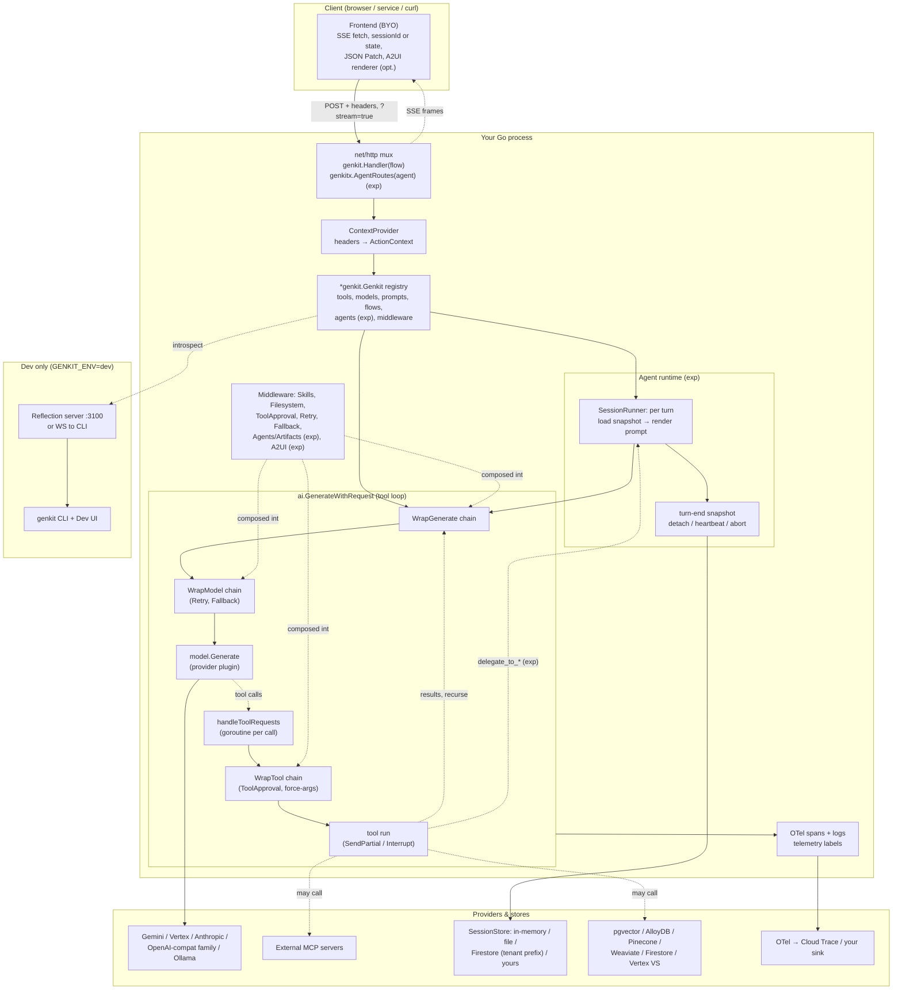

# Genkit Go — Benchmark Analysis

> **Repo**: https://github.com/firebase/genkit (now redirects to https://github.com/genkit-ai/genkit; multi-language monorepo, Go SDK in `go/`)
> **Commit analysed**: `8ccf9d0b5523899d23c1ba6eb81c7f42b49c2dc8`
> **Branch**: `main`
> **Framework path**: `frameworks/genkit/` (Go SDK lives under `frameworks/genkit/go/`; all citations below are relative to `frameworks/genkit/`)
> **Analysed on**: 2026-10-01

## TL;DR

- **Architecturally**, Genkit Go is a **flow-centric in-process Go library** (`go/genkit`, `go/ai`, `go/core`, `go/plugins/*`) plus a **dev-only Reflection server** that the JS-built `genkit` CLI and Dev UI attach to. The Go binary owns the agent loop end-to-end. There is no separate agent daemon, no sister-repo execution server, and no managed cloud running your code. Since go/v1.10.0 (2026-06-26) it also ships an **experimental Agents layer** (`go/genkit/exp`, `go/ai/exp`, gated behind `genkit.WithExperimental()`) that adds stateful multi-turn agents, snapshot persistence, background (detached) runs, and sub-agent delegation on top of the same loop.
- **Ecosystem: Go** (primary for this report). The repository is multi-language (TypeScript first, plus Python, Dart and Go SDKs sharing a cross-runtime schema and the JS-authored CLI).
- **Open-source / support**: Apache-2.0, maintained by Google (Firebase / Genkit team). Community support via GitHub and Discord; no separate paid Genkit SLA.
- **Maturity / adoption** (captured 2026-10-01): Go SDK at **v1.13.1** (2026-09-03; v1.0.0 shipped 2025-09-09, first Go tag v0.1.0 2024-08-01). Monorepo: 6,463 stars, 854 forks, ~159 contributors, 104 commits under `go/` and 5 Go minor releases between 2026-05-19 and 2026-10-01. The previous version of this report called the Go SDK "pre-1.0"; that was wrong — it was already at go/v1.8.0.
- **Where the loop runs**: in your process. The stable loop is `ai.GenerateWithRequest` (`go/ai/generate.go:438-859`), a max-turns tool loop wrapped in middleware. Default `MaxTurns` moved from 5 to **50** (`go/ai/generate.go:517-519`), and since v1.13 a failed or aborted generate returns the **partial conversation up to the last completed tool round** beside a classified error. Experimental agents run one turn per request by rendering a prompt and calling the same `ai.GenerateWithRequest` (`go/ai/exp/agent.go:3076-3131`).
- **Strongest architectural choice for our use case**: the experimental Agents API with **tenant-scoped session stores**. `aix.SessionStore` persists one snapshot per turn (messages, typed custom state, artifacts, status, error), and the file and Firestore stores take `WithSnapshotPathPrefix(func(ctx) string)` so every read and write is scoped by a context-derived tenant key (`go/plugins/firebase/exp/option.go:236-252`, `go/ai/exp/localstore/option.go:87-102`). Combined with `ContextProvider` (headers → `ActionContext`), this is the first first-party per-tenant persistence story in the Go SDK.
- **Weakest / biggest gap**: everything that makes it agent-grade is **experimental and churning** (v1.13.0 was retracted within an hour; v1.13 changed failed/aborted snapshot semantics). Still no first-party forced tool arguments, no per-turn tool filter, no per-tenant budget, no audit log, no resource manager, and no Postgres session store.
- **Most surprising finding**: the amount of agent-runtime machinery that landed in four months: detached runs with heartbeats and `expired` detection, `abort`/`aborting` status flips observed cross-instance via Firestore listeners, resumable `failed`/`aborted` turns, and an `Agents` middleware whose async mode gives the orchestrator LLM `check_background_tasks` / `wait_for_background_tasks` / `abort_background_tasks` / `continue_task` tools (`go/plugins/middleware/exp/agents.go`, `agents_async.go`, `agents_continue.go`). On the safety side, the middleware itself warns that background task IDs are **not access-scoped** (`go/plugins/middleware/exp/agents.go:128-134`).
- **One-line verdicts**:
  - **Run loop**: `genkit.Generate(...)` auto tool loop (stable) + `genkitx.DefineAgent` per-turn agent wrapper (experimental). No ReAct primitive.
  - **Sessions/persistence**: Experimental but real: `SessionState{Messages, Custom, Artifacts}` snapshotted per turn into in-memory, file, or Firestore stores; pluggable 3-method interface. The old `core/x/session` package was removed.
  - **Skills**: ⭐ First-class `SKILL.md` loader via `&middleware.Skills{SkillPaths: ...}` + `use_skill` tool (unchanged).
  - **Resource Manager**: Not provided — BYO.
  - **Sub-agents**: Experimental first-party: `middlewarex.Agents` turns registered agents into `delegate_to_<name>` tools, with optional background delegation.
  - **Multi-tenancy**: Marginal-to-acceptable: `ContextProvider` + `core.FromContext` for identity, tenant-prefixed snapshot stores, telemetry labels via context. Forced tool args still BYO via `WrapTool`.
  - **Hooks/middleware**: Strong (`Hooks{Tools, WrapGenerate, WrapModel, WrapTool}`), now with per-hook debug logging and trace attribution of short-circuits.
  - **HTTP API**: `genkit.Handler(action)` (SSE) for flows; experimental `genkitx.AgentRoutes` mounts `POST /agents/{name}`, `/getSnapshot`, `/waitForSnapshot`, `/abort`. Errors map to HTTP codes with public/private message redaction.
  - **Observability**: OTel tracing, logs attached to spans, realtime span streaming to the Dev UI, context-propagated telemetry labels. No first-party USD pricing (OpenRouter's gateway-reported cost lands in `Usage.Custom["cost"]`). No audit log.
  - **Multi-model**: Broad: Google AI / Vertex, Anthropic (native + compat), OpenAI, xAI, DeepSeek, DashScope, Kimi, Z.ai, OpenRouter, Ollama, Model Garden (Claude, Llama, Mistral). `Fallback` + `Retry` middleware.
  - **MCP**: ⭐ First-class client, multi-server host, and server (stdio / SSE / streamable HTTP).
  - **Dev UX**: ⭐ Genkit Dev UI against your Go process; now with live span streaming and per-span logs.
- **Production-readiness verdict**: **YELLOW, improved.** For stateless request-scoped agents the stable surface is solid. For a long-running, multi-tenant, skill-piloted agent the experimental Agents layer now covers sessions, resumability, background work and delegation, but you accept preview-API churn, and you still build forced-arg middleware, tenant tool filtering, budgets, audit and resource governance yourself.

---

## 0. General

### 0.1 What is this stack?

A **Go library + plugin ecosystem** that provides AI primitives (generate, prompts, tools, retrievers, embedders, evaluators, middleware) on top of a small action registry, plus an **experimental agent layer** (stateful agents, session stores, sub-agent delegation). It's not a framework you deploy; it's a set of `go get`-installed packages you embed in your own HTTP server. The `genkit` JS CLI is for local dev only and is not part of your production binary.

Quote from the Go README (`go/README.md:7-19`):

> **Genkit Go** — AI SDK for Go • LLM Framework • AI Agent Toolkit. Build production-ready AI-powered applications in Go with a unified interface for text generation, structured output, tool calling, and agentic workflows.

### 0.2 Ecosystem

**Go** (primary, this report). The repository is multi-language: the original and most-developed implementation is **TypeScript** (`js/`), with **Python** (`py/`), **Dart**, and **Go** (`go/`) SDKs sharing a cross-runtime schema (`genkit-tools/genkit-schema.json`, regenerated into `go/ai/gen.go` and `go/ai/exp/gen.go`) and the JS-authored `genkit` CLI. The Go module is `github.com/firebase/genkit/go` (`go/go.mod`, `go 1.25.0`). An agent conformance spec (`tests/specs/agent.yaml`) drives the Go, JS and Python agent runtimes to keep behaviour in lockstep.

### 0.3 Project status & governance

- **License**: Apache License 2.0 (`LICENSE` at the repo root; GitHub reports `Apache-2.0`).
- **Owner / maintainer**: **Google**. The repo was historically `github.com/firebase/genkit` and now redirects to `github.com/genkit-ai/genkit`; the Go module path is unchanged (`github.com/firebase/genkit/go`). First-party `googlegenai`, `vertexai`, `firebase`, `googlecloud` plugins show the product alignment.
- **Commercial backing**: positioned as Google's AI SDK; deploys on Cloud Run / Firebase with Google Cloud support. The SDK itself is community-supported (GitHub issues, Discord). No separate paid Genkit SLA is advertised.
- **Governance model**: open-source-at-a-vendor. A small Google team merges PRs; external contributions accepted under CLA (`CONTRIBUTING.md`). Go releases in this window list several first-time external contributors (e.g. go/v1.9.0 and go/v1.11.0 release notes).

### 0.4 Project maturity / age

- **Repository created**: 2024-04-29 (GitHub API). First Go tag `go/v0.1.0` on 2024-08-01.
- **Current Go version**: **go/v1.13.1** (2026-09-03). `go/v1.0.0` shipped 2025-09-09, so the Go SDK has been 1.x for about a year. 42 `go/v*` tags exist. HEAD (`8ccf9d0`) is 48 repo-wide commits past `go/v1.13.1` (`git describe --match 'go/v*'`); 4 of those touch `go/` (MCP HTTP-client fix, agent abort/snapshot fixes, README).
- **Retractions**: `go/go.mod:5-9` retracts `v1.13.0` (A2UI shipped at the wrong import path) as well as `v0.1.3`/`v0.1.4`.
- **Stability signals**: the core Generate/Tool/Prompt/Flow/Middleware APIs are stable. Everything under `exp`/`x` is explicitly preview:
  - `go/genkit/exp` and `go/ai/exp` (agents, experimental tools, experimental flows) panic unless `genkit.Init(ctx, genkit.WithExperimental())` was passed (`go/genkit/exp/experimental.go:32-43`; option doc at `go/genkit/genkit.go:205-218`: "they may have breaking or backward-incompatible changes between minor releases").
  - `go/plugins/middleware/exp` (sub-agents, artifacts), `go/plugins/firebase/exp` (Firestore session store / stream manager), `go/plugins/a2ui/exp`, `go/core/x/streaming` (durable streaming).
- **Deprecations in this window**: registry-taking `Define*` helpers were replaced by typed-config constructors (`DefineModelAction`, `DefineRetrieverAction`, `DefineEvaluatorAction`, …); the old untyped forms remain but are marked `Deprecated` (`go/genkit/genkit.go:691, 727, 814, 1632, 1676, 1730, 1767, 2030`).

### 0.5 Adoption & community signal

Captured 2026-10-01 via `gh api repos/firebase/genkit` (redirects to `genkit-ai/genkit`) — all numbers are for the whole multi-language monorepo:

- **Stars / forks / watchers**: 6,463 stars, 854 forks, 57 watchers.
- **Contributors**: ~159 (contributors API, anonymous included).
- **Open issues + PRs**: 820 (536 open issues). 73 open issues carry the `go` label.
- **Go activity since the previous analysis (2026-05-19)**: 104 commits under `go/`, 109 merged PRs labelled `go`, 5 Go releases (v1.9.0, v1.10.0, v1.11.0, v1.12.0, v1.13.0/v1.13.1). Release cadence is roughly every 2–4 weeks.
- **Maintainer responsiveness**: release notes are long-form and engineering-quality; PRs cite issue numbers and land fixes within days (e.g. v1.13.0 retracted and replaced in ~40 minutes).
- **Discord**: `https://discord.gg/qXt5zzQKpc` (`go/README.md:22-26`).

### 0.6 Ecosystem fit

- **Go module**: `github.com/firebase/genkit/go` — https://pkg.go.dev/github.com/firebase/genkit/go.
- **Plugins** live under `github.com/firebase/genkit/go/plugins/<name>`; the OpenAI-compatible family is split into sub-packages (`compat_oai/openai`, `anthropic`, `deepseek`, `xai`, `dashscope`, `kimi`, `zai`, `openrouter`).
- **Usage mode**: pure library. You `go get` it and embed it in your binary.
- **Official samples**: 36 Go samples under `go/samples/`, consolidated in v1.12 into a self-documenting `basic-*` set (`basic`, `basic-agents`, `basic-agents-server`, `basic-tool-interrupts`, `basic-tool-interrupts-exp`, `basic-middleware/{skills,filesystem,retry-fallback,a2ui}`, `basic-errors`, `basic-durable-streaming-exp`, …) plus provider/RAG/MCP samples.
- **Coding-agent skill**: the README now points to `npx skills add genkit-ai/skills --skill developing-genkit-go` (`go/README.md:30-38`).
- **Siblings**: `genkit` on npm, PyPI, and pub.dev; the shared schema lets a Go service use the JS Dev UI and CLI.

### 0.7 Documentation depth & cross-team contributor accessibility

- **Official docs**: https://genkit.dev/docs/go/overview/ — the site now has a per-language path (`/docs/go/...`). Its `docLanguageSupport` map lists Go on **89 of 109** pages. Go-covered pages now include the full **Agents** section (`/docs/go/agents/overview/`, `define`, `run`, `http`, `state`, `session-stores`, `interrupts`, `a2ui`), chat, durable streaming, MCP, middleware, interrupts, context, error types, testing, evaluation, local observability, and a Go-only `concurrency` page. JS-only pages that remain: `multi-agent`, several JS/Python backend-framework pages, a few vector-store integrations, Firebase/AWS/Azure deployment, and tutorials.
- **In-source GoDoc** remains excellent and was audited in v1.13 so the examples compile (#6179). `go/README.md` is ~1,400 lines with sections on agents, background agents, delegation, durable streaming and error handling.
- **Cross-team accessibility (Product/Data)**: `.prompt` files (YAML frontmatter + Handlebars) are editable by non-engineers (`go/samples/basic-prompts/prompts/*.prompt`), and `DefinePromptAgent` can back an agent with a `.prompt` file. `SKILL.md` skills are also markdown.

**Consequence for our use case**: the "Go docs trail JS" gap from the previous report has largely closed. The remaining risk is not missing docs but **preview APIs** that change between minor releases.

### 0.8 Documentation entry points ⭐

- **Official docs landing (Go)**: https://genkit.dev/docs/go/overview/
- **Quickstart (Go)**: https://genkit.dev/docs/go/get-started/
- **API reference (GoDoc)**: https://pkg.go.dev/github.com/firebase/genkit/go
- **Agents (Go, experimental)**: https://genkit.dev/docs/go/agents/overview/ and https://genkit.dev/docs/go/agents/http/ and https://genkit.dev/docs/go/agents/session-stores/
- **Dev tools (CLI / Dev UI)**: https://genkit.dev/docs/go/devtools/
- **Middleware**: https://genkit.dev/docs/go/middleware/
- **MCP (Go)**: https://genkit.dev/docs/go/model-context-protocol/ (plus `go/plugins/mcp/README.md`)
- **Hosting / deployment**: https://genkit.dev/docs/go/deployment/cloud-run/ and https://genkit.dev/docs/go/deployment/any-platform/
- **Examples / demos**: https://github.com/genkit-ai/genkit/tree/main/go/samples
- **Changelog / release notes**: no in-repo Go changelog; Go release notes live on GitHub Releases under `go/vX.Y.Z` tags, e.g. https://github.com/genkit-ai/genkit/releases/tag/go/v1.13.1
- **GitHub Releases**: https://github.com/genkit-ai/genkit/releases
- **GitHub issues tracker**: https://github.com/genkit-ai/genkit/issues (Go filter: https://github.com/genkit-ai/genkit/issues?q=is%3Aissue+is%3Aopen+label%3Ago)
- **Discord**: https://discord.gg/qXt5zzQKpc

---

## 1. High Level Architecture

### Deployment diagram

```
┌──────────────────────────────────────────────────────────────────────┐
│  YOUR Go process (production)                                        │
│  ┌────────────────────────────────────────────────────────────────┐  │
│  │  net/http server (stdlib or any router) — your code            │  │
│  │    mux.HandleFunc("POST /myFlow", genkit.Handler(flow, ...))   │  │
│  │    for _, rt := range genkitx.AllAgentRoutes(g) {              │  │
│  │        mux.HandleFunc(rt.Pattern(), rt.Handler(...)) }  (exp)  │  │
│  │    genkit.WithContextProviders(authHeaderProvider)             │  │
│  └────────────────────────────────────────────────────────────────┘  │
│                              │                                        │
│  ┌────────────────────────────────────────────────────────────────┐  │
│  │  *genkit.Genkit (in-process registry)                          │  │
│  │   ├─ actions: tools, models, prompts, flows, agents (exp),     │  │
│  │   │           retrievers, evaluators, resources, middleware    │  │
│  │   ├─ plugins (googlegenai, anthropic, compat_oai/*, mcp, …)    │  │
│  │   └─ Dotprompt loader (./prompts or embed.FS)                  │  │
│  └────────────────────────────────────────────────────────────────┘  │
│                              │                                        │
│  ┌────────────────────────────────────────────────────────────────┐  │
│  │  Agent runtime (exp): one turn per request / Connect stream    │  │
│  │   load snapshot → render prompt → GenerateWithRequest →        │  │
│  │   save snapshot (per turn) ; detach → background goroutine +   │  │
│  │   heartbeat ; abort via store status flip                      │  │
│  └────────────────────────────────────────────────────────────────┘  │
│                              │                                        │
│  ┌────────────────────────────────────────────────────────────────┐  │
│  │  ai.GenerateWithRequest  ← THE TOOL LOOP                       │  │
│  │   for turn in [0, MaxTurns (default 50)]:                      │  │
│  │     WrapGenerate chain → WrapModel chain → model.Generate      │  │
│  │     tool calls? → goroutine per call through WrapTool chain    │  │
│  │     append (model msg, tool msg); recurse                      │  │
│  └────────────────────────────────────────────────────────────────┘  │
│        │                     │                        │               │
│        ▼                     ▼                        ▼               │
│  ┌────────────┐   ┌─────────────────────┐   ┌──────────────────────┐ │
│  │ OTel spans │   │ Provider HTTP/gRPC  │   │ SessionStore (exp)   │ │
│  │ + logs     │   │ Google, Anthropic,  │   │ in-memory / file /   │ │
│  │ (optional  │   │ OpenAI-compat, …    │   │ Firestore / YOURS    │ │
│  │  GCP exp.) │   └─────────────────────┘   └──────────────────────┘ │
│  └────────────┘                                                       │
│  ┌────────────────────────────────────────────────────────────────┐  │
│  │  (GENKIT_ENV=dev only) Reflection server :3100 (HTTP, V1)      │  │
│  │  or WebSocket client to CLI (GENKIT_REFLECTION_V2_SERVER)      │  │
│  └────────────────────────────────────────────────────────────────┘  │
└──────────────────────────────────────────────────────────────────────┘
                     │ (dev only)
                     ▼
        ┌──────────────────────────────────┐
        │ Node.js `genkit` CLI + Dev UI    │
        │ traces (live), logs, action      │
        │ runner, prompt playground, eval  │
        └──────────────────────────────────┘

        ┌──────────────────────────────────┐
        │ Optional managed stores          │
        │ Firestore: sessions (exp), durable│
        │ stream chunks (exp), vectors     │
        └──────────────────────────────────┘
```

### 1.1 Where does the agent loop *actually* execute?

**In your Go process.** The tool loop is a single Go function — `ai.GenerateWithRequest` at `go/ai/generate.go:438-859` — that calls the model, runs any tool calls, and feeds results back until no tool calls remain, `MaxTurns` is exceeded, an interrupt fires, or an error occurs. No subprocess, no IPC, no remote runner.

The experimental agent runtime does not add a new loop: each turn of a prompt-backed agent renders the prompt with the session history and calls the same function (`go/ai/exp/agent.go:3076-3131`):

```go
// go/ai/exp/agent.go:3131
modelResp, err := ai.GenerateWithRequest(ctx, r, actionOpts, nil,
    func(ctx context.Context, chunk *ai.ModelResponseChunk) error {
        resp.SendModelChunk(chunk)
        return nil
    },
)
```

The `genkit` JS CLI talks to your process **only in dev mode** (`go/genkit/genkit.go:331-347`):

```go
// go/genkit/genkit.go:331
if api.CurrentEnvironment() == api.EnvironmentDev {
    ...
    if v2URL := os.Getenv("GENKIT_REFLECTION_V2_SERVER"); v2URL != "" {
        // V2: connect to the CLI's WebSocket server.
        go startReflectionServerV2(ctx, g, reflectionServerV2Options{URL: v2URL}, errCh, serverStartCh)
    } else {
        // V1: start an HTTP reflection server. ...
        go startReflectionServer(ctx, g, errCh, serverStartCh)
    }
```

In production (`GENKIT_ENV` unset), no reflection server starts; the binary is your HTTP server plus the Genkit registry. Detached (background) agent turns also run in-process, on a goroutine whose context is detached from the request (`go/ai/exp/agent.go:1410`).

### 1.2 Runtime dependencies

- **Go ≥ 1.25** (`go/go.mod:3`). The Filesystem middleware relies on Go 1.25 `os.Root`.
- **No bundled binaries.** Everything is pure-Go modules.
- **LLM provider credentials** for whichever plugins you enable (Gemini/Vertex, Anthropic, OpenAI, xAI, DeepSeek, DashScope, Kimi, Z.ai, OpenRouter) or a local **Ollama** server.
- Optional **Node.js + `genkit` CLI** for dev UX (Dev UI, eval).
- Optional **Firestore** (Firebase plugin) for the experimental session store / durable stream manager / vector search; optional **Postgres/AlloyDB**, **Pinecone**, **Weaviate** for RAG plugins.
- Optional **OTel exporter** (`googlecloud` plugin or your own).
- **Background agent runs and abort** need a session store that implements `SnapshotSubscriber` (the bundled in-memory, file and Firestore stores do) — `go/ai/exp/session.go:193-216`, `go/ai/exp/agent.go:1541-1550`.

### 1.3 Recommended deployment topology

Samples show **one Go binary serving N HTTP routes**: `genkit.Handler(flow)` per flow, and since v1.10 `genkitx.AgentRoutes(agent)` / `AllAgentRoutes(g)` per agent (`go/genkit/exp/routes.go:70-109`; sample `go/samples/basic-agents-server/main.go`). Docs cover Cloud Run (`/docs/go/deployment/cloud-run/`) and "any platform" (`/docs/go/deployment/any-platform/`). There is no container-per-tenant or worker-per-session recommendation.

For multi-tenancy: stateless containers, tenant identity via headers → `ContextProvider` → `ActionContext`; for agents, a shared session store with a tenant prefix derived from the same context (`WithSnapshotPathPrefix`). The basic-agents-server sample shows both topologies: server-managed state (store-backed, client sends `sessionId`) and client-managed state (no store, client round-trips the whole `state`).

### 1.4 Cold-start cost & instance footprint

- **Init cost**: dominated by plugin `Init(ctx)` calls; providers such as Ollama now probe model capabilities and cache them by digest (v1.12 notes). Reflection server starts only in dev.
- **Cold start**: Go binaries cold-boot in well under a second after image pull; no 20–30 s startup ceremony like Claude Agent SDK.
- **RAM baseline**: not measured in this refresh. Estimate ~30 MB RSS for a minimal binary; the dependency tree is large (Firestore, AlloyDB, BigQuery, OTel exporters in `go/go.mod`), but Go only links what you import.

### 1.5 Vendor lock-in

| Axis | Verdict | Detail |
|------|---------|--------|
| **LLM provider** | 🟢 Multi-provider | Native plugins for Google AI/Vertex, Anthropic, OpenAI, xAI, DeepSeek, DashScope, Kimi, Z.ai, OpenRouter, Ollama, Model Garden. `Fallback` middleware for outages. |
| **Hosting platform** | 🟡 Slight GCP tilt | Cloud Run is the canonical example; GCP telemetry plugin; the only managed session store is Firestore. The file store and your own `SessionStore` run anywhere. |
| **Eval platform** | 🟢 No lock-in | Evaluator is an interface; results are local. |
| **Resource/skill registry** | 🟢 None | No managed registry or marketplace. |
| **Tracing** | 🟢 OTel-standard | Any OTel exporter; GCP plugin is one option. |

The strongest pull is still towards Google (default samples use `googleai/gemini-flash-latest`, Firestore is the managed store), but nothing GCP is required.

### 1.6 Framework weight / footprint

**Medium-heavy, and growing**:
- 483 `.go` files under `go/` (224 non-test, non-sample files); `go/ai/generate.go` is 2,482 lines, `go/ai/exp/agent.go` 3,497 lines.
- Core packages: `genkit`, `genkit/exp`, `ai`, `ai/exp`, `ai/exp/localstore`, `ai/exp/tool`, `core`, `core/api`, `core/status`, `core/logger`, `core/tracing`, `core/x/streaming`.
- 17 plugin directories (`a2ui`, `alloydb`, `anthropic`, `compat_oai` (8 sub-providers), `evaluators`, `firebase`, `googlecloud`, `googlegenai`, `localvec`, `mcp`, `middleware`, `ollama`, `pinecone`, `postgresql`, `server`, `vertexai`, `weaviate`).
- 36 samples.

Every piece is opt-in and the stable Generate call is still one function, but the experimental agent runtime (snapshot lifecycle, detach, heartbeats, JSON-patch custom state, artifacts) is a substantial subsystem in its own right. Heavier than Eino; comparable surface to Mastra, without a bundled UI.

### 1.7 Release-history signal

- **No in-repo Go CHANGELOG.** Go release notes live on GitHub Releases (`go/vX.Y.Z`); they are detailed and include "Before you upgrade" sections.
- **Releases in this window** (2026-05-19 → 2026-10-01):
  - **go/v1.9.0** (2026-06-16): goroutine-leak and yield-after-stop fixes, `SchemaValidationError`, Gemini 3.x / Imagen 4 / TTS registrations, Model Garden Claude + Llama.
  - **go/v1.10.0** (2026-06-26): **experimental Agents API** (`DefineAgent`, `DefinePromptAgent`, `DefineCustomAgent`), bidirectional streaming actions (`core.NewBidiAction`), experimental tools with typed interrupts and partial streaming, `Agents`/`Artifacts` middleware, Firestore session store (`plugins/firebase/x` → `plugins/firebase/exp`), `WithExperimental()` gate, realtime telemetry to the Dev UI. `core/x/session` was removed in the same series (b91ad9023).
  - **go/v1.11.0** (2026-07-24): telemetry label propagation via context, Vertex multi-region, new Claude models.
  - **go/v1.12.0** (2026-08-17): `core/status` error classification end to end (HTTP code + redaction), logs attached to spans, typed-config action constructors (`New*Action`, `Define*Action`), options merge instead of erroring on repeats, six new OpenAI-compatible providers (xAI, DeepSeek, DashScope, Kimi, Z.ai, OpenRouter), typed prompt content functions, sample consolidation.
  - **go/v1.13.0 → retracted / go/v1.13.1** (2026-09-03): `Generate` returns partial responses on failure; `FinishReasonFailed` / `FinishReasonAborted`; agents commit `failed`/`aborted` snapshots that resume; `aborting` status; `AgentHandle`, `RunDetached`, `DetachedTask`; `Agents.Async` background delegation and `continue_task`; experimental A2UI plugin; fix stopping the OpenAI-compatible family from forwarding OpenAI credentials to other providers (#6109).
- **Behaviour changes worth noting for scoring**: default `MaxTurns` 5 → 50 (`go/ai/gen.go:98-100`); actions now return values beside errors (v1.13 "Before you upgrade"); `googlegenai` no longer installs an OTel HTTP transport by default.
- **Deprecations**: `ModelMiddleware` (`go/ai/generate.go:91-92`) superseded by `Hooks`; untyped `DefineModel`/`DefineRetriever`/`DefineEmbedder`/`DefineEvaluator`/`DefineFormat`/`DefineToolWithInputSchema` superseded by typed-config or option-based forms (`go/genkit/genkit.go`, see 0.4).

---

## 2. Agent Loop

### 2.1 Run loop entrypoint(s)

**Stable**: `genkit.Generate` and variants (`GenerateText`, `GenerateData[Out]`, `GenerateStream`, `GenerateDataStream[Out]`, `GenerateOperation`, `GenerateWithRequest`). From `go/genkit/genkit.go:1364-1366`:

```go
func Generate(ctx context.Context, g *Genkit, opts ...ai.GenerateOption) (*ai.ModelResponse, error) {
    return ai.Generate(genkitCtxKey.NewContext(ctx, g), g.reg, opts...)
}
```

Streaming returns a Go 1.23 range-over-func iterator (`go/genkit/genkit.go:1396-1398`):

```go
func GenerateStream(ctx context.Context, g *Genkit, opts ...ai.GenerateOption) iter.Seq2[*ai.ModelStreamValue, error] {
    return ai.GenerateStream(genkitCtxKey.NewContext(ctx, g), g.reg, opts...)
}
```

The engine is `ai.GenerateWithRequest` (`go/ai/generate.go:438`):

```go
func GenerateWithRequest(ctx context.Context, r api.Registry, opts *GenerateActionOptions,
    mmws []ModelMiddleware, cb ModelStreamCallback) (*ModelResponse, error)
```

Since v1.13, **an error comes with a partial response**: "Every error after this point comes with a partial response" (`go/ai/generate.go:846-856`). `resp.History()` ends at the last completed tool round; `resp.FinishReason` is `failed` or `aborted`; `resp.Error` is the classified `*status.Error` (`go/ai/gen.go:339-346`).

**Experimental**: an `aix.Agent[State]` is a bidirectional streaming action. Entrypoints on the agent (`go/ai/exp/agent.go:3213-3309`):

```go
func (a *Agent[State]) Connect(ctx, opts ...InvocationOption[State]) (*AgentConnection[State], error)
func (a *Agent[State]) Run(ctx, input *AgentInput, opts ...InvocationOption[State]) (*AgentOutput[State], error)
func (a *Agent[State]) RunText(ctx, text string, opts ...InvocationOption[State]) (*AgentOutput[State], error)
func (a *Agent[State]) RunDetached(ctx, input *AgentInput, opts ...) (*DetachedTask[State], error)
func (a *Agent[State]) Task(snapshotID string) *DetachedTask[State]
```

`AgentInput` carries `Message`, `Resume` (tool restarts/responds) and `Detach` (`go/ai/exp/gen.go:132-146`); `AgentOutput` carries `Message`, `SessionID`, `SnapshotID`, `FinishReason`, `Error`, `Artifacts`, and (client-managed agents) `State` (`go/ai/exp/gen.go:178-212`).

### 2.2 Per-iteration behavior

One iteration of the stable tool loop (`turnBody`, `go/ai/generate.go:620-771`):

1. `WrapGenerate` hooks run (outer to inner) around the turn; each turn opens a `generate` span that records the messages this turn sends, after the hooks have edited them (`go/ai/generate.go:787-807`).
2. On turn 0 with `Resume` set (HITL respond/restart), re-run or answer the interrupted tools and recurse (`go/ai/generate.go:644-683`).
3. Call the chained `WrapModel` → `model.Generate` (`go/ai/generate.go:686`). A model error returns a partial built from the conversation entering this turn.
4. Ensure every tool request has a unique `Ref` (`go/ai/generate.go:705`).
5. If an output format is set: skip parsing when the finish reason is abnormal (blocked/length/…); otherwise parse, and on a schema mismatch return the response with `ErrInvalidOutput` (`go/ai/generate.go:712-740`).
6. **Branch**: no tool requests, or `ReturnToolRequests` → return (`go/ai/generate.go:742-744`).
7. `currentTurn+1 > maxTurns` → `ErrMaxTurnsExceeded` with a partial (`go/ai/generate.go:746-749`).
8. `handleToolRequests` (`go/ai/generate.go:1572-1745`): one goroutine per tool call through the `WrapTool` chain. Interrupts → `FinishReason="interrupted"`; a tool error drops the whole round and returns a partial.
9. Append `(model message, tool message)` to a new request value and recurse with `currentTurn+1` (`go/ai/generate.go:770`).

Default `MaxTurns` is **50** (`go/ai/generate.go:517-519`), up from 5 at the previous commit.

The experimental agent wraps this per **turn** (one user input): validate input → render prompt with session history → (optional resume validation against history, `ValidateResumeAgainstHistory`, `go/ai/exp/agent.go:2970`) → `GenerateWithRequest` → replace session messages with the generated history minus prompt scaffolding → write a turn-end snapshot (`go/ai/exp/agent.go:565-600`) → emit `TurnEnd`.

### 2.3 ReAct loop

**No ReAct primitive.** Genkit ships an automatic tool-calling loop that relies on the provider's native tool calling (Gemini function calling, Anthropic tool use, OpenAI tools). There is no "Thought/Action/Observation" parser. The experimental agents are a conversational wrapper around that loop, not a different reasoning scaffold.

### 2.4 Tool dispatch + result handling

`handleToolRequests` (`go/ai/generate.go:1572-1745`) fans out one goroutine per `ToolRequest` part:

```go
// go/ai/generate.go:1614
go func(idx int, p *Part) {
    toolReq := p.ToolRequest
    tool := LookupTool(r, p.ToolRequest.Name)
    if tool == nil {
        resultChan <- result[*MultipartToolResponse]{index: idx, err: status.Errorf(ErrToolNotFound, "tool %q not found", toolReq.Name)}
        return
    }
    // Inject per-tool streaming senders so tools can stream via
    // tool.SendPartial ... and tool.SendChunk ...
    toolCtx := ctx
    if cb != nil {
        toolCtx = base.ToolPartialSenderKey.NewContext(ctx, func(sendCtx context.Context, output any) { ... })
        ...
    }
    multipartResp, err := runTool(toolCtx, tool, toolReq)
    if err != nil {
        var tie *toolInterruptError
        if errors.As(err, &tie) {
            revisedMsg.Content[idx] = interruptedPart(p, tie)
            resultChan <- result[*MultipartToolResponse]{index: idx, err: tie}
            return
        }
        resultChan <- result[*MultipartToolResponse]{index: idx, err: toolFailureError(ctx, toolReq.Name, err)}
        return
    }
    ...
}(i, part)
```

Results are collected by request position and re-emitted **in request order** (deterministic), then folded into one `tool`-role message (`go/ai/generate.go:1713-1741`). Tool streaming sends from concurrent goroutines are serialized under a mutex (`go/ai/generate.go:1590-1608`). A tool failure now discards the whole round (including the model message that opened it) so the returned history is always re-sendable (`go/ai/generate.go:1698-1706`).

### 2.5 Explicit turn concept

Two levels:
- **Tool-loop iteration** (stable): one `model.Generate` call plus the tool dispatch that follows. `MaxTurns` counts these; `GenerateParams.Iteration` exposes the index to `WrapGenerate` (`go/ai/middleware.go:51-76`). No `Turn` type.
- **Agent turn** (experimental): one `AgentInput` processed to completion, ending with exactly one `TurnEnd{FinishReason, SnapshotID}` chunk (`go/ai/exp/gen.go:486-502`) and, for store-backed agents, one snapshot. `SessionRunner.Run` loops over inputs (`go/ai/exp/agent.go:302`).

### 2.6 Event emission mechanism (in-process)

**Stable**: a `ModelStreamCallback` (`go/ai/generate.go:87`):

```go
type ModelStreamCallback = func(context.Context, *ModelResponseChunk) error
```

The loop wraps the caller's callback to assign role-based message indices and attach the streaming format handler (`go/ai/generate.go:629-641`). `GenerateStream` adapts it into an `iter.Seq2` iterator. Tools can push partial outputs (`tool.SendPartial`) or raw chunks (`tool.SendChunk`) into the same stream (`go/ai/exp/tool/tool.go:132-155`).

**Experimental agents**: `AgentConnection.Receive()` returns `iter.Seq2[*AgentStreamChunk, error]` (`go/ai/exp/agent.go:3395`). A chunk carries one or more of `ModelChunk`, `Artifact`, `CustomPatch` (RFC 6902 diff of custom state), and `TurnEnd` (`go/ai/exp/gen.go:245-263`). Custom agents emit through `Responder.SendModelChunk` / `SendArtifact` (`go/ai/exp/agent.go:624-650`).

No EventEmitter or topic bus — callbacks and iterators only.

---

## 3. Message & Event Taxonomy

### 3.1 Message layers

**Three layers** now, two of them stable:

```
┌─────────────────────────────────────────────────────────────┐
│  LAYER 1 — PROVIDER WIRE                                    │
│  Each model plugin converts ai.Message ↔ provider format    │
└─────────────────────────────────────────────────────────────┘
                            ▲  plugin translation
┌─────────────────────────────────────────────────────────────┐
│  LAYER 2 — GENKIT CORE (ai.Message / ai.Part)  [stable]     │
│  ModelRequest.Messages, ModelResponse.Message,              │
│  ModelResponseChunk.Content, flow SSE frames                │
└─────────────────────────────────────────────────────────────┘
                            ▲  agent runtime wraps
┌─────────────────────────────────────────────────────────────┐
│  LAYER 3 — AGENT ENVELOPE (ai/exp)  [experimental]          │
│  AgentInput / AgentOutput / AgentStreamChunk                │
│  {modelChunk | artifact | customPatch | turnEnd}            │
│  SessionState{messages, custom, artifacts}                  │
└─────────────────────────────────────────────────────────────┘
```

There is still **no UI-message layer** like Vercel's `UIMessage`; the A2UI plugin (16.1) adds UI envelopes as `data` parts inside layer 2 rather than a separate vocabulary.

### 3.2 Concrete message types

Sources: `go/ai/gen.go` (generated), `go/ai/document.go`, `go/ai/exp/gen.go` (generated).

| Type | Purpose |
|------|---------|
| `Message` | One message: `{Role, Content []*Part, Metadata}` (`go/ai/gen.go:226-233`) |
| `Role` | `system \| user \| model \| tool` (`go/ai/gen.go:506-518`) |
| `Part` | Tagged union: text, media, data, custom, toolRequest, toolResponse, reasoning, resource (`go/ai/document.go`) |
| `ToolRequest` | `{Input, Name, Partial, Ref}` (`go/ai/gen.go:551-561`) |
| `ToolResponse` | `{Content, Name, Output, Ref}` (`go/ai/gen.go:573-583`); a partial tool response is a toolResponse part flagged partial (`NewPartialToolResponsePart`, `go/ai/document.go:229-240`) |
| `ModelRequest` | `{Config, Docs, Messages, Output, ToolChoice, Tools}` (`go/ai/gen.go:323-336`) |
| `ModelResponse` | `{Custom, Error, FinishMessage, FinishReason, LatencyMs, Message, Operation, Raw, Request, Usage}` (`go/ai/gen.go:339-366`); `Error` is new |
| `ModelResponseChunk` | `{Aggregated, Content, Custom, Index, Role}` (`go/ai/gen.go:370-383`) |
| `FinishReason` | `stop \| length \| blocked \| aborted \| failed \| interrupted \| other \| unknown` (`go/ai/gen.go:79-90`); `aborted`/`failed` are new |
| `GenerationUsage` | Tokens, cached, thoughts, media counts, `Custom map[string]float64` (`go/ai/gen.go:179-208`) |
| `GenerateActionOptions` | Serialized generate call (`go/ai/gen.go:93-123`) |
| `GenerateActionResume` | HITL `{Metadata, Respond, Restart}` (`go/ai/gen.go:126-133`) |
| `ToolDefinition` | `{Description, InputSchema, Key, Metadata, Name, OutputSchema}` (`go/ai/gen.go:534-546`) |
| `MultipartToolResponse` | `{Output, Content, Metadata}` (`go/ai/gen.go:386-392`) |
| `Operation` | Long-running op handle (`go/ai/gen.go:395-408`) |
| `AgentInput` *(exp)* | `{Detach, Message, Resume}` (`go/ai/exp/gen.go:132-146`) |
| `AgentInit` *(exp)* | `{SessionID, SnapshotID, State}` — the session source for an invocation (`go/ai/exp/gen.go:102-123`) |
| `AgentOutput` *(exp)* | `{Artifacts, Error, FinishReason, Message, SessionID, SnapshotID, State}` (`go/ai/exp/gen.go:178-212`) |
| `AgentStreamChunk` *(exp)* | `{Artifact, CustomPatch, ModelChunk, TurnEnd}` (`go/ai/exp/gen.go:245-263`) |
| `AgentFinishReason` *(exp)* | adds `detached`, `failed`, `aborted` to model reasons (`go/ai/exp/gen.go:59-87`) |
| `Artifact` *(exp)* | `{Metadata, Name, Parts}` (`go/ai/exp/gen.go:267-274`) |
| `SessionState` / `SessionSnapshot` *(exp)* | see Q5.1 |

### 3.3 Messages vs. events

**Same vocabulary, different shapes.** In the stable path, chunks (`*ModelResponseChunk`) carry `[]*Part` that accumulate into a `*Message`. Tool results are emitted on the same stream as `ModelResponseChunk{Role: tool}` (`go/ai/generate.go:1724-1734`); tool progress as partial toolResponse parts. In the agent path, `AgentStreamChunk` wraps a model chunk and adds non-message events (artifact produced, custom-state patch, turn end). Both arrive through one iterator/callback; there is no separate event bus.

### 3.4 Event categories

| Category | How it's recognized |
|----------|---------------------|
| text delta | `Role=model`, text part |
| reasoning delta | `Role=model`, reasoning part |
| media / data / custom | `Role=model`, media / data / custom part |
| tool call (incl. partial args) | `Role=model`, toolRequest part; `ToolRequest.Partial=true` for in-progress args |
| tool progress *(new)* | `Role=tool`, toolResponse part with `IsPartial()` (from `tool.SendPartial`) |
| tool result | `Role=tool`, toolResponse part (synthesized by `handleToolRequests`) |
| interrupt | final response with `FinishReason=interrupted` and toolRequest parts carrying `Metadata["interrupt"]` (`go/ai/generate.go:1535-1546`) |
| turn end *(exp)* | `AgentStreamChunk.TurnEnd{FinishReason, SnapshotID}` |
| artifact *(exp)* | `AgentStreamChunk.Artifact` |
| state delta *(exp)* | `AgentStreamChunk.CustomPatch` (JSON Patch) |
| session lifecycle *(exp)* | not streamed; observable as snapshot `Status` (`pending`, `aborting`, `completed`, `failed`, `aborted`, computed `expired`) via `getSnapshot` / `waitForSnapshot` |

No explicit `start` / `step-start` / `step-end` stream events, no hook events, no sub-agent lifecycle events in the stream. Those are visible in OTel spans (and live in the Dev UI via the realtime span processor, `go/core/tracing/realtime_span_processor.go`).

### 3.5 Canonical type-definition file(s)

- `go/ai/gen.go` — generated core types (600 lines) from `genkit-tools/genkit-schema.json`.
- `go/ai/exp/gen.go` — generated agent types (502 lines).
- `go/ai/generate.go` — the loop (2,482 lines).
- `go/ai/tools.go` — tool definition, interrupts, resume (789 lines).
- `go/ai/middleware.go` — `Hooks` contract.
- `go/ai/exp/session.go` — session store interfaces and `Session`.
- `go/core/action.go`, `go/core/flow.go`, `go/core/bidi_action.go` — action plumbing.
- `go/core/status/` — the error/status vocabulary.

### 3.6 Live agentic event stream taxonomy

Over HTTP, `genkit.Handler` writes each streamed value as an SSE frame with a `{"message": …}` envelope, the final value as `{"result": …}`, and a failure as `{"error": {"status", "message"}}` (`go/genkit/servers.go:455-532`).

**Flow serving a `Generate` call** (illustrative):

```
data: {"message":{"role":"model","index":0,"content":[{"text":"The weather in "}]}}

data: {"message":{"role":"model","index":0,"content":[{"toolRequest":{"name":"getWeather","ref":"call_001","input":{"city":"Par"},"partial":true}}]}}

data: {"message":{"role":"tool","index":1,"content":[{"toolResponse":{"name":"getWeather","ref":"call_001","output":{"step":"querying"}},"metadata":{"partial":true}}]}}

data: {"message":{"role":"tool","index":1,"content":[{"toolResponse":{"name":"getWeather","ref":"call_001","output":"Sunny 25C"}}]}}

data: {"result":{"message":{"role":"model","content":[{"text":"It is sunny and 25C in Paris."}]},"usage":{"inputTokens":127,"outputTokens":18,"totalTokens":145},"finishReason":"stop"}}
```

**Experimental agent turn** (`POST /agents/chat?stream=true`, illustrative; `AgentStreamChunk` inside the `message` envelope):

```
data: {"message":{"modelChunk":{"role":"model","index":0,"content":[{"text":"Here are three day trips"}]}}}

data: {"message":{"customPatch":[{"op":"replace","path":"","value":{"step":"planning"}}]}}

data: {"message":{"turnEnd":{"finishReason":"stop","snapshotId":"7f0c…"}}}

data: {"result":{"message":{"role":"model","content":[{"text":"…"}]},"sessionId":"2b9e…","snapshotId":"7f0c…","finishReason":"stop"}}
```

The exact partial-tool-response wire encoding is derived from `NewPartialToolResponsePart`; it was not captured from a live run.

---

## 4. Agent Runtime (Multi-session Host)

### 4.1 Multi-session host architecture

**Stable path**: no runtime hosting sessions. `*genkit.Genkit` is an in-process registry; each request through `genkit.Handler(flow)` runs synchronously and returns.

**Experimental path**: the agent runtime hosts **many concurrent sessions in one process**, one bidi connection per invocation. Each invocation loads its session (by `sessionId`, `snapshotId`, or client-supplied `state`), runs turns, and writes snapshots to the configured store. The process itself holds no session table beyond live connections and detached workers; the store is the system of record. This is still "you embed it in your server", but the session lifecycle (load, persist, resume, abort) is now framework code rather than yours.

### 4.2 Concurrent session isolation

- Per-request `context.Context`, per-request goroutines in `handleToolRequests`, per-request span trees.
- The registry is shared and read-mostly; middleware-contributed tools go into a **child registry per Generate call** so concurrent calls don't see each other's tools (`go/ai/generate.go:467-512`).
- Agent turns deep-copy inputs at the framework boundary so a caller mutating what it sent cannot race the session (`go/ai/exp/agent.go:316-322`). Middleware config is now copied per JSON-dispatched call (v1.13 fix #6092: previously one call's fields could leak into the next).
- Store-level tenant isolation: `WithSnapshotPathPrefix` (see Q6). Without it, all sessions share one `global` prefix.

### 4.3 Horizontal scaling / multi-instance

**Stateless workers + shared store.** No leader election or cross-instance coordinator. For agents:
- Any instance can resume a session from the shared store (`sessionId`/`snapshotId`).
- `SaveSnapshot` is an atomic read-modify-write contract that may retry `fn` under contention (`go/ai/exp/session.go:150-191`).
- A detached turn runs on the instance that accepted it. Its pending snapshot is heartbeated every 30 s; if beats stop for 60 s, reads report it as `expired` (`go/ai/exp/agent.go:56-77`). The Firestore store's `OnSnapshotStatusChange` uses Firestore real-time listeners so an **abort issued on instance A stops a detached turn running on instance B** (`go/plugins/firebase/exp/firestore_session_store.go:94-98`). The file store polls the directory (default 1 s) for the same effect across processes sharing a volume (`go/ai/exp/localstore/option.go:104-118`).
- Work does not migrate: if the worker instance dies, the task becomes `expired` and is recoverable only by resuming/continuing from the last committed snapshot.

### 4.4 Background / async / scheduled tasks

- **Background agent runs (experimental, first-party)**: `AgentInput.Detach` / `agent.RunDetached(...)` returns immediately with a pending `snapshotId`; the turn keeps running server-side. Follow it with `task.Poll`, `task.Wait` (or `POST /agents/{name}/waitForSnapshot`), or stop it with `task.Abort` (or `POST /agents/{name}/abort`) — `go/ai/exp/task.go`, `go/genkit/exp/routes.go:89-109`. Requires a store implementing `SnapshotSubscriber`.
- **Background sub-agents**: `middlewarex.Agents{Async: true}` (Q9).
- **Background models**: `BackgroundModel` + `genkit.GenerateOperation` / `CheckModelOperation` for long-running model jobs (video, Imagen) (`go/genkit/genkit.go:1433-1440`); companions now register as `{name}/check` and `{name}/cancel`.
- **Durable streaming (experimental)**: `genkit.WithStreamManager(...)` keeps a flow running on a detached context after the client disconnects and buffers chunks for reconnect (`go/genkit/servers.go:78-86, 341-404`); in-memory and Firestore stream managers ship (`go/core/x/streaming/streaming.go:66, 156`; `go/plugins/firebase/exp/stream_manager.go:92`).
- **Cron / webhook triggers**: Not provided — BYO (Cloud Scheduler / Pub/Sub → an HTTP route).

### 4.5 Worker pool / queue model

**Not provided — BYO.** Detached runs are goroutines in the accepting process, bounded by nothing but your process limits; there is no queue, no concurrency cap, no retry scheduler, no work stealing. For durable queued work, put requests on Pub/Sub / SQS / Cloud Tasks and have a worker invoke the agent or `genkit.Generate`.

---

## 5. Sessions & Persistence

### 5.1 Session / chat data model

The old `core/x/session` (`Session[S]{id, state}` with a 2-method store) **was removed**. Session state is now part of the experimental agent layer (`go/ai/exp/gen.go:341-404`):

```go
// SessionState is the portable conversation state that flows between client and server.
type SessionState[State any] struct {
    Artifacts []*Artifact    `json:"artifacts,omitempty"`
    Custom    State          `json:"custom,omitempty"`   // your typed state
    Messages  []*ai.Message  `json:"messages,omitempty"` // excludes prompt-rendered messages
    SessionID string         `json:"sessionId,omitempty"`
}

// SessionSnapshot is a persisted point-in-time capture of session state.
type SessionSnapshot[State any] struct {
    CreatedAt    time.Time            `json:"createdAt"`
    Error        *status.Error        `json:"error,omitempty"`
    FinishReason AgentFinishReason    `json:"finishReason,omitempty"`
    HeartbeatAt  *time.Time           `json:"heartbeatAt,omitempty"`
    ParentID     string               `json:"parentId,omitempty"`
    SessionID    string               `json:"sessionId,omitempty"`
    SnapshotID   string               `json:"snapshotId"`
    State        *SessionState[State] `json:"state,omitempty"`
    Status       SnapshotStatus       `json:"status,omitempty"` // pending|aborting|completed|failed|aborted (+computed expired)
    UpdatedAt    time.Time            `json:"updatedAt,omitempty"`
}
```

Fields present: `sessionId`, `snapshotId`, `parentId`, `messages`, typed `custom`, `artifacts`, `createdAt`, `updatedAt`, `status`, `finishReason`, `error`, `heartbeatAt`. **Absent**: `tenant_id`, `user_id`, `model`, `usage`, `summary`, `metadata`. Tenant scoping is a storage-path concern (Q6), not a field.

Inside a turn, code reads and mutates the live session through `aix.Session[State]` (`Messages`, `AddMessages`, `SetMessages`, `Custom`, `UpdateCustom`, `Artifacts`, `AddArtifacts` — `go/ai/exp/session.go:674-822`) obtained via `aix.SessionFromContext`.

### 5.2 What's stored on a session

Per snapshot: the full conversation (user/model/tool messages including intermediate tool rounds, minus prompt scaffolding), typed custom state, artifacts (named collections of parts produced by the agent or by sub-agents), plus lifecycle metadata (status, finish reason, classified error, timestamps, heartbeat, parent). Token usage is **not** stored.

### 5.3 Granularity

One **session** = a chain of **snapshots** linked by `ParentID`. Resolving a session returns the most recently *created* snapshot; `ParentID` is informational and "when history forks, the most recently created branch wins" (`go/ai/exp/session.go:90-103`). Resuming from an older `snapshotId` effectively forks (rewind). No first-class branch/thread API beyond that.

### 5.4 Built-in persistence stores

| Store | Source | Notes |
|-------|--------|-------|
| `InMemorySessionStore[S]` | `go/ai/exp/localstore/inmemory.go:42-52` | Process-local, supports subscribe (detach/abort). |
| `FileSessionStore[S]` | `go/ai/exp/localstore/file.go:71-133` | `<dir>/<prefix>/<snapshotID>.json` + per-session pointer files; atomic temp-file + rename; cross-process status polling; optional `WithMaxPersistedChainLength`. |
| `FirestoreSessionStore[S]` | `go/plugins/firebase/exp/firestore_session_store.go:59-114` | Per-turn JSON-Patch diffs anchored to periodic sharded checkpoints (stays under the 1 MiB doc limit), real-time listener for status changes, tenant prefix option. |
| Durable stream managers | `go/core/x/streaming/streaming.go`, `go/plugins/firebase/exp/stream_manager.go` | Store streamed chunks, not sessions. |

**No Postgres, SQLite, Redis, S3/GCS adapters.** For a Postgres-backed multi-tenant agent you implement `SessionStore[S]` (3 methods, below) and `SnapshotSubscriber` if you want detach/abort.

### 5.5 Persistence timing

**Once per agent turn**, at turn end, synchronously before `TurnEnd` is emitted (`snapshotTurnEnd`, `go/ai/exp/agent.go:565-600`). The write uses `context.WithoutCancel(ctx)` so a turn cancelled from outside still lands its snapshot (`go/ai/exp/agent.go:589`). Not per token, not per tool call. A failed turn that produced a partial commits a `failed` snapshot; a turn rejected before reaching the model rolls back. Detached runs write a `pending` row up front, heartbeat it, and finalize it in place when the work settles (`go/ai/exp/agent.go:1877-1990`). The Firestore store writes a diff per turn and a full checkpoint every N turns (`WithCheckpointInterval`, `go/plugins/firebase/exp/option.go:195`).

Plain `genkit.Generate` persists nothing; you still save `resp.History()` yourself if you don't use agents.

### 5.6 Mid-run checkpointing (durable)

**Turn-level, not tool-call-level.** What is durable:
- Every completed turn (snapshot).
- Since v1.13, a **failed or aborted turn commits the tool rounds that completed** before the failure (via the generate loop's partial response), so re-attempting does not repeat successful tool calls: "The turn runs again on the committed messages, so the tool calls that succeeded are not repeated" (go/v1.13.0 release notes; code path `go/ai/exp/agent.go:3131-3162`).

What is not: a tool call **in flight** when the process dies. "The turn in flight is discarded whole. A tool that ran inside it runs again on resume" (v1.13.0 notes). There is no LangGraph-style `put_writes` per task. A dead detached worker surfaces as `expired`, and `continue_task` / resume restarts from the last committed snapshot.

### 5.7 Session ID format

**UUIDv4** for both session and snapshot IDs (`go/ai/exp/agent.go:397, 1306-1313`; stores mint snapshot IDs with `uuid.New()` at `go/ai/exp/localstore/file.go:203`). Not tenant-prefixed; tenant isolation comes from the store prefix. Sub-agent background task IDs are composite: `"<agent>:<snapshotId>"`.

### 5.8 Pluggable store interface

Yes (`go/ai/exp/session.go:86-223`):

```go
type SnapshotReader[State any] interface {
    GetSnapshot(ctx context.Context, snapshotID string) (*SessionSnapshot[State], error)
    GetLatestSnapshot(ctx context.Context, sessionID string) (*SessionSnapshot[State], error)
}
type SnapshotWriter[State any] interface {
    // atomically read the row at id (if any), apply fn, persist; fn must be pure (may be retried)
    SaveSnapshot(ctx context.Context, snapshotID string,
        fn func(existing *SessionSnapshot[State]) (*SessionSnapshot[State], error)) (*SessionSnapshot[State], error)
}
type SessionStore[State any] interface {
    SnapshotReader[State]
    SnapshotWriter[State]
}
// optional capabilities
type SnapshotSubscriber interface { // required for detach/abort
    OnSnapshotStatusChange(ctx context.Context, snapshotID string) <-chan SnapshotStatus
}
type SnapshotMetadataReader[State any] interface { /* metadata-only reads */ }
```

The interface doc spells out a Postgres-friendly query ("WHERE sessionId = ? ORDER BY createdAt DESC LIMIT 1"). A `SELECT … FOR UPDATE` transaction maps onto `SaveSnapshot`; `LISTEN/NOTIFY` or polling maps onto `OnSnapshotStatusChange`.

### 5.9 Schema evolution / migration

**Not provided.** Snapshots are JSON; `Status=""` is read as `completed` "for backwards compatibility" (`go/ai/exp/gen.go:378-380`) and the file store falls back from missing pointer files to a directory scan (`go/ai/exp/localstore/file.go:52-57`), but there is no version stamp on `SessionState` and no migration helper for your `Custom` type.

### 5.10 Export / replay

- A snapshot is a self-contained JSON document; `GetSnapshot` / `GetLatestSnapshot` (and the `getSnapshot` HTTP companion) export it. `WithMetadataOnly()` returns lifecycle fields without the conversation (`go/ai/exp/option.go:404`).
- Replay = resume from a `snapshotId` (`aix.WithSnapshotID`) or send an empty `AgentInput{}` to re-run the last turn on committed messages. Not deterministic (model calls are re-issued).
- Generate-level replay: pass `resp.History()` back via `ai.WithMessages(...)`.
- Dev UI re-runs individual actions and shows traces; no session-timeline replayer.

### 5.11 Cross-session memory

Not part of the session abstraction. See Q17.

---

## 6. Multi-tenancy & Tenant Identity ⭐ THE KEY QUESTION

### 6.1 Run-loop tenant identity

**There is no `tenantId` / `userId` / `locale` field on any run-loop input.** `GenerateActionOptions` (`go/ai/gen.go:93-123`) carries `Config, Docs, MaxTurns, Messages, Model, Output, Resources, Resume, ReturnToolRequests, StepName, ToolChoice, Tools, Use`. The Go-side options struct (`generateOptions`, `go/ai/option.go:1022-1031`) adds prompting/output/execution/document options, resume parts and `StepName`. The experimental agent inputs are no different: `AgentInput{Detach, Message, Resume}` and `AgentInit{SessionID, SnapshotID, State}` (`go/ai/exp/gen.go:102-146`).

Tenant identity rides on **`context.Context`** as `core.ActionContext` (`go/core/context.go:28-55`):

```go
func WithActionContext(ctx context.Context, actionCtx ActionContext) context.Context
func FromContext(ctx context.Context) ActionContext
type ActionContext = map[string]any

type RequestData struct {
    Method  string
    Headers map[string]string // lower-cased header names
    Input   json.RawMessage
}
type ContextProvider = func(ctx context.Context, req RequestData) (ActionContext, error)
```

Two additional context-borne carriers matter for tenancy:
- **Session store prefix** *(experimental)*: `WithSnapshotPathPrefix(func(ctx) string)` on the file and Firestore stores derives a tenant key from the same context, so session data is partitioned per tenant (6.5 / 11.5).
- **Telemetry labels**: `tracing.WithTelemetryLabels(ctx, map[string]string)` (`go/core/tracing/tracing.go:528-537`) attaches labels that every action span started under that context sets as span attributes (`go/core/action.go:301`, `go/core/tracing/tracing.go:260-264`). The doc says it is "used by the reflection server", but it is exported and usable for tenant tagging.

The previous report's "tenant scope on session" sub-point maps here: still no `Tenant` field on the session; scoping is done by store prefix or by your `Custom` state type.

### 6.2 Tenant identity propagation into tool calls

`genkit.Handler(action, genkit.WithContextProviders(...))` runs your providers against the HTTP request and installs the resulting `ActionContext` on the request context before the action runs (`go/genkit/servers.go:75-76, 239-242, 278-302`). From there the context flows through the flow/agent, `GenerateWithRequest`, the `WrapTool` chain and into the tool, because `*ai.ToolContext` embeds `context.Context` (`go/ai/tools.go:214-221`). Experimental tools take a plain `context.Context` (`go/ai/exp/tools.go:33`).

```go
mux.HandleFunc("POST /predict", genkit.Handler(predictFlow,
    genkit.WithContextProviders(func(ctx context.Context, req core.RequestData) (core.ActionContext, error) {
        return core.ActionContext{"tenantId": req.Headers["x-tenant-id"], "userId": req.Headers["x-user-id"]}, nil
    })))

topicSearch := genkit.DefineTool(g, "topicSearch", "...",
    func(ctx *ai.ToolContext, in TopicQuery) ([]Topic, error) {
        tenant, _ := core.FromContext(ctx)["tenantId"].(string) // *ai.ToolContext embeds context.Context
        ...
    })
```

Sub-agents invoked through `middlewarex.Agents` run on the parent's context, so the same `ActionContext` reaches their tools.

### 6.3 Tool call interface

```go
// go/ai/tools.go:39
type ToolFunc[In, Out any] = func(ctx *ToolContext, input In) (Out, error)

// go/ai/tools.go:214-221
type ToolContext struct {
    context.Context
    Resumed       map[string]any // non-nil only if the tool was interrupted and restarted
    OriginalInput any            // non-nil only if interrupted
}

// go/genkit/genkit.go:796
func DefineTool[In, Out any](g *Genkit, name, description string, fn ai.ToolFunc[In, Out],
    opts ...ai.ToolOption) *ai.ToolAction[In, Out]
```

Experimental tools (intended to become primary "in a future major release", go/v1.10.0 notes):

```go
// go/ai/exp/tools.go:33, 38
type ToolFunc[In, Out any] = func(ctx context.Context, input In) (Out, error)
type InterruptibleToolFunc[In, Out, Resume any] = func(ctx context.Context, input In, res *Resume) (Out, error)

// go/genkit/exp/tools.go:64, 149
func DefineTool[In, Out any](g *genkit.Genkit, name, description string, fn aix.ToolFunc[In, Out], opts ...ai.ToolOption) *aix.Tool[In, Out]
func DefineInterruptibleTool[In, Out, Resume any](g *genkit.Genkit, name, description string, fn aix.InterruptibleToolFunc[In, Out, Resume], opts ...ai.ToolOption) *aix.InterruptibleTool[In, Out, Resume]
```

The tenant identity is never a parameter; it is read from context.

### 6.4 Forcing tool arguments from the harness

**Not provided as a first-class API.** No `refineToolInput` / `_inject_tool_args` / typed injected field. The mechanism remains a **BYO `WrapTool` middleware** that rewrites `params.Request.Input` before `next` (`ToolParams`, `go/ai/middleware.go:86-91`):

```go
type ToolParams struct {
    Request *ToolRequest // the tool request about to be executed
    Tool    Tool         // the resolved tool being called
}
```

```go
forceTenant := ai.MiddlewareFunc(func(ctx context.Context) (*ai.Hooks, error) {
    return &ai.Hooks{
        WrapTool: func(ctx context.Context, p *ai.ToolParams, next ai.ToolNext) (*ai.MultipartToolResponse, error) {
            if p.Tool.Name() == "topicSearch" {
                if m, ok := p.Request.Input.(map[string]any); ok {
                    m["tenantId"] = core.FromContext(ctx)["tenantId"] // overrides any LLM value
                }
            }
            return next(ctx, p)
        },
    }, nil
})
```

Since v1.12 a `WrapTool` that short-circuits is attributed to the tool in traces (`recordToolShortCircuit`, `go/ai/generate.go:1043-1058`), and each hook logs start/finish at debug level, so the override is at least observable. The gap is unchanged: forgetting the middleware on one call is a tenant-isolation bug. For experimental agents, attach the middleware inside the `aix.InlinePrompt{... ai.WithUse(forceTenant)}` so it applies to every turn.

### 6.5 Tenant-aware visible tool selection

**Per call, not per turn.** The visible tool set is the `ai.WithTools(...)` list (`go/ai/option.go:294`) plus tools contributed by middleware. Since v1.12, options merge: tools **accumulate** across repeated `WithTools` calls and single-value slots take the last value (go/v1.12.0 notes), which makes "base options + tenant-specific additions" helpers composable:

```go
opts := []ai.GenerateOption{ai.WithModelName("googleai/gemini-flash-latest"), ai.WithTools(topicSearch, iabSearch)}
if tenantHasAudiences(tenant) {
    opts = append(opts, ai.WithTools(audienceCreate)) // accumulates
}
resp, err := genkit.Generate(ctx, g, append(opts, ai.WithPrompt(msg))...)
```

For an agent defined with `DefineAgent`, the inline prompt fixes the tool list at definition time; per-tenant tool sets therefore mean one agent per tool set, a `DefineCustomAgent` that calls `Generate` with a per-turn tool list, or a `WrapGenerate` hook that edits `params.Request.Tools`. That last option works because `WrapGenerate` can replace the `*ModelRequest` per turn (`go/ai/middleware.go:58-63`), but it only hides definitions from the model: the loop still dispatches any registered tool name the model emits (`LookupTool` in `handleToolRequests`, `go/ai/generate.go:1616`). To enforce, pair it with a `WrapTool` deny check or `ToolApproval`.

Registry-level scoping (the previous report's 6.8): still none. Everything registered on a `*genkit.Genkit` is global to that instance; middleware tools go into a per-call child registry (`go/ai/generate.go:467-512`).

**Store-level tenant scoping (new, experimental)**: the file and Firestore session stores partition snapshots by a context-derived prefix:

```go
// go/plugins/firebase/exp/option.go:237-252
// WithSnapshotPathPrefix derives a per-call tenant prefix from the operation's
// context. When set, all snapshot, shard, and pointer documents are nested under
// a tenant-scoped subcollection keyed by this prefix, so reads and writes are
// isolated per tenant: one tenant can never address another's snapshots, even
// holding a snapshot ID, because resolving it still requires the matching,
// auth-derived prefix. ...
func WithSnapshotPathPrefix(fn func(ctx context.Context) string) SessionStoreOption
```

### 6.6 Per-tool-call auth propagation

Automatic in the sense that the request context (with whatever your `ContextProvider` placed in `ActionContext`) reaches every tool call, including parallel ones and sub-agent tools. There is no IAM/RBAC layer; each tool decides what to enforce. The Firebase plugin ships an auth-policy `ContextProvider` (`go/plugins/firebase/auth.go:43`).

Two cautions from the new code:
- Background sub-agent task IDs are **not access-scoped**: "In multi-tenant deployments treat snapshot IDs as capability-like secrets: text that reaches the orchestrator model can steer these tools at any ID it names" (`go/plugins/middleware/exp/agents.go:128-134`). A tenant-prefixed store limits the blast radius to the tenant's own prefix.
- `genkit.Handler` now redacts error messages unless they were built with `status.PublicErrorf`, so tool/provider errors don't leak cross-tenant detail to clients (`go/genkit/servers.go:170-197`).

### 6.7 Per-tenant rate limit + budget cap

**Not provided.** No USD budget enforcement, no per-tenant token ceiling. Caps available: `MaxTurns` (default 50), `middlewarex.Agents.MaxDelegations` (`go/plugins/middleware/exp/agents.go:179`). Token usage is on `resp.Usage` per model call; enforcement is BYO (e.g. a `WrapModel` hook that checks a Redis counter keyed by `core.FromContext(ctx)["tenantId"]` and returns `status.ErrResourceExhausted`).

### ⭐ Required — light usage example

```go
// 1. Identity: headers -> ActionContext (tenantId, targetingStrategyId, userId).
tenantCtx := func(ctx context.Context, req core.RequestData) (core.ActionContext, error) {
    return core.ActionContext{
        "tenantId":            req.Headers["x-tenant-id"],
        "targetingStrategyId": req.Headers["x-strategy-id"],
        "userId":              req.Headers["x-user-id"],
    }, nil
}

// 3. Force tenantId on every topicSearch call (BYO WrapTool).
forceTenant := ai.MiddlewareFunc(func(ctx context.Context) (*ai.Hooks, error) {
    return &ai.Hooks{WrapTool: func(ctx context.Context, p *ai.ToolParams, next ai.ToolNext) (*ai.MultipartToolResponse, error) {
        if p.Tool.Name() == "topicSearch" {
            if m, ok := p.Request.Input.(map[string]any); ok {
                m["tenantId"] = core.FromContext(ctx)["tenantId"]
            }
        }
        return next(ctx, p)
    }}, nil
})

// 2. Only topicSearch, iabSearch, audienceCreate are visible.
predict := genkit.DefineFlow(g, "predict", func(ctx context.Context, msg string) (string, error) {
    return genkit.GenerateText(ctx, g,
        ai.WithModelName("googleai/gemini-flash-latest"),
        ai.WithPrompt(msg),
        ai.WithTools(topicSearch, iabSearch, audienceCreate),
        ai.WithUse(forceTenant),
    )
})
mux.HandleFunc("POST /predict", genkit.Handler(predict, genkit.WithContextProviders(tenantCtx)))
```

- **Step 1**: ✅ `ContextProvider` → `core.FromContext(ctx)` in tools, middleware, and (experimental) store prefixes.
- **Step 2**: ✅ per call via `ai.WithTools(...)`. No per-turn filter; for agents, the tool list is fixed by the agent's prompt.
- **Step 3**: ⚠️ BYO `WrapTool` (shown). Not first-class; every tool needing tenant context must be covered.

---

## 7. Hook & Middleware Capabilities (Context Engineering)

### 7.1 Enumerate every hook / middleware / lifecycle callback

The contract is `ai.Middleware` (`go/ai/middleware.go:118-128`) returning a per-call `*ai.Hooks` (`go/ai/middleware.go:31-48`):

```go
type Hooks struct {
    Tools        []Tool // extra tools for this Generate call
    WrapGenerate func(ctx context.Context, params *GenerateParams, next GenerateNext) (*ModelResponse, error)
    WrapModel    func(ctx context.Context, params *ModelParams, next ModelNext) (*ModelResponse, error)
    WrapTool     func(ctx context.Context, params *ToolParams, next ToolNext) (*MultipartToolResponse, error)
}
```

| Hook | Fires when | Can do what |
|------|-----------|-------------|
| `WrapGenerate` | Each tool-loop iteration (N+1 times for N tool turns) | Read/replace `params.Request` (messages, tools, config), read `params.Options` (read-only copy), short-circuit, emit extra chunks via `params.Callback` |
| `WrapModel` | Each model API call | Mutate request, retry, fall back, cache, observe response |
| `WrapTool` | Each tool execution (concurrently for parallel calls) | Approve/deny, mutate input, mutate output, raise interrupts, short-circuit |
| `Tools` | Call start | Contribute tools (Skills → `use_skill`; Filesystem → file tools; Agents → `delegate_to_*`; Artifacts → `read_artifact`/`write_artifact`; A2UI) |
| `ai.WithStreaming(cb)` | Each chunk | Observe/forward stream |
| `aix.WithStateTransform` *(exp)* | Session state leaving the server | Redact / reshape client-visible state (`go/ai/exp/option.go:72`) |
| `aix.WithStreamTransform` *(exp)* | Each agent stream chunk leaving the server | Redact / reshape chunks (`go/ai/exp/option.go:108`) |
| `aix.DefineCustomAgent` fn *(exp)* | Per invocation, with `SessionRunner.Run` per turn | Full control of the turn (pre/post-turn logic) |

Middleware can be registered by name (`genkit.DefineMiddleware`, `go/genkit/genkit.go:974`) so `.prompt` files and the Dev UI reference it; inline middleware uses `ai.MiddlewareFunc` (`go/ai/middleware.go:191-208`). Built-in middleware: `Retry`, `Fallback`, `ToolApproval`, `Skills`, `Filesystem` (`go/plugins/middleware/`), and experimental `Agents`, `Artifacts` (`go/plugins/middleware/exp/`), `a2uix.Surfaces` (`go/plugins/a2ui/exp/a2ui.go:66`).

No `SessionStart` / `OnTurnComplete` / `OnError` callbacks on the stable path. The deprecated `ModelMiddleware` (`go/ai/generate.go:91-92`) still exists.

### 7.2 Hook concurrency model

- Chains are built once per call and reused across iterations; `mws[0]` is outermost (`buildGenerateChain`, `buildModelChain`, `buildToolRunner` at `go/ai/generate.go:906-1035`).
- `WrapGenerate` and `WrapModel` run sequentially (one turn at a time).
- **`WrapTool` runs concurrently** across parallel tool calls (`go/ai/middleware.go:43-47`): state the hook mutates "must be guarded with sync primitives".
- Each hook invocation emits debug log records with duration and whether `next` was called (v1.12).

### 7.3 Specific capability tests

| Capability | Supported? | Mechanism |
|------------|-----------|-----------|
| Inject system messages at session start | ✅ | `WrapGenerate` edits `params.Request.Messages` (Skills: `injectSkillsPrompt`, `go/plugins/middleware/skills.go:245`; exp middleware use a marker-tagged `injectSystemText`, `go/plugins/middleware/exp/inject.go:17-45`). For agents, also `ai.WithSystemFn` on the inline prompt, computed per turn from the input. |
| Expand the user input | ✅ | `WrapGenerate` rewrites the last user message; or `ai.WithPromptFn` / `WithPromptPartsFn` (typed since v1.12). |
| Mutate messages before each LLM call | ✅ | `WrapGenerate` (every iteration) or `WrapModel`. `ai.WithMessagesFn` + `ai.HistoryFromContext` lets a prompt trim/summarize history it receives. |
| Mutate tool input before dispatch | ✅ | `WrapTool` (Q6.4). |
| Mutate tool result before return | ✅ | `WrapTool` post-`next`. |
| Emit additional tool calls in response to a tool result | ❌ / ⚠️ | No `additional_messages` equivalent. Closest: interrupt + resume, or `Hooks.Tools` to expose extra tools the model may call next. |

### 7.4 Auto-compaction

**Not provided.** BYO via `WrapGenerate` (rewrite older messages) or, for agents, a prompt using `ai.WithMessagesFn` that trims or summarizes `ai.HistoryFromContext(ctx)` (go/v1.12.0 notes). The file store's `WithMaxPersistedChainLength` (`go/ai/exp/localstore/option.go:83`) bounds stored snapshot chains, not the context window.

### 7.5 Prompt cache optimization

**Plugin-specific.** `googlegenai` supports explicit Gemini context caches marked on messages (`(*Message).WithCacheTTL`, `WithCacheName`, `go/ai/request_helpers.go:107-115`); v1.13 fixed it re-sending the cached prefix and re-creating caches every request (`go/plugins/googlegenai/cache.go`). The Anthropic plugin reads cache-read tokens into `CachedContentTokens` (`go/plugins/internal/anthropic/anthropic.go:654`) but no generic `cache_control` breakpoint API was found. The Firestore session store itself is unrelated to prompt caching.

### 7.6 Tool result clearing

**Not provided as a generic API.** You can rewrite earlier tool messages in `WrapGenerate` (replace `toolResponse.output` with a stub) or, in agents, `Session.UpdateMessages(fn)` (`go/ai/exp/session.go:735`) from a custom agent. The Filesystem middleware's dedup stub is the only built-in instance (`go/plugins/middleware/filesystem.go:52-54`):

```go
const fileUnchangedStub = "File unchanged since last read. The content from the earlier read_file result in this conversation is still current — refer to that instead of re-reading."
```

### 7.7 Progressive disclosure

- **Skills**: names + descriptions in the prompt, body fetched on `use_skill` (Q10).
- **Artifacts** *(exp)*: `middlewarex.Artifacts` gives the model `read_artifact` / `write_artifact` over the session's artifacts (`go/plugins/middleware/exp/artifacts.go:38-68`); with `Agents{ArtifactStrategy: ArtifactStrategySession}` sub-agent outputs are stored as artifacts and only their names return in the tool result, so large outputs stay out of the orchestrator's context until read.
- **Filesystem**: bounded `read_file` with line ranges.
- **Resources**: `ai.WithResources` / `DefineResource` URI-templated lazy content.

### 7.8 Architectural diagram

```
 Generate(opts) / Agent turn (exp: render prompt w/ history → GenerateWithRequest)
        │
        ▼
 ┌────────────────────────────────────┐
 │ GenerateWithRequest                │
 │  per turn 0..MaxTurns:             │
 │   WrapGenerate[0] → … → [N-1]      │  ← may edit Request (messages/tools)
 │     runGenerate (span "generate")  │
 │       WrapModel[0] → … → [N-1]     │  ← Retry / Fallback / your hooks
 │         model.Generate             │  ← provider plugin
 │       parse/format                 │
 │       handleToolRequests           │
 │        ├─ goroutine: WrapTool[0..] │  ← ToolApproval / force-args / redact
 │        │     tool.Run (may SendPartial / Interrupt)
 │        └─ … (parallel)             │
 │       append msgs; recurse         │
 └────────────────────────────────────┘
        │
        ▼ (exp agents)
 turn-end snapshot → TurnEnd chunk → StreamTransform/StateTransform at wire boundary
```

### ⭐ Required — light usage example

```go
// 1. SessionStart-style system context (re-applied each iteration, idempotent).
tenantSystem := ai.MiddlewareFunc(func(ctx context.Context) (*ai.Hooks, error) {
    a := core.FromContext(ctx)
    note := fmt.Sprintf("tenant=%v, locale=%v, today=2026-05-16", a["tenantId"], a["locale"])
    return &ai.Hooks{WrapGenerate: func(ctx context.Context, p *ai.GenerateParams, next ai.GenerateNext) (*ai.ModelResponse, error) {
        if p.Iteration == 0 {
            p.Request.Messages = append([]*ai.Message{ai.NewSystemTextMessage(note)}, p.Request.Messages...)
        }
        return next(ctx, p)
    }}, nil
})

// 2. PreToolUse: force tenantId on topicSearch — see forceTenant in Q6.

// 3. PostToolUse: summarize >50 topicSearch results in place.
summarize := ai.MiddlewareFunc(func(ctx context.Context) (*ai.Hooks, error) {
    return &ai.Hooks{WrapTool: func(ctx context.Context, p *ai.ToolParams, next ai.ToolNext) (*ai.MultipartToolResponse, error) {
        resp, err := next(ctx, p)
        if err != nil || p.Tool.Name() != "topicSearch" { return resp, err }
        if arr, ok := resp.Output.([]any); ok && len(arr) > 50 {
            resp.Output = map[string]any{"summary": fmt.Sprintf("%d results; top 5 below", len(arr)), "top": arr[:5]}
        }
        return resp, nil
    }}, nil
})

resp, err := genkit.Generate(ctx, g,
    ai.WithModelName("googleai/gemini-flash-latest"),
    ai.WithPrompt(userPrompt),
    ai.WithTools(topicSearch, iabSearch),
    ai.WithUse(tenantSystem, forceTenant, summarize),
)
```

Because messages persist across iterations within one call, the injected system message from iteration 0 stays in the request for later turns. All three patterns work; all three are hand-written (no built-in injector/force-arg/summarizer middleware).

---

## 8. HTTP API

### 8.1 Does the framework ship an HTTP server?

**Handlers, not a server daemon.**
- `genkit.Handler(action, opts...)` returns an `http.HandlerFunc` for any action (flow, agent, tool) (`go/genkit/servers.go:100`); `genkit.HandlerFunc` returns an error-returning variant for frameworks with centralized error handling (`go/genkit/servers.go:125`).
- **Experimental route layouts** (`go/genkit/exp/routes.go`): `AgentRoutes(agent)` / `AllAgentRoutes(g)` produce `POST /agents/{name}`, `/agents/{name}/getSnapshot`, `/agents/{name}/waitForSnapshot`, `/agents/{name}/abort` (companions only when the store supports them); `FlowRoutes` / `AllFlowRoutes` produce `POST /flows/{name}`. Each `Route` exposes `Method`, `Path`, `Action` so Gin/Chi/Echo can mount them (`go/genkit/exp/routes.go:33-62`).
- `go/plugins/server` `server.Start(ctx, addr, mux)` wraps `http.Server` with SIGINT/SIGTERM graceful drain (`go/plugins/server/server.go:36-70`).

You still own the mux, auth, health endpoints and any non-Genkit routes.

### 8.2 HTTP streaming protocol (SSE/WS)

**SSE** over a plain POST, triggered by `?stream=true` or `Accept: text/event-stream` (`go/genkit/servers.go:233-237`). Frames: `data: {"message": <chunk>}`, terminal `data: {"result": <output>}`, error `data: {"error": {"status": "...", "message": "..."}}` (`go/genkit/servers.go:455-532`). Agents use the same transport, one turn per request; the chunk is an `AgentStreamChunk`. No WebSocket for application traffic (the WebSocket in `reflection_v2.go` is the dev-tools channel).

### 8.3 HTTP endpoints that start an agent run

**Flow** (`genkit.Handler`): `POST /<your path>` with `{"data": <flow input>}`.

**Experimental agent**: `POST /agents/{name}` with `{"data": AgentInput, "init": AgentInit}`. `init` selects the session source and is rejected for non-bidi actions with a 400 before SSE starts (`go/genkit/servers.go:218-223`). From `go/samples/basic-agents-server/main.go:46-56`:

```http
POST /agents/chat?stream=true HTTP/1.1
Content-Type: application/json
X-Tenant-Id: acme

{"data": {"message": {"role": "user", "content": [{"text": "What is my name?"}]}},
 "init": {"sessionId": "SESSION_ID"}}
```

Server-managed agents accept `init.sessionId` / `init.snapshotId`; client-managed agents accept `init.state` (full `SessionState`); mixing is rejected with a 4xx (`go/ai/exp/gen.go:89-123`).

### 8.4 Interrupt / cancel in-flight run

- **Synchronous request**: close the connection. Context cancellation propagates through the loop; for agents a cancelled turn commits an `aborted` snapshot holding the completed rounds (v1.13), resumable later.
- **Detached agent run** *(exp)*: `POST /agents/{name}/abort` with `{"data": {"snapshotId": "..."}}`. The store row flips to `aborting`, the worker's subscription cancels its context, and the finalize lands `aborted` (or the real outcome if the work had already finished) (`go/ai/exp/gen.go:426-481`; sample `go/samples/basic-agents-server/main.go:82-87`).
- **Durable flow streams**: closing the connection does not stop the flow (it runs on `context.WithoutCancel`, `go/genkit/servers.go:355`); there is no cancel endpoint for them.
- Dev-only: reflection `POST /api/cancelAction` (`go/genkit/reflection.go:316`).

### 8.5 Resume / replay endpoint

- **Agent sessions** *(exp)*: reopen with `init.sessionId` (latest snapshot) or `init.snapshotId` (a specific one); `getSnapshot` returns a snapshot's state; `waitForSnapshot` blocks until a detached run settles; an empty `data: {}` re-attempts the last turn on committed messages.
- **Durable streaming** *(exp)*: the first streaming response carries `X-Genkit-Stream-Id`; a reconnect sending that header replays buffered chunks then live ones (`go/genkit/servers.go:243-248, 341-450`). In-memory and Firestore `StreamManager`s ship.
- Replay of agent events from a past turn is not provided; you get the snapshot, not the event stream.

### 8.6 HITL approval workflow

Two shapes:

**Stable (flow you write)**: the generate returns `FinishReason="interrupted"` with tool-request parts carrying `metadata.interrupt`; your flow persists the history, and a second request carries the approval; your flow calls `ai.WithToolRestarts(tool.RestartWith(part, ai.WithResumedMetadata[In](map[string]any{"toolApproved": true})))` or `ai.WithToolResponses(tool.RespondWith(part, out))` (`go/ai/tools.go:685, 717`, `go/ai/option.go:1055, 1063`). `ToolApproval` middleware interrupts any tool not on `AllowedTools` unless the restart carries `toolApproved: true` (`go/plugins/middleware/tool_approval.go:50-82`). The HTTP payload is yours to design.

**Experimental agent**: the turn ends with `turnEnd.finishReason: "interrupted"` and the snapshot holds the pending tool request. The client resumes on the **same route** with `data.resume` (`ToolResume{Respond, Restart}`, `go/ai/exp/gen.go:151-156`) and `init.sessionId`. The runtime validates every restart/respond entry against a tool request the model actually issued (`ValidateResumeAgainstHistory`, `go/ai/exp/agent.go:2970`), which blocks a client from injecting arbitrary tool executions. The pause state is observable via `getSnapshot` (`finishReason: "interrupted"`).

### 8.7 Token streaming

- **Text delta**: `data: {"message":{"role":"model","index":0,"content":[{"text":"Looking up"}]}}` (agents: wrapped in `{"modelChunk": …}`).
- **Partial tool args**: toolRequest part with `"partial": true` (`ToolRequest.Partial`, `go/ai/gen.go:551-561`); emitted only by providers whose plugin streams arguments. No separate `tool-input-start/delta/end` taxonomy.
- **Agent activity**: tool results arrive as `role: "tool"` chunks; tool progress via `tool.SendPartial` as partial toolResponse parts; agents add `artifact`, `customPatch`, `turnEnd` frames. Example: `data: {"message":{"turnEnd":{"finishReason":"interrupted","snapshotId":"7f0c…"}}}`.

### 8.8 Authentication & Authorisation

**Not terminated by the framework.** Hooks you can use: `ContextProvider` (headers → `ActionContext`, can return an error to reject; `go/genkit/servers.go:278-302`), stdlib middleware in front of the handler, the Firebase auth `ContextProvider` (`go/plugins/firebase/auth.go:43`). Resource-level authorization for agent sessions comes only from the store prefix (`WithSnapshotPathPrefix`); the `getSnapshot` / `abort` companions are otherwise unscoped by snapshot ID. Errors returned to clients are classified: HTTP code from `status.Of(err).HTTPCode()`, message redacted unless built with `status.PublicErrorf` (except `GENKIT_ENV=dev`) (`go/genkit/servers.go:170-197`).

### 8.9 Tool-call state reconstruction ⭐

**Explicit linkage via `Ref`.** Each `ToolRequest` gets a unique `Ref` (provider ID or a UUID filled by `ensureToolRequestRefs`, `go/ai/generate.go:1482-1493`); the matching `ToolResponse` echoes it (`go/ai/generate.go:1688-1694`):

```go
newToolResp := NewToolResponsePart(&ToolResponse{
    Name:    toolReq.Name,
    Ref:     toolReq.Ref, // explicit linkage
    Output:  res.value.Output,
    Content: res.value.Content,
})
```

Partial tool responses from `tool.SendPartial` carry the same `Name` + `Ref` (`go/ai/generate.go:1626-1635`), so progress frames link to the call too. Client: index `toolRequest.ref` from `role=model` chunks; match `toolResponse.ref` in `role=tool` chunks; treat `partial` ones as progress.

### 8.10 Health checks / graceful shutdown

`server.Start` drains in-flight requests on SIGINT/SIGTERM with a 5 s timeout (`go/plugins/server/server.go:31-70`). **No `/healthz`, `/readyz`, `/metrics`** routes for production (the reflection server's `GET /api/__health` is dev-only, `go/genkit/reflection.go:306`). Detached agent workers are not drained specially: a shutdown mid-run leaves a pending row that becomes `expired` once heartbeats stop.

### ⭐ Required — light usage example

```bash
# 1. Start a run (experimental agent route) with tenant header.
curl -N -X POST 'http://localhost:8080/agents/predict?stream=true' \
  -H 'Content-Type: application/json' -H 'X-Tenant-Id: acme' \
  -d '{"data":{"message":{"role":"user","content":[{"text":"Audiences for organic baby food?"}]}}}'

# 2. SSE frames (illustrative)
data: {"message":{"modelChunk":{"role":"model","index":0,"content":[{"text":"Looking up topics"}]}}}
data: {"message":{"modelChunk":{"role":"model","index":0,"content":[{"toolRequest":{"name":"topicSearch","ref":"call_abc","input":{"q":"baby food"}}}]}}}
data: {"message":{"turnEnd":{"finishReason":"stop","snapshotId":"7f0c…"}}}
data: {"result":{"message":{"role":"model","content":[{"text":"New Parents, Organic Lifestyle, …"}]},"sessionId":"2b9e…","snapshotId":"7f0c…","finishReason":"stop"}}

# 3. Cancel. Synchronous turn: close the connection (turn lands as an "aborted" snapshot).
#    Detached turn: start with "detach": true, then
curl -X POST http://localhost:8080/agents/predict/abort \
  -H 'Content-Type: application/json' -d '{"data":{"snapshotId":"PENDING_SNAPSHOT_ID"}}'

# 4. HITL approval for an interrupted tool call (same route, resume payload).
curl -X POST http://localhost:8080/agents/predict \
  -H 'Content-Type: application/json' -H 'X-Tenant-Id: acme' \
  -d '{"init":{"sessionId":"2b9e…"},
       "data":{"resume":{"restart":[{"toolRequest":{"name":"audienceCreate","ref":"call_def","input":{"name":"New Parents"}},
                                     "metadata":{"resumed":{"toolApproved":true}}}]}}}'
```

Mounting: `for _, rt := range genkitx.AgentRoutes(predictAgent) { mux.HandleFunc(rt.Pattern(), rt.Handler(genkit.WithContextProviders(tenantCtx))) }`. The restart part shape follows `ToolAction.Restart` (`go/ai/tools.go:637-683`: `metadata.resumed` replaces `metadata.interrupt`). For the stable path (no agents) steps 3–4 have no endpoint: close the connection to cancel, and design your own approval payload.

---

## 9. Sub-agents

### 9.1 Mechanism

**Both, depending on API level:**
- **Stable**: agents-as-tools you write — a tool whose function calls `genkit.Generate` with its own prompt and tools.
- **Experimental first-party**: `middlewarex.Agents` (`go/plugins/middleware/exp/agents.go:86-200`) turns each referenced agent (defined with `genkitx.DefineAgent` etc.) into a `delegate_to_<name>` tool and appends a `<sub-agents>` listing to the system prompt. The parent LLM delegates by tool call. It is still agents-as-tools, but the tool generation, prompt listing, artifact plumbing, delegation caps and background task tools are built in.

### 9.2 Configuration

Sub-agents are **registered at boot** as agents (`genkitx.DefineAgent(g, name, aix.InlinePrompt{...}, aix.WithDescription(...))`) and referenced by `aix.AgentRef{Name, Description}` or `agent.Ref()` (`go/ai/exp/ref.go:31-44`). The orchestrator lists them in `&middlewarex.Agents{Agents: []aix.AgentRef{...}}`. A sub-agent can also be backed by a `.prompt` file (`DefinePromptAgent`). No markdown agent-definition format.

### 9.3 LLM-generated configs

**Not provided.** The parent LLM chooses which registered sub-agent to call and writes the `task` text; it cannot define a new sub-agent's system prompt or tools at runtime (unless you write a generic tool that forwards a free-form prompt to `Generate`).

### 9.4 Output handling

The delegation tool returns a structured result (`go/plugins/middleware/exp/agents.go:366-390`):

```go
type delegationResult struct {
    Response  string              `json:"response"`
    Artifacts []delegatedArtifact `json:"artifacts,omitempty"`
    TaskID    string              `json:"taskId,omitempty"`  // "<agent>:<snapshotId>" for server-managed / background
    Status    string              `json:"status,omitempty"`
    Name      string              `json:"name,omitempty"`
}
```

Linked to the parent by the delegation tool call's `Ref`. Sub-agent failures and interrupts are folded into the tool result text rather than propagated as errors/interrupts ("there is no stateful sub-agent runtime to resume into", `go/plugins/middleware/exp/agents.go:107-110`). Artifacts are merged into the parent session, namespaced `<agent>_<snapshotId prefix>/<name>`.

### 9.5 Concurrency model

- **Parallel by default**: if the parent emits several delegation tool calls in one response, `handleToolRequests` runs each on its own goroutine (`go/ai/generate.go:1614`).
- **Background** (`Async: true`): delegations accept `background: true`, return a task ID immediately, and run as detached sub-agent invocations; the parent gets `check_background_tasks`, `wait_for_background_tasks {taskIds, timeoutSeconds?, waitFor: "all"|"first"}`, `abort_background_tasks`, and (for server-managed sub-agents) `continue_task {taskId, instructions?, background?}` (`go/plugins/middleware/exp/agents_async.go`, `agents_continue.go`). The task registry is the orchestrator's own history: "The middleware keeps no task registry" (go/v1.13.0 notes).
- Caps: `MaxDelegations` per generate call (`go/plugins/middleware/exp/agents.go:179`). No worker pool.

### 9.6 Context isolation

**Fresh by default.** Server-managed sub-agents (with a store) receive only the task message; client-managed ones receive the last `HistoryLength` user/model text messages as init state (`go/plugins/middleware/exp/agents.go:441-455`). The Go `context.Context` (and `ActionContext`) is shared, so tenant identity carries through. Each server-managed sub-agent keeps its own session; `continue_task` continues inside it.

### 9.7 Lifecycle events

**Not streamed to the parent.** `runSubAgent` calls `agent.Run` and folds the output (`go/plugins/middleware/exp/agents.go:704-706`); the parent's stream shows only the delegation tool call and result. Lifecycle is visible through traces (nested spans, live in the Dev UI) and, for background tasks, through snapshot status (`pending` / `aborting` / `completed` / `failed` / `aborted` / `expired`) via the background-task tools or `getSnapshot`.

### 9.8 Sub-agent model override

**Yes, per sub-agent.** Each sub-agent is its own agent with its own `ai.WithModel(...)` in its prompt (or `.prompt` frontmatter), independent of the orchestrator's model:

```go
worker := genkitx.DefineAgent(g, "persona_retiree",
    aix.InlinePrompt{ai.WithModelName("googleai/gemini-flash-lite-latest"), ai.WithSystem("…")})
boss := genkitx.DefineAgent(g, "panel",
    aix.InlinePrompt{ai.WithModelName("anthropic/claude-sonnet-5"),
        ai.WithUse(&middlewarex.Agents{Agents: []aix.AgentRef{worker.Ref()}})})
```

Model names above are illustrative. The same holds for hand-written agents-as-tools.

### ⭐ Required — light usage example

```go
g := genkit.Init(ctx, genkit.WithPlugins(&googlegenai.GoogleAI{}), genkit.WithExperimental())

persona := func(name, system string) *aix.Agent[any] {
    return genkitx.DefineAgent[any](g, name,
        aix.InlinePrompt{
            ai.WithModelName("googleai/gemini-flash-latest"),
            ai.WithSystem(system),
            ai.WithTools(topicSearch),
        },
        aix.WithDescription[any]("Suggests topics from the "+name+" perspective."),
    )
}
youngMom := persona("persona-young-mom", "You are a 28-year-old new mother. Recommend topics.")
techBro := persona("persona-tech-bro", "You are a 32-year-old startup engineer. Recommend topics.")
retiree := persona("persona-retiree", "You are a 68-year-old retiree. Recommend topics.")

panel := genkitx.DefineAgent(g, "persona-panel",
    aix.InlinePrompt{
        ai.WithModelName("googleai/gemini-flash-latest"),
        ai.WithSystem("Call all three persona sub-agents in parallel, then synthesize."),
        ai.WithUse(&middlewarex.Agents{
            Agents:         []aix.AgentRef{youngMom.Ref(), techBro.Ref(), retiree.Ref()},
            MaxDelegations: 3,
        }),
    },
    aix.WithSessionStore(localstore.NewInMemorySessionStore[any]()),
)

out, err := panel.RunText(ctx, "Brief: organic baby food launch in France")
// Each persona's result arrives as a tool response in the panel's history:
// out.Message is the synthesis; the delegate_to_persona-* toolResponse parts
// ({"response": "...", "artifacts": [...]}) are in the session's messages,
// e.g. panel.GetSnapshot(ctx, out.SnapshotID) → snap.State.Messages.
```

Parallelism comes from the model emitting three `delegate_to_*` calls in one response (you can prompt for it, not force it). Tool names derive from the agent names (`makeToolName`, `go/plugins/middleware/exp/agents.go:804-830`).

---

## 10. Skills

### 10.1 First-class concept?

**Yes**, via the `Skills` middleware (`go/plugins/middleware/skills.go`). Unchanged in substance since the previous analysis; v1.12/v1.13 added debug/warn logging for unreadable paths and switched to value receivers.

### 10.2 File format

**`SKILL.md` with optional YAML frontmatter** (`go/plugins/middleware/skills.go:80-83`):

```go
type skillFrontmatter struct {
    Name        string `yaml:"name"`
    Description string `yaml:"description"`
}
```

```markdown
---
name: Generate-Audience-From-Brief
description: Take a campaign brief and propose 3 candidate audiences with rationale.
---

# Steps
1. Extract vertical, age range, region from the brief.
2. For each segment, call topicSearch with relevant keywords.
3. Return JSON: [{name, rationale, topicIds[]}].
```

No other fields are validated; the body is free-form and returned verbatim.

### 10.3 Loader mechanism

**Filesystem scan per Generate call** (`scanSkills`, `go/plugins/middleware/skills.go:148-213`): each direct subdirectory of a configured path containing `SKILL.md` becomes a skill named after the directory. Configuration: `&middleware.Skills{SkillPaths: []string{"./skills"}}` (default `skills`) (`go/plugins/middleware/skills.go:66-71`). Missing explicitly configured paths now log a warning. No programmatic registration API; no remote sources.

### 10.4 Invocation

**Tool call.** The middleware injects a `<skills>` system block listing names and descriptions (`buildSkillsPrompt`, `go/plugins/middleware/skills.go:216-243`) and contributes a `use_skill` tool that returns the file body (`go/plugins/middleware/skills.go:103-130`):

```go
useSkill := ai.NewTool(
    useSkillToolName, // "use_skill"
    "Use a skill by its name.",
    func(_ *ai.ToolContext, in struct {
        SkillName string `json:"skillName" jsonschema_description:"The name of the skill to use."`
    }) (string, error) {
        si, ok := info[in.SkillName]
        ...
        data, err := os.ReadFile(si.Path)
        ...
        return string(data), nil
    },
)
```

### 10.5 Loading mode

**Lazy**: metadata in the prompt, body on `use_skill`. Same model as Claude Code's `Skill` tool.

### 10.6 Skill composition

Prose only: a skill body can tell the model to `use_skill` another skill. No `includes:`, no bundled `references/`/`scripts/` handling (files next to `SKILL.md` are not exposed unless you also attach the Filesystem middleware rooted at the skills directory). A skill can instruct the model to call delegation tools when the `Agents` middleware is attached alongside, but there is no skill→sub-agent binding.

### ⭐ Required — light usage example

```go
// 1. ./skills/generate-audience-from-brief/SKILL.md  (frontmatter as in 10.2)

// 2. Load per call (or bake into an agent's inline prompt).
resp, err := genkit.Generate(ctx, g,
    ai.WithModelName("googleai/gemini-flash-latest"),
    ai.WithSystem("You are a campaign strategist."),
    ai.WithPrompt("Brief: launch organic baby food in France for new parents 25-35."),
    ai.WithTools(topicSearch, iabSearch),
    ai.WithUse(&middleware.Skills{SkillPaths: []string{"./skills"}}),
)

// Agent variant:
// genkitx.DefineAgent(g, "strategist", aix.InlinePrompt{..., ai.WithUse(&middleware.Skills{SkillPaths: []string{"./skills"}})})

// 3. Discovery/invocation: the model sees
//    <skills> … - Generate-Audience-From-Brief - Take a campaign brief … </skills>
//    and calls use_skill({"skillName":"generate-audience-from-brief"}) — the key is the
//    directory name — receiving the SKILL.md body as the tool result.
```

Sample: `go/samples/basic-middleware/skills/main.go`.

---

## 11. Resource Manager

### 11.1 First-class Resource Manager?

**No.** The only registry is the in-process `api.Registry` holding actions and values (`go/internal/registry`), plus `genkit.LookupAction` / `ListFlows` / `ListTools` / `genkitx.ListAgents`. `ai.Resource` (`go/ai/resource.go`) is URI-templated content lookup, not a publishing system.

### 11.2 Loading sources

| Source | Support | How |
|--------|---------|-----|
| **Local filesystem** | ✅ | Prompts: `genkit.WithPromptDir("./prompts")` / `LoadPromptDir`. Skills: `Skills{SkillPaths}`. |
| **Embedded FS** | ✅ | `genkit.WithPromptFS(fsys)` (`go/genkit/genkit.go:202`). |
| **Git / GitHub** | ❌ | Not provided — BYO. |
| **OCI registries** | ❌ | Not provided. |
| **Cloud object storage** | ❌ | Not provided. |
| **Postgres / relational DB** | ❌ | Not for skills/prompts (only RAG plugins). |
| **Vendor cloud / managed registry** | ❌ | No Genkit hub. |
| **HTTP fetch** | ❌ / ⚠️ | Not provided; `genkit.LoadPromptFromSource(g, source, name, ns)` (`go/genkit/genkit.go:1961`) lets you register a prompt from a string you fetched yourself. |

MCP servers can supply tools, prompts and resources at runtime (`MCPHost.GetActiveTools`, `GetPrompt`, `GetActiveResources`), which is the closest thing to a remote source, but there is no versioning or scoping on top.

### 11.3 Source composition / priority

Skills: paths scanned in order into a map, so a later path's skill **overwrites** an earlier one with the same directory name. Prompts: `WithPromptDir` and `WithPromptFS` combine (dir is the root inside the FS), one source per `Init`; extra `LoadPromptDir(g, dir, namespace)` calls add namespaced prompts.

### 11.4 Versioning model

**None** beyond your source control and Go module versions.

### 11.5 Scoping

**No publish-time scoping.** Registered actions are global to the `*genkit.Genkit`. Runtime scoping is per call: `WithTools(...)`, per-tenant `SkillPaths`, per-tenant `Agents` lists. Example (from the previous report's runtime-scoping sub-point):

```go
ai.WithUse(&middleware.Skills{SkillPaths: []string{
    "./global-skills",
    fmt.Sprintf("./tenants/%s/skills", tenantID), // later path wins on name collision
}})
```

The only publish/storage-time tenant scope in the codebase is the session-store prefix (Q6.5), which scopes conversation data, not resources.

### 11.6 Deployment workflow

**None.** No draft/review/publish/promote, no environments, no approval gates.

### 11.7 Lifecycle / governance

**None.** No lifecycle states, RBAC, or publish audit for skills/prompts/tools.

### 11.8 Programmatic API

In-process only: `genkit.ListFlows`, `ListTools`, `LookupTool`, `LookupPrompt`, `LookupMiddleware`, `ListResources`, `genkitx.ListAgents`, `genkitx.LookupAgent` (`go/genkit/genkit.go:624-638, 920, 984, 1128, 2114`; `go/genkit/exp/agent.go:216-224`). No search, sync, pin or promote.

### 11.9 Caching & sync model

- Skills: re-scanned from disk on every Generate call (`Skills.New`, `go/plugins/middleware/skills.go:91-101`), so edits show up live; cost grows with skill count.
- Prompts: loaded at `genkit.Init` (`go/genkit/genkit.go:313-325`); changes need a restart or an explicit reload call.
- Agents/tools: registered in code at startup.

### ⭐ Required — light usage example

```go
// 1. git + S3 sources with S3 winning for tenant acme.
// → Not provided — BYO. Sync both to disk yourself; path order gives priority.
syncGit("https://github.com/dailymotion/predict-skills", "/srv/skills/global")
syncS3("s3://predict-skills/tenants/acme/", "/srv/skills/tenants/acme")

resp, _ := genkit.Generate(ctx, g,
    ai.WithModelName("googleai/gemini-flash-latest"),
    ai.WithPrompt(userMsg),
    ai.WithUse(&middleware.Skills{SkillPaths: []string{
        "/srv/skills/global",       // lower priority
        "/srv/skills/tenants/acme", // overrides on name collision
    }}),
)

// 2. Promote draft → active for acme only.
// → Not provided — BYO (move the directory from …/acme/draft to …/acme/active in your pipeline).

// 3. List active skills visible to tenantId=acme.
// → Not provided — BYO. scanSkills is unexported; reimplement the directory walk over the same paths.
```

**Verdict**: Resource Manager remains 🔴 for Genkit Go.

---

## 12. Observability: Usage, Cost, Tracing, Audit

### 12.1 Where tokens are surfaced

**On `ModelResponse.Usage`** (`go/ai/gen.go:339-366`), type `GenerationUsage` (`go/ai/gen.go:179-208`):

```go
type GenerationUsage struct {
    CachedContentTokens int                `json:"cachedContentTokens,omitempty"`
    Custom              map[string]float64 `json:"custom,omitempty"`
    InputAudioFiles     int                `json:"inputAudioFiles,omitempty"`
    InputCharacters     int                `json:"inputCharacters,omitempty"`
    InputImages         int                `json:"inputImages,omitempty"`
    InputTokens         int                `json:"inputTokens,omitempty"`
    InputVideos         int                `json:"inputVideos,omitempty"`
    OutputAudioFiles    int                `json:"outputAudioFiles,omitempty"`
    OutputCharacters    int                `json:"outputCharacters,omitempty"`
    OutputImages        int                `json:"outputImages,omitempty"`
    OutputTokens        int                `json:"outputTokens,omitempty"`
    OutputVideos        int                `json:"outputVideos,omitempty"`
    ThoughtsTokens      int                `json:"thoughtsTokens,omitempty"`
    TotalTokens         int                `json:"totalTokens,omitempty"`
}
```

This is **per model call**. The tool loop does not aggregate across iterations; the returned response's `Usage` is the final call's. Each model turn's token counts are also written to debug logs (`go/ai/generate.go:694-701`) and to the model span. Experimental `AgentOutput` and `SessionSnapshot` carry **no usage** fields (`go/ai/exp/gen.go:178-212, 341-386`).

### 12.2 Per-call / per-turn / per-session / per-tenant rollups

| Level | How it's exposed |
|-------|------------------|
| Per model call | `resp.Usage`; model action span |
| Per tool-loop turn | `generate` span per turn, now recording the messages that turn sent (v1.13) |
| Per agent turn / session | Not provided — sum yourself (e.g. `WrapModel` hook) or query traces by session |
| Per tenant | Not provided — tag spans via `tracing.WithTelemetryLabels(ctx, {"tenant": …})` (`go/core/tracing/tracing.go:528-537`, applied as span attributes at `go/core/tracing/tracing.go:260-264`) and aggregate downstream |

The `googlecloud` plugin exports metrics with feature/flow/model dimensions; no built-in tenant dimension.

### 12.3 USD cost computation

**Not provided by Genkit.** No pricing table, no `cost_usd`. One provider-specific exception: the OpenAI-compatible core copies a gateway-reported `cost` into `Usage.Custom["cost"]` (`go/plugins/compat_oai/generate.go:770-774`), which OpenRouter populates (go/v1.12.0 notes: "Test for the key rather than a nonzero value"). For other providers you multiply tokens by your own price table.

### 12.4 Per-tenant / per-conversation cost

**Not provided.** BYO via telemetry labels / span attributes plus a downstream aggregator, or a `WrapModel` middleware that pushes usage keyed by `core.FromContext(ctx)["tenantId"]`.

### 12.5 LLM / tool tracing

**OTel-native.** Spans for flows, generate turns, model calls, tools, middleware short-circuits, sub-agent runs; `genkit.Run` for custom steps. Additions in this window:
- **Logs on spans**: `core/logger` calls take a context and attach to the active span; the framework logs span start/finish, resolved generate requests, model turns with finish reason and tokens, tool batches and middleware hook timings (go/v1.12.0 notes; `go/core/logger/logger.go`). A dev exporter forwards records to the Dev UI per span (`go/core/tracing/log_export.go`).
- **Realtime span streaming** to the Dev UI (`go/core/tracing/realtime_span_processor.go`).
- **Telemetry labels** propagated through context (v1.11).
- **Error classification** on spans and responses (`core/status`).
- `googlegenai` no longer installs an `otelhttp` transport by default (opt back in via `HTTPClient`).

Exporters: `googlecloud` plugin (Cloud Trace / Monitoring / Logging) or any OTel exporter. No first-party LangSmith/Langfuse plugin.

### 12.6 Audit logging (who / when / what)

**Not provided.** Tracing and logs only; no tamper-evident audit sink. Snapshots record what happened in each agent turn (messages, status, error, timestamps) but not who triggered it. BYO via `WrapTool` → write-once store, or by putting the caller identity into `Custom` state.

### 12.7 Canonical "where do I read token counts" code path

```go
resp, err := genkit.Generate(ctx, g, ai.WithModelName("googleai/gemini-flash-latest"), ai.WithPrompt("..."))
fmt.Println(resp.Usage.InputTokens, resp.Usage.OutputTokens, resp.Usage.TotalTokens)
```

Type at `go/ai/gen.go:179-208`; filled by each provider plugin (e.g. Anthropic maps cache reads to `CachedContentTokens`, `go/plugins/internal/anthropic/anthropic.go:654`). `ai.CalculateInputOutputUsage` fills character/media counts for providers that report tokens only (`go/ai/model_middleware.go:51-53`).

### ⭐ Required — light usage example

```go
// 1. Tokens (and gateway cost, when the provider reports it) for one run.
resp, err := genkit.Generate(ctx, g,
    ai.WithModelName("googleai/gemini-flash-latest"),
    ai.WithPrompt("Summarize this article: ..."),
    ai.WithTools(topicSearch),
)
if err != nil && resp == nil { return err } // since v1.13 a partial resp may accompany err
u := resp.Usage
costUSD, ok := u.Custom["cost"] // only OpenRouter-style gateways
if !ok {
    costUSD = float64(u.InputTokens)*priceIn + float64(u.OutputTokens)*priceOut // your table
}
fmt.Printf("in=%d out=%d cost_usd=%.6f\n", u.InputTokens, u.OutputTokens, costUSD)

// 2. Per-tenant usage to a metric sink, every model call in the loop.
tenantUsage := ai.MiddlewareFunc(func(ctx context.Context) (*ai.Hooks, error) {
    return &ai.Hooks{WrapModel: func(ctx context.Context, p *ai.ModelParams, next ai.ModelNext) (*ai.ModelResponse, error) {
        resp, err := next(ctx, p)
        if resp != nil && resp.Usage != nil {
            tenant, _ := core.FromContext(ctx)["tenantId"].(string)
            meter.Add(ctx, "genkit.tokens.input", int64(resp.Usage.InputTokens), "tenant", tenant)
            meter.Add(ctx, "genkit.tokens.output", int64(resp.Usage.OutputTokens), "tenant", tenant)
        }
        return resp, err
    }}, nil
})
// ai.WithUse(tenantUsage)  — and/or ctx = tracing.WithTelemetryLabels(ctx, map[string]string{"tenant": tenant})
```

`WrapModel` is the right hook for per-call usage (it sees every model call); the previous report's `WrapGenerate` variant only saw each turn's final response.

---

## 13. Built-in Tools & Tool Authoring API

### 13.1 Built-in tools shipped in the box

Built-ins come from middleware, not standalone registrations:

| Tool | Source | Purpose / quality |
|------|--------|---------|
| `use_skill` | `go/plugins/middleware/skills.go:103-130` | Lazy-load a `SKILL.md` body. Thin. |
| `list_files`, `read_file` | `go/plugins/middleware/filesystem.go` | Sandboxed under `RootDir` via `os.Root`; `read_file` returns line-ranged content with a header, dedups unchanged re-reads, attaches media parts. Agent-aware. |
| `write_file`, `edit_file` | `go/plugins/middleware/filesystem.go` | Only with `AllowWriteAccess` (`go/plugins/middleware/filesystem.go:155-160`); edit uses exact-string replacement with consistency checks. |
| `delegate_to_<agent>` *(exp)* | `go/plugins/middleware/exp/agents.go` | Sub-agent delegation. |
| `check_background_tasks`, `wait_for_background_tasks`, `abort_background_tasks`, `continue_task` *(exp)* | `go/plugins/middleware/exp/agents_async.go`, `agents_continue.go` | Background sub-agent control. Agent-aware (timeouts, race/join, abort that reports partial progress). |
| `read_artifact`, `write_artifact` *(exp)* | `go/plugins/middleware/exp/artifacts.go:38-68` | Session artifact store access. |

No first-party web search, bash/code exec, fetch, glob, grep or monitor tools. Code execution and Google Search grounding exist as **provider features** of `googlegenai` (`go/plugins/googlegenai/code_execution.go`), and MCP brings external tools.

### 13.2 Tool authoring API

Smallest tool (`go/genkit/genkit.go:796`):

```go
weather := genkit.DefineTool(g, "getWeather", "Fetches the weather for a city",
    func(ctx *ai.ToolContext, city string) (string, error) {
        return "Sunny, 25C", nil
    })
```

Input schema is inferred from `In` (`core.InferSchemaMap`); descriptions now go in `jsonschema_description` tags (v1.13 fixed descriptions truncating at the first comma; a schema test rejects `description=` inside `jsonschema` tags):

```go
type WeatherIn struct {
    City string `json:"city" jsonschema_description:"City name"`
    Unit string `json:"unit,omitempty" jsonschema:"enum=C,enum=F"`
}
```

- Override input schema: `ai.WithInputSchema(map[string]any{...})` (`go/ai/option.go:422`).
- Strict schemas for supporting providers: `ai.WithStrictSchema(true)` (`go/ai/option.go:1096`).
- Multipart output: `genkit.DefineMultipartTool` (`go/genkit/genkit.go:910`).
- Validation: JSON unmarshal into `In`; `SchemaValidationError` (v1.9) for structured failures. A tool error (including bad input) is **not fed back to the model** for self-correction: it is classified as `ErrToolFailed` (or `CANCELLED` if the context ended) and ends the generate call, since v1.13 with a partial response up to the last completed round (`toolFailureError`, `go/ai/generate.go:1514-1525`). Tools that want the model to retry must return the problem as normal output.

**Experimental API** (`genkitx.DefineTool`, `DefineInterruptibleTool`, `go/genkit/exp/tools.go:64, 149`): plain `context.Context`, multipart via `tool.AttachParts`, typed interrupts (`tool.Interrupt(data)`, resume value delivered as the typed `*Res` argument), and `transferTool.Resume(interrupt, Confirmation{...})` (`go/ai/exp/tool/tool.go:52-107`).

### 13.3 Streaming tools

**Yes, since v1.10 (experimental package).** Inside any tool running under a streaming generate, `tool.SendPartial(ctx, output)` emits a partial tool response chunk and `tool.SendChunk(ctx, chunk)` emits a raw chunk (`go/ai/exp/tool/tool.go:132-155`); the loop injects per-tool senders and serializes them across parallel tools (`go/ai/generate.go:1590-1641`). Clients see `role: "tool"` chunks with `Part.IsPartial()` (`go/ai/document.go:229-240`). Partials are progress for the client, not input to the model; the tool's return value stays authoritative. Non-streaming calls make it a no-op.

### 13.4 Tool sandboxing / permission model

- **Default posture: allow.** Every tool passed to `WithTools` (or contributed by middleware) is callable.
- **`ToolApproval` middleware**: allowlist; anything else interrupts until resumed with `toolApproved: true` (`go/plugins/middleware/tool_approval.go:50-82`). The plain "resumed" flag is deliberately not treated as approval.
- **Resume validation** *(exp agents)*: restarts/responds must match tool requests the model actually issued (`go/ai/exp/agent.go:2970`).
- **Filesystem sandbox**: `os.Root` confinement (no `..`, absolute or symlink escapes), read/size caps, write access opt-in (`go/plugins/middleware/filesystem.go:138-160`).
- **Sandbox providers** (E2B, Daytona, Modal): Not provided — BYO.
- **Per-tool ACL / canUseTool callback**: BYO via `WrapTool`.

---

## 14. MCP (Model Context Protocol) Support

### 14.1 MCP client support

**First-class** (`go/plugins/mcp/`, built on `github.com/mark3labs/mcp-go`). Single server (`go/plugins/mcp/client.go:98`):

```go
client, err := mcp.NewGenkitMCPClient(mcp.MCPClientOptions{
    Name:  "github",
    Stdio: &mcp.StdioConfig{Command: "npx", Args: []string{"-y", "@modelcontextprotocol/server-github"}},
})
tools, err := client.GetActiveTools(ctx, g) // []ai.Tool (go/plugins/mcp/tools.go:30)
```

Multi-server host (`go/plugins/mcp/host.go:53`):

```go
host, err := mcp.NewMCPHost(g, mcp.MCPHostOptions{
    Name: "predict",
    MCPServers: []mcp.MCPServerConfig{
        {Name: "github", Config: mcp.MCPClientOptions{Stdio: &mcp.StdioConfig{...}}},
        {Name: "playwright", Config: mcp.MCPClientOptions{StreamableHTTP: &mcp.StreamableHTTPConfig{BaseURL: "..."}}},
    },
})
tools, err := host.GetActiveTools(ctx, g)
```

Prompts (`GetPrompt`) and resources (`GetActiveResources`) are also consumable.

### 14.2 MCP server support

**First-class.** `mcp.NewMCPServer(g, mcp.MCPServerOptions{Name: "my-server"})` exposes registered tools and resources (`go/plugins/mcp/server.go:51-110`); `ServeStdio()` or `Serve(transport)` (`go/plugins/mcp/server.go:262-280`).

### 14.3 Transports

Stdio, SSE, Streamable HTTP (`go/plugins/mcp/client.go:31-60`). v1.13.x fixed `StreamableHTTPConfig.HTTPClient` being ignored (#6339): the custom client is now shallow-copied and honoured, with a documented caveat that its `Timeout` bounds the whole SSE response.

### 14.4 In-process MCP

**Not provided.** No in-process transport; a local Go function is just a Genkit tool, no MCP layer needed.

### 14.5 Auth / lifecycle

- **Auth**: `Headers` on SSE/StreamableHTTP, env vars on stdio, or a custom `HTTPClient` (e.g. OAuth transport).
- **Lifecycle**: `Disable`, `Reenable`, `Restart`, `Disconnect` on the client (`go/plugins/mcp/client.go:239-270`); `Connect`/`Disconnect`/`Reconnect` per server on the host (`go/plugins/mcp/host.go:82-133`).
- **Version negotiation**: `mcp.LATEST_PROTOCOL_VERSION` via `mcp-go` (`go/plugins/mcp/client.go:208-227`).
- **Health**: no health checks; failures surface on calls.

---

## 15. Multi-model Routing & Fallback

### 15.1 Multi-provider support

| Provider | Plugin | Notes |
|----------|--------|-------|
| Google AI (Gemini, Imagen, TTS, Veo) | `go/plugins/googlegenai` | Native; context cache, code execution, tuned endpoints, `Client()` accessor, `RetryDelay` from 429s. |
| Vertex AI | `go/plugins/googlegenai` (`VertexAI`) | Multi-region, `apiVersion`, Express Mode (API key only). |
| Vertex Model Garden | `go/plugins/vertexai/modelgarden` | Claude, Llama, Mistral (rawPredict). |
| Anthropic | `go/plugins/anthropic` | Native; `Opts` pass anthropic-sdk-go request options (incl. its Bedrock/Vertex routing helpers); `ModelRef` binds `*anthropic.MessageNewParams`. |
| OpenAI | `go/plugins/compat_oai/openai` | Rebuilt on typed per-provider configs (v1.12). |
| xAI, DeepSeek, DashScope (Qwen), Kimi, Z.ai (GLM) | `go/plugins/compat_oai/{xai,deepseek,dashscope,kimi,zai}` | New in v1.12; typed `ChatConfig` validated before billing. |
| OpenRouter | `go/plugins/compat_oai/openrouter` | Gateway to many vendors; provider routing and fallback models typed at call site. |
| Anthropic via OpenAI-compat | `go/plugins/compat_oai/anthropic` | |
| Ollama | `go/plugins/ollama` | Local; capabilities detected per model (v1.12). |

Every model plugin accepts a `Models` map to override capabilities for models released after the plugin (v1.12 notes). No LiteLLM-style generic proxy plugin, but OpenRouter serves that role.

Per-task selection (the previous report's 15.2) is per call: `ai.WithModelName("…")` or `ai.WithModel(ref)` (`go/ai/option.go:302-315`), or per agent/sub-agent via its prompt.

### 15.2 Automatic fallback chain

**Yes — `Fallback` middleware** (`go/plugins/middleware/fallback.go:59-70`), usually wrapped by `Retry`:

```go
resp, err := genkit.Generate(ctx, g,
    ai.WithModelName("googleai/gemini-flash-latest"),
    ai.WithPrompt("hello"),
    ai.WithUse(
        &middleware.Retry{MaxRetries: 3},
        &middleware.Fallback{Models: []ai.ModelRef{
            ai.NewModelRef("vertexai/gemini-flash-latest", nil),
            ai.NewModelRef("anthropic/claude-sonnet-5", nil),
        }},
    ),
)
```

Fallback triggers on classified `UNAVAILABLE`, `DEADLINE_EXCEEDED`, `RESOURCE_EXHAUSTED`, `ABORTED`, `INTERNAL`, `NOT_FOUND`, `UNIMPLEMENTED` (`go/plugins/middleware/fallback.go:30-38`); unclassified errors propagate rather than spending a second billed model. `Retry` retries `UNAVAILABLE`, `DEADLINE_EXCEEDED`, `RESOURCE_EXHAUSTED`, `ABORTED`, `INTERNAL` and also unclassified errors (`go/plugins/middleware/retry.go:34-40, 60-80`). Since v1.12 every provider plugin classifies its SDK errors, so these middlewares see real statuses instead of opaque errors. Gateway-level fallback is also available with OpenRouter's `ChatConfig.Models` (`go/plugins/compat_oai/openrouter/openrouter.go:364`).

### 15.3 Mid-stream model switching

**Turn boundary only.** Within a Generate call the model is fixed except for `Fallback` switching between attempts. A `WrapGenerate` hook cannot change the model name for a turn (it receives a read-only options copy). Between calls/turns you pick a new model freely; a `DefineCustomAgent` can choose a model per turn.

---

## 16. Chat UI Layer

### 16.1 Generative UI components

**Experimental: A2UI plugin** (`go/plugins/a2ui/exp`, preview since v1.13.1). The `Surfaces` middleware injects a component catalog into the system prompt, extracts `a2ui` fenced blocks from streamed chunks and the final message, validates them against the catalog, and rewrites them into `data` parts with MIME type `application/a2ui+json` (`go/plugins/a2ui/exp/a2ui.go:66`, `go/plugins/a2ui/exp/types.go:42`). `a2uix.EnvelopesFromParts(resp.Message.Content)` extracts envelopes (`go/plugins/a2ui/exp/part.go:58`). Rendering is client-side with the `@a2ui/*` renderers (sample frontend `js/testapps/a2ui/web`; Go server `go/samples/basic-middleware/a2ui`). Validation checks structure and component names, not prop values ("treat rendered surfaces as untrusted model output").

```go
resp, err := genkit.Generate(ctx, g,
    ai.WithModelName("googleai/gemini-flash-latest"),
    ai.WithPrompt("show me the weather in Tokyo"),
    ai.WithUse(&a2uix.Surfaces{}), // bundled 'basic' catalog
)
envelopes := a2uix.EnvelopesFromParts(resp.Message.Content)
```

### 16.2 Tool call rendering primitives

**Not provided.** Parse `toolRequest` / `toolResponse` parts (linked by `ref`) from the SSE stream yourself.

### 16.3 Streaming chat hook

**Not provided for Go backends.** No React/Vue hook or chat-state manager ships with the Go SDK, and none is bound to the experimental agent session protocol.

### 16.4 BYO pattern

Serve flows with `genkit.Handler` or agents with `genkitx.AgentRoutes`; consume SSE with `fetch` + `ReadableStream`; keep `sessionId` (server-managed agents) or the returned `state` (client-managed agents) in frontend state; apply `customPatch` frames with a JSON Patch library to mirror agent custom state; render A2UI envelopes with `@a2ui/*` if you adopt the plugin.

---

## 17. Memory & Knowledge

### 17.1 Long-term memory / semantic recall

**Not provided as a memory primitive.** No semantic/episodic memory API. Building blocks: agent `Custom` state and artifacts (per session), retrievers for vector recall (17.2). Cross-session memory is BYO (write facts to a vector store in a hook, retrieve via `WithDocsFn` on the prompt).

### 17.2 RAG / knowledge retrieval integration

**First-party.** Retrievers, embedders, rerankers are action types (`go/ai/retriever.go`, `go/ai/embedder.go`; rerank types in `go/ai/gen.go:464-478`). Plugins:

| Plugin | Backend |
|--------|---------|
| `go/plugins/localvec` | In-process file-backed (dev) |
| `go/plugins/pinecone` | Pinecone |
| `go/plugins/weaviate` | Weaviate |
| `go/plugins/postgresql` | Postgres + pgvector |
| `go/plugins/alloydb` | AlloyDB |
| `go/plugins/firebase` | Firestore vector search |
| `go/plugins/vertexai/vectorsearch` | Vertex AI Vector Search |

Since v1.12, prompts can resolve documents from their typed input with `ai.WithDocsFn`, so retrieval lives in the prompt definition; typed-config `DefineRetrieverAction` validates retriever options against a schema (`go/genkit/genkit.go:1618`).

```go
docs, err := genkit.Retrieve(ctx, g, ai.WithRetrieverName("local/menuDocs"),
    ai.WithTextDocs("what soup is on today?"), ai.WithConfig(&SearchConfig{K: 3}))
resp, err := genkit.Generate(ctx, g, ai.WithModelName("googleai/gemini-flash-latest"),
    ai.WithPrompt(q), ai.WithDocs(docs.Documents...))
```

### 17.3 Per-tenant memory scoping

**Not automatic.** Pass tenant filters through retriever config/options (namespace, `WHERE tenant_id = $1`); each plugin implements its own filter. Session-store prefixes scope conversation state per tenant but not vector data.

---

## 18. Safety & Policy

### 18.1 Input/output guardrails

**Not provided as first-party guardrails.** No PII redaction, prompt-injection or hallucination detectors in `go/`. What exists:
- `ai.ErrGenerationBlocked` surfaces provider safety blocks as a typed error from the data helpers (v1.13).
- `aix.WithStateTransform` / `WithStreamTransform` redact what leaves the server for agents (`go/ai/exp/option.go:72, 108`).
- `genkit.Handler` redacts non-public error text to clients (`go/genkit/servers.go:170-197`).
- A2UI validation of model-produced UI structure.
- BYO guardrails via `WrapGenerate` (input/output scrubbing) and `WrapTool` (arg checks).

Tool sandboxing and default posture are covered in Q13.4.

---

## 19. Eval, Testing & CI Gates

### 19.1 Golden datasets / regression suites

**Built-in concept** via `Example` / `EvaluatorRequest` (`go/ai/evaluator.go:142-157`):

```go
type Example struct {
    TestCaseId string   `json:"testCaseId,omitempty"`
    Input      any      `json:"input"`
    Output     any      `json:"output,omitempty"`
    Context    []any    `json:"context,omitempty"`
    Reference  any      `json:"reference,omitempty"`
    TraceIds   []string `json:"traceIds,omitempty"`
}
```

Datasets and runs are managed by the Genkit CLI / Dev UI (`genkit eval:run`, `eval:flow`) against your Go process. Built-in Go evaluators (`go/plugins/evaluators/evaluators.go`): Deep Equal, RegExp, JSONata. The cross-language **agent conformance harness** (`tests/specs/agent.yaml`, `go/ai/exp/agents_conformance_test.go`) is a framework regression suite, not a user-facing eval tool.

### 19.2 LLM-as-judge scoring

**BYO** with the typed evaluator constructor (`go/genkit/genkit.go:1716-1725`; `EvaluatorActionFunc`, `go/ai/evaluator.go:40`):

```go
genkit.DefineEvaluatorAction(g, "myJudge", &ai.EvaluatorOptions{DisplayName: "LLM Judge"},
    func(ctx context.Context, req *ai.EvaluatorCallbackRequest, cfg JudgeConfig) (*ai.EvaluatorCallbackResponse, error) {
        verdict, err := genkit.GenerateText(ctx, g,
            ai.WithModelName("googleai/gemini-flash-latest"),
            ai.WithSystem("You are a strict judge. Answer PASS or FAIL."),
            ai.WithPrompt("Input: %v\nOutput: %v", req.Input.Input, req.Input.Output))
        ...
        return &ai.EvaluatorCallbackResponse{TestCaseId: req.Input.TestCaseId,
            Evaluation: []ai.Score{{Score: verdict, Status: ai.ScoreStatusPass.String()}}}, err
    })
```

(The previous report's `ai.DefineEvaluator(g.Registry, …)` form no longer applies; `genkit.DefineEvaluator` remains but is deprecated.) No first-party LLM-judge evaluators in Go.

### 19.3 CI eval gates / pre-merge

**Not shipped**; run `genkit eval:run` / `eval:flow` in CI and assert on scores yourself. The `/docs/go/testing/` page covers testing patterns.

### 19.4 Trace replay for skill iteration

Dev UI trace viewer (now live while an agent runs) and per-action re-run. Agent turns can be re-run from a snapshot (`init.snapshotId` or an empty input). No full session-timeline replayer.

---

## 20. Local Sandbox & Dev UX

### 20.1 Local agent runner

**Genkit Dev UI** via the CLI: `genkit start -- go run .` (`GENKIT_ENV=dev` starts the reflection server, `go/genkit/genkit.go:331-347`). Provides action runner (flows, tools, prompts, agents via bidi actions), trace viewer with realtime spans and per-span logs, prompt playground, middleware config forms (descriptions/enums from `jsonschema_description`), background-task panel for background models, datasets/evals. Samples also ship CLIs (`go/samples/basic-agents/cli.go` drives six agents interactively, snapshotting to disk).

### 20.2 Trace inspection

In the Dev UI (local telemetry server). Realtime `span_start`/`span_end` events stream over SSE so in-progress agent runs are visible (`go/core/tracing/realtime_span_processor.go`).

### 20.3 Tenant / org switching

**Not provided.** No tenant concept in the Dev UI. You can call actions with your own inputs, and the reflection `runAction` accepts telemetry labels (`go/genkit/reflection.go:803`), but there is no way to set `ActionContext`/headers per run from the UI beyond what your flow reads from its input.

### 20.4 Hot reload

- **Skills**: re-scanned on every Generate call → live.
- **`.prompt` files**: loaded at `Init`; reload requires restart or explicit `LoadPromptDir`.
- **Go code**: standard restart (`air`, `wgo`); no Genkit-specific hot reload.

---

## Architectural diagram



---

## Appendix — Files worth reading first

- `go/genkit/genkit.go` — public surface: `Init`, `WithExperimental`, `DefineFlow`, `DefineTool`, `DefinePrompt`, `Generate*`, typed-config `Define*Action` constructors.
- `go/ai/generate.go` — the tool loop: `generateWithRequest` (`:445`), partial responses on failure, `handleToolRequests` (`:1572`).
- `go/ai/middleware.go` — `Hooks{Tools, WrapGenerate, WrapModel, WrapTool}` and the `Middleware` contract.
- `go/ai/tools.go` — stable tools, interrupts, `RestartWith` / `RespondWith`.
- `go/ai/gen.go` and `go/ai/exp/gen.go` — generated message/agent type catalogues.
- `go/genkit/exp/agent.go` + `go/ai/exp/agent.go` — experimental agents: `DefineAgent`, `SessionRunner`, detach/abort, `agentLoop`.
- `go/ai/exp/session.go` — `SessionStore` / `SnapshotSubscriber` interfaces (what you implement for Postgres).
- `go/ai/exp/localstore/` and `go/plugins/firebase/exp/firestore_session_store.go` — bundled stores, tenant prefixes.
- `go/genkit/servers.go` + `go/genkit/exp/routes.go` — HTTP handler, SSE, error redaction, agent route layout.
- `go/core/context.go` — `ActionContext` / `ContextProvider` (tenancy carrier).
- `go/plugins/middleware/skills.go` — `SKILL.md` loader + `use_skill`.
- `go/plugins/middleware/exp/agents.go` (+ `agents_async.go`, `agents_continue.go`) — sub-agent delegation and background tasks.
- `go/plugins/middleware/{tool_approval,fallback,retry,filesystem}.go` — the stable built-in middleware.
- `go/samples/basic-agents-server/main.go` — agents over HTTP with curl examples; `go/samples/basic-agents/` — orchestrator, background commander.
