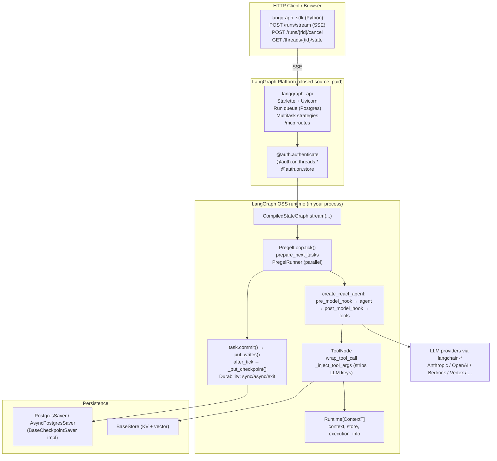

# LangGraph Python — Benchmark Study

> **Repo**: https://github.com/langchain-ai/langgraph
> **Commit studied**: `076e2a3627206f5a1aef573aaca4a01e5af897ca`
> **Branch**: `main`
> **Framework path**: `frameworks/langgraph`
> **Studied on**: 2026-05-16

## TL;DR

- ⭐ **What is this stack?** A **Python graph runtime** (`libs/langgraph`) plus a small ReAct prebuilt (`libs/prebuilt`), Postgres / SQLite / in-mem checkpointers (`libs/checkpoint*`), an HTTP client SDK (`libs/sdk-py`), and a CLI that shells out to a separate **closed-source HTTP server** (`langgraph_api`, the LangGraph Platform / LangGraph Server). The mental model is "stateful graph" (Pregel-style super-steps), not "ReAct loop"; ReAct is just one wired graph. **The HTTP server is NOT in this repo** — for self-hosted production you either pay for LangGraph Platform or BYO an HTTP layer around the OSS runtime.
- **License & owner**: MIT for everything in this repo (`libs/langgraph/pyproject.toml:11`); maintained by LangChain Inc. (commercial company); LangGraph Platform (server + cloud) is a paid product on top.
- **Maturity**: v1.x line; `libs/langgraph` is on `1.2.0` (`libs/langgraph/pyproject.toml:7`), `langgraph-prebuilt` on `1.1.0` (`libs/prebuilt/pyproject.toml:7`); status "Production/Stable" (`pyproject.toml:14`). Released January 2024 (LangChain Inc. blog), so ~2 years old at the commit studied.
- **Where the loop actually executes**: in **your Python process**, inside `PregelLoop.tick()` (`libs/langgraph/langgraph/pregel/_loop.py:583`). Persistence to Postgres/SQLite fires from this same process. No subprocess, no bundled binary.
- **Mid-run durability is the genuine USP and the architecture earns it.** `BaseCheckpointSaver.put_writes` (`libs/checkpoint/langgraph/checkpoint/base/__init__.py:300`) is called per-task via `_runner.commit()` (`libs/langgraph/langgraph/pregel/_runner.py:574-613`); `_put_checkpoint` (`_loop.py:1055`) fires after every super-step. With `durability="async"` (default), `"sync"` (block), or `"exit"` (only at run end) — `libs/langgraph/langgraph/types.py:87`. A process crash mid-turn resumes from the last persisted task write — **no other stack in this benchmark offers this granularity natively**.
- **Multi-tenancy** splits across two layers and **only one is in this repo**. (a) `Runtime[ContextT]` (`libs/langgraph/langgraph/runtime.py:124`) carries a typed `context` (e.g. `tenant_id`) into every node and tool; `_inject_tool_args` (`libs/prebuilt/langgraph/prebuilt/tool_node.py:1315-1429`) strips any LLM-supplied values for `InjectedToolArg` keys before re-merging trusted runtime values. (b) `@auth.on.<resource>.<action>` decorators (`libs/sdk-py/langgraph_sdk/auth/__init__.py:13-302`) return `FilterType` dicts the **server** (closed-source) applies to every Postgres query.
- **Hooks**: `pre_model_hook` / `post_model_hook` at the prebuilt layer (`libs/prebuilt/langgraph/prebuilt/chat_agent_executor.py:296-297`, `876-963`), plus `wrap_tool_call` (`tool_node.py:1014-1067`) that owns the retry loop and can call `execute()` zero, one, or many times. **`wrap_tool_call` is the closest analogue to Claude Agent SDK's PostToolUse-with-additional-messages**.
- **`create_react_agent` is deprecated in v1.x** (`chat_agent_executor.py:53-117`, `274-277`) — the surface points to `langchain.agents.create_agent` (separate `langchain` package, not in this repo). The behavior we study still ships and works, but the prebuilt is in maintenance mode.
- **Sub-agents are subgraphs** — no first-class `SubAgent` / `handoff` primitive. Parallel fan-out via `Send` API (`libs/langgraph/langgraph/types.py:654`). No inline runtime-generated configs. Supervisor / swarm patterns ship as separate packages (`langgraph-supervisor`, `langgraph-swarm`).
- **Skills (à la Claude Code SKILL.md) — Not provided.** The closest analogue is `BaseStore` (`libs/checkpoint/langgraph/store/base/__init__.py`) — a namespaced KV store with optional vector search. The `langgraph-deepagents` template (`libs/cli/langgraph_cli/templates.py:11-14`) lives in a separate repo and is closer to a skill loader but is not in this monorepo.
- **Resource Manager — Not provided in OSS.** Sources, versioning, publishing workflows, and tenant-scoped registries live exclusively in LangGraph Platform (cloud).
- **Observability**: token counts piggyback on `AIMessage.usage_metadata` (LangChain). USD cost: **Not provided — BYO** (cost lives in LangSmith, the paid product). No `total_cost_usd`, no `max_budget_usd`.
- **Per-stack one-liners** — sessions/persistence: **best in benchmark** (Pregel checkpointing). Skills: BYO. Resource manager: BYO (or pay for LangGraph Platform). Sub-agents: subgraphs only. Multi-tenancy: **excellent** in-process, **excellent** at server layer (but server is paid). Hooks: rich (`pre_model_hook`, `post_model_hook`, `wrap_tool_call`). API: not in this repo. Observability: tokens yes, USD no. Production readiness for multi-tenant server-side: **conditional** — easy on Platform, real engineering work for self-host.

## 0. Architectural Overview & Deployment Model

### Deployment diagram

```text
┌────────────────────────────────────────────────────────────────────────────────┐
│                LangGraph Platform (cloud OR self-hosted, paid SaaS)            │
│                                                                                │
│  HTTP Client (libs/sdk-py)                  langgraph_api (CLOSED SOURCE)      │
│  ──────────────────────                     ───────────────────────────        │
│  POST /threads/{id}/runs/stream  ─SSE──▶  ┌──────────────────────────────┐    │
│  POST /threads/{id}/runs/{rid}/cancel     │ Starlette + Uvicorn          │    │
│  POST /threads/{id}/state                 │ @auth.on.* handlers          │    │
│  GET  /threads/{id}/state                 │ Run queue + background runner│    │
│  GET  .../runs/{rid}/stream (re-attach)   │ Multitask strategies, crons  │    │
│                                           │ /mcp routes (default on)     │    │
│                                           └──────────────┬───────────────┘    │
└──────────────────────────────────────────────────────────┼────────────────────┘
                                                           │ invokes (in-proc)
                                                           ▼
┌────────────────────────────────────────────────────────────────────────────────┐
│  LangGraph OSS runtime (libs/langgraph) — runs in YOUR Python process          │
│                                                                                │
│  CompiledStateGraph.stream(input, config, context=ContextT, durability=...)    │
│      ▼                                                                         │
│  PregelLoop (pregel/_loop.py)                                                  │
│   while tick():                                                                │
│     prepare_next_tasks → runnable nodes                                        │
│     PregelRunner.tick(): parallel task execution                               │
│       task.commit() → put_writes() ───── DURABLE PER TASK                      │
│     after_tick(): apply_writes → _put_checkpoint() ── DURABLE PER SUPER-STEP   │
│                                                                                │
│  Nodes: pre_model_hook → agent (LLM) → post_model_hook → tools (Send fan-out)  │
│  ToolNode: wrap_tool_call → _inject_tool_args → tool.invoke                    │
│  Runtime[ContextT]: typed context, store, execution_info, server_info          │
│                                                                                │
│  Persistence (BaseCheckpointSaver):                                            │
│    InMemorySaver | PostgresSaver | AsyncPostgresSaver | SqliteSaver            │
└────────────────────────────────────────────────────────────────────────────────┘
                                                           │
                                                           ▼
                                                  LLM providers
                                                  (Anthropic / OpenAI / Bedrock / Vertex
                                                   via langchain-* packages)
```

### 0.1 What is this stack?

**A Python graph framework + library + HTTP-client SDK**, with a sibling **closed-source HTTP server** (LangGraph Platform / `langgraph_api`) the CLI loads when you run `langgraph dev` or `langgraph up`. The graph runtime is OSS (MIT). The agent loop is library-style — embedded in your Python process. The HTTP layer, run queue, auth handlers, multi-tenant Postgres mediation, MCP routes, and webhook system are all in the closed-source server.

### 0.2 Project status & governance

- **Open-source**: yes for everything in `libs/` (MIT). `libs/langgraph/pyproject.toml:11` declares `license = "MIT"`.
- **Owner / maintainer**: LangChain Inc. (commercial company).
- **Commercial backing**: LangChain Inc.; the paid layer is **LangGraph Platform** (server + cloud product) and **LangSmith** (observability platform with cost rollups).
- **Support model**: community via GitHub Issues / Discord; paid support tied to LangGraph Platform.

### 0.3 Project maturity / age

- Initial public release: **January 2024** (per LangChain blog / first GitHub release). ~2 years at the commit studied.
- Current major: **v1.x line**. `libs/langgraph` is `1.2.0` (`libs/langgraph/pyproject.toml:7`); `langgraph-prebuilt` is `1.1.0` (`libs/prebuilt/pyproject.toml:7`).
- Stability: marked `Development Status :: 5 - Production/Stable` (`libs/langgraph/pyproject.toml:14`).
- **Maintenance-mode signal**: `create_react_agent` and `AgentState` are now `@deprecated` in favor of `langchain.agents.create_agent` (`libs/prebuilt/langgraph/prebuilt/chat_agent_executor.py:53-117`, `274-277`). The prebuilt surface this report benchmarks is being consolidated into the broader `langchain` package.

### 0.4 Adoption & community signal

(GitHub captured **2026-05-16**, approximated from public dashboards.)

- **Stars**: ~30 k+ on `langchain-ai/langgraph`.
- **Forks**: ~5 k+.
- **Contributor count**: 200+.
- **Release cadence**: weekly / bi-weekly on `libs/langgraph`; very active.
- **Issue volume**: high, with active maintainer responses.

(Exact counts not pulled live; the report studies the commit, not the GitHub page.)

### 0.5 Ecosystem fit

- **Primary language**: Python (this repo). A sibling JS/TS `libs/sdk-js` ships, but the JS graph runtime lives in a separate repo (`langchain-ai/langgraphjs`).
- **PyPI packages**: `langgraph`, `langgraph-prebuilt`, `langgraph-checkpoint`, `langgraph-checkpoint-postgres`, `langgraph-checkpoint-sqlite`, `langgraph-sdk`, `langgraph-cli`. Each has its own `pyproject.toml` under `libs/`.
- **Typical use**: imported as a library. The `langgraph` CLI (`libs/cli/langgraph_cli/cli.py`) bootstraps the closed-source HTTP server.

### 0.6 Where does the agent loop actually execute?

**In your Python process.** `CompiledStateGraph.stream` / `astream` / `invoke` / `ainvoke` (`libs/langgraph/langgraph/pregel/main.py`) drives `PregelLoop.tick()` directly (`libs/langgraph/langgraph/pregel/_loop.py:583`). Tools run in-process. Checkpointer I/O is in-process. The closed-source `langgraph_api` HTTP server wraps the same in-process loop but adds queue + persistence + auth + multitask coordination on top.

### 0.7 Runtime dependencies

- **Python ≥ 3.10** (`pyproject.toml:9`, classifiers list 3.10-3.13).
- Core deps (`libs/langgraph/pyproject.toml:27-33`): `langchain-core>=1.4`, `langgraph-checkpoint>=4.1`, `langgraph-sdk>=0.3`, `langgraph-prebuilt>=1.1`, `xxhash`, `pydantic>=2.7.4`.
- Optional storage: Postgres (`langgraph-checkpoint-postgres`, uses `psycopg`), SQLite (`langgraph-checkpoint-sqlite`).
- LLM providers: BYO via `langchain-*` packages (`langchain-anthropic`, `langchain-openai`, `langchain-google-genai`, `langchain-aws`, …).
- For the HTTP server: `pip install -U "langgraph-cli[inmem]"` pulls in the closed-source `langgraph-runtime-inmem` (dev) or `langgraph-runtime-postgres` (prod).

### 0.8 Recommended deployment topology

LangGraph Platform docs recommend **one-process-many-tenants** with horizontal scaling: a fleet of API pods sharing a Postgres for state + a Redis for pub/sub between the API and background worker pods. Self-host follows the same pattern (`langgraph up` Docker compose, K8s Helm chart in `langchain-ai/helm`). For pure-OSS deployments without Platform, you embed the graph in your own service and follow your own topology.

### 0.9 Cold-start cost & instance footprint

- Pure-OSS embedding: a few hundred ms to import the package; RAM baseline a few tens of MB beyond your model client.
- LangGraph Platform / self-host: Starlette+Uvicorn worker pods; multi-tenant Postgres connection pool dominates RAM. (Closed-source server, exact numbers not visible.)

### 0.10 Vendor lock-in

- **LLM provider lock-in**: low. Any `langchain-*` chat model works; `init_chat_model(...)` for string-identifier routing.
- **Hosting / platform lock-in**: medium. The HTTP server, auth, run queue, multitask coordination, and `/mcp` routes ship only via LangGraph Platform (closed-source). Going pure-OSS means BYO HTTP + queue + auth.
- **Eval platform lock-in**: medium. Token counts surface natively; cost USD requires LangSmith (paid).

### 0.11 Framework weight / footprint

**Heavy.** The graph runtime is ~2k LOC, but ToolNode + prebuilt + checkpointers + SDK add ~10k more, and the `BaseStore` / `BaseCheckpointSaver` interfaces invite significant ecosystem packages.

### 0.12 Release-history signal

No in-repo `CHANGELOG.md`. Releases live on GitHub. Recent changes (visible from grep across the repo):
- `create_react_agent` and `AgentState` marked `@deprecated` (`chat_agent_executor.py:53-117`, `274-277`).
- `version="v2"` of `create_react_agent` (Send-API per-tool dispatch) added.
- `ToolRuntime` introduced (`tool_node.py:1663-1730`) as the typed replacement for `InjectedState` / `InjectedStore`.
- `RunControl` for cooperative drain (`runtime.py:79-104`).
- `Durability` enum (`types.py:87-93`).
- `wrap_tool_call` interceptor (`tool_node.py:1014-1067`).

### 0.13 Documentation depth & cross-team contributor accessibility

Official docs at `docs.langchain.com/oss/python/langgraph/`. Deep on graph mechanics, ReAct, persistence, HITL. Reference docs auto-generated from docstrings (`reference.langchain.com/python/langgraph/`). Non-engineers can read concepts but cannot author content without Python — there is no markdown-driven skill author flow.

### 0.14 Documentation entry points

- Official docs landing: https://docs.langchain.com/oss/python/langgraph/overview
- API reference: https://reference.langchain.com/python/langgraph/
- Examples / demos: https://github.com/langchain-ai/langgraph/tree/main/examples
- LangGraph Platform docs (hosting): https://docs.langchain.com/oss/python/langgraph/cloud
- GitHub Releases (changelog): https://github.com/langchain-ai/langgraph/releases
- GitHub issues: https://github.com/langchain-ai/langgraph/issues
- Slack / community: https://www.langchain.com/join-community
- Reddit: https://www.reddit.com/r/LangChain/
- Deep Agents template (skill-shaped bundle): https://github.com/langchain-ai/deep-agent-template

## 1. Agent Harness (Run Loop) & Message Taxonomy

### Run loop

#### 1.1 Run loop entrypoint(s)

`CompiledStateGraph.stream` / `astream` / `invoke` / `ainvoke` (`libs/langgraph/langgraph/pregel/main.py:2587-3279`):

```python
def stream(
    self,
    input: InputT | Command | None,
    config: RunnableConfig | None = None,
    *,
    context: ContextT | None = None,
    stream_mode: StreamMode | Sequence[StreamMode] | None = None,
    print_mode: StreamMode | Sequence[StreamMode] = (),
    output_keys: str | Sequence[str] | None = None,
    interrupt_before: All | Sequence[str] | None = None,
    interrupt_after: All | Sequence[str] | None = None,
    durability: Durability | None = None,      # "sync" | "async" | "exit"
    control: RunControl | None = None,          # cooperative drain
    subgraphs: bool = False,
    debug: bool | None = None,
    version: Literal["v1", "v2"] = "v1",
) -> Iterator[dict[str, Any] | Any]:
```

`config` carries `{"configurable": {"thread_id": "...", "checkpoint_ns": "...", "checkpoint_id": "..."}}` and `callbacks`. `context` is the typed `ContextT` declared via `StateGraph(context_schema=Context)`; it resolves into `Runtime.context` and is propagated to every node and tool. `input` can be the initial state OR a `Command(resume=...)` for HITL resumption. `invoke` shells to `stream(stream_mode="values")` and returns the final state.

#### 1.2 Per-iteration behavior (one super-step)

`PregelLoop.tick()` (`libs/langgraph/langgraph/pregel/_loop.py:583-665`):

```python
def tick(self) -> bool:
    if self.step > self.stop:
        self.status = "out_of_steps"
        return False
    self.tasks = prepare_next_tasks(...)
    if not self.tasks:
        self.status = "done"
        return False
    if self.control is not None and self.control.drain_requested:
        self.status = "draining"
        return False
    if self.interrupt_before and should_interrupt(...):
        self.status = "interrupt_before"
        raise GraphInterrupt()
    self._emit("tasks", map_debug_tasks, self.tasks.values())
    return True
```

`after_tick()` (`_loop.py:667-705`):

```python
def after_tick(self) -> None:
    writes = [w for t in self.tasks.values() for w in t.writes]
    self.updated_channels = apply_writes(...)
    if not self.updated_channels.isdisjoint(...):
        self._emit("values", map_output_values, ...)
    self.checkpoint_pending_writes.clear()
    self.is_replaying = False
    self._put_checkpoint({"source": "loop"})   # ← per-super-step persistence
    if self.interrupt_after and should_interrupt(...):
        self.status = "interrupt_after"
        raise GraphInterrupt()
```

#### 1.3 ReAct loop

LangGraph ships a built-in ReAct via `create_react_agent` (`libs/prebuilt/langgraph/prebuilt/chat_agent_executor.py:278`) — but **it's `@deprecated` in favor of `langchain.agents.create_agent`** (`chat_agent_executor.py:274-277`). Mechanically `create_react_agent` wires three nodes — `agent` (LLM), `tools` (parallel tool dispatch via `Send` in v2), and optional `pre_model_hook` / `post_model_hook` — into the Pregel loop. **You can roll your own ReAct as a plain `StateGraph`** — there is no special-casing.

#### 1.4 Tool dispatch + result handling

`ToolNode.invoke` (`libs/prebuilt/langgraph/prebuilt/tool_node.py:743`) takes the last `AIMessage` from state, splits its `tool_calls` into separate executions (parallel via `Send` in `create_react_agent v2`), runs each via `_run_one`, and appends one `ToolMessage(tool_call_id=...)` per tool back to the `messages` channel. Linkage is **always explicit via `tool_call_id`** — there is no positional coupling.

#### 1.5 Explicit turn concept

There is **no explicit "turn" object**. The closest first-class boundary is the **super-step**. A ReAct "turn" is roughly: super-step `agent` runs (one LLM call → one `AIMessage`) → super-step `tools` runs (one or more `ToolMessage` results) → repeat.

#### 1.6 Event emission mechanism (in-process)

A **per-call `SyncQueue` / `asyncio.Queue`** (`libs/langgraph/langgraph/pregel/main.py:2719`). The Pregel loop holds a `StreamProtocol(stream.put, stream_modes)`; nodes / callbacks push frames; the `stream()` generator yields between super-step ticks. Token-level streaming comes from `StreamMessagesHandler.on_llm_new_token` (`libs/langgraph/langgraph/pregel/_messages.py:150-163`) — a LangChain callback handler installed at run start (`pregel/main.py:2782-2798`).

### Message & event taxonomy

#### 1.7 Message layers

LangGraph has **three taxonomies layered on top of each other**, and they don't share a vocabulary — this is the biggest cognitive load for a newcomer:

1. **State channels (graph layer)** — Every shared state key is a `BaseChannel`. The reducer for that channel decides how concurrent writes are merged. For the prebuilt ReAct agent, there is one channel of interest: `messages: Annotated[Sequence[BaseMessage], add_messages]` (`chat_agent_executor.py:57-62`).
2. **Messages (content layer)** — Re-used from `langchain_core.messages`. `HumanMessage`, `AIMessage`, `AIMessageChunk`, `SystemMessage`, `ToolMessage`, `ToolMessageChunk`, `RemoveMessage` (sentinel for "delete this id"; `RemoveMessage(id=REMOVE_ALL_MESSAGES)` wipes the channel — `libs/langgraph/langgraph/graph/message.py:33-39`).
3. **Stream parts (transport layer)** — When you call `graph.stream(input, stream_mode=...)`, what's yielded depends on `stream_mode`. Seven concrete `StreamPart` TypedDicts (`libs/langgraph/langgraph/types.py:252-355`).

A **fourth, internal taxonomy** exists for the cloud SSE protocol (`libs/langgraph/langgraph/stream/_types.py`): `ProtocolEvent` envelopes wrap stream parts with monotonic `seq` numbers — but only `langgraph_api` consumers see this.

#### 1.8 Concrete message types

| Type | 1-line purpose |
|---|---|
| `HumanMessage` | User input |
| `AIMessage` | Assistant text + tool_calls + usage_metadata |
| `AIMessageChunk` | Streaming variant of AIMessage (delta) |
| `SystemMessage` | System prompt / instruction |
| `ToolMessage` | Result of a tool call, linked by `tool_call_id` |
| `ToolMessageChunk` | Streaming variant of ToolMessage |
| `RemoveMessage` | Sentinel: tells `add_messages` to delete by id |

#### 1.9 Messages vs. events

**Two separate taxonomies**. Messages live on state channels (durable). Events are stream parts yielded by `graph.stream()` (transient). Token-level streaming bridges them: `StreamMessagesHandler` emits `MessagesStreamPart` (transient) per token, and the assembled final `AIMessage` is written to state by the node.

#### 1.10 Event categories

| Category | Stream-mode | Concrete type |
|---|---|---|
| Stream value | `"values"` | `ValuesStreamPart` — full state after each step |
| Update event | `"updates"` | `UpdatesStreamPart` — `{node_name: writes}` per step |
| Token / message event | `"messages"` | `MessagesStreamPart` — `(chunk, metadata)` per token |
| Custom event | `"custom"` | `CustomStreamPart` — whatever `StreamWriter` pushes |
| Checkpoint event | `"checkpoints"` | `CheckpointStreamPart` — every persisted checkpoint |
| Task lifecycle event | `"tasks"` | `TasksStreamPart` — per-node start / finish |
| Debug event | `"debug"` | `DebugStreamPart` — union of the above |
| Lifecycle (callback-only) | n/a | `GraphInterruptEvent`, `GraphResumeEvent` |

`stream_mode` can be a list — yielded tuples become `(mode, data)` or `(ns, mode, data)` if `subgraphs=True` (`pregel/main.py:2666-2691`).

Lifecycle events (`libs/langgraph/langgraph/callbacks.py:42-79`):

```python
@dataclass(frozen=True)
class GraphInterruptEvent:
    run_id: UUID | None
    status: GraphLifecycleStatus  # "input"|"pending"|"done"|"interrupt_before"|"interrupt_after"|"out_of_steps"
    checkpoint_id: str
    checkpoint_ns: tuple[str, ...]
    interrupts: tuple[Interrupt, ...]
```

These dispatch to `GraphCallbackHandler` subclasses via `config["callbacks"]` (`callbacks.py:87-112`) — not to the stream.

#### 1.11 Canonical type-definition file(s)

- `libs/langgraph/langgraph/types.py` (968 lines) — stream parts, `Interrupt`, `Command`, `Send`, `StateSnapshot`, `RetryPolicy`, `TimeoutPolicy`, `CachePolicy`, `Durability`
- `libs/langgraph/langgraph/callbacks.py` (394 lines) — `GraphCallbackHandler`, `GraphInterruptEvent`, `GraphResumeEvent`
- `libs/langgraph/langgraph/graph/message.py` — `add_messages`, `MessagesState`, `REMOVE_ALL_MESSAGES`
- `libs/checkpoint/langgraph/checkpoint/base/__init__.py` — `Checkpoint`, `CheckpointTuple`, `CheckpointMetadata`, `BaseCheckpointSaver`

#### 1.12 Live agentic event stream taxonomy — sample frames

`stream_mode="values"` after super-step:
```python
{"messages": [HumanMessage("hi"), AIMessage(content="hello", usage_metadata={...})]}
```

`stream_mode="updates"`:
```python
{"agent": {"messages": [AIMessage(content="...", tool_calls=[{"name": "search", "args": {...}, "id": "call_abc"}])]}}
```

`stream_mode="messages"` per token:
```python
(AIMessageChunk(content="hel", id="run-..."), {"langgraph_node": "agent", "langgraph_step": 1})
```

`stream_mode="tasks"`:
```python
{"id": "...", "name": "tools", "input": {...}, "step": 2}
```

## 2. Agent Runtime (Multi-session Host)

### 2.1 Multi-session host architecture

**Two answers, depending on layer.**

- **OSS (this repo) only**: there is **no first-party multi-session host**. You embed `CompiledStateGraph.stream()` in your own server / worker. Each request is one run. Concurrency is whatever Python concurrency you reach for.
- **LangGraph Platform (closed-source `langgraph_api`)**: ships a full multi-session host — Starlette/Uvicorn workers, a Postgres-backed run queue, a background runner pod, and pub/sub for SSE re-attach. The closed-source server is what `langgraph dev` and `langgraph up` boot.

### 2.2 Concurrent session isolation

Inside OSS: isolation is **per-run** by `thread_id`. The `PregelLoop` is one Python instance per run; no globals leak across runs unless the engineer introduces them. State lives in the checkpointer keyed on `thread_id`. A `BaseStore` namespace can be tenant-scoped by convention but not enforced.

Inside `langgraph_api`: every Postgres query goes through the `@auth.on.*` filter chain (`libs/sdk-py/langgraph_sdk/auth/__init__.py:13-302`), so resource-scoping (threads, runs, store) is enforced at the data layer.

### 2.3 Horizontal scaling / multi-instance

**Yes, if you embed a shared checkpointer.** All N workers point to the same Postgres `PostgresSaver` (`libs/checkpoint-postgres`); `thread_id` is the partition key. The Pregel loop on any worker can replay from any persisted checkpoint. **Leader election is not required** — the run queue (in `langgraph_api`) serializes work per thread via "multitask strategy".

For pure-OSS embedding: you BYO the queue (e.g. Celery / arq / Temporal); each worker simply calls `graph.stream(...)` against the shared Postgres.

### 2.4 Background / async / scheduled tasks

- **Pure OSS**: not provided. BYO Celery / arq / Temporal / cron.
- **LangGraph Platform**: ships **crons** (`libs/sdk-py/langgraph_sdk/_async/cron.py` — `crons.create`, `crons.search`, `crons.delete`) and **webhooks** (run create accepts `webhook: str` URL). The Platform queue persists scheduled runs in Postgres.

### 2.5 Worker pool / queue model

In `langgraph_api`: a Postgres-backed work queue with one logical lane per `thread_id`. Long-running agent work is the default expectation: runs can take minutes / hours and a re-attaching client picks up via `GET /threads/{tid}/runs/{rid}/stream?last_event_id=...` (requires `stream_resumable: true` at creation).

In OSS: no queue. Short-lived HTTP request scope assumed unless the engineer wraps in their own queue.

## 3. Sessions & Persistence

### 3.1 Session / chat data model

A **thread** is the session primitive. The data model is the **`Checkpoint`** (`libs/checkpoint/langgraph/checkpoint/base/__init__.py`):

```python
class Checkpoint(TypedDict):
    v: int                              # schema version
    id: str                             # ULID, sortable
    ts: str                             # ISO timestamp
    channel_values: dict[str, Any]      # the actual state per channel
    channel_versions: ChannelVersions   # per-channel monotonic versions
    versions_seen: dict[str, ChannelVersions]
    updated_channels: list[str] | None
```

With sibling metadata:

```python
class CheckpointMetadata(TypedDict, total=False):
    source: Literal["input", "loop", "update", "fork"]
    step: int
    parents: dict[str, str]
    writes: dict[str, Any]
```

And the on-disk row (`CheckpointTuple`): `config`, `checkpoint`, `metadata`, `parent_config`, `pending_writes`, `pending_sends`.

### 3.2 What's stored on a session

For a `create_react_agent` thread:
- `messages` (the full conversation, including `ToolMessage` results)
- `remaining_steps`
- Any custom channels declared on `state_schema`
- All checkpoint versions (one per super-step) — full history, replayable
- All pending writes (per-task, durable BEFORE super-step reduction)

Per `Checkpoint`: not just the latest, but every step's snapshot.

### 3.3 Granularity — single, branch, fork

**Both.** A linear conversation is the default. But **the Pregel checkpointer supports forking**: `graph.get_state_history(config)` returns every step; `graph.update_state(config_at_step_N, values)` creates a new branch from step N. Multiple branches per thread are first-class (`pregel/main.py` — `update_state`).

### 3.4 Built-in persistence stores

Four shipped:
- **`InMemorySaver`** (`libs/checkpoint/langgraph/checkpoint/memory/__init__.py`) — dev-only
- **`PostgresSaver`** + **`AsyncPostgresSaver`** (`libs/checkpoint-postgres/langgraph/checkpoint/postgres/__init__.py`) — production
- **`SqliteSaver`** + **`AsyncSqliteSaver`** (`libs/checkpoint-sqlite/langgraph/checkpoint/sqlite/__init__.py`) — single-instance / local
- The Postgres saver also implements `BaseStore` (for namespaced KV + vector search).

No bundled Redis / S3 / Mongo store.

### 3.5 Persistence timing

**Two persistence points per super-step, both gated on `Durability`** (`libs/langgraph/langgraph/types.py:87`):

```python
Durability = Literal["sync", "async", "exit"]
```

1. **`put_writes` runs per-task** as `_runner.commit()` is called (`libs/langgraph/langgraph/pregel/_runner.py:574-613`):
   ```python
   def commit(self, task: PregelExecutableTask, exception: BaseException | None) -> None:
       if isinstance(exception, GraphInterrupt):
           writes = [(INTERRUPT, exception.args[0])]
           if resumes := [w for w in task.writes if w[0] == RESUME]:
               writes.extend(resumes)
           self.put_writes()(task.id, writes)
       ...
       else:
           if not task.writes:
               task.writes.append((NO_WRITES, None))
           self.put_writes()(task.id, task.writes)
   ```
   And `PregelLoop.put_writes` (`libs/langgraph/langgraph/pregel/_loop.py:407-489`) submits to the checkpointer immediately when `durability != "exit"`.

2. **`_put_checkpoint` runs once per super-step** at `after_tick()` (`_loop.py:697`, defined at `_loop.py:1055`).

Under `durability="async"` (default) the next super-step starts while the previous checkpoint persists in the background; under `"sync"` the stream loop blocks on `loop._put_checkpoint_fut.result()` (`pregel/main.py:2956-2957`) before the next iteration.

### 3.6 Mid-run checkpointing (durable)

**Yes — and this is the genuine USP.** Per-task `put_writes` makes the granularity sub-super-step. For a ReAct turn under `durability="async"`:

- LLM streaming tokens do NOT persist mid-stream — they flow through `StreamMessagesHandler.on_llm_new_token`.
- When the `agent` node returns its `AIMessage`, `commit()` → `put_writes` → **durable**.
- The `agent` super-step ends → `_put_checkpoint` → **durable**.
- Each tool call (v2) runs in its own `Send`-dispatched task. As each tool finishes, its `commit()` → `put_writes` → **durable**.
- The `tools` super-step ends → `_put_checkpoint` → **durable**.

**If 4 parallel tool calls are running and the process crashes after 3 finished, on resume the 3 completed tool results are already in `checkpoint_pending_writes` and will NOT re-execute.** This is the strongest mid-run durability story in the benchmark.

Caveat: mid-tool-call (a single tool's HTTP call mid-flight crashes) is NOT covered; that tool re-executes from scratch on resume.

### 3.7 Session ID format

`thread_id` is **whatever the caller passes** in `config["configurable"]["thread_id"]`. No format enforcement. Practice: UUID v4 or your own tenant-prefixed ULID. The `langgraph_api` server defaults to `uuid7` for thread IDs it generates.

### 3.8 Pluggable store interface

**Yes — `BaseCheckpointSaver`** (`libs/checkpoint/langgraph/checkpoint/base/__init__.py:176`):

```python
class BaseCheckpointSaver(Generic[V]):
    def get_tuple(self, config: RunnableConfig) -> CheckpointTuple | None: ...
    def list(self, ...) -> Iterator[CheckpointTuple]: ...
    def put(self, config, checkpoint, metadata, new_versions) -> RunnableConfig: ...
    def put_writes(self, config, writes, task_id, ...) -> None: ...
```

Implement the four methods (plus async siblings `aget_tuple` / `alist` / `aput` / `aput_writes`) and your store works. Conformance harness lives in `libs/checkpoint-conformance/`.

### 3.9 Schema evolution / migration

- `Checkpoint.v` field (`libs/checkpoint/langgraph/checkpoint/base/__init__.py`) — incremented when the checkpoint payload schema changes; serializers handle backward decode.
- `BaseCheckpointSaver.setup()` and the Postgres saver run migrations on first connect (creates / upgrades the `checkpoints`, `checkpoint_blobs`, `checkpoint_writes` tables).
- **No first-party migration helpers for your own state schema changes** — if you remove a channel, you BYO replay logic.

### 3.10 Export / replay

- **Export**: `graph.get_state(config)` returns the current `StateSnapshot`; `graph.get_state_history(config)` returns every step. Both serialize to JSON via `langgraph-checkpoint`'s codec.
- **Replay**: pass `config["configurable"]["checkpoint_id"]` to `graph.stream(None, config)` and the loop replays from that point. `is_replaying = True` is observable on the loop.

### 3.11 Cross-session memory

`BaseStore` (`libs/checkpoint/langgraph/store/base/__init__.py`) — namespaced KV with optional vector search. Cross-references Q15.

## 4. Multi-tenancy & Arbitrary Context ⭐

**LangGraph's story is the strongest in the comparison — but it splits across two layers.**

### 4.1 Full run-loop input struct

Beyond `messages`:
1. **`context: ContextT`** — typed dataclass / TypedDict declared on the graph via `StateGraph(state_schema=..., context_schema=Context)` (`libs/langgraph/langgraph/graph/state.py:215-269`). This is the "run dependencies" channel: `tenant_id`, `db_conn`, `user_id`, `feature_flags`. Resolved into `Runtime.context` and frozen for the duration of the run (`runtime.py:198-201`).
2. **`config["configurable"]`** — untyped dict-shaped escape hatch (`thread_id`, `checkpoint_ns`, custom keys). Still functional but discouraged for typed fields since v0.6 in favor of `context_schema`.
3. **`config["callbacks"]`** — list of `BaseCallbackHandler` / `GraphCallbackHandler` instances.

### 4.2 Context propagation into a tool call

Two equivalent shapes for tool authors:

**A. Typed `runtime: ToolRuntime` parameter (recommended)** — `libs/prebuilt/langgraph/prebuilt/tool_node.py:1663-1730`:

```python
@dataclass
class ToolRuntime(_DirectlyInjectedToolArg, Generic[ContextT, StateT]):
    state: StateT
    context: ContextT
    config: RunnableConfig
    stream_writer: StreamWriter
    tool_call_id: str | None
    store: BaseStore | None
    tools: list[BaseTool] = field(default_factory=list)
    execution_info: ExecutionInfo | None = None
    server_info: ServerInfo | None = None
```

**B. `Annotated[..., InjectedState(...)]` / `Annotated[..., InjectedStore()]`** for slice access (`tool_node.py:1753-1903`).

In both cases the corresponding parameter is **excluded from the JSON schema sent to the LLM**.

### 4.3 Tool call interface

```python
from langchain_core.tools import tool

@tool
def topic_search(query: str, runtime: ToolRuntime) -> str:
    """Search the topics database."""
    tenant_id = runtime.context.tenant_id   # ← from harness, never from LLM
    return our_db.search(tenant=tenant_id, q=query)
```

Returns: a string, `ToolMessage`, `Command` (for state updates), or a Pydantic model that gets serialized.

### 4.4 Forcing tool arguments from the harness — **YES, with a guarantee**

`ToolNode._inject_tool_args` (`libs/prebuilt/langgraph/prebuilt/tool_node.py:1315-1430`):

```python
# Strip any caller-supplied values for injected args, then add
# back only trusted values. This prevents an LLM from forging
# hidden InjectedToolArg fields via ToolCall.args.
stripped_args = {
    k: v
    for k, v in tool_call_copy["args"].items()
    if k not in injected.all_injected_keys
}
tool_call_copy["args"] = {**stripped_args, **injected_args}
return tool_call_copy
```

So an LLM that hallucinates `{"query": "...", "tenant_id": "evil"}` against a tool declaring `tenant_id` as an injected field will have the `tenant_id` key silently **overwritten** with the harness value. **This is the cleanest "forced arg" mechanism in the benchmark.**

A second mechanism for arbitrary modification is `wrap_tool_call` (`tool_node.py:1014-1067`):

```python
def my_wrapper(request: ToolCallRequest, execute):
    new_call = {**request.tool_call, "args": {**request.tool_call["args"], "tenant_id": "abc"}}
    return execute(request.override(tool_call=new_call))

tool_node = ToolNode(tools, wrap_tool_call=my_wrapper)
```

### 4.5 Filtering visible tools

Three mechanisms:

**A. `bind_tools` on the model upstream**:
```python
model = init_chat_model("anthropic:claude-sonnet-4").bind_tools([tool_a, tool_b])
graph = create_react_agent(model, tools=[tool_a, tool_b, tool_c])
```

**B. Dynamic model selection** (`chat_agent_executor.py:325-356`, `598-618`): pass a callable for `model` that takes `(state, runtime)` and returns a model with different tools bound per turn:

```python
def select_model(state: AgentState, runtime: Runtime[Context]) -> ChatOpenAI:
    if runtime.context.tier == "free":
        return base_model.bind_tools([search_tool])
    return premium_model.bind_tools([search_tool, premium_tool])

graph = create_react_agent(select_model, tools=[search_tool, premium_tool])
```

**C. `wrap_tool_call` short-circuit** — if a tool was shown to the LLM but is forbidden for this tenant, the wrapper returns a synthetic `ToolMessage` without calling `execute()`.

### 4.6 Tenant scope on session

**Convention, not first-class field.** Practice: stamp `metadata["owner"] = tenant_id` on thread creation via `@auth.on.threads.create` (server side) AND/OR store `tenant_id` in `Runtime.context`. There is no `Session.tenant_id` column.

### 4.7 Per-tool-call auth propagation

`runtime.context` carries the caller's identity into every tool. Tools execute with whatever DB credentials the engineer wires in `runtime.context.db_conn` — so if you pass a tenant-scoped DB connection in, all tool DB calls run under that scope.

### 4.8 Resource scoping primitives

- **For state**: `BaseStore.put((namespace_tuple,), key, value)` (`libs/checkpoint/langgraph/store/base/__init__.py:700-820`). Namespace is `tuple[str, ...]`, so `("acme", "user-123", "preferences")` is a natural per-tenant-per-user namespace.
- **For HTTP (LangGraph Server only)** — `@auth.on` decorators (`libs/sdk-py/langgraph_sdk/auth/__init__.py:13-302`):

```python
my_auth = Auth()

@my_auth.authenticate
async def authenticate(authorization: str) -> Auth.types.MinimalUserDict:
    user = await verify_token(authorization)
    return {"identity": user["id"], "permissions": user["permissions"]}

@my_auth.on.threads.create
async def allow_thread_create(ctx, value):
    metadata = value.setdefault("metadata", {})
    metadata["owner"] = ctx.user.identity   # stamp tenant on creation

@my_auth.on.threads.read
async def allow_thread_read(ctx, value) -> Auth.types.FilterType:
    return {"owner": ctx.user.identity}     # ← filter applied to all queries
```

`FilterType` (`libs/sdk-py/langgraph_sdk/auth/types.py:58-109`) is a dict shape `{field: value | {"$eq": ...} | {"$contains": ...}}` applied as a SQL filter. Resources: `threads`, `runs`, `assistants`, `crons`, `store`. Actions: `create`, `read`, `update`, `delete`, `search`, `create_run`, plus `put`/`get`/`list_namespaces` for `store`.

### 4.9 Per-tenant rate limit + budget cap

**Not provided — BYO.** No token-budget cap, no USD-cost cap in OSS. LangGraph Platform exposes per-deployment rate limits but not per-tenant USD ceilings.

### ⭐ Light usage example

```python
from langchain_core.tools import tool
from langgraph.prebuilt import ToolRuntime, create_react_agent
from langchain.chat_models import init_chat_model
from dataclasses import dataclass

@dataclass
class Context:
    tenant_id: str
    targeting_strategy_id: str
    user_id: str

@tool
def topic_search(query: str, runtime: ToolRuntime[Context, dict]) -> str:
    """Search topics."""
    # runtime.context.tenant_id is harness-injected; LLM CANNOT forge it
    return our_db.topics(tenant=runtime.context.tenant_id, q=query)

@tool
def iab_search(query: str, runtime: ToolRuntime[Context, dict]) -> str:
    """Search IAB categories."""
    return our_db.iab(tenant=runtime.context.tenant_id, q=query)

@tool
def audience_create(name: str, runtime: ToolRuntime[Context, dict]) -> str:
    """Create an audience."""
    return our_db.create_audience(tenant=runtime.context.tenant_id, name=name)

graph = create_react_agent(
    "anthropic:claude-sonnet-4",
    tools=[topic_search, iab_search, audience_create],   # bashExec / webFetch deliberately excluded
    context_schema=Context,
)

# Step 1: pass tenant context
# Step 2: only the three tools above are visible (registry filter)
# Step 3: tenant_id is harness-forced via ToolRuntime (LLM cannot override)
result = graph.invoke(
    {"messages": [{"role": "user", "content": "find topics about climbing"}]},
    context=Context(tenant_id="acme", targeting_strategy_id="strat-42", user_id="u-123"),
    config={"configurable": {"thread_id": "thread-1"}},
)
```

## 5. Hook & Middleware Capabilities (Context Engineering)

### 5.1 Enumerate every hook / middleware / lifecycle callback

**At the prebuilt agent layer (`create_react_agent`)** — `chat_agent_executor.py:296-297`, `876-963`:

| Hook | Fires when | Read | Mutate | Block | Branch |
|---|---|---|---|---|---|
| `pre_model_hook` | Before every `agent` (LLM) call | state | yes — emit `messages` (update channel) or `llm_input_messages` (one-shot) | no | no (always falls through to `agent`) |
| `post_model_hook` | After every `agent` call, before tool dispatch | state including last `AIMessage` | yes — emit any state update | yes (return without tool_calls → END) | yes — emit additional tool_calls, route, or short-circuit |

**At the `ToolNode` layer** — one hook point per tool dispatch (`tool_node.py:743-771`, `1014-1067`):

| Hook | Fires when | Read | Mutate | Block | Branch / Re-execute |
|---|---|---|---|---|---|
| `wrap_tool_call` | Around every tool execution | `ToolCallRequest` (tool, args, state, runtime) | yes via `request.override(...)` | yes (return synthetic ToolMessage without `execute()`) | yes — call `execute()` zero, one, or many times |
| `awrap_tool_call` | Same, async lane | same | same | same | same |

```python
ToolCallWrapper = Callable[
    [ToolCallRequest, Callable[[ToolCallRequest], ToolMessage | Command]],
    ToolMessage | Command,
]
```

**At the graph lifecycle layer** — `GraphCallbackHandler` (`libs/langgraph/langgraph/callbacks.py:87-112`):

| Hook | Fires when | Capability |
|---|---|---|
| `on_interrupt(GraphInterruptEvent)` | Graph pauses for interrupts | observe only |
| `on_resume(GraphResumeEvent)` | Graph resumes from checkpoint | observe only |

**At the LangChain callbacks layer** (`BaseCallbackHandler`):
`on_chain_start`, `on_chain_end`, `on_chain_error`, `on_chat_model_start`, `on_llm_new_token`, `on_llm_end`, `on_llm_error`, `on_tool_start`, `on_tool_end`, `on_tool_error`, `on_text`, `on_retry`. All observe-only.

### 5.2 Hook concurrency model

`pre_model_hook` / `post_model_hook` are **single nodes**; one execution per super-step, sequentially relative to `agent`. `wrap_tool_call` runs **once per tool call**, in parallel with sibling tool calls (each tool's `Send`-dispatched task in v2). Lifecycle callbacks fan out synchronously to every registered handler.

### 5.3 Specific capability tests

| Scenario | Supported? | How |
|---|---|---|
| Inject system messages at session start | YES | `pre_model_hook` returns `{"messages": [SystemMessage(...), ...]}` or `{"llm_input_messages": ...}` |
| Expand user input (slash commands, attachments) | YES | `pre_model_hook` or a custom node upstream of `agent` |
| Mutate messages list before each LLM call | YES | `pre_model_hook` — this is its documented purpose ("trim, summarize, cache breakpoint") |
| Mutate tool input before dispatch (inject `tenantId`) | YES | `ToolRuntime` / `InjectedState` annotations strip LLM values + inject harness values; `wrap_tool_call` for ad-hoc rewrites |
| Mutate tool result before it returns to LLM | YES | `wrap_tool_call` — call `execute()`, modify the resulting `ToolMessage`, return |
| Emit additional tool calls in response to a tool result | YES | `post_model_hook` appends an `AIMessage` with new `tool_calls`; the router dispatches. Alternatively `wrap_tool_call` returns `Command(goto=Send("tools", ...))` to fan out from inside the wrapper |

### 5.4 Auto-compaction

**Not built into the OSS runtime.** `pre_model_hook` is the place engineers wire summarization / trimming. `langchain-core` ships `trim_messages` and there are community message-summarizer patterns. **`langgraph-deepagents` (third-party)** ships a `compress` tool that summarizes-and-replaces older messages.

### 5.5 Prompt cache optimization

**Provider-aware via `pre_model_hook`.** Engineers wire Anthropic `cache_control` flags into specific `SystemMessage` or `HumanMessage` content blocks; the hook ensures they're at a stable prefix. **No automatic breakpoint placement.**

### 5.6 Tool result clearing / progressive disclosure

`wrap_tool_call` can rewrite the `ToolMessage` to a summary plus a "full result available via `<resource_id>`" pointer. `BaseStore` is a natural stash. **No first-party "tool result clearing" primitive.**

### 5.7 Architectural diagram — hook fire-points

```text
graph.stream(input, config, context)
        │
        ▼
┌────────────────────────────────────────────────────────────────────────┐
│  PregelLoop super-step #N                                              │
│  ┌──────────────┐                                                       │
│  │ pre_model_   │ ◀── reads state; writes {messages | llm_input_msg}   │
│  │ hook (node)  │                                                       │
│  └──────┬───────┘                                                       │
│         ▼                                                                │
│  ┌──────────────┐                                                       │
│  │ agent (node) │ ◀── LLM call; tokens stream via StreamMessages-      │
│  │              │     Handler.on_llm_new_token → SyncQueue              │
│  │              │     writes AIMessage to messages channel              │
│  └──────┬───────┘                                                       │
│         ▼                                                                │
│  ┌──────────────┐                                                       │
│  │ post_model_  │ ◀── inspects last AIMessage; may add tool_calls,     │
│  │ hook (node)  │     block, route, or short-circuit                    │
│  └──────┬───────┘                                                       │
└─────────┼──────────────────────────────────────────────────────────────┘
          │  (super-step boundary — `_put_checkpoint` fires)
          ▼
┌────────────────────────────────────────────────────────────────────────┐
│  PregelLoop super-step #N+1 (only if tool_calls present)                │
│  ┌─────────────────────────────────────────────────────────────────┐  │
│  │ tools (node, dispatched via Send per tool_call in v2)            │  │
│  │   ┌──────────────────────────────────────────────────────────┐   │  │
│  │   │ wrap_tool_call(request, execute)                          │   │  │
│  │   │   ▼                                                       │   │  │
│  │   │ _inject_tool_args(call, runtime, tool)                    │   │  │
│  │   │   - strips LLM-supplied keys for InjectedState/Store/    │   │  │
│  │   │     ToolRuntime params                                    │   │  │
│  │   │   - re-merges trusted runtime values                     │   │  │
│  │   │   ▼                                                       │   │  │
│  │   │ tool.invoke(injected_call, config)                        │   │  │
│  │   │   ▼                                                       │   │  │
│  │   │ ToolMessage                                               │   │  │
│  │   │ ◀── put_writes(task_id, [(messages, ToolMessage)])       │   │  │
│  │   │     DURABLE here (durability != "exit")                  │   │  │
│  │   └──────────────────────────────────────────────────────────┘   │  │
│  └─────────────────────────────────────────────────────────────────┘  │
└─────────┼──────────────────────────────────────────────────────────────┘
          │  (super-step boundary — `_put_checkpoint` fires)
          ▼
        loop back to pre_model_hook
```

### ⭐ Light usage example

```python
from datetime import date
from langchain_core.messages import SystemMessage
from langgraph.prebuilt import create_react_agent, ToolRuntime

# 1. SessionStart: inject tenant/locale/today as a SystemMessage
def pre_model_hook(state):
    if not any(isinstance(m, SystemMessage) for m in state["messages"]):
        sysmsg = SystemMessage(content=f"tenant=acme, locale=fr-FR, today={date.today()}")
        return {"messages": [sysmsg]}
    return {}

# 2. PreToolUse on topic_search: tenant_id is already strip-injected via ToolRuntime.
#    For ad-hoc decoration use wrap_tool_call:
def wrap_tool_call(request, execute):
    if request.tool_call["name"] == "topic_search":
        new_call = {**request.tool_call,
                    "args": {**request.tool_call["args"], "tenant_id": "acme"}}
        request = request.override(tool_call=new_call)
    result = execute(request)
    # 3. PostToolUse: if topic_search returns >50 results, summarize in place
    if request.tool_call["name"] == "topic_search":
        rows = result.content if isinstance(result.content, list) else []
        if len(rows) > 50:
            summary = f"top-50 topics (of {len(rows)}): " + ", ".join(rows[:50])
            return result.model_copy(update={"content": summary})
    return result

graph = create_react_agent(
    "anthropic:claude-sonnet-4",
    tools=[topic_search],
    pre_model_hook=pre_model_hook,
    # wrap_tool_call goes on ToolNode if you build the graph manually,
    # or pass tools=[ToolNode(tools, wrap_tool_call=wrap_tool_call)]
)
```

## 6. Agent API Exposition

### 6.1 Does the stack ship an HTTP/network server?

**Not in this repo.** `libs/cli/langgraph_cli/cli.py:746-777` shows the CLI imports `langgraph_api.cli.run_server`, which is a **separate, closed-source / source-available distribution** behind `pip install "langgraph-cli[inmem]"`:

```python
try:
    from langgraph_api.cli import run_server
except ImportError:
    raise click.UsageError(
        "Required package 'langgraph-api' is not installed.\n"
        "Please install it with:\n\n"
        '    pip install -U "langgraph-cli[inmem]"'
    )
```

The OSS surface in this repo ships only:
- The graph runtime (`libs/langgraph`)
- The checkpointer interfaces + Postgres/SQLite/in-mem (`libs/checkpoint*`)
- The prebuilt agent factory (`libs/prebuilt`)
- The HTTP client SDK (`libs/sdk-py`, `libs/sdk-js`)
- The CLI that shells out to the closed-source server (`libs/cli`)

### 6.2 Streaming transport

**Server-Sent Events** (`libs/sdk-py/langgraph_sdk/sse.py`). The client's `SSEDecoder` parses standard SSE: `event:`, `data:`, `id:`, `retry:` fields, decoded into `StreamPart(event, data, id)` NamedTuples (`schema.py:595-603`):

```python
class StreamPart(NamedTuple):
    event: str
    data: dict
    id: str | None = None
```

WebSocket: not used. HTTP long-poll: not used.

### 6.3 Endpoints that start an agent run

From `libs/sdk-py/langgraph_sdk/_async/runs.py`:

**Start a run (streaming)**: `POST /threads/{thread_id}/runs/stream` (stateless: `POST /runs/stream`) — `_async/runs.py:339-360`:

```jsonc
{
  "assistant_id": "agent",
  "input": {"messages": [{"role": "user", "content": "..."}]},
  "command": null,
  "config": {...},
  "context": {...},
  "metadata": {...},
  "stream_mode": ["values", "messages"],
  "stream_subgraphs": false,
  "stream_resumable": false,
  "interrupt_before": null,
  "interrupt_after": null,
  "multitask_strategy": "interrupt",
  "if_not_exists": "create",
  "on_disconnect": "cancel",
  "checkpoint": null,
  "checkpoint_id": null,
  "durability": "async"
}
```

**Background run**: `POST /threads/{thread_id}/runs` (or `/runs`) — `_async/runs.py:599`.
**Wait**: `POST /threads/{thread_id}/runs/wait` — `_async/runs.py:824`.
**Join**: `GET /threads/{thread_id}/runs/{run_id}/join` — `_async/runs.py:1084`.
**Join stream (re-attach)**: `GET /threads/{thread_id}/runs/{run_id}/stream?last_event_id=...` — `_async/runs.py:1138`.
**Cancel**: `POST /threads/{thread_id}/runs/{run_id}/cancel?action=interrupt|rollback&wait=0|1` — `_async/runs.py:981-991`.
**Delete**: `DELETE /threads/{thread_id}/runs/{run_id}` — `_async/runs.py:1179`.

**State endpoints** (`_async/threads.py`):
- `GET /threads/{thread_id}/state` — current `ThreadState` snapshot
- `GET /threads/{thread_id}/state/{checkpoint_id}` — historical
- `POST /threads/{thread_id}/state` — `update_state` (apply patch as synthetic node)

### 6.4 Live agentic event stream format

```text
event: metadata
data: {"run_id":"1ef4a9b8-d7da-679a-a45a-872054341df2","attempt":1}

event: values
data: {"messages":[{"content":"how are you?","type":"human","id":"fe0a..."}]}

event: messages/partial
data: [{"content":"I'm","type":"AIMessageChunk","id":"run-..."},{"langgraph_node":"agent","langgraph_step":1}]

event: updates
data: {"agent":{"messages":[{"content":"I'm doing well","type":"ai","tool_calls":[],"usage_metadata":{"input_tokens":12,"output_tokens":7,"total_tokens":19}}]}}

event: end
data: null
```

Event names per stream mode: `values`, `updates`, `messages`, `messages/partial`, `messages/complete`, `checkpoints`, `tasks`, `tasks/result`, `custom`, `debug`, `error`, `metadata`, `end`, `feedback`.

### 6.5 Auth termination at API boundary

`langgraph_api` calls the `@auth.authenticate` handler on **every request** (`auth/__init__.py:98-99`); if it returns a `MinimalUserDict`, subsequent `@auth.on.*` handlers apply per-resource filters. **Auth is fully terminated at the API boundary** — graph nodes only see the resolved identity via `runtime.context` or `ctx.user.identity`.

### 6.6 Resume / replay endpoint

`GET /threads/{thread_id}/runs/{run_id}/stream?last_event_id=...` (only if `stream_resumable: true` was set at creation). Re-attaching after a client disconnect resumes the SSE stream from the last delivered event id.

For HITL resume: `POST /threads/{thread_id}/runs/stream` with `"command": {"resume": "..."}` instead of `"input"`.

### 6.7 Interrupt / cancel via API

**`POST /threads/{thread_id}/runs/{run_id}/cancel?action=interrupt|rollback&wait=0|1`** (`runs.py:936-991`). `action=interrupt` halts and persists an interrupt marker; `action=rollback` discards the run and reverts state. Disconnecting the SSE stream does NOT cancel the run unless `on_disconnect: "cancel"` was set at creation (`runs.py:248-249`).

### 6.8 Tool-arg streaming (partial JSON)

`AIMessageChunk` events stream tool arguments as the LLM generates them — visible on `stream_mode="messages"` via the `tool_call_chunks` field on chunks. Final, validated args appear on the assembled `AIMessage.tool_calls[*].args`.

### 6.9 HITL approval workflow

```jsonc
POST /threads/{thread_id}/runs/stream
{
  "assistant_id": "agent",
  "command": {
    "resume": "approved",
    "update": {...},
    "goto": null
  }
}
```

For multi-interrupt threads, `resume` can be a `{interrupt_id: value}` mapping. The state-edit pattern: `POST /threads/{thread_id}/state` first to write edits, then `POST .../runs/stream` with `command: {"resume": ...}` to continue.

Pause state observable to client: yes — the thread's `StateSnapshot.interrupts` is non-empty.

### 6.10 Tool-call state reconstruction ⭐

**Explicit and universal — `tool_call_id` is the correlation key.** Stream emits:

1. An `AIMessage` (or assembled `AIMessageChunk` sequence) on the `messages` channel from the `agent` node, containing `tool_calls=[{"name":"...","args":{...},"id":"call_abc","type":"tool_call"}]`.
2. After the `tools` super-step, one `ToolMessage` per tool with `tool_call_id="call_abc"`, on the `messages` channel from the `tools` node.

The `_validate_chat_history` function (`chat_agent_executor.py:243-271`) raises if any `AIMessage.tool_calls` has no corresponding `ToolMessage` — the contract is enforced.

### 6.11 Health checks / graceful shutdown

`langgraph_api` exposes `/ok` (liveness) and `/info` (deployment metadata). `/mcp` routes are mounted by default (disable with `disable_mcp: true` in `langgraph.json`; see `libs/cli/langgraph_cli/schemas.py:471-472`). SIGTERM draining: `RunControl.request_drain("reason")` (`runtime.py:79-104`) flips a flag the loop checks; in-flight tasks complete; new work returns 503.

### ⭐ Light usage example

```bash
# 1. Start a run with tenant header
curl -N -H "X-Tenant-Id: acme" \
     -H "Authorization: Bearer $TOKEN" \
     -H "Content-Type: application/json" \
     -X POST http://localhost:2024/threads/thread-1/runs/stream \
     -d '{
       "assistant_id": "agent",
       "input": {"messages": [{"role": "user", "content": "search topics about climbing"}]},
       "context": {"tenant_id": "acme"},
       "stream_mode": ["values", "messages"],
       "stream_resumable": true
     }'

# Sample stream (excerpt):
#  event: metadata
#  data: {"run_id":"1ef4a9b8-...","attempt":1}
#
#  event: messages/partial
#  data: [{"content":"","type":"AIMessageChunk","tool_call_chunks":[{"name":"topic_search","args":"{\"q","id":"call_abc"}]}, {...}]
#
#  event: end
#  data: null

# 2. Cancel mid-flight
curl -X POST "http://localhost:2024/threads/thread-1/runs/1ef4a9b8-d7da-679a-a45a-872054341df2/cancel?action=interrupt"

# 3. Send HITL approval verdict
curl -X POST http://localhost:2024/threads/thread-1/runs/stream \
     -d '{
       "assistant_id": "agent",
       "command": {"resume": "approved"}
     }'
```

## 7. Sub-agents

### 7.1 Mechanism

**Subgraphs only.** No first-class `SubAgent` / `handoff` primitive. Two patterns:

**Pattern A: Subgraph as node** — `parent.add_node("research", compiled_subgraph)`. The parent's super-step that runs the `research` node invokes the subgraph's full Pregel loop. Subgraph checkpoints are namespaced under the parent's `checkpoint_ns` (`pregel/_loop.py:359-363`).

**Pattern B: Subgraph as tool** — wrap the subgraph in a `BaseTool`. The supervisor LLM "calls" sub-agents via tool calls. `langgraph-supervisor` (third-party) packages this.

### 7.2 Configuration

**Statically registered at parent graph compile time.** `parent.add_node("research", research_agent)` is build-time. No inline-per-call config.

### 7.3 LLM-generated configs

**Not supported.** The parent LLM cannot dynamically construct a "new sub-agent with this system prompt and these tools" mid-run. Closest workaround: dynamic-model selection inside an existing sub-agent (`chat_agent_executor.py:325-356`).

### 7.4 Output handling

For Pattern A: the sub-agent's final state is the node's writes; the reducer on the parent's channels merges them. Shared `messages` channel with `add_messages` → the sub-agent's messages append. Isolated channels → declare a different channel name and write only a summary to the parent's `messages`.

For Pattern B: output is `ToolMessage.content` (string); the sub-agent serializes its result.

### 7.5 Concurrency model

**Parallel fan-out via `Send` API** (`libs/langgraph/langgraph/types.py:654-743`):

```python
def continue_to_jokes(state: OverallState):
    return [Send("generate_joke", {"subject": s}) for s in state["subjects"]]

builder.add_conditional_edges(START, continue_to_jokes)
```

The `tools` node in `create_react_agent v2` uses exactly this pattern (`chat_agent_executor.py:849-859`). Multiple sub-agent tool calls execute in parallel because each `tool_call` becomes its own `Send` to the `tools` node.

Serial sub-agents are the default for `add_edge(...)`-only graphs.

### 7.6 Context isolation

**Not enforced — depends on state schema design.**
- Same `state_schema` → subgraph sees parent's full messages (shared scratchpad).
- Own `state_schema` → parent state invisible except via explicit channel mapping at the node boundary.

`Command(graph=Command.PARENT, update={...}, goto=...)` (`types.py:797-798`) lets a subgraph write to its parent's state — used for handoff-style flows.

### 7.7 Lifecycle events

Yes via `stream_mode="tasks"`. Each subgraph dispatch emits a `TasksStreamPart` start frame and a `TasksResultStreamPart` finish frame. With `subgraphs=True` on `graph.stream(...)`, the parent stream sees `(ns, mode, data)` triples where `ns` identifies the subgraph.

### ⭐ Light usage example

```python
from langgraph.types import Send
from langgraph.graph import StateGraph, START, END
from langgraph.prebuilt import create_react_agent
from typing import TypedDict, Annotated
from langgraph.graph.message import add_messages

# 1. Define three persona sub-agents
def make_persona(name: str, system: str):
    return create_react_agent(
        "anthropic:claude-haiku-4",
        tools=[topic_search],
        prompt=system,
        name=name,
    )

personas = {
    "persona-young-mom": make_persona("persona-young-mom", "You're a 30-yr-old new mom..."),
    "persona-tech-bro": make_persona("persona-tech-bro", "You're a 28-yr-old engineer in SF..."),
    "persona-retiree":  make_persona("persona-retiree",  "You're a 68-yr-old retired teacher..."),
}

# 2. Parent invokes them in parallel via Send fan-out
class ParentState(TypedDict):
    brief: str
    persona_results: Annotated[list[dict], lambda a, b: a + b]

def fan_out(state: ParentState):
    return [Send(f"persona-{p}", {"messages": [("user", state["brief"])]})
            for p in ["young-mom", "tech-bro", "retiree"]]

def collect(state: ParentState):
    return {"persona_results": [{"name": "...", "result": "..."}]}

builder = StateGraph(ParentState)
for name, agent in personas.items():
    builder.add_node(name, agent)
builder.add_node("collect", collect)
builder.add_conditional_edges(START, fan_out, list(personas.keys()))
for name in personas:
    builder.add_edge(name, "collect")
builder.add_edge("collect", END)
graph = builder.compile()

# 3. Parent receives each result via the `persona_results` channel (reduced via list-concat)
result = graph.invoke({"brief": "topics about morning routine"})
for r in result["persona_results"]:
    print(r["name"], r["result"])
```

## 8. Skills

### 8.1 First-class concept?

**No.** A grep for `SKILL.md`, `loadSkills`, `class Skill` across the entire `libs/` tree returns zero matches. **Skills (à la Claude Code's `SKILL.md`) are NOT a first-class concept in LangGraph.**

Closest analogues:
1. **`BaseStore` + namespaced memory** (`libs/checkpoint/langgraph/store/base/__init__.py`) — used as a "playbook" / RAG-doc registry keyed by tenant/user namespace. Memory pattern, not workflow loader.
2. **The `langgraph-deepagents` template** (referenced in `libs/cli/langgraph_cli/templates.py:11-14`): downloads `langchain-ai/deep-agent-template` (separate repo) which adds skill-shaped bundles, file isolation, and a `compress` tool. **Not in this monorepo.**
3. **`pre_model_hook` prompt rewrite** — engineers wire dynamic prompt assembly here, which approximates "skill activation" but without a markdown loader or registry.

### 8.2 File format

**Not provided — BYO.**

### 8.3 Loader mechanism

**Not provided — BYO.**

### 8.4 Invocation

**Not provided — BYO.** A common BYO pattern: store skill markdown bodies in `BaseStore` namespaced by tenant; a `pre_model_hook` searches for relevant skills via vector search and appends them as `SystemMessage` content. Alternatively a `skill_read` tool the LLM calls to lazily fetch a skill body.

### 8.5 Loading mode

**Not provided — BYO.** Both eager and lazy patterns are possible in the BYO design above.

### 8.6 Runtime scoping (global / tenant / user)

**Not provided — BYO.** `BaseStore` namespace tuples make scoping straightforward (e.g. `("skills", "global", ...)` vs `("skills", tenant_id, ...)`).

### 8.7 Skill composition

**Not provided — BYO.**

### ⭐ Light usage example

Pattern using `BaseStore` + `pre_model_hook` as a "skill loader" BYO:

```python
from langchain_core.messages import SystemMessage
from langgraph.prebuilt import create_react_agent, ToolRuntime
from langgraph.store.memory import InMemoryStore

# 1. Author a "skill" as a row in BaseStore. There is no SKILL.md format;
#    the convention below is yours to design.
store = InMemoryStore()
store.put(
    namespace=("skills", "acme"),
    key="generate-audience-from-brief",
    value={
        "description": "When the user provides a brief, generate an audience using topic_search.",
        "instructions": (
            "1. Extract topics from the brief.\n"
            "2. Call topic_search per topic.\n"
            "3. Combine results into a single audience definition."
        ),
        "triggers": ["audience", "brief", "generate"],
    },
)

# 2. Load at runtime via pre_model_hook (BYO)
def pre_model_hook(state, *, store):
    last_user = state["messages"][-1].content
    hits = store.search(("skills", "acme"), query=last_user, limit=2)
    if not hits:
        return {}
    body = "\n\n".join(f"# {h.value['description']}\n{h.value['instructions']}" for h in hits)
    return {"llm_input_messages": [SystemMessage(content=body), *state["messages"]]}

# 3. The agent sees the skill body as a SystemMessage — there is NO native
#    "skill_read" tool and no metadata-only catalog in the prompt. You build both.
graph = create_react_agent(
    "anthropic:claude-sonnet-4",
    tools=[topic_search],
    pre_model_hook=pre_model_hook,
    store=store,
)
```

**Verdict**: Skills support is **Not provided — BYO** for vanilla LangGraph. Convention via add-on (`langgraph-deepagents`) for a Claude-Code-shaped experience.

## 9. Resource Manager

### 9.1 First-class Resource Manager?

**Not in OSS.** No registry, no source abstraction, no publishing workflow shipped under `libs/`. LangGraph Platform (closed-source) ships an Assistants API which is the closest analogue (versioned assistant configs that mix prompts + graphs + metadata), but it sits behind paid hosting.

### 9.2 Loading sources

Pure OSS supports only:
- **Local filesystem** — by importing Python modules.
- **Postgres** — via `BaseStore` (the closest "resource as a row" abstraction).

**Not supported in OSS**:
- Git / GitHub fetch
- OCI / container registries
- Cloud object storage (S3 / GCS / Azure / R2 / Vercel Blob)
- Vendor managed registry (LangSmith Hub exists for prompts only, separately)
- HTTP fetch with caching

LangGraph Platform's Assistants API can be considered a vendor-managed registry, but it's behind a paywall.

### 9.3 Source composition / priority

**Not provided — BYO.** `BaseStore.search()` accepts a namespace tuple; engineers can implement a "tenant > global" override by trying `("skills", tenant_id)` first and falling back to `("skills", "global")`.

### 9.4 Versioning model

**Not provided in OSS.** LangGraph Platform's Assistants API ships versioned assistants.

### 9.5 Scoping at the registry layer

**Not provided in OSS.** Convention via `BaseStore` namespace tuples.

### 9.6 Publishing workflow

**Not provided — BYO.**

### 9.7 Lifecycle / governance

**Not provided — BYO.**

### 9.8 Programmatic API

`BaseStore` is the closest programmatic API: `put` / `get` / `search` / `list_namespaces` / `delete`. The `Assistants` SDK (`libs/sdk-py/langgraph_sdk/_async/assistants.py`) talks to the closed-source server only.

### 9.9 Caching & sync model

**Not provided — BYO.** No sidecar / watcher / TTL primitive in OSS.

### ⭐ Light usage example

Step 1 (Git + S3 sources with tenant priority): **Not provided — BYO.**
Step 2 (draft → active for tenant `acme` only): **Not provided — BYO.**
Step 3 (list active skills visible to `tenantId=acme`): **Not provided — BYO.**

Closest BYO using `BaseStore`:

```python
# Step 3 BYO: list active "skills" visible to tenant acme
hits = store.search(("skills", "acme"), query="", limit=100)
for h in hits:
    print(h.key, h.value.get("description"))

# Step 1 / Step 2 are entirely BYO — you would:
# - Implement a custom BaseStore subclass that backs onto git+S3 with the
#   priority you want (tenant S3 wins over global git).
# - Manage a draft/active flag in the row payload yourself, gated by a
#   separate admin endpoint.
```

## 10. Observability: Usage, Cost, Tracing, Audit

### 10.1 Where tokens are surfaced

**On `AIMessage.usage_metadata`** (LangChain). Each assistant message carries:

```python
class UsageMetadata(TypedDict):
    input_tokens: int
    output_tokens: int
    total_tokens: int
    input_token_details: InputTokenDetails    # {audio, cache_creation, cache_read}
    output_token_details: OutputTokenDetails  # {audio, reasoning}
```

Visible on `stream_mode="updates"` and on `graph.invoke(...)` result.

### 10.2 Per-call / per-turn / per-session / per-tenant rollups

| Granularity | Available? | How |
|---|---|---|
| Per LLM call | YES | `AIMessage.usage_metadata` after `agent` node |
| Per turn | YES | last `AIMessage` per super-step where `agent` ran |
| Per session (thread) | YES — BYO aggregation | sum `usage_metadata` across `thread.state.values["messages"]` |
| Per tenant | NO — BYO | join thread metadata (`{"owner": tenant_id}`) with per-message usage in your own aggregator |

### 10.3 USD cost computation

**Not provided — BYO.** No built-in price table, no `total_cost_usd` field, no `max_budget_usd` cap. This is materially different from Claude Agent SDK which has both `total_cost_usd` on every `ResultMessage` and a `max_budget_usd` enforcement.

Cost computation is offloaded to **LangSmith** (paid). LangSmith's `UsageMetadata` extends LangChain's with cost fields ("LangSmith's `UsageMetadata` has additional fields to capture cost information used by the LangSmith platform" — quoted from langchain-core docstring).

### 10.4 Per-tenant / per-conversation cost

**Not provided in OSS — BYO via metadata-tagged tracing.** Pattern: stamp `metadata["tenant_id"]` on every run; install a `BaseCallbackHandler` that joins `tenant_id` + `model_name` + `usage_metadata` and emits OTel metrics or a DB insert. LangSmith does this server-side if you pay for it.

### 10.5 LLM / tool tracing

- **OTel built-in**: not natively; LangSmith ships an OTel exporter; community has `langfuse`, `arize-phoenix`, `weights-and-biases`, `opik` (Comet) integrations through LangChain callback handlers.
- **First-party tracer**: **LangSmith** (paid, hosted). LangChain auto-traces all `Runnable` invocations when `LANGSMITH_API_KEY` is set.
- **25+ exporters**: yes, via LangChain callback ecosystem.

### 10.6 Audit logging

**Not provided as a tamper-evident audit stream.** Engineers BYO by hooking `on_chain_start` / `on_chain_end` / `on_tool_start` / `on_tool_end` and shipping to an immutable log sink (S3, BigQuery, ClickHouse).

### 10.7 Canonical "where do I read token counts" code path

```python
from langchain_core.callbacks import BaseCallbackHandler
from langchain_core.outputs import LLMResult

class UsageTracker(BaseCallbackHandler):
    def on_llm_end(self, response: LLMResult, **kwargs):
        for generation in response.generations[0]:
            msg = generation.message  # AIMessage
            usage = msg.usage_metadata  # UsageMetadata | None
            if usage:
                emit_otel_metric(
                    tokens_in=usage["input_tokens"],
                    tokens_out=usage["output_tokens"],
                    model=msg.response_metadata.get("model_name"),
                )

graph.invoke(input, config={"callbacks": [UsageTracker()]})
```

For per-session aggregation:

```python
state = graph.get_state(config)
total_in = sum(m.usage_metadata["input_tokens"]
               for m in state.values["messages"]
               if hasattr(m, "usage_metadata") and m.usage_metadata)
```

### ⭐ Light usage example

```python
from langchain_core.callbacks import BaseCallbackHandler

# 1. Read tokens / cost per completed run
result = graph.invoke(input, config={"configurable": {"thread_id": "t-1"}})
final_msg = result["messages"][-1]
tokens_in = final_msg.usage_metadata["input_tokens"]    # int
tokens_out = final_msg.usage_metadata["output_tokens"]   # int
# cost_usd = BYO — multiply tokens by a price table you maintain
# (or rely on LangSmith if you pay for it)

# 2. Hook to push per-tenant token usage to a metric sink
class TenantUsageHandler(BaseCallbackHandler):
    def __init__(self, tenant_id: str):
        self.tenant_id = tenant_id

    def on_llm_end(self, response, **kwargs):
        msg = response.generations[0][0].message
        if msg.usage_metadata:
            datadog.increment("agent.tokens.in",
                              value=msg.usage_metadata["input_tokens"],
                              tags=[f"tenant:{self.tenant_id}",
                                    f"model:{msg.response_metadata.get('model_name')}"])

graph.invoke(input, config={"callbacks": [TenantUsageHandler("acme")],
                            "configurable": {"thread_id": "t-1"}})
```

## 11. Built-in Tools & Tool Authoring API

### 11.1 Built-in tools shipped in the box

**Almost none.** LangGraph itself ships **zero** general-purpose tools. `langchain-community` ships a few hundred (web search, file ops, code exec, etc.) — but those are **not in this repo**. The closest things in this repo:

- `BaseStore` access via tool: convention pattern with `runtime.store`
- No first-party `bash`, `read`, `edit`, `glob`, `grep`, `webfetch`, `webSearch`, or `monitor`

`langchain-experimental` and `langchain-community` are the typical sources for prebuilt tools, but they're independent packages.

### 11.2 Built-in tool quality

n/a — none ship here.

### 11.3 Tool authoring API

The `@tool` decorator from `langchain_core.tools`:

```python
from langchain_core.tools import tool

@tool
def topic_search(query: str) -> list[str]:
    """Search topics by query."""
    return [...]
```

JSON schema is auto-generated from the function signature + docstring. Pydantic / dataclass arg classes are supported. Async tools via `async def`. For richer control, subclass `BaseTool`:

```python
from langchain_core.tools import BaseTool

class TopicSearch(BaseTool):
    name: str = "topic_search"
    description: str = "Search topics."

    def _run(self, query: str) -> list[str]:
        return [...]
```

### 11.4 Typed tool I/O

**Yes** — Pydantic v2-driven validation runs on every tool call. Invalid args raise `ToolException`; `ToolNode` catches and converts to a `ToolMessage` with `status="error"` and the validation message in `content`, so the LLM can self-correct.

### 11.5 Streaming tools

**Yes** — a tool that takes `runtime: ToolRuntime` can call `runtime.stream_writer({"progress": 0.5})` to emit `CustomStreamPart` frames mid-execution (`tool_node.py:1663-1730`). Visible to clients on `stream_mode="custom"`.

## 12. MCP (Model Context Protocol) Support

### 12.1 MCP client support

Yes via `langchain-mcp-adapters` (separate package). The adapter exposes MCP server tools as standard LangChain `BaseTool` instances usable in any `ToolNode` / `create_react_agent`. In-repo references show MCP is a documented integration target (`libs/sdk-py/langgraph_sdk/runtime.py:55-120`).

### 12.2 MCP server support

**Yes — exposed by `langgraph_api` (closed-source server) automatically.** Every deployed agent has an `/mcp` route by default (`libs/cli/langgraph_cli/schemas.py:471-472`):

```python
disable_mcp: bool
"""Optional. If `True`, /mcp routes are removed, disabling default support
to expose the deployment as an MCP server."""
```

In the in-repo runtime example (`libs/sdk-py/langgraph_sdk/runtime.py:55-90`): "to populate schemas for MCP".

### 12.3 Transports

- Client: stdio + HTTP (per `langchain-mcp-adapters`)
- Server: HTTP only (the `/mcp` route on `langgraph_api`)

### 12.4 In-process MCP

Yes via the adapter pattern: any Python function decorated as `@tool` can be packaged into the agent's tool list and surfaced via the `/mcp` endpoint without spawning a subprocess. The MCP server runs in the same Python process as the agent.

### 12.5 Auth / lifecycle

Credentials pass via `langgraph_sdk/runtime.py` — `MakeRuntimeContext` initializes per-run MCP connections in the `ert.context` callback, lifecycle-bound to the run. For external MCP servers: standard `langchain-mcp-adapters` auth (env vars, OAuth flows).

## 13. Multi-model Routing & Fallback

### 13.1 Multi-provider support

**Anything `langchain-*` ships.** `init_chat_model("anthropic:claude-sonnet-4")` / `init_chat_model("openai:gpt-4o")` / `init_chat_model("google:gemini-2.5-pro")` / `init_chat_model("bedrock:anthropic.claude-3-5-sonnet")` / Azure OpenAI / Vertex / LiteLLM-as-OpenAI-proxy. Native, not third-party.

### 13.2 Per-task model selection

**Yes** via dynamic model selection (`chat_agent_executor.py:325-356`, `598-618`). The `model` argument to `create_react_agent` can be a callable `(state, runtime) -> BaseChatModel` evaluated on every turn:

```python
def select_model(state, runtime):
    if runtime.context.tier == "free":
        return haiku.bind_tools(tools)
    return sonnet.bind_tools(tools)

graph = create_react_agent(select_model, tools=[...])
```

### 13.3 Automatic fallback chain

`langchain-core` ships `Runnable.with_fallbacks([fallback_model, ...])` — usable on the model passed to `create_react_agent`. Fallback fires on `Exception` (retryable or not, depending on policy). **No built-in retry-on-rate-limit-with-different-provider semantic** — you encode the policy yourself.

### 13.4 Mid-stream model switching

**Not supported.** Once a turn starts, the model is fixed. Switch happens at the start of the next super-step (next call to `select_model`).

### 13.5 Sub-agent model overrides

**Yes** — each subgraph (sub-agent) is built with its own `model` argument. Sonnet-supervisor + Haiku-worker is the standard pattern.

## 14. Chat UI Layer

### 14.1 Streaming chat hook

**Not provided in this repo.** The JS SDK (`libs/sdk-js`) ships a fetch client, but the React `useChat`-style hook for LangGraph lives in **`@langchain/langgraph-sdk-react`** (separate npm package, not in this monorepo).

### 14.2 Tool call rendering primitives

Not provided in this repo. The community pattern is to subscribe to the SSE stream, accumulate `AIMessageChunk.tool_call_chunks`, render the partial-then-complete tool call, then render the matching `ToolMessage` linked by `tool_call_id`.

### 14.3 Generative UI components

**LangChain's `assistant-stream` package** (separate npm package, not in this monorepo) provides a JS streaming primitive that supports rendering rich UI. Not in `libs/`.

### 14.4 BYO pattern

For Python backends: parse the SSE stream from `langgraph_sdk` into your own UI state (React / Vue / Svelte / Solid / HTMX). The frontend `langgraph-sdk-react` package and `assistant-stream` cover the common cases.

## 15. Memory & Knowledge

### 15.1 Long-term memory / semantic recall

**`BaseStore`** (`libs/checkpoint/langgraph/store/base/__init__.py`) — namespaced KV with optional vector search. Tools access via `runtime.store.put(...)` / `runtime.store.search(...)`. Vector search backed by Postgres `pgvector` (in `langgraph-checkpoint-postgres`) or in-memory.

### 15.2 RAG / knowledge retrieval integration

Via `langchain-*` vector stores (Chroma, Pinecone, Weaviate, Postgres+pgvector, …) — separately packaged. LangGraph does not ship its own retriever, but `BaseStore.search()` covers basic semantic recall.

### 15.3 Per-tenant memory scoping

**Convention via `BaseStore` namespace tuples.** Standard pattern: `runtime.store.search((runtime.context.tenant_id, "memories"), query=...)`. Enforcement is BYO (the engineer must consistently prefix). At the HTTP layer, `@auth.on.store` (`auth/__init__.py:89`) injects the tenant prefix server-side so external API callers cannot escape it.

## 16. Safety, Guardrails & Tool Sandboxing

### 16.1 Input/output guardrails

**Not provided — BYO.** PII redaction / prompt-injection detection / hallucination detection live outside the OSS runtime. Common patterns: `pre_model_hook` for input scrubbing; `wrap_tool_call` for output scrubbing; LangChain integrations (Lakera, Presidio, OpenAI moderation) wired as callbacks.

### 16.2 Tool sandboxing / permission model

`wrap_tool_call` is the per-tool ACL hook. Implementation pattern:

```python
def wrap_tool_call(request, execute):
    tool_name = request.tool_call["name"]
    if not is_allowed(tool_name, request.runtime.context):
        return ToolMessage(content="forbidden", tool_call_id=request.tool_call["id"], status="error")
    return execute(request)
```

No declarative `allow_tools=[...]` list — engineers wire the policy in the wrapper.

### 16.3 Sandbox provider integrations

Not in this repo. Engineers wire E2B / Daytona / Modal as `@tool`-decorated wrappers around their SDKs.

### 16.4 Default-deny vs. default-allow

**Default-allow.** Whatever tools you pass to `ToolNode` / `create_react_agent` are dispatched. `wrap_tool_call` is opt-in for tightening.

## 17. Eval, Testing & CI Gates

### 17.1 Golden datasets / regression suites

**Not in this repo.** `LangSmith` (paid) ships dataset management + evaluators. Local-only: BYO with `pytest` + `graph.invoke(...)`.

### 17.2 LLM-as-judge scoring

**Not in this repo.** `langchain` has `load_evaluator("labeled_score_string")` etc., but it's separately packaged. LangSmith ships hosted LLM-judges.

### 17.3 CI eval gates / pre-merge

**Not provided — BYO.** Typical pattern: pytest job that runs a sample of `graph.invoke(...)` against golden datasets, compares outputs, blocks merge on regression.

### 17.4 Trace replay for skill iteration

LangSmith Studio (paid) provides this. OSS-only: `graph.get_state_history(config)` lets you walk past steps programmatically.

## 18. Local Sandbox & Dev UX

### 18.1 Local agent runner

**`langgraph dev`** (`libs/cli/langgraph_cli/cli.py:732`) — shells out to closed-source `langgraph_api.cli.run_server` (which requires `pip install -U "langgraph-cli[inmem]"`). Boots a local HTTP server backed by `InMemorySaver` plus a "LangGraph Studio" web UI that visualizes the running graph, lets you step through state, send messages, and trigger interrupts.

### 18.2 Trace inspection

LangGraph Studio (web UI, closed-source) when running `langgraph dev`. LangSmith (paid, cloud) for production traces.

### 18.3 Tenant / org switching

The Studio UI doesn't directly model "tenant switching", but you pass `context: {"tenant_id": ...}` in the run-create payload, so testing tenant-scoped behavior is one form field.

### 18.4 Hot reload

`langgraph dev --watch` reloads the graph on file save. Skill / prompt iteration is BYO since skills aren't first-class.

## Architectural diagram



## Appendix — Files worth reading first

- `libs/prebuilt/langgraph/prebuilt/chat_agent_executor.py` — the ReAct agent factory; start at `create_react_agent` (line 278) and follow the conditional-edges wiring. Notice `@deprecated` markers (lines 53-117, 274-277).
- `libs/prebuilt/langgraph/prebuilt/tool_node.py` — tool dispatch, `_inject_tool_args` (line 1315) for the LLM-arg-stripping guarantee, `wrap_tool_call` (lines 1014-1067) for the interceptor.
- `libs/langgraph/langgraph/runtime.py` — `Runtime[ContextT]` (line 124), `ExecutionInfo`, `ServerInfo`, `RunControl`. Read from inside tools for tenant context.
- `libs/langgraph/langgraph/pregel/_loop.py` — super-step machinery; `tick()` (line 583), `after_tick()` (line 667), `put_writes()` (line 407), `_put_checkpoint` (line 1055).
- `libs/langgraph/langgraph/pregel/_runner.py` — task scheduling and `commit()` (line 574) — per-task durability fires here.
- `libs/langgraph/langgraph/types.py` — `StreamMode`, `StreamPart` variants, `Interrupt`, `Command`, `Send`, `Durability`. Canonical API contract.
- `libs/langgraph/langgraph/graph/state.py` — `StateGraph` builder; `add_node`/`add_edge`/`add_conditional_edges`/`compile`.
- `libs/checkpoint/langgraph/checkpoint/base/__init__.py` — `BaseCheckpointSaver` (line 176), `Checkpoint`, `CheckpointTuple`. Implement to plug a custom persistence backend.
- `libs/checkpoint/langgraph/store/base/__init__.py` — `BaseStore`. Namespaced KV with optional vector search; closest thing to "skills storage".
- `libs/sdk-py/langgraph_sdk/auth/__init__.py` and `auth/types.py` — `@auth.on.<resource>.<action>` decorators, `FilterType` (types.py:58), `AuthContext`. Multi-tenancy at the HTTP layer.
- `libs/sdk-py/langgraph_sdk/_async/runs.py` — HTTP client; canonical reference for `/threads/.../runs/stream`, `/cancel`, `/join_stream` endpoint shapes.
- `libs/cli/langgraph_cli/cli.py` — `dev` command (line 732) shows the closed-source `langgraph_api` import; verifies the OSS/server split.
