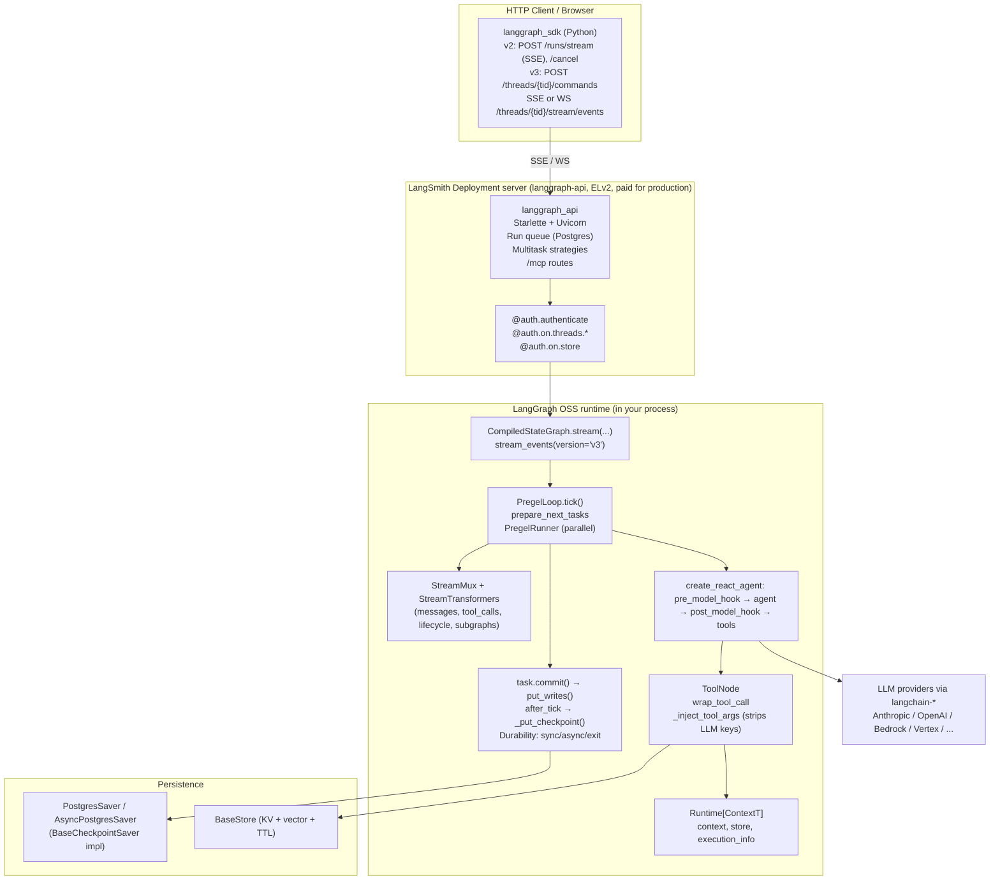

# LangGraph Python — Benchmark Analysis

> **Repo**: https://github.com/langchain-ai/langgraph
> **Commit analysed**: `4be610c6bc7c042038f671d6def9f523ca385a69`
> **Branch**: `main`
> **Framework path**: `frameworks/langgraph`
> **Analysed on**: 2026-10-01

## TL;DR

- ⭐ **What is this stack architecturally?** A **Python graph runtime** (`libs/langgraph`) plus a small ReAct prebuilt (`libs/prebuilt`), Postgres / SQLite / in-mem checkpointers (`libs/checkpoint*`), an HTTP client SDK (`libs/sdk-py`), and a CLI that boots a separate HTTP server (`langgraph-api`, the "Agent Server" behind the product now branded **LangSmith Deployment**, formerly LangGraph Platform). The mental model is "stateful graph" (Pregel-style super-steps), not "ReAct loop"; ReAct is just one wired graph. **The HTTP server is NOT in this repo.** It is published on PyPI under the **Elastic License 2.0** (source-available, not OSI open source, no public GitHub repo), and production use requires a paid license key (`libs/cli/langgraph_cli/cli.py:297-298`). Self-hosting production without a LangChain contract means BYO HTTP layer around the OSS runtime.
- **Ecosystem**: Python (this repo). The JS/TS runtime and JS SDK live in a separate repo (`langchain-ai/langgraphjs`); `libs/sdk-js` here is only a README pointing there.
- **License & owner**: MIT for everything in this repo (`libs/langgraph/pyproject.toml:12`); maintained by LangChain Inc. (commercial company). The server (`langgraph-api`, `langgraph-runtime-inmem`) is ELv2; LangSmith Deployment (cloud, hybrid, self-hosted Enterprise) is the paid product on top.
- **Maturity**: v1.x line; `libs/langgraph` is on **`1.2.12`** (`libs/langgraph/pyproject.toml:7`), up from `1.2.0` at the previous analysis (2026-05-19); `langgraph-prebuilt` still `1.1.0`; `langgraph-sdk` `0.4.5` (was `0.3.14`); `langgraph-cli` `0.4.32`. Status "Production/Stable" (`pyproject.toml:15`). 12 `langgraph` patch releases in ~4 months; 42.5 k stars, 7.2 k forks (captured 2026-10-01).
- **Where the loop actually executes**: in **your Python process**, inside `PregelLoop.tick()` (`libs/langgraph/langgraph/pregel/_loop.py:599`). Persistence to Postgres/SQLite fires from this same process. No subprocess, no bundled binary.
- **Strongest architectural choice for our use case**: **mid-run durability is the genuine USP and the architecture earns it.** `BaseCheckpointSaver.put_writes` (`libs/checkpoint/langgraph/checkpoint/base/__init__.py:301`) is called per task via `_runner.commit()` (`libs/langgraph/langgraph/pregel/_runner.py:574-613`); `_put_checkpoint` (`_loop.py:1081`) fires after every super-step. With `durability="async"` (default), `"sync"` (block), or `"exit"` (only at run end) (`libs/langgraph/langgraph/types.py:98`). A process crash mid-turn resumes from the last persisted task write; **no other stack in this benchmark offers this granularity natively**.
- **Weakest / biggest gap**: **no HTTP server in OSS** and **no first-class skills/resource manager.** Production self-host without a LangSmith Deployment license means BYO HTTP + queue + auth + skill registry.
- **Most surprising findings**: (1) `create_react_agent` is still **`@deprecated`** (`chat_agent_executor.py:53-117`, `274-277`) in favor of `langchain.agents.create_agent` (separate `langchain` package); `libs/prebuilt` has had no functional change since 1.2.0, so the prebuilt is in maintenance mode while new agent work lands in `langchain`. (2) Since 1.2.0 the investment went into a **v3 streaming protocol**: in-process `stream_events(version="v3")` (experimental, `pregel/main.py:3615-3700`) and a new SDK thread-stream client with **SSE or WebSocket** transport, typed projections, auto-reconnect, and sub-agent lifecycle events linked to the parent `tool_call_id` (`libs/sdk-py/CHANGELOG.md:7-35`).
- **Multi-tenancy splits across two layers and only one is in this repo**. (a) `Runtime[ContextT]` (`libs/langgraph/langgraph/runtime.py:124`) carries a typed `context` (e.g. `tenant_id`) into every node and tool; `_inject_tool_args` (`libs/prebuilt/langgraph/prebuilt/tool_node.py:1315-1429`) strips any LLM-supplied values for `InjectedToolArg` keys before re-merging trusted runtime values. (b) `@auth.on.<resource>.<action>` decorators (`libs/sdk-py/langgraph_sdk/auth/__init__.py:13-308`) return `FilterType` dicts the **server** (ELv2, not in repo) applies to every query. Two tenancy-relevant fixes landed since 1.2.0: store namespace scoping in Postgres/SQLite now respects segment boundaries (a search on `("acme",)` used to also match `("acmecorp",)`; fixed in `checkpoint-postgres`/`checkpoint-sqlite` 3.1.1), and `@auth.on.<resource>(actions=...)` now honors `actions=` instead of silently registering a wildcard handler.
- **Per-stack one-liners**: sessions/persistence: **best in benchmark** (Pregel checkpointing; `DeltaChannel` beta for append-heavy channels). Skills: BYO. Resource manager: BYO (or LangSmith Deployment Assistants API, paid). Sub-agents: subgraphs only, now with named sub-agent lifecycle events in v3 streaming. Multi-tenancy: **excellent** in-process, **excellent** at server layer (server is ELv2 + paid for production). Hooks: rich (`pre_model_hook`, `post_model_hook`, `wrap_tool_call`). API: not in this repo; SDK now speaks SSE and WebSocket. Observability: tokens yes, USD no; new per-node `TracePolicy` to trim trace payloads.
- **Production-readiness verdict for multi-tenant server-side deployment**: **conditional**. Straightforward on LangSmith Deployment (paid); real engineering work for a pure-OSS self-host.

## 0. General

### 0.1 What is this stack?

**A Python graph framework + library + HTTP-client SDK**, with a sibling **source-available HTTP server** (`langgraph-api`, the "Agent Server" of LangSmith Deployment, formerly LangGraph Platform) the CLI loads when you run `langgraph dev` or `langgraph up`. The graph runtime is OSS (MIT). The agent loop is library-style, embedded in your Python process. The HTTP layer, run queue, auth handler execution, multi-tenant Postgres mediation, MCP routes, cron and webhook system are all in the server, which is not in this repo.

### 0.2 Ecosystem

**Python** (this repo).

Secondary: the JS/TS graph runtime and the JS HTTP SDK both live in `langchain-ai/langgraphjs`. `libs/sdk-js` in this repo contains only a README stating the package moved (`libs/sdk-js/README.md:7`).

### 0.3 Project status & governance

- **Open-source**: yes for everything in `libs/` (MIT). `libs/langgraph/pyproject.toml:12` declares `license = "MIT"`.
- **Server license**: `langgraph-api` (0.15.1 on PyPI at capture) and `langgraph-runtime-inmem` (0.35.1) declare `License: Elastic-2.0` in their PyPI metadata (checked 2026-10-01). ELv2 is source-available: you may run it, but not offer it as a managed service, and LangChain gates production use behind a license key. The CLI says so directly: "For production use, requires a license key in env var LANGGRAPH_CLOUD_LICENSE_KEY" (`libs/cli/langgraph_cli/cli.py:297-298`). LangChain's self-hosting docs describe self-hosted LangSmith as an Enterprise-plan add-on.
- **Owner / maintainer**: LangChain Inc. (commercial company).
- **Commercial backing**: LangChain Inc.; the paid layers are **LangSmith Deployment** (cloud, hybrid via customer-cluster "listeners", or self-hosted Enterprise) and **LangSmith** (observability/eval with cost rollups).
- **Support model**: community via GitHub Issues / LangChain Forum; paid support tied to LangSmith plans.

### 0.4 Project maturity / age

- Repo created **2023-08-09** (GitHub API); initial public release **January 2024** (LangChain blog / first GitHub release). ~2.7 years at the commit analysed.
- Current major: **v1.x line**. `libs/langgraph` is `1.2.12` (`libs/langgraph/pyproject.toml:7`); `langgraph-prebuilt` is `1.1.0` (`libs/prebuilt/pyproject.toml:7`); `langgraph-checkpoint` `4.2.0`; `langgraph-checkpoint-postgres` `3.1.2`; `langgraph-checkpoint-sqlite` `3.1.1`; `langgraph-sdk` `0.4.5` (`libs/sdk-py/langgraph_sdk/__init__.py:6`); `langgraph-cli` `0.4.32` (`libs/cli/langgraph_cli/__init__.py:1`).
- Stability: marked `Development Status :: 5 - Production/Stable` (`libs/langgraph/pyproject.toml:15`). Explicitly experimental/beta surfaces: `stream_events(version="v3")` ("experimental and may change", `pregel/main.py:3657-3659`) and `DeltaChannel` ("Beta", `libs/langgraph/langgraph/channels/delta.py:29-36`).
- **Maintenance-mode signal**: `create_react_agent` and `AgentState` are `@deprecated` in favor of `langchain.agents.create_agent` (`libs/prebuilt/langgraph/prebuilt/chat_agent_executor.py:53-117`, `274-277`). `libs/prebuilt` saw only lint and stream-transformer fixes between 1.2.0 and this commit.

### 0.5 Adoption & community signal

(GitHub numbers captured **2026-10-01** via `gh api repos/langchain-ai/langgraph`.)

- **Stars**: 42,547.
- **Forks**: 7,211.
- **Watchers**: 186.
- **Contributors**: ~287 (contributors endpoint, anonymous included).
- **Open issues + PRs**: 852.
- **Recent activity**: last push 2026-10-01; 257 commits between the previous analysed commit (2026-05-12, `1.2.0`) and this one, a large share of them Dependabot bumps.
- **Release cadence**: `langgraph` 1.2.1 → 1.2.12 between 2026-05-21 and 2026-09-21 (roughly every 1–2 weeks); `langgraph-sdk` 0.3.15 → 0.4.5; `langgraph-cli` 0.4.27 → 0.4.32. Releases are per-package tags (`1.2.12`, `sdk==0.4.5`, `cli==0.4.32`, `checkpoint==4.2.0`).
- **Issue volume**: high, with active maintainer responses.

### 0.6 Ecosystem fit

- **Primary language**: Python (this repo). JS/TS lives in `langchain-ai/langgraphjs`.
- **PyPI packages**: `langgraph`, `langgraph-prebuilt`, `langgraph-checkpoint`, `langgraph-checkpoint-postgres`, `langgraph-checkpoint-sqlite`, `langgraph-checkpoint-conformance`, `langgraph-sdk`, `langgraph-cli`. Each has its own `pyproject.toml` under `libs/`. Download badge: https://pypistats.org/packages/langgraph.
- **Typical use**: imported as a library. The `langgraph` CLI (`libs/cli/langgraph_cli/cli.py`) bootstraps the ELv2 HTTP server locally (`dev`, `up`), builds Docker images (`build`, `dockerfile`), and deploys to LangSmith Deployment (`deploy`, `libs/cli/langgraph_cli/deploy.py`), now including hybrid placement onto a customer-cluster listener.

### 0.7 Documentation depth & cross-team contributor accessibility

Official docs at `docs.langchain.com/oss/python/langgraph/`. Deep on graph mechanics, ReAct, persistence, HITL. Reference docs auto-generated from docstrings (`reference.langchain.com/python/langgraph/`). An `llms.txt` is now generated from the docs build (commit `230927fb`). Non-engineers can read concepts but cannot author content without Python; there is no markdown-driven skill author flow.

### 0.8 Documentation entry points ⭐

- Official docs landing: https://docs.langchain.com/oss/python/langgraph/overview
- Quickstart / getting-started: https://docs.langchain.com/oss/python/langgraph/quickstart
- API reference: https://reference.langchain.com/python/langgraph/
- Hosting / deployment / production: https://docs.langchain.com/oss/python/langgraph/cloud and self-hosted https://docs.langchain.com/langsmith/self-hosted
- Examples / demos: https://github.com/langchain-ai/langgraph/tree/main/examples
- Changelog / release notes: https://github.com/langchain-ai/langgraph/releases (plus `libs/sdk-py/CHANGELOG.md` and `libs/sdk-py/MIGRATION.md` for the v3 streaming client)
- GitHub Releases: https://github.com/langchain-ai/langgraph/releases
- GitHub issues: https://github.com/langchain-ai/langgraph/issues
- Community forum: https://forum.langchain.com/ (server licensing thread: https://forum.langchain.com/t/question-about-the-license/2242)
- Slack / community: https://www.langchain.com/join-community
- Reddit: https://www.reddit.com/r/LangChain/
- Deep Agents template (skill-shaped bundle): https://github.com/langchain-ai/deep-agent-template

## 1. High Level Architecture

### Deployment diagram ⭐

```text
┌────────────────────────────────────────────────────────────────────────────────┐
│  LangSmith Deployment (cloud / hybrid listener / self-hosted Enterprise, paid) │
│                                                                                │
│  HTTP Client (libs/sdk-py)                  langgraph-api (ELv2, NOT IN REPO)  │
│  ──────────────────────                     ─────────────────────────────      │
│  v2: POST /threads/{id}/runs/stream ─SSE─▶ ┌──────────────────────────────┐   │
│      POST /threads/{id}/runs/{rid}/cancel  │ Starlette + Uvicorn          │   │
│      GET  /threads/{id}/runs/{rid}/stream  │ @auth.on.* handlers          │   │
│  v3: POST /threads/{id}/commands           │ Run queue + background runner│   │
│      POST|WS /threads/{id}/stream/events   │ Multitask strategies, crons  │   │
│                                            │ /mcp routes (default on)     │   │
│                                            └──────────────┬───────────────┘   │
└───────────────────────────────────────────────────────────┼────────────────────┘
                                                            │ invokes (in-proc)
                                                            ▼
┌────────────────────────────────────────────────────────────────────────────────┐
│  LangGraph OSS runtime (libs/langgraph) — runs in YOUR Python process          │
│                                                                                │
│  CompiledStateGraph.stream(input, config, context=ContextT, durability=...)    │
│  CompiledStateGraph.stream_events(..., version="v3") → GraphRunStream          │
│      ▼                                                                         │
│  PregelLoop (pregel/_loop.py)                                                  │
│   while tick():                                                                │
│     prepare_next_tasks → runnable nodes                                        │
│     PregelRunner.tick(): parallel task execution                               │
│       task.commit() → put_writes() ───── DURABLE PER TASK                      │
│     after_tick(): apply_writes → _put_checkpoint() ── DURABLE PER SUPER-STEP   │
│                                                                                │
│  Nodes: pre_model_hook → agent (LLM) → post_model_hook → tools (Send fan-out)  │
│  ToolNode: wrap_tool_call → _inject_tool_args → tool.invoke                    │
│  Runtime[ContextT]: typed context, store, execution_info, server_info          │
│                                                                                │
│  Persistence (BaseCheckpointSaver):                                            │
│    InMemorySaver | PostgresSaver | AsyncPostgresSaver | SqliteSaver            │
└────────────────────────────────────────────────────────────────────────────────┘
                                                            │
                                                            ▼
                                                   LLM providers
                                                   (Anthropic / OpenAI / Bedrock / Vertex
                                                    via langchain-* packages)
```

### 1.1 Where does the agent loop *actually* execute?

**In your Python process.** `CompiledStateGraph.stream` / `astream` / `invoke` / `ainvoke` / `stream_events` (`libs/langgraph/langgraph/pregel/main.py:2616-4135`) drive `PregelLoop.tick()` directly (`libs/langgraph/langgraph/pregel/_loop.py:599`). Tools run in-process. Checkpointer I/O is in-process. The ELv2 `langgraph-api` HTTP server wraps the same in-process loop but adds queue + persistence + auth + multitask coordination on top. No subprocess, no bundled binary.

### 1.2 Runtime dependencies

- **Python ≥ 3.10** for the library (`libs/langgraph/pyproject.toml:10`, classifiers list 3.10-3.13). The in-memory dev server (`langgraph dev`) requires **Python ≥ 3.11** (`libs/cli/langgraph_cli/cli.py:793-799`, `libs/cli/pyproject.toml:25-27`).
- Optional storage: Postgres (`langgraph-checkpoint-postgres`, uses `psycopg`), SQLite (`langgraph-checkpoint-sqlite`).
- LLM providers: BYO via `langchain-*` packages (`langchain-anthropic`, `langchain-openai`, `langchain-google-genai`, `langchain-aws`, …).
- For the HTTP server: `pip install -U "langgraph-cli[inmem]"` pulls in `langgraph-api>=0.5.35,<1.0.0` and `langgraph-runtime-inmem` (`libs/cli/pyproject.toml:25-27`), both ELv2. Production (`langgraph up` / Docker images) uses the Postgres runtime and needs `LANGGRAPH_CLOUD_LICENSE_KEY` (or a `LANGSMITH_API_KEY` for local dev only, `cli.py:297-298`).
- LangSmith Deployment deployments also expect a Redis for pub/sub between API and worker pods.

### 1.3 Recommended deployment topology

LangSmith Deployment docs recommend **one-process-many-tenants** with horizontal scaling: a fleet of API pods sharing a Postgres for state + a Redis for pub/sub between the API and background worker pods. Self-host follows the same pattern (`langgraph up` Docker compose, K8s Helm chart in `langchain-ai/helm`). New since 1.2.0: `langgraph deploy` can place a deployment on a **listener** in the customer's own Kubernetes cluster (hybrid control plane / data plane, `libs/cli/langgraph_cli/deploy.py:106-289`) and can push a prebuilt image via `--image-uri`. For pure-OSS deployments without a license, you embed the graph in your own service and follow your own topology.

### 1.4 Cold-start cost & instance footprint

- Pure-OSS embedding: a few hundred ms to import the package; RAM baseline a few tens of MB beyond your model client.
- LangSmith Deployment / self-host: Starlette+Uvicorn worker pods; multi-tenant Postgres connection pool dominates RAM. (Server source is not in this repo; exact numbers not measured.)

### 1.5 Vendor lock-in

- **LLM provider lock-in**: low. Any `langchain-*` chat model works; `init_chat_model(...)` for string-identifier routing.
- **Hosting / platform lock-in**: medium. The HTTP server, auth execution, run queue, multitask coordination, and `/mcp` routes ship only in the ELv2 `langgraph-api` package, whose production use requires a LangChain license. Going pure-OSS means BYO HTTP + queue + auth.
- **Eval platform lock-in**: medium. Token counts surface natively; cost USD requires LangSmith (paid).

### 1.6 Framework weight / footprint

**Heavy.** The graph runtime is ~2k LOC at its core, but ToolNode + prebuilt + checkpointers + SDK add many thousands more (the SDK alone gained ~5k LOC of v3 streaming client in `_async/stream.py`, `_sync/stream.py`, and `stream/` since 1.2.0), and the `BaseStore` / `BaseCheckpointSaver` interfaces invite significant ecosystem packages.

### 1.7 Release-history signal

No in-repo `CHANGELOG.md` for `libs/langgraph`; release notes live on GitHub Releases (auto-generated commit lists per package tag). `libs/sdk-py/CHANGELOG.md` and `libs/sdk-py/MIGRATION.md` are new and cover the v3 streaming client.

Changes between `1.2.0` (2026-05-12) and `1.2.12` (2026-09-21) that matter for this benchmark:
- **v3 streaming client in `langgraph-sdk` 0.4.0** (https://github.com/langchain-ai/langgraph/releases/tag/sdk%3D%3D0.4.0): `client.threads.stream()` with SSE or WebSocket transport, typed projections, sub-agent handles, auto-reconnect (`libs/sdk-py/CHANGELOG.md:7-35`). `client.runs.stream()` (v2) "remains fully supported" (`CHANGELOG.md:53-55`).
- **`RemoteGraph` v3 streaming** and sub-agent naming via `lc_agent_name` (https://github.com/langchain-ai/langgraph/releases/tag/1.2.3).
- **`interrupt(..., response_schema=...)`** typed HITL resume, validated with Pydantic (`libs/langgraph/langgraph/types.py:880-1030`; release https://github.com/langchain-ai/langgraph/releases/tag/1.2.12).
- **`TracePolicy` / `omit_payload` on `add_node(trace_policy=...)`** to trim what a node records in traces (`types.py:541-576`; release https://github.com/langchain-ai/langgraph/releases/tag/1.2.11).
- **`NodeCancelledError`**: a node that raises `asyncio.CancelledError` itself now surfaces as a node failure rather than a silent success (`libs/langgraph/langgraph/errors.py:168-188`, 1.2.3).
- **`DeltaChannel` (beta) hardening**: multiple fixes for delta-history walks in Postgres/SQLite and `update_state` on fresh threads (1.2.5–1.2.9, checkpoint 4.2.0), plus a recovery script example (commit `9100f2c6`).
- **Store tenancy fix**: namespace prefix matching in Postgres/SQLite stores now respects segment boundaries (`checkpoint-postgres` 3.1.1, `checkpoint-sqlite` 3.1.1, commit `66ebe1a0`).
- **Store TTL**: opt-in `TTLConfig.omit_expired` hides expired-but-unswept rows on read (`libs/checkpoint/langgraph/store/base/__init__.py:545-560`, commit `95781403`).
- **Security fixes**: `@auth.on.<resource>(actions=...)` now honored (sdk-py changelog "Fixed"); SDK percent-encodes caller-supplied IDs in URL paths (sdk 0.3.15); `JsonPlusSerializer` restricts `lc:2` envelope revival to the default constructor (checkpoint 4.1.1); CLI rejects credential-bearing Git dependencies (commit `07b33185`).
- Unchanged and still relevant from the previous analysis: `create_react_agent` / `AgentState` `@deprecated` (`chat_agent_executor.py:53-117`, `274-277`); `ToolRuntime` (`tool_node.py:1663-1730`); `RunControl` cooperative drain (`runtime.py:79-104`); `Durability` (`types.py:98-104`); `wrap_tool_call` (`tool_node.py:1014-1067`).

## 2. Agent Loop

### 2.1 Run loop entrypoint(s)

`CompiledStateGraph.stream` / `astream` / `invoke` / `ainvoke` (`libs/langgraph/langgraph/pregel/main.py:2616-4135`), signature at `main.py:2655-2672`:

```python
def stream(
    self,
    input: InputT | Command | None,
    config: RunnableConfig | None = None,
    *,
    context: ContextT | None = None,
    stream_mode: StreamMode | Sequence[StreamMode] | None = None,
    print_mode: StreamMode | Sequence[StreamMode] = (),
    output_keys: str | Sequence[str] | None = None,
    interrupt_before: All | Sequence[str] | None = None,
    interrupt_after: All | Sequence[str] | None = None,
    durability: Durability | None = None,      # "sync" | "async" | "exit"
    control: RunControl | None = None,          # cooperative drain
    subgraphs: bool = False,
    debug: bool | None = None,
    version: Literal["v1", "v2"] = "v1",
    **kwargs: Unpack[DeprecatedKwargs],
) -> Iterator[dict[str, Any] | Any]:
```

`config` carries `{"configurable": {"thread_id": "...", "checkpoint_ns": "...", "checkpoint_id": "..."}}` and `callbacks`. `context` is the typed `ContextT` declared via `StateGraph(context_schema=Context)`; it resolves into `Runtime.context` and is propagated to every node and tool. `input` can be the initial state OR a `Command(resume=...)` for HITL resumption. `invoke` shells to `stream(stream_mode="values")` and returns the final state.

A second, **experimental** entrypoint is `stream_events(..., version="v3")` (`main.py:3615-3700`), which returns a `GraphRunStream` (`libs/langgraph/langgraph/stream/run_stream.py:57`) with typed projections (`run.output`, `run.interrupted`, `run.interrupts`, plus transformer-provided projections such as messages, values, lifecycle, subgraphs) and `abort()` (`run_stream.py:185`). It forwards `context`, `durability`, etc. to `stream(...)` and owns `stream_mode`/`subgraphs` itself.

### 2.2 Per-iteration behavior

`PregelLoop.tick()` (`libs/langgraph/langgraph/pregel/_loop.py:599-681`), abridged:

```python
def tick(self) -> bool:
    if self.step > self.stop:
        self.status = "out_of_steps"
        return False
    self.tasks = prepare_next_tasks(...)
    if not self.tasks:
        self.status = "done"
        return False
    if self.control is not None and self.control.drain_requested:
        self.status = "draining"
        return False
    if self.interrupt_before and should_interrupt(...):
        self.status = "interrupt_before"
        raise GraphInterrupt()
    self._emit("tasks", map_debug_tasks, self.tasks.values())
    return True
```

`after_tick()` (`_loop.py:683-726`), abridged:

```python
def after_tick(self) -> None:
    writes = [w for t in self.tasks.values() for w in t.writes]
    self._delta_channels_with_overwrite.update(...)   # DeltaChannel bookkeeping
    self.updated_channels = apply_writes(...)
    if not self.updated_channels.isdisjoint(...):
        self._emit("values", map_output_values, ...)
    self.checkpoint_pending_writes.clear()
    self.is_replaying = False
    self._put_checkpoint({"source": "loop"})   # ← per-super-step persistence
    if self.interrupt_after and should_interrupt(...):
        self.status = "interrupt_after"
        raise GraphInterrupt()
```

One super-step = (1) `prepare_next_tasks` selects nodes whose input channels have new versions; (2) `PregelRunner.tick()` runs those nodes in parallel; (3) each task `commit()` invokes `put_writes` per task; (4) `apply_writes` reduces and bumps channel versions; (5) `_put_checkpoint` persists the new snapshot.

### 2.3 ReAct loop

LangGraph ships a built-in ReAct via `create_react_agent` (`libs/prebuilt/langgraph/prebuilt/chat_agent_executor.py:278`), but **it is `@deprecated` in favor of `langchain.agents.create_agent`** (`chat_agent_executor.py:274-277`). Mechanically `create_react_agent` wires three nodes: `agent` (LLM), `tools` (parallel tool dispatch via `Send` in v2), and optional `pre_model_hook` / `post_model_hook`, into the Pregel loop. **You can roll your own ReAct as a plain `StateGraph`**; there is no special-casing.

### 2.4 Tool dispatch + result handling

`ToolNode.invoke` (`libs/prebuilt/langgraph/prebuilt/tool_node.py:743`) takes the last `AIMessage` from state, splits its `tool_calls` into separate executions (parallel via `Send` in `create_react_agent v2`), runs each via `_run_one`, and appends one `ToolMessage(tool_call_id=...)` per tool back to the `messages` channel. Linkage is **always explicit via `tool_call_id`**; there is no positional coupling.

### 2.5 Explicit turn concept

There is **no explicit "turn" object**. The closest first-class boundary is the **super-step**. A ReAct "turn" is roughly: super-step `agent` runs (one LLM call → one `AIMessage`) → super-step `tools` runs (one or more `ToolMessage` results) → repeat.

### 2.6 Event emission mechanism (in-process)

A **per-call `SyncQueue` / `AsyncQueue`** (`libs/langgraph/langgraph/pregel/main.py:2748`, `3156`). The Pregel loop holds a `StreamProtocol(stream.put, stream_modes)`; nodes / callbacks push frames; the `stream()` generator yields between super-step ticks. Token-level streaming comes from `StreamMessagesHandler.on_llm_new_token` (`libs/langgraph/langgraph/pregel/_messages.py:151-164`), a LangChain callback handler installed at run start (`pregel/main.py:2810-2826`, which picks `StreamMessagesHandlerV2` when the v2/v3 content-block protocol is active).

For `stream_events(version="v3")`, a `StreamMux` routes the same raw stream parts through **`StreamTransformer`s** (`libs/langgraph/langgraph/stream/_types.py:44`, built-ins in `stream/transformers.py`) that build typed projections the caller iterates. Since 1.2.1 transformers can opt in to running `before_builtins` (commit `8215a9d0`).

## 3. Message & Event Taxonomy

### 3.1 Message layers

LangGraph has **three taxonomies layered on top of each other**, and they don't share a vocabulary; this is the biggest cognitive load for a newcomer:

1. **State channels (graph layer)**: Every shared state key is a `BaseChannel`. The reducer for that channel decides how concurrent writes are merged. For the prebuilt ReAct agent, there is one channel of interest: `messages: Annotated[Sequence[BaseMessage], add_messages]` (`chat_agent_executor.py:57-62`). A beta `DeltaChannel` stores only deltas in checkpoint blobs (`libs/langgraph/langgraph/channels/delta.py:25-62`).
2. **Messages (content layer)**: re-used from `langchain_core.messages`. `HumanMessage`, `AIMessage`, `AIMessageChunk`, `SystemMessage`, `ToolMessage`, `ToolMessageChunk`, `RemoveMessage` (sentinel for "delete this id"; `RemoveMessage(id=REMOVE_ALL_MESSAGES)` wipes the channel, `libs/langgraph/langgraph/graph/message.py:33-39`).
3. **Stream parts (transport layer)**: when you call `graph.stream(input, stream_mode=...)`, what's yielded depends on `stream_mode`. Seven concrete `StreamPart` TypedDicts (`libs/langgraph/langgraph/types.py:273-363`).

A **fourth taxonomy** is the v3 protocol (`libs/langgraph/langgraph/stream/_types.py:28-41`): `ProtocolEvent` envelopes `{type: "event", event_id, seq, method, params}` wrap stream parts with a monotonic `seq`. It is used both in-process by `stream_events(version="v3")` and on the wire by the v3 SDK client (`client.threads.stream()`), which adds a `lifecycle` method for run/sub-agent status and `input.requested` for interrupts.

```text
LLM provider ──▶ AIMessageChunk (langchain_core)
                    │  StreamMessagesHandler(V2)
                    ▼
graph.stream(): (mode, data) StreamPart ──▶ v2 HTTP SSE: event: <mode> / data: <json>
                    │  StreamMux + StreamTransformers
                    ▼
stream_events(v3): ProtocolEvent{seq, method, params} ──▶ v3 HTTP SSE/WS frames
node return ──▶ channel writes ──▶ state (messages channel) ──▶ checkpoint
```

### 3.2 Concrete message types

| Type | 1-line purpose |
|---|---|
| `HumanMessage` | User input |
| `AIMessage` | Assistant text + tool_calls + usage_metadata |
| `AIMessageChunk` | Streaming variant of AIMessage (delta) |
| `SystemMessage` | System prompt / instruction |
| `ToolMessage` | Result of a tool call, linked by `tool_call_id` |
| `ToolMessageChunk` | Streaming variant of ToolMessage |
| `RemoveMessage` | Sentinel: tells `add_messages` to delete by id |

### 3.3 Messages vs. events

**Two separate taxonomies**. Messages live on state channels (durable). Events are stream parts yielded by `graph.stream()` (transient). Token-level streaming bridges them: `StreamMessagesHandler` emits `MessagesStreamPart` (transient) per token, and the assembled final `AIMessage` is written to state by the node. Since 1.2.1 the v2-flagged messages handler no longer replays finalized `ToolMessage`s as chat tokens; tool results go to the tools channel instead (`_messages.py:307-334`).

### 3.4 Event categories

| Category | Stream-mode | Concrete type |
|---|---|---|
| Stream value | `"values"` | `ValuesStreamPart`: full state after each step |
| Update event | `"updates"` | `UpdatesStreamPart`: `{node_name: writes}` per step |
| Token / message event | `"messages"` | `MessagesStreamPart`: `(chunk, metadata)` per token |
| Custom event | `"custom"` | `CustomStreamPart`: whatever `StreamWriter` pushes |
| Checkpoint event | `"checkpoints"` | `CheckpointStreamPart`: every persisted checkpoint |
| Task lifecycle event | `"tasks"` | `TasksStreamPart`: per-node start / finish; `TaskPayload.metadata` now carries `lc_agent_name`, `langgraph_node`, `langgraph_step` (`types.py:164-173`) |
| Debug event | `"debug"` | `DebugStreamPart`: union of the above |
| Sub-agent / subgraph lifecycle (v3 only) | `lifecycle` method | `LifecyclePayload{event: started/completed/failed/interrupted/drained, namespace, graph_name, trigger_call_id, cause}` (`stream/transformers.py:343-371`) |
| Lifecycle (callback-only) | n/a | `GraphInterruptEvent`, `GraphResumeEvent` |

`stream_mode` can be a list; yielded tuples become `(mode, data)` or `(ns, mode, data)` if `subgraphs=True` (`pregel/main.py:2690-2720`).

Lifecycle events (`libs/langgraph/langgraph/callbacks.py:42-79`):

```python
@dataclass(frozen=True)
class GraphInterruptEvent:
    run_id: UUID | None
    status: GraphLifecycleStatus  # "input"|"pending"|"done"|"interrupt_before"|"interrupt_after"|"out_of_steps"
    checkpoint_id: str
    checkpoint_ns: tuple[str, ...]
    interrupts: tuple[Interrupt, ...]
```

These dispatch to `GraphCallbackHandler` subclasses via `config["callbacks"]` (`callbacks.py:87-112`), not to the stream.

### 3.5 Canonical type-definition file(s)

- `libs/langgraph/langgraph/types.py` (1079 lines): stream parts, `Interrupt` (now generic with `response_schema`), `Command`, `Send`, `StateSnapshot`, `RetryPolicy`, `TimeoutPolicy`, `CachePolicy`, `TracePolicy`, `Durability`, `Overwrite`
- `libs/langgraph/langgraph/stream/_types.py`: `ProtocolEvent`, `StreamTransformer` (v3)
- `libs/langgraph/langgraph/stream/transformers.py`: built-in v3 projections and `LifecyclePayload`
- `libs/langgraph/langgraph/callbacks.py` (394 lines): `GraphCallbackHandler`, `GraphInterruptEvent`, `GraphResumeEvent`
- `libs/langgraph/langgraph/graph/message.py`: `add_messages`, `MessagesState`, `REMOVE_ALL_MESSAGES`
- `libs/checkpoint/langgraph/checkpoint/base/__init__.py`: `Checkpoint`, `CheckpointTuple`, `CheckpointMetadata`, `BaseCheckpointSaver`

### 3.6 Live agentic event stream taxonomy

Sample one frame of each major category:

`stream_mode="values"` after super-step:
```python
{"messages": [HumanMessage("hi"), AIMessage(content="hello", usage_metadata={...})]}
```

`stream_mode="updates"`:
```python
{"agent": {"messages": [AIMessage(content="...", tool_calls=[{"name": "search", "args": {...}, "id": "call_abc"}])]}}
```

`stream_mode="messages"` per token:
```python
(AIMessageChunk(content="hel", id="run-..."), {"langgraph_node": "agent", "langgraph_step": 1})
```

`stream_mode="tasks"`:
```python
{"id": "...", "name": "tools", "input": {...}, "triggers": [...], "metadata": {"lc_agent_name": "researcher"}}
```

v3 `lifecycle` protocol event (shape from `libs/sdk-py/tests/streaming/test_thread_stream.py:725-733`):
```python
{"type": "event", "method": "lifecycle", "seq": 99, "event_id": "evt-99",
 "params": {"namespace": [], "data": {"event": "completed"}}}
```

## 4. Agent Runtime (Multi-session Host)

### 4.1 Multi-session host architecture

**Two answers, depending on layer.**

- **OSS (this repo) only**: there is **no first-party multi-session host**. You embed `CompiledStateGraph.stream()` in your own server / worker. Each request is one run. Concurrency is whatever Python concurrency you reach for.
- **LangSmith Deployment (`langgraph-api`, ELv2)**: ships a full multi-session host: Starlette/Uvicorn workers, a Postgres-backed run queue, a background runner pod, and pub/sub for SSE re-attach. This is what `langgraph dev` and `langgraph up` boot.

### 4.2 Concurrent session isolation

Inside OSS: isolation is **per run** by `thread_id`. The `PregelLoop` is one Python instance per run; no globals leak across runs unless the engineer introduces them. State lives in the checkpointer keyed on `thread_id`. A `BaseStore` namespace can be tenant-scoped by convention but not enforced. Note: before `checkpoint-postgres`/`checkpoint-sqlite` 3.1.1, store namespace scoping used `LIKE '<prefix>%'` without a separator check, so a search on `("acme",)` also returned rows under `("acmecorp",)`; that is fixed at this commit (commit `66ebe1a0`, `libs/checkpoint-postgres/langgraph/store/postgres/base.py`, `libs/checkpoint-sqlite/langgraph/store/sqlite/base.py`).

Inside `langgraph-api`: every query goes through the `@auth.on.*` filter chain (`libs/sdk-py/langgraph_sdk/auth/__init__.py:13-308`), so resource scoping (threads, runs, store) is enforced at the data layer.

### 4.3 Horizontal scaling / multi-instance

**Yes, if you embed a shared checkpointer.** All N workers point to the same Postgres `PostgresSaver` (`libs/checkpoint-postgres`); `thread_id` is the partition key. The Pregel loop on any worker can replay from any persisted checkpoint. **Leader election is not required**; the run queue (in `langgraph-api`) serializes work per thread via "multitask strategy".

For pure-OSS embedding: you BYO the queue (e.g. Celery / arq / Temporal); each worker simply calls `graph.stream(...)` against the shared Postgres.

### 4.4 Background / async / scheduled tasks

- **Pure OSS**: not provided. BYO Celery / arq / Temporal / cron.
- **LangSmith Deployment**: ships **crons** (`libs/sdk-py/langgraph_sdk/_async/cron.py`: `crons.create`, `crons.search`, `crons.update`, `crons.delete`; `update(end_time=None)` now clears an end time, commit `b96f6170`) and **webhooks** (run create accepts `webhook: str` URL). The server queue persists scheduled runs in Postgres.

### 4.5 Worker pool / queue model

In `langgraph-api`: a Postgres-backed work queue with one logical lane per `thread_id`. Long-running agent work is the default expectation: runs can take minutes / hours and a re-attaching client picks up via `GET /threads/{tid}/runs/{rid}/stream` with a `Last-Event-ID` header (requires `stream_resumable: true` at creation; `libs/sdk-py/langgraph_sdk/_async/runs.py:1097-1150`), or with the v3 client by reopening `client.threads.stream(thread_id=...)`, which replays from a `since` cursor (`_async/stream.py:1698`).

In OSS: no queue. Short-lived HTTP request scope assumed unless the engineer wraps in their own queue.

## 5. Sessions & Persistence

### 5.1 Session / chat data model

A **thread** is the session primitive. The data model is the **`Checkpoint`** (`libs/checkpoint/langgraph/checkpoint/base/__init__.py`):

```python
class Checkpoint(TypedDict):
    v: int                              # schema version
    id: str                             # ULID, sortable
    ts: str                             # ISO timestamp
    channel_values: dict[str, Any]      # the actual state per channel
    channel_versions: ChannelVersions   # per-channel monotonic versions
    versions_seen: dict[str, ChannelVersions]
    updated_channels: list[str] | None
```

With sibling metadata:

```python
class CheckpointMetadata(TypedDict, total=False):
    source: Literal["input", "loop", "update", "fork"]
    step: int
    parents: dict[str, str]
    writes: dict[str, Any]
```

And the on-disk row (`CheckpointTuple`): `config`, `checkpoint`, `metadata`, `parent_config`, `pending_writes`, `pending_sends`.

There is no `tenant_id`, `user_id`, or `usage` field on a thread in OSS. On the server, threads carry a free-form `metadata` dict that `@auth.on.threads.create` handlers stamp with an owner (see 6.6).

### 5.2 What's stored on a session

For a `create_react_agent` thread:
- `messages` (the full conversation, including `ToolMessage` results)
- `remaining_steps`
- Any custom channels declared on `state_schema`
- All checkpoint versions (one per super-step), full history, replayable
- All pending writes (per task, durable BEFORE super-step reduction)

Per `Checkpoint`: not just the latest, but every step's snapshot. With the beta `DeltaChannel`, a channel's blob holds only a sentinel and the value is rebuilt by replaying ancestor writes, with a full snapshot every `snapshot_frequency` updates (default 1000) or 5000 super-steps (`libs/langgraph/langgraph/channels/delta.py:25-62`). Since 1.2.2, message writes into a `DeltaChannel` get stable IDs before persistence (`ensure_message_ids`, `pregel/_messages.py:426-461`).

### 5.3 Granularity

**Both linear and branched.** A linear conversation is the default. But **the Pregel checkpointer supports forking**: `graph.get_state_history(config)` returns every step (`pregel/main.py:1480`); `graph.update_state(config_at_step_N, values)` creates a new branch from step N (`pregel/main.py:2515`). Multiple branches per thread are first-class.

### 5.4 Built-in persistence stores

Four shipped:
- **`InMemorySaver`** (`libs/checkpoint/langgraph/checkpoint/memory/__init__.py`): dev only
- **`PostgresSaver`** + **`AsyncPostgresSaver`** (`libs/checkpoint-postgres/langgraph/checkpoint/postgres/__init__.py`): production
- **`SqliteSaver`** + **`AsyncSqliteSaver`** (`libs/checkpoint-sqlite/langgraph/checkpoint/sqlite/__init__.py`): single-instance / local
- The Postgres and SQLite packages also ship `BaseStore` implementations (namespaced KV + vector search), with TTL support; `TTLConfig.omit_expired` (new, opt-in) filters expired-but-unswept rows at read time in Postgres (`libs/checkpoint/langgraph/store/base/__init__.py:545-560`).

No bundled Redis / S3 / Mongo store.

### 5.5 Persistence timing

**Two persistence points per super-step, both gated on `Durability`** (`libs/langgraph/langgraph/types.py:98-104`):

```python
Durability = Literal["sync", "async", "exit"]
```

1. **`put_writes` runs per task** as `_runner.commit()` is called (`libs/langgraph/langgraph/pregel/_runner.py:574-613`):
   ```python
   def commit(self, task: PregelExecutableTask, exception: BaseException | None) -> None:
       if isinstance(exception, GraphInterrupt):
           writes = [(INTERRUPT, exception.args[0])]
           if resumes := [w for w in task.writes if w[0] == RESUME]:
               writes.extend(resumes)
           self.put_writes()(task.id, writes)
       ...
       else:
           if not task.writes:
               task.writes.append((NO_WRITES, None))
           self.put_writes()(task.id, task.writes)
   ```
   And `PregelLoop.put_writes` (`libs/langgraph/langgraph/pregel/_loop.py:415-509`) submits to the checkpointer immediately when `durability != "exit"`.

2. **`_put_checkpoint` runs once per super-step** at `after_tick()` (`_loop.py:718`, defined at `_loop.py:1081`).

Under `durability="async"` (default) the next super-step starts while the previous checkpoint persists in the background; under `"sync"` the stream loop blocks on `loop._put_checkpoint_fut.result()` (`pregel/main.py:2988`) before the next iteration.

### 5.6 Mid-run checkpointing (durable)

**Yes, and this is the genuine USP.** Per-task `put_writes` makes the granularity sub-super-step. For a ReAct turn under `durability="async"`:

- LLM streaming tokens do NOT persist mid-stream; they flow through `StreamMessagesHandler.on_llm_new_token`.
- When the `agent` node returns its `AIMessage`, `commit()` → `put_writes` → **durable**.
- The `agent` super-step ends → `_put_checkpoint` → **durable**.
- Each tool call (v2) runs in its own `Send`-dispatched task. As each tool finishes, its `commit()` → `put_writes` → **durable**.
- The `tools` super-step ends → `_put_checkpoint` → **durable**.

**If 4 parallel tool calls are running and the process crashes after 3 finished, on resume the 3 completed tool results are already in `checkpoint_pending_writes` and will NOT re-execute.** This is the strongest mid-run durability story in the benchmark.

Caveat: mid-tool-call (a single tool's HTTP call mid-flight crashes) is NOT covered; that tool re-executes from scratch on resume. Since 1.2.3, a node that raises `asyncio.CancelledError` from its own body is reported as `NodeCancelledError` (a failure) instead of being treated as framework tear-down (`libs/langgraph/langgraph/errors.py:168-188`).

### 5.7 Session ID format

`thread_id` is **whatever the caller passes** in `config["configurable"]["thread_id"]`. No format enforcement. Practice: UUID v4 or your own tenant-prefixed ULID. The server defaults to `uuid7` for thread IDs it generates; the v3 SDK client mints a UUIDv4 client-side when none is given and the server creates the thread lazily on the first `run.start` (`libs/sdk-py/langgraph_sdk/_async/threads.py:739-783`). The SDK now percent-encodes caller-supplied IDs in URL paths (`_quote_path_param`, `libs/sdk-py/langgraph_sdk/_shared/utilities.py`), so tenant-prefixed IDs with `/` or `:` are safe on the wire.

### 5.8 Pluggable store interface

**Yes: `BaseCheckpointSaver`** (`libs/checkpoint/langgraph/checkpoint/base/__init__.py:177`):

```python
class BaseCheckpointSaver(Generic[V]):
    def get_tuple(self, config: RunnableConfig) -> CheckpointTuple | None: ...
    def list(self, ...) -> Iterator[CheckpointTuple]: ...
    def put(self, config, checkpoint, metadata, new_versions) -> RunnableConfig: ...
    def put_writes(self, config, writes, task_id, ...) -> None: ...
```

Implement the four methods (plus async siblings `aget_tuple` / `alist` / `aput` / `aput_writes`) and your store works. `DeltaChannel` support needs `get_delta_channel_history` as well. The conformance harness lives in `libs/checkpoint-conformance/` (now includes delta-channel history specs, and the Postgres/SQLite packages run it in CI since commit `36a505ac`).

### 5.9 Schema evolution / migration

- `Checkpoint.v` field (`libs/checkpoint/langgraph/checkpoint/base/__init__.py`): incremented when the checkpoint payload schema changes; serializers handle backward decode.
- `BaseCheckpointSaver.setup()` and the Postgres saver run migrations on first connect (creates / upgrades the `checkpoints`, `checkpoint_blobs`, `checkpoint_writes` tables).
- **No first-party migration helpers for your own state schema changes**; if you remove a channel, you BYO replay logic. For `DeltaChannel` rollback, an example dump/recovery script now ships (commit `9100f2c6`).

### 5.10 Export / replay

- **Export**: `graph.get_state(config)` returns the current `StateSnapshot`; `graph.get_state_history(config)` returns every step. Both serialize to JSON via `langgraph-checkpoint`'s codec.
- **Replay**: pass `config["configurable"]["checkpoint_id"]` to `graph.stream(None, config)` and the loop replays from that point. `is_replaying = True` is observable on the loop.

### 5.11 Cross-session memory

`BaseStore` (`libs/checkpoint/langgraph/store/base/__init__.py:708`): namespaced KV with optional vector search. See Q17 (Memory & Knowledge).

## 6. Multi-tenancy & Tenant Identity ⭐ THE KEY QUESTION

**LangGraph's story is the strongest in the comparison, but it splits across two layers.**

### 6.1 Run-loop tenant identity

Beyond `messages`:
1. **`context: ContextT`**: typed dataclass / TypedDict declared on the graph via `StateGraph(state_schema=..., context_schema=Context)` (`libs/langgraph/langgraph/graph/state.py:216-270`). This is the "run dependencies" channel: `tenant_id`, `db_conn`, `user_id`, `locale`, `feature_flags`. Resolved into `Runtime.context` and frozen for the duration of the run (`runtime.py:198-201`).
2. **`config["configurable"]`**: untyped dict-shaped escape hatch (`thread_id`, `checkpoint_ns`, custom keys). Still functional but discouraged for typed fields since v0.6 in favor of `context_schema`.
3. **`config["metadata"]`**: free-form tags that flow to tracing (`tenant_id` stamped here appears on every LangSmith run). Since 1.2.3 `ensure_config` merges rather than overwrites `callbacks`, `tags`, `metadata`, and `configurable` from nested configs (commit `64bd4d1f`), so tenant metadata set at the top survives into subgraphs.
4. **`config["callbacks"]`**: list of `BaseCallbackHandler` / `GraphCallbackHandler` instances.

Tenant scope on the session itself is **convention, not a first-class field**: stamp `metadata["owner"] = tenant_id` on thread creation via `@auth.on.threads.create` (server side) and/or carry `tenant_id` in `Runtime.context`. There is no `Session.tenant_id` column.

### 6.2 Tenant identity propagation into tool calls

Two equivalent shapes for tool authors:

**A. Typed `runtime: ToolRuntime` parameter (recommended)**, `libs/prebuilt/langgraph/prebuilt/tool_node.py:1663-1730`:

```python
@dataclass
class ToolRuntime(_DirectlyInjectedToolArg, Generic[ContextT, StateT]):
    state: StateT
    context: ContextT
    config: RunnableConfig
    stream_writer: StreamWriter
    tool_call_id: str | None
    store: BaseStore | None
    tools: list[BaseTool] = field(default_factory=list)
    execution_info: ExecutionInfo | None = None
    server_info: ServerInfo | None = None
```

**B. `Annotated[..., InjectedState(...)]` / `Annotated[..., InjectedStore()]`** for slice access (`tool_node.py:1753-1903`).

In both cases the corresponding parameter is **excluded from the JSON schema sent to the LLM**. Call path: `ToolNode._run_one` → `wrap_tool_call` (if set) → `_inject_tool_args(call, runtime, tool)` → `tool.invoke(injected_call, config)`.

### 6.3 Tool call interface

```python
from langchain_core.tools import tool

@tool
def topic_search(query: str, runtime: ToolRuntime) -> str:
    """Search the topics database."""
    tenant_id = runtime.context.tenant_id   # ← from harness, never from LLM
    return our_db.search(tenant=tenant_id, q=query)
```

Returns: a string, `ToolMessage`, `Command` (for state updates), or a Pydantic model that gets serialized.

### 6.4 Forcing tool arguments from the harness

**YES, with a guarantee.** `ToolNode._inject_tool_args` (`libs/prebuilt/langgraph/prebuilt/tool_node.py:1315-1430`):

```python
# Strip any caller-supplied values for injected args, then add
# back only trusted values. This prevents an LLM from forging
# hidden InjectedToolArg fields via ToolCall.args.
stripped_args = {
    k: v
    for k, v in tool_call_copy["args"].items()
    if k not in injected.all_injected_keys
}
tool_call_copy["args"] = {**stripped_args, **injected_args}
return tool_call_copy
```

So an LLM that hallucinates `{"query": "...", "tenant_id": "evil"}` against a tool declaring `tenant_id` as an injected field will have the `tenant_id` key silently **overwritten** with the harness value. **This is the cleanest "forced arg" mechanism in the benchmark.**

A second mechanism for arbitrary modification is `wrap_tool_call` (`tool_node.py:1014-1067`):

```python
def my_wrapper(request: ToolCallRequest, execute):
    new_call = {**request.tool_call, "args": {**request.tool_call["args"], "tenant_id": "abc"}}
    return execute(request.override(tool_call=new_call))

tool_node = ToolNode(tools, wrap_tool_call=my_wrapper)
```

### 6.5 Tenant-aware visible tool selection

Three mechanisms:

**A. `bind_tools` on the model upstream**:
```python
model = init_chat_model("anthropic:claude-sonnet-4").bind_tools([tool_a, tool_b])
graph = create_react_agent(model, tools=[tool_a, tool_b, tool_c])
```

**B. Dynamic model selection** (`chat_agent_executor.py:325-356`, `598-618`): pass a callable for `model` that takes `(state, runtime)` and returns a model with different tools bound per turn:

```python
def select_model(state: AgentState, runtime: Runtime[Context]) -> ChatOpenAI:
    if runtime.context.tier == "free":
        return base_model.bind_tools([search_tool])
    return premium_model.bind_tools([search_tool, premium_tool])

graph = create_react_agent(select_model, tools=[search_tool, premium_tool])
```

**C. `wrap_tool_call` short-circuit**: if a tool was shown to the LLM but is forbidden for this tenant, the wrapper returns a synthetic `ToolMessage` without calling `execute()`.

### 6.6 Per-tool-call auth propagation

**In-process**: `runtime.context` carries the caller's identity into every tool. Tools execute with whatever DB credentials the engineer wires in `runtime.context.db_conn`, so if you pass a tenant-scoped DB connection in, all tool DB calls run under that scope. For state, `BaseStore.put((namespace_tuple,), key, value)` (`libs/checkpoint/langgraph/store/base/__init__.py:856`) takes a `tuple[str, ...]` namespace, so `("acme", "user-123", "preferences")` is a natural per-tenant-per-user scope; Postgres/SQLite stores now match namespace prefixes on segment boundaries (3.1.1+).

**At the HTTP layer (server only)**: `@auth.on` decorators (`libs/sdk-py/langgraph_sdk/auth/__init__.py:13-308`):

```python
my_auth = Auth()

@my_auth.authenticate
async def authenticate(authorization: str) -> Auth.types.MinimalUserDict:
    user = await verify_token(authorization)
    return {"identity": user["id"], "permissions": user["permissions"]}

@my_auth.on.threads.create
async def allow_thread_create(ctx, value):
    metadata = value.setdefault("metadata", {})
    metadata["owner"] = ctx.user.identity   # stamp tenant on creation

@my_auth.on.threads.read
async def allow_thread_read(ctx, value) -> Auth.types.FilterType:
    return {"owner": ctx.user.identity}     # ← filter applied to all queries
```

`FilterType` (`libs/sdk-py/langgraph_sdk/auth/types.py:58-109`) is a dict shape `{field: value | {"$eq": ...} | {"$contains": ...}}` applied as a SQL filter. Resources: `threads`, `runs`, `assistants`, `crons`, `store`. Actions: `create`, `read`, `update`, `delete`, `search`, `create_run`, plus `put`/`get`/`list_namespaces` for `store`. Since this refresh, `@auth.on.threads(actions=[...])` actually restricts to those actions (it used to register for `"*"`), invalid or empty action lists raise, and the SDK changelog warns that **unmatched custom-auth paths remain allowed**, so action-scoped deployments should add a global default-deny `@auth.on` handler (`libs/sdk-py/CHANGELOG.md:44-49`).

The resolved identity does not automatically reach tools; you pass it into `context` (e.g. the server's `run.start` / run-create `context` field) yourself.

### 6.7 Per-tenant rate limit + budget cap

**Not provided — BYO.** No token-budget cap, no USD-cost cap in OSS. LangSmith Deployment exposes per-deployment rate limits but not per-tenant USD ceilings.

### ⭐ Light usage example

```python
from langchain_core.tools import tool
from langgraph.prebuilt import ToolRuntime, create_react_agent
from dataclasses import dataclass

@dataclass
class Context:
    tenant_id: str
    targeting_strategy_id: str
    user_id: str

@tool
def topic_search(query: str, runtime: ToolRuntime[Context, dict]) -> str:
    """Search topics."""
    # runtime.context.tenant_id is harness-injected; LLM CANNOT forge it
    return our_db.topics(tenant=runtime.context.tenant_id, q=query)

@tool
def iab_search(query: str, runtime: ToolRuntime[Context, dict]) -> str:
    """Search IAB categories."""
    return our_db.iab(tenant=runtime.context.tenant_id, q=query)

@tool
def audience_create(name: str, runtime: ToolRuntime[Context, dict]) -> str:
    """Create an audience."""
    return our_db.create_audience(tenant=runtime.context.tenant_id, name=name)

graph = create_react_agent(
    "anthropic:claude-sonnet-4",
    tools=[topic_search, iab_search, audience_create],   # bashExec / webFetch deliberately excluded
    context_schema=Context,
)

# Step 1: pass tenant context
# Step 2: only the three tools above are visible (registry filter)
# Step 3: tenant_id is harness-forced via ToolRuntime (LLM cannot override)
result = graph.invoke(
    {"messages": [{"role": "user", "content": "find topics about climbing"}]},
    context=Context(tenant_id="acme", targeting_strategy_id="strat-42", user_id="u-123"),
    config={"configurable": {"thread_id": "acme:thread-1"}},
)
```

## 7. Hook & Middleware Capabilities (Context Engineering)

### 7.1 Enumerate every hook / middleware / lifecycle callback

**At the prebuilt agent layer (`create_react_agent`)**: `chat_agent_executor.py:296-297`, `876-963`:

| Hook | Fires when | Read | Mutate | Block | Branch |
|---|---|---|---|---|---|
| `pre_model_hook` | Before every `agent` (LLM) call | state | yes: emit `messages` (update channel) or `llm_input_messages` (one-shot) | no | no (always falls through to `agent`) |
| `post_model_hook` | After every `agent` call, before tool dispatch | state including last `AIMessage` | yes: emit any state update | yes (return without tool_calls → END) | yes: emit additional tool_calls, route, or short-circuit |

**At the `ToolNode` layer**: one hook point per tool dispatch (`tool_node.py:743-771`, `1014-1067`):

| Hook | Fires when | Read | Mutate | Block | Branch / Re-execute |
|---|---|---|---|---|---|
| `wrap_tool_call` | Around every tool execution | `ToolCallRequest` (tool, args, state, runtime) | yes via `request.override(...)` | yes (return synthetic ToolMessage without `execute()`) | yes: call `execute()` zero, one, or many times |
| `awrap_tool_call` | Same, async lane | same | same | same | same |

```python
ToolCallWrapper = Callable[
    [ToolCallRequest, Callable[[ToolCallRequest], ToolMessage | Command]],
    ToolMessage | Command,
]
```

**At the graph node layer** (`StateGraph.add_node`, `graph/state.py:672-700`): `retry_policy`, `cache_policy`, `timeout`, `error_handler` (node-level error handler), and new **`trace_policy: TracePolicy`** (`types.py:541-576`) with `process_inputs` / `process_outputs` callables that transform what the node's own trace run records (not what the node sees). `omit_payload` drops the payload but keeps the span.

**At the stream layer (v3)**: custom `StreamTransformer`s (`stream/_types.py:44`) observe every `ProtocolEvent` and build derived projections; read-only with respect to execution.

**At the graph lifecycle layer**: `GraphCallbackHandler` (`libs/langgraph/langgraph/callbacks.py:87-112`):

| Hook | Fires when | Capability |
|---|---|---|
| `on_interrupt(GraphInterruptEvent)` | Graph pauses for interrupts | observe only |
| `on_resume(GraphResumeEvent)` | Graph resumes from checkpoint | observe only |

**At the LangChain callbacks layer** (`BaseCallbackHandler`):
`on_chain_start`, `on_chain_end`, `on_chain_error`, `on_chat_model_start`, `on_llm_new_token`, `on_llm_end`, `on_llm_error`, `on_tool_start`, `on_tool_end`, `on_tool_error`, `on_text`, `on_retry`. All observe-only.

Note: the newer middleware system (`before_model`, `after_model`, `wrap_model_call`, summarization middleware, etc.) lives in `langchain.agents` (`create_agent`), not in this repo.

### 7.2 Hook concurrency model

`pre_model_hook` / `post_model_hook` are **single nodes**; one execution per super-step, sequentially relative to `agent`. `wrap_tool_call` runs **once per tool call**, in parallel with sibling tool calls (each tool's `Send`-dispatched task in v2). Lifecycle callbacks fan out synchronously to every registered handler. Stream transformers run in registration order, with `before_builtins=True` ones ahead of the built-ins.

### 7.3 Specific capability tests

| Scenario | Supported? | How |
|---|---|---|
| Inject system messages at session start | YES | `pre_model_hook` returns `{"messages": [SystemMessage(...), ...]}` or `{"llm_input_messages": ...}` |
| Expand user input (slash commands, attachments) | YES | `pre_model_hook` or a custom node upstream of `agent` |
| Mutate messages list before each LLM call | YES | `pre_model_hook`; this is its documented purpose ("trim, summarize, cache breakpoint") |
| Mutate tool input before dispatch (inject `tenantId`) | YES | `ToolRuntime` / `InjectedState` annotations strip LLM values + inject harness values; `wrap_tool_call` for ad-hoc rewrites |
| Mutate tool result before it returns to LLM | YES | `wrap_tool_call`: call `execute()`, modify the resulting `ToolMessage`, return |
| Emit additional tool calls in response to a tool result | YES | `post_model_hook` appends an `AIMessage` with new `tool_calls`; the router dispatches. Alternatively `wrap_tool_call` returns `Command(goto=Send("tools", ...))` to fan out from inside the wrapper |

### 7.4 Auto-compaction

**Not built into the OSS runtime.** `pre_model_hook` is the place engineers wire summarization / trimming. `langchain-core` ships `trim_messages`; `langchain` ships a summarization middleware for `create_agent` (not in this repo). The `deepagents` package / template ships its own compaction.

### 7.5 Prompt cache optimization

**Provider-aware via `pre_model_hook`.** Engineers wire Anthropic `cache_control` flags into specific `SystemMessage` or `HumanMessage` content blocks; the hook keeps them at a stable prefix. **No automatic breakpoint placement** in this repo.

### 7.6 Tool result clearing

**Manual only.** Two primitives: (1) emit `RemoveMessage(id=<tool_message_id>)` from a node or `pre_model_hook` to delete a `ToolMessage` from the `messages` channel (`graph/message.py:33-39`), or return a replacement message with the same id (the `add_messages` reducer replaces by id); (2) `wrap_tool_call` rewrites the `ToolMessage` content before it ever reaches state. **No first-party "clear old tool results" policy.** `TracePolicy` only trims what is traced, not what the model sees.

### 7.7 Progressive disclosure

**BYO.** `wrap_tool_call` can replace a large result with a summary plus a "full result available via `<resource_id>`" pointer, stashing the payload in `BaseStore` (`runtime.store.put(...)`) for a follow-up `fetch_result` tool. No built-in filesystem stash or lazy resource fetch in this repo (the `deepagents` package provides a virtual filesystem pattern).

### 7.8 Architectural diagram

```text
graph.stream(input, config, context)
        │
        ▼
┌────────────────────────────────────────────────────────────────────────┐
│  PregelLoop super-step #N                                              │
│  ┌──────────────┐                                                       │
│  │ pre_model_   │ ◀── reads state; writes {messages | llm_input_msg}   │
│  │ hook (node)  │                                                       │
│  └──────┬───────┘                                                       │
│         ▼                                                                │
│  ┌──────────────┐                                                       │
│  │ agent (node) │ ◀── LLM call; tokens stream via StreamMessages-      │
│  │              │     Handler.on_llm_new_token → SyncQueue              │
│  │              │     writes AIMessage to messages channel              │
│  └──────┬───────┘     (trace_policy trims what the node span records)  │
│         ▼                                                                │
│  ┌──────────────┐                                                       │
│  │ post_model_  │ ◀── inspects last AIMessage; may add tool_calls,     │
│  │ hook (node)  │     block, route, or short-circuit                    │
│  └──────┬───────┘                                                       │
└─────────┼──────────────────────────────────────────────────────────────┘
          │  (super-step boundary — `_put_checkpoint` fires)
          ▼
┌────────────────────────────────────────────────────────────────────────┐
│  PregelLoop super-step #N+1 (only if tool_calls present)                │
│  ┌─────────────────────────────────────────────────────────────────┐  │
│  │ tools (node, dispatched via Send per tool_call in v2)            │  │
│  │   ┌──────────────────────────────────────────────────────────┐   │  │
│  │   │ wrap_tool_call(request, execute)                          │   │  │
│  │   │   ▼                                                       │   │  │
│  │   │ _inject_tool_args(call, runtime, tool)                    │   │  │
│  │   │   - strips LLM-supplied keys for InjectedState/Store/    │   │  │
│  │   │     ToolRuntime params                                    │   │  │
│  │   │   - re-merges trusted runtime values                     │   │  │
│  │   │   ▼                                                       │   │  │
│  │   │ tool.invoke(injected_call, config)                        │   │  │
│  │   │   ▼                                                       │   │  │
│  │   │ ToolMessage                                               │   │  │
│  │   │ ◀── put_writes(task_id, [(messages, ToolMessage)])       │   │  │
│  │   │     DURABLE here (durability != "exit")                  │   │  │
│  │   └──────────────────────────────────────────────────────────┘   │  │
│  └─────────────────────────────────────────────────────────────────┘  │
└─────────┼──────────────────────────────────────────────────────────────┘
          │  (super-step boundary — `_put_checkpoint` fires)
          ▼
        loop back to pre_model_hook
```

### ⭐ Light usage example

```python
from datetime import date
from langchain_core.messages import SystemMessage
from langgraph.prebuilt import create_react_agent, ToolNode

# 1. SessionStart: inject tenant/locale/today as a SystemMessage
def pre_model_hook(state):
    if not any(isinstance(m, SystemMessage) for m in state["messages"]):
        sysmsg = SystemMessage(content=f"tenant=acme, locale=fr-FR, today={date.today()}")
        return {"messages": [sysmsg]}
    return {}

# 2. PreToolUse on topic_search: tenant_id is already strip-injected via ToolRuntime.
#    For ad-hoc decoration use wrap_tool_call:
def wrap_tool_call(request, execute):
    if request.tool_call["name"] == "topic_search":
        new_call = {**request.tool_call,
                    "args": {**request.tool_call["args"], "tenant_id": "acme"}}
        request = request.override(tool_call=new_call)
    result = execute(request)
    # 3. PostToolUse: if topic_search returns >50 results, summarize in place
    if request.tool_call["name"] == "topic_search":
        rows = result.content if isinstance(result.content, list) else []
        if len(rows) > 50:
            summary = f"top-50 topics (of {len(rows)}): " + ", ".join(rows[:50])
            return result.model_copy(update={"content": summary})
    return result

graph = create_react_agent(
    "anthropic:claude-sonnet-4",
    tools=ToolNode([topic_search], wrap_tool_call=wrap_tool_call),
    pre_model_hook=pre_model_hook,
)
```

## 8. HTTP API

### 8.1 Does the framework ship an HTTP server?

**Not in this repo.** `langgraph dev` (`libs/cli/langgraph_cli/cli.py:758-763`) imports `langgraph_api.cli.run_server` (`cli.py:790-810`), which comes from the separate `langgraph-api` distribution behind `pip install "langgraph-cli[inmem]"`:

```python
try:
    from langgraph_api.cli import run_server  # type: ignore
except ImportError:
    ...
            raise click.UsageError(
                "Required package 'langgraph-api' is not installed.\n"
                ...
```

`langgraph-api` is **source-available under the Elastic License 2.0** (PyPI metadata, 2026-10-01), has no public GitHub repository, and requires a license key for production use (`cli.py:297-298`: "For production use, requires a license key in env var LANGGRAPH_CLOUD_LICENSE_KEY"). The previous version of this report called it "closed-source"; the accurate label is "source-available, commercially licensed for production".

The OSS surface in this repo ships only:
- The graph runtime (`libs/langgraph`)
- The checkpointer interfaces + Postgres/SQLite/in-mem (`libs/checkpoint*`)
- The prebuilt agent factory (`libs/prebuilt`)
- The HTTP client SDK (`libs/sdk-py`)
- The CLI that boots / builds / deploys the server (`libs/cli`)

### 8.2 HTTP streaming protocol (SSE/WS)

Two client surfaces, both against the same server:

- **v2 (`client.runs.stream()`)**: **Server-Sent Events** (`libs/sdk-py/langgraph_sdk/sse.py`). The client's `SSEDecoder` parses standard SSE fields into `StreamPart(event, data, id)` (`libs/sdk-py/langgraph_sdk/schema.py:597-605`).
- **v3 (`client.threads.stream()`, new in sdk 0.4.0)**: thread-centric session over **SSE (default) or WebSocket** (`transport="websocket"`, async client only) (`libs/sdk-py/langgraph_sdk/_async/threads.py:739-783`). Commands go as JSON-RPC-like `{"id", "method", "params"}` to `POST /threads/{thread_id}/commands`; events come from `POST /threads/{thread_id}/stream/events` (SSE) or a WebSocket on the same path (`libs/sdk-py/langgraph_sdk/stream/transport/http.py:36-57`, `stream/transport/ws.py:33-47`). Event frames are `ProtocolEvent`s with `seq` and `event_id`.

HTTP long-poll: not used.

### 8.3 HTTP endpoints that start an agent run

**v2** (`libs/sdk-py/langgraph_sdk/_async/runs.py`):

Start a run (streaming): `POST /threads/{thread_id}/runs/stream` (stateless: `POST /runs/stream`), body built at `_async/runs.py:313-345`:

```jsonc
{
  "assistant_id": "agent",
  "input": {"messages": [{"role": "user", "content": "..."}]},
  "command": null,
  "config": {...},
  "context": {...},
  "metadata": {...},
  "stream_mode": ["values", "messages"],
  "stream_subgraphs": false,
  "stream_resumable": false,
  "interrupt_before": null,
  "interrupt_after": null,
  "multitask_strategy": "interrupt",
  "if_not_exists": "create",
  "on_disconnect": "cancel",
  "checkpoint": null,
  "checkpoint_id": null,
  "durability": "async"
}
```

- **Background run**: `POST /threads/{thread_id}/runs` (or `/runs`), `_async/runs.py:599-604`.
- **Wait**: `POST /threads/{thread_id}/runs/wait`, `_async/runs.py:824-828`.
- **Join**: `GET /threads/{thread_id}/runs/{run_id}/join`, `_async/runs.py:1060`.
- **Join stream (re-attach)**: `GET /threads/{thread_id}/runs/{run_id}/stream` with `Last-Event-ID` header, `_async/runs.py:1097-1150`.
- **Cancel**: `POST /threads/{thread_id}/runs/{run_id}/cancel?action=interrupt|rollback&wait=0|1`, `_async/runs.py:943-1000`.
- **Delete**: `DELETE /threads/{thread_id}/runs/{run_id}`, `_async/runs.py:1156`.

**State endpoints** (`_async/threads.py`):
- `GET /threads/{thread_id}/state`: current `ThreadState` snapshot
- `GET /threads/{thread_id}/state/{checkpoint_id}`: historical
- `POST /threads/{thread_id}/state`: `update_state` (apply patch as synthetic node)

**v3**: `POST /threads/{thread_id}/commands` with `{"id": 1, "method": "run.start", "params": {"assistant_id": "agent", "input": {...}, "config": {...}, "metadata": {...}}}` (`_async/stream.py:169-191`), then subscribe with `POST /threads/{thread_id}/stream/events` body `{"channels": [...], "namespaces": ..., "depth": ..., "since": <seq>}` (`stream/transport/base.py:57-66`). Response carries only `run_id`; the thread is created lazily.

### 8.4 Interrupt / cancel in-flight run

**`POST /threads/{thread_id}/runs/{run_id}/cancel?action=interrupt|rollback&wait=0|1`** (`_async/runs.py:943-1000`). `action=interrupt` halts and persists an interrupt marker; `action=rollback` discards the run and reverts state. Disconnecting the SSE stream does NOT cancel the run unless `on_disconnect: "cancel"` was set at creation (`runs.py:249-250`). The v3 client has no cancel command in its `RunModule` (`_async/stream.py:160-269`); cancel still goes through the v2 endpoint. In-process, `GraphRunStream.abort()` (`stream/run_stream.py:185`) now also cancels running subgraphs (commit `9af25217`).

### 8.5 Resume / replay endpoint

- **v2**: `GET /threads/{thread_id}/runs/{run_id}/stream` with header `Last-Event-ID: <id>` (only if `stream_resumable: true` was set at creation; `_async/runs.py:1146-1150`). Re-attaching after a client disconnect resumes from the last delivered event id.
- **v3**: reopen `client.threads.stream(thread_id=..., assistant_id=...)`; the SDK resubscribes with `since=<seq cursor>` and dedupes by `event_id`, both on explicit reattach and on automatic transport-drop reconnect (`libs/sdk-py/CHANGELOG.md:24-26`, `_async/stream.py:1619-1737`). `await thread.output` resolves immediately if the run already completed (`libs/sdk-py/MIGRATION.md:53-62`).

For HITL resume: see 8.6.

### 8.6 HITL approval workflow

**v2**: `POST /threads/{thread_id}/runs/stream` with `command` instead of `input`:

```jsonc
POST /threads/{thread_id}/runs/stream
{
  "assistant_id": "agent",
  "command": {
    "resume": "approved",
    "update": {...},
    "goto": null
  }
}
```

For multi-interrupt threads, `resume` can be a `{interrupt_id: value}` mapping. The state-edit pattern: `POST /threads/{thread_id}/state` first to write edits, then `POST .../runs/stream` with `command: {"resume": ...}` to continue.

**v3**: the server emits an `input.requested` event carrying `{interrupt_id, namespace, value}`; the client replies with an `input.respond` command `{"interrupt_id": ..., "namespace": [...], "response": ...}` to `/threads/{id}/commands` (`_async/stream.py:214-269`, wrapped as `thread.run.respond(...)`).

**New since 1.2.0: typed resume payloads.** `interrupt(value, response_schema=Decision)` surfaces the JSON Schema of the expected answer on `Interrupt.response_schema` so a client can render a form, and validates the resume value with Pydantic when a model / TypedDict / dataclass is given (`libs/langgraph/langgraph/types.py:608`, `880-1030`). A plain dict schema is passed through without validation.

Pause state observable to client: yes. The thread's `StateSnapshot.interrupts` is non-empty (v2), and `thread.interrupted` / `thread.interrupts` flip on `input.requested` (v3).

### 8.7 Token streaming

**Text delta** (v2 `messages` mode):
```text
event: messages/partial
data: [{"content":"I'm","type":"AIMessageChunk","id":"run-..."},{"langgraph_node":"agent","langgraph_step":1}]
```

**Partial tool args**: `AIMessageChunk.tool_call_chunks` stream as the LLM generates them; final, validated args appear on the assembled `AIMessage.tool_calls[*].args`:
```text
event: messages/partial
data: [{"content":"","type":"AIMessageChunk","tool_call_chunks":[{"name":"topic_search","args":"{\"q","id":"call_abc","index":0}]},{...}]
```

**Agent activity event** (`updates`, `tasks`, or v3 `lifecycle`):
```text
event: updates
data: {"agent":{"messages":[{"content":"I'm doing well","type":"ai","tool_calls":[],"usage_metadata":{"input_tokens":12,"output_tokens":7,"total_tokens":19}}]}}
```

Full v2 sample:

```text
event: metadata
data: {"run_id":"1ef4a9b8-d7da-679a-a45a-872054341df2","attempt":1}

event: values
data: {"messages":[{"content":"how are you?","type":"human","id":"fe0a..."}]}

event: messages/partial
data: [{"content":"I'm","type":"AIMessageChunk","id":"run-..."},{"langgraph_node":"agent","langgraph_step":1}]

event: end
data: null
```

v2 event names per stream mode: `values`, `updates`, `messages`, `messages/partial`, `messages/complete`, `checkpoints`, `tasks`, `tasks/result`, `custom`, `debug`, `error`, `metadata`, `end`, `feedback`. v3 exposes the same data as typed projections (`thread.messages` with `.text` / `.deltas`, `thread.tool_calls`, `thread.values`, `thread.subgraphs`, `thread.extensions[name]`) over one shared connection (`libs/sdk-py/CHANGELOG.md:11-18`).

### 8.8 Authentication & Authorisation

`langgraph-api` calls the `@auth.authenticate` handler on **every request** (`libs/sdk-py/langgraph_sdk/auth/__init__.py:97`); if it returns a `MinimalUserDict`, the most specific matching `@auth.on.*` handler applies a per-resource filter or rejects (resolution order documented at `auth/__init__.py:98-101`). **Auth is terminated at the API boundary**; graph nodes only see the resolved identity via what you forward into `context`, or via `ctx.user.identity` inside handlers. Resource-level authorization covers threads, runs, assistants, crons, and store (see 6.6). Changes since 1.2.0: `actions=` on resource decorators is now enforced and validated, and unmatched paths are **allowed by default**, so a global default-deny handler is recommended (`libs/sdk-py/CHANGELOG.md:44-49`). The v3 WebSocket transport forwards headers and scoped cookies on the upgrade request (`stream/transport/ws.py:87-89`, `209-220`). Optional at-rest encryption hooks live in `langgraph_sdk/encryption` (now with a `DecryptResult` that can return re-encrypted ciphertext for key rotation, commit `70918557`).

### 8.9 Tool-call state reconstruction

**Explicit and universal: `tool_call_id` is the correlation key.** Stream emits:

1. An `AIMessage` (or assembled `AIMessageChunk` sequence) on the `messages` channel from the `agent` node, containing `tool_calls=[{"name":"...","args":{...},"id":"call_abc","type":"tool_call"}]`.
2. After the `tools` super-step, one `ToolMessage` per tool with `tool_call_id="call_abc"`, on the `messages` channel from the `tools` node.

The `_validate_chat_history` function (`chat_agent_executor.py:243-271`) raises if any `AIMessage.tool_calls` has no corresponding `ToolMessage`; the contract is enforced. In v3, the `tool_calls` projection pairs `tool-started` / `tool-finished` / `tool-error` events per `tool_call_id` (`libs/prebuilt/langgraph/prebuilt/_tool_call_transformer.py:139-146`, now normalizing serialized `ToolMessage` outputs to their content), and sub-agent `lifecycle` events carry `cause: {"type": "toolCall", "tool_call_id": ...}` linking a nested agent back to the tool call that spawned it (`libs/langgraph/langgraph/stream/transformers.py:521-543`).

### 8.10 Health checks / graceful shutdown

`langgraph-api` exposes `/ok` (liveness) and `/info` (deployment metadata). `/mcp` routes are mounted by default (disable with `disable_mcp: true` in `langgraph.json`; see `libs/cli/langgraph_cli/schemas.py:471-472`). SIGTERM draining: `RunControl.request_drain("reason")` (`runtime.py:79-104`) flips a flag the loop checks (`_loop.py:599-681`); in-flight tasks complete and the run ends with status `"draining"`.

### ⭐ Light usage example

```bash
# 1. Start a run with tenant header (v2 SSE)
curl -N -H "X-Tenant-Id: acme" \
     -H "Authorization: Bearer $TOKEN" \
     -H "Content-Type: application/json" \
     -X POST http://localhost:2024/threads/thread-1/runs/stream \
     -d '{
       "assistant_id": "agent",
       "input": {"messages": [{"role": "user", "content": "search topics about climbing"}]},
       "context": {"tenant_id": "acme"},
       "stream_mode": ["values", "messages"],
       "stream_resumable": true
     }'

# Sample stream (excerpt):
#  event: metadata
#  data: {"run_id":"1ef4a9b8-...","attempt":1}
#
#  event: messages/partial
#  data: [{"content":"","type":"AIMessageChunk","tool_call_chunks":[{"name":"topic_search","args":"{\"q","id":"call_abc"}]}, {...}]
#
#  event: end
#  data: null

# 2. Cancel mid-flight
curl -X POST -H "Authorization: Bearer $TOKEN" \
  "http://localhost:2024/threads/thread-1/runs/1ef4a9b8-d7da-679a-a45a-872054341df2/cancel?action=interrupt"

# 3. Send HITL approval verdict (v2)
curl -X POST -H "Authorization: Bearer $TOKEN" -H "Content-Type: application/json" \
     http://localhost:2024/threads/thread-1/runs/stream \
     -d '{"assistant_id": "agent", "command": {"resume": "approved"}}'

# 3b. Same verdict over the v3 command channel
curl -X POST -H "Authorization: Bearer $TOKEN" -H "Content-Type: application/json" \
     http://localhost:2024/threads/thread-1/commands \
     -d '{"id": 2, "method": "input.respond",
          "params": {"interrupt_id": "i-1", "namespace": [], "response": "approved"}}'
```

## 9. Sub-agents

### 9.1 Mechanism

**Subgraphs only.** No first-class `SubAgent` / `handoff` primitive in this repo. Three patterns:

**Pattern A: Subgraph as node**: `parent.add_node("research", compiled_subgraph)`. The parent's super-step that runs the `research` node invokes the subgraph's full Pregel loop. Subgraph checkpoints are namespaced under the parent's `checkpoint_ns` (`pregel/_loop.py:367-371`); a 1.2.3 regression where nested subgraphs lost the parent namespace was fixed in 1.2.6 (commit `79befe67`).

**Pattern B: Subgraph as tool**: wrap the subgraph (or a `create_agent` agent) in a `BaseTool`. The supervisor LLM "calls" sub-agents via tool calls. `langgraph-supervisor` (separate package) and `deepagents` package this. Since 1.2.3, tool-dispatched sub-agents are named via `lc_agent_name` in task metadata and surfaced as named sub-agents in v3 streaming (commit `ac3f5b00`).

**Pattern C: Remote sub-agent**: `RemoteGraph` (`libs/langgraph/langgraph/pregel/remote.py`) wraps a deployed graph behind the HTTP API so it can be used as a node; it now supports v3 streaming (`pregel/_remote_run_stream.py`, 1.2.3).

### 9.2 Configuration

**Statically registered at parent graph compile time.** `parent.add_node("research", research_agent)` is build-time. No inline-per-call config.

### 9.3 LLM-generated configs

**Not supported.** The parent LLM cannot dynamically construct a "new sub-agent with this system prompt and these tools" mid-run. Closest workaround: a generic sub-agent tool whose args include a system prompt chosen from a server-side allow-list, or dynamic-model selection inside an existing sub-agent (`chat_agent_executor.py:325-356`).

### 9.4 Output handling

For Pattern A: the sub-agent's final state is the node's writes; the reducer on the parent's channels merges them. Shared `messages` channel with `add_messages` → the sub-agent's messages append. Isolated channels → declare a different channel name and write only a summary to the parent's `messages`.

For Pattern B: output is `ToolMessage.content` (string); the sub-agent serializes its result. Linked back to a parent tool call via `tool_call_id`, and in v3 the sub-agent's lifecycle events also carry `cause.tool_call_id` (`stream/transformers.py:521-543`).

### 9.5 Concurrency model

**Parallel fan-out via `Send` API** (`libs/langgraph/langgraph/types.py:732-826`):

```python
def continue_to_jokes(state: OverallState):
    return [Send("generate_joke", {"subject": s}) for s in state["subjects"]]

builder.add_conditional_edges(START, continue_to_jokes)
```

The `tools` node in `create_react_agent v2` uses exactly this pattern (`chat_agent_executor.py:849-859`). Multiple sub-agent tool calls execute in parallel because each `tool_call` becomes its own `Send` to the `tools` node.

Serial sub-agents are the default for `add_edge(...)`-only graphs. Parallelism is implemented in `PregelRunner.tick()` (`libs/langgraph/langgraph/pregel/_runner.py`) by submitting each `Send`-dispatched task to the executor and awaiting their futures.

### 9.6 Context isolation

**Not enforced; depends on state schema design.**
- Same `state_schema` → subgraph sees parent's full messages (shared scratchpad).
- Own `state_schema` → parent state invisible except via explicit channel mapping at the node boundary.

`Command(graph=Command.PARENT, update={...}, goto=...)` (`types.py:876`) lets a subgraph write to its parent's state, used for handoff-style flows.

### 9.7 Lifecycle events

Yes. v1/v2: `stream_mode="tasks"` emits a `TasksStreamPart` start frame and a `TasksResultStreamPart` finish frame per subgraph dispatch; with `subgraphs=True` the parent stream sees `(ns, mode, data)` triples where `ns` identifies the subgraph. Task payloads now include `metadata` with `lc_agent_name` (`types.py:164-173`). v3 (in-process and SDK): a `lifecycle` channel emits `started` / `completed` / `failed` / `interrupted` / `drained` per nested run with `graph_name`, `trigger_call_id`, and `cause` (`stream/transformers.py:343-371`), and the SDK exposes `thread.subgraphs` (alias `thread.subagents`) yielding a scoped handle per child with its own `.messages` / `.tool_calls` (`libs/sdk-py/CHANGELOG.md:16-18`).

### 9.8 Sub-agent model override

**Yes.** Each subgraph (sub-agent) is built with its own `model` argument, so Sonnet supervisor + Haiku workers is the standard pattern (see the light usage example below, `make_persona(..., "anthropic:claude-haiku-4")`). A sub-agent can also take a `model` callable `(state, runtime) -> BaseChatModel` (`chat_agent_executor.py:325-356`) to pick per turn.

### ⭐ Light usage example

```python
from langgraph.types import Send
from langgraph.graph import StateGraph, START, END
from langgraph.prebuilt import create_react_agent
from typing import TypedDict, Annotated

# 1. Define three persona sub-agents
def make_persona(name: str, system: str):
    return create_react_agent(
        "anthropic:claude-haiku-4",
        tools=[topic_search],
        prompt=system,
        name=name,
    )

personas = {
    "persona-young-mom": make_persona("persona-young-mom", "You're a 30-yr-old new mom..."),
    "persona-tech-bro": make_persona("persona-tech-bro", "You're a 28-yr-old engineer in SF..."),
    "persona-retiree":  make_persona("persona-retiree",  "You're a 68-yr-old retired teacher..."),
}

# 2. Parent invokes them in parallel via Send fan-out
class ParentState(TypedDict):
    brief: str
    persona_results: Annotated[list[dict], lambda a, b: a + b]

def fan_out(state: ParentState):
    return [Send(f"persona-{p}", {"messages": [("user", state["brief"])]})
            for p in ["young-mom", "tech-bro", "retiree"]]

def collect(state: ParentState):
    return {"persona_results": [{"name": "...", "result": "..."}]}

builder = StateGraph(ParentState)
for name, agent in personas.items():
    builder.add_node(name, agent)
builder.add_node("collect", collect)
builder.add_conditional_edges(START, fan_out, list(personas.keys()))
for name in personas:
    builder.add_edge(name, "collect")
builder.add_edge("collect", END)
graph = builder.compile()

# 3. Parent receives each result via the `persona_results` channel (reduced via list-concat)
result = graph.invoke({"brief": "topics about morning routine"})
for r in result["persona_results"]:
    print(r["name"], r["result"])
```

## 10. Skills

### 10.1 First-class concept?

**No.** A grep for `SKILL.md`, `loadSkills`, `class Skill` across the entire `libs/` tree at this commit returns zero matches. **Skills (à la Claude Code's `SKILL.md`) are NOT a first-class concept in LangGraph.**

Closest analogues:
1. **`BaseStore` + namespaced memory** (`libs/checkpoint/langgraph/store/base/__init__.py`): used as a "playbook" / RAG-doc registry keyed by tenant/user namespace. Memory pattern, not workflow loader.
2. **The Deep Agents template** (referenced in `libs/cli/langgraph_cli/templates.py:11-14`): downloads `langchain-ai/deep-agent-template` (separate repo), built on the `deepagents` package, which adds skill-shaped bundles, a virtual filesystem, and sub-agents. **Not in this monorepo.** The sdk-py integration tests now include a `deep_agent.py` graph (`libs/sdk-py/integration/graph/deep_agent.py`), a sign that this is the intended high-level agent shape, but it is test fixture code only.
3. **`pre_model_hook` prompt rewrite**: engineers wire dynamic prompt assembly here, which approximates "skill activation" but without a markdown loader or registry.

### 10.2 File format

**Not provided — BYO.**

### 10.3 Loader mechanism

**Not provided — BYO.**

### 10.4 Invocation

**Not provided — BYO.** A common BYO pattern: store skill markdown bodies in `BaseStore` namespaced by tenant; a `pre_model_hook` searches for relevant skills via vector search and appends them as `SystemMessage` content. Alternatively a `skill_read` tool the LLM calls to lazily fetch a skill body.

### 10.5 Loading mode

**Not provided — BYO.** Both eager and lazy patterns are possible in the BYO design above.

### 10.6 Skill composition

**Not provided — BYO.** No references/scripts/assets bundling and no skill-to-sub-agent wiring in this repo.

### ⭐ Light usage example

Pattern using `BaseStore` + `pre_model_hook` as a "skill loader" BYO:

```python
from langchain_core.messages import SystemMessage
from langgraph.prebuilt import create_react_agent
from langgraph.store.memory import InMemoryStore

# 1. Author a "skill" as a row in BaseStore. There is no SKILL.md format;
#    the convention below is yours to design.
store = InMemoryStore()
store.put(
    namespace=("skills", "acme"),
    key="generate-audience-from-brief",
    value={
        "description": "When the user provides a brief, generate an audience using topic_search.",
        "instructions": (
            "1. Extract topics from the brief.\n"
            "2. Call topic_search per topic.\n"
            "3. Combine results into a single audience definition."
        ),
        "triggers": ["audience", "brief", "generate"],
    },
)

# 2. Load at runtime via pre_model_hook (BYO)
def pre_model_hook(state, *, store):
    last_user = state["messages"][-1].content
    hits = store.search(("skills", "acme"), query=last_user, limit=2)
    if not hits:
        return {}
    body = "\n\n".join(f"# {h.value['description']}\n{h.value['instructions']}" for h in hits)
    return {"llm_input_messages": [SystemMessage(content=body), *state["messages"]]}

# 3. The agent sees the skill body as a SystemMessage — there is NO native
#    "skill_read" tool and no metadata-only catalog in the prompt. You build both.
graph = create_react_agent(
    "anthropic:claude-sonnet-4",
    tools=[topic_search],
    pre_model_hook=pre_model_hook,
    store=store,
)
```

**Verdict**: Skills support is **Not provided — BYO** for vanilla LangGraph. Convention via add-on (`deepagents` / Deep Agents template) for a Claude-Code-shaped experience.

## 11. Resource Manager

### 11.1 First-class Resource Manager?

**Not in OSS.** No registry, no source abstraction, no publishing workflow shipped under `libs/`. LangSmith Deployment ships an Assistants API, the closest analogue (versioned assistant configs that mix prompts + graphs + metadata), but it requires the ELv2 server and a paid plan for production.

### 11.2 Loading sources

Pure OSS supports only:
- **Local filesystem**: by importing Python modules (and `langgraph.json` graph paths for the server).
- **Postgres / SQLite**: via `BaseStore` (the closest "resource as a row" abstraction).

**Not supported in OSS**:
- Git / GitHub fetch (the CLI does resolve Git dependencies when building images, and now rejects credential-bearing Git URLs, commit `07b33185`, but that is build-time packaging, not runtime resource loading)
- OCI / container registries (the CLI can push / reference images via `--image-uri`, again deployment packaging only)
- Cloud object storage (S3 / GCS / Azure / R2 / Vercel Blob)
- Vendor managed registry (LangSmith Hub exists for prompts only, separately)
- HTTP fetch with caching

LangSmith Deployment's Assistants API can be considered a vendor-managed registry, behind the paid server.

### 11.3 Source composition / priority

**Not provided — BYO.** `BaseStore.search()` accepts a namespace tuple; engineers can implement a "tenant > global" override by trying `("skills", tenant_id)` first and falling back to `("skills", "global")`.

### 11.4 Versioning model

**Not provided in OSS.** LangSmith Deployment's Assistants API ships versioned assistants (`libs/sdk-py/langgraph_sdk/_async/assistants.py`, client only).

### 11.5 Scoping

**Not provided in OSS.** Convention via `BaseStore` namespace tuples (e.g. `("skills", "global", ...)` vs `("skills", tenant_id, ...)`), with runtime enforcement left to your code; on the server, `@auth.on.store` / `@auth.on.assistants` handlers can filter what each caller sees. With the 3.1.1 store fix, Postgres/SQLite namespace prefix matching no longer leaks across tenants whose ids share a string prefix.

### 11.6 Deployment workflow

**Not provided — BYO** for resources. For whole graphs, `langgraph deploy` pushes to LangSmith Deployment (cloud or a customer-cluster listener), which is a deployment pipeline for code, not a draft → review → publish workflow for skills.

### 11.7 Lifecycle / governance

**Not provided — BYO.**

### 11.8 Programmatic API

`BaseStore` is the closest programmatic API: `put` / `get` / `search` / `list_namespaces` / `delete`. Note that `*` in a Postgres/SQLite `list_namespaces` match path now spans exactly one segment (commit `66ebe1a0`). The `Assistants` SDK (`libs/sdk-py/langgraph_sdk/_async/assistants.py`) talks to the server only.

### 11.9 Caching & sync model

**Not provided — BYO.** No sidecar / watcher / TTL-driven resource cache in OSS (store TTL exists for items, not for resource sync).

### ⭐ Light usage example

Step 1 (Git + S3 sources with tenant priority): **Not provided — BYO.**
Step 2 (draft → active for tenant `acme` only): **Not provided — BYO.**
Step 3 (list active skills visible to `tenantId=acme`): **Not provided — BYO.**

Closest BYO using `BaseStore`:

```python
# Step 3 BYO: list active "skills" visible to tenant acme
hits = store.search(("skills", "acme"), query="", limit=100)
for h in hits:
    if h.value.get("status") == "active":
        print(h.key, h.value.get("description"))

# Step 1 / Step 2 are entirely BYO — you would:
# - Implement a custom BaseStore subclass that backs onto git+S3 with the
#   priority you want (tenant S3 wins over global git).
# - Manage a draft/active flag in the row payload yourself, gated by a
#   separate admin endpoint.
```

## 12. Observability: Usage, Cost, Tracing, Audit

### 12.1 Where tokens are surfaced

**On `AIMessage.usage_metadata`** (LangChain). Each assistant message carries:

```python
class UsageMetadata(TypedDict):
    input_tokens: int
    output_tokens: int
    total_tokens: int
    input_token_details: InputTokenDetails    # {audio, cache_creation, cache_read}
    output_token_details: OutputTokenDetails  # {audio, reasoning}
```

Visible on `stream_mode="updates"` and on `graph.invoke(...)` result; via `on_llm_end` callbacks.

### 12.2 Per-call / per-turn / per-session / per-tenant rollups

| Granularity | Available? | How |
|---|---|---|
| Per LLM call | YES | `AIMessage.usage_metadata` after `agent` node |
| Per turn | YES | last `AIMessage` per super-step where `agent` ran |
| Per session (thread) | YES, BYO aggregation | sum `usage_metadata` across `thread.state.values["messages"]` |
| Per tenant | NO, BYO | join thread metadata (`{"owner": tenant_id}`) with per-message usage in your own aggregator |

### 12.3 USD cost computation

**Not provided — BYO.** No built-in price table, no `total_cost_usd` field, no `max_budget_usd` cap. This is materially different from Claude Agent SDK which has both `total_cost_usd` on every `ResultMessage` and a `max_budget_usd` enforcement.

Cost computation is offloaded to **LangSmith** (paid), whose run records add cost fields on top of LangChain usage metadata.

### 12.4 Per-tenant / per-conversation cost

**Not provided in OSS — BYO via metadata-tagged tracing.** Pattern: stamp `metadata["tenant_id"]` on every run; install a `BaseCallbackHandler` that joins `tenant_id` + `model_name` + `usage_metadata` and emits OTel metrics or a DB insert. LangSmith does this server-side if you pay for it. New in sdk 0.4.4: v3 `thread.run.start(langsmith_tracing=...)` routes a run's traces to an additional LangSmith project, which allows per-tenant LangSmith projects without separate deployments (`libs/sdk-py/langgraph_sdk/_async/stream.py:169-186`, commit `bdb8a9c7`).

### 12.5 LLM / tool tracing

- **OTel built-in**: not natively; LangSmith ships an OTel exporter; community has `langfuse`, `arize-phoenix`, `weights-and-biases`, `opik` (Comet) integrations through LangChain callback handlers.
- **First-party tracer**: **LangSmith** (paid, hosted). LangChain auto-traces all `Runnable` invocations when `LANGSMITH_API_KEY` is set.
- **Per-node trace shaping (new, 1.2.11)**: `add_node(..., trace_policy=TracePolicy(process_inputs=..., process_outputs=...))` transforms what the node's own run records; `omit_payload` keeps the span and timing but drops the payload (`libs/langgraph/langgraph/types.py:541-576`, applied in `pregel/_read.py:230-231`). Useful to keep full message history out of every node span. The docstring states it is **not** a redaction mechanism; use LangSmith's `hide_inputs`/`anonymizer` for that.
- **25+ exporters**: yes, via the LangChain callback ecosystem.

### 12.6 Audit logging (who / when / what)

**Not provided as a tamper-evident audit stream.** Engineers BYO by hooking `on_chain_start` / `on_chain_end` / `on_tool_start` / `on_tool_end` and shipping to an immutable log sink (S3, BigQuery, ClickHouse). The checkpoint history (`get_state_history`) is a complete, replayable record of state transitions per thread, but it is mutable storage, not an audit log.

### 12.7 Canonical "where do I read token counts" code path

```python
from langchain_core.callbacks import BaseCallbackHandler
from langchain_core.outputs import LLMResult

class UsageTracker(BaseCallbackHandler):
    def on_llm_end(self, response: LLMResult, **kwargs):
        for generation in response.generations[0]:
            msg = generation.message  # AIMessage
            usage = msg.usage_metadata  # UsageMetadata | None
            if usage:
                emit_otel_metric(
                    tokens_in=usage["input_tokens"],
                    tokens_out=usage["output_tokens"],
                    model=msg.response_metadata.get("model_name"),
                )

graph.invoke(input, config={"callbacks": [UsageTracker()]})
```

For per-session aggregation:

```python
state = graph.get_state(config)
total_in = sum(m.usage_metadata["input_tokens"]
               for m in state.values["messages"]
               if hasattr(m, "usage_metadata") and m.usage_metadata)
```

### ⭐ Light usage example

```python
from langchain_core.callbacks import BaseCallbackHandler

# 1. Read tokens / cost per completed run
result = graph.invoke(input, config={"configurable": {"thread_id": "t-1"}})
final_msg = result["messages"][-1]
tokens_in = final_msg.usage_metadata["input_tokens"]    # int
tokens_out = final_msg.usage_metadata["output_tokens"]   # int
# cost_usd = BYO — multiply tokens by a price table you maintain
# (or rely on LangSmith if you pay for it)

# 2. Hook to push per-tenant token usage to a metric sink
class TenantUsageHandler(BaseCallbackHandler):
    def __init__(self, tenant_id: str):
        self.tenant_id = tenant_id

    def on_llm_end(self, response, **kwargs):
        msg = response.generations[0][0].message
        if msg.usage_metadata:
            datadog.increment("agent.tokens.in",
                              value=msg.usage_metadata["input_tokens"],
                              tags=[f"tenant:{self.tenant_id}",
                                    f"model:{msg.response_metadata.get('model_name')}"])

graph.invoke(input, config={"callbacks": [TenantUsageHandler("acme")],
                            "configurable": {"thread_id": "t-1"}})
```

## 13. Built-in Tools & Tool Authoring API

### 13.1 Built-in tools shipped in the box

**None.** LangGraph itself ships **zero** general-purpose tools. `langchain-community` ships a few hundred (web search, file ops, code exec, etc.), but those are **not in this repo**. The closest things in this repo:

- `BaseStore` access via tool: convention pattern with `runtime.store`
- No first-party `bash`, `read`, `edit`, `glob`, `grep`, `webfetch`, `webSearch`, or `monitor`

So there is nothing to assess for agent-aware tool quality. `deepagents` (separate package) ships file-system and todo tools.

### 13.2 Tool authoring API

The `@tool` decorator from `langchain_core.tools`:

```python
from langchain_core.tools import tool

@tool
def topic_search(query: str) -> list[str]:
    """Search topics by query."""
    return [...]
```

JSON schema is auto-generated from the function signature + docstring. Pydantic / dataclass arg classes are supported. Async tools via `async def`. For richer control, subclass `BaseTool`:

```python
from langchain_core.tools import BaseTool

class TopicSearch(BaseTool):
    name: str = "topic_search"
    description: str = "Search topics."

    def _run(self, query: str) -> list[str]:
        return [...]
```

Dispatch: `ToolNode` (`tool_node.py:743`) maps `tool_call["name"]` to the tool, injects runtime args, and invokes. Typed I/O: Pydantic v2 validation runs on every call; invalid args raise, and `ToolNode` converts the error into a `ToolMessage` with `status="error"` so the LLM can self-correct (`handle_tool_errors`).

### 13.3 Streaming tools

**Yes.** A tool that takes `runtime: ToolRuntime` can call `runtime.stream_writer({"progress": 0.5})` to emit `CustomStreamPart` frames mid-execution (`tool_node.py:1663-1730`). Visible to clients on `stream_mode="custom"`, or as `tool-started` / `tool-finished` events on the v3 `tool_calls` projection (`_tool_call_transformer.py`). The partial output reaches the client, not the model; the model only sees the final `ToolMessage`.

### 13.4 Tool sandboxing / permission model

- **Per-tool ACL**: `wrap_tool_call` is the hook. Implementation pattern:

  ```python
  def wrap_tool_call(request, execute):
      tool_name = request.tool_call["name"]
      if not is_allowed(tool_name, request.runtime.context):
          return ToolMessage(content="forbidden", tool_call_id=request.tool_call["id"], status="error")
      return execute(request)
  ```

  No declarative `allow_tools=[...]` list; engineers wire the policy in the wrapper.
- **HITL gate**: `interrupt(...)` inside a tool or wrapper pauses for approval, now with a typed `response_schema` (see 8.6).
- **Sandbox providers**: not in this repo. Engineers wire E2B / Daytona / Modal as `@tool`-decorated wrappers around their SDKs.
- **Default posture**: **default-allow.** Whatever tools you pass to `ToolNode` / `create_react_agent` are dispatched.

## 14. MCP (Model Context Protocol) Support

### 14.1 MCP client support

Yes via `langchain-mcp-adapters` (separate package). The adapter exposes MCP server tools as standard LangChain `BaseTool` instances usable in any `ToolNode` / `create_react_agent`. In-repo references show MCP is a documented integration target (`libs/sdk-py/langgraph_sdk/runtime.py:55-120`).

### 14.2 MCP server support

**Yes, exposed by `langgraph-api` (ELv2 server, not in repo) automatically.** Every deployed agent has an `/mcp` route by default (`libs/cli/langgraph_cli/schemas.py:471-472`):

```python
disable_mcp: bool
"""Optional. If `True`, /mcp routes are removed, disabling default support to expose the deployment as an MCP server.
```

In the in-repo runtime example (`libs/sdk-py/langgraph_sdk/runtime.py:55-90`): "to populate schemas for MCP".

### 14.3 Transports

- Client: stdio + HTTP (per `langchain-mcp-adapters`)
- Server: HTTP only (the `/mcp` route on `langgraph-api`)

### 14.4 In-process MCP

Yes via the adapter pattern: any Python function decorated as `@tool` can be packaged into the agent's tool list and surfaced via the `/mcp` endpoint without spawning a subprocess. The MCP server runs in the same Python process as the agent.

### 14.5 Auth / lifecycle

Credentials pass via `langgraph_sdk/runtime.py`: `MakeRuntimeContext` initializes per-run MCP connections in the `ert.context` callback, lifecycle-bound to the run. For external MCP servers: standard `langchain-mcp-adapters` auth (env vars, OAuth flows). For the server's `/mcp` route, the same `@auth.authenticate` handler applies.

## 15. Multi-model Routing & Fallback

### 15.1 Multi-provider support

**Anything `langchain-*` ships.** `init_chat_model("anthropic:claude-sonnet-4")` / `init_chat_model("openai:gpt-4o")` / `init_chat_model("google:gemini-2.5-pro")` / `init_chat_model("bedrock:anthropic.claude-3-5-sonnet")` / Azure OpenAI / Vertex / LiteLLM-as-OpenAI-proxy. Native, not third-party.

### 15.2 Automatic fallback chain

`langchain-core` ships `Runnable.with_fallbacks([fallback_model, ...])`, usable on the model passed to `create_react_agent`:

```python
primary = init_chat_model("anthropic:claude-sonnet-4")
backup = init_chat_model("openai:gpt-4o")
model = primary.with_fallbacks([backup])   # fires on exception
graph = create_react_agent(model.bind_tools(tools), tools=tools)
```

Fallback fires on `Exception` (configurable via `exceptions_to_handle`). Separately, node-level `RetryPolicy` retries the same node (`types.py`). **No built-in "retry on rate limit with a different provider" semantic**; you encode the policy yourself.

### 15.3 Mid-stream model switching

**At turn boundaries only.** Per-turn selection works via dynamic model selection (`chat_agent_executor.py:325-356`, `598-618`): the `model` argument to `create_react_agent` can be a callable `(state, runtime) -> BaseChatModel` evaluated on every `agent` super-step:

```python
def select_model(state, runtime):
    if runtime.context.tier == "free":
        return haiku.bind_tools(tools)
    return sonnet.bind_tools(tools)

graph = create_react_agent(select_model, tools=[...])
```

Once an LLM call starts, the model is fixed until the next super-step.

## 16. Chat UI Layer

### 16.1 Generative UI components

**Not in this repo.** LangChain ships generative-UI support in the JS ecosystem (`langchain-ai/langgraphjs` and `assistant-ui` / `assistant-stream`), separately packaged. Not in `libs/`.

### 16.2 Tool call rendering primitives

Not provided as UI components in this repo. For Python clients, the v3 SDK `thread.tool_calls` projection yields one handle per tool call with start / finish / error state keyed by `tool_call_id` (`libs/sdk-py/CHANGELOG.md:11-14`), which is the data model a renderer needs. Otherwise the pattern is to subscribe to the SSE stream, accumulate `AIMessageChunk.tool_call_chunks`, render the partial-then-complete tool call, then render the matching `ToolMessage` linked by `tool_call_id`.

### 16.3 Streaming chat hook

**Not provided in this repo.** `libs/sdk-js` is only a pointer README; the React hook (`useStream` from `@langchain/langgraph-sdk/react`) lives in `langchain-ai/langgraphjs`. The Python v3 client (`client.threads.stream()`) handles history, reconnect, and interrupts, but is not a UI hook.

### 16.4 BYO pattern

For Python backends: parse the SSE (or v3 SSE/WS) stream from `langgraph_sdk` into your own UI state (React / Vue / Svelte / Solid / HTMX), or put the JS `useStream` hook directly against the server.

## 17. Memory & Knowledge

### 17.1 Long-term memory / semantic recall

**`BaseStore`** (`libs/checkpoint/langgraph/store/base/__init__.py:708`): namespaced KV with optional vector search and TTL. Tools access via `runtime.store.put(...)` / `runtime.store.search(...)`. Vector search backed by Postgres `pgvector` (in `langgraph-checkpoint-postgres`), SQLite, or in-memory. `put` now accepts any `Mapping[str, Any]` value (checkpoint 4.2.0, commit `11ee1859`).

### 17.2 RAG / knowledge retrieval integration

Via `langchain-*` vector stores (Chroma, Pinecone, Weaviate, Postgres+pgvector, …), separately packaged. LangGraph does not ship its own retriever, but `BaseStore.search()` covers basic semantic recall.

### 17.3 Per-tenant memory scoping

**Convention via `BaseStore` namespace tuples.** Standard pattern: `runtime.store.search((runtime.context.tenant_id, "memories"), query=...)`. Enforcement is BYO (the engineer must consistently prefix). Prefix matching in the Postgres/SQLite stores is segment-aware since 3.1.1, so `("acme",)` no longer matches `("acmecorp",)`; deployments on older store versions should upgrade. At the HTTP layer, `@auth.on.store` (`auth/__init__.py:87`) injects the tenant prefix server-side so external API callers cannot escape it.

## 18. Safety & Policy

### 18.1 Input/output guardrails

**Not provided — BYO.** PII redaction / prompt-injection detection / hallucination detection live outside the OSS runtime. Common patterns: `pre_model_hook` for input scrubbing; `wrap_tool_call` for tool-output scrubbing; LangChain integrations (Lakera, Presidio, OpenAI moderation) wired as callbacks or nodes; `langchain`'s `create_agent` middleware (PII middleware, separate package). `TracePolicy` can strip payloads from traces but is explicitly not a redaction mechanism.

## 19. Eval, Testing & CI Gates

### 19.1 Golden datasets / regression suites

**Not in this repo.** `LangSmith` (paid) ships dataset management + evaluators. Local-only: BYO with `pytest` + `graph.invoke(...)`.

### 19.2 LLM-as-judge scoring

**Not in this repo.** `openevals` / LangSmith evaluators are separately packaged; LangSmith ships hosted LLM-judges.

### 19.3 CI eval gates / pre-merge

**Not provided — BYO.** Typical pattern: pytest job that runs a sample of `graph.invoke(...)` against golden datasets, compares outputs, blocks merge on regression. `libs/checkpoint-conformance` is a conformance suite for custom checkpointers, not an agent eval harness.

### 19.4 Trace replay for skill iteration

LangGraph Studio / LangSmith (paid tiers for production traces) provide this. OSS-only: `graph.get_state_history(config)` lets you walk past steps programmatically and re-run from any `checkpoint_id`.

## 20. Local Sandbox & Dev UX

### 20.1 Local agent runner

**`langgraph dev`** (`libs/cli/langgraph_cli/cli.py:758-763`) runs `langgraph_api.cli.run_server` from the ELv2 `langgraph-api` package (requires `pip install -U "langgraph-cli[inmem]"` and Python ≥ 3.11). Boots a local HTTP server backed by in-memory persistence, with hot reload, plus the "LangGraph Studio" web UI that visualizes the running graph, lets you step through state, send messages, and trigger interrupts. New since 1.2.0: `--certfile` / key options to serve the dev server over HTTPS (cli 0.4.29, commit `e05ba296`).

### 20.2 Trace inspection

LangGraph Studio (web UI, part of LangSmith) when running `langgraph dev`. LangSmith (paid, cloud) for production traces.

### 20.3 Tenant / org switching

The Studio UI doesn't directly model "tenant switching", but you pass `context: {"tenant_id": ...}` in the run-create payload, so testing tenant-scoped behavior is one form field. Custom `@auth` handlers run in `langgraph dev` too, so per-tenant tokens can be exercised locally.

### 20.4 Hot reload

`langgraph dev` reloads the graph on file save by default (`--no-reload` to disable). Skill / prompt iteration is BYO since skills aren't first-class.

## Architectural diagram


```mermaid
graph TB
    subgraph Client["HTTP Client / Browser"]
        SDK["langgraph_sdk (Python)<br/>v2: POST /runs/stream (SSE), /cancel<br/>v3: POST /threads/{tid}/commands<br/>SSE or WS /threads/{tid}/stream/events"]
    end

    subgraph Platform["LangSmith Deployment server (langgraph-api, ELv2, paid for production)"]
        API["langgraph_api<br/>Starlette + Uvicorn<br/>Run queue (Postgres)<br/>Multitask strategies<br/>/mcp routes"]
        Auth["@auth.authenticate<br/>@auth.on.threads.*<br/>@auth.on.store"]
    end

    subgraph OSS["LangGraph OSS runtime (in your process)"]
        Loop["CompiledStateGraph.stream(...)<br/>stream_events(version='v3')"]
        Pregel["PregelLoop.tick()<br/>prepare_next_tasks<br/>PregelRunner (parallel)"]
        Commit["task.commit() → put_writes()<br/>after_tick → _put_checkpoint()<br/>Durability: sync/async/exit"]
        Mux["StreamMux + StreamTransformers<br/>(messages, tool_calls, lifecycle, subgraphs)"]
        ReAct["create_react_agent: pre_model_hook → agent → post_model_hook → tools"]
        ToolN["ToolNode<br/>wrap_tool_call<br/>_inject_tool_args (strips LLM keys)"]
        Runtime["Runtime[ContextT]<br/>context, store, execution_info"]
    end

    subgraph Storage["Persistence"]
        PG["PostgresSaver / AsyncPostgresSaver<br/>(BaseCheckpointSaver impl)"]
        Store["BaseStore (KV + vector + TTL)"]
    end

    LLM["LLM providers via langchain-*<br/>Anthropic / OpenAI / Bedrock / Vertex / ..."]

    SDK -->|SSE / WS| API
    API --> Auth
    Auth --> Loop
    Loop --> Pregel
    Pregel --> Commit
    Pregel --> Mux
    Pregel --> ReAct
    ReAct --> ToolN
    ToolN --> Runtime
    Commit --> PG
    ToolN --> Store
    ReAct --> LLM
```

## Appendix — Files worth reading first

- `libs/prebuilt/langgraph/prebuilt/chat_agent_executor.py`: the ReAct agent factory; start at `create_react_agent` (line 278) and follow the conditional-edges wiring. Notice `@deprecated` markers (lines 53-117, 274-277).
- `libs/prebuilt/langgraph/prebuilt/tool_node.py`: tool dispatch, `_inject_tool_args` (line 1315) for the LLM-arg-stripping guarantee, `wrap_tool_call` (lines 1014-1067) for the interceptor, `ToolRuntime` (line 1663).
- `libs/langgraph/langgraph/runtime.py`: `Runtime[ContextT]` (line 124), `ExecutionInfo`, `ServerInfo`, `RunControl` (lines 79-104). Read from inside tools for tenant context.
- `libs/langgraph/langgraph/pregel/_loop.py`: super-step machinery; `tick()` (line 599), `after_tick()` (line 683), `put_writes()` (line 415), `_put_checkpoint` (line 1081).
- `libs/langgraph/langgraph/pregel/_runner.py`: task scheduling and `commit()` (line 574); per-task durability fires here.
- `libs/langgraph/langgraph/types.py`: `StreamMode`, `StreamPart` variants, `Interrupt` / `interrupt(response_schema=...)` (lines 584, 880), `Command`, `Send`, `TracePolicy` (line 541), `Durability` (line 98). Canonical API contract.
- `libs/langgraph/langgraph/stream/` (`_types.py`, `transformers.py`, `run_stream.py`): the experimental v3 streaming protocol, `ProtocolEvent`, lifecycle / sub-agent projections.
- `libs/langgraph/langgraph/graph/state.py`: `StateGraph` builder; `add_node`/`add_edge`/`add_conditional_edges`/`compile`.
- `libs/checkpoint/langgraph/checkpoint/base/__init__.py`: `BaseCheckpointSaver` (line 177), `Checkpoint`, `CheckpointTuple`. Implement to plug a custom persistence backend.
- `libs/checkpoint/langgraph/store/base/__init__.py`: `BaseStore` (line 708), `TTLConfig` (line 545). Namespaced KV with optional vector search; closest thing to "skills storage".
- `libs/sdk-py/langgraph_sdk/auth/__init__.py` and `auth/types.py`: `@auth.on.<resource>.<action>` decorators, `FilterType` (types.py:58), `AuthContext`. Multi-tenancy at the HTTP layer.
- `libs/sdk-py/langgraph_sdk/_async/runs.py` (v2 endpoints) and `libs/sdk-py/langgraph_sdk/_async/stream.py` + `stream/transport/` (v3 thread streams, SSE/WS); `libs/sdk-py/MIGRATION.md` for the v2 → v3 mapping.
