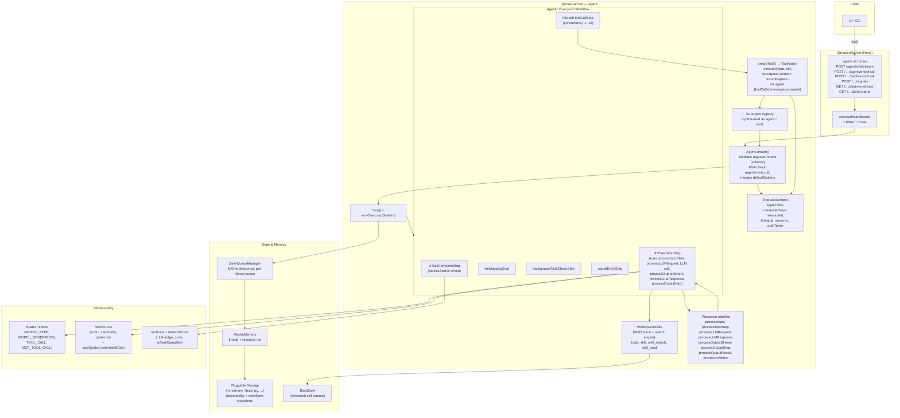

# Mastra TypeScript — Benchmark Study

> **Repo**: https://github.com/mastra-ai/mastra
> **Commit studied**: `318b0279b8d1cc36ecd5280db209e00b6e119e2e` (chore: regenerate providers and docs)
> **Branch**: `main`
> **Framework path**: `frameworks/mastra/`
> **Studied on**: 2026-05-16

Studied at version `@mastra/core@1.36.0-alpha.0`. All file paths in this document are relative to `frameworks/mastra/` unless otherwise noted.

## TL;DR

- **Architecturally**: full-stack TypeScript AI framework. `Mastra` is a central registry/DI container that you instantiate in your Node/Bun/Edge process. The agent loop is **itself a Mastra workflow** (`createWorkflow(...).then(llmExecutionStep).foreach(toolCallStep).then(...)`), giving you free parallel tool dispatch, suspend/resume via workflow snapshots, and HITL approval without writing orchestration.
- **License & governance**: Apache-2.0 with a dual-license `ee/` directory under the Mastra Enterprise License. Owned by **Kepler Software, Inc.** (Y Combinator W25). Commercial backing + community Discord.
- **Maturity**: ~1.5 years old (Mastra was launched in 2024), already in `1.36.0-alpha.0` for `@mastra/core` and `1.9.4-alpha.0` for the `mastra` CLI. Active monorepo with 50+ packages and 15+ first-party storage adapters. Submodule was a shallow clone so star/contributor counts come from the README badges.
- **Where the loop executes**: in your process. `@mastra/core` is pure TypeScript, no subprocess, no vendor binary. The HTTP server (`@mastra/server`) is Hono-based and embeds the agent.
- **Strongest for our use case**: (a) **most complete Anthropic Agent Skills implementation** across the benchmark — `SKILL.md` discovery, BM25/vector/hybrid search, references/scripts/assets, plus a `VersionedSkillSource` backed by a blob store; (b) **`requestContext` is typed key/value bag** propagated to every layer, with reserved keys (`MASTRA_RESOURCE_ID_KEY`, `MASTRA_THREAD_ID_KEY`, `MASTRA_VERSIONS_KEY`) that the server controls so the client cannot spoof tenancy; (c) **sub-agents** are first-class with delegation hooks, parent-memory isolation, and concurrent fan-out.
- **Biggest gap**: no built-in pricing/cost calculator. `CostContext.estimatedCost` is a field the host fills in. Also, **no dedicated `PreToolUse` hook for forced tool args** — Mastra's canonical pattern is "read forced fields from `ctx.requestContext` inside the tool" or wrap the toolset in `processInputStep`.
- **Most surprising finding**: Mastra ships an `isTaskComplete: { scorers, strategy: 'all' }` knob on the run loop that re-iterates the LLM until scorers pass, with feedback injected into the conversation. This is rare across the benchmark.
- **One-line verdicts** — Sessions/persistence: pluggable storage (libsql/pg/cloudflare/d1/dynamodb/...) with 100ms-debounced per-turn persistence + workflow snapshot for HITL. Skills: best in class. Resource manager: skills-tier yes (versioned skill source + blob store), full registry across resources is partial. Sub-agents: first-class. Multi-tenancy: solid `requestContext` plumbing with FGA + RBAC + reserved keys. Hooks: rich 8-method processor pipeline; no dedicated tool-arg-mutation hook. API: full Hono HTTP server with SSE streaming + approve/decline + observer endpoints. Observability: tokens yes, USD cost BYO.
- **Production readiness for multi-tenant**: high. Storage adapters, FGA/RBAC route guards, reserved request-context keys, durable workflow snapshots, deployers for cloud/cloudflare/netlify/vercel, schedulers, MCP server + client, scorer-based eval, hot-reload skills.

---

## 0. Architectural Overview & Deployment Model

### Deployment diagram

```
┌─────────────────────────────────────────────────────────────────────────────┐
│  Your runtime (Node / Bun / Cloudflare Workers / Vercel Edge / Netlify)     │
│                                                                              │
│   ┌──────────────────────────────────────────────────────────────────────┐  │
│   │  @mastra/server  (Hono app)                                           │  │
│   │   - /api/agents/:id/stream  (SSE)                                     │  │
│   │   - /api/agents/:id/approve-tool-call                                 │  │
│   │   - /api/agents/:id/observe-stream                                    │  │
│   │   - coreAuthMiddleware → RBAC + FGA                                   │  │
│   └─────────────────────────────────┬────────────────────────────────────┘  │
│                                     │                                        │
│   ┌─────────────────────────────────▼────────────────────────────────────┐  │
│   │  @mastra/core   Mastra (central registry / DI)                        │  │
│   │   ├─ Agent(id) ── stream() ─► loop() ─► workflow:                     │  │
│   │   │      then(llmExecutionStep)                                       │  │
│   │   │      .foreach(toolCallStep, { concurrency })                      │  │
│   │   │      .then(llmMappingStep)                                        │  │
│   │   │      .then(backgroundTaskCheckStep)                               │  │
│   │   │      .then(signalDrainStep)                                       │  │
│   │   │      .then(isTaskCompleteStep)                                    │  │
│   │   ├─ Workspace (filesystem + skills + tools)                          │  │
│   │   ├─ Memory + Storage (pluggable)                                     │  │
│   │   ├─ MCP client / MCP server                                          │  │
│   │   ├─ Processors (8 hook points)                                       │  │
│   │   └─ RequestContext (typed Map<string, unknown>)                      │  │
│   └─────────────────────────────────┬────────────────────────────────────┘  │
│                                     │                                        │
└─────────────────────────────────────┼────────────────────────────────────────┘
                                      │
            ┌─────────────────────────┼─────────────────────────┐
            ▼                         ▼                         ▼
   ┌──────────────┐         ┌──────────────┐         ┌──────────────────┐
   │ LLM provider │         │  Storage     │         │ Optional vendor   │
   │ (40+ via     │         │  (libsql,    │         │ MCP servers       │
   │ ai-sdk       │         │   pg, redis, │         │ (Playwright,      │
   │ adapters)    │         │   d1, dynamo,│         │ GitHub, ...)       │
   └──────────────┘         │   cloudflare,│         └──────────────────┘
                            │   mssql, ... │
                            └──────────────┘
```

### 0.1 What is this stack?

A TypeScript framework. You instantiate `new Mastra({ agents, workflows, storage, memory, mcpServers, vectors, ... })` in your process; that object exposes the agent surface (`agent.stream()` / `agent.generate()`) and registers routes when handed to `@mastra/server`. There is no managed runtime you must call out to — Mastra Cloud exists but is optional.

### 0.2 Project status & governance

- **Open source** under **Apache License 2.0** for everything outside `ee/` (`LICENSE.md:18-29`).
- **`ee/` directory under Mastra Enterprise License** — covers `packages/core/src/auth/ee/` and `packages/server/src/server/auth/ee/`. Free for dev/testing; commercial use needs a license (`LICENSE.md:3-10`).
- Maintained by **Kepler Software, Inc.** (Y Combinator W25). Active community Discord, dedicated security email `security@mastra.ai`.
- Commercial backing: Mastra Cloud (hosted offering) + paid enterprise support.

### 0.3 Project maturity / age

- `@mastra/core@1.36.0-alpha.0` (from `packages/core/package.json:3`). CLI `mastra@1.9.4-alpha.0`.
- Approximately ~1.5 years public.
- Most APIs are marked stable. `vNext` / `deprecated` markers exist on a few routes (e.g. `STREAM_GENERATE_VNEXT_DEPRECATED_ROUTE` at `packages/server/src/server/server-adapter/routes/agents.ts:9`), suggesting active churn at the HTTP layer.

### 0.4 Adoption & community signal (captured 2026-05-16)

- Hosted on GitHub (`mastra-ai/mastra`). Star/fork counts via badge: see README at `frameworks/mastra/README.md` — the repo carries the typical YC-backed activity profile (multiple commits per day, active issue triage). Submodule was a shallow clone so per-tag history is not available locally — see GitHub for exact numbers.
- Discord: https://discord.gg/BTYqqHKUrf (linked from README badges).
- Twitter: `@mastra` (linked from README).

### 0.5 Ecosystem fit

- **Primary language**: TypeScript (strict). Uses `pnpm` + `turborepo`.
- **Package namespace**: `@mastra/*` on npm (`@mastra/core`, `@mastra/server`, `@mastra/memory`, `@mastra/rag`, `@mastra/mcp`, `@mastra/deployer-*`, …).
- 50+ packages in the monorepo (`ls packages/` shows core, cli, evals, mcp, memory, rag, server, deployer, playground, playground-ui, agent-builder, editor, …).
- 15+ first-party storage adapters under `stores/` (libsql, pg, dynamodb, cloudflare, cloudflare-d1, clickhouse, mongodb, mssql, opensearch, pinecone, qdrant, chroma, astra, …).
- Used as a **library + app framework + CLI**. `mastra dev` boots a local playground; `mastra start` boots production.

### 0.6 Where does the agent loop *actually* execute?

**In your TypeScript process.** No subprocess, no vendor binary. The loop is a Mastra workflow (`packages/core/src/loop/loop.ts:11`):

```ts
export function loop<Tools extends ToolSet = ToolSet, OUTPUT = undefined>({
  resumeContext, models, logger, runId, idGenerator, messageList, ...
}: LoopOptions<Tools, OUTPUT>) {
  // builds workflowLoopProps
  const baseStream = workflowLoopStream(workflowLoopProps);  // a ReadableStream
  modelOutput = new MastraModelOutput({ stream, messageList, options: {...} });
  return createDestructurableOutput(modelOutput);
}
```

The workflow primitive is itself defined in `packages/core/src/workflows/` and the agent's loop runs entirely on it — no external scheduler.

### 0.7 Runtime dependencies

- **Node.js ≥ 18** (or Bun, Cloudflare Workers, Vercel Edge — see `deployers/`).
- **pnpm** for monorepo dev.
- LLM provider keys (Anthropic / OpenAI / Google / Bedrock / Vertex — auto-discovered via 40+ AI SDK provider packages).
- **Storage backend**: by default Mastra uses an in-memory store (`packages/core/src/storage/inmemory-db.ts`) — fine for dev, **must replace with a durable store for production** (e.g. `@mastra/store-libsql`, `@mastra/store-pg`).
- Optional: vector store for memory/RAG, Redis for pubsub, Datadog/OTel for observability.

### 0.8 Recommended deployment topology

The recommended pattern is **one-process-many-tenants**:

- Single Mastra instance with all your agents/workflows/tools registered at boot.
- `@mastra/server` serves HTTP/SSE; the Hono app is stateless across requests (state lives in the storage backend).
- Multiple replicas behind a load balancer; storage backend coordinates state. Resumable streams (`/agents/:id/observe-stream`) make session-affinity unnecessary.
- For background work, the **scheduler** package + `Mastra({ scheduler })` registers cron-style jobs.

Deployers under `deployers/` package this for **Vercel, Netlify, Cloudflare Workers**, and `deployers/cloud` for **Mastra Cloud**.

### 0.9 Cold-start cost & instance footprint

No public benchmark in-repo. Mastra's processor pipeline and registry are lazy-instantiated, but `@mastra/core` is heavy (>200 source files). Realistic baseline for a 5-agent app: tens of MB RAM, sub-second cold start on Node, longer (~1–2 s) on Cloudflare Workers due to bundle size. Not officially reported.

### 0.10 Vendor lock-in

- **LLM provider lock-in**: low. Mastra uses Vercel AI SDK v5/v6 provider adapters (40+ providers — see README) and exposes `model: MastraModelConfig` per call.
- **Hosting lock-in**: low. Deployers for all major edge platforms; the Hono server runs anywhere.
- **Storage lock-in**: low — 15+ adapters under `stores/`.
- **Eval / observability lock-in**: medium. Mastra has its own `MastraScorer` API and observability spans; OTel + Langfuse exporters exist but are not the default. Migrating to LangSmith would be a rewrite of scorers.

### 0.11 Framework weight / footprint

**Heavy framework.** `@mastra/core` is a 200+ file package; `packages/core/src/agent/agent.ts` alone is **6,992 lines**. You get agents + workflows + memory + storage + RAG + voice + MCP + deployer + scheduler + scorers + RBAC/FGA + playground + Studio in one consistent platform. The trade-off is coupling: `Agent` knows about `Mastra` (the central registry), `Storage`, `Memory`, `Workspace`, `MCPServer` — extracting just "the loop" is non-trivial.

### 0.12 Release-history signal

Active changesets in `packages/core/CHANGELOG.md`:

- `1.36.0-alpha.0` (current): `agent.sendSignal` API tightening, `formatSkillActivation` exported.
- `1.35.0`: FGA route policy controls + favorites domain on storage (visibility, favoriteCount, RBAC on stored agents/skills).
- Older lines show iteration on `processInputStep`, `isTaskComplete`, `delegation` hooks, and SSE format changes (`STREAM_GENERATE_VNEXT_DEPRECATED_ROUTE`).

Indicates **fast-moving in 2026** at the auth/governance layer (FGA, favorites, visibility) and the supervisor/scorer layer (`isTaskComplete`).

### 0.13 Documentation depth & cross-team contributor accessibility

- Docs are deep and TypeScript-flavored. `docs/` is part of the monorepo (Mintlify-style) and ships its own `AGENTS.md` for contribution.
- A Product/Data person could author `SKILL.md` and YAML frontmatter unaided — skills are markdown.
- Tools / processors require TypeScript.

### 0.14 Documentation entry points

- Official docs: https://mastra.ai/docs
- Quickstart / getting-started: https://mastra.ai/docs/getting-started/installation
- API reference: https://mastra.ai/docs (per-package sections under "Reference")
- Hosting / deployment: https://mastra.ai/docs/server-db/server-deployment
- Examples / demos: https://github.com/mastra-ai/mastra/tree/main/examples + `templates/` directory in the repo
- Changelog / release notes: per-package `CHANGELOG.md` (e.g. `packages/core/CHANGELOG.md`)
- GitHub Releases: https://github.com/mastra-ai/mastra/releases
- GitHub issues: https://github.com/mastra-ai/mastra/issues
- Discord: https://discord.gg/BTYqqHKUrf

---

## 1. Agent Harness (Run Loop) & Message Taxonomy

### Run loop

#### 1.1 Run loop entrypoint(s)

Three public entrypoints on `Agent`:

- `agent.generate(messages, opts)` — non-streaming, returns `FullOutput<OUTPUT>` (`packages/core/src/agent/agent.ts:6015`).
- `agent.stream(messages, opts)` — streaming, returns `MastraModelOutput<OUTPUT>` (`packages/core/src/agent/agent.ts:6175`).
- `agent.streamUntilIdle(messages, opts)` — streaming + auto-continue when background tasks complete (`packages/core/src/agent/agent.ts:6353`).

`packages/core/src/agent/agent.ts:6197-6220` (signature):

```ts
async stream<OUTPUT = TOutput>(
  messages: MessageListInput,
  streamOptions?: AgentExecutionOptionsBase<any> & {
    structuredOutput?: PublicStructuredOutputOptions<any>;
  } & { model?: DynamicArgument<MastraModelConfig> },
): Promise<MastraModelOutput<OUTPUT>>
```

Internally it calls `#validateRequestContext` (`agent.ts:751`), checks FGA permissions (`MastraFGAPermissions.AGENTS_EXECUTE` at `agent.ts:6056, 6216`), merges agent-level `defaultOptions` with per-call options, resolves model + tools dynamically, and invokes the `loop()` primitive (`packages/core/src/loop/loop.ts:11`).

#### 1.2 Per-iteration behavior

The inner workflow is built in `packages/core/src/loop/workflows/agentic-execution/index.ts:73-100`:

```ts
return createWorkflow({ id: 'executionWorkflow', ... })
  .then(llmExecutionStep)              // call the LLM, emit text/tool-call chunks
  .map(({ inputData }) => inputData.output.toolCalls || [], { id: 'map-tool-calls' })
  .foreach(toolCallStep, toolCallForeachOptions)  // run each tool call (concurrency-controlled)
  .then(llmMappingStep)                // collect results, build the next prompt
  .then(backgroundTaskCheckStep)       // wait for background tasks if any
  .then(signalDrainStep)               // drain any agent signals queued mid-step
  .then(isTaskCompleteStep)            // evaluate completion scorers, decide to loop again
  .commit();
```

#### 1.3 ReAct loop

Mastra ships a built-in ReAct-style loop (LLM call → tool dispatch → next LLM call). The `isTaskCompleteStep` adds a supervisor-style early-stop: if scorers in `isTaskComplete: { scorers, strategy: 'all' }` (`agent.types.ts:540-560`) pass, the loop stops; otherwise feedback is appended and it iterates.

#### 1.4 Tool dispatch + result handling

`toolCallStep` (`packages/core/src/loop/workflows/agentic-execution/tool-call-step.ts`) does dispatch:

- Validates the tool is in the active tool set; rejects with `"Tool X not found. Available: ..."` if not (`tool-call-step.ts:316-348`).
- Runs `tool.execute(input, ctx)` with full `ToolExecutionContext`.
- If `requireApproval` or `needsApprovalFn` matches, emits a `tool-call-approval` chunk and calls `suspend(...)` (`tool-call-step.ts:400-443`).
- Otherwise passes the result back through `llmMappingStep` which builds the next LLM prompt.

#### 1.5 Explicit turn concept

A **turn** is one full pass through the 6-step workflow chain (LLM call + tool dispatches + completion check). The `step-finish` and `finish` stream chunks demarcate turn boundaries.

#### 1.6 Event emission mechanism (in-process)

The loop returns a **`ReadableStream<ChunkType>`** (web-standard, not `EventEmitter` or async generator). `MastraModelOutput` (`packages/core/src/stream/base/output.ts`) wraps it and exposes both `fullStream` and per-property promises (`text`, `usage`, `toolCalls`, `toolResults`, `finishReason`, `messageList`, `getFullOutput()`).

Processors can push custom `data-*` chunks via `ProcessorStreamWriter.custom(...)` (`packages/core/src/processors/index.ts:33-45`).

### Message & event taxonomy

#### 1.7 Message layers

Three layers, deliberately separated:

1. **DB layer — `MastraDBMessage`** (`packages/core/src/agent/message-list/state/types.ts`). What gets persisted. Includes `content.metadata` for `suspendedTools` / `pendingToolApprovals`.
2. **Input layer — `MessageInput`** (`packages/core/src/agent/message-list/types.ts:30-39`):
   ```ts
   export type MessageInput =
     | AIV6.UIMessage | AIV6.ModelMessage
     | AIV5.UIMessage | AIV5.ModelMessage
     | UIMessageWithMetadata
     | Message       // AI SDK v4
     | CoreMessage   // AI SDK v4
     | MastraMessageV1
     | MastraDBMessage;
   ```
   Mastra absorbs both AI SDK v4 and v5/v6 message shapes plus its own DB shape, then normalizes through a `MessageList` instance.
3. **Wire/Stream layer — `ChunkType`** (`packages/core/src/stream/types.ts:931-939`), a tagged union with **~40 distinct types**.

#### 1.8 Concrete message types

| Layer | Type | Purpose |
|---|---|---|
| DB | `MastraDBMessage` | Persisted shape; threads + roles + structured content |
| Input | `MessageInput` | Polymorphic input union (AI SDK v4/v5/v6, Mastra V1, DB) |
| Wire | `ChunkType` | Streamed events (40+ variants) |
| Internal | `LanguageModelV2Prompt` | LLM-facing prompt after `MessageList.toPrompt()` |

#### 1.9 Messages vs. events

Clean separation. `MastraDBMessage` is what storage sees; `ChunkType` is what flows through `fullStream`. The stream is reconstructed back into messages by `MessageList` (`packages/core/src/agent/message-list/message-list.ts`) when the run finishes or on persistence flushes.

#### 1.10 Event categories

From `AgentChunkType` (`packages/core/src/stream/types.ts:749-827`):

| Category | Example types |
|---|---|
| Turn boundary | `start`, `step-start`, `step-finish`, `finish` |
| Content delta | `text-start`, `text-delta`, `text-end`, `reasoning-start`, `reasoning-delta`, `reasoning-end`, `reasoning-signature`, `redacted-reasoning` |
| Tool call lifecycle | `tool-call-input-streaming-start`, `tool-call-delta`, `tool-call-input-streaming-end`, `tool-call`, `tool-call-approval`, `tool-call-suspended`, `tool-result`, `tool-error`, `tool-output` |
| Output / structured | `object`, `object-result`, `step-output` |
| Sources & files | `source`, `file` |
| Lifecycle / control | `abort`, `error`, `raw`, `response-metadata` |
| Processor guardrail | `tripwire`, `is-task-complete` |
| Background task | `background-task-started/running/completed/failed/suspended/resumed/cancelled/output/progress` |

Plus a generic `DataChunkType = { type: 'data-<custom>'; data: any; transient?: boolean }` (`stream/types.ts:711-717`) for processor-emitted custom events. `transient: true` chunks are streamed but not persisted.

#### 1.11 Canonical type-definition file(s)

- `packages/core/src/stream/types.ts` — wire `ChunkType` union (~1086 lines).
- `packages/core/src/agent/message-list/types.ts` — message inputs.
- `packages/core/src/agent/message-list/state/types.ts` — DB shape.

#### 1.12 Live agentic event stream taxonomy

Sample frames (SSE-encoded):

```
event: start
data: {"type":"start","runId":"r-1","from":"AGENT","payload":{}}

event: text-delta
data: {"type":"text-delta","runId":"r-1","from":"AGENT","payload":{"id":"m-1","text":"Hello"}}

event: tool-call
data: {"type":"tool-call","runId":"r-1","from":"AGENT","payload":{"toolCallId":"tc-1","toolName":"fetch_topics","args":{"query":"AI"}}}

event: tool-result
data: {"type":"tool-result","runId":"r-1","from":"AGENT","payload":{"toolCallId":"tc-1","toolName":"fetch_topics","result":[...]}}

event: tool-call-approval
data: {"type":"tool-call-approval","runId":"r-1","from":"AGENT","payload":{"toolCallId":"tc-2","toolName":"publish","args":{"id":"x"},"resumeSchema":"{...}"}}

event: finish
data: {"type":"finish","runId":"r-1","from":"AGENT","payload":{"stepResult":{"reason":"stop"},"output":{"usage":{...}}}}
```

---

## 2. Agent Runtime (Multi-session Host)

### 2.1 Multi-session host architecture

Mastra IS a multi-session runtime when you instantiate `Mastra` once and serve many concurrent `agent.stream(...)` calls against it. The agent is reentrant: every `stream()` call constructs its own `loop()` workflow, independent `MessageList`, independent `RequestContext`. The central `Mastra` registry holds singleton-shared resources (storage, memory store, MCP clients, scheduler) but the per-run state is allocated per call.

### 2.2 Concurrent session isolation

State isolation is enforced at:

- `RequestContext` is per-call (created at `agent.stream()` entry).
- `MessageList` is per-call (instantiated inside `loop()`).
- Persistence is per-thread (`SaveQueueManager` uses `threadId` as the queue key — `packages/core/src/agent/save-queue/index.ts:6-49`).
- Reserved `requestContext` keys (`MASTRA_RESOURCE_ID_KEY`, `MASTRA_THREAD_ID_KEY`) are server-controlled; the client cannot spoof them at the HTTP layer (`packages/server/src/server/handlers/agents.ts:98-1521`).

Tool authors must avoid module-level mutable state (standard concurrency hygiene).

### 2.3 Horizontal scaling / multi-instance

**Stateless workers** — multiple Mastra processes behind a load balancer share the storage backend; no leader election. Resumable streams (`/agents/:id/observe-stream`) let any worker pick up an in-progress run because the workflow snapshot lives in storage. Suspended HITL state is durable via workflow snapshots.

### 2.4 Background / async / scheduled tasks

Three first-party mechanisms:

- **Schedulers** — `Mastra({ scheduler })` registers cron-like jobs; routes under `/api/scheduled-jobs` (`packages/server/src/server/handlers/`).
- **Background tasks** — `disableBackgroundTasks?: boolean` on `AgentExecutionOptions` (`agent.types.ts:626`); `backgroundTaskCheckStep` waits in-loop. Background tasks have their own chunk family (`background-task-started/running/completed/failed/output/...`).
- **Webhooks / channels** — `channels/slack`, `channels/discord` packages wire agent runs into chat events.

### 2.5 Worker pool / queue model

Not first-party. Mastra assumes you put it behind your normal Node/Edge HTTP infra. The `pubsub/` directory contains a pub/sub abstraction used internally; for production queues you bring your own (BullMQ, SQS, etc.).

---

## 3. Sessions & Persistence

### 3.1 Session / chat data model

Mastra calls a session a **"thread"**. A thread is `{ threadId: string, resourceId: string, ... }` and is paired with a `resourceId` (typically a user or tenant id). The `MastraMemory` abstraction (`packages/core/src/memory/memory.ts`) is the public API; storage backends implement it.

`AgentMemoryOption` on `AgentExecutionOptions`:

```ts
memory?: AgentMemoryOption;  // { thread, resource } pair
```

`MastraDBMessage` shape (`packages/core/src/agent/message-list/state/types.ts`):

- `id`, `threadId`, `resourceId`, `role`, `content`, `createdAt`, `metadata`.
- `content.metadata.suspendedTools` and `pendingToolApprovals` for HITL.

### 3.2 What's stored on a session

- Conversation messages (all roles).
- Tool calls + results (as messages).
- Suspended-tool metadata.
- Working memory + semantic memory (separate stores managed by `@mastra/memory`).
- Workflow snapshots for HITL resume (separate storage domain — `storage/domains/workflows/`).
- Observability spans + metrics (separate domain — `storage/domains/observability/`).
- Scorer results (`storage/domains/scores/`).

### 3.3 Granularity

Single conversation per `threadId`. Fork/branch is not first-class; you'd `cloneThread` (see `packages/memory/src/clone-thread-om.test.ts`) and write to the new id.

### 3.4 Built-in persistence stores

15+ adapters under `stores/`:

- `libsql` (default for dev), `pg`, `mysql`, `mssql`, `dsql` (AWS Aurora DSQL)
- `cloudflare`, `cloudflare-d1`
- `dynamodb`, `mongodb`, `opensearch`, `couchbase`
- Vector stores: `pinecone`, `qdrant`, `chroma`, `astra`, `lance`, `elasticsearch`

Storage domains under `packages/core/src/storage/domains/`: `agents`, `background-tasks`, `blobs`, `channels`, `datasets`, `experiments`, `favorites`, `mcp-clients`, `mcp-servers`, `memory`, `observability`, `operations`, `prompt-blocks`, `schedules`, `scorer-definitions`, `scores`, `skills`, `versioned`, `workflows`, `workspaces`.

### 3.5 Persistence timing

Default: **debounced 100 ms per-turn-end**. From `packages/core/src/agent/save-queue/index.ts:6-49`:

```ts
export class SaveQueueManager {
  private debounceMs: number;
  private debounceSave(threadId, messageList, memoryConfig): Promise<void> {
    return new Promise((resolve, reject) => {
      if (this.saveDebounceTimers.has(threadId))
        clearTimeout(this.saveDebounceTimers.get(threadId)!);
      this.saveDebounceTimers.set(threadId,
        setTimeout(() => { this.enqueueSave(...) }, this.debounceMs));
    });
  }
}
```

Switch with `savePerStep: true` on `AgentExecutionOptions` (`agent.types.ts:462`) for "after every assistant step" semantics. On tool approval suspension, `flushMessagesBeforeSuspension()` is called explicitly (`tool-call-step.ts:429`) so suspended state is durable immediately.

### 3.6 Mid-run checkpointing (durable)

Yes — **via workflow snapshots**. When a tool with `requireApproval: true` is hit, `suspend({ __streamState: streamState.serialize() }, ...)` is called and the snapshot is persisted by the configured storage backend (`tool-call-step.ts:400-443`). Resume goes through `agent.approveToolCall({ runId, toolCallId })` (`agent.ts:6741`) which restores the snapshot and replays from the suspended step. This survives process restarts if storage is durable.

### 3.7 Session ID format

User-provided. Conventionally UUIDs (or whatever the host generates). No tenant-prefix convention is enforced; you scope by `resourceId` (the second part of the memory tuple) instead.

### 3.8 Pluggable store interface

Yes — `MastraStorage` is the interface, with sub-interfaces for each domain (`packages/core/src/storage/domains/<domain>/*.ts`). Add a custom adapter by implementing the domain interfaces and passing the instance to `new Mastra({ storage: yourAdapter })`.

### 3.9 Schema evolution / migration

Each adapter ships its own migration scripts (e.g. `stores/pg/src/migrations.ts`). No framework-wide migration helper. New fields are usually added as optional and adapters degrade gracefully (see `1.35.0` favorites release note: *"Existing rows without `visibility` or `favoriteCount` continue to work"*).

### 3.10 Export / replay

Yes via `storage.getMessages({ threadId })` and the resumable-stream / observe-stream endpoints. There is also a `_llm-recorder` package (`packages/_llm-recorder`) used for test fixture replay.

### 3.11 Cross-session memory

Yes — see Q15. `@mastra/memory` provides semantic recall (vector-store-backed), working memory (LLM-summarized rolling notes), and conversation history. Per-resource scope means a tenant or user gets isolated memory naturally.

---

## 4. Multi-tenancy & Arbitrary Context

### 4.1 Full run-loop input struct

`packages/core/src/agent/agent.types.ts:446-636` (`AgentExecutionOptionsBase`):

```ts
export type AgentExecutionOptionsBase<OUTPUT> = {
  instructions?: SystemMessage;
  system?: SystemMessage;
  context?: ModelMessage[];
  memory?: AgentMemoryOption;
  runId?: string;
  savePerStep?: boolean;
  requestContext?: RequestContext<any>;
  versions?: VersionOverrides;
  maxSteps?: number;
  stopWhen?: LoopOptions['stopWhen'];
  providerOptions?: ProviderOptions;
  onStepFinish?, onFinish?, onChunk?, onError?, onAbort?;
  activeTools?: LoopOptions['activeTools'];
  abortSignal?: AbortSignal;
  inputProcessors?, outputProcessors?, errorProcessors?: ProcessorOrWorkflow[];
  maxProcessorRetries?: number;
  toolsets?: ToolsetsInput;
  clientTools?: ToolsInput;
  toolChoice?: ToolChoice<any>;
  modelSettings?: LoopOptions['modelSettings'];
  scorers?: MastraScorers | ...;
  returnScorerData?: boolean;
  tracingOptions?: TracingOptions;
  prepareStep?: PrepareStepFunction;
  isTaskComplete?: StreamIsTaskCompleteConfig;
  requireToolApproval?: boolean;
  autoResumeSuspendedTools?: boolean;
  toolCallConcurrency?: number;
  includeRawChunks?: boolean;
  transform?: ToolPayloadTransformPolicy;
  onIterationComplete?: OnIterationCompleteHandler;
  delegation?: DelegationConfig;
  disableBackgroundTasks?: boolean;
};
```

### 4.2 Context propagation into a tool call

`RequestContext` (`packages/core/src/request-context/index.ts:56-210`) is a typed `Map<string, unknown>`. The HTTP layer (`packages/server/src/server/handlers/agents.ts:98`) defines `mergeBodyRequestContext(serverRequestContext, bodyRequestContext)` which merges the body-supplied context into the server-built one but preserves four reserved keys:

```ts
export const MASTRA_RESOURCE_ID_KEY = 'mastra__resourceId';  // index.ts:17
export const MASTRA_THREAD_ID_KEY   = 'mastra__threadId';    // index.ts:31
export const MASTRA_VERSIONS_KEY    = 'mastra__versions';    // index.ts:44
export const MASTRA_AUTH_TOKEN_KEY  = 'mastra__authToken';   // index.ts:51
```

Doc-string at `request-context/index.ts:6-15`:

> *"When set in RequestContext, this takes precedence over client-provided values for security (prevents attackers from hijacking another user's memory)."*

The same `RequestContext` flows into tool execution via `ToolExecutionContext.requestContext` (`packages/core/src/tools/types.ts:385-426`).

### 4.3 Tool call interface

```ts
export interface ToolExecutionContext<TSuspend, TResume, TRequestContext> {
  mastra?: MastraUnion;
  requestContext?: RequestContext<TRequestContext>;
  abortSignal?: AbortSignal;
  workspace?: Workspace;
  browser?: MastraBrowser;
  writer?: ToolStream;
  agent?: AgentToolExecutionContext<TSuspend, TResume>;     // toolCallId, messages, suspend(), threadId, resourceId
  workflow?: WorkflowToolExecutionContext<TSuspend, TResume>;
  mcp?: MCPToolExecutionContext;
}
```

A tool author writes:

```ts
createTool({
  id: 'fetch_topics',
  inputSchema: z.object({ query: z.string() }),
  execute: async ({ query }, ctx) => {
    const tenantId = ctx.requestContext?.get('tenantId') as string;
    return await topicsService.search({ tenantId, query });  // tenantId NEVER comes from the LLM
  },
})
```

### 4.4 Forcing tool arguments from the harness

**There is no dedicated `PreToolUse → updatedInput` hook.** Mastra does not expose anything analogous to Claude Agent SDK's hook that returns `{ updated_input }`. The canonical patterns:

1. **Read forced fields from `requestContext` inside the tool** (the example above). Type-safe, schema-enforced (see `requestContextSchema` at `tools/types.ts:448`), and the framework is designed for this.
2. **Rebuild tools per-step via `processInputStep`** (`packages/core/src/processors/index.ts:512-531`), returning `{ tools: <new toolset> }`. You can wrap each tool's `execute` with a closure that injects forced args.
3. **`prepareStep` callback** (`packages/core/src/loop/types.ts`), which is sugar over `processInputStep` (see `processors/processors/prepare-step.ts`).

If you need "for tool X, always set `tenantId=Y` regardless of what the LLM emits", you write that wrapper yourself in option 2 or 3. **Real gap for porters from Claude Agent SDK / hook-driven stacks.**

### 4.5 Filtering visible tools

Two mechanisms:

1. **Static at agent construction** — `tools` is `DynamicArgument<TTools, TRequestContext>`:
   ```ts
   tools: ({ requestContext }) => {
     const tier = requestContext.get('tier');
     return tier === 'premium' ? { ...basicTools, ...premiumTools } : basicTools;
   }
   ```
2. **Per step in the loop** — `activeTools` on `AgentExecutionOptions` (whitelist) or `prepareStep` returning `{ activeTools: ['fetch_topics', 'load_taxonomy'] }`. The `toolCallStep` enforces this: calls to non-active tools are rejected with `"Tool X not found. Available: ..."` (`tool-call-step.ts:316-348`).

### 4.6 Tenant scope on session

Tenant identity is **not** a first-class top-level field. Conventionally you put it in `requestContext` (as a typed key) and/or use `resourceId` as the tenant scope. RBAC + FGA (under `ee/`) consume `requestContext` for permission checks (`agent.ts:6056` calls `MastraFGAPermissions.AGENTS_EXECUTE`).

### 4.7 Per-tool-call auth propagation

`MASTRA_AUTH_TOKEN_KEY` (`request-context/index.ts:51`) is the canonical reserved key for forwarding the caller's auth token into tool execution. Tools that hit downstream services (other MCP servers, internal APIs) read it from `ctx.requestContext.get(MASTRA_AUTH_TOKEN_KEY)` and forward it. The editor uses this to forward auth to MCP servers that require the same auth as the Mastra server itself.

### 4.8 Resource scoping primitives

- **Skills**: `SkillsResolver = string[] | ((ctx: { requestContext? }) => string[] | Promise<string[]>)` — paths per request (`packages/core/src/workspace/skills/types.ts:136`).
- **Sub-agents**: same `DynamicArgument` pattern.
- **Workspaces**: same pattern.
- **Memory**: same pattern.
- **Versions**: `requestContext.set(MASTRA_VERSIONS_KEY, { agents: { 'researcher': { versionId: '...' } } })` (`request-context/index.ts:44`) — per-call sub-agent version pinning is built in.

There is no built-in `org/channel/user` hierarchy — you encode it in the keys you put in `requestContext` and consume via FGA rules.

### 4.9 Per-tenant rate limit + budget cap

**No native USD budget cap.** Two related primitives:

- **`CostGuardProcessor`** (`packages/core/src/processors/processors/cost-guard.ts`) is a built-in processor that fires a tripwire when cost exceeds a threshold. But it relies on **caller-provided pricing** (`CostContext.estimatedCost`), not built-in tables.
- **`stopWhen`** (`AgentExecutionOptions.stopWhen` at `agent.types.ts:478`) supports `maxSteps`, `tokenLimit`, custom predicates — token caps, not dollar caps.

To get a real per-tenant dollar ceiling: combine `CostGuardProcessor` with a small `processInputStep` that emits cost via `CostContext` based on your pricing table.

### ⭐ Light usage example

```ts
import { Agent, createTool, RequestContext } from '@mastra/core';
import { z } from 'zod';

// 1) Tool reads tenantId from requestContext, NEVER from LLM args
const topicSearch = createTool({
  id: 'topicSearch',
  inputSchema: z.object({ query: z.string() }),  // tenantId NOT in schema
  requestContextSchema: z.object({ tenantId: z.string() }),  // enforced
  execute: async ({ query }, ctx) => {
    const tenantId = ctx.requestContext!.get('tenantId') as string;
    return topicsService.search({ tenantId, query });
  },
});

const audienceAgent = new Agent({
  id: 'audience',
  tools: ({ requestContext }) => {
    // 2) Filter visible tools at session start
    return { topicSearch, iabSearch, audienceCreate };
  },
});

// 3) Pass tenantId/userId/targetingStrategyId in
const ctx = new RequestContext();
ctx.set('tenantId', 'acme');
ctx.set('targetingStrategyId', 'strat-42');
ctx.set('userId', 'u-123');

const stream = await audienceAgent.stream(
  [{ role: 'user', content: 'Find tech topics' }],
  {
    requestContext: ctx,
    activeTools: ['topicSearch', 'iabSearch', 'audienceCreate'],  // whitelist
  },
);
```

Step 1 (pass context): supported via `requestContext`. Step 2 (filter visible tools): supported via `activeTools` + dynamic `tools`. Step 3 (force `tenantId` server-side): supported via the `requestContext` read pattern in `execute`. There is **no LLM-arg-mutation hook** so the only way to "force tenantId regardless of what the LLM tries" is to **not put tenantId in the input schema at all** — the LLM cannot pass it.

---

## 5. Hook & Middleware Capabilities (Context Engineering)

Mastra calls them **"processors"**. Eight method slots on the `Processor` interface, plus top-level callback hooks on the execution options, plus `delegation` / `isTaskComplete` / `onIterationComplete` callbacks for loop control.

### 5.1 Enumerate every hook

From `packages/core/src/processors/index.ts:465-615`:

| Hook | When | Read | Mutate | Block (tripwire) | Branch |
|---|---|---|---|---|---|
| `processInput` | Once, before the first LLM call | messages, systemMessages | mutate both; can also return `{ messages, systemMessages }` to replace | yes via `ctx.abort(...)` | n/a |
| `processInputStep` | Before EVERY LLM call in the loop | tools, activeTools, model, modelSettings, providerOptions, structuredOutput, messageList | replace any of: `model`, `tools`, `toolChoice`, `activeTools`, `messages`, `systemMessages`, `messageList`, `providerOptions`, `modelSettings`, `structuredOutput`, `messageId` | yes | yes — return `{ model: <different LLM> }` mid-loop |
| `processLLMRequest` | After `MessageList → LanguageModelV2Prompt`, before HTTP send | the LLM-shaped prompt | mutate-and-return; mutations are NOT persisted back (transient model-aware rewrites) | yes | yes — return `{ response: <cached chunks> }` to skip the LLM call entirely (response caching!) |
| `processLLMResponse` | After LLM call completes (or replay) | the chunks, request body, raw response | side effects only (e.g. write to cache) | no | no |
| `processOutputStream` | On every stream chunk | the chunk, all chunks so far, state, messageList | return modified chunk, `null` to drop, or `undefined` to pass through | yes | n/a |
| `processOutputStep` | After every LLM call in the loop, BEFORE tool execution | finishReason, toolCalls, text, usage, all steps, messageList | mutate messageList | yes — and `ctx.abort({ retry: true })` triggers a retry with the abort reason as feedback (self-correcting guardrails) | yes |
| `processOutputResult` | Once, after the run finishes | full `OutputResult { text, usage, finishReason, steps }`, messageList | mutate messageList | yes | n/a |
| `processAPIError` | On non-retryable API rejection (400/422 from the provider) | the error, all steps, messageList | append messages, return `{ retry: true }` | n/a | yes — controlled retry |

Plus top-level option callbacks on every `stream()` / `generate()` call: `onChunk`, `onStepFinish`, `onFinish`, `onError`, `onAbort`, `onIterationComplete`, `delegation.onDelegationStart`, `delegation.onDelegationComplete`, `delegation.messageFilter`.

### 5.2 Hook concurrency model

Processors fire **sequentially in declaration order** within a single processor pipeline; each hook returns a value that the next consumes. Multiple processors can be combined as a workflow (`InputProcessorOrWorkflow` etc.) so you can compose them.

### 5.3 Specific capability tests

- **Inject system messages at session start** — yes. `processInput` or `processInputStep` mutate `systemMessages`. The built-in `SkillsProcessor` (`packages/core/src/processors/processors/skills.ts:209-237`) does exactly this. Two-line injector.
- **Expand user input (slash commands, attachments)** — yes. `processInput` mutates the messages list before any LLM call.
- **Mutate messages before each LLM call** — yes. `processInputStep` runs every iteration. Built-in `TokenLimiterProcessor`, `BatchPartsProcessor`, `MessageSelectionProcessor` (`processors/processors/`) live here.
- **Mutate / decorate tool input before dispatch** — **no dedicated hook**. Two workarounds: (a) wrap `execute` yourself when registering the tool; (b) replace the toolset entirely in `processInputStep` with closures that inject args. The cleaner pattern for tenant id is "read it from `ctx.requestContext` in the tool".
- **Mutate / decorate tool result before returning to the LLM** — yes via `toModelOutput` on each tool (`tools/types.ts:459`) or via `processOutputStream` filtering `tool-result` / `tool-output` chunks. Not a dedicated `PostToolUse` either, but the chunk-level hook is general enough.
- **Emit additional tool calls in response to a tool result** — partially. There is **no Claude-style `PostToolUse → additional_messages` mechanism**. You can: (a) inject a synthetic message via `processOutputStep` (a follow-up instruction the LLM will see next iteration), (b) use `delegation.onDelegationComplete` to feed feedback after a sub-agent returns, (c) use `onIterationComplete` to return `{ feedback: '...' }` which is appended to the conversation. None of these directly inject a `tool-call` event into the same step.

### 5.4 Auto-compaction

Built-in via `TokenLimiterProcessor` (`packages/core/src/processors/processors/token-limiter.ts`) and `BatchPartsProcessor` (`batch-parts.ts`). Triggers when token budget exceeded; strategy is "drop oldest user/assistant pairs until under limit". For richer LLM-summarized compaction, you'd compose your own.

### 5.5 Prompt cache optimization

The processor pipeline supports caching via `processLLMRequest` returning `{ response: <cached chunks> }` to skip the LLM call entirely. A built-in `ResponseCacheProcessor` lives at `packages/core/src/processors/processors/response-cache.ts`. Anthropic-style cache breakpoints are not auto-managed by the framework — you place them in your system prompt yourself or rely on a processor to insert them.

### 5.6 Tool result clearing / progressive disclosure

Two mechanisms:

- Each tool can declare `toModelOutput(output)` (`tools/types.ts:459`) to return a *truncated/summarized* version to the LLM while persisting the full result in storage. This is how the sub-agent wrapper does it (`agent.ts:3725-3730`).
- `processOutputStream` can drop or rewrite `tool-result` chunks.
- The Workspace + Skills system encourages **filesystem stash**: a tool writes its full output to a workspace file and returns a short summary + path, so the LLM can call `skill_read` later to fetch slices.

### 5.7 Architectural diagram of hook firing

```
                                                                  ┌───────────────────────────────┐
                                                                  │   processInput (once)         │
                                                                  └───────────────┬───────────────┘
                                                                                  ▼
        ┌───────────────────────── per iteration ──────────────────────────┐
        │                                                                  │
        │   processInputStep ──► [tools, model, messages, activeTools]     │
        │            │                                                     │
        │            ▼                                                     │
        │   MessageList → LanguageModelV2Prompt                            │
        │            │                                                     │
        │            ▼                                                     │
        │   processLLMRequest ──► [maybe replay cached chunks]             │
        │            │                                                     │
        │            ▼                                                     │
        │      LLM HTTP call                                               │
        │            │ (chunks flow)                                       │
        │            ▼                                                     │
        │   processOutputStream  ◄── on every chunk                        │
        │            │                                                     │
        │            ▼                                                     │
        │   processLLMResponse ──► [write to cache]                        │
        │            │                                                     │
        │            ▼                                                     │
        │   processOutputStep ──► [validate, retry, abort]                 │
        │            │                                                     │
        │            ▼                                                     │
        │   .foreach(toolCallStep, { concurrency })                        │
        │            │                                                     │
        │            ▼                                                     │
        │   tool.execute(input, ctx)  ← requestContext available           │
        │   tool.toModelOutput(output) ◄── per-tool result rewrite         │
        │            │                                                     │
        │            ▼                                                     │
        │   delegation.onDelegationComplete (for agent-* tools)            │
        │            │                                                     │
        │            ▼                                                     │
        │   backgroundTaskCheckStep                                        │
        │            │                                                     │
        │            ▼                                                     │
        │   isTaskCompleteStep ──► scorers decide loop or stop             │
        │            │                                                     │
        │            ▼                                                     │
        │   onIterationComplete ──► { continue, feedback }                 │
        │                                                                  │
        └──────────────────────────────────────────────────────────────────┘
                                                                                  ▼
                                                                  ┌───────────────────────────────┐
                                                                  │ processOutputResult (once)    │
                                                                  │ onFinish (once)               │
                                                                  └───────────────────────────────┘

  On error:   processAPIError ──► { retry: true } loops back into processInputStep
  On abort:   onAbort fires, AbortSignal cascades into LLM + tool calls
  On HITL:    toolCallStep.suspend() → workflow snapshot → resume via approveToolCall/declineToolCall
```

### ⭐ Light usage example

```ts
import type { Processor } from '@mastra/core/processors';

// 1) SessionStart-style: inject tenant/locale/date as system message
const tenantContextInjector: Processor = {
  id: 'tenant-context',
  processInput: async ({ messageList, ctx }) => {
    const tenantId = ctx.requestContext?.get('tenantId') ?? 'unknown';
    const locale = ctx.requestContext?.get('locale') ?? 'en-US';
    messageList.addSystem({
      role: 'system',
      content: `tenant=${tenantId}, locale=${locale}, today=2026-05-16`,
    });
  },
};

// 2) Force tenantId on topicSearch — done by NOT putting tenantId in inputSchema.
//    See Q4: forced-args is "read from requestContext in execute()".

// 3) PostToolUse-style: summarize topicSearch result if > 50 items
const topicSearchSummarizer: Processor = {
  id: 'topic-summarizer',
  processOutputStream: async ({ chunk }) => {
    if (chunk.type === 'tool-result' && chunk.payload.toolName === 'topicSearch') {
      const result = chunk.payload.result as Array<any>;
      if (Array.isArray(result) && result.length > 50) {
        return { ...chunk, payload: { ...chunk.payload,
          result: { count: result.length, top10: result.slice(0, 10) } } };
      }
    }
    return chunk;  // pass through
  },
};

await agent.stream(messages, {
  inputProcessors: [tenantContextInjector],
  outputProcessors: [topicSearchSummarizer],
  requestContext: ctx,
});
```

---

## 6. Agent API Exposition

### 6.1 Does the stack ship an HTTP/network server?

**Yes — `@mastra/server` is a Hono-based HTTP server.** Library-shaped: `new Mastra({...})` is plain, but if you pass the instance to the server adapter (`createMastraServer`), it auto-registers routes and middleware.

### 6.2 Streaming transport

- **SSE** for streams (`responseType: 'stream', streamFormat: 'sse'` on stream routes — see `packages/server/src/server/handlers/agents.ts:1490-1491`).
- JSON for non-streaming.
- **WebSocket** only for OpenAI realtime voice (`StreamTransport.type === 'openai-websocket'`).

### 6.3 Endpoints that start an agent run

From `packages/server/src/server/server-adapter/routes/agents.ts:46-133` (agent routes only — there are also workflows/memory/conversations/scheduled-jobs/MCP/RAG routes):

| Verb | Path | Purpose |
|---|---|---|
| GET | `/agents` | List agents |
| GET | `/agents/:id` | Get agent metadata |
| POST | `/agents/:id/generate` | Non-streaming run |
| POST | `/agents/:id/stream` | **SSE-streaming run** |
| POST | `/agents/:id/stream-until-idle` | Stream + auto-continue when background tasks complete |
| POST | `/agents/:id/approve-tool-call` | HITL approval, returns SSE-resumed stream |
| POST | `/agents/:id/decline-tool-call` | HITL rejection |
| POST | `/agents/:id/approve-tool-call-generate` | HITL approval (non-streaming) |
| POST | `/agents/:id/decline-tool-call-generate` | HITL rejection (non-streaming) |
| POST | `/agents/:id/resume-stream` | Generic suspend/resume (tool.suspend → resume) |
| POST | `/agents/:id/resume-stream-until-idle` | Resume + until-idle |
| GET | `/agents/:id/observe-stream` | Observer attaches mid-stream (resumable stream) |
| POST | `/agents/:id/signals` | Send a signal to an active run or queue a new run |
| GET | `/agents/:id/subscribe-thread` | SSE subscription to a thread's runs |
| POST | `/agents/:id/network` | Multi-agent network execution |
| POST | `/agents/:id/tools/:toolId/execute` | Direct tool execution (no LLM) |
| GET | `/agents/:id/tools/:toolId` | Tool metadata |
| GET | `/agents/:id/skills/:skillName` | Skill metadata (server exposes skills) |
| POST | `/agents/:id/enhance-instructions` | LLM-powered instructions enhancer |

Wire body shape (`packages/server/src/server/schemas/agents.ts`):

```json
{
  "messages": [...],
  "memory": { "thread": "t-123", "resource": "user-42" },
  "requestContext": { "tier": "premium", "scope": "channel:xyz" },
  "versions": { "agents": { "researcher": { "versionId": "v3" } } },
  "modelSettings": { "temperature": 0.7 },
  "maxSteps": 20,
  "activeTools": ["fetch_topics", "publish"],
  "structuredOutput": { "schema": { ... } },
  "requireToolApproval": true
}
```

### 6.4 Live agentic event stream format

Server forwards `fullStream` directly (`agents.ts:1573 — return streamResult.fullStream`). SSE frames are JSON-encoded `ChunkType` objects (see Q1.12 above).

### 6.5 Auth termination at API boundary

**Yes** — `coreAuthMiddleware` (documented in `packages/server/CLAUDE.md`) terminates auth at the `/api/*` boundary. It supports JWT validation, cookies, API keys; integrates with first-party auth packages (`auth/auth0`, `auth/clerk`, `auth/workos`, `auth/supabase`, `auth/firebase`, `auth/better-auth`, `auth/okta`, `auth/studio`). RBAC and FGA layers run inside the middleware:

- RBAC permissions auto-derived from path + method: `GET /agents/:id → agents:read`, `POST /agents/:id/generate → agents:execute`.
- FGA route policies via `MastraFGAWorkos` (`MastraFGAPermissions.AGENTS_EXECUTE` is checked inside `agent.stream` at `agent.ts:6056, 6216`).

### 6.6 Resume / replay endpoint

- `GET /agents/:id/observe-stream` — attach to an in-progress run as an observer (resumable stream, multiple clients can attach).
- `POST /agents/:id/resume-stream` — resume a suspended run (different from approve/decline; for generic tool.suspend()).
- `GET /agents/:id/subscribe-thread` — SSE subscription to a thread's runs.

### 6.7 Interrupt / cancel via API

**Implicit via SSE disconnection.** The server-side `AbortSignal` is wired from the HTTP layer into `agent.stream(messages, { abortSignal })` (`agents.ts:1500, 1567`). Dropping the connection cancels. There is **no explicit `DELETE /runs/:id`** endpoint. `POST /agents/:id/signals` can be used to send a stop-style signal if your agent's signal schema defines one (application-specific).

### 6.8 Tool-arg streaming (partial JSON)

Yes — three chunk types: `tool-call-input-streaming-start { toolCallId, toolName }`, `tool-call-delta { toolCallId, argsTextDelta }`, `tool-call-input-streaming-end { toolCallId }`. The client can render partial args in real time.

### 6.9 HITL approval workflow

`POST /agents/:agentId/approve-tool-call` body:

```json
{ "runId": "r-1", "toolCallId": "tc-2" }
```

Decline is symmetric. Both return a **new SSE stream** that resumes execution. Workflow:

1. Client opens original `/stream`.
2. Sees a `tool-call-approval` chunk with `{ toolCallId, toolName, args, resumeSchema }`.
3. Closes the stream.
4. Calls `/approve-tool-call` (or `/decline-tool-call`).
5. Consumes the second SSE stream which continues from the same workflow snapshot.

Alternatively the client can call `/observe-stream` to see the same chunks without owning the connection.

### 6.10 Tool-call state reconstruction

**Explicit linkage via `toolCallId`.** Every tool-related chunk carries `payload.toolCallId`:

- `tool-call-input-streaming-start` { toolCallId, toolName }
- `tool-call-delta` { toolCallId, argsTextDelta }
- `tool-call-input-streaming-end` { toolCallId }
- `tool-call` { toolCallId, toolName, args, output? }
- `tool-result` { toolCallId, toolName, result, isError? }
- `tool-error` { toolCallId, toolName, error }
- `tool-call-approval` / `tool-call-suspended` { toolCallId, ... }
- `tool-output` { toolCallId, toolName, output }   ← progress events from inside a long tool

The client builds a `Map<toolCallId, {name, args, result, status}>` deterministically. Sub-agent invocations appear as ordinary `tool-call` chunks with `toolName: 'agent-<subAgentName>'` plus, for network mode, dedicated `agent-execution-*` chunks under `NetworkChunkType`.

### 6.11 Health checks / graceful shutdown

`@mastra/server` ships a `/api/health` endpoint via the server adapter (Hono). SIGTERM handling depends on the deployer; `deployers/vercel`, `deployers/cloudflare`, etc. wire it appropriately.

### ⭐ Light usage example

```bash
# 1) Start a run with a tenant header (host-mapped to requestContext)
curl -N -X POST http://localhost:3000/api/agents/audience/stream \
  -H "Content-Type: application/json" \
  -H "Authorization: Bearer $JWT" \
  -H "X-Tenant-Id: acme" \
  -d '{
    "messages": [{"role": "user", "content": "Find tech topics"}],
    "memory": { "thread": "t-123", "resource": "u-42" },
    "requestContext": { "tenantId": "acme" }
  }'

# 2) Example SSE frames received
# event: start
# data: {"type":"start","runId":"r-1","from":"AGENT","payload":{}}
# event: tool-call
# data: {"type":"tool-call","runId":"r-1","from":"AGENT","payload":{"toolCallId":"tc-1","toolName":"topicSearch","args":{"query":"AI"}}}
# event: finish
# data: {"type":"finish","runId":"r-1","from":"AGENT","payload":{"output":{"usage":{"inputTokens":120,"outputTokens":80}}}}

# 3) Cancel mid-flight — drop the SSE connection (no explicit endpoint)
#    Or send an application-defined stop signal:
curl -X POST http://localhost:3000/api/agents/audience/signals \
  -H "Content-Type: application/json" \
  -d '{"runId": "r-1", "signal": {"type": "stop", "contents": ""}}'

# 4) Approve a HITL-paused tool call
curl -N -X POST http://localhost:3000/api/agents/audience/approve-tool-call \
  -H "Content-Type: application/json" \
  -d '{"runId": "r-1", "toolCallId": "tc-2"}'
# The response is a new SSE stream that resumes execution.
```

---

## 7. Sub-agents

### 7.1 Mechanism

**Both.** Sub-agents are a first-class config field on `Agent` (`agents?: DynamicArgument<Record<string, SubAgent>>`) AND at runtime they are exposed to the parent LLM as **synthesized `agent-<name>` tools** (built by `listAgentTools()` at `packages/core/src/agent/agent.ts:3665`).

### 7.2 Configuration

Three forms:

1. **Statically as full `Agent` instances** — `new Agent({ agents: { researcher: researcherAgent, coder: coderAgent } })`.
2. **Dynamically per request** — `agents: ({ requestContext }) => { ... }` returns the map. Per-tenant persona fan-in/out.
3. **Lightweight via the `SubAgent` interface** (`packages/core/src/agent/subagent.ts:42-98`) — implement `getDescription`, `getModel`, `getInstructions`, `generate`, `stream`, `resumeGenerate`, `resumeStream`, `hasOwnMemory`, `__setMemory`, `getMemory`. Useful for remote-agent wrappers without instantiating `Agent`.
4. **Network mode** — `agent.network(task, { routing, completion, ... })` wraps the supervisor pattern explicitly (`packages/core/src/loop/network/index.ts`).

### 7.3 LLM-generated configs

**No** — configs are statically registered (or returned by the `DynamicArgument` resolver at the start of the run). The LLM picks an existing `agent-<name>` tool; it cannot define a new agent at call time. It CAN pass additional `instructions`, `maxSteps`, `threadId`, `resourceId` to that tool (`agent.ts:3690-3705`), and the wrapper merges those onto the sub-agent's defaults.

### 7.4 Output handling

The synthesized `agent-<name>` tool returns:

```ts
z.object({
  text: z.string(),
  subAgentThreadId: z.string().optional(),
  subAgentResourceId: z.string().optional(),
  subAgentToolResults: z.array(z.object({
    toolName, toolCallId, result, args, isError,
  })).optional(),
})
```

By default `toModelOutput` strips everything except `text` (`agent.ts:3725-3730`):

```ts
const toModelOutput = delegation?.includeSubAgentToolResultsInModelContext
  ? undefined
  : (output) => ({ type: 'text', value: output.text });
```

So the supervisor LLM sees a single text blob unless you opt into `delegation.includeSubAgentToolResultsInModelContext = true`. Mastra also streams sub-agent chunks to the parent stream (you see them in `fullStream` as nested `agent-execution-event-*` chunks for network mode).

### 7.5 Concurrency model

**Parallel by default.** Sub-agent invocations ARE tool calls, so they go through the same `.foreach(toolCallStep, { concurrency })` machinery as ordinary tools (`packages/core/src/loop/workflows/agentic-execution/index.ts:95`). Default `toolCallConcurrency = 10` (`tool-call-concurrency.ts:7-9`). If any tool/sub-agent in the active set has `requireApproval` or a `suspendSchema`, the concurrency drops to 1 to keep suspension deterministic (`tool-call-concurrency.ts:42-60`).

### 7.6 Context isolation

The sub-agent gets a **sanitized copy** of the parent's message history. `stripParentToolParts` removes the parent's `tool-call` and `tool` messages (`agent.ts:3637-3659`) because the sub-agent doesn't have those tools registered. It also gets the parent's `MASTRA_THREAD_ID_KEY` / `MASTRA_RESOURCE_ID_KEY` cleared so it writes to its own isolated thread (`agent.ts:3805-3816`).

If the sub-agent doesn't have its own memory, the parent's memory is injected via `__setMemory(memory)`. Either way, identifiers are kept separate.

### 7.7 Lifecycle events

`delegation.onDelegationStart(ctx)` runs before the sub-agent fires; returns `{ proceed?, rejectionReason?, modifiedPrompt?, modifiedInstructions?, modifiedMaxSteps? }` (`agent.types.ts:75-129`). `delegation.onDelegationComplete(ctx)` runs after, with a `bail()` to cancel sibling concurrent delegations. `delegation.messageFilter(ctx)` lets the supervisor decide which parent messages to forward (`agent.types.ts:303`).

### ⭐ Light usage example

```ts
import { Agent } from '@mastra/core';

const topicSearch = createTool({ /* ...as in Q4... */ });

const personaYoungMom = new Agent({
  id: 'persona-young-mom',
  instructions: 'You are a 32-year-old mom evaluating ads. Be honest and skeptical.',
  model: { provider: 'anthropic', modelId: 'claude-sonnet-4' },
  tools: { topicSearch },
});
const personaTechBro = new Agent({
  id: 'persona-tech-bro',
  instructions: 'You are a 28-year-old tech enthusiast.',
  model: { provider: 'anthropic', modelId: 'claude-sonnet-4' },
  tools: { topicSearch },
});
const personaRetiree = new Agent({
  id: 'persona-retiree',
  instructions: 'You are a 70-year-old retiree.',
  model: { provider: 'anthropic', modelId: 'claude-sonnet-4' },
  tools: { topicSearch },
});

const orchestrator = new Agent({
  id: 'orchestrator',
  instructions: 'Get feedback from all three personas in parallel.',
  model: { provider: 'anthropic', modelId: 'claude-opus-4' },
  agents: { personaYoungMom, personaTechBro, personaRetiree },
});

// Parent invokes them concurrently — the LLM emits three agent-<name> tool
// calls in one step; toolCallConcurrency=10 fans them out via foreach.
const stream = await orchestrator.stream(
  [{ role: 'user', content: 'Evaluate this ad copy: ...' }],
  {
    delegation: {
      onDelegationComplete: ({ primitiveId, result }) => {
        console.log(`${primitiveId} returned: ${result.text}`);
      },
    },
  },
);

for await (const chunk of stream.fullStream) {
  // Parent receives each persona's text as a tool-result chunk
  // where toolName = 'agent-persona-young-mom' etc.
}
```

---

## 8. Skills

**First-class — and the most complete implementation of the Anthropic Agent Skills spec across this benchmark.** Mastra ships a `WorkspaceSkills` interface, a filesystem-backed implementation, a `VersionedSkillSource` backed by a blob store, a `CompositeVersionedSkillSource` to mix versioned and live skills, BM25/vector/hybrid search, and three built-in tools.

### 8.1 First-class concept?

Yes. The spec is cited at `packages/core/src/workspace/skills/types.ts:7`:

> `@see https://github.com/anthropics/skills`

### 8.2 File format

```
skills/
  brand-guidelines/
    SKILL.md                  ← required, contains YAML frontmatter + markdown body
    references/
      colors.md
      typography.md
    scripts/
      generate-mockup.sh
    assets/
      logo.svg
```

`SkillMetadata` (`packages/core/src/workspace/skills/types.ts:146-161`):

```ts
export interface SkillMetadata {
  name: string;           // 1-64 chars, lowercase, hyphens only
  path: string;           // dir relative to workspace root
  description: string;    // 1-1024 chars
  license?: string;
  compatibility?: unknown;
  'user-invocable'?: boolean;
  metadata?: Record<string, unknown>;
}
```

`Skill` extends this with `instructions: string` (the markdown body), `source: ContentSource` (`external` | `local` | `managed`), `references: string[]`, `scripts: string[]`, `assets: string[]`.

YAML frontmatter is validated by `validateSkillMetadata` (`packages/core/src/workspace/skills/schemas.ts`).

### 8.3 Loader mechanism

Filesystem scan via `Workspace.filesystem` (`packages/core/src/workspace/filesystem/`). The resolver (`SkillsResolver = string[] | (ctx) => string[]`) returns the paths to scan; `WorkspaceSkillsImpl` walks each path, parses `<dir>/SKILL.md` (YAML frontmatter via `gray-matter`), and indexes content with the configured `SkillSearchEngine` (BM25/vector/hybrid).

Skills auto-refresh on a 5 s glob-walk interval with a 2 s post-discovery cooldown (`workspace-skills.ts:107-108`). `addSkill(path)` / `removeSkill(name)` allow surgical cache updates for live edit scenarios.

### 8.4 Invocation

**Lazy / metadata-only + tool-driven activation.** This is the cleanest tradeoff in the benchmark.

The `SkillsProcessor` (`packages/core/src/processors/processors/skills.ts:209-237`) injects ONLY the available-skills metadata into the system prompt:

```xml
<available_skills>
  <skill>
    <name>brand-guidelines</name>
    <description>Dailymotion brand guidelines for copy and creative</description>
    <location>skills/brand-guidelines/SKILL.md</location>
    <source>local</source>
  </skill>
</available_skills>
```

Plus a one-shot instruction:

> *"IMPORTANT: Skills are NOT tools. To use a skill, call the `skill` tool with the skill name as the `name` parameter."*

Three tools are added to the agent's toolset (`packages/core/src/workspace/skills/tools.ts:31-37`):

- `skill(name)` — load the full instructions for a skill, including references/scripts/assets listings.
- `skill_search(query, skillNames?, topK?)` — search across skill content (BM25/vector/hybrid).
- `skill_read(skillName, path, startLine?, endLine?)` — read a specific file from a skill's `references/`, `scripts/`, or `assets/` directory, with optional line range. Detects binary files and returns size + path instead.

Skill tools never require approval (skill tools have `requireApproval: false` baked in).

### 8.5 Loading mode

**Lazy** — only metadata in the system prompt, body fetched on `skill` tool call. Stateless: the `skill` tool returns the body in the tool result; the conversation holds it. If context is compacted, the model calls again.

### 8.6 Runtime scoping (global / tenant / user)

Via `SkillsResolver` as a function reading `requestContext`:

```ts
const workspace = new Workspace({
  filesystem: new LocalFilesystem({ basePath: './data' }),
  skills: (ctx) => {
    const tier = ctx.requestContext?.get('userTier');
    return tier === 'premium' ? ['skills/basic', 'skills/premium'] : ['skills/basic'];
  },
});
```

Three paths shown in the docstring example (`workspace/skills/types.ts:122-134`).

Format options: `'xml' | 'json' | 'markdown'` (`workspace/skills/types.ts:141`). XML is default because deterministic ordering keeps prompt-cache stability (`skills.ts:135 — sorted by name for prompt cache`).

### 8.7 Skill composition

A skill can include references / scripts / assets bundled alongside `SKILL.md`. The `skill_read` tool reads them on demand. Skills do not directly invoke sub-agents (that's the agent's job), but a skill's instructions can tell the LLM "delegate to agent-X for this step".

### ⭐ Light usage example

```ts
// 1) Author skills/generate-audience-from-brief/SKILL.md
// ---
// name: generate-audience-from-brief
// description: Build a targeting audience from a campaign brief
// user-invocable: true
// ---
// # Generate Audience From Brief
// When the user provides a brief, identify the relevant IAB categories,
// search for matching topics with topicSearch, then call audienceCreate
// with the result. Refer to references/iab-taxonomy.md when unsure.

// 2) Load it via the Workspace
import { Workspace, LocalFilesystem } from '@mastra/core/workspace';
import { Agent } from '@mastra/core';

const workspace = new Workspace({
  filesystem: new LocalFilesystem({ basePath: './data' }),
  skills: ['skills'],  // scans data/skills/*/SKILL.md
});

const agent = new Agent({
  id: 'audience',
  workspace,
  tools: { topicSearch, audienceCreate },
});

// 3) Run — the agent sees only metadata in its system prompt and calls
// the built-in `skill` tool to load the body on demand:
await agent.stream([
  { role: 'user', content: 'Use the audience-from-brief skill: Brief is...' },
]);

// Inside the LLM:
//   1. Sees <available_skills><skill name="generate-audience-from-brief">...
//   2. Calls skill({ name: 'generate-audience-from-brief' })
//   3. Tool result returns the markdown body
//   4. LLM follows the steps, calls topicSearch, audienceCreate, etc.
```

---

## 9. Resource Manager

### 9.1 First-class Resource Manager?

**Partial.** Skills have a real resource-manager layer (`VersionedSkillSource` + `CompositeVersionedSkillSource` + blob storage). Sub-agents and tools are first-class but registered programmatically; versioning is per-call via `MASTRA_VERSIONS_KEY` (`packages/core/src/request-context/index.ts:44`). Stored agents/skills are tracked in storage with `visibility: 'private' | 'public'` and `favoriteCount` (added in 1.35.0 — see `packages/core/CHANGELOG.md`).

### 9.2 Loading sources

| Source | Supported? | How |
|---|---|---|
| Local filesystem | ✅ | `skills: ['skills', '/path/to/external']`, `LocalFilesystem({ basePath })` |
| Git / GitHub | 🟡 BYO | No first-class git source. You git-clone into the filesystem and point `skills:` at it |
| OCI / container registries | ❌ Not provided — BYO | |
| Cloud object storage | ✅ for skills | `VersionedSkillSource` backed by `BlobStore` (any provider with a blob adapter — S3, GCS, R2) |
| Postgres / relational DB | ✅ for stored agents/skills | `storage.getStore('agents')` / `storage.getStore('skills')` with the storage domain APIs (favorites, visibility) |
| Vendor cloud / managed registry | ✅ Mastra Cloud | `deployers/cloud` package |
| HTTP fetch | ❌ Not provided — BYO | |

`CompositeVersionedSkillSource` (`packages/core/src/workspace/skills/composite-versioned-skill-source.ts:34-100`) mounts multiple versioned skill trees into a virtual filesystem, with an optional fallback to a "live" filesystem source for actively-edited skills.

### 9.3 Source composition / priority

For skills: **`local > managed > external`** (`workspace-skills.ts:207`). Multiple sources stack via `CompositeVersionedSkillSource`.

### 9.4 Versioning model

- **Per-call versions** via `MASTRA_VERSIONS_KEY` for sub-agents (and "future primitives" per the codebase comment).
- **Versioned skill source** uses `SkillVersionTree` manifest with content-hashed blob refs.
- Storage domain `storage/domains/versioned.ts` underlies it.
- No semver-based registry; immutable content-hash refs.

### 9.5 Scoping at the registry layer

**Yes for stored agents/skills (since 1.35.0):**
- `visibility: 'private' | 'public'` on stored rows.
- `favoriteCount` for ranking.
- `storage.getStore('favorites')` with `favorite({ userId, entityType, entityId })`.

**Yes for skills via `SkillsResolver`** at runtime (function reading `requestContext`).

### 9.6 Publishing workflow

Not first-class — no "draft → review → publish → promote" workflow shipped. The deployers (`mastra deploy`) handle env promotion at the *application* level.

### 9.7 Lifecycle / governance

- Stored agents/skills have `visibility` and `favoriteCount` (`1.35.0`).
- RBAC + FGA (under `ee/`) gate who can read/write/execute stored entities.
- No explicit `draft / active / deprecated / retired` lifecycle state.

### 9.8 Programmatic API

```ts
const skills = await storage.getStore('skills');
await skills.list({ ownerId: 'u-1', visibility: 'public' });
await skills.create({ name: '...', content: '...', visibility: 'private' });

const favorites = await storage.getStore('favorites');
await favorites.favorite({ userId: 'u1', entityType: 'agent', entityId: 'agent-123' });
const ids = await favorites.listFavoritedIds({ userId: 'u1', entityType: 'agent' });
```

### 9.9 Caching & sync model

`WorkspaceSkillsImpl` auto-refreshes on a 5 s glob-walk interval with a 2 s post-discovery cooldown (`workspace-skills.ts:107-108`). `maybeRefresh(context)` is called by `processInput` on each agent turn — staleness check avoids unnecessary re-discovery.

### ⭐ Light usage example

```ts
// 1) Register two skill sources: a global git-cloned dir AND a tenant S3-backed
//    versioned source. The S3 source wins because it's listed first in
//    CompositeVersionedSkillSource priority.

import { Workspace, LocalFilesystem } from '@mastra/core/workspace';
import { CompositeVersionedSkillSource } from '@mastra/core/workspace/skills';
import { S3BlobStore } from '@mastra/store-s3';  // hypothetical adapter

const tenantSource = new VersionedSkillSource({
  blobStore: new S3BlobStore({ bucket: `predict-skills`, prefix: `tenants/acme/` }),
});
const globalSource = new LocalFilesystem({ basePath: './git-clones/predict-skills' });

const workspace = new Workspace({
  filesystem: new CompositeVersionedSkillSource([
    tenantSource,   // S3 wins for tenant `acme`
    globalSource,   // fallback for global skills
  ]),
  skills: (ctx) => ['skills'],
});

// 2) Promote a skill from draft → active for tenant acme only
//    Not first-class; use storage with visibility:
const skillsStore = await storage.getStore('skills');
await skillsStore.update('skill-id', { visibility: 'public', ownerId: 'tenant-acme' });

// 3) List all active skills visible to a tenant request
const ctx = new RequestContext();
ctx.set('tenantId', 'acme');
await workspace.skills.maybeRefresh({ requestContext: ctx });
const skills = await workspace.skills.list();
// Returns the S3-resolved skills for acme + global fallbacks
```

**Note**: Steps 2-3 require composing storage-domain calls with workspace skill resolution — Mastra doesn't ship a single `promote(tenantId, skillId, 'active')` API today.

---

## 10. Observability: Usage, Cost, Tracing, Audit

### 10.1 Where tokens are surfaced

Three places:

1. **`MastraModelOutput.totalUsage`** — promise resolved at run end (`packages/core/src/stream/base/output.ts:1407-1410`).
2. **`onStepFinish`** callback fires after every LLM step with `LLMStepResult` containing `usage: LanguageModelUsage` (`packages/core/src/stream/types.ts:993-995, 1063`).
3. **`onFinish`** with `totalUsage` (cumulative across steps), `steps[]` each with its own `usage`.

`LanguageModelUsage` (`stream/types.ts:975-985`):

```ts
export type LanguageModelUsage = LanguageModelV2Usage & {
  reasoningTokens?: number;
  cachedInputTokens?: number;
  cacheCreationInputTokens?: number;
  raw?: unknown;  // Full nested provider structure for V3 models
};
```

Input / output / reasoning / cache-read / cache-write are all tracked when the provider supports them.

### 10.2 Per-call / per-turn / per-session / per-tenant rollups

- Per LLM call → `step-finish` chunk's `payload.output.usage`, and `onStepFinish` callback.
- Per turn → `finish` chunk's `payload.output.usage` and `MastraStepResult.usage`.
- Per session → query the storage backend, which persists usage on conversation messages.
- Per tenant → **not natively scoped.** You attach it via the observability metrics path.

### 10.3 USD cost computation

**Not computed by the SDK.** `CostContext.estimatedCost` is just a field the caller (host app or an exporter) fills in (`packages/core/src/observability/types/metrics.ts:60-66`):

```ts
export interface CostContext {
  provider?: string;
  model?: string;
  estimatedCost?: number;
  costUnit?: string;
  costMetadata?: Record<string, unknown>;
}
```

There is no `pricing.ts` table inside `@mastra/core` that maps provider+model to USD-per-1k-tokens.

### 10.4 Per-tenant / per-conversation cost

**BYO.** Pattern: keep your pricing table, hook `onStepFinish` (or a custom processor) to compute `tokens × rate`, emit a metric with `costContext.estimatedCost`. ~30 lines.

### 10.5 LLM / tool tracing

Three pipelines run inside Mastra's `ObservabilityEntrypoint`:

1. **Stream chunks** carry usage on `step-finish` and `finish`.
2. **Metrics bus** (`packages/core/src/observability/types/metrics.ts:26-36`) — `MetricsContext.emit(name, value, labels, { costContext })`.
3. **Spans / traces** — every LLM call, tool call, and processor call produces a span via `IModelSpanTracker` / observability span APIs. Exporters: **Langfuse, OpenTelemetry, custom storage**. `MODEL_GENERATION` spans are re-stamped if a fallback model serves the request so cost attribution stays correct (`llm-execution-step.ts:650-660`).

`MetricEvent` and `MetricsConfig` ship with cardinality protection: `DEFAULT_BLOCKED_LABELS = ['trace_id', 'span_id', 'run_id', 'request_id', 'user_id', 'resource_id', 'session_id', 'thread_id']` and UUID-shaped values are blocked by default (`metrics.ts:131-164`).

### 10.6 Audit logging (who / when / what)

- Spans + metrics are the primary audit signal.
- `storage/domains/observability/` persists all spans/metrics for query.
- RBAC + FGA route guards log denials at the middleware layer.
- No first-party "tamper-evident" audit log (you'd ship spans to an append-only sink).

### 10.7 Canonical "where do I read token counts" code path

```ts
const stream = await agent.stream(messages, {
  onStepFinish: ({ usage, model, ... }) => {
    metrics.observe('llm.tokens', usage.totalTokens, {
      provider: model?.provider, model: model?.modelId, tenant: ctx.tenantId,
    });
  },
  onFinish: ({ totalUsage, steps }) => {
    // run-level aggregate
  },
});
```

`LanguageModelUsage` type is at `packages/core/src/stream/types.ts:975-985`.

### ⭐ Light usage example

```ts
import { metrics } from '@datadog/datadog-api-client';

// Pricing table (BYO)
const PRICING_USD_PER_1K = {
  'anthropic:claude-opus-4':   { input: 0.015, output: 0.075 },
  'anthropic:claude-sonnet-4': { input: 0.003, output: 0.015 },
};

const stream = await agent.stream(messages, {
  requestContext: ctx,
  // 1) Read tokens + compute cost per step, push to Datadog
  onStepFinish: ({ usage, model }) => {
    const key = `${model?.provider}:${model?.modelId}`;
    const rate = PRICING_USD_PER_1K[key];
    if (!rate || !usage) return;
    const cost =
      ((usage.inputTokens ?? 0) * rate.input + (usage.outputTokens ?? 0) * rate.output) / 1000;
    metrics.send({
      series: [{
        metric: 'agent.cost_usd',
        points: [{ value: cost, timestamp: Date.now() }],
        tags: [`tenant:${ctx.get('tenantId')}`, `provider:${model?.provider}`, `model:${model?.modelId}`],
      }],
    });
  },
});

// 2) Read final totals
const finalUsage = await stream.totalUsage;
console.log(`Run total tokens: in=${finalUsage.inputTokens} out=${finalUsage.outputTokens}`);
```

---

## 11. Built-in Tools & Tool Authoring API

### 11.1 Built-in tools shipped in the box

Mastra's tool ecosystem ships as separate packages and via the `Workspace`:

- **Skills tools** (always added when a workspace has skills): `skill`, `skill_search`, `skill_read` (`packages/core/src/workspace/skills/tools.ts`).
- **Browser tool** (`MastraBrowser` in `ToolExecutionContext`; `packages/core/src/browser/`).
- **Workspace tool primitives** — file read/write via `workspace.filesystem`.
- **MCP-server tools** — any tool registered as an MCP server gets the MCP transport for free.
- **RAG tools** under `@mastra/rag` (vector search, chunk retrieval, citations).
- **Voice tools** (`@mastra/core/voice`) for STT/TTS.
- **Channel tools** in `channels/slack`, `channels/discord` (post messages, react, etc.).

There is no "built-in Bash/Edit/Read" catalog à la Claude Code. Mastra's stance: tools are app-specific; the platform ships the runtime + a few utilities.

### 11.2 Built-in tool quality

The skill tools encode real patterns: `skill_read` does line-range slicing and binary-file detection; `skill_search` runs full BM25/vector/hybrid against indexed content. The Workspace + filesystem primitives are thin but consistent.

### 11.3 Tool authoring API

```ts
import { createTool } from '@mastra/core/tools';
import { z } from 'zod';

const weatherTool = createTool({
  id: 'weather',
  description: 'Get the weather for a city',
  inputSchema: z.object({ city: z.string() }),
  outputSchema: z.object({ temp: z.number(), condition: z.string() }),
  execute: async ({ city }, ctx) => {
    return { temp: 72, condition: 'sunny' };
  },
});
```

Examples in `packages/core/src/tools/tool.ts:29-58`. JSON-schema is generated automatically from the Zod schema and passed to the LLM as the tool definition.

### 11.4 Typed tool I/O

- Input validation via Zod (or any standard schema — JSON-Schema, Yup, etc. via `PublicSchema`).
- On invalid args the framework returns a `ValidationError` to the model (not the host) so the LLM can self-correct.
- `requestContextSchema?: PublicSchema<TRequestContext>` (`packages/core/src/tools/types.ts:448`) validates the request context against the tool's expectations.

### 11.5 Streaming tools

Yes — tools can yield mid-execution progress via `ctx.writer: ToolStream` (`packages/core/src/tools/types.ts:417`). These produce `tool-output` chunks in `fullStream`. Tools can also `suspend(payload)` via `ctx.agent.suspend` for HITL pauses with custom payloads.

---

## 12. MCP (Model Context Protocol) Support

### 12.1 MCP client support

Yes — `@mastra/mcp` (`packages/mcp/src/client/`) wires external MCP servers in. Routes under `/api/mcp-clients/*` expose management; in-process consumption via the Mastra `mcpServers: { ... }` config.

### 12.2 MCP server support

Yes — `@mastra/mcp` (`packages/mcp/src/server/`) lets you expose Mastra tools/skills as an MCP server for other agents/clients to consume.

### 12.3 Transports

- **stdio** for subprocess-based MCP servers.
- **SSE/HTTP** for remote MCP servers.
- **In-process** transport for SDK-defined MCP servers (no subprocess).

### 12.4 In-process MCP

Yes — Mastra tools can be wrapped as an in-process MCP server without spawning a subprocess.

### 12.5 Auth / lifecycle

Credentials are passed via `mcpClients` config at boot or via `requestContext.get(MASTRA_AUTH_TOKEN_KEY)` for runtime token forwarding (the editor uses this to forward the same auth as the Mastra server itself — see `packages/core/src/request-context/index.ts:46-51`). Reconnection + health managed by the client implementation.

---

## 13. Multi-model Routing & Fallback

### 13.1 Multi-provider support

**40+ providers via Vercel AI SDK adapters** — Anthropic, OpenAI, Gemini, Bedrock, Vertex, Azure, Cerebras, Groq, Cohere, Mistral, etc. README: *"Connect to 40+ providers through one standard interface."*

### 13.2 Per-task model selection

`model: DynamicArgument<MastraModelConfig>` on `Agent` AND per-call `streamOptions.model`. So you can route by task at agent construction (`model: ({ requestContext }) => requestContext.get('tier') === 'premium' ? opus : sonnet`) or per-call.

Sub-agents have their own model — supervisor can run on Opus while workers run on Haiku.

### 13.3 Automatic fallback chain

Models is an *array* in `loop()` (`packages/core/src/loop/loop.ts:13` — `models, ...rest`). If the first model fails, Mastra retries on the next. `MODEL_GENERATION` spans are re-stamped if a fallback served the request (`llm-execution-step.ts:650-660`).

### 13.4 Mid-stream model switching

Yes via `processInputStep` returning `{ model: <new model> }` mid-loop. Documented in the processor hooks table (Q5).

### 13.5 Sub-agent model overrides

Yes — every sub-agent declares its own `model`. Supervisor Opus + workers on Sonnet/Haiku is the canonical pattern.

---

## 14. Chat UI Layer

### 14.1 Streaming chat hook

Yes — `client-sdks/react` ships first-party React hooks. `@mastra/client-js` is the lower-level browser SDK; `@mastra/client-ai-sdk` wraps the Vercel AI SDK v5/v6 useChat-compatible adapter so you can use `useChat` from `ai/react` against Mastra's SSE endpoints.

### 14.2 Tool call rendering primitives

The wire chunk format (`tool-call-input-streaming-start/delta/end`, `tool-call`, `tool-result`) gives you everything to render "tool is running with args X, returned Y". `packages/playground-ui` ships reference React components (used by `mastra dev`).

### 14.3 Generative UI components

Indirectly — Mastra exposes a structured-output API (`structuredOutput: { schema }`) and the wire format has `object` / `object-result` chunks. UI generation is therefore "ask the agent to emit a typed object, render it in your UI".

### 14.4 BYO pattern

For non-React or non-`useChat` consumers: parse the SSE stream, route chunks by `type`, maintain a `Map<toolCallId, ToolCallState>` (Q6.10), render `text-delta`s into the assistant message bubble. The playground source under `packages/playground-ui` is the reference implementation.

---

## 15. Memory & Knowledge

### 15.1 Long-term memory / semantic recall

Yes — `@mastra/memory` provides:

- **Conversation history** (per-thread message log).
- **Working memory** — LLM-summarized rolling notes per resource.
- **Semantic recall** — vector-store-backed retrieval of relevant prior messages.
- **Observational memory** — patterns observed across many threads.

`packages/memory/src/index.ts`, with vector store adapters under `stores/pinecone`, `qdrant`, `chroma`, `astra`, `lance`, `elasticsearch`.

### 15.2 RAG / knowledge retrieval integration

Yes — `@mastra/rag` ships retrievers, chunkers (`recursiveChunker`, etc.), and citation support. Integrates with the vector store adapters above.

### 15.3 Per-tenant memory scoping

Memory is naturally scoped per `resourceId` (in the `memory: { thread, resource }` tuple). The reserved `MASTRA_RESOURCE_ID_KEY` makes it server-controlled so a client cannot read another tenant's memory. For cross-tenant separation at the vector level, prefix index names with tenant id.

---

## 16. Safety, Guardrails & Tool Sandboxing

### 16.1 Input/output guardrails

Built-in processors under `packages/core/src/processors/processors/`:

- `moderation.ts` — LLM-based content moderation.
- `pii-detector.ts` — PII redaction.
- `prompt-injection-detector.ts` — input prompt-injection detection.
- `cost-guard.ts` — abort on cost threshold.
- `regex-filter.ts` — pattern-based filter.
- `language-detector.ts`, `unicode-normalizer.ts`, `system-prompt-scrubber.ts`.

Each can `ctx.abort('reason', { retry?: true, metadata? })` to halt + (optionally) auto-retry with feedback.

### 16.2 Tool sandboxing / permission model

- `activeTools` per-call whitelist (Q4.5).
- `requireApproval: boolean` per tool, or `needsApprovalFn(args)` for per-arg decisions.
- RBAC + FGA at the HTTP layer (Q6.5) — `agents:execute`, `agents:read` derived permissions; explicit `requiresPermission` overrides.
- No `canUseTool` callback à la Claude Agent SDK — but `processInputStep` returning `{ activeTools }` is functionally equivalent.

### 16.3 Sandbox provider integrations

Not first-party. You bring your own (E2B, Daytona, Modal) and wrap in a `createTool`.

### 16.4 Default-deny vs. default-allow

**Default-deny for HTTP routes when `server.auth` is configured** (`packages/server/CLAUDE.md`). **Default-allow for tools** unless `requireApproval` or `activeTools` whitelist is set.

---

## 17. Eval, Testing & CI Gates

### 17.1 Golden datasets / regression suites

Yes — `packages/core/src/datasets/` defines `Dataset` types; `storage/domains/datasets/` persists them. `runEvals(...)` (`packages/core/src/evals/run/index.ts:57-119`) is the orchestrator.

```ts
export function runEvals<TAgent extends Agent>(config: {
  agent: TAgent;
  dataset: Dataset;
  scorers: MastraScorer[];
  concurrency?: number;
  ...
}): Promise<EvalRunResult>;
```

### 17.2 LLM-as-judge scoring

Yes — `createScorer({ id, description }).generateScore(async ({ run }) => { ... })` is the API. Scorers can be code-based (predicate over `run.output`) or LLM-based (call another model with a rubric and return a score). Built-in scorer types under `packages/core/src/evals/`.

Scorers can be wired into the loop (`isTaskComplete: { scorers, strategy: 'all' }`) so the agent re-iterates with feedback until passing — a unique feature in this benchmark.

### 17.3 CI eval gates / pre-merge

`runEvals` runs cleanly inside Vitest `it()`. There is no separate "ScoredTest" macro, but the pattern is documented and the eval results land in the configured storage backend for trend dashboards.

### 17.4 Trace replay for skill iteration

- The Mastra Studio (under `packages/playground`) ships a trace inspector.
- `_llm-recorder` (`packages/_llm-recorder`) records and replays LLM calls for deterministic eval.
- `runEvals` persists scores to `storage/domains/scores/`.

---

## 18. Local Sandbox & Dev UX

### 18.1 Local agent runner

Yes — `mastra dev` boots a local server + the **Mastra Studio** (Playground) at http://localhost:3000. Run agents, inspect traces, run evals, iterate on skills, view memory. `packages/playground` + `packages/playground-ui` (React).

### 18.2 Trace inspection

The Studio has a built-in trace inspector. Spans + metrics from `observability/` are queryable. Langfuse / OTel exporters available.

### 18.3 Tenant / org switching

Studio supports switching auth sessions (impersonation flows for testing) and request-context overrides on a per-run basis. RBAC impersonation UI is documented for `agent-builder` (see internal builder-smoke-test skill).

### 18.4 Hot reload

Yes — `mastra dev` watches source files and reloads agents/skills/tools without restart. Skills auto-refresh every 5 s; `mastracode/` (a separate CLI app) provides a TUI iteration loop.

---

## Architectural diagram



---

## Appendix — Files worth reading first

- `packages/core/src/agent/agent.ts` — the 6,992-line `Agent` class; `stream()` at L6175, `generate()` at L6015, `streamUntilIdle()` at L6353, `approveToolCall()` at L6741, `listAgentTools()` (sub-agent synthesis) at L3665.
- `packages/core/src/agent/agent.types.ts` — `AgentExecutionOptionsBase` at L446 is the contract for every run; delegation hooks and `MessageFilterContext` at L46-303.
- `packages/core/src/loop/loop.ts` + `packages/core/src/loop/workflows/agentic-execution/index.ts` — the actual run loop as a Mastra workflow with `.then(...).foreach(...).then(...)`.
- `packages/core/src/loop/workflows/agentic-execution/tool-call-step.ts` — tool dispatch, approval/suspend, payload transforms.
- `packages/core/src/loop/workflows/agentic-execution/tool-call-concurrency.ts` — concurrency resolution rules (sequential when approval/suspend present).
- `packages/core/src/loop/types.ts` — `LoopOptions`, `LoopRun`, `StreamInternal` (deeper internal state).
- `packages/core/src/loop/network/index.ts` — network/multi-primitive supervisor loop, with routing agent + completion scorers.
- `packages/core/src/processors/index.ts` — every hook signature; canonical processor interface.
- `packages/core/src/processors/processors/skills.ts` — reference implementation of a system-message-injecting processor.
- `packages/core/src/request-context/index.ts` — `RequestContext` class + the reserved key constants that prevent the client from spoofing tenant/thread/resource ids.
- `packages/core/src/tools/types.ts` + `packages/core/src/tools/tool.ts` — `ToolExecutionContext` (L385) and `createTool()` examples (L29-58).
- `packages/core/src/workspace/skills/types.ts` + `packages/core/src/workspace/skills/workspace-skills.ts` + `packages/core/src/workspace/skills/tools.ts` — the Agent Skills implementation (best in benchmark).
- `packages/core/src/workspace/skills/composite-versioned-skill-source.ts` + `versioned-skill-source.ts` — versioned skill source backed by blob storage.
- `packages/core/src/agent/save-queue/index.ts` — debounced per-thread persistence.
- `packages/core/src/agent/subagent.ts` — the lightweight `SubAgent` interface (alternative to a full `Agent`).
- `packages/core/src/evals/run/index.ts` — `runEvals(...)` typed overloads (agent vs workflow, scorers array vs config).
- `packages/core/src/observability/types/metrics.ts` — metrics + cost shape (no built-in pricing).
- `packages/server/src/server/handlers/agents.ts` — HTTP route definitions; `STREAM_GENERATE_ROUTE` (L1487), `APPROVE_TOOL_CALL_ROUTE` (L1967), `DECLINE_TOOL_CALL_ROUTE` (L2012); `mergeBodyRequestContext` (L98).
- `packages/server/src/server/server-adapter/routes/agents.ts` — registry of all agent HTTP endpoints.
- `packages/server/CLAUDE.md` — auth + RBAC + FGA architecture (mermaid diagram included in repo).
