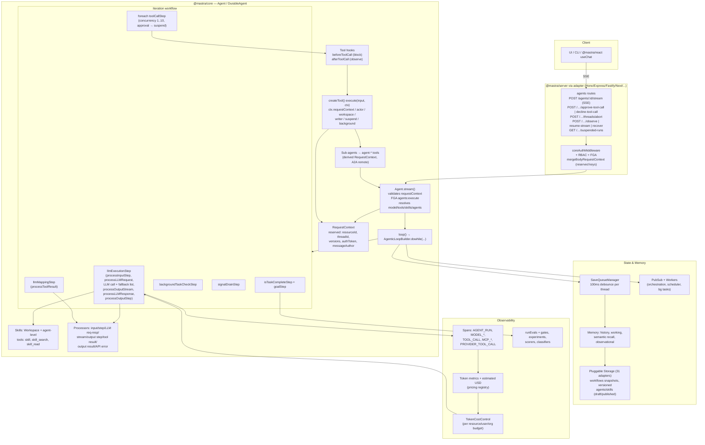

# Mastra TypeScript — Benchmark Analysis

> **Repo**: https://github.com/mastra-ai/mastra
> **Commit analysed**: `ebaa43c17e7b265717d05922e2794f319fb0ec75` (docs(platform): document alert webhooks, PagerDuty, discord, teams and incident.io)
> **Branch**: `main`
> **Framework path**: `frameworks/mastra/`
> **Analysed on**: 2026-10-01

Analysed at version `@mastra/core@1.73.0-alpha.1` (latest stable release `@mastra/core@1.72.0`, 2026-09-30). Previous analysis: `318b0279b8` / `@mastra/core@1.36.0-alpha.0` on 2026-05-19. All file paths in this document are relative to `frameworks/mastra/` unless otherwise noted.

## TL;DR

- **Architecturally**: full-stack TypeScript AI framework. `Mastra` is a central registry/DI container that you instantiate in your Node/Bun/Edge process. The agent loop is **itself a Mastra workflow** (`AgenticLoopBuilder`: `.then(llmExecutionStep).foreach(toolCallStep).then(...)` inside a `.dowhile(...)`), which gives parallel tool dispatch, suspend/resume via workflow snapshots, and HITL approval without user-written orchestration. A `DurableAgent` variant runs the same loop on the evented workflow engine with crash recovery.
- **Ecosystem**: TypeScript.
- **License & governance**: Apache-2.0, with `ee/` directories (`@mastra/core/auth/ee`, `@mastra/core/agent-builder/ee`, `@mastra/editor/ee`) under the Mastra Enterprise License. Owned by **Kepler Software, Inc.** (Y Combinator W25). Commercial backing (Mastra Cloud / platform) + community Discord.
- **Maturity**: repo created 2024-08-06 (~2 years). `@mastra/core` went from 1.36 to 1.73 between May and October 2026 (one stable minor roughly every 3–4 days at peak). 28.5k stars, 2.9k forks, 467 contributors (captured 2026-10-01). Still `1.x`; no core major since 1.0, but `@mastra/mcp` had a breaking 2.0.
- **Where the loop executes**: in your process. `@mastra/core` is pure TypeScript, no subprocess, no vendor binary. The HTTP server (`@mastra/server`) is mounted through server adapters (Hono, Express, Fastify, Koa, NestJS, Next.js, Elysia, TanStack Start) and embeds the agent.
- **Strongest for our use case**: (a) **most complete Anthropic Agent Skills implementation** in the benchmark — `SKILL.md` discovery, BM25/vector/hybrid search, references/scripts/assets, a blob-backed `VersionedSkillSource`, and now **agent-level inline skills** (`createSkill()`) with a per-request resolver, so per-tenant skill sets can be loaded from storage; (b) **`requestContext`** is a typed key/value bag propagated to every layer, with reserved keys (`mastra__resourceId`, `mastra__threadId`, `mastra__versions`, `mastra__authToken`, …) that the server keeps authoritative so the client cannot spoof tenancy; (c) **sub-agents** are first-class with delegation hooks, isolated request context, and concurrent fan-out.
- **Biggest gap**: tool-argument forcing is still not a first-class contract. The new `hooks.beforeToolCall` can short-circuit a call but returns no `updatedInput`; overwriting args works only by mutating the input object in place (undocumented). The canonical pattern remains "keep `tenantId` out of the input schema and read it from `requestContext` in `execute`".
- **Most surprising finding**: two things the previous report missed or that landed since. (1) **Per-tenant USD budget cap is first-party**: `TokenCostControl` (renamed from `CostGuardProcessor` in 1.59.0) enforces `maxCost` per `resource` / `thread` / `user` / `organization` / `session` over a time window, using USD estimates that `@mastra/observability` computes from a bundled pricing table (9,132 model rows). (2) `isTaskComplete` scorers and the newer **thread-scoped `goal`** both gate the loop in-band, which is rare across the benchmark.
- **One-line verdicts** — Sessions/persistence: pluggable storage (30+ adapters) with 100 ms-debounced per-turn persistence, workflow snapshots for HITL, storage retention/prune, and `DurableAgent.recover()` for orphaned runs. Skills: best in class. Resource manager: partial but stronger — stored skills/agents have `draft | published | archived` status, version tables, and per-call version selectors (`{ status: 'draft' | 'published' }`). Sub-agents: first-class, plus remote A2A v1.0 sub-agents. Multi-tenancy: solid `requestContext` plumbing with FGA + RBAC + reserved keys + trusted `actor` for background work. Hooks: 9-method processor pipeline incl. new `processToolResult`, plus `beforeToolCall`/`afterToolCall` tool hooks. API: full HTTP server with SSE, approve/decline (with reason), explicit thread abort, suspended-run discovery, observe/resume. Observability: tokens + estimated USD built in; 13 exporter packages.
- **Production readiness for multi-tenant**: high. Storage adapters, FGA/RBAC route guards, reserved request-context keys, durable workflow snapshots and recovery, deployers (cloud/cloudflare/netlify/vercel/sandbox), schedules, workers over Redis/Valkey/GCP pub/sub, MCP server + client, scorer-based eval, hot-reload skills. Watch items: very high churn (5,337 commits in 4.5 months; breaking MCP 2.0 that drops SSE transport), and anonymous feature-usage telemetry added in 1.51.0.

---

## 0. General

### 0.1 What is this stack?

A TypeScript **framework + app platform + CLI**. You instantiate `new Mastra({ agents, workflows, storage, memory, mcpServers, vectors, workers, schedules, ... })` in your process; that object exposes the agent surface (`agent.stream()` / `agent.generate()`) and registers routes when handed to a server adapter. There is no managed runtime you must call out to — Mastra Cloud / the Mastra platform exists but is optional.

### 0.2 Ecosystem

**TypeScript** (strict). Uses `pnpm` + `turborepo`. No Python/Go/Rust components.

### 0.3 Project status & governance

- **Open source** under **Apache License 2.0** for everything outside `ee/` directories (`LICENSE.md:1-16`).
- **`ee/` directories under the Mastra Enterprise License** — `@mastra/core/auth/ee`, `@mastra/core/agent-builder/ee`, `@mastra/editor/ee` (`LICENSE.md:3-9`, license text in `ee/LICENSE`). GitHub reports the repo license as `NOASSERTION` because of this dual model.
- Maintained by **Kepler Software, Inc.** (Y Combinator W25). Active community Discord, dedicated security email `security@mastra.ai`.
- Commercial backing: Mastra Cloud / platform (hosted deploys, `deployers/cloud`, `auth/cloud`, `workspaces/platform-workspace`) + paid enterprise support.

### 0.4 Project maturity / age

- `@mastra/core@1.73.0-alpha.1` (`packages/core/package.json:3`); latest stable `1.72.0` (GitHub Release 2026-09-30). CLI `mastra@1.32.0-alpha.1`, `@mastra/server@1.73.0-alpha.1`, `@mastra/memory@1.34.0-alpha.1`, `@mastra/mcp@2.1.2-alpha.0`.
- Repo created **2024-08-06** (GitHub API) — about 2 years public.
- Most APIs are stable, but many newer surfaces are explicitly labelled experimental or beta: Code Mode, AgentController (formerly `Harness`, renamed in 1.47.0), notification signals, cross-agent communication, dynamic workflows (renamed from stored workflows in 1.58.0). Deprecated routes remain registered (`STREAM_GENERATE_VNEXT_DEPRECATED_ROUTE`, `STREAM_UI_MESSAGE_DEPRECATED_ROUTE`, … in `packages/server/src/server/server-adapter/routes/agents.ts:9,32-34`).

### 0.5 Adoption & community signal (captured 2026-10-01)

- GitHub `mastra-ai/mastra`: **28,467 stars, 2,897 forks, 105 watchers, 467 contributors, 458 open issues + PRs** (GitHub API, 2026-10-01).
- Commit activity: **5,337 commits** between the previous analysis commit (2026-05-19) and this one; ~1,700 commits in September 2026 alone.
- Release cadence: changesets-driven per-package releases. `@mastra/core` stable minors 1.58 → 1.72 shipped between 2026-08-12 and 2026-09-30 (15 minors in 7 weeks), each preceded by several `-alpha.N` prereleases.
- Discord: https://discord.gg/BTYqqHKUrf (linked from README badges). Twitter/X: `@mastra`.

### 0.6 Ecosystem fit

- **Package namespace**: `@mastra/*` on npm (`@mastra/core`, `@mastra/server`, `@mastra/memory`, `@mastra/rag`, `@mastra/mcp`, `@mastra/observability`, `@mastra/deployer-*`, `@mastra/react`, `@mastra/client-js`, …).
- ~172 publishable packages at two directory levels (up from ~126 at the previous commit). Top-level groups: `packages/` (30 incl. core, cli, server, memory, mcp, rag, evals, editor, agent-builder, playground), `stores/` (31 storage/vector adapters), `server-adapters/` (8), `workspaces/` (21 filesystem/sandbox providers), `observability/` (15), `auth/` (11), `channels/` (discord, slack, teams, telegram), `agent-sdks/` (acp, claude, cursor, openai — **new**), `code-mode/` (isolated-vm, quickjs — **new**), `pubsub/` (google-cloud-pubsub, redis-streams, valkey-streams), `browser/`, `voice/`, `integrations/`.
- Used as a **library + app framework + CLI**. `mastra dev` boots the local Studio; `mastra build` / `mastra start` for production. File-based routing (agents, workflows, storage, observability, server, studio config under `src/mastra/`) was added across 1.48–1.51.

### 0.7 Documentation depth & cross-team contributor accessibility

- Docs are deep and TypeScript-flavored. `docs/` is part of the monorepo and ships its own `AGENTS.md`; migration guides exist for breaking package majors (e.g. `/reference/migrations/mcp-v2`).
- A Product/Data person could author `SKILL.md` and YAML frontmatter unaided — skills are markdown. File-based agents (`src/mastra/agents/<name>/instructions.md`, 1.48.0) also let non-engineers edit instructions without touching TypeScript, though wiring tools still requires code.
- Tools / processors require TypeScript.

### 0.8 Documentation entry points ⭐

- Official docs: https://mastra.ai/docs
- Quickstart / getting-started: https://mastra.ai/docs (the docs landing now hosts the quickstart; the old `/docs/getting-started/installation` URL redirects there). Manual install: https://mastra.ai/reference/manual-install
- API reference: https://mastra.ai/reference
- Hosting / deployment: https://mastra.ai/docs/deployment/overview
- Examples / demos: https://github.com/mastra-ai/mastra/tree/main/examples + `templates/` directory in the repo
- Changelog / release notes: per-package `CHANGELOG.md` (e.g. `packages/core/CHANGELOG.md`, `packages/mcp/CHANGELOG.md`)
- GitHub Releases: https://github.com/mastra-ai/mastra/releases
- GitHub issues: https://github.com/mastra-ai/mastra/issues
- Discord: https://discord.gg/BTYqqHKUrf

---

## 1. High Level Architecture

### Deployment diagram ⭐

```
┌──────────────────────────────────────────────────────────────────────────────┐
│  Your runtime (Node ≥22.13 / Bun / Cloudflare Workers / Vercel / Netlify)    │
│                                                                              │
│   ┌──────────────────────────────────────────────────────────────────────┐   │
│   │  @mastra/server  via server adapter (Hono, Express, Fastify, Next…)  │   │
│   │   - POST /api/agents/:id/stream               (SSE)                  │   │
│   │   - POST /api/agents/:id/approve-tool-call | decline-tool-call       │   │
│   │   - POST /api/agents/:id/threads/abort | observe | resume-stream     │   │
│   │   - coreAuthMiddleware → RBAC + FGA                                  │   │
│   └─────────────────────────────────┬────────────────────────────────────┘   │
│                                     │                                        │
│   ┌─────────────────────────────────▼────────────────────────────────────┐   │
│   │  @mastra/core   Mastra (central registry / DI)                       │   │
│   │   ├─ Agent(id) ── stream() ─► loop() ─► AgenticLoopBuilder           │   │
│   │   │     dowhile( llmExecutionStep → foreach(toolCallStep)            │   │
│   │   │              → llmMapping → backgroundTaskCheck → signalDrain    │   │
│   │   │              → isTaskComplete → goal )                           │   │
│   │   ├─ DurableAgent (same loop on evented engine + recover())          │   │
│   │   ├─ Workspace (filesystem + sandbox + skills + tools)               │   │
│   │   ├─ Memory + Storage (pluggable)                                    │   │
│   │   ├─ MCP client / MCP server                                         │   │
│   │   ├─ Processors (9 hook points) + tool hooks                         │   │
│   │   ├─ Workers: orchestration / scheduler / background-task            │   │
│   │   └─ RequestContext (typed Map<string, unknown>)                     │   │
│   └─────────────────────────────────┬────────────────────────────────────┘   │
└─────────────────────────────────────┼────────────────────────────────────────┘
                                      │
     ┌──────────────────┬─────────────┼──────────────┬───────────────────┐
     ▼                  ▼             ▼              ▼                   ▼
┌──────────────┐ ┌─────────────┐ ┌──────────────┐ ┌───────────────┐ ┌─────────────┐
│ LLM provider │ │ Storage     │ │ PubSub       │ │ Sandbox       │ │ MCP servers │
│ (model router│ │ (libsql, pg,│ │ (in-proc,    │ │ provider      │ │ (stdio /    │
│  210 provs,  │ │  mysql, d1, │ │  Redis/Valkey│ │ (E2B, Daytona,│ │  Streamable │
│  AI SDK v4–7)│ │  dynamo,...)│ │  streams,GCP)│ │  Modal, ...)  │ │  HTTP)      │
└──────────────┘ └─────────────┘ └──────────────┘ └───────────────┘ └─────────────┘
```

### 1.1 Where does the agent loop *actually* execute?

**In your TypeScript process.** No subprocess, no vendor binary. `loop()` (`packages/core/src/loop/loop.ts:12`) builds a workflow stream and wraps it:

```ts
export function loop<Tools extends ToolSet = ToolSet, OUTPUT = undefined>({
  resumeContext, models, logger, runId, idGenerator, messageList, ...
}: LoopOptions<Tools, OUTPUT>) {
  // builds workflowLoopProps
  const baseStream = workflowLoopStream(workflowLoopProps);   // loop.ts:149
  modelOutput = new MastraModelOutput({ stream, messageList, options: {...} });  // loop.ts:157
  return createDestructurableOutput(modelOutput);              // loop.ts:186
}
```

The loop topology moved into `AgenticLoopBuilder` (`packages/core/src/loop/loop-builder.ts`); `loop/workflows/agentic-execution/index.ts:14-17` is now a thin wrapper around `buildIterationWorkflow()`. The workflow primitive itself lives in `packages/core/src/workflows/`.

Two exceptions to "the loop runs here":
- `DurableAgent` (`packages/core/src/agent/durable/durable-agent.ts:586`) runs the same loop through an evented workflow and pub/sub, so steps may execute on a worker process (`packages/core/src/worker/`). Still Mastra code, still your infrastructure.
- **New `agent-sdks/` packages** (`@mastra/claude`, `@mastra/cursor`, `@mastra/openai`, `@mastra/acp`) wrap *other* agent runtimes as Mastra agents (`ClaudeSDKAgent extends Agent` at `agent-sdks/claude/src/index.ts:108`, `OpenAISDKAgent` at `agent-sdks/openai/src/index.ts:98`). When you use those, the loop runs in the vendor SDK, not in Mastra.

### 1.2 Runtime dependencies

- **Node.js ≥ 22.13.0** (`packages/core/package.json:996`; the previous report's "Node ≥ 18" was incorrect — the engine field was already `>=22.13.0` at the old commit). Bun, Cloudflare Workers, Vercel, Netlify via `deployers/`.
- LLM provider keys. The model router resolves `provider/model` strings against a generated registry of 210 providers (`packages/core/src/llm/model/provider-registry.json`).
- **Storage backend**: default is the in-memory store (`packages/core/src/storage/domains/inmemory-db.ts`) — fine for dev, **must be replaced with a durable store for production** (`@mastra/libsql`, `@mastra/pg`, …). A `storage.ts` file under the mastra directory is auto-discovered since 1.50.0.
- Optional: vector store for memory/RAG; Redis/Valkey Streams or Google Cloud Pub/Sub for cross-process workers; observability storage (required by `TokenCostControl`); a sandbox provider (E2B, Daytona, Modal, Docker, …) if agents execute commands.

### 1.3 Recommended deployment topology

The recommended pattern is **one-process-many-tenants**:

- Single Mastra instance with all agents/workflows/tools registered at boot.
- The server adapter serves HTTP/SSE; handlers are stateless across requests (state lives in storage).
- Multiple replicas behind a load balancer; storage + pub/sub coordinate state. `POST /agents/:id/observe` (resumable stream with offset) and DurableAgent's pub/sub-backed streams make session affinity unnecessary for durable runs.
- Background work: `Mastra({ workers })` runs orchestration, scheduler, and background-task workers (`packages/core/src/worker/workers/`); `MASTRA_WORKERS=false` or a comma-separated list splits API and worker roles across processes (`packages/core/src/mastra/index.ts:1575-1600`). Schedules (renamed from heartbeats in 1.50.0) cover cron-style agent and workflow runs.
- Graceful shutdown is configurable since 1.61.0: `server: { drainTimeout, handleShutdownSignals }` (`packages/core/CHANGELOG.md:7252-7261`).

Deployers under `deployers/` package this for **Vercel, Netlify, Cloudflare Workers**, `deployers/cloud` for **Mastra Cloud**, and **new** `deployers/sandbox`.

### 1.4 Cold-start cost & instance footprint

No public benchmark in-repo. `@mastra/core` is heavy (~933 non-test `.ts` source files, up from ~624 at the previous commit; `packages/core/src/agent/agent.ts` alone is 10,679 lines). Many dependencies are lazy-imported (e.g. FGA check at `agent.ts:7576`), but bundle size matters on edge runtimes. Realistic baseline for a 5-agent app: tens of MB RAM, sub-second cold start on Node, longer on Cloudflare Workers. Not officially reported.

### 1.5 Vendor lock-in

- **LLM provider lock-in**: low. Accepts AI SDK v4, v5, v6 and (since 1.47.0) v7 `LanguageModelV4` models directly, plus the `provider/model` string router.
- **Hosting lock-in**: low. Eight server adapters and four platform deployers; nothing requires Mastra Cloud.
- **Storage lock-in**: low — 31 adapters under `stores/`.
- **Eval / observability lock-in**: medium. Mastra's own `MastraScorer`/`runEvals`/experiments API and span model are proprietary; exporters exist for OTel, Langfuse, LangSmith, Datadog, Braintrust, Arize, Sentry, PostHog, Laminar, Arthur, DeepEval, ClickHouse (`observability/`). Migrating scorers to another eval platform is a rewrite.

### 1.6 Framework weight / footprint

**Heavy framework.** You get agents + workflows + durable execution + memory (incl. observational memory) + storage + RAG + voice + MCP + deployers + schedules + workers + scorers/datasets/experiments + RBAC/FGA + Studio + AgentController (a TUI/session host used by Mastra Code) in one platform. The trade-off is coupling: `Agent` knows about `Mastra`, `Storage`, `Memory`, `Workspace`, `MCPServer`, pub/sub and workers — extracting just "the loop" is non-trivial.

### 1.7 Release-history signal

`packages/core/CHANGELOG.md` covers 1.36 → 1.73 in ~21,700 lines. Production-relevant themes since the previous analysis:

- **Hooks & tool governance**: agent/workspace `beforeToolCall` / `afterToolCall` hooks (1.42.0, `CHANGELOG.md:18893`), `processToolResult` processor (1.57.0, `:10496`), conditional function-based tool approvals (1.38.0), decline-with-reason (1.58.0).
- **Cost & budgets**: `CostGuardProcessor` renamed to `TokenCostControl` with scopes and windows (1.59.0, `:8444`); `ModelSelectionProcessor` for classifier-based cheap/expensive routing (1.70.0, `:1583`).
- **Runtime**: `Harness` renamed to `AgentController` with per-session state (1.44–1.47, `:16006`); DurableAgent parity with `Agent` (1.47.0); `recovery.durableAgents: 'auto'` and no `running` checkpoints by default (1.68.0, `:2716`); background-task ownership lease (1.72.0); `modelSettings.timeout` (1.60.0, `:7695`).
- **Skills/resources**: agent-level skills without a Workspace (1.46.0, `:17219`); `validateSkillContent()` (1.69.0, `:2278`); dynamic skill resolver traced (1.58.0).
- **Tenancy & auth**: trusted `actor` for background work (1.42.0, `:18707`); MCP tools see the authenticated caller (1.60.0, `:7618`); multi-tenant `organizationId`/`projectId` on scores, datasets, experiments, stored scorers (1.46–1.49, `:14574`); tenant-scoped trace queries (1.70.0, `:1734`).
- **Built-ins**: web search (1.55.0, `:11538`) and web fetch (1.54.0, `:11721`) tools, Code Mode (1.38.0, `:20197`), `ask_user`/`submit_plan`/task tools made agent-agnostic (1.42.0).
- **Breaking**: `@mastra/mcp` 2.0 rebuilt on MCP revision 2026-07-28 — stateless requests, no `initialize` handshake, **no standalone HTTP+SSE transport**, elicitation replaced by `suspend()`/`input_required` (`packages/mcp/CHANGELOG.md:74`). Several AgentController renames (`heartbeat*` → `interval*`/schedules).
- **Defaults that change behavior**: from 1.73.0-alpha.0 every agent runs `ProviderHistoryCompat`, `PrefillErrorHandler`, and `StreamErrorRetryProcessor` as error processors unless `errorProcessorDefaults: false` (`CHANGELOG.md:103`); anonymous feature-usage telemetry added in 1.51.0 (`:13336`).

Signal: **very fast-moving**, with most churn in the runtime/session layer (AgentController, signals, durable agents), observability queries, and MCP. Pin versions and read changesets before upgrading.

---

## 2. Agent Loop

### 2.1 Run loop entrypoint(s)

Public entrypoints on `Agent` (`packages/core/src/agent/agent.ts`):

- `agent.generate(messages, opts)` — non-streaming, returns `FullOutput<OUTPUT>` (overloads from `agent.ts:8585`, implementation `:8607`).
- `agent.stream(messages, opts)` — streaming, returns `MastraModelOutput<OUTPUT>` (overloads from `:9309`, implementation `:9331`).
- `agent.streamUntilIdle(messages, opts)` — streaming + auto-continue when background tasks complete (`:9564`); DurableAgent exposes the same via `stream({ untilIdle: true })`.
- `agent.resumeStream(...)` (`:9689`), `approveToolCall` (`:10038`), `declineToolCall` (`:10325`) — resume after suspension.
- `agent.network(messages, opts)` — multi-primitive supervisor loop (`:8413`).
- Thread-level APIs: `sendMessage` (`:8975`), `queueMessage` (`:8990`), `subscribeToThread` (`:8748`), `abortThreadStream` (`:8964`), `listSuspendedRuns` (`:8838`).

`packages/core/src/agent/agent.ts:9331-9352` (signature + entry):

```ts
async stream<OUTPUT = TOutput>(
  messages: MessageListInput,
  streamOptions?: AgentExecutionOptionsBase<any> & {
    structuredOutput?: PublicStructuredOutputOptions<any>;
  } & { model?: DynamicArgument<MastraModelConfig> },
): Promise<MastraModelOutput<OUTPUT>> {
  // Route standalone `new Agent({ durable: true })` calls through the
  // durable execution path ...
  const durable = await this.#getStandaloneDurable();
  if (durable) {
    return durable.stream(messages, streamOptions) as Promise<MastraModelOutput<OUTPUT>>;
  }
  this.#extractClientObservability(messages);
  // Validate request context if schema is provided
  await this.#validateRequestContext(streamOptions?.requestContext);
```

Internally it validates `requestContext` against the agent's schema (`#validateRequestContext`, `agent.ts:1663`), checks FGA `AGENTS_EXECUTE` (`agent.ts:7569-7590`), merges agent `defaultOptions` with per-call options, resolves model + tools dynamically, wraps tools with hooks, and invokes `loop()`.

### 2.2 Per-iteration behavior

`packages/core/src/loop/loop-builder.ts:345-414` (`AgenticLoopBuilder.buildIterationWorkflow()`):

```ts
  .then(llmExecutionStep)              // call the LLM, emit text/tool-call chunks
  .map(async ({ inputData, requestContext }) => {
     // recompute tool-call concurrency now that the model has emitted its calls,
     // evaluating function approval policies once per call
     ...
     return toolCalls;
  }, { id: 'map-tool-calls' })
  .foreach(toolCallStep, { concurrency: ... })  // run each tool call (concurrency-controlled)
  .then(llmMappingStep)                // collect results (runs processToolResult), build next prompt
  .then(backgroundTaskCheckStep)       // wait for background tasks if any
  .then(signalDrainStep)               // drain agent signals queued mid-step
  .then(isTaskCompleteStep)            // evaluate completion scorers
  .then(goalStep)                      // NEW: judge the thread-scoped goal (1.43.0)
  .commit();
```

The outer workflow repeats this with `.dowhile(this.buildIterationWorkflow(), this.buildContinuationPredicate())` (`loop-builder.ts:688`). Agent-loop snapshots persist only `pending`/`paused`/`suspended` states and are pruned before persistence (`loop-builder.ts:330-343`). An opt-in `eagerToolExecution` option (`agent.types.ts:575`) lets tool calls start from inside the LLM step before the stream finishes (`loop/workflows/agentic-execution/eager-tool-execution.ts`).

### 2.3 ReAct loop

Built in (LLM call → tool dispatch → next LLM call). Two in-band supervisors can stop or extend the loop:
- `isTaskComplete: { scorers, strategy }` (`agent.types.ts:715`) — scorers run each iteration; on failure, feedback is appended and the loop iterates.
- `goal` (`GoalConfig` on the agent, `packages/core/src/agent/types.ts:1073`; step at `loop/workflows/agentic-execution/goal-step.ts`) — a durable objective stored in thread state and judged in-loop, mirroring `isTaskComplete` but persisting across runs.

### 2.4 Tool dispatch + result handling

`toolCallStep` (`packages/core/src/loop/workflows/agentic-execution/tool-call-step.ts`):

- Provider-executed tools (e.g. Anthropic web search) are skipped here; they are handled in the stream path (`tool-call-step.ts:398-402`).
- Rejects calls to unknown tools or tools outside the step's `activeTools` with a `ToolNotFoundError` listing available tools (`tool-call-step.ts:404-424`).
- If `requireApproval` (boolean or function of input + context) or the run-level `requireToolApproval` matches, emits a `tool-call-approval` chunk, flushes messages, and calls `suspend(...)` (`tool-call-step.ts:548-615`; flush helper at `:364`).
- Otherwise runs `tool.execute(input, ctx)` — already wrapped by agent-level `beforeToolCall`/`afterToolCall` hooks if configured (`agent.ts:6953-6983`).
- `llmMappingStep` runs `processToolResult` processors on each result **before** it is committed to the message list (`llm-mapping-step.ts:99, 325, 481`), then builds the next prompt.

### 2.5 Explicit turn concept

A **turn** is one pass through the iteration workflow (LLM call + tool dispatches + completion/goal checks). `step-start` / `step-finish` chunks demarcate iterations; `finish` ends the run.

### 2.6 Event emission mechanism (in-process)

The loop returns a **`ReadableStream<ChunkType>`** (web-standard, not `EventEmitter` or async generator). `MastraModelOutput` (`packages/core/src/stream/base/output.ts`) wraps it and exposes `fullStream` plus per-property promises (`text`, `usage`, `totalUsage` at `output.ts:1821`, `toolCalls`, `toolResults`, `finishReason`, `getFullOutput()`).

Processors can push custom `data-*` chunks via the processor stream writer; `smoothStream()` and experimental stream transforms (1.54.0, `experimentalTransform` at `agent.types.ts:753`) can buffer deltas. Thread-level consumers use `agent.subscribeToThread()` which emits a `thread-history` chunk first when `withInitialHistory` is set (1.72.0).

---

## 3. Message & Event Taxonomy

### 3.1 Message layers

Three layers, deliberately separated:

1. **DB layer — `MastraDBMessage`** (`packages/core/src/agent/message-list/state/types.ts:125`). What gets persisted. Includes `content.metadata` for suspended tools / pending approvals.
2. **Input layer — `MessageInput`** (`packages/core/src/agent/message-list/types.ts:33-44`):
   ```ts
   export type MessageInput =
     | AIV7.UIMessage | AIV7.ModelMessage   // NEW: AI SDK v7
     | AIV6.UIMessage | AIV6.ModelMessage
     | AIV5.UIMessage | AIV5.ModelMessage
     | UIMessageWithMetadata
     | Message       // AI SDK v4
     | CoreMessage   // AI SDK v4
     | MastraMessageV1
     | MastraDBMessage;
   ```
   Mastra absorbs AI SDK v4/v5/v6/v7 shapes plus its own DB shape, then normalizes through a `MessageList` instance.
3. **Wire/Stream layer — `ChunkType`** (`packages/core/src/stream/types.ts:1082`), a tagged union with ~50 agent chunk variants plus workflow and network chunks.

Conversion: `MessageInput → MessageList → MastraDBMessage` (persistence) and `MessageList → LanguageModelV2Prompt` (LLM). The `ChunkType` stream is reconstructed into messages on flush.

### 3.2 Concrete message types

| Layer | Type | Purpose |
|---|---|---|
| DB | `MastraDBMessage` | Persisted shape; threads + roles + structured content |
| Input | `MessageInput` | Polymorphic input union (AI SDK v4/v5/v6/v7, Mastra V1, DB) |
| Wire | `ChunkType` | Streamed events (~50 agent variants + workflow/network) |
| Internal | `LanguageModelV2Prompt` | LLM-facing prompt after `MessageList` conversion |
| Controller | `AgentControllerWireEvent` | AgentController session events as they cross HTTP (1.60.0, `@mastra/core/agent-controller`) |

### 3.3 Messages vs. events

Clean separation. `MastraDBMessage` is what storage sees; `ChunkType` is what flows through `fullStream`. The stream is reconstructed into messages by `MessageList` (`packages/core/src/agent/message-list/message-list.ts`) at run end or on persistence flushes. Signals (user messages sent mid-run, reminders, notifications) are persisted as messages and can be hidden from live streams with `hideSignals` (`agent.types.ts:559`).

### 3.4 Event categories

From `AgentChunkType` (`packages/core/src/stream/types.ts:887-971`):

| Category | Example types |
|---|---|
| Turn boundary | `start`, `step-start`, `step-finish`, `finish` |
| Content delta | `text-start`, `text-delta`, `text-end`, `reasoning-start`, `reasoning-delta`, `reasoning-end`, `reasoning-signature`, `redacted-reasoning`, `reasoning-file` |
| Tool call lifecycle | `tool-call-input-streaming-start`, `tool-call-delta`, `tool-call-input-streaming-end`, `tool-call`, `tool-call-approval`, `tool-call-suspended`, **`tool-call-resumed`** (1.73.0-alpha.1), `tool-result`, `tool-error`, `tool-output`, **`tool-output-denied`** |
| Output / structured | `object`, `object-result`, `step-output` |
| Sources & files | `source`, `file` |
| Lifecycle / control | `abort`, `error`, `raw`, `response-metadata`, `watch` |
| Processor guardrail / supervisor | `tripwire`, `is-task-complete`, **`goal`** |
| Background task | `background-task-started/running/completed/failed/suspended/resumed/cancelled/output/progress` |
| Thread subscription | `thread-history` (`stream/types.ts:885`) |

Plus `DataChunkType = { type: 'data-<custom>'; data: any; transient?: boolean }` (`stream/types.ts:846`) for processor-emitted custom events, and `NetworkChunkType` (`:854`) for `agent.network()`.

### 3.5 Canonical type-definition file(s)

- `packages/core/src/stream/types.ts` — wire `ChunkType` union (1,303 lines).
- `packages/core/src/agent/message-list/types.ts` — message inputs.
- `packages/core/src/agent/message-list/state/types.ts` — DB shape.

### 3.6 Live agentic event stream taxonomy

Over HTTP each chunk is one SSE `data:` line containing the JSON `ChunkType`; there are no `event:` lines, and the stream ends with `data: [DONE]` (`server-adapters/hono/src/index.ts:263-274`). Sample frames:

```
data: {"type":"start","runId":"r-1","from":"AGENT","payload":{}}

data: {"type":"text-delta","runId":"r-1","from":"AGENT","payload":{"id":"m-1","text":"Hello"}}

data: {"type":"tool-call","runId":"r-1","from":"AGENT","payload":{"toolCallId":"tc-1","toolName":"fetch_topics","args":{"query":"AI"}}}

data: {"type":"tool-result","runId":"r-1","from":"AGENT","payload":{"toolCallId":"tc-1","toolName":"fetch_topics","result":[...]}}

data: {"type":"tool-call-approval","runId":"r-1","from":"AGENT","payload":{"toolCallId":"tc-2","toolName":"publish","args":{"id":"x"},"resumeSchema":"{...}"}}

data: {"type":"finish","runId":"r-1","from":"AGENT","payload":{"stepResult":{"reason":"stop"},"output":{"usage":{...}}}}

data: [DONE]
```

Stream chunks are redacted by default before leaving the server (system prompts, tool definitions, API keys; `streamOptions.redact`, `server-adapters/hono/src/index.ts:251-253`).

---

## 4. Agent Runtime (Multi-session Host)

### 4.1 Multi-session host architecture

Mastra is a multi-session runtime when you instantiate `Mastra` once and serve many concurrent `agent.stream(...)` calls. Every `stream()` call constructs its own loop workflow, `MessageList`, and `RequestContext`; the `Mastra` registry holds shared resources (storage, memory, MCP clients, pub/sub, workers).

Two additional host layers now exist:
- **`DurableAgent`** (`packages/core/src/agent/durable/durable-agent.ts:586`; `new Agent({ durable: true })` at `agent/types.ts:834`) — same API surface as `Agent` (parity completed in 1.47.0), with runs addressable by `runId` across processes, `observe()`, `recover()`, `recoverActiveRuns()`.
- **`AgentController`** (`packages/core/src/agent-controller/agent-controller.ts:181`, formerly `Harness`) — a session host for TUI/chat apps (Mastra Code uses it). `createSession()` (`:463`) returns an isolated `Session` (`agent-controller/session.ts:3201`) owning its own event bus, mode/model state, thread lifecycle, and tool-permission rules; sessions can be scoped so several run in parallel over one resource (1.51.0). Experimental.

### 4.2 Concurrent session isolation

State isolation is enforced at:

- `RequestContext` is per-call (created at `agent.stream()` entry); sub-agents get a **derived copy** without identity keys (`agent.ts:5362-5373`).
- `MessageList` is per-call.
- Persistence is per-thread (`SaveQueueManager` keys its debounce timers by `threadId` — `packages/core/src/agent/save-queue/index.ts:30-47`).
- Reserved `requestContext` keys are server-authoritative: `mergeBodyRequestContext` skips reserved keys and never overwrites keys the server already set (`packages/server/src/server/handlers/utils.ts:70-81`); thread access is checked with `enforceThreadAccess` (`utils.ts:157`).
- AgentController sessions each own their event bus (1.46.0), so events emitted on one session are delivered only to that session's subscribers.

Tool authors must avoid module-level mutable state (standard concurrency hygiene).

### 4.3 Horizontal scaling / multi-instance

**Stateless API workers + shared storage + pub/sub.** No leader election. Suspended HITL state is durable via workflow snapshots. For durable agents, chunks flow through pub/sub so any replica can serve `observe` with an offset; with `recovery.durableAgents: 'auto'`, `running` checkpoints are persisted and `recoverActiveRuns()` can re-drive runs orphaned by a crashed process (`durable-agent.ts:3625-3655`; `CHANGELOG.md:2716-2730`). Background tasks are fenced with a persisted, expiring ownership lease (1.72.0) so two replicas don't execute the same task.

### 4.4 Background / async / scheduled tasks

First-party:

- **Schedules** — unified `mastra.schedules` API for cron-style agent and workflow runs (renamed from heartbeats in 1.50.0); file-based schedules for agents (1.58.0); a scheduler worker (`packages/core/src/worker/workers/scheduler-worker.ts`).
- **Background tasks** — tools or sub-agents can run as background tasks with per-call dispositions (1.67.0), `backgroundTaskPolicy` / `disableBackgroundTasks` on execution options (`agent.types.ts:807-810`), `context.background.adopt()` for tools that return an acknowledgement and keep the operation tracked (1.69.0). `backgroundTaskCheckStep` waits in-loop; a dedicated chunk family reports progress.
- **Signals** — `sendMessage` / `queueMessage` push user input into an active or idle thread; notification signals and `SignalProvider` (webhook, polling) wake agents from external events (1.39–1.42; `signals/github` package).
- **Channels** — `channels/slack`, `discord`, `teams`, `telegram` run agents from chat events, with `waitUntil` support so background runs survive serverless responses (1.47.0).

### 4.5 Worker pool / queue model

**First-party worker model (correction: it already existed at the previous commit).** `Mastra({ workers })` creates orchestration, scheduler, and background-task workers (`packages/core/src/worker/workers/`) that consume events from the configured pub/sub. Strategies: in-process or HTTP-remote step execution with bearer/API-key auth (`packages/core/src/worker/strategies/http-remote-strategy.ts`); a pull transport exists for polling setups. `MASTRA_WORKERS` controls which workers a process starts (`packages/core/src/mastra/index.ts:1575-1600`). Pub/sub backends: in-process default, `pubsub/redis-streams`, `pubsub/valkey-streams` (new), `pubsub/google-cloud-pubsub`. For generic job queues outside agent/workflow execution (BullMQ, SQS) you still bring your own.

---

## 5. Sessions & Persistence

### 5.1 Session / chat data model

Mastra calls a session a **"thread"**: `{ id, resourceId, title, metadata, createdAt, updatedAt }`, paired with a `resourceId` (typically a user or tenant id). `MastraMemory` (`packages/core/src/memory/memory.ts`) is the public API; storage backends implement the `memory` storage domain.

`AgentMemoryOption` on `AgentExecutionOptions` (`agent.types.ts:587`):

```ts
memory?: AgentMemoryOption;  // { thread, resource, options? }
```

`MastraDBMessage` (`packages/core/src/agent/message-list/state/types.ts:125`): `id`, `threadId`, `resourceId`, `role`, `content` (parts + `metadata`), `createdAt`, `type`. Author attribution for shared threads is carried via `MASTRA_MESSAGE_AUTHOR_KEY` → `providerMetadata.mastra.author` (`packages/_internal-core/src/request-context/index.ts:64-77`).

### 5.2 What's stored on a session

- Conversation messages (all roles), including tool calls + results.
- Suspended-tool / pending-approval metadata.
- Working memory, semantic recall embeddings, observational-memory records (separate stores managed by `@mastra/memory`).
- Thread state (`storage/domains/thread-state/`, e.g. the `goal` slot) and notifications inbox (`storage/domains/notifications/`) — new domains.
- Workflow snapshots for HITL resume and durable recovery (`storage/domains/workflows/`).
- Observability spans + metrics + feedback (`storage/domains/observability/`).
- Scorer results (`storage/domains/scores/`).

### 5.3 Granularity

Single conversation per `threadId`. Fork/branch is not a first-class graph, but `memory.cloneThread()` (`packages/core/src/memory/memory.ts:1102`) copies a thread (with message-id mapping), AgentController can clone threads and filter forks, and `updateThreadResourceId()` (`memory.ts:1119-1130`, 1.67.0) transfers thread ownership to another resource.

### 5.4 Built-in persistence stores

31 adapters under `stores/`:

- Relational/KV: `libsql` (default for dev), `pg`, `mysql` (new), `mssql`, `dsql` (Aurora DSQL), `oracledb` (new), `spanner` (new), `turso` (new), `duckdb`, `clickhouse`, `cloudflare`, `cloudflare-d1`, `dynamodb`, `mongodb`, `couchbase`, `convex`, `redis`, `upstash`, `valkey` (new).
- Vector/search: `pinecone`, `qdrant`, `chroma`, `astra`, `lance`, `elasticsearch`, `opensearch`, `azure-ai-search` (new), `weaviate` (new), `turbopuffer`, `vectorize`, `s3vectors`.

Storage domains under `packages/core/src/storage/domains/`: `agents`, `background-tasks`, `blobs`, `channels`, `datasets`, `experiments`, `favorites`, `harness`, `knowledge`, `mcp-clients`, `mcp-servers`, `memory`, `notifications`, `observability`, `operations`, `prompt-blocks`, `schedules`, `scorer-definitions`, `scores`, `skills`, `thread-state`, `tool-provider-connections`, `workflow-definitions`, `workflows`, `workspaces` (plus `versioned.ts`). `MastraCompositeStore` can route domains to different backends or disable a domain (1.51.0).

### 5.5 Persistence timing

Default: **debounced 100 ms per thread** (`packages/core/src/agent/save-queue/index.ts:14-47`):

```ts
export class SaveQueueManager {
  private debounceMs: number;
  constructor({ logger, debounceMs, memory }: {...}) {
    this.debounceMs = debounceMs || 100;
  }
  private debounceSave(threadId, messageList, memoryConfig): Promise<void> {
    // clearTimeout(existing timer for threadId) then
    // setTimeout(() => this.enqueueSave(...), this.debounceMs)
  }
}
```

`savePerStep: true` (`agent.types.ts:607`) persists after every assistant step. On approval suspension `flushMessagesBeforeSuspension()` runs before `suspend()` (`tool-call-step.ts:364, 606`). `persistPartialOnAbort` (1.60.0) saves the assistant text streamed before a cancellation.

### 5.6 Mid-run checkpointing (durable)

Yes, at two levels:

- **HITL suspension** (both `Agent` and `DurableAgent`): `suspend(...)` persists a workflow snapshot (`tool-call-step.ts:548-615`). Resume via `approveToolCall` / `declineToolCall` / `resumeStream` restores it. Survives restarts if storage is durable. Storage-backed discovery of suspended runs (`listSuspendedRuns`, `agent.ts:8838`; `GET /agents/:id/suspended-runs`) lets a UI recover pending approvals after a page refresh or restart (1.48.0).
- **Crash recovery** (`DurableAgent` only): with `recovery.durableAgents: 'auto'`, `running` checkpoints are written per step; `recover(runId)` / `recoverActiveRuns()` rebuild the run's message list, model, tools, memory, and request context from the snapshot and restart the workflow (`durable-agent.ts:2850-2877, 3625-3655`). Without that setting (the default since 1.68.0) only `pending`/`paused`/`suspended` snapshots are persisted, so an orphaned in-flight run is not recoverable. Granularity is the workflow step, not the individual tool side effect — a tool that crashed mid-execution is re-executed.

### 5.7 Session ID format

User-provided thread IDs (conventionally UUIDs), or generated by `mastra.generateId({ idType: 'thread', ... })`, which hosts can override. No tenant-prefix convention is enforced; scope by `resourceId`. Sub-agent threads are derived as `${threadId}-${uuid}` (`agent.ts:5415-5422`).

### 5.8 Pluggable store interface

Yes — `MastraStorage` plus per-domain abstract classes (`packages/core/src/storage/domains/<domain>/base.ts`, e.g. `SkillsStorage` at `storage/domains/skills/base.ts:63`; versioned domains extend `VersionedStorageDomain` at `storage/domains/versioned.ts:136`). A `FactoryStorage` contract (1.52.0) owns domain initialization and reports per-domain readiness. Pass the instance to `new Mastra({ storage })`.

### 5.9 Schema evolution / migration

Per adapter: each domain's `init()` creates tables and applies additive changes (e.g. `stores/pg/src/storage/domains/*/index.ts`, covered by `stores/pg/src/storage/migration.test.ts`). No framework-wide migration runner. New fields are usually optional so older rows keep working. **New**: opt-in age-based retention — declare per-table `maxAge` in `storage.retention` and call `storage.prune()` (1.49.0, `packages/core/src/storage/base.ts:306-325`); resumable bounded `prune()` (1.68.0).

### 5.10 Export / replay

`memory.recall` / thread message queries (with exact metadata filters since 1.54.0) export a thread. `POST /agents/:id/observe` replays a run's events from an offset. `packages/_llm-recorder` records/replays LLM calls for tests. `scoreTrace()` / `scoreTraceBatch()` score stored traces without re-running the agent (1.49.0, `packages/core/src/evals/scoreTraces/scoreTracesWorkflow.ts:269`). No single "export session as JSONL and replay deterministically" API.

### 5.11 Cross-session memory

Yes — see Q17. `@mastra/memory` provides message history (count- or token-budgeted), working memory, semantic recall, and observational memory. Per-resource scope gives a tenant or user isolated memory.

---

## 6. Multi-tenancy & Tenant Identity ⭐ THE KEY QUESTION

### 6.1 Run-loop tenant identity

Tenant identity is **not** a dedicated top-level field. It travels in `requestContext` (a typed `Map`) and in the memory tuple `{ thread, resource }`. The full option type is `AgentExecutionOptionsBase` (`packages/core/src/agent/agent.types.ts:553-851`); identity-relevant fields:

```ts
export type AgentExecutionOptionsBase<OUTPUT> = {
  memory?: AgentMemoryOption;            // { thread, resource } — resource is the usual tenant/user scope
  requestContext?: RequestContext<any>;  // typed key/value bag (tenantId, userId, locale, ...)
  actor?: ActorSignal;                   // NEW (1.42.0): trusted system actor for background work, FGA-aware
  versions?: VersionOverrides;           // per-call agent version selection
  mcp?: MCPToolExecutionContext;         // MCP caller context when run behind an MCP server
  activeTools?: ...; toolsets?: ...; clientTools?: ...; hooks?: ToolHooks;
  requireToolApproval?: RequireToolApproval;
  tracingOptions?: TracingOptions;       // metadata/tags (incl. userId/organizationId) for traces
  // ...plus model/loop controls: instructions, maxSteps, stopWhen, modelSettings, providerOptions,
  //    processors, prepareStep, isTaskComplete, delegation, onStepFinish/onFinish/..., untilIdle
};
```

Reserved request-context keys (`packages/_internal-core/src/request-context/index.ts`; re-exported from `packages/core/src/request-context/index.ts`):

```ts
export const MASTRA_RESOURCE_ID_KEY      = 'mastra__resourceId';      // :17
export const MASTRA_THREAD_ID_KEY        = 'mastra__threadId';        // :31
export const MASTRA_VERSIONS_KEY         = 'mastra__versions';        // :44
export const MASTRA_AUTH_TOKEN_KEY       = 'mastra__authToken';       // :51
export const MASTRA_INHERITED_MEMORY_KEY = 'mastra__inheritedMemory'; // :63 NEW, internal to delegation
export const MASTRA_MESSAGE_AUTHOR_KEY   = 'mastra__messageAuthor';   // :77 NEW, set by auth middleware
```

Doc-string at `request-context/index.ts:7-8`: *"When set in RequestContext, this takes precedence over client-provided values for security (prevents attackers from hijacking another user's memory)."* An agent can declare a `requestContextSchema`, validated at entry (`agent.ts:1663`).

### 6.2 Tenant identity propagation into tool calls

The HTTP layer builds a trusted server `RequestContext` (auth middleware sets `user` and reserved keys), then `mergeBodyRequestContext` fills only non-reserved, not-yet-set keys from the body (`packages/server/src/server/handlers/utils.ts:70-81`):

```ts
export function mergeBodyRequestContext(serverRequestContext: RequestContext, bodyRequestContext: unknown): void {
  if (!bodyRequestContext || typeof bodyRequestContext !== 'object') return;
  for (const [key, value] of Object.entries(bodyRequestContext)) {
    if (isReservedRequestContextKey(key)) continue;
    if (serverRequestContext.get(key) === undefined) {
      serverRequestContext.set(key, value);
    }
  }
}
```

Note the implication: a body-supplied `tenantId` is accepted unless your auth middleware sets `tenantId` first. For tenant identity, set it server-side (from the JWT) or use a reserved key.

The same `RequestContext` reaches `ToolExecutionContext.requestContext` (`packages/core/src/tools/types.ts:602`), tool hooks (`context.requestContext`), processors (`args.requestContext`, `processors/index.ts:68`), dynamic resolvers (`tools`, `agents`, `skills`, `workspace`, `model`), and — as a derived copy without thread/resource keys — sub-agents (`agent.ts:5362-5373`).

### 6.3 Tool call interface

`ToolExecutionContext` (`packages/core/src/tools/types.ts:595-670`):

```ts
export interface ToolExecutionContext<TSuspend, TResume, TRequestContext> {
  mastra?: MastraUnion;
  requestContext?: RequestContext<TRequestContext>;
  abortSignal?: AbortSignal;
  actor?: ActorSignal;                 // NEW: trusted system actor, when present
  workspace?: Workspace;
  browser?: MastraBrowser;
  writer?: ToolStream;                 // progress → tool-output chunks
  agent?: AgentToolExecutionContext<TSuspend, TResume>;     // toolCallId, messages, suspend(), threadId, resourceId
  workflow?: WorkflowToolExecutionContext<TSuspend, TResume>;
  mcp?: MCPToolExecutionContext;
  background?: BackgroundTaskAdoptionContext;  // NEW
  suspend?: (payload: TSuspend, opts?) => Promise<void>;    // NEW top-level (MCP 2.x)
  resumeData?: TResume;
  suspendPayload?: TSuspend;
  observe: ToolObserve;                // NEW: child spans + structured logs from inside execute
}
```

A tool author writes:

```ts
createTool({
  id: 'fetch_topics',
  inputSchema: z.object({ query: z.string() }),
  requestContextSchema: z.object({ tenantId: z.string() }),   // tools/types.ts:717
  execute: async ({ query }, ctx) => {
    const tenantId = ctx.requestContext?.get('tenantId') as string;
    return await topicsService.search({ tenantId, query });  // tenantId NEVER comes from the LLM
  },
})
```

### 6.4 Forcing tool arguments from the harness

**Partially improved, still no first-class `updatedInput` contract.** Options at this commit:

1. **Read forced fields from `requestContext` inside the tool** (example above). Type-safe and schema-validated via `requestContextSchema`. Still the canonical pattern.
2. **NEW — agent-level tool hooks** (1.42.0). `hooks: { beforeToolCall, afterToolCall }` on the agent (`packages/core/src/agent/types.ts:812`) or per call (`agent.types.ts:669`). Types at `packages/core/src/tools/types.ts:82-124`; the wrapper at `packages/core/src/agent/agent.ts:6953-6983`:
   ```ts
   const hookContext = { toolName, input, context, metadata: { agentId: this.id, agentName: this.name } };
   const beforeResult = await hooks.beforeToolCall?.(hookContext);
   if (beforeResult?.proceed === false) {
     return beforeResult.output;          // short-circuit: skip execution, return this instead
   }
   output = await tool.execute!(input, context);   // same `input` object the hook saw
   ```
   `beforeToolCall` can **block** (`{ proceed: false, output }`) but has no return field for replacement input. Because the hook receives the same object that is then passed to `execute`, mutating `input.tenantId` in place does take effect — but this is an implementation detail, not a documented contract, and Zod schemas strip keys not declared in `inputSchema`. Treat it as a workaround.
3. **Rebuild tools per step** via `processInputStep` / `prepareStep` returning `{ tools }` with wrapped `execute` closures.

Plain statement for the benchmark: **"always pass `tenantId=acme` regardless of what the LLM generates" requires either keeping `tenantId` out of the schema (recommended) or relying on in-place mutation in `beforeToolCall` (workaround).**

### 6.5 Tenant-aware visible tool selection

Mechanisms:

1. **Dynamic at resolution time** — `tools` is `DynamicArgument<TTools, TRequestContext>` (`packages/core/src/agent/types.ts:806`):
   ```ts
   tools: ({ requestContext }) => {
     const tier = requestContext.get('tier');
     return tier === 'premium' ? { ...basicTools, ...premiumTools } : basicTools;
   }
   ```
   The same pattern applies to `agents` (`:884`), `skills` (`:932`), `workspace` (`:984`), and `model` (`:797`).
2. **Per call / per step** — `activeTools` on execution options (whitelist) or `prepareStep` / `processInputStep` returning `{ activeTools }`. `toolCallStep` enforces it: calls to hidden tools are rejected (`tool-call-step.ts:404-424`).
3. **Deferred tool discovery** — `ToolSearchProcessor` with a request-aware `filter` hook (`packages/core/src/processors/processors/tool-search.ts:134-138`, 1.38.0) and `includeResolvedTools` (1.58.0) to make per-request tools searchable without loading them all into the prompt.
4. **Versions** — `requestContext.set(MASTRA_VERSIONS_KEY, { agents: { researcher: { versionId } }, defaultStatus: 'published' })` selects stored sub-agent versions per call (`request-context/index.ts:79-85`).

There is no built-in `org/channel/user` hierarchy — encode it in `requestContext` keys and consume via resolvers and FGA rules.

### 6.6 Per-tool-call auth propagation

- `MASTRA_AUTH_TOKEN_KEY` (`request-context/index.ts:51`) forwards the caller's token into tools; the editor forwards it to MCP servers that share the Mastra server's auth.
- **NEW**: `actor` (1.42.0) lets trusted background work (schedules, workers) run agents/tools without a JWT while keeping FGA checks; `actor: { actorKind: 'system', propagate: true }` forwards it into agent and tool calls made by declarative workflows (1.60.0). `ToolExecutionContext.actor` exposes it (`tools/types.ts:605`).
- **NEW**: tool provider connections (`packages/core/src/tool-provider/`, 1.38.0/1.60.0) receive the live `RequestContext` and a connection `kind: 'invoker'`, so OAuth-backed integrations execute as the authenticated user (`CHANGELOG.md:7715-7731`).
- **NEW**: MCP tools served over HTTP see the authenticated caller — `authInfo` is bridged into the tool's `RequestContext` and optionally mapped to a `user` (`packages/mcp/src/server/request.ts:55-63`).

### 6.7 Per-tenant rate limit + budget cap

**🟢 First-party USD budget cap (corrected and expanded).** `TokenCostControl` (`packages/core/src/processors/processors/token-cost-control.ts`, renamed from `CostGuardProcessor` in 1.59.0):

```ts
export type CostScope = 'run' | 'resource' | 'thread' | 'user' | 'organization' | 'session';   // :24

export interface TokenCostControlOptions {                // :74-140
  maxCost: number | ((requestContext?: RequestContext) => number);  // USD; per-request budgets allowed
  scope?: CostScope;                                      // default 'resource'
  window?: '1h' | '6h' | '24h' | '7d' | '30d' | '365d';   // default '7d'
  strategy?: 'block' | 'warn';                            // block = TripWire abort
  warnAtPercent?: number;
  includeBreakdown?: boolean;                             // per provider/model breakdown on violation
}
```

It runs in `processInputStep` (`:467`) before each LLM call and queries `observabilityStorage.getMetricAggregate()` for summed `estimatedCost` over the scope key (`:357-378`). `resource`/`thread` read the reserved keys; `user`/`organization`/`session` read plain `userId`/`organizationId`/`sessionId` request-context keys and require traces annotated with that metadata (`:11-22`, `:295-333`). USD estimates come from `@mastra/observability`'s bundled pricing registry (Q12.3).

Caveats: requires observability storage with `getMetricAggregate` (throws at registration otherwise, `:280-288`); metrics are persisted asynchronously by buffered exporters, so the check lags the most recent spend; missing scope keys fail open. Token caps: `TokenLimiterProcessor` and `stopWhen`. Rate limits (requests/min): **Not provided — BYO** at the HTTP layer. Time caps: `modelSettings.timeout.{ totalMs, stepMs, firstChunkMs }` (`packages/core/src/llm/model/model-settings.ts:17-34`).

### ⭐ Light usage example

```ts
import { Agent } from '@mastra/core/agent';
import { createTool } from '@mastra/core/tools';
import { RequestContext } from '@mastra/core/request-context';
import { TokenCostControl } from '@mastra/core/processors';
import { z } from 'zod';

// 3) Tool reads tenantId from requestContext — it is NOT in the LLM-visible schema
const topicSearch = createTool({
  id: 'topicSearch',
  inputSchema: z.object({ query: z.string() }),
  requestContextSchema: z.object({ tenantId: z.string() }),
  execute: async ({ query }, ctx) =>
    topicsService.search({ tenantId: ctx.requestContext!.get('tenantId') as string, query }),
});

const audienceAgent = new Agent({
  id: 'audience', name: 'Audience', instructions: '...', model: 'anthropic/claude-sonnet-4-5',
  tools: { topicSearch, iabSearch, audienceCreate, bashExec, webFetch },
  inputProcessors: [new TokenCostControl({ maxCost: 5, scope: 'resource', window: '24h' })],
});

// 1) Pass identity in (server-side, from the verified JWT)
const ctx = new RequestContext();
ctx.set('tenantId', 'acme');
ctx.set('targetingStrategyId', 'strat-42');
ctx.set('userId', 'u-123');

const stream = await audienceAgent.stream([{ role: 'user', content: 'Find tech topics' }], {
  requestContext: ctx,
  memory: { thread: 't-1', resource: 'acme:u-123' },
  activeTools: ['topicSearch', 'iabSearch', 'audienceCreate'],   // 2) bashExec/webFetch hidden + rejected
});
```

Step 1: supported via `requestContext` (+ `memory.resource`). Step 2: supported via `activeTools` (or a dynamic `tools` resolver). Step 3: supported by keeping `tenantId` out of `inputSchema` — the LLM cannot pass it. If `tenantId` must be in the schema, the closest option is `hooks.beforeToolCall: ({ toolName, input, context }) => { if (toolName === 'topicSearch') (input as any).tenantId = context.requestContext?.get('tenantId'); }` — works via in-place mutation, not a documented contract.

---

## 7. Hook & Middleware Capabilities (Context Engineering)

Mastra has three hook surfaces: **processors** (9 methods on the `Processor` interface), **tool hooks** (`beforeToolCall` / `afterToolCall`, new since 1.42.0), and top-level callbacks on execution options (`onChunk`, `onStepFinish`, `onFinish`, `onError`, `onAbort`, `onIterationComplete`, `delegation.*`, `isTaskComplete`).

### 7.1 Enumerate every hook / middleware / lifecycle callback

Processor methods (`packages/core/src/processors/index.ts:626-870`):

| Hook | When | Read | Mutate | Block (tripwire) | Branch |
|---|---|---|---|---|---|
| `processInput` (`:701`) | Once, before the first LLM call | messages, systemMessages, requestContext | mutate both; return `{ messages, systemMessages }` | yes via `abort(...)` | n/a |
| `processInputStep` (`:729`) | Before EVERY LLM call | tools, activeTools, model, modelSettings, providerOptions, structuredOutput, messageList | replace `model`, `tools`, `toolChoice`, `activeTools`, `messages`, `systemMessages`, `providerOptions`, `modelSettings`, `structuredOutput` | yes | yes — return a different model mid-loop |
| `processLLMRequest` (`:776`) | After prompt conversion, before HTTP send | LLM-shaped prompt | transient rewrite (not persisted) | yes | yes — return cached chunks to skip the LLM call |
| `processLLMResponse` (`:800`) | After LLM call completes (or replay) | chunks, request, raw response | side effects (e.g. cache write) | no | no |
| `processOutputStream` (`:708`) | On every stream chunk | chunk, prior chunks, state | return modified chunk, `null` to drop | yes | n/a |
| `processOutputStep` (`:817`) | After every LLM call, BEFORE tool execution | finishReason, toolCalls, text, usage, steps, providerMetadata | mutate messageList | yes — `abort({ retry: true })` retries with feedback | yes |
| **`processToolResult`** (`:841`, NEW 1.57.0) | After each successful `tool.execute()`, before the result enters history / next LLM call | toolName, toolCallId, args, result, providerExecuted | replace result via `messageList.updateToolInvocation(...)`; the streamed `tool-result` chunk is overwritten too | yes — `abort({ retry: true })` | n/a |
| `processOutputResult` (`:717`) | Once, after the run finishes | full output, messageList | mutate messageList | yes | n/a |
| `processAPIError` (`:857`) | On non-retryable provider rejection (400/422) | error, steps, messageList | append messages, return `{ retry: true }` | n/a | yes — controlled retry |

Plus `onViolation(violation)` (`:691`) for guardrail processors to report detections without aborting.

Tool hooks (`packages/core/src/tools/types.ts:82-124`; wrapper `agent.ts:6953-6983`):

| Hook | When | Read | Mutate | Block |
|---|---|---|---|---|
| `beforeToolCall` | Immediately before `tool.execute` (after approval) | toolName, input, context (incl. requestContext), metadata | no documented replacement; in-place mutation of `input` works | yes — `{ proceed: false, output }` returns `output` without executing |
| `afterToolCall` | After `execute` resolves or throws | input, output, error | no (return value ignored) | no |

Workspace tools have their own `tools.hooks` with `workspaceToolName` (`packages/core/src/workspace/tools/types.ts:84`).

Option callbacks: `onChunk`, `onStepFinish`, `onFinish`, `onError`, `onAbort`, `onIterationComplete` (return `{ continue, feedback }`), `delegation.onDelegationStart` / `onDelegationComplete` / `messageFilter` (Q9.7).

### 7.2 Hook concurrency model

Processors fire **sequentially in declaration order** within a pipeline; each returns a value the next consumes. Processors can be composed as workflows (`InputProcessorOrWorkflow`). Agent-level and run-level tool hooks are deep-merged, run-level overriding (`agent.ts:6938-6943`). Since 1.73.0-alpha.0, three error processors (`ProviderHistoryCompat`, `PrefillErrorHandler`, `StreamErrorRetryProcessor`) are merged in by default ahead of user error processors; `errorProcessorDefaults: false` opts out (`CHANGELOG.md:103-120`).

### 7.3 Specific capability tests

- **Inject system messages at session start** — yes. `processInput` / `processInputStep` call `messageList.addSystem(...)`. The built-in `SkillsProcessor` does this in `processInputStep` (`packages/core/src/processors/processors/skills.ts:297, 342-349`).
- **Expand user input (slash commands, attachments)** — yes. `processInput` mutates messages before any LLM call.
- **Mutate messages before each LLM call** — yes. `processInputStep` runs every iteration; `processLLMRequest` rewrites the provider-shaped prompt without persisting. Built-in `TokenLimiterProcessor`, `ToolCallFilter`, `BatchPartsProcessor` live here.
- **Mutate / decorate tool input before dispatch** — **partial**. `beforeToolCall` sees the input and can block, but there is no `updatedInput` return; in-place mutation works as an implementation detail (Q6.4).
- **Mutate / decorate tool result before returning to the LLM** — **yes (improved)**. `processToolResult` rewrites the result before it is committed to history and before the stream chunk is enqueued (`processors/index.ts:820-843`); per-tool `toModelOutput` (`tools/types.ts:728`) shapes what the model sees while storing the full result.
- **Emit additional tool calls in response to a tool result** — partially. No Claude-style `PostToolUse → additional_messages`. Options: inject a message in `processToolResult` / `processOutputStep` the LLM sees next iteration; `onIterationComplete` returning `{ feedback }`; `delegation.onDelegationComplete`. None inject a synthetic `tool-call` into the same step.

### 7.4 Auto-compaction

Built in, three layers:
- `TokenLimiterProcessor` (`packages/core/src/processors/processors/token-limiter.ts:117`) drops oldest messages when over budget.
- `memory.options.messageHistory: { maxTokens, atMaxRemoveTokens? }` (1.68.0, `packages/core/src/memory/types.ts:1002`) — token-budgeted recalled history.
- **Observational memory** (`observationalMemory`, `memory/types.ts:1073`; `packages/memory/src/processors/observational-memory/`) — an Observer model extracts observations from conversation once a message-token threshold is crossed and a Reflector model compresses them, replacing raw history with LLM-written notes. This is LLM-summarizing compaction; `failurePolicy` / `maxRetries` (1.72.0) control what happens if the observer fails.

### 7.5 Prompt cache optimization

No automatic Anthropic `cache_control` breakpoint placement in core. You can set `providerOptions.anthropic.cacheControl` per tool (`tools/types.ts:766-779`) or per message, or insert breakpoints in a `processLLMRequest` processor. Stable-prefix help: the skills catalog is sorted by name for prompt-cache stability (`skills.ts:116, 262`); `ToolSearchProcessor` has cache-friendly options (1.42.0). Usage reports `cachedInputTokens`, `cacheCreationInputTokens`, and 5m/1h cache-write splits (`stream/types.ts:1133-1145`). Response caching (not provider prompt caching) via `ResponseCache` (`processors/processors/response-cache.ts:194`).

### 7.6 Tool result clearing

- `toModelOutput(output)` per tool returns a truncated/summarized version to the LLM while persisting the full result (`tools/types.ts:728`); the sub-agent wrapper uses it (`agent.ts:5317-5329`).
- `processToolResult` can replace a result in history in place via `messageList.updateToolInvocation(...)` (`agent/message-list/message-list.ts:1521`).
- `ToolCallFilter` (`processors/processors/tool-call-filter.ts`) removes tool-call/result pairs from the prompt for later steps.
- `processOutputStream` can drop or rewrite `tool-result` chunks on the wire only.

### 7.7 Progressive disclosure

- **Skills** are lazy: metadata in the prompt, body via the `skill` tool, files via `skill_read` (Q10).
- **Tool search**: `ToolSearchProcessor` keeps large toolsets out of the prompt and loads tools on demand (`processors/processors/tool-search.ts:237`).
- **Workspace filesystem stash**: a tool writes its full output to a workspace file and returns a path; the agent reads slices with `mastra_workspace_read_file` / `mastra_workspace_grep` (Q13.1).
- **Delegation result references** (`delegation.enableResultReferences`, 1.67.0): sub-agent results get `[ref: …]` ids so later delegations reuse them verbatim instead of the supervisor restating them (`agent.ts:290-307`).
- `AgentsMDInjector` / tool-result reminders surface `AGENTS.md` content when the agent touches a directory (`processors/tool-result-reminder.ts`).

### 7.8 Architectural diagram

```
                                                   ┌───────────────────────────────┐
                                                   │   processInput (once)         │
                                                   └───────────────┬───────────────┘
                                                                   ▼
   ┌──────────────────────── per iteration (dowhile) ───────────────────────┐
   │                                                                        │
   │   processInputStep ──► [tools, model, messages, activeTools]           │
   │   (TokenCostControl, SkillsProcessor, ToolSearch, ModelSelection ...)  │
   │            │                                                           │
   │            ▼                                                           │
   │   MessageList → LanguageModelV2Prompt                                  │
   │            ▼                                                           │
   │   processLLMRequest ──► [maybe replay cached chunks]                   │
   │            ▼                                                           │
   │      LLM HTTP call  (fallback model list on failure)                   │
   │            │ (chunks flow)                                             │
   │            ▼                                                           │
   │   processOutputStream  ◄── on every chunk                              │
   │            ▼                                                           │
   │   processLLMResponse ──► [write to cache]                              │
   │            ▼                                                           │
   │   processOutputStep ──► [validate, retry, abort]                       │
   │            ▼                                                           │
   │   .foreach(toolCallStep, { concurrency })                              │
   │      ├─ activeTools check / requireApproval → suspend                  │
   │      ├─ hooks.beforeToolCall ──► [block | proceed]                     │
   │      ├─ tool.execute(input, ctx)  ← requestContext, actor, workspace   │
   │      └─ hooks.afterToolCall  (observe only)                            │
   │            ▼                                                           │
   │   llmMappingStep: processToolResult ──► [rewrite result in history]    │
   │                   tool.toModelOutput  ──► [model-facing view]          │
   │   delegation.onDelegationComplete (for agent-* tools)                  │
   │            ▼                                                           │
   │   backgroundTaskCheckStep → signalDrainStep                            │
   │            ▼                                                           │
   │   isTaskCompleteStep (scorers) → goalStep (thread goal)                │
   │            ▼                                                           │
   │   onIterationComplete ──► { continue, feedback }                       │
   └────────────────────────────────────────────────────────────────────────┘
                                                                   ▼
                                                   ┌───────────────────────────────┐
                                                   │ processOutputResult (once)    │
                                                   │ onFinish (once)               │
                                                   └───────────────────────────────┘

  On error:   processAPIError / default error processors ──► { retry: true }
  On abort:   onAbort fires, AbortSignal cascades into LLM + tool calls
  On HITL:    toolCallStep.suspend() → workflow snapshot → approve/decline/resume
```

### ⭐ Light usage example

```ts
import type { Processor } from '@mastra/core/processors';

// 1) SessionStart-style: inject tenant/locale/date as a system message
const tenantContextInjector: Processor = {
  id: 'tenant-context',
  processInput: async ({ messageList, requestContext }) => {
    const tenantId = requestContext?.get('tenantId') ?? 'unknown';
    const locale = requestContext?.get('locale') ?? 'en-US';
    messageList.addSystem({ role: 'system', content: `tenant=${tenantId}, locale=${locale}, today=2026-10-01` });
    return messageList;
  },
};

// 3) PostToolUse: summarize topicSearch results > 50 items before the LLM sees them
const topicSearchSummarizer: Processor = {
  id: 'topic-summarizer',
  processToolResult: async ({ toolName, toolCallId, args, result, messageList }) => {
    if (toolName !== 'topicSearch' || !Array.isArray(result) || result.length <= 50) return;
    messageList.updateToolInvocation({
      type: 'tool-invocation',
      toolInvocation: { state: 'result', toolCallId, toolName, args,
                        result: { count: result.length, top10: result.slice(0, 10) } },
    });
    return messageList;
  },
};

await agent.stream(messages, {
  requestContext: ctx,
  inputProcessors: [tenantContextInjector],
  outputProcessors: [topicSearchSummarizer],
  // 2) PreToolUse: force tenantId server-side (in-place mutation; see Q6.4 caveat)
  hooks: {
    beforeToolCall: ({ toolName, input, context }) => {
      if (toolName === 'topicSearch') (input as any).tenantId = context.requestContext?.get('tenantId');
    },
  },
});
```

---

## 8. HTTP API

### 8.1 Does the framework ship an HTTP server?

**Yes.** `@mastra/server` defines routes and handlers (`packages/server/src/server/handlers/`); server adapters mount them on **Hono, Express, Fastify, Koa, NestJS, Next.js, Elysia, TanStack Start** (`server-adapters/`). `mastra build` generates a Hono server (`packages/deployer/src/server/index.ts`). Library-only use (`new Mastra({...})` without a server) also works; `createRoute()` lets you add schema-aware custom routes (1.58.0).

### 8.2 HTTP streaming protocol (SSE/WS)

- **SSE** for agent streams (`responseType: 'stream', streamFormat: 'sse'` on `STREAM_GENERATE_ROUTE`, `packages/server/src/server/handlers/agents.ts:1863-1864`). One `data: <json>` frame per chunk, terminated by `data: [DONE]` (`server-adapters/hono/src/index.ts:263-274`).
- Non-SSE stream routes emit JSON records separated by `\x1E` (`:266`).
- JSON for non-streaming routes.
- **WebSocket** only for OpenAI realtime voice / websocket model transport (`packages/core/src/llm/model/openai-websocket-fetch.ts`).

### 8.3 HTTP endpoints that start an agent run

Registry: `packages/server/src/server/server-adapter/routes/agents.ts:54-150`. Paths below are relative to the API prefix (default `/api`); handler lines in `packages/server/src/server/handlers/agents.ts`.

| Verb | Path | Purpose | Handler |
|---|---|---|---|
| GET | `/agents` | List agents | |
| GET | `/agents/:agentId` | Agent metadata | |
| POST | `/agents/:agentId/clone` | Clone agent (stored) | `:1417` |
| POST | `/agents/:agentId/generate` | Non-streaming run | `:1463` |
| POST | `/agents/:agentId/stream` | **SSE-streaming run** | `:1860` |
| POST | `/agents/:agentId/stream-until-idle` | Stream + auto-continue for background tasks | `:2488` |
| POST | `/agents/:agentId/signals` | Send a signal to an active run or wake an idle thread | `:1995` |
| POST | `/agents/:agentId/send-message` | Send user input into a thread | `:2205` |
| POST | `/agents/:agentId/queue-message` | Queue input for after the active run | `:2226` |
| POST | `/agents/:agentId/threads/abort` | **NEW** — abort the active run on a thread | `:2248` |
| POST | `/agents/:agentId/threads/signals/cancel` | **NEW** — cancel queued input | `:2314` |
| POST | `/agents/:agentId/threads/subscribe` | SSE subscription to a thread's runs | `:2358` |
| POST | `/agents/:agentId/observe` | Re-attach to a run from an event offset | `:2588` |
| POST | `/agents/:agentId/approve-tool-call` | HITL approval, returns resumed SSE stream | `:2702` |
| POST | `/agents/:agentId/send-tool-approval` | Approval verdict without owning the stream | `:2785` |
| GET | `/agents/:agentId/suspended-runs` | **NEW** — list runs awaiting approval/resume | `:2840` |
| POST | `/agents/:agentId/decline-tool-call` | HITL rejection (optional `reason`) | `:2904` |
| POST | `/agents/:agentId/resume-stream` | Generic suspend/resume | `:2958` |
| POST | `/agents/:agentId/recover` | **NEW** — recover an orphaned durable run | `:3080` |
| POST | `/agents/:agentId/network` | Multi-agent network execution | `:3385` |
| POST | `/agents/:agentId/model` (+ reset/reorder) | Change agent model at runtime | `:3509` |
| POST | `/agents/:agentId/tools/:toolId/execute` | Direct tool execution (no LLM) | `handlers/tools.ts` |
| GET | `/agents/:agentId/skills/:skillName` | Skill metadata | `:3824` |
| POST | `/agents/:agentId/enhance-instructions` | LLM-powered instructions enhancer | |

Body (`agentExecutionBodySchema`, `packages/server/src/server/schemas/agents.ts:372-468`):

```json
{
  "messages": [...],
  "memory": { "thread": "t-123", "resource": "user-42" },
  "requestContext": { "tier": "premium" },
  "versions": { "agents": { "researcher": { "versionId": "v3" } } },
  "model": "openai/gpt-5-mini",
  "modelSettings": { "temperature": 0.7 },
  "maxSteps": 20,
  "activeTools": ["fetch_topics", "publish"],
  "structuredOutput": { "schema": { } },
  "requireToolApproval": true
}
```

`model` (request-scoped model override, 1.52.0) is at `schemas/agents.ts:414`.

### 8.4 Interrupt / cancel in-flight run

**Improved: explicit endpoint.** `POST /agents/:agentId/threads/abort` with `{ threadId, resourceId?, expectedRunId?, clearPendingSignals? }` aborts the active run on a thread, after `enforceThreadAccess` with `MEMORY_WRITE` permission (`handlers/agents.ts:2248-2312`; core `agent.abortThreadStream()` at `agent.ts:8964`). Dropping the SSE connection still cancels via the request `AbortSignal` wired into `agent.stream(..., { abortSignal })` (`handlers/agents.ts:1945`; the handler returns `streamResult.fullStream` at `:1958`). Cancellation is per **thread** (not per arbitrary `runId`); runs without memory still rely on connection close.

### 8.5 Resume / replay endpoint

- `POST /agents/:agentId/observe` with `{ runId, offset? }` — re-attach to a run and replay events from an index (`schemas/agents.ts:727-730`). Path changed from the previous `GET .../observe-stream`.
- `POST /agents/:agentId/threads/subscribe` — subscribe to a thread's runs; `withInitialHistory` emits stored history first (1.72.0).
- `POST /agents/:agentId/resume-stream`, `/resume-stream-until-idle` — resume a suspended run.
- `POST /agents/:agentId/recover` — recover an orphaned durable run.
- `GET /agents/:agentId/suspended-runs` — find what can be resumed after a refresh.

### 8.6 HITL approval workflow

`POST /agents/:agentId/approve-tool-call` body `{ runId, toolCallId, model?, requestContext? }`; decline adds optional `reason`, surfaced to the model instead of the default message (`schemas/agents.ts:515-540`). Both return a **new SSE stream** continuing from the workflow snapshot. Flow:

1. Client opens `/stream`.
2. Sees `tool-call-approval` `{ toolCallId, toolName, args, resumeSchema }`; the run suspends (pause state observable via `GET /suspended-runs`).
3. Calls `/approve-tool-call` or `/decline-tool-call` (or `/send-tool-approval` if another client owns the stream).
4. Consumes the resumed stream; a `tool-call-resumed` chunk (1.73.0-alpha.1) precedes the `tool-result`.

Approval can be conditional per call: `requireApproval: (input, { requestContext, workspace }) => boolean` (`tools/types.ts:756-761`).

### 8.7 Token streaming

- **Text delta**: `data: {"type":"text-delta","runId":"r-1","from":"AGENT","payload":{"id":"m-1","text":"Hel"}}`
- **Partial tool args**: `tool-call-input-streaming-start {toolCallId, toolName}` → `tool-call-delta {toolCallId, argsTextDelta}` → `tool-call-input-streaming-end {toolCallId}`, e.g. `data: {"type":"tool-call-delta","runId":"r-1","from":"AGENT","payload":{"toolCallId":"tc-1","argsTextDelta":"{\"que"}}`
- **Agent activity**: `tool-call`, `tool-result`, `tool-output` (progress from `ctx.writer`), `background-task-*`, `step-start`/`step-finish`, `goal`, `is-task-complete`, e.g. `data: {"type":"tool-output","runId":"r-1","from":"AGENT","payload":{"toolCallId":"tc-1","toolName":"crawl","output":{"pct":40}}}`

### 8.8 Authentication & Authorisation

**Yes, at the route layer.** `coreAuthMiddleware` (`packages/server/src/server/auth/helpers.ts:348`) terminates auth for `/api/*` (the generated server registers `/health` before auth, `packages/deployer/src/server/index.ts:304-306`). Providers under `auth/`: auth0, better-auth, clerk, cloud, firebase, google (new), neon (new), okta, studio, supabase, workos.

- **RBAC**: each route declares `requiresAuth` and `requiresPermission` (e.g. `'agents:execute'` on the abort route, `handlers/agents.ts:2259-2260`).
- **FGA** (enterprise, `packages/core/src/auth/ee/fga-check.ts`): agent execution checks `AGENTS_EXECUTE` (`agent.ts:7569-7590`); thread routes check thread ownership (`enforceThreadAccess`, `handlers/utils.ts:157`); MCP server tools have FGA mapping overrides (1.42.0); system actors bypass membership only when trusted (1.42.0, 1.52.0).
- **Tenant scope**: reserved `MASTRA_RESOURCE_ID_KEY` set by middleware wins over client-provided `resourceId` (`getEffectiveResourceId`, `handlers/utils.ts:91`).

### 8.9 Tool-call state reconstruction

**Explicit linkage via `toolCallId`.** Every tool-related chunk carries `payload.toolCallId`:

- `tool-call-input-streaming-start` { toolCallId, toolName }
- `tool-call-delta` { toolCallId, argsTextDelta }
- `tool-call-input-streaming-end` { toolCallId }
- `tool-call` { toolCallId, toolName, args }
- `tool-call-approval` / `tool-call-suspended` / `tool-call-resumed` { toolCallId, ... }
- `tool-output` { toolCallId, toolName, output } (progress)
- `tool-result` { toolCallId, toolName, result, isError? }
- `tool-error` { toolCallId, toolName, error }
- `tool-output-denied` { toolCallId, ... }

Clients build a `Map<toolCallId, {name, args, result, status}>` deterministically. Sub-agent invocations appear as ordinary `tool-call` chunks with `toolName: 'agent-<name>'`; network mode adds `agent-execution-*` chunks under `NetworkChunkType`. Tools can carry a human-readable `title` (1.70.0, `tools/types.ts:706`).

### 8.10 Health checks / graceful shutdown

`GET /health` in the generated server, public (`packages/deployer/src/server/index.ts:304-306`). Graceful shutdown: `server.drainTimeout` and `server.handleShutdownSignals` (1.61.0); `Mastra.shutdown()` stops (rather than destroys) remote sandboxes since 1.62.0. No first-party `/readyz` or `/metrics` endpoint; metrics go through observability exporters.

### ⭐ Light usage example

```bash
# 1) Start a run; the host's auth middleware maps the JWT / X-Tenant-Id into requestContext
curl -N -X POST http://localhost:4111/api/agents/audience/stream \
  -H "Content-Type: application/json" \
  -H "Authorization: Bearer $JWT" \
  -H "X-Tenant-Id: acme" \
  -d '{"messages":[{"role":"user","content":"Find tech topics"}],
       "memory":{"thread":"t-123","resource":"acme:u-42"}}'

# 2) SSE frames received
# data: {"type":"start","runId":"r-1","from":"AGENT","payload":{}}
# data: {"type":"tool-call","runId":"r-1","from":"AGENT","payload":{"toolCallId":"tc-1","toolName":"topicSearch","args":{"query":"AI"}}}
# data: {"type":"finish","runId":"r-1","from":"AGENT","payload":{"output":{"usage":{"inputTokens":120,"outputTokens":80}}}}
# data: [DONE]

# 3) Cancel mid-flight (thread-scoped)
curl -X POST http://localhost:4111/api/agents/audience/threads/abort \
  -H "Authorization: Bearer $JWT" -H "Content-Type: application/json" \
  -d '{"threadId":"t-123","expectedRunId":"r-1"}'

# 4) Approve (or decline with a reason) a HITL-paused tool call
curl -N -X POST http://localhost:4111/api/agents/audience/approve-tool-call \
  -H "Authorization: Bearer $JWT" -H "Content-Type: application/json" \
  -d '{"runId":"r-1","toolCallId":"tc-2"}'
curl -N -X POST http://localhost:4111/api/agents/audience/decline-tool-call \
  -H "Authorization: Bearer $JWT" -H "Content-Type: application/json" \
  -d '{"runId":"r-1","toolCallId":"tc-2","reason":"Budget not approved"}'
```

---

## 9. Sub-agents

### 9.1 Mechanism

**Both.** Sub-agents are a first-class config field on `Agent` (`agents?: DynamicArgument<Record<string, SubAgent>>`, `packages/core/src/agent/types.ts:884`) AND at runtime they are exposed to the parent LLM as **synthesized `agent-<name>` tools** built by `listAgentTools()` (`packages/core/src/agent/agent.ts:5276`, tool creation `:5332`).

### 9.2 Configuration

1. **Statically as `Agent` instances** — `new Agent({ agents: { researcher, coder } })`.
2. **Dynamically per request** — `agents: ({ requestContext }) => ({ ... })`.
3. **Lightweight `SubAgent` interface** (`packages/core/src/agent/subagent.ts:46-102`) — implement description/model/instructions/generate/stream/resume/memory methods; used for remote wrappers.
4. **Remote A2A sub-agents** — `A2AAgent implements SubAgent` (`packages/core/src/a2a/a2a-agent.ts:516`), with A2A v1.0 protocol selection since 1.68.0 (v0.3 remains default).
5. **File-based agents** — `src/mastra/agents/<name>/subagents/` nest up to three levels deep (1.49.0).
6. **Network mode** — `agent.network(messages, { routing, completion, ... })` (`agent.ts:8413`; `packages/core/src/loop/network/index.ts`).

### 9.3 LLM-generated configs

**No** — configs are statically registered or returned by the resolver at run start. The LLM picks an existing `agent-<name>` tool; it can pass `prompt`, optional extra `instructions`, `maxSteps` (min 3), `threadId`, `resourceId`, and — with `enableResultReferences` — `contextFromRefs` (`agent.ts:290-325`).

Note for multi-tenant hosts: when the LLM supplies `resourceId`, the sub-agent's memory resource becomes `${resourceId}-${agentName}`; otherwise an id is generated (`agent.ts:5424-5430`). The parent's authenticated resource is not inherited (reserved keys are stripped, `:5362-5373`). If sub-agents have their own memory, scope them explicitly (e.g. `onDelegationStart` or a memory config keyed on `requestContext`).

### 9.4 Output handling

The `agent-<name>` tool returns (`agent.ts:328-345`):

```ts
z.object({
  text: z.string(),
  subAgentThreadId: z.string().optional(),
  subAgentResourceId: z.string().optional(),
  subAgentToolResults: z.array(z.object({ toolName, toolCallId, result, args, isError })).optional(),
  ref: z.string().optional(),   // NEW: when delegation.enableResultReferences is on
})
```

By default `toModelOutput` exposes only `text` (+ `[ref: …]`) to the supervisor (`agent.ts:5317-5329`); set `delegation.includeSubAgentToolResultsInModelContext = true` (`agent.types.ts:359`) to include tool results. Linkage back to the parent is the synthesized tool call's `toolCallId`.

### 9.5 Concurrency model

**Parallel by default.** Sub-agent invocations are tool calls, so they go through `.foreach(toolCallStep, { concurrency })` (`packages/core/src/loop/loop-builder.ts:386`). `DEFAULT_TOOL_CALL_CONCURRENCY = 10` (`loop/workflows/agentic-execution/tool-call-concurrency.ts:15`). If any active tool needs approval or can suspend, concurrency drops to 1 (default `'available'` strategy); the opt-in `'called'` strategy (1.58.0) only serializes when such a tool is actually called in the step (`loop-builder.ts:351-358`). Sub-agents can also run as bounded background tasks (1.67.0).

### 9.6 Context isolation

- The sub-agent gets a **sanitized copy** of the parent's messages: `stripParentToolParts` removes parent tool-call/tool parts (`agent.ts:5228`, used at `:5350`), and `delegation.messageFilter` can narrow further.
- It gets its own `RequestContext` derived from the parent but **without** `MastraMemory`, thread/resource keys, or inherited memory (`agent.ts:5362-5373`); `onDelegationStart` receives this delegated context to add values before the sub-agent's dynamic config resolves (1.58.0).
- If the sub-agent has no memory, the parent's memory is passed via the run-scoped `MASTRA_INHERITED_MEMORY_KEY` (not by mutating the shared sub-agent instance).

### 9.7 Lifecycle events

`DelegationConfig` (`agent.types.ts:339-407`): `onDelegationStart` (`:344`, returns `{ proceed?, rejectionReason?, modifiedPrompt?, modifiedInstructions?, modifiedMaxSteps? }`), `onDelegationComplete` (`:350`, with `bail()` to cancel concurrent siblings), `messageFilter` (`:393`), `hookErrorStrategy: 'warn' | 'throw'` (`:407`, 1.60.0), `enableResultReferences` (`:374`). The parent stream sees `tool-call` / `tool-result` for each `agent-*` call; network mode streams nested `agent-execution-*` chunks.

### 9.8 Sub-agent model override

Yes — each sub-agent declares its own `model` (static, per-request function, or a fallback list). Supervisor on a large model + workers on small models is the standard pattern. AgentController adds `resolveSubagentModel(modelId, { requestContext })` so sub-agent models can resolve tenant credentials per run (1.73.0-alpha.0). Request-scoped model overrides on the parent (`model` in the HTTP body) do not cascade to sub-agents.

### ⭐ Light usage example

```ts
import { Agent } from '@mastra/core/agent';

const topicSearch = createTool({ /* ...as in Q6... */ });

const personaYoungMom = new Agent({
  id: 'persona-young-mom', name: 'Young mom',
  description: 'A 32-year-old mom evaluating ads',
  instructions: 'You are a 32-year-old mom evaluating ads. Be honest and skeptical.',
  model: 'anthropic/claude-haiku-4-5',
  tools: { topicSearch },
});
const personaTechBro = new Agent({
  id: 'persona-tech-bro', name: 'Tech bro', description: 'A 28-year-old tech enthusiast',
  instructions: 'You are a 28-year-old tech enthusiast.',
  model: 'anthropic/claude-haiku-4-5', tools: { topicSearch },
});
const personaRetiree = new Agent({
  id: 'persona-retiree', name: 'Retiree', description: 'A 70-year-old retiree',
  instructions: 'You are a 70-year-old retiree.',
  model: 'anthropic/claude-haiku-4-5', tools: { topicSearch },
});

const orchestrator = new Agent({
  id: 'orchestrator', name: 'Orchestrator',
  instructions: 'Get feedback from all three personas in parallel, then summarize.',
  model: 'anthropic/claude-sonnet-4-5',
  agents: { personaYoungMom, personaTechBro, personaRetiree },
});

// The LLM emits three agent-<name> tool calls in one step; foreach fans them out (concurrency 10).
const stream = await orchestrator.stream([{ role: 'user', content: 'Evaluate this ad copy: ...' }], {
  delegation: {
    onDelegationComplete: ({ primitiveId, result }) => console.log(`${primitiveId}: ${result.text}`),
  },
});

for await (const chunk of stream.fullStream) {
  if (chunk.type === 'tool-result' && chunk.payload.toolName.startsWith('agent-')) {
    // each persona's { text, ... } arrives here, linked by payload.toolCallId
  }
}
```

---

## 10. Skills

**First-class — and the most complete implementation of the Anthropic Agent Skills spec in this benchmark.** Mastra ships `WorkspaceSkills` (filesystem-backed), a blob-backed `VersionedSkillSource`, `CompositeVersionedSkillSource`, BM25/vector/hybrid search, three skill tools, and — new since the previous analysis — **agent-level skills without a Workspace** (`createSkill()` + `skills` on `Agent`, 1.46.0).

### 10.1 First-class concept?

Yes. The spec is cited at `packages/core/src/workspace/skills/types.ts:5`: `@see https://github.com/anthropics/skills`. Skills are exported from `@mastra/core/skills` (`packages/core/src/skills/`).

### 10.2 File format

```
skills/
  brand-guidelines/
    SKILL.md                  ← required, YAML frontmatter + markdown body
    references/colors.md
    scripts/generate-mockup.sh
    assets/logo.svg
```

`SkillMetadata` (`packages/core/src/workspace/skills/types.ts:146-161`):

```ts
export interface SkillMetadata {
  name: string;           // 1-64 chars, lowercase, hyphens only
  path: string;           // dir relative to workspace root
  description: string;    // 1-1024 chars
  license?: string;
  compatibility?: unknown;
  'user-invocable'?: boolean;
  metadata?: Record<string, unknown>;
}
```

`Skill` extends this with `instructions` (markdown body), `source: ContentSource` (`external` | `local` | `managed`), `references`, `scripts`, `assets` (`types.ts:166-176`). Validation: `validateSkillMetadata` and, since 1.69.0, `validateSkillContent()` exported from `@mastra/core/skills` so apps can validate a `SKILL.md` before saving it (`packages/core/src/workspace/skills/schemas.ts`).

### 10.3 Loader mechanism

Three paths:

1. **Workspace filesystem scan** — `new Workspace({ filesystem, skills: SkillsResolver })` (`SkillsResolver` at `workspace/skills/types.ts:136`). `WorkspaceSkillsImpl` walks each path, parses `<dir>/SKILL.md`, and indexes content with BM25/vector/hybrid search. Works over remote filesystems (S3, GCS, sandbox providers).
2. **NEW — agent-level `skills`** (`packages/core/src/agent/types.ts:932`; `AgentSkillsInput` at `packages/core/src/skills/types.ts:102-110`): an array of paths and/or inline `createSkill({...})` objects (`skills/create-skill.ts:38`, "no filesystem needed"), or a resolver `({ requestContext }) => SkillInput[] | Promise<...>`. The resolver runs inside a traced `resolve-skills` span (1.58.0), so skills can be fetched from a database or service per request.
3. **Versioned source** — `skillSource: CompositeVersionedSkillSource` on the Workspace (Q11).

Freshness: glob directories are re-walked at most every 5 s (`GLOB_RESOLVE_INTERVAL`, `workspace-skills.ts:151`) and staleness checks are throttled to every 30 s (`STALENESS_CHECK_COOLDOWN`, `:157`, raised for remote filesystems). By default the turn serves the cached catalog and revalidates in the background; `blockingRefresh: true` on `SkillsProcessor` waits for the refresh (`processors/processors/skills.ts:57-66`).

### 10.4 Invocation

**Metadata in the system prompt + tool-driven activation.** `SkillsProcessor.processInputStep` (`packages/core/src/processors/processors/skills.ts:297`) injects only the catalog:

```xml
<available_skills>
  <skill>
    <name>brand-guidelines</name>
    <description>Dailymotion brand guidelines for copy and creative</description>
    <location>skills/brand-guidelines/SKILL.md</location>
    <source>local</source>
  </skill>
</available_skills>
```

plus an instruction (`skills.ts:346-349`): *"IMPORTANT: Skills are NOT tools. Do not call skill names directly as tool names. To use a skill, call the `skill` tool with the skill name as the "name" parameter."*

Three tools (`packages/core/src/workspace/skills/tools.ts:31-35`):

- `skill(name)` (`:97`) — load full instructions plus references/scripts/assets listings.
- `skill_search(query, skillNames?, topK?)` (`:138`) — BM25/vector/hybrid search across skill content.
- `skill_read(skillName, path, startLine?, endLine?)` (`:183`) — read a bundled file with optional line range; binary files return size + path.

An optional `SkillSearchProcessor` (`processors/processors/skill-search.ts`) replaces the full catalog with search-driven discovery for large skill libraries.

### 10.5 Loading mode

**Lazy** — metadata in the prompt, body fetched on `skill` tool call. The tool result carries the body; if context is compacted the model calls again. Catalog entries are sorted by name for prompt-cache stability (`skills.ts:116`). Format: `'xml' | 'json' | 'markdown'` (`workspace/skills/types.ts:141`), XML default.

### 10.6 Skill composition

A skill bundles references / scripts / assets alongside `SKILL.md`; `skill_read` fetches them on demand, and scripts can be run with the workspace `execute_command` tool when a sandbox is configured. Inline skills carry `references` as an in-memory map (`createSkill({ references: { 'checklist.md': '...' } })`). Skills do not include other skills or invoke sub-agents directly; instructions can tell the LLM to "delegate to agent-X" or "load skill Y".

### ⭐ Light usage example

```ts
// 1) Author skills/generate-audience-from-brief/SKILL.md
// ---
// name: generate-audience-from-brief
// description: Build a targeting audience from a campaign brief
// user-invocable: true
// ---
// # Generate Audience From Brief
// When the user provides a brief, identify the relevant IAB categories,
// search for matching topics with topicSearch, then call audienceCreate
// with the result. Refer to references/iab-taxonomy.md when unsure.

// 2a) Load from the filesystem via a Workspace
import { Workspace, LocalFilesystem } from '@mastra/core/workspace';
import { Agent } from '@mastra/core/agent';

const workspace = new Workspace({
  filesystem: new LocalFilesystem({ basePath: './data' }),
  skills: ['skills'],                       // scans data/skills/*/SKILL.md
});

// 2b) ...or attach directly to the agent, no Workspace needed
import { createSkill } from '@mastra/core/skills';
const faq = createSkill({ name: 'faq', description: 'Answer FAQ', instructions: '...' });

const agent = new Agent({
  id: 'audience', name: 'Audience', instructions: '...', model: 'anthropic/claude-sonnet-4-5',
  workspace,                                // 2a
  skills: ['./skills', faq],                // 2b (paths and inline skills can mix)
  tools: { topicSearch, audienceCreate },
});

// 3) The LLM sees <available_skills> metadata and calls the built-in tool:
//    skill({ name: 'generate-audience-from-brief' }) → body returned as tool result
//    skill_read({ skillName: 'generate-audience-from-brief', path: 'references/iab-taxonomy.md' })
await agent.stream([{ role: 'user', content: 'Brief: launch campaign for ...' }]);
```

---

## 11. Resource Manager

### 11.1 First-class Resource Manager?

**Partial, and more capable than the previous report stated.** Stored agents, skills, prompt blocks, scorer definitions, MCP clients/servers, and workflow definitions live in **versioned storage domains** (`VersionedStorageDomain`, `packages/core/src/storage/domains/versioned.ts:136-184`) with `status: 'draft' | 'published' | 'archived'`, an `activeVersionId`, `authorId`, `visibility`, and `favoriteCount` (e.g. `StorageSkillType`, `packages/core/src/storage/types.ts:2059-2080`). This lifecycle already existed at the previous commit; what is new is the per-call version selector by status (`VersionSelector = { versionId } | { status: 'draft' | 'published' }`, `packages/_internal-core/src/request-context/index.ts:79-85`) and the agent-level skills resolver that makes it practical to serve stored skills per tenant. There is still no single "registry" object that spans files, Git, and storage with a publish workflow.

### 11.2 Loading sources

| Source | Supported? | How |
|---|---|---|
| Local filesystem | ✅ | `skills: ['skills', '/path/to/external']`, `LocalFilesystem({ basePath })`, file-based agents under `src/mastra/` |
| Git / GitHub | 🟡 BYO | No Git source. Clone into the filesystem and point `skills:` at it. `FilesystemVersionedHelpers` keep per-entity git history for file-backed editor storage (1.38.0) — that is history, not a remote source |
| OCI / container registries | ❌ Not provided — BYO | |
| Cloud object storage | ✅ | Workspace filesystems for S3, GCS, Azure, Google Drive (`workspaces/`); `VersionedSkillSource` reads published skill trees from a `BlobStore` |
| Postgres / relational DB | ✅ | Stored agents/skills/prompt blocks via `storage.getStore('skills')` etc.; listable by `authorId`, `visibility`, `status`, `metadata` (`storage/types.ts:2125-2148`) |
| Vendor cloud / managed registry | 🟡 | Mastra Cloud / platform hosts deployments and the editor; no public skill marketplace |
| HTTP fetch | 🟡 BYO | No built-in fetcher, but an agent-level `skills` resolver can fetch from any HTTP service and return `createSkill()` objects |

`CompositeVersionedSkillSource` (`packages/core/src/workspace/skills/composite-versioned-skill-source.ts:34-60`) mounts multiple published skill trees (from a blob store) into one virtual directory, with an optional `fallback` source for "live" skills.

### 11.3 Source composition / priority

Within one workspace, duplicate skill names resolve by source type **`local > managed > external`**, then path; unresolvable ties throw (`workspace-skills.ts:421-461`). Agent-level skills and workspace skills are merged on the agent. There is no declarative "tenant bucket overrides global registry" priority; you implement it in a resolver.

### 11.4 Versioning model

- Stored entities: integer version numbers per entity (`getVersionByNumber`, `getLatestVersion`, `listVersions`, `versioned.ts:177-184`), `activeVersionId` pointer, rollback by re-activating an older version.
- Published skill files: content-addressed (SHA-256) blobs plus a `SkillVersionTree` manifest (`packages/core/src/workspace/skills/publish.ts`).
- Per-call selection: `versions` option / `MASTRA_VERSIONS_KEY` with `versionId` or `status` and a `defaultStatus` fallback for sub-agents.
- No semver.

### 11.5 Scoping

- **Registry side**: `authorId` ("for multi-tenant filtering"), `visibility: 'private' | 'public'`, favorites; `organizationId`/`projectId` on stored scorer definitions, datasets, experiments, and scores (1.46–1.49). No `tenantId` field on stored skills/agents — use `authorId` or `metadata`.
- **Runtime enforcement**: dynamic resolvers read `requestContext` — workspace `skills: (ctx) => paths`, agent `skills: ({ requestContext }) => SkillInput[]`, dynamic `tools` / `agents` / `workspace`. RBAC + FGA (enterprise) gate who can read/write/execute stored entities over HTTP.
- The two halves are not wired together automatically: publishing a skill as `authorId: 'acme'` does not by itself hide it from other tenants at runtime; your resolver must filter.

### 11.6 Deployment workflow

Draft → publish exists per stored entity (`status` + `activeVersionId`; the Studio editor drives it), and callers can pin `draft` vs `published` per request (useful for preview). No multi-environment promotion (dev → staging → prod) or approval gates between environments; environment promotion is at the application deploy level (`mastra build` + deployers, `deployOnBuild` since 1.52.0).

### 11.7 Lifecycle / governance

- Lifecycle states: `draft | published | archived` on stored agents, skills, prompt blocks, scorers, MCP clients (`storage/types.ts:569-570, 831-832, 985-986, 2062-2063`). No `deprecated` state.
- RBAC + FGA (under `ee/`) on the HTTP routes; `authorId` ownership; favorites.
- Audit of who published what: via spans/route logs only.

### 11.8 Programmatic API

```ts
const skills = await mastra.getStorage()!.getStore('skills');
await skills.create({ /* metadata + first version snapshot */ });
const { skills: rows } = await skills.listResolved({ authorId: 'acme', status: 'published' });
const v = await skills.getLatestVersion('skill-id');
await skills.update({ id: 'skill-id', activeVersionId: v!.id, status: 'published' });

const favorites = await mastra.getStorage()!.getStore('favorites');
await favorites.favorite({ userId: 'u1', entityType: 'skill', entityId: 'skill-id' });
```

(`VersionedStorageDomain` methods at `storage/domains/versioned.ts:164-184`, `listResolved` at `:241`.)

### 11.9 Caching & sync model

Workspace skills: cached catalog, glob re-walk ≤ every 5 s, staleness check ≤ every 30 s, background revalidation by default (Q10.3); `addSkill` / `removeSkill` for surgical updates. Agent-level resolvers run per request (cache yourself if the source is remote). Published versions are immutable blobs, so caching them is safe.

### ⭐ Light usage example

```ts
// 1) Two sources: a git-cloned global skill dir + tenant-published skills in storage.
//    Tenant skills win on name conflict because the resolver drops the global duplicate.
import { Agent } from '@mastra/core/agent';
import { createSkill } from '@mastra/core/skills';

const agent = new Agent({
  id: 'audience', name: 'Audience', instructions: '...', model: 'anthropic/claude-sonnet-4-5',
  skills: async ({ requestContext }) => {
    const tenantId = requestContext.get('tenantId') as string;
    const store = await mastra.getStorage()!.getStore('skills');
    const { skills: tenantRows } = await store.listResolved({ authorId: tenantId, status: 'published' });
    const tenantSkills = tenantRows.map(r =>
      createSkill({ name: r.name, description: r.description, instructions: r.instructions }));
    return ['./git-clones/predict-skills/skills', ...tenantSkills];  // dedupe by name if needed
  },
});

// 2) Promote a skill from draft → published for tenant acme (authorId = 'acme')
const store = await mastra.getStorage()!.getStore('skills');
const latest = await store.getLatestVersion('acme-audience-skill');
await store.update({ id: 'acme-audience-skill', activeVersionId: latest!.id, status: 'published' });

// 3) List active skills visible to a tenantId=acme request
const { skills: visible } = await store.listResolved({ authorId: 'acme', status: 'published' });
```

There is no S3-specific "source" object for agent-level skills; an S3-backed tenant bucket would be mounted as a Workspace filesystem or published into the blob-backed versioned source. There is no single `promote(tenantId, skillId)` API.

---

## 12. Observability: Usage, Cost, Tracing, Audit

### 12.1 Where tokens are surfaced

1. **`MastraModelOutput.totalUsage`** — promise resolved at run end (`packages/core/src/stream/base/output.ts:1821`).
2. **`onStepFinish`** — after every LLM step, with `usage` (`loop/types.ts:195`).
3. **`onFinish`** — `totalUsage` plus `steps[]` each with `usage` (`loop/types.ts:194`).
4. **`step-finish` / `finish` chunks** on the wire.
5. **Observability metrics** — `@mastra/observability` auto-extracts token metrics (`mastra_model_total_input_tokens`, `..._output_tokens`, cache read/write, reasoning, audio) from `MODEL_GENERATION` spans (`observability/mastra/src/metrics/types.ts:21-37`, `auto-extract.ts:68-110`).

`LanguageModelUsage` (`packages/core/src/stream/types.ts:1133-1145`):

```ts
export type LanguageModelUsage = LanguageModelV2Usage & {
  reasoningTokens?: number;
  cachedInputTokens?: number;
  cacheCreationInputTokens?: number;
  cacheCreationInputTokens5m?: number;   // NEW
  cacheCreationInputTokens1h?: number;   // NEW
  raw?: unknown;
};
```

### 12.2 Per-call / per-turn / per-session / per-tenant rollups

- Per LLM call → `step-finish` chunk / `onStepFinish`.
- Per run → `finish` chunk / `totalUsage`.
- Per thread / resource / user / organization / session → **metric aggregates** in observability storage: `getMetricAggregate({ name, aggregation: 'sum', filters })` and `getMetricBreakdown` (used by `TokenCostControl`, `token-cost-control.ts:357-405`). Traces carry `runId`, `sessionId`, `userId`, `organizationId`, `resourceId` filters (1.72.0) and a trusted tenant scope (1.70.0). These are not exposed as a one-line "per-tenant report" API, but the queries exist.

### 12.3 USD cost computation

**Yes — estimated by `@mastra/observability` (correction: the previous report said BYO; the pricing table already existed at the old commit).** `estimateCosts({ provider, model, usage })` (`observability/mastra/src/metrics/estimator.ts:7`) looks up a `PricingRegistry` loaded from a bundled `pricing-data.jsonl` (9,132 rows; `observability/mastra/src/metrics/pricing-registry.ts`), supports tiered pricing and cache-read/cache-write (5m/1h)/reasoning/audio meters, and attaches a `CostContext` to each token metric (`auto-extract.ts:74-110`). Hosts can still provide their own `CostContext` (`getProvidedCostContext`). `@mastra/core` itself still has no pricing table; `CostContext.estimatedCost` is the carrier (`packages/core/src/observability/types/metrics.ts:60-66`). Unknown models produce `costMetadata.error = 'no_matching_model'` rather than a cost.

### 12.4 Per-tenant / per-conversation cost

**First-party, via metric aggregates.** Sum `estimatedCost` over `resourceId` / `threadId` / `userId` / `organizationId` / `sessionId` filters in observability storage — the same query `TokenCostControl` uses. Enforcement (budget cap) is Q6.7. Requires an observability storage backend that implements `getMetricAggregate` (in-memory, ClickHouse, DuckDB, and others).

### 12.5 LLM / tool tracing

`Observability` (`@mastra/observability`) produces spans for `AGENT_RUN`, `MODEL_GENERATION`, `MODEL_STEP`, `MODEL_INFERENCE`, `TOOL_CALL`, `MCP_TOOL_CALL`, `PROVIDER_TOOL_CALL` (1.51.0), `CLIENT_TOOL_CALL` (1.37.0), `MCP_SERVER_REQUEST` (MCP 2.0), processor spans with exact pipeline phase (1.70.0), and workflow steps. Typed span input/output for Mastra's own spans (1.66.0). Fallback models re-stamp the `MODEL_GENERATION` span so cost attribution stays correct (`loop/workflows/agentic-execution/llm-execution-step.ts:1495`). Exporters under `observability/`: arize, arthur, braintrust, clickhouse, datadog, deepeval (new), laminar, langfuse, langsmith, mastra (default storage), otel-bridge, otel-exporter, posthog, sentry. Logger adapters inject `trace_id`/`span_id` into logs (1.63.0). Metric cardinality protection blocks id-like labels by default (`packages/core/src/observability/types/metrics.ts:131-164`).

### 12.6 Audit logging (who / when / what)

- Spans + metrics are the primary audit signal, persisted in `storage/domains/observability/`; advanced trace queries support identity, outcome, tag, metadata, and feedback predicates (1.65–1.72).
- Feedback with review-workflow status (1.64.0).
- RBAC + FGA denials surface at the middleware layer.
- No tamper-evident audit log; ship spans to an append-only sink. Tenant-scoped deletion of traces/scores/feedback exists for retention (1.65–1.66).

### 12.7 Canonical "where do I read token counts" code path

```ts
const stream = await agent.stream(messages, {
  onStepFinish: ({ usage, model }) => {
    // per LLM call — LanguageModelUsage (stream/types.ts:1133)
  },
  onFinish: ({ totalUsage, steps }) => {
    // run-level aggregate
  },
});
const usage = await stream.totalUsage;   // output.ts:1821
```

For USD: query observability metrics (`getMetricAggregate`) with `filters: { runId }` / `{ resourceId }`, or compute from `usage` with your own table.

### ⭐ Light usage example

```ts
const ctx = new RequestContext([['tenantId', 'acme']]);

const stream = await agent.stream(messages, {
  requestContext: ctx,
  memory: { thread: 't-1', resource: 'acme' },
  tracingOptions: { metadata: { organizationId: 'acme', userId: 'u-123' } },
  // 2) push per-tenant token usage to a metric sink per step
  onStepFinish: ({ usage, model }) => {
    statsd.increment('agent.tokens.in',  usage?.inputTokens ?? 0,  [`tenant:acme`, `model:${model?.modelId}`]);
    statsd.increment('agent.tokens.out', usage?.outputTokens ?? 0, [`tenant:acme`, `model:${model?.modelId}`]);
  },
});

// 1) tokens for the completed run
const u = await stream.totalUsage;
console.log({ tokens_in: u.inputTokens, tokens_out: u.outputTokens });

// 1b) USD for the completed run, from @mastra/observability's estimated costs
const obs = mastra.getStorage()!.stores!.observability!;
const { estimatedCost } = await obs.getMetricAggregate({
  name: ['mastra_model_total_input_tokens', 'mastra_model_total_output_tokens'],
  aggregation: 'sum',
  filters: { runId: stream.runId },
});
console.log({ cost_usd: estimatedCost });   // available once buffered metrics have flushed
```

---

## 13. Built-in Tools & Tool Authoring API

### 13.1 Built-in tools shipped in the box

**Correction**: the previous report said Mastra had no built-in Read/Edit/Bash catalog. The workspace tool catalog already existed at the old commit and has grown.

- **Workspace filesystem tools** (`packages/core/src/workspace/constants/index.ts:16-53`, implementations in `packages/core/src/workspace/tools/`): `mastra_workspace_read_file`, `_write_file`, `_edit_file`, `_list_files`, `_delete`, `_file_stat`, `_mkdir`, `_grep` (extensible text-extension whitelist, 1.68.0), `_ast_edit` (structural edits), `_search` / `_index` (BM25/vector search over workspace content), `_lsp_inspect` (language-server diagnostics). Write tool honors a write lock with configurable timeout (1.58.0).
- **Sandbox tools**: `_execute_command` (foreground/background processes; optional `requireDescription`, 1.72.0), `_get_process_output`, `_kill_process`.
- **Computer-use tools** (NEW, 1.62.0): `_computer_screenshot`, `_click`, `_double_click`, `_right_click`, `_move_mouse`, `_drag`, `_type`, `_press_key`, `_scroll`, `_get_screen_info`, `_wait` — added automatically when the sandbox exposes `SandboxComputer` (e.g. `workspaces/e2b-desktop`).
- **Skill tools**: `skill`, `skill_search`, `skill_read` (`workspace/skills/tools.ts`).
- **Agent-agnostic built-ins** (`packages/core/src/tools/builtin/`, NEW/extracted from Harness in 1.42.0): `ask_user` (`ask-user.ts:81`, suspends for a user answer), `submit_plan` (`submit-plan.ts:67`, plan approval via suspension), `task_write` / `task_update` / `task_complete` / `task_check` (`task-tools.ts:423-601`).
- **Web** (NEW): `webSearchTool` placeholder that resolves to provider-native search (OpenAI, Anthropic, Google, xAI) (`tools/builtin/web-search.ts:17, 52-110`, 1.55.0); `webFetchTool` (`web-fetch.ts:263`, 1.54.0).
- **Code Mode** (NEW, experimental, 1.38.0): `createCodeMode()` (`packages/core/src/tools/code-mode/code-mode.ts:149`) returns an `execute_typescript` tool + generated stubs so the model writes one TS program that orchestrates your tools; runs in a workspace sandbox or in-process via `code-mode/isolated-vm` / `code-mode/quickjs`.
- **Browser**: `MastraBrowser` in `ToolExecutionContext`; providers `browser/agent-browser`, `stagehand`, `firecrawl` (new), with recording options.
- **Integrations**: `integrations/` (tavily, perplexity, brightdata, parallel, opencode, livekit), RAG tools in `@mastra/rag`, voice, channel tools (reactions are opt-in since 1.53.0).

Agent-aware patterns: `_edit_file` / `_ast_edit` do anchored and structural edits; `_read_file` returns line-numbered slices; `_execute_command` streams output and manages background processes; `skill_read` does line ranges + binary detection; `_search` runs hybrid retrieval.

### 13.2 Tool authoring API

```ts
import { createTool } from '@mastra/core/tools';
import { z } from 'zod';

const weatherTool = createTool({
  id: 'weather',
  title: 'Weather lookup',                 // NEW (1.70.0): display name
  description: 'Get the weather for a city',
  inputSchema: z.object({ city: z.string() }),
  outputSchema: z.object({ temp: z.number(), condition: z.string() }),
  requireApproval: (input, { requestContext }) => input.city === 'Paris',   // optional, per call
  execute: async ({ city }, ctx) => ({ temp: 72, condition: 'sunny' }),
});
```

`createTool` at `packages/core/src/tools/tool.ts:719` (examples at `:152-190`). JSON Schema is generated from Zod or any Standard Schema. Invalid args return a validation error to the model so it can self-correct; `validateToolInput` / `validateToolOutput` are exported (1.67.0). `requestContextSchema` (`tools/types.ts:717`) validates the request context; `strict` enables provider strict tool generation. Tools can be served-defined but client-executed (no `execute`), with server-side `toModelOutput` and `onOutput` (1.60/1.64).

### 13.3 Streaming tools

Yes — `ctx.writer: ToolStream` (`tools/types.ts:626`) yields progress as `tool-output` chunks. `ctx.observe` records child spans and logs (`tools/types.ts:669`). Tools can `suspend(payload)` for HITL pauses (now also top-level on the context, `:650`), and adopt long-running work as a background task (`ctx.background`, `:644`).

### 13.4 Tool sandboxing / permission model

- **Visibility**: `activeTools` per call/step; dynamic `tools` resolver; `ToolSearchProcessor` filter (Q6.5).
- **Approval**: `requireApproval: boolean | (input, ctx) => boolean` per tool; run-level `requireToolApproval` (boolean or function, `agent.types.ts:722`); AgentController sessions persist per-category / per-tool approval policies (`session.permissions`, 1.46.0); MCP server-level `requireToolApproval`.
- **Hooks**: `beforeToolCall` can block any tool, including built-in workspace tools (Q7.1).
- **HTTP**: RBAC + FGA on routes (Q8.8); FGA mapping overrides for MCP server tools.
- **Sandboxed execution providers** (correction: these existed at the old commit too): `workspaces/` ships `daytona`, `e2b`, `e2b-desktop`, `modal`, `docker`, `vercel`, `blaxel`, `cloudflare-sandbox`, `railway`, `agentcore`, `apple-container`, `archil`, `platform-workspace`, plus filesystems (`s3`, `gcs`, `azure`, `google-drive`, `agentfs`, `mesa`, `files-sdk`). `WorkspaceSandbox` supports env, `workingDirectory`, `writeFiles` with POSIX modes, `clone()`, `snapshot()`/checkpoints, networking/port URLs, and reattachable `sandboxId`.
- **Local sandbox**: `LocalSandbox` can wrap commands in macOS Seatbelt or Linux Bubblewrap, with a `readOnly` mode (1.53.0; `packages/core/src/workspace/sandbox/native-sandbox/seatbelt.ts`, `bubblewrap.ts`).
- **Default posture**: **default-allow for tools** unless `requireApproval`, `activeTools`, or a `beforeToolCall` block is configured; **default-deny for HTTP routes when `server.auth` is configured** (`packages/server/CLAUDE.md`).

---

## 14. MCP (Model Context Protocol) Support

### 14.1 MCP client support

Yes — `MCPClient` (`packages/mcp/src/client/configuration.ts:90`) consumes external MCP servers and exposes their tools to agents. Since `@mastra/mcp` 2.0 the client probes each server with `server/discover` (MCP revision 2026-07-28) and falls back to the legacy handshake unless `protocolVersion` pins one (`packages/mcp/CHANGELOG.md:74-150`). Stored MCP clients can be managed over HTTP (`packages/server/src/server/handlers/stored-mcp-clients.ts`). MCP server instructions can be forwarded into agent system prompts (1.38.0).

### 14.2 MCP server support

Yes — `MCPServer` (`packages/mcp/src/server/server.ts:155`) exposes Mastra tools, agents (as `ask_<agent>` tools), and workflows. **2.0 is stateless**: no `initialize` handshake or session header; tools needing user input call `context.suspend()` and the server answers `input_required`; continuation state travels in a signed `requestState` (`server.ts:90, 170-186`), so any process holding the key can resume a round. `MastraApiMCPServer` was removed in 2.0.

### 14.3 Transports

- **stdio** (client `connectStdio`, `packages/mcp/src/client/client.ts:553`; server `startStdio`, `server.ts:1083`).
- **Streamable HTTP** (client `StreamableHTTPClientTransport`, `client.ts:621`; server `startHTTP`, `server.ts:1101`). Responses can still stream as SSE.
- **Removed in 2.0**: the standalone HTTP+SSE transport (`startSSE`, `startHonoSSE`, `connectSSE`, `handleServerlessRequest`, session ids, reconnection options). This is a breaking change for clients of older Mastra MCP servers.

### 14.4 In-process MCP

Partially. `server.executeTool()` (`server.ts:1196`) runs a tool through the MCP server's machinery in-process (same span, same suspend/resume contract) without a transport. There is no in-memory client↔server transport; an agent consuming an MCP server goes through stdio or HTTP. Mastra tools can be given to agents directly, which is the usual in-process path.

### 14.5 Auth / lifecycle

- Remote servers: `requestInit` headers or `MCPOAuthClientProvider` (2.0 requires `clientInformation` or `clientMetadataUrl`; no dynamic registration); `InMemoryOAuthStorage` default (`client/oauth-provider.ts:51`); an OAuth callback server helper (`client/oauth-callback-server.ts`).
- Server side: OAuth middleware (`server/oauth-middleware.ts`); when behind a Mastra server with `server.auth`, `authInfo` is bridged into each tool's `RequestContext` and optionally mapped to a `user` (`server/request.ts:55-63`); W3C trace context is propagated (`requestContext.get('traceContext')`).
- `MASTRA_AUTH_TOKEN_KEY` forwards the caller's token to MCP servers sharing Mastra's auth.
- Lifecycle: failed connections release their handlers (2.0 fix); `getServerProtocolVersions()` reports negotiated versions; tool schemas validated as JSON Schema 2020-12 with depth/node bounds.

---

## 15. Multi-model Routing & Fallback

### 15.1 Multi-provider support

**Model router** with `provider/model` strings over a generated registry of 210 providers (`packages/core/src/llm/model/provider-registry.json`, via models.dev and custom gateways), plus direct AI SDK v4/v5/v6/v7 model objects. Gateways are pluggable (`MastraModelGatewayInterface`, 1.42.0; `findGatewayForModel` / `getGatewayId` exported in 1.73.0-alpha.0). Custom OpenAI-compatible configs can target the Responses API (`api: "responses"`, 1.68.0). Unsupported sampling params are stripped automatically for models that dropped them (1.49.0). `modelSettings.reasoning` normalizes effort levels across providers (`llm/model/model-settings.ts:82`).

Per-task selection: `model: DynamicArgument<MastraModelConfig | ModelWithRetries[]>` on the agent (`packages/core/src/agent/types.ts:797`) and per-call `model` override (also over HTTP).

### 15.2 Automatic fallback chain

Yes. `model` accepts an ordered list (`agent/types.ts:734-776`):

```ts
model: [
  { model: 'openai/gpt-4', maxRetries: 2 },
  { model: 'anthropic/claude-3-opus', maxRetries: 1 },
]
```

`llmExecutionStep` iterates `models.slice(startIndex)` and moves to the next model on failure (`loop/workflows/agentic-execution/llm-execution-step.ts:1155-1183`), honoring each entry's `maxRetries`. Entries can be disabled. Since 1.73.0-alpha.0, default error processors also retry transient provider failures and repair provider-history incompatibilities before fallback.

### 15.3 Mid-stream model switching

Yes, at step boundaries: `processInputStep` / `prepareStep` return `{ model }`. **NEW** `ModelSelectionProcessor` (1.70.0, `processors/processors/model-selection.ts:172-186`) classifies the latest user message once and routes simple requests to a cheaper model, keeping the configured model on abstain; selection stops once a fallback has taken over. AgentController sessions switch model at runtime (`session.model.switch()`), and `POST /agents/:id/model` changes an agent's model over HTTP.

Sub-agent model override is covered in Q9.8.

---

## 16. Chat UI Layer

### 16.1 Generative UI components

Indirect. Structured output (`structuredOutput: { schema }`, now with custom `instructions` and `usedFallbackValue`, 1.68.0) streams `object` / `object-result` chunks; you render typed objects as components. `@mastra/react` ships `MessageFactory` (`client-sdks/react/src/ui/MessageFactory/MessageFactory.tsx`, 1.39.0) to render a `MastraDBMessage` with your own per-part components. No first-party card/form/chart component library.

### 16.2 Tool call rendering primitives

The wire format (`tool-call-input-streaming-*`, `tool-call`, `tool-result`, `tool-call-approval`, `tool-call-resumed`) plus tool `title` gives everything needed to render "tool X running with args Y, returned Z". `MessageFactory` maps tool-invocation parts to your components. `packages/playground-ui` contains the Studio's reference React components.

### 16.3 Streaming chat hook

Yes — `@mastra/react` exports `useChat` (`client-sdks/react/src/agent/hooks.ts:302`), workflow hooks, voice helpers, and `MastraReactProvider`. `@mastra/client-js` is the lower-level client (incl. thread subscription and signals). `@mastra/ai-sdk` adapts Mastra streams to Vercel AI SDK `useChat` (v5/v6 UI message streams).

### 16.4 BYO pattern

For non-React consumers: read the SSE stream, parse each `data:` JSON chunk, route by `type`, keep a `Map<toolCallId, ToolCallState>` (Q8.9), append `text-delta`s to the assistant bubble, stop at `data: [DONE]`. Use `/observe` with an offset to reconnect. The Studio source (`packages/playground-ui`) is the reference implementation.

---

## 17. Memory & Knowledge

### 17.1 Long-term memory / semantic recall

Yes — `@mastra/memory` (`Memory` class at `packages/memory/src/index.ts:428`), configured via `MemoryConfig` (`packages/core/src/memory/types.ts:988-1092`):

- **Message history** — `lastMessages` (count) or `messageHistory: { maxTokens }` (token budget, 1.68.0).
- **Working memory** — template or schema-based notes per thread or resource; can be managed by observational memory (1.48.0).
- **Semantic recall** — vector-store-backed retrieval of relevant prior messages.
- **Observational memory** — Observer/Reflector models extract and compress observations across a thread or resource (`packages/memory/src/processors/observational-memory/`), with `failurePolicy` and `maxRetries` (1.72.0).
- **Thread titles** — `generateTitle` with `onTitleGenerated` / `emitEvent` (1.52/1.68).

Vector adapters: pinecone, qdrant, chroma, astra, lance, elasticsearch, opensearch, azure-ai-search, weaviate, turbopuffer, vectorize, s3vectors, pg (pgvector), libsql, and others. Embedding routing through the gateway (`mastra/provider/model` ids, 1.40.0).

### 17.2 RAG / knowledge retrieval integration

Yes — `@mastra/rag` ships document processing, chunkers, retrievers, rerankers, and vector query tools; a `knowledge` storage domain exists in core. Embedders under `embedders/` (new top-level dir) and `packages/fastembed`.

### 17.3 Per-tenant memory scoping

Memory is scoped by `resourceId` (the `memory: { thread, resource }` tuple); working memory and observational memory can be `scope: 'resource'` or `'thread'`. The reserved `MASTRA_RESOURCE_ID_KEY` makes the resource server-controlled, so a client cannot read another tenant's memory via the HTTP API. Thread ownership transfer (`updateThreadResourceId`, 1.67.0) is an explicit operation. Sub-agent memory scoping needs explicit care (Q9.3). For vector-level separation, use per-tenant index names or metadata filters.

---

## 18. Safety & Policy

### 18.1 Input/output guardrails

Built-in processors under `packages/core/src/processors/processors/`:

- `moderation.ts` — LLM-based content moderation.
- `pii-detector.ts` — PII detection/redaction, with `onDetection` callback (1.58.0).
- `prompt-injection-detector.ts` — prompt-injection detection, with `onDetection`.
- `regex-filter.ts` — pattern filter; `redact` strategy reports rewrites via `onViolation` (1.56.0).
- `language-detector.ts`, `unicode-normalizer.ts`, `system-prompt-scrubber.ts`.
- `classifier.ts` — **NEW** `ClassifierProcessor` applying typed classifier policies to input, output, and streaming content (1.69.0).
- `token-cost-control.ts` — USD budget guard (Q6.7).
- `cyber-refusal-handler.ts` — **NEW** retries once when an OpenAI/Anthropic cybersecurity safeguard refuses ordinary work (1.72.0).

Model-backed guardrails have configurable error handling (warn-and-fail-open by default, 1.67.0). `processToolResult` lets guardrails scan tool outputs for injection before they reach the model (Q7.1). Each processor can `abort('reason', { retry?, metadata? })`. Hallucination detection: via scorers (Q19), not a built-in processor.

Tool sandboxing and default posture are covered in Q13.4.

---

## 19. Eval, Testing & CI Gates

### 19.1 Golden datasets / regression suites

Yes — datasets and experiments are first-class (`packages/core/src/datasets/`, `datasets/experiment/`): `mastra.datasets.create()` with idempotent caller-defined ids, dataset items, `runExperiment` with `beforeAll`/`afterAll`/`beforeEach`/`afterEach` hooks (1.58.0), item-level static tool mocks and `unmockedToolPolicy` to block undeclared tool calls (1.46/1.56), item-level scorer selection, portable snapshot format with integrity digest (1.68.0), multi-tenant `organizationId`/`projectId` scoping. `runEvals(...)` (`packages/core/src/evals/run/index.ts:230-316`) remains the orchestrator for agents and workflows, now with multi-turn `inputs[]` (1.52.0).

### 19.2 LLM-as-judge scoring

Yes — `createScorer(...)` (`packages/core/src/evals/base.ts:1981-2000`) with code or LLM judge steps; judges accept processors and `maxSteps`; `notScorable()` skips irrelevant runs (1.68.0); `createClassifierScorer()` turns a typed classifier into a 0–1 scorer (1.70.0). Scorers can gate the loop itself (`isTaskComplete`), which is unusual in this benchmark.

### 19.3 CI eval gates / pre-merge

Yes, first-party: `runEvals({ gates, scorers })` returns a `verdict` (`evals/run/index.ts:55, 159`; gates + verdict added in 1.47.0, gate-only runs in 1.51.0). Runs inside Vitest; caller-driven experiments let an external orchestrator own the loop (1.61.0). No bundled CI workflow template.

### 19.4 Trace replay for skill iteration

- Studio trace inspector with advanced queries (filters, delta polling, aggregation).
- `scoreTrace()` / `scoreTraceBatch()` re-score stored traces without re-running the agent (`evals/scoreTraces/scoreTracesWorkflow.ts:269`).
- `_llm-recorder` records and replays LLM calls for deterministic tests.
- Experiments persist results and traces; deleting an experiment cascades to its traces (1.65.0).

---

## 20. Local Sandbox & Dev UX

### 20.1 Local agent runner

Yes — `mastra dev` boots a local server + **Mastra Studio** (`packages/playground`, `packages/playground-ui`): run agents, inspect traces, run evals/experiments, edit stored agents/skills, view memory. File-based routing auto-discovers agents, processors, workflows, storage, observability, server and studio config (1.48–1.51). `mastracode/` (Mastra Code: TUI, web, SDK) is a coding agent built on AgentController; `createCodingAgent` exposes its defaults (1.48.0).

### 20.2 Trace inspection

Studio trace views backed by observability storage, with advanced filters (span name, provider, timing, outcome, identity, tags, metadata, feedback, scores) and aggregates. Exporters to Langfuse, LangSmith, Datadog, OTel, etc. for external viewers.

### 20.3 Tenant / org switching

Studio supports per-tab request-context overrides and per-tab model overrides (1.52.0), and auth-provider sessions for testing RBAC. No built-in "switch tenant" picker beyond editing request context.

### 20.4 Hot reload

Yes — `mastra dev` watches sources and reloads agents/tools/workflows. Workspace skills refresh in the background (≤ 30 s staleness); stored skills/agents edited in Studio take effect on the next request (draft vs published selectable).

---

## Architectural diagram


```mermaid
flowchart TB
    subgraph CLIENT["Client"]
        UI["UI / CLI / @mastra/react useChat"]
    end

    subgraph HTTP["@mastra/server via adapter (Hono/Express/Fastify/Next/...)"]
        ROUTES["agents routes<br/>POST /agents/:id/stream (SSE)<br/>POST /…/approve-tool-call | decline-tool-call<br/>POST /…/threads/abort<br/>POST /…/observe | resume-stream | recover<br/>GET /…/suspended-runs"]
        AUTH["coreAuthMiddleware<br/>+ RBAC + FGA<br/>mergeBodyRequestContext (reserved keys)"]
    end

    subgraph CORE["@mastra/core — Agent / DurableAgent"]
        ENTRY["Agent.stream()<br/>validates requestContext<br/>FGA agents:execute<br/>resolves model/tools/skills/agents"]
        LOOP["loop() → AgenticLoopBuilder.dowhile(...)"]

        subgraph WF["Iteration workflow"]
            LLM["llmExecutionStep<br/>(processInputStep, processLLMRequest,<br/>LLM call + fallback list,<br/>processOutputStream, processLLMResponse,<br/>processOutputStep)"]
            FE["foreach toolCallStep<br/>(concurrency 1..10, approval → suspend)"]
            MAP["llmMappingStep<br/>(processToolResult)"]
            BG["backgroundTaskCheckStep"]
            SIG["signalDrainStep"]
            DONE["isTaskCompleteStep + goalStep"]
        end

        HOOKS["Tool hooks<br/>beforeToolCall (block)<br/>afterToolCall (observe)"]
        TOOLS["createTool() execute(input, ctx)<br/>ctx.requestContext / actor / workspace /<br/>writer / suspend / background"]
        SUBA["Sub-agents → agent-* tools<br/>(derived RequestContext, A2A remote)"]
        SKILLS["Skills: Workspace + agent-level<br/>tools: skill, skill_search, skill_read"]
        PROC["Processors: input/step/LLM req-resp/<br/>stream/output step/tool result/<br/>output result/API error"]
        REQCTX["RequestContext<br/>reserved: resourceId, threadId,<br/>versions, authToken, messageAuthor"]
    end

    subgraph STATE["State & Memory"]
        MEM["Memory: history, working,<br/>semantic recall, observational"]
        SQM["SaveQueueManager<br/>100ms debounce per thread"]
        STORE["Pluggable Storage (31 adapters)<br/>workflows snapshots, versioned<br/>agents/skills (draft/published)"]
        PUB["PubSub + Workers<br/>(orchestration, scheduler, bg tasks)"]
    end

    subgraph OBS["Observability"]
        SPANS["Spans: AGENT_RUN, MODEL_*,<br/>TOOL_CALL, MCP_*, PROVIDER_TOOL_CALL"]
        METRICS["Token metrics + estimated USD<br/>(pricing registry)"]
        COST["TokenCostControl<br/>(per resource/user/org budget)"]
        EVAL["runEvals + gates, experiments,<br/>scorers, classifiers"]
    end

    UI -->|SSE| ROUTES
    ROUTES --> AUTH --> ENTRY
    ENTRY --> REQCTX
    ENTRY --> LOOP --> WF
    LLM --> PROC
    FE --> HOOKS --> TOOLS
    TOOLS --> REQCTX
    TOOLS --> SUBA --> ENTRY
    LLM --> SKILLS
    MAP --> PROC
    DONE --> EVAL
    LOOP --> SQM --> MEM --> STORE
    LOOP --> PUB
    LLM --> SPANS --> METRICS --> COST
    COST --> LLM
```

---

## Appendix — Files worth reading first

- `packages/core/src/agent/agent.ts` — the 10,679-line `Agent` class: `stream()` at L9331, `generate()` at L8607, `approveToolCall()` at L10038, `abortThreadStream()` at L8964, `listAgentTools()` (sub-agent synthesis) at L5276, tool-hook wrapper at L6953.
- `packages/core/src/agent/agent.types.ts` — `AgentExecutionOptionsBase` at L553 (the per-run contract); `DelegationConfig` at L339.
- `packages/core/src/agent/types.ts` — agent config (`model` fallback list L797, `tools` L806, `hooks` L812, `agents` L884, `skills` L932, `durable` L834, `goal` L1073).
- `packages/core/src/loop/loop-builder.ts` — the run loop as a workflow (`buildIterationWorkflow()` L262, chain L345-414, `dowhile` L688).
- `packages/core/src/loop/workflows/agentic-execution/tool-call-step.ts` — tool dispatch, activeTools enforcement (L404), approval/suspend (L548).
- `packages/core/src/processors/index.ts` — every processor hook signature (`Processor` at L626, `processToolResult` at L841).
- `packages/core/src/processors/processors/token-cost-control.ts` — per-scope USD budget cap.
- `packages/_internal-core/src/request-context/index.ts` — `RequestContext` and the reserved keys.
- `packages/server/src/server/handlers/utils.ts` + `handlers/agents.ts` — request-context merge, thread access checks, and all agent routes.
- `packages/core/src/tools/types.ts` — `ToolHooks` (L82), `ToolExecutionContext` (L595), `requestContextSchema` (L717), `requireApproval` (L756).
- `packages/core/src/workspace/skills/` + `packages/core/src/skills/` — workspace skills, versioned sources, and agent-level `createSkill()`.
- `packages/core/src/agent/durable/durable-agent.ts` — durable runs, `recover()` (L2877), `recoverActiveRuns()` (L3655).
- `observability/mastra/src/metrics/` — token metrics and USD estimation (`estimator.ts`, `pricing-registry.ts`).
- `packages/mcp/src/server/server.ts` + `packages/mcp/src/client/client.ts` — MCP 2.0 server and client.
- `packages/core/src/evals/run/index.ts` — `runEvals(...)` with gates and verdict.
