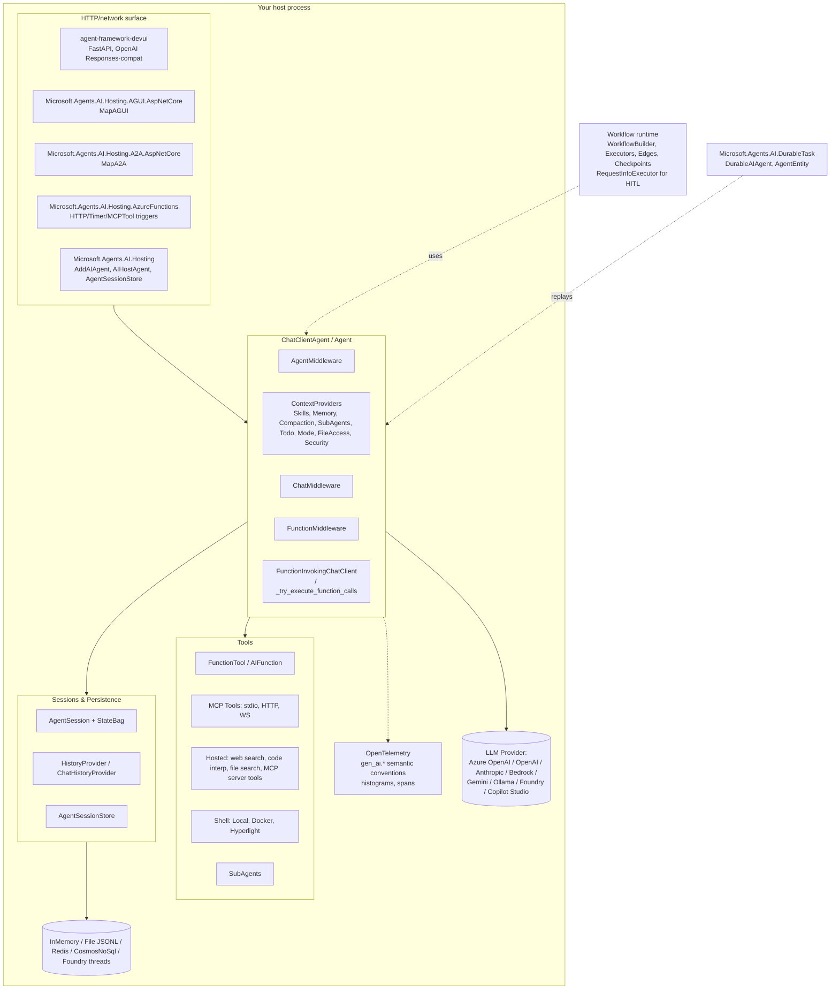

# Microsoft Agent Framework — Benchmark Analysis

> **Repo**: https://github.com/microsoft/agent-framework
> **Commit analysed**: a60e541c9ac53e9cd944986cafd5b044d8d004d0
> **Branch**: main
> **Framework path**: frameworks/microsoft-agent-framework
> **Analysed on**: 2026-05-19

## TL;DR

- ⭐ **What is this stack architecturally?** Microsoft Agent Framework (MAF) is a **dual-language, library-first SDK** (Python `agent-framework` + .NET `Microsoft.Agents.AI`) for in-process agent loops, with two complementary runtimes: (a) a built-in **graph-based Workflow runtime** for multi-agent orchestration (sequential / concurrent / handoff / fan-in/out / checkpoint-able), and (b) optional **hosted runtimes** (Azure Functions, Durable Task framework, Foundry Hosted Agents, AG-UI/A2A endpoints). On .NET the agent is built on top of `Microsoft.Extensions.AI` (`IChatClient` + `FunctionInvokingChatClient`). It is essentially the **convergence of Semantic Kernel + AutoGen**, with migration guides from both.
- **Ecosystem**: **Python** (primary) with full-parity **.NET** (`Microsoft.Agents.AI`). Both languages ship from the same monorepo; the .NET tree is slightly more mature for hosting (Azure Functions, DurableTask, Aspire).
- **License / governance**: MIT, owned by Microsoft (`microsoft/agent-framework`). Strong commercial backing (Azure / Foundry), official MS Learn docs, weekly office hours, public Discord, and a "Microsoft Agent Framework" GitHub org.
- **Maturity**: Core packages (`agent-framework-core`, `agent-framework-openai`, `agent-framework-foundry`, `Microsoft.Agents.AI`) are marked **released**; many adapters (Anthropic, Bedrock, AG-UI, Redis, Cosmos, A2A, DevUI, durabletask, hyperlight, mem0) are `beta`/`alpha`. Skills and several harness providers are still **experimental** (`@experimental(feature_id=ExperimentalFeature.SKILLS)`). Active release cadence — `1.4.0` shipped 2026-05-14, days before this study.
- **Where does the loop actually execute?** In-process. The Python `Agent` is a thin layer over `BaseChatClient` (`python/packages/core/agent_framework/_clients.py`), and the .NET `ChatClientAgent` wraps `Microsoft.Extensions.AI.IChatClient` with `FunctionInvokingChatClient` middleware. No subprocess, no vendor binary — your process *is* the agent.
- **Strongest architectural choice for our use case**: **Graph-based `Workflow`** primitive with first-class checkpointing (`CheckpointStorage`, `CosmosCheckpointStorage`, `FileCheckpointStorage`), HITL via `RequestInfoExecutor`/`function_approval_request`, and an explicit `AgentSessionStore` abstraction for multi-session hosting. The .NET hosting story (DI-driven `AddAIAgent(name)` + `AgentSessionStore` + `AIHostAgent` wrapper) maps cleanly onto an ASP.NET Core or Azure Functions multi-tenant server.
- **Weakest / biggest gap**: **No first-class tenancy primitive.** No `tenant_id` field on session, no per-tenant scoping for skills/tools, no per-tenant rate-limit/budget cap. Forced tool args are doable only via custom `FunctionMiddleware` (.NET equivalent: `FunctionInvokingChatClient` middleware). Skills loaders also have no built-in tenant filter.
- **Most surprising finding**: The Python `Skill` system follows the **agentskills.io spec** (lowercase-hyphen names, YAML frontmatter, `references/`, `assets/`, `scripts/`) and ships **multi-source composition** (`AggregatingSkillsSource` + `FilteringSkillsSource` + `DeduplicatingSkillsSource`) — closer to Anthropic Claude's SKILL.md than to any other framework studied. Progressive disclosure is built in: `load_skill`/`read_skill_resource`/`run_skill_script` tools, with metadata-only injected into the system prompt.
- **One-line verdicts**:
  - Sessions/persistence: ⚠ multi-store (InMemory, File-JSONL, Redis, CosmosNoSql), but only via `HistoryProvider`/`AgentSessionStore` BYO; no built-in service-mesh checkpointing.
  - Skills: ✅ first-class, spec-aligned, multi-source.
  - Resource Manager: ✗ no published-resource registry; loading sources exist but no draft/promote/RBAC.
  - Sub-agents: ✅ `agent.as_tool()` + `SubAgentsProvider` (concurrent task delegation with state).
  - Multi-tenancy: ✗ BYO via metadata and middleware.
  - Hooks: ✅ three middleware layers (Agent / Chat / Function) + `ContextProvider` pipeline.
  - API: ⚠ multiple options (DevUI / AG-UI / A2A / Azure Functions / Foundry Hosted) — none is "the" SDK server.
  - Observability: ✅ OpenTelemetry GenAI semantic conventions, tokens captured per-call and per-agent-invoke, histograms.
- **Production-readiness verdict for multi-tenant server-side deployment**: **Solid** core (especially .NET on ASP.NET Core / Azure Functions / DurableTask), with several rough edges — multi-tenancy primitives are entirely BYO, DevUI is explicitly a "sample app, not for production", and several providers (memory, AG-UI, skills) are still experimental/beta. Engineers must layer tenant isolation, USD budget caps, and a resource manager themselves.

---

## 0. General

### 0.1 What is this stack?

A **library/framework** (not a vendor-managed service) for building agent and multi-agent workflows in **Python and .NET**. It ships:
- A core **agent abstraction** (`Agent` / `ChatClientAgent`) over `IChatClient` (`Microsoft.Extensions.AI`) / `BaseChatClient` (Python).
- A graph-based **Workflow** runtime for multi-agent orchestration.
- A constellation of **hosting adapters** (Azure Functions, DurableTask, AG-UI, A2A, Foundry Hosted Agents, DevUI sample server).

### 0.2 Ecosystem

**Primary: Python** (Python ≥3.10, packages under `python/packages/`).
Secondary: **.NET 8/9+** (`Microsoft.Agents.AI*`, packages under `dotnet/src/`). Both languages are released from the same monorepo with near-parity feature sets; the .NET tree is slightly more mature on the hosting side (Aspire, Azure Functions templates, DurableTask first-class). Most of this report cites Python file paths but cross-references the .NET equivalent where relevant.

### 0.3 Project status & governance

- Open source, **MIT** (`frameworks/microsoft-agent-framework/LICENSE`).
- Owned and maintained by **Microsoft** under `microsoft/agent-framework`. Strong commercial backing through Azure Foundry, Azure AI Search, Cosmos DB, Azure Functions, DurableTask, Hyperlight. ADRs are formal (`docs/decisions/0001-*` onward).
- Public Discord, weekly community office hours (`frameworks/microsoft-agent-framework/COMMUNITY.md`).
- Migration guides explicitly cover **Semantic Kernel → MAF** and **AutoGen → MAF** (README:100-102).

### 0.4 Project maturity / age

- First public release in 2025 (preview), now at **`1.4.0` (2026-05-14)** for Python; .NET tracks similarly via NuGet `Microsoft.Agents.AI`. Both have a documented `PACKAGE_STATUS.md` (`python/PACKAGE_STATUS.md`) classifying packages into `alpha` / `beta` / `rc` / `released` / `deprecated`.
- **`released` packages**: `agent-framework`, `agent-framework-core`, `agent-framework-foundry`, `agent-framework-openai`.
- Most provider/adapter packages are `beta`. `agent-framework-azure-contentunderstanding` and `agent-framework-gemini` are still `alpha` (`python/PACKAGE_STATUS.md:21,35`).
- **Feature-level experimental APIs** are decorated with `@experimental(feature_id=ExperimentalFeature.SKILLS)` / `EVALS` / `FILE_HISTORY` (`python/PACKAGE_STATUS.md:60-71`).
- BREAKING changes still happen in experimental areas (skills restructured in 1.3.0 / 1.4.0).

### 0.5 Adoption & community signal

- GitHub stars not captured in repo; the README shields out to `img.shields.io/github/stars/microsoft/agent-framework?style=social`. As of 2026-05-19 the repo is being actively maintained with very frequent commits; weekly community office hours; Discord linked in README. (Numbers should be re-captured from the GitHub UI on the reading date.)
- PyPI: `agent-framework` (and 20+ sub-packages); NuGet: `Microsoft.Agents.AI*` (≈35 packages under `dotnet/src/`).

### 0.6 Ecosystem fit

- 22 Python packages under `python/packages/` (count via `find … -name pyproject.toml`). ≈35 .NET csproj files under `dotnet/src/`.
- PyPI: `agent-framework` umbrella + provider packages (`agent-framework-openai`, `agent-framework-anthropic`, `agent-framework-foundry`, `agent-framework-azure-cosmos`, `agent-framework-redis`, `agent-framework-mem0`, `agent-framework-ag-ui`, `agent-framework-a2a`, `agent-framework-devui`, …).
- NuGet: `Microsoft.Agents.AI`, `Microsoft.Agents.AI.OpenAI`, `Microsoft.Agents.AI.Anthropic`, `Microsoft.Agents.AI.Foundry`, `Microsoft.Agents.AI.Hosting`, `Microsoft.Agents.AI.Hosting.AzureFunctions`, `Microsoft.Agents.AI.DurableTask`, `Microsoft.Agents.AI.CosmosNoSql`, `Microsoft.Agents.AI.AGUI`, …
- Used mostly as a **library**: you `pip install agent-framework` or `dotnet add package Microsoft.Agents.AI` and host it yourself. DevUI is the only "app" surface and is explicitly a sample, not for production.

### 0.7 Documentation depth & cross-team contributor accessibility

- Official docs land at https://learn.microsoft.com/agent-framework/. Rich tutorials, quick-start, user guide, migration guides (README:96-101).
- ADRs are formal and numbered (`docs/decisions/0001`…`0026`), and **design docs** live in `docs/design/`.
- Skill authoring is YAML-frontmatter Markdown (agentskills.io spec) → a **Product/Data author can write a skill without engineering hand-holding**, but they will still need an engineer to register skill sources, run instrumentation, etc.

### 0.8 Documentation entry points ⭐

- Official docs: https://learn.microsoft.com/agent-framework/
- Quickstart: https://learn.microsoft.com/agent-framework/tutorials/quick-start
- API reference: https://learn.microsoft.com/agent-framework/ (per language)
- User guide: https://learn.microsoft.com/en-us/agent-framework/user-guide/overview
- Migration from Semantic Kernel: https://learn.microsoft.com/en-us/agent-framework/migration-guide/from-semantic-kernel
- Migration from AutoGen: https://learn.microsoft.com/en-us/agent-framework/migration-guide/from-autogen
- Devblog: https://devblogs.microsoft.com/agent-framework/
- Python samples: https://github.com/microsoft/agent-framework/tree/main/python
- .NET samples: https://github.com/microsoft/agent-framework/tree/main/dotnet
- Changelog: in-repo `python/CHANGELOG.md`; per-package CHANGELOGs under `dotnet/src/*/CHANGELOG.md`.
- GitHub Releases: https://github.com/microsoft/agent-framework/releases
- GitHub Issues: https://github.com/microsoft/agent-framework/issues
- Discord: https://discord.gg/b5zjErwbQM (linked in README:5)

---

## 1. High Level Architecture

```
                                  ┌──────────────────────────────────────────────────────┐
                                  │           Your host process (Python or .NET)         │
                                  │                                                      │
   HTTP / SSE                     │   ┌────────────────────────────────────────────┐     │
  ──────────►  ┌──────────────┐   │   │           Agent / ChatClientAgent          │     │
   Client     │ HTTP surface │───┼──►│   ┌────────────────┐  ┌─────────────────┐  │     │
              │ (one of:     │   │   │   │ AgentMiddleware│  │ ContextProviders│  │     │
              │  DevUI, A2A, │   │   │   │ ChatMiddleware │  │ (skills, memory,│  │     │
              │  AG-UI, AzF, │   │   │   │ FunctionMW     │  │  compaction,    │  │     │
              │  Foundry HA, │   │   │   └────────┬───────┘  │  sub-agents)    │  │     │
              │  custom ASP) │   │   │            │          └────────┬────────┘  │     │
              └──────┬───────┘   │   │   ┌────────▼──────────────────▼────────┐   │     │
                     │           │   │   │  BaseChatClient.get_response /     │   │     │
                     │           │   │   │  FunctionInvokingChatClient (loop) │   │     │
                     │           │   │   └────────────────┬───────────────────┘   │     │
                     │           │   └────────────────────┼───────────────────────┘     │
                     │           │                        │                             │
                     │ resume    │   ┌──────────┐   ┌─────▼──────┐   ┌───────────────┐  │
                     └──────────►│   │AgentSess │◄──┤ tools (fn, │──►│ Provider LLM  │──┼───►  Azure OpenAI / OpenAI / Anthropic /
                                  │   │ionStore  │   │ MCP, hosted│   │ (Chat Comp /  │  │      Foundry / Bedrock / Gemini / Ollama
                                  │   │ + State  │   │ web search,│   │ Responses /   │  │
                                  │   │ Bag      │   │ code interp│   │ stream)       │  │
                                  │   └──────────┘   └────────────┘   └───────────────┘  │
                                  │                                                      │
                                  └──────────────────────────────────────────────────────┘
                                            │                              │
                                            ▼                              ▼
                              ┌──────────────────────┐         ┌─────────────────────────┐
                              │ Session/Checkpoint   │         │ Optional: Durable Task /│
                              │ stores: InMemory,    │         │ Azure Functions / Found │
                              │ File-JSONL, Redis,   │         │ ry Hosting — externalize│
                              │ Cosmos NoSql, custom │         │ orchestration & resume  │
                              └──────────────────────┘         └─────────────────────────┘
```

### 1.1 Where does the agent loop *actually* execute?

**In your process.**

- **Python**: `agent.run()` builds a `_RunContext` and calls `self.client.get_response(...)`. The chat client (`BaseChatClient`, `python/packages/core/agent_framework/_clients.py:217`) executes the LLM round-trip via `_inner_get_response`, parses tool calls, and re-enters until done. The tool-loop is in `_tools.py:_try_execute_function_calls` (line 1632) which fans out via `_execute_function_calls` (line 1781). Streaming is via `ResponseStream` (`_types.py:ResponseStream`).
- **.NET**: `ChatClientAgent.RunCoreAsync` → `FunctionInvokingChatClient` from `Microsoft.Extensions.AI` handles the tool-call loop (see `FunctionInvocationDelegatingAgent.cs:74` reference to `FunctionInvokingChatClient.CurrentContext`). The agent is a `DelegatingAIAgent` decorating an `IChatClient` pipeline that the user assembles via `chatClient.AsBuilder().UseFunctionInvocation().UseAIContextProviders(...).BuildAIAgent(...)` (e.g. `HarnessAgent.cs:111-127`).

No subprocesses, no bundled CLIs.

### 1.2 Runtime dependencies

- **Language runtime**: Python ≥3.10 or .NET 8/9+.
- **External binaries/CLIs that the SDK subprocesses**: none. The agent is in-process; MCP-stdio servers may be subprocessed if you wire one, but that is opt-in.
- **Required infrastructure services**: none for the basic in-process agent. Optional backing stores for production deployment: Redis (`agent-framework-redis`), Cosmos DB (`agent-framework-azure-cosmos` / `Microsoft.Agents.AI.CosmosNoSql`), Azure AI Search, Foundry-hosted threads (when using Foundry persistence).
- **Required vendor services**: a model provider (Azure OpenAI / OpenAI / Anthropic / Foundry / Bedrock / Gemini / Ollama). No mandatory observability vendor — OTel exporters are pluggable. No mandatory eval vendor — `FoundryEvals` is one option among others.

### 1.3 Recommended deployment topology

Vendor recommends multiple options (no single canonical), with examples for each:
- **One-process-many-tenants**: `Microsoft.Agents.AI.Hosting` (`AddAIAgent(name, …)` + `AgentSessionStore` + `AIHostAgent`) is the explicit "host multiple agents in ASP.NET Core / Worker Service" path (`dotnet/src/Microsoft.Agents.AI.Hosting/AgentHostingServiceCollectionExtensions.cs`).
- **Container-per-agent** (Foundry-hosted agents): each agent lives behind Foundry-managed infra (`samples/04-hosting/FoundryHostedAgents`).
- **Worker pool / durable orchestration**: `Microsoft.Agents.AI.DurableTask` and `Microsoft.Agents.AI.Hosting.AzureFunctions` expose agents as **durable orchestrations** (`DurableAIAgent`, `AgentEntity`, `DurableAgentSession` — see `dotnet/src/Microsoft.Agents.AI.DurableTask/`).
- **Sample dev surface**: DevUI (`agent-framework-devui`) for local dev only.

### 1.4 Cold-start cost & instance footprint

Not advertised explicitly. The framework is a thin .NET assembly / Python package — startup is dominated by provider SDK initialisation (`AzureCliCredential`, `OpenAIClient`) and any context-provider loading (e.g., scanning skill directories). DevUI's `dev.md` lists ports 8080/8090. No documented multi-second cold-start surcharge (unlike Claude Agent SDK's open issue #333).

### 1.5 Vendor lock-in

- **LLM provider**: ✅ open. Adapters ship for Azure OpenAI / Foundry / OpenAI / Anthropic / Bedrock / Gemini / Ollama / Claude / GitHub Copilot / Foundry-Local / Copilot Studio.
- **Hosting platform**: Microsoft Azure stack is clearly first-class (Foundry, Azure Functions, Cosmos, AI Search), but core packages have no hard dependency on Azure. ASP.NET Core hosting works against any LLM.
- **Eval / observability**: OTel-native; `FoundryEvals` is one option among others (`LocalEvaluator` ships out of box, `_evaluation.py:LocalEvaluator`).

### 1.6 Framework weight / footprint

**Heavy** — comparable to LangGraph in scope but broader. The core Python package alone is ~27 kLOC (`wc -l` across `_*.py`). It bundles: agents, workflows, sessions, compaction, mcp, middleware, observability, skills, security/labelling, evaluation, harness providers (memory/todo/mode), serialization, and 20+ provider connectors.

### 1.7 Release-history signal

`python/CHANGELOG.md:1` (Keep a Changelog, semver). Recent decision-relevant additions:
- `1.4.0` (2026-05-14): "Align file skill folder discovery with agentskills.io spec" (BREAKING — experimental skills); "Strip server-issued response item IDs under storage" — meaningful for cross-session replay (CHANGELOG.md:14-21).
- `1.3.0` (2026-05-07): "Add experimental session-mode harness context provider" (`_harness/_mode.py`); experimental todo-list and memory harness providers; "Information-flow control prompt injection defense" (`security.py`, ADR `docs/decisions/0024-prompt-injection-defense.md`).
- `1.2.2` (2026-04-29): "Standardize orchestration terminal outputs as `AgentResponse`" — orchestration API standardization.
- `1.2.0` (2026-04-24): "Add functional workflow API" — Python workflow improvements.

.NET CHANGELOGs live under `dotnet/src/Microsoft.Agents.AI.*/CHANGELOG.md` (per-package), e.g. `Microsoft.Agents.AI.DurableTask/CHANGELOG.md` and `Microsoft.Agents.AI.Hosting.AzureFunctions/CHANGELOG.md`.

GitHub Releases: https://github.com/microsoft/agent-framework/releases — Python `1.4.0` and per-.NET-package releases are tagged independently.

---

## 2. Agent Loop

### 2.1 Run loop entrypoint(s)

**Python** (`python/packages/core/agent_framework/_agents.py:271-300`):
```python
def run(
    self,
    messages: AgentRunInputs | None = None,
    *,
    stream: bool = False,
    session: AgentSession | None = None,
    function_invocation_kwargs: Mapping[str, Any] | None = None,
    client_kwargs: Mapping[str, Any] | None = None,
) -> Awaitable[AgentResponse[Any]] | ResponseStream[AgentResponseUpdate, AgentResponse[Any]]: ...
```

Returns `AgentResponse[T]` (non-stream) or `ResponseStream[AgentResponseUpdate, AgentResponse[T]]` (stream). `ResponseStream.get_final_response()` aggregates updates into a complete response.

**.NET** (`dotnet/src/Microsoft.Agents.AI.Abstractions/AIAgent.cs:334-341`):
```csharp
public Task<AgentResponse> RunAsync(
    IEnumerable<ChatMessage> messages,
    AgentSession? session = null,
    AgentRunOptions? options = null,
    CancellationToken cancellationToken = default);

public IAsyncEnumerable<AgentResponseUpdate> RunStreamingAsync(
    IEnumerable<ChatMessage> messages,
    AgentSession? session = null,
    AgentRunOptions? options = null,
    CancellationToken cancellationToken = default);
```

`AgentRunContext` is set as an `AsyncLocal` (`AIAgent.cs:40`) so middleware and tools can pull it via `AIAgent.CurrentRunContext` (`AIAgent.cs:102-106`).

### 2.2 Per-iteration behavior

Python (`_agents.py:_call_chat_client` line 985 → `BaseChatClient.get_response`):
1. `_prepare_run_context` resolves messages, options, tools, ContextProviders (`_agents.py:1150`).
2. The chat client calls the LLM (`_inner_get_response`).
3. `_try_execute_function_calls` (`_tools.py:1632`) inspects assistant content; for each `FunctionCallContent`, the matching `FunctionTool.invoke()` runs (with `FunctionInvocationContext`).
4. Results re-enter the loop until `finish_reason != "tool_calls"` (`_types.py:1651`).
5. `_finalize_response` collapses streamed updates (`_types.py:1976`).

.NET delegates the tool loop to `FunctionInvokingChatClient` (Microsoft.Extensions.AI). MAF adds `FunctionInvocationDelegatingAgent` to surface per-call context via `FunctionInvokingChatClient.CurrentContext` (`FunctionInvocationDelegatingAgent.cs:74`). Per-service-call persistence is bolted on with `PerServiceCallChatHistoryPersistingChatClient` (referenced by `HarnessAgent.cs:115`).

### 2.3 ReAct loop

**Built-in.** The function-invocation loop is automatic when tools are present — no explicit ReAct wiring. Both languages rely on the LLM's native tool-calling protocol.

### 2.4 Tool dispatch + result handling

Python — `_tools.py`:
- `_try_execute_function_calls` (line 1632) iterates `FunctionCallContent` items, resolves `FunctionTool` from a `tool_map` (line 1622), and invokes via `_execute_function_calls` (line 1781).
- Each invocation receives an injected `FunctionInvocationContext` (`_middleware.py:204`) carrying `function`, `arguments`, `session`, `metadata`, `kwargs`.
- Approval gating is performed inline: when `tool.approval_mode == "always_require"` and no matching `function_approval_response` exists in input, the loop emits `function_approval_request` content (`_tools.py:1662-1699`) and pauses by surfacing the request in `AgentResponse.user_input_requests` (`exceptions.py:UserInputRequiredException`).

.NET — `FunctionInvokingChatClient` (in `Microsoft.Extensions.AI`) routes calls to registered `AIFunction` instances. The user-approval flow is provided in MAF via `Microsoft.Agents.AI/Harness/ToolApproval/ToolApprovalAgent.cs` which uses standing-approval rules in `ToolApprovalState` (line 52). ADR: `docs/decisions/0006-userapproval.md`.

### 2.5 Explicit turn concept

Implicit: a "turn" ends when the LLM returns a non-tool-call response (`finish_reason in {"stop","length","content_filter"}`) or when `MiddlewareTermination` is raised. No explicit `Turn` type; instead the run accumulates updates until terminal.

### 2.6 Event emission mechanism (in-process)

**Async generator-style** — Python returns an `AsyncIterable[AgentResponseUpdate]`; .NET returns `IAsyncEnumerable<AgentResponseUpdate>`. Middleware can wrap the stream with `with_transform_hook` / `with_result_hook` (`_agents.py:1102-1112`). `ResponseStream` (`_types.py:ResponseStream`) is the canonical Python type. There is no in-process event bus or observer pattern — composition is via middleware and `ContextProvider` lifecycle hooks (see Q7).

---

## 3. Message & Event Taxonomy

### 3.1 Message layers

- **Wire/LLM message**: `Microsoft.Extensions.AI.ChatMessage` (.NET) and `Message` (`python/packages/core/agent_framework/_types.py:1672`) — list of `Content` parts plus `role`.
- **Agent-level message**: same `Message` type but wrapped in `AgentResponse.messages` after parsing tool results.
- **UI message** (when going via DevUI): converted to OpenAI Responses API events by `agent-framework-devui/_mapper.py` (the README table on lines 252-288 documents the mapping).
- **AG-UI**: converted to `BaseEvent` (`agent-framework-ag-ui/_event_converters.py`).

Conversion path (typical): `Message` (in-process) → `AgentResponseUpdate` (streaming) → DevUI/AG-UI wire frame (HTTP-side). The wire→UI step is owned by the host integration package, not by core.

### 3.2 Concrete message types

Content types (from `_types.py:331-363`):

| Content `type` | Purpose |
|---|---|
| `text` | Plain assistant/user text |
| `text_reasoning` | Reasoning text (OpenAI o-series, Anthropic thinking) |
| `data` | Inline base64 binary (images, audio, video) |
| `uri` | Reference to external resource |
| `error` | Error content |
| `function_call` | LLM-generated tool call request |
| `function_result` | Result of a tool execution |
| `usage` | Token-usage breakdown |
| `hosted_file` | File hosted by the provider |
| `hosted_vector_store` | Provider-managed vector store reference |
| `code_interpreter_tool_call` / `…_result` | Provider-hosted code interpreter |
| `image_generation_tool_call` / `…_result` | Provider-hosted image gen |
| `mcp_server_tool_call` / `…_result` | MCP tool invocation by the model |
| `search_tool_call` / `…_result` | Provider web search |
| `shell_tool_call` / `…_result` / `shell_command_output` | Shell tool (provider or local) |
| `function_approval_request` / `function_approval_response` | HITL approval messages |
| `oauth_consent_request` | OAuth consent prompt |

### 3.3 Messages vs. events

Messages are content arrays; **events** for the workflow layer live in `python/packages/core/agent_framework/_workflows/_events.py` (`WorkflowEvent`, `ExecutorActionItem`, started/completed/failed). At the **agent** layer, the iterator yields `AgentResponseUpdate` items (which are partial Messages) — there is no separate event taxonomy alongside messages.

### 3.4 Event categories

- **Stream-event** (token-level updates): `AgentResponseUpdate` / `ChatResponseUpdate`.
- **Turn-event**: implicit (response with `finish_reason`).
- **Message-event**: not a distinct category — messages flow as content within updates.
- **Tool-event**: surfaces as `FunctionCallContent` / `FunctionResultContent` inside `AgentResponseUpdate`; DevUI's mapper splits these into discrete `response.function_call_arguments.delta` / `response.function_result.complete` frames.
- **Workflow event**: `WorkflowEvent` with `type ∈ {started, status, output, executor_invoked, executor_completed, executor_failed, failed, warning}` (see `python/packages/devui/README.md:275-282`).
- **Session lifecycle**: not exposed as events; lives in `AgentSessionStore` `Save/Get`.
- **Hook event**: middleware fires via `call_next()` chain, not an event bus.
- **Sub-agent event**: emitted as `function_result` content for the `SubAgents_*` tools.

### 3.5 Canonical type-definition file(s)

- Python: `python/packages/core/agent_framework/_types.py:1672` (`Message`), `_types.py:455` (`Content`), `_types.py:2036` (`ChatResponse`).
- .NET: `dotnet/src/Microsoft.Agents.AI.Abstractions/AgentResponse.cs`, `AgentResponseUpdate.cs`. Messages and content types are re-exported from `Microsoft.Extensions.AI`.
- DevUI mapping: `python/packages/devui/agent_framework_devui/_mapper.py`.

### 3.6 Live agentic event stream taxonomy

Sample event frames as emitted by DevUI (OpenAI Responses-shaped wire format, see `python/packages/devui/README.md:252-288`):

- Start: `response.created` + `response.in_progress`.
- Mid-stream text: `response.content_part.added` + `response.output_text.delta`.
- Tool-call start: `response.output_item.added` with `ResponseFunctionToolCall`.
- Tool-call args streaming: `response.function_call_arguments.delta`.
- Tool result: `response.function_result.complete` (DevUI extension).
- Approval request: `response.function_approval.requested`.
- Workflow executor lifecycle: `response.output_item.added` (`type='executor_invoked'`) and `…done` (`type='executor_completed'`).
- Terminal: `response.completed` or `response.failed`.

---

## 4. Agent Runtime (Multi-session Host)

### 4.1 Multi-session host architecture

There is **no built-in `RuntimeHost`** that hosts N concurrent sessions. Instead, agents are stateless objects you embed in **your** host (ASP.NET Core, FastAPI, Azure Functions, DurableTask), and session state is externalized through `AgentSessionStore` (.NET) / `HistoryProvider` (Python).

The .NET hosting helper `Microsoft.Agents.AI.Hosting` provides the wiring (`AddAIAgent` ServiceCollection extension, `AIHostAgent` wrapper, `AgentSessionStore` base class) to make this multi-session pattern straightforward (`dotnet/src/Microsoft.Agents.AI.Hosting/AgentHostingServiceCollectionExtensions.cs:25-79`).

For Python, the analogous pattern lives in `agent-framework-foundry-hosting`, `agent-framework-durabletask`, and `agent-framework-a2a` — each implements a server that creates an agent instance per request/session.

### 4.2 Concurrent session isolation

Isolation is **per-session-instance**:
- `AgentSession` (Python `_sessions.py:711`) holds `session_id`, `service_session_id`, and a mutable `state: dict[str, Any]` shared with providers.
- .NET `AgentSession` is a base abstract class with an `AgentSessionStateBag` of concurrent-dictionary entries (`AgentSession.cs:59-85`, `AgentSessionStateBag.cs:21-39`).
- Agents themselves are typically singletons (`ServiceLifetime.Singleton` is the default in `AddAIAgent` — `AgentHostingServiceCollectionExtensions.cs:25`), and only sessions are per-conversation.

State bleed would only occur if you stored conversation state on the agent instance (anti-pattern) or shared an `AgentSession` across requests.

### 4.3 Horizontal scaling / multi-instance

- Stateless workers + shared store: ✅ `AgentSessionStore` abstraction allows N pods to share Cosmos / Redis. `CosmosCheckpointStorage` and `CosmosChatHistoryProvider` (`dotnet/src/Microsoft.Agents.AI.CosmosNoSql/`) are designed for this.
- Leader election / sticky routing: not provided. You either run **stateless** with a shared store, or use **DurableTask** which provides leader-elected, queue-backed orchestration (`Microsoft.Agents.AI.DurableTask`).

### 4.4 Background / async / scheduled tasks

- **Cron / trigger**: BYO via Azure Functions (`Microsoft.Agents.AI.Hosting.AzureFunctions`) which exposes Timer/HTTP/MCPTool triggers.
- **Long-running background**: `Microsoft.Agents.AI.DurableTask` (`DurableAIAgent`, `AgentEntity` with `EntityAgentWrapper.cs`) treats each agent run as a durable orchestration with replay-on-crash.
- Python: similar wrapper exists in `agent-framework-durabletask` but is `beta`.

### 4.5 Worker pool / queue model

- **DurableTask** is the explicit queue/orchestrator model.
- **Azure Functions** triggers fan out to a worker pool.
- The vanilla in-process agent does NOT expose a queue API.

---

## 5. Sessions & Persistence

### 5.1 Session / chat data model

**Python** (`python/packages/core/agent_framework/_sessions.py:711-756`):

```python
class AgentSession:
    session_id: str           # local UUID by default
    service_session_id: str | None   # for provider-managed sessions (OpenAI Responses, Foundry threads)
    state: dict[str, Any]     # mutable per-session state, namespaced by ContextProvider.source_id
```

Serialization (`AgentSession.to_dict()`):
```json
{"type": "session", "session_id": "...", "service_session_id": null, "state": {...}}
```

State is namespaced by each `ContextProvider`'s `source_id` (e.g. `"in_memory"` for `InMemoryHistoryProvider`).

**.NET** (`dotnet/src/Microsoft.Agents.AI.Abstractions/AgentSession.cs:59-85`):

```csharp
public abstract class AgentSession {
    public AgentSessionStateBag StateBag { get; protected set; } = new();
    // … (abstract; concrete classes per agent type, e.g. ChatClientAgentSession)
}
```

State bag is a thread-safe `ConcurrentDictionary<string, AgentSessionStateBagValue>` (`AgentSessionStateBag.cs:22-38`), JSON-serialized via a custom converter.

No first-class `tenant_id`, `user_id`, `cwd`, `created_at`, `updated_at`, or `parent_session_id` fields — those are BYO via `state` / `StateBag` keys.

### 5.2 What's stored on a session

- Message history (only if a `HistoryProvider` is attached; e.g. `InMemoryHistoryProvider` stores `state["messages"]`).
- Provider-namespaced state (skills metadata, sub-agent runtime state, compaction summary, todo lists, memory snapshots).
- `service_session_id` (if the LLM provider has its own thread/conversation handle).

### 5.3 Granularity

One session = one conversation. No fork/branch model on `AgentSession`. Branching exists at the **workflow** layer via `CheckpointStorage` (`python/packages/core/agent_framework/_workflows/_checkpoint.py`) — you can resume a workflow from any checkpoint.

### 5.4 Built-in persistence stores

| Backend | Python | .NET |
|---|---|---|
| In-memory | `InMemoryHistoryProvider` (`_sessions.py:779`) | `InMemoryAgentSessionStore` (`Microsoft.Agents.AI.Hosting/Local/InMemoryAgentSessionStore.cs:28`), `InMemoryChatHistoryProvider` |
| File / JSONL | `FileHistoryProvider` (`_sessions.py:858`, **experimental** `@experimental(feature_id=ExperimentalFeature.FILE_HISTORY)`) | None first-party (file store exists for `AgentFileStore` harness but not as session store) |
| Redis | `agent-framework-redis` package | None first-party |
| Cosmos NoSql | `agent-framework-azure-cosmos` (`CosmosChatHistoryProvider`, `CosmosCheckpointStorage`) | `Microsoft.Agents.AI.CosmosNoSql` (`CosmosChatHistoryProvider.cs`, `CosmosCheckpointStore.cs`) |
| Foundry Persistent Agents (server-side threads) | `agent-framework-foundry` (uses `service_session_id`) | `Microsoft.Agents.AI.AzureAI.Persistent` |

For everything else: **BYO** via `HistoryProvider` (Python) / `AgentSessionStore` (.NET).

### 5.5 Persistence timing

The default `InMemoryHistoryProvider` saves after the response is complete (`PerServiceCallHistoryPersistingMiddleware` in `_sessions.py:489-531` saves messages in the `before_run` / `after_run` lifecycle of the `HistoryProvider`).

The .NET `HarnessAgent` deliberately enables `RequirePerServiceCallChatHistoryPersistence` plus a `PerServiceCallChatHistoryPersistingChatClient` so that **every individual LLM round-trip** within a function-invocation loop is persisted (`dotnet/src/Microsoft.Agents.AI.Harness/HarnessAgent.cs:21-22, 121-126`) — i.e. mid-tool-call durability is opt-in.

### 5.6 Mid-run checkpointing (durable)

- **Agent level**: with `PerServiceCallChatHistoryPersistingChatClient`, an agent can resume after a crash mid-tool-loop because chat history is persisted between every chat-client call.
- **Workflow level**: explicit `CheckpointStorage` interface (Python `_workflows/_checkpoint.py`) and `WorkflowBuilder…with_checkpointing(storage=…)`. Checkpoints are written between executor transitions. `CosmosCheckpointStorage` is the production-grade implementation (`agent-framework-azure-cosmos`).
- **DurableTask**: `DurableAIAgent` (`dotnet/src/Microsoft.Agents.AI.DurableTask/DurableAIAgent.cs`) makes every agent step a durable orchestration step, replayable from any failure.

### 5.7 Session ID format

UUID v4 by default (`AgentSession.__init__` — `str(uuid.uuid4())`). The .NET equivalent uses `Guid.NewGuid().ToString("N")` (`AIAgent.cs:58`).

No tenant prefix, no composite ID — flat UUIDs.

### 5.8 Pluggable store interface

**Python** (`_sessions.py:410`, abstract base `HistoryProvider`):
```python
class HistoryProvider(ContextProvider):
    async def get_messages(self, session_id: str | None, *, state: dict[str, Any] | None = None, **kw) -> list[Message]: ...
    async def save_messages(self, session_id: str | None, messages: Sequence[Message], *, state: dict[str, Any] | None = None, **kw) -> None: ...
```

**.NET** (`AgentSessionStore.cs:16-46`):
```csharp
public abstract class AgentSessionStore {
    public abstract ValueTask SaveSessionAsync(AIAgent agent, string conversationId, AgentSession session, CancellationToken ct = default);
    public abstract ValueTask<AgentSession> GetSessionAsync(AIAgent agent, string conversationId, CancellationToken ct = default);
}
```

Plus a separate `ChatHistoryProvider` abstract class (`dotnet/src/Microsoft.Agents.AI.Abstractions/ChatHistoryProvider.cs`) for message-history backends.

### 5.9 Schema evolution / migration

Not explicitly addressed. `AgentSession.to_dict()` / `from_dict()` returns a typed envelope (`{"type": "session", …}`) but there is no migration helper. State serialization auto-registers Pydantic types (`_sessions.py:66-90`) — survives version-agnostic round-trips for primitive shapes.

### 5.10 Export / replay

- Session export: `AgentSession.to_dict()` → JSON envelope. Workflow checkpoint export via `CheckpointStorage`.
- Deterministic replay: **DurableTask** provides replay-from-checkpoint (`Microsoft.Agents.AI.DurableTask`).

### 5.11 Cross-session memory

Cross-reference Q17. **Mem0** (`agent-framework-mem0`, `Microsoft.Agents.AI.Mem0`) is the primary first-party long-term-memory adapter. Otherwise BYO via your own `ContextProvider` that pulls from a vector store.

---

## 6. Multi-tenancy & Arbitrary Context ⭐ THE KEY QUESTION

### 6.1 Full run-loop input struct

Python `agent.run()` (`_agents.py:271`):
```python
messages: AgentRunInputs | None
stream: bool
session: AgentSession | None
function_invocation_kwargs: Mapping[str, Any] | None  # forwarded to tool invocation
client_kwargs: Mapping[str, Any] | None               # client-specific
tools, options, compaction_strategy, tokenizer        # via overload
```

.NET (`AgentRunOptions.cs`):
```csharp
public class AgentRunOptions { /* additional properties + per-options-type fields */ }
public class ChatClientAgentRunOptions : AgentRunOptions {
    public ChatOptions? ChatOptions { get; set; }
    public ResponseContinuationToken? ContinuationToken { get; set; }
}
```

**Neither has a `tenantId` / `userId` field.** Callers must stuff that into `function_invocation_kwargs` (Python) or via `AdditionalProperties` and the `AgentRunContext.CurrentRunContext` async-local (.NET).

### 6.2 Context propagation into a tool call

Python (`_tools.py:_auto_invoke_function` line 1411 and `FunctionInvocationContext` at `_middleware.py:204`):
- The `FunctionInvocationContext` is built with `kwargs=function_invocation_kwargs` (Python `_agents.py:556`) and made available to tool code that accepts a `FunctionInvocationContext` parameter (auto-discovered at registration — `_tools.py:_discover_injected_parameters` line 406).

.NET — middleware reads `FunctionInvokingChatClient.CurrentContext` (and `AIAgent.CurrentRunContext` for the broader run context), so a `FunctionMiddleware` or a custom delegate can pull tenant info from `AgentRunContext.RunOptions.AdditionalProperties`.

### 6.3 Tool call interface

Python tool defined with `@tool` (`_tools.py:1135`):
```python
@tool(name="topic_search", description="Search topics")
def topic_search(query: str, ctx: FunctionInvocationContext) -> str:
    tenant_id = ctx.kwargs.get("tenant_id")  # arrives via function_invocation_kwargs
    return do_search(query, tenant_id)
```

The `FunctionInvocationContext` exposes: `function`, `arguments`, `session`, `metadata`, `kwargs`, `result` (`_middleware.py:204-262`).

.NET tools are `AIFunction` (from `Microsoft.Extensions.AI`); per-call context is reached via `FunctionInvokingChatClient.CurrentContext`.

### 6.4 Forcing tool arguments from the harness

⚠ **Not built-in as a declarative "pin this arg to X" mechanism.** Achievable via `FunctionMiddleware` that mutates `context.arguments` before `call_next()`:

```python
class ForceTenantIdMiddleware(FunctionMiddleware):
    async def process(self, context: FunctionInvocationContext, call_next):
        if context.function.name == "topic_search":
            args = dict(context.arguments)
            args["tenant_id"] = context.kwargs.get("tenant_id")  # override LLM choice
            context.arguments = args
        await call_next()
```

The middleware is registered on the agent (`middleware=[ForceTenantIdMiddleware()]`). This is the recommended pattern but is **BYO** — no `pinned_args` / `forced_args` decorator-level support.

### 6.5 Filtering visible tools

- **At agent-construction time**: pass `tools=[…]` listing only the allowed `FunctionTool` instances.
- **Per-run**: pass `tools=…` to `agent.run(messages, options={"tools": [...]})`. The merge logic in `_merge_options` (`_agents.py:92-126`) lets a per-run tools list override the agent default.
- **From a `ContextProvider`**: providers can contribute tools via `SessionContext.tools` (`_sessions.py:151-200`) — this is how `SkillsProvider` injects its `load_skill`/`read_skill_resource`/`run_skill_script` tools.
- **Tool choice / `allowed_tools`**: `_tools.py` exposes `ToolMode` (`_types.py:3243`) and OpenAI/Gemini support `allowed_tools` via `tool_choice` (added in `1.3.0`).

### 6.6 Tenant scope on session

✗ **Not first-class.** Stuff it in `session.state["tenant_id"]` or `AgentSessionStateBag["tenant_id"]`.

### 6.7 Per-tool-call auth propagation

Caller identity is **not automatically** propagated. You must inject it via `function_invocation_kwargs` (Python) or `AgentRunOptions.AdditionalProperties` (.NET), or via a custom `FunctionMiddleware` / `ContextProvider`. The `ToolApprovalAgent` (.NET) and `function_approval_request` (Python) mechanism only handles "is this call approved", not identity propagation.

### 6.8 Resource scoping primitives

- Tools / skills / sub-agents can be filtered at registration via `FilteringSkillsSource` (`_skills.py:AggregatingSkillsSource` + `FilteringSkillsSource`).
- No publish-time tenant tag. Scoping happens at runtime (you compose a different `SkillsProvider` for each tenant).

### 6.9 Per-tenant rate limit + budget cap

✗ Not provided. Tokens are observable via OTel histograms and `UsageDetails`, but no built-in USD-cap or per-tenant ceiling.

---

⭐ **Light usage example** (Python):

```python
from agent_framework import Agent, FunctionMiddleware, FunctionInvocationContext
from agent_framework.openai import OpenAIChatClient

# Tools (registered globally; filtering happens at run-time)
@tool
def topic_search(query: str, ctx: FunctionInvocationContext) -> str:
    tenant_id = ctx.kwargs.get("tenant_id")  # forced by middleware below
    return f"hits for {query} in tenant {tenant_id}"

@tool
def iab_search(query: str) -> str: ...
@tool
def audience_create(name: str) -> str: ...
@tool
def bash_exec(cmd: str) -> str: ...
@tool
def web_fetch(url: str) -> str: ...

# (6.4) Force tenant_id on topic_search regardless of LLM-supplied value
class ForceTenantId(FunctionMiddleware):
    async def process(self, context: FunctionInvocationContext, call_next):
        if context.function.name == "topic_search":
            args = dict(context.arguments)
            args["tenant_id"] = context.kwargs.get("tenant_id")
            context.arguments = args
        await call_next()

agent = Agent(
    client=OpenAIChatClient(model="gpt-4o"),
    name="brief-agent",
    # (6.5) only these three tools are visible to the LLM
    tools=[topic_search, iab_search, audience_create],
    middleware=[ForceTenantId()],
)

# (6.1) Pass tenant context through function_invocation_kwargs
response = await agent.run(
    "Build me an audience of young urban moms",
    function_invocation_kwargs={
        "tenant_id": "acme",
        "targeting_strategy_id": "strat-42",
        "user_id": "u-123",
    },
)
```

---

## 7. Hook & Middleware Capabilities (Context Engineering)

### 7.1 Enumerate every hook / middleware / lifecycle callback

| Name | Fires when | Can do |
|---|---|---|
| `AgentMiddleware.process(ctx, call_next)` (`_middleware.py:357`) | Around every `agent.run()` | Read/mutate `AgentContext.messages`, set/override `result`, raise `MiddlewareTermination` |
| `ChatMiddleware.process(ctx, call_next)` (`_middleware.py:480`) | Around every chat-client call (per LLM round-trip in tool loop) | Mutate messages, inject system, transform stream updates, override response |
| `FunctionMiddleware.process(ctx, call_next)` (`_middleware.py:416`) | Around every tool invocation | Mutate `arguments`, override `result`, cache, validate, redact |
| `ContextProvider.before_run` / `after_run` / `before_chat_call` / `after_chat_call` (`_sessions.py:348`) | Lifecycle around full run and each chat call | Inject context-messages, instructions, tools, middleware; mutate after-call state |
| `HistoryProvider.get_messages` / `save_messages` (`_sessions.py:410`) | Load before invoke, save after | Persist conversation |
| `@agent_middleware` / `@function_middleware` / `@chat_middleware` decorators (`_middleware.py:570, 603, 636`) | Same as the abstract classes | Functional shorthand |
| `ResponseStream.with_transform_hook` / `with_result_hook` / `with_cleanup_hook` (`_types.py:ResponseStream`) | Per-update during stream | Mutate or observe streamed updates |
| .NET pipeline builder hooks: `UseFunctionInvocation`, `UseMessageInjection`, `UsePerServiceCallChatHistoryPersistence`, `UseAIContextProviders`, `UseOpenTelemetry`, `UseLogging`, `Use(...)` custom | At builder time | Compose decorating `IChatClient`/`AIAgent` decorators |

### 7.2 Hook concurrency model

Sequential. Each middleware wraps the next via `await call_next()`; the chain is built linearly by `MiddlewareWrapper` (`_middleware.py:669`). `ContextProvider`s run in registration order on `before_*` and in reverse on `after_*` (`_agents.py:_run_after_providers` line 447).

### 7.3 Specific capability tests

- **Inject system messages at session start** — ✅ via `ContextProvider.before_run` populating `SessionContext.instructions` or `SessionContext.context_messages` (`_sessions.py:151`).
- **Expand user input** — ✅ via `ContextProvider.before_chat_call` or `ChatMiddleware` mutating `context.messages`.
- **Mutate messages list before each LLM call** — ✅ same hook (per service call). The `CompactionProvider` does exactly this.
- **Mutate tool input** — ✅ via `FunctionMiddleware` (see Q6.4).
- **Mutate tool result** — ✅ via `FunctionMiddleware` (set `context.result` after `call_next()`).
- **Emit additional tool calls in response to a tool result** — ⚠ Not via a single hook. You'd extend the message list in a `ChatMiddleware`. The framework does not expose Claude Agent SDK's `additional_messages` semantics directly.

### 7.4 Auto-compaction

✅ Built-in: `CompactionProvider` + `ContextWindowCompactionStrategy` / `SummarizationCompactionStrategy` / `ToolResultCompactionStrategy` / `ChatReducerCompactionStrategy` / `PipelineCompactionStrategy` (Python `agent_framework/_compaction.py`, .NET `Microsoft.Agents.AI/Compaction/`). ADR `docs/decisions/0019-python-context-compaction-strategy.md`.

`HarnessAgent` (.NET) wires this by default: `new CompactionProvider(new ContextWindowCompactionStrategy(maxContextWindowTokens, maxOutputTokens))` (`HarnessAgent.cs:95-116`). Triggers on context-window pressure before each chat call.

### 7.5 Prompt cache optimization

No first-party prompt-cache breakpoint controller. Providers (Anthropic) handle cache via their own ChatClient (e.g., `agent-framework-anthropic` sets cache breakpoints itself). MAF does not expose a generic "stable prefix" knob.

### 7.6 Tool result clearing / progressive disclosure

`ToolResultCompactionStrategy` (`Microsoft.Agents.AI/Compaction/ToolResultCompactionStrategy.cs`) explicitly clears or summarizes tool results once they exceed a threshold. Skills follow the **progressive-disclosure** pattern (metadata-only in prompt, body loaded on demand via `load_skill`).

### 7.7 Architectural diagram of where hooks fire

```
   agent.run(messages, session, options)
       │
       ▼
   AgentMiddleware.process  ─── (around the whole run)
       │
       ▼
   ContextProvider.before_run         (each provider in order)
       │
       ▼
   ┌────── Tool-loop iteration ──────────┐
   │                                      │
   │   ContextProvider.before_chat_call   │  (each provider)
   │      │                               │
   │      ▼                               │
   │   ChatMiddleware.process             │  (around the LLM call)
   │      │                               │
   │      ▼                               │
   │   IChatClient / BaseChatClient       │
   │   .get_response  / _inner_get_resp   │
   │      │                               │
   │      ▼                               │
   │   ContextProvider.after_chat_call    │
   │      │                               │
   │      ▼                               │
   │   ┌───── if tool_calls ─────────┐    │
   │   │ FunctionMiddleware.process  │    │
   │   │     │                       │    │
   │   │     ▼                       │    │
   │   │ FunctionTool.invoke         │    │
   │   │     │                       │    │
   │   │     ▼                       │    │
   │   │ FunctionMiddleware (after)  │    │
   │   └─────────────────────────────┘    │
   │                                      │
   └──────── repeat until done ───────────┘
       │
       ▼
   ContextProvider.after_run            (reverse order)
       │
       ▼
   AgentMiddleware (after call_next)
```

---

⭐ **Light usage example** (Python):

```python
from datetime import date
from agent_framework import (
    Agent, ContextProvider, FunctionMiddleware, FunctionInvocationContext,
    Message, SessionContext,
)
from agent_framework.openai import OpenAIChatClient


# (1) SessionStart-style hook — inject tenant/locale/date as system content
class TenantContextProvider(ContextProvider):
    source_id = "tenant_ctx"

    def __init__(self, tenant: str, locale: str):
        super().__init__(self.source_id)
        self.tenant, self.locale = tenant, locale

    async def before_run(self, *, agent, session, context, state):
        context.instructions.append(
            f"tenant={self.tenant}, locale={self.locale}, today={date.today().isoformat()}"
        )


# (2) PreToolUse — force tenant_id on topic_search server-side
class ForceTenantOnTopicSearch(FunctionMiddleware):
    async def process(self, ctx: FunctionInvocationContext, call_next):
        if ctx.function.name == "topic_search":
            args = dict(ctx.arguments)
            args["tenant_id"] = ctx.kwargs.get("tenant_id")
            ctx.arguments = args
        await call_next()


# (3) PostToolUse — summarize big topic_search results
class SummarizeBigResults(FunctionMiddleware):
    async def process(self, ctx: FunctionInvocationContext, call_next):
        await call_next()
        if ctx.function.name == "topic_search" and isinstance(ctx.result, list) and len(ctx.result) > 50:
            ctx.result = f"Found {len(ctx.result)} topics. Top 5: {ctx.result[:5]}"


agent = Agent(
    client=OpenAIChatClient(model="gpt-4o"),
    name="brief-agent",
    tools=[topic_search],
    context_providers=[TenantContextProvider("acme", "fr-FR")],
    middleware=[ForceTenantOnTopicSearch(), SummarizeBigResults()],
)
```

---

## 8. HTTP API

### 8.1 Does the framework ship an HTTP server?

**Multiple options, no single canonical one:**

| Surface | Where | Status | Notes |
|---|---|---|---|
| **DevUI** | `agent-framework-devui` (Python) | `beta`, "sample app, not for production" | FastAPI, OpenAI Responses-compatible. |
| **AG-UI** | `agent-framework-ag-ui` (Python) + `Microsoft.Agents.AI.AGUI` + `Microsoft.Agents.AI.Hosting.AGUI.AspNetCore` (.NET) | `rc` (Python), production-targeted | SSE, AG-UI protocol. |
| **A2A** | `agent-framework-a2a` (Python), `Microsoft.Agents.AI.A2A` + `Microsoft.Agents.AI.Hosting.A2A.AspNetCore` | beta | Agent-to-Agent protocol (`MapA2A`). |
| **Foundry Hosted Agents** | `agent-framework-foundry-hosting`, `Microsoft.Agents.AI.Foundry.Hosting` | beta | Deploy to Foundry-managed infra. |
| **Azure Functions** | `Microsoft.Agents.AI.Hosting.AzureFunctions` | beta | HTTP/Timer/MCPTool triggers. |
| **Generic ASP.NET Core** | `Microsoft.Agents.AI.Hosting` | released | DI + `AddAIAgent(...)` building blocks. |

### 8.2 HTTP streaming transport

- DevUI / AG-UI: SSE (`text/event-stream`).
- A2A: per A2A spec (JSON-RPC over HTTP with SSE for streaming).
- Foundry hosting: Responses API SSE.

### 8.3 HTTP endpoints that start an agent run

DevUI: `POST /v1/responses` (`agent-framework-devui/_server.py:807-879`):
```json
{
  "metadata": {"entity_id": "weather_agent"},
  "input": "What is the weather in Seattle?",
  "stream": true,
  "conversation": "conv_abc123"
}
```
Headers: `Authorization: Bearer <devui-token>` (DevUI is auth-on by default).

AG-UI Python uses `add_agent_framework_fastapi_endpoint(app, agent, "/")` (`agent-framework-ag-ui/README.md:34`). The single `POST /` accepts AG-UI thread-scoped requests.

### 8.4 Live agentic event stream format

For DevUI, the wire format is OpenAI Responses-compatible (see `python/packages/devui/README.md:252-288`). For AG-UI, it's the AG-UI protocol's typed events (`BaseEvent`, `MessageEvent`, etc.). See Q3.6 for a fuller list of frame types.

### 8.5 Auth termination at the HTTP boundary

- **DevUI**: Bearer-token auth enabled by default; `--no-auth` only allowed for loopback. `DEVUI_AUTH_TOKEN` env var (`agent-framework-devui/README.md:343-372`).
- **AG-UI / A2A / Foundry**: BYO via the underlying ASP.NET Core / FastAPI middleware.
- **JWT-validation, tenant scoping**: not built-in.

### 8.6 Resume / replay endpoint

- DevUI: re-send the same `conversation` ID → automatically pulls thread history (`README.md:175-196`).
- AG-UI: `availableInterrupts` and `resume` metadata are propagated through `AGUIChatClient`.

### 8.7 Interrupt / cancel via HTTP

`POST /v1/responses/{response_id}/cancel` (DevUI, `_server.py:886-908`):
```bash
curl -X POST http://localhost:8080/v1/responses/resp_abc/cancel \
  -H "Authorization: Bearer <devui-token>"
```
Also cancels automatically on client disconnect.

### 8.8 Tool-arg streaming (partial JSON)

✅ DevUI streams `response.function_call_arguments.delta` (`README.md:265`). Same for AG-UI.

### 8.9 HITL approval workflow over HTTP

When a tool with `approval_mode="always_require"` is invoked, the agent emits `function_approval_request` content and returns. The client should:
1. Inspect `result.user_input_requests`.
2. Build a `function_approval_response` (`approved=True|False`).
3. Re-invoke `agent.run(approval_response, session=session)`.

DevUI exposes this as `response.function_approval.requested` / `response.function_approval.responded` events.

### 8.10 Tool-call state reconstruction

Each `FunctionCallContent` has a `call_id` field. Matching `FunctionResultContent` carries the same `call_id`. DevUI's `_mapper.py` ensures the wire frames carry an explicit ID, so the client links `tool_use` → `tool_result` by matching `call_id`.

### 8.11 Health checks / graceful shutdown

- DevUI: `GET /health` (`_server.py:500`).
- AG-UI / A2A / Functions: depend on host platform.
- SIGTERM drain: DevUI registers cleanup hooks (`register_cleanup(agent, credential.close)` — `agent-framework-devui/README.md:70-87`).

---

⭐ **Light usage example** (DevUI / OpenAI-compatible API):

```bash
# Start agent run
curl -N -X POST http://localhost:8080/v1/responses \
  -H "Authorization: Bearer $DEVUI_AUTH_TOKEN" \
  -H "Content-Type: application/json" \
  -H "X-Tenant-Id: acme" \
  -d '{"metadata":{"entity_id":"brief_agent","tenant_id":"acme"},"input":"Build me an audience","stream":true}'

# Response (SSE):
# event: response.created
# data: {"type":"response.created","response":{"id":"resp_abc","status":"in_progress"}}
#
# event: response.output_item.added
# data: {"type":"response.output_item.added","item":{"type":"function_call","name":"topic_search","call_id":"call_1"}}
#
# event: response.completed
# data: {"type":"response.completed","response":{"id":"resp_abc","status":"completed"}}

# Cancel run
curl -X POST http://localhost:8080/v1/responses/resp_abc/cancel \
  -H "Authorization: Bearer $DEVUI_AUTH_TOKEN"

# Send HITL approval
# (Resume the conversation with a function_approval_response item)
curl -X POST http://localhost:8080/v1/conversations/conv_abc/items \
  -H "Authorization: Bearer $DEVUI_AUTH_TOKEN" \
  -d '{"items":[{"type":"function_approval_response","call_id":"call_1","approved":true}]}'
```

---

## 9. Sub-agents

### 9.1 Mechanism

Two complementary mechanisms:

1. **`agent.as_tool()`** — turn any agent into a `FunctionTool` (`_agents.py:478-572`). The parent LLM sees `FunctionTool` with a `task: str` argument. Returns the sub-agent's final text.
2. **`SubAgentsProvider`** (.NET, `dotnet/src/Microsoft.Agents.AI/Harness/SubAgents/SubAgentsProvider.cs:39-100`) — a `ContextProvider` that exposes six tools to the parent: `SubAgents_StartTask`, `SubAgents_WaitForFirstCompletion`, `SubAgents_GetTaskResults`, `SubAgents_GetAllTasks`, `SubAgents_ContinueTask`, `SubAgents_ClearCompletedTask`. Each sub-task runs in its own session **concurrently**.

### 9.2 Configuration

- `as_tool()`: object inlined per call. No markdown file.
- `SubAgentsProvider`: `new SubAgentsProvider(new[] { agentA, agentB, … }, options)` — statically registered list of agents.
- Workflows: declared via `WorkflowBuilder` with executors and edges; can also be defined declaratively via YAML (`agent-framework-declarative`).

### 9.3 LLM-generated configs

✗ The parent LLM cannot create a brand-new sub-agent with a custom system prompt at runtime. Sub-agents must be registered ahead of time. Workaround: implement a custom tool that constructs an `Agent` from a dict and invokes it (BYO).

### 9.4 Output handling

- `as_tool`: the parent receives a string (final response text) as the `function_result` content. The wrapping function awaits `stream.get_final_response()` (`_agents.py:560`). If `stream_callback` is set, intermediate updates can be observed. Linked to parent via the `FunctionCallContent.call_id` of the wrapping tool call.
- `SubAgentsProvider`: results are pulled from `SubAgents_GetTaskResults`. State (running/completed/failed) lives in `SubAgentState` (`SubAgentState.cs`) and `SubAgentRuntimeState`.

### 9.5 Concurrency model

`SubAgentsProvider` is **concurrent**: `StartTask` is non-blocking, and `WaitForFirstCompletion` blocks until any of a list completes. The actual parallelism is implemented in the `Task.Run` calls inside `SubAgents_StartTask` (in `SubAgentsProvider.cs`).

For Python, `agent.as_tool()` with multiple sub-agent tools relies on the LLM's ability to **call multiple tools in parallel** in a single turn — which providers like OpenAI/Anthropic do support; MAF's `_execute_function_calls` (`_tools.py:1781`) iterates them sequentially in code but tools could be `await asyncio.gather`'d in a custom implementation.

### 9.6 Context isolation

- `as_tool(propagate_session=False)`: sub-agent gets a fresh session — context isolated (`_agents.py:485-501`).
- `as_tool(propagate_session=True)`: parent's session is forwarded; they share state.
- `SubAgentsProvider`: each sub-task runs in its own session by default.

### 9.7 Lifecycle events

- `as_tool`: yes if `stream_callback` is provided (`_agents.py:558-559`). Otherwise the parent only sees the final string.
- `SubAgentsProvider`: status retrievable via `SubAgents_GetAllTasks`; not a streaming lifecycle.

---

⭐ **Light usage example** (Python with `as_tool`):

```python
from agent_framework import Agent
from agent_framework.openai import OpenAIChatClient

client = OpenAIChatClient(model="gpt-4o")

# (1) Define three persona sub-agents
def make_persona(name: str, persona: str) -> Agent:
    return Agent(
        client=client,
        name=name,
        instructions=f"You are {persona}. Respond using {persona}'s perspective.",
        tools=[topic_search],
    )

young_mom = make_persona("persona-young-mom", "a 28-year-old urban mom")
tech_bro = make_persona("persona-tech-bro", "a Silicon Valley tech bro in his 30s")
retiree = make_persona("persona-retiree", "a 70-year-old suburban retiree")

# Convert to tools (parallel-invokable by the LLM)
parent = Agent(
    client=client,
    name="brief-coordinator",
    instructions="Call all three personas in parallel and synthesize.",
    tools=[young_mom.as_tool(), tech_bro.as_tool(), retiree.as_tool()],
)

# (2)+(3) The parent invokes them; results arrive as separate function_result content items
result = await parent.run("Describe how each persona would react to this brief.")
print(result.text)
```

---

## 10. Skills

### 10.1 First-class concept?

✅ **First-class.** Python: `agent_framework._skills` (3269 lines). .NET: `Microsoft.Agents.AI/Skills/` (10 files). Aligned with the **agentskills.io** spec (`docs/decisions/0021-agent-skills-design.md`).

Still marked **experimental** at the package level (`@experimental(feature_id=ExperimentalFeature.SKILLS)` — `_skills.py:544`).

### 10.2 File format

`SKILL.md` with YAML frontmatter (`SkillFrontmatter`, `_skills.py:545-603`):
```yaml
---
name: generate-audience-from-brief        # lowercase, hyphenated, ≤64 chars
description: Generate an audience target from a brief
license: MIT
compatibility: agent-framework>=1.0
allowed_tools: topic_search iab_search audience_create
metadata:
  owner: dailymotion-data
---

# Generate Audience From Brief
… instructions go here …
```

Fields validated in `_skills.py:606-656` (`_validate_skill_name`, `_validate_skill_description`, `_validate_compatibility`).

Directory layout (spec-defined):
```
my-skill/
├── SKILL.md
├── references/   # .md, .json, .yaml, .csv, .xml, .txt
├── assets/
└── scripts/      # .py by default
```

### 10.3 Loader mechanism

- **Filesystem**: `SkillsProvider.from_paths("./skills", script_runner=runner)` (`_skills.py:1785`). Recursively discovers `SKILL.md` files. .NET: `AgentFileSkillsSource`.
- **Programmatic**: `InlineSkill`, `ClassSkill` instances passed to `SkillsProvider([...])`.
- **Composition**: `AggregatingSkillsSource`, `FilteringSkillsSource`, `DeduplicatingSkillsSource` (`_skills.py:1688-1697`).

### 10.4 Invocation

Three tools surfaced to the LLM (progressive disclosure, `docs/decisions/0021-agent-skills-design.md:24-34`):
- `load_skill(skill_name)` — fetch full `SKILL.md` content.
- `read_skill_resource(skill_name, resource_name)` — read a supplementary file.
- `run_skill_script(skill_name, script_name, arguments?)` — execute a script (only registered when at least one skill has scripts).

### 10.5 Loading mode

**Lazy.** Skill names + descriptions go into the system prompt (~100 tokens per skill). Bodies are fetched on demand via `load_skill`.

### 10.6 Runtime scoping (global / tenant / user)

Not first-class. You construct **a different `SkillsProvider` per tenant** by composing sources:
```python
provider = SkillsProvider(
    FilteringSkillsSource(
        AggregatingSkillsSource([base_source, tenant_source]),
        predicate=lambda s: tenant_id in s.frontmatter.metadata.get("tenants", "").split(),
    )
)
```

### 10.7 Skill composition

A skill can ship resources (`references/`, `assets/`) and scripts (`scripts/*.py`) alongside its `SKILL.md`. Resources are fetched lazily via `read_skill_resource`. Scripts execute through a pluggable `SkillScriptRunner` (`_skills.py:1420`). Scripts can be gated by `require_script_approval=True` which routes them through the HITL approval flow.

A skill can reference another skill only by mentioning it in instructions — no `extends:` mechanism.

---

⭐ **Light usage example** (Python):

```python
# 1. Authoring: ./skills/generate-audience-from-brief/SKILL.md
"""
---
name: generate-audience-from-brief
description: Generate a Dailymotion audience target from a brief
license: MIT
metadata:
  tenants: acme dailymotion
---

# Generate Audience From Brief

1. Call topic_search for each subtopic.
2. Map to IAB taxonomy via iab_search.
3. Compose audience via audience_create.
"""

# 2. Loading at runtime
from agent_framework import Agent, SkillsProvider
from agent_framework.openai import OpenAIChatClient

provider = SkillsProvider.from_paths(
    "./skills",
    require_script_approval=False,  # set True to gate scripts behind HITL
)

agent = Agent(
    client=OpenAIChatClient(model="gpt-4o"),
    name="brief-agent",
    context_providers=[provider],
    tools=[topic_search, iab_search, audience_create],
)

# 3. Invocation: LLM sees `load_skill`, `read_skill_resource` tools and
#    the skills catalog in the system prompt.
await agent.run("Build me an audience using the generate-audience-from-brief skill")
```

---

## 11. Resource Manager

### 11.1 First-class Resource Manager?

✗ **No first-party Resource Manager** (no draft/active/retired lifecycle, no publishing workflow, no RBAC). The `SkillsSource` abstraction does provide **loader** primitives, but nothing above them.

### 11.2 Loading sources

Skill loading sources currently shipped:

| Source | Python | .NET |
|---|---|---|
| Local filesystem | `FileSkillsSource` / `SkillsProvider.from_paths(…)` | `AgentFileSkillsSource` |
| In-memory programmatic | `InMemorySkillsSource` | `AgentInMemorySkillsSource` |
| Aggregating (multi-source) | `AggregatingSkillsSource` | `AggregatingAgentSkillsSource` |
| Filtering | `FilteringSkillsSource` | `FilteringAgentSkillsSource` |
| Deduplicating | `DeduplicatingSkillsSource` | `DeduplicatingAgentSkillsSource` |
| Caching | (implicit; toggle via `disable_caching`) | `CachingAgentSkillsSource` |
| Custom (Git, S3, HTTP, DB) | BYO via `SkillsSource` subclass | BYO via `AgentSkillsSource` |

No first-class **Git**, **S3/GCS/Azure Blob**, **OCI**, or **vendor-managed registry** source.

### 11.3 Source composition / priority

Aggregating + Deduplicating preserves **first-occurrence** when names clash. Filtering applies after aggregation. No declarative priority/override (`local > tenant > global`); you choose by ordering sources in the aggregator.

### 11.4 Versioning model

Skills have no version field beyond `SkillFrontmatter.compatibility` (free-form text). No semver / content-hash / immutable refs / rollback.

### 11.5 Scoping at the registry layer

✗ Resources are filtered at **runtime** via `FilteringSkillsSource(predicate=…)`. No publish-time tenant tag — you would encode tenancy in `metadata.tenants` and filter against it.

### 11.6 Publishing workflow

✗ Not provided. There is no draft → active → retired model.

### 11.7 Lifecycle / governance

✗ Not provided. No RBAC, no lifecycle states.

### 11.8 Programmatic API

`SkillsSource.get_skills_async()` (`_skills.py` and ADR doc) returns an `IList<AgentSkill>` / `list[Skill]`. You can list skills, filter, deduplicate. No "search" / "pin" APIs.

### 11.9 Caching & sync model

`SkillsProvider(disable_caching=True)` re-queries the source on every run (`_skills.py:1701-1705`); default caches after first load. No file-watcher-based hot reload at the framework level (DevUI has its own `--reload`).

---

⭐ **Light usage example** (Python — best-effort: tenant-priority via aggregator ordering + filter predicate):

```python
from agent_framework import (
    SkillsProvider, AggregatingSkillsSource,
    FilteringSkillsSource, DeduplicatingSkillsSource,
)
# Hypothetical custom sources (not first-party):
from my_extensions import GitSkillsSource, S3SkillsSource

git_source = GitSkillsSource("https://github.com/dailymotion/predict-skills")  # BYO
s3_source  = S3SkillsSource("s3://predict-skills/tenants/acme/")               # BYO

# Tenant source first → DeduplicatingSkillsSource keeps the S3 (tenant) skill
# when a name collision occurs with the Git (global) source.
source = DeduplicatingSkillsSource(
    AggregatingSkillsSource([s3_source, git_source])
)

# (2) "Promote draft → active for acme only" — modelled as a metadata tag
def is_visible_to_acme(skill):
    tenants = (skill.frontmatter.metadata or {}).get("tenants", "")
    status  = (skill.frontmatter.metadata or {}).get("status", "active")
    return "acme" in tenants.split() and status == "active"

acme_source = FilteringSkillsSource(source, predicate=is_visible_to_acme)
provider = SkillsProvider(acme_source)

# (3) List all active skills visible to acme
skills = await acme_source.get_skills_async()
for s in skills:
    print(s.frontmatter.name, s.frontmatter.description)
```

---

## 12. Observability: Usage, Cost, Tracing, Audit

### 12.1 Where tokens are surfaced

- On `AgentResponse.usage_details` (`UsageDetails`, `_types.py:393-409`): `input_token_count`, `output_token_count`, `total_token_count`, plus arbitrary extra integer fields.
- On every `ChatResponse.usage_details`.
- On `Message.contents` as `Content.from_usage(...)` (`_types.py:921`).
- As OTel attributes `gen_ai.usage.input_tokens` / `gen_ai.usage.output_tokens` (`observability.py:197-198`).
- As an OTel histogram `gen_ai.client.token.usage` (`observability.py:220, 1164`).

### 12.2 Per-call / per-turn / per-session / per-tenant rollups

- **Per chat-client call**: `INNER_USAGE_CAPTURED_FIELD` + `INNER_ACCUMULATED_USAGE` (`observability.py:102-106`) accumulate usage across all inner chat-client invocations within an agent run.
- **Per agent run**: the outer `invoke_agent` span gets `_apply_accumulated_usage` written into it (`observability.py:2094`).
- **Per session**: not aggregated; observable via your trace backend.
- **Per tenant**: BYO via OTel attributes you set yourself.

### 12.3 USD cost computation

✗ Not built-in. Tokens only. You'd compute cost in a downstream OTel processor or evaluator.

### 12.4 Per-tenant / per-conversation cost

BYO. Add a `tenant_id` attribute on the span (via a `ChatMiddleware` or `enable_instrumentation` configuration) and aggregate downstream.

### 12.5 LLM / tool tracing

✅ OpenTelemetry GenAI semantic conventions. `enable_instrumentation()` (`observability.py:83`) wires the tracer/meter/logger. Spans: `invoke_agent`, `chat`, `execute_tool` (Compaction emits its own spans too — `CompactionTelemetry.cs`).

Compatible with Azure Monitor / Application Insights / Jaeger / any OTel collector.

### 12.6 Audit logging (who / when / what)

Trace data is the audit substrate; no separate tamper-evident audit log. The `security.py` module's `LabelTrackingFunctionMiddleware` (`security.py:793`) records which labelled content flowed through which tools — useful for prompt-injection audit but not a general audit log.

### 12.7 Canonical "where do I read token counts" code path

`python/packages/core/agent_framework/observability.py:2085-2106`:
```python
if response.usage_details:
    accumulated = INNER_ACCUMULATED_USAGE.get()
    if accumulated is not None:
        from ._types import add_usage_details
        INNER_ACCUMULATED_USAGE.set(add_usage_details(accumulated, response.usage_details))
…
input_tokens = accumulated.get("input_token_count")
output_tokens = accumulated.get("output_token_count")
```

For the agent invoke span: `_apply_accumulated_usage(response_attributes, captured_fields)` writes `OtelAttr.INPUT_TOKENS` and `OtelAttr.OUTPUT_TOKENS`.

---

⭐ **Light usage example** (Python):

```python
from agent_framework import Agent, enable_instrumentation
from agent_framework.openai import OpenAIChatClient
from opentelemetry import metrics

# (1) Enable OTel
enable_instrumentation()  # picks up env vars OTEL_EXPORTER_OTLP_ENDPOINT etc.

agent = Agent(client=OpenAIChatClient(model="gpt-4o"), name="brief-agent")

response = await agent.run("hello")
usage = response.usage_details  # UsageDetails TypedDict
print(usage["input_token_count"], usage["output_token_count"])
# (USD cost is BYO: multiply by your provider's price-per-1k-tokens.)

# (2) Per-tenant metric sink: register a ChatMiddleware that stamps tenant_id
#     on the OTel span, then a Datadog OTel exporter picks it up.
from opentelemetry.trace import get_current_span

class TenantTagger(ChatMiddleware):
    async def process(self, ctx, call_next):
        span = get_current_span()
        span.set_attribute("dm.tenant_id", ctx.kwargs.get("tenant_id", "unknown"))
        await call_next()
```

---

## 13. Built-in Tools & Tool Authoring API

### 13.1 Built-in tools shipped in the box

The framework itself ships **few** generic tools; most come bundled with provider adapters or specific harness providers.

| Tool | Source | Notes |
|---|---|---|
| `load_skill` / `read_skill_resource` / `run_skill_script` | `SkillsProvider` | Progressive disclosure for skills |
| `SubAgents_StartTask` / …`WaitForFirstCompletion` / `GetTaskResults` / `GetAllTasks` / `ContinueTask` / `ClearCompletedTask` | `SubAgentsProvider` | Concurrent sub-agent delegation |
| `Todo_*` tools | `TodoProvider` (.NET) / `_harness/_todo.py` (Python) | In-loop todo list |
| `Memory_*` tools | `_harness/_memory.py` | Session-scoped memory |
| `FileAccess_*` (read/write/list/search) | `FileAccessProvider` (.NET, `Harness/FileAccess/`) | File access mediated through `AgentFileStore` |
| Mode switch tools | `AgentModeProvider` (`_harness/_mode.py`) | Agent operates in distinct modes for long-running tasks |
| `HostedWebSearchTool`, `HostedCodeInterpreterTool`, `HostedFileSearchTool`, `HostedMCPTool` | Microsoft.Extensions.AI / provider adapters | Provider-hosted tools (OpenAI, Foundry) |
| `LocalShellExecutor` / `DockerShellExecutor` | `Microsoft.Agents.AI.Tools.Shell` (.NET) | Shell execution with policy & sandboxing |
| `Hyperlight` Wasm sandbox tool | `Microsoft.Agents.AI.Hyperlight` / `agent-framework-hyperlight` | Hardware-backed code sandbox |

### 13.2 Built-in tool quality

- `FileAccessProvider` mediates all access through `AgentFileStore` (`Harness/FileStore/`) which supports `FileSystemAgentFileStore`, `InMemoryAgentFileStore`. Has built-in `FileSearchMatch`/`FileSearchResult` for search-style operations.
- `LocalShellExecutor` / `DockerShellExecutor` have `ShellPolicy`, environment sanitization, container-user controls, network mode, head-tail buffering — substantially more than thin wrappers.
- `TodoProvider` persists todo state in the session state bag and gives the model a structured list to track work.
- Skills tools mirror the agentskills.io spec.

### 13.3 Tool authoring API

Python (`_tools.py:1135-1187`):
```python
@tool
def get_weather(location: str, unit: str = "celsius") -> str:
    """Get current weather for a location."""
    return f"{location}: 72°{unit}"

# Or via class with Pydantic input model:
class WeatherInput(BaseModel):
    location: str
    unit: Literal["celsius","fahrenheit"] = "celsius"

@tool(input_model=WeatherInput, approval_mode="never_require")
def get_weather2(args: WeatherInput) -> str: ...
```

.NET — define an `AIFunction` (from `Microsoft.Extensions.AI`):
```csharp
[Description("Get current weather.")]
static string GetWeather([Description("Location to query")] string location)
    => $"{location}: 72°F";
// Passed to ChatClientAgent ctor via `tools: [AIFunctionFactory.Create(GetWeather)]`
```

### 13.4 Typed tool I/O

- Python: Pydantic-based validation (`_validate_arguments_against_schema`, `_tools.py:1084`). Invalid args raise `ValidationError`. Tools can declare `input_model: type[BaseModel]` for strict schema.
- .NET: `AIFunctionFactory` infers a JSON schema from C# parameter metadata. Validation happens at deserialization.

### 13.5 Streaming tools

Tools cannot yield partial results to the model mid-execution (the LLM expects a single `function_result` content). Within the **agent loop**, a tool can update session state which the next chat call will read — but no real-time streaming back to a single tool call.

The .NET `FunctionInvocationDelegatingAgent` does expose progress events to the surrounding agent stream (`FunctionInvocationDelegatingAgent.cs:74`), so a UI can render in-flight tool progress.

---

## 14. MCP (Model Context Protocol) Support

### 14.1 MCP client support

✅ First-class. Python `MCPTool` base class (`_mcp.py:188`) with concrete subclasses:
- `MCPStdioTool` (`_mcp.py:1337`)
- `MCPStreamableHTTPTool` (`_mcp.py:1472`)
- `MCPWebsocketTool`

.NET: `Microsoft.Agents.AI.Workflows.Declarative.Mcp` and MCP support via `Microsoft.Extensions.AI` + ModelContextProtocol SDK.

### 14.2 MCP server support

✅ The framework supports **exposing tools as an MCP server** (referenced in `_mcp.py` and `dev.md` MCP triggers). Azure Functions has explicit `McpToolTriggerOptions` (`HostingAzureFunctions/McpToolTriggerOptions.cs`).

### 14.3 Transports

stdio, streamable HTTP, WebSocket (Python). HTTP/SSE in .NET.

### 14.4 In-process MCP

Yes — `Microsoft.Agents.AI.Workflows.Declarative.Mcp` and the Python `_mcp.py` allow registering a function as an MCP tool without spawning a subprocess.

### 14.5 Auth / lifecycle

`MCPStreamableHTTPTool` accepts custom HTTP transport with auth headers (`_mcp.py:1472`). Reconnection: tools use lazy initialization (DevUI README:64-66 documents the gotcha). Health/version negotiation handled by the underlying `mcp` SDK.

---

## 15. Multi-model Routing & Fallback

### 15.1 Multi-provider support

| Provider | Python package | .NET package |
|---|---|---|
| OpenAI | `agent-framework-openai` | `Microsoft.Agents.AI.OpenAI` |
| Azure Foundry | `agent-framework-foundry` | `Microsoft.Agents.AI.Foundry` |
| Foundry Local | `agent-framework-foundry-local` | – |
| Anthropic | `agent-framework-anthropic` | `Microsoft.Agents.AI.Anthropic` |
| Bedrock | `agent-framework-bedrock` | – |
| Gemini | `agent-framework-gemini` (alpha) | – |
| Ollama | `agent-framework-ollama` | – |
| Claude (Code-style) | `agent-framework-claude` | – |
| GitHub Copilot SDK | `agent-framework-github-copilot` | `Microsoft.Agents.AI.GitHub.Copilot` |
| Copilot Studio | `agent-framework-copilotstudio` | `Microsoft.Agents.AI.CopilotStudio` |
| Hyperlight (Wasm sandbox runtime) | `agent-framework-hyperlight` | `Microsoft.Agents.AI.Hyperlight` |

### 15.2 Per-task model selection

✗ No first-party gateway/router. You instantiate a different `ChatClient` per agent and select at construction time. For dynamic routing, BYO via a custom `IChatClient` decorator.

### 15.3 Automatic fallback chain

✗ Not provided. The `Microsoft.Extensions.AI` ecosystem has some `DistributedCachingChatClient` and `LoggingChatClient` decorators, and other community decorators for fallback exist, but MAF itself does not ship one.

### 15.4 Mid-stream model switching

✗ Not supported. Model is set at agent/run boundary via `ChatOptions.Model` or via a different `ChatClient` instance.

### 15.5 Sub-agent model overrides

✅ Implicit — each sub-agent can be constructed with its own `ChatClient` (so Sonnet supervisor + Haiku workers is straightforward via `agent_as_tool` composition).

---

## 16. Chat UI Layer

### 16.1 Streaming chat hook

- **DevUI** ships a React frontend (`python/packages/devui/frontend/`) that consumes the OpenAI-Responses-compatible API. Not portable.
- **AG-UI**: there is an established AG-UI React/Next.js ecosystem (CopilotKit), and MAF's `agent-framework-ag-ui` integrates with it via the AG-UI protocol.
- **ChatKit**: `agent-framework-chatkit` integrates with OpenAI ChatKit. ADR `docs/decisions/` covers integration patterns.

### 16.2 Tool call rendering primitives

Provided through AG-UI / ChatKit ecosystems. Not in core.

### 16.3 Generative UI components

DevUI has its own custom item types: `ResponseOutputImage`, `ResponseOutputFile`, `ResponseOutputData` for rich rendering (DevUI README:298-316).

### 16.4 BYO pattern

For your own frontend, consume DevUI's OpenAI-compatible SSE stream or the AG-UI protocol via `AGUIChatClient`.

---

## 17. Memory & Knowledge

### 17.1 Long-term memory / semantic recall

- **Mem0**: `agent-framework-mem0`, `Microsoft.Agents.AI.Mem0` (`Mem0Provider.cs`) — first-party adapter, `beta`.
- **Harness memory provider**: `_harness/_memory.py` (`MemoryFileStore` and `MemoryStore` abstractions, experimental — added 1.3.0).
- **Azure AI Search**: `agent-framework-azure-ai-search` — vector store integration as a context provider.
- **TextSearchProvider** (.NET): `dotnet/src/Microsoft.Agents.AI/TextSearchProvider.cs` — generic text-search context provider with `TextSearchProviderOptions`.

### 17.2 RAG / knowledge retrieval integration

`TextSearchProvider` (.NET) is the generic primitive. For semantic search, plug it into Azure AI Search or any IR backend via `IVectorStore` (Microsoft.Extensions.AI.Vector).

### 17.3 Per-tenant memory scoping

Memory adapters expose **scope** options (e.g., `Mem0ProviderScope` — `Mem0ProviderScope.cs`) — typically `User`, `Session`, `Global`. Tenancy = scope-by-user with your tenant ID encoded into the user. Not deeper.

---

## 18. Safety, Guardrails & Tool Sandboxing

### 18.1 Input/output guardrails

- **Prompt-injection defense (information-flow control)**: `security.py` ships `IntegrityLabel`, `ConfidentialityLabel`, `ContentLabel`, `LabeledMessage`, `LabelTrackingFunctionMiddleware`, `PolicyEnforcementFunctionMiddleware`, `SecureAgentConfig`, `ContentVariableStore` (`security.py:78, 95, 114, 479, 793, 1529, 1929, 309`). ADR `docs/decisions/0024-prompt-injection-defense.md`.
- **Purview integration**: `Microsoft.Agents.AI.Purview` — for Microsoft Purview compliance/sensitivity labels.
- PII redaction: BYO via middleware.

### 18.2 Tool sandboxing / permission model

- **`approval_mode`** on `FunctionTool` and `@tool` decorator: `"always_require"` / `"never_require"` (`_tools.py:302, 393`). ADR `docs/decisions/0006-userapproval.md`.
- **`ToolApprovalAgent` (.NET)**: standing-approval rules via `ToolApprovalRule` and `ToolApprovalState` — record "always allow `X` for the rest of session" type policies (`Harness/ToolApproval/ToolApprovalAgent.cs`).
- **Allow/deny lists**: via tool filtering in `ContextProvider` (skills' `allowed_tools` frontmatter, or runtime filter middleware).
- **`canUseTool`-style**: implemented via `FunctionMiddleware` that raises `MiddlewareTermination` for disallowed calls.

### 18.3 Sandbox provider integrations

- **Hyperlight**: `Microsoft.Agents.AI.Hyperlight` / `agent-framework-hyperlight` — Microsoft's hardware-isolated Wasm sandbox.
- **Docker shell**: `DockerShellExecutor` (`Microsoft.Agents.AI.Tools.Shell/DockerShellExecutor.cs`) — runs shell commands inside Docker with `ContainerUser`, `DockerNetworkMode`, `ShellPolicy`.

### 18.4 Default-deny vs. default-allow

Tools are **default-allow** (`approval_mode` defaults to `"never_require"` — `_tools.py:393`). Shell tools default to a `ShellPolicy` that denies unless explicitly allowed.

---

## 19. Eval, Testing & CI Gates

### 19.1 Golden datasets / regression suites

`_evaluation.py` (1941 lines, experimental — `@experimental(feature_id=ExperimentalFeature.EVALS)`). Concepts:
- `EvalItem` (`_evaluation.py:~726`) and `LocalEvaluator` (`_evaluation.py:1343`).
- `evaluate_agent`, `evaluate_workflow`, `evaluate_traces`, `evaluate_foundry_target` (`docs/decisions/0023-foundry-evals-integration.md`).

### 19.2 LLM-as-judge scoring

Yes — `Evaluator` protocol (`_evaluation.py:507`) supports both pre-built checks (`keyword_check`, `tool_calls_present`, `tool_call_args_match`, …) and custom LLM-judge functions.

### 19.3 CI eval gates / pre-merge

Not packaged — you wire it yourself into your CI (run `evaluate_agent` and fail on score). `FoundryEvals` provides a managed-service alternative.

### 19.4 Trace replay for skill iteration

OTel traces are exportable to any backend (Foundry, Application Insights, Jaeger). No first-party local trace replay UI — DevUI shows traces inline.

---

## 20. Local Sandbox & Dev UX

### 20.1 Local agent runner

**DevUI** (`agent-framework-devui`) — `pip install agent-framework-devui --pre`, then `devui ./agents --port 8080`. Auto-discovers agents/workflows in a directory, hot-reloads, browse OpenAI-compatible API + a debug web UI. Sample app, not for production.

### 20.2 Trace inspection

DevUI surfaces OTel traces via `--instrumentation` flag and a trace viewer panel. ADR `docs/decisions/0003-agent-opentelemetry-instrumentation.md`.

### 20.3 Tenant / org switching

Not built-in. You'd start DevUI with different env vars / directories per tenant. The OpenAI-Proxy mode (DevUI README:199-214) keeps the OpenAI API key server-side but does not provide multi-tenant role switching.

### 20.4 Hot reload

`devui ./agents --reload` and `POST /v1/entities/{entity_id}/reload`. Skill caching can be turned off (`disable_caching=True`).

---

## Architectural diagram



---

## Appendix — Files worth reading first

- `python/packages/core/agent_framework/_agents.py:271-300` — Python `agent.run()` signature.
- `python/packages/core/agent_framework/_clients.py:217` — `BaseChatClient` (the LLM round-trip layer).
- `python/packages/core/agent_framework/_tools.py:240, 1135, 1411, 1622, 1781` — `FunctionTool`, `@tool`, auto-invoke, tool map, fan-out.
- `python/packages/core/agent_framework/_middleware.py:357, 416, 480` — three middleware layers.
- `python/packages/core/agent_framework/_sessions.py:151, 348, 410, 711` — `SessionContext`, `ContextProvider`, `HistoryProvider`, `AgentSession`.
- `python/packages/core/agent_framework/_skills.py:487, 545, 1644, 1785` — Skill, SkillFrontmatter, SkillsProvider, `from_paths`.
- `python/packages/core/agent_framework/_types.py:331-363, 1672, 2036` — content types, Message, ChatResponse.
- `python/packages/core/agent_framework/observability.py:197-220, 1160-1183, 2085-2106` — OTel attribute/metric names and token aggregation.
- `python/packages/core/agent_framework/_workflows/_workflow_builder.py:42, 180, 232, 506, 559` — `WorkflowBuilder` API.
- `python/packages/core/agent_framework/security.py:78, 793, 1529, 1929` — labelling, policy enforcement, secure agent config.
- `dotnet/src/Microsoft.Agents.AI.Abstractions/AIAgent.cs:38, 251, 334, 464` — abstract base agent, `RunAsync`, `RunStreamingAsync`.
- `dotnet/src/Microsoft.Agents.AI.Abstractions/AgentSession.cs:59-85` — .NET session base.
- `dotnet/src/Microsoft.Agents.AI/ChatClient/ChatClientAgent.cs:39` — concrete agent over `IChatClient`.
- `dotnet/src/Microsoft.Agents.AI.Harness/HarnessAgent.cs:38-128` — pre-built pipeline (function invoke + per-call persistence + compaction).
- `dotnet/src/Microsoft.Agents.AI/Harness/SubAgents/SubAgentsProvider.cs:39` — concurrent sub-agent provider.
- `dotnet/src/Microsoft.Agents.AI/Skills/AgentSkill.cs` + neighbours — .NET skills system.
- `dotnet/src/Microsoft.Agents.AI.Hosting/AgentHostingServiceCollectionExtensions.cs:25-79` — DI hosting API.
- `dotnet/src/Microsoft.Agents.AI.Hosting/AIHostAgent.cs:24-72` + `AgentSessionStore.cs:16-46` — session-store abstraction.
- `dotnet/src/Microsoft.Agents.AI.DurableTask/DurableAIAgent.cs` + `AgentEntity.cs` — durable orchestration agent.
- `dotnet/src/Microsoft.Agents.AI.CosmosNoSql/CosmosChatHistoryProvider.cs` + `CosmosCheckpointStore.cs` — Cosmos persistence.
- `python/packages/devui/agent_framework_devui/_server.py:807-908, 994-1138` — DevUI HTTP surface.
- `docs/decisions/0021-agent-skills-design.md` — skills design ADR.
- `docs/decisions/0024-prompt-injection-defense.md` — security-labelling ADR.
- `docs/decisions/0006-userapproval.md` — HITL approval design.
- `python/CHANGELOG.md` — release history.
- `python/PACKAGE_STATUS.md` — per-package maturity matrix.
