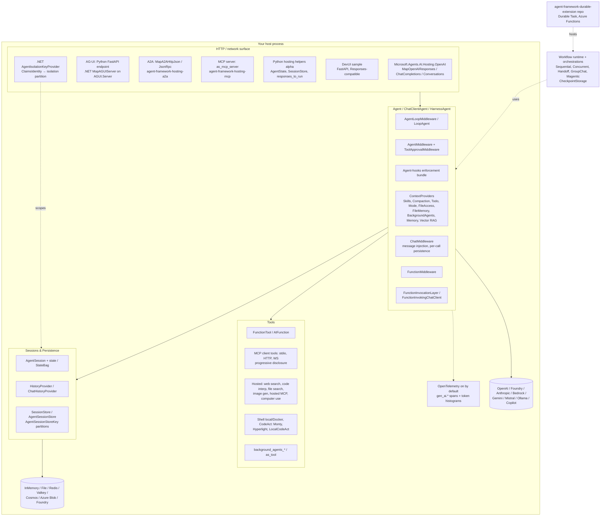

# Microsoft Agent Framework — Benchmark Analysis

> **Repo**: https://github.com/microsoft/agent-framework
> **Commit analysed**: e15c6dce2d10196a61c851a56ef3d839ff3c3ea7
> **Branch**: main
> **Framework path**: frameworks/microsoft-agent-framework
> **Analysed on**: 2026-10-01

Versions at this commit: Python `agent-framework` **1.19.0** (2026-09-18, `python/packages/core/pyproject.toml:7`); .NET `Microsoft.Agents.AI` **1.23.0** (`dotnet/nuget/nuget-package.props:4`, git tag `dotnet-1.23.0` dated 2026-09-28; latest published .NET GitHub Release is `dotnet-1.22.0`, 2026-09-18). Previous analysis (2026-05-19) was at `a60e541c` (`python-1.4.0`, .NET 1.6.x); the delta is 1,277 commits.

## TL;DR

- ⭐ **What is this stack architecturally?** Microsoft Agent Framework (MAF) is a **dual-language, library-first SDK** (Python `agent-framework` + .NET `Microsoft.Agents.AI`) for in-process agent loops, with (a) a built-in **graph-based Workflow runtime** plus a stable `agent-framework-orchestrations` package (sequential / concurrent / handoff / group chat / Magentic, checkpointable), (b) a **"harness" layer** (`create_harness_agent` / `HarnessAgent`) that bundles compaction, todo, modes, file memory, background agents, tool approval, shell and looping, and (c) optional **hosting adapters** (OpenAI Responses / Chat Completions endpoints in .NET, app-owned hosting helpers in Python, AG-UI, A2A, MCP, Foundry Hosted Agents). On .NET the agent is built on `Microsoft.Extensions.AI` (`IChatClient` + `FunctionInvokingChatClient`). It is the convergence of Semantic Kernel and AutoGen, with migration guides from both.
- **Ecosystem**: **Python** (primary) with near-parity **.NET**. Both ship from one monorepo with independent release trains (Python weekly-ish, .NET every 1-2 weeks).
- **License / governance**: MIT, owned by Microsoft. Commercial backing through Azure / Microsoft Foundry, MS Learn docs, weekly office hours, Discord.
- **Maturity / adoption**: Python core, OpenAI, Foundry, orchestrations, declarative, AG-UI and GitHub Copilot packages are **released**; most other adapters are beta and the new hosting / vector-store packages are alpha. 13,889 stars, 2,406 forks, 273 contributors on 2026-10-01. Fifteen Python minor releases and seventeen .NET minor releases shipped between May and September 2026.
- **Where does the loop actually execute?** In-process. Python `Agent` over `BaseChatClient` + `FunctionInvocationLayer`; .NET `ChatClientAgent` over `FunctionInvokingChatClient`. No subprocess, no vendor binary.
- **Strongest architectural choice for our use case**: the **.NET hosting isolation-key primitive** (new since May): `AgentIsolationKeyProvider` + `ClaimsIdentityAgentIsolationKeyProvider` + `IsolationKeyScopedAgentSessionStore` partition sessions, A2A tasks and OpenAI Responses/Conversations storage by a key resolved from trusted claims (`dotnet/src/Microsoft.Agents.AI.Hosting/AgentIsolationKeyProvider.cs:32`). Combined with first-class skills (now stable) whose sources receive the invoking agent and session (`SkillsSourceContext`), MAF is now closer to a usable multi-tenant base than in May.
- **Weakest / biggest gap**: the **Python side still has no tenant primitive**: tenant identity travels as untyped `function_invocation_kwargs`, forced tool args are BYO `FunctionMiddleware`, no per-tenant budget/rate limit in either language, and the Python hosting packages are alpha "app-owned" helpers (no routes, no auth). The Durable Task / Azure Functions hosting story was **moved out** of this repo into `microsoft/agent-framework-durable-extension`.
- **Most surprising finding**: the security posture tightened sharply across the delta. Skill tools, file-access write tools and the shell tool now **require approval by default**; approval responses are **bound to framework-recorded requests in the session** (a fabricated `function_approval_response` in caller-supplied history cannot authorise a tool, `python/packages/core/agent_framework/_tools.py:1798-1811`); MCP server-initiated sampling is denied by default; an experimental **AGENT-HOOKS-0.1 fail-closed enforcement contract** ships in both languages. Good for safety, but it means unattended agents need explicit auto-approval rules.
- **One-line verdicts**:
  - Sessions/persistence: ✅ `HistoryProvider` + new `SessionStore` (Python, experimental) and `AgentSessionStore` with partitioned keys (.NET, experimental); stores for in-memory, file, Redis, Cosmos, Valkey, Azure Blob, Foundry.
  - Skills: ✅ first-class, agentskills.io-aligned, **stable** since Python 1.11.0 / .NET 1.13.0; file, inline, class and MCP sources; context-aware filtering and tenant-keyed caching.
  - Resource Manager: ✗ loader/decorator pipeline only; no versioning, publish workflow or RBAC.
  - Sub-agents: ✅ `agent.as_tool()` + `BackgroundAgentsProvider` (renamed from `SubAgentsProvider`, now in both languages) + orchestrations package.
  - Multi-tenancy: ⚠ .NET hosting has a real isolation-key primitive; Python is BYO via kwargs and middleware.
  - Hooks: ✅ three middleware layers + `ContextProvider` + message injection + agent-hooks enforcement bundle.
  - API: ⚠ several options (.NET `MapOpenAIResponses`, AG-UI, A2A, Foundry Hosted, DevUI sample, Python alpha helpers); none is a turnkey multi-tenant server.
  - Observability: ✅ OTel GenAI conventions, **on by default** since Python 1.6.0, cache/reasoning token fields; no USD cost.
- **Production-readiness verdict for multi-tenant server-side deployment**: **Solid on .NET** (ASP.NET Core + isolation keys + Cosmos/Blob session stores + OpenAI Responses endpoints), **usable but assemble-it-yourself on Python**. Fast release cadence with frequent `[BREAKING]` entries in experimental and beta areas means pinning and regular upgrade work.

---

## 0. General

### 0.1 What is this stack?

A **library/framework** (not a vendor-managed service) for building agents and multi-agent workflows in **Python and .NET**. It ships:
- A core **agent abstraction** (`Agent` / `ChatClientAgent`) over `BaseChatClient` (Python) / `IChatClient` (`Microsoft.Extensions.AI`).
- A graph-based **Workflow** runtime plus a stable **orchestrations** package.
- A **harness** layer (`create_harness_agent` / `HarnessAgent`) with batteries-included context providers.
- A constellation of **hosting adapters** (OpenAI Responses / Chat Completions / Conversations endpoints, AG-UI, A2A, MCP, Telegram, Foundry Hosted Agents, DevUI sample server). Durable Task and Azure Functions hosting now live in a sister repo.

### 0.2 Ecosystem

**Primary: Python** (Python ≥3.10, `python/packages/core/pyproject.toml:6`; 42 packages under `python/packages/`).
Secondary: **.NET** (targets `net10.0;net9.0;net8.0` plus `netstandard2.0;net472`, `dotnet/Directory.Build.props:12-13`; 35 `.csproj` under `dotnet/src/`). Both languages are released from the same monorepo; features are usually ported in both directions within a few weeks (many release notes are titled ".NET/Python: …"). This report cites Python paths first and the .NET equivalent where relevant.

### 0.3 Project status & governance

- Open source, **MIT** (`LICENSE`).
- Owned and maintained by **Microsoft** (`microsoft/agent-framework`). Commercial backing through Microsoft Foundry, Azure AI Search, Cosmos DB, Azure Storage, Purview, Hyperlight. ADRs are formal and numbered (`docs/decisions/0001-*` through `0043-*`).
- Public Discord and weekly community office hours (`COMMUNITY.md`).
- Migration guides cover **Semantic Kernel → MAF** and **AutoGen → MAF**.
- Durable Task and Azure Functions integrations were extracted to a separate Microsoft repo, `microsoft/agent-framework-durable-extension` (`docs/decisions/0032-durable-azure-functions-extraction.md:21`, `docs/features/durable-agents/README.md:3`). Python core still re-exports their symbols and installs them through the `all` extra (`python/CHANGELOG.md:214`).
- **Durable extension inspected (calibration pass, 2026-10-01)**: [microsoft/agent-framework-durable-extension](https://github.com/microsoft/agent-framework-durable-extension) is Microsoft-maintained, MIT-licensed, created 2026-07-13 and active (last push 2026-10-01). Its [README](https://github.com/microsoft/agent-framework-durable-extension#readme) and [durable-agents docs](https://github.com/microsoft/agent-framework-durable-extension/blob/main/docs/features/durable-agents/README.md) describe agent sessions as Durable Task entities (history persisted after each message, per-session serialization, any worker can resume a session), Azure Functions hosting as the recommended production model (generated `/api/agents/{name}/run` endpoints, fire-and-forget via `x-ms-wait-for-response: false`, MCP tool triggers), console/generic-host hosting on the Durable Task Scheduler, durable workflows and orchestrations with human-in-the-loop waits, and per-agent session TTL ([durable-agents-ttl.md](https://github.com/microsoft/agent-framework-durable-extension/blob/main/docs/features/durable-agents/durable-agents-ttl.md)). It labels itself preview: the only release is the pre-release [v1.16.0-preview.260922.1](https://github.com/microsoft/agent-framework-durable-extension/releases/tag/v1.16.0-preview.260922.1) (NuGet `Microsoft.Agents.AI.DurableTask` and `Microsoft.Agents.AI.Hosting.AzureFunctions`; PyPI `agent-framework-durabletask` and `agent-framework-azurefunctions` 1.0.0b260922), and the Python package classifier is `Development Status :: 4 - Beta` ([pyproject.toml](https://github.com/microsoft/agent-framework-durable-extension/blob/main/python/packages/durabletask/pyproject.toml)). I found no agent-specific cron or timer abstraction in it. The benchmark counts it as first-party and caps the affected cells at 4: deployment topology (4, unchanged), background tasks (4), worker pool / queue (4) and mid-run checkpointing (4). Horizontal scaling and export/replay were not re-checked against it.

### 0.4 Project maturity / age

- Repo created 2025-04-28; `1.0.0` GA for both languages on 2026-04-02. Now at **Python 1.19.0** (2026-09-18) and **.NET 1.23.0** (tagged 2026-09-28).
- `python/PACKAGE_STATUS.md` classifies each package. **`released`**: `agent-framework`, `agent-framework-core`, `agent-framework-openai`, `agent-framework-foundry`, `agent-framework-orchestrations`, `agent-framework-declarative`, `agent-framework-ag-ui`, `agent-framework-github-copilot`. **`alpha`**: all five hosting packages (`hosting`, `hosting-a2a`, `hosting-mcp`, `hosting-responses`, `hosting-telegram`), the vector-store connectors (`mongodb`, `postgres`, `qdrant`, `duckdb`, `sql-server`, `azure-documentdb`), `azure-cosmos-memory`, `typesafe`. Everything else is `beta`.
- **Feature-level experimental APIs** (`python/packages/core/agent_framework/_feature_stage.py:43-67`): `AGENT_HOOKS`, `COMPUTER_USE`, `DECLARATIVE_AGENTS`, `EVALS`, `FILE_HISTORY`, `FIDES`, `FOUNDRY_TOOLS`, `FOUNDRY_PREVIEW_TOOLS`, `FUNCTIONAL_WORKFLOWS`, `HARNESS` (background agents, file access, looping, memory sub-features), `MCP_LONG_RUNNING_TASKS`, `MCP_SKILLS`, `PROGRESSIVE_TOOLS`, `SESSION_STORE`, `TO_PROMPT_AGENT`, `VECTOR_STORES`. `SKILLS` is no longer on the list (graduated in 1.11.0, `python/CHANGELOG.md:412`). On .NET, experimental APIs carry `[Experimental(MAAI001)]` (e.g. `AgentSessionStore`).
- Graduations since May: `create_harness_agent`, mode/todo providers, `ToolApprovalMiddleware`, `FileMemoryProvider` (Python 1.12.0); `HarnessAgent`, `ToolApprovalAgent`, message injection (.NET 1.14.0); Skills API (Python 1.11.0, .NET 1.13.0).
- BREAKING changes are still frequent (each Python release has several `[BREAKING]` or `[BREAKING — experimental]` entries).

### 0.5 Adoption & community signal

Captured **2026-10-01** via `gh api repos/microsoft/agent-framework`:
- **13,889 stars**, **2,406 forks**, 111 watchers, **273 contributors**.
- 537 open issues, 149 open PRs; 487 PRs merged since 2026-09-01. Last push 2026-10-01.
- Release cadence: Python minor releases roughly weekly (1.5.0 on 2026-05-19 through 1.19.0 on 2026-09-18), .NET minor releases every 1-2 weeks (1.7.0 through 1.23.0 over the same period). Separate tags for out-of-band packages (`python-github-copilot-1.0.0`, `python-hosting-a2a-1.0.0a260723`).
- Maintainers triage actively (issue-type triage workflow, community PR limits in CI).

### 0.6 Ecosystem fit

- PyPI: `agent-framework` umbrella + `agent-framework-*` packages (openai, foundry, anthropic, bedrock, gemini, mistral, ollama, claude, github-copilot, copilotstudio, azure-cosmos, redis, mem0, ag-ui, a2a, devui, orchestrations, declarative, hosting-*, tools, hyperlight, monty, purview, vector-store connectors, …).
- NuGet: `Microsoft.Agents.AI`, `.Abstractions`, `.OpenAI`, `.Anthropic`, `.Foundry`, `.Foundry.Hosting`, `.Hosting`, `.Hosting.AspNetCore`, `.Hosting.OpenAI`, `.Hosting.A2A(.AspNetCore)`, `.Hosting.AGUI.AspNetCore`, `.Hosting.AzureStorage`, `.CosmosNoSql`, `.Valkey`, `.Mem0`, `.Mcp`, `.Harness`, `.AgentHooks`, `.Tools.Shell`, `.LocalCodeAct`, `.Hyperlight`, `.Purview`, `.Workflows*`, `.Declarative`, `.GitHub.Copilot`, `.CopilotStudio`, `.DevUI`, `Aspire.Hosting.AgentFramework.DevUI`. The in-tree `Microsoft.Agents.AI.AGUI` package was **removed**; AG-UI protocol types now come from the external `AGUI.*` NuGet packages (`dotnet/src/Microsoft.Agents.AI.AGUI/README.md:1-30`).
- Used as a **library**. DevUI is the only app surface and remains a sample, not for production (`python/packages/devui/README.md:6`).

### 0.7 Documentation depth & cross-team contributor accessibility

- Official docs at https://learn.microsoft.com/agent-framework/ (tutorials, user guide, migration guides). Feature docs in-repo under `docs/features/` (code_act, durable-agents, FIDES, vector-stores-and-embeddings).
- 40+ numbered ADRs in `docs/decisions/` (some numbers duplicated, e.g. three `0039-*` files). ADRs are the best source for design intent (session identity, hosting channels, isolation, agent hooks, skills).
- Skill authoring is YAML-frontmatter Markdown (agentskills.io spec), so a Product/Data author can write a skill unaided. Registering sources, approval rules and tenant filters still needs an engineer.

### 0.8 Documentation entry points ⭐

- Official docs: https://learn.microsoft.com/agent-framework/
- Quickstart: https://learn.microsoft.com/agent-framework/tutorials/quick-start
- API reference: https://learn.microsoft.com/agent-framework/ (per language)
- User guide: https://learn.microsoft.com/en-us/agent-framework/user-guide/overview
- Hosting: https://github.com/microsoft/agent-framework/tree/main/python/samples/04-hosting and https://github.com/microsoft/agent-framework/tree/main/dotnet/samples/04-hosting
- Durable hosting (sister repo): https://github.com/microsoft/agent-framework-durable-extension
- Migration from Semantic Kernel: https://learn.microsoft.com/en-us/agent-framework/migration-guide/from-semantic-kernel
- Migration from AutoGen: https://learn.microsoft.com/en-us/agent-framework/migration-guide/from-autogen
- Devblog: https://devblogs.microsoft.com/agent-framework/
- Examples: https://github.com/microsoft/agent-framework/tree/main/python/samples and https://github.com/microsoft/agent-framework/tree/main/dotnet/samples
- Changelog: in-repo `python/CHANGELOG.md`; .NET changes are in GitHub Release notes.
- GitHub Releases: https://github.com/microsoft/agent-framework/releases
- GitHub Issues: https://github.com/microsoft/agent-framework/issues
- Discord: https://discord.gg/b5zjErwbQM

---

## 1. High Level Architecture

```
                                  ┌──────────────────────────────────────────────────────┐
                                  │           Your host process (Python or .NET)         │
                                  │                                                      │
   HTTP / SSE                     │   ┌────────────────────────────────────────────┐     │
  ──────────►  ┌──────────────┐   │   │           Agent / ChatClientAgent          │     │
   Client     │ HTTP surface │───┼──►│   ┌────────────────┐  ┌─────────────────┐  │     │
              │ (one of:     │   │   │   │ AgentMiddleware│  │ ContextProviders│  │     │
              │  .NET OpenAI │   │   │   │ ChatMiddleware │  │ (skills, memory,│  │     │
              │  Responses,  │   │   │   │ FunctionMW     │  │  compaction,    │  │     │
              │  AG-UI, A2A, │   │   │   │ (+agent-hooks) │  │  bg agents, todo│  │     │
              │  MCP, Foundry│   │   │   └────────┬───────┘  └────────┬────────┘  │     │
              │  HA, DevUI,  │   │   │   ┌────────▼──────────────────▼────────┐   │     │
              │  custom)     │   │   │   │ FunctionInvocationLayer /          │   │     │
              └──────┬───────┘   │   │   │ FunctionInvokingChatClient (loop)  │   │     │
                     │ isolation │   │   └────────────────┬───────────────────┘   │     │
                     │ key (.NET)│   └────────────────────┼───────────────────────┘     │
                     │           │                        │                             │
                     │ resume    │   ┌──────────┐   ┌─────▼──────┐   ┌───────────────┐  │
                     └──────────►│   │AgentSess.│◄──┤ tools (fn, │──►│ Provider LLM  │──┼───►  OpenAI / Azure OpenAI / Foundry /
                                  │   │Store +   │   │ MCP, hosted│   │ (Chat Comp /  │  │      Anthropic / Bedrock / Gemini /
                                  │   │ State    │   │ shell, code│   │ Responses /   │  │      Mistral / Ollama / Copilot
                                  │   │ Bag      │   │ act)       │   │ stream)       │  │
                                  │   └──────────┘   └────────────┘   └───────────────┘  │
                                  └──────────────────────────────────────────────────────┘
                                            │                              │
                                            ▼                              ▼
                              ┌──────────────────────┐         ┌─────────────────────────┐
                              │ Session/Checkpoint   │         │ Optional, out of repo:  │
                              │ stores: InMemory,    │         │ Durable Task / Azure    │
                              │ File, Redis, Cosmos, │         │ Functions (durable-     │
                              │ Valkey, Azure Blob,  │         │ extension repo);        │
                              │ Foundry, custom      │         │ Foundry Hosted Agents   │
                              └──────────────────────┘         └─────────────────────────┘
```

### 1.1 Where does the agent loop *actually* execute?

**In your process.**

- **Python**: `Agent.run()` (`python/packages/core/agent_framework/_agents.py:1182`) builds a `_RunContext` (`_prepare_run_context`, `_agents.py:1484`) and calls `self.client.get_response(...)` (`_call_chat_client`, `_agents.py:1274-1313`). The chat client is a `BaseChatClient` (`_clients.py`) wrapped by `FunctionInvocationLayer` (`_tools.py:4888`), which parses tool calls, dispatches them (`_try_execute_function_call_groups`, `_tools.py:2379`) and re-enters the model until done. Streaming is via `ResponseStream` (`_types.py:3361`).
- **.NET**: `AIAgent.RunAsync` (`dotnet/src/Microsoft.Agents.AI.Abstractions/AIAgent.cs:334`) sets the ambient run context and calls `RunCoreAsync`; `ChatClientAgent` (`dotnet/src/Microsoft.Agents.AI/ChatClient/ChatClientAgent.cs:57`) delegates the tool loop to `FunctionInvokingChatClient` from `Microsoft.Extensions.AI`. `HarnessAgent` shows the full builder pipeline (`dotnet/src/Microsoft.Agents.AI.Harness/HarnessAgent.cs:267-285`: `UseFunctionInvocation → UseMessageInjection → UsePerServiceCallChatHistoryPersistence → UseAIContextProviders → BuildAIAgent`).

No subprocesses or bundled CLIs in the core path. Exceptions are opt-in: MCP stdio servers, the shell tool, `LocalCodeAct` (.NET local Python execution) and provider agents that wrap other SDKs (`agent-framework-claude`, `agent-framework-github-copilot`).

### 1.2 Runtime dependencies

- **Language runtime**: Python ≥3.10 (3.14 supported where Hyperlight allows), or .NET 8/9/10 (netstandard2.0 / net472 for some libraries).
- **External binaries/CLIs that the SDK subprocesses**: none by default. Opt-in: MCP stdio servers, `LocalShellTool` / `DockerShellTool` (Docker daemon for the Docker variant), `LocalCodeAct` (local Python interpreter), Hyperlight sandbox.
- **Required infrastructure services**: none for the in-process agent. Optional production stores: Redis, Cosmos DB, Azure Blob Storage (.NET session store), Valkey (.NET history), Postgres/pgvector, Qdrant, MongoDB, SQL Server, DuckDB (alpha vector stores).
- **Required vendor services**: a model provider. No mandatory observability or eval vendor. Note that since Python 1.13.0 the SDK adds **feature-usage telemetry to the HTTP User-Agent** of provider calls; opt out with `AGENT_FRAMEWORK_USER_AGENT_DISABLED` / `AGENT_FRAMEWORK_FEATURE_MASK_DISABLED` (`python/packages/core/agent_framework/_telemetry.py:19-21`).

### 1.3 Recommended deployment topology

No single canonical topology; options with samples for each:
- **One-process-many-tenants (.NET)**: `Microsoft.Agents.AI.Hosting` (`AddAIAgent(name, …)`, default `ServiceLifetime.Singleton`, `dotnet/src/Microsoft.Agents.AI.Hosting/AgentHostingServiceCollectionExtensions.cs:25`) + `AIHostAgent` (`AIHostAgent.cs:27`) + an `AgentSessionStore`, optionally wrapped by `IsolationKeyScopedAgentSessionStore` and a `ClaimsIdentityAgentIsolationKeyProvider` (`UseClaimsBasedAgentIsolation`, `dotnet/src/Microsoft.Agents.AI.Hosting.AspNetCore/ServiceCollectionExtensions.cs:57`). Expose with `MapOpenAIResponses` / `MapAGUIServer` / `MapA2AHttpJson`.
- **One-process-many-tenants (Python)**: `agent-framework-hosting` `AgentState` + `SessionStore`, inside an app-owned FastAPI/Starlette/Functions app. The README is explicit: "Use FastAPI, Starlette, Azure Functions, Django, or another framework for route registration, auth, middleware, response construction, and background work" (`python/packages/hosting/README.md:62-63`).
- **Container-per-agent**: Foundry Hosted Agents (`agent-framework-foundry-hosting`, `Microsoft.Agents.AI.Foundry.Hosting`), with per-user session storage isolation (ADR `docs/decisions/0031-hosted-per-user-session-storage-isolation.md:51-63`).
- **Durable orchestration**: now in `microsoft/agent-framework-durable-extension` (Durable Task + Azure Functions).
- **Local dev**: DevUI.

### 1.4 Cold-start cost & instance footprint

Not advertised. Startup is dominated by provider SDK initialisation and context-provider work (skill directory scans, MCP connects). Python 1.11.0 made root `agent_framework` exports lazy-loaded and 1.18.0 lazy-loads Foundry/OpenAI integrations to cut import cost (`python/CHANGELOG.md`). No documented multi-second startup issue.

### 1.5 Vendor lock-in

- **LLM provider**: ✅ open. Python chat clients for OpenAI, Azure/Foundry, Anthropic, Bedrock, Gemini, **Mistral** (new), Ollama, Foundry Local, TypeSafe (alpha), plus agent wrappers for Claude Agent SDK, GitHub Copilot SDK, Copilot Studio. .NET relies on any `IChatClient` (OpenAI, Anthropic, Foundry, Bedrock via `AWS.Bedrock.MEAI`, Ollama, …).
- **Hosting platform**: Azure is first-class (Foundry, Cosmos, Blob, AI Search, Purview) but core packages have no hard Azure dependency. .NET 1.21.0 removed the `Azure.AI.OpenAI` dependency.
- **Eval / observability**: OTel-native. `LocalEvaluator` ships in core; Foundry evals moved into the Foundry package in 1.18.0.

### 1.6 Framework weight / footprint

**Heavy.** The Python core package alone is ~51 kLOC (`agent_framework/*.py`, up from ~27 kLOC in May), and bundles agents, workflows, sessions, session stores, compaction, MCP, middleware, agent-hooks enforcement, observability, skills, FIDES security labelling, evaluation, harness providers, vector-store abstractions and serialization. 42 Python packages and 35 .NET projects in total.

### 1.7 Release-history signal

`python/CHANGELOG.md` (Keep a Changelog, semver); .NET changes are only in GitHub Release notes. Decision-relevant changes since `python-1.4.0`:
- **Harness & loop**: `HarnessAgent` + background agents (1.7.0, `CHANGELOG.md:593`); `AgentLoopMiddleware`, `ToolApprovalMiddleware`, shell tool in harness (1.9.0); `create_harness_agent` stable (1.12.0, `:348`); tool-loop `max_duration_seconds` and stop reason (1.18.0, `:66`); sequential-invocation option (1.19.0, `:19`; concurrent remains the default).
- **Skills**: MCP skills source (1.8.0); all `SkillsProvider` tools require approval by default (1.10.0, `:483`); `SkillsSourceContext` and `CachingSkillsSource` refresh interval (1.11.0, `:395`); experimental marker removed (1.11.0, `:412`).
- **Sessions & hosting**: hosting helpers `AgentState`/`SessionStore` (1.11.0, `:399`); reusable session stores (1.13.0, `:252`); Durable Task / Azure Functions moved out (1.14.0, `:214`); .NET `AgentIsolationKeyProvider` (1.18.0), `AgentSessionStore` promoted to Abstractions with partitioned keys (1.22.0), Azure Blob session store (1.19.0).
- **Hooks / safety**: message injection (1.11.0, `:391`); AGENT-HOOKS-0.1 enforcement (1.14.0, `:203`); `MiddlewareFailure` fail-closed signal (1.15.0); MCP sampling denied by default (1.9.0).
- **Observability**: instrumentation enabled by default (1.6.0, `:628`, BREAKING); GenAI semconv modes consolidated (1.15.0, BREAKING); feature-usage User-Agent telemetry (1.13.0).
- **Memory/RAG**: shared vector-store abstractions and connectors (1.18.0, `:65`; 1.19.0).
- **UI**: AG-UI promoted to stable (1.12.1, `:317`); A2UI support (1.15.0, `:170`); .NET AG-UI split into external `AGUI.*` SDK (.NET 1.14.0).

GitHub Releases: https://github.com/microsoft/agent-framework/releases (`python-*` and `dotnet-*` tags are independent).

---

## 2. Agent Loop

### 2.1 Run loop entrypoint(s)

**Python** (`python/packages/core/agent_framework/_agents.py:1182-1194`, `RawAgent.run` implementation overload):
```python
def run(
    self,
    messages: AgentRunInputs | None = None,
    *,
    stream: bool = False,
    session: AgentSession | None = None,
    tools: ToolTypes | Callable[..., Any] | Sequence[ToolTypes | Callable[..., Any]] | None = None,
    options: OptionsCoT | ChatOptions[Any] | None = None,
    compaction_strategy: CompactionStrategy | None = None,
    tokenizer: TokenizerProtocol | None = None,
    function_invocation_kwargs: Mapping[str, Any] | None = None,
    client_kwargs: Mapping[str, Any] | None = None,
) -> Awaitable[AgentResponse[Any]] | ResponseStream[AgentResponseUpdate, AgentResponse[Any]]: ...
```

Returns `AgentResponse[T]` (non-stream) or `ResponseStream[AgentResponseUpdate, AgentResponse[T]]` (stream). `ResponseStream.get_final_response()` aggregates updates.

**.NET** (`dotnet/src/Microsoft.Agents.AI.Abstractions/AIAgent.cs:334-341`, `465`):
```csharp
public async Task<AgentResponse> RunAsync(
    IEnumerable<ChatMessage> messages,
    AgentSession? session = null,
    AgentRunOptions? options = null,
    CancellationToken cancellationToken = default)
{
    CurrentRunContext = new(this, session, messages as IReadOnlyCollection<ChatMessage> ?? messages.ToList(), options);
    return await this.RunCoreAsync(messages, session, options, cancellationToken).ConfigureAwait(false);
}

public async IAsyncEnumerable<AgentResponseUpdate> RunStreamingAsync(
    IEnumerable<ChatMessage> messages, AgentSession? session = null,
    AgentRunOptions? options = null, CancellationToken cancellationToken = default);
```

`AgentRunContext` is an `AsyncLocal` (`AIAgent.cs:40`) exposed as `AIAgent.CurrentRunContext` (`AIAgent.cs:102`), so middleware, tools and routing clients can read the current agent, session and options.

### 2.2 Per-iteration behavior

Python:
1. `_prepare_run_context` (`_agents.py:1484`) resolves messages, options, tools and runs `ContextProvider.before_run` for each provider.
2. `_call_chat_client` (`_agents.py:1274-1313`) calls `client.get_response(...)`, forwarding `function_invocation_kwargs`.
3. `FunctionInvocationLayer` (`_tools.py:4888`) calls the model, extracts `function_call` contents (`_extract_function_calls`, `_tools.py:4184`), applies approval binding and pauses (`_tools.py:2379-2430`), then runs the executable batch **concurrently** (`asyncio.gather`, `_tools.py:2542-2545`) or in model order when `allow_concurrent_invocation=False` (`_tools.py:2558`).
4. Results re-enter the loop until no tool calls remain, or a limit trips: `max_iterations`, `max_function_calls`, `max_duration_seconds`, `max_consecutive_errors_per_request` (`FunctionInvocationConfiguration`, `_tools.py:1755-1846`). On a limit, tools are disabled and the model is forced to answer in text (graceful degradation).
5. `ContextProvider.after_run` runs in reverse order (`_run_after_providers`, `_agents.py:586`); providers flagged `after_run_once_per_turn` are deferred to the end of an `AgentLoopMiddleware` loop (`_sessions.py:771-779`).

.NET delegates the tool loop to `FunctionInvokingChatClient`; `ChatClientAgentOptions.AllowConcurrentInvocation` opts into concurrent tool execution (default `false`, `dotnet/src/Microsoft.Agents.AI/ChatClient/ChatClientAgentOptions.cs:75`). `HarnessAgent` adds per-service-call persistence and message injection (`HarnessAgent.cs:267-271`).

### 2.3 ReAct loop

**Built-in.** The function-invocation loop is automatic when tools are present. On top of it, `AgentLoopMiddleware` (Python `_harness/_loop.py:229`) and `LoopAgent` (.NET `dotnet/src/Microsoft.Agents.AI/Harness/Loop/LoopAgent.cs`) re-run the whole agent until an evaluator is satisfied (todos complete, background tasks finished, AI-judge verdict, completion marker).

### 2.4 Tool dispatch + result handling

Python — `_tools.py`:
- `_try_execute_function_call_groups` (line 2379) resolves tools from `_get_tool_map` (line 2281), separates approval-gated and declaration-only calls, then executes each call in its own task with a copied `contextvars` context so one tool's context changes cannot leak into another (lines 2524-2545).
- Each invocation gets a `FunctionInvocationContext` (`_middleware.py:428`) with `function`, `arguments`, `session`, `metadata`, `kwargs`, `result`, `tools`.
- **Approval gating**: tools with `approval_mode == "always_require"` (line 2425) are not executed; the loop emits `function_approval_request` content and surfaces it in `AgentResponse.user_input_requests`. Approval responses are now **bound** to the requests the framework recorded in the `AgentSession` (`_bind_approval_response_to_pending_request`, line 2890; opt-out `disable_approval_response_binding`, documented at lines 1798-1811). Resuming therefore requires passing the same session back.
- `MiddlewareFailure` raised by function middleware cancels the in-flight batch and aborts the run fail-closed (`_middleware.py:86`, `_tools.py:2546-2556`).

.NET — `FunctionInvokingChatClient` routes calls to `AIFunction` instances. Approval UX is in `ToolApprovalAgent` (`dotnet/src/Microsoft.Agents.AI/Harness/ToolApproval/ToolApprovalAgent.cs:52`) with standing rules (`ToolApprovalState.Rules`, `ToolApprovalState.cs:19`) and auto-approval callbacks (`_autoApprovalRules`, `ToolApprovalAgent.cs:59`). ADR `docs/decisions/0006-userapproval.md`.

### 2.5 Explicit turn concept

Implicit: a run ends when the model returns no actionable tool calls, when a loop limit triggers (stop reason recorded), when an approval pause is raised, or when `MiddlewareTermination` / `MiddlewareFailure` is raised. No explicit `Turn` type. `AgentLoopMiddleware` introduces a "user turn" scope above individual runs (used by `after_run_once_per_turn`).

### 2.6 Event emission mechanism (in-process)

**Async iterator.** Python returns `ResponseStream` (`_types.py:3361`), an `AsyncIterable[AgentResponseUpdate]` with `with_transform_hook` / `with_result_hook` / cleanup hooks (used e.g. at `_agents.py:1437-1446`). .NET returns `IAsyncEnumerable<AgentResponseUpdate>`. No in-process event bus; composition is via middleware and `ContextProvider` (see Q7). Workflows emit `WorkflowEvent` objects on their own stream (Q3).

---

## 3. Message & Event Taxonomy

### 3.1 Message layers

- **Wire/LLM message**: `Message` (`python/packages/core/agent_framework/_types.py:1958`) = `role` + list of `Content`; .NET uses `Microsoft.Extensions.AI.ChatMessage`.
- **Agent-level response**: `AgentResponse` (`_types.py:2928`) / `AgentResponseUpdate` (`_types.py:3210`) wrap messages plus `usage_details`, `user_input_requests`, response IDs and continuation tokens.
- **HTTP/UI layers** (owned by hosting packages, not core):
  - OpenAI Responses shape: DevUI (`agent_framework_devui/_mapper.py`), Python `agent-framework-hosting-responses` (`responses_from_run`, `_parsing.py:290`), .NET `Microsoft.Agents.AI.Hosting.OpenAI`.
  - AG-UI events: Python `agent-framework-ag-ui` (`_event_converters.py`); .NET via external `AGUI.Server`.
  - A2A messages/tasks: `agent-framework-a2a`, `agent-framework-hosting-a2a`, `Microsoft.Agents.AI.A2A`.
  - MCP tool results: `agent-framework-hosting-mcp` (`mcp_from_run`, `_conversion.py:65`).

Conversion path: `Message` (in-process) → `AgentResponseUpdate` (streaming) → protocol frame (hosting package).

### 3.2 Concrete message types

Content types (`ContentType` literal, `_types.py:363-389`):

| Content `type` | Purpose |
|---|---|
| `text` | Plain assistant/user text (refusals are preserved as marked text since 1.17.0) |
| `text_reasoning` | Reasoning text (OpenAI reasoning, Anthropic thinking, Gemini thought summaries) |
| `data` | Inline base64 binary (images, audio, video) |
| `uri` | Reference to external resource |
| `error` | Error content |
| `function_call` | LLM-generated tool call request |
| `function_result` | Result of a tool execution |
| `usage` | Token-usage breakdown |
| `hosted_file` | File hosted by the provider |
| `hosted_vector_store` | Provider-managed vector store reference |
| `code_interpreter_tool_call` / `…_result` | Provider-hosted code interpreter |
| `image_generation_tool_call` / `…_result` | Provider-hosted image gen |
| `mcp_server_tool_call` / `…_result` | MCP tool invocation by the model |
| `search_tool_call` / `…_result` | Provider web search |
| `shell_tool_call` / `…_result` / `shell_command_output` | Shell tool (hosted and local are separated since 1.19.0) |
| `computer_tool_call` / `…_result` | Computer-use tool (new, experimental `COMPUTER_USE`) |
| `function_approval_request` / `function_approval_response` | HITL approval messages |
| `oauth_consent_request` | OAuth consent prompt |

Hosted/provider-executed tool calls carry `Content.informational_only` so they stay visible in transcripts without local re-invocation (1.11.0).

### 3.3 Messages vs. events

At the **agent** layer there is one iterator: `AgentResponseUpdate` items (partial messages). At the **workflow** layer there is a separate taxonomy, `WorkflowEvent` (`_workflows/_events.py:169`). The two meet when a workflow is exposed as an agent (`Workflow.as_agent`, `_workflows/_workflow.py:1560`).

### 3.4 Event categories

- **Stream-event**: `AgentResponseUpdate` / `ChatResponseUpdate` (`_types.py:2803`).
- **Turn-event**: implicit (final response with `finish_reason`; finish reasons normalised across providers since 1.12.0).
- **Message-event**: not distinct; messages flow as content within updates.
- **Tool-event**: `function_call` / `function_result` contents inside updates; protocol adapters split them into discrete frames.
- **Workflow event** (`WorkflowEventType`, `_workflows/_events.py:127-168`): `started`, `status`, `failed`, `output`, `intermediate`, `request_info`, `warning`, `error`, `superstep_started`, `superstep_completed`, `executor_invoked`, `executor_completed`, `executor_failed`, `executor_bypassed`, `group_chat`, `handoff_sent`, `magentic_orchestrator`.
- **Session lifecycle**: not exposed as events.
- **Hook event**: middleware chain, not an event bus. The agent-hooks contract emits interception points (`agent_startup`, `input`, `pre_model_call`, `post_model_call`, `pre_tool_call`, `post_tool_call`, `output`, `agent_shutdown`) to an external interceptor (`_agent_hooks.py:1-60`).
- **Sub-agent event**: `function_result` content for `as_tool` / `background_agents_*` tools; workflow orchestrations emit `group_chat` / `handoff_sent` / `magentic_orchestrator` events.

### 3.5 Canonical type-definition file(s)

- Python: `python/packages/core/agent_framework/_types.py` — `ContentType` (363), `UsageDetails` (431), `Content` (502), `Message` (1958), `ChatResponse` (2514), `ChatResponseUpdate` (2803), `AgentResponse` (2928), `AgentResponseUpdate` (3210), `ResponseStream` (3361).
- Workflows: `python/packages/core/agent_framework/_workflows/_events.py:127-169`.
- .NET: `dotnet/src/Microsoft.Agents.AI.Abstractions/AgentResponse.cs`, `AgentResponseUpdate.cs`; message/content types from `Microsoft.Extensions.AI`.

### 3.6 Live agentic event stream taxonomy

Frames as emitted by DevUI (OpenAI Responses-shaped, mapping table at `python/packages/devui/README.md:248-290`); the .NET `MapOpenAIResponses` endpoint and Python `hosting-responses` helpers use the same Responses event names:

- Start: `response.created` + `response.in_progress`.
- Mid-stream text: `response.content_part.added` + `response.output_text.delta`.
- Tool-call start: `response.output_item.added` with a `function_call` item.
- Tool-call args streaming: `response.function_call_arguments.delta`.
- Tool result: `response.function_result.complete` (DevUI extension).
- Approval request: `response.function_approval.requested` (DevUI extension).
- Workflow executor lifecycle: `response.output_item.added` (`executor_invoked`) and `…done` (`executor_completed`).
- Terminal: `response.completed` / `response.failed` (Foundry hosting emits failed events since 1.9.0).

---

## 4. Agent Runtime (Multi-session Host)

### 4.1 Multi-session host architecture

No built-in runtime process that hosts N sessions. Agents are stateless objects (singletons are the norm) embedded in **your** host; session state is externalised through a store.

- **.NET** `Microsoft.Agents.AI.Hosting`: `AddAIAgent` DI registration (`AgentHostingServiceCollectionExtensions.cs:25-113`), `AIHostAgent` wrapper with `GetOrCreateSessionAsync(conversationId)` / `SaveSessionAsync` (`AIHostAgent.cs:27, 70, 100`), hosted workflows (`HostedWorkflowBuilder.cs`, `WorkflowCatalog.cs`), and the experimental `AgentSessionStore` contract (now in `Microsoft.Agents.AI.Abstractions/AgentSessionStore.cs:20`).
- **Python** `agent-framework-hosting` (alpha): `AgentState` pairs an agent target (instance or factory) with a `SessionStore` and exposes `get_or_create_session` / `set_session` (`python/packages/hosting/agent_framework_hosting/_state.py:74`); `WorkflowState` (`_state.py:193`) does the same for workflows and orchestration builders. Routes, auth and background work are explicitly app-owned.
- Protocol channels on top: `hosting-responses`, `hosting-a2a`, `hosting-mcp`, `hosting-telegram` (Python, alpha); `Hosting.OpenAI`, `Hosting.A2A(.AspNetCore)`, `Hosting.AGUI.AspNetCore` (.NET).

### 4.2 Concurrent session isolation

- `AgentSession` (Python `_sessions.py:1843`) holds `session_id`, `service_session_id` and a `state` dict namespaced by provider `source_id`. `SessionStore.get` returns **independent copies** so concurrent continuations cannot mutate each other's snapshot (`_sessions.py:1926-1990`; `python/packages/hosting/README.md:13-16`). `AgentState` does **not** provide locking for a mutable conversation head; the README says the app must ensure "only one caller advances it at a time" (`README.md:96-101`).
- Tool calls run in per-call tasks with copied `contextvars` (`_tools.py:2524-2531`). `as_tool(propagate_session=True)` copies parent state into a child-owned dict and keeps approval/budget state isolated (`_agents.py:752-777`).
- .NET `AgentSession` holds an `AgentSessionStateBag` (`dotnet/src/Microsoft.Agents.AI.Abstractions/AgentSession.cs:59-73`).
- **Tenant isolation (.NET, new)**: `IsolationKeyScopedAgentSessionStore` adds an `isolation` partition from the current `AgentIsolationKeyProvider` to every session key, and throws in strict mode when no key is available (`dotnet/src/Microsoft.Agents.AI.Hosting/IsolationKeyScopedAgentSessionStore.cs:17-93`). The OpenAI hosting layer requires a key whenever a provider is registered (`EndpointRouteBuilderExtensions.Responses.cs`, `IsolationKeyResolver(… strict: isolationKeyProvider is not null)`), and A2A task storage has an `IsolationKeyScopedTaskStore`.

### 4.3 Horizontal scaling / multi-instance

- Stateless workers + shared store: ✅. Shared stores now include Cosmos (`CosmosHistoryProvider`, `CosmosCheckpointStorage`; .NET `CosmosChatHistoryProvider`, `CosmosCheckpointStore`), Redis (`RedisHistoryProvider`, keys scoped by provider and session identity since 1.19.0), Valkey (`ValkeyChatHistoryProvider.cs:42`), and Azure Blob for .NET sessions (`AzureBlobAgentSessionStore.cs:35`).
- Leader election / sticky routing: not provided. `SessionStore` / `AgentSessionStore` have no optimistic concurrency; same-session concurrency is the host's problem.
- Durable, queue-backed orchestration is available only via the external `agent-framework-durable-extension` repo.

### 4.4 Background / async / scheduled tasks

- **In-process background work**: `BackgroundAgentsProvider` (Python `_harness/_background_agents.py:269`, .NET `Harness/BackgroundAgents/BackgroundAgentsProvider.cs:53`) starts sub-agent tasks with `asyncio.create_task` / `Task.Run` and lets the parent poll or wait. Tasks live in process memory; `release_session()` / `ReleaseSessionAsync` cancels them (`_background_agents.py:358`, `.cs:227`). Not durable across restarts.
- **Long-running provider tasks**: MCP long-running tasks (`MCPTaskOptions`, `_mcp.py:749`, experimental), Foundry "resilient long-running and steerable" hosted agents (.NET 1.19.0, ADR `0035-foundry-hosting-resilient-long-running-agents.md`).
- **Cron / triggers / durable replay**: BYO, or the external durable-extension repo (Durable Task, Azure Functions timer/HTTP triggers).

### 4.5 Worker pool / queue model

No queue API in this repo. The vanilla agent assumes request scope (or in-process background tasks). For a queue/orchestrator model use the durable-extension repo or your own worker framework.

---

## 5. Sessions & Persistence

### 5.1 Session / chat data model

**Python** (`python/packages/core/agent_framework/_sessions.py:1843-1923`):

```python
class AgentSession:
    def __init__(self, *, session_id: str | None = None,
                 service_session_id: str | ServiceSessionId | None = None):
        self._session_id = session_id or str(uuid.uuid4())
        self.service_session_id = service_session_id
        self.state: dict[str, Any] = {}

    def to_dict(self) -> dict[str, Any]:
        return {"type": "session", "session_id": self._session_id,
                "service_session_id": self.service_session_id,
                "state": _serialize_state(self.state)}
```

The docstring now warns that `service_session_id` "is scoped by the backing API key, service account, or project, but it is not an end-user authorization boundary by itself" (`_sessions.py:1849-1853`).

**.NET** (`dotnet/src/Microsoft.Agents.AI.Abstractions/AgentSession.cs:59-73`): abstract `AgentSession` with an `AgentSessionStateBag` (thread-safe, JSON-serialized). Store identity is a separate `AgentSessionStoreKey` (`AgentSessionStoreKey.cs:27-56`): a `SessionId` plus optional named `Partitions` (e.g. `isolation`), all of which are part of identity.

No first-class `tenant_id`, `user_id`, `created_at`, `updated_at` or `parent_session_id` on the session object in either language. On .NET, tenant/user can live in the store key partitions; on Python they go into `state`.

### 5.2 What's stored on a session

- Message history (when a `HistoryProvider` is attached).
- Provider-namespaced state: skills, compaction summaries, todo lists, agent mode, file-memory index, background-task state, tool-approval rules and pending approval requests, function-invocation budgets, pending injected messages (`MESSAGE_INJECTION_PENDING_MESSAGES_STATE_KEY`, `_sessions.py:1415-1431`).
- `service_session_id` for provider-managed threads.
- Custom classes in `state` must be registered with `register_state_type` (`_sessions.py:284`) for cold-start restore.

### 5.3 Granularity

One session = one conversation. No built-in fork on `AgentSession`, but `SessionStore.get` returns copies, so storing post-run sessions under a new id (OpenAI `previous_response_id` pattern) gives simultaneous branches (`python/packages/hosting/README.md:86-96`). Workflows branch/resume via checkpoints (`_workflows/_checkpoint.py:134`).

### 5.4 Built-in persistence stores

| Backend | Python | .NET |
|---|---|---|
| In-memory | `InMemoryHistoryProvider` (`_sessions.py:2218`), `SessionStore` (`_sessions.py:1926`, experimental) | `InMemoryAgentSessionStore` (`Microsoft.Agents.AI.Hosting/Local/InMemoryAgentSessionStore.cs:42`), `InMemoryChatHistoryProvider` |
| No-op | – | `NoopAgentSessionStore` (`Microsoft.Agents.AI.Hosting/NoopAgentSessionStore.cs:15`, default for A2A since 1.11.0) |
| File | `FileHistoryProvider` (`_sessions.py:2303`, experimental), `FileSessionStore` (`_sessions.py:2003`, experimental, JSON or MessagePack), `FileCheckpointStorage` (`_workflows/_checkpoint.py:505`) | Foundry Hosting file-backed store under `$HOME` |
| Redis | `RedisHistoryProvider` (`python/packages/redis/agent_framework_redis/_history_provider.py:44`) | – |
| Valkey | – | `ValkeyChatHistoryProvider` (`Microsoft.Agents.AI.Valkey/ValkeyChatHistoryProvider.cs:42`) |
| Cosmos NoSQL | `CosmosHistoryProvider` (`azure-cosmos/…/_history_provider.py:38`), `CosmosCheckpointStorage` (`…/_checkpoint_storage.py:37`) | `CosmosChatHistoryProvider` (`CosmosChatHistoryProvider.cs:41`), `CosmosCheckpointStore` (`CosmosCheckpointStore.cs:261`) |
| Azure Blob | – | `AzureBlobAgentSessionStore` (`Microsoft.Agents.AI.Hosting.AzureStorage/Blob/AzureBlobAgentSessionStore.cs:35`) |
| Vector store as history | `VectorStoreHistoryProvider` (`_vectors.py:2826`, experimental) | – |
| Foundry | `FoundryAgentSessionStore` (`foundry_hosting/…/_state_store.py:332`), Foundry server-side conversations via `service_session_id` | `Microsoft.Agents.AI.Foundry.Hosting` stores, `Microsoft.Agents.AI.AzureAI.Persistent` |

Everything else: **BYO** via `HistoryProvider` / `SessionStore` (Python) or `ChatHistoryProvider` / `AgentSessionStore` (.NET).

### 5.5 Persistence timing

- Default `HistoryProvider` loads in `before_run` and saves in `after_run` (`_sessions.py:1091-1103`), i.e. at the end of the run.
- `Agent(require_per_service_call_history_persistence=True)` (`_agents.py:954`) installs `PerServiceCallHistoryPersistingMiddleware` (`_sessions.py:1586`), which persists after **every model call** inside the tool loop. `create_harness_agent` enables it by default; .NET `HarnessAgent` uses `UsePerServiceCallChatHistoryPersistence()` (`HarnessAgent.cs:271`).
- When agent-hooks enforcement is installed, persistence is gated behind `output` / `post_model_call` verdicts so denied content never becomes durable (`_agent_hooks.py:50-58`).
- Session snapshots (`SessionStore` / `AgentSessionStore`) are saved by the host after `run()` returns.

### 5.6 Mid-run checkpointing (durable)

- **Agent level**: per-service-call history persistence lets a run resume after a crash between model calls. A crash mid-tool-call loses that tool's work.
- **Workflow level**: `CheckpointStorage` protocol (`_workflows/_checkpoint.py:134`), wired via `WorkflowBuilder(checkpoint_storage=…)` (`_workflow_builder.py:98`). Checkpoints are written between supersteps and, since 1.13.0, are "fully replayable from initial input and human-in-the-loop responses". Checkpoint deserialization is restricted to registered types (process-wide registry, 1.15.0).
- **Durable Task**: moved to the external durable-extension repo.

### 5.7 Session ID format

Python: UUID4 string by default (`_sessions.py:1874`), or any caller-chosen string. `FileSessionStore` restricts keys to 128 ASCII letters/digits/`-`/`_` (`python/packages/hosting/README.md:24-29`).
.NET: `AgentSessionStoreKey(sessionId, partitions)` — composite by design (`AgentSessionStoreKey.cs:39-52`); with isolation enabled the effective key is `sessionId + {isolation: <tenant/user key>}`. Foundry hosted storage uses `{root}/a-{agent}/u-{userId}/c-{contextId}.json` (ADR 0031, lines 51-63).

### 5.8 Pluggable store interface

**Python** history (`_sessions.py:987-1090`):
```python
class HistoryProvider(ContextProvider):
    async def get_messages(self, session_id: str | None, *, state: dict[str, Any] | None = None, **kwargs) -> list[Message]: ...
    async def save_messages(self, session_id: str | None, messages: Sequence[Message], *, state: dict[str, Any] | None = None, **kwargs) -> None: ...
```

**Python** session snapshots (`_sessions.py:1926-1990`, experimental): `SessionStore.get(session_id)`, `set(session_id, session)`, `delete(session_id)`.

**.NET** (`dotnet/src/Microsoft.Agents.AI.Abstractions/AgentSessionStore.cs:20-78`, experimental `MAAI001`):
```csharp
public abstract class AgentSessionStore {
    public abstract ValueTask SaveSessionAsync(AIAgent agent, AgentSessionStoreKey key, AgentSession session, CancellationToken ct = default);
    public abstract ValueTask<AgentSession?> GetSessionAsync(AIAgent agent, AgentSessionStoreKey key, CancellationToken ct = default);
    public virtual ValueTask<AgentSession> GetOrCreateSessionAsync(AIAgent agent, AgentSessionStoreKey key, CancellationToken ct = default);
}
```
Plus `ChatHistoryProvider` for message history and `DelegatingAgentSessionStore` for decorators. This contract was promoted from Foundry Hosting into Abstractions in .NET 1.22.0 (`[PREVIEW BREAKING]`; ADR `docs/decisions/0039-shared-agent-session-store.md:35-47`).

### 5.9 Schema evolution / migration

No migration helpers. Python session serialization uses typed envelopes and explicit `register_state_type` codecs (`_sessions.py:284`); unregistered Pydantic models emit `DeprecationWarning` (ADR `0034-python-session-store-serialization.md`). Checkpoint restore after package upgrades was fixed in both languages (June 2026), but there is no versioned schema.

### 5.10 Export / replay

- Session export: `AgentSession.to_dict()` / `from_dict()`; `FileSessionStore` writes JSON or MessagePack.
- Workflow checkpoints are replayable from initial input and HITL responses (1.13.0).
- AG-UI thread snapshots can be persisted and hydrated (opt-in, `snapshot_store` on `add_agent_framework_fastapi_endpoint`, `python/packages/ag-ui/agent_framework_ag_ui/_endpoint.py:103`).
- Deterministic agent replay: not provided (LLM calls are not recorded for replay).

### 5.11 Cross-session memory

See Q17. Mem0, a new Cosmos semantic-memory provider (alpha), `FileMemoryProvider` (harness, stable) and vector-store context providers are first-party. Context-injected messages now carry cross-session origin attribution (1.12.0).

---

## 6. Multi-tenancy & Tenant Identity ⭐ THE KEY QUESTION

### 6.1 Run-loop tenant identity

**Python** `Agent.run()` (`_agents.py:1182-1194`) has no tenant field. Tenant identity goes into:
- `function_invocation_kwargs: Mapping[str, Any]` — forwarded to every tool invocation and to MCP `header_provider` callbacks;
- `session.state[...]` — durable per-session values readable by context providers, skills sources and middleware;
- `client_kwargs` — provider-specific (e.g. OpenAI `user`).

**.NET**: `AgentRunOptions.AdditionalProperties` (read in tools via `FunctionInvokingChatClient.CurrentContext`, see `dotnet/src/Microsoft.Agents.AI/AgentExtensions.cs:79`) and `AIAgent.CurrentRunContext`. At the **hosting** layer .NET now has a first-class tenant/user key:

```csharp
// dotnet/src/Microsoft.Agents.AI.Hosting/AgentIsolationKeyProvider.cs:32-47
public abstract class AgentIsolationKeyProvider
{
    // "scopes agent-owned resources, such as sessions and A2A tasks, to a logical
    //  partition (e.g., user ID, tenant ID, or composite key)"
    public abstract ValueTask<string?> GetIsolationKeyAsync(CancellationToken cancellationToken = default);
}
```
`ClaimsIdentityAgentIsolationKeyProvider` resolves it from the authenticated principal (default claim `ClaimTypes.NameIdentifier`, configurable to `oid` or a tenant claim; `Microsoft.Agents.AI.Hosting.AspNetCore/ClaimsIdentityAgentIsolationKeyProvider.cs:48-89`, options at `ClaimsIdentityAgentIsolationKeyProviderOptions.cs:42`). The doc comment is explicit that isolation "does not authenticate callers or authorize access to agents and tools" and that "unvalidated request headers … are not trusted identity" (`AgentIsolationKeyProvider.cs:20-25`).

### 6.2 Tenant identity propagation into tool calls

Python:
- `_call_chat_client` forwards `function_invocation_kwargs` to the client (`_agents.py:1303, 1313`); the function layer builds a `FunctionInvocationContext` whose `kwargs` holds them (`_tools.py:2157`, `_middleware.py:428-465`). Tools receive the context if they declare a `FunctionInvocationContext` parameter.
- `agent.as_tool()` forwards the parent's kwargs to the sub-agent run: `function_invocation_kwargs=dict(ctx.kwargs)` (`_agents.py:784`), so tenant identity survives agents-as-tools.
- `BackgroundAgentsProvider` does **not** forward them: background tasks call `bg_agent.run(input, session=sub_session)` (`_harness/_background_agents.py:492`). Tenant identity must be re-injected (e.g. via per-tenant agent instances or session state).
- MCP: `MCPStreamableHTTPTool(header_provider=…)` receives "the runtime keyword arguments (from `FunctionInvocationContext.kwargs`)" and returns per-request headers; it never sees model arguments (`_mcp.py:3854-3862`).

.NET: tools and middleware read `FunctionInvokingChatClient.CurrentContext` / `AIAgent.CurrentRunContext`; hosting stores call the isolation key provider from the ambient request (`IsolationKeyScopedAgentSessionStore.cs:84-93`).

### 6.3 Tool call interface

Python `@tool` (`_tools.py:1583-1600`):
```python
@tool(name="topic_search", description="Search topics")
def topic_search(query: str, ctx: FunctionInvocationContext) -> str:
    tenant_id = ctx.kwargs["tenant_id"]  # host-supplied via function_invocation_kwargs
    return do_search(query, tenant_id)
```

`FunctionInvocationContext` (`_middleware.py:428`) exposes `function`, `arguments`, `session`, `metadata`, `result`, `kwargs`, and `tools` (live tool list with `add_tools` / `remove_tools`, lines 533/570). The context parameter is hidden from the model's JSON schema.

.NET tools are `AIFunction` (from `Microsoft.Extensions.AI`); per-call context via `FunctionInvokingChatClient.CurrentContext`.

### 6.4 Forcing tool arguments from the harness

⚠ **No declarative "pin this arg" mechanism; BYO `FunctionMiddleware`.** The middleware can overwrite `context.arguments` before `call_next()`. Since 1.19.0 the innermost handler re-validates changed arguments immediately before execution (`_middleware.py:436-444`), so a middleware-forced value still passes schema validation:

```python
class ForceTenantIdMiddleware(FunctionMiddleware):
    async def process(self, context: FunctionInvocationContext, call_next):
        if context.function.name == "topic_search":
            context.arguments = {**context.arguments, "tenant_id": context.kwargs["tenant_id"]}
        await call_next()
```

The cleaner pattern is to **not expose** `tenant_id` as a model-visible parameter at all and read it from `ctx.kwargs` inside the tool (Q6.3). For MCP tools, use `header_provider` (Q6.2). The agent-hooks `pre_tool_call` `transform` verdict is an alternative enforcement point (Q7).

### 6.5 Tenant-aware visible tool selection

- **Construction time**: `Agent(tools=[…])` with the tenant's allowed tools (per-tenant agent factories are a documented hosting pattern: `AgentState(create_agent, cache_target=False)`, `python/packages/hosting/README.md:104-108`).
- **Per run**: `agent.run(..., tools=[...])` and `options={"tool_choice": {"mode": "auto", "allowed_tools": [...]}}` (`ToolMode.allowed_tools`, `_types.py:4287-4298`). `AgentContext.tools` lets an `AgentMiddleware` override run-level tools (`_middleware.py:221-250`).
- **From a `ContextProvider`**: providers add tools via `SessionContext.tools` (`_sessions.py:516-530`) in `before_run`, which can read `session.state["tenant_id"]`.
- **Mid-run**: `FunctionInvocationContext.add_tools` / `remove_tools` (experimental `PROGRESSIVE_TOOLS`).
- **Skills**: `FilteringSkillsSource(predicate=lambda skill, context: …)` receives `SkillsSourceContext(agent, session)` (`_skills.py:3040-3057`, `4198-4246`), so a per-tenant skill catalogue can be derived from session state. `CachingSkillsSource(cache_isolation_key_selector=…)` keeps per-tenant caches apart (`_skills.py:4249-4330`). Skill frontmatter `allowed_tools` exists but is informational for approval, not a runtime tool filter.

### 6.6 Per-tool-call auth propagation

Not automatic for local tools: identity reaches tools only if the host puts it in `function_invocation_kwargs` (Python) or `AdditionalProperties` / ambient context (.NET). Improvements since May:
- MCP `header_provider` maps host kwargs to per-request auth headers (`_mcp.py:3854-3862`); ADR `0043-python-mcp-runtime-context.md:26-38` (proposed) keeps host context separate from model args and binds MCP approvals to header sets.
- .NET Foundry Hosting passes the hosted user identity through to the session and makes delegated user identity sticky on `AgentSession` (.NET 1.18.0 / 1.22.0); Purview prefers the token principal for user identity.

### 6.7 Per-tenant rate limit + budget cap

✗ Not provided. `FunctionInvocationConfiguration` caps iterations, function calls and wall-clock duration per request (`_tools.py:1755-1846`), and `FunctionTool(max_invocations=…)` caps per-tool calls; none of these are tenant-scoped or USD-based. (The `agent-framework-claude` wrapper forwards Claude Agent SDK's `max_budget_usd`, `python/packages/claude/agent_framework_claude/_agent.py:162`, but that is a vendor option for that one agent type.)

---

⭐ **Light usage example** (Python):

```python
from agent_framework import Agent, FunctionInvocationContext, FunctionMiddleware, tool
from agent_framework.openai import OpenAIChatClient

@tool
def topic_search(query: str, ctx: FunctionInvocationContext) -> str:
    return f"hits for {query} in tenant {ctx.kwargs['tenant_id']}"   # tenant never model-supplied

@tool
def iab_search(query: str) -> str: ...
@tool
def audience_create(name: str) -> str: ...
@tool
def bash_exec(cmd: str) -> str: ...
@tool
def web_fetch(url: str) -> str: ...

# (3) Belt and braces: if a tool does expose tenant_id, overwrite whatever the LLM produced
class ForceTenantId(FunctionMiddleware):
    async def process(self, context: FunctionInvocationContext, call_next):
        if context.function.name == "topic_search" and "tenant_id" in context.arguments:
            context.arguments = {**context.arguments, "tenant_id": context.kwargs["tenant_id"]}
        await call_next()

agent = Agent(
    client=OpenAIChatClient(model="gpt-5"),
    name="brief-agent",
    tools=[topic_search, iab_search, audience_create],   # (2) bash_exec / web_fetch not registered
    middleware=[ForceTenantId()],
)

# (1) Tenant identity travels as host-side kwargs
response = await agent.run(
    "Build me an audience of young urban moms",
    function_invocation_kwargs={"tenant_id": "acme", "targeting_strategy_id": "strat-42", "user_id": "u-123"},
)
```

On .NET, step (1) at the hosting layer is `builder.Services.UseClaimsBasedAgentIsolation(...)` plus an authenticated endpoint; the isolation key then partitions sessions automatically, but tool-argument forcing is still middleware you write.

---

## 7. Hook & Middleware Capabilities (Context Engineering)

### 7.1 Enumerate every hook / middleware / lifecycle callback

| Name | Fires when | Can do |
|---|---|---|
| `AgentMiddleware.process(ctx, call_next)` (`_middleware.py:838`) | Around every `agent.run()` | Read/mutate `messages`, run-level `tools`, `options`, `function_invocation_kwargs`; set/override `result`; raise `MiddlewareTermination` |
| `ChatMiddleware.process(ctx, call_next)` (`_middleware.py:1001`) | Around every model call in the tool loop | Mutate messages/options, inject system content, add stream transform/result/cleanup hooks, override response |
| `FunctionMiddleware.process(ctx, call_next)` (`_middleware.py:910`) | Around every tool invocation | Mutate/repair `arguments`, override `result`, deny (`MiddlewareTermination`), abort run fail-closed (`MiddlewareFailure`, `_middleware.py:86`) |
| `@agent_middleware` / `@function_middleware` / `@chat_middleware` (`_middleware.py:1176, 1209, 1242`) | Same as above | Functional shorthand |
| `MiddlewareBundle` (`_middleware.py:1082`) | Installs a set of middleware as one unit | Used by agent-hooks |
| `ContextProvider.before_run` / `after_run` (`_sessions.py:789, 810`) | Before the first model call / after the run (or end of user turn when `after_run_once_per_turn`) | Add context messages, instructions, tools, chat/function middleware (`SessionContext`, `_sessions.py:516`); process response |
| `HistoryProvider.get_messages` / `save_messages` (`_sessions.py:1047, 1064`) | Load before run, save after run | Persist conversation |
| `PerServiceCallHistoryPersistingMiddleware` (`_sessions.py:1586`) | Around each model call | Persist history per model call |
| `MessageInjectionMiddleware` + `enqueue_messages(session, …)` (`_sessions.py:1415, 1434`) | Before next model call | Tools or host code inject messages into an active run |
| `AgentLoopMiddleware` (`_harness/_loop.py:229`) | Around whole runs | Re-run the agent until `should_continue` is false (todos, background tasks, AI judge) |
| `ToolApprovalMiddleware` (`_harness/_tool_approval.py:361`) | Around runs with approval requests | Standing "always approve" rules, auto-approval callbacks, queued prompts |
| `FunctionInvocationContext.add_tools` / `remove_tools` (`_middleware.py:533, 570`) | Inside a tool or function middleware | Progressive tool exposure (next iteration), experimental |
| Agent-hooks bundle: `create_agent_hooks_middleware(...)` (`_agent_hooks.py`, experimental `AGENT_HOOKS`; needs separate `agent-hooks-sdk`) | `agent_startup`, `input`, `pre_model_call`, `post_model_call`, `pre_tool_call`, `post_tool_call`, `output`, `agent_shutdown` | External interceptor returns allow / deny / transform; fail-closed |
| `ResponseStream.with_transform_hook` / `with_result_hook` / cleanup (`_types.py:3361`) | Per streamed update / at finalisation | Mutate or observe updates |
| .NET builder: `UseFunctionInvocation`, `UseMessageInjection`, `UsePerServiceCallChatHistoryPersistence`, `UseAIContextProviders`, `UseToolApproval`, `UseOpenTelemetry`, `Use(...)`, `LoopAgent` | Builder time | Compose `IChatClient` / `AIAgent` decorators (`HarnessAgent.cs:181-285`) |
| .NET `Microsoft.Agents.AI.AgentHooks` (`AgentHooksChatClientExtensions.cs`) | Same interception points as Python | Agent-hooks enforcement over three seams (ADR `0035-dotnet-agent-hooks-enforcement.md`) |

### 7.2 Hook concurrency model

Sequential onion. Each middleware wraps the next via `await call_next()`; pipelines are built by `AgentMiddlewarePipeline` / `FunctionMiddlewarePipeline` / `ChatMiddlewarePipeline` (`_middleware.py:1351, 1464, 1550`). `ContextProvider.before_run` runs in registration order and `after_run` in reverse (`_run_after_providers`, `_agents.py:586`). Function middleware runs **concurrently across tool calls** when the batch runs concurrently, but sequentially within one call.

### 7.3 Specific capability tests

- **Inject system messages at session start** — ✅ `ContextProvider.before_run` appending to `context.instructions` or `context.context_messages`.
- **Expand user input** — ✅ `AgentMiddleware` (mutate `context.messages`) or `ChatMiddleware`.
- **Mutate messages before each LLM call** — ✅ `ChatMiddleware` (runs per model call). `CompactionProvider` and the harness use this seam.
- **Mutate tool input** — ✅ `FunctionMiddleware` (Q6.4); re-validated after mutation.
- **Mutate tool result** — ✅ `FunctionMiddleware` setting `context.result` after `call_next()` (only `list[Content]` and `str` survive intact; other types are stringified, `_middleware.py:447-458`).
- **Emit additional tool calls in response to a tool result** — ⚠ Not as a direct API. A tool can `enqueue_messages(ctx.session, …)` so the next model call sees extra messages (`MessageInjectionMiddleware`), and a tool can `add_tools` for the next iteration, but there is no `additional_messages`-style synthetic tool call.

### 7.4 Auto-compaction

✅ Built-in. Python `CompactionProvider` (`_compaction.py:2075`) with strategies `TruncationStrategy` (1185), `SlidingWindowStrategy` (1269), `SelectiveToolCallCompactionStrategy` (1315), `ToolResultCompactionStrategy` (1368), `SummarizationStrategy` (1724), `TokenBudgetComposedStrategy` (1935), `ContextWindowCompactionStrategy` (2228). Also settable per run (`compaction_strategy=`) or on the client. .NET equivalents in `dotnet/src/Microsoft.Agents.AI/Compaction/` (adds `ChatReducerCompactionStrategy`, `PipelineCompactionStrategy`). ADR `docs/decisions/0019-python-context-compaction-strategy.md`.

`create_harness_agent` wires before/after compaction strategies unless `disable_compaction=True`; .NET `HarnessAgent` made compaction **opt-in** in 1.10.0 (only when `MaxContextWindowTokens` and `MaxOutputTokens` are set, `HarnessAgent.cs:35, 220`). Function-call/result pairs are kept atomic during compaction (1.13.0).

### 7.5 Prompt cache optimization

Provider-specific, no generic stable-prefix controller:
- **OpenAI** (new, 1.12.1): `prompt_cache_key`, `prompt_cache_retention="24h"`, and `prompt_cache_options` with `mode="explicit"` honouring per-part breakpoints set via `Content.additional_properties["prompt_cache_breakpoint"]` (`python/packages/openai/agent_framework_openai/_chat_client.py:246-258`).
- **Anthropic**: pass structured system blocks with `cache_control` through `instructions` (`python/packages/anthropic/agent_framework_anthropic/_chat_client.py:160-166`).
- Cache read/write token counts surface in `UsageDetails` (`cache_creation_input_token_count`, `cache_read_input_token_count`, `_types.py:450-451`).

### 7.6 Tool result clearing

✅ `ToolResultCompactionStrategy` (Python `_compaction.py:1368`, .NET `Compaction/ToolResultCompactionStrategy.cs`) replaces older tool results with bounded summaries once a threshold is crossed; `SelectiveToolCallCompactionStrategy` (`_compaction.py:1315`) drops selected tool-call groups. Both run as compaction, not as a direct "delete this result" API.

### 7.7 Progressive disclosure

- **Skills**: metadata-only catalogue in the prompt; bodies, resources and scripts fetched on demand (`load_skill`, `read_skill_resource`, `run_skill_script`; `_skills.py:2180-2184`).
- **MCP** (new, 1.11.0): `MCPTool(use_progressive_disclosure=True, always_load=[...])` exposes discovery/loader tools and loads MCP tool schemas on demand (`_mcp.py:903-1051`, `1460-1482`).
- **Generic tools**: `FunctionInvocationContext.add_tools` / `remove_tools` (experimental).
- **Filesystem stash**: `FileAccessProvider` / `FileMemoryProvider` over `AgentFileStore` (ranged reads with line numbers since 1.18.0) let the agent write large content to files and re-read slices.

### 7.8 Architectural diagram of where hooks fire

```
   agent.run(messages, session, tools, options, function_invocation_kwargs)
       │
       ▼
   [AgentLoopMiddleware]  ── (optional; re-runs whole agent until evaluator done)
       │
       ▼
   AgentMiddleware.process (incl. agent-hooks: agent_startup / input)
       │
       ▼
   ContextProvider.before_run         (each provider in order; history load)
       │
       ▼
   ┌────── Tool-loop iteration (FunctionInvocationLayer) ─────────┐
   │                                                              │
   │   ChatMiddleware.process  (message injection, per-call       │
   │      │                     persistence, compaction,          │
   │      │                     agent-hooks pre/post_model_call)  │
   │      ▼                                                       │
   │   BaseChatClient.get_response (provider call)                │
   │      │                                                       │
   │      ▼                                                       │
   │   approval binding / pause ─────► user_input_requests        │
   │      │                                                       │
   │      ▼                                                       │
   │   ┌──── per tool call (concurrent by default) ─────┐         │
   │   │ FunctionMiddleware.process (pre_tool_call)     │         │
   │   │     ▼                                          │         │
   │   │ FunctionTool.invoke                            │         │
   │   │     ▼                                          │         │
   │   │ FunctionMiddleware (after; post_tool_call)     │         │
   │   └────────────────────────────────────────────────┘         │
   │      │  limits: max_iterations / max_function_calls /        │
   │      │          max_duration_seconds                         │
   └──────┴──────── repeat until done ────────────────────────────┘
       │
       ▼
   ContextProvider.after_run          (reverse order; history save)
       │
       ▼
   AgentMiddleware (after call_next; agent-hooks: output / agent_shutdown)
```

---

⭐ **Light usage example** (Python):

```python
from datetime import date
from agent_framework import (
    Agent, ContextProvider, FunctionInvocationContext, FunctionMiddleware, AgentSession,
)
from agent_framework.openai import OpenAIChatClient


# (1) SessionStart-style hook — inject tenant/locale/date as instructions
class TenantContextProvider(ContextProvider):
    def __init__(self, tenant: str, locale: str):
        super().__init__("tenant_ctx")
        self.tenant, self.locale = tenant, locale

    async def before_run(self, *, agent, session, context, state):
        context.instructions.append(
            f"tenant={self.tenant}, locale={self.locale}, today={date.today().isoformat()}"
        )


# (2) PreToolUse — force tenant_id on topic_search server-side
class ForceTenantOnTopicSearch(FunctionMiddleware):
    async def process(self, ctx: FunctionInvocationContext, call_next):
        if ctx.function.name == "topic_search":
            ctx.arguments = {**ctx.arguments, "tenant_id": ctx.kwargs["tenant_id"]}
        await call_next()


# (3) PostToolUse — summarize big topic_search results in place
class SummarizeBigResults(FunctionMiddleware):
    async def process(self, ctx: FunctionInvocationContext, call_next):
        await call_next()
        if ctx.function.name == "topic_search" and isinstance(ctx.result, list) and len(ctx.result) > 50:
            ctx.result = f"Found {len(ctx.result)} topics. Top 5: {ctx.result[:5]}"


agent = Agent(
    client=OpenAIChatClient(model="gpt-5"),
    name="brief-agent",
    tools=[topic_search],
    context_providers=[TenantContextProvider("acme", "fr-FR")],
    middleware=[ForceTenantOnTopicSearch(), SummarizeBigResults()],
)
await agent.run("...", session=AgentSession(), function_invocation_kwargs={"tenant_id": "acme"})
```

---

## 8. HTTP API

### 8.1 Does the framework ship an HTTP server?

**Several options, no single canonical server.**

| Surface | Where | Status | Notes |
|---|---|---|---|
| **OpenAI Responses / Chat Completions / Conversations (.NET)** | `Microsoft.Agents.AI.Hosting.OpenAI` (`MapOpenAIResponses`, `MapOpenAIChatCompletions`, `MapOpenAIConversations`) | released package, experimental pieces | ASP.NET Core minimal-API endpoints; isolation-key aware |
| **Hosting helpers (Python)** | `agent-framework-hosting`, `-hosting-responses`, `-hosting-a2a`, `-hosting-mcp`, `-hosting-telegram` | `alpha` | Conversion + state helpers only; **no routes, no auth** — app-owned |
| **AG-UI** | Python `agent-framework-ag-ui` (`add_agent_framework_fastapi_endpoint`, `_endpoint.py:93`); .NET `Microsoft.Agents.AI.Hosting.AGUI.AspNetCore` (`MapAGUIServer`, `AGUIEndpointRouteBuilderExtensions.cs:46`) on external `AGUI.Server` | Python `released` | SSE, AG-UI protocol, optional A2UI |
| **A2A** | `agent-framework-a2a`, `-hosting-a2a`; `Microsoft.Agents.AI.Hosting.A2A(.AspNetCore)` (`MapA2AHttpJson`, `MapA2AJsonRpc`, `A2AEndpointRouteBuilderExtensions.cs:34, 115`) | beta / alpha | Agent-to-Agent protocol |
| **MCP server** | `Agent.as_mcp_server()` (`_agents.py:1812`), `agent-framework-hosting-mcp` (`AgentMCPTool`, `WorkflowMCPTool`) | core / alpha | Expose agent or workflow as MCP tool |
| **Foundry Hosted Agents** | `agent-framework-foundry-hosting`, `Microsoft.Agents.AI.Foundry.Hosting` | beta | Agent Server Responses 2.x protocol |
| **DevUI** | `agent-framework-devui` | beta, "sample app … not intended for production" (`README.md:6`) | FastAPI, OpenAI Responses-compatible |
| **Generic DI hosting** | `Microsoft.Agents.AI.Hosting`, `.Hosting.AspNetCore` | released | `AddAIAgent`, isolation keys |

Azure Functions HTTP/Timer/MCP triggers moved to the durable-extension repo.

### 8.2 HTTP streaming protocol (SSE/WS)

- OpenAI Responses (DevUI, .NET Hosting.OpenAI, Python hosting-responses helpers, Foundry hosting): **SSE**.
- AG-UI: **SSE** with configurable keepalive (`keepalive_seconds=15`, `_endpoint.py:106`); .NET also supports the opt-in protobuf transport from `AGUI.Protobuf`.
- A2A: HTTP+JSON or JSON-RPC, SSE for streaming.
- MCP: Streamable HTTP via the MCP SDK.
- Telegram: bot webhook/polling (Python helper).

### 8.3 HTTP endpoints that start an agent run

DevUI: `POST /v1/responses` (`python/packages/devui/agent_framework_devui/_server.py:809`):
```json
{
  "metadata": {"entity_id": "weather_agent"},
  "input": "What is the weather in Seattle?",
  "stream": true,
  "conversation": "conv_abc123",
  "extra_body": {"function_invocation_kwargs": {"tenant_id": "acme"}}
}
```
`extra_body.function_invocation_kwargs` is forwarded to `agent.run()` since 1.15.0 (`agent_framework_devui/_executor.py:401-412`). Note this is client-supplied, so it is not trusted identity.

.NET: `POST /{agentName}/v1/responses` by default (`MapOpenAIResponses`, `dotnet/src/Microsoft.Agents.AI.Hosting.OpenAI/EndpointRouteBuilderExtensions.Responses.cs:100, 139`), standard OpenAI Responses body.

AG-UI: `add_agent_framework_fastapi_endpoint(app, agent, "/")` registers one `POST` that accepts AG-UI `RunAgentInput` (thread id, run id, messages, state, tools, context).

### 8.4 Interrupt / cancel in-flight run

- DevUI: `POST /v1/responses/{response_id}/cancel` (`_server.py:885`); client disconnect also cancels.
- .NET Hosting.OpenAI: `POST /{agent}/v1/responses/{responseId}/cancel` (`EndpointRouteBuilderExtensions.Responses.cs:149`), plus `GET` and `DELETE /{responseId}`.
- AG-UI Python: detached runs with `max_detached_runs` / `detached_run_timeout_seconds` (`_endpoint.py:108-110`); cancel is via the AG-UI protocol.

### 8.5 Resume / replay endpoint

- DevUI and .NET: re-send the same `conversation` id or `previous_response_id`; `GET /v1/conversations/{id}/items` lists history (`_server.py:1095`; .NET `EndpointRouteBuilderExtensions.Conversations.cs:101`). `GET /{agent}/v1/responses/{responseId}` fetches a stored response.
- AG-UI: opt-in thread snapshot persistence and hydration (`snapshot_store`, `snapshot_scope_resolver`, `_endpoint.py:103-104`); workflow checkpoint resume via `checkpoint_storage`; interrupts/resume canonicalised around `RUN_FINISHED.outcome.interrupts` and `ResumeEntry` (1.11.0, BREAKING).

### 8.6 HITL approval workflow

1. A tool with `approval_mode="always_require"` triggers `function_approval_request` content; the run returns with `user_input_requests` populated (paused state is observable).
2. The client returns a `function_approval_response` (approved true/false) on the **same session/conversation**.
3. The framework only accepts responses that match a request it recorded in the session (`_tools.py:1798-1811`); DevUI likewise rejects unknown `request_id`s and rebuilds the call from server-stored data (`_executor.py:793-838`).

DevUI surfaces `response.function_approval.requested` / `response.function_approval.responded`. AG-UI uses interrupts in `RUN_FINISHED.outcome.interrupts` and resume entries. .NET `ToolApprovalAgent` adds "always approve" scopes (`AlwaysApproveToolApprovalResponseContent.cs`).

### 8.7 Token streaming

- **Text delta**: `event: response.output_text.delta` / `data: {"type":"response.output_text.delta","delta":"Hel"}`.
- **Partial tool args**: `event: response.function_call_arguments.delta` / `data: {"type":"response.function_call_arguments.delta","item_id":"fc_1","delta":"{\"query\":\"mo"}` (`python/packages/devui/README.md:265`). AG-UI emits `TOOL_CALL_ARGS` deltas; streaming tool-call indices are preserved for A2UI consumers (1.15.0).
- **Agent activity**: `event: response.output_item.added` (function_call item), `response.function_result.complete` (DevUI), workflow `executor_invoked` / `executor_completed` items; AG-UI emits `TOOL_CALL_START/END`, `STEP_*`, and workflow participant tool calls (1.12.0).

### 8.8 Authentication & Authorisation

- **DevUI**: Bearer token on by default; non-loopback binds require `DEVUI_AUTH_TOKEN` or `--auth-token` (`README.md:343-377`).
- **.NET hosting**: authentication is the ASP.NET Core pipeline's job, but **tenant/user scoping of stored resources is now built in**: `UseClaimsBasedAgentIsolation` (`Hosting.AspNetCore/ServiceCollectionExtensions.cs:57`) registers `ClaimsIdentityAgentIsolationKeyProvider`; Responses/Conversations storage (`Conversations/IsolationKeyScopedConversationStorage.cs`, `IsolationKeyScopedAgentConversationIndex.cs`), sessions (`IsolationKeyScopedAgentSessionStore`) and A2A tasks (`IsolationKeyScopedTaskStore.cs`) are partitioned by the key, strict when a provider is registered. The doc comment on `MapOpenAIResponses` points to "endpoint authorization and caller isolation requirements" (`EndpointRouteBuilderExtensions.Responses.cs:86-88`).
- **AG-UI Python**: `dependencies=` FastAPI auth hooks (`_endpoint.py:102`) and `snapshot_scope_resolver` to scope stored threads (empty scope results are rejected since 1.18.0).
- **Python hosting helpers**: none; app-owned.
- JWT validation and route-level authorization: BYO in all cases.

### 8.9 Tool-call state reconstruction

Explicit IDs. `function_call` content has `call_id`; the matching `function_result` carries the same `call_id`. Approvals are additionally bound to a stable function-call **occurrence** id (`_generate_function_call_occurrence_id`, `_tools.py:99`) so repeated calls with the same `call_id` across resumes are distinguished. Protocol mappers carry the IDs (`call_id` / `item_id` in Responses, `toolCallId` in AG-UI); AG-UI tool-message IDs are preserved (1.15.0).

### 8.10 Health checks / graceful shutdown

- DevUI: `GET /health` (`_server.py:502`), `GET /meta`; cleanup hooks via `register_cleanup(agent, credential.close)` (`README.md:68-87`).
- .NET hosting / AG-UI / A2A / Python helpers: no built-in health endpoints; use ASP.NET Core health checks / your web framework. Background agents expose `release_session()` for draining per-session tasks.

---

⭐ **Light usage example** (DevUI / OpenAI-compatible API; the .NET `MapOpenAIResponses` surface takes the same shapes under `/{agent}/v1/responses`):

```bash
# 1. Start agent run (DevUI does not read X-Tenant-Id; pass identity as kwargs, or use .NET isolation keys)
curl -N -X POST http://localhost:8080/v1/responses \
  -H "Authorization: Bearer $DEVUI_AUTH_TOKEN" -H "Content-Type: application/json" \
  -H "X-Tenant-Id: acme" \
  -d '{"metadata":{"entity_id":"brief_agent"},"input":"Build me an audience","stream":true,
       "conversation":"conv_abc","extra_body":{"function_invocation_kwargs":{"tenant_id":"acme"}}}'

# 2. SSE stream (abridged)
# event: response.created
# data: {"type":"response.created","response":{"id":"resp_abc","status":"in_progress"}}
# event: response.output_item.added
# data: {"type":"response.output_item.added","item":{"type":"function_call","name":"topic_search","call_id":"call_1"}}
# event: response.function_approval.requested
# data: {"type":"response.function_approval.requested","request_id":"req_1","function_call":{"name":"audience_create",...}}
# event: response.completed
# data: {"type":"response.completed","response":{"id":"resp_abc","status":"completed"}}

# 3. Cancel the run mid-flight
curl -X POST http://localhost:8080/v1/responses/resp_abc/cancel -H "Authorization: Bearer $DEVUI_AUTH_TOKEN"

# 4. HITL approval: new run on the same conversation carrying a function_approval_response item
curl -N -X POST http://localhost:8080/v1/responses \
  -H "Authorization: Bearer $DEVUI_AUTH_TOKEN" -H "Content-Type: application/json" \
  -d '{"metadata":{"entity_id":"brief_agent"},"conversation":"conv_abc","stream":true,
       "input":[{"type":"message","role":"user","content":[
         {"type":"function_approval_response","request_id":"req_1","approved":true}]}]}'
```

---

## 9. Sub-agents

### 9.1 Mechanism

Three mechanisms:

1. **`agent.as_tool()`** — wrap any agent as a `FunctionTool` with a `task: str` argument (`_agents.py:641-700`).
2. **`BackgroundAgentsProvider`** (renamed from `SubAgentsProvider`; now in **both** Python `_harness/_background_agents.py:269` and .NET `Harness/BackgroundAgents/BackgroundAgentsProvider.cs:53`) — a `ContextProvider` exposing `background_agents_start_task`, `…_wait_for_first_completion`, `…_get_task_results`, `…_get_all_tasks`, `…_continue_task`, `…_clear_completed_task` (`_background_agents.py:476-657`). Each task runs in its own session, concurrently.
3. **Orchestrations** (`agent-framework-orchestrations`, released): `SequentialBuilder` (`_sequential.py:66`), `ConcurrentBuilder` (`_concurrent.py:180`), `HandoffBuilder` (`_handoff.py:628`), `GroupChatBuilder` (`_group_chat.py:606`), `MagenticBuilder` (`_magentic.py:1383`). Workflows can be exposed as agents (`Workflow.as_agent`, `_workflows/_workflow.py:1560`).

### 9.2 Configuration

- `as_tool()`: object inlined per call.
- `BackgroundAgentsProvider(agents=[...], wait_timeout_seconds=300)`: statically registered list (names must be unique) (`_background_agents.py:296-330`). `create_harness_agent(background_agents=[...])` wires it.
- Orchestrations / workflows: builders in code, or declarative YAML (`agent-framework-declarative`, released).

### 9.3 LLM-generated configs

✗ The parent LLM cannot create a new sub-agent with a custom system prompt at runtime; agents must be registered ahead of time. Workaround: a custom tool that builds an `Agent` from arguments (BYO).

### 9.4 Output handling

- `as_tool`: the parent receives the child's final text as `function_result`, linked by the wrapping call's `call_id`. Child approval requests are **not** propagated to the parent (the docstring recommends `ToolApprovalMiddleware` rules on the child or a workflow, `_agents.py:671-681`).
- `BackgroundAgentsProvider`: results pulled via `background_agents_get_task_results`; task state persisted in the session (`BackgroundTaskInfo`, `_background_agents.py:57`).
- Orchestrations: terminal output standardised as `AgentResponse` (1.2.2) plus workflow events.

### 9.5 Concurrency model

- `as_tool` sub-agents: concurrent when the model emits several tool calls in one response — the function loop runs the batch with `asyncio.gather` by default (`_tools.py:2542-2545`; the May report incorrectly said this was sequential). Set `allow_concurrent_invocation=False` to serialise. .NET requires opting in (`AllowConcurrentInvocation`).
- `BackgroundAgentsProvider`: `asyncio.create_task(...)` (`_background_agents.py:492`) / `Task.Run(...)` (`BackgroundAgentsProvider.cs:599`); `wait_for_first_completion` blocks with a configurable timeout (1.16.0 / .NET 1.20.0).
- `ConcurrentBuilder`: fan-out/fan-in edges in the workflow graph.

### 9.6 Context isolation

- `as_tool(propagate_session=False)` (default): child gets a private session.
- `as_tool(propagate_session=True)`: child receives a copy of the parent state minus approval and budget keys; application-state changes propagate back (`_agents.py:752-777`). Parent and child `ToolApprovalMiddleware` must use distinct `source_id`s or the call raises.
- `BackgroundAgentsProvider`: each task gets its own sub-session.
- `as_tool` forwards `function_invocation_kwargs` to the child (`_agents.py:784`); background agents do not (`_background_agents.py:492`).

### 9.7 Lifecycle events

- `as_tool`: if `stream_callback` is set, the parent host observes the child's released updates (`_agents.py:785-797`); otherwise only the final result.
- `BackgroundAgentsProvider`: status via `background_agents_get_all_tasks`; not streamed.
- Orchestrations: `group_chat`, `handoff_sent`, `magentic_orchestrator`, `executor_*` workflow events.

### 9.8 Sub-agent model override

✅ Each sub-agent is an `Agent` with its own `client` (and `default_options`), so a GPT-5 or Sonnet supervisor with cheaper workers is plain composition. .NET can also switch model per session with `RoutePersistingRoutingChatClient` (Q15).

---

⭐ **Light usage example** (Python with `as_tool`):

```python
from agent_framework import Agent
from agent_framework.openai import OpenAIChatClient

supervisor_client = OpenAIChatClient(model="gpt-5")
worker_client = OpenAIChatClient(model="gpt-5-mini")      # (9.8) cheaper model for workers

# (1) Three persona sub-agents
def make_persona(name: str, persona: str) -> Agent:
    return Agent(client=worker_client, name=name,
                 instructions=f"You are {persona}. Answer from that perspective.",
                 tools=[topic_search])

personas = [
    make_persona("persona-young-mom", "a 28-year-old urban mom"),
    make_persona("persona-tech-bro", "a Silicon Valley tech worker in his 30s"),
    make_persona("persona-retiree", "a 70-year-old suburban retiree"),
]

# (2) Parent invokes them; the three tool calls in one model turn run concurrently (asyncio.gather)
parent = Agent(client=supervisor_client, name="brief-coordinator",
               instructions="Call all three personas in parallel, then synthesize.",
               tools=[p.as_tool() for p in personas])

# (3) Each result arrives as a function_result content item linked by call_id
result = await parent.run("How would each persona react to this brief?",
                          function_invocation_kwargs={"tenant_id": "acme"})  # forwarded to children
print(result.text)
```

---

## 10. Skills

### 10.1 First-class concept?

✅ **First-class and now stable.** Python `agent_framework/_skills.py` (5,570 lines); .NET `dotnet/src/Microsoft.Agents.AI/Skills/` plus MCP skills in `Microsoft.Agents.AI.Mcp/Skills/`. Aligned with the **agentskills.io** spec; ADR `docs/decisions/0037-agent-skills-design.md` (renumbered from `0021` when ADR numbers were deduplicated). The experimental marker was removed in Python 1.11.0 (`python/CHANGELOG.md:412`) and .NET 1.13.0. MCP-based skills (`MCPSkillsSource`) remain experimental (`MCP_SKILLS`).

### 10.2 File format

`SKILL.md` with YAML frontmatter (`SkillFrontmatter`, `_skills.py:936-998`):
```yaml
---
name: generate-audience-from-brief        # lowercase letters/digits/hyphens, ≤64 chars
description: Generate an audience target from a brief   # ≤1024 chars
license: MIT
compatibility: agent-framework>=1.0       # ≤500 chars
allowed_tools: topic_search iab_search audience_create
metadata:
  owner: dailymotion-data
---

# Generate Audience From Brief
… instructions go here …
```

Validators: `_validate_skill_name` (`_skills.py:999`), `_validate_skill_description` (1019), `_validate_compatibility` (1037). `metadata` is `dict[str, str]`; invalid entries are skipped with warnings.

Directory layout:
```
my-skill/
├── SKILL.md
├── references/   # resources (configurable extensions)
├── assets/
└── scripts/      # scripts (configurable extensions)
```
Nested `SKILL.md` files are treated as part of the parent skill, not as separate skills (1.11.0). Skill content now explicitly lists `available_resources` and `available_scripts` (1.10.0).

### 10.3 Loader mechanism

- **Filesystem**: `SkillsProvider.from_paths("./skills", search_depth=…, script_filter=…, resource_filter=…)` (`_skills.py:2420-2440`) → `FileSkillsSource` (`_skills.py:3099`), depth-based discovery with predicate filters; paths are revalidated before use and Windows junctions rejected. .NET: `AgentFileSkillsSource`.
- **Programmatic**: `InlineSkill` (`_skills.py:1152`), `ClassSkill` (1465), `InMemorySkillsSource` (4059).
- **MCP** (experimental): `MCPSkillsSource` (`_skills.py:5315`) fetches `skill-md` or ZIP archive skills from an MCP server (digest-verified, ZIP-only since 1.19.0). .NET `AgentMcpSkillsSource`.
- **Composition**: `AggregatingSkillsSource` (4426), `FilteringSkillsSource` (4198), `DeduplicatingSkillsSource` (4142), `CachingSkillsSource` (4249), `DelegatingSkillsSource` (4103) for custom decorators.

### 10.4 Invocation

Tool calls (progressive disclosure), names at `_skills.py:2180-2184`:
- `load_skill(skill_name)` — full `SKILL.md` body.
- `read_skill_resource(skill_name, resource_name)` — supplementary file.
- `run_skill_script(skill_name, script_name, arguments?)` — run a script via a `SkillScriptRunner` (`_skills.py:1942`).

**All three require approval by default** since 1.10.0 (`_skills.py:2113-2127`). Opt out per tool with `disable_load_skill_approval` / `disable_read_skill_resource_approval` / `disable_run_skill_script_approval` (`_skills.py:2287-2297`), or auto-approve via `ToolApprovalMiddleware(auto_approval_rules=[SkillsProvider.read_only_tools_auto_approval_rule])` (`_skills.py:2214`).

### 10.5 Loading mode

**Lazy.** Names + descriptions go into the system prompt; bodies, resources and scripts are fetched on demand.

### 10.6 Skill composition

A skill bundles resources and scripts alongside `SKILL.md`, fetched lazily. Scripts run through a pluggable runner; inline scripts support custom argument parsing (1.11.0). A skill can reference another skill or a sub-agent only through its instructions; there is no `extends:` / include mechanism.

---

⭐ **Light usage example** (Python):

```python
# 1. Authoring: ./skills/generate-audience-from-brief/SKILL.md
"""
---
name: generate-audience-from-brief
description: Generate a Dailymotion audience target from a brief
license: MIT
metadata:
  tenants: acme dailymotion
---

# Generate Audience From Brief
1. Call topic_search for each subtopic.
2. Map to IAB taxonomy via iab_search.
3. Compose audience via audience_create.
"""

# 2. Loading at runtime (filesystem source, cached, read-only tools auto-approved)
from agent_framework import Agent, SkillsProvider
from agent_framework.openai import OpenAIChatClient

provider = SkillsProvider.from_paths(
    "./skills",
    disable_load_skill_approval=True,             # skill tools require approval by default since 1.10.0
    disable_read_skill_resource_approval=True,
)

agent = Agent(
    client=OpenAIChatClient(model="gpt-5"),
    name="brief-agent",
    context_providers=[provider],
    tools=[topic_search, iab_search, audience_create],
)

# 3. The LLM sees the skill catalogue in its instructions plus load_skill / read_skill_resource tools
await agent.run("Build me an audience using the generate-audience-from-brief skill")
```

---

## 11. Resource Manager

### 11.1 First-class Resource Manager?

✗ **No first-party Resource Manager** (no registry service, no draft/active/retired lifecycle, no publishing workflow, no RBAC). The `SkillsSource` pipeline gives **loader and decorator** primitives, now context-aware, but nothing above them.

### 11.2 Loading sources

| Source | Python | .NET |
|---|---|---|
| Local filesystem | `FileSkillsSource` / `SkillsProvider.from_paths(…)` | `AgentFileSkillsSource` |
| In-memory programmatic | `InMemorySkillsSource`, `InlineSkill`, `ClassSkill` | `AgentInMemorySkillsSource`, `AgentInlineSkill`, `AgentClassSkill` |
| **MCP server** (new, experimental) | `MCPSkillsSource` (skill-md or ZIP archives; Foundry Toolbox integration) | `AgentMcpSkillsSource` |
| Aggregating | `AggregatingSkillsSource` | `AggregatingAgentSkillsSource` |
| Filtering | `FilteringSkillsSource` (predicate gets `SkillsSourceContext`) | `FilteringAgentSkillsSource` |
| Deduplicating | `DeduplicatingSkillsSource` | `DeduplicatingAgentSkillsSource` |
| Caching | `CachingSkillsSource` (TTL + isolation key) | `CachingAgentSkillsSource` (`CacheIsolationKeySelector`, `CachingAgentSkillsSourceOptions.cs:32`) |
| Git / S3 / GCS / Azure Blob / OCI / DB / HTTP | BYO `SkillsSource` subclass | BYO `AgentSkillsSource` |

An MCP server is the only first-party remote source, so a Git- or blob-backed catalogue can be exposed through an MCP server you run.

### 11.3 Source composition / priority

`AggregatingSkillsSource` concatenates sources in order; `DeduplicatingSkillsSource` keeps the **first occurrence** on name clashes; `FilteringSkillsSource` applies a predicate. Priority = ordering. No declarative `local > tenant > global` policy.

### 11.4 Versioning model

None. `SkillFrontmatter.compatibility` is free text and `metadata` is string pairs. MCP archive skills are digest-verified on fetch, but there is no semver, pinning, immutable ref or rollback.

### 11.5 Scoping

⚠ Runtime-only. Since 1.11.0 every source receives `SkillsSourceContext(agent, session)` (`_skills.py:3040-3057`), so a `FilteringSkillsSource` predicate can read `context.session.state["tenant_id"]` and a `CachingSkillsSource(cache_isolation_key_selector=lambda c: …)` keeps per-tenant caches (`_skills.py:4249-4330`). There is no publish-time scope: tenancy has to be encoded in skill `metadata` (or in which source/MCP server the skill comes from) and enforced by your predicate.

### 11.6 Deployment workflow

✗ Not provided. No draft → review → publish → promote, no environments, no approval gates.

### 11.7 Lifecycle / governance

✗ Not provided. No lifecycle states, no RBAC. Governance is limited to source trust (the `SkillsSource` docstring calls each source "a trust boundary", `_skills.py:3072-3090`) and per-tool approval.

### 11.8 Programmatic API

`await source.get_skills(SkillsSourceContext(agent=agent, session=session))` returns `list[Skill]` (`_skills.py:3086`); compose with the decorators above. No search, pin or sync API.

### 11.9 Caching & sync model

`SkillsProvider` wraps file/in-memory sources in `CachingSkillsSource` unless `disable_caching=True`; `cache_refresh_interval` makes cached lists expire (`_skills.py:2292-2345`). Concurrent callers for the same key share one fetch; failed refreshes keep the previous list. MCP skill sources accept a `session_provider` so cached skills survive reconnects (1.12.0). No file watcher.

---

⭐ **Light usage example** (Python — best-effort; Git and S3 sources are BYO):

```python
from agent_framework import (
    AgentSession, AggregatingSkillsSource, CachingSkillsSource, DeduplicatingSkillsSource,
    FilteringSkillsSource, SkillsProvider, SkillsSourceContext,
)
from my_extensions import GitSkillsSource, S3SkillsSource   # BYO SkillsSource subclasses

git_source = GitSkillsSource("https://github.com/dailymotion/predict-skills")
s3_source = S3SkillsSource("s3://predict-skills/tenants/acme/")

# (1) S3 first → DeduplicatingSkillsSource keeps the tenant copy on a name clash
merged = DeduplicatingSkillsSource(AggregatingSkillsSource([s3_source, git_source]))

# (2) "Promote to active for acme only" = metadata convention enforced at runtime
def visible(skill, ctx: SkillsSourceContext) -> bool:
    tenant = (ctx.session.state.get("tenant_id") if ctx.session else None)
    meta = skill.frontmatter.metadata or {}
    return tenant in meta.get("tenants", "").split() and meta.get("status", "active") == "active"

tenant_source = CachingSkillsSource(
    FilteringSkillsSource(merged, predicate=visible),
    cache_isolation_key_selector=lambda ctx: ctx.session.state.get("tenant_id") if ctx.session else None,
)
provider = SkillsProvider(tenant_source)

# (3) List active skills visible to tenant acme
session = AgentSession(); session.state["tenant_id"] = "acme"
for s in await tenant_source.get_skills(SkillsSourceContext(agent=agent, session=session)):
    print(s.frontmatter.name, s.frontmatter.description)
```

---

## 12. Observability: Usage, Cost, Tracing, Audit

### 12.1 Where tokens are surfaced

- `AgentResponse.usage_details` / `ChatResponse.usage_details` — `UsageDetails` TypedDict (`_types.py:431-452`): `input_token_count`, `output_token_count`, `total_token_count`, `cache_creation_input_token_count`, `cache_read_input_token_count`, `reasoning_output_token_count`, plus provider-specific integer extras.
- `usage` content items in message contents (`Content.from_usage`, `_types.py:1037`).
- OTel span attributes `gen_ai.usage.input_tokens` / `output_tokens` / `cache_creation.input_tokens` / `cache_read.input_tokens` / `reasoning.output_tokens` (`observability.py:250-254`).
- OTel histogram `gen_ai.client.token.usage` (`observability.py:276, 1879`).

### 12.2 Per-call / per-turn / per-session / per-tenant rollups

- **Per model call**: `chat` span + `usage_details` on each `ChatResponse`.
- **Per agent run**: inner usage is accumulated in the `INNER_ACCUMULATED_USAGE` context var (`observability.py:129`) and written onto the `invoke_agent` span by `_apply_accumulated_usage` (`observability.py:3500`). .NET aggregates usage across looping agents and chat clients since 1.18.0.
- **Per session / per tenant**: not aggregated; BYO via span attributes and your backend.

### 12.3 USD cost computation

✗ Not built-in. Tokens only.

### 12.4 Per-tenant / per-conversation cost

BYO. Stamp `tenant_id` on spans (middleware) or use OTel resource attributes (programmatic service metadata and resource attributes since 1.16.0), then aggregate downstream.

### 12.5 LLM / tool tracing

✅ OpenTelemetry GenAI semantic conventions, **enabled by default** since 1.6.0 (BREAKING); disable with `ENABLE_INSTRUMENTATION=false` (`observability.py:1014, 1064, 1107`). `enable_instrumentation(enable_sensitive_data=…, enable_message_events=…)` (`observability.py:1556`). Stable vs latest-experimental semconv modes (1.15.0). Spans: `invoke_agent`, `chat`, `execute_tool`, embeddings, workflow spans, MCP client spans (1.8.1), compaction spans; tool definitions are serialised in OTel GenAI format; context-provider instructions are captured (1.9.0). .NET: `OpenTelemetryAgent` (`DefaultSourceName` public since 1.22.0); `execute_tool` spans emitted by placing OTel below `FunctionInvokingChatClient` (1.11.0). Works with Azure Monitor, Aspire (DevUI shows Aspire traces since 1.19.0), Jaeger, any OTLP collector.

### 12.6 Audit logging (who / when / what)

No dedicated tamper-evident audit log. Traces are the audit substrate. FIDES security labelling (`LabelTrackingFunctionMiddleware`, `security.py:1257`) records label flow through tools; agent-hooks interceptors see every input/model/tool/output point and are a natural audit sink (BYO).

### 12.7 Canonical "where do I read token counts" code path

`python/packages/core/agent_framework/observability.py:3482-3507`:
```python
def _mark_inner_response_telemetry_captured(response: ChatResponse | AgentResponse) -> None:
    captured_fields = INNER_RESPONSE_TELEMETRY_CAPTURED_FIELDS.get()
    ...
    if response.usage_details:
        captured_fields.add(INNER_USAGE_CAPTURED_FIELD)
        accumulated = INNER_ACCUMULATED_USAGE.get()
        if accumulated is not None:
            from ._types import add_usage_details
            INNER_ACCUMULATED_USAGE.set(add_usage_details(accumulated, response.usage_details))


def _apply_accumulated_usage(attributes: dict[str, Any], captured_fields: set[str]) -> None:
    if INNER_USAGE_CAPTURED_FIELD not in captured_fields:
        return
    accumulated = INNER_ACCUMULATED_USAGE.get()
    if not accumulated:
        return
    _apply_usage_attributes(attributes, accumulated)
```

For application code the canonical read is `response.usage_details` (`UsageDetails`, `_types.py:431`).

---

⭐ **Light usage example** (Python):

```python
from agent_framework import Agent, ChatMiddleware
from agent_framework.openai import OpenAIChatClient
from opentelemetry.trace import get_current_span

# Instrumentation is on by default (set ENABLE_INSTRUMENTATION=false to disable);
# exporters come from OTEL_EXPORTER_OTLP_* env vars or programmatic configuration.

# (2) Stamp tenant on every chat span → Datadog/OTel backend aggregates per tenant
class TenantTagger(ChatMiddleware):
    async def process(self, ctx, call_next):
        get_current_span().set_attribute("dm.tenant_id", ctx.function_invocation_kwargs.get("tenant_id", "unknown"))
        await call_next()

agent = Agent(client=OpenAIChatClient(model="gpt-5"), name="brief-agent", middleware=[TenantTagger()])

# (1) Read usage for one completed run
response = await agent.run("hello", function_invocation_kwargs={"tenant_id": "acme"})
u = response.usage_details or {}
tokens_in, tokens_out = u.get("input_token_count"), u.get("output_token_count")
cost_usd = None   # BYO: multiply by your price table (cache_read / reasoning counts are also available)
```

---

## 13. Built-in Tools & Tool Authoring API

### 13.1 Built-in tools shipped in the box

| Tool | Source | Notes |
|---|---|---|
| `load_skill` / `read_skill_resource` / `run_skill_script` | `SkillsProvider` | Progressive disclosure; approval required by default |
| `background_agents_*` (start, wait_for_first_completion, get_task_results, get_all_tasks, continue_task, clear_completed_task) | `BackgroundAgentsProvider` (Python + .NET) | Concurrent background delegation |
| Todo tools | `TodoProvider` (`_harness/_todo.py`, .NET `Harness/Todo/`) | Structured todo list in session state; drives `todos_remaining()` loop evaluator |
| Mode tools | `AgentModeProvider` (`_harness/_mode.py`) | Plan/execute style modes; per-tool exposure controls (1.19.0) |
| File access tools (read, ranged read, write, delete, ls, replace/edit lines, grep, glob) | `FileAccessProvider` (`_harness/_file_access.py:2033-2169`, .NET `Harness/FileAccess/`) over `AgentFileStore` | Opt-in in harness; **write tools require approval**, read-only tools auto-approvable; path traversal / junction protections |
| File memory tools | `FileMemoryProvider` (`_harness/_file_memory.py`) | File-backed long-term notes |
| Shell | Python `agent-framework-tools`: `LocalShellTool` (`shell/_tool.py:65`), `DockerShellTool` (`shell/_docker.py:352`), `ShellPolicy` (`shell/_policy.py:121`); .NET `Microsoft.Agents.AI.Tools.Shell` (`LocalShellExecutor`, `DockerShellExecutor`, `ShellPolicy`) | Persistent sessions, env snapshot provider, head-tail output buffering; **approval required by default** |
| CodeAct | Python `agent-framework-monty` and `agent-framework-hyperlight`; .NET `Microsoft.Agents.AI.LocalCodeAct` (`LocalCodeActProvider`), `Microsoft.Agents.AI.Hyperlight` | Model writes code that calls registered tools; sandboxed (Hyperlight) or local subprocess with OS validation and approval |
| Web search | `client.get_web_search_tool()` (auto-added by `create_harness_agent` unless `disable_web_search=True`, `_harness/_agent.py:636-642`) | Provider-hosted |
| Hosted tools: code interpreter, file search, image generation, hosted MCP, shell, computer use | Provider clients (OpenAI, Foundry; Foundry tool helpers under `FOUNDRY_TOOLS` / `FOUNDRY_PREVIEW_TOOLS`) | Provider-executed; marked `informational_only` in transcripts |

Agent-aware patterns: file tools return line-numbered ranged reads with a contract on `AgentFileStore` (1.18.0) and literal line replacement; shell tools keep a persistent session and truncate output head/tail; skills tools follow the spec. These are more than thin wrappers.

### 13.2 Tool authoring API

Python (`_tools.py:1583-1600`):
```python
@tool
def get_weather(location: str, unit: str = "celsius") -> str:
    """Get current weather for a location."""
    return f"{location}: 72°{unit}"

class WeatherInput(BaseModel):
    location: str
    unit: Literal["celsius", "fahrenheit"] = "celsius"

@tool(schema=WeatherInput, approval_mode="never_require", max_invocations=10)
def get_weather2(location: str, unit: str = "celsius") -> str: ...
```
JSON schema is generated from the signature or Pydantic model; `Literal` annotations supported (1.19.0). Sync tools run off the event loop (1.8.0). `FunctionTool` (`_tools.py:498`) also takes `kind`, `max_invocation_exceptions`, `result_parser`.

.NET — `AIFunctionFactory.Create(...)` from `Microsoft.Extensions.AI`:
```csharp
[Description("Get current weather.")]
static string GetWeather([Description("Location to query")] string location) => $"{location}: 72°F";
// tools: [AIFunctionFactory.Create(GetWeather)]
```

### 13.3 Streaming tools

Tools cannot stream partial results back to the model; the model receives one `function_result`. A tool can enqueue messages into the running session (`enqueue_messages`, picked up at the next model call) and MCP long-running tasks can be polled, but there is no tool-side progress stream to the model. Host UIs see tool activity through the agent stream (and `as_tool(stream_callback=…)` for sub-agents).

### 13.4 Tool sandboxing / permission model

- **Default posture**: custom `@tool` functions are **default-allow** (`approval_mode` defaults to `"never_require"`, `_tools.py:667`). Framework-shipped risky tools are now **default-deny/approval**: skills tools (1.10.0), file-access write tools (1.10.0), shell (`approval_mode="always_require"`, `shell/_tool.py:154`; `never_require` requires `acknowledge_unsafe=True`, line 160), LocalCodeAct approval (.NET 1.21.0). MCP server-initiated sampling is denied by default with `sampling_approval_callback` / limits (1.9.0).
- **Approval engine**: `ToolApprovalMiddleware` (Python, stable) / `ToolApprovalAgent` (.NET, stable) with standing rules (`ToolApprovalRule`, `_harness/_tool_approval.py:104`), auto-approval callbacks and name-collision warnings for auto-approved tools. Approval responses are bound to recorded requests.
- **Allow/deny lists**: register only allowed tools; `allowed_tools` in `tool_choice`; MCP `allowed_tools`; `FunctionMiddleware` raising `MiddlewareTermination` for `canUseTool`-style denial; agent-hooks `pre_tool_call` deny.
- **Sandbox providers**: Hyperlight (hardware-isolated micro-VM sandbox), Docker shell (`ContainerUser`, `DockerNetworkMode`), Monty (Python CodeAct), LocalCodeAct (subprocess with isolated environment). No E2B/Daytona/Modal integrations.

---

## 14. MCP (Model Context Protocol) Support

### 14.1 MCP client support

✅ First-class. Python `MCPTool` base (`_mcp.py:871`) with `MCPStdioTool` (3499), `MCPStreamableHTTPTool` (3709), `MCPWebsocketTool` (4318). Features: progressive disclosure (Q7.7), long-running tasks (`MCPTaskOptions`, `_mcp.py:749`, experimental), sampling guardrails, OTel client spans, automatic security labelling of MCP results (FIDES). .NET uses the ModelContextProtocol C# SDK with `Microsoft.Agents.AI.Mcp` adding task-aware functions (`TaskAwareMcpClientAIFunction.cs`) and MCP skills.

### 14.2 MCP server support

✅ `Agent.as_mcp_server(server_name=…)` exposes an agent as a single MCP tool (`_agents.py:1812-1842`). `agent-framework-hosting-mcp` (alpha) adds `AgentMCPTool` / `WorkflowMCPTool` helpers for app-owned MCP servers (`hosting-mcp/agent_framework_hosting_mcp/_agent_tool.py:22`, `_workflow_tool.py:23`). The Azure Functions MCP tool trigger moved to the durable-extension repo.

### 14.3 Transports

stdio, Streamable HTTP, WebSocket (Python). stdio and HTTP/SSE in .NET via the MCP C# SDK.

### 14.4 In-process MCP

Not as an in-process MCP transport. Python functions are surfaced directly as `FunctionTool`s (no MCP needed); `as_mcp_server()` builds an MCP `Server` object you can serve over any transport, including in-memory streams from the `mcp` SDK.

### 14.5 Auth / lifecycle

- `MCPStreamableHTTPTool(header_provider=…)` derives per-request headers from host runtime kwargs, never from model arguments (`_mcp.py:3854-3862`); headers are scoped to transport requests and applied to initialization requests too (1.13.0, 1.18.0). Cookie persistence is explicit (1.19.0, BREAKING). Provider-backed MCP sessions are scoped per invocation (1.19.0 / .NET 1.22.0).
- .NET: per-run refreshable MCP auth headers sample; Foundry Toolbox OAuth consent support.
- Lifecycle: lazy connect, surfaced initialization errors (1.17.0), cleanup of failed HTTP connections; version negotiation by the MCP SDK.

---

## 15. Multi-model Routing & Fallback

### 15.1 Multi-provider support

| Provider | Python package | .NET |
|---|---|---|
| OpenAI (Responses + Chat Completions) | `agent-framework-openai` (released) | `Microsoft.Agents.AI.OpenAI` |
| Microsoft Foundry / Azure OpenAI | `agent-framework-foundry` (released) | `Microsoft.Agents.AI.Foundry` |
| Foundry Local | `agent-framework-foundry-local` | – |
| Anthropic | `agent-framework-anthropic` | `Microsoft.Agents.AI.Anthropic` |
| Bedrock | `agent-framework-bedrock` | via `AWS.Bedrock.MEAI` `IChatClient` |
| Gemini | `agent-framework-gemini` (beta) | via MEAI `IChatClient` |
| Mistral (new) | `agent-framework-mistral` (official Mistral SDK) | via MEAI |
| Ollama | `agent-framework-ollama` | via MEAI |
| TypeSafe AI (new, alpha) | `agent-framework-typesafe` | – |
| Claude Agent SDK (agent wrapper) | `agent-framework-claude` | – |
| GitHub Copilot SDK (agent wrapper) | `agent-framework-github-copilot` (released) | `Microsoft.Agents.AI.GitHub.Copilot` (stable) |
| Copilot Studio | `agent-framework-copilotstudio` | `Microsoft.Agents.AI.CopilotStudio` |

Native adapters, not LiteLLM. Any `IChatClient` works on .NET.

### 15.2 Automatic fallback chain

✗ Not in MAF. No retry-on-another-model configuration in Python. On .NET, `RoutePersistingRoutingChatClient` explicitly defers "content-based or failover routing" to "the routing clients provided by `Microsoft.Extensions.AI` directly" (`dotnet/src/Microsoft.Agents.AI/ChatClient/RoutePersistingRoutingChatClient.cs:54-55`), so failover is an upstream MEAI concern.

### 15.3 Mid-stream model switching

- **.NET** (new, 1.19.0, experimental): `RoutePersistingRoutingChatClient` (`RoutePersistingRoutingChatClient.cs:64`) holds named inner clients and stores the active route in the session's state bag; `SetActiveRoute` switches model **between turns** while history (client-side) is preserved (`.cs:17-35`).
- **Python**: per-run `options={"model": …}` (`ChatOptions.model`, `_types.py:4337`) or a different client per agent; switching at a turn boundary works with client-side history. No switch inside a single streamed response.

---

## 16. Chat UI Layer

### 16.1 Generative UI components

- **A2UI** (new, 1.15.0): `agent-framework-ag-ui` adds optional A2UI (agent-generated UI) support — `A2UIAgent`, `enable_a2ui`, `plan_a2ui_injection` (`python/packages/ag-ui/agent_framework_ag_ui/_a2ui/__init__.py`), configured via `a2ui_config` on the FastAPI endpoint (`_endpoint.py:107`). Requires the separate `ag-ui-a2ui-toolkit`.
- DevUI custom output items (`ResponseOutputImage`, `ResponseOutputFile`, `ResponseOutputData`, `python/packages/devui/README.md:300-312`) — DevUI only.

### 16.2 Tool call rendering primitives

Not in core. Provided by the AG-UI ecosystem (CopilotKit renders `TOOL_CALL_*` events) and ChatKit (`agent-framework-chatkit`). DevUI renders tool calls in its own React frontend.

### 16.3 Streaming chat hook

No first-party React hook. Use AG-UI clients (CopilotKit), OpenAI ChatKit (`agent-framework-chatkit`), or any OpenAI Responses-compatible client against DevUI / .NET `MapOpenAIResponses`. DevUI ships a React frontend (`python/packages/devui/frontend/`) that is not packaged for reuse.

### 16.4 BYO pattern

Expose the agent over AG-UI (Python `add_agent_framework_fastapi_endpoint`, .NET `MapAGUIServer`) and use an AG-UI client, or over OpenAI Responses SSE and map `response.*` events into your own React state keyed by `call_id`.

---

## 17. Memory & Knowledge

### 17.1 Long-term memory / semantic recall

- **Mem0**: `agent-framework-mem0` / `Microsoft.Agents.AI.Mem0` (`Mem0Provider.cs`, `Mem0ProviderScope.cs`); since 1.14.0 storage scope (`application_id` / `agent_id` / `user_id`) is separate from search scope (`search_*`), so agent-wide recall must be requested explicitly (`python/packages/mem0/agent_framework_mem0/_context_provider.py:52-75`).
- **Azure Cosmos semantic memory** (new, alpha): `CosmosMemoryContextProvider` with fact extraction and user profiles (`python/packages/azure-cosmos-memory/agent_framework_azure_cosmos_memory/_context_provider.py:75`).
- **File memory**: `FileMemoryProvider` (harness, stable since 1.12.0; .NET `Harness/FileMemory/`).
- **Harness memory store** (`_harness/_memory.py`, experimental).

### 17.2 RAG / knowledge retrieval integration

✅ New since May (experimental `VECTOR_STORES`): shared vector-store abstractions in core — `BaseVectorStore` / `BaseVectorCollection` / `BaseVectorSearch` (`_vectors.py:1500, 1183, 1577`), portable filters (`_vector_filters.py`), an `InMemoryStore` (`_in_memory.py:438`), and a retrieval context provider `VectorCollectionContextProvider` (`_vectors.py:3250`). Connectors: Azure AI Search (beta), Redis HASH/JSON (beta), Cosmos NoSQL (beta), Qdrant, Postgres/pgvector, MongoDB, Azure DocumentDB, DuckDB, SQL Server (all alpha). .NET: `TextSearchProvider` (`dotnet/src/Microsoft.Agents.AI/TextSearchProvider.cs`) over `Microsoft.Extensions.VectorData` stores. Feature doc: `docs/features/vector-stores-and-embeddings/README.md`.

### 17.3 Per-tenant memory scoping

Scope-by-identifier: Mem0 `user_id`/`agent_id`/`application_id`, Cosmos memory user profiles, vector filters on a tenant field. .NET's isolation key is documented as reusable for memory "when they require the same isolation boundary", but registering a provider "does not automatically partition application-owned memory" (`AgentIsolationKeyProvider.cs:15-24`). Namespacing is still yours.

---

## 18. Safety & Policy

### 18.1 Input/output guardrails

- **Prompt-injection defence (FIDES information-flow control)**, experimental: `IntegrityLabel` (`security.py:186`), `ConfidentialityLabel` (203), `ContentLabel` (222), `ContentVariableStore` (461), `LabeledMessage` (631), `LabelTrackingFunctionMiddleware` (1257), `PolicyEnforcementFunctionMiddleware` (2351), `SecureAgentConfig` (3051), `SecureMCPToolProxy` (4316). MCP servers are auto-labelled from hints (1.10.0); FIDES state is isolated per session and approvals are bound to exact invocation occurrences (1.18.0). ADR `docs/decisions/0024-prompt-injection-defense.md`, summary `docs/features/FIDES_IMPLEMENTATION_SUMMARY.md`.
- **Agent-hooks enforcement** (experimental, both languages): external interceptors can deny or transform at input, model, tool and output points, fail-closed (`_agent_hooks.py:1-60`; .NET `Microsoft.Agents.AI.AgentHooks`).
- **Purview** (`agent-framework-purview`, `Microsoft.Agents.AI.Purview`): Microsoft Purview policy evaluation on prompts/responses, token-principal user identity.
- **PII redaction / hallucination detection**: BYO (middleware or agent-hooks interceptor). Samples include deterministic action-boundary validation middleware (1.11.0).

---

## 19. Eval, Testing & CI Gates

### 19.1 Golden datasets / regression suites

`_evaluation.py` (experimental `EVALS`): `EvalItem` (`_evaluation.py:183`), `ExpectedToolCall` (141), `EvalResults` (374), `LocalEvaluator` (1488), `evaluate_agent` (1600), `evaluate_workflow` (1804), conversation splitters. Foundry evaluation (`FoundryEvals`, `evaluate_traces`, `evaluate_foundry_target`) moved into `agent-framework-foundry` (1.18.0); Foundry Adaptive Evals (rubric generation) added in 1.8.0 / 1.10.0 and .NET 1.11.0. No built-in dataset file format beyond lists of `EvalItem`.

### 19.2 LLM-as-judge scoring

✅ `Evaluator` protocol (`_evaluation.py:684`) with `RubricScore` (653); pre-built deterministic checks `keyword_check` (1025), `tool_called_check` (1053), `tool_calls_present` (1142), `tool_call_args_match` (1184); LLM judges via custom evaluators or Foundry. The harness also has an AI-judge loop evaluator (`AIJudgeLoopEvaluator`, .NET; `JudgeVerdict`, Python `_harness/_loop.py:108`) used for looping, not scoring.

### 19.3 CI eval gates / pre-merge

Not packaged. `EvalNotPassedError` (`_evaluation.py:70`) makes it straightforward to fail a pytest/CI job; wiring is yours.

### 19.4 Trace replay for skill iteration

No local trace replay. OTel traces go to any backend; DevUI shows traces inline and now Aspire traces (1.19.0).

---

## 20. Local Sandbox & Dev UX

### 20.1 Local agent runner

**DevUI** (`agent-framework-devui`, beta; .NET `Microsoft.Agents.AI.DevUI` + `Aspire.Hosting.AgentFramework.DevUI`) — `devui ./agents --port 8080`. Auto-discovers agents/workflows, OpenAI-compatible API + debug web UI, deployment endpoints (`_server.py:711-797`). Sample app, not for production. Harness console samples (Python and .NET) give a TUI for harness agents.

### 20.2 Trace inspection

DevUI `--instrumentation` and trace viewer panel; Aspire dashboard integration (1.19.0). ADR `docs/decisions/0003-agent-opentelemetry-instrumentation.md`.

### 20.3 Tenant / org switching

Not built-in. DevUI forwards `extra_body.function_invocation_kwargs` (1.15.0), so a tester can switch `tenant_id` per request, but there is no tenant picker or role switching.

### 20.4 Hot reload

`devui ./agents --reload` and `POST /v1/entities/{entity_id}/reload` (`_server.py:669`). Skill caching can be disabled (`disable_caching=True`) or given a short `cache_refresh_interval`.

---

## Architectural diagram


```mermaid
flowchart TB
  subgraph host[Your host process]
    direction TB
    subgraph api[HTTP / network surface]
      OAI[Microsoft.Agents.AI.Hosting.OpenAI<br/>MapOpenAIResponses / ChatCompletions / Conversations]
      AGUI[AG-UI: Python FastAPI endpoint<br/>.NET MapAGUIServer on AGUI.Server]
      A2A[A2A: MapA2AHttpJson / JsonRpc<br/>agent-framework-hosting-a2a]
      MCPS[MCP server: as_mcp_server<br/>agent-framework-hosting-mcp]
      PYH[Python hosting helpers alpha<br/>AgentState, SessionStore, responses_to_run]
      DevUI[DevUI sample<br/>FastAPI, Responses-compatible]
      ISO[.NET AgentIsolationKeyProvider<br/>ClaimsIdentity → isolation partition]
    end

    api --> Agent
    ISO -.scopes.-> Sess

    subgraph Agent[Agent / ChatClientAgent / HarnessAgent]
      LOOP[AgentLoopMiddleware / LoopAgent]
      AM[AgentMiddleware + ToolApprovalMiddleware]
      HOOKS[Agent-hooks enforcement bundle]
      CP[ContextProviders<br/>Skills, Compaction, Todo, Mode, FileAccess,<br/>FileMemory, BackgroundAgents, Memory, Vector RAG]
      CM[ChatMiddleware<br/>message injection, per-call persistence]
      FM[FunctionMiddleware]
      FIC[FunctionInvocationLayer /<br/>FunctionInvokingChatClient]
    end

    Agent --> Tools
    subgraph Tools[Tools]
      FT[FunctionTool / AIFunction]
      MCP[MCP client tools: stdio, HTTP, WS<br/>progressive disclosure]
      HT[Hosted: web search, code interp, file search,<br/>image gen, hosted MCP, computer use]
      SH[Shell local/Docker, CodeAct: Monty,<br/>Hyperlight, LocalCodeAct]
      BG[background_agents_* / as_tool]
    end

    Agent --> Sess
    subgraph Sess[Sessions & Persistence]
      AS[AgentSession + state / StateBag]
      HP[HistoryProvider / ChatHistoryProvider]
      ST[SessionStore / AgentSessionStore<br/>AgentSessionStoreKey partitions]
    end
    Sess --> Stores[(InMemory / File / Redis / Valkey /<br/>Cosmos / Azure Blob / Foundry)]

    Agent -.-> OTel[OpenTelemetry on by default<br/>gen_ai.* spans + token histograms]
    Agent --> LLM[(OpenAI / Foundry / Anthropic / Bedrock /<br/>Gemini / Mistral / Ollama / Copilot)]
  end

  WF[Workflow runtime + orchestrations<br/>Sequential, Concurrent, Handoff, GroupChat, Magentic<br/>CheckpointStorage] -.uses.-> Agent
  DT[agent-framework-durable-extension repo<br/>Durable Task, Azure Functions] -.hosts.-> WF
```

---

## Appendix — Files worth reading first

- `python/packages/core/agent_framework/_agents.py:1182-1194, 641-800, 1812` — `Agent.run()` signature, `as_tool()` (session propagation, kwargs forwarding), `as_mcp_server()`.
- `python/packages/core/agent_framework/_tools.py:1755-1846, 2379-2560, 4888` — `FunctionInvocationConfiguration` (limits, concurrency, approval binding), concurrent dispatch, `FunctionInvocationLayer`.
- `python/packages/core/agent_framework/_middleware.py:86, 428-600, 838, 910, 1001` — `MiddlewareFailure`, `FunctionInvocationContext` (+ progressive tools), three middleware layers.
- `python/packages/core/agent_framework/_sessions.py:516, 752-830, 987, 1415-1600, 1843-2040` — `SessionContext`, `ContextProvider`, `HistoryProvider`, message injection, per-call persistence, `AgentSession`, `SessionStore`.
- `python/packages/core/agent_framework/_skills.py:936, 2080-2440, 3040-3100, 4198-4430, 5315` — frontmatter, `SkillsProvider` (approval defaults), `SkillsSourceContext`, decorators, `MCPSkillsSource`.
- `python/packages/core/agent_framework/_harness/_agent.py:312` — `create_harness_agent` (what "batteries included" wires).
- `python/packages/core/agent_framework/_harness/_background_agents.py:269-660` — background sub-agents.
- `python/packages/core/agent_framework/_agent_hooks.py:1-60` — agent-hooks enforcement contract.
- `python/packages/core/agent_framework/observability.py:250-276, 1014-1107, 3482-3507` — OTel attributes, default-on instrumentation, usage accumulation.
- `python/packages/hosting/README.md` + `agent_framework_hosting/_state.py:74, 193` — Python app-owned hosting model.
- `dotnet/src/Microsoft.Agents.AI.Abstractions/AgentSessionStore.cs:20` + `AgentSessionStoreKey.cs:27` — .NET session store with partitioned keys.
- `dotnet/src/Microsoft.Agents.AI.Hosting/AgentIsolationKeyProvider.cs:32` + `IsolationKeyScopedAgentSessionStore.cs:17` + `Microsoft.Agents.AI.Hosting.AspNetCore/ClaimsIdentityAgentIsolationKeyProvider.cs:48` — tenant/user isolation.
- `dotnet/src/Microsoft.Agents.AI.Hosting.OpenAI/EndpointRouteBuilderExtensions.Responses.cs:89-160` — .NET OpenAI Responses endpoints.
- `dotnet/src/Microsoft.Agents.AI.Harness/HarnessAgent.cs:127-285` — .NET harness pipeline.
- `dotnet/src/Microsoft.Agents.AI/ChatClient/RoutePersistingRoutingChatClient.cs:17-64` — per-session model routing.
- `docs/decisions/0037-agent-skills-design.md`, `0024-prompt-injection-defense.md`, `0006-userapproval.md`, `0031-hosted-per-user-session-storage-isolation.md`, `0039-shared-agent-session-store.md`, `0032-durable-azure-functions-extraction.md`, `0035-dotnet-agent-hooks-enforcement.md` — design intent.
- `python/CHANGELOG.md`, `python/PACKAGE_STATUS.md` — release history and per-package maturity.
