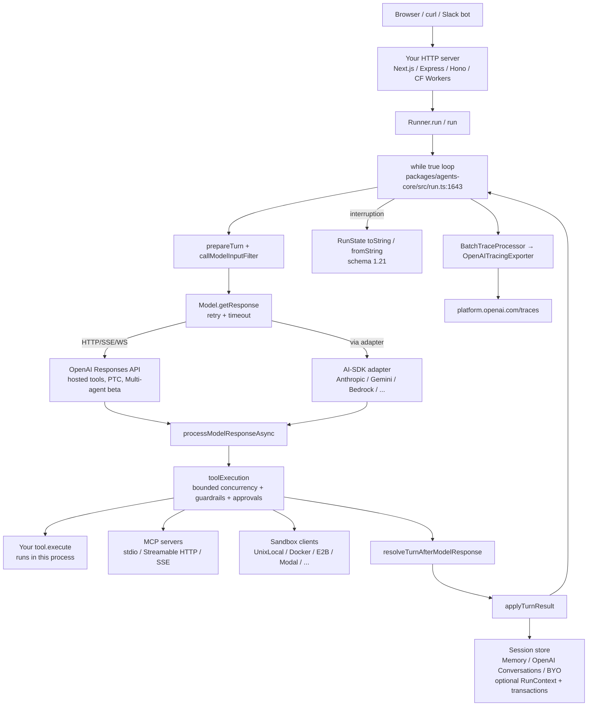

# OpenAI Agents TypeScript — Benchmark Analysis

> **Repo**: https://github.com/openai/openai-agents-js
> **Commit analysed**: fdaf0a66ca6e9d89498909ad7cf64745630e8afb (v0.18.0 + 84 unreleased commits)
> **Branch**: main
> **Framework path**: frameworks/openai-agents-js
> **Analysed on**: 2026-10-01

## TL;DR

- ⭐ **Architecturally** a TypeScript SDK / library: the agent loop runs **in your Node.js / Deno / Bun process**. There is **no first-party server, no hosted runtime, no CLI binary, no subprocess**. Everything is a class you instantiate (`Agent`, `Runner`) inside your own host (`packages/agents-core/src/run.ts:598-625`).
- **Ecosystem**: TypeScript (Node 22+, Deno, Bun; experimental Cloudflare Workers; React Native conditions for core + Realtime since 0.15.0).
- **Open-source MIT**, owned and maintained by OpenAI (`LICENSE`, `packages/agents-core/package.json:38`). OpenAI provides commercial backing through the Traces dashboard, Conversations API and hosted tools, but no managed agent runtime.
- **Maturity / adoption**: pre-1.0, version `0.18.0` across all five packages (`packages/agents-core/package.json:5`), released 2026-09-10. 23 releases between 2026-05-22 and 2026-09-10 (roughly weekly). 3,882 GitHub stars, 987 forks, ~124 contributors, ~7.3 M npm downloads/month for `@openai/agents` (captured 2026-10-01). Sandbox Agents lose their "beta" label on `main` (`.changeset/remove-sandbox-beta-label.md`, not yet released).
- **Where the loop runs**: in-process. `Runner.run()` is a TypeScript `while (true)` loop that calls a `Model` instance over HTTP/SSE/WebSocket directly from your process (`packages/agents-core/src/run.ts:1643-2203`; streaming twin at `run.ts:2674`).
- **Strongest fit for our use case**: typed `RunContext<TContext>` reaches every tool, guardrail, hook and (since 0.15.0) opted-in custom sessions via `RunContextAwareSession` (`packages/agents-core/src/memory/session.ts:104-127`). `tool({ isEnabled, needsApproval, inputGuardrails, outputGuardrails })` gives per-tool runtime filtering and policy, MCP servers now accept server-wide tool guardrails (`mcp.ts:177-180`), and HITL approvals survive serialization through a versioned `RunState` (schema `1.21`, `runState.ts:190`).
- **Weakest gap**: **no first-party HTTP server, no SSE/WebSocket route, no `/healthz`, no auth termination, no resource manager.** You hand-roll the network surface (`examples/nextjs/src/app/api/basic/route.ts`). No registry, no versioning, no skill catalogue beyond the sandbox-only `skills()` capability.
- **Surprising finding (bad, corrected)**: tool guardrails **cannot mutate tool arguments or rewrite tool output**. `ToolGuardrailBehavior` is only `allow | rejectContent | throwException` (`packages/agents-core/src/toolGuardrail.ts:13-16`); `rejectContent` replaces the call or output with a message string (`utils/toolGuardrails.ts:51-53,97-99`). Earlier versions of this report overstated this. Forced arguments still require overriding inside `execute`.
- **Surprising finding (good)**: since 0.14.0 the SDK ships **Programmatic Tool Calling** (model-written hosted JavaScript that calls your local tools marked `allowedCallers: ['programmatic']`, `packages/agents-openai/src/tools.ts:241`), **deterministic test doubles** (`ScriptedModel`, `scriptedSandboxSession()`, `packages/agents-core/src/testing/scriptedModel.ts:255`), and an experimental **hosted Multi-agent** model where the OpenAI service spawns a tree of sub-agents (`packages/agents-openai/src/experimental/hostedMultiAgent/model.ts:250`).
- **Default posture changed (0.14.0)**: sensitive model/tool data is no longer written to logs by default (`setSensitiveDataLoggingEnabled`, `packages/agents-core/src/config.ts:66`) and task/turn spans are emitted by default. Tracing still **exports to the OpenAI platform** on every run (`packages/agents/src/index.ts:8`); disable with `OPENAI_AGENTS_DISABLE_TRACING=1` or replace processors for multi-tenant deployments.
- **Verdicts**:
  - sessions/persistence: 🟡 `MemorySession` + `OpenAIConversationsSession` + compaction wrapper; pluggable `Session` interface now with idempotent history transactions and run-context-aware routing; still no Postgres/Redis store.
  - skills: 🟡 only inside Sandbox Agents.
  - resource manager: 🔴 Not provided — BYO.
  - sub-agents: 🟢 handoffs + `Agent.asTool()` (structured input, bounded streaming), parallel ok; hosted Multi-agent experimental.
  - multi-tenancy: 🟡 typed `RunContext<TContext>` + `isEnabled` filtering + run-context-aware sessions; no first-class tenant id; no per-tenant budget caps; no arg-rewrite hook.
  - hooks: 🟡 `EventEmitter` lifecycle events + `callModelInputFilter` + per-tool and per-MCP-server guardrails (allow/reject/throw only).
  - API: 🔴 library-only; BYO HTTP/SSE (AI SDK UI stream adapter available).
  - observability: 🟢 OpenAI Traces + pluggable `TracingProcessor` + task/turn spans + per-request `Usage`; 🔴 no USD cost.
- **Production-readiness verdict**: viable for **request-scoped** server-side multi-tenant deployments where you own the HTTP layer, plug a custom (run-context-aware) `Session` store, and disable default OpenAI tracing. **Not** viable as a drop-in for long-running stateful agents: no built-in runtime, durable mid-tool checkpoint, or worker pool. `RunState` serialization (now carrying durable pending input) is the only checkpoint primitive.

## 0. General

### 0.1 What is this stack?

A library / SDK. `@openai/agents` is a TypeScript package you import and call `run(agent, input)` on; the entire loop runs in the caller's Node/Deno/Bun process. There is no companion server binary, no managed cloud runtime, no CLI.

### 0.2 Ecosystem

**TypeScript** (Node 22+, Deno, Bun; experimental Cloudflare Workers with `nodejs_compat`, `README.md:27-33`). Single-language project. Core and Realtime packages publish React Native conditions since 0.15.0 (`packages/agents-core/CHANGELOG.md`, entry `d1c585d`). The Python sibling repo (`openai-agents-python`) is a parallel implementation, not a dependency.

### 0.3 Project status & governance

- **Open-source**, MIT license (`LICENSE`, `packages/agents-core/package.json:38`).
- **Owner**: OpenAI (`AUTHOR: OpenAI <support@openai.com>` in `packages/agents-core/package.json:8`). Release PRs and most feature PRs are authored by OpenAI staff (e.g. `@seratch`) per the GitHub Releases pages.
- **Commercial backing**: hosted complementary services (OpenAI Traces dashboard, Conversations API, hosted MCP, hosted built-in tools, hosted shell, hosted Multi-agent beta) all sit behind the OpenAI platform. There is **no managed agent runtime**.
- **Support model**: community / GitHub issues, plus OpenAI Help Center for API issues.

### 0.4 Project maturity / age

- Repository created 2025-05-31 (`gh api repos/openai/openai-agents-js`).
- Current version: **0.18.0** (all five packages, `packages/agents-core/package.json:5`, `packages/agents/package.json:5`), released 2026-09-10. The analysed commit is 84 commits past that tag with 47 pending changesets in `.changeset/`.
- Status: **pre-1.0**. Core constructs (`Agent`, `tool`, `run`) are treated as stable. Sandbox Agents were labelled "beta" until `main` removed the label (`.changeset/remove-sandbox-beta-label.md`). Hosted Multi-agent is explicitly "Experimental beta" (`docs/src/content/docs/guides/models.mdx:174-181`). Programmatic Tool Calling depends on Responses API support.
- Minor versions 0.12.0 → 0.18.0 shipped between 2026-06-24 and 2026-09-10. Several minors carry behaviour changes (default model switch, sensitive-logging default, Docker file API migration), so pin versions.

### 0.5 Adoption & community signal

Captured 2026-10-01 via `gh api` and the npm downloads API:

- **3,882 stars**, **987 forks**, 44 watchers, **~124 contributors** (anonymous included).
- **Release cadence**: 23 GitHub releases from v0.11.5 (2026-05-22) to v0.18.0 (2026-09-10), about one per week. Last push 2026-09-25.
- **Activity**: ~547 PRs and ~68 issues opened since 2026-05-19; 311 commits on `main` since 2026-08-01. Only 11 open issues + PRs at capture time, which indicates fast triage.
- **npm**: ~7.35 M downloads/month for `@openai/agents` and ~7.73 M for `@openai/agents-core` (2026-08-31 → 2026-09-29).
- The TypeScript SDK is the official complement to the Python SDK.

### 0.6 Ecosystem fit

- Packages: `@openai/agents` (umbrella), `@openai/agents-core` (loop + types + sandbox runtime + testing), `@openai/agents-openai` (OpenAI provider, tracing exporter, Conversations/compaction sessions, experimental hosted Multi-agent), `@openai/agents-realtime` (voice), `@openai/agents-extensions` (AI SDK model adapter, AI SDK UI stream adapter, Cloudflare/Twilio transports, sandbox providers, experimental Codex tool).
- Registry: npm — https://www.npmjs.com/package/@openai/agents
- Primarily used as a **library**: embed in Next.js routes, Express, Cloudflare Workers, etc.
- Official examples/templates: `examples/` directory in the monorepo (24 sub-folders, including new `standard-schema`, `realtime-react-native`).

### 0.7 Documentation depth & cross-team contributor accessibility

- Astro/Starlight site under `docs/`, multi-language (English + ja/zh/ko translations).
- Guides cover Agents, Running Agents, Results, Sessions, Streaming, Tools, MCP, Handoffs, Multi-agent, Human-in-the-loop, Guardrails, Tracing, Context, Models, Config, Schemas, **Testing (new)**, Sandbox Agents (concepts, clients, memory), Voice Agents, Troubleshooting (`docs/src/content/docs/guides/`).
- Docs are deep and precise; many pages now spell out safety semantics (replay, approvals, redaction).
- A non-engineer would need TypeScript and CLI familiarity; no no-code surface.

### 0.8 Documentation entry points ⭐

- Official docs landing: https://openai.github.io/openai-agents-js
- Quickstart: https://openai.github.io/openai-agents-js/guides/quickstart
- API reference: https://openai.github.io/openai-agents-js/openai/agents-core/ (auto-generated)
- Hosting / deployment: https://openai.github.io/openai-agents-js/guides/troubleshooting/ and https://openai.github.io/openai-agents-js/extensions/cloudflare/ (no dedicated production-hosting guide)
- Examples / demos: https://github.com/openai/openai-agents-js/tree/main/examples
- Changelog: per-package, e.g. https://github.com/openai/openai-agents-js/blob/main/packages/agents-core/CHANGELOG.md
- GitHub Releases: https://github.com/openai/openai-agents-js/releases
- GitHub issues: https://github.com/openai/openai-agents-js/issues (relevant open item at capture: #1986 hosted MCP `tool_search_output` 400 when a tool name contains a dot)
- Community: no official Discord; OpenAI community forum at https://community.openai.com/

---

## 1. High Level Architecture

⭐ **Deployment diagram**

```
┌──────────────────────────────────────────────────────────────────────┐
│  Your Node.js / Deno / Bun host process                              │
│                                                                       │
│   HTTP server (Next.js, Express, Hono, etc. — YOU bring this)        │
│        │                                                              │
│        ▼                                                              │
│   run(agent, input, options)  ← Runner / runner.run()                │
│        │                                                              │
│        ▼                                                              │
│   while (true) {                                                      │
│     prepareTurn → #prepareModelCall → Model.getResponse()             │
│       │                                  │                            │
│       │                                  ▼                            │
│       │             HTTP/SSE/WebSocket ──────→  OpenAI Responses API  │
│       │                                  ▲     (hosted tools, PTC,    │
│       │                                  │      hosted Multi-agent β) │
│       │                                  │  (or AI-SDK adapter →      │
│       │                                  │   Anthropic / Gemini / …)  │
│       ▼                                                              │
│     processModelResponse → toolExecution → resolveTurn                │
│        │            │                                                 │
│        │            ├─ User tool callbacks (run in this process)      │
│        │            ├─ MCP servers (stdio / Streamable HTTP / SSE)    │
│        │            └─ SandboxAgent → sandbox client                  │
│        │                 (UnixLocal, Docker, E2B, Modal, Daytona,     │
│        │                  Vercel, Cloudflare, Runloop, Blaxel)        │
│        ▼                                                              │
│     Session.addItems() ──── MemorySession                             │
│                       ──── OpenAIConversationsSession ─→ OpenAI       │
│                       ──── YOUR custom Session (Postgres, Redis…)     │
│                                                                       │
│     BatchTraceProcessor ─── OpenAITracingExporter ─→ platform.openai  │
└──────────────────────────────────────────────────────────────────────┘
```

### 1.1 Where does the agent loop *actually* execute?

In your Node.js / Deno / Bun process. `Runner.run()` is a TypeScript class with a single `while (true)` loop (non-streaming path; the streaming path at `run.ts:2674` mirrors it):

```ts
// packages/agents-core/src/run.ts:1643-2203 (condensed)
while (true) {
  state._currentStep = state._currentStep ?? { type: 'next_step_run_again' };

  if (state._currentStep.type === 'next_step_interruption') { … resume approvals … }

  if (state._currentStep.type === 'next_step_run_again') {
    const { turnInput, … } = await prepareTurn({ state, … });          // :1825
    const preparedCall = await this.#prepareModelCall(state, …);       // :1887
    const pendingModelResponse = getResponseWithRetry(preparedCall.model, modelRequest, …); // :2015
    state._context.usage.add(state._lastTurnResponse.usage);           // :2059
    const processedResponse = await processModelResponseAsync(…);     // :2075
    const turnResult = await resolveTurnAfterModelResponse(…);        // :2125
    applyTurnResult({ state, turnResult, … });                         // :2146
  }

  switch (currentStep.type) {                                          // :2170
    case 'next_step_final_output':  return await finalizeCurrentOutput();
    case 'next_step_handoff':       state.setCurrentAgent(currentStep.newAgent); break;
    case 'next_step_interruption':  return completeResult(new RunResult(state));
    case 'next_step_run_again':     break;
  }
}
```

No subprocess. No vendor binary. The loop is provider-agnostic; other providers plug in via `Model` / `ModelProvider` (`packages/agents-extensions/src/ai-sdk/index.ts:808` `AiSdkModel` wraps any Vercel AI SDK model). `run.ts` grew from ~1.1 k to 3.8 k lines since May 2026, mostly replay-safety, session-transaction and approval-ownership logic; the loop shape is unchanged.

Exception: the experimental `OpenAIHostedMultiAgentModel` moves sub-agent orchestration into the OpenAI service; the SDK loop still executes local function tools and injects results back over a persistent Responses WebSocket (`docs/src/content/docs/guides/models.mdx:189-213`).

### 1.2 Runtime dependencies

- **Language runtime**: Node.js 22+, Deno, or Bun (`README.md:27-29`). Cloudflare Workers experimental with `nodejs_compat` (`README.md:33`).
- **Bundled binaries / subprocesses**: none. The SDK does not subprocess any vendor binary. (The experimental Codex tool in `packages/agents-extensions/src/experimental/codex/index.ts` wraps the Codex SDK, which is opt-in.)
- **Required infrastructure services**: none for the loop itself. Sessions live in-memory by default (`MemorySession`); persistence is BYO.
- **Required vendor services**: OpenAI API for the default `Model` (outbound HTTPS to `api.openai.com`). Applications that pass their own OpenAI client need `openai` ≥ 7.2 (0.15.0, `packages/agents-core/CHANGELOG.md:97`). Default tracing also calls `platform.openai.com` unless disabled.
- **Optional**: MCP server subprocesses (stdio); Anthropic/Gemini/Bedrock via the AI-SDK extension; sandbox providers (Docker daemon, or E2B / Modal / Daytona / Vercel / Cloudflare / Runloop / Blaxel accounts). Docker sandbox file APIs now require images with `/bin/sh` and GNU utilities such as `realpath` (0.18.0).

### 1.3 Recommended deployment topology

The docs do **not** prescribe a topology. The `examples/nextjs/` reference shows one-process-many-requests embedded in a Next.js Route Handler. Each `run()` call is request-scoped: prepare input → run loop → return result. Many concurrent runs share one Node process but each run owns its own `RunState`. There is no built-in worker pool, queue, or cluster mode.

`docs/src/content/docs/guides/troubleshooting.mdx` and `docs/src/content/docs/extensions/cloudflare.mdx` only cover runtime compatibility: deploy as a normal Node.js HTTP service; Cloudflare Workers documented as experimental. Hosted Multi-agent adds a constraint: one `OpenAIHostedMultiAgentModel` instance supports one active run, and approvals must resume on the same instance (`models.mdx:224-226`), which forces sticky routing for that feature.

### 1.4 Cold-start cost & instance footprint

- No bundled binary. The SDK is pure JS / TS; startup is whatever your Node process takes (~200-400 ms typical; not measured in this analysis).
- RAM baseline: minimal beyond Node baseline; sessions live in memory by default (`MemorySession`).
- No equivalent of Claude Agent SDK issue #333 (slow bootstrap). The loop starts on `run()` in milliseconds. Sandbox agents add provider-dependent sandbox start-up.

### 1.5 Vendor lock-in

- **LLM provider**: medium. Default is the OpenAI Responses API with default model `gpt-5.6-luna` since 0.15.0 (`packages/agents-core/src/defaultModel.ts:95`, override via `OPENAI_DEFAULT_MODEL`). Pluggable via custom `ModelProvider`; Anthropic / Gemini / Bedrock / Vertex via `@openai/agents-extensions/ai-sdk` (AI SDK v2-v4 model specs and AI SDK 7 peers since 0.14.0). Hosted tools (`webSearchTool`, `fileSearchTool`, `codeInterpreterTool`, `imageGenerationTool`, `toolSearchTool`, `programmaticToolCallingTool`) and hosted Multi-agent are **OpenAI Responses API only** (`packages/agents-openai/src/tools.ts:94-322`).
- **Hosting**: low. Library-only.
- **Eval / observability**: tracing defaults to the OpenAI Traces dashboard (`packages/agents/src/index.ts:8` calls `setDefaultOpenAITracingExporter()`); escape with `setTraceProcessors([…])` or `OPENAI_AGENTS_DISABLE_TRACING=1`. The new testing utilities are provider-neutral.

### 1.6 Framework weight / footprint

Mid-weight and growing. The umbrella `@openai/agents` package re-exports `agents-core`, `agents-openai`, `agents-realtime`. No bundled storage, eval UI, dev UI, or plugin system. But `agents-core` now carries a sizeable sandbox runtime (manifests, capabilities, path grants, snapshots, memory generation) and a deterministic testing module.

- `packages/agents-core/src/` ≈ 70 top-level TS files plus `runner/` (37 files), `sandbox/`, `tracing/`, `testing/`, `memory/`
- `packages/agents-openai/src/` (provider, tracing exporter, Conversations + compaction sessions, experimental hosted Multi-agent)
- `packages/agents-realtime/src/` (voice-only)
- `packages/agents-extensions/src/` (AI SDK + AI SDK UI + Cloudflare + Twilio adapters, 7 sandbox providers, experimental Codex)

### 1.7 Release-history signal

`packages/agents-core/CHANGELOG.md` highlights since the previous analysis (0.11.4):

- `0.18.0`: Docker file APIs run inside the container; optional UnixLocal file I/O protection (`064fcb2`, line 7). Image-generation `action` option (`packages/agents/CHANGELOG.md`).
- `0.17.1`: server-wide MCP tool guardrails (`05e5851`, line 34); custom messages for output-guardrail-blocked tool results (`d7ed6b2`, line 26); many replay/approval ownership fixes.
- `0.17.0`: blocked tool outputs redacted from replay state; ambiguous serialized checkpoints fail closed (`33fe55c`, line 54).
- `0.16.1`: provider-neutral model call timeouts (`51fb859`, line 67); run-scoped sandbox working directories.
- `0.16.0`: **scripted testing utilities** (`b727790`, line 74); **Standard Schema** tool inputs and structured outputs (`aa6dd2d`, line 89); `callModelInputFilter.preserveInputIdentity` (`c5eda7e`, line 83).
- `0.15.0`: `openai` ≥ 7.2 (`442cfe3`, line 97); **default model switched to `gpt-5.6-luna`** (`41f5011`, line 98); **MCP 2026-07-28 negotiation** with v1 fallback (`5b5a7cb`, line 99); durable `pendingInput` on `RunState` (`75af3ee`, line 109); **run context passed to opted-in sessions** (`81e0066`, line 113).
- `0.14.3`: **idempotent session history transactions** (`31bc820`, line 129); tool/handoff name collision policy (`15ac711`, line 133).
- `0.14.0`: **task and turn spans on by default** (`f7771c1`, line 169); **sensitive data logging off by default** (`67e9733`, line 170); cancellation propagated to MCP and function tools (`b907917`, line 175); **Programmatic Tool Calling** (`02ef342`, line 176).
- `0.13.x`: GPT-5.6 defaults and prompt-cache controls (`e5b75e1`, line 214); experimental hosted Multi-agent (`packages/agents-openai/CHANGELOG.md:275`, `48cdb52`); Realtime default `gpt-realtime-2.1`.
- `0.12.1`: invalid-final-output recovery handler (`81d654f`, line 233).
- `0.11.5`–`0.11.8`: opt-in pre-approval tool input guardrails (`dd64ba6`, line 252), SDK-only tool output custom data (`b740fb3`, line 253), Handoff clone overrides, opt-in recovery for missing function tools (`1ce5404`, line 274).

Fast-moving areas: replay safety / approval ownership, sandbox providers, MCP lifecycle, tracing. The volume of "preserve / redact / fail closed" fixes says the serialized `RunState` contract is still hardening. GitHub Releases: https://github.com/openai/openai-agents-js/releases.

---

## 2. Agent Loop

### 2.1 Run loop entrypoint(s)

```ts
// packages/agents-core/src/run.ts:598-607
export async function run<TAgent extends Agent<any, any>, TContext = undefined>(
  agent: TAgent,
  input: string | AgentInputItem[] | RunState<TContext, TAgent>,
  options?: NonStreamRunOptions<TContext, TAgent>,
): Promise<RunResult<TContext, TAgent>>;
export async function run<TAgent extends Agent<any, any>, TContext = undefined>(
  agent: TAgent,
  input: string | AgentInputItem[] | RunState<TContext, TAgent>,
  options?: StreamRunOptions<TContext, TAgent>,
): Promise<StreamedRunResult<TContext, TAgent>>;
```

Two return types based on `options.stream`. Streaming yields `RunStreamEvent` instances; non-streaming returns the final `RunResult`. The `Runner` class (`packages/agents-core/src/run.ts:626`) exposes `run()` directly so you can reuse configuration across invocations.

### 2.2 Per-iteration behavior

In `run.ts:1643-2203`:

1. `prepareTurn` — assemble `turnInput` from session history + new input + generated items + durable `pendingInput`; run input guardrails in parallel (`packages/agents-core/src/runner/turnPreparation.ts:130`).
2. `#prepareModelCall` (`run.ts:3700`) — resolve effective `Agent`, system instructions, enabled tools, handoffs, `modelSettings`, apply tool-name collision policy and `callModelInputFilter`.
3. `getResponseWithRetry` (`packages/agents-core/src/runner/modelRetry.ts:1153`) — call the `Model` (HTTP / SSE / WebSocket) with retry policy and optional per-call `timeoutMs` (`packages/agents-core/src/model.ts:326`).
4. `processModelResponseAsync` — split model output into `messages`, `toolCalls`, `handoffs`, program calls, `interruptions` (`packages/agents-core/src/runner/modelOutputs.ts`).
5. `resolveTurnAfterModelResponse` — execute function tools (with per-tool guardrails, approvals, concurrency limit), produce a `TurnResult` whose `nextStep` is `final_output | handoff | interruption | run_again` (`packages/agents-core/src/runner/turnResolution.ts`).
6. Persist via session history transactions where supported; loop back or terminate.

### 2.3 ReAct loop

Yes, built in. Docstring at `run.ts:693`:

> 1. The agent is invoked with the given input.
> 2. If there is a final output (i.e. the agent produces something of type `agent.outputType`), the loop terminates.
> 3. If there's a handoff, we run the loop again, with the new agent.
> 4. Else, we run tool calls (if any), and re-run the loop.

`maxTurns` defaults to `DEFAULT_MAX_TURNS = 10` (`packages/agents-core/src/runner/constants.ts`, applied at `run.ts:1270-1273`), settable to `null` to disable. `errorHandlers` can recover from max-turns and (since 0.12.1) invalid final output (`packages/agents-core/src/runner/errorHandlers.ts:70-78`).

### 2.4 Tool dispatch + result handling

`packages/agents-core/src/runner/toolExecution.ts:320` (`executeFunctionToolCalls`) dispatches function tool calls produced by the LLM, running them concurrently up to `toolExecution.maxFunctionToolConcurrency` (`packages/agents-core/src/runner/runConfig.ts:5-17`) with sibling cancellation on failure (`toolExecution.ts:618-675`). Per-tool input/output guardrails run around `tool.invoke()` (`packages/agents-core/src/utils/toolGuardrails.ts:24-110`). Tool results become `RunToolCallOutputItem` and are fed back to the model on the next turn. Unknown tool names can be returned to the model as an error instead of raising (`toolNotFoundBehavior: 'return_error_to_model'`, `run.ts:401-414`).

Tool execution path: model → `FunctionCallItem` → `FunctionTool.invoke(runContext, input, details)` → parse/validate (Zod, JSON Schema, or Standard Schema) → `options.execute(parsed, runContext, details)` → optional `outputSchema` validation → `RunToolCallOutputItem` (`tool.ts:2402-2460`).

### 2.5 Explicit turn concept

A turn is bounded by `prepareTurn → model call → resolveTurnAfterModelResponse → applyTurnResult`. `state._currentTurn` (`packages/agents-core/src/runState.ts`) increments at the start of each turn; since 0.15.0 `StreamedRunResult.currentTurn` counts only turns that reached the model request boundary. Task and turn spans (on by default since 0.14.0) make the boundary visible in traces. The loop terminates only on `next_step_final_output` or `next_step_interruption`.

### 2.6 Event emission mechanism (in-process)

Two mechanisms:

1. **Runner / Agent lifecycle EventEmitter** (`packages/agents-core/src/lifecycle.ts:101-181`) — events: `agent_start`, `agent_end`, `agent_handoff`, `agent_tool_start`, `agent_tool_end`.
2. **Streamed run events** — `StreamedRunResult` exposes an async iterable of `RunStreamEvent` (`packages/agents-core/src/events.ts:18-81`).

```ts
// packages/agents-core/src/lifecycle.ts:101-108
export class AgentHooks<TContext, TOutput> extends EventEmitterDelegate<AgentHookEvents<TContext, TOutput>> {
  protected eventEmitter = new RuntimeEventEmitter<AgentHookEvents<TContext, TOutput>>();
}
```

---

## 3. Message & Event Taxonomy

### 3.1 Message layers

Three distinct vocabularies:

1. **Protocol items** (`packages/agents-core/src/types/protocol.ts`) — the wire-format Zod-validated types that go to/from the model. Discriminated union `ModelItem` (`protocol.ts:898-918`) of `UserMessageItem`, `AssistantMessageItem`, `SystemMessageItem`, `ToolSearchCallItem`, `ToolSearchOutputItem`, `HostedToolCallItem`, `ProgramCallItem`, `ProgramCallResultItem`, `FunctionCallItem`, `ComputerUseCallItem`, `ShellCallItem`, `ApplyPatchCallItem`, the matching result items, `ReasoningItem`, `CompactionItem`, `UnknownItem`.
2. **RunItem classes** (`packages/agents-core/src/items.ts`) — internal SDK items wrapping protocol items with helpers (`RunMessageOutputItem`, `RunToolCallItem`, `RunToolCallOutputItem`, `RunHandoffCallItem`, `RunHandoffOutputItem`, `RunReasoningItem`, `RunToolApprovalItem`, `RunToolSearchCallItem`, `RunToolSearchOutputItem`).
3. **Stream events** (`packages/agents-core/src/events.ts`) — `RunRawModelStreamEvent` (raw provider chunks), `RunItemStreamEvent` (named events wrapping a `RunItem`), `RunAgentUpdatedStreamEvent` (active agent changed).

```
Model wire (Responses / Chat Completions / AI SDK)
        │  provider adapter converts
        ▼
protocol.ModelItem  ──wrap──►  RunItem (items.ts)  ──wrap──►  RunItemStreamEvent (events.ts)
        │                                                    ▲
        └── persisted in Session as AgentInputItem           │
provider stream chunks ───────────────► RunRawModelStreamEvent┘
```

### 3.2 Concrete message types

| Type | Purpose |
| --- | --- |
| `UserMessageItem` | User input message |
| `AssistantMessageItem` | Model textual output (carries `phase` across replay since 0.14.0) |
| `SystemMessageItem` | Static system instructions |
| `FunctionCallItem` | LLM-emitted function tool call |
| `FunctionCallResultItem` | Local tool execution result |
| `HostedToolCallItem` | OpenAI-hosted tool invocation (web/file/code/image/hosted MCP) |
| `ProgramCallItem` / `ProgramCallResultItem` | Programmatic Tool Calling program + output (new, `protocol.ts:462-476`) |
| `ToolSearchCallItem` | Deferred tool-loading call |
| `ToolSearchOutputItem` | Tool-search result |
| `ComputerUseCallItem` / `ComputerCallResultItem` | Computer-use action / result |
| `ShellCallItem` / `ShellCallResultItem` | Shell action / result |
| `ApplyPatchCallItem` / `ApplyPatchCallResultItem` | Apply-patch operation / result |
| `ReasoningItem` | Reasoning trace (GPT-5.x) |
| `CompactionItem` | Compaction marker |
| `UnknownItem` | Forward-compat fallback for new provider types (`protocol.ts:867`) |

(`packages/agents-core/src/types/protocol.ts:408-918`)

### 3.3 Messages vs. events

Two **separate** taxonomies. Persisted history uses **protocol items** (`AgentInputItem`). The streaming surface uses **events** that wrap items: `RunItemStreamEvent` has `name: RunItemStreamEventName` and `item: RunItem` (`events.ts:36-66`).

### 3.4 Event categories

- **Stream event** — `RunRawModelStreamEvent` (raw chunks from the model; e.g. `output_text_delta`, now carrying `itemId` to correlate deltas with output items, `protocol.ts:966-976`).
- **Turn event** — internal step transitions surface via `next_step_*`; not a public stream type. Visible as `TurnSpanData` spans in tracing.
- **Message event** — `RunItemStreamEvent` with `name: 'message_output_created'`.
- **Tool event** — `RunItemStreamEvent` with `name: 'tool_called' | 'tool_output' | 'tool_approval_requested' | 'tool_search_called' | 'tool_search_output_created'`.
- **Reasoning / compaction** — `'reasoning_item_created' | 'compaction_item_created'`.
- **Session lifecycle** — not in the stream; persistence is internal via the `Session` interface.
- **Hook event** — `AgentHookEvents` / `RunHookEvents` on `EventEmitter`s, separate from the stream.
- **Sub-agent event** — `RunAgentUpdatedStreamEvent` and `'handoff_requested' | 'handoff_occurred'` for handoffs; `Agent.asTool({ onStream })` forwards nested stream events to a parent callback (`packages/agents-core/src/agent.ts:193-202`).

### 3.5 Canonical type-definition file(s)

- `packages/agents-core/src/types/protocol.ts` — protocol message + stream-event Zod schemas (single source of truth).
- `packages/agents-core/src/events.ts` — run-loop event classes.
- `packages/agents-core/src/items.ts` — `RunItem` class hierarchy.

### 3.6 Live agentic event stream taxonomy

Sample frames (TypeScript classes; the SDK does not serialize them for the network unless you use the AI SDK UI adapter):

```ts
// Raw model delta
new RunRawModelStreamEvent({ type: 'output_text_delta', itemId: 'msg_…', delta: 'Hello' });

// Tool was called
new RunItemStreamEvent('tool_called', new RunToolCallItem(
  { type: 'function_call', name: 'topicSearch', callId: 'call_…', arguments: '{"q":"sports"}' },
  agent,
));

// Tool needs approval
new RunItemStreamEvent('tool_approval_requested', new RunToolApprovalItem(rawCall, agent));

// Active agent changed (handoff)
new RunAgentUpdatedStreamEvent(billingAgent);

// Terminal raw event (completion is also observed by iterator end / result.completed)
new RunRawModelStreamEvent({ type: 'response_done', response: { id, usage, output } });
```

---

## 4. Agent Runtime (Multi-session Host)

### 4.1 Multi-session host architecture

**Not provided — BYO.** There is no first-party multi-session runtime. The `Runner` class is per-run config + an event emitter; **you** spin up the host process and embed it in your own server. `examples/nextjs/src/app/api/basic/route.ts` illustrates the pattern: one `Runner` per request, no shared loop state across requests.

### 4.2 Concurrent session isolation

State isolation is **per-`RunState`**: each `run()` invocation constructs a fresh `RunState` wrapping a fresh or caller-supplied `RunContext` (`run.ts:1262-1273`). `RunContext<TContext>` carries your app context (`runContext.context`) and is mutable; **you** decide what to put there per call. Because there is no shared runtime, isolation holds as long as you don't share mutable objects across runs.

Approvals, usage and approval-invocation evidence are shared between a parent `RunContext` and forked nested contexts (`packages/agents-core/src/runContext.ts:256-268` `_cloneSharedState`); the `context` (app data) is shared by reference. Recent releases tightened isolation of SDK-owned data (detached interruption snapshots, private MCP tool caches), but app context sharing is by design.

Exception: `OpenAIHostedMultiAgentModel` holds continuation state and supports one active run per instance (`docs/src/content/docs/guides/models.mdx:224-226`), so it must not be shared across concurrent requests.

### 4.3 Horizontal scaling / multi-instance

Stateless: as long as session state lives in an external store (your custom `Session` impl backed by Postgres/Redis), any number of pods can serve the same session pool. No leader election, no shared in-process state. `RunState.toString()` / `RunState.fromString()` (`packages/agents-core/src/runState.ts:3474, 3488`) serialize a paused run to any KV store; `examples/nextjs/src/app/api/basic/route.ts:83` writes it to a generic `db().set(conversationId, ...)`. The schema is versioned (`CURRENT_SCHEMA_VERSION = '1.21'`, older `1.0`–`1.20` still readable, `runState.ts:190-214`), so pods on adjacent SDK versions can share checkpoints. `SessionHistoryTransactionAwareSession` (`memory/session.ts:166-172`) gives you an idempotency key for retried writes across pods.

### 4.4 Background / async / scheduled tasks

**Not provided — BYO.** No cron, no webhook trigger primitives, no queues. Run a worker process (BullMQ, AWS SQS, etc.) and call `run()` from inside it.

### 4.5 Worker pool / queue model

Not provided. The SDK assumes short-lived request scope by default. Long-running agents need a serialized `RunState` checkpoint pattern (`examples/agent-patterns/human-in-the-loop.ts:84-111`). `RunState.addInput()` (`runState.ts:3013`, 0.15.0) lets you stage new user input onto a paused state; it survives serialization until the next safe model request.

---

## 5. Sessions & Persistence

### 5.1 Session / chat data model

`Session` is a minimal interface:

```ts
// packages/agents-core/src/memory/session.ts:28-96 (condensed)
export interface Session {
  getSessionId(): Promise<string>;
  getItems(limit?: number): Promise<AgentInputItem[]>;
  prepareHistoryItemForModelInput?(item: AgentInputItem): AgentInputItem;
  prepareHistoryItemsForPersistenceComparison?(…): …;
  preserveReasoningItemIdsForPersistence?(): boolean;
  addItems(items: AgentInputItem[]): Promise<void>;
  replaceHistoryWithCompaction?(items: AgentInputItem[]): Promise<void>;
  popItem(): Promise<AgentInputItem | undefined>;
  clearSession(): Promise<void>;
}
```

A session is just `{ sessionId: string, items: AgentInputItem[] }`. No first-class `tenant_id`, `user_id`, `cwd`, `model`, `metadata`, `usage`, or `summary` fields. Since 0.15.0 a custom store can opt in to receive the active `RunContext` on every call (`RunContextAwareSession`, `session.ts:104-127`), which is the supported way to route storage by tenant.

### 5.2 What's stored on a session

`AgentInputItem[]`: the full message history including user inputs, assistant outputs, function-call items, tool results, hosted-tool calls, program calls, reasoning items, compaction items. No scratchpad files, no embedded memory, no attachments. Reasoning-item IDs are persistable via an opt-in (`preserveReasoningItemIdsForPersistence`). Output-guardrail-rejected tool outputs are replaced with a placeholder in SDK-owned replay surfaces (0.17.0).

### 5.3 Granularity

Single linear conversation per session. **No fork / branch model.** No parent_session_id. If you need branching you implement a graph layer on top.

### 5.4 Built-in persistence stores

- `MemorySession` — in-process arrays, now implementing the rewrite and transaction capabilities (`packages/agents-core/src/memory/memorySession.ts:25-29`). For demos/tests.
- `OpenAIConversationsSession` — OpenAI's Conversations API holds history (`packages/agents-openai/src/memory/openaiConversationsSession.ts`).
- `OpenAIResponsesCompactionSession` — wraps another `Session` and calls OpenAI `responses.compact`, with optional rollback budget on `main` (`packages/agents-openai/src/memory/openaiResponsesCompactionSession.ts:131`).
- **No SQLite / no Postgres / no Redis / no S3 / no JSONL on disk built-in.**
- Example custom adapters (BYO): `examples/memory/sessions/file.ts` (filesystem JSON), `examples/memory/prisma.ts` (Prisma adapter).

### 5.5 Persistence timing

- Non-streaming: one `session.addItems()` call persists both the original user input and the model outputs from the latest turn (`docs/src/content/docs/guides/sessions.mdx:83`, `packages/agents-core/src/runner/sessionPersistence.ts`).
- Streaming: user input is written first, then streamed outputs are appended when the turn completes (`sessions.mdx:84`).
- If the store implements `SessionHistoryTransactionAwareSession`, the runner issues `append_items` / `replace_suffix` transactions with a stable `operationId` so retries and resumed output-guardrail flows are idempotent (`session.ts:133-172`, `sessions.mdx:126`).
- No `durability='sync'|'async'` switch. The `Session` impl decides.

### 5.6 Mid-run checkpointing (durable)

**No automatic mid-tool-call durability.** If your process crashes during a `tool.execute` it cannot resume that call.

The closest equivalent is **`RunState` serialization**: when a tool needs approval (`needsApproval: true`) the run halts and returns `RunResult.state`, which you serialize via `state.toString()` / `RunState.fromString(agent, str)` and re-run with `run(agent, state)` (`examples/agent-patterns/human-in-the-loop.ts:84-111`, `examples/nextjs/src/app/api/basic/route.ts:83`). Since 0.15.0 the state carries durable `pendingInput`, structured tool outputs, and canonical invocation evidence so approved/completed tool calls are not re-executed on resume. Not a substitute for LangGraph-style per-task checkpoints.

### 5.7 Session ID format

`MemorySession` generates `randomUUID()` unless `sessionId` is supplied (`memorySession.ts:40`). `OpenAIConversationsSession` uses server-side `conv_<random>` IDs. The interface only requires a `string`.

### 5.8 Pluggable store interface

Yes. Implement `Session` and pass via `options.session`. `examples/memory/sessions/file.ts` is a complete 119-line reference implementation. Optional capability interfaces:

- `RunContextAwareSession<TContext>` (`session.ts:104-127`) — set `acceptsRunContext: true`; the runner passes the same `RunContext` to every history operation (`sessionPersistence.ts:150-198`).
- `SessionHistoryRewriteAwareSession` (`session.ts:129-131`) — `applyHistoryMutations` (e.g. `replace_function_call`).
- `SessionHistoryTransactionAwareSession` (`session.ts:166-172`) — atomic, idempotent `applyHistoryTransaction({ operationId, transaction })`.
- `OpenAIResponsesCompactionAwareSession` (`session.ts:205`) — `runCompaction()`.

### 5.9 Schema evolution / migration

Two layers:

- `AgentInputItem` is a Zod-validated discriminated union (`protocol.ModelItem`, `protocol.ts:898-918`) with an `UnknownItem` fallback for forward compatibility. No migration helpers for stored session items; you author your own.
- `RunState` is explicitly versioned: `CURRENT_SCHEMA_VERSION = '1.21'` with every version back to `1.0` still accepted on read (`runState.ts:190-214`; it was `1.11` at the previous analysis). Historical-compaction restoration lives in `runStateLegacyCompaction.ts`. Some old states with ambiguous provenance are now rejected on resume by design.

### 5.10 Export / replay

Yes:

- `RunResult.history` and `RunResult.state` are JSON-serializable (`RunState.toJSON()`, `runState.ts:3203`).
- `RunState.fromString(agent, json)` / `fromStringWithContext(agent, json, context)` rebuild a state (`runState.ts:3488-3500`).
- `ScriptedModel` (0.16.0) gives deterministic replay of model behaviour in tests (`packages/agents-core/src/testing/scriptedModel.ts:255`).
- The Traces dashboard at `platform.openai.com/traces` is the hosted viewer (`docs/src/content/docs/guides/tracing.mdx:10`).

### 5.11 Cross-session memory

Not first-class for normal agents. The `Session` interface is per-conversation. Sandbox Agents have a `memory()` capability that distils prior runs into workspace files; see Q17.

---

## 6. Multi-tenancy & Tenant Identity ⭐ THE KEY QUESTION

### 6.1 Run-loop tenant identity

There is no dedicated `tenantId` / `userId` field. Tenant identity goes in the typed `context` option, alongside the other run options:

```ts
// packages/agents-core/src/run.ts:461-484
type SharedRunOptions<TContext, TAgent> = {
  context?: TContext | RunContext<TContext>;
  maxTurns?: number | null;
  signal?: AbortSignal;
  previousResponseId?: string;
  conversationId?: string;
  session?: Session;
  sessionInputCallback?: SessionInputCallback;
  callModelInputFilter?: CallModelInputFilter;
  toolErrorFormatter?: ToolErrorFormatter;
  outputGuardrailBlockedMessage?: OutputGuardrailBlockedMessage<TContext>;
  reasoningItemIdPolicy?: ReasoningItemIdPolicy;
  tracing?: TracingConfig;
  sandbox?: SandboxRunConfig;
  toolExecution?: ToolExecutionConfig;
  toolNotFoundBehavior?: ToolNotFoundBehavior;
  toolNameCollisionPolicy?: ToolNameCollisionPolicy;
  errorHandlers?: RunErrorHandlers<TContext, TAgent>;
};
```

`Runner` config adds `groupId`, `traceMetadata`, `workflowName` for trace tagging (`run.ts:379-383`). Session storage can see the same context through `RunContextAwareSession` (`memory/session.ts:104-127`), so a custom store can scope reads/writes by `runContext.context.tenantId` instead of encoding the tenant in the session id.

### 6.2 Tenant identity propagation into tool calls

`Runner.run()` wraps `options.context` in a `RunContext<TContext>` (`run.ts:1262-1273`). On every tool invoke, that same `RunContext` is passed as the second argument:

```ts
// packages/agents-core/src/tool.ts:2402-2449 (condensed)
async function _invoke(runContext: RunContext<Context>, input: string, details?: ToolCallDetails) {
  const parseResult = … parseFunctionToolInput(parser, input);
  if (!parseResult.success) { throw createInvalidToolInputFailure(…).error; }
  const parsed = parseResult.value;
  const result = validateOutput(
    await options.execute(parsed, runContext, details),
    runContext, details,
  );
  return result;
}
```

So `tool({ execute: async (args, runContext) => …runContext.context.tenantId… })` is the standard pattern. The same context reaches `isEnabled`, `needsApproval` predicates, tool guardrails (`ToolInputGuardrailData.context`, `toolGuardrail.ts:46-50`), MCP `toolFilter` callables, handoff `isEnabled`, lifecycle hooks, and `instructions` functions (`docs/src/content/docs/guides/context.mdx:24, 37-41`).

### 6.3 Tool call interface

```ts
// packages/agents-core/src/tool.ts:1803-1843 (ToolOptions, condensed)
execute: ToolExecuteFunction<TParameters, Context, ToolExecuteResult<TOutputSchema, unknown>>;
// signature: (parsedInput, runContext, details) => Promise<Result>
errorFunction?: ToolErrorFunction<Context, …> | null;
needsApproval?: boolean | ToolApprovalFunction<TParameters>;
isEnabled?: ToolEnabledOption<Context>;
customDataExtractor?: FunctionToolCustomDataExtractor<…>;   // SDK-only data on the output item
// plus: parameters (Zod | JSON Schema | Standard Schema), outputSchema, timeoutMs,
//       inputGuardrails, outputGuardrails, allowedCallers (programmatic tool calling)
```

Real code:

```ts
// examples/docs/context/localContext.ts:9-19
const fetchUserAge = tool({
  name: 'fetch_user_age',
  description: 'Return the age of the current user',
  parameters: z.object({}),
  execute: async (_args, runContext?: RunContext<UserInfo>): Promise<string> => {
    return `User ${runContext?.context.name} is 47 years old`;
  },
});
```

### 6.4 Forcing tool arguments from the harness

**Partial: override inside `execute`; there is no argument-rewrite hook.**

1. **Server-side forcing inside `execute`** (the supported pattern): omit `tenantId` from `parameters` and read it from the trusted context.
   ```ts
   const topicSearch = tool({
     name: 'topicSearch',
     parameters: z.object({ q: z.string() }),
     execute: async ({ q }, ctx: RunContext<{ tenantId: string }>) =>
       searchTopics({ q, tenantId: ctx.context.tenantId }),
   });
   ```
2. **`ToolInputGuardrail`** can inspect `toolCall.arguments` and **reject** (model-visible message) or **throw**, but it cannot rewrite the arguments: `ToolGuardrailBehavior` is `allow | rejectContent | throwException` only (`packages/agents-core/src/toolGuardrail.ts:13-16`, runner at `utils/toolGuardrails.ts:38-61`). Since 0.11.8 you can run input guardrails before an approval interruption (`toolExecution.preApprovalInputGuardrails`, `runner/runConfig.ts:13-16`).
3. **`callModelInputFilter`** (`packages/agents-core/src/runner/conversation.ts:33-50`) mutates the input items and instructions before each model call. It operates on history, not on pending tool args.

No `PreToolUse → updatedInput` equivalent. For MCP tools the closest is `toolMetaResolver` on the server (`mcp.ts:175`), which sets MCP `_meta` per call, not arguments.

### 6.5 Tenant-aware visible tool selection

Yes, first-class. Per-tool `isEnabled` receives the run context:

```ts
// packages/agents-core/src/agent.ts:1184-1210
async getAllTools(runContext: RunContext<TContext>, tracingParent?: Span<any>): Promise<Tool<TContext>[]> {
  const mcpTools = await this.getMcpTools(runContext, tracingParent);
  const enabledTools: Tool<TContext>[] = [];
  for (const candidate of [...this.tools]) {
    if (candidate.type === 'function') {
      const maybeIsEnabled = (candidate as { isEnabled?: … }).isEnabled;
      const enabled = typeof maybeIsEnabled === 'function'
        ? await maybeIsEnabled(runContext, getPublicAgent(this))
        : typeof maybeIsEnabled === 'boolean' ? maybeIsEnabled : true;
      if (!enabled) continue;
    }
    enabledTools.push(candidate);
  }
  return [...mcpTools, ...enabledTools];
}
```

Evaluated every turn. Handoffs support `isEnabled` too (`agent.ts:1222-1233`, `handoff.ts:157`). MCP tools are filtered per server with `toolFilter` (static allow/block lists or a callable that receives `runContext` and `agent`, `mcp.ts:174, 605`); on `main` the current filter is re-applied on every cached lookup (`.changeset/tidy-mcp-filter-cache.md`). Hosted tools are not filtered by `isEnabled`; include or omit them when building the agent. There is no registration-time scope ("this tool belongs to tenant X"); filtering is runtime-only.

### 6.6 Per-tool-call auth propagation

Whatever you put in `runContext.context` is reachable from every tool, hook, guardrail, handoff and MCP filter in the run (`docs/src/content/docs/guides/context.mdx:24`: "Every agent, tool and hook participating in a single run must use the same **type** of context"). Nested `Agent.asTool()` runs share the same app context (`context.mdx:37`). The SDK does not perform an auth check at the tool boundary; you do it inside `execute` or in a `ToolInputGuardrail`. For remote MCP servers, credentials are per-server `headers` / hosted-MCP `authorization`, fixed at server construction, not per call.

### 6.7 Per-tenant rate limit + budget cap

**Not provided — BYO.** The SDK surfaces token usage (`RunContext.usage`, `RunState.usage` getter at `runState.ts:2385`) but doesn't enforce caps. Enforce ceilings in an `agent_tool_start` listener that throws, in a `ToolInputGuardrail` that throws, or in a custom `Model` wrapper that pre-checks usage. There is no USD budget cap, only token counters. `maxTurns` is the only built-in limit.

### ⭐ Required light usage example

```ts
import { Agent, run, tool, RunContext } from '@openai/agents';
import { z } from 'zod';

type TenantCtx = { tenantId: string; targetingStrategyId: string; userId: string };

const topicSearch = tool({
  name: 'topicSearch',
  description: 'Search topics for the current tenant',
  parameters: z.object({ q: z.string() }),            // tenantId deliberately NOT exposed to the LLM
  execute: async ({ q }, ctx: RunContext<TenantCtx>) =>
    searchTopics({ q, tenantId: ctx.context.tenantId }), // (3) forced server-side
});
const iabSearch = tool({ name: 'iabSearch', description: 'Search IAB taxonomy',
  parameters: z.object({ q: z.string() }),
  execute: async ({ q }, ctx: RunContext<TenantCtx>) => searchIab({ q, tenantId: ctx.context.tenantId }) });
const audienceCreate = tool({ name: 'audienceCreate', description: 'Create an audience',
  parameters: z.object({ name: z.string(), segments: z.array(z.string()) }),
  execute: async (a, ctx: RunContext<TenantCtx>) => createAudience({ ...a, tenantId: ctx.context.tenantId }) });
const bashExec = tool({ name: 'bashExec', description: 'Run a shell command',
  parameters: z.object({ cmd: z.string() }),
  isEnabled: false,                                     // (2) hidden; or (ctx) => ctx.context.tenantId === 'ops'
  execute: async ({ cmd }) => execBash(cmd) });

const agent = new Agent<TenantCtx>({
  name: 'predict-agent',
  instructions: 'You help marketers build predictive audiences.',
  tools: [topicSearch, iabSearch, audienceCreate, bashExec],
});

// (1) tenant identity in, via typed context
const result = await run(agent, 'Build a sports audience.', {
  context: { tenantId: 'acme', targetingStrategyId: 'strat-42', userId: 'u-123' },
});
```

Notes:

- Step 3 works by **ignoring the LLM's args** and pulling from `ctx.context`. There is no hook that rewrites JSON args before dispatch; a `ToolInputGuardrail` could only reject a call whose args contain a foreign `tenantId`.
- Step 2 can also be done by simply not registering `bashExec` / `webFetch` on the per-tenant agent (`agent.clone({ tools })`).

---

## 7. Hook & Middleware Capabilities (Context Engineering)

### 7.1 Enumerate every hook / middleware / lifecycle callback

| Hook / Mechanism | Fires when | Capability |
| --- | --- | --- |
| `RunHooks.on('agent_start', …)` | Before each agent turn starts | read only (`lifecycle.ts:118`) |
| `RunHooks.on('agent_end', …)` | After final output | read |
| `RunHooks.on('agent_handoff', …)` | At handoff | read |
| `RunHooks.on('agent_tool_start', …)` | Before tool invoke | read; can throw to abort |
| `RunHooks.on('agent_tool_end', …)` | After tool invoke | read |
| `AgentHooks.on(…)` | Per-agent equivalents | read |
| `InputGuardrail.execute` | On initial input | read; tripwire halts run (`guardrail.ts`) |
| `OutputGuardrail.execute` | On final output | read; tripwire halts run; blocked terminal tool output replaced by placeholder (`outputGuardrailBlockedMessage`, `run.ts:445-450`) |
| `ToolInputGuardrail.run` | Before per-tool invoke (optionally before approval) | read; **allow / reject with message / throw** (`toolGuardrail.ts:13-16`) |
| `ToolOutputGuardrail.run` | After per-tool invoke | read; **allow / replace output with message / throw** (`utils/toolGuardrails.ts:63-110`) |
| `MCPServer.toolInputGuardrails` / `toolOutputGuardrails` | Every tool on that MCP server | same as tool guardrails, server-wide (`mcp.ts:177-180`, 0.17.1) |
| `RunConfig.callModelInputFilter` | Before each model call | mutate `{ input, instructions }` (`runner/conversation.ts:33-50`) |
| `RunConfig.sessionInputCallback` | Merging session history with new input | replace combined input |
| `RunConfig.toolErrorFormatter` | Tool throws / approval rejected | rewrite model-visible error |
| `RunConfig.errorHandlers` | Max turns, invalid final output, … | branch / recover (`runner/errorHandlers.ts:70-78`) |
| `tool({ needsApproval })` | Per-tool approval | halt run with `interruption`; resume via `state.approve / state.reject` |
| `tool({ customDataExtractor })` | After tool output | attach SDK-only data to the output item (0.11.8) |
| `Agent.asTool({ onStream })` | Nested agent-as-tool stream events | observer, bounded queue (`agent.ts:193-202`) |
| `HandoffInputFilter` | When handing off | edit input history for next agent (`handoff.ts:44`) |
| `agent.instructions` function | Each turn | compute system prompt from context |

### 7.2 Hook concurrency model

- `RunHooks` / `AgentHooks` are EventEmitters: listeners fire in registration order; the loop does not await async listeners.
- `inputGuardrails` run **in parallel** with the agent by default (`InputGuardrail.runInParallel`, `guardrail.ts:78`); since 0.17.0 sibling guardrails in a batch settle before a tripwire is surfaced.
- Tool guardrails run **sequentially** per tool; the first `rejectContent`/`throwException` short-circuits (`utils/toolGuardrails.ts:39-60, 83-108`).
- `callModelInputFilter` runs serially once per model call, awaited. Default filters receive deep copies; `preserveInputIdentity = true` passes a shallow-copied array (0.16.0).

### 7.3 Specific capability tests

| Capability | Status | Code |
| --- | --- | --- |
| Inject system messages at session start | ✅ | `agent.instructions` (string or `(ctx, agent) => string`, `agent.ts:316-323`); or `callModelInputFilter` mutating `instructions` |
| Expand user input (slash commands, time-stamp) | ✅ | `sessionInputCallback` or `callModelInputFilter` |
| Mutate messages list before each LLM call | ✅ | `callModelInputFilter` returns `{ input, instructions }` (`conversation.ts:39-50`) |
| Mutate / decorate tool input before dispatch | ❌ (reject only) | `ToolInputGuardrail` can reject or throw, not rewrite. Override inside `execute`. |
| Mutate / decorate tool result before it returns to the LLM | 🟡 | `ToolOutputGuardrail` `rejectContent(message)` replaces the output with a string (`utils/toolGuardrails.ts:97-99`); no structured rewrite. Or transform inside `execute`. |
| Emit additional tool calls in response to a tool result | ❌ | No equivalent to `additional_messages`. Chain via handoff, `Agent.asTool`, or Programmatic Tool Calling (the model, not a hook, writes the follow-up calls). |

### 7.4 Auto-compaction

Three mechanisms, none generic:

- `OpenAIResponsesCompactionSession` wrapper calls OpenAI `responses.compact` after completed turns, with thresholds and (on `main`) a rollback item budget (`packages/agents-openai/src/memory/openaiResponsesCompactionSession.ts:131`). It skips compaction when the run no longer owns its history snapshot (0.17.1).
- `modelSettings.contextManagement: [{ type: 'compaction', compactThreshold }]` asks the Responses API to compact server-side (`packages/agents-core/src/model.ts:95-110, 391`).
- Sandbox Agents have a `compaction()` capability (`packages/agents-core/src/sandbox/capabilities/compaction.ts:137`).

Not built into `MemorySession` or generic stores; non-OpenAI providers get no compaction.

### 7.5 Prompt cache optimization

OpenAI-oriented. `modelSettings.promptCacheRetention: 'in-memory' | '24h'` and (since 0.13.2) `promptCacheOptions: { mode: 'implicit' | 'explicit', ttl: '30m' }` (`model.ts:73-83, 379-384`). The AI SDK adapter forwards prompt-cache retention since 0.15.0. `previousResponseId` / `conversationId` keep a stable server-side prefix. There is no Anthropic-style `cache_control` breakpoint placement API; for Anthropic via the AI SDK you rely on provider options.

### 7.6 Tool result clearing

Not first-class. No API to remove or stub a past tool output in the visible history. The closest primitives are `callModelInputFilter` (drop/replace items before each call, without changing stored history) and `SessionHistoryRewriteAwareSession.applyHistoryMutations` (only `replace_function_call` mutations, `session.ts:13-27`).

### 7.7 Progressive disclosure

- **Tool search / deferred tools**: `toolSearchTool()` lets the model load deferred function tools or namespace members on demand (`packages/agents-openai/src/tools.ts:263`), with client-side execution supported.
- **Programmatic Tool Calling**: hosted JavaScript calls eligible tools and reduces intermediate results before they hit the context (`tools.ts:241`).
- **Sandbox Agents**: lazy skills (`load_skill`), memory summaries with on-demand reads, and a filesystem workspace where large outputs can be written and re-read by path.

### 7.8 Architectural diagram

```
run(agent, input, options)
   │
   │  ── input guardrails (parallel) ──── tripwire? halt ──►
   ▼
prepareTurn → sessionInputCallback → buildTurnInput (+ pendingInput)
   │
   │  ── emit 'agent_start' ──►
   ▼
#prepareModelCall: Agent.getAllTools() applies isEnabled / MCP toolFilter
   │               toolNameCollisionPolicy
   ▼
applyCallModelInputFilter({ modelData, agent, context })
   │
   ▼
Model.getResponse  ◄── retry policy / timeoutMs (modelRetry.ts)
   │
   ▼
processModelResponse → split into messages, tool calls, handoffs, program calls
   │
   ▼
for each tool call (concurrent up to maxFunctionToolConcurrency):
   ├── [preApprovalInputGuardrails] ToolInputGuardrail.run (allow/reject/throw)
   ├── needsApproval? → halt with interruption
   ├── ToolInputGuardrail.run (tool-level + MCP-server-level)
   ├── emit 'agent_tool_start'
   ├── tool.execute(args, runContext, details)
   ├── emit 'agent_tool_end'
   └── ToolOutputGuardrail.run (allow / replace with message / throw)
   │
   ▼
resolveTurn → next step
   ├── final_output → output guardrails → emit 'agent_end'
   ├── handoff → HandoffInputFilter → switch agent → emit 'agent_handoff'
   ├── interruption → return RunResult (resume later)
   └── run_again → back to prepareTurn
```

### ⭐ Required light usage example

```ts
import { Agent, run, tool, defineToolOutputGuardrail, ToolGuardrailFunctionOutputFactory as G } from '@openai/agents';
import { z } from 'zod';

// (1) "SessionStart"-style system context: instructions function evaluated each turn.
const instructions = (ctx: any) =>
  `tenant=${ctx.context.tenantId}, locale=${ctx.context.locale}, today=2026-05-16`;

// (3) PostToolUse-style: replace large topicSearch output with a summary string.
const summarizeIfLarge = defineToolOutputGuardrail({
  name: 'summarize-large-topicSearch',
  async run({ output }) {
    const rows = Array.isArray(output) ? output : [];
    return rows.length > 50
      ? G.rejectContent(`${rows.length} topics; top 5: ${JSON.stringify(rows.slice(0, 5))}`)
      : G.allow();
  },
});

// (2) "PreToolUse"-style forced args: no arg-rewrite hook, so override inside execute.
const topicSearch = tool({
  name: 'topicSearch',
  parameters: z.object({ q: z.string() }),
  execute: async ({ q }, ctx: any) => searchTopics({ q, tenantId: ctx.context.tenantId }),
  outputGuardrails: [summarizeIfLarge],
});

const agent = new Agent({ name: 'predict-agent', instructions, tools: [topicSearch] });
await run(agent, 'List sports topics.', { context: { tenantId: 'acme', locale: 'fr-FR' } });
```

`rejectContent` is designed as a rejection path, so the replacement shows up in traces as a guardrail rejection. If that is unwanted, summarise inside `execute` instead.

---

## 8. HTTP API

### 8.1 Does the framework ship an HTTP server?

**No.** Library-only. You bring Next.js, Express, Hono, Fastify, Cloudflare Workers, etc. The reference is `examples/nextjs/src/app/api/basic/route.ts`. No `@openai/agents-server` package exists. The only HTTP-adjacent helper is `createAiSdkUiMessageStreamResponse()` in `@openai/agents-extensions/ai-sdk-ui` (`packages/agents-extensions/src/ai-sdk-ui/uiMessageStream.ts:554`), which turns a `StreamedRunResult` into a `Response`.

### 8.2 HTTP streaming protocol (SSE/WS)

Not provided — BYO HTTP layer. The SDK streams **inside your process** via async iteration over `RunStreamEvent`. With the `ai-sdk-ui` extension you get the Vercel AI SDK UI message stream (SSE) format (`uiMessageStream.ts:528-570`); `textStream.ts:63` gives a plain text stream. Otherwise you choose the framing.

### 8.3 HTTP endpoints that start an agent run

Not provided — BYO. Closest example:

```ts
// examples/nextjs/src/app/api/basic/route.ts:13-31 (condensed)
export async function POST(req: NextRequest) {
  const { messages, conversationId, decisions } = await req.json();
  …
  const runner = new Runner({ groupId: conversationId });
  const result = await runner.run(agent, messages);
  return NextResponse.json({ response: result.finalOutput, history: result.history, conversationId });
}
```

### 8.4 Interrupt / cancel in-flight run

Not provided — BYO HTTP layer. The data-plane primitive: `options.signal: AbortSignal` (`run.ts:467`) aborts the model call and, since 0.14.0, propagates to function tools (streaming and non-streaming) and MCP tool requests; stream completion waits for cleanup to settle. Pattern: pass `request.signal` (or your own `AbortController` keyed by run id) into `options.signal`. No DELETE / cancel endpoint.

### 8.5 Resume / replay endpoint

Not provided as an endpoint. Data-plane primitives: `RunState.toString()` → store keyed by `conversationId`/`sessionId` → `RunState.fromString(agent, str)` → `run(agent, state)` (`examples/nextjs/src/app/api/basic/route.ts:36-77`). For "user reopens the tab", read history from your `Session` store. There is no event-log replay; you persist events yourself if you need them.

### 8.6 HITL approval workflow

Not provided as a server endpoint. When a tool with `needsApproval` is called, the run returns with `result.interruptions: RunToolApprovalItem[]` (streamed as `tool_approval_requested`). Serialize `result.state`, present approvals, then call `state.approve(interruption)` / `state.reject(interruption)` and re-run with `run(agent, state)` (`examples/agent-patterns/human-in-the-loop.ts:84-111`). The Next.js example uses a `decisions: { callId: 'approved'|'rejected' }` payload on the same POST. The AI SDK UI adapter emits a `tool-approval-request` frame (`uiMessageStream.ts:490`). Approvals are now bound to the canonical invocation and normalized input, so a resumed approval cannot be rebound to a different call.

### 8.7 Token streaming

- **Text delta**: `RunRawModelStreamEvent` with `data.type === 'output_text_delta'`, `delta`, and `itemId` (`protocol.ts:966-976`). AI SDK UI frame: `{"type":"text-delta","id":"…","delta":"…"}` (`uiMessageStream.ts:310-314`).
- **Partial tool args**: provider-dependent; not normalised. The raw provider event is available under `data.type === 'model'` (`protocol.ts:1035-1038`), so Responses API `function_call_arguments.delta` events can be forwarded. The AI SDK UI adapter emits only `tool-input-start` and the complete `tool-input-available`, no input deltas (`uiMessageStream.ts:366-379`).
- **Agent activity events**: `RunItemStreamEvent` (`tool_called`, `tool_output`, `handoff_occurred`, …) and `RunAgentUpdatedStreamEvent`. You serialize them.

### 8.8 Authentication & Authorisation

Not provided. Validate JWT / API key and extract tenant identity in your host middleware before calling `run()`; pass identity via `context`. Per-resource authorization is yours (inside tools, guardrails, or a run-context-aware session).

### 8.9 Tool-call state reconstruction ⭐

Explicit ids. `RunToolCallItem` / `RunToolCallOutputItem` expose `callId` from the raw item (`items.ts:103-106, 175-178`); the `FunctionCallResultItem` carries the same `callId` as its `FunctionCallItem`. A client joins `tool_called` with the later `tool_output` on `callId`. In the AI SDK UI stream the join key is `toolCallId` on `tool-input-start` / `tool-input-available` / `tool-output-available` / `tool-approval-request` frames.

### 8.10 Health checks / graceful shutdown

Not provided. Add `/healthz` in your HTTP framework. The SDK exposes `getGlobalTraceProvider().forceFlush()` for trace flush on shutdown (recommended for Cloudflare Workers, `docs/src/content/docs/guides/tracing.mdx:27-31`); `forceFlush` now waits for in-flight exports (0.17.1). `MCPServers` / `connectMcpServers` close MCP connections (`packages/agents-core/src/mcpServers.ts:194, 639`).

### ⭐ Required light usage example

```bash
# (1) Start a run — your own route (e.g. Next.js using createAiSdkUiMessageStreamResponse)
curl -N -X POST https://your-app/api/agent \
  -H 'Content-Type: application/json' -H 'X-Tenant-Id: acme' \
  -d '{"messages":[{"role":"user","content":"Build me an audience"}]}'

# (2) SSE frames from the ai-sdk-ui adapter:
data: {"type":"start"}
data: {"type":"tool-input-available","toolCallId":"call_abc","toolName":"topicSearch","input":{"q":"sports"},"dynamic":true}
data: {"type":"text-delta","id":"txt_1","delta":"Here are"}
data: {"type":"finish"}

# (3) Cancel: no built-in endpoint. Client disconnect → req.signal → options.signal,
#     or your own route that aborts a stored AbortController:
curl -X POST https://your-app/api/agent/run_123/cancel

# (4) HITL approval — your route again; the SDK defines no endpoint shape.
curl -X POST https://your-app/api/agent \
  -H 'Content-Type: application/json' \
  -d '{"conversationId":"conv_xyz","decisions":{"call_abc":"approved"}}'
```

Steps 1, 3 and 4 are DIY routes following `examples/nextjs/src/app/api/basic/route.ts`. **Not provided — BYO HTTP layer** for every framework-shipped sub-bullet above.

---

## 9. Sub-agents

### 9.1 Mechanism

**Both**, plus an experimental hosted variant:

1. **Handoffs** (first-class transfer) — `Agent.handoffs: (Agent | Handoff)[]`. The LLM picks one via a synthesized `transfer_to_<agent>` tool; the loop switches `state._currentAgent` (`run.ts:2181-2194`) and continues with the new agent's instructions and tools.
2. **Agents as tools** (`Agent.asTool({ … })`) — wraps an agent as a `FunctionTool`. The parent calls it like any other tool; the agent runs nested and returns its final output as the tool result (`packages/agents-core/src/agent.ts:128-203` options, `asTool` at `agent.ts:755`).
3. **Hosted Multi-agent (experimental)** — `OpenAIHostedMultiAgentModel` lets GPT-5.6 models create and coordinate a tree of sub-agents inside the Responses API; the SDK only executes local tools and injects results (`packages/agents-openai/src/experimental/hostedMultiAgent/model.ts:250`, `docs/src/content/docs/guides/models.mdx:174-230`).

### 9.2 Configuration

- Statically registered TypeScript objects. No markdown-file sub-agent format.
- `new Agent({ name, handoffs: […] })`, `handoff(agent, { inputFilter, isEnabled, … })` (with `clone` overrides since 0.11.5), or `agent.asTool({ toolName, toolDescription, parameters, inputBuilder, runConfig, … })`.
- Hosted Multi-agent: one `OpenAIHostedMultiAgentModel` with `maxConcurrentSubagents` (`hostedMultiAgent/config.ts:1-7`).

### 9.3 LLM-generated configs

**Not provided for SDK agents.** Sub-agents are statically declared TypeScript; the parent LLM cannot create a fresh `system prompt + tools` child. Closest: `Agent.asTool({ parameters, inputBuilder })` lets the parent pass structured input. The experimental hosted Multi-agent is the exception: the hosted root agent decides what sub-agents to spawn, but every hosted agent uses the same model and the same local tool definitions (`models.mdx:208`), and it is OpenAI-only.

### 9.4 Output handling

- Handoff: the new agent takes over; output is the new agent's final output; `RunAgentUpdatedStreamEvent` signals the switch.
- `asTool`: the nested agent's final output becomes the function tool result (string by default; `customOutputExtractor` overrides, `agent.ts:146-148`). Linked to the parent via the `callId` of the wrapping `FunctionCallItem`. The full nested `RunResult` is on `FunctionToolResult.agentRunResult` (`tool.ts:1516`).
- Hosted Multi-agent: only the `/root` final answer becomes `finalOutput`; sub-agent messages stay on the raw event stream and are not added to SDK history (`models.mdx:214-218`).

### 9.5 Concurrency model

Concurrent. `Agent.asTool` invocations issued in one turn run in parallel, bounded by `toolExecution.maxFunctionToolConcurrency` (`runner/runConfig.ts:5-12`). Parallelism lives in `executeToolRunsWithConcurrency` (`packages/agents-core/src/runner/toolExecution.ts:618-675`): unbounded → `runWithSiblingCancellation` over all tool runs; bounded → N workers draining a shared index. A failing sibling cancels the others (0.14.3). Handoffs are sequential by definition. Hosted Multi-agent defaults to three concurrent hosted sub-agents.

### 9.6 Context isolation

Nested `Agent.asTool` runs **share** the parent's `RunContext.context`, approvals, and usage (`runContext.ts:256-268` `_cloneSharedState`; `docs/src/content/docs/guides/context.mdx:37`). The nested run starts from the tool input, not the parent's message history. Handoffs pass history to the next agent, filterable with `HandoffInputFilter`; since `main`, input filters are rejected when combined with server-managed `conversationId` / `previousResponseId` (`.changeset/safe-handoff-history-ownership.md`).

### 9.7 Lifecycle events

Yes. `Agent.asTool({ onStream })` (and `.on(eventName, handler)`) receive every `RunStreamEvent` from the nested run plus the triggering `toolCall` (`agent.ts:115-121, 193`). On `main` the pending event queue is bounded at 1024 by default (`onStreamMaxPendingEvents`, `agent.ts:195-202`). Handoffs emit `handoff_requested` / `handoff_occurred` and `RunAgentUpdatedStreamEvent`.

### 9.8 Sub-agent model override

Yes. Each `Agent` pins its own `model`, so handoff targets can differ. For agents-as-tools: `Agent.asTool({ runConfig: { model: 'gpt-5.4', modelSettings } })` (`examples/agent-patterns/agents-as-tools.ts:33-35`). On `main`, when the child uses an explicit `Model` object, parent transport overrides are no longer inherited (`agent.ts:166-170`). Hosted Multi-agent cannot mix models (all hosted agents share the request model).

### ⭐ Required light usage example

```ts
import { Agent, run, tool } from '@openai/agents';
import { z } from 'zod';

const topicSearch = tool({
  name: 'topicSearch',
  parameters: z.object({ q: z.string() }),
  execute: async ({ q }) => searchTopics(q),
});

const persona = (name: string, who: string) =>
  new Agent({ name, instructions: `You are ${who}. Discover topics that match your interests.`, tools: [topicSearch] });

const youngMom = persona('persona-young-mom', 'a 32-year-old mom');
const techBro  = persona('persona-tech-bro', 'a 27-year-old SF engineer');
const retiree  = persona('persona-retiree', 'a 67-year-old retiree');

const orchestrator = new Agent({
  name: 'orchestrator',
  instructions: 'Call all three persona tools in the same turn, then merge their topic lists.',
  modelSettings: { parallelToolCalls: true },
  tools: [
    youngMom.asTool({ toolName: 'persona_young_mom', toolDescription: 'Topics for a young mom' }),
    techBro.asTool({ toolName: 'persona_tech_bro', toolDescription: 'Topics for a tech bro',
                     runConfig: { model: 'gpt-5.4-mini' } }),
    retiree.asTool({ toolName: 'persona_retiree', toolDescription: 'Topics for a retiree' }),
  ],
});

// Parallel dispatch happens in toolExecution.ts; each result arrives as a
// RunToolCallOutputItem in result.newItems (or a 'tool_output' stream event), keyed by callId.
const result = await run(orchestrator, 'Build a cross-generational audience.');
```

---

## 10. Skills

### 10.1 First-class concept?

**Yes, but only inside Sandbox Agents.** Outside `SandboxAgent`, skills are not a concept in this SDK. Skills are a **capability** on a sandbox agent (`packages/agents-core/src/sandbox/capabilities/skills.ts:53, 282`).

### 10.2 File format

`SKILL.md` with YAML frontmatter, à la Claude Code. Parsed by `parseSkillFrontmatter(markdown)` (`skills.ts:447`); on `main` multiline `description` values are preserved and nested fields are kept out of the index (`.changeset/preserve-skill-frontmatter-descriptions.md`). Schema:

```ts
// packages/agents-core/src/sandbox/capabilities/skills.ts:22-51
type SkillIndexEntry = { name: string; description: string; path?: string };

type SkillDescriptor = {
  name: string;
  description: string;
  content: string | Uint8Array | File | LocalFile;
  scripts?: Record<string, Entry>;
  references?: Record<string, Entry>;
  assets?: Record<string, Entry>;
  compatibility?: string[];
  deferred?: boolean;
};

type SkillsArgs = {
  skills?: SkillDescriptor[];
  from?: Entry;
  lazyFrom?: LocalDirLazySkillSource;   // { source: Dir | LocalDir | GitRepo, index?, getIndex? }
  index?: SkillIndexEntry[];
  skillsPath?: string;
};
```

### 10.3 Loader mechanism

Three sources:

1. **Inline** — `skills({ skills: [{ name, description, content, … }] })`.
2. **Filesystem** — `localDirLazySkillSource({ src: './skills' })` (`packages/agents-core/src/sandbox/localSkills.ts:28`, exported from `@openai/agents/sandbox/local`) or `skills({ from: localDir(…) })`. Reads each subfolder's `SKILL.md` and builds an index.
3. **Git repo** — `gitRepo({ repo, ref })` as a `lazyFrom.source` or manifest entry (`README.md:69-77`).

### 10.4 Invocation

**System-prompt injection** for the index + **tool invocation** for lazy materialization. The capability injects an "available skills" section via `Capability.instructions(manifest)` (`skills.ts:201`). In lazy mode the agent also gets a `load_skill` tool that stages exactly one skill into the workspace (`skills.ts:86`, prompt text at `skills.ts:635-636`); the model then reads `SKILL.md` with the shell/filesystem capabilities.

### 10.5 Loading mode

Both:

- **Eager** — `skills({ skills: [...] })` or `skills({ from: dir(…) })` materializes everything under the skills path and lists full metadata.
- **Lazy** — `skills({ lazyFrom: localDirLazySkillSource({…}) })` lists only the index; the model calls `load_skill({ skill_name })` when needed.

### 10.6 Skill composition

Skills can bundle `scripts/`, `references/`, `assets/` (`SkillDescriptor`). The injected instructions tell the model to load only needed `references/` files, prefer running bundled `scripts/`, and reuse `assets/` (`skills.ts:296-320`). Skills cannot formally include or call other skills; the model can call `load_skill` again. Skills can be combined with the sandbox `memory()` capability and with agents-as-tools on a sandbox agent.

### ⭐ Required light usage example

```
# 1. ./skills/Generate-Audience-From-Brief/SKILL.md
---
name: Generate-Audience-From-Brief
description: Turn a marketer brief into a structured audience definition with segment IDs.
---

When the user describes an audience in prose, decompose it into:
1. Demographics (age, gender, geo)
2. Interests (call topicSearch for each)
3. Behavioral signals (call iabSearch)
Then emit a JSON object { name, segments[] } and stop.
```

```ts
// 2. Load it at runtime via SandboxAgent + lazyFrom
import { run } from '@openai/agents';
import { SandboxAgent, skills, shell, filesystem } from '@openai/agents/sandbox';
import { UnixLocalSandboxClient, localDirLazySkillSource } from '@openai/agents/sandbox/local';

const agent = new SandboxAgent({
  name: 'predict-agent',
  instructions: 'You build predictive audiences for marketers.',
  tools: [topicSearch, iabSearch],
  capabilities: [shell(), filesystem(), skills({ lazyFrom: localDirLazySkillSource({ src: './skills' }) })],
});

// 3. The model sees the skill index in its instructions, calls load_skill,
//    then reads SKILL.md from the workspace and follows it.
const result = await run(agent, 'Build me a young-mom audience around back-to-school products.', {
  sandbox: { client: new UnixLocalSandboxClient() },
});
```

From the model's perspective the skill is a **system-prompt fragment plus a fetch tool**, not a single tool invocation.

---

## 11. Resource Manager

### 11.1 First-class Resource Manager?

**No — BYO.** No registry, no versioning, no publishing workflow, no marketplace. The only source abstraction is the per-`SandboxAgent` `Manifest` (`packages/agents-core/src/sandbox/manifest.ts`), tied to one agent's workspace.

### 11.2 Loading sources

Per `manifest.entries` (`packages/agents-core/src/sandbox/entries`):

- **Local filesystem** — `localDir({ src })` / `localFile({ src })`, scoped by path grants for paths outside the base directory.
- **Inline** — `dir(…)` / `file(…)` with literal content.
- **Git / GitHub repos** — `gitRepo({ repo, ref, subpath? })`, cloned into the sandbox session (inputs hardened against git option injection in 0.17.1).
- **Cloud object storage**: only as **sandbox mounts** (S3 via Vercel Mountpoint since 0.14.0, Modal cloud buckets, Blaxel S3/GCS prefixes, rclone), with credential exposure requiring explicit acknowledgement since 0.15.0. Not a resource registry.
- **OCI / container registries**: ❌ not provided.
- **Postgres / relational DB**: ❌ not provided.
- **Vendor cloud / managed registry**: ❌ not provided. No "skills hub".
- **HTTP fetch**: ❌ not first-class.

### 11.3 Source composition / priority

Per-manifest only. A `SandboxAgent` has one `defaultManifest`; capabilities transform it through `processManifest` (`skills.ts:154`), and runs can patch it via `options.sandbox`. No `local > tenant > global` cascade or conflict rule.

### 11.4 Versioning model

`gitRepo({ ref })` pins a branch / tag / SHA. No semver registry, no content-hash addressing beyond git, no rollback primitive.

### 11.5 Scoping

Not provided at either layer. No registry-side scope; runtime scoping is done by choosing which manifest / skills capability to build for which tenant in your code (e.g. from `runContext.context.tenantId`) and passing it per agent or per run.

### 11.6 Deployment workflow

Not provided. No draft / review / publish / promote stages, no multi-environment story.

### 11.7 Lifecycle / governance

Not provided. No lifecycle states; no RBAC.

### 11.8 Programmatic API

`Manifest` is the closest (`packages/agents-core/src/sandbox/manifest.ts`): build / clone / patch manifests in code. A `LocalDirLazySkillSource.getIndex(manifest, skillsPath)` hook lets you compute the index. No `registry.list()` / `search()` / `publish()`.

### 11.9 Caching & sync model

Whatever your filesystem / git client does. Sandbox sessions materialize manifest entries on start or on `load_skill`; snapshots can persist workspaces between runs. No watcher / periodic sync.

### ⭐ Required light usage example

**Not provided — BYO.** Closest illustration:

```ts
// Not a registry — composing sources by hand per tenant.
import { skills, gitRepo, localDir } from '@openai/agents/sandbox';

function skillCapabilitiesFor(tenantId: string) {
  const global = skills({ lazyFrom: { source: gitRepo({ repo: 'dailymotion/predict-skills', ref: 'main' }) } });
  // Step 1: S3 "wins" only by convention — pre-sync s3://predict-skills/tenants/<id>/ to disk first.
  const tenant = skills({ from: localDir({ src: `./s3-mirror/tenants/${tenantId}/active` }), skillsPath: '.agents/tenant' });
  return [tenant, global];
}
// Step 2: "Promote draft → active for acme" — no SDK concept; move folders in your bucket.
// Step 3: "List active skills for tenantId=acme" — read your mirror / lazy index yourself.
```

If you need a multi-tenant skill library you ship the registry layer yourself.

---

## 12. Observability: Usage, Cost, Tracing, Audit

### 12.1 Where tokens are surfaced

On `RunContext.usage` (the `Usage` class), accumulated across the run (`run.ts:2059` `state._context.usage.add(state._lastTurnResponse.usage)`), exposed as `result.state.usage` (`runState.ts:2385`). Also on `ModelResponse.usage` per call, optionally with the provider's raw usage payload (`rawUsage`, 0.15.0), and on generation spans. Failed model calls still record billed usage (0.17.1).

```ts
// packages/agents-core/src/usage.ts:107-141
export class Usage {
  public requests: number;
  public inputTokens: number;
  public outputTokens: number;
  public totalTokens: number;
  public inputTokensDetails: Array<Record<string, number>> = [];
  public outputTokensDetails: Array<Record<string, number>> = [];
  public requestUsageEntries: RequestUsage[] | undefined;
}
```

### 12.2 Per-call / per-turn / per-session / per-tenant rollups

- **Per-call**: `RequestUsage` entries (`Usage.requestUsageEntries`), each tagged with `endpoint` (`responses.create`, `responses.compact`, …) (`usage.ts:30-60`).
- **Per-turn**: turn spans (default since 0.14.0) carry usage metadata.
- **Per-run**: aggregated `Usage` on `result.state.usage`; nested `asTool` runs share the parent's usage object.
- **Per-session / per-tenant**: not provided; aggregate yourself (custom `Session`, or tag traces with `groupId` / `traceMetadata`).

### 12.3 USD cost computation

**Not provided.** Tokens only. Compute cost from your own pricing table.

### 12.4 Per-tenant / per-conversation cost

BYO. Attach `groupId` and `traceMetadata: { tenantId }` on the `Runner`/run (`run.ts:379-383`) and aggregate downstream, or read `result.state.usage` after each run and tag with the tenant id from context.

### 12.5 LLM / tool tracing

- **First-party tracer** with batch processor and OpenAI exporter (`packages/agents-core/src/tracing/`, `BatchTraceProcessor` at `tracing/processor.ts:124`). Transient export failures are retried with bounded delays on `main`.
- Span types: `AgentSpanData`, **`TaskSpanData`, `TurnSpanData` (new, on by default; opt out with `tracing: { includeTaskAndTurnSpans: false }`)**, `FunctionSpanData`, `GenerationSpanData`, `ResponseSpanData`, `HandoffSpanData`, `CustomSpanData`, `GuardrailSpanData`, `TranscriptionSpanData`, `SpeechSpanData`, `MCPListToolsSpanData` (`packages/agents-core/src/tracing/index.ts:30-46`; `tracing.mdx:68`).
- Default exporter → OpenAI Traces dashboard. Replace with `setTraceProcessors([new BatchTraceProcessor(yourExporter)])`. Configurable trace ID generation and scoped trace-context helpers since 0.11.5.
- External integrations documented: AgentOps, Respan, PromptLayer (`docs/src/content/docs/guides/tracing.mdx:128-130`). No first-party LangSmith / Langfuse / OTel exporter.

### 12.6 Audit logging (who / when / what)

Tracing spans capture LLM and tool inputs/outputs when `traceIncludeSensitiveData` is true (default `true`, `run.ts:651`; `tracing.mdx:104`). Separately, **SDK logs** no longer include model/tool payloads by default since 0.14.0 (`setSensitiveDataLoggingEnabled(true)` to opt in, `packages/agents-core/src/config.ts:66`), and default OpenAI exports omit generation reasoning on `main`. Nothing tamper-evident; build an append-only sink with `addTraceProcessor`, or record from `agent_tool_start/end` listeners.

### 12.7 Canonical "where do I read token counts" code path

```ts
// packages/agents-core/src/run.ts:2059 (non-streaming loop)
state._context.usage.add(state._lastTurnResponse.usage);
// Public read:
const result = await run(agent, 'hello', { context });
console.log(result.state.usage.totalTokens, result.state.usage.requests); // runState.ts:2385
```

### ⭐ Required light usage example

```ts
import { Agent, run, addTraceProcessor, BatchTraceProcessor } from '@openai/agents';

const agent = new Agent({ name: 'demo', instructions: 'Hi.' });

// (1) Read tokens for one completed run
const result = await run(agent, 'Hello!', { context: { tenantId: 'acme' } });
const u = result.state.usage;
console.log({ tokens_in: u.inputTokens, tokens_out: u.outputTokens, total: u.totalTokens /* cost_usd: BYO */ });

// (2) Push per-tenant token usage to a metric sink via a custom exporter
addTraceProcessor(new BatchTraceProcessor({
  async export(items) {
    for (const span of items as any[]) {
      if (span.spanData?.type === 'generation' && span.spanData.usage) {
        const { input_tokens = 0, output_tokens = 0 } = span.spanData.usage; // GenerationUsageData, tracing/spans.ts:55-60
        datadog.metric('llm.tokens.total', input_tokens + output_tokens, {
          tags: [`tenant:${span.traceMetadata?.tenantId}`, `model:${span.spanData.model}`],
        });
      }
    }
  },
}));
// Pass traceMetadata: { tenantId: 'acme' } on the Runner so spans carry the tenant.
```

---

## 13. Built-in Tools & Tool Authoring API

### 13.1 Built-in tools shipped in the box

| Tool | Source | Purpose | Shape |
| --- | --- | --- | --- |
| `webSearchTool` | `packages/agents-openai/src/tools.ts:94` | OpenAI hosted web search (image results since 0.17.1) | thin hosted wrapper |
| `fileSearchTool` | `tools.ts:159` | OpenAI hosted vector-store search | thin hosted wrapper |
| `codeInterpreterTool` | `tools.ts:217` | OpenAI hosted code interpreter | thin hosted wrapper |
| `programmaticToolCallingTool` | `tools.ts:241` | Model-written hosted JS that calls your eligible local tools (0.14.0) | hosted, agent-aware |
| `toolSearchTool` | `tools.ts:263` | Deferred tool loading (server or client execution) | hosted / client |
| `imageGenerationTool` | `tools.ts:322` | OpenAI hosted image generation (`action: generate/edit/auto` in 0.18.0) | thin hosted wrapper |
| `hostedMcpTool` | `packages/agents-core/src/tool.ts:1230` | Hosted MCP server / OpenAI connectors | thin hosted wrapper |
| `computerTool` | `tool.ts:713` | Computer-use loop over your `Computer` impl | local executor interface |
| `shellTool` | `tool.ts:1082` | Local or hosted (container) shell | local / hosted |
| `applyPatchTool` | `tool.ts:1176` | V4A patch application via your `Editor` | local executor interface |
| Sandbox `exec_command` / `write_stdin` | `sandbox/capabilities/shell.ts:45, 144` | PTY shell inside the sandbox | agent-aware (output budgets, PTY) |
| Sandbox `apply_patch` / `view_image` | `sandbox/capabilities/filesystem.ts:499, 574` | Workspace file edits and image viewing | agent-aware (anchor matching, path grants) |
| Sandbox `load_skill` | `sandbox/capabilities/skills.ts:86` | Lazy skill materialization | agent-aware |
| `codexTool` (experimental) | `packages/agents-extensions/src/experimental/codex/index.ts` | Delegate coding tasks to Codex | wrapper |

Hosted tools are **thin wrappers** that emit a `HostedTool` descriptor; execution happens at OpenAI. Outside a sandbox there is **no built-in `Read`, `Write`, `Grep`, `Glob`, `Monitor`**; file operations happen in a `SandboxAgent` workspace via `exec_command` and `apply_patch` (stacked-anchor handling and CRLF preservation were tightened in 0.16.0 / 0.17.1).

### 13.2 Tool authoring API

```ts
import { tool } from '@openai/agents';
import { z } from 'zod';

const getWeatherTool = tool({
  name: 'get_weather',
  description: 'Get the weather for a given city',
  parameters: z.object({ city: z.string() }),
  async execute({ city }) {
    return `The weather in ${city} is sunny.`;
  },
});
```

`tool()` (`packages/agents-core/src/tool.ts:2283`) accepts Zod, raw JSON Schema, or (since 0.16.0) Standard Schema parameters, wires JSON parse/validation of LLM args, timeouts, error handling, approvals, guardrails and optional `outputSchema` runtime validation (`tool.ts:1798`), and produces a `FunctionTool` (`tool.ts:452`). `strict: true` is the default. Invalid args produce a model-visible error (redacted by default since 0.14.3) and the run continues. `toolNamespace()` (`tool.ts:2715`) groups tools; `allowedCallers` makes a tool callable from Programmatic Tool Calling.

### 13.3 Streaming tools

**Not first-class.** `execute` returns a `Promise<Result>`; there is no `yield`-based partial output to the model. Agents-as-tools can stream their nested events to the parent's code (`onStream`), not to the model. Cancellation does reach running tools via `details.signal` (0.14.0).

### 13.4 Tool sandboxing / permission model

- `tool({ needsApproval: true | predicate })` — runtime approval gate (`tool.ts:1829`); approvals bind to the normalized invocation and fail closed on invalid args.
- `tool({ isEnabled })` — visibility filter (`tool.ts:1834`).
- `tool({ inputGuardrails, outputGuardrails })` and MCP server-wide guardrails — allow / reject / throw.
- `toolExecution.preApprovalInputGuardrails` — run input guardrails before approval prompts.
- `agent.toolUseBehavior` — stop after tool calls (`agent.ts:447`).
- `MCPServer.toolFilter`, hosted MCP `allowedTools` / `requireApproval`.
- **Sandbox providers**: `UnixLocalSandboxClient` (optional Python-backed file I/O protection, 0.18.0) and Docker in core (`packages/agents-core/src/sandbox/sandboxes/`); E2B, Modal, Daytona, Vercel, Cloudflare, Runloop, Blaxel in `packages/agents-extensions/src/sandbox/`. Docker supports network disable, labels, path grants; mount credentials need explicit acknowledgement.
- **Default posture: allow.** Tools default to `isEnabled: true`, `needsApproval: false`. UnixLocal does not confine host shell commands.

---

## 14. MCP (Model Context Protocol) Support

### 14.1 MCP client support

Yes, first-class. `agent.mcpServers: MCPServer[]` with three built-in server classes (`packages/agents-core/src/mcp.ts:314, 392, 504`):

- `MCPServerStdio`
- `MCPServerStreamableHttp`
- `MCPServerSSE` (legacy)

Tools are merged into the agent's tools each turn via `Agent.getMcpTools(runContext)` (`agent.ts:1136`), with all paginated pages included (0.14.3; optional page limits on `main`). Servers support `toolFilter`, `toolMetaResolver`, `customDataExtractor`, `useStructuredContent`, `errorFunction`, server-wide `toolInputGuardrails` / `toolOutputGuardrails`, and `callToolResult()` for full serializable results (`mcp.ts:172-209`).

### 14.2 MCP server support

**Not provided — BYO.** The SDK does not expose an agent or its tools as an MCP server. Use `@modelcontextprotocol/sdk` directly.

### 14.3 Transports

- **stdio** — `MCPServerStdio` spawns a child process.
- **Streamable HTTP** — `MCPServerStreamableHttp` (recommended).
- **SSE** — `MCPServerSSE` (legacy).
- **Hosted (OpenAI Responses API)** — `hostedMcpTool({ serverLabel, serverUrl | connectorId, allowedTools, requireApproval, authorization, headers })` (`tool.ts:1230`), optionally deferred behind tool search.

### 14.4 In-process MCP

Not first-class. Subclass / implement `MCPServer` to surface in-process tools without a subprocess; no helper ships. Plain `tool()` is the in-process path.

### 14.5 Auth / lifecycle

- Stdio servers receive env vars from the parent process.
- Streamable HTTP / SSE servers accept `headers` per server; credentials in URLs are redacted from metadata and errors (0.14.2).
- Hosted MCP accepts `authorization` and `headers`; connectors use `connectorId` + `authorization` (`docs/src/content/docs/guides/mcp.mdx:93-94, 109`).
- Lifecycle: `MCPServers` / `connectMcpServers` open connections in parallel and close them at shutdown (`packages/agents-core/src/mcpServers.ts:194, 639`); lifecycle operations are serialized and servers are cleaned before reconnect (0.14.2, 0.15.0). Run cancellation propagates to MCP tool requests (0.14.0).
- **Version negotiation**: since 0.15.0 local MCP connections use the MCP TypeScript SDK v2 client and negotiate protocol `2026-07-28`, falling back for v1 servers (`packages/agents-core/CHANGELOG.md:99`).

---

## 15. Multi-model Routing & Fallback

### 15.1 Multi-provider support

- **OpenAI** (Responses API over HTTP or WebSocket, Chat Completions) — first-party (`packages/agents-openai/src/openaiResponsesModel.ts`, `openaiChatCompletionsModel.ts`). Default model `gpt-5.6-luna` (`defaultModel.ts:95`).
- **Anthropic, Gemini, Bedrock, Vertex, Mistral, OpenAI-compatible gateways**: via `@openai/agents-extensions/ai-sdk` (`aisdk(model)`, `packages/agents-extensions/src/ai-sdk/index.ts:808, 1728`), now covering AI SDK v2-v4 model specs and AI SDK 7.
- Custom providers: implement `Model` + `ModelProvider` (`packages/agents-core/src/model.ts`) and register with `setDefaultModelProvider(provider)` (`packages/agents-core/src/providers.ts:10`).
- Selection: per agent (`new Agent({ model })`), per runner (`new Runner({ model, modelProvider })`), per `asTool` (`runConfig.model`). No router that picks a model by task class.

### 15.2 Automatic fallback chain

**Not provided — BYO.** `getResponseWithRetry` (`packages/agents-core/src/runner/modelRetry.ts:1153`) retries the **same** model per `modelSettings.retry` (`model.ts:292, 412`), honouring provider retry advice and replay-safety (unsafe replays need `approveUnsafeReplay: true`, 0.15.0). Per-call `timeoutMs` (0.16.1) bounds each attempt. No cross-provider fallback; wrap several `Model` instances in a custom `Model`/`ModelProvider`.

### 15.3 Mid-stream model switching

At **agent boundary** (handoff to an agent with a different `model`) or **turn boundary** (a custom `Model` can switch internally between calls). No intra-response switching.

---

## 16. Chat UI Layer

### 16.1 Generative UI components

Not provided. Use Vercel AI SDK UI/RSC or your own components.

### 16.2 Tool call rendering primitives

Not first-party. With the `ai-sdk-ui` adapter, `useChat` receives `tool-input-start`, `tool-input-available`, `tool-output-available` and `tool-approval-request` parts keyed by `toolCallId` (`packages/agents-extensions/src/ai-sdk-ui/uiMessageStream.ts:366-392, 490`), which AI SDK UI renders.

### 16.3 Streaming chat hook

Not in `@openai/agents`. `@openai/agents-extensions/ai-sdk-ui` adapts a `StreamedRunResult` to the AI SDK UI message stream (`createAiSdkUiMessageStream` / `createAiSdkUiMessageStreamResponse`, `uiMessageStream.ts:528, 554`; text-only `createAiSdkTextStreamResponse`, `textStream.ts:63`). Recommended integration: **Vercel AI SDK `useChat` on the client + this adapter on the server**. `examples/ai-sdk-ui/` shows it.

### 16.4 BYO pattern

For other frontends: iterate the `StreamedRunResult`, serialize `RunRawModelStreamEvent` / `RunItemStreamEvent` / `RunAgentUpdatedStreamEvent` into your own SSE / WebSocket frames, and fold them into client state keyed by `callId`. `examples/realtime-next/` and `examples/realtime-react-native/` show Realtime voice UIs.

---

## 17. Memory & Knowledge

### 17.1 Long-term memory / semantic recall

Not provided for normal agents; cross-session semantic memory is BYO. The only memory surface is `Session` (in-conversation history).

Sandbox Agents ship a **`memory()` capability** (`packages/agents-core/src/sandbox/capabilities/memory.ts`, `docs/src/content/docs/guides/sandbox-agents/memory.mdx`): after runs, a model distils conversations into `memories/MEMORY.md`, `memory_summary.md` and rollout summaries (two-phase extraction + consolidation, consolidation turns configurable on `main`). The summary is injected into the next run's prompt and details are read on demand. It is file-based (no embeddings / vector search) and persists only if you keep or snapshot the sandbox workspace.

### 17.2 RAG / knowledge retrieval integration

`fileSearchTool` (OpenAI hosted vector-store search, `packages/agents-openai/src/tools.ts:159`) is the only built-in. Otherwise BYO retriever as a function tool. No chunkers, retrievers or citation primitives in the SDK.

### 17.3 Per-tenant memory scoping

Not provided. Namespace yourself: per-tenant vector store IDs in `fileSearchTool({ vectorStoreIds })`, a run-context-aware custom `Session`, and per-tenant sandbox workspaces / memory directories (`memory.mdx` supports configurable layouts).

---

## 18. Safety & Policy

### 18.1 Input/output guardrails

First-class guardrail **plumbing**, BYO **detectors**. Surfaces (`packages/agents-core/src/guardrail.ts`, `packages/agents-core/src/toolGuardrail.ts`):

- `InputGuardrail` — runs on initial input (parallel by default); tripwire halts the run.
- `OutputGuardrail` — runs on final output; tripwire halts the run; blocked terminal tool output is replaced with a data-free placeholder in replay state (0.17.0, customizable via `outputGuardrailBlockedMessage`).
- `ToolInputGuardrail` / `ToolOutputGuardrail` — per tool or per MCP server; allow / reject with message / throw.
- Handoff `isEnabled` predicates gate handoffs.

Since 0.14.0 sensitive model/tool data is kept out of SDK logs by default, and invalid tool-argument errors are redacted. No first-party PII redaction, prompt-injection or hallucination detector; wrap your own (LLM Guard, Lakera, a classifier agent) as a guardrail.

---

## 19. Eval, Testing & CI Gates

### 19.1 Golden datasets / regression suites

No dataset format or eval harness. **New in 0.16.0**: deterministic, provider-neutral test doubles under `@openai/agents/testing`: `ScriptedModel` with `assistantMessage()`, `functionCall()`, `modelResponder()`, `modelStream()`, `modelError()`, call inspection and `assertComplete()` for workflow-drift detection; `scriptedSandboxSession()`; `ScriptedRealtimeTransport` (`packages/agents-core/src/testing/scriptedModel.ts:176-255`, `docs/src/content/docs/guides/testing.mdx`). These are unit-test primitives for runner/tool workflows, not behavioural evals against a live model.

### 19.2 LLM-as-judge scoring

Not provided in the SDK. `examples/agent-patterns/llm-as-a-judge.ts` shows the pattern built from primitives.

### 19.3 CI eval gates / pre-merge

Not provided. The scripted test utilities make it practical to run deterministic workflow tests in CI (vitest/jest), but there is no eval gate or scoring threshold.

### 19.4 Trace replay for skill iteration

The OpenAI Traces dashboard at `platform.openai.com/traces` provides hosted trace viewing. No local viewer ships in the SDK.

---

## 20. Local Sandbox & Dev UX

### 20.1 Local agent runner

No CLI or playground. Run agent code with `tsx`, `node`, `deno run`, `bun run`. `examples/sandbox/basic.ts` is the closest "playground" (`tsx examples/sandbox/basic.ts`). Sandbox Agents with `UnixLocalSandboxClient` or Docker give a local workspace runner.

### 20.2 Trace inspection

Default exporter → platform.openai.com/traces (hosted only). For local inspection use `ConsoleSpanExporter` (`packages/agents-core/src/tracing/processor.ts:78`).

### 20.3 Tenant / org switching

Not provided as a built-in. Toggle via your own env vars / context.

### 20.4 Hot reload

Not provided. Use `tsx watch` or `nodemon`.

---

## Architectural diagram



## Appendix — Files worth reading first

- `packages/agents-core/src/run.ts:598-707` — top-level `run()`, `Runner` class, loop docstring; `run.ts:1643-2203` the non-streaming `while (true)` loop; `run.ts:2674` its streaming twin.
- `packages/agents-core/src/agent.ts:128-203, 755, 1136-1233` — `asTool` options, `getMcpTools`, `getAllTools`, `getEnabledHandoffs`.
- `packages/agents-core/src/tool.ts:1795-1850, 2283-2460` — `tool()` options and factory: parsing, validation, timeouts, approvals, guardrails.
- `packages/agents-core/src/toolGuardrail.ts` + `packages/agents-core/src/utils/toolGuardrails.ts` — tool guardrail contract (allow / reject / throw) and runner.
- `packages/agents-core/src/runner/toolExecution.ts:320, 618-675` — function tool dispatch and concurrency.
- `packages/agents-core/src/runner/conversation.ts:33-50` — `callModelInputFilter`.
- `packages/agents-core/src/runContext.ts:189-268` — `RunContext<TContext>` with `context`, `usage`, approvals; where tenant data flows.
- `packages/agents-core/src/memory/session.ts:28-172` — `Session`, `RunContextAwareSession`, history transactions.
- `packages/agents-core/src/runState.ts:186-214, 3013, 3203-3500` — schema versions, `addInput`, serialization.
- `packages/agents-core/src/types/protocol.ts:408-1052` — message + stream-event Zod schemas.
- `packages/agents-core/src/sandbox/capabilities/skills.ts` — the only first-class skill loader (sandbox-only).
- `packages/agents-core/src/testing/scriptedModel.ts` — deterministic test doubles.
- `packages/agents-extensions/src/ai-sdk-ui/uiMessageStream.ts` — the only HTTP-stream helper.
- `examples/nextjs/src/app/api/basic/route.ts` — reference HITL-aware POST endpoint pattern.
