# OpenAI Agents Python — Benchmark Analysis

> **Repo**: https://github.com/openai/openai-agents-python
> **Commit analysed**: `4bd459e403ac826c87b17fef8ffcbdf42a70b09a`
> **Branch**: `main`
> **Framework path**: `frameworks/openai-agents-python/`
> **Analysed on**: 2026-05-19

Analysed at version `openai-agents 0.17.2` (`pyproject.toml:3`). All file paths in this document are relative to `frameworks/openai-agents-python/` unless otherwise noted.

---

## TL;DR

- ⭐ **What this is architecturally**: an in-process Python *library* (~36 kLOC under `src/agents/`) built directly on top of the official `openai>=2.26.0` SDK. There is no subprocess, no sister-repo runtime, no vendor cloud agent loop — the entire ReAct loop executes inside your Python process. The SDK is officially scoped as "a lightweight yet powerful framework for building multi-agent workflows" (`README.md:3`).
- **Ecosystem**: **Python** (primary, 3.10+). A separate `openai-agents-js` repo covers TypeScript.
- **Open-source/license/support**: MIT-licensed, maintained by OpenAI. Community support via GitHub issues + OpenAI Developer Community; no paid SLA on the SDK itself (your OpenAI API contract is separate).
- **Maturity/adoption snapshot**: pre-1.0 (`0.17.2`); active weekly minor releases; large GitHub community; explicit "leading `0` indicates the SDK is still evolving rapidly" warning in `docs/release.md:3`.
- ⭐ **Guardrails are the standout feature of this stack** and the single strongest in the 11-stack comparison. Four decorator types — `@input_guardrail`, `@output_guardrail`, `@tool_input_guardrail`, `@tool_output_guardrail` (`src/agents/guardrail.py`, `src/agents/tool_guardrails.py`) — with a `tripwire_triggered` halt mechanism and three behaviors for tool-level guardrails (`allow`, `reject_content`, `raise_exception`). This is more granular than any sibling stack (Mastra, LangGraph, Vercel AI, Claude Agent SDK, Eino, ADK, Genkit, etc.) and is directly aimed at multi-tenant safety.
- ⭐ **Sessions story is the other standout**: 10 first-party session backends ship in the box, more than any other stack we benchmarked. Core: `SQLiteSession`, `OpenAIConversationsSession`, `OpenAIResponsesCompactionSession`. Extensions: `AdvancedSQLiteSession`, `AsyncSQLiteSession`, `SQLAlchemySession` (Postgres/MySQL via asyncpg), `RedisSession`, `MongoDBSession`, `DaprSession`, plus the `EncryptedSession` Fernet/HKDF wrapper with TTL-based item expiration. All conform to the `Session` Protocol in `src/agents/memory/session.py:14`.
- **Where the agent loop actually executes**: **inside your Python process**, single-threaded asyncio. `Runner.run` (`src/agents/run.py:197`) is the entrypoint; the loop, tool dispatch, guardrail evaluation, hook firing and session persistence all happen in your interpreter.
- 🟢 **Strongest architectural choice for our use case**: `RunContextWrapper[TContext]` + `ToolContext` give clean tool-side access to tenant identity, OAuth tokens, etc., never passing through the LLM. Combined with `is_enabled` per-tool callables this lets you build tenant-scoped agents cleanly without registry support.
- 🔴 **Weakest / biggest gap**: no first-party HTTP server, no runtime/scheduler, and no resource manager. The SDK is library-only — you bring your own FastAPI/Starlette layer, your own Celery/Temporal scheduler, your own skill registry (Git/S3/Postgres). Per-tenant USD budget cap and audit log are also BYO.
- **Most surprising finding (good)**: 25+ partner tracing exporters ship as documented integrations (`docs/tracing.md:198-219`): Langfuse, Phoenix, MLflow, Braintrust, Pydantic Logfire, LangSmith, Comet Opik, Langtrace, Galileo, Portkey, etc. — all hook into `TracingProcessor`. Lock-in here is essentially zero.
- **Most surprising finding (bad)**: there is **no first-class "force tool arguments" hook** — the closest you get is a `@tool_input_guardrail` that can reject_content but not rewrite, or you wrap the function tool yourself to read tenant from `ctx.context`. For a multi-tenant agent this is workable but blunter than Claude Agent SDK's `PreToolUse → updatedInput`.
- 🟡 **Sub-agents are agents-as-tools** (`Agent.as_tool(...)` in `src/agents/agent.py:508`) OR `Handoff` (`src/agents/handoffs/__init__.py:94`). Both first-class. Parallelism is BYO `asyncio.gather` at the call site.
- 🟢 **Skills (SKILL.md) ARE supported** — `src/agents/sandbox/capabilities/skills.py:401` defines `class Skill(BaseModel)` with name/description/content/scripts/references/assets, plus a `LazySkillSource` abstraction. Skills are *bound to sandbox/shell execution*, not a generic system-prompt loader.
- **One-line verdicts** — **Sessions**: best in class (10 backends + Encrypted wrapper). **Skills**: present but narrower than Mastra (sandbox-bound). **Resource manager**: none. **Sub-agents**: first-class via `as_tool()` + `Handoff`, parallelism BYO. **Multi-tenancy**: `RunContextWrapper[TContext]` is solid; tool-arg forcing requires custom wrapping. **Hooks**: moderate (lifecycle only); guardrails fill the rejection role. **API**: library-only (host owns HTTP). **Observability**: tokens + tracing rich; USD cost BYO.
- **Production-readiness verdict** for multi-tenant server-side deployment: usable, but you will write more glue (HTTP layer, tenant scoping at the registry layer, USD-cost calculation, scheduler) than with Mastra or LangGraph.

---

## 0. General

### 0.1 What is this stack?
**Library/framework** — an in-process Python SDK. It is *not* a server, not a vendor-managed agent runtime, not a CLI wrapper. The `pyproject.toml` classifier `Topic :: Software Development :: Libraries :: Python Modules` confirms this.

### 0.2 Ecosystem
**Python** (primary, 3.10+ per `pyproject.toml:6`, also runs on 3.11/3.12/3.13/3.14).

The vendor maintains a TypeScript sibling separately at https://github.com/openai/openai-agents-js (referenced from `README.md:8`). The Python and JS SDKs are independent codebases with broadly similar concepts but different APIs.

### 0.3 Project status & governance
- **License**: MIT (`LICENSE`).
- **Maintainer**: OpenAI (the company). All commits in `git log` are signed off by OpenAI engineers; there is no foundation or third-party maintainership.
- **Commercial backing**: OpenAI uses this SDK internally (it underpins Codex and other OpenAI Agents products) so the funding/maintenance signal is strong.
- **Support model**: community-only for the SDK itself (GitHub issues, OpenAI Developer Community). Your **OpenAI API contract** (rate limits, paid tier) is what backs the underlying LLM, not the SDK. There is no separate paid SLA for the SDK.

### 0.4 Project maturity / age
- **Current version**: `0.17.2` (`pyproject.toml:3`).
- **Stability signals**: per `docs/release.md:3`, "The project follows a slightly modified version of semantic versioning using the form `0.Y.Z`. The leading `0` indicates the SDK is still evolving rapidly." Pinning to `0.0.x` is recommended for users who want to avoid breaking changes.
- **API stability**: most public APIs are stable enough for production (the breaking-change changelog at `docs/release.md:21+` is detailed and modest in scope), but features marked beta (e.g. the sandbox surface introduced in 0.14.0) can change in patch releases.
- **Age signal**: the repo's first public release was Sonn 2024 / early 2025 (Spring's OpenAI Agents launch). Mature-enough-to-trust pattern, still evolving fast.

### 0.5 Adoption & community signal
- Heavy GitHub activity: weekly minor releases (`docs/release.md` lists 0.10 → 0.17 over a few months), multiple breaking changelog entries.
- Issues / PRs: actively triaged by OpenAI engineers per recent PR history.
- Partner ecosystem (tracing): 25+ partner exporters integrated (Q12.5 below).
- Multi-language docs: Japanese, Korean, Chinese translations (`docs/ja/`, `docs/ko/`, `docs/zh/`) — signal of significant non-English userbase.
- (Star/fork numbers not captured live during this analysis; check the repo for current totals.)

### 0.6 Ecosystem fit
- **Package**: `openai-agents` on PyPI (`pyproject.toml:2`).
- **Primary language**: Python (Q0.2).
- **Used as**: a library imported into your own Python process (FastAPI app, Celery worker, Codex backend, etc.).
- **Official examples/templates**: large `examples/` tree in the repo (`examples/basic/`, `examples/agent_patterns/`, `examples/sandbox/`, `examples/tools/skills/...`).

### 0.7 Documentation depth & cross-team contributor accessibility
- Official site: https://openai.github.io/openai-agents-python/ (MkDocs Material).
- Translated: Japanese (`docs/ja/`), Korean (`docs/ko/`), Chinese (`docs/zh/`).
- Per-feature pages: agents, tools, sessions, guardrails, handoffs, MCP, realtime, sandbox, tracing, voice, visualization, REPL.
- **Cross-team accessibility**: medium. The docs assume a Python developer comfortable with `asyncio`, `dataclasses`, and basic Pydantic. There is no markdown-only authoring flow for non-engineers (skills are bundled into Python code or pulled from a `LocalDir`). A Product/Data contributor cannot ship behavior changes without engineering review.

### 0.8 Documentation entry points ⭐

- **Official docs landing**: https://openai.github.io/openai-agents-python/
- **Quickstart / getting-started**: https://openai.github.io/openai-agents-python/quickstart/
- **API reference (auto-generated, mkdocstrings)**: https://openai.github.io/openai-agents-python/ref/
  - https://openai.github.io/openai-agents-python/ref/run/
  - https://openai.github.io/openai-agents-python/ref/agent/
  - https://openai.github.io/openai-agents-python/ref/tool/
  - https://openai.github.io/openai-agents-python/ref/guardrail/
  - https://openai.github.io/openai-agents-python/ref/memory/session/
  - https://openai.github.io/openai-agents-python/ref/tracing/
- **Hosting / deployment / production guide**: none (this is a library; you host it inside your own Python service).
- **Examples / demos repo**: https://github.com/openai/openai-agents-python/tree/main/examples
- **Changelog / release notes**: https://openai.github.io/openai-agents-python/release/ (also `docs/release.md`)
- **GitHub Releases**: https://github.com/openai/openai-agents-python/releases
- **GitHub issues tracker**: https://github.com/openai/openai-agents-python/issues
- **Discord / community forum**: OpenAI's [Developer Community](https://community.openai.com/) is the primary venue; no project-specific Discord noted in the repo README.
- **JS/TS sibling**: https://github.com/openai/openai-agents-js (referenced from `README.md:8`).

---

## 1. High Level Architecture

### Deployment diagram

```
┌──────────────────────────────────────────────────────────────────┐
│                  Your Python process (single host)               │
│                                                                  │
│  ┌────────────────────────────────────────────────────────────┐  │
│  │  Your HTTP server (FastAPI / Starlette / aiohttp — BYO)    │  │
│  │  - JWT validation, tenant scoping, request → context       │  │
│  └─────────────────────────┬──────────────────────────────────┘  │
│                            │                                     │
│                            ▼                                     │
│  ┌────────────────────────────────────────────────────────────┐  │
│  │  agents.Runner.run / run_streamed (src/agents/run.py:195)  │  │
│  │  ├── Agent[TContext] (instructions, tools, guardrails…)    │  │
│  │  ├── RunContextWrapper[TContext]  ──► your typed context   │  │
│  │  ├── Session protocol         (Sqlite/Redis/Postgres/…)    │  │
│  │  └── run_loop  →  LLM  →  tool dispatch  →  loop           │  │
│  └──────┬─────────────┬───────────────┬─────────────┬─────────┘  │
│         │             │               │             │            │
│   guardrails       hooks         tool_context    sandbox         │
│         │             │               │             │            │
└─────────┼─────────────┼───────────────┼─────────────┼────────────┘
          │             │               │             │
          ▼             ▼               ▼             ▼
   ┌──────────┐  ┌─────────────┐  ┌──────────┐  ┌─────────────────┐
   │ OpenAI   │  │ LiteLLM /   │  │  MCP     │  │  E2B / Modal /  │
   │ Resp.API │  │ Any-LLM     │  │ servers  │  │ Daytona / etc.  │
   │ (HTTP /  │  │ → 100+      │  │ (stdio / │  │ (sandboxes)     │
   │  WS)     │  │  providers  │  │  SSE /   │  └─────────────────┘
   └──────────┘  └─────────────┘  │ HTTP)    │
                                  └──────────┘
          │
          ▼
   ┌────────────────────────────┐
   │ OpenAI Traces dashboard /  │  ← default BatchTraceProcessor
   │ 25+ partner exporters      │     exports tracing here
   │ (Langfuse, Phoenix, MLflow,│
   │  Braintrust, LangSmith …)  │
   └────────────────────────────┘
```

The whole loop, including streaming, tool dispatch, guardrail evaluation, hook firing, and session persistence, happens inside your Python process. No bundled CLI, no Node sidecar, no sister-repo server.

### 1.1 Where does the agent loop actually execute?
**In your Python process**, single-threaded async on the asyncio event loop you own. The entrypoint is `Runner.run` (`src/agents/run.py:197`), which calls `DEFAULT_AGENT_RUNNER.run`, which in turn calls into `src/agents/run_internal/run_loop.py` (`run_single_turn`, `run_single_turn_streamed`, `execute_tools_and_side_effects`, `process_model_response`, …) — all in-process. The repo's `CLAUDE.md` confirms: "`src/agents/run.py` is the runtime entrypoint (`Runner`, `AgentRunner`). Keep it focused on orchestration and public flow control."

Compare to Claude Agent SDK Py (subprocesses a Node binary) or LangGraph Platform (vendor-managed server) — neither of those applies here. The closest analogs in shape are Mastra TS or Vercel AI SDK.

### 1.2 Runtime dependencies
- **Python 3.10+** language runtime.
- **No bundled binaries** the SDK subprocesses (no Node CLI, no `ffmpeg`, no language server). Pure Python.
- **Required vendor service**: at least one LLM provider — by default the **OpenAI API** (Responses API). With LiteLLM/Any-LLM you can swap to any supported provider.
- **Required infrastructure services**: **none** for the in-memory default. If you opt into a hosted session backend you need its dependency: Postgres/MySQL (via `SQLAlchemySession`), Redis (via `RedisSession`), MongoDB (via `MongoDBSession`), or a Dapr sidecar (via `DaprSession`). For tracing, by default exports go to OpenAI's hosted Traces dashboard; you can replace it with any of the 25+ partner exporters.
- **No native libs** beyond pydantic-core wheels.

The deployment story is therefore as light as you want: a single Python process with an OpenAI API key suffices for a working agent; everything else is opt-in.

### 1.3 Recommended deployment topology
The SDK has no vendor opinion on topology. Examples uniformly assume **one Python process per host**, hosting many sessions via asyncio. Sessions are isolated by `session_id` at the store layer (each `Session` instance binds one id; see Q5.7). For horizontal scaling, run N stateless worker processes with a shared store (Postgres via `SQLAlchemySession`, Redis via `RedisSession`, MongoDB via `MongoDBSession`). Each worker can serve any session as long as it can reach the same store.

There is no first-party "container-per-tenant" recommendation — the typical pattern is one-process-many-tenants, with isolation enforced via per-request `RunContextWrapper[TContext]` and (optionally) per-tenant session stores.

### 1.4 Cold-start cost & instance footprint
- **Cold start**: low — `import agents` triggers a chain of openai SDK + pydantic imports; in our quick read the lazy `SQLiteSession` import (`__init__.py:242`) and the lazy-imported extension backends (`src/agents/extensions/memory/__init__.py:41-74`) are exemplary. No 20–30 s startup like Claude Agent SDK's bundled Node.
- **RAM baseline**: modest (~100–150 MB for the Python interpreter + pydantic + openai SDK). No persistent state in the SDK process beyond what your code keeps.
- **Disk baseline**: tens of MB for the package itself. `SQLiteSession` defaults to `:memory:` (zero disk) unless you point it at a file.

### 1.5 Vendor lock-in
- **LLM-provider lock-in**: 🟢 **low**. `MultiProvider` (`src/agents/models/multi_provider.py:61`) supports `openai/...`, `litellm/...`, `any-llm/...` prefixes natively. LiteLLM covers 100+ providers, Any-LLM adds OpenRouter and others. The Responses API gets first-class treatment but Chat Completions also works.
- **Hosting-platform lock-in**: 🟢 **none**. Run anywhere Python 3.10+ runs (any container, any cloud, any laptop).
- **Eval / observability lock-in**: 🟢 **none**. Default exporter sends to OpenAI Traces (free), but `add_trace_processor` / `set_trace_processors` (`src/agents/tracing/__init__.py:94-105`) replace or extend that with any of 25+ partner exporters.
- **Session-store lock-in**: 🟢 **none**. 10 first-party backends + the `Session` Protocol for BYO.

The only "OpenAI-flavored" choice is that the Responses API server-managed conversation features (`conversation_id`, `previous_response_id`, `auto_previous_response_id`) only work end-to-end with OpenAI models. If you use LiteLLM/Any-LLM you should use the SDK's local Session backends instead.

### 1.6 Framework weight / footprint
**Medium-heavy** for a library. The SDK ships agents, sessions (10 backends), guardrails (4 types), MCP client + server-bridge, sandbox runtime with 7 providers, tracing, realtime (voice), Codex extension, hosted-tool wrappers, and a REPL (`run_demo_loop`). But it does **not** ship a dev UI, a frontend SDK, a scheduler, a deployer, a storage abstraction beyond sessions, or an eval harness. Compared to Mastra (which has all of those), this stack is leaner; compared to Claude Agent SDK Py (which is a ~10 kLOC wrapper around a Node binary), this is much bigger.

Optional deps (`pyproject.toml:37-60`) keep the install lean: `voice`, `viz`, `litellm`, `any-llm`, `realtime`, `sqlalchemy` (+asyncpg), `encrypt` (cryptography), `redis>=7`, `dapr`, `mongodb`, `docker`, `blaxel`, `daytona`, `cloudflare`, `e2b`, `modal`, `runloop`, `vercel`, `s3`, `temporal`.

### 1.7 Release-history signal
Documented in-repo at `docs/release.md`. Key signals (most recent first):

- **0.17.0** (`docs/release.md:21-50`): sandbox local-source materialization tightened — `LocalFile.src` / `LocalDir.src` must now live within the sandbox `base_dir` unless granted via `Manifest.extra_path_grants`. Closes a local artifact boundary issue; can affect apps that copied trusted host files into a sandbox.
- **0.16.0** (`docs/release.md:54-65`): default model is now `gpt-5.4-mini` instead of `gpt-4.1`. Implicit defaults include GPT-5 reasoning settings (`reasoning.effort="none"`, `verbosity="low"`). `Runner.run/run_sync/run_streamed` now accept `max_turns=None` to disable the turn limit. Tar-archive symlink hardening across sandbox backends.
- **0.15.0** (`docs/release.md:67-82`): model refusals are now surfaced as `ModelRefusalError` instead of being treated as empty text. Handle with `error_handlers={"model_refusal": ...}` in `RunConfig`.
- **0.14.0** (`docs/release.md:84-94`): introduced the **Sandbox Agents** beta — `SandboxAgent`, `Manifest`, `SandboxRunConfig`, plus seven provider backends (Blaxel, Cloudflare, Daytona, E2B, Modal, Runloop, Vercel). Skills-based progressive disclosure and S3-backed memory examples added.
- **0.13.0** (`docs/release.md:96-105`): default Realtime websocket model bumped to `gpt-realtime-1.5`. `MCPServer` gains `list_resources()` / `read_resource()`; `MCPServerStreamableHttp` exposes `session_id` for resumable HTTP across reconnects/stateless workers. Chat Completions adapters can opt into reasoning-content replay.
- **0.12.0 / 0.11.0 / 0.10.0**: non-breaking; 0.10 added websocket transport for the Responses API.

GitHub Releases: https://github.com/openai/openai-agents-python/releases. The release cadence is roughly one minor (`Y`) every 2–4 weeks, with multiple patches in between. Architecture-affecting changes in the last few months: sandbox runtime (0.14), websocket Responses transport (0.10), MCP streamable-HTTP resumability (0.13), default-model migration (0.16), sandbox boundary tightening (0.17). Production users should pin a minor and read this changelog before bumping.

---

## 2. Agent Loop

### 2.1 Run loop entrypoint(s)
Two public flavors plus a streaming flavor. Defined on `class Runner` (`src/agents/run.py:195`):

```python
class Runner:
    @classmethod
    async def run(
        cls,
        starting_agent: Agent[TContext],
        input: str | list[TResponseInputItem] | RunState[TContext],
        *,
        context: TContext | None = None,
        max_turns: int | None = DEFAULT_MAX_TURNS,          # = 10
        hooks: RunHooks[TContext] | None = None,
        run_config: RunConfig | None = None,
        error_handlers: RunErrorHandlers[TContext] | None = None,
        previous_response_id: str | None = None,
        auto_previous_response_id: bool = False,
        conversation_id: str | None = None,
        session: Session | None = None,
    ) -> RunResult: ...
    # src/agents/run.py:197-211

    @classmethod
    def run_sync(...) -> RunResult: ...                       # blocking variant
    # src/agents/run.py:280-360

    @classmethod
    def run_streamed(...) -> RunResultStreaming: ...          # async-iterable result
    # src/agents/run.py:362-439
```

`run` returns `RunResult` (`src/agents/result.py:333`); `run_streamed` returns `RunResultStreaming` (`src/agents/result.py:444`) which exposes `.stream_events()` — an async iterator over `StreamEvent`.

### 2.2 Per-iteration behavior
Documented inline at `src/agents/run.py:215-222`:

```
1. The agent is invoked with the given input.
2. If there is a final output (i.e. the agent produces something of type
   `agent.output_type`), the loop terminates.
3. If there's a handoff, we run the loop again, with the new agent.
4. Else, we run tool calls (if any), and re-run the loop.
```

The per-iteration code path lives in `src/agents/run_internal/run_loop.py` (`run_single_turn`, `run_single_turn_streamed`) and `src/agents/run_internal/turn_resolution.py` (`process_model_response`, `execute_tools_and_side_effects`, `check_for_final_output_from_tools`, `execute_handoffs`).

### 2.3 ReAct loop
**Built-in**. The above is a vanilla ReAct loop (LLM → tool dispatch → result → LLM). You don't assemble it yourself; you configure `Agent.tool_use_behavior` to choose:
- `"run_llm_again"` (default): standard ReAct, feed tool results back to the LLM.
- `"stop_on_first_tool"`: first tool result is the final output.
- `StopAtTools(stop_at_tool_names=[...])`: stop on first matching tool call.
- `ToolsToFinalOutputFunction`: custom decision function (see `examples/agent_patterns/forcing_tool_use.py`).

### 2.4 Tool dispatch + result handling
LLM-emitted tool calls are routed through `src/agents/run_internal/tool_execution.py`:
- `execute_function_tool_calls` (Python function tools)
- `execute_computer_actions` (ComputerTool)
- `execute_shell_calls` / `execute_local_shell_calls` (ShellTool / LocalShellTool)
- `execute_apply_patch_calls` (ApplyPatchTool)
- `execute_mcp_approval_requests` (MCP-side approvals, via `tool_planning.py`)

Each invocation receives a `ToolContext` (Q6.3 below) carrying `tool_name`, `tool_call_id`, `tool_arguments`, plus the parent `RunContextWrapper[TContext]`. Results are wrapped as `FunctionToolResult` (`src/agents/tool.py`) and threaded back into the LLM input list via `run_internal/items.py:run_items_to_input_items`.

### 2.5 Explicit turn concept
**A turn = one LLM call plus its dispatched tool calls**. From the docstring at `src/agents/run.py:237`: "A turn is defined as one AI invocation (including any tool calls that might occur)." `max_turns` (default 10, configurable, `None` for unlimited as of 0.16.0) is the cap. Resumed runs (from `RunState`) do **not** increment the turn counter — only fresh model calls do (per the repo's `CLAUDE.md`: "Input guardrails run only on the first turn and only for the starting agent. Resuming an interruption from `RunState` must not increment the turn counter; only actual model calls advance turns").

### 2.6 Event emission mechanism (in-process)
Streaming uses an internal `asyncio.Queue[StreamEvent | QueueCompleteSentinel]` (`src/agents/result.py:483`). The background run-loop task writes events; `RunResultStreaming.stream_events()` reads them. There is also a separate `_input_guardrail_queue` for streaming guardrail trips (`src/agents/result.py:486`).

The yielded type is `StreamEvent` — the union `RawResponsesStreamEvent | RunItemStreamEvent | AgentUpdatedStreamEvent` (`src/agents/stream_events.py:61`). See Q3 for the full taxonomy of what flows through this queue.

---

## 3. Message & Event Taxonomy

### 3.1 Message layers
Three layers, deliberately separated:

1. **OpenAI wire layer** — `TResponseInputItem` (alias for `openai.types.responses.ResponseInputItemParam`, `src/agents/items.py:73`) and `TResponseOutputItem` (alias for `ResponseOutputItem`). These are the openai-python types the Responses API consumes/produces.
2. **SDK "run item" layer** — `RunItem` subclasses (`src/agents/items.py:91-200+`): `MessageOutputItem`, `ToolCallItem`, `ToolCallOutputItem`, `HandoffCallItem`, `HandoffOutputItem`, `ToolApprovalItem`, `MCPApprovalRequestItem`, `MCPApprovalResponseItem`, `ReasoningItem`, `ToolSearchCallItem`, `ToolSearchOutputItem`, `CompactionItem`. Each wraps a `raw_item` from layer 1 plus the originating `Agent`.
3. **Stream event layer** — `StreamEvent` is a union of `RawResponsesStreamEvent | RunItemStreamEvent | AgentUpdatedStreamEvent` (`src/agents/stream_events.py:61`).

The runner converts layer-1 ↔ layer-2 via `RunItemBase.to_input_item()` (`src/agents/items.py:144`) and `run_internal/items.py:run_items_to_input_items` (the reverse).

### 3.2 Concrete message types

| Type | Purpose | File:line |
|---|---|---|
| `MessageOutputItem` | LLM assistant message | `items.py:157` |
| `ToolCallItem` | LLM tool call (function / computer / shell / apply_patch) | `items.py` |
| `ToolCallOutputItem` | Tool result returned to LLM | `items.py` |
| `HandoffCallItem` | LLM-triggered handoff invocation | `items.py` |
| `HandoffOutputItem` | Handoff target's first message | `items.py` |
| `ToolApprovalItem` | Pending tool approval (HITL interrupt) | `items.py` |
| `MCPApprovalRequestItem` | MCP server requested approval | `items.py` |
| `MCPApprovalResponseItem` | User's MCP approval verdict | `items.py` |
| `ReasoningItem` | LLM reasoning (o-series, gpt-5) | `items.py` |
| `ToolSearchCallItem` | Responses API "tool search" deferred-loading call | `items.py:167` |
| `ToolSearchOutputItem` | Tool search result | `items.py:181` |
| `CompactionItem` | Marker for a compaction event in the session | `items.py` |
| `ModelResponse` | One raw model response (group of items + usage) | `items.py` |

### 3.3 Messages vs. events
Two separate taxonomies:
- **Messages/items** (`RunItem`) are persisted to the session and returned as `RunResult.new_items`.
- **Events** (`StreamEvent`) flow through the streaming iterator. There are three event variants:
  - `RawResponsesStreamEvent` — raw OpenAI Responses API events (text deltas, function-call argument deltas, lifecycle events).
  - `RunItemStreamEvent` — wraps a newly-generated `RunItem` (`message_output_created`, `tool_called`, `tool_output`, `reasoning_item_created`, `handoff_requested`, `handoff_occured` [sic, kept for compat], `mcp_approval_requested`, `mcp_list_tools`, `tool_search_called`, `tool_search_output_created`, `mcp_approval_response`).
  - `AgentUpdatedStreamEvent` — fires when handoff swaps `current_agent`.

### 3.4 Event categories
- **Stream-event (raw)**: text-delta, reasoning-delta, function-call-arg-delta, refusal-delta, response-created/completed/error (all `RawResponsesStreamEvent`).
- **Turn-event / run-item event**: every newly-created `RunItem` (`RunItemStreamEvent`).
- **Message-event**: subset of run-item events (`message_output_created`).
- **Tool event**: subset of run-item events (`tool_called`, `tool_output`).
- **Session-lifecycle event**: not surfaced on the stream — handled via session hooks (`on_agent_start`, `on_agent_end`) or via `RunHooks`.
- **Hook event**: not on the stream — fires synchronously inside the loop.
- **Agent-lifecycle event**: `AgentUpdatedStreamEvent` (the only "agent changed" notification on the stream).
- **Sub-agent event**: when sub-agents are invoked as tools, an `on_stream` callback on `as_tool(...)` can re-emit the sub-agent's events as `AgentToolStreamEvent` (`src/agents/agent.py:121`).

### 3.5 Canonical type-definition file(s)
- Items / messages: `src/agents/items.py`
- Stream events: `src/agents/stream_events.py`
- Run context: `src/agents/run_context.py`
- Tool context: `src/agents/tool_context.py`
- Run result / streaming result: `src/agents/result.py`
- Run state (serializable snapshot): `src/agents/run_state.py` (3,305 lines — very rich)
- Run config: `src/agents/run_config.py`

### 3.6 Live agentic event stream taxonomy
Sample frames as Python repr (in-process; not yet a wire format — see Q8 for wire-format BYO):

```python
# 1. Raw text delta from OpenAI Responses API (most common, fine-grained)
RawResponsesStreamEvent(
    data=ResponseTextDeltaEvent(
        type="response.output_text.delta",
        delta="Hello",
        item_id="msg_abc",
        output_index=0,
        content_index=0,
        sequence_number=42,
    ),
    type="raw_response_event",
)

# 2. Tool call created (RunItem layer)
RunItemStreamEvent(
    name="tool_called",
    item=ToolCallItem(
        agent=<Agent name="Triage agent">,
        raw_item=ResponseFunctionToolCall(
            call_id="call_xyz", name="topicSearch",
            arguments='{"q":"hiking"}', type="function_call",
        ),
        type="tool_call_item",
    ),
    type="run_item_stream_event",
)

# 3. Handoff to a new agent (lifecycle)
AgentUpdatedStreamEvent(
    new_agent=<Agent name="Persona supervisor">,
    type="agent_updated_stream_event",
)
```

---

## 4. Agent Runtime (Multi-session Host)

### 4.1 Multi-session host architecture
**Not provided as a hosted multi-tenant runtime** — the SDK is a library. You embed `Runner.run` inside your own HTTP server (FastAPI, Starlette, aiohttp). N concurrent sessions in one process = N concurrent `asyncio` tasks, each owning its own `RunContextWrapper`, `Session` instance, and `RunState`.

### 4.2 Concurrent session isolation
Isolation is *per-`Session`-instance* and *per-`RunContextWrapper`*:
- The `Session` Protocol (`src/agents/memory/session.py:14`) binds one `session_id` per instance; messages are scoped to that id at the store layer (`SQLiteSession` puts `session_id` in every row; see `src/agents/memory/sqlite_session.py:159`).
- `RunContextWrapper[TContext]` is a fresh dataclass per `Runner.run` invocation (`src/agents/run.py:631`: `RunState(... context=context_wrapper ...)`).
- Approvals (`_approvals: dict[str, _ApprovalRecord]`) are per-`RunContextWrapper` (`src/agents/run_context.py:60`).

Cross-session bleeding is not possible inside the SDK unless you explicitly share mutable state via your `TContext` object.

### 4.3 Horizontal scaling / multi-instance
Stateless workers + shared store. Run N Python workers; route the same `session_id` to any worker (sticky routing not required if your store is consistent). The 10 session backends are designed for this — `SQLAlchemySession`, `RedisSession`, `MongoDBSession`, `DaprSession`, and `OpenAIConversationsSession` all live in a shared external store.

There is **no leader election, no consensus, no `langgraph_api`-style centralized run scheduler**. If two workers try to write the same session concurrently, the SDK has some retry logic for OpenAI-managed conversation locks (`src/agents/run.py:474-476`: "Track the most recent input batch we persisted so conversation-lock retries can rewind exactly those items") but you are responsible for application-level concurrency control.

### 4.4 Background / async / scheduled tasks
🔴 **Not provided — BYO**. No scheduler, no cron, no webhook trigger, no long-running background-agent runtime. The optional `temporal` extra (`pyproject.toml:57`) integrates Temporal workflows for durable orchestration, but Temporal is a separate runtime you stand up yourself.

This is the single biggest architectural gap vs. Mastra (which ships a `BackgroundTasks` runtime + scheduler + signals) or LangGraph (`task` / `interrupt` / cron triggers in the Platform).

### 4.5 Worker pool / queue model
Not provided — the SDK assumes you embed the loop in your own HTTP request scope (or any async task). No internal task queue, no worker pool. For long-running agents, you would typically:
- expose a streaming endpoint (FastAPI `StreamingResponse`) over `run_streamed()`;
- or persist `RunState.to_json()` and resume later from a worker pulling jobs off your own queue (Celery / RQ / SQS / etc.).

---

## 5. Sessions & Persistence

**This is OpenAI Agents Py's standout area.** Ten session backends ship in the box, more than any other stack in the 11-way comparison.

### 5.1 Session / chat data model
Defined as a `Protocol` (and parallel `ABC`) at `src/agents/memory/session.py:14`:

```python
@runtime_checkable
class Session(Protocol):
    session_id: str
    session_settings: SessionSettings | None = None

    async def get_items(self, limit: int | None = None) -> list[TResponseInputItem]: ...
    async def add_items(self, items: list[TResponseInputItem]) -> None: ...
    async def pop_item(self) -> TResponseInputItem | None: ...
    async def clear_session(self) -> None: ...
```

The data model is intentionally minimal:
- **`session_id: str`** — the only identity field on the protocol.
- **`session_settings: SessionSettings | None`** — controls per-session limits (e.g. `limit` for history pagination, `resolve_session_limit` in `src/agents/memory/session_settings.py`).
- **Items** are `TResponseInputItem` = `openai.types.responses.ResponseInputItemParam`, the wire format the Responses API expects.

No native `tenant_id`, `user_id`, `cwd`, `metadata`, `usage`, `model`, `summary`, `parent_session_id`, or `created_at` fields on the protocol. The concrete `SQLiteSession` table does add `created_at`/`updated_at` (`src/agents/memory/sqlite_session.py:147-152`):

```sql
CREATE TABLE IF NOT EXISTS agent_sessions (
    session_id TEXT PRIMARY KEY,
    created_at TIMESTAMP DEFAULT CURRENT_TIMESTAMP,
    updated_at TIMESTAMP DEFAULT CURRENT_TIMESTAMP
);

CREATE TABLE IF NOT EXISTS agent_messages (
    id INTEGER PRIMARY KEY AUTOINCREMENT,
    session_id TEXT NOT NULL,
    message_data TEXT NOT NULL,   -- JSON-serialized TResponseInputItem
    created_at TIMESTAMP DEFAULT CURRENT_TIMESTAMP,
    FOREIGN KEY (session_id) REFERENCES agent_sessions (session_id)
        ON DELETE CASCADE
);

CREATE INDEX IF NOT EXISTS idx_agent_messages_session_id
ON agent_messages (session_id, id);
```

If you need richer fields (tenant scoping, summary, model), the convention is:
- carry that in your **`TContext`** (which is passed via `RunContextWrapper`, never persisted by the SDK),
- and/or namespace your `session_id` (`acme:user-123:conv-abc`), see Q5.7.

### 5.2 What's stored on a session
Only `TResponseInputItem`s — i.e., the input items list that gets prepended to the next model call. Concretely: user/assistant/system messages, tool calls and tool outputs, reasoning items, handoff items, MCP approval items. No scratchpad files, no embedded memory, no attachments, no token usage.

For OpenAI Responses API features specifically, there's also `OpenAIResponsesCompactionAwareSession` (`src/agents/memory/session.py:131`) which adds a `run_compaction` method, and the concrete `OpenAIResponsesCompactionSession` (521 lines in `src/agents/memory/openai_responses_compaction_session.py`) which can trigger server-side compaction.

### 5.3 Granularity
**Single conversation per `session_id`**. No native thread/branch model, no fork() semantics. If you need parallel branches (Mastra-style A/B testing of agent paths), you create separate `session_id`s and copy the prefix items yourself.

For "resume from middle-of-tool-call" the SDK uses `RunState.to_json()` / `RunState.from_json()` (`src/agents/run_state.py`) — but that is *interruption resume*, not session forking.

### 5.4 Built-in persistence stores
**Ten first-party backends** — the most of any stack in the comparison:

| Backend | File | Notes |
|---|---|---|
| **`SQLiteSession`** | `src/agents/memory/sqlite_session.py` (362 lines) | Default. Supports in-memory (`:memory:`) or file path. Per-file process lock (`_acquire_file_lock`). WAL journaling. |
| **`OpenAIConversationsSession`** | `src/agents/memory/openai_conversations_session.py` (126 lines) | Backed by OpenAI's hosted Conversations API (`client.conversations.create / items.list / items.create / items.delete`). Lazy `session_id` resolution — created on first call. |
| **`OpenAIResponsesCompactionSession`** | `src/agents/memory/openai_responses_compaction_session.py` (521 lines) | Pairs with the Responses API. Triggers server-side compaction at thresholds. Supports `compaction_mode = "previous_response_id" \| "input" \| "auto"`. |
| **`AdvancedSQLiteSession`** | `src/agents/extensions/memory/advanced_sqlite_session.py` (1,357 lines) | Production-grade SQLite — adds metadata columns, query helpers, transactional bulk ops. |
| **`AsyncSQLiteSession`** | `src/agents/extensions/memory/async_sqlite_session.py` (263 lines) | Pure-async SQLite (aiosqlite-style). |
| **`SQLAlchemySession`** | `src/agents/extensions/memory/sqlalchemy_session.py` (440 lines) | Postgres (via `asyncpg`), MySQL, etc. `.from_url("postgresql+asyncpg://...", create_tables=True)`. Has per-engine init lock + SQLite busy-timeout config. Optional dep `sqlalchemy` extra. |
| **`RedisSession`** | `src/agents/extensions/memory/redis_session.py` (279 lines) | Async Redis (`redis>=7`). Supports `key_prefix`, `ttl` for whole-session expiry. Optional dep `redis` extra. |
| **`MongoDBSession`** | `src/agents/extensions/memory/mongodb_session.py` (387 lines) | `pymongo>=4.14`. Optional dep `mongodb` extra. |
| **`DaprSession`** | `src/agents/extensions/memory/dapr_session.py` (457 lines) | Dapr state store. Exposes `DAPR_CONSISTENCY_STRONG` / `DAPR_CONSISTENCY_EVENTUAL` knobs. Optional dep `dapr` extra. |
| **`EncryptedSession`** | `src/agents/extensions/memory/encrypt_session.py` (213 lines) | **Wraps any other session** with Fernet/HKDF encryption + TTL-based silent expiration. See ⭐ snippet below. |

The extension backends are lazy-imported (`src/agents/extensions/memory/__init__.py:41-74`) so importing `agents.extensions.memory` doesn't pull in `cryptography`, `sqlalchemy`, `redis`, `pymongo`, `dapr` unless you reference the specific class.

⭐ **`EncryptedSession` is uniquely useful for multi-tenant compliance**. From `src/agents/extensions/memory/encrypt_session.py:99-160`:

```python
class EncryptedSession(SessionABC):
    """Encrypted wrapper for Session implementations with TTL-based expiration.

    Wraps any SessionABC implementation to provide transparent encryption/decryption
    of stored items using Fernet encryption with per-session key derivation and
    automatic expiration of old data. When items expire (exceed TTL), they are
    silently skipped during retrieval.
    """

    def __init__(self, session_id, underlying_session, encryption_key, ttl=600):
        self.session_id = session_id
        self.underlying_session = underlying_session
        self.ttl = ttl
        master = _ensure_fernet_key_bytes(encryption_key)
        self.cipher = _derive_session_fernet_key(master, session_id)  # HKDF per-session
        self._kid = "hkdf-v1"
        self._ver = 1

    def _wrap(self, item):
        # ... payload to JSON ...
        token = self.cipher.encrypt(_to_json_bytes(payload)).decode("utf-8")
        return {"__enc__": 1, "v": self._ver, "kid": self._kid, "payload": token}
```

Each session derives its own Fernet key via HKDF with `session_id` as salt, so encrypted blobs cannot be replayed across sessions. TTL is enforced at decrypt time (Fernet token expiry).

### 5.5 Persistence timing
Granular and explicit. From `src/agents/run_internal/session_persistence.py`:
- `save_result_to_session` is called per-turn (after each `run_single_turn`).
- The first user input is saved BEFORE the first turn (`src/agents/run.py:748`: `last_saved_input_snapshot_for_rewind = list(session_input_items_for_persistence)` then `await save_result_to_session(...)`).
- During a turn, `_current_turn_persisted_item_count` (`src/agents/run.py:887`, `result.py:344`) tracks how many items already got saved, so streaming retries don't duplicate. The `save_resumed_turn_items` helper resumes mid-turn safely.
- On guardrail trip, `persist_session_items_for_guardrail_trip` (`src/agents/run_internal/session_persistence.py:190`) persists the user input that triggered the trip so the next attempt can see it.

**Sync vs async**: persistence is always `async def` — it runs inside the loop's event loop but blocks the next turn until it completes. There is no `durability="async"` vs `"sync"` knob like LangGraph.

### 5.6 Mid-run checkpointing (durable)
**Yes — `RunState.to_json()` is the durable checkpoint primitive** (`src/agents/run_state.py`, 3,305 lines, the largest single file in the SDK). The full RunState includes: original input, current agent, current turn, generated items, session items, model responses, guardrail results, current step, tool-use tracker, approvals, trace state, sandbox resume state, schema version (`CURRENT_SCHEMA_VERSION`).

```python
result = await Runner.run(agent, "Delete temp files", session=session)
if result.interruptions:
    state = result.to_state()                # RunState[TContext]
    state_json = state.to_json()             # JSON-serializable dict
    # persist state_json to disk / Postgres / Redis / S3 / etc.
    # later, in a different process:
    state = await RunState.from_json(agent, state_json)
    state.approve(state.interruptions[0])
    result = await Runner.run(agent, state, session=session)
```

The runner detects `isinstance(input, RunState)` (`src/agents/run.py:467-505`) and resumes from the recorded `_current_step` (e.g., `NextStepInterruption`) — including mid-tool-call. See `src/agents/run_internal/turn_resolution.py:resolve_interrupted_turn`. This is the gold-standard pattern, comparable to LangGraph's `_runner.commit() → put_writes()`.

**Caveat**: the *automatic* checkpoint is per-turn, not per-tool-call. If you want per-tool-call durability you call `result.to_state().to_json()` yourself in your HITL endpoint.

### 5.7 Session ID format
**Arbitrary string** — opaque to the SDK. From `src/agents/memory/sqlite_session.py:32` the constructor takes `session_id: str` with no format constraint. Conventions seen in examples:
- `"conversation_123"` (basic example)
- `"user-123"` (per-user)
- composite (`"acme:user-123:conv-abc"`) is something you do yourself for tenant scoping.

`OpenAIConversationsSession` differs: the `session_id` is the OpenAI-side `conversation.id` (e.g. `conv_abc`), allocated lazily on first call (`src/agents/memory/openai_conversations_session.py:67`).

### 5.8 Pluggable store interface
**Yes, very clean.** Two equivalent options:
- Implement the `Session` Protocol (`src/agents/memory/session.py:14`) — a duck-typed structural typing approach. No inheritance needed.
- Subclass `SessionABC` (`src/agents/memory/session.py:57`) — for type-checker friendliness.

The protocol has just **4 methods**: `get_items`, `add_items`, `pop_item`, `clear_session`. The minimal surface area is great for a custom store (Datadog log session, BigQuery session, Bun-backed Postgres session — all easy).

### 5.9 Schema evolution / migration
- **At the session-store layer**: `SQLiteSession` uses `CREATE TABLE IF NOT EXISTS`; the `SQLAlchemySession` does the same. There's no migration helper; you bring your own (Alembic, etc.).
- **At the RunState layer** (more interesting): `src/agents/run_state.py` ships `CURRENT_SCHEMA_VERSION` + `SCHEMA_VERSION_SUMMARIES` (`CLAUDE.md` of the repo enforces this). Released schema versions are kept readable; unreleased versions on `main` may be renumbered before release. This is OpenAI's explicit compatibility contract for the serializable resume state.

### 5.10 Export / replay
- `RunResult.to_input_list(mode="preserve_all" | "normalized")` (`src/agents/result.py:287`) exports the run as a list of `TResponseInputItem`s ready to feed back into a new run.
- `RunState.to_json()` / `RunState.from_json()` enables full state replay across processes.
- `result.raw_responses: list[ModelResponse]` is the unmodified per-call log.

No first-party replay viewer; you use the tracing dashboard or your chosen exporter (Langfuse, Phoenix, LangSmith) for visual replay.

### 5.11 Cross-session memory
Not built into the Session protocol. The SDK does not ship a vector store or semantic recall (cross-reference: see Q17 — Memory & Knowledge). Cross-tenant/cross-session memory is something you implement on top of your own vector store and surface as a function tool.

---

## 6. Multi-tenancy & Arbitrary Context ⭐ THE KEY QUESTION

### 6.1 Full run-loop input struct
Beyond `input: str | list[TResponseInputItem] | RunState[TContext]`, the runner accepts (per `src/agents/run.py:197-211`):

```python
async def run(
    starting_agent: Agent[TContext],
    input: str | list[TResponseInputItem] | RunState[TContext],
    *,
    context: TContext | None = None,                # YOUR typed context
    max_turns: int | None = 10,
    hooks: RunHooks[TContext] | None = None,
    run_config: RunConfig | None = None,            # See run_config.py:202
    error_handlers: RunErrorHandlers[TContext] | None = None,
    previous_response_id: str | None = None,        # OpenAI Responses chaining
    auto_previous_response_id: bool = False,
    conversation_id: str | None = None,             # OpenAI Conversations API
    session: Session | None = None,                 # SDK-managed history
) -> RunResult: ...
```

`RunConfig` (`src/agents/run_config.py:202`) carries: `model`, `model_provider`, `model_settings`, `handoff_input_filter`, `handoff_history_mapper`, `input_guardrails`, `output_guardrails`, `tracing_disabled`, `tracing`, `trace_include_sensitive_data`, `workflow_name`, `trace_id`, `group_id`, `trace_metadata`, `session_input_callback`, `call_model_input_filter`, `tool_error_formatter`, `session_settings`, `reasoning_item_id_policy`, `sandbox`, `tool_execution`.

### 6.2 Context propagation into a tool call
The user-supplied `context: TContext` is wrapped at run start (`src/agents/run.py:629`: `context_wrapper = ensure_context_wrapper(context)`), producing a `RunContextWrapper[TContext]`. That wrapper is then propagated:
- to **agent instructions** (when `instructions` is a callable: `Callable[[RunContextWrapper[TContext], Agent[TContext]], str]` — `src/agents/agent.py:283-297`),
- to **input/output guardrails** (`src/agents/guardrail.py:87` and `:146`),
- to **tool execution**: extended to a `ToolContext` (`src/agents/tool_context.py:36`, a subclass of `RunContextWrapper`) with per-call metadata, then passed into `on_invoke_tool(ctx, input)` (`src/agents/tool.py:297`).

The path is `Runner.run → run_single_turn → execute_function_tool_calls → ToolContext.from_agent_context → on_invoke_tool(ctx, input)`. The `RunContextWrapper` reference is the same object across the whole run (it carries the cumulative `Usage` and `_approvals`).

### 6.3 Tool call interface
`FunctionTool.on_invoke_tool: Callable[[ToolContext[Any], str], Awaitable[Any]]` (`src/agents/tool.py:297`).

For the user-facing `@function_tool` decorator (`src/agents/tool.py:1765`), the wrapped function's first argument can optionally be a `RunContextWrapper` or `ToolContext`, detected via `schema.takes_context` (`src/agents/tool.py:1861-1869`):

```python
if not is_sync_function_tool:
    if schema.takes_context:
        result = await the_func(ctx, *args, **kwargs_dict)
    else:
        result = await the_func(*args, **kwargs_dict)
else:
    if schema.takes_context:
        result = await asyncio.to_thread(the_func, ctx, *args, **kwargs_dict)
    else:
        result = await asyncio.to_thread(the_func, *args, **kwargs_dict)
```

`ToolContext` (`src/agents/tool_context.py:36`) — the extended context the tool sees:

```python
@dataclass(eq=False)
class ToolContext(RunContextWrapper[TContext]):
    tool_name: str
    tool_call_id: str
    tool_arguments: str               # raw JSON string the LLM emitted
    tool_call: ResponseFunctionToolCall | None = None
    tool_namespace: str | None = None
    agent: AgentBase[Any] | None = None
    run_config: RunConfig | None = None
    # inherited from RunContextWrapper:
    #   context: TContext
    #   usage: Usage
    #   turn_input: list[TResponseInputItem]
    #   _approvals: dict[str, _ApprovalRecord]
    #   tool_input: Any | None
```

### 6.4 Forcing tool arguments from the harness
🟡 **Partial — no first-class "force arg" hook, but multiple workarounds.**

The SDK does **not** ship a `prepareStep` (Vercel AI) / `experimental_refineToolInput` / `_inject_tool_args` (Claude Agent SDK PreToolUse updatedInput) / typed `spec T` (Mastra typed-tool args) — i.e., there is no documented hook that says "before this tool runs, replace its args with X."

Available workarounds, in order of clean-ness:

1. **Wrap your `function_tool` to ignore LLM-supplied tenant args** and read them from `ctx.context`. Recommended.
   ```python
   @function_tool
   async def topicSearch(ctx: RunContextWrapper[MyCtx], query: str) -> list[Topic]:
       tenant = ctx.context.tenant_id        # comes from harness, not LLM
       return await topics_db.search(query, tenant=tenant)
   ```
   The LLM never sees a `tenantId` parameter, so it can't lie about it.

2. **Tool input guardrail** (`@tool_input_guardrail`, see Q7) can `reject_content(message=...)` if the LLM tries to pass an unauthorized tenant id, but it cannot rewrite — only block.

3. **Custom `on_invoke_tool`**: build a `FunctionTool` instance directly and intercept `(ctx, input_json)` to rewrite `input_json` before delegating. This is what `as_tool()` does internally (see `src/agents/agent.py:599-660`).

4. **Read `ctx.tool_arguments` in a `PreToolUse`-like hook**: `RunHooks.on_tool_start(context, agent, tool)` fires *before* invocation (`src/agents/lifecycle.py:70`) but cannot mutate. You can `raise` to abort.

**Verdict**: the recommended pattern is #1 (don't expose tenant to the LLM at all). For "the LLM must provide a tenant-scoped resource id" scenarios, #2 + per-tenant tool catalogs (Q6.5) is the typical answer.

### 6.5 Filtering visible tools
🟢 **Yes, per-turn dynamic filtering**. `Tool.is_enabled` accepts a bool or a callable `(RunContextWrapper, AgentBase) → bool | Awaitable[bool]` (`src/agents/agent.py:250-263`, `src/agents/tool.py:314`):

```python
async def _check_tool_enabled(tool: Tool) -> bool:
    if not isinstance(tool, FunctionTool):
        return True
    attr = tool.is_enabled
    if isinstance(attr, bool):
        return attr
    res = attr(run_context, self)
    if inspect.isawaitable(res):
        return bool(await res)
    return bool(res)

results = await asyncio.gather(*(_check_tool_enabled(t) for t in self.tools))
enabled: list[Tool] = [t for t, ok in zip(self.tools, results) if ok]
```

This fires inside `Agent.get_all_tools` (`src/agents/agent.py:246`) which the runner calls per-turn. So you can hide `webFetch` from tenant `acme` and show it only to `bigco` without restarting the agent.

Handoffs also have `is_enabled` callables (`src/agents/agent.py:208-214`), so you can filter sub-agents the same way.

### 6.6 Tenant scope on session
**Not a first-class field.** `Session.session_id: str` is the only identity. Conventions:
- Encode in the id: `acme:user-123:conv-abc`.
- Carry in your `TContext`: `MyCtx(tenant_id="acme", user_id="u-123")`.
- For OpenAI-hosted conversations, use `RunConfig.trace_metadata` to attach `{"tenant_id": "acme"}` to all traces.

If you want strict isolation at the *store* layer (one Postgres schema per tenant, one Redis prefix per tenant), instantiate one `SQLAlchemySession` / `RedisSession` per tenant with a different `engine` / `key_prefix`. The Session protocol's simplicity helps here.

### 6.7 Per-tool-call auth propagation
🟢 **Yes — via `ToolContext` + `RunContextWrapper.context`**. Your typed `TContext` reaches every tool call automatically, so tools can carry user OAuth tokens, tenant scoping rules, RLS predicates, etc.

```python
@dataclass
class RequestCtx:
    user_id: str
    okta_token: str
    tenant_id: str

@function_tool
async def list_assets(ctx: RunContextWrapper[RequestCtx]) -> list[Asset]:
    # OAuth token reaches the tool without ever passing through the LLM
    return await dam_api.list(token=ctx.context.okta_token, tenant=ctx.context.tenant_id)

await Runner.run(
    agent,
    "List my assets",
    context=RequestCtx(user_id="u-123", okta_token="eyJ...", tenant_id="acme"),
)
```

This is the cleanest model in the comparison alongside Mastra's `requestContext`. The ToolContext additionally exposes `tool_call_id`, `tool_arguments`, `tool_namespace`, `agent`, `run_config` so a guardrail or hook can correlate a specific tool call without thread-local hacks.

### 6.8 Resource scoping primitives
- **Per-agent**: at construction time you pass `tools=[...]` so each tenant gets its own `Agent` instance with the right tools.
- **Per-call**: `is_enabled` callables filter the visible toolset.
- **Per-handoff**: same `is_enabled` story.
- **Per-tenant at the registry layer**: 🔴 **none** — the SDK doesn't have a registry concept (see Q11). You roll your own dict-of-agent-per-tenant.

### 6.9 Per-tenant rate limit + budget cap
🔴 **Not provided — BYO**. `Usage` (`src/agents/usage.py:102`) reports tokens (input/output/total/cached/reasoning) and request counts. There is no dollar-cost field, no per-tenant budget cap, no "stop the run if usage exceeds $X" mechanism. You enforce that in your hooks (`on_llm_end`) or post-hoc against your billing store.

### ⭐ Light usage example — multi-tenant long-running agent piloted by skills

```python
from dataclasses import dataclass
from agents import Agent, Runner, RunContextWrapper, function_tool

# (1) Define your typed context, including tenant id (server-side truth)
@dataclass
class PredictCtx:
    tenant_id: str
    targeting_strategy_id: str
    user_id: str

# (2) Define tools that read tenant from ctx, NOT from LLM input
@function_tool
async def topicSearch(ctx: RunContextWrapper[PredictCtx], query: str) -> list[str]:
    """Search the topics catalogue for the current tenant."""
    return await topics_db.search(query=query, tenant=ctx.context.tenant_id)

@function_tool
async def iabSearch(ctx: RunContextWrapper[PredictCtx], query: str) -> list[str]:
    return await iab_index.search(query=query, tenant=ctx.context.tenant_id)

@function_tool
async def audienceCreate(ctx: RunContextWrapper[PredictCtx], name: str,
                         topic_ids: list[str]) -> str:
    return await audiences.create(
        name=name, topic_ids=topic_ids,
        tenant=ctx.context.tenant_id,
        strategy=ctx.context.targeting_strategy_id,
    )

# (3) Build the agent with ONLY the 3 allowed tools; bashExec/webFetch are not registered
predict_agent = Agent[PredictCtx](
    name="predict-supervisor",
    instructions="You assemble audiences from briefs.",
    tools=[topicSearch, iabSearch, audienceCreate],   # whitelist only
    model="gpt-5.1",
)

# (4) Run with tenant id passed via context, NOT via LLM-visible arg
result = await Runner.run(
    predict_agent,
    input="Build an audience of young moms interested in hiking.",
    context=PredictCtx(
        tenant_id="acme",
        targeting_strategy_id="strat-42",
        user_id="u-123",
    ),
    session=SQLAlchemySession.from_url(
        session_id=f"acme:u-123:conv-abc",
        url="postgresql+asyncpg://app:pw@db/predict",
    ),
)
```

All three requirements are satisfied:
1. Tenant context is passed via `context=PredictCtx(...)` — **not visible to the LLM**.
2. Only `topicSearch`, `iabSearch`, `audienceCreate` are registered on the agent.
3. `topicSearch` reads `tenant=ctx.context.tenant_id` server-side — the LLM has no `tenantId` parameter and cannot override.

For a tenant-driven dynamic toolset (different tenants get different tools at *runtime* from the same agent definition), wrap each tool with `is_enabled=lambda ctx, _agent: ctx.context.tenant_id in ALLOW_LIST` or build per-tenant `Agent` instances at request time using `agent.clone(tools=[...])`.

---

## 7. Hook & Middleware Capabilities (Context Engineering)

### 7.1 Enumerate every hook / middleware / lifecycle callback

Two parallel hook classes — global (`RunHooks`) and per-agent (`AgentHooks`) — both at `src/agents/lifecycle.py`:

| Method | Fires when | Read | Mutate | Block | Branch |
|---|---|---|---|---|---|
| `on_llm_start(ctx, agent, system_prompt, input_items)` | Just before LLM call | ✔ | ✗ (read-only args) | ✗ | ✗ |
| `on_llm_end(ctx, agent, response)` | Right after LLM call returns | ✔ (usage, response) | ✗ | ✗ | ✗ |
| `on_agent_start(ctx, agent)` | When current agent changes (handoff or run start) | ✔ | ✗ | raise to abort | ✗ |
| `on_agent_end(ctx, agent, output)` | When agent produces final output | ✔ | ✗ | ✗ | ✗ |
| `on_handoff(ctx, from_agent, to_agent)` | When handoff occurs | ✔ | ✗ | raise to abort | ✗ |
| `on_tool_start(ctx, agent, tool)` | Just before local tool invocation (ctx is `ToolContext` for function tools) | ✔ (incl. `tool_arguments`) | ✗ | raise to abort | ✗ |
| `on_tool_end(ctx, agent, tool, result)` | Just after local tool invocation | ✔ | ✗ | ✗ | ✗ |

`AgentHooks` mirrors `RunHooks` but is scoped to one specific agent via `Agent.hooks = MyHooks()`.

Plus four guardrail decorators (covered in Q18): `@input_guardrail`, `@output_guardrail`, `@tool_input_guardrail`, `@tool_output_guardrail`. These can **block** (`raise_exception`) and *partially* mutate (`reject_content(message=...)` replaces the tool result with a synthetic message).

Plus `RunConfig.call_model_input_filter` (`src/agents/run_config.py:289`) — a function that runs immediately before each LLM call and **CAN mutate** the input list and instructions:

```python
CallModelInputFilter = Callable[[CallModelData[Any]], MaybeAwaitable[ModelInputData]]
```

This is the closest the SDK has to a "pre-LLM mutate" hook. It receives `(model_data, agent, context)` and must return a (possibly modified) `ModelInputData(input: list[TResponseInputItem], instructions: str | None)`.

Plus `RunConfig.session_input_callback` (`src/agents/run_config.py:282`) — merges retrieved session history with new turn input. Lets you cap history, redact, reorder. Receives `(history, new_input)`, returns the combined list.

Plus `RunConfig.tool_error_formatter` (`src/agents/run_config.py:299`) — customize tool error messages returned to the model.

### 7.2 Hook concurrency model
**Sequential, awaited.** Each hook is `await`ed in turn; there's no parallel-fold combinator. Guardrails are different: input guardrails can `run_in_parallel=True` (default) so they run concurrently with the model call (`src/agents/guardrail.py:100`).

### 7.3 Specific capability tests

| Capability | Supported? | How |
|---|---|---|
| Inject system messages at session start (tenant, locale, today) | ✔ | Use `instructions=callable` on `Agent` (dynamic system prompt — `examples/basic/dynamic_system_prompt.py`); OR use `call_model_input_filter` to prepend a system message; OR write a `RunHooks.on_agent_start` that mutates your `TContext`. |
| Expand user input (slash commands, attachments) | ✔ | Pre-process input before passing to `Runner.run`; OR use `call_model_input_filter` to rewrite. |
| Mutate messages list before each LLM call (prompt-cache breakpoints, redaction) | ✔ | `call_model_input_filter` (per-turn). |
| Mutate tool input before dispatch (force `tenantId`) | 🟡 Partial — you wrap the function or read from `ctx.context` (see Q6.4). No first-class mutate-args hook. |
| Mutate tool result before it returns to LLM (redact, summarize) | 🟢 | `@tool_output_guardrail` with `reject_content(message=summary)` replaces the result with the synthetic message; or define your own wrapper inside the function tool. |
| Emit additional tool calls in response to a tool result (`additional_messages`) | 🔴 | Not provided. The closest is a tool that itself calls a sub-agent (`agent.as_tool`). |

### 7.4 Auto-compaction
🟢 **Yes for OpenAI Responses API**. `OpenAIResponsesCompactionSession` (521 lines, `src/agents/memory/openai_responses_compaction_session.py`) implements `run_compaction(args: OpenAIResponsesCompactionArgs)` with three modes: `"auto"`, `"previous_response_id"`, `"input"`. It coordinates with server-side compaction on OpenAI.

For non-OpenAI providers (LiteLLM/Any-LLM): no auto-compaction. You implement truncation/summarization in `session_input_callback` or `call_model_input_filter`.

### 7.5 Prompt cache optimization
🟢 **Yes, OpenAI-specific**. `src/agents/run_internal/prompt_cache_key.py` defines `PromptCacheKeyResolver`. The runner generates a per-run cache key (visible at `RunResult._generated_prompt_cache_key`) and threads it through model settings via `model_settings_with_prompt_cache_key` (`src/agents/run_internal/prompt_cache_key.py`). This lets you opt into OpenAI's prompt-caching pricing tier.

Anthropic-style explicit cache breakpoints (Claude Agent SDK's `cache_control`) are not natively wired; with LiteLLM you would pass through the appropriate provider-specific extras.

### 7.6 Tool result clearing / progressive disclosure
🟢 **Partial via `defer_loading`** on `FunctionTool` (`src/agents/tool.py:351`):

> `defer_loading: bool = False` — Whether the Responses API should hide this tool definition until tool search loads it.

This pairs with `ToolSearchTool` (`src/agents/__init__.py:178`) and `ToolSearchCallItem` / `ToolSearchOutputItem` (`src/agents/items.py:167-191`). The LLM searches a tool catalogue and explicitly loads the ones it wants; the rest never enter the prompt.

For large tool *outputs*, the Codex/Shell tools have a `tool_output_trimmer` extension (`src/agents/extensions/tool_output_trimmer.py`) that truncates output before it goes back to the model. For ad-hoc tools, use `@tool_output_guardrail` to summarize.

### 7.7 Architectural diagram — hook fire-points

```
                     ┌─ Runner.run(agent, input, context=…, session=…) ─┐
                     │                                                  │
                     ▼                                                  │
              (session.add_items: first user input)  ◄── save_result_to_session
                     │
                     ▼
          ┌── run_input_guardrails (first turn only) ──┐  trip → InputGuardrailTripwireTriggered
          │                                            │  (RunErrorHandlers can intercept)
          ▼                                            ▼
   ┌─────────────────── while loop (per turn) ───────────────────┐
   │                                                             │
   │    on_agent_start(ctx, agent)         ← RunHooks            │
   │            │                            AgentHooks.on_start │
   │            ▼                                                │
   │    call_model_input_filter(model_data) → ModelInputData     │
   │            │                                                │
   │            ▼                                                │
   │    on_llm_start(ctx, agent, sys_prompt, input_items)        │
   │            │                                                │
   │            ▼                                                │
   │      LLM call (Responses API / Chat / LiteLLM / Any-LLM)    │
   │            │                                                │
   │            ▼                                                │
   │    on_llm_end(ctx, agent, response)                         │
   │            │                                                │
   │            ▼                                                │
   │    process_model_response                                   │
   │       │                                                     │
   │       ├─► no tool_calls + final_output? ──► break           │
   │       │                                                     │
   │       └─► tool_calls: ─┐                                    │
   │                        ▼                                    │
   │             for each tool call:                             │
   │               on_tool_start(toolCtx, agent, tool)           │
   │                @tool_input_guardrail(s) → maybe reject      │
   │                tool.on_invoke_tool(toolCtx, input_json)     │
   │                @tool_output_guardrail(s) → maybe reject     │
   │               on_tool_end(toolCtx, agent, tool, result)     │
   │                                                             │
   │             save_result_to_session(turn items)              │
   │                                                             │
   │             handoff requested? ── on_handoff(...) ── swap   │
   │                                                             │
   └────────────────────────── continue ─────────────────────────┘
                                  │
                                  ▼
              run_output_guardrails(final_output)  ← may raise
                                  │
                                  ▼
           on_agent_end(ctx, agent, final_output)
                                  │
                                  ▼
                              RunResult
```

### ⭐ Light usage example — session-start system message + tool-input guardrail + tool-output summarization

```python
import json
from datetime import date
from agents import (
    Agent, Runner, RunHooks, RunConfig,
    CallModelData, ModelInputData, RunContextWrapper,
    tool_input_guardrail, tool_output_guardrail,
    ToolInputGuardrailData, ToolOutputGuardrailData, ToolGuardrailFunctionOutput,
    function_tool,
)
from dataclasses import dataclass

@dataclass
class PredictCtx:
    tenant_id: str
    locale: str = "fr-FR"

# (1) Inject "tenant=acme, locale=fr-FR, today=2026-05-16" via call_model_input_filter
async def inject_session_preamble(data: CallModelData[PredictCtx]) -> ModelInputData:
    preamble = (
        f"Operational context: tenant={data.context.tenant_id}, "
        f"locale={data.context.locale}, today={date.today().isoformat()}."
    )
    new_instructions = (data.model_data.instructions or "") + "\n\n" + preamble
    return ModelInputData(input=data.model_data.input, instructions=new_instructions)

# (2) Tool input guardrail: ensure topicSearch never receives a foreign tenantId
@tool_input_guardrail
def enforce_tenant(data: ToolInputGuardrailData) -> ToolGuardrailFunctionOutput:
    if data.context.tool_name != "topicSearch":
        return ToolGuardrailFunctionOutput.allow()
    args = json.loads(data.context.tool_arguments or "{}")
    # If the LLM tried to pass tenantId, reject (the tool reads ctx.context.tenant_id anyway)
    if "tenantId" in args:
        return ToolGuardrailFunctionOutput.reject_content(
            message=f"Drop tenantId from topicSearch args; resolved server-side.",
            output_info={"removed": args["tenantId"]},
        )
    return ToolGuardrailFunctionOutput.allow()

# (3) Tool output guardrail: summarize tool output > 50 results
@tool_output_guardrail
def summarize_large_topic_results(data: ToolOutputGuardrailData) -> ToolGuardrailFunctionOutput:
    if data.context.tool_name != "topicSearch":
        return ToolGuardrailFunctionOutput.allow()
    results = data.output if isinstance(data.output, list) else []
    if len(results) > 50:
        summary = (
            f"topicSearch returned {len(results)} topics. Top 10 by relevance: "
            + ", ".join(results[:10])
        )
        return ToolGuardrailFunctionOutput.reject_content(
            message=summary,
            output_info={"truncated": len(results)},
        )
    return ToolGuardrailFunctionOutput.allow()

@function_tool(tool_input_guardrails=[enforce_tenant],
               tool_output_guardrails=[summarize_large_topic_results])
async def topicSearch(ctx: RunContextWrapper[PredictCtx], query: str) -> list[str]:
    return await topics_db.search(query, tenant=ctx.context.tenant_id)

agent = Agent[PredictCtx](
    name="predict-supervisor",
    instructions="You build audiences from briefs.",
    tools=[topicSearch],
    model="gpt-5.1",
)

result = await Runner.run(
    agent, "Find topics about hiking gear.",
    context=PredictCtx(tenant_id="acme"),
    run_config=RunConfig(call_model_input_filter=inject_session_preamble),
)
```

---

## 8. HTTP API

### 8.1 Does the framework ship an HTTP server?
🔴 **No.** Library only. The realtime sibling (`src/agents/realtime/`) DOES expose WebSocket-based real-time voice agents on the **OpenAI Realtime API endpoint** — but that's the client-side wire to OpenAI's hosted realtime service, not a server you stand up for your own clients to call.

The host is expected to embed `Runner.run` / `Runner.run_streamed` in their own FastAPI/Starlette/aiohttp/Flask endpoint.

### 8.2 HTTP streaming transport
🔴 **N/A at the SDK layer** — `run_streamed` yields `StreamEvent`s as an async iterator. You serialize them to SSE/WebSocket/your-own-protocol in your handler. There is no stock SSE adapter shipped.

### 8.3 HTTP endpoints that start an agent run
🔴 **N/A — your code defines them.** A typical FastAPI pattern:

```python
from fastapi import FastAPI, Header
from fastapi.responses import StreamingResponse
from agents import Agent, Runner

app = FastAPI()

@app.post("/runs")
async def start_run(body: dict, x_tenant_id: str = Header(...)):
    ctx = PredictCtx(tenant_id=x_tenant_id, ...)
    stream = Runner.run_streamed(agent, body["input"], context=ctx)
    async def gen():
        async for event in stream.stream_events():
            yield f"data: {json.dumps(serialize(event))}\n\n"
    return StreamingResponse(gen(), media_type="text/event-stream")
```

### 8.4 Live agentic event stream format
🔴 **N/A** — see Q3.6 for the in-process event taxonomy you would serialize. Wire format is yours to design.

### 8.5 Auth termination at the HTTP boundary
🔴 **Not provided** — your HTTP layer handles JWT / Okta / API-key validation. The SDK consumes the validated identity via `RunContextWrapper.context`.

### 8.6 Resume / replay endpoint
🔴 **Not provided.** Pattern: persist `RunResult.to_state().to_json()` on interruption, expose a `POST /runs/{id}/resume` that loads JSON, calls `RunState.from_json(agent, json)`, applies approvals, and re-runs.

### 8.7 Interrupt / cancel via HTTP
🔴 **Not provided at the wire layer.** `run_streamed` returns a `RunResultStreaming` with `_cancel_mode: Literal["none", "immediate", "after_turn"]` (`src/agents/result.py:496`) so you can call `result.cancel()` from your handler when the client disconnects, but the public HTTP surface is yours to design.

### 8.8 Tool-arg streaming (partial JSON)
🟢 **Yes — via Responses API raw events.** The OpenAI Responses API emits `response.function_call_arguments.delta` events as the model generates JSON for a tool call. Those flow through `RawResponsesStreamEvent` directly (`examples/basic/stream_function_call_args.py` shows it end-to-end). When you serialize these to SSE, the client sees argument tokens before the tool call is finalized.

### 8.9 HITL approval workflow over HTTP
🟢 **First-class at the SDK layer**, BYO at the wire layer. Per `examples/agent_patterns/human_in_the_loop.py`:

```python
result = await Runner.run(agent, "Delete temp files")
if result.interruptions:                          # list[ToolApprovalItem]
    state = result.to_state()
    state_json = state.to_json()                  # serialize
    # ... user clicks Approve in your UI ...
    state = await RunState.from_json(agent, state_json)
    state.approve(state.interruptions[0])
    # or: state.reject(state.interruptions[0])
    result = await Runner.run(agent, state)       # resume
```

Tools mark themselves as needing approval via `function_tool(needs_approval=True | callable)` (`src/agents/tool.py:328`). MCP tools have an analogous `require_approval` (`src/agents/mcp/server.py:55-91`) supporting `"always" | "never" | dict | callable`.

You design the wire format (POST endpoint, payload shape) for sending the approval verdict.

### 8.10 Tool-call state reconstruction
⭐ **Explicit `tool_call_id`** flows through `ResponseFunctionToolCall.call_id` (OpenAI wire), exposed as `ToolCallItem.raw_item.call_id` and on `ToolCallOutputItem` via the matching `call_id` field on the output. The `ToolApprovalItem` carries `call_id`. The linkage is preserved end-to-end — no implicit/positional matching needed.

```python
# tool_use event from RunItemStreamEvent
{
  "type": "tool_called",
  "call_id": "call_xyz",
  "name": "audienceCreate",
  "arguments": "{\"name\":\"Hikers\"}"
}
# Later, tool_output event:
{
  "type": "tool_output",
  "call_id": "call_xyz",   # same id → client links them
  "output": "audience_id=aud_42"
}
```

### 8.11 Health checks / graceful shutdown
🔴 **Not provided at SDK layer.** Your HTTP server adds `/healthz`, `/readyz`, `/metrics`, SIGTERM drain, etc.

### ⭐ Light usage example — HITL approval over BYO HTTP

```bash
# (1) Start a run with X-Tenant-Id header (FastAPI handler above)
curl -N -H "X-Tenant-Id: acme" -H "Content-Type: application/json" \
  -d '{"input":"Use the audienceCreate tool"}' \
  http://localhost:8000/runs

# Server streams SSE; sample frames (you build these by serializing StreamEvent):
data: {"type":"agent_updated","new_agent":"predict-supervisor"}
data: {"type":"raw_response","data":{"type":"response.created","sequence":1}}
data: {"type":"run_item","name":"tool_called","item":{"type":"tool_call_item","name":"audienceCreate","call_id":"call_xyz","arguments":"{\"name\":\"Hikers\"}"}}
data: {"type":"interruption","call_id":"call_xyz","tool_name":"audienceCreate","arguments":{"name":"Hikers"}}
data: {"type":"done","run_id":"r-42"}

# (2) Cancel mid-flight: close the SSE connection; FastAPI signals run.cancel() on disconnect.
# (Or expose POST /runs/{id}/cancel that calls stream.cancel() on a stored RunResultStreaming.)
curl -X POST http://localhost:8000/runs/r-42/cancel

# (3) Send approval verdict
curl -X POST -H "Content-Type: application/json" \
  -d '{"call_id":"call_xyz","verdict":"approve"}' \
  http://localhost:8000/runs/r-42/approvals
# The handler: state = RunState.from_json(agent, stored_json);
#              state.approve(matching_interruption);
#              result = await Runner.run(agent, state); ...
```

Every part of the wire format (SSE event names, JSON shapes, HTTP paths) is yours to design. The SDK gives you the state primitives but not the HTTP contract.

---

## 9. Sub-agents

### 9.1 Mechanism
**Two first-class mechanisms.**
- **Agents-as-tools** via `Agent.as_tool(tool_name, tool_description, ...)` (`src/agents/agent.py:508`). The parent stays in charge; the sub-agent is wrapped as a function tool the LLM can call.
- **Handoffs** via `Handoff[TContext, TAgent]` (`src/agents/handoffs/__init__.py:94`). The parent transfers control: the new agent takes over the conversation. The previous agent's context can be filtered via `HandoffInputFilter`.

Both are first-class — no "special tool" hack.

### 9.2 Configuration
**Programmatic** — declared as Python `Agent` instances at boot time. No markdown-file-as-sub-agent format. Each sub-agent is its own `Agent(name=..., instructions=..., tools=..., handoffs=...)`.

### 9.3 LLM-generated configs
🔴 **No.** Sub-agent configs are static Python objects. The parent LLM cannot synthesize a `system_prompt` for a fresh sub-agent at runtime. (You could implement it yourself by giving the parent a tool that constructs an `Agent` from arguments and runs it, but that's BYO.)

### 9.4 Output handling
- **Agents-as-tools**: the nested agent's `final_output` is returned as the tool result string. A `custom_output_extractor` callback can rewrite (`src/agents/agent.py:512-514`). `on_stream` callback can re-emit nested stream events to the parent stream (`src/agents/agent.py:517` returning `AgentToolStreamEvent`).
- **Handoffs**: the new agent receives the full conversation history (possibly filtered by `HandoffInputFilter`) and continues the same `RunResult`.

The parent links the result back to the original tool call via the standard `call_id` (`AgentToolInvocation` in `src/agents/result.py:57`).

### 9.5 Concurrency model
🟡 **Serial by default; parallel BYO via `asyncio.gather`.** When an LLM emits multiple parallel tool calls (multi-tool turn), the runner dispatches them concurrently via `execute_function_tool_calls`. So if the LLM calls three `as_tool` sub-agents in one turn, they DO run in parallel — bounded by `RunConfig.tool_execution.max_function_tool_concurrency` (`src/agents/run_config.py:98`).

But for *programmatic* fan-out, you write the `asyncio.gather(Runner.run(...), Runner.run(...), Runner.run(...))` yourself (see `examples/agent_patterns/parallelization.py:30-43`). There is no `swarm()` or `fan_out()` helper.

### 9.6 Context isolation
🟢 **Sub-agent gets a fresh `ToolContext` derived from the parent's `RunContextWrapper`** (`src/agents/agent.py:633-660`). The sub-agent does NOT see the parent's conversation history; it only sees the input string the parent generated (or the structured `parameters` Pydantic model). Approvals propagate (parent and sub-agent share `_approvals`).

Handoffs are the opposite: full history flows by default; you use a `HandoffInputFilter` to redact.

### 9.7 Lifecycle events
🟢 **Yes via `on_stream`** on `as_tool(...)`. Set `on_stream=callback` and your callback receives `AgentToolStreamEvent` (`src/agents/agent.py:121`):

```python
class AgentToolStreamEvent(TypedDict):
    event: StreamEvent             # the inner event
    agent: Agent[Any]              # the nested agent
    tool_call: ResponseFunctionToolCall | None
```

This lets the parent stream forward sub-agent progress events to its own consumer.

### ⭐ Light usage example — 3 persona sub-agents invoked in parallel

```python
from agents import Agent, Runner, function_tool, RunContextWrapper, trace
import asyncio
from dataclasses import dataclass

@dataclass
class PredictCtx:
    tenant_id: str

@function_tool
async def topicSearch(ctx: RunContextWrapper[PredictCtx], q: str) -> list[str]:
    return await topics_db.search(q, tenant=ctx.context.tenant_id)

# (1) Define 3 persona sub-agents
persona_young_mom = Agent[PredictCtx](
    name="persona-young-mom",
    instructions="You impersonate a young mom interested in family activities. "
                 "Suggest topics relevant to that persona.",
    tools=[topicSearch],
)
persona_tech_bro = Agent[PredictCtx](
    name="persona-tech-bro",
    instructions="You impersonate a tech professional in their 30s. "
                 "Suggest topics relevant to that persona.",
    tools=[topicSearch],
)
persona_retiree = Agent[PredictCtx](
    name="persona-retiree",
    instructions="You impersonate a retiree interested in travel and gardening. "
                 "Suggest topics relevant to that persona.",
    tools=[topicSearch],
)

# (2) Parent supervisor invokes them in parallel
async def main():
    ctx = PredictCtx(tenant_id="acme")
    with trace("persona-fan-out"):
        # Either via raw asyncio.gather (full control):
        young_mom_r, tech_bro_r, retiree_r = await asyncio.gather(
            Runner.run(persona_young_mom, "Brief: hiking gear",  context=ctx),
            Runner.run(persona_tech_bro,  "Brief: hiking gear",  context=ctx),
            Runner.run(persona_retiree,   "Brief: hiking gear",  context=ctx),
        )
        # Or via agents-as-tools (LLM picks which personas to call, in parallel):
        supervisor = Agent[PredictCtx](
            name="persona-supervisor",
            instructions="Call all relevant personas for the brief.",
            tools=[
                persona_young_mom.as_tool("ask_young_mom", "Get young-mom perspective"),
                persona_tech_bro.as_tool("ask_tech_bro",   "Get tech-bro perspective"),
                persona_retiree.as_tool("ask_retiree",     "Get retiree perspective"),
            ],
        )
        result = await Runner.run(supervisor, "Brief: hiking gear", context=ctx)

    # (3) Parent receives each result either as a Python value (gather) or as the
    #     final_output of the supervisor run (which collated tool outputs).
    print(young_mom_r.final_output)
    print(result.final_output)

asyncio.run(main())
```

Direct `asyncio.gather` is the simpler pattern; `agents-as-tools` is preferable when you want the LLM to dynamically choose which sub-agents to invoke.

---

## 10. Skills

### 10.1 First-class concept?
🟡 **Yes — but narrower than Mastra**. The SDK ships a real `Skill` model (`src/agents/sandbox/capabilities/skills.py:401`) with the canonical `SKILL.md` frontmatter format. **However**, skills here are scoped to **sandbox / shell execution** — they materialize into a Codex / Shell / Apply-Patch sandbox workspace, not into the LLM's system prompt directly. They are *progressive-disclosure instructions for an agent operating on a sandbox filesystem*, not general workflow templates.

This is the same conceptual model that Anthropic uses (Claude Code's `SKILL.md`) and what OpenAI Codex uses internally. It is *not* equivalent to Mastra's runtime-pluggable skill catalogue with a `skill` tool — but it covers many of the same use cases for filesystem/code-execution skills.

### 10.2 File format
Markdown with YAML frontmatter. Schema (`src/agents/sandbox/capabilities/skills.py:401-493`):

```python
class Skill(BaseModel):
    name: str                                       # required, must be relative path-safe
    description: str                                # required, shown in skill index
    content: str | bytes | BaseEntry                # the SKILL.md body
    compatibility: str | None = None                # version/compat marker
    scripts: dict[str | Path, BaseEntry] = {}       # scripts/ folder contents
    references: dict[str | Path, BaseEntry] = {}    # references/ folder contents
    assets: dict[str | Path, BaseEntry] = {}        # assets/ folder contents
    deferred: bool = False                          # lazy-load this skill?
```

Sample `SKILL.md` (`examples/tools/skills/csv-workbench/SKILL.md`):

```markdown
---
name: csv-workbench
description: Analyze CSV files in /mnt/data and return concise numeric summaries.
---

# CSV Workbench

Use this skill when the user asks for quick analysis of tabular data.

## Workflow

1. Inspect the CSV schema first (`head`, `python csv.DictReader`, or both).
2. Compute requested aggregates with a short Python script.
3. Return concise results with concrete numbers and units when available.
```

### 10.3 Loader mechanism
Three loader modes (`src/agents/sandbox/capabilities/skills.py:496-555`):
- **Inline `skills=[Skill(...), ...]`**: in-Python objects, materialized to the sandbox at session start.
- **`from_=BaseEntry`**: bulk-load from a directory entry (LocalDir, archive, etc.), eager.
- **`lazy_from=LazySkillSource`**: skill *index* (name + description + path) is shown to the LLM up front; bodies/scripts/assets load on demand when the LLM calls the synthetic `load_skill(skill_name)` tool (`src/agents/sandbox/capabilities/skills.py:267-291`).

`LocalDirLazySkillSource` (`src/agents/sandbox/capabilities/skills.py:138`) scans a host directory, reads each subfolder's `SKILL.md` frontmatter, and exposes the index.

### 10.4 Invocation
- **System-prompt injection**: skill metadata (name + description + path) is rendered as a `### Skills` section in the agent's system prompt (`_HOW_TO_USE_SKILLS_SECTION` / `_HOW_TO_USE_LAZY_SKILLS_SECTION` in `src/agents/sandbox/capabilities/skills.py:33-104`).
- **For lazy skills**: the SDK adds a synthetic `load_skill` function tool — when the LLM calls it, the skill body is fetched into the sandbox and the LLM is told to open `SKILL.md`.
- **For eager skills**: the LLM is instructed to open the listed `SKILL.md` paths directly using the shell/file-read tool.

So invocation is "system prompt instructions + filesystem access via shell tool" — *not* a tool call per skill (unlike Mastra's `skill` tool).

### 10.5 Loading mode
**Both eager and lazy** supported (Q10.3).

### 10.6 Runtime scoping (global / tenant / user)
🟡 **Per-agent, per-instance, at construction time**. Skills are configured on a `ShellTool` or `SandboxAgent` at agent construction. To vary the skill catalogue per tenant at runtime, you build a per-tenant `Agent` instance (or use `agent.clone(tools=[...])`) with the right skill set.

🔴 **No dynamic per-turn filtering** of skills like there is for tools (`is_enabled` callable). If you want "show different skills to different tenants from the same agent definition", you need to wrap the tools yourself or build per-tenant agents.

### 10.7 Skill composition
🟢 **Yes** — `Skill` has `scripts: dict[Path, BaseEntry]`, `references: dict[Path, BaseEntry]`, `assets: dict[Path, BaseEntry]` fields (`src/agents/sandbox/capabilities/skills.py:409-411`). The progressive-disclosure prompt explicitly instructs the LLM to "open `scripts/` instead of retyping large code blocks" and "reuse `assets/` instead of recreating". Skills do not cross-reference each other directly, but a skill's body can mention other skill names — the LLM is expected to load them via the same mechanism.

### ⭐ Light usage example — author + load a `Generate-Audience-From-Brief` skill

```python
# (1) Author the SKILL.md on disk: ./skills/generate-audience/SKILL.md
# ---
# name: generate-audience
# description: Generate a Predict audience from a long-running agent brief by combining
#              topic IDs and IAB categories scoped to the current tenant.
# ---
#
# # Generate Audience From Brief
#
# When the user provides a long-running agent brief, follow these steps:
# 1. Extract themes from the brief.
# 2. Use scripts/extract_topics.py to map themes → topic_ids.
# 3. Use scripts/select_iabs.py to pick IAB categories.
# 4. Emit a JSON audience spec to /mnt/data/audience.json.

# (2) Load it lazily at runtime (filesystem source)
from pathlib import Path
from agents import Agent, Runner, ShellTool
from agents.sandbox.capabilities.skills import (
    Skills, LocalDirLazySkillSource,
)
from agents.sandbox.entries import LocalDir
from agents.sandbox.sandboxes import UnixLocalSandboxClient
from agents.sandbox import Manifest, SandboxAgent, SandboxRunConfig
from agents.run import RunConfig

skills_dir = Path("./skills").resolve()
skills_cap = Skills(
    lazy_from=LocalDirLazySkillSource(source=LocalDir(src=str(skills_dir))),
    skills_path=".agents",
)

agent = SandboxAgent(
    name="predict-audience-builder",
    instructions=(
        "You build Predict audiences. Use the available skills via "
        "progressive disclosure: call load_skill, then read SKILL.md."
    ),
    default_manifest=Manifest(capabilities=[skills_cap]),
)

result = await Runner.run(
    agent,
    "Brief: target young moms who hike on weekends.",
    run_config=RunConfig(sandbox=SandboxRunConfig(client=UnixLocalSandboxClient())),
)
# Internally:
# - The skill index is injected into the system prompt (name + description + path).
# - The LLM emits `load_skill(skill_name="generate-audience")` → materializes the
#   skill folder under .agents/generate-audience/ inside the sandbox.
# - The LLM then uses the ShellTool to open SKILL.md, run scripts/, etc.
```

For non-sandbox use cases (you just want a markdown-file workflow library injectable into a regular `Agent`'s system prompt), **the SDK does not ship that** — you'd hand-roll it by reading frontmatter and concatenating into `Agent(instructions=...)`.

---

## 11. Resource Manager

### 11.1 First-class Resource Manager?
🔴 **No — BYO**. The SDK has no concept of a registry, source abstraction, publishing workflow, or version manager for skills/sub-agents/prompts. All such artifacts are Python objects constructed at boot.

The two registry-shaped pieces:
- **`MultiProviderMap`** (`src/agents/models/multi_provider.py:17`) — a prefix→provider map for model routing. This is a model registry, not a skills/prompts registry.
- **`set_default_openai_agent_registration`** (`src/agents/__init__.py:296`) — registers an OpenAI agent harness ID with OpenAI's hosted infrastructure (telemetry attribution). Not a resource manager in the multi-tenant skills sense.

### 11.2 Loading sources

| Source | Supported? | How |
|---|---|---|
| Local filesystem | 🟢 | `LocalDirLazySkillSource(source=LocalDir(src="./skills"))` for skills. For agents/tools, just `import` the Python module. |
| Git / GitHub repos | 🟡 Partial | `agents.sandbox.entries.GitRepo` materializes a Git repo INTO a sandbox at run time (see `README.md:57-67`). Not for loading skills/agents into the SDK process — only into the sandbox. |
| OCI / container registries | 🔴 No | Not provided. |
| Cloud object storage (S3/GCS/Azure/R2) | 🔴 No native skill source | `BaseEntry` supports `archive` entries you build yourself; no `S3SkillSource` ships. (The `s3` optional extra exists for sandbox workspace mounts, not skill loading.) |
| Postgres / DB | 🔴 No | The 4 DB-backed sessions store *conversations*, not resources. |
| Vendor cloud / managed registry | 🔴 No | No OpenAI-hosted skill registry. (OpenAI Conversations stores chats, not skills.) |
| HTTP fetch | 🔴 No | Not provided. |

### 11.3 Source composition / priority
🔴 **N/A** — no source abstraction to compose.

### 11.4 Versioning model
🔴 **None.** `Skill.compatibility: str | None` is an opaque marker (`src/agents/sandbox/capabilities/skills.py:408`) but the SDK does not enforce semver/content-hash/immutable refs.

### 11.5 Scoping at the registry layer
🔴 **Not provided.** (Runtime per-tenant scoping via `is_enabled` on tools/handoffs exists at Q6.5/Q6.8, but there is no publish-time scoping.)

### 11.6 Publishing workflow
🔴 **None.**

### 11.7 Lifecycle / governance
🔴 **None.**

### 11.8 Programmatic API
🔴 **N/A.**

### 11.9 Caching & sync model
For lazy skills, `LazySkillSource.list_skill_metadata` is called once per session to build the index; `load_skill(name)` materializes a specific skill on demand. There's no background sync, no TTL refresh.

### ⭐ Light usage example
🔴 **Not provided — BYO**.

If you want a registry layer on top, the typical recipe would be:
- Maintain a `skills/<tenant>/<skill-name>/SKILL.md` tree synced from S3 via your own job.
- At request time, instantiate `LocalDirLazySkillSource(source=LocalDir(src=f"./skills/{tenant_id}"))` and pass it to a fresh `SandboxAgent`.
- For multi-source priority (e.g. `tenant-bucket > global-registry`), write your own `LazySkillSource` subclass that consults sources in order and de-duplicates by name.

This is a meaningful gap compared to Mastra (which has a versioned skill source) or LangGraph (which has the LangGraph Hub + langgraph_store row-as-resource pattern).

---

## 12. Observability: Usage, Cost, Tracing, Audit

### 12.1 Where tokens are surfaced
- On every `RunResult` via `result.context_wrapper.usage: Usage` (`src/agents/result.py:205`, `src/agents/usage.py:102`).
- On every `ModelResponse` in `result.raw_responses[i].usage` (per-call breakdown).
- Inside hooks: `RunHooks.on_llm_end(ctx, agent, response)` — read `response.usage`.
- Inside the tracing pipeline: each `GenerationSpanData` includes serialized usage (`src/agents/tracing/span_data.py`).

`Usage` fields (`src/agents/usage.py:103-136`):

```python
@dataclass
class Usage:
    requests: int = 0
    input_tokens: int = 0
    input_tokens_details: InputTokensDetails           # incl. cached_tokens
    output_tokens: int = 0
    output_tokens_details: OutputTokensDetails         # incl. reasoning_tokens
    total_tokens: int = 0
    request_usage_entries: list[RequestUsage]          # per-API-call breakdown
```

### 12.2 Per-call / per-turn / per-session / per-tenant rollups
- **Per-call**: `request_usage_entries` (`Usage.request_usage_entries[i]`) preserves the per-API-call breakdown even after aggregation.
- **Per-turn**: aggregated via `usage_delta(...)` in `src/agents/run.py:760` and emitted in `turn_span` metadata.
- **Per-session**: aggregated in `task_span` (`task_usage_to_span_data`, `src/agents/usage.py:304`).
- **Per-tenant**: 🔴 BYO. Attach `RunConfig.trace_metadata={"tenant_id": "acme"}` and roll up in your tracing backend.

### 12.3 USD cost computation
🔴 **Not provided — BYO**. Only tokens are reported. You compute cost in your hook or in your trace processor using a model→$/Mtok table.

### 12.4 Per-tenant / per-conversation cost
🔴 **BYO** via metadata-tagged tracing (`RunConfig.trace_metadata`, `RunConfig.group_id`).

### 12.5 LLM / tool tracing
🟢 **Built-in `TraceProvider` + `BatchTraceProcessor` + 25+ partner exporters**. The `TracingProcessor` interface (`src/agents/tracing/processor_interface.py`) is the extension point; the default `BackendSpanExporter` (`src/agents/tracing/processors.py`) ships traces to OpenAI's hosted Traces dashboard. `add_trace_processor(processor)` appends additional processors (`src/agents/tracing/__init__.py:94`); `set_trace_processors([...])` replaces them entirely.

Per `docs/tracing.md:198-219`, partner integrations include: **Weights & Biases, Arize-Phoenix, Future AGI, MLflow (self-hosted + Databricks), Braintrust, Pydantic Logfire, AgentOps, Scorecard, Respan, LangSmith, Maxim AI, Comet Opik, Langfuse, Langtrace, Okahu-Monocle, Galileo, Portkey AI, LangDB AI, Agenta**.

Span data types (`src/agents/tracing/span_data.py` per `src/agents/tracing/__init__.py:25-40`): `AgentSpanData`, `CustomSpanData`, `FunctionSpanData`, `GenerationSpanData`, `GuardrailSpanData`, `HandoffSpanData`, `MCPListToolsSpanData`, `ResponseSpanData`, `SpeechGroupSpanData`, `SpeechSpanData`, `TaskSpanData`, `TranscriptionSpanData`, `TurnSpanData`. Rich coverage.

### 12.6 Audit logging (who / when / what)
🔴 **Not first-class.** Tracing serves a similar role but is not tamper-evident. For audit, hook into `RunHooks.on_tool_start/on_tool_end` and ship to your own append-only log.

### 12.7 Canonical "where do I read token counts" code path
`result.context_wrapper.usage` (`src/agents/usage.py:102`). For per-call: `result.raw_responses[i].usage`. The same `Usage` type is used at every layer; aggregation happens via `Usage.add(other_usage)`.

### ⭐ Light usage example — token + cost rollup per tenant

```python
from agents import Agent, Runner, RunConfig, RunHooks, RunContextWrapper
from agents.items import ModelResponse
from agents.tracing import TracingProcessor, add_trace_processor
from dataclasses import dataclass

@dataclass
class PredictCtx:
    tenant_id: str

# Approximate price table; replace with the real one.
PRICE_PER_MTOK = {
    "gpt-5.1": {"in": 1.25, "out": 10.0, "cached_in": 0.125},
    "o4-mini": {"in": 1.10, "out": 4.40, "cached_in": 0.275},
}

def compute_cost(usage, model: str) -> float:
    p = PRICE_PER_MTOK.get(model, {"in": 0, "out": 0, "cached_in": 0})
    cached = usage.input_tokens_details.cached_tokens or 0
    uncached = max(0, usage.input_tokens - cached)
    return (
        uncached      * p["in"]         / 1_000_000
      + cached        * p["cached_in"]  / 1_000_000
      + usage.output_tokens * p["out"]  / 1_000_000
    )

# (1) Hook to push per-tenant token + cost to Datadog at end of every LLM call
import datadog  # pseudocode
class TenantUsageHook(RunHooks[PredictCtx]):
    async def on_llm_end(self, ctx: RunContextWrapper[PredictCtx],
                         agent, response: ModelResponse) -> None:
        usage = response.usage
        cost_usd = compute_cost(usage, model=getattr(response, "model", "gpt-5.1"))
        datadog.statsd.gauge("predict.tokens.input",
                              usage.input_tokens, tags=[f"tenant:{ctx.context.tenant_id}"])
        datadog.statsd.gauge("predict.tokens.output",
                              usage.output_tokens, tags=[f"tenant:{ctx.context.tenant_id}"])
        datadog.statsd.gauge("predict.cost_usd",
                              cost_usd, tags=[f"tenant:{ctx.context.tenant_id}"])

agent = Agent[PredictCtx](name="supervisor", instructions="...", model="gpt-5.1")
result = await Runner.run(
    agent, "Build audience...",
    context=PredictCtx(tenant_id="acme"),
    hooks=TenantUsageHook(),
    run_config=RunConfig(
        trace_metadata={"tenant_id": "acme"},   # propagates through trace pipeline
        group_id="conv-abc",                    # tie multiple runs into one trace group
    ),
)

# (2) Read totals from RunResult
print(f"requests={result.context_wrapper.usage.requests} "
      f"input={result.context_wrapper.usage.input_tokens} "
      f"output={result.context_wrapper.usage.output_tokens} "
      f"cost_usd≈{compute_cost(result.context_wrapper.usage, 'gpt-5.1'):.4f}")
```

---

## 13. Built-in Tools & Tool Authoring API

### 13.1 Built-in tools shipped in the box
From `src/agents/__init__.py:131-179` and `src/agents/tool.py`:

| Tool | Purpose |
|---|---|
| `WebSearchTool` | Hosted web search (OpenAI). |
| `FileSearchTool` | Hosted file search over OpenAI Vector Stores. |
| `CodeInterpreterTool` | Hosted Python sandbox. |
| `ImageGenerationTool` | Hosted DALL-E / GPT-Image. |
| `ComputerTool` (+ `ComputerProvider`, `AsyncComputer`) | Computer-use control (mouse/keyboard) — local or cloud computer. |
| `LocalShellTool` | Local shell exec; receives `LocalShellCommandRequest`, `LocalShellExecutor` callback. |
| `ShellTool` | Container/local shell exec with rich env spec: `ShellToolLocalEnvironment`, `ShellToolContainerAutoEnvironment`, `ShellToolContainerReferenceEnvironment`, `ShellToolHostedEnvironment`, with `ShellToolContainerNetworkPolicyAllowlist`, `ShellToolContainerNetworkPolicyDisabled`, `ShellToolContainerNetworkPolicyDomainSecret`. Container skills via `ShellToolContainerSkill`. |
| `ApplyPatchTool` (+ `ApplyPatchEditor`, `ApplyPatchOperation`) | Codex-style code patching. |
| `HostedMCPTool` | Connect to a hosted MCP server (OpenAI-managed). |
| `ToolSearchTool` | Lazy tool catalogue — load tool defs on demand. |
| `CustomTool` | Bring-your-own arbitrary tool wrapper. |
| `FunctionTool` + `@function_tool` | The standard Python-function tool. |

### 13.2 Built-in tool quality
**Mixed depth.** `WebSearchTool` / `FileSearchTool` / `CodeInterpreterTool` / `ImageGenerationTool` / `HostedMCPTool` are thin pass-throughs to the Responses API hosted-tools surface. `ShellTool` is the richest one — it encodes a full sandbox configuration model (network policies, container references, inline skill bundles). `ApplyPatchTool` encodes the Codex apply-patch protocol with structured `ApplyPatchOperation` types. `ToolSearchTool` is a thoughtful pattern for keeping large tool catalogs out of the prompt (similar to Claude Agent SDK's tool-by-tool unlock).

There's no `Edit` (anchor matching) or `Monitor` (stream-of-events) primitive like Claude Code's; if you need those you build them with `function_tool`.

### 13.3 Tool authoring API
The smallest possible function tool (`src/agents/tool.py:1765`):

```python
from agents import function_tool

@function_tool
def topicSearch(query: str) -> list[str]:
    """Search topics by query.

    Args:
        query: The user's search query.
    """
    return ["hiking", "outdoor", "gear"]
```

That's it. The decorator:
- Inspects the signature and docstring (Griffe-style parsing — `griffelib` dep) to generate a JSON schema (`src/agents/function_schema.py`).
- Generates a strict-mode schema by default (`strict_mode=True` — Responses API "guaranteed JSON").
- Builds a `FunctionTool` with `name`, `description`, `params_json_schema`, `on_invoke_tool`.

For context-aware tools, add `ctx: RunContextWrapper[MyCtx]` (or `ToolContext`) as the first arg. For approval-gated tools, pass `needs_approval=True` (or a callable).

### 13.4 Typed tool I/O
🟢 **Runtime Pydantic validation**. The decorator builds a Pydantic model from the signature and calls `schema.params_pydantic_model(**json_data)` (`src/agents/tool.py:1847-1853`). On `ValidationError` it raises `ModelBehaviorError(f"Invalid JSON input for tool {tool_name}: {e}")`. A `failure_error_function` callback can transform that into a model-visible error message (default: `default_tool_error_function`).

Output types: the SDK supports rich tool outputs via `ToolOutputText`, `ToolOutputImage`, `ToolOutputFileContent` (`src/agents/tool.py:92-167`).

### 13.5 Streaming tools
🔴 **Not native**. A tool returns when its async function returns. There's no "yield partial result to the model mid-execution" primitive in the canonical function-tool API.

The hosted `ShellTool` does stream stdout deltas, and the `ApplyPatchTool` streams patch progress — but those are special-cased hosted-tool flows, not a generic API.

For long-running tools you would: (a) return a "started, see job_id=X" message and let the LLM poll a `check_job` tool; or (b) use a sub-agent that streams via the parent's `on_stream` callback.

---

## 14. MCP (Model Context Protocol) Support

### 14.1 MCP client support
🟢 **First-class.** `src/agents/mcp/server.py:223` defines `class MCPServer(abc.ABC)` — the SDK's MCP *client* interface. Concrete subclasses:
- `MCPServerStdio` (`server.py:1091`) — subprocess via stdio transport.
- `MCPServerSse` (`server.py:1212`) — SSE transport.
- `MCPServerStreamableHttp` (`server.py:1347`) — newer streamable-HTTP transport.

You attach them to an agent via `Agent(mcp_servers=[...])` (`src/agents/agent.py:188`). Tools are auto-discovered (`AgentBase.get_mcp_tools`).

`MCPServerManager` (`agents.mcp`) keeps connect/cleanup paired (the docstring at `src/agents/agent.py:194-197` recommends this).

### 14.2 MCP server support
🟡 **Partial via `HostedMCPTool`** — the agent can consume an OpenAI-hosted MCP server. There is no "expose-my-tools-as-an-MCP-server" wrapper in the box (you'd use the `mcp` SDK directly).

### 14.3 Transports
- **stdio** ✔ (`MCPServerStdio`)
- **SSE** ✔ (`MCPServerSse`)
- **HTTP** ✔ (`MCPServerStreamableHttp` — the streamable HTTP variant)
- **In-process / SDK transport** 🟡 — possible via the `mcp` library but no first-party `InProcessMCPServer` ships.

### 14.4 In-process MCP
🔴 No first-party in-process MCP server. The recommended pattern is to just use `@function_tool` directly.

### 14.5 Auth / lifecycle
- Credentials: passed via HTTP headers (`MCPServerSseParams.headers`, `MCPServerStreamableHttpParams.headers`) or stdio environment variables.
- Connection lifecycle: `connect()` / `cleanup()` explicit; `MCPServerManager` for grouped lifecycle.
- Reconnection: `_InitializedNotificationTolerantStreamableHTTPTransport` (`server.py:112`) handles a known edge case where the initialized notification arrives out of order; 0.13.0 added `session_id` so streamable-HTTP sessions can be resumed across reconnects or stateless workers.
- Version negotiation: via the MCP protocol's `InitializeResult`.
- Approval: `require_approval` parameter accepts `"always" | "never" | dict | callable` (`server.py:55-91`).

---

## 15. Multi-model Routing & Fallback

### 15.1 Multi-provider support
🟢 Rich. From `MultiProvider` (`src/agents/models/multi_provider.py:61`):
- **Native OpenAI** (Responses + Chat Completions, plus WebSocket transport for Responses) via `OpenAIProvider` (`src/agents/models/openai_provider.py`). Default.
- **LiteLLM** via `agents.extensions.models.litellm_provider.LitellmProvider` (`src/agents/extensions/models/litellm_provider.py`). Optional dep. Routes any LiteLLM-supported provider (Anthropic, Gemini, Bedrock, Vertex, Azure, OpenRouter, …).
- **Any-LLM** via `agents.extensions.models.any_llm_provider.AnyLLMProvider`. Optional dep.

Routing: the model string `"litellm/anthropic/claude-3-7-sonnet"` is split on `/`; prefix routes the call.

Per `MultiProvider.__init__` you can register a custom `MultiProviderMap` with your own prefix→provider mapping.

### 15.2 Per-task model selection
🟢 **Per-agent model override** (`Agent.model: str | Model | None` at `src/agents/agent.py:311`) and **per-run model override** (`RunConfig.model` at `src/agents/run_config.py:206`). The latter forces every agent in the run to use a specific model regardless of the agent-level setting.

### 15.3 Automatic fallback chain
🟡 **Retry yes; cross-provider fallback BYO**.
- **Retry**: `RetryPolicy` (`src/agents/retry.py`) wraps individual model calls with structured retry advice (`ModelRetryAdvice`, `ModelRetryBackoffSettings`, `retry_policies`). See `examples/basic/retry.py` and `examples/basic/retry_litellm.py`.
- **Cross-provider fallback** (e.g. OpenAI down → call Anthropic): not provided. You implement it by wrapping `Runner.run` in a try/except and re-running with a different `RunConfig.model`. There is no `init_chat_model` + `with_fallbacks` builder (that's a LangChain idiom; OpenAI Agents Py does not have it).

### 15.4 Mid-stream model switching
🔴 **Not provided**. Model is fixed at agent / run start. To switch you handoff to a different agent (which is allowed to have a different model).

### 15.5 Sub-agent model overrides
🟢 **Yes**. Each `Agent` has its own `model` field, so a supervisor on `gpt-5.1` can dispatch to a worker on `gpt-5-mini` via `as_tool()` or handoff.

---

## 16. Chat UI Layer

### 16.1 Streaming chat hook
🔴 **No first-party frontend SDK.** This is a backend-only Python library. The recommended pattern is to serialize `RunResultStreaming.stream_events()` over SSE and consume it from React via Vercel AI SDK's `useChat`, or from a custom hook.

### 16.2 Tool call rendering primitives
🔴 None. You parse `RunItemStreamEvent` events (`name="tool_called"`, `"tool_output"`) and render them yourself.

### 16.3 Generative UI components
🔴 None.

### 16.4 BYO pattern
SSE → React state. The closest first-party UI helper is the Python REPL (`run_demo_loop`, `src/agents/repl.py:15`) — a terminal REPL for manual testing, not a web UI.

---

## 17. Memory & Knowledge

### 17.1 Long-term memory / semantic recall
🔴 **Not built in.** The 10 Session backends store conversation history (turn-level), but there is no vector-search-backed long-term memory primitive.

### 17.2 RAG / knowledge retrieval integration
🟡 **Via hosted tools**: `FileSearchTool` integrates with OpenAI's hosted Vector Stores (`src/agents/tool.py` re-exported from `openai.types.responses.file_search_tool_param`). For non-OpenAI RAG, you write a `@function_tool` that queries your own vector store (Qdrant, Pinecone, pgvector, …).

### 17.3 Per-tenant memory scoping
🔴 **BYO** — namespace your vector indexes by `tenant_id`.

---

## 18. Safety, Guardrails & Tool Sandboxing

**OpenAI Agents Py's strongest area alongside sessions.** This is the single best guardrail surface in the 11-stack comparison.

### 18.1 Input/output guardrails — 4 decorator types
| Decorator | Receives | Behavior on trip | File |
|---|---|---|---|
| `@input_guardrail` | `(RunContextWrapper, Agent, str \| list[TResponseInputItem])` → `GuardrailFunctionOutput(tripwire_triggered, output_info)` | Raise `InputGuardrailTripwireTriggered` → halts run | `src/agents/guardrail.py:72` |
| `@output_guardrail` | `(RunContextWrapper, Agent, Any)` → `GuardrailFunctionOutput` | Raise `OutputGuardrailTripwireTriggered` | `src/agents/guardrail.py:134` |
| `@tool_input_guardrail` | `ToolInputGuardrailData(context: ToolContext, agent: Agent)` → `ToolGuardrailFunctionOutput(behavior: allow \| reject_content \| raise_exception)` | Per-behavior: continue / synthesize message / raise `ToolInputGuardrailTripwireTriggered` | `src/agents/tool_guardrails.py:152` |
| `@tool_output_guardrail` | `ToolOutputGuardrailData(context, agent, output)` → `ToolGuardrailFunctionOutput` | Same three behaviors | `src/agents/tool_guardrails.py:181` |

**Tripwire mechanism**: a guardrail function returns `GuardrailFunctionOutput(output_info=..., tripwire_triggered=True)`. The runner inspects this immediately and, if triggered:
- For input/output guardrails, raises `InputGuardrailTripwireTriggered` / `OutputGuardrailTripwireTriggered` (`src/agents/exceptions.py`), which can be intercepted by `RunErrorHandlers`.
- For tool input/output guardrails, behavior is split (`src/agents/tool_guardrails.py:40-77`):
  - `AllowBehavior`: continue normally.
  - `RejectContentBehavior(message=...)`: skip the tool call and send `message` back to the LLM as if it were the tool result.
  - `RaiseExceptionBehavior`: raise `ToolInputGuardrailTripwireTriggered` / `ToolOutputGuardrailTripwireTriggered` and halt the run.

The tool-level guardrails are uniquely powerful: `reject_content` is a *graceful* short-circuit that the LLM sees as a tool result, so the agent can recover. `raise_exception` is a *hard* halt for irrecoverable violations (SSN leak, etc.). No other stack in the comparison exposes this allow/reject/raise tri-state at the tool-input AND tool-output layer.

Parallel execution: input guardrails support `run_in_parallel=True` (default) so they run concurrently with the model call (`src/agents/guardrail.py:100`). Output guardrails run after final output; tool guardrails run inline around tool invocation.

### 18.2 Tool sandboxing / permission model
🟢 **Multi-layered.**
- **Approval (HITL)**: `function_tool(needs_approval=True | callable)` — runtime pauses and surfaces a `ToolApprovalItem` (`src/agents/tool.py:328`). Approve/reject via `RunState.approve/reject`.
- **MCP-server-level approval**: `require_approval` setting per server (`src/agents/mcp/server.py:226-251`).
- **Tool-level guardrails**: the 4 decorators above.
- **Tool visibility**: `is_enabled` per tool / handoff (Q6.5).

There is no general allow/deny *list* setting (like Claude Agent SDK's `allowed_tools` / `disallowed_tools` config), but the building blocks compose to the same effect.

### 18.3 Sandbox provider integrations
🟢 **Best in class — 7 first-party sandbox providers.** Under `src/agents/extensions/sandbox/`:
- **`blaxel`** — Blaxel sandbox.
- **`cloudflare`** — Cloudflare Worker sandbox.
- **`daytona`** — Daytona dev sandboxes.
- **`e2b`** — E2B code interpreter / sandbox.
- **`modal`** — Modal sandbox.
- **`runloop`** — Runloop sandbox.
- **`vercel`** — Vercel sandbox.

Each provider has its own `mounts.py` + `sandbox.py` exposing a `BaseSandboxClient` that the `SandboxRuntime` (`src/agents/sandbox/runtime.py`) uses to create / resume sessions. The core `agents.sandbox` package has its own ~30+ files (capabilities, entries, manifest, materialization, session, snapshot, sandboxes/UnixLocalSandboxClient).

Plus `agents.computer.AsyncComputer` for browser/computer-use sandboxes (Anthropic Computer Use, OpenAI Operator).

### 18.4 Default-deny vs. default-allow
**Default-allow** for tools (any tool you pass via `Agent(tools=[...])` is callable). The opt-in is `needs_approval=True` and the guardrail decorators. There is no global default-deny mode.

For shell sandboxes, the network policy is explicit per `ShellTool` env: `ShellToolContainerNetworkPolicyAllowlist` (default-deny + explicit allowlist), `ShellToolContainerNetworkPolicyDisabled` (deny all), `ShellToolContainerNetworkPolicyDomainSecret` (allow specific authenticated domains).

---

## 19. Eval, Testing & CI Gates

### 19.1 Golden datasets / regression suites
🔴 **Not provided as first-party.** The community pattern is to use the partner integrations (Braintrust, Phoenix, Langfuse, LangSmith, etc.) which all consume the SDK's traces and provide dataset/eval primitives.

### 19.2 LLM-as-judge scoring
🔴 **Not first-party.** Example pattern shown in `examples/agent_patterns/llm_as_a_judge.py` — but that's a usage example, not a built-in scorer.

### 19.3 CI eval gates / pre-merge
🔴 **BYO.**

### 19.4 Trace replay for skill iteration
🟢 Via partner tools: LangSmith, Braintrust, Phoenix, MLflow all support trace replay if you've sent traces there. The OpenAI Traces dashboard is read-only but viewable.

---

## 20. Local Sandbox & Dev UX

### 20.1 Local agent runner
🟢 **`run_demo_loop` REPL** (`src/agents/repl.py:15`) — a terminal REPL that loops, taking user input, streaming model output, surfacing tool calls. Useful for quick manual smoke tests.

```python
from agents import Agent, run_demo_loop
await run_demo_loop(Agent(name="Joke", instructions="Tell jokes."), stream=True)
```

No web playground / TUI / Mastra-style local dev UI.

### 20.2 Trace inspection
Via the OpenAI Traces dashboard (free, hosted) or any of the 25+ partner exporters.

### 20.3 Tenant / org switching
🔴 N/A at SDK level — you switch by changing the `context=...` you pass to `Runner.run`.

### 20.4 Hot reload
🔴 N/A — this is a library; reload semantics depend on your host (uvicorn `--reload`, etc.).

---

## Architectural diagram

```mermaid
graph TB
    subgraph HOST["Your Python process (FastAPI / aiohttp / Celery worker / etc.)"]
        HTTP[Your HTTP layer — JWT, tenant scoping]
        HTTP --> RUNNER

        subgraph SDK["agents (Python SDK, in-process)"]
            RUNNER[Runner.run / run_streamed<br/>src/agents/run.py:195]
            RUNNER --> RC[RunContextWrapper TContext<br/>src/agents/run_context.py:43]
            RUNNER --> CFG[RunConfig<br/>src/agents/run_config.py:202]
            RUNNER --> RS[RunState — durable snapshot<br/>src/agents/run_state.py]
            RUNNER --> LOOP[run_loop.run_single_turn<br/>src/agents/run_internal/run_loop.py]

            LOOP --> IG[Input Guardrails<br/>tripwire halts]
            LOOP --> MODEL[Model call]
            MODEL --> TC[ToolContext<br/>src/agents/tool_context.py:36]
            TC --> TG[Tool I/O Guardrails<br/>allow / reject_content / raise]
            TG --> TOOLDISP[Tool dispatch<br/>function_tool / shell / apply_patch / MCP / computer]
            TOOLDISP --> HOOKS[RunHooks / AgentHooks]
            LOOP --> OG[Output Guardrails]
            LOOP --> HANDOFF[Handoff / agents-as-tool]

            RUNNER --> SESS[Session protocol<br/>src/agents/memory/session.py:14]
            RUNNER --> TRACE[TracingProcessor pipeline]
        end

        subgraph SESSIONS["Session backends (10 first-party)"]
            S1[SQLiteSession]
            S2[OpenAIConversationsSession]
            S3[OpenAIResponsesCompactionSession]
            S4[AdvancedSQLiteSession]
            S5[AsyncSQLiteSession]
            S6[SQLAlchemySession — Postgres/MySQL]
            S7[RedisSession]
            S8[MongoDBSession]
            S9[DaprSession]
            S10[EncryptedSession — Fernet+HKDF wrapper]
        end

        SESS -.-> S1
        SESS -.-> S2
        SESS -.-> S3
        SESS -.-> S6
        SESS -.-> S7
        SESS -.-> S8
        SESS -.-> S9
        SESS -.-> S10

        subgraph SANDBOX["Sandbox providers (7 + local)"]
            SB1[Blaxel]
            SB2[Cloudflare]
            SB3[Daytona]
            SB4[E2B]
            SB5[Modal]
            SB6[Runloop]
            SB7[Vercel]
            SBL[UnixLocalSandboxClient]
        end

        TOOLDISP -.-> SANDBOX

        subgraph MODELS["MultiProvider routing"]
            P1[OpenAI Responses API]
            P2[OpenAI Chat Completions]
            P3[LiteLLM — 100+ providers]
            P4[Any-LLM]
            P5[OpenAI Realtime WS]
        end

        MODEL --> P1
        MODEL --> P2
        MODEL --> P3
        MODEL --> P4
        MODEL -.-> P5

        subgraph EXPORTERS["Trace exporters (25+)"]
            T1[OpenAI Traces — default]
            T2[Langfuse]
            T3[LangSmith]
            T4[Phoenix]
            T5[Braintrust]
            T6[MLflow]
            T7[…and 19 more]
        end

        TRACE --> T1
        TRACE --> T2
        TRACE --> T3
        TRACE --> T4
        TRACE --> T5
        TRACE --> T6
    end

    subgraph EXT["External services (your infra)"]
        DB[(Postgres / Redis / Mongo)]
        VEC[(Vector store — BYO RAG)]
        MCP[MCP servers — stdio / SSE / HTTP]
    end

    S6 -.-> DB
    S7 -.-> DB
    S8 -.-> DB
    RUNNER -.-> MCP
```



---

## Appendix — Files worth reading first

- `src/agents/run.py` — the public `Runner` class and `AgentRunner.run` orchestration (start here for "how does a run work").
- `src/agents/run_internal/run_loop.py` — the actual per-turn loop, tool dispatch, streaming.
- `src/agents/agent.py` — `Agent`, `AgentBase`, `as_tool()`, `clone()`, tool filtering via `is_enabled`.
- `src/agents/tool.py` — `FunctionTool` dataclass, `@function_tool` decorator, and the full hosted-tool catalog.
- `src/agents/tool_context.py` — the `ToolContext` (`RunContextWrapper` + per-tool metadata) every tool author should know.
- `src/agents/run_context.py` — `RunContextWrapper[TContext]` and the approval bookkeeping.
- `src/agents/guardrail.py` + `src/agents/tool_guardrails.py` — all 4 guardrail decorators with tripwire mechanism. The stack's standout feature.
- `src/agents/memory/session.py` — the `Session` Protocol + `SessionABC`. Start of the sessions story.
- `src/agents/memory/sqlite_session.py` — reference Session implementation; minimal SQL schema.
- `src/agents/extensions/memory/encrypt_session.py` — `EncryptedSession` wrapper with Fernet+HKDF + TTL.
- `src/agents/extensions/memory/sqlalchemy_session.py` / `redis_session.py` / `mongodb_session.py` / `dapr_session.py` — the production-grade session backends.
- `src/agents/run_state.py` — the 3,305-line durable snapshot type. `to_json` / `from_json` is the HITL/resume primitive.
- `src/agents/stream_events.py` — the 62-line file that defines the entire stream-event vocabulary (3 types).
- `src/agents/items.py` — every `RunItem` subclass; how OpenAI Responses items are wrapped.
- `src/agents/lifecycle.py` — `RunHooks` and `AgentHooks` — every observable lifecycle event.
- `src/agents/models/multi_provider.py` — model routing by prefix (`openai/`, `litellm/`, `any-llm/`).
- `src/agents/mcp/server.py` — full MCP client (stdio/SSE/streamable-HTTP) + approval policy normalization.
- `src/agents/sandbox/capabilities/skills.py` — the `Skill` model + lazy loader + sandbox skill injection.
- `src/agents/tracing/__init__.py` — `TracingProcessor` + `add_trace_processor` extension point for the 25+ partner exporters.
- `examples/agent_patterns/human_in_the_loop.py` — canonical HITL pattern with `RunState` serialization.
- `examples/basic/tool_guardrails.py` — concrete examples of all 3 tool-guardrail behaviors.
- `examples/agent_patterns/parallelization.py` — agents-in-parallel via `asyncio.gather`.
- `docs/release.md` — in-repo changelog with explicit breaking-change notes (read before bumping minors).
