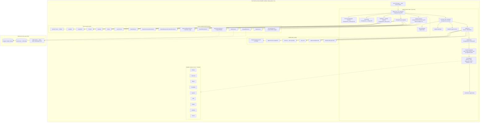

# OpenAI Agents Python — Benchmark Analysis

> **Repo**: https://github.com/openai/openai-agents-python
> **Commit analysed**: `28e9f4fca26dd1c7e679398b87182868ecfad714`
> **Branch**: `main`
> **Framework path**: `frameworks/openai-agents-python/`
> **Analysed on**: 2026-10-01

Analysed at version `openai-agents 0.22.3` (`pyproject.toml:3`) plus 169 commits on `main`. Previous analysis: commit `4bd459e4` (`0.17.2`, 2026-05-19). All file paths in this document are relative to `frameworks/openai-agents-python/` unless otherwise noted.

---

## TL;DR

- ⭐ **What this is architecturally**: an in-process Python *library* (~134k lines of Python under `src/agents/`, up from ~92k at `0.17.2`; most of the growth is in `run_state.py`, `run_internal/`, sandbox hardening, and the new `agents.testing` module) built directly on top of the official `openai>=3.0.0,<4` SDK (`pyproject.toml:10`). There is no subprocess, no sister-repo runtime, no vendor cloud agent loop — the entire ReAct loop executes inside your Python process. The SDK describes itself as "a lightweight yet powerful framework for building multi-agent workflows" (`README.md:3`). One exception is new and opt-in: the experimental **hosted multi-agent** model lets OpenAI's Responses API run sub-agents server-side while your function tools still execute locally.
- **Ecosystem**: **Python** (primary, 3.10+). A separate `openai-agents-js` repo covers TypeScript.
- **Open-source/license/support**: MIT-licensed, maintained by OpenAI (a "SDKs team" was added as code owner in 0.22.3). Community support via GitHub issues + OpenAI Developer Community; no paid SLA on the SDK itself.
- **Maturity/adoption snapshot** (captured 2026-10-01): still pre-1.0 (`0.22.3`, released 2026-09-17); ~29.8k stars, ~4.8k forks, ~396 contributors; five minor versions (0.18 → 0.22) and 22 releases since 2026-05-19; ~12M PyPI downloads in the last month. `docs/release.md:3` still states "The leading `0` indicates the SDK is still evolving rapidly."
- ⭐ **Guardrails remain the standout feature** and got deeper since 0.17: four decorator types — `@input_guardrail`, `@output_guardrail`, `@tool_input_guardrail`, `@tool_output_guardrail` (`src/agents/guardrail.py`, `src/agents/tool_guardrails.py`) — with a `tripwire_triggered` halt and an `allow` / `reject_content` / `raise_exception` tri-state for tool-level guardrails. New: **pre-approval tool input guardrails** (`ToolExecutionConfig.pre_approval_tool_input_guardrails`, `src/agents/run_config.py:146`), **server-wide guardrails on every MCP tool** (`MCPServer(tool_input_guardrails=…, tool_output_guardrails=…)`, `src/agents/mcp/server.py:573-574`), and customizable output-guardrail blocked messages (`RunConfig.output_guardrail_blocked_message`, `src/agents/run_config.py:499`).
- ⭐ **Sessions story is the other standout**: 10 first-party session backends ship in the box. Core: `SQLiteSession`, `OpenAIConversationsSession`, `OpenAIResponsesCompactionSession`. Extensions: `AdvancedSQLiteSession` (with conversation branching and usage tables), `AsyncSQLiteSession`, `SQLAlchemySession` (Postgres/MySQL), `RedisSession`, `MongoDBSession`, `DaprSession`, plus the `EncryptedSession` Fernet/HKDF wrapper. All conform to the `Session` Protocol (`src/agents/memory/session.py:53`). **New since 0.20**: a custom session can opt into receiving the active `RunContextWrapper` (`wrapper=` keyword on all four methods, `src/agents/memory/session.py:192-249`), which enables tenant routing at the storage layer.
- **Where the agent loop actually executes**: **inside your Python process**, single-threaded asyncio. `Runner.run` (`src/agents/run.py:261`) is the entrypoint; the loop, tool dispatch, guardrail evaluation, hook firing and session persistence all happen in your interpreter.
- 🟢 **Strongest architectural choice for our use case**: `RunContextWrapper[TContext]` + `ToolContext` give clean tool-side access to tenant identity, OAuth tokens, etc., never passing through the LLM. Combined with `is_enabled` per-tool callables, context-aware sessions and MCP `tool_meta_resolver`, this lets you build tenant-scoped agents without registry support.
- 🔴 **Weakest / biggest gap**: no first-party HTTP server, no runtime/scheduler, and no resource manager. The SDK is library-only — you bring your own FastAPI/Starlette layer, your own Celery/Temporal scheduler, your own skill registry (Git/S3/Postgres). Per-tenant USD budget cap and audit log are also BYO. None of this changed between 0.17 and 0.22.
- **Most surprising finding (good)**: the SDK now ships **provider-neutral test doubles** (`agents.testing.ScriptedModel`, `scripted_sandbox_session`, plus Realtime and Voice equivalents — `src/agents/testing/`, `docs/testing.md`) so you can unit-test tool loops, handoffs, guardrails, retries and streaming deterministically in CI without any model call. Tracing lock-in is also near zero: 30+ partner exporters are listed in `docs/tracing.md:225-256` (now including Datadog, PostHog, Laminar).
- **Most surprising finding (bad)**: there is still **no first-class "force tool arguments" hook** — the closest you get is a `@tool_input_guardrail` that can `reject_content` but not rewrite, or you read tenant from `ctx.context` inside the tool. Also: a serialized `RunState` **includes your `TContext`** and is **not authenticated** by the SDK (`docs/human_in_the_loop.md:195-220`); secrets placed in context travel with every HITL snapshot.
- 🟡 **Sub-agents are agents-as-tools** (`Agent.as_tool(...)`, `src/agents/agent.py:606`) OR `Handoff` (`src/agents/handoffs/__init__.py:126`). Both first-class. New: **experimental OpenAI-hosted sub-agents** (`OpenAIHostedMultiAgentModel`, `src/agents/extensions/experimental/hosted_multi_agent/model.py:369`) and **Programmatic Tool Calling** (`ProgrammaticToolCallingTool`, `src/agents/tool.py:1636`), where the model writes JavaScript that fans out tool calls in a hosted V8 sandbox.
- 🟢 **Skills (SKILL.md) ARE supported** — `class Skill(BaseModel)` (`src/agents/sandbox/capabilities/skills.py:526`) with name/description/content/scripts/references/assets, plus a `LazySkillSource` abstraction and a synthetic `load_skill` tool. Skills are *bound to sandbox/shell execution*, not a generic system-prompt loader. Hosted container shells can also reference OpenAI-hosted skills by `skill_id` + `version` (`ShellToolSkillReference`, `src/agents/tool.py:1298`).
- **One-line verdicts** — **Sessions**: best in class (10 backends + Encrypted wrapper + context-aware custom sessions). **Skills**: present but sandbox-bound. **Resource manager**: none (only hosted-shell `skill_id` references). **Sub-agents**: first-class via `as_tool()` + `Handoff`, plus experimental hosted sub-agents; programmatic fan-out still BYO `asyncio.gather`. **Multi-tenancy**: `RunContextWrapper[TContext]` is solid; tool-arg forcing still requires custom wrapping. **Hooks**: moderate (lifecycle hooks are read-only); guardrails fill the rejection role. **API**: library-only (host owns HTTP). **Observability**: tokens + tracing rich; USD cost BYO.
- **Production-readiness verdict** for multi-tenant server-side deployment: usable, and hardened noticeably since 0.17 (redacted errors, owner-checked HITL guidance, sandbox mount credential checks, model-call timeouts), but you still write more glue (HTTP layer, registry-level tenant scoping, USD cost, scheduler) than with Mastra or LangGraph.

---

## 0. General

### 0.1 What is this stack?
**Library/framework** — an in-process Python SDK. It is *not* a server, not a vendor-managed agent runtime, not a CLI wrapper. The `pyproject.toml` classifier `Topic :: Software Development :: Libraries :: Python Modules` confirms this. The optional hosted multi-agent model (Q9) is the only path where orchestration moves to OpenAI's service.

### 0.2 Ecosystem
**Python** (primary, 3.10+ per `pyproject.toml:6`, also runs on 3.11/3.12/3.13/3.14).

The vendor maintains a TypeScript sibling separately at https://github.com/openai/openai-agents-js (referenced from `README.md:8`). The Python and JS SDKs are independent codebases with broadly similar concepts but different APIs.

### 0.3 Project status & governance
- **License**: MIT (`LICENSE`, `pyproject.toml:7`).
- **Maintainer**: OpenAI (the company). Most feature PRs in the 0.18 → 0.22 window are authored by OpenAI engineers; external contributors land fixes and smaller features. 0.22.3 added an OpenAI "SDKs team" as repository code owner. There is no foundation or third-party maintainership.
- **Commercial backing**: OpenAI uses this SDK for its own agent products and examples; the funding/maintenance signal is strong.
- **Support model**: community-only for the SDK itself (GitHub issues, OpenAI Developer Community). Your **OpenAI API contract** (rate limits, paid tier) backs the underlying LLM, not the SDK. There is no separate paid SLA for the SDK.

### 0.4 Project maturity / age
- **Repository created**: 2025-03-11 (GitHub API). First PyPI release `0.0.2`.
- **Current version**: `0.22.3` (`pyproject.toml:3`, released 2026-09-17).
- **Stability signals**: per `docs/release.md:3`, "The project follows a slightly modified version of semantic versioning using the form `0.Y.Z`. The leading `0` indicates the SDK is still evolving rapidly." Minor (`Y`) bumps signal breaking changes to non-beta public interfaces; patches can change beta features (`docs/release.md:7-19`).
- **API stability**: the breaking-change changelog (`docs/release.md:21+`) remains modest in scope per minor. Two of the five recent minors (0.18, 0.19) were explicitly non-breaking; 0.20–0.22 carry dependency migrations (MCP SDK v2, `openai` v3 / HTTPX2) and stricter failure handling. Features marked beta or experimental (Sandbox Agents, hosted multi-agent, Programmatic Tool Calling) can change in patch releases.
- **Age signal**: ~19 months public at capture, 0.0.x → 0.22.x. Mature enough to trust for production, still evolving fast.

### 0.5 Adoption & community signal
Captured **2026-10-01** via `gh api`:
- **Stars**: ~29,795. **Forks**: ~4,842. **Watchers**: 231. **Contributors**: ~396.
- **Activity**: 884 commits between 2026-05-19 (`0.17.2+21`) and this commit; ~756 PRs merged and ~288 issues opened over the same window. Last push 2026-10-01.
- **Issue tracker**: 1 open issue and 3 open PRs at capture out of ~1,560 issues total — the tracker is aggressively triaged and closed.
- **Release cadence**: 22 GitHub releases between 0.17.3 (2026-05-19) and 0.22.3 (2026-09-17); roughly one minor every 2–4 weeks with several patches in between.
- **Package downloads**: ~12.1M PyPI downloads in the last month (pypistats.org, 2026-10-01).
- **Partner ecosystem (tracing)**: 30+ listed exporters (Q12.5).
- **Multi-language docs**: Japanese, Korean, Chinese translations (`docs/ja/`, `docs/ko/`, `docs/zh/`).

### 0.6 Ecosystem fit
- **Package**: `openai-agents` on PyPI (`pyproject.toml:2`) — https://pypi.org/project/openai-agents/
- **Primary language**: Python (Q0.2).
- **Used as**: a library imported into your own Python process (FastAPI app, Celery worker, Temporal worker, etc.).
- **Official examples/templates**: large `examples/` tree (`examples/basic/`, `examples/agent_patterns/`, `examples/sandbox/`, `examples/tools/`, `examples/memory/`, `examples/mcp/`, `examples/realtime/`).
- **Machine-readable docs**: `docs/llms.txt` and `docs/llms-full.txt` for coding agents.

### 0.7 Documentation depth & cross-team contributor accessibility
- Official site: https://openai.github.io/openai-agents-python/ (MkDocs Material).
- Translated: Japanese (`docs/ja/`), Korean (`docs/ko/`), Chinese (`docs/zh/`).
- Per-feature pages: agents, tools, sessions, guardrails, handoffs, human-in-the-loop, MCP, models, realtime, sandbox (guide, clients, memory), streaming, results, testing, tracing, usage, voice, visualization, REPL.
- Depth has increased noticeably: pages now carry explicit trust-boundary and failure-mode guidance (e.g. server-side HITL in `docs/human_in_the_loop.md:189-220`, SQLite storage trust boundary in `docs/sessions/index.md:500+`, Unix-local sandbox isolation limits in `docs/sandbox/clients.md:19-23`).
- **Cross-team accessibility**: medium. The docs assume a Python developer comfortable with `asyncio`, dataclasses and basic Pydantic. There is no markdown-only authoring flow for non-engineers outside sandbox skills (`SKILL.md` files). A Product/Data contributor cannot ship behavior changes without engineering review.

### 0.8 Documentation entry points ⭐

- **Official docs landing**: https://openai.github.io/openai-agents-python/
- **Quickstart / getting-started**: https://openai.github.io/openai-agents-python/quickstart/
- **API reference (auto-generated, mkdocstrings)**: https://openai.github.io/openai-agents-python/ref/
  - https://openai.github.io/openai-agents-python/ref/run/
  - https://openai.github.io/openai-agents-python/ref/agent/
  - https://openai.github.io/openai-agents-python/ref/tool/
  - https://openai.github.io/openai-agents-python/ref/guardrail/
  - https://openai.github.io/openai-agents-python/ref/memory/session/
  - https://openai.github.io/openai-agents-python/ref/tracing/
- **Hosting / deployment / production guide**: none (this is a library; you host it inside your own Python service). Closest: https://openai.github.io/openai-agents-python/human_in_the_loop/#long-running-approvals and https://openai.github.io/openai-agents-python/sandbox/clients/
- **Testing guide (new)**: https://openai.github.io/openai-agents-python/testing/
- **Examples / demos repo**: https://github.com/openai/openai-agents-python/tree/main/examples
- **Changelog / release notes**: https://openai.github.io/openai-agents-python/release/ (also `docs/release.md`)
- **GitHub Releases**: https://github.com/openai/openai-agents-python/releases
- **GitHub issues tracker**: https://github.com/openai/openai-agents-python/issues
- **Discord / community forum**: OpenAI's [Developer Community](https://community.openai.com/) is the primary venue; no project-specific Discord noted in the repo README.
- **JS/TS sibling**: https://github.com/openai/openai-agents-js (referenced from `README.md:8`).

---

## 1. High Level Architecture

### Deployment diagram

```
┌──────────────────────────────────────────────────────────────────┐
│                  Your Python process (single host)               │
│                                                                  │
│  ┌────────────────────────────────────────────────────────────┐  │
│  │  Your HTTP server (FastAPI / Starlette / aiohttp — BYO)    │  │
│  │  - JWT validation, tenant scoping, request → context       │  │
│  └─────────────────────────┬──────────────────────────────────┘  │
│                            │                                     │
│                            ▼                                     │
│  ┌────────────────────────────────────────────────────────────┐  │
│  │  agents.Runner.run / run_streamed (src/agents/run.py:259)  │  │
│  │  ├── Agent[TContext] (instructions, tools, guardrails…)    │  │
│  │  ├── RunContextWrapper[TContext]  ──► your typed context   │  │
│  │  ├── Session protocol         (Sqlite/Redis/Postgres/…)    │  │
│  │  └── run_loop  →  LLM  →  tool dispatch  →  loop           │  │
│  └──────┬─────────────┬───────────────┬─────────────┬─────────┘  │
│         │             │               │             │            │
│   guardrails       hooks         tool_context    sandbox         │
│         │             │               │             │            │
└─────────┼─────────────┼───────────────┼─────────────┼────────────┘
          │             │               │             │
          ▼             ▼               ▼             ▼
   ┌──────────┐  ┌─────────────┐  ┌──────────┐  ┌─────────────────┐
   │ OpenAI   │  │ LiteLLM /   │  │  MCP     │  │ Docker / E2B /  │
   │ Resp.API │  │ Any-LLM     │  │ servers  │  │ Modal / Daytona │
   │ (HTTP /  │  │ → 100+      │  │ (stdio / │  │ / Vercel / …    │
   │  WS)     │  │  providers  │  │  SSE /   │  │ (sandboxes)     │
   └────┬─────┘  └─────────────┘  │ HTTP)    │  └─────────────────┘
        │                         └──────────┘
        │ (opt-in, experimental)
        ▼
   ┌──────────────────────────────┐
   │ OpenAI-hosted sub-agents     │  ← OpenAIHostedMultiAgentModel:
   │ (Responses multi-agent beta) │    orchestration on OpenAI, local
   │ + hosted V8 for Programmatic │    function tools injected back
   │   Tool Calling               │    over the WebSocket
   └──────────────────────────────┘
          │
          ▼
   ┌────────────────────────────┐
   │ OpenAI Traces dashboard /  │  ← default BatchTraceProcessor
   │ 30+ partner exporters      │     exports tracing here
   │ (Langfuse, Phoenix, MLflow,│
   │  Datadog, LangSmith …)     │
   └────────────────────────────┘
```

The whole loop, including streaming, tool dispatch, guardrail evaluation, hook firing, and session persistence, happens inside your Python process. No bundled CLI, no Node sidecar, no sister-repo server.

### 1.1 Where does the agent loop actually execute?
**In your Python process**, single-threaded async on the asyncio event loop you own. The entrypoint is `Runner.run` (`src/agents/run.py:261`), which delegates to `AgentRunner.run` (`src/agents/run.py:548`), which in turn calls into `src/agents/run_internal/run_loop.py` and `src/agents/run_internal/turn_resolution.py` (`process_model_response` at `:2799`, `execute_tools_and_side_effects` at `:795`, `resolve_interrupted_turn` at `:1145`) — all in-process. The repo's `AGENTS.md:158` confirms: "`src/agents/run.py` is the runtime entrypoint (`Runner`, `AgentRunner`). Keep it focused on orchestration and public flow control."

**One opt-in exception (new, experimental since 0.18.2)**: with `OpenAIHostedMultiAgentModel` the root model creates and coordinates sub-agents on OpenAI's service; the local Runner still executes function tools and injects their outputs back into the active hosted response over WebSocket (`docs/models/index.md:238-263`). Programmatic Tool Calling (0.19) likewise runs model-generated JavaScript in a hosted V8 environment while the tools it calls run locally (`docs/tools.md:133-137`).

Compare to Claude Agent SDK Py (subprocesses a Node binary) or LangGraph Platform (vendor-managed server) — neither applies in the default path. The closest analogs in shape are Mastra TS or Vercel AI SDK.

### 1.2 Runtime dependencies
- **Python 3.10+** language runtime.
- **No bundled binaries** the SDK subprocesses (no Node CLI, no `ffmpeg`, no language server). Pure Python.
- **Required vendor service**: at least one LLM provider — by default the **OpenAI API** (Responses API). With LiteLLM/Any-LLM you can swap to any supported provider.
- **Required infrastructure services**: **none** for the in-memory default. If you opt into a hosted session backend you need its dependency: Postgres/MySQL (`SQLAlchemySession`), Redis (`RedisSession`), MongoDB (`MongoDBSession`), or a Dapr sidecar (`DaprSession`). Sandbox agents need Docker or a hosted sandbox provider account for real isolation (Unix-local is for trusted development only, `docs/sandbox/clients.md:19-23`). For tracing, exports go to OpenAI's hosted Traces dashboard by default; you can replace it with any partner exporter.
- **Dependency baseline changed in 0.21**: the core now requires `openai>=3.0.0,<4` and uses HTTPX2 instead of legacy `httpx` (`pyproject.toml:10`, `:18`; `docs/release.md:35-46`). MCP Python SDK v1 or v2 is accepted (`mcp>=1.19.0,<3`, `pyproject.toml:16`).
- **No native libs** beyond pydantic-core wheels.

The deployment story is as light as you want: a single Python process with an OpenAI API key suffices for a working agent; everything else is opt-in.

### 1.3 Recommended deployment topology
The SDK has no vendor opinion on topology. Examples uniformly assume **one Python process per host**, hosting many sessions via asyncio. Sessions are isolated by `session_id` at the store layer (each `Session` instance binds one id; see Q5.7). For horizontal scaling, run N stateless worker processes with a shared store (Postgres via `SQLAlchemySession`, Redis via `RedisSession`, MongoDB via `MongoDBSession`). Each worker can serve any session as long as it can reach the same store.

The closest thing to a production topology guide is the server-side HITL guidance (`docs/human_in_the_loop.md:193-208`): keep the serialized `RunState` in application-controlled storage, authenticate and authorize the reviewer on the server, and use "an atomic owner-checked transition before starting resumed execution" in shared storage. The accompanying example (`examples/agent_patterns/human_in_the_loop_server.py`) is explicitly "not a deployable HTTP service".

There is no first-party "container-per-tenant" recommendation — the typical pattern is one-process-many-tenants, with isolation enforced via per-request `RunContextWrapper[TContext]` and (optionally) per-tenant session stores.

### 1.4 Cold-start cost & instance footprint
- **Cold start**: low — `import agents` triggers the openai SDK + pydantic imports. `SQLiteSession` is lazy-imported via module `__getattr__` (`src/agents/__init__.py:267-275`) and the extension session backends are lazy-imported (`src/agents/extensions/memory/__init__.py:44-74`). No 20–30 s startup like Claude Agent SDK's bundled Node. Not benchmarked in this analysis.
- **RAM baseline**: modest (~100–150 MB for the Python interpreter + pydantic + openai SDK; estimate, not measured). No persistent state in the SDK process beyond what your code keeps.
- **Disk baseline**: tens of MB for the package itself. `SQLiteSession` defaults to `:memory:` (zero disk) unless you point it at a file (`src/agents/memory/sqlite_session.py:31-38`).

### 1.5 Vendor lock-in
- **LLM-provider lock-in**: 🟢 **low**. `MultiProvider` (`src/agents/models/multi_provider.py:62`) supports `openai/...`, `litellm/...`, `any-llm/...` prefixes natively. LiteLLM covers 100+ providers, Any-LLM adds OpenRouter and others. The Responses API gets first-class treatment and a growing set of features are Responses-only (tool search, Programmatic Tool Calling, hosted multi-agent, server-side compaction), so the gap between "OpenAI path" and "other providers" is widening.
- **Hosting-platform lock-in**: 🟢 **none**. Run anywhere Python 3.10+ runs.
- **Eval / observability lock-in**: 🟢 **none**. Default exporter sends to OpenAI Traces, but `add_trace_processor` / `set_trace_processors` (`src/agents/tracing/__init__.py:94-105`) replace or extend that with any of 30+ partner exporters.
- **Session-store lock-in**: 🟢 **none**. 10 first-party backends + the `Session` Protocol for BYO.

The "OpenAI-flavored" choices are: Responses API server-managed conversation features (`conversation_id`, `previous_response_id`, `auto_previous_response_id`), `OpenAIResponsesCompactionSession`, hosted tools, Programmatic Tool Calling and hosted multi-agent only work end-to-end with OpenAI models. With LiteLLM/Any-LLM you use the local Session backends and BYO compaction.

### 1.6 Framework weight / footprint
**Medium-heavy** for a library, and growing. The SDK ships agents, sessions (10 backends), guardrails (4 types), MCP client, sandbox runtime with Docker + Unix-local + 7 hosted providers, sandbox memory, tracing, realtime (voice), Codex extension, hosted-tool wrappers, a REPL (`run_demo_loop`), and now first-party test doubles (`agents.testing`). It does **not** ship a dev UI, a frontend SDK, a scheduler, a deployer, a storage abstraction beyond sessions, or an eval harness. Compared to Mastra this stack is leaner; compared to Claude Agent SDK Py (a thin wrapper around a Node binary) this is much bigger.

Optional deps (`pyproject.toml:42-93`) keep the install lean: `voice`, `viz`, `litellm`, `any-llm`, `realtime`, `sqlalchemy` (+asyncpg), `encrypt` (cryptography), `redis>=7`, `dapr`, `mongodb`, `docker`, `blaxel`, `daytona`, `cloudflare`, `e2b`, `modal`, `runloop`, `vercel`, `s3`, `temporal`.

### 1.7 Release-history signal
Documented in-repo at `docs/release.md` (breaking changes per minor) and in GitHub Releases (all changes). Key signals since the previous analysis (most recent first):

- **0.22.0** (`docs/release.md:22-33`, 2026-08-19): stricter failure handling and data isolation. Output-guardrail rejections of terminal function-tool output now replace the payload with `"Output withheld by an output guardrail."` in session history, `RunState` and streamed state. Non-streaming Responses calls raise `ModelBehaviorError` on `failed`/`incomplete` terminal status. Each `RunResult.to_state()` checkpoint owns an independent usage snapshot. `OpenAIProvider(openai_client=…, organization=…/project=…)` now raises `UserError`. 0.22.1 added customizable output-guardrail messages, server-wide MCP tool guardrails, Unix-local environment isolation, and image results in web search.
- **0.21.0** (`docs/release.md:35-46`, 2026-08-15): requires `openai` v3 and moves the SDK's OpenAI HTTP integrations to HTTPX2; apps that pass a custom `http_client` must migrate. Adds public provider-neutral testing utilities (`agents.testing`). 0.21.1 added model-call timeouts (`ModelSettings.timeout`), run-scoped sandbox working directories, and Docker network disable.
- **0.20.0** (`docs/release.md:48-61`, 2026-08-11): default model is now `gpt-5.6-luna`. MCP Python SDK v2 support (v1 retained). `RunState.add_input()` stages durable user input before a resumed model call. Retry policies can explicitly approve unsafe replays. Custom sessions can receive the run context. Sandbox mount credential-exposure acknowledgements.
- **0.19.0** (`docs/release.md:63-74`, 2026-07-27, non-breaking): **Programmatic Tool Calling** (`ProgrammaticToolCallingTool`), the `agents.decorators` module with `@tool` alias, consistent dict-or-typed-object configuration, hardened logging to avoid leaking raw payloads.
- **0.18.0** (`docs/release.md:76-82`, 2026-07-07, non-breaking): Realtime default model `gpt-realtime-2.1`. Patches added GPT-5.6 request controls, the **hosted multi-agent beta** (0.18.2), and configurable task/turn tracing spans (0.18.3).
- **0.17.x patches** (2026-05-19 → 2026-07-06): pre-approval tool input guardrails and SDK-only custom data on tool outputs (0.17.6), buffered Chat Completions tool-call streaming (0.17.7), invalid-final-output recovery handler (0.17.8).
- **Earlier** (unchanged from previous analysis): 0.17.0 sandbox local-source boundary (`docs/release.md:84-115`); 0.16.0 default model `gpt-5.4-mini` + `max_turns=None` (`:117-130`); 0.15.0 `ModelRefusalError` (`:132-146`); 0.14.0 Sandbox Agents beta (`:148-159`); 0.13.0 MCP resources + streamable-HTTP `session_id` (`:161-170`).

Post-0.22.3 `main` (169 commits) adds opt-in encrypted-history scan budgets, compaction rollback budgets, configurable MCP listing page limits, configurable sandbox memory consolidation turns and Docker removal protection — all bounded-work or hardening changes.

**Pattern**: fast-moving areas are sandbox security, RunState durability/serialization (schema `1.10` → `1.18`, `src/agents/run_state.py:212`), MCP compatibility, and OpenAI-only Responses features. Production users should pin a minor and read `docs/release.md` before bumping.

---

## 2. Agent Loop

### 2.1 Run loop entrypoint(s)
Two public flavors plus a streaming flavor. Defined on `class Runner` (`src/agents/run.py:259`):

```python
class Runner:
    @classmethod
    async def run(
        cls,
        starting_agent: Agent[TContext],
        input: str | list[TResponseInputItem] | RunState[TContext],
        *,
        context: TContext | None = None,
        max_turns: int | None = DEFAULT_MAX_TURNS,          # = 10 (run_config.py:45)
        hooks: RunHooks[TContext] | None = None,
        run_config: RunConfig | dict[str, Any] | None = None,  # dicts accepted since 0.19
        error_handlers: RunErrorHandlers[TContext] | None = None,
        previous_response_id: str | None = None,
        auto_previous_response_id: bool = False,
        conversation_id: str | None = None,
        session: Session | None = None,
    ) -> RunResult: ...
    # src/agents/run.py:261-275

    @classmethod
    def run_sync(...) -> RunResult: ...                       # blocking variant
    # src/agents/run.py:366-467

    @classmethod
    def run_streamed(...) -> RunResultStreaming: ...          # async-iterable result
    # src/agents/run.py:469-546
```

`run` returns `RunResult` (`src/agents/result.py:486`); `run_streamed` returns `RunResultStreaming` (`src/agents/result.py:599`) which exposes `.stream_events()` (`src/agents/result.py:942`) — an async iterator over `StreamEvent`.

### 2.2 Per-iteration behavior
Documented inline at `src/agents/run.py:281-286`:

```
1. The agent is invoked with the given input.
2. If there is a final output (i.e. the agent produces something of type
   `agent.output_type`), the loop terminates.
3. If there's a handoff, we run the loop again, with the new agent.
4. Else, we run tool calls (if any), and re-run the loop.
```

The per-iteration code path lives in `src/agents/run_internal/run_loop.py` and `src/agents/run_internal/turn_resolution.py` (`process_model_response` `:2799`, `execute_tools_and_side_effects` `:795`, `check_for_final_output_from_tools` `:760`, `execute_handoffs` `:529`). Tool planning and approval gating live in `run_internal/tool_planning.py` and `run_internal/approvals.py`.

### 2.3 ReAct loop
**Built-in**. The above is a vanilla ReAct loop (LLM → tool dispatch → result → LLM). You configure `Agent.tool_use_behavior` to choose:
- `"run_llm_again"` (default): standard ReAct, feed tool results back to the LLM.
- `"stop_on_first_tool"`: first tool result is the final output.
- `StopAtTools(stop_at_tool_names=[...])`: stop on first matching tool call (`src/agents/agent.py:147`).
- `ToolsToFinalOutputFunction`: custom decision function (see `examples/agent_patterns/forcing_tool_use.py`).

New variant (0.19, OpenAI Responses only): with `ProgrammaticToolCallingTool()` the model can emit one JavaScript program that calls several tools with loops/branching inside a single model turn, instead of one round trip per tool call (`docs/tools.md:133-137`).

### 2.4 Tool dispatch + result handling
LLM-emitted tool calls are routed through `src/agents/run_internal/tool_execution.py`:
- `execute_function_tool_calls` (`:2330`, Python function tools)
- `execute_local_shell_calls` (`:2383`) / `execute_shell_calls` (`:2410`)
- `execute_apply_patch_calls` (`:2437`)
- `execute_computer_actions` (`:2464`)
- MCP-side approvals via `run_internal/tool_planning.py`

Each invocation receives a `ToolContext` (Q6.3) carrying `tool_name`, `tool_call_id`, `tool_arguments`, plus the parent `RunContextWrapper[TContext]`. Results are wrapped as `FunctionToolResult` (`src/agents/tool.py:388`) and threaded back into the LLM input list via `run_internal/items.py:run_items_to_input_items` (`:158`).

New dispatch options since 0.17: `RunConfig.tool_not_found_behavior = "raise_error" | "return_error_to_model"` (`src/agents/run_config.py:482`) for hallucinated tool names, `tool_name_collision_policy` (`:490`), per-tool `timeout_seconds` / `timeout_behavior` on `FunctionTool` (`src/agents/tool.py:514-525`), and `custom_data_extractor` to attach SDK-only data to a tool output that is never sent to the model (`src/agents/tool.py:530`, surfaced as `ToolCallOutputItem.custom_data`, `src/agents/items.py:447`).

### 2.5 Explicit turn concept
**A turn = one LLM call plus its dispatched tool calls**. From the docstring at `src/agents/run.py:301-302`: "A turn is defined as one AI invocation (including any tool calls that might occur)." `max_turns` (default 10, `None` for unlimited since 0.16.0) is the cap. Resumed runs continue from the turn count stored in `RunState`; `RunState.add_input()` refuses to stage input when no model turns remain (`src/agents/run_state.py:1007-1019`). Input guardrails run only for the first agent in the chain (`docs/guardrails.md:14`, `src/agents/run.py:294`), and input staged with `add_input()` is also passed through them (`docs/release.md:60`).

### 2.6 Event emission mechanism (in-process)
Streaming uses an internal `asyncio.Queue[StreamEvent | QueueCompleteSentinel]` (`src/agents/result.py:638`). The background run-loop task writes events; `RunResultStreaming.stream_events()` reads them. There is also a separate `_input_guardrail_queue` for streaming guardrail trips (`src/agents/result.py:641`).

The yielded type is `StreamEvent` — the union `RawResponsesStreamEvent | RunItemStreamEvent | AgentUpdatedStreamEvent` (`src/agents/stream_events.py:61`, file unchanged since the previous analysis). See Q3 for the taxonomy.

---

## 3. Message & Event Taxonomy

### 3.1 Message layers
Three layers, deliberately separated:

1. **OpenAI wire layer** — `TResponseInputItem` (alias for `openai.types.responses.ResponseInputItemParam`, `src/agents/items.py:79`) and `TResponseOutputItem` (alias for `ResponseOutputItem`, `:82`). These are the openai-python types the Responses API consumes/produces.
2. **SDK "run item" layer** — `RunItem` subclasses (`src/agents/items.py:98-700`): `InputItem` (new), `MessageOutputItem`, `ToolCallItem`, `ToolCallOutputItem`, `HandoffCallItem`, `HandoffOutputItem`, `ToolApprovalItem`, `MCPListToolsItem`, `MCPApprovalRequestItem`, `MCPApprovalResponseItem`, `ReasoningItem`, `ToolSearchCallItem`, `ToolSearchOutputItem`, `CompactionItem`. Each wraps a `raw_item` from layer 1 plus the originating `Agent`.
3. **Stream event layer** — `StreamEvent` is a union of `RawResponsesStreamEvent | RunItemStreamEvent | AgentUpdatedStreamEvent` (`src/agents/stream_events.py:61`).

The runner converts layer-2 → layer-1 via `RunItemBase.to_input_item()` (`src/agents/items.py:151`) and `run_internal/items.py:run_items_to_input_items` (`:158`).

### 3.2 Concrete message types

| Type | Purpose | File:line |
|---|---|---|
| `InputItem` | Input admitted while resuming a run (`RunState.add_input`); carries a durable `input_id` for exactly-once tracking (new in 0.20) | `items.py:157` |
| `MessageOutputItem` | LLM assistant message | `items.py:170` |
| `ToolSearchCallItem` | Responses API "tool search" deferred-loading call | `items.py:180` |
| `ToolSearchOutputItem` | Tool search result | `items.py:194` |
| `HandoffCallItem` | LLM-triggered handoff invocation | `items.py:300` |
| `HandoffOutputItem` | Handoff target's first message | `items.py:310` |
| `ToolCallItem` | LLM tool call (function / computer / shell / apply_patch / custom / PTC `program`) | `items.py:383` |
| `ToolCallOutputItem` | Tool result returned to LLM; optional SDK-only `custom_data` | `items.py:431` |
| `ReasoningItem` | LLM reasoning (o-series, gpt-5.x) | `items.py:493` |
| `MCPListToolsItem` | MCP tool catalog listing | `items.py:503` |
| `MCPApprovalRequestItem` | Hosted MCP server requested approval | `items.py:513` |
| `MCPApprovalResponseItem` | User's MCP approval verdict | `items.py:523` |
| `CompactionItem` | Marker for a compaction event in the session | `items.py:533` |
| `ToolApprovalItem` | Pending tool approval (HITL interrupt) | `items.py:556` |
| `ModelResponse` | One raw model response (group of items + usage) | `items.py:706` |

### 3.3 Messages vs. events
Two separate taxonomies:
- **Messages/items** (`RunItem`) are persisted to the session and returned as `RunResult.new_items`.
- **Events** (`StreamEvent`) flow through the streaming iterator. Three event variants:
  - `RawResponsesStreamEvent` — raw OpenAI Responses API events (text deltas, function-call argument deltas, lifecycle events; with hosted multi-agent also beta hosted-output items and `response.inject.created` acknowledgements).
  - `RunItemStreamEvent` — wraps a newly-generated `RunItem` (`message_output_created`, `tool_called`, `tool_output`, `reasoning_item_created`, `handoff_requested`, `handoff_occured` [sic, kept for compat], `mcp_approval_requested`, `mcp_approval_response`, `mcp_list_tools`, `tool_search_called`, `tool_search_output_created` — `src/agents/stream_events.py:29-42`).
  - `AgentUpdatedStreamEvent` — fires when handoff swaps `current_agent`.

### 3.4 Event categories
- **Stream-event (raw)**: text-delta, reasoning-delta, function-call-arg-delta, refusal-delta, response-created/completed/error (all `RawResponsesStreamEvent`).
- **Turn-event / run-item event**: every newly-created `RunItem` (`RunItemStreamEvent`).
- **Message-event**: subset of run-item events (`message_output_created`).
- **Tool event**: subset of run-item events (`tool_called`, `tool_output`). Programmatic Tool Calling `program` items and their child calls also appear as `tool_called` / `tool_output` (`docs/tools.md`, PTC section).
- **Session-lifecycle event**: not surfaced on the stream — handled via `RunHooks` (`on_agent_start`, `on_agent_end`).
- **Hook event**: not on the stream — fires inside the loop.
- **Agent-lifecycle event**: `AgentUpdatedStreamEvent` (the only "agent changed" notification on the stream).
- **Sub-agent event**: when sub-agents are invoked as tools, an `on_stream` callback on `as_tool(...)` can re-emit the sub-agent's events as `AgentToolStreamEvent` (`src/agents/agent.py:134`). Hosted multi-agent sub-agent messages are filtered out of the high-level result and only visible via raw events (`docs/models/index.md:285-289`).

### 3.5 Canonical type-definition file(s)
- Items / messages: `src/agents/items.py`
- Stream events: `src/agents/stream_events.py`
- Run context: `src/agents/run_context.py`
- Tool context: `src/agents/tool_context.py`
- Run result / streaming result: `src/agents/result.py`
- Run state (serializable snapshot): `src/agents/run_state.py` (5,472 lines, up from 3,305 — very rich)
- Run config: `src/agents/run_config.py`
- Run error handlers: `src/agents/run_error_handlers.py`

### 3.6 Live agentic event stream taxonomy
Sample frames as Python repr (in-process; not a wire format — see Q8 for wire-format BYO):

```python
# 1. Raw text delta from OpenAI Responses API (most common, fine-grained)
RawResponsesStreamEvent(
    data=ResponseTextDeltaEvent(
        type="response.output_text.delta",
        delta="Hello",
        item_id="msg_abc",
        output_index=0,
        content_index=0,
        sequence_number=42,
    ),
    type="raw_response_event",
)

# 2. Tool call created (RunItem layer)
RunItemStreamEvent(
    name="tool_called",
    item=ToolCallItem(
        agent=<Agent name="Triage agent">,
        raw_item=ResponseFunctionToolCall(
            call_id="call_xyz", name="topicSearch",
            arguments='{"q":"hiking"}', type="function_call",
        ),
        type="tool_call_item",
    ),
    type="run_item_stream_event",
)

# 3. Handoff to a new agent (lifecycle)
AgentUpdatedStreamEvent(
    new_agent=<Agent name="Persona supervisor">,
    type="agent_updated_stream_event",
)
```

---

## 4. Agent Runtime (Multi-session Host)

### 4.1 Multi-session host architecture
**Not provided as a hosted multi-tenant runtime** — the SDK is a library. You embed `Runner.run` inside your own HTTP server (FastAPI, Starlette, aiohttp). N concurrent sessions in one process = N concurrent `asyncio` tasks, each owning its own `RunContextWrapper`, `Session` instance, and `RunState`.

### 4.2 Concurrent session isolation
Isolation is *per-`Session`-instance* and *per-`RunContextWrapper`*:
- The `Session` Protocol (`src/agents/memory/session.py:53`) binds one `session_id` per instance; messages are scoped to that id at the store layer (`SQLiteSession` puts `session_id` in every row, `src/agents/memory/sqlite_session.py:243-252`, `:272`).
- `RunContextWrapper[TContext]` is a fresh dataclass per `Runner.run` invocation (`ensure_context_wrapper(context)`, `src/agents/run.py:669`; `RunState(... context=context_wrapper ...)` at `:796`).
- Approvals (`_approvals: dict[_ApprovalKey, _ApprovalRecord]`) and the new tool-invocation records are per-`RunContextWrapper` (`src/agents/run_context.py:193-198`).
- **Shared `Agent` objects across concurrent runs**: since 0.18–0.20 the SDK snapshots the agent's tool list per run and raises `UserError` if a hook *replaces* `agent.tools` while concurrent runs share the agent. In-place list mutation and changes to shared tool objects (`is_enabled`, `needs_approval`) are **not** isolated (`src/agents/lifecycle.py:40-47`). Use context-based `is_enabled` callbacks rather than mutating shared tools.

Cross-session bleeding is not possible inside the SDK unless you explicitly share mutable state via your `TContext` or shared agent/tool objects.

### 4.3 Horizontal scaling / multi-instance
Stateless workers + shared store. Run N Python workers; route the same `session_id` to any worker (sticky routing not required if your store is consistent). `SQLAlchemySession`, `RedisSession`, `MongoDBSession`, `DaprSession`, and `OpenAIConversationsSession` all live in a shared external store.

There is **no leader election, no consensus, no centralized run scheduler**. The SDK has retry logic for OpenAI-managed conversation locks (`src/agents/run.py:624-626`: "Track the most recent input batch we persisted so conversation-lock retries can rewind exactly those items") and `InputItem.input_id` gives exactly-once input tracking across resumes, but application-level concurrency control (e.g. two workers resuming the same `RunState`) is yours — the docs explicitly require "an atomic owner-checked transition" in shared storage (`docs/human_in_the_loop.md:204`).

Hosted multi-agent cannot be resumed in-flight in a different process or event loop (`docs/models/index.md:301-303`).

### 4.4 Background / async / scheduled tasks
🔴 **Not provided — BYO**. No scheduler, no cron, no webhook trigger, no long-running background-agent runtime. The optional `temporal` extra (`pyproject.toml:88`) integrates Temporal workflows for durable orchestration, but Temporal is a separate runtime you stand up yourself.

This remains the single biggest architectural gap vs. Mastra (which ships background tasks + scheduler) or LangGraph Platform (cron triggers, background runs).

### 4.5 Worker pool / queue model
Not provided — the SDK assumes you embed the loop in your own HTTP request scope (or any async task). No internal task queue, no worker pool. For long-running agents, you would typically:
- expose a streaming endpoint (FastAPI `StreamingResponse`) over `run_streamed()`;
- or persist `RunState.to_json()` and resume later from a worker pulling jobs off your own queue (Celery / RQ / SQS / etc.).

`ToolExecutionConfig.max_function_tool_concurrency` (`src/agents/run_config.py:139`) bounds concurrent local function tools *within* one run; it is not a cross-run worker pool.

---

## 5. Sessions & Persistence

**This is OpenAI Agents Py's standout area.** Ten session backends ship in the box, more than any other stack in the comparison.

### 5.1 Session / chat data model
Defined as a `Protocol` (and parallel `ABC`) at `src/agents/memory/session.py:53`:

```python
@runtime_checkable
class Session(Protocol):
    session_id: str
    session_settings: SessionSettings | None = None

    async def get_items(self, limit: int | None = None) -> list[TResponseInputItem]: ...
    async def add_items(self, items: list[TResponseInputItem]) -> None: ...
    async def pop_item(self) -> TResponseInputItem | None: ...
    async def clear_session(self) -> None: ...
```

The data model is intentionally minimal:
- **`session_id: str`** — the only identity field on the protocol.
- **`session_settings: SessionSettings | None`** — controls per-session limits (e.g. `limit` for history pagination, `src/agents/memory/session_settings.py`).
- **Items** are `TResponseInputItem` = `openai.types.responses.ResponseInputItemParam`.

No native `tenant_id`, `user_id`, `cwd`, `metadata`, `usage`, `model`, `summary`, `parent_session_id`, or `created_at` fields on the protocol. The concrete `SQLiteSession` tables add `created_at`/`updated_at` (`src/agents/memory/sqlite_session.py:229-259`; table names are now configurable via `sessions_table` / `messages_table`, `:31-38`):

```sql
CREATE TABLE IF NOT EXISTS {sessions_table} (
    session_id TEXT PRIMARY KEY,
    created_at TIMESTAMP DEFAULT CURRENT_TIMESTAMP,
    updated_at TIMESTAMP DEFAULT CURRENT_TIMESTAMP
);

CREATE TABLE IF NOT EXISTS {messages_table} (
    id INTEGER PRIMARY KEY AUTOINCREMENT,
    session_id TEXT NOT NULL,
    message_data TEXT NOT NULL,   -- JSON-serialized TResponseInputItem
    created_at TIMESTAMP DEFAULT CURRENT_TIMESTAMP,
    FOREIGN KEY (session_id) REFERENCES {sessions_table} (session_id)
        ON DELETE CASCADE
);

CREATE INDEX IF NOT EXISTS idx_{messages_table}_session_id
ON {messages_table} (session_id, id);
```

If you need richer fields (tenant scoping, summary, model), the convention is:
- carry that in your **`TContext`** (passed via `RunContextWrapper`), and since 0.20 a custom session can receive that wrapper on every call (Q5.8);
- and/or namespace your `session_id` (`acme:user-123:conv-abc`), see Q5.7.

### 5.2 What's stored on a session
Only `TResponseInputItem`s — the input items list that gets prepended to the next model call: user/assistant/system messages, tool calls and tool outputs, reasoning items, handoff items, MCP approval items. No scratchpad files, no embedded memory, no attachments, no token usage on the base protocol. (`AdvancedSQLiteSession.store_run_usage` adds usage tables, `src/agents/extensions/memory/advanced_sqlite_session.py:665`.)

Since 0.22.0, if an output guardrail blocks a terminal function-tool output, the stored `function_call_output` payload is replaced by `"Output withheld by an output guardrail."` rather than retained (`docs/release.md:28`, `docs/guardrails.md:56`).

For OpenAI Responses API compaction there is `OpenAIResponsesCompactionAwareSession` (`src/agents/memory/session.py:171`) adding `run_compaction`, and the concrete `OpenAIResponsesCompactionSession` (961 lines, `src/agents/memory/openai_responses_compaction_session.py`), which now serializes mutations with compaction and attempts history recovery if replacement fails (`docs/sessions/index.md:260`).

### 5.3 Granularity
**Single conversation per `session_id`** on the base protocol. No fork() semantics in `RunState`.

**Correction vs. previous analysis**: `AdvancedSQLiteSession` *does* ship a branch model — `create_branch_from_turn`, `create_branch_from_content`, `switch_to_branch`, `delete_branch`, `list_branches` (`src/agents/extensions/memory/advanced_sqlite_session.py:1063-1293`). This existed at 0.17.2 as well. Other backends have no branching; with them you create separate `session_id`s and copy the prefix items yourself.

For "resume from middle-of-tool-call" the SDK uses `RunState.to_json()` / `RunState.from_json()` — that is *interruption resume*, not session forking.

### 5.4 Built-in persistence stores
**Ten first-party backends**:

| Backend | File | Notes |
|---|---|---|
| **`SQLiteSession`** | `src/agents/memory/sqlite_session.py` (577 lines) | Default. In-memory (`:memory:`) or file path. Per-file process lock (`_acquire_file_lock`, `:96`). WAL journaling with retry (`:211`). Configurable table names. |
| **`OpenAIConversationsSession`** | `src/agents/memory/openai_conversations_session.py` (149 lines) | Backed by OpenAI's hosted Conversations API. Lazy `session_id` resolution — created on first call (`:63-69`); 0.19.4 skips creation on empty `add_items`. |
| **`OpenAIResponsesCompactionSession`** | `src/agents/memory/openai_responses_compaction_session.py` (961 lines) | Wraps another session; triggers server-side compaction. `compaction_mode = "previous_response_id" \| "input" \| "auto"`. Optional rollback item budget on `main`. |
| **`AdvancedSQLiteSession`** | `src/agents/extensions/memory/advanced_sqlite_session.py` (2,071 lines) | Branching, usage tracking (`store_run_usage`, `get_session_usage`, `get_turn_usage`), turn queries. `add_items` made atomic in 0.17.7. |
| **`AsyncSQLiteSession`** | `src/agents/extensions/memory/async_sqlite_session.py` (543 lines) | Pure-async SQLite. |
| **`SQLAlchemySession`** | `src/agents/extensions/memory/sqlalchemy_session.py` (707 lines) | Postgres (`asyncpg`), MySQL, etc. `.from_url(...)` (`:259`). Unicode storage option (0.18.0). Optional `sqlalchemy` extra. |
| **`RedisSession`** | `src/agents/extensions/memory/redis_session.py` (796 lines) | Async Redis (`redis>=7`). `key_prefix`, `ttl` (`:367-368`). |
| **`MongoDBSession`** | `src/agents/extensions/memory/mongodb_session.py` (605 lines) | `pymongo>=4.14`. |
| **`DaprSession`** | `src/agents/extensions/memory/dapr_session.py` (581 lines) | Dapr state store. Strong/eventual consistency knobs. |
| **`EncryptedSession`** | `src/agents/extensions/memory/encrypt_session.py` (470 lines) | **Wraps any other session** with Fernet/HKDF encryption + TTL-based expiration. See snippet below. |

The extension backends are lazy-imported (`src/agents/extensions/memory/__init__.py:44-74`) so importing `agents.extensions.memory` doesn't pull in `cryptography`, `sqlalchemy`, `redis`, `pymongo`, `dapr` unless you reference the specific class.

⭐ **`EncryptedSession` is useful for multi-tenant compliance**. From `src/agents/extensions/memory/encrypt_session.py:116-175` and `:312-322`:

```python
class EncryptedSession(SessionABC):
    """Encrypted wrapper for Session implementations with TTL-based expiration.

    Only authenticated, unexpired encrypted envelopes are returned as history.
    Plaintext records and incomplete envelopes are skipped, not migrated.
    ...
    By default, finding valid items may read the entire retained history. Set
    ``max_scan_items`` to bound the cumulative number of items retrieved and
    unwrapped per ``get_items`` call ...
    """

    def __init__(self, session_id, underlying_session, encryption_key,
                 ttl=600, max_scan_items=None): ...

    def _wrap(self, item):
        # ... payload to JSON ...
        token = self.cipher.encrypt(_to_json_bytes(payload)).decode("utf-8")
        return {"__enc__": 1, "v": self._ver, "kid": self._kid, "payload": token}
```

Each session derives its own Fernet key via HKDF with `session_id` as salt (`_derive_session_fernet_key`, `:86`), so encrypted blobs cannot be replayed across sessions. TTL is enforced at decrypt time. The docstring now warns that low-entropy passwords are unsuitable as `encryption_key` and that expired records remain in the underlying store until compaction reclaims them.

### 5.5 Persistence timing
Granular and explicit. From `src/agents/run_internal/session_persistence.py`:
- `save_result_to_session` (`:699`) is called per turn.
- The first user input is saved BEFORE the first turn (`src/agents/run.py:967`: `last_saved_input_snapshot_for_rewind = list(session_input_items_for_persistence)` then `save_result_to_session(...)`).
- During a turn, `_current_turn_persisted_item_count` (`src/agents/result.py:496`, set at `src/agents/run.py:1186`) tracks how many items already got saved, so streaming retries don't duplicate. `save_resumed_turn_items` (`:856`) resumes mid-turn safely; 0.22.1 recovers failed resumed session writes on a renewed interruption.
- On guardrail trip, `persist_session_items_for_guardrail_trip` (`src/agents/run_internal/session_persistence.py:563`) persists the user input that triggered the trip. Streamed and non-streamed output-guardrail persistence were aligned in 0.20.
- Session mutations are awaited through caller cancellation (`_await_mutation`, `src/agents/memory/session.py:22-41`), so a cancelled request does not leave a half-written turn.

**Sync vs async**: persistence is always `async def` — it runs inside the loop's event loop and blocks the next turn until it completes. There is no `durability="async"` vs `"sync"` knob like LangGraph.

### 5.6 Mid-run checkpointing (durable)
**Yes — `RunState.to_json()` is the durable checkpoint primitive** (`src/agents/run_state.py`, 5,472 lines, the largest single file in the SDK). The full RunState includes: original input, current agent, current turn, generated items, session items, model responses, guardrail results, current step, tool-use tracker, approvals, staged input (new), per-checkpoint usage snapshot (new in 0.22), trace state, sandbox resume state, and schema version (`CURRENT_SCHEMA_VERSION = "1.18"`, `src/agents/run_state.py:212`).

```python
result = await Runner.run(agent, "Delete temp files", session=session)
if result.interruptions:
    state = result.to_state()                # RunState[TContext]
    state_json = state.to_json()             # JSON-serializable dict
    # persist state_json to server-owned storage
    # later, in a different process:
    state = await RunState.from_json(agent, state_json)   # run_state.py:2339
    state.approve(state.get_interruptions()[0])            # run_state.py:1051, :1321
    state.add_input("Also clean /var/tmp")                 # optional, new in 0.20 (:1007)
    result = await Runner.run(agent, state, session=session)
```

The runner detects `isinstance(input, RunState)` (`src/agents/run.py:608`) and resumes from the recorded `_current_step` (e.g. `NextStepInterruption`) via `resolve_interrupted_turn` (`src/agents/run_internal/turn_resolution.py:1145`). This is comparable to LangGraph's `_runner.commit() → put_writes()`.

**Caveats**: the *automatic* checkpoint is per-turn session persistence, not per-tool-call; durable resume requires you to call `result.to_state().to_json()` (typically on interruption). `from_json` does **not** authenticate the snapshot (`docs/human_in_the_loop.md:195`), and the snapshot includes your context object (Q6.6).

### 5.7 Session ID format
**Arbitrary string** — opaque to the SDK. `SQLiteSession(session_id: str, ...)` (`src/agents/memory/sqlite_session.py:31-33`) has no format constraint. Conventions:
- `"conversation_123"` (basic example)
- `"user-123"` (per-user)
- composite (`"acme:user-123:conv-abc"`) is something you do yourself for tenant scoping (`docs/sessions/index.md:479`, "Session ID naming").

`OpenAIConversationsSession` differs: the `session_id` is the OpenAI-side `conversation.id` (e.g. `conv_abc`), allocated lazily on first use (`src/agents/memory/openai_conversations_session.py:63-69`).

### 5.8 Pluggable store interface
**Yes, very clean.** Two equivalent options:
- Implement the `Session` Protocol (`src/agents/memory/session.py:53`) — structural typing, no inheritance needed.
- Subclass `SessionABC` (`src/agents/memory/session.py:96`) — for type-checker friendliness.

The protocol has **4 methods**: `get_items`, `add_items`, `pop_item`, `clear_session`.

**New in 0.20 — context-aware custom sessions**: if *all four* methods declare a keyword-compatible `wrapper` parameter, the runner passes the active `RunContextWrapper` (`_session_accepts_wrapper` / `_call_session_method`, `src/agents/memory/session.py:192-249`; docs at `docs/sessions/index.md:628-668`). The docs explicitly name "tenant routing, authorization, or other app-specific storage decisions" as the use case:

```python
class TenantSession:
    async def get_items(self, limit=None, *, wrapper: RunContextWrapper[Any] | None = None):
        tenant = wrapper.context.tenant_id          # route to the tenant's schema / prefix
        ...
    async def add_items(self, items, *, wrapper=None): ...
    async def pop_item(self, *, wrapper=None): ...
    async def clear_session(self, *, wrapper=None): ...
```

A generic `**kwargs` does not satisfy the signature check; sessions that omit `wrapper` keep the old call shape.

### 5.9 Schema evolution / migration
- **At the session-store layer**: `SQLiteSession` and `SQLAlchemySession` use `CREATE TABLE IF NOT EXISTS`. No migration helper; bring your own (Alembic, etc.). `EncryptedSession` explicitly does not migrate plaintext history.
- **At the RunState layer**: `src/agents/run_state.py` ships `CURRENT_SCHEMA_VERSION` (`:212`) + `SCHEMA_VERSION_SUMMARIES` (`:217`) + `SUPPORTED_SCHEMA_VERSIONS` (`:259`). The schema moved from `1.10` (0.17.2) to `1.18` in this window, with feature gates such as `_PROGRAMMATIC_TOOL_CALLING_MIN_SCHEMA_VERSION = "1.13"` (`:213`). Released versions remain readable; this is OpenAI's explicit compatibility contract for serialized resume state.

### 5.10 Export / replay
- `RunResult.to_input_list(mode="preserve_all" | "normalized")` (`src/agents/result.py:435`) exports the run as `TResponseInputItem`s ready to feed into a new run.
- `RunState.to_json()` / `to_string()` / `from_json()` / `from_string()` enable full state replay across processes (`docs/human_in_the_loop.md:191`).
- `result.raw_responses: list[ModelResponse]` is the unmodified per-call log.
- **New**: `agents.testing.ScriptedModel` lets you replay a scripted model conversation deterministically against the real Runner (`docs/testing.md:37-206`) — not trace replay, but a deterministic replay harness for orchestration.

No first-party replay viewer; use the tracing dashboard or a partner exporter for visual replay.

### 5.11 Cross-session memory
Not built into the Session protocol. Sandbox agents can use the file-based `Memory()` capability to carry distilled lessons across runs (`src/agents/sandbox/capabilities/memory.py:18`). There is no vector-backed semantic recall. See Q17.

---

## 6. Multi-tenancy & Tenant Identity ⭐ THE KEY QUESTION

### 6.1 Run-loop tenant identity
The only first-class carrier of caller/tenant/user/locale identity is the generic **`context: TContext`** argument (`src/agents/run.py:267`). Everything else on the run call is conversation plumbing:

```python
async def run(
    starting_agent: Agent[TContext],
    input: str | list[TResponseInputItem] | RunState[TContext],
    *,
    context: TContext | None = None,                # YOUR typed tenant identity
    max_turns: int | None = 10,
    hooks: RunHooks[TContext] | None = None,
    run_config: RunConfig | dict[str, Any] | None = None,
    error_handlers: RunErrorHandlers[TContext] | None = None,
    previous_response_id: str | None = None,        # OpenAI Responses chaining
    auto_previous_response_id: bool = False,
    conversation_id: str | None = None,             # OpenAI Conversations API
    session: Session | None = None,                 # SDK-managed history
) -> RunResult: ...
# src/agents/run.py:261-275
```

`RunConfig` (`src/agents/run_config.py:354`) carries run-wide knobs, some of which are identity-adjacent: `trace_metadata` (`:436`, e.g. `{"tenant_id": "acme"}`), `group_id` (`:430`), `workflow_name`, `trace_id`, plus `model`, `model_provider`, `model_settings`, `handoff_input_filter`, `input_guardrails`, `output_guardrails`, `session_input_callback`, `call_model_input_filter`, `tool_error_formatter`, `session_settings`, `sandbox`, `tool_execution`, `tool_not_found_behavior`, `tool_name_collision_policy`, `output_guardrail_blocked_message`.

**Tenant scope on the session**: not a first-class field. `Session.session_id: str` is the only identity. Options:
- Encode in the id: `acme:user-123:conv-abc`.
- Since 0.20, a context-aware custom session reads `wrapper.context.tenant_id` on every call (Q5.8) — the cleanest way to enforce per-tenant storage.
- Or instantiate one `SQLAlchemySession` / `RedisSession` per tenant with a different engine / `key_prefix`.

### 6.2 Tenant identity propagation into tool calls
The user-supplied `context` is wrapped at run start (`context_wrapper = ensure_context_wrapper(context)`, `src/agents/run.py:669`), producing a `RunContextWrapper[TContext]`. That wrapper is then propagated:
- to **agent instructions** (when `instructions` is a callable `[RunContextWrapper[TContext], Agent[TContext]] -> MaybeAwaitable[str]`, `src/agents/agent.py:332-339`),
- to **input/output guardrails** (`src/agents/guardrail.py:86-89` and `:144-147`),
- to **tool execution**: extended to a `ToolContext` (`src/agents/tool_context.py:43`, a subclass of `RunContextWrapper`) with per-call metadata, then passed into `on_invoke_tool(ctx, input)` (`src/agents/tool.py:468`),
- to **context-aware sessions** (`wrapper=`, Q5.8) and **MCP `_meta`** via `tool_meta_resolver` (Q6.6).

The path is `Runner.run → run_single_turn → execute_function_tool_calls (tool_execution.py:2330) → ToolContext → on_invoke_tool(ctx, input)`. The wrapper object is shared across the whole run (it carries the cumulative `Usage` and approvals).

### 6.3 Tool call interface
`FunctionTool.on_invoke_tool: Callable[[ToolContext[Any], str], Awaitable[Any]]` (`src/agents/tool.py:468`).

For the `@function_tool` decorator (`src/agents/tool.py:2623`, aliased as `@tool` in `agents.decorators` since 0.19, `src/agents/decorators.py:10`), the wrapped function's first argument can optionally be a `RunContextWrapper` or `ToolContext`, detected via `schema.takes_context` (`src/agents/tool.py:2771-2780`):

```python
if not is_sync_function_tool:
    if schema.takes_context:
        result = await the_func(ctx, *args, **kwargs_dict)
    else:
        result = await the_func(*args, **kwargs_dict)
else:
    if schema.takes_context:
        result = await asyncio.to_thread(the_func, ctx, *args, **kwargs_dict)
    else:
        result = await asyncio.to_thread(the_func, *args, **kwargs_dict)
```

`ToolContext` (`src/agents/tool_context.py:43-64`) — the extended context the tool sees:

```python
@dataclass(eq=False)
class ToolContext(RunContextWrapper[TContext]):
    tool_name: str
    tool_call_id: str
    tool_arguments: str               # raw JSON string the LLM emitted
    tool_call: ResponseFunctionToolCall | None = None
    tool_namespace: str | None = None
    agent: AgentBase[Any] | None = None
    run_config: RunConfig | None = None
    # inherited from RunContextWrapper (run_context.py:176-199):
    #   context: TContext
    #   usage: Usage
    #   turn_input: list[TResponseInputItem]
    #   tool_input: Any | None
    #   _approvals, _tool_invocations (private)
```

Return type: `str`, `ToolOutputText` / `ToolOutputImage` / `ToolOutputFileContent` (`src/agents/tool.py:218-282`), a list of those, or anything `str()`-able. `RunHooks.on_tool_end` now types `result` as `object` rather than `str` (`src/agents/lifecycle.py:98-115`).

### 6.4 Forcing tool arguments from the harness
🟡 **Partial — still no first-class "force arg" hook** (unchanged since 0.17).

The SDK does **not** ship a `prepareStep` / `experimental_refineToolInput` / `PreToolUse → updatedInput` equivalent. A search of `docs/` and `src/agents/` at this commit found no API that rewrites tool arguments before dispatch; `docs/tools.md:886` instead tells you to "Enforce those checks inside the tool implementation, or use tool input guardrails and approvals".

Available workarounds, in order of cleanliness:

1. **Don't expose tenant to the LLM at all** — read it from `ctx.context` inside the tool. Recommended.
   ```python
   @function_tool
   async def topicSearch(ctx: RunContextWrapper[MyCtx], query: str) -> list[Topic]:
       tenant = ctx.context.tenant_id        # comes from harness, not LLM
       return await topics_db.search(query, tenant=tenant)
   ```
   The LLM never sees a `tenantId` parameter, so it can't lie about it.

2. **Tool input guardrail** (`@tool_input_guardrail`, Q18) can `reject_content(message=...)` if the LLM tries to pass an unauthorized id, but it cannot rewrite — only block. With `pre_approval_tool_input_guardrails=True` (`src/agents/run_config.py:146`) the check runs before a human sees the approval prompt as well.

3. **Custom `on_invoke_tool`**: build a `FunctionTool` instance directly and intercept `(ctx, input_json)` to rewrite `input_json` before delegating. This is what `as_tool()` does internally (`src/agents/agent.py:721`).

4. **`RunHooks.on_tool_start(context, agent, tool)`** fires *before* invocation (`src/agents/lifecycle.py:83`) with `tool_arguments` visible but cannot mutate. You can `raise` to abort.

5. **MCP tools**: `tool_meta_resolver` (`src/agents/mcp/server.py:570`) injects a server-side `_meta` payload (e.g. tenant id) on every `call_tool`, independent of the LLM's arguments (`docs/mcp.md:281-304`). This forces *metadata*, not arguments, but it is the right channel when the MCP server reads tenant from `_meta`.

**Verdict**: pattern #1 for function tools, #5 for MCP tools. The gap remains real for third-party tools whose schema includes a tenant field you cannot remove.

### 6.5 Tenant-aware visible tool selection
🟢 **Yes, per-turn dynamic filtering**. `FunctionTool.is_enabled` accepts a bool or a callable `(RunContextWrapper, AgentBase) → bool | Awaitable[bool]` (`src/agents/tool.py:485`), evaluated inside `Agent.get_all_tools` (`src/agents/agent.py:286-316`):

```python
async def _check_tool_enabled(tool: Tool) -> bool:
    if not isinstance(tool, FunctionTool):
        return True
    attr = tool.is_enabled
    if isinstance(attr, bool):
        return attr
    res = attr(run_context, get_public_agent(self))
    if inspect.isawaitable(res):
        return bool(await res)
    return bool(res)

results = await gather_with_cancel(*(_check_tool_enabled(t) for t in tools))
enabled: list[Tool] = [t for t, ok in zip(tools, results, strict=False) if ok]
```

The runner calls this per turn, and also re-evaluates `is_enabled` before invocation (`docs/tools.md:886`). So you can hide `webFetch` from tenant `acme` and show it to `bigco` without restarting the agent. Note that `is_enabled` only gates `FunctionTool`; hosted tools are always included.

Other selection primitives:
- **Per-agent**: `tools=[...]` at construction, or `agent.clone(tools=[...])` per request (`src/agents/agent.py:571`). `clone()` is shallow — pass a new list (`docs/release.md:33`).
- **Per-handoff**: handoffs have `is_enabled` callables too (`src/agents/agent.py:233-240`).
- **Per-MCP-server**: static and dynamic `tool_filter` (`docs/mcp.md:407-461`); dynamic filters receive the run context.
- **Programmatic Tool Calling**: `allowed_callers=["direct" | "programmatic"]` per tool controls *how* a visible tool may be invoked (`src/agents/tool.py:536`).
- **Per-tenant at the registry layer**: 🔴 none (see Q11).

Do not mutate shared tool objects per request; concurrent runs sharing them are not isolated (`src/agents/lifecycle.py:40-47`).

### 6.6 Per-tool-call auth propagation
🟢 **Yes — via `ToolContext` + `RunContextWrapper.context`**. Your typed `TContext` reaches every tool call automatically, so tools can carry user OAuth tokens, tenant scoping rules, RLS predicates, etc.

```python
@dataclass
class RequestCtx:
    user_id: str
    tenant_id: str
    token_ref: str        # an opaque handle, not the raw token (see caution below)

@function_tool
async def list_assets(ctx: RunContextWrapper[RequestCtx]) -> list[Asset]:
    token = await token_vault.get(ctx.context.token_ref)
    return await dam_api.list(token=token, tenant=ctx.context.tenant_id)

await Runner.run(agent, "List my assets",
                 context=RequestCtx(user_id="u-123", tenant_id="acme", token_ref="tok-42"))
```

For MCP servers, `tool_meta_resolver` forwards identity in the MCP `_meta` field on each call (`docs/mcp.md:281-304`); transport-level credentials go in headers (Q14.5).

⚠️ **Caution (newly documented)**: "Serialized run state includes your app context ... treat `RunContextWrapper.context` as persisted data and avoid placing secrets there unless you intentionally want them to travel with the state" (`docs/human_in_the_loop.md:220`). Use `context_serializer` / `context_override` (`src/agents/run_state.py:1595`, `:2343`) or keep only handles in context if you persist HITL snapshots.

### 6.7 Per-tenant rate limit + budget cap
🔴 **Not provided — BYO**. `Usage` (`src/agents/usage.py:196`) reports tokens (input/output/total/cached/cache-write/reasoning) and request counts. There is no dollar-cost field, no per-tenant budget cap, no "stop the run if usage exceeds $X" mechanism. `max_turns`, `ModelSettings.timeout` (`src/agents/model_settings.py:215`, 0.21.1) and per-tool timeouts bound work, not spend. Enforce budgets in `on_llm_end` (raise to abort) or upstream against your billing store.

### ⭐ Light usage example — multi-tenant long-running agent piloted by skills

```python
from dataclasses import dataclass
from agents import Agent, Runner, RunContextWrapper, function_tool
from agents.extensions.memory import SQLAlchemySession

# (1) Typed context carries tenant identity (server-side truth)
@dataclass
class PredictCtx:
    tenant_id: str
    targeting_strategy_id: str
    user_id: str

# (3) Tools read tenant from ctx, NOT from LLM input — the LLM has no tenantId param
@function_tool
async def topicSearch(ctx: RunContextWrapper[PredictCtx], query: str) -> list[str]:
    """Search the topics catalogue for the current tenant."""
    return await topics_db.search(query=query, tenant=ctx.context.tenant_id)

@function_tool
async def iabSearch(ctx: RunContextWrapper[PredictCtx], query: str) -> list[str]:
    return await iab_index.search(query=query, tenant=ctx.context.tenant_id)

@function_tool
async def audienceCreate(ctx: RunContextWrapper[PredictCtx], name: str,
                         topic_ids: list[str]) -> str:
    return await audiences.create(name=name, topic_ids=topic_ids,
                                  tenant=ctx.context.tenant_id,
                                  strategy=ctx.context.targeting_strategy_id)

# (2) Only the 3 allowed tools are registered; bashExec/webFetch are not
predict_agent = Agent[PredictCtx](
    name="predict-supervisor",
    instructions="You assemble audiences from briefs.",
    tools=[topicSearch, iabSearch, audienceCreate],
    model="gpt-5.6-sol",
)

# (1) Run with identity via context
result = await Runner.run(
    predict_agent,
    input="Build an audience of young moms interested in hiking.",
    context=PredictCtx(tenant_id="acme", targeting_strategy_id="strat-42", user_id="u-123"),
    session=SQLAlchemySession.from_url(
        "acme:u-123:conv-abc", url="postgresql+asyncpg://app:pw@db/predict"),
)
```

All three requirements are satisfied:
1. Tenant identity is passed via `context=PredictCtx(...)` — **not visible to the LLM**.
2. Only `topicSearch`, `iabSearch`, `audienceCreate` are registered on the agent.
3. Step 3 is satisfied by *removal* rather than rewrite: `topicSearch` reads `tenant=ctx.context.tenant_id` server-side and exposes no `tenantId` parameter. True argument rewriting is **Not provided — BYO** (wrap `on_invoke_tool`, Q6.4 #3).

For a dynamic toolset from one agent definition, wrap each tool with `is_enabled=lambda ctx, _agent: ctx.context.tenant_id in ALLOW_LIST`, or build per-tenant agents with `agent.clone(tools=[...])`.

---

## 7. Hook & Middleware Capabilities (Context Engineering)

### 7.1 Enumerate every hook / middleware / lifecycle callback

Two parallel hook classes — global (`RunHooks`, `src/agents/lifecycle.py:13`) and per-agent (`AgentHooks`, `:119`):

| Method | Fires when | Read | Mutate | Block | Branch |
|---|---|---|---|---|---|
| `on_llm_start(ctx, agent, system_prompt, input_items)` (`:18`) | Just before LLM call | ✔ | ✗ | raise to abort | ✗ |
| `on_llm_end(ctx, agent, response)` (`:28`) | Right after LLM call returns | ✔ (usage, response) | ✗ | raise to abort | ✗ |
| `on_agent_start(ctx, agent)` (`:37`) | When current agent changes (handoff or run start) | ✔ | ✗ (replacing `agent.tools` on a shared agent raises `UserError`) | raise to abort | ✗ |
| `on_agent_end(ctx, agent, output)` (`:59`) | When agent produces final output | ✔ | ✗ | ✗ | ✗ |
| `on_handoff(ctx, from_agent, to_agent)` (`:74`) | When handoff occurs | ✔ | ✗ | raise to abort | ✗ |
| `on_tool_start(ctx, agent, tool)` (`:83`) | Just before local tool invocation (ctx is `ToolContext` for function tools) | ✔ (incl. `tool_arguments`) | ✗ | raise to abort | ✗ |
| `on_tool_end(ctx, agent, tool, result: object)` (`:98`) | Just after local tool invocation | ✔ | ✗ | ✗ | ✗ |

`AgentHooks` mirrors these (`on_start`, `on_end`, `on_handoff`, `on_tool_start`, `on_tool_end`, `on_llm_start`, `on_llm_end`) scoped to one agent via `Agent.hooks = MyHooks()`.

Plus four guardrail decorators (Q18): `@input_guardrail`, `@output_guardrail`, `@tool_input_guardrail`, `@tool_output_guardrail` — exposed together in `agents.decorators` (`src/agents/decorators.py:6-10`). These can **block** (`raise_exception`) and *replace* a tool result with a synthetic message (`reject_content`). Tool guardrails can now be attached server-wide to every tool of a local MCP server (`src/agents/mcp/server.py:573-574`).

Plus `RunConfig` callbacks:
- `call_model_input_filter` (`src/agents/run_config.py:448`) — runs immediately before each LLM call and **can mutate** the input list and instructions. Signature `Callable[[CallModelData[Any]], MaybeAwaitable[ModelInputData]]` with `CallModelData(model_data, agent, context)` (`:68-73`).
- `session_input_callback` (`:441`) — merges retrieved session history with new turn input; cap, redact, reorder.
- `tool_error_formatter` (`:458`) — customize model-visible messages for `approval_rejected` and `tool_not_found` (`ToolErrorFormatterArgs`, `:83-101`).
- `output_guardrail_blocked_message` (`:499`, 0.22.1) — string or formatter for the message shown when an output guardrail blocks.
- `error_handlers={"max_turns" | "model_refusal" | "invalid_final_output": ...}` on `Runner.run` (`src/agents/run_error_handlers.py:50-55`) — turn terminal failures into a final output instead of an exception.

Plus per-tool callbacks: `needs_approval` callable, `failure_error_function`, `timeout_error_function`, `custom_data_extractor` (`src/agents/tool.py:499-534`), and MCP `tool_meta_resolver`.

### 7.2 Hook concurrency model
**Sequential, awaited.** Each hook is `await`ed in turn; there's no parallel-fold combinator. Input guardrails can `run_in_parallel=True` (default) so they run concurrently with the model call (`src/agents/guardrail.py:100`). Tool guardrails run inline around each tool call; tool calls themselves run concurrently (bounded by `max_function_tool_concurrency`), so tool guardrails of different calls may interleave.

### 7.3 Specific capability tests

| Capability | Supported? | How |
|---|---|---|
| Inject system messages at session start (tenant, locale, today) | ✔ | `instructions=callable` on `Agent` (`examples/basic/dynamic_system_prompt.py`); or `call_model_input_filter` to prepend context. |
| Expand user input (slash commands, attachments) | ✔ | Pre-process before `Runner.run`; `call_model_input_filter` to rewrite; or `RunState.add_input()` to stage input on resume. |
| Mutate messages list before each LLM call (cache breakpoints, redaction) | ✔ | `call_model_input_filter` (per turn). |
| Mutate tool input before dispatch (force `tenantId`) | 🟡 Partial | No mutate-args hook; read from `ctx.context` or wrap `on_invoke_tool` (Q6.4). |
| Mutate tool result before it returns to LLM (redact, summarize) | 🟢 | `@tool_output_guardrail` with `reject_content(message=summary)` replaces the result; or transform inside the tool. |
| Emit additional tool calls in response to a tool result (`additional_messages`) | 🔴 | Not provided. Closest: a tool that runs a sub-agent (`agent.as_tool`), or a PTC program that chains tool calls. |

### 7.4 Auto-compaction
🟢 **Yes for OpenAI Responses API**. `OpenAIResponsesCompactionSession` (`src/agents/memory/openai_responses_compaction_session.py`) implements `run_compaction(args)` with modes `"auto"`, `"previous_response_id"`, `"input"`, triggered by a `should_trigger_compaction` predicate or called manually (`docs/sessions/index.md:227-281`). Compaction is now serialized with other session mutations and attempts history recovery on failure; it can delay `stream_events()` completion by a few seconds.

Sandbox agents also have a `Compaction` capability (`src/agents/sandbox/capabilities/compaction.py`). Hosted multi-agent compacts each hosted agent context server-side.

For non-OpenAI providers: no auto-compaction. Implement truncation/summarization in `session_input_callback` or `call_model_input_filter`.

### 7.5 Prompt cache optimization
🟢 **Yes, OpenAI-specific**. `src/agents/run_internal/prompt_cache_key.py` defines `PromptCacheKeyResolver` (`:17`); the runner generates a per-run cache key and threads it through model settings via `model_settings_with_prompt_cache_key` (`:97`). The key survives `RunState` round trips (`src/agents/result.py:149-157`). `Usage.input_tokens_details` now tracks `cache_write_tokens` in addition to `cached_tokens` (`src/agents/usage.py:71-80`).

Anthropic-style explicit cache breakpoints are not natively wired; with LiteLLM you pass provider-specific extras.

### 7.6 Tool result clearing
🟡 **Partial**.
- `src/agents/extensions/tool_output_trimmer.py` trims large tool outputs before they go back to the model.
- `@tool_output_guardrail` + `reject_content` replaces an output in place at call time.
- **SDK-only custom data** (0.17.6): a `custom_data_extractor` stores rich data on `ToolCallOutputItem.custom_data` (`src/agents/items.py:447`) that never reaches the model, so the model-visible output can stay small while the app keeps the full payload.
- Clearing an output from history *after* later turns: BYO via `session_input_callback` / `call_model_input_filter`, or by editing the session (`pop_item`, custom session).

### 7.7 Progressive disclosure
🟢 **Several mechanisms**:
- **Deferred tool loading**: `FunctionTool.defer_loading` (`src/agents/tool.py:527`) + `ToolSearchTool` (`:1619`) + `ToolSearchCallItem` / `ToolSearchOutputItem` (`src/agents/items.py:180-205`). The LLM searches a tool catalogue and loads only the definitions it needs.
- **Lazy skills**: skill index in the prompt, body materialized by `load_skill` (Q10.5).
- **Sandbox memory**: a small `memory_summary.md` is injected; the agent searches `MEMORY.md` and opens rollout summaries only when needed (`docs/sandbox/memory.md:43-49`).
- **Programmatic Tool Calling**: intermediate tool results stay inside the hosted JS program; only the program's result returns to the model (`docs/tools.md:133-137`).
- **Filesystem stash**: sandbox agents can write large artifacts to the workspace and re-read on demand; 0.21+ adds bounded workspace reads.

### 7.8 Architectural diagram — hook fire-points

```
                     ┌─ Runner.run(agent, input, context=…, session=…) ─┐
                     │                                                  │
                     ▼                                                  │
   (session.get_items/add_items — wrapper=ctx if session opts in)  ◄── save_result_to_session
                     │
                     ▼
          ┌── run_input_guardrails (first agent only) ─┐  trip → InputGuardrailTripwireTriggered
          │                                            │
          ▼                                            ▼
   ┌─────────────────── while loop (per turn) ───────────────────┐
   │                                                             │
   │    on_agent_start(ctx, agent)         ← RunHooks            │
   │            │                            AgentHooks.on_start │
   │            ▼                                                │
   │    get_all_tools → is_enabled(ctx, agent) per FunctionTool  │
   │            │                                                │
   │            ▼                                                │
   │    call_model_input_filter(model_data) → ModelInputData     │
   │            │                                                │
   │            ▼                                                │
   │    on_llm_start(ctx, agent, sys_prompt, input_items)        │
   │            │                                                │
   │            ▼                                                │
   │      LLM call (Responses / Chat / LiteLLM / Any-LLM)        │
   │      [ModelSettings.timeout, RetryPolicy]                   │
   │            │                                                │
   │            ▼                                                │
   │    on_llm_end(ctx, agent, response)                         │
   │            │                                                │
   │            ▼                                                │
   │    process_model_response                                   │
   │       ├─► final_output? ──► break                           │
   │       └─► tool_calls: ─┐                                    │
   │                        ▼                                    │
   │             for each tool call (concurrently):              │
   │               [pre-approval @tool_input_guardrail(s)]       │
   │               needs_approval? → ToolApprovalItem (pause)    │
   │               on_tool_start(toolCtx, agent, tool)           │
   │                @tool_input_guardrail(s) → maybe reject      │
   │                tool.on_invoke_tool(toolCtx, input_json)     │
   │                @tool_output_guardrail(s) → maybe reject     │
   │                custom_data_extractor (SDK-only data)        │
   │               on_tool_end(toolCtx, agent, tool, result)     │
   │                                                             │
   │             save_result_to_session(turn items)              │
   │             handoff requested? ── on_handoff(...) ── swap   │
   └────────────────────────── continue ─────────────────────────┘
                                  │
                                  ▼
              run_output_guardrails(final_output)  ← may raise
              (blocked terminal tool output → placeholder text)
                                  │
                                  ▼
           on_agent_end(ctx, agent, final_output)
                                  │
                                  ▼
                              RunResult
```

### ⭐ Light usage example — session-start system message + tool-input guardrail + tool-output summarization

```python
import json
from dataclasses import dataclass
from datetime import date
from agents import (
    Agent, Runner, RunConfig, CallModelData, ModelInputData, RunContextWrapper,
    ToolInputGuardrailData, ToolOutputGuardrailData, ToolGuardrailFunctionOutput,
)
from agents.decorators import tool, tool_input_guardrail, tool_output_guardrail

@dataclass
class PredictCtx:
    tenant_id: str
    locale: str = "fr-FR"

# (1) "SessionStart": inject tenant/locale/today on every model call
async def inject_session_preamble(data: CallModelData[PredictCtx]) -> ModelInputData:
    preamble = (f"Operational context: tenant={data.context.tenant_id}, "
                f"locale={data.context.locale}, today={date.today().isoformat()}.")
    instructions = (data.model_data.instructions or "") + "\n\n" + preamble
    return ModelInputData(input=data.model_data.input, instructions=instructions)

# (2) "PreToolUse": cannot rewrite args; reject foreign tenantId instead
@tool_input_guardrail
def enforce_tenant(data: ToolInputGuardrailData) -> ToolGuardrailFunctionOutput:
    args = json.loads(data.context.tool_arguments or "{}")
    if "tenantId" in args:
        return ToolGuardrailFunctionOutput.reject_content(
            message="Drop tenantId; it is resolved server-side.",
            output_info={"removed": args["tenantId"]})
    return ToolGuardrailFunctionOutput.allow()

# (3) "PostToolUse": summarize > 50 results in place
@tool_output_guardrail
def summarize_large(data: ToolOutputGuardrailData) -> ToolGuardrailFunctionOutput:
    results = data.output if isinstance(data.output, list) else []
    if len(results) > 50:
        return ToolGuardrailFunctionOutput.reject_content(
            message=f"{len(results)} topics. Top 10: " + ", ".join(results[:10]),
            output_info={"truncated": len(results)})
    return ToolGuardrailFunctionOutput.allow()

@tool(tool_input_guardrails=[enforce_tenant], tool_output_guardrails=[summarize_large])
async def topicSearch(ctx: RunContextWrapper[PredictCtx], query: str) -> list[str]:
    return await topics_db.search(query, tenant=ctx.context.tenant_id)   # tenant forced here

agent = Agent[PredictCtx](name="predict-supervisor", instructions="Build audiences.",
                          tools=[topicSearch])
result = await Runner.run(agent, "Find topics about hiking gear.",
                          context=PredictCtx(tenant_id="acme"),
                          run_config=RunConfig(call_model_input_filter=inject_session_preamble))
```

Step 2 note: the guardrail can only block; the actual forcing happens inside the tool via `ctx.context.tenant_id`.

---

## 8. HTTP API

### 8.1 Does the framework ship an HTTP server?
🔴 **No.** Library only. The realtime module (`src/agents/realtime/`) opens WebSockets to the **OpenAI Realtime API**, and examples include small FastAPI apps (`examples/realtime/app/server.py`, `examples/mcp/manager_example/app.py`) — but no reusable server package ships. The new server-side HITL example (`examples/agent_patterns/human_in_the_loop_server.py`) states it "is not a deployable HTTP service" (`docs/human_in_the_loop.md:206`).

The host embeds `Runner.run` / `Runner.run_streamed` in its own FastAPI/Starlette/aiohttp/Flask endpoint.

### 8.2 HTTP streaming protocol (SSE/WS)
🔴 **Not provided — BYO HTTP layer.** `run_streamed` yields `StreamEvent`s as an async iterator; you serialize them to SSE/WebSocket/your own protocol. No stock SSE adapter ships.

### 8.3 HTTP endpoints that start an agent run
🔴 **Not provided — BYO HTTP layer.** A typical FastAPI pattern:

```python
from fastapi import FastAPI, Header
from fastapi.responses import StreamingResponse
from agents import Runner

app = FastAPI()

@app.post("/runs")
async def start_run(body: dict, x_tenant_id: str = Header(...)):
    ctx = PredictCtx(tenant_id=x_tenant_id, ...)       # after JWT validation
    stream = Runner.run_streamed(agent, body["input"], context=ctx)
    async def gen():
        async for event in stream.stream_events():
            yield f"data: {json.dumps(serialize(event))}\n\n"
    return StreamingResponse(gen(), media_type="text/event-stream")
```

### 8.4 Interrupt / cancel in-flight run
🔴 **Not provided at the wire layer.** In-process, `RunResultStreaming.cancel(mode="immediate" | "after_turn")` (`src/agents/result.py:878`) stops a streamed run; `ModelSettings.timeout` bounds each model call. Your handler calls `cancel()` on client disconnect or on a `POST /runs/{id}/cancel`. With hosted multi-agent, an abandoned run must also `await model.close()` to release the WebSocket (`docs/models/index.md:303`).

### 8.5 Resume / replay endpoint
🔴 **Not provided — BYO.** Pattern: persist `RunResult.to_state().to_json()` server-side, expose `POST /runs/{id}/resume` that loads JSON, calls `RunState.from_json(agent, json)`, optionally `state.add_input(...)`, and re-runs. For "user reopens a tab", re-read session history via `session.get_items()`; there is no event-log replay of a past stream.

### 8.6 HITL approval workflow
🟢 **First-class at the SDK layer**, BYO at the wire layer, with **new server-side guidance**. Tools opt in via `needs_approval=True | callable` (`src/agents/tool.py:499`); MCP servers via `require_approval` (`src/agents/mcp/server.py:568`, policy normalization at `:741-842`) accepting `"always" | "never" | {"always": {...}, "never": {...}} | mapping | callable | bool`. The paused state is observable as `result.interruptions: list[ToolApprovalItem]`.

```python
result = await Runner.run(agent, "Delete temp files")
if result.interruptions:
    store[run_id] = result.to_state().to_json()     # keep on the server
# ... authenticated reviewer POSTs {decision_id: true/false} ...
state = await RunState.from_json(agent, store.pop_atomic(run_id))
for item in state.get_interruptions():
    state.approve(item) if decisions[item.call_id] else state.reject(item)
result = await Runner.run(agent, state)
```

`docs/human_in_the_loop.md:193-208` now prescribes: authenticate the reviewer from the session (not the request body), authorize per pending call, accept only decision ids + booleans (never replacement arguments or serialized state from the client), and consume each pending request atomically. `RunState.reject(..., message=...)` supports custom rejection messages. Hosted multi-agent does **not** support approvals (`docs/models/index.md:263`).

### 8.7 Token streaming
🔴 Wire format BYO; 🟢 all three signals exist in-process:
- **Text delta**: `RawResponsesStreamEvent(data=ResponseTextDeltaEvent(type="response.output_text.delta", delta="Hel"))`.
- **Partial tool args**: `response.function_call_arguments.delta` raw events (`examples/basic/stream_function_call_args.py`). Chat Completions models gained buffered tool-call streaming in 0.17.7.
- **Agent activity**: `RunItemStreamEvent(name="tool_called" | "tool_output" | "handoff_requested" | ...)` and `AgentUpdatedStreamEvent`.

Example SSE frames once you serialize them (your design):
```
data: {"type":"raw","data":{"type":"response.output_text.delta","delta":"Hel"}}
data: {"type":"raw","data":{"type":"response.function_call_arguments.delta","item_id":"fc_1","delta":"{\"q\":\"hik"}}
data: {"type":"run_item","name":"tool_called","call_id":"call_xyz","tool":"topicSearch"}
```

### 8.8 Authentication & Authorisation
🔴 **Not provided** — your HTTP layer handles JWT / OIDC / API-key validation and resource authorization. The SDK consumes the validated identity via `RunContextWrapper.context`. The HITL docs are explicit that "possession of a run ID or decision ID is not authorization" (`docs/human_in_the_loop.md:202`).

### 8.9 Tool-call state reconstruction
⭐ **Explicit `call_id`** flows through `ResponseFunctionToolCall.call_id`, exposed as `ToolCallItem.raw_item.call_id` and on the matching `ToolCallOutputItem` raw output. `ToolApprovalItem` carries `call_id`. Programmatic Tool Calling preserves each child call's program-caller relationship, and hosted multi-agent tells you to "Route outputs with the call ID supplied by the SDK" (`docs/models/index.md:283`). No positional matching needed.

```python
# tool_use event (RunItemStreamEvent name="tool_called")
{"type": "tool_called", "call_id": "call_xyz", "name": "audienceCreate",
 "arguments": "{\"name\":\"Hikers\"}"}
# later (name="tool_output")
{"type": "tool_output", "call_id": "call_xyz", "output": "audience_id=aud_42"}
```

### 8.10 Health checks / graceful shutdown
🔴 **Not provided at SDK layer.** Your server adds `/healthz`, `/readyz`, `/metrics`, SIGTERM drain. `MCPServerManager` now applies finite default timeouts to connect/cleanup (0.20), which helps shutdown.

### ⭐ Light usage example — BYO HTTP layer

```bash
# (1) Start a run with X-Tenant-Id (FastAPI handler from 8.3)
curl -N -H "Authorization: Bearer $JWT" -H "X-Tenant-Id: acme" \
  -H "Content-Type: application/json" -d '{"input":"Create the Hikers audience"}' \
  http://localhost:8000/runs

# (2) Sample SSE frames (you build these by serializing StreamEvent)
data: {"type":"agent_updated","new_agent":"predict-supervisor","run_id":"r-42"}
data: {"type":"run_item","name":"tool_called","call_id":"call_xyz","tool":"audienceCreate"}
data: {"type":"interruption","decision_id":"d-1","tool":"audienceCreate"}
data: {"type":"done","run_id":"r-42"}

# (3) Cancel mid-flight: handler calls stream.cancel() on the stored RunResultStreaming
curl -X POST -H "Authorization: Bearer $JWT" http://localhost:8000/runs/r-42/cancel

# (4) HITL verdict: only decision ids + booleans; server loads its own RunState snapshot
curl -X POST -H "Authorization: Bearer $JWT" -H "Content-Type: application/json" \
  -d '{"decisions":{"d-1":true}}' http://localhost:8000/runs/r-42/approvals
```

Every part of the wire format (SSE event names, JSON shapes, HTTP paths) is yours to design. **Not provided — BYO HTTP layer.**

---

## 9. Sub-agents

### 9.1 Mechanism
**Two first-class local mechanisms, plus one experimental hosted one.**
- **Agents-as-tools** via `Agent.as_tool(tool_name, tool_description, ...)` (`src/agents/agent.py:606`). The parent stays in charge; the sub-agent is wrapped as a function tool. `as_tool` now also accepts `run_config`, `max_turns`, `hooks`, `session`, `needs_approval`, structured `parameters`, and `input_builder` (`:606-628`).
- **Handoffs** via `Handoff[TContext, TAgent]` (`src/agents/handoffs/__init__.py:126`). The new agent takes over the conversation; history can be filtered via `HandoffInputFilter` or nested via `nest_handoff_history`. Docs now warn that nested history is "not a redaction mechanism" (`:168-174`).
- **Hosted multi-agent (experimental, 0.18.2+)**: `OpenAIHostedMultiAgentModel` (`src/agents/extensions/experimental/hosted_multi_agent/model.py:369`) lets a GPT-5.6 root model create sub-agents on OpenAI's service. Local function tools still run in your Runner; handoffs are rejected in this mode (`docs/models/index.md:291-297`).

### 9.2 Configuration
**Programmatic** — Python `Agent` instances declared at boot or per request. No markdown-file-as-sub-agent format. Hosted multi-agent sub-agents are not configured by you at all: they share the root request's model and tools (`docs/models/index.md:263`), with `HostedMultiAgentConfig(max_concurrent_subagents=...)` the only knob (`model.py:77-86`).

### 9.3 LLM-generated configs
🔴 **No for local sub-agents.** Configs are static Python objects; the parent LLM cannot synthesize a system prompt for a fresh local sub-agent (BYO: give the parent a tool that builds an `Agent` from arguments and runs it).
🟡 **Hosted multi-agent** is the exception in spirit: the root model decides which sub-agents to spawn and what to tell them, but they inherit the same toolset and model — you cannot restrict per-sub-agent tools.

### 9.4 Output handling
- **Agents-as-tools**: the nested agent's `final_output` is returned as the tool result. `custom_output_extractor` can rewrite (`src/agents/agent.py:610-612`). `on_stream` re-emits nested events as `AgentToolStreamEvent` (`:615`, `:134`). Linked back to the parent via `call_id` (`AgentToolInvocation`, `src/agents/result.py:68`).
- **Handoffs**: the new agent receives the (filtered) history and continues the same `RunResult`.
- **Hosted multi-agent**: only the `/root` `final_answer` message becomes a normal final message; sub-agent messages are filtered out of `RunResult` and visible only as raw events (`docs/models/index.md:285-289`). `get_hosted_agent_metadata(ctx)` attributes a tool call to a hosted agent (`model.py:138`).

### 9.5 Concurrency model
🟡 **Parallel when the LLM fans out; programmatic fan-out is BYO.**
- When an LLM emits multiple tool calls in one turn, `execute_function_tool_calls` (`src/agents/run_internal/tool_execution.py:2330`) dispatches them concurrently, bounded by `RunConfig.tool_execution.max_function_tool_concurrency` (`src/agents/run_config.py:139`). Three `as_tool` personas called in one turn therefore run in parallel.
- **Programmatic Tool Calling** (0.19) lets the model write one JS program that issues parallel calls to tools allowed with `allowed_callers=["programmatic"]` — agent-tools included — without a model round trip per call (`docs/tools.md:133-137`, `examples/tools/programmatic_tool_calling.py`).
- **Hosted multi-agent** runs sub-agents concurrently on the service, up to `max_concurrent_subagents`.
- For deterministic fan-out you write `asyncio.gather(Runner.run(...), ...)` yourself (`examples/agent_patterns/parallelization.py:30-43`). No `fan_out()` helper.

### 9.6 Context isolation
🟢 **Agents-as-tools start fresh**: the sub-agent gets a new `ToolContext` built from the parent's (`src/agents/agent.py:760-772`): same `context` object and shared `usage`, but "a fresh ToolContext to avoid sharing approval state with parent runs". **Correction vs. previous analysis**: approvals are *not* shared between parent and sub-agent. The sub-agent sees only the input the parent generated (or structured `parameters`), not the parent's history.

Handoffs are the opposite: full history flows by default; use `HandoffInputFilter` to redact. Hosted multi-agent sub-agents share whatever the service gives them; tool arguments and outputs cross the Responses API boundary.

### 9.7 Lifecycle events
🟢 **Yes via `on_stream`** on `as_tool(...)`, receiving `AgentToolStreamEvent` (`src/agents/agent.py:134-145`):

```python
class AgentToolStreamEvent(TypedDict):
    event: StreamEvent             # the inner event
    agent: Agent[Any]              # the nested agent
    tool_call: ResponseFunctionToolCall | None
```

`on_stream_max_pending_events` (default 1024, `:628`) bounds the buffer; overflow raises. Handoffs surface as `AgentUpdatedStreamEvent` + `handoff_requested`/`handoff_occured`. Hosted sub-agent lifecycle is only in raw beta events.

### 9.8 Sub-agent model override
🟢 **Yes**. Each `Agent` has its own `model: str | Model | None` (`src/agents/agent.py:360`), so a supervisor on `gpt-5.6-sol` can dispatch to a worker on `gpt-5.6-luna` (or a `litellm/anthropic/...` model) via `as_tool()` or handoff. `as_tool(run_config=...)` can also override the nested run's config. `RunConfig.model` (`src/agents/run_config.py:357`) forces one model for every agent in a run. Hosted multi-agent: all sub-agents use the root model.

### ⭐ Light usage example — 3 persona sub-agents invoked in parallel

```python
import asyncio
from dataclasses import dataclass
from agents import Agent, Runner, RunContextWrapper, trace
from agents.decorators import tool

@dataclass
class PredictCtx:
    tenant_id: str

@tool
async def topicSearch(ctx: RunContextWrapper[PredictCtx], q: str) -> list[str]:
    return await topics_db.search(q, tenant=ctx.context.tenant_id)

# (1) Three persona sub-agents (cheaper model than the supervisor)
def persona(name: str, brief: str) -> Agent[PredictCtx]:
    return Agent[PredictCtx](name=name, model="gpt-5.6-luna", tools=[topicSearch],
                             instructions=f"You impersonate {brief}. Suggest relevant topics.")

young_mom = persona("persona-young-mom", "a young mom interested in family activities")
tech_bro  = persona("persona-tech-bro", "a tech professional in their 30s")
retiree   = persona("persona-retiree", "a retiree interested in travel and gardening")

async def main():
    ctx = PredictCtx(tenant_id="acme")
    with trace("persona-fan-out"):
        # (2a) Deterministic parallel fan-out
        results = await asyncio.gather(*(Runner.run(p, "Brief: hiking gear", context=ctx)
                                         for p in (young_mom, tech_bro, retiree)))
        # (2b) LLM-driven fan-out: parallel tool calls in one turn
        supervisor = Agent[PredictCtx](
            name="persona-supervisor", model="gpt-5.6-sol",
            instructions="Call all relevant personas for the brief, then merge.",
            tools=[young_mom.as_tool("ask_young_mom", "Young-mom perspective"),
                   tech_bro.as_tool("ask_tech_bro", "Tech-bro perspective"),
                   retiree.as_tool("ask_retiree", "Retiree perspective")])
        merged = await Runner.run(supervisor, "Brief: hiking gear", context=ctx)

    # (3) Results: per-persona RunResult (gather) or tool outputs linked by call_id
    for r in results:
        print(r.last_agent.name, r.final_output)
    print(merged.final_output)

asyncio.run(main())
```

---

## 10. Skills

### 10.1 First-class concept?
🟡 **Yes — but sandbox-bound**. The SDK ships a real `Skill` model (`src/agents/sandbox/capabilities/skills.py:526`) with the canonical `SKILL.md` frontmatter format, delivered through the `Skills` capability (`:621`) of a `SandboxAgent`. Skills materialize into a sandbox workspace and are read by the agent through shell/filesystem tools; they are *progressive-disclosure instructions for an agent operating on a sandbox filesystem*, not general workflow templates injected into any `Agent`.

A second, hosted path exists: `ShellTool` with an OpenAI-hosted container environment accepts `ShellToolSkillReference(skill_id, version)` or inline zipped skills (`src/agents/tool.py:1290-1324`, `docs/tools.md` "Hosted container shell + skills").

No change to the skills model between 0.17.2 and 0.22.3 beyond bug fixes (multiline frontmatter descriptions, lazy-load metadata preservation, run-scoped working directories).

### 10.2 File format
Markdown with YAML frontmatter. Schema (`src/agents/sandbox/capabilities/skills.py:526-537`):

```python
class Skill(BaseModel):
    name: str                                       # required, relative-path-safe
    description: str                                # required, shown in skill index
    content: str | bytes | BaseEntry                # the SKILL.md body
    compatibility: str | None = None                # opaque version/compat marker
    scripts: dict[str | Path, BaseEntry] = {}       # scripts/ folder contents
    references: dict[str | Path, BaseEntry] = {}    # references/ folder contents
    assets: dict[str | Path, BaseEntry] = {}        # assets/ folder contents
    deferred: bool = False                          # lazy-load this skill?
```

Sample `SKILL.md` (`examples/tools/skills/csv-workbench/SKILL.md`):

```markdown
---
name: csv-workbench
description: Analyze CSV files in /mnt/data and return concise numeric summaries.
---

# CSV Workbench

Use this skill when the user asks for quick analysis of tabular data.

## Workflow

1. Inspect the CSV schema first (`head`, `python csv.DictReader`, or both).
2. Compute requested aggregates with a short Python script.
3. Return concise results with concrete numbers and units when available.
```

### 10.3 Loader mechanism
Three loader modes on `Skills` (`src/agents/sandbox/capabilities/skills.py:621-628`):
- **Inline `skills=[Skill(...), ...]`**: Python objects materialized to the sandbox.
- **`from_=BaseEntry`**: bulk-load from a directory entry (LocalDir, archive, Git repo entry), eager.
- **`lazy_from=LazySkillSource`** (`:132`): the index (name + description + path, `SkillMetadata` at `:124`) is shown up front; bodies/scripts/assets load on demand through the synthetic `load_skill` tool (`_LoadSkillTool`, `:295-318`).

`LocalDirLazySkillSource` (`:154`) scans a host directory and reads each subfolder's `SKILL.md` frontmatter.

### 10.4 Invocation
- **System-prompt injection**: skill metadata is rendered as a skills section in the agent's instructions (`_HOW_TO_USE_SKILLS_SECTION` / `_HOW_TO_USE_LAZY_SKILLS_SECTION`, `src/agents/sandbox/capabilities/skills.py:49-120`).
- **Lazy skills**: the LLM calls `load_skill(skill_name)`, which stages exactly one skill under the listed path; the LLM is then told to open `SKILL.md`.
- **Eager skills**: the LLM opens the listed `SKILL.md` paths directly with the shell/filesystem tool.

So invocation is "system-prompt index + filesystem access via shell tool" (plus a `load_skill` tool call for lazy skills) — not one tool per skill.

### 10.5 Loading mode
**Both eager and lazy** (Q10.3). Lazy mode keeps only name + description in the prompt.

### 10.6 Skill composition
🟢 **Yes for bundled resources** — `scripts`, `references`, `assets` fields (`src/agents/sandbox/capabilities/skills.py:534-536`); the prompt tells the LLM to reuse `scripts/` and `assets/` instead of retyping them. Skills do not formally include each other, but a skill body can name other skills and the LLM loads them via the same mechanism. A skill can instruct use of agent-tools if those are registered on the sandbox agent.

### ⭐ Light usage example — author + load a `Generate-Audience-From-Brief` skill

```python
# (1) ./skills/generate-audience/SKILL.md
# ---
# name: generate-audience
# description: Generate a Predict audience from a brief by combining topic IDs and
#              IAB categories scoped to the current tenant.
# ---
# # Generate Audience From Brief
# 1. Extract themes from the brief.
# 2. Run scripts/extract_topics.py to map themes -> topic_ids.
# 3. Run scripts/select_iabs.py to pick IAB categories.
# 4. Write a JSON audience spec to /mnt/data/audience.json.

# (2) Load lazily at runtime from the filesystem
from pathlib import Path
from agents import Runner, RunConfig
from agents.sandbox import Manifest, SandboxAgent, SandboxRunConfig
from agents.sandbox.capabilities import Shell, Filesystem
from agents.sandbox.capabilities.skills import Skills, LocalDirLazySkillSource
from agents.sandbox.entries import LocalDir
from agents.sandbox.sandboxes import DockerSandboxClient

skills = Skills(lazy_from=LocalDirLazySkillSource(source=LocalDir(src=Path("skills"))),
                skills_path=".agents")
agent = SandboxAgent(
    name="predict-audience-builder",
    instructions="Build Predict audiences. Use skills via load_skill, then read SKILL.md.",
    capabilities=[skills, Shell(), Filesystem()],
)
result = await Runner.run(
    agent, "Brief: target young moms who hike on weekends.",
    run_config=RunConfig(sandbox=SandboxRunConfig(client=DockerSandboxClient())),
)
# (3) What the LLM sees: a skills index (name + description + path) in its instructions
#     and a `load_skill` tool. It calls load_skill("generate-audience"), which stages
#     .agents/generate-audience/ in the sandbox, then opens SKILL.md with the shell tool.
```

`LocalDir(src=...)` must resolve inside the SDK process base directory or be granted via `Manifest.extra_path_grants` (0.17.0 rule). For a non-sandbox `Agent` that just needs markdown workflows in its system prompt, **the SDK does not ship that** — read frontmatter yourself and build `Agent(instructions=...)`.

---

## 11. Resource Manager

### 11.1 First-class Resource Manager?
🔴 **No — BYO**. No registry, source abstraction, publishing workflow, or version manager for skills/sub-agents/prompts. Agents and tools are Python objects constructed at boot.

Registry-shaped pieces:
- **`MultiProviderMap`** (`src/agents/models/multi_provider.py:18`) — prefix→provider map for model routing.
- **`set_default_openai_agent_registration`** (`src/agents/__init__.py:324`) — registers an OpenAI agent harness id for attribution; not a resource manager.
- **`LazySkillSource`** (`src/agents/sandbox/capabilities/skills.py:132`) — an abstract skill source you can subclass; one implementation ships (`LocalDirLazySkillSource`).
- **OpenAI-hosted skills** referenced by `skill_id` + optional `version` for hosted container shells (`ShellToolSkillReference`, `src/agents/tool.py:1298-1303`). The SDK only references them; uploading/publishing happens through the OpenAI platform, not this SDK.

### 11.2 Loading sources

| Source | Supported? | How |
|---|---|---|
| Local filesystem | 🟢 | `LocalDirLazySkillSource(source=LocalDir(src="./skills"))`; for agents/tools, `import` the module. |
| Git / GitHub repos | 🟡 Partial | `agents.sandbox.entries.GitRepo` materializes a repo *into a sandbox* (`README.md:83-90`). Not a loader into the SDK process. |
| OCI / container registries | 🔴 No | Not provided. |
| Cloud object storage (S3/GCS/Azure/R2) | 🟡 Partial | Sandbox mounts (`s3` extra, rclone, `VercelCloudBucketMountStrategy`) can expose a bucket inside the sandbox workspace; no `S3SkillSource` ships. |
| Postgres / DB | 🔴 No | DB-backed sessions store conversations, not resources. |
| Vendor cloud / managed registry | 🟡 Partial | OpenAI-hosted skills via `ShellToolSkillReference(skill_id, version)` — hosted container shell only. |
| HTTP fetch | 🔴 No | Not provided. |

### 11.3 Source composition / priority
🔴 **Not provided — BYO.** One `lazy_from` source per `Skills` capability; no stacking or conflict resolution.

### 11.4 Versioning model
🔴 **None in the SDK.** `Skill.compatibility` is an opaque marker (`src/agents/sandbox/capabilities/skills.py:533`). Hosted skill references accept a `version` string, but versioning lives on the OpenAI platform.

### 11.5 Scoping
🔴 **No publish-time scoping.** Runtime scoping is per agent instance: skills are fixed when you construct the `SandboxAgent` / `ShellTool`, and there is no `is_enabled`-style per-turn filter for skills. To vary skills per tenant, build a per-tenant agent (or `LocalDirLazySkillSource` pointed at `./skills/{tenant_id}`) per request. Tools and handoffs do have per-turn `is_enabled` (Q6.5).

### 11.6 Deployment workflow
🔴 **None.**

### 11.7 Lifecycle / governance
🔴 **None.**

### 11.8 Programmatic API
🔴 **Not provided** beyond `LazySkillSource.list_skill_metadata()` / `load_skill()` on a single source.

### 11.9 Caching & sync model
For lazy skills, the `Skills` capability caches the metadata list (`_skills_metadata` + cache key, `src/agents/sandbox/capabilities/skills.py:630-631`); `load_skill(name)` materializes on demand. No background sync, no TTL refresh, no watch.

### ⭐ Light usage example
**Not provided — BYO** for all three steps (git + S3 sources with tenant priority, draft → active promotion, listing active skills for a tenant).

Closest workaround: sync `skills/<tenant>/<skill>/SKILL.md` from Git/S3 with your own job, then subclass `LazySkillSource` to consult `tenant` before `global` and de-duplicate by name; keep lifecycle state in your own table and filter in `list_skill_metadata`.

This remains a meaningful gap compared to Mastra (versioned skill sources) or LangGraph (`langgraph_store` rows-as-resources).

---

## 12. Observability: Usage, Cost, Tracing, Audit

### 12.1 Where tokens are surfaced
- On every result via `result.context_wrapper.usage: Usage` (`src/agents/result.py:341`, `src/agents/usage.py:196`).
- On every `ModelResponse` in `result.raw_responses[i].usage` (per-call). Since 0.20 the provider's raw usage payload is preserved alongside (`_attach_raw_usage_snapshot`, `src/agents/usage.py:48`).
- In hooks: `RunHooks.on_llm_end(ctx, agent, response)` → `response.usage`.
- In tracing: `GenerationSpanData` / `ResponseSpanData` include usage; task/turn spans carry rollups (`src/agents/tracing/span_data.py:64`, `:98`).
- Realtime sessions track response usage in the session context (0.18.3).

`Usage` fields (`src/agents/usage.py:196-218`):

```python
@dataclass
class Usage:
    requests: int = 0
    input_tokens: int = 0
    input_tokens_details: InputTokensDetails     # cached_tokens, cache_write_tokens
    output_tokens: int = 0
    output_tokens_details: OutputTokensDetails   # reasoning_tokens
    total_tokens: int = 0
    request_usage_entries: list[RequestUsage]    # per-API-call breakdown
```

### 12.2 Per-call / per-turn / per-session / per-tenant rollups
- **Per-call**: `Usage.request_usage_entries[i]` (`RequestUsage`, `src/agents/usage.py:151`).
- **Per-turn**: `usage_delta(turn_usage_start, context_wrapper.usage)` (`src/agents/run.py:1804`) feeds `TurnSpanData`.
- **Per-run (task)**: `usage_delta(task_usage_start, …)` (`src/agents/run.py:981`) → `task_usage_to_span_data` (`src/agents/usage.py:481`). Task/turn spans can be disabled with `TracingConfig(include_task_and_turn_spans=False)` (`src/agents/tracing/config.py:12`).
- **Per-checkpoint**: since 0.22 each `RunResult.to_state()` snapshot owns its own usage totals (`docs/release.md:31`).
- **Per-session**: `AdvancedSQLiteSession.store_run_usage` / `get_session_usage` / `get_turn_usage` (`src/agents/extensions/memory/advanced_sqlite_session.py:665`, `:1810`, `:1868`).
- **Per-tenant**: 🔴 BYO. Tag with `RunConfig.trace_metadata={"tenant_id": "acme"}` and roll up in your backend.

### 12.3 USD cost computation
🔴 **Not provided — BYO**. Only tokens. `docs/usage.md:3` says usage can be used "to monitor costs", but no price table or `cost_usd` field exists.

### 12.4 Per-tenant / per-conversation cost
🔴 **BYO** via metadata-tagged tracing (`RunConfig.trace_metadata`, `RunConfig.group_id`) or a hook that writes to your metric store.

### 12.5 LLM / tool tracing
🟢 **Built-in `TraceProvider` + `BatchTraceProcessor` + 30+ partner exporters**. `TracingProcessor` (`src/agents/tracing/processor_interface.py`) is the extension point; the default `BackendSpanExporter` (`src/agents/tracing/processors.py`) ships to OpenAI's Traces dashboard. `add_trace_processor(processor)` appends (`src/agents/tracing/__init__.py:94`); `set_trace_processors([...])` replaces (`:101`).

Per `docs/tracing.md:225-256`: Weights & Biases, Arize Phoenix, Future AGI, MLflow (OSS and Databricks), Braintrust, Pydantic Logfire, AgentOps, Scorecard, Respan, LangSmith, Maxim AI, Comet Opik, Langfuse, Langtrace, Okahu-Monocle, Galileo, Portkey AI, LangDB AI, Agenta, PostHog, Traccia, PromptLayer, HoneyHive, Asqav, **Datadog**, Latitude, DProvenanceKit, Tuning Engines, Laminar, Noveum. The list now has explicit listing criteria and a "not an OpenAI endorsement" disclaimer (`docs/tracing.md:219-221`).

Span types (`src/agents/tracing/span_data.py`): `AgentSpanData`, `TaskSpanData`, `TurnSpanData`, `FunctionSpanData`, `GenerationSpanData`, `ResponseSpanData`, `HandoffSpanData`, `CustomSpanData`, `GuardrailSpanData`, `TranscriptionSpanData`, `SpeechSpanData`, `SpeechGroupSpanData`, `MCPListToolsSpanData`. Sensitive data in spans is controlled by `RunConfig.trace_include_sensitive_data`; 0.19 hardened logging to avoid leaking raw payloads.

### 12.6 Audit logging (who / when / what)
🔴 **Not first-class.** Tracing is not tamper-evident. For audit, hook `RunHooks.on_tool_start/on_tool_end` (with `ToolContext.tool_call_id`) and approval decisions into your own append-only log.

### 12.7 Canonical "where do I read token counts" code path
`result.context_wrapper.usage` (`src/agents/result.py:341` → `Usage` at `src/agents/usage.py:196`). Per call: `result.raw_responses[i].usage`. Aggregation is `Usage.add(other)` (`src/agents/usage.py:257`).

### ⭐ Light usage example — token + cost rollup per tenant

```python
from dataclasses import dataclass
from agents import Agent, Runner, RunConfig, RunHooks, RunContextWrapper
from agents.items import ModelResponse

@dataclass
class PredictCtx:
    tenant_id: str

PRICE_PER_MTOK = {"gpt-5.6-sol": {"in": 1.25, "cached_in": 0.125, "out": 10.0}}  # illustrative

def cost_usd(u, model: str) -> float:
    p = PRICE_PER_MTOK[model]
    cached = u.input_tokens_details.cached_tokens or 0
    return ((u.input_tokens - cached) * p["in"] + cached * p["cached_in"]
            + u.output_tokens * p["out"]) / 1_000_000

# (2) Push per-tenant usage to a metric sink after every model call
class TenantUsageHook(RunHooks[PredictCtx]):
    async def on_llm_end(self, ctx: RunContextWrapper[PredictCtx], agent, response: ModelResponse):
        tags = [f"tenant:{ctx.context.tenant_id}", f"agent:{agent.name}"]
        statsd.increment("agent.tokens.in",  response.usage.input_tokens,  tags=tags)
        statsd.increment("agent.tokens.out", response.usage.output_tokens, tags=tags)

agent = Agent[PredictCtx](name="supervisor", instructions="...", model="gpt-5.6-sol")
result = await Runner.run(agent, "Build audience...", context=PredictCtx("acme"),
                          hooks=TenantUsageHook(),
                          run_config=RunConfig(trace_metadata={"tenant_id": "acme"}))

# (1) Totals for one completed run
u = result.context_wrapper.usage
print(u.input_tokens, u.output_tokens, f"{cost_usd(u, 'gpt-5.6-sol'):.4f}")
```

---

## 13. Built-in Tools & Tool Authoring API

### 13.1 Built-in tools shipped in the box
From `src/agents/__init__.py:140-200` and `src/agents/tool.py` (the `Tool` union at `:1644-1658`):

| Tool | Purpose | Thin wrapper vs. agent-aware |
|---|---|---|
| `WebSearchTool` (`tool.py:836`) | Hosted web search (OpenAI); image results since 0.22.1 | Thin pass-through |
| `FileSearchTool` (`:798`) | Hosted search over OpenAI Vector Stores | Thin |
| `CodeInterpreterTool` (`:1167`) | Hosted Python sandbox | Thin |
| `ImageGenerationTool` (`:1232`) | Hosted image generation; current options since 0.22.2 | Thin |
| `HostedMCPTool` (`:1136`) | OpenAI-hosted MCP connector | Thin, with approval callback |
| `ComputerTool` (`:891`) | Computer-use control (local or cloud); `on_safety_check` | Agent-aware (safety checks) |
| `LocalShellTool` (`:1275`) | Local shell exec via executor callback | Thin |
| `ShellTool` (`:1471`) | Local or OpenAI-hosted container shell with network policies and container skills | Rich config model |
| `ApplyPatchTool` (`:1526`) | Codex-style structured patch editing | Agent-aware (structured ops) |
| `ToolSearchTool` (`:1619`) | Deferred tool catalogue loading | Agent-aware (progressive disclosure) |
| `ProgrammaticToolCallingTool` (`:1636`) | **New (0.19)**: model-generated JS orchestrates tools in hosted V8 | Agent-aware (multi-call programs) |
| `CustomTool` (`:1564`) | Free-form/grammar custom tools | Thin |
| `FunctionTool` + `@function_tool` / `@tool` | Standard Python-function tool | — |

Sandbox agents add capability-provided tools: `Shell`, `Filesystem` (apply-patch editing + `view_image`; reads go through `Shell`), `Skills` (`load_skill`), `Memory`, `Compaction` (`src/agents/sandbox/capabilities/`). The Codex extension (`src/agents/extensions/experimental/codex/`) wraps the Codex CLI as a tool.

No `Monitor`-style line-event streaming tool and no anchor-matching `Edit` like Claude Code's; `ApplyPatchTool` and the sandbox `Filesystem` capability cover editing.

### 13.2 Tool authoring API
The smallest possible function tool (`src/agents/tool.py:2623`, alias `agents.decorators.tool`):

```python
from agents.decorators import tool

@tool
def topicSearch(query: str) -> list[str]:
    """Search topics by query.

    Args:
        query: The user's search query.
    """
    return ["hiking", "outdoor", "gear"]
```

The decorator:
- Inspects the signature and docstring (`griffelib`) to generate a JSON schema (`src/agents/function_schema.py`), strict mode by default.
- Builds a `FunctionTool` with `name`, `description`, `params_json_schema`, `on_invoke_tool` (`src/agents/tool.py:454-468`).
- Validates input with Pydantic at runtime (`schema.params_pydantic_model(...)`, `:2734-2743`); on `ValidationError` raises `ModelBehaviorError("Invalid JSON input for tool …")`, which `failure_error_function` can turn into a model-visible message.
- New options since 0.17: `timeout` / `timeout_behavior` / `timeout_error_function`, `custom_data_extractor`, `allowed_callers`, `output_type` / `output_json_schema` (strict output schema for PTC), async callable objects (0.19), and `wrapped` access to the original callable (0.19.2) (`src/agents/tool.py:2623-2645`).

Rich outputs: `ToolOutputText`, `ToolOutputImage`, `ToolOutputFileContent` (`src/agents/tool.py:218-282`).

### 13.3 Streaming tools
🔴 **Not native**. A function tool returns when its coroutine returns; there is no "yield partial result to the model" primitive. `ShellTool` streams command output and the sandbox has PTY output handling, but those are tool-family specific. For long-running work: return a job id and poll with another tool, or use a sub-agent whose events reach the parent via `on_stream`.

### 13.4 Tool sandboxing / permission model
🟢 **Multi-layered, default-allow.**
- **Approval (HITL)**: `needs_approval=True | callable(ctx, params, call_id)` (`src/agents/tool.py:499-512`) on function, shell, apply-patch, custom and agent tools; `require_approval` per MCP server (`src/agents/mcp/server.py:568`). Callable policies only see raw arguments when validation preserves them; otherwise approval is manual.
- **Tool guardrails** (Q18): input/output, now also pre-approval and MCP-server-wide.
- **Visibility**: `is_enabled` per tool/handoff (Q6.5); MCP `tool_filter`.
- **Invocation mode**: `allowed_callers` restricts tools to direct and/or programmatic calls.
- **Timeouts**: per tool and per model call.
- **Sandbox providers** (Sandbox Agents, beta): `DockerSandboxClient` and `UnixLocalSandboxClient` in core (`src/agents/sandbox/sandboxes/`), plus seven hosted providers under `src/agents/extensions/sandbox/`: **Blaxel, Cloudflare, Daytona, E2B, Modal, Runloop, Vercel**. Hardening since 0.17: mount credential-placement validation with explicit acknowledgements and redacted errors (0.20, `src/agents/sandbox/_mount_security.py`), Docker network disable and container labels (0.21.1/0.22.1), Unix-local host-environment allowlisting (`inherit_host_environment=False`, `docs/sandbox/clients.md:42-44`), run-scoped working directories, opt-in Docker removal protection (`main`). The docs are explicit that Unix-local on Linux "adds no OS-level confinement" (`docs/sandbox/clients.md:19`).
- **Hosted shell network policy**: `ShellToolContainerNetworkPolicyAllowlist` / `Disabled` / `DomainSecret` (`src/agents/tool.py:1327-1350`).
- **Default posture**: **default-allow** — any tool passed in `Agent(tools=[...])` is callable. There is no global allow/deny list or default-deny mode; opt into approvals and guardrails per tool. Shell network policies are the one place where default-deny allowlists exist.

---

## 14. MCP (Model Context Protocol) Support

### 14.1 MCP client support
🟢 **First-class.** `class MCPServer(abc.ABC)` (`src/agents/mcp/server.py:562`) is the client interface. Concrete classes:
- `MCPServerStdio` (`:1962`) — subprocess via stdio.
- `MCPServerSse` (`:2112`) — SSE.
- `MCPServerStreamableHttp` (`:2290`) — streamable HTTP.

Attach via `Agent(mcp_servers=[...])` (`src/agents/agent.py:201`); tools are auto-discovered per turn. `MCPServerManager` (`src/agents/mcp/manager.py`) keeps connect/cleanup paired and, since 0.20, serializes overlapping lifecycle operations with finite default timeouts. `HostedMCPTool` covers OpenAI-hosted connectors. **MCP Python SDK v2** is supported since 0.20 with automatic protocol probing and v1 fallback (`docs/mcp.md:29-55`).

### 14.2 MCP server support
🔴 **Not provided.** There is no "expose my agent/tools as an MCP server" wrapper; use the `mcp` SDK directly. (`HostedMCPTool` consumes OpenAI-hosted servers; it does not serve.)

### 14.3 Transports
- **stdio** ✔ (`MCPServerStdio`)
- **SSE** ✔ (`MCPServerSse`)
- **Streamable HTTP** ✔ (`MCPServerStreamableHttp`, with `session_id` resumability since 0.13)
- **Hosted** ✔ (`HostedMCPTool`, executed by the Responses API)
- **In-process / SDK transport** 🔴 — no first-party in-process transport.

### 14.4 In-process MCP
🔴 **Not provided.** The recommended pattern is to use `@function_tool` directly.

### 14.5 Auth / lifecycle
- **Credentials**: HTTP headers (`MCPServerSseParams.headers`, `MCPServerStreamableHttpParams.headers`), custom `httpx`/`httpx2` auth or client factories (migrate to `httpx2` under MCP v2), or stdio env vars.
- **Per-call metadata**: `tool_meta_resolver` injects `_meta` (e.g. tenant id, trace context) before each `call_tool()` (`docs/mcp.md:281-304`).
- **Lifecycle**: explicit `connect()` / `cleanup()`; `MCPServerManager` for groups. `max_retry_attempts` with a configurable retry backoff ceiling (0.21) (`src/agents/mcp/server.py:903`); configurable listing page limits `max_list_pages` (`:914`, `main`).
- **Reconnection / version negotiation**: `_InitializedNotificationTolerantStreamableHTTPTransport` (`:446`) tolerates out-of-order initialized notifications (v1 only); MCP v2 uses `mcp.Client(mode="auto")` to negotiate the newest protocol and fall back (`docs/release.md:57`).
- **Approval**: `require_approval` (`"always" | "never" | tool-list dict | mapping | callable | bool`, policy normalization `:741-842`).
- **Guardrails (new, 0.22.1)**: server-wide `tool_input_guardrails` / `tool_output_guardrails` applied to every MCP tool after filtering (`:573-574`, `docs/mcp.md:463-494`); not applied to `HostedMCPTool`.

---

## 15. Multi-model Routing & Fallback

### 15.1 Multi-provider support
🟢 Rich. `MultiProvider` (`src/agents/models/multi_provider.py:62`):
- **Native OpenAI** (Responses + Chat Completions, plus WebSocket transport for Responses) via `OpenAIProvider` (`src/agents/models/openai_provider.py`). Default model `gpt-5.6-luna` since 0.20 (`docs/models/index.md:26`).
- **LiteLLM** via `agents.extensions.models.litellm_provider.LitellmProvider` — Anthropic, Gemini, Bedrock, Vertex, Azure, OpenRouter, ….
- **Any-LLM** via `agents.extensions.models.any_llm_provider.AnyLLMProvider` (Python ≥3.11).
- **Experimental**: `OpenAIHostedMultiAgentModel` (Q9).

Routing: `"litellm/anthropic/claude-…"` is split on `/`; the prefix selects the provider. Register custom prefixes with `MultiProviderMap` (`:18`, passed at `:76-79`). Responses-only features (tool search, PTC, hosted multi-agent, compaction) are rejected on Chat Completions/other backends.

### 15.2 Automatic fallback chain
🟡 **Retry yes; cross-provider fallback BYO**.
- **Retry**: `ModelRetrySettings` + `RetryPolicy` (`src/agents/retry.py:185`, `:210`) with structured provider advice (`ModelRetryAdvice`, `RetryDecision`). 0.19 preserves session history across retries and retries WebSocket overloads that occur before a response starts; 0.20 lets a policy set `RetryDecision(approve_unsafe_replay=True)` for non-streaming requests (`docs/release.md:59`). Retries are disabled for unsafe replays when Programmatic Tool Calling is present. See `examples/basic/retry.py`, `examples/basic/retry_litellm.py`.
- **Timeouts**: `ModelSettings.timeout` (0.21.1, `src/agents/model_settings.py:215`) raises `ModelTimeoutError` per attempt.
- **Cross-provider fallback** (OpenAI down → Anthropic): not provided. Wrap `Runner.run` in try/except and re-run with a different `RunConfig.model`, or implement a custom `Model` that delegates to a list of models.

### 15.3 Mid-stream model switching
🟡 **At turn boundaries via handoff or run config, not within a turn.** The model is resolved per agent per turn: `Agent.model` (`src/agents/agent.py:360`), overridden run-wide by `RunConfig.model` (`src/agents/run_config.py:357`). To switch models mid-conversation, hand off to an agent with a different model, or start the next `Runner.run` (same session) with a different `RunConfig.model`. There is no per-turn `prepareStep`-style model selector.

Sub-agent model override is covered in Q9.8.

---

## 16. Chat UI Layer

### 16.1 Generative UI components
🔴 **Not provided.** No frontend SDK.

### 16.2 Tool call rendering primitives
🔴 **Not provided.** Parse `RunItemStreamEvent` (`tool_called`, `tool_output`) and render yourself; `ToolCallOutputItem.custom_data` (`src/agents/items.py:447`) is a convenient channel for UI-only payloads that the model never sees.

### 16.3 Streaming chat hook
🔴 **Not provided.** No React `useChat`-style hook.

### 16.4 BYO pattern
Serialize `RunResultStreaming.stream_events()` over SSE/WebSocket into your own React state (or adapt to Vercel AI SDK's `useChat` protocol). The closest first-party UI helper is the terminal REPL `run_demo_loop` (`src/agents/repl.py:15`). The realtime examples include a small web app for voice (`examples/realtime/app/`).

---

## 17. Memory & Knowledge

### 17.1 Long-term memory / semantic recall
🟡 **File-based memory for sandbox agents; no vector-backed semantic recall.** The sandbox `Memory()` capability (`src/agents/sandbox/capabilities/memory.py:18`, `docs/sandbox/memory.md`) distills lessons from prior runs into workspace files: after a sandbox session closes, a memory-generating model extracts conversation summaries and a consolidation agent writes `MEMORY.md` and `memory_summary.md`; future runs get the summary injected and search the index on demand. Memory persists only if you keep or snapshot the sandbox workspace. Consolidation turns became configurable on `main`. This capability existed at 0.17.2 but was not covered in the previous analysis.

For regular (non-sandbox) agents: 🔴 not built in. The 10 Session backends store conversation history only.

### 17.2 RAG / knowledge retrieval integration
🟡 **Via hosted tools**: `FileSearchTool` over OpenAI Vector Stores (`src/agents/tool.py:798`, with `max_num_results`, `filters`, `ranking_options`, `include_search_results`). For non-OpenAI RAG, write a `@function_tool` against your own vector store. No chunkers, retrievers or citation primitives.

### 17.3 Per-tenant memory scoping
🟡 **BYO with one helper.** Sandbox memory isolation is by `MemoryLayoutConfig` (`memories_dir`, `sessions_dir`), "not on agent name" (`docs/sandbox/memory.md:136-160`) — you can give each tenant its own layout or its own sandbox snapshot. Vector indexes: namespace by `tenant_id` yourself; `FileSearchTool(filters=...)` can scope hosted vector-store search.

---

## 18. Safety & Policy

**OpenAI Agents Py's strongest area alongside sessions** — the most granular guardrail surface in the comparison.

### 18.1 Input/output guardrails

| Decorator | Receives | Behavior on trip | File |
|---|---|---|---|
| `@input_guardrail` | `(RunContextWrapper, Agent, str \| list[TResponseInputItem])` → `GuardrailFunctionOutput(tripwire_triggered, output_info)` | Raise `InputGuardrailTripwireTriggered` → halts run | `src/agents/guardrail.py:72` |
| `@output_guardrail` | `(RunContextWrapper, Agent, Any)` → `GuardrailFunctionOutput` | Raise `OutputGuardrailTripwireTriggered`; blocked terminal tool output replaced in history (0.22) | `src/agents/guardrail.py:134` |
| `@tool_input_guardrail` | `ToolInputGuardrailData(context: ToolContext, agent)` → `ToolGuardrailFunctionOutput` | `allow` / `reject_content` / `raise_exception` | `src/agents/tool_guardrails.py:152` |
| `@tool_output_guardrail` | `ToolOutputGuardrailData(context, agent, output)` → `ToolGuardrailFunctionOutput` | Same three behaviors | `src/agents/tool_guardrails.py:181` |

**Tool-guardrail behaviors** (`src/agents/tool_guardrails.py:40-117`):
- `AllowBehavior`: continue.
- `RejectContentBehavior(message=...)`: skip the tool call (input) or replace its result (output) and send `message` to the LLM as the tool result — a graceful, recoverable short-circuit.
- `RaiseExceptionBehavior`: raise `ToolInputGuardrailTripwireTriggered` / `ToolOutputGuardrailTripwireTriggered` and halt.

**What changed since 0.17**:
- **Pre-approval tool input guardrails** (0.17.6): `RunConfig(tool_execution=ToolExecutionConfig(pre_approval_tool_input_guardrails=True))` (`src/agents/run_config.py:146`) runs input guardrails *before* emitting an approval interruption, then again after approval (`docs/guardrails.md:77`). Useful so reviewers never see calls that a policy would reject anyway.
- **MCP server-wide tool guardrails** (0.22.1): `MCPServerStdio/Sse/StreamableHttp(tool_input_guardrails=[...], tool_output_guardrails=[...])` (`src/agents/mcp/server.py:573-574`) — e.g. block secret-bearing arguments on every MCP tool (`docs/mcp.md:463-494`).
- **Output-guardrail data isolation** (0.22.0): rejected terminal function-tool output is replaced by a fixed placeholder in session, `RunState` and stream state; customizable via `RunConfig.output_guardrail_blocked_message` (`src/agents/run_config.py:499`).
- **Redacted errors**: handoff and tool failures can raise data-redacted errors that drop tracebacks/payloads (`src/agents/handoffs/__init__.py:49-67`), and 0.19 hardened logging across models, tools, MCP and tracing.

Input guardrails default to `run_in_parallel=True` (concurrent with the model call, `src/agents/guardrail.py:100`); set `False` to block the model call until they pass. Input guardrails run only for the first agent (`docs/guardrails.md:14`).

PII redaction, prompt-injection detection and hallucination detection are **not shipped as ready-made guardrails** — you implement them as guardrail functions (often a small agent; see `examples/agent_patterns/input_guardrails.py`, `output_guardrails.py`, `examples/basic/tool_guardrails.py`). The framework is first-party; the detectors are BYO.

Tool sandboxing and permission posture are covered in Q13.4.

---

## 19. Eval, Testing & CI Gates

### 19.1 Golden datasets / regression suites
🟡 **Deterministic orchestration tests: first-party (new in 0.21). Behavioral golden datasets: BYO.** `agents.testing` (`src/agents/testing/__init__.py`) provides `ScriptedModel`, `ModelStep`, `assistant_message()`, `function_call()`, call inspection (`calls`, `first_call`, `last_call`) and `assert_complete()` for "workflow drift"; `scripted_sandbox_session()` for Sandbox Agents; `agents.realtime.testing` and `agents.voice.testing` for Realtime/Voice (`docs/testing.md:7-206`). These make no model, sandbox-provider or Realtime API calls. They test what *your code and the SDK* do (tool loops, handoffs, guardrails, retries, streaming, sessions), not model quality. Dataset-driven regression of model behavior is left to partner platforms (Braintrust, Phoenix, Langfuse, LangSmith, …) consuming SDK traces.

### 19.2 LLM-as-judge scoring
🔴 **Not first-party.** `examples/agent_patterns/llm_as_a_judge.py` is a usage pattern, not a scorer.

### 19.3 CI eval gates / pre-merge
🟡 **Partial.** `ScriptedModel` + pytest gives deterministic, offline CI tests for orchestration; `assert_complete()` catches accidental workflow changes (`docs/testing.md:196-206`). No eval-score gates; BYO via partner platforms.

### 19.4 Trace replay for skill iteration
🟡 Via partner tools (LangSmith, Braintrust, Phoenix, MLflow, Langfuse) if traces are exported there; the OpenAI Traces dashboard is viewable but not a replay tool. No first-party local trace replay.

---

## 20. Local Sandbox & Dev UX

### 20.1 Local agent runner
🟢 **`run_demo_loop` REPL** (`src/agents/repl.py:15`) — terminal loop that streams output and surfaces tool calls.

```python
from agents import Agent, run_demo_loop
await run_demo_loop(Agent(name="Joke", instructions="Tell jokes."), stream=True)
```

`UnixLocalSandboxClient` and `DockerSandboxClient` run Sandbox Agents locally; `agents.testing` runs whole workflows offline. No web playground / TUI / Mastra-style dev UI. The `temporal` extra pulls `textual` for Temporal examples, not a general TUI.

### 20.2 Trace inspection
Via the OpenAI Traces dashboard (hosted) or any partner exporter. No local trace viewer.

### 20.3 Tenant / org switching
🔴 Not provided at SDK level — switch by changing the `context=...` passed to `Runner.run` (and the session id / layout).

### 20.4 Hot reload
🔴 Not provided — library; reload depends on your host (`uvicorn --reload`, etc.). Lazy skills are re-listed per `Skills` instance, so creating a new agent per request picks up edited `SKILL.md` files without a restart.

---

## Architectural diagram


```mermaid
graph TB
    subgraph HOST["Your Python process (FastAPI / aiohttp / Celery worker / etc.)"]
        HTTP[Your HTTP layer — JWT, tenant scoping]
        HTTP --> RUNNER

        subgraph SDK["agents (Python SDK, in-process)"]
            RUNNER[Runner.run / run_streamed<br/>src/agents/run.py:259]
            RUNNER --> RC[RunContextWrapper TContext<br/>src/agents/run_context.py:176]
            RUNNER --> CFG[RunConfig<br/>src/agents/run_config.py:354]
            RUNNER --> RS[RunState — durable snapshot<br/>src/agents/run_state.py:790]
            RUNNER --> LOOP[run_loop / turn_resolution<br/>src/agents/run_internal/]

            LOOP --> IG[Input Guardrails<br/>tripwire halts]
            LOOP --> MODEL[Model call<br/>timeout + RetryPolicy]
            MODEL --> TC[ToolContext<br/>src/agents/tool_context.py:43]
            TC --> TG[Tool I/O Guardrails<br/>allow / reject_content / raise<br/>pre-approval option]
            TG --> TOOLDISP[Tool dispatch<br/>function / shell / apply_patch / MCP / computer / PTC]
            TOOLDISP --> HOOKS[RunHooks / AgentHooks]
            LOOP --> OG[Output Guardrails]
            LOOP --> HANDOFF[Handoff / agents-as-tool]

            RUNNER --> SESS[Session protocol<br/>src/agents/memory/session.py:53<br/>optional wrapper=ctx]
            RUNNER --> TRACE[TracingProcessor pipeline]
        end

        subgraph SESSIONS["Session backends (10 first-party)"]
            S1[SQLiteSession]
            S2[OpenAIConversationsSession]
            S3[OpenAIResponsesCompactionSession]
            S4[AdvancedSQLiteSession — branches, usage]
            S5[AsyncSQLiteSession]
            S6[SQLAlchemySession — Postgres/MySQL]
            S7[RedisSession]
            S8[MongoDBSession]
            S9[DaprSession]
            S10[EncryptedSession — Fernet+HKDF wrapper]
        end

        SESS -.-> S1
        SESS -.-> S2
        SESS -.-> S3
        SESS -.-> S4
        SESS -.-> S6
        SESS -.-> S7
        SESS -.-> S8
        SESS -.-> S9
        SESS -.-> S10

        subgraph SANDBOX["Sandbox clients (2 core + 7 hosted)"]
            SBD[Docker]
            SBL[UnixLocal]
            SB1[Blaxel]
            SB2[Cloudflare]
            SB3[Daytona]
            SB4[E2B]
            SB5[Modal]
            SB6[Runloop]
            SB7[Vercel]
        end

        TOOLDISP -.-> SANDBOX

        subgraph MODELS["MultiProvider routing"]
            P1[OpenAI Responses API HTTP/WS]
            P2[OpenAI Chat Completions]
            P3[LiteLLM — 100+ providers]
            P4[Any-LLM]
            P5[OpenAI Realtime WS]
            P6[Hosted multi-agent beta]
        end

        MODEL --> P1
        MODEL --> P2
        MODEL --> P3
        MODEL --> P4
        MODEL -.-> P5
        MODEL -.-> P6

        subgraph EXPORTERS["Trace exporters (30+)"]
            T1[OpenAI Traces — default]
            T2[Langfuse]
            T3[LangSmith]
            T4[Phoenix]
            T5[Datadog]
            T6[MLflow]
            T7[…and 25 more]
        end

        TRACE --> T1
        TRACE --> T2
        TRACE --> T3
        TRACE --> T4
        TRACE --> T5
        TRACE --> T6
    end

    subgraph EXT["External services (your infra)"]
        DB[(Postgres / Redis / Mongo)]
        VEC[(Vector store — BYO RAG)]
        MCP[MCP servers — stdio / SSE / Streamable HTTP]
    end

    S6 -.-> DB
    S7 -.-> DB
    S8 -.-> DB
    RUNNER -.-> MCP
```

---

## Appendix — Files worth reading first

- `src/agents/run.py` — the public `Runner` class (`:259`) and `AgentRunner` orchestration (`:548`).
- `src/agents/run_internal/run_loop.py` + `turn_resolution.py` — the per-turn loop, tool dispatch, interruption resume.
- `src/agents/agent.py` — `Agent`, `AgentBase.get_all_tools` (`is_enabled` filtering), `as_tool()`, `clone()`.
- `src/agents/tool.py` — `FunctionTool`, `@function_tool`, hosted tools, `ProgrammaticToolCallingTool`, shell skill references.
- `src/agents/tool_context.py` + `src/agents/run_context.py` — `ToolContext` and `RunContextWrapper[TContext]` (tenant identity path, approvals).
- `src/agents/guardrail.py` + `src/agents/tool_guardrails.py` — all 4 guardrail types with tripwire mechanism.
- `src/agents/run_config.py` — `RunConfig`, `ToolExecutionConfig` (concurrency, pre-approval guardrails), `call_model_input_filter`.
- `src/agents/memory/session.py` — `Session` Protocol, `SessionABC`, and the context-aware `wrapper` contract.
- `src/agents/extensions/memory/` — production session backends and `EncryptedSession`.
- `src/agents/run_state.py` — the 5,472-line durable snapshot; `to_json` / `from_json` / `add_input` / `approve`.
- `src/agents/mcp/server.py` — MCP client (stdio/SSE/streamable HTTP), approvals, server-wide guardrails, `tool_meta_resolver`.
- `src/agents/sandbox/capabilities/skills.py` + `memory.py` — sandbox skills (lazy loader) and file-based memory.
- `src/agents/testing/` — `ScriptedModel` and scripted sandbox sessions for deterministic CI tests.
- `src/agents/extensions/experimental/hosted_multi_agent/model.py` — OpenAI-hosted sub-agents (experimental).
- `docs/human_in_the_loop.md` — server-side HITL and RunState trust boundary (read before building approval endpoints).
- `docs/release.md` — breaking-change changelog (read before bumping minors).
