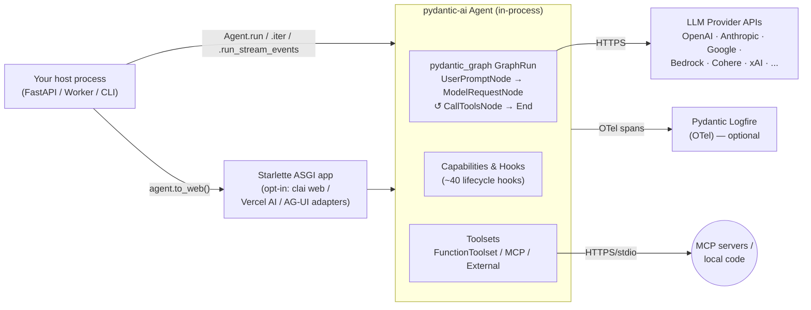
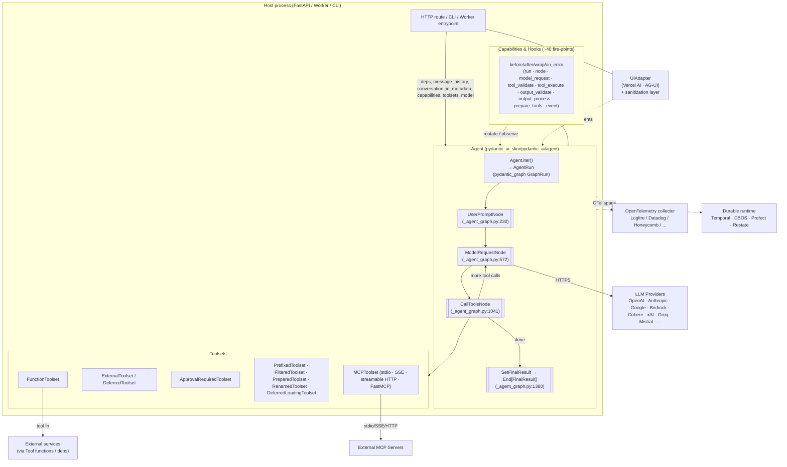

# Pydantic AI — Benchmark Study

> **Repo**: https://github.com/pydantic/pydantic-ai
> **Commit studied**: 206453a0c6c10ff90f1f8ec881458b38ca7e4b36
> **Branch**: main
> **Framework path**: frameworks/pydantic-ai
> **Studied on**: 2026-05-16

## TL;DR

- ⭐ **What is this stack architecturally?** A **provider-agnostic Python agent library** — the agent run-loop is built as a typed `pydantic_graph` state machine that runs **in your process**. It is library-first; HTTP exposure is opt-in via `agent.to_web()` (Starlette web UI) or UI-event-stream adapters (`AGUIAdapter`, `VercelAIAdapter`) sitting on top of `Agent.run_stream_events()`.
- Open-source under **MIT**, maintained by the **Pydantic team** (Samuel Colvin, Marcelo Trylesinski, David Montague, Alex Hall, Douwe Maan). Commercial backing via **Pydantic Logfire** observability + **Pydantic AI Gateway** (managed multi-provider key, cost limits) — but the framework itself works fully standalone.
- Maturity: **v1 reached September 2025**, classified `Development Status :: 5 - Production/Stable` (`pyproject.toml:30`). Active release cadence (latest visible commit 2026-05-15, `#5426`). API stability commitment until v2 (`docs/changelog.md:3`).
- Python 3.10–3.14, `uv` workspace of four packages: `pydantic-ai-slim` (core), `pydantic-graph` (typed graph engine that powers the loop), `pydantic-evals` (first-party eval framework), `clai` (CLI/web UI).
- Run loop is **`Agent.iter()` → `AgentRun`** wrapping a `pydantic_graph.GraphRun` over three nodes: `UserPromptNode → ModelRequestNode → CallToolsNode` (cycles back) → `End[FinalResult]` (`pydantic_ai_slim/pydantic_ai/_agent_graph.py:230`, `:572`, `:1041`).
- Hooks are **first-class, ~40 lifecycle points** via the `Hooks` capability or `AbstractCapability` subclass (`capabilities/hooks.py:341+`, `capabilities/abstract.py:347+`): `before/after/wrap/on_error` flavors for run, node, model-request, tool-validate, tool-execute, output-validate, output-process, plus `prepare_tools`, `wrap_run_event_stream`, `handle_deferred_tool_calls`. ⭐ This is the strongest extensibility surface in the field reviewed so far.
- Sessions/persistence: **Not provided — BYO**. There is a `conversation_id` and `run_id` (UUID7) on every message and on `RunContext`, but no built-in session store. Multi-turn = host persists `result.all_messages()` and re-passes via `message_history`. Mid-run durability comes from **Temporal / DBOS / Prefect / Restate** integrations (`pydantic_ai_slim/pydantic_ai/durable_exec/`).
- Multi-tenancy: there is no first-class `tenant_id` field; the canonical mechanism is **typed dependency injection** (`deps_type=...`, `RunContext.deps`) — the same `RunContext` is passed to every tool, system-prompt function, hook, and toolset. You pass `tenantId` through `deps`, scope toolsets with `agent.toolset` factory or `.filtered()/.prepared()`, and **force tool arguments** via either `args_validator` or a `before_tool_validate` / `before_tool_execute` hook.
- Skills: **no in-tree SKILL.md loader.** The framework consumes the [agentskills.io](https://agentskills.io) standard via a third-party `pydantic-ai-skills` `SkillsCapability` (`docs/capabilities.md:1240`). In-tree there is `coding-agent-skills.md` describing the *Pydantic AI plugin for Claude Code* (skill for the coding-agent, not a runtime skill loader). Pydantic AI offers `AgentSpec` (YAML/JSON declarative agent definitions) as the closest in-tree analog.
- Resource Manager: **Not provided — BYO** at the platform level. `AgentSpec.from_file()` + `Agent.from_spec()` provide config-as-file (`docs/agent-spec.md:1`); registry/multi-source loading + versioning is the user's responsibility.
- Sub-agents: implemented as **"agent delegation"** — the parent agent calls the child's `run()` from inside a `@agent.tool` function and passes `ctx.usage` for shared budget tracking (`docs/multi-agent-applications.md:13`). No first-class spawn primitive; parallelism via `asyncio.gather` in user code.
- Observability: **OpenTelemetry-native via Logfire** (first-party) and any OTel backend. Token usage on `result.usage` (`RunUsage`) and per-message `RequestUsage`. USD cost via `genai-prices` package (used in `messages.py:20`).
- Surprising-good finding: **`UIAdapter` ships a security layer** — strips client-submitted system prompts, drops `s3://`/`gs://` URL schemes, drops dangling tool calls (`pydantic_ai_slim/pydantic_ai/ui/_adapter.py:262`). Production-aware default.
- Surprising-bad finding: **No built-in session/checkpoint store and no API server.** For a multi-tenant long-running agent you assemble your own FastAPI + session DB; durable execution requires opting into Temporal/DBOS/Prefect.
- Verdicts: sessions/persistence: **BYO** • skills: **BYO (third-party plugin or coding-agent plugin)** • resource manager: **BYO** • sub-agents: **agent-as-tool, no primitive** • multi-tenancy: **strong primitives (deps, hooks, prepare) but BYO field** • hooks: **excellent (~40 hooks, typed)** • API: **BYO + UI adapters** • observability: **excellent OTel-native** • production-readiness for multi-tenant server-side: **library is solid, host platform is BYO**.

## 0. Architectural Overview & Deployment Model



### 0.1 What is this stack?
A **provider-agnostic Python agent library** (`README.md:13`) implemented as a typed `pydantic_graph` state machine executing entirely in your Python process. Library-first; ships first-party adapters (`to_web()`, `to_a2a()` deprecated, `to_cli()`, AG-UI/Vercel-AI `UIAdapter`s) to put HTTP/SSE in front of it, but you bring the host.

### 0.2 Project status & governance
- **License**: MIT (`pyproject.toml:23` / `LICENSE`).
- **Owner**: Pydantic Services Inc. (commercial steward of Pydantic Validation / Logfire). Maintainers listed: Samuel Colvin, Marcelo Trylesinski, David Montague, Alex Hall, Douwe Maan (`pyproject.toml:17-22`).
- **Commercial support**: Pydantic Logfire (observability, hosted) and Pydantic AI Gateway (managed multi-provider router with cost caps — `docs/gateway.md`). Open-source library is fully usable without either.

### 0.3 Project maturity / age
- v1.0.0 shipped 2025-09-04 (`docs/changelog.md:15`); committed API stability until v2 (`README` and changelog).
- Classifier: `Development Status :: 5 - Production/Stable` (`pyproject.toml:30`).
- Pre-1.0 history was active throughout 2025 with monthly minor releases (v0.6/0.7/0.8 in Aug 2025) covering hooks/streaming refinements.
- Latest commit in this submodule: 2026-05-15 (`#5426` — A2A bridge migration).

### 0.4 Adoption & community signal
GitHub stars/forks/contributor counts were not captured locally on 2026-05-16; from `README.md` the project shows CI badges, Coverage, PyPI, and a Slack community link via Logfire. Release cadence in the changelog is sub-monthly. Active maintenance is confirmed by the May 2026 commit visible in the submodule.

### 0.5 Ecosystem fit
- **Primary language**: Python 3.10–3.14.
- **Workspace** (`pyproject.toml:82-89`):
  - `pydantic-ai-slim/` — core agent + model providers (slim, dependency-grouped).
  - `pydantic-graph/` — typed graph engine powering the loop.
  - `pydantic-evals/` — first-party eval framework.
  - `clai/` — `clai` CLI (chat + spawn a web UI).
  - `examples/` — example bundle.
- **PyPI**: `pydantic-ai` (meta), `pydantic-ai-slim`, `pydantic-evals`, `pydantic-graph`, `clai`.
- **Examples**: `docs/examples/` (chat-app, RAG, SQL gen, flight booking, AG-UI, etc.) and a hosted examples package.

### 0.6 Where does the agent loop actually execute?
**In your Python process.** Concretely:
- `Agent.run()` (`pydantic_ai_slim/pydantic_ai/agent/abstract.py:276`) opens `self.iter(...)` (`agent/__init__.py:1015`).
- `iter()` builds the agent graph (`build_agent_graph` in `_agent_graph.py:2070`) and starts a `pydantic_graph.GraphRun`.
- Iteration walks `UserPromptNode → ModelRequestNode → CallToolsNode → ...` until `End[FinalResult]` (`_agent_graph.py:1380`).
- Every model call is `model.request(...)` (provider HTTPS) executed by the host process; no bundled binary, no subprocess, no vendor cloud.

### 0.7 Runtime dependencies
- **Required**: Python 3.10+, `pydantic`, `pydantic-core`, `pydantic-graph`, `genai-prices`, `opentelemetry-*` (NoOp by default), `anyio`.
- **Optional extras** (`pyproject.toml:46-65`): per-provider SDKs (`openai`, `anthropic`, `google`, `mistral`, `groq`, `cohere`, `bedrock`, `huggingface`, `xai`), `mcp`, `fastmcp`, `cli`, `web`, `ui`, `logfire`, `evals`, `temporal`, `dbos`, `prefect`, `ag-ui`, `retries`, `spec`, `outlines-*`, `sentence-transformers`, `voyageai`.
- **No required databases/queues**. Durable execution = optional `temporal`, `dbos`, `prefect`, or `restate`.

### 0.8 Recommended deployment topology
Not explicitly opinionated; docs treat `Agent` like a FastAPI app: "Agents are designed for reuse, like FastAPI Apps" (`docs/agent.md`). The UI adapter docs assume one agent instance per ASGI app and one HTTP route per agent endpoint (`docs/ui/overview.md:18-44`). Production durable patterns are documented for Temporal/DBOS/Prefect (`docs/durable_execution/`).

### 0.9 Cold-start cost & instance footprint
Pure-Python import — sub-second once Python interpreter is warm. No bundled binaries, no LLM subprocess. RAM baseline = whatever `pydantic` + the chosen provider SDK brings.

### 0.10 Vendor lock-in
- **LLM provider lock-in**: low. ~14 providers + `FallbackModel` chain (`models/fallback.py:69`) + `pydantic-ai-litellm` direction (`docs/models/`). Custom models implementable via the `Model` abstract base (`docs/models/overview.md`).
- **Hosting lock-in**: none — library runs anywhere Python runs.
- **Eval lock-in**: low — `pydantic-evals` is in-repo but optional, third-party (LangSmith, Braintrust) work via OTel.
- **Observability lock-in**: low — OTel-first; Logfire is one OTel backend among many.

### 0.11 Framework weight / footprint
**Thin to medium** — `pydantic_ai_slim/pydantic_ai/` is ~50 modules; the `Agent` class is ~2,885 LOC (`agent/__init__.py`), graph engine is ~2,229 LOC (`_agent_graph.py`). Optional `evals`, `graph`, and durable-exec packages are clean separations.

### 0.12 Release-history signal
- v0.7.x (Aug 2025) overhauled streaming and added `FinalResultEvent` (`docs/changelog.md:39`).
- v0.8.0 unified `AgentStreamEvent` (`docs/changelog.md:31`).
- v1.0.0 (Sep 2025) dropped Python 3.9, made several dataclasses kw-only.
- Recent: `Agent.to_a2a()` and `fasta2a` extra deprecated → bridge moved to `fasta2a.pydantic_ai` (commit `206453a`, 2026-05-15).
- Recent themes: hooks/capabilities surface expansion, UI adapter trust model hardening, deferred-tool flow, native-vs-local tool fall-up pattern.

### 0.13 Documentation depth & cross-team contributor accessibility
**Deep** and code-tested (`tests/test_examples.py` runs every snippet — `AGENTS.md:117`). Topic coverage: agents, capabilities, hooks, agent-spec (YAML), dependencies, output, message history, multi-agent, MCP client/server, durable execution, UI adapters, evals, models/providers. **Non-engineer accessible**: `AgentSpec` YAML lets prompt/domain teams configure agents without Python — `Agent.from_file('agent.yaml')` (`docs/agent-spec.md`).

### 0.14 Documentation entry points
- Docs landing: https://ai.pydantic.dev
- Quickstart: https://ai.pydantic.dev/install + https://ai.pydantic.dev/agent
- API reference: https://ai.pydantic.dev/api/agent (and sibling pages)
- Hosting/deployment: https://ai.pydantic.dev/durable_execution/overview and https://ai.pydantic.dev/ui/overview
- Examples repo: https://github.com/pydantic/pydantic-ai/tree/main/examples
- Changelog (in-repo): `docs/changelog.md`
- GitHub Releases: https://github.com/pydantic/pydantic-ai/releases
- Issues: https://github.com/pydantic/pydantic-ai/issues
- Community: Pydantic Logfire Slack — https://logfire.pydantic.dev/docs/join-slack/

## 1. Agent Harness (Run Loop) & Message Taxonomy

### 1.1 Run loop entrypoint(s)
Five public entrypoints on `AbstractAgent` (`agent/abstract.py`):

| Method | Signature (return type) | File:line |
|---|---|---|
| `Agent.run(...)` | `→ AgentRunResult[OutputDataT]` (async) | `agent/abstract.py:276` |
| `Agent.run_sync(...)` | `→ AgentRunResult[OutputDataT]` | `agent/abstract.py:467` |
| `Agent.run_stream(...)` | `→ AsyncContextManager[StreamedRunResult]` | `agent/abstract.py:616` |
| `Agent.run_stream_events(...)` | `→ AgentEventStream[OutputDataT]` (async iter of `AgentStreamEvent \| AgentRunResultEvent`) | `agent/abstract.py:1028` |
| `Agent.iter(...)` | `→ AsyncContextManager[AgentRun]` (node-by-node) | `agent/__init__.py:1015` |

All accept: `user_prompt`, `output_type`, `message_history`, `deferred_tool_results`, `conversation_id`, `model`, `instructions`, `deps`, `model_settings`, `usage_limits`, `usage`, `metadata`, `output_retries`, `toolsets`, `event_stream_handler`, `capabilities`, `spec` (`agent/abstract.py:229-274`).

### 1.2 Per-iteration behavior
Each iteration is one graph node step (`_agent_graph.py`):
1. `UserPromptNode` (`:230`) — produces system prompts, packages user prompt into a `ModelRequest`.
2. `ModelRequestNode` (`:572`) — sends the request to the model (streaming or non-streaming), collects `ModelResponse`.
3. `CallToolsNode` (`:1041`) — pulls `ToolCallPart`s from the response, dispatches via `ToolManager` (which fires `before_tool_validate → wrap_tool_validate → before_tool_execute → wrap_tool_execute → after_tool_execute`), feeds `ToolReturnPart`s back, decides whether to loop to `ModelRequestNode` or hit `SetFinalResult`/`End`.

### 1.3 ReAct loop
**Yes, built-in** — `CallToolsNode → ModelRequestNode` is the ReAct cycle, terminated by `end_strategy` (`early` / `graceful` / `exhaustive` — `agent/__init__.py:170-175`) and bounded by `UsageLimits` (`usage.py:263`).

### 1.4 Tool dispatch + result handling
`CallToolsNode` calls `ToolManager.handle_call(call)` (`tool_manager.py`, ~936 LOC) which:
1. Resolves the `ToolsetTool` for the call's `tool_name` from the combined toolset.
2. Validates the model-generated JSON args via the tool's `args_validator` (`SchemaValidator`).
3. Fires `before_tool_validate`, `wrap_tool_validate`, `before_tool_execute`, `wrap_tool_execute` hooks.
4. Invokes the tool function with `RunContext` + validated args.
5. Wraps the return as a `ToolReturnPart` (or `RetryPromptPart` on `ModelRetry`) and appends to the next `ModelRequest`.

### 1.5 Explicit turn concept
A "turn" is **one trip around the graph until either another `ModelRequestNode` is queued or `End` fires**. `RunContext.run_step` is incremented per iteration (`_run_context.py:74`).

### 1.6 Event emission mechanism (in-process)
`Agent.run_stream_events()` returns an `AgentEventStream` async context manager (`result.py:965`) yielding `AgentStreamEvent | AgentRunResultEvent`. Internally each node implements `async def stream(ctx) -> AsyncIterator[AgentStreamEvent]` (`_agent_graph.py:752`, `_build_agent_stream`). The `event` capability hook (`hooks.on.event`) and `run_event_stream` (`wrap_run_event_stream`) let you intercept the stream (`docs/hooks.md:214-239`).

### 1.7 Message layers
Three layers, with explicit conversion sites:

```
┌───────────────────────────────┐   sanitize/build_run_input    ┌──────────────────────────┐
│  Wire layer (UI adapter)      │  ───────────────────────────► │  Pydantic AI ModelMessage │
│  AG-UI / Vercel AI / SSE      │  ◄──────────────────────────  │  (ModelRequest /         │
└───────────────────────────────┘     dump_messages              │   ModelResponse)         │
                                                                 └────────────┬─────────────┘
                                                                              │ model adapter
                                                                              ▼
                                                                ┌──────────────────────────┐
                                                                │  Provider SDK shape      │
                                                                │  (OpenAI / Anthropic /…) │
                                                                └──────────────────────────┘
```

### 1.8 Concrete message types (`pydantic_ai_slim/pydantic_ai/messages.py`)

| Type | Purpose | Line |
|---|---|---|
| `SystemPromptPart` | System prompt to model | `messages.py:149` |
| `UserPromptPart` | User text/multimodal input | `:989` |
| `InstructionPart` | Static/dynamic agent instructions (cache-aware) | `:1505` |
| `ToolReturnPart` | Function-tool result back to model | `:1326` |
| `NativeToolReturnPart` | Provider-side native-tool result | `:1353` |
| `RetryPromptPart` | Validation-failure retry signal | `:1400` |
| `ModelRequest` | Container of request parts (per turn) | `:1544` |
| `TextPart` | Assistant text | `:1585` |
| `ThinkingPart` | Reasoning/thinking text | `:1623` |
| `CompactionPart` | Provider compaction marker | `:1675` |
| `FilePart` | Generated file (image, etc.) | `:1726` |
| `ToolCallPart` | Function-tool call by model | `:1864` |
| `NativeToolCallPart` | Native (provider) tool call | `:1891` |
| `ModelResponse` | Container of response parts | `:2077` |
| `*PartDelta` (Text/Thinking/ToolCall) | Streaming delta | `:2369-2528` |

### 1.9 Messages vs. events
**Distinct.** Messages persist in history (`ModelMessage = ModelRequest | ModelResponse`); events are transient stream items (`AgentStreamEvent`). The same `iter()` over an `AgentRun` yields graph nodes (a third layer).

### 1.10 Event categories

| Category | Members | Discriminator |
|---|---|---|
| Model-response-stream | `PartStartEvent`, `PartDeltaEvent`, `PartEndEvent`, `FinalResultEvent` (`messages.py:2697-2784`) | `event_kind` |
| Handle-response | `FunctionToolCallEvent`, `FunctionToolResultEvent`, `OutputToolCallEvent`, `OutputToolResultEvent` (`:2817-2901`) | `event_kind` |
| Run lifecycle | `AgentRunResultEvent` (`run.py:569`) | `event_kind='agent_run_result'` |
| Deprecated | `BuiltinToolCallEvent`, `BuiltinToolResultEvent` (`:2907-2933`) | — |

Union: `AgentStreamEvent = ModelResponseStreamEvent | HandleResponseEvent` (`messages.py:2947`).

### 1.11 Canonical type-definition file(s)
- `pydantic_ai_slim/pydantic_ai/messages.py` — all parts, deltas, events.
- `pydantic_ai_slim/pydantic_ai/run.py` — `AgentRun`, `AgentRunResult`, `AgentRunResultEvent`.
- `pydantic_ai_slim/pydantic_ai/_run_context.py` — `RunContext` (THE context object).
- `pydantic_ai_slim/pydantic_ai/_agent_graph.py` — graph nodes and state.
- `pydantic_ai_slim/pydantic_ai/usage.py` — `RequestUsage`, `RunUsage`, `UsageLimits`.

### 1.12 Live agentic event stream taxonomy
Sample frame shapes (from `messages.py`):

```python
PartStartEvent(index=0, part=TextPart(content='The capital of '), previous_part_kind=None)
PartDeltaEvent(index=0, delta=TextPartDelta(content_delta='Mexico is Mexico '))
PartEndEvent(index=0, part=TextPart(content='The capital of Mexico is Mexico City.'))
FinalResultEvent(tool_name=None, tool_call_id=None)
FunctionToolCallEvent(part=ToolCallPart(tool_name='get_weather', args='{"city":"Paris"}', tool_call_id='call_a1'))
FunctionToolResultEvent(part=ToolReturnPart(tool_name='get_weather', content='sunny', tool_call_id='call_a1'))
AgentRunResultEvent(result=AgentRunResult(output='The capital of Mexico is Mexico City.'))
```

## 2. Agent Runtime (Multi-session Host)

### 2.1 Multi-session host architecture
**Not provided — BYO.** There is no Pydantic-AI runtime that hosts many concurrent sessions; an `Agent` instance is **designed to be reused globally** (like a FastAPI router — `docs/agent.md`). You embed it in your own ASGI/worker host (`agent.to_web()`, FastAPI route, Temporal worker).

### 2.2 Concurrent session isolation
Per-call isolation is via:
- A **fresh `RunContext`** per `run()` (`_run_context.py:32`) — including `deps`, `usage`, `metadata`, `conversation_id`, `run_id`.
- A `ContextVar` `_CURRENT_RUN_CONTEXT` (`_run_context.py:122`) scoped via `set_current_run_context` (`:138`) so concurrent `run()` calls in the same process do not bleed.
- Toolset `for_run` (`toolsets/abstract.py:110`) lets a toolset spawn a fresh instance per run for state isolation.

### 2.3 Horizontal scaling / multi-instance
Stateless — N Python workers all serve the same logical `Agent` instance; the user owns `message_history` storage (DB/Redis/file) and re-passes per request. Durable execution (Temporal/DBOS/Prefect) provides per-workflow horizontal recovery (`docs/durable_execution/`).

### 2.4 Background / async / scheduled tasks
**Not provided directly — BYO** via Temporal scheduling, Prefect deployments, DBOS workflows, or any external scheduler. The framework only provides the agent runtime.

### 2.5 Worker pool / queue model
No built-in queue. `pydantic_ai.capabilities.ThreadExecutor` lets you supply your own `concurrent.futures.Executor` for sync tool functions in long-running servers (`docs/capabilities.md:83-95`). Otherwise short-lived HTTP request scope is assumed.

## 3. Sessions & Persistence

### 3.1 Session / chat data model
There is **no `Session` object**. The closest equivalents:
- `conversation_id` (`_run_context.py:84-89`) — UUID7 string, set on every `ModelRequest`/`ModelResponse`, propagated via `gen_ai.conversation.id` OTel attribute.
- `run_id` (`_run_context.py:82`) — per-run UUID.
- `metadata: dict[str, Any] | None` (`_run_context.py:91`) — free-form caller metadata, also exposed as `ctx.metadata`.
- `deps` (`RunContext.deps`) — typed dependencies the caller chooses.
- `message_history: Sequence[ModelMessage]` — passed in/out of every `run()`.

### 3.2 What's stored on a session
Caller-owned. `AgentRunResult.all_messages()` returns the full `list[ModelMessage]` for the run (`run.py:464`); `all_messages_json()` serializes to bytes (`run.py:481`). Persist these.

### 3.3 Granularity
Single conversation per `conversation_id`. Branching = pass an explicit `conversation_id='new'` to fork while keeping prior `message_history` (`docs/message-history.md:246-260`).

### 3.4 Built-in persistence stores
**None ship out-of-box.** BYO Postgres/SQLite/Redis/S3 against `result.all_messages_json()`. Durable execution layers (Temporal/DBOS/Prefect/Restate) provide their own state store under the agent loop — that is the closest first-party option.

### 3.5 Persistence timing
N/A for messages (no built-in store). For durable execution:
- Temporal: workflow events are committed by the Temporal Server after each activity (`docs/durable_execution/temporal.md`).
- DBOS / Prefect: per-step checkpoints in their respective backing stores.

### 3.6 Mid-run checkpointing (durable)
**Only via Temporal/DBOS/Prefect/Restate.** `Agent` itself has no checkpointer. Inside Temporal, the agent loop runs as a *workflow* and tool calls become *activities* — a crashed worker replays the workflow up to the last committed activity result (`docs/durable_execution/temporal.md:16-22`).

### 3.7 Session ID format
UUID7 generated by `_utils.now_utc()`-driven helpers; deterministic ordering for log lookup. Caller can override with any string (`conversation_id='<your-id>'` — `docs/message-history.md:245`).

### 3.8 Pluggable store interface
**Not provided — BYO.** UI adapters demonstrate the pattern (`docs/ui/overview.md:107`): persist `message_history` keyed by thread/session id server-side and pass it explicitly to the next `run()`.

### 3.9 Schema evolution / migration
Pydantic-backed: `ModelMessagesTypeAdapter.dump_json(...)` / `validate_python(...)` round-trips messages; cross-version compatibility is committed in the version policy through v2 (`docs/version-policy.md`).

### 3.10 Export / replay
`AgentRunResult.all_messages_json()` exports the full conversation as JSON bytes (`run.py:481`). Replay = construct a new `Agent.run(..., message_history=...)`.

### 3.11 Cross-session memory
Not in-tree. Third-party `MemoryTool` (Anthropic native — `native_tools/__init__.py:494`) and capability packages (`pydantic-ai-skills`, etc.) exist; see Q15.

## 4. Multi-tenancy & Arbitrary Context ⭐

### 4.1 Full run-loop input struct
Every field on `Agent.run()` (`agent/abstract.py:276-297`):

```python
async def run(
    self,
    user_prompt: str | Sequence[UserContent] | None = None,
    *,
    output_type: OutputSpec[RunOutputDataT] | None = None,
    message_history: Sequence[ModelMessage] | None = None,
    deferred_tool_results: DeferredToolResults | None = None,
    conversation_id: str | None = None,
    model: Model | KnownModelName | str | None = None,
    instructions: AgentInstructions[AgentDepsT] = None,
    deps: AgentDepsT = None,                                # ⭐ typed deps
    model_settings: AgentModelSettings[AgentDepsT] | None = None,
    usage_limits: UsageLimits | None = None,
    usage: RunUsage | None = None,
    metadata: AgentMetadata[AgentDepsT] | None = None,      # ⭐ free-form dict or callable
    output_retries: int | None = None,
    infer_name: bool = True,
    toolsets: Sequence[AbstractToolset[AgentDepsT]] | None = None,
    event_stream_handler: EventStreamHandler[AgentDepsT] | None = None,
    capabilities: Sequence[AgentCapability[AgentDepsT]] | None = None,
    spec: dict[str, Any] | AgentSpec | None = None,
) -> AgentRunResult[Any]: ...
```

### 4.2 Context propagation into a tool call
`RunContext` (`_run_context.py:33`) is passed to every tool, system-prompt function, hook, and toolset. Includes: `deps`, `model`, `usage`, `agent`, `prompt`, `messages`, `tracer`, `retries`, `tool_call_id`, `tool_name`, `retry`, `max_retries`, `run_step`, `tool_call_approved`, `tool_call_metadata`, `partial_output`, `run_id`, `conversation_id`, `metadata`, `model_settings`, `tool_manager`.

### 4.3 Tool call interface
`@agent.tool` decorator on a function whose first arg is `ctx: RunContext[DepsT]` (`docs/tools.md`, `tools.py:467-487`):

```python
@agent.tool
async def topic_search(ctx: RunContext[MyDeps], query: str) -> list[str]:
    return await ctx.deps.client.search(ctx.deps.tenant_id, query)
```

`Tool` carries: `function`, `takes_ctx`, `max_retries`, `name`, `description`, `prepare`, `args_validator`, `docstring_format`, `strict`, `sequential`, `requires_approval`, `metadata`, `timeout`, `defer_loading`, `include_return_schema`, `function_schema` (`tools.py:440-465`).

### 4.4 Forcing tool arguments from the harness
**Yes — three mechanisms:**

1. **`args_validator` on the `Tool`** (`tools.py:64-71`) — receives the already-validated args, can raise `ModelRetry` or overwrite via context. Most type-safe.
2. **`before_tool_validate` hook** with `tools=[...]` filter (`capabilities/hooks.py:162` + `:259`) — return a new `RawToolArgs` dict; takes precedence over the LLM-generated args:
   ```python
   @hooks.on.before_tool_validate(tools=['topic_search'])
   async def force_tenant(ctx, *, call, tool_def, args):
       return {**args, 'tenant_id': ctx.deps.tenant_id}  # overrides LLM
   ```
3. **`@agent.tool` ignoring LLM args** — since `ctx.deps` always contains server-side identity, the simplest pattern is to **only** take `tenant_id` from `ctx.deps` and not expose it in the tool schema at all:
   ```python
   @agent.tool
   async def topic_search(ctx: RunContext[MyDeps], query: str) -> list[str]:
       return await search(tenant_id=ctx.deps.tenant_id, q=query)
   ```

### 4.5 Filtering visible tools
Multiple options, runtime-aware:
- **`@agent.toolset` decorator** building a toolset from `RunContext` (`docs/toolsets.md:12`).
- **`PrepareTools` capability / `prepare_tools=` kwarg** returning a filtered `list[ToolDefinition]` per step (`docs/capabilities.md:193-225`).
- **`.filtered(predicate)` / `.prepared(prepare_func)` / `.renamed({})` / `.prefixed('...')` / `.defer_loading()`** wrappers on any `AbstractToolset` (`toolsets/abstract.py:192-256`).
- **`activeTools` analog**: per-run `toolsets=[...]` kwarg replaces or supplements agent-level toolsets (`docs/toolsets.md:11`).

### 4.6 Tenant scope on session
**No first-class field.** The idiomatic pattern is a typed `deps` dataclass containing `tenant_id`, plus `metadata={'tenant_id': ...}` for OTel/Logfire tagging. Both are accessible from every hook and tool.

### 4.7 Per-tool-call auth propagation
`ctx.deps` flows to every tool by construction. The host code that constructs `deps` (typically from the incoming HTTP request) is the auth termination point.

### 4.8 Resource scoping primitives
Toolsets/capabilities can be scoped per-run (passed to `agent.run(..., toolsets=[...], capabilities=[...])`) or per-agent (constructor). **Dynamic capabilities** can resolve at run time based on `RunContext`:

```python
def user_skill(ctx: RunContext[str]) -> AbstractCapability[str] | None:
    return load_skill(ctx.deps.user_id, ctx.deps.tenant_id)
agent = Agent(..., capabilities=[user_skill])
```
(`docs/capabilities.md:990-1024`).

### 4.9 Per-tenant rate limit + budget cap
**`UsageLimits`** caps per-run **tokens, requests, tool calls** (`usage.py:263-295`) — `request_limit=50` is the default. **No USD budget cap in-tree**; for USD, use Pydantic AI Gateway, which adds project/user/key-level daily/weekly/monthly USD caps (`docs/gateway.md:24`). Per-tenant rate limiting is BYO inside a hook (e.g. `before_run`).

### ⭐ Required light usage example

```python
from dataclasses import dataclass
from pydantic_ai import Agent, RunContext, Tool

@dataclass
class TenantDeps:
    tenant_id: str
    targeting_strategy_id: str
    user_id: str

# 1) Define tools. tenantId is NEVER in the schema — taken from deps.
async def topic_search(ctx: RunContext[TenantDeps], query: str) -> list[str]: ...
async def iab_search(ctx: RunContext[TenantDeps], query: str) -> list[str]: ...
async def audience_create(ctx: RunContext[TenantDeps], name: str) -> str: ...
async def bash_exec(ctx: RunContext[TenantDeps], cmd: str) -> str: ...   # not desired
async def web_fetch(ctx: RunContext[TenantDeps], url: str) -> str: ...   # not desired

agent = Agent(
    'openai:gpt-5.2',
    deps_type=TenantDeps,
    tools=[topic_search, iab_search, audience_create, bash_exec, web_fetch],
)

# 2) Filter visible tools per run via prepare_tools (capability hook)
async def only_business(ctx: RunContext[TenantDeps], tool_defs):
    allow = {'topic_search', 'iab_search', 'audience_create'}
    return [td for td in tool_defs if td.name in allow]

# 3) Pass everything to run() — tenant_id is in deps, NOT in tool args.
result = await agent.run(
    'Find topics about cooking and create an audience',
    deps=TenantDeps(tenant_id='acme', targeting_strategy_id='strat-42', user_id='u-123'),
    metadata={'tenant_id': 'acme'},  # for OTel/Logfire tagging
    prepare_tools=only_business,     # hides bash_exec / web_fetch
)
```

All three required behaviors are achievable in-tree.

## 5. Hook & Middleware Capabilities (Context Engineering)

### 5.1 Enumerate every hook
The `AbstractCapability` ABC defines hook methods; the `Hooks` capability gives decorator sugar (`hooks.on.*`). All hook signatures live in `capabilities/hooks.py:98-228`.

| Hook (decorator name) | Fires when | Powers |
|---|---|---|
| `before_run` | Before any node runs in a run | read |
| `after_run` | After the run finishes (gets `AgentRunResult`) | read / replace result |
| `run` (`wrap_run`) | Wraps the entire run | read / mutate / block / branch |
| `run_error` (`on_run_error`) | An exception escaped the run | recover → result |
| `before_node_run` / `after_node_run` / `node_run` (wrap) / `node_run_error` | Per graph node | read / mutate / block / branch |
| `before_model_request` | Before each LLM call (sees `ModelRequestContext` with `model`, `messages`, `model_settings`, `model_request_parameters`) | mutate request (incl. swap model) |
| `after_model_request` | After each `ModelResponse` arrives | mutate response |
| `model_request` (wrap) / `model_request_error` | Around / on-error of model call | wrap / recover / `raise SkipModelRequest(response)` to short-circuit |
| `prepare_tools` / `prepare_output_tools` | At each step's tool listing | filter / mutate tool defs |
| `before_tool_validate` / `after_tool_validate` / `tool_validate` (wrap) / `tool_validate_error` | Around JSON args validation | mutate raw / validated args; `SkipToolValidation(args)` |
| `before_tool_execute` / `after_tool_execute` / `tool_execute` (wrap) / `tool_execute_error` | Around tool fn call | mutate args / result; `SkipToolExecution(result)` |
| `before_output_validate` / `after_output_validate` / `output_validate` (wrap) / `output_validate_error` | Around structured-output schema validation | mutate output |
| `before_output_process` / `after_output_process` / `output_process` (wrap) / `output_process_error` | Around output-tool / output-fn processing | mutate processed output |
| `deferred_tool_calls` (`handle_deferred_tool_calls`) | When the model emits a deferred tool call (HITL approval, external) | resolve inline |
| `run_event_stream` (`wrap_run_event_stream`) | Wraps the streaming event iterator | mutate / drop / inject events |
| `event` | Per individual `AgentStreamEvent` | observe |

Tool hooks support a `tools=[...]` filter (`capabilities/hooks.py:290-308`) and an optional `timeout=` (raises `HookTimeoutError` — `:64-71`).

### 5.2 Hook concurrency model
**Sequential, in registration order.** Multiple hooks for the same event accumulate; `before_*`/`after_*` flavors fold (output of one becomes input of next); `wrap_*` flavors compose as nested handlers; on error, `on_*_error` handlers can recover by returning a replacement result.

### 5.3 Specific capability tests

| Capability | Supported? | How |
|---|---|---|
| Inject system messages at session start | **Yes** | `@agent.system_prompt` decorator (static or dynamic — `agent/__init__.py:1944+`), `instructions=...` kwarg, or a `before_node_run` hook on `UserPromptNode` |
| Expand user input (slash commands, timestamps, attachments) | **Yes** | `before_node_run` hook mutating the `UserPromptNode`; or compose a system prompt that injects today's date / locale; or wrap in `wrap_run` |
| Mutate messages list before each LLM call | **Yes** | `before_model_request` returns mutated `ModelRequestContext.messages` (`docs/hooks.md:102-114`); also `ProcessHistory` capability via `history_processors=...` |
| Mutate tool input before dispatch | **Yes** | `before_tool_validate` / `before_tool_execute` (the `tenant_id`-inject pattern) |
| Mutate tool result before LLM sees it | **Yes** | `after_tool_execute` returns replacement; truncate/redact/summarize as needed |
| Emit additional tool calls in response to a tool result | **Partial** | No direct `additional_messages` like Claude Agent SDK. Workarounds: `after_tool_execute` can call into another `agent.run(...)` synchronously and return its summary as the tool result; `wrap_node_run` on `CallToolsNode` can inject `ToolCallPart`s into the response before it's sent to `ModelRequestNode` |

### 5.4 Auto-compaction
**Provider-native compaction** via `OpenAICompaction` and `AnthropicCompaction` capabilities (`docs/capabilities.md:74-82`). No provider-agnostic compaction in core; `ProcessHistory` capability lets you plug in a custom summarizer.

### 5.5 Prompt cache optimization
Cache breakpoints are first-class: `CachePoint` message part (`messages.py:688`), `cache_write_tokens` / `cache_read_tokens` on `RequestUsage` (`usage.py:197-201`), provider-specific model-settings flags (e.g. `bedrock_supports_prompt_caching` — see `pydantic_ai_slim/pydantic_ai/CLAUDE.md`). `InstructionPart` is split into static vs dynamic so the stable prefix is cache-friendly (`messages.py:1505`).

### 5.6 Tool result clearing / progressive disclosure
- `after_tool_execute` hook returns a summary instead of the raw result.
- **Tool Search** capability (`docs/tools-advanced.md`) defers tool *loading* — tools marked `defer_loading=True` are only included in the model's tool list after the agent calls `search_tools` (a meta-tool). Available native (Anthropic, OpenAI Responses) or local. (`capabilities/_tool_search.py`.)
- `defer_loading()` on any toolset (`toolsets/abstract.py:244-256`).

### 5.7 Hook fire-points diagram

```
Agent.run()
  └── before_run
      └── for each graph step:
            before_node_run
            └── wrap_node_run(...)
                  └── ModelRequestNode:
                        before_model_request → wrap_model_request → after_model_request
                        (on error: on_model_request_error → recovery)
                        └── streaming → run_event_stream wraps the iterator
                                          └── event hook per AgentStreamEvent
                  └── CallToolsNode:
                        prepare_tools / prepare_output_tools
                        for each tool call:
                          before_tool_validate → wrap_tool_validate → after_tool_validate
                          before_tool_execute → wrap_tool_execute → after_tool_execute
                          (errors: on_tool_validate_error / on_tool_execute_error)
                        deferred_tool_calls (HITL / external)
                  └── output processing:
                        before_output_validate → wrap → after
                        before_output_process → wrap → after
            after_node_run
      after_run / on_run_error
```

### ⭐ Required light usage example

```python
from datetime import date
from pydantic_ai import Agent, RunContext
from pydantic_ai.capabilities import Hooks

hooks = Hooks()

# 1) Inject "tenant=acme, locale=fr-FR, today=2026-05-16" at session start.
@agent_factory_or_use_below.system_prompt   # via Agent.system_prompt decorator
async def session_header(ctx: RunContext[TenantDeps]) -> str:
    return f"today={date.today().isoformat()}, tenant={ctx.deps.tenant_id}, locale={ctx.deps.locale}"

# 2) Force tenantId on every topicSearch call, regardless of what the LLM passes.
@hooks.on.before_tool_validate(tools=['topic_search'])
async def force_tenant_arg(ctx, *, call, tool_def, args):
    return {**args, 'tenant_id': ctx.deps.tenant_id}

# 3) If topicSearch returned more than 50 results, summarize in place.
@hooks.on.after_tool_execute(tools=['topic_search'])
async def summarize_large(ctx, *, call, tool_def, args, result):
    if isinstance(result, list) and len(result) > 50:
        return {'summary': f'{len(result)} topics, top 10: {result[:10]}'}
    return result

agent = Agent('openai:gpt-5.2', deps_type=TenantDeps, capabilities=[hooks])
```

## 6. Agent API Exposition

### 6.1 Does the stack ship an HTTP/network server?
**Yes, optional, two flavors:**
- `agent.to_web()` — Starlette app with a built-in chat UI for *local dev* (`agent/__init__.py:2668`, `docs/web.md`).
- `UIAdapter.dispatch_request(request, agent=agent)` — Starlette/FastAPI route handler that streams AG-UI or Vercel-AI events (`pydantic_ai_slim/pydantic_ai/ui/_adapter.py:632`).
For everything else (custom HTTP shape, auth termination, multi-route REST), you mount the agent inside your own ASGI app.

### 6.2 Streaming transport
**SSE** for both built-in surfaces (`pydantic_ai_slim/pydantic_ai/ui/_event_stream.py`, `SSE_CONTENT_TYPE`). The agent loop itself is transport-agnostic (`run_stream_events` yields a typed async iterator).

### 6.3 Endpoints that start an agent run
For `to_web()` (Vercel-AI under the hood): `POST /api/chat` accepts a Vercel-AI request body (`pydantic_ai_slim/pydantic_ai/ui/_web/api.py:42-56`). Body shape:
```json
{"model": "openai:gpt-5.2", "builtinTools": ["web_search"], "messages": [...]}
```
For `dispatch_request`, request shape is determined by the chosen `UIAdapter` (AG-UI uses `RunAgentInput`; Vercel AI uses its data-stream request type).

### 6.4 Live agentic event stream format
Vercel AI Data Stream / AG-UI native frames. Sample sequence (Vercel AI dialect — pseudo SSE):
```
event: start          data: {"messageId":"..."}
event: text-delta     data: {"delta":"The capital "}
event: tool-call      data: {"toolCallId":"call_a1","toolName":"get_weather","args":{...}}
event: tool-result    data: {"toolCallId":"call_a1","output":"sunny"}
event: finish         data: {"finishReason":"stop","usage":{...}}
```

### 6.5 Auth termination at API boundary
**Not in the adapter.** The adapter is deliberately not an auth boundary — its docs say "Treat the adapter endpoint as an internal backend service, running it inside your own authenticated route handler" (`docs/ui/overview.md:97-99`). Auth is your route's job.

### 6.6 Resume / replay endpoint
No dedicated endpoint — clients send full `messages` history on each request (Vercel AI / AG-UI design). For server-authoritative history, persist by `conversation_id` and pass `message_history` to the adapter (`docs/ui/overview.md:107`).

### 6.7 Interrupt / cancel via API
**`StreamedRunResult.cancel()`** (`result.py:413+`) interrupts streaming and yields `ModelResponseState='interrupted'` (`messages.py:123-134`). HTTP-side: closing the SSE connection cancels the `asyncio` task (Starlette behavior). No explicit DELETE endpoint.

### 6.8 Tool-arg streaming (partial JSON)
**Yes** — `ToolCallPartDelta` (`messages.py:2528`) emits incremental `args_delta` strings/dicts; `PartDeltaEvent` carries them. UI adapters surface these in their respective dialects.

### 6.9 HITL approval workflow
First-class via **Deferred Tools** (`docs/deferred-tools.md`):
- `@agent.tool(requires_approval=True)` or `raise ApprovalRequired` from inside a tool returns a `DeferredToolRequests` output OR triggers the `handle_deferred_tool_calls` hook.
- Client gathers approvals → calls a new run with `deferred_tool_results=DeferredToolResults(approvals={call_id: True}, calls={call_id: ...})`.
- Or use the `HandleDeferredToolCalls` capability for inline resolution without round-trip.

### 6.10 Tool-call state reconstruction
**Explicit `tool_call_id`** is the linkage everywhere:
- `ToolCallPart.tool_call_id` (`messages.py:1864`).
- `ToolReturnPart.tool_call_id` (`messages.py:1326`).
- `FunctionToolCallEvent.tool_call_id` and `FunctionToolResultEvent.tool_call_id` (`messages.py:2809-2853`).
- `DeferredToolResults.approvals[tool_call_id]`, `.calls[tool_call_id]` (`tools.py:378+`).

### 6.11 Health checks / graceful shutdown
**BYO** — `to_web()` is a Starlette app, so add your `/healthz` route. No built-in metrics endpoint; export OTel.

### ⭐ Required light usage example

```bash
# 1) Start a run with X-Tenant-Id and a user message (Vercel AI Data Stream shape).
curl -N -X POST http://localhost:8000/api/chat \
  -H 'Content-Type: application/json' \
  -H 'X-Tenant-Id: acme' \
  --data '{"model":"openai:gpt-5.2","messages":[{"role":"user","content":"Top topics?"}]}'

# 2) Sample SSE frames received:
# event: start            data: {"messageId":"msg_01"}
# event: tool-call         data: {"toolCallId":"c1","toolName":"topic_search","args":{"query":"cooking"}}
# event: finish            data: {"finishReason":"stop","usage":{"input_tokens":120,"output_tokens":35}}

# 3) Cancel the run mid-flight: close the SSE connection (Ctrl-C) — Starlette cancels the task.
# (No dedicated DELETE endpoint exists; cancellation is HTTP-disconnect-driven.)

# 4) Send a HITL approval verdict (separate POST that starts a follow-up run carrying deferred_tool_results):
curl -X POST http://localhost:8000/api/chat \
  -H 'Content-Type: application/json' \
  --data '{
    "model":"openai:gpt-5.2",
    "messages":[...prior history...],
    "deferredToolResults":{"approvals":{"c1":true}}
  }'
```

(The exact field name for `deferredToolResults` depends on the adapter; the AG-UI adapter surfaces it via `RunAgentInput` extensions.)

## 7. Sub-agents

### 7.1 Mechanism
**"Agent delegation" — agent-as-tool, no first-class primitive** (`docs/multi-agent-applications.md:13-20`). The parent agent has a `@tool` whose body calls `await child_agent.run(...)`. No `Task` or `Swarm` analog in core.

### 7.2 Configuration
Sub-agents are ordinary `Agent` instances constructed at module scope; the parent's tool calls them at runtime. They can also be loaded from spec files (`Agent.from_file('child.yaml')`).

### 7.3 LLM-generated configs
Not directly. A capability factory can synthesize an agent at run time from `ctx`, but there is no built-in "let the parent LLM author a sub-agent spec" primitive — the parent's tools can call `Agent.from_spec(dict)` if you wire it that way.

### 7.4 Output handling
The child returns an `AgentRunResult[OutputDataT]`; the parent tool returns its `.output` (or a string summary). Linkage to a parent `tool_use_id` is implicit through the parent's `ToolCallPart`/`ToolReturnPart` pair.

### 7.5 Concurrency model
**Whatever you write.** Parallelism = `asyncio.gather(child_a.run(...), child_b.run(...))` inside the parent tool. There is no built-in `Promise.all` wrapper.

### 7.6 Context isolation
By default each `agent.run(...)` gets a fresh `RunContext` and an empty `message_history` — full isolation. To share, pass `message_history=ctx.messages` or pass shared `deps`/`usage`.

### 7.7 Lifecycle events
Parent stream does not auto-include child events. To bubble them, the parent's child-calling tool can iterate the child via `child.run_stream_events()` and yield events back (custom code; the framework does not auto-merge streams).

### ⭐ Required light usage example

```python
import asyncio
from dataclasses import dataclass
from pydantic_ai import Agent, RunContext

@dataclass
class Deps: tenant_id: str

def make_persona(name: str, system_prompt: str) -> Agent[Deps, str]:
    a = Agent('openai:gpt-5.2', deps_type=Deps, instructions=system_prompt)
    @a.tool
    async def topic_search(ctx: RunContext[Deps], query: str) -> list[str]:
        return await search(ctx.deps.tenant_id, query)
    return a

young_mom  = make_persona('persona-young-mom', 'You are a young mother...')
tech_bro   = make_persona('persona-tech-bro',  'You are a startup tech bro...')
retiree    = make_persona('persona-retiree',   'You are a retired teacher...')

parent = Agent('openai:gpt-5.2', deps_type=Deps,
               instructions='Run each persona in parallel and aggregate results.')

@parent.tool
async def ask_all_personas(ctx: RunContext[Deps], topic: str) -> dict[str, str]:
    results = await asyncio.gather(
        young_mom.run(topic, deps=ctx.deps, usage=ctx.usage),
        tech_bro.run(topic, deps=ctx.deps, usage=ctx.usage),
        retiree.run(topic, deps=ctx.deps, usage=ctx.usage),
    )
    return {'mom': results[0].output, 'tech': results[1].output, 'retiree': results[2].output}
```

Parent receives the dict in `ToolReturnPart` and decides what to do next.

## 8. Skills

### 8.1 First-class concept?
**No.** `coding-agent-skills.md` in-tree only describes the **Pydantic AI plugin** that *coding agents* (Claude Code etc.) load to gain framework knowledge — it is not a runtime skill loader for the agent. For runtime skills, docs point at the third-party **`pydantic-ai-skills` `SkillsCapability`** (`docs/capabilities.md:1240-1244`) implementing the agentskills.io standard with on-demand loading.

### 8.2 File format
N/A in-tree. The third-party plugin uses the [agentskills.io](https://agentskills.io) SKILL.md + YAML frontmatter standard. The in-tree analog is **AgentSpec** YAML (`agent-spec.md`):

```yaml
# yaml-language-server: $schema=./agent_schema.json
model: anthropic:claude-opus-4-6
instructions: You are a helpful research assistant.
model_settings: { max_tokens: 8192 }
capabilities:
  - WebSearch: { local: duckduckgo }
  - Thinking:   { effort: high }
```

### 8.3 Loader mechanism
- `Agent.from_file('agent.yaml')` (in-tree).
- `Agent.from_spec({...})` accepts dict.
- Third-party `SkillsCapability(filesystem='./skills/')` for actual SKILL.md loading.

### 8.4 Invocation
Third-party `SkillsCapability` reportedly uses progressive disclosure — skill metadata in system prompt; body fetched via a `skill_read`-style tool when the model decides to use one.

### 8.5 Loading mode
Lazy (third-party plugin) — metadata-only in prompt, body on demand. For `AgentSpec`, everything is loaded eagerly at agent construction time (it's just config, not a runtime catalog).

### 8.6 Runtime scoping (global / tenant / user)
**Yes — via dynamic capabilities** (`docs/capabilities.md:990-1024`):
```python
def user_skill(ctx: RunContext[str]) -> AbstractCapability[str] | None:
    return load_from_db(ctx.deps.user_id, ctx.deps.tenant_id)
agent = Agent(TestModel(), deps_type=str, capabilities=[user_skill])
```
The factory runs once per run and returns the resolved capability (or `None` to skip). Works with durable execution caveats (see note at `:1024`).

### 8.7 Skill composition
Capabilities compose — `CombinedCapability` allows ordering and overlap (`capabilities/abstract.py:135`). A capability can ship its own toolset, hooks, instructions, native tools, model settings.

### ⭐ Required light usage example

```python
# In-tree analog: spec-as-skill.
# 1) skills/generate_audience_from_brief.yaml
# yaml-language-server: $schema=./generate_audience_from_brief_schema.json
# name: generate-audience-from-brief
# model: openai:gpt-5.2
# instructions: |
#   You are an audience-generation specialist.
#   Given a brief, propose 3 audiences with reasoning.
# capabilities:
#   - WebSearch: { local: duckduckgo }

# 2) Load at runtime
from pydantic_ai import Agent
audience_agent = Agent.from_file('skills/generate_audience_from_brief.yaml')

# 3) Invoke. The model never "sees" a skill tool — the parent simply calls
# the loaded agent. For a tool-style surface, register it on a parent agent:
parent = Agent('openai:gpt-5.2')

@parent.tool
async def generate_audience_from_brief(ctx, brief: str) -> str:
    r = await audience_agent.run(brief, deps=ctx.deps, usage=ctx.usage)
    return r.output
```

For SKILL.md-style filesystem discovery with progressive disclosure, install `pydantic-ai-skills` (third-party).

## 9. Resource Manager

### 9.1 First-class Resource Manager?
**Not provided — BYO** at the platform level. `AgentSpec.from_file()` is a single-source loader; there is no built-in registry, source composition, or publish workflow.

### 9.2 Loading sources
In-tree:
- **Local filesystem**: `AgentSpec.from_file(path)` (`docs/agent-spec.md`).
- **In-memory dict**: `Agent.from_spec({...})`.
- **MCP servers** as toolsets (`MCPServerStdio`, `MCPServerSSE`, `MCPServerStreamableHTTP` — `mcp.py:1069+`).

Not in-tree:
- Git / GitHub repos: BYO (clone + `from_file`).
- OCI registries: BYO.
- S3/GCS/Blob: BYO.
- Postgres/relational: BYO.
- Vendor managed registry: closest in ecosystem is **Pydantic AI Gateway** (managed provider keys, not skill registry).
- HTTP fetch with caching: BYO.

### 9.3 Source composition / priority
**Not provided** — BYO. Capabilities compose at the Agent level (`CombinedCapability`), but resource sources do not.

### 9.4 Versioning model
Per-package via PyPI (semver) and per-spec via your VCS. No content-hash / immutable-ref system in-tree.

### 9.5 Scoping at the registry layer
Not applicable in-tree. **Dynamic capabilities** provide runtime-only scoping (Q8.6).

### 9.6 Publishing workflow
**Not provided** — capabilities are published as PyPI packages by convention (`docs/extensibility.md`). No staged dev/staging/prod environments.

### 9.7 Lifecycle / governance
None in-tree.

### 9.8 Programmatic API
- `AgentSpec.from_file(path)` / `.from_dict(...)` / `.to_yaml()` (`agent/spec.py:88+`).
- `Agent.from_spec(spec, custom_capability_types=[...])`.
- `pydantic_ai.capabilities.AbstractCapability.from_spec(...)` / `.get_serialization_name()` for custom types.

### 9.9 Caching & sync model
Not in-tree (BYO).

### ⭐ Required light usage example

```python
# In-tree resources are local YAML/JSON files. The "skill registry" pattern is BYO.
# Example: a directory of agent specs, with per-tenant overrides resolved at request time.

# 1) Registry directories on disk (you sync them from Git/S3 with your own ops tooling).
#    /etc/skills/global/predict-skills/audience.yaml
#    /etc/skills/tenants/acme/audience.yaml         <-- wins for tenant 'acme'

from pathlib import Path
from pydantic_ai import Agent, AgentSpec

def resolve_skill(tenant_id: str, name: str) -> Path:
    tenant_path = Path(f'/etc/skills/tenants/{tenant_id}/{name}.yaml')
    if tenant_path.exists(): return tenant_path
    return Path(f'/etc/skills/global/predict-skills/{name}.yaml')

# 2) Promotion: copy the draft file from /etc/skills/drafts/.../acme into the active tenant dir.
import shutil
shutil.copy('/etc/skills/drafts/audience.yaml', '/etc/skills/tenants/acme/audience.yaml')

# 3) List "active" skills visible to a tenant.
def list_active_skills(tenant_id: str) -> list[str]:
    seen: dict[str, Path] = {}
    for p in Path(f'/etc/skills/global/predict-skills').glob('*.yaml'):
        seen[p.stem] = p
    for p in Path(f'/etc/skills/tenants/{tenant_id}').glob('*.yaml'):
        seen[p.stem] = p  # tenant overrides global
    return sorted(seen.keys())

# 4) Use one at request time.
agent = Agent.from_file(resolve_skill('acme', 'audience'))
```

A real platform would extend this with content-hash versioning, RBAC, audit logs — none of that is in-tree.

## 10. Observability: Usage, Cost, Tracing, Audit

### 10.1 Where tokens are surfaced
- Per request: `ModelResponse.usage: RequestUsage` (`messages.py:2077+`, `usage.py:117`).
- Per run: `AgentRunResult.usage: RunUsage` (`run.py:541`) and `AgentRun.usage`.
- In `RunContext.usage` (live, mutated during the run) (`_run_context.py:40`).
- Via OTel attributes (`gen_ai.usage.input_tokens`, `gen_ai.usage.output_tokens`, etc. — `usage.py:96-105`).

### 10.2 Per-call / per-turn / per-session / per-tenant rollups
- Per-call: `RequestUsage`.
- Per-run/turn: `RunUsage` (sum).
- Per-session: caller aggregates across runs sharing `conversation_id`.
- Per-tenant: BYO via OTel attribute grouping (set `metadata={'tenant_id': ...}`).

### 10.3 USD cost computation
**Yes** via the `genai-prices` package (Pydantic-maintained — `messages.py:20`, `RequestUsage.extract(...)` uses it — `usage.py:147-178`). Per-call/per-run USD is computable from `RunUsage` + model name + provider.

### 10.4 Per-tenant / per-conversation cost
Not first-party. Pydantic AI Gateway adds per-project/user/key USD caps with daily/weekly/monthly windows (`docs/gateway.md:24`). In-process, use a `before_run` or `after_run` hook to fold `result.usage` into your billing store keyed by `metadata['tenant_id']`.

### 10.5 LLM / tool tracing
**OpenTelemetry-native.** `Instrumentation` capability (`capabilities/instrumentation.py`) installs spans for the agent run, model requests, tool calls, with OTel-spec attribute names (`_otel_messages.py`). Works with Logfire (first-party) and any other OTel backend.

### 10.6 Audit logging
**Via OTel spans** — Logfire treats every agent/model/tool span as an audit record. No tamper-evident store in-tree; for that, ship spans to a write-once backend.

### 10.7 Canonical "where do I read token counts" code path
`pydantic_ai_slim/pydantic_ai/result.py:541` (`AgentRunResult.usage` property) → `_state.usage: RunUsage` (`usage.py:182`):

```python
@dataclass(repr=False, kw_only=True)
class RunUsage(UsageBase):
    requests: int = 0
    tool_calls: int = 0
    input_tokens: int = 0
    cache_write_tokens: int = 0
    cache_read_tokens: int = 0
    output_tokens: int = 0
    details: dict[str, int] = ...
```

### ⭐ Required light usage example

```python
from pydantic_ai import Agent
from pydantic_ai.capabilities import Hooks
from genai_prices import calc_price

agent = Agent('openai:gpt-5.2')
result = agent.run_sync('hello')

# 1) Read tokens + USD
print(result.usage.input_tokens, result.usage.output_tokens, result.usage.cache_read_tokens)
# USD via genai-prices (used internally; you can call it directly too):
# price = calc_price(model='gpt-5.2', provider='openai', usage=result.usage)
# print(price.total_usd)

# 2) Push per-tenant token usage to a metric sink via an after_run hook.
hooks = Hooks()

@hooks.on.after_run
async def push_metrics(ctx, *, result):
    tenant_id = (ctx.metadata or {}).get('tenant_id', 'unknown')
    # Datadog example (pseudo)
    statsd.increment('llm.input_tokens', result.usage.input_tokens, tags=[f'tenant:{tenant_id}'])
    statsd.increment('llm.output_tokens', result.usage.output_tokens, tags=[f'tenant:{tenant_id}'])
    return result

agent = Agent('openai:gpt-5.2', capabilities=[hooks])
```

## 11. Built-in Tools & Tool Authoring API

### 11.1 Built-in tools shipped in the box
Two categories:

**Native tools** (`native_tools/__init__.py`) — provider-side, no local execution:
- `WebSearchTool` (with `WebSearchUserLocation` — `:107, :177`)
- `XSearchTool` (`:200`)
- `CodeExecutionTool` (`:291`)
- `WebFetchTool` / `UrlContextTool` (`:308, :369`)
- `ImageGenerationTool` (`:381`)
- `MemoryTool` (`:494`)
- `MCPServerTool` (`:507`)
- `FileSearchTool` (`:578`)

**Common tools** (`common_tools/`) — local Python implementations:
- `duckduckgo.py` — DuckDuckGo search
- `tavily.py` — Tavily search
- `exa.py` — Exa search
- `web_fetch.py` — markdownify-based fetcher
- `image_generation.py`

Plus the **Tool Search** built-in meta-tool for deferred-tool discovery (`capabilities/_tool_search.py`, `native_tools/_tool_search.py`).

### 11.2 Built-in tool quality
Provider-adaptive: `WebSearch`, `WebFetch`, `ImageGeneration`, `MCP`, `ToolSearch` capabilities automatically pick native when the active model supports it and fall back to local otherwise (`docs/capabilities.md:121-176`). Constraint fields (e.g. `allowed_domains`) sometimes require native (raises `UserError` on unsupported models). No anchor-matching `Edit`, no line-numbered `Read`, no `Monitor` — Pydantic AI is provider-agnostic and stays out of the coding-agent tool catalog (that's the harness/skills layer).

### 11.3 Tool authoring API
Smallest possible tool:

```python
from pydantic_ai import Agent

agent = Agent('openai:gpt-5.2')

@agent.tool_plain        # no RunContext
def add(x: int, y: int) -> int:
    """Add two integers."""
    return x + y

# Or with context:
@agent.tool
async def search(ctx: RunContext[Deps], q: str) -> list[str]:
    """Search the corpus."""
    return await ctx.deps.client.search(q)
```

JSON-schema is auto-derived from Python type hints + docstrings via `_function_schema.FunctionSchema` (`tools.py:460`); custom generator overridable via `schema_generator=...`.

### 11.4 Typed tool I/O
**Pydantic-validated.** `Tool.args_validator: SchemaValidator` (`tools.py:450`, `toolsets/abstract.py:59`). On invalid model-generated args, the framework raises `ModelRetry` (a `RetryPromptPart` to the model) — the model gets to retry with an error message. Per-tool max retries via `max_retries=`.

### 11.5 Streaming tools
Limited. Tools return a single value (sync or async). For "tool yields progress mid-execution", the recommended pattern is to call back into the parent agent loop via additional `ToolCallPart`/`ToolReturnPart`s, or use deferred external execution (`CallDeferred`).

## 12. MCP (Model Context Protocol) Support

### 12.1 MCP client support
**First-class.** `pydantic_ai.mcp.MCPToolset` (`mcp.py:1643+`) consumes external MCP servers as a toolset. The `MCP` capability (`docs/capabilities.md:142-151`) provides provider-native MCP when supported, local transport otherwise. `MCPServer` is also an `AbstractToolset` (`mcp.py:403`).

### 12.2 MCP server support
**Yes** — via FastMCP integration (`fastmcp.py` in toolsets, `_fastmcp_toolset.py` in durable_exec/*). Expose your agent's tools as an MCP server.

### 12.3 Transports
- **stdio** (`MCPServerStdio` — `:1069`)
- **SSE** (`MCPServerSSE` — `:1402`)
- **Streamable HTTP** (`MCPServerStreamableHTTP` — `:1515`)
- **In-process / SDK** via `FastMCP` toolset

### 12.4 In-process MCP
**Yes** via FastMCP toolset adapter — define a Python function, surface it over the MCP machinery without spawning a subprocess.

### 12.5 Auth / lifecycle
`MCPToolset` carries an `_MCPSessionState` (`mcp.py:365`) with reconnection. HTTP transports support headers / OAuth via `_make_httpx_client_factory` (`:2326`). MCP "sampling" (server-side LLM calls) wired to a Pydantic AI `Model` via `mcp_sampling.py`.

## 13. Multi-model Routing & Fallback

### 13.1 Multi-provider support
**Native, ~14 providers** in `pydantic_ai_slim/pydantic_ai/models/`: `anthropic`, `bedrock`, `cerebras`, `cohere`, `gemini`, `google`, `groq`, `huggingface`, `mistral`, `ollama`, `openai`, `openrouter`, `outlines`, `xai`, plus `function` (test), `test`, `instrumented`, `wrapper`, `mcp_sampling`, `fallback`. Custom models implementable by subclassing `Model` (`models/__init__.py`).

### 13.2 Per-task model selection
`model=` kwarg on every `run*()` overrides the agent-level default. `model_settings` / `AgentModelSettings` (`agent/__init__.py:177`) accept a callable that receives `RunContext` and returns settings — enabling cheap-for-triage / expensive-for-hard-tasks per-step routing inside one agent.

### 13.3 Automatic fallback chain
**`FallbackModel`** (`models/fallback.py:69`) — wraps an ordered list of `Model` instances; on `ResponseRejected` / configured exception types, falls through to the next:

```python
from pydantic_ai.models.fallback import FallbackModel
from pydantic_ai.models.openai import OpenAIModel
from pydantic_ai.models.anthropic import AnthropicModel

model = FallbackModel(
    OpenAIModel('gpt-5.2'),
    AnthropicModel('claude-sonnet-4-6'),
)
agent = Agent(model)
```

`Pydantic AI Gateway` adds load-balanced routing groups (`docs/gateway.md`).

### 13.4 Mid-stream model switching
**Yes** — `before_model_request` hook can set `request_context.model = <other Model>` to swap mid-run (`docs/hooks.md:111-113`).

### 13.5 Sub-agent model overrides
Yes — each `Agent` instance carries its own model; agent delegation can mix any models. The doc warns USD computation may be limited if you mix providers (`docs/multi-agent-applications.md:22-23`).

## 14. Chat UI Layer

### 14.1 Streaming chat hook
**Not first-party React** — Pydantic AI is backend-only. But it ships the **Vercel AI Data Stream** and **AG-UI** protocols (`pydantic_ai_slim/pydantic_ai/ui/vercel_ai/`, `ui/ag_ui/`), so any Vercel AI SDK or AG-UI compatible frontend (React `useChat`, Next.js, Vue, etc.) plugs in unchanged.

### 14.2 Tool call rendering primitives
Vercel AI's tool-call and tool-result data parts are emitted by `VercelAIAdapter` (`ui/vercel_ai/_event_stream.py`). AG-UI emits its own tool frames. Both expose `tool_call_id` linkage.

### 14.3 Generative UI components
Via Vercel AI Data Stream "data parts" and AG-UI custom events — both surfaces support arbitrary structured payloads the frontend can render. Pydantic AI exposes them through the adapter's encoder/decoder; the actual React components are the frontend's responsibility.

### 14.4 BYO pattern
For non-Starlette frameworks (Django, Flask): instantiate a `UIAdapter`, call `run_stream()`, encode with `encode_stream()`, write to your framework's response (`docs/ui/overview.md:46-95`). For a local-dev playground, **`agent.to_web()`** ships a Starlette + HTML chat UI out of the box (`docs/web.md`).

## 15. Memory & Knowledge

### 15.1 Long-term memory / semantic recall
**`MemoryTool`** (`native_tools/__init__.py:494`) — Anthropic-native, no in-tree local fallback. For provider-agnostic memory, use the third-party `pydantic-ai-memory` / `pydantic-ai-backend` capability packages (`docs/capabilities.md:1236+`).

### 15.2 RAG / knowledge retrieval integration
- **Embeddings** package (`pydantic_ai_slim/pydantic_ai/embeddings/`) — providers: OpenAI, Cohere, Google, Bedrock, sentence-transformers, voyageai.
- Examples: `docs/examples/rag.md`.
- Vector stores: BYO (Chroma, pgvector, Pinecone — the framework focuses on the embeddings interface).

### 15.3 Per-tenant memory scoping
Per-tenant scoping is your responsibility (namespace by `tenant_id` in your vector index).

## 16. Safety, Guardrails & Tool Sandboxing

### 16.1 Input/output guardrails
First-party hooks (`before_model_request`, `after_tool_execute`, `wrap_output_validate`) let you plug in PII redaction / injection detection. No bundled detector. Third-party (`pydantic-ai-backend` with `DockerSandbox`) provides isolated execution.

### 16.2 Tool sandboxing / permission model
- **`@agent.tool(requires_approval=True)`** + `HandleDeferredToolCalls` capability → HITL approval.
- **`canUseTool` equivalent**: `before_tool_execute` hook returning `SkipToolExecution(result)` or raising to deny.
- **`PrepareTools`** capability for per-step ACL.
- **Per-tool ACL** via `ApprovalRequiredToolset` (`toolsets/approval_required.py:16`).

### 16.3 Sandbox provider integrations
Third-party: `pydantic-ai-backend` (Docker), various community packages. No E2B/Daytona/Modal integration in core.

### 16.4 Default-deny vs. default-allow
**Default-allow** for declared tools, **default-deny** for unknown tools (the model can only call what you've registered). Approval is opt-in per tool.

## 17. Eval, Testing & CI Gates

### 17.1 Golden datasets / regression suites
**`pydantic-evals`** package — first-party (`pydantic_evals/pydantic_evals/`):
- `dataset.py` — `Dataset` / `Case` types, JSON/YAML serializable.
- `evaluators/` — built-ins + custom + LLM judge.
- `online.py` — production traffic sampling.
- Reports + OTel emission (`reporting/`, `otel/`).

### 17.2 LLM-as-judge scoring
`pydantic_evals.evaluators.llm_judge` — built-in (`docs/evals/evaluators/llm-judge.md`).

### 17.3 CI eval gates / pre-merge
Datasets can run under `pytest`; the framework's own test suite uses `inline-snapshot` + `pytest-recording` + `vcrpy` for replay-based LLM testing (`AGENTS.md:107-115`). Integrate the same in your CI.

### 17.4 Trace replay for skill iteration
- `pydantic-evals` reports.
- `pytest-recording` for snapshot-based replay.
- Logfire UI for trace inspection (`docs/logfire.md`).

## 18. Local Sandbox & Dev UX

### 18.1 Local agent runner
- **`clai`** CLI: `uvx clai`, `clai --model anthropic:claude-sonnet-4-6`, `clai --agent module:agent` (`docs/cli.md`).
- **`agent.to_web()`** — Starlette + HTML chat UI for one agent at `http://127.0.0.1:7932` (`docs/web.md`, `agent/__init__.py:2668`).
- **`agent.to_cli_sync()`** / `to_cli()` — drop an agent into the interactive REPL.

### 18.2 Trace inspection
Logfire UI (`docs/logfire.md`) for hosted; any OTel backend (Jaeger/Tempo/Honeycomb) for self-hosted.

### 18.3 Tenant / org switching
**Not built into clai/web.** Local switching = run `clai --agent tenant_acme:agent` vs `--agent tenant_globex:agent`. The web UI lets you switch models but not tenants.

### 18.4 Hot reload
Standard Python module reload via `uvicorn --reload` for `to_web()`. Spec files (`Agent.from_file`) reload on next `from_file` call — no in-process watcher.

## Architectural diagram



## Appendix — Files worth reading first

- `pydantic_ai_slim/pydantic_ai/agent/__init__.py` — the `Agent` class (~2,885 LOC). Constructor, decorators (`@tool`, `@tool_plain`, `@system_prompt`, `@instructions`, `@toolset`), `from_spec`/`from_file`, `to_web`/`to_cli`/`to_a2a`/`to_ag_ui`.
- `pydantic_ai_slim/pydantic_ai/agent/abstract.py` — `AbstractAgent` with the public run methods (`run`, `run_sync`, `run_stream`, `run_stream_events`, `iter`).
- `pydantic_ai_slim/pydantic_ai/_agent_graph.py` — graph nodes (`UserPromptNode`, `ModelRequestNode`, `CallToolsNode`, `SetFinalResult`) and `build_agent_graph`.
- `pydantic_ai_slim/pydantic_ai/_run_context.py` — `RunContext` (THE per-call context with `deps`, `usage`, `metadata`, `conversation_id`, `run_id`, etc.).
- `pydantic_ai_slim/pydantic_ai/messages.py` — every message Part, every Delta, every event type, the `AgentStreamEvent` union.
- `pydantic_ai_slim/pydantic_ai/capabilities/abstract.py` — `AbstractCapability` ABC defining every hook method.
- `pydantic_ai_slim/pydantic_ai/capabilities/hooks.py` — `Hooks` capability + `_HookRegistration` decorator namespace + per-hook protocol classes.
- `pydantic_ai_slim/pydantic_ai/tools.py` — `Tool`, `ToolDefinition`, `DeferredToolRequests`/`Results`, `GenerateToolJsonSchema`.
- `pydantic_ai_slim/pydantic_ai/toolsets/abstract.py` — `AbstractToolset` + composable wrappers (`filtered`, `prepared`, `prefixed`, `renamed`, `approval_required`, `defer_loading`, `include_return_schemas`, `with_metadata`).
- `pydantic_ai_slim/pydantic_ai/mcp.py` — full MCP client (~2,400 LOC); `MCPServer*` transports and `MCPToolset`.
- `pydantic_ai_slim/pydantic_ai/ui/_adapter.py` — `UIAdapter` base with `dispatch_request`, `sanitize_messages`, and the security defaults (system-prompt stripping, file-URL scheme filtering, dangling tool-call dropping).
- `pydantic_ai_slim/pydantic_ai/models/fallback.py` — `FallbackModel` for provider failover; pair with `Pydantic AI Gateway` for managed routing.
- `pydantic_ai_slim/pydantic_ai/durable_exec/temporal/` — Temporal workflow + activity adapters; mirror in `dbos/` and `prefect/`.
- `pydantic_evals/pydantic_evals/dataset.py` — first-party eval dataset + case + report generation.
- `docs/agent-spec.md` + `pydantic_ai_slim/pydantic_ai/agent/spec.py` — YAML/JSON declarative agent specs (the in-tree analog of a "skill manifest").
