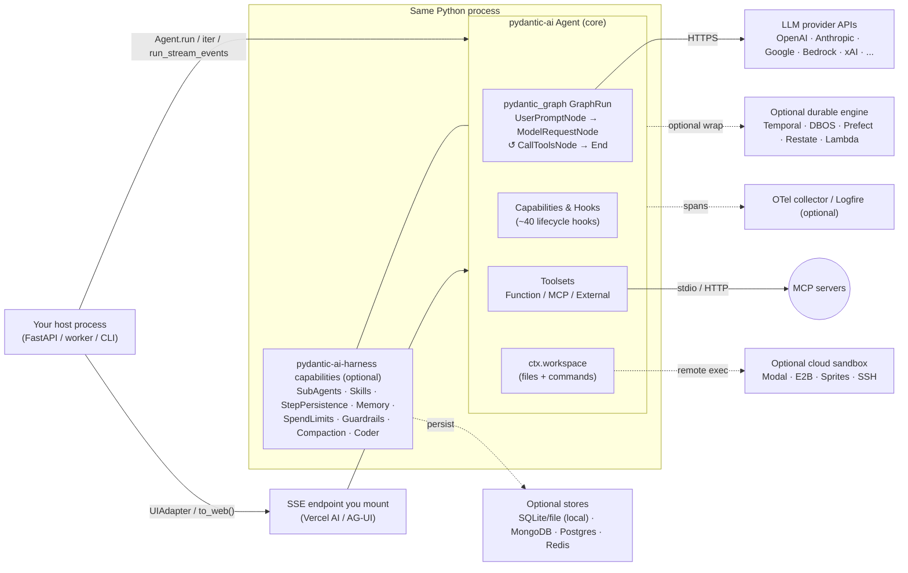
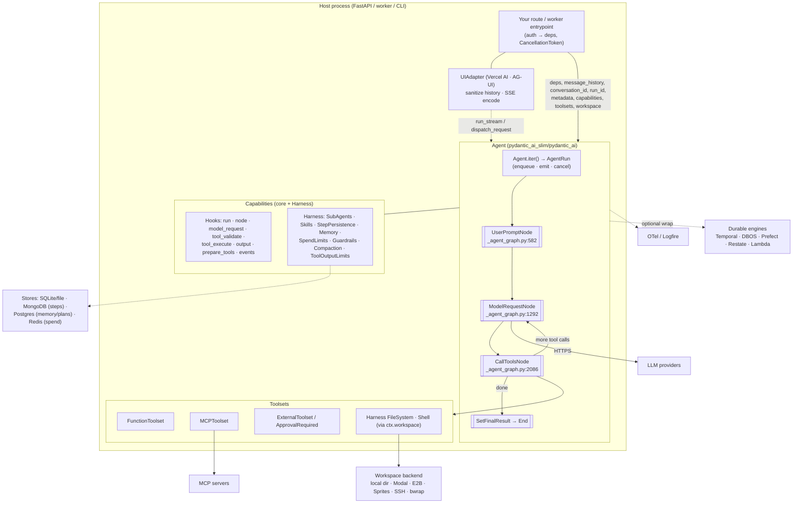

# Pydantic AI — Benchmark Analysis

> **Repo**: https://github.com/pydantic/pydantic-ai
> **Commit analysed**: 06ba88fd34ffd1b9de1e762b1e7235980ed693fe (`v2.52.0-34-g06ba88fd`)
> **Branch**: main
> **Framework path**: frameworks/pydantic-ai
> **Analysed on**: 2026-10-01

Paths below are relative to the submodule root. `pydantic_ai_slim/pydantic_ai/` is the core library (`pydantic-ai` / `pydantic-ai-slim` on PyPI). `src/pydantic_ai_harness/pydantic_ai_harness/` is the first-party **Pydantic AI Harness** capability library (`pydantic-ai-harness` on PyPI), which moved into this monorepo on 2026-09-26 (merge `497ca3a6`, PR #8818).

## TL;DR

- ⭐ **What is this stack architecturally?** A **provider-agnostic Python agent library** whose run loop is a typed `pydantic_graph` state machine running **in your process**. Since v2 it ships as two tiers in one monorepo: the **core** (`pydantic-ai`, V2 stable API policy) and the **Harness** (`pydantic-ai-harness`, 0.x API, 50+ composable "capabilities": sub-agents, skills, memory, step persistence, spend limits, guardrails, compaction, sandboxes, a full coding agent). Everything plugs in through one primitive: `Agent(capabilities=[...])`. HTTP exposure is still opt-in adapters (`VercelAIAdapter`, `AGUIAdapter`, `agent.to_web()`), not a server.
- **Ecosystem**: Python (3.10–3.14; `pydantic-clai2` needs 3.11+).
- Open-source under **MIT**, owned by **Pydantic Services Inc.** (Douwe Maan, David Sanchez, Aditya Vardhan, David Montague, Marcelo Trylesinski, Alex Hall, Samuel Colvin — `pyproject.toml:17`). Commercial adjacents: **Pydantic Logfire** (OTel backend, managed prompts) and **Pydantic AI Gateway** (managed multi-provider keys, spend caps). The framework works fully without either.
- Maturity: V1 Sep 2025; **V2.0.0 stable on 2026-06-23** (`docs/changelog.md:13`); **v2.52.0 on 2026-09-29**, i.e. ~52 minor releases in 14 weeks (near-daily). V1 still gets security fixes (v1.107.7 same day). Harness is explicitly 0.x: "APIs may still move between minor releases" (`src/pydantic_ai_harness/README.md:356`). 20.3k stars, 2.8k forks, ~615 contributors (2026-10-01).
- Run loop: **`Agent.iter()` → `AgentRun`** over `UserPromptNode → ModelRequestNode → CallToolsNode` (cycles) → `End` (`pydantic_ai_slim/pydantic_ai/_agent_graph.py:582`, `:1292`, `:2086`). v2 adds first-class **cancellation** (`CancellationToken`, `AgentRun.cancel()`), **mid-run message injection** (`ctx.enqueue()` / `AgentRun.enqueue()`), **custom/capability events** (`ctx.emit()`), and a per-run **workspace** abstraction (`ctx.workspace`, local dir or cloud sandbox).
- Hooks: still **~40 typed lifecycle points** (`capabilities/abstract.py:633-1317`) with `before/after/wrap/on_error` flavors for run, node, model request, tool validate/execute, output validate/process, plus `prepare_tools`, `wrap_run_event_stream`, `on_event`, `handle_deferred_tool_calls`. v2 moved most `Agent(...)` behavior kwargs onto capabilities (`docs/migration.md` "Agent configuration"). Strongest extensibility surface in the field reviewed.
- Sessions/persistence: core still ships **no store** (serialize `ModelMessagesTypeAdapter` into your DB, `docs/persistence.md`). The Harness adds **`StepPersistence`** (per-step snapshots + append-only events + tool-effect ledger, in-memory/file/SQLite/MongoDB stores, continue/fork helpers) and `SqliteConversationStore`. No Postgres step store; snapshots are message checkpoints, not graph-state checkpoints. Mid-tool-call durability still requires a durable engine (Temporal, DBOS, Prefect, Restate, AWS Lambda, Kitaru, Airflow, Absurd).
- Multi-tenancy: still no `tenant_id` field; typed **`deps`** reach every tool/hook/capability. New since v1.97: per-tenant **USD budgets** (`SpendLimits` + `Budget(scope=lambda ctx: ctx.deps.tenant_id)`, Redis-shared counter), per-tenant **memory namespaces**, per-tenant **model/provider resolution** (`ResolveModelId`), core `UsageLimits.cost_limit` (USD per run).
- Skills: **first-party now** — Harness `Skills` loads `SKILL.md` (agentskills.io) from the run's workspace and exposes each as an **on-demand capability** the model loads via the core `load_capability` tool (metadata-only catalog, body on demand). Gaps: bundled `references/`/`scripts/` are not loaded or executed; most Claude-Code frontmatter fields are accepted but ignored.
- Sub-agents: **first-party now** — Harness `SubAgents` exposes one `delegate_task(agent_name, task)` tool with per-delegate budgets/timeouts, a model menu the parent picks from, markdown agent files, `DelegationStart/EndEvent`s, and depth caps. `DynamicWorkflow` lets the LLM write a sandboxed Python script that fans out to sub-agents with `asyncio.gather`.
- Resource manager: **Not provided — BYO** at the platform level. Pieces exist (workspace backends as a pluggable source, `Skills(include/exclude)`, Logfire `ManagedPrompt` versioned/labelled prompts, `CapabilityCreation` active/disabled manifest) but no registry, multi-source precedence, tenant-scoped publishing or promotion workflow.
- Observability: OTel-native (`Instrumentation` capability, Logfire first-party). **USD cost is now on the usage object** (`RunUsage.cost: Decimal | None`, filled per response from `genai-prices` — `pydantic_ai_slim/pydantic_ai/_genai_prices.py:155`).
- Surprising-good: security posture is unusually explicit — UI adapters strip client system prompts/unsafe URL schemes and repair dangling tool calls; docs warn that a **shared `MCPToolset` is a single identity** across concurrent runs (`docs/mcp/client.md:483-489`); `FileSystem`/`Shell` path-containment and credential scrubbing; two GHSA advisories published and fixed in the window (to_web Host header, HTML nesting).
- Surprising-bad: velocity. Near-daily minors on core plus a 0.x Harness that now holds the session, skills, sub-agent and budget features means the capabilities this benchmark cares most about sit on the **less stable** API tier. Still no HTTP server, no auth, no session-pool runtime.
- Verdicts: sessions/persistence: **partial first-party (Harness StepPersistence, SQLite/Mongo/file) + BYO for Postgres** • skills: **first-party (Harness, lazy, workspace-loaded)** • resource manager: **BYO** • sub-agents: **first-party (Harness SubAgents / DynamicWorkflow)** • multi-tenancy: **strong primitives (deps, hooks, per-tenant spend/memory/model) but no tenant field** • hooks: **excellent** • API: **BYO server + UI adapters + cancel token** • observability: **excellent, OTel-native, USD cost on usage** • production-readiness for multi-tenant server-side: **core library is solid; you still build the host (HTTP, auth, session DB, workers); Harness pieces are production-intended but 0.x**.

## 0. General

### 0.1 What is this stack?
A **library**: "AI Agent Framework, the Pydantic way" (`pyproject.toml:16`), implemented as a typed `pydantic_graph` state machine executing in your Python process. Library-first, with an optional first-party capability library (Harness) and opt-in interfaces (`to_web()`, `to_cli()`, AG-UI/Vercel-AI `UIAdapter`s, ACP for editors, realtime voice — `docs/interfaces.md`). You bring the host.

### 0.2 Ecosystem
**Python** (3.10–3.14, `pyproject.toml:48`). Single-language project. The web chat UI bundles a prebuilt frontend; no second runtime is required.

### 0.3 Project status & governance
- **License**: MIT (`pyproject.toml:26`, `LICENSE`; Harness `src/pydantic_ai_harness/pyproject.toml:24`).
- **Owner**: Pydantic Services Inc. Authors listed in `pyproject.toml:17-25`.
- **Commercial support**: Pydantic Logfire (hosted OTel observability, managed prompts/variables), Pydantic AI Gateway (managed multi-provider keys with project/user/key spending limits — `docs/gateway.md:23`), and an enterprise-support page (`docs/enterprise-support.md`). The OSS library is usable without any of them.

### 0.4 Project maturity / age
- Repo created 2024-06-21. V1.0.0 2025-09-04 (`docs/changelog.md:245`).
- **V2**: betas from 2026-05-20 (`docs/changelog.md:97`), stable **v2.0.0 on 2026-06-23** (`docs/changelog.md:13`). Latest tag **v2.52.0 (2026-09-29)**; this commit is 34 commits past it.
- Version policy: no intentional breaking changes in minors; deprecations removed only at the next major, not sooner than 3 months after V2.0; V1 security fixes for at least 6 months after V2 (`docs/version-policy.md:7-11`). `beta` modules may change (`:26`).
- Classifier `Development Status :: 5 - Production/Stable` (`pyproject.toml:30`).
- **Harness** (`pydantic-ai-harness` 0.52.0, version-locked to the matching `pydantic-ai-slim`, `src/pydantic_ai_harness/pyproject.toml:46`) is 0.x: "tested end-to-end and meant for production use, but their APIs may still move between minor releases" (`src/pydantic_ai_harness/README.md:356`). ACP lives under `experimental` and may be removed without deprecation (`docs/harness/acp.md`).

### 0.5 Adoption & community signal
Captured **2026-10-01** via `gh api`:
- Stars **20,307**, forks **2,833**, watchers **124**.
- Contributors: **~615** (GitHub contributors API, anonymous included).
- Activity: **871 PRs** and **493 issues** opened in September 2026; **997 open issues**, **393 open PRs**. Last push 2026-10-01.
- Release cadence: v2.0.0 (2026-06-23) to v2.52.0 (2026-09-29) — roughly one minor per weekday, each with a GitHub Release. V1 maintenance line continues (v1.107.7, 2026-09-29).
- 1,690 commits between the previous analysed commit (v1.97.0, 2026-05-15) and this one.
- Downloads (pypistats, last 30 days at capture): `pydantic-ai` 5.30M, `pydantic-ai-slim` 23.1M.
- Maintainers answer issues actively; release notes credit many first-time contributors per release.

### 0.6 Ecosystem fit
- **Workspace members** (`pyproject.toml:108-116`): `pydantic_ai_slim` (core), `pydantic_graph` (graph engine), `pydantic_evals` (evals), `clai` (CLI), `examples`, `src/pydantic_ai_harness` (Harness), `src/pydantic_clai2` (new terminal coding client).
- **PyPI**: `pydantic-ai` (meta), `pydantic-ai-slim`, `pydantic-graph`, `pydantic-evals`, `pydantic-ai-harness`, `clai`, `pydantic-clai2`.
- **Packaging change in V2**: a bare `pip install pydantic-ai` now pulls only `openai,anthropic,google,cli,mcp,evals,web,logfire` (`pyproject.toml:52`); `bedrock`, `groq`, `mistral`, `cohere`, `xai`, `huggingface`, `temporal`, `ag-ui`, `ui`, `spec` are opt-in extras (`docs/migration.md` "Packaging").
- **Examples**: `examples/`, `docs/examples/`, `src/pydantic_ai_harness/examples/`.
- Used predominantly as a **library** (`from pydantic_ai import Agent`). `clai` / `clai2` are CLIs; `agent.to_web()` is a dev playground; no hosted platform.

### 0.7 Documentation depth & cross-team contributor accessibility
**Deep** and code-tested (`tests/test_examples.py` runs doc snippets — `AGENTS.md:118`). Docs are published via `pydantic/unified-docs` at `pydantic.dev/docs/ai/` (`AGENTS.md:117`). Coverage now includes a dedicated Persistence chooser (`docs/persistence.md`), Workspaces, Realtime, Interfaces, ~50 Harness capability pages (`docs/harness/`), and a V1→V2 migration map (`docs/migration.md`). **Non-engineer accessible**: `AgentSpec` YAML (`docs/agent-spec.md`), `SKILL.md` skills (Markdown + 2 frontmatter fields), markdown sub-agent definitions, and Logfire-managed prompts editable from a UI (`docs/harness/managed-prompt.md`).

### 0.8 Documentation entry points ⭐
- Docs landing: https://pydantic.dev/docs/ai/ (old `ai.pydantic.dev` 301-redirects)
- Quickstart: https://pydantic.dev/docs/ai/install/ and https://pydantic.dev/docs/ai/agent/
- API reference: https://pydantic.dev/docs/ai/api/agent/
- Hosting / deployment / production: https://pydantic.dev/docs/ai/durable_execution/overview/, https://pydantic.dev/docs/ai/ui/overview/, https://pydantic.dev/docs/ai/persistence/
- Harness: https://pydantic.dev/docs/ai/harness/
- Examples repo: https://github.com/pydantic/pydantic-ai/tree/main/examples
- Changelog / upgrade guide: https://pydantic.dev/docs/ai/changelog/ (in-repo `docs/changelog.md`), migration map https://pydantic.dev/docs/ai/migration/
- GitHub Releases: https://github.com/pydantic/pydantic-ai/releases
- Issues: https://github.com/pydantic/pydantic-ai/issues (Harness issues historically in https://github.com/pydantic/pydantic-ai-harness/issues; e.g. graph-state checkpoint scope #149/#196 referenced in `docs/harness/step-persistence.md:8`)
- Community: Pydantic Slack — https://logfire.pydantic.dev/docs/join-slack/

## 1. High Level Architecture


```mermaid
flowchart LR
  Caller["Your host process<br/>(FastAPI / worker / CLI)"]
  subgraph Proc["Same Python process"]
    subgraph Agent["pydantic-ai Agent (core)"]
      Graph["pydantic_graph GraphRun<br/>UserPromptNode → ModelRequestNode<br/>↺ CallToolsNode → End"]
      Caps["Capabilities & Hooks<br/>(~40 lifecycle hooks)"]
      Tools["Toolsets<br/>Function / MCP / External"]
      WS["ctx.workspace<br/>(files + commands)"]
    end
    Harness["pydantic-ai-harness capabilities (optional)<br/>SubAgents · Skills · StepPersistence · Memory ·<br/>SpendLimits · Guardrails · Compaction · Coder"]
  end
  Provider["LLM provider APIs<br/>OpenAI · Anthropic · Google · Bedrock · xAI · ..."]
  Sandbox["Optional cloud sandbox<br/>Modal · E2B · Sprites · SSH"]
  Stores["Optional stores<br/>SQLite/file (local) · MongoDB · Postgres · Redis"]
  Durable["Optional durable engine<br/>Temporal · DBOS · Prefect · Restate · Lambda"]
  OTel["OTel collector / Logfire (optional)"]
  MCPS(("MCP servers"))
  Caller -->|Agent.run / iter / run_stream_events| Agent
  Harness --- Agent
  Graph -- HTTPS --> Provider
  Tools -- stdio / HTTP --> MCPS
  WS -. remote exec .-> Sandbox
  Harness -. persist .-> Stores
  Agent -. optional wrap .-> Durable
  Agent -. spans .-> OTel
  Caller -- "UIAdapter / to_web()" --> SSE["SSE endpoint you mount<br/>(Vercel AI / AG-UI)"]
  SSE --> Agent
```

### 1.1 Where does the agent loop *actually* execute?
**In your Python process.** No subprocess, no bundled binary, no vendor cloud:
- `Agent.run()` (`pydantic_ai_slim/pydantic_ai/agent/abstract.py:529`) opens `self.iter(...)` (`agent/__init__.py:1287`).
- `iter()` builds the agent graph (`build_agent_graph`, `_agent_graph.py:2867`) and starts a `pydantic_graph` run.
- Iteration walks `UserPromptNode` (`_agent_graph.py:582`) → `ModelRequestNode` (`:1292`) → `CallToolsNode` (`:2086`) → `SetFinalResult` (`:2589`) / `End`.
- Model calls go out over the provider SDKs' HTTPS clients. The only things that run elsewhere are opt-in: a cloud sandbox when you attach one as the run's workspace (Modal/E2B/Sprites — commands and file I/O, not the loop), MCP servers, or a durable engine that schedules the same Python code as workflow/activities.

### 1.2 Runtime dependencies
- **Language runtime**: CPython 3.10+ (3.11+ for `pydantic-clai2`).
- **External binaries**: none required. Optional: `rg` (ripgrep) for Harness `FileSystem` opt-in tools, `bwrap` for `BubblewrapSandbox`, Docker for `LocalStack`.
- **Infrastructure services**: none required. Optional, by feature: SQLite file / MongoDB (StepPersistence), Postgres (Memory, Planning), Redis (shared SpendLimits counter), a durable engine server (Temporal, DBOS's Postgres, Prefect, Restate), cloud sandbox accounts (Modal, E2B, Fly.io Sprites).
- **Vendor services**: at least one LLM provider API key. Logfire and AI Gateway optional.

### 1.3 Recommended deployment topology
Not prescriptive. Agents are "stateless and designed to be global" (`docs/multi-agent-applications.md:27`), so the default is **one process, many tenants**: one `Agent` instance serves many concurrent `run()` calls with per-call `deps`. UI adapter docs assume the adapter endpoint runs inside your own authenticated route (`docs/ui/overview.md:162`). The cancel-endpoint example notes its in-memory token registry "requires a single server process or sticky routing" (`docs/ui/vercel-ai.md:63-64`). Durable engines (Temporal/DBOS/Prefect/Restate) are the documented pattern for long-running work. Harness `SqliteConversationStore` explicitly must not be shared between hosts (`docs/harness/step-persistence.md` "Conversation heads"), so multi-worker deployments should use MongoDB/Postgres-backed stores.

### 1.4 Cold-start cost & instance footprint
Pure-Python import; no subprocess spin-up. Startup is the interpreter plus import graph of the chosen provider SDKs (tens of MB RAM). V2 resolves deferred provider imports and `genai-prices` data at `Model` construction time (v2.30.0 release notes) so first-request latency moves to construction. A cloud-sandbox workspace adds the provider's sandbox boot time per run/conversation (not measured here). No documented multi-second agent startup.

### 1.5 Vendor lock-in
- **LLM provider**: low. ~20 provider modules (`pydantic_ai_slim/pydantic_ai/models/`), `FallbackModel`, `SelectModel`, `ResolveModelId`, custom `Model` subclasses. Note V2 made `openai:` mean the Responses API (`openai-chat:` for Chat Completions — `docs/migration.md` "Model name prefixes").
- **Hosting**: none.
- **Eval**: low — `pydantic-evals` in-repo, OTel export.
- **Observability**: low — OTel-first; Logfire is one backend. `ManagedPrompt` does tie prompt management to Logfire if you adopt it.

### 1.6 Framework weight / footprint
**Medium core, heavy optional layer.** Core: `agent/__init__.py` 4,886 LOC, `_agent_graph.py` 3,307 LOC, `messages.py` 5,129 LOC. Harness: ~53 kLOC across 50+ capability packages (file/shell tools, sandboxes, Playwright, browser-use, memory, step persistence, spend, guardrails, compaction, code mode, coder/researcher agents, integrations for GitHub/Linear/Slack/Notion/etc.). Everything is opt-in per capability; the core stays storage-free.

### 1.7 Release-history signal
- **V2 breaking changes** (`docs/changelog.md:97-238`, `docs/migration.md`): most `Agent(...)` behavior kwargs moved to capabilities (`builtin_tools`→`NativeTool`, `history_processors`→`ProcessHistory`, `instrument`→`Instrumentation`, `prepare_tools`→`PrepareTools`, `event_stream_handler`→`ProcessEventStream` on the constructor); per-transport MCP classes collapsed into `MCPToolset`; `run_stream_events` is now an async context manager only; default `end_strategy` changed from `'early'` to `'graceful'`; `ModelProfile` became a `TypedDict`; `pydantic_graph.persistence` removed (points at Harness `StepPersistence`); `Agent.to_a2a()`/`to_ag_ui()` removed; `outlines`/`gemini` model modules removed; V1 message history still deserializes.
- **Fast-moving areas since v1.97**: workspaces and sandboxes (v2.52.0: "Run harness capabilities in any workspace"), realtime voice (OpenAI, Gemini Live, xAI, Azure), on-demand capabilities and tool search, `DecisionModel`/routing (v2.50.0), cancellation (`CancellationToken`), `ctx.enqueue`, capability events, `@agent.on_event` (v2.40.0), price updates in background (v2.40.0), provider-valid history repair (v2.10.0), durable-execution backend builder.
- **Security advisories in window**: GHSA-q2xc-rrxj-58x9 (`to_web()`/`clai web` Host-header validation, fixed v2.30.0 with `allowed_hosts`); GHSA-v36g-jcw9-x7cw (deeply nested HTML in local web-fetch conversion, v2.52.0).
- **Structural**: Harness and `pydantic-clai2` moved into the monorepo on 2026-09-26 (`git log`: `521fa994`).
- GitHub Releases: https://github.com/pydantic/pydantic-ai/releases.

## 2. Agent Loop

### 2.1 Run loop entrypoint(s)
Public entrypoints on `AbstractAgent` (`pydantic_ai_slim/pydantic_ai/agent/abstract.py`):

| Method | Return type | File:line |
|---|---|---|
| `Agent.run(...)` | `AgentRunResult[OutputDataT]` (async) | `agent/abstract.py:529` |
| `Agent.run_sync(...)` | `AgentRunResult[OutputDataT]` | `agent/abstract.py:730` |
| `Agent.run_stream(...)` | `AsyncContextManager[StreamedRunResult]` | `agent/abstract.py:896` |
| `Agent.run_stream_sync(...)` | `StreamedRunResultSync` | `agent/abstract.py:1206` |
| `Agent.run_stream_events(...)` | `AsyncContextManager[AgentRunEvents]` yielding `AgentStreamEvent \| AgentRunResultEvent` | `agent/abstract.py:1384`, iterator class `:138` |
| `Agent.iter(...)` | `AsyncContextManager[AgentRun]` (node-by-node) | `agent/abstract.py:1569`, impl `agent/__init__.py:1287` |

Shared kwargs (`agent/abstract.py:529-552`): `user_prompt`, `output_type`, `message_history`, `deferred_tool_results`, `conversation_id`, **`run_id`** (new), `model`, `instructions`, `deps`, `model_settings`, `usage_limits`, **`cancellation_token`** (new), `usage`, `metadata`, **`retries`** (replaces `output_retries`), `infer_name`, `toolsets`, `event_stream_handler`, `capabilities`, **`workspace`** (new), `spec`. A realtime voice session is a separate entrypoint family (`docs/realtime/overview.md`).

### 2.2 Per-iteration behavior
Each iteration is one graph node step (`_agent_graph.py`):
1. `UserPromptNode` (`:582`) — resolves instructions/system prompts, repairs provider-invalid history (dangling tool calls, orphaned results — `_repair_dangling_tool_calls`, `:3127`), packages the user prompt into a `ModelRequest`.
2. `ModelRequestNode` (`:1292`) — drains pending enqueued messages, runs `before/wrap/after_model_request`, sends the request (streaming or not), collects `ModelResponse`, fills `usage.cost` (`_genai_prices.py:155`), checks `UsageLimits`.
3. `CallToolsNode` (`:2086`) — extracts `ToolCallPart`s, dispatches through `ToolManager` / `_tool_execution.py` (`before/wrap/after_tool_validate` → approval/deferral → `before/wrap/after_tool_execute`), feeds `ToolReturnPart`s back, and either loops to `ModelRequestNode` or goes to `SetFinalResult`/`End`.

### 2.3 ReAct loop
**Built-in.** `CallToolsNode → ModelRequestNode` is the cycle, terminated by `end_strategy` (`'early' | 'graceful' | 'exhaustive'`, `_agent_graph.py:121`; default now `'graceful'`, `agent/__init__.py:562`) and bounded by `UsageLimits` (`usage.py:471`, default `request_limit=50`).

### 2.4 Tool dispatch + result handling
`ToolManager.handle_call` (`pydantic_ai_slim/pydantic_ai/tool_manager.py:1080`) / `execute_tool_call` (`:745`):
1. Resolves the tool from the combined toolset (respecting tool search reveal and on-demand capability loading — a deferred tool must be revealed before it can be called, v2.30.0).
2. Validates model JSON args with the tool's Pydantic schema, then `args_validator` if set.
3. Fires `before_tool_validate → wrap_tool_validate → after_tool_validate`, approval/deferral checks, then `before_tool_execute → wrap_tool_execute → after_tool_execute`.
4. Calls the function with `RunContext` + validated args. Parallel calls run as `asyncio` tasks (`_tool_execution.py:864`); `parallel_tool_call_execution_mode('sequential' | 'parallel' | 'parallel_ordered_events')` (`agent/abstract.py:1927`, `tool_manager.py:41`); `sequential=True` on a tool is now a per-tool barrier.
5. Wraps the return as `ToolReturnPart` (or `RetryPromptPart` on `ModelRetry`, or a failed outcome on `ToolFailed`).

### 2.5 Explicit turn concept
A turn is **one model request plus the tool calls it produced**. `RunContext.run_step` increments per step (`_run_context.py:225`). Model-request hooks fire "once per model turn" even when a provider pauses mid-turn (Anthropic `pause_turn`) or returns a background response (OpenAI background mode) and the agent continues it transparently (`docs/hooks.md:158`).

### 2.6 Event emission mechanism (in-process)
Typed async iterator. `run_stream_events()` returns `AgentRunEvents` (`agent/abstract.py:138`), a hand-written async iterator that starts a background `run()` on first `__anext__` and forwards events over a memory stream, ending with one `AgentRunResultEvent`. Nodes implement `async def stream(...)` (`_agent_graph.py:1327` for model requests, `:2124` for tool handling). Interception: `event_stream_handler=` on run methods, `ProcessEventStream` capability, `wrap_run_event_stream` / `on_event` hooks, and `@agent.on_event(EventType)` listeners (`agent/__init__.py:2582`). Tools and hooks can push events with `await ctx.emit(CustomEvent(...))` (`_run_context.py:722`); code driving `iter()` can use `AgentRun.emit` (`run.py:608`).

## 3. Message & Event Taxonomy

### 3.1 Message layers
Three message vocabularies plus a transient event layer:

```
┌──────────────────────────────┐  load_messages / sanitize   ┌───────────────────────────┐
│ Wire layer (UI adapters)     │ ──────────────────────────► │ Pydantic AI ModelMessage  │
│ Vercel AI UIMessage / AG-UI  │ ◄────────────────────────── │ (ModelRequest/ModelResponse)│
│ chunks over SSE              │  dump_messages / encode     └─────────────┬─────────────┘
└──────────────────────────────┘                                           │ model adapter
                                                                           ▼
                                                             ┌───────────────────────────┐
   AgentStreamEvent (transient, not persisted)               │ Provider SDK shape        │
   PartStart/Delta/End · tool events · Custom/Capability     │ (OpenAI / Anthropic / …)  │
                                                             └───────────────────────────┘
```
Conversion sites: `UIAdapter.load_messages` / `dump_messages` / `sanitize_messages` (`pydantic_ai_slim/pydantic_ai/ui/_adapter.py:444`, `:449`, `:491`); each `models/*.py` maps `ModelMessage` to the provider shape.

### 3.2 Concrete message types
(`pydantic_ai_slim/pydantic_ai/messages.py`)

| Type | Purpose | Line |
|---|---|---|
| `SystemPromptPart` | System prompt text | `:209` |
| `CachePoint` | Explicit prompt-cache breakpoint in user content | `:790` |
| `ToolReturn` | Tool return wrapper with separate model-visible `content` and app `metadata` | `:1013` |
| `UserPromptPart` | User text / multimodal input | `:1125` |
| `ToolReturnPart` | Function-tool result | `:1705` |
| `NativeToolReturnPart` | Provider-side native tool result (was `BuiltinToolReturnPart`) | `:1727` |
| `RetryPromptPart` | Validation / `ModelRetry` feedback | `:1770` |
| `InstructionPart` | Instructions with source attribution (agent / toolset / capability) | `:1979` |
| `ToolAvailabilityDeltaPart` | Records tools revealed mid-run (tool search / capability load) | `:2050` |
| `ModelRequest` | Container of request parts | `:2091` |
| `TextPart` | Assistant text | `:2150` |
| `ThinkingPart` | Reasoning text | `:2188` |
| `CompactionPart` | Provider compaction boundary | `:2249` |
| `FilePart` | Generated file | `:2300` |
| `SpeechPart` | Realtime audio/speech output | `:2338` |
| `ToolCallPart` | Function-tool call | `:2536` |
| `NativeToolCallPart` | Native tool call (was `BuiltinToolCallPart`) | `:2558` |
| `WorkspaceRef` | Serializable reference to the run's workspace | `:2799` |
| `ModelResponse` | Container of response parts; `state` in `complete/incomplete/suspended/interrupted` (`:155`) | `:2813` |
| `ModelMessage` | `ModelRequest \| ModelResponse` discriminated union | `:3046` |
| `TextPartDelta` / `ThinkingPartDelta` / `ToolCallPartDelta` / `SpeechPartDelta` | Streaming deltas | `:3698`, `:3748`, `:3859`, `:4023` |

### 3.3 Messages vs. events
**Distinct.** Messages persist in history (`ModelMessage`); events are transient stream items (`AgentStreamEvent`, `messages.py:5120`). `Agent.iter()` additionally yields graph nodes (a third, control-flow layer). `EnqueuedMessagesEvent` bridges the two: it is emitted when injected messages land in history.

### 3.4 Event categories

| Category | Members | Defined at |
|---|---|---|
| Model-response stream | `PartStartEvent`, `PartDeltaEvent`, `PartEndEvent`, `FinalResultEvent` | `messages.py:4112-4213` |
| Message injection | `EnqueuedMessagesEvent` | `messages.py:4220` |
| Tool / handle-response | `FunctionToolCallEvent`, `FunctionToolResultEvent`, `OutputToolCallEvent`, `OutputToolResultEvent`, `ToolAvailabilityDeltaEvent`, `DeferredToolRequestsEvent`, `DeferredToolResultsEvent` | `messages.py:4242-4404`, union `:4609` |
| Realtime session | `RealtimeTurnCompleteEvent`, speech start/end, interrupted, reconnect, error | `messages.py:4405-4605`, union `:5106` |
| Application events | `CustomEvent` (emitted via `ctx.emit` / `AgentRun.emit`) | `messages.py:4632` |
| Capability events | `CapabilityEvent` (namespaced, `dispatch='stream'\|'immediate'`) | `messages.py:4901` |
| Run lifecycle | `AgentRunResultEvent` (terminal) | `run.py:955` |

Sub-agent lifecycle events are capability events from Harness `SubAgents`: `DelegationStartEvent` / `DelegationEndEvent` (`src/pydantic_ai_harness/pydantic_ai_harness/subagents/_events.py:44`, `:63`). Other Harness families: `SpendRecordedEvent`, `SnapshotSaved`, `FileChangeRequestEvent` (immediate, cancellable), etc. There is no session-lifecycle event (no session abstraction in core). The V1 `BuiltinToolCallEvent`/`BuiltinToolResultEvent` were removed in V2.

### 3.5 Canonical type-definition file(s)
- `pydantic_ai_slim/pydantic_ai/messages.py` — all parts, deltas, events, `AgentStreamEvent`.
- `pydantic_ai_slim/pydantic_ai/run.py` — `AgentRun`, `AgentRunResult`, `AgentRunResultEvent`.
- `pydantic_ai_slim/pydantic_ai/_run_context.py` — `RunContext`.
- `pydantic_ai_slim/pydantic_ai/_agent_graph.py` — graph nodes and state.
- `pydantic_ai_slim/pydantic_ai/usage.py` — `RequestUsage`, `RunUsage`, `UsageLimits`.
- `pydantic_ai_slim/pydantic_ai/_deferred.py` — `DeferredToolRequests` (`:28`) / `DeferredToolResults` (`:159`).

### 3.6 Live agentic event stream taxonomy
Sample frames (repr shapes from `messages.py`):

```python
PartStartEvent(index=0, part=TextPart(content='The capital of '))
PartDeltaEvent(index=0, delta=TextPartDelta(content_delta='France is Paris.'))
PartStartEvent(index=1, part=ToolCallPart(tool_name='topic_search', args='', tool_call_id='call_a1'))
PartDeltaEvent(index=1, delta=ToolCallPartDelta(args_delta='{"query":"cook', tool_call_id='call_a1'))
FinalResultEvent(tool_name=None, tool_call_id=None)
FunctionToolCallEvent(part=ToolCallPart(tool_name='topic_search', args='{"query":"cooking"}', tool_call_id='call_a1'))
FunctionToolResultEvent(part=ToolReturnPart(tool_name='topic_search', content=[...], tool_call_id='call_a1'))
DeferredToolRequestsEvent(requests=DeferredToolRequests(approvals=[ToolCallPart(tool_name='audience_create', ...)]))
EnqueuedMessagesEvent(enqueue_id='enq_1', messages=(ModelRequest(parts=[UserPromptPart('Also check sports')]),))
DelegationEndEvent(agent_name='researcher', outcome='ok', output='...', duration_seconds=4.2)   # Harness capability event
AgentRunResultEvent(result=AgentRunResult(output='The capital of France is Paris.'))
```

## 4. Agent Runtime (Multi-session Host)

### 4.1 Multi-session host architecture
**Not provided — BYO.** No runtime that hosts a pool of sessions. An `Agent` instance is reused globally; you embed it in your ASGI app, worker, or durable workflow. The closest first-party "hosts" are dev surfaces (`to_web()`, `clai`, `clai2`, ACP stdio server) and the durable-engine integrations.

### 4.2 Concurrent session isolation
- Fresh `RunContext` per run (`_run_context.py:168`) carrying `deps`, `usage`, `metadata`, `run_id`, `conversation_id`, `workspace`, pending-message queue.
- `ContextVar` `_CURRENT_RUN_CONTEXT` (`_run_context.py:938`, setter `:955`) so concurrent runs in one process do not bleed.
- Toolsets and capabilities get per-run instances via `for_run` (`toolsets/abstract.py:126`, `capabilities/abstract.py:428`); Harness capabilities use this for per-run scope (e.g. `Memory.for_run` resolves the tenant namespace once per run, `src/pydantic_ai_harness/pydantic_ai_harness/memory/_capability.py:124`).
- **Known bleed risk, documented**: a shared `MCPToolset` holds one session for all concurrent runs, so per-request credentials leak across runs unless you build the toolset per run (`docs/mcp/client.md:487-489`).

### 4.3 Horizontal scaling / multi-instance
Stateless workers by default; the caller owns message history and re-passes it. Shared state options by feature: MongoDB `MongoStepStore` or your own `StepStore`, `PostgresMemoryStore`, `RedisSpendStore` (cross-process budget counters, Lua-atomic, `docs/harness/spend.md:193`). Cancel-by-id across workers needs your own broker (`docs/ui/vercel-ai.md:63-64`). Durable engines provide per-workflow recovery on any worker. No leader election or shared session pool in-tree.

### 4.4 Background / async / scheduled tasks
- **Scheduling**: Not provided — BYO (cron, Temporal schedules, Prefect deployments, DBOS). Harness `gh-aw` runs agents on GitHub issues/PRs/schedules via GitHub Agentic Workflows (`docs/harness/gh-aw.md`).
- **Long-running in-run background work**: Harness `BackgroundTools` lets selected tools run in the background while the agent continues (`src/pydantic_ai_harness/pydantic_ai_harness/background_tools/_capability.py:117`); `Shell` background processes persist across runs of a conversation (`docs/harness/shell.md`).
- **Durable long runs**: Temporal, DBOS, Prefect, Restate, AWS Lambda durable (`AWSLambdaDurability`), Kitaru, Airflow, Absurd (`docs/durable_execution/overview.md`).

### 4.5 Worker pool / queue model
No built-in queue. `UseThreadExecutor` supplies your own `concurrent.futures.Executor` for sync tools in long-running servers (`pydantic_ai_slim/pydantic_ai/capabilities/thread_executor.py:17`). Otherwise request-scoped execution is assumed; queueing is the durable engine's or your job.

## 5. Sessions & Persistence

### 5.1 Session / chat data model
Core has **no `Session` object** (`docs/persistence.md`: "deliberately unopinionated about your database"). Identity lives on `RunContext` and on every message:
- `conversation_id` (`_run_context.py:235`) — resolved from the argument, the last `conversation_id` on `message_history`, or a fresh UUID7.
- `run_id` (`_run_context.py:233`) — per `Agent.run`; now caller-settable (`run_id=`).
- `metadata: dict[str, Any] | None` (`:242`), `deps` (`:171`), `usage: RunUsage` (`:175`), `workspace` (`:257`).

The Harness adds persisted records (`src/pydantic_ai_harness/pydantic_ai_harness/step_persistence/_types.py`):

```python
@dataclass(kw_only=True)
class RunRecord:                       # _types.py:132
    run_id: str
    conversation_id: str | None = None
    parent_run_id: str | None = None   # lineage: which run spawned this one
    agent_name: str | None = None
    metadata: dict[str, str] = ...
    started_at: datetime = ...
    registration_id: str | None = None

@dataclass(kw_only=True)
class ContinuableSnapshot:             # _types.py:89
    run_id: str
    step_index: int
    messages: list[ModelMessage]
    conversation_id: str | None = None
    parent_run_id: str | None = None
    agent_name: str | None = None
    timestamp: datetime = ...
    state: SnapshotState = 'complete'  # or 'interrupted'
    idempotency_key: str | None = None
```
Plus `StepEvent` (`:59`) and `ToolEffectRecord` (`:111`, status `started/completed/failed`). For chat-app "heads", `SqliteConversationStore` stores `ConversationSummary` + messages with revisioning (`step_persistence/conversations.py:38`, `:127`).

### 5.2 What's stored on a session
- Core: whatever you persist. `AgentRunResult.all_messages()` / `new_messages()` / `*_json()` (`run.py:854-903`). `RunUsage` is not in the messages; store it alongside if `UsageLimits` should span the conversation (`docs/persistence.md` "What a history alone doesn't carry").
- Harness `StepPersistence`: full message-history snapshots per settled step, append-only step events, tool-effect ledger, run lineage; large binary/text parts externalized to content-addressed media stores (`docs/harness/media.md`). Cross-session notes live separately in `Memory` (see 5.11).

### 5.3 Granularity
One conversation per `conversation_id`, many runs per conversation, many steps per run (`docs/harness/step-persistence.md:91-104`). **Forking**: `conversation_id='new'` branches off an existing history (`docs/message-history.md:304`); Harness `fork_run(store, run_id=...)` returns a history to start a new branch from any stored snapshot (`step_persistence/_helpers.py:81`); `continue_run` resumes (`:58`). `parent_run_id` links delegate runs into a tree. No LangGraph-style addressable checkpoint tree with time-travel UI.

### 5.4 Built-in persistence stores
- Core: **none** — serialize with `ModelMessagesTypeAdapter` (`messages.py:3050`) into e.g. a `jsonb` column.
- Harness `StepPersistence` (`step_persistence/_store.py`): `InMemoryStepStore` (`:193`), `FileStepStore` (`:467`, JSONL/JSON per run directory), `SqliteStepStore` (`:938`, WAL), `MongoStepStore` (`step_persistence/_mongo.py:66`, `mongodb` extra). **No Postgres or Redis step store.**
- Harness `SqliteConversationStore` (conversation heads, single host).
- Harness `Memory` stores: in-memory, file, SQLite, Postgres (5.11).
- Durable engines keep their own state store under the loop.

### 5.5 Persistence timing
Core: N/A. Harness `StepPersistence` hooks (`step_persistence/_capability.py`):
- Run registration in `before_run` (`:438`); events on run start/end, model request, tool call, failure.
- **Snapshot after each settled `CallToolsNode`** in `after_node_run` (`:668`), when every tool call has a result (provider-valid history).
- Optional `capture_frontier=True` (`:143`) also saves accepted request histories before model requests and the response frontier before tool execution (marked `interrupted`).
- Tool-effect `started` in `before_tool_execute` (`:611`), `completed/failed` in `after_tool_execute` / `on_tool_execute_error` (`:629`, `:648`).
- Final comparison in `after_run` (`:459`); at-failure history in `on_run_error` (`:535`).
- Writes are awaited inside the hook (async protocol; file/SQLite I/O via `anyio.to_thread`), so persistence is synchronous with the loop.

### 5.6 Mid-run checkpointing (durable)
- **True mid-tool-call resume: only via a durable engine** (Temporal/DBOS/Prefect/Restate/Lambda/Kitaru/Airflow/Absurd). Under Temporal the loop is a workflow, model requests and tool calls are activities; a crashed worker replays to the last committed activity.
- Harness `StepPersistence` is **not** a graph-state checkpoint: "It does not restore capability per-run state, graph-node state, retry counters, or in-flight streaming responses" (`docs/harness/step-persistence.md` "What this capability does not do"). After a crash it gives you the last `complete` snapshot plus `list_unresolved_tool_effects` (tools `started` with no terminal record = `unknown_after_crash`) and leaves replay decisions to you; "Automatic execution recovery is not implemented" (`docs/harness/step-persistence.md` "Core boundary for stronger interrupted-step recovery").
- First-party cancellation (`AgentRun.cancel()`, `CancellationToken`) produces `RunCancelled.all_messages()`, a resumable history (`run.py:684`).

### 5.7 Session ID format
`conversation_id` and `run_id`: UUID7 strings by default, any caller string accepted (`docs/message-history.md:268-307`). `FileStepStore` validates run ids against `[A-Za-z0-9_.-]{1,200}`; with `agent_name` set, the persisted run id is a base64url encoding of `(agent_name, ctx.run_id)` (`docs/harness/step-persistence.md` Quick start).

### 5.8 Pluggable store interface
Core: none. Harness `StepStore` protocol (`step_persistence/_store.py:145`):

```python
class StepStore(Protocol):
    async def register_run(self, record: RunRecord) -> None: ...
    async def get_run(self, *, run_id: str) -> RunRecord | None: ...
    async def list_runs(self, *, parent_run_id: str | None = None,
                        conversation_id: str | None = None) -> list[RunRecord]: ...
    async def append_event(self, event: StepEvent) -> None: ...
    async def list_events(self, *, run_id: str) -> list[StepEvent]: ...
    async def save_snapshot(self, snapshot: ContinuableSnapshot) -> None: ...
    async def latest_snapshot(self, *, run_id: str,
                              include_interrupted: bool = False) -> ContinuableSnapshot | None: ...
    async def record_tool_effect(self, record: ToolEffectRecord) -> None: ...
    async def get_tool_effect(self, *, run_id: str, tool_call_id: str) -> ToolEffectRecord | None: ...
    async def list_unresolved_tool_effects(self, *, run_id: str) -> list[ToolEffectRecord]: ...
```
A Postgres implementation is a BYO class against this protocol. Memory has `MemoryStore` / `SearchableMemoryStore` protocols (`memory/_store.py:202`, `:240`); Spend has `BatchSpendStore` (`spend/_store.py:119`).

### 5.9 Schema evolution / migration
- Messages: validation aliases keep V1-serialized history loadable in V2 (`docs/migration.md` "Messages, events and usage"); adding new message parts is not a breaking change by policy (`docs/version-policy.md:18`). No migration helpers needed for message JSON.
- Harness stores self-migrate in small ways (SQLite adds the snapshot `state` column on open; Redis spend keys read old+new names during a deprecation window); `SqliteConversationStore` rejects unknown metadata schema versions. No general migration framework.

### 5.10 Export / replay
`AgentRunResult.all_messages_json()` (`run.py:871`) exports JSON; replay = `Agent.run(..., message_history=...)`. Core now repairs provider-invalid histories (dangling calls, orphaned results) automatically (`docs/message-history.md:249`). Harness: `continue_run` / `fork_run` from any stored run; `inspect_recovery` summarizes a crashed run (`step_persistence/recovery.py`). Deterministic replay for tests: `TestModel` / `FunctionModel` and recorded cassettes (`AGENTS.md:116`).

### 5.11 Cross-session memory
**First-party in Harness** (was third-party at v1.97): `Memory` capability, a Markdown "notebook" with `write_memory` / `read_memory` / `delete_memory` / `search_memory` tools, per-run tenant `namespace` resolver, compare-and-swap writes, idempotent replay; stores: in-memory, file, SQLite, Postgres (`docs/harness/memory.md`). Literal-text search only. See §17.

## 6. Multi-tenancy & Tenant Identity ⭐ THE KEY QUESTION

### 6.1 Run-loop tenant identity
No first-class `tenant_id`. Tenant identity enters through these `Agent.run()` fields (`pydantic_ai_slim/pydantic_ai/agent/abstract.py:529-552`):

```python
async def run(
    self,
    user_prompt: str | Sequence[UserContent] | None = None,
    *,
    output_type: OutputSpec[RunOutputDataT] | None = None,
    message_history: Sequence[ModelMessage] | None = None,
    deferred_tool_results: DeferredToolResults | None = None,
    conversation_id: str | None = None,
    run_id: str | None = None,
    model: Model | KnownModelName | str | None = None,
    instructions: AgentInstructions[AgentDepsT] = None,
    deps: AgentDepsT = None,                               # ⭐ typed tenant identity
    model_settings: AgentModelSettings[AgentDepsT] | None = None,
    usage_limits: UsageLimits | None = None,
    cancellation_token: CancellationToken | None = None,
    usage: RunUsage | None = None,
    metadata: AgentMetadata[AgentDepsT] | None = None,     # ⭐ dict or callable, lands on spans
    retries: int | AgentRetries | None = None,
    infer_name: bool = True,
    toolsets: Sequence[AbstractToolset[AgentDepsT]] | None = None,
    event_stream_handler: EventStreamHandler[AgentDepsT] | None = None,
    capabilities: Sequence[AgentCapability[AgentDepsT]] | None = None,  # ⭐ per-run tenant capabilities
    workspace: WorkspaceBackend | WorkspaceRef | Literal['new'] | None = None,  # ⭐ per-tenant sandbox/dir
    spec: dict[str, Any] | AgentSpec | None = None,
) -> AgentRunResult[Any]: ...
```
Idiomatic pattern: a typed `deps` dataclass with `tenant_id`, `user_id`, `locale`, etc. (`deps_type=` on the agent), plus `metadata={'tenant_id': ...}` for trace tagging. Generic default for deps changed from `None` to `object` in V2 (`docs/migration.md`).

### 6.2 Tenant identity propagation into tool calls
`RunContext` (`_run_context.py:168`) is passed to every tool, instruction function, hook, toolset factory and capability. It carries `deps`, `model`, `usage`, `usage_limits`, `agent`, `prompt`, `messages`, `tracer`, `retries`, `tool_call_id`, `tool_name`, `retry`, `max_retries`, `run_step`, `tool_call_approved`, `tool_call_metadata`, `partial_output`, `run_id`, `conversation_id`, `metadata`, `model_settings`, `workspace`, `pending_messages`, `tool_manager`, `capabilities`, `loaded_capability_ids`, `discovered_tool_names` (`_run_context.py:171-411`). Call path: `CallToolsNode` → `ToolManager.handle_call` (`tool_manager.py:1080`) → `execute_tool_call` (`:745`) → tool function `(ctx, **validated_args)`.

### 6.3 Tool call interface
```python
@agent.tool                                           # agent/__init__.py:2664
async def topic_search(ctx: RunContext[TenantDeps], query: str) -> list[str]:
    """Search topics for the current tenant."""
    return await ctx.deps.client.search(ctx.deps.tenant_id, query)
```
`Tool` fields (`pydantic_ai_slim/pydantic_ai/tools.py:334-353`): `function`, `takes_ctx`, `max_retries`, `name`, `description`, `prepare`, `args_validator`, `docstring_format`, `require_parameter_descriptions`, `strict`, `sequential`, `requires_approval`, `metadata`, `timeout`, `defer_loading`, `include_return_schema`, `function_schema`. Return any JSON-serializable value, or `ToolReturn` (`messages.py:1013`) to separate model-visible content from app metadata. V2: `FunctionToolset.tool()` raises if the first param is not `RunContext`; use `tool_plain()` for context-free functions.

### 6.4 Forcing tool arguments from the harness
**Yes.**
1. **Keep the field out of the schema** (strongest): the tool reads `ctx.deps.tenant_id`; the LLM never sees a `tenant_id` parameter.
2. **`before_tool_validate` hook with a tool filter** (`capabilities/abstract.py:967`; decorator filter `capabilities/hooks.py:320`): return a new raw-args dict; it replaces the LLM-generated args before validation.
   ```python
   @hooks.on.before_tool_validate(tools=['topic_search'])
   async def force_tenant(ctx, *, call, tool_def, args):
       return {**args, 'tenant_id': ctx.deps.tenant_id}   # overrides whatever the LLM sent
   ```
3. **`before_tool_execute`** (`capabilities/abstract.py:1064`) — same, on validated args.
4. **`args_validator`** (`tools.py:93`) — can only **reject** (raise `ModelRetry` / `ToolFailed`), not rewrite; useful to refuse a mismatched tenant id. (The v1.97 report said it could overwrite; that was wrong.)

Harness `Memory(namespace=lambda ctx: ...)` and `SpendLimits(Budget(scope=lambda ctx: ...))` follow the same principle: the tenant key is "never exposed as a tool argument" (`src/pydantic_ai_harness/pydantic_ai_harness/memory/_capability.py:74-75`).

### 6.5 Tenant-aware visible tool selection
Per run or per step, from `ctx.deps`:
- **`PrepareTools` capability** (`capabilities/prepare_tools.py:14`) — `async def f(ctx, tool_defs) -> list[ToolDefinition]`, can be passed per run via `capabilities=[...]`. V2: returning `None` raises `TypeError`; return `[]` for "no tools".
- **`prepare=`** per tool (hide/modify one tool per step).
- **Toolset wrappers** `.filtered()`, `.prepared()`, `.prefixed()`, `.renamed()`, `.approval_required()`, `.defer_loading()` (`toolsets/abstract.py:301-386`).
- **Dynamic toolsets** `@agent.toolset` (`agent/__init__.py:2939`) and **dynamic capabilities**: a `RunContext -> AbstractCapability | None` function passed to `capabilities=` is resolved once per run (`docs/capabilities/custom.md:988-1040`). This is how a per-tenant tool/skill/memory bundle is assembled.
- **On-demand capabilities** (`defer_loading=True`) keep tenant workflows as catalog entries until the model loads them (`docs/capabilities/on-demand.md`).
- Per-run `toolsets=[...]` supplements agent-level toolsets.

Scoping is runtime-only (factory inspects `ctx.deps`); no registry marks a resource "tenant X only" at publish time (see §11.5).

### 6.6 Per-tool-call auth propagation
`ctx.deps` reaches every tool by construction; the host code that builds `deps` from the request is the auth termination point. Two first-party notes matter for multi-tenant servers:
- **MCP**: a shared `MCPToolset` is one identity across concurrent runs; build it per run from `ctx.deps` (`@agent.toolset(per_run_step=False)` returning `MCPToolset(url, auth=ctx.deps.mcp_token)`, `docs/mcp/client.md:483-521`).
- **Models**: `ResolveModelId` maps app model ids to `Model` instances using run deps, for per-tenant providers/API keys (`capabilities/resolve_model_id.py:20`, `docs/capabilities/resolve-model-id.md`).

### 6.7 Per-tenant rate limit + budget cap
**USD budget caps are now first-party** (core per run, Harness per tenant/period):
- Core `UsageLimits` (`usage.py:471`): `cost_limit: Decimal` in USD (`:480`), `request_limit` (default 50), `tool_calls_limit`, `input/output/total_tokens_limit`, `per_request_input_tokens_limit`. Per run (or per conversation if you pass the stored `usage=`).
- Harness **`SpendLimits`** (`src/pydantic_ai_harness/pydantic_ai_harness/spend/_capability.py:63`) with `Budget` (`spend/_budget.py:68`): `usd` / `tokens` ceilings, `window` in `run | conversation | day | month | total`, `scope: Callable[[RunContext], str]` partition (e.g. tenant), `warn_at`, `name`, `retain` (`_budget.py:91-110`). Refuses the next request with `SpendLimitExceeded` once a window is spent; `RedisSpendStore` shares counters across workers atomically (`spend/_redis.py:224`).
- Caveat (documented): it guarantees "No request **starts** after a budget is exhausted", not that spend stays under the ceiling; concurrent runs can each pass the check (`docs/harness/spend.md:81-85`).
- **Request-rate limiting** (RPM per tenant): Not provided — BYO (hook or gateway). Pydantic AI Gateway offers project/user/key spend caps outside the library (`docs/gateway.md:23`).

### ⭐ Required light usage example

```python
from dataclasses import dataclass
from decimal import Decimal
from pydantic_ai import Agent, RunContext
from pydantic_ai.capabilities import Hooks, PrepareTools
from pydantic_ai_harness import SpendLimits
from pydantic_ai_harness.spend import Budget

@dataclass
class TenantDeps:
    tenant_id: str
    targeting_strategy_id: str
    user_id: str

hooks = Hooks()
agent = Agent('openai:gpt-5.2', deps_type=TenantDeps, capabilities=[
    hooks,
    SpendLimits(budgets=[Budget(usd=Decimal('10'), window='day',
                                scope=lambda ctx: ctx.deps.tenant_id, name='tenant')]),
])

@agent.tool
async def topic_search(ctx: RunContext[TenantDeps], query: str, tenant_id: str = '') -> list[str]: ...
@agent.tool
async def iab_search(ctx: RunContext[TenantDeps], query: str) -> list[str]: ...
@agent.tool
async def audience_create(ctx: RunContext[TenantDeps], name: str) -> str: ...
@agent.tool
async def bash_exec(ctx: RunContext[TenantDeps], cmd: str) -> str: ...
@agent.tool
async def web_fetch(ctx: RunContext[TenantDeps], url: str) -> str: ...

# 3) Force tenant_id server-side, whatever the LLM generated.
@hooks.on.before_tool_validate(tools=['topic_search'])
async def force_tenant(ctx, *, call, tool_def, args):
    return {**args, 'tenant_id': ctx.deps.tenant_id}

# 2) Only three tools visible for this run.
async def only_business(ctx: RunContext[TenantDeps], tool_defs):
    return [td for td in tool_defs if td.name in {'topic_search', 'iab_search', 'audience_create'}]

# 1) Tenant identity goes in deps (and metadata for traces).
result = await agent.run(
    'Find cooking topics and create an audience',
    deps=TenantDeps(tenant_id='acme', targeting_strategy_id='strat-42', user_id='u-123'),
    metadata={'tenant_id': 'acme'},
    capabilities=[PrepareTools(only_business)],
)
```
All three steps are in-tree. Simpler variant of step 3: drop `tenant_id` from the signature and read `ctx.deps.tenant_id`.

## 7. Hook & Middleware Capabilities (Context Engineering)

### 7.1 Enumerate every hook / middleware / lifecycle callback
Hook methods live on `AbstractCapability` (`pydantic_ai_slim/pydantic_ai/capabilities/abstract.py`); the `Hooks` capability (`capabilities/hooks.py:757`) gives decorator sugar via `hooks.on.*`. Signatures: `capabilities/hooks.py:118-252`.

| Hook | Fires when | Can |
|---|---|---|
| `before_run` / `after_run` / `wrap_run` / `on_run_error` (`abstract.py:674-732`) | Around the whole run | read; replace result; wrap/short-circuit; recover |
| `before_node_run` / `after_node_run` / `wrap_node_run` / `on_node_run_error` (`:762-828`) | Per graph node | replace node; replace next node; branch |
| `before_model_request` (`:897`) | Before each LLM call; gets `ModelRequestContext` (`models/__init__.py:299`) with `model`, `messages`, `model_settings`, `model_request_parameters` | mutate messages, settings, **swap model** |
| `after_model_request` / `wrap_model_request` / `on_model_request_error` (`:912-942`) | Around each LLM call | replace response; `SkipModelRequest` short-circuit; recover |
| `prepare_tools` / `prepare_output_tools` (`:633`, `:656`) | Tool listing per step | filter / mutate tool defs |
| `before/after/wrap/on_error _tool_validate` (`:967-1033`) | Around arg validation | rewrite raw/validated args; `SkipToolValidation` |
| `before/after/wrap/on_error _tool_execute` (`:1064-1123`) | Around tool function | rewrite args/result; `SkipToolExecution`; deny |
| `before/after/wrap/on_error _output_validate` (`:1157-1222`) | Structured output validation | mutate / retry |
| `before/after/wrap/on_error _output_process` (`:1242-1294`) | Output tool/function processing | mutate output |
| `handle_deferred_tool_calls` (`:1317`) | Approval-required / external calls emitted | resolve inline (HITL) |
| `wrap_run_event_stream` (`:867`) | Around the event iterator | mutate / drop / inject events |
| `on_event` (`:851`) | Per `AgentStreamEvent` (typed filter via `@on_event(EventType)`) | observe; set fields on `immediate` capability events |
| `get_instructions`, `get_model_settings`, `get_model`, `resolve_model_id`, `get_toolset`, `get_native_tools`, `get_workspace`, `get_wrapper_toolset`, `for_run` (`:428-610`) | Capability contribution points | add instructions, settings, tools, model, workspace |

Tool hooks accept `tools=[...]` (`hooks.py:320`) and all hooks accept `timeout=` (raises `HookTimeoutError`, `hooks.py:68`). Non-hook mutation APIs: `ctx.enqueue(...)` (`_run_context.py:824`) / `AgentRun.enqueue(...)` (`run.py:644`) inject messages mid-run; `ctx.emit(...)` emits events; `ctx.cancel()` / `AgentRun.cancel()` end the run.

### 7.2 Hook concurrency model
**Sequential.** Within one `Hooks`, `before_*`, `after_*`, `on_*_error` fire in registration order; `wrap_*` nest as middleware with the first registered outermost. Across capabilities: `before_*` in capability order, `after_*` in reverse order, `wrap_*` nested first-outermost (`docs/hooks.md:441-447`). `CapabilityOrdering` lets a capability request a position (`capabilities/abstract.py:133`). `immediate` capability events dispatch listeners before `ctx.emit` returns.

### 7.3 Specific capability tests

| Capability | Supported? | How |
|---|---|---|
| Inject system messages at session start | **Yes** | `@agent.instructions` / `@agent.system_prompt` with `RunContext` (`agent/__init__.py:2310`, `:2449`), `instructions=` per run, `Capability(instructions=...)`; `ReinjectSystemPrompt` capability keeps it on resumed histories |
| Expand user input (slash commands, timestamps, attachments) | **Yes** | `before_node_run` on `UserPromptNode`, `before_model_request` editing `request_context.messages`, or `ctx.enqueue(...)` from `before_run` |
| Mutate messages before each LLM call | **Yes** | `before_model_request` (`docs/hooks.md:153`), `ProcessHistory` capability (`capabilities/process_history.py:26`) |
| Mutate tool input before dispatch | **Yes** | `before_tool_validate` / `before_tool_execute` |
| Mutate tool result before the LLM sees it | **Yes** | `after_tool_execute` returns a replacement; Harness `ToolOutputLimits`, `ToolGuardrail`, `PromptInjectionDefender` |
| Emit additional tool calls in response to a tool result | **Partial** | No `additional_messages`-style API that makes the loop execute new tool calls. `ctx.enqueue()` from a tool or `after_tool_execute` injects extra user/system content (or complete `ModelRequest`/`ModelResponse` messages; the sequence must end in a request) before the next model request (`_run_context.py:824-864`). `wrap_node_run` on `CallToolsNode` can rewrite the response's tool calls. |

### 7.4 Auto-compaction
- Core: provider-native `OpenAICompaction` (`models/openai.py:4966`) and `AnthropicCompaction` (`models/anthropic.py:3138`); model-agnostic via `ProcessHistory`; `ctx.context_window_used` (`_run_context.py:505`) gives the fraction of the context window used to decide when (`docs/capabilities/compaction.md`).
- **Harness (new, model-agnostic)**: `TieredCompaction` (recommended default, escalates cheap→expensive, `src/pydantic_ai_harness/pydantic_ai_harness/compaction/_tiered_compaction.py:31`), `ClearToolResults`, `DeduplicateFileReads`, `SlidingWindowCompaction`, `SummarizingCompaction` (LLM), `ClampOversizedMessages`, `FallbackCompaction`, `WarnNearLimits`, `ReportContextUsage`. Trigger: `max_fraction` of the model's context window (`docs/harness/compaction.md:36-64`); `compact_now` for out-of-run compaction; pinning and `keep_user_messages`.

### 7.5 Prompt cache optimization
Provider-cache-aware: `CachePoint` (`messages.py:790`), `cache_write_tokens` / `cache_read_tokens` on usage (`usage.py:102-105`), instructions attributed by source so the stable prefix is ordered (`InstructionPart`, `messages.py:1979`), OpenRouter `CachePoint` support (v1.107). Harness capabilities are designed to keep the prefix stable (sub-agent listing and skills catalog as static instructions, `Planning` and `SystemReminders` inject without busting the cache) and `WarnOnCacheBusts` warns when the cache hit collapses between requests (`docs/harness/warn-on-cache-busts.md`). Breakpoints are mostly automatic per provider; explicit placement via `CachePoint`.

### 7.6 Tool result clearing
- Harness `ClearToolResults(max_tokens=..., keep_pairs=3)` replaces the oldest tool results with a placeholder in place, keeping recent pairs (`compaction/_clear_tool_results.py:30`, `docs/harness/compaction.md:285-300`).
- `after_tool_execute` hook can replace a result at production time; a `ProcessHistory` processor can rewrite older `ToolReturnPart`s.

### 7.7 Progressive disclosure
- **Tool search**: tools with `defer_loading=True` stay out of the tool list until found via `search_tools` (native on Anthropic/OpenAI, local fallback) (`capabilities/_tool_search.py:36`, `docs/tools-advanced.md`).
- **On-demand capabilities**: `Capability(id=..., description=..., defer_loading=True)` collapses a whole bundle (instructions + tools + hooks + settings) to one catalog line; the model calls `load_capability` (`docs/capabilities/on-demand.md`). Harness `Skills` is built on this.
- **Spill-to-store**: Harness `ToolOutputLimits` with `Spill` mode stores the full payload and gives the model a handle + preview, readable via `read_tool_result(handle, offset, limit, from_end, pattern)` (`docs/harness/tool-output-limits.md:30-41`).
- **History recall**: Harness `ConversationSearch` exposes `search_conversation_history` (BM25 over StepPersistence snapshots) for turns compaction dropped (`docs/harness/conversation-search.md`).

### 7.8 Architectural diagram

```
Agent.run()  (cancellation_token, deps, capabilities, workspace)
  └── for_run (capabilities / toolsets resolved per run)
  └── before_run → wrap_run
      └── for each graph step:
            before_node_run → wrap_node_run
              ├── UserPromptNode: instructions (get_instructions / @agent.instructions), history repair
              ├── ModelRequestNode:
              │     drain ctx.enqueue() queue  ──► EnqueuedMessagesEvent
              │     before_model_request → wrap_model_request → after_model_request
              │     (on_model_request_error)       └── wrap_run_event_stream / on_event per event
              └── CallToolsNode:
                    prepare_tools / prepare_output_tools
                    per tool call (parallel tasks):
                      before_tool_validate → wrap → after   (on_tool_validate_error)
                      approval / deferral → handle_deferred_tool_calls
                      before_tool_execute → wrap → after    (on_tool_execute_error)
                    output: before/wrap/after_output_validate, before/wrap/after_output_process
            after_node_run   (Harness StepPersistence snapshots here)
      after_run / on_run_error   (RunCancelled is terminal, not recoverable)
```

### ⭐ Required light usage example

```python
from dataclasses import dataclass
from datetime import date
from pydantic_ai import Agent, RunContext
from pydantic_ai.capabilities import Hooks

@dataclass
class TenantDeps:
    tenant_id: str
    locale: str

hooks = Hooks()
agent = Agent('openai:gpt-5.2', deps_type=TenantDeps, capabilities=[hooks])

# 1) "SessionStart": instructions computed per run from deps.
@agent.instructions
def session_header(ctx: RunContext[TenantDeps]) -> str:
    return f'tenant={ctx.deps.tenant_id}, locale={ctx.deps.locale}, today={date.today().isoformat()}'

# 2) PreToolUse: force tenantId on every topic_search call.
@hooks.on.before_tool_validate(tools=['topic_search'])
async def force_tenant(ctx, *, call, tool_def, args):
    return {**args, 'tenant_id': ctx.deps.tenant_id}

# 3) PostToolUse: summarize oversized topic_search results in place.
@hooks.on.after_tool_execute(tools=['topic_search'])
async def summarize_large(ctx, *, call, tool_def, args, result):
    if isinstance(result, list) and len(result) > 50:
        return {'total': len(result), 'top_10': result[:10]}
    return result
```

## 8. HTTP API

### 8.1 Does the framework ship an HTTP server?
**Library-only for production; adapters plus a dev server.**
- `UIAdapter.dispatch_request(request, agent=...)` (`pydantic_ai_slim/pydantic_ai/ui/_adapter.py:761`) — a Starlette/FastAPI handler body for **Vercel AI Data Stream** (`ui/vercel_ai/`) or **AG-UI** (`ui/ag_ui/`). You own the route, auth and app.
- `agent.to_web()` (`agent/__init__.py:4181`) / `clai web` — Starlette dev chat UI: `POST /api/chat`, `GET /api/configure`, `GET /api/health` (`ui/_web/api.py:242-248`, mounted at `/api` by `ui/_web/app.py:231`) with Host-header validation (`HostValidationMiddleware`, `app.py:235`).
- Other interfaces: ACP stdio server for editors (Harness, experimental), A2A via the separate `fasta2a` package (`Agent.to_a2a()` removed in V2), realtime voice where your app owns the audio transport.

### 8.2 HTTP streaming protocol (SSE/WS)
**SSE** for both adapters (`SSE_CONTENT_TYPE`, Vercel encoding `data: <json>\n\n`, `ui/vercel_ai/_event_stream.py:134-135`). No first-party WebSocket endpoint for text agents. Realtime voice sessions use the provider's WebSocket/WebRTC connections, bridged by your backend (`docs/realtime/overview.md`).

### 8.3 HTTP endpoints that start an agent run
No fixed endpoint except the dev UI. Dev UI: `POST /api/chat` with a Vercel AI request body plus `model` and `builtinTools` extras (`ui/_web/api.py:74-79`, `:208`). Typical production shape is your own route:

```python
@app.post('/chat/{chat_id}')
async def chat(chat_id: str, request: Request) -> Response:
    deps = TenantDeps(tenant_id=request.headers['X-Tenant-Id'], ...)   # your auth
    return await VercelAIAdapter.dispatch_request(request, agent=agent, deps=deps)
```
Request body (Vercel AI `SubmitMessage`, `ui/vercel_ai/request_types.py:411`): `{"trigger":"submit-message","id":"...","messages":[UIMessage...]}`. AG-UI uses `RunAgentInput`.

### 8.4 Interrupt / cancel in-flight run
- **First-party cancellation**: pass a `CancellationToken` (`pydantic_ai_slim/pydantic_ai/_cancel.py:42`) to `adapter.run_stream(cancellation_token=..., on_cancel=...)` and expose your own `POST /chat/{id}/cancel` that calls `token.cancel()`. The adapter emits a Vercel `abort` chunk, `useChat` keeps the partial message, and `on_cancel` receives `RunCancelled.all_messages()` to persist (`docs/ui/vercel-ai.md:55-127`).
- **Client disconnect** = external `asyncio.CancelledError`: run torn down, no `abort` chunk, no `on_cancel` (`docs/ui/vercel-ai.md:59-60`).
- Multi-worker: route cancel to the owning worker yourself (`:63-64`).
- In-process: `AgentRun.cancel()` (`run.py:684`), `ctx.cancel()` from a tool (`_run_context.py:876`), `StreamedRunResult.cancel()` stops only the current model response (`result.py:160`).

### 8.5 Resume / replay endpoint
Not provided as an endpoint. Vercel AI / AG-UI clients send history each request. For server-authoritative history, persist by `conversation_id` (or Harness `SqliteConversationStore` / `StepPersistence`) and pass it as `message_history`; client-submitted compaction items are then ignored (`docs/capabilities/compaction.md` "Client-held history"). No server-side event replay buffer for reconnecting to an in-flight stream.

### 8.6 HITL approval workflow
First-class in core, carried over both protocols:
- Tool side: `requires_approval=True`, `raise ApprovalRequired`, or `ApprovalRequiredToolset` (`toolsets/approval_required.py:16`). The run ends with `DeferredToolRequests` output (and a `DeferredToolRequestsEvent`), or a `HandleDeferredToolCalls` capability resolves inline.
- **Vercel AI (SDK UI v6+)**: the stream emits `tool-approval-request` chunks (`approvalId`, `toolCallId` — `ui/vercel_ai/response_types.py:160-168`); the client resubmits the history with the tool part in `state: "approval-responded"` and `approval: {id, approved: true|false}` (strict boolean, `request_types.py:125-140`); the adapter extracts it into `deferred_tool_results` (`docs/ui/vercel-ai.md:244-273`). Denials stream `tool-output-denied`.
- **AG-UI**: interrupts (`docs/ui/ag-ui.md:321`).
- Pause state is observable: `DeferredToolRequestsEvent` in-process, approval-request chunk on the wire. Approval responses are trusted from the request by design; tie them to server state yourself if needed (`docs/ui/vercel-ai.md:273`).
- Harness `AskUser` adds model-initiated multiple-choice questions mid-run.

### 8.7 Token streaming
Vercel AI chunk types (`ui/vercel_ai/response_types.py:35-265`), SSE `data:` lines:
```
data: {"type":"start","messageId":"msg_01"}
data: {"type":"text-delta","id":"t1","delta":"Looking up "}                                   # text delta
data: {"type":"tool-input-start","toolCallId":"c1","toolName":"topic_search"}
data: {"type":"tool-input-delta","toolCallId":"c1","inputTextDelta":"{\"query\":\"cook"}        # partial tool args
data: {"type":"tool-input-available","toolCallId":"c1","toolName":"topic_search","input":{"query":"cooking"}}
data: {"type":"tool-output-available","toolCallId":"c1","output":["recipes","baking"]}       # activity
data: {"type":"data-delegation_end","data":{...}}                                             # custom/capability event as data chunk
data: {"type":"finish"}
```
Partial tool args originate from `ToolCallPartDelta.args_delta` (`messages.py:3859`). Custom/capability events can be republished to the frontend as data chunks (`docs/ui/vercel-ai.md:129` "Data Chunks").

### 8.8 Authentication & Authorisation
**Not provided — BYO.** "UI adapter endpoints aren't authentication boundaries … Treat the adapter endpoint as an internal backend service, running it inside your own authenticated route handler" (`docs/ui/overview.md:162`). What the adapter does provide is input hardening: `manage_system_prompt` (server owns the system prompt by default), `allowed_file_url_schemes` (http/https only by default, blocks `s3://`/`gs://`), `allow_uploaded_files`, `strip_workspace_refs`, dangling tool-call removal (`ui/_adapter.py:283-352`, `:491`). No route/thread/resource-level authorization.

### 8.9 Tool-call state reconstruction
**Explicit `tool_call_id`** everywhere: `ToolCallPart.tool_call_id`, `ToolReturnPart.tool_call_id`, `FunctionToolCallEvent` / `FunctionToolResultEvent` (`messages.py:4272`, `:4307`), `DeferredToolRequests` / `DeferredToolResults` keyed by id (`_deferred.py:28`, `:159`). On the wire, every Vercel tool chunk carries `toolCallId` (`tool-input-start` → `tool-input-delta` → `tool-input-available` → `tool-output-available` / `tool-output-error` / `tool-output-denied`); approvals add `approvalId`. Harness capability events from inside a tool are stamped with the same `tool_call_id` (e.g. `DelegationStart/EndEvent`, `docs/harness/subagents.md` "Events").

### 8.10 Health checks / graceful shutdown
Only the dev web app has `GET /api/health` (`ui/_web/api.py:204`). For your own server: BYO `/healthz`, `/readyz`, `/metrics` (export OTel). Graceful drain: first-party `CancellationToken` lets you cancel in-flight runs and persist resumable history on SIGTERM; the drain loop itself is BYO.

### ⭐ Required light usage example

```bash
# 1) Start a run (your FastAPI route wraps VercelAIAdapter; it reads X-Tenant-Id into deps).
curl -N -X POST http://localhost:8000/chat/chat_42 \
  -H 'Content-Type: application/json' -H 'Accept: text/event-stream' -H 'X-Tenant-Id: acme' \
  --data '{"trigger":"submit-message","id":"chat_42","messages":[
           {"id":"m1","role":"user","parts":[{"type":"text","text":"Top cooking topics?"}]}]}'

# 2) SSE frames received:
# data: {"type":"start","messageId":"msg_01"}
# data: {"type":"tool-input-available","toolCallId":"c1","toolName":"topic_search","input":{"query":"cooking"}}
# data: {"type":"tool-approval-request","approvalId":"ap1","toolCallId":"c2"}
# data: {"type":"finish"}

# 3) Cancel mid-flight: your route calls CancellationToken.cancel(); the open stream gets {"type":"abort"}.
curl -X POST http://localhost:8000/chat/chat_42/cancel

# 4) HITL verdict: resubmit history with the tool part in approval-responded state.
curl -N -X POST http://localhost:8000/chat/chat_42 -H 'Content-Type: application/json' -H 'X-Tenant-Id: acme' \
  --data '{"trigger":"submit-message","id":"chat_42","messages":[ ...prior messages...,
           {"id":"m2","role":"assistant","parts":[{"type":"tool-audience_create","toolCallId":"c2",
            "state":"approval-responded","input":{"name":"Home cooks"},"approval":{"id":"ap1","approved":true}}]}]}'
```
The `/chat/{id}/cancel` route and the header-to-deps mapping are your code (pattern in `docs/ui/vercel-ai.md:66-125`).

## 9. Sub-agents

### 9.1 Mechanism
**Both, now.** Core pattern is still agent-as-tool ("agent delegation": a tool calls `child.run(..., usage=ctx.usage)`, `docs/multi-agent-applications.md:17-28`). The Harness adds first-party primitives:
- **`SubAgents`** capability (`src/pydantic_ai_harness/pydantic_ai_harness/subagents/_capability.py:79`) exposing one `delegate_task(agent_name, task)` tool (`subagents/_toolset.py:360`).
- **`DynamicWorkflow`** (`dynamic_workflow/_capability.py:23`) exposing `run_workflow`: the model writes a Python script in the Monty sandbox where each sub-agent is an `async` function (`docs/harness/dynamic-workflow.md:12-18`).
- `SubAgents(include_self=True)` delegates to a fresh run of the same agent (used by `Coder`).

### 9.2 Configuration
- `SubAgent(agent, name=..., description=..., models=[...], usage_limits=..., timeout_seconds=..., max_calls=..., on_failure=..., contain_errors=...)` entries registered at construction (`subagents/_toolset.py:102`).
- **Markdown files on disk**: `SubAgents(agent_folders='agents')` loads `.agents/agents/*.md` and `.claude/agents/*.md` from the run's workspace; frontmatter `name`, `description`, `tools`/`allowed-tools` (mapped via `tool_resolver`), body = instructions (`docs/harness/subagents.md:210-255`). Disk loading is now opt-in (v2.52.0).
- `AgentSpec` YAML (`Agent.from_file`) for any agent.

### 9.3 LLM-generated configs
- `SubAgents`: the parent picks **which** registered agent and **which model key** from a menu; it cannot author a new system prompt or toolset.
- `DynamicWorkflow`: the parent writes the **orchestration** (fan-out, chaining, voting, retries) as code at runtime, still over a fixed catalog; `reveal()` adds sub-agents mid-run (`docs/harness/dynamic-workflow.md:176`).
- Harness `CapabilityCreation` lets the model write and validate new capability Python source, activated on the **next** run (`docs/harness/capability-creation.md`).
- Fully ad-hoc sub-agent specs from the LLM: BYO (a tool that calls `Agent.from_spec(dict)`).

### 9.4 Output handling
`delegate_task` returns `str(result.output)` as a normal tool result linked to the parent's `tool_call_id` (`docs/harness/subagents.md:40-49`). Soft outcomes (timeout, budget, `max_calls`) return steering text; child model errors become `ModelRetry`; unexpected crashes propagate unless `contain_errors=True` (`:154-162`). `DynamicWorkflow` sub-agents can return structured data inside the script; only the script's final value reaches the parent. Manual delegation returns whatever your tool returns.

### 9.5 Concurrency model
Parallel when the parent model emits several `delegate_task` calls in one response: core runs tool calls as concurrent `asyncio` tasks (`pydantic_ai_slim/pydantic_ai/_tool_execution.py:864`) and "Delegations the model issues in parallel run as independent sub-agent runs" (`docs/harness/subagents.md:341-345`). `DynamicWorkflow` scripts use `asyncio.gather` inside the sandbox with `max_agent_calls` and resource limits. Manual delegation: `asyncio.gather` in your tool.

### 9.6 Context isolation
Fresh run, own message history; the child never sees the parent conversation. **Deps forwarded** (same `AgentDepsT`, enforced by type), **usage shared by default** (`forward_usage=False` to separate), parent's tools **not** passed on, `shared_capabilities` applied to every child, parent's workspace shared (`docs/harness/subagents.md:51-60`). Depth capped by `max_depth` (default 3).

### 9.7 Lifecycle events
**Yes, first-party.** `DelegationStartEvent` / `DelegationEndEvent` capability events (`subagents/_events.py:44`, `:63`) with `agent_name`, `task`, `model`, `outcome` (`ok/timeout/budget/failed/contained`), `output`, `usage`, `duration_seconds`, paired by `tool_call_id`. Nested model streaming: pass `event_stream_handler`, forwarded to each child. Child runs get their own OTel spans nested under the parent tool span.

### 9.8 Sub-agent model override
**Yes.** Each `Agent` has its own model. `SubAgents(models={'fast': 'anthropic:claude-haiku-4-5', 'deep': ModelOption(..., settings=ModelSettings(thinking='xhigh'))})` plus per-delegate `SubAgent(models=['fast'])` lets the parent choose per delegation (`docs/harness/subagents.md:115-153`); `agent_overrides={'researcher': AgentOverride(model=..., effort='high')}` for disk agents, with a minimum thinking-effort floor.

### ⭐ Required light usage example

```python
from dataclasses import dataclass
from pydantic_ai import Agent, RunContext
from pydantic_ai.capabilities import AbstractCapability, on_event
from pydantic_ai_harness import SubAgent, SubAgents
from pydantic_ai_harness.subagents import DelegationEndEvent

@dataclass
class Deps:
    tenant_id: str

def persona(name: str, prompt: str) -> Agent[Deps, str]:
    a = Agent('anthropic:claude-haiku-4-5', name=name, deps_type=Deps,
              description=f'{name} persona', instructions=prompt)
    @a.tool
    async def topic_search(ctx: RunContext[Deps], query: str) -> list[str]:
        return await search(ctx.deps.tenant_id, query)
    return a

class Collect(AbstractCapability[Deps]):
    @on_event(DelegationEndEvent)                       # 3) one event per finished delegation
    async def done(self, ctx, event: DelegationEndEvent) -> None:
        print(event.agent_name, event.outcome, event.output[:80])

parent = Agent('anthropic:claude-sonnet-5', deps_type=Deps,
               instructions='Ask all three personas in parallel (one delegate_task each), then compare.',
               capabilities=[SubAgents(agents=[SubAgent(persona('persona-young-mom', 'You are a young mother...')),
                                               SubAgent(persona('persona-tech-bro', 'You are a startup tech bro...')),
                                               SubAgent(persona('persona-retiree', 'You are a retired teacher...'))]),
                             Collect()])
result = await parent.run('Reactions to a meal-kit ad?', deps=Deps(tenant_id='acme'))
```
Parallelism depends on the model emitting three `delegate_task` calls in one turn. For guaranteed fan-out, use `DynamicWorkflow` (the model writes `await asyncio.gather(...)`) or a hand-written tool with `asyncio.gather(a.run(...), b.run(...), c.run(...))`. Each result arrives as a `ToolReturnPart` for its `delegate_task` call.

## 10. Skills

### 10.1 First-class concept?
**Yes, first-party in the Harness** (`pydantic_ai_harness.Skills`, `src/pydantic_ai_harness/pydantic_ai_harness/skills/_capability.py:50`), implementing the agentskills.io format on top of core **on-demand capabilities**. Core itself has no `SKILL.md` loader; the code-defined equivalent is `Capability(id=..., description=..., instructions=..., defer_loading=True)` (`pydantic_ai_slim/pydantic_ai/capabilities/capability.py:37`). (`docs/coding-agent-skills.md` is unrelated: it describes skills for coding agents working on Pydantic AI code.)

### 10.2 File format
`SKILL.md` with YAML frontmatter, one directory per skill. Parsed fields (`skills/_loader.py:51-76`):

```python
class _SkillFrontmatter(BaseModel):
    model_config = ConfigDict(extra='allow')
    name: str | None = None          # defaults to directory name; must match it after NFKC
    description: str                 # required, non-blank; >1,024 chars warns
```
Name rule: ≤64 lowercase Unicode letters/digits separated by single hyphens. Behavioral fields (`allowed-tools`, `model`, `hooks`, `context`, `user-invocable`, `when_to_use`, …) are **accepted but not implemented**, with one aggregated `UserWarning` (`docs/harness/skills.md:200-217`). `license`, `compatibility`, `metadata` accepted. Requires the `skills` extra (PyYAML).

### 10.3 Loader mechanism
Filesystem scan of **immediate child directories** of each configured library, read through the run's **workspace** at the start of every run (`Skills.for_run`, `skills/_capability.py:179`). `Skills(directories, include=, exclude=, workspace=)`; `workspace=` reads from another `WorkspaceBackend` (e.g. app-bundled skills while the agent works in a sandbox). Also loadable from `AgentSpec` YAML (`Agent.from_file('agent.yaml', custom_capability_types=[Skills])`). No implicit search of `.agents`, `.claude` or home.

### 10.4 Invocation
**Tool call.** Each skill becomes a deferred capability; the model sees a catalog line (name + description) appended to instructions and calls the core **`load_capability`** tool (`pydantic_ai_slim/pydantic_ai/toolsets/_deferred_capability_loader.py:19`). The tool result is `# Skill: <name>` + the Markdown body, which then lives in message history (`docs/harness/skills.md:70-82`). Note: deferred instructions therefore reach client-visible history in UI adapters (`docs/capabilities/on-demand.md` note).

### 10.5 Loading mode
**Lazy.** Metadata-only catalog (stable across runs, so it stays in the cached prefix); body loaded on demand; loaded capabilities stay loaded for the rest of the run and survive history replay.

### 10.6 Skill composition
- Bundled `references/`, `assets/`, `scripts/` are **not** enumerated, read or executed; `${CLAUDE_SKILL_DIR}` placeholders stay literal (`docs/harness/skills.md:187-198`). Agents with `FileSystem`/`Shell` can read/run them, but `Skills` provides no path.
- No skill-includes-skill mechanism. A code-defined on-demand `Capability` can bundle tools, hooks and settings (so "skill with tools" is possible in Python, not in `SKILL.md`).
- Several `Skills` instances combine into one catalog; duplicate names fail at run start.

### ⭐ Required light usage example

```markdown
<!-- skills/generate-audience-from-brief/SKILL.md -->
---
name: generate-audience-from-brief
description: Turn a marketing brief into 3 candidate audiences with topic and IAB criteria.
---
1. Extract product, market and goal from the brief.
2. Call `topic_search` and `iab_search` for each theme.
3. Propose 3 audiences with reasoning; call `audience_create` only after the user confirms.
```

```python
from pydantic_ai import Agent
from pydantic_ai.capabilities import LocalWorkspace
from pydantic_ai_harness import Skills

agent = Agent('anthropic:claude-sonnet-5', deps_type=TenantDeps, tools=[topic_search, iab_search, audience_create],
              capabilities=[LocalWorkspace('/srv/app'), Skills('skills', include=['generate-audience-from-brief'])])

# What the model sees on turn 1 (instructions tail + one extra tool):
#   The following capabilities are deferred and can be loaded using the `load_capability` tool. ...
#   - generate-audience-from-brief: Turn a marketing brief into 3 candidate audiences ...
# The model calls load_capability(id='generate-audience-from-brief'); the tool result is
# "# Skill: generate-audience-from-brief\n1. Extract product..." and it follows the steps.
result = await agent.run('Brief: plant-based snacks for commuters', deps=deps)
```

## 11. Resource Manager

### 11.1 First-class Resource Manager?
**Not provided — BYO.** No registry, source abstraction, publishing workflow or tenant-scoped catalog. Adjacent first-party pieces: `Skills` (workspace-backed libraries with include/exclude), `SubAgents(agent_folders=...)`, `AgentSpec` files, `WorkspaceBackend` protocol, Logfire `ManagedPrompt` (versioned prompts), `CapabilityCreation` (agent-authored capabilities with a manifest).

### 11.2 Loading sources
- **Local filesystem**: `Skills(...)`, `SubAgents(agent_folders=...)`, `Agent.from_file(...)`, `load_mcp_toolsets(config.json)` (`pydantic_ai_slim/pydantic_ai/mcp.py:1962`).
- **Any workspace backend**: skills and agent files are read through `WorkspaceBackend` (`pydantic_ai_slim/pydantic_ai/workspaces/protocol.py:222`), so a Modal/E2B/Sprites/SSH sandbox or a custom backend (e.g. an S3-backed read-only implementation of `SupportsFilesystem`) is a source. No first-party S3/GCS backend.
- **Git / GitHub**: BYO (clone into a workspace). Harness `GitHub` integration is a toolset, not a skill source.
- **OCI**: BYO.
- **Cloud object storage**: BYO (custom workspace backend or sync job).
- **Postgres / relational**: BYO for skills; Postgres stores exist for Memory and Planning only.
- **Vendor managed registry**: Logfire managed variables for **prompts/instructions** only (`ManagedPrompt`, `docs/harness/managed-prompt.md`); pydantic-ai#5107 tracks a broader `Managed` capability.
- **HTTP fetch with caching**: BYO. MCP servers are a source of tools, prompts (`list_prompts`/`get_prompt`, v1.104) and resources.

### 11.3 Source composition / priority
Partial. Multiple `Skills` libraries and instances combine, but **duplicate names are an error**, not an override (`docs/harness/skills.md:183-185`). `SubAgents` has defined precedence: explicit agents > workspace `.agents/` > `.claude/`, or earlier folders first (`docs/harness/subagents.md:292-294`). Tenant-over-global override is BYO (compute an `exclude` list).

### 11.4 Versioning model
None for skills/agents beyond your VCS. `ManagedPrompt` gives Logfire-side versions and labels (pin `label='production'`, rollouts). Packages version via PyPI.

### 11.5 Scoping
- **Registry-side** (publish-time "tenant X only"): Not provided — BYO.
- **Runtime**: dynamic capabilities (`RunContext -> Capability`) resolve per run from `ctx.deps`, so a per-tenant `Skills(...)` / `SubAgents(...)` / toolset can be built each run (`docs/capabilities/custom.md:988`). `ManagedPrompt(targeting_key=lambda ctx: ctx.deps.user_id, attributes=...)` gives deterministic per-user/tenant prompt variants (`docs/harness/managed-prompt.md:82-125`). `include`/`exclude` "are not filesystem permissions or an access-control boundary" (`docs/harness/skills.md:134-135`).

### 11.6 Deployment workflow
Not provided — BYO for skills/agents. For prompts, Logfire labels and percentage rollouts give a draft→production promotion path outside the codebase. No approval gates.

### 11.7 Lifecycle / governance
Not provided. Closest: `CapabilityCreation` manifest with `active`/`disabled` status and last validation error for agent-authored capabilities (`docs/harness/capability-creation.md:80-84`). No RBAC.

### 11.8 Programmatic API
- `Skills(directories, include=, exclude=, workspace=)`; `SubAgents(agents=, agent_folders=, workspace=)`.
- `AgentSpec.from_file/from_dict`, `Agent.from_spec(spec, custom_capability_types=[...])` (`pydantic_ai_slim/pydantic_ai/agent/spec.py:33`, `agent/__init__.py:862`, `:1025`).
- `CapabilityCreation.store.load_active()` / `list_authored_capabilities()`.
- No list/search/sync/pin API over a shared skill catalog.

### 11.9 Caching & sync model
Skills and disk agents are **re-read at the start of every run** from the workspace (new or renamed skills appear next run, `docs/harness/skills.md:80-81`); no watcher, no cache. `ManagedPrompt` resolves once per run.

### ⭐ Required light usage example

```python
# BYO platform. Assumption: your ops job syncs git+https://github.com/dailymotion/predict-skills to
# /srv/skills/global and s3://predict-skills/tenants/<t>/ to /srv/skills/tenants/<t>/ (Pydantic AI has no
# git or S3 source). Promotion = your job moving a dir from drafts/ to tenants/<t>/.
from pathlib import Path
from pydantic_ai import Agent, RunContext
from pydantic_ai.capabilities import CombinedCapability
from pydantic_ai.workspaces import LocalWorkspaceBackend
from pydantic_ai_harness import Skills

ROOT = LocalWorkspaceBackend('/srv/skills')

def active_skills(tenant_id: str) -> tuple[set[str], set[str]]:   # 3) list for tenant
    tenant = {p.parent.name for p in Path(f'/srv/skills/tenants/{tenant_id}').glob('*/SKILL.md')}
    glob_ = {p.parent.name for p in Path('/srv/skills/global').glob('*/SKILL.md')}
    return tenant, glob_ - tenant                                   # 1) tenant (S3) wins

def tenant_skills(ctx: RunContext[TenantDeps]):                     # resolved once per run
    tenant, global_only = active_skills(ctx.deps.tenant_id)
    return CombinedCapability([
        Skills(f'tenants/{ctx.deps.tenant_id}', workspace=ROOT),
        Skills('global', include=sorted(global_only), workspace=ROOT),
    ])

agent = Agent('anthropic:claude-sonnet-5', deps_type=TenantDeps, capabilities=[tenant_skills])
# 2) Promotion draft -> active for acme only (BYO): shutil.move('/srv/skills/drafts/x', '/srv/skills/tenants/acme/x')
```

## 12. Observability: Usage, Cost, Tracing, Audit

### 12.1 Where tokens are surfaced
- Per response: `ModelResponse.usage: RequestUsage` (`messages.py:2813`, `usage.py:283`).
- Per run: `AgentRunResult.usage` (`run.py:929`), `AgentRun.usage` (`run.py:581`), live `ctx.usage` (`_run_context.py:175`).
- Events: `PartEndEvent`/`AgentRunResultEvent`; Harness `SpendRecordedEvent` after every response (`src/pydantic_ai_harness/pydantic_ai_harness/spend/_events.py:32`); `DelegationEndEvent.usage` for sub-agents.
- OTel: `gen_ai.usage.input_tokens` / `output_tokens` / cache attributes (`usage.py:229-257`); run spans use `gen_ai.aggregated_usage.*` by default in V2 (`models/instrumented.py:81`).

### 12.2 Per-call / per-turn / per-session / per-tenant rollups
- Per call: `RequestUsage`. Per run: `RunUsage`. Per conversation: pass the stored `RunUsage` back via `usage=` (`docs/persistence.md`), or `Budget(window='conversation')`.
- Per tenant / per period: Harness `SpendLimits` counters, e.g. `Budget(window='month', scope=lambda ctx: ctx.deps.tenant_id, name='chargeback')` with no ceiling acts as a pure counter; `status()` reads totals without a run (`docs/harness/spend.md:66-120`).
- Sub-agent trees: usage aggregates into the parent by default.

### 12.3 USD cost computation
**Yes, built in.** `UsageBase.cost: Decimal | None` (`usage.py:140`), filled per response from `genai-prices` (`_genai_prices.py:155-175`), summed into `RunUsage` (`usage.py:446`). `None` means "could not price", distinct from zero. `ModelResponse.cost()` returns the full `PriceCalculation` (`messages.py:2970`). `pydantic_ai.prices.update_in_background()` refreshes prices for models newer than your install (`prices.py:10`). Spans carry `operation.cost` (`_instrumentation.py:563`).

### 12.4 Per-tenant / per-conversation cost
First-party via Harness `SpendLimits` budgets keyed by `scope` and `window='conversation'`, shared through `RedisSpendStore` (amounts stored as integer billionths of a dollar). Alternatively tag spans with `metadata={'tenant_id': ...}` and aggregate in your OTel backend. AI Gateway adds account-level caps outside the process.

### 12.5 LLM / tool tracing
**OpenTelemetry-native.** `Instrumentation` capability (`pydantic_ai_slim/pydantic_ai/capabilities/instrumentation.py:72`) / `InstrumentationSettings` (`models/instrumented.py:64`, default version 5 — `_instrumentation.py:34`) span agent runs, model requests and tool calls with GenAI semantic-convention attributes, conversation id via baggage. Logfire first-party; any OTel backend works. V2 removed instrumentation version 1 and `event_mode`. Harness: `Guardrails`, `SubAgents`, compaction, `ManagedPrompt` add attributes/baggage; `StepPersistence` emits no spans.

### 12.6 Audit logging (who / when / what)
No dedicated audit log. Options: OTel spans (with `metadata` / baggage for who), Harness `StepPersistence` events + tool-effect ledger (append-only per run, idempotency keys), `SpendRecordedEvent` listeners for billing records, `FileChangeRequestEvent` (immediate, cancellable) for file writes. None is tamper-evident; ship to a write-once sink yourself.

### 12.7 Canonical "where do I read token counts" code path
`AgentRunResult.usage` (`pydantic_ai_slim/pydantic_ai/run.py:929`) → `RunUsage` (`usage.py:366`), fields inherited from `UsageBase` (`usage.py:84-145`):

```python
class RunUsage(UsageBase):
    requests: int = 0
    tool_calls: int = 0
    input_tokens: int = 0            # includes cache reads/writes and audio
    cache_write_tokens: int = 0
    cache_read_tokens: int = 0
    input_audio_tokens: int = 0
    cache_audio_read_tokens: int = 0
    output_tokens: int = 0
    details: dict[str, int] = ...
    # from UsageBase: output_audio_tokens, audio_seconds, cost: Decimal | None (USD)
```

### ⭐ Required light usage example

```python
from decimal import Decimal
from pydantic_ai import Agent
from pydantic_ai_harness import SpendLimits
from pydantic_ai_harness.spend import Budget, SpendRecordedEvent

# 2) Per-tenant counter (no ceiling) + push each response to a metric sink.
agent = Agent('openai:gpt-5.2', deps_type=TenantDeps, capabilities=[
    SpendLimits(budgets=[Budget(window='month', scope=lambda ctx: ctx.deps.tenant_id, name='chargeback')]),
])

@agent.on_event(SpendRecordedEvent)
async def to_datadog(ctx, event: SpendRecordedEvent) -> None:   # keep idempotent (durable replay)
    tags = [f'tenant:{ctx.deps.tenant_id}', f'model:{event.model}']
    statsd.increment('llm.cost_usd', float(event.usd or 0), tags=tags)

# 1) Read tokens and USD for one run.
result = await agent.run('hello', deps=TenantDeps(tenant_id='acme', ...))
u = result.usage
print(u.input_tokens, u.output_tokens, u.cache_read_tokens, u.cost)   # cost: Decimal USD or None
```

## 13. Built-in Tools & Tool Authoring API

### 13.1 Built-in tools shipped in the box
**Core native (provider-executed) tools** (`pydantic_ai_slim/pydantic_ai/native_tools/__init__.py`): `WebSearchTool` (`:141`), `XSearchTool` (`:263`), `CodeExecutionTool` (`:358`), `WebFetchTool` (`:386`, replaces `UrlContextTool`), `ImageGenerationTool` (`:446`), `MemoryTool` (`:559`, Anthropic), `MCPServerTool` (`:572`), `FileSearchTool` (`:643`), `AdvisorTool` (`:693`).

**Core local tools** (`common_tools/`): DuckDuckGo, Tavily, Exa search, `web_fetch` (markdownify), image generation, X search. Provider-adaptive capabilities `WebSearch`, `WebFetch`, `MCP`, `ImageGeneration`, `XSearch`, `ToolSearch` — but in V2 **`WebSearch()`/`WebFetch()` are native-only by default** and raise on unsupported models; opt into local with `WebSearch(local='duckduckgo')` / `WebFetch(local=True)` (`docs/migration.md` "Tools and toolsets").

**Harness tools** (agent-aware, the closest thing to a Claude-Code tool catalog):
- `FileSystem` (`src/pydantic_ai_harness/pydantic_ai_harness/filesystem/_capability.py:36`): `read_file` (line numbers + content hash, paging), `write_file` (`expected_hash` optimistic concurrency), `edit_file` (exact-match replace, batched, all-or-nothing), `list_directory`, `search_files` (regex), `find_files` (glob), `create_directory`, `file_info`, opt-in ripgrep `list_files`/`grep`; path containment with symlink resolution, allow/deny/read-only globs (`docs/harness/filesystem.md:68-77`, `:308-310`).
- `Shell` (`shell/_capability.py:55`): `run_command` + background `check_command`/`stop_command` etc., opt-in persistent `shell`, allow/deny lists, TTY blocking, env scrubbing (`docs/harness/shell.md:68-125`).
- `Coder` (6 coding tools + `delegate_task`), `Researcher`, `Planning` (task list), `CodeMode` (tools callable from a sandboxed Python program), `Playwright`, `BrowserUse`, `AskUser`, `Advisor`, `RepoContext`, `Memory`, integrations (GitHub, Linear, Slack, Notion, Google Workspace, PostHog, StackOne, Exa, You.com, etc.).

### 13.2 Tool authoring API
```python
from pydantic_ai import Agent, RunContext

agent = Agent('openai:gpt-5.2')

@agent.tool_plain
def add(x: int, y: int) -> int:
    """Add two integers."""
    return x + y

@agent.tool(requires_approval=False, timeout=30)
async def search(ctx: RunContext[Deps], q: str) -> list[str]:
    """Search the corpus."""
    return await ctx.deps.client.search(q)
```
JSON schema derived from type hints + docstrings (`GenerateToolJsonSchema`, `tools.py:275`); args validated by Pydantic, failures returned to the model as `RetryPromptPart`; `args_validator` for business validation; `Tool.from_schema` for raw schemas; `FunctionToolset` / `Capability(tools=...)` for grouping.

### 13.3 Streaming tools
**Progress events yes, partial results to the model no.** A tool can `await ctx.emit(MyProgressEvent(...))` (`_run_context.py:722`) to stream `CustomEvent`s to consumers without adding to model context (`docs/agent.md:297` "Custom Events"); Vercel `tool-output-available` has a `preliminary` flag (`ui/vercel_ai/response_types.py:115`). The model still receives one final return. Harness `BackgroundTools` lets a tool keep running while the agent continues.

### 13.4 Tool sandboxing / permission model
- **Approval / deny**: `requires_approval=True`, `ApprovalRequired`, `ApprovalRequiredToolset`, `HandleDeferredToolCalls`; `before_tool_execute` raising or returning `SkipToolExecution` acts as `canUseTool`; Harness `ToolGuardrail` with allow/block/replace/retry/**approve** outcomes (`guardrails/_tool_guardrail.py:145`).
- **Per-step ACL**: `PrepareTools`, `prepare=`, toolset `.filtered()`.
- **Sandboxed execution (new, first-party Harness)**: `ModalSandbox` (`modal_sandbox/_capability.py:137`), `E2BSandbox` (`e2b_sandbox/_capability.py:18`), `SpritesSandbox` (Fly.io, `sprites_sandbox/_capability.py:39`), `BubblewrapSandbox` (local Linux namespaces, `bubblewrap_sandbox/_capability.py:13`), `SSHWorkspace`; all supply the run's `ctx.workspace`, so `FileSystem`/`Shell`/`Coder` run inside them. `CodeMode`/`DynamicWorkflow` scripts run in the Monty sandbox. No Daytona integration.
- **Default posture**: default-allow for registered tools, default-deny for unknown tool names. `LocalWorkspace` "is not a sandbox" (`src/pydantic_ai_harness/README.md`), Shell `allowed_commands` "is a guardrail against accidents, not a security boundary" (`docs/harness/shell.md:124`); `denied_commands` defaults to a destructive-command list. Harness capabilities refuse to run without an attached workspace rather than picking one.

## 14. MCP (Model Context Protocol) Support

### 14.1 MCP client support
**First-class.** V2 collapsed `MCPServerStdio/SSE/StreamableHTTP/HTTP` and `FastMCPToolset` into one **`MCPToolset`** (`pydantic_ai_slim/pydantic_ai/mcp.py:717`) built on the FastMCP `Client`: tools, resources, prompts, sampling, elicitation, OAuth, background tasks (`mcp-tasks` extra). `load_mcp_toolsets(config.json)` for multi-server configs (`mcp.py:1962`). The `MCP` capability can use provider-native MCP (`native=True`) or run the server locally (V2 default) (`capabilities/mcp.py:27`). MCP toolsets can be on-demand capabilities (stable id from URL).

### 14.2 MCP server support
**Partial / BYO.** No API that exposes an `Agent`'s tools as an MCP server. The documented pattern is your own FastMCP/`mcp` server whose tool calls an agent (`docs/mcp/server.md:9-34`). Pydantic AI can serve as the LLM behind MCP sampling (`docs/mcp/server.md:71`). (The v1.97 report overstated this as "expose your agent's tools as an MCP server".)

### 14.3 Transports
stdio, SSE, Streamable HTTP, in-process FastMCP server instances, multi-server JSON configs — transport inferred from the argument (`docs/mcp/client.md:48-163`).

### 14.4 In-process MCP
**Yes** — pass a `FastMCP` server instance to `MCPToolset(...)`; no subprocess (`docs/mcp/client.md:137`). For plain Python functions, a `FunctionToolset` is simpler and avoids MCP entirely.

### 14.5 Auth / lifecycle
`auth=` bearer token / `httpx.Auth` / `'oauth'`, `headers=`, custom TLS/mTLS, client identification (`docs/mcp/client.md:479-575`). One session per toolset instance, shared by concurrent runs; per-user credentials need per-run toolsets (§6.6). Under durable execution, one MCP session per durable run (v2.45.0). Elicitation handler and timeouts have new V2 defaults (`docs/migration.md` "MCP").

## 15. Multi-model Routing & Fallback

### 15.1 Multi-provider support
**Native**, `pydantic_ai_slim/pydantic_ai/models/`: `anthropic`, `bedrock`, `bedrock_mantle`, `cerebras`, `cohere`, `crusoe`, `github_copilot`, `google` (Gemini API + `google-cloud:` Vertex), `groq`, `huggingface`, `mistral`, `ollama`, `openai` (Responses default, `openai-chat:` for Chat Completions), `openai_codex`, `openrouter`, `snowflake`, `xai`, `zai`, `typesafe`; plus `fallback`, `concurrency`, `decision`, `function`/`test`, `instrumented`, `wrapper`, `mcp_sampling`; many OpenAI-compatible providers via `providers/`. Removed in V2: `outlines`, `gemini` (use `google`). AI Gateway via `gateway/` prefix. Embeddings: OpenAI, Cohere, Google, Bedrock, VoyageAI, sentence-transformers.

### 15.2 Automatic fallback chain
**`FallbackModel`** (`models/fallback.py:90`): ordered models, `fallback_on=` accepts exception types, exception handlers, or **response handlers** (fall back on a bad `ModelResponse`), default `(ModelAPIError,)`; rejected-response cost is still counted (`fallback.py:310`).

```python
from pydantic_ai import Agent
from pydantic_ai.models.fallback import FallbackModel
from pydantic_ai.exceptions import ModelAPIError

model = FallbackModel('openai:gpt-5.2', 'anthropic:claude-sonnet-4-6',
                      fallback_on=(ModelAPIError,))
agent = Agent(model)
```
AI Gateway adds server-side provider priority/failover and weighted load balancing (`docs/gateway.md:26`, `:378`).

### 15.3 Mid-stream model switching
**Yes, at turn boundaries.** `before_model_request` can set `request_context.model` (`docs/hooks.md:153`); **`SelectModel`** capability chooses a model per run or per step from deps, prompt, history or usage (`capabilities/select_model.py:11`, `docs/capabilities/select-model.md`); `DecisionModel` routes by asking a model which route to take (v2.50.0); `ResolveModelId` maps app ids per tenant; `model=` per `run()`; callable `model_settings`. Switching inside an in-progress stream is not supported.

## 16. Chat UI Layer

### 16.1 Generative UI components
No first-party components. Vercel AI data chunks (`data-*`) and AG-UI custom/state events carry arbitrary structured payloads; custom and capability events can be republished to the frontend (`docs/ui/vercel-ai.md:129`, `docs/hooks.md:274`). AG-UI shared state management is supported (`docs/ui/ag-ui.md:191`). Rendering is the frontend's job.

### 16.2 Tool call rendering primitives
Backend emits protocol-native tool frames (Vercel `tool-input-*` / `tool-output-*` / `tool-approval-request`; AG-UI tool events) with `toolCallId` linkage, which AI SDK UI / AI Elements (`Confirmation` component) and CopilotKit render. No Pydantic-owned React components.

### 16.3 Streaming chat hook
**Not first-party**, but protocol-compatible: Vercel AI SDK `useChat` (SDK UI v5/v6/v7 wire, tool approval needs v6+, `ui/_web/api.py:110`) and AG-UI clients (CopilotKit) plug in unchanged. AG-UI also powers Slack bots via CopilotKit Channels (`docs/ui/ag-ui.md:577`).

### 16.4 BYO pattern
Mount `VercelAIAdapter` / `AGUIAdapter` in your Starlette/FastAPI route; for Django/Flask, build the adapter, call `run_stream()`, encode with `encode_stream()` (`docs/ui/overview.md:52-131`). Store history server-side as `ModelMessage` and convert at the edge with `load_messages`/`dump_messages` (`docs/persistence.md`). For a local playground, `agent.to_web()` / `clai web` (default `http://127.0.0.1:7932`, `docs/cli.md:187`) ships a prebuilt chat UI.

## 17. Memory & Knowledge

### 17.1 Long-term memory / semantic recall
**First-party (Harness) `Memory`** (`src/pydantic_ai_harness/pydantic_ai_harness/memory/_capability.py:46`): Markdown notebook (`MEMORY.md` excerpt injected each request + on-demand files), tools `write_memory` / `read_memory` / `delete_memory` / `search_memory`, optimistic concurrency and idempotent replay. Stores: `InMemoryStore`, `FileStore`, `SqliteMemoryStore` (`memory/_store.py:258`, `:477`, `:815`), `PostgresMemoryStore` (driver-neutral pool protocol, `memory/_postgres.py:61`). **Search is literal-text only; "Semantic ranking is not built in"** — implement `SearchableMemoryStore` for vector search (`docs/harness/memory.md:183-192`). Core also wraps Anthropic's native `MemoryTool`.

### 17.2 RAG / knowledge retrieval integration
- Core `embeddings/` package: OpenAI, Cohere, Google, Bedrock, VoyageAI, sentence-transformers.
- Native `FileSearchTool` (provider-hosted vector stores).
- `docs/examples/rag.md` example (pgvector).
- No chunkers, retrievers or citation primitives; vector stores BYO.
- Harness `ConversationSearch` (BM25 over persisted history) for recall of earlier turns.

### 17.3 Per-tenant memory scoping
**Supported in Harness `Memory`**: `namespace: str | Callable[[RunContext], str]`, resolved once per run and "never exposed as a tool argument" (`memory/_capability.py:74-75`); scope = `namespace/agent_name`. Docs caution that namespace isolation "is not an authorization system" for shared/custom stores (`docs/harness/memory.md:125-156`). Vector/RAG scoping remains BYO.

## 18. Safety & Policy

### 18.1 Input/output guardrails
**First-party in Harness** (was BYO at v1.97):
- `InputGuardrail` / `OutputGuardrail` (`src/pydantic_ai_harness/pydantic_ai_harness/guardrails/_capability.py:137`, `:328`) and `ToolGuardrail` (`_tool_guardrail.py:145`) wrap a `guard` callable returning allow / block / replace (redact) / retry / approve; parallel input guards; hard-fail path (`docs/harness/guardrails.md`).
- Ready-made detectors (`guardrails/detectors.py`): `redact_secrets` (vendor API keys, tokens, private keys), `redact_personal_data` (emails, card numbers with Luhn, IBANs, US SSNs), `blocked_keywords`. Regex/heuristic, not ML.
- `PromptInjectionDefender` (`prompt_injection_defender/_capability.py:80`): classifies normal local tool results for indirect prompt injection using StackOne's `defender` library; optional `block_high_risk`; does not inspect native tool results, media, or deferred results (`docs/harness/prompt-injection-defender.md:109-124`).
- `TrajectoryJudge`: a second model watches a live run and steers it back mid-run (`docs/harness/trajectory-judge.md`).
- Core: `RaiseContentFilterError` capability; UI-adapter sanitization of client-submitted history (§8.8).
- Hallucination detection: Not provided — BYO (or `pydantic-evals` judges offline).

## 19. Eval, Testing & CI Gates

### 19.1 Golden datasets / regression suites
**`pydantic-evals`** (first-party, `pydantic_evals/pydantic_evals/`): `Dataset` / `Case` (YAML/JSON, `dataset.py`; V2 requires `Dataset(name=...)`), built-in, custom, span-based and agentic evaluators (`evaluators/`), report evaluators, multi-run, retry strategies, dataset generation (`generation.py`), OTel emission (`otel/`), Logfire integration.

### 19.2 LLM-as-judge scoring
Built in: `judge_output`, `judge_input_output`, `judge_*_expected`, `judge_g_eval` (`pydantic_evals/pydantic_evals/evaluators/llm_as_a_judge.py:174-572`), `LLMJudge` evaluator (`docs/evals/evaluators/llm-judge.md`). Online evaluation as a capability (`OnlineEvaluation`, `pydantic_evals/pydantic_evals/online_capability.py:52`) samples production runs.

### 19.3 CI eval gates / pre-merge
Run datasets under `pytest` and assert on report scores; `TestModel`/`FunctionModel` for deterministic tests and recorded cassettes for provider replay (`AGENTS.md:113-116`). No packaged CI gate/threshold runner.

### 19.4 Trace replay for skill iteration
Evals reports, Logfire trace UI, OTel backends. Harness `StepPersistence` + `continue_run`/`fork_run` lets you re-run from any stored step with a changed prompt/skill. No local step-through trace debugger.

## 20. Local Sandbox & Dev UX

### 20.1 Local agent runner
- **`clai`**: `uvx clai`, `clai -a module:agent`, `clai web` (`docs/cli.md`).
- **`pydantic-clai2`** (new, Harness): terminal coding client using `Coder(unrestricted_filesystem=True)`, Ctrl-C turn cancellation, session naming/persistence via `SqliteConversationStore` (`docs/harness/clai2.md`).
- **`agent.to_web()`** — Starlette + prebuilt chat UI with model/tool pickers and tool-approval UI (`agent/__init__.py:4181`).
- **`agent.to_cli()` / `to_cli_sync()`** (`agent/abstract.py:2036`, `:2082`).
- **ACP** (experimental) to run an agent inside Zed and other editors.

### 20.2 Trace inspection
Logfire UI or any OTel backend. No bundled local trace viewer.

### 20.3 Tenant / org switching
Not built into `clai`/web UI. `create_api_app(deps=...)` fixes one deps object for all requests (`ui/_web/api.py:107`); switch tenants by launching with a different agent module or deps.

### 20.4 Hot reload
`uvicorn --reload` for your app. Skills and disk sub-agents are re-read from the workspace on every run, so editing a `SKILL.md` takes effect on the next run without restart. `ManagedPrompt` picks up new Logfire prompt versions per run. `CapabilityCreation` activates agent-authored capabilities on the next run.

## Architectural diagram


```mermaid
flowchart TB
  subgraph host["Host process (FastAPI / worker / CLI)"]
    direction TB
    api["Your route / worker entrypoint<br/>(auth → deps, CancellationToken)"]
    ui["UIAdapter (Vercel AI · AG-UI)<br/>sanitize history · SSE encode"]
    api --- ui
    api -->|deps, message_history, conversation_id, run_id,<br/>metadata, capabilities, toolsets, workspace| agent

    subgraph agent["Agent (pydantic_ai_slim/pydantic_ai)"]
      direction TB
      iter["Agent.iter() → AgentRun<br/>(enqueue · emit · cancel)"]
      iter --> upn[["UserPromptNode<br/>_agent_graph.py:582"]]
      upn --> mrn[["ModelRequestNode<br/>_agent_graph.py:1292"]]
      mrn --> ctn[["CallToolsNode<br/>_agent_graph.py:2086"]]
      ctn -->|more tool calls| mrn
      ctn -->|done| endn[["SetFinalResult → End"]]
    end

    subgraph caps["Capabilities (core + Harness)"]
      direction TB
      hooks["Hooks: run · node · model_request · tool_validate ·<br/>tool_execute · output · prepare_tools · events"]
      hcaps["Harness: SubAgents · Skills · StepPersistence · Memory ·<br/>SpendLimits · Guardrails · Compaction · ToolOutputLimits"]
    end
    agent --- caps

    subgraph tools["Toolsets"]
      ft["FunctionToolset"]
      mcp["MCPToolset"]
      ext["ExternalToolset / ApprovalRequired"]
      fsx["Harness FileSystem · Shell (via ctx.workspace)"]
    end
    ctn --> tools
  end

  providers["LLM providers"]
  mcpsrv["MCP servers"]
  sandbox["Workspace backend<br/>local dir · Modal · E2B · Sprites · SSH · bwrap"]
  stores["Stores: SQLite/file · MongoDB (steps) ·<br/>Postgres (memory/plans) · Redis (spend)"]
  otel["OTel / Logfire"]
  durable["Durable engines<br/>Temporal · DBOS · Prefect · Restate · Lambda"]

  mrn -->|HTTPS| providers
  mcp --> mcpsrv
  fsx --> sandbox
  hcaps -.-> stores
  agent -.-> otel
  agent -. optional wrap .-> durable
  ui -.->|run_stream / dispatch_request| agent
```

## Appendix — Files worth reading first

- `pydantic_ai_slim/pydantic_ai/agent/abstract.py` — public run methods (`run`, `run_sync`, `run_stream`, `run_stream_events`, `iter`), `AgentRunEvents`.
- `pydantic_ai_slim/pydantic_ai/agent/__init__.py` — `Agent` (decorators `@tool`, `@instructions`, `@toolset`, `@on_event`; `from_spec`/`from_file`; `to_web`).
- `pydantic_ai_slim/pydantic_ai/_agent_graph.py` — graph nodes, history repair, `build_agent_graph`.
- `pydantic_ai_slim/pydantic_ai/_run_context.py` — `RunContext` (deps, usage, ids, workspace, `enqueue`, `emit`, `cancel`).
- `pydantic_ai_slim/pydantic_ai/run.py` — `AgentRun` (`enqueue`, `emit`, `cancel`) and `AgentRunResult`.
- `pydantic_ai_slim/pydantic_ai/messages.py` — every part, delta, event and the `AgentStreamEvent` union.
- `pydantic_ai_slim/pydantic_ai/capabilities/abstract.py` + `capabilities/hooks.py` — every hook and the `Hooks` decorator API.
- `pydantic_ai_slim/pydantic_ai/ui/_adapter.py` + `ui/vercel_ai/` — HTTP adapter, sanitization, approval/abort wire format.
- `pydantic_ai_slim/pydantic_ai/usage.py` + `_genai_prices.py` — usage, USD cost, `UsageLimits`.
- `pydantic_ai_slim/pydantic_ai/mcp.py` — `MCPToolset`, `load_mcp_toolsets`.
- `src/pydantic_ai_harness/pydantic_ai_harness/subagents/` — `SubAgents`, `delegate_task`, delegation events.
- `src/pydantic_ai_harness/pydantic_ai_harness/skills/` — `SKILL.md` loader on top of on-demand capabilities.
- `src/pydantic_ai_harness/pydantic_ai_harness/step_persistence/` — `StepStore` protocol, file/SQLite/Mongo stores, continue/fork.
- `src/pydantic_ai_harness/pydantic_ai_harness/spend/` — per-tenant USD budgets, Redis store.
- `docs/migration.md` + `docs/changelog.md` — V1→V2 rename map and behavior changes.
