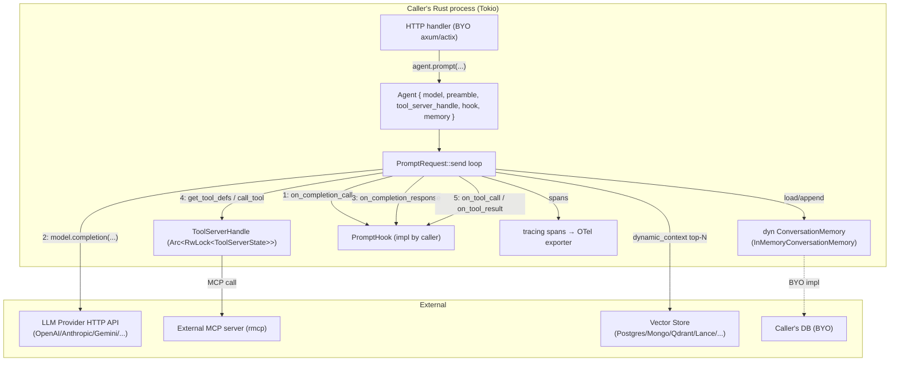

# Rig Rust — Benchmark Study

> **Repo**: https://github.com/0xPlaygrounds/rig
> **Commit studied**: f77a5819ec2a71e98583480a68a341f816a75c8a
> **Branch**: main
> **Framework path**: frameworks/rig
> **Studied on**: 2026-05-16

## TL;DR

- ⭐ **What is this stack architecturally?** Rig is a Rust **library** (in-process crate), not a service or runtime. The agent loop lives in the caller's Tokio runtime as plain async functions. There is no bundled server, no sidecar process, no vendor cloud — `rig-core` and friends are Cargo crates you pull in.
- **License/governance**: MIT license. Maintained by [0xPlaygrounds](https://github.com/0xPlaygrounds) ("Playgrounds") with community contributions; no enterprise tier, no managed cloud — Discord-only community support (https://discord.gg/playgrounds, README:17).
- **Maturity**: pre-1.0 (current `rig` v0.37.0 — released 2026-05-13, CHANGELOG.md:9). README explicitly warns "Here be dragons! ... future updates will contain breaking changes" (README:31-34).
- **Adoption**: package downloads listed on the README badges; used by St Jude, Coral Protocol, Neon, Dria, Nethermind, Listen, Ironclaw, ilert (README:67-78). Numerous companion crates (`rig-mongodb`, `rig-lancedb`, `rig-postgres`, `rig-qdrant`, `rig-sqlite`, `rig-surrealdb`, `rig-bedrock`, etc., 19 crates in workspace).
- **Loop location**: `crates/rig-core/src/agent/prompt_request/mod.rs` (non-streaming) and `crates/rig-core/src/agent/prompt_request/streaming.rs` (streaming). Both run in the caller's async context.
- **Strongest architectural choice for our use case**: provider-agnostic `CompletionModel` trait with ~26 native providers, full GenAI semantic-convention tracing via the `tracing` crate, multi-turn tool-call loop, and a `PromptHook` trait with 7 hook points. WASM-compatible.
- **Weakest / biggest gap**: **no first-class skills concept**, **no resource manager**, **no HTTP API surface** (library only — you BYO axum/actix), **no sub-agent primitive** beyond "Agent implements Tool", and **no per-tool forced-args mechanism** beyond a "Skip and return reason" tool hook. Multi-tenancy is not a first-class concept — you ship your own context plumbing through tool closures.
- **Most surprising finding**: Rig ships **conversation memory** as a first-class agent feature (`AgentBuilder::memory`) with a `ConversationMemory` trait that auto-loads and auto-saves history per `conversation_id` — but only one in-tree backend (`InMemoryConversationMemory`); persistent SQL/Mongo backends are BYO.
- **One-line verdicts**:
  - **Sessions/persistence**: BYO — `ConversationMemory` trait exists, only in-memory backend ships; the `with_history` pattern is the documented escape hatch (`agent/prompt_request/mod.rs:177`).
  - **Skills**: Not provided — BYO (no `SKILL.md`, no loader).
  - **Resource manager**: Not provided — BYO.
  - **Sub-agents**: agents-as-tools only — `impl Tool for Agent<M>` (`agent/tool.rs:16-50`). No parallel orchestrator, no streaming.
  - **Multi-tenancy**: Not first-class — tenants/users are not modeled; you must bake them into your `Tool::call` via closures.
  - **Hooks**: 7 hook points (`PromptHook` trait, `agent/prompt_request/hooks.rs:12-90`), but **no PreToolUse-with-input-mutation** — only `Skip { reason }` (returns reason as tool result) or `Terminate`.
  - **API**: Not provided — library only. No HTTP server, no SSE protocol, no health checks.
  - **Observability**: First-class `tracing` integration with full GenAI semconv fields, OTel-compatible via `tracing-opentelemetry` (examples/agent_with_tools_otel.rs).
- **Production-readiness verdict**: As a **completion-and-tooling library** inside a service you write — solid, fast, well-traced. As a **multi-tenant skill-piloted agent platform** — significant glue required. You're shipping the HTTP layer, session store, tenant scoping, skill loader, and resource manager yourself.

## 0. Architectural Overview & Deployment Model

```text
┌──────────────────────────────────────────────────────────────┐
│   Your Rust binary (axum/actix/tokio) — single process       │
│                                                              │
│   ┌────────────────────────────────────────────┐             │
│   │  Your HTTP handler                         │             │
│   │  ─ axum::Router / actix Service            │             │
│   │  ─ JWT validation, tenant scoping (BYO)    │             │
│   └────────────────────┬───────────────────────┘             │
│                        │                                     │
│                        ▼                                     │
│   ┌────────────────────────────────────────────┐             │
│   │  rig::agent::Agent<M, P>                   │             │
│   │  ─ preamble, model, tool_server_handle     │             │
│   │  ─ memory: Option<Arc<dyn ConversationMemory>> │         │
│   │  ─ hook: Option<P> (PromptHook)            │             │
│   └────────────────────┬───────────────────────┘             │
│                        │                                     │
│         ┌──────────────┼────────────────┐                    │
│         ▼              ▼                ▼                    │
│   ┌──────────┐  ┌─────────────┐  ┌────────────┐              │
│   │ PromptReq│  │ ToolServer  │  │ Conversation│             │
│   │  ::send  │  │  Handle     │  │  Memory     │             │
│   │ (loop)   │  │ (RwLock)    │  │ (trait)     │             │
│   └─────┬────┘  └─────┬───────┘  └─────┬──────┘              │
│         │             │                │                     │
└─────────┼─────────────┼────────────────┼─────────────────────┘
          │             │                │
          ▼             ▼                ▼
   ┌────────────┐  ┌─────────┐    ┌──────────────────┐
   │ LLM Provider│ │  MCP    │    │ Your DB / Mem    │
   │ (HTTP)      │ │ servers │    │ (BYO impl of     │
   │  OpenAI,    │ │ (rmcp)  │    │ ConversationMemory)│
   │  Anthropic, │ │ stdio/  │    └──────────────────┘
   │  Gemini, …  │ │ SSE/HTTP│
   └────────────┘  └─────────┘
```

### 0.1 What is this stack?

A **library**: Cargo crates that ship Rust traits and structs you embed in your own binary. No standalone server, no runtime, no CLI agent. The README (line 73) describes it as "a Rust library for building scalable, modular, and ergonomic LLM-powered applications".

### 0.2 Project status & governance

- **License**: MIT (`Cargo.toml:6`, LICENSE).
- **Owner**: [0xPlaygrounds](https://github.com/0xPlaygrounds) ("Playgrounds"). Discord-only community (https://discord.gg/playgrounds).
- **No commercial backing or paid support visible** — no enterprise tier, no managed cloud, no SLA.

### 0.3 Project maturity / age

- Pre-1.0 (`rig` v0.37.0 — released 2026-05-13, CHANGELOG.md:9).
- README explicitly warns: "Here be dragons! As we plan to ship a torrent of features in the following months, future updates **will** contain **breaking changes**." (README:31-34).
- Recent breaking change in 0.37 ("[breaking] make Chat append messages to caller history" — CHANGELOG.md:21).

### 0.4 Adoption & community signal

- README crates.io badges (line 12-14) display version and download counts.
- Adopters listed: St Jude, Coral Protocol, VT Code, Con, Dria, Nethermind, Neon (`app.build` v2), Listen, Cairnify, Ryzome, deepwiki-rs, Cortex Memory, Ironclaw, ilert (README:67-78). Captured 2026-05-16.

### 0.5 Ecosystem fit

- Language: **Rust** (workspace edition 2024 — `Cargo.toml:47`).
- Root facade crate: `rig` (`Cargo.toml:2`). Core crate: `rig-core`. 19 companion crates including:
  - Vector stores: `rig-mongodb`, `rig-lancedb`, `rig-neo4j`, `rig-qdrant`, `rig-sqlite`, `rig-surrealdb`, `rig-milvus`, `rig-scylladb`, `rig-postgres`, `rig-s3vectors`, `rig-helixdb`, `rig-vectorize`.
  - Providers: `rig-bedrock`, `rig-vertexai`, `rig-gemini-grpc`, `rig-fastembed`.
  - Memory: `rig-memory` (sliding-window / token-budget policies).
- Used as a **library** — embed in your binary. No CLI, no playground.

### 0.6 Where does the agent loop *actually* execute?

In your own async runtime, in your own process. The loop is plain Rust async — see `crates/rig-core/src/agent/prompt_request/mod.rs:396-709` for the non-streaming loop and `crates/rig-core/src/agent/prompt_request/streaming.rs:465+` for the streaming loop. No subprocess, no IPC, no vendor cloud.

### 0.7 Runtime dependencies

- Rust 1.x with edition 2024 (workspace.package.edition = "2024", `Cargo.toml:47`).
- Tokio runtime is the de-facto async runtime (examples use `#[tokio::main]`).
- HTTP client: configurable, defaults to `reqwest` (`rig-core/src/http_client/`). Provider crates use the HTTP client trait.
- WASM-compatible (`crates/rig-core/src/wasm_compat.rs`). `Cargo.toml:30` declares features like `WasmCompatSend`.

### 0.8 Recommended deployment topology

Not opinionated. Rig is a library; the docs offer no production deployment guidance. You ship a Rust binary (typically axum + tokio) and embed Rig inside it. Container-per-tenant vs. one-process-many-tenants is your call.

### 0.9 Cold-start cost & instance footprint

- Rust binary startup: typically <500 ms once compiled (no JIT, no Python interpreter).
- No vendor binary downloaded; no Node sidecar.
- Memory baseline: small — the `Agent` struct is a few `Arc`s plus a `tokio::sync::RwLock`-wrapped `ToolServerState` (`crates/rig-core/src/tool/server.rs:12-19`).

### 0.10 Vendor lock-in

- **LLM-provider lock-in**: low — 26 native providers (Anthropic, Azure, ChatGPT, Cohere, DeepSeek, Galadriel, Gemini, Groq, Hugging Face, Hyperbolic, Llamafile, MiniMax, Mira, Mistral, Moonshot, Ollama, OpenAI, OpenRouter, Perplexity, Together, Voyage AI, xAI, Xiaomi MiMo, Z.ai), plus Bedrock and VertexAI as companion crates.
- **Hosting-platform lock-in**: none.
- **Eval-platform lock-in**: none (in-tree `evals.rs`).

### 0.11 Framework weight / footprint

Medium-thick library: ships `Agent`, `AgentBuilder`, `Extractor`, `Pipeline`, multi-turn loop, streaming loop, 26 provider integrations, 10+ vector-store integrations, MCP client (`rmcp`), CLI chatbot helper (`crates/rig-core/src/integrations/cli_chatbot.rs`), telemetry helpers. No HTTP server, no dev UI, no plugin marketplace.

### 0.12 Release-history signal

`CHANGELOG.md:9-30` shows v0.37.0 (2026-05-13) adding conversation memory + `rig-memory` companion crate (#1702), Bedrock Converse structured output (#1667), OpenRouter STT/TTS (#1757), Copilot model listing (#1700), and one breaking change to `Chat::chat` history semantics (#1733). Active maintenance — multiple PRs and dependabot bumps per release cycle.

### 0.13 Documentation depth & cross-team contributor accessibility

- Official docs: https://docs.rig.rs + https://docs.rs/rig/latest/rig/ (Rustdoc).
- Rustdoc and prose are aimed at Rust engineers; non-engineers can read README and examples but cannot author content (no skills, no markdown configs, no playground).

### 0.14 Documentation entry points

- Docs: https://docs.rig.rs
- Crate API reference: https://docs.rs/rig/latest/rig/
- crates.io: https://crates.io/crates/rig and https://crates.io/crates/rig-core
- GitHub: https://github.com/0xPlaygrounds/rig
- Examples directory: https://github.com/0xPlaygrounds/rig/tree/main/examples
- Changelog: https://github.com/0xPlaygrounds/rig/blob/main/CHANGELOG.md
- GitHub Releases: https://github.com/0xPlaygrounds/rig/releases
- Issues tracker: https://github.com/0xPlaygrounds/rig/issues
- Discord: https://discord.gg/playgrounds
- Website: https://rig.rs
- Blog/guides: https://docs.rig.rs/guides

---

## 1. Agent Harness (Run Loop) & Message Taxonomy

### Run loop

#### 1.1 Run loop entrypoint(s)

Two parallel loops in `crates/rig-core/src/agent/prompt_request/`:

**Non-streaming** — `mod.rs:351-718`:
```rust
impl<M, P> PromptRequest<Extended, M, P>
where
    M: CompletionModel,
    P: PromptHook<M>,
{
    async fn send(self) -> Result<PromptResponse, PromptError> { ... }
}
```
Surface form for callers: `agent.prompt("hello").max_turns(20).await` returns `String`, or `.extended_details().await` returns `PromptResponse { output: String, usage: Usage, messages: Option<Vec<Message>> }` (`mod.rs:275-279`).

**Streaming** — `streaming.rs:392+`:
```rust
async fn send(self) -> StreamingResult<M::StreamingResponse>
```
where `StreamingResult<R> = Pin<Box<dyn Stream<Item = Result<MultiTurnStreamItem<R>, StreamingError>> + Send>>` (`streaming.rs:28-29`).

`PromptRequest` is the typestate builder; awaiting it via `IntoFuture` (`mod.rs:237-261`) dispatches to `send()`.

#### 1.2 Per-iteration behavior

Single iteration of the non-streaming loop (`agent/prompt_request/mod.rs:396-709`):

1. Check `current_max_turns` vs `self.max_turns`, fail with `MaxTurnsError` if exceeded (`mod.rs:406-408, 712-716`).
2. Fire `PromptHook::on_completion_call` → may `Terminate` (`mod.rs:424-432`).
3. Build span via `info_span!("chat", gen_ai.* …)` for GenAI semconv (`mod.rs:435-453`).
4. Call `build_completion_request(...)` (`agent/completion.rs:28-141`) which:
   - Prepends preamble as `Message::system` if present.
   - Resolves dynamic context (vector-store top-k).
   - Calls `tool_server_handle.get_tool_defs(...)` to resolve tools (static + dynamic RAG-selected).
5. Send via `model.completion(request).await` (`mod.rs:485-487`).
6. Fire `PromptHook::on_completion_response` → may `Terminate` (`mod.rs:491-499`).
7. Partition `resp.choice` into tool calls vs. text (`mod.rs:501-504`).
8. If no tool calls → assemble final text and return `PromptResponse::new(text, usage).with_messages(new_messages)` (`mod.rs:516-557`).
9. If tool calls → dispatch concurrently via `futures::stream::iter(...).buffer_unordered(self.concurrency)` (`mod.rs:567-699`), each tool call:
   - Fire `on_tool_call` hook → may `Skip { reason }` (returns reason as tool result) or `Terminate`.
   - Call `tool_server_handle.call_tool(name, args)`.
   - Fire `on_tool_result` hook → may `Terminate`.
   - Build `UserContent::tool_result_with_call_id(...)`.
10. Push tool results to `new_messages` and loop.

After the final turn, `memory.append(&id, new_messages.clone()).await` is called if a memory backend + conversation_id are set (`mod.rs:546-553`).

#### 1.3 ReAct loop

Rig ships a **multi-turn tool-call loop** that is effectively ReAct (think→act→observe by way of the LLM driving tool calls). There's no explicit "thought" channel separate from text, but a `ThinkTool` is provided as built-in (`crates/rig-core/src/tools/think.rs:31-63`) that lets the LLM record reasoning steps.

#### 1.4 Tool dispatch + result handling

Tools are registered in a `ToolSet` (`crates/rig-core/src/tool/mod.rs:288-426`) and exposed by a `ToolServer`/`ToolServerHandle` (`crates/rig-core/src/tool/server.rs:25-263`). The loop calls `tool_server_handle.call_tool(name, &args)` (`agent/prompt_request/mod.rs:645-652`) which performs lookup under a brief read lock and dispatches via the `ToolDyn` trait. Output is bound to `UserContent::ToolResult` and pushed back into history.

#### 1.5 Explicit turn concept

A turn = "one LLM call + zero-to-many tool dispatches that follow". The loop increments `current_max_turns` once per iteration (`mod.rs:410`). Multi-turn terminates either when the LLM returns no tool calls or `max_turns + 1` is exceeded (`mod.rs:406-408`).

#### 1.6 Event emission mechanism (in-process)

- **Non-streaming**: no event stream — you get back `PromptResponse` after the entire loop finishes.
- **Streaming**: `futures::Stream<Item = Result<MultiTurnStreamItem<R>, StreamingError>>` (`streaming.rs:28`). `MultiTurnStreamItem` yields one of `StreamAssistantItem(StreamedAssistantContent<R>)`, `StreamUserItem(StreamedUserContent)`, or `FinalResponse(FinalResponse)` (`streaming.rs:38-45`).
- **Hooks**: `PromptHook` trait (`agent/prompt_request/hooks.rs:12-90`) — fires at 7 known points (see §5.1).
- **Tracing**: spans emit GenAI semconv fields via `tracing` (`agent/prompt_request/mod.rs:352-368`).

### Message & event taxonomy

#### 1.7 Message layers

Two layers:

1. **Rig canonical Message** (`crates/rig-core/src/completion/message.rs:33-46`): `Message::System { content }` / `Message::User { content: OneOrMany<UserContent> }` / `Message::Assistant { id, content: OneOrMany<AssistantContent> }`.
2. **Provider-native messages**: each provider module (`providers/openai/`, `providers/anthropic/`, …) implements `From<Rig Message>`/`Into<Rig Message>` translations.

For streaming, a third level exists: `StreamedAssistantContent`, `StreamedUserContent`, `MultiTurnStreamItem<R>` (`streaming.rs:38-45`).

#### 1.8 Concrete message types

| Type | File:Line | Purpose |
|------|-----------|---------|
| `Message::System { content }` | `completion/message.rs:35` | System prompt message. |
| `Message::User { content }` | `completion/message.rs:38` | User input with potentially multimodal content. |
| `Message::Assistant { id, content }` | `completion/message.rs:41` | Model output (text / tool call / reasoning / image). |
| `UserContent::Text(Text)` | `completion/message.rs:55` | Plain user text. |
| `UserContent::ToolResult(ToolResult)` | `completion/message.rs:57` | Result of a tool call. |
| `UserContent::Image / Audio / Video / Document` | `completion/message.rs:59-65` | Multimodal user content. |
| `AssistantContent::Text(Text)` | `completion/message.rs:73` | Assistant text. |
| `AssistantContent::ToolCall(ToolCall)` | `completion/message.rs:75` | Tool call requested by assistant. |
| `AssistantContent::Reasoning(Reasoning)` | `completion/message.rs:77` | Reasoning block (Anthropic extended thinking, OpenAI o-series, Gemini). |
| `AssistantContent::Image(Image)` | `completion/message.rs:79` | Assistant-generated image. |
| `ReasoningContent::{Text, Encrypted, Redacted, Summary}` | `completion/message.rs:84-99` | Reasoning-block kinds. |
| `ToolDefinition` | `completion/request.rs:192-199` | Tool name + description + JSON-schema args. |
| `ToolChoice` | `message.rs` (re-exported via `crate::message::ToolChoice`) | "force/auto/none" tool selection. |
| `CompletionRequest` | `completion/request.rs` (struct) | Provider-agnostic completion request. |
| `CompletionResponse<T>` | `completion/request.rs:352-363` | `choice: OneOrMany<AssistantContent>`, `usage: Usage`, `raw_response: T`, `message_id: Option<String>`. |
| `Usage` | `completion/request.rs:395-409` | input_tokens, output_tokens, total_tokens, cached_input_tokens, cache_creation_input_tokens, reasoning_tokens. |
| `PromptResponse` | `agent/prompt_request/mod.rs:275-279` | output: String, usage: Usage, messages: Option<Vec<Message>>. |
| `TypedPromptResponse<T>` | `agent/prompt_request/mod.rs:303-306` | Typed parsed output + usage. |
| `MultiTurnStreamItem<R>` | `agent/prompt_request/streaming.rs:38-45` | `StreamAssistantItem` / `StreamUserItem` / `FinalResponse`. |
| `StreamedAssistantContent<R>` | `streaming.rs` re-export | Streaming text / tool-call / tool-call-delta / reasoning / reasoning-delta / final. |
| `RawStreamingChoice<R>` | `streaming.rs:81-120` | Lower-level provider streaming chunk (Message / ToolCall / ToolCallDelta / Reasoning / FinalResponse / MessageId). |
| `RawStreamingToolCall` | `streaming.rs:123-139` | Streaming tool call accumulator with id, internal_call_id, call_id, name, arguments. |

#### 1.9 Messages vs. events

In Rig they are **distinct layers**:

- **Non-streaming**: messages only — you get back a `Vec<Message>` and a final `String`. No event stream.
- **Streaming**: a single `Stream<MultiTurnStreamItem<R>>` interleaves assistant items, user items (tool results), and the terminal `FinalResponse`. Hook callbacks (`PromptHook`) are an orthogonal event channel that fires regardless of streaming mode.

#### 1.10 Event categories

- **Stream-event** (streaming only): `StreamedAssistantContent::{Text, ToolCall, ToolCallDelta, Reasoning, ReasoningDelta, Final}` and `StreamedUserContent::ToolResult`.
- **Turn-event**: `FinalResponse` (streaming) signals end-of-loop with `response: String`, `aggregated_usage: Usage`, optional `history` (`streaming.rs:49-105`).
- **Message-event**: pushed into `new_messages: Vec<Message>` (`agent/prompt_request/mod.rs:389, 510-514, 708`).
- **Tool-event**: tracing span `info_span!("execute_tool", gen_ai.tool.* …)` (`mod.rs:573-588`), plus `on_tool_call` / `on_tool_result` hook callbacks.
- **Session-lifecycle event**: minimal — `info_span!("invoke_agent", ...)` fires at the top of `send()` (`mod.rs:353-368`). No discrete "session_start" / "session_end" events in code.
- **Hook event**: 7 `PromptHook` callbacks (see §5.1).
- **Sub-agent event**: agents-as-tools — sub-agent invocations look like normal tool events. There's no separate "sub_agent_started" event.

#### 1.11 Canonical type-definition file(s)

- `crates/rig-core/src/completion/message.rs` — `Message`, `UserContent`, `AssistantContent`, `Reasoning`, etc.
- `crates/rig-core/src/completion/request.rs` — `CompletionRequest`, `CompletionResponse`, `Usage`, `ToolDefinition`, `CompletionModel` trait.
- `crates/rig-core/src/agent/prompt_request/mod.rs` — `PromptRequest`, `PromptResponse`, `TypedPromptRequest`.
- `crates/rig-core/src/agent/prompt_request/streaming.rs` — `MultiTurnStreamItem`, `FinalResponse`, `StreamingPromptRequest`.
- `crates/rig-core/src/streaming.rs` — `RawStreamingChoice`, `RawStreamingToolCall`, `StreamedAssistantContent`, `StreamedUserContent`.
- `crates/rig-core/src/agent/prompt_request/hooks.rs` — `PromptHook`, `HookAction`, `ToolCallHookAction`.

#### 1.12 Live agentic event stream taxonomy

Sample frames (Rust enum variants) one can match while iterating the streaming result:

```rust
// streaming start (in practice, a text delta is the first signal)
Ok(MultiTurnStreamItem::StreamAssistantItem(StreamedAssistantContent::Text(text_chunk)))

// tool-call delta (partial JSON args being streamed)
Ok(MultiTurnStreamItem::StreamAssistantItem(
    StreamedAssistantContent::ToolCallDelta { id, internal_call_id, content }
))

// tool-call (final, parsed)
Ok(MultiTurnStreamItem::StreamAssistantItem(
    StreamedAssistantContent::ToolCall(tool_call)
))

// tool result (user side)
Ok(MultiTurnStreamItem::StreamUserItem(StreamedUserContent::ToolResult {
    tool_result, internal_call_id
}))

// reasoning delta (Gemini/Anthropic thinking, OpenAI o-series)
Ok(MultiTurnStreamItem::StreamAssistantItem(
    StreamedAssistantContent::ReasoningDelta { reasoning, id }
))

// terminal
Ok(MultiTurnStreamItem::FinalResponse(FinalResponse {
    response, aggregated_usage, history
}))
```

---

## 2. Agent Runtime (Multi-session Host)

### 2.1 Multi-session host architecture

**Not provided — BYO.** Rig is library-only; there is no built-in runtime hosting many sessions in one process. An `Agent` is `Clone` and cheap, so you typically `Arc<Agent>` it and serve N concurrent requests by spawning Tokio tasks in your axum handler. There's no scheduler, no worker pool, no lifecycle manager.

### 2.2 Concurrent session isolation

State on an `Agent` is largely immutable (model, preamble, static_context, hooks). The mutable surface is:

- `ToolServerHandle` (an `Arc<RwLock<ToolServerState>>` — `crates/rig-core/src/tool/server.rs:113`), which is shared across all uses of that agent. Adding/removing tools is a write-lock operation; tool definitions and dispatch are read-lock operations.
- Conversation memory (`Arc<dyn ConversationMemory>`) is the durable session store; per-conversation isolation is the responsibility of your memory backend implementation.

Per-call `PromptRequest` clones agent data into local fields (`agent/prompt_request/mod.rs:101-123`), so two concurrent prompts don't see each other's `new_messages`.

### 2.3 Horizontal scaling / multi-instance

**Not provided** by Rig itself. Multi-pod scaling is the responsibility of the caller's deployment (e.g. axum behind a load balancer); shared state goes through whatever `ConversationMemory` backend you ship.

### 2.4 Background / async / scheduled tasks

**Not provided — BYO.** No cron, no webhook trigger, no background agent. The Tokio runtime can `spawn` your own tasks but Rig offers no scheduling abstraction.

### 2.5 Worker pool / queue model

**Not provided.** The harness assumes short-lived "call `agent.prompt(...)` and `await`" usage. No queue, no worker pool. Long-running runs can stream via `agent.stream_prompt(...)` to keep the client connected.

---

## 3. Sessions & Persistence

### 3.1 Session / chat data model

There is no `Session` type. The closest analog is a `(conversation_id, Vec<Message>)` pair managed by `ConversationMemory`:

```rust
// crates/rig-core/src/memory.rs:93-117
pub trait ConversationMemory: WasmCompatSend + WasmCompatSync {
    fn load<'a>(&'a self, conversation_id: &'a str)
        -> WasmBoxedFuture<'a, Result<Vec<Message>, MemoryError>>;
    fn append<'a>(&'a self, conversation_id: &'a str, messages: Vec<Message>)
        -> WasmBoxedFuture<'a, Result<(), MemoryError>>;
    fn clear<'a>(&'a self, conversation_id: &'a str)
        -> WasmBoxedFuture<'a, Result<(), MemoryError>>;
}
```

There's no `tenant_id`, `user_id`, `cwd`, `parent_session_id`, `metadata`, etc. — only the `conversation_id` and the messages.

### 3.2 What's stored on a session

Only `Vec<Message>` per `conversation_id`. Token usage, scratchpad files, attachments are not persisted by the memory contract — you'd subclass.

### 3.3 Granularity

Linear conversation per `conversation_id`. No fork/branch model.

### 3.4 Built-in persistence stores

- **In-tree**: `InMemoryConversationMemory` (`crates/rig-core/src/memory.rs` — `Arc<Mutex<HashMap<String, Vec<Message>>>>` implementation, `memory.rs:38-41`). Tests/single-process only.
- **Companion crate**: `rig-memory` (`crates/rig-memory/`) ships *policies* (sliding window, token budget) that wrap an existing backend — not new backends.
- **All other persistent stores (Postgres, SQLite, Mongo, Redis, S3)**: BYO — implement `ConversationMemory` yourself. Note: `rig-postgres`, `rig-sqlite`, `rig-mongodb`, etc. are **vector-store** crates, not memory-store crates.

### 3.5 Persistence timing

Conversation memory is **appended at end-of-turn after a successful response** in both non-streaming (`agent/prompt_request/mod.rs:546-554`) and streaming (`streaming.rs:780-788`) loops:

```rust
if let Some((memory, id)) = memory_handle.as_ref()
    && let Err(err) = memory.append(id, new_messages.clone()).await
{
    tracing::warn!(error = %err, conversation_id = %id,
        "conversation memory append failed; returning model response anyway");
}
```

If the loop errors mid-tool-call, `append` is **not** called (`agent/prompt_request/mod.rs:1196-1207` — `memory_unchanged_on_provider_error` test verifies this).

### 3.6 Mid-run checkpointing (durable)

**Not provided.** Persistence fires only at the end of a successful turn. If the process crashes mid-tool-call, the partial trajectory is lost — `ConversationMemory::append` for that turn never runs.

### 3.7 Session ID format

Free-form `&str` — caller-defined. Examples use strings like `"thread-1"`, `"user-123"`, `"default-thread"` (`memory.rs:99`, `agent/prompt_request/mod.rs:1117-1127`).

### 3.8 Pluggable store interface

Yes — implement `ConversationMemory` for your own backend. The trait sits behind `Arc<dyn ConversationMemory>` on `Agent::memory` (`agent/completion.rs:207`).

### 3.9 Schema evolution / migration

**Not provided — BYO.** Messages serialize as serde JSON, but Rig does not ship version markers or migrations.

### 3.10 Export / replay

**Not provided as a first-class feature.** `PromptResponse.messages: Option<Vec<Message>>` (`mod.rs:278`) gives the new messages added during the turn. Replay = construct a `PromptRequest::with_history(...)` (`mod.rs:177-184`). Deterministic replay against a recorded provider response is not built-in; tests use a `MockCompletionModel` (`test_utils`) but there's no record/replay against real providers.

### 3.11 Cross-session memory

**Not provided in core.** `rig-memory` companion crate ships history-shaping policies. Long-term semantic memory (across conversations) = pair `ConversationMemory` with a vector store via `dynamic_context` (`agent/builder.rs:163-171`). See §15.

---

## 4. Multi-tenancy & Arbitrary Context ⭐

### 4.1 Full run-loop input struct

`PromptRequest<S, M, P>` (`agent/prompt_request/mod.rs:46-93`). User-controllable fields beyond `prompt: Message`:

```rust
pub struct PromptRequest<S, M, P> {
    prompt: Message,
    chat_history: Option<Vec<Message>>,
    max_turns: usize,
    model: Arc<M>,
    agent_name: Option<String>,
    preamble: Option<String>,
    static_context: Vec<Document>,
    temperature: Option<f64>,
    max_tokens: Option<u64>,
    additional_params: Option<serde_json::Value>,
    tool_server_handle: ToolServerHandle,
    dynamic_context: DynamicContextStore,
    tool_choice: Option<ToolChoice>,
    state: PhantomData<S>,
    hook: Option<P>,
    concurrency: usize,
    output_schema: Option<schemars::Schema>,
    memory: Option<Arc<dyn ConversationMemory>>,
    conversation_id: Option<String>,
}
```

Builder-style mutators: `.max_turns(20)`, `.with_history(history)`, `.conversation(id)`, `.without_memory()`, `.with_hook(hook)`, `.with_tool_concurrency(4)`, `.extended_details()` (`mod.rs:138-232`).

**No `tenant_id`, `user_id`, or other arbitrary context field**. You can only pass that data by:
- Including it in the prompt or system preamble (LLM-visible).
- Embedding it in per-tool closures at build time (LLM-invisible — see §4.4).
- Encoding it in `conversation_id` (e.g. `"tenant=acme;user=u-123;thread=42"`).

### 4.2 Context propagation into a tool call

Rig's `Tool` trait is **stateless from the harness's perspective**:

```rust
// crates/rig-core/src/tool/mod.rs:112-143
pub trait Tool: Sized + WasmCompatSend + WasmCompatSync {
    const NAME: &'static str;
    type Error: std::error::Error + ...;
    type Args: for<'a> Deserialize<'a> + ...;
    type Output: Serialize;

    fn name(&self) -> String { Self::NAME.to_string() }
    fn definition(&self, _prompt: String) -> impl Future<Output = ToolDefinition> + ...;
    fn call(&self, args: Self::Args) -> impl Future<Output = Result<Self::Output, Self::Error>> + ...;
}
```

There is **no context object passed to `call`**. The recommended pattern is: make your tool struct *own* the per-tenant state (DB connection scoped to the tenant, tenant id field, etc.), instantiate one tool per request, and `.tool(...)` it onto a per-request agent.

### 4.3 Tool call interface

Tool dispatch happens at `agent/prompt_request/mod.rs:645-652`:

```rust
let output = match tool_server_handle.call_tool(tool_name, &args).await {
    Ok(res) => res,
    Err(e) => {
        tracing::warn!("Error while executing tool: {e}");
        e.to_string()
    }
};
```

`call_tool` (`tool/server.rs:143-163`) looks up the tool by name under a read lock and dispatches via the `ToolDyn::call` trait. **No tenant-aware context is provided** to the tool — the tool sees only the JSON args produced by the LLM.

### 4.4 Forcing tool arguments from the harness

**Not provided in the way Claude Agent SDK or Mastra do it.** The closest mechanism is the `on_tool_call` hook:

```rust
// crates/rig-core/src/agent/prompt_request/hooks.rs:39-47
fn on_tool_call(
    &self,
    _tool_name: &str,
    _tool_call_id: Option<String>,
    _internal_call_id: &str,
    _args: &str,
) -> impl Future<Output = ToolCallHookAction> + WasmCompatSend {
    async { ToolCallHookAction::cont() }
}
```

`ToolCallHookAction` has only `Continue` / `Skip { reason }` / `Terminate { reason }` (`hooks.rs:96-103`). The args are passed in by reference (`&str`), so the hook cannot **mutate** them before dispatch. Skip returns the *reason* as the tool result (`agent/prompt_request/mod.rs:624-643`), it does not re-dispatch with corrected args.

**Workaround patterns:**

1. **Closure-captured state** (recommended): build your tool struct with the tenant id as a field, create it per-request:
   ```rust
   struct TopicSearch { tenant_id: String, db: Arc<Db> }
   impl Tool for TopicSearch { /* ignores LLM-provided tenant_id and uses self.tenant_id */ }
   ```

2. **Per-request agent**: pay the small cost of constructing a fresh `Agent` per request via `AgentBuilder` with tenant-bound tools wired in.

If you specifically need *to let the LLM pass other fields but force `tenant_id`*, you have to write your tool to ignore the LLM-provided field and read from `self`. The harness does not enforce this for you.

### 4.5 Filtering visible tools

Tools visible to the LLM are determined at request time by `tool_server_handle.get_tool_defs(...)` (`tool/server.rs:167-263`). Static tools are always visible (their names are stored in `static_tool_names: Vec<String>`); dynamic tools are RAG-selected via vector stores using the prompt as query (`tool/server.rs:177-216`).

For **per-request filtering** you have two options:

1. **Per-request agent**: build a fresh `Agent` with only the tools you want exposed. Cheap (no LLM calls, no allocs heavier than a `HashMap` rebuild).
2. **Shared `ToolServerHandle`**: use `add_tool` / `remove_tool` to mutate the toolset at runtime (`tool/server.rs:117-138`). But this affects *all* concurrent users of that handle, so it's not suitable for per-request tenant scoping.

There is **no `activeTools` / `allowedTools` / `prepareStep` mechanism** like Claude Agent SDK provides.

### 4.6 Tenant scope on session

**Not a first-class field.** Tenants are encoded in `conversation_id` and in tool closures.

### 4.7 Per-tool-call auth propagation

**Not built-in.** No `principal`, no `auth_token`, no per-call identity. Tools execute with whatever permissions you wired into their `call` body.

### 4.8 Resource scoping primitives

**Not provided.** No global/tenant/user scopes at registration; everything is "registered on this agent" or "registered on this `ToolServerHandle`".

### 4.9 Per-tenant rate limit + budget cap

**Not provided.** Only `max_turns` (turn cap) and `max_tokens` (per-completion cap). No USD budget, no per-tenant rate limit.

### ⭐ Light usage example

```rust
use rig::client::CompletionClient;
use rig::completion::{Prompt, ToolDefinition};
use rig::providers::openai;
use rig::tool::Tool;
use serde::{Deserialize, Serialize};
use serde_json::json;

// (1) tenant context is captured in the tool struct, not passed via the LLM
#[derive(Clone)]
struct TopicSearch { tenant_id: String }
#[derive(Deserialize)] struct TopicSearchArgs { query: String }

impl Tool for TopicSearch {
    const NAME: &'static str = "topicSearch";
    type Error = std::io::Error;
    type Args = TopicSearchArgs;
    type Output = serde_json::Value;
    async fn definition(&self, _: String) -> ToolDefinition {
        ToolDefinition {
            name: "topicSearch".into(),
            description: format!("Search topics for tenant {}", self.tenant_id),
            parameters: json!({"type":"object","properties":{
                "query":{"type":"string"}}}),
        }
    }
    async fn call(&self, args: Self::Args) -> Result<Self::Output, Self::Error> {
        // tenant_id is from self, NOT from LLM args. LLM cannot override.
        Ok(serde_json::json!({
            "tenant": self.tenant_id,
            "query":  args.query,
            "results": []
        }))
    }
}

// At request time, build a per-tenant agent — only whitelisted tools visible.
fn build_agent_for(client: &openai::Client, tenant_id: &str)
    -> rig::agent::Agent<openai::CompletionModel>
{
    client.agent(openai::GPT_5_2)
        .preamble(&format!("Tenant={} user={} locale=fr-FR today=2026-05-16",
                           tenant_id, "u-123"))
        .tool(TopicSearch { tenant_id: tenant_id.into() })
        // .tool(IabSearch { tenant_id: tenant_id.into() })
        // .tool(AudienceCreate { tenant_id: tenant_id.into() })
        // (bashExec / webFetch are NOT registered → invisible to LLM)
        .build()
}
```

**Step 1 (pass `tenantId`, `userId`, `targetingStrategyId`)**: Not provided as harness fields. **Workaround**: stuff them into the preamble for LLM visibility and into per-tool closures for server-side use.

**Step 2 (filter visible tools)**: Build a per-tenant agent that registers only the desired tools. Cheap; no LLM-side filter mechanism exists.

**Step 3 (force `tenantId` server-side)**: Built into the tool struct (`self.tenant_id`). LLM cannot override because the tool's `Args` schema doesn't include `tenant_id`.

---

## 5. Hook & Middleware Capabilities (Context Engineering)

### 5.1 Enumerate every hook / middleware / lifecycle callback

`PromptHook<M>` (`crates/rig-core/src/agent/prompt_request/hooks.rs:12-90`):

| Hook | Fires when | Reads | Mutates | Blocks/Branches |
|------|-----------|-------|---------|-----------------|
| `on_completion_call(prompt, history)` | Before each LLM call | `&Message`, `&[Message]` | No | `HookAction::Terminate { reason }` |
| `on_completion_response(prompt, response)` | After each LLM response | `&Message`, `&CompletionResponse` | No | `HookAction::Terminate` |
| `on_tool_call(tool_name, tool_call_id, internal_call_id, args)` | Before tool dispatch | `&str`, `Option<String>`, `&str`, `&str` (args are stringified JSON) | No — args are `&str` | `ToolCallHookAction::Skip{reason}` (returns `reason` as tool result) or `Terminate` |
| `on_tool_result(tool_name, …, args, result)` | After tool execution | `&str`, …, `&str`, `&str` | No | `HookAction::Terminate` |
| `on_text_delta(text_delta, aggregated_text)` | On each streaming text delta | `&str`, `&str` | No | `HookAction::Terminate` |
| `on_tool_call_delta(tool_call_id, internal_call_id, tool_name?, delta)` | On each streaming tool-call arg delta | `&str`, `&str`, `Option<&str>`, `&str` | No | `HookAction::Terminate` |
| `on_stream_completion_response_finish(prompt, response)` | After streaming finishes | `&Message`, `&M::StreamingResponse` | No | `HookAction::Terminate` |

Default impl for `()` (`hooks.rs:92`) makes all hooks no-op, so you can opt out cheaply.

### 5.2 Hook concurrency model

Hooks are awaited **sequentially** per event. The non-streaming loop calls them inline (`agent/prompt_request/mod.rs:424, 491, 607, 653`). Tool dispatch is parallel (`buffer_unordered(self.concurrency)` at `mod.rs:695`), but each tool's `on_tool_call` and `on_tool_result` hooks run in that tool's task, so hooks for parallel tools may interleave.

### 5.3 Specific capability tests

| Capability | Supported? | How |
|-----------|------------|-----|
| Inject system messages at session start | **Partially** — set `preamble` on `AgentBuilder` (`agent/builder.rs:134-148`). No "fire at session start" hook. | Use `.preamble(...)` or `.context(...)` (`builder.rs:152-159`) before `.build()`. |
| Expand user input (slash commands, timestamps) | **No** — there's no hook that lets you rewrite the prompt before it's seen. `on_completion_call` is read-only. **Workaround**: format the prompt yourself before calling `.prompt(...)`. |
| Mutate messages list before each LLM call | **No** — `on_completion_call` is read-only. **Workaround**: build a wrapper around `Agent` that rewrites history before calling `.prompt(...)`. |
| Mutate / decorate tool input before dispatch | **No** — `on_tool_call(args: &str)` is read-only; you can only `Skip { reason }` or `Terminate`. **Workaround**: bake into the tool struct's `call` body. |
| Mutate / decorate tool result before it returns to LLM | **No** — `on_tool_result(args, result)` is read-only. **Workaround**: do it inside the tool's own `call`. |
| Emit additional tool calls in response to a tool result | **No** — no equivalent to Claude Agent SDK's `additional_messages` from PostToolUse. The loop only consumes assistant-generated tool calls. |

### 5.4 Auto-compaction

**Not provided in core.** `rig-memory` (`crates/rig-memory/`) ships sliding-window and token-budget policies that filter history during memory `load`. The example `examples/agent_with_memory_policies.rs` (referenced in `rig-memory/Cargo.toml:23`) demonstrates this. Also: `InMemoryConversationMemory::with_filter(...)` lets you pass a closure that shapes history each time it loads (`memory.rs:178-186`).

### 5.5 Prompt cache optimization

**Not provided as a first-class feature.** The `Usage` struct includes `cached_input_tokens` and `cache_creation_input_tokens` (`completion/request.rs:402-405`), so you can observe cache hit rate per turn, but there's no automatic cache-breakpoint placement. You'd configure provider-side caching (e.g. Anthropic `cache_control`) via the provider's `additional_params`.

### 5.6 Tool result clearing / progressive disclosure

**Not provided.** No filesystem-stash strategy, no auto-summarization of large tool outputs. Use a `rig-memory` policy or implement on-the-fly truncation in your tool's `call` body.

### 5.7 Architectural diagram of where hooks fire

```text
agent.prompt(...)
   │
   ▼
┌─────────────────────────────────────────────┐
│  PromptRequest::send (Extended)             │
│                                             │
│  load memory (if configured) ──┐            │
│                                ▼            │
│  loop {                                     │
│    on_completion_call ◀── HOOK              │
│    │                                        │
│    build_completion_request                 │
│    │                                        │
│    model.completion(request).await          │
│    │                                        │
│    on_completion_response ◀── HOOK          │
│    │                                        │
│    if tool_calls.is_empty() → return        │
│    │                                        │
│    ▼  parallel via buffer_unordered:        │
│    ┌────────────────────────────────────┐   │
│    │ for each tool_call:                │   │
│    │   on_tool_call ◀── HOOK            │   │
│    │   tool_server_handle.call_tool     │   │
│    │   on_tool_result ◀── HOOK          │   │
│    └────────────────────────────────────┘   │
│  } end loop                                 │
│                                             │
│  memory.append (if configured)              │
└─────────────────────────────────────────────┘

Streaming additionally fires:
  on_text_delta, on_tool_call_delta,
  on_stream_completion_response_finish
```

### ⭐ Light usage example

```rust
use rig::agent::{HookAction, PromptHook, ToolCallHookAction};
use rig::completion::{CompletionModel, CompletionResponse, Message, Prompt};
use rig::providers::openai;

#[derive(Clone)]
struct TenantHook { tenant: String, locale: String }

impl<M: CompletionModel> PromptHook<M> for TenantHook {
    async fn on_completion_call(&self, prompt: &Message, _history: &[Message])
        -> HookAction
    {
        tracing::info!(tenant = %self.tenant, locale = %self.locale,
                       "prompt sent: {:?}", prompt);
        HookAction::cont()
    }

    async fn on_tool_call(
        &self, tool_name: &str, _call_id: Option<String>,
        _internal: &str, args: &str,
    ) -> ToolCallHookAction {
        // (2) PreToolUse hook on `topicSearch`:
        //     CANNOT mutate args. Best we can do is skip with a reason.
        if tool_name == "topicSearch" && !args.contains(&self.tenant) {
            tracing::warn!("LLM tried to override tenant — skipping");
            return ToolCallHookAction::skip(format!(
                "tenant must be {}", self.tenant));
        }
        ToolCallHookAction::cont()
    }

    async fn on_tool_result(
        &self, tool_name: &str, _: Option<String>, _: &str,
        _args: &str, result: &str,
    ) -> HookAction {
        // (3) PostToolUse: cannot rewrite the result — only inspect / terminate.
        if tool_name == "topicSearch" && result.len() > 5000 {
            tracing::warn!("large topicSearch result; consider summarizing");
        }
        HookAction::cont()
    }
}

let agent = openai::Client::from_env()?
    .agent(openai::GPT_4O)
    // (1) Inject "tenant=acme, locale=fr-FR, today=2026-05-16" as system msg:
    .preamble("tenant=acme, locale=fr-FR, today=2026-05-16. \
               You are a helpful assistant.")
    .build();

let response = agent.prompt("…")
    .with_hook(TenantHook { tenant: "acme".into(), locale: "fr-FR".into() })
    .await?;
```

**Step 1 (SessionStart hook injecting tenant/locale/date as system message)**: Use `.preamble(...)` on the builder — there is no `SessionStart` hook per se. Adapted to the constraints.

**Step 2 (PreToolUse mutating args to add `tenantId`)**: **Not supported** — `on_tool_call` receives args as `&str` and can only Continue / Skip / Terminate. Workaround: bake the tenant id into the tool's own state.

**Step 3 (PostToolUse rewriting large results)**: **Not supported** — `on_tool_result` is read-only. Workaround: do the summarization inside the tool itself.

---

## 6. Agent API Exposition (HTTP/network surface)

### 6.1 Does the stack ship an HTTP/network server?

**No.** Rig is library-only. You ship your own server (axum, actix-web, warp, …) and call `agent.prompt(...)` or `agent.stream_prompt(...)` from a handler.

### 6.2 Streaming transport

**Not provided.** Rig provides `Stream<MultiTurnStreamItem<R>>` in process; converting that to SSE / WebSocket / NDJSON is your responsibility. Examples don't ship an SSE adapter.

### 6.3 Endpoints that start an agent run

**Not provided — BYO.**

### 6.4 Live agentic event stream format

**Not provided — BYO.** `MultiTurnStreamItem` (`agent/prompt_request/streaming.rs:38-45`) is `Serialize + Deserialize` (via `#[derive(Serialize, Deserialize)]` and `#[serde(tag = "type", rename_all = "camelCase")]`), so you can serialize it to JSON for SSE frames yourself, but Rig doesn't do this for you.

### 6.5 Auth termination at API boundary

**Not provided.** No JWT validation, no tenant scoping at network boundary. Your axum middleware owns this.

### 6.6 Resume / replay endpoint

**Not provided.** With `ConversationMemory`, you can resume by calling `agent.prompt("…").conversation("user-123")` again — but the network surface around this is your concern.

### 6.7 Interrupt / cancel via API

**Not provided.** In-process, you can cancel by dropping the `Stream`; an `AbortHandle`/`Abortable` is available via the streaming module (`crates/rig-core/src/streaming.rs:23` imports `AbortHandle, Abortable`). No HTTP cancel endpoint is shipped.

### 6.8 Tool-arg streaming (partial JSON)

**In-process: yes** — `StreamedAssistantContent::ToolCallDelta { id, internal_call_id, content }` (`streaming.rs:663+`) where `content: ToolCallDeltaContent` is `Name(String)` or `Delta(String)` (`streaming.rs:71-77`). **Over the wire: BYO** — you serialize it.

### 6.9 HITL approval workflow

**Not provided.** The only "pause" primitive is `PauseControl` (`crates/rig-core/src/streaming.rs:33-67`):
```rust
pub struct PauseControl {
    pub(crate) paused_tx: watch::Sender<bool>,
    pub(crate) paused_rx: watch::Receiver<bool>,
}
impl PauseControl { pub fn pause(&self); pub fn resume(&self); pub fn is_paused(&self) -> bool; }
```
This pauses polling of a stream; it doesn't expose a "tool approval verdict" channel. For HITL you implement it yourself by using `on_tool_call → Skip { reason }` to reject and asking the user to re-submit.

### 6.10 Tool-call state reconstruction

In-process, each `ToolCall` carries:
- `id: String` — provider-supplied tool call id
- `call_id: Option<String>` — additional provider-specific call id (Anthropic-style)
- `internal_call_id: String` — Rig-generated `nanoid` (`streaming.rs:128`)

The `ToolResult` reuses the `id` and `call_id` for correlation (`tool_result_to_user_message` — `streaming.rs:158-172`). The streaming `StreamedUserContent::ToolResult { tool_result, internal_call_id }` (`streaming.rs:654-656`) gives clients an unambiguous join key.

### 6.11 Health checks / graceful shutdown

**Not provided.** Implement in your axum app.

### ⭐ Light usage example

**Steps 1–4: Not provided — BYO.** Rig ships no HTTP surface. Below is the closest realistic axum sketch a user would write — it is **not** built into Rig.

```rust
// (1) BYO axum route. Example sketch (not part of Rig):
async fn run_agent(headers: HeaderMap, body: Json<RunReq>) -> impl IntoResponse {
    let tenant = headers.get("X-Tenant-Id").unwrap().to_str().unwrap();
    let agent = build_agent_for(&CLIENT, tenant);
    let stream = agent.stream_prompt(body.user_msg.clone())
        .with_history(load_history(tenant, &body.conv_id))
        .multi_turn(20).await;

    // (2) Serialize MultiTurnStreamItem to SSE frames yourself
    let sse = stream.map(|item| match item {
        Ok(item) => Event::default().json_data(item).unwrap(),
        Err(e)  => Event::default().event("error").data(e.to_string()),
    });
    Sse::new(sse)
}

// (3) cancel: drop the connection (BYO).  
//     curl -N --max-time 5 http://localhost:8080/run

// (4) HITL verdict: separate endpoint that your tool reads from a channel.
//     Rig does NOT model this.
```

---

## 7. Sub-agents

### 7.1 Mechanism

**Agents-as-tools only.** `Agent<M>` implements `Tool` (`crates/rig-core/src/agent/tool.rs:16-50`):

```rust
impl<M: CompletionModel + 'static> Tool for Agent<M> {
    const NAME: &'static str = "agent_tool";
    type Error = PromptError;
    type Args = AgentToolArgs;   // { prompt: String }
    type Output = String;

    async fn definition(&self, _prompt: String) -> ToolDefinition {
        let description = format!(
            "Prompt a sub-agent to do a task for you.
             Agent name: {name}
             Agent description: {description}
             Agent system prompt: {sysprompt}",
            ...
        );
        ToolDefinition { name: <Self as Tool>::name(self), description, parameters: ... }
    }

    async fn call(&self, args: Self::Args) -> Result<Self::Output, Self::Error> {
        self.prompt(args.prompt).await
    }
}
```

So `parent_agent.tool(child_agent)` registers `child_agent` under its name and the parent LLM invokes it via a normal tool call. The LLM sees only the sub-agent's name, description, and system prompt.

### 7.2 Configuration

**Programmatic Rust only.** Sub-agents are built via `AgentBuilder` like any other agent — no markdown frontmatter, no YAML configs.

### 7.3 LLM-generated configs

**No.** Sub-agents are statically registered Rust structs. The parent LLM cannot dynamically generate a sub-agent's preamble or toolset.

### 7.4 Output handling

The parent receives the sub-agent's final `String` (the `Tool::Output`) as a regular tool result, bound to the parent's `tool_call_id`. **No streaming events bubble up** — the parent only sees the sub-agent's terminal text.

### 7.5 Concurrency model

The parent loop uses `buffer_unordered(self.concurrency)` (`agent/prompt_request/mod.rs:695`) — so if the parent LLM produces multiple tool calls in a single turn, they run in parallel up to the configured concurrency. Each tool call internally runs its own loop (if the called "tool" is itself an Agent). Default `concurrency = 1` (sequential).

### 7.6 Context isolation

The sub-agent starts with its own `Vec<Message>` (just `args.prompt`) — the parent's history is **not** passed through. This is enforced at `agent/tool.rs:43-45`: `self.prompt(args.prompt).await` builds a fresh `PromptRequest` from `&Agent<M>`.

### 7.7 Lifecycle events

**Not provided.** No "sub_agent_started" / "sub_agent_completed" event. The parent loop sees only the eventual tool result. You can attach tracing spans inside the sub-agent's own `prompt()` call to follow it via OTel.

### ⭐ Light usage example

```rust
use rig::client::CompletionClient;
use rig::completion::Prompt;
use rig::providers::openai;

let client = openai::Client::from_env()?;

// (1) Define 3 persona sub-agents, each with its own preamble and topicSearch tool.
let persona_young_mom = client.agent(openai::GPT_4O_MINI)
    .name("persona-young-mom")
    .description("Persona of a 32-year-old mom of two in suburbia.")
    .preamble("You are a 32-year-old mom of two...")
    .tool(TopicSearch { tenant_id: "acme".into(), persona: "young_mom".into() })
    .build();

let persona_tech_bro = client.agent(openai::GPT_4O_MINI)
    .name("persona-tech-bro")
    .description("Persona of a 27-year-old SF engineer.")
    .preamble("You are a 27-year-old SF engineer...")
    .tool(TopicSearch { tenant_id: "acme".into(), persona: "tech_bro".into() })
    .build();

let persona_retiree = client.agent(openai::GPT_4O_MINI)
    .name("persona-retiree")
    .description("Persona of a 68-year-old retiree.")
    .preamble("You are a 68-year-old retiree...")
    .tool(TopicSearch { tenant_id: "acme".into(), persona: "retiree".into() })
    .build();

// (2) Parent agent registers all three personas as tools.
let parent = client.agent(openai::GPT_5_2)
    .preamble("You orchestrate persona research. Call each persona once.")
    .tool(persona_young_mom)
    .tool(persona_tech_bro)
    .tool(persona_retiree)
    .build();

// (3) Parent calls all three. They run in parallel if .with_tool_concurrency(3) is set.
let result = parent.prompt(
    "Research how the three personas would react to a new EV launch."
).max_turns(5)
 .with_tool_concurrency(3)
 .await?;

// Each sub-agent result is fed back to the parent as a normal tool result.
// The parent's `result` is its synthesis. No event-level visibility into sub-agent
// progress: only the terminal `String` from each persona reaches the parent loop.
println!("{result}");
```

`examples/agent_with_agent_tool.rs` in the repo (`examples/agent_with_agent_tool.rs:113-127`) shows the basic pattern with a `calculator_agent` registered as a tool on an `agent_using_agent`.

---

## 8. Skills

### 8.1 First-class concept?

**Not provided — BYO.** There is no `SKILL.md` concept in Rig. No filesystem scanner, no `loadSkills(...)`, no `WorkspaceSkills`. The word "skill" does not appear in the documented API as a runtime primitive.

The closest analog: the `description` field on `ToolDefinition` (`completion/request.rs:192-199`) and the `preamble` field on `Agent`. You'd put your skill instructions there and treat the LLM's tool-call decisions as "skill invocation".

### 8.2 File format

**Not provided.**

### 8.3 Loader mechanism

**Not provided.** You could roll your own:
- Use `rig::loaders` (`crates/rig-core/src/loaders/`) — has `file.rs`, `pdf.rs`, `epub/` — to read markdown files.
- Use `AgentBuilder::dynamic_context(sample, vector_store_index)` to RAG-select snippets at prompt time.

### 8.4 Invocation

**Not provided.**

### 8.5 Loading mode

**Not provided.**

### 8.6 Runtime scoping (global / tenant / user)

**Not provided.**

### 8.7 Skill composition

**Not provided.**

### ⭐ Light usage example

**All three sub-steps: Not provided — BYO.** Below is a sketch of how you'd approximate "skills" in Rig — this is **not** a Rig feature.

```rust
// 1) Author a "skill" as a markdown file you load with rig::loaders.
//    File: ./skills/generate-audience-from-brief.md
// ---
// title: Generate-Audience-From-Brief
// description: Convert a marketing brief into a structured audience.
// tools: [topicSearch, audienceCreate]
// ---
// Step 1: Parse the brief.
// Step 2: Call topicSearch for each theme.
// Step 3: Call audienceCreate with the resulting list.

// 2) Load it at runtime — read the file, put it in dynamic_context or preamble.
let skill_md = std::fs::read_to_string("./skills/generate-audience-from-brief.md")?;
let agent = client.agent(openai::GPT_5_2)
    .preamble(&format!("Available skill:\n{skill_md}\n\nUse it when the user asks."))
    .tool(TopicSearch { tenant_id: "acme".into() })
    .tool(AudienceCreate { tenant_id: "acme".into() })
    .build();

// 3) The "agent discovering and invoking it" is invisible to Rig — there's no
//    `SKILL` primitive. The LLM just sees the system prompt above and decides
//    to call the listed tools.
let result = agent.prompt("Generate an audience from this brief: ...").await?;
```

**Step 1 (authoring SKILL.md with frontmatter)**: Not a Rig concept. Roll your own format.
**Step 2 (loading at runtime)**: Use `std::fs` and `.preamble(...)` or `.dynamic_context(...)` (`agent/builder.rs:163-171`) with a vector store of skill embeddings.
**Step 3 (agent discovering and invoking)**: The LLM reads it from the preamble or RAG context — Rig has no skill-as-tool / skill-as-hook mechanism.

---

## 9. Resource Manager

### 9.1 First-class Resource Manager?

**Not provided — BYO.** No registry, no source abstraction, no publishing workflow. The only "registry" is the `ToolSet` (`crates/rig-core/src/tool/mod.rs:288-426`) — a `HashMap<String, ToolType>` in process memory.

### 9.2 Loading sources

| Source | Supported? | How |
|--------|-----------|-----|
| Local filesystem | partial — via `rig::loaders` (read files), but not as a "resource registry" | `crates/rig-core/src/loaders/file.rs` |
| Git / GitHub repos | **No** |  |
| OCI / container registries | **No** |  |
| Cloud object storage (S3, GCS, etc.) | **No** in core. `rig-s3vectors` is a vector store, not a resource registry. |  |
| Postgres / relational DB | **No** as a resource source; `rig-postgres` is a vector store. |  |
| Vendor cloud / managed registry | **No** |  |
| HTTP fetch | **Not as resources.** `http_client` is for provider calls. |  |

### 9.3 Source composition / priority

Not applicable — no source abstraction.

### 9.4 Versioning model

**Not provided.**

### 9.5 Scoping at the registry layer

**Not provided.**

### 9.6 Publishing workflow

**Not provided.**

### 9.7 Lifecycle / governance

**Not provided.**

### 9.8 Programmatic API

**Not provided.** Closest: at-runtime tool mutation on a shared `ToolServerHandle` (`tool/server.rs:117-138`): `add_tool`, `append_toolset`, `remove_tool`.

### 9.9 Caching & sync model

**Not provided.**

### ⭐ Light usage example

**Not provided — BYO.** Rig has no resource manager. Below is a sketch that uses `ToolServerHandle` to *approximate* runtime registration. It does not implement source priority, scoping, or promotion workflow.

```rust
use rig::tool::server::ToolServer;

// "Source 1" — github-hosted tools (you'd clone the repo at startup, parse, register)
let handle = ToolServer::new().run();

// Imagine loading from git+https://github.com/dailymotion/predict-skills (BYO):
for tool in load_tools_from_git_repo("dailymotion/predict-skills").await? {
    handle.add_tool(tool).await?;
}

// "Source 2" — s3://predict-skills/tenants/acme/ (BYO, overrides github)
for tool in load_tools_from_s3("predict-skills", "tenants/acme/").await? {
    handle.add_tool(tool).await?;  // last write wins by HashMap insertion
}

let agent = client.agent(openai::GPT_5_2)
    .tool_server_handle(handle.clone())  // share registry across agents
    .build();
```

Step 1 (register git source + s3 source with s3 winning): Not first-class — last `add_tool` wins by `HashMap` insertion (`tool/mod.rs:325-327`).
Step 2 (promote draft → active for tenant `acme`): Not provided.
Step 3 (list active skills for `tenantId=acme`): Not provided. You'd call `handle` (no such "list" public API exists in `ToolServerHandle`; `ToolSet::get_tool_definitions` is the closest — `tool/mod.rs:349-357`).

---

## 10. Observability: Usage, Cost, Tracing, Audit

### 10.1 Where tokens are surfaced

- On `CompletionResponse<T>` (`completion/request.rs:352-363`): `pub usage: Usage`.
- On `PromptResponse` (`agent/prompt_request/mod.rs:275-279`): `pub usage: Usage`.
- On `MultiTurnStreamItem::FinalResponse` (`agent/prompt_request/streaming.rs:49-56`): aggregated_usage.
- On tracing spans: every chat span records `gen_ai.usage.input_tokens`, `output_tokens`, `cache_read.input_tokens`, `cache_creation.input_tokens`, `reasoning_tokens` (`mod.rs:534-544`, `streaming.rs:774-778`).
- `Usage` struct (`completion/request.rs:394-409`): `input_tokens`, `output_tokens`, `total_tokens`, `cached_input_tokens`, `cache_creation_input_tokens`, `reasoning_tokens`.

### 10.2 Per-call / per-turn / per-session / per-tenant rollups

- **Per-call**: `CompletionResponse.usage`.
- **Per-turn**: same — each turn = one LLM call.
- **Per-session**: `PromptResponse.usage` aggregates across all turns of one `prompt(...)` call (`agent/prompt_request/mod.rs:489` adds usage in-place: `usage += resp.usage`).
- **Per-conversation**: **not aggregated by Rig**; you'd sum `PromptResponse.usage` across all `agent.prompt(...)` calls sharing the same `conversation_id`.
- **Per-tenant**: **BYO** — there is no tenant-aware aggregator.

### 10.3 USD cost computation

**Not provided.** Rig surfaces tokens; you compute USD using your own cost table.

### 10.4 Per-tenant / per-conversation cost

**Not provided.** Build it on top of the tracing or `Usage` data.

### 10.5 LLM / tool tracing

**First-class** via the `tracing` crate. The non-streaming and streaming loops both emit spans with GenAI semantic-convention fields:

```rust
// agent/prompt_request/mod.rs:354-368
info_span!(
    "invoke_agent",
    gen_ai.operation.name = "invoke_agent",
    gen_ai.agent.name = self.agent_name(),
    gen_ai.system_instructions = self.preamble,
    gen_ai.prompt = tracing::field::Empty,
    gen_ai.completion = tracing::field::Empty,
    gen_ai.usage.input_tokens = tracing::field::Empty,
    gen_ai.usage.output_tokens = tracing::field::Empty,
    gen_ai.usage.cache_read.input_tokens = tracing::field::Empty,
    gen_ai.usage.cache_creation.input_tokens = tracing::field::Empty,
    gen_ai.usage.reasoning_tokens = tracing::field::Empty,
)
```

Tool execution spans (`mod.rs:573-588`):

```rust
info_span!(
    "execute_tool",
    gen_ai.operation.name = "execute_tool",
    gen_ai.tool.type = "function",
    gen_ai.tool.name = tracing::field::Empty,
    gen_ai.tool.call.id = tracing::field::Empty,
    gen_ai.tool.call.arguments = tracing::field::Empty,
    gen_ai.tool.call.result = tracing::field::Empty
)
```

The `crates/rig-core/src/telemetry/mod.rs` module provides `ProviderRequestExt`, `ProviderResponseExt`, and `SpanCombinator` traits (`telemetry/mod.rs:10-69`) for providers to fill in spans with their native request/response data.

OTel export is via standard `tracing-opentelemetry`. `examples/agent_with_tools_otel.rs:114-141` shows the full setup (`opentelemetry_otlp::SpanExporter`, `opentelemetry_sdk::trace::SdkTracerProvider`, `tracing_opentelemetry::layer()`).

### 10.6 Audit logging (who / when / what)

**Not provided as a distinct facility.** Tracing spans contain message-level data (`gen_ai.input.messages`, `gen_ai.output.messages` — `mod.rs:451-452`). Use them as your audit log by routing to your exporter of choice.

### 10.7 Canonical "where do I read token counts" code path

```rust
// crates/rig-core/src/completion/request.rs:394-409
#[derive(Debug, PartialEq, Eq, Clone, Copy, Serialize, Deserialize)]
pub struct Usage {
    pub input_tokens: u64,
    pub output_tokens: u64,
    pub total_tokens: u64,
    pub cached_input_tokens: u64,
    pub cache_creation_input_tokens: u64,
    pub reasoning_tokens: u64,
}
```

Read it from:
- Single call: `let resp: CompletionResponse<_> = model.completion(req).await?; resp.usage`
- Agent prompt: `let pr: PromptResponse = agent.prompt("…").extended_details().await?; pr.usage`
- Streaming: `if let MultiTurnStreamItem::FinalResponse(fr) = item { fr.usage() }` (`streaming.rs:73-74`).

### ⭐ Light usage example

```rust
use rig::client::CompletionClient;
use rig::completion::Prompt;
use rig::providers::openai;

let agent = openai::Client::from_env()?
    .agent(openai::GPT_4O)
    .preamble("You are a helpful assistant.")
    .build();

// (1) Read tokens_in / tokens_out for one completed run.
let response = agent.prompt("Hello, world!")
    .extended_details()
    .await?;

let usage = response.usage;
println!("input={}  output={}  total={}  cached_in={}  reasoning={}",
    usage.input_tokens, usage.output_tokens, usage.total_tokens,
    usage.cached_input_tokens, usage.reasoning_tokens);

// (2) Cost in USD: BYO.  E.g. GPT-4o pricing as of 2026-05-16:
let cost_usd = (usage.input_tokens  as f64) * 2.50e-6
             + (usage.output_tokens as f64) * 10.0e-6;

// (3) Push per-tenant usage to a metric sink (pseudocode):
metrics::counter!("agent.tokens_in",  usage.input_tokens,  "tenant" => "acme");
metrics::counter!("agent.tokens_out", usage.output_tokens, "tenant" => "acme");
metrics::histogram!("agent.cost_usd", cost_usd,           "tenant" => "acme");

// (4) For OTel: add a layer to tracing_subscriber — Rig's spans already
//     carry gen_ai.usage.*  fields (see examples/agent_with_tools_otel.rs).
```

---

## 11. Built-in Tools & Tool Authoring API

### 11.1 Built-in tools shipped in the box

Very sparse:

| Tool | File | Purpose |
|------|------|---------|
| `ThinkTool` | `crates/rig-core/src/tools/think.rs:31-63` | Lets the LLM emit a "thought" that's echoed back. Inspired by Anthropic's Think Tool. |

That's **it for in-tree tools**. There are no first-party `Read`, `Write`, `Edit`, `Bash`, `Grep`, `Glob`, `Monitor`, `WebFetch`, `WebSearch` tools. The framework is "you bring the tools".

### 11.2 Built-in tool quality

N/A — only one tool ships, and it's a pass-through.

### 11.3 Tool authoring API

```rust
// crates/rig-core/src/tool/mod.rs:112-143
pub trait Tool: Sized + WasmCompatSend + WasmCompatSync {
    const NAME: &'static str;
    type Error: std::error::Error + WasmCompatSend + WasmCompatSync + 'static;
    type Args: for<'a> Deserialize<'a> + WasmCompatSend + WasmCompatSync;
    type Output: Serialize;

    fn name(&self) -> String { Self::NAME.to_string() }

    fn definition(&self, _prompt: String) ->
        impl Future<Output = ToolDefinition> + WasmCompatSend + WasmCompatSync;

    fn call(&self, args: Self::Args) ->
        impl Future<Output = Result<Self::Output, Self::Error>> + WasmCompatSend;
}
```

Smallest example (`crates/rig-core/src/tool/mod.rs:62-110` doc):

```rust
#[derive(Deserialize)] struct AddArgs { x: i32, y: i32 }
#[derive(Debug, thiserror::Error)] #[error("Math error")] struct MathError;
#[derive(Deserialize, Serialize)] struct Adder;

impl Tool for Adder {
    const NAME: &'static str = "add";
    type Error = MathError;
    type Args  = AddArgs;
    type Output = i32;

    async fn definition(&self, _prompt: String) -> ToolDefinition {
        ToolDefinition {
            name: "add".into(),
            description: "Add x and y together".into(),
            parameters: serde_json::json!({
                "type": "object",
                "properties": {
                    "x": {"type":"number","description":"first"},
                    "y": {"type":"number","description":"second"},
                },
                "required": ["x","y"]
            }),
        }
    }

    async fn call(&self, args: Self::Args) -> Result<Self::Output, Self::Error> {
        Ok(args.x + args.y)
    }
}
```

A `#[tool_macro]` proc-macro is exposed when the `derive` feature is enabled (`rig-core/src/lib.rs:189-191`: `pub use rig_derive::{Embed, rig_tool as tool_macro};`).

### 11.4 Typed tool I/O

Yes — `Args: Deserialize` and `Output: Serialize` are enforced statically. The `ToolDyn::call` dispatcher (`crates/rig-core/src/tool/mod.rs:201-211`) deserializes the LLM-supplied JSON and returns `ToolError::JsonError` on failure, which the loop renders to a string and surfaces back to the LLM as the tool result (`agent/prompt_request/mod.rs:645-652`).

### 11.5 Streaming tools

**Not provided.** A tool's `call` returns one `Output`; there is no incremental yield mechanism for a tool to emit progress while running.

---

## 12. MCP (Model Context Protocol) Support

### 12.1 MCP client support

**First-class via the `rmcp` feature**. `crates/rig-core/src/tool/rmcp.rs:1-100` defines `McpTool` (adapter for an `rmcp::model::Tool` + `rmcp::service::ServerSink`) and `McpClientHandler` (reacts to `tools/list_changed` notifications by re-fetching and re-registering tools on a `ToolServerHandle`). The `AgentBuilder` exposes `.rmcp_tool(tool, client)` and `.rmcp_tools(tools, client)` (`agent/builder.rs:367-449`) when the `rmcp` feature is enabled.

### 12.2 MCP server support

The `tool` module has a `server.rs` (`crates/rig-core/src/tool/server.rs`) — but that's Rig's **internal** tool server (`ToolServer`/`ToolServerHandle`), not an MCP server exposure. Exposing Rig tools to external MCP clients is not first-class in this commit (no `rmcp_serve` example surfaces).

### 12.3 Transports

Inherits `rmcp` crate's transports: stdio, SSE, HTTP — depending on how you construct the `rmcp::service::ServerSink` (`examples/rmcp.rs`).

### 12.4 In-process MCP

You can register a regular Rig `Tool` directly — no need for MCP machinery if both ends are Rust.

### 12.5 Auth / lifecycle

Inherits from `rmcp`. The `McpClientHandler` reacts to `tools/list_changed` notifications and updates the `ToolServer` accordingly (`tool/rmcp.rs:5-7`). Auth is opaque — credentials are wired via the `rmcp` transport setup.

---

## 13. Multi-model Routing & Fallback

### 13.1 Multi-provider support

26 in-tree providers (`crates/rig-core/src/providers/`):
`anthropic`, `azure`, `chatgpt`, `cohere`, `copilot`, `deepseek`, `galadriel`, `gemini`, `groq`, `huggingface`, `hyperbolic`, `llamafile`, `minimax`, `mira`, `mistral`, `moonshot`, `ollama`, `openai`, `openrouter`, `perplexity`, `together`, `voyageai`, `xai`, `xiaomimimo`, `zai`, plus `internal` shared utilities (`providers/mod.rs`). Two more as companion crates: `rig-bedrock`, `rig-vertexai`, `rig-gemini-grpc`, `rig-fastembed`.

### 13.2 Per-task model selection

**Not provided as a routing primitive.** You build a different `Agent` per model:
```rust
let cheap  = client.agent(openai::GPT_4O_MINI).build();
let expensive = client.agent(openai::GPT_5_2).build();
// you choose which to call based on your logic
```

`OpenRouter` provider gives you a *single endpoint* but per-call model selection at the API layer.

### 13.3 Automatic fallback chain

**Not provided.** No retry-on-fallback-model mechanism. You'd write your own wrapper.

### 13.4 Mid-stream model switching

**No.** Each agent is bound to one model at build time.

### 13.5 Sub-agent model overrides

Implicitly yes: each sub-agent is a separate `Agent<M>` and can be on a different model than the parent (since the parent wraps the sub-agent via `agent/tool.rs:16-50`). So you can have a Sonnet supervisor calling Haiku workers naturally — there's no "override" API, you just construct the sub-agent with the model you want.

---

## 14. Chat UI Layer

### 14.1 Streaming chat hook

**Not provided.** Rig is a Rust backend library; there's no React/Vue/Svelte hook in any crate.

### 14.2 Tool call rendering primitives

**Not provided.**

### 14.3 Generative UI components

**Not provided.**

### 14.4 BYO pattern

Serialize `MultiTurnStreamItem` frames to SSE/WebSocket and write your own renderer. The repo ships a CLI chatbot (`crates/rig-core/src/integrations/cli_chatbot.rs:1-100`) and a Discord bot integration (`examples/discord_bot.rs`, `crates/rig-core/src/integrations/discord_bot.rs` feature-gated `discord-bot`).

---

## 15. Memory & Knowledge

### 15.1 Long-term memory / semantic recall

`ConversationMemory` is in-conversation only (linear history under a single id). For *cross-conversation* recall you combine:

- `ConversationMemory` for per-thread history.
- `dynamic_context(sample, vector_store_index)` (`agent/builder.rs:163-171`) for RAG retrieval at each prompt — the vector store is your semantic-memory substrate.

The companion crates `rig-mongodb`, `rig-lancedb`, `rig-qdrant`, `rig-sqlite`, `rig-surrealdb`, `rig-milvus`, `rig-scylladb`, `rig-postgres`, `rig-s3vectors`, `rig-helixdb`, `rig-vectorize`, `rig-neo4j` provide `VectorStoreIndexDyn` implementations.

### 15.2 RAG / knowledge retrieval integration

First-class: `crates/rig-core/src/vector_store/` ships:
- `VectorStoreIndex` and `VectorStoreIndexDyn` traits.
- `in_memory_store::InMemoryVectorStore` (in-tree).
- `EmbeddingsBuilder` (`crates/rig-core/src/embeddings/`).

`agent.dynamic_context(num_samples, vector_store_index)` is the documented RAG path. The agent automatically searches the vector store with the user's prompt (or the latest RAG-text message) and inlines top-N documents as context (`agent/completion.rs:76-130`).

### 15.3 Per-tenant memory scoping

**Not first-class.** You scope vector-store collections per tenant yourself (e.g. namespace by `tenant_id` in your Postgres/Qdrant schema).

---

## 16. Safety, Guardrails & Tool Sandboxing

### 16.1 Input/output guardrails

**Not provided.** No built-in PII redaction, prompt-injection detection, or hallucination check.

### 16.2 Tool sandboxing / permission model

The `on_tool_call` hook can `Skip { reason }` or `Terminate` (`agent/prompt_request/hooks.rs:39-47`). That's the entire permission model:

```rust
async fn on_tool_call(&self, tool_name: &str, ...) -> ToolCallHookAction {
    if !self.allowed.contains(tool_name) {
        return ToolCallHookAction::skip("denied by policy");
    }
    ToolCallHookAction::cont()
}
```

No per-tool ACL, no `canUseTool` returning structured permission verdicts. No default-deny mode.

### 16.3 Sandbox provider integrations

**Not provided.** No E2B, Daytona, or Modal integration.

### 16.4 Default-deny vs. default-allow

Default is **allow-all-registered** — every tool you `.tool(...)` is callable. Filtering is opt-in via hook logic.

---

## 17. Eval, Testing & CI Gates

### 17.1 Golden datasets / regression suites

The `evals` module (`crates/rig-core/src/evals.rs`, feature-gated by `experimental`) ships:
- `EvalOutcome<Output>` enum: `Pass(Output)` / `Fail(Output)` / `Invalid(String)` (`evals.rs:27-36`).
- `Eval<Output>` trait with `eval(input)` and `eval_batch(input, concurrency_limit)` (`evals.rs:59-104`).
- LLM-driven evaluator built on `Extractor`.

It's a *primitive*, not a dataset+harness — there's no first-party golden-dataset format.

### 17.2 LLM-as-judge scoring

Yes via the `evals` module + `Extractor` (`crates/rig-core/src/extractor.rs:31-80`) — you implement `Eval` for a struct that wraps an `Extractor<M, YourRubric>` and returns Pass/Fail.

### 17.3 CI eval gates / pre-merge

**Not provided** as a turnkey CI gate. You'd write a `cargo test` that calls `eval_batch(...)` and asserts.

### 17.4 Trace replay for skill iteration

**Not provided** as a separate viewer. Tracing logs/spans go to whatever sink you've configured (OTel collector → Langfuse, Honeycomb, etc.).

---

## 18. Local Sandbox & Dev UX

### 18.1 Local agent runner

`crates/rig-core/src/integrations/cli_chatbot.rs:1-100` ships a CLI helper that wraps an `Agent` in a stdin/stdout chat loop. No TUI, no web dev UI, no playground.

### 18.2 Trace inspection

Tracing logs go via `tracing-subscriber::fmt()` (used by `examples/multi_turn_agent.rs:13-15`). For trace inspection you ship them to OTel.

### 18.3 Tenant / org switching

**Not provided.**

### 18.4 Hot reload

**Not provided.** Recompile the Rust binary.

---

## Architectural diagram



## Appendix — Files worth reading first

- `crates/rig-core/src/agent/mod.rs` — module-level overview, public re-exports for `Agent`, `AgentBuilder`, hooks.
- `crates/rig-core/src/agent/completion.rs` — `Agent<M, P>` struct definition (this is the long-running object) + `build_completion_request`.
- `crates/rig-core/src/agent/builder.rs` — `AgentBuilder` with typestate pattern for tool config (`NoToolConfig` / `WithBuilderTools` / `WithToolServerHandle`).
- `crates/rig-core/src/agent/prompt_request/mod.rs` — **the** non-streaming agentic loop (`PromptRequest::send`).
- `crates/rig-core/src/agent/prompt_request/streaming.rs` — streaming loop + `MultiTurnStreamItem` / `FinalResponse`.
- `crates/rig-core/src/agent/prompt_request/hooks.rs` — `PromptHook` trait, `HookAction`, `ToolCallHookAction` — the entire extensibility surface.
- `crates/rig-core/src/agent/tool.rs` — `impl Tool for Agent<M>` — sub-agents-as-tools machinery (very short).
- `crates/rig-core/src/completion/message.rs` — canonical `Message`, `UserContent`, `AssistantContent`, `Reasoning` types.
- `crates/rig-core/src/completion/request.rs` — `CompletionRequest`, `CompletionResponse`, `Usage`, `CompletionModel` trait, `Prompt`/`Chat`/`TypedPrompt` traits.
- `crates/rig-core/src/tool/mod.rs` — `Tool` trait, `ToolDyn`, `ToolSet`, `ToolEmbedding`.
- `crates/rig-core/src/tool/server.rs` — `ToolServer`/`ToolServerHandle` (the in-process tool registry).
- `crates/rig-core/src/tool/rmcp.rs` — MCP client adapter.
- `crates/rig-core/src/memory.rs` — `ConversationMemory` trait, `InMemoryConversationMemory`, `MemoryError`, `DemotionHook`.
- `crates/rig-core/src/telemetry/mod.rs` — GenAI semconv tracing wiring.
- `crates/rig-core/src/streaming.rs` — `StreamingPrompt`, `StreamingChat`, `RawStreamingChoice`, `PauseControl`.
- `crates/rig-core/src/evals.rs` — `Eval` trait, `EvalOutcome` (feature-gated by `experimental`).
- `examples/multi_turn_agent.rs` and `examples/agent_with_agent_tool.rs` — canonical "build an agent + tools" and "sub-agents" walkthroughs.
- `examples/agent_with_memory.rs` and `examples/agent_with_tools_otel.rs` — memory and OTel reference examples.
