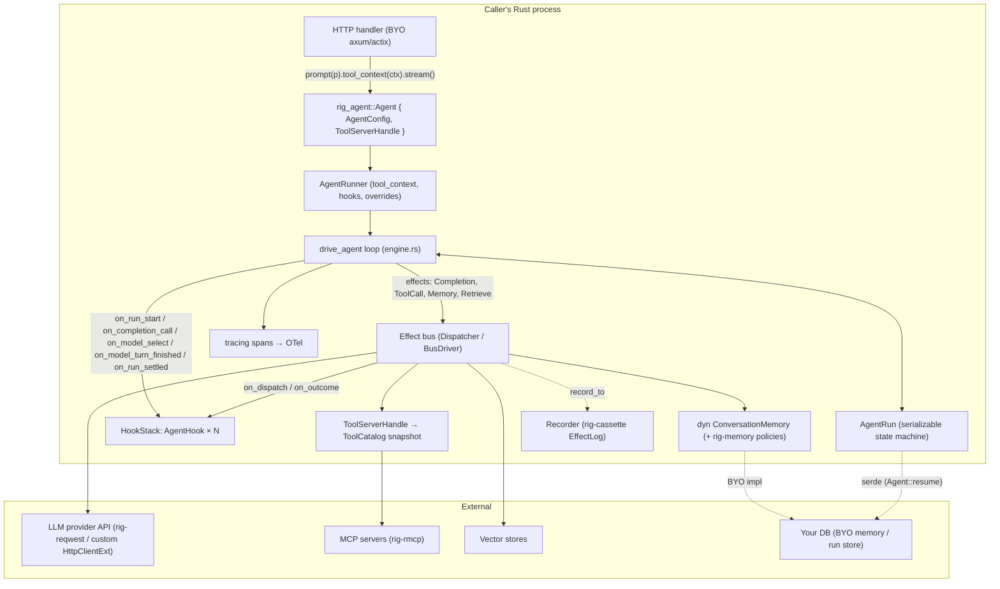

# Rig Rust — Benchmark Analysis

> **Repo**: https://github.com/0xPlaygrounds/rig
> **Commit analysed**: 7b994bf64dcbcc97fdf17f5ce01ec9875021adea
> **Branch**: main
> **Framework path**: frameworks/rig
> **Analysed on**: 2026-10-01

## TL;DR

- ⭐ **What is this stack architecturally?** Rig is a Rust **library** (a Cargo workspace of 28 crates behind a `rig` facade), not a service or hosted runtime. Since 0.41 the code is split into `rig-core` (portable provider, message, tool, memory and vector-store contracts, no tokio/reqwest dependency) and `rig-agent` (the "classic" agent runtime: builder, hooks, tool registry, serializable `AgentRun` state machine). An experimental `rig-ecs` crate runs the same agent protocol as entities and systems inside a Bevy ECS world with durable checkpoints. Everything runs in the caller's process.
- **Ecosystem** — **Rust** (edition 2024, MSRV 1.95.0).
- **License/governance**: MIT. Maintained by [0xPlaygrounds](https://github.com/0xPlaygrounds) with community contributions; no enterprise tier, no managed cloud, Discord community support.
- **Maturity/adoption**: pre-1.0, v0.43.0 released 2026-09-30. 8,784 stars, 981 forks (captured 2026-10-01). Seven releases since 2026-06-02 (0.38.1 → 0.43.0), almost every one with breaking changes. 82% of the 446 commits in this window come from one maintainer.
- **Loop location**: `crates/rig-agent/src/agent/engine.rs:132` (`drive_agent`), which drives the sans-IO `AgentRun` state machine (`crates/rig-agent/src/run/mod.rs:367`). `.await`, `.stream()` and `.run_channel()` all share this loop.
- **Strongest architectural choice for our use case**: the hook system now lets the harness **steer**, not only observe. `on_dispatch` can patch tool arguments (`DispatchAction::rewrite_tool_args`), `on_outcome` can rewrite tool results, `on_completion_call` can return a per-turn `RequestPatch` (preamble, history, `active_tools` allow-list, params), and `on_model_select` routes between registered models. A typed, serializable `ToolContext` carries tenant identity to every tool call, and sub-agents inherit it.
- **Weakest / biggest gap**: still **no HTTP API**, **no skills**, **no resource manager**, **no per-tenant budget**, and no automatic provider fallback (a provider error ends the run). Hosts write the axum/actix layer, SSE framing and session store themselves.
- **Most surprising finding**: the API churn. Between 0.37 and 0.43 the agent code moved crate twice, `PromptHook` was replaced by `AgentHook`, `Prompt`/`Chat` traits were removed, client construction changed (`OpenAI::from_env()?.completion(m)` + `AgentBuilder::new(model)`), `Usage` counters became `Option<u64>`, and `MIGRATING.md` grew to 4,624 lines. Persisted 0.42 histories and runs "may not load" in 0.43 (`MIGRATING.md:1344-1351`). The same window also added real capabilities: durable resume (`Agent::resume`), record/replay (`rig-cassette`), USD cache-cost helpers, and automatic Gemini explicit caching.
- **One-line verdicts**:
  - **Sessions/persistence**: `ConversationMemory` trait + in-memory backend only; persistent stores BYO. Runs are now serializable and resumable (`AgentRun` + `Agent::resume`), but you persist them yourself.
  - **Skills**: Not provided — BYO.
  - **Resource manager**: Not provided — BYO.
  - **Sub-agents**: agents-as-tools (`Agent::into_tool()` → `DynamicTool`), inheriting the parent's `ToolContext`. No lifecycle events.
  - **Multi-tenancy**: no tenant field, but a typed `ToolContext` set per run (`AgentRunner::tool_context`) reaches every tool and sub-agent; tool args can be forced in `on_dispatch`; per-turn tool allow-lists via `RequestPatch::active_tools`. No budgets.
  - **Hooks**: 12 `AgentHook` methods with mutate/deny/retry/stop actions, composed in a sequential `HookStack`.
  - **API**: Not provided — BYO HTTP layer.
  - **Observability**: GenAI-semconv `tracing` spans (content recording opt-in), per-call `CompletionCall` usage, `CacheCost::usd` with caller-supplied rates.
- **Production-readiness verdict**: a strong in-process agent core with real steering hooks and serializable run state. It is still a library. For a multi-tenant, skill-piloted platform you build the HTTP surface, session store, skill loader, resource manager and budgets yourself. Plan for breaking upgrades every 3–6 weeks.

## 0. General

### 0.1 What is this stack?

A **library**: Cargo crates you embed in your own binary. No standalone server, no CLI agent. README: "Rig is a Rust library for building scalable, modular, and ergonomic **LLM-powered** applications" (`README.md:60`). The README describes two layers: portable contracts in `rig-core` and orchestration in `rig-agent`, re-exported by the `rig` facade (`README.md:77-98`).

### 0.2 Ecosystem

**Rust** — workspace edition 2024, `rust-version = "1.95.0"` (`Cargo.toml:211-215`). No secondary language. Browser WASM (`wasm32-unknown-unknown`) is supported for `rig-core` and `rig-agent`; WASI is not, and MCP (`rig-rmcp`) is native-only (`README.md:73-75`, `crates/rig-rmcp/src/lib.rs:31-38`).

### 0.3 Project status & governance

- **License**: MIT (`Cargo.toml:6`, LICENSE).
- **Owner**: [0xPlaygrounds](https://github.com/0xPlaygrounds) ("Playgrounds"). Discord community (`README.md:17`).
- **No commercial backing or paid support visible**: no enterprise tier, no managed cloud, no SLA.
- **Maintainer concentration**: of 446 commits between the previous analysis (f77a5819) and this one, 366 are by `gold_silver_copper`, 30 by dependabot; no other human author has more than 4. The 0.43.0 changelog lists two contributors (`CHANGELOG.md:144-147`).

### 0.4 Project maturity / age

- Repository created 2024-06-05. Pre-1.0: `rig` v0.43.0 released 2026-09-30 (`CHANGELOG.md:11`).
- README still warns: "Here be dragons! ... future updates **will** contain **breaking changes**" (`README.md:46`).
- 0.38 → 0.43 carried large breaking changes: crate split into `rig-core` + `rig-agent` (0.41, `MIGRATING.md:3484-3514`), hook system v2 then event-specific `AgentHook` (0.40/0.41), `AgentRunner` as the only execution path (0.41, `MIGRATING.md:3628-3657`), provider clients and agent construction rewritten (0.43, `MIGRATING.md:810-1000`).
- `rig-ecs` is explicitly experimental: "its API may change in minor releases" (`crates/rig-ecs/src/lib.rs:8-10`).

### 0.5 Adoption & community signal

Captured 2026-10-01 via `gh api repos/0xPlaygrounds/rig`:

- **Stars**: 8,784. **Forks**: 981. **Watchers**: 58. **Open issues + PRs**: 129.
- **Contributors**: ~230 (GitHub contributors API, anonymous included).
- **Release cadence**: 0.38.1 (2026-06-02), 0.38.2 (06-09), 0.39.0 (06-19), 0.40.0 (07-10), 0.41.0 (07-28), 0.42.0 (08-17), 0.43.0 (09-30). Last push 2026-10-01.
- **Activity concentration**: see 0.3. Very high velocity, very low bus factor.
- **Adopters listed**: St Jude, Coral Protocol, VT Code, Con, Dria, Nethermind, Neon (`app.build` v2), Listen, Cairnify, Ryzome, deepwiki-rs, Cortex Memory, Ironclaw, ilert, Archestra (`README.md:100-116`).

### 0.6 Ecosystem fit

- Root facade crate: `rig` (`Cargo.toml:2`); the facade enables `agent` and `reqwest` by default.
- 28 crates under `crates/`:
  - Contracts / runtime: `rig-core`, `rig-agent`, `rig-ecs` (experimental, Bevy), `rig-http` (HTTP/websocket **client** transport traits, not a server), `rig-reqwest` (bundled transport), `rig-tungstenite` (websocket backend), `rig-derive` (`#[rig_tool]`, `Embed`, `ContextValue`).
  - Testing: `rig-cassette` (effect-log and provider HTTP record/replay).
  - MCP: `rig-rmcp`.
  - Memory: `rig-memory` (window, token-budget and compacting policies).
  - Providers outside core: `rig-bedrock`, `rig-vertexai`, `rig-gemini-grpc`, `rig-fastembed`, `rig-candle` (local CPU inference), `rig-typesafeai` (typed "Jev" evaluations).
  - Vector stores: `rig-mongodb`, `rig-lancedb`, `rig-neo4j`, `rig-qdrant`, `rig-sqlite`, `rig-surrealdb`, `rig-milvus`, `rig-scylladb`, `rig-postgres`, `rig-s3vectors`, `rig-helixdb`, `rig-vectorize`.
- Examples are now one Cargo package per example under `examples/*` (70 packages), e.g. `cargo run -p agent_with_human_in_the_loop`.
- Used as a **library**. The only runner is the CLI chatbot helper (`crates/rig-agent/src/integrations/cli_chatbot.rs`).

### 0.7 Documentation depth & cross-team contributor accessibility

- Official docs: https://rig.rs/docs (moved from docs.rig.rs in 0.41) + Rustdoc at https://docs.rs/rig/latest/rig/.
- Rustdoc is thorough: every public item is documented (`#![deny(missing_docs)]` in `crates/rig-agent/src/lib.rs:2`) and most doc examples compile as `no_run`. `MIGRATING.md` (4,624 lines) gives before/after snippets per release.
- Aimed at Rust engineers. Non-engineers can read the README and examples but cannot author content: no skills, no markdown agent configs, no playground.

### 0.8 Documentation entry points ⭐

- Docs landing page: https://rig.rs/docs
- Quickstart / getting-started: https://rig.rs/docs (README "Get Started" section links here)
- API reference: https://docs.rs/rig/latest/rig/
- Hosting / deployment / production guide: not provided (library only). Closest: ECS host/restoration contract https://github.com/0xPlaygrounds/rig/blob/main/crates/rig-ecs/CONTRACT.md
- Examples / demos repo: https://github.com/0xPlaygrounds/rig/tree/main/examples
- Changelog / release notes: https://github.com/0xPlaygrounds/rig/blob/main/CHANGELOG.md
- Migration guide: https://github.com/0xPlaygrounds/rig/blob/main/MIGRATING.md
- GitHub Releases: https://github.com/0xPlaygrounds/rig/releases
- GitHub issues tracker: https://github.com/0xPlaygrounds/rig/issues
- Discord / community forum: https://discord.gg/playgrounds
- Website: https://rig.rs
- Guides: https://rig.rs/docs/guides
- crates.io: https://crates.io/crates/rig, https://crates.io/crates/rig-core, https://crates.io/crates/rig-agent

---

## 1. High Level Architecture

```text
┌───────────────────────────────────────────────────────────────────┐
│  Your Rust binary (axum/actix + tokio, or any executor) — 1 proc  │
│                                                                   │
│  ┌──────────────────────────────────────────┐                     │
│  │ Your HTTP handler (BYO)                  │                     │
│  │  JWT, tenant extraction, SSE framing     │                     │
│  └───────────────────┬──────────────────────┘                     │
│                      │ agent.prompt(p).tool_context(ctx)          │
│                      ▼  .add_hook(h).stream() / .await            │
│  ┌──────────────────────────────────────────┐                     │
│  │ rig_agent::Agent  (config + bus)         │                     │
│  │  AgentRunner ─► drive_agent loop         │                     │
│  │  AgentRun (serializable state machine)   │                     │
│  │  HookStack (AgentHook × N)               │                     │
│  └──┬──────────────┬───────────────┬────────┘                     │
│     │ effect bus   │               │                              │
│     ▼              ▼               ▼                              │
│  ┌────────┐  ┌──────────────┐  ┌─────────────────────┐            │
│  │ DynModel│ │ToolServerHandle│ │ dyn ConversationMemory│          │
│  │ (wire + │ │ (Arc<RwLock>)  │ │ (InMemory or BYO)    │          │
│  │ driver) │ └──────┬───────┘  └─────────┬───────────┘            │
│  └───┬────┘         │                    │                        │
└──────┼──────────────┼────────────────────┼────────────────────────┘
       ▼              ▼                    ▼
 ┌────────────┐  ┌──────────┐      ┌───────────────────┐
 │ LLM provider│ │ MCP srv  │      │ Your DB (BYO impl) │
 │ HTTP/WS     │ │ (rig-rmcp)│     └───────────────────┘
 │ (rig-reqwest│ └──────────┘
 │ or your own │       Optional: rig-ecs runs the same protocol in a
 │ HttpClientExt)      Bevy World; save_world/load_world checkpoints.
 └────────────┘
```

### 1.1 Where does the agent loop *actually* execute?

In your own async runtime, in your own process. `Agent::prompt` returns an `AgentRunner` (`crates/rig-agent/src/agent/completion.rs:632`), and `.await`, `.stream()` or `.run_channel()` all go through `drive_agent` (`crates/rig-agent/src/agent/engine.rs:132`). `drive_agent` repeatedly asks the sans-IO `AgentRun` for its next step (`CallModel`, `CallTools`, `Done`) and performs the I/O (`engine.rs:242-460`). Model calls, tool calls, memory loads and retrieval are dispatched as typed effects on an in-process "effect bus" (`crates/rig-agent/src/bus/`). That bus is a channel/queue, not a network service. No subprocess, no IPC, no vendor cloud.

`rig-core` no longer depends on tokio or reqwest (`CHANGELOG.md:40`; `MIGRATING.md:1352-1356`), and `examples/agent_no_tokio` shows a non-tokio host. `rig-ecs` is a second runtime that runs the same protocol as Bevy systems (`crates/rig-ecs/src/lib.rs:1-16`).

### 1.2 Runtime dependencies

- Rust toolchain 1.95.0+ (`Cargo.toml:215`). Bevy 0.19 sets the same floor for `rig-ecs`.
- An async executor. Tokio is the usual choice; `rig-core` itself is executor-agnostic.
- HTTP transport: `rig-reqwest` (default through the facade) or any `HttpClientExt` implementation, wrapped as `DynHttpClient` with optional `HttpMiddleware` (`MIGRATING.md:1366-1371`).
- **No bundled subprocesses or CLIs.** No required infrastructure beyond an LLM provider endpoint. Persistence and vector storage are BYO.
- Required vendor service: at least one LLM provider API. Local inference via `rig-candle` (CPU) or llama.cpp/Ollama endpoints removes even that.

### 1.3 Recommended deployment topology

Not opinionated. No production deployment guide. The README positions `rig-agent` for hosts that "construct HTTP or SDK models with their chosen authentication, transport policy and runtime lifetime" (`README.md:91-98`). `Agent`, `AgentRunner`, `ToolServerHandle` and `RunEvents` are statically asserted `Send + Sync + 'static` so they can sit in shared host state (`crates/rig-agent/src/lib.rs:70-83`). One process serving many tenants is the natural default. Container-per-tenant is your call.

### 1.4 Cold-start cost & instance footprint

- Rust binary startup: typically well under a second once compiled; no interpreter, no JIT.
- No vendor binary downloaded; no sidecar.
- Memory baseline: an `Agent` is an `AgentConfig` plus a `ToolServerHandle` (`Arc<RwLock<ToolServerState>>`) (`crates/rig-agent/src/agent/completion.rs:222-225`, `crates/rig-agent/src/tool/server.rs:398`). Each run allocates its own `AgentRun` and `HookContext`.
- Not measured here (no code was run).

### 1.5 Vendor lock-in

- **LLM-provider lock-in**: low. 26 in-tree provider modules (`crates/rig-core/src/providers/`: anthropic, azure, chatgpt, cohere, copilot, deepseek, doubleword, gemini, groq, huggingface, hyperbolic, llamacpp, minimax, mira, mistral, moonshot, ollama, openai, openrouter, perplexity, together, venice, voyageai, xai, xiaomimimo, zai) plus Bedrock, Vertex AI, Gemini gRPC, Fastembed, Candle and TypeSafe as companion crates. A serializable `ProviderRef` ("deepseek:deepseek-chat") selects providers at runtime (`crates/rig-core/src/providers/registry.rs:1-12`).
- **Hosting-platform lock-in**: none.
- **Eval-platform lock-in**: none. The in-tree `evals` module was removed in 0.40 (`CHANGELOG.md` 0.40 "Other", #2036).

### 1.6 Framework weight / footprint

Medium-heavy library, and growing. The facade is "one file of re-exports" (`Cargo.toml:10-22` comment), but the workspace ships the classic agent runtime, an experimental Bevy ECS runtime, an effect bus, record/replay (`rig-cassette`), 26 provider integrations, 12 vector stores, MCP, memory policies, local inference (Candle), CLI chatbot and telemetry. No HTTP server, no dev UI, no plugin marketplace. The 0.43 cleanup trimmed dependency weight (rig-core has neither reqwest nor tokio; facade tarball 13 files / 417 KiB, `MIGRATING.md:1479-1484`).

### 1.7 Release-history signal

Seven releases since the previous analysis (0.37.0, 2026-05-13 → 0.43.0, 2026-09-30):

- **0.38** (`CHANGELOG.md:791-828`, `MIGRATING.md:149-247`): invalid/hallucinated tool calls validated and recoverable; per-completion-call usage on responses; `#[rig_tool]` params must implement `JsonSchema`.
- **0.39** (`CHANGELOG.md:758`, `MIGRATING.md:129-147`): sans-I/O `AgentRun` state machine (#1899); deterministic tool registration.
- **0.40** (`CHANGELOG.md:635`): hook system v2 (#2012), hooks can rewrite tool args (#1963) and results (#1965) and steer requests (#1966); HITL approval examples (#1967); `max_turns` now bounds total model calls; `evals` module and experimental `pipeline` module **removed**; Galadriel provider removed.
- **0.41** (`CHANGELOG.md:355`, `MIGRATING.md:3482-3752`): **crate split** into `rig-core` + `rig-agent` (#2197); `AgentRunner` is the only execution path; tools take `&mut ToolContext`; event-specific, provider-independent `AgentHook`; response retry hooks (#2182); telemetry content recording opt-in (#2151); all wasm feature flags removed.
- **0.42** (`CHANGELOG.md:149`, `MIGRATING.md:1498-3480`): model-turn termination metadata to hooks; response identity metadata; Anthropic per-breakpoint cache TTL; Venice provider; `OneOrMany<T>` → `Vec<T>`; typed `CallId`; runtime model swapping (agents erase the model type).
- **0.43** (`CHANGELOG.md:11-147`, `MIGRATING.md:810-1496`): provider clients own their transport (`OpenAI::from_env()?.completion(m)`); `AgentBuilder::new(model)`; `Prompt`/`Chat` traits removed; `rig-reqwest`, `rig-rmcp`, `rig-tungstenite` split out; event-sourced hook state (`RunEntry`, #2408); run lifecycle hooks `on_run_start`/`on_run_settled` (#2407); effect-bus critical path (#2443); `rig-ecs` durable tool-turn checkpoints (#2514); `Usage` counters `Option<u64>` with one meaning across providers (#2535, #2631); Gemini automatic explicit caching (#2628); credentials redacted in diagnostics (#2546); `rig-cassette` record/replay consolidated (#2552).

Signal: very fast-moving, breaking every release, with migration notes per release. The hooks, run state and provider layers have each been rewritten at least once in this window.

---

## 2. Agent Loop

### 2.1 Run loop entrypoint(s)

One runner, three terminals. `Agent::prompt` builds an `AgentRunner` (`crates/rig-agent/src/agent/completion.rs:632-634`):

```rust
// crates/rig-agent/src/agent/completion.rs:632
pub fn prompt(&self, prompt: impl Into<Message>) -> AgentRunner {
    AgentRunner::from_agent(self, prompt)
}
```

- **Blocking**: `agent.prompt(p).await` (via `impl IntoFuture for AgentRunner`, `crates/rig-agent/src/agent/runner.rs:635`) or `.run()` (`runner.rs:548`) → `Result<PromptResponse, PromptError>`. `PromptResponse { output: String, usage: Usage, completion_calls: Vec<CompletionCall>, messages: Option<Vec<Message>>, memory_append: Option<MemoryAppend> }` (`crates/rig-agent/src/run/response.rs:86-113`).
- **Streaming**: `agent.prompt(p).stream()` (`crates/rig-agent/src/agent/streaming.rs:241`) → `StreamingResult = WasmBoxedStream<'static, Result<MultiTurnStreamItem, PromptError>>` (`streaming.rs:32`).
- **Channel**: `.run_channel()` → `(future, RunEvents)` for hosts with their own executor or a game-loop tick (`streaming.rs:350-420`).
- **Resume**: `agent.resume(run: AgentRun)` continues a persisted run (`completion.rs:676`).
- **Typed**: `agent.prompt_typed::<T>(p)` → `TypedRun<T>` (`completion.rs:723`).
- **Chat helper**: `agent.chat(p, &mut history)` appends committed messages to caller history (`completion.rs:691`).

Per-run setters on `AgentRunner`: `add_hook`, `max_turns`, `using_model(label)`, `using_model_value(model)`, `tool_context`, `history`, `preamble`, `documents`, `temperature`, `max_tokens`, `merge_additional_params`, `tool_choice`, `tool_concurrency`, `conversation`, `without_memory`, `max_invalid_tool_call_retries` (`runner.rs:135-357`).

### 2.2 Per-iteration behavior

`drive_agent` (`crates/rig-agent/src/agent/engine.rs:132-460`):

0. Seed resumed `RunEntry`s into the `HookContext`; fire `on_run_start` once (may rewrite the prompt or stop) (`engine.rs:146-200`). Conversation memory, if configured, was already loaded by the runner as a `Memory` effect (`runner.rs:514`).
1. `run.next_step()` → `AgentRunStep::CallModel { prompt, history, turn }` (`engine.rs:244-256`).
2. `on_completion_call` hooks run in registration order; their `RequestPatch`es merge, or a hook stops the run (`engine.rs:263-275`, `resolve_completion_call` at `engine.rs:1361`).
3. `on_model_select` picks a registered model label (`engine.rs:278-300`).
4. Build the prepared request: preamble (or patched preamble), static + patched context, tool definitions (static + retrieved, narrowed by `active_tools`) (`engine.rs:320-345`). Advertised tools are recorded in the run so a resumed run can re-bind them (`engine.rs:355`).
5. Dispatch the completion effect: `on_dispatch` (patch/deny) → model → `on_outcome` (replace/stop) (`dispatch_completion`, `engine.rs:1898`).
6. Settle the turn: `on_model_turn_finished` may `Retry` a tool-free turn (consuming the `max_turns` budget) or `Stop` (`settle_model_turn`, `engine.rs:1279-1350`).
7. Invalid tool calls (unknown tool, bad JSON) go to `on_invalid_tool_call` → fail / retry / repair / skip / stop (`engine.rs:966`).
8. `AgentRunStep::CallTools { calls }` (`engine.rs:376`): each call is dispatched through `on_dispatch` (patch args / skip / stop) → tool → `on_outcome` (rewrite result / stop) (`dispatch_tool_call`, `engine.rs:1999-2100`), up to `tool_concurrency` in parallel (`engine.rs:607`). Results are committed in call order.
9. Loop until `AgentRunStep::Done(response)` (`engine.rs:409`): append committed messages to memory (`engine.rs:419-426`), fire `on_run_settled`, yield the final item.

### 2.3 ReAct loop

Built-in. The multi-turn tool-call loop is effectively ReAct (model decides tool calls, harness executes, results fed back). There is no separate "thought" channel beyond provider reasoning blocks (`AssistantContent::Reasoning`) and the built-in `ThinkTool` (`crates/rig-core/src/tool/builtin/think.rs:20-40`). `max_turns` bounds the **total** number of model calls including retries (`MIGRATING.md:250-268`).

### 2.4 Tool dispatch + result handling

Tools are registered in a `ToolSet` (`crates/rig-agent/src/tool/registry.rs:294`) served by a `ToolServer` / `ToolServerHandle` (`crates/rig-agent/src/tool/server.rs:258-650`). For each turn the engine takes a `ToolCatalog` snapshot (`server.rs:577`, `snapshot_with_dynamic` at `server.rs:646`) so registry changes mid-turn don't affect in-flight calls. Each call is an `EffectKind::ToolCall { name, args }` dispatched on the bus with a fresh clone of the run's `ToolContext` (`crates/rig-agent/src/agent/runner.rs:63-64`). Tool errors are normalized to `ToolExecutionError` and become model-visible feedback. The result is a `ToolResult { call: CallId, name: ToolName, content: Vec<ToolResultContent> }` (`crates/rig-core/src/completion/message.rs:301-305`) pushed into history.

### 2.5 Explicit turn concept

A turn = one model call plus the tool batch that follows. `AgentRunStep::CallModel { turn }` carries a one-based model-call index; `max_turns` counts model calls (initial, tool continuations and retries). The run ends when a turn has no tool calls (and is accepted by `on_model_turn_finished`), when the output tool is called (structured output, Tool mode), when a hook stops it, or when the budget is exhausted (`MaxTurnsError`).

### 2.6 Event emission mechanism (in-process)

- **Blocking**: no event stream; `PromptResponse` at the end. Hooks still fire.
- **Streaming**: `futures::Stream<Item = Result<MultiTurnStreamItem, PromptError>>` (`crates/rig-agent/src/agent/streaming.rs:32-120`).
- **Channel**: `RunEvents` (a `Stream` + `try_next()` for synchronous ticks) next to the driving future (`streaming.rs:350-420`).
- **Hooks**: `AgentHook` trait, 12 methods (`crates/rig-agent/src/agent/hook.rs:957-1124`; see §7.1).
- **Tracing**: `invoke_agent`, `chat` and `execute_tool` spans with GenAI semconv fields (`crates/rig-agent/src/agent/telemetry.rs:25-72`).
- **Recording**: `AgentBuilder::record_to(recorder)` receives every bus dispatch, stream event and outcome (`crates/rig-agent/src/agent/builder.rs:390`, `crates/rig-core/src/serve/recorder.rs:27-40`).

---

## 3. Message & Event Taxonomy

### 3.1 Message layers

Three layers plus the effect layer:

1. **Canonical Rig `Message`** (`crates/rig-core/src/completion/message.rs:10-22`): `System { content }`, `User { content: Vec<UserContent> }`, `Assistant { id, content: Vec<AssistantContent> }`. Serde-tagged by `role`.
2. **Provider wire types**: each provider has a `wire` module (e.g. `providers/openai/wire/`, `providers/anthropic/wire.rs`) implementing `Wire` (`describe`, `encode`, `decoder`). Since 0.43 the conversions from provider wire messages back into `Message` are removed (`MIGRATING.md:1351`); decoding goes through one typed decoder per wire.
3. **Stream layer**: `Item<StreamEvent>` from the provider (`crates/rig-core/src/streaming/event.rs:68-142`), wrapped by the agent as `MultiTurnStreamItem` (`crates/rig-agent/src/agent/streaming.rs:38-120`).
4. **Effect layer** (internal, visible to hooks/recorders): `EffectKind` (Completion, ToolCall, Memory, Retrieve, Embed, Rerank, Custom) and `Outcome` (`crates/rig-core/src/effect/mod.rs`).

```text
caller ─► Message ─► CompletionRequest ─► EffectKind::Completion ─► Wire::encode ─► HTTP
                                                                        │
          MultiTurnStreamItem ◄── Item<StreamEvent> ◄── Decoder ◄───────┘
          PromptResponse      ◄── CompletionResponse (Vec<AssistantContent>, Usage, raw)
```

### 3.2 Concrete message types

| Type | File:Line | Purpose |
|------|-----------|---------|
| `Message::System { content }` | `crates/rig-core/src/completion/message.rs:15` | System prompt message. |
| `Message::User { content }` | `completion/message.rs:15` | User input, multimodal. |
| `Message::Assistant { id, content }` | `completion/message.rs:15` | Model output. |
| `UserContent::{Text, ToolResult, Image, Audio, Video, Document}` | `completion/message.rs:127-134` | User content parts. |
| `AssistantContent::{Text, ToolCall, Reasoning, Image}` | `completion/message.rs:146-151` | Assistant content parts; `Reasoning` is `Sealed<Reasoning>` with an `Issuer`. |
| `ReasoningContent::{Text, Encrypted, Redacted, Summary}` | `completion/message.rs:161-170` | Reasoning block kinds. |
| `ToolCall { id: CallId, function, signature, additional_params }` | `completion/message.rs:365-371` | Model-emitted tool call. |
| `ToolResult { call: CallId, name: ToolName, content }` | `completion/message.rs:301-305` | Tool result; carries the tool name since 0.42. |
| `ToolResultContent::{Text, Image, Json}` | `completion/message.rs:312-320` | Rich tool-result content. |
| `CallId::{Provider, Local}` | `completion/message/identity.rs:140-145` | Typed call identity; rig issues a local id if the provider sent none. |
| `ToolChoice::{Auto, None, Required, Specific}` | `completion/message.rs:1404-1412` | Tool selection policy. |
| `ToolDefinition { name, description, parameters }` | `completion/request.rs:58-65` | Tool schema sent to the model. |
| `CompletionResponse { choice, usage, message_id, response_id, provider_request_id, finish_reason, provider, raw, … }` | `completion/request.rs:178-200` | Normalized provider response; `raw` is the verbatim provider document. |
| `Usage` | `completion/request.rs:404-428` | `Option<u64>` counters: input, output, total, cached_input, cache_creation_input, tool_use_prompt, reasoning. |
| `PromptResponse` | `crates/rig-agent/src/run/response.rs:86-113` | `output`, `usage`, `completion_calls`, `messages`, `memory_append`. |
| `CompletionCall` | `run/response.rs:16-30` | Per-model-call record: index, usage, ids, finish reason, raw. |
| `TypedPromptResponse<T>` | `crates/rig-agent/src/agent/typed.rs` | Typed output + usage + completion calls. |
| `AgentRun` | `crates/rig-agent/src/run/mod.rs:367` | Serializable run state (history, turn, usage, budgets, advertised tools, entries). |
| `RunEntry` | `run/mod.rs:436` | Event-sourced hook state appended to the run. |
| `MultiTurnStreamItem` | `crates/rig-agent/src/agent/streaming.rs:38-120` | Agent stream item (see 3.6). |
| `StreamEvent::{Start, Text, Reasoning, Arguments, End}` | `crates/rig-core/src/streaming/event.rs:68-106` | Part lifecycle events from the provider stream. |
| `Item::{Event, Unknown}` | `streaming/event.rs:137-142` | Wraps a modeled event or an unmodeled provider payload. |

### 3.3 Messages vs. events

Separate layers. Messages (`Message`, `AssistantContent`, `ToolResult`) are what is committed to history and memory. Events (`StreamEvent`, `MultiTurnStreamItem`) are what streams; `StreamEvent::End` carries the finalized `AssistantContent` of a part, so the stream can be folded back into messages. Hook callbacks are a third, orthogonal channel that fires on all surfaces (blocking, streaming, channel). Effects/outcomes are a fourth layer used by hooks and recorders.

### 3.4 Event categories

- **Stream-event**: `StreamEvent::{Start, Text, Reasoning, Arguments, End}` inside `MultiTurnStreamItem::StreamAssistantItem(Item<StreamEvent>)`; `Item::Unknown` passes through unmodeled provider payloads.
- **Turn-event**: `MultiTurnStreamItem::CompletionCall(CompletionCall)` (one per finished provider call), `ModelTurnRetried { turn }`, hooks `on_completion_call`, `on_model_turn_finished`.
- **Message-event**: committed messages land in `AgentRun.new_messages` and in `PromptResponse.messages`; `RunSettled.messages` exposes them to hooks.
- **Tool-event**: `MultiTurnStreamItem::ToolCall` (model emitted), `ToolExecutionCommitted` (executed, after patches), `StreamUserItem` (result); hooks `on_dispatch`/`on_outcome` for `ToolDispatch`; `execute_tool` span.
- **Session-lifecycle event**: `on_run_start`, `on_run_settled` hooks (new in 0.43); `invoke_agent` span; `FinalResponse` stream item.
- **Hook event**: `StepEventKind` enumerates 15 kinds (`crates/rig-agent/src/agent/hook.rs:579-615`).
- **Sub-agent event**: none. A sub-agent is a `DynamicTool`; it shows up as a tool event.

### 3.5 Canonical type-definition file(s)

- `crates/rig-core/src/completion/message.rs` — `Message`, `UserContent`, `AssistantContent`, `ToolCall`, `ToolResult`, `ToolChoice`.
- `crates/rig-core/src/completion/message/identity.rs` — `CallId`, `ToolName`, `Sealed`, `Issuer`.
- `crates/rig-core/src/completion/request.rs` — `CompletionRequest`, `CompletionResponse`, `Usage`, `ToolDefinition`.
- `crates/rig-core/src/streaming/event.rs` — `StreamEvent`, `Item`, `Part`, `PartKind`.
- `crates/rig-core/src/effect/mod.rs` — `EffectKind`, `Outcome`, `EffectFamily`.
- `crates/rig-agent/src/agent/streaming.rs` — `MultiTurnStreamItem`, `RunEvents`.
- `crates/rig-agent/src/run/response.rs` — `PromptResponse`, `CompletionCall`, `PromptError`.
- `crates/rig-agent/src/run/mod.rs` — `AgentRun`, `AgentRunStep`, `RunEntry`.
- `crates/rig-agent/src/agent/hook.rs` — `AgentHook`, events and actions.

### 3.6 Live agentic event stream taxonomy

`MultiTurnStreamItem` is `#[derive(Serialize)] #[serde(tag = "type", rename_all = "camelCase")]` (`crates/rig-agent/src/agent/streaming.rs:34-35`); `StreamEvent` is `#[serde(tag = "event", rename_all = "snake_case")]` (`crates/rig-core/src/streaming/event.rs:66-67`). Sample frames as Rust values:

```rust
// a text part opens and grows
MultiTurnStreamItem::StreamAssistantItem(Item::Event(StreamEvent::Start { part, kind: PartKind::Text }))
MultiTurnStreamItem::StreamAssistantItem(Item::Event(StreamEvent::Text { part, text }))

// reasoning delta
MultiTurnStreamItem::StreamAssistantItem(Item::Event(StreamEvent::Reasoning { part, text }))

// tool-call arguments: emitted once, whole, when the call part ends (0.43)
MultiTurnStreamItem::StreamAssistantItem(Item::Event(StreamEvent::Arguments { part, json }))
MultiTurnStreamItem::StreamAssistantItem(Item::Event(StreamEvent::End { part, content /* AssistantContent::ToolCall */ }))

// model call committed for routing
MultiTurnStreamItem::ToolCall { tool_call }

// per-provider-call usage
MultiTurnStreamItem::CompletionCall(CompletionCall { call_index, usage, .. })

// tool executed (after hook patches) and its result, surfaced after the batch settles
MultiTurnStreamItem::ToolExecutionCommitted { tool_call }
MultiTurnStreamItem::StreamUserItem(StreamedUserContent::ToolResult { .. })

// a hook rejected the turn: discard provisional deltas for `turn`
MultiTurnStreamItem::ModelTurnRetried { turn }

// terminal
MultiTurnStreamItem::FinalResponse(PromptResponse { output, usage, completion_calls, messages, memory_append })
```

---

## 4. Agent Runtime (Multi-session Host)

### 4.1 Multi-session host architecture

**Not provided — BYO** for the classic runtime. There is still no scheduler or session manager: you hold an `Agent` (or `Arc<Agent>`) in shared state and start one `AgentRunner` per request. What changed: each agent owns an in-process effect bus, and `Agent::into_parts()` returns the `Dispatcher`, `Registrar` and `BusDriver` so a host can spawn the driver on its own executor and attach several agents to one bus (`AgentBuilder::over_bus`, `crates/rig-agent/src/agent/builder.rs:562`; `AgentParts` at `crates/rig-agent/src/agent/completion.rs:738-749`). `ServingPolicy` bounds the bus queues (`command_capacity` 16, `stream_capacity` 64 by default; `crates/rig-core/src/serve/mod.rs:31-60`).

`rig-ecs` (experimental) is a real multi-run host: runs, effects and handlers are entities in a Bevy `World`, driven by systems each `app.update()` (`crates/rig-ecs/src/lib.rs:1-64`). This suits game or simulation hosts more than HTTP services.

### 4.2 Concurrent session isolation

- Run state is per-run: each `AgentRunner` builds its own `AgentRun`, `HookContext` (run id, scratchpad, entries) and clone of the `ToolContext` (`crates/rig-agent/src/agent/hook.rs:124-160`, `runner.rs:54-75`). Overrides on the runner "never mutate the source agent" (`runner.rs:56`).
- Shared mutable surface: the `ToolServerHandle` (`Arc<RwLock<ToolServerState>>`, `crates/rig-agent/src/tool/server.rs:398`). `add_tool`/`remove_tool` affect all users of that handle; each turn works on a `ToolCatalog` snapshot.
- Conversation memory isolation depends on your `ConversationMemory` backend, keyed by `ConversationId`.
- Hooks are shared objects if you register them on the builder. Per-run state belongs in `HookContext::scratchpad()` (`hook.rs:288`), not in hook fields.
- A test pins that concurrent runs on one agent are independent (`crates/rig-agent/tests/runtime_model_swapping.rs:1560`).

### 4.3 Horizontal scaling / multi-instance

**Not provided** as a feature, but more feasible than before: an `AgentRun` is `Serialize + Deserialize`, and `Agent::resume(run)` continues it on any process running the same rig version (`crates/rig-agent/src/agent/completion.rs:636-678`). Live tool registrations are not persisted; on resume, advertised tool names are re-bound to the current process's implementations (`crates/rig-agent/src/agent/engine.rs:377-390`). No leader election, no shared store, no session routing.

### 4.4 Background / async / scheduled tasks

**Not provided — BYO.** No cron, no webhook triggers, no background agents. `run_channel()` and `RunEvents` make it easy to drive a run from a host loop, but scheduling is yours.

### 4.5 Worker pool / queue model

**Not provided** for agent runs. The effect bus is an internal command queue between the run loop and its handlers (model, tools, memory), not a job queue. Long runs either stay attached to a request (stream) or are persisted as `AgentRun` and resumed by your own worker.

---

## 5. Sessions & Persistence

### 5.1 Session / chat data model

There is no `Session` type. Two things play that role:

1. **Conversation history** under a `ConversationId` (a transparent `String` newtype, `crates/rig-core/src/id.rs:124-138`), managed by `ConversationMemory`:

```rust
// crates/rig-core/src/memory.rs:86-110
pub trait ConversationMemory: WasmCompatSend + WasmCompatSync {
    fn load<'a>(&'a self, conversation_id: &'a ConversationId)
        -> WasmBoxedFuture<'a, Result<Vec<Message>, MemoryError>>;
    fn append<'a>(&'a self, conversation_id: &'a ConversationId, messages: Vec<Message>)
        -> WasmBoxedFuture<'a, Result<(), MemoryError>>;
    fn clear<'a>(&'a self, conversation_id: &'a ConversationId)
        -> WasmBoxedFuture<'a, Result<(), MemoryError>>;
}
```

2. **Run state** — `AgentRun` (`crates/rig-agent/src/run/mod.rs:367-430`), serializable with a format tag: `max_turns`, retry budgets, `tool_choice`, output-tool name and schema, `chat_history`, `new_messages`, `current_turn`, `usage`, `completion_calls`, `previous_model`, advertised tools per turn, and `RunEntry` hook entries.

Neither carries `tenant_id`, `user_id`, `created_at` or `metadata`.

### 5.2 What's stored on a session

- Memory: `Vec<Message>` per `ConversationId` (messages, tool calls, tool results, reasoning).
- Run: the above plus usage, completion-call records (with `raw` provider documents), advertised tool definitions and hook-appended `RunEntry`s (event-sourced hook state, #2408).
- Not stored: inbound `ToolContext` values ("inbound tool context is driver state, never part of the persisted run", `completion.rs:650-651`), attachments outside messages, files.

### 5.3 Granularity

Linear conversation per `ConversationId`. No fork/branch model. A host can copy a serialized `AgentRun` and resume two copies, but rig has no branch API.

### 5.4 Built-in persistence stores

- **In-tree**: `InMemoryConversationMemory` (`crates/rig-core/src/memory.rs:269-310`) with optional `with_filter` (`memory.rs:282`).
- **rig-memory**: policies and adapters over a backend (`SlidingWindowMemory`, `TokenWindowMemory`, `PolicyMemory`, `DemotingPolicyMemory`, `CompactingMemory` — `crates/rig-memory/src/lib.rs:158-1079`), not new storage.
- **rig-ecs**: `save_world`/`load_world` produce/restore a JSON `Checkpoint` of the world (`crates/rig-ecs/src/checkpoint.rs:1-60`). You store the JSON.
- **rig-cassette**: `EffectLog` with `checkpoint`/`from_checkpoint` (`crates/rig-cassette/src/effect_log/mod.rs:1-25`), primarily for replay.
- **Postgres, SQLite, Mongo, Redis, S3**: **BYO** — implement `ConversationMemory` (and store `AgentRun` JSON) yourself. `rig-postgres`, `rig-sqlite`, `rig-mongodb` etc. remain vector-store crates.

### 5.5 Persistence timing

Memory is appended **once, after the run reaches `Done`**, as a `Memory` effect on the bus (`crates/rig-agent/src/agent/engine.rs:409-426`, `append_run_messages` at `engine.rs:1390-1428`). A failed append does not discard the answer; it is reported on `PromptResponse.memory_append` as `Failed { report }`. Failed or stopped runs append nothing. Memory loads happen before the first model call; a load failure fails the run (`runner.rs:329-339`; load effect at `runner.rs:514`).

Hook entries (`RunEntry`) are flushed into the `AgentRun` at every step boundary (`engine.rs:146-153, 244`), so a serialized run carries hook state up to the last step.

### 5.6 Mid-run checkpointing (durable)

**Partially provided (new since 0.39–0.43).**

- **Classic runtime**: `AgentRun` is serializable between steps, and `Agent::resume(run)` continues it, executing pending tool calls or requesting the next model turn (`crates/rig-agent/src/agent/completion.rs:636-678`). The runner does **not** persist anything itself. To checkpoint you either drive `AgentRun` by hand (`run.next_step()`, `examples/agent_run_stepping`, `examples/agent_with_durable_approval/src/main.rs:168-306` which writes the run to a file at `CallTools` and reloads it) or persist from your own hook/recorder. Resume semantics: "Pending tool calls re-execute on resume: a tool that ran before the suspension and answered nothing runs again" (`completion.rs:661-663`), so tools must be idempotent. The run must be resumed by the same rig version.
- **rig-ecs (experimental)**: durable tool-turn checkpoint boundaries (#2514). `load_world` "reissues unfinished effects with saved dispatch IDs" (`crates/rig-ecs/src/checkpoint.rs:1-6`).
- **Effect logs**: `rig-cassette`'s `EffectLog::checkpoint` gives a recorded prefix + tail for replay (`crates/rig-cassette/src/effect_log/mod.rs:8-16`).

No automatic per-tool-result commit to a store in the classic runtime (compare LangGraph's `put_writes`).

### 5.7 Session ID format

`ConversationId` is a caller-supplied string (`crates/rig-core/src/id.rs:124-138`); `conversation("user-123")` accepts `impl Into<ConversationId>`. `RunId` is a numeric counter id, process-local (`MIGRATING.md:1349`). No tenant prefixing or hashing in core.

### 5.8 Pluggable store interface

Yes — implement `ConversationMemory` and pass it to `AgentBuilder::memory(...)` (`crates/rig-agent/src/agent/builder.rs:300`), or register a custom bus handler with `memory_handler` (`builder.rs:313`). Memory loads/appends are `Memory` effects, so hooks that opt in to `StepEventKind::MemoryDispatch` can observe or gate them (`hook.rs:1110-1124`).

### 5.9 Schema evolution / migration

**Not provided — BYO**, with explicit format guards. `AgentRun` and `rig-ecs` checkpoints carry a format tag and reject unknown fields (`run/mod.rs:368-370`; `CHECKPOINT_FORMAT = 2`, `crates/rig-ecs/src/checkpoint.rs:56`). The 0.43 guide says "Persisted histories and runs from 0.42 may not load ... Re-create persisted state, or migrate it" (`MIGRATING.md:1344-1351`). No migration helpers ship.

### 5.10 Export / replay

**Provided (new).** `rig-cassette` records and replays:

- Effect logs: install an `EffectLogRecorder` with `AgentBuilder::record_to`, stamp it with the agent's identity (`AgentReplayExt::stamp`), and refuse logs whose run spec or handlers differ (`check_replayable`) (`crates/rig-cassette/src/agent/mod.rs:1-45`). Replayers "validate recorded handler identities and publish saved tool outputs before resolving outcomes" (`crates/rig-cassette/src/effect_log/mod.rs:1-6`).
- Provider HTTP cassettes for deterministic provider replay (`crates/rig-cassette/src/http/`, feature `http`).

Export of messages: `PromptResponse.messages` or the serialized `AgentRun`. External histories can be validated with `rig_core::transcript::validate_canonical` (`MIGRATING.md:1406`).

### 5.11 Cross-session memory

**Not provided in core.** `rig-memory` shapes per-conversation history. Long-term semantic memory = a vector store queried via `dynamic_context` (now a hook) or your own `on_completion_call` hook adding `RequestPatch::extra_context`. See §17.

---

## 6. Multi-tenancy & Tenant Identity ⭐ THE KEY QUESTION

### 6.1 Run-loop tenant identity

No `tenant_id` / `user_id` field exists on `Agent`, `AgentRunner` or `AgentRun`. The supported carrier is the typed **`ToolContext`**, set per run:

```rust
// crates/rig-agent/src/agent/runner.rs:192-197
/// Set the typed context cloned for every tool dispatch in this run.
pub fn tool_context(mut self, context: ToolContext) -> Self {
    self.tool_context = context;
    self
}
```

`ToolContext` holds typed, serializable slots keyed by `ContextValue::KEY` (`crates/rig-core/src/tool/context.rs:150-330`):

```rust
// crates/rig-core/src/tool/context.rs:170-179, 219-222
pub struct ToolContext {
    inbound: BTreeMap<String, serde_json::Value>,
    result: BTreeMap<String, serde_json::Value>,
    #[serde(skip)]
    scopes: Vec<std::sync::Arc<dyn Any + Send + Sync>>,
}
pub trait ContextValue: Serialize + DeserializeOwned + 'static {
    const KEY: &'static str;
}
```

Values are derived with `#[derive(ContextValue)] #[context(key = "app.user_id")]` (`MIGRATING.md:1326-1332`). Inbound values are never sent to the model and are not persisted in the run.

Other per-run fields: `history`, `conversation`, `preamble`, `documents`, `temperature`, `max_tokens`, `additional_params`, `tool_choice`, `using_model`, `max_turns`, `add_hook` (`runner.rs:135-357`). Hooks receive a `HookContext` (run id, turn, agent name, scratchpad, entries) but not the `ToolContext`, except on tool dispatch/outcome events (`DispatchEvent.context`, `OutcomeEvent.context`, `hook.rs:634-647, 772-786`).

### 6.2 Tenant identity propagation into tool calls

`AgentRunner.tool_context` is "cloned freshly for every tool dispatch" (`runner.rs:63-64`) and passed into `Tool::call(&self, context: &mut ToolContext, args)`. Path: `runner.tool_context(ctx)` → `drive_agent` → `dispatch_tool_call` (`engine.rs:1999`) → `on_dispatch(DispatchEvent { context: Some(&ctx), .. })` → `ToolServerHandle`/`ToolCatalog::execute` → `Tool::call(&mut ctx, args)`. Mutations to inbound slots affect only that execution (`context.rs:162-165`). Sub-agents built with `Agent::into_tool()` inherit the dispatch context (`crates/rig-agent/src/agent/tool.rs:55-72`). MCP tools read `McpMeta` from the context and send it as request `_meta` outside model-visible arguments (`crates/rig-rmcp/src/lib.rs:1-17`, `native.rs:36`).

### 6.3 Tool call interface

```rust
// crates/rig-core/src/tool/contextual.rs:34-75
pub trait Tool: Sized + WasmCompatSend + WasmCompatSync {
    const NAME: &'static str;
    type Args: for<'de> Deserialize<'de> + WasmCompatSend + WasmCompatSync;
    type Output: IntoToolOutput;
    type Error: std::error::Error + WasmCompatSend + WasmCompatSync + 'static;

    fn description(&self) -> String;
    fn parameters(&self) -> serde_json::Value;
    fn map_error(&self, error: Self::Error) -> ToolExecutionError {
        ToolExecutionError::from_error(error)
    }
    fn call(
        &self,
        context: &mut ToolContext,
        args: Self::Args,
    ) -> impl Future<Output = Result<Self::Output, Self::Error>> + WasmCompatSend;
}
```

A context-free `PortableTool` blanket-implements `Tool`. Runtime-named tools use `DynamicTool::new` / `DynamicTool::new_with_context(name, description, parameters, |ctx, args| ...)` (`contextual.rs:261-300`). `ctx.insert_result(...)` attaches host-only metadata to the result that hooks can read but the model never sees (`context.rs:303-310`).

### 6.4 Forcing tool arguments from the harness

**Provided (new since 0.40).** Two mechanisms:

1. **Hook patch** — `on_dispatch` returns `DispatchAction::Patch`; the helper keeps the tool name and replaces the arguments. The stack rejects patches that change the tool target (`hook.rs:666-690`):

```rust
// crates/rig-agent/src/agent/hook.rs:718-728
/// Patch a tool call's arguments, keeping its name and context.
/// `Proceed` when `kind` is not a tool call.
pub fn rewrite_tool_args(kind: &EffectKind, args: impl Into<serde_json::Value>) -> Self {
    match kind {
        EffectKind::ToolCall { name, .. } => Self::Patch(EffectKind::ToolCall {
            name: name.clone(),
            args: json_utils::serialize_json_value(&args.into()),
        }),
        _ => Self::Proceed,
    }
}
```

   The streamed `ToolExecutionCommitted` item reports the patched call, so a redaction rewrite is not leaked (`streaming.rs:71-78`).

2. **Context over arguments** (preferred for tenant ids) — keep `tenant_id` out of `Args` and read it from `ctx.require::<TenantId>()` inside `call`. The LLM cannot override what it cannot see.

### 6.5 Tenant-aware visible tool selection

**Provided (new).** `on_completion_call` can return `CompletionCallAction::Patch(RequestPatch::new().active_tools([...]))`. The allow-list narrows the tools advertised for that turn; across hooks the lists are **intersected** (`crates/rig-agent/src/run/patch.rs:13-44`). Patches are per-turn and non-sticky, so a tenant hook must return the patch on every turn (`examples/force_tool_first_turn` documents this footgun). Other options: build a per-tenant `Agent` with only the allowed tools, or use `retrieved_tools` (vector-store-selected tools). `ToolServerHandle::add_tool`/`remove_tool` (`server.rs:426-547`) mutate a shared registry and are not suitable for per-tenant scoping.

`active_tools` hides tools from the model; it does not block a call to a hidden tool the model guesses. Pair it with an `on_dispatch` deny for enforcement.

### 6.6 Per-tool-call auth propagation

**Provided as a primitive, not as auth.** Whatever you put in the run's `ToolContext` (principal, scoped token newtype) reaches every tool call, sub-agent call and MCP call (`McpMeta`). There is no principal type, token validation or per-tool ACL. `ToolContext` serialization "can contain sensitive inbound values and must be protected by the host" (`context.rs:153-155`); effect logs record only `insert_result` values (`context.rs:155-157`).

### 6.7 Per-tenant rate limit + budget cap

**Not provided.** `max_turns` (total model calls) and `max_tokens` (per completion) only. No USD budget, no per-tenant rate limit. A hook can sum `CompletionCall.usage` in the scratchpad and return `Stop` from `on_completion_call`; that is BYO.

### ⭐ Light usage example

Sketch against the 0.43 API (not compiled here).

```rust
use rig::agent::{AgentBuilder, AgentHook, CompletionCallAction, CompletionCallEvent,
                 DispatchAction, DispatchEvent, HookContext, RequestPatch};
use rig::prelude::*;
use rig::providers::openai::{self, OpenAI};
use rig::tool::{ContextValue, Tool, ToolContext};
use serde::{Deserialize, Serialize};

// (1) Tenant identity as typed, serializable context values.
#[derive(Clone, Serialize, Deserialize, ContextValue)] #[context(key = "app.tenant_id")]
struct TenantId(String);
#[derive(Clone, Serialize, Deserialize, ContextValue)] #[context(key = "app.user_id")]
struct UserId(String);
#[derive(Clone, Serialize, Deserialize, ContextValue)] #[context(key = "app.strategy_id")]
struct StrategyId(String);

struct TenantPolicy { tenant: String }
impl AgentHook for TenantPolicy {
    // (2) Only these tools are advertised, every turn.
    async fn on_completion_call(&self, _: &HookContext, _: CompletionCallEvent<'_>) -> CompletionCallAction {
        CompletionCallAction::patch(RequestPatch::new()
            .active_tools(["topicSearch", "iabSearch", "audienceCreate"]))
    }
    // (3) Force tenantId on every topicSearch call, whatever the model sent.
    async fn on_dispatch(&self, _: &HookContext, ev: DispatchEvent<'_>) -> DispatchAction {
        match (ev.tool_name(), ev.tool_args()) {
            (Some("topicSearch"), Some(raw)) => {
                let mut args: serde_json::Value = serde_json::from_str(raw).unwrap_or_default();
                args["tenantId"] = self.tenant.clone().into();
                DispatchAction::rewrite_tool_args(ev.kind, args)
            }
            (Some(name), _) if !["topicSearch", "iabSearch", "audienceCreate"].contains(&name) =>
                DispatchAction::skip("tool not allowed for this tenant"),
            _ => DispatchAction::proceed(),
        }
    }
}

let mut ctx = ToolContext::new();
ctx.insert(TenantId("acme".into()))?;
ctx.insert(UserId("u-123".into()))?;
ctx.insert(StrategyId("strat-42".into()))?;

let agent = AgentBuilder::new(OpenAI::from_env()?.completion(openai::GPT_5_2))
    .tool(TopicSearch).tool(IabSearch).tool(AudienceCreate).tool(BashExec).tool(WebFetch)
    .build();

let resp = agent.prompt("Build an audience for EV buyers")
    .tool_context(ctx)                                   // (1) reaches every Tool::call
    .add_hook(TenantPolicy { tenant: "acme".into() })    // (2) + (3)
    .await?;
```

**Step 1**: provided via `ToolContext` (tools read `ctx.require::<TenantId>()`); there is no first-class tenant field on the run.
**Step 2**: provided per turn via `RequestPatch::active_tools`, plus an `on_dispatch` deny for enforcement.
**Step 3**: provided via `DispatchAction::rewrite_tool_args`. Alternative: drop `tenantId` from `Args` and read it from the context.

---

## 7. Hook & Middleware Capabilities (Context Engineering)

### 7.1 Enumerate every hook / middleware / lifecycle callback

`AgentHook` (`crates/rig-agent/src/agent/hook.rs:957-1124`). Every method has a default, `()` implements it as a no-op (`hook.rs:1126-1130`), and hooks are registered with `AgentBuilder::add_hook` (`builder.rs:396`) or per run with `AgentRunner::add_hook` (`runner.rs:149`).

| Hook | Fires when | Reads | Can do |
|------|-----------|-------|--------|
| `on_run_start(ctx, RunStart{prompt, history})` | Once, before the first model call | prompt, input history | `Continue` / `Rewrite(Message)` / `Stop` |
| `on_run_settled(ctx, RunSettled{outcome, messages})` | Once, at the end (success or error) | final response or error, committed messages | observe only |
| `on_model_select(ctx, ModelSelection)` | Before each model call (sync) | prompt, history, merged patch, previous/default/selected model | `Continue` / `Select(label)` / `Stop` |
| `on_completion_call(ctx, CompletionCallEvent{prompt, history, turn})` | Before each model call | prompt, history, turn | `Continue` / `Patch(RequestPatch)` / `Stop` |
| `on_model_turn_finished(ctx, ModelTurnFinished)` | After a model turn is parked, before tools/finalization | content, usage, identity, finish reason, max_tokens, raw | `Continue` / `Retry(RetryRequest)` (tool-free turns only) / `Stop` |
| `on_invalid_tool_call(ctx, &InvalidToolCallContext)` | Model emitted an undispatchable call (unknown tool, bad JSON) | call, reason | `None` (defer) / fail / retry / repair / skip / stop |
| `on_text_delta(ctx, TextDelta)` | Streaming text fragment | delta | `Continue` / `Stop` |
| `on_reasoning_delta(ctx, ReasoningDelta)` | Streaming reasoning fragment | delta | `Continue` / `Stop` |
| `on_tool_call_delta(ctx, ToolCallDelta)` | Streaming tool call (once, when the call ends) | call id, tool name, args JSON | `Continue` / `Stop` |
| `on_dispatch(ctx, DispatchEvent)` | Before any effect: completion, tool call; memory/retrieve/embed/rerank/custom if opted in | effect kind (after earlier patches), turn, call id, tool context | `Proceed` / `Patch(EffectKind)` (same family; tool name fixed) / `Deny(ErrorReport)` (`skip`, `stop`) |
| `on_outcome(ctx, OutcomeEvent)` | After any effect resolves | effect, outcome, call id, tool context | `Proceed` / `Replace(Result<Outcome, ErrorReport>)` (`rewrite_tool_output`, `stop`) |
| `observes(kind) -> bool` | Registration-time filter | `StepEventKind` | opt in/out per event kind |

`HookContext` gives `run_id()`, the turn, a typed run-scoped `scratchpad()` and `append_entry`/`entries` for event-sourced state that persists in the `AgentRun` (`hook.rs:124-330`).

Legacy note: the `PromptHook` trait and its `on_tool_call`/`on_tool_result`/`on_completion_response` methods are gone (`MIGRATING.md:1337-1342`).

### 7.2 Hook concurrency model

Sequential fold in registration order through `HookStack` (`hook.rs:1275-1330`): rewrites chain (later hooks see earlier rewrites), the first stop wins, `RequestPatch`es merge (`extra_context` appends, `additional_params` shallow-merge, `active_tools` intersect, scalars last-writer-wins with a warning; `patch.rs:13-26`), model selections pass along with the last one winning. Nested stacks are flattened for naming. Tool dispatch runs up to `tool_concurrency` calls in parallel (`engine.rs:607`), so `on_dispatch`/`on_outcome` for sibling calls can interleave; committed history keeps call order (`runner.rs:316-322`).

### 7.3 Specific capability tests

| Capability | Supported? | How |
|-----------|------------|-----|
| Inject system messages at session start | **Yes** | Static: `AgentBuilder::preamble` / `context` (`builder.rs:165, 187`). Dynamic: `on_completion_call` → `RequestPatch::preamble(..)` or `.context(Document)` per turn (`patch.rs:66-122`). |
| Expand the user input (slash commands, timestamps) | **Yes** | `on_run_start` → `RunStartAction::rewrite(new_prompt)` (`hook.rs:517-553`). |
| Mutate the messages list before each LLM call | **Yes (per turn)** | `RequestPatch::history(..)` replaces history for that turn only; does not change the committed run (`patch.rs:124-131`). Cache breakpoints: provider-level (§7.5). |
| Mutate / decorate tool input before dispatch | **Yes** | `on_dispatch` → `DispatchAction::rewrite_tool_args` (`hook.rs:718-728`). |
| Mutate / decorate tool result before it returns to the LLM | **Yes** | `on_outcome` → `OutcomeAction::rewrite_tool_output` / `rewrite_tool_result` (`hook.rs:815-831`). |
| Emit additional tool calls in response to a tool result | **No** | No equivalent of Claude Agent SDK's `additional_messages`. A hook can only replace the outcome or stop. |

### 7.4 Auto-compaction

**Provided as memory adapters, not in the loop.** `rig-memory` ships `SlidingWindowMemory`, `TokenWindowMemory` (token-budget via `TokenCounter`), `DemotingPolicyMemory` (evicted prefixes go to a hook) and `CompactingMemory`, which "prepends a rolling summary of demoted history to the policy's retained window" (`crates/rig-memory/src/lib.rs:158-1079`, doc at `lib.rs:798-820`). The summarizer is the `Compactor` trait (`crates/rig-core/src/memory.rs:237`); the built-in `TemplateCompactor` is non-LLM, so an LLM summarizer is BYO. Compaction triggers on memory `load`, i.e. at run start, not mid-run. Summaries and watermarks are process-local. Mid-run compaction is BYO via `RequestPatch::history`.

### 7.5 Prompt cache optimization

**Provider-level, opt-in.**

- Anthropic: `with_prompt_caching()` (breakpoints on system prompt, last tool, last message), `with_automatic_caching()` / `_1h()` (top-level `cache_control` that advances with the conversation), `with_static_prefix_cache_ttl(ttl)` (separate TTL for tools + system) (`crates/rig-core/src/providers/anthropic/wire.rs:356-425`). Bedrock has `with_prompt_caching` too.
- Gemini: automatic **explicit** caching for long runs via a `Caching` transport and a shared `CacheBook` that decides when to create `cachedContents` (`crates/rig-core/src/providers/gemini/caching.rs:1-30`, #2628); manual `with_cached_content(name)` (`providers/gemini/completion.rs:121`).
- OpenAI Responses: prompt-cache parameters preserved (#1830).
- Cache-hit observability: `Usage.cached_input_tokens` / `cache_creation_input_tokens` and `CacheCost` (`crates/rig-core/src/completion/cache_cost.rs:23-110`).
- 0.43 fixed byte-stability bugs that prevented cache hits (Gemini with tools, Cohere with documents, Bedrock with documents; `MIGRATING.md:1439-1460`).

No agent-level breakpoint planner.

### 7.6 Tool result clearing

**Partially provided.** `on_outcome` can replace a tool result before it enters history (in-place at commit time, `hook.rs:815-831`). Clearing older results later is per-turn only: `RequestPatch::history(...)` sends a modified history for one model call without changing the committed run. No stub/handle API.

### 7.7 Progressive disclosure

- **Retrieved tools**: `retrieved_tools(sample, index, toolset)` advertises only the top-N tools from a vector index per turn (`builder.rs:640`, `server.rs:317`).
- **Retrieved context**: `dynamic_context(samples, index)` is now an ordinary completion-call hook (`builder.rs:198`; `MIGRATING.md:3659-3688`).
- **Host-only result metadata**: `ToolContext::insert_result` keeps data out of the model context but available to hooks (`context.rs:303-310`).
- No filesystem stash or on-demand re-read tool. BYO.

### 7.8 Architectural diagram

```text
agent.prompt(p).add_hook(h).tool_context(ctx)  →  AgentRunner
   │
   ▼
drive_agent (engine.rs:132)
   load memory (Memory effect) ─────────────── on_dispatch/on_outcome (if observes MemoryDispatch)
   on_run_start ◀── HOOK (rewrite prompt / stop)
   loop {
     run.next_step()
     CallModel:
       on_completion_call ◀── HOOK (RequestPatch: preamble, history, active_tools, context, params)
       on_model_select    ◀── HOOK (route to model label)
       prepare request (tools snapshot, retrieved tools/context)
       on_dispatch(Completion) ◀── HOOK (patch request / deny)
       model call  ── streaming: on_text_delta / on_reasoning_delta / on_tool_call_delta
       on_outcome(Completion)  ◀── HOOK (replace / stop)
       on_model_turn_finished  ◀── HOOK (retry / stop)
       invalid calls → on_invalid_tool_call ◀── HOOK
     CallTools (buffer_unordered(tool_concurrency)):
       on_dispatch(ToolCall) ◀── HOOK (rewrite args / skip / stop)
       Tool::call(&mut ToolContext, args)
       on_outcome(ToolResult) ◀── HOOK (rewrite output / stop)
     flush RunEntry → AgentRun
   } until Done
   append memory (Memory effect)
   on_run_settled ◀── HOOK
```

### ⭐ Light usage example

Sketch against the 0.43 API (not compiled here).

```rust
use rig::agent::{AgentHook, CompletionCallAction, CompletionCallEvent, DispatchAction,
                 DispatchEvent, HookContext, OutcomeAction, OutcomeEvent, RequestPatch};

struct TenantHooks { tenant: String, locale: String, today: String }

impl AgentHook for TenantHooks {
    // (1) "SessionStart": inject tenant/locale/date as system instructions on every call.
    async fn on_completion_call(&self, _: &HookContext, _: CompletionCallEvent<'_>) -> CompletionCallAction {
        CompletionCallAction::patch(RequestPatch::new().preamble(format!(
            "tenant={}, locale={}, today={}. You are a helpful assistant.",
            self.tenant, self.locale, self.today)))
    }

    // (2) PreToolUse on topicSearch: force tenantId server-side.
    async fn on_dispatch(&self, _: &HookContext, ev: DispatchEvent<'_>) -> DispatchAction {
        if ev.tool_name() == Some("topicSearch") {
            let mut args: serde_json::Value =
                serde_json::from_str(ev.tool_args().unwrap_or("{}")).unwrap_or_default();
            args["tenantId"] = self.tenant.clone().into();
            return DispatchAction::rewrite_tool_args(ev.kind, args);
        }
        DispatchAction::proceed()
    }

    // (3) PostToolUse: if topicSearch returns > 50 results, replace them with a summary.
    async fn on_outcome(&self, _: &HookContext, ev: OutcomeEvent<'_>) -> OutcomeAction {
        if ev.tool_name() == Some("topicSearch")
            && let Some(json) = ev.tool_result().and_then(|r| r.output().as_json())
            && let Some(items) = json["results"].as_array()
            && items.len() > 50
        {
            let summary = summarize(items);   // BYO (could call a cheaper model)
            return OutcomeAction::rewrite_tool_result(&ev, summary);
        }
        OutcomeAction::proceed()
    }
}

let resp = agent.prompt("Find topics for EV buyers")
    .add_hook(TenantHooks { tenant: "acme".into(), locale: "fr-FR".into(), today: "2026-05-16".into() })
    .await?;
```

**Step 1**: provided. There is no single "session start" system-message hook. A per-turn `RequestPatch::preamble` (or `.context(...)`) is the equivalent; `on_run_start` can instead rewrite the first user prompt.
**Step 2**: provided (`DispatchAction::rewrite_tool_args`).
**Step 3**: provided (`OutcomeAction::rewrite_tool_result` / `rewrite_tool_output`). `ToolResult::output()` and `ToolOutput::as_json()` are at `crates/rig-core/src/tool/result.rs:476` and `crates/rig-core/src/tool/output.rs:116`.

---

## 8. HTTP API

### 8.1 Does the framework ship an HTTP server?

**No.** Rig is library-only. Two names can mislead: `rig-http` is the **client** transport contract crate (HTTP client and websocket traits, `crates/rig-http/Cargo.toml:8`), and `rig_core::serve` is the in-process effect-bus serving abstraction (handlers, dispatch, recorder; `crates/rig-core/src/serve/mod.rs:1-30`). Neither exposes an agent over the network. Not provided — BYO HTTP layer.

### 8.2 HTTP streaming protocol (SSE/WS)

**Not provided — BYO HTTP layer.** `MultiTurnStreamItem` and `StreamEvent` derive `Serialize` with stable tags (`streaming.rs:34-35`, `event.rs:66-67`), so `serde_json::to_string(&item)` gives an SSE `data:` payload, but rig ships no SSE/WS server adapter. (Websocket support in `rig-tungstenite` is for the OpenAI Responses websocket **client**.)

### 8.3 HTTP endpoints that start an agent run

**Not provided — BYO HTTP layer.** Host pattern: an axum handler builds `ToolContext` from verified JWT claims and returns `Sse::new(agent.prompt(msg).tool_context(ctx).stream().map(to_event))`.

### 8.4 Interrupt / cancel in-flight run

**Not provided — BYO HTTP layer.** In-process cancellation is by drop: dropping a pending unary or streaming attempt cancels it (`crates/rig-agent/tests/runtime_model_swapping.rs:1527`). A hook can stop the run with `ObservationAction::stop`, `DispatchAction::stop` or `OutcomeAction::stop`. No cancel endpoint and no run registry to look up a run by id.

### 8.5 Resume / replay endpoint

**Not provided — BYO HTTP layer.** Building blocks: `conversation(id)` reloads history from your `ConversationMemory`; a serialized `AgentRun` can be continued with `agent.resume(run)`; `rig-cassette` replays recorded effect logs. Replaying already-streamed events to a reconnecting client requires your own event buffer.

### 8.6 HITL approval workflow

**Not provided over HTTP; two in-process patterns ship as examples.**

- **Inline**: `on_dispatch` is async, so a hook can `.await` an approval (HTTP callback, Slack, DB poll) and return `proceed` / `skip(reason)` / `rewrite_tool_args` / `stop` (`examples/agent_with_human_in_the_loop/src/main.rs:1-21`, edit at line 204). The pause lives as long as the task.
- **Durable**: drive `AgentRun` by hand, serialize it at `AgentRunStep::CallTools`, reload later and feed tool results (`examples/agent_with_durable_approval/src/main.rs:1-27, 168-306`). The example describes this as rig's analogue of LangGraph `interrupt()` + checkpointer.

The pause state is not observable to an HTTP client unless you expose it.

### 8.7 Token streaming

In-process only; wire framing is BYO.

- **Text delta**: `StreamAssistantItem(Item::Event(StreamEvent::Text { part, text }))`.
- **Partial tool args**: **regressed in 0.43**. "Tool calls stream whole" (`MIGRATING.md:1426`): `StreamEvent::Arguments { part, json }` and `on_tool_call_delta` deliver the arguments once, when the call ends (`hook.rs:502-513`). Incremental argument fragments are no longer surfaced.
- **Agent activity**: `ToolCall`, `ToolExecutionCommitted`, `StreamUserItem` (tool result), `CompletionCall`, `ModelTurnRetried`, `FinalResponse`. Tool results surface only after the whole batch settles (`streaming.rs:62-84`); live per-tool start/finish needs `on_dispatch`/`on_outcome` hooks.

Example BYO SSE frames (rig's serde shape):

```text
data: {"type":"streamAssistantItem","item":"event","value":{"event":"text","part":0,"text":"Looking up"}}
data: {"type":"toolCall","tool_call":{"id":{...},"function":{"name":"topicSearch","arguments":{...}}}}
data: {"type":"finalResponse","output":"...","usage":{"input_tokens":812,"output_tokens":95}}
```

### 8.8 Authentication & Authorisation

**Not provided — BYO HTTP layer.** No JWT validation or tenant extraction. After your middleware validates the caller, put the identity into `ToolContext` (§6) and enforce per-tool authorization in `on_dispatch` or inside tools.

### 8.9 Tool-call state reconstruction

Explicit ids. Every `ToolCall` has a required `id: CallId` (`Provider(ProviderCallId)` or rig-issued `Local(LocalCallId)`, `crates/rig-core/src/completion/message/identity.rs:140-145`), and `ToolResult.call` carries the same `CallId` plus the tool `name` (`message.rs:301-305`). `MultiTurnStreamItem::ToolCall`, `ToolExecutionCommitted` and the result share the call's id ("Its id is equal on its execution commit and its result", `streaming.rs:58-60`). Hook events carry `call_id: Option<&CallId>` (`hook.rs:634-647`). The old `internal_call_id` was removed in 0.43 (`MIGRATING.md:1005`). Over the wire is BYO.

### 8.10 Health checks / graceful shutdown

**Not provided — BYO HTTP layer.**

### ⭐ Light usage example

**Steps 1–4: Not provided — BYO HTTP layer.** The sketch below is host code, not part of rig.

```rust
// (1) POST /runs  with X-Tenant-Id: acme  → SSE   (BYO axum)
async fn start(State(app): State<App>, headers: HeaderMap, Json(req): Json<RunReq>) -> impl IntoResponse {
    let tenant = verified_tenant(&headers)?;                 // your auth
    let mut ctx = ToolContext::new(); ctx.insert(TenantId(tenant.clone()))?;
    let (run_id, cancel) = app.runs.register();              // your run registry
    let approvals = app.approvals.channel(run_id);           // your HITL channel
    let stream = app.agent.prompt(req.message)
        .conversation(format!("{tenant}:{}", req.thread_id))
        .tool_context(ctx)
        .add_hook(ApprovalHook { approvals })                // awaits verdict in on_dispatch
        .stream();
    // (2) frames: serde_json of MultiTurnStreamItem
    Sse::new(stream.take_until(cancel).map(|i| Event::default().json_data(i?)))
}
// (3) DELETE /runs/{id}         → app.runs.cancel(id)  (drops the stream → cancels the run)
// (4) POST /runs/{id}/approvals {"call_id":"...","verdict":"approve"} → app.approvals.send(..)
```

```text
curl -N -X POST localhost:8080/runs -H 'X-Tenant-Id: acme' -d '{"message":"Build an EV audience","thread_id":"t1"}'
data: {"type":"streamAssistantItem","item":"event","value":{"event":"start","part":0,"kind":"text"}}
data: {"type":"toolCall","tool_call":{...,"function":{"name":"topicSearch",...}}}
data: {"type":"finalResponse","output":"...",...}
curl -X DELETE localhost:8080/runs/42
curl -X POST localhost:8080/runs/42/approvals -d '{"call_id":"call_1","verdict":"approve"}'
```

---

## 9. Sub-agents

### 9.1 Mechanism

**Agents-as-tools only.** `Agent::into_tool()` converts an agent into a runtime-named `DynamicTool` (`impl From<Agent> for DynamicTool` too) (`crates/rig-agent/src/agent/tool.rs:28-80`):

```rust
// crates/rig-agent/src/agent/tool.rs:55-72
DynamicTool::new_with_context(name, description, parameters, move |context, args| {
    let agent = Arc::clone(&agent);
    let inherited_context = context.for_dispatch();
    Box::pin(async move {
        let args: AgentToolArgs = serde_json::from_value(args).map_err(/* invalid_args */)?;
        agent
            .prompt(args.prompt)
            .tool_context(inherited_context)
            .await
            .map(|response| ToolOutput::text(response.output))
            .map_err(ToolExecutionError::from_error)
    })
})
```

The tool name is the agent's configured `name` (default `agent_tool`); the description includes the sub-agent's name, description and preamble. Since 0.41 `Agent` no longer implements `Tool` directly.

### 9.2 Configuration

Programmatic Rust only, via `AgentBuilder` (`.name`, `.description`, `.preamble`, tools). No markdown or YAML configs.

### 9.3 LLM-generated configs

**No.** Sub-agents are built in Rust before the run. The parent LLM only supplies the `prompt` string. A host could build a `DynamicTool` whose callback constructs an agent from LLM-supplied arguments, but nothing ships for it.

### 9.4 Output handling

The parent receives `ToolOutput::text(response.output)`, i.e. the sub-agent's final text, as a normal tool result bound to the parent's `CallId`. Failures become `ToolExecutionError`. No streaming of sub-agent events, no structured output by default (a custom `DynamicTool` could use `prompt_typed`).

### 9.5 Concurrency model

Parent tool calls in one turn run with `buffer_unordered(runner.concurrency.max(1))` (`crates/rig-agent/src/agent/engine.rs:607`). Default concurrency is 1 (sequential); set `.tool_concurrency(n)` (`runner.rs:324-327`). Results are surfaced and committed in call order after the batch settles.

### 9.6 Context isolation

History isolation: the sub-agent starts a fresh run with only `args.prompt`; the parent's messages are not passed (`tool.rs:58-67`). Identity is **not** isolated: the parent's `ToolContext` is inherited via `context.for_dispatch()` (`tool.rs:57`), so tenant identity flows down automatically. Hooks, memory and model come from the sub-agent's own configuration.

### 9.7 Lifecycle events

**Not provided.** No sub-agent started/progress/completed events. The parent sees `on_dispatch`/`on_outcome` for the tool call. The sub-agent's own `invoke_agent` span nests under the parent's `execute_tool` span when tracing is on.

### 9.8 Sub-agent model override

Yes, naturally: each sub-agent is a separate `Agent` built with its own model (`AgentBuilder::new(client.completion(m))`), so a Sonnet supervisor can call Haiku workers. A sub-agent can also register alternative models with `model_route` and switch via `on_model_select` (`builder.rs:328`).

### ⭐ Light usage example

Sketch against the 0.43 API (not compiled here).

```rust
use rig::prelude::*;
use rig::agent::AgentBuilder;
use rig::providers::{anthropic::{self, Anthropic}, openai::{self, OpenAI}};

let worker = OpenAI::from_env()?;
let persona = |name: &str, desc: &str, prompt: &str| {
    AgentBuilder::new(worker.completion(openai::GPT_5_MINI))   // cheaper worker model
        .name(name).description(desc).preamble(prompt)
        .tool(TopicSearch)                                     // reads TenantId from ToolContext
        .build()
        .into_tool()
};

// (1) three persona sub-agents
let young_mom = persona("persona-young-mom", "32-year-old mom of two", "You are a 32-year-old mom of two...");
let tech_bro  = persona("persona-tech-bro",  "27-year-old SF engineer", "You are a 27-year-old SF engineer...");
let retiree   = persona("persona-retiree",   "68-year-old retiree",     "You are a 68-year-old retiree...");

// (2) parent on a different model, personas run in parallel
let parent = AgentBuilder::new(Anthropic::from_env()?.completion(anthropic::CLAUDE_SONNET_4_6))
    .preamble("Call each persona once, in parallel, then synthesize.")
    .dynamic_tool(young_mom).dynamic_tool(tech_bro).dynamic_tool(retiree)
    .build();

let resp = parent.prompt("How would each persona react to a new EV launch?")
    .tool_context(tenant_ctx)        // inherited by every persona
    .tool_concurrency(3)
    .max_turns(4)
    .await?;

// (3) each persona's final text arrived as a tool result in resp.messages;
//     resp.output is the parent's synthesis.
```

`examples/agent_with_agent_tool/src/main.rs:117-126` shows the basic pattern (`.dynamic_tool(calculator_agent.into_tool())`).

---

## 10. Skills

### 10.1 First-class concept?

**Not provided — BYO.** No `SKILL.md`, no skill loader, no skill tool. "Skill" does not appear as a runtime primitive in any crate. `rig-ecs` has an optional `assets` feature that "loads prompts and tools" through Bevy asset loaders (`crates/rig-ecs/src/lib.rs:4-6`, `crates/rig-ecs/src/assets.rs`), which is the closest thing to file-based agent configuration, but it is experimental and not a skill format.

### 10.2 File format

**Not provided.**

### 10.3 Loader mechanism

**Not provided.** BYO options: read markdown with `rig::loaders` (`crates/rig-core/src/loaders/file.rs`) or `std::fs`; inject via `preamble`, `context`, or a `RequestPatch::extra_context` hook; or index skill descriptions in a vector store and use `dynamic_context`.

### 10.4 Invocation

**Not provided.** A BYO lazy pattern: register a `skill_read` `DynamicTool` that returns a skill body by name, and list skill names/descriptions in the preamble.

### 10.5 Loading mode

**Not provided.** Eager (preamble) or RAG-selected (`dynamic_context`) are both BYO patterns.

### 10.6 Skill composition

**Not provided.**

### ⭐ Light usage example

**All three steps: Not provided — BYO.** Sketch of a lazy skill pattern built from rig primitives; this is not a rig feature.

```rust
// 1) ./skills/generate-audience-from-brief/SKILL.md
// ---
// name: Generate-Audience-From-Brief
// description: Convert a marketing brief into a structured audience.
// tools: [topicSearch, audienceCreate]
// ---
// Step 1: Parse the brief. Step 2: topicSearch per theme. Step 3: audienceCreate.

// 2) Load at runtime: metadata into the preamble, body behind a tool.
let skills = load_skill_dir("./skills")?;                      // BYO frontmatter parser
let index = skills.iter().map(|s| format!("- {}: {}", s.name, s.description)).collect::<Vec<_>>().join("\n");
let bodies = Arc::new(skills.into_iter().map(|s| (s.name, s.body)).collect::<HashMap<_, _>>());
let skill_read = DynamicTool::new("skill_read", "Read a skill's instructions by name",
    json!({"type":"object","properties":{"name":{"type":"string"}},"required":["name"]}),
    move |args| { let b = bodies.clone(); Box::pin(async move {
        let name = args["name"].as_str().unwrap_or_default();
        b.get(name).map(|t| ToolOutput::text(t.clone()))
            .ok_or_else(|| ToolExecutionError::invalid_args(format!("unknown skill {name}")))
    })});

let agent = AgentBuilder::new(model)
    .preamble(format!("Skills available (call skill_read before using one):\n{index}"))
    .dynamic_tool(skill_read).tool(TopicSearch).tool(AudienceCreate)
    .build();

// 3) The LLM sees a normal tool (`skill_read`) and skill metadata in the system prompt.
let resp = agent.prompt("Generate an audience from this brief: ...").max_turns(8).await?;
```

---

## 11. Resource Manager

### 11.1 First-class Resource Manager?

**Not provided — BYO.** No registry, source abstraction or publishing workflow for prompts, skills or agents. The in-process tool registry (`ToolSet`, `ToolServerHandle`, `ToolCatalog` snapshots; `crates/rig-agent/src/tool/registry.rs:294`, `server.rs:398`, `catalog.rs:38`) is the only registry. `rig_core::providers::registry` is a provider/model reference registry (`ProviderRef`), not a resource manager.

### 11.2 Loading sources

| Source | Supported? | How |
|--------|-----------|-----|
| Local filesystem | Partial: `rig::loaders` reads files/PDF/EPUB; `rig-ecs` `assets` loads prompts/tools via Bevy assets (experimental) | `crates/rig-core/src/loaders/`, `crates/rig-ecs/src/assets.rs` |
| Git / GitHub repos | **No** | |
| OCI / container registries | **No** | |
| Cloud object storage (S3, GCS, …) | **No** (`rig-s3vectors` is a vector store) | |
| Postgres / relational DB | **No** (`rig-postgres` is a vector store) | |
| Vendor cloud / managed registry | **No** | |
| HTTP fetch | **No** (transports are for provider calls) | |

### 11.3 Source composition / priority

Not applicable — no source abstraction. Within a `ToolSet`, registration is deterministic and duplicate-safe since 0.39 (`MIGRATING.md` 0.38 → 0.39 §2).

### 11.4 Versioning model

**Not provided.** The only versioned artifacts are run/checkpoint formats (`AgentRun` format tag, `CHECKPOINT_FORMAT`) and effect-log identity: `rig-cassette` stamps a stable hash of the agent's run spec and hook-stack names and refuses replay if they differ (`crates/rig-cassette/src/agent/mod.rs:20-45`). That is replay safety, not resource versioning.

### 11.5 Scoping

**Not provided.** No publish-time scopes. Runtime per-tenant visibility can be emulated with `RequestPatch::active_tools` (§6.5), but there is no registry-side scope that drives it.

### 11.6 Deployment workflow

**Not provided.**

### 11.7 Lifecycle / governance

**Not provided.**

### 11.8 Programmatic API

**Not provided** for resources. Closest, for tools on a shared `ToolServerHandle`: `add_tool`, `add_dynamic_tool`, `add_tools`, `remove_tool` (now synchronous), `snapshot()`, `static_tool_defs()`, `toolset()` (`crates/rig-agent/src/tool/server.rs:426-600`).

### 11.9 Caching & sync model

**Not provided.** The one sync mechanism is MCP: `McpClientHandler` re-fetches and re-registers tools when a server sends `tools/list_changed` (`crates/rig-rmcp/src/handler.rs:48-100`).

### ⭐ Light usage example

**Not provided — BYO.** Sketch using a shared `ToolServerHandle` to approximate source layering; no priority, scoping or promotion is implemented by rig.

```rust
use rig::tool::server::ToolServer;

let global = ToolServer::new().run();
// git+https://github.com/dailymotion/predict-skills  (BYO fetch + parse)
for t in load_tools_from_git("dailymotion/predict-skills").await? { global.add_dynamic_tool(t); }

// s3://predict-skills/tenants/acme/  (BYO), wins for acme by overriding names in a per-tenant handle
let acme = ToolServer::new().run();
acme.add_tools(global.toolset());
for t in load_tools_from_s3("predict-skills", "tenants/acme/").await? {
    acme.remove_tool(&t.name()); acme.add_dynamic_tool(t);
}

let agent = AgentBuilder::new(model).tool_server_handle(acme.clone()).build();
let visible: Vec<String> = acme.static_tool_defs().into_iter().map(|d| d.name).collect();
```

Step 1 (git + S3 sources, S3 wins for acme): BYO; rig only stores what you register.
Step 2 (promote draft → active for acme): Not provided.
Step 3 (list active skills for `tenantId=acme`): Not provided; `static_tool_defs()` lists registered tools on a handle (`server.rs:583`).

---

## 12. Observability: Usage, Cost, Tracing, Audit

### 12.1 Where tokens are surfaced

- `CompletionResponse.usage` for direct model calls (`crates/rig-core/src/completion/request.rs:178-200`).
- `PromptResponse.usage` (run aggregate) and `PromptResponse.completion_calls[i].usage` (per provider call) (`crates/rig-agent/src/run/response.rs:16-30, 86-113`).
- Streaming: `MultiTurnStreamItem::CompletionCall(CompletionCall)` as each provider call finishes, and `FinalResponse(PromptResponse)` (`streaming.rs:85-120`).
- Hooks: `ModelTurnFinished.usage` (`hook.rs:413-440`); `on_outcome` on a completion effect exposes the full `CompletionResponse`.
- Spans: `gen_ai.usage.input_tokens`, `output_tokens`, `cache_read.input_tokens`, `cache_creation.input_tokens`, `tool_use_prompt_tokens`, `reasoning_tokens` on `invoke_agent` (`crates/rig-agent/src/agent/telemetry.rs:38-53`).

Counters are `Option<u64>` since 0.43: `None` means the provider did not report the value (`request.rs:404-428`). Values were normalized across providers in 0.43: Anthropic/Bedrock `input_tokens` now include cache reads/writes, Gemini `output_tokens` include thoughts (`MIGRATING.md:1238`). Dashboards built on 0.37 semantics will double count.

### 12.2 Per-call / per-turn / per-session / per-tenant rollups

- **Per-call**: `CompletionCall.usage` / `CompletionResponse.usage`.
- **Per-turn**: same as per-call, plus retries recorded as separate calls.
- **Per-run**: `PromptResponse.usage`; also recorded on usage errors via `store_error_usage` (`engine.rs:121`).
- **Per-conversation**: not aggregated; sum runs sharing a `ConversationId` yourself.
- **Per-tenant**: BYO (tag your metrics with the tenant from `ToolContext`).

### 12.3 USD cost computation

**Partial (new).** `CacheCost::from_usage(&usage)` and `CacheCost::usd(&CacheRates)` price **input** tokens (uncached, cache reads, cache writes, cache storage) with caller-supplied per-1M-token rates; "rig has none built in" (`crates/rig-core/src/completion/cache_cost.rs:12-110`). Output tokens are not priced. No price table ships.

### 12.4 Per-tenant / per-conversation cost

**Not provided.** Build it from `CompletionCall` usage + `CacheCost` + your price table, tagged with tenant identity.

### 12.5 LLM / tool tracing

**First-class via `tracing`**, GenAI semantic conventions, OTel export through `tracing-opentelemetry`.

```rust
// crates/rig-agent/src/agent/telemetry.rs:38-53
info_span!(
    parent: None,
    "invoke_agent",
    gen_ai.operation.name = "invoke_agent",
    gen_ai.agent.name = agent_name,
    gen_ai.system_instructions = system_instructions.as_deref(),
    gen_ai.prompt = tracing::field::Empty,
    gen_ai.completion = tracing::field::Empty,
    gen_ai.usage.input_tokens = tracing::field::Empty,
    gen_ai.usage.output_tokens = tracing::field::Empty,
    gen_ai.usage.cache_read.input_tokens = tracing::field::Empty,
    gen_ai.usage.cache_creation.input_tokens = tracing::field::Empty,
    gen_ai.usage.tool_use_prompt_tokens = tracing::field::Empty,
    gen_ai.usage.reasoning_tokens = tracing::field::Empty,
);
```

- `invoke_agent` adopts an enabled ambient span instead of creating a root span (`telemetry.rs:25-56`), so you can wrap a run in your own request span carrying tenant attributes.
- `chat` spans per model call and `execute_tool` spans with `gen_ai.tool.call.outcome` and `gen_ai.tool.error.type` (`telemetry.rs:59-72`).
- Every non-completion modality (embeddings, transcription, images, audio, rerank) opens a `gen_ai` span since 0.43; completion spans record `rig.provider_request_id` (`MIGRATING.md:1434`).
- **Content recording is opt-in** (`record_content_telemetry(true)` on builder or runner, default false; `crates/rig-agent/src/agent/completion.rs:244-250`).
- OTel setup: `examples/agent_with_tools_otel/src/main.rs:120-132`.
- `rig_core::observe` holds provider-observation adapters and secret scrubbing helpers (`scrub_diagnostic`, `diagnostic_url_secrets`).

### 12.6 Audit logging (who / when / what)

**Not provided as an audit facility.** Two usable feeds: tracing spans (content only if opted in), and the effect-bus `Recorder` (`AgentBuilder::record_to`), which receives every dispatch, stream event and outcome with ids and parent dispatch (`crates/rig-core/src/serve/recorder.rs:17-40`). `EffectLogRecorder` in `rig-cassette` turns this into a serializable log. Neither is tamper-evident, and neither records "who" unless you add it. Credentials are redacted in diagnostics (#2546).

### 12.7 Canonical "where do I read token counts" code path

```rust
// crates/rig-core/src/completion/request.rs:404-428
pub struct Usage {
    pub input_tokens: Option<u64>,
    pub output_tokens: Option<u64>,
    pub total_tokens: Option<u64>,
    pub cached_input_tokens: Option<u64>,
    pub cache_creation_input_tokens: Option<u64>,
    pub tool_use_prompt_tokens: Option<u64>,
    pub reasoning_tokens: Option<u64>,
}
```

Read it from `agent.prompt(p).await?.usage`, from `.completion_calls`, or from `MultiTurnStreamItem::CompletionCall(call) => call.usage` (`streaming.rs:91-99`).

### ⭐ Light usage example

```rust
use rig::completion::{CacheCost, CacheRates};

let resp = agent.prompt("Hello").tool_context(ctx).await?;

// (1) tokens and USD for one run (input side via CacheCost; output priced by you)
let u = resp.usage;
let (tin, tout) = (u.input_tokens.unwrap_or(0), u.output_tokens.unwrap_or(0));
let rates = CacheRates { input: 2.5, cached_read: 0.25, cache_write: 2.5, storage_per_hour: 0.0 };
let input_usd: f64 = resp.completion_calls.iter()
    .map(|c| CacheCost::from_usage(&c.usage)).sum::<CacheCost>().usd(&rates);
let cost_usd = input_usd + tout as f64 * 10.0 / 1e6;

// (2) push per-tenant usage to a metric sink
metrics::counter!("agent.tokens_in",  "tenant" => "acme").increment(tin);
metrics::counter!("agent.tokens_out", "tenant" => "acme").increment(tout);
metrics::histogram!("agent.cost_usd", "tenant" => "acme").record(cost_usd);

// Or as a hook on every provider call:
struct UsageSink { tenant: String }
impl AgentHook for UsageSink {
    async fn on_model_turn_finished(&self, _: &HookContext, ev: ModelTurnFinished<'_>) -> ModelTurnAction {
        metrics::counter!("agent.tokens_in", "tenant" => self.tenant.clone())
            .increment(ev.usage.input_tokens.unwrap_or(0));
        ModelTurnAction::Continue
    }
}
```

---

## 13. Built-in Tools & Tool Authoring API

### 13.1 Built-in tools shipped in the box

| Tool | File | Purpose |
|------|------|---------|
| `ThinkTool` (`think`) | `crates/rig-core/src/tool/builtin/think.rs:20-40` | Returns the supplied thought unchanged; a scratchpad for reasoning. Pass-through. |

That is the only in-tree tool. No `Read`, `Write`, `Edit`, `Bash`, `Grep`, `Glob`, `WebFetch`, `WebSearch` or `Monitor`. Provider-hosted tools (e.g. Anthropic code execution results, #2158) can be passed through `additional_params` and their results decode, but rig does not wrap them as tools.

### 13.2 Tool authoring API

Typed tool (trait in `crates/rig-core/src/tool/contextual.rs:34-75`, shown in §6.3):

```rust
#[derive(Deserialize)] struct AddArgs { x: i32, y: i32 }
#[derive(Debug, thiserror::Error)] #[error("math error")] struct MathError;
struct Adder;

impl Tool for Adder {
    const NAME: &'static str = "add";
    type Args = AddArgs;
    type Output = i32;
    type Error = MathError;
    fn description(&self) -> String { "Add x and y".into() }
    fn parameters(&self) -> serde_json::Value {
        json!({"type":"object","properties":{"x":{"type":"integer"},"y":{"type":"integer"}},"required":["x","y"]})
    }
    async fn call(&self, _ctx: &mut ToolContext, a: AddArgs) -> Result<i32, MathError> { Ok(a.x + a.y) }
}
```

- `#[rig::rig_tool]` derives the schema from a function signature (params must implement `JsonSchema`; `Option<T>` is optional; a `&mut ToolContext` parameter is recognized) (`MIGRATING.md:3690-3720`). The old `tool_macro` alias is removed.
- `DynamicTool::new(name, description, schema, |args| ...)` / `new_with_context` for runtime-defined tools (`contextual.rs:261-300`).
- Output: any `Serialize` value → `ToolOutput` (strings stay text, `serde_json::Value` stays JSON, `Vec<ToolResultContent>` stays rich/multimodal).
- Errors: typed `Error` normalized via `map_error` into `ToolExecutionError`; `with_model_feedback` / `with_model_output` control what the model sees (`MIGRATING.md:3584-3592`).
- Registration: `.tool(T)`, `.dynamic_tool(..)`, `.retrieved_tools(n, index, toolset)` on `AgentBuilder` (`builder.rs:615-745`).

### 13.3 Streaming tools

**Not provided.** `call` returns one `Output`. No progress events from a running tool. A tool can publish host-only metadata with `insert_result`, visible to `on_outcome` after completion.

### 13.4 Tool sandboxing / permission model

- **Gate**: `on_dispatch` can `skip(reason)` (model sees the reason), `stop` the run, or patch arguments (`hook.rs:650-728`). `on_invalid_tool_call` handles calls to unknown tools or malformed arguments; by default these fail the run (since 0.38 hallucinated calls fail fast, `MIGRATING.md:216-228`).
- **Visibility**: `RequestPatch::active_tools` per turn; `ToolChoice` (`Auto/None/Required/Specific`).
- **Enforce inside tools**: `ToolExecutionError::refused` via `map_error`.
- **Default posture**: allow-all-registered. Every registered tool is advertised and callable unless a hook denies it.
- **Sandbox providers** (E2B, Daytona, Modal): **Not provided — BYO.**
- No per-tool ACL type, no `canUseTool` permission prompt. The HITL examples (§8.6) show approval gates built on `on_dispatch`.

---

## 14. MCP (Model Context Protocol) Support

### 14.1 MCP client support

**First-class, in its own crate since 0.43.** `rig-rmcp` (facade feature `rmcp`; re-exported at `rig::tool::rmcp`) wraps the `rmcp` SDK (`crates/rig-rmcp/src/lib.rs:1-55`):

- `McpTool` converts an MCP tool into a context-aware `DynamicTool` (`crates/rig-rmcp/src/native.rs:93-135, 482`); `tools_from_server(...)` lists them (`native.rs:447`).
- `McpClientHandler` keeps a tool sink (e.g. a `ToolServerHandle`) in sync on `tools/list_changed`, with call and refresh timeouts (`crates/rig-rmcp/src/handler.rs:48-100`).
- MCP results: model sees ordered presentation content; raw `CallToolResult`, structured content and response `_meta` are published to the `ToolContext` result map (`McpCallToolResult`, `McpStructuredContent`, `McpResponseMeta`, `native.rs:46-75`).
- `AgentBuilder::rmcp_tool(s)` were removed in 0.43; register via `DynamicTool` or the handler (`MIGRATING.md:1333`). Native-only: compile error on wasm (`lib.rs:31-38`).

### 14.2 MCP server support

**Not provided.** No adapter exposes rig tools or agents as an MCP server. `rmcp::ServerHandler` appears only in tests (`crates/rig-rmcp/src/tests/dispatch.rs:57`). BYO: implement `rmcp::ServerHandler` that forwards to a `ToolServerHandle::execute`.

### 14.3 Transports

Inherited from `rmcp` (re-exported as `rig_rmcp::rmcp` so versions match): stdio (child process), SSE and streamable HTTP, depending on how you build the `rmcp` service (`examples/rmcp`).

### 14.4 In-process MCP

Not needed: a Rust function is registered directly as a `Tool` or `DynamicTool` with no MCP machinery. An in-process MCP pair is possible with `rmcp`'s in-memory transports but rig adds nothing for it.

### 14.5 Auth / lifecycle

- Per-call metadata: put `McpMeta(Meta)` in the run's `ToolContext`; it is sent as request `_meta` outside model-visible arguments (`crates/rig-rmcp/src/lib.rs:7-17`, `native.rs:36`). Useful for forwarding tenant/user identity to MCP servers.
- Transport credentials (headers, OAuth) are configured on the `rmcp` transport; rig does not manage them.
- Lifecycle: tool-list refresh on `tools/list_changed`; per-call and refresh timeouts. Reconnection and version negotiation are `rmcp`'s.

---

## 15. Multi-model Routing & Fallback

### 15.1 Multi-provider support

Native, in-tree (`crates/rig-core/src/providers/`): Anthropic, Azure OpenAI, ChatGPT (OAuth/Codex), Cohere, GitHub Copilot, DeepSeek, Doubleword, Gemini (incl. Interactions API), Groq, Hugging Face, Hyperbolic, llama.cpp (replaces llamafile), MiniMax, Mira, Mistral, Moonshot, Ollama, OpenAI (Chat + Responses, incl. websocket), OpenRouter, Perplexity, Together, Venice, VoyageAI, xAI, Xiaomi MiMo, Z.ai. Companion crates: Bedrock (`BedrockRuntime`), Vertex AI (`VertexAi`), Gemini gRPC, Fastembed, Candle (local), TypeSafe. Galadriel was removed in 0.40.

All providers decode through "one typed decoder and one fold per wire" (#2617). Runtime provider selection: `ProviderRef::parse("deepseek:deepseek-chat")` with credentials supplied by the host (`crates/rig-core/src/providers/registry.rs:1-12`). Provider capabilities are reported as data (`ProviderCapabilities`) and checked per prepared attempt.

### 15.2 Automatic fallback chain

**Not provided as automatic fallback.** In the classic runtime, "the driver terminates on a provider error" (`crates/rig-agent/tests/runtime_model_swapping.rs:1844-1852`). The `http_client::retry` module (`RetryPolicy`, `ExponentialBackoff`) was removed in 0.43; the guidance is "retry transient failures in a hook or with `reqwest-middleware`" (`MIGRATING.md:1396`). Truncated streams are now a retryable `ProviderError::Truncated` (`MIGRATING.md:1426`), but nothing retries them automatically.

What is provided is **hook-driven routing**: register models under labels (`AgentBuilder::named_model`, `model_route`; `builder.rs:328, 543`) and pick one in `on_model_select`, which sees `previous_model` (`hook.rs:367-395`). That re-routes retries the run already makes (`ModelTurnAction::Retry`, invalid-tool-call retries), not provider outages:

```rust
// MIGRATING.md:1031-1060 (0.43), abridged
impl AgentHook for FallbackOnRetry {
    fn on_model_select(&self, _ctx: &HookContext, event: ModelSelection<'_>) -> ModelSelectionAction {
        if event.previous_model.is_some() { ModelSelectionAction::select("fallback") }
        else { ModelSelectionAction::continue_run() }
    }
}
let agent = AgentBuilder::new(OpenAI::from_env()?.completion(openai::GPT_5_2))
    .model_route("fallback", Anthropic::from_env()?.completion(anthropic::CLAUDE_SONNET_4_6))
    .add_hook(FallbackOnRetry)
    .build();
```

`rig-ecs` (experimental) does retry transient provider failures inside the run with Bevy-clock backoff (#2500; `crates/rig-ecs/src/systems/backoff.rs:1-30`).

### 15.3 Mid-stream model switching

**Yes, at turn boundaries.** `on_model_select` runs before every model call, including post-tool calls and retries; in-flight attempts never rebind (`crates/rig-agent/src/agent/hook.rs:990-1005`; test `routing_changes_cannot_rebind_an_in_flight_attempt_but_affect_the_next_call`, `runtime_model_swapping.rs:1414`). Per run: `runner.using_model(label)` / `using_model_value(model)`. Per agent: `agent.set_model(model)` for future runs (`completion.rs:460-475`).

---

## 16. Chat UI Layer

### 16.1 Generative UI components

**Not provided.** Rust backend library; no frontend components.

### 16.2 Tool call rendering primitives

**Not provided.** The stream gives the data (`ToolCall`, `ToolExecutionCommitted`, `StreamUserItem` with `CallId`), but no renderer.

### 16.3 Streaming chat hook

**Not provided.** No React/Vue/Svelte hook. `rig-agent` ships a terminal chat loop, `cli_chatbot` (`crates/rig-agent/src/integrations/cli_chatbot.rs`), and `stream_to_stdout` (`crates/rig-agent/src/agent/streaming.rs:472`). The Discord bot integration moved out of the workspace into `examples/discord_bot` (0.43).

### 16.4 BYO pattern

Serialize `MultiTurnStreamItem` frames to SSE/WebSocket (§8) and fold them client-side: group `StreamEvent`s by `part` (Start → Text/Reasoning/Arguments → End), render tool calls from `ToolCall`, attach results by `CallId`, and reset provisional output on `ModelTurnRetried { turn }`. `examples/candle_wasm_chat` shows an in-browser (WASM) chat with local inference.

---

## 17. Memory & Knowledge

### 17.1 Long-term memory / semantic recall

**Not provided as a feature.** `ConversationMemory` is per-conversation history (§5). For cross-conversation recall you combine a vector store with `dynamic_context` or your own `on_completion_call` hook adding `RequestPatch::extra_context`. `CompactingMemory` summaries are process-local, not long-term memory.

### 17.2 RAG / knowledge retrieval integration

First-class retrieval primitives in `rig-core`:

- `VectorStoreIndex` traits, `InMemoryVectorStore` with LSH (`crates/rig-core/src/vector_store/`), `EmbeddingsBuilder` (`crates/rig-core/src/embeddings/`), rerank models (`crates/rig-core/src/rerank.rs`), loaders for files, PDF, EPUB.
- Twelve vector-store crates (§0.6). Since 0.43 stores take `impl Into<DynModel<Embedding>>` and no longer name the embedding model in their type (`MIGRATING.md:1240-1286`).
- `AgentBuilder::dynamic_context(samples, index)` retrieves on every model call using the current prompt (falling back to the latest textual history) and injects documents after static context. It is a hook now, so its order relative to your hooks matters (`builder.rs:198`; `MIGRATING.md:3659-3688`).
- Retrieval is a `Retrieve` effect, observable to opted-in hooks.
- No citation tracking primitive.

### 17.3 Per-tenant memory scoping

**Not first-class.** Namespace `ConversationId` (e.g. `acme:thread-42`) and vector-store collections/filters per tenant yourself. Filters take string keys on all stores, so a `tenant_id` filter is straightforward to add, but rig does not enforce it.

---

## 18. Safety & Policy

### 18.1 Input/output guardrails

**Not provided.** No PII redaction, prompt-injection detection or hallucination checks. Building blocks: `on_run_start` (rewrite/stop on input), `on_model_turn_finished` (retry/stop on output), `on_outcome` (rewrite tool results), and `rig-typesafeai` for typed LLM judgments that can feed a policy (`crates/rig-typesafeai/src/lib.rs:1-8`, experimental). Provider-side refusals are surfaced (Gemini blocks map to `refusal: true`, `MIGRATING.md:1428`). Telemetry content is off by default and credentials are redacted in diagnostics, which reduces leakage but is not a guardrail.

---

## 19. Eval, Testing & CI Gates

### 19.1 Golden datasets / regression suites

**Changed: the eval module is gone, record/replay is in.** The `evals` module (`Eval`, `EvalOutcome`, judge metrics) was **removed** in 0.40 (`CHANGELOG.md` 0.40 "Other", #2036). In its place, `rig-cassette` (publishable since 0.43) offers deterministic regression tests: record provider HTTP exchanges or agent effect logs once, replay them in CI, and refuse replay when the agent's run spec or handlers changed (`crates/rig-cassette/src/lib.rs:13-27`, `crates/rig-cassette/src/agent/mod.rs:1-45`). The repo itself runs 2,995 provider recordings and 2,058 effect-log goldens (`MIGRATING.md:1492`). There is no dataset format or scoring harness for agent quality.

### 19.2 LLM-as-judge scoring

**Not provided as a framework feature.** BYO with `prompt_typed::<Verdict>()` / `Extractor` (`crates/rig-agent/src/extractor.rs:34`), or `rig-typesafeai` (experimental typed "Jev" evaluations that return distributions; routing and thresholds stay in app code). `examples/agent_evaluator_optimizer` shows an evaluator–optimizer loop.

### 19.3 CI eval gates / pre-merge

**Not provided.** Write `cargo test`/`nextest` tests over cassettes or your own judge.

### 19.4 Trace replay for skill iteration

**Partially provided.** Effect-log replay re-runs an agent against recorded model and tool outcomes (`EffectLogReplayer`, `crates/rig-cassette/src/effect_log/mod.rs:20-25`). No viewer; traces go to your OTel backend.

---

## 20. Local Sandbox & Dev UX

### 20.1 Local agent runner

`cli_chatbot` wraps an agent in a stdin/stdout loop (`crates/rig-agent/src/integrations/cli_chatbot.rs`). 70 runnable example packages (`cargo run -p <name>`). `rig-candle` runs small models locally on CPU (Llama, SmolLM2, Qwen3), including in the browser (`examples/candle_wasm_chat`). No TUI, web dev UI or playground.

### 20.2 Trace inspection

No local viewer. `tracing-subscriber::fmt()` for logs; OTel exporter to Jaeger/Langfuse/etc. (`examples/otel`, `examples/agent_with_tools_otel`). Effect logs (`rig-cassette`) are serializable JSON you can inspect.

### 20.3 Tenant / org switching

**Not provided.** Switch by building a different `ToolContext` per run.

### 20.4 Hot reload

**Not provided.** Recompile. Runtime changes are limited to `ToolServerHandle` tool add/remove and `agent.set_model`.

---

## Architectural diagram


```mermaid
flowchart TB
    subgraph CallerProcess["Caller's Rust process"]
        Handler["HTTP handler (BYO axum/actix)"]
        Agent["rig_agent::Agent { AgentConfig, ToolServerHandle }"]
        Runner["AgentRunner (tool_context, hooks, overrides)"]
        Engine["drive_agent loop (engine.rs)"]
        Run["AgentRun (serializable state machine)"]
        Hooks["HookStack: AgentHook × N"]
        Bus["Effect bus (Dispatcher / BusDriver)"]
        Tools["ToolServerHandle → ToolCatalog snapshot"]
        Mem["dyn ConversationMemory (+ rig-memory policies)"]
        Rec["Recorder (rig-cassette EffectLog)"]
        Tracing["tracing spans → OTel"]
    end

    subgraph External
        LLM["LLM provider API (rig-reqwest / custom HttpClientExt)"]
        MCP["MCP servers (rig-rmcp)"]
        VS["Vector stores"]
        DB["Your DB (BYO memory / run store)"]
    end

    Handler -- "prompt(p).tool_context(ctx).stream()" --> Agent --> Runner --> Engine
    Engine <--> Run
    Engine -- "on_run_start / on_completion_call / on_model_select / on_model_turn_finished / on_run_settled" --> Hooks
    Engine -- "effects: Completion, ToolCall, Memory, Retrieve" --> Bus
    Bus -- "on_dispatch / on_outcome" --> Hooks
    Bus --> LLM
    Bus --> Tools
    Tools --> MCP
    Bus --> Mem
    Mem -. "BYO impl" .-> DB
    Bus --> VS
    Bus -. "record_to" .-> Rec
    Engine --> Tracing
    Run -. "serde (Agent::resume)" .-> DB
```

## Appendix — Files worth reading first

- `crates/rig-agent/src/agent/completion.rs` — `Agent`, `AgentConfig`, `prompt`, `resume`, `chat`, `prompt_typed`, `into_parts`.
- `crates/rig-agent/src/agent/builder.rs` — `AgentBuilder` (models, routes, memory, tools, hooks, recorder).
- `crates/rig-agent/src/agent/runner.rs` — `AgentRunner` per-run setters, including `tool_context`.
- `crates/rig-agent/src/agent/engine.rs` — **the** loop (`drive_agent`), dispatch of completions/tools, memory append.
- `crates/rig-agent/src/run/mod.rs` — `AgentRun` sans-IO state machine, `AgentRunStep`, `RunEntry`.
- `crates/rig-agent/src/run/patch.rs` — `RequestPatch` (per-turn preamble/history/active_tools).
- `crates/rig-agent/src/agent/hook.rs` — `AgentHook`, `HookStack`, `HookContext`, all events and actions.
- `crates/rig-agent/src/agent/streaming.rs` — `MultiTurnStreamItem`, `RunEvents`, `run_channel`.
- `crates/rig-agent/src/agent/tool.rs` — `Agent::into_tool` (sub-agents, context inheritance).
- `crates/rig-agent/src/tool/server.rs` — `ToolServer` / `ToolServerHandle`.
- `crates/rig-core/src/tool/contextual.rs` and `crates/rig-core/src/tool/context.rs` — `Tool`, `DynamicTool`, `ToolContext`, `ContextValue`.
- `crates/rig-core/src/completion/message.rs` and `crates/rig-core/src/completion/request.rs` — canonical messages, `CompletionResponse`, `Usage`.
- `crates/rig-core/src/memory.rs` — `ConversationMemory`, `Compactor`, `InMemoryConversationMemory`.
- `crates/rig-core/src/completion/cache_cost.rs` — `CacheCost`, `CacheRates`.
- `crates/rig-rmcp/src/native.rs` and `crates/rig-rmcp/src/handler.rs` — MCP client.
- `crates/rig-cassette/src/effect_log/mod.rs` — record/replay.
- `crates/rig-ecs/src/lib.rs` and `crates/rig-ecs/src/checkpoint.rs` — experimental Bevy runtime with durable checkpoints.
- `MIGRATING.md` — read the 0.42 → 0.43 and 0.40 → 0.41 sections before upgrading anything.
- Examples: `agent_with_human_in_the_loop`, `agent_with_durable_approval`, `agent_run_stepping`, `request_hook`, `agent_with_agent_tool`, `agent_with_memory`, `agent_with_tools_otel`.
