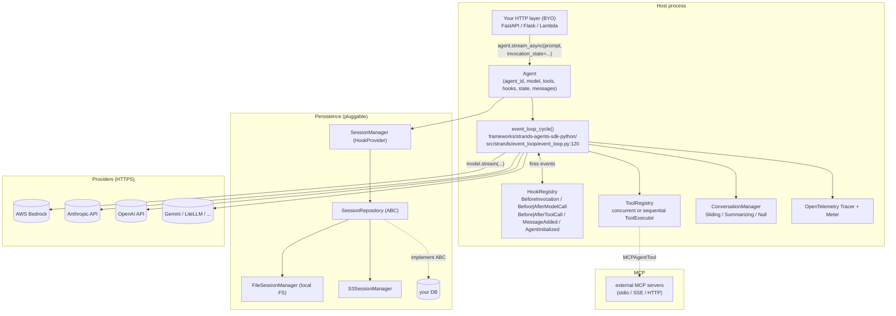

# Strands Agents Python — Benchmark Study

> **Repos**:
> - SDK: https://github.com/strands-agents/sdk-python
> - Tools: https://github.com/strands-agents/tools
>
> **Commits studied**:
> - sdk-python @ `1232230daa4385fd6470be29013eb2375d7a307c` (branch `main`)
> - tools @ `1cff7dd536da108595ff7ded0836ec4f93928468` (branch `main`)
>
> **Framework paths**:
> - `frameworks/strands-agents-sdk-python/`
> - `frameworks/strands-agents-tools/`
>
> **Studied on**: 2026-05-16

---

## TL;DR

- ⭐ **In-process Python library**: Strands is a model-driven Python SDK. The agent loop is a pure-Python `async` generator (`event_loop_cycle`) — no subprocess, no bundled binary, no vendor cloud. The host owns the runtime; everything runs in your worker.
- **Owner / license / support**: Apache-2.0, maintained by AWS (`AWS, opensource@amazon.com` in `pyproject.toml`). Bedrock is the default provider, but the SDK is genuinely multi-provider. Community support via Discord + GitHub Issues; no paid Strands offering, but the broader AWS ecosystem backs it.
- **Maturity**: classified `Development Status :: 5 - Production/Stable` in `pyproject.toml`. PyPI package `strands-agents`, requires Python ≥3.10. Sister repos: `strands-agents-tools`, `strands-agents/agent-builder`, `strands-agents/mcp-server`, `strands-agents/samples`. No in-repo `CHANGELOG.md` — release notes are on GitHub Releases.
- **Where the loop runs**: `src/strands/event_loop/event_loop.py:120` — `event_loop_cycle()` is the canonical ReAct loop, fully async, yields a `TypedEvent` stream. Sub-agents are either tools (`as_tool()`) or first-class `multiagent/{graph,swarm}.py` orchestrators.
- **Strongest fit for our use case**: very clean hook system (`hooks/events.py:134` `BeforeToolCallEvent.selected_tool` and `.tool_use` are writable — exactly the "force tool args" capability we want); ergonomic skill loader (`vended_plugins/skills/agent_skills.py`) that mirrors the Claude SKILL.md format with progressive disclosure via XML injection + activation tool.
- **Weakest gap**: no first-party HTTP/network surface (other than the optional A2A server in `multiagent/a2a/`). No SSE/WebSocket streaming protocol, no resume endpoint, no HITL approval endpoint. You build the API yourself on top of `agent.stream_async()`.
- **Most surprising finding** (good): `Agent` has a hard `_invocation_lock` that *refuses* concurrent invocations by default (`agent/agent.py:823`) — explicit concurrency model rather than a foot-gun. For multi-tenant servers this means **one Agent instance per session**, not a shared pool. Surprising (bad): there is no built-in tenant-id concept anywhere in the session / agent schema.
- One-liner verdicts:
  - **Sessions/persistence**: 🟢 first-class `SessionManager` + repository interface, file & S3 implementations shipped.
  - **Skills**: 🟢 first-class plugin (`vended_plugins/skills`), AgentSkills.io spec compatible.
  - **Resource manager**: 🔴 None — local FS / HTTPS URL only; no registry layer.
  - **Sub-agents**: 🟢 three patterns (agent-as-tool, `Graph`, `Swarm`); parallel via `asyncio`.
  - **Multi-tenancy**: 🟡 BYO — no tenant field on session/agent, but `invocation_state` + hooks let you bolt it on.
  - **Hooks**: 🟢 typed events + `_can_write` machinery; `BeforeToolCallEvent.tool_use` mutability enables forced args.
  - **API**: 🔴 library-only (A2A optional, but for inter-agent comms, not user-facing).
  - **Observability**: 🟢 OTel-native (`telemetry/tracer.py`), per-cycle spans, GenAI semconv attrs.
- **Production readiness for multi-tenant server**: viable for "small N tenants, embed-and-build" — you must implement: HTTP layer, tenant scoping, resource registry, cost rollup. The loop itself is solid.

---

## 0. Architectural Overview & Deployment Model

### Deployment topology (typical pattern)

```
┌───────────────────────────────────────────────────────────┐
│                    Host process (your code)               │
│  ┌─────────────────────────────────────────────────────┐  │
│  │ FastAPI / Flask / Lambda / etc. (BYO)               │  │
│  │   │                                                 │  │
│  │   ▼                                                 │  │
│  │ Agent(...)  ◀── one instance per session            │  │
│  │   │  invoke_async()  /  stream_async()              │  │
│  │   │                                                 │  │
│  │   ▼                                                 │  │
│  │ event_loop_cycle()  (pure Python async gen)         │  │
│  │   │     │     │      │                              │  │
│  │   │     │     │      └─▶ ToolExecutor → AgentTool   │  │
│  │   │     │     │              (incl. MCPAgentTool)   │  │
│  │   │     │     └─▶ Hooks (PreToolUse, PreModel, …)   │  │
│  │   │     └─▶ ConversationManager (sliding/summary)   │  │
│  │   └─▶ Model.stream(...) ──HTTPS──▶ Bedrock/Anthr…   │  │
│  └─────────────────────────────────────────────────────┘  │
│                  │                                        │
│                  ▼                                        │
│  ┌─────────────────────────────────────────────────────┐  │
│  │ SessionManager (optional)                           │  │
│  │   ├─ FileSessionManager     → local FS              │  │
│  │   ├─ S3SessionManager       → s3://…                │  │
│  │   └─ (BYO via SessionRepository ABC)                │  │
│  └─────────────────────────────────────────────────────┘  │
│                  │                                        │
│                  ▼                                        │
│  ┌─────────────────────────────────────────────────────┐  │
│  │ OTel tracer + meter (optional OTLP export)          │  │
│  └─────────────────────────────────────────────────────┘  │
└───────────────────────────────────────────────────────────┘
                  │
                  ▼
         External MCP servers (stdio / SSE / streamable HTTP)
```

### Answers

- **0.1 What is this stack?** A Python **library** (in-process SDK). Not a server, not a vendor cloud. You import `from strands import Agent` and embed it.
- **0.2 Project status & governance** — Open-source under Apache-2.0 (`LICENSE`). Maintained by AWS (`pyproject.toml:14-15`). Community/Discord (`https://discord.gg/strands`) + GitHub Issues; no commercial Strands cloud, but a sibling repo `strands-agents/agent-builder` provides a CLI dev experience and Bedrock is the default model provider.
- **0.3 Project maturity / age** — `Development Status :: 5 - Production/Stable` in `pyproject.toml:18`. Version is dynamic from git tags (`pyproject.toml:96` `source = "vcs"`). The README references `https://strandsagents.com/` for docs. The history reference in `repository_session_manager.py:240` mentions "Before 1.15.0, strands had a bug…" indicating the SDK is at ≥1.x. Submodule is a shallow clone (only one commit fetched), so exhaustive release-history listing was not possible offline.
- **0.4 Adoption & community signal** — captured via README badges only (live counts not available offline). README badges link to GitHub commit-activity, issues, PRs, PyPI versions, Python versions, and Discord; the repo has dedicated sister repos for tools, samples, mcp-server, agent-builder. Numbers should be re-captured live at study time.
- **0.5 Ecosystem fit** — Python ≥3.10 (`pyproject.toml:11`). Packages: `strands-agents`, `strands-agents-tools` (companion repo). Examples / samples live in `strands-agents/samples`. Used primarily as a library; A2A FastAPI server is optional (`multiagent/a2a/server.py:1-46`).
- **0.6 Where the agent loop actually executes** — In your Python process. The canonical loop is `frameworks/strands-agents-sdk-python/src/strands/event_loop/event_loop.py:120` (`event_loop_cycle`), called from `agent/agent.py:983` (`Agent._execute_event_loop_cycle`). No subprocess, no bundled binary. **This is the most important architectural fact**: Strands is closer to LangGraph/Vercel AI SDK style (loop runs here) than to Claude Agent SDK Python (loop runs in Node).
- **0.7 Runtime dependencies** — Mandatory: Python ≥3.10, `boto3`, `botocore`, `docstring_parser`, `jsonschema`, `mcp`, `pydantic`, `pyyaml`, `watchdog`, `opentelemetry-api`/`sdk`/`instrumentation-threading` (`pyproject.toml:29-43`). Optional extras: `anthropic`, `gemini`, `litellm`, `llamaapi`, `mistral`, `ollama`, `openai`, `writer`, `sagemaker`, `a2a`, `bidi` (`pyproject.toml:46-79`). No mandatory DB.
- **0.8 Recommended deployment topology** — Not prescribed by the SDK. The docs page (`https://strandsagents.com/docs/user-guide/deploy/operating-agents-in-production/`, referenced from `README.md:309`) is the official guide. The concurrency lock in `agent/agent.py:823` (`ConcurrencyException` raised if a second `stream_async` enters the same `Agent`) effectively pushes you toward **one `Agent` instance per active session**.
- **0.9 Cold-start cost & instance footprint** — Construction is light: `Agent.__init__` initializes `ToolRegistry`, `HookRegistry`, `EventLoopMetrics`, the OTel tracer (`agent/agent.py:271-302`); ~Python-import cost from boto3/pydantic dominates. No 20–30 s subprocess warm-up like Claude Agent SDK Python.
- **0.10 Vendor lock-in** — LLM lock-in: **low** (12+ providers in `src/strands/models/` — Bedrock, Anthropic, OpenAI, Gemini, LiteLLM, Llama, Llama.cpp, Mistral, Ollama, SageMaker, Writer, OpenAI Responses). Hosting lock-in: **low** (pure Python). Eval-platform lock-in: **low** (no built-in eval).
- **0.11 Framework weight / footprint** — Medium-light. ~30 sub-modules under `src/strands/` (agent, event_loop, hooks, multiagent, session, tools, models, telemetry, types, plugins, vended_plugins, experimental). Bundles: tool registry with hot-reload, MCP client/instrumentation, three multi-agent orchestrators (Graph/Swarm/A2A), OTel-native telemetry, FileSession+S3Session, sliding+summarizing conversation managers, two checkpoint mechanisms (`take_snapshot`/`load_snapshot` and `experimental/checkpoint`), interrupt system, plugin system with `@hook`/`@tool` decorators, AgentSkills plugin.
- **0.12 Release-history signal** — No `CHANGELOG.md` / `RELEASES.md` in the SDK repo; release notes live on GitHub Releases. The tip commit on `main` (`1232230`) is `feat: bump starlette dependency to 1.x (#2297)`. Internal code comments reference past versions ("Before 1.15.0, strands had a bug where they persisted sessions with a potentially broken messages array" — `repository_session_manager.py:240`).
- **0.13 Documentation depth & cross-team contributor accessibility** — English docs at `https://strandsagents.com/`. In-repo `docs/` contains `HOOKS.md`, `MCP_CLIENT_ARCHITECTURE.md`, `PR.md`, `STYLE_GUIDE.md`, `README.md`. Non-engineer skill authors *can* drop `SKILL.md` files in a directory and the AgentSkills plugin picks them up (`vended_plugins/skills/skill.py:383-424` `from_directory`). However there is no UI authoring layer in the SDK; that lives in the separate `agent-builder` repo.
- **0.14 Documentation entry points** —
  - Docs landing: `https://strandsagents.com/`
  - Quickstart: `https://strandsagents.com/docs/user-guide/quickstart/`
  - API reference: `https://strandsagents.com/docs/api/python/strands.agent.agent/`
  - Production / deployment: `https://strandsagents.com/docs/user-guide/deploy/operating-agents-in-production/`
  - Agent loop guide: `https://strandsagents.com/docs/user-guide/concepts/agents/agent-loop/`
  - Examples / demos: `https://github.com/strands-agents/samples`
  - GitHub Releases: `https://github.com/strands-agents/sdk-python/releases`
  - Issues: `https://github.com/strands-agents/sdk-python/issues`
  - Discord: `https://discord.gg/strands`
  - Tools repo: `https://github.com/strands-agents/tools`
  - MCP server companion: `https://github.com/strands-agents/mcp-server`
  - Agent builder (CLI dev UX): `https://github.com/strands-agents/agent-builder`

---

## 1. Agent Harness (Run Loop) & Message Taxonomy

### Run loop

- **1.1 Run loop entrypoint(s)** — Public surface lives on `Agent` (`agent/agent.py:109`):
  - `Agent.__call__(prompt, *, invocation_state=None, structured_output_model=None, ...) → AgentResult` (`agent/agent.py:468-513`) — sync wrapper around `invoke_async` via `run_async()`.
  - `Agent.invoke_async(prompt, *, invocation_state=None, ...) → AgentResult` (`agent/agent.py:515-561`) — drains `stream_async`.
  - `Agent.stream_async(prompt, *, invocation_state=None, ...) → AsyncIterator[dict[str, Any]]` (`agent/agent.py:772-881`) — primary async streaming entrypoint, yields raw event dicts.

  Signature highlight:
  ```python
  # agent/agent.py:772-779
  async def stream_async(
      self,
      prompt: AgentInput = None,
      *,
      invocation_state: dict[str, Any] | None = None,
      structured_output_model: type[BaseModel] | None = None,
      structured_output_prompt: str | None = None,
      **kwargs: Any,
  ) -> AsyncIterator[Any]:
  ```

  `AgentInput = str | list[ContentBlock] | list[InterruptResponseContent] | Messages | None` (`types/agent.py:12`).

- **1.2 Per-iteration behavior** — `event_loop_cycle` (`event_loop/event_loop.py:120-282`) for one cycle:
  1. Emit `StartEvent`, `StartEventLoopEvent`.
  2. If `_interrupt_state.activated` → reuse stashed tool-use message; else if last message is already a tool-use → reuse; else run `_handle_model_execution` which calls `stream_messages(model, system_prompt, messages, tool_specs, …)`.
  3. Fire `BeforeModelCallEvent` and `AfterModelCallEvent` hooks (`event_loop.py:377-423`).
  4. Append assistant message + metadata.
  5. If `stop_reason == "tool_use"` → `_handle_tool_execution` (`event_loop.py:490-647`); else if `"max_tokens"` → raise `MaxTokensReachedException`; else end cycle and yield `EventLoopStopEvent`.
  6. Tool execution dispatches via `agent.tool_executor._execute(...)` (`event_loop.py:578`), which fires `BeforeToolCallEvent` / `AfterToolCallEvent`, appends a `user`-role tool-result message, then recurses via `recurse_event_loop`.

- **1.3 ReAct loop** — Shipped. The recursion happens in `recurse_event_loop` (`event_loop.py:285-321`), called after every tool execution batch. The "model-driven approach" tagline from the README means: tools, agent-as-tool sub-agents, and conversation-manager-driven compaction are all hooked into this single loop.

- **1.4 Tool dispatch + result handling** — `ToolExecutor._stream` (`tools/executors/_executor.py:93-289`):
  - Looks up tool in `agent.tool_registry.dynamic_tools` then `agent.tool_registry.registry` (`_executor.py:127-128`).
  - Fires `BeforeToolCallEvent` — hook can swap `selected_tool`, mutate `tool_use`, or set `cancel_tool` (`hooks/events.py:152-158`, `_executor.py:153-183`).
  - Calls `selected_tool.stream(tool_use, invocation_state, **kwargs)` — an `AsyncGenerator` that may yield intermediate events ending with `ToolResultEvent` (`_executor.py:227-256`).
  - Fires `AfterToolCallEvent`; if the hook sets `retry=True`, loops back to retry (`_executor.py:262-265`).
  - `tool_results` list is appended to and ultimately collapsed into a single `user`-role message with one `toolResult` content block per tool (`event_loop.py:617-625`).

- **1.5 Explicit turn concept** — One `event_loop_cycle` ≈ one model call + zero-or-more tool calls. The loop continues until `stop_reason ∈ {"end_turn", "max_tokens", "cancelled", "interrupt", "stop_sequence"}` and no further tool use is requested, at which point `EventLoopStopEvent` is yielded (`event_loop.py:267`). Each tool batch recurses into a fresh cycle.

- **1.6 Event emission mechanism (in-process)** — Pure async generator. `Agent._run_loop` (`agent/agent.py:883-960`) yields `TypedEvent` instances; `stream_async` then routes each event through `event.prepare(invocation_state=...)` and `callback_handler(**event.as_dict())` (`agent/agent.py:857-868`). Network streaming is BYO (Q6).

### Message & event taxonomy

- **1.7 Message layers** — Two layers:
  1. **`Message`** (`types/content.py`): the model-facing format (Bedrock-shaped). Roles `user|assistant`, content is `list[ContentBlock]` with `text|toolUse|toolResult|reasoningContent|citationsContent|image|document|guardContent|cachePoint|interruptResponse|...`.
  2. **`TypedEvent`** (`types/_events.py:28`): the in-process event stream wrapping incremental updates *around* the message lifecycle (stream chunks, start/stop boundaries, tool stream events, etc.).
  Conversion happens in `event_loop/streaming.py` which assembles chunks into a final `Message` and emits the `ModelStopReason` typed event.

- **1.8 Concrete message content blocks** (`types/content.py`): `text`, `toolUse`, `toolResult`, `image`, `document`, `reasoningContent`, `citationsContent`, `cachePoint`, `interruptResponse`, `guardContent`, `redactContent` (model-side signal handled in `agent/agent.py:927-935`).

- **1.9 Messages vs. events** — Two separate vocabularies. Messages are the durable conversation state (`agent.messages`); events are transient yields from `stream_async`. The bridge: certain typed events *carry* a message (e.g. `ModelMessageEvent`, `ToolResultMessageEvent`); the loop is responsible for appending those messages to `agent.messages` and firing `MessageAddedEvent` to session managers (`event_loop.py:477-478`, `agent/agent.py:1120-1124`).

- **1.10 Event categories** — From `types/_events.py`:
  - Lifecycle: `InitEventLoopEvent` (very start), `StartEvent` (deprecated alias), `StartEventLoopEvent`, `EventLoopStopEvent`, `AgentResultEvent`, `ForceStopEvent`.
  - Model stream: `ModelStreamChunkEvent`, `ModelStreamEvent`, `ToolUseStreamEvent`, `TextStreamEvent`, `CitationStreamEvent`, `ReasoningTextStreamEvent`, `ReasoningRedactedContentStreamEvent`, `ReasoningSignatureStreamEvent`, `ModelStopReason`, `ModelMessageEvent`.
  - Tool: `ToolResultEvent`, `ToolStreamEvent`, `AgentAsToolStreamEvent`, `ToolCancelEvent`, `ToolInterruptEvent`, `ToolResultMessageEvent`.
  - Structured output: `StructuredOutputEvent`.
  - Throttle: `EventLoopThrottleEvent`.
  - Multi-agent: `MultiAgentResultEvent`, `MultiAgentNodeStartEvent`, `MultiAgentNodeStopEvent`, `MultiAgentHandoffEvent`, `MultiAgentNodeStreamEvent`, `MultiAgentNodeCancelEvent`, `MultiAgentNodeInterruptEvent`.
  - Hook events: `AgentInitializedEvent`, `BeforeInvocationEvent`, `AfterInvocationEvent`, `MessageAddedEvent`, `BeforeToolCallEvent`, `AfterToolCallEvent`, `BeforeModelCallEvent`, `AfterModelCallEvent` (and multi-agent variants in `hooks/events.py:311-409`).

- **1.11 Canonical type-definition file(s)** —
  - Events: `frameworks/strands-agents-sdk-python/src/strands/types/_events.py`
  - Messages / content: `frameworks/strands-agents-sdk-python/src/strands/types/content.py`
  - Tool types: `frameworks/strands-agents-sdk-python/src/strands/types/tools.py`
  - Session types: `frameworks/strands-agents-sdk-python/src/strands/types/session.py`
  - Hook events: `frameworks/strands-agents-sdk-python/src/strands/hooks/events.py`

- **1.12 Live agentic event stream taxonomy** — A typical streamed run yields (in order):
  - `{"init_event_loop": True, "invocation_state": {...}}` (`InitEventLoopEvent`)
  - `{"start": True}` (deprecated `StartEvent`)
  - `{"start_event_loop": True}`
  - `{"event": {"messageStart": {"role": "assistant"}}}` (raw `ModelStreamChunkEvent`)
  - Text deltas: `{"data": "Hello", "delta": {...}}` (`TextStreamEvent`)
  - Tool-use deltas: `{"type": "tool_use_stream", "delta": {...}, "current_tool_use": {"toolUseId": "tu_1", "name": "topicSearch", "input": "..."}}` (partial JSON; ⭐ this is how Strands streams tool-arg-building)
  - `{"message": {"role": "assistant", "content": [{"toolUse": {...}}], "metadata": {"usage": {...}, "metrics": {...}}}}` (`ModelMessageEvent`)
  - `{"type": "tool_stream", "tool_stream_event": {"tool_use": {...}, "data": "..."}}` (`ToolStreamEvent` if the tool yields intermediate progress)
  - `{"message": {"role": "user", "content": [{"toolResult": {...}}]}}` (`ToolResultMessageEvent`)
  - Final: `{"result": AgentResult(stop_reason=..., message=..., metrics=..., state=..., interrupts=None, structured_output=None)}` (`AgentResultEvent`)

---

## 2. Agent Runtime (Multi-session Host)

- **2.1 Multi-session host architecture** — There is **no shipped multi-session runtime**. `Agent` is the unit, and `Agent.stream_async` has a `threading.Lock` that *throws* `ConcurrencyException` if two invocations enter the same instance (`agent/agent.py:823-828`). The runtime is "you embed `Agent` in your own server and decide on the per-process / per-tenant / per-conversation strategy."
- **2.2 Concurrent session isolation** — Each `Agent` holds its own `messages: Messages`, `state: AgentState`, `tool_registry`, `hooks`, `_invocation_lock`, `_interrupt_state`, `_model_state`, `event_loop_metrics`, `tracer/trace_span`. Two `Agent` instances do not share state by construction. The `ConcurrentInvocationMode.UNSAFE_REENTRANT` mode skips the lock for advanced use cases (`types/agent.py:15-28`, `agent/agent.py:213-216`) — opt-in foot-gun.
- **2.3 Horizontal scaling / multi-instance** — Stateless workers are the obvious pattern: keep `Agent` instances ephemeral and rehydrate from a shared `SessionRepository` (`session/session_repository.py:12`). The SDK ships `FileSessionManager`, `S3SessionManager`, and `RepositorySessionManager` (`session/__init__.py`). No leader election or cluster-aware coordination — the SDK is unopinionated.
- **2.4 Background / async / scheduled tasks** — Not provided — BYO. The library is invocation-driven; nothing schedules cron or webhook triggers. (`strands-agents-tools` ships a `cron.py` tool that the *agent* can use, but that's tool-side, not runtime-side.)
- **2.5 Worker pool / queue model** — Not provided — BYO. There is a `ConcurrentToolExecutor` (`tools/executors/concurrent.py:19`) that parallelizes *tool calls within one cycle*, but no inter-session queue.

---

## 3. Sessions & Persistence

- **3.1 Session / chat data model** — Three dataclasses in `types/session.py`:

  ```python
  # types/session.py:194-210
  @dataclass
  class Session:
      session_id: str
      session_type: SessionType            # only AGENT defined today
      created_at: str
      updated_at: str
  ```

  ```python
  # types/session.py:107-124
  @dataclass
  class SessionAgent:
      agent_id: str
      state: dict[str, Any]                # user state
      conversation_manager_state: dict[str, Any]
      _internal_state: dict[str, Any]      # interrupt_state, model_state
      created_at: str
      updated_at: str
  ```

  ```python
  # types/session.py:58-74
  @dataclass
  class SessionMessage:
      message: Message
      message_id: int                      # index in conversation
      redact_message: Message | None
      created_at: str
      updated_at: str
  ```

  Note: there is **no `tenant_id`, `user_id`, `cwd`, `parent_session_id`, `summary`, or `metadata` field** on either `Session` or `SessionAgent`. Tenant identity is BYO — typically stuffed in `agent.state` (a JSON-serializable dict) or in `invocation_state` (Q4).

- **3.2 What's stored on a session** — Messages (with redacted variants), agent state (user JSON dict), conversation-manager state, interrupt state, and model state. No scratchpad files, no attachments-by-reference; large blobs are encoded inline as base64 via `encode_bytes_values()` (`types/session.py:28-40`).
- **3.3 Granularity** — Single linear conversation per `(session_id, agent_id)` pair. No branching/forking primitive. Multi-agent sessions are explicitly supported via `MultiAgentBase.deserialize_state` (`session/repository_session_manager.py:309-337`), but each agent under a session has its own message log.
- **3.4 Built-in persistence stores** —
  - `FileSessionManager` (`session/file_session_manager.py:27`): writes JSON files to a local dir; layout `session_<id>/agents/agent_<aid>/messages/message_<i>.json`.
  - `S3SessionManager` (`session/s3_session_manager.py`): same hierarchy on S3.
  - `RepositorySessionManager` (`session/repository_session_manager.py:28`) — abstract base requiring a `SessionRepository`.
  - **BYO** for Postgres/Redis: implement `SessionRepository` (`session/session_repository.py:12-66`).
- **3.5 Persistence timing** — Driven by hooks (`session/session_manager.py:40-56`):
  - `AgentInitializedEvent` → `initialize(agent)` — restore messages/state.
  - `MessageAddedEvent` → `append_message(message)` *and* `sync_agent(agent)` — fires every time `agent.messages.append(...)` is mediated by `_append_messages()` (`agent/agent.py:1120`).
  - `AfterInvocationEvent` → `sync_agent(agent)` — final flush.
  - `sync_agent` (`session/repository_session_manager.py:102-167`) compares versions and skips write if nothing changed. Writes are **synchronous** (no debounce, no async batch); whether they are durable depends on the repository.
- **3.6 Mid-run checkpointing (durable)** — `experimental/checkpoint/checkpoint.py:1-80` ships an experimental checkpoint dataclass with `position ∈ {"after_model", "after_tools"}`. The user-facing protocol mirrors interrupts: stop with `stop_reason="checkpoint"`, snapshot in `AgentResult.checkpoint`, resume via a `checkpointResume` content block on next call. **Per-tool mid-cycle checkpointing is not built-in** — comment in `checkpoint.py:30-32`: "Per-tool granularity within a cycle requires a custom ToolExecutor (e.g. TemporalToolExecutor)."
- **3.7 Session ID format** — Caller-provided string; validated by `_identifier.validate(...)` (`session/file_session_manager.py:72`) to reject path-separator characters. No prefixing or hashing.
- **3.8 Pluggable store interface** — Yes. `SessionRepository` ABC (`session/session_repository.py:12-66`) defines `create/read/update_session|agent|message`, `list_messages(limit, offset)`, plus optional multi-agent methods. `RepositorySessionManager` ties an arbitrary repository to the standard hook-based persistence flow.
- **3.9 Schema evolution / migration** — Minimal. Two version-aware hooks:
  - `Snapshot.schema_version` for `take_snapshot()`/`load_snapshot()` (currently `"1.0"`, `types/_snapshot.py`).
  - `_fix_broken_tool_use` (`session/repository_session_manager.py:245-307`) — retroactive fix for sessions persisted by pre-1.15.0 versions with orphaned `toolUse` content.
  No automated DB migrations.
- **3.10 Export / replay** — `Agent.take_snapshot(preset="session", include=[...], exclude=[...], app_data={...})` returns a `Snapshot` dataclass (`agent/agent.py:1126-1170`) capturing `messages`, `state`, `conversation_manager_state`, `interrupt_state`, `system_prompt`. `Agent.load_snapshot(snapshot)` restores them (`agent/agent.py:1172-1196`). The `experimental/checkpoint/checkpoint.py` wraps this for durable pause/resume.
- **3.11 Cross-session memory** — Not first-class. Memory must be implemented as a tool (see `strands-agents-tools/src/strands_tools/mem0_memory.py`, `agent_core_memory.py`, `elasticsearch_memory.py`, `mongodb_memory.py`). Cross-reference Q15.

---

## 4. Multi-tenancy & Arbitrary Context ⭐

### Answers

- **4.1 Full run-loop input struct** — `Agent.stream_async(prompt, *, invocation_state=None, structured_output_model=None, structured_output_prompt=None, **kwargs)` (`agent/agent.py:772-779`). The closest thing to a "context struct" is the `invocation_state: dict[str, Any]` — a free-form JSON dict that flows into hooks and tool calls. **There is no first-class `tenant_id` / `user_id` / `locale` field**. You either:
  - Stuff it in `invocation_state={"tenant_id": "acme", ...}` for the duration of the call, or
  - Persist it on `agent.state` (which lives on `SessionAgent.state`).

- **4.2 Context propagation into a tool call** — `invocation_state` is forwarded to the tool through the executor (`tools/executors/_executor.py:138-149`):
  ```python
  invocation_state.update({
      "agent": agent,
      "model": agent.model,
      "messages": agent.messages,
      "system_prompt": agent.system_prompt,
      "tool_config": ToolConfig(...),  # backwards compat
  })
  ```
  Each tool's `stream(tool_use, invocation_state, **kwargs)` receives it (`types/tools.py:258-272`). For decorated tools, the framework wraps it into a `ToolContext` (`types/tools.py:130-162`) if the function signature requests one.

- **4.3 Tool call interface** — Two flavors:
  - **Class-based**, implementing `AgentTool` (`types/tools.py:212-300`):
    ```python
    # types/tools.py:258-272
    @abstractmethod
    def stream(self, tool_use: ToolUse, invocation_state: dict[str, Any], **kwargs: Any) -> ToolGenerator:
        """Yield tool events with the last being the tool result."""
    ```
  - **Decorated functions** (`tools/decorator.py`):
    ```python
    @tool(context=True)
    def topic_search(self, query: str, tool_context: ToolContext) -> str:
        tenant_id = tool_context.invocation_state.get("tenant_id")  # caller-supplied
        agent = tool_context.agent
        ...
    ```
    See `tools/decorator.py:404-412` for the `ToolContext` injection mechanism, and `vended_plugins/skills/agent_skills.py:113-122` for a real-world example.

- **4.4 Forcing tool arguments from the harness** — ⭐ **Yes, fully supported.** `BeforeToolCallEvent.tool_use` is writable (`hooks/events.py:157`: `_can_write(name) → name in ["cancel_tool", "selected_tool", "tool_use"]`). A hook can rewrite `tool_use["input"]` before dispatch, and the executor re-reads the (potentially mutated) `tool_use` after the hook returns (`tools/executors/_executor.py:186-189`):
  ```python
  selected_tool = before_event.selected_tool
  tool_use = before_event.tool_use
  invocation_state = before_event.invocation_state
  ```
  This is the canonical mechanism to overwrite/inject `tenantId` regardless of what the LLM produced. Equivalent to Claude Agent SDK's `PreToolUse → updatedInput`.

- **4.5 Filtering visible tools** — Done at construction time via `Agent(tools=[...])`. There is **no first-class per-turn `activeTools` / `prepareStep`** equivalent. Workarounds:
  - Construct one `Agent` per tenant with only the allowed subset.
  - Mutate `agent.tool_registry.registry` / `dynamic_tools` between turns (the registry is a plain dict on `tools/registry.py:40-44`).
  - Use `MCPClient.ToolFilters({"allowed": [...], "rejected": [...]})` (`tools/mcp/mcp_client.py:69-78`) for MCP-sourced tools at load time.
  - Use `BeforeToolCallEvent.selected_tool = None` to veto an attempted tool call mid-run.
  Filtering visible tools *to the LLM* per turn is not exposed; the entire `agent.tool_registry.get_all_tool_specs()` is passed to `stream_messages` (`event_loop.py:389`).

- **4.6 Tenant scope on session** — **Not provided.** Neither `Session`, `SessionAgent`, nor `SessionMessage` carry a tenant column (`types/session.py`). You must encode tenancy in `session_id` (e.g. `"acme:user-123:thread-abc"`) and/or in `agent.state`.

- **4.7 Per-tool-call auth propagation** — Whatever you stash in `invocation_state` (and/or `agent.state`) is automatically forwarded to every tool via the `invocation_state.update(...)` in `tools/executors/_executor.py:138-149`. There is no first-class JWT / OAuth identity object — you build that.

- **4.8 Resource scoping primitives** — None at registration time. The `tool_registry` is a flat global dict (`tools/registry.py:32-44`). Tenant/user scoping must be enforced at the hook layer (e.g. a `BeforeToolCallEvent` callback that inspects `invocation_state["tenant_id"]` and blocks tools not in the tenant's allowlist).

- **4.9 Per-tenant rate limit + budget cap** — **Not provided — BYO.** `EventLoopMetrics.update_usage` (`telemetry/metrics.py:352`) tracks tokens at the agent instance level; you must aggregate per-tenant and enforce caps yourself in a hook.

### ⭐ Light usage example

```python
from strands import Agent
from strands.hooks import BeforeToolCallEvent, BeforeInvocationEvent

# 1. Per-tenant agent factory (whitelist tools at construction)
def build_acme_agent():
    from my_tools import topic_search, iab_search, audience_create
    return Agent(
        agent_id="acme-thread-42",
        tools=[topic_search, iab_search, audience_create],  # bashExec/webFetch NOT registered
        hooks=[force_tenant_id, inject_tenant_state],
    )

# 2. Force tool args at the harness layer
def force_tenant_id(event: BeforeToolCallEvent) -> None:
    if event.tool_use["name"] == "topicSearch":
        event.tool_use["input"]["tenantId"] = "acme"  # writable; overrides LLM

# 3. Make tenant context accessible everywhere
def inject_tenant_state(event: BeforeInvocationEvent) -> None:
    event.invocation_state.setdefault("tenant_id", "acme")
    event.invocation_state.setdefault("user_id", "u-123")
    event.invocation_state.setdefault("targeting_strategy_id", "strat-42")

agent = build_acme_agent()
result = agent("Find topics about hiking",
               invocation_state={"tenant_id": "acme",
                                 "user_id": "u-123",
                                 "targeting_strategy_id": "strat-42"})
```

Step 1 (`tenantId`/`userId`/`targetingStrategyId` into the run loop): ✅ via `invocation_state`.
Step 2 (only `topicSearch`/`iabSearch`/`audienceCreate` visible): ✅ via constructor whitelist. Per-turn dynamic filtering is **BYO** (mutate `agent.tool_registry.registry` or replace agent per turn).
Step 3 (force `tenantId=acme` server-side regardless of LLM): ✅ via `BeforeToolCallEvent.tool_use` mutation (`hooks/events.py:157`, `tools/executors/_executor.py:186-189`).

---

## 5. Hook & Middleware Capabilities (Context Engineering)

### Hook fire-points diagram

```
Agent.__init__()
   └─▶ AgentInitializedEvent           (sync only; session_manager.initialize() etc.)

Agent.stream_async()
   ├─▶ BeforeInvocationEvent           [writable: messages]
   │   └── for each cycle:
   │       │
   │       ├─▶ BeforeModelCallEvent    [read-only; carries projected_input_tokens]
   │       ├── model.stream(...) ──────▶ ModelStreamChunkEvent, TextStreamEvent, ...
   │       ├─▶ AfterModelCallEvent     [writable: retry; reverse order]
   │       │
   │       ├─▶ MessageAddedEvent       (assistant message appended)
   │       │
   │       ├── if stop_reason == "tool_use":
   │       │     for each tool_use (concurrent by default):
   │       │       ├─▶ BeforeToolCallEvent   [writable: cancel_tool, selected_tool, tool_use; supports Interrupt]
   │       │       ├── selected_tool.stream(...) ───▶ ToolStreamEvent*
   │       │       ├─▶ AfterToolCallEvent    [writable: result, retry; reverse order]
   │       │       └─▶ MessageAddedEvent     (tool-result user message)
   │       │     └─▶ recurse_event_loop()
   │       │
   │       └─▶ (loop terminates) EventLoopStopEvent
   │
   └─▶ AfterInvocationEvent            [writable: resume → re-invokes the agent]

Multi-agent (Graph / Swarm):
   MultiAgentInitializedEvent
   BeforeMultiAgentInvocationEvent
   ├── per node:
   │   ├─▶ BeforeNodeCallEvent         [writable: cancel_node; supports Interrupt]
   │   ├── (the node's own Agent loop runs above)
   │   └─▶ AfterNodeCallEvent          [reverse]
   AfterMultiAgentInvocationEvent      [reverse]
```

### Answers

- **5.1 Enumerate every hook / middleware / lifecycle callback** — From `hooks/events.py` and `experimental/hooks/events.py`:

| Event | Fires when | Writable | Notes |
|---|---|---|---|
| `AgentInitializedEvent` | end of `Agent.__init__` | – | sync only (`hooks/registry.py:227-228`) |
| `BeforeInvocationEvent` | start of every `stream_async` cycle (per-cycle) | `messages` | `hooks/events.py:39-63` |
| `AfterInvocationEvent` | end of every cycle, after `conversation_manager.apply_management` | `resume` (AgentInput) | reverse order; setting `resume` re-invokes (`agent/agent.py:952-960`) |
| `MessageAddedEvent` | after each message appended to `agent.messages` | – | `hooks/events.py:114-130` |
| `BeforeModelCallEvent` | before `model.stream(...)` | – | exposes `projected_input_tokens` |
| `AfterModelCallEvent` | after model returns | `retry` | reverse order; retry loops the model call |
| `BeforeToolCallEvent` | before each tool dispatch | `cancel_tool`, `selected_tool`, `tool_use` | `_Interruptible` — can raise `InterruptException` |
| `AfterToolCallEvent` | after each tool completes | `result`, `retry` | reverse order; retry discards `result` and re-runs |
| `MultiAgentInitializedEvent` | Graph/Swarm init | – | |
| `BeforeMultiAgentInvocationEvent` | Graph/Swarm before run | – | |
| `BeforeNodeCallEvent` | per Graph/Swarm node | `cancel_node` | interrupt-capable |
| `AfterNodeCallEvent` | per Graph/Swarm node | – | reverse |
| `AfterMultiAgentInvocationEvent` | Graph/Swarm end | – | reverse |
| Bidi events: `BidiAgentInitializedEvent`, `BidiMessageAddedEvent`, `BidiBeforeToolCallEvent`, `BidiAfterToolCallEvent`, `BidiAfterInvocationEvent` | experimental bidirectional streaming | varies | `experimental/hooks/events.py` |

  Hook callbacks may be **sync or async** (`hooks/registry.py:301-306`) except `AgentInitializedEvent` which must be sync.

- **5.2 Hook concurrency model** — Sequential. `invoke_callbacks_async` iterates callbacks in registration order (or reversed for `should_reverse_callbacks=True` events) and awaits each one in turn (`hooks/registry.py:299-318`). Multiple `InterruptException`s are aggregated by unique name.

- **5.3 Specific capability tests** (with code references):
  - **Inject system messages at session start** — ✅ via `BeforeInvocationEvent.messages` (writable). Or, more idiomatic for tenant/locale, set `agent.system_prompt = [{"text": ...}, {"cachePoint": {...}}]` in a `BeforeInvocationEvent` hook (the AgentSkills plugin does exactly this: `vended_plugins/skills/agent_skills.py:136-184`).
  - **Expand the user input (slash commands, time-stamp, attachments)** — ✅ via `BeforeInvocationEvent.messages` mutation before the cycle starts (`hooks/events.py:60-63`, `agent/agent.py:907-909`).
  - **Mutate the messages list before each LLM call (cache breakpoints, redaction)** — ⚠️ `BeforeModelCallEvent` is read-only on the event itself. However the hook can mutate `event.agent.messages` directly (the messages list is the same Python list reference passed to `stream_messages`). This is what `SlidingWindowConversationManager` does when `per_turn=True` — it subscribes to `BeforeModelCallEvent` and trims `agent.messages` in place (`agent/conversation_manager/sliding_window_conversation_manager.py:9-15`).
  - **Mutate / decorate tool input before dispatch** — ✅ `BeforeToolCallEvent.tool_use` is writable (`hooks/events.py:157`). This is the forced-args mechanism (Q4.4).
  - **Mutate / decorate tool result before it returns to the LLM** — ✅ `AfterToolCallEvent.result` is writable (`hooks/events.py:217`).
  - **Emit additional tool calls in response to a tool result** — ❌ Not exposed as a hook API. The closest workaround: set `AfterInvocationEvent.resume = "...next prompt..."` to re-invoke the whole agent (`agent/agent.py:952-960`). For mid-cycle injection, you would have to mutate `agent.messages` in `AfterToolCallEvent` to append a synthesized assistant message, which the next cycle would observe; not first-class.

- **5.4 Auto-compaction** — Built-in:
  - `SlidingWindowConversationManager` (`agent/conversation_manager/sliding_window_conversation_manager.py:20`): default `window_size=40` messages, with optional `should_truncate_results=True` to truncate large tool results to first+last 200 chars, and `per_turn: bool | int` to apply compaction proactively before every (or every Nth) model call.
  - `SummarizingConversationManager` (`agent/conversation_manager/summarizing_conversation_manager.py:1-50`): summarizes older messages with a configurable summarization prompt, default prompt is bullet-point oriented (`summarizing_conversation_manager.py:24-50`).
  - `NullConversationManager` — disables compaction; used automatically when the model is `stateful=True` (`agent/agent.py:249-250`).
  - Trigger: at end of each cycle (`agent/agent.py:946` `conversation_manager.apply_management(self)`) plus on `ContextWindowOverflowException` (`event_loop.py:993-1003` retries `reduce_context`).

- **5.5 Prompt cache optimization** — Provider-cache-aware. `system_prompt` accepts a `list[SystemContentBlock]` (`types/content.py`) including `cachePoint` blocks; `agent.system_prompt_content` preserves them. `Message` content blocks also accept `cachePoint`. The `BedrockModel` and `AnthropicModel` providers wire these through to the API. Placement is **manual** — engineers add `{"cachePoint": {"type": "default"}}` where they want a breakpoint. The AgentSkills plugin demonstrates a strategy of *preserving* existing cache points while injecting skills XML (`vended_plugins/skills/agent_skills.py:158-184`).

- **5.6 Tool result clearing / progressive disclosure** — Two mechanisms:
  - `SlidingWindowConversationManager(should_truncate_results=True)` truncates large tool results to first+last 200 chars and replaces images with text placeholders (`agent/conversation_manager/sliding_window_conversation_manager.py:17`).
  - **Context offloader** vended plugin (`vended_plugins/context_offloader/`): an opt-in plugin that stashes large content out-of-context with a fetch-on-demand pattern.

- **5.7 Architectural diagram of where hooks fire across the loop** — See top of section.

### ⭐ Light usage example

```python
from strands import Agent
from strands.hooks import BeforeInvocationEvent, BeforeToolCallEvent, AfterToolCallEvent

# (1) SessionStart hook: inject tenant/locale/date as a system message header
def inject_runtime_context(event: BeforeInvocationEvent) -> None:
    header = f"<runtime>tenant=acme, locale=fr-FR, today=2026-05-16</runtime>"
    event.agent.system_prompt = (event.agent.system_prompt or "") + "\n" + header

# (2) PreToolUse hook: force tenantId on every topicSearch
def force_tenant(event: BeforeToolCallEvent) -> None:
    if event.tool_use["name"] == "topicSearch":
        event.tool_use["input"]["tenantId"] = "acme"   # mutates writable property

# (3) PostToolUse hook: summarize topicSearch results larger than 50 items
def shrink_results(event: AfterToolCallEvent) -> None:
    if event.tool_use["name"] != "topicSearch":
        return
    blocks = event.result.get("content", [])
    payload = next((b.get("json") for b in blocks if "json" in b), None)
    if isinstance(payload, list) and len(payload) > 50:
        event.result = {**event.result, "content": [{"text": f"<summarized {len(payload)} topics>"}]}

agent = Agent(tools=[topic_search],
              hooks=[inject_runtime_context, force_tenant, shrink_results])
agent("Find topics for our French summer campaign")
```

Note: `add_hook(callback)` infers the event type from the first parameter's type hint (`agent/agent.py:711-763`, `hooks/_type_inference.py`).

---

## 6. Agent API Exposition (HTTP/network surface)

- **6.1 Does the stack ship an HTTP/network server?** — Library-only by default. Two opt-in network surfaces:
  - **A2A server** (`multiagent/a2a/server.py:26`): wraps an `Agent` as a Google A2A endpoint over FastAPI/Starlette; intended for **agent-to-agent** communication, not user chat UIs.
  - **Bidi experimental** (`experimental/bidi/`): bidirectional streaming for voice (Nova Sonic, Gemini Live, OpenAI Realtime).
  For typical chat/HTTP exposure (REST/SSE/WebSocket to a browser), you write the FastAPI/Flask layer yourself.

- **6.2 Streaming transport** — N/A in-SDK. The A2A server uses the A2A protocol's streaming (FastAPI). Bidi uses provider-specific WebSocket transports.

- **6.3 Endpoints that start an agent run** — None first-party (outside A2A). You expose `agent.stream_async()` over your transport of choice.

- **6.4 Live agentic event stream format** — In-process only (Q1.12). The serialization format on the wire is up to your HTTP layer. Each event dict yielded by `stream_async` is JSON-serializable except where it references runtime objects like `delta` byte chunks; you typically `json.dumps` selected fields.

- **6.5 Auth termination at API boundary** — N/A. Auth is your HTTP layer's responsibility.

- **6.6 Resume / replay endpoint** — Not provided — BYO. Persistence-side: instantiate `Agent` with `session_manager=FileSessionManager(session_id=...)` and the prior messages are restored (`session/repository_session_manager.py:169-243`). For replay/debugging, `Agent.take_snapshot` + `load_snapshot` are the building blocks.

- **6.7 Interrupt / cancel via API** — `Agent.cancel()` (`agent/agent.py:371-401`) sets a `threading.Event` checked at safe points (during model streaming and before tool execution; `event_loop.py:540-571`). Cancel returns a result with `stop_reason="cancelled"`. Exposing this over your HTTP API is your job (e.g. a `DELETE /runs/{run_id}` handler that calls `agent.cancel()`).

- **6.8 Tool-arg streaming (partial JSON)** — ✅ Yes, in-stream. `ToolUseStreamEvent` (`types/_events.py:145-150`) yields `{"type": "tool_use_stream", "delta": {...}, "current_tool_use": {"toolUseId": ..., "name": ..., "input": ...}}` as the model builds tool arguments. The wire-side framing is BYO.

- **6.9 HITL approval workflow** — ✅ First-class via the `Interrupt` mechanism. `BeforeToolCallEvent` is `_Interruptible` (`hooks/events.py:160-170`). A hook can raise `InterruptException(Interrupt(name=..., reason=...))` to pause execution; the agent yields an `EventLoopStopEvent` with `stop_reason="interrupt"` and the list of `Interrupt`s (`event_loop.py:595-613`). The client responds by re-invoking `agent("...")` with `list[InterruptResponseContent]` as the prompt (`types/interrupt.py`), which the loop unpacks via `_interrupt_state.resume()` (`agent/agent.py:831`). State is persisted (`session/repository_session_manager.py:115`).

- **6.10 Tool-call state reconstruction** — ⭐ Each tool use carries a `toolUseId: str` (`types/tools.py:53-67`). Tool results reference the same id (`types/tools.py:90-101`). All events that pertain to a specific tool use expose the id via `tool_use_id` property (`types/_events.py:294-296`, `322-324`, `365-367`, `383-385`). Linkage is fully explicit; no positional matching needed.

- **6.11 Health checks / graceful shutdown** — Not provided — BYO. `Agent.cleanup()` (`agent/agent.py:699-709`) cleans up tool providers (notably MCP clients). `__del__` invokes it as a fallback.

### ⭐ Light usage example (since no first-party HTTP server, this is the BYO sketch)

```bash
# (1) Start a run via your hand-rolled FastAPI endpoint
curl -N -X POST https://your-api/v1/runs \
  -H "Content-Type: application/json" \
  -H "X-Tenant-Id: acme" \
  -d '{"session_id":"acme-thread-42","prompt":"Find AOD topics"}'

# (2) Server-side it does roughly:
#   agent = registry.get_or_build(session_id, tenant_id)
#   async for event in agent.stream_async(prompt,
#         invocation_state={"tenant_id": tenant_id}):
#       yield f"data: {json.dumps(event)}\n\n"
# (3) Sample SSE frames the client would receive
data: {"init_event_loop": true, "tenant_id": "acme"}

data: {"type": "tool_use_stream", "current_tool_use": {"toolUseId":"tu_1","name":"topicSearch","input":"{\"query\":\"AOD"}}

data: {"message": {"role":"assistant","content":[{"toolUse":{"toolUseId":"tu_1","name":"topicSearch","input":{"query":"AOD"}}}]}}

data: {"result": {"stop_reason":"end_turn","message":{"role":"assistant","content":[{"text":"Found 12 topics..."}]}}}

# (4) Cancel mid-run (server-side handler calls agent.cancel())
curl -X DELETE https://your-api/v1/runs/acme-thread-42

# (5) HITL approval after a paused interrupt
curl -X POST https://your-api/v1/runs/acme-thread-42/resume \
  -d '{"interrupt_id":"v1:before_tool_call:tu_5:abc","response":{"approved":true}}'
```

⚠️ Steps 1, 3, 4, 5 above are not built into Strands. You write the HTTP layer; the SDK gives you the loop and the cancel/interrupt primitives.

---

## 7. Sub-agents

- **7.1 Mechanism** — Two complementary patterns:
  1. **Agent-as-tool** (`agent/_agent_as_tool.py:28`): `parent_agent = Agent(tools=[child_agent.as_tool(name=..., description=..., preserve_context=False)])`. The parent's LLM sees a tool with a single `input: str` parameter; calling it streams the child's events back as `AgentAsToolStreamEvent` and the final answer as a `ToolResultEvent`.
  2. **First-class orchestrators** in `multiagent/`:
     - `Graph` (`multiagent/graph.py:1-58`): deterministic DAG with edge dependencies; nodes are Agents *or* nested Graph/Swarm instances.
     - `Swarm` (`multiagent/swarm.py:1-65`): collaborative team with shared `SharedContext` and tool-based handoffs.
     - `A2AServer` (`multiagent/a2a/server.py:26`): exposes a Strands `Agent` as an A2A-compatible HTTP endpoint for cross-process orchestration.

- **7.2 Configuration** — All in code:
  - Agent-as-tool: pass `child_agent.as_tool(name="...", description="...", preserve_context=False)` to the parent's `tools=`.
  - `Graph`: `Graph(nodes={"id": agent}, edges=[("a","b"), ("b","c")])` — built via `multiagent/graph.py` API.
  - `Swarm`: `Swarm(agents=[a, b, c])` — built via `multiagent/swarm.py` API.
  No markdown-config format like Claude Agent SDK's `.claude/agents/<name>.md`.

- **7.3 LLM-generated configs** — Not natively. The parent LLM can call a tool that *itself* constructs a new `Agent` (`strands-agents-tools` provides `use_agent.py` for this), but there is no "generate a sub-agent description on the fly" primitive baked into the loop.

- **7.4 Output handling** — `_AgentAsTool.stream` yields `AgentAsToolStreamEvent` (`types/_events.py:327-349`) for every intermediate event from the child's `stream_async`, then either a `ToolInterruptEvent` (if the child paused for HITL) or a `ToolResultEvent` with `content=[{"text": str(result)}]` or `[{"json": result.structured_output.model_dump()}]` (`agent/_agent_as_tool.py:199-235`). Linkage to the parent is via `tool_use_id`.

- **7.5 Concurrency model** —
  - Within a single LLM cycle that emits multiple `toolUse` blocks (including multiple sub-agent calls), `ConcurrentToolExecutor` (`tools/executors/concurrent.py:19-87`) creates an `asyncio.Task` per tool and `await`s them concurrently. The parallelism point is `tools/executors/concurrent.py:54-69` (`asyncio.create_task(self._task(...))`).
  - `Graph` runs DAG layers concurrently with `asyncio.gather` across nodes that have all dependencies satisfied.
  - `Swarm` is sequential by handoff, not parallel.

- **7.6 Context isolation** — Strong by default:
  - `as_tool(preserve_context=False)` (default) snapshots the child's initial `messages` and `state` at construction and `_reset_agent_state()` resets them before every invocation (`agent/_agent_as_tool.py:79-97`, `254-269`).
  - `as_tool(preserve_context=True)` keeps the child's conversation across calls (and is incompatible with a child `session_manager` — `_agent_as_tool.py:89-95`).
  - `GraphNode.reset_executor_state()` (`multiagent/graph.py`) and `SwarmNode.reset_executor_state()` (`multiagent/swarm.py:102-117`) follow the same pattern.

- **7.7 Lifecycle events** — Yes. `AgentAsToolStreamEvent` forwards each child event to the parent stream (`agent/_agent_as_tool.py:197-203`). For `Graph`/`Swarm`, the SDK emits dedicated multi-agent events (`MultiAgentNodeStartEvent`, `MultiAgentNodeStopEvent`, `MultiAgentHandoffEvent`, `MultiAgentNodeStreamEvent`, `MultiAgentNodeCancelEvent`, `MultiAgentNodeInterruptEvent`).

### ⭐ Light usage example

```python
from strands import Agent

# 1. Define three persona sub-agents
def make_persona(name: str, system: str) -> Agent:
    return Agent(name=name,
                 description=f"{name} persona",
                 system_prompt=system,
                 tools=[topic_search])

young_mom    = make_persona("persona-young-mom",
                            "You are a 32 y/o working mom shopping for family groceries.")
tech_bro     = make_persona("persona-tech-bro",
                            "You are a 28 y/o developer who buys hardware on impulse.")
retiree      = make_persona("persona-retiree",
                            "You are a 70 y/o retiree planning a cruise.")

# 2. Parent agent receives them as tools — parallel by default
parent = Agent(
    system_prompt="Compare what these three personas would buy for a holiday gift.",
    tools=[
        young_mom.as_tool(name="ask_young_mom", description="Ask the young-mom persona"),
        tech_bro.as_tool(name="ask_tech_bro",  description="Ask the tech-bro persona"),
        retiree.as_tool(name="ask_retiree",    description="Ask the retiree persona"),
    ],
)

# 3. The parent LLM emits 3 tool_use blocks in one assistant turn → executed in parallel
#    via ConcurrentToolExecutor; each child agent's result is fed back as a toolResult.
result = parent("Pick a holiday gift idea for each persona.")
```

Where the parent receives results: each child's final `AgentResult` is wrapped in a `ToolResultEvent` keyed by `tool_use_id` (`agent/_agent_as_tool.py:218-235`) and surfaces as a regular `toolResult` content block in the next user message appended to the parent's history (`event_loop.py:617-625`).

---

## 8. Skills

- **8.1 First-class concept?** — ✅ Yes, via the **AgentSkills vended plugin** (`vended_plugins/skills/`). Skill definitions follow the AgentSkills.io spec (`agentskills.io`) — same SKILL.md format used by Claude Code.

- **8.2 File format** — `SKILL.md` with YAML frontmatter (`vended_plugins/skills/skill.py:49-86`):
  ```yaml
  ---
  name: my-skill                       # required, 1-64 lowercase alphanumeric + hyphens
  description: One-line description    # required
  allowed-tools: tool_a tool_b         # optional (Experimental — not yet enforced)
  metadata:                            # optional nested mapping
    version: "1.0"
    owner: predict-team
  license: Apache-2.0                  # optional
  compatibility: strands>=1.0          # optional
  ---
  # Markdown body becomes `instructions`
  ```
  Validators: `_validate_skill_name` enforces format + directory-name match (`skill.py:114-163`); lenient mode logs warnings, `strict=True` raises.

- **8.3 Loader mechanism** — Three options (`vended_plugins/skills/skill.py:250-424`):
  - `Skill.from_file(path)` — single skill directory.
  - `Skill.from_content(content)` — raw SKILL.md string.
  - `Skill.from_url("https://...")` — fetch over HTTPS.
  - `Skill.from_directory(dir)` — scan a parent dir for skill subdirectories.

  Programmatic registration via `AgentSkills(skills=["./skills/", url, Skill(...)])` (`agent_skills.py:75-99`); pass to `Agent(plugins=[AgentSkills(...)])`.

- **8.4 Invocation** — Skills use **progressive disclosure**:
  - Metadata only is injected into the system prompt as an `<available_skills>` XML block (`agent_skills.py:277-301`).
  - To activate a skill, the LLM must call the `skills(skill_name: str)` tool (`agent_skills.py:113-134`), which returns the full instructions + listing of `scripts/`, `references/`, `assets/` resource files.

- **8.5 Loading mode** — **Lazy** by design. Only descriptions + names appear in the system prompt up-front; bodies are loaded on demand via the `skills` tool. Activated skills are tracked in `agent.state["agent_skills"]["activated_skills"]` and survive across turns within a session (`agent_skills.py:390-405`).

- **8.6 Runtime scoping (global / tenant / user)** — Not first-class. The `AgentSkills` plugin loads a fixed set at construction; tenant-specific catalogs require either:
  - Building one `AgentSkills` instance per tenant, or
  - Mutating `plugin.set_available_skills([...])` between invocations (`agent_skills.py:194-209`) — but this affects all agents sharing the plugin instance.

- **8.7 Skill composition** — Skills can reference bundled resources (`scripts/`, `references/`, `assets/`) which are listed in the activation response (`agent_skills.py:247-275`, max 20 files by default). They do not directly reference other skills, but the activated instructions can instruct the LLM to invoke other skills via the `skills` tool — so chaining is text-driven, not link-typed.

### ⭐ Light usage example

```python
# Step 1 — Author the skill on disk:
# skills/generate-audience-from-brief/SKILL.md
"""
---
name: generate-audience-from-brief
description: Turn a marketing brief into an audience definition (topics + IAB + demos).
metadata:
  owner: predict-team
  version: "1.0"
---
# Generate Audience From Brief

1. Use `topicSearch` to find 10 candidate topics matching the brief.
2. Use `iabSearch` to find the IAB categories closest to those topics.
3. Combine into an audience definition; call `audienceCreate` to persist.
"""

# Step 2 — Load it programmatically:
from strands import Agent
from strands.vended_plugins.skills import AgentSkills

skills_plugin = AgentSkills(skills=["./skills/"])   # scans subdirectories
agent = Agent(
    system_prompt="You are a media planning assistant.",
    tools=[topic_search, iab_search, audience_create],
    plugins=[skills_plugin],
)

# Step 3 — The agent discovers it automatically:
# Before each invocation, the system prompt now contains:
#   <available_skills>
#     <skill>
#       <name>generate-audience-from-brief</name>
#       <description>Turn a marketing brief into an audience definition (topics + IAB + demos).</description>
#       <location>/abs/path/skills/generate-audience-from-brief/SKILL.md</location>
#     </skill>
#   </available_skills>
# The LLM activates it by calling: skills(skill_name="generate-audience-from-brief")
# That tool returns the full instructions + list of bundled scripts/references/assets.

result = agent("Create an audience for a French summer hiking gear campaign.")
```

---

## 9. Resource Manager

- **9.1 First-class Resource Manager?** — ❌ **Not provided.** There is no registry abstraction that manages many skills/sub-agents/tools across teams with versioning and publish workflows. The closest is `AgentSkills(skills=[...])` (filesystem paths or HTTPS URLs) — but that is a thin loader, not a registry.

- **9.2 Loading sources** —
  - **Local filesystem**: `AgentSkills(skills=["./skills/"])` (`vended_plugins/skills/agent_skills.py:303-369`). Also `Agent(load_tools_from_directory=True)` for tool hot-reload from `./tools/` (`agent/agent.py:278-280`, `tools/watcher.py`).
  - **Git / GitHub repos**: not direct — you'd `git clone` and point at the local path.
  - **OCI / container registries**: ❌ Not provided.
  - **Cloud object storage**: ❌ Not provided for skills/tools (only sessions, via `S3SessionManager`).
  - **Postgres / relational DB**: ❌ Not provided.
  - **Vendor cloud / managed registry**: ❌ No Strands hub.
  - **HTTP fetch**: ✅ Skills only — `Skill.from_url("https://...")` (`vended_plugins/skills/skill.py:341-381`). No caching layer.

- **9.3 Source composition / priority** — Not provided. Last-write-wins in `AgentSkills._resolve_skills` (with a logged warning on duplicate name, `agent_skills.py:319-358`).

- **9.4 Versioning model** — Not provided. Skill `metadata.version` is a free-form field; the loader does not interpret it. Tools have no versioning at all.

- **9.5 Scoping at the registry layer** — Not provided. All filtering is runtime (Q4.8, Q8.6).

- **9.6 Publishing workflow** — Not provided — BYO. There is no "draft → review → publish → promote" pipeline. Git is the de-facto control plane.

- **9.7 Lifecycle / governance** — Not provided — BYO. No RBAC, no lifecycle states.

- **9.8 Programmatic API** — Limited. `AgentSkills.get_available_skills() / set_available_skills(...)` (`agent_skills.py:186-209`) is the entire programmatic surface for skills. Tools use `ToolRegistry.process_tools(...)` / `register_tool(...)` (`tools/registry.py:46-...`).

- **9.9 Caching & sync model** — `AgentSkills` resolves all sources at construction; `Skill.from_url` makes a 30s-timeout HTTPS request with no caching (`skill.py:370-381`). Tool hot-reload uses `watchdog` (`tools/watcher.py`) to re-scan `./tools/` on filesystem change.

### ⭐ Light usage example

Strands does not have a resource manager, so the closest approximation is the AgentSkills plugin. The requested workflow is **not achievable as specified** — you'd have to wrap it yourself.

```python
# (Not provided by Strands — sketch of what BYO would look like.)
from strands import Agent
from strands.vended_plugins.skills import AgentSkills, Skill

def build_tenant_skills(tenant_id: str) -> list[Skill | str]:
    # Layer 1: shared catalog (git checkout of org-wide skills)
    sources: list = ["./vendor/predict-skills/skills/"]
    # Layer 2: tenant-specific overrides pulled from S3 to local cache (BYO)
    tenant_dir = sync_s3_to_local(f"s3://predict-skills/tenants/{tenant_id}/")
    sources.append(tenant_dir)   # later sources override earlier ones (logged warning)
    return sources

agent = Agent(plugins=[AgentSkills(skills=build_tenant_skills("acme"))])

# Promoting a skill from draft → active for tenant acme:
#   → You upload SKILL.md to s3://predict-skills/tenants/acme/<skill>/SKILL.md
#   → Next agent build picks it up. No SDK affordance for "active vs draft" state.

# Listing active skills:
plugin = agent._plugin_registry.get(AgentSkills.name)  # no public API for this
print([s.name for s in plugin.get_available_skills()])
```

Step 1 (register git+s3 with priority): **Not provided — BYO** (no S3 source type for skills; build a local cache yourself).
Step 2 (draft → active for tenant): **Not provided — BYO** (no lifecycle states).
Step 3 (list active skills for `tenantId=acme`): partial — `plugin.get_available_skills()` lists all skills loaded into the plugin instance.

---

## 10. Observability: Usage, Cost, Tracing, Audit

- **10.1 Where tokens are surfaced** — Three layers:
  - **Per assistant message**: `message["metadata"]["usage"] = {"inputTokens", "outputTokens", "totalTokens", "cacheReadInputTokens", "cacheWriteInputTokens"}` (`event_loop.py:409-412`).
  - **Per agent (per session)**: `agent.event_loop_metrics.accumulated_usage` — running totals (`telemetry/metrics.py:184-202`, `352-381`).
  - **Per cycle** via `BeforeModelCallEvent.projected_input_tokens` (`hooks/events.py:240-247`) and the OTel span attributes `gen_ai.usage.input_tokens` / `output_tokens` (set in `telemetry/tracer.py`).

- **10.2 Per-call / per-turn / per-session / per-tenant rollups** — Per-call & per-session shipped. Per-turn = per-cycle (since one cycle ≈ one model call). **Per-tenant is BYO** (tag-and-aggregate in a hook).

- **10.3 USD cost computation** — ❌ **Not provided.** Tokens only; no per-model price table, no `cost_usd` field.

- **10.4 Per-tenant / per-conversation cost** — BYO. Subscribe to `AfterModelCallEvent`, multiply `event.stop_response.message["metadata"]["usage"]` by your price table, aggregate by tenant.

- **10.5 LLM / tool tracing** — OTel-native. `Tracer` (`telemetry/tracer.py:77`) creates spans for:
  - Agent span (`start_agent_span`): root span with `gen_ai.agent.name`, `gen_ai.agent.id`, system prompt, tool configs.
  - Event-loop-cycle span (`start_event_loop_cycle_span`): per cycle.
  - Model-invoke span (`start_model_invoke_span`): per model call, with usage, metrics, stop reason.
  - Tool-call span (`start_tool_call_span`): per tool execution.
  Uses GenAI semantic conventions (`gen_ai.*` attrs). Exports via OTLP when `OTEL_EXPORTER_OTLP_ENDPOINT` is set (`pyproject.toml` `otel` extra installs `opentelemetry-exporter-otlp-proto-http`).

- **10.6 Audit logging (who / when / what)** — Not first-class. Tracing serves double duty; for tamper-evident audit, BYO sink subscribing to `MessageAddedEvent` + `BeforeToolCallEvent` + `AfterToolCallEvent`.

- **10.7 Canonical "where do I read token counts" code path** — `agent.event_loop_metrics.accumulated_usage: Usage` (TypedDict from `types/event_loop.py:8-23`):
  ```python
  Usage = {
      "inputTokens": int,            # Required
      "outputTokens": int,           # Required
      "totalTokens": int,            # Required
      "cacheReadInputTokens": int,   # optional
      "cacheWriteInputTokens": int,  # optional
  }
  ```
  Update site: `event_loop.py:481` (`agent.event_loop_metrics.update_usage(usage)`). Result-side: `AgentResult.metrics.accumulated_usage`.

### ⭐ Light usage example

```python
from strands import Agent
from strands.hooks import AfterModelCallEvent

# Per-tenant cost sink (pseudocode)
class CostSink:
    def __init__(self, prices):  # {"claude-sonnet-4": {"in": 3e-6, "out": 15e-6}, ...}
        self.prices = prices

    def __call__(self, event: AfterModelCallEvent) -> None:
        if not event.stop_response:
            return
        usage = event.stop_response.message["metadata"]["usage"]
        model_id = event.agent.model.config.get("model_id")
        p = self.prices.get(model_id, {"in": 0, "out": 0})
        cost_usd = usage["inputTokens"] * p["in"] + usage["outputTokens"] * p["out"]
        tenant = event.invocation_state.get("tenant_id", "unknown")
        datadog.gauge("agent.cost_usd", cost_usd, tags=[f"tenant:{tenant}", f"model:{model_id}"])

agent = Agent(model="claude-sonnet-4", hooks=[CostSink(prices)])
result = agent("Hello", invocation_state={"tenant_id": "acme"})

# Reading total tokens / cost for one completed run:
usage = result.metrics.accumulated_usage
print(f"in={usage['inputTokens']}, out={usage['outputTokens']}, total={usage['totalTokens']}")
# cost_usd: computed yourself from usage * price table — Strands does not provide it.
```

---

## 11. Built-in Tools & Tool Authoring API

- **11.1 Built-in tools shipped in the box** — The `strands-agents-tools` companion package (Apache-2.0, separate repo) ships:

| Tool | Purpose |
|---|---|
| `calculator` | Symbolic + numeric math (AST-validated, see commit `1cff7dd` of tools repo) |
| `current_time` | Time/date with timezones |
| `file_read`, `file_write`, `editor` | File I/O with syntax highlighting and intelligent edits |
| `shell` | Shell command execution |
| `python_repl` | Stateful Python REPL with confirmation prompts |
| `http_request` | HTTP client with multi-auth |
| `tavily`, `exa`, `bright_data` | Web search providers |
| `image_reader`, `generate_image`, `generate_image_stability` | Image I/O & generation |
| `nova_reels`, `search_video`, `chat_video` | Video |
| `speak` | Audio output |
| `slack` | Slack client |
| `agent_core_memory`, `mem0_memory`, `elasticsearch_memory`, `mongodb_memory`, `memory` | Persistent memory backends |
| `retrieve` | RAG retrieval |
| `environment` | Env var manipulation |
| `cron` | Schedule tasks |
| `journal` | Structured logs |
| `swarm`, `agent_graph`, `graph`, `use_agent`, `use_llm` | Multi-agent / nested agents from inside a tool |
| `mcp_client` | Dynamically connect to external MCP servers |
| `batch` | Call multiple tools in parallel |
| `browser` | Chromium browser automation |
| `diagram` | AWS/UML/basic diagrams |
| `rss` | RSS feeds |
| `use_computer` | Desktop automation (mouse/keyboard/screenshot) |
| `use_aws` | AWS SDK calls |
| `code_interpreter` | Sandboxed code exec |
| `load_tool`, `think`, `stop`, `sleep`, `handoff_to_user` | Misc workflow utilities |
| `a2a_client` | Call other A2A endpoints |

  Source: `frameworks/strands-agents-tools/src/strands_tools/`.

- **11.2 Built-in tool quality** — Mixed but generally feature-rich. `editor` and `file_write` ship intelligent diff modes; `python_repl` requires user confirmation; `calculator` has AST validation post-`1cff7dd`. Many tools have optional extras (e.g. `[mem0_memory, use_browser, rss, use_computer]` in `strands-agents-tools/README.md:77`).

- **11.3 Tool authoring API** — Minimal:
  ```python
  from strands import Agent, tool

  @tool
  def word_count(text: str) -> int:
      """Count words in text.

      Args:
          text: Input string.
      Returns:
          Word count.
      """
      return len(text.split())

  agent = Agent(tools=[word_count])
  ```
  Implementation: `tools/decorator.py:1-100`. The decorator extracts name, description, and JSON schema from the function signature, docstring, and type hints (Pydantic-backed via `create_model`). For framework context, add `tool_context: ToolContext` parameter and decorate with `@tool(context=True)` (`tools/decorator.py:763-811`).
  Class-based tools implement `AgentTool.stream(self, tool_use, invocation_state, **kwargs) → ToolGenerator` (`types/tools.py:212-300`).

- **11.4 Typed tool I/O** — Pydantic validation (`tools/decorator.py:62-65`, `tools/_validator.py`). Invalid args produce a `ToolResult` with `status="error"` and a descriptive message (`tools/executors/_executor.py:204-220`).

- **11.5 Streaming tools** — ✅ Tools return an `AsyncGenerator`; yielded values are wrapped as `ToolStreamEvent`s (`tools/executors/_executor.py:227-256`) and surface to the agent stream. The final yield must be a `ToolResult` (the executor extracts it).

---

## 12. MCP (Model Context Protocol) Support

- **12.1 MCP client support** — ✅ First-class. `MCPClient` (`tools/mcp/mcp_client.py:1-100`) wraps the official `mcp` Python SDK. Discovers tools via `list_tools_sync()` / `list_tools_async()`; each MCP tool becomes an `MCPAgentTool` (`tools/mcp/mcp_agent_tool.py`) registered in the agent's tool registry. Supports tool filtering via `ToolFilters({"allowed": [...], "rejected": [...]})` with glob/regex/callable matchers (`mcp_client.py:62-78`).
  Used context-manager-style: `with MCPClient(lambda: stdio_client(...)) as client: agent = Agent(tools=client.list_tools_sync())` (`README.md:113-122`).

- **12.2 MCP server support** — ✅ Companion repo `strands-agents/mcp-server` ships an MCP server that exposes Strands agents. The SDK itself does not directly run an MCP server, but the tooling exists in the org.

- **12.3 Transports** — `mcp>=1.23.0` dependency (`pyproject.toml:35`) supports stdio, SSE, streamable HTTP. Tools-side `mcp_client.py` shows usage with `stdio_client(StdioServerParameters(...))`.

- **12.4 In-process MCP** — Possible via `mcp.client.session` direct usage but not the primary advertised pattern. The typical pattern is subprocess (stdio) or remote (SSE/HTTP).

- **12.5 Auth / lifecycle** — Auth is the MCP server's concern (HTTP headers in transport). Lifecycle: `MCPClient` runs in a background thread with proper cleanup via `cleanup()` and finalizer (`tools/mcp/mcp_client.py`), and the agent's `tool_registry.cleanup()` calls it on agent destruction (`agent/agent.py:699-709`). Reconnection / retry is handled via `_NON_FATAL_ERROR_PATTERNS` (`mcp_client.py:96-100`) so transient errors don't tear down the session. Tracing is via `mcp_instrumentation` (`tools/mcp/mcp_instrumentation.py`).

---

## 13. Multi-model Routing & Fallback

- **13.1 Multi-provider support** — Native. Built-in providers in `src/strands/models/`: Bedrock, Anthropic, OpenAI, OpenAI Responses, Gemini, LiteLLM (which itself routes to 100+ providers), Llama API, Llama.cpp, Mistral, Ollama, SageMaker, Writer.

- **13.2 Per-task model selection** — Per-agent. Each `Agent` instance has one `model: Model`. To route by task: either build multiple `Agent` instances and switch with a manual dispatcher, or use the `agent-as-tool` pattern where each sub-agent uses a different model.

- **13.3 Automatic fallback chain** — Built-in throttling/retry, not provider fallback. `ModelRetryStrategy` (`event_loop/_retry.py`) is registered as a hook by default; defaults `max_attempts=6, initial_delay=4s, max_delay=240s` (`event_loop/event_loop.py:53-55`). For cross-provider fallback, BYO via a custom `Model` wrapper or a hook that swaps `agent.model` on `AfterModelCallEvent.exception`.

- **13.4 Mid-stream model switching** — Not supported mid-cycle. You can swap `agent.model` between cycles in a hook.

- **13.5 Sub-agent model overrides** — ✅ Each sub-agent (whether `as_tool()`, `Graph` node, or `Swarm` node) carries its own `model`, so e.g. a Sonnet supervisor with Haiku workers is straightforward.

---

## 14. Chat UI Layer

- **14.1 Streaming chat hook** — Not provided — BYO. Strands is backend-only. Sister repo `strands-agents/agent-builder` provides a CLI dev UX.

- **14.2 Tool call rendering primitives** — Not provided in the SDK. The default `PrintingCallbackHandler` (`handlers/callback_handler.py`) prints stream events to stdout — useful for a CLI demo, not a production UI.

- **14.3 Generative UI components** — Not provided.

- **14.4 BYO pattern** — Wrap `agent.stream_async(...)` in your own SSE/WebSocket server and convert event dicts into wire frames per your UI's needs (see Q6 example).

---

## 15. Memory & Knowledge

- **15.1 Long-term memory / semantic recall** — Not in the SDK core. Via `strands-agents-tools`: `mem0_memory`, `agent_core_memory`, `elasticsearch_memory`, `mongodb_memory`, `memory` are tool-side integrations the LLM calls explicitly.

- **15.2 RAG / knowledge retrieval integration** — Via `strands-agents-tools/retrieve.py` (Bedrock Knowledge Base) and the memory tools. No first-party chunker / embedder primitives in the SDK.

- **15.3 Per-tenant memory scoping** — BYO. The memory tools accept user/agent IDs but tenancy must be encoded in those IDs.

---

## 16. Safety, Guardrails & Tool Sandboxing

- **16.1 Input/output guardrails** — Bedrock Guardrails are first-class for that provider: `GuardrailConfig` in `types/guardrails.py:13-23` plumbs guardrail identifier/version/trace through to the Bedrock API; on intervention, the model emits a `redactContent` chunk which the agent loop detects and rewrites the user message (`agent/agent.py:927-938`). For other providers, BYO via hooks.

- **16.2 Tool sandboxing / permission model** — Via `BeforeToolCallEvent.cancel_tool` (`hooks/events.py:147-155`) — set to `True` or a custom string to cancel. Plus the `Interrupt` mechanism for HITL approval (Q6.9).

- **16.3 Sandbox provider integrations** — `strands-agents-tools/code_interpreter/` ships sandbox bindings.

- **16.4 Default-deny vs. default-allow** — Default-allow. `python_repl` and `shell` ship with confirmation prompts; the SDK does not enforce an allow-list otherwise. Caller is responsible.

---

## 17. Eval, Testing & CI Gates

- **17.1 Golden datasets / regression suites** — Not provided. Standard `pytest` is used internally (see `tests/`, `tests_integ/`); no built-in eval harness.

- **17.2 LLM-as-judge scoring** — Not provided — BYO.

- **17.3 CI eval gates / pre-merge** — Not provided — BYO.

- **17.4 Trace replay for skill iteration** — OTel traces can be exported and replayed in OTel-compatible viewers (Jaeger, Tempo, Langfuse). The SDK exposes the data; the viewer is your choice.

---

## 18. Local Sandbox & Dev UX

- **18.1 Local agent runner** — `strands-agents/agent-builder` (sibling repo) is a CLI scaffolder; not bundled with the SDK. Inline, `agent("...")` from a Python REPL works as a one-liner.

- **18.2 Trace inspection** — OTel exporter → your viewer.

- **18.3 Tenant / org switching** — Not provided.

- **18.4 Hot reload** — Tool hot-reload from `./tools/` directory via `Agent(load_tools_from_directory=True)` and a `watchdog`-based `ToolWatcher` (`agent/agent.py:278-280`, `tools/watcher.py`). Skills loaded via `AgentSkills` are *not* auto-reloaded (one-shot at construction).

---

## Architectural diagram



---

## Appendix — Files worth reading first

- `frameworks/strands-agents-sdk-python/src/strands/agent/agent.py:109` — `Agent` class: full constructor, run-loop entrypoints, snapshot/restore, concurrency lock.
- `frameworks/strands-agents-sdk-python/src/strands/event_loop/event_loop.py:120` — `event_loop_cycle`: canonical ReAct loop including tool dispatch, retry, structured-output forcing, interrupt handling.
- `frameworks/strands-agents-sdk-python/src/strands/types/_events.py:28` — `TypedEvent` taxonomy: every event your hook/UI will see.
- `frameworks/strands-agents-sdk-python/src/strands/hooks/events.py:134` — `BeforeToolCallEvent` (the forced-args hook); `AfterToolCallEvent` (result rewriting & retry).
- `frameworks/strands-agents-sdk-python/src/strands/tools/executors/_executor.py:93` — `ToolExecutor._stream`: how before/after hooks gate every tool call.
- `frameworks/strands-agents-sdk-python/src/strands/tools/executors/concurrent.py:19` — parallel tool execution via `asyncio.create_task`.
- `frameworks/strands-agents-sdk-python/src/strands/tools/decorator.py:1` — `@tool` decorator with `ToolContext` injection for harness-supplied context.
- `frameworks/strands-agents-sdk-python/src/strands/types/session.py:58-210` — `Session`, `SessionAgent`, `SessionMessage` data model (note: no tenant column).
- `frameworks/strands-agents-sdk-python/src/strands/session/repository_session_manager.py:28` — how persistence interleaves with the loop via hooks.
- `frameworks/strands-agents-sdk-python/src/strands/vended_plugins/skills/agent_skills.py:45` — first-class AgentSkills plugin: progressive disclosure pattern.
- `frameworks/strands-agents-sdk-python/src/strands/multiagent/graph.py:1`, `multiagent/swarm.py:1`, `multiagent/a2a/server.py:26` — three sub-agent / multi-agent patterns.
- `frameworks/strands-agents-sdk-python/src/strands/telemetry/tracer.py:77` — OTel integration & GenAI semantic conventions.
- `frameworks/strands-agents-sdk-python/src/strands/tools/mcp/mcp_client.py:1` — MCP client with tool filters.
- `frameworks/strands-agents-tools/src/strands_tools/` — companion catalog of 50+ ready-made tools.
