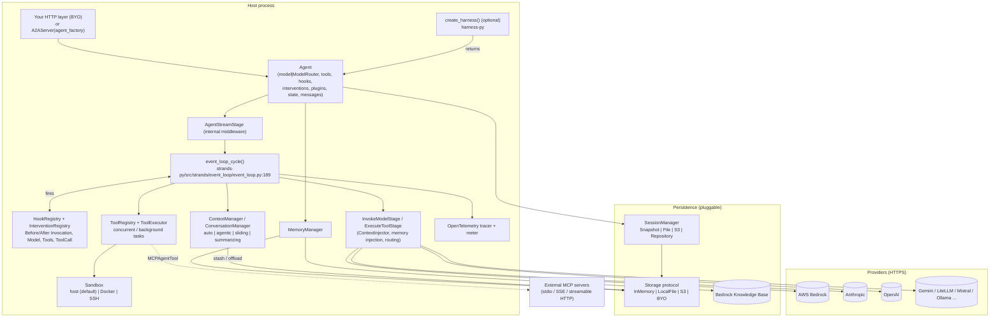

# Strands Agents Python — Benchmark Analysis

> **Repo**:
> - SDK monorepo: https://github.com/strands-agents/harness-sdk (renamed from `strands-agents/sdk-python`; the old URL redirects)
> - Tools: https://github.com/strands-agents/tools
>
> **Commit analysed**:
> - harness-sdk @ `e3d5b4ccb35ab82078eb2390156b894728c03b9f` (Python SDK `python/v1.57.1`; nearest monorepo tag `harness-cli/v0.1.4`)
> - tools @ `1dd0465da8a748b0e8ac87ec5b3485bccb60d70e` (`v0.8.9` + 3 commits)
>
> **Branch**: `main` (both repos)
>
> **Framework path**:
> - `frameworks/strands-agents-harness-sdk/` (Python SDK under `strands-py/`)
> - `frameworks/strands-agents-tools/`
>
> **Analysed on**: 2026-10-01

**Citation convention.** The SDK repo is now a monorepo. Short SDK citations such as `agent/agent.py:180` are relative to `frameworks/strands-agents-harness-sdk/strands-py/src/strands/`. Other monorepo packages are cited from the submodule root (`harness-py/...`, `strands-cli/...`, `site/...`, `team/...`). Tools-repo citations are prefixed `strands-agents-tools/`.

---

## TL;DR

- ⭐ **In-process Python library, now inside a multi-package "Harness SDK" monorepo**: the agent loop is still a pure-Python `async` generator (`event_loop_cycle`, `event_loop/event_loop.py:189`) that runs in your worker. No subprocess, no bundled binary, no vendor control plane. Since May 2026 the repo also holds the TypeScript SDK (`strands-ts/`), a batteries-included **Strands harness** (`harness-py/`, `create_harness()`, Beta), a TypeScript **`strands` CLI** (`strands-cli/`), a docs MCP server (`strands-mcp/`) and the docs site (`site/`).
- **Ecosystem** — Python (≥3.10). TypeScript SDK/harness/CLI live in the same repo but are separate packages; the Python SDK has no Node dependency.
- **Owner / license / support**: Apache-2.0, maintained by AWS (`strands-py/pyproject.toml`: `AWS, opensource@amazon.com`). Community support via Discord + GitHub Issues/Discussions. No paid Strands offering; the recommended managed host is Amazon Bedrock AgentCore Runtime.
- **Maturity / adoption** (captured 2026-10-01): `Development Status :: 5 - Production/Stable`, PyPI `strands-agents` 1.57.1. 8,592 stars, 1,301 forks, ~307 contributors on `harness-sdk`; Python minor releases roughly weekly (v1.41 → v1.57 between 2026-05-21 and 2026-09-25). The harness is `0.1.x` and marked Beta.
- **Where the loop runs**: `event_loop/event_loop.py:189` (`event_loop_cycle`), driven by `Agent._run_loop` (`agent/agent.py:1480`). Model calls, tool calls and the per-invocation stream now pass through an **internal middleware chain** (`_middleware/`, stages `InvokeModelStage` / `ExecuteToolStage` / `AgentStreamStage`).
- **Strongest fit for our use case**: (1) hooks still let you force tool args (`BeforeToolCallEvent.tool_use` writable, `hooks/events.py:244-245`); (2) new **interventions** layer with a vended **Cedar** handler whose `principal_resolver` reads the caller identity from `invocation_state` (`vended_interventions/cedar/cedar_authorization.py:99-165`), plus an HITL handler with an LLM risk classifier; (3) per-invocation **`limits`** (turns / output tokens / total tokens, `types/agent.py:144-176`); (4) a unified, namespaceable **`Storage`** primitive behind the new `SnapshotSessionManager`, memory stores and context offloading.
- **Weakest gap**: still no tenant concept in the session/agent schema, no public per-turn visible-tool filter (the SDK does it internally via middleware, `background_tasks/_background_tasks.py:119`, but `_middleware` is private), no chat-oriented HTTP/SSE server (only the A2A server), no USD cost, and no resource registry.
- **Most surprising findings**: (good) `A2AServer(agent_factory=...)` now builds one `Agent` per A2A `context_id` with LRU eviction and supports cancel + HITL interrupt round trips (`multiagent/a2a/server.py:52-70`, `multiagent/a2a/executor.py:129-160`), the closest thing to a first-party multi-session host. (bad) The `strands-agents-tools` package is being wound down: 21 tools carry `@deprecated` and the README says the repo "will eventually be archived" (`strands-agents-tools/README.md:165-178`); the replacements are SDK `vended_tools`, `MemoryManager`, and vendor MCP servers. Also, README doc links such as `/docs/user-guide/quickstart/overview/` and `/docs/user-guide/deploy/operating-agents-in-production/` return 404 after the site moved to `/docs/user-guide/sdk/...`.
- One-liner verdicts:
  - **Sessions/persistence**: first-class; new `SnapshotSessionManager` (whole-agent snapshots over `Storage`, immutable history, Graph/Swarm support) alongside file/S3 message-log managers; experimental cycle-boundary checkpointing is now wired into the loop.
  - **Skills**: first-class `AgentSkills` plugin (AgentSkills.io format), now loaded through the agent's sandbox; harness auto-loads `./.agent/skills`.
  - **Resource manager**: none. Local FS / HTTPS URL / `Skill` objects only.
  - **Sub-agents**: agent-as-tool (now also `delegate=True` and auto-wrap of `Agent` in `tools=`), `Graph`, `Swarm`, A2A; the harness adds an LLM-configurable `subagent` tool.
  - **Multi-tenancy**: BYO, with better building blocks (Cedar principal resolver, `limits`, `Storage.namespace()`, KB-store `scope`).
  - **Hooks**: typed events plus new `BeforeToolsEvent`/`AfterToolsEvent`, hook `order`, `cancel` on invocation/model events, and the interventions layer; middleware remains internal.
  - **API**: library-first; A2A server is the only first-party HTTP surface (now multi-context, cancel, HITL).
  - **Observability**: OTel-native with GenAI semconv, opt-in span redaction, memory spans; tokens only, no cost.
- **Production readiness for multi-tenant server**: viable with more first-party pieces than in May (limits, Cedar authz, storage namespaces, snapshot sessions, A2A factory). You still own the HTTP layer, tenant identity and scoping, per-tenant budgets across invocations, cost rollup and a resource registry.

---

## 0. General

- **0.1 What is this stack?** A Python **library** (in-process SDK, `from strands import Agent`). The monorepo also ships an opinionated factory on top (`strands-harness`, `create_harness()` returns a plain `strands.Agent`, `harness-py/README.md`) and a terminal CLI. None of these is a hosted service.
- **0.2 Ecosystem** — Python (≥3.10, `strands-py/pyproject.toml`). Second language: TypeScript, as a parallel SDK (`strands-ts/`, npm `@strands-agents/sdk`), harness (`harness-ts/`) and the `strands` CLI (`strands-cli/`, Node 22+). The Python SDK does not depend on them.
- **0.3 Project status & governance** — Apache-2.0 (`LICENSE.APACHE`). Owned and maintained by AWS. Governance docs now live in-repo under `team/` (tenets, decisions, API bar-raising, numbered design docs in `team/designs/`). Community support via Discord and GitHub Discussions. No commercial Strands offering; AWS positions Bedrock AgentCore Runtime as the managed host (`site/src/content/docs/user-guide/sdk/deploy/deploy_to_bedrock_agentcore/index.mdx:13`).
- **0.4 Project maturity / age** — Repo created 2025-05-14. Python SDK is `Production/Stable` and at `1.57.1` (tag `python/v1.57.1`, 2026-09-25). The repo became a monorepo in two steps: directory layout moved to `strands-py/` on 2026-05-26 (commit `babc25c4`, rationale in `team/designs/0009-mono-repository.md`), then the harness was merged on 2026-09-21 (`4095cf5a`). Several new subsystems are explicitly experimental: context-manager types (`experimental/context_manager`), checkpointing (`experimental/checkpoint/checkpoint.py:1-35`), agentic context mode (`_context_manager/modes/agentic/agentic_context.py:3-4`), MCP tasks (`tools/mcp/mcp_tasks.py:1-5`). The harness is `Development Status :: 4 - Beta` (`harness-py/pyproject.toml:15`).
- **0.5 Adoption & community signal** (captured 2026-10-01 via `gh api`):
  - `strands-agents/harness-sdk`: 8,592 stars, 1,301 forks, 55 watchers, ~307 contributors, 909 open issues+PRs, last push 2026-10-01. 100+ commits since 2026-09-01. 2,126 commits between the previous analysis commit and this one.
  - `strands-agents/tools`: 1,303 stars, 357 forks, ~82 contributors, 141 open issues+PRs.
  - Release cadence: Python SDK minors about weekly (`python/v1.41.0` 2026-05-21 → `python/v1.57.1` 2026-09-25); TS SDK in lock-step; harness/CLI `0.1.x` since 2026-09-21.
  - Sister repos `strands-agents/agent-builder`, `strands-agents/mcp-server` and `strands-agents/sdk-typescript` are now **archived** (absorbed into the monorepo or replaced by the CLI).
- **0.6 Ecosystem fit** — PyPI: `strands-agents` (core, extras `anthropic`, `gemini`, `litellm`, `openai`, `mistral`, `ollama`, `writer`, `sagemaker`, `llamaapi`, `a2a`, `otel`, `web-fetch`, `cedar`), `strands-harness`, `strands-agents-tools` (being deprecated), `strands-agents-evals` (separate repo), `strands-agents-mcp-server` (docs MCP server). npm: `@strands-agents/sdk`, `@strands-agents/harness`, `@strands-agents/cli`. Used primarily as a library; the CLI is for local prototyping.
- **0.7 Documentation depth & cross-team contributor accessibility** — English docs at `https://strandsagents.com/`, sourced from `site/` in the same repo (Astro/Starlight), with SDK, harness, evals, deploy and changelog sections. Docs are deep and include per-feature pages (context management, storage, interrupts, sandbox, memory). Non-engineers can author `SKILL.md` files that the `AgentSkills` plugin (or the harness default `./.agent/skills` dir) picks up; the CLI's setup wizard lets a non-engineer configure and export an agent project (`strands-cli/README.md:222-262`). There is no web authoring UI.
- **0.8 Documentation entry points** ⭐ —
  - Docs landing: `https://strandsagents.com/`
  - Quickstart (SDK): `https://strandsagents.com/docs/user-guide/sdk/quickstart/overview/`
  - Harness quickstart: `https://strandsagents.com/docs/user-guide/harness/quickstart/`
  - Agent loop concept: `https://strandsagents.com/docs/user-guide/sdk/agents/agent-loop/`
  - API reference: `https://strandsagents.com/docs/api/python/strands.agent.agent/`
  - Hosting / production guide: `https://strandsagents.com/docs/user-guide/sdk/deploy/` and `https://strandsagents.com/docs/user-guide/sdk/deploy/operating-agents-in-production/`
  - Examples / demos: `https://github.com/strands-agents/samples`, `https://strandsagents.com/docs/examples/`
  - Changelog / release notes: `https://strandsagents.com/changelog/` (generated from `site/src/content/changelog/`); no `CHANGELOG.md` file in the repo.
  - GitHub Releases: `https://github.com/strands-agents/harness-sdk/releases` (filter by `python/`, `harness-python/`, `harness-cli/`, `mcp/`, `typescript/` tag prefixes)
  - GitHub issues: `https://github.com/strands-agents/harness-sdk/issues`
  - Discord: `https://discord.gg/strands`
  - Evals SDK: `https://strandsagents.com/docs/user-guide/evals-sdk/quickstart/`, repo `https://github.com/strands-agents/evals`
  - Tools repo: `https://github.com/strands-agents/tools`
  - Note: some links in the root `README.md` (`/docs/user-guide/quickstart/overview/`, `/docs/user-guide/deploy/operating-agents-in-production/`, `/docs/user-guide/concepts/agents/agent-loop/`) returned 404 on 2026-10-01; the working paths are listed above.

---

## 1. High Level Architecture

### Deployment diagram

```
┌──────────────────────────────────────────────────────────────────┐
│                    Host process (your code)                      │
│  ┌────────────────────────────────────────────────────────────┐  │
│  │ FastAPI / Lambda / AgentCore entrypoint (BYO)              │  │
│  │   or A2AServer(agent_factory=...)  (optional, A2A only)    │  │
│  │   │                                                        │  │
│  │   ▼                                                        │  │
│  │ Agent(...)   ◀── one instance per session / A2A context    │  │
│  │   │  invoke_async() / stream_async(limits=, cancel_signal=)│  │
│  │   ▼                                                        │  │
│  │ AgentStreamStage ─▶ event_loop_cycle()  (pure Python)      │  │
│  │   │   ├─▶ InvokeModelStage ─▶ Model.stream() ──HTTPS──▶ LLM │  │
│  │   │   │      (ModelRouter, ContextInjector, memory inject)  │  │
│  │   │   ├─▶ Hooks + Interventions (Cedar, HITL)              │  │
│  │   │   ├─▶ ExecuteToolStage ─▶ ToolExecutor ─▶ AgentTool     │  │
│  │   │   │      (MCPAgentTool, vended tools ─▶ Sandbox)        │  │
│  │   │   └─▶ ContextManager / ConversationManager             │  │
│  │   └─▶ BackgroundTasks (in-process tool task manager)       │  │
│  └────────────────────────────────────────────────────────────┘  │
│         │                    │                     │             │
│         ▼                    ▼                     ▼             │
│  SessionManager        MemoryManager          OTel tracer/meter  │
│  (Snapshot / File / S3) (KB / File stores)    (optional OTLP)    │
│         └──────── Storage (InMemory / LocalFile / S3 / BYO) ─────│
└──────────────────────────────────────────────────────────────────┘
          │                         │                     │
          ▼                         ▼                     ▼
  MCP servers (stdio /     Sandbox targets:        Bedrock KB, S3,
  SSE / streamable HTTP)   host (default), Docker,  OTLP collector
                           SSH
```

### Answers

- **1.1 Where does the agent loop *actually* execute?** In your Python process. `Agent._run_loop` (`agent/agent.py:1480`) drives `event_loop_cycle` (`event_loop/event_loop.py:189`), which recurses via `recurse_event_loop` (`event_loop/event_loop.py:413`). No subprocess, no bundled binary. The harness (`harness-py/src/strands_harness/agent.py:233`) is a factory that returns the same `strands.Agent`; it adds no loop of its own. The `strands` CLI is a Node program that drives the TypeScript harness, or a Python harness project via its own interpreter (`strands-cli/README.md:230-245`).
- **1.2 Runtime dependencies** —
  - **Language runtime**: Python ≥3.10.
  - **Bundled subprocess / binary**: none in the SDK. The default sandbox runs local `sh` for shell/code tools when you use them (`sandbox/not_a_sandbox_local_environment.py:1-12`). The harness's `programmatic_tool_caller` runs code in Monty (`pydantic-monty`, in-process) (`harness-py/pyproject.toml:32-35`).
  - **Infrastructure**: none required. Optional: S3 (sessions/storage), Bedrock Knowledge Base (memory store), Docker host or SSH target (sandbox), OTLP collector.
  - **Required vendor services**: an LLM provider. The SDK default is Bedrock `global.anthropic.claude-sonnet-4-6` (`models/bedrock.py:44`); the harness default is Bedrock Claude Opus 5 with reasoning on (`harness-py/src/strands_harness/defaults.py`).
- **1.3 Recommended deployment topology** — The SDK still does not prescribe one. The deploy docs list AgentCore Runtime, Lambda, Fargate, App Runner, EKS, EC2, Docker, Kubernetes and Terraform targets (`site/src/content/docs/user-guide/sdk/deploy/index.mdx`, `operating-agents-in-production.mdx:168-184`). AgentCore is described as giving "each user session ... its own dedicated microVM" (`deploy_to_bedrock_agentcore/index.mdx:13`), i.e. session-per-microVM. In-process, the concurrency lock (`agent/agent.py:1360-1383`) still pushes you to one `Agent` per active session; the harness README says to "build a fresh agent per request, keyed on the id" (`harness-py/README.md`, "Remembering conversations"). `A2AServer(agent_factory=...)` encodes the same pattern (one agent per `context_id`).
- **1.4 Cold-start cost & instance footprint** — Construction is still in-process and light, but `Agent.__init__` now wires more subsystems: tool registry, hook registry, middleware registry, intervention registry, context manager, memory manager, background tasks, sandbox and storage (`agent/agent.py:398-600`). Import cost is dominated by boto3, pydantic, OpenTelemetry and `mcp`. No subprocess warm-up. Memory extraction and background tasks are in-process asyncio work. No published startup benchmark.
- **1.5 Vendor lock-in** — LLM lock-in: **low** (providers in `models/`: Bedrock, Anthropic, OpenAI, OpenAI Responses, Gemini, LiteLLM, Llama API, llama.cpp, Mistral, Ollama, SageMaker, Writer; plus `ModelRouter`). Hosting lock-in: **low** (pure Python), though docs and memory/session backends lean AWS (S3, Bedrock KB, AgentCore). Eval-platform lock-in: **low** (`strands-agents-evals` is optional and reads CloudWatch/Langfuse/OpenSearch traces).
- **1.6 Framework weight / footprint** — Now **medium-heavy**. `strands-py/src/strands/` grew from 13 to 25 top-level sub-packages and from 175 to 332 Python files (~70.6k lines; the OLD→NEW diff is +43.6k / −11.3k lines). New bundled subsystems: internal middleware, interventions (+ Cedar, HITL), memory manager + stores, unified storage + BM25 search, sandbox (host/Docker/SSH), background tasks, context manager (auto/agentic, offload strategies, stash), model routing, bidi (promoted out of experimental), vended tools, injection. Core required deps are unchanged in kind (boto3, httpx, mcp, pydantic, OTel, watchdog, pyyaml, jsonschema; `strands-py/pyproject.toml`).
- **1.7 Release-history signal** — No `CHANGELOG.md`; release notes are on GitHub Releases and the docs changelog. Production-relevant additions since v1.40: `limits` (v1.42), memory manager + extraction + Bedrock KB store, middleware system, sandbox, interventions, checkpointing wired into the loop (v1.43–v1.44), MCP servers from JSON (v1.46), durable message ids and span redaction (v1.47), unified storage (v1.48), configurable retry exceptions and `ExecuteToolStage` (v1.50), snapshot session manager, `BeforeToolsEvent`/`AfterToolsEvent`, A2A interrupts (v1.51), `ModelRouter` (v1.52), agent-as-tool delegation, MCP OAuth, Anthropic cache config (v1.53), `session_id` property and external cancel signal (v1.54), background tasks, MCP 2.x support, `web_fetch` (v1.55), context strategy presets (v1.56), harness merge, Graph/Swarm snapshots, `handoff_to_user`, `mcp_router` (v1.57), `Agent.shutdown()` and `a2a_client` (v1.57.1). Breaking/deprecations: the TS side requires Node 22+ (`feat!`, v1.55), `experimental.bidi` is now a deprecated alias for `strands.bidi` (`experimental/bidi/__init__.py:1`), the `bash` vended tool is deprecated in favour of `shell` (`vended_tools/_bash.py:1-5`), `cache_tools` deprecated in favour of `CacheConfig.tools_ttl` (`models/model.py:159-163`), and most of `strands-agents-tools` is deprecated (Q13).

---

## 2. Agent Loop

- **2.1 Run loop entrypoint(s)** — Public surface on `Agent` (`agent/agent.py:180`, now `class Agent(AgentBase, LocalAgent)`):
  - `Agent.__call__(prompt, ...) → AgentResult` (`agent/agent.py:846`) — sync wrapper.
  - `Agent.invoke_async(prompt, ...) → AgentResult` (`agent/agent.py:940`) — drains `stream_async`.
  - `Agent.stream_async(prompt, ...) → AsyncIterator[dict]` (`agent/agent.py:1283`) — primary streaming entrypoint.

  New keyword arguments since May:
  ```python
  # agent/agent.py:1283-1294
  async def stream_async(
      self,
      prompt: AgentInput = None,
      *,
      invocation_state: dict[str, Any] | None = None,
      structured_output_model: type[BaseModel] | None = None,
      structured_output_prompt: str | None = None,
      idempotency_token: Any = None,
      limits: Limits | None = None,
      cancel_signal: threading.Event | None = None,
      **kwargs: Any,
  ) -> AsyncIterator[Any]:
  ```
  `AgentInput = str | list[ContentBlock] | list[InterruptResponseContent] | Messages | None` (`types/agent.py:29`). `idempotency_token` deduplicates a retried request onto the in-flight one (`agent/agent.py:1360-1376`); `limits` caps the invocation (Q6.7); `cancel_signal` lets an external `threading.Event` cancel the run (`agent/agent.py:1261`).

- **2.2 Per-iteration behavior** — `event_loop_cycle` (`event_loop/event_loop.py:189-410`):
  1. Check `limits` at the top of the cycle; if tripped, yield `EventLoopStopEvent("limit_*")` (`event_loop.py:240-250`, `_check_limits` at `:69-102`).
  2. Resume from a checkpoint or interrupt if one is pending (`event_loop.py:260-291`); otherwise `_handle_model_execution` (`event_loop.py:470`).
  3. `BeforeModelCallEvent` hooks (can now `cancel`), then the `InvokeModelStage` middleware chain wraps `stream_messages(...)` with deep-copied `messages`, `system_prompt` and `tool_specs` (`event_loop.py:575-620`), then `AfterModelCallEvent` (`event_loop.py:638`).
  4. Attach `usage`/`metrics` metadata to the assistant message (`event_loop.py:633-636`) and append it.
  5. With `checkpointing=True`, emit an `after_model` checkpoint stop (`event_loop.py:325-340`).
  6. If `stop_reason == "tool_use"`, `_handle_tool_execution` (`event_loop.py:802`) fires `BeforeToolsEvent`, dispatches via `agent.tool_executor._execute(...)` (`event_loop.py:903`), collapses results into one `user` message (`event_loop.py:917-921`), fires `AfterToolsEvent` (may `end_turn`), optionally emits an `after_tools` checkpoint (`event_loop.py:1009-1015`), then recurses.

- **2.3 ReAct loop** — Shipped. Recursion via `recurse_event_loop` (`event_loop.py:413`). Optional loop-shaping plugins now exist on top: `GoalLoop` (iterate against a validator, `vended_plugins/goal/__init__.py`), steering handlers (`vended_plugins/steering/__init__.py`), and the `AgentStreamStage` middleware.

- **2.4 Tool dispatch + result handling** — `ToolExecutor._stream` (`tools/executors/_executor.py:153`):
  - Injects `agent`, `model`, `messages`, `system_prompt`, `tool_config` into `invocation_state` (`_executor.py:196-207`).
  - Fires `BeforeToolCallEvent` (`_executor.py:215`); hooks/interventions may swap `selected_tool`, rewrite `tool_use`, set `cancel_tool`, or raise an interrupt. The executor re-reads the event fields afterwards (`_executor.py:255-257`) and re-resolves the tool if a hook renamed it (`_executor.py:259-260`, `_lookup_tool` at `:530-537`).
  - Runs the tool through the `ExecuteToolStage` middleware chain (`_executor.py:299-350`); intermediate yields become `ToolStreamEvent`s (`_executor.py:603-621`). Unknown tools still go through the chain and produce an error result (`_executor.py:280-295`).
  - Fires `AfterToolCallEvent` (now with `duration`); `retry=True` re-runs the tool (`_executor.py:50-60`).
  - Tools routed to background execution go through `_execute_background` (`_executor.py:64`) and report back later (Q4.4).

- **2.5 Explicit turn concept** — One `event_loop_cycle` ≈ one model call + zero-or-more tool calls. `Limits.turns` formalises this: "One turn is one model call plus any tool execution that follows" (`types/agent.py:160-162`). The invocation ends when the model stops without tool use, or with `stop_reason` in `{"end_turn", "stop_sequence", "max_tokens", "cancelled", "interrupt", "checkpoint", "guardrail_intervened", "content_filtered", "limit_turns", "limit_total_tokens", "limit_output_tokens"}` (`types/event_loop.py:39-52`). `AfterToolsEvent.end_turn` can end the turn after a tool batch without another model call (`hooks/events.py:186-212`).

- **2.6 Event emission mechanism (in-process)** — Async generator. `Agent._run_loop` yields `TypedEvent`s; `stream_async` calls `event.prepare(invocation_state=...)` and `callback_handler(**event.as_dict())` for each (`agent/agent.py:1432-1439`). The whole invocation pass is itself wrapped by the internal `AgentStreamStage` middleware, whose result is the last `EventLoopStopEvent` (`_middleware/README.md`, "Per-stage result types"). Network streaming is BYO (Q8).

---

## 3. Message & Event Taxonomy

- **3.1 Message layers** — Still two layers:
  1. **`Message`** (`types/content.py:252-270`): model-facing, Bedrock-shaped. Roles `user|assistant`; `content: list[ContentBlock]`. New optional fields: `tracking_id` (durable UUID assigned by the agent, survives session save/restore, stripped before model calls) and `metadata` (`types/content.py:258-270`).
  2. **`TypedEvent`** (`types/_events.py:29`): the in-process event stream.

  Conversion happens in `event_loop/streaming.py`. There is no separate UI-message layer; the host projects events into its wire format. Bidi streaming (`strands.bidi`) has its own event vocabulary for audio/realtime sessions.

- **3.2 Concrete message types** — `ContentBlock` (`types/content.py:80-107`):

  | Block | Purpose |
  |---|---|
  | `text` | Plain text segment |
  | `toolUse` | Assistant tool call (id, name, input JSON) |
  | `toolResult` | User-role tool result (id, status, content) |
  | `image`, `document`, `video` | Multi-modal attachments |
  | `audio` | Audio content (new, v1.53) |
  | `reasoningContent` | Model reasoning (extended thinking) |
  | `citationsContent` | Provider citations |
  | `cachePoint` | Prompt-cache breakpoint marker |
  | `guardContent` | Bedrock guardrails wrapper |
  | `interruptResponse` | HITL response passed back as prompt (`types/interrupt.py`) |
  | `checkpointResume` | Resume marker for experimental checkpoints (`agent/agent.py:1804`) |

  A `TextBlock` helper class was added (`types/content.py:115`). `redactContent` arrives as a stream chunk, not a stored block (`agent/agent.py:1739-1744`).

- **3.3 Messages vs. events** — Separate vocabularies. Messages are durable (`agent.messages`); events are transient. The loop appends messages through `agent._append_messages(...)` (`agent/agent.py:1960`), which fires `MessageAddedEvent`; a new `MessageUpdatedEvent` fires when the framework replaces a message, keyed by `tracking_id` (`hooks/events.py:137-146`).

- **3.4 Event categories** — The `TypedEvent` class list in `types/_events.py` is unchanged since May:
  - **Lifecycle**: `InitEventLoopEvent`, `StartEvent` (deprecated), `StartEventLoopEvent`, `EventLoopStopEvent`, `AgentResultEvent`, `ForceStopEvent`.
  - **Model stream**: `ModelStreamChunkEvent`, `ModelStreamEvent`, `ToolUseStreamEvent`, `TextStreamEvent`, `CitationStreamEvent`, `ReasoningTextStreamEvent`, `ReasoningRedactedContentStreamEvent`, `ReasoningSignatureStreamEvent`, `ModelStopReason`, `ModelMessageEvent`.
  - **Tool**: `ToolResultEvent`, `ToolStreamEvent`, `AgentAsToolStreamEvent`, `ToolCancelEvent`, `ToolInterruptEvent`, `ToolResultMessageEvent`.
  - **Structured output**: `StructuredOutputEvent`. **Throttle**: `EventLoopThrottleEvent`.
  - **Multi-agent**: `MultiAgentResultEvent`, `MultiAgentNodeStartEvent`, `MultiAgentNodeStopEvent`, `MultiAgentHandoffEvent`, `MultiAgentNodeStreamEvent`, `MultiAgentNodeCancelEvent`, `MultiAgentNodeInterruptEvent`.
  - **Hook events** (subscriber-facing, Q7): `AgentInitializedEvent`, `BeforeInvocationEvent`, `AfterInvocationEvent`, `MessageAddedEvent`, `MessageUpdatedEvent` (new), `BeforeToolsEvent` / `AfterToolsEvent` (new, batch-level), `BeforeToolCallEvent`, `AfterToolCallEvent`, `BeforeModelCallEvent`, `AfterModelCallEvent`, plus multi-agent variants (`hooks/events.py:411-507`) and bidi variants (`bidi/hooks`).

- **3.5 Canonical type-definition file(s)** —
  - Events: `strands-py/src/strands/types/_events.py`
  - Messages / content: `strands-py/src/strands/types/content.py`
  - Tool types: `strands-py/src/strands/types/tools.py`
  - Agent input, limits, `LocalAgent` protocol: `strands-py/src/strands/types/agent.py`
  - Stop reasons, usage: `strands-py/src/strands/types/event_loop.py`
  - Session types: `strands-py/src/strands/types/session.py`; snapshots: `types/_snapshot.py`
  - Hook events: `strands-py/src/strands/hooks/events.py`
  - Middleware contexts: `strands-py/src/strands/_middleware/stages.py` (internal)

- **3.6 Live agentic event stream taxonomy** — A typical streamed run yields (unchanged shapes):
  - `{"init_event_loop": True, "invocation_state": {...}}` (`InitEventLoopEvent`)
  - `{"start": True}` (deprecated `StartEvent`), `{"start_event_loop": True}`
  - `{"event": {"messageStart": {"role": "assistant"}}}` (`ModelStreamChunkEvent`)
  - Text deltas: `{"data": "Hello", "delta": {...}}` (`TextStreamEvent`)
  - Tool-arg deltas: `{"type": "tool_use_stream", "delta": {...}, "current_tool_use": {"toolUseId": "tu_1", "name": "topicSearch", "input": "..."}}` (`ToolUseStreamEvent`, `types/_events.py:146-151`)
  - `{"message": {"role": "assistant", "content": [{"toolUse": {...}}], "metadata": {"usage": {...}, "metrics": {...}}, "tracking_id": "..."}}` (`ModelMessageEvent`)
  - `{"type": "tool_stream", "tool_stream_event": {"tool_use": {...}, "data": "..."}}` (`ToolStreamEvent`)
  - `{"message": {"role": "user", "content": [{"toolResult": {...}}]}}` (`ToolResultMessageEvent`)
  - Final: `{"result": AgentResult(stop_reason=..., message=..., metrics=..., state=..., interrupts=None, structured_output=None, checkpoint=None)}` (`agent/agent_result.py:21-41`)

---

## 4. Agent Runtime (Multi-session Host)

- **4.1 Multi-session host architecture** — The SDK still has no general multi-session runtime: `Agent` is the unit and `stream_async` raises `ConcurrencyException` on a second concurrent invocation (`agent/agent.py:1378-1383`, now via `agent/_concurrency.py`). The one first-party host is the **A2A server in factory mode**: `A2AServer(agent_factory=lambda context_id: Agent(...), max_contexts=1000)` builds a dedicated agent per A2A `context_id`, runs contexts concurrently and evicts the least-recently-used beyond `max_contexts` (`multiagent/a2a/server.py:52-70`, `multiagent/a2a/executor.py:129-160`). It is A2A-protocol-only and treats `context_id` as non-authenticated (Q8.8). For chat APIs you still embed `Agent` in your own server.
- **4.2 Concurrent session isolation** — Each `Agent` owns `messages`, `state`, tool registry, hooks, middleware registry, intervention registry, interrupt state, model state, metrics, tracer, context manager and (per-agent default) sandbox. Isolation is by construction. Caveats: (a) `ConcurrentInvocationMode.UNSAFE_REENTRANT` skips the lock (`types/agent.py:186-200`); (b) shared plugin instances must keep per-agent data in `agent.state` (the Cedar handler warns that sharing one instance across agents leaks rate-limit counts, `vended_interventions/cedar/cedar_authorization.py:81-82`); (c) `invocation_state` is shared by reference with hooks and tools (`event_loop.py:582`).
- **4.3 Horizontal scaling / multi-instance** — Stateless workers rehydrating from shared storage remain the pattern. New: `SnapshotSessionManager` persists the whole agent as one versioned blob through any `Storage` backend (in-memory, local file, S3, or BYO protocol implementation), with a mutable `snapshot_latest` plus optional immutable history (`session/snapshot_session_manager.py:1-15`, `:244-260`). `S3SessionManager` gained `endpoint_url` for S3-compatible stores (`session/s3_session_manager.py:56-90`). No leader election or distributed locking; two workers writing the same session concurrently is your problem.
- **4.4 Background / async / scheduled tasks** — **Scheduled/cron/webhook triggers: Not provided — BYO.** New since May: **background tool execution** (`Agent(background_tasks=True | BackgroundTasksConfig)`, `agent/agent.py:231`, `:560`). Tools can run as in-process background tasks chosen by policy (`always` / `never` / `agentic` where the model decides), with `max_concurrency` (default 4), per-task `timeout`, and `wait_for_completion` (default True) (`background_tasks/_types.py:13-31`). The model gets a `strands_manage_background_task` tool (`background_tasks/_background_tasks.py:31`). This is intra-invocation concurrency, not a job scheduler. The tools-repo `cron` tool is deprecated (Q13.1).
- **4.5 Worker pool / queue model** — Not provided — BYO for inter-session work. Intra-agent: `ConcurrentToolExecutor` (`tools/executors/concurrent.py:19`) and the background `InProcessTaskManager` (`background_tasks/in_process/_manager.py`) with statuses `queued → working → input_required → completed/...` (`background_tasks/_types.py:34-40`). Both are in-process and die with the worker.

---

## 5. Sessions & Persistence

- **5.1 Session / chat data model** — The message-log dataclasses are unchanged in shape (`types/session.py`):

  ```python
  # types/session.py:173-179
  @dataclass
  class Session:
      session_id: str
      session_type: SessionType            # only AGENT defined (types/session.py:17-24)
      created_at: str
      updated_at: str
  ```

  ```python
  # types/session.py:107-123
  @dataclass
  class SessionAgent:
      agent_id: str
      state: dict[str, Any]
      conversation_manager_state: dict[str, Any]
      _internal_state: dict[str, Any]      # Strands managed state (interrupts, model state, ...)
      created_at: str
      updated_at: str
  ```

  ```python
  # types/session.py:58-73
  @dataclass
  class SessionMessage:
      message: Message                     # now carries tracking_id (types/content.py:269)
      message_id: int
      redact_message: Message | None
      created_at: str
      updated_at: str
  ```

  The new recommended path is a **`Snapshot`** (`types/_snapshot.py`, `SNAPSHOT_SCHEMA_VERSION = "1.0"` at `:34`) persisted by `SnapshotSessionManager`: messages, state, conversation/context-manager state, interrupt state, model state (added as a snapshot field in v1.43), system prompt and `app_data`. Still **no `tenant_id`, `user_id`, `parent_session_id`, `summary` or session-level `metadata`**.

- **5.2 What's stored on a session** — Messages (with redacted variants and durable `tracking_id`), agent state, conversation-manager state, internal state (interrupts, model state), and, with `SnapshotSessionManager`, context-manager **stash** data for offloaded content (`session/snapshot_session_manager.py:676-739`). Bytes are base64-encoded inline (`types/session.py:27`). No attachments-by-reference.

- **5.3 Granularity** — Single linear conversation per `(session_id, agent_id)`. No branching. `SnapshotSessionManager` adds **point-in-time restore**: immutable snapshots written when a `snapshot_trigger` fires, restorable by id (`restore_snapshot(agent, snapshot_id=...)`, `session/snapshot_session_manager.py:487`; `list_snapshot_ids` at `:453`). That is rollback, not fork. Graph and Swarm orchestrators get their own snapshot scope (`scopes/multiAgent/<id>/snapshots/`, `:173-175`).

- **5.4 Built-in persistence stores** —
  - `SnapshotSessionManager` over `Storage` (`session/snapshot_session_manager.py:219`): key layout `<session_id>/scopes/agent/<agent_id>/snapshots/{snapshot_latest | immutable_history/snapshot_<uuid7>.json}` (`:117`, `:153-170`). Storage backends shipped: `InMemoryStorage`, `LocalFileStorage`, `S3Storage` (`storage/`).
  - `FileSessionManager` (`session/file_session_manager.py:28`): `session_<id>/agents/agent_<aid>/messages/message_<i>.json` (`:22-41`).
  - `S3SessionManager` (`session/s3_session_manager.py:31`).
  - `RepositorySessionManager` (`session/repository_session_manager.py:27`) over a `SessionRepository`.
  - Postgres/Redis/DynamoDB: **BYO**. Community packages (e.g. `strands-dynamodb-storage`, `strands-github-storage`) are listed in the docs catalog, not shipped.

- **5.5 Persistence timing** —
  - Message-log managers: hook-driven (`session/session_manager.py:45-61`): `AgentInitializedEvent → initialize`, `MessageAddedEvent → append_message + sync_agent`, `AfterInvocationEvent → sync_agent`, plus multi-agent hooks. Synchronous, no batching.
  - `SnapshotSessionManager`: `save_latest_on="invocation"` (default, after each invocation), `"message"` (after every message), or `"trigger"` (only when `snapshot_trigger` fires); guardrail redactions flush immediately in every mode (`session/snapshot_session_manager.py:59-73`, defaults at `:249-251`). Bidi agents default to per-message saves.
  - The harness's default session manager saves after each completed message including tool results; streaming text and unfinished tool calls are not saved (`harness-py/README.md`, "Remembering conversations").

- **5.6 Mid-run checkpointing (durable)** — `Agent(checkpointing=True)` now wires the experimental checkpoint into the loop (`agent/agent.py:330-336`): the run pauses with `stop_reason="checkpoint"` at `after_model` (tool calls decided, not run) and `after_tools` (results in, next model call pending) (`event_loop.py:325-340`, `:1009-1015`). Resume by passing `{"checkpointResume": {"checkpoint": ...}}`. The checkpoint carries position + cycle index only, "does **not** capture conversation state — pair with a `SessionManager`" (`experimental/checkpoint/checkpoint.py:1-12`). Per-tool granularity inside a cycle remains "the `ToolExecutor`'s responsibility" (`checkpoint.py:12`). No checkpoints on turns without tool calls. **Crash during a tool call is not covered**; at best you resume from the `after_model` boundary and re-run the tools.

- **5.7 Session ID format** — Caller-provided string validated against path separators (`_identifier.py:18`, used at `session/file_session_manager.py:83`). Snapshot ids are UUIDv7 (`session/snapshot_session_manager.py:23-25`). Default `SnapshotSessionManager` id is `"default-session"` (`:246`); the harness mints a fresh id per run unless you pass one. `Agent.session_id` property exposes it (`agent/agent.py:709`). No tenant prefixing.

- **5.8 Pluggable store interface** — Two seams:
  - `SessionRepository` ABC (`session/session_repository.py:12-66`): `create/read/update_session|agent|message`, `list_messages`.
  - `Storage` protocol (`storage/storage.py:105-197`): `write(key, bytes)`, `read(key)`, `delete(key)`, `list(query)`, `search(query)`, plus `namespace(prefix)` views (`:199-280`). Implementing `Storage` once backs snapshots, file memory stores and context offloading.

- **5.9 Schema evolution / migration** — Minimal. `Snapshot.schema_version` (`"1.0"`, `types/_snapshot.py:34-65`) and `CHECKPOINT_SCHEMA_VERSION = "1.0"` (`experimental/checkpoint/checkpoint.py`). `_fix_broken_tool_use` still repairs sessions persisted before 1.15.0 (`session/repository_session_manager.py:297-301`). No migration tooling between the message-log format and snapshots.

- **5.10 Export / replay** — `Agent.take_snapshot(...)` / `load_snapshot(...)` (`agent/agent.py:1998`, `:2046`) export and restore JSON-serialisable state; `SnapshotSessionManager` keeps an immutable history you can list and restore. Deterministic replay against a model is not provided; `strands-agents-evals` can evaluate stored traces (Q19).

- **5.11 Cross-session memory** — Now first-class via `MemoryManager` (`memory/memory_manager.py:72`) with Bedrock KB and file stores. See Q17.

---

## 6. Multi-tenancy & Tenant Identity ⭐ THE KEY QUESTION

- **6.1 Run-loop tenant identity** — Unchanged in principle. `stream_async(prompt, *, invocation_state=None, ..., limits=None, cancel_signal=None, idempotency_token=None)` (`agent/agent.py:1283-1294`). Tenant/user/locale information goes into the free-form `invocation_state: dict[str, Any]` or into `agent.state`. **There is no first-class `tenant_id` / `user_id` / `locale` field.** The monorepo's agent guide now states that `invocation_state` "belongs to the user. SDK code must never use it to carry, store, key, or forward internal state" (root `AGENTS.md`, Cross-SDK Conventions), which makes it a stable place for caller identity.

- **6.2 Tenant identity propagation into tool calls** — The executor merges the agent context into the caller's `invocation_state` and passes the same dict to hooks, interventions, middleware and the tool (`tools/executors/_executor.py:196-207`):
  ```python
  invocation_state.update({
      "agent": agent,
      "model": agent.model,
      "messages": agent.messages,
      "system_prompt": agent.system_prompt,
      "tool_config": ToolConfig(...),  # for backwards compatibility
  })
  ```
  Decorated tools receive it through `ToolContext` (`types/tools.py:178-203`, built in `tools/decorator.py:420`). Graph edge conditions now also receive `invocation_state` (v1.44, `multiagent/graph.py:74`).

- **6.3 Tool call interface** —
  - Class-based `AgentTool.stream(tool_use, invocation_state, **kwargs) → ToolGenerator` (`types/tools.py:268`, `:316`).
  - Decorated function with context:
    ```python
    @tool(context=True)
    def topic_search(query: str, tool_context: ToolContext) -> str:
        tenant_id = tool_context.invocation_state["tenant_id"]   # caller-supplied
        sandbox = tool_context.agent.sandbox                     # new: per-agent execution env
        ...
    ```
    `ToolContext` carries `tool_use`, `agent`, `invocation_state` and is `_Interruptible` (`types/tools.py:178-203`).

- **6.4 Forcing tool arguments from the harness** — ⭐ **Yes.** `BeforeToolCallEvent.tool_use` is writable (`hooks/events.py:244-245`: `name in ["cancel_tool", "selected_tool", "tool_use"]`) and the executor re-reads it after hooks run (`tools/executors/_executor.py:255-257`). Two additional public routes now exist:
  - An `InterventionHandler.before_tool_call` returning `Transform(apply=lambda e: e.tool_use["input"].update(tenantId="acme"))` (`interventions/actions.py:105-115`, applied at `interventions/registry.py:127-150`).
  - Internally, `ExecuteToolStage` middleware sees `ExecuteToolContext.tool_use` (`_middleware/stages.py:107-135`), but that API is private.

- **6.5 Tenant-aware visible tool selection** — Still **no public per-turn `activeTools` / `prepareStep`** equivalent. Options:
  - Construct one `Agent` per tenant/session with only the allowed tools (the documented pattern; the harness's `builtin_tools` list/mapping does this at build time, `harness-py/README.md`).
  - Mutate `agent.tool_registry.registry` between invocations (plain dict, `tools/registry.py:38-39`); `get_all_tool_specs()` is re-read every cycle (`event_loop.py:579`).
  - `MCPClient(tool_filters=ToolFilters(allowed=[...], rejected=[...]))` at load time (`tools/mcp/mcp_client.py:139`).
  - Block at call time: `BeforeToolCallEvent.cancel_tool`, a Cedar policy (`Deny` → `cancel_tool = "DENIED: ..."`, `interventions/registry.py:127-130`), or `HumanInTheLoop(allowed_tools=[...])`. These reject a call the model already made; the tool stays visible.
  - The SDK itself filters `tool_specs` per model call through `InvokeModelStage.Input` middleware (`background_tasks/_background_tasks.py:119`), which proves the seam exists, but it is reached via the private `agent._middleware_registry` (`_middleware/README.md:300`). Using it is a workaround on internal API.

- **6.6 Per-tool-call auth propagation** — Whatever you put in `invocation_state` reaches every hook, intervention and tool call automatically (`_executor.py:196-207`). New first-party consumer: `CedarAuthorization(principal_resolver=lambda state: {"type": "Tenant", "id": state["tenant_id"]})` evaluates `principal / Action::"<tool_name>" / Resource::"agent"` with the tool input and session context (call counts, UTC hour) before each call, and **denies when no principal is found (fail-closed)** (`vended_interventions/cedar/cedar_authorization.py:99-165`, `:186-205`). There is still no JWT/OAuth identity object; you supply identity.

- **6.7 Per-tenant rate limit + budget cap** — **Partial; per-tenant aggregation is BYO.** New `limits` caps a single invocation (`types/agent.py:144-176`):
  ```python
  class Limits(TypedDict, total=False):
      turns: int           # model call + following tool execution
      output_tokens: int   # cumulative across the invocation, soft cap
      total_tokens: int    # cumulative input+output, soft cap
  ```
  Caps are checked at turn boundaries and stop with `limit_turns` / `limit_total_tokens` / `limit_output_tokens` (`event_loop.py:69-102`). They are per call and "not cumulative across reuses of the same agent" (`types/agent.py:147-148`). No USD budget, no cross-invocation or per-tenant ledger; Cedar `call_count` context enables per-agent per-tool call-rate policies (`cedar_authorization.py:71-81`). 🟡 rather than 🟢: token caps exist, USD and tenant rollup do not.

### ⭐ Light usage example

```python
from strands import Agent
from strands.hooks import BeforeToolCallEvent
from strands.vended_interventions.cedar import CedarAuthorization

# 1. Per-tenant agent: only the allowed tools are registered (bashExec/webFetch never are)
def build_agent(tenant_id: str) -> Agent:
    def force_tenant_id(event: BeforeToolCallEvent) -> None:
        if event.tool_use["name"] == "topicSearch":
            event.tool_use["input"]["tenantId"] = event.invocation_state["tenant_id"]  # 3. overrides LLM

    cedar = CedarAuthorization(  # optional: fail-closed per-tenant tool ACL from invocation_state
        policies='permit(principal == Tenant::"acme", action, resource);',
        principal_resolver=lambda state: {"type": "Tenant", "id": state["tenant_id"]},
    )
    return Agent(tools=[topic_search, iab_search, audience_create],   # 2. visible tools
                 hooks=[force_tenant_id], interventions=[cedar])

agent = build_agent("acme")
result = agent("Find topics about hiking",
               invocation_state={"tenant_id": "acme", "user_id": "u-123",
                                 "targeting_strategy_id": "strat-42"},     # 1. identity
               limits={"turns": 10, "total_tokens": 200_000})              # per-call budget
```

Step 1 (`tenantId`/`userId`/`targetingStrategyId` into the run): `invocation_state`.
Step 2 (only `topicSearch`/`iabSearch`/`audienceCreate` visible): construction-time whitelist. Per-turn dynamic filtering is **Not provided — BYO** (mutate `agent.tool_registry.registry` between calls, or build an agent per request).
Step 3 (force `tenantId=acme` server-side): `BeforeToolCallEvent.tool_use` mutation (`hooks/events.py:244-245`, `tools/executors/_executor.py:255-257`), or an intervention `Transform`.

---

## 7. Hook & Middleware Capabilities (Context Engineering)

- **7.1 Enumerate every hook / middleware / lifecycle callback** — From `hooks/events.py`, the interventions layer and the internal middleware:

  | Event | Fires when | Writable | Notes |
  |---|---|---|---|
  | `AgentInitializedEvent` | end of `Agent.__init__` | – | must be sync (`hooks/registry.py:261`) |
  | `BeforeInvocationEvent` | start of each invocation pass | `messages`, `cancel` | `hooks/events.py:39-67`; `cancel` is new |
  | `AfterInvocationEvent` | end of each pass | `resume` | reverse order; `resume` re-invokes (`hooks/events.py:70-115`, `agent/agent.py:1678-1686`) |
  | `MessageAddedEvent` | message appended | – | `hooks/events.py:118` |
  | `MessageUpdatedEvent` | framework replaced a message | – | new, keyed by `tracking_id` (`hooks/events.py:137-146`) |
  | `BeforeModelCallEvent` | before each model call | `cancel` | carries `projected_input_tokens` (`hooks/events.py:318-344`) |
  | `AfterModelCallEvent` | after model returns | `retry` | reverse order (`hooks/events.py:348-405`) |
  | `BeforeToolsEvent` | before a tool batch | `cancel` | new; interruptible (`hooks/events.py:150-183`) |
  | `BeforeToolCallEvent` | before each tool | `cancel_tool`, `selected_tool`, `tool_use` | interruptible (`hooks/events.py:221-258`) |
  | `AfterToolCallEvent` | after each tool | `result`, `retry` | reverse order; new `duration`, `exception`, `cancel_message` fields (`hooks/events.py:261-315`) |
  | `AfterToolsEvent` | after a tool batch | `end_turn` | new; reverse order (`hooks/events.py:186-218`) |
  | `MultiAgentInitializedEvent`, `BeforeMultiAgentInvocationEvent`, `BeforeNodeCallEvent` (`cancel_node`, interruptible), `AfterNodeCallEvent`, `AfterMultiAgentInvocationEvent` | Graph/Swarm lifecycle | see notes | `hooks/events.py:411-507` |
  | Bidi events | `strands.bidi` sessions | varies | `bidi/hooks` (promoted from experimental; shared lifecycle hooks with response-completion events) |
  | **Interventions** (`before_invocation`, `before_model_call`, `after_model_call`, `before_tool_call`, `after_tool_call`) | same points as hooks | via actions `Proceed`/`Deny`/`Guide`/`Confirm`/`Transform` | `interventions/handler.py`, `interventions/actions.py:45-130`; `on_error` = `throw`/`proceed`/`deny` |
  | **Middleware** (internal): `InvokeModelStage`, `ExecuteToolStage`, `AgentStreamStage` | wraps model call / tool call / invocation pass | wrap, input, output phases; short-circuit; interrupts | `_middleware/` is **not public API** (`_middleware/README.md:300`) |

  Hook callbacks can be sync or async (except `AgentInitializedEvent`). Plugins (`plugins/plugin.py:19`) and `MultiAgentPlugin` (`plugins/multiagent_plugin.py:22`) bundle hooks and tools.

- **7.2 Hook concurrency model** — Sequential. New: callbacks accept an `order` (lower first; ties keep registration order) via `add_callback(..., order=...)` / `Agent.add_hook(..., order=...)` (`hooks/registry.py:192-266`, `agent/agent.py:1182-1188`). Reverse-order events reverse within each order group (`hooks/registry.py:416-445`). `invoke_callbacks_async` awaits each in turn and aggregates interrupts (`hooks/registry.py:309-353`). Interventions are registered as hooks and dispatched in handler order (`interventions/registry.py:65-110`).

- **7.3 Specific capability tests** —
  - **Inject system messages at session start** — Yes. Set `agent.system_prompt` (string or content blocks with cache points) in a `BeforeInvocationEvent` hook, as `AgentSkills` does (`vended_plugins/skills/agent_skills.py:188-240`). New public alternative: the `ContextInjector` plugin folds just-in-time text into the model input on each user turn **without touching durable history** (`vended_plugins/context_injector/__init__.py`, `plugin.py:76-100`).
  - **Expand the user input** — Yes, via writable `BeforeInvocationEvent.messages`.
  - **Mutate the messages list before each LLM call** — Partially public. `BeforeModelCallEvent` is still only `cancel`-writable; hooks can mutate `event.agent.messages` in place (what `SlidingWindowConversationManager(per_turn=...)` does), and `Guide` on `before_model_call` injects a user message into `agent.messages` (`interventions/actions.py:65-85`). Ephemeral per-call edits (no history change) are what `InvokeModelStage.Input` middleware does, and `ContextInjector` is the public wrapper for the "append context" case.
  - **Mutate / decorate tool input before dispatch** — Yes, `BeforeToolCallEvent.tool_use` or intervention `Transform`.
  - **Mutate / decorate tool result** — Yes, `AfterToolCallEvent.result` (`hooks/events.py:308-309`) or `Transform` on `after_tool_call`.
  - **Emit additional tool calls in response to a tool result** — Still **Not provided** as a hook API. Closest: `AfterInvocationEvent.resume` or a hook-contributed continuation input re-invokes the agent (`agent/_continuation.py`); `AfterToolsEvent.end_turn` can stop instead. Synthesising an assistant `toolUse` would mean writing to `agent.messages`.

- **7.4 Auto-compaction** — Built-in, and now layered:
  - Default (no `context_manager`): `SlidingWindowConversationManager` (`agent/conversation_manager/sliding_window_conversation_manager.py:22`), `window_size=40`, `should_truncate_results=True` by default (`:38-41`), optional `per_turn`.
  - `SummarizingConversationManager` (`summarizing_conversation_manager.py:34`).
  - New `context_manager=` parameter on `Agent` (`agent/agent.py:216-218`, `:286-295`): `"auto"` = proactive tool-result truncation plus summarization at 85% utilization; `"agentic"` = model-driven, injects `summarize_context`, `truncate_context`, `pin_context` tools and a token-usage middleware (`_context_manager/context_manager.py:31-45`, `_context_manager/modes/agentic/agentic_context.py:1-10`); a `ContextManagerConfig` for custom strategy pipelines; or `False`. On overflow the strategy pipeline runs with emergency truncation as the last step (`_context_manager/context_manager.py:1-4`). Types are exported as experimental.
  - Trigger points: after each cycle (`agent/agent.py:1644`), on `ContextWindowOverflowException` (`agent/agent.py:1790`), and proactively from `BeforeModelCallEvent.projected_input_tokens`.
  - Stateful models force `NullConversationManager` and reject a context manager (`agent/agent.py:392-420`).

- **7.5 Prompt cache optimization** — Provider-cache-aware and now **automatic by default where configured**. `CacheConfig` (`models/model.py:136-166`) offers `strategy="auto"` (detect support and inject `cachePoint`s), `ttl`, `system_prompt_ttl`, `tools_ttl`, and `cache_key` (derived as `strands-<session_id>` for key-routed providers like OpenAI/LiteLLM/Mistral). Accepted on Bedrock, Anthropic, OpenAI, Mistral, Ollama, Writer, SageMaker, llama.cpp. Manual `{"cachePoint": ...}` blocks still work and injected content (skills XML, memory, `ContextInjector`) is placed behind cache points (v1.53). The harness turns caching on by default (`harness-py/README.md`, "Caching reused context").

- **7.6 Tool result clearing** — Yes:
  - `SlidingWindowConversationManager(should_truncate_results=True)` (default) truncates oversized tool results.
  - `context_manager="auto"` truncates tool results above ~1,500 tokens proactively (`_context_manager/context_manager.py:31`); offload strategies `drop`, `truncate`, `summarize` (`_context_manager/strategies/offload/`).
  - `ContextOffloader` vended plugin moves large results to `Storage` with a retrieval handle; it gained `should_offload` callbacks and turn-based eviction (`vended_plugins/context_offloader/`).
  - Agentic mode lets the model call `truncate_context` itself.

- **7.7 Progressive disclosure** — Several first-party mechanisms: the context-manager **stash** keeps offloaded content in durable storage with a retrieval tool (`_context_manager/stash.py`, `_context_manager/retrieval_tool.py`), and is persisted with snapshots; `ContextOffloader` (`vended_plugins/context_offloader/`); AgentSkills lazy-loading (Q10); MCP `mcp_router` vended tool that connects to developer-approved MCP servers on demand (`vended_tools/mcp_router/mcp_router.py:40-46`); `web_fetch` in `agentic` mode returns an analyst answer instead of the raw page (`vended_tools/__init__.py`).

- **7.8 Architectural diagram** —

  ```
  Agent.__init__()
     └─▶ AgentInitializedEvent                 (sync; session/memory/plugins init)

  Agent.stream_async(prompt, invocation_state, limits, cancel_signal)
     └─▶ [AgentStreamStage middleware]  (internal)
         ├─▶ BeforeInvocationEvent           [messages, cancel]  + interventions.before_invocation
         │   └── for each cycle:
         │       ├── limits check ─▶ stop "limit_*"
         │       ├─▶ BeforeModelCallEvent    [cancel]           + interventions.before_model_call
         │       ├── [InvokeModelStage middleware: ContextInjector, memory injection,
         │       │     ModelRouter selection, background tool_specs]  ─▶ model.stream(...)
         │       ├─▶ AfterModelCallEvent     [retry]            + interventions.after_model_call
         │       ├─▶ MessageAddedEvent
         │       ├── (checkpointing) stop "checkpoint" @after_model
         │       ├── if tool_use:
         │       │   ├─▶ BeforeToolsEvent    [cancel; interrupt]
         │       │   ├── per tool (concurrent by default):
         │       │   │   ├─▶ BeforeToolCallEvent [cancel_tool, selected_tool, tool_use; interrupt]
         │       │   │   │                    + interventions.before_tool_call (Deny/Confirm/Transform)
         │       │   │   ├── [ExecuteToolStage middleware] ─▶ tool.stream(...) ─▶ ToolStreamEvent*
         │       │   │   └─▶ AfterToolCallEvent  [result, retry] + interventions.after_tool_call
         │       │   ├─▶ MessageAddedEvent (tool results)
         │       │   ├─▶ AfterToolsEvent     [end_turn]
         │       │   └── (checkpointing) stop "checkpoint" @after_tools ─▶ recurse
         │       └── EventLoopStopEvent
         └─▶ AfterInvocationEvent            [resume / continuation → re-invoke]

  Multi-agent (Graph / Swarm): MultiAgentInitialized → BeforeMultiAgentInvocation →
     per node: BeforeNodeCall [cancel_node; interrupt] → node loop → AfterNodeCall →
     AfterMultiAgentInvocation
  ```

### ⭐ Light usage example

```python
from strands import Agent
from strands.hooks import BeforeInvocationEvent, BeforeToolCallEvent, AfterToolCallEvent

# (1) SessionStart: inject tenant/locale/date into the system prompt
def inject_runtime_context(event: BeforeInvocationEvent) -> None:
    header = "<runtime>tenant=acme, locale=fr-FR, today=2026-05-16</runtime>"
    base = event.agent.system_prompt or ""
    if header not in base:
        event.agent.system_prompt = base + "\n" + header
# Alternative that keeps history clean: plugins=[ContextInjector(lambda ctx: header)]

# (2) PreToolUse: force tenantId on every topicSearch
def force_tenant(event: BeforeToolCallEvent) -> None:
    if event.tool_use["name"] == "topicSearch":
        event.tool_use["input"]["tenantId"] = "acme"

# (3) PostToolUse: summarise topicSearch results larger than 50 items in place
def shrink_results(event: AfterToolCallEvent) -> None:
    if event.tool_use["name"] != "topicSearch":
        return
    payload = next((b["json"] for b in event.result.get("content", []) if "json" in b), None)
    if isinstance(payload, list) and len(payload) > 50:
        event.result = {**event.result, "content": [{"text": f"<summarized {len(payload)} topics>"}]}

agent = Agent(tools=[topic_search], hooks=[inject_runtime_context, force_tenant, shrink_results])
agent("Find topics for our French summer campaign")
```

`hooks=[callable]` infers the event type from the type hint (`agent/agent.py:1182-1243`, `hooks/_type_inference.py`).

---

## 8. HTTP API

- **8.1 Does the framework ship an HTTP server?** — Library-first. First-party network surfaces:
  - **A2A server** (`multiagent/a2a/server.py:29`, extra `a2a`): exposes an agent over the A2A protocol as a Starlette/FastAPI app (`to_starlette_app` / `to_fastapi_app` / `serve`, `server.py:238-288`). Factory mode builds one agent per A2A context (Q4.1). It is for agent-to-agent traffic, not a chat UI protocol.
  - **Bidi streaming** (`strands.bidi`, promoted from experimental): realtime voice sessions against Nova Sonic, Gemini Live and OpenAI Realtime over provider WebSockets, with local audio/console IO (`bidi/models/`, `bidi/io/`). Not an HTTP server.
  - The `strands` CLI exposes an agent over **ACP** (Agent Client Protocol) on stdin/stdout (`strands-cli/README.md:466-470`), for editor integrations, not HTTP.
  - For REST/SSE/WebSocket chat you write the FastAPI/Lambda/AgentCore entrypoint yourself.

- **8.2 HTTP streaming protocol (SSE/WS)** — A2A server: the A2A protocol's JSON-RPC + streaming via the `a2a-sdk` request handler, with an `enable_a2a_compliant_streaming` switch between artifact-update and legacy status-update streaming (`multiagent/a2a/server.py:50`). Chat SSE/WS: Not provided — BYO HTTP layer around `agent.stream_async()`.

- **8.3 HTTP endpoints that start an agent run** — A2A: standard A2A `message/send` / `message/stream` routes generated by `a2a-sdk`. No first-party REST "start run" endpoint. BYO pattern: `POST /v1/runs` returning `text/event-stream`.

- **8.4 Interrupt / cancel in-flight run** — In-process primitives: `Agent.cancel()` (`agent/agent.py:624`) and the new per-call `cancel_signal: threading.Event` (`agent/agent.py:1261-1282`), observed at model-stream and tool boundaries (`event_loop.py:328`, `:875`, `:954`, `:1000`); result `stop_reason="cancelled"`. A2A: `tasks/cancel` maps to `StrandsA2AExecutor.cancel`, which transitions the task and calls the agent's cooperative cancel (`multiagent/a2a/executor.py:547-560`). Chat HTTP cancel: BYO (e.g. `DELETE /runs/{id}` that sets the run's `cancel_signal`).

- **8.5 Resume / replay endpoint** — Not provided — BYO. Rebuild the agent with the same `session_id` (`SnapshotSessionManager` / `FileSessionManager`) to reopen a conversation; `idempotency_token` lets a retried request attach to the in-flight invocation instead of starting a duplicate (`agent/agent.py:1360-1376`). No event replay buffer.

- **8.6 HITL approval workflow** — First-class in the loop: `BeforeToolCallEvent`/`BeforeToolsEvent`/`ToolContext` are interruptible; `HumanInTheLoop` and `Confirm` actions raise interrupts (`interventions/registry.py:131-142`); the run stops with `stop_reason="interrupt"` and `AgentResult.interrupts`. Resume by invoking with `list[InterruptResponseContent]`. **Over A2A this is now implemented end to end** (v1.51): the executor publishes an `input_required` status listing pending `interrupts`, and the client resumes with a DataPart keyed `interruptResponse` (`multiagent/a2a/executor.py:59-75`). For chat HTTP, BYO endpoint (e.g. `POST /runs/{id}/resume`). The harness notes that with a `session_id` "the pending approval survives a process restart" (`harness-py/README.md`, "Requiring approval for tool calls").

- **8.7 Token streaming** — In-stream, framing BYO:
  - Text delta: `{"data": "Found", "delta": {"text": "Found"}}` (`TextStreamEvent`).
  - Partial tool args: `{"type": "tool_use_stream", "delta": {...}, "current_tool_use": {"toolUseId": "tu_1", "name": "topicSearch", "input": "{\"query\":\"AO"}}` (`types/_events.py:146-151`).
  - Activity: `{"type": "tool_stream", "tool_stream_event": {...}}`, `{"message": {...toolResult...}}`, multi-agent node events.
  A2A clients receive A2A status/artifact updates rather than these dicts.

- **8.8 Authentication & Authorisation** — Not provided — BYO at the transport. The A2A executor explicitly warns that `context_id` "is not an authentication boundary ... Multi-tenant deployments must enforce authenticated identity at the transport/gateway layer" (`multiagent/a2a/executor.py:153-156`). After authentication, put identity into `invocation_state`; Cedar interventions can then enforce per-tool authorization (Q6.6). AgentCore Identity is the AWS-hosted option (`deploy_to_bedrock_agentcore/index.mdx:13`).

- **8.9 Tool-call state reconstruction** — ⭐ Explicit ids. Every `toolUse` carries `toolUseId` (`types/tools.py:71`), every `toolResult` echoes it (`types/tools.py:108`), and tool-scoped events expose a `tool_use_id` property (`types/_events.py:307`, `:335`, `:378`, `:406`). Messages additionally carry a durable `tracking_id` (`types/content.py:258-269`).

- **8.10 Health checks / graceful shutdown** — No `/healthz`/`/readyz`/`/metrics`. Lifecycle helpers: `Agent.cleanup()` for tool providers such as MCP clients (`agent/agent.py:1170`), and new `Agent.shutdown()` / `shutdown_async()` plus `with` / `async with` scoping, which flush the memory manager (`agent/agent.py:797-839`). SIGTERM drain over active agents is BYO.

### ⭐ Light usage example (BYO HTTP layer)

```bash
# (1) Start a run via your FastAPI endpoint
curl -N -X POST https://your-api/v1/runs \
  -H "Content-Type: application/json" -H "X-Tenant-Id: acme" \
  -d '{"session_id":"acme-thread-42","prompt":"Find AOD topics"}'

# server side, roughly:
#   agent = build_agent(tenant_id, session_id)             # SnapshotSessionManager(session_id=...)
#   cancel = registry.register(run_id)                      # threading.Event
#   async for ev in agent.stream_async(prompt, invocation_state={"tenant_id": tenant_id},
#                                      cancel_signal=cancel, idempotency_token=request_id):
#       yield f"data: {json.dumps(project(ev))}\n\n"

# (2) SSE frames the client sees (shape chosen by your project() function)
data: {"init_event_loop": true}
data: {"type":"tool_use_stream","current_tool_use":{"toolUseId":"tu_1","name":"topicSearch","input":"{\"query\":\"AOD"}}
data: {"message":{"role":"assistant","content":[{"toolUse":{"toolUseId":"tu_1","name":"topicSearch","input":{"query":"AOD"}}}]}}
data: {"result":{"stop_reason":"end_turn"}}

# (3) Cancel mid-run: handler sets the run's cancel_signal
curl -X DELETE https://your-api/v1/runs/run-7

# (4) HITL verdict for a paused tool call: handler re-invokes the agent with InterruptResponseContent
curl -X POST https://your-api/v1/runs/run-7/resume \
  -d '[{"interruptResponse":{"interruptId":"v1:before_tool_call:tu_5:abc","response":"y"}}]'
```

⚠️ All four endpoints are yours. Strands gives the loop, `cancel_signal`, interrupts and `idempotency_token`. If A2A is acceptable as the wire protocol, `A2AServer(agent_factory=...)` covers start, stream, cancel and HITL without custom routes, but not authentication.

---

## 9. Sub-agents

- **9.1 Mechanism** — Both agents-as-tools and first-class orchestrators:
  1. **Agent-as-tool**: `child.as_tool(name=..., description=..., preserve_context=False, delegate=False)` (`agent/agent.py:1124-1150`, `agent/_agent_as_tool.py:33`). New: passing an `Agent` directly in `tools=[...]` auto-wraps it (`agent/agent.py` `tools` docstring), and `delegate=True` hands the turn to the child and ends the parent loop with the child's answer (`agent/_agent_delegation.py:1-8`).
  2. **Orchestrators** in `multiagent/`: `Graph` (`multiagent/graph.py:502`, built via `GraphBuilder` at `:309`), `Swarm` (`multiagent/swarm.py:266`), and `A2AServer` / `A2AAgent` (`agent/a2a_agent.py:44`) for cross-process agents; vended `a2a_client` tool for calling remote A2A agents (`vended_tools/a2a_client/`).
  3. **Harness `subagent` tool** (harness only): delegates a task to a child built by the same factory, in the background, with bounded depth (`harness-py/src/strands_harness/tools/subagent.py:1-15`, `defaults.py` `DEFAULT_SUBAGENT_MAX_DEPTH = 2`).

- **9.2 Configuration** — Code. Agent-as-tool via `as_tool(...)`; `GraphBuilder` / `Swarm(nodes=[...], max_handoffs=20, ...)` (`multiagent/swarm.py:269-281`). `experimental/agent_config.py` builds an agent from a JSON config. The harness offers `define_harness_agent_config()` for a JSON-compatible definition and `make_subagent(builder=..., presets={...})` (`harness-py/README.md`, "Delegating work to subagents"). No markdown agent-definition format.

- **9.3 LLM-generated configs** — SDK: **Not provided** natively. Harness: **yes, bounded**. `make_subagent` exposes each axis (`instructions`, `tools`, `mcp_servers`, `model`, `context`) as `Fixed`, `Inherit`, `Open` (model writes it) or `Choice` (model picks from developer options); chosen tool sets are re-validated so "a child can never gain a capability the parent lacked" (`harness-py/src/strands_harness/tools/subagent.py:1-15`). The default harness `subagent` lets the model "write an ad-hoc role prompt, and ... narrow the tool set (never widen it)".

- **9.4 Output handling** — `_AgentAsTool.stream` yields `AgentAsToolStreamEvent` for each child event (`agent/_agent_as_tool.py:235`), then a `ToolResultEvent` with `[{"text": str(result)}]` or `[{"json": structured_output}]` (`_agent_as_tool.py:267`, `:302`), or a `ToolInterruptEvent` if the child paused. Linked by `tool_use_id`. With `delegate=True` the child's content blocks become the parent's final assistant message (`_agent_delegation.py:1-8`).

- **9.5 Concurrency model** —
  - Multiple `toolUse` blocks in one turn run concurrently in `ConcurrentToolExecutor` via `asyncio.create_task` (`tools/executors/concurrent.py:54-60`, gathered at `:90`).
  - `Graph` runs ready nodes concurrently (`multiagent/graph.py:837`, `asyncio.gather` at `:881`).
  - `Swarm` is sequential by handoff.
  - Calls to the **same** child agent are serialised by a lock in `_AgentAsTool` (`_agent_as_tool.py:100`, `:187`); use distinct child instances for fan-out.
  - Background tasks let a sub-agent tool run while the parent continues (harness `subagent` always runs in the background).

- **9.6 Context isolation** — Default fresh context: `preserve_context=False` snapshots the child's initial state and resets before each call (`_agent_as_tool.py:94-110`, `_reset_agent_state` at `:323`); incompatible with a child `session_manager`. `preserve_context=True` keeps history. `GraphNode.reset_executor_state()` (`multiagent/graph.py:257`) and `SwarmNode.reset_executor_state()` (`multiagent/swarm.py:110`) follow the same pattern. The harness shares long-term memory read-only with the `generalist` child (`harness-py/README.md`, "Long-term memory").

- **9.7 Lifecycle events** — Yes. `AgentAsToolStreamEvent` forwards child events; delegation surfaces child streaming events natively in the parent stream (`_agent_delegation.py:7`). Graph/Swarm emit `MultiAgentNode*` events and node hooks; `MultiAgentPlugin` can subscribe to them (`plugins/multiagent_plugin.py:22`).

- **9.8 Sub-agent model override** — Each child `Agent` carries its own `model` (or `ModelRouter`). Harness `make_subagent(model=Inherit() | Fixed(...) | Choice(...))` lets the developer pin or offer models per child. `aux_model` separately moves side calls (summarisation, memory extraction, HITL classifier, `web_fetch`) to a cheaper model (`agent/agent.py:211`, docstring at `:239-246`).

### ⭐ Light usage example

```python
from strands import Agent

def make_persona(name: str, system: str) -> Agent:
    return Agent(name=name, description=f"{name} persona",
                 system_prompt=system, tools=[topic_search],
                 model="us.anthropic.claude-haiku-4-5-20251001-v1:0")   # cheaper workers

young_mom = make_persona("persona-young-mom", "You are a 32 y/o working mom shopping for groceries.")
tech_bro  = make_persona("persona-tech-bro",  "You are a 28 y/o developer who buys hardware on impulse.")
retiree   = make_persona("persona-retiree",   "You are a 70 y/o retiree planning a cruise.")

# Agents passed in tools=[...] are auto-wrapped with as_tool(); distinct instances run in parallel
parent = Agent(
    system_prompt="Ask each persona in parallel, then compare their holiday gift picks.",
    tools=[young_mom, tech_bro, retiree],
)
result = parent("Pick a holiday gift idea for each persona.")
```

The parent emits three `toolUse` blocks in one turn; `ConcurrentToolExecutor` runs them concurrently (`tools/executors/concurrent.py:54-60`). Each child's `AgentResult` becomes a `ToolResultEvent` keyed by `tool_use_id` (`agent/_agent_as_tool.py:296-305`) and lands as a `toolResult` block in the parent's next user message (`event_loop/event_loop.py:917-921`).

---

## 10. Skills

- **10.1 First-class concept?** — Yes, via the `AgentSkills` vended plugin (`vended_plugins/skills/agent_skills.py:74`), following the AgentSkills.io SKILL.md spec. The harness wires it by default and loads `./.agent/skills` when present (`harness-py/src/strands_harness/agent.py:138-150`, `defaults.py` `DEFAULT_SKILLS_DIR`).

- **10.2 File format** — `SKILL.md` with YAML frontmatter (`vended_plugins/skills/skill.py`):
  ```yaml
  ---
  name: my-skill                       # required; 1-64 lowercase alnum + hyphens, must match dir
  description: One-line description    # required
  allowed-tools: tool_a tool_b         # optional; parsed (skill.py:182-190), not enforced
  metadata: {version: "1.0", owner: predict-team}
  license: Apache-2.0
  compatibility: strands>=1.0
  ---
  # Markdown body becomes `instructions`
  ```
  `_validate_skill_name` (`skill.py:117`) warns in lenient mode and raises with `strict=True`. The skill file format is essentially unchanged since May (`skill.py`: 5 lines changed); `agent_skills.py` was reworked (about +244/−85 lines across the package).

- **10.3 Loader mechanism** — `Skill.from_file` (`skill.py:254`), `Skill.from_content` (`:302`), `Skill.from_url` (`:345`, HTTPS raw SKILL.md), `Skill.from_directory` (`:387`). `AgentSkills(skills=[path | Path | url | Skill, ...], max_resource_files=20, strict=False)` (`agent_skills.py:111-133`). **Change**: filesystem paths are now read through the agent's **sandbox** on first invocation, so each agent loads the skills present on its own host, container or SSH target (`agent_skills.py:84-92`, `:299-345`); URLs and `Skill` objects resolve at construction. One plugin instance can be shared across agents (per-agent state in `agent.state`). The harness README says `skills=` also accepts git URLs; no git-clone logic was found in the SDK or harness source at this commit, so treat that as HTTPS-URL only until verified.

- **10.4 Invocation** — Progressive disclosure: an `<available_skills>` XML block is injected into the system prompt before each invocation (block-level when the system prompt has cache points) (`agent_skills.py:188-240`, `_generate_skills_xml` at `:454-483`); the model activates a skill by calling the `skills(skill_name)` tool (`agent_skills.py:161`), which returns instructions plus a listing of bundled resources.

- **10.5 Loading mode** — Lazy. Metadata only up front; body on demand. Activated skills are tracked in `agent.state` (`agent_skills.py:546-563`, `get_activated_skills`).

- **10.6 Skill composition** — Bundled `scripts/`, `references/`, `assets/` are listed (up to `max_resource_files`, depth 3) through the sandbox (`agent_skills.py:39-40`, `:408-450`). No typed skill-to-skill references; chaining is instruction-driven. Skills can tell the model to use sub-agent tools, and in the harness the `subagent` child inherits the skills plugin.

### ⭐ Light usage example

```python
# Step 1 — skills/generate-audience-from-brief/SKILL.md
"""
---
name: generate-audience-from-brief
description: Turn a marketing brief into an audience definition (topics + IAB + demos).
metadata:
  owner: predict-team
  version: "1.0"
---
# Generate Audience From Brief
1. Use `topicSearch` to find 10 candidate topics matching the brief.
2. Use `iabSearch` to map them to IAB categories.
3. Call `audienceCreate` to persist the audience.
"""

# Step 2 — load it
from strands import Agent
from strands.vended_plugins.skills import AgentSkills

skills = AgentSkills(skills=["./skills/"])            # scanned via the agent's sandbox
agent = Agent(system_prompt="You are a media planning assistant.",
              tools=[topic_search, iab_search, audience_create],
              plugins=[skills])

# Step 3 — discovery and invocation
# Before each invocation the system prompt gains:
#   <available_skills><skill><name>generate-audience-from-brief</name>
#     <description>Turn a marketing brief ...</description><location>.../SKILL.md</location>
#   </skill></available_skills>
# The model calls the `skills` tool: skills(skill_name="generate-audience-from-brief")
result = agent("Create an audience for a French summer hiking gear campaign.")
print(skills.get_available_skills(agent))             # public listing (pass the agent for FS skills)
```

---

## 11. Resource Manager

- **11.1 First-class Resource Manager?** — **Not provided.** No registry, versioning or publish workflow for skills/sub-agents/prompts/tools. Building blocks only: `AgentSkills` sources, `MCPClient.load_servers(config)` from a JSON `mcpServers` file (`tools/mcp/mcp_client.py:229-300`), and the docs site's community integration catalog (a website, not a runtime registry).

- **11.2 Loading sources** —
  - **Local filesystem**: `AgentSkills(skills=["./skills/"])`, read through the agent sandbox (so also a Docker/SSH filesystem). Tools: `Agent(load_tools_from_directory=True)` with `ToolWatcher` (`agent/agent.py:458-459`, `tools/watcher.py`). Harness default `./.agent/skills`.
  - **Git / GitHub repos**: Not provided in code (harness README mentions git URLs; see Q10.3).
  - **OCI / container registries**: Not provided. (A Docker sandbox can expose skills baked into an image's filesystem.)
  - **Cloud object storage**: Not provided for skills/tools. `S3Storage` exists for snapshots, memory and offloaded context, not skills.
  - **Postgres / relational DB**: Not provided.
  - **Vendor cloud / managed registry**: Not provided.
  - **HTTP fetch**: `Skill.from_url("https://...")` (`skill.py:345-385`), no caching. MCP servers via URL (`MCPClient(url=...)`, `mcp_client.py:304-322`).

- **11.3 Source composition / priority** — Not provided. Duplicate skill names: last source wins with a logged warning (`agent_skills.py:485-525`). MCP `load_servers(prefix_with_server_name=True)` namespaces tool names per server to avoid clashes (`mcp_client.py:255-258`).

- **11.4 Versioning model** — Not provided. `metadata.version` is free-form.

- **11.5 Scoping** — Not provided at publish time. Runtime-only: one `AgentSkills` source list per tenant, or `set_available_skills(...)` (`agent_skills.py:261`), plus Cedar/HITL to block tool calls. No registry-side tenant scope.

- **11.6 Deployment workflow** — Not provided — BYO (Git + CI is the de facto control plane). The CLI's `/export` writes a runnable Python/TypeScript project with bundled skills, policies and module-referenced tools (`strands-cli/README.md:222-262`), which helps packaging but is not a promotion workflow.

- **11.7 Lifecycle / governance** — Not provided — BYO. No lifecycle states, no RBAC.

- **11.8 Programmatic API** — `AgentSkills.get_available_skills(agent)` / `set_available_skills(...)` / `get_activated_skills(agent)` (`agent_skills.py:245-263`, `:563`); `ToolRegistry.process_tools` / `register_tool` / `replace` / `register_dynamic_tool` (`tools/registry.py:44`, `:236`, `:289`, `:561`); `MCPClient.load_servers(...)`.

- **11.9 Caching & sync model** — Skills: filesystem sources load once per agent on first invocation (reloaded after `set_available_skills`); URL skills fetched once at construction, no cache. Tools: `watchdog` hot-reload of `./tools/`. MCP 2.x clients refresh tools on list-changed notifications (`on_tools_changed`, `mcp_client.py:321`).

### ⭐ Light usage example

Not achievable as specified; sketch of the BYO layer:

```python
from strands import Agent
from strands.vended_plugins.skills import AgentSkills

def build_tenant_skills(tenant_id: str) -> AgentSkills:
    sources = ["./vendor/predict-skills/skills/"]               # git checkout done by CI (BYO)
    tenant_dir = sync_s3_prefix(f"s3://predict-skills/tenants/{tenant_id}/")   # BYO sync
    sources.append(tenant_dir)       # later source wins on duplicate names (warning logged)
    return AgentSkills(skills=sources)

skills = build_tenant_skills("acme")
agent = Agent(plugins=[skills])

# Promote draft -> active for acme: BYO (e.g. move SKILL.md between S3 prefixes); no SDK state
# List skills visible to tenant acme:
print([s.name for s in skills.get_available_skills(agent)])
```

Step 1 (git + S3 sources with S3 winning for `acme`): **Not provided — BYO** (local sync, then last-wins ordering).
Step 2 (draft → active for `acme`): **Not provided — BYO**.
Step 3 (list skills for `tenantId=acme`): partial, `get_available_skills(agent)` on the tenant's plugin instance.

---

## 12. Observability: Usage, Cost, Tracing, Audit

- **12.1 Where tokens are surfaced** —
  - Per assistant message: `message["metadata"]["usage"]` and `["metrics"]` (`event_loop/event_loop.py:633-636`).
  - Per invocation: `agent.event_loop_metrics.latest_agent_invocation.usage` and `.cycles` (`telemetry/metrics.py:170-181`, `:269`); `limits` read these counters.
  - Per agent lifetime: `accumulated_usage` (`telemetry/metrics.py:225`), updated in `update_usage` (`:380-396`) from `event_loop.py:651`, `:702`.
  - Before each call: `BeforeModelCallEvent.projected_input_tokens` (`hooks/events.py:340`); `Model.estimate_utilization(input_tokens)` gives context-window utilisation (`models/model.py:327`).
  - OTel span attributes `gen_ai.usage.*`.

- **12.2 Per-call / per-turn / per-session / per-tenant rollups** — Per call and per cycle (message metadata, cycle metrics), per invocation (`AgentInvocation`), per agent instance (`accumulated_usage`). Per session across restarts and per tenant: **BYO** (tag and aggregate in a hook or in your trace backend).

- **12.3 USD cost computation** — **Not provided.** Tokens only.

- **12.4 Per-tenant / per-conversation cost** — BYO: subscribe to `AfterModelCallEvent`, multiply usage by your price table, tag with `invocation_state["tenant_id"]`; or add `trace_attributes={"tenant.id": ...}` on the agent (`agent/agent.py:209`) and compute cost in the trace backend.

- **12.5 LLM / tool tracing** — OTel-native `Tracer` (`telemetry/tracer.py:84`) with spans for agent (`start_agent_span`, `:733`), cycle (`:645`), model invoke (`:408`), tool call (`:509`), multi-agent (`:895`) and new **memory** spans: search, add, inject, extract (`:997-1198`). GenAI semantic conventions. New controls via the OTel semconv opt-in env: `gen_ai_span_attributes_only` (message content as span attributes, also forced for Langfuse) and `gen_ai_unredacted_attributes=<list>` which enables **redaction** of sensitive attributes such as `gen_ai.input.messages` unless listed (`telemetry/tracer.py:94-200`). Bidi sessions have their own telemetry (`bidi/_telemetry.py`). The harness auto-configures an exporter when `OTEL_TRACES_EXPORTER` is set (`harness-py/src/strands_harness/telemetry.py`).

- **12.6 Audit logging (who / when / what)** — Not first-class. BYO sink on `MessageAddedEvent` / `BeforeToolCallEvent` / `AfterToolCallEvent`, or an intervention handler that logs every decision. Cedar decisions are not persisted as an audit log; call counts live in `agent.state["cedar-authorization"]` (`cedar_authorization.py:77-78`). Not tamper-evident.

- **12.7 Canonical "where do I read token counts" code path** — `result.metrics.accumulated_usage` / `agent.event_loop_metrics.latest_agent_invocation.usage`, typed as `Usage` (`types/event_loop.py:8-23`):
  ```python
  class Usage(TypedDict, total=False):
      inputTokens: Required[int]
      outputTokens: Required[int]
      totalTokens: Required[int]
      cacheReadInputTokens: int
      cacheWriteInputTokens: int
  ```
  Update site: `agent.event_loop_metrics.update_usage(usage)` at `event_loop/event_loop.py:651` (and `:702`).

### ⭐ Light usage example

```python
from strands import Agent
from strands.hooks import AfterModelCallEvent

PRICES = {"us.anthropic.claude-sonnet-4-6": {"in": 3e-6, "out": 15e-6}}   # your table

def cost_sink(event: AfterModelCallEvent) -> None:
    if not event.stop_response:
        return
    usage = event.stop_response.message["metadata"]["usage"]
    model_id = event.agent.model.config.get("model_id")
    p = PRICES.get(model_id, {"in": 0, "out": 0})
    cost_usd = usage["inputTokens"] * p["in"] + usage["outputTokens"] * p["out"]
    tenant = event.invocation_state.get("tenant_id", "unknown")
    statsd.increment("agent.tokens", usage["totalTokens"], tags=[f"tenant:{tenant}"])
    statsd.gauge("agent.cost_usd", cost_usd, tags=[f"tenant:{tenant}", f"model:{model_id}"])

agent = Agent(hooks=[cost_sink], trace_attributes={"tenant.id": "acme"})
result = agent("Hello", invocation_state={"tenant_id": "acme"})

inv = agent.event_loop_metrics.latest_agent_invocation.usage     # this run only
print(inv["inputTokens"], inv["outputTokens"])                   # cost_usd: your table, not Strands
```

---

## 13. Built-in Tools & Tool Authoring API

- **13.1 Built-in tools shipped in the box** — Two sources now, and the balance has shifted to the SDK.

  **SDK `strands.vended_tools`** (new since May, `vended_tools/__init__.py`):

  | Tool | Purpose | Agent-aware pattern |
  |---|---|---|
  | `shell` (`make_shell`) | Run commands through the agent's sandbox; returns `exit_code`; partial output on timeout | Routes via `Sandbox` (host/Docker/SSH) |
  | `file_editor` | View (line ranges), create, `str_replace`, insert | Sandbox-routed, anchor replace |
  | `http_request` | Raw HTTP via `httpx.AsyncClient` | Injectable client for auth/proxy |
  | `web_fetch` | Fetch URL → markdown, or `agentic` mode returns an analyst answer | Keeps pages out of context; uses `aux_model` |
  | `notebook` | Session-scoped scratchpad in `agent.state` | Survives snapshots |
  | `sleep` | Bounded, cancellable pause | Honours cancel |
  | `handoff_to_user` | Pause loop and surface a message to the user | Uses interrupts |
  | `mcp_router` (`make_mcp_router`) | Model connects to developer-allowlisted MCP servers at runtime | Progressive tool loading |
  | `a2a_client` (`make_a2a_client`) | Discover and message remote A2A agents (allow-listed endpoints) | |
  | `bash` | Deprecated alias of `shell` until v2.0 (`vended_tools/_bash.py:1-5`) | |

  Plus `stop` under `experimental/tools/stop`, agentic context tools (`summarize_context`, `truncate_context`, `pin_context`), `search_memory` from `MemoryManager`, and the harness's `read`/`write`/`edit`, `web_search` (provider-native or Exa), `programmatic_tool_caller` (Monty sandbox that can call other tools) and `subagent` (`harness-py/src/strands_harness/defaults.py`).

  **`strands-agents-tools` companion package** (v0.8.9): the file set is unchanged since v0.5.3 (only `py.typed` added), but **21 tools are deprecated** with `@typing_extensions.deprecated` and a runtime warning that becomes an error log in v0.9.0; the README states the repo "will eventually be archived" (`strands-agents-tools/README.md:165-200`).

  | Tool | Status at v0.8.9 | Replacement |
  |---|---|---|
  | `shell`, `editor`, `sleep` | deprecated | SDK `vended_tools.shell` / `file_editor` / `sleep` |
  | `http_request` | deprecated | SDK `http_request`, `web_fetch` |
  | `batch` | deprecated | SDK concurrent executor |
  | `think` | deprecated | native reasoning |
  | `current_time` | deprecated | `ContextInjector` |
  | `memory`, `retrieve` | deprecated | `MemoryManager` + `BedrockKnowledgeBaseStore` |
  | `calculator`, `cron`, `environment` | deprecated | `shell` |
  | `tavily_*`, `exa_*`, `bright_data`, `slack` | deprecated | vendor MCP servers |
  | `search_video`, `chat_video`, `journal`, `diagram`, `rss` | deprecated | none |
  | `file_read`, `file_write`, `python_repl`, `image_reader`, `generate_image`, `generate_image_stability`, `nova_reels`, `speak`, `use_aws`, `use_computer`, `browser`, `code_interpreter`, `agent_core_memory`, `mem0_memory`, `elasticsearch_memory`, `mongodb_memory`, `use_agent`, `use_llm`, `swarm`, `graph`, `agent_graph`, `workflow`, `load_tool`, `mcp_client`, `a2a_client`, `handoff_to_user`, `stop` | active | – |

  Other notable tools-repo changes: `calculator` hardened against `sympify` string-eval escape (`dda776c`), `http_request` no longer exposes `proxies` to the LLM (`23e2514`), `code_interpreter` accepts a custom boto3 session (`512246b`).

- **13.2 Tool authoring API** — Unchanged and minimal:
  ```python
  from strands import Agent, tool

  @tool
  def word_count(text: str) -> int:
      """Count words in text.

      Args:
          text: Input string.
      """
      return len(text.split())

  agent = Agent(tools=[word_count])
  ```
  Schema from signature + docstring via pydantic `create_model` (`tools/decorator.py:231`); `@tool(context=True)` injects `ToolContext` (`decorator.py:420`, overloads at `:741-752`); validation failures return a `status="error"` result (`decorator.py:631-681`). Class-based tools implement `AgentTool.stream` (`types/tools.py:316`). MCP tool annotations now surface in `ToolSpec` (v1.53).

- **13.3 Streaming tools** — Yes. Async-generator tools yield intermediate values wrapped as `ToolStreamEvent` (`tools/executors/_executor.py:603-621`); the last yield is the `ToolResult`. Background tasks add a second path: a tool can be detached and report its result into a later model turn (Q4.4).

- **13.4 Tool sandboxing / permission model** — Much expanded, still **default-allow**:
  - **Sandbox abstraction** (`sandbox/base.py:36`): `execute_streaming`, `execute_code_streaming`, file read/write/remove/list, `get_tools()`. Shipped: `NotASandboxLocalEnvironment` (default, "no isolation", `sandbox/not_a_sandbox_local_environment.py:1-12`), `DockerSandbox` (bring-your-own container), `SSHSandbox` (`sandbox/docker.py`, `sandbox/ssh.py`). `Agent(sandbox=...)` (`agent/agent.py:229`, property at `:676-683`); vended `shell`/`file_editor` and skill loading route through it. E2B/Daytona/Modal: not provided (AgentCore `code_interpreter` in the tools repo).
  - **Interventions** (`interventions/handler.py`): handlers return `Proceed`, `Deny`, `Guide`, `Confirm` (HITL) or `Transform` per lifecycle point (`interventions/actions.py:45-130`); `on_error="throw"` by default, `"deny"` for fail-closed (`handler.py` `OnError`).
  - **`HumanInTheLoop`** (`vended_interventions/hitl/hitl.py:87-133`): `allowed_tools` allowlist (`"*"`, `"!tool"`), optional LLM risk classifier, trust-on-approve, sync/async `ask` callback.
  - **`CedarAuthorization`** (`vended_interventions/cedar/cedar_authorization.py:71`): per-tool Cedar actions, principal from `invocation_state`, fail-closed on missing principal or evaluation error (needs `strands-agents[cedar]`).
  - Hooks: `BeforeToolCallEvent.cancel_tool`, `BeforeToolsEvent.cancel`.
  - Default posture: allow; with no sandbox, shell/code tools run on the host. The harness's `interventions="ask"|"smart"|"<policy>"|"*.cedar"` presets make gating a one-liner (`harness-py/README.md`, "Requiring approval for tool calls").

---

## 14. MCP (Model Context Protocol) Support

- **14.1 MCP client support** — First-class `MCPClient` (`tools/mcp/mcp_client.py:216`, a `ToolProvider`). New since May: direct `url=` + `headers=` construction, OAuth client-credentials (`auth=`) or any `httpx.Auth` (`auth_provider=`) for streamable HTTP, `prefix`, `continue_on_error`, `client_name`/application info, elicitation and progress callbacks, MCP **tasks** (SEP-2663, experimental), `on_tools_changed` refresh (`mcp_client.py:304-322`); `MCPClient.load_servers(config)` reads a standard `mcpServers` JSON (path or dict) with `${VAR}` interpolation, `disabled`, per-server `continue_on_error` and `prefix_with_server_name` (`mcp_client.py:158-300`). Tool filtering via `ToolFilters` (`mcp_client.py:139`). Per-call cancellation of MCP tool calls (v1.50.2). Supports `mcp>=1.23,<2.2`, with a compatibility layer for MCP 2.x (`tools/mcp/_compat.py:54`).
- **14.2 MCP server support** — **Not provided** for exposing your agent's tools. Correction to the earlier report: `strands-mcp/` (PyPI `strands-agents-mcp-server`, formerly `strands-agents/mcp-server`) is an MCP server that serves **Strands documentation** search/fetch to coding assistants (`strands-mcp/README.md`, "Features"), not your agent.
- **14.3 Transports** — stdio, SSE, streamable HTTP (auto-detected from `command` vs `url` in `MCPServerConfig`, `mcp_client.py:158-184`).
- **14.4 In-process MCP** — Not a first-class path. `MCPClient(transport_callable=...)` accepts any transport factory, so an in-memory transport from the `mcp` package is possible, but plain `@tool` functions are the in-process route.
- **14.5 Auth / lifecycle** — Headers or OAuth M2M for HTTP servers. `MCPClient` runs a background session thread; startup timeout (default 30 s); `_NON_FATAL_ERROR_PATTERNS` keep transient errors from killing the session (`mcp_client.py:206`); `continue_on_error` degrades a failed server to zero tools; `Agent.cleanup()` and finalizers close sessions. Tracing via `tools/mcp/mcp_instrumentation.py`. Version negotiation is delegated to the `mcp` SDK.

---

## 15. Multi-model Routing & Fallback

- **15.1 Multi-provider support** — Native providers in `models/`: Bedrock (now with API-key auth and `requestTimeout`, Mantle endpoint selection), Anthropic, OpenAI, OpenAI Responses, Gemini (tool choice added), LiteLLM, Llama API, llama.cpp, Mistral, Ollama, SageMaker, Writer. Context-window limits table for known model ids (`models/_defaults.py`). The harness adds `provider/model` string shorthand (`bedrock`, `bedrock-mantle`, `anthropic`, `openai`, `google`, `ollama`, `litellm`) and a unified `effort` knob for reasoning (`harness-py/README.md`, "Choosing a model").
- **15.2 Automatic fallback chain** — **Now provided.** `ModelRouter([primary, fallback, ...], strategy=...)` is accepted directly as `Agent(model=...)` (`agent/agent.py:200`, `models/routing/router.py:130-176`). The default `FallbackStrategy` gives ordered failover "until a candidate starts failing repeatedly" (`router.py:11-13`, `models/routing/fallback_strategy.py:13`); a `ClassifierStrategy` picks a candidate per call with a model-based classifier (`models/routing/classifier_strategy.py:102`). Routing runs as `InvokeModelStage.Input` middleware (`router.py:208`). Retry: `ModelRetryStrategy(max_attempts=6, initial_delay=4, max_delay=240)` (`event_loop/_retry.py:43-45`) with configurable retryable exceptions (v1.50). Caveat from the docstring: context compression sizes against `agent.model`'s window, so mix candidates with comparable context windows (`router.py:40-43`).
  ```python
  from strands import Agent
  from strands.models.routing import ModelRouter
  from strands.models.anthropic import AnthropicModel
  from strands.models.bedrock import BedrockModel

  # candidates are Model instances (or nested routers / RoutingCandidate), not id strings
  agent = Agent(model=ModelRouter([BedrockModel(model_id="us.anthropic.claude-sonnet-4-6"),
                                   AnthropicModel(model_id="claude-sonnet-4-6", max_tokens=4096)]))
  ```
- **15.3 Mid-stream model switching** — At model-call boundaries, yes: the router selects a candidate per model call and threads the per-call model through `InvokeModelStage` (v1.50.1, `_middleware/stages.py:41`). You can also swap `agent.model` between invocations. Not within a single streaming response.

Sub-agent model override: see Q9.8.

---

## 16. Chat UI Layer

- **16.1 Generative UI components** — Not provided.
- **16.2 Tool call rendering primitives** — Not provided for web UIs. `PrintingCallbackHandler` (`handlers/callback_handler.py`) prints to stdout. The `strands` CLI renders reasoning, tool calls and background delegates in a terminal UI (Ink), but it is a TypeScript app, not a reusable component library (`strands-cli/README.md:111-145`).
- **16.3 Streaming chat hook** — Not provided — BYO. No React/JS hook in the Python SDK or the monorepo's TS packages for browser chat.
- **16.4 BYO pattern** — Wrap `agent.stream_async(...)` in SSE/WebSocket, project `TypedEvent` dicts into your UI protocol (e.g. AI SDK UI stream or AG-UI) keyed by `toolUseId`; see Q8 example.

---

## 17. Memory & Knowledge

- **17.1 Long-term memory / semantic recall** — **Now first-class in the SDK.** `MemoryManager(stores=[...], search_tool_config=True, add_tool_config=False, injection=True)` (`memory/memory_manager.py:72-112`), wired via `Agent(memory_manager=...)` (`agent/agent.py:223`, `:595`):
  - registers a `search_memory` tool (and optionally an add tool);
  - injects retrieved memory into the model input before each call without touching durable history (`injection`);
  - optional **extraction**: every 5 turns by default, client-side with a `ModelExtractor` (store implements `add`) or server-side (store implements `add_messages`) (`memory/types.py:226-251`, `memory/extraction/`).
  - Stores: `BedrockKnowledgeBaseStore` (`vended_memory_stores/bedrock_knowledge_base/`), `FileMemoryStore` over `Storage` (`vended_memory_stores/file_memory_store/store.py:107-121`), a test store; `MemoryStore` protocol for BYO (`memory/types.py:263`). Memory spans in OTel (Q12.5). `Agent.shutdown()` flushes pending extraction (`agent/agent.py:797-816`).
  - The harness enables markdown-file memory under `./.agent/memory` by default.
- **17.2 RAG / knowledge retrieval integration** — Retrieval through memory stores: Bedrock Knowledge Base search with min/max score filtering, and `Storage.search` with BM25 / Qmd full-text strategies (`storage/search`). No first-party chunkers or embedders; ingestion beyond `add`/`add_messages` is the backend's job. The tools-repo `retrieve`/`memory` tools are deprecated in favour of `MemoryManager` + `BedrockKnowledgeBaseStore(writable=False)`.
- **17.3 Per-tenant memory scoping** — Not automatic; better primitives. `BedrockKnowledgeBaseStore` takes a `scope` ("Namespace isolating this store's documents; applied as a search filter and stamped on" writes, metadata key default `namespace`) and the docs recommend many store instances that differ only by `scope` (`vended_memory_stores/bedrock_knowledge_base/types.py:58`, `:75-76`, `:123-142`). `FileMemoryStore` namespaces its storage under `memory/<store name>` (`file_memory_store/store.py:118-119`), and any `Storage` can be namespaced per tenant (`storage/storage.py:249`). You still build one store/manager per tenant and pick it per request.

---

## 18. Safety & Policy

- **18.1 Input/output guardrails** — Partly first-party:
  - **Bedrock Guardrails**: `BedrockModel(guardrail_id=..., guardrail_version=..., guardrail_redact_input=True, ...)` (`models/bedrock.py:169-173`, `types/guardrails.py:13`); on intervention the loop redacts the user message (`agent/agent.py:1739-1744`, `_redact_user_content` at `:2081`) and stops with `guardrail_intervened`.
  - **Interventions**: `Guide`/`Deny` on `before_model_call` / `after_model_call` let a handler block or steer model input/output (`interventions/actions.py:57-85`); `HumanInTheLoop` with an LLM risk classifier gates risky tool calls.
  - **Steering** (`vended_plugins/steering`, promoted from experimental): handlers give just-in-time guidance or interrupts on tool and model steps.
  - Community governance handlers (agent governance kit, TealTiger) are listed in the docs catalog, not shipped.
  - **PII redaction, prompt-injection detection, hallucination detection: Not provided — BYO** (or via Bedrock Guardrails policies on Bedrock only). OTel span redaction (Q12.5) protects traces, not model I/O.

Tool sandboxing and default posture: see Q13.4.

---

## 19. Eval, Testing & CI Gates

- **19.1 Golden datasets / regression suites** — Not in the SDK, but now provided by the first-party sister package **`strands-agents-evals`** (repo `strands-agents/evals`, v1.4.0 on 2026-09-22, 220 stars). It offers experiments/cases, dataset generation (`experiment_generator`), simulators for users and tools, red teaming and detectors (`site/src/content/docs/user-guide/evals-sdk/index.mdx`).
- **19.2 LLM-as-judge scoring** — Yes in `strands-agents-evals`: output, trajectory, helpfulness, faithfulness, correctness, tool selection/parameter, skill selection accuracy, skill instruction following, multimodal judges and custom evaluators (`site/src/content/docs/user-guide/evals-sdk/evaluators/`).
- **19.3 CI eval gates / pre-merge** — Yes via the evals CLI: `strands-evals run --fail-on any|none|threshold:0.8` sets the exit code, `--exit-zero` to record only, `--diagnose on_failure` for root-cause output (`site/src/content/docs/user-guide/evals-sdk/cli/run.mdx:97-128`). You wire it into your CI.
- **19.4 Trace replay for skill iteration** — Evals can score stored production traces via `CloudWatchProvider`, `LangfuseProvider`, OpenSearch (`evals-sdk/how-to/trace_providers.mdx:3-25`), plus an AgentCore evaluation dashboard. No local step-through trace viewer; the CLI can load saved sessions with transcript replay over ACP (`strands-cli/README.md:466-470`).

---

## 20. Local Sandbox & Dev UX

- **20.1 Local agent runner** — Yes, new: the **`strands` CLI** (`npm install -g @strands-agents/cli`, `strands-cli/`). Ink full-screen TUI, plain readline, `--print` one-shot, and ACP server modes; slash commands (`/tools`, `/export`, compact, skills, rename, setup, update); runs the TypeScript harness by default and can launch a Python harness project (`strands --agent ./agent.py`, using the project's `.venv`) (`strands-cli/README.md:111-145`, `:222-262`). The older `agent-builder` repo is archived. The CLI sends an anonymous usage ping on interactive starts unless disabled (`strands-cli/README.md:538-556`). In Python, `create_harness()` or `Agent(...)` from a REPL also works.
- **20.2 Trace inspection** — OTel exporter to your viewer; the harness wires OTLP/console from env vars. No bundled trace UI.
- **20.3 Tenant / org switching** — Not provided.
- **20.4 Hot reload** — Tools: `Agent(load_tools_from_directory=True)` + `ToolWatcher` (`agent/agent.py:458-459`). Skills: loaded once per agent on first invocation; `set_available_skills` resets; no file watcher. CLI: "each new CLI launch reads the latest edits" of an imported project, and edits made in the CLI rebuild the profile (`strands-cli/README.md:98-110`, `:224-227`).

---

## Architectural diagram


```mermaid
flowchart TB
    subgraph "Host process"
        API["Your HTTP layer (BYO)<br/>or A2AServer(agent_factory)"]
        HARN["create_harness() (optional)<br/>harness-py"]
        AGENT["Agent<br/>(model|ModelRouter, tools, hooks,<br/>interventions, plugins, state, messages)"]
        STREAM["AgentStreamStage (internal middleware)"]
        LOOP["event_loop_cycle()<br/>strands-py/src/strands/event_loop/event_loop.py:189"]
        HOOKS["HookRegistry + InterventionRegistry<br/>Before/After Invocation, Model, Tools, ToolCall"]
        MW["InvokeModelStage / ExecuteToolStage<br/>(ContextInjector, memory injection, routing)"]
        TOOLS["ToolRegistry + ToolExecutor<br/>concurrent / background tasks"]
        CTX["ContextManager / ConversationManager<br/>auto | agentic | sliding | summarizing"]
        SBX["Sandbox<br/>host (default) | Docker | SSH"]
        MEM["MemoryManager"]
        OTel["OpenTelemetry tracer + meter"]
    end

    subgraph "Persistence (pluggable)"
        SM["SessionManager<br/>Snapshot | File | S3 | Repository"]
        STORE["Storage protocol<br/>InMemory | LocalFile | S3 | BYO"]
        KB[(Bedrock Knowledge Base)]
    end

    subgraph "Providers (HTTPS)"
        BEDROCK[(AWS Bedrock)]
        ANTHRO[(Anthropic)]
        OPENAI[(OpenAI)]
        ETC[(Gemini / LiteLLM / Mistral / Ollama ...)]
    end

    MCPSERV["External MCP servers<br/>(stdio / SSE / streamable HTTP)"]

    API --> AGENT
    HARN -->|returns| AGENT
    AGENT --> STREAM --> LOOP
    LOOP <-->|fires| HOOKS
    LOOP --> MW
    MW --> BEDROCK
    MW --> ANTHRO
    MW --> OPENAI
    MW --> ETC
    LOOP --> TOOLS
    TOOLS --> SBX
    TOOLS -.->|MCPAgentTool| MCPSERV
    LOOP --> CTX
    LOOP --> OTel
    AGENT --> SM --> STORE
    AGENT --> MEM --> KB
    MEM --> STORE
    CTX -->|stash / offload| STORE
```

---

## Appendix — Files worth reading first

- `frameworks/strands-agents-harness-sdk/strands-py/src/strands/agent/agent.py:180` — `Agent`: constructor (all new parameters), `stream_async` (limits, cancel signal, idempotency), snapshots, shutdown.
- `frameworks/strands-agents-harness-sdk/strands-py/src/strands/event_loop/event_loop.py:189` — `event_loop_cycle`: limits check, middleware-wrapped model call, tool batch hooks, checkpoints.
- `frameworks/strands-agents-harness-sdk/strands-py/src/strands/hooks/events.py:221` — `BeforeToolCallEvent` (forced args) and the full hook catalogue.
- `frameworks/strands-agents-harness-sdk/strands-py/src/strands/tools/executors/_executor.py:153` — `ToolExecutor._stream`: `invocation_state` injection, hooks, `ExecuteToolStage`.
- `frameworks/strands-agents-harness-sdk/strands-py/src/strands/_middleware/README.md` — internal middleware stages and why they are not public yet.
- `frameworks/strands-agents-harness-sdk/strands-py/src/strands/interventions/actions.py:45` and `vended_interventions/cedar/cedar_authorization.py:71` — policy layer; Cedar principal from `invocation_state`.
- `frameworks/strands-agents-harness-sdk/strands-py/src/strands/types/agent.py:144` — `Limits` (per-invocation turn/token caps).
- `frameworks/strands-agents-harness-sdk/strands-py/src/strands/session/snapshot_session_manager.py:219` and `storage/storage.py:105` — snapshot persistence over the unified `Storage` protocol.
- `frameworks/strands-agents-harness-sdk/strands-py/src/strands/memory/memory_manager.py:72` — cross-session memory, injection, extraction.
- `frameworks/strands-agents-harness-sdk/strands-py/src/strands/multiagent/a2a/executor.py:109` — per-context agent factory, cancel and HITL over A2A.
- `frameworks/strands-agents-harness-sdk/strands-py/src/strands/vended_plugins/skills/agent_skills.py:74` — AgentSkills progressive disclosure, sandbox-backed loading.
- `frameworks/strands-agents-harness-sdk/strands-py/src/strands/models/routing/router.py:130` — `ModelRouter` fallback/classifier routing.
- `frameworks/strands-agents-harness-sdk/harness-py/src/strands_harness/agent.py:233` — `create_harness()`: what the batteries-included defaults wire up.
- `frameworks/strands-agents-tools/README.md:165` — deprecation table mapping old tools to SDK replacements.
