# Strands Agents TypeScript — Benchmark Study

> **Repo**: https://github.com/strands-agents/sdk-typescript
> **Commit studied**: 6a95bb5c4ffe0bb4e9969eefa8ccc38ba19193b6
> **Branch**: main
> **Framework path**: frameworks/strands-agents-sdk-typescript
> **Studied on**: 2026-05-16

## TL;DR

- **What this stack is architecturally**: a **library-only**, in-process TypeScript SDK published as `@strands-agents/sdk`. The agent loop is an `async function* stream()` method on an `Agent` class that runs entirely inside the host Node.js (or browser) process. There is no bundled server, no subprocess, no vendor runtime. An optional `A2AExpressServer` adapter (`strands-ts/src/a2a/express-server.ts:37`) exposes any `InvokableAgent` as an A2A (Agent-to-Agent) protocol JSON-RPC endpoint.
- **Project status**: Apache-2.0 + MIT licensed. Owned by AWS Strands Agents organization (sister project to the Python SDK `sdk-python`). Discord community at `discord.gg/strands`. No managed cloud — you self-host.
- **Maturity**: TS package version `0.0.1-development` (pre-release at this commit), Node 20+. The Python sibling is GA; this TS port is mature in surface area (a2a, hooks, sessions, multi-agent, MCP, plugins, interventions, skills) but explicitly carries divergence backlog vs. WIT contract (`docs/DIVERGENCES.md`).
- **Where the agent loop *actually* executes**: in your process. `Agent.stream()` in `strands-ts/src/agent/agent.ts:608` is a plain `async *` generator running on the V8 event loop.
- **Strongest architectural choice for our use case**: `InvocationState` — a `Record<string, unknown>` (`strands-ts/src/types/agent.ts:72`) threaded by reference through every hook event, every `ToolContext`, and the final `AgentResult`. Combined with the `BeforeToolCallEvent.toolUse` being a mutable struct, you can force tenant args server-side from a hook.
- **Weakest / biggest gap**: no built-in HTTP/SSE chat server, no multi-tenant runtime host, no resource manager / scoped registry, no per-tenant USD budget cap, no first-party chat UI, no eval/golden-dataset harness, and no semantic long-term memory. All BYO.
- **Most surprising finding**: a brand-new `interventions` subsystem (`strands-ts/src/interventions/`) ships a typed action language — `proceed | deny | guide | confirm | transform` (`strands-ts/src/interventions/actions.ts:156`) — on top of hooks. This is a guardrails / HITL primitive landed only weeks before the studied commit (PR #883 + #1072).
- **One-line verdicts**:
  - **Sessions/persistence**: snapshot-based (`snapshot_latest.json` + immutable UUIDv7 history) via `SnapshotStorage` interface; ships `FileStorage` and `S3Storage`. No durable mid-tool-call checkpoint.
  - **Skills**: first-class via the vended `AgentSkills` plugin — Claude-Code-style `SKILL.md` with YAML frontmatter, progressive disclosure, filesystem + `https://` URL sources.
  - **Resource manager**: not provided — BYO.
  - **Sub-agents**: agents-as-tools (`agent.asTool()`) plus first-class `Graph` (DAG) and `Swarm` (handoff) orchestrators.
  - **Multi-tenancy**: tenant ID is BYO — pass via `InvokeOptions.invocationState`; force args via `BeforeToolCallEvent` hook.
  - **Hooks**: rich typed event bus (16 hookable events), order-controlled, with mutable event fields and an interrupt mechanism for HITL.
  - **API**: library-only. Optional A2A JSON-RPC Express adapter, not an HTTP-chat surface.
  - **Observability**: OpenTelemetry-native (`@opentelemetry/api`) with `setupTracer()` / `setupMeter()` helpers + local in-memory `AgentTrace` and `AgentMetrics` returned on every `AgentResult`. Token counts surfaced; **USD cost: not computed**.
- **Production-readiness for multi-tenant server-side deployment**: usable for a fleet of one-process-many-agents under your own HTTP layer; the SDK gives you the loop, the hooks, the snapshots, the OTel — you have to write the multi-tenant router, the budget cap, the resource manager, the chat-UI bridge yourself.

## 0. Architectural Overview & Deployment Model

```
┌─────────────────────────────────────────────────────────────────┐
│ Your Node.js process (host application)                        │
│                                                                 │
│   HTTP / WebSocket / queue worker (BYO — Express, Fastify,    │
│                                          Hono, BullMQ, …)      │
│                            │                                    │
│                            ▼                                    │
│   ┌──────────────────────────────────────────────────────┐     │
│   │ new Agent({ model, tools, plugins, hooks })          │     │
│   │   ─ agent.stream(args, { invocationState }) ─┐       │     │
│   │                                              │       │     │
│   │   ┌──────────────────────────────────────┐   │       │     │
│   │   │ async *_stream loop                  │   │       │     │
│   │   │  1. _invokeModel ─► model.stream*    │   │       │     │
│   │   │  2. parse toolUseBlocks              │   │       │     │
│   │   │  3. executeTools (concurrent|sequential) │   │     │
│   │   │  4. append messages, fire hooks      │   │       │     │
│   │   │  5. loop until stopReason ≠ toolUse  │   │       │     │
│   │   └──────────────────────────────────────┘   │       │     │
│   │       │           │           │              │       │     │
│   │       ▼           ▼           ▼              ▼       │     │
│   │   HookRegistry  ToolRegistry  Plugins  Conversation  │     │
│   │   (typed       (FunctionTool/  (Model  Manager       │     │
│   │   events)       ZodTool/McpTool) Plugin,(Sliding/    │     │
│   │                                  Retry,  Summariz.)  │     │
│   │                                  Session)            │     │
│   └──────────────────────────────────────────────────────┘     │
│                            │                                    │
│       ┌────────────────────┴────────────────┐                  │
│       ▼               ▼              ▼      ▼                  │
└───┬───────────┬──────────────┬───────────┬──────────────────────┘
    │           │              │           │
    ▼           ▼              ▼           ▼
┌────────┐ ┌──────────┐ ┌─────────────┐ ┌──────────────────────┐
│Bedrock │ │ OpenAI / │ │ MCP servers │ │ FileStorage          │
│Runtime │ │Anthropic/│ │ (stdio /    │ │ (~/.strands/...) or  │
│(AWS)   │ │ Google / │ │  StreamHTTP)│ │ S3Storage / custom   │
│        │ │ Vercel   │ │             │ │                      │
└────────┘ └──────────┘ └─────────────┘ └──────────────────────┘
```

### 0.1 What is this stack?

A **library**: an npm package `@strands-agents/sdk` (`strands-ts/package.json:2`) you import into your Node.js (or browser) host. Not a server, not a CLI, not a managed service. An A2A-protocol Express server adapter is shipped as a subpath import (`@strands-agents/sdk/a2a/express`, `strands-ts/src/a2a/express-server.ts`) so a single agent can be exposed as a JSON-RPC endpoint, but that is a thin adapter, not a multi-tenant chat server.

### 0.2 Project status & governance

- **License**: Apache-2.0 (`LICENSE.APACHE`) + MIT (`LICENSE.MIT`) dual-licensed; package declares `"license": "Apache-2.0"` (`strands-ts/package.json:119`).
- **Owner**: AWS Strands Agents organization on GitHub (`https://github.com/strands-agents`). The TS SDK lives in `sdk-typescript`; sister projects are `sdk-python`, `tools`, `samples`, `agent-builder`, `mcp-server`.
- **Default model provider** is Amazon Bedrock (`README.md:78` and `Agent` ctor `strands-ts/src/agent/agent.ts:325`) — strong signal of AWS-led origin and intended pairing with AWS infrastructure.
- **Commercial backing / support**: community-only at this commit (Discord); no managed cloud / paid SLA is advertised in-repo.

### 0.3 Project maturity / age

- TS package version: `0.0.1-development` (`strands-ts/package.json:3`) — pre-1.0 / pre-release semver.
- The repository contains an active monorepo with four workspaces: `strands-ts` (TS SDK), `strands-wasm` (WASM build of the TS SDK), `strands-py` (Python bindings powered by the WASM build), `strandly` (dev CLI). A WIT (WebAssembly Interface Type) contract lives in `wit/` and is the source of truth that both TS and Python compile against — this is a deliberately ambitious "single agent runtime, multi-language guests" architecture.
- API stability: many features marked **experimental** in code comments — A2A protocol module (`strands-ts/src/a2a/express-server.ts:7`), MCP `tasksConfig` (`strands-ts/src/mcp.ts:39`), and `Skill.allowedTools` (`strands-ts/src/vended-plugins/skills/skill.ts:31`). The interventions subsystem landed in PR #883, weeks before the studied commit.

### 0.4 Adoption & community signal

GitHub numbers were not directly capturable from inside the submodule; the public repository is `strands-agents/sdk-typescript`. Recent commit history (last 30 commits as of 2026-05-16) shows roughly 1 commit/day cadence with merged PRs touching nearly every subsystem (printer, mcp, interventions, offloader, multi-agent interrupts, retry strategies, snapshot APIs). The README links `discord.gg/strands` as the active community channel. Issues tracker: `https://github.com/strands-agents/sdk-typescript/issues`.

### 0.5 Ecosystem fit

- **Language**: TypeScript-first (also compiles to WASM for `strands-py` Python bindings).
- **Package**: `@strands-agents/sdk` on npm with module subpaths for each provider, plugin, and tool family (`strands-ts/package.json:14-83`).
- **Node version**: `>=20.0.0` (`strands-ts/package.json:160`).
- **Browser compat**: explicitly tested via `npm run check:browser-bundle` (`strands-ts/package.json:89`) — `esbuild --platform=browser` bundle verification — and there's a `browser-agent` example.
- **Official examples**: `strands-ts/examples/{first-agent, agents-as-tools, graph, swarm, mcp, telemetry, browser-agent}`. Samples repo at `https://github.com/strands-agents/samples`.

### 0.6 Where does the agent loop *actually* execute?

In your Node process. `Agent.stream()` (`strands-ts/src/agent/agent.ts:608`) is an `async function*` whose body iterates while the model returns `stopReason === 'toolUse'`, dispatching tools through the local `ToolRegistry` (`strands-ts/src/registry/tool-registry.ts`). No subprocess; no remote vendor loop. Model providers issue HTTP/SSE calls outbound but the orchestration is local.

A WASM build of the TS SDK exists (`strands-wasm/`), used by `strands-py` so the Python package can drive the same loop in-process via a WIT-defined runtime contract — but that is a guest-runtime arrangement for the Python SDK, not how the TS SDK runs in your Node app.

### 0.7 Runtime dependencies

- **Required**: Node 20+, `@aws-sdk/client-bedrock-runtime`, `uuid`, `yaml`, `@types/json-schema`. Only `aws-sdk/client-bedrock-runtime` is non-trivial in size.
- **Peer-deps, all optional**: `@anthropic-ai/sdk`, `openai`, `@google/genai`, `@ai-sdk/provider`, `@modelcontextprotocol/sdk`, `zod`, `express`, `@a2a-js/sdk`, `@aws-sdk/client-s3`, OpenTelemetry packages, `@smithy/types` (`strands-ts/package.json:177-242`). You install only what you use.
- **External data stores**: none required. `FileStorage` writes to a local dir, `S3Storage` to an S3 bucket. No mandatory Postgres / Redis.

### 0.8 Recommended deployment topology

Not prescribed in the repo. The README and examples treat the SDK as a normal Node library. A host typically would put `new Agent(...)` instances behind an HTTP layer (Express/Hono/Fastify) — there's no shipped "agent runtime daemon".

### 0.9 Cold-start cost & instance footprint

Not measured; expected to be light because no subprocess starts. Lazy-loaded peer-deps mean tree-shaken bundles can stay small. The browser bundle check in CI suggests modest baseline footprint.

### 0.10 Vendor lock-in

- **LLM provider**: low. Bedrock is the default but the `Model` base class (`strands-ts/src/models/model.ts`) is provider-agnostic, with shipped adapters for Bedrock, Anthropic, OpenAI (Chat + Responses), Google, and a `VercelModel` shim wrapping the Vercel AI SDK provider interface.
- **Hosting**: none — pure library.
- **Eval / observability**: OpenTelemetry-native, so any OTLP backend (Datadog, Honeycomb, Tempo, Grafana, Phoenix, …) works.

### 0.11 Framework weight / footprint

Medium-heavy library. Counts (under `strands-ts/src/`): ~28 top-level modules including hooks, plugins, interventions, multiagent, session, telemetry, vended-plugins, vended-tools. The `Agent` class alone is ~2,100 lines (`strands-ts/src/agent/agent.ts`). This is not a "few hundred LOC of glue"; it's a full agent SDK with conversation managers, retry strategies, snapshots, OTel tracing, multi-agent orchestrators, and an A2A server adapter.

### 0.12 Release-history signal

No `CHANGELOG.md` in-repo; release notes are inferred from GitHub Releases and `git log`. Recent themes (last 30 commits before the studied head):

- PR #883 + #1072: new `interventions/` subsystem (typed policy actions).
- PR #1034: WIT-first SDK contract; `strands-py 2.0.0a1` rewrite — major repo-wide refactor toward a WASM-backed runtime.
- PR #1044, #1075: multi-agent interrupt support, `InterruptEvent` event.
- PR #1045: public `agent.takeSnapshot()` / `agent.loadSnapshot()`.
- PR #888: `DefaultModelRetryStrategy` + pluggable retry.
- PR #1018: refined sliding-window conversation manager.
- PR #1040: persist guardrails redaction.

This is an active, rapidly evolving codebase. Breaking changes plausible until a 1.x.

### 0.13 Documentation depth & cross-team contributor accessibility

- In-repo: `README.md` (top-level usage), `AGENTS.md` (agent-specific contributor guide, ~600+ lines), `CONTRIBUTING.md`, `COMPATIBILITY.MD`, `docs/{TESTING,DEPENDENCIES,DIVERGENCES,PR}.md`.
- External: `https://strandsagents.com/` (official docs portal — covers both Python and TS), `https://strandsagents.com/docs/api/typescript/` API reference.
- Non-engineer (Product/Data) authoring: SKILL.md format is YAML frontmatter + markdown — accessible to a writer. The Skills plugin (`strands-ts/src/vended-plugins/skills/`) is the cross-team entry point.

### 0.14 Documentation entry points

- Official docs landing page: https://strandsagents.com/
- Quickstart / getting-started: https://strandsagents.com/ (Get Started section)
- API reference: https://strandsagents.com/docs/api/typescript/
- Hosting / deployment guide: not separately published; deployment is whatever framework your host uses.
- Examples / demos repo: https://github.com/strands-agents/samples (also `strands-ts/examples/`)
- Changelog / release notes: not present in-repo; see GitHub Releases.
- GitHub Releases: https://github.com/strands-agents/sdk-typescript/releases
- GitHub issues: https://github.com/strands-agents/sdk-typescript/issues
- Discord: https://discord.gg/strands

---

## 1. Agent Harness (Run Loop) & Message Taxonomy

### Run loop

#### 1.1 Run loop entrypoint(s)

`Agent.invoke()` and `Agent.stream()` (`strands-ts/src/agent/agent.ts:569` and `:608`).

```typescript
public async invoke(args: InvokeArgs, options?: InvokeOptions): Promise<AgentResult>

public async *stream(
  args: InvokeArgs,
  options?: InvokeOptions
): AsyncGenerator<AgentStreamEvent, AgentResult, undefined>
```

`InvokeArgs` (`strands-ts/src/types/agent.ts:43`):

```typescript
export type InvokeArgs =
  | string
  | ContentBlock[]
  | ContentBlockData[]
  | Message[]
  | MessageData[]
  | InterruptResponseContent[]
  | InterruptResponseContentData[]
```

`InvokeOptions` (`strands-ts/src/types/agent.ts:77`):

```typescript
export interface InvokeOptions {
  structuredOutputSchema?: z.ZodSchema
  invocationState?: InvocationState           // Record<string, unknown>
  cancelSignal?: AbortSignal                  // external cancel
}
```

`AgentResult` (`strands-ts/src/types/agent.ts:295`) carries `stopReason`, `lastMessage`, `traces?`, `metrics?`, `structuredOutput?`, `invocationState`, `interrupts?`.

#### 1.2 Per-iteration behavior

`_stream()` (`strands-ts/src/agent/agent.ts:816`) is the inner loop. One trip:

1. Fire `BeforeInvocationEvent` once (only on first entry).
2. `_invokeModel()` (`agent.ts:1268`) — fires `BeforeModelCallEvent`, streams the model, fires `ContentBlockEvent` / `ModelStreamUpdateEvent` per delta, finishes with `ModelMessageEvent`, fires `AfterModelCallEvent`.
3. If `stopReason !== 'toolUse'` → emit final assistant message, build `AgentResult`, fire `AfterInvocationEvent`, return.
4. Else: `executeTools()` (`agent.ts:1470`) — fires `BeforeToolsEvent`, dispatches each tool (concurrent or sequential), fires per-tool `BeforeToolCallEvent` / `ToolStreamUpdateEvent*` / `AfterToolCallEvent` / `ToolResultEvent`, fires terminal `AfterToolsEvent`.
5. **Deferred append** (`agent.ts:1013`): assistant tool-use message and user tool-result message are pushed to `agent.messages` only *after* tool execution succeeds, so an interrupted invocation never leaves a dangling `toolUse` without a matching `toolResult`.
6. Loop.

#### 1.3 ReAct loop

Yes — built-in. The `while (true)` in `_stream` (`agent.ts:887`) is the canonical ReAct loop. You do not assemble it; you configure it via `tools`, `systemPrompt`, hooks, `conversationManager`, and `toolExecutor: 'concurrent' | 'sequential'` (`agent.ts:399`).

#### 1.4 Tool dispatch + result handling

`executeTool()` (`agent.ts:1807`):

1. Build `toolUse = { name, toolUseId, input }` from the model's `ToolUseBlock`.
2. Fire `BeforeToolCallEvent` — hook callbacks can mutate `event.toolUse.input` / `.name` / `.toolUseId`, set `event.selectedTool` to swap tools, or set `event.cancel`.
3. Resolve `effectiveTool` from `BeforeToolCallEvent.selectedTool` or re-look up from the registry under the (possibly mutated) name.
4. Build `ToolContext` (`agent.ts:1884`) carrying `toolUse`, `agent`, `invocationState`, `interrupt()`.
5. Run `effectiveTool.stream(toolContext)`, wrapping its `ToolStreamEvent`s in `ToolStreamUpdateEvent`.
6. Build `ToolResultBlock`, fire `AfterToolCallEvent` (`agent.ts:1950`) — hooks can mutate `event.result` or set `event.retry`.
7. Return the (mutated) result.

#### 1.5 Explicit turn concept

A "cycle" is the unit (`Meter.startCycle()` / `_meter.endCycle()` in `agent.ts:890`, `:1023`): one model call plus any tools it triggered. A full invocation may span many cycles. `stopReason` strings (`strands-ts/src/types/messages.ts:646`):

```typescript
export type StopReason =
  | 'endTurn'        // normal completion
  | 'toolUse'        // model requested tools
  | 'maxTokens'
  | 'stopSequence'
  | 'guardrailIntervened'
  | 'cancelled'
  | 'interrupt'
```

#### 1.6 Event emission mechanism (in-process)

Native `AsyncGenerator<AgentStreamEvent, AgentResult, undefined>` from `Agent.stream()` (`agent.ts:608`). Every yielded value is a class instance from the `AgentStreamEvent` discriminated union (`strands-ts/src/types/agent.ts:465`). Hooks are invoked synchronously in-line via `_invokeCallbacks()` (`agent.ts:800`) before each `yield`, so a hook can mutate the event before it leaves the generator.

### Message & event taxonomy

#### 1.7 Message layers

Two distinct vocabularies:

- **Provider-bound messages**: `Message` / `ContentBlock` (`strands-ts/src/types/messages.ts:56` and `:153`). The conversation history sent to the LLM provider. ContentBlocks: `TextBlock`, `ToolUseBlock`, `ToolResultBlock`, `ReasoningBlock`, `CachePointBlock`, `GuardContentBlock`, `ImageBlock`, `VideoBlock`, `DocumentBlock`, `CitationsBlock`.
- **Stream events**: `AgentStreamEvent` (`strands-ts/src/types/agent.ts:465`). What the `stream()` generator yields. Wraps the lower-layer model streaming events and tool streaming events under hook-eventable classes.

Conversion: model providers yield `ModelStreamEvent` (text deltas, tool-input deltas, citations) → `_streamFromModel()` (`agent.ts:1432`) wraps these in `ModelStreamUpdateEvent` (deltas) or `ContentBlockEvent` (assembled blocks) → upstream consumer sees one unified `AgentStreamEvent` stream.

#### 1.8 Concrete message types

| Type | Purpose |
|---|---|
| `Message` | One turn (role + content array + optional metadata) |
| `TextBlock` | Plain text content |
| `ToolUseBlock` | Model-requested tool call (name, toolUseId, input) |
| `ToolResultBlock` | Result of a tool call (toolUseId, status, content) |
| `ReasoningBlock` | Chain-of-thought / "thinking" content |
| `CachePointBlock` | Anthropic-style prompt-cache breakpoint marker |
| `GuardContentBlock` | Bedrock guardrails-scoped content |
| `ImageBlock` / `VideoBlock` / `DocumentBlock` | Media attachments |
| `CitationsBlock` | Per-block citation metadata |
| `JsonBlock` | Structured tool-result content |
| `MessageMetadata` | Usage + metrics + custom dict (not sent to provider) |

#### 1.9 Messages vs. events

**Two separate taxonomies** that intersect: `MessageAddedEvent` (a stream event) wraps a `Message` (a wire-bound object). `ContentBlockEvent` wraps a `ContentBlock`. The events are the live transport; the messages are what gets persisted.

#### 1.10 Event categories

The `hooks/events.ts` doc comment (`strands-ts/src/hooks/events.ts:23-49`) splits events into three categories:

- **Lifecycle (Before/After)**: `Before/After-InvocationEvent`, `Before/After-ModelCallEvent`, `Before/After-ToolsEvent`, `Before/After-ToolCallEvent`. `After*` events reverse callback order for cleanup symmetry.
- **State-change**: `InitializedEvent`, `MessageAddedEvent`.
- **Data**: split into *Update* (transient, wraps deltas) — `ModelStreamUpdateEvent`, `ToolStreamUpdateEvent` — and *Completion* — `ContentBlockEvent`, `ModelMessageEvent`, `ToolResultEvent`, `AgentResultEvent`.

Plus `InterruptEvent` for HITL pauses and (in multi-agent) `BeforeMultiAgentInvocationEvent` / `BeforeNodeCallEvent` / `MultiAgentHandoffEvent` / `NodeResultEvent` / etc.

#### 1.11 Canonical type-definition file(s)

- `strands-ts/src/hooks/events.ts` — every hookable event class.
- `strands-ts/src/types/agent.ts:465` — `AgentStreamEvent` discriminated-union type.
- `strands-ts/src/types/messages.ts` — message + content block taxonomy.
- `strands-ts/src/models/streaming.ts` — provider-level streaming event types (`ModelStreamEvent`).
- `strands-ts/src/multiagent/events.ts` — multi-agent orchestrator events.

#### 1.12 Live agentic event stream taxonomy

Concrete event classes yielded by `agent.stream()` (`AgentStreamEvent` union, `types/agent.ts:465`), with sample frames (constructed from class shape):

```typescript
// Invocation start
{ type: 'beforeInvocationEvent', invocationState: {...} }

// Streaming deltas
{ type: 'modelStreamUpdateEvent',
  event: { type: 'modelContentBlockDeltaEvent',
           delta: { type: 'textDelta', text: 'Hello ' } } }

// Tool intent assembled
{ type: 'contentBlockEvent',
  contentBlock: { type: 'toolUseBlock',
                  name: 'get_weather', toolUseId: 'tu_1',
                  input: { location: 'SF' } } }

// Tool lifecycle
{ type: 'beforeToolsEvent', message: <assistant tool-use Message> }
{ type: 'beforeToolCallEvent', toolUse: { name: 'get_weather', ... } }
{ type: 'toolStreamUpdateEvent', event: { type: 'toolStreamEvent', data: 'progress 50%' } }
{ type: 'afterToolCallEvent', toolUse: {...}, result: { type: 'toolResultBlock', ... } }
{ type: 'toolResultEvent', result: <ToolResultBlock> }
{ type: 'afterToolsEvent', message: <user tool-result Message> }

// Conversation mutations
{ type: 'messageAddedEvent', message: <Message> }

// Model call end
{ type: 'modelMessageEvent', message: <assistant Message>, stopReason: 'endTurn' }

// Invocation end + terminal
{ type: 'afterInvocationEvent' }
{ type: 'agentResultEvent', result: <AgentResult> }
```

---

## 2. Agent Runtime (Multi-session Host)

### 2.1 Multi-session host architecture

**Not provided — BYO**. The SDK ships an `Agent` class you instantiate per session in your own host. There is no `AgentServer` / `Runtime` / `WorkerPool` that holds N concurrent sessions and routes between them. Each `Agent` instance is single-tenant by default and protected against re-entrancy: `acquireLock()` throws `ConcurrentInvocationError` if you call `invoke()` while another `invoke()` is in flight on the same instance (`strands-ts/src/agent/agent.ts:460`).

The recommended pattern is therefore: create one `Agent` per user-session in your HTTP request handler (or hydrate from a `SessionManager`), then dispose.

### 2.2 Concurrent session isolation

Isolation is enforced per-`Agent` instance: `messages`, `appState`, `modelState`, `_toolRegistry`, `_hooksRegistry`, `_interruptState` are all instance fields. If you share a single `Agent` across requests, the lock blocks concurrent invocations — there's no thread-safety mechanism that lets two requests interleave on one instance.

Sharing a single agent across tenants is unsafe: tools and hooks registered on the agent see all invocations' `invocationState`. Multi-tenant fan-out should always be per-request `new Agent(...)`.

### 2.3 Horizontal scaling / multi-instance

**No leader election, no built-in shared state**. The SDK is stateless from the network's perspective; horizontal scaling means N stateless Node processes behind a load balancer, each loading session state from `S3Storage` (or another `SnapshotStorage`) on-demand. There is no built-in worker registration / heartbeat / queue.

### 2.4 Background / async / scheduled tasks

**Not provided — BYO**. No cron primitive, no webhook trigger surface. Use BullMQ / Cloudflare Queues / etc. and call `agent.invoke()` inside the worker handler.

### 2.5 Worker pool / queue model

**Not provided — BYO**. The SDK assumes you wrap `agent.stream()` in whatever request-scoped wrapper your host uses (HTTP handler, queue consumer, RPC method, ...). The lone exception is the optional `A2AExpressServer` which assumes one-task-at-a-time per `TaskStore`.

---

## 3. Sessions & Persistence

### 3.1 Session / chat data model

A "session" in Strands is a **snapshot** of an `Agent`'s field set, identified by a `sessionId`. The session is *not* a wire-level chat object; it is a serialization of agent state. `Snapshot` (`strands-ts/src/types/snapshot.ts:20`):

```typescript
export interface Snapshot {
  scope: Scope                              // 'agent' | 'multiAgent'
  schemaVersion: string                     // '1.0'
  createdAt: string                         // ISO 8601
  data: Record<string, JSONValue>           // framework-owned fields
  appData: Record<string, JSONValue>        // user-owned (Strands never reads/writes)
}
```

Snapshot fields, taken from `ALL_SNAPSHOT_FIELDS` in `strands-ts/src/agent/snapshot.ts:22`:

```typescript
export const ALL_SNAPSHOT_FIELDS = ['messages', 'state', 'systemPrompt', 'modelState', 'interrupts'] as const
```

Preset `'session'` (the default) includes all five (`strands-ts/src/agent/snapshot.ts:28`).

The `SessionManager` adds extra structure on top: a `SnapshotLocation` (`strands-ts/src/session/storage.ts:6`):

```typescript
export type SnapshotLocation = {
  sessionId: string
  scope: Scope                  // 'agent' | 'multiAgent'
  scopeId: string               // agent.id or multiAgent.id
}
```

### 3.2 What's stored on a session

Per the snapshot fields:

- `messages` — full message array as `MessageData[]`.
- `state` — `agent.appState` (a `StateStore`), JSON-serializable.
- `systemPrompt` — `string` or `SystemContentBlock[]`.
- `modelState` — provider-specific state (e.g., OpenAI Responses API `responseId`).
- `interrupts` — pending interrupt state for HITL resumption.

`appData` (caller-owned) is also persisted on every snapshot. Tools / scratchpad files / vector embeddings — **none of those are part of the session model**; you bring your own.

### 3.3 Granularity

Single conversation per `agent.id` per `sessionId`. Forking ≈ "take a snapshot, hand it to another Agent instance, load it" — the `Snapshot` is a JSON blob you can branch by copying.

For multi-agent orchestrators (`Graph`, `Swarm`), `SessionManager` separately snapshots the orchestrator's `MultiAgentState`, scope=`'multiAgent'` (`strands-ts/src/session/session-manager.ts:139`).

### 3.4 Built-in persistence stores

`SnapshotStorage` interface (`strands-ts/src/session/storage.ts:47`):

```typescript
export interface SnapshotStorage {
  saveSnapshot(params: { location, snapshotId, isLatest, snapshot }): Promise<void>
  loadSnapshot(params: { location, snapshotId? }): Promise<Snapshot | null>
  listSnapshotIds(params: { location, limit?, startAfter? }): Promise<string[]>
  deleteSession(params: { sessionId }): Promise<void>
  loadManifest(params: { location }): Promise<SnapshotManifest>
  saveManifest(params: { location, manifest }): Promise<void>
}
```

Shipped impls:

- **`FileStorage`** (`strands-ts/src/session/file-storage.ts:25`): writes to a `<baseDir>/<sessionId>/scopes/<scope>/<scopeId>/snapshots/` tree. `snapshot_latest.json` plus an `immutable_history/snapshot_<uuid7>.json` per immutable snapshot.
- **`S3Storage`** (`strands-ts/src/session/s3-storage.ts`): same layout, keys instead of paths.
- **BYO**: implement the interface for Postgres / Redis / DynamoDB.

### 3.5 Persistence timing

Three `SaveLatestStrategy` modes for the mutable `snapshot_latest` (`strands-ts/src/session/session-manager.ts:43`):

- `'invocation'` (default) — after every `invoke()` completes (`AfterInvocationEvent` hook).
- `'message'` — after every `MessageAddedEvent` (every assistant turn and every tool result).
- `'trigger'` — only when your `snapshotTrigger: SnapshotTriggerCallback` (`strands-ts/src/session/types.ts:41`) returns `true`, or you manually call `saveSnapshot(...)`.

Immutable history snapshots are *always* gated on `snapshotTrigger`. Under `'invocation'` and `'message'`, guardrail redactions are also persisted immediately via an `AfterModelCallEvent` hook (`strands-ts/src/session/session-manager.ts:130`).

All saves are async — they `await` the storage backend before the agent returns.

### 3.6 Mid-run checkpointing (durable)

**Not durable mid-tool-call**. Snapshot persistence fires on lifecycle events (`AfterInvocationEvent`, `MessageAddedEvent`, `AfterModelCallEvent`) — there is no per-task `commit()`-style checkpoint inside `executeTool`. A crash during a long-running tool execution will lose the in-flight tool result.

For HITL pauses, however, the **interrupt subsystem** (`strands-ts/src/interrupt.ts`) does store `pendingToolExecution` state on the agent (`strands-ts/src/agent/agent.ts:1612`, `:1758`), which a `SessionManager` then persists at `AfterInvocationEvent`. So an interrupted run can resume after a restart, but a *crashed* run mid-tool-call cannot.

### 3.7 Session ID format

Caller-provided string, validated by `validateIdentifier()` (`strands-ts/src/session/session-manager.ts:108`). Defaults to `'default-session'`. The SDK does not mandate any tenant-prefixing scheme; you compose `tenantId:userId:thread` yourself.

Within a session, immutable snapshot IDs are SDK-vended **UUID v7** (`uuidV7()` from the `uuid` package, `session-manager.ts:155`). The latest snapshot is hard-coded as the literal string `'latest'`.

### 3.8 Pluggable store interface

Yes — `SnapshotStorage` (`strands-ts/src/session/storage.ts:47`). Any class implementing the six methods plugs in. Tests in `strands-ts/src/session/__tests__/` show the pattern; the file-system and S3 implementations are reference impls.

### 3.9 Schema evolution / migration

`Snapshot.schemaVersion` is currently fixed at `'1.0'` (`strands-ts/src/types/snapshot.ts:10`); `loadSnapshot()` in `strands-ts/src/agent/snapshot.ts` validates the version. No migration helpers are shipped — schema break = caller writes a one-off transformer.

### 3.10 Export / replay

`agent.takeSnapshot({ preset: 'session' })` returns a `Snapshot` object you `JSON.stringify` for export. `agent.loadSnapshot(snapshot)` restores. Replay-from-event-stream is not a first-class primitive: you can re-issue `agent.invoke(initialPrompt)` against a restored snapshot, but there's no deterministic event-by-event replay engine.

### 3.11 Cross-session memory

Not built-in. See Q15.

---

## 4. Multi-tenancy & Arbitrary Context

### 4.1 Full run-loop input struct

`stream(args, options)` (`strands-ts/src/agent/agent.ts:608`):

```typescript
args: InvokeArgs   // string | Message[] | ContentBlock[] | InterruptResponseContent[] | …
options: {
  structuredOutputSchema?: z.ZodSchema
  invocationState?: InvocationState        // Record<string, unknown>  ← arbitrary per-call ctx
  cancelSignal?: AbortSignal
}
```

The constructor's `AgentConfig` (`agent.ts:117`) is a much larger surface: `model`, `messages`, `tools`, `systemPrompt`, `appState`, `modelState`, `printer`, `conversationManager`, `plugins`, `retryStrategy`, `interventions`, `structuredOutputSchema`, `sessionManager`, `traceAttributes`, `name`, `description`, `id`, `toolExecutor`. These are agent-scoped; `invocationState` is the per-call escape hatch for tenant context.

### 4.2 Context propagation into a tool call

`invocationState` is set by reference into the agent loop on the first `_stream()` line (`agent.ts:832`) and **threaded by reference through every hook event and every `ToolContext`**. `ToolContext` shape (`strands-ts/src/tools/tool.ts:13`):

```typescript
export interface ToolContext extends Interruptible {
  toolUse: ToolUse                  // name, toolUseId, input
  agent: LocalAgent                 // full agent reference
  invocationState: InvocationState  // the per-invocation bag
}
```

Inside any tool callback you read `context.invocationState.tenantId`. The reference is shared, so a hook that writes `event.invocationState.x = 1` is observable from a later tool callback in the same invocation.

### 4.3 Tool call interface

Tool authoring via `tool()` factory (`strands-ts/src/tools/tool-factory.ts:74`) — Zod or JSON schema variants. With Zod (`ZodToolConfig`, `strands-ts/src/tools/zod-tool.ts:20`):

```typescript
const weatherTool = tool({
  name: 'get_weather',
  description: 'Get current weather.',
  inputSchema: z.object({ location: z.string() }),
  callback: (input, context) => {
    // input: { location: string }  — typed and validated
    // context: ToolContext | undefined  — includes invocationState
    return `It's 72°F in ${input.location}.`
  },
})
```

The `Tool.stream(toolContext)` abstract method (`strands-ts/src/tools/tool.ts:156`) is the low-level interface; `ZodTool` / `FunctionTool` delegate to it.

### 4.4 Forcing tool arguments from the harness

**Yes — via `BeforeToolCallEvent.toolUse` mutation**. `BeforeToolCallEvent` exposes `toolUse: ToolUseData` as a mutable object (`strands-ts/src/hooks/events.ts:248`). Hooks may mutate `event.toolUse.input` to overwrite any field the model generated:

```typescript
agent.addHook(BeforeToolCallEvent, (event) => {
  if (event.toolUse.name === 'topicSearch') {
    event.toolUse.input = {
      ...(event.toolUse.input as Record<string, unknown>),
      tenantId: event.invocationState.tenantId,   // overrides whatever the model passed
    }
  }
})
```

This is the documented mechanism (`BeforeToolCallEvent` docstring at `strands-ts/src/hooks/events.ts:237-244`):

> Hook callbacks can: …Mutate `toolUse` to rewrite the tool input, id, or name before execution.

Alternative: the new `interventions` subsystem (`strands-ts/src/interventions/handler.ts:42`) ships `transform({ apply: (event) => { event.toolUse.input = {...} } })` as a typed equivalent.

### 4.5 Filtering visible tools

`ToolRegistry` is mutable; you can add/remove tools at construction time. **No per-turn `prepareStep`-style filter is exposed** to dynamically restrict the tool list per cycle — the visible tools are read once per model call via `this._toolRegistry.list()` in `_invokeModel()` (`agent.ts:1272`).

Workarounds for tenant-filtered toolsets:

1. **Build a per-tenant Agent** with only the tools that tenant should see — this is the recommended pattern given there's no shared multi-tenant runtime. Cheap because `new Agent()` is just object construction.
2. **Mutate the registry between invocations**: `agent.toolRegistry.add(tool)` / `.remove(name)` between cycles via a hook.
3. **Cancel-in-Before**: register a `BeforeToolCallEvent` hook that sets `event.cancel = 'unauthorized'` for tools the tenant lacks — the model still sees the tool but the call is blocked.

For runtime context-aware filtering, option 1 is by far the cleanest.

### 4.6 Tenant scope on session

Not a first-class field. `SnapshotLocation` (`strands-ts/src/session/storage.ts:6`) has `{ sessionId, scope, scopeId }` and `agent.id` — none of which are tenant. You encode tenant into `sessionId` (`"acme:user-123:thread-7"`) or into `appData` / `invocationState`.

### 4.7 Per-tool-call auth propagation

Caller's identity propagates via `invocationState` only. There is no built-in auth principal type; tools execute under the host process credentials and you pass any per-call auth via `invocationState.userId` / `.scopes` / `.jwt`.

### 4.8 Resource scoping primitives

Not provided. Tools, hooks, and plugins register globally on an `Agent` instance. The only "scope" the SDK knows is `Snapshot.scope: 'agent' | 'multiAgent'`. Per-tenant scope is whatever your host enforces.

### 4.9 Per-tenant rate limit + budget cap

**Not provided — BYO**. `AgentMetrics` (`strands-ts/src/telemetry/meter.ts:165`) gives you `accumulatedUsage` (input/output tokens), but no USD cost computation and no enforcement. You enforce via `BeforeModelCallEvent` checking `event.projectedInputTokens` (`hooks/events.ts:400`) or by polling `agent.metrics?.accumulatedUsage` from your host's budget tracker.

### ⭐ Light usage example

Multi-tenant invocation with forced tool args and tenant-scoped toolset:

```typescript
import { Agent, BedrockModel, tool, BeforeToolCallEvent } from '@strands-agents/sdk'
import { z } from 'zod'

// Per-tenant tools (registered on this Agent instance only).
const topicSearch = tool({
  name: 'topicSearch',
  description: 'Search topics for the current tenant.',
  inputSchema: z.object({ tenantId: z.string(), query: z.string() }),
  callback: (input, ctx) => doTopicSearch(input.tenantId, input.query),
})
const audienceCreate = tool({ name: 'audienceCreate', /* ... */ })
const iabSearch      = tool({ name: 'iabSearch',      /* ... */ })

const agent = new Agent({
  model: new BedrockModel({ maxTokens: 1024 }),
  tools: [topicSearch, iabSearch, audienceCreate],          // ← step 2: only these three visible
})

// Step 3: force tenantId server-side on every topicSearch call.
agent.addHook(BeforeToolCallEvent, (event) => {
  if (event.toolUse.name === 'topicSearch') {
    event.toolUse.input = {
      ...(event.toolUse.input as Record<string, unknown>),
      tenantId: event.invocationState.tenantId,
    }
  }
})

// Step 1: pass tenant context as invocationState.
const result = await agent.invoke('Find topics like surfing', {
  invocationState: {
    tenantId: 'acme',
    targetingStrategyId: 'strat-42',
    userId: 'u-123',
  },
})
```

---

## 5. Hook & Middleware Capabilities (Context Engineering)

### 5.1 Enumerate every hook / middleware / lifecycle callback

Hookable events (all extend `HookableEvent`, all subscribable via `agent.addHook(EventClass, cb, { order? })`). From `strands-ts/src/hooks/events.ts` and `strands-ts/src/multiagent/events.ts`:

| Event | Fires when | Can do |
|---|---|---|
| `InitializedEvent` | Once after agent + plugins + MCP clients initialize | Read (no mutable fields) |
| `BeforeInvocationEvent` | Before first model call of an invocation | Set `cancel: boolean \| string` to short-circuit |
| `AfterInvocationEvent` | After invocation completes (any outcome) | Set `resume: InvokeArgs` to re-enter loop with new input |
| `MessageAddedEvent` | After SDK appends a message to history | Read |
| `BeforeModelCallEvent` | Before each model.stream call (per attempt) | Set `cancel`; read `projectedInputTokens` |
| `AfterModelCallEvent` | After each model.stream call (per attempt) | Set `retry: true` to retry; read `stopData`, `error`, `attemptCount` |
| `BeforeToolsEvent` | Before the per-turn tool batch | Set `cancel`; `interrupt(...)` for HITL |
| `AfterToolsEvent` | After all tools in batch finish | Set `endTurn: true \| string` to halt loop |
| `BeforeToolCallEvent` | Before each individual tool | Mutate `toolUse.{name,input,toolUseId}`; set `selectedTool` to swap tool; set `cancel`; `interrupt(...)` |
| `AfterToolCallEvent` | After each individual tool | Mutate `result: ToolResultBlock`; set `retry: true` |
| `ContentBlockEvent` | Per assembled content block during model stream | Read |
| `ModelStreamUpdateEvent` | Per raw `ModelStreamEvent` delta | Read |
| `ModelMessageEvent` | When the model finishes its message | Read |
| `ToolStreamUpdateEvent` | Per `ToolStreamEvent` yielded by a tool | Read |
| `ToolResultEvent` | When a `ToolResultBlock` is ready | Read |
| `AgentResultEvent` | Final terminal stream event | Read |
| `InterruptEvent` | One per unanswered interrupt at agent stop | Read |
| Multi-agent: `BeforeMultiAgentInvocationEvent`, `AfterMultiAgentInvocationEvent`, `BeforeNodeCallEvent`, `AfterNodeCallEvent`, `MultiAgentHandoffEvent`, `MultiAgentInitializedEvent`, `MultiAgentResultEvent`, `NodeCancelEvent`, `NodeResultEvent` | Orchestrator lifecycle | See `multiagent/events.ts` |

### 5.2 Hook concurrency model

Sequential in registration order, with `order: number` override (`strands-ts/src/hooks/types.ts:25`, `HookOrder` enum at `:48`). `HookRegistry.invokeCallbacks()` (`strands-ts/src/hooks/registry.ts:86`) `await`s each callback in turn. `After*` events reverse the order (lifecycle cleanup symmetry, `hooks/events.ts:192`).

```typescript
export const HookOrder = {
  SDK_FIRST: -100,
  INTERVENTION_OUTPUT: -90,
  DEFAULT: 0,
  INTERVENTION_INPUT: 90,
  SDK_LAST: 100,
}
```

### 5.3 Specific capability tests

- **Inject system messages at session start**: yes — `BeforeInvocationEvent` hook can mutate `event.agent.systemPrompt`. The `AgentSkills` plugin uses exactly this pattern (`strands-ts/src/vended-plugins/skills/agent-skills.ts:126`).
- **Expand user input**: partly. `BeforeInvocationEvent` is fired *after* `_normalizeInput()` already pushed the user message. To mutate it, you read/replace `agent.messages[agent.messages.length - 1]`. Cleaner: use `AfterInvocationEvent.resume` to re-enter the loop with augmented input.
- **Mutate messages list before each LLM call**: yes — `BeforeModelCallEvent` fires per attempt; the hook can mutate `event.agent.messages` directly (e.g. inject a cache breakpoint, redact). The shipped `SlidingWindowConversationManager` and `SummarizingConversationManager` do this.
- **Mutate tool input before dispatch**: yes — `BeforeToolCallEvent.toolUse.input = …` (see Q4.4).
- **Mutate tool result before it returns to the LLM**: yes — `AfterToolCallEvent.result` is writable (`hooks/events.ts:328`). The `ContextOffloaderPlugin` (`strands-ts/src/vended-plugins/context-offloader/`) uses this to swap large tool results for placeholders.
- **Emit additional tool calls in response to a tool result**: **no first-class primitive** (no equivalent of Claude Agent SDK's `additional_messages`). Workaround: use `AfterInvocationEvent.resume` to re-enter the loop with synthetic input, or mutate `agent.messages` and set `event.retry`.

### 5.4 Auto-compaction

**Yes — built-in and pluggable**. `ConversationManager` (`strands-ts/src/conversation-manager/conversation-manager.ts:110`) is an abstract base with `reduce(options)` that can run reactively (on `ContextWindowOverflowError`) or proactively (before `BeforeModelCallEvent`). Shipped strategies:

- `SlidingWindowConversationManager` (default, `windowSize: 40` per agent ctor `agent.ts:338`).
- `SummarizingConversationManager` — calls a configured `Model` to summarize history.
- `NullConversationManager` — no-op.

Proactive compression triggers when `projectedInputTokens / contextWindowLimit > compressionThreshold` (default `0.7`).

### 5.5 Prompt cache optimization

Per-provider (`Model.CacheConfig` in `strands-ts/src/models/model.ts:68`):

```typescript
export interface CacheConfig {
  strategy: 'auto' | 'anthropic'  // auto = inject after tools + last user msg
}
```

`CachePointBlock` content blocks (`types/messages.ts`) carry the cache markers. Bedrock + Anthropic providers wire this in; OpenAI does not need explicit markers.

### 5.6 Tool result clearing / progressive disclosure

Two shipped mechanisms:

- **`ContextOffloaderPlugin`** (`strands-ts/src/vended-plugins/context-offloader/plugin.ts`): registers an `AfterToolCallEvent` hook that, when a tool returns a large payload, stores the full content in a configurable `Storage` keyed by a `mem_<id>` reference and replaces the in-context content with a preview + reference + a sibling `retrieve_offloaded_content` tool the model can call later for full content (or grep / line-range).
- **Sliding/summarizing conversation managers**: drop or summarize older turns when over context-window threshold.

### 5.7 Architectural diagram of where hooks fire

```
agent.stream(args, options)
   │
   ├─► BeforeInvocationEvent           ◄── hook can cancel
   │
   │   while not done:
   │      ├─► (input messages pushed) → MessageAddedEvent
   │      │
   │      ├─► BeforeModelCallEvent     ◄── hook can cancel / read projectedInputTokens
   │      │     │
   │      │     ├─► (model streams)
   │      │     │     ├─► ModelStreamUpdateEvent  (per delta)
   │      │     │     └─► ContentBlockEvent       (per assembled block)
   │      │     │
   │      │     └─► ModelMessageEvent
   │      │
   │      ├─► AfterModelCallEvent      ◄── hook can set retry
   │      │
   │      │   if toolUse:
   │      │      ├─► BeforeToolsEvent  ◄── hook can cancel / interrupt
   │      │      │     for each tool:
   │      │      │        ├─► BeforeToolCallEvent   ◄── mutate toolUse / selectedTool / cancel
   │      │      │        ├─► ToolStreamUpdateEvent
   │      │      │        ├─► AfterToolCallEvent    ◄── mutate result / retry
   │      │      │        └─► ToolResultEvent
   │      │      └─► AfterToolsEvent   ◄── hook can set endTurn
   │      │      (append messages, MessageAddedEvent ×2)
   │      │      loop
   │
   │   else: emit final message → AgentResult
   │
   └─► AfterInvocationEvent             ◄── hook can set resume:InvokeArgs
       └─► AgentResultEvent (terminal)
```

### ⭐ Light usage example

```typescript
import {
  Agent, BedrockModel, tool,
  BeforeInvocationEvent, BeforeToolCallEvent, AfterToolCallEvent,
  TextBlock, JsonBlock, ToolResultBlock,
} from '@strands-agents/sdk'
import { z } from 'zod'

const topicSearch = tool({
  name: 'topicSearch',
  description: 'Search topics.',
  inputSchema: z.object({ tenantId: z.string(), q: z.string() }),
  callback: ({ tenantId, q }) => doSearch(tenantId, q),  // returns array
})

const agent = new Agent({ model: new BedrockModel(), tools: [topicSearch] })

// 1. SessionStart-style: inject context at the top of each invocation.
agent.addHook(BeforeInvocationEvent, (event) => {
  const ctx = event.invocationState
  event.agent.systemPrompt =
    `tenant=${ctx.tenantId}, locale=${ctx.locale}, today=${ctx.today}\n` +
    (event.agent.systemPrompt ?? '')
})

// 2. Force tenantId on the topicSearch tool input.
agent.addHook(BeforeToolCallEvent, (event) => {
  if (event.toolUse.name === 'topicSearch') {
    event.toolUse.input = {
      ...(event.toolUse.input as object),
      tenantId: event.invocationState.tenantId,
    }
  }
})

// 3. Summarize when >50 results.
agent.addHook(AfterToolCallEvent, (event) => {
  if (event.toolUse.name === 'topicSearch') {
    const block = event.result.content[0]
    if (block instanceof JsonBlock && Array.isArray(block.json) && block.json.length > 50) {
      event.result = new ToolResultBlock({
        toolUseId: event.result.toolUseId,
        status: 'success',
        content: [new TextBlock(`Got ${block.json.length} topics; top 10: ${
          block.json.slice(0, 10).map((t: any) => t.name).join(', ')
        }`)],
      })
    }
  }
})

await agent.invoke('Find surf topics', {
  invocationState: { tenantId: 'acme', locale: 'fr-FR', today: '2026-05-16' },
})
```

---

## 6. Agent API Exposition

### 6.1 Does the stack ship an HTTP/network server?

**Library-only by default**. The only shipped HTTP surface is the optional `A2AExpressServer` (`strands-ts/src/a2a/express-server.ts:37`), which exposes an `InvokableAgent` as an **Agent-to-Agent (A2A) protocol JSON-RPC endpoint** at `POST /` plus an agent-card discovery endpoint at `GET /.well-known/agent-card.json`. This is not a multi-tenant chat server.

### 6.2 Streaming transport

A2A uses the upstream `@a2a-js/sdk` package's transports — JSON-RPC with optional streaming. For your own host, you choose: SSE / WebSocket / HTTP-stream / whatever. The `agent.stream()` generator yields plain JS objects you serialize as you wish.

### 6.3 Endpoints that start an agent run

For A2A: `POST /` with a JSON-RPC body conforming to A2A. For BYO HTTP, define your own endpoint that constructs an `Agent`, calls `agent.stream(req.body.input, { invocationState, cancelSignal: req.signal })`, and writes SSE / NDJSON.

### 6.4 Live agentic event stream format

There is no canonical wire format the SDK enforces. The frames in Q1.12 are the in-process shape; you serialize them however your client expects. `Event.toJSON()` methods on every hook event class (`hooks/events.ts:129`, `:160`, `:201`, ...) define how events serialize for wire transport — they intentionally drop the `agent` and `invocationState` references.

### 6.5 Auth termination at API boundary

A2A path: `A2AExpressServerConfig.userBuilder` (`strands-ts/src/a2a/express-server.ts:26`) integrates with `@a2a-js/sdk`'s `UserBuilder` for per-request user authentication. BYO HTTP: terminate auth in your own middleware.

### 6.6 Resume / replay endpoint

`SessionManager.restoreSnapshot({ target: agent })` (`strands-ts/src/session/session-manager.ts:177`) hydrates an `Agent` from `snapshot_latest`. Resume an interrupted run by `agent.invoke([interruptResponseBlock])` (`strands-ts/src/agent/agent.ts:835-838`). Replay of past events is not a primitive — you'd have to ship past `AgentTrace` data.

### 6.7 Interrupt / cancel via API

Three primitives:

1. `agent.cancel()` flips the agent's internal `AbortController` — current invocation stops at the next checkpoint, returns `stopReason: 'cancelled'`.
2. `InvokeOptions.cancelSignal: AbortSignal` (`strands-ts/src/types/agent.ts:120`) composes an external signal with the internal one. **This is the API-friendly path** — bind to `req.signal` from your HTTP framework.
3. Inside a tool, `context.agent.cancelSignal.aborted` for cooperative cancellation.

### 6.8 Tool-arg streaming (partial JSON)

Yes — model providers yield `ModelContentBlockDeltaEvent` with `delta: { type: 'toolUseInputDelta', input: '<partial json>' }` (`strands-ts/src/models/streaming.ts:430`). The agent wraps these as `ModelStreamUpdateEvent`. The full `ToolUseBlock` is yielded later as a `ContentBlockEvent`. So a UI can render "calling `topicSearch` with `{q: 'surf...'`" before the call dispatches.

### 6.9 HITL approval workflow

The `interrupt()` mechanism (`strands-ts/src/interrupt.ts`):

- A tool callback or a `BeforeToolCallEvent` / `BeforeToolsEvent` hook calls `context.interrupt({ name, reason })` (`strands-ts/src/types/interrupt.ts`).
- The agent throws an `InterruptError`, stores `pendingToolExecution` state, and stops with `stopReason: 'interrupt'`. The `AgentResult.interrupts` carries the pending interrupts.
- An `InterruptEvent` is yielded for each.
- Resume: `agent.invoke([{ type: 'interruptResponseContent', toolUseId, name, response: <yourValue> }])`. The agent rehydrates pending tool state and continues from where it stopped.

The new `interventions` subsystem (`strands-ts/src/interventions/handler.ts:42`) ships `Confirm` (`actions.ts:105`) as a structured wrapper: a handler returns `{ type: 'confirm', prompt, response? }`. With `response`, the answer is supplied inline (handler collected it); without, the agent breaks out via the interrupt machinery for external resume.

### 6.10 Tool-call state reconstruction

Explicit `toolUseId` everywhere. Stream events carry `toolUseId` so a UI links the `BeforeToolCallEvent` → `ToolStreamUpdateEvent*` → `AfterToolCallEvent` → `ToolResultEvent` chain (`hooks/events.ts:248`, `:305`). The result block's `toolUseId` matches the use block's `toolUseId` exactly.

### 6.11 Health checks / graceful shutdown

Not surfaced by the SDK — your host handles `/healthz`, `/readyz`, `/metrics`, and SIGTERM. The `A2AExpressServer.serve({ signal })` (`strands-ts/src/a2a/express-server.ts:100`) supports `AbortSignal` for clean shutdown of the bound port.

### ⭐ Light usage example

The Strands SDK does not ship a chat HTTP layer; the closest first-party example is A2A. Here is what a BYO Express endpoint looks like that hosts an agent and streams events as SSE:

```bash
# 1. Start a run.
curl -N -X POST http://localhost:3000/agents/topic/runs \
  -H 'Content-Type: application/json' \
  -H 'X-Tenant-Id: acme' \
  -d '{"input":"Find surf topics","sessionId":"s-1"}'
```

```
# 2. The SSE stream (host shape, BYO):
data: {"type":"beforeInvocationEvent"}

data: {"type":"contentBlockEvent","contentBlock":{
  "type":"toolUseBlock","name":"topicSearch","toolUseId":"tu_1",
  "input":{"tenantId":"acme","q":"surf"}}}

data: {"type":"toolResultEvent","result":{
  "type":"toolResultBlock","toolUseId":"tu_1","status":"success",
  "content":[{"text":"Got 12 topics."}]}}

data: {"type":"agentResultEvent","result":{
  "type":"agentResult","stopReason":"endTurn",
  "lastMessage":{"role":"assistant","content":[{"text":"..."}]}}}
```

```bash
# 3. Cancel mid-flight — your host calls agent.cancel() on receipt:
curl -X DELETE http://localhost:3000/agents/topic/runs/r-42

# 4. HITL approval — your host calls agent.invoke([InterruptResponseContent]):
curl -X POST http://localhost:3000/agents/topic/runs/r-42/approvals \
  -H 'Content-Type: application/json' \
  -d '{"toolUseId":"tu_7","name":"approve","response":"yes"}'
```

*All of step 3 and 4 are BYO: the SDK gives you `agent.cancel()`, `InvokeOptions.cancelSignal`, and the interrupt content-block shape — the HTTP wiring is yours.*

---

## 7. Sub-agents

### 7.1 Mechanism

Three patterns, all first-class:

- **Agents-as-tools** (`agent.asTool()`, `strands-ts/src/agent/agent-as-tool.ts:89`): an `Agent` is wrapped as a `Tool` exposing one `input: string` parameter. The parent LLM "calls" the sub-agent. Passing an `Agent` directly in another agent's `tools: [...]` auto-wraps via this method (`strands-ts/src/agent/agent.ts:2127`).
- **`Graph`** (`strands-ts/src/multiagent/graph.ts:131`): a deterministic DAG. Agents are nodes; edges define order. Parallel execution up to `maxConcurrency`.
- **`Swarm`** (`strands-ts/src/multiagent/swarm.ts`): model-driven handoff. Each agent emits a structured `HandoffResult { agentId?, message, context? }` (`swarm.ts:71`); when `agentId` is set, control hands off.

### 7.2 Configuration

`AgentConfig` (`strands-ts/src/agent/agent.ts:117`) is fully programmatic — no markdown sub-agent file format. `AgentAsToolOptions.preserveContext` (`agent-as-tool.ts:51`) decides whether the sub-agent retains or resets state between calls.

### 7.3 LLM-generated configs

Not supported. Sub-agent configs are statically constructed in code. A `Swarm` route is dynamic at runtime (the LLM picks which `agentId` to hand off to), but the set of agents is fixed at swarm construction.

### 7.4 Output handling

- `agent.asTool()`: returns a `ToolResultBlock` containing either the sub-agent's structured output (`JsonBlock`) or a `TextBlock` of `result.toString()` (`strands-ts/src/agent/agent-as-tool.ts:182-194`). Linked to the parent's `tool_use_id` via the standard tool-result mechanism.
- `Graph` / `Swarm`: aggregate node results into a `MultiAgentResult` (`strands-ts/src/multiagent/state.ts`). Streamed via `MultiAgentStreamEvent` events (`NodeResultEvent`, `MultiAgentHandoffEvent`, etc.).

### 7.5 Concurrency model

- `agent.asTool()` calls inside a parent's tool batch run **in parallel by default**, because parent uses `toolExecutor: 'concurrent'` (`agent.ts:399`). Implemented via `Promise.race`-driven scheduler at `agent.ts:1655-1750`.
- `Graph` schedules ready nodes up to `maxConcurrency: Infinity` (`graph.ts:155`) and uses AND-semantics on edges (a node fires when ALL incoming edges are satisfied, `graph.ts:108`).
- `Swarm` is sequential by design — one agent at a time, chained handoffs.

Sub-agent forwards parent `invocationState` (`agent-as-tool.ts:167`) so context propagates.

### 7.6 Context isolation

`AgentAsTool.preserveContext` (`agent-as-tool.ts:51`):

- `false` (default): sub-agent reloads its initial snapshot before each call — fresh conversation every time.
- `true`: sub-agent retains messages across calls.

The sub-agent does **not** see the parent's `agent.messages` either way; only the tool's `input` string crosses the boundary.

### 7.7 Lifecycle events

Yes — parent stream sees `ToolStreamUpdateEvent`s whose `event.data` carries the sub-agent's `AgentStreamEvent`s (passed through with re-wrapping at `agent-as-tool.ts:171-175`). For `Graph` / `Swarm`, dedicated events: `BeforeNodeCallEvent`, `AfterNodeCallEvent`, `NodeResultEvent`, `MultiAgentHandoffEvent` (`strands-ts/src/multiagent/events.ts`).

### ⭐ Light usage example

```typescript
import { Agent, BedrockModel, tool } from '@strands-agents/sdk'
import { z } from 'zod'

const model = new BedrockModel({ maxTokens: 1024 })

const topicSearch = tool({
  name: 'topicSearch',
  description: 'Search topics.',
  inputSchema: z.object({ q: z.string() }),
  callback: ({ q }) => doSearch(q),
})

// 1. Three persona sub-agents, each with its own systemPrompt + topicSearch.
const youngMom = new Agent({
  model, id: 'persona-young-mom', name: 'persona-young-mom',
  description: 'Topics a young mom would care about.',
  systemPrompt: 'You are a 32-year-old mom of two. Suggest topics from her POV.',
  tools: [topicSearch], printer: false,
})
const techBro = new Agent({
  model, id: 'persona-tech-bro', name: 'persona-tech-bro',
  description: 'Topics a tech bro would care about.',
  systemPrompt: 'You are a tech-obsessed 28-year-old. Suggest topics.',
  tools: [topicSearch], printer: false,
})
const retiree = new Agent({
  model, id: 'persona-retiree', name: 'persona-retiree',
  description: 'Topics a retiree would care about.',
  systemPrompt: 'You are a 68-year-old retiree. Suggest topics.',
  tools: [topicSearch], printer: false,
})

// 2. Parent agent invokes them in parallel (auto-wrapped via .asTool()).
const orchestrator = new Agent({
  model,
  systemPrompt: 'Consult all three personas in parallel, then synthesize.',
  tools: [youngMom, techBro, retiree],
})

// 3. The parent receives each result as a tool_result_block linked to its tool_use_id.
const result = await orchestrator.invoke('Suggest topics for a wellness campaign.')
// Per-sub-agent events stream as ToolStreamUpdateEvent on orchestrator.stream().
```

---

## 8. Skills

### 8.1 First-class concept?

Yes — shipped as a **vended plugin** at `@strands-agents/sdk/vended-plugins/skills` (`strands-ts/src/vended-plugins/skills/agent-skills.ts:91`). Not part of the core SDK; opt-in via `new AgentSkills({ skills: [...] })` passed in `AgentConfig.plugins`.

Compatible with Claude Code's SKILL.md format.

### 8.2 File format

YAML frontmatter + Markdown body. Required fields per `Skill.fromContent()` (`strands-ts/src/vended-plugins/skills/skill.ts:330`):

```yaml
---
name: my-skill                  # required, 1-64 lowercase alphanumeric + hyphens
description: One-sentence...    # required
allowed-tools: bash glob grep   # optional, space-delimited or YAML list (experimental)
license: Apache-2.0             # optional
compatibility: claude-code      # optional
metadata:                       # optional, nested mapping
  author: ...
---

# Markdown body becomes `Skill.instructions`
```

Skill name validation rules (`strands-ts/src/vended-plugins/skills/skill.ts:131`): lowercase, 1-64 chars, alphanumeric + hyphens, no leading/trailing/consecutive hyphens, must match parent directory name.

### 8.3 Loader mechanism

`AgentSkillsConfig.skills: SkillSource[]` (`agent-skills.ts:34`), where each element is:

- a `Skill` instance,
- a filesystem path to a skill directory (containing `SKILL.md`),
- a filesystem path to a parent directory (containing multiple skill subdirs — `Skill.fromDirectory` walks for SKILL.md children),
- an `https://` URL pointing directly to raw `SKILL.md` content.

Loaded eagerly at plugin construction (with async URL fetches gated on `_ready: Promise<void>`, `agent-skills.ts:108-256`).

Also supports a `setAvailableSkills()` runtime API (`agent-skills.ts:159`) so a host can swap the catalog mid-session.

### 8.4 Invocation

Hybrid: **system-prompt metadata injection + a `skills` tool**. Mechanism (`agent-skills.ts:126-130`):

1. On `BeforeInvocationEvent`, the plugin injects an `<available_skills>` XML block listing every skill's name + description + location into `agent.systemPrompt` — so the model sees the *menu*.
2. A registered `skills` tool (`agent-skills.ts:272-290`) accepts `skill_name: string`. When the LLM calls it, the plugin returns the full `Skill.instructions` body in the tool result — *progressive disclosure*.

### 8.5 Loading mode

**Lazy**. Only metadata (name + description + location) goes into the system prompt; the body is fetched on-demand via the `skills` tool. Activation is tracked in `agent.appState[stateKey].activatedSkills` (`agent-skills.ts:311`).

### 8.6 Runtime scoping (global / tenant / user)

Per-`Agent` instance. The plugin is attached to one agent; all invocations on that agent see the same skill catalog. To scope per-tenant at runtime, you create a per-tenant `AgentSkills` instance (with that tenant's skills) — there is no built-in "if `invocationState.tenantId === 'acme'` filter the catalog" primitive.

`Skill.allowedTools` (`skill.ts:31`) is parsed but explicitly **not yet enforced** (per the comment "Experimental: not yet enforced").

### 8.7 Skill composition

A skill may bundle ancillary files in `scripts/`, `references/`, and `assets/` subdirectories alongside `SKILL.md` (`agent-skills.ts:47`). When activated, the response includes a listing of these resource files (capped at `maxResourceFiles`, default 20, `agent-skills.ts:469`). The LLM can then read them via separate file-reading tools.

Skills cannot directly reference other skills or call sub-agents.

### ⭐ Light usage example

```typescript
// 1. Author skills/audience-from-brief/SKILL.md
//    ---
//    name: audience-from-brief
//    description: Generate a targeting audience from a campaign brief.
//    ---
//    # Generate Audience From Brief
//    Steps:
//    1. Parse the brief into demographics + interests.
//    2. Call topicSearch for each interest.
//    3. Build an audience and call audienceCreate.

// 2. Load at runtime.
import { Agent, BedrockModel } from '@strands-agents/sdk'
import { AgentSkills } from '@strands-agents/sdk/vended-plugins/skills'

const skills = new AgentSkills({
  skills: ['./skills'],                                  // parent dir scan
})

const agent = new Agent({
  model: new BedrockModel(),
  plugins: [skills],
  tools: skills.getTools(),                              // adds the 'skills' tool
})

// 3. The model sees an <available_skills> XML block in systemPrompt listing the skill.
//    To use it, the model calls the `skills` tool with { skill_name: 'audience-from-brief' }.
//    The tool result returns the full SKILL.md body, after which the model executes
//    the workflow it describes.
await agent.invoke('Generate an audience for a snowboard wax campaign.')
```

---

## 9. Resource Manager

### 9.1 First-class Resource Manager?

**Not provided — BYO**. The SDK has no `Registry`, no `ResourceManager`, no versioning, no publishing workflow, no scoping/RBAC layer for skills / tools / sub-agents. `AgentSkills` is the closest thing — it has a single in-memory `Map<string, Skill>` and four loader sources (instance / dir / parent-dir / URL) — but there is no marketplace, no versioning, no per-tenant scoping at registration time, no draft/active state machine.

### 9.2 Loading sources

For **skills**, via `AgentSkills` (`agent-skills.ts:34`):

- ✅ Local filesystem (skill dir or parent dir)
- ✅ HTTPS URL (raw `SKILL.md` content) — async-loaded via `Skill.fromUrl`
- ❌ Git / GitHub repos — not built in (you can `git clone` then point at filesystem)
- ❌ OCI registries — no
- ❌ Cloud object storage (S3, GCS, ...) — no (only `SessionManager`'s `S3Storage` is for snapshots, not skills)
- ❌ Postgres / Relational DB — no
- ❌ Vendor cloud / managed registry — no
- ❌ Configurable HTTP fetch (cache, ETag, ...) — only naïve `fetch()` with a 30s timeout (`skill.ts:17`)

For **tools** and **sub-agents**: programmatic only — JavaScript imports / `new Agent({...})` at boot.

For **MCP**: any MCP server reachable via stdio / HTTP / SSE / streaming-HTTP transport (Q12).

### 9.3 Source composition / priority

Within `AgentSkills`, sources are processed in order and a duplicate name **overwrites** the earlier one with a warning (`agent-skills.ts:191-194`). There is no priority / fallback / merge configuration.

### 9.4 Versioning model

**Not built-in for skills**. Snapshot IDs use **UUID v7** (chronological, immutable, content-agnostic) for session checkpoints (`strands-ts/src/session/session-manager.ts:155`), but skills themselves have no version field that the SDK reads.

### 9.5 Scoping at the registry layer

Not provided.

### 9.6 Publishing workflow

Not provided.

### 9.7 Lifecycle / governance

Not provided. No states (draft / active / deprecated), no RBAC.

### 9.8 Programmatic API

`AgentSkills` exposes:

- `getAvailableSkills(): Promise<readonly Skill[]>` (`agent-skills.ts:142`)
- `setAvailableSkills(skills: SkillSource[]): void` (`agent-skills.ts:159`)
- `getActivatedSkills(agent): readonly string[]` (`agent-skills.ts:169`)

That's the entire surface. No filter / sync / pin / search.

### 9.9 Caching & sync model

`Skill.fromUrl()` fetches once on plugin construction with a 30-second timeout (`strands-ts/src/vended-plugins/skills/skill.ts:17`); no ETag, no periodic resync, no watch-for-changes. Filesystem-loaded skills are read on construction. To pick up changes, call `setAvailableSkills(...)` again.

### ⭐ Light usage example

The Strands SDK has no first-party multi-source / per-tenant resource manager. The closest viable pattern is to compose `AgentSkills` instances yourself, one per tenant. Here is the spirit of the required example expressed against what *does* exist, with the gaps called out explicitly:

```typescript
import { Agent, BedrockModel } from '@strands-agents/sdk'
import { AgentSkills } from '@strands-agents/sdk/vended-plugins/skills'
import { syncS3Prefix, syncGitRepo } from './your-resource-loader'  // BYO

// Step 1: BYO multi-source loader — Strands has no built-in stacking.
//         Higher index wins on name collision (AgentSkills overwrites in order).
const acmeSkills = await Promise.all([
  syncGitRepo('git+https://github.com/dailymotion/predict-skills'),  // returns local dir
  syncS3Prefix('s3://predict-skills/tenants/acme/'),                 // returns local dir
])
const skills = new AgentSkills({ skills: acmeSkills })  // s3 (later) wins by overwrite

// Step 2: Draft → active state machine: Not provided — BYO.
//         You filter in your loader (e.g. only sync files marked `state: active` in metadata).
//         Or set state in your CI/CD pipeline.

// Step 3: List skills visible for acme.
const acmeAgent = new Agent({
  model: new BedrockModel(),
  plugins: [skills],
  tools: skills.getTools(),
})
const visible = await skills.getAvailableSkills()
console.log(visible.map((s) => s.name))
```

Honest verdict: Resource Manager is the **largest gap** in Strands TS for our multi-tenant skill library use case. Q8 (skills format) is fine; Q9 (skill platform) is BYO.

---

## 10. Observability: Usage, Cost, Tracing, Audit

### 10.1 Where tokens are surfaced

- **On every assistant Message**: `Message.metadata.usage: Usage` (`strands-ts/src/types/messages.ts:24`).
- **On the final `AgentResult`**: `result.metrics.accumulatedUsage` (`strands-ts/src/telemetry/meter.ts:171`).
- **In streaming**: `ModelMetadataEvent.usage` (`strands-ts/src/models/streaming.ts:266`).
- **Via hooks**: `AfterModelCallEvent.stopData` carries usage indirectly via the message metadata.

`Usage` shape (`strands-ts/src/models/streaming.ts:493`):

```typescript
export interface Usage {
  inputTokens: number
  outputTokens: number
  totalTokens: number
  cacheReadInputTokens?: number
  cacheWriteInputTokens?: number
}
```

### 10.2 Per-call / per-turn / per-session / per-tenant rollups

`AgentMetrics` (`strands-ts/src/telemetry/meter.ts:165`) exposes:

- `cycleCount` (per-cycle rollup)
- `agentInvocations: InvocationMetricsData[]` — per-invocation cycle metrics + usage
- `accumulatedUsage` — across all invocations on this agent instance
- `toolMetrics: Record<string, ToolMetricsData>` — per-tool callCount/successCount/errorCount/totalTime
- `latestContextSize` / `projectedContextSize`
- `totalDuration`

**Per-tenant rollup**: not built in. You tag traces with `agent.traceAttributes = { tenantId }` (`agent.ts:198`) and aggregate downstream in your OTel collector.

### 10.3 USD cost computation

**Not provided — BYO**. The SDK only counts tokens.

### 10.4 Per-tenant / per-conversation cost

BYO. Standard pattern: read `result.metrics.accumulatedUsage` from your host, apply your own price table.

### 10.5 LLM / tool tracing

**OpenTelemetry-native**. `setupTracer()` (`strands-ts/src/telemetry/config.ts:167`) configures a global OTel `TracerProvider`; the agent auto-emits spans for `agent.invoke`, `agent.loop.cycle.<N>`, `agent.model.invoke`, `agent.tool.<name>`. Exporters: OTLP HTTP, console, plus anything else you register on the global OTel SDK.

A lightweight in-memory `AgentTrace` tree (`strands-ts/src/telemetry/tracer.ts:73`) is **always** collected regardless of OTel config, and exposed on `AgentResult.traces`.

### 10.6 Audit logging (who / when / what)

Not a separate primitive. The hook event stream is the natural audit-log source — register a hook on every relevant event, serialize via `event.toJSON()` (designed for wire transport), pipe to your sink. The new `interventions` subsystem (`strands-ts/src/interventions/registry.ts`) is closer to "tamper-evident policy log" but no signed/append-only ledger is shipped.

### 10.7 Canonical "where do I read token counts" code path

`AgentResult.metrics: AgentMetrics` (`strands-ts/src/types/agent.ts:324`), populated by `_meter.metrics` getter (`strands-ts/src/telemetry/meter.ts:165`), which is fed by `_meter.updateCycle(result.metadata)` at `strands-ts/src/agent/agent.ts:1335`. Read pattern:

```typescript
const result = await agent.invoke('hi')
result.metrics?.accumulatedUsage.inputTokens
result.metrics?.accumulatedUsage.outputTokens
result.metrics?.toolMetrics['topicSearch']?.callCount
```

### ⭐ Light usage example

```typescript
import { Agent, BedrockModel, AfterModelCallEvent } from '@strands-agents/sdk'
import { setupTracer, setupMeter } from '@strands-agents/sdk/telemetry'

// One-time setup at process start.
setupTracer({ exporters: { otlp: true, console: false } })
setupMeter({ exporters: { otlp: true } })

const agent = new Agent({
  model: new BedrockModel(),
  traceAttributes: { 'app.tenant_id': 'acme' },  // ← tagged on every span
})

// 1. Read token counts after a run.
const result = await agent.invoke('Hello', {
  invocationState: { tenantId: 'acme' },
})

const usage = result.metrics?.accumulatedUsage
console.log({
  inputTokens: usage?.inputTokens,
  outputTokens: usage?.outputTokens,
  // costUsd: NOT PROVIDED — compute yourself:
  costUsd: (usage?.inputTokens ?? 0) * 0.000003 + (usage?.outputTokens ?? 0) * 0.000015,
})

// 2. Push per-tenant tokens to your metric sink on every model call.
agent.addHook(AfterModelCallEvent, (event) => {
  const u = event.stopData?.message.metadata?.usage
  const tenantId = event.invocationState.tenantId
  if (u && typeof tenantId === 'string') {
    yourMetricsClient.increment('llm.tokens.input', u.inputTokens, { tenantId })
    yourMetricsClient.increment('llm.tokens.output', u.outputTokens, { tenantId })
  }
})
```

---

## 11. Built-in Tools & Tool Authoring API

### 11.1 Built-in tools shipped in the box

Under `strands-ts/src/vended-tools/` (subpath-imported per tool family):

- **bash** (`@strands-agents/sdk/vended-tools/bash`) — execute shell commands.
- **file-editor** (`@strands-agents/sdk/vended-tools/file-editor`) — read/write/edit files.
- **http-request** (`@strands-agents/sdk/vended-tools/http-request`) — make HTTP calls.
- **notebook** (`@strands-agents/sdk/vended-tools/notebook`) — manage text notebooks for persistent notes.

No web-search, no glob, no grep, no monitor, no MCP-server-bundled tools. Lighter "vended tools" surface than Claude Agent SDK.

### 11.2 Built-in tool quality

Functional, not Claude-Code-grade. File editor supports common operations (read, write, edit), but the anchor-matching and line-number patterns Claude Code popularized are not present here at this commit (verify per-tool source for current state).

### 11.3 Tool authoring API

The `tool()` factory (`strands-ts/src/tools/tool-factory.ts`) is the canonical entrypoint. Minimum:

```typescript
import { tool } from '@strands-agents/sdk'
import { z } from 'zod'

const calculator = tool({
  name: 'calculator',
  description: 'Add two numbers.',
  inputSchema: z.object({ a: z.number(), b: z.number() }),
  callback: ({ a, b }) => a + b,
})
```

For JSON-schema-only (no Zod, no runtime validation):

```typescript
const greeter = tool({
  name: 'greeter',
  description: 'Greet someone',
  inputSchema: {
    type: 'object',
    properties: { name: { type: 'string' } },
    required: ['name'],
  },
  callback: (input) => `Hello, ${(input as { name: string }).name}!`,
})
```

Subclass `Tool` for fully custom streaming behaviour (`strands-ts/src/tools/tool.ts:104`).

### 11.4 Typed tool I/O

With Zod: runtime validation in `ZodTool` constructor (`strands-ts/src/tools/zod-tool.ts:104` → `this._inputSchema.parse(input)`). Invalid args throw at the boundary; the agent catches and turns them into an error `ToolResultBlock` returned to the model (`strands-ts/src/agent/agent.ts:1928-1934`).

JSON schema mode: declared schema goes to the model, but the SDK does **not** validate the model's args against it; the callback receives `unknown`.

### 11.5 Streaming tools

Yes — tool callbacks can be async generators that yield `ToolStreamEvent` or arbitrary values (`strands-ts/src/tools/tool.ts:93`):

```typescript
const longTool = tool({
  name: 'long',
  description: '...',
  inputSchema: z.object({ url: z.string() }),
  callback: async function* ({ url }, ctx) {
    yield { progress: 0, message: 'starting' }   // becomes ToolStreamUpdateEvent
    const data = await fetch(url)
    yield { progress: 50, message: 'halfway' }
    return await data.text()                      // final return value → ToolResultBlock
  },
})
```

---

## 12. MCP (Model Context Protocol) Support

### 12.1 MCP client support

**First-class** via `McpClient` (`strands-ts/src/mcp.ts:119`). Pass an `McpClient` directly in `AgentConfig.tools: [...]` (`agent.ts:97` — `ToolList` accepts `Tool | McpClient | Agent | nested`) and `agent.initialize()` lists the server's tools and registers them into the agent's `ToolRegistry` (`agent.ts:438-447`). Handles `toolsChanged` notifications for hot reload (per the docstring).

### 12.2 MCP server support

The TS SDK does not ship an MCP **server** stack — that lives in a separate `strands-agents/mcp-server` repo (referenced from the README).

### 12.3 Transports

- `StdioClientTransport` (subprocess MCP server) — from `@modelcontextprotocol/sdk/client/stdio`.
- `StreamableHTTPClientTransport` — first-class via `McpClientConfig.url` (`strands-ts/src/mcp.ts:83`). The SDK constructs the transport for you when `url` is provided.
- Any transport conforming to the upstream MCP TS SDK `Transport` interface.

### 12.4 In-process MCP

Not surfaced as a first-class shortcut — you build a `StdioServerTransport`-paired server yourself (via the upstream MCP SDK) if you want it. The recommended pattern for in-process tools is just `tool({...})` — no MCP indirection.

### 12.5 Auth / lifecycle

`McpClientConfig` (`strands-ts/src/mcp.ts:78`) supports:

- `auth: { clientId, clientSecret, scopes }` — OAuth client credentials via the upstream `ClientCredentialsProvider`.
- `authProvider: OAuthClientProvider` — custom OAuth flow.
- `headers: Record<string, string>` — custom headers per request.
- `failOpen` — log on connect failure instead of throwing.
- `disableMcpInstrumentation` — opt out of OTel propagation.
- `tasksConfig` — experimental long-running tool / progress polling.
- `elicitationCallback` — opt-in to server-initiated elicitation prompts.

The agent cancel-signal is **forwarded** to MCP tool calls (recent PR #1069).

---

## 13. Multi-model Routing & Fallback

### 13.1 Multi-provider support

Native adapters in `strands-ts/src/models/`:

- `BedrockModel` (`bedrock.ts`)
- `AnthropicModel` (`anthropic.ts`)
- `OpenAIModel` (`openai/`, with Chat Completions + Responses API adapters)
- `GoogleModel` (`google/`)
- `VercelModel` (`vercel.ts`) — wraps any `@ai-sdk/provider` provider

Custom: subclass the `Model` base (`strands-ts/src/models/model.ts`).

### 13.2 Per-task model selection

You pass `model: Model | string` per `Agent` (`agent.ts:140`). For per-task routing, instantiate multiple `Agent`s (each with their own model) and dispatch to the right one — or use `Graph`/`Swarm` with different model on each node. No first-party "gateway" / "router-model".

### 13.3 Automatic fallback chain

Not provided as model-fallback. `DefaultModelRetryStrategy` (`strands-ts/src/retry/default-model-retry-strategy.ts`) retries the **same** model on throttling / transient errors with exponential backoff. To swap to a different provider on failure, you write a custom `ModelRetryStrategy` or react to `AfterModelCallEvent.error` from a hook by mutating `event.agent.model = backupModel` and setting `event.retry = true`.

### 13.4 Mid-stream model switching

Yes, between cycles — `agent.model = newModel` between invocations (or from an `AfterModelCallEvent` hook before the retry). Mid-message (mid-token-stream) switching is not a thing.

### 13.5 Sub-agent model overrides

Yes — each sub-agent has its own `model` config:

```typescript
const supervisor = new Agent({ model: sonnet, tools: [haikuWorker] })
const haikuWorker = new Agent({ model: haiku, ... })
```

---

## 14. Chat UI Layer

### 14.1 Streaming chat hook

**Not provided — BYO**. No `useChat` / Next.js / React hook. The SDK is backend-first. You wire `agent.stream()` to your UI yourself.

### 14.2 Tool call rendering primitives

Not provided.

### 14.3 Generative UI components

Not provided.

### 14.4 BYO pattern

Recommended: parse the SSE / NDJSON / WebSocket stream from your host endpoint into your own React/Vue/Svelte state. The `Event.toJSON()` methods (`strands-ts/src/hooks/events.ts:129-815`) define stable wire shapes per event class.

---

## 15. Memory & Knowledge

### 15.1 Long-term memory / semantic recall

**Not provided — BYO**. No vector store integration, no embeddings primitive, no "memories" / "facts" object. Cross-session continuity = re-hydrate from a `SessionManager` snapshot.

### 15.2 RAG / knowledge retrieval integration

Not provided as a first-class subsystem. Build a retrieval tool: a `tool({ name: 'retrieve', callback: async ({ query }) => doVectorSearch(query) })` is the standard pattern. The `ContextOffloaderPlugin` (Q5.6) is the closest to a built-in retrieval pattern — it offloads tool results to disk/blob and exposes a `retrieve_offloaded_content` tool the model can use to grep/page through them.

### 15.3 Per-tenant memory scoping

BYO. Namespace your vector store / DB / S3 prefix by `tenantId` from `invocationState`.

---

## 16. Safety, Guardrails & Tool Sandboxing

### 16.1 Input/output guardrails

- **Bedrock guardrails native**: `BedrockGuardrailConfig` (exported from `strands-ts/src/models/bedrock.ts`) attaches AWS Bedrock Guardrails per call. Output redaction yields `ModelRedactionEvent`s and the agent rewrites the user message in place (`agent.ts:1982`).
- **Guard content blocks**: `GuardContentBlock` (`strands-ts/src/types/messages.ts:738`) for explicitly guarded content.
- **`interventions` subsystem** (`strands-ts/src/interventions/`): typed policy actions (`proceed | deny | guide | confirm | transform`) over before/after Invocation/Model/Tool events. Closest the SDK has to a generic guardrail framework.
- **PII redaction / prompt-injection detection**: Not provided — BYO via interventions.

### 16.2 Tool sandboxing / permission model

Via hooks: `BeforeToolCallEvent.cancel` (`hooks/events.ts:255`) or `InterventionHandler.beforeToolCall()` returning `deny(reason)` (`interventions/actions.ts:60`). No declarative `allowed_tools` list at the agent config layer — you write the policy.

### 16.3 Sandbox provider integrations

Not provided. The bash tool runs in-process; you sandbox at the OS / container level.

### 16.4 Default-deny vs. default-allow

**Default-allow**. No tool requires explicit permission; the model can call any registered tool unless you intercept.

---

## 17. Eval, Testing & CI Gates

### 17.1 Golden datasets / regression suites

**Not provided — BYO**. The SDK has unit + integration tests for its own code (`strands-ts/test/integ/`, `strands-ts/src/**/__tests__/`), but no dataset format / runner for agent-behavior regression.

### 17.2 LLM-as-judge scoring

Not provided.

### 17.3 CI eval gates / pre-merge

Not provided.

### 17.4 Trace replay for skill iteration

`AgentResult.traces` (an `AgentTrace[]` tree) is the artifact, but no GUI viewer ships with the TS SDK. You export to OTel and view in any compatible UI.

---

## 18. Local Sandbox & Dev UX

### 18.1 Local agent runner

A `strandly` dev CLI ships in the monorepo (`strands-ts/AGENTS.md:273`) for local development workflows. Not a TUI/playground — it's developer tooling (codegen, etc.).

For ad-hoc agent invocation: run any of `strands-ts/examples/` via `tsx`.

### 18.2 Trace inspection

In-process `AgentResult.traces` (a tree). No GUI; pipe to OTel and use any OTel-compatible viewer (Jaeger, Tempo, Honeycomb, Phoenix).

### 18.3 Tenant / org switching

Not a thing — there is no local sandbox to switch into.

### 18.4 Hot reload

`AgentSkills.setAvailableSkills(...)` re-loads skills programmatically. For tools, `agent.toolRegistry.add(...)` / `remove(...)` works at runtime. For prompts, `agent.systemPrompt = ...` is mutable. There is no file-watcher / `nodemon`-style integration shipped.

---

## Architectural diagram

```mermaid
flowchart TB
    subgraph Host["Host Node.js process (BYO)"]
        HTTP["HTTP / WS / queue handler<br/>(Express / Hono / BullMQ / etc.)"]
        Agent["Agent<br/>(strands-ts/src/agent/agent.ts:237)"]
        StreamGen["async * stream()<br/>(strands-ts/src/agent/agent.ts:608)"]

        HookReg["HookRegistry<br/>(strands-ts/src/hooks/registry.ts:38)"]
        PluginReg["PluginRegistry<br/>(plugins/, conversation-manager/,<br/>retry/, session/, model-plugin/)"]
        Interventions["InterventionRegistry<br/>(strands-ts/src/interventions/)"]
        ToolReg["ToolRegistry<br/>(strands-ts/src/registry/tool-registry.ts)"]
        StateApp["StateStore (appState)<br/>(strands-ts/src/state-store.ts)"]
        StateModel["StateStore (modelState)"]
        Interrupt["InterruptState<br/>(strands-ts/src/interrupt.ts)"]
        Tracer["Tracer / Meter<br/>(strands-ts/src/telemetry/)"]

        HTTP --> Agent
        Agent --> StreamGen
        StreamGen --> HookReg
        StreamGen --> PluginReg
        StreamGen --> Interventions
        StreamGen --> ToolReg
        StreamGen --> StateApp
        StreamGen --> StateModel
        StreamGen --> Interrupt
        StreamGen --> Tracer
    end

    subgraph Tools["Tools / sub-agents (in process)"]
        FuncTool["FunctionTool / ZodTool<br/>(strands-ts/src/tools/)"]
        SubAgent["agent.asTool()<br/>(strands-ts/src/agent/agent-as-tool.ts)"]
        SkillsTool["skills tool<br/>(vended-plugins/skills/)"]
        OffloadTool["retrieve_offloaded_content<br/>(vended-plugins/context-offloader/)"]
    end

    subgraph Models["Model providers (out-of-proc HTTP)"]
        Bedrock["BedrockModel"]
        Anthropic["AnthropicModel"]
        OpenAI["OpenAIModel<br/>(chat + responses)"]
        Google["GoogleModel"]
        Vercel["VercelModel<br/>(via @ai-sdk/provider)"]
    end

    subgraph MCP["MCP servers (out-of-proc)"]
        Stdio["Stdio transport<br/>(subprocess)"]
        StreamHTTP["Streamable-HTTP transport"]
    end

    subgraph Sessions["Session storage"]
        FS["FileStorage<br/>(strands-ts/src/session/file-storage.ts)"]
        S3["S3Storage<br/>(strands-ts/src/session/s3-storage.ts)"]
        BYOStorage["BYO SnapshotStorage"]
    end

    subgraph Observability["Observability"]
        OTel["OpenTelemetry<br/>(OTLP exporter)"]
        LocalTrace["AgentTrace (in-memory)"]
    end

    ToolReg --> FuncTool
    ToolReg --> SubAgent
    ToolReg --> SkillsTool
    ToolReg --> OffloadTool

    Agent --> Bedrock
    Agent --> Anthropic
    Agent --> OpenAI
    Agent --> Google
    Agent --> Vercel

    ToolReg --> Stdio
    ToolReg --> StreamHTTP

    PluginReg --> FS
    PluginReg --> S3
    PluginReg --> BYOStorage

    Tracer --> OTel
    Tracer --> LocalTrace
```



## Appendix — Files worth reading first

- `strands-ts/src/agent/agent.ts:237` — `Agent` class, `stream()`/`invoke()` entrypoints, the entire ReAct loop.
- `strands-ts/src/hooks/events.ts:1-818` — every hookable event class with mutation semantics — the SDK's extension contract.
- `strands-ts/src/types/agent.ts:43-482` — `InvokeArgs`, `InvocationState`, `InvokeOptions`, `LocalAgent` interface, `AgentResult`, `AgentStreamEvent` union.
- `strands-ts/src/tools/tool.ts:104-219` + `strands-ts/src/tools/tool-factory.ts` + `strands-ts/src/tools/zod-tool.ts` — tool authoring API and validation pipeline.
- `strands-ts/src/session/session-manager.ts:92` + `strands-ts/src/session/storage.ts:47` + `strands-ts/src/agent/snapshot.ts:85` — session/snapshot model and pluggable backend interface.
- `strands-ts/src/multiagent/graph.ts:131` + `strands-ts/src/multiagent/swarm.ts` + `strands-ts/src/agent/agent-as-tool.ts:89` — three sub-agent mechanisms.
- `strands-ts/src/vended-plugins/skills/agent-skills.ts:91` + `strands-ts/src/vended-plugins/skills/skill.ts` — the skills loader and SKILL.md format support.
- `strands-ts/src/interventions/handler.ts:42` + `strands-ts/src/interventions/actions.ts:156` — the new typed policy / guardrail action language.
- `strands-ts/src/conversation-manager/conversation-manager.ts:110` + `strands-ts/src/conversation-manager/sliding-window-conversation-manager.ts` + `strands-ts/src/conversation-manager/summarizing-conversation-manager.ts` — context-window management strategies.
- `strands-ts/src/mcp.ts:119` + `strands-ts/src/tools/mcp-tool.ts` — MCP client implementation and tool adapter.
- `strands-ts/src/telemetry/tracer.ts:73` + `strands-ts/src/telemetry/meter.ts:165` + `strands-ts/src/telemetry/config.ts:167` — OTel + local trace/metrics surface.
- `strands-ts/src/a2a/express-server.ts:37` + `strands-ts/src/a2a/server.ts` — the only shipped network adapter (A2A protocol).
- `docs/DIVERGENCES.md` — explicit list of where the TS API will move toward the WIT contract (i.e. expected breaking changes).
