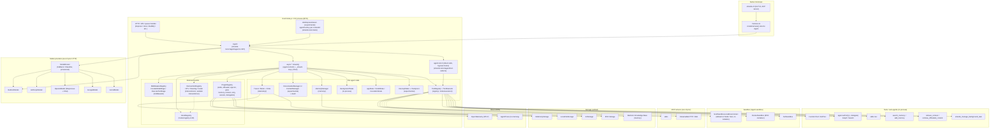

# Strands Agents TypeScript — Benchmark Analysis

> **Repo**: https://github.com/strands-agents/harness-sdk (TS SDK under `strands-ts/`)
> **Commit analysed**: e3d5b4ccb35ab82078eb2390156b894728c03b9f
> **Branch**: main
> **Framework path**: frameworks/strands-agents-harness-sdk/strands-ts
> **Analysed on**: 2026-10-01
>
> The previous home, `strands-agents/sdk-typescript`, was archived on 2026-06-02 at `00e0488`. This report describes the live SDK in the monorepo. All citations are relative to the submodule root and carry the `strands-ts/` prefix.

## TL;DR

- **What this stack is architecturally**: a **library-only**, in-process TypeScript SDK published as `@strands-agents/sdk` (npm `1.19.0`, 2026-09-22). The agent loop is an `async function* stream()` method on an `Agent` class (`strands-ts/src/agent/agent.ts:1142`) that runs inside the host Node.js (or browser) process. No bundled server, no subprocess, no vendor runtime. The only network surface is an optional A2A JSON-RPC Express adapter (`strands-ts/src/a2a/express-server.ts:37`, marked experimental). Two sibling TS packages sit on top of the SDK in the same monorepo: `harness-ts` (`@strands-agents/harness`, `createHarness()` returns a pre-configured `Agent`) and `strands-cli` (`@strands-agents/cli`, an Ink terminal chat plus an ACP-over-stdio server).
- **Ecosystem**: TypeScript (Node.js `>=22`, `strands-ts/package.json:279`). The same monorepo holds a native Python SDK (`strands-py/`), `harness-py/`, `strands-cli/` and `strands-mcp/`. There is no WASM bridge in this layout (see §0.2).
- **Project status**: Apache-2.0 only (`strands-ts/package.json:230`). Owned by the AWS-led Strands Agents GitHub organization. Community support through Discord and GitHub issues; no managed cloud or paid SLA is advertised in the repo. The previous home `strands-agents/sdk-typescript` was archived on 2026-06-02 at `00e0488` (the TS SDK moved here, under `strands-ts/`).
- **Maturity**: GA since `v1.0.0` (2026-04-30). The npm package went from `1.3.0` (2026-05-21) to `1.19.0` (2026-09-22): 16 minors in about four months, roughly weekly. The analysed commit is on `main`, 19 commits touching `strands-ts/`, `harness-ts/` or `strands-cli/` after tag `typescript/v1.19.0`. A few things below exist only on `main` and are **not in npm 1.19.0**: the MCP client 2.0 swap (#4093), the `a2a_client` vended tool (#4575), `Agent.shutdown()` (#4519) and the `InterruptError` export (#4541). Maturity labels are uneven: checkpointing, `ContextManager`, the agentic context mode, the A2A module and the `stop` tool are marked experimental; `ModelRouter` is marked "provisional and may change"; middleware, memory and unified storage carry no such label.
- **Where the agent loop *actually* executes**: in your process. `Agent.stream()` (`strands-ts/src/agent/agent.ts:1142`) wraps `_streamWithMiddleware` (`:1269`) and the inner `_stream` loop (`:1513`, `while (true)` at `:1584`). Tool execution moved out of `agent.ts` into executor classes (`strands-ts/src/tools/executors/`).
- **Strongest architectural choice for our use case**: `InvocationState` (`Record<string, unknown>`, `strands-ts/src/types/agent.ts:89`) is threaded by reference through every hook event, every `ToolContext`, every middleware context and the final `AgentResult`. Three enforcement points now consume it: (1) a `BeforeToolCallEvent` hook can rewrite `toolUse.input` server-side; (2) `InvokeModelStage.Input` middleware can rewrite the `toolSpecs` the model sees per call, which gives a per-turn, tenant-aware tool list that the old report called absent; (3) the vended `CedarAuthorization` intervention resolves a Cedar principal from `invocationState` and **fails closed** when none is found (`strands-ts/src/vended-interventions/cedar/cedar.ts:60-63`, `:169-173`). Per-invocation `limits` (`turns`, `outputTokens`, `totalTokens`) add a first-party token budget per call.
- **Weakest / biggest gap**: no HTTP chat/SSE server and no multi-tenant runtime host; no resource manager or scoped registry; **no USD cost** and no per-tenant budget; no MCP server; direct `agent.tool.X` calls bypass every hook, intervention and middleware; one invocation per `Agent` instance (`ConcurrentInvocationError`); no first-party chat UI; no TS eval harness; semantic memory only through `BedrockKnowledgeBaseStore`. All BYO.
- **Most surprising finding**: the breadth that landed after the archive. Since June the live SDK gained middleware, `ModelRouter`, a memory manager, a context manager with offload strategies and a stash, background tool tasks, unified `Storage`, durable checkpoints, a sandbox wired into the agent, Cedar, and MCP JSON config loading. The surprising negative: the **sandbox is weaker than the archived snapshot suggested**. `DockerSandbox` is now bring-your-own-container (`docker exec` into a running container; options are only `container`, `workingDir`, `user`, `strands-ts/src/sandbox/docker.ts:15-32`), and **on Node the default sandbox is `NotASandboxLocalEnvironment`, i.e. host execution with no isolation** (`strands-ts/src/sandbox/register-node-defaults.ts:6-8`). The persistent `bash` vended tool ignores the sandbox altogether.
- **One-line verdicts**:
  - **Sessions/persistence**: snapshot-based `SessionManager` (`snapshot_latest.json` + immutable UUIDv7 history) over a new unified `Storage` interface (`InMemoryStorage`, `LocalFileStorage`, `S3Storage`; legacy `FileStorage`/`S3Storage` deprecated). Durable checkpoints exist but are **experimental** and capture only position plus cycle index, not conversation state; no per-tool granularity.
  - **Skills**: first-class via the vended `AgentSkills` plugin. `SKILL.md` with YAML frontmatter, lazy loading through a `skills` tool, filesystem (read through the agent's sandbox) and `https://` sources. `allowedTools` still unenforced.
  - **Resource manager**: Not provided — BYO.
  - **Sub-agents**: agents-as-tools (`agent.asTool()`, now with a `delegate` mode) plus `Graph` and `Swarm`. Still static configs; no LLM-generated sub-agent configs in the SDK.
  - **Multi-tenancy**: tenant identity is BYO through `invocationState`. Forced args via `BeforeToolCallEvent` hook; per-turn tool visibility via `InvokeModelStage.Input` middleware; Cedar principal from `invocationState`, fail-closed. Per-call token/turn caps exist; no USD, no per-tenant aggregate. `agent.tool.X` is an unguarded side door.
  - **Hooks and middleware**: typed hook bus (16 stream events, order-controlled) plus a public `agent.addMiddleware()` over `InvokeModelStage` and `ExecuteToolStage`, and an interventions layer (`proceed | deny | guide | confirm | transform`). README says middleware is meant to replace hooks long term.
  - **API**: library-only. Optional A2A server with a per-`contextId` agent factory (experimental). Not an HTTP-chat surface.
  - **Observability**: OpenTelemetry-native with in-memory `AgentTrace` and `AgentMetrics` on every `AgentResult`; memory spans; opt-in span-attributes-only mode. Token counts only: **USD cost: not computed**; no span redaction.
- **Production-readiness for multi-tenant server-side deployment**: usable for one-process-many-agents under your own HTTP layer, and noticeably closer than in May. The SDK now supplies the loop, hooks and middleware, Cedar and HITL policy, per-call limits, model fallback, sessions on S3, memory and OTel. You still write the multi-tenant router, the per-tenant USD budget, the resource manager, the chat-UI bridge, and a real isolation layer (container-per-tenant; the default tool execution on Node is the host). Treat several of the newest subsystems (checkpoints, `ContextManager`, `ModelRouter`, A2A) as moving targets.

## 0. General

### 0.1 What is this stack?

A **library**: an npm package `@strands-agents/sdk` (`strands-ts/package.json:2`) you import into your Node.js (or browser) host. Not a server, not a managed service. Two adjacent packages in the same monorepo are thin products on top of it: `@strands-agents/harness` (`harness-ts/package.json:2-4`, "a batteries-included agent in one call") and the `strands` terminal CLI (`strands-cli/package.json:2-8`). An A2A-protocol Express adapter ships as a subpath (`@strands-agents/sdk/a2a/express`), but it is not a multi-tenant chat server.

### 0.2 Ecosystem

**TypeScript** (primary). The monorepo is polyglot: `strands-py/` (the Python SDK, a native implementation, not a WASM guest), `harness-py/`, `harness-ts/`, `strands-cli/` (TypeScript), `strands-mcp/` (a Python docs-search MCP server) and `site/` (docs). The archived `sdk-typescript` repo carried a WASM build and a `strands-py-wasm` Python guest; neither directory exists at `e3d5b4cc`. I did not investigate why it was dropped.

### 0.3 Project status & governance

- **License**: Apache-2.0 only (`strands-ts/package.json:230`; repo-level `LICENSE.APACHE`). The MIT dual license was dropped before the archive (PR #1118).
- **Owner**: AWS-led Strands Agents organization on GitHub (`https://github.com/strands-agents`). The TS SDK lived in `strands-agents/sdk-typescript` until 2026-06-02 (archived at `00e0488`). It now lives in `strands-agents/harness-sdk`, the renamed former `sdk-python` repo, under `strands-ts/`.
- **Default model provider** is Amazon Bedrock (`new BedrockModel()` fallback at `strands-ts/src/agent/agent.ts:536`; default id `global.anthropic.claude-sonnet-4-6` in `us-west-2`, `strands-ts/src/models/defaults.ts:13-16`). The SDK warns when the default is used (`strands-ts/src/models/bedrock.ts:441`). `harness-ts` has its own default, `bedrock/global.anthropic.claude-opus-5` (`harness-ts/src/defaults.ts:5`); the Opus 5 / high-thinking default change (#4460) touched `harness-*`, not the SDK.
- **Commercial backing / support**: community-only in-repo (Discord, GitHub issues). No managed cloud or paid SLA is advertised. The docs site lists AWS deployment targets (AgentCore, Lambda, Fargate, EKS and others) under `https://strandsagents.com/docs/user-guide/sdk/deploy/`.

### 0.4 Project maturity / age

- Repository created 2025-09-18 in `sdk-typescript` (first commit `1a1e014`); `v0.1.0` on 2025-12-03; `v1.0.0` GA on 2026-04-30; `v1.3.0` on 2026-05-21 (last tag in the archived repo). After the move: `typescript/v1.4.0` (2026-06-01) to `typescript/v1.19.0` (2026-09-22) in `harness-sdk`.
- `strands-ts/package.json:3` holds the placeholder `0.0.1-development`; the release workflow sets the real version from the tag. npm shows `1.19.0` as `latest`.
- **Analysed commit vs npm**: `e3d5b4cc` (2026-09-30) is 19 commits touching `strands-ts/`, `harness-ts/` or `strands-cli/` ahead of `typescript/v1.19.0`. Main-only in `strands-ts/`: MCP client 2.0 swap (#4093), `a2a_client` vended tool (#4575), `Agent.shutdown()` (#4519), `InterruptError` export (#4541), locale-independent number formatting (#4682), prompt-cache write-token fixes (#4617, #4219) and context-window limits for newer models (#4694). At tag `typescript/v1.19.0` the MCP client still imported `@modelcontextprotocol/sdk` `^1.25.2`, had no `versionNegotiation`, and had no `a2a-client` directory (checked with `git show`).
- API stability labels as stated in code:
  - **Experimental**: durable checkpoints (`strands-ts/src/experimental/checkpoint.ts:4`); `ContextManager` (`strands-ts/src/context-manager/context-manager.ts:57-59`) and the agentic context mode (`strands-ts/src/context-manager/modes/agentic/agentic-context.ts:4`); the A2A module (`strands-ts/src/a2a/express-server.ts:7`); the `stop` vended tool (`strands-ts/src/experimental/vended-tools/stop/stop.ts`); MCP `tasksConfig` (also disabled at runtime, `strands-ts/src/mcp/client.ts:469-476`); `Skill.allowedTools` ("not yet enforced", `strands-ts/src/vended-plugins/skills/skill.ts:31`).
  - **Provisional**: model routing, "provisional and may change" (`strands-ts/src/models/routing/index.ts:4-5`).
  - **Not marked**: middleware, memory manager, unified storage, background tasks (public surface is only `AgentConfig.backgroundTasks`; the classes are `@internal`), sandbox, interventions.
- Monorepo packages are younger than the SDK: `@strands-agents/harness` `0.1.1` (2026-09-22) and `@strands-agents/cli` `0.1.4` (2026-09-25).

### 0.5 Adoption & community signal

Captured 2026-10-01 via `gh api` and the npm registry. Stars and forks on `harness-sdk` are **shared with the Python SDK**; there is no TS-only count.

| Signal | `strands-agents/harness-sdk` (live; Python + TS + harness + CLI) | `strands-agents/sdk-typescript` (archived 2026-06-02) |
|---|---|---|
| Stars | 8,595 | 694 |
| Forks | 1,302 | 103 |
| Watchers | 55 | 7 |
| Contributors | ~306 (repo-wide) | 32 |
| Open issues + PRs | 912 (of which 362 open PRs) | frozen |
| PR volume | 491 PRs created in September 2026; ~2,970 PRs total | 717 total |
| Last push | 2026-10-01 | 2026-06-03 |
| Release cadence | `typescript/v1.4.0` (2026-06-01) to `typescript/v1.19.0` (2026-09-22), roughly weekly | `v0.1.0` (2025-12) to `v1.3.0` (2026-05-21) |

npm `@strands-agents/sdk`: `1.19.0`; about 2.00 M downloads in 2026-08-31 to 2026-09-29 and about 619 k in 2026-09-23 to 2026-09-29. `@strands-agents/harness`: about 3.0 k downloads in the same month; `@strands-agents/cli`: about 1.8 k. Maintainers are visibly active: the repo takes several hundred PRs per month, and release notes are auto-drafted per tag.

### 0.6 Ecosystem fit

- **Packages**: `@strands-agents/sdk` on npm, with subpath exports for each provider, plugin, intervention, sandbox, memory store, storage and tool family (`strands-ts/package.json:27-194`). Notable subpaths: `./models/routing` (`:47`), `./experimental` (`:55`), `./vended-tools/*` (`:59-97`), `./a2a` and `./a2a/express` (`:99-105`), `./vended-memory-stores/*` (`:111-121`), `./vended-plugins/*` (`:127-141`), `./vended-interventions/{hitl,steering,cedar}` (`:143-153`), `./storage`, `./storage/search`, `./sandbox`, `./sandbox/docker`, `./sandbox/ssh` (`:163-193`). Siblings: `@strands-agents/harness`, `@strands-agents/cli`.
- **Node version**: `>=22.0.0` (`strands-ts/package.json:279`; Node 20 dropped in `typescript/v1.17.0`, #4145). Examples README also states Node 22+ (`strands-ts/examples/README.md`).
- **Peer dependencies, all optional** (`strands-ts/package.json:296-321`): `@anthropic-ai/sdk`, `openai`, `@google/genai`, `@ai-sdk/provider`, `@modelcontextprotocol/client` `^2.0.0` (main-only; v1.19.0 used `@modelcontextprotocol/sdk`), `zod`, `express`, `@a2a-js/sdk`, `@aws-sdk/client-s3`, `@aws-sdk/client-bedrock-agent*`, OpenTelemetry packages, `@cedar-policy/cedar-wasm`, `@tobilu/qmd`, `turndown`. You install only what you use.
- **Browser compat**: a browser bundle is a supported target (`index.ts` vs `index.node.ts`; Node-only defaults are registered by `strands-ts/src/register-node-defaults.ts`). The default sandbox slot throws if read in a browser with nothing registered (`strands-ts/src/sandbox/default.ts`).
- **Official examples**: `strands-ts/examples/{first-agent, agents-as-tools, graph, swarm, mcp, telemetry, browser-agent}`. Samples repo at `https://github.com/strands-agents/samples`.
- **Usage pattern**: library. `harness-ts` and `strands-cli` give a pre-built agent and a terminal front end respectively; neither is a hosted platform.

### 0.7 Documentation depth & cross-team contributor accessibility

- In-repo: `strands-ts/README.md`, `strands-ts/AGENTS.md` (contributor guide), `strands-ts/docs/{DEPENDENCIES,README,TESTING}.md`, and a design-decision README for middleware (`strands-ts/src/middleware/README.md`). The docs site source lives in `site/src/content/docs/`, with TypeScript snippets as compiled `.ts` files next to the `.mdx` pages (for example `site/src/content/docs/user-guide/sdk/storage.ts`).
- External: `https://strandsagents.com/` (official docs portal covering Python and TS), `https://strandsagents.com/docs/api/typescript/` (API reference), `https://strandsagents.com/changelog/` (generated from GitHub releases by `.github/workflows/changelog-sync.yml`).
- Non-engineer (Product/Data) authoring: the `SKILL.md` format (YAML frontmatter + markdown) is accessible to a writer, and a `GoalLoop` natural-language goal is authorable by non-engineers. Everything else is code.

### 0.8 Documentation entry points

- Official docs landing page: https://strandsagents.com/
- Quickstart / getting-started: https://strandsagents.com/docs/user-guide/sdk/quickstart/typescript/
- API reference: https://strandsagents.com/docs/api/typescript/
- Hosting / deployment guide: https://strandsagents.com/docs/user-guide/sdk/deploy/ (I did not check TypeScript coverage page by page)
- Harness guide: https://strandsagents.com/docs/user-guide/harness/
- Examples / demos repo: https://github.com/strands-agents/samples (also `strands-ts/examples/`)
- Changelog / release notes: https://strandsagents.com/changelog/ (no `CHANGELOG.md` in `strands-ts/`; the site changelog is generated from releases)
- GitHub Releases: https://github.com/strands-agents/harness-sdk/releases (TS SDK tags are `typescript/vX.Y.Z`; harness is `harness-typescript/vX.Y.Z`, CLI is `harness-cli/vX.Y.Z`). The archived repo's releases at https://github.com/strands-agents/sdk-typescript/releases stop at `v1.3.0`.
- GitHub issues: https://github.com/strands-agents/harness-sdk/issues (the archived `sdk-typescript` tracker is read-only)
- Source: https://github.com/strands-agents/harness-sdk/tree/main/strands-ts
- Discord: https://discord.gg/strands

---

## 1. High Level Architecture

### Deployment diagram

```
┌─────────────────────────────────────────────────────────────────────┐
│ Your Node.js >=22 process (host application)                         │
│                                                                      │
│  HTTP / WebSocket / queue worker (BYO: Express, Fastify, Hono, BullMQ)│
│         │            (optional: A2AExpressServer, per-contextId agents)│
│         ▼                                                            │
│  ┌──────────────────────────────────────────────────────────────┐   │
│  │ new Agent({ model | ModelRouter, tools, plugins, interventions,│   │
│  │   storage, sandbox, memoryManager, contextManager,            │   │
│  │   backgroundTasks, checkpointing })                           │   │
│  │  agent.stream(args, { invocationState, limits, cancelSignal })│   │
│  │                                                               │   │
│  │  AgentStreamStage (internal middleware)                       │   │
│  │   └─ async *_stream loop                                      │   │
│  │       0. check limits (turns / tokens)                        │   │
│  │       1. _invokeModel ─ InvokeModelStage middleware ─► model  │   │
│  │       2. parse toolUse blocks                                 │   │
│  │       3. executeTools ─ ToolExecutor (concurrent|sequential)  │   │
│  │            └ ExecuteToolStage middleware ─► tool.stream()     │   │
│  │       4. append messages, fire hooks, checkpoint?             │   │
│  │       5. loop until stopReason != toolUse                     │   │
│  │   HookRegistry  ToolRegistry  PluginRegistry  Interventions   │   │
│  │   MiddlewareRegistry  ConversationMgr|ContextMgr  BackgroundTasks│ │
│  └──────────────────────────────────────────────────────────────┘   │
└───┬─────────────┬───────────────┬──────────────┬───────────┬────────┘
    ▼             ▼               ▼              ▼           ▼
┌─────────┐ ┌───────────┐ ┌────────────┐ ┌────────────┐ ┌───────────────┐
│ Bedrock │ │ OpenAI /  │ │ MCP servers│ │ Storage:   │ │ Sandbox:      │
│ (AWS)   │ │ Anthropic/│ │ (stdio /   │ │ InMemory / │ │ host (default │
│         │ │ Google /  │ │ StreamHTTP │ │ LocalFile /│ │ on Node), BYO │
│         │ │ Vercel    │ │ / SSE)     │ │ S3 / custom│ │ Docker, SSH   │
└─────────┘ └───────────┘ └────────────┘ └────────────┘ └───────────────┘
```

### 1.1 Where does the agent loop *actually* execute?

In your Node process. `Agent.stream()` (`strands-ts/src/agent/agent.ts:1142`) is an `async function*`. It acquires the invocation lock (`:1146`), runs an outer resume/continuation `while (true)` (`:1157`), and delegates to `_streamWithMiddleware` (`:1269`), which wraps `_streamCore` (`:1340`) and the inner `_stream` loop (`:1513`). The inner loop iterates while the model returns `stopReason === 'toolUse'` (`while (true)` at `:1584`), dispatching tools through the local `ToolRegistry`. No subprocess, no remote vendor loop. Model providers issue outbound HTTP calls, but orchestration is local.

`harness-ts` does not change this: `createHarness(options): Promise<Agent>` (`harness-ts/src/agent.ts:347`) returns a plain SDK `Agent`. `strands-cli` runs that agent inside a terminal process (`strands-cli/src/tui/runtime.ts:3`, `:159`).

### 1.2 Runtime dependencies

- **Required**: Node `>=22` (`strands-ts/package.json:279`). Package deps are small (`@aws-sdk/client-bedrock-runtime`, `uuid`, `yaml`, `@smithy/fetch-http-handler`, `@types/json-schema`; `strands-ts/package.json:289-295`); everything else is an optional peer.
- **External data stores**: none required. `LocalFileStorage` writes to `./.strands/` by default, `S3Storage` to a bucket. Postgres, Redis and DynamoDB appear only in doc comments (`strands-ts/src/storage/storage.ts:97`); nothing implements them. The optional BM25 search uses a SQLite index through `@tobilu/qmd` (`strands-ts/src/storage/search/qmd.ts:17-42`).
- **External binaries / subprocesses**: none for the core. `DockerSandbox` requires an already running container and the `docker` CLI (it runs `docker exec`, `strands-ts/src/sandbox/docker.ts:35`), `SshSandbox` requires OpenSSH (`strands-ts/src/sandbox/ssh.ts:92`). The persistent `bash` vended tool spawns a host shell (`strands-ts/src/vended-tools/bash/bash.ts:39`). `NotASandboxLocalEnvironment` spawns `sh -c` on the host (`strands-ts/src/sandbox/not-a-sandbox-local-environment.ts:27-35`). Stdio MCP servers are subprocesses.
- **Vendor services**: only the LLM provider you choose (Bedrock by default; otherwise Anthropic, OpenAI, Google or any AI-SDK provider). Optional: `BedrockKnowledgeBaseStore` for memory.

### 1.3 Recommended deployment topology

Not prescribed in the SDK repo; the SDK is treated as a normal Node library. The docs site has deploy pages for AgentCore, Lambda, Fargate, App Runner, EKS, EC2, Docker, Kubernetes and Terraform (`site/src/content/docs/user-guide/sdk/deploy/`), including an "operating agents in production" page. Practical patterns: one process, one `Agent` per request or session, or container-per-tenant for isolation. The A2A server offers a built-in variant of the first pattern: one agent per `contextId`, LRU-capped at 1000 (`strands-ts/src/a2a/executor.ts:24`, `:205-219`).

### 1.4 Cold-start cost & instance footprint

Not measured by me and not documented in the repo. Expected to be light because no subprocess starts and peers load lazily. No equivalent of a 20-30 s subprocess spawn. Memory-footprint safeguards in the code: `AgentMetrics` keeps at most 50 per-invocation entries (`MAX_INVOCATION_HISTORY`, `strands-ts/src/telemetry/meter.ts:288`, evicted at `:401-403`). The context manager's stash defaults to `InMemoryStorage` and stores every message block eagerly (`strands-ts/src/context-manager/stash.ts:55-70`), so long sessions with the context manager enabled grow memory unless you configure durable stash storage.

### 1.5 Vendor lock-in

- **LLM provider**: low. Bedrock is the default, but the `Model` base class (`strands-ts/src/models/model.ts:312`) is provider-agnostic, with adapters for Bedrock, Anthropic, OpenAI (Responses by default, Chat via `api: 'chat'`), Google and a `VercelModel` shim. A Bedrock-Mantle path routes OpenAI-compatible calls through Bedrock (`strands-ts/src/models/openai/mantle.ts:46`).
- **Hosting**: none; pure library. The docs steer toward AWS targets but nothing requires them.
- **Eval / observability**: OpenTelemetry-native, so any OTLP backend works. Some telemetry options are Langfuse-aware (`_isLangfuse`, `strands-ts/src/telemetry/tracer.ts:230`).

### 1.6 Framework weight / footprint

Heavy library. `strands-ts/src` holds about 50.6 k lines of non-test TypeScript across roughly 35 top-level modules (agent, background-tasks, context-manager, conversation-manager, experimental, hooks, injection, interventions, memory, middleware, models, multiagent, plugins, retry, sandbox, session, storage, telemetry, tools, vended-*). `agent.ts` alone is 2,728 lines. From the archived snapshot (agent.ts ~2,260 lines) the SDK added middleware, routing, memory, context management, background tasks and storage. This is a full agent SDK, not a few hundred lines of glue. Two thin products sit on top (`harness-ts`, `strands-cli`).

### 1.7 Release-history signal

The archived `sdk-typescript` repo was archived on 2026-06-02 at `00e0488` (PR #1142); the TS SDK continues in this monorepo. There is no `CHANGELOG.md` in `strands-ts/`; release notes are auto-drafted GitHub Releases (`typescript/vX.Y.Z`) mirrored to the docs-site changelog. The release notes mix Python and TS commits, so the table below lists only items I could tie to TS code at `e3d5b4cc` (first tag containing the TS file, checked with `git tag --contains`, plus the release notes):

| Release (npm) | Production-relevant TS changes |
|---|---|
| `v1.5.0` (2026-06-12) | Middleware system (`strands-ts/src/middleware/`, #2681); memory manager with extraction and the Bedrock Knowledge Base store (#2544, #2671, #2630); `Sandbox` integrated with `Agent` (#2563) and `DockerSandbox` simplified to bring-your-own-container (#2561); A2A per-context agent isolation (#2628, #2696) |
| `v1.6.0` (2026-06-16) | **Breaking**: middleware context inputs are copied (#2742). Memory injection (#2631); agentic context mode (`context-manager/modes/agentic/`); `CedarAuthorization` (#2365); message pinning in conversation managers |
| `v1.7.0` (2026-06-25) | Cedar `namespace` option (#2896) |
| `v1.8.0` (2026-07-08) | `McpClient.loadServers` from JSON (#2947); MCP output schemas preserved (#3109); middleware result handling and model-state isolation (#2812) |
| `v1.9.0` (2026-07-10) | Durable-execution checkpoints, experimental (#3103; exported only from `/experimental`, #3180); durable `trackingId` on messages (#2836); `metrics` on `LocalAgent` (#3116); `LocalMemoryStore` renamed `TestMemoryStore` (#3123) |
| `v1.10.0` (2026-07-17) | Unified `Storage` interface and `SnapshotStorageAdapter` (#3099); offloader auto-namespacing (#3258); `gen_ai_span_attributes_only` (#3191); generic async `Queue` extracted (#3262) |
| `v1.11.0` to `v1.11.2` (2026-07-24 to 07-27) | `ToolExecutor` class hierarchy (#3268); `ExecuteToolStage` middleware with middleware-initiated interrupts (#3233); `sleep` tool (#3393); experimental `stop` tool (#3397); `AgentDelegation` plugin |
| `v1.12.0` (2026-08-07) | `AgentStreamStage` types (#3635, internal); top-level `Agent` `storage` (#3660); `Model.estimateUtilization` (#3641); repetitive swarm-handoff detection (#3461); MCP tool filtering and name prefixes (#3415); LLM risk classifier for `HumanInTheLoop` (#3566) |
| `v1.13.0` (2026-08-12) | Sandbox-routed `shell` tool with `bash` aliases deprecated (#3574, #3756); in-flight Bedrock requests aborted on cancel (#3337) |
| `v1.14.0` (2026-08-21) | `ContextManager` with offload strategies (#3505); `FileMemoryStore` (#3825); audio content blocks (#3865); per-call model through `InvokeModelStage` (#3875); multiple continuation inputs (#3837); `ToolContext.cancelSignal` (#3807) |
| `v1.15.0` (2026-08-27) | `ModelRouter` and `FallbackStrategy` (#3903); configurable classifier strategy (#3846); `Agent.sessionId` getter (#4000); in-process task engine (#3838); `cacheKey` in `CacheConfig` and OpenAI prompt-cache keys (#3949) |
| `v1.16.0` (2026-08-31) | `backgroundTasks` on `Agent` (#4026) with `BackgroundTaskManager` (#3876); QMD BM25 search for storage (#3897) |
| `v1.17.0` (2026-09-08) | **Breaking**: Node 22+ required (#4145). Context-manager stash (#3924) and session support (#4118); context-manager types exported as experimental (#4231) |
| `v1.18.0` (2026-09-15) | `web_fetch` tool for TS (#4153); BM25 search strategy export (#4079); context strategy presets (#4256); OpenAI prompt-cache keys derived from session id (#4083) |
| `v1.19.0` (2026-09-22) | `handoff_to_user` tool for TS (#4382); Bedrock `requestTimeout` (#4408); `ContextManager` instance accepted by `Agent` (#4459); Anthropic server-side tools seam (#3568); interrupt retry backoff aborted on cancel (#4291) |
| `main` after `v1.19.0` | MCP client 2.0 swap, breaking (#4093); `a2a_client` vended tool (#4575); `Agent.shutdown()` (#4519); `InterruptError` export (#4541); cache-write token fixes (#4617, #4219); context-window limits for newer models (#4694) |

**Fast-moving areas**: context management, memory, routing, background tasks, MCP and the sandbox changed several times in four months. **Breaking changes to watch**: middleware context copying (1.6), Node 22 (1.17), the MCP client 2.0 swap (main, next release), and the `bash` to `shell` tool rename with deprecated `makeBash` aliases (1.12-1.13). Legacy `FileStorage`, `S3Storage`, `SnapshotStorage` and `SessionStorage` are `@deprecated` in favour of unified `Storage` (`strands-ts/src/session/storage.ts:19`, `:30`).

**Correction to earlier claims**: the previous version of this report listed "default model changed to Opus 5 with high thinking (v1.19)" as an SDK change and gave `ModelRouter` as "v1.13, v1.15". In code the SDK default is still Sonnet 4.6 (`strands-ts/src/models/defaults.ts:9-16`); the Opus 5 default is `harness-ts` only (`harness-ts/src/defaults.ts:5`). The TS `ModelRouter` first shipped in `v1.15.0`; `v1.13.0` was the Python router.

---

## 2. Agent Loop

### 2.1 Run loop entrypoint(s)

`Agent.invoke()` and `Agent.stream()` (`strands-ts/src/agent/agent.ts:1077` and `:1142`).

```typescript
public async invoke(args: InvokeArgs, options?: InvokeOptions): Promise<AgentResult>

public async *stream(
  args: InvokeArgs,
  options?: InvokeOptions
): AsyncGenerator<AgentStreamEvent, AgentResult, undefined>
```

`invoke()` drains `stream()`. `InvokeArgs` (`strands-ts/src/types/agent.ts:59`) now also accepts a checkpoint resume payload:

```typescript
export type InvokeArgs =
  | string
  | ContentBlock[] | ContentBlockData[]
  | Message[] | MessageData[]
  | InterruptResponseContent[] | InterruptResponseContentData[]
  | CheckpointResumeContent                 // { checkpointResume: { checkpoint } }, experimental
```

`InvokeOptions` (`strands-ts/src/types/agent.ts:94`):

```typescript
export interface InvokeOptions {
  structuredOutputSchema?: z.ZodSchema      // :98
  invocationState?: InvocationState         // :107, Record<string, unknown>
  cancelSignal?: AbortSignal                // :137
  limits?: { turns?: number; outputTokens?: number; totalTokens?: number }   // :155
}
```

`AgentResult` (`strands-ts/src/types/agent.ts:438`) carries `stopReason`, `lastMessage`, `traces?`, `metrics?` (`:467`), `structuredOutput?`, `invocationState` (`:475`), `interrupts?` and the experimental `checkpoint?` (`:490`).

Related lifecycle methods: `cancel()` (`agent.ts:1045-1049`, a no-op unless invoking), `isInvoking` (`:982`), `shutdown()` (`:1100`, main-only, today it only calls `memoryManager.flush()`) and `[Symbol.asyncDispose]` (`:1108`).

A second, model-free entrypoint exists: `agent.tool.<name>.invoke(input)` / `.stream(input)` (`agent.ts:1003`, `strands-ts/src/agent/tool-caller.ts`). See §13.2 for what it skips.

### 2.2 Per-iteration behavior

One trip around `_stream()` (`strands-ts/src/agent/agent.ts:1513`):

1. Fire `BeforeInvocationEvent` once; extract interrupt responses or a checkpoint resume payload if present (`:1523-1557`).
2. **Limit check** (`_checkLimits`, `:920-939`, called at `:1587`). `limits` is validated once at entry (`_validateLimits`, `:884`). Unknown keys are rejected rather than silently applying no cap (#4356). A reached cap returns `stopReason` `limitTurns` / `limitTotalTokens` / `limitOutputTokens`.
3. Start a cycle (`this._meter.startCycle()`, `:1600`), then `_invokeModel()` (`:2079`): fires `BeforeModelCallEvent`, runs `InvokeModelStage` middleware (`_invokeModelWithMiddleware`, `:2258`, invoke at `:2285`), streams the model, fires `ContentBlockEvent` / `ModelStreamUpdateEvent` per delta and `ModelMessageEvent`, then `AfterModelCallEvent` (retry or router failover can re-enter here, `:2241-2244`).
4. If `stopReason !== 'toolUse'`: build the `AgentResult`, fire `AfterInvocationEvent`; a hook can set `resume` to loop again (`:1157`, `:1230-1243`).
5. Else `executeTools()` (`:2416-2493`): fires `BeforeToolsEvent`, delegates to the executor (`this._toolExecutor.execute(...)`, `:2465`), fires `AfterToolsEvent`. The executor fires `BeforeToolCallEvent` (`strands-ts/src/tools/executors/executor.ts:122`), runs `ExecuteToolStage` middleware (`:274`), calls `tool.stream()` (`:296`) and fires `AfterToolCallEvent` (`:149`, `:207`).
6. **Deferred append** (`agent.ts:1761-1768`): the assistant tool-use message and the user tool-result message are appended only after tool execution, so an interrupted invocation never leaves a dangling `toolUse` without a matching `toolResult`.
7. If `checkpointing` is on, pause with `stopReason: 'checkpoint'` at `afterModel` (`:1716-1737`) or `afterTools` (`:1767-1768`, `:1821-1835`). See §5.6.
8. Loop.

Because the limit check runs at the top of an iteration, tools requested by the previous turn always finish first, and `agent.messages` stays re-invokable.

### 2.3 ReAct loop

Yes, built in. The `while (true)` in `_stream` (`agent.ts:1584`) is the ReAct loop. You do not assemble it; you configure it through `tools`, `systemPrompt`, hooks, middleware, interventions, `conversationManager` or `contextManager`, `limits`, and `toolExecutor` (`'concurrent' | 'sequential'` or an executor instance, `agent.ts:287`; the default is concurrent, `resolveToolExecutor` at `:353-368`).

### 2.4 Tool dispatch + result handling

Dispatch moved out of `agent.ts` into `strands-ts/src/tools/executors/`:

- `abstract class ToolExecutor` (`@internal`, `executor.ts:67`) with `ConcurrentToolExecutor` (`concurrent.ts:28`) and `SequentialToolExecutor` (`sequential.ts:23`), both publicly exported (`strands-ts/src/index.ts:155-156`). The executor can be swapped at runtime (`agent.toolExecutor` setter, `agent.ts:968`).
- Concurrent mode creates one generator per tool (`concurrent.ts:47-52`) and races them with `Promise.race(pendingSteps.values())` (`concurrent.ts:81`). Interrupts are deferred until sibling tools finish (`:76-77`, `:126-128`).
- `executeTool` (`executor.ts:107`): build `toolUse` from the model's block; fire `BeforeToolCallEvent` (hooks may mutate `toolUse.input` / `.name`, set `selectedTool`, or set `cancel`; the model-issued `toolUseId` is authoritative and the executor overwrites it, `executor.ts:130-133`); resolve the tool; run `ExecuteToolStage` middleware (`:253-274`); build `ToolContext` (`:316-329`); stream the tool; build the `ToolResultBlock`; fire `AfterToolCallEvent` (hooks may mutate `result` or set `retry`).
- `ToolRegistry.resolve(name)` (`strands-ts/src/registry/tool-registry.ts:77`) tries an exact match, then underscore-to-hyphen, then case-insensitive, else throws `ToolNotFoundError`. It is used by direct calls (`tool-caller.ts:215`).
- Background routing: with `backgroundTasks` enabled, `routeToolCall` can divert a tool call to the in-process task engine and return an acknowledgement (`executor.ts:163`, §4.4).

### 2.5 Explicit turn concept

A "cycle" is the unit (`this._meter.startCycle()` at `agent.ts:1600`): one model call plus any tools it triggered. A full invocation may span many cycles. `limits.turns` counts these cycles. `StopReason` (`strands-ts/src/types/messages.ts:710-726`):

```typescript
export type StopReason =
  | 'cancelled' | 'checkpoint'              // checkpoint: new, experimental
  | 'contentFiltered' | 'endTurn' | 'guardrailIntervened' | 'interrupt'
  | 'maxTokens'                              // provider per-call cap
  | 'limitOutputTokens' | 'limitTotalTokens' | 'limitTurns'   // InvokeOptions.limits
  | 'pauseTurn'                              // Anthropic long-running turn
  | 'refusal'                                // provider streaming classifier
  | 'stopSequence' | 'toolUse' | 'modelContextWindowExceeded'
  | (string & {})
```

### 2.6 Event emission mechanism (in-process)

Native `AsyncGenerator<AgentStreamEvent, AgentResult, undefined>` from `Agent.stream()`. Every yielded value is a class instance from the `AgentStreamEvent` union (`strands-ts/src/types/agent.ts:623`, 16 members). Hooks run in-line through `_invokeCallbacks()` (`agent.ts:1497-1503`) before each `yield`, so a hook can mutate an event before it leaves the generator. The invocation lock is acquired by `acquireLock()` (`:854-861`, called at `:1146`) and released in `finally` (`:1261`). Middleware can filter or inject events: `InvokeModelStage` and `ExecuteToolStage` handlers are async generators that can `yield` extra events (`strands-ts/src/middleware/types.ts:59-78`). The internal `AgentStreamStage` wraps the whole output stream (`agent.ts:1269`, `:1288`).

---

## 3. Message & Event Taxonomy

### 3.1 Message layers

Two vocabularies:

- **Provider-bound messages**: `Message` / `ContentBlock` (`strands-ts/src/types/messages.ts:70` and `:191`). The conversation history sent to the provider. A `Message` now carries a durable `trackingId` (`:94`, minted by `generateTrackingId()` with `crypto.randomUUID()`, `:62`, `:106`) that survives session save and restore and is stripped before model calls.
- **Stream events**: `AgentStreamEvent` (`strands-ts/src/types/agent.ts:623`). What `stream()` yields. Wraps lower-layer model streaming events and tool streaming events under hook-eventable classes.

Conversion: providers yield `ModelStreamEvent` (`strands-ts/src/models/streaming.ts:19`) (text deltas, tool-input deltas, citations) → `_streamFromModel()` (`agent.ts:2371`) wraps these in `ModelStreamUpdateEvent` (deltas) or `ContentBlockEvent` (assembled blocks) → the consumer sees one `AgentStreamEvent` stream.

### 3.2 Concrete message types

| Type | Purpose |
|---|---|
| `Message` | One turn (role + content array + optional metadata + `trackingId`); has `clone()` (`messages.ts:154`) |
| `TextBlock` | Plain text content |
| `ToolUseBlock` | Model-requested tool call (name, toolUseId, input) |
| `ToolResultBlock` | Result of a tool call (toolUseId, status, content, optional `error`) |
| `ReasoningBlock` | Chain-of-thought / "thinking" content |
| `CachePointBlock` | Prompt-cache breakpoint marker with optional `ttl` (`messages.ts:588`, `:610`) |
| `GuardContentBlock` | Bedrock guardrails-scoped content (`messages.ts:888`) |
| `ImageBlock` / `VideoBlock` / `DocumentBlock` | Media attachments |
| `AudioBlock` | New: audio content (`strands-ts/src/types/media.ts:162`); bytes or S3 source; many formats (`strands-ts/src/mime.ts:9-24`). Only Bedrock formats audio blocks |
| `CitationsBlock` | Per-block citation metadata |
| `JsonBlock` | Structured tool-result content |
| `MessageMetadata` | Usage + metrics + custom dict (not sent to provider; `messages.ts:23-30`) |

### 3.3 Messages vs. events

**Two separate taxonomies** that intersect: `MessageAddedEvent` (a stream event) wraps a `Message`; `ContentBlockEvent` wraps a `ContentBlock`. The events are the live transport; the messages are what gets persisted. Direct tool calls (`agent.tool.X.invoke()`) fire `MessageAddedEvent` hooks but are not part of any `stream()` iterator.

### 3.4 Event categories

The `hooks/events.ts` doc comment (`strands-ts/src/hooks/events.ts:23-49`) splits events into:

- **Lifecycle (Before/After)**: `Before/After-InvocationEvent`, `Before/After-ModelCallEvent`, `Before/After-ToolsEvent`, `Before/After-ToolCallEvent`. `After*` events reverse callback order (`events.ts:27`, `_shouldReverseCallbacks` at `:95`).
- **State-change**: `InitializedEvent`, `MessageAddedEvent`.
- **Data**: *Update* (transient deltas) — `ModelStreamUpdateEvent`, `ToolStreamUpdateEvent`; *Completion* — `ContentBlockEvent`, `ModelMessageEvent`, `ToolResultEvent`, `AgentResultEvent`.

Plus `InterruptEvent` (`events.ts:709`) and, in multi-agent, `BeforeMultiAgentInvocationEvent` / `BeforeNodeCallEvent` / `MultiAgentHandoffEvent` / `NodeResultEvent` / `NodeCancelEvent` (`strands-ts/src/multiagent/events.ts`, unchanged since May). No new hook event classes were added since the May baseline: the new subsystems (middleware, routing, memory) hang off existing events or the new middleware stages. `InvocationState` is carried on every event except the two `*Initialized` events (`events.ts:55-70`).

### 3.5 Canonical type-definition file(s)

- `strands-ts/src/hooks/events.ts` — every hookable event class.
- `strands-ts/src/types/agent.ts:623` — `AgentStreamEvent` union; `:94` `InvokeOptions`; `:438` `AgentResult`.
- `strands-ts/src/types/messages.ts` — message + content block taxonomy, `StopReason` at `:710`.
- `strands-ts/src/models/streaming.ts` — provider-level streaming events (`ModelStreamEvent`), `Usage` at `:493`.
- `strands-ts/src/middleware/{stages,types}.ts` — middleware contexts and handler signatures.
- `strands-ts/src/multiagent/events.ts` — multi-agent orchestrator events.

### 3.6 Live agentic event stream taxonomy

Concrete event classes yielded by `agent.stream()`, with sample frames constructed from class shape (not captured from a live run):

```typescript
// Invocation start
{ type: 'beforeInvocationEvent' }                // invocationState is on the object, dropped by toJSON()

// Streaming deltas
{ type: 'modelStreamUpdateEvent',
  event: { type: 'modelContentBlockDeltaEvent',
           delta: { type: 'textDelta', text: 'Hello ' } } }

// Tool intent assembled
{ type: 'contentBlockEvent',
  contentBlock: { type: 'toolUseBlock', name: 'get_weather', toolUseId: 'tu_1', input: { location: 'SF' } } }

// Tool lifecycle
{ type: 'beforeToolsEvent', message: <assistant tool-use Message> }
{ type: 'beforeToolCallEvent', toolUse: { name: 'get_weather', ... } }
{ type: 'toolStreamUpdateEvent', event: { type: 'toolStreamEvent', data: 'progress 50%' } }
{ type: 'afterToolCallEvent', toolUse: {...}, result: { type: 'toolResultBlock', ... } }
{ type: 'toolResultEvent', result: <ToolResultBlock> }
{ type: 'afterToolsEvent', message: <user tool-result Message> }

// Conversation mutations
{ type: 'messageAddedEvent', message: <Message> }

// Model call end
{ type: 'modelMessageEvent', message: <assistant Message>, stopReason: 'endTurn' }

// Invocation end + terminal
{ type: 'afterInvocationEvent' }
{ type: 'agentResultEvent', result: <AgentResult> }   // stopReason may be 'limitTurns', 'checkpoint', 'interrupt', ...
```

---

## 4. Agent Runtime (Multi-session Host)

### 4.1 Multi-session host architecture

**Not provided — BYO** as a general host. The SDK ships an `Agent` class you instantiate per session in your own server. There is no `AgentServer` / `Runtime` / `WorkerPool` that holds N concurrent sessions and routes between them (a search for Host, Runtime, AgentPool and SessionHost finds nothing). Each `Agent` is protected against re-entrancy: `acquireLock()` throws `ConcurrentInvocationError` if you call `invoke()` while another invocation is in flight on the same instance (`strands-ts/src/agent/agent.ts:854-861`; error class `strands-ts/src/errors.ts:103`, exported at `strands-ts/src/index.ts:37`). `agent.isInvoking` (`agent.ts:982`) lets a host check without catching.

The one partial exception is the **A2A server** (experimental): `A2AServer` takes an `agentFactory(contextId)` and `maxContexts` (`strands-ts/src/a2a/server.ts:35-40`, `:85-88`). It builds one agent plus one `AsyncLock` per `contextId`, runs different contexts concurrently, serializes requests within a context, and evicts least-recently-used contexts beyond `DEFAULT_MAX_CONTEXTS = 1000` (`strands-ts/src/a2a/executor.ts:21-37`, `:205-219`; `strands-ts/src/a2a/async-lock.ts:7`). That is a per-context agent pool for A2A traffic only. The recommended general pattern remains: create one `Agent` per user session in your request handler (hydrating from a `SessionManager`), then drop it.

### 4.2 Concurrent session isolation

Isolation is per `Agent` instance: `messages`, `appState`, `modelState`, the tool and hook registries, one `_abortController` and one `_interruptState` are instance fields (`strands-ts/src/agent/agent.ts:488-497`). The lock blocks concurrent invocations on one instance, so requests cannot interleave. Sharing a single agent across tenants is unsafe anyway: hooks, middleware, plugins and tools registered on it observe every invocation, and `appState` is shared. Multi-tenant fan-out should use per-request `new Agent(...)` or the A2A factory mode.

Isolation holes to know about:

- The A2A `contextId` is documented as "**not** an authentication boundary" (`strands-ts/src/a2a/executor.ts:83`); the default `userBuilder` is `UserBuilder.noAuthentication` (`strands-ts/src/a2a/express-server.ts:89`).
- The deprecated single-agent A2A mode swaps per-context snapshots under one shared lock and rejects agents that have a `sessionManager` (`executor.ts:223-240`).
- Direct tool calls with `recordDirectToolCall: false` are allowed while an invocation is running (`strands-ts/src/agent/tool-caller.ts:207-212`); they hit the same instance state.
- `AgentAsTool` guards a wrapped sub-agent with a `_busy` flag (`strands-ts/src/agent/agent-as-tool.ts:182-186`), so one sub-agent instance cannot serve two parallel calls.

### 4.3 Horizontal scaling / multi-instance

**No leader election, no distributed lock, no built-in shared state.** The SDK is stateless between invocations if you persist: N Node processes behind a load balancer, each hydrating an agent from a `SessionManager` backed by a shared `S3Storage` (`strands-ts/src/storage/s3-storage.ts:37`) or your own `Storage`. I found nothing that prevents two pods from restoring and saving the same `sessionId` at the same time. There is no worker registration or heartbeat. In-process background tasks are not portable across processes: on restore every non-terminal task is marked failed ("Background task cannot resume after restoring persisted state", `strands-ts/src/background-tasks/background-tasks.ts:451-462`).

### 4.4 Background / async / scheduled tasks

**Partially provided, in-process only.** `AgentConfig.backgroundTasks?: boolean | BackgroundTasksConfig` (`strands-ts/src/agent/agent.ts:232`; config type exported at `strands-ts/src/index.ts:18`; first shipped in `v1.16.0`) runs ordinary tool calls asynchronously inside the same process:

- **Selection**: in `agentic` mode (default `['*']`), an `InvokeModelStage.Input` middleware adds a boolean `_background_execution` property to tool schemas so the model chooses (`strands-ts/src/background-tasks/background-tasks.ts:122-138`, `:401-426`). Config also has `always` and `never` lists (`strands-ts/src/background-tasks/types.ts:6-19`).
- **Dispatch**: `routeToolCall` strips the flag and decides foreground or background (`background-tasks.ts:152-185`, called from `strands-ts/src/tools/executors/executor.ts:163`). A background call returns an acknowledgement with a task id immediately (`:187-219`).
- **Management tool**: `strands_manage_background_task` (list, get, cancel) is added for the model (`:70-95`).
- **Result delivery**: results re-enter the conversation as synthetic toolUse/toolResult messages through the internal continuation mechanism on the next `BeforeModelCallEvent` or `AfterInvocationEvent` (`:234-258`, `:301-340`; `strands-ts/src/agent/continuation.ts:42-48`). With `waitForCompletion` (default `true`) the invocation waits for tasks and races the agent cancel signal (`:264-272`, `:281-299`).
- **Limits**: `maxConcurrency` (default 4), `timeout` (default none) (`types.ts:6-19`). Structured-output, context-management, the manage tool and delegate tools always run in the foreground (`background-tasks.ts:39-45`).
- **Maturity**: no experimental label, but only the config is public; `BackgroundTasks`, `BackgroundTaskManager` and statuses are `@internal` (`background-tasks.ts:47-48`, `manager.ts:7`). There is no public `agent.backgroundTasks` accessor.

**Cron, webhook triggers and scheduled agents are Not provided — BYO.** Use BullMQ, Cloud Tasks or similar and call `agent.invoke()` from the worker.

### 4.5 Worker pool / queue model

**Not provided — BYO** for agent runs. The SDK assumes you wrap `agent.stream()` in your request-scoped wrapper (HTTP handler, queue consumer, RPC). The only queue is internal to background tool calls: `InProcessTaskEngine` keeps a `_queue` plus `_activeExecutions` bounded by `maxConcurrency`, with a per-task `AbortController` and `setTimeout` timeout (`strands-ts/src/background-tasks/in-process/engine.ts:16-21`, `:185-223`), and `InProcessTaskManager` dedupes by `(passId, toolUseId)` (`in-process/manager.ts:74-97`). A `BackgroundTaskManager` interface (`manager.ts:8-62`) is an abstraction point, but the only implementation is in-process. A generic `Queue<T>` (`strands-ts/src/queue.ts:23`) is used only by `Graph` (`multiagent/graph.ts:42`).

---

## 5. Sessions & Persistence

### 5.1 Session / chat data model

A "session" in Strands is a **snapshot** of an `Agent`'s field set, identified by a `sessionId`; it is a serialization of agent state, not a wire-level chat object. `Snapshot` (`strands-ts/src/types/snapshot.ts:20`, unchanged since May):

```typescript
export interface Snapshot {
  scope: Scope                              // 'agent' | 'multiAgent'
  schemaVersion: string                     // '1.0'
  createdAt: string                         // ISO 8601
  data: Record<string, JSONValue>           // framework-owned fields
  appData: Record<string, JSONValue>        // user-owned (Strands never reads/writes)
}
```

Fields come from `ALL_SNAPSHOT_FIELDS` (`strands-ts/src/agent/snapshot.ts:22`): `['messages', 'state', 'systemPrompt', 'modelState', 'interrupts']`. The `'session'` preset (the default) includes all five (`:29`). The `SessionManager` adds a `SnapshotLocation` (`strands-ts/src/session/storage.ts:6-13`): `{ sessionId, scope, scopeId }` where `scopeId` is the agent id or orchestrator id.

`Agent.sessionId` is a getter (`strands-ts/src/agent/agent.ts:472-478`): it returns the `SessionManager`'s id, otherwise a lazily created 8-character slice of a UUID. It is passed to the model as `agentMetadata.sessionId` only when a session manager is attached (`agent.ts:2310`; `strands-ts/src/agent/agent-metadata.ts:8-11`), where OpenAI prompt-cache keys use it (§7.5).

### 5.2 What's stored on a session

- `messages`: the full array as `MessageData[]`, now including each message's durable `trackingId`.
- `state`: `agent.appState` (a `StateStore`, JSON-serializable). Several subsystems keep their per-session state there: `HumanInTheLoop` trust (`hitl:trustedTools`, `strands-ts/src/vended-interventions/hitl/hitl.ts:11`, check at `:234`), Cedar call counts (`cedar.ts:213-251`), activated skills (`agent-skills.ts:380-397`), and background-task snapshots (`appState['strands.backgroundTasks']`, `background-tasks.ts:35`, `:360-366`).
- `systemPrompt`, `modelState` (provider state such as an OpenAI Responses `responseId`), and `interrupts` (pending interrupt state for HITL resumption).
- `appData`: caller-owned, persisted on every snapshot.
- **Context-manager stash** (new): `_includeStashData` / `_restoreStashData` / `_deleteStashData` (`strands-ts/src/session/session-manager.ts:350-392`). Stash entries are stored inline in `snapshot.data.stash`; if the stash storage is durable, only an `{ location: 'external', storageType }` marker is stored, and `deleteSession` clears the stash.

Tools, scratchpad files and vector embeddings are not part of the session model; you bring your own.

### 5.3 Granularity

One conversation per `agent.id` per `sessionId`. Forking is "take a snapshot, hand it to another `Agent`, load it". `Snapshot` is a JSON blob you can copy; immutable history snapshots (`immutable_history/snapshot_<uuidv7>.json`) allow restoring to a prior point, but there is no branch or thread API. For `Graph` and `Swarm`, the `SessionManager` snapshots the orchestrator separately with scope `'multiAgent'` (`_multiAgentLocation`, `session-manager.ts:417-419`). `initMultiAgent` now throws if no storage is configured (`:399-403`).

### 5.4 Built-in persistence stores

Persistence is now layered: `SessionManager` (snapshot logic) on top of either a unified `Storage` or the legacy `SnapshotStorage`.

**Unified `Storage`** (`strands-ts/src/storage/storage.ts:108-178`, new in `v1.10.0`):

```typescript
export interface Storage<ListQuery = string, SearchQuery = string> {
  write(key: string, data: Uint8Array): Promise<void>
  read(key: string): Promise<Uint8Array | null>
  delete(key: string): Promise<void>
  list(query: ListQuery): Promise<string[]>                      // prefix match, full keys, sorted
  namespace?(prefix: string): Storage
  search?(query: SearchQuery): Promise<StorageSearchResult[]>    // { key, score, data? }
}
```

- `InMemoryStorage` (marked `EPHEMERAL`, `strands-ts/src/storage/in-memory-storage.ts:28-29`).
- `LocalFileStorage(baseDir = './.strands/', sandbox?, searchStrategy?)` (`strands-ts/src/storage/local-file-storage.ts:38`, `:54`, `:68`).
- `S3Storage(bucket, { prefix, searchStrategy, ... })` (`strands-ts/src/storage/s3-storage.ts:9-17`, `:37`).
- Helpers: `normalizeKey` rejects `..` and backslashes (`storage.ts:33`); `namespace()` builds composable prefix views (`:193-216`); `resolveNamespace()` avoids double prefixing (`:228-232`).
- Search strategies (`strands-ts/src/storage/search/`): keyword token overlap (`keyword.ts:164`) and `QmdSearchStrategy`, BM25 over a SQLite index through the optional peer `@tobilu/qmd`, `LocalFileStorage` only (`qmd.ts:17-42`, `:103-111`; aliased `Bm25SearchStrategy`, `:148`). **No vector or embedding strategy** ships.
- **Postgres, Redis and DynamoDB**: none; they appear only in doc comments (`storage.ts:97`).
- Top-level `AgentConfig.storage?: Storage` (`agent.ts:316-324`, assigned at `:520`) is the default for subsystems; each subsystem auto-namespaces under its own prefix (`session/`, `context/<sessionId>/scopes/agent/<agentId>`, `offloader/`, `memory/<name>/`) and storage set on a subsystem wins. `FileMemoryStore` defaults to `new LocalFileStorage()` and does not read `agent.storage` (`vended-memory-stores/file-memory-store/store.ts:78`, `:170`, `:190`).

**Session adapters** (`strands-ts/src/session/session-manager.ts:62-85`): `SessionManagerConfig.storage` is optional; it accepts a unified `Storage` (namespaced under `session/` and wrapped in the internal `SnapshotStorageAdapter`, `:167-172`) or a legacy `{ snapshot: SnapshotStorage }`. If omitted it falls back to `agent.storage`, and throws if neither exists (`:175-183`). Key layout from the adapter: `<sessionId>/scopes/<scope>/<scopeId>/snapshots/{snapshot_latest.json | immutable_history/snapshot_<id>.json | manifest.json}` (`strands-ts/src/session/snapshot-storage-adapter.ts:143-164`).

**Legacy implementations**, `@deprecated`: `FileStorage` (`strands-ts/src/session/file-storage.ts:28`), session `S3Storage` (`strands-ts/src/session/s3-storage.ts:49`, export `./session/s3-storage`, `strands-ts/package.json:107`) and the `SnapshotStorage` interface (`strands-ts/src/session/storage.ts:44`).

### 5.5 Persistence timing

Three `SaveLatestStrategy` modes for the mutable `snapshot_latest` (`strands-ts/src/session/session-manager.ts:50`, doc at `:29-49`):

- `'invocation'` (default): after every `invoke()` completes (`AfterInvocationEvent`).
- `'message'`: after every `MessageAddedEvent`, and now also at invocation end because the check changed from `=== 'invocation'` to `!== 'trigger'` (`:303-306`). Direct tool calls also fire `MessageAddedEvent`, so they are persisted under this mode.
- `'trigger'`: only when your `snapshotTrigger` callback (`strands-ts/src/session/types.ts`) returns `true`, or you call `saveSnapshot` manually.

Immutable history snapshots are always gated on `snapshotTrigger`. Under `'invocation'` and `'message'`, guardrail redactions are persisted immediately through an `AfterModelCallEvent` hook (`:194-202`, handler `_onAfterModelCall` at `:323-328`, skipped under `'trigger'`). Multi-agent save cadence is `multiAgentSaveLatestOn: 'node' | 'invocation'` (default `'node'`, `:60`). All saves are async: they `await` the storage backend before the agent returns. A checkpoint return still fires `AfterInvocationEvent` (`agent.ts:1200`), so a `SessionManager` saves messages at each checkpoint.

### 5.6 Mid-run checkpointing (durable)

**Experimental, boundary-only.** Durable checkpoints exist but are marked "Experimental" (`strands-ts/src/experimental/checkpoint.ts:4`), exported only from `@strands-agents/sdk/experimental` (`strands-ts/src/experimental/index.ts:8-10`, `strands-ts/package.json:55-57`), and first shipped in `v1.9.0`.

- **Enable**: `AgentConfig.checkpointing?: boolean`, default `false` (`strands-ts/src/agent/agent.ts:288-300`).
- **Pause points**: `afterModel` (model returned tool use, tools not yet run, `agent.ts:1716-1737`) and `afterTools` (after results are appended, `:1767-1768`, and after the endTurn and structured-output exits, `:1821-1835`). Each returns an `AgentResult` with `stopReason: 'checkpoint'` and `result.checkpoint` (`strands-ts/src/types/agent.ts:490`). Interrupt and cancel take precedence; only tool-use cycles emit checkpoints (`checkpoint.ts:22-30`).
- **Payload**: only `{ position, cycleIndex, schemaVersion }` (`CHECKPOINT_SCHEMA_VERSION = '1.0'`, `checkpoint.ts:54-76`). **It does not capture conversation state**; the docs say to pair it with a `SessionManager` (`checkpoint.ts:7-10`). The SDK does not persist it anywhere: you store `result.checkpoint.toJSON()` yourself.
- **Resume**: `agent.invoke({ checkpointResume: { checkpoint: ckpt.toJSON() } })` (`types/agent.ts:67`), parsed by `_extractCheckpointResume` (`agent.ts:1992-2010`); it throws `CheckpointError` if the agent was built without `checkpointing`. The loop appends no new input and re-derives the cycle (`agent.ts:1523-1537`).
- **Crash semantics**: there is **no per-tool granularity** ("Per-tool granularity within a cycle is the tool executor's responsibility", `checkpoint.ts:16`). A crash mid-tool-call loses that tool's work: the tool-use message is only appended after tools run (deferred append, `agent.ts:1760-1768`), so resuming from `afterModel` runs the model again (`checkpoint.ts:34-41`). Completed tools are never re-run because `afterTools` is the deterministic boundary.

HITL pauses use the separate interrupt subsystem (`strands-ts/src/interrupt.ts`): `pendingToolExecution` is stored on the agent (`agent.ts:2428`; `strands-ts/src/tools/executors/executor.ts:238-251`) and persisted by the `SessionManager`, so an interrupted run can resume after a restart while a crashed mid-tool run cannot, unless you use checkpoints.

### 5.7 Session ID format

Caller-provided string, validated by `validateIdentifier()` (`strands-ts/src/session/validation.ts:11`, used at `session-manager.ts:149`). Defaults to `'default-session'` (`:74`, `:149`). The SDK mandates no tenant-prefixing scheme; you compose `tenantId:userId:thread` yourself. Immutable snapshot ids are UUID v7 (`uuidV7()`, `session-manager.ts:226`, `:334`); the latest snapshot is the literal `'latest'`. `validateScope` only allows `'agent'` and `'multiAgent'` (`validation.ts:27`; the unified adapter's `_scopePrefix` does not call it).

### 5.8 Pluggable store interface

Yes, two levels. Implement the unified `Storage` interface above (six methods, `namespace` and `search` optional) and pass it as `AgentConfig.storage` or `SessionManagerConfig.storage`. Or implement the legacy `SnapshotStorage` (six methods, `strands-ts/src/session/storage.ts:44`), now deprecated. Filesystem and S3 are the reference implementations.

### 5.9 Schema evolution / migration

`Snapshot.schemaVersion` is `'1.0'` (`strands-ts/src/types/snapshot.ts:10`); `loadSnapshot()` validates it (`strands-ts/src/agent/snapshot.ts`). The storage adapter has its own `SCHEMA_VERSION = '1.0'` (`snapshot-storage-adapter.ts:15`) and `Checkpoint.fromJSON` throws `CheckpointError` on a version mismatch. No migration helpers: a schema break means a one-off transformer.

### 5.10 Export / replay

`agent.takeSnapshot({ preset: 'session' })` (`agent.ts:1456`) returns a `Snapshot` you can `JSON.stringify`; `agent.loadSnapshot(snapshot)` (`:1485`) restores. `loadSnapshot` throws while background tasks are tracked (`background-tasks.ts:228-232`). Deterministic event-by-event replay is not a primitive: you can re-issue `agent.invoke()` against a restored snapshot, and experimental checkpoints let you resume at a cycle boundary.

### 5.11 Cross-session memory

Provided now, separately from sessions: the `MemoryManager` (§17). Cross-session continuity of messages is still "re-hydrate a snapshot".

---

## 6. Multi-tenancy & Tenant Identity ⭐ THE KEY QUESTION

### 6.1 Run-loop tenant identity

`stream(args, options)` (`strands-ts/src/agent/agent.ts:1142`):

```typescript
args: InvokeArgs   // string | Message[] | ContentBlock[] | InterruptResponseContent[] | CheckpointResumeContent | …
options: {
  structuredOutputSchema?: z.ZodSchema
  invocationState?: InvocationState        // Record<string, unknown>  ← tenant identity goes here
  cancelSignal?: AbortSignal
  limits?: { turns?, outputTokens?, totalTokens? }   // per-call caps; can be derived from a tenant plan
}
```

There is no typed tenant field. `invocationState` (`strands-ts/src/types/agent.ts:89`, option at `:107`) is the per-call bag for `tenantId`, `userId`, `locale`, `targetingStrategyId` and so on. The SDK's own docs state the key space belongs to the caller and that the SDK never writes to it directly (`strands-ts/src/middleware/README.md`, "invocationState is shared by reference"); the root agent guide gained a note on invocation state in #4744.

`AgentConfig` (`agent.ts:158`) is agent-scoped and has no tenant fields either: `model` (also accepts `ModelRouter`), `messages`, `tools`, `systemPrompt`, `appState`, `modelState`, `printer`, `conversationManager`, `contextManager`, `plugins`, `retryStrategy`, `interventions`, `memoryManager`, `backgroundTasks`, `checkpointing`, `sandbox`, `storage`, `structuredOutputSchema`, `sessionManager`, `traceAttributes`, `name`, `description`, `id`, `toolExecutor`. There is no `sessionId`, `middleware` or `limits` field (`sessionId` is a getter, middleware is `addMiddleware()`, `limits` is per call).

Tenant on the session is not first-class: `SnapshotLocation` is `{ sessionId, scope, scopeId }`. Encode tenant in `sessionId` (`"acme:user-123:thread-7"`) or in `appData` / `appState`. Memory stores take their scope from store configuration (§17.3).

### 6.2 Tenant identity propagation into tool calls

`invocationState` is resolved once per invocation (`const invocationState = options?.invocationState ?? {}`, `agent.ts:1152` in `stream()`, `:1548` in `_stream()`) and **threaded by reference** through every hook event, every middleware context and every `ToolContext`. `ToolContext` (`strands-ts/src/tools/tool.ts:13`; built at `strands-ts/src/tools/executors/executor.ts:316-329`):

```typescript
export interface ToolContext extends Interruptible {
  toolUse: ToolUse                  // name, toolUseId, input
  agent: LocalAgent                 // full agent reference
  invocationState: InvocationState  // the per-invocation bag
  cancelSignal: AbortSignal         // new: execution-scoped (tool.ts:37-38)
}
```

Inside any tool callback you read `context.invocationState.tenantId`. A hook or middleware that writes to the bag is visible to later tools in the same invocation. Sub-agents wrapped with `agent.asTool()` receive the parent's `invocationState` and `cancelSignal` (`strands-ts/src/agent/agent-as-tool.ts:198-201`). Middleware contexts carry it too (`strands-ts/src/middleware/stages.ts:84-98`, `:116-127`).

**Gap: direct tool calls.** `agent.tool.X.invoke()` builds a `ToolContext` with an empty `invocationState: {}` (`strands-ts/src/agent/tool-caller.ts:226-234`), so tenant identity does not reach tools called this way unless you pass it in the input.

### 6.3 Tool call interface

Tool authoring uses the `tool()` factory (`strands-ts/src/tools/tool-factory.ts:74`, overloads at `:26` and `:36`) with Zod (`ZodTool`, `strands-ts/src/tools/zod-tool.ts:52`) or JSON-schema variants (`FunctionTool`, `strands-ts/src/tools/function-tool.ts:100`):

```typescript
const weatherTool = tool({
  name: 'get_weather',
  description: 'Get current weather.',
  inputSchema: z.object({ location: z.string() }),
  callback: (input, context) => {
    // input: { location: string }  — typed and validated (Zod)
    // context: ToolContext | undefined  — includes invocationState
    return `It's 72°F in ${input.location}.`
  },
})
```

The low-level interface is `Tool.stream(toolContext)` (`strands-ts/src/tools/tool.ts:159`); `ZodTool` and `FunctionTool` delegate to it. Return values need only be JSON-serializable now (the `JSONValue` constraint was relaxed).

### 6.4 Forcing tool arguments from the harness

**Yes, for model-driven calls.** `BeforeToolCallEvent.toolUse` is mutable (`strands-ts/src/hooks/events.ts:246-249`); a hook may rewrite `input` or `name`, and the model-issued `toolUseId` stays authoritative (the executor overwrites it, `executor.ts:130-133`; doc at `events.ts:242-244`):

```typescript
agent.addHook(BeforeToolCallEvent, (event) => {
  if (event.toolUse.name === 'topicSearch') {
    event.toolUse.input = {
      ...(event.toolUse.input as Record<string, unknown>),
      tenantId: event.invocationState.tenantId,   // overrides whatever the model passed
    }
  }
})
```

Alternatives:

- **Interventions**: `transform({ apply: (event) => { event.toolUse.input = { ... } } })` returned from `InterventionHandler.beforeToolCall` (`strands-ts/src/interventions/handler.ts:42`, `actions.ts:131`, `:202`). The intervention registry attaches `BeforeToolCallEvent` handlers at `HookOrder.INTERVENTION_INPUT = 90` (`strands-ts/src/interventions/registry.ts:57-63`), so plain hooks at order `0` run first and policy handlers such as Cedar see the already-rewritten input.
- **Middleware**: an `ExecuteToolStage.Input` handler receives `{ agent, tool, toolUse, invocationState, cancelSignal }` and can pass a modified context to `next` (`strands-ts/src/middleware/stages.ts:116-127`). I did not exercise this path; the hook above is the documented one.
- **Deny instead of rewrite**: Cedar can reject a call whose `tenantId` input differs from the one in `invocationState` (see the example below). It cannot rewrite.

**Caveat**: direct tool calls via `agent.tool.X.invoke()` skip `BeforeToolCallEvent`, `AfterToolCallEvent`, every intervention and `ExecuteToolStage` middleware. `ToolCaller._streamTool` calls `tool.stream(toolContext)` directly (`strands-ts/src/agent/tool-caller.ts:237`, `:250-261`). Forced arguments and policy checks only apply to model-driven calls. Do not expose `agent.tool` to untrusted callers.

### 6.5 Tenant-aware visible tool selection

The visible tool list is read from the registry once per model call (`this._toolRegistry.list()`, `agent.ts:2083`) and copied into the middleware context (`agent.ts:2270`). Three mechanisms now work:

1. **`InvokeModelStage.Input` middleware (new, per call)**: the context carries `toolSpecs`, and whatever `toolSpecs` the handler passes on is what reaches the provider (`strands-ts/src/middleware/stages.ts:85`; `agent.ts:2304`). A handler can therefore filter specs by `invocationState.tenantId` on every model call, which is the closest thing to a `prepareStep`-style `activeTools` filter. It hides tools from the model; the tool is still registered, so pair it with a `BeforeToolCallEvent` cancel to block a hallucinated call.
2. **Per-tenant `Agent`**: construct the agent with only the tools that tenant may use. Still the simplest and cleanest, because `new Agent()` is cheap.
3. **Registry mutation**: `agent.toolRegistry.add(tool)` / `.remove(name)` (`agent.ts:951-953`, `strands-ts/src/registry/tool-registry.ts:27`, `:109`) from a `BeforeInvocationEvent` hook that reads `invocationState.tenantId`. This mutates shared agent state, so it is only safe when each agent serves one tenant.

For enforcement rather than visibility: a `BeforeToolCallEvent` hook that sets `event.cancel = 'unauthorized'`, a Cedar `deny`, or `HumanInTheLoop`'s `allowedTools` (non-listed tools pause for approval, `hitl.ts:62`, `:227-242`). There are still no resource-scoping primitives: tools, hooks and plugins register globally on an `Agent`.

### 6.6 Per-tool-call auth propagation

Caller identity propagates through `invocationState` only; there is no SDK-level auth principal type, and tools run under the host process credentials. The one place a principal is a first-class input is Cedar: `principalResolver(invocationState)` maps the bag to a Cedar `TypeAndId`, and an `undefined` result is **fail-closed**: `deny('No principal identity found in invocation state')` (`strands-ts/src/vended-interventions/cedar/cedar.ts:60-63`, `:169-173`). `contextEnricher({ toolName, toolInput, invocationState })` forwards chosen values (role, environment, tenant) into the Cedar `context.session` (`:66-80`). Per-user credentials for the tool itself are still yours to read from `invocationState`. Direct tool calls get an empty state (§6.2).

### 6.7 Per-tenant rate limit + budget cap

**Partially provided.** `InvokeOptions.limits` (`strands-ts/src/types/agent.ts:155`, with `turns` at `:161`, `outputTokens` at `:177`, `totalTokens` at `:190`) caps one `invoke()` / `stream()` call by loop cycles, cumulative output tokens and cumulative input plus output tokens. Caps are checked at the top of each iteration (`agent.ts:1587`, `_checkLimits` at `:920-939`) against `metrics.latestAgentInvocation`, so they are per call, not cumulative across calls on a reused agent, and soft: one oversized response can overshoot. A tripped cap returns `stopReason: 'limitTurns' | 'limitTotalTokens' | 'limitOutputTokens'` instead of throwing. Unknown keys are rejected rather than ignored (#4356).

Still **Not provided — BYO**: USD budgets, per-tenant aggregation across calls, and request-rate limiting. Building blocks: `AgentMetrics.accumulatedUsage` (`strands-ts/src/telemetry/meter.ts:176`), `BeforeModelCallEvent.projectedInputTokens` (`hooks/events.ts:401`) to cancel before a call, and `InvokeModelStage` middleware, which can short-circuit a model call (for example a rate limiter that never calls `next`).

### ⭐ Light usage example

Multi-tenant invocation with per-turn tool visibility, forced tool args and a Cedar policy, all keyed on `invocationState`:

```typescript
import { Agent, BedrockModel, tool, BeforeToolCallEvent, InvokeModelStage } from '@strands-agents/sdk'
import { CedarAuthorization } from '@strands-agents/sdk/vended-interventions/cedar'
import { z } from 'zod'

const search = (name: string) => tool({
  name, description: `${name} for the current tenant.`,
  inputSchema: z.object({ tenantId: z.string(), query: z.string() }),
  callback: (input) => doSearch(name, input.tenantId, input.query),   // BYO
})
const bashExec = tool({ name: 'bashExec', description: 'Run a shell command.',
  inputSchema: z.object({ cmd: z.string() }), callback: ({ cmd }) => run(cmd) })   // registered but never shown

const agent = new Agent({
  model: new BedrockModel({ maxTokens: 1024 }),
  tools: [search('topicSearch'), search('iabSearch'), search('audienceCreate'), bashExec],
  interventions: [new CedarAuthorization({
    // Deny any topicSearch whose tenantId differs from the caller's, and anything without a principal.
    policies: `permit(principal, action, resource) when { context.input has tenantId && context.input.tenantId == context.session.tenantId };`,
    principalResolver: (s) => (typeof s.userId === 'string' ? { type: 'User', id: s.userId } : undefined),  // fail-closed
    contextEnricher: ({ invocationState: s }) => ({ tenantId: String(s.tenantId ?? '') }),
    onError: 'deny',
  })],
})

// Step 2: show only the tenant's tools on every model call (bashExec never reaches the model).
agent.addMiddleware(InvokeModelStage.Input, (ctx) => ({
  ...ctx,
  toolSpecs: ctx.toolSpecs.filter((t) => ['topicSearch', 'iabSearch', 'audienceCreate'].includes(t.name)),
}))

// Step 3: force tenantId server-side on every model-driven topicSearch call (runs before Cedar, order 0 < 90).
agent.addHook(BeforeToolCallEvent, (event) => {
  if (event.toolUse.name === 'topicSearch') {
    event.toolUse.input = { ...(event.toolUse.input as object), tenantId: event.invocationState.tenantId }
  }
  if (event.toolUse.name === 'bashExec') event.cancel = 'not available'   // block a hallucinated call
})

// Step 1: pass tenant identity as invocationState (+ optional per-call budget).
await agent.invoke('Find topics like surfing', {
  invocationState: { tenantId: 'acme', targetingStrategyId: 'strat-42', userId: 'u-123' },
  limits: { turns: 10, totalTokens: 200_000 },
})
```

I wrote this example against the types in the source; I did not compile or run it. Cedar needs the optional peers `@cedar-policy/cedar-wasm` and `@cedar-policy/mcp-schema-generator-wasm` installed. Note `agent.tool.topicSearch.invoke(...)` would bypass all three controls.

---

## 7. Hook & Middleware Capabilities (Context Engineering)

### 7.1 Enumerate every hook / middleware / lifecycle callback

**Hooks.** All events extend `HookableEvent` (`strands-ts/src/hooks/events.ts:89`) and are subscribed with `agent.addHook(EventClass, cb, { order? })` (`agent.ts:689`). Unchanged since May apart from doc comments, a widened `AfterToolsEvent.endTurn` and a new `HookOrder.MODEL_ROUTING`:

| Event | Fires when | Can do |
|---|---|---|
| `InitializedEvent` (`events.ts:117`) | Once after agent, plugins, MCP clients and intervention observers initialize | Read |
| `BeforeInvocationEvent` (`:139`) | Before each pass of the outer invocation loop, before the new user message is appended (`agent.ts:1171`) | Set `cancel: boolean \| string` |
| `AfterInvocationEvent` (`:171`) | After the invocation (any outcome) | Set `resume: InvokeArgs` to re-enter the loop (`:185`) |
| `MessageAddedEvent` (`:213`) | After the SDK appends a message (also direct tool calls) | Read |
| `BeforeModelCallEvent` (`:382`) | Before each model call (per attempt) | Set `cancel`; read `projectedInputTokens` (`:401`) |
| `AfterModelCallEvent` (`:468`) | After each model call (per attempt) | Set `retry`; read `stopData`, `error`, `attemptCount` |
| `BeforeToolsEvent` (`:733`) | Before the per-turn tool batch | Set `cancel`; `interrupt(...)` |
| `AfterToolsEvent` (`:779`) | After all tools in the batch | Set `endTurn: boolean \| string \| ContentBlock[]` (`:798`) |
| `BeforeToolCallEvent` (`:246`) | Before each model-driven tool | Mutate `toolUse.{name,input}`; set `selectedTool`; set `cancel`; `interrupt(...)` |
| `AfterToolCallEvent` (`:319`) | After each model-driven tool | Replace `result`; set `retry` |
| `ContentBlockEvent` (`:571`), `ModelStreamUpdateEvent` (`:539`), `ModelMessageEvent` (`:597`), `ToolStreamUpdateEvent` (`:656`), `ToolResultEvent` (`:625`), `AgentResultEvent` (`:682`), `InterruptEvent` (`:709`) | Streaming and completion data | Read |
| Multi-agent: `BeforeMultiAgentInvocationEvent`, `AfterMultiAgentInvocationEvent`, `BeforeNodeCallEvent`, `AfterNodeCallEvent`, `MultiAgentHandoffEvent`, `MultiAgentInitializedEvent`, `MultiAgentResultEvent`, `NodeCancelEvent`, `NodeResultEvent` | Orchestrator lifecycle | See `strands-ts/src/multiagent/events.ts` |

**Middleware (new, public `agent.addMiddleware()`, `agent.ts:709-803`, returns a cleanup function).** Stages in `strands-ts/src/middleware/stages.ts`; each stage has `.Input`, `.Wrap` (the stage token itself) and `.Output` sub-tokens (`stages.ts:60-67`):

| Stage | Context (key fields) | Result | Can do |
|---|---|---|---|
| `InvokeModelStage` (`:169`, exported at `index.ts:362`) | `agent`, `model` (replaceable per call), `messages` (copy), `systemPrompt`, `toolSpecs`, `toolChoice`, `invocationState`, `projectedInputTokens` (`:75-101`) | `{ result: StreamAggregatedResult }` | Rewrite any model input; swap the model; retry; short-circuit with a cached result; filter or inject events. No interrupts |
| `ExecuteToolStage` (`:175`, exported) | `agent`, `tool`, `toolUse`, `invocationState`, `cancelSignal`, plus `interrupt` (`:116-127`) | `{ result: ToolResultBlock }` | Wrap one tool call: validate or rewrite input, mock or cache, retry, raise a middleware interrupt |
| `AgentStreamStage` (`:184`) | `args`, `options` | `{ result: AgentResult }` | `@internal`, not exported; contract not final |

Handler signatures (`strands-ts/src/middleware/types.ts:59-78`):

```ts
type MiddlewareHandler<C, R, E> = (context: C, next: (c: C) => AsyncGenerator<E, R>) => AsyncGenerator<E, R>
type MiddlewareInputHandler<C>  = (context: C) => C | Promise<C>
type MiddlewareOutputHandler<R> = (result: R) => R | Promise<R>
```

Middleware cannot touch `modelState` (writeback overwrites it, `agent.ts:2276-2279`, `:2344-2349`; README). Hooks always fire outside middleware, even when middleware short-circuits (`middleware/README.md:5-9`). Custom stages (`createStage`) and `MiddlewareRegistry` are not exported. The README states middleware is intended to replace hooks long term (`:51-53`). It carries no `@experimental` tag, but its context-copy semantics changed in a breaking way in `v1.6.0`.

**Plugins** (`AgentConfig.plugins`; `Plugin` interface `strands-ts/src/plugins/plugin.ts:51`) register hooks, middleware and tools as a unit; the registry order is router, conversation manager, retry, user plugins, background tasks, `AgentDelegation`, memory, context, session, `ModelPlugin` (`agent.ts:623-634`). Vended: `AgentSkills`, `ContextOffloader`, `ContextInjector`, `GoalLoop` (`vended-plugins/index.ts:10-13`).

**Intervention handlers** (`AgentConfig.interventions`, `agent.ts:247`) implement typed methods (`beforeInvocation`, `beforeModelCall`, `afterModelCall`, `beforeToolCall`, `afterToolCall`) that return `proceed | deny | guide | confirm | transform` (`strands-ts/src/interventions/actions.ts:38-152`). A handler may also implement `LifecycleObserver.observeAgent(agent)` (`strands-ts/src/types/lifecycle-observer.ts:10`). A handler-raised `InterruptError` propagates regardless of `onError` (#4373).

### 7.2 Hook concurrency model

Sequential in registration order with an `order: number` override (`strands-ts/src/hooks/types.ts:25`). `HookRegistry.invokeCallbacks()` (`strands-ts/src/hooks/registry.ts:86-119`) awaits each callback in turn and collects `InterruptError`s, rejecting duplicate interrupt names. `After*` events reverse the order, with the reverse and sort at `registry.ts:122-136`.

```typescript
export const HookOrder = {            // strands-ts/src/hooks/types.ts:48-55
  SDK_FIRST: -100, INTERVENTION_OUTPUT: -90, DEFAULT: 0,
  MODEL_ROUTING: 50,                  // new: ModelRouter's AfterModelCallEvent hook
  INTERVENTION_INPUT: 90, SDK_LAST: 100,
}
```

Retry strategies run at `DEFAULT = 0`, before routing at 50, so throttling is retried on the same model before the router fails over (§15.2). Middleware composes differently: the first registered handler is the outermost layer (`strands-ts/src/middleware/registry.ts:25-151`); phases sort Input, then Output, then Wrap (`PHASE_ORDER`, `:19`, stable sort at `:122`), so results flow back through Wrap handlers and then Output handlers. Because plugins also register middleware, plugin order matters within a phase (README).

### 7.3 Specific capability tests

- **Inject system messages at session start**: yes. Best option is an `InvokeModelStage.Input` middleware that rewrites `systemPrompt` for that call without changing agent state (the `addMiddleware` doc example at `agent.ts:700-704`). A `BeforeInvocationEvent` hook can instead assign `event.agent.systemPrompt`, which persists, so it must be idempotent (`AgentSkills` does this with `_injectSkillsXml`, `agent-skills.ts:147-153`, `:408`). The vended `ContextInjector({ trigger, renderContent })` does the ephemeral version as a plugin (`strands-ts/src/vended-plugins/context-injector/plugin.ts:8-73`).
- **Expand user input**: partly. `BeforeInvocationEvent` fires **before** the user message is appended (`agent.ts:1171`; the append happens in `_stream` at `:1629-1634`), so a hook cannot read the new message from `agent.messages`. The earlier report said otherwise; that was wrong, and the ordering was the same at `6a95bb5`. Options: an `InvokeModelStage.Input` middleware that adds blocks to the last user message of the copy (ephemeral, how memory and `ContextInjector` inject, `strands-ts/src/injection/message-injection.ts:121-149`); `AfterInvocationEvent.resume` with augmented input (the `GoalLoop` pattern, `strands-ts/src/vended-plugins/goal/plugin.ts:331-382`); or pre-process before calling `invoke()`.
- **Mutate the messages list before each LLM call**: yes, ephemerally, through `InvokeModelStage.Input` (`messages` is a defensive copy, `agent.ts:2268`) or durably by mutating `event.agent.messages` in `BeforeModelCallEvent`. Cache breakpoints and redaction both fit here. The shipped conversation managers and `ContextManager` do this.
- **Mutate tool input before dispatch**: yes, `BeforeToolCallEvent.toolUse.input = …` (§6.4), or `ExecuteToolStage.Input`. Not applied to direct `agent.tool.X` calls.
- **Mutate tool result before it returns to the LLM**: yes, `AfterToolCallEvent.result` is writable (`events.ts:329`), or `ExecuteToolStage.Output`. `ContextOffloader` uses this to swap large results for a preview plus reference.
- **Emit additional tool calls in response to a tool result**: **no first-class public primitive** (no equivalent of Claude Agent SDK's `additional_messages`). Closest options: `AfterInvocationEvent.resume` with synthetic messages; set `retry` on `AfterToolCallEvent`; or the internal continuation mechanism that `BackgroundTasks` uses to inject a synthetic `strands_manage_background_task` toolUse/toolResult pair (`strands-ts/src/agent/continuation.ts:42-48`, `background-tasks.ts:306`), which is `@internal` and not exported. Outside an invocation, `agent.tool.X.invoke()` appends a synthetic tool-use/tool-result triple to history (§13.2).

### 7.4 Auto-compaction

**Yes, built in, in two generations.**

- **`ConversationManager`** (the default; abstract plugin base `strands-ts/src/conversation-manager/conversation-manager.ts:106`). `SlidingWindowConversationManager({ windowSize: 40 })` is the default (`agent.ts:339`), with `SummarizingConversationManager` and `NullConversationManager` also shipped. It reduces reactively on `ContextWindowOverflowError`; **proactive compression is off unless `proactiveCompression: true`**, then triggers at utilization `0.7` (`DEFAULT_COMPRESSION_THRESHOLD`, `conversation-manager.ts:16`, `:117-130`), using `model.estimateUtilization()` (`:186`; `strands-ts/src/models/model.ts:388-399`). Both managers gained `pinFirst?` and skip pinned messages (`metadata.custom.pinned`, `compression/pin-message.ts:13-30`).
- **`ContextManager`** (`@experimental`, `strands-ts/src/context-manager/context-manager.ts:57-59`, v1.14+): a strategy pipeline plus a stash. Config `contextManager?: 'auto' | 'agentic' | ContextManagerConfig | ContextManager | false` (`agent.ts:213-226`). When set, the agent uses `NullConversationManager` and ignores `conversationManager`, logging a warning (`agent.ts:334-348`); both are rejected for stateful models (`:544-550`). The `'auto'` pipeline is `Offload.truncate('toolResults', { previewTokens: 750 }).when({ threshold: 1500 })`, then `Offload.summarize('*').when({ utilization: 0.85, preserveRecent: 4 })`, then an emergency step that drops the oldest 20% at utilization >= 1.0 (`context-manager.ts:22-25`, `:73-79`; `strategies/offload/base.ts:504-528`). Strategies run on `BeforeModelCallEvent` with projected tokens (`:151-153`), eagerly on `MessageAddedEvent` for threshold-only strategies (`base.ts:41`, `:323-327`), and again on overflow with `retry`, at most 3 times (`:156-177`). Named presets: `proactiveSummarization` (0.7), `largeToolOffloading`, `overflowProtection`, `staleToolCleanup` (`strands-ts/src/context-manager/presets.ts:26-55`). `'agentic'` mode (module `@experimental`, `agentic-context.ts:4`) raises thresholds, adds `summarize_context`, `truncate_context` and `pin_context` tools and a `<context-status>` token note on the last message (`agentic-context.ts:70`, `:134`, `:183`, `:219`).

### 7.5 Prompt cache optimization

Per provider, driven by `CacheConfig` (`strands-ts/src/models/model.ts:73-129`), now much richer than the May `{ strategy: 'auto' | 'anthropic' }`:

```typescript
interface CacheConfig {
  strategy?: 'auto' | 'anthropic'
  ttl?: CacheTTL                                  // '5m' | '1h' | string
  toolsTTL?: boolean | CacheTTL
  systemPromptTTL?: boolean | CacheTTL
  messagesTTL?: boolean | CacheTTL
  cacheKey?: string | false                       // key-routed providers
}
```

- **Bedrock**: `cacheConfig?` (`bedrock.ts:268`); auto cache points on tools, system prompt (`_applySystemCacheTTL`, `:533-555`) and messages (`:930-935`); TTLs must be non-increasing across tools, system, messages (`:142-145`, enforced at `:979-987`). A caller-placed cache point in the last user message is honoured.
- **Anthropic** (new; May had a hard-coded `{ type: 'ephemeral' }`): `cacheConfig` with `ttl` and cache points on the system prompt, last tool and last user message (`strands-ts/src/models/anthropic.ts:133`, `:445-466`, `:497-531`, `:584-587`, `:660`). Extra caller-placed points are removed with a warning (`:673-676`). No default `anthropic-beta` header; `betas?: string[]` opts in (`:114`).
- **OpenAI**: `cacheKey` maps to `prompt_cache_key`; when unset it is `strands-<sessionId>`, and only when a `SessionManager` is attached (`strands-ts/src/models/openai/cache.ts:66-70`; `agent.ts:2310`). `ttl` maps to `prompt_cache_retention` for `in_memory` and `24h` only (`cache.ts:17`, `:89-90`).
- **Dynamic content behind cache points**: `InvokeModelContext.dynamicTrailingBlocks` lets injectors (memory, `ContextInjector`) mark trailing blocks of the last user message as rebuilt each call so providers keep their cache points ahead of them (`stages.ts:100`).

### 7.6 Tool result clearing

- **`ContextOffloader`** (`strands-ts/src/vended-plugins/context-offloader/plugin.ts:211`): when a tool returns a large payload (`maxResultTokens` default 2500), the full content goes to `Storage` (optional; falls back to `agent.storage` then `InMemoryStorage`, namespaced `offloader/`, `:155-183`, `:248-264`) and the in-context result becomes a preview (`previewTokens` 1000) plus a reference. New `evictAfterCycles` (default 20) evicts by **agent loop cycle**, not turn, in a `BeforeModelCallEvent` hook (`:183`, `:214`, `:271-296`). Delegation results are skipped (`:456`). There is **no `shouldOffload` callback** in TS.
- **`ContextManager` strategies**: `Offload.drop` (replaces content with `'[Dropped]'`, `strategies/offload/drop.ts:16`), `Offload.truncate` and `Offload.summarize` (`strategies/offload/index.ts:51-63`), targeting `'*' | 'toolResults' | 'toolResultErrors' | 'assistantText' | 'userText'` with conditions `threshold`, `utilization`, `preserveRecent` (`strategies/offload/base.ts:35`, `:51-63`). The `staleToolCleanup` preset keeps the last 5 tool results.
- Manual: any hook can rewrite `agent.messages` entries.

### 7.7 Progressive disclosure

- **Offloaded content handle**: `ContextOffloader` registers `retrieve_offloaded_content` (`plugin.ts:68`) for full content, a grep or a line range.
- **Context-manager stash**: enabled by default with `InMemoryStorage`; it stores every message block eagerly under `<id>_<blockIndex>` keys (`stash.ts:55-70`; `context-manager.ts:125-145`). The `retrieve_context(reference, pattern?, line_range?, context_lines?)` tool caps output at 10k tokens (`retrieval-tool.ts:18-33`, `:45-63`); `stash: false` or `stash.retrievalTool: false` turns them off.
- **Skills**: `AgentSkills` puts only name and description in the system prompt; the body is fetched through the `skills` tool (§10.5).
- **Steering**: `LLMSteeringHandler` keeps guidance out of the main prompt and injects it just in time as `guide(...)` feedback (`strands-ts/src/vended-interventions/steering/index.ts:4-6`).
- **Memory injection**: retrieved memories are folded into the last user message as an ephemeral block and never stored in history (§17).

### 7.8 Architectural diagram of where hooks fire

```
agent.stream(args, options)
   │  acquireLock (ConcurrentInvocationError if already invoking)
   ├─► AgentStreamStage middleware (internal)  ... wraps the whole stream
   │
   │  outer loop (repeats on AfterInvocationEvent.resume / continuations):
   ├─► [interrupt responses / checkpointResume consumed first]
   ├─► BeforeInvocationEvent            ◄── hook can cancel (before user message is appended)
   │      └─► (input appended) → MessageAddedEvent
   │
   │   while not done:                  (_stream)
   │      ├─► limits check               ◄── stop with limitTurns / limitTotalTokens / limitOutputTokens
   │      ├─► BeforeModelCallEvent       ◄── cancel / projectedInputTokens (ContextManager runs here)
   │      │     └─► InvokeModelStage middleware  ◄── Input: rewrite messages/systemPrompt/toolSpecs/model
   │      │           ├─► (model streams) ModelStreamUpdateEvent, ContentBlockEvent
   │      │           └─► ModelMessageEvent
   │      ├─► AfterModelCallEvent        ◄── retry (retry strategies at order 0, ModelRouter at 50)
   │      │
   │      │   if toolUse:
   │      │      [checkpoint: afterModel]  ◄── experimental
   │      │      ├─► BeforeToolsEvent    ◄── cancel / interrupt
   │      │      │     for each tool (ToolExecutor: concurrent | sequential):
   │      │      │        ├─► BeforeToolCallEvent   ◄── mutate toolUse / selectedTool / cancel
   │      │      │        │      (interventions at order 90: HITL, steering, Cedar, transform)
   │      │      │        ├─► [background routing: _background_execution → in-process task]
   │      │      │        ├─► ExecuteToolStage middleware ─► tool.stream() ─► ToolStreamUpdateEvent
   │      │      │        ├─► AfterToolCallEvent    ◄── mutate result / retry
   │      │      │        └─► ToolResultEvent
   │      │      └─► AfterToolsEvent     ◄── endTurn
   │      │      (deferred append of tool-use + tool-result messages, MessageAddedEvent ×2)
   │      │      [checkpoint: afterTools] ◄── experimental
   │      │      loop
   │   else: final message → AgentResult
   │
   └─► AfterInvocationEvent              ◄── resume:InvokeArgs (GoalLoop), continuations (background tasks)
       └─► AgentResultEvent (terminal)

agent.tool.X.invoke(input)   ── bypasses Before/AfterToolCall hooks, interventions, middleware, tracing
   └─► MessageAddedEvent ×3 (if recordDirectToolCall !== false)
```

### ⭐ Light usage example

```typescript
import {
  Agent, BedrockModel, tool, InvokeModelStage,
  BeforeToolCallEvent, AfterToolCallEvent,
  TextBlock, JsonBlock, ToolResultBlock,
} from '@strands-agents/sdk'
import { z } from 'zod'

const topicSearch = tool({
  name: 'topicSearch',
  description: 'Search topics.',
  inputSchema: z.object({ tenantId: z.string(), q: z.string() }),
  callback: ({ tenantId, q }) => doSearch(tenantId, q),  // returns an array (BYO)
})

const agent = new Agent({ model: new BedrockModel(), tools: [topicSearch] })

// 1. SessionStart-style: prepend tenant context to the system prompt of every model call.
//    Middleware works on a copy, so nothing accumulates on the agent between invocations.
agent.addMiddleware(InvokeModelStage.Input, (ctx) => {
  const s = ctx.invocationState
  const header = `tenant=${s.tenantId}, locale=${s.locale}, today=${s.today}\n`
  return { ...ctx, systemPrompt: header + (typeof ctx.systemPrompt === 'string' ? ctx.systemPrompt : '') }
})

// 2. Force tenantId on the topicSearch tool input.
agent.addHook(BeforeToolCallEvent, (event) => {
  if (event.toolUse.name === 'topicSearch') {
    event.toolUse.input = { ...(event.toolUse.input as object), tenantId: event.invocationState.tenantId }
  }
})

// 3. Summarize when >50 results.
agent.addHook(AfterToolCallEvent, (event) => {
  if (event.toolUse.name === 'topicSearch') {
    const block = event.result.content[0]
    if (block instanceof JsonBlock && Array.isArray(block.json) && block.json.length > 50) {
      event.result = new ToolResultBlock({
        toolUseId: event.result.toolUseId,
        status: 'success',
        content: [new TextBlock(`Got ${block.json.length} topics; top 10: ${
          block.json.slice(0, 10).map((t: any) => t.name).join(', ')
        }`)],
      })
    }
  }
})

await agent.invoke('Find surf topics', {
  invocationState: { tenantId: 'acme', locale: 'fr-FR', today: '2026-10-01' },
})
```

The system-prompt header is a custom string prefix; array-form system prompts are dropped by this sketch. Written against the source types, not compiled.

---

## 8. HTTP API

### 8.1 Does the framework ship an HTTP server?

**Library-only by default.** The only shipped HTTP surface is the optional, **experimental** A2A adapter (`strands-ts/src/a2a/express-server.ts:7`, `:37`), which exposes an agent as an **Agent-to-Agent protocol JSON-RPC endpoint** at `POST /` plus agent-card discovery at `GET /.well-known/agent-card.json` (`createMiddleware()`, `:77`). Package: `@strands-agents/sdk/a2a/express`. It is not a multi-tenant chat server. `A2AServer` (`strands-ts/src/a2a/server.ts:76`) now takes either a deprecated single `agent` or an `agentFactory(contextId)` with `maxContexts` and defaults `taskStore` to `InMemoryTaskStore` (`:52`, `:109`). `harness-ts` has no HTTP server and no CLI (`harness-ts/src/`), and `strands-cli` has only a terminal UI and an ACP server over stdio (`strands-cli/src/tui/acp/server.ts:4-6`). A search of `strands-ts` and `harness-ts` for `express`, `listen` and `createServer` finds only the A2A adapter.

### 8.2 HTTP streaming protocol (SSE/WS)

A2A uses the `@a2a-js/sdk` transports: JSON-RPC with optional streaming. The executor streams text deltas into one artifact, then a `lastChunk`, then a completed status (`strands-ts/src/a2a/executor.ts:243`). For your own host you choose SSE, WebSocket or NDJSON. `agent.stream()` yields plain JS objects you serialize as you wish; **no proprietary stream format is enforced**.

### 8.3 HTTP endpoints that start an agent run

For A2A: `POST /` with an A2A JSON-RPC body. For a BYO endpoint: construct an `Agent`, call `agent.stream(req.body.input, { invocationState, cancelSignal: req.signal, limits })` and write SSE or NDJSON.

### 8.4 Interrupt / cancel in-flight run

SDK primitives (the HTTP layer is BYO):

1. `agent.cancel()` (`agent.ts:1045-1049`) aborts the current invocation, which returns `stopReason: 'cancelled'`; it is a no-op if the agent is not invoking.
2. `InvokeOptions.cancelSignal: AbortSignal` (`strands-ts/src/types/agent.ts:137`) is composed with the internal signal (`agent.ts:1159-1162`). **This is the API-friendly path**: bind it to `req.signal` so a client closing the stream tears down the run.
3. In a tool, `context.cancelSignal` (execution-scoped, new) and `context.agent.cancelSignal` (`agent.ts:1013`). `Sandbox.ExecuteOptions.signal` kills a sandboxed process; per the release notes, in-flight Bedrock requests (#3337), OpenAI requests (#3936) and MCP tool calls are aborted on cancel, and interrupt-retry backoff is abortable (#4291).
4. **A2A does not support cancel**: `cancelTask` throws `unsupportedOperation('Task cancellation is not supported')` (`strands-ts/src/a2a/executor.ts:326-327`). Cancel works only in-process, through your own handler.

Recommended HTTP shape: `DELETE /runs/:runId` calling `agent.cancel()` on the corresponding instance.

### 8.5 Resume / replay endpoint

`SessionManager` restores `snapshot_latest` on `InitializedEvent` (`session-manager.ts:249-255`, `:283`). Resume an interrupted run with `agent.invoke([interruptResponseBlock])` (`agent.ts:1164-1168`); resume from an experimental checkpoint with `agent.invoke({ checkpointResume: ... })` (§5.6). Replay of past events is not a primitive. Endpoints for all of this are BYO; the v1.12 release notes list an A2A interrupt round trip, but `strands-ts/src/a2a/` contains no interrupt handling (a grep for `interrupt` finds nothing), so I treat it as Python-only.

### 8.6 HITL approval workflow

The `interrupt()` mechanism (`strands-ts/src/interrupt.ts`; types in `strands-ts/src/types/interrupt.ts`):

- A tool callback, a `BeforeToolCallEvent` / `BeforeToolsEvent` hook, or now a middleware handler calls `interrupt({ name, reason })`. Hook interrupts get ids like `hook:beforeToolCall:<toolUseId>:<name>` (`events.ts:295`); middleware interrupts are `middleware:executeTool:<toolUseId>:<name>` (`executor.ts:268`) or `middleware:agentStream` (`agent.ts:1281`).
- The agent throws an `InterruptError` (exported from the root on `main`, `index.ts:47`), stores `pendingToolExecution` (`agent.ts:2428`) and stops with `stopReason: 'interrupt'`; `AgentResult.interrupts` carries the pending interrupts and an `InterruptEvent` is yielded for each (`events.ts:709`). Concurrent tools defer the interrupt until siblings finish (`concurrent.ts:76-77`).
- Resume: `agent.invoke([{ type: 'interruptResponseContent', toolUseId, name, response }])`. The responses are consumed before middleware runs (`agent.ts:1164-1168`); non-interrupt input while interrupted throws a `TypeError` (`:1553-1558`).

The interventions layer wraps this: `confirm` (`strands-ts/src/interventions/actions.ts:101`) pauses for external resume unless a `response` is preset. The vended **`HumanInTheLoop`** handler (`strands-ts/src/vended-interventions/hitl/hitl.ts:155`, import `@strands-agents/sdk/vended-interventions/hitl`) defaults to approval for every tool unless allow-listed (`allowedTools`, `'*'` and `'!name'`), with an optional LLM risk classifier (`classifier.ts:70`), `enableTrust`, and `ask: 'stdio'` or a custom async function for inline approval. Its default interrupt/resume mode maps directly onto an HTTP pause, approval endpoint, resume flow. The HTTP wiring is BYO.

### 8.7 Token streaming

There is no canonical wire format. The frames in §3.6 are the in-process shape; every hook event has a `toJSON()` that drops the `agent` and `invocationState` references for transport (`events.ts:129`, `:160`, `:201`, and so on).

- **Text deltas**: `ModelStreamUpdateEvent` wrapping `{ type: 'modelContentBlockDeltaEvent', delta: { type: 'textDelta', text } }`.
- **Partial tool args**: `ModelContentBlockDeltaEvent` with `delta: { type: 'toolUseInputDelta', input: '<partial json>' }` (`strands-ts/src/models/streaming.ts:430-434`), wrapped as `ModelStreamUpdateEvent`; the full `ToolUseBlock` follows as a `ContentBlockEvent`.
- **Agent activity**: `BeforeToolCallEvent`, `ToolStreamUpdateEvent`, `AfterToolCallEvent`, `ToolResultEvent`, `InterruptEvent`, `AgentResultEvent`.

### 8.8 Authentication & Authorisation

A2A path: `A2AExpressServerConfig.userBuilder` (`strands-ts/src/a2a/express-server.ts:26`) plugs into `@a2a-js/sdk`'s `UserBuilder`; the default is no authentication (`:89`), and the `contextId` is explicitly not an auth boundary (`executor.ts:83`). No per-resource or thread-level authorization. For a BYO HTTP layer, terminate auth in your middleware and put the principal in `invocationState` (consumed by Cedar, §6.6).

### 8.9 Tool-call state reconstruction

Explicit `toolUseId` everywhere. Events carry it so a client links `BeforeToolCallEvent` to `ToolStreamUpdateEvent*` to `AfterToolCallEvent` to `ToolResultEvent` (`events.ts:246`, `:319`). The result block's `toolUseId` equals the use block's. The executor enforces that hooks cannot change the model-issued id (`executor.ts:130-133`). Direct tool calls use `tooluse_<uuid>` (`tool-caller.ts:218`). Background-task acknowledgements carry a task id in the result text.

### 8.10 Health checks / graceful shutdown

Not surfaced by the SDK; your host handles `/healthz`, `/readyz`, `/metrics` and SIGTERM. `A2AExpressServer.serve({ signal })` supports an `AbortSignal` to close the bound port (`express-server.ts:100`, `:117-125`; default host `127.0.0.1`, port 9000). On `main`, `Agent.shutdown()` and `[Symbol.asyncDispose]` give scope-based cleanup, but today `shutdown()` only calls `memoryManager.flush()` (`agent.ts:1100`, `:1108`); it does not wait for in-flight background tasks.

### ⭐ Light usage example

The SDK does not ship a chat HTTP layer; the closest first-party example is A2A. Here is what a BYO Express endpoint that hosts an agent and streams events as SSE looks like (the endpoints are yours, not the SDK's):

```bash
# 1. Start a run.
curl -N -X POST http://localhost:3000/agents/topic/runs \
  -H 'Content-Type: application/json' \
  -H 'X-Tenant-Id: acme' \
  -d '{"input":"Find surf topics","sessionId":"s-1"}'
```

```
# 2. The SSE stream (host shape, BYO):
data: {"type":"beforeInvocationEvent"}

data: {"type":"contentBlockEvent","contentBlock":{
  "type":"toolUseBlock","name":"topicSearch","toolUseId":"tu_1",
  "input":{"tenantId":"acme","q":"surf"}}}

data: {"type":"toolResultEvent","result":{
  "type":"toolResultBlock","toolUseId":"tu_1","status":"success",
  "content":[{"text":"Got 12 topics."}]}}

data: {"type":"agentResultEvent","result":{
  "type":"agentResult","stopReason":"endTurn",
  "lastMessage":{"role":"assistant","content":[{"text":"..."}]}}}
```

```bash
# 3. Cancel mid-flight — your host calls agent.cancel() (or aborts the AbortController it passed as cancelSignal):
curl -X DELETE http://localhost:3000/agents/topic/runs/r-42

# 4. HITL approval — with HumanInTheLoop in interrupt mode the run stopped with
#    stopReason 'interrupt'; your host calls agent.invoke([InterruptResponseContent]):
curl -X POST http://localhost:3000/agents/topic/runs/r-42/approvals \
  -H 'Content-Type: application/json' \
  -d '{"toolUseId":"tu_7","name":"approve","response":"yes"}'
```

*Steps 3 and 4 are BYO: the SDK gives you `agent.cancel()`, `InvokeOptions.cancelSignal`, the interrupt content-block shape and the `HumanInTheLoop` handler; the HTTP wiring is yours.*

---

## 9. Sub-agents

### 9.1 Mechanism

Three first-class patterns in the SDK, plus a harness-level tool:

- **Agents-as-tools** (`agent.asTool()`, `strands-ts/src/agent/agent.ts:1422`; `class AgentAsTool extends Tool`, `strands-ts/src/agent/agent-as-tool.ts:107`): an `Agent` is wrapped as a `Tool` with one `input: string` parameter (`:154-167`). Passing an `Agent` directly in another agent's `tools: [...]` auto-wraps it (`agent.ts:2709`, `:2718-2719`). New `delegate: true` option (`agent-as-tool.ts:69`): the tool's result is returned as the final answer and the orchestrator exits without another model call (see §9.5).
- **`Graph`** (`strands-ts/src/multiagent/graph.ts:139`): a deterministic DAG. Agents are nodes, edges define order, parallel execution is bounded by `maxConcurrency`.
- **`Swarm`** (`strands-ts/src/multiagent/swarm.ts`): model-driven handoff. Each agent emits a structured `HandoffResult { agentId?, message, context? }` (`swarm.ts:74-81`, not exported); when `agentId` is set, control hands off. New repetitive-handoff detection is off by default (`repetitiveHandoffDetectionWindow` and `repetitiveHandoffMinUniqueAgents`, both `0`, `swarm.ts:48-51`, `:158-159`); on a hit it returns a `MultiAgentResult` with status `FAILED` (`:344-348`, `:396`).
- **`harness-ts` `subagent` tool** (`harness-ts/src/tools/subagent.ts`): a delegation tool whose model-facing schema is derived from per-axis authority modes (`Fixed`, `Inherit`, `Open`, `Choice`) over instructions, tools, model and context, with named presets. A child cannot gain a tool its parent lacked (`:1-30`). It lives in the harness package, not in `@strands-agents/sdk`.

### 9.2 Configuration

`AgentConfig` (`strands-ts/src/agent/agent.ts:158`) is fully programmatic: no markdown sub-agent file format. `AgentAsToolOptions.preserveContext` (`agent-as-tool.ts:58`) decides whether the sub-agent keeps or resets state between calls; `AgentNodeOptions.preserveContext` (`strands-ts/src/multiagent/nodes.ts:196`, `:220`) does the same for `Graph` nodes. A `Graph` node is built by `AgentNode` (`nodes.ts:207`).

### 9.3 LLM-generated configs

**Not supported in the SDK.** Sub-agent configs are constructed in code. A `Swarm` route is dynamic (the LLM picks the next `agentId`), but the set of agents is fixed at construction. The exception is the harness: `harness-ts`'s `subagent` tool can expose `Open(...)` parameters (for example free-form instructions) to the parent model, subject to the parent's tool set (`harness-ts/src/tools/subagent.ts:1-30`). I read its design header, not its default configuration.

### 9.4 Output handling

- `agent.asTool()`: returns a `ToolResultBlock` with either the sub-agent's structured output as a `JsonBlock` (`agent-as-tool.ts:220-226`) or a `TextBlock` of `result.toString()` (`:228-232`); a thrown error becomes an error result (`:233-234`), and a child `stopReason === 'cancelled'` becomes an error result too (`:215-217`). It is linked to the parent's `toolUseId` through the normal tool-result mechanism.
- `Graph` / `Swarm`: aggregate node results into a `MultiAgentResult` (`strands-ts/src/multiagent/state.ts`), streamed as `MultiAgentStreamEvent`s (`NodeResultEvent`, `MultiAgentHandoffEvent`, and so on). Reasoning blocks are filtered out of dependency inputs passed to downstream `Graph` nodes (`graph.ts:772`).

### 9.5 Concurrency model

- **Agents-as-tools** inside a parent's tool batch run in parallel by default because the default executor is concurrent. The scheduler is `ConcurrentToolExecutor`, which creates one generator per tool (`strands-ts/src/tools/executors/concurrent.ts:47-52`) and races them with `await Promise.race(pendingSteps.values())` (`:81`); `toolExecutor: 'sequential'` switches to `SequentialToolExecutor` (`sequential.ts:23`). A single sub-agent instance cannot serve two parallel calls: `AgentAsTool` has a `_busy` guard (`agent-as-tool.ts:182-186`).
- **`delegate: true`**: the `AgentDelegation` plugin (auto-registered on every agent unless you supply one, `agent.ts:597`, `:629`; `strands-ts/src/agent/agent-delegation.ts:78-79`) enforces a single-call rule: if a delegate tool appears with other tools in a turn, it cancels the batch (`:131-147`, `:235-249`). After a successful delegate call it sets `AfterToolsEvent.endTurn` to the tool's content blocks (`:185-214`), so the parent returns the child's answer verbatim. It throws for stateful models (`:89-98`).
- **`Graph`** schedules ready nodes up to `maxConcurrency` (default `Infinity`, `graph.ts:166`, minimum 1 at `:592-593`) with AND semantics on edges: a node fires when all incoming edges are satisfied (`graph.ts:116-118`, readiness check `:833-867`). `_canRunConcurrently` (`:704-710`) buffers per-node printer output.
- **`Swarm`** is sequential by design: one agent at a time with chained handoffs.

The sub-agent receives the parent's `invocationState` and `cancelSignal` (`agent-as-tool.ts:198-201`), so tenant identity and cancellation propagate.

### 9.6 Context isolation

`AgentAsTool.preserveContext` (`agent-as-tool.ts:58`):

- `false` (default): the sub-agent reloads its initial snapshot (`takeSnapshot({ preset: 'session' })`, `:139-141`) before each call (`:191-193`), so every call starts fresh. Combining a `SessionManager` with `preserveContext=false` throws (`:131-137`).
- `true`: the sub-agent retains messages across calls.

The sub-agent does **not** see the parent's `agent.messages` either way; only the tool's `input` string crosses the boundary.

`Graph` nodes (`AgentNode`): by default the wrapped `Agent` is snapshotted before each execution and restored afterwards, so a revisited node is stateless. `preserveContext: true` skips the snapshot and restore, so the node accumulates messages, `appState` and `modelState`; it throws at construction for non-`Agent` `InvokableAgent`s (`nodes.ts:237-240`, default `false` at `:242`). Interrupted node runs resume from their saved snapshot regardless.

### 9.7 Lifecycle events

Yes. An inner `toolStreamUpdateEvent` passes through as its raw `event.event`; every other inner agent event is wrapped as `new ToolStreamEvent({ data: event })` (`agent-as-tool.ts:204-209`), so the parent stream sees the sub-agent's events under `ToolStreamUpdateEvent`. For `delegate: true` tools, `AgentDelegation`'s `ExecuteToolStage` middleware unwraps that `data` into **native parent events** (`agent-delegation.ts:224-274`, unwrap at `:259-266`). For `Graph` / `Swarm`, dedicated events: `BeforeNodeCallEvent`, `AfterNodeCallEvent`, `NodeResultEvent`, `MultiAgentHandoffEvent`, `NodeCancelEvent` (`strands-ts/src/multiagent/events.ts`).

### 9.8 Sub-agent model override

Yes. Each sub-agent has its own `model` (`AgentConfig.model`, `agent.ts:181`; also accepts a `ModelRouter`), so a Sonnet supervisor can call Haiku workers:

```typescript
const haikuWorker = new Agent({ model: haiku, /* ... */ })
const supervisor  = new Agent({ model: sonnet, tools: [haikuWorker] })
```

The same applies to `Graph` / `Swarm` nodes. Steering and goal judges accept their own model (`LLMSteeringHandlerConfig.model`, `GoalLoopOptions.judge.model`), and the HITL risk classifier defaults to the parent's model (`hitl/classifier.ts:75`).

### ⭐ Light usage example

```typescript
import { Agent, BedrockModel, tool } from '@strands-agents/sdk'
import { z } from 'zod'

const model = new BedrockModel({ maxTokens: 1024 })

const topicSearch = tool({
  name: 'topicSearch',
  description: 'Search topics.',
  inputSchema: z.object({ q: z.string() }),
  callback: ({ q }) => doSearch(q),   // BYO
})

// 1. Three persona sub-agents, each with its own systemPrompt + topicSearch.
const youngMom = new Agent({
  model, id: 'persona-young-mom', name: 'persona-young-mom',
  description: 'Topics a young mom would care about.',
  systemPrompt: 'You are a 32-year-old mom of two. Suggest topics from her POV.',
  tools: [topicSearch], printer: false,
})
const techBro = new Agent({
  model, id: 'persona-tech-bro', name: 'persona-tech-bro',
  description: 'Topics a tech bro would care about.',
  systemPrompt: 'You are a tech-obsessed 28-year-old. Suggest topics.',
  tools: [topicSearch], printer: false,
})
const retiree = new Agent({
  model, id: 'persona-retiree', name: 'persona-retiree',
  description: 'Topics a retiree would care about.',
  systemPrompt: 'You are a 68-year-old retiree. Suggest topics.',
  tools: [topicSearch], printer: false,
})

// 2. Parent agent invokes them in parallel (Agents in `tools` are auto-wrapped via .asTool();
//    the default concurrent executor runs them side by side).
const orchestrator = new Agent({
  model,
  systemPrompt: 'Consult all three personas in parallel, then synthesize.',
  tools: [youngMom, techBro, retiree],
})

// 3. The parent receives each result as a toolResultBlock linked to its toolUseId.
const result = await orchestrator.invoke('Suggest topics for a wellness campaign.', {
  invocationState: { tenantId: 'acme' },   // forwarded to every persona's tool calls
})
// Per-sub-agent events stream as ToolStreamUpdateEvent on orchestrator.stream().
```

---

## 10. Skills

### 10.1 First-class concept?

Yes, as a **vended plugin** at `@strands-agents/sdk/vended-plugins/skills` (`strands-ts/src/vended-plugins/skills/agent-skills.ts:101`, plugin name `strands:agent-skills`), also re-exported from the `@strands-agents/sdk/vended-plugins` barrel. Not part of the core agent; opt in with `new AgentSkills({ skills: [...] })` in `AgentConfig.plugins`. Compatible with Claude Code's `SKILL.md` format. `harness-ts` loads skills from `./.agent/skills` by default through the same plugin (`harness-ts/src/agent.ts:167-173`, `:231-242`).

### 10.2 File format

YAML frontmatter plus a Markdown body, parsed by `Skill.fromContent(content, { strict?, path? })` (`strands-ts/src/vended-plugins/skills/skill.ts:328`; `fromFile` `:277`, `fromDirectory` `:406`):

```yaml
---
name: my-skill                  # required, 1-64 lowercase alphanumeric + hyphens
description: One-sentence...    # required
allowed-tools: bash glob grep   # optional, space-delimited or YAML list (experimental, NOT enforced)
license: Apache-2.0             # optional
compatibility: claude-code      # optional
metadata:                       # optional, nested mapping
  author: ...
---

# Markdown body becomes `Skill.instructions`
```

Name validation (`SKILL_NAME_PATTERN = /^[a-z0-9]([a-z0-9-]*[a-z0-9])?$/`, `skill.ts:15`; `validateSkillName`, `:131`): lowercase, 1-64 characters, alphanumeric and hyphens, no leading, trailing or consecutive hyphens, and the name must match the parent directory name. `allowedTools` is parsed but documented "Experimental: not yet enforced" (`skill.ts:31`, `:243`).

### 10.3 Loader mechanism

`AgentSkillsConfig.skills: SkillSource[]` (`agent-skills.ts:25`, `:33`), where `SkillSource = string | Skill` (`:22`) and a string is a path or an `https://` URL. Elements may be: a `Skill` instance; a path to a skill directory (containing `SKILL.md`); a path to a parent directory of several skill directories; or an `https://` URL serving raw `SKILL.md` content.

**Changed since May**: filesystem path sources are no longer read at plugin construction. They load at `initAgent` through the agent's **sandbox** (`sandbox.listFiles` / `readText`), so a Docker or SSH sandbox reads the skills from its own filesystem (`agent-skills.ts:17`, `:107`, `:122-123`). Skill instances and URLs resolve at construction and are awaited via `_ready`. Skills are cached per agent in a `WeakMap`, so one plugin instance can serve several agents; `getAvailableSkills(agent?)` (`:168`) takes an optional agent, and `setAvailableSkills(skills)` (`:186`) swaps the catalog at runtime and resets the per-agent cache. No new source types were added: **no git, S3 or storage sources**.

### 10.4 Invocation

Hybrid: **system-prompt metadata injection plus a `skills` tool.**

1. On `BeforeInvocationEvent`, a hook (`agent-skills.ts:147-153`) calls `_injectSkillsXml` (`:408`) and writes an `<available_skills>` XML block (`_generateSkillsXml`, `:464`) with each skill's name, description and location into `agent.systemPrompt`; the model sees the menu.
2. A registered `skills` tool (`_createSkillsTool`, `:331`; name at `:333`, input `skill_name` at `:339`) returns the full `Skill.instructions` body when called. Plugin tools are registered automatically by the plugin registry (`strands-ts/src/plugins/registry.ts:50`, `plugins/plugin.ts:64`), so **do not also pass `skills.getTools()` in `tools`** (that throws "already registered"). The earlier version of this report's example did exactly that.

A host can also activate a skill without the model through the direct tool caller, `agent.tool.skills.invoke({ skill_name })` (§13.2).

### 10.5 Loading mode

**Lazy.** Only metadata goes into the system prompt; the body is fetched on demand through the `skills` tool. Activation is tracked in `agent.appState` under `stateKey` (default `'agent_skills'`, `:45`, `_trackActivatedSkill` at `:371`, writes at `:380-397`).

### 10.6 Skill composition

A skill may bundle ancillary files in `scripts/`, `references/` and `assets/` subdirectories (`RESOURCE_DIRS`, `:46`). When activated, the response lists these files, capped at `maxResourceFiles` (default 20, `:47`, truncation at `:557-558`), with recursion depth limited to 3 (`:536`) and listing done asynchronously through the sandbox (`_listSkillResources`, `:530`). The model then reads them with separate file tools. Skills cannot reference other skills or call sub-agents.

### ⭐ Light usage example

```typescript
// 1. Author skills/audience-from-brief/SKILL.md
//    ---
//    name: audience-from-brief
//    description: Generate a targeting audience from a campaign brief.
//    ---
//    # Generate Audience From Brief
//    Steps:
//    1. Parse the brief into demographics + interests.
//    2. Call topicSearch for each interest.
//    3. Build an audience and call audienceCreate.

// 2. Load at runtime.
import { Agent, BedrockModel } from '@strands-agents/sdk'
import { AgentSkills } from '@strands-agents/sdk/vended-plugins/skills'

const skills = new AgentSkills({
  skills: ['./skills'],                                  // parent dir scan, read through the agent's sandbox
})

const agent = new Agent({
  model: new BedrockModel(),
  plugins: [skills],                                     // also registers the 'skills' tool automatically
  tools: [topicSearch, audienceCreate],                  // your own tools (BYO)
})

// 3. The model sees an <available_skills> XML block in the system prompt listing the skill.
//    To use it, the model calls the `skills` tool with { skill_name: 'audience-from-brief' }.
//    The tool result returns the full SKILL.md body, after which the model runs the workflow it describes.
await agent.invoke('Generate an audience for a snowboard wax campaign.')
```

---

## 11. Resource Manager

### 11.1 First-class Resource Manager?

**Not provided — BYO.** The SDK has no `Registry`, no `ResourceManager`, no versioning, no publishing workflow and no scoping or RBAC layer for skills, tools or sub-agents. `AgentSkills` is the closest thing: an in-memory `Map<string, Skill>` with a per-agent cache and four source types. The new `Storage` abstraction (§5.4) stores session, stash, offloader and memory data, not skills.

### 11.2 Loading sources

For **skills**, via `AgentSkills` (`agent-skills.ts:22`, `:33`):

- ✅ Local filesystem (skill dir or parent dir), read through the agent's sandbox
- ✅ HTTPS URL (raw `SKILL.md`), fetched once with a 30 s timeout (`skill.ts:17`, `:378`)
- ❌ Git / GitHub repos: not built in (clone, then point at the filesystem)
- ❌ OCI registries: no
- ❌ Cloud object storage: no (the unified `S3Storage` is not a skill source)
- ❌ Postgres / relational DB: no
- ❌ Vendor cloud / managed registry: no
- ❌ HTTP fetch with caching: only a naive `fetch()`

For **tools** and **sub-agents**: programmatic only (imports, `new Agent({...})`). For **MCP servers**: `McpClient.loadServers()` loads a set of servers from a JSON file or object (§14.4), the closest thing to a declarative resource source. The harness adds config-file loading for its own agent definition (`harness-ts/src/config.ts`, `config-module-loader.ts`).

### 11.3 Source composition / priority

Within `AgentSkills`, sources are processed in order and a duplicate name **overwrites** the earlier one with a warning (`agent-skills.ts:226`, `:234`, `:284`). No priority, fallback or merge configuration.

### 11.4 Versioning model

**Not built in for skills.** Snapshot ids use UUID v7 for session checkpoints (`session-manager.ts:226`), but skills have no version field the SDK reads.

### 11.5 Scoping

Not provided at either layer.

- **Registry side**: no publish-time scope (tenant or user) on any resource.
- **Runtime side**: scope is per `Agent`. The `AgentSkills` plugin attaches to one agent (or several, with a per-agent cache); all invocations on that agent see the same catalog. To scope per tenant, create a per-tenant `AgentSkills` instance, or call `setAvailableSkills()` from a `BeforeInvocationEvent` hook keyed on `invocationState.tenantId` (shared-state caveat as in §6.5). `InvokeModelStage.Input` middleware could also filter the `skills` tool's visible catalog per call. There is no built-in "if `tenantId === 'acme'` filter the catalog" primitive.
- `Skill.allowedTools` is parsed but **not enforced**.

### 11.6 Deployment workflow

Not provided. No draft, review, publish and promote flow and no multi-environment promotion.

### 11.7 Lifecycle / governance

Not provided. No lifecycle states and no RBAC.

### 11.8 Programmatic API

`AgentSkills` exposes `getAvailableSkills(agent?)` (`:168`), `setAvailableSkills(skills)` (`:186`) and `getActivatedSkills(agent)` (`:198`). That is the whole surface: no filter, sync, pin or search.

### 11.9 Caching & sync model

`Skill.fromUrl()` fetches once with a 30 s timeout (`skill.ts:17`, `:378`); no ETag, no periodic resync, no watcher. Filesystem skills load at `initAgent`. Call `setAvailableSkills(...)` to pick up changes.

### ⭐ Light usage example

The SDK has no first-party multi-source or per-tenant resource manager. The closest viable pattern is to compose `AgentSkills` instances yourself, one per tenant, with a BYO sync step in front:

```typescript
import { Agent, BedrockModel } from '@strands-agents/sdk'
import { AgentSkills } from '@strands-agents/sdk/vended-plugins/skills'
import { syncS3Prefix, syncGitRepo } from './your-resource-loader'  // BYO

// Step 1: BYO multi-source loader. Strands has no built-in stacking;
//         a later source overwrites an earlier one on name collision (with a warning).
const acmeDirs = await Promise.all([
  syncGitRepo('git+https://github.com/dailymotion/predict-skills'),  // returns a local dir
  syncS3Prefix('s3://predict-skills/tenants/acme/'),                 // returns a local dir
])
const skills = new AgentSkills({ skills: acmeDirs })                 // s3 (later) wins by overwrite

// Step 2: draft -> active state machine: Not provided — BYO.
//         Filter in your loader (e.g. only sync skills whose metadata says `state: active`).

// Step 3: list the skills visible to this tenant's agent.
const acmeAgent = new Agent({ model: new BedrockModel(), plugins: [skills] })
await acmeAgent.initialize()                       // path sources load at initAgent, through the agent's sandbox
const visible = await skills.getAvailableSkills(acmeAgent)
console.log(visible.map((s) => s.name))
```

Honest verdict: the Resource Manager is the **largest gap** in Strands TS for a multi-tenant skill library. §10 (skill format) is fine; §11 (skill platform) is BYO.

---

## 12. Observability: Usage, Cost, Tracing, Audit

### 12.1 Where tokens are surfaced

- **On every assistant `Message`**: `Message.metadata.usage: Usage` (`strands-ts/src/types/messages.ts:25`).
- **On the final `AgentResult`**: `result.metrics` (`strands-ts/src/types/agent.ts:467`), with `accumulatedUsage` (`strands-ts/src/telemetry/meter.ts:176`) and `latestAgentInvocation.usage` (`:229`). `LocalAgent` and `Agent` also expose `metrics` (`types/agent.ts:327`, `agent.ts:975-977`).
- **In streaming**: `ModelMetadataEvent.usage` (`strands-ts/src/models/streaming.ts:266`).
- **Via hooks**: `AfterModelCallEvent.stopData` carries usage through the message metadata.

`Usage` (`strands-ts/src/models/streaming.ts:493-519`):

```typescript
export interface Usage {
  inputTokens: number
  outputTokens: number
  totalTokens: number
  cacheReadInputTokens?: number
  cacheWriteInputTokens?: number
}
```

There is **no reasoning-token field**. `totalPromptTokens(usage)` (`streaming.ts:580`) includes cached tokens and now feeds `latestContextSize` and `projectedContextSize` (`meter.ts:548-550`), the compaction baseline and the tracer. Cache-write tokens from OpenAI and Bedrock paths are surfaced on `main` (#4617).

### 12.2 Per-call / per-turn / per-session / per-tenant rollups

`AgentMetrics` (`meter.ts:167`) exposes: `cycleCount`; `agentInvocations` (per-invocation cycle metrics and usage, **capped at the most recent 50**, `MAX_INVOCATION_HISTORY`, `meter.ts:288`, evicted at `:401-403`); `latestAgentInvocation` (`:229`, which `InvokeOptions.limits` reads); `accumulatedUsage` (all invocations on this instance); `toolMetrics` (per-tool call, success and error counts and time); `latestContextSize` / `projectedContextSize`; `totalDuration`. For full history on long-lived agents, collect `latestAgentInvocation` from each `AgentResult`.

**Per-tenant rollup**: not built in. Tag traces with `AgentConfig.traceAttributes` (`agent.ts:267`) and aggregate downstream in your OTel collector, or keep your own counters from `AfterModelCallEvent`.

### 12.3 USD cost computation

**Not provided — BYO.** A search for `cost`, `price`, `pricing` and `usd` across non-test source finds only comments (for example the litellm URL used as a context-window source, `strands-ts/src/models/defaults.ts:57`). `limits.totalTokens` is the nearest proxy for a spend cap (§6.7).

### 12.4 Per-tenant / per-conversation cost

BYO. Read `result.metrics.latestAgentInvocation.usage` (per call) or `accumulatedUsage` (per agent instance) in your host and apply your own price table.

### 12.5 LLM / tool tracing

**OpenTelemetry-native.** `setupTracer()` (`strands-ts/src/telemetry/config.ts:167-169`) configures a global `TracerProvider`; `setupMeter()` (`:242`) does metrics. The agent emits spans for the invocation, each loop cycle, each model call and each tool call, via `Tracer` (`strands-ts/src/telemetry/tracer.ts:165`). Exporters: OTLP HTTP, console, or anything registered on the global OTel SDK.

Changes since May (`tracer.ts`):

- **Tool-span payloads**: `gen_ai.tool.call.arguments` (`:457`) and `gen_ai.tool.call.result`, the latter on success only (`:519`).
- **Span-attributes-only mode**: `OTEL_SEMCONV_STABILITY_OPT_IN=gen_ai_span_attributes_only` (or a Langfuse-detected setup) writes content as span attributes instead of events (`_spanAttributesOnly`, `:230`, `:252`, `:1031-1055`).
- **Cache usage attributes**: `gen_ai.usage.cache_read.input_tokens` and `gen_ai.usage.cache_creation.input_tokens`; legacy keys are still emitted unless `gen_ai_latest_experimental` is set (`:1135-1150`).
- **Memory spans**: search, add, inject and extract (`:664`, `:816`); extract spans start at the root with links. The code notes that memory payloads may contain PII and should be suppressed at the exporter (`:658-660`).
- **Post-middleware recording**: spans record what the model actually received after `InvokeModelStage` middleware ran (`strands-ts/src/middleware/README.md`).
- **No span redaction**: the `v1.9.0` release notes mention span redaction (#3111), but I found no redaction code in `strands-ts/src/telemetry/`; treat it as Python-only.

A lightweight in-memory `AgentTrace` tree (`tracer.ts:82`) is always collected and exposed on `AgentResult.traces`. MCP calls carry OTel context unless `disableMcpInstrumentation` is set.

### 12.6 Audit logging (who / when / what)

Not a separate primitive. The hook event stream is the natural audit-log source: register hooks, serialize with `event.toJSON()` (designed for wire transport) and send to your sink. The interventions registry (`strands-ts/src/interventions/registry.ts`) is where policy decisions happen (HITL approvals, steering verdicts, Cedar decisions), but no signed or append-only ledger ships; `ToolLedgerProvider` (`strands-ts/src/vended-interventions/steering/index.ts:33`) is a call history for steering, not an audit log. **Direct tool calls only surface as `MessageAddedEvent`s**, so an audit hook on `BeforeToolCallEvent` misses them.

### 12.7 Canonical "where do I read token counts" code path

`AgentResult.metrics: AgentMetrics` (`strands-ts/src/types/agent.ts:467`), populated from the meter (`_meter.metrics`) and fed by `this._meter.updateCycle(result.metadata)` (`strands-ts/src/agent/agent.ts:2174`; `meter.ts:493`).

```typescript
const result = await agent.invoke('hi')
result.metrics?.latestAgentInvocation?.usage.inputTokens   // this call
result.metrics?.accumulatedUsage.outputTokens              // lifetime of this Agent instance
result.metrics?.toolMetrics['topicSearch']?.callCount
```

### ⭐ Light usage example

```typescript
import { Agent, BedrockModel, AfterModelCallEvent } from '@strands-agents/sdk'
import { setupTracer, setupMeter } from '@strands-agents/sdk/telemetry'

// One-time setup at process start.
setupTracer({ exporters: { otlp: true, console: false } })
setupMeter({ exporters: { otlp: true } })

const agent = new Agent({
  model: new BedrockModel(),
  traceAttributes: { 'app.tenant_id': 'acme' },  // tagged on every span
})

// 1. Read token counts after a run.
const result = await agent.invoke('Hello', {
  invocationState: { tenantId: 'acme' },
  limits: { totalTokens: 100_000 },              // optional per-call cap
})

const usage = result.metrics?.latestAgentInvocation?.usage
console.log({
  inputTokens: usage?.inputTokens,
  outputTokens: usage?.outputTokens,
  // costUsd: NOT PROVIDED — compute yourself with your own price table:
  costUsd: (usage?.inputTokens ?? 0) * 0.000003 + (usage?.outputTokens ?? 0) * 0.000015,
})

// 2. Push per-tenant tokens to your metric sink on every model call.
agent.addHook(AfterModelCallEvent, (event) => {
  const u = event.stopData?.message.metadata?.usage
  const tenantId = event.invocationState.tenantId
  if (u && typeof tenantId === 'string') {
    yourMetricsClient.increment('llm.tokens.input', u.inputTokens, { tenantId })
    yourMetricsClient.increment('llm.tokens.output', u.outputTokens, { tenantId })
  }
})
```

---

## 13. Built-in Tools & Tool Authoring API

### 13.1 Built-in tools shipped in the box

Vended tools live under `strands-ts/src/vended-tools/` with per-family subpaths (`strands-ts/package.json:59-97`). The Node-only barrel `@strands-agents/sdk/vended-tools` re-exports bash, file-editor, handoff-to-user, shell, http-request, notebook, sleep and web-fetch (`strands-ts/src/vended-tools/index.ts:23-30`); `a2a-client` and `stop` are separate subpaths.

| Tool | Purpose | Uses `Sandbox`? | Thin wrapper or agent-aware |
|---|---|---|---|
| `bash` (`vended-tools/bash/bash.ts:255`) | Persistent bash session spawned on the host (`spawn('bash')`, `:39`); docstring says "without sandboxing" (`:226`) | **No** | Thin |
| `shell` / `makeShell` (`vended-tools/shell/make-shell.ts:42`, `:78`; `makeBash` is a deprecated alias) | Stateless; each call runs in a fresh shell through `sandbox.execute()` | **Yes** (bound sandbox, else `context.agent.sandbox`, `:59`) | Thin |
| `fileEditor` / `makeFileEditor` (`file-editor/file-editor.ts:67`, `:101`) | Commands `view`, `create`, `str_replace`, `insert` (`:15-31`) | **Yes** (`:82`; was direct `fs` in May) | Functional; no anchors or undo |
| `httpRequest` (`http-request/http-request.ts:39`) | Plain fetch, all HTTP methods; README warns about security | No | Thin |
| `notebook` / `makeNotebook` (`notebook/notebook.ts:49`, `:202`) | Text notebooks in `agent.appState` (`:115`, `:174`), size cap `maxNotebookSizeBytes` | No | Agent-aware (state in `appState`) |
| `webFetch` / `makeWebFetch` (`web-fetch/web-fetch.ts:41`, `:127`) | New. `markdown` mode, or `agentic` mode where a sub-`Agent` analyses the page (`:104`); defaults 5 MiB, 50k chars (`:8-9`) | No | Agent-aware in `agentic` mode |
| `sleep` / `makeSleep` (`sleep/make-sleep.ts:51`) | New. Bounded wait, `maxDuration` default 60 | No | Thin |
| `handoffToUser` / `makeHandoffToUser` (`handoff-to-user/handoff-to-user.ts:38`, `:57`) | New. Calls `context.interrupt({ name: 'strands:handoff-to-user' })` (`types.ts:4`, `:50`) | No | Agent-aware (HITL) |
| `makeA2AClient` (`a2a-client/a2a-client.ts:75`) | **Main-only.** `discover` and `send_message`; requires a non-empty `allowedEndpoints` list (`:64-80`); stateless, a new `A2AAgent` per call | No | Thin |
| `stop` / `makeStop` (`experimental/vended-tools/stop/stop.ts:94`, `:132`) | **Experimental.** Marks `invocationState`; a lazily installed `AfterToolsEvent` hook sets `endTurn` (`:60-72`) | No | Agent-aware |

Plugin-provided tools: `skills` (AgentSkills), `retrieve_offloaded_content` (ContextOffloader), `search_memory` and optional `add_memory` (MemoryManager), `retrieve_context`, `summarize_context`, `truncate_context`, `pin_context` (ContextManager), `strands_manage_background_task` (background tasks), and `sandbox_shell` and `sandbox_file_editor` vended by Docker and SSH sandboxes.

**No web search, no glob, no grep, no monitor** in the SDK. (`harness-ts` adds `web_search`, `read`, `write`, `edit`, `programmatic_tool_caller` and `subagent` in its built-in set, `harness-ts/src/config.ts:54-63`.) File-editor anchor matching and line-number patterns are not present: the command enum is unchanged since May, and the only line-number features are `view_range` and `insert_line`. Changes since May: I/O goes through the sandbox, and `str_replace` and `insert` no longer rewrite untouched bytes.

### 13.2 Tool authoring API

The `tool()` factory (`strands-ts/src/tools/tool-factory.ts:26`, `:36`, implementation `:74`) is the entry point. Minimum:

```typescript
import { tool } from '@strands-agents/sdk'
import { z } from 'zod'

const calculator = tool({
  name: 'calculator',
  description: 'Add two numbers.',
  inputSchema: z.object({ a: z.number(), b: z.number() }),
  callback: ({ a, b }) => a + b,
})
```

JSON-schema-only (no Zod, no runtime validation):

```typescript
const greeter = tool({
  name: 'greeter',
  description: 'Greet someone',
  inputSchema: { type: 'object', properties: { name: { type: 'string' } }, required: ['name'] },
  callback: (input) => `Hello, ${(input as { name: string }).name}!`,
})
```

Subclass `Tool` for fully custom streaming (`strands-ts/src/tools/tool.ts:107`, abstract `stream()` at `:159`; `InvokableTool` at `:169`). `ToolSpec` gained `outputSchema?` and `annotations?` (untrusted hints, not sent to providers; `strands-ts/src/tools/types.ts`). `FunctionTool` now returns the text `"null"` for null or undefined results (it used to return `<null>` / `<undefined>`), and `TReturn` is no longer constrained to `JSONValue` (it must be JSON-serializable).

Validation: with Zod, `ZodTool` runs `.parse(input)` (`zod-tool.ts:106`, `:160`). An invalid input throws at the boundary and the executor turns any thrown error into an error `ToolResultBlock` for the model (`strands-ts/src/tools/executors/executor.ts:296-372`). With a JSON schema, the schema goes to the model but the SDK does **not** validate the model's arguments; the callback receives `unknown`.

**Direct tool calls** (`agent.tool.<name>.invoke(input, { recordDirectToolCall? })` and `.stream(...)`, getter `agent.ts:1003`, `strands-ts/src/agent/tool-caller.ts`) run a registered tool without a model call. Name resolution uses `ToolRegistry.resolve()` (`tool-registry.ts:77`, `tool-caller.ts:215`). By default the call is appended to `agent.messages` as three messages (tool-use, tool-result, assistant "agent.tool.X was called."), through `MessageAddedEvent` only (`tool-caller.ts:274-294`); recording during an active invocation throws `ConcurrentInvocationError` (`:207-212`). **They do not fire `BeforeToolCallEvent` / `AfterToolCallEvent`, interventions, `ExecuteToolStage` middleware, tracer spans or meter updates**, get a fresh `invocationState: {}`, and cannot interrupt (`tool-caller.ts:226-234`, `:250-261`). This is a standing hole for forced-args and policy enforcement, so never expose `agent.tool` to untrusted callers.

```typescript
const r = await agent.tool.calculator!.invoke({ a: 5, b: 3 })
for await (const ev of agent.tool.calculator!.stream({ a: 5, b: 3 })) { /* progress */ }
```

### 13.3 Streaming tools

Yes. Tool callbacks can be async generators that yield `ToolStreamEvent` data (`strands-ts/src/tools/tool.ts:44-96`); each yield becomes a `ToolStreamUpdateEvent`:

```typescript
const longTool = tool({
  name: 'long',
  description: '...',
  inputSchema: z.object({ url: z.string() }),
  callback: async function* ({ url }, ctx) {
    yield { progress: 0, message: 'starting' }   // becomes ToolStreamUpdateEvent
    const data = await fetch(url, { signal: ctx?.cancelSignal })
    yield { progress: 50, message: 'halfway' }
    return await data.text()                      // final return value becomes the ToolResultBlock
  },
})
```

`Sandbox.executeStreaming()` (`strands-ts/src/sandbox/base.ts:54`) yields stdout and stderr chunks that a tool can forward. `ToolContext.cancelSignal` (new, `tool.ts:37-38`) is execution-scoped.

### 13.4 Tool sandboxing / permission model

**Default posture: allow, executing on the host.** With no hooks, interventions or sandbox, the model can call any registered tool, and on Node the sandbox slot resolves to host execution.

- **Sandbox (all new since May)**:
  - `abstract class Sandbox` (`strands-ts/src/sandbox/base.ts:42`) with `executeStreaming`, `executeCodeStreaming`, `readFile`, `writeFile`, `removeFile`, `listFiles`, convenience wrappers, and `getTools()` (default `[]`). `PosixShellSandbox` is the base for shell-backed ones (`sandbox/posix-shell.ts:65`).
  - **`DockerSandbox` is bring-your-own-container**: `docker exec` into a container that is already running (`strands-ts/src/sandbox/docker.ts:35`); options are `container` (required), `workingDir?`, `user?` (`:15-32`); there is **no create or remove lifecycle, no image option, and no hardening flags in the SDK** (the `--cap-drop ALL` and mount checks of the archived snapshot are gone). It vends `sandbox_file_editor` and `sandbox_shell` (`:85-96`). Subpath `./sandbox/docker`.
  - **`SshSandbox`** (`ssh.ts:92`): `host`, `workingDir`, `identityFile?`, `port?`, `sshOptions?`, `allowUnknownHosts?`, `allowUnsafeSshOptions?` (`:57-82`); host-key checking defaults to `StrictHostKeyChecking=accept-new` (`:71-75`, `:129`). Subpath `./sandbox/ssh`.
  - **`NotASandboxLocalEnvironment`** (`strands-ts/src/sandbox/not-a-sandbox-local-environment.ts:22`): "Runs on the host with no isolation" (`:20`), registered as the default on Node (`strands-ts/src/sandbox/register-node-defaults.ts:6-8`, called from `strands-ts/src/register-node-defaults.ts:7-9`). `AgentConfig.sandbox: false` also means host execution (`agent.ts:305-312`). In a browser, reading the default throws.
  - **Wiring**: `AgentConfig.sandbox?: Sandbox | false` (`agent.ts:302-314`); `agent.sandbox` returns `this._sandbox || defaultSandbox.get()` (`:462-464`); an explicit sandbox's `getTools()` are registered at initialize unless a user tool has the same name (`:822-834`). `shell` and `fileEditor`, `AgentSkills` path loading, `LocalFileStorage.forSandbox()` and the context offloader route through it. The persistent **`bash` tool always ignores it**. No E2B, Daytona or Modal integrations.
- **Policy hooks**: `BeforeToolCallEvent.cancel` (`events.ts:258`) or an `InterventionHandler.beforeToolCall()` returning `deny(reason)` (`strands-ts/src/interventions/actions.ts:56`). No declarative `allowed_tools` on `AgentConfig`.
- **Approval gate**: `HumanInTheLoop` (`strands-ts/src/vended-interventions/hitl/hitl.ts:155`) flips the posture to **approval-by-default** when installed. `_requiresApproval` (`:227`) applies, in order: negated names (`'!tool'`), session trust (`:234`), `'*'`, listed names (`:239-240`), the optional classifier (`:242`), otherwise approval. `createLlmRiskClassifier` (`classifier.ts:70`) asks a model with a Zod `structuredOutputSchema` (defaults to the parent's model).
- **LLM policy check**: `LLMSteeringHandler` (`strands-ts/src/vended-interventions/steering/handlers/llm.ts:187`, config `:129`) asks a model to judge each tool call, with a `ToolLedgerProvider` history of prior calls, and returns `proceed`, `guide` or `confirm` (`:211-222`).
- **Cedar**: `CedarAuthorization` (`strands-ts/src/vended-interventions/cedar/cedar.ts:103`) evaluates Cedar policy through `@cedar-policy/cedar-wasm` `isAuthorized` before each tool call (`:168-210`). Mapping: Action is the tool name, Resource is the fixed `Resource::"agent"`, context is `{ input: toolArgs, session: { hour_utc, call_count, ...enricher } }`. Policies come as text or a `.cedar` path, entities as an array or `.json` path, schema optional (auto-generated from MCP-format `tools`), and `namespace` is supported. Call-count rate limiting is kept in `agent.appState` (`:213-251`); `reload()` re-reads files (`:219`). `principalResolver(invocationState)` is fail-closed (§6.6). The doc comments mention `CedarAuthorization.create()` (`:37`, `:100`), but `cedar.ts` defines no static `create` (a grep finds none), so use the constructor.
- **Per-call approval for MCP and skills**: not provided; `Skill.allowedTools` is unenforced.

---

## 14. MCP (Model Context Protocol) Support

### 14.1 MCP client support

**First-class** via `McpClient` (`strands-ts/src/mcp/client.ts:148`; moved from `src/mcp.ts`, exported from the root index, no `./mcp` subpath). Pass an `McpClient` directly in `AgentConfig.tools` (`ToolList` allows `Tool | McpClient | Agent | nested`, `agent.ts:138`) and `agent.initialize()` lists the server's tools and registers them (`agent.ts:805-820`); `toolsChanged` notifications re-register them. **On `main` the client uses `@modelcontextprotocol/client` `^2.0.0`** (`strands-ts/package.json`, peer; `@modelcontextprotocol/sdk` is dev-only), a breaking swap landed after `typescript/v1.19.0` (#4093). At the `v1.19.0` tag it used `@modelcontextprotocol/sdk` `^1.25.2`. Version negotiation: `versionNegotiation: { mode: 'auto' }` probes protocol revision 2026-07-28 and falls back to legacy (`client.ts:216-218`); I found no `server/discover` usage on `main`.

### 14.2 MCP server support

**Not provided.** `strands-ts` does not expose an agent's tools as an MCP server (`@modelcontextprotocol/server` appears only in tests, `strands-ts/src/mcp/__tests__/client-annotations.test.ts:3`). `strands-mcp/` in the monorepo is a separate Python package (`strands-agents-mcp-server`) that serves Strands documentation to coding assistants, not a way to expose agent tools (`strands-mcp/pyproject.toml:2-4`).

### 14.3 Transports

StreamableHTTP (built from `McpClientConfig.url`), stdio (`strands-ts/src/mcp/config.node.ts:79-86`), SSE (`:112-115`), or a custom `transport` object. Stdio and SSE builders are Node-only (the JSON loader slot throws in a browser).

### 14.4 In-process MCP

Not a first-class shortcut: you would build a server-transport pair with the upstream SDK yourself. For in-process tools, `tool({...})` needs no MCP indirection.

### 14.5 Auth / lifecycle

`McpClientConfig` (`client.ts:130-145`) = `McpClientOptions` (`:97-127`) plus transport fields:

- `auth` (client credentials), `authProvider` (custom OAuth), `headers`.
- `prefix`, applied as `<prefix>_<tool>` (`:102`); `toolFilters` `{ allowed, rejected }` of `string | RegExp | callback` (`:72-86`); per-call overrides in `McpListToolsOptions` (`:89`).
- `continueOnError` (renamed from `failOpen`): log on connect failure instead of throwing; the client enters a failed state until `connect(true)` retries (`:123`).
- `elicitationCallback` (`:120`), `logHandler`, `applicationName` / `applicationVersion` (clientName, `:31-33`, `:298`), `disableMcpInstrumentation`.
- `tasksConfig`: **experimental and effectively disabled**: a warning at construction, and `callTool` throws if it is set (`:113`, `:469-476`, tracked as issue #1659).
- Tool `outputSchema` and `annotations` are preserved on `McpTool` (`:375`, `:397-406`).
- The agent cancel signal is forwarded to MCP tool calls.

**JSON config loading**: `static async loadServers(config: string | Record<string, McpServerConfig>, defaults?, options?)` (`client.ts:171`; released since `v1.8.0`). On Node it is backed by `resolveServerConfigs` (`mcp/config.node.ts:23`, registered by `register-node-defaults.ts:9`). Accepts a file path (`~/` expanded) or an object, with an optional `mcpServers` wrapper (`config.node.ts:181-196`). `McpServerConfig` fields: `command`, `args`, `env`, `cwd`, `url`, `headers`, `transport`, `auth`, `prefix`, `toolFilters` (string regexes), `disabled`, `continueOnError`, `tasksConfig`, with `${VAR}` / `${env:VAR}` interpolation (`mcp/config.ts:22-55`); `prefixWithServerName` is in `McpLoadServersOptions` (`:58-67`).

---

## 15. Multi-model Routing & Fallback

### 15.1 Multi-provider support

Native adapters in `strands-ts/src/models/`, each with a subpath export (`strands-ts/package.json:27-46`):

- `BedrockModel` (`bedrock.ts:385`): API-key bearer auth (`apiKey`, `:348-352`), `requestTimeout` default 120 s (`:345`, `:2069-2077`), Guardrails config (`:178`), TTL cache config, audio blocks.
- `AnthropicModel` (`anthropic.ts:142`): `betas?: string[]` (no default beta header), `cacheConfig`, a **server-side tools seam** `anthropicTools` for web_search, web_fetch and code_execution (`:99-105`, appended only when `toolChoice` is unset or `auto`, `:569-581`), automatic `pause_turn` continuation up to 10 times (`:51`, `:388-391`), and `pauseTurn` and `refusal` stop reasons (`:971-974`).
- `OpenAIModel` (`openai/model.ts:68`): Responses API by default, `api: 'chat'` for Chat Completions (`openai/index.ts:1-17`); `bedrockMantleConfig` routes OpenAI-compatible calls through Bedrock Mantle (`openai/types.ts:136`, `openai/mantle.ts:46`); `cacheKey` support (`openai/cache.ts`).
- `GoogleModel` (`google/model.ts:54`).
- `VercelModel` (`vercel.ts:132`): wraps any `@ai-sdk/provider` provider.

Custom: subclass `Model` (`models/model.ts:312`). Defaults (`strands-ts/src/models/defaults.ts:8-23`): Anthropic `claude-sonnet-4-6` (`maxTokens` 64,000), Bedrock `global.anthropic.claude-sonnet-4-6` in `us-west-2`, OpenAI `gpt-5.4`, Gemini `gemini-2.5-flash`. There is a context-window table (`:62-177`), a 200k fallback (`:46`), and `Model.estimateUtilization()` (`model.ts:388-399`). **There are no thinking defaults.** No Mistral, Ollama, LiteLLM or SageMaker adapters in TS (the Python SDK has them).

### 15.2 Automatic fallback chain

**Provided, marked provisional.** `ModelRouter` (`strands-ts/src/models/routing/router.ts:129`; subpath `@strands-agents/sdk/models/routing`, `package.json:47-50`; also exported from the root, `index.ts:198`). The API is "provisional and may change" (`routing/index.ts:4-5`, `router.ts:19`).

```typescript
import { Agent, ModelRouter, RoutingCandidate } from '@strands-agents/sdk'
const router = new ModelRouter([
  new RoutingCandidate({ model: primary, name: 'primary' }),
  new RoutingCandidate({ model: fallback, name: 'fallback' }),
])
const agent = new Agent({ model: router })     // AgentConfig.model accepts a ModelRouter (agent.ts:181)
```

- **Strategies**: the default is `FallbackStrategy`, which picks the candidate with the fewest recorded failures not yet tried since the last success, ties by declaration order, and returns `undefined` when the round is exhausted so the error surfaces (`routing/fallback-strategy.ts:5-30`). `ClassifierStrategy(model, options)` (`classifier-strategy.ts:105`, `:121`) lets an LLM choose the opening candidate via a forced structured-output tool (default timeout 30 s, `:51-77`); on any failure it declines so candidate 0 is used, and it does not fail over (`:153-167`). Custom: `RoutingStrategy.select(context)` (`strategy.ts:32-53`).
- **When it switches**: the strategy is asked once per invocation before the first model call (cached in `invocationState` per agent and router pair, `router.ts:221-245`, `:454-456`). A switch happens in `_onModelResult` (`router.ts:320-340`) when the error is not a `CancelledError`, `event.retry` is not already set, and `maxSwitches` has not been reached. **Any error type can trigger a switch.** Retry strategies run at `HookOrder.DEFAULT = 0`, before routing at 50, so throttling is retried on the same model by `DefaultModelRetryStrategy` first and only then does the router fail over; after a switch `attemptCount` resets to 1, giving the new model a fresh retry budget (`agent.ts:2241-2244`). Each candidate is used at most once per round (`router.ts:373-378`); nested routers are opaque and make one selection without internal failover (`:8-10`, `:288-305`). Partial streamed output from a failed candidate is followed by the replacement's full response (`:15-17`).
- **Constraints**: construction rejects empty, duplicate, same-name and stateful (server-side-state) candidates (`router.ts:153-156`, `:510-549`); passing a router through `plugins` throws (`agent.ts:539-541`).
- **Retry** (`strands-ts/src/retry/default-model-retry-strategy.ts`): `DEFAULT_MAX_ATTEMPTS = 6`, 4 s base, 240 s max backoff (`:17-19`); options are only `{ maxAttempts?, backoff? }`. Retryable exceptions are not configurable except by subclassing `isRetryable` (default `ModelThrottledError`, `:89-91`). Backoff sleep is abortable through the agent cancel signal (`model-retry-strategy.ts:79`, `:108-123`). `AgentConfig.retryStrategy?: RetryStrategy | RetryStrategy[] | null` (`agent.ts:243`).

### 15.3 Mid-stream model switching

Yes, at call or turn boundaries, not mid-token. Options: `agent.model = newModel` between invocations (`public model: Model`, `agent.ts:411`); per-call replacement from `InvokeModelStage.Input` middleware, which can set `context.model` for one call without mutating agent state (`middleware/README.md`, "Per-call model"; v1.14); the `ModelRouter` choosing per invocation; or a different model per `Graph` / `Swarm` node. Mid-message switching is not possible. For per-task routing the router's `ClassifierStrategy` is the first-party option; there is no gateway.

---

## 16. Chat UI Layer

### 16.1 Generative UI components

Not provided.

### 16.2 Tool call rendering primitives

Not provided.

### 16.3 Streaming chat hook

**Not provided — BYO.** No `useChat`, Next.js or React hook. The SDK is backend-first; you wire `agent.stream()` to your UI yourself. The `strands` CLI (`strands-cli`) is an Ink and React terminal chat (`strands-cli/package.json:75-78`), not a web or browser UI layer.

### 16.4 BYO pattern

Parse the SSE, NDJSON or WebSocket stream from your host endpoint into your own React, Vue or Svelte state. The `toJSON()` methods on every hook event class (`strands-ts/src/hooks/events.ts:129-815`) define stable wire shapes; `toolUseId` links tool frames (§8.9). The `browser-agent` example (`strands-ts/examples/browser-agent`) shows the agent running in a browser bundle.

---

## 17. Memory & Knowledge

### 17.1 Long-term memory / semantic recall

**Provided as a first-class subsystem, with one semantic backend.** `AgentConfig.memoryManager?: MemoryManager | MemoryManagerConfig` (`strands-ts/src/agent/agent.ts:261`, `:521-526`; a plain config is wrapped automatically). The module is not marked experimental and is exported from the root index (`strands-ts/src/index.ts:383-412`). First shipped in `v1.5.0`, injection in `v1.6.0`.

- **`MemoryManager`** (`strands-ts/src/memory/memory-manager.ts:87`, plugin name `strands:memory-manager`) is registered as a plugin (`agent.ts:630`). API: `search(query, { stores?, maxSearchResults? })` (`:451`), `add(content, { metadata?, stores? })` (`:527`), `flush()` (`:346`), `getTools()` (`:415`). `agent.shutdown()` calls `flush()` (`agent.ts:1100`).
- **`MemoryStore` interface** (`strands-ts/src/memory/types.ts:101-164`): `search(query, options?)`, optional `add`, `addMessages`, `initialize`, `getTools`, plus `MemoryStoreConfig` (`name`, `description?`, `maxSearchResults?`, `writable?`, `extraction?`, `:61-91`).
  ```ts
  export interface MemoryStore extends MemoryStoreConfig {
    readonly writable: boolean
    search(query: string, options?: SearchOptions): Promise<MemoryEntry[]>
    add?(content: string, metadata?: Record<string, JSONValue>): Promise<unknown>
    addMessages?(messages: MessageData[], context?: AddMessagesContext): Promise<unknown>
    initialize?(): Promise<void>
    getTools?(): Tool[]
  }
  ```
- **Tools**: `search_memory` is on by default (`memory-manager.ts:642`); `add_memory` is opt-in (`addToolConfig`, default off, `:681`; `types.ts:274`). `waitForWrites` defaults to `true` (`types.ts:214`).
- **Extraction** (configured per store): the default trigger is `IntervalTrigger({ turns: 5 })` (`strands-ts/src/memory/extraction/resolve-extraction-config.ts:16`, `:67`), or `InvocationTrigger`, both on `AfterInvocationEvent` at `SDK_LAST` order (`extraction/triggers.ts:17-73`). A store with `addMessages` receives raw messages and extracts server-side (no model call from the SDK); a store with only `add` goes through `ModelExtractor`, which calls the agent's model or a configured one (`types.ts:79-90`; `model-extractor.ts:36`). The default filter drops `toolUse` and `toolResult` blocks (`extraction/types.ts:34-36`). Buffering uses `MessageAddedEvent` and triggers run in the background (`memory-manager.ts:237-253`); the coordinator dedups with a high-water mark and backs off after 10 consecutive failures (`extraction/coordinator.ts`).
- **Injection**: on by default (`injection: true` means `trigger: 'userTurn'`, `maxEntries: 5`, `types.ts:276-290`). It is `InvokeModelStage.Input` middleware, not a hook (`memory-manager.ts:261-271`): retrieved memories are folded into the last user message as an extra `TextBlock`, ephemeral and never stored in history (`strands-ts/src/injection/message-injection.ts:121-149`). Triggers: `'userTurn' | 'everyTurn' | predicate` (`injection/types.ts:16`, `:43`). Default format is `<memory><entry source=...>`, XML-escaped (`memory-manager.ts:388`).
- **Stores shipped** (subpaths `./vended-memory-stores/*`, `package.json:111-122`): `BedrockKnowledgeBaseStore`, `FileMemoryStore`, `TestMemoryStore`.
- **Semantic / vector search**: only `BedrockKnowledgeBaseStore`, through Bedrock Retrieve with MANAGED, VECTOR, KENDRA and SQL knowledge-base types (`vended-memory-stores/bedrock-knowledge-base/store.ts:206-233`). `FileMemoryStore` uses keyword search by default or a pluggable `SearchStrategy` such as QMD BM25 (`file-memory-store/store.ts:38`, `:204`); `TestMemoryStore` is keyword-only. There is **no embedding or vector store in the repo**.

### 17.2 RAG / knowledge retrieval integration

Partial. The retrieval primitive is `BedrockKnowledgeBaseStore` (with optional `accessControlList` and `filter?: RetrievalFilter`), exposed to the model as `search_memory` and optionally injected into the user turn. There are no chunkers, embedders, vector-store integrations, rerankers or citation helpers, and the unified `Storage.search` offers keyword and BM25 only. For anything else, build a retrieval tool: `tool({ name: 'retrieve', callback: async ({ query }) => doVectorSearch(query) })`. `ContextOffloader` and the context-manager stash are context-window tools, not knowledge retrieval (§7.6, §7.7).

### 17.3 Per-tenant memory scoping

**Not built in at the core; per store, by configuration.** The `MemoryStore` interface has no user or tenant fields: "A store scopes its writes (e.g. by tenant or namespace) through its own configuration" (`strands-ts/src/memory/types.ts:140-142`).

- `BedrockKnowledgeBaseStoreConfig.scope?: string` is applied as a metadata filter on a key (`scopeMetadataKey`, default `'namespace'`, `store.ts:146-147`, `:166-169`, `:314`), with `filter?` and `accessControlList`. The docs recommend **one store per tenant** (`:255`).
- `FileMemoryStore` scopes by `name` (`memory/<name>/` under its own `LocalFileStorage`).
- `MemoryManager` itself does not use `Storage`; `agent.storage` is not a memory backend.

So: build the `MemoryManager` per tenant (or per request) with a tenant-scoped store; the SDK will not derive scope from `invocationState`.

---

## 18. Safety & Policy

### 18.1 Input/output guardrails

- **Bedrock Guardrails, native**: `BedrockGuardrailConfig` (`strands-ts/src/models/bedrock.ts:178`: `guardrailIdentifier`, `guardrailVersion`, `trace`, `streamProcessingMode`, `redaction`, `guardLatestUserMessage`; redaction config `:159`) attaches guardrails per call (`:863-870`). Output redaction yields `ModelRedactionEvent`s and the agent rewrites the message in place (`_redactLastMessage`, `strands-ts/src/agent/agent.ts:2184`, `:2522`); the session manager persists redactions immediately (§5.5).
- **Guard content blocks**: `GuardContentBlock` (`strands-ts/src/types/messages.ts:888`) for explicitly guarded content.
- **Provider safety stops**: `StopReason` values `contentFiltered`, `guardrailIntervened` and `refusal` (Anthropic streaming classifier) (`messages.ts:710-726`).
- **`interventions`** (`strands-ts/src/interventions/`): typed policy actions `proceed | deny | guide | confirm | transform` over before and after invocation, model and tool events. The SDK's generic guardrail framework, with a handler-raised `InterruptError` always propagating.
- **Vended policy handlers**:
  - `CedarAuthorization` (`vended-interventions/cedar/cedar.ts:103`): declarative allow or deny per tool, with a fail-closed principal from `invocationState` (§6.6, §13.4).
  - `HumanInTheLoop` (`hitl/hitl.ts:155`): approval gate, optional LLM risk classifier.
  - `LLMSteeringHandler` (`steering/handlers/llm.ts:187`): an LLM evaluates each tool call (and optionally model output through `afterModelCall`) against your system prompt and returns `proceed`, `guide` or `confirm`; `SteeringHandler` (`steering/handlers/handler.ts:54`) is the base for rule-based variants.
- **PII redaction / prompt-injection detection / hallucination detection**: **Not provided — BYO**, through an intervention handler, middleware or Bedrock Guardrails.

Tool sandboxing, the default-allow posture and the host-execution default are covered in §13.4.

---

## 19. Eval, Testing & CI Gates

### 19.1 Golden datasets / regression suites

**Not provided — BYO** in `strands-ts`. The SDK has unit and integration tests for its own code (`strands-ts/src/**/__tests__/`, `strands-ts/test/integ/`) but no dataset format or runner for agent-behaviour regression. The docs site documents a separate **Python** package, `strands-agents-evals` (`pip install strands-agents-evals strands-agents`, `site/src/content/docs/user-guide/evals-sdk/quickstart.mdx:34`); I found no TypeScript evals package or docs in this repo.

### 19.2 LLM-as-judge scoring

Not provided as an eval harness. The `GoalLoop` plugin (`strands-ts/src/vended-plugins/goal/plugin.ts:233`) is a **runtime** judge: given a natural-language `goal`, it builds a judge `Agent` (default: the host's model; override with `judge.model`) after each invocation, and if the judge fails the answer it feeds the feedback back through `AfterInvocationEvent.resume` until `maxAttempts` or `timeout` (options `:135-190`; judge in `goal/judge.ts`). `goal` can also be a validator function (for example one that runs `npm test`). `lastResult(agent)` (`plugin.ts:280`) returns attempts and the final verdict. It grades live runs, not datasets. The HITL risk classifier (`hitl/classifier.ts:70`) is another model-as-judge component, for tool-call risk.

### 19.3 CI eval gates / pre-merge

Not provided.

### 19.4 Trace replay for skill iteration

`AgentResult.traces` (an `AgentTrace` tree) is the artefact; no viewer ships with the TS SDK. Export to OTel and use any compatible UI.

---

## 20. Local Sandbox & Dev UX

### 20.1 Local agent runner

New: **`strands-cli`** (`@strands-agents/cli`, binary `strands`; `strands-cli/package.json:2-8`), a terminal chat built with Ink and React on top of `@strands-agents/harness` and the SDK (`strands-cli/package.json:71-78`; the TUI calls `createHarness`, `strands-cli/src/tui/runtime.ts:3`, `:159`). Flags (`strands-cli/src/cli/arguments.ts:49-73`): `-p/--print` (one-shot), `--acp-server` (Agent Client Protocol over stdio, `src/tui/acp/server.ts:4-6`), `--session` and `--session-id` (resume), `--skills <dirs>`, `--mcp-config <path>`, `--agent <path>` (loads an agent.ts, agent.py, folder or ZIP), `--memory`, `--setup`. In chat, `/setup` reopens the saved profile and `/export` saves the agent as a TypeScript or Python project (`strands-cli/README.md`). The CLI is a new package (`0.1.4`, 2026-09-25) and its UX changed daily in September.

**`harness-ts`** (`@strands-agents/harness`, `0.1.1`): `createHarness(options): Promise<Agent>` (`harness-ts/src/agent.ts:347`) returns a plain SDK `Agent` with a tuned system prompt (`prompt.ts`) and a config schema (`config.ts`):

- Built-in tools: shell, read, write, edit, web_fetch, web_search, programmatic_tool_caller, subagent (`config.ts:54-63`); built-in plugins: todos, environment (`:65`).
- Skills from `./.agent/skills` through `AgentSkills` (`agent.ts:167-173`, `:231-242`); sessions in `./.agent/sessions` through `SessionManager` (`:158-165`).
- Sandbox passed through to the SDK (`:425`); the SDK's sandbox-vended tools are dropped because the harness's own tools already route through the sandbox (`:300-302`, `:523`).
- Interventions presets `off` / `ask` / `smart` map to `HumanInTheLoop` (`harness-ts/src/interventions.ts:12`, `:57-68`).
- Default model `bedrock/global.anthropic.claude-opus-5` (`defaults.ts:5`); `c73253db` (main) removed the context-offloader plugin from the harness in favour of the context manager's stash.

For ad-hoc runs of the SDK itself, use `strands-ts/examples/` via `tsx`; `HumanInTheLoop({ ask: 'stdio' })` gives a terminal approval prompt.

### 20.2 Trace inspection

In-process `AgentResult.traces` (a tree). No GUI; pipe to OTel and use any compatible viewer (Jaeger, Tempo, Honeycomb, Phoenix, Langfuse).

### 20.3 Tenant / org switching

Not provided. The CLI has sessions and a saved profile, not tenant contexts; to test tenant-scoped behaviour locally you pass a different `invocationState` yourself.

### 20.4 Hot reload

No file watcher. Programmatic reloads work: `AgentSkills.setAvailableSkills(...)`, `agent.toolRegistry.add(...)` / `remove(...)`, a mutable `agent.systemPrompt`, a mutable `agent.model`, and `agent.tool.X.invoke()` to exercise a tool without a model call. Cedar can re-read its policy and entity files (`CedarAuthorization.reload()`, `cedar.ts:219`). The CLI can edit and reload an agent defined in TypeScript source (`strands-cli/README.md`).

---

## Architectural diagram


```mermaid
flowchart TB
    subgraph Host["Host Node.js >=22 process (BYO)"]
        HTTP["HTTP / WS / queue handler<br/>(Express / Hono / BullMQ / etc.)"]
        A2A["A2AExpressServer (experimental)<br/>agentFactory per contextId<br/>(strands-ts/src/a2a/)"]
        Agent["Agent<br/>(strands-ts/src/agent/agent.ts:387)"]
        StreamGen["async * stream()<br/>(agent.ts:1142) + _stream loop (:1513)"]
        ToolCaller["agent.tool.X (direct calls, bypass hooks)<br/>(strands-ts/src/agent/tool-caller.ts)"]

        subgraph Ext["Extension points"]
            HookReg["HookRegistry<br/>(hooks/registry.ts:38)"]
            MW["MiddlewareRegistry<br/>InvokeModelStage / ExecuteToolStage<br/>(middleware/)"]
            Interventions["InterventionRegistry<br/>HITL / Steering / Cedar<br/>(interventions/, vended-interventions/)"]
            PluginReg["PluginRegistry<br/>(skills, offloader, injector, goal,<br/>memory, context, retry, session, delegation)"]
        end

        subgraph State["Per-agent state"]
            ToolReg["ToolRegistry + ToolExecutor<br/>(registry/, tools/executors/)"]
            Conv["ConversationManager or ContextManager (experimental)<br/>+ stash"]
            Mem["MemoryManager<br/>(memory/)"]
            BG["BackgroundTasks<br/>(in-process)"]
            Appstate["appState / modelState / invocationState"]
            Interrupt["InterruptState + checkpoint (experimental)"]
            Tracer["Tracer / Meter + limits<br/>(telemetry/)"]
        end

        HTTP --> Agent
        A2A --> Agent
        Agent --> StreamGen
        Agent --> ToolCaller
        StreamGen --> HookReg
        StreamGen --> MW
        StreamGen --> Interventions
        StreamGen --> PluginReg
        StreamGen --> ToolReg
        StreamGen --> Conv
        StreamGen --> Mem
        StreamGen --> BG
        StreamGen --> Appstate
        StreamGen --> Interrupt
        StreamGen --> Tracer
        ToolCaller --> ToolReg
        Interventions -.-> HookReg
    end

    subgraph Tools["Tools / sub-agents (in process)"]
        FuncTool["FunctionTool / ZodTool"]
        SubAgent["agent.asTool() (+ delegate)<br/>Graph / Swarm"]
        SkillsTool["skills tool"]
        MemTools["search_memory / add_memory"]
        CtxTools["retrieve_context / retrieve_offloaded_content"]
        BgTool["strands_manage_background_task"]
    end

    subgraph SandboxG["Sandbox (Agent.sandbox)"]
        Local["NotASandboxLocalEnvironment<br/>(default on Node: host, no isolation)"]
        Docker["DockerSandbox (BYO container)"]
        Ssh["SshSandbox"]
    end

    subgraph Models["Model providers (out-of-proc HTTP)"]
        Router["ModelRouter<br/>(Fallback / Classifier, provisional)"]
        Bedrock["BedrockModel"]
        Anthropic["AnthropicModel"]
        OpenAI["OpenAIModel (Responses + Chat)"]
        Google["GoogleModel"]
        Vercel["VercelModel"]
    end

    subgraph MCP["MCP servers (out-of-proc)"]
        Stdio["stdio"]
        StreamHTTP["StreamableHTTP / SSE"]
    end

    subgraph Storage["Storage (unified)"]
        InMem["InMemoryStorage"]
        LocalFS["LocalFileStorage"]
        S3["S3Storage"]
        BYOStorage["BYO Storage"]
        KB["Bedrock Knowledge Base (memory)"]
    end

    subgraph Observability["Observability"]
        OTel["OpenTelemetry (OTLP)"]
        LocalTrace["AgentTrace (in-memory)"]
    end

    subgraph Products["Same monorepo"]
        Harness["harness-ts<br/>createHarness() returns Agent"]
        CLI["strands-cli (Ink TUI, ACP server)"]
    end

    ToolReg --> FuncTool
    ToolReg --> SubAgent
    ToolReg --> SkillsTool
    ToolReg --> MemTools
    ToolReg --> CtxTools
    ToolReg --> BgTool
    ToolReg --> Stdio
    ToolReg --> StreamHTTP
    ToolReg -.-> Local
    ToolReg -.-> Docker
    ToolReg -.-> Ssh

    Agent --> Router
    Router --> Bedrock
    Router --> Anthropic
    Router --> OpenAI
    Router --> Google
    Router --> Vercel
    Agent --> Bedrock

    PluginReg --> InMem
    PluginReg --> LocalFS
    PluginReg --> S3
    PluginReg --> BYOStorage
    Mem --> KB

    Tracer --> OTel
    Tracer --> LocalTrace

    Harness --> Agent
    CLI --> Harness
```

## Appendix — Files worth reading first

- `strands-ts/src/agent/agent.ts:1142` — `stream()` / `invoke()` entrypoints, the lock, the outer resume loop, `_stream` (`:1513`), `_invokeModel` (`:2079`), `executeTools` (`:2416`), `_checkLimits` (`:920`), `AgentConfig` (`:158`).
- `strands-ts/src/hooks/events.ts` — every hookable event class with mutation semantics: the SDK's extension contract. Pair with `strands-ts/src/hooks/types.ts:48` (`HookOrder`).
- `strands-ts/src/middleware/{stages,types,registry}.ts` and `strands-ts/src/middleware/README.md` — the middleware stages and design decisions.
- `strands-ts/src/tools/executors/executor.ts:107` — tool lifecycle (BeforeToolCall, `ExecuteToolStage`, tool stream, AfterToolCall, background routing).
- `strands-ts/src/types/agent.ts:59-490` — `InvokeArgs`, `InvokeOptions` (incl. `limits`), `LocalAgent`, `AgentResult`, `AgentStreamEvent`.
- `strands-ts/src/agent/tool-caller.ts` — direct tool calls (`agent.tool.X`) and why they bypass hooks and interventions.
- `strands-ts/src/session/session-manager.ts` + `strands-ts/src/storage/storage.ts` + `strands-ts/src/agent/snapshot.ts:22` — session and snapshot model, unified storage interface.
- `strands-ts/src/experimental/checkpoint.ts` — experimental durable checkpoints and their stated limits.
- `strands-ts/src/models/routing/{router,fallback-strategy,classifier-strategy}.ts` — provisional model routing and failover semantics.
- `strands-ts/src/interventions/{actions,handler,registry}.ts` + `strands-ts/src/vended-interventions/{hitl,steering,cedar}/` — typed policy actions and the vended HITL, steering and Cedar handlers.
- `strands-ts/src/sandbox/{base,docker,ssh,not-a-sandbox-local-environment,register-node-defaults}.ts` — sandbox abstraction and the host-execution default.
- `strands-ts/src/context-manager/` + `strands-ts/src/conversation-manager/` + `strands-ts/src/vended-plugins/context-offloader/` — context-window management strategies.
- `strands-ts/src/memory/memory-manager.ts` + `strands-ts/src/vended-memory-stores/` + `strands-ts/src/injection/` — memory subsystem.
- `strands-ts/src/background-tasks/background-tasks.ts` — in-process background tool execution.
- `strands-ts/src/vended-plugins/skills/agent-skills.ts` + `skill.ts` — the skills loader and `SKILL.md` format.
- `strands-ts/src/mcp/client.ts` + `strands-ts/src/mcp/config.node.ts` — MCP client and JSON config loading.
- `strands-ts/src/telemetry/{tracer,meter,config}.ts` — OTel and local trace and metrics surface.
- `strands-ts/src/a2a/{server,executor,express-server}.ts` — the only shipped network adapter (A2A, experimental).
- `harness-ts/src/agent.ts:347` and `strands-cli/src/cli/run.ts:18` — the harness entrypoint and the CLI.
- `https://github.com/strands-agents/harness-sdk/tree/main/strands-ts` — upstream; the archived `sdk-typescript` is only a historical snapshot.
