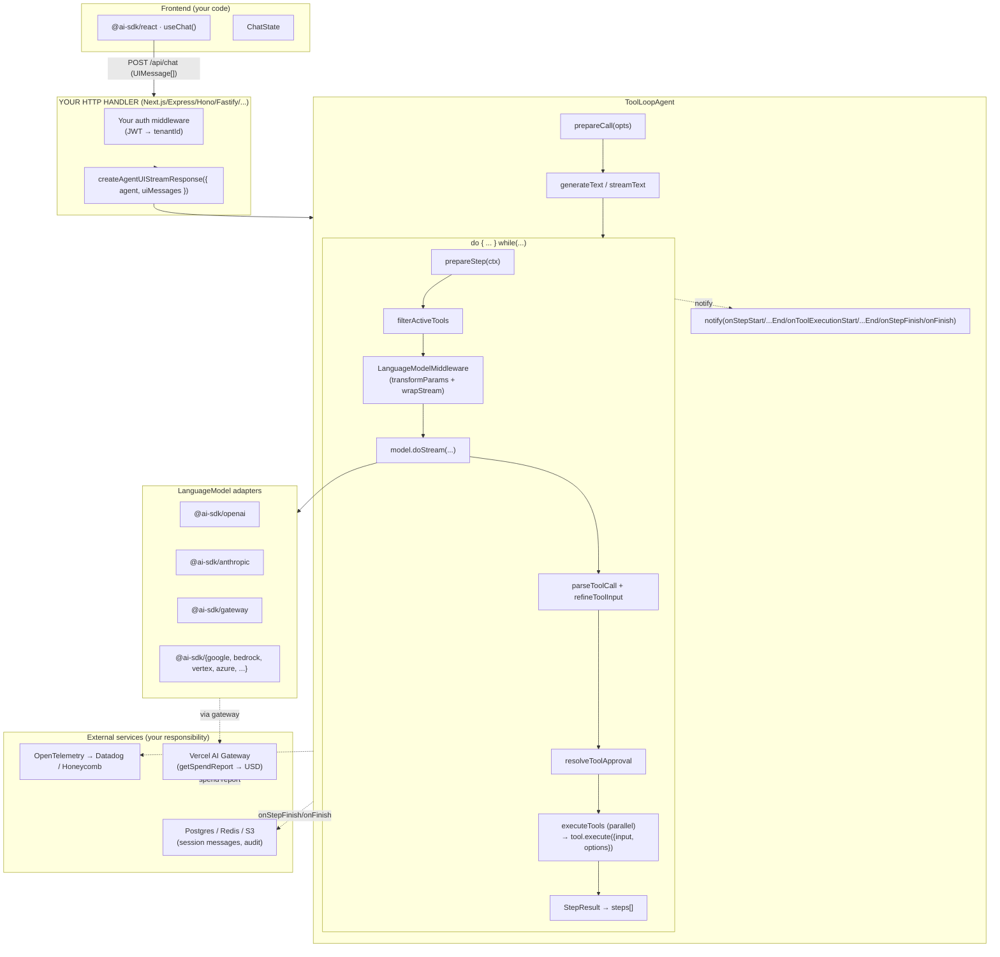

# Vercel AI SDK TypeScript — Benchmark Study

> **Repo**: https://github.com/vercel/ai
> **Commit studied**: `aa5a1e539643c2a7162a141502eee63c665a9544`
> **Branch**: `main`
> **Framework path**: `frameworks/vercel-ai/`
> **Studied on**: 2026-05-16

## TL;DR

- ⭐ **What is this stack architecturally?** A **TypeScript library** (not a server, not a runtime). The `ai` package (`packages/ai/`) gives you `generateText` / `streamText` / `ToolLoopAgent` that you mount on *your own* HTTP handler (Next.js, Express, Hono, Fastify, Nest, Nuxt, SvelteKit, raw Node). A first-party frontend layer (`@ai-sdk/react`, `@ai-sdk/vue`, `@ai-sdk/svelte`, `@ai-sdk/angular`) consumes the SSE protocol it emits. No agent runs in a vendor cloud or subprocess — everything happens in *your* Node process.
- **Open-source / governance**: Apache-2.0, maintained by **Vercel** with active staff and community contributors. Commercial side: Vercel's **AI Gateway** (`@ai-sdk/gateway`) and **Vercel hosting** (frontend) are the monetizable layers — the SDK is free.
- **Maturity / age**: 7.0 line is currently in **canary**; this commit is `ai@7.0.0-canary.142`. The project has shipped 6+ stable majors since 2023. v7 stabilizes `ToolLoopAgent`, `runtimeContext`, `toolsContext`, `experimental_refineToolInput`, `prepareCall` — APIs that did **not** exist in v5/v6.
- **Adoption**: ~17k+ GitHub stars (captured 2026-05; from public github.com/vercel/ai). The `ai` package is one of the most-downloaded LLM SDKs on npm. Hundreds of contributors, hourly commit cadence.
- **Where does the agent loop actually execute?** Inside `generateText` (`packages/ai/src/generate-text/generate-text.ts:653`), a `do { … } while(…)` loop in your Node.js process. `ToolLoopAgent` (`packages/ai/src/agent/tool-loop-agent.ts:38`) is a thin class wrapper that calls into it.
- **Strongest fit for our use case (multi-tenant long-running agent piloted by skills)**: the v7 `ToolLoopAgent` is finally a usable backend abstraction. The combo `runtimeContext: RUNTIME_CONTEXT` + `prepareStep(activeTools, runtimeContext)` + `experimental_refineToolInput` covers context propagation, per-turn tool filtering, and **forced tool-arg overrides** — exactly the three things our audience needs most.
- **Biggest gap**: no first-class **sub-agent** primitive, no **skill** loader, **no durable runtime / no session store**, **no HTTP server**. Sub-agents are "make a tool whose `execute` calls another `ToolLoopAgent.generate(...)` and returns the text" — pure BYO. "Skills" (`packages/ai/src/upload-skill/`) only means *uploading a markdown-skill bundle to Anthropic's skills API*; the SDK never loads `SKILL.md` locally and there is no scoping. Resumable streams require an external library (`resumable-stream`).
- **Most surprising (negative)**: the SDK ships *no* HTTP server. `createAgentUIStreamResponse({ agent, uiMessages })` returns a `Response` object — you must mount it on Next.js / Hono / Express / Node-http yourself. There are no `/runs` / `/threads` REST endpoints.
- **Most surprising (positive)**: tool-arg **streaming** (`onInputDelta`, `tool-input-delta` chunks) and tool-arg **forcing** (`experimental_refineToolInput`) are first-class. Combined with `toolApproval` (per-tool functions returning `'approved'|'denied'|'user-approval'`), the SDK has a more flexible HITL story than LangGraph's `interrupt`.
- **One-line verdicts**:
  - **Sessions / persistence**: Not provided — BYO entirely. No `Session`, no checkpointer, no built-in store.
  - **Skills**: Not provided as a stack-level concept. `upload-skill` is an Anthropic-API helper, not a loader.
  - **Resource manager**: Not provided — BYO. (No registry, no source abstraction, no publishing.)
  - **Sub-agents**: Not provided — BYO (agents-as-tools by hand).
  - **Multi-tenancy**: Strong. `runtimeContext` + `toolsContext` + `experimental_refineToolInput` cover the three hard requirements.
  - **Hooks**: Strong. 7 generation-level callbacks + `prepareStep` + `prepareCall` + 4 tool-level hooks + `LanguageModelMiddleware`.
  - **API**: Library-only. SSE-over-HTTP `UIMessageChunk` is a well-specified protocol but you mount it yourself.
  - **Observability**: `Telemetry` interface with 12 lifecycle callbacks, per-step `LanguageModelUsage` (incl. cache read/write). **No USD cost in `ai`** — USD only via `@ai-sdk/gateway.getSpendReport(...)`.
- **Production-readiness verdict for multi-tenant server-side deployment**: ✅ usable as a *library* if you build sessions, multi-tenancy filtering, durable runtime, skills, resource registry, and observability rollups yourself. Not a "deploy this and you're done" platform.

---

## 0. Architectural Overview & Deployment Model

### Deployment diagram

```
┌────────────────────────────────────────────────────────────────────────┐
│  FRONTEND (browser/native)                                             │
│  ┌──────────────────────────────────────────────────────────────────┐  │
│  │  @ai-sdk/react · useChat() · DefaultChatTransport (HTTP/SSE)     │  │
│  │  ChatState<UIMessage[]> · addToolApprovalResponse · stop()       │  │
│  └────────────────────────────────────┬──────────────────────────────┘ │
└────────────────────────────────────────│───────────────────────────────┘
                                         │  POST /api/chat   (UIMessage[])
                                         │  GET  /api/chat/:id/stream  (SSE)
                                         │  DELETE /api/chat/:id/stream
                                         ▼
┌────────────────────────────────────────────────────────────────────────┐
│  YOUR HTTP HANDLER (Next.js / Express / Hono / Fastify / Nest / Nuxt)  │
│  ↳ NO SDK-PROVIDED SERVER. You own routing, auth, sessions, DB.        │
│  ┌──────────────────────────────────────────────────────────────────┐  │
│  │  createAgentUIStreamResponse({ agent, uiMessages, … })           │  │
│  │  └─ ToolLoopAgent.stream() → toUIMessageStream() →               │  │
│  │     JsonToSseTransformStream                                     │  │
│  └────────────────────────────────────┬──────────────────────────────┘ │
└────────────────────────────────────────│───────────────────────────────┘
                                         │  in-process call (no IPC, no daemon)
                                         ▼
┌────────────────────────────────────────────────────────────────────────┐
│  ai (npm package)  · in-process, same Node process                     │
│  ┌──────────────────────────────────────────────────────────────────┐  │
│  │  generateText / streamText                                       │  │
│  │  do { prepareStep → model.doStream → parseToolCall →             │  │
│  │       experimental_refineToolInput → resolveToolApproval →       │  │
│  │       executeTool* (parallel)} while (more tool calls)           │  │
│  └──────────────────────────────────────────────────────────────────┘  │
│  ┌──────────────────────────────────────────────────────────────────┐  │
│  │  LanguageModel adapters (50+):                                   │  │
│  │  @ai-sdk/openai · @ai-sdk/anthropic · @ai-sdk/google ·           │  │
│  │  @ai-sdk/amazon-bedrock · @ai-sdk/google-vertex · @ai-sdk/azure  │  │
│  │  @ai-sdk/gateway (Vercel AI Gateway) · …                         │  │
│  └────────────────────────────────────┬──────────────────────────────┘ │
└────────────────────────────────────────│───────────────────────────────┘
                                         │ HTTPS (each provider's REST/SSE API)
                                         ▼
                          [ OpenAI · Anthropic · Google · … ]
                          [ optionally via Vercel AI Gateway ]

NO process boundaries beyond the LLM provider HTTPS calls.
NO session store. NO durable runtime. NO sub-agent isolation.
```

### 0.1 What is this stack?

A **library** — `ai` is published on npm and imported into your application. There is no daemon, no CLI, no managed runtime. The optional **Vercel AI Gateway** is a hosted REST proxy in front of model providers, used as just another `LanguageModel` adapter.

### 0.2 Project status & governance

- **License**: Apache-2.0 (`packages/ai/package.json:7`).
- **Owner / maintainer**: Vercel Inc., with a sizable community contributor base.
- **Commercial backing**: Vercel sells the **AI Gateway** (per-token routing, spend reports, key management) and Vercel hosting. The SDK itself is free.
- **Support model**: GitHub issues, community Discord, Vercel commercial support (for paying customers of the platform).

### 0.3 Project maturity / age

- The repo's first commits date from 2023 (the AI SDK launched in Q2 2023).
- Current top-level package version on this commit: **`ai@7.0.0-canary.142`** (`packages/ai/package.json:3`). The 7.0 line is **canary** at the time of this study — v6 is the latest stable.
- The 7.0 line introduced `ToolLoopAgent`, `Agent` interface, `prepareCall`, `runtimeContext` / `toolsContext`, `experimental_refineToolInput`, `toolApproval` flows — none of which existed in earlier v5/v6 stable.
- Several APIs are still marked `experimental_*` (`experimental_onStart`, `experimental_onStepStart`, `experimental_repairToolCall`, `experimental_refineToolInput`, `experimental_sandbox`, `experimental_createMCPClient`).

### 0.4 Adoption & community signal

- GitHub stars: ~17k+ (captured 2026-05-16 from github.com/vercel/ai).
- Forks: ~2k+.
- Contributors: hundreds (visible in the repo's `Contributors` tab).
- Commit activity: multiple commits per day; canary releases are tagged ~daily.
- Issues: thousands open across feature requests and bugs.
- npm: `ai` is one of the most-downloaded LLM SDKs (millions of weekly downloads).

### 0.5 Ecosystem fit

- **Languages**: TypeScript / JavaScript. ESM-first (`packages/ai/package.json:6`).
- **Primary form factor**: library (`import { generateText } from 'ai'`).
- **Frontend integration**: first-party adapters for **React**, **Vue**, **Svelte**, **Angular**, **RSC** (`packages/react/`, `packages/vue/`, `packages/svelte/`, `packages/angular/`, `packages/rsc/`).
- **Examples**: Next.js, Next-Agent, Express, Fastify, Hono, Nest, Nuxt, SvelteKit, node-http, plus many provider-specific examples (`examples/`).
- **Skill files in this repo** (`skills/`) are *contributor-facing* — they tell Claude/Cursor how to author code with the SDK, e.g. `skills/use-ai-sdk/SKILL.md`. They are not a runtime feature consumers use.

### 0.6 Where does the agent loop actually execute?

**In your Node.js (or compatible) process.** No vendor cloud, no subprocess, no daemon. The canonical loop is at `packages/ai/src/generate-text/generate-text.ts:653`:

```ts
// packages/ai/src/generate-text/generate-text.ts:653
do {
  // ...prepareStep, convertToLanguageModelPrompt, model.doGenerate/doStream...
  // parseToolCall(...) per tool call
  // resolveToolApproval(...)
  // executeTools(...) in parallel for approved calls
  // build StepResult, push to steps[]
} while ((clientToolCalls.length > 0 && allOutputsReady) && !isStopConditionMet);
```

`ToolLoopAgent` (`packages/ai/src/agent/tool-loop-agent.ts:38`) is a 271-line class that wraps `generateText` / `streamText` with `prepareCall` and persisted settings. It is **not** a long-running process; it's a method-call entrypoint.

### 0.7 Runtime dependencies

- **Node**: v18, v20, or v22 (CLAUDE.md/AGENTS.md states v22 recommended).
- **pnpm**: v10+ for development. End users install `ai` via npm/yarn/pnpm.
- **Native libs**: none required.
- **Database**: none required by the SDK. You bring your own for session persistence.
- **Optional**: any LLM provider account (OpenAI, Anthropic, …) and/or a Vercel AI Gateway account.

### 0.8 Recommended deployment topology

The SDK doesn't ship hosting recipes. Vercel docs and `examples/next-agent/` recommend mounting `createAgentUIStreamResponse` inside a Next.js API route (one process per Node instance, many tenants per process). For multi-region, you scale Next.js horizontally — but **all session state lives in your external DB**, because there is no in-process session map.

### 0.9 Cold-start cost & instance footprint

- Cold start of `ai` itself is just a JS import — typically tens of milliseconds.
- No bundled binaries or large native deps. Footprint is essentially Node's baseline.
- The first LLM call is dominated by the provider's API latency, not the SDK.

### 0.10 Vendor lock-in

- **LLM-provider**: low. 50+ provider adapters (`packages/<provider>/`), all behind the `LanguageModel` interface. Swap providers in one line.
- **Hosting platform**: low. Library-only — runs anywhere Node runs. Vercel hosting and AI Gateway are conveniences, not requirements.
- **Eval platform**: N/A. The SDK does not ship eval.

### 0.11 Framework weight / footprint

**Thin SDK**, not a heavy framework. `ai` does generate-text/object/image/speech, telemetry, UI stream protocol, agent loop, and tool authoring. It does **not** ship sessions, durable runtime, RAG, eval, skill loader, resource registry, dev UI, plugin system. Compare: Mastra layers all of those *on top* of essentially the same primitives.

### 0.12 Release-history signal

`packages/ai/CHANGELOG.md` (top, abridged):

```
## 7.0.0-canary.142  Post-publish release notifications link to GitHub releases and npm.
## 7.0.0-canary.141  fix(ai): default missing embedding warnings to an empty array.
## 7.0.0-canary.139  Update step performance metrics with explicit throughput fields.
                    fix: support tools with optional context
                    rename Sandbox.executeCommand to Sandbox.runCommand
## 7.0.0-canary.137  feat(ai): remove onChunk event from telemetry
## 7.0.0-canary.136  fix: make sandbox experimental
## 7.0.0-canary.133  fix(ai): output-error tool parts: make input optional
                    feat: add performance statistics
                    fix(ai): download tool-result file URLs
                    fix: rename telemetry onFinish to onEnd
## 7.0.0-canary.131  feat: instructions as prepareStep input
                    feat: flexible tool descriptions
                    fix(ai): accumulative properties on StreamTextResult, GenerateTextResult
## 7.0.0-canary.129  fix(ai): deprecate properties on result that have moved to finalStep
```

Active areas: telemetry callback renames, prepareStep features, sandbox graduation, performance metrics. Agent / tool-loop API is settling but **not frozen** — expect breaking renames until 7.0 stable.

### 0.13 Documentation depth & cross-team contributor accessibility

- Docs are TypeScript-centric. A non-engineer (Product/Data) authoring agent behavior would need engineering help — there's no "drop a markdown file" path.
- The `ai-sdk.dev/docs` site is deep, with quickstarts and migration guides. Source docs live at `content/` in the repo.
- ADR pattern is encouraged (`contributing/decisions/README.md`).

### 0.14 Documentation entry points

- **Official docs**: https://ai-sdk.dev/docs
- **Quickstart**: https://ai-sdk.dev/docs/getting-started
- **API reference**: https://ai-sdk.dev/docs/reference
- **Hosting / deployment**: integrated with Vercel hosting docs (https://vercel.com/docs/ai)
- **AI Gateway docs**: https://ai-sdk.dev/docs/ai-sdk-gateway
- **Examples / demos**: in-repo `examples/` and https://ai-sdk.dev/examples
- **Changelog / release notes**: in-repo `packages/<pkg>/CHANGELOG.md` (e.g. `packages/ai/CHANGELOG.md`)
- **GitHub Releases**: https://github.com/vercel/ai/releases
- **GitHub issues**: https://github.com/vercel/ai/issues
- **Discord / community**: https://vercel.com/discord (`#ai-sdk` channel)

---

## 1. Agent Harness (Run Loop) & Message Taxonomy

### Run loop

#### 1.1 Run loop entrypoint(s)

Two surfaces:

- **Free functions** `generateText(...)` (`packages/ai/src/generate-text/generate-text.ts`) and `streamText(...)` (`packages/ai/src/generate-text/stream-text.ts`). These are the actual loop.
- **`ToolLoopAgent`** class (`packages/ai/src/agent/tool-loop-agent.ts:38`) — a thin OO wrapper that bundles `model + tools + instructions + settings` and exposes `agent.generate(params)` / `agent.stream(params)`.

Signature (from `packages/ai/src/agent/agent.ts:138-172`):

```ts
export interface Agent<CALL_OPTIONS, TOOLS, RUNTIME_CONTEXT, OUTPUT> {
  readonly version: 'agent-v1';
  readonly id: string | undefined;
  readonly tools: TOOLS;
  generate(options: AgentCallParameters<CALL_OPTIONS, TOOLS, RUNTIME_CONTEXT>):
    PromiseLike<GenerateTextResult<TOOLS, RUNTIME_CONTEXT, OUTPUT>>;
  stream(options: AgentStreamParameters<CALL_OPTIONS, TOOLS, RUNTIME_CONTEXT>):
    PromiseLike<StreamTextResult<TOOLS, RUNTIME_CONTEXT, OUTPUT>>;
}
```

`generate(...)` returns once the loop terminates (or hits HITL). `stream(...)` returns immediately with a `StreamTextResult` that exposes `.fullStream`, `.textStream`, `.toUIMessageStream(...)`, `.toUIMessageStreamResponse(...)`, and `.consumeStream(...)`.

#### 1.2 Per-iteration behavior

Inside the `do { … } while(…)` at `packages/ai/src/generate-text/generate-text.ts:653`:

1. `prepareStep?.(...)` — your per-step override hook.
2. Resolve `stepModel`, `stepInstructions`, `stepMessages`, `stepActiveTools`, `stepTools`, `stepToolChoice`, `stepProviderOptions`.
3. `convertToLanguageModelPrompt(...)` — UIMessage → ModelMessage normalization.
4. Notify `experimental_onStepStart`, `experimental_onLanguageModelCallStart`.
5. `stepModel.doGenerate(...)` (or `.doStream(...)`) — the LLM HTTPS call.
6. Notify `experimental_onLanguageModelCallEnd`.
7. `parseToolCall(...)` for each tool-call part (calls `experimental_refineToolInput[name]`, `experimental_repairToolCall` if needed).
8. `resolveToolApproval(...)` → `'approved' | 'denied' | 'user-approval'`.
9. `executeTools(...)` for approved client tool calls — triggers `onToolExecutionStart` → `tool.execute(input, options)` → `onToolExecutionEnd`.
10. Build `StepResult`, push to `steps[]`, notify `onStepFinish`.

#### 1.3 ReAct loop

Yes — the `do { ... } while(...)` *is* the ReAct loop. You don't assemble it; you configure it via `tools`, `stopWhen`, `prepareStep`, callbacks.

#### 1.4 Tool dispatch + result handling

`executeTools(...)` runs all approved client tool calls **in parallel** (`Promise.all` at `packages/ai/src/generate-text/generate-text.ts:1284`). Each tool's output flows into a `tool-result` content part in the next step's user message. `tool.toModelOutput?(...)` (in the tool definition) lets you reshape the raw output before it becomes a model-visible string/JSON.

#### 1.5 Explicit turn concept

A **"step"** = one LLM call + zero-or-more parallel tool executions. `stopWhen` defines termination:

- `isStepCount(20)` is the default for `ToolLoopAgent` (`packages/ai/src/agent/tool-loop-agent.ts:121`).
- `isStepCount(1)` is the default for raw `generateText` (so raw `generateText` is one-shot unless you pass `stopWhen`).
- Other built-ins: `hasToolCall(name)`, plus user-defined `StopCondition` functions (`packages/ai/src/generate-text/stop-condition.ts`).

#### 1.6 Event emission mechanism (in-process)

Two parallel mechanisms, both driven by `notify({ event, callbacks })` (`packages/ai/src/util/notify.ts`):

- **Push (callbacks)**: `experimental_onStart`, `experimental_onStepStart`, `experimental_onLanguageModelCallStart`, `experimental_onLanguageModelCallEnd`, `onToolExecutionStart`, `onToolExecutionEnd`, `onStepFinish`, `onFinish`.
- **Pull (async iterator)**: `streamText(...).fullStream: AsyncIterableStream<TextStreamPart<TOOLS>>` (`packages/ai/src/generate-text/stream-text-result.ts:309`).

### Message & event taxonomy

#### 1.7 Message layers

Three message vocabularies + one event-stream taxonomy.

- **`ModelMessage`** — what the LLM sees on the wire (`packages/ai/src/prompt/message.ts:23-72`).
- **`UIMessage<METADATA, DATA_PARTS, TOOLS>`** — what the client renders (`packages/ai/src/ui/ui-messages.ts:44-75`). Contains a `parts: Array<UIMessagePart>` where each part may be `TextUIPart | ReasoningUIPart | ToolUIPart | …`.
- **`ContentPart<TOOLS>`** — the internal SDK normalized view of one assistant turn's content (`packages/ai/src/generate-text/content-part.ts`). What `StepResult.content` exposes.

Conversions:

- `UIMessage[] → ModelMessage[]`: `convertToModelMessages()` (`packages/ai/src/ui/convert-to-model-messages.ts:46`).
- `ModelMessage[] → UIMessageChunk[]`: `streamText().toUIMessageStream({ originalMessages? })`.

#### 1.8 Concrete message types (table)

| Type                         | Purpose                                                                |
| ---------------------------- | ---------------------------------------------------------------------- |
| `SystemModelMessage`         | LLM-wire system role.                                                  |
| `UserModelMessage`           | LLM-wire user role.                                                    |
| `AssistantModelMessage`      | LLM-wire assistant role, possibly with tool-call parts.                |
| `ToolModelMessage`           | LLM-wire tool role with `tool-result` / `tool-approval-response` parts.|
| `UIMessage`                  | UI-side message carrying `parts: UIMessagePart[]` + metadata.          |
| `UIMessagePart` (subtypes)   | Rich UI rendering primitives (see Q1.10 below).                        |
| `StepResult<TOOLS, CTX>`     | One step's content, usage, tool-calls/-results, response messages.     |
| `GenerateTextResult`         | Full run output (steps[], totalUsage, finalStep, text, …).             |
| `StreamTextResult`           | Streaming variant — `.fullStream`, `.toUIMessageStream(...)`.          |
| `TextStreamPart<TOOLS>`      | Internal stream chunks (24 variants — see Q1.10).                      |
| `UIMessageChunk<META, DATA>` | Wire-format SSE chunks (~28 variants — see Q1.12).                     |

#### 1.9 Messages vs. events

They are **separate taxonomies**. Messages are persisted artifacts (`UIMessage[]`, `ModelMessage[]`). Events stream during a run (`TextStreamPart`, `UIMessageChunk`). The state of a tool call is mirrored across both: `ToolUIPart.state: 'input-streaming' | 'input-available' | 'approval-requested' | 'approval-responded' | 'output-available' | 'output-error' | 'output-denied'` (`packages/ai/src/ui/ui-messages.ts:291-377`).

#### 1.10 Event categories

- **Stream-event** (text/reasoning deltas): `text-start/-delta/-end`, `reasoning-start/-delta/-end`.
- **Tool-event**: `tool-input-start/-delta/-available/-error`, `tool-output-available/-error/-denied`, `tool-approval-request/-response`.
- **Step-event**: `start-step`, `finish-step`.
- **Session-lifecycle event**: `start`, `finish`, `abort`, `error`.
- **Source / file / reasoning-file**: rendering primitives for retrieval and binary artifacts.
- **Data / message-metadata**: extensibility holes for arbitrary host payloads.

#### 1.11 Canonical type-definition files

- **`packages/ai/src/prompt/message.ts:23-72`** — `ModelMessage` discriminated union.
- **`packages/ai/src/ui/ui-messages.ts:44-377`** — `UIMessage`, `UIMessagePart`, `ToolUIPart` state machine.
- **`packages/ai/src/generate-text/content-part.ts`** — `ContentPart` internal view.
- **`packages/ai/src/generate-text/stream-text-result.ts:537-563`** — `TextStreamPart` (in-process iterator).
- **`packages/ai/src/ui-message-stream/ui-message-chunks.ts:225-396`** — `UIMessageChunk` (wire format).

#### 1.12 Live agentic event stream taxonomy

`TextStreamPart<TOOLS>` (`packages/ai/src/generate-text/stream-text-result.ts:537`):

```ts
export type TextStreamPart<TOOLS extends ToolSet> =
  | TextStreamTextStartPart | TextStreamTextEndPart | TextStreamTextDeltaPart
  | TextStreamReasoningStartPart | TextStreamReasoningEndPart | TextStreamReasoningDeltaPart
  | TextStreamCustomPart
  | TextStreamToolInputStartPart | TextStreamToolInputEndPart | TextStreamToolInputDeltaPart
  | TextStreamSourcePart | TextStreamFilePart | TextStreamReasoningFilePart
  | TextStreamToolCallPart<TOOLS> | TextStreamToolResultPart<TOOLS> | TextStreamToolErrorPart<TOOLS>
  | TextStreamToolOutputDeniedPart<TOOLS>
  | TextStreamToolApprovalRequestPart<TOOLS> | TextStreamToolApprovalResponsePart<TOOLS>
  | TextStreamStartStepPart | TextStreamFinishStepPart
  | TextStreamStartPart | TextStreamFinishPart
  | TextStreamAbortPart | TextStreamErrorPart | TextStreamRawPart;
```

`UIMessageChunk` (`packages/ai/src/ui-message-stream/ui-message-chunks.ts:225`) — sample frames:

```
data: {"type":"start","messageId":"msg_xyz"}
data: {"type":"start-step"}
data: {"type":"tool-input-start","toolCallId":"call_001","toolName":"weather","dynamic":false}
data: {"type":"tool-input-delta","toolCallId":"call_001","inputTextDelta":"{\"city\":\""}
data: {"type":"tool-input-available","toolCallId":"call_001","toolName":"weather","input":{"city":"Paris"}}
data: {"type":"tool-output-available","toolCallId":"call_001","output":{"weather":"sunny"}}
data: {"type":"text-start","id":"txt_1"}
data: {"type":"text-delta","id":"txt_1","delta":"It is sunny in Paris."}
data: {"type":"text-end","id":"txt_1"}
data: {"type":"finish-step"}
data: {"type":"finish","finishReason":"stop"}
data: [DONE]
```

Every tool chunk carries an explicit `toolCallId: string` — see Q6.10 for reconstruction.

---

## 2. Agent Runtime (Multi-session Host)

### 2.1 Multi-session host architecture

**Not provided — BYO.** There is no SDK-side multi-session host. Each `agent.generate(...)` or `agent.stream(...)` call is request-scoped. The "runtime" is *your* Node process, and the embedding pattern is "one HTTP request → one agent call".

### 2.2 Concurrent session isolation

There is no in-process session bag, so isolation is whatever your HTTP handler gives you: each request has its own JS scope, its own `messages: UIMessage[]`, its own `runtimeContext`. There is **no shared mutable state in `ai`** that one tenant could leak to another — provided you pass `messages` from external storage and `runtimeContext` from the request.

### 2.3 Horizontal scaling / multi-instance

Standard stateless-worker model: spin up N Node processes (Next.js / Fargate / Cloud Run / Vercel Functions), each pulls session state from your shared store (Postgres / Redis / S3 / Blob). The SDK has no leader election, no shared in-memory map.

`examples/next/app/api/chat/[id]/stream/route.ts` and `examples/next/app/api/chat/route.ts` show the canonical durable-stream pattern using the third-party `resumable-stream` package + Redis.

### 2.4 Background / async / scheduled tasks

**Not provided — BYO.** The SDK has no cron, no scheduler, no webhook trigger primitive. Use your host (e.g. Vercel Cron, Cloud Scheduler, Trigger.dev) and *invoke* `agent.generate(...)` from there.

### 2.5 Worker pool / queue model

**Not provided — BYO.** No queue. The SDK assumes the request scope is whatever your host gives you (typically HTTP request scope). For long-running workloads, you need an external queue (BullMQ, AWS SQS) and a worker that calls `agent.generate(...)`.

The new `@ai-sdk/workflow` package (`packages/workflow/src/`) is a recent addition for stepped workflows but is not a horizontal multi-tenant runtime — it's a `WorkflowAgent` abstraction that wraps `streamText` with serializable step IO (see `packages/workflow/src/workflow-agent.ts`).

---

## 3. Sessions & Persistence

### 3.1 Session / chat data model

**There is no SDK-provided `Session` / `Thread` type.** What you persist is `UIMessage[]` (or `ModelMessage[]`). The closest "session-shape" in the codebase is the per-call `Chat` state machine on the *client* (`packages/ai/src/ui/chat.ts:237`), which holds messages and transport state in memory.

Per-call inputs that you may treat as session-equivalent (built up by you):

- `id: string` — your session id, passed by you on every request and stored alongside `messages`.
- `messages: UIMessage[]` — full history.
- `runtimeContext: RUNTIME_CONTEXT` — your bag of tenant / user / locale (see Q4).
- `toolsContext: InferToolSetContext<TOOLS>` — per-tool per-call context bag.

### 3.2 What's stored on a session

Whatever you store. The example `examples/next/app/api/chat/route.ts:21` reads `readChat(id)` / `saveChat({ id, messages })` against your DB. The SDK never sees the storage.

### 3.3 Granularity

Single linear conversation per `id`. **No branch / fork model.** No checkpoint graph (cf. LangGraph). If you want branching, you implement it as N sessions in your DB.

### 3.4 Built-in persistence stores

**None.** No JSONL store, no SQLite, no Postgres adapter, no Redis adapter, no Blob adapter. The SDK has zero opinion on storage.

### 3.5 Persistence timing

Hook into:

- `onStepFinish({ ... })` — per-step (`packages/ai/src/generate-text/generate-text.ts:1146`). Frozen `StepResult`.
- `onFinish({ ... })` — once when the loop exits.
- For UI-message streams: `handleUIMessageStreamFinish` (`packages/ai/src/ui-message-stream/handle-ui-message-stream-finish.ts:121-142`) calls a user-supplied `onStepFinish({ responseMessage, messages })` per `finish-step` chunk and `onFinish` once at the end.

There is **no per-token persistence** — you persist at step granularity at the earliest.

### 3.6 Mid-run checkpointing (durable)

**Not provided — BYO.** If your process crashes mid-tool-call, `ai` does not resume from a checkpoint. The closest pattern is the resumable-stream recipe in `examples/next/app/api/chat/route.ts:88` and `examples/next/app/api/chat/[id]/stream/route.ts:18`:

- Persist UIMessage stream chunks to Redis via `resumable-stream`.
- Client re-opens with `GET /api/chat/:id/stream`.
- If the server crashes mid-tool-call, the tool call dies and the next request has to start a new run with the messages-so-far.

This is *resumable stream*, not *durable runtime*.

### 3.7 Session ID format

Whatever you choose — `id` is `string`. Examples use UUID-like values.

### 3.8 Pluggable store interface

**No interface to plug.** Persistence is your callback inside `onStepFinish` / `onFinish`. There is no `SessionStore` / `Checkpointer` abstraction.

### 3.9 Schema evolution / migration

**Not provided — BYO.** Your DB, your migrations. The SDK does ship `validateUIMessages` (`packages/ai/src/ui/`) to validate persisted UIMessages against the current Zod schema — useful for catching schema drift on read.

### 3.10 Export / replay

You already have the messages — exporting is `JSON.stringify(messages)`. Replay = pass the same `messages` and pin model + seed. Determinism is not a first-party feature.

### 3.11 Cross-session memory

**Not provided — BYO.** See Q15.

---

## 4. Multi-tenancy & Arbitrary Context ⭐ THE KEY QUESTION

This is the strongest area of the v7-canary API.

### 4.1 Full run-loop input struct

`ToolLoopAgentSettings` (`packages/ai/src/agent/tool-loop-agent-settings.ts:42-306`) is the constructor side. `AgentCallParameters` (`packages/ai/src/agent/agent.ts:27-113`) layers per-call options. Fields beyond `messages`:

```ts
// packages/ai/src/agent/tool-loop-agent-settings.ts:42
export type ToolLoopAgentSettings<CALL_OPTIONS, TOOLS, RUNTIME_CONTEXT, OUTPUT> =
  LanguageModelCallOptions
  & Omit<RequestOptions<TOOLS>, 'abortSignal'>
  & ToolsContextParameter<TOOLS>
  & {
    id?: string;
    instructions?: Instructions;
    model: LanguageModel;
    toolChoice?: ToolChoice<NoInfer<TOOLS>>;
    stopWhen?: Arrayable<StopCondition<NoInfer<TOOLS>, RUNTIME_CONTEXT>>;
    telemetry?: TelemetryOptions<RUNTIME_CONTEXT, NoInfer<TOOLS>>;
    activeTools?: ActiveTools<NoInfer<TOOLS>>;
    output?: OUTPUT;
    runtimeContext?: RUNTIME_CONTEXT;
    toolApproval?: ToolApprovalConfiguration<NoInfer<TOOLS>, RUNTIME_CONTEXT>;
    prepareStep?: PrepareStepFunction<NoInfer<TOOLS>, RUNTIME_CONTEXT>;
    experimental_repairToolCall?: ToolCallRepairFunction<NoInfer<TOOLS>>;
    experimental_refineToolInput?: ToolInputRefinement<NoInfer<TOOLS>>;
    experimental_onStart, experimental_onStepStart,
    onToolExecutionStart, onToolExecutionEnd,
    onStepFinish, onFinish,
    providerOptions?: ProviderOptions;
    callOptionsSchema?: FlexibleSchema<CALL_OPTIONS>;
    prepareCall?: (options: AgentCallParameters<...> & { toolsContext }) => MaybePromiseLike<...>;
  };
```

### 4.2 Context propagation into a tool call

Every tool's `execute(input, options)` receives a `ToolExecutionOptions<CONTEXT>` (`packages/provider-utils/src/types/tool-execute-function.ts:8-44`):

```ts
export interface ToolExecutionOptions<CONTEXT> {
  toolCallId: string;
  messages: ModelMessage[];   // history that produced the call
  abortSignal?: AbortSignal;
  context: CONTEXT;           // validated against tool.contextSchema
  experimental_sandbox?: Sandbox;
}
```

Note: `runtimeContext` (the agent-wide bag) is handed to `prepareStep`, telemetry, and callbacks — but **not** directly to `tool.execute`. To route tenant info into `execute`, you do one of:

- Put it in the tool's per-tool `contextSchema` and pass via `toolsContext[toolName]` (validated).
- Close over it in your tool factory (`makeTopicSearchTool({ tenantId })`).
- Use `prepareStep` to inject it into `toolsContext` per-step.

### 4.3 Tool call interface

`ToolExecuteFunction` (`packages/provider-utils/src/types/tool-execute-function.ts:34-44`):

```ts
export type ToolExecuteFunction<INPUT, OUTPUT, CONTEXT> = (
  input: INPUT,
  options: ToolExecutionOptions<CONTEXT>,
) => AsyncIterable<OUTPUT> | PromiseLike<OUTPUT> | OUTPUT;
```

A tool definition (`packages/provider-utils/src/types/tool.ts`):

```ts
tool({
  description: 'Search topics.',
  inputSchema: z.object({ q: z.string() }),
  contextSchema: z.object({ tenantId: z.string() }),
  execute: async ({ q }, { context }) => {
    // context: { tenantId } — validated, harness-provided
    return await db.topics.search({ q, tenantId: context.tenantId });
  },
})
```

### 4.4 Forcing tool arguments from the harness

**Yes — first-class** via `experimental_refineToolInput` (`packages/ai/src/generate-text/tool-input-refinement.ts:14-19`):

```ts
export type ToolInputRefinement<TOOLS extends ToolSet> = {
  [NAME in keyof TOOLS]?: (
    input: InferToolInput<TOOLS[NAME]>,
  ) => MaybePromiseLike<InferToolInput<TOOLS[NAME]>>;
};
```

Applied inside `parseToolCall` *before* dispatch (`packages/ai/src/generate-text/generate-text.ts:807-815`), so the refined input is what tools, callbacks, and telemetry all see.

```ts
// examples/ai-functions/src/agent/openai/generate-refine-tool-input.ts:22
experimental_refineToolInput: {
  weather: input => ({ city: input.city.trim().toLowerCase() }),
},
```

**Caveat**: must return the same JSON shape. For a true "always pass `tenantId=<X>`" pattern, the cleanest answer is to keep `tenantId` *out of the LLM-visible inputSchema* and pass it via `toolsContext[name]`, so the LLM cannot generate it at all.

### 4.5 Filtering visible tools

Three coexisting layers:

1. **`activeTools: ActiveTools<TOOLS>`** at agent construction (`packages/ai/src/agent/tool-loop-agent-settings.ts:96`).
2. **`prepareStep(...) → { activeTools? }`** per step (`packages/ai/src/generate-text/prepare-step.ts:118`). Used by `filterActiveTools` (`packages/ai/src/generate-text/filter-active-tools.ts:21-38`).
3. **`prepareCall(...) → { tools? }`** per call (`packages/ai/src/agent/tool-loop-agent-settings.ts:230-305`). Lets one `ToolLoopAgent` template generate different toolsets per request based on `CALL_OPTIONS`.

### 4.6 Tenant scope on session

There is no session — so there is no first-class tenant scope on a session object. The audience's convention should be: `runtimeContext.tenantId` is the canonical place.

### 4.7 Per-tool-call auth propagation

The caller's identity reaches every tool call **only if you put it there**. Common patterns:

- `runtimeContext = { tenantId, userId, jwt }` → forwarded into `prepareStep`, telemetry.
- `toolsContext = { topicSearch: { tenantId, jwt }, audienceCreate: { tenantId, jwt } }` → forwarded into `tool.execute` via `options.context`.

No magic. No automatic plumbing.

### 4.8 Resource scoping primitives

- **Per-tool `contextSchema`** (`packages/provider-utils/src/types/tool.ts:95-99`) declares what context each tool expects. `validateToolContext` (`packages/ai/src/generate-text/validate-tool-context.ts`) rejects mismatches at runtime.
- **Per-call `runtimeContext` typing** via `ToolLoopAgent<CALL_OPTIONS, TOOLS, RUNTIME_CONTEXT, OUTPUT>` compile-time generics.
- **No global / tenant / user scope on tools or skills directly.** You build that yourself by templating the agent or filtering `activeTools` based on `runtimeContext.tenantId`.

### 4.9 Per-tenant rate limit + budget cap

**Not provided — BYO.** `stopWhen` accepts step-count and tool-name stop conditions, but **no USD-cost or token-count budget cap** in the SDK. AI Gateway's spend report (Q10) is *observational*, not enforcing.

### ⭐ Light usage example

```ts
import { ToolLoopAgent, tool } from 'ai';
import { openai } from '@ai-sdk/openai';
import { z } from 'zod';

const topicSearch = tool({
  description: 'Search topics.',
  inputSchema: z.object({ q: z.string() }),
  contextSchema: z.object({ tenantId: z.string() }),     // harness-injected
  execute: async ({ q }, { context }) =>
    db.topics.search({ q, tenantId: context.tenantId }),
});
const iabSearch = tool({ /* … similar */ });
const audienceCreate = tool({ /* … similar */ });
const bashExec = tool({ /* … */ });
const webFetch = tool({ /* … */ });

const agent = new ToolLoopAgent({
  model: openai('gpt-5'),
  instructions: 'You help operators build audiences.',
  tools: { topicSearch, iabSearch, audienceCreate, bashExec, webFetch },
  activeTools: ['topicSearch', 'iabSearch', 'audienceCreate'],          // STEP 2: only these are LLM-visible
  experimental_refineToolInput: {                                       // STEP 3: belt-and-braces
    topicSearch: input => ({ ...input, tenantId: undefined as never }), // strip any LLM-supplied tenantId
  },
});

// STEP 1: per-call context
const result = await agent.generate({
  prompt: 'Find topics about parenting',
  runtimeContext: { tenantId: 'acme', targetingStrategyId: 'strat-42', userId: 'u-123' },
  toolsContext: {                                                        // STEP 3: forced server-side tenantId
    topicSearch: { tenantId: 'acme' },
    iabSearch:   { tenantId: 'acme' },
    audienceCreate: { tenantId: 'acme' },
  },
});
```

All three audience requirements are first-class. The single non-obvious bit is that `runtimeContext` is *not* automatically merged into `toolsContext` — you pass both.

---

## 5. Hook & Middleware Capabilities (Context Engineering)

### 5.1 Enumerate every hook / middleware / lifecycle callback

| Hook                                                             | Fires when                              | Read / mutate / block / branch |
| ---------------------------------------------------------------- | --------------------------------------- | ------------------------------ |
| `prepareCall(opts) → opts'`                                      | Once before the run-loop starts (only on `ToolLoopAgent`) | Mutate: model, tools, instructions, stopWhen, telemetry, activeTools, toolApproval, providerOptions, runtimeContext |
| `experimental_onStart(event)`                                    | Once after prompt standardized          | Read-only                     |
| `prepareStep(opts) → overrides`                                  | Before each step's LLM call             | Mutate: model, toolChoice, activeTools, instructions, messages, toolsContext, runtimeContext, providerOptions, sandbox |
| `experimental_onStepStart(event)`                                | Before each step (after `prepareStep`)  | Read-only                     |
| `experimental_onLanguageModelCallStart(event)`                   | Immediately before `model.doGenerate/doStream` | Read-only                  |
| `LanguageModelMiddleware.transformParams(...)`                   | Before doGenerate/doStream params sent  | Mutate prompt, tools, headers |
| `LanguageModelMiddleware.wrapGenerate({ doGenerate, ... })`      | Around `doGenerate`                     | Block / retry / cache / fall back |
| `LanguageModelMiddleware.wrapStream({ doStream, ... })`          | Around `doStream`                       | Block / retry / cache / fall back |
| `experimental_repairToolCall(toolCall, error)`                   | When parsing tool args fails            | Mutate (return fixed call)    |
| `experimental_refineToolInput[name](input) → input'`             | After tool call parsed, before dispatch | Mutate tool args (same shape) |
| `experimental_onLanguageModelCallEnd(event)`                     | After provider response parsed          | Read-only                     |
| `tool.onInputStart`, `tool.onInputDelta`, `tool.onInputAvailable`| During tool-arg streaming (per tool)    | Read-only                     |
| `resolveToolApproval(...)`                                       | After tool args ready, before exec      | Block → `'user-approval'` / `'denied'` |
| `onToolExecutionStart(event)`                                    | Before each `tool.execute`              | Read-only                     |
| `tool.execute(input, options)`                                   | Tool body itself                        | The actual work               |
| `tool.toModelOutput?({ input, output })`                         | After `execute` returns                 | Reshape what model sees       |
| `onToolExecutionEnd(event)`                                      | After each `tool.execute`               | Read-only — **cannot inject follow-up tool calls** |
| `onStepFinish(step)`                                             | After step's tool execs complete        | Read-only (StepResult frozen) |
| `onFinish(result)`                                               | After loop exits                        | Read-only                     |
| `Telemetry` (12 hooks)                                           | Mirrors above + embed/rerank/object     | Read-only                     |

### 5.2 Hook concurrency model

All callbacks fire **sequentially** within a step. Tool executions run in **parallel** (`Promise.all` at `packages/ai/src/generate-text/generate-text.ts:1284`), with `onToolExecutionStart` / `onToolExecutionEnd` firing per parallel tool.

### 5.3 Specific capability tests

- **Inject system messages at session start** (e.g. "current date is 2026-05-16, tenant is acme, locale fr-FR")? ✅ Yes — three ways:
  - Static `instructions: 'You are X. Today is 2026-05-16'` on `ToolLoopAgent`.
  - Dynamic per call: `prepareCall(opts) => ({ ...opts, instructions: '... ' + opts.runtimeContext.tenantId })`.
  - Dynamic per step: `prepareStep({ runtimeContext, ... }) => ({ instructions: '... ' + runtimeContext.tenantId })`.
- **Expand the user input** (slash commands, time-stamps, attachments)? ✅ Yes — `prepareCall` lets you rewrite the prompt; `prepareStep({ messages: [...rewritten] })` lets you rewrite the messages array per step.
- **Mutate the messages list before each LLM call** (cache breakpoints, redaction)? ✅ Yes — `prepareStep` returns a `messages` override, or `LanguageModelMiddleware.transformParams` mutates the provider-level prompt array.
- **Mutate tool input before dispatch** (inject `tenantId` server-side)? ✅ Yes — `experimental_refineToolInput[name]`.
- **Mutate tool result before returning to the LLM** (redact, summarize, truncate)? ⚠️ **Partially** — `onToolExecutionEnd` is read-only. The only mutation point is `tool({ toModelOutput: ({ input, output }) => ToolResultOutput })` (`packages/provider-utils/src/types/tool.ts:148`), which is per-tool and lives inside the tool definition, not as a global hook.
- **Emit additional tool calls in response to a tool result** (Claude Agent SDK's `PostToolUse` `additional_messages`)? ❌ **No.** `onToolExecutionEnd` returns `void | PromiseLike<void>` (`packages/ai/src/generate-text/tool-execution-events.ts:160`). The only workaround is to write a *tool* whose `execute` itself fans out work and returns the combined result.

### 5.4 Auto-compaction

**Not provided — BYO.** No built-in summarize-and-truncate. You either:

- Use `prepareStep` to truncate `messages` before each call.
- Use `LanguageModelMiddleware.transformParams` to compact at the provider level.
- Compose with `@ai-sdk/langchain` or your own compaction pipeline.

### 5.5 Prompt cache optimization

`LanguageModelUsage` exposes `inputTokenDetails: { noCacheTokens, cacheReadTokens, cacheWriteTokens }` (`packages/ai/src/types/usage.ts:10`) — better visibility than most stacks. But the SDK does **not** automatically place Anthropic-style cache breakpoints. You set provider-specific cache markers via `providerOptions` (e.g. `{ anthropic: { cacheControl: { type: 'ephemeral' } } }` on a system message) or via `LanguageModelMiddleware.transformParams`.

### 5.6 Tool result clearing / progressive disclosure

**Not provided — BYO.** `tool.toModelOutput` lets you summarize at tool-author time, but there's no harness-level "after step N, drop the tool result from history".

### 5.7 Hook fire-points diagram

```
ToolLoopAgent.generate(params)
  │
  ├─ prepareCall(opts)                                  ← [PRE-LOOP HOOK]
  │
  ▼
generateText(...)
  │
  ├─ standardizePrompt(initialPrompt)
  ├─ collectToolApprovals(messages)                     ← (re-entry: execute pre-approved tools)
  ├─ notify experimental_onStart                        ← [HOOK 1]
  │
  └─ do {
     │
     ├─ prepareStep({ messages, runtimeContext, ... })  ← [PER-STEP HOOK]
     │     → { model?, instructions?, messages?, activeTools?, toolChoice?, runtimeContext?, … }
     │
     ├─ filterActiveTools / prepareTools
     ├─ notify experimental_onStepStart                 ← [HOOK 2]
     ├─ notify experimental_onLanguageModelCallStart    ← [HOOK 3]
     │
     ├─ LanguageModelMiddleware.transformParams         ← [PROVIDER-LEVEL HOOK]
     ├─ LanguageModelMiddleware.wrapGenerate/wrapStream ← [PROVIDER-LEVEL HOOK]
     │     → model.doGenerate / model.doStream
     │
     ├─ parseToolCall(...)                              (uses experimental_repairToolCall if needed)
     │     └─ experimental_refineToolInput[name]        ← [PER-TOOL-CALL HOOK]
     │
     ├─ notify experimental_onLanguageModelCallEnd      ← [HOOK 4]
     │
     ├─ tool.onInputAvailable per call                  ← [PER-TOOL CALLBACK]
     ├─ resolveToolApproval(...)
     │     → 'user-approval' → skip exec, surface request
     │     → 'denied' → skip exec, surface denied response
     │
     ├─ parallel ∀ approved tool calls:
     │     ├─ notify onToolExecutionStart               ← [HOOK 5]
     │     ├─ executeTool(...)
     │     │     ├─ tool.onInputStart, onInputDelta     ← [PER-TOOL CALLBACK, stream only]
     │     │     └─ tool.execute(input, { context, abortSignal, … })
     │     ├─ tool.toModelOutput?(output)               ← [PER-TOOL CALLBACK]
     │     └─ notify onToolExecutionEnd                 ← [HOOK 6]
     │
     ├─ build StepResult, push to steps[]
     └─ notify onStepFinish                             ← [HOOK 7]
     }
     while (clientToolCalls remaining && !isStopConditionMet)
     │
     └─ notify onFinish                                 ← [HOOK 8]
```

### ⭐ Light usage example

```ts
import { ToolLoopAgent } from 'ai';
import { openai } from '@ai-sdk/openai';

const agent = new ToolLoopAgent({
  model: openai('gpt-5'),
  tools: { topicSearch /* see Q4 */ },

  // STEP 1: inject session-start "system" via prepareStep on first step.
  prepareStep: async ({ stepNumber, runtimeContext }) => {
    if (stepNumber === 0) {
      return {
        instructions:
          `tenant=${runtimeContext.tenantId}, locale=${runtimeContext.locale}, today=2026-05-16`,
      };
    }
  },

  // STEP 2: force tenantId server-side on every topicSearch call.
  experimental_refineToolInput: {
    topicSearch: input => ({ ...input, tenantId: undefined as never }),
  },

  // STEP 3: summarize huge tool results before they go back to the LLM.
  tools: {
    topicSearch: tool({
      description: 'Search topics',
      inputSchema: z.object({ q: z.string() }),
      contextSchema: z.object({ tenantId: z.string() }),
      execute: async ({ q }, { context }) => db.topics.search({ q, tenantId: context.tenantId }),
      toModelOutput: ({ output }) =>
        output.length > 50
          ? { type: 'json', value: { summary: `${output.length} topics`, top: output.slice(0, 10) } }
          : { type: 'json', value: output },
    }),
  },
});
```

(The `prepareStep` + `experimental_refineToolInput` + `toModelOutput` combination covers all three required scenarios. There is no harness-level `PostToolUse` mutating hook — `toModelOutput` is the per-tool replacement.)

---

## 6. Agent API Exposition

### 6.1 Does the stack ship an HTTP/network server?

**No.** Library-only. You build the endpoint in your framework of choice. The SDK gives you helpers to return a `Response` or pipe to a Node `ServerResponse`:

```ts
// examples/next-agent/app/api/chat/route.ts (essentially the full server)
import { weatherAgent } from '@/agent/weather-agent';
import { createAgentUIStreamResponse } from 'ai';

export async function POST(request: Request) {
  const { messages } = await request.json();
  return createAgentUIStreamResponse({ agent: weatherAgent, uiMessages: messages });
}
```

```ts
// examples/express/src/server.ts:36
app.post('/chat', async (request, response) => {
  pipeAgentUIStreamToResponse({
    agent: openaiWebSearchAgent,
    uiMessages: request.body.messages,
    response,
  });
});
```

Three helpers:

- `createAgentUIStreamResponse({ agent, uiMessages, options, abortSignal, timeout, ... })` → `Promise<Response>` (`packages/ai/src/agent/create-agent-ui-stream-response.ts:36`).
- `pipeAgentUIStreamToResponse({ agent, uiMessages, response, ... })` → `Promise<void>` (Node `http.ServerResponse`) (`packages/ai/src/agent/pipe-agent-ui-stream-to-response.ts:36`).
- `createAgentUIStream({ ... })` → `Promise<AsyncIterableStream<UIMessageChunk>>` (for custom transports) (`packages/ai/src/agent/create-agent-ui-stream.ts:38`).

### 6.2 Streaming transport

**SSE only** (out of the box). `JsonToSseTransformStream` (`packages/ai/src/ui-message-stream/json-to-sse-transform-stream.ts:6`) wraps `ReadableStream<UIMessageChunk>`:

```ts
export class JsonToSseTransformStream extends TransformStream<unknown, string> {
  constructor() {
    super({
      transform(part, controller) {
        controller.enqueue(`data: ${JSON.stringify(part)}\n\n`);
      },
      flush(controller) {
        controller.enqueue('data: [DONE]\n\n');
      },
    });
  }
}
```

Headers (`packages/ai/src/ui-message-stream/ui-message-stream-headers.ts`):

- `Content-Type: text/event-stream`
- `Cache-Control: no-cache`
- `Connection: keep-alive`
- `x-vercel-ai-ui-message-stream: v2`

### 6.3 Endpoints that start an agent run

You define them. The default client transport is `HttpChatTransport` (`packages/ai/src/ui/http-chat-transport.ts:145-213`):

```ts
// packages/ai/src/ui/http-chat-transport.ts:178
body: {
  ...resolvedBody,
  ...options.body,
  id: options.chatId,
  messages: options.messages,                  // UIMessage[]
  trigger: 'submit-message' | 'regenerate-message',
  messageId: options.messageId,
}
```

`prepareSendMessagesRequest` (`packages/ai/src/ui/http-chat-transport.ts:11`) lets the client rewrite this body before send — perfect place to inject a `tenantId` / scoped JWT, or trim `messages`.

### 6.4 Live agentic event stream format

See Q1.12 above for sample frames. The format is the UI Message Stream Protocol (`x-vercel-ai-ui-message-stream: v2`).

### 6.5 Auth termination at API boundary

**Not terminated by the SDK.** Your HTTP framework (Next.js middleware, Express middleware, Hono auth, …) does JWT validation and tenant scoping *before* it calls `createAgentUIStreamResponse(...)`. The SDK does not parse `Authorization` headers.

### 6.6 Resume / replay endpoint

The recipe in `examples/next/app/api/chat/[id]/stream/route.ts` uses the third-party `resumable-stream` package + Redis:

```ts
// examples/next/app/api/chat/route.ts:88
const streamContext = createResumableStreamContext({ waitUntil: after });
const resumableStream = await streamContext.resumableStream(streamId, () => stream);

// examples/next/app/api/chat/[id]/stream/route.ts (GET)
//   re-attaches to an in-flight stream identified by chatId.
```

This is **not part of `ai`**. It's a recommended add-on.

### 6.7 Interrupt / cancel via API

Two patterns, both BYO:

- **Same-server**: client calls `chat.stop()` (`packages/ai/src/ui/chat.ts:586`) which aborts the local fetch. Next.js maps that to `request.signal` aborted, which propagates to `streamText({ abortSignal })`.
- **Multi-server / load-balanced**: client `DELETE /api/chat/:id/stream` (`examples/next/app/api/chat/[id]/stream/route.ts:30`). The DELETE route writes `canceledAt: Date.now()` to your DB. The running POST polls it every 1s via `onChunk` throttled (`examples/next/app/api/chat/route.ts:66-72`) and aborts its own signal.

### 6.8 Tool-arg streaming (partial JSON)

**Yes — first-class.** The wire format includes `tool-input-start`, `tool-input-delta`, `tool-input-available`:

```
data: {"type":"tool-input-start","toolCallId":"call_001","toolName":"weather","dynamic":false}
data: {"type":"tool-input-delta","toolCallId":"call_001","inputTextDelta":"{\"city\":\""}
data: {"type":"tool-input-delta","toolCallId":"call_001","inputTextDelta":"Paris\"}"}
data: {"type":"tool-input-available","toolCallId":"call_001","toolName":"weather","input":{"city":"Paris"}}
```

Client-side, `useChat` automatically updates `ToolUIPart.state` from `'input-streaming'` → `'input-available'` so partial UIs work without custom plumbing.

### 6.9 HITL approval workflow

Protocol = "client receives `tool-approval-request`, re-posts an updated messages list".

- Server emits `tool-approval-request` chunk (`UIMessageChunk` discriminant) for the tool call whose `toolApproval(...)` returned `'user-approval'`.
- Client gets a `UIMessage` whose `ToolUIPart.state === 'approval-requested'`.
- Client (or user) calls `chat.addToolApprovalResponse({ id, approved, reason })` (`packages/ai/src/ui/chat.ts:477`). Local message becomes state `'approval-responded'`.
- If `sendAutomaticallyWhen({ messages }) → true` is configured, the chat re-POSTs `messages` to `/api/chat`.
- Server's next `agent.generate({ messages })` call sees the approval responses in the tool messages, executes the pre-approved tools at `generate-text.ts:544`, and the loop resumes.

**No dedicated `/approve` endpoint.** Same `POST /api/chat` carries everything.

### 6.10 Tool-call state reconstruction

⭐ **Explicitly linked via `toolCallId`** in every relevant chunk (`packages/ai/src/ui-message-stream/ui-message-chunks.ts:46-...`):

```ts
| { type: 'tool-input-start';      toolCallId, toolName, ... }
| { type: 'tool-input-delta';      toolCallId, inputTextDelta }
| { type: 'tool-input-available';  toolCallId, toolName, input, ... }
| { type: 'tool-input-error';      toolCallId, toolName, input, errorText }
| { type: 'tool-approval-request'; approvalId, toolCallId, isAutomatic? }
| { type: 'tool-approval-response';approvalId, approved, reason?, ... }
| { type: 'tool-output-available'; toolCallId, output, preliminary? }
| { type: 'tool-output-error';     toolCallId, errorText, ... }
| { type: 'tool-output-denied';    toolCallId }
```

`tool-approval-response` correlates by `approvalId`; everything else by `toolCallId`. Positional reconstruction is never required.

### 6.11 Health checks / graceful shutdown

**Not provided — BYO.** Your HTTP framework owns `/healthz` and SIGTERM. The SDK respects `abortSignal` cleanly, so a SIGTERM-driven drain pattern works:

```ts
process.on('SIGTERM', () => abortAllActiveStreams());
```

### ⭐ Light usage example

```bash
# 1. Start a run (tenant header parsed by your middleware → runtimeContext)
curl -N -X POST https://your-app/api/chat \
  -H "Content-Type: application/json" \
  -H "X-Tenant-Id: acme" \
  -d '{"id":"chat_abc","messages":[{"role":"user","parts":[{"type":"text","text":"Find parenting topics"}]}],"trigger":"submit-message"}'

# 2. SSE response frames (abridged)
# data: {"type":"start","messageId":"msg_001"}
# data: {"type":"start-step"}
# data: {"type":"tool-input-available","toolCallId":"tc_1","toolName":"topicSearch","input":{"q":"parenting"}}
# data: {"type":"tool-output-available","toolCallId":"tc_1","output":{"topics":[...]}}
# data: {"type":"text-delta","id":"txt_1","delta":"I found 12 topics about parenting."}
# data: {"type":"finish-step"}
# data: {"type":"finish","finishReason":"stop"}
# data: [DONE]

# 3. Cancel mid-flight (multi-server pattern)
curl -X DELETE https://your-app/api/chat/chat_abc/stream

# 4. Send HITL approval verdict — append a tool-approval-response to messages and re-POST.
curl -X POST https://your-app/api/chat \
  -H "Content-Type: application/json" \
  -H "X-Tenant-Id: acme" \
  -d '{"id":"chat_abc","messages":[
    /* prior messages */,
    {"role":"tool","content":[{"type":"tool-approval-response","approvalId":"appr_1","approved":true}]}
  ],"trigger":"submit-message"}'
```

---

## 7. Sub-agents

### 7.1 Mechanism

**Not provided — BYO.** No `subAgent`, `handoff`, `delegate`, `Crew`, `Swarm`, or any sub-agent primitive in `packages/ai/src/`. The pattern that the SDK's own examples implicitly endorse is **agents-as-tools**: wrap a child `ToolLoopAgent.generate(...)` inside a `tool({ … execute })`.

### 7.2 Configuration

By you, in code. No markdown sub-agent files. No registry. Each child `ToolLoopAgent` is just a class instance.

### 7.3 LLM-generated configs

**No native support.** You can write a meta-tool whose `execute` body itself instantiates a `ToolLoopAgent` from arguments the LLM provides — but the SDK has no opinion on this and no telemetry / streaming integration.

### 7.4 Output handling

Whatever the tool returns. To stream sub-agent results back through the parent's UI stream, you use `createUIMessageStream({ execute: ({ writer }) => writer.merge(subAgent.stream(...).toUIMessageStream({ sendStart: false })) })` (see `examples/express/src/server.ts:46`). No automatic `tool_use_id` correlation between parent and child agents — you build that yourself.

### 7.5 Concurrency model

Serial if you `await`. Parallel if you `Promise.all`. Inside the parent loop, multiple tool calls within a single step are already parallel (`packages/ai/src/generate-text/generate-text.ts:1284`).

### 7.6 Context isolation

Each child `ToolLoopAgent.generate({ messages })` starts with whatever messages you give it. **No automatic parent-context inheritance**, no automatic redaction.

### 7.7 Lifecycle events

**None.** The parent stream has no "sub-agent started / progress / finished" event category. The child's events live in *its* `streamText` call and are not surfaced to the parent's stream unless you explicitly `writer.merge(...)`.

### ⭐ Light usage example

```ts
import { ToolLoopAgent, tool, createUIMessageStream } from 'ai';
import { openai } from '@ai-sdk/openai';
import { z } from 'zod';

// Three persona sub-agents.
const personas = {
  'persona-young-mom':  new ToolLoopAgent({
    model: openai('gpt-4o-mini'),
    instructions: 'You are a 32-year-old mother of two.',
    tools: { topicSearch /* see Q4 */ },
  }),
  'persona-tech-bro':   new ToolLoopAgent({
    model: openai('gpt-4o-mini'),
    instructions: 'You are a 28-year-old SF engineer.',
    tools: { topicSearch },
  }),
  'persona-retiree':    new ToolLoopAgent({
    model: openai('gpt-4o-mini'),
    instructions: 'You are a 70-year-old retiree.',
    tools: { topicSearch },
  }),
};

// Parent agent exposes a single "askPersonas" tool that fans out in parallel.
const orchestrator = new ToolLoopAgent({
  model: openai('gpt-5'),
  tools: {
    askPersonas: tool({
      description: 'Ask all three personas for their take.',
      inputSchema: z.object({ question: z.string() }),
      execute: async ({ question }) => {
        // PARALLEL FAN-OUT — Promise.all owns concurrency
        const results = await Promise.all(
          Object.entries(personas).map(async ([id, sub]) => {
            const r = await sub.generate({ prompt: question });
            return { persona: id, answer: r.text };
          }),
        );
        return results;   // parent receives the array as the tool result
      },
    }),
  },
});
```

The parent receives each sub-agent's result as a single element in the `askPersonas` tool's result array. No streaming, no per-sub-agent lifecycle events, no per-sub-agent cost attribution unless you instrument it yourself.

---

## 8. Skills

### 8.1 First-class concept?

**No.** "Skill" is **not** a stack-level concept in `ai`. The `packages/ai/src/upload-skill/` package is a thin client around **Anthropic's `/v1/skills` HTTP endpoint** — it uploads a bundle of files (markdown + scripts) so Anthropic can attach skills to a model call:

```ts
// packages/ai/src/upload-skill/upload-skill.ts:17
export async function uploadSkill({
  api,                                  // SkillsV4 | ProviderV4
  files,                                // [{ path, data }]
  displayTitle,
  providerOptions,
}): Promise<UploadSkillResult> {
  const skillsApi: SkillsV4 = 'uploadSkill' in api ? api : api.skills();
  // …normalize files…
  return await skillsApi.uploadSkill({ files: normalizedFiles, displayTitle, providerOptions });
}
```

The Anthropic implementation (`packages/anthropic/src/skills/anthropic-skills.ts:67-131`) POSTs `multipart/form-data` with `anthropic-beta: skills-2025-10-02` to `/v1/skills` and returns a `providerReference: { anthropic: <skillId> }` you store and pass back to model calls.

The SDK never reads `SKILL.md` from a local filesystem. There is no SDK-side skill loader, no scoping (tenant / user / global), no `SKILL.md` frontmatter contract.

(The `skills/` folder at the repo root is *contributor-facing* — markdown files telling Claude/Cursor how to author AI-SDK code. Not a runtime feature.)

### 8.2 File format

N/A — no SDK-side skill loader. Anthropic's API accepts arbitrary multipart files; `ai`'s `uploadSkill` just relays them.

### 8.3 Loader mechanism

N/A — no local loader. Use Anthropic's `/v1/skills` upload + `providerOptions.anthropic.skills: [skillId]` to attach.

### 8.4 Invocation

N/A — provider-side (Anthropic). The LLM internally decides when to consult the skill body.

### 8.5 Loading mode

N/A — Anthropic handles loading.

### 8.6 Runtime scoping (global / tenant / user)

**Not provided — BYO.** You'd track `skillId` ↔ tenant mapping in your own DB, and conditionally pass different `providerOptions.anthropic.skills` per `runtimeContext.tenantId`.

### 8.7 Skill composition

N/A.

### ⭐ Light usage example

Because the SDK lacks a skill loader, this example documents the *closest* thing — uploading to Anthropic, then attaching per tenant.

```ts
// 1. Authoring (markdown lives in your repo, not in the SDK)
//    skills/audience-from-brief/SKILL.md
//    ---
//    name: generate-audience-from-brief
//    description: Convert a marketing brief into an audience targeting spec.
//    ---
//    ## Workflow
//    1. Extract demographics from the brief.
//    2. Map demographics to IAB categories via the `iabSearch` tool.
//    3. …

// 2. Loading at runtime — there is no SDK loader. Closest equivalent: upload to Anthropic.
import { uploadSkill } from 'ai';
import { anthropic } from '@ai-sdk/anthropic';
import { readFile } from 'fs/promises';

const skill = await uploadSkill({
  api: anthropic,
  displayTitle: 'Generate-Audience-From-Brief',
  files: [{ path: 'SKILL.md', data: await readFile('skills/audience-from-brief/SKILL.md') }],
});
// skill.providerReference == { anthropic: 'skill_xyz' }
await db.skills.insert({ tenantId: 'acme', name: 'audience-from-brief', skillId: skill.providerReference.anthropic });

// 3. Agent discovering & invoking it (Anthropic does the matching; SDK doesn't expose this as a tool).
const skillIdsForTenant = await db.skills.list({ tenantId: runtimeContext.tenantId });
const result = await agent.generate({
  prompt: 'Build me an audience for parenting brands.',
  runtimeContext: { tenantId: 'acme' },
  providerOptions: { anthropic: { skills: skillIdsForTenant.map(s => s.skillId) } },
});
```

For the audience's use case (multi-tenant, skill-piloted), **this is a real gap**. You would need to build:

- A skill loader (read `SKILL.md`, parse frontmatter, register).
- A per-tenant skill registry.
- A mechanism to inject skill metadata into the system prompt (eager) or expose skills-as-tools (lazy).

None of these exist in `ai`.

---

## 9. Resource Manager

### 9.1 First-class Resource Manager?

**No.** There is **no** registry / source abstraction / publishing workflow / lifecycle states in `ai`. The closest things are:

- `customProvider({ languageModels: {...} })` (`packages/ai/src/registry/custom-provider.ts`) — a *model* registry pattern. Wrap your providers in a dictionary so you call `myProvider('chat-cheap')` and the dictionary aliases `gpt-4o-mini`. Not a skill / sub-agent registry.
- `createProviderRegistry({ openai, anthropic, … })` (`packages/ai/src/registry/provider-registry.ts:137`) — gives you `registry.languageModel('openai:gpt-5')` string-keyed lookup.

Both deal with **models**, not skills or sub-agents or prompts. There is no skill source loader, no Git-pull, no S3-pull, no OCI-pull, no DB-row-as-resource, no Hub.

### 9.2 Loading sources

| Source                  | Status                                                         |
| ----------------------- | -------------------------------------------------------------- |
| Local filesystem        | ❌ Not provided — BYO                                          |
| Git / GitHub            | ❌ Not provided — BYO                                          |
| OCI / container registry| ❌ Not provided — BYO                                          |
| Cloud object storage    | ❌ Not provided — BYO                                          |
| Postgres / DB           | ❌ Not provided — BYO                                          |
| Vendor cloud / managed  | ❌ Not provided — BYO (Anthropic Skills is Anthropic-side, not Vercel-side) |
| HTTP fetch              | ❌ Not provided — BYO                                          |

### 9.3 Source composition / priority

**Not provided — BYO.**

### 9.4 Versioning model

**Not provided — BYO.**

### 9.5 Scoping at the registry layer

**Not provided — BYO.** No publish-time scope.

### 9.6 Publishing workflow

**Not provided — BYO.**

### 9.7 Lifecycle / governance

**Not provided — BYO.**

### 9.8 Programmatic API

For models: `registry.languageModel('openai:gpt-5')`, `customProvider({ languageModels })`, `customProvider({ fallbackProvider })`. For skills / sub-agents / prompts: nothing.

### 9.9 Caching & sync model

**Not provided — BYO** for skills. Per-model: AI Gateway can cache model responses (provider-side).

### ⭐ Light usage example

Because the SDK has no Resource Manager, this example documents the *closest* thing — a model registry — and shows what BYO looks like for a skill registry.

```ts
import { createProviderRegistry, customProvider } from 'ai';
import { openai } from '@ai-sdk/openai';
import { anthropic } from '@ai-sdk/anthropic';
import { gateway } from '@ai-sdk/gateway';

// Closest existing: model registry (NOT a skill / sub-agent registry).
const registry = createProviderRegistry({
  openai, anthropic, gateway,
});
const model = registry.languageModel('gateway:anthropic/claude-sonnet-4-5');

// For skills / sub-agents / prompts you build it yourself, e.g.:
import { simpleGit } from 'simple-git';
import { S3Client, GetObjectCommand } from '@aws-sdk/client-s3';
import { readFile, readdir } from 'fs/promises';
const s3 = new S3Client({ region: 'us-east-1' });

async function loadSkillsForTenant(tenantId: string) {
  // STEP 1: stack sources. S3 (tenant) > Git (global). Tenant wins on conflict.
  await simpleGit().clone('https://github.com/dailymotion/predict-skills', '/tmp/predict-skills');
  const globalSkills = await Promise.all(
    (await readdir('/tmp/predict-skills/skills'))
      .map(async dir => ({
        name: dir,
        body: await readFile(`/tmp/predict-skills/skills/${dir}/SKILL.md`, 'utf-8'),
        source: 'git-global',
      }))
  );
  const tenantObjects = await s3.send(new ListObjectsV2Command({
    Bucket: 'predict-skills', Prefix: `tenants/${tenantId}/`,
  }));
  const tenantSkills = await Promise.all((tenantObjects.Contents ?? []).map(async o => ({
    name: o.Key!.replace(`tenants/${tenantId}/`, '').replace(/\.md$/, ''),
    body: await s3.send(new GetObjectCommand({ Bucket: 'predict-skills', Key: o.Key! }))
                  .then(r => r.Body!.transformToString()),
    source: 's3-tenant',
  })));
  // STEP 2: tenant wins on conflict.
  const merged = new Map(globalSkills.map(s => [s.name, s]));
  tenantSkills.forEach(s => merged.set(s.name, s));
  // STEP 3: list active for this tenant.
  return [...merged.values()].filter(s => isActive(s, tenantId));
}
```

This is **all BYO**.

---

## 10. Observability: Usage, Cost, Tracing, Audit

### 10.1 Where tokens are surfaced

Per LLM call (parsed inside the loop at `packages/ai/src/generate-text/generate-text.ts:798`), per step on `StepResult.usage`, per run on `GenerateTextResult.totalUsage`. Schema (`packages/ai/src/types/usage.ts:10`):

```ts
export type LanguageModelUsage = {
  inputTokens: number | undefined;
  inputTokenDetails: {
    noCacheTokens: number | undefined;
    cacheReadTokens: number | undefined;
    cacheWriteTokens: number | undefined;
  };
  outputTokens: number | undefined;
  outputTokenDetails: {
    textTokens: number | undefined;
    reasoningTokens: number | undefined;
  };
  totalTokens: number | undefined;
  raw?: JSONObject;     // provider-shape passthrough
};
```

Sub-token detail (cache read/write, reasoning) is unusually thorough — better-suited to prompt-cache cost analysis than most stacks.

### 10.2 Per-call / per-turn / per-session / per-tenant rollups

- **Per LLM call**: `currentModelResponse.usage`.
- **Per step**: `StepResult.usage`.
- **Per run**: `GenerateTextResult.totalUsage` / `result.usage` (`packages/ai/src/generate-text/generate-text.ts:1167-1185`, `:1414-1416`).
- **Per session / tenant**: **not built-in.** You aggregate yourself via `onFinish` or telemetry.

### 10.3 USD cost computation

**`ai` does not compute cost in USD.** No pricing tables, no `costUSD` field, no `tokenCost` helper.

The only USD figures surface from the **Vercel AI Gateway** REST API (`packages/gateway/src/gateway-spend-report.ts:34-66`):

```ts
export interface GatewaySpendReportRow {
  day?: string; hour?: string; user?: string; model?: string; tag?: string;
  provider?: string;
  totalCost: number;       // ← USD
  marketCost?: number;     // ← USD
  inputTokens, outputTokens, cachedInputTokens, cacheCreationInputTokens, reasoningTokens, requestCount;
}
```

Only available when model calls go through Vercel's AI Gateway. Direct OpenAI / Anthropic calls bypass it — you compute cost yourself.

### 10.4 Per-tenant / per-conversation cost

Through AI Gateway: `gateway.getSpendReport({ groupBy: 'user' | 'tag' | …, tags, userId, model, provider, credentialType })`. You tag each call with `runtimeContext.tenantId` (passed via `providerOptions.gateway.tags` or `metadata`) and group by `tag`.

Without AI Gateway: BYO — derive cost from `LanguageModelUsage` × your pricing table in `onFinish`.

### 10.5 LLM / tool tracing

`Telemetry` interface (`packages/ai/src/telemetry/telemetry.ts:80-218`) has 12 callbacks:

- `onStart`, `onStepStart`
- `onLanguageModelCallStart`, `onLanguageModelCallEnd`
- `onToolExecutionStart`, `onToolExecutionEnd`
- `onStepFinish`
- `onObjectStepStart`, `onObjectStepFinish` (for `generateObject` / `streamObject`)
- `onEmbedStart`, `onEmbedEnd`
- `onRerankStart`, `onRerankEnd`
- `onEnd`, `onError`

Plus `executeTool` wrapping for nested-span propagation:

```ts
// packages/ai/src/telemetry/telemetry.ts:213
executeTool?: <T>(options: {
  callId: string; toolCallId: string; execute: () => PromiseLike<T>;
}) => PromiseLike<T>;
```

`@ai-sdk/otel` (`packages/otel/`) provides an **OpenTelemetry** implementation of this interface — wire it to Datadog / Honeycomb / Tempo / Signoz.

### 10.6 Audit logging (who / when / what)

**Not provided — BYO.** Use `Telemetry` + your structured logger. The SDK does not ship tamper-evident audit log primitives.

### 10.7 Canonical "where do I read token counts"

`StepResult.usage` and `GenerateTextResult.totalUsage` (both `LanguageModelUsage`). Defined at `packages/ai/src/types/usage.ts:10`. Reduced over `steps` via `addLanguageModelUsage`.

### ⭐ Light usage example

```ts
import { ToolLoopAgent } from 'ai';
import { openai } from '@ai-sdk/openai';

const agent = new ToolLoopAgent({
  model: openai('gpt-5'),
  tools: { /* … */ },
  // 1. Pull tokens/cost on finish.
  onFinish: ({ totalUsage, runtimeContext, steps }) => {
    const dd = require('node-dogstatsd').StatsD();   // 2. Push to Datadog per tenant.
    dd.increment('llm.input_tokens', totalUsage.inputTokens ?? 0, [`tenant:${runtimeContext.tenantId}`]);
    dd.increment('llm.output_tokens', totalUsage.outputTokens ?? 0, [`tenant:${runtimeContext.tenantId}`]);
    dd.increment('llm.cache_read_tokens',
      totalUsage.inputTokenDetails.cacheReadTokens ?? 0, [`tenant:${runtimeContext.tenantId}`]);
    db.usage.insert({
      tenantId: runtimeContext.tenantId,
      stepCount: steps.length,
      inputTokens: totalUsage.inputTokens,
      outputTokens: totalUsage.outputTokens,
    });
  },
});

const result = await agent.generate({
  prompt: '…',
  runtimeContext: { tenantId: 'acme' },
});

console.log(result.totalUsage.inputTokens, result.totalUsage.outputTokens);
// USD cost — only via AI Gateway:
//   const report = await gateway.getSpendReport({ startDate, endDate, groupBy: 'tag', tags: ['acme'] });
```

---

## 11. Built-in Tools & Tool Authoring API

### 11.1 Built-in tools shipped in the box

**Minimal.** The SDK's philosophy is "you bring the tools, we run the loop". Built-ins exist mostly via provider passthrough or auxiliary packages:

| Tool                              | Source                                        | Purpose                                                |
| --------------------------------- | --------------------------------------------- | ------------------------------------------------------ |
| `mcp-apps` tools                  | `@ai-sdk/mcp`                                 | Tools exposed by an MCP server (Q12)                   |
| Anthropic "computer use" / web_search / bash | `@ai-sdk/anthropic` provider tools | Provider-side built-ins surfaced via `providerOptions` |
| OpenAI Assistants tools, code-interpreter | `@ai-sdk/openai` provider tools     | Provider-side tools                                    |
| Gateway tools                     | `@ai-sdk/gateway` (`packages/gateway/src/gateway-tools.ts`) | Gateway-routed model tools                |
| Sandbox-backed exec               | `@ai-sdk/provider-utils` `Experimental_Sandbox` | Code execution if you supply a sandbox        |

There is **no SDK-shipped** `Read`/`Edit`/`Bash`/`Glob`/`Grep`/`WebFetch`/`Monitor` (compare Claude Agent SDK or `@mastra/tools`). You author them or import from MCP.

### 11.2 Built-in tool quality

N/A — they don't exist. Tools you author are as good as you make them. The MCP ecosystem provides battle-tested ones (Playwright, GitHub, filesystem).

### 11.3 Tool authoring API

`tool(...)` (`packages/provider-utils/src/types/tool.ts:355`):

```ts
import { tool } from 'ai';
import { z } from 'zod';

const weather = tool({
  description: 'Get the current weather in a city.',
  inputSchema: z.object({ city: z.string() }),
  execute: async ({ city }, { context, abortSignal }) => {
    const r = await fetch(`https://api.weather/?q=${city}`, { signal: abortSignal });
    return r.json();
  },
});
```

Full surface includes `contextSchema`, `onInputStart`, `onInputDelta`, `onInputAvailable`, `toModelOutput`, `needsApproval`, `outputSchema`, etc.

### 11.4 Typed tool I/O

- Zod 3 or Zod 4 supported (CLAUDE.md notes both via `zod/v3` and `zod/v4`).
- Runtime validation via `parseToolCall` (`packages/ai/src/generate-text/parse-tool-call.ts`) against `inputSchema`.
- On invalid LLM-generated args: `experimental_repairToolCall(toolCall, error)` gets called to potentially repair. If it fails or isn't provided, a `tool-input-error` chunk surfaces and the loop continues.

### 11.5 Streaming tools

**Yes.** Tool `execute` can return `AsyncIterable<OUTPUT>` (`packages/provider-utils/src/types/tool-execute-function.ts:38`). Each yielded chunk becomes a `tool-output-available` chunk with `preliminary: true`, then a final non-preliminary chunk. Useful for tools that progressively reveal output (e.g. a long-running search).

---

## 12. MCP (Model Context Protocol) Support

### 12.1 MCP client support

**First-class** via `@ai-sdk/mcp`. `createMCPClient(config)` (`packages/mcp/src/tool/mcp-client.ts:121`) returns an `MCPClient` whose `.tools()` returns a `ToolSet` you can drop into `agent.tools` or `streamText({ tools })`.

```ts
// packages/mcp/src/tool/mcp-client.ts:121
export async function createMCPClient(config: MCPClientConfig): Promise<MCPClient> {
  const client = new DefaultMCPClient(config);
  // ...handshake, capability negotiation...
  return client;
}
```

(Also exported as `experimental_createMCPClient` for back-compat: `packages/mcp/src/index.ts:46`.)

### 12.2 MCP server support

**Not provided.** The SDK does not expose its own tools as an MCP server. You'd build that with the standard `@modelcontextprotocol/sdk`.

### 12.3 Transports

- **stdio** (`packages/mcp/src/tool/mcp-stdio/`)
- **SSE** (`packages/mcp/src/tool/mcp-sse-transport.ts`)
- **HTTP (streamable HTTP)** (`packages/mcp/src/tool/mcp-http-transport.ts`)
- **Mock transport** for tests (`packages/mcp/src/tool/mock-mcp-transport.ts`)

### 12.4 In-process MCP

No first-class "function → MCP tool" wrapper in `ai`. If you want this, you author a standard `tool({...})` (no MCP machinery needed since the SDK already accepts function tools natively).

### 12.5 Auth / lifecycle

OAuth support in `packages/mcp/src/tool/oauth.ts`. Standard HTTP auth headers via the HTTP/SSE transports. Reconnection logic in `DefaultMCPClient` (`packages/mcp/src/tool/mcp-client.ts:226-...`).

---

## 13. Multi-model Routing & Fallback

### 13.1 Multi-provider support

**Yes — 50+ provider packages**:

- OpenAI, Anthropic, Google, Azure OpenAI, Amazon Bedrock, Google Vertex
- Mistral, Cohere, DeepInfra, DeepSeek, Fireworks, Groq, Together, Replicate, xAI, Perplexity
- Alibaba, ByteDance, Moonshot, Cerebras, Baseten
- HuggingFace, OpenAI-compatible (generic)
- AI Gateway (Vercel) as a meta-provider
- Image / audio / speech / video / rerank / embed providers

All implement the `LanguageModelV4` (or relevant) interface in `@ai-sdk/provider`.

### 13.2 Per-task model selection

Two patterns:

- **Per-call model switch**: pass a different `model` to each `agent.generate(...)` / `streamText(...)`.
- **`prepareStep` model swap**: return `{ model: anotherModel }` from `prepareStep` to swap mid-loop.
- **`customProvider({ languageModels })`** (`packages/ai/src/registry/custom-provider.ts`) — aliases like `myProvider('chat-cheap') → gpt-4o-mini` and `myProvider('chat-strong') → gpt-5`.

### 13.3 Automatic fallback chain

Two surfaces:

- **`customProvider({ fallbackProvider })`** (`packages/ai/src/registry/custom-provider.ts`) — if your provider doesn't have a model id, falls back to another provider.
- **`LanguageModelMiddleware.wrapGenerate/wrapStream`** — implement retry / fallback / circuit-breaker yourself.

There is **no out-of-the-box "if Anthropic errors, retry on Bedrock"** policy primitive. AI Gateway (the hosted product) does have this internally, but it's not configurable from the SDK.

### 13.4 Mid-stream model switching

Only at step boundaries via `prepareStep`. Not mid-token within an LLM call.

### 13.5 Sub-agent model overrides

Trivial — since sub-agents are BYO, you just instantiate each `ToolLoopAgent` with whatever `model` you want.

---

## 14. Chat UI Layer

### 14.1 Streaming chat hook

**First-party** for React, Vue, Svelte, Angular, RSC:

```ts
// packages/react/src/use-chat.ts:53
export function useChat<UI_MESSAGE extends UIMessage = UIMessage>({
  ...
}: UseChatOptions<UI_MESSAGE>): UseChatHelpers<UI_MESSAGE>
```

Returns: `messages`, `sendMessage`, `regenerate`, `stop`, `addToolApprovalResponse`, `status`, `error`. Wraps `AbstractChat` (`packages/ai/src/ui/chat.ts:237`) which is the framework-agnostic state machine.

### 14.2 Tool call rendering primitives

The `ToolUIPart.state` discriminant (`'input-streaming' | 'input-available' | 'approval-requested' | 'approval-responded' | 'output-available' | 'output-error' | 'output-denied'`) is the rendering primitive. You write a `switch` in your component.

Strongly-typed via `UIMessage<METADATA, DATA_PARTS, TOOLS>` generic — `ToolUIPart` carries the actual tool's input/output types if you parameterize correctly.

### 14.3 Generative UI components

**Yes**:

- `@ai-sdk/rsc` (`packages/rsc/`) — React Server Components integration. `streamUI(...)` lets the model decide to render a `<form />` or `<chart />` artifact mid-stream.
- `DataUIPart` (`{ type: 'data-${string}'; data, transient? }` in the chunk taxonomy) is the extensibility hole for arbitrary host-side payloads.

### 14.4 BYO pattern

If you're not on React/Vue/Svelte/Angular, you parse the SSE stream into your own state. The format is stable, fully spec'd in `packages/ai/src/ui-message-stream/ui-message-chunks.ts:225-396`, and validated via Zod `strictObject` schemas.

---

## 15. Memory & Knowledge

### 15.1 Long-term memory / semantic recall

**Not provided — BYO.** No `Memory` class, no semantic-recall primitive. The SDK has no concept of "cross-session memory". Compare: Mastra and LangGraph ship dedicated `Memory` / `Store` abstractions.

### 15.2 RAG / knowledge retrieval integration

The SDK ships `embed` / `embedMany` and reranking (`rerank`) but no vector store, no chunker, no retriever, no citation rendering. Use `@ai-sdk/langchain` or `@ai-sdk/llamaindex` for higher-level RAG primitives, or roll your own with a vector DB (Pinecone, pgvector, Turbopuffer).

`packages/ai/src/embed/` exposes:

- `embed({ model, value })` / `embedMany({ model, values })`
- `cosineSimilarity`

### 15.3 Per-tenant memory scoping

BYO — namespace yourself in your vector DB (prefix keys with `tenantId:`, or use a separate index per tenant).

---

## 16. Safety, Guardrails & Tool Sandboxing

### 16.1 Input/output guardrails

**Not provided — BYO.** No PII redaction, no prompt-injection detection, no hallucination detection. Use `LanguageModelMiddleware.transformParams` or `prepareStep` to do pre-call redaction.

### 16.2 Tool sandboxing / permission model

- **`toolApproval`** (`packages/ai/src/generate-text/tool-approval-configuration.ts:111`) — per-tool or global function returning `'approved' | 'denied' | 'user-approval'`. Approved tools run, denied tools surface a `tool-output-denied` chunk, user-approval pauses for HITL.
- **`activeTools`** — allowlist filter (Q4.5).
- **`tool.needsApproval`** — per-tool boolean / function flag.

### 16.3 Sandbox provider integrations

**`Experimental_Sandbox`** interface (`@ai-sdk/provider-utils`) — abstracts the runtime that hosts tool execution. As of canary.139, `Sandbox.runCommand` is the renamed `executeCommand`. You can pass `experimental_sandbox: e2bSandbox` to `agent.generate({...})`; tools receive it via `options.experimental_sandbox` (`packages/provider-utils/src/types/tool-execute-function.ts:8-44`).

Concrete sandbox adapters (E2B, Daytona, Modal) are not first-party — you implement the interface against your sandbox provider.

### 16.4 Default-deny vs. default-allow

**Default-allow** at tool dispatch — if `toolApproval` is not set, tools execute. Setting a global `toolApproval: () => 'user-approval'` flips to default-deny-pending-human.

---

## 17. Eval, Testing & CI Gates

### 17.1 Golden datasets / regression suites

**Not provided — BYO.** There is no SDK-shipped eval dataset format. Use `@ai-sdk/test-server` (`packages/test-server/`) to mock providers for unit tests, but eval / regression harnesses are external (Braintrust, LangSmith, your own).

### 17.2 LLM-as-judge scoring

**Not provided — BYO.** Trivial to compose with the SDK's own `generateObject({ model: judgeModel, schema, prompt })`, but no first-party rubric primitive.

### 17.3 CI eval gates / pre-merge

**Not provided — BYO.** Eval is your CI's responsibility.

### 17.4 Trace replay for skill iteration

**Not provided — BYO.** No local trace viewer. Use AI Gateway's dashboard (`packages/gateway/`) or pipe `@ai-sdk/otel` → your tracing backend.

---

## 18. Local Sandbox & Dev UX

### 18.1 Local agent runner

- **No SDK-shipped CLI / TUI / playground / web dev UI.** Compare: Mastra's `mastra dev` Playground, LangGraph's `langgraph dev` LangGraph Studio.
- The dev pattern is: write a Next.js example, run `pnpm dev`, hit `http://localhost:3000`. See `examples/next-agent/`.

### 18.2 Trace inspection

BYO. Run `@ai-sdk/otel` → Jaeger / Tempo / Honeycomb locally.

### 18.3 Tenant / org switching

BYO. You write the dev UI; you switch `runtimeContext` in your form.

### 18.4 Hot reload

Whatever your framework gives you (Next.js HMR for client, server-side restart for backend). Skills don't exist, so no skill hot-reload primitive.

---

## Architectural diagram



State (sessions, threads, message history, tenant data) lives entirely **outside** `ai`. The SDK is the in-process loop + the SSE protocol, nothing more.

---

## Appendix — Files worth reading first

- `packages/ai/src/agent/agent.ts:138` — `Agent<CALL_OPTIONS, TOOLS, RUNTIME_CONTEXT, OUTPUT>` interface; the contract every agent implementation must satisfy.
- `packages/ai/src/agent/tool-loop-agent.ts:38` — the only concrete `Agent` shipped; ~270 LOC of `prepareCall` + delegation to `generateText` / `streamText`.
- `packages/ai/src/agent/tool-loop-agent-settings.ts:42` — every knob the `ToolLoopAgent` exposes; read this before designing your agent factory.
- `packages/ai/src/generate-text/generate-text.ts:653` — the actual `do…while` run loop (the meat of the SDK).
- `packages/ai/src/generate-text/prepare-step.ts:32` — `PrepareStepFunction` signature; the per-turn extension point.
- `packages/ai/src/generate-text/tool-approval-configuration.ts:111` — `ToolApprovalConfiguration`; the HITL gate spec.
- `packages/ai/src/generate-text/tool-input-refinement.ts:14` — `ToolInputRefinement`; how the harness mutates LLM-generated tool args before dispatch.
- `packages/provider-utils/src/types/tool-execute-function.ts:8` — `ToolExecutionOptions<CONTEXT>`; what every tool's `execute` receives at call time.
- `packages/ai/src/ui/chat.ts:237` — `AbstractChat`; the client-side state machine + `sendMessage` / `regenerate` / `addToolApprovalResponse` / `stop`.
- `packages/ai/src/ui-message-stream/ui-message-chunks.ts:225` — `UIMessageChunk` taxonomy; the canonical Data Stream Protocol on the wire.
- `packages/ai/src/ui-message-stream/json-to-sse-transform-stream.ts:6` — 12-line transform; the entire "framing" of the protocol.
- `packages/ai/src/telemetry/telemetry.ts:80` — `Telemetry` interface; what an OTel / Datadog integration implements.
- `packages/gateway/src/gateway-spend-report.ts:34` — `GatewaySpendReportRow`; the only USD-cost surface in the whole SDK.
- `packages/mcp/src/tool/mcp-client.ts:121` — `createMCPClient` entrypoint for consuming MCP servers.
- `examples/next-agent/app/api/chat/route.ts` — the entire minimal "agent over HTTP" wiring (10 LOC including imports).
- `examples/next/app/api/chat/route.ts:88` and `examples/next/app/api/chat/[id]/stream/route.ts:18` — the full durable-stream + cancel-from-anywhere recipe (uses third-party `resumable-stream`).
