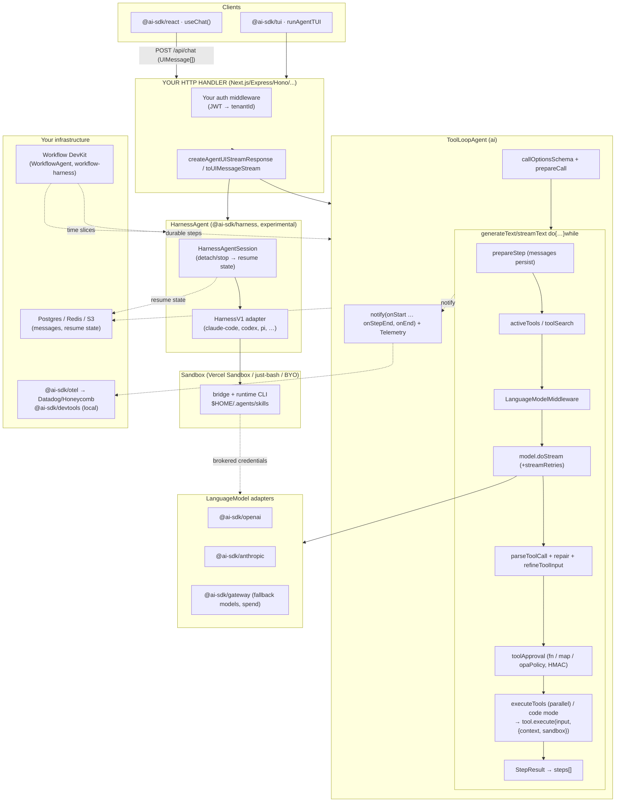

# Vercel AI SDK TypeScript — Benchmark Analysis

> **Repo**: https://github.com/vercel/ai
> **Commit analysed**: `45e1fbc3ea10d22f852e12b1c1851e289c85e835`
> **Branch**: `main`
> **Framework path**: `frameworks/vercel-ai/`
> **Analysed on**: 2026-10-01

## TL;DR

- ⭐ **What is this stack architecturally?** Primarily a **TypeScript library** (not a server). The `ai` package (`packages/ai/`, now **stable `ai@7.0.126`**) gives you `generateText` / `streamText` / `ToolLoopAgent`, which you mount on *your own* HTTP handler (Next.js, Express, Hono, Fastify, Nest, Nuxt, SvelteKit, raw Node). First-party frontend adapters (`@ai-sdk/react`, `vue`, `svelte`, `angular`) consume the SSE protocol it emits. **New since the last analysis**: an experimental **harness layer** (`@ai-sdk/harness` + 11 adapter packages) that drives *external* coding-agent runtimes (Claude Code, Codex, Cline, Cursor, OpenCode, Pi, Deep Agents, …) inside a sandbox through the same `generate()` / `stream()` surface, and a durable `WorkflowAgent` (`@ai-sdk/workflow`) for the Workflow DevKit.
- **Ecosystem**: TypeScript / JavaScript (ESM-only since v7; Node.js 22+).
- **Open-source / governance**: Apache-2.0, maintained by **Vercel**. Commercial layers are the **AI Gateway** (`@ai-sdk/gateway`), **Vercel Sandbox** (`@ai-sdk/sandbox-vercel`), the Workflow runtime, and Vercel hosting. The SDK is free.
- **Maturity / adoption**: v7 went **stable on 2026-06-25** (`ai@7.0.0`) and has shipped 126 patch releases since. 27.1k stars, 5.2k forks, ~720 contributors, ~32.7M npm downloads/week for `ai` (captured 2026-10-01). Harness, sandbox, code-mode, evaluation, realtime and batch APIs are explicitly **experimental**.
- **Where does the agent loop actually execute?** Two answers now. (a) `ToolLoopAgent` / `generateText`: a `do { … } while(…)` loop in your Node process (`packages/ai/src/generate-text/generate-text.ts:867`). (b) `HarnessAgent`: the loop runs inside a **third-party agent runtime** (e.g. the Claude Code CLI driven by an in-sandbox bridge, or Pi/Cline in the host process); the SDK only translates the runtime's events into AI SDK stream parts.
- **Strongest fit for our use case (multi-tenant long-running agent piloted by skills)**: `ToolLoopAgent` keeps the best tenant-identity story of the TS stacks: `runtimeContext` + per-tool `toolsContext` with `contextSchema` validation + `prepareStep(activeTools)` + `experimental_refineToolInput` covers identity, per-turn tool filtering and **forced tool arguments**. v7 adds signed (HMAC) tool approvals, re-validation of client-replayed approvals, and an OPA policy adapter for tool authorization.
- **Biggest gap**: still **no session store, no multi-session runtime, no HTTP server, no resource registry**. Skills and sub-agents exist only through the experimental `HarnessAgent` (where the *external runtime* handles them); the native `ToolLoopAgent` has neither a skill loader nor a sub-agent primitive.
- **Most surprising (new)**: Vercel now treats Claude Code / Codex / Pi as interchangeable "harness providers", analogous to model providers. `HarnessAgent` accepts `skills: [{ name, description, content, files }]`, writes them as `SKILL.md` into `$HOME/.agents/skills` in the sandbox, and lets the runtime discover them lazily. This is a real (experimental) skill path, but only by delegating the loop to another vendor's agent.
- **Most surprising (negative, unchanged)**: no HTTP server. `createAgentUIStreamResponse({ agent, uiMessages })` returns a `Response` you mount yourself; there are no `/runs` or `/threads` endpoints, and `HarnessAgent` needs you to persist an opaque resume state per chat.
- **One-line verdicts**:
  - **Sessions / persistence**: `ToolLoopAgent`: Not provided — BYO. `HarnessAgent`: in-runtime session with opaque, caller-persisted resume state (`session.detach()` / `stop()`); no store shipped. `WorkflowAgent`: durable per-step state via Workflow DevKit.
  - **Skills**: `HarnessAgent` only (experimental, programmatic `skills` array, materialised as `SKILL.md`). Not provided on `ToolLoopAgent`.
  - **Resource manager**: Not provided — BYO.
  - **Sub-agents**: agents-as-tools pattern (documented, BYO); runtime-native sub-agents when using the Claude Code harness.
  - **Multi-tenancy**: Strong on `ToolLoopAgent`. Weaker on `HarnessAgent` (no input refinement, static approval map, built-in tools default to `allow-all`).
  - **Hooks**: Strong. Lifecycle callbacks are now stable (`onStart`, `onStepStart`, `onLanguageModelCallStart/End`, `onToolExecutionStart/End`, `onStepEnd`, `onEnd`) plus `prepareCall`, `prepareStep`, `experimental_refineToolInput`, `toolApproval`, `LanguageModelMiddleware`.
  - **API**: Library-only. SSE `UIMessageChunk` protocol, mounted by you.
  - **Observability**: `Telemetry` interface (stable), `@ai-sdk/otel`, local `@ai-sdk/devtools` viewer, cache-aware `LanguageModelUsage`. **No USD cost in `ai`**; USD only via `@ai-sdk/gateway.getSpendReport(...)`.
- **Production-readiness verdict for multi-tenant server-side deployment**: the core is now stable and well-hardened (SSRF-safe downloads, error redaction by default, approval re-validation). It is still a *library*: you build sessions, durable runtime (or adopt Vercel Workflow), skills, registry and cost rollups yourself. `HarnessAgent` is the most interesting new option for skill-driven agents but is experimental and couples you to a sandbox provider and an external agent runtime.

---

## 0. General

### 0.1 What is this stack?

A **library** — `ai` is published on npm and imported into your application. There is no daemon and no managed runtime. Around it sit optional packages: a hosted model proxy (**Vercel AI Gateway**, used as just another `LanguageModel`), a durable agent for Vercel Workflow (`@ai-sdk/workflow`), an experimental **harness** layer that wraps external coding-agent runtimes (`@ai-sdk/harness`, `@ai-sdk/harness-*`), sandbox adapters (`@ai-sdk/sandbox-vercel`, `@ai-sdk/sandbox-just-bash`), and a terminal UI (`@ai-sdk/tui`).

### 0.2 Ecosystem

**TypeScript**. ESM-only since v7 (`packages/ai/package.json:4`, `"type": "module"`; CommonJS exports were removed in 7.0.0, `packages/ai/CHANGELOG.md:1330`). Runs in Node.js and compatible runtimes (Edge, Bun, Deno where supported). Minimum Node version is now **22** (`packages/ai/package.json:89`).

### 0.3 Project status & governance

- **License**: Apache-2.0 (`packages/ai/package.json:6`, root `LICENSE`).
- **Owner / maintainer**: Vercel Inc., with a large community contributor base.
- **Commercial backing**: Vercel sells the **AI Gateway** (routing, fallbacks, spend reports, key management), **Vercel Sandbox** (the recommended sandbox for harnesses), **Vercel Workflow** (durable execution for `WorkflowAgent` and `@ai-sdk/workflow-harness`), and hosting. The SDK itself is free.
- **Support model**: GitHub issues, community forum/Discord, Vercel commercial support for platform customers.

### 0.4 Project maturity / age

- Repository created 2023-05-23 (GitHub API). The SDK launched in Q2 2023.
- **Current version: `ai@7.0.126` (stable, npm `latest`)**. `ai@7.0.0` was published 2026-06-25 (https://github.com/vercel/ai/releases/tag/ai%407.0.0) after a canary (`7.0.0-canary.*`) and beta (`7.0.0-beta.177`–`187`) cycle (`packages/ai/CHANGELOG.md:1311`, `:1646`). The previous analysis studied `7.0.0-canary.142`.
- v6 and v5 are still maintained on npm dist-tags `ai-v6` (6.0.299) and `ai-v5`.
- Stable in 7.0: `ToolLoopAgent`, `Agent` interface, `prepareCall`, `runtimeContext` / `toolsContext`, `toolApproval`, lifecycle callbacks (`onStart`, `onStepStart`, `onToolExecutionStart/End`, `onStepEnd`, `onEnd`), telemetry, `repairToolCall` (promoted after 7.0.0).
- Still `experimental_*`: `experimental_refineToolInput`, `experimental_sandbox`, `experimental_toolCallers` (code mode), `experimental_toolApprovalSecret`, `experimental_evaluate`, realtime, streaming transcription, batch. All harness packages, sandbox packages, `@ai-sdk/code-mode` are labelled experimental in their READMEs (`packages/harness/README.md:3`).

### 0.5 Adoption & community signal

Captured **2026-10-01** via `gh api repos/vercel/ai` and the npm downloads API:

- GitHub stars: **27,064**. Forks: **5,232**. Watchers: 147.
- Contributors: **~722** (contributors API, anonymous included).
- Open issues: 502; open PRs: 945; PRs opened since 2026-09-01: ~1,469.
- Commit activity: 1,827 commits between the previous analysed commit (2026-05) and this one; last push 2026-10-01.
- Release cadence: per-package releases through changesets, typically several `Version Packages` releases per day; `ai` went from 7.0.0 to 7.0.126 in ~3 months.
- npm: `ai` had **32.7M downloads** in the week 2026-09-23 → 2026-09-29.

### 0.6 Ecosystem fit

- **Languages**: TypeScript / JavaScript, ESM-only.
- **Primary form factor**: library (`import { generateText, ToolLoopAgent } from 'ai'`).
- **Package names**: `ai` on npm (https://www.npmjs.com/package/ai); 50+ provider packages `@ai-sdk/<provider>`; agent packages `@ai-sdk/workflow`, `@ai-sdk/harness` and `@ai-sdk/harness-{claude-code,codex,cline,cursor,deepagents,fx,github-copilot,grok-build,opencode,pi,acp}`, `@ai-sdk/workflow-harness`; tooling `@ai-sdk/mcp`, `@ai-sdk/code-mode`, `@ai-sdk/policy-opa`, `@ai-sdk/otel`, `@ai-sdk/devtools`, `@ai-sdk/tui`, `@ai-sdk/sandbox-vercel`, `@ai-sdk/sandbox-just-bash`.
- **Frontend integration**: first-party adapters for **React**, **Vue**, **Svelte**, **Angular**, **RSC** (`packages/react/`, `packages/vue/`, `packages/svelte/`, `packages/angular/`, `packages/rsc/`).
- **Examples**: Next.js, Next-Agent, Next-Workflow, Express, Fastify, Hono, Nest, Nuxt, SvelteKit, node-http, MCP, plus harness end-to-end examples (`examples/harness-e2e-next`, `examples/harness-e2e-tui`).
- **Skill files in this repo** (`skills/`) are *contributor-facing* (e.g. `skills/use-ai-sdk/SKILL.md`) — they tell coding agents how to write AI SDK code. Not a runtime feature.

### 0.7 Documentation depth & cross-team contributor accessibility

- Docs are TypeScript-centric and deep (`content/docs/`, published at ai-sdk.dev). New since the last analysis: a full **AI SDK Harnesses** section (`content/docs/03-ai-sdk-harnesses/`), pages on code mode, tool search, evaluation, batch, realtime, policy-based approvals, terminal UI and a 1,278-line lifecycle-callbacks reference (`content/docs/03-ai-sdk-core/65-lifecycle-callbacks.mdx`).
- Architecture notes live in-repo (`architecture/harness-abstraction.md`, `architecture/sandbox-abstraction.md`, `architecture/stream-text-loop-control.md`).
- A non-engineer (Product/Data) still cannot author agent behaviour without code: even harness skills are passed as a TypeScript array, not dropped as files.

### 0.8 Documentation entry points ⭐

- **Official docs**: https://ai-sdk.dev/docs
- **Quickstart**: https://ai-sdk.dev/docs/getting-started
- **API reference**: https://ai-sdk.dev/docs/reference
- **Agents**: https://ai-sdk.dev/docs/agents/overview
- **Harnesses**: https://ai-sdk.dev/docs/ai-sdk-harnesses
- **Hosting / deployment**: Vercel docs (https://vercel.com/docs/ai), Workflow (https://vercel.com/docs/workflow)
- **AI Gateway docs**: https://ai-sdk.dev/docs/ai-sdk-gateway
- **Examples / demos**: in-repo `examples/` and https://ai-sdk.dev/examples
- **Changelog / release notes**: in-repo `packages/<pkg>/CHANGELOG.md` (e.g. `packages/ai/CHANGELOG.md`); migration guide v6 → v7 under `content/docs/08-migration-guides/`
- **GitHub Releases**: https://github.com/vercel/ai/releases
- **GitHub issues**: https://github.com/vercel/ai/issues
- **Community**: https://community.vercel.com/ (AI SDK category) and Vercel Discord

---

## 1. High Level Architecture

### Deployment diagram

```
┌────────────────────────────────────────────────────────────────────────┐
│  FRONTEND (browser / native / terminal)                                │
│  @ai-sdk/react · useChat() · DefaultChatTransport (HTTP/SSE)           │
│  @ai-sdk/tui · runAgentTUI({ agent | transport })                      │
└────────────────────────────────────────┬───────────────────────────────┘
                                         │ POST /api/chat (UIMessage[])  ← you define
                                         │ GET  /api/chat/:id/stream     ← you define
                                         ▼
┌────────────────────────────────────────────────────────────────────────┐
│  YOUR HTTP HANDLER (Next.js / Express / Hono / Fastify / Nest / Nuxt)  │
│  ↳ NO SDK-PROVIDED SERVER. You own routing, auth, sessions, DB.        │
│                                                                        │
│  (a) ToolLoopAgent path              (b) HarnessAgent path (experim.)  │
│  createAgentUIStreamResponse(...)    session = agent.createSession()   │
│   └ ToolLoopAgent.stream()            agent.stream({ session, … })     │
│      └ streamText do{…}while           └ HarnessV1 adapter             │
│         (loop runs HERE)                  (loop runs in the runtime)   │
│                                                                        │
│  (c) WorkflowAgent path: 'use workflow' + 'use step' (Workflow DevKit) │
└───────┬─────────────────────────────────────────────┬──────────────────┘
        │ HTTPS (provider APIs)                       │ sandbox API + TCP port
        ▼                                             ▼
 [ OpenAI · Anthropic · Google · … ]     ┌──────────────────────────────────┐
 [ optionally via Vercel AI Gateway ]    │ SANDBOX (Vercel Sandbox, just-bash│
                                         │  or your own SandboxSession)      │
                                         │  bridge ↔ Claude Code / Codex /   │
                                         │  OpenCode CLI · $HOME/.agents/    │
                                         │  skills · sessionWorkDir          │
                                         └───────────────┬──────────────────┘
                                                         │ brokered HTTPS
                                                         ▼
                                          [ model provider / AI Gateway ]

ToolLoopAgent: no process boundary beyond provider HTTPS calls; no session store.
HarnessAgent: host ↔ sandbox bridge; runtime owns history; caller persists resume state.
```

### 1.1 Where does the agent loop actually execute?

It depends on which agent class you pick.

**`generateText` / `streamText` / `ToolLoopAgent`: in your Node.js process.** No vendor cloud, no subprocess. The loop is at `packages/ai/src/generate-text/generate-text.ts:867`:

```ts
// packages/ai/src/generate-text/generate-text.ts:867 (abridged)
do {
  // prepareStep({ model, steps, stepNumber, instructions, messages,
  //               initialMessages, responseMessages, runtimeContext, … })
  // stepModel.doGenerate(...)            (:1045)
  // parseToolCall(...) per call in Promise.all (:1074), applies refineToolInput
  // resolveToolApproval(...)             (:1222)
  // executeTools(...) — Promise.all      (:1632/:1666)
  // notify onStepEnd                     (:1501)
} while (
  clientToolOutputs.length + deniedToolApprovalResponses.length === clientToolCalls.length &&
  (clientToolCalls.length > 0 || pendingDeferredToolCalls.size > 0) &&
  !(await isStopConditionMet({ stopConditions, steps }))      // :1514
);
```

`ToolLoopAgent` (`packages/ai/src/agent/tool-loop-agent.ts:39`, 323 lines) wraps `generateText` / `streamText` with `prepareCall`, `callOptionsSchema` validation and a default `stopWhen: isStepCount(20)` (`:132`).

**`HarnessAgent` (`packages/harness/src/agent/harness-agent.ts:181`, experimental): inside a third-party agent runtime.** The adapter either runs the runtime in the host process (Pi, Cline) or installs a bridge in a sandbox that drives the native CLI/SDK (Claude Code, Codex, OpenCode, Deep Agents) or speaks ACP (Cursor, GitHub Copilot, Grok Build, fx) (`content/docs/03-ai-sdk-harnesses/05-harness-adapters.mdx:36-47`). The AI SDK maps runtime events to `TextStreamPart`s; the tool-calling loop, compaction and built-in tools belong to the runtime. The architecture doc is explicit: "If an underlying runtime cannot be made to work against the sandbox supplied by the AI SDK harness framework, it is not suitable to be implemented as an AI SDK harness" (`architecture/harness-abstraction.md`).

**`WorkflowAgent` (`packages/workflow/src/workflow-agent.ts`)**: same loop semantics as `ToolLoopAgent`, but each model call and tool execution runs as a Workflow DevKit step, so the loop executes in whatever worker the Workflow runtime schedules.

### 1.2 Runtime dependencies

- **Node**: **22, 24 or 26** (raised from 18 in 7.0.0; `packages/ai/package.json:89`, `packages/ai/CHANGELOG.md` entry `7fc6bd6`). Code mode also requires Node 22+ and does not run in edge/browser.
- **Native libs / bundled binaries**: none for `ai`. `@ai-sdk/code-mode` embeds a QuickJS (WASM) interpreter.
- **Database**: none required by the SDK.
- **Required vendor services**: an LLM provider reachable over HTTPS, or the Vercel AI Gateway.
- **HarnessAgent adds**: a sandbox provider (Vercel Sandbox via `@ai-sdk/sandbox-vercel`, in-process `just-bash`, or your own `Experimental_SandboxSession`/`HarnessV1NetworkSandboxSession` implementation) and the external runtime installed in it by the adapter's bootstrap recipe (e.g. the Claude Code CLI). Bridge-backed adapters need a sandbox TCP port.
- **WorkflowAgent / workflow-harness add**: the Workflow DevKit (`workflow@^5.0.0-beta`, peer dependency in `packages/workflow/package.json`) and a Workflow backend (Vercel or self-hosted world).

### 1.3 Recommended deployment topology

The SDK still doesn't ship hosting recipes for `ToolLoopAgent`. Docs and `examples/next-agent/` mount `createAgentUIStreamResponse` inside a Next.js route: one process per instance, many tenants per process, session state in your external DB.

For `HarnessAgent`, the documented topology is **one sandbox per chat/session**: derive a stable `sandboxId` from the chat id, create it from a prepared template on first request, `session.detach()` at the end of each request, persist the opaque resume state, and `resumeVercelNetworkSandboxSession({ sandboxId })` on the next request (`content/docs/03-ai-sdk-harnesses/07-ui.mdx:92-147`). Long turns are expected to run under Workflow via `@ai-sdk/workflow-harness` time slices, because a Fluid Compute function recycles at roughly 800 s (`packages/workflow-harness/README.md`).

### 1.4 Cold-start cost & instance footprint

- `ai` cold start is a JS import, tens of milliseconds. No bundled binaries.
- The first LLM call is dominated by provider latency.
- `HarnessAgent` adds sandbox creation, bootstrap (installing the runtime CLI and bridge), and runtime start. The SDK mitigates this with a deterministic sandbox **template** that sandbox creators can snapshot (`agent.getSandboxTemplate()`, `packages/harness/src/agent/harness-agent.ts:303`; `bootstrapHash` in `HarnessAgentSandboxConfig`). I found no published latency or RAM figures for harness cold start; measure it for your adapter and sandbox.

### 1.5 Vendor lock-in

- **LLM-provider**: low. 50+ provider adapters behind `LanguageModelV4`.
- **Hosting platform**: low for `ToolLoopAgent`. Medium for `WorkflowAgent` (Workflow DevKit, open-source runtime but Vercel-first) and for `HarnessAgent` (Vercel Sandbox is the only first-party network sandbox; `just-bash` has no ports, so bridge-backed adapters need Vercel Sandbox or your own implementation).
- **Agent-runtime lock-in (new)**: `HarnessAgent` makes the *runtime* swappable (Claude Code ↔ Codex ↔ Pi), but the behaviour (built-in tools, compaction, skills discovery, approvals) is the runtime's, and adapter capabilities differ (`content/docs/03-ai-sdk-harnesses/05-harness-adapters.mdx:36-47`).
- **Eval platform**: none. `experimental_evaluate` is in-SDK; no hosted eval product is required.

### 1.6 Framework weight / footprint

`ai` itself remains a **thin SDK**: generate/stream text/object/image/speech/video, embeddings, rerank, tool loop, telemetry, UI stream protocol, tool authoring, tool search, evaluation. It does **not** ship sessions, a durable runtime, RAG, a skill loader for `ToolLoopAgent`, a resource registry, or an HTTP server. The ecosystem around it got heavier: `@ai-sdk/harness` alone is ~16k LOC of source, plus adapters (Claude Code adapter ~4.9k LOC, ACP ~10k LOC), sandbox adapters, workflow and TUI packages. These are opt-in packages, not part of `ai`.

### 1.7 Release-history signal

`packages/ai/CHANGELOG.md` between `7.0.0-canary.142` (previous analysis) and `7.0.126`:

```
## 7.0.0  (2026-06-25, :1311)
  Major: ESM-only; experimental_telemetry → telemetry (stable); stepCountIs → isStepCount;
         reject system messages in prompt/messages by default (allowSystemInMessages opt-in);
         rename experimental_context → runtimeContext/toolsContext; remove experimental_customProvider
  Patch: feat(harness): implement harness specification (21d3d60)
         onStepFinish → onStepEnd, onFinish → onEnd (aliases kept, deprecated)
         streamText result fullStream deprecated in favour of stream
         result.toUIMessageStream()/toUIMessageStreamResponse() deprecated → toUIMessageStream({ stream })
         fix(security): re-validate tool approvals from client history (HMAC via experimental_toolApprovalSecret)
         fix: redact server error details from UI message streams by default
         fix: harden download URL SSRF guard
         Raise minimum supported Node.js version to 22
         make experimental lifecycle callbacks stable; add toolMs / per-tool timeouts
## 7.0.x  (post-stable)
  feat(ai): add native tool search tool; support tool search with direct tool calling
  feat(code-mode) / experimental_toolCallers routing in generateText/streamText/ToolLoopAgent
  Add experimental_evaluate and evaluation model specification
  Add configurable recovery for provider errors after streaming begins (streamRetries)
  Add fingerprintTools / detectToolDrift (MCP rug-pull detection)
  feat: batch APIs (start/status/results/cancel/list, webhooks)
  Promote repairToolCall to stable; experimental Realtime / streaming transcription
  7.0.123: keep idle UI message streams open with optional SSE heartbeats
```

Fast-moving areas: harness packages (adapter count went from 0 to 11 in four months, all experimental), sandbox abstraction, code mode, realtime, batch, evaluation. The core loop API settled at 7.0.0; post-stable changes are additive or deprecations with aliases. Release pages: https://github.com/vercel/ai/releases.

---

## 2. Agent Loop

### 2.1 Run loop entrypoint(s)

Three surfaces:

- **Free functions** `generateText(...)` (`packages/ai/src/generate-text/generate-text.ts`) and `streamText(...)` (`packages/ai/src/generate-text/stream-text.ts`). These are the loop.
- **`ToolLoopAgent`** (`packages/ai/src/agent/tool-loop-agent.ts:39`) — OO wrapper bundling `model + tools + instructions + settings`, exposing `agent.generate(params)` / `agent.stream(params)`.
- **`HarnessAgent`** (`packages/harness/src/agent/harness-agent.ts:181`, experimental) — implements the same shape but requires a `session`: `agent.generate({ session, prompt })` (`:643`), `agent.stream({ session, … })` (`:673`), plus `continueStream` / `continueGenerate` (`:743`) for suspended turns.

The `Agent` interface (`packages/ai/src/agent/agent.ts:184-220`):

```ts
export interface Agent<CALL_OPTIONS = never, TOOLS extends ToolSet = {},
                       RUNTIME_CONTEXT extends Context = Context, OUTPUT extends Output = never> {
  readonly version: 'agent-v1';
  readonly id: string | undefined;
  readonly tools: TOOLS;
  generate(options: AgentCallParameters<CALL_OPTIONS, TOOLS, RUNTIME_CONTEXT>):
    PromiseLike<GenerateTextResult<TOOLS, RUNTIME_CONTEXT, OUTPUT>>;
  stream(options: AgentStreamParameters<CALL_OPTIONS, TOOLS, RUNTIME_CONTEXT>):
    PromiseLike<StreamTextResult<TOOLS, RUNTIME_CONTEXT, OUTPUT>>;
}
```

`generate(...)` returns once the loop terminates (or pauses on HITL). `stream(...)` returns a `StreamTextResult` exposing `.stream` (`packages/ai/src/generate-text/stream-text-result.ts:320`; `.fullStream` at `:330` is deprecated), `.textStream`, and promises for `text`, `usage`, `steps`, `finalStep`, `responseMessages`. Converting to UI chunks is now a standalone helper: `toUIMessageStream({ stream: result.stream })`; the result methods `result.toUIMessageStream()` / `toUIMessageStreamResponse()` still work but are deprecated.

### 2.2 Per-iteration behavior

Inside the `do { … } while(…)` at `packages/ai/src/generate-text/generate-text.ts:867`:

1. Step timeout armed (`timeout.stepMs`), tracing-channel span opened.
2. `prepareStep?.({ model, steps, stepNumber, instructions, initialInstructions, messages, initialMessages, responseMessages, runtimeContext, toolsContext, … })` — returned `messages` overrides now **carry forward** to later steps (this is what makes `prepareStep`-based compaction work).
3. Resolve step model, instructions, messages, active tools, tool choice, provider options, call settings (`prepare-step-call-settings.ts`), sandbox.
4. Notify `onStepStart`, `onLanguageModelCallStart`.
5. `stepModel.doGenerate(...)` (`:1045`) or `doStream(...)` in `streamText`.
6. `parseToolCall(...)` for every tool call in `Promise.all` (`:1074`), which applies `repairToolCall` and `experimental_refineToolInput`.
7. Notify `onLanguageModelCallEnd`.
8. `resolveToolApproval(...)` per call (`:1222`) → `approved | denied | user-approval | not-applicable` (with optional `reason`).
9. Tools whose caller is `code mode` are routed through `experimental_toolCallers` instead of direct dispatch.
10. `executeTools(...)` (`:1632`) runs approved client tool calls via `Promise.all` (`:1666`), firing `onToolExecutionStart` / `onToolExecutionEnd`. Unsafe finish reasons (e.g. content filter) now block automatic tool execution.
11. Build `StepResult`, push to `steps`, notify `onStepEnd` (`:1501`).

### 2.3 ReAct loop

Yes — the `do { … } while(…)` *is* the ReAct loop. You configure it via `tools`, `stopWhen` (`isStepCount`, `hasToolCall`, `isLoopFinished`), `prepareStep`, and callbacks. With `HarnessAgent` you get the external runtime's own loop instead.

### 2.4 Tool dispatch + result handling

`executeTools(...)` runs approved client tool calls **in parallel** (`Promise.all` at `packages/ai/src/generate-text/generate-text.ts:1666`). In `streamText`, tool execution is now delayed until the model call finishes. Each output becomes a `tool-result` part in the next step's tool message, sorted by tool-call order. `tool.toModelOutput?({ input, output })` reshapes what the model sees. Per-tool timeouts are configurable (`timeout: { toolMs, tools: { topicSearchMs: 5000 } }`, `packages/ai/src/prompt/request-options.ts:16-21`).

### 2.5 Explicit turn concept

A **step** = one LLM call + zero or more parallel tool executions. `stopWhen` defines termination (`packages/ai/src/generate-text/stop-condition.ts`):

- `isStepCount(n)` (`:27`) — `isStepCount(20)` is the `ToolLoopAgent` default (`packages/ai/src/agent/tool-loop-agent.ts:132`); raw `generateText` defaults to one step.
- `isLoopFinished()` (`:37`) — new: run until the model stops calling tools (no step cap).
- `hasToolCall(...names)` (`:47`) — now accepts several tool names.
- Custom `StopCondition` functions.

`HarnessAgent` turns are "until the runtime finishes the prompt"; `stopWhen` there opts into semantic step boundaries evaluated after harness tool steps (`content/docs/03-ai-sdk-harnesses/02-harness-agent.mdx:467`).

### 2.6 Event emission mechanism (in-process)

Two mechanisms:

- **Push (callbacks)** through `notify({ event, callbacks })` (`packages/ai/src/util/notify.ts`): `onStart`, `onStepStart`, `onLanguageModelCallStart`, `onLanguageModelCallEnd`, `onToolExecutionStart`, `onToolExecutionEnd`, `onStepEnd`, `onEnd`, plus `onChunk`, `onError`, `onAbort` on `streamText`. All are now stable names; the `experimental_*` and `onStepFinish` / `onFinish` names remain as deprecated aliases.
- **Pull (async iterator)**: `streamText(...).stream: AsyncIterableStream<TextStreamPart<TOOLS>>` (`packages/ai/src/generate-text/stream-text-result.ts:320`).
- Additionally, `ai` publishes event data on Node **diagnostics/tracing channels** (changelog `202f107`, `b097c52`) so APM tooling can subscribe without code changes.

---

## 3. Message & Event Taxonomy

### 3.1 Message layers

Three message vocabularies + one event-stream taxonomy (unchanged structure).

- **`ModelMessage`** — what the LLM sees. The type now lives in `packages/provider-utils/src/types/model-message.ts:10`; `packages/ai/src/prompt/message.ts:4-70` holds the Zod schemas.
- **`UIMessage<METADATA, DATA_PARTS, TOOLS>`** — what the client renders (`packages/ai/src/ui/ui-messages.ts:44`), with `parts: UIMessagePart[]`.
- **`ContentPart<TOOLS>`** — the SDK's normalized view of one step's output (`packages/ai/src/generate-text/content-part.ts`), exposed as `StepResult.content`.

Conversions:

- `UIMessage[] → ModelMessage[]`: `convertToModelMessages()` (`packages/ai/src/ui/convert-to-model-messages.ts:48`), now with an optional `convertDataPart` hook.
- `TextStreamPart → UIMessageChunk`: `toUIMessageStream({ stream: result.stream, originalMessages? })` (standalone helper since 7.0).

```
   YOUR DB                  HTTP HANDLER                AI SDK LOOP                LLM PROVIDER
 ┌─────────┐  read    ┌──────────────────────┐    ┌────────────────────┐      ┌──────────────┐
 │ UIMsg[] │ ───────► │  convertToModel-     │ ─► │   ModelMessage[]   │ ───► │  doStream    │
 │         │          │  Messages()          │    │   (LLM-wire view)  │      │  doGenerate  │
 └─────────┘          └──────────────────────┘    └─────────┬──────────┘      └──────┬───────┘
       ▲                                                    │                        │
       │   ┌──────────────────────────┐    ┌────────────────▼─────────────┐          │
       └── │  onEnd / onStepEnd       │ ◄─ │  toUIMessageStream({stream}) │ ◄────────┘
           │  (persist UI format)     │    │  emits UIMessageChunk wire   │
           └──────────────────────────┘    └──────────────────────────────┘
```

`HarnessAgent` reuses the same layers: it emits `TextStreamPart`s, so `toUIMessageStream` and `useChat` work unchanged. Harness-only events (workspace `fileChange`, `compaction`) are projected as dynamic, provider-executed tool parts (`content/docs/03-ai-sdk-harnesses/03-tools.mdx:289-297`).

### 3.2 Concrete message types

| Type                         | Purpose                                                                |
| ---------------------------- | ---------------------------------------------------------------------- |
| `SystemModelMessage`         | LLM-wire system role. Rejected inside `messages`/`prompt` by default since 7.0 (`allowSystemInMessages` to opt in); use `instructions`. |
| `UserModelMessage`           | LLM-wire user role.                                                    |
| `AssistantModelMessage`      | LLM-wire assistant role, possibly with tool-call parts.                |
| `ToolModelMessage`           | LLM-wire tool role with `tool-result` / `tool-approval-response` parts.|
| `UIMessage`                  | UI-side message carrying `parts: UIMessagePart[]` + metadata.          |
| `UIMessagePart` (subtypes)   | Rich UI rendering primitives (see 3.4).                                |
| `StepResult<TOOLS, CTX>`     | One step's content, usage, tool calls/results, request/response messages. |
| `GenerateTextResult`         | Full run output (`steps`, `finalStep`, `usage` = total, `responseMessages`, `text`, …). |
| `StreamTextResult`           | Streaming variant — `.stream`, promises for results.                   |
| `TextStreamPart<TOOLS>`      | In-process stream chunks (26 variants — see 3.6).                      |
| `UIMessageChunk<META, DATA>` | Wire-format SSE chunks (28 variants incl. new `reset-step` — see 3.6). |

### 3.3 Messages vs. events

**Separate taxonomies.** Messages are persisted artifacts (`UIMessage[]`, `ModelMessage[]`); events stream during a run (`TextStreamPart`, `UIMessageChunk`). Tool-call state is mirrored in `ToolUIPart.state: 'input-streaming' | 'input-available' | 'approval-requested' | 'approval-responded' | 'output-available' | 'output-error' | 'output-denied'` (`packages/ai/src/ui/ui-messages.ts:415-540`).

### 3.4 Event categories

- **Stream-event** (text/reasoning deltas): `text-start/-delta/-end`, `reasoning-start/-delta/-end`.
- **Tool-event**: `tool-input-start/-delta/-available/-error`, `tool-output-available/-error/-denied`, `tool-approval-request/-response`.
- **Step-event** (turn-event in our vocabulary): `start-step`, `finish-step`, and new `reset-step` ("removes all message parts added during the current step", emitted when `streamRetries` retries a failed step; `packages/ai/src/ui-message-stream/ui-message-chunks.ts:390-395`).
- **Session-lifecycle event**: `start`, `finish`, `abort`, `error`.
- **Source / file / reasoning-file / custom**: rendering primitives.
- **Data / message-metadata**: extensibility holes for host payloads.
- **Hook event**: no separate category — hooks fire in-process (Q7).
- **Sub-agent event**: no category for `ToolLoopAgent`. The Claude Code harness can forward sub-agent text as raw stream parts (`forwardSubagentText`, `packages/harness-claude-code/src/claude-code-harness.ts:111-114`).
- **Harness events**: workspace `fileChange` and `compaction` appear as dynamic provider-executed tool parts.

### 3.5 Canonical type-definition file(s)

- **`packages/provider-utils/src/types/model-message.ts:10`** — `ModelMessage` union; schemas in `packages/ai/src/prompt/message.ts`.
- **`packages/ai/src/ui/ui-messages.ts:44-540`** — `UIMessage`, `UIMessagePart`, `ToolUIPart` state machine.
- **`packages/ai/src/generate-text/content-part.ts`** — `ContentPart`.
- **`packages/ai/src/generate-text/stream-text-result.ts:581-607`** — `TextStreamPart`.
- **`packages/ai/src/ui-message-stream/ui-message-chunks.ts:232-424`** — `UIMessageChunk` (wire format).
- **`packages/harness/src/v1/harness-v1-stream-part.ts`** — `HarnessV1StreamPart`, what adapters emit before translation.

### 3.6 Live agentic event stream taxonomy

`TextStreamPart<TOOLS>` (`packages/ai/src/generate-text/stream-text-result.ts:581`):

```ts
export type TextStreamPart<TOOLS extends ToolSet> =
  | TextStreamTextStartPart | TextStreamTextEndPart | TextStreamTextDeltaPart
  | TextStreamReasoningStartPart | TextStreamReasoningEndPart | TextStreamReasoningDeltaPart
  | TextStreamCustomPart
  | TextStreamToolInputStartPart | TextStreamToolInputEndPart | TextStreamToolInputDeltaPart
  | TextStreamSourcePart | TextStreamFilePart | TextStreamReasoningFilePart
  | TextStreamToolCallPart<TOOLS> | TextStreamToolResultPart<TOOLS> | TextStreamToolErrorPart<TOOLS>
  | TextStreamToolOutputDeniedPart<TOOLS>
  | TextStreamToolApprovalRequestPart<TOOLS> | TextStreamToolApprovalResponsePart<TOOLS>
  | TextStreamStartStepPart | TextStreamFinishStepPart
  | TextStreamStartPart | TextStreamFinishPart
  | TextStreamAbortPart | TextStreamErrorPart | TextStreamRawPart;
```

`UIMessageChunk` (`packages/ai/src/ui-message-stream/ui-message-chunks.ts:232`) — sample frames:

```
# session-lifecycle
data: {"type":"start","messageId":"msg_xyz"}
# step / turn-event
data: {"type":"start-step"}
# tool-event (input streaming)
data: {"type":"tool-input-start","toolCallId":"call_001","toolName":"weather","dynamic":false}
data: {"type":"tool-input-delta","toolCallId":"call_001","inputTextDelta":"{\"city\":\""}
data: {"type":"tool-input-available","toolCallId":"call_001","toolName":"weather","input":{"city":"Paris"}}
# tool-event (output)
data: {"type":"tool-output-available","toolCallId":"call_001","output":{"weather":"sunny"}}
# stream-event (text delta)
data: {"type":"text-start","id":"txt_1"}
data: {"type":"text-delta","id":"txt_1","delta":"It is sunny in Paris."}
data: {"type":"text-end","id":"txt_1"}
# step finish
data: {"type":"finish-step"}
# session-lifecycle (terminal)
data: {"type":"finish","finishReason":"stop"}
data: [DONE]
```

Every tool chunk carries an explicit `toolCallId` — see 8.9. UI chunk schemas are now `looseObject`, so clients accept fields added by newer servers.

---

## 4. Agent Runtime (Multi-session Host)

### 4.1 Multi-session host architecture

**Not provided — BYO.** Each `agent.generate(...)` / `agent.stream(...)` call is request-scoped; the runtime is your Node process.

`HarnessAgent` introduces a **session object** (`agent.createSession({ sessionId, sandboxSession, resumeFrom })`, `packages/harness/src/agent/harness-agent.ts:317`), but it is per-conversation state, not a host: there is no registry of live sessions, no idle eviction, no concurrency limiter. The docs show an in-memory `Record<chatId, resumeState>` and say "use durable storage instead … in production" (`content/docs/03-ai-sdk-harnesses/07-ui.mdx:145`).

### 4.2 Concurrent session isolation

`ToolLoopAgent`: there is no in-process session bag, so isolation is whatever your handler gives you. There is no shared mutable state in `ai` that one tenant could leak to another, provided `messages`, `runtimeContext` and `toolsContext` come from the request. Global telemetry registration (`registerTelemetry(...)`, `packages/ai/src/telemetry/telemetry-registry.ts:6`) is process-wide by design.

`HarnessAgent`: isolation is enforced by the **sandbox** — one `sessionWorkDir` per session and, in the documented pattern, one sandbox per chat. Model credentials are kept out of the sandbox through credential brokering (placeholders inside, real keys injected by request transformations at the sandbox boundary; `architecture/harness-abstraction.md`, "Credential handling"). Resume state "can contain bridge tokens or forwarded credentials, so callers must treat it as sensitive data".

### 4.3 Horizontal scaling / multi-instance

Stateless-worker model: N Node processes, each pulling session state from your shared store. No leader election, no shared in-memory map. `examples/next/app/api/chat/route.ts` and `examples/next/app/api/chat/[id]/stream/route.ts` show the resumable-stream pattern with the third-party `resumable-stream` package + Redis.

For `HarnessAgent`, any instance can serve the next turn if it can reattach the sandbox by id and load the resume state. For `WorkflowAgent` / `workflow-harness`, the Workflow backend owns scheduling and replay across instances.

### 4.4 Background / async / scheduled tasks

- **Cron / webhook triggers**: Not provided — BYO (Vercel Cron, Cloud Scheduler, Trigger.dev).
- **Long-running background agents**: via Workflow. `WorkflowAgent` runs the loop as durable steps; `@ai-sdk/workflow-harness` runs a `HarnessAgent` turn as a durable workflow, split into **time slices** (survive function recycles) or **semantic agent steps** (`content/docs/03-ai-sdk-harnesses/06-workflow-utilities.mdx`). You write the `'use workflow'` / `'use step'` wrappers.
- **Provider batch jobs** (new, experimental): `experimental_startTextBatch` + status/results/cancel/list, with optional completion webhooks (`content/docs/03-ai-sdk-core/42-batch.mdx`). This is for offline bulk inference, not agent loops.

### 4.5 Worker pool / queue model

**Not provided — BYO** in `ai`. The SDK assumes request scope. For queued work, use an external queue (BullMQ, SQS) or the Workflow DevKit (which provides queuing, retries and durability as a separate Vercel product). `WorkflowAgent` (`packages/workflow/src/workflow-agent.ts`, `@ai-sdk/workflow@2.0.57`, now requiring Workflow 5 beta) is the first-party way to get queue-backed, retryable tool steps.

---

## 5. Sessions & Persistence

### 5.1 Session / chat data model

**`ToolLoopAgent`: there is no SDK-provided `Session` / `Thread` type.** What you persist is `UIMessage[]` (or `ModelMessage[]`). The client-side `AbstractChat` (`packages/ai/src/ui/chat.ts:243`) holds messages and transport state in memory. Per-call inputs you treat as session-equivalent: `id` (chat id you pass), `messages`, `runtimeContext`, `toolsContext`.

**`HarnessAgent`: a live session object** (`packages/harness/src/agent/harness-agent-session.ts`) carrying the runtime, sandbox, `sessionWorkDir`, native history and pending approvals. Its persisted form is an opaque, adapter-specific `HarnessAgentResumeSessionState` returned by `detach()` (`:479`) / `stop()` (`:541`). Adapters may expose a `lifecycleStateSchema` to validate it (`packages/harness/src/v1/harness-v1.ts:71`). There is no documented field list for callers; treat it as a blob plus your own `sessionId` and `sandboxId`.

### 5.2 What's stored on a session

- `ToolLoopAgent`: whatever you store. The example `examples/next/app/api/chat/route.ts:27` calls `readChat(id)` and `saveChat({ id, messages, activeStreamId })` (`:63`). Typical schema: `(id, tenantId, userId, messages jsonb, createdAt, updatedAt)`.
- `HarnessAgent`: the runtime stores native conversation history (e.g. Claude Code's own session files inside the sandbox); the workspace lives in `sessionWorkDir`; the resume state carries adapter lifecycle data and, for an unfinished turn, `continueFrom`. `runtimeContext` and `toolsContext` are intentionally **not** stored in continuation state (`content/docs/03-ai-sdk-harnesses/02-harness-agent.mdx:460-463`).

### 5.3 Granularity

Single linear conversation per `id`. **No branch/fork model** and no checkpoint graph. With `HarnessAgent`, history is owned by the runtime; when you pass `messages`, only the latest user message is sent as the new turn (`02-harness-agent.mdx:227-240`). The Codex adapter starts a fresh native thread when skills/instructions/tools change between turns.

### 5.4 Built-in persistence stores

**None** in `ai`. No JSONL, SQLite, Postgres, Redis or Blob adapter. `HarnessAgent` relies on the runtime's own on-sandbox storage plus sandbox snapshots (Vercel Sandbox can stop with a restorable snapshot, `02-harness-agent.mdx:423-427`). `WorkflowAgent` relies on the Workflow backend's event log.

### 5.5 Persistence timing

For `ToolLoopAgent`, hook into:

- `onStepEnd(event)` — per step (`packages/ai/src/generate-text/generate-text.ts:1501`).
- `onEnd(event)` — once when the loop exits (event carries `runtimeContext`, `toolsContext`, `steps`, `responseMessages`, `usage`; `packages/ai/src/generate-text/generate-text-events.ts:157-300`).
- For UI streams: `toUIMessageStream({ onStepEnd, onEnd })` (`packages/ai/src/ui-message-stream/handle-ui-message-stream-finish.ts:44-53`); `onEnd` now reports consumer cancellation and operation-level outcomes.

No per-token persistence; callbacks are awaited inline, no debounce or batching. `HarnessAgent` persistence happens when *you* call `detach()` / `stop()` (typically in the UI stream's `onEnd`). `WorkflowAgent` persists automatically at each workflow step.

### 5.6 Mid-run checkpointing (durable)

- **`ToolLoopAgent`**: **Not provided — BYO.** A crash mid-tool-call loses the run; the resumable-stream recipe (`examples/next/app/api/chat/route.ts:101-102`, `examples/next/app/api/chat/[id]/stream/route.ts:6`) only lets a client re-attach to an in-flight *stream*, not resume computation.
- **`WorkflowAgent`**: yes, via Workflow DevKit — each tool execution is a durable step with automatic retries; HITL approvals survive suspension (`content/docs/03-agents/07-workflow-agent.mdx:10-34`). Requires the Workflow runtime.
- **`HarnessAgent`**: turn-level continuation. `session.suspendTurn()` (`packages/harness/src/agent/harness-agent-session.ts:600`) returns `continueFrom`; a new process calls `createSession({ continueFrom })` then `continueStream()`. Bridge-backed adapters can re-attach to the live runtime and replay buffered events; host-driven adapters may re-drive part of the work (`architecture/harness-abstraction.md`, "Lifecycle and resume"). `@ai-sdk/workflow-harness` wires this into durable time slices.

### 5.7 Session ID format

Whatever you choose — `id` / `sessionId` is a `string`. Default stream-reconnection URLs now encode the chat id and reject `.` / `..` ids (7.0.122). No tenant-prefix convention.

### 5.8 Pluggable store interface

**No interface to plug.** Persistence is your callback (`onStepEnd` / `onEnd`) or your handling of the harness resume blob. No `SessionStore` / `Checkpointer` abstraction. The sandbox side is pluggable (`Experimental_SandboxSession`, `HarnessV1NetworkSandboxSession`), but that is workspace, not message storage.

### 5.9 Schema evolution / migration

**Not provided — BYO.** `validateUIMessages` (`packages/ai/src/ui/`) validates persisted messages against current schemas; v7 relaxed it so errored or terminal tool parts from older runs stay loadable, and typed tool calls are re-validated against current input/output schemas. Harness resume state is validated against the adapter's `lifecycleStateSchema` and rejected if produced by a different adapter.

### 5.10 Export / replay

`ToolLoopAgent`: exporting is `JSON.stringify(messages)`; replay means re-running with the same messages and model settings — not deterministic. `HarnessAgent`: `session.readHistory({ since? })` (`packages/harness/src/agent/harness-agent-session.ts:515`) reads the runtime's native history where the adapter supports it; the adapter table currently shows **no adapter with history access** (`content/docs/03-ai-sdk-harnesses/05-harness-adapters.mdx:36-47`).

### 5.11 Cross-session memory

**Not provided — BYO.** See Q17.

---

## 6. Multi-tenancy & Tenant Identity ⭐ THE KEY QUESTION

This is still the strongest area of the `ToolLoopAgent` API, and it is now stable (except `experimental_refineToolInput`).

### 6.1 Run-loop tenant identity

`ToolLoopAgentSettings` (`packages/ai/src/agent/tool-loop-agent-settings.ts:49-432`) is the constructor side; `AgentCallParameters` (`packages/ai/src/agent/agent.ts:28`) adds per-call options. Fields beyond `messages` (abridged):

```ts
// packages/ai/src/agent/tool-loop-agent-settings.ts:49
export type ToolLoopAgentSettings<CALL_OPTIONS, TOOLS, RUNTIME_CONTEXT, OUTPUT> =
  LanguageModelCallOptions & Omit<RequestOptions<TOOLS>, 'abortSignal'> & ToolsContextParameter<TOOLS> & {
    id?: string;
    instructions?: Instructions;
    allowSystemInMessages?: boolean;                       // default: reject system msgs in messages
    model: LanguageModel;
    toolChoice?: ToolChoice<NoInfer<TOOLS>>;
    stopWhen?: Arrayable<StopCondition<NoInfer<TOOLS>, RUNTIME_CONTEXT>>;
    telemetry?: TelemetryOptions<RUNTIME_CONTEXT, NoInfer<TOOLS>>;
    activeTools?: ActiveTools<NoInfer<TOOLS>>;               // :113
    toolOrder?: ToolOrder<NoInfer<TOOLS>>;
    output?: OUTPUT;
    runtimeContext?: RUNTIME_CONTEXT;                        // :133
    toolApproval?: ToolApprovalConfiguration<NoInfer<TOOLS>, RUNTIME_CONTEXT>;
    experimental_toolCallers?: Experimental_ToolCallers<NoInfer<TOOLS>>;   // :145
    experimental_toolApprovalSecret?: string | Uint8Array;                 // :152
    prepareStep?: PrepareStepFunction<NoInfer<TOOLS>, RUNTIME_CONTEXT>;
    repairToolCall?: ToolCallRepairFunction<NoInfer<TOOLS>>;
    experimental_refineToolInput?: ToolInputRefinement<NoInfer<TOOLS>>;   // :177
    onStart, onStepStart, onLanguageModelCallStart, onLanguageModelCallEnd,
    onToolExecutionStart, onToolExecutionEnd, onStepEnd, onEnd,
    providerOptions?: ProviderOptions;
    include?: GenerateTextInclude & StreamTextInclude;
    callOptionsSchema?: FlexibleSchema<CALL_OPTIONS>;        // now enforced at runtime
    prepareCall?: (options) => MaybePromiseLike<…>;         // :325
  };
```

Tenant identity belongs in `runtimeContext` (agent-wide, typed by the `RUNTIME_CONTEXT` generic) and in `toolsContext` (per tool, validated by each tool's `contextSchema`). `callOptionsSchema` is now validated before `prepareCall` (changelog `0a51f7d`), so typed `options: { tenantId, … }` per call are safe to template into instructions. There is no session object, so there is no tenant scope "on a session".

`HarnessAgent` has the same `runtimeContext` / `toolsContext` / `callOptionsSchema` / `prepareCall` fields (`packages/harness/src/agent/harness-agent-settings.ts:154-212`); `prepareCall` there can also swap `skills`, `instructions`, `model` and `tools` per turn.

### 6.2 Tenant identity propagation into tool calls

Every tool's `execute(input, options)` receives `ToolExecutionOptions<CONTEXT>` (`packages/provider-utils/src/types/tool-execute-function.ts:8-44`):

```ts
export interface ToolExecutionOptions<CONTEXT extends Context | unknown | never> {
  toolCallId: string;
  messages: ModelMessage[];
  abortSignal?: AbortSignal;
  context: CONTEXT;                  // this tool's toolsContext entry, validated against contextSchema
  experimental_sandbox?: SandboxSession;
}
```

Call path: `agent.generate({ toolsContext })` → `prepareCall` → `generateText` → `prepareStep` (may override `toolsContext`) → `validateToolContext` (`packages/ai/src/generate-text/validate-tool-context.ts:12`; throws `TypeValidationError` on mismatch) → `executeToolCall` → `tool.execute(input, { context })`.

`runtimeContext` is handed to `prepareCall`, `prepareStep`, `toolApproval` functions, stop conditions, callbacks and telemetry, but **not** to `tool.execute`. To route tenant info into `execute`, use `toolsContext[toolName]`, close over it in a tool factory, or derive it per step in `prepareStep`.

### 6.3 Tool call interface

`ToolExecuteFunction` (`packages/provider-utils/src/types/tool-execute-function.ts:49-56`):

```ts
export type ToolExecuteFunction<INPUT, OUTPUT, CONTEXT extends Context | unknown | never> = (
  input: INPUT,
  options: ToolExecutionOptions<CONTEXT>,
) => AsyncIterable<OUTPUT> | PromiseLike<OUTPUT> | OUTPUT;
```

Tool definition (`packages/provider-utils/src/types/tool.ts`; `contextSchema` at `:108`):

```ts
tool({
  description: 'Search topics.',
  inputSchema: z.object({ q: z.string() }),
  contextSchema: z.object({ tenantId: z.string() }),
  execute: async ({ q }, { context }) =>
    db.topics.search({ q, tenantId: context.tenantId }),   // context is harness-provided and validated
});
```

### 6.4 Forcing tool arguments from the harness

**Yes — first-class (still `experimental_`)** via `experimental_refineToolInput` (`packages/ai/src/generate-text/tool-input-refinement.ts:14-19`):

```ts
export type ToolInputRefinement<TOOLS extends ToolSet> = {
  [NAME in keyof TOOLS]?: (
    input: InferToolInput<TOOLS[NAME]>,
  ) => MaybePromiseLike<InferToolInput<TOOLS[NAME]>>;
};
```

It is applied inside `parseToolCall` (`packages/ai/src/generate-text/parse-tool-call.ts:45-57`, `refineParsedToolCallInput` at `:175`) before dispatch, so refined input is what tools, callbacks, telemetry and approval policies see. It is also applied when replaying client-approved tool calls (`packages/ai/src/generate-text/generate-text.ts:719-729`).

```ts
// examples/ai-functions/src/agent/openai/generate-refine-tool-input.ts:22
experimental_refineToolInput: {
  weather: input => ({ city: input.city.trim().toLowerCase() }),
},
```

The cleanest "always `tenantId=acme`" pattern remains: keep `tenantId` **out of** the LLM-visible `inputSchema` and pass it via `toolsContext[name]`, so the LLM cannot generate it at all.

**`HarnessAgent` gap**: there is no `experimental_refineToolInput` on `HarnessAgentSettings`. For host-executed tools the `toolsContext` pattern still works; for the runtime's built-in tools (`bash`, `write`, …) you cannot rewrite arguments, only approve/deny via `permissionMode` and adapter approval support.

### 6.5 Tenant-aware visible tool selection

Four coexisting layers on `ToolLoopAgent`:

1. **`activeTools`** at construction (`packages/ai/src/agent/tool-loop-agent-settings.ts:113`).
2. **`prepareStep(...) → { activeTools? }`** per step (`packages/ai/src/generate-text/prepare-step.ts:124`), applied by `filterActiveTools` (`packages/ai/src/generate-text/filter-active-tools.ts:21`; exported as `experimental_filterActiveTools`).
3. **`prepareCall(...) → { tools?, activeTools? }`** per call (`tool-loop-agent-settings.ts:325`) — template one agent, derive the toolset from `options.tenantId`.
4. **Tool search** (new): mark tools `deferLoading: true` (`packages/provider-utils/src/types/tool.ts:67`) and add `toolSearch()` (`packages/ai/src/tool-search/tool-search.ts:15`); the model sees only `search` until it discovers tools. Search "respects `activeTools` and caller routing" (`content/docs/03-ai-sdk-core/19-tool-search.mdx`), so tenant filtering still applies.

`HarnessAgent` adds `activeTools` **or** `inactiveTools` over the combined built-in + host tool set (`packages/harness/src/agent/harness-agent-settings.ts:106-115`); built-in filtering depends on the adapter (native, via auto-rejection, or unsupported → throws).

### 6.6 Per-tool-call auth propagation

The caller's identity reaches every tool call **only if you put it there**: `toolsContext = { topicSearch: { tenantId, jwt }, … }` → `options.context`. No automatic plumbing. Since 7.0, tool and runtime context are **excluded from telemetry by default** (`telemetry.includeToolsContext` / `includeRuntimeContext` allowlists, `packages/ai/src/telemetry/create-telemetry-dispatcher.ts:52-75`), so JWTs in context no longer leak into spans unless you opt in. For `HarnessAgent`, host-executed tools run in your process with your context; built-in tools run inside the sandbox with only brokered placeholder credentials.

### 6.7 Per-tenant rate limit + budget cap

**Not provided — BYO.** `stopWhen` supports step-count, tool-name and loop-finished conditions; there is **no USD or token budget cap**. Two partial building blocks:

- A custom `StopCondition` over `steps[].usage` can stop at a token ceiling (you write it).
- `@ai-sdk/policy-opa` can deny or require approval based on `runtimeContext` and the full `messages` history (e.g. "track cumulative spend … and stop at a ceiling", `content/docs/03-agents/06-policy-tool-approvals.mdx:27-33`), but it gates *tool calls*, not model calls, and you supply the spend data.

AI Gateway spend reports (Q12) are observational, not enforcing.

### ⭐ Light usage example

```ts
import { ToolLoopAgent, tool } from 'ai';
import { openai } from '@ai-sdk/openai';
import { z } from 'zod';

const topicSearch = tool({
  description: 'Search topics.',
  inputSchema: z.object({ q: z.string() }),             // tenantId is NOT LLM-visible
  contextSchema: z.object({ tenantId: z.string() }),    // harness-injected, validated
  execute: async ({ q }, { context }) => db.topics.search({ q, tenantId: context.tenantId }),
});
// iabSearch, audienceCreate: same pattern. bashExec, webFetch: defined but hidden.

const agent = new ToolLoopAgent({
  model: openai('gpt-5'),
  instructions: 'You help operators build audiences.',
  tools: { topicSearch, iabSearch, audienceCreate, bashExec, webFetch },
  activeTools: ['topicSearch', 'iabSearch', 'audienceCreate'],          // STEP 2
});

const result = await agent.generate({
  prompt: 'Find topics about parenting',
  runtimeContext: { tenantId: 'acme', targetingStrategyId: 'strat-42', userId: 'u-123' }, // STEP 1
  toolsContext: {                                                        // STEP 3: forced server-side
    topicSearch: { tenantId: 'acme' },
    iabSearch: { tenantId: 'acme' },
    audienceCreate: { tenantId: 'acme' },
  },
});
```

All three requirements are first-class. If a tool must keep `tenantId` in its LLM-visible schema, add `experimental_refineToolInput: { topicSearch: i => ({ ...i, tenantId: 'acme' }) }` to overwrite whatever the model generated. `runtimeContext` is not merged into `toolsContext` automatically — you pass both.

---

## 7. Hook & Middleware Capabilities (Context Engineering)

### 7.1 Enumerate every hook / middleware / lifecycle callback

| Hook                                                             | Fires when                              | Read / mutate / block / branch |
| ---------------------------------------------------------------- | --------------------------------------- | ------------------------------ |
| `prepareCall(opts) → opts'`                                      | Once before the loop (`ToolLoopAgent`, `HarnessAgent`; per turn) | Mutate: model, tools, activeTools, instructions, stopWhen, telemetry, toolApproval, toolCallers, providerOptions, reasoning, runtimeContext, toolsContext (+ skills on HarnessAgent) |
| `onStart(event)`                                                 | Once after prompt standardized          | Read-only                     |
| `prepareStep(opts) → overrides`                                  | Before each step's LLM call             | Mutate: model, toolChoice, activeTools, instructions, messages (carried forward), toolsContext, runtimeContext, providerOptions, call settings, sandbox |
| `onStepStart(event)`                                             | Before each step                        | Read-only                     |
| `onLanguageModelCallStart(event)`                                | Before `doGenerate/doStream`            | Read-only                     |
| `LanguageModelMiddleware.transformParams(...)`                   | Before provider call                    | Mutate prompt, tools, headers |
| `LanguageModelMiddleware.wrapGenerate / wrapStream`              | Around provider call                    | Block / retry / cache / fall back |
| `defaultInstructionsMiddleware(...)` (new)                       | Before provider call                    | Apply default instructions unless call overrides |
| `repairToolCall(toolCall, error)` (now stable)                   | When parsing tool args fails            | Mutate (return fixed call)    |
| `experimental_refineToolInput[name](input) → input'`             | After parse, before approval/dispatch   | Mutate tool args (same shape) |
| `onLanguageModelCallEnd(event)`                                  | After provider response parsed          | Read-only (now incl. provider metadata) |
| `tool.onInputStart / onInputDelta / onInputAvailable`            | During tool-arg streaming (per tool)    | Read-only                     |
| `toolApproval` (function, per-tool map, or `opaPolicy(...)`)     | After args ready, before exec           | Block → `user-approval` / `denied`, with `reason` |
| `experimental_toolCallers`                                       | Routing decision per tool               | Route call through code mode instead of direct dispatch |
| `onToolExecutionStart(event)`                                    | Before each `tool.execute`              | Read-only                     |
| `tool.execute(input, options)`                                   | Tool body                               | The work                      |
| `tool.toModelOutput?({ input, output })`                         | After `execute` returns                 | Reshape what the model sees   |
| `onToolExecutionEnd(event)`                                      | After each `tool.execute`               | Read-only — **cannot inject follow-up tool calls** |
| `onStepEnd(event)`                                               | After step's tool execs complete        | Read-only                     |
| `onEnd(event)` / `onAbort` / `onError`                           | After loop exits / on abort / on error  | Read-only                     |
| `Telemetry` integration (~20 callbacks + `executeLanguageModelCall`, `executeTool`) | Mirrors above + embed, rerank, object, evaluate, transcription | Read-only; wrap context for spans |

### 7.2 Hook concurrency model

Events fire **in loop order**, step by step. For a single event, all registered callbacks (your callback plus telemetry integrations) run **concurrently** via `Promise.all`, and exceptions are swallowed (`packages/ai/src/util/notify.ts`). Since 7.0.x, exceptions in streaming `onChunk` / `onError` no longer terminate the stream. Tool executions run in parallel (`packages/ai/src/generate-text/generate-text.ts:1666`), with `onToolExecutionStart` / `onToolExecutionEnd` firing per tool.

### 7.3 Specific capability tests

- **Inject system messages at session start** ("today is 2026-10-01, tenant is acme, locale fr-FR")? **Yes**: static `instructions`; per call via `prepareCall(({ options, ...rest }) => ({ ...rest, instructions: … }))`; per step via `prepareStep({ runtimeContext }) => ({ instructions })`. Note: since 7.0 `role: 'system'` messages inside `messages` are **rejected by default** as a prompt-injection guard; use `instructions` or set `allowSystemInMessages: true`.
- **Expand the user input** (slash commands, timestamps, attachments)? **Yes** — rewrite the prompt in `prepareCall`, or return rewritten `messages` from `prepareStep`.
- **Mutate the messages list before each LLM call**? **Yes** — `prepareStep` `messages` override (now persisted for later steps), or `LanguageModelMiddleware.transformParams`.
- **Mutate tool input before dispatch**? **Yes** — `experimental_refineToolInput[name]`.
- **Mutate tool result before returning to the LLM**? **Partially** — `onToolExecutionEnd` is read-only; the mutation point is per-tool `toModelOutput` (`packages/provider-utils/src/types/tool.ts:157`). Code mode offers another route: the model's own generated code can filter large tool outputs before returning them.
- **Emit additional tool calls in response to a tool result**? **No.** `OnToolExecutionEndCallback` returns `void` (`packages/ai/src/generate-text/tool-execution-events.ts:160`). Workaround: a tool whose `execute` fans out work itself, or code mode.

### 7.4 Auto-compaction

- **`ToolLoopAgent`**: no automatic compaction, but a documented **manual** pattern: in `prepareStep`, check a token estimate and return `messages: pruneMessages({ messages, reasoning: 'all', toolCalls: 'before-last-3-messages' })` (`content/docs/03-agents/04-loop-control.mdx:225-267`; `pruneMessages` at `packages/ai/src/generate-text/prune-messages.ts:17`). Because `prepareStep` message overrides now carry forward, the pruned list becomes the base for later steps. There is no built-in summarisation step.
- **`HarnessAgent`**: compaction is the **runtime's** job (e.g. Claude Code auto-compacts). `session.compact(customInstructions?)` (`packages/harness/src/agent/harness-agent-session.ts:426`) triggers it manually where supported; completion surfaces as a `compaction` dynamic tool part.

### 7.5 Prompt cache optimization

`LanguageModelUsage.inputTokenDetails: { noCacheTokens, cacheReadTokens, cacheWriteTokens }` (`packages/ai/src/types/usage.ts:10`) gives good visibility. The SDK does **not** automatically place Anthropic-style breakpoints; set provider-specific cache markers via `providerOptions` (e.g. `anthropic: { cacheControl: { type: 'ephemeral' } }`) or middleware. New cache-preserving options:

- `toolOrder` setting controls the order tools are sent to the provider (stable tool prefix).
- Code mode with `toolDiscovery: 'conversation'` announces discovered tools in user messages instead of changing the tool list, which "preserves the tool-definition cache as tools are discovered" (`content/docs/03-ai-sdk-core/19-tool-search.mdx`). Direct-call tool search changes the tool list and can invalidate the cached prefix.

### 7.6 Tool result clearing

**Helper provided, trigger is BYO.** `pruneMessages({ toolCalls: 'before-last-message' | 'before-last-N-messages' | [{ type, tools: ['topicSearch'] }] })` (`packages/ai/src/generate-text/prune-messages.ts:17-35`) removes tool-call/tool-result pairs (optionally only for named tools) before a given point; used from `prepareStep`, the result persists for the rest of the run. It removes content; it does not replace it with a stub. There is no harness-level automatic clearing policy.

### 7.7 Progressive disclosure

- **Tool search** (`toolSearch()` + `deferLoading: true`): tool definitions stay out of context until the model searches for them.
- **Code mode** (`@ai-sdk/code-mode`): the model writes JS that calls tools in a QuickJS sandbox and returns only the reduced result, keeping raw tool outputs out of the context.
- **Sub-agent pattern** with `toModelOutput` summarising a child agent's full `UIMessage` (`content/docs/03-agents/06-subagents.mdx:183-245`).
- **Harness skills**: metadata in the runtime's skill index, body read on demand by the runtime (Q10).
- No filesystem-stash or summary-handle primitive for `ToolLoopAgent` beyond these.

### 7.8 Architectural diagram

```
ToolLoopAgent.generate(params)
  │
  ├─ callOptionsSchema validation
  ├─ prepareCall(opts)                                  ← [PRE-LOOP HOOK]
  ▼
generateText(...)
  ├─ standardizePrompt (reject system msgs unless allowSystemInMessages)
  ├─ collectToolApprovals + validateApprovedToolApprovals   ← (re-entry: HMAC + schema + policy re-check)
  ├─ notify onStart                                     ← [HOOK 1]
  └─ do {
     ├─ prepareStep({ messages, runtimeContext, … })    ← [PER-STEP HOOK]
     │     → { model?, instructions?, messages? (persisted), activeTools?, toolsContext?, … }
     ├─ filterActiveTools / tool search / prepareTools
     ├─ notify onStepStart                              ← [HOOK 2]
     ├─ notify onLanguageModelCallStart                 ← [HOOK 3]
     ├─ LanguageModelMiddleware.transformParams         ← [PROVIDER-LEVEL HOOK]
     ├─ LanguageModelMiddleware.wrapGenerate/wrapStream ← [PROVIDER-LEVEL HOOK]
     │     → model.doGenerate / model.doStream  (streamRetries on stream errors)
     ├─ parseToolCall(...)  (repairToolCall if needed)
     │     └─ experimental_refineToolInput[name]        ← [PER-TOOL-CALL HOOK]
     ├─ notify onLanguageModelCallEnd                   ← [HOOK 4]
     ├─ tool.onInputAvailable per call                  ← [PER-TOOL CALLBACK]
     ├─ resolveToolApproval(...)  (fn / map / opaPolicy)
     │     → 'user-approval' → emit approval request (signed if secret set), pause
     │     → 'denied'        → emit tool-output-denied
     ├─ experimental_toolCallers → code-mode routing
     ├─ parallel ∀ approved tool calls:
     │     ├─ notify onToolExecutionStart               ← [HOOK 5]
     │     ├─ tool.execute(input, { context, abortSignal, experimental_sandbox })
     │     ├─ tool.toModelOutput?(output)               ← [PER-TOOL CALLBACK]
     │     └─ notify onToolExecutionEnd                 ← [HOOK 6]
     ├─ build StepResult, push to steps[]
     └─ notify onStepEnd                                ← [HOOK 7]
     } while (client tool calls resolved && !isStopConditionMet)
     └─ notify onEnd                                    ← [HOOK 8]
```

### ⭐ Light usage example

```ts
import { ToolLoopAgent, tool } from 'ai';
import { openai } from '@ai-sdk/openai';
import { z } from 'zod';

const agent = new ToolLoopAgent({
  model: openai('gpt-5'),
  // 1. "SessionStart": inject tenant/locale/date as instructions, per call.
  callOptionsSchema: z.object({ tenantId: z.string(), locale: z.string() }),
  prepareCall: ({ options, ...rest }) => ({
    ...rest,
    instructions: `tenant=${options.tenantId}, locale=${options.locale}, today=2026-10-01`,
    toolsContext: { topicSearch: { tenantId: options.tenantId } },
  }),
  // 2. "PreToolUse": force tenantId server-side (overwrites any LLM-supplied value).
  experimental_refineToolInput: {
    topicSearch: input => ({ ...input, tenantId: 'acme' }),
  },
  tools: {
    topicSearch: tool({
      description: 'Search topics',
      inputSchema: z.object({ q: z.string(), tenantId: z.string().optional() }),
      contextSchema: z.object({ tenantId: z.string() }),
      execute: async ({ q }, { context }) => db.topics.search({ q, tenantId: context.tenantId }),
      // 3. "PostToolUse": summarize >50 results before the model sees them.
      toModelOutput: ({ output }) =>
        output.length > 50
          ? { type: 'json', value: { summary: `${output.length} topics`, top: output.slice(0, 10) } }
          : { type: 'json', value: output },
    }),
  },
});

await agent.generate({ prompt: '…', options: { tenantId: 'acme', locale: 'fr-FR' } });
```

There is no harness-level `PostToolUse` mutating hook; `toModelOutput` is the per-tool replacement.

---

## 8. HTTP API

### 8.1 Does the framework ship an HTTP server?

**No — library-only.** You build the endpoint; the SDK gives you `Response` / Node `ServerResponse` helpers:

```ts
// examples/next-agent/app/api/chat/route.ts (the full server)
import { weatherAgent } from '@/agent/weather-agent';
import { createAgentUIStreamResponse } from 'ai';

export async function POST(request: Request) {
  const { messages } = await request.json();
  return createAgentUIStreamResponse({ agent: weatherAgent, uiMessages: messages });
}
```

```ts
// examples/express/src/server.ts:40
app.post('/chat', async (request: Request, response: Response) => {
  pipeAgentUIStreamToResponse({ agent: openaiWebSearchAgent, uiMessages: request.body.messages, response });
});
```

Helpers in `ai`:

- `createAgentUIStreamResponse(...)` → `Promise<Response>` (`packages/ai/src/agent/create-agent-ui-stream-response.ts:43`).
- `pipeAgentUIStreamToResponse(...)` → `Promise<void>` (`packages/ai/src/agent/pipe-agent-ui-stream-to-response.ts:43`); piping now returns a promise so write errors can be caught, and compressed chunks are flushed incrementally.
- `createAgentUIStream(...)` → `AsyncIterableStream<UIMessageChunk>` (`packages/ai/src/agent/create-agent-ui-stream.ts:48`).
- `createUIMessageStreamResponse({ stream: toUIMessageStream({ stream }) })` for raw `streamText`.

`HarnessAgent` does **not** work with `createAgentUIStreamResponse` directly because every call needs a `session`; the documented route acquires/resumes a session inside `createUIMessageStream({ execute })` and detaches in `onEnd` (`content/docs/03-ai-sdk-harnesses/07-ui.mdx:149-208`). `@ai-sdk/tui` is a terminal client for the same protocol, not a server.

### 8.2 HTTP streaming protocol (SSE/WS)

**SSE only** out of the box. `JsonToSseTransformStream` (`packages/ai/src/ui-message-stream/json-to-sse-transform-stream.ts:6`) frames each `UIMessageChunk` as `data: {json}\n\n` and ends with `data: [DONE]\n\n`. Headers (`packages/ai/src/ui-message-stream/ui-message-stream-headers.ts`):

- `content-type: text/event-stream`, `cache-control: no-cache`, `connection: keep-alive`
- `x-vercel-ai-ui-message-stream: v1`
- `x-accel-buffering: no`

Optional SSE heartbeats keep idle streams open (7.0.123). No WebSocket / long-poll transport for chat. (Realtime voice uses provider WebSockets/WebRTC — a different feature.)

### 8.3 HTTP endpoints that start an agent run

You define them. The default client transport `HttpChatTransport` (`packages/ai/src/ui/http-chat-transport.ts:156`) POSTs:

```ts
// packages/ai/src/ui/http-chat-transport.ts:186-196
const body = preparedRequest?.body !== undefined
  ? preparedRequest.body
  : {
      ...resolvedBody,
      ...options.body,
      id: options.chatId,
      messages: options.messages,                // UIMessage[]
      trigger: options.trigger,                  // 'submit-message' | 'regenerate-message'
      messageId: options.messageId,
    };
```

`prepareSendMessagesRequest` (`:117`) lets the client rewrite the body/headers before sending — the place to inject a scoped token or send only the last message. Route path (`POST /api/chat` by convention) is yours.

### 8.4 Interrupt / cancel in-flight run

Both patterns BYO:

- **Same server**: `chat.stop()` (`packages/ai/src/ui/chat.ts:697`) aborts the fetch; the framework maps it to `request.signal`, which propagates to `streamText({ abortSignal })`. Abort reasons now propagate into tool execution, and `onEnd` reports consumer cancellation.
- **Multi-server**: `DELETE /api/chat/:id/stream` (`examples/next/app/api/chat/[id]/stream/route.ts:30`) writes `canceledAt` to your DB; the running POST polls it from a throttled `onChunk` and aborts its own controller (`examples/next/app/api/chat/route.ts:70-79`).
- **HarnessAgent**: `session.stop()` / `detach()` end the runtime turn and return resume state (with `continueFrom` if the turn was unfinished).

### 8.5 Resume / replay endpoint

`ToolLoopAgent`: the `examples/next` recipe uses the third-party `resumable-stream` package + Redis: `consumeSseStream` tees the SSE stream into `createResumableStreamContext({ waitUntil: after }).createNewResumableStream(streamId, …)` (`examples/next/app/api/chat/route.ts:96-102`), and `GET /api/chat/:id/stream` (`examples/next/app/api/chat/[id]/stream/route.ts:6`) re-attaches. `useChat({ resume: true })` calls it on mount. Not part of `ai`.

`WorkflowAgent`: `WorkflowChatTransport` provides resumable streaming backed by the workflow run (`content/docs/03-agents/07-workflow-agent.mdx:193`).

`HarnessAgent`: reopening a conversation means `createSession({ sessionId, resumeFrom })` plus sandbox reattach; there is no replay of past UI events beyond what you persisted.

### 8.6 HITL approval workflow

Protocol: "server emits `tool-approval-request`; client re-posts messages with the response".

- Server emits a `tool-approval-request` chunk (`approvalId`, `toolCallId`, optional `reason`, `isAutomatic`, `signature`; `packages/ai/src/ui-message-stream/ui-message-chunks.ts:301-309`) when `toolApproval` returns `user-approval`.
- Client sees `ToolUIPart.state === 'approval-requested'`; calls `chat.addToolApprovalResponse({ id, approved, reason })` (`packages/ai/src/ui/chat.ts:539`).
- With `sendAutomaticallyWhen`, the chat re-POSTs `messages`. Since 7.0.x it also continues automatically after denials.
- Server's next call collects approvals from the messages and **re-validates** them before executing (`packages/ai/src/generate-text/generate-text.ts:713-729`): HMAC signature check when `experimental_toolApprovalSecret` is set (`packages/ai/src/generate-text/tool-approval-signature.ts:58-126`), input re-validated against the tool schema, approval policy re-resolved. This closes the "client forges a pre-approved tool call" hole that existed in the canary.

No dedicated `/approve` endpoint; the same POST carries everything. `HarnessAgent` uses the same chunks: a trailing tool-approval response continues the unfinished harness turn.

### 8.7 Token streaming

All three are first-class in the UI message stream:

```
# text delta
data: {"type":"text-delta","id":"txt_1","delta":"I found 12 topics"}
# partial tool arguments (before the LLM finishes the call)
data: {"type":"tool-input-start","toolCallId":"call_001","toolName":"topicSearch","dynamic":false}
data: {"type":"tool-input-delta","toolCallId":"call_001","inputTextDelta":"{\"q\":\"paren"}
data: {"type":"tool-input-available","toolCallId":"call_001","toolName":"topicSearch","input":{"q":"parenting"}}
# agent activity events
data: {"type":"start-step"}
data: {"type":"tool-output-available","toolCallId":"call_001","output":{"topics":[…]},"preliminary":true}
data: {"type":"finish-step"}
```

`useChat` moves `ToolUIPart.state` from `input-streaming` → `input-available` → `output-available` automatically. Streaming tools (`execute` returning `AsyncIterable`) produce `preliminary: true` outputs.

### 8.8 Authentication & Authorisation

**Not terminated by the SDK.** Your HTTP framework validates JWTs and derives tenant identity before calling the agent. The SDK has no route, thread or resource authorization. Relevant hardening added in v7: server error details are **redacted from UI streams by default** (`onError` defaults to a generic message), and client-replayed tool approvals are re-validated server-side. `@ai-sdk/policy-opa` can enforce per-tool authorization from `runtimeContext` (e.g. role claims) but only at tool dispatch.

### 8.9 Tool-call state reconstruction

⭐ **Explicit linkage via `toolCallId`** in every tool chunk (`packages/ai/src/ui-message-stream/ui-message-chunks.ts:232-424`):

```ts
| { type: 'tool-input-start';      toolCallId, toolName, dynamic?, … }
| { type: 'tool-input-delta';      toolCallId, inputTextDelta }
| { type: 'tool-input-available';  toolCallId, toolName, input, … }
| { type: 'tool-input-error';      toolCallId, toolName, input, errorText }
| { type: 'tool-approval-request'; approvalId, toolCallId, reason?, isAutomatic?, signature? }
| { type: 'tool-approval-response';approvalId, approved, reason?, providerExecuted? }
| { type: 'tool-output-available'; toolCallId, output, preliminary? }
| { type: 'tool-output-error';     toolCallId, errorText, … }
| { type: 'tool-output-denied';    toolCallId }
```

`tool-approval-response` correlates by `approvalId`; everything else by `toolCallId`. MCP tool parts now also carry the originating server name. Positional reconstruction is never required.

### 8.10 Health checks / graceful shutdown

**Not provided — BYO.** Your framework owns `/healthz` and SIGTERM. The SDK honours `abortSignal` (abort reasons propagate, timeout aborts are tagged `TimeoutError`), so a SIGTERM drain that aborts active streams works. For harness sessions, call `session.detach()` on shutdown so the next instance can resume.

### ⭐ Light usage example

```bash
# 1. Start a run (tenant header parsed by your middleware → runtimeContext/toolsContext)
curl -N -X POST https://your-app/api/chat \
  -H "Content-Type: application/json" -H "X-Tenant-Id: acme" \
  -d '{"id":"chat_abc","messages":[{"id":"m1","role":"user","parts":[{"type":"text","text":"Find parenting topics"}]}],"trigger":"submit-message"}'

# 2. SSE response frames (abridged)
# data: {"type":"start","messageId":"msg_001"}
# data: {"type":"tool-input-available","toolCallId":"tc_1","toolName":"topicSearch","input":{"q":"parenting"}}
# data: {"type":"tool-approval-request","approvalId":"appr_1","toolCallId":"tc_1","signature":"…"}
# data: {"type":"finish","finishReason":"tool-calls"}
# data: [DONE]

# 3. Cancel mid-flight (multi-server pattern from examples/next)
curl -X DELETE https://your-app/api/chat/chat_abc/stream

# 4. HITL verdict: re-POST the UI messages with the tool part moved to approval-responded
curl -X POST https://your-app/api/chat -H "Content-Type: application/json" -H "X-Tenant-Id: acme" \
  -d '{"id":"chat_abc","trigger":"submit-message","messages":[ /* prior messages, with the
       topicSearch part: {"type":"tool-topicSearch","toolCallId":"tc_1","state":"approval-responded","input":{"q":"parenting"},
       "approval":{"id":"appr_1","approved":true,"signature":"…"}} */ ]}'
```

---

## 9. Sub-agents

### 9.1 Mechanism

**No first-class primitive in `ai`.** No `subAgent`, `handoff`, `delegate`, `Crew` or `Swarm`. The documented pattern (`content/docs/03-agents/06-subagents.mdx`) is **agents-as-tools**: wrap a child `ToolLoopAgent` inside `tool({ execute })`.

With `HarnessAgent` + the Claude Code adapter, sub-agents are **runtime-native**: Claude Code's `Task` tool ("Spawn a subagent with a task", `packages/harness-claude-code/src/claude-code-harness.ts:316-320`) is a built-in tool; the AI SDK only surfaces its activity.

### 9.2 Configuration

In code. Each child `ToolLoopAgent` is a class instance; no markdown agent files, no registry. Harness runtimes may read their own agent definitions from the sandbox filesystem, but the AI SDK exposes no setting for them.

### 9.3 LLM-generated configs

**No native support.** A meta-tool can construct a `ToolLoopAgent` from LLM-provided arguments; the SDK has no opinion on it.

### 9.4 Output handling

Whatever the tool returns. The documented streaming pattern makes the tool an async generator that yields the child's growing `UIMessage` via `readUIMessageStream({ stream: toUIMessageStream({ stream: child.stream }) })`; each yield is a **preliminary** tool output linked to the parent's `toolCallId`, and `toModelOutput` decides what the parent model actually sees (e.g. only the final text) (`content/docs/03-agents/06-subagents.mdx:132-245`). The UI renders the full sub-agent message under the parent tool part.

### 9.5 Concurrency model

Serial if you `await`, parallel if you `Promise.all` inside the tool, and multiple tool calls in one step already run in parallel (`packages/ai/src/generate-text/generate-text.ts:1666`). The fan-out line is in your code.

### 9.6 Context isolation

Each child starts with whatever `messages` you pass — no automatic parent-context inheritance. That is the documented point of the pattern ("offloading context-heavy tasks").

### 9.7 Lifecycle events

No dedicated sub-agent event category. Progress reaches the parent stream only as preliminary tool outputs (9.4) or via `writer.merge(...)`. With the Claude Code harness, `forwardSubagentText: true` forwards sub-agent text/thinking as raw stream parts, and `agentProgressSummaries` enables periodic progress summaries (`packages/harness-claude-code/src/claude-code-harness.ts:106-114`).

### 9.8 Sub-agent model override

Trivial: each child `ToolLoopAgent` takes its own `model`. `prepareStep` can also switch model per step. For harness runtimes, model selection of native sub-agents is the runtime's.

### ⭐ Light usage example

```ts
import { ToolLoopAgent, tool, isStepCount } from 'ai';
import { openai } from '@ai-sdk/openai';
import { z } from 'zod';

const persona = (instructions: string) =>
  new ToolLoopAgent({ model: openai('gpt-5-mini'), instructions, tools: { topicSearch } });

const personas = {
  'persona-young-mom': persona('You are a 32-year-old mother of two.'),
  'persona-tech-bro': persona('You are a 28-year-old SF engineer.'),
  'persona-retiree': persona('You are a 70-year-old retiree.'),
};

const orchestrator = new ToolLoopAgent({
  model: openai('gpt-5'),
  stopWhen: isStepCount(10),
  tools: {
    askPersonas: tool({
      description: 'Ask all three personas for their take.',
      inputSchema: z.object({ question: z.string() }),
      execute: async ({ question }, { abortSignal }) =>
        Promise.all(                                   // parallel fan-out lives here
          Object.entries(personas).map(async ([id, sub]) => {
            const r = await sub.generate({ prompt: question, abortSignal });
            return { persona: id, answer: r.text };
          }),
        ),                                             // parent receives the array as the tool result
    }),
  },
});
```

No per-sub-agent lifecycle events or cost attribution unless you instrument them (each child's `onEnd` gives its own `usage`).

---

## 10. Skills

### 10.1 First-class concept?

**Split answer.**

- **`ToolLoopAgent` / `generateText`: No.** There is no local skill loader. `uploadSkill` (`packages/ai/src/upload-skill/upload-skill.ts:17`) only uploads a bundle to a provider skills API (Anthropic `/v1/skills`, `anthropic-beta: skills-2025-10-02`, `packages/anthropic/src/skills/anthropic-skills.ts:47-79`); v7 routes it through the provider-reference abstraction, and `customProvider` / `createProviderRegistry` can now expose skill upload too.
- **`HarnessAgent`: Yes, experimental.** `skills?: ReadonlyArray<HarnessAgentSkill>` (`packages/harness/src/agent/harness-agent-settings.ts:173`). Every listed adapter supports custom skills (`content/docs/03-ai-sdk-harnesses/05-harness-adapters.mdx:36-47`). The harness writes them where the runtime discovers skills natively; the runtime decides when to load them.

### 10.2 File format

`HarnessV1Skill` (`packages/harness/src/v1/harness-v1-skill.ts:5-24`):

```ts
export type HarnessV1Skill = {
  readonly name: string;          // kebab-case slug
  readonly description: string;   // model-facing; used for relevance
  readonly content: string;       // full body loaded when active
  readonly files?: ReadonlyArray<HarnessV1SkillFile>;  // { path: skill-relative POSIX, content }
};
```

The SDK renders this to a standard `SKILL.md` with YAML frontmatter (`name`, `description`) (`packages/harness/src/utils/write-skills.ts:522-531`). Names must match `/^[A-Za-z0-9._-]+$/` by default; absolute paths and `..` in `files` are rejected. No other frontmatter fields (version, tags, allowed-tools) are modelled.

### 10.3 Loader mechanism

**Programmatic registration**, not a filesystem scan. You pass the array to `new HarnessAgent({ skills })` or return it from `prepareCall` per turn. `writeSkills` (`packages/harness/src/utils/write-skills.ts:59`) materialises them under the runtime's home (e.g. `$HOME/.agents/skills/<name>/SKILL.md`) inside the sandbox, keeps a manifest, and replaces them between completed turns. The architecture doc forbids writing them into the user's `sessionWorkDir`. To load from a repo folder you read the files yourself and build the array.

### 10.4 Invocation

Decided by the **runtime**: e.g. Claude Code discovers skills by description and reads the body itself. From the AI SDK's point of view it is neither a host tool call nor an SDK system-prompt injection. Adapters "without native skill files include them with the skill content" (`harness-v1-skill.ts:19-21`), i.e. fall back to prompt injection.

### 10.5 Loading mode

**Lazy where the runtime supports it** (metadata indexed, body read on demand), which is the docs' stated reason to prefer skills over `instructions` ("available on demand, instead of always being loaded into the agent's context", `content/docs/03-ai-sdk-harnesses/04-skills.mdx`). Eager for adapters without native skill directories.

### 10.6 Skill composition

`files` lets a skill bundle references, templates and scripts next to `SKILL.md`; `content` can tell the runtime to read them. Skill-to-skill references and skills invoking sub-agents are runtime behaviour (Claude Code supports both), not modelled by the SDK. `ToolLoopAgent`: not applicable.

### ⭐ Light usage example

```ts
import { HarnessAgent } from '@ai-sdk/harness/agent';
import { claudeCode } from '@ai-sdk/harness-claude-code';
import { createVercelNetworkSandboxSession } from '@ai-sdk/sandbox-vercel';
import { readFile } from 'node:fs/promises';

// 1. Authoring: the body lives in your repo; frontmatter is generated from name/description.
const generateAudience = {
  name: 'generate-audience-from-brief',
  description: 'Convert a marketing brief into an audience targeting spec.',
  content: await readFile('skills/generate-audience-from-brief/body.md', 'utf8'),
  files: [{ path: 'references/iab-mapping.md', content: await readFile('skills/…/iab-mapping.md', 'utf8') }],
};

// 2. Loading: programmatic registration (per tenant via prepareCall if needed).
const agent = new HarnessAgent({
  harness: claudeCode,
  skills: [generateAudience],
  tools: { iabSearch, audienceCreate },          // host-executed AI SDK tools
});

// 3. Discovery/invocation: written to $HOME/.agents/skills/… in the sandbox; Claude Code
//    sees the description and reads SKILL.md when relevant (not an SDK tool call).
const sandboxSession = await createVercelNetworkSandboxSession({ ports: [4000], template: await agent.getSandboxTemplate() });
const session = await agent.createSession({ sandboxSession });
const result = await agent.generate({ session, prompt: 'Build an audience for this brief: …' });
```

With `ToolLoopAgent` this remains a real gap: you would build the loader, per-tenant registry, and either system-prompt injection or a `skill_read` tool yourself.

---

## 11. Resource Manager

### 11.1 First-class Resource Manager?

**No.** No registry, source abstraction, publishing workflow or lifecycle states. The closest things remain **model** registries:

- `customProvider({ languageModels, evaluationModels, fallbackProvider, … })` (`packages/ai/src/registry/custom-provider.ts:64`) — alias map (`myProvider('chat-cheap')`).
- `createProviderRegistry({ openai, anthropic, … })` (`packages/ai/src/registry/provider-registry.ts:165`) — `registry.languageModel('openai:gpt-5')`, now also `evaluationModel`, file and skill upload.

`HarnessAgent.skills` is a per-agent array, not a registry.

### 11.2 Loading sources

| Source                  | Status                                                         |
| ----------------------- | -------------------------------------------------------------- |
| Local filesystem        | Not provided — BYO (read files, build `HarnessAgentSkill[]`)   |
| Git / GitHub            | Not provided — BYO                                             |
| OCI / container registry| Not provided — BYO                                             |
| Cloud object storage    | Not provided — BYO                                             |
| Postgres / DB           | Not provided — BYO                                             |
| Vendor cloud / managed  | Not provided — BYO (Anthropic Skills API upload via `uploadSkill`; storage and lookup are yours) |
| HTTP fetch              | Not provided — BYO                                             |

### 11.3 Source composition / priority

**Not provided — BYO.**

### 11.4 Versioning model

**Not provided — BYO.** (The harness skill manifest in the sandbox tracks what was written, but it is not a versioning system.)

### 11.5 Scoping

**Not provided — BYO** at both halves. No publish-time scope. Runtime enforcement is easy to build because `prepareCall` can return a per-tenant `skills` array (HarnessAgent) or per-tenant `tools`/`activeTools` (ToolLoopAgent) from `options.tenantId`, but the catalog lookup is yours.

### 11.6 Deployment workflow

**Not provided — BYO.**

### 11.7 Lifecycle / governance

**Not provided — BYO.** For tool-level governance, `@ai-sdk/policy-opa` lets policies live in reviewable `.rego` files, testable with `opa test` and editable without a deploy when served from an OPA server; that governs tool *authorization*, not resource publishing.

### 11.8 Programmatic API

Models: `registry.languageModel('openai:gpt-5')`, `registry.evaluationModel(...)`, `customProvider(...)`. Skills/sub-agents/prompts: nothing.

### 11.9 Caching & sync model

**Not provided — BYO.** Harness skills are re-written to the sandbox only when the set changes between turns (manifest diff in `write-skills.ts`).

### ⭐ Light usage example

```ts
import { HarnessAgent } from '@ai-sdk/harness/agent';
import { claudeCode } from '@ai-sdk/harness-claude-code';
import { z } from 'zod';

// Everything below loadSkillsForTenant is BYO — the SDK has no resource manager.
async function loadSkillsForTenant(tenantId: string) {
  const global = await loadFromGit('https://github.com/dailymotion/predict-skills', 'skills/'); // BYO (simple-git)
  const tenant = await loadFromS3('predict-skills', `tenants/${tenantId}/`);                     // BYO (@aws-sdk/client-s3)
  const merged = new Map(global.map(s => [s.name, s]));
  tenant.forEach(s => merged.set(s.name, s));                       // 1. S3 (tenant) wins on conflict
  return [...merged.values()].filter(s => db.skillStatus(tenantId, s.name) === 'active'); // 2. BYO lifecycle
}

const agent = new HarnessAgent({
  harness: claudeCode,
  callOptionsSchema: z.object({ tenantId: z.string() }),
  prepareCall: async ({ options, ...call }) => ({
    ...call,
    skills: await loadSkillsForTenant(options.tenantId),            // 3. visible skills for tenant=acme
  }),
});
// Promotion draft → active for acme: a row update in your own DB (BYO).
```

---

## 12. Observability: Usage, Cost, Tracing, Audit

### 12.1 Where tokens are surfaced

Per LLM call (`onLanguageModelCallEnd`), per step (`StepResult.usage`), per run (`GenerateTextResult.usage`, which since 7.0 is the **total across steps**; `totalUsage` is deprecated, `packages/ai/src/generate-text/generate-text-result.ts:119-127`), and in `onStepEnd` / `onEnd` events. Schema (`packages/ai/src/types/usage.ts:10`):

```ts
export type LanguageModelUsage = {
  inputTokens: number | undefined;
  inputTokenDetails: { noCacheTokens; cacheReadTokens; cacheWriteTokens };
  outputTokens: number | undefined;
  outputTokenDetails: { textTokens; reasoningTokens };
  totalTokens: number | undefined;
  raw?: JSONObject;
};
```

Steps also carry performance stats (time to first output, `timeBetweenOutputTokensMs`, token throughput fields). `HarnessAgent` results expose the runtime's reported usage through the same `result.usage`.

### 12.2 Per-call / per-turn / per-session / per-tenant rollups

- **Per LLM call / per step / per run**: built in (above).
- **Per session / tenant**: **not built in.** Aggregate in `onEnd` or a telemetry integration. Telemetry events now carry `runtimeContext` only for allowlisted keys (`telemetry.includeRuntimeContext`), so you opt `tenantId` into spans explicitly. `embed`, `embedMany` and `rerank` also support runtime-context attribution now.

### 12.3 USD cost computation

**`ai` does not compute USD.** No pricing tables. USD comes only from the **AI Gateway** spend report (`packages/gateway/src/gateway-spend-report.ts:35-52`, `getSpendReport` on the gateway provider at `packages/gateway/src/gateway-provider.ts:104`):

```ts
export interface GatewaySpendReportRow {
  day?; hour?; user?; model?; tag?; provider?;
  totalCost: number;     // USD
  marketCost?: number;   // USD
  inputTokens?; outputTokens?; cachedInputTokens?; cacheCreationInputTokens?; reasoningTokens?; requestCount?;
}
```

Direct provider calls bypass it.

### 12.4 Per-tenant / per-conversation cost

Through AI Gateway: tag calls with `providerOptions.gateway.tags: [tenantId]` (or `user`) and `getSpendReport({ groupBy: 'tag' })`. Without the Gateway: BYO, multiply `usage` by your price table in `onEnd`.

### 12.5 LLM / tool tracing

`Telemetry` interface (`packages/ai/src/telemetry/telemetry.ts:136-339`), now stable and enabled once an integration is registered:

- `onStart`, `onStepStart`, `onLanguageModelCallStart`, `onLanguageModelCallEnd`, `onToolExecutionStart`, `onToolExecutionEnd`, `onStepEnd`, `onObjectStepStart/End`, `onEmbedStart/End`, `onRerankStart/End`, `experimental_onEvaluateStart/End`, `experimental_onEvaluationModelCallStart/End`, `experimental_onStreamTranscriptionStart/End`, `onEnd`, `onAbort`, `onError`.
- Context wrappers: `executeLanguageModelCall` (`:316`) and `executeTool` (`:332`) so nested `generateText` calls inside a tool become child spans.
- Registration: per call (`telemetry: { integrations: [...] }`) or global `registerTelemetry(...)` (`packages/ai/src/telemetry/telemetry-registry.ts:6`).

Exporters: `@ai-sdk/otel` (OpenTelemetry, decoupled from core in v7), `@ai-sdk/devtools` (local viewer), and third-party integrations (Sentry example in `examples/next-openai-telemetry-sentry`). Node tracing/diagnostics channels expose the same events to APMs. No first-party LangSmith/Langfuse exporter in this repo. `HarnessAgent` adds a trace-tree reporter and file reporter for debug output (`packages/harness/src/agent/observability/`).

### 12.6 Audit logging (who / when / what)

**Not provided — BYO.** Use telemetry callbacks + your logger. No tamper-evident log. `@ai-sdk/policy-opa` has a "shadow" mode that evaluates and records policy decisions alongside an existing approval function (`packages/policy-opa/src/shadow.ts`), useful as a decision log.

### 12.7 Canonical "where do I read token counts" code path

`result.usage` / `StepResult.usage` (`LanguageModelUsage`, `packages/ai/src/types/usage.ts:10`), reduced over steps with `addLanguageModelUsage` at the end of the loop (`packages/ai/src/generate-text/generate-text.ts:1524-1530`). In callbacks: `onEnd({ usage, steps, runtimeContext })`.

### ⭐ Light usage example

```ts
import { ToolLoopAgent } from 'ai';
import { openai } from '@ai-sdk/openai';
import { StatsD } from 'hot-shots';
const dd = new StatsD();

const agent = new ToolLoopAgent({
  model: openai('gpt-5'),
  tools: { /* … */ },
  // 2. Push per-tenant usage to a metric sink.
  onEnd: ({ usage, runtimeContext, steps }) => {
    const tags = [`tenant:${runtimeContext.tenantId}`];
    dd.increment('llm.input_tokens', usage.inputTokens ?? 0, tags);
    dd.increment('llm.output_tokens', usage.outputTokens ?? 0, tags);
    dd.increment('llm.cache_read_tokens', usage.inputTokenDetails.cacheReadTokens ?? 0, tags);
    dd.gauge('llm.steps', steps.length, tags);
  },
});

// 1. Read tokens for one run.
const result = await agent.generate({ prompt: '…', runtimeContext: { tenantId: 'acme' } });
console.log(result.usage.inputTokens, result.usage.outputTokens);
// cost_usd: only via AI Gateway, e.g.
//   await gateway.getSpendReport({ startDate, endDate, groupBy: 'tag', tags: ['acme'] });
```

---

## 13. Built-in Tools & Tool Authoring API

### 13.1 Built-in tools shipped in the box

Still minimal in `ai`; the catalog grew around it.

| Tool / source                                      | Purpose | Shape |
| -------------------------------------------------- | ------- | ----- |
| `toolSearch()` (`packages/ai/src/tool-search/tool-search.ts:15`) | Model searches deferred tools by name/description; matches (up to 5) become callable next step | Agent-aware: integrates with `activeTools`, caller routing, MCP tools |
| `experimental_codeModeTool` (`@ai-sdk/code-mode`, `packages/code-mode/src/code-mode-tool.ts:64`) | Model writes JS/TS that calls your tools in a QuickJS sandbox; concurrency, filtering, control flow | Agent-aware: routed via `experimental_toolCallers`, execution policy (timeouts), optional conversation-based tool discovery |
| Harness built-ins (`HarnessAgent`)                 | `read`, `write`, `edit`, `bash`, `grep`, `glob`, `webSearch` + runtime-native tools (e.g. Claude Code `Task`) | Executed by the external runtime (`providerExecuted: true`); quality is the runtime's (e.g. Claude Code's anchor-matching `Edit`) |
| Provider tools (`@ai-sdk/anthropic`, `@ai-sdk/openai`, `@ai-sdk/google`, …) | Web search, code execution, computer use, memory tool, file search | Thin passthrough to provider-executed tools |
| Gateway tools (`packages/gateway/src/gateway-tools.ts`) | Gateway-routed provider tools | Thin |
| MCP tools (`@ai-sdk/mcp`)                          | Whatever the MCP server exposes | Thin wrapper |

There is still **no SDK-native** `Read`/`Edit`/`Bash`/`Glob`/`Grep`/`WebFetch` for `ToolLoopAgent`. You author them, import them from MCP, or switch to `HarnessAgent` to get a coding runtime's tools. The sandbox abstraction (`Experimental_SandboxSession` with `run`, `spawnCommand`, `readFile`, `writeFile`) gives authored tools an execution target.

### 13.2 Tool authoring API

`tool(...)` (`packages/provider-utils/src/types/tool.ts:359`):

```ts
import { tool } from 'ai';
import { z } from 'zod';

const weather = tool({
  description: 'Get the current weather in a city.',
  inputSchema: z.object({ city: z.string() }),
  execute: async ({ city }, { abortSignal }) => {
    const r = await fetch(`https://api.weather/?q=${city}`, { signal: abortSignal });
    return r.json();
  },
});
```

Full surface: `contextSchema`, `outputSchema`, `needsApproval`, `onInputStart/Delta/Available`, `toModelOutput`, `deferLoading` (tool search), `metadata` (not sent to the model), flexible (function) descriptions. Zod v3/v4, Valibot and Standard Schema are accepted. Invalid LLM args go through `repairToolCall` (now stable) and otherwise surface as `tool-input-error`; `fingerprintTools` / `detectToolDrift` (`packages/ai/src/generate-text/tool-fingerprint.ts:30-53`) let you pin a trusted tool set (description + schema) and detect later changes, aimed at MCP "rug pulls".

### 13.3 Streaming tools

**Yes.** `execute` can return `AsyncIterable<OUTPUT>` (`packages/provider-utils/src/types/tool-execute-function.ts:56`). Each yield becomes a `tool-output-available` chunk with `preliminary: true`; the last is final. This is the mechanism for streaming sub-agent progress (Q9.4). With `ignoreIncompleteToolCalls`, preliminary outputs are filtered from model messages.

### 13.4 Tool sandboxing / permission model

- **`toolApproval`** (`packages/ai/src/generate-text/tool-approval-configuration.ts:115`) — global function, per-tool map, or per-tool function receiving `runtimeContext`/`toolsContext`/`messages`; returns `approved | denied | user-approval | not-applicable` with optional `reason` (`:27-36`). Automatic approvals carry a reason and are marked `isAutomatic`.
- **`@ai-sdk/policy-opa`** (new) — `opaPolicy({ client, path })` (`packages/policy-opa/src/opa/opa-policy.ts:45`) builds a `toolApproval` from Open Policy Agent (WASM in-process or HTTP server). Default input `{ tool: { name }, args, messages, runtimeContext }`; also wraps MCP tools and supports shadow mode.
- **Signed approvals** — `experimental_toolApprovalSecret` signs approval requests (HMAC) and verifies them on replay.
- **`activeTools`** / `inactiveTools` (harness) — allow/deny lists.
- **Timeouts** — `timeout.toolMs` and per-tool `timeout.tools.<name>Ms`.
- **Sandbox providers** — `Experimental_SandboxSession` interface plus first-party `@ai-sdk/sandbox-vercel` (Vercel Sandbox microVMs, ports, network policy, snapshots, credential brokering via request transformations) and `@ai-sdk/sandbox-just-bash` (in-process virtual-filesystem bash, no ports). Pass via `experimental_sandbox` to `generateText`/`ToolLoopAgent`; tools receive it in `options.experimental_sandbox`. E2B / Daytona / Modal adapters are still not first-party.
- **Code mode** — generated code runs in QuickJS with an execution policy; it can only call tools routed to it.

**Default posture**: **default-allow** for `ToolLoopAgent` (no `toolApproval` → tools run; an OPA policy with no match also falls through to allow unless you add a default-deny rule). `HarnessAgent.permissionMode` for built-in tools **defaults to `'allow-all'`** ("preserving the existing bypass-permissions behavior", `packages/harness/src/agent/harness-agent-settings.ts:345-349`); `allow-reads` and `allow-edits` are opt-in. Host-tool approvals on `HarnessAgent` are a static status map, no callback.

---

## 14. MCP (Model Context Protocol) Support

### 14.1 MCP client support

**First-class** via `@ai-sdk/mcp`. `createMCPClient(config)` (`packages/mcp/src/tool/mcp-client.ts:289`) returns a client whose `.tools()` yields a `ToolSet` for `agent.tools`. The `experimental_createMCPClient` alias is deprecated (`packages/mcp/src/index.ts:60-62`). New since the last analysis: `maxRetries` for failed tool calls, MCP Apps support (`packages/mcp/src/tool/mcp-apps.ts`) with fingerprinting, server name propagated into dynamic tool parts, `deferLoading` for tool search, prototype-pollution-safe JSON parsing.

### 14.2 MCP server support

**Not provided** as a public feature. Build a server with `@modelcontextprotocol/sdk`. (Internally, the Claude Code harness bridge creates an MCP server inside the sandbox to expose your host-executed AI SDK tools to Claude Code — `packages/harness-claude-code/src/bridge/index.ts:41` — but that is not a reusable API.)

### 14.3 Transports

- **stdio** (`packages/mcp/src/tool/mcp-stdio/`)
- **SSE** (`packages/mcp/src/tool/mcp-sse-transport.ts`)
- **Streamable HTTP** (`packages/mcp/src/tool/mcp-http-transport.ts`)
- **Mock** for tests (`packages/mcp/src/tool/mock-mcp-transport.ts`)

### 14.4 In-process MCP

No "function → MCP tool" wrapper is needed: the SDK accepts function tools natively via `tool({...})`.

### 14.5 Auth / lifecycle

OAuth support in `packages/mcp/src/tool/oauth.ts` (now with credential invalidation), custom headers on HTTP/SSE transports, capability/version negotiation at handshake, configurable retries. `fingerprintTools` / `detectToolDrift` address the trust-on-first-use problem for server-controlled tool descriptions. Policy wrappers in `@ai-sdk/policy-opa` (`wrap-mcp-tools.ts`) can gate MCP tools.

---

## 15. Multi-model Routing & Fallback

### 15.1 Multi-provider support

**Yes — 50+ first-party provider packages** implementing `LanguageModelV4` (OpenAI, Anthropic, Google, Azure, Bedrock, Vertex, Mistral, Cohere, DeepSeek, Groq, Together, xAI, Fireworks, Cerebras, Moonshot, Alibaba, ByteDance, Hugging Face, OpenAI-compatible, Open Responses, new `anthropic-aws`, …), plus AI Gateway as a meta-provider with plain string model ids (`'anthropic/claude-sonnet-5.5'`). No LiteLLM dependency. Harness adapters are a separate abstraction (runtimes, not models).

### 15.2 Automatic fallback chain

- **AI Gateway**: `providerOptions.gateway.models: [...]` — "Fallback models to try in order" — plus `order` / `only` for provider routing (`packages/gateway/src/gateway-provider-options.ts:93-106`). This existed at the previous commit; the previous report wrongly called Gateway fallback "not configurable from the SDK". Evaluation requests can use conditional fallbacks.
- **Anthropic**: native `fallbacks` API parameter supported via provider options.
- **`streamRetries`** (new, `packages/ai/src/generate-text/stream-text.ts:655`): retries a step when the provider errors **after** streaming began, emitting `reset-step` to the UI. Same model, not a model fallback.
- **`customProvider({ fallbackProvider })`**: resolves *unknown model ids* through another provider; not an outage fallback.
- **`LanguageModelMiddleware.wrapGenerate/wrapStream`**: BYO retry / circuit breaker / cross-provider fallback.

There is still no out-of-the-box "if Anthropic direct errors, retry on Bedrock" policy for direct providers; you get it via the Gateway or middleware.

### 15.3 Mid-stream model switching

At **step boundaries** via `prepareStep` returning `{ model }` (and now per-step call settings), or per call via `prepareCall`. Not mid-token. `HarnessAgent` can change `model` between turns via `prepareCall` without a new session (adapter reconfigures the runtime). `customProvider` aliases (`'chat-cheap'`, `'chat-strong'`) keep the switch declarative.

---

## 16. Chat UI Layer

### 16.1 Generative UI components

**Yes**:

- Typed tool parts: render a component per `tool-<name>` part, the main v7 generative-UI path.
- `@ai-sdk/rsc` (`packages/rsc/`) — `streamUI(...)` for React Server Components (older API, still shipped).
- `DataUIPart` (`data-${string}` chunks, optionally transient) for arbitrary server-pushed payloads; `convertDataPart` controls how they reach the model.
- MCP Apps rendering support via `@ai-sdk/mcp`.

### 16.2 Tool call rendering primitives

`ToolUIPart.state` (`input-streaming → input-available → approval-requested → approval-responded → output-available | output-error | output-denied`, `packages/ai/src/ui/ui-messages.ts:415-540`) is the primitive; you `switch` on it. Strongly typed via `UIMessage<METADATA, DATA_PARTS, TOOLS>` and `InferAgentUIMessage<typeof agent>`. Harness parts (`fileChange`, `compaction`, built-in tools) arrive as `dynamic: true` parts (`content/docs/03-ai-sdk-harnesses/07-ui.mdx:222-253`). `@ai-sdk/tui` renders tool cards and approval prompts in a terminal.

### 16.3 Streaming chat hook

**First-party** for React, Vue, Svelte, Angular:

```ts
// packages/react/src/use-chat.ts:103
export function useChat<UI_MESSAGE extends UIMessage = UIMessage>({ … }: UseChatOptions<UI_MESSAGE>): UseChatHelpers<UI_MESSAGE>
```

Returns `messages`, `sendMessage`, `regenerate`, `stop`, `resumeStream`, `addToolOutput`, `addToolApprovalResponse`, `status`, `error`. Wraps `AbstractChat` (`packages/ai/src/ui/chat.ts:243`). New: `experimental_useRealtime` (`packages/react/src/use-realtime.ts:284`) for voice sessions with the same `UIMessage[]` shape; `useCompletion` gained typed custom bodies.

### 16.4 BYO pattern

Outside React/Vue/Svelte/Angular, parse the SSE stream yourself, or use `readUIMessageStream` to fold `UIMessageChunk`s into `UIMessage` objects in any JS runtime. The format is spec'd in `packages/ai/src/ui-message-stream/ui-message-chunks.ts:232-424` and validated with loose Zod schemas (forward-compatible). For terminals, `runAgentTUI({ transport })` connects to any UI-message endpoint.

---

## 17. Memory & Knowledge

### 17.1 Long-term memory / semantic recall

**Not provided — BYO** in `ai`. The Memory guide (`content/docs/03-agents/06-memory.mdx`) documents three approaches: provider-defined tools (Anthropic memory tool), third-party memory providers (Letta, Mem0, Supermemory, Hindsight, MongoDB — community/vendor packages, not in this repo), or a custom tool. Harness runtimes may have their own memory files (e.g. Claude Code `CLAUDE.md`), which you would write via the sandbox.

### 17.2 RAG / knowledge retrieval integration

`embed` / `embedMany` (now with automatic batching fixes and runtime-context attribution), `rerank` (string model ids supported), `cosineSimilarity` (`packages/ai/src/embed/`). No vector store, chunker, retriever or citation renderer. `@ai-sdk/langchain` and `@ai-sdk/llamaindex` adapters exist for higher-level RAG; or use pgvector / Pinecone / Turbopuffer directly. `source-url` / `source-document` stream parts carry citations when providers return them.

### 17.3 Per-tenant memory scoping

BYO — namespace in your vector DB or memory provider (prefix keys with `tenantId:` or one index per tenant).

---

## 18. Safety & Policy

### 18.1 Input/output guardrails

**PII redaction, prompt-injection detection, hallucination detection: Not provided — BYO.** Implement them in `LanguageModelMiddleware.transformParams` / `wrapGenerate`, `prepareStep`, or `toModelOutput`. The policy docs explicitly say OPA policies are a weak fit for "content-based or semantic filtering" and recommend a dedicated moderation step (`content/docs/03-agents/06-policy-tool-approvals.mdx:33-40`).

What v7 does ship as safe defaults:

- `role: 'system'` messages in `prompt`/`messages` are **rejected by default** (prompt-injection guard; `allowSystemInMessages` to opt in).
- **Server error details are redacted** from UI streams unless you supply `onError`.
- **SSRF-hardened downloads**: URL validation, manual redirect re-validation, DNS pinning, private/CGNAT/IPv6-embedded ranges blocked (`content/docs/06-advanced/11-secure-url-fetching.mdx`).
- **Tool-approval replay re-validation** with optional HMAC signatures (Q8.6).
- **Tool drift detection** for MCP (`fingerprintTools`).
- Prototype-pollution hardening of stream IDs, tool names and approval ids.
- Automatic tool execution is blocked after unsafe finish reasons.

Tool sandboxing and the default-allow posture are covered in Q13.4.

---

## 19. Eval, Testing & CI Gates

### 19.1 Golden datasets / regression suites

**Not provided — BYO.** No dataset format or regression harness. `@ai-sdk/test-server` and `MockLanguageModelV4` (`ai/test`) support deterministic unit tests of agent wiring.

### 19.2 LLM-as-judge scoring

**New, experimental primitive**: `experimental_evaluate({ model, state, questions })` (`packages/ai/src/evaluate/evaluate.ts:36`) asks named **Choice**, **Score** and **Boolean** questions about one shared state (string, object or array) and returns typed answers (`content/docs/03-ai-sdk-core/32-evaluation.mdx`). Evaluation models come from `typeSafeAi.evaluationModel('jev-latest')` (native) or adapters over OpenAI / Anthropic / Google structured output; registries and Gateway string ids resolve them; telemetry callbacks cover evaluation calls. Boolean answers include an uncalibrated P(true). It is a rubric-grading call, not an eval runner: no datasets, aggregation or experiment tracking.

### 19.3 CI eval gates / pre-merge

**Not provided — BYO.** You can call `experimental_evaluate` from your own test runner; `@ai-sdk/policy-opa` policies are testable with `opa test` in CI.

### 19.4 Trace replay for skill iteration

**Local viewer, no replay.** `@ai-sdk/devtools` captures runs/steps via telemetry and serves a web UI at `http://localhost:4983` (`npx @ai-sdk/devtools`; `content/docs/03-ai-sdk-core/65-devtools.mdx`), local development only. It inspects past runs; it does not re-execute them. Production traces go through `@ai-sdk/otel` to your backend.

---

## 20. Local Sandbox & Dev UX

### 20.1 Local agent runner

- **`@ai-sdk/tui`** (new): `runAgentTUI({ title, agent })` (`packages/tui/src/run-agent-tui.ts:103`) runs a local `ToolLoopAgent` in an interactive terminal (streaming markdown, tool cards, reasoning, approval prompts), or connects to a remote endpoint via `transport`. Works with `HarnessAgent` through a small session adapter (`content/docs/03-ai-sdk-harnesses/08-terminal-ui.mdx`).
- **`@ai-sdk/devtools`** viewer for inspecting runs.
- No web playground comparable to Mastra's Studio or LangGraph Studio; otherwise the dev pattern is a Next.js example (`examples/next-agent/`).

### 20.2 Trace inspection

`@ai-sdk/devtools` local web viewer (above), or `@ai-sdk/otel` → Jaeger / Tempo / Honeycomb.

### 20.3 Tenant / org switching

BYO. Pass a different `runtimeContext` / call `options` from your TUI wrapper or dev UI; nothing ships for it.

### 20.4 Hot reload

Whatever your framework gives you (Next.js HMR, `tsx watch`). Harness skills can be swapped between turns via `prepareCall` without recreating the session, but there is no file-watcher.

---

## Architectural diagram


```mermaid
flowchart TB
  subgraph FE["Clients"]
    UC["@ai-sdk/react · useChat()"]
    TUI["@ai-sdk/tui · runAgentTUI"]
  end

  subgraph SRV["YOUR HTTP HANDLER (Next.js/Express/Hono/...)"]
    AUTH["Your auth middleware\n(JWT → tenantId)"]
    CASR["createAgentUIStreamResponse / toUIMessageStream"]
  end

  subgraph AGENT["ToolLoopAgent (ai)"]
    PC["callOptionsSchema + prepareCall"]
    subgraph LOOP["generateText/streamText do{…}while"]
      PS["prepareStep (messages persist)"]
      FT["activeTools / toolSearch"]
      MW["LanguageModelMiddleware"]
      LLM["model.doStream (+streamRetries)"]
      PT["parseToolCall + repair + refineToolInput"]
      RT["toolApproval (fn / map / opaPolicy, HMAC)"]
      EX["executeTools (parallel) / code mode\n→ tool.execute(input, {context, sandbox})"]
      SR["StepResult → steps[]"]
    end
    NOT["notify(onStart … onStepEnd, onEnd) + Telemetry"]
  end

  subgraph HARN["HarnessAgent (@ai-sdk/harness, experimental)"]
    HS["HarnessAgentSession\n(detach/stop → resume state)"]
    AD["HarnessV1 adapter\n(claude-code, codex, pi, …)"]
  end

  subgraph SBX["Sandbox (Vercel Sandbox / just-bash / BYO)"]
    BR["bridge + runtime CLI\n$HOME/.agents/skills"]
  end

  subgraph PROV["LanguageModel adapters"]
    OAI["@ai-sdk/openai"]
    ANT["@ai-sdk/anthropic"]
    GW["@ai-sdk/gateway (fallback models, spend)"]
  end

  subgraph EXT["Your infrastructure"]
    DB["Postgres / Redis / S3\n(messages, resume state)"]
    OTEL["@ai-sdk/otel → Datadog/Honeycomb\n@ai-sdk/devtools (local)"]
    WF["Workflow DevKit\n(WorkflowAgent, workflow-harness)"]
  end

  UC -->|"POST /api/chat (UIMessage[])"| SRV
  TUI --> SRV
  SRV --> CASR
  CASR --> AGENT
  CASR --> HARN
  PC --> LOOP
  PS --> FT --> MW --> LLM --> PT --> RT --> EX --> SR
  LOOP -.notify.-> NOT
  LLM --> PROV
  HS --> AD --> BR
  BR -.brokered credentials.-> PROV
  AGENT -.onStepEnd/onEnd.-> DB
  HS -.resume state.-> DB
  NOT -.-> OTEL
  WF -.durable steps.-> AGENT
  WF -.time slices.-> HARN
```

State (sessions, threads, message history, tenant data, harness resume blobs) lives **outside** `ai`. The SDK is the in-process loop, the SSE protocol, and adapters to models, runtimes and sandboxes.

---

## Appendix — Files worth reading first

- `packages/ai/src/agent/agent.ts:184` — `Agent<CALL_OPTIONS, TOOLS, RUNTIME_CONTEXT, OUTPUT>` interface every agent implements.
- `packages/ai/src/agent/tool-loop-agent-settings.ts:49` — every `ToolLoopAgent` knob (runtimeContext, toolsContext, activeTools, toolApproval, refineToolInput, prepareCall).
- `packages/ai/src/generate-text/generate-text.ts:867` — the `do…while` run loop; `:713-729` approval replay re-validation; `:1632` parallel tool execution.
- `packages/ai/src/generate-text/prepare-step.ts:34` — `PrepareStepFunction`, the per-step extension point.
- `packages/ai/src/generate-text/tool-input-refinement.ts:14` — `ToolInputRefinement`, forced tool args.
- `packages/ai/src/generate-text/tool-approval-configuration.ts:115` — `ToolApprovalConfiguration`, the HITL gate.
- `packages/provider-utils/src/types/tool-execute-function.ts:8` — `ToolExecutionOptions<CONTEXT>`, what every tool receives.
- `packages/ai/src/ui-message-stream/ui-message-chunks.ts:232` — `UIMessageChunk`, the wire protocol.
- `packages/ai/src/telemetry/telemetry.ts:136` — `Telemetry` interface for OTel / Datadog / DevTools integrations.
- `packages/harness/src/agent/harness-agent.ts:181` and `packages/harness/src/agent/harness-agent-settings.ts:118` — `HarnessAgent` and its settings (skills, permissionMode, sandbox).
- `architecture/harness-abstraction.md` — how adapters, sandboxes, credential brokering and resume/continue fit together.
- `packages/harness/src/utils/write-skills.ts:59` — how harness skills become `SKILL.md` files in the sandbox.
- `packages/policy-opa/src/opa/opa-policy.ts:45` — OPA-backed `toolApproval`.
- `packages/gateway/src/gateway-spend-report.ts:35` — the only USD-cost surface.
- `examples/next/app/api/chat/route.ts` and `examples/next/app/api/chat/[id]/stream/route.ts` — resumable-stream + cancel-from-anywhere recipe.
- `content/docs/03-ai-sdk-harnesses/07-ui.mdx` — the harness chat route + session store pattern.
