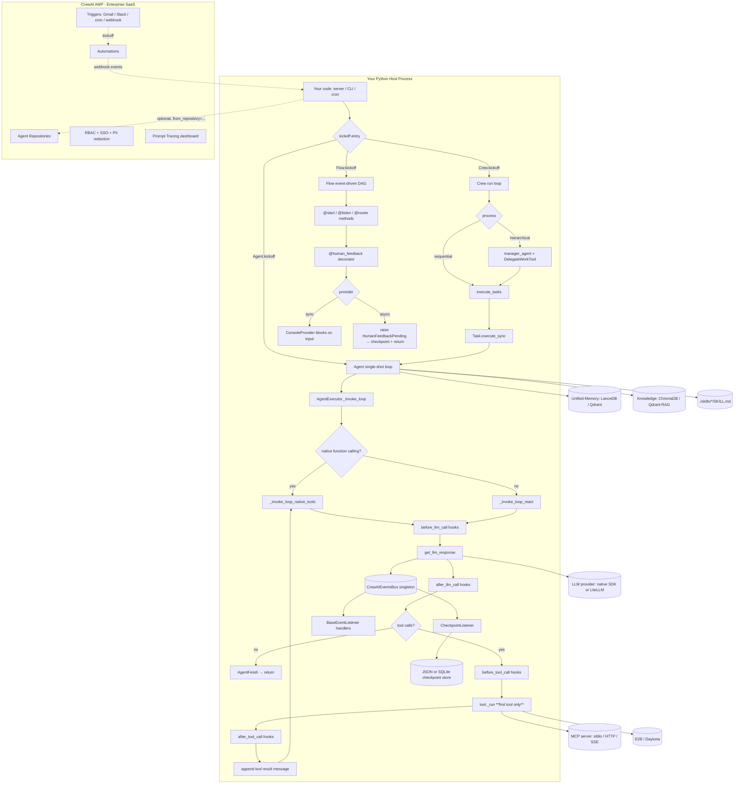

# CrewAI Py — Benchmark Study

> **Repo**: https://github.com/crewAIInc/crewAI
> **Commit studied**: a95d26763f4766b1a4f7c19c039133d1202dbdaa
> **Branch**: main
> **Cloned at**: benchmarked-stacks/crewai/
> **Studied on**: 2026-05-16

## TL;DR

- ⭐ **What is this stack architecturally?** CrewAI is a **heavy Python framework** (Pydantic-first, ~70 kLOC across `lib/crewai/`) whose mental model is **multi-agent first**: `Crew` (sequential / hierarchical task orchestration) + `Flow` (event-driven workflow DAG). For a single long-running long-running agent the `Crew` abstraction is overkill; the closest fit is `LiteAgent` (deprecated in v2.0) or a degenerate one-agent one-task `Crew`. **There is no first-class long-lived single-agent server primitive.**
- **Where the agent loop actually executes**: in your Python process. `Crew.kickoff()` → `_run_sequential_process()` → `Task.execute_sync()` → `Agent` → `AgentExecutor._invoke_loop()` (native function calling or ReAct text). Everything happens in-process — no subprocess, no vendor cloud dependency for the OSS path.
- **Strongest architectural choice for our use case**: the **`SKILL.md` + YAML frontmatter** machinery (`lib/crewai/src/crewai/skills/`) is fully baked, with **progressive disclosure (METADATA → INSTRUCTIONS → RESOURCES)** and an `allowed-tools` field — one of only two stacks (Claude Agent SDK + CrewAI) that ship this format natively. Plus **mid-run checkpointing** (`CheckpointConfig`, JSON/SQLite providers, `Crew.fork(branch=...)`) and **unified Memory** (LanceDB-backed, hierarchical `root_scope`, LLM-driven recall) are first-party.
- **Weakest / biggest gap**: **Multi-tenancy is essentially non-existent.** There is no `tenant_id` / `user_id` field on `Crew`, `Agent`, `Task`, or `LiteAgent`. The only mention of "tenant" anywhere in the framework is `DEFAULT_TENANT = "default_tenant"` in `rag/chromadb/constants.py:9` (ChromaDB's own tenant concept, unused). There is **no harness-side forced tool args, no per-tool ACL, no per-tenant rate/cost cap**. Multi-tenancy is BYO at every layer.
- **Most surprising finding (good)**: The **`@human_feedback` decorator with pluggable `HumanFeedbackProvider`** (`crewai/flow/human_feedback.py`) is genuinely well-designed — providers can raise `HumanFeedbackPending` to *pause* a `Flow`, get state auto-persisted to checkpoint, then resume later when external input arrives (Slack, email, webhook). Most stacks treat HITL as a blocking `input()`; this is the only one I've seen that bakes async pause-resume into the loop semantics.
- **Most surprising finding (bad)**: `CrewAgentExecutor` is deprecated in favor of `crewai.experimental.AgentExecutor` (deprecation warning fires inside `__init__`, `crew_agent_executor.py:142`); `LiteAgent` is deprecated too (`@deprecated("LiteAgent is deprecated and will be removed in v2.0.0.")`, `lite_agent.py:178`). The "current best" agent class is *experimental*. This is mid-flight architecture.
- One-line verdicts:
  - **Sessions/persistence**: ✅ Crew/Flow/Agent → JSON or SQLite checkpoint provider; checkpoints emit on configurable event types; `Crew.fork(branch=...)` clones execution into a new lineage.
  - **Skills**: ✅ Best-in-class outside Claude Agent SDK — `SKILL.md` + YAML frontmatter + progressive disclosure, but no per-tenant scoping.
  - **Resource manager**: ⚠️ `Agent(from_repository="market-research-agent")` calls **AMP** (CrewAI Enterprise) — vendor-locked. Local filesystem skills work; everything else needs AMP.
  - **Sub-agents**: ⚠️ Two mechanisms — `Crew` with hierarchical `manager_agent` + `DelegateWorkTool` (LLM-routed delegation), and `Flow` with `@start/@listen/@router`. No first-class "agents-as-parallel-tools" with structured fan-out result handling.
  - **Multi-tenancy**: ❌❌ Wasteland. BYO at every layer. No `tenant_id` field, no per-tenant tool filtering, no per-tenant budget.
  - **Hooks**: ⚠️ Limited — only `before_llm_call` / `after_llm_call` / `before_tool_call` / `after_tool_call`. No `SessionStart`, no `PreCompact`, no message-list mutation hook that fires at session start before the first turn (you can use `before_kickoff_callbacks` on `Crew` for that, but it operates on `inputs`, not messages).
  - **API**: ❌ OSS ships **no HTTP server**. Crews/Flows are libraries; you must own the API. AMP provides a hosted REST `kickoff` + webhook event stream — but it's vendor-locked.
  - **Observability**: ⚠️ Event bus + 25+ listener integrations (Datadog, Langfuse, OTel, Arize, …) but no first-party USD cost rollup. `UsageMetrics` carries token counts only.
- **Production-readiness verdict for multi-tenant server-side deployment**: **Not production-ready for our use case as a library.** The strongest path is **AMP (Enterprise)** which adds the missing API server + RBAC + triggers + webhook streaming — but that's a hosted SaaS dependency and pricing decision. As a self-hosted library, CrewAI lacks the multi-tenancy plumbing and the dedicated long-lived agent runtime we need. Best fit for batch crew-style content generation pipelines triggered by cron / webhooks, not for an always-on multi-tenant chat agent.

---

## 0. Architectural Overview & Deployment Model

### Deployment diagram

```
                        ┌────────────────────────────────────────────────┐
                        │                Your Host Process                │
                        │  (Python 3.10+, ~150 MB baseline w/ deps)      │
                        │                                                 │
                        │  ┌──────────────────────────────────────────┐  │
                        │  │ Your code (CLI, HTTP server, cron, ...)  │  │
                        │  │   crew = Crew(agents=[...], tasks=[...]) │  │
                        │  │   result = crew.kickoff(inputs={...})    │  │
                        │  └────────────────┬─────────────────────────┘  │
                        │                   │                              │
                        │  ┌────────────────▼─────────────────────────┐  │
                        │  │ crewai library (in-process)              │  │
                        │  │  • Crew / Flow / Agent / LiteAgent       │  │
                        │  │  • AgentExecutor (ReAct or native tools) │  │
                        │  │  • UnifiedMemory (LanceDB local)         │  │
                        │  │  • CrewAIEventsBus (sync + async daemon) │  │
                        │  │  • Hooks (before/after llm/tool)         │  │
                        │  │  • CheckpointConfig (JSON / SQLite)      │  │
                        │  └────┬─────────────┬───────────┬───────────┘  │
                        └───────┼─────────────┼───────────┼──────────────┘
                                │             │           │
                  ┌─────────────▼─┐     ┌─────▼─────┐  ┌──▼─────────────┐
                  │ LLM provider  │     │ MCP server│  │ Local files     │
                  │ (LiteLLM OR   │     │ (stdio /  │  │  • ./skills/    │
                  │  native: OAI, │     │  HTTP /   │  │  • .checkpoints │
                  │  Anthropic,   │     │  SSE)     │  │  • LanceDB dir  │
                  │  Gemini, ...) │     └───────────┘  │  • SQLite db    │
                  └───────────────┘                    └─────────────────┘

  Optional AMP (CrewAI Enterprise — separate SaaS):
                  ┌─────────────────────────────────────────────────┐
                  │ app.crewai.com (vendor-managed)                 │
                  │  • Agent Repositories (from_repository="...")   │
                  │  • Automations (deploy + run crews)             │
                  │  • Triggers (Gmail / Slack / cron / webhook)    │
                  │  • Studio (no-code crew builder)                │
                  │  • Traces, RBAC, SSO, PII redaction             │
                  │  • Webhook event streaming                      │
                  └─────────────────────────────────────────────────┘
                                Vendor lock-in:
                                  • Agent Repository
                                  • Automations / Triggers
                                  • Studio / RBAC / SSO
```

### 0.1 What is this stack?

CrewAI is a **batteries-included Python framework for multi-agent orchestration**. It ships:
- two top-level primitives — `Crew` (a group of `Agent`s with `Task`s, sequential or hierarchical) and `Flow` (event-driven DAG with `@start`/`@listen`/`@router` decorators);
- ~80 built-in tools (`lib/crewai-tools/src/crewai_tools/tools/`);
- a unified memory subsystem (LanceDB + LLM-driven recall);
- a skill loader (`SKILL.md` + YAML frontmatter);
- a CLI (`crewai-cli`) for scaffolding, running, evaluating, and replaying;
- and an event bus (155 event types across 17 categories) with first-party hooks for OTel/Datadog/Langfuse/Arize/etc.

**Crucially**: the OSS framework is **library-only**. There is no HTTP server. The Enterprise SaaS (**AMP** — Agent Management Platform, formerly CrewAI Enterprise) adds the deployment platform, triggers, RBAC, marketplace, and webhook event streaming on top.

**For our use case (single long-running multi-tenant long-running agent piloted by skills)**, the mental model is a mismatch: CrewAI's primitives are *task-oriented batches*, not *chat-oriented sessions*. The closest single-agent path is `LiteAgent` — but it's deprecated for v2.0. The replacement is `Agent.kickoff(messages)` which calls `AgentExecutor`, marked `experimental`.

### 0.2 Where does the agent loop actually execute?

**In your Python process.** Concretely:

- `Crew.kickoff(inputs)` ([`lib/crewai/src/crewai/crew.py:900`](../../../benchmarked-stacks/crewai/lib/crewai/src/crewai/crew.py)) chooses `Process.sequential` or `Process.hierarchical`.
- For sequential: `_run_sequential_process() → _execute_tasks() → task.execute_sync(agent, ...)`.
- `Task.execute_sync()` calls into the `Agent.executor` (`AgentExecutor` or deprecated `CrewAgentExecutor`).
- `CrewAgentExecutor.invoke()` ([`lib/crewai/src/crewai/agents/crew_agent_executor.py:205`](../../../benchmarked-stacks/crewai/lib/crewai/src/crewai/agents/crew_agent_executor.py)) → `_invoke_loop()` → either `_invoke_loop_native_tools()` (function calling) or `_invoke_loop_react()` (text parsing).
- LLM HTTP calls go directly from the same process to the provider (LiteLLM by default, native SDKs for OpenAI / Anthropic / Azure / Bedrock / Gemini).

There is **no subprocess, no separate runtime, no vendor binary**. The library *is* the loop.

### 0.3 Runtime dependencies

- **Python**: `>= 3.10` (`.python-version` shows the repo dev pin).
- **Required deps**: `pydantic >= 2`, `opentelemetry-*`, `litellm` (optional but recommended), `lancedb` (memory default), `rich`, `pyyaml`, `aiosqlite`/`aiofiles` (for async checkpoint providers), `chromadb` (RAG default).
- **Optional**: provider SDKs (`openai`, `anthropic`, `google-genai`, `boto3`), `qdrant-client` (memory backend), `mcp` (`pip install mcp` for MCP), `e2b`/`daytona` (sandbox tools).
- **No bundled binaries**, **no Node**, **no Go** — pure Python.
- **Disk**: LanceDB writes to `./.memory/` by default; checkpoints to `./.checkpoints/`; both are filesystem-only by default.

### 0.4 Recommended deployment topology

OSS docs assume **one Python process running a Crew per request**. AMP recommends **GitHub-or-ZIP deploy to their managed runtime** (`docs/en/enterprise/features/automations.mdx`) — they spin a container per crew per "automation". No vendor guidance on "container-per-tenant vs. one-process-many-tenants" for the OSS path — because OSS has no tenant primitive.

The `docs/en/concepts/production-architecture.mdx` page exists but discusses crew design patterns, not horizontal scaling.

### 0.5 Cold-start cost & instance footprint

- **Startup latency**: a fresh `import crewai` + `Crew(...).kickoff()` is dominated by LiteLLM import (~0.5–1s on cold disk) and LanceDB index initialization (~100 ms). No 20–30s startup penalty like Claude Agent SDK.
- **RAM baseline**: ~150 MB Python interpreter + framework, growing with memory store size (LanceDB caches embeddings).
- **Disk baseline**: ~50–100 MB of installed wheels; checkpoint files small (~kB), LanceDB grows linearly with memory.

### 0.6 Vendor lock-in

| Layer | OSS lock-in | AMP lock-in |
|---|---|---|
| **LLM provider** | None — LiteLLM gives 100+ providers; native SDKs for top 5. | None (LiteLLM still used). |
| **Hosting** | None — anywhere Python runs. | Heavy — AMP-only deploys, AMP-managed automations and triggers. |
| **Eval/Observability** | None for OSS — any OTel exporter works; 18 observability integrations doc'd (Datadog, Langfuse, Arize, MLflow, Weave, …). | Heavy — first-party Traces dashboard, hallucination guardrail, PII redaction, RBAC are AMP-only. |
| **Skills** | None — `SKILL.md` files on disk. | `Agent(from_repository=...)` and Agent Repositories require AMP. |
| **Memory backend** | None — LanceDB local default, Qdrant edge backend available. | AMP long-running agent pushes their managed memory but OSS works fine. |
| **Persistence** | None — JSON / SQLite providers. | None (same OSS code). |

### 0.7 Framework weight / footprint

**Heavy.** This is *not* a thin SDK — it bundles:
- agent classes, executors, memory, knowledge, RAG, MCP client, A2A client/server, event bus, hooks, telemetry, checkpoint engine, CLI, skill loader, tool catalog, training data handler, guardrails, planning, observation, …
- 5 separate sub-packages under `lib/`: `crewai`, `crewai-core`, `crewai-files`, `crewai-tools`, `cli` + `devtools`.
- 155 distinct event classes spread across 17 event-type files.

Roughly counting `wc -l` on `lib/crewai/src/crewai/` shows ~70 kLOC just in the core framework, before tools. Compared to e.g. Claude Agent SDK Python (~10 kLOC wrapper) or Vercel AI SDK (~30 kLOC TS), CrewAI is significantly heavier.

### 0.8 Documentation depth & cross-team contributor accessibility

- **Languages**: documentation is published in 4 languages — English (`docs/en/`), Arabic (`docs/ar/`), Korean (`docs/ko/`), Brazilian Portuguese (`docs/pt-BR/`). The English tree is by far the deepest.
- **Pages**: 21 concept pages (`docs/en/concepts/`), 17 enterprise feature/integration pages, 25+ integration docs (Gmail, Salesforce, Stripe, Notion, etc.), 18 observability integrations, ~70 individual tool pages.
- **Cross-team contributor accessibility**: `Crew Studio` (AMP) is a no-code visual crew builder explicitly aimed at non-engineers. YAML-first project layout (`@CrewBase` decorator + `agents.yaml` + `tasks.yaml`) is friendly to non-engineers editing prompts/roles. Authoring a `SKILL.md` is markdown + a small YAML header — doable by Product/Data.

### 0.9 Documentation entry points

- **Official docs landing**: https://docs.crewai.com/
- **Introduction**: https://docs.crewai.com/en/introduction
- **Quickstart**: https://docs.crewai.com/en/quickstart
- **Installation**: https://docs.crewai.com/en/installation
- **API reference**: https://docs.crewai.com/en/api-reference (concepts-style, not autogen)
- **Concepts (agents, crews, flows, tasks, memory, knowledge, skills, …)**: https://docs.crewai.com/en/concepts/agents
- **Skills**: https://docs.crewai.com/en/skills (note: this page is mainly about *coding-agent skills via skills.sh*; the in-process `SKILL.md` loader is documented at https://docs.crewai.com/en/concepts/skills)
- **Flows**: https://docs.crewai.com/en/concepts/flows
- **Checkpointing**: https://docs.crewai.com/en/concepts/checkpointing
- **Event listeners**: https://docs.crewai.com/en/concepts/event-listener
- **Tools catalog**: https://docs.crewai.com/en/tools
- **MCP integration**: https://docs.crewai.com/en/mcp
- **Production architecture**: https://docs.crewai.com/en/concepts/production-architecture
- **Observability overview**: https://docs.crewai.com/en/observability/overview
- **Enterprise / AMP**: https://docs.crewai.com/en/enterprise/introduction
  - Agent Repositories: https://docs.crewai.com/en/enterprise/features/agent-repositories
  - Automations: https://docs.crewai.com/en/enterprise/features/automations
  - Automation triggers: https://docs.crewai.com/en/enterprise/guides/automation-triggers
  - Webhook streaming: https://docs.crewai.com/en/enterprise/features/webhook-streaming
  - RBAC: https://docs.crewai.com/en/enterprise/features/rbac
  - Hallucination guardrail: https://docs.crewai.com/en/enterprise/features/hallucination-guardrail
- **GitHub**: https://github.com/crewAIInc/crewAI
- **Issues**: https://github.com/crewAIInc/crewAI/issues
- **Changelog**: https://docs.crewai.com/en/changelog
- **Community**: https://community.crewai.com/ (Discourse)
- **Discord**: https://discord.com/invite/X4JWnZnxPb
- **Sign up for AMP**: https://app.crewai.com/

Issues to surface for our use case (search GitHub Issues for these topics — they keep recurring):
- "multi-tenant" / "tenant isolation"
- "no HTTP server" / "deploy as service"
- "long-running session"
- "force tool args" / "context injection"

---

## 1. Agent Harness (Run Loop) & Message Taxonomy

### Run loop

#### 1.1 Run loop entrypoint(s)

There are **multiple** entrypoints, depending on which primitive you use:

```python
# crew.py:900 — multi-agent
def kickoff(
    self,
    inputs: dict[str, Any] | None = None,
    input_files: dict[str, FileInput] | None = None,
    from_checkpoint: CheckpointConfig | None = None,
) -> CrewOutput | CrewStreamingOutput:

# crew.py:1029
async def kickoff_async(...) -> CrewOutput

# crew.py:993
def kickoff_for_each(self, inputs: list[dict[str, Any]], ...) -> list[CrewOutput | CrewStreamingOutput]

# agent/core.py:1497 — single-agent (replaces deprecated LiteAgent)
def kickoff(
    self,
    messages: str | list[LLMMessage],
    response_format: type[Any] | None = None,
    input_files: dict[str, FileInput] | None = None,
    from_checkpoint: CheckpointConfig | None = None,
) -> LiteAgentOutput | Coroutine[Any, Any, LiteAgentOutput]:

# flow/flow.py:2030 — DAG workflow
def kickoff(self, inputs: dict[str, Any] | T | None = None) -> Any
async def kickoff_async(...)
```

Return types are concrete Pydantic models: `CrewOutput`, `LiteAgentOutput`, or `Any` (Flow). `CrewStreamingOutput` is returned when `Crew.stream=True` and wraps a sync iterator of `StreamChunk`.

#### 1.2 Per-iteration behavior (Crew)

`Crew.kickoff` walks tasks; for each `Task` it calls `Agent.executor.invoke(inputs)`. The `_invoke_loop` is where the LLM ↔ tool ReAct/native-tools dance lives:

```python
# crew_agent_executor.py:306–325
def _invoke_loop(self) -> AgentFinish:
    use_native_tools = (
        hasattr(self.llm, "supports_function_calling")
        and callable(getattr(self.llm, "supports_function_calling", None))
        and self.llm.supports_function_calling()
        and self.original_tools
    )
    if use_native_tools:
        return self._invoke_loop_native_tools()
    return self._invoke_loop_react()
```

Native-tools path (`_invoke_loop_native_tools`, line 463):
1. `convert_tools_to_openai_schema(self.original_tools)` → list of OpenAI-style tool schemas + `available_functions` dict.
2. While loop:
   1. Check `has_reached_max_iterations`.
   2. `enforce_rpm_limit`.
   3. `get_llm_response(...)` (sync call) — pass messages + tools.
   4. If response is a list of tool calls → `_handle_native_tool_calls` → execute **first** tool only (line 643), append result to messages, `continue`.
   5. Else → wrap in `AgentFinish` and return.
   6. `finally: self.iterations += 1`.

Note: the executor **executes only the first tool call per turn** even if the LLM emits multiple — *"This enables sequential tool execution with reflection after each tool"* (`crew_agent_executor.py:649`). This is opinionated and worth knowing.

#### 1.3 ReAct loop

Yes — `_invoke_loop_react` (line 327) is the text-parsing fallback for LLMs without native function-calling. The agent prompts contain `Action:` / `Action Input:` / `Observation:` markers and `process_llm_response()` parses them into `AgentAction | AgentFinish | OutputParserError`.

#### 1.4 Tool dispatch + result handling

For native tools (`_handle_native_tool_calls`, `crew_agent_executor.py:643`):

```python
tool_call = tool_calls[0]            # first call only
tool_name = ...                       # parsed from OpenAI / Anthropic / Bedrock shape
tool_args = parse_tool_call_args(tool_call.function.arguments)
result = execute_tool_and_check_finality(
    tool_name, tool_args, self.original_tools, ...
)
# append assistant message with tool_calls
# append tool message with result keyed by tool_call_id
```

`execute_tool_and_check_finality` runs `before_tool_call` hooks → `tool.run(*args, **kwargs)` → `after_tool_call` hooks → returns `ToolResult`. If the tool was defined with `result_as_answer=True`, the loop returns `AgentFinish` immediately.

#### 1.5 Explicit turn concept

A "turn" is **one LLM call + one tool execution + the appended tool result**. The loop variable `self.iterations` increments per LLM call. There is no `max_turns` exposed separately — only `max_iter` (default 25).

#### 1.6 Event emission mechanism (in-process)

CrewAI uses a **singleton event bus** (`CrewAIEventsBus`, `events/event_bus.py:83`) with synchronous and asynchronous handler queues:

```python
# events/event_bus.py (paraphrased — see file for the full impl)
class CrewAIEventsBus:
    _instance: ClassVar[CrewAIEventsBus | None] = None
    _sync_handlers: dict[type[BaseEvent], SyncHandlerSet]
    _async_handlers: dict[type[BaseEvent], AsyncHandlerSet]
    _sync_executor: ThreadPoolExecutor          # sync handlers dispatched to threads
    _async_loop_thread: threading.Thread        # daemon thread running asyncio loop
    def emit(self, source: Any, event: BaseEvent) -> None: ...
    def on(self, event_type: type[BaseEvent]) -> Callable[[Handler], Handler]: ...
```

For streaming: `Crew(stream=True)` wires the bus into a queue and yields `StreamChunk` objects from the consumer's iterator (`utilities/streaming.py`).

### Message & event taxonomy

#### 1.7 Message layers

Three distinct vocabularies:

1. **Wire / LLM-provider** messages: dicts shaped per provider (OpenAI / Anthropic / Bedrock). Conversion lives in the provider classes under `llms/providers/*/completion.py` and in `agent_utils.format_message_for_llm()`.
2. **Internal** `LLMMessage` (`utilities/types.py`): a `TypedDict` with `role`, `content`, optional `files`, optional `cache_breakpoint`. The executor's `self.messages: list[LLMMessage]` is the canonical in-memory thread.
3. **External / user-visible** event stream: `BaseEvent` subclasses on the bus (155 classes — see `events/types/`). `StreamChunk` is the public streaming type when `stream=True` (`types/streaming.py:39`).

```
+---------------+        +----------------+        +-----------------+
| user input    |  -->   | LLMMessage     |  -->   | provider dict   |
| (str / dicts) |        | (internal,     |        | (OpenAI shape,  |
|               |        |  Pydantic-     |        |  Anthropic msg, |
|               |        |  validated)    |        |  ...)           |
+---------------+        +----------------+        +-----------------+
                                  │
                                  │ (emit on bus per loop step)
                                  ▼
                         +-----------------+
                         | BaseEvent       |
                         | (155 subclasses)|
                         +-----------------+
                                  │
                                  │ (handlers fan out)
                                  ▼
                  +-------+  +-------+  +-------------+
                  | OTel  |  | Stream|  | Datadog /   |
                  | trace |  | Chunk |  | Langfuse /  |
                  |       |  | queue |  | console     |
                  +-------+  +-------+  +-------------+
```

#### 1.8 Concrete message types

| Type | File | Purpose |
|---|---|---|
| `LLMMessage` (TypedDict) | `utilities/types.py` | Internal message shape: `role`, `content`, optional `files`, `cache_breakpoint`. |
| `BaseEvent` | `events/base_events.py` | Root of all events. Carries `event_id`, `parent_id`, `emission_sequence`, `timestamp`. |
| `CrewKickoffStartedEvent` / `CrewKickoffCompletedEvent` / `CrewKickoffFailedEvent` | `events/types/crew_events.py` | Crew lifecycle. |
| `AgentExecutionStartedEvent` / Completed / Error | `events/types/agent_events.py` | Agent lifecycle. |
| `LLMCallStartedEvent` / `LLMCallCompletedEvent` / `LLMCallFailedEvent` / `LLMStreamChunkEvent` / `LLMThinkingChunkEvent` | `events/types/llm_events.py` | Per-LLM-call events. |
| `ToolUsageStartedEvent` / `ToolUsageFinishedEvent` / `ToolUsageErrorEvent` | `events/types/tool_usage_events.py` | Tool dispatch. |
| `TaskStartedEvent` / `TaskCompletedEvent` / `TaskFailedEvent` / `TaskEvaluationEvent` | `events/types/task_events.py` | Task lifecycle. |
| `SkillDiscoveryStartedEvent` / Completed / `SkillLoadedEvent` / `SkillActivatedEvent` / `SkillLoadFailedEvent` | `events/types/skill_events.py` | Skill loader events. |
| `MemorySaveStartedEvent` / Completed / Failed / `MemoryQueryStartedEvent` / Completed / Failed / `MemoryRetrievalStartedEvent` / … | `events/types/memory_events.py` | Memory subsystem. |
| `KnowledgeSearchQueryStartedEvent` / … | `events/types/knowledge_events.py` | RAG events. |
| `MCPConnectionStartedEvent` / Completed / Failed / `MCPToolExecutionStartedEvent` / … | `events/types/mcp_events.py` | MCP events. |
| `FlowStartedEvent` / FlowFinishedEvent / `FlowPausedEvent` / `MethodExecutionStarted/Finished/Paused/Failed` / `HumanFeedbackRequestedEvent` / `HumanFeedbackReceivedEvent` / `FlowInputRequestedEvent` / `FlowInputReceivedEvent` | `events/types/flow_events.py` | Flow lifecycle + HITL. |
| `CheckpointStartedEvent` / Completed / Failed / `CheckpointForkStarted/Completed` / `CheckpointRestoreStarted/Completed/Failed` | `events/types/checkpoint_events.py` | Persistence. |
| `A2A*Event` (~30 classes) | `events/types/a2a_events.py` | A2A (Agent-to-Agent) protocol. |
| `Sig*Event` (SIGTERM, SIGINT, SIGHUP, SIGTSTP, SIGCONT) | `events/types/system_events.py` | OS signal taxonomy. |
| `StreamChunk` (text or tool_call) | `types/streaming.py:42` | Public streaming chunk. |

Full count: **155** event classes across **17** event-type files.

#### 1.9 Messages vs. events

**Two separate taxonomies.** `LLMMessage` is the conversational thread; `BaseEvent` subclasses are the lifecycle/observability stream. They are not the same iterator — `BaseEvent` flows through the bus to listeners; `LLMMessage` lives on `executor.messages` and is mutated in-place.

The bridge is **streaming**: `Crew(stream=True)` registers a listener that translates `LLMStreamChunkEvent` (token delta + optional tool-call delta) into `StreamChunk` objects, which the user receives by iterating the returned `CrewStreamingOutput`.

#### 1.10 Event categories

| Category | Examples | Notes |
|---|---|---|
| Lifecycle (entity-scoped) | `CrewKickoffStarted/Completed/Failed`, `AgentExecutionStarted/Completed/Error`, `TaskStarted/Completed/Failed`, `FlowStarted/Finished/Paused` | One pair per entity start/end. |
| LLM call | `LLMCallStarted/Completed/Failed`, `LLMStreamChunkEvent`, `LLMThinkingChunkEvent` | Per-provider-call. |
| Tool | `ToolUsageStarted/Finished/Error`, `ToolValidateInputError`, `ToolSelectionError`, `ToolExecutionError` | Errors are first-class. |
| Memory & knowledge | `MemorySave/Query/RetrievalStarted/Completed/Failed`, `KnowledgeSearchQuery*`, `KnowledgeQuery*` | Distinct retrieval vs save. |
| MCP | `MCPConnectionStarted/Completed/Failed`, `MCPToolExecutionStarted/Completed/Failed`, `MCPConfigFetchFailed` | |
| Persistence | `CheckpointStarted/Completed/Failed`, `CheckpointForkStarted/Completed`, `CheckpointRestoreStarted/Completed/Failed`, `CheckpointPrunedEvent` | Per-checkpoint. |
| Sub-agent / A2A | ~30 `A2A*` events: delegation, polling, push notifications, streaming, server tasks, agent card fetched, parallel delegation | Heavy taxonomy reflecting the A2A spec. |
| HITL | `HumanFeedbackRequested/Received`, `FlowInputRequested/Received` | Flow-scoped. |
| Skill | `SkillDiscoveryStarted/Completed`, `SkillLoaded`, `SkillActivated`, `SkillLoadFailed` | |
| Reasoning / planning | `AgentReasoningStarted/Completed/Failed`, `PlanRefinement`, `PlanReplanTriggered`, `GoalAchievedEarly` | |
| Guardrail | `LLMGuardrailStarted/Completed/Failed` | |
| OS / system | `SIGTERM`, `SIGINT`, `SIGHUP`, `SIGTSTP`, `SIGCONT` | The bus emits OS-signal-as-event so listeners can react to shutdown. |

#### 1.11 Canonical type-definition file(s)

- Messages: `lib/crewai/src/crewai/utilities/types.py` (`LLMMessage`).
- Streaming: `lib/crewai/src/crewai/types/streaming.py` (`StreamChunk`, `ToolCallChunk`, `StreamChunkType`).
- Events: `lib/crewai/src/crewai/events/types/*.py` (17 files, 155 classes).
- Base event: `lib/crewai/src/crewai/events/base_events.py`.

#### 1.12 Live agentic event stream taxonomy

When `Crew.stream=True`, the user iterates `StreamChunk` objects:

```python
# types/streaming.py:42
class StreamChunk(BaseModel):
    content: str
    chunk_type: StreamChunkType         # "text" | "tool_call"
    task_index: int
    task_name: str
    task_id: str
    agent_role: str
    agent_id: str
    tool_call: ToolCallChunk | None     # populated when chunk_type == TOOL_CALL
```

`ToolCallChunk` carries `tool_id` (the LLM-assigned ID), `tool_name` (sanitized), `arguments` (incrementally-built JSON string), `index`.

Sample frames a consumer would see:

```python
# text chunk
StreamChunk(content="Based on", chunk_type=TEXT, task_index=0,
            task_name="Research topics", task_id="...",
            agent_role="researcher", agent_id="...", tool_call=None)

# tool-call chunk (arguments stream incrementally)
StreamChunk(content="", chunk_type=TOOL_CALL, task_index=0, ...,
            tool_call=ToolCallChunk(tool_id="call_abc123",
                                    tool_name="topic_search",
                                    arguments='{"query": "young moms', index=0))
```

For richer/typed event consumption (lifecycle, memory, etc.), you write a `BaseEventListener` subclass — that's the **bus** API, not the streaming API.

---

## 2. Agent Runtime (Multi-session Host)

### 2.1 Multi-session host architecture

**No.** CrewAI ships **no multi-session host runtime**. A `Crew`/`Flow`/`Agent` is instantiated once and `kickoff()` runs *one* execution. You manage concurrency by running multiple processes or `asyncio` tasks yourself.

The framework does spawn internal threads:
- `crewai_event_bus._sync_executor`: `ThreadPoolExecutor` for sync event handlers.
- `crewai_event_bus._async_loop_thread`: daemon thread running an `asyncio` loop for async handlers.
- `Memory._save_pool`: single-worker `ThreadPoolExecutor` for non-blocking memory writes.
- `Crew._execute_tasks`: uses `Future` to run `task.async_execution=True` tasks in parallel.

But there is no "host that owns many sessions" abstraction.

### 2.2 Concurrent session isolation

If you create multiple `Crew` instances in one process, each carries its own `id`, its own `_memory`, its own `tools` list. **However**: the **event bus is a process-wide singleton** (`CrewAIEventsBus._instance`, `event_bus.py`), and **hooks are registered globally** (`_before_llm_call_hooks: list[...]` at module scope in `hooks/llm_hooks.py:120`). This means a hook registered for tenant A's crew **will fire for tenant B's crew too**. There is no `(tenant, hook)` scoping primitive.

The bus does ship a `contextvars`-based "runtime state" (`event_bus.set_runtime_state(state)`) used by the checkpoint listener to associate emitted events with the correct entity tree — but that's for state reconstruction, not for tenant isolation of handlers.

### 2.3 Horizontal scaling / multi-instance

**BYO.** The OSS framework has no shared-state, no leader election, no message-queue support. Two pods running the same crew code do not share session state (LanceDB / SQLite are local). To scale you must:
- Run a worker pool yourself (e.g., RQ, Celery, Temporal, Cloud Run jobs).
- Externalize memory backend (Qdrant edge backend `memory/storage/qdrant_edge_storage.py` is the closest to a remote vector DB).
- Externalize checkpoint store (`CheckpointConfig` only supports JSON-on-disk and SQLite; for shared storage you'd implement a custom `BaseProvider`).

AMP solves this by hosting the runtime and managing concurrency for you.

### 2.4 Background / async / scheduled tasks

**OSS: BYO** — `Crew.kickoff()` is a blocking call; nothing schedules anything.

**AMP: first-party** — Automations + Triggers (see `docs/en/enterprise/features/automations.mdx` and `docs/en/enterprise/guides/automation-triggers.mdx`). Trigger sources include:
- **Gmail trigger** — on new email / thread update.
- **Google Calendar trigger** — on event create/update/cancel.
- **Google Drive trigger** — on file upload/edit/delete.
- **Outlook / OneDrive / Teams** triggers.
- **HubSpot / Salesforce** lifecycle triggers.
- **Slack** slash command triggers.
- **Zapier** generic trigger (bridges anything).
- **Webhook / API** kickoff (`POST /kickoff` with optional `webhooks` config for streaming).
- **Cron** (referenced in AMP docs).

These are vendor-managed. There is no equivalent in the OSS repo — no `crewai schedule` command, no scheduler module.

### 2.5 Worker pool / queue model

OSS: none.
AMP: implicit — each Automation is a separate managed deployment that receives trigger events and runs the crew.

---

## 3. Sessions & Persistence

### 3.1 Session / chat data model

CrewAI **does not have a "session" abstraction** in the chat sense. The closest concept is **"a kickoff" of a Crew/Flow/Agent**, which is uniquely identified by:
- `Crew.id: UUID4` (`crew.py:256`, `frozen=True`, default `uuid.uuid4`).
- `Agent.id: UUID4` (`agents/agent_builder/base_agent.py:227`, `frozen=True`).
- `Task.id: UUID4` (similar).
- `Flow._state["id"]` (Flow state always carries an `id` field auto-injected if not declared).

Fields on a `Crew`:

```python
# crew.py:217–366 (abbreviated)
class Crew(FlowTrackable, BaseModel):
    name: str | None
    cache: bool
    tasks: list[Task]
    agents: list[BaseAgent]
    process: Process                    # sequential | hierarchical
    memory: bool | Memory | MemoryScope | MemorySlice | None
    embedder: EmbedderConfig | None
    usage_metrics: UsageMetrics | None
    manager_llm: str | BaseLLM | None
    manager_agent: BaseAgent | None
    id: UUID4                           # frozen, auto-generated
    share_crew: bool | None
    step_callback: SerializableCallable | None
    task_callback: SerializableCallable | None
    before_kickoff_callbacks: list[SerializableCallable]
    after_kickoff_callbacks: list[SerializableCallable]
    stream: bool
    max_rpm: int | None
    output_log_file: bool | str | None
    planning: bool | None
    planning_llm: str | BaseLLM | None
    knowledge_sources: list[BaseKnowledgeSource] | None
    chat_llm: str | BaseLLM | None
    knowledge: Knowledge | None
    skills: list[Path | Skill] | None
    security_config: SecurityConfig
    checkpoint: CheckpointConfig | bool | None
    token_usage: UsageMetrics | None
    tracing: bool | None
    execution_context: ExecutionContext | None
    checkpoint_inputs: dict[str, Any] | None
    checkpoint_train: bool | None
    checkpoint_kickoff_event_id: str | None
```

**No `tenant_id`, no `user_id`, no `created_at`, no `parent_session_id` field.** `id` is the only identity.

Per-execution state lives on `Crew._inputs`, `Crew._kickoff_event_id`, and `Agent.agent_executor.messages` — but is not durable unless `checkpoint=True`.

### 3.2 What's stored on a session

When checkpoint is enabled, the `CheckpointListener` (`state/checkpoint_listener.py`) serializes the **entire runtime state** to JSON / SQLite on each configured event:

- The full `Crew` / `Agent` / `Task` / `Flow` Pydantic model (via `model_dump_json()`).
- `RuntimeState.event_record`: a DAG of every event emitted (parent/child relationships) — used for replay and event-scope reconstruction.
- `executor.messages` (list of `LLMMessage`).
- `Agent.agent_executor` private fields including `iterations`, `_resuming` flag.
- `Crew.checkpoint_inputs`, `Crew.checkpoint_kickoff_event_id`.

Memory and knowledge stores live **outside** the checkpoint — they're persistent on their own backends (LanceDB / Qdrant / SQLite).

### 3.3 Granularity

- **One conversation per `Crew` / `Agent.kickoff` call.** No thread/branch model in messages.
- **Branching via checkpoint fork**: `Crew.fork(config, branch="experiment-1")` (`crew.py:397`) restores from a checkpoint then forks the underlying `RuntimeState` to a new branch label. Same exists for `Flow.fork(config, branch=...)` (`flow.py:1004`) and `Agent.fork(config, branch=...)`. This is conceptually similar to LangGraph's checkpoint forks.
- **`kickoff_for_each(inputs: list[dict])`** runs the crew sequentially per input dict but creates a fresh copy each time (`self.copy()`); no shared session.

### 3.4 Built-in persistence stores

Two providers ship in `crewai/state/provider/`:

```python
# state/checkpoint_config.py:193
provider: Annotated[
    JsonProvider | SqliteProvider,
    Field(discriminator="provider_type"),
] = Field(default_factory=JsonProvider)
```

- **`JsonProvider`** (`state/provider/json_provider.py`): one JSON file per checkpoint, written under `{location}/{branch}/{ts}_{parent_id}.json`. Default `location="./checkpoints"`.
- **`SqliteProvider`** (`state/provider/sqlite_provider.py`): all checkpoints in one DB file; uses WAL mode; schema is `(id, created_at, parent_id, branch, data: jsonb)`. Default location: appends `.db` suffix.

For Flow persistence (separate from `CheckpointConfig`): `flow/persistence/sqlite.py` ships an SQLite-backed `SQLiteFlowPersistence` and a `BaseFlowPersistence` interface.

**No Postgres / Redis / S3 / cloud-blob providers ship out of the box.** You write your own `BaseProvider` subclass.

For memory:
- **LanceDB** local (default, `memory/storage/lancedb_storage.py`).
- **Qdrant edge** (`memory/storage/qdrant_edge_storage.py`).
- Pluggable: `StorageBackend` Protocol (`memory/storage/backend.py:11`).

### 3.5 Persistence timing

Checkpoints fire **on configured events**, not on every message. Default config:

```python
# state/checkpoint_config.py:188
on_events: list[CheckpointEventType | Literal["*"]] = Field(
    default=["task_completed"],
    description="Event types that trigger a checkpoint write. "
    'Use ["*"] to checkpoint on every event.',
)
```

So by default, a checkpoint is written **after each task completes** — not after each LLM call, not after each tool result. You can pass `on_events=["*"]` to checkpoint on every one of the 100+ event types listed in `CheckpointEventType` (line 14).

Writes happen inside `CheckpointListener._handle_event` (sync); for `acheckpoint()` async writes the bus dispatches handlers in the daemon asyncio thread. There is no `durability="sync"` vs `"async"` choice exposed; the default is sync via `BaseProvider.checkpoint()`.

### 3.6 Mid-run checkpointing (durable)

**Yes, this is one of CrewAI's stronger features.** If you set `on_events=["*"]` or include `"tool_usage_started"`/`"tool_usage_finished"`, a checkpoint fires per tool call. Restore-and-resume is supported:

```python
# crew.py:371
@classmethod
def from_checkpoint(cls, config: CheckpointConfig) -> Crew:
    """Restore a Crew from a checkpoint, ready to resume via kickoff()."""
    state = RuntimeState.from_checkpoint(config, context={"from_checkpoint": True})
    crewai_event_bus.set_runtime_state(state)
    for entity in state.root:
        if isinstance(entity, cls):
            entity._restore_runtime()
            return entity
    raise ValueError(...)

# crew.py:397
@classmethod
def fork(cls, config: CheckpointConfig, branch: str | None = None) -> Crew:
    """Fork a Crew from a checkpoint, creating a new execution branch."""
    crew = cls.from_checkpoint(config)
    state = crewai_event_bus._runtime_state
    state.fork(branch)
    return crew
```

`_restore_runtime()` (`crew.py:421`) walks the event record to find tasks that started but did not complete, marks `executor._resuming = True`, and re-attaches them to the right `Agent` and `Task`. On the next `kickoff()`, `invoke()` checks `_resuming` and continues from where it left off (`crew_agent_executor.py:213`):

```python
def invoke(self, inputs: dict[str, Any]) -> dict[str, Any]:
    if self._resuming:
        self._resuming = False
    else:
        self.messages = []
        self.iterations = 0
        self._setup_messages(inputs)
        ...
```

This is **gold-standard mid-tool-call resumability** — comparable to LangGraph's `_runner.commit() → put_writes()`.

### 3.7 Session ID format

`UUID4` — generated by `uuid.uuid4()`, stored on `id` field of `Crew`, `Agent`, `Task`, `Flow._state["id"]`. No tenant prefix. No hash structure. The field is `frozen=True` with a `_deny_user_set_id` validator (`crew.py:525`) — users cannot set it (except restoring from a checkpoint, which uses a `from_checkpoint` context).

### 3.8 Pluggable store interface

Yes, two distinct ones:

- **State/checkpoint**: `BaseProvider` ABC in `state/provider/core.py` — implement `checkpoint`, `acheckpoint`, `prune`, `extract_id`, `from_checkpoint`, `afrom_checkpoint`. Registered as a discriminated union on `CheckpointConfig.provider`.
- **Memory storage**: `StorageBackend` Protocol in `memory/storage/backend.py` — implement `save`, `search`, `delete`, `update`, `get_record`, `list_records`, `get_scope_info`, `list_scopes`.
- **Flow persistence**: `FlowPersistence` ABC in `flow/persistence/base.py` (separate path used by Flow's `@persist` decorator).

### 3.9 Schema evolution / migration

**No first-party migration tooling.** Checkpoint data is the serialized Pydantic model. Pydantic's own backward-compatibility rules apply. If a field is renamed/removed between CrewAI versions, restoring an old checkpoint will fail with a validation error — you'd hand-roll a migration that loads the JSON, transforms it, writes a new checkpoint.

### 3.10 Export / replay

- **`@CrewAI replay` CLI command** (`lib/cli/src/crewai_cli/replay_from_task.py`) lets you re-run from a saved task output (`crewai replay -t <task_id>`).
- **`RuntimeState.event_record`** is fully serializable JSON, captures emission sequence, and is restored on `from_checkpoint`. `crewai_event_bus._replaying` contextvar (`event_bus.py:67`) signals to listeners they should suppress side effects during replay.

So replay is *deterministic enough* to reconstruct UI state but not to make HTTP calls again.

### 3.11 Cross-session memory

Cross-session memory is the **`Memory` subsystem** (Q15). It is distinct from in-session `executor.messages`. A `Crew` with `memory=True` automatically sets `_memory = Memory(root_scope=f"/crew/{crew_name}")` (`crew.py:589`), and **every agent in the crew can read/write to that hierarchical namespace** across kickoffs.

For our use case, this means: if you ran kickoff #1 for tenant "acme", then ran kickoff #2 for tenant "acme", the second kickoff's agents would semantically recall facts from the first via `Memory.recall(query)` — **but only if you scoped the memory under a tenant-specific `root_scope`** yourself. Default `root_scope` is just `/crew/<crew_name>`, which is shared across tenants.

---

## 4. Multi-tenancy & Arbitrary Context ⭐ THE KEY QUESTION

### Architectural overview

**This is CrewAI's weakest area for our use case.** Multi-tenancy is essentially **not modeled** in the framework. There is no `tenant_id` / `user_id` / `org_id` field anywhere on `Crew`, `Agent`, `Task`, `Flow`, or `LiteAgent`. A grep for `"tenant"` in `lib/crewai/src/` finds only `DEFAULT_TENANT = "default_tenant"` in `rag/chromadb/constants.py:9` — that's ChromaDB's own tenant concept, used by the RAG subsystem for vector store separation, not for application-level tenant isolation.

You **can** stuff tenant info into:
- `Crew.config` (an arbitrary `dict[str, Any] | None` validated as JSON).
- `Agent.config` (same).
- `Crew.execution_context: ExecutionContext` (`context.py`) — a free-form dict propagated via OpenTelemetry baggage.
- The `inputs` dict you pass to `kickoff(inputs={...})`, which gets interpolated into task descriptions via `{var}` template substitution.

But **none of those propagate to tools as a *separated, harness-trusted* argument**. Tools receive LLM-generated arguments; if you want a tenant-id argument the LLM has to be asked to include it, which is exactly the prompt-injection / hallucination vector we want to avoid.

### 4.1 Full run-loop input struct

There is no single "run-loop input struct" — each entrypoint has its own signature:

```python
# Crew.kickoff
def kickoff(
    self,
    inputs: dict[str, Any] | None = None,
    input_files: dict[str, FileInput] | None = None,
    from_checkpoint: CheckpointConfig | None = None,
) -> CrewOutput | CrewStreamingOutput: ...

# Agent.kickoff
def kickoff(
    self,
    messages: str | list[LLMMessage],
    response_format: type[Any] | None = None,
    input_files: dict[str, FileInput] | None = None,
    from_checkpoint: CheckpointConfig | None = None,
) -> LiteAgentOutput: ...

# Flow.kickoff
def kickoff(self, inputs: dict[str, Any] | T | None = None) -> Any: ...
```

The only "context channel" beyond `messages`/`inputs` is the OpenTelemetry baggage set in `Crew.kickoff` (`crew.py:948`):

```python
baggage_ctx = baggage.set_baggage(
    "crew_context", CrewContext(id=str(self.id), key=self.key)
)
token = attach(baggage_ctx)
```

That carries `crew.id`, `crew.key` for tracing — not a tenant.

### 4.2 Context propagation into a tool call

A tool's `_run(self, **kwargs)` receives **only the LLM-generated arguments validated against `args_schema`**. There is no `context: ToolContext` parameter, no `tool.execute(args, ctx)` pattern. Workarounds:

1. **`ToolCallHookContext` in a `before_tool_call` hook** — has `tool_input: dict[str, Any]` you can mutate in place (`hooks/tool_hooks.py:35`):

   ```python
   def __init__(self, ..., tool_input: dict[str, Any], ..., agent, task, crew, ...):
       self.tool_input = tool_input    # mutable
   ```

   You can mutate `context.tool_input["tenant_id"] = ...` before dispatch. **But the hook is global** (registered in `_before_tool_call_hooks` module-level list) — there is no `(tenant, hook)` association.

2. **Closure over a class instance**: define your tool as a `BaseTool` subclass with `__init__(self, tenant_id: str)`, store `self.tenant_id`, use it in `_run`. Then build a per-tenant tool list at crew-construction time. This works but means **you instantiate a fresh `Crew` per request**, defeating any pooling.

3. **`Agent.execution_context: ExecutionContext`** (`agents/agent_builder/base_agent.py:342`): you can set it on the agent before kickoff. Tools can read `self.agent.execution_context` if you write your tool to walk the agent reference. **This is fragile and undocumented as a tenant channel.**

### 4.3 Tool call interface

```python
# tools/base_tool.py:288
def run(self, *args: Any, **kwargs: Any) -> Any:
    if not args:
        kwargs = self._validate_kwargs(kwargs)
    limit_error = self._claim_usage()
    if limit_error:
        return limit_error
    result = self._run(*args, **kwargs)
    if asyncio.iscoroutine(result):
        result = asyncio.run(result)
    return result

@abstractmethod
def _run(self, *args: Any, **kwargs: Any) -> Any: ...
```

`kwargs` are LLM-generated and validated by the auto-generated `args_schema` (Pydantic). **No context object is passed.** You author tools by subclassing `BaseTool` and implementing `_run(self, x: int, y: str)`; the schema is derived from the signature.

### 4.4 Forcing tool arguments from the harness

**Not first-class.** No mechanism like Claude Agent SDK's `PreToolUse` returning `updatedInput`, no `experimental_refineToolInput`, no `_inject_tool_args`, no typed `spec T`.

Workaround via hook:

```python
from crewai.hooks import register_before_tool_call_hook, ToolCallHookContext

def force_tenant_id(ctx: ToolCallHookContext) -> bool | None:
    if ctx.tool_name == "topic_search":
        # Mutate in place — the docstring explicitly says NOT to replace the dict
        ctx.tool_input["tenant_id"] = "acme"
    return None  # allow execution

register_before_tool_call_hook(force_tenant_id)
```

**Problems with this workaround**:
- The hook is **global** — registered once, fires for *every* crew/agent in the process. If you serve multiple tenants from one process, the last hook registered wins.
- The tenant id is **closure-captured at hook registration time**, not read from a request context. You'd need a `contextvars.ContextVar` to thread per-request tenant; nothing in the framework helps with that pattern.
- The LLM still **sees the tool schema with `tenant_id` as a parameter**, so it may try to send its own value. The schema doesn't expose a "hidden / system-only parameter" concept.

**Cleanest pattern**: build a fresh `BaseTool` subclass per request with the tenant baked in via `__init__`, instantiate a fresh `Agent` and `Crew` per request. Throw away after kickoff. This is what AMP does on every Automation invocation.

### 4.5 Filtering visible tools

**At session/crew construction time, yes.** You build `Agent(tools=[...])` with whatever subset you want. There is no equivalent of LangGraph's `prepareStep(activeTools=[...])` that adjusts the visible tool list mid-run.

The only mid-run dynamism is via `BaseTool.max_usage_count` (`base_tool.py:169`) — a tool that exceeds its cap returns an error string instead of running. Crude but functional.

For MCP tools, `MCPServerConfig` supports a `tool_filter: ToolFilter | None` (e.g. `create_static_tool_filter(allowed_tool_names=[...])`, `mcp/filters.py`) — but this is connection-level, not per-turn.

### 4.6 Tenant scope on session

**No.** There is no `tenant_id` field. It can only live in:
- `Crew.config` (`Json[dict[str, Any]] | dict[str, Any] | None`).
- `Agent.config` (`dict[str, Any] | None`, `exclude=True`).
- `execution_context: ExecutionContext` (free-form).
- OTel baggage (`baggage.set_baggage("crew_context", ...)`).

None are validated, none flow to tools as a system-trusted field.

### 4.7 Per-tool-call auth propagation

**Not provided.** The caller's identity does not propagate to tools. The closest is the `crew_context` OTel baggage, but that carries `crew.id`/`crew.key` only.

For tools that call external APIs (e.g., the `gmail`, `slack`, `salesforce` integration tools in AMP), authentication is configured **per-tool-instance** — you set `api_key` on the `BaseTool` subclass at construction time. There is no notion of "use the caller's bearer token to access Gmail on their behalf".

AMP's "Connected Apps" feature is the closest — users connect their Gmail / Slack accounts to the AMP organization, and tools execute with those tokens. But again, **AMP-only**, and the binding is at the user-org level, not per-request.

### 4.8 Resource scoping primitives

- **Skills**: scoping is by **filesystem path** (`Agent(skills=[Path("./skills/acme")])`). You filter at agent-construction time. No registry-level tenant tag.
- **Sub-agents**: scoping is by `Crew(agents=[...])` membership. No per-tenant agent registry.
- **Tools**: scoping is by `Agent(tools=[...])`. Same story.

**No global → tenant → user scope hierarchy at registration time.** AMP's Agent Repositories are **org-wide** (one org = one tenant in their model); within an org, no further scoping.

### 4.9 Per-tenant rate limit + budget cap

- **Rate limit**: `Agent.max_rpm` and `Crew.max_rpm` enforce a *requests-per-minute* cap via `RPMController` (`utilities/rpm_controller.py`). **Process-local**, not per-tenant.
- **USD budget cap**: **Not provided — BYO.** `UsageMetrics` (`types/usage_metrics.py:10`) tracks token counts only:

  ```python
  class UsageMetrics(BaseModel):
      total_tokens: int
      prompt_tokens: int
      cached_prompt_tokens: int
      completion_tokens: int
      reasoning_tokens: int
      cache_creation_tokens: int
      successful_requests: int
  ```

  No `cost_usd` field on this struct; no first-party USD computation. `LLM.completion_cost: float | None` exists (`llm.py:327`) but I found no code path that populates it; LiteLLM offers `litellm.cost_per_token` but CrewAI doesn't wire it.

### ⭐ Required light usage example — multi-tenancy

We need:
1. Pass `tenant_id="acme"`, `targeting_strategy_id="strat-42"`, `user_id="u-123"` into the run-loop.
2. Make only `topic_search`, `iab_search`, `audience_create` visible (skip `bash_exec`, `web_fetch`).
3. Force `tenant_id="acme"` on every `topic_search` call regardless of LLM-generated args.

```python
from contextvars import ContextVar
from crewai import Agent, Crew, Task
from crewai.hooks import register_before_tool_call_hook, ToolCallHookContext

# Step 1: Not provided — BYO. There is no first-class context channel.
# Closest workaround: a ContextVar set by your HTTP handler, read by hooks.
_request_ctx: ContextVar[dict] = ContextVar("request_ctx", default={})

# Per-request: instantiate fresh tools that bake the tenant into __init__.
# (We cannot reuse a single Crew across tenants safely.)
def build_crew_for_request(tenant_id: str, strat_id: str, user_id: str) -> Crew:
    _request_ctx.set({"tenant_id": tenant_id, "user_id": user_id, "strat_id": strat_id})

    # Step 2: filter visible tools at construction time.
    # No mid-run prepareStep / activeTools mechanism.
    tools = [TopicSearchTool(tenant_id=tenant_id),
             IabSearchTool(tenant_id=tenant_id),
             AudienceCreateTool(tenant_id=tenant_id)]
    # Note: BashExecTool, WebFetchTool deliberately omitted.

    agent = Agent(role="Long-running agent strategist",
                  goal=f"Build audience for {strat_id}",
                  backstory="...",
                  tools=tools,
                  llm="gpt-4o")
    task = Task(description="...", expected_output="...", agent=agent)
    return Crew(agents=[agent], tasks=[task])

# Step 3: a global before_tool_call hook that reads ContextVar.
# CAVEAT: this hook is process-global. Two tenants in one process will both fire it.
def enforce_tenant(ctx: ToolCallHookContext) -> bool | None:
    if ctx.tool_name == "topic_search":
        # Mutate in place per the docstring contract (do NOT replace the dict)
        ctx.tool_input["tenant_id"] = _request_ctx.get().get("tenant_id")
    return None
register_before_tool_call_hook(enforce_tenant)

# Use it
crew = build_crew_for_request("acme", "strat-42", "u-123")
result = crew.kickoff(inputs={"brief": "young moms in Q3"})
```

Honest assessment of this code:
- **Step 1**: Not provided — BYO. We used a `ContextVar`, but CrewAI gives no help.
- **Step 2**: works because we built a fresh `Crew` per request. **Pooling crews across requests is unsafe.**
- **Step 3**: works **only because the ContextVar is set in the same async context**. If you do any thread-pool dispatch, the ContextVar won't propagate without explicit `contextvars.copy_context()`. Worse, the hook **also fires for unrelated `topic_search` calls in other crews running concurrently in the same process** — there is no way to scope a hook to "this crew only".

The bottom line: **CrewAI is not architected for multi-tenant in-process serving.** If you need that, either run a process-per-tenant model (e.g. each tenant gets their own container) or use AMP's Automation-per-deployment model.

---

## 5. Hook & Middleware Capabilities (Context Engineering)

### Architectural overview

CrewAI's hook surface is **narrow but well-typed**: four registrable hook types (before/after × LLM/tool) plus a handful of crew-level callbacks (`before_kickoff_callbacks`, `after_kickoff_callbacks`, `step_callback`, `task_callback`). Plus listeners on the event bus. No `SessionStart`, no `PreCompact`, no `PostMessage`, no `PreToolUse`-style `updatedInput` return mechanism.

### 5.1 Enumerate every hook / middleware / lifecycle callback

| Hook / callback | Fires when | Can do what | Where defined |
|---|---|---|---|
| `before_llm_call` | Before every LLM call (each loop iteration) | Read/mutate `messages` (in-place), read `agent/task/crew/llm`, return `False` to **block** the call | `hooks/llm_hooks.py:24` |
| `after_llm_call` | After every LLM response | Read/mutate `messages`, read `response: str`, return `str` to replace the response | `hooks/llm_hooks.py:67` |
| `before_tool_call` | Before each tool dispatch | Read/mutate `tool_input` (dict, in-place), read `tool_name/tool/agent/task/crew`, return `False` to **block** | `hooks/tool_hooks.py:24` |
| `after_tool_call` | After each tool execution | Read `tool_result: str`, return `str` to replace the result | `hooks/tool_hooks.py:107` |
| `Crew.before_kickoff_callbacks` | Before `Crew.kickoff` starts the process | Receive `inputs: dict`, return modified `inputs` | `crew.py:266` |
| `Crew.after_kickoff_callbacks` | After `Crew.kickoff` returns | Receive `CrewOutput`, return modified output | `crew.py:273` |
| `Crew.step_callback` / `Agent.step_callback` | After each step (`AgentAction` / `AgentFinish` / tool result) inside the executor | Inspect step (logging/telemetry); cannot mutate the loop | `crew.py:258`, `agent/core.py:206` |
| `Crew.task_callback` / `Task.callback` | After each task completes | Inspect `TaskOutput`; commonly used to drive `CrewEvaluator` | `crew.py:262` |
| `@before_kickoff` / `@after_kickoff` (within `@CrewBase` classes) | Same as above, decorator-style | Same | `project/wrappers.py` |
| `BeforeLLMCallHookMethod` / `AfterLLMCallHookMethod` (within `@CrewBase` classes) | Crew-scoped LLM hooks with optional `agents` filter | Same as global, but restricted to listed agent roles | `hooks/wrappers.py:30` |
| `BaseEventListener.setup_listeners(bus)` | Per-event-type (any of the 155 event classes) | Sync or async handler attached to an event class; can inspect any event, cannot block | `events/base_event_listener.py` |
| LLM transport `BaseInterceptor` | At the HTTP transport layer (`httpx.Request` / `httpx.Response`) | Mutate outbound request headers, inspect inbound response | `llms/hooks/base.py:25` |

### 5.2 Hook concurrency model

Hooks of the same type **fire sequentially in registration order** (`get_before_llm_call_hooks()` returns a `.copy()` of the list; the executor iterates it). The first hook to return `False` blocks execution; subsequent hooks are still called for `after_*` hooks.

Event-bus listeners fire **in dependency-ordered execution plan** (`events/handler_graph.py: build_execution_plan`) — handlers can declare `Depends(other_handler)` to order them. Sync handlers run in a thread-pool; async handlers run in a dedicated daemon asyncio thread.

### 5.3 Specific capability tests

| Capability | Yes/No | Evidence |
|---|---|---|
| Inject system messages at session start | **Partially** — via `Crew.before_kickoff_callbacks(inputs) -> inputs`, you can mutate the inputs dict (which is interpolated into task descriptions). To inject a literal system message you'd implement `before_llm_call` and **prepend on the first iteration**: `if ctx.iterations == 0: ctx.messages.insert(0, {"role": "system", "content": ...})`. No `SessionStart` hook. | `hooks/llm_hooks.py` |
| Expand the user input (slash commands, time-stamp) | **Yes** — `Crew.before_kickoff_callbacks` runs on the inputs dict. Or `Agent.inject_date=True` automatically injects today's date (`agent/core.py:251`). | `agent/core.py:251` |
| Mutate the messages list before each LLM call | **Yes** — `before_llm_call` hook with `ctx.messages: list[LLMMessage]` mutable in-place. Docstring warns against replacing the list. | `hooks/llm_hooks.py:60` |
| Mutate / decorate tool input before dispatch | **Yes** — `before_tool_call` hook with `ctx.tool_input: dict[str, Any]` mutable in-place. | `hooks/tool_hooks.py:35` |
| Mutate / decorate tool result before it returns to the LLM | **Yes** — `after_tool_call` returns `str | None`. Returning a non-`None` string replaces the result. | `hooks/tool_hooks.py:107` |
| Emit additional tool calls in response to a tool result | **No** — `after_tool_call` returns a string, not a list of additional tool calls. The Claude Agent SDK `additional_messages` pattern has no equivalent. | — |

### 5.4 Auto-compaction

**Partial.** `Agent.respect_context_window: bool = True` (`agent/core.py:238`) tells the executor to handle context-length errors via `handle_context_length()` (`utilities/agent_utils.py`). That function summarizes/truncates the message list when the LLM raises a context-length-exceeded exception. It's reactive, not proactive — there is no compaction trigger before the limit is hit. There is no `PreCompact` hook.

### 5.5 Prompt cache optimization

**Manual breakpoints, provider-translated.** The framework ships a `mark_cache_breakpoint(message)` helper (`llms/cache.py:30`) and uses it in `_setup_messages` (`crew_agent_executor.py:189`) to tag the system prompt and the per-task user prompt as stable prefixes:

```python
# crew_agent_executor.py:185
# Cache breakpoints: end-of-system caches the per-agent stable
# prefix; end-of-user caches the per-task stable prefix across
# ReAct-loop iterations.
self.messages.append(mark_cache_breakpoint(format_message_for_llm(system_prompt, role="system")))
self.messages.append(mark_cache_breakpoint(format_message_for_llm(user_prompt)))
```

The provider adapter (`llms/providers/anthropic/completion.py`) translates `cache_breakpoint=True` into Anthropic's `cache_control: {type: "ephemeral"}`. OpenAI / Gemini cache implicitly, so the marker is stripped. This is **good engineering** — but it's not a hook surface; you can't *add* your own breakpoints from a `before_llm_call` hook without manually re-applying `mark_cache_breakpoint` to messages.

### 5.6 Tool result clearing / progressive disclosure

**Manual.** You can implement `after_tool_call` to summarize/truncate any tool result longer than a threshold:

```python
def truncate_big(ctx: ToolCallHookContext) -> str | None:
    if ctx.tool_result and len(ctx.tool_result) > 5000:
        return ctx.tool_result[:5000] + "\n... [truncated]"
    return None
```

There is no filesystem-stash / on-demand-re-read pattern shipped (à la Claude Code's `Read` tool with line numbers). Skills with `RESOURCES` disclosure level (`skills/loader.py:146`) catalog file lists in the prompt — but the agent has to fetch their contents via a separate tool you provide.

### 5.7 Architectural diagram of where hooks fire

```
       ┌──────────────────────────────────────────────────────────┐
       │ Crew.kickoff(inputs)                                     │
       │   │                                                       │
       │   ▼                                                       │
       │ before_kickoff_callbacks(inputs) → inputs'                │
       │   │                                                       │
       │   ▼                                                       │
       │ _execute_tasks (sequential or hierarchical)               │
       │   │                                                       │
       │   ▼                                                       │
       │ for each Task:                                            │
       │   Task.execute_sync(agent, context, tools)                │
       │   │                                                       │
       │   ▼                                                       │
       │ AgentExecutor.invoke(inputs)                              │
       │   │                                                       │
       │   ▼                                                       │
       │ _setup_messages(inputs) → cache_breakpoint markers        │
       │   │                                                       │
       │   ▼                                                       │
       │ while not AgentFinish:                                    │
       │   │                                                       │
       │   ├─► before_llm_call(ctx) → mutate messages / block      │
       │   │                                                       │
       │   ├─► LLM call (streaming chunks emit via event bus)      │
       │   │                                                       │
       │   ├─► after_llm_call(ctx) → mutate response               │
       │   │                                                       │
       │   ├─► parse tool calls (first tool only per turn)         │
       │   │                                                       │
       │   ├─► before_tool_call(ctx) → mutate tool_input / block   │
       │   │                                                       │
       │   ├─► tool._run(**args)                                   │
       │   │                                                       │
       │   ├─► after_tool_call(ctx) → mutate tool_result           │
       │   │                                                       │
       │   ├─► step_callback(step)                                 │
       │   │                                                       │
       │   └─► iterations += 1                                     │
       │   │                                                       │
       │   ▼                                                       │
       │ task_callback(TaskOutput)                                 │
       │                                                           │
       │ after_kickoff_callbacks(CrewOutput) → CrewOutput'         │
       └──────────────────────────────────────────────────────────┘

  Event bus listeners (registered via @on / BaseEventListener) fire
  asynchronously for each of the 155 event types, in parallel with the
  loop above. They cannot block the loop.

  LLM transport BaseInterceptor fires at the httpx layer, below
  before_llm_call (after the LLM provider has formed the HTTP request).
```

### ⭐ Required light usage example — hooks

```python
from crewai import Crew, Agent, Task
from crewai.hooks import (
    register_before_tool_call_hook, register_after_tool_call_hook,
    ToolCallHookContext,
)

# Step 1: inject "tenant=acme, locale=fr-FR, today=2026-05-16" as a system
# message. CrewAI has no SessionStart hook, so we use before_kickoff +
# inputs interpolation. The task description must use {context_block}.
def inject_context(inputs: dict) -> dict:
    inputs["context_block"] = (
        "Context: tenant=acme, locale=fr-FR, today=2026-05-16."
    )
    return inputs

# Step 2: enforce tenant_id on topic_search.
def enforce_tenant(ctx: ToolCallHookContext) -> bool | None:
    if ctx.tool_name == "topic_search":
        ctx.tool_input["tenant_id"] = "acme"  # mutate in place
    return None
register_before_tool_call_hook(enforce_tenant)

# Step 3: summarize topic_search results when too many rows come back.
def summarize_topics(ctx: ToolCallHookContext) -> str | None:
    if ctx.tool_name == "topic_search" and ctx.tool_result:
        rows = ctx.tool_result.count("\n")
        if rows > 50:
            return f"[topic_search returned {rows} rows — top 50 shown below]\n" + \
                   "\n".join(ctx.tool_result.split("\n")[:50])
    return None
register_after_tool_call_hook(summarize_topics)

# Wire the kickoff callback to the crew
agent = Agent(role="Long-running agent strategist", goal="...", backstory="...",
              tools=[TopicSearchTool()], llm="gpt-4o")
task = Task(
    description="{context_block}\n\nBuild audience for {brief}",
    expected_output="A list of topics.", agent=agent,
)
crew = Crew(agents=[agent], tasks=[task],
            before_kickoff_callbacks=[inject_context])
result = crew.kickoff(inputs={"brief": "young moms in Q3"})
```

The honest gap: **all three hooks are process-global**, which is fine for single-tenant deployments but unsafe for multi-tenant in-process serving (see Q4).

---

## 6. Agent API Exposition (HTTP/network surface)

### Architectural overview

**The OSS framework ships no HTTP/network server.** You either:
1. Embed `Crew` / `Agent` / `Flow` in your own FastAPI / Flask / Django / Starlette app.
2. Deploy via AMP, which provides a REST `/kickoff` endpoint, an `/inputs` endpoint, a `/status/<task_id>` polling endpoint, and webhook event streaming.

What follows describes AMP behavior (since OSS has no API to describe).

### 6.1 Does the stack ship an HTTP/network server?

**OSS: no.** AMP: yes, a REST API per deployed Automation.

The OSS `cli` package does ship a `crewai chat` command (`lib/cli/src/crewai_cli/crew_chat.py`) — but it's a local terminal REPL, not a server.

There's also `Agent.kickoff(messages)` supporting `messages: str | list[LLMMessage]`, so you can implement a chat endpoint over it in your own server — but the framework provides no router, no streaming endpoint scaffolding, no auth middleware.

### 6.2 Streaming transport

- **In-process**: `Crew(stream=True)` returns a `CrewStreamingOutput` which exposes a sync `Iterator[StreamChunk]`. No SSE/WebSocket framing; you wrap it yourself.
- **AMP**: **webhook-based**. Per the `webhook-streaming` doc, you POST `/kickoff` with a `webhooks` field naming event types + URL + auth. AMP POSTs batched events to your URL. The doc explicitly notes "the order of events can't be guaranteed" and recommends `realtime=true` for per-event delivery (at the cost of crew performance).
- **No first-party SSE/WebSocket** chat endpoint. AMP's UI uses webhook streaming under the hood.

### 6.3 Endpoints that start an agent run

OSS: none. AMP (per `webhook-streaming.mdx`):

```http
POST /kickoff
Content-Type: application/json
Authorization: Bearer <automation-token>

{
  "inputs": { "brief": "young moms in Q3" },
  "webhooks": {
    "events": ["crew_kickoff_started", "llm_call_started"],
    "url": "https://your.endpoint/webhook",
    "realtime": false,
    "authentication": { "strategy": "bearer", "token": "..." }
  }
}
```

Returns `{ "task_id": "..." }`. Status: `GET /status/<task_id>`.

### 6.4 Live agentic event stream format

AMP webhook payload (per `webhook-streaming.mdx`):

```json
{
  "events": [
    {
      "id": "event-id",
      "execution_id": "crew-run-id",
      "timestamp": "2025-02-16T10:58:44.965Z",
      "type": "llm_call_started",
      "data": {
        "model": "gpt-4",
        "messages": [
          { "role": "system", "content": "..." },
          { "role": "user", "content": "..." }
        ]
      }
    }
  ]
}
```

Event types match the 155 `BaseEvent` subclasses (the doc links to `lib/crewai/src/crewai/events/types/`).

For in-process streaming, the structure is a `StreamChunk` Pydantic model (see Q1.12) — your server is responsible for serializing it to SSE / WebSocket / chunked HTTP.

### 6.5 Auth termination at API boundary

OSS: BYO. AMP: bearer token per automation; webhook callbacks can carry their own auth (bearer or basic). The webhook spec quoted above shows `"strategy": "bearer", "token": "my-secret-token"`.

### 6.6 Resume / replay endpoint

OSS: BYO. `Crew.from_checkpoint(config)` is the in-process resume API; you'd wire it into a `POST /sessions/:id/resume` endpoint yourself.

AMP: re-deploy and re-kickoff via the API; replay via the Studio UI.

### 6.7 Interrupt / cancel via API

OSS: there is **no in-process cancel API**. `Crew.kickoff()` runs to completion. You can hook the OS signal events (`SigTermEvent`, `SigIntEvent`) on the bus, but there is no `Crew.cancel()` / `crew.abort()` method.

AMP: no documented cancel endpoint (a `DELETE /automations/:id` deletes the automation; mid-flight kickoff cancel is not in the public docs).

This is a real gap for our use case (long-running long-running agent that a user might abandon).

### 6.8 Tool-arg streaming (partial JSON)

**Yes, in-process.** `LLMStreamChunkEvent` carries `tool_call: ToolCall | None` with `function.arguments: str` accumulated incrementally. `StreamChunk(chunk_type=TOOL_CALL, tool_call=ToolCallChunk(arguments="{\"que", ...))` is what the consumer sees.

For AMP webhook streaming, the `llm_stream_chunk` event type carries the same shape.

### 6.9 HITL approval workflow

**Excellent — this is one of CrewAI's better-designed pieces.**

Two surfaces:

1. **Agent-level**: `Task(human_input=True)` (`task.py:226`) prompts via console after task completion. Synchronous, blocking. Not API-friendly.

2. **Flow-level**: `@human_feedback` decorator (`flow/human_feedback.py:233`) with pluggable `HumanFeedbackProvider`:

   - **`ConsoleProvider`** (default, sync, blocking).
   - **Custom async providers** can raise `HumanFeedbackPending` (`flow/async_feedback/types.py:141`) to *pause* the flow. The framework auto-persists the flow state to checkpoint and returns `HumanFeedbackPending` to the caller of `flow.kickoff()`. When external feedback arrives (via your Slack bot / email / webhook handler), you call `flow.resume(...)` with the feedback string.

   ```python
   class SlackProvider(HumanFeedbackProvider):
       def request_feedback(self, context, flow):
           thread_id = self.post_to_slack(channel="#reviews", message=context.message,
                                          content=context.method_output)
           raise HumanFeedbackPending(context=context,
                                       callback_info={"thread_id": thread_id})
   ```

   This is **the right pattern for production HITL**. AMP also ships a "Flow HITL Management" UI per `docs/en/enterprise/features/flow-hitl-management.mdx`.

3. **Tool-level**: `ToolCallHookContext.request_human_input(prompt)` (`hooks/tool_hooks.py:74`) — a synchronous console-only helper for "approve this tool call?" gates. **Not API-friendly**, console-only.

For an HTTP API: AMP's HITL surface uses webhook event streaming + an inbox-style UI. Custom providers are how you bridge to your own UI.

### 6.10 Tool-call state reconstruction

In `StreamChunk`/`LLMStreamChunkEvent`, the `tool_call.tool_id` (an LLM-assigned `tool_use_id`) is the linkage primitive. The subsequent `tool_usage_started`/`tool_usage_finished` events carry the same `tool_id`, so a client can link them. The native-tools path also threads `tool_call.id` through to the appended tool result message (OpenAI-style `{"role": "tool", "tool_call_id": "call_abc", "content": "..."}`).

### 6.11 Health checks / graceful shutdown

OSS: BYO. The framework does install OS signal handlers on the event bus (`telemetry.py` registers handlers for SIGTERM/SIGINT/SIGHUP/SIGTSTP/SIGCONT, emitting them as `BaseEvent`s) — but there is no `/healthz`, `/readyz`, `/metrics` endpoint. You wire your own.

The bus has an `atexit`-registered shutdown that waits for in-flight async handlers (`event_bus.py: atexit.register(self.shutdown)`).

AMP: managed.

### ⭐ Required light usage example — API

Since the OSS framework ships **no HTTP server**, this example assumes you wrap `Crew` in a tiny FastAPI app yourself. AMP-equivalent uses are noted inline.

```bash
# 1. Start a run with X-Tenant-Id header (AMP equivalent: POST /kickoff)
curl -X POST https://your-app.example.com/runs \
     -H "X-Tenant-Id: acme" \
     -H "Authorization: Bearer ${TOKEN}" \
     -H "Content-Type: application/json" \
     -d '{"brief": "young moms in Q3"}'
# {"task_id": "run-abc-123"}
```

```
# 2. SSE stream from your own /runs/<id>/stream endpoint that bridges
#    Crew(stream=True)'s sync iterator into SSE frames:

data: {"type": "crew_kickoff_started", "task_id": "run-abc-123"}

data: {"type": "llm_call_started", "model": "gpt-4o"}

data: {"type": "stream_chunk", "chunk_type": "text", "content": "Based on the"}

data: {"type": "stream_chunk", "chunk_type": "tool_call", "tool_id": "call_xyz",
       "tool_name": "topic_search", "arguments": "{\"query\": \"young moms"}

data: {"type": "tool_usage_finished", "tool_id": "call_xyz", "result": "..."}

data: {"type": "crew_kickoff_completed", "output": "..."}
```

```bash
# 3. Cancel — Not provided — BYO.
#    Closest workaround: kill the process / connection. There is no
#    Crew.cancel() in the framework.
curl -X DELETE https://your-app.example.com/runs/run-abc-123
# Your server has to kill the worker thread / coroutine itself.
```

```bash
# 4. HITL approval (only works for Flow + @human_feedback paused state)
curl -X POST https://your-app.example.com/runs/run-abc-123/feedback \
     -H "Content-Type: application/json" \
     -d '{"feedback": "approved"}'
# Your server calls flow.resume(feedback="approved") which dispatches to
# the @listen("approved") flow method.
```

The blunt take: **for our use case (long-running multi-tenant chat), wiring the API is non-trivial work that the framework doesn't help with**. AMP is the supported path; self-hosted means you're building a thin server around `Crew.kickoff` plus a `Flow`-based pause/resume bridge.

---

## 7. Sub-agents

### 7.1 Mechanism

**Two distinct mechanisms, and both are awkward for parallel persona fan-out.**

1. **`Crew` with hierarchical process + `DelegateWorkTool`** (`tools/agent_tools/delegate_work_tool.py`): a manager agent gets `AgentTools(agents=self.agents).tools()` (`crew.py:1430`), which exposes two LLM-callable tools — `Delegate work to coworker` and `Ask question to coworker`. The LLM picks coworkers by name. Delegation is LLM-driven, *not* harness-driven.

2. **`Flow` with `@start/@listen/@router`** decorators. You write Python methods that explicitly invoke crews/agents. Fan-out is via `or_(...)` and `and_(...)` conditions; parallelism via `asyncio.gather` inside your method (the framework spawns a `ThreadPoolExecutor` for sync `@listen` methods).

3. **A2A (Agent-to-Agent) protocol** (`a2a/` directory): CrewAI agents can be exposed as A2A servers and consumed as A2A clients. Heavyweight; targeted at cross-org agent delegation. Out of scope for in-process fan-out.

There is **no first-class "agent-as-tool" primitive** that lets you say "here's a list of personas, run them in parallel, give me the results keyed by persona name". You assemble that yourself.

### 7.2 Configuration

- **Inline in code**: `Agent(role="...", goal="...", tools=[...])`.
- **YAML-first** via `@CrewBase` decorator + `config/agents.yaml` + `config/tasks.yaml` (the recommended project layout shown in quickstart).
- **From AMP repository**: `Agent(from_repository="market-research-agent")` (`agent/core.py:298`) — calls `PlusAPI.get_agent()` (`utilities/agent_utils.py:1115`), fetches a JSON config from `app.crewai.com`, and constructs the agent with optional local overrides.

### 7.3 LLM-generated configs

**No.** The parent LLM cannot synthesize a sub-agent on the fly with custom system prompt + tools. Sub-agents must be statically registered (in code, YAML, or AMP). The closest is `DelegateWorkTool` letting the LLM *pick* among pre-registered coworkers and supply a task + context — but it doesn't *create* new agents.

### 7.4 Output handling

- For `Crew` delegation: the delegating LLM gets a single string back ("the coworker's task output"). Wrapped in the standard tool-result message.
- For `Flow`: each `@listen` method returns a Python value; downstream `@listen`/`@router` methods receive it as an argument.
- No `parent_tool_use_id` linkage by default. The `A2A*Event` taxonomy carries parent IDs but only for A2A delegation.

### 7.5 Concurrency model

- **Sequential by default** (`Process.sequential`).
- **Crew hierarchical**: a manager picks one delegate at a time. Sequential.
- **Crew with `Task.async_execution=True`**: tasks marked async run in parallel via `Future` (`crew.py:1485-1500`).
- **Flow**: parallelism by writing `asyncio.gather` (or running multiple sync methods that triggers a `ThreadPoolExecutor` in the Flow runner).
- **Native tool calls in the executor**: **first tool only per turn** (`crew_agent_executor.py:649`). Even if the LLM emits 3 parallel tool calls, only the first executes — the framework opinionates against parallel tool execution.

For persona fan-out, the cleanest pattern is a `Flow` with one `@start` per persona using `asyncio.gather`:

```python
class PersonaFanout(Flow[State]):
    @start()
    async def fan_out(self):
        coros = [run_persona(p) for p in PERSONAS]
        results = await asyncio.gather(*coros)
        self.state.persona_results = dict(zip([p.name for p in PERSONAS], results))
```

### 7.6 Context isolation

- Each `Agent` has its own `executor.messages` list — agents inside the same `Crew` do **not** share message history unless you wire it through `context` in `Task.execute_sync(agent, context, tools)`.
- A delegated coworker (via `DelegateWorkTool`) receives the `task` and `context` strings the manager LLM provided — clean isolation.

### 7.7 Lifecycle events

Yes — `AgentExecutionStartedEvent` / `Completed` / `Error` fire per agent execution (`events/types/agent_events.py`). For A2A delegation, ~30 events: `A2ADelegationStartedEvent`, `A2AStreamingChunkEvent`, etc.

### ⭐ Required light usage example — sub-agents (parallel personas)

```python
import asyncio
from crewai import Agent, Crew, Task, LLM
from crewai.flow import Flow, start

# Step 1: define 3 persona sub-agents
def make_persona_agent(name: str, system: str) -> Agent:
    return Agent(
        role=f"persona-{name}",
        goal=f"Evaluate the brief from the {name} perspective",
        backstory=system,
        tools=[TopicSearchTool()],
        llm=LLM(model="gpt-4o-mini"),
    )

PERSONAS = {
    "young-mom": make_persona_agent("young-mom",
        "You are a 32-year-old mom of two in Lyon. You care about nutrition, school, value."),
    "tech-bro":  make_persona_agent("tech-bro",
        "You are a 28-year-old SF software engineer. You care about new tech, fitness, status."),
    "retiree":   make_persona_agent("retiree",
        "You are a 68-year-old retired teacher in Provence. You care about health and travel."),
}

# Step 2 + 3: invoke them in parallel via a Flow with asyncio.gather
class PersonaFanout(Flow):
    @start()
    async def fan_out(self):
        async def run_one(name, agent):
            # Agent.kickoff_async returns a Coroutine[..., LiteAgentOutput]
            out = await agent.kickoff_async(
                messages=f"Brief: young moms in Q3. Respond as {name}.",
            )
            return name, out.raw

        results = await asyncio.gather(*(run_one(n, a) for n, a in PERSONAS.items()))
        return dict(results)

flow = PersonaFanout()
results = flow.kickoff()
# results == {"young-mom": "...", "tech-bro": "...", "retiree": "..."}
```

Honest assessment: this works but **you're hand-rolling the fan-out**. There is no first-class "parallel persona / parallel sub-agent" primitive. The crew hierarchical process won't run delegates in parallel; only Flow + asyncio does.

---

## 8. Skills

### 8.1 First-class concept?

**Yes — and it's the genuine standout in OSS CrewAI.** `lib/crewai/src/crewai/skills/` is a complete subsystem with parser, loader, validator, models. Skills are loaded by `Agent` or by `Crew` and injected into the agent's system prompt at construction time.

### 8.2 File format

`SKILL.md` with YAML frontmatter — schema in `skills/models.py:42`:

```yaml
---
name: generate-audience-from-brief      # 1–64 chars, regex ^[a-z0-9]+(?:-[a-z0-9]+)*$
description: "Generate a targeting audience from a brief."   # 1–1024 chars
license: MIT                              # optional, SPDX or free text
compatibility: "crewai >= 0.80"           # optional, max 500 chars
allowed-tools: "topic_search iab_search"  # optional, space-delimited
metadata:                                  # optional, dict[str, str]
  team: "audience-targeting"
  owner: "long-running agent-engineering"
---

# Generate Audience From Brief

(Body — instructions in markdown; up to ~50,000 chars before a warning is logged.)

## Step 1
Call `topic_search` with the brief keywords...
```

`SkillFrontmatter` (line 42) is `frozen=True`, `populate_by_name=True`. Validation:
- `name` matches `^[a-z0-9]+(?:-[a-z0-9]+)*$`, 1–64 chars, **and** must equal the directory name (`validate_directory_name`).
- `allowed-tools` is parsed as space-delimited string into `list[str]`.
- `metadata` is `dict[str, str]`.
- `description` ≤ 1024 chars.

Directory layout:

```
./skills/generate-audience-from-brief/
├── SKILL.md
├── scripts/               # optional, cataloged at RESOURCES level
│   └── build_audience.py
├── references/            # optional
│   └── audience_schema.json
└── assets/                # optional
    └── examples.md
```

### 8.3 Loader mechanism

Filesystem scan, programmatic invocation:

```python
# From a Path: discover all skills with SKILL.md, load at METADATA level.
agent = Agent(role="...", goal="...", backstory="...",
              skills=[Path("./skills/")])

# Or pre-loaded skills (skip discovery, control disclosure level)
from crewai.skills.parser import load_skill_metadata
from crewai.skills.loader import activate_skill
skill = load_skill_metadata(Path("./skills/generate-audience-from-brief"))
skill = activate_skill(skill)  # promote METADATA → INSTRUCTIONS
agent = Agent(role="...", skills=[skill])
```

In `Agent.set_skills()` (`agent/core.py:414`), each `Path` triggers `discover_skills(path)` → `load_skill_metadata` per child dir → `activate_skill` (promote to `INSTRUCTIONS`). Each loaded skill emits a `SkillLoadedEvent` / `SkillActivatedEvent` on the bus.

### 8.4 Invocation

**System-prompt injection.** Loaded skills are rendered into the agent's system prompt via `format_skill_context(skill)` (`skills/loader.py:158`):

```python
def format_skill_context(skill: Skill) -> str:
    if skill.disclosure_level >= INSTRUCTIONS and skill.instructions:
        parts = [
            f'<skill name="{skill.name}">',
            skill.description,
            "",
            skill.instructions,
        ]
        if skill.disclosure_level >= RESOURCES and skill.resource_files:
            parts.append("### Available Resources")
            for dir_name, files in sorted(skill.resource_files.items()):
                if files:
                    parts.append(f"- **{dir_name}/**: {', '.join(files)}")
        parts.append("</skill>")
        return "\n".join(parts)
    return f'<skill name="{skill.name}">\n{skill.description}\n</skill>'
```

Wrapped in `<skill name="...">` tags so they form a stable cache anchor.

The agent doesn't get a `read_skill` tool by default; it just reads the system prompt. **Resources (scripts/references/assets) are cataloged in the prompt but not auto-fetched** — if the LLM wants to read `scripts/build_audience.py`, you need to give it a `Read` tool.

### 8.5 Loading mode

Three disclosure levels (`skills/models.py:24`):

```python
DisclosureLevel = Literal[1, 2, 3]
METADATA     = 1   # frontmatter only (name + description in prompt)
INSTRUCTIONS = 2   # frontmatter + SKILL.md body
RESOURCES    = 3   # + cataloged file lists from scripts/ references/ assets/
```

Default `Agent.set_skills()` promotes Path-discovered skills to `INSTRUCTIONS` (eager). You can pre-load skills at `METADATA` and selectively promote later — but the body has to be on disk to load.

### 8.6 Runtime scoping (global / tenant / user)

**Not at runtime.** Scoping is by **agent construction time + filesystem path**. You can build different agents per tenant with different `skills=[Path("./skills/acme")]` arguments. No `Agent.set_active_skills([...])` mid-run.

There is no per-tenant filter — you'd put per-tenant skill dirs on disk and pass the right `Path` when instantiating the agent.

### 8.7 Skill composition

- A skill can **bundle scripts/references/assets** alongside the `SKILL.md`. The catalog of resource files is injected into the prompt at `RESOURCES` level.
- A skill **cannot** reference another skill (no `include:` directive).
- A skill **cannot** call a sub-agent or another skill directly — it's a prompt fragment. The agent decides what to do with it.

`allowed-tools` in the frontmatter is meant as a **declaration** of which tools the skill expects — but I found **no code in the loader that enforces this** as a tool ACL. It looks like documentation-only metadata at this point.

### ⭐ Required light usage example — skills

```python
# === Step 1: author ./skills/generate-audience-from-brief/SKILL.md ===
SKILL_MD = """---
name: generate-audience-from-brief
description: "Build a targeting audience from a free-text long-running agent brief."
license: MIT
compatibility: "crewai >= 0.80"
allowed-tools: "topic_search iab_search audience_create"
metadata:
  team: "audience-targeting"
  owner: "long-running agent-engineering"
---

# Generate Audience From Brief

Convert a free-text brief into a targeting audience.

## Steps

1. Call `topic_search` to discover topics matching the brief keywords.
2. Call `iab_search` to find IAB categories matching the topics.
3. Call `audience_create` with the union of topic IDs and IAB IDs.
4. Return the audience ID.

## Edge cases

- If `topic_search` returns 0 results, broaden keywords and retry once.
- If the brief mentions a locale, pass `locale=` to `topic_search`.
"""

from pathlib import Path
skill_dir = Path("./skills/generate-audience-from-brief")
skill_dir.mkdir(parents=True, exist_ok=True)
(skill_dir / "SKILL.md").write_text(SKILL_MD)

# === Step 2: load it at runtime ===
from crewai import Agent, Crew, Task

agent = Agent(
    role="Long-running agent strategist",
    goal="Build accurate audiences from briefs",
    backstory="...",
    tools=[TopicSearchTool(), IabSearchTool(), AudienceCreateTool()],
    skills=[Path("./skills")],   # discover all skill dirs under ./skills/
    llm="gpt-4o",
)

# === Step 3: how the agent discovers and invokes it ===
# The skill's body is injected into the system prompt wrapped in
# <skill name="generate-audience-from-brief"> ... </skill>. The LLM
# does NOT see a tool called "generate-audience-from-brief". It sees
# the markdown instructions and follows them by calling the underlying
# tools (topic_search, iab_search, audience_create).

task = Task(
    description="Brief: 'young moms in Q3 in France'",
    expected_output="The created audience id.",
    agent=agent,
)
crew = Crew(agents=[agent], tasks=[task])
result = crew.kickoff()
```

This is a genuinely well-thought-out skill system. The two notable gaps:
- No tool-level enforcement of `allowed-tools` frontmatter (documentation-only metadata).
- No runtime tenant filter — you scope by directory at agent-construction.

---

## 9. Resource Manager

### 9.1 First-class Resource Manager?

**Partial.** OSS ships:
- The skill loader (filesystem-only).
- `Agent(from_repository="<name>")` for fetching agent configs from AMP.
- `BaseProvider` for checkpoint storage (with two implementations).
- `StorageBackend` for memory (with two implementations).

There is **no unified resource registry** for skills + sub-agents + prompts + tools. The AMP-only **Agent Repositories** comes closest, but it's vendor-locked and only stores *agent configs*, not skills or tools.

### 9.2 Loading sources

| Source | Skills | Sub-agents | Tools | Prompts | How configured |
|---|---|---|---|---|---|
| **Local filesystem** | ✅ `skills=[Path("./skills/")]` | ✅ Inline Python `Agent(...)` or YAML `agents.yaml` | ✅ Inline | ✅ `prompt_file: str` on Crew | Filesystem-only for skills; YAML for agents. |
| **Git / GitHub repos** | ❌ Not built-in (you'd `git clone` into a skills dir) | ❌ Same | ❌ | ❌ | Not provided — BYO. |
| **OCI / container registries** | ❌ | ❌ | ❌ | ❌ | Not provided. |
| **Cloud object storage** | ❌ | ❌ | ❌ | ❌ | Not provided. |
| **Postgres / RDBMS** | ❌ | ❌ | ❌ | ❌ | Not provided. (Checkpoint can go to SQLite locally but that's not a registry.) |
| **Vendor cloud / managed registry** | ❌ (AMP doesn't host skills) | ✅ AMP Agent Repositories via `from_repository="<slug>"` | ❌ (tools are AMP-installed via the tools marketplace, but consumed by inclusion, not by query) | ❌ | Requires AMP API key (`crewai org switch <id>`). |
| **HTTP fetch** | ❌ | ⚠️ Via AMP's `from_repository` (HTTPS to `app.crewai.com`) | ❌ | ❌ | AMP only. |

In short: **OSS = local files only. AMP = adds managed agent repository.** There is no abstraction for "this skill comes from S3 / git / vendor cloud".

### 9.3 Source composition / priority

No source composition. A single agent uses a single skill search path. If you pass `Agent(skills=[Path("./skills/global"), Path("./skills/acme")])`, the loader iterates them in order and **de-duplicates by skill name** (`agent/core.py:451`):

```python
seen: set[str] = set()
resolved: list[Path | SkillModel] = []
items: list[Path | SkillModel] = list(self.skills) if self.skills else []
if crew_skills:
    items.extend(crew_skills)
for item in items:
    if isinstance(item, Path):
        discovered = discover_skills(item, source=self)
        for skill in discovered:
            if skill.name not in seen:
                seen.add(skill.name)
                resolved.append(activate_skill(skill, source=self))
```

So **first occurrence wins** — if `skills/global/foo/` and `skills/acme/foo/` both define a skill named `foo`, the global one wins. You can override by reversing the path order.

This is *de facto* composition but not declared as such, and there's no "tenant overrides global" semantic.

### 9.4 Versioning model

**None first-class.** Skills are versioned by whatever your filesystem / git revision is. No `version: "1.2.3"` field in the SKILL.md frontmatter, no content-hash, no immutable refs, no rollback.

AMP's Agent Repositories support versioning in the dashboard, but I see no API field for "pin to version" in `from_repository="..."`.

### 9.5 Scoping at the registry layer

**Not provided — BYO at publish time.** Filesystem scoping (per-tenant directories) is your only option. AMP's RBAC scopes at *org/role* granularity, not per-tenant-per-skill.

### 9.6 Publishing workflow

OSS: there's no publishing concept — you `git push` your skill directories.

AMP: dashboard has a draft → published flow for Agent Repositories, and the Automations system has dev / staging / prod separation via separate deployments + environment variables (`docs/en/enterprise/features/automations.mdx`). No formal approval gates documented.

### 9.7 Lifecycle / governance

OSS: none. AMP: RBAC with predefined Owner / Member roles + custom roles (`docs/en/enterprise/features/rbac.mdx`). Entity-level permissions on automations, env vars, LLM connections, Git repos. No formal lifecycle states (draft/active/deprecated/retired) for skills or agents that I could find in the docs.

### 9.8 Programmatic API

For local skills, the API is `discover_skills(path)` / `load_skill_metadata(dir)` / `activate_skill(skill)` / `load_skill_resources(skill)`. For listing skills visible to an agent: `agent.skills` after construction.

For AMP agent repositories: `PlusAPI.get_agent(slug)` (used internally by `from_repository`). No documented `list_agents()` / `search_agents()` programmatic API in the OSS repo.

### 9.9 Caching & sync model

Skills are loaded once at `Agent.__init__` and cached in `agent.skills`. There is no file-watcher; you'd reload by reconstructing the agent.

For AMP agent repositories: the OSS client (`PlusAPI`) fetches on every `Agent(from_repository=...)` construction. No client-side cache visible in the OSS code; AMP server-side may cache.

### ⭐ Required light usage example — resource manager

```python
# Step 1: register a git source AND an S3 source, with S3 winning for tenant 'acme'.
#
# Not provided — BYO. The framework has no git / S3 source abstractions.
# You sync the sources to local disk yourself (e.g., via a git clone +
# `aws s3 sync` step in your build/startup script):

import subprocess
from pathlib import Path

def sync_skills_for_tenant(tenant_id: str) -> list[Path]:
    """Sync skill sources to local disk; return paths in priority order
    (highest priority FIRST — first occurrence wins de-dup).
    """
    Path("./.skills/acme").mkdir(parents=True, exist_ok=True)
    Path("./.skills/global").mkdir(parents=True, exist_ok=True)

    # Tenant-specific from S3 (priority 1)
    subprocess.run(["aws", "s3", "sync",
                    f"s3://predict-skills/tenants/{tenant_id}/",
                    f"./.skills/{tenant_id}/"], check=True)
    # Global from git (priority 2)
    if not (Path("./.skills/global/.git")).exists():
        subprocess.run(["git", "clone",
                        "https://github.com/dailymotion/predict-skills",
                        "./.skills/global/"], check=True)
    else:
        subprocess.run(["git", "-C", "./.skills/global", "pull"], check=True)
    return [Path(f"./.skills/{tenant_id}/"), Path("./.skills/global/")]

# Step 2: "promote a skill from draft → active for tenant 'acme' only".
#
# Not provided — BYO. There is no draft/active state in the framework.
# Closest workaround: maintain two S3 prefixes ("draft/" vs "active/")
# and have the sync script copy from one to the other on promotion.

# Step 3: list all active skills visible to a request with tenantId=acme.
from crewai import Agent
from crewai.skills.loader import discover_skills

paths_for_acme = sync_skills_for_tenant("acme")
all_skills_for_acme = []
seen = set()
for p in paths_for_acme:
    for s in discover_skills(p):
        if s.name not in seen:
            seen.add(s.name)
            all_skills_for_acme.append(s)
print([s.name for s in all_skills_for_acme])
# acme overrides global because acme path comes first.
```

The honest assessment: **OSS CrewAI has no Resource Manager worth that name.** It has a skill loader (local files) and an AMP-only agent registry. Multi-tenant skill registries with scope/version/RBAC are entirely outside the framework's scope; you build that yourself or pay for AMP.

---

## 10. Observability: Usage, Cost, Tracing, Audit

### 10.1 Where tokens are surfaced

On `CrewOutput.token_usage: UsageMetrics` (`crews/crew_output.py`), aggregated across all tasks in the kickoff. On `Crew.usage_metrics` (same struct). On `Crew.token_usage`. Per-LLM-call counts are accumulated by `TokenCalcHandler` (`utilities/token_counter_callback.py`) which subscribes to LiteLLM (or native provider) callbacks.

```python
# types/usage_metrics.py:10
class UsageMetrics(BaseModel):
    total_tokens: int
    prompt_tokens: int
    cached_prompt_tokens: int
    completion_tokens: int
    reasoning_tokens: int            # OpenAI o-series, Gemini thinking
    cache_creation_tokens: int       # Anthropic cache writes
    successful_requests: int
```

### 10.2 Per-call / per-turn / per-session / per-tenant rollups

- **Per-call**: emitted on `LLMCallCompletedEvent` with `usage: UsageMetrics` field.
- **Per-task**: `TaskOutput.token_usage`.
- **Per-kickoff (= per-crew-run)**: `CrewOutput.token_usage`, `crew.usage_metrics`.
- **Per-session**: same as per-kickoff (no separate session concept).
- **Per-tenant**: **not provided — BYO**. The framework has no tenant primitive, so no per-tenant rollup. You'd tag your events with tenant id in your custom listener and aggregate yourself.

### 10.3 USD cost computation

**Partial.** `LLM.completion_cost: float | None = None` exists (`llm.py:327`) but I found no code path that populates it from a per-token price table. LiteLLM provides `litellm.cost_per_token()` and `litellm.completion_cost(response)` — but CrewAI doesn't wire them. Effectively: **no first-party USD cost computation**.

External observability vendors (Langfuse, Arize, Datadog, Maxim, …) compute their own cost rollups when ingesting CrewAI traces.

### 10.4 Per-tenant / per-conversation cost

Not provided. BYO via metadata-tagged tracing. AMP's Traces dashboard offers org-wide cost views; whether they roll up per "tenant" depends on what you call a tenant in their model (typically org = tenant).

### 10.5 LLM / tool tracing

- **OpenTelemetry built-in**: `telemetry/telemetry.py` registers an OTLP HTTP exporter (default endpoint `CREWAI_TELEMETRY_BASE_URL`, configurable). Sends anonymous usage signals; can be disabled via `CREWAI_DISABLE_TELEMETRY=true`. **The telemetry doc explicitly says no prompts/responses/sensitive data is sent unless `share_crew=True`.**
- **Event bus**: any of the 155 events can be captured by a `BaseEventListener` you write.
- **First-party listener integrations** (documented under `docs/en/observability/`):
  - Datadog
  - Langfuse
  - Langtrace
  - Langdb
  - LangSmith (not in the integration list but works via OTel)
  - Arize Phoenix
  - Braintrust
  - Galileo
  - MLflow
  - Maxim
  - Neatlogs
  - Openlit
  - Opik (Comet)
  - Patronus
  - Portkey
  - TrueFoundry
  - Weave (Weights & Biases)
  - Tracing (CrewAI AMP first-party)
- **AMP**: built-in Prompt Tracing dashboard — full prompt + completion history, token usage, cost (their own pricing tables).

### 10.6 Audit logging (who / when / what)

Not first-class. The event bus emits structured events with timestamps and emission sequences (`emission_sequence: int`) and parent IDs. You can persist them via a custom listener. The `event_record` is part of every checkpoint, so post-hoc reconstruction of "what happened on this run" is straightforward — but there's no tamper-evidence (no hash chain, no signatures).

### 10.7 Canonical "where do I read token counts" code path

```python
# utilities/token_counter_callback.py — accumulates per-call into UsageMetrics
class TokenCalcHandler:
    def __init__(self, token_cost_process: TokenProcess) -> None: ...
    def log_success_event(self, kwargs, response_obj, start_time, end_time) -> None:
        # called by LiteLLM after each completion
        # reads response_obj.usage and merges into self.token_cost_process

# agents/agent_builder/utilities/base_token_process.py — TokenProcess
class TokenProcess:
    def sum_prompt_tokens(self, n: int) -> None: ...
    def sum_completion_tokens(self, n: int) -> None: ...
    def get_summary(self) -> UsageMetrics: ...

# crews/crew_output.py — exposed on the output
class CrewOutput(BaseModel):
    token_usage: UsageMetrics
```

### ⭐ Required light usage example — observability

```python
from crewai import Crew, Agent, Task
from crewai.events.base_event_listener import BaseEventListener
from crewai.events.types.llm_events import LLMCallCompletedEvent
from crewai.events.types.crew_events import CrewKickoffCompletedEvent

# Step 1: read tokens / cost for one completed run
crew = Crew(agents=[...], tasks=[...])
result = crew.kickoff(inputs={"brief": "..."})
print("total tokens:", result.token_usage.total_tokens)
print("prompt tokens:", result.token_usage.prompt_tokens)
print("completion tokens:", result.token_usage.completion_tokens)
print("cached prompt tokens:", result.token_usage.cached_prompt_tokens)
# USD cost: not provided — compute yourself using LiteLLM:
import litellm
estimated_cost_usd = litellm.completion_cost(
    completion_response=None,
    model="gpt-4o",
    prompt_tokens=result.token_usage.prompt_tokens,
    completion_tokens=result.token_usage.completion_tokens,
)
print("estimated cost USD:", estimated_cost_usd)

# Step 2: push per-tenant usage to Datadog
from datadog import statsd

class TenantUsageListener(BaseEventListener):
    def __init__(self, tenant_id: str):
        super().__init__()
        self.tenant_id = tenant_id

    def setup_listeners(self, bus):
        @bus.on(LLMCallCompletedEvent)
        def on_llm(source, event: LLMCallCompletedEvent):
            tags = [f"tenant:{self.tenant_id}", f"model:{event.model}"]
            statsd.histogram("crewai.llm.prompt_tokens",
                             event.usage.prompt_tokens, tags=tags)
            statsd.histogram("crewai.llm.completion_tokens",
                             event.usage.completion_tokens, tags=tags)

# Register before kickoff
listener = TenantUsageListener(tenant_id="acme")
```

The honest gap: **per-tenant requires you to instantiate a listener per tenant — and listeners attach to a global bus**, so the listener fires for every crew in the process. To filter, you'd need to check `source.id == tenant_crew.id` inside the handler. Awkward but workable for batch use cases.

---

## 11. Built-in Tools & Tool Authoring API

### 11.1 Built-in tools shipped in the box

**~80 tools** in `lib/crewai-tools/src/crewai_tools/tools/`. Highlights:

| Category | Tools |
|---|---|
| Web search | `serper_dev_tool`, `serpapi_tool`, `tavily_search_tool`, `brave_search_tool`, `linkup`, `exa_tools`, `serply_api_tool` |
| Web scraping | `scrape_website_tool`, `selenium_scraping_tool`, `firecrawl_*` (crawl/scrape/search), `spider_tool`, `scrapegraph_scrape_tool`, `scrapfly_*`, `serper_scrape_website_tool`, `jina_scrape_website_tool`, `browserbase_load_tool`, `hyperbrowser_load_tool`, `stagehand_tool`, `multion_tool`, `apify_actors_tool`, `brightdata_tool`, `oxylabs_*` (4 variants) |
| File ops | `file_read_tool`, `file_writer_tool`, `directory_read_tool`, `directory_search_tool`, `files_compressor_tool` |
| Document / parsing | `pdf_search_tool`, `docx_search_tool`, `mdx_search_tool`, `txt_search_tool`, `csv_search_tool`, `json_search_tool`, `xml_search_tool`, `code_docs_search_tool`, `ocr_tool`, `contextualai_parse_tool` |
| Vector / search | `qdrant_vector_search_tool`, `weaviate_tool`, `mongodb_vector_search_tool`, `couchbase_tool`, `singlestore_search_tool`, `snowflake_search_tool`, `mysql_search_tool`, `databricks_query_tool`, `nl2sql` |
| Vision / image | `vision_tool`, `dalle_tool` |
| Code sandboxing | `e2b_sandbox_tool` (exec/file/python), `daytona_sandbox_tool` |
| Specialized | `youtube_video_search_tool`, `youtube_channel_search_tool`, `github_search_tool`, `arxiv_paper_tool`, `composio_tool`, `tavily_research_tool` |
| AMP integration | `crewai_platform_tools`, `generate_crewai_automation_tool`, `invoke_crewai_automation_tool` |
| Eval | `patronus_eval_tool` |
| AI Mind / Zapier | `ai_mind_tool`, `zapier_action_tool` |
| Llama-index bridge | `llamaindex_tool` |

**Notable absences**: there is **no `bash` / shell execution tool in OSS** (deprecated `allow_code_execution` per `agent/core.py:233-237` says: *"CodeInterpreterTool is no longer available. Use dedicated sandbox services like E2B or Modal."*). No native `glob` / `grep`. The recommended path is E2B / Daytona sandbox tools.

### 11.2 Built-in tool quality

Mixed. The sandbox tools (`E2BBaseTool`, `e2b_base_tool.py`) are thoughtful — three lifecycle modes (`persistent=False`, `persistent=True`, `sandbox_id=<existing>`), `atexit` cleanup hooks. The web-search tools are thin wrappers over vendor APIs (Serper, Tavily, Brave, …) — useful but no anti-pattern protection (rate limiting, retries are the caller's responsibility).

There's **no `Edit` tool with anchor matching, no `Read` tool with line numbers, no `Monitor` tool for line-event streaming** of long-running commands — the Claude-Code-style sophistication is absent.

### 11.3 Tool authoring API

Smallest possible tool:

```python
from crewai.tools import BaseTool
from pydantic import BaseModel, Field

class MyToolSchema(BaseModel):
    query: str = Field(..., description="The search query")
    limit: int = Field(default=10, description="Max results")

class MyTool(BaseTool):
    name: str = "my_tool"
    description: str = "Searches for things."
    args_schema: type[BaseModel] = MyToolSchema

    def _run(self, query: str, limit: int = 10) -> str:
        results = ...  # do work
        return "\n".join(map(str, results))
```

That's it. The base class:
- Auto-derives `args_schema` from `_run` signature if not provided (`base_tool.py:185`).
- Generates JSON Schema for the LLM via the Pydantic model.
- Provides `_claim_usage()` for `max_usage_count` enforcement.
- Has `result_as_answer: bool` (if `True`, the tool's output becomes the agent's final answer, ending the loop).
- Has `cache_function: Callable[..., bool]` (per-call cache decision).

Decorator-style (less common):

```python
from crewai.tools import tool
@tool("my_tool")
def my_tool(query: str, limit: int = 10) -> str:
    """Searches for things."""
    return ...
```

### 11.4 Typed tool I/O

Yes — `args_schema` is a Pydantic model; on validation failure `_validate_kwargs` raises `ValueError` with a schema hint (`base_tool.py:264`):

```python
def _validate_kwargs(self, kwargs):
    if self.args_schema is not None and self.args_schema.model_fields:
        try:
            validated = self.args_schema.model_validate(kwargs)
            return validated.model_dump()
        except Exception as e:
            hint = build_schema_hint(self.args_schema)
            raise ValueError(f"Tool '{self.name}' arguments validation failed: {e}{hint}") from e
    return kwargs
```

The `ValueError` is caught in the executor and surfaced to the LLM as an error message; the LLM can retry with corrected args.

### 11.5 Streaming tools

**Not supported.** A tool's `_run` returns a single value (string or `Any` cast to string). There is no mechanism for a tool to yield partial results to the model mid-execution. The LLM only sees the final return value as a `tool` role message.

For long-running tools, your only option is to log progress to the event bus (or stdout) and return a single final string.

---

## 12. MCP (Model Context Protocol) Support

### 12.1 MCP client support

**First-class.** `lib/crewai/src/crewai/mcp/` ships an MCP client with three transports.

```python
# mcp/config.py
class MCPServerStdio(BaseModel):
    command: str
    args: list[str]
    env: dict[str, str] | None
    tool_filter: ToolFilter | None
    cache_tools_list: bool = False

class MCPServerHTTP(BaseModel):
    url: str
    headers: dict[str, str] | None
    streamable: bool = True
    tool_filter: ToolFilter | None
    cache_tools_list: bool = False

class MCPServerSSE(BaseModel):
    url: str
    headers: dict[str, str] | None
    tool_filter: ToolFilter | None
    cache_tools_list: bool = False

MCPServerConfig = MCPServerStdio | MCPServerHTTP | MCPServerSSE
```

Usage:

```python
agent = Agent(role="...", goal="...", backstory="...",
              mcps=[
                  "notion",  # bare slug — resolves via AMP's connected integrations
                  "https://github-mcp.example.com/mcp",  # external HTTPS
                  MCPServerStdio(command="python", args=["server.py"]),
              ])
```

`mcps: list[str | MCPServerConfig]` accepts strings (slugs or URLs) or fully-typed config objects (`agents/agent_builder/base_agent.py:325`).

### 12.2 MCP server support

CrewAI can **expose its own tools and agents as MCP servers**. The `@CrewBase`-decorated crew has an `_mcp_server_adapter` field (`project/wrappers.py`); the dashboard "Export as MCP" feature (mentioned in `docs/en/enterprise/features/automations.mdx`) generates an MCP server from a deployed Automation.

The docs page `docs/en/learn/custom-mcp-server.mdx` walks through publishing a crew as an MCP server.

### 12.3 Transports

Stdio, HTTP (streamable HTTP transport), SSE — all three are in `mcp/transports/` (`stdio.py`, `http.py`, `sse.py`). No in-process / SDK-direct transport.

### 12.4 In-process MCP

**No.** All MCP servers run as separate processes or remote services. There is no "wrap a Python function as an MCP tool without spawning a subprocess" shortcut.

### 12.5 Auth / lifecycle

- HTTP / SSE: `headers: dict[str, str]` for `Authorization: Bearer ...` style auth.
- Stdio: `env: dict[str, str]` passes env vars to the subprocess.
- Reconnection: `MCP_MAX_RETRIES = 3` (`mcp/client.py:47`) with timeouts of 30s each for connection, discovery, and tool execution.
- Tool schema cache: `_mcp_schema_cache: dict[str, tuple[list[dict], float]]` with 5-minute TTL (`mcp/client.py:52`).
- Filtering: `ToolFilter` (`mcp/filters.py`) — `create_static_tool_filter(allowed_tool_names=[...])`.

---

## 13. Multi-model Routing & Fallback

### 13.1 Multi-provider support

- **Native SDKs** (preferred path, `lib/crewai/src/crewai/llms/providers/`):
  - `openai`
  - `anthropic`
  - `azure`
  - `bedrock`
  - `gemini`
  - `openai_compatible` (DeepSeek, OpenRouter, Ollama, vLLM, Cerebras, Dashscope, ...)
- **LiteLLM** fallback (`llm.py: LLM(model="openrouter/google/gemini-pro")`) — supports 100+ models.

Provider routing logic is in `LLM.__new__` (`llm.py:350-443`): explicit `provider=` wins; `"openai/gpt-4o"` is parsed; native class chosen if model is in the constants list; LiteLLM fallback otherwise.

### 13.2 Per-task model selection

**Yes, per-Agent.** `Agent(llm="gpt-4o-mini")` and `Agent(llm="claude-opus-4")` can coexist in the same crew. Manager LLM, planning LLM, function-calling LLM, and chat LLM are separately configurable on `Crew` (`crew.py:241-335`):

```python
manager_llm: str | BaseLLM | None
function_calling_llm: str | LLM | None
planning_llm: str | BaseLLM | None
chat_llm: str | BaseLLM | None
```

### 13.3 Automatic fallback chain

**Not first-party.** No built-in "if provider A fails, retry on provider B" config. Workarounds: use LiteLLM (which supports retries within a provider) or use AMP's connection management.

`max_retry_limit: int = 2` on `Agent` (`agent/core.py:242`) retries the agent's task on error but doesn't switch models.

### 13.4 Mid-stream model switching

**No.** Once the LLM call has begun, you cannot switch. You can switch between turns by mutating `executor.llm` from a hook — but it's not a supported pattern.

### 13.5 Sub-agent model overrides

**Yes.** Each sub-agent has its own `llm`. You can build a Sonnet supervisor + Haiku workers crew trivially:

```python
supervisor = Agent(role="Supervisor", llm="claude-sonnet-4")
worker1    = Agent(role="Worker 1", llm="claude-haiku-3-5")
worker2    = Agent(role="Worker 2", llm="claude-haiku-3-5")
crew = Crew(agents=[supervisor, worker1, worker2],
            tasks=[...],
            process=Process.hierarchical,
            manager_agent=supervisor)
```

---

## 14. Chat UI Layer

### 14.1 Streaming chat hook

**No first-party frontend hook.** CrewAI is Python-only and ships no JS/TS UI primitives.

The `Crew(stream=True)` API yields `StreamChunk` Pydantic objects in-process; your server is responsible for serializing them to whatever protocol your frontend speaks (SSE, WebSocket, HTTP/2 chunked).

### 14.2 Tool call rendering primitives

None — same reason. `ToolCallChunk` carries enough info (`tool_name`, `arguments`, `tool_id`) to render whatever you want, but the framework provides no UI components.

### 14.3 Generative UI components

None. The framework returns text/JSON; rendering rich UI is your app's job.

### 14.4 BYO pattern

The recommended pattern (from AMP docs `docs/en/enterprise/features/automations.mdx`):

- AMP-deployed automations get a "Chat with this crew" UI baked into the AMP dashboard.
- For your own frontend: "Export React Component" generates a starter React component that hits the kickoff API; you customize from there.
- For self-hosted: parse the SSE stream / webhook events into your own React/Vue/Svelte state.

CrewAI Studio (`docs/en/enterprise/features/crew-studio.mdx`) is a no-code visual crew builder + chat UI hosted on AMP.

---

## 15. Memory & Knowledge

### 15.1 Long-term memory / semantic recall

**Yes — `crewai.memory.unified_memory.Memory`** is a sophisticated, first-class subsystem.

Key fields (`memory/unified_memory.py:56`):

```python
class Memory(BaseModel):
    llm: BaseLLM | str = "gpt-4o-mini"             # for save analysis + recall reasoning
    storage: StorageBackend | str = "lancedb"      # default: local LanceDB
    embedder: Any                                   # default: OpenAI text-embedding-3-small
    recency_weight: float = 0.3
    semantic_weight: float = 0.5
    importance_weight: float = 0.2
    recency_half_life_days: int = 30
    consolidation_threshold: float = 0.85          # similarity above triggers merge
    consolidation_limit: int = 5
    default_importance: float = 0.5
    confidence_threshold_high: float = 0.8
    confidence_threshold_low: float = 0.5
    complex_query_threshold: float = 0.7
    exploration_budget: int = 1                    # LLM-driven deep-recall rounds
    query_analysis_threshold: int = 200
    read_only: bool = False
    root_scope: str | None                          # hierarchical namespace, e.g. "/crew/acme"
```

`Memory.remember(content)` uses the LLM to:
1. Extract atomic facts (via `extract_memories_from_content`).
2. Infer scope (hierarchical path).
3. Infer categories.
4. Infer importance score.
5. Consolidate with similar existing records above `consolidation_threshold`.

`Memory.recall(query)` uses an adaptive recall flow (`memory/recall_flow.py`): if confidence is high, return; if low and query is "complex", do LLM-driven deeper exploration up to `exploration_budget` rounds.

Storage backends: `LanceDBStorage` (default, `memory/storage/lancedb_storage.py`), `QdrantEdgeStorage` (`memory/storage/qdrant_edge_storage.py`). Pluggable via the `StorageBackend` Protocol.

### 15.2 RAG / knowledge retrieval integration

**Yes — `crewai.knowledge.Knowledge`** is separate from `Memory`. Knowledge sources are *static documents* the agent is grounded in.

Knowledge source types (`knowledge/source/`):
- `StringKnowledgeSource`
- `TextFileKnowledgeSource`
- `CSVKnowledgeSource`
- `JSONKnowledgeSource`
- `PDFKnowledgeSource`
- `ExcelKnowledgeSource`
- `DocxKnowledgeSource`
- `CrewDoclingSource` (general doc parsing via Docling)
- `BaseKnowledgeSource` (subclass for custom sources)

Each source is chunked + embedded + stored. At runtime, the agent's prompt is augmented with retrieved snippets (`agent/utils.py: handle_knowledge_retrieval`). Knowledge can be set at `Agent.knowledge_sources` or `Crew.knowledge_sources` level.

RAG backend: ChromaDB by default (`rag/chromadb/`). Qdrant is also supported (`rag/qdrant/`). `EmbedderConfig` (`rag/embeddings/types.py`) supports OpenAI, Azure, Cohere, HuggingFace, Bedrock, etc.

### 15.3 Per-tenant memory scoping

**Hierarchical `root_scope`** is the natural fit. When you set `Memory(root_scope="/tenant/acme")`, all `remember()` calls store under that prefix and all `recall()` calls scope to that prefix. Different tenants → different `Memory` instances with different `root_scope` values.

But: **this is BYO** — the framework does not automatically scope by tenant. You must:

```python
def make_memory_for_tenant(tenant_id: str) -> Memory:
    return Memory(root_scope=f"/tenant/{tenant_id}",
                  storage="lancedb",
                  embedder=...)

crew_for_acme = Crew(memory=make_memory_for_tenant("acme"), ...)
```

And you must remember to pass the right `Memory` instance per request. There is no `Memory.with_tenant(id)` runtime filter.

---

## 16. Safety, Guardrails & Tool Sandboxing

### 16.1 Input/output guardrails

- **`Agent.guardrail`** (`agent/core.py:302`) — a callable or string description of a guardrail; runs on the agent's output. Returns `(bool_pass, modified_output_or_feedback)`. Max retries: `guardrail_max_retries: int = 3`.
- **`Task.guardrail`** (same shape).
- **`HallucinationGuardrail`** (AMP-only, `docs/en/enterprise/features/hallucination-guardrail.mdx`) — validates task output against reference context, faithfulness scoring.
- **`LLMGuardrail*Event`** events on the bus for observability.

**No first-party PII redaction** in OSS. AMP provides `pii-trace-redactions` (`docs/en/enterprise/features/pii-trace-redactions.mdx`).

### 16.2 Tool sandboxing / permission model

- **Allow/deny via `Agent(tools=[...])`** — construction-time only.
- **`max_usage_count`** per tool — caps the number of times a tool can be called per agent.
- **`before_tool_call` hook** returning `False` blocks execution.
- **MCP `ToolFilter`** filters which tools an MCP server exposes.
- **AMP RBAC** (per `docs/en/enterprise/features/rbac.mdx`) scopes who can use which tools at the org-role level.

**No per-tool ACL with role/group/scope rules** in OSS — you implement that in your `before_tool_call` hook.

### 16.3 Sandbox provider integrations

**Yes — both E2B and Daytona are first-party in `crewai-tools`.**

- **`E2BBaseTool`** + `E2BExecTool` (shell) + `E2BFileTool` (file ops) + `E2BPythonTool` (Python REPL) — three lifecycle modes (one-shot, persistent, attach-to-existing).
- **`DaytonaSandboxTool`** — similar shape.

The deprecated `CodeInterpreterTool` from earlier CrewAI versions is gone (`agent/core.py:233-237` deprecation notice).

### 16.4 Default-deny vs. default-allow

- **Tools**: default-deny — an agent has only the tools you give it via `tools=[...]`.
- **Skills**: default-deny — same model (only loaded skills are present in prompt).
- **MCP**: default-allow — once a server is connected, all its tools are available unless you set a `ToolFilter`.
- **Hooks**: default-allow — `before_tool_call`/`before_llm_call` returning anything other than `False` proceeds.

---

## 17. Eval, Testing & CI Gates

### 17.1 Golden datasets / regression suites

**Limited.** `crewai test [-n N] [-m MODEL]` (CLI command) runs the crew N times and uses `CrewEvaluator` (`utilities/evaluators/crew_evaluator_handler.py`) to score outputs:

```python
class TaskEvaluationPydanticOutput(BaseModel):
    quality: float    # 1–10 score on completion, quality, overall performance
```

The evaluator spawns an `Agent(role="Task Execution Evaluator", ...)` that uses an LLM to grade each task output against `task.description` + `task.expected_output`. It prints a table of scores per iteration.

**There is no dataset format.** You don't pass test cases; you re-run the crew with whatever inputs are baked into the script (or via `kickoff_for_each`). For golden dataset regression, you'd build your own harness around `kickoff_for_each(inputs=[...])`.

### 17.2 LLM-as-judge scoring

**Yes — via `CrewEvaluator`** (the above). The judge prompt is hardcoded to evaluate "completion, quality, overall performance" on a 1–10 scale. No rubric customization beyond `expected_output`.

For richer LLM-as-judge: integrate with **Patronus** (`patronus_eval_tool`) or AMP's **Hallucination Guardrail**.

### 17.3 CI eval gates / pre-merge

**Not provided in OSS.** No `crewai gate --min-score 8` command, no JUnit XML output, no pass/fail bot integration. The `crewai test` command prints scores but the exit code is 0 if no exception — there's no threshold-fail.

AMP markets "Crew Testing" in the dashboard but I don't see a documented CI integration with PR gates.

### 17.4 Trace replay for skill iteration

- **Local**: `crewai replay -t <task_id>` (`cli/replay_from_task.py`) re-runs from a saved `task_output`. Limited — replays one task, not a full traced session.
- **Checkpoint TUI**: `crewai checkpoint` (CLI) opens a TUI to browse checkpoints (`cli/checkpoint_tui.py`).
- **Memory TUI**: `crewai memory` (CLI) opens a TUI to browse stored memories (`cli/memory_tui.py`).
- **AMP Traces dashboard**: full-trace replay with step-through; PII redaction; cost overlay.

---

## 18. Local Sandbox & Dev UX

### 18.1 Local agent runner

- **`crewai chat`** — terminal REPL for a `Crew` (`cli/crew_chat.py`).
- **`crewai run`** — runs `main.py` in a uv environment (`cli/run_crew.py`).
- **`crewai install`** — wraps `uv sync`.
- **`crewai create crew|flow <name>`** — scaffolds a project (`cli/create_crew.py`, `cli/create_flow.py`).
- **`crewai checkpoint`** — TUI for checkpoints.
- **`crewai memory`** — TUI for memory inspection.

There is **no first-party web playground** in OSS. AMP's Crew Studio is the web playground (cloud-hosted).

### 18.2 Trace inspection

- Local: the TUI commands above, plus console output (rich-formatted) when `verbose=True`.
- External: any of the 18 observability integrations (Langfuse, Arize, Datadog UI, Weave, MLflow, ...).
- AMP: Traces dashboard.

### 18.3 Tenant / org switching

The CLI has **`crewai org switch <org_id>`** (`cli/organization/main.py`) for switching between AMP organizations. This affects which org's Agent Repositories `from_repository="..."` resolves against. It's **not a tenant-context switch for your local crews** — purely for AMP authentication.

No local "switch to tenant" feature for testing tenant-scoped behavior (because OSS has no tenant primitive).

### 18.4 Hot reload

**No.** Changing a `SKILL.md`, a YAML config, or Python code requires restarting your process. `crewai run` uses uv subprocess so a code change won't pick up until the next run. No watch-mode.

---

## Architectural diagram



---

## Appendix — Files worth reading first

- `lib/crewai/src/crewai/crew.py` — `Crew` class, `kickoff` entrypoint, sequential/hierarchical processes, checkpoint restore/fork (~2300 lines).
- `lib/crewai/src/crewai/agent/core.py` — `Agent` class, `set_skills`, single-shot `Agent.kickoff(messages)` (~1900 lines).
- `lib/crewai/src/crewai/agents/crew_agent_executor.py` — the actual loop: `_invoke_loop`, `_invoke_loop_react`, `_invoke_loop_native_tools` (~1600 lines). **Deprecated in favor of `experimental/agent_executor.py`.**
- `lib/crewai/src/crewai/flow/flow.py` — `Flow` class, `@start/@listen/@router` decorators, persistence, fork (~3600 lines).
- `lib/crewai/src/crewai/flow/human_feedback.py` + `flow/async_feedback/` — the HITL pattern: `@human_feedback` decorator + `HumanFeedbackProvider` protocol + `HumanFeedbackPending` exception.
- `lib/crewai/src/crewai/skills/{loader,parser,models,validation}.py` — skill subsystem (~600 lines total).
- `lib/crewai/src/crewai/hooks/{llm_hooks,tool_hooks,types}.py` — the four hook types and the global registries (~900 lines).
- `lib/crewai/src/crewai/state/{checkpoint_config,checkpoint_listener,runtime}.py` — checkpoint engine.
- `lib/crewai/src/crewai/state/provider/{core,json_provider,sqlite_provider}.py` — pluggable checkpoint storage.
- `lib/crewai/src/crewai/memory/unified_memory.py` + `memory/storage/{backend,lancedb_storage,qdrant_edge_storage}.py` — Memory subsystem.
- `lib/crewai/src/crewai/events/event_bus.py` + `events/types/*.py` — 155 event classes, the bus, hook execution graph.
- `lib/crewai/src/crewai/llm.py` (LiteLLM fallback) + `llms/providers/{openai,anthropic,azure,bedrock,gemini}/completion.py` — native provider implementations.
- `lib/crewai/src/crewai/mcp/{client,config,filters}.py` + `mcp/transports/{stdio,http,sse}.py` — MCP client.
- `lib/crewai/src/crewai/tools/base_tool.py` + `tools/structured_tool.py` + `tools/agent_tools/{delegate_work_tool,ask_question_tool}.py` — tool authoring, delegation tools.
- `lib/crewai-tools/src/crewai_tools/tools/` — 80+ built-in tools.
- `lib/cli/src/crewai_cli/{cli,evaluate_crew,run_crew,replay_from_task,checkpoint_tui,memory_tui}.py` — the `crewai` CLI commands.
