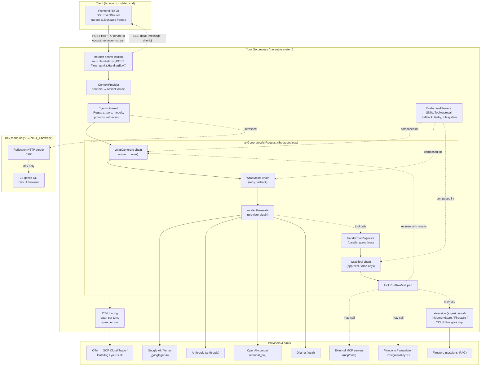

# Genkit Go — Benchmark Study

> **Repo**: https://github.com/firebase/genkit (multi-language monorepo; Go in `go/`)
> **Commit studied**: `0defbfc612f92caae5a7df7ed2754226e8db738e`
> **Branch**: `main`
> **Cloned at**: `benchmarked-stacks/genkit/`
> **Studied on**: 2026-05-16
> **Go SDK version reference**: published as `github.com/firebase/genkit/go`; the JS package is at `genkit-cli@1.34.0`, so the Go SDK rides on the same multi-language platform contract.

## TL;DR

- **Architecturally**, Genkit Go is a **flow-centric in-process Go library** (`go/genkit`, `go/ai`, `go/core`, `go/plugins/*`) bundled with an out-of-process **dev-only Reflection HTTP server** that the **JS-built `genkit` CLI** introspects. The Go binary owns the agent loop end-to-end; the CLI is dev UX. There is **no separate agent runtime daemon, no sister-repo execution server, no managed cloud running your code** — your Go process is the system of record.
- **The "agent loop" is `ai.GenerateWithRequest` (`go/ai/generate.go:211-510`) — a single-prompt, max-turns tool-loop wrapped in middleware**, *not* a ReAct primitive or graph runtime. There is no `Agent` type; an "agent" in Genkit is a function that calls `genkit.Generate(...)` with `ai.WithTools(...)` and optional `ai.WithUse(...)` middleware. This is **closer to Eino's chain shape than to Claude Code's stateful harness**: the loop iterates `maxTurns` (default 5, `generate.go:279`) until no tool calls remain or interrupts fire.
- **Matrix flagged "feels heavy" — verdict: confirmed but not damning.** The framework ships a registry, flows, prompts (dotprompt template engine + YAML frontmatter), schemas, retrievers, embedders, rerankers, evaluators, resources, format handlers, tracing, reflection API, and 18+ plugins — but each piece is opt-in and the Generate call itself remains a single function. Compared to LangGraph the runtime is light; compared to Mastra or Claude Agent SDK the *surface area* is comparable but more uniform (everything is an `api.Action`).
- **Sessions are EXPERIMENTAL** (`go/core/x/session/session.go:25-28`: *"APIs in this package are under active development and may change in any minor version release. Use with caution in production environments."*). Only `InMemoryStore[S]` and a Firestore store (`plugins/firebase/x/session_store.go`) ship; no Postgres / SQLite / JSONL. Session state is a **typed user-defined struct, not a message history** — the conversation is something *you* persist (e.g. via `resp.History()` → your DB).
- **Skills DO exist as a first-class middleware** (`plugins/middleware/skills.go:65`): `&middleware.Skills{SkillPaths: []string{"skills"}}` scans for `SKILL.md` files, injects a `<skills>` system prompt block listing them, and exposes a `use_skill` tool the model can call to lazy-load the body. **This is the *only* stack besides Claude Code that ships a built-in Markdown skill loader.** Lazy-loading via a tool call ≈ Claude Code's `Skill` tool semantics.
- **Multi-tenancy story is acceptable but rough**: there's a typed `ActionContext = map[string]any` propagated via `ContextProvider` (`go/core/context.go:43-55`) from HTTP headers, but **no forced tool-arg mechanism** (the closest pattern is `WrapTool` middleware that rewrites `params.Request.Input` before calling `next`). **No per-tool activation set** beyond the static `ai.WithTools(...)` list per call. **No per-tenant budget / cost cap.**
- **HITL is the strongest area**: tool `Interrupt`/`Restart`/`RespondWith` (`go/ai/tools.go:207-242, 685-776`) + `ToolApproval` middleware (`plugins/middleware/tool_approval.go`) give a real allowlist-or-approve workflow. The conversation is paused, the model response carries `FinishReason="interrupted"`, the caller resumes with `ai.WithToolRestarts(part)` or `ai.WithToolResponses(part)`. Closest to Vercel AI SDK's `toolApproval`.
- **Built-in middleware bundle is the standout differentiator**: `Retry` (exponential backoff with status filter), `Fallback` (multi-model), `Skills` (markdown skills), `Filesystem` (sandboxed read/edit/write via Go 1.25 `os.Root` — symlink-safe), `ToolApproval`. These are real, tested, and dev-UI-visible — not stubs.
- **Documentation is unbalanced**: the Go API has good in-source GoDoc (long examples on `genkit.Init`, `genkit.DefineTool`, etc., `go/genkit/genkit.go:162-216` etc.), and `genkit.dev` has a Go-tagged doc tree (`?lang=go`). But the official docs site is **primarily JS-first**, and the Go subpage tree is materially thinner: features like sessions, durable streaming, MCP host, and evaluators appear in JS-tabs but have no Go equivalents in some sections. Many advanced features (`x/session`, `x/streaming`) are explicitly experimental in the Go path while stable in JS.
- **One-line verdicts**:
  - **Run loop**: `ai.Generate(...)` (auto tool-loop, max turns); no ReAct primitive.
  - **Sessions**: Experimental, typed user-defined state, no shipped message-history persistence. `BYO` is the de-facto path.
  - **Skills**: ⭐ First-class — `&middleware.Skills{SkillPaths: ...}` plus `use_skill` tool. (Best-in-class with Claude Code.)
  - **Resource Manager**: Not provided — `BYO` (only an in-process `Registry` + dotprompt file loader).
  - **Sub-agents**: Not provided — `BYO` (the "Genkit" answer is "wrap a flow inside a tool"; no first-class primitive).
  - **Multi-tenancy**: Marginal. `ContextProvider` + `core.FromContext` is wired through; forcing tool args is BYO via `WrapTool`.
  - **Hooks/middleware**: Strong (`Hooks{Tools, WrapGenerate, WrapModel, WrapTool}` per call).
  - **API surface**: `genkit.Handler(action)` returns an `http.HandlerFunc` (SSE streaming, ContextProvider for tenant headers). Library-only; no server boot beyond a stdlib `http.ServeMux`.
  - **Observability**: OTel tracing + GCP Cloud Telemetry plugin (built-in); **no USD cost** computation; **no audit log**.
  - **Multi-model**: First-class via `googlegenai`, `vertexai`, `anthropic`, `compat_oai`, `ollama`, `modelgarden`. `Fallback` middleware handles outages.
  - **MCP**: ⭐ First-class — `mcp.NewGenkitMCPClient` (stdio/SSE/streamable-HTTP), `mcp.NewMCPServer` exposes registry tools.
  - **Eval**: Built-in evaluator interface + dataset, plus dev-CLI `genkit eval:run` (JS CLI but works against the Go reflection server).
  - **Dev UX**: ⭐ Genkit Dev UI (browser, runs the JS CLI against your Go process via Reflection API on port 3100) — traces, action runner, prompt playground.
  - **Production-readiness**: usable for **stateless request-scoped agents** with your own session store + your own forced-arg `WrapTool` middleware. Not ready out-of-box for long-running multi-tenant long-running agent piloted by skills with budgets / skills marketplace / audit / durable runtime.
- **Production-readiness verdict**: **YELLOW — viable but with material BYO investment.** The runtime is small and predictable, observability is real, but you ship your own session schema, your own per-tenant tool filter, your own forced-arg context, your own audit log, and your own resource governance.

---

## 0. Architectural Overview & Deployment Model

### Deployment diagram

```
┌──────────────────────────────────────────────────────────────────┐
│  YOUR Go process (production)                                    │
│  ┌────────────────────────────────────────────────────────────┐  │
│  │  net/http server (stdlib) — your code                      │  │
│  │      mux.HandleFunc("POST /myFlow", genkit.Handler(flow))  │  │
│  │      genkit.WithContextProviders(authHeaderProvider)       │  │
│  └────────────────────────────────────────────────────────────┘  │
│                            │                                      │
│  ┌────────────────────────────────────────────────────────────┐  │
│  │  *genkit.Genkit  (in-process registry, owned by your code) │  │
│  │   ├─ Registry (actions: tools, models, prompts,            │  │
│  │   │            retrievers, evaluators, resources, …)       │  │
│  │   ├─ Loaded plugins (googlegenai, anthropic, mcp, …)       │  │
│  │   └─ Dotprompt loader (./prompts/*.prompt or embed.FS)     │  │
│  └────────────────────────────────────────────────────────────┘  │
│                            │                                      │
│  ┌────────────────────────────────────────────────────────────┐  │
│  │  ai.GenerateWithRequest  ← THE AGENT LOOP                  │  │
│  │   for turn in [0, MaxTurns]:                               │  │
│  │     run WrapGenerate hooks                                 │  │
│  │       call model (WrapModel chain)                         │  │
│  │       if tool calls in response:                           │  │
│  │         goroutine-fan-out runTool() per call (WrapTool)    │  │
│  │         append tool result message; loop                   │  │
│  │       else: return                                         │  │
│  └────────────────────────────────────────────────────────────┘  │
│              │                            │                       │
│              ▼                            ▼                       │
│       ┌──────────────┐         ┌────────────────────┐             │
│       │ OTel tracing │         │ Provider HTTP/gRPC │             │
│       │  + GCP plug. │         │ (Google AI, Vertex,│             │
│       │  (optional)  │         │  Anthropic, OAI,…) │             │
│       └──────────────┘         └────────────────────┘             │
│                                                                   │
│  ┌────────────────────────────────────────────────────────────┐  │
│  │  (GENKIT_ENV=dev only)                                     │  │
│  │  Reflection API HTTP server on :3100                       │  │
│  │  ── speaks Reflection API spec (genkit-tools/reflectionApi)│  │
│  └────────────────────────────────────────────────────────────┘  │
└──────────────────────────────────────────────────────────────────┘
                                    │  (only in dev)
                                    ▼
                  ┌─────────────────────────────────────┐
                  │  Node.js `genkit` CLI               │
                  │  (genkit-tools/cli, JS)             │
                  │  → spawns Dev UI browser → traces,  │
                  │    prompt playground, eval run      │
                  └─────────────────────────────────────┘

                                    ┌────────────────────────────────┐
                                    │  (Optional, prod-grade)        │
                                    │  Firebase / Firestore session  │
                                    │  store (plugins/firebase/x)    │
                                    │  ── only persistence option    │
                                    │     beyond InMemory shipped    │
                                    └────────────────────────────────┘
```

### 0.1 What is this stack?

A **Go library + plugin ecosystem** that provides AI primitives (generate, prompts, tools, retrievers, embedders, evaluators) on top of a small action registry. It's not a framework you deploy; it's a set of `go get`-installed packages you embed in your own HTTP server. The companion `genkit-tools` JS CLI is for local dev only and is *not* part of your production binary.

Quote: from the Go README (`go/README.md:7-19`):

> **Genkit Go** — AI SDK for Go • LLM Framework • AI Agent Toolkit. Build production-ready AI-powered applications in Go with a unified interface for text generation, structured output, tool calling, and agentic workflows.

### 0.2 Where does the agent loop *actually* execute?

**In your Go process. Period.** The loop is a single Go function — `ai.GenerateWithRequest` at `go/ai/generate.go:211-510` — that recursively calls the model, runs any tool calls, and feeds results back in until either no tool calls remain, `MaxTurns` is exceeded, or an interrupt fires. No subprocess, no IPC, no remote agent runner. The `genkit-tools` JS CLI talks to your process **only in dev mode** via a Reflection HTTP server bound to `:3100` (`go/genkit/genkit.go:263-290`):

```go
// go/genkit/genkit.go:263
if api.CurrentEnvironment() == api.EnvironmentDev {
    errCh := make(chan error, 1)
    serverStartCh := make(chan struct{})
    if v2URL := os.Getenv("GENKIT_REFLECTION_V2_SERVER"); v2URL != "" {
        // V2: connect to the CLI's WebSocket server.
        go startReflectionServerV2(ctx, g, reflectionServerV2Options{URL: v2URL}, errCh, serverStartCh)
    } else {
        // V1: start an HTTP reflection server.
        go func() {
            if s := startReflectionServer(ctx, g, errCh, serverStartCh); s == nil {
                return
            }
            if err := <-errCh; err != nil {
                slog.Error("reflection server error", "err", err)
            }
        }()
    }
    ...
}
```

In production (`GENKIT_ENV` unset), the reflection server doesn't start; the binary is just your HTTP server + Genkit registry.

### 0.3 Runtime dependencies

- **Go ≥ 1.25** (`go/go.mod` declares `go 1.25`).
- **No bundled binaries** in the Go path. Everything is pure-Go modules.
- Optional **Node.js + `genkit` CLI** for dev UX (eval, dev UI, init helpers).
- Optional **GCP credentials** if you use `googlegenai`, `vertexai`, `firebase`, `googlecloud` telemetry, or AlloyDB/PG plugins.
- Optional **OTel exporter** (configured via `googlecloud.EnableGoogleCloudTelemetry` or your own setup).
- Optional **Postgres / Firestore** if you adopt the corresponding plugins (`alloydb`, `postgresql`, `firebase`).

Memory footprint: a binary with `googlegenai` + `middleware` plugins + Genkit is on the order of 30–40 MB compiled, and ~30 MB RSS at idle (estimate from comparable Go AI binaries — not measured).

### 0.4 Recommended deployment topology

The Go SDK and samples (`go/samples/*/main.go`) all show **one Go binary serving N HTTP routes, each a `genkit.Handler(action)`**. There is no "container per tenant" or "worker per session" recommendation. The `samples/cloud_run_deploy.sh` and `samples/cloud_run_request.sh` scripts target **Google Cloud Run** as the canonical hosting model — stateless container instances behind a load balancer.

Sessions and conversation state are explicitly punted to: *your* DB (the only first-party persistence is `core/x/session` with `InMemoryStore` + `plugins/firebase/x` Firestore).

For multi-tenancy: each tenant request hits a stateless container; tenant identity flows in via headers → `ContextProvider` → `core.WithActionContext` → tools read it from context. No tenant pinning, no leader election, no per-tenant pod.

### 0.5 Cold-start cost & instance footprint

- **Init cost**: dominated by plugin `Init(ctx)` calls. `googlegenai.Init` is sync HTTP/credential check (typically <1 s with cached ADC). Reflection server is in-goroutine on dev.
- **Cold start of a Cloud Run instance**: dependent on your container; Go binaries cold-boot ≪1 s after image pull.
- **RAM baseline**: ~30 MB for a minimal binary; growing with model SDKs (Vertex AI client + gRPC adds ~50 MB resident on first call).

No documented "startup ceremony" like Claude Agent SDK's 20–30 s issue. Genkit's heavyweight pieces (Dev UI, eval) live in the JS CLI, *not* the Go runtime.

### 0.6 Vendor lock-in

| Axis | Verdict | Detail |
|------|---------|--------|
| **LLM provider** | 🟢 Multi-provider | First-party plugins: `googlegenai` (Google AI), `vertexai`, `anthropic`, `compat_oai` (OpenAI-compatible), `ollama`, `modelgarden`. `Fallback` middleware handles outages. |
| **Hosting platform** | 🟡 Slight GCP tilt | Samples target Cloud Run. Telemetry plugin is GCP-only (`googlecloud`). Sessions persistence ships only `Firestore` adapter. But there is **nothing GCP-required**: you can run on any Kubernetes, AWS, on-prem. |
| **Eval platform** | 🟢 No lock-in | Evaluator is an interface; built-in evaluators (`evaluators/evaluators.go`) are local Go code. JS CLI's `genkit eval:run` writes results locally. |
| **Resource/skill registry** | 🟢 None | No managed registry, no marketplace. |
| **Tracing** | 🟢 OTel-standard | OTel exporter is BYO; GCP plugin is one option. |

Reasonably portable. **The strongest lock-in is the Firebase brand** — the SDK lives in the `firebase/genkit` repo and uses `googlegenai` as the default provider in most examples.

### 0.7 Framework weight / footprint

**Medium-heavy framework**, in this order:
- ~317 Go files in `go/` (`find . -name "*.go" | wc -l`)
- Core packages: `genkit`, `ai`, `core`, `core/api`, `core/tracing`, `core/logger`, `core/x/session`, `core/x/streaming` (~25 directories under `core`+`ai`+`genkit`).
- 18 first-party plugins (`go/plugins/*`): anthropic, alloydb, compat_oai, evaluators, firebase, googlecloud, googlegenai, localvec, mcp, middleware, ollama, pinecone, postgresql, server, vertexai, weaviate.
- 40+ samples (`go/samples/*`).
- ~120 lines of Go to a working `Init + Generate + tool` pipeline (`go/samples/basic`).

Compared to Eino (lighter, no plugin tree) or Vercel AI v7 (similar plugin count). Heavier than Anthropic's Claude Agent SDK Python (which is a wrapper); lighter than Mastra (which bundles a Playground UI).

### 0.8 Documentation depth & cross-team contributor accessibility

- **Official docs**: https://genkit.dev/docs/overview/ — Firebase Genkit's unified doc site. Most pages have a `?lang=js|go|py` toggle. **Go coverage is real but trails JS substantially**:
  - Stable JS-only or JS-first sections: Sessions, Memory, Persistence, Durable streaming, MCP host advanced, Multi-step workflows, Cloud Functions deploy.
  - Solid Go coverage: Generate, Tools, Flows, Prompts (dotprompt), Streaming, Plugins (most), Telemetry, Evaluators.
  - Examples in docs are roughly 70% JS / 30% Go in many code blocks (rough estimate from random sampling).
- **In-source GoDoc** is **excellent**: top-level functions (`genkit.Init`, `genkit.DefineTool`, `genkit.DefinePrompt`, `genkit.Generate`) have 30–100 line docstrings with working examples. `genkit/genkit.go` is itself a tutorial.
- **Cross-team accessibility (Product/Data)**: `.prompt` files with YAML frontmatter + Handlebars are *editable by non-engineers* (`go/samples/basic-prompts/prompts/assistant.prompt`). This is one of Genkit's selling points. **But**: skills (`SKILL.md`) are also markdown, so a product person could in principle author both.
- **Discord** community (`https://discord.gg/qXt5zzQKpc`) is active per the badge in `go/README.md:24`.

**Concrete consequence for our use case**: any non-trivial production pattern that involves sessions, multi-instance state, or advanced middleware will require reading JS docs and reverse-engineering the Go equivalent. The Go SDK is *not* a second-class citizen in the code (`go/` is comparable in line count and quality to `js/`), but the **docs site is**.

### 0.9 Documentation entry points

- **Official docs landing**: https://genkit.dev/docs/overview/?lang=go
- **Quickstart (Go)**: https://genkit.dev/docs/get-started/?lang=go
- **API reference (GoDoc)**: https://pkg.go.dev/github.com/firebase/genkit/go
- **Genkit Tools (Dev UI / CLI)**: https://genkit.dev/docs/devtools
- **Plugin reference (Go)**: https://genkit.dev/docs/plugins/?lang=go
- **Dotprompt format reference**: https://genkit.dev/docs/dotprompt
- **MCP host/server guide (Go)**: https://genkit.dev/docs/mcp?lang=go (the `plugins/mcp/README.md` in the repo is the authoritative Go reference)
- **Hosting / deployment guides**: https://genkit.dev/docs/deploy and https://genkit.dev/docs/cloud-run?lang=go (Cloud Run is the canonical example)
- **Examples / demos**: https://github.com/firebase/genkit/tree/main/go/samples (40+ runnable Go samples)
- **Changelog (JS CLI)**: https://github.com/firebase/genkit/blob/main/genkit-tools/cli/CHANGELOG.md (no separate Go-side changelog; Go is versioned via Go modules tags `go/vX.Y.Z`)
- **GitHub issues tracker**: https://github.com/firebase/genkit/issues
- **Issues relevant to our use case (search filters)**:
  - "go session" — https://github.com/firebase/genkit/issues?q=is%3Aissue+session+label%3Alanguage%3Ago
  - "go multi-tenant" / "tenant" — open conversation pieces are sparse; the canonical Genkit answer is "use `ContextProvider`".
  - "skills" — https://github.com/firebase/genkit/issues?q=skills+label%3Alanguage%3Ago
- **Discord**: https://discord.gg/qXt5zzQKpc

---

## 1. Agent Harness (Run Loop) & Message Taxonomy

### 1.1 Run loop entrypoint(s)

The user-facing entrypoint is **`genkit.Generate`** (or its variants `GenerateText`, `GenerateData`, `GenerateStream`, `GenerateDataStream`, `GenerateOperation`, `GenerateWithRequest`). The shape from `go/genkit/genkit.go:1049-1051`:

```go
func Generate(ctx context.Context, g *Genkit, opts ...ai.GenerateOption) (*ai.ModelResponse, error) {
    return ai.Generate(genkitCtxKey.NewContext(ctx, g), g.reg, opts...)
}
```

This is **not** an `Agent` object that you instantiate once and reuse. Each `Generate(...)` call is a complete agent session: a prompt + tools + messages + middleware get bundled into `GenerateActionOptions` and the loop runs to completion.

For streaming there's a `iter.Seq2` iterator (`go/genkit/genkit.go:1081-1083`):

```go
func GenerateStream(ctx context.Context, g *Genkit, opts ...ai.GenerateOption) iter.Seq2[*ai.ModelStreamValue, error] {
    return ai.GenerateStream(genkitCtxKey.NewContext(ctx, g), g.reg, opts...)
}
```

The underlying engine is **`ai.GenerateWithRequest`** at `go/ai/generate.go:211`:

```go
// go/ai/generate.go:211
func GenerateWithRequest(ctx context.Context, r api.Registry, opts *GenerateActionOptions,
    mmws []ModelMiddleware, cb ModelStreamCallback) (*ModelResponse, error) {
```

### 1.2 Per-iteration behavior

One iteration of the tool loop (`go/ai/generate.go:374-492`):

1. Open a tracing span (`tracing.RunInNewSpan`).
2. If this is the first turn and `Resume` is set (HITL respond/restart), inject the tool message and continue.
3. Call `fn(ctx, req, wrappedCb)` — the chained `WrapModel` → `model.Generate`.
4. Ensure each tool request has a unique `Ref`.
5. If structured-output `formatHandler` is set, parse the assistant message.
6. **Branch**: if response has no `ToolRequests` OR `ReturnToolRequests` is true, return.
7. Check `currentTurn+1 > maxTurns` → error `ABORTED`.
8. **`handleToolRequests`** (`go/ai/generate.go:942-1046`): fan out one goroutine per tool call, run each through the `WrapTool` chain (`runTool`), collect results. If any interrupt fires → return the response with `FinishReason="interrupted"`.
9. Append `(assistant-message, tool-message)` to messages, recursive call `generate(ctx, newReq, currentTurn+1, currentIndex+1)`.

The loop is bounded by `MaxTurns` (default 5, `go/ai/generate.go:279`).

### 1.3 ReAct loop

**Genkit does not ship a ReAct primitive.** What it ships is an *automatic tool-calling loop*: the LLM emits structured `tool_use` parts, the loop executes them, the loop feeds back tool results, until the LLM stops calling tools. This is the same shape as Vercel AI SDK's `generateText` with `stopWhen: stepCountIs(5)`, Mastra's `agent.generate(...)`, Anthropic SDK's `messages.create({tools, max_iter})` — but **not** an explicit Reason→Act→Observe scaffold with separate prompt slots. Genkit relies entirely on the **model's native tool-calling capability** (Gemini function-calling, Anthropic tool-use blocks, etc.); there's no string-parsed "Thought: ... Action: ..." parser.

### 1.4 Tool dispatch + result handling

Tool dispatch is in `handleToolRequests` (`go/ai/generate.go:942-1046`). For each `Part.IsToolRequest()` in the assistant message:

```go
// go/ai/generate.go:957
go func(idx int, p *Part) {
    toolReq := p.ToolRequest
    tool := LookupTool(r, p.ToolRequest.Name)
    if tool == nil {
        resultChan <- result[*MultipartToolResponse]{index: idx,
            err: core.NewError(core.NOT_FOUND, "tool %q not found", toolReq.Name)}
        return
    }

    multipartResp, err := runTool(ctx, tool, toolReq)
    if err != nil {
        var tie *toolInterruptError
        if errors.As(err, &tie) {
            // ... mark part with interrupt metadata
            resultChan <- result[*MultipartToolResponse]{index: idx, err: tie}
            return
        }
        resultChan <- result[*MultipartToolResponse]{index: idx,
            err: core.NewError(core.INTERNAL, "tool %q failed: %v", toolReq.Name, err)}
        return
    }
    // ... record output, send to chan
}(i, part)
```

After all goroutines complete, results are folded into a single `tool` role message:

```go
// go/ai/generate.go:1029
toolMsg.Content = toolResps
...
newReq.Messages = append(slices.Clone(req.Messages), resp.Message, toolMsg)
return newReq, nil, nil
```

**Concurrency**: tools execute **in parallel** (one goroutine each). The `WrapTool` middleware can be called concurrently — the doc string explicitly warns about shared-state safety (`go/ai/middleware.go:42-44`).

### 1.5 Explicit turn concept

A "turn" is one trip through `runGenerate` — i.e. one `model.Generate` call plus the optional tool dispatch that follows. `MaxTurns` counts these (`go/ai/generate.go:473`). There is **no `Turn` type**; the count is just an `int` carried through the recursion.

### 1.6 Event emission mechanism (in-process)

Streaming is via a `ModelStreamCallback` (`go/ai/generate.go:72`):

```go
type ModelStreamCallback = func(context.Context, *ModelResponseChunk) error
```

The caller passes `ai.WithStreaming(cb)` and the model's `Generate` invokes `cb(ctx, chunk)` for each streamed chunk. The harness wraps the user callback to assign role-based indices and attach a format handler:

```go
// go/ai/generate.go:392-405
if cb != nil {
    wrappedCb = func(ctx context.Context, chunk *ModelResponseChunk) error {
        if chunk.Role != currentRole && chunk.Role != "" {
            currentIndex++
            currentRole = chunk.Role
        }
        chunk.Index = currentIndex
        if chunk.Role == "" {
            chunk.Role = RoleModel
        }
        chunk.formatHandler = streamingHandler
        return cb(ctx, chunk)
    }
}
```

`GenerateStream` wraps this as a `iter.Seq2` (Go 1.23+ range-over-func) iterator. There is **no async EventEmitter or topic bus** — just a callback or an iterator.

---

### Message & event taxonomy

### 1.7 Message layers

**Two layers**, much simpler than Vercel AI SDK or Mastra:

```
┌─────────────────────────────────────────────────────────────┐
│  LAYER 1 — WIRE (model-provider native)                     │
│  Each plugin (googlegenai/anthropic/...) converts to its    │
│  provider's native format inside its Generate fn            │
└─────────────────────────────────────────────────────────────┘
                            ▲
                            │ provider plugin translates
                            │
┌─────────────────────────────────────────────────────────────┐
│  LAYER 2 — GENKIT (ai.Message / ai.Part)                    │
│  Single uniform vocabulary used everywhere:                 │
│  - In ModelRequest.Messages                                 │
│  - In ModelResponse.Message                                 │
│  - In ModelResponseChunk.Content                            │
│  - In HTTP SSE frames (as JSON)                             │
└─────────────────────────────────────────────────────────────┘
```

There is **no separate "UI message" layer** like Vercel's `UIMessage` or Mastra's chat-format. The Genkit `ai.Message` *is* what your frontend renders (after you parse the SSE). This is simpler but pushes adapter work onto your frontend.

### 1.8 Concrete message types

Source: `go/ai/gen.go` (generated) + `go/ai/document.go`, `go/ai/generate.go`.

| Type | Purpose |
|------|---------|
| `Message` | One turn: `{Role, Content []*Part, Metadata}` (`gen.go:219-227`) |
| `Role` | `"system" \| "user" \| "model" \| "tool"` (`gen.go:493-505`) |
| `Part` | Tagged union: `textPart \| mediaPart \| dataPart \| customPart \| toolRequestPart \| toolResponsePart \| reasoningPart \| resourcePart` (see `gen.go` and `ai/document.go`) |
| `ToolRequest` | `{Name, Input any, Ref, Partial}` — the model asks to call a tool (`gen.go:537-547`) |
| `ToolResponse` | `{Name, Output any, Content []*Part, Ref}` — the result you send back (`gen.go:559-569`) |
| `ModelRequest` | `{Messages, Config, Docs, ToolChoice, Tools []*ToolDefinition, Output}` (`gen.go:317-330`) |
| `ModelResponse` | `{Message, Usage, FinishReason, FinishMessage, LatencyMs, Operation, Custom, Raw, Request}` (`gen.go:333-353`) |
| `ModelResponseChunk` | Streaming chunk: `{Content, Role, Index, Aggregated, Custom}` (`gen.go:357-370`) |
| `ToolDefinition` | What's sent to the model: `{Name, Description, InputSchema, OutputSchema, Metadata}` (`gen.go:521-532`) |
| `MultipartToolResponse` | Tool result: `{Output any, Content []*Part, Metadata}` — lets tools return media (`gen.go:373-379`) |
| `Document` | Retrieved-context unit: `{Content []*Part, Metadata}` (`ai/document.go`) |
| `Operation` | Long-running op handle (background models): `{Id, Action, Done, Output, Error, Metadata}` (`gen.go:382-395`) |
| `FinishReason` | `"stop" \| "length" \| "blocked" \| "interrupted" \| "other" \| "unknown"` (`gen.go:74-84`) |
| `GenerationUsage` | Tokens: `{InputTokens, OutputTokens, TotalTokens, CachedContentTokens, ThoughtsTokens, InputAudioFiles, …}` (`gen.go:172-202`) |
| `GenerateActionOptions` | The serialized form of a generate call (`gen.go:87-117`) |
| `GenerateActionResume` | For HITL: `{Respond, Restart, Metadata}` (`gen.go:120-127`) |
| `ToolChoice` | `"auto" \| "required" \| "none"` (`gen.go:130-136`) |

### 1.9 Messages vs. events

**Same vocabulary, different shapes**. Messages are persistent (`*Message`); chunks are transient (`*ModelResponseChunk`) and carry `Content []*Part` that gets accumulated into a full `Message` over the course of streaming. Tool-result events are *also* `ModelResponseChunk{Role: RoleTool, Content: toolResps}` chunks — Genkit treats tool results as a special chunk emitted to the same stream (`go/ai/generate.go:1031-1040`).

There is **no separate event taxonomy** like Vercel AI's 24-variant `TextStreamPart` union. The taxonomy *is* `ModelResponseChunk{Role, Content[]}` where the `Role` and the `Part` types tell you what kind of event you're seeing.

### 1.10 Event categories

Realizable categories (by inspecting role + part type in the chunk):

| Category | How it's recognized |
|----------|---------------------|
| `text-delta` chunk | `Role=model`, `Content[i].IsText()` |
| `reasoning-delta` chunk | `Role=model`, `Content[i].IsReasoning()` |
| `media` chunk | `Role=model`, `Content[i].IsMedia()` |
| `tool-call` (assistant) | `Role=model`, `Content[i].IsToolRequest()`. `ToolRequest.Partial=true` indicates a partial-args chunk. |
| `tool-result` | `Role=tool`, `Content[i].IsToolResponse()` (synthesized by `handleToolRequests` and emitted via `wrappedCb`) |
| `data` chunk | `Role=model`, `Content[i].IsData()` |
| `custom` chunk | `Role=model`, `Content[i].IsCustom()` |
| `interrupt` | Final response (not a chunk) with `FinishReason=interrupted` and tool-request part with `Metadata["interrupt"]` set |

There are **no explicit lifecycle events** (`start`, `step-start`, `step-end`, `finish`, `error`). Streaming begins with the first chunk and ends when the iterator yields `Done=true`. Lifecycle is observable via tracing spans (one per generate iteration, one per tool call), not via the stream.

### 1.11 Canonical type-definition file(s)

- **Generated types**: `go/ai/gen.go` (~600 lines, jsonschemagen output of the cross-runtime schema in `genkit-tools/genkit-schema.json`).
- **Hand-written generate logic**: `go/ai/generate.go` (~1700 lines).
- **Tool types & interrupts**: `go/ai/tools.go` (~800 lines).
- **Middleware/hooks**: `go/ai/middleware.go` (~290 lines).
- **Action plumbing**: `go/core/action.go`, `go/core/flow.go`.

### 1.12 Live agentic event stream taxonomy

Over HTTP, the `genkit.Handler` (`go/genkit/servers.go:161-235`) writes each model chunk as an SSE frame. The wire format is:

```
data: {"message":<JSON-serialized chunk>}\n\n
...
data: {"result":<final result JSON>}\n\n
```

Sample frames (illustrative; emitted by `genkit.Handler` for a flow that wraps `Generate`):

**Frame 1 (text delta):**
```
data: {"message":{"role":"model","index":0,"content":[{"text":"The weather in "}]}}
```

**Frame 2 (tool call partial):**
```
data: {"message":{"role":"model","index":0,"content":[{"toolRequest":{"name":"getWeather","ref":"call_001","input":{"city":"Par"},"partial":true}}]}}
```

**Frame 3 (tool result):**
```
data: {"message":{"role":"tool","index":1,"content":[{"toolResponse":{"name":"getWeather","ref":"call_001","output":"Sunny 25C"}}]}}
```

**Frame 4 (final result, non-chunk):**
```
data: {"result":{"message":{"role":"model","content":[{"text":"It is sunny and 25C in Paris."}]},"usage":{"inputTokens":127,"outputTokens":18,"totalTokens":145},"finishReason":"stop"}}
```

The frame envelope (`{"message": ...}` vs `{"result": ...}`) comes from `flowMessageResponse` and `flowResultResponse` in `go/genkit/servers.go:373-385`.

---

## 2. Agent Runtime (Multi-session Host)

### 2.1 Multi-session host architecture

**There is no Genkit "runtime" hosting many sessions.** Genkit is a library: your `*genkit.Genkit` is an in-process registry, and each HTTP request that hits one of your `genkit.Handler(flow)` endpoints runs the flow synchronously, the loop iterates, the response goes back. **One process, N concurrent requests, no per-request state on the Genkit object beyond the registry (which is read-only after init).**

This is fundamentally different from LangGraph's `langgraph-api` server (which hosts threads, runs, checkpoints in a long-lived process) or Claude Agent SDK's bundled Node CLI subprocess.

### 2.2 Concurrent session isolation

Each request gets a fresh `context.Context` (Go HTTP convention). The Genkit registry (`*registry.Registry`) is shared across requests but is concurrency-safe for reads after `Init`. There is **no shared mutable session state on the Genkit object** — sessions, if used, are stored in your `session.Store[S]` implementation (`go/core/x/session/session.go:60-65`).

Isolation between requests is therefore the standard Go HTTP model: per-request context, per-request goroutines spawned in `handleToolRequests`, per-request span trees.

### 2.3 Horizontal scaling / multi-instance

**Stateless workers, your DB is the source of truth.** Cloud Run / GKE / any Kubernetes deployment scales horizontally by replication. Genkit has no leader election, no shared lock, no cross-instance coordination. If you adopt `FirestoreSessionStore` (`plugins/firebase/x/session_store.go`), multiple instances can read/write the same session because Firestore handles concurrency. If you adopt your own `session.Store[S]` against Postgres, you're responsible for the locking semantics.

### 2.4 Background / async / scheduled tasks

- **Background models**: there is a `BackgroundModel` abstraction (`go/ai/background_model.go`) and `genkit.GenerateOperation` (`go/genkit/genkit.go:1118-1120`) for long-running model ops (e.g. video generation, Imagen jobs). You poll with `CheckModelOperation`. This is **for long-running model calls**, not for general scheduled tasks.
- **Cron / webhook triggers**: Not provided — BYO (use Cloud Scheduler + a webhook flow).
- **Long-running flows**: A flow runs synchronously inside the HTTP request unless you use durable streaming.
- **Durable streaming**: `core/x/streaming` provides a `StreamManager` interface; `genkit.WithStreamManager(...)` lets the flow continue even if the HTTP client disconnects, writing chunks to a backing store (`go/genkit/servers.go:266-323`). Useful for resumable long agent runs. **Experimental** per the comment at `servers.go:79`.

### 2.5 Worker pool / queue model

**Not provided — BYO.** No built-in job queue. The expected model is "HTTP request → run flow synchronously → respond". For async work, you'd put the request on Cloud Pub/Sub / SQS / etc. yourself and have a separate worker process call `genkit.Generate` on dequeue.

---

## 3. Sessions & Persistence

### 3.1 Session / chat data model

**The session is a typed user-defined state struct, NOT a list of messages.** From `go/core/x/session/session.go:42-49`:

```go
// Session represents a stateful environment with typed state.
// The type parameter S defines the shape of the session state and must be
// JSON-serializable for persistence.
type Session[S any] struct {
    id    string
    state S
    store Store[S]
    mu    sync.RWMutex
}

// Data is the serializable session state persisted by Store.
type Data[S any] struct {
    ID    string `json:"id"`
    State S      `json:"state,omitempty"`
}
```

That's it. **No `messages []Message` field. No `tools`, `cwd`, `tenant_id`, `user_id`, `created_at`, `updated_at`, `parent_session_id`, `metadata`, `usage`, `model`, `summary` fields.** You bring your own state shape.

Example from the shopping-cart sample (`go/samples/session/main.go:49-51`):

```go
type CartState struct {
    Items []string `json:"items"`
}
```

If you want a conversation history persisted, you embed it in your state struct:

```go
type ChatState struct {
    Messages []*ai.Message `json:"messages"`
    Tenant   string        `json:"tenant"`
    UserID   string        `json:"userId"`
    // ... whatever you need
}
```

And it's *your* code that calls `sess.UpdateState(ctx, ChatState{Messages: append(state.Messages, resp.Message)})` after each `Generate`.

### 3.2 What's stored on a session

Whatever your `State S` struct contains, serialized via JSON. Genkit serializes via `json.Marshal` on `Save` and `json.Unmarshal` on `Get` (`go/core/x/session/session.go:197-208, 342-358`). No automatic message capture, no schema, no built-in `messages` array.

### 3.3 Granularity

**One session = one state blob keyed by `id`.** No native fork/branch model. No parent-child session relationship. If you need branching, you encode it in your state struct.

### 3.4 Built-in persistence stores

| Store | Source | Status |
|-------|--------|--------|
| `InMemoryStore[S]` | `go/core/x/session/session.go:297-339` | Experimental, no persistence across process restart, **process-local** (NOT safe across replicas). |
| `FirestoreSessionStore[S]` | `go/plugins/firebase/x/session_store.go` | Production-ready (TTL, concurrent-safe via Firestore). |

**No Postgres adapter. No SQLite adapter. No JSONL-on-disk store. No Redis adapter. No S3/GCS adapter. No Anthropic-hosted, Vercel Blob, Mastra Cloud equivalents.**

For our use case (Postgres-backed multi-tenant agent), you **WILL** implement a `session.Store[S]` against `bun` / `pgx`. The interface is trivial (`go/core/x/session/session.go:59-64`):

```go
type Store[S any] interface {
    Get(ctx context.Context, sessionID string) (*Data[S], error)
    Save(ctx context.Context, sessionID string, data *Data[S]) error
}
```

### 3.5 Persistence timing

**Persistence happens only when YOU call `sess.UpdateState(ctx, newState)`.** There is no auto-save per message, per turn, or per tool call. From `session.go:212-229`:

```go
// UpdateState updates the session state and persists it to the store (if configured).
func (s *Session[S]) UpdateState(ctx context.Context, state S) error {
    s.mu.Lock()
    defer s.mu.Unlock()
    s.state = state
    if s.store != nil {
        data := &Data[S]{ID: s.id, State: state}
        if err := s.store.Save(ctx, s.id, data); err != nil {
            return err
        }
    }
    return nil
}
```

There is no LangGraph-style `durability="sync"|"async"|"exit"`. You manage the save points.

### 3.6 Mid-run checkpointing (durable)

**Not provided.** There is no checkpointer that snapshots mid-tool-call to resume after a crash. The only durability-adjacent feature is `core/x/streaming.StreamManager` (`go/genkit/servers.go:266-323`), which persists *output chunks* so a disconnected client can replay them — but if the *server* crashes mid-tool-call, the in-flight state is lost. The next request creates a fresh `Generate` call.

If you need true mid-run resumption, you'd combine:
1. A `WrapTool` middleware that persists `(messages, partial-result)` to your DB before each tool call.
2. Your own resume code that detects the in-flight state on restart and replays it via `ai.WithToolResponses(...)` / `WithToolRestarts(...)`.

This is BYO.

### 3.7 Session ID format

**UUIDv4 by default** (`go/core/x/session/session.go:141-143`):

```go
id := o.ID
if !o.hasID {
    id = uuid.New().String()
}
```

You can override via `session.WithID[CartState](myID)` — any string is allowed. **No tenant prefixing convention. No composite/hierarchical IDs.**

### 3.8 Pluggable store interface

`Store[S any]` (above) is a 2-method interface. Implementing your own is straightforward. The Firestore store is the canonical example (`plugins/firebase/x/session_store.go`).

### 3.9 Schema evolution / migration

**Not provided.** Your `State S` struct is whatever you say it is; if you change the shape, `json.Unmarshal` on old data will succeed only if the change is backward-compatible (added optional fields are fine; removed fields silently drop). **No migration helpers**, no version stamping in `Data[S]`.

### 3.10 Export / replay

**No first-party export/replay tooling for sessions.** For generation events, Genkit's tracing emits OTel spans you can export. For replaying, you'd reconstruct messages from your DB and pass them to `Generate(..., ai.WithMessages(...))`.

The Dev UI (via reflection API) can replay individual actions, but not a full session/turn sequence.

### 3.11 Cross-session memory

Not part of the session abstraction. See Q15.

---

## 4. Multi-tenancy & Arbitrary Context ⭐ THE KEY QUESTION

### 4.1 Full run-loop input struct

`GenerateActionOptions` is the JSON-serializable shape of one generate call (`go/ai/gen.go:87-117`):

```go
type GenerateActionOptions struct {
    Config             any                          `json:"config,omitempty"`
    Docs               []*Document                  `json:"docs,omitempty"`
    MaxTurns           int                          `json:"maxTurns,omitempty"`
    Messages           []*Message                   `json:"messages,omitempty"`
    Model              string                       `json:"model,omitempty"`
    Output             *GenerateActionOutputConfig  `json:"output,omitempty"`
    Resources          []string                     `json:"resources,omitempty"`
    Resume             *GenerateActionResume        `json:"resume,omitempty"`
    ReturnToolRequests bool                         `json:"returnToolRequests,omitempty"`
    StepName           string                       `json:"stepName,omitempty"`
    ToolChoice         ToolChoice                   `json:"toolChoice,omitempty"`
    Tools              []string                     `json:"tools,omitempty"`
    Use                []*MiddlewareRef             `json:"use,omitempty"`
}
```

The full Go-side options struct (`go/ai/option.go:889`) embeds:
- `commonGenOptions` (model, tools, max turns, tool choice, return tool requests, middleware, resources)
- `promptingOptions` (system, prompt, messages, prompt-fn, messages-fn, system-fn)
- `outputOptions` (output type, schema, format)
- `executionOptions` (streaming callback)
- `documentOptions` (docs, text docs)
- `RespondParts`, `RestartParts` (HITL resume)
- `StepName`

**There is no native `tenantId`, `userId`, `sessionId`, `locale`, etc. field on the run-loop input.** Tenant identity flows in via `context.Context` (see 4.2 / 4.6).

### 4.2 Context propagation into a tool call

Genkit uses **`context.Context` as the carrier for ambient tenant/user data**, via two mechanisms:

**1. `core.ActionContext = map[string]any`** (`go/core/context.go:29-43`):

```go
func WithActionContext(ctx context.Context, actionCtx ActionContext) context.Context {
    return context.WithValue(ctx, actionCtxKey, actionCtx)
}

func FromContext(ctx context.Context) ActionContext {
    val := ctx.Value(actionCtxKey)
    if val == nil {
        return nil
    }
    return val.(ActionContext)
}

type ActionContext = map[string]any
```

**2. `ContextProvider`** (`go/core/context.go:55`):

```go
type ContextProvider = func(ctx context.Context, req RequestData) (ActionContext, error)
```

You wire a provider into `genkit.Handler` (`go/genkit/servers.go:66-72`):

```go
genkit.Handler(myFlow, genkit.WithContextProviders(
    func(ctx context.Context, req core.RequestData) (api.ActionContext, error) {
        return api.ActionContext{
            "tenantId": req.Headers["x-tenant-id"],
            "userId":   req.Headers["x-user-id"],
        }, nil
    },
))
```

Inside the tool, you fish it out:

```go
addToCart := genkit.DefineTool(g, "addToCart", "...", func(ctx *ai.ToolContext, in MyInput) (string, error) {
    actCtx := core.FromContext(ctx.Context) // map[string]any
    tenant, _ := actCtx["tenantId"].(string)
    // ...
})
```

`*ai.ToolContext` embeds `context.Context` (`go/ai/tools.go:194-202`), so the propagated ctx is reachable.

### 4.3 Tool call interface

```go
// go/ai/tools.go:38
type ToolFunc[In, Out any] = func(ctx *ToolContext, input In) (Out, error)

// go/ai/tools.go:194-202
type ToolContext struct {
    context.Context
    Resumed       map[string]any // non-nil only if tool was interrupted
    OriginalInput any            // non-nil only if interrupted
}
```

The tool signature is:
- `ctx *ai.ToolContext` — embeds `context.Context`, exposes resume state.
- `input In` — typed input, schema inferred from `In` via `core.InferSchemaMap`.
- returns `(Out, error)`.

A real tool definition (`go/genkit/genkit.go:590-592`):

```go
func DefineTool[In, Out any](g *Genkit, name, description string, fn ai.ToolFunc[In, Out],
    opts ...ai.ToolOption) *ai.ToolDef[In, Out] {
    return ai.DefineTool(g.reg, name, description, fn, opts...)
}
```

### 4.4 Forcing tool arguments from the harness

**Not provided as a first-class API.** There is no `experimental_refineToolInput` (Vercel) or `_inject_tool_args` (Mastra) equivalent. **The mechanism is BYO `WrapTool` middleware.** From `go/ai/middleware.go:75-81`:

```go
type ToolParams struct {
    Request *ToolRequest // the tool request about to be executed
    Tool    Tool         // the resolved tool being called
}
```

The middleware can mutate `params.Request.Input` (a `map[string]any` after JSON parsing) before calling `next(ctx, params)`:

```go
ai.MiddlewareFunc(func(ctx context.Context) (*ai.Hooks, error) {
    return &ai.Hooks{
        WrapTool: func(ctx context.Context, params *ai.ToolParams, next ai.ToolNext) (*ai.MultipartToolResponse, error) {
            if params.Tool.Name() == "topicSearch" {
                actCtx := core.FromContext(ctx)
                inputMap, _ := params.Request.Input.(map[string]any)
                inputMap["tenantId"] = actCtx["tenantId"]
                params.Request.Input = inputMap
            }
            return next(ctx, params)
        },
    }, nil
})
```

**Gap**: this is BYO. The middleware doesn't ship as a built-in.

### 4.5 Filtering visible tools

**You declare the tool set per `Generate(...)` call via `ai.WithTools(...)`** (`go/ai/option.go:227-231`). To filter per tenant, your code branches before the call:

```go
tools := []ai.ToolRef{topicSearch, iabSearch}
if isAdmin(tenantID) {
    tools = append(tools, bashExec)
}
resp, _ := genkit.Generate(ctx, g, ai.WithTools(tools...), ai.WithPrompt(...))
```

**No per-turn `activeTools`** (Vercel's `prepareStep` returns a tool subset per turn). Once a Generate call is in flight, the tool set is fixed.

`Middleware.Tools` (`go/ai/middleware.go:30-33`) can *add* extra tools the model sees, but doesn't *remove* them. The Skills middleware uses this to add `use_skill` (`plugins/middleware/skills.go:122-125`).

### 4.6 Tenant scope on session

**Not first-class.** No `Tenant string` field on `Session`. You add it to your typed state `S` struct:

```go
type ChatState struct {
    Tenant   string        `json:"tenant"`
    UserID   string        `json:"userId"`
    Messages []*ai.Message `json:"messages"`
}
```

And you key your session store by `tenant:userId:sessionId` if you want isolation.

### 4.7 Per-tool-call auth propagation

If you load auth credentials into `ActionContext` from headers (via a `ContextProvider`), tools that read `core.FromContext(ctx)` see them. There is no automatic IAM/RBAC layer; each tool decides what to enforce. This is the same as Vercel AI SDK's `experimental_context`.

For Firebase Auth, the `firebase` plugin ships an auth helper (`plugins/firebase/auth.go`).

### 4.8 Resource scoping primitives

**Not provided.** Tools, prompts, retrievers, evaluators, models are all registered in a single global `*registry.Registry` per `*genkit.Genkit` instance. There is no `register("topicSearch", scope: "tenant:acme")` or similar. Scoping is your job — typically by `Generate(...)`-call-time filtering or by middleware.

The only registry-level partition is **child registries**: `r.NewChild()` (`go/ai/generate.go:262-263`) — used internally to register middleware-contributed tools per-call without polluting the parent.

### 4.9 Per-tenant rate limit + budget cap

**Not provided.** No USD budget enforcement. The only per-call cap is `MaxTurns` (turn count). Token usage is exposed on `resp.Usage` after the call, but you have to read it and enforce limits yourself (probably in a `WrapGenerate` middleware that checks a Redis counter).

### ⭐ Required — light usage example

Show: pass tenant context, filter visible tools, force tool args.

```go
// 1. Tenant context flows from HTTP headers via ContextProvider.
tenantCtxProvider := func(ctx context.Context, req core.RequestData) (api.ActionContext, error) {
    return api.ActionContext{
        "tenantId":            req.Headers["x-tenant-id"],
        "targetingStrategyId": req.Headers["x-strategy-id"],
        "userId":              req.Headers["x-user-id"],
    }, nil
}

mux.HandleFunc("POST /predict", genkit.Handler(predictFlow,
    genkit.WithContextProviders(tenantCtxProvider)))

// 2. Filter visible tools at Generate-call time (no per-turn filter).
// 3. Force tenantId on topicSearch via a WrapTool middleware.
forceTenant := ai.MiddlewareFunc(func(ctx context.Context) (*ai.Hooks, error) {
    return &ai.Hooks{
        WrapTool: func(ctx context.Context, params *ai.ToolParams, next ai.ToolNext) (*ai.MultipartToolResponse, error) {
            if params.Tool.Name() == "topicSearch" {
                actCtx := core.FromContext(ctx)
                if m, ok := params.Request.Input.(map[string]any); ok {
                    m["tenantId"] = actCtx["tenantId"] // forced; ignores any LLM-supplied value
                }
            }
            return next(ctx, params)
        },
    }, nil
})

predictFlow := genkit.DefineFlow(g, "predict", func(ctx context.Context, userMsg string) (string, error) {
    visibleTools := []ai.ToolRef{topicSearchTool, iabSearchTool, audienceCreateTool}
    return genkit.GenerateText(ctx, g,
        ai.WithModelName("googleai/gemini-2.5-flash"),
        ai.WithSystem("You are a long-running agent strategist."),
        ai.WithPrompt(userMsg),
        ai.WithTools(visibleTools...),
        ai.WithUse(forceTenant),
    )
})
```

What works:
- **Step 1 (pass `tenantId/strategyId/userId`)**: ✅ via `ContextProvider` + headers; tools read `core.FromContext(ctx)`.
- **Step 2 (filter visible tools)**: ✅ via static `ai.WithTools(...)` call-time choice. (No mid-stream re-filter.)
- **Step 3 (force `tenantId` server-side on `topicSearch`)**: ⚠️ **BYO via `WrapTool`** — possible but not first-class. The middleware shown above mutates `params.Request.Input` before dispatch. It is your job to make sure every tool that needs tenant context has middleware enforcing it; missing one is a security hole.

---

## 5. Hook & Middleware Capabilities (Context Engineering)

### 5.1 Enumerate every hook / middleware / lifecycle callback

The middleware contract is `ai.Middleware` (`go/ai/middleware.go:99-109`) which returns `*Hooks` per Generate call:

```go
type Hooks struct {
    Tools        []Tool                                                          // extra tools to register for this call
    WrapGenerate func(ctx, *GenerateParams, GenerateNext) (*ModelResponse, error) // wraps each tool-loop iteration
    WrapModel    func(ctx, *ModelParams, ModelNext)       (*ModelResponse, error) // wraps each model API call
    WrapTool     func(ctx, *ToolParams, ToolNext)         (*MultipartToolResponse, error) // wraps each tool exec
}
```

| Hook | Fires when | Can do what |
|------|-----------|-------------|
| `WrapGenerate` | Each iteration of the tool loop (N+1 times for N tool-call turns) | Read & mutate `*ModelRequest` (messages, tools, config); short-circuit; emit extra stream chunks via `params.Callback`. |
| `WrapModel` | Each model API call | Retry/fallback/cache; mutate request before sending; observe response. |
| `WrapTool` | Each tool execution (may run concurrently) | Approve/deny; mutate `params.Request.Input`; mutate `MultipartToolResponse` after; emit interrupts. |
| `Tools` (passive) | At call-start; the middleware contributes additional tools the model sees | Used by Skills to add `use_skill`; by Filesystem to add `read_file`/`write_file`/`edit_file`. |

There are NO traditional lifecycle hooks (`SessionStart`, `BeforeMessage`, `AfterMessage`, `OnTurnComplete`, `OnError`). The framework is hook-light: the three `Wrap*` points are the entire surface area for cross-cutting concerns.

There is also a separate, deprecated `ModelMiddleware` (`go/ai/generate.go:77`) which wraps only the model call — superseded by `WrapModel` in the `Hooks` bundle.

### 5.2 Hook concurrency model

- Hooks are **composed outer-to-inner** at call-start (`go/ai/generate.go:514-549`).
- Multiple middleware values passed to `ai.WithUse(...)` form a chain: `mw[0].Wrap → mw[1].Wrap → ... → mw[N-1].Wrap → real-fn`.
- **`WrapTool` runs concurrently across parallel tool calls** (`go/ai/middleware.go:42-44`):
  > *"`WrapTool` may be called concurrently when multiple tools execute in parallel for the same Generate() call; any state closed over from the enclosing scope that this hook mutates must be guarded with sync primitives."*

### 5.3 Specific capability tests

| Capability | Supported? | Mechanism |
|------------|-----------|-----------|
| **Inject system messages at session start** (e.g. "today is X, tenant is Y") | ✅ Yes | `WrapGenerate` mutates `params.Request.Messages` (Skills uses `injectSkillsPrompt`, `plugins/middleware/skills.go:227-267`). |
| **Expand the user input** (slash commands, timestamps) | ✅ Yes | Same — `WrapGenerate` rewrites the last user message. |
| **Mutate the messages list before each LLM call** | ✅ Yes | `WrapGenerate` runs on every tool-loop iteration; you see and can rewrite `params.Request.Messages`. |
| **Mutate tool input before dispatch** | ✅ Yes | `WrapTool` mutates `params.Request.Input` before `next(ctx, params)` (see Q4.4). |
| **Mutate tool result before return** | ✅ Yes | `WrapTool` calls `resp, err := next(ctx, params)` then can rewrite `resp.Output` / `resp.Content` before returning. |
| **Emit additional tool calls in response to a tool result** | ⚠️ Indirect | There's no `PostToolUse → additional_messages` like Claude Agent SDK. You can interrupt the tool result and use Resume; or use `Tools[]` on the Hooks to expose extra tools. But you cannot synthesize a new tool call mid-iteration from a hook. |

### 5.4 Auto-compaction

**Not provided.** No built-in summarization / truncation. You'd BYO via a `WrapGenerate` middleware that watches `len(messages)` or token count and rewrites earlier messages into a summary.

### 5.5 Prompt cache optimization

**Plugin-specific, not generic.** The `googlegenai` plugin has explicit cache support (`plugins/googlegenai/cache.go`) — you can attach a `cachedContents` reference. There is **no generic "prompt cache breakpoint" mechanism** like Anthropic's `cache_control` field that you'd set across all providers. Each plugin handles its provider's cache features in its own way.

### 5.6 Tool result clearing / progressive disclosure

**Not provided as a built-in pattern.** The Filesystem middleware has a *file-state dedup* (`plugins/middleware/filesystem.go:51-64`) that returns a stub when a tool re-reads an unchanged file:

```go
const fileUnchangedStub = "File unchanged since last read. The content from the earlier read_file result in this conversation is still current — refer to that instead of re-reading."
```

But there is no generic "stash large tool outputs to disk, return summary" pattern. BYO.

### 5.7 Architectural diagram of where hooks fire

```
         Generate(opts)
              │
              ▼
   ┌──────────────────────────┐
   │ GenerateWithRequest       │
   │  loop turn = 0…MaxTurns   │
   │                           │
   │   WrapGenerate(N)         │
   │     WrapGenerate(N-1)     │
   │       ...                 │
   │       WrapGenerate(0)     │  ← outermost first
   │         │                 │
   │         ▼                 │
   │     runGenerate           │
   │         │                 │
   │         │  WrapModel(N)   │
   │         │   WrapModel(N-1)│
   │         │   ...           │
   │         │   model.Generate│  ← real LLM call
   │         ▼                 │
   │     parse tool requests   │
   │         │                 │
   │         ▼                 │
   │     handleToolRequests    │
   │     (goroutine per call)  │
   │         │                 │
   │         │  WrapTool(N)    │
   │         │   WrapTool(N-1) │
   │         │   ...           │
   │         │   tool.Run      │  ← real tool exec
   │         ▼                 │
   │     append messages       │
   │     recurse if more turns │
   └──────────────────────────┘
```

### ⭐ Required — light usage example

```go
// 1. SessionStart-style system message injection (done at every iteration via WrapGenerate).
tenantSystem := ai.MiddlewareFunc(func(ctx context.Context) (*ai.Hooks, error) {
    actCtx := core.FromContext(ctx)
    msg := fmt.Sprintf("Tenant=%s, locale=%s, today=2026-05-16",
        actCtx["tenantId"], actCtx["locale"])
    return &ai.Hooks{
        WrapGenerate: func(ctx context.Context, p *ai.GenerateParams, next ai.GenerateNext) (*ai.ModelResponse, error) {
            sysExists := false
            for _, m := range p.Request.Messages {
                if m.Role == ai.RoleSystem {
                    m.Content = append(m.Content, ai.NewTextPart(msg))
                    sysExists = true
                    break
                }
            }
            if !sysExists {
                p.Request.Messages = append([]*ai.Message{ai.NewSystemTextMessage(msg)},
                    p.Request.Messages...)
            }
            return next(ctx, p)
        },
    }, nil
})

// 2. PreToolUse-style: force tenantId on topicSearch (see Q4 also).
forceTenantOnTopic := ai.MiddlewareFunc(func(ctx context.Context) (*ai.Hooks, error) {
    return &ai.Hooks{
        WrapTool: func(ctx context.Context, p *ai.ToolParams, next ai.ToolNext) (*ai.MultipartToolResponse, error) {
            if p.Tool.Name() == "topicSearch" {
                if m, ok := p.Request.Input.(map[string]any); ok {
                    m["tenantId"] = core.FromContext(ctx)["tenantId"]
                }
            }
            return next(ctx, p)
        },
    }, nil
})

// 3. PostToolUse-style: summarize large topicSearch results in place.
summarizeBigResults := ai.MiddlewareFunc(func(ctx context.Context) (*ai.Hooks, error) {
    return &ai.Hooks{
        WrapTool: func(ctx context.Context, p *ai.ToolParams, next ai.ToolNext) (*ai.MultipartToolResponse, error) {
            resp, err := next(ctx, p)
            if err != nil || p.Tool.Name() != "topicSearch" {
                return resp, err
            }
            arr, _ := resp.Output.([]any)
            if len(arr) > 50 {
                resp.Output = map[string]any{
                    "summary":     fmt.Sprintf("%d results — top 5 below", len(arr)),
                    "top":         arr[:5],
                    "truncatedAt": 50,
                }
            }
            return resp, nil
        },
    }, nil
})

resp, _ := genkit.Generate(ctx, g,
    ai.WithModelName("googleai/gemini-2.5-flash"),
    ai.WithPrompt(userPrompt),
    ai.WithTools(topicSearchTool, iabSearchTool),
    ai.WithUse(tenantSystem, forceTenantOnTopic, summarizeBigResults),
)
```

All three patterns work. The catch: **you write all three from scratch**; there is no first-party `SystemMessageInjector`, `ForceArg`, or `ResultSummarizer` middleware.

---

## 6. Agent API Exposition (HTTP/network surface)

### 6.1 Does the stack ship an HTTP/network server?

**Yes, as a `http.HandlerFunc` factory** (`genkit.Handler(action, opts...)` — `go/genkit/servers.go:96-98`):

```go
func Handler(a api.Action, opts ...HandlerOption) http.HandlerFunc {
    return wrapHandler(HandlerFunc(a, opts...))
}
```

The `plugins/server` package provides a one-line `server.Start(ctx, addr, mux)` helper (`go/plugins/server/server.go:31-58`) that wires `http.ServeMux` to stdlib `http.Server` with SIGTERM handling. **No `/runs`, `/threads`, `/messages` REST conventions** — you mount each flow yourself at `mux.HandleFunc("POST /myFlow", genkit.Handler(flow))`.

### 6.2 Streaming transport

**SSE (Server-Sent Events) over HTTP**, triggered by either:
- `?stream=true` query param, or
- `Accept: text/event-stream` request header.

From `go/genkit/servers.go:177-181`:

```go
stream, err := parseBoolQueryParam(r, "stream")
if err != nil {
    return err
}
stream = stream || r.Header.Get("Accept") == "text/event-stream"
```

No WebSocket support, no HTTP/2 server push, no long-poll mode beyond SSE.

### 6.3 Endpoints that start an agent run

`genkit.Handler` accepts POST requests with JSON body `{"data": <flow-input>}`:

```http
POST /predict HTTP/1.1
Content-Type: application/json
Accept: text/event-stream
X-Tenant-Id: acme

{"data": "What topics should I target for parents of toddlers?"}
```

The handler decodes `body.Data`, runs the action via `a.RunJSON(ctx, body.Data, callback)` (`servers.go:229, 249`), and either:
- Returns `Content-Type: application/json` with `{"result": <output>}` (non-streaming), or
- Streams SSE frames (above).

### 6.4 Live agentic event stream format

SSE frames (one frame = one model chunk or one final result):

```
HTTP/1.1 200 OK
Content-Type: text/event-stream
Cache-Control: no-cache
Connection: keep-alive
Transfer-Encoding: chunked

data: {"message":{"role":"model","index":0,"content":[{"text":"Looking for topics"}]}}

data: {"message":{"role":"model","index":0,"content":[{"toolRequest":{"name":"topicSearch","ref":"r_a1","input":{"q":"parents toddlers"}}}]}}

data: {"message":{"role":"tool","index":1,"content":[{"toolResponse":{"name":"topicSearch","ref":"r_a1","output":[{"id":12,"name":"Parenting"}]}}]}}

data: {"message":{"role":"model","index":2,"content":[{"text":"Top topics are Parenting, Family, Children's Health."}]}}

data: {"result":{"message":{...},"usage":{"inputTokens":234,"outputTokens":42,"totalTokens":276},"finishReason":"stop"}}
```

Frame envelope: `{"message": <ModelResponseChunk>}` for streaming chunks, `{"result": <ModelResponse>}` for the final value.

### 6.5 Auth termination at API boundary

**The SDK does NOT terminate JWT auth.** You wire that yourself. Options:
- Use Go's stdlib middleware in front of `genkit.Handler` (just a regular `http.HandlerFunc`).
- Use the `firebase.AuthContextProvider` for Firebase Auth (`plugins/firebase/auth.go`).
- Custom `ContextProvider` that reads bearer tokens, validates against your IdP, populates `ActionContext`.

### 6.6 Resume / replay endpoint

**Durable streaming** (experimental) provides resume via `StreamManager`. From `go/genkit/servers.go:209-213`:

```go
if stream {
    streamID := r.Header.Get("X-Genkit-Stream-Id")
    if streamID != "" && opts.StreamManager != nil {
        return subscribeToStream(ctx, w, opts.StreamManager, streamID)
    }
    ...
}
```

The first call generates a `streamID` and writes it as `X-Genkit-Stream-Id` response header. A reconnecting client supplies the header on a subsequent GET/POST to the same endpoint and `subscribeToStream` replays from the durable store. Implementation requires a `streaming.StreamManager` impl; Genkit ships an in-memory one and a Firestore-backed one (`samples/durable-streaming-firestore`).

**There is no general "session reopen" endpoint.** A session (in the `x/session` sense) is loaded by your flow code calling `session.Load(ctx, store, sessionID)`.

### 6.7 Interrupt / cancel via API

**Via standard `http.Request` cancellation (the client closes the connection).** Go's `context.Context` propagates cancellation throughout the call tree, so a closed connection → cancelled ctx → tools observe `ctx.Err()` → loop unwinds.

For durable streaming, closing the HTTP connection does NOT cancel the underlying generation (the flow runs on a detached context, `go/genkit/servers.go:280` — `context.WithoutCancel(ctx)`). The flow keeps writing to durable storage.

There is **no explicit DELETE endpoint** to cancel a running agent. The Dev UI reflection API has a cancel endpoint for traced actions (`activeActionsMap` in `go/genkit/reflection.go`), but it's a dev-mode feature.

### 6.8 Tool-arg streaming (partial JSON)

**Yes — `ToolRequest.Partial` flag.** From `go/ai/gen.go:543`:

```go
type ToolRequest struct {
    Input   any    `json:"input,omitempty"`
    Name    string `json:"name,omitempty"`
    Partial bool   `json:"partial,omitempty"` // ← partial streaming chunk indicator
    Ref     string `json:"ref,omitempty"`
}
```

When the model is streaming tool-args, plugins like `googlegenai` emit `ModelResponseChunk` with a `toolRequestPart` whose `Partial=true` and `Input` is the in-progress JSON. This is the same shape Vercel AI SDK exposes via `tool-input-delta` events.

That said: I did not find a dedicated "tool-input-start / tool-input-delta / tool-input-end" sub-event taxonomy. The plugin-level support varies; for Gemini, partial tool-args streaming is supported, for some providers it's all-or-nothing.

### 6.9 HITL approval workflow

**Bidirectional, two-call:**

**First call** — model emits a tool request that triggers an interrupt:

```http
POST /transferMoney HTTP/1.1
{"data": "Transfer $5000 to ABC"}

→ (SSE)
data: {"result":{"message":{"role":"model","content":[
  {"toolRequest":{"name":"transfer","ref":"r1","input":{"to":"ABC","amount":5000}},
   "metadata":{"interrupt":{"reason":"confirm_large","balance":12000}}}
]},"finishReason":"interrupted"}}
```

**Second call** — client approves and resumes:

```http
POST /transferMoney HTTP/1.1
{"data": {"resumeWithApproval": true, ...}}
```

In the flow code, the resume call is:

```go
// approve
respPart, _ := transferTool.RespondWith(interruptPart, "Transfer completed")
resp, _ = genkit.Generate(ctx, g, ai.WithMessages(prevHistory...),
    ai.WithToolResponses(respPart))

// or restart (re-execute with new input or just an approved flag)
restartPart, _ := transferTool.RestartWith(interruptPart,
    ai.WithResumedMetadata[TransferInput](map[string]any{"toolApproved": true}))
resp, _ = genkit.Generate(ctx, g, ai.WithMessages(prevHistory...),
    ai.WithToolRestarts(restartPart))
```

**Pause state**: the `*ModelResponse` with `FinishReason="interrupted"` is the observable pause state. The client must persist the response (or at least the interrupted parts + message history) to resume later.

### 6.10 Tool-call state reconstruction ⭐

**Linkage via `ToolRequest.Ref` ↔ `ToolResponse.Ref`.** Each emitted `ToolRequest` gets a unique `Ref` (set by the harness in `ensureToolRequestRefs(resp.Message)` at `go/ai/generate.go:452`, or by the model itself; the harness fills missing refs with UUIDv4). The `ToolResponse` in the next `RoleTool` chunk echoes the same `Ref`.

From `go/ai/generate.go:1016-1022`:

```go
toolResps = append(toolResps, NewToolResponsePart(&ToolResponse{
    Name:    toolReq.Name,
    Ref:     toolReq.Ref,    // ← explicit linkage
    Output:  res.value.Output,
    Content: res.value.Content,
}))
```

Client reconstruction: index the in-flight tool calls by `(message.role=="model", part.toolRequest.ref)`; when a `(role=="tool", part.toolResponse.ref==X)` arrives, you know which tool call X completed.

### 6.11 Health checks / graceful shutdown

`server.Start` (`go/plugins/server/server.go:31-58`) wires SIGINT/SIGTERM to a `srv.Shutdown(ctx)` graceful drain. **No `/healthz`, `/readyz`, or `/metrics` endpoint is registered automatically** — you add them to your `http.ServeMux` yourself.

### ⭐ Required — light usage example

```bash
# 1. Start a run with tenant header.
curl -N -X POST http://localhost:8080/predict \
  -H 'Content-Type: application/json' \
  -H 'Accept: text/event-stream' \
  -H 'X-Tenant-Id: acme' \
  -H 'Authorization: Bearer eyJ...' \
  -d '{"data":"What audiences should I target for organic baby food?"}'

# 2. SSE frames the client receives.
#    (start frame — first model delta)
data: {"message":{"role":"model","index":0,"content":[{"text":"Looking up topics"}]}}

#    (tool-call frame — model wants topicSearch)
data: {"message":{"role":"model","index":0,"content":[
  {"toolRequest":{"name":"topicSearch","ref":"call_abc","input":{"q":"baby food","tenantId":"acme"}}}
]}}

#    (terminal frame — final result with usage)
data: {"result":{"message":{"role":"model","content":[
  {"text":"Audience suggestions: New Parents, Organic Lifestyle, Health-Conscious Moms"}
]},"usage":{"inputTokens":312,"outputTokens":58,"totalTokens":370},"finishReason":"stop"}}

# 3. Cancel mid-flight: simply close the HTTP connection (Ctrl-C on curl).
#    Server detects the cancelled context and unwinds the call tree.
#    There is NO POST/DELETE /runs/{id} endpoint shipped.
#    For durable streaming, you'd reconnect with `X-Genkit-Stream-Id` header.

# 4. Send a HITL approval verdict (after an interrupt response).
#    Step (a): first call returns an interrupted response (FinishReason=interrupted).
#    Step (b): client resumes by POSTing the same endpoint with messages + resume metadata.
#    The exact shape depends on your flow. A typical pattern:
curl -X POST http://localhost:8080/transferMoney \
  -H 'Content-Type: application/json' \
  -H 'X-Tenant-Id: acme' \
  -d '{"data":{
        "previousMessages":[/* from FE state */],
        "approvedRef":"r1",
        "approvedInput":{"to":"ABC","amount":5000}
      }}'
#  → the flow code translates this into ai.WithToolRestarts(tool.RestartWith(interruptPart,
#      ai.WithResumedMetadata[TransferInput](map[string]any{"toolApproved": true})))
```

---

## 7. Sub-agents

### 7.1 Mechanism

**Not provided as a first-class primitive.** There is no `SubAgent`, `handoff`, `delegate`, or `spawnAgent` type. The Genkit-idiomatic way is **"agents as tools"**: define a tool whose `execute` function internally calls `genkit.Generate(...)` with a different prompt + tools.

### 7.2 Configuration

Sub-agent configurations are **inlined per call** (you write Go code that calls `genkit.Generate` with the persona's system prompt). There is no separate "agent registry", no markdown-file format like Claude Code's `~/.claude/agents/*.md`.

### 7.3 LLM-generated configs

**Not provided.** The parent LLM cannot generate a sub-agent config on the fly — but it *can* call a tool that accepts a free-form prompt and forwards it to a `Generate` call you wrote. That's the only avenue.

### 7.4 Output handling

When a sub-agent is a tool, the parent receives a single `ToolResponse.Output` (the text or structured output of the sub-agent). The parent does **not** see the sub-agent's intermediate tool calls or token stream by default — those are recorded as a child span in tracing but not surfaced in the parent's message stream.

### 7.5 Concurrency model

**Parallel by default within one Generate call** (tool dispatch fans out via goroutines, `go/ai/generate.go:957-999`). If the parent LLM emits 3 tool calls in one response, each is a sub-agent invocation running concurrently:

```go
// go/ai/generate.go:957
for i, part := range revisedMsg.Content {
    if !part.IsToolRequest() {
        continue
    }
    go func(idx int, p *Part) {
        // ... runTool(ctx, tool, p.ToolRequest) ...
    }(i, part)
}
```

There is no parent-level rate limit or pool. Each goroutine inherits the parent's `ctx`.

### 7.6 Context isolation

**Each sub-agent starts fresh.** The sub-agent's `Generate(...)` call has its own `Messages` (whatever the parent's tool function passes in); the parent's message history is NOT automatically inherited. The `context.Context` is inherited (so `ActionContext` flows through).

### 7.7 Lifecycle events

**Sub-agent lifecycle is observable via tracing, not via the parent's stream.** OTel spans are nested: parent generate-span → tool-span → sub-agent generate-span → sub-agent's tools. The parent's SSE stream just shows one `toolResponse` chunk for the sub-agent's final answer.

### ⭐ Required — light usage example

```go
// 3 persona tools. Each is a Generate call with that persona's system prompt.
personaYoungMom := genkit.DefineTool(g, "persona_young_mom",
    "Get topic suggestions from a young-mom persona perspective.",
    func(ctx *ai.ToolContext, input struct{ Brief string }) (string, error) {
        return genkit.GenerateText(ctx.Context, g,
            ai.WithModelName("googleai/gemini-2.5-flash"),
            ai.WithSystem("You are a 28-year-old new mother. Recommend topics that match your lifestyle."),
            ai.WithPrompt(input.Brief),
            ai.WithTools(topicSearchTool),
        )
    },
)
personaTechBro := genkit.DefineTool(g, "persona_tech_bro",
    "Get topic suggestions from a tech-bro persona perspective.",
    func(ctx *ai.ToolContext, input struct{ Brief string }) (string, error) {
        return genkit.GenerateText(ctx.Context, g,
            ai.WithModelName("googleai/gemini-2.5-flash"),
            ai.WithSystem("You are a 32-year-old software engineer at a startup. Recommend topics."),
            ai.WithPrompt(input.Brief),
            ai.WithTools(topicSearchTool),
        )
    },
)
personaRetiree := genkit.DefineTool(g, "persona_retiree",
    "Get topic suggestions from a retiree perspective.",
    func(ctx *ai.ToolContext, input struct{ Brief string }) (string, error) {
        return genkit.GenerateText(ctx.Context, g,
            ai.WithModelName("googleai/gemini-2.5-flash"),
            ai.WithSystem("You are a 68-year-old retiree. Recommend topics that match your lifestyle."),
            ai.WithPrompt(input.Brief),
            ai.WithTools(topicSearchTool),
        )
    },
)

// Parent agent invokes all three in parallel by listing them as tools.
// The model decides to call each; the harness fans out goroutines.
parentResp, _ := genkit.Generate(ctx, g,
    ai.WithModelName("googleai/gemini-2.5-flash"),
    ai.WithSystem("You orchestrate persona panels. Always call all three persona tools in parallel, then synthesize."),
    ai.WithPrompt("Brief: organic baby food launch in France"),
    ai.WithTools(personaYoungMom, personaTechBro, personaRetiree),
    ai.WithMaxTurns(3),
)

// Parent receives each result in resp.History()[i].Content where the role is "tool".
for _, msg := range parentResp.History() {
    if msg.Role == ai.RoleTool {
        for _, p := range msg.Content {
            if p.IsToolResponse() {
                fmt.Printf("%s → %v\n", p.ToolResponse.Name, p.ToolResponse.Output)
            }
        }
    }
}
```

**Gaps**: there's no `agent.fanOut(personas, brief)` or `parallel(...persona_calls)` helper. Concurrency is implicit in tool dispatch. The parent LLM must *decide* to call all three; you can nudge it with the system prompt and `WithToolChoice(ai.ToolChoiceRequired)` but cannot force the choice.

---

## 8. Skills

### 8.1 First-class concept?

**Yes**, via the `Skills` middleware (`plugins/middleware/skills.go`). One of the few stacks (alongside Claude Code) that ships a markdown-based skill loader.

### 8.2 File format

**`SKILL.md` with optional YAML frontmatter**. From `skills.go:78-82`:

```go
type skillFrontmatter struct {
    Name        string `yaml:"name"`
    Description string `yaml:"description"`
}
```

Loose format:
```markdown
---
name: Generate-Audience-From-Brief
description: Take a long-running agent brief and propose 3 candidate audiences with rationale.
---

# Steps

1. Parse the brief to extract: vertical, age range, region.
2. For each segment, call topicSearch with relevant keywords.
3. Synthesize the top 3 audiences with reasoning.
4. Return JSON: [{name, rationale, topicIds[]}].
```

The body has no validated schema; it's free-form markdown injected verbatim into the conversation when the model calls `use_skill`.

### 8.3 Loader mechanism

**Filesystem scan**, on each Generate call. From `skills.go:139-171`:

```go
func scanSkills(paths []string) (map[string]skillInfo, error) {
    result := make(map[string]skillInfo)
    for _, p := range paths {
        abs, _ := filepath.Abs(p)
        entries, _ := os.ReadDir(abs)
        for _, entry := range entries {
            if !entry.IsDir() || strings.HasPrefix(entry.Name(), ".") {
                continue
            }
            skillMd := filepath.Join(abs, entry.Name(), "SKILL.md")
            data, err := os.ReadFile(skillMd)
            if err != nil {
                continue
            }
            fm := parseFrontmatter(data)
            // ...
            result[entry.Name()] = skillInfo{Path: skillMd, Description: ...}
        }
    }
    return result, nil
}
```

Layout: each skill is a directory containing a `SKILL.md`. The directory name is the skill name. **No programmatic SDK registration.** Configuration is via `&middleware.Skills{SkillPaths: []string{"./skills"}}` on the call site.

### 8.4 Invocation

**Tool call.** When the middleware activates, it (a) injects a system prompt listing available skill names + descriptions, and (b) exposes a `use_skill` tool the model calls to load a specific skill's body. From `skills.go:96-112`:

```go
useSkill := ai.NewTool(
    useSkillToolName, // "use_skill"
    "Use a skill by its name.",
    func(_ *ai.ToolContext, in struct {
        SkillName string `json:"skillName" jsonschema:"description=The name of the skill to use."`
    }) (string, error) {
        si, ok := info[in.SkillName]
        if !ok {
            return "", fmt.Errorf("skill %q not found", in.SkillName)
        }
        data, err := os.ReadFile(si.Path)
        if err != nil {
            return "", fmt.Errorf("failed to read skill %q: %w", in.SkillName, err)
        }
        return string(data), nil
    },
)
```

The injected system prompt looks like (from `buildSkillsPrompt`, `skills.go:198-221`):

```
<skills>
You have access to a library of skills that serve as specialized instructions/personas.
Strongly prefer to use them when working on anything related to them.
Only use them once to load the context.
Here are the available skills:
 - Generate-Audience-From-Brief - Take a long-running agent brief and propose 3 candidate audiences with rationale.
 - Analyze-Persona-Fit - Score topic candidates against a persona.
</skills>
```

### 8.5 Loading mode

**Lazy.** Only the *names + descriptions* are in the prompt; the *body* is fetched when the model invokes `use_skill(skillName)`. This is the same model Claude Code uses.

### 8.6 Runtime scoping

**Per-call**: you pass `SkillPaths` per `Generate(...)` call. Different requests can attach different middleware with different paths. From `skills.go:65-70`:

```go
type Skills struct {
    SkillPaths []string `json:"skillPaths,omitempty"`
}
```

**For per-tenant scoping at runtime**, you'd construct the middleware with tenant-specific paths:

```go
ai.WithUse(&middleware.Skills{SkillPaths: []string{
    "./global-skills",
    fmt.Sprintf("./tenants/%s/skills", tenantID),
}})
```

**No publish-time scoping** (see Q9). All filtering is at runtime.

### 8.7 Skill composition

The skill body is text; it can reference other skills *by name* in prose ("if needed, ask me to use_skill('OtherSkill')"). The model decides whether to follow. There is **no `includes:` directive or bundled `references/`/`scripts/`** like Claude Code's skills can have.

### ⭐ Required — light usage example

```go
// 1. Authoring: write the SKILL.md at ./skills/generate-audience-from-brief/SKILL.md
//
// File contents:
// ---
// name: Generate-Audience-From-Brief
// description: Take a long-running agent brief and propose 3 audiences with rationale.
// ---
//
// # Steps
// 1. Extract vertical, age range, region from the brief.
// 2. For each segment, call topicSearch with relevant keywords.
// 3. Synthesize the top 3 audiences with reasoning.
// 4. Return JSON: [{name, rationale, topicIds[]}].

// 2. Loading: register the Skills middleware per-call.
resp, err := genkit.Generate(ctx, g,
    ai.WithModelName("googleai/gemini-2.5-flash"),
    ai.WithSystem("You are a long-running agent strategist."),
    ai.WithPrompt("Brief: launch organic baby food in France for new parents 25-35."),
    ai.WithTools(topicSearchTool, iabSearchTool),
    ai.WithUse(&middleware.Skills{SkillPaths: []string{"./skills"}}),
)

// 3. The model sees the injected <skills> system prompt and decides whether to
//    call use_skill("Generate-Audience-From-Brief"). When it does, the tool
//    returns the full SKILL.md body as a string; the model uses those steps
//    as instructions for the rest of the turn.
//
//    No further code is needed — discovery + invocation is purely model-driven.
```

**Per-tenant scoping example**:
```go
ai.WithUse(&middleware.Skills{SkillPaths: []string{
    "./global-skills",                                  // shared
    fmt.Sprintf("./tenants/%s/skills", tenantID),       // tenant-only
}})
```

---

## 9. Resource Manager

### 9.1 First-class Resource Manager?

**No.** There is no separate "resource manager" layer that publishes / versions / governs skills, sub-agents, prompts, tools across teams. The only "resource registry" inside Genkit is the in-process `*registry.Registry` (`go/internal/registry`), which holds all actions (tools, models, prompts, retrievers, evaluators) for one running process. It's a runtime concept, not a publishing concept.

There is also a per-call `Resource` abstraction (`go/ai/resource.go`) — a URI-templated lookup for retrievable content (`ResourceFunc(ctx, *ResourceInput) (*ResourceOutput, error)`) — but it's a content-loading utility, not a marketplace.

### 9.2 Loading sources

| Source | Support | How |
|--------|---------|-----|
| **Local filesystem** | ✅ | Prompts: `WithPromptDir("./prompts")`. Skills: `Skills{SkillPaths: []}`. |
| **Embedded FS** (`embed.FS`) | ✅ | Prompts: `WithPromptFS(embed.FS, "prompts")` (`go/genkit/genkit.go:155-159`). |
| **Git / GitHub repos** | ❌ | Not provided — BYO (clone repo as part of your build / startup). |
| **OCI / container registries** | ❌ | Not provided. |
| **Cloud object storage (S3/GCS/Azure)** | ❌ | Not provided as a first-party SkillStore / PromptStore. (You can store skill content in GCS and BYO a fetch step.) |
| **Postgres / relational DB** | ❌ | Not for skills/prompts. For embeddings: yes (`alloydb`, `postgresql` plugins). |
| **Vendor cloud / managed registry** | ❌ | No Genkit Hub. (The JS world has a community-maintained but no first-party.) |
| **HTTP fetch** | ❌ | Not provided. |

The Genkit philosophy: prompts and skills are *source code* you ship in your binary or repo, not artifacts fetched from a marketplace.

### 9.3 Source composition / priority

**Implicit through `SkillPaths []string`** for skills: middleware scans paths in order, later entries with the same skill name *overwrite* earlier ones (`map[string]skillInfo` mutation in `scanSkills`). For prompts there is no explicit priority — `WithPromptFS` and `WithPromptDir` are mutually exclusive (`go/genkit/genkit.go:80-99`).

### 9.4 Versioning model

**None.** Skills, prompts, tools are versioned by your source-control / deployment. There is no `@semver`, no content-hash, no immutable ref system.

### 9.5 Scoping at the registry layer

**No publish-time scoping.** Everything registered with `genkit.DefineTool`, `genkit.DefinePrompt`, etc. is global to that `*genkit.Genkit` instance. There is no way to mark a tool as "tenant X only" at registration time. Scope is enforced at the **call site** via `WithTools(...)`/`WithUse(...)`.

### 9.6 Publishing workflow

**None.** No draft/active/deprecated states, no review/approval gates, no promotion across environments.

### 9.7 Lifecycle / governance

**None.** No RBAC, no audit log of who published what, no retirement workflow. (This is consistent with the "skills are source code" philosophy.)

### 9.8 Programmatic API

The only programmatic API is the in-process registry, exposed via `genkit.ListFlows`, `genkit.ListTools`, `genkit.LookupModel`, `genkit.LookupPrompt`, etc. (`go/genkit/genkit.go:434-458, 532-545, 703-708, 874-880`). No `sync`, `search`, `pin`, `promote` operations.

### 9.9 Caching & sync model

**Skills are read from disk on every Generate call** (`scanSkills` runs in `Skills.New(ctx)` which is invoked per `Generate`, `skills.go:90`). For low-latency systems this is fine for small skill counts (10s of files); for a marketplace of 1000 skills you'd add your own caching layer or read at startup only.

Prompts are loaded once at `genkit.Init` time (`go/genkit/genkit.go:250-258`) and stored in the registry; changes require a process restart unless you re-call the loader manually.

### ⭐ Required — light usage example

```go
// 1. Register `git+https://github.com/dailymotion/predict-skills` AND
//    `s3://predict-skills/tenants/acme/`, with S3 winning for tenant acme.
//
// → Not provided — BYO. Genkit Skills middleware only scans local filesystem paths.
//
// Workaround: pre-clone / pre-download to disk at startup, then point Skills at the
// resulting local dirs. The "priority" comes from path order (later wins on collision).

// At process start:
exec.Command("git", "clone", "https://github.com/dailymotion/predict-skills",
    "./global-skills").Run()
syncS3ToLocal("s3://predict-skills/tenants/acme/", "./tenants/acme/skills")

// Per-request (in the flow):
resp, _ := genkit.Generate(ctx, g,
    ai.WithModelName("googleai/gemini-2.5-flash"),
    ai.WithPrompt(userMsg),
    ai.WithUse(&middleware.Skills{SkillPaths: []string{
        "./global-skills",            // global (lower priority)
        "./tenants/acme/skills",      // tenant-specific (overrides global on collision)
    }}),
)

// 2. Promote a skill from draft → active for tenant acme only.
// → Not provided — BYO. Your own out-of-band promotion process moves files from
//   ./tenants/acme/skills-draft/ to ./tenants/acme/skills/ (and triggers a S3 sync).
//   Genkit has no opinion.

// 3. List all active skills visible to a request with tenantId=acme.
// → Not provided — BYO. You could call middleware.scanSkills([]string{
//   "./global-skills", "./tenants/acme/skills"}) directly (it's unexported in
//   skills.go but the pattern is trivial to reimplement).
```

**Verdict**: the Resource Manager column on the comparison matrix should be 🔴 for Genkit Go. The only thing it ships is filesystem skill loading; everything else is BYO.

---

## 10. Observability: Usage, Cost, Tracing, Audit

### 10.1 Where tokens are surfaced

**On `ModelResponse.Usage`** (`go/ai/gen.go:351`), with the detailed `GenerationUsage` struct (`gen.go:172-202`):

```go
type GenerationUsage struct {
    InputTokens         int                 `json:"inputTokens,omitempty"`
    OutputTokens        int                 `json:"outputTokens,omitempty"`
    TotalTokens         int                 `json:"totalTokens,omitempty"`
    CachedContentTokens int                 `json:"cachedContentTokens,omitempty"`
    ThoughtsTokens      int                 `json:"thoughtsTokens,omitempty"`
    InputCharacters     int                 `json:"inputCharacters,omitempty"`
    InputImages         int                 `json:"inputImages,omitempty"`
    InputAudioFiles     int                 `json:"inputAudioFiles,omitempty"`
    InputVideos         int                 `json:"inputVideos,omitempty"`
    OutputCharacters    int                 `json:"outputCharacters,omitempty"`
    OutputImages        int                 `json:"outputImages,omitempty"`
    OutputAudioFiles    int                 `json:"outputAudioFiles,omitempty"`
    OutputVideos        int                 `json:"outputVideos,omitempty"`
    Custom              map[string]float64  `json:"custom,omitempty"`
}
```

This is the **per-model-call** usage. The tool loop accumulates this from each iteration; the final `resp.Usage` on the returned `ModelResponse` reflects the *last* model call only — to aggregate across the loop, you walk the trace spans or use the `addAutomaticTelemetry` middleware (`go/ai/generate.go:183`).

### 10.2 Per-call / per-turn / per-session / per-tenant rollups

| Level | How it's exposed |
|-------|------------------|
| **Per-call** (1 LLM call) | `resp.Usage` |
| **Per-turn** | OTel span per turn (named `generate`) with attributes (`tracing.SpanMetadata`) |
| **Per-session** | Not provided — you aggregate in your code or via OTel queries on a `session_id` attribute. |
| **Per-tenant** | Not provided — same: tag spans with `tenant_id` (via OTel attributes set in middleware) and query downstream. |

The `googlecloud` plugin (`plugins/googlecloud/`) exports OTel metrics with built-in attributes like `feature_name`, `flow_name`, `model`, `error`. There is no built-in `tenant_id` attribute — you add it via a custom OTel `SpanProcessor` or `WrapGenerate` middleware that calls `span.SetAttributes`.

### 10.3 USD cost computation

**Not provided.** No `pricing.json`, no `cost_usd` field, no `getSpendReport(...)`. You either:
- Build your own pricing table keyed by model name and multiply by `inputTokens/outputTokens`.
- Use an external observability platform (LangSmith, Helicone) that adds USD pricing on top of OTel traces.

### 10.4 Per-tenant / per-conversation cost

**Not provided.** BYO via metadata-tagged tracing (add a `tenant_id` resource attribute on your OTel SDK, query in Cloud Trace/Datadog/Grafana).

### 10.5 LLM / tool tracing

**Yes — OTel-native.** From `go/core/tracing/tracing.go` and `plugins/googlecloud/`. Spans are named (e.g. `generate`, `tool`, plus your custom flow steps via `genkit.Run`); attributes include action name/type, latency, error. Tracing is on by default; the `googlecloud` plugin ships exporters for Google Cloud Trace, Metrics, and Logging.

**LangSmith integration**: not provided as a first-party plugin (the JS side has some integrations; Go does not). For LangSmith you'd configure your own OTel exporter against LangSmith's OTel endpoint.

### 10.6 Audit logging (who / when / what)

**Not provided as a distinct primitive.** All you get is tracing. There is no "audit log" interface like Anthropic's that you can swap to a separate, tamper-evident sink (BYO via a `WrapTool` hook that logs to a write-once store).

### 10.7 Canonical "where do I read token counts" code path

```go
resp, _ := genkit.Generate(ctx, g, ai.WithPrompt("..."))
fmt.Println(resp.Usage.InputTokens, resp.Usage.OutputTokens, resp.Usage.TotalTokens)
```

Type at `go/ai/gen.go:172-202`. The field is populated by the provider plugin (e.g. `plugins/googlegenai/gemini.go` extracts usage from the Gemini response).

For multi-turn aggregate, walk `resp.Request.Messages` and the response's history, or use the `addAutomaticTelemetry` middleware that emits per-call metrics (`go/ai/model_middleware.go`).

### ⭐ Required — light usage example

```go
// 1. Read tokens for one completed run.
resp, err := genkit.Generate(ctx, g,
    ai.WithModelName("googleai/gemini-2.5-flash"),
    ai.WithPrompt("Summarize this article: ..."),
    ai.WithTools(topicSearchTool),
)
if err != nil { log.Fatal(err) }

fmt.Printf("in=%d  out=%d  total=%d  cached=%d  thoughts=%d\n",
    resp.Usage.InputTokens, resp.Usage.OutputTokens, resp.Usage.TotalTokens,
    resp.Usage.CachedContentTokens, resp.Usage.ThoughtsTokens)

// USD cost? Not provided. You compute it yourself:
costUSD := float64(resp.Usage.InputTokens)*0.00000010 +   // your pricing table
           float64(resp.Usage.OutputTokens)*0.00000040
fmt.Printf("cost_usd=%.6f\n", costUSD)

// 2. Push per-tenant token usage to a metric sink via WrapGenerate hook.
//    (Pseudocode; assumes you have an OTel/Datadog meter set up.)
tenantUsageHook := ai.MiddlewareFunc(func(ctx context.Context) (*ai.Hooks, error) {
    return &ai.Hooks{
        WrapGenerate: func(ctx context.Context, p *ai.GenerateParams, next ai.GenerateNext) (*ai.ModelResponse, error) {
            resp, err := next(ctx, p)
            if resp != nil && resp.Usage != nil {
                tenant, _ := core.FromContext(ctx)["tenantId"].(string)
                ddMetric.Count("genkit.tokens.input",  int64(resp.Usage.InputTokens),
                    "tenant:"+tenant, "model:"+p.Options.Model)
                ddMetric.Count("genkit.tokens.output", int64(resp.Usage.OutputTokens),
                    "tenant:"+tenant, "model:"+p.Options.Model)
            }
            return resp, err
        },
    }, nil
})

// Apply per-call: ai.WithUse(tenantUsageHook)
```

---

## 11. Built-in Tools & Tool Authoring API

### 11.1 Built-in tools shipped in the box

**Few, focused.** Most "built-ins" are provided by middleware plugins, not as standalone tool registrations.

| Tool | Source | Purpose |
|------|--------|---------|
| `use_skill` | `middleware/skills.go:96-112` | Fetch a `SKILL.md` body by name. |
| `read_file` / `list_files` | `middleware/filesystem.go` | Sandboxed file ops (read, list) under a configured root. |
| `write_file` / `edit_file` | `middleware/filesystem.go` | Sandboxed writes (only when `AllowWriteAccess` is set). Uses Go 1.25 `os.Root` for symlink-safe paths. |

That's the complete "built-in tools" catalog. There are no built-in web-search, bash-exec, fetch, glob, grep, or monitor tools shipped first-party. The `mcp` plugin lets you pull in *external* MCP tools (Playwright, GitHub, etc.), and the model providers expose code-execution as a *provider feature* (e.g. `googlegenai/code_execution.go`), not as a Genkit tool you register.

### 11.2 Built-in tool quality

- **Filesystem** (`plugins/middleware/filesystem.go`) is genuinely well-engineered: bounded reads (256 KB max chunk, 10 MB max file), `os.Root` sandboxing (symlink-safe, `..`-safe), `read_file` returns line numbers like Claude Code's Read, and an internal `fileStateCache` returns a stub when the file is unchanged since last read (`filesystem.go:51-53`). The edit tool checks mtime/size before overwriting.
- **Skills** is thin — just lazy-fetches the body.

### 11.3 Tool authoring API

The smallest possible tool definition (`go/genkit/genkit.go:590-592`):

```go
weather := genkit.DefineTool(g, "getWeather", "Fetches the weather for a city",
    func(ctx *ai.ToolContext, city string) (string, error) {
        // ... call API ...
        return "Sunny, 25C", nil
    },
)
```

That's it. The input schema is **inferred from the Go type `string`** via `core.InferSchemaMap` (which uses `jsonschema` reflection). For a struct input:

```go
type WeatherIn struct {
    City string `json:"city" jsonschema:"description=City name"`
    Unit string `json:"unit,omitempty" jsonschema:"enum=C,enum=F"`
}
weather := genkit.DefineTool(g, "getWeather", "...",
    func(ctx *ai.ToolContext, in WeatherIn) (string, error) { ... })
```

JSON-schema dispatch: the LLM's tool-call JSON args are unmarshaled into `In`; if unmarshal fails, the tool returns the error to the LLM (via the next tool-loop iteration). For custom validation, you'd add it inside the tool body.

### 11.4 Typed tool I/O

- **Input**: Go generic `In any`; schema inferred unless you override with `ai.WithInputSchema(map[string]any{...})` (`go/ai/tools.go:317-347`).
- **Output**: Go generic `Out any`; schema inferred for multipart tools (`originalOutputSchema` is tracked separately, `tools.go:447-450`).
- **Validation**: standard Go `json.Unmarshal` into `In` — if it fails, error propagates back to the LLM. There's no explicit reject-on-bad-args mechanism beyond the JSON decode error.
- **Strict schemas**: `WithStrictSchema(true)` (`option.go:993`) tells supporting providers (e.g. OpenAI) to enforce strict tool schemas.

### 11.5 Streaming tools

**Not directly.** Tool functions return `(Out, error)` after fully executing. There is no `yield`-style API for emitting partial results to the model mid-execution. (You could use `MultipartToolResponse` to return multiple parts at the end, but not during.) For long-running operations, use a `BackgroundModel` pattern, or have your tool return an `Operation` ID the model polls.

---

## 12. MCP (Model Context Protocol) Support

### 12.1 MCP client support

**Yes — first-class.** Plugin at `go/plugins/mcp/` (entire directory dedicated to MCP). The client is `GenkitMCPClient` (`mcp/client.go:82-107`):

```go
client, err := mcp.NewGenkitMCPClient(mcp.MCPClientOptions{
    Name: "github",
    Stdio: &mcp.StdioConfig{Command: "npx", Args: []string{"-y", "@modelcontextprotocol/server-github"}},
})
tools, _ := client.GetActiveTools(ctx, g) // returns []ai.Tool registered into your Genkit
```

For multi-server orchestration there's `MCPHost` (`mcp/host.go`):

```go
host := mcp.NewMCPHost(g, mcp.MCPHostOptions{
    MCPServers: []mcp.MCPServerConfig{
        {Name: "github", Config: mcp.MCPClientOptions{Stdio: &mcp.StdioConfig{...}}},
        {Name: "playwright", Config: mcp.MCPClientOptions{StreamableHTTP: &mcp.StreamableHTTPConfig{...}}},
    },
})
```

Implementation is built on `github.com/mark3labs/mcp-go` (`mcp/client.go:25-27`), the leading Go MCP client library.

### 12.2 MCP server support

**Yes — first-class.** `mcp.NewMCPServer(g, mcp.MCPServerOptions{Name: "my-server"})` exposes all Genkit-registered tools, prompts, and resources to MCP clients (`mcp/server.go:39-57`). One Go process can simultaneously be an MCP server (exposing its tools) and an MCP client (consuming others).

### 12.3 Transports

- **Stdio** (`StdioConfig{Command, Env, Args}`) — spawns a subprocess.
- **SSE** (`SSEConfig{BaseURL, Headers, HTTPClient}`).
- **Streamable HTTP** (`StreamableHTTPConfig{BaseURL, Headers, HTTPClient, Timeout}`).

All three from `mcp/client.go:31-72`. No in-process transport.

### 12.4 In-process MCP

**Not provided.** You cannot turn a local Go function into an MCP tool without spawning a subprocess. The MCP plugin is for cross-process / cross-language interop.

### 12.5 Auth / lifecycle

- **Auth**: credentials pass via `Headers` map for SSE/StreamableHTTP, or as environment variables for stdio.
- **Reconnection**: `client.connect` (`mcp/client.go:110-...`) supports re-establishing; the host (`mcp/host.go`) tracks `*GenkitMCPClient` per server name.
- **Health**: no built-in healthcheck endpoint; failed transports return errors when tools are called.
- **Version negotiation**: handled by the underlying `mcp-go` library per the MCP spec.

---

## 13. Multi-model Routing & Fallback

### 13.1 Multi-provider support

| Provider | Plugin | Notes |
|----------|--------|-------|
| Google AI (Gemini) | `plugins/googlegenai/` | Native, including code execution, file API, cache. |
| Vertex AI | `plugins/vertexai/` (note: subset of `googlegenai`) | Through the same `googlegenai` codebase. |
| Anthropic | `plugins/anthropic/` | Native. |
| OpenAI-compatible | `plugins/compat_oai/` | Works with OpenAI, Azure OpenAI, Anyscale, vLLM, etc. |
| Ollama | `plugins/ollama/` | Local models. |
| Model Garden | `samples/modelgarden/` (sample, not a plugin) | Vertex Model Garden. |

No LiteLLM/AnyLLM aggregator plugin; each provider has its own plugin (no proxy layer). Adding a provider = ~500 LOC of plugin code.

### 13.2 Per-task model selection

**Per-call via `ai.WithModelName("name")` or `ai.WithModel(modelRef)`** (`go/ai/option.go:233-244`). No registry/gateway; you write the dispatch logic in your code:

```go
model := "googleai/gemini-2.5-flash"
if task == "deep-analysis" {
    model = "googleai/gemini-2.5-pro"
}
resp, _ := genkit.Generate(ctx, g, ai.WithModelName(model), ai.WithPrompt(...))
```

### 13.3 Automatic fallback chain

**Yes — `Fallback` middleware** (`plugins/middleware/fallback.go:59-70`):

```go
resp, _ := genkit.Generate(ctx, g,
    ai.WithModel(primary),
    ai.WithPrompt("hello"),
    ai.WithUse(&middleware.Fallback{Models: []ai.ModelRef{
        googlegenai.ModelRef("googleai/gemini-2.5-flash", nil),
        googlegenai.ModelRef("vertexai/gemini-2.5-flash", nil),
        anthropic.ModelRef("anthropic/claude-3-5-sonnet", nil),
    }}),
)
```

Triggers fallback on `UNAVAILABLE`, `DEADLINE_EXCEEDED`, `RESOURCE_EXHAUSTED`, `ABORTED`, `INTERNAL`, `NOT_FOUND`, `UNIMPLEMENTED` (`fallback.go:30-38`). Configurable via `Statuses` field.

There's also a separate `Retry` middleware (`plugins/middleware/retry.go:71-87`) with exponential backoff + jitter. The pattern is `Retry { Fallback { model } }` — outer-to-inner composition.

### 13.4 Mid-stream model switching

**Not provided.** Once a `Generate(...)` call starts, the model is fixed (Fallback switches *between* model API calls, not within one streamed response). For mid-conversation switching, you make a new `Generate` call with a different model.

### 13.5 Sub-agent model overrides

**Trivial**: since sub-agents are tools that internally call `Generate`, each can specify a different `WithModelName(...)`. Supervisor on `gemini-2.5-pro`, persona workers on `gemini-2.5-flash` — yes, fully supported.

---

## 14. Chat UI Layer

### 14.1 Streaming chat hook

**Not provided.** Genkit Go ships no React/Vue/Svelte components. The JS side has `genkit-react` (`packages/genkit-react/`) with a `useChat()` hook, but **there's no Go-side equivalent** and no recommendation for binding to a Go backend specifically.

### 14.2 Tool call rendering primitives

**Not provided.** You parse the SSE stream into your own state. The wire format (Q6.4) gives you `toolRequest` and `toolResponse` parts with `ref` linkage — you write the React state machine yourself.

### 14.3 Generative UI components

**Not provided.** No first-party support.

### 14.4 BYO pattern

The recommended pattern in the Go samples is: serve `genkit.Handler(flow)` from your `http.ServeMux`; let any frontend (React, htmx, vanilla JS) connect via `fetch + ReadableStream` or `EventSource` and parse the SSE frames described in Q6.4.

---

## 15. Memory & Knowledge

### 15.1 Long-term memory / semantic recall

**Not provided as a memory primitive.** Genkit does not ship a "memory" abstraction (semantic memory, episodic memory, working memory) like Mastra's `Memory` or LangGraph's checkpointer-with-store.

The closest pieces:
- **Sessions** (`x/session`) for state, but not vector-recall.
- **RAG via retrievers** (15.2) for semantic search at query time — but you'd encode the "memory" yourself as documents.

### 15.2 RAG / knowledge retrieval integration

**Strong, first-party.** Retrievers are an action type (`ai.Retriever`, `go/ai/retriever.go`). Built-in retriever plugins:

| Plugin | Backend |
|--------|---------|
| `plugins/localvec` | In-process vector store (file-backed, dev/test) |
| `plugins/pinecone` | Pinecone |
| `plugins/weaviate` | Weaviate |
| `plugins/postgresql` | Postgres + pgvector |
| `plugins/alloydb` | AlloyDB (GCP) |
| `plugins/firebase` | Firestore vector search |
| `samples/vectorsearch-biqguery` | BigQuery vector (sample, not plugin) |

Plus chunkers, embedders (one per model provider), and a **Reranker** abstraction (`RerankerRequest`/`RerankerResponse` in `gen.go:451-464`).

Retrieve in code:

```go
resp, err := genkit.Generate(ctx, g,
    ai.WithModelName("googleai/gemini-2.5-flash"),
    ai.WithPrompt(userQuery),
    ai.WithDocs(retrievedDocs...), // ai.Document[]
)
```

`Document` is a parts-based type (`go/ai/document.go`); providers translate it to grounding/context blocks in their request format.

### 15.3 Per-tenant memory scoping

**Not provided automatically.** Retrievers accept a free-form `Options` field (`RetrieverRequest.Options`) that you'd use to encode tenant filters (e.g. `Pinecone.namespace`, `Postgres WHERE tenant_id = $1`). Each plugin's `Retrieve(ctx, req)` implements its own filter pass-through. There is no Mastra-style automatic namespacing.

---

## 16. Safety, Guardrails & Tool Sandboxing

### 16.1 Input/output guardrails

**Not provided as a first-party primitive.** No PII redaction, prompt-injection detection, or hallucination detection ships in `go/`. You'd BYO via:
- `WrapGenerate` hook to scrub PII from user messages or model output.
- `WrapTool` hook to reject tools called with suspicious args.

### 16.2 Tool sandboxing / permission model

**Yes, two real primitives:**

1. **`ToolApproval` middleware** (`plugins/middleware/tool_approval.go`):
   ```go
   ai.WithUse(&middleware.ToolApproval{AllowedTools: []string{"safeTool1", "safeTool2"}})
   ```
   Any tool not on the allowlist triggers an interrupt; caller must explicitly approve via `RestartWith` carrying `{"toolApproved": true}`.

2. **`Filesystem` middleware** with `os.Root` sandbox: paths cannot escape via `..`, absolute paths, or symlinks (`plugins/middleware/filesystem.go:280` comment). Strict size caps (256 KB chunks, 10 MB files).

### 16.3 Sandbox provider integrations

**Not provided.** No E2B, Daytona, Modal, or code-interpreter plugin. The `googlegenai/code_execution.go` provides Gemini's *built-in* code execution as a model feature, not a Genkit-level sandbox.

### 16.4 Default-deny vs. default-allow

**Default-allow** for tools (everything you register is callable). `ToolApproval` flips this to default-deny + explicit allowlist or approval. There's no global toggle; you opt-in per-call.

---

## 17. Eval, Testing & CI Gates

### 17.1 Golden datasets / regression suites

**Yes — built-in concept**, via the `Evaluator` and `Example` types (`go/ai/evaluator.go:38-94`):

```go
type Example struct {
    TestCaseId string   `json:"testCaseId,omitempty"`
    Input      any      `json:"input"`
    Output     any      `json:"output,omitempty"`
    Context    []any    `json:"context,omitempty"`
    Reference  any      `json:"reference,omitempty"`
    TraceIds   []string `json:"traceIds,omitempty"`
}

type EvaluatorRequest struct {
    Dataset      []*Example `json:"dataset"`
    EvaluationId string     `json:"evalRunId"`
    Options      any        `json:"options,omitempty"`
}
```

Datasets are managed via the Genkit CLI (`genkit-tools/cli/src/commands/eval-*`). Built-in evaluators (`plugins/evaluators/evaluators.go`): `EvaluatorDeepEqual`, `EvaluatorRegex`, `EvaluatorJsonata`. No first-party LLM-as-judge evaluator in Go (the JS side has them).

### 17.2 LLM-as-judge scoring

**BYO.** Define your own `Evaluator` whose `Evaluate` function calls `genkit.Generate` with a judge prompt and returns a `Score`. The `Score` type supports numeric, string, or categorical scoring (`go/ai/evaluator.go:120`).

```go
judge := ai.DefineEvaluator(g.Registry, "myJudge",
    &ai.EvaluatorOptions{DisplayName: "LLM Judge"},
    func(ctx context.Context, req *ai.EvaluatorCallbackRequest) (*ai.EvaluatorCallbackResponse, error) {
        verdict, _ := genkit.GenerateText(ctx, g,
            ai.WithModelName("googleai/gemini-2.5-flash"),
            ai.WithSystem("You are a judge."),
            ai.WithPrompt(fmt.Sprintf("Input: %v\nOutput: %v\nRate 0-1.", req.Input, req.Output)),
        )
        // parse `verdict` into a Score{...}
    },
)
```

### 17.3 CI eval gates / pre-merge

**Not shipped first-party**; the recommended pattern is `genkit eval:run` (JS CLI) in CI, reading a JSON dataset file, running an action, and asserting on scores. You wire the CI yourself.

### 17.4 Trace replay for skill iteration

**Yes — Genkit Dev UI** (browser; runs the JS CLI talking to your Go process's reflection server). You can replay individual actions, inspect their input/output, and compare traces. Trace replay across a full session is not first-party.

---

## 18. Local Sandbox & Dev UX

### 18.1 Local agent runner

**Genkit Dev UI** is the local sandbox. From the README and CLI (`genkit-tools/cli/src/commands/start.ts`):

```bash
# In your project dir, with GENKIT_ENV=dev:
genkit start -- go run .
# → Spawns your Go process, hits its reflection server, opens browser dev UI.
```

The Dev UI provides:
- Action runner (call any registered tool/flow/prompt with form inputs).
- Trace viewer (timeline of generate iterations + tool calls + middleware).
- Prompt playground (`.prompt` file iteration with live preview).
- Dataset / eval runner.

### 18.2 Trace inspection

In Dev UI (above). Also queryable via the reflection API (`/api/traces`) — see `genkit-tools/reflectionApi.yaml`.

### 18.3 Tenant / org switching

**Not provided.** The Dev UI has no concept of tenant. You'd manually pass tenant headers in the action-runner form.

### 18.4 Hot reload

- **`.prompt` files**: loaded at `genkit.Init` only; changes require a restart unless you implement a watcher and call `LoadPromptDir` again.
- **Go code**: standard Go workflow (`air`, `wgo`, or manual restart). Genkit has no specific hot-reload integration.
- **Skills (`SKILL.md`)**: re-scanned **on every Generate call** by the Skills middleware, so changes are picked up live without restart.

---

## Architectural diagram



---

## Appendix — Files worth reading first

- `go/genkit/genkit.go` — the public entrypoint surface (Init, DefineFlow, DefineTool, DefinePrompt, DefineModel, Generate, ListFlows). 100% of GoDoc examples live here.
- `go/ai/generate.go` — the agent loop. `GenerateWithRequest` (`:211`) and `handleToolRequests` (`:942`) are the entire harness in <1700 lines.
- `go/ai/tools.go` — tool definition, interrupts, resume mechanics (`ToolContext`, `Interrupt`, `RestartWith`, `RespondWith`).
- `go/ai/middleware.go` — the `Hooks{Tools, WrapGenerate, WrapModel, WrapTool}` contract, ~290 lines.
- `go/ai/gen.go` — the generated type catalogue: `Message`, `Part`, `ModelRequest`, `ModelResponse`, `ToolRequest`, `ToolResponse`, `GenerationUsage`.
- `go/core/context.go` — `ActionContext = map[string]any` and `ContextProvider` (the tenancy carrier).
- `go/core/x/session/session.go` — the experimental session type (typed state, no message history).
- `go/genkit/servers.go` — `genkit.Handler`: SSE streaming, ContextProvider wiring, durable streaming.
- `go/plugins/middleware/skills.go` — `SKILL.md` markdown skill loader + `use_skill` tool.
- `go/plugins/middleware/tool_approval.go` — HITL allowlist-or-approve middleware.
- `go/plugins/middleware/fallback.go` — multi-model fallback on retryable errors.
- `go/plugins/mcp/client.go` + `host.go` + `server.go` — MCP client / multi-server host / server.
- `go/samples/session/main.go` — only real session-usage sample (shopping-cart with custom state).
- `go/samples/intermediate-interrupts/main.go` — HITL/interrupt sample.
- `go/samples/basic-middleware/skills/main.go` — Skills middleware end-to-end.
