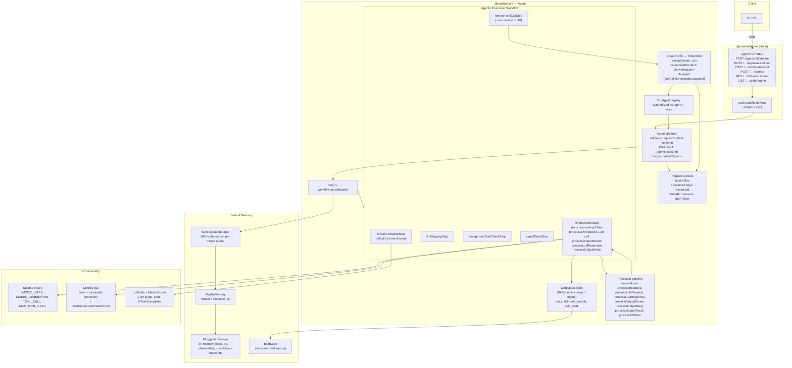

# Mastra TS — Benchmark Study

> **Repo**: https://github.com/mastra-ai/mastra
> **Commit studied**: `7af0c22e536680842178b0a7cbf21baaaa3b8f8b` (chore: regenerate providers and docs, 2026-05-16)
> **Cloned at**: `benchmarked-stacks/mastra/`
> **Studied on**: 2026-05-16

Studied at version `@mastra/core@1.36.0-alpha.0`. All file paths in this document are relative to `benchmarked-stacks/mastra/` unless otherwise noted.

## TL;DR

- **Sole stack with a fully-implemented Anthropic Agent Skills spec** (`SKILL.md` discovery, BM25/vector/hybrid search, references/scripts/assets, plus an opt-in **versioned skill source** backed by a blob store). Skills are lazy (metadata-only in system prompt, body fetched via a built-in `skill` tool). For our Predict use case this is by far the most mature skills story across the five stacks under comparison.
- **Run loop is itself a Mastra workflow** built from `createStep(...).foreach(toolCallStep, { concurrency })` (`packages/core/src/loop/workflows/agentic-execution/index.ts:73-100`). That gives free parallel tool dispatch, suspend/resume via workflow snapshots, and HITL approval without the agent author writing any orchestration code.
- **Sub-agents are agents-as-tools, but with proper plumbing**: a `SubAgent` interface (`packages/core/src/agent/subagent.ts`), `agents?: DynamicArgument<Record<string, SubAgent>>` on `Agent`, automatic `agent-<name>` tool synthesis, `messageFilter` / `onDelegationStart` / `onDelegationComplete` hooks per call, parent-memory isolation, and concurrent fan-out when the LLM emits several `agent-*` tool calls in one step. Supervisor + parallel sub-agents is real, not aspirational.
- **`requestContext` is a typed key/value bag passed through every layer** (agent → loop → tool → sub-agent) and reaches `tool.execute(input, ctx)` directly. Reserved keys (`MASTRA_RESOURCE_ID_KEY`, `MASTRA_THREAD_ID_KEY`, `MASTRA_VERSIONS_KEY`) override anything sent by the client — exactly the "tenant id cannot be forged" property our Ray supervisor needs. Tool args, however, are NOT mutated by a stack-level hook — see Q3/Q4 below; forcing args requires wrapping `execute` yourself or filtering via `processInputStep`.
- **Biggest surface area in the comparison.** Mastra ships agents, workflows, memory, vector, voice, browser, **MCP server**, **MCP client**, dev playground, server adapter, storage abstraction, eval scorers + `runEvals` + Vitest integration, deployers, schedulers, channels (Slack/Discord), background tasks, signals, RBAC/FGA. That breadth is a double-edged sword: `packages/core` is a single 6,992-line `agent.ts` file with deep coupling to `Mastra` (the central registry); you take the whole platform, not a slim runtime.
- **`runEvals` + `createScorer` is real**, with first-class agent-vs-trajectory scorers, `concurrency` knob, score persistence to the configured storage, and **`isTaskComplete` scorers wired into the loop** so a supervisor can keep iterating until a scorer returns `1`. Vitest integration is via colocated `*.test.ts` files; there is no separate "ScoredTest" macro, but `runEvals` runs cleanly inside a Vitest `it()`.
- **Biggest gap**: no built-in pricing/cost calculator. `CostContext.estimatedCost` is a field the host is expected to fill (`packages/core/src/observability/types/metrics.ts:60-66`). Mastra reports tokens, not dollars.
- **One-line verdicts** — Skills: best in class. Sub-agents: first-class via agents-as-tools with hooks. Multi-tenancy: solid `requestContext` plumbing + per-request schema validation, but no native "force tool args" hook. Hooks: rich processor pipeline (`processInput`, `processInputStep`, `processLLMRequest`, `processLLMResponse`, `processOutputStream`, `processOutputStep`, `processOutputResult`, `processAPIError`) but tool-input/output mutation is not a dedicated hook. API: full HTTP server with SSE streaming, approve/decline endpoints, observer endpoints, signals. Observability: tokens yes, cost no.

---

## 1. Message Types & Event Taxonomy

Three message layers and one stream-event taxonomy. The layers are deliberately separated so persistence, model-prompt construction, and UI rendering can evolve independently.

### Layers

1. **DB layer — `MastraDBMessage`** (`packages/core/src/agent/message-list/state/types.ts`). What gets persisted. Includes `content.metadata` for things like `suspendedTools` / `pendingToolApprovals`.
2. **Input layer — `MessageInput`** (`packages/core/src/agent/message-list/types.ts:30-39`):
   ```ts
   export type MessageInput =
     | AIV6.UIMessage | AIV6.ModelMessage
     | AIV5.UIMessage | AIV5.ModelMessage
     | UIMessageWithMetadata
     | Message       // AI SDK v4
     | CoreMessage   // AI SDK v4
     | MastraMessageV1
     | MastraDBMessage;
   ```
   Mastra absorbs both AI SDK v4 and v5/v6 message shapes plus its own DB shape, then normalizes through a `MessageList` instance.
3. **Wire/Stream layer — `ChunkType`** (`packages/core/src/stream/types.ts:931-939`), a tagged union with **~40 distinct types** including `text-delta`, `tool-call`, `tool-call-approval`, `tool-call-suspended`, `tool-result`, `tool-error`, `tool-output`, `is-task-complete`, `tripwire`, plus `background-task-{started,running,completed,failed,output,suspended,resumed,cancelled,progress}` and a separate `NetworkChunkType` family for routing agents (`routing-agent-text-delta`, `agent-execution-start`, `workflow-execution-start`, etc.).

### Are messages also events?

No — clean separation. `MastraDBMessage` is what storage sees; `ChunkType` is what flows through `fullStream`. The stream is reconstructed back into messages by `MessageList` (`packages/core/src/agent/message-list/message-list.ts`) when the run finishes or on persistence flushes.

### Event categories

From `AgentChunkType` (`packages/core/src/stream/types.ts:749-827`):

| Category | Example types |
|---|---|
| Turn boundary | `start`, `step-start`, `step-finish`, `finish` |
| Content delta | `text-start`, `text-delta`, `text-end`, `reasoning-start`, `reasoning-delta`, `reasoning-end`, `reasoning-signature`, `redacted-reasoning` |
| Tool call lifecycle | `tool-call-input-streaming-start`, `tool-call-delta`, `tool-call-input-streaming-end`, `tool-call`, `tool-call-approval`, `tool-call-suspended`, `tool-result`, `tool-error`, `tool-output` |
| Output / structured | `object`, `object-result`, `step-output` |
| Sources & files | `source`, `file` |
| Lifecycle / control | `abort`, `error`, `raw`, `response-metadata` |
| Processor guardrail | `tripwire`, `is-task-complete` |
| Background task | `background-task-started/running/completed/failed/suspended/resumed/cancelled/output/progress` |

Plus a generic `DataChunkType = { type: 'data-<custom>'; data: any; transient?: boolean }` (`stream/types.ts:711-717`) for processor-emitted custom events. `transient: true` chunks are streamed but not persisted — useful for observation markers.

Canonical type definitions:
- `packages/core/src/stream/types.ts` — wire `ChunkType` union
- `packages/core/src/agent/message-list/types.ts` — message inputs
- `packages/core/src/agent/message-list/state/types.ts` — DB shape

---

## 2. Agent Run Loop

The agent surface is `agent.stream(messages, options)` / `agent.generate(...)` / `agent.streamUntilIdle(...)` (`packages/core/src/agent/agent.ts:6175-6390`). Internally the loop is **not a hand-rolled while-loop** — it is a Mastra `Workflow` composed of typed steps.

### Run-loop entrypoint

`packages/core/src/agent/agent.ts:6197-6313` (signature):
```ts
async stream<OUTPUT = TOutput>(
  messages: MessageListInput,
  streamOptions?: AgentExecutionOptionsBase<any> & {
    structuredOutput?: PublicStructuredOutputOptions<any>;
  } & { model?: DynamicArgument<MastraModelConfig> },
): Promise<MastraModelOutput<OUTPUT>>
```

It calls `#validateRequestContext`, checks FGA permissions (`MastraFGAPermissions.AGENTS_EXECUTE`), merges agent-level `defaultOptions` with per-call options, resolves the model + tools dynamically, and ultimately invokes the loop primitive (`packages/core/src/loop/loop.ts:11`):

```ts
export function loop<Tools extends ToolSet = ToolSet, OUTPUT = undefined>({
  resumeContext, models, logger, runId, idGenerator, messageList,
  includeRawChunks, modelSettings, tools, _internal, outputProcessors,
  returnScorerData, requireToolApproval, agentId, toolCallConcurrency,
  ...rest
}: LoopOptions<Tools, OUTPUT>) {
  // ... builds workflowLoopProps ...
  const baseStream = workflowLoopStream(workflowLoopProps);
  modelOutput = new MastraModelOutput({ ... stream, messageList, ... });
  return createDestructurableOutput(modelOutput);
}
```

The returned `MastraModelOutput` exposes `fullStream: ReadableStream<ChunkType>`, plus `text`, `toolCalls`, `toolResults`, `usage`, `finishReason`, `messageList`, `getFullOutput()` as lazily-resolved promises (`packages/core/src/stream/base/output.ts`).

### Per-iteration behavior

The inner workflow is built in `packages/core/src/loop/workflows/agentic-execution/index.ts:73-100`:

```ts
return createWorkflow({ id: 'executionWorkflow', ... })
  .then(llmExecutionStep)              // call the LLM, emit text/tool-call chunks
  .map(({ inputData }) => inputData.output.toolCalls || [], { id: 'map-tool-calls' })
  .foreach(toolCallStep, toolCallForeachOptions)  // run each tool call (concurrency-controlled)
  .then(llmMappingStep)                // collect results, build the next prompt
  .then(backgroundTaskCheckStep)       // wait for background tasks if any
  .then(signalDrainStep)               // drain any agent signals queued mid-step
  .then(isTaskCompleteStep)            // evaluate completion scorers, decide to loop again
  .commit();
```

A "turn" is one full pass through this 6-step chain — i.e. one LLM call + its fan-out of tool dispatches + completion check. `isTaskCompleteStep` decides whether to loop again, which is what makes Mastra's loop a supervisor-friendly construct: you can plug `MastraScorer` instances into `isTaskComplete: { scorers, strategy: 'all' }` and the loop will iterate until they pass (`packages/core/src/agent/agent.types.ts:540-560`).

### Sessions / threads

Sessions are called "threads", persisted via the `MastraMemory` abstraction (`packages/core/src/memory/memory.ts`). A thread has a `threadId` + `resourceId` (typically user id). Storage backends are pluggable (`packages/core/src/storage/domains/`). When `Agent` is constructed with `memory: <MastraMemory>`, every `stream()` call accepts `memory: { thread, resource }` and the message list is hydrated from the store on entry, drained on exit.

### Persistence timing

Persistence is **debounced (100 ms by default) and per-turn-end**, not per token. From `packages/core/src/agent/save-queue/index.ts:6-49`:

```ts
export class SaveQueueManager {
  private debounceMs: number;
  // ...
  private debounceSave(threadId, messageList, memoryConfig): Promise<void> {
    return new Promise((resolve, reject) => {
      if (this.saveDebounceTimers.has(threadId))
        clearTimeout(this.saveDebounceTimers.get(threadId)!);
      this.saveDebounceTimers.set(
        threadId,
        setTimeout(() => { this.enqueueSave(...) }, this.debounceMs),
      );
    });
  }
}
```

`savePerStep: true` (`packages/core/src/agent/types.ts:567`) flips persistence to "after every assistant step", at the cost of more writes. On tool approval suspension, `flushMessagesBeforeSuspension()` is called explicitly so the suspended state is durable (`loop/workflows/agentic-execution/tool-call-step.ts:429`).

### Event emission mechanism

The loop returns a `ReadableStream<ChunkType>` (web-standard `ReadableStream`, not Node `EventEmitter` or async generator). `MastraModelOutput` wraps it and exposes both `fullStream` and per-property promises (`text`, `usage`, `toolCalls`, …). Processors can also push custom `data-*` chunks via `ProcessorStreamWriter.custom(...)` (`packages/core/src/processors/index.ts:33-45`).

### HITL pause/resume

When a tool has `requireApproval: true` (or a `needsApprovalFn` returns truthy), `toolCallStep` emits a `tool-call-approval` chunk, calls `addToolMetadata({ type: 'approval', ... })`, flushes messages, then calls workflow `suspend({...})` (`tool-call-step.ts:400-443`):

```ts
return suspend(
  { requireToolApproval: { toolCallId, toolName, args }, __streamState: streamState.serialize() },
  { resumeLabel: inputData.toolCallId },
);
```

The workflow snapshot is persisted by the storage backend. Resume happens through `agent.approveToolCall({ runId, toolCallId })` or `agent.declineToolCall(...)` (`agent.ts:6741-6768`), both thin wrappers around `resumeStream({ approved: true/false }, options)`. The same path is exposed over HTTP at `POST /agents/:agentId/approve-tool-call` and `…/decline-tool-call` (see Q5).

This is also how Mastra's `tool.suspendSchema` / `tool.resumeSchema` work for non-approval suspensions — tools can call `ctx.agent.suspend(payload)` and the loop hibernates on the workflow runtime, surviving process restarts if the storage backend is durable.

### Interrupt / cancel

`AbortSignal` propagates from `agent.stream(messages, { abortSignal })` (`agent.types.ts:497`) all the way into `llm-execution-step.ts:327, 383, 405, 761, 1005, 1256, 1290` — each LLM call and tool execution receives it. On abort during a model call, an `onAbort` callback fires and the stream emits an `abort` chunk.

---

## 3. Multi-tenancy & Arbitrary Context

This is where the audience will spend the most time. Mastra has a real story but also a real gap.

### The run input struct

`packages/core/src/agent/agent.types.ts:446-636` (`AgentExecutionOptionsBase`):

```ts
export type AgentExecutionOptionsBase<OUTPUT> = {
  instructions?: SystemMessage;
  system?: SystemMessage;
  context?: ModelMessage[];
  memory?: AgentMemoryOption;
  runId?: string;
  savePerStep?: boolean;
  requestContext?: RequestContext<any>;
  versions?: VersionOverrides;
  maxSteps?: number;
  stopWhen?: LoopOptions['stopWhen'];
  providerOptions?: ProviderOptions;
  onStepFinish?, onFinish?, onChunk?, onError?, onAbort?;
  activeTools?: LoopOptions['activeTools'];
  abortSignal?: AbortSignal;
  inputProcessors?, outputProcessors?, errorProcessors?: ProcessorOrWorkflow[];
  maxProcessorRetries?: number;
  toolsets?: ToolsetsInput;
  clientTools?: ToolsInput;
  toolChoice?: ToolChoice<any>;
  modelSettings?: LoopOptions['modelSettings'];
  scorers?: MastraScorers | ...;
  returnScorerData?: boolean;
  tracingOptions?: TracingOptions;
  prepareStep?: PrepareStepFunction;
  isTaskComplete?: StreamIsTaskCompleteConfig;
  requireToolApproval?: boolean;
  autoResumeSuspendedTools?: boolean;
  toolCallConcurrency?: number;
  includeRawChunks?: boolean;
  transform?: ToolPayloadTransformPolicy;
  onIterationComplete?: OnIterationCompleteHandler;
  delegation?: DelegationConfig;
  disableBackgroundTasks?: boolean;
};
```

Beyond the messages list, the run accepts: a `RequestContext`, per-call `versions` of sub-agents, `activeTools` to whitelist tools for this run, `toolsets` to add new tools, `clientTools` for UI-side tool execution, full processor overrides, scorers, `prepareStep` to mutate the model/tools per step, `delegation` for sub-agent hooks, and `requireToolApproval` to globally force HITL.

### Propagating context into a tool call

`RequestContext` (`packages/core/src/request-context/index.ts:56-210`) is a typed `Map<string, unknown>` with reserved keys for security:

```ts
export const MASTRA_RESOURCE_ID_KEY = 'mastra__resourceId';
export const MASTRA_THREAD_ID_KEY   = 'mastra__threadId';
export const MASTRA_VERSIONS_KEY    = 'mastra__versions';
export const MASTRA_AUTH_TOKEN_KEY  = 'mastra__authToken';
```

The HTTP layer (Q5) calls `mergeBodyRequestContext(serverRequestContext, bodyRequestContext)` (`packages/server/src/server/handlers/agents.ts:1521`) so a body-supplied `requestContext` is merged into the server-built one — but the four reserved keys remain server-controlled. That's the right default for our use case (tenant id lives on the server side).

The same `RequestContext` flows into tool execution via `ToolExecutionContext.requestContext` (`packages/core/src/tools/types.ts:385-426`):

```ts
export interface ToolExecutionContext<TSuspend, TResume, TRequestContext> {
  mastra?: MastraUnion;
  requestContext?: RequestContext<TRequestContext>;
  abortSignal?: AbortSignal;
  workspace?: Workspace;
  browser?: MastraBrowser;
  writer?: ToolStream;
  agent?: AgentToolExecutionContext<TSuspend, TResume>;     // toolCallId, messages, suspend(), threadId, resourceId
  workflow?: WorkflowToolExecutionContext<TSuspend, TResume>;
  mcp?: MCPToolExecutionContext;
}
```

A tool author writes:

```ts
createTool({
  id: 'fetch_topics',
  inputSchema: z.object({ query: z.string() }),
  execute: async ({ query }, ctx) => {
    const tenantId = ctx.requestContext?.get('tenantId') as string;
    return await topicsService.search({ tenantId, query });  // tenantId NEVER comes from the LLM
  },
})
```

This is the safe pattern: the tool's input schema does NOT include `tenantId`, so the LLM cannot pass it. The tool reads it from `ctx.requestContext`.

### Per-tool request-context schema validation

Each tool can declare `requestContextSchema?: PublicSchema<TRequestContext>` (`packages/core/src/tools/types.ts:448`). If set, Mastra validates the request context against the schema **before tool execution**; on failure a `ValidationError` is returned to the model instead of running `execute`. The `Agent` itself has the same field (`packages/core/src/agent/types.ts:495-499`) and validates on entry (`agent.ts:751-756`). This gives us static-typed, runtime-enforced multi-tenant context propagation end to end.

### Forcing tool arguments from the harness — the honest answer

**There is no dedicated "force tool args" hook.** Mastra does not expose anything analogous to Claude Agent SDK's `PreToolUse` hook that returns `{ updated_input }`. The recommended pattern is one of:

1. **Read forced fields from `requestContext` inside the tool** (the example above). This is the canonical, type-safe approach and is what the framework is designed for.
2. **Rebuild tools per-step via `processInputStep`** (`packages/core/src/processors/index.ts:512-531`), returning `{ tools: <new toolset> }`. You can wrap each tool's `execute` with a closure that injects forced args.
3. **`prepareStep` callback** (`packages/core/src/loop/types.ts:86-115`), which is just sugar over `processInputStep` (see `processors/processors/prepare-step.ts`).

If you need "for tool X, always set `tenantId=Y` regardless of what the LLM emits", you write that wrapper yourself in option 2 or 3. There's no first-class hook receiving `(toolName, args) -> args'`.

### Filtering visible tools

Two mechanisms:

1. **Static at agent construction** — `tools` is `DynamicArgument<TTools, TRequestContext>`:
   ```ts
   tools: ({ requestContext }) => {
     const tier = requestContext.get('tier');
     return tier === 'premium' ? { ...basicTools, ...premiumTools } : basicTools;
   }
   ```
2. **Per step in the loop** — `activeTools` on `AgentExecutionOptions` (whitelist) or `prepareStep` returning `{ activeTools: ['fetch_topics', 'load_taxonomy'] }`. The `toolCallStep` enforces this: calls to non-active tools are rejected with `"Tool X not found. Available: ..."` (`tool-call-step.ts:316-348`).

### Resource scoping primitives

- **Skills**: `SkillsResolver = string[] | ((ctx: { requestContext? }) => string[] | Promise<string[]>)` — paths can be per-request (`packages/core/src/workspace/skills/types.ts:136`):
  ```ts
  skills: (ctx) => {
    const tier = ctx.requestContext?.get('userTier');
    return tier === 'premium' ? ['skills/basic', 'skills/premium'] : ['skills/basic'];
  }
  ```
- **Sub-agents**: same `DynamicArgument` pattern (`agent/types.ts:405`).
- **Workspaces**: same (`agent/types.ts:459`).
- **Memory**: same (`agent/types.ts:414`).
- **Versions**: `requestContext.set(MASTRA_VERSIONS_KEY, { agents: { 'researcher': { versionId: '...' } } })` (`request-context/index.ts:44`) — per-call sub-agent version pinning is built in.

So scoping is uniform across the platform via `DynamicArgument` + `requestContext`. There's no built-in `org/channel/user` hierarchy — you encode it in the keys you put in `requestContext`.

---

## 4. Hook Capabilities

Mastra calls them "processors". There are **eight method slots** on the `Processor` interface, plus three top-level callback hooks on the execution options, plus the `delegation` and `isTaskComplete` and `onIterationComplete` callbacks for loop control.

### Enumerated hook points

From `packages/core/src/processors/index.ts:465-615`:

| Hook | When | Read | Mutate | Block (tripwire) | Branch |
|---|---|---|---|---|---|
| `processInput` | Once, before the first LLM call | messages, systemMessages | mutate both; can also return `{ messages, systemMessages }` to replace | yes via `ctx.abort(...)` | n/a |
| `processInputStep` | Before EVERY LLM call in the loop | tools, activeTools, model, modelSettings, providerOptions, structuredOutput, messageList | replace any of: `model`, `tools`, `toolChoice`, `activeTools`, `messages`, `systemMessages`, `messageList`, `providerOptions`, `modelSettings`, `structuredOutput`, `messageId` | yes | yes — return `{ model: <different LLM> }` mid-loop |
| `processLLMRequest` | After `MessageList → LanguageModelV2Prompt`, before HTTP send | the LLM-shaped prompt | mutate-and-return; mutations are NOT persisted back (transient model-aware rewrites) | yes | yes — return `{ response: <cached chunks> }` to skip the LLM call entirely (response caching!) |
| `processLLMResponse` | After LLM call completes (or replay) | the chunks, request body, raw response | side effects only (e.g. write to cache) | no | no |
| `processOutputStream` | On every stream chunk | the chunk, all chunks so far, state, messageList | return modified chunk, `null` to drop, or `undefined` to pass through | yes | n/a |
| `processOutputStep` | After every LLM call in the loop, BEFORE tool execution | finishReason, toolCalls, text, usage, all steps, messageList | mutate messageList | yes — and `ctx.abort({ retry: true })` triggers a retry with the abort reason as feedback (self-correcting guardrails) | yes |
| `processOutputResult` | Once, after the run finishes | full `OutputResult { text, usage, finishReason, steps }`, messageList | mutate messageList | yes | n/a |
| `processAPIError` | On non-retryable API rejection (400/422 from the provider) | the error, all steps, messageList | append messages, return `{ retry: true }` | n/a | yes — controlled retry |

Plus top-level option callbacks on every `stream()` / `generate()` call: `onChunk`, `onStepFinish`, `onFinish`, `onError`, `onAbort`, `onIterationComplete`, `delegation.onDelegationStart`, `delegation.onDelegationComplete`, `delegation.messageFilter`.

### Scenario-by-scenario test

- **Inject system messages at session start** — yes. `processInput` or `processInputStep` mutate `systemMessages`. The built-in `SkillsProcessor` (`processors/processors/skills.ts:209-237`) does exactly this — calls `messageList.addSystem({ role: 'system', content: availableSkillsMessage })`. A "current date / tenant is X" injector is two lines.
- **Expand user input (slash commands, attachments)** — yes. `processInput` mutates the messages list before any LLM call.
- **Mutate messages before each LLM call** — yes. `processInputStep` runs every iteration. Built-in `TokenLimiterProcessor`, `BatchPartsProcessor`, `MessageSelectionProcessor` (`processors/processors/`) live here.
- **Mutate / decorate tool input before dispatch** — **no dedicated hook**. Two workarounds: (a) wrap `execute` yourself when registering the tool; (b) replace the toolset entirely in `processInputStep` with closures that inject args. The cleaner pattern for tenant id is "read it from `ctx.requestContext` in the tool", which sidesteps the missing hook.
- **Mutate / decorate tool result before returning to the LLM** — yes via `toModelOutput` on each tool (`tools/types.ts:459`) or via `processOutputStream` filtering `tool-result` / `tool-output` chunks. Not a dedicated `PostToolUse` either, but the chunk-level hook is general enough.
- **Emit additional tool calls in response to a tool result** — partially. There is **no Claude-style `PostToolUse → additional_messages` mechanism**. You can: (a) inject a synthetic message via `processOutputStep` (a follow-up instruction the LLM will see next iteration), (b) use `delegation.onDelegationComplete` to feed feedback after a sub-agent returns, (c) use `onIterationComplete` to return `{ feedback: '...' }` which is appended to the conversation. None of these directly inject a `tool-call` event into the same step the way Claude Agent SDK does — they nudge the next iteration.

### Tripwires

`ctx.abort('reason', { retry?: boolean, metadata? })` halts the current step and emits a `tripwire` chunk. With `retry: true`, the loop appends the reason as feedback and re-prompts the LLM (`maxProcessorRetries` caps the retries). This is how `ModerationProcessor`, `PIIDetectorProcessor`, `PromptInjectionDetectorProcessor`, `CostGuardProcessor`, `RegexFilterProcessor` (`packages/core/src/processors/processors/`) work — and they ship out of the box.

### Architectural diagram of hook firing

```
                                                                  ┌───────────────────────────────┐
                                                                  │   processInput (once)         │
                                                                  └───────────────┬───────────────┘
                                                                                  ▼
        ┌───────────────────────── per iteration ──────────────────────────┐
        │                                                                  │
        │   processInputStep ──► [tools, model, messages, activeTools]     │
        │            │                                                     │
        │            ▼                                                     │
        │   MessageList → LanguageModelV2Prompt                            │
        │            │                                                     │
        │            ▼                                                     │
        │   processLLMRequest ──► [maybe replay cached chunks]             │
        │            │                                                     │
        │            ▼                                                     │
        │      LLM HTTP call                                               │
        │            │ (chunks flow)                                       │
        │            ▼                                                     │
        │   processOutputStream  ◄── on every chunk                        │
        │            │                                                     │
        │            ▼                                                     │
        │   processLLMResponse ──► [write to cache]                        │
        │            │                                                     │
        │            ▼                                                     │
        │   processOutputStep ──► [validate, retry, abort]                 │
        │            │                                                     │
        │            ▼                                                     │
        │   .foreach(toolCallStep, { concurrency })                        │
        │            │                                                     │
        │            ▼                                                     │
        │   tool.execute(input, ctx)  ← requestContext available           │
        │   tool.toModelOutput(output) ◄── per-tool result rewrite         │
        │            │                                                     │
        │            ▼                                                     │
        │   delegation.onDelegationComplete (for agent-* tools)            │
        │            │                                                     │
        │            ▼                                                     │
        │   backgroundTaskCheckStep                                        │
        │            │                                                     │
        │            ▼                                                     │
        │   isTaskCompleteStep ──► scorers decide loop or stop             │
        │            │                                                     │
        │            ▼                                                     │
        │   onIterationComplete ──► { continue, feedback }                 │
        │                                                                  │
        └──────────────────────────────────────────────────────────────────┘
                                                                                  ▼
                                                                  ┌───────────────────────────────┐
                                                                  │ processOutputResult (once)    │
                                                                  │ onFinish (once)               │
                                                                  └───────────────────────────────┘

  On error:   processAPIError ──► { retry: true } loops back into processInputStep
  On abort:   onAbort fires, AbortSignal cascades into LLM + tool calls
  On HITL:    toolCallStep.suspend() → workflow snapshot → resume via approveToolCall/declineToolCall
```

---

## 5. API Exposition

Mastra ships a full HTTP server. It is library-shaped (`Mastra` is a class you instantiate) but plug-and-play if you let `mastra.start()` boot the server adapter.

### Transport

**SSE** for streams, JSON for non-streaming. WebSocket appears only for OpenAI realtime voice (`StreamTransport.type === 'openai-websocket'`). Stream routes are declared with `responseType: 'stream', streamFormat: 'sse'` (`packages/server/src/server/handlers/agents.ts:1490-1491`).

### Endpoints (agent routes)

From `packages/server/src/server/server-adapter/routes/agents.ts:46-133`:

| Verb | Path | Purpose |
|---|---|---|
| GET | `/agents` | List agents |
| GET | `/agents/:id` | Get agent metadata |
| POST | `/agents/:id/generate` | Non-streaming run |
| POST | `/agents/:id/stream` | **SSE-streaming run** |
| POST | `/agents/:id/stream-until-idle` | Stream + auto-continue when background tasks complete |
| POST | `/agents/:id/approve-tool-call` | HITL approval, returns SSE-resumed stream |
| POST | `/agents/:id/decline-tool-call` | HITL rejection |
| POST | `/agents/:id/approve-tool-call-generate` | HITL approval (non-streaming) |
| POST | `/agents/:id/decline-tool-call-generate` | HITL rejection (non-streaming) |
| POST | `/agents/:id/resume-stream` | Generic suspend/resume (tool.suspend → resume) |
| POST | `/agents/:id/resume-stream-until-idle` | Resume + until-idle |
| GET | `/agents/:id/observe-stream` | Observer attaches mid-stream (resumable stream) |
| POST | `/agents/:id/signals` | Send a signal to an active run or queue a new run |
| GET | `/agents/:id/subscribe-thread` | SSE subscription to a thread's runs |
| POST | `/agents/:id/network` | Multi-agent network execution |
| POST | `/agents/:id/tools/:toolId/execute` | Direct tool execution (no LLM) |
| GET | `/agents/:id/tools/:toolId` | Tool metadata |
| GET | `/agents/:id/skills/:skillName` | Skill metadata (server exposes skills) |
| GET/PUT/POST | `…/models/...` | Model management routes |
| POST | `…/enhance-instructions` | LLM-powered instructions enhancer |

Plus workflows, memory, conversations, scheduled jobs, MCP server/client, RAG, voice, channels.

### Request body shape

`packages/server/src/server/schemas/agents.ts` defines `agentExecutionBodySchema`. The handler reads:

```ts
const { messages, memory: memoryOption, requestContext: bodyRequestContext,
        versions, ...rest } = params;
```

So the wire body looks like:
```json
{
  "messages": [...],
  "memory": { "thread": "t-123", "resource": "user-42" },
  "requestContext": { "tier": "premium", "scope": "channel:xyz" },
  "versions": { "agents": { "researcher": { "versionId": "v3" } } },
  "modelSettings": { "temperature": 0.7 },
  "maxSteps": 20,
  "activeTools": ["fetch_topics", "publish"],
  "structuredOutput": { "schema": { ... } },
  "requireToolApproval": true
}
```

### Stream frame format

The server forwards `fullStream` directly (`agents.ts:1573 — return streamResult.fullStream`). The SSE frames are JSON-encoded `ChunkType` objects. Example frames:

```
event: start
data: {"type":"start","runId":"r-1","from":"AGENT","payload":{}}

event: text-delta
data: {"type":"text-delta","runId":"r-1","from":"AGENT","payload":{"id":"m-1","text":"Hello"}}

event: tool-call
data: {"type":"tool-call","runId":"r-1","from":"AGENT","payload":{"toolCallId":"tc-1","toolName":"fetch_topics","args":{"query":"AI"}}}

event: tool-result
data: {"type":"tool-result","runId":"r-1","from":"AGENT","payload":{"toolCallId":"tc-1","toolName":"fetch_topics","result":[...]}}

event: tool-call-approval
data: {"type":"tool-call-approval","runId":"r-1","from":"AGENT","payload":{"toolCallId":"tc-2","toolName":"publish","args":{"id":"x"},"resumeSchema":"{...}"}}

event: finish
data: {"type":"finish","runId":"r-1","from":"AGENT","payload":{"stepResult":{"reason":"stop"},"output":{"usage":{...}},"messages":{...}}}
```

### HITL via API

`POST /agents/:agentId/approve-tool-call` body:
```json
{ "runId": "r-1", "toolCallId": "tc-2" }
```
Decline is symmetric. Both return a **new SSE stream** that resumes execution. The client therefore: (1) opens the original `/stream`, (2) sees a `tool-call-approval` chunk, (3) closes the stream, (4) calls `/approve-tool-call`, (5) consumes the second SSE stream which continues from the same workflow snapshot.

Alternatively, `/observe-stream` lets a different client attach to an in-progress run mid-stream (resumable streams via `packages/core/src/agent/durable/`).

### Interrupt / cancel via API

Cancellation is implicit via dropping the SSE connection — the server-side `AbortSignal` is wired from the HTTP layer into `agent.stream(messages, { abortSignal })` (`agents.ts:1500, 1567`). There is no explicit `DELETE /runs/:id` endpoint in the agent routes. Signals (`POST /agents/:id/signals`) can be used to inject a stop-style signal if you add it to your agent's signal schema, but this is application-defined.

### Reconstructing tool-call state from the stream

**Explicit linkage via `toolCallId`.** Every tool-related chunk carries `payload.toolCallId`:

- `tool-call-input-streaming-start` { toolCallId, toolName }
- `tool-call-delta` { toolCallId, argsTextDelta }
- `tool-call-input-streaming-end` { toolCallId }
- `tool-call` { toolCallId, toolName, args, output? }
- `tool-result` { toolCallId, toolName, result, isError? }
- `tool-error` { toolCallId, toolName, error }
- `tool-call-approval` / `tool-call-suspended` { toolCallId, ... }
- `tool-output` { toolCallId, toolName, output }   ← progress events from inside a long tool

The client can build a `Map<toolCallId, {name, args, result, status}>` deterministically. This is the same model AI SDK v5 uses (Mastra's chunk types are deliberately a superset). Sub-agent invocations appear as ordinary `tool-call` chunks with `toolName: 'agent-<subAgentName>'` plus, for network mode, dedicated `agent-execution-*` chunks under `NetworkChunkType`.

---

## 6. Sub-agents

Both. They are first-class config (`agents?: DynamicArgument<Record<string, SubAgent>>` on `Agent`), and at runtime they are exposed to the parent LLM as **synthesized `agent-<name>` tools**.

### Configuration

Two forms:

1. **Statically as full `Agent` instances** — `new Agent({ agents: { researcher: researcherAgent, coder: coderAgent } })`.
2. **Dynamically per request** — `agents: ({ requestContext }) => { ... }` returns the map. So you can fan-in/out personas based on tenant tier.
3. **Lightweight via the `SubAgent` interface** (`packages/core/src/agent/subagent.ts:42-98`) — implement `getDescription`, `getModel`, `getInstructions`, `generate`, `stream`, `resumeGenerate`, `resumeStream`, `hasOwnMemory`, `__setMemory`, `getMemory`. Useful if you want a custom remote-agent wrapper without instantiating `Agent`.
4. **Network mode** — `agent.network(task, { routing, completion, ... })` (`packages/core/src/loop/network/index.ts`) wraps the supervisor pattern explicitly: a routing agent selects one or more primitives (sub-agents, workflows, tools) per iteration and a completion scorer decides when to stop.

### Can the parent LLM generate a sub-agent config on the fly?

**No** — configs are statically registered (or returned by the `DynamicArgument` resolver at the start of the run). The LLM picks an existing `agent-<name>` tool; it cannot define a new agent at call time. It CAN pass additional `instructions`, `maxSteps`, `threadId`, `resourceId` to that tool (`agent.ts:3690-3705`), and the wrapper merges those onto the sub-agent's defaults.

### How the parent receives sub-agent output

The synthesized `agent-<name>` tool returns:
```ts
z.object({
  text: z.string(),
  subAgentThreadId: z.string().optional(),
  subAgentResourceId: z.string().optional(),
  subAgentToolResults: z.array(z.object({
    toolName, toolCallId, result, args, isError,
  })).optional(),
})
```

By default `toModelOutput` strips everything except `text` (`agent.ts:3725-3730`):
```ts
const toModelOutput = delegation?.includeSubAgentToolResultsInModelContext
  ? undefined
  : (output) => ({ type: 'text', value: output.text });
```

So the supervisor LLM sees a single text blob unless you opt into `delegation.includeSubAgentToolResultsInModelContext = true`. Mastra also streams sub-agent chunks to the parent stream prefixed (you see them in `fullStream` as nested `agent-execution-event-*` chunks for network mode).

### Concurrency model

**Parallel by default.** Sub-agent invocations ARE tool calls, so they go through the same `.foreach(toolCallStep, { concurrency })` machinery as ordinary tools (`packages/core/src/loop/workflows/agentic-execution/index.ts:95`). Default `toolCallConcurrency = 10` (`tool-call-concurrency.ts:7-9`). If any tool/sub-agent in the active set has `requireApproval` or a `suspendSchema`, the concurrency drops to 1 to keep suspension deterministic (`tool-call-concurrency.ts:42-60`).

When the supervisor LLM emits, say, four `agent-persona-A`, `agent-persona-B`, `agent-persona-C`, `agent-persona-D` tool calls in one step, they fan out in parallel — bounded by `toolCallConcurrency`.

### Context isolation

The sub-agent gets a **sanitized copy** of the parent's message history. `stripParentToolParts` removes the parent's `tool-call` and `tool` messages (`agent.ts:3637-3659`) because the sub-agent doesn't have those tools registered and the provider would reject them. It also gets the parent's `MASTRA_THREAD_ID_KEY` / `MASTRA_RESOURCE_ID_KEY` cleared so it writes to its own isolated thread (`agent.ts:3805-3816`).

If the sub-agent doesn't have its own memory, the parent's memory is injected via `__setMemory(memory)`. Either way, identifiers are kept separate to avoid cross-thread pollution.

### Delegation hooks

`delegation.onDelegationStart(ctx)` runs before the sub-agent fires; returns `{ proceed?, rejectionReason?, modifiedPrompt?, modifiedInstructions?, modifiedMaxSteps? }` (`agent.types.ts:75-129`). `delegation.onDelegationComplete(ctx)` runs after, with a `bail()` to cancel sibling concurrent delegations. `delegation.messageFilter(ctx)` lets the supervisor decide which parent messages to forward (`agent.types.ts:303`). These hooks operate at sub-agent granularity, not at ordinary-tool granularity.

---

## 7. Skills

**First-class — and the most complete implementation of the Anthropic Agent Skills spec across the five stacks.** Mastra ships a `WorkspaceSkills` interface, a `WorkspaceSkillsImpl` filesystem-backed implementation, a `VersionedSkillSource` backed by a blob store, a `CompositeVersionedSkillSource` to mix versioned and live skills, BM25/vector/hybrid search, and three built-in tools.

### Spec compliance

`packages/core/src/workspace/skills/types.ts:7` cites the spec: `@see https://github.com/anthropics/skills`.

`SkillMetadata` (lines 146-161):
```ts
export interface SkillMetadata {
  name: string;           // 1-64 chars, lowercase, hyphens only
  path: string;           // dir relative to workspace root
  description: string;    // 1-1024 chars
  license?: string;
  compatibility?: unknown;
  'user-invocable'?: boolean;
  metadata?: Record<string, unknown>;
}
```

`Skill` extends this with `instructions: string` (the markdown body), `source: ContentSource` (`external` | `local` | `managed`), `references: string[]`, `scripts: string[]`, `assets: string[]`.

### How skills are loaded

Filesystem scan via `Workspace.filesystem` (`packages/core/src/workspace/filesystem/`). The resolver (`SkillsResolver = string[] | (ctx) => string[]`) returns the paths to scan; `WorkspaceSkillsImpl` walks each path, parses `<dir>/SKILL.md` (YAML frontmatter via `gray-matter`), and indexes the content with the configured `SkillSearchEngine` (BM25/vector/hybrid).

```ts
const workspace = new Workspace({
  filesystem: new LocalFilesystem({ basePath: './data' }),
  skills: (ctx) => {
    const tier = ctx.requestContext?.get('userTier');
    return tier === 'premium' ? ['skills/basic', 'skills/premium'] : ['skills/basic'];
  },
});
```

Skills auto-refresh on a 5s glob-walk interval with a 2s post-discovery cooldown (`workspace-skills.ts:107-108`). `addSkill(path)` / `removeSkill(name)` allow surgical cache updates for live edit scenarios.

### Versioned skill source

`packages/core/src/workspace/skills/composite-versioned-skill-source.ts:34-100` defines `CompositeVersionedSkillSource` which mounts multiple versioned skill trees (each backed by a `BlobStore` — `SkillVersionTree` manifest + blob refs) into a virtual filesystem, with an optional fallback to a "live" filesystem source for actively-edited skills. This is how Mastra Cloud / Studio ship Studio-managed skill versions alongside developer-edited ones.

For our Predict use case this means: ✅ "skill version pinned per tenant via request context" is doable today — `requestContext.set(MASTRA_VERSIONS_KEY, { agents: {...} })` already exists, and the analogous pattern for skills is to swap the `SkillSource` based on requestContext at Workspace construction.

### File format

```
skills/
  brand-guidelines/
    SKILL.md                  ← required, contains YAML frontmatter + markdown body
    references/
      colors.md
      typography.md
    scripts/
      generate-mockup.sh
    assets/
      logo.svg
```

YAML frontmatter is validated by `validateSkillMetadata` (`packages/core/src/workspace/skills/schemas.ts`) which enforces the name/description length rules from the Agent Skills spec.

### Invocation mechanism

**Lazy / metadata-only + tool-driven activation.** This is the cleanest tradeoff in the comparison.

The `SkillsProcessor` (`packages/core/src/processors/processors/skills.ts:209-237`) injects ONLY the available-skills metadata into the system prompt:

```xml
<available_skills>
  <skill>
    <name>brand-guidelines</name>
    <description>Dailymotion brand guidelines for copy and creative</description>
    <location>skills/brand-guidelines/SKILL.md</location>
    <source>local</source>
  </skill>
</available_skills>
```

Plus a one-shot instruction:
> *"IMPORTANT: Skills are NOT tools. To use a skill, call the `skill` tool with the skill name as the `name` parameter."*

Three tools are added to the agent's toolset (`packages/core/src/workspace/skills/tools.ts:31-37`):

- `skill(name)` — load the full instructions for a skill, including references/scripts/assets listings. Stateless: returns the body in the tool result and lets conversation history hold it. If context is compacted, the model calls again.
- `skill_search(query, skillNames?, topK?)` — search across skill content (uses workspace's search engine).
- `skill_read(skillName, path, startLine?, endLine?)` — read a specific file from a skill's `references/`, `scripts/`, or `assets/` directory, with optional line range. Detects binary files and returns size + path instead.

Skill tools never require approval (`agent.ts:2909 — requireApproval: false`).

### Format options

`'xml' | 'json' | 'markdown'` (`workspace/skills/types.ts:141`). Configurable via `Agent({ skillsFormat: 'xml' })`. XML is the default because deterministic ordering keeps prompt-cache stability (`skills.ts:135 — sorted by name for prompt cache`).

### Scoping

- **Global / tenant / user** — via `SkillsResolver` as a function reading `requestContext`. Three paths shown in the docstring example (`workspace/skills/types.ts:122-134`).
- **Versioned** — `CompositeVersionedSkillSource` supports per-skill version pinning.
- **Source priority for ties** — `local > managed > external` (`workspace-skills.ts:207`).

---

## 8. Usage & Cost Monitoring

Tokens, yes. Cost, no — bring your own pricing table.

### Where token counts surface

Three places:

1. **`MastraModelOutput.totalUsage`** — promise resolved at run end (`packages/core/src/stream/base/output.ts:1407-1410`).
2. **`onStepFinish`** callback fires after every LLM step with a `LLMStepResult` that contains `usage: LanguageModelUsage` (`packages/core/src/stream/types.ts:993-995, 1063`).
3. **`onFinish`** with `totalUsage` (cumulative across steps), `steps[]` each with its own `usage`.

`LanguageModelUsage` (`stream/types.ts:975-985`):
```ts
export type LanguageModelUsage = LanguageModelV2Usage & {
  reasoningTokens?: number;
  cachedInputTokens?: number;
  cacheCreationInputTokens?: number;
  raw?: unknown;  // Full nested provider structure for V3 models
};
```

So input / output / reasoning / cache-read / cache-write are all tracked when the provider supports them.

### Per-LLM-call / per-turn / per-session / per-tenant

- Per LLM call → `step-finish` chunk's `payload.output.usage`, and `onStepFinish` callback.
- Per turn → `finish` chunk's `payload.output.usage` and `MastraStepResult.usage`.
- Per session → query the storage backend, which persists usage on conversation messages.
- Per tenant → not natively scoped. You attach it via the observability metrics path (next bullet).

### Mechanism — events + metrics + traces

Mastra's `ObservabilityEntrypoint` runs three pipelines:

1. **Stream chunks** carry usage on `step-finish` and `finish` (see above).
2. **Metrics bus** (`packages/core/src/observability/types/metrics.ts:26-36`) — `MetricsContext.emit(name, value, labels, { costContext })`. The default `metrics-emit` calls fire on every LLM step and write to the observability store (e.g. `mastra_agent_duration_ms`, `mastra_agent_tokens_input`, etc.). `correlationContext` carries trace/span linkage; `costContext` carries `provider/model/estimatedCost/costUnit/costMetadata`.
3. **Spans / traces** — every LLM call, tool call, and processor call produces a span via the `IModelSpanTracker` / observability span APIs (`packages/core/src/observability/index.ts`). Exporters: Langfuse, OpenTelemetry, custom storage. `MODEL_GENERATION` spans are re-stamped if a fallback model serves the request so cost attribution stays correct (`llm-execution-step.ts:650-660`).

`MetricEvent` and `MetricsConfig` ship with cardinality protection: `DEFAULT_BLOCKED_LABELS = ['trace_id', 'span_id', 'run_id', 'request_id', 'user_id', 'resource_id', 'session_id', 'thread_id']` and UUID-shaped values are blocked by default (`metrics.ts:131-164`).

### Cost

**Not computed by the SDK.** `CostContext.estimatedCost` is just a field the caller (host app or an exporter) fills in (`metrics.ts:60-66`). There is no `pricing.ts` table inside `@mastra/core` that maps provider+model to USD-per-1k-tokens. The storage tests show `estimatedCost: 0.01` being set externally and then summed in queries (`storage/domains/observability/inmemory.ts:891` `summarizeCost`).

For our Predict workload this means: we keep our existing per-provider pricing table and inject it via a small processor that listens to `step-finish` and emits a metric with `costContext.estimatedCost = tokens * rate`. ~30 lines.

### Canonical "where do I read token counts" code path

```ts
const stream = await agent.stream(messages, {
  onStepFinish: ({ usage, model, ... }) => {
    metrics.observe('llm.tokens', usage.totalTokens, {
      provider: model?.provider, model: model?.modelId, tenant: ctx.tenantId,
    });
  },
  onFinish: ({ totalUsage, steps }) => {
    // run-level aggregate
  },
});
```

Or via the persisted observability store (`packages/core/src/storage/domains/observability/`).

---

## Architectural diagram



---

## Appendix — Files worth reading first

- `packages/core/src/agent/agent.ts` — the 6,992-line `Agent` class; `stream()` at L6175, `generate()` at L6015, `streamUntilIdle()` at L6353, `approveToolCall()` at L6741, `listAgentTools()` (sub-agent synthesis) at L3665.
- `packages/core/src/agent/agent.types.ts` — `AgentExecutionOptionsBase` (L446) is the contract for every run; delegation hooks and `MessageFilterContext` at L46-303.
- `packages/core/src/loop/loop.ts` + `packages/core/src/loop/workflows/agentic-execution/index.ts` — the actual run loop as a Mastra workflow with `.then(...).foreach(...).then(...)`.
- `packages/core/src/loop/workflows/agentic-execution/tool-call-step.ts` — tool dispatch, approval/suspend, payload transforms.
- `packages/core/src/loop/workflows/agentic-execution/tool-call-concurrency.ts` — concurrency resolution rules (sequential when approval/suspend present).
- `packages/core/src/loop/types.ts` — `LoopOptions`, `LoopRun`, `StreamInternal` (deeper internal state).
- `packages/core/src/loop/network/index.ts` — network/multi-primitive supervisor loop, with routing agent + completion scorers.
- `packages/core/src/processors/index.ts` — every hook signature; canonical processor interface.
- `packages/core/src/processors/processors/skills.ts` — reference implementation of a system-message-injecting processor (the Skills metadata injector).
- `packages/core/src/request-context/index.ts` — `RequestContext` class + the reserved key constants that prevent the client from spoofing tenant/thread/resource ids.
- `packages/core/src/tools/types.ts` + `packages/core/src/tools/tool.ts` — `ToolExecutionContext` (line 385) and `createTool()` (line 540).
- `packages/core/src/workspace/skills/types.ts` + `packages/core/src/workspace/skills/workspace-skills.ts` + `packages/core/src/workspace/skills/tools.ts` — the Agent Skills implementation (this is the surprise winner of the comparison).
- `packages/core/src/workspace/skills/composite-versioned-skill-source.ts` + `versioned-skill-source.ts` — versioned skill source backed by blob storage.
- `packages/core/src/agent/save-queue/index.ts` — debounced per-thread persistence.
- `packages/core/src/agent/subagent.ts` — the lightweight `SubAgent` interface (alternative to a full `Agent`).
- `packages/core/src/evals/run/index.ts` — `runEvals(...)` typed overloads (agent vs workflow, scorers array vs config).
- `packages/core/src/observability/types/metrics.ts` — metrics + cost shape.
- `packages/server/src/server/handlers/agents.ts` — HTTP route definitions; `STREAM_GENERATE_ROUTE` (L1487), `APPROVE_TOOL_CALL_ROUTE` (L1967), `DECLINE_TOOL_CALL_ROUTE` (L2012).
- `packages/server/src/server/server-adapter/routes/agents.ts` — registry of all agent HTTP endpoints.
