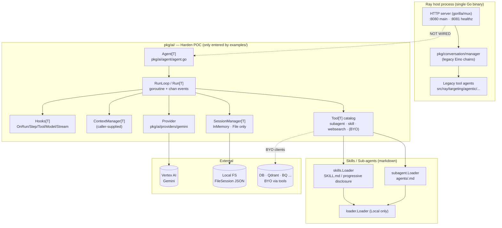

# Harden POC (Go) — Benchmark Study

> **Repo**: `LOCAL` — `github.com/dailymotion/ai-agentic-service/bravo`
> **Commit studied**: `a1feec227921e02e17cebc1ba170f09865ce00e9`
> **Branch**: `feat/poc-rewamp-ai`
> **Cloned at**: `/Users/nmvalera/Workspace/github.com/dailymotion/ai-agentic-service/bravo`
> **Studied on**: `2026-05-16`

## TL;DR

- ⭐ **What is this stack architecturally?** An in-house Go library (~6.5 kLOC under `pkg/ai/`) implementing a generic, type-parametric agent harness (`agent.Agent[T]`) inspired by Claude Code's loop. It is a *library*, not a framework: no HTTP server, no persistence other than a JSON file mirror, no resource manager. Everything that crosses a process boundary (DB, HTTP, auth) is BYO.
- **Where the agent loop *actually* executes**: in-process, in the calling Go goroutine. `RunLoop` returns a `*Run[T]` with `Events()`/`Done()` channels; one goroutine drives the loop. No subprocess, no vendor cloud, no sister-repo runtime.
- **Strongest architectural choice for our use case**: typed `spec T` is threaded through the run, every tool's `Execute(...)`, the subagent tool, and hooks (`pkg/ai/agent/run.go:115`, `pkg/ai/agent/tool.go:31`, `pkg/ai/agent/hooks.go:37`). This is a *stronger* multi-tenancy primitive than anything Mastra/LangGraph/Vercel AI SDK ship — tenant/workspace/user context cannot be forgotten because the type system enforces it.
- **Weakest / biggest gap**: not wired into production. The only consumer is `examples/pkg/ai/agent/main.go`. Predict's production agentic path still goes through the legacy Eino chains under `src/ray/targeting/agentic/` via `pkg/conversation/manager`. The harness has not handled a real customer request.
- **Most surprising finding (good)**: parallel sub-agents work today (`pkg/ai/agent/run.go:444-490`) via a per-step batch + `sync.WaitGroup`; combined with `Tool.ExecutionMode()`, this is a real fan-out primitive that the Eino chain layer never had.
- **Most surprising finding (bad)**: persistence is a *write-only* JSON file. `FileSession` never reloads from disk — a process restart starts the session over (`pkg/ai/agent/session.go:120-122`). There is no DB-backed `Session` implementation in `pkg/ai/`, only `InMemorySession` + `FileSession`.
- **Sessions/persistence**: in-memory + file mirror only; no Postgres adapter, no mid-run checkpointing, no fork/branch model. **BYO via the `Session[T]`/`SessionManager[T]` interface** (`pkg/ai/agent/session.go:22-59`).
- **Skills**: first-class. `SKILL.md` with YAML frontmatter, parsed via `pkg/ai/skills/skill.go:65`, surfaced to the model as a `skill` tool with progressive disclosure (`pkg/ai/skills/tool.go:46-73`). Format mirrors Claude Code's SKILL.md. Loaded from any `loader.Loader` (local FS today).
- **Resource manager**: **Not provided — BYO.** A single-source `loader.Loader` interface exists (`pkg/ai/loader/loader.go:17`) with only one implementation (`Local`). No versioning, no publishing workflow, no source composition, no per-tenant scoping at the registry layer.
- **Sub-agents**: first-class. `agent` tool (`pkg/ai/subagent/tool.go`), Claude-Code-style `.md` definitions, parallel-by-default via `ExecutionModeParallel`, parent's `spec T` inherited automatically.
- **Multi-tenancy**: best-in-class *primitive* (typed spec), but every other multi-tenancy concern (per-tenant rate/cost limits, registry scoping, auth termination) is BYO.
- **Hooks**: full lifecycle (`OnRunStart/End`, `OnStepStart/End`, `OnToolStart/End`, `OnModelStart/End`, `OnStreamEvent`) with context-wrapping pattern friendly to OTel/tracing (`pkg/ai/agent/hooks.go:37-83`). `ComposeHooks` for stacking. **No HITL hook, no compaction hook, no cache-breakpoint hook.**
- **API**: **Not provided — BYO.** Library only. `/status` `/ready` `/metrics` come from the surrounding Ray HTTP server (`src/ray/app/di/config.go:52-56`), not from `pkg/ai/`.
- **Observability**: per-call `Usage` on `AssistantMessage`, surfaced on `StepEndEvent` and `StreamDoneEvent`. No USD cost, no per-tenant rollup, no first-party tracing inside `pkg/ai/`. The legacy LangSmith Eino callback (`pkg/eino/callbacks/langsmith`) is *not* wired to the new harness.
- **Production-readiness verdict**: **NOT production-ready as-is.** Strong loop primitives, but missing: HTTP surface, durable session store, resource manager, HITL, multi-model fallback, cost tracking, MCP, eval harness, dev sandbox. The deck (`doc/ray/predict_agentic_migration_deck_outline.md`) frames the work explicitly as "harden the harness" — the POC is the seed, not the product.

## 0. Architectural Overview & Deployment Model

```
┌──────────────────────────────────────────────────────────────────────┐
│                  Ray HTTP server (src/ray/app/...)                   │
│                                                                       │
│  ┌────────────────────────────────────────────────────────────────┐  │
│  │  cobra root → ray agentic run                                  │  │
│  │  ├─ healthz :8081  (/status /ready /metrics /debug/*)          │  │
│  │  └─ main    :8080  (HTTP API, swagger, conv mgr — Eino chains) │  │
│  └────────────────────────────────────────────────────────────────┘  │
│                                                                       │
│                  Production path (legacy, NOT POC):                   │
│  ┌──────────────────────────────────────────────────────────────┐    │
│  │  pkg/conversation/manager → src/ray/targeting/agentic/...   │    │
│  │  (Eino chains, LangSmith callback, no pkg/ai/agent)         │    │
│  └──────────────────────────────────────────────────────────────┘    │
└──────────────────────────────────────────────────────────────────────┘

┌──────────────────────────────────────────────────────────────────────┐
│       Harden POC path (only entered by examples/pkg/ai/agent)        │
│                                                                       │
│  ┌────────────────────────────────────────────────────────────────┐  │
│  │  pkg/ai/agent.Agent[T]                                         │  │
│  │  ├─ provider: gemini.Model  (pkg/ai/providers/gemini)          │  │
│  │  │     └─ wraps pkg/genai → google.golang.org/genai (Vertex)   │  │
│  │  ├─ ContextManager[T]   (caller-supplied)                      │  │
│  │  ├─ SessionManager[T]   (InMemory or FileSession only)         │  │
│  │  └─ Tools[T]            (subagent, skill, websearch + user)    │  │
│  │                                                                 │  │
│  │  RunLoop ↓                                                      │  │
│  │  goroutine per Run:                                             │  │
│  │   step{ provider.Stream → tool dispatch (seq|parallel) } *N     │  │
│  │   events: chan types.Event   ← consumer ranges                  │  │
│  │   done:   chan struct{}      ← consumer waits                   │  │
│  └────────────────────────────────────────────────────────────────┘  │
│                                                                       │
│       External I/O — all driven from inside tools (BYO):              │
│       Postgres (bun) · Qdrant · BigQuery · Vertex AI · etc.           │
└──────────────────────────────────────────────────────────────────────┘
```

### 0.1 What is this stack?

In-house Go **library** (≈6.5 kLOC under `pkg/ai/`) implementing a generic, type-parametric agent harness. Three packages matter:

- `pkg/ai/agent` — the loop (`Agent[T]`, `Run[T]`, hooks, sessions, tool interface)
- `pkg/ai/skills` + `pkg/ai/subagent` — Claude-Code-style SKILL.md / agent.md loaders + tools
- `pkg/ai/providers/gemini` — the only model adapter, wraps `pkg/genai` → `google.golang.org/genai` (Vertex)

No HTTP layer, no DB, no resource manager, no eval harness. Everything else is BYO.

### 0.2 Where does the agent loop *actually* execute?

**In your process, in a goroutine.** `RunLoop` launches `run.run(ctx, newMessages)` as a goroutine (`pkg/ai/agent/run.go:135`) and returns a `*Run[T]` with `Events()`/`Done()`/`Err()`. No subprocess, no IPC, no vendor runtime. Provider calls (Vertex Gemini) happen via `google.golang.org/genai` HTTP/gRPC from the same goroutine.

### 0.3 Runtime dependencies

- Go 1.25 (`go.mod`)
- A Vertex AI / Google Cloud project + ADC (`gcloud auth application-default login`) for the gemini provider
- Nothing else mandatory. Tools the caller wires (Postgres via `bun`, Qdrant, etc.) bring their own deps.

### 0.4 Recommended deployment topology

No vendor recommendation exists. The host service (`src/ray/...`) is a single Go binary that runs one process with many concurrent in-process sessions — typical Go web-service topology. Scaling horizontally requires a shared session store (none ships).

### 0.5 Cold-start cost & instance footprint

Negligible. `agent.New[T](...)` is a struct literal:

```go
// pkg/ai/agent/agent.go:31
func New[T any](provider providers.Provider, cfg *AgentConfig[T], cm ContextManager[T], sm SessionManager[T]) *Agent[T] {
    return &Agent[T]{provider: provider, cm: cm, sm: sm, cfg: cfg}
}
```

No skill scan at startup (only on demand via `skills.Loader.LoadSkills`). The whole Ray binary is a single Go executable; cold start is bounded by the rest of Ray (DB ping, config load, healthz wiring).

### 0.6 Vendor lock-in

| Dimension          | Lock-in                                                                          |
|--------------------|----------------------------------------------------------------------------------|
| LLM provider       | **High (today)** — only `pkg/ai/providers/gemini`. No OpenAI/Anthropic adapter.  |
| Hosting platform   | **None** — runs anywhere Go runs. Currently on GKE under FluxCD.                 |
| Eval platform      | **None** — no eval harness exists.                                               |
| Tracing platform   | **None inside `pkg/ai/`** — but the Hooks API is OTel-friendly.                  |

### 0.7 Framework weight / footprint

Very thin. `pkg/ai/agent/` alone is ~1.4 kLOC of Go (run loop, hooks, sessions, tool interface, stop conditions, context manager). The Gemini provider + decoder is ~1.4 kLOC. Skills + subagent loaders ~0.5 kLOC. Compare with Mastra (TS, ~30 kLOC) or LangGraph (Py, ~25 kLOC).

### 0.8 Documentation depth & cross-team contributor accessibility

- **No public docs.** This is an in-house POC.
- No README, no AGENTS.md, no doc/ subdirectory inside `pkg/ai/` (verified: `find pkg/ai -name "AGENTS.md" -o -name "README*"` returns nothing).
- The only narrative doc is `doc/ray/predict_agentic_migration_deck_outline.md` (the migration deck).
- Source code carries detailed package and function godoc.
- A non-engineer cannot author content today. The skill *format* (markdown + YAML frontmatter) is friendly, but there is no registry, no UI, no upload path — a Product user would still need to land a PR into the repo.

### 0.9 Documentation entry points

This is an in-house POC; there is no public docs site. Closest:

- Migration deck: [`doc/ray/predict_agentic_migration_deck_outline.md`](../../predict_agentic_migration_deck_outline.md)
- Source godoc starting points:
  - `pkg/ai/agent/agent.go` — `Agent[T]` constructor
  - `pkg/ai/agent/run.go` — `RunLoop`, `Run[T]`, step machinery
  - `pkg/ai/agent/hooks.go` — full hook surface
  - `pkg/ai/agent/session.go` — `Session[T]` / `SessionManager[T]` interfaces + in-memory and file implementations
  - `pkg/ai/skills/skill.go` — SKILL.md parser
  - `pkg/ai/subagent/subagent.go` — subagent definition + parser
- Runnable example: [`examples/pkg/ai/agent/main.go`](../../../../examples/pkg/ai/agent/main.go)
- Example skills/subagents: [`examples/pkg/ai/skills/`](../../../../examples/pkg/ai/skills/), [`examples/pkg/ai/agents/`](../../../../examples/pkg/ai/agents/)
- GitHub issues: none specific to `pkg/ai/`; tracked via the project Jira (RAY-*).
- Discord / community: not applicable — internal POC.
- Slide 9 of the deck explicitly frames this as "a lightweight Go-based agent harness POC is already running in this repo and supports the core concepts (long-running loop, tools, skills, sub-agents)".

## 1. Agent Harness (Run Loop) & Message Taxonomy

### Run loop

#### 1.1 Run loop entrypoint(s)

```go
// pkg/ai/agent/agent.go:56
func (a *Agent[T]) Run(ctx context.Context, spec T, sessionID string, input types.Message, modelConfig *types.ModelConfig) (*Run[T], error)
```

Returns `*Run[T]` whose fields expose:

- `Run.Events() <-chan types.Event` (`pkg/ai/agent/run.go:102`)
- `Run.Done() <-chan struct{}`     (`pkg/ai/agent/run.go:85`)
- `Run.Err() error`                 (`pkg/ai/agent/run.go:89`)
- `Run.Steps() []*RunStep`          (`pkg/ai/agent/run.go:81`)
- `Run.Spec() T`                    (`pkg/ai/agent/run.go:73`)

Under the hood `Agent.Run` resolves system prompt + tools via the `ContextManager[T]`, loads/creates a `Session[T]`, calls `RunLoop` which spawns a goroutine and returns immediately.

#### 1.2 Per-iteration behavior

Inside `run.run` (`pkg/ai/agent/run.go:140-234`), each iteration of the for-loop ("step") executes `runStep` which:

1. Fires `OnStepStart` hook → emits `StepStartEvent`.
2. Calls `ContextManager.PrepareMessages` + internal `prepareMessages` to collapse adjacent tool-use/result messages.
3. Fires `OnModelStart` hook → calls `provider.Stream(modelCtx, modelConfig, modelContext)` (`pkg/ai/agent/run.go:306`).
4. Iterates the provider's `iter.Seq2[types.Event, error]` stream; updates `step.NewMessages` per stream event (text/thinking/tool_use blocks).
5. Fires `OnModelEnd` hook with the assembled `AssistantMessage`.
6. If `step.HasToolUse`, calls `run.runTools(...)` which dispatches sequential or parallel tool batches.
7. Fires `OnStepEnd`, calls `session.AddMessages(ctx, step.NewMessages...)`, emits `StepEndEvent`.

The outer loop terminates when the last step's finish reason is anything other than `FinishReasonToolUse` *or* when a caller-supplied `StopCondition` returns true (`pkg/ai/agent/run.go:197-216`).

#### 1.3 ReAct loop

**Yes — built-in.** The exact "call LLM → if tool_use, dispatch tools and feed back" cycle is implemented above. Caller does not assemble it; they only provide tools + context.

#### 1.4 Tool dispatch + result handling

Tool dispatch happens in `run.runTools` (`pkg/ai/agent/run.go:411-490`). It scans `step.NewMessages` for `*types.ToolUseMessage`, groups consecutive parallel-mode tools into a batch, runs them via `sync.WaitGroup`, then appends each `*types.ToolResultMessage` to both `step.NewMessages` and `run.runCtx.Messages` in tool-use order:

```go
// pkg/ai/agent/run.go:459-475
results := make([]batchResult, j-i)
var wg sync.WaitGroup
for k := i; k < j; k++ {
    wg.Add(1)
    go func(idx int) {
        defer wg.Done()
        tr, err := run.runTool(ctx, toolUses[idx])
        results[idx-i] = batchResult{toolResult: tr, err: err}
    }(k)
}
wg.Wait()
```

Each tool is invoked via `Tool[T].Execute(ctx, runCtx, runConfig, spec, toolUse)` (`pkg/ai/agent/tool.go:31`). Errors bubble up as `step.Err` which becomes `run.err`.

#### 1.5 Explicit turn concept

A "step" in this harness ≈ a Vercel-AI-SDK turn: one LLM stream call + any tool calls it requested + their results. The loop continues until the model produces a non-tool-use finish reason. There is no separate "turn" name — `RunStep` is the boundary.

#### 1.6 Event emission mechanism (in-process)

`Run.events` is a buffered Go channel (`make(chan types.Event, 128)`, `pkg/ai/agent/run.go:129`). `run.emit` does a non-blocking send and drops on full buffer:

```go
// pkg/ai/agent/run.go:108-113
func (run *Run[T]) emit(event types.Event) {
    select {
    case run.events <- event:
    default:
    }
}
```

The consumer ranges over `Run.Events()`. The channel is closed *after* `OnRunEnd` fires and `RunEndEvent` has been emitted (`pkg/ai/agent/run.go:148-157`), so `<-Done()` is race-free wrt the event drain.

Network-side streaming (SSE/WebSocket) is **Not provided — BYO**.

### Message & event taxonomy

#### 1.7 Message layers

Two layers; not as many as Claude Agent SDK's wire/UI/internal triple:

```
┌─────────────────────────────────────────────────────────────┐
│  Session / RunContext layer  (types.Message)                │
│  ──────────────────────────────────────────────────────     │
│  AssistantMessage, UserMessage, ToolUseMessage,             │
│  ToolResultMessage, AttachmentMessage                       │
│                                                              │
│  ▲ prepareMessages collapses tool_use/result into           │
│  │ Assistant/User messages with ToolUsePart/ToolResultPart  │
│  ▼                                                          │
│  Provider input layer  (types.ModelContext)                 │
│  - SystemPrompt: []Part                                     │
│  - Messages: []Message  (after collapse)                    │
│  - Tools: []ToolInfo                                        │
│                                                              │
│  ▼ EncodeContext (Gemini)                                   │
│  Wire (google.golang.org/genai types: *genai.Content)       │
└─────────────────────────────────────────────────────────────┘
```

#### 1.8 Concrete message types

| Type                  | Purpose                                                              |
|-----------------------|----------------------------------------------------------------------|
| `AssistantMessage`    | One model response — content parts (text/thinking/tool_use/source), usage, finish reason, request id. |
| `UserMessage`         | A user-side message — content parts (text/tool_result/attachment).   |
| `ToolUseMessage`      | Streaming-time materialization of a single tool call (id + name + args). Convertible to `AssistantMessage` via `ToAssistantMessage()`. |
| `ToolResultMessage`   | One tool's structured result (with optional `Error`). Convertible to `UserMessage`. |
| `AttachmentMessage`   | Wraps an `Attachment` interface — placeholder, `prepareAttachmentMessage` is a stub. |

See `pkg/ai/types/message.go:36-339`.

#### 1.9 Messages vs. events

Two separate taxonomies:

- **Messages** (`types.Message`) are persisted to the `Session` and seed the next model call.
- **Events** (`types.Event`) are transient — they flow over `Run.Events()` and are dropped if buffer fills.

The runner emits a `MessageStartEvent` / `MessageEndEvent` per message added to the conversation context (see `pkg/ai/types/event.go:14-46`) — so consumers can listen to messages on the same channel as everything else, but the *truth* lives in `Session.Messages(ctx)`.

#### 1.10 Event categories

| Category               | Events                                                                                                                                                |
|------------------------|-------------------------------------------------------------------------------------------------------------------------------------------------------|
| Run lifecycle          | `RunStartEvent`, `RunEndEvent`                                                                                                                        |
| Step lifecycle         | `StepStartEvent`, `StepEndEvent`                                                                                                                      |
| Message lifecycle      | `MessageStartEvent`, `MessageEndEvent`                                                                                                                |
| Tool dispatch          | `ToolUseStartEvent`, `ToolUseEndEvent`                                                                                                                |
| Stream (LLM)           | `StreamStartEvent`, `StreamText{Start,Delta,End}Event`, `StreamThinking{Start,Delta,End}Event`, `StreamToolUse{Start,Delta,End}Event`, `StreamSourceEvent`, `StreamDoneEvent` |
| Sub-agent lifecycle    | **Not surfaced to parent** — sub-agent's `Events()` channel is drained internally; only the final result + trailer is returned (`pkg/ai/subagent/tool.go:194-198`). |
| Hook events            | None — hooks are functions, not events.                                                                                                                |

#### 1.11 Canonical type-definition file(s)

- `pkg/ai/types/event.go` — every event
- `pkg/ai/types/message.go` — every message
- `pkg/ai/types/content_part.go` — every `Part`
- `pkg/ai/types/tool.go` — `ToolInfo`, `FuncToolInfo`, `WebSearchToolInfo`
- `pkg/ai/types/model.go` — `ModelConfig`, `ModelContext`

#### 1.12 Live agentic event stream taxonomy

Sample frames (Go-typed, not serialized — there is no wire form):

```go
// Run start
types.RunStartEvent{}

// Stream open
types.StreamStartEvent{
    RequestID: nil,
    Message: &types.AssistantMessage{UUID: "2b577…", Timestamp: <now>},
}

// Text token
types.StreamTextDeltaEvent{
    ContentIndex: 0,
    Delta: "Generating ",
    Message: <accumulating *AssistantMessage>,
}

// Tool-arg streaming
types.StreamToolUseDeltaEvent{
    ContentIndex: 1,
    Delta: `{"query":`,
    ToolUse: <accumulating *ToolUseMessage>,
}

// Tool dispatch (post-stream)
types.ToolUseStartEvent{ ToolUse: <*ToolUseMessage> }
types.ToolUseEndEvent{
    ToolUse: <…>,
    ToolResult: <*ToolResultMessage>,
    SupplementaryMessages: nil,
    Err: nil,
}

// Step closing
types.StepEndEvent{ Number: 0, Err: nil, AssistantMessage: <…> }

// Run done
types.RunEndEvent{}
```

`Usage` lives on `AssistantMessage.Usage`, surfaced at `StreamDoneEvent` and `StepEndEvent` (`pkg/ai/types/message.go:129-135`).

## 2. Agent Runtime (Multi-session Host)

### 2.1 Multi-session host architecture

**Half-built.** `SessionManager[T]` is the seed of a multi-session host (`pkg/ai/agent/session.go:22`):

```go
// pkg/ai/agent/session.go:22-29
type SessionManager[T any] interface {
    CreateSession(ctx context.Context, sessionID string) (Session[T], error)
    GetSession(ctx context.Context, sessionID string) (Session[T], error)
    DeleteSession(ctx context.Context, sessionID string) error
}
```

But the only implementations are `InMemorySession` + `FileSession` + `FileSessionManager[T]` — both keep sessions in process-local maps with a `sync.Mutex` (`pkg/ai/agent/session.go:188-253`). There is no notion of "the runtime owns the loop". The host (Ray HTTP server) would have to instantiate `Agent[T]`, call `Run`, hold the `*Run[T]`, and drive `Events()` itself.

### 2.2 Concurrent session isolation

Per-session isolation is via Go's natural per-goroutine scope:
- `Run[T]` runs in its own goroutine
- `RunContext[T].Messages` is a per-run slice (not shared)
- `InMemorySession` and `FileSession` both hold a `sync.Mutex` for safe concurrent reads/writes (`pkg/ai/agent/session.go:71`, `:128`)

There is no enforced barrier. Two `*Run[T]` against the *same* session ID can run concurrently in the same process — nothing prevents it. The mutex prevents data races on the messages slice; it does not prevent logical interleaving.

### 2.3 Horizontal scaling / multi-instance

**Not provided — BYO.** The `FileSessionManager` keeps sessions in an in-memory map keyed by session ID; a different pod has a different map. Even with a shared NFS-mounted base dir, `FileSession` never *reads* from disk (`pkg/ai/agent/session.go:120-122`), so sessions cannot be resumed on a different pod.

### 2.4 Background / async / scheduled tasks

**Not provided — BYO.** No cron, no queue, no webhook trigger. `Agent.Run` is fire-and-forget within the goroutine that called it.

### 2.5 Worker pool / queue model

**Not provided — BYO.** No queue interface. The host service would need to add one (e.g. a Postgres queue) and dispatch `Agent.Run` calls itself.

## 3. Sessions & Persistence

### 3.1 Session / chat data model

```go
// pkg/ai/agent/session.go:44-59
type Session[T any] interface {
    ID() string
    Messages(ctx context.Context) ([]types.Message, error)
    AddMessages(ctx context.Context, messages ...types.Message) error
}
```

The interface is intentionally minimal: id + message log. The `T` type parameter is reserved for spec-typed extensions but unused today. **No first-party fields for tenant_id, user_id, model, summary, parent_session_id, usage, metadata, created_at, updated_at.** A wrapper struct would carry those.

The in-memory impl carries even less:

```go
// pkg/ai/agent/session.go:69-73
type InMemorySession struct {
    id       string
    mu       sync.Mutex
    messages []types.Message
}
```

`FileSession` adds a `path` and on-disk JSON mirror:

```go
// pkg/ai/agent/session.go:125-130
type FileSession struct {
    id       string
    path     string
    mu       sync.Mutex
    messages []types.Message
}
```

The on-disk JSON shape is just `{id, messages: [...]}` (`pkg/ai/agent/session.go:164-170`).

### 3.2 What's stored on a session

Only the message log. No tool-call scratchpad, no embedded memory, no attachments (the `AttachmentMessage` exists but `prepareAttachmentMessage` is a stub returning `nil, nil` — `pkg/ai/agent/context.go:185-187`). Tool calls and results are stored *as* `AssistantMessage` + `UserMessage` after the `prepareMessages` collapse (`pkg/ai/agent/context.go:53-57`).

### 3.3 Granularity

Single linear conversation per session. **No branch / fork model.** `Session[T]` has no `Fork()` or `parent_session_id` field.

### 3.4 Built-in persistence stores

| Store                  | Status                                                                                                |
|------------------------|-------------------------------------------------------------------------------------------------------|
| In-memory (slice+mutex)| ✅ `InMemorySession` (`pkg/ai/agent/session.go:69`)                                                   |
| Local file (JSON mirror)| ✅ `FileSession` + `FileSessionManager[T]` — **write-only mirror** (`pkg/ai/agent/session.go:125-253`) |
| SQLite                 | ❌ Not provided — BYO                                                                                  |
| Postgres (`bun`)       | ❌ Not provided — BYO (Ray repo ships `pkg/conversation/store/postgres` but it backs the *legacy* Eino chain layer, not this harness) |
| Redis                  | ❌ Not provided — BYO                                                                                  |
| S3 / GCS               | ❌ Not provided — BYO                                                                                  |
| Vendor cloud           | ❌ Not provided — BYO                                                                                  |

### 3.5 Persistence timing

`session.AddMessages` is called by the runner at two moments:

1. After `ContextManager.ProcessInput` (one shot before the first model call): `pkg/ai/agent/agent.go:119`.
2. At the end of every step, with `step.NewMessages` (the assistant message + every tool result and supplementary message for that step): `pkg/ai/agent/run.go:257`.

This is **per-turn, sync**. There is no per-token sync, no debounced batch, no async write — `FileSession.flushLocked` rewrites the entire JSON file atomically on every step (`pkg/ai/agent/session.go:163-183`).

### 3.6 Mid-run checkpointing (durable)

**Not provided — BYO.** If a crash hits in the middle of a step (between `provider.Stream` start and `session.AddMessages`), every message produced in that step is lost. The runner does not commit on `StreamTextEndEvent` or per tool result — only at `OnStepEnd`.

### 3.7 Session ID format

Caller-supplied opaque string. `InMemorySession`'s convenience constructor uses `uuid.New().String()` (`pkg/ai/agent/session.go:76-78`). The example uses a literal `"ai-agent-example"` (`examples/pkg/ai/agent/main.go:287`). No tenant prefix, no hash, no composite scheme.

### 3.8 Pluggable store interface

Yes — `Session[T]` and `SessionManager[T]` are interfaces (`pkg/ai/agent/session.go:22-59`). A caller wiring `pkg/conversation/store/postgres` (the legacy Postgres-backed conversation store) into a `Session[T]` adapter is the natural path; **no such adapter is shipped**.

### 3.9 Schema evolution / migration

**Not provided — BYO.** `Message` is an interface and `BaseMessage` carries only `UUID + Timestamp`. There's a `TODO` in the codebase: "Message has no polymorphic UnmarshalJSON yet, so files round-trip is not supported" (`pkg/ai/agent/session.go:121-122`). Even reading back a `FileSession` JSON dump is currently broken.

### 3.10 Export / replay

Partial. `FileSession` writes JSON snapshots that are human-readable; sample files exist under `examples/pkg/ai/agent/tmp/sessions/*.json`. But because there is no polymorphic `UnmarshalJSON`, you cannot reload them and replay — the export is a debug artifact, not a replay primitive.

### 3.11 Cross-session memory

**Not provided — BYO.** No vector store, no semantic recall. See Q15.

## 4. Multi-tenancy & Arbitrary Context ⭐ THE KEY QUESTION

### 4.1 Full run-loop input struct

`Agent.Run` arguments (`pkg/ai/agent/agent.go:56`):

```go
func (a *Agent[T]) Run(
    ctx context.Context,        // standard Go context — used for cancellation + value propagation
    spec T,                     // ⭐ typed per-run state (tenant, workspace, strategy id, …)
    sessionID string,           // session identity
    input types.Message,        // user-facing input message (may be nil for retry/continuation)
    modelConfig *types.ModelConfig,  // model, temperature, top-p, max tokens, thinking budget, response schema
) (*Run[T], error)
```

The `spec T` slot is the multi-tenancy primitive. `T` is parameterized at `Agent[T]` construction time and threaded through every tool call.

### 4.2 Context propagation into a tool call

Two channels: the standard `context.Context` (carries cancellation + caller-supplied values), and the typed `spec T` argument:

```go
// pkg/ai/agent/tool.go:18-32
type Tool[T any] interface {
    Info() types.ToolInfo
    ExecutionMode() ExecutionMode
    Execute(ctx context.Context, runCtx *RunContext[T], runConfig *RunConfig[T], spec T, toolUse *types.ToolUseMessage) (*ToolResult, error)
}
```

The runner passes both into every tool (`pkg/ai/agent/run.go:539`):

```go
toolResult, err = tool.Execute(ctx, run.runCtx, run.runConfig, run.spec, toolUse)
```

### 4.3 Tool call interface

Real call site from the example (`examples/pkg/ai/agent/tool_targeting.go:62-78`):

```go
func (t *ReadTargetingStrategyTool) Execute(
    ctx context.Context,
    _ *agent.RunContext[*TargetingSpec],
    _ *agent.RunConfig[*TargetingSpec],
    spec *TargetingSpec,
    toolUse *types.ToolUseMessage,
) (*agent.ToolResult, error) {
    id := spec.TargetingStrategyID
    if id == "" {
        return targetingToolErrorResult(toolUse, fmt.Errorf("targetingStrategyID is not set in spec")), nil
    }
    strategy, err := t.store.GetTargetingStrategy(ctx, id, &workspacetypes.WorkspaceFilters{})
    ...
}
```

`spec.TargetingStrategyID` is harness-supplied, not LLM-supplied. The LLM cannot override it — its `Args` are ignored for this field.

### 4.4 Forcing tool arguments from the harness

**The strongest answer of any benchmarked stack.** Two mechanisms:

1. **Typed `spec T` (preferred).** The harness passes `spec` to every tool's `Execute(..., spec T, toolUse)`. Tools read identity *from spec*, never from `toolUse.Args`. This is the pattern the example uses for `TargetingStrategyID` — the LLM-generated args are an empty struct (`ReadTargetingStrategyInput struct{}`, `examples/pkg/ai/agent/tool_targeting.go:30`); the truth comes from spec.
2. **`PreToolUse` hook** could mutate `toolUse.Args` before dispatch — but **no such hook exists**. `OnToolStart` (`pkg/ai/agent/hooks.go:60-61`) receives the `*types.ToolUseMessage` *pointer*, so a hook *could* mutate `toolUse.Args` in place, but that pattern is not documented or used.

The recommended pattern is **make identity invisible to the LLM by leaving it out of the tool's JSON Schema and reading it from spec**. That guarantees the LLM cannot hallucinate or be prompt-injected into supplying the wrong tenant id — it has no way to express the field at all.

### 4.5 Filtering visible tools

Yes — at session start, via `AgentConfig.ToolsConfig`:

```go
// pkg/ai/agent/tool.go:68-71
type ToolsFilter struct {
    AllowedTools    []string
    DisallowedTools []string
}
```

Applied in `Agent.Run` (`pkg/ai/agent/agent.go:76`):

```go
allowedTools, err := allTools.AllowedTools(a.cfg.ToolsConfig)
```

Tri-state semantics (`pkg/ai/agent/tool.go:57-71`):
- `nil` AllowedTools → inherit every tool
- empty slice → forbid every tool
- populated slice → only those tools

Per-turn filtering is *not* a built-in — there is no `prepareStep` hook that re-emits a tool list. To get per-turn filtering you'd implement it in `ContextManager.GetTools` (called once at run start, not per turn), or construct a fresh `Agent[T]` per turn.

### 4.6 Tenant scope on session

**Not a first-class field on `Session[T]`** — see Q3.1. The `T` parameter exists *precisely* so a downstream `Session[*TargetingSpec]` impl could carry it, but the shipped `InMemorySession` and `FileSession` ignore it. Tenant identity lives on `spec T`, not on the session.

### 4.7 Per-tool-call auth propagation

The caller's `context.Context` reaches every tool unchanged. If the host puts a JWT / user-id / org-id into `context.Context` before calling `Agent.Run`, every tool's `Execute(ctx, …)` sees it. Tools that hit Postgres can use `bun.WithDB(ctx, dbWithRLS)` etc. **There is no first-party impersonation primitive** — it's just `context.Context` discipline.

### 4.8 Resource scoping primitives

**Not provided — BYO at the registry layer.** `skills.Loader` (`pkg/ai/skills/loader.go:24`) and `subagent.Loader` (`pkg/ai/subagent/loader.go:24`) take a single `loader.Loader`. There is no notion of global/tenant/user scopes built in. A multi-tenant catalog would require building a composite loader and filtering after `LoadSkills`.

### 4.9 Per-tenant rate limit + budget cap

**Not provided — BYO.** No USD ceiling, no token ceiling, no per-tenant counter. `Usage` is emitted (Q10) but the harness never *enforces* anything against it. `StopCondition` is the only termination primitive (`pkg/ai/agent/stop_condition.go:20`), and the only shipped impl is `MaxStep(n)` — a step count, not a token or USD ceiling.

### ⭐ Light usage example (multi-tenancy)

```go
// 1. Define the per-run typed spec the harness will propagate.
type Long-running agentSpec struct {
    TenantID            string // never trust the LLM with this
    UserID              string
    TargetingStrategyID string
    Locale              string
}

// 2. Build an Agent[*Long-running agentSpec] that only exposes 3 tools to the LLM.
agt := agent.New[*Long-running agentSpec](provider, &agent.AgentConfig[*Long-running agentSpec]{
    ToolsConfig: &agent.ToolsFilter{
        AllowedTools: []string{"topicSearch", "iabSearch", "audienceCreate"},
        // bashExec, webFetch are absent → never surfaced to LLM
    },
}, contextManager, sessionManager)

// 3. Kick off a run. The LLM cannot fill TenantID — it's on the spec only.
input := types.NewUserMessage("Find IAB cats and topics for Patagonia recycled fleece, then create audience.")
run, _ := agt.Run(ctx, &Long-running agentSpec{
    TenantID: "acme", UserID: "u-123", TargetingStrategyID: "strat-42", Locale: "fr-FR",
}, "sess-acme-u123-conv7", input, &types.ModelConfig{Model: "gemini-2.5-flash"})

// Step 3 (force args): inside topicSearch.Execute, the tool reads spec.TenantID directly.
// The tool's JSON Schema (Input) does NOT include a TenantID field — the LLM can't pass one.
// In topicSearch:
//   func (t *TopicSearchTool) Execute(ctx, _, _, spec *Long-running agentSpec, toolUse *types.ToolUseMessage) (*agent.ToolResult, error) {
//       return t.client.Search(ctx, spec.TenantID, /* args from toolUse */ ...)
//   }
```

All three steps land. The 3rd (force args) is the *strongest* in any benchmarked stack — no hook indirection, no string-match registry, just the type system.

## 5. Hook & Middleware Capabilities (Context Engineering)

### 5.1 Enumerate every hook / middleware / lifecycle callback

```go
// pkg/ai/agent/hooks.go:37-83
type Hooks[T any] struct {
    OnRunStart    func(ctx, spec) (context.Context, error)                                  // mutate ctx, abort run
    OnRunEnd      func(ctx, spec, runErr) error                                            // observe, override err if nil
    OnStepStart   func(ctx, spec, *RunStep) (context.Context, error)                        // mutate ctx, abort step
    OnStepEnd     func(ctx, spec, *RunStep) error                                          // observe step incl NewMessages
    OnToolStart   func(ctx, spec, *ToolUseMessage) (context.Context, error)                 // mutate ctx, abort tool, mutate args (in-place)
    OnToolEnd     func(ctx, spec, *ToolUseMessage, *ToolResult, toolErr) error             // observe / mutate result
    OnModelStart  func(ctx, spec, *ModelContext) (context.Context, error)                   // mutate ctx, mutate ModelContext.Messages
    OnModelEnd    func(ctx, spec, *AssistantMessage, modelErr) error                       // observe assembled assistant msg
    OnStreamEvent func(ctx, spec, types.Event) error                                       // observe every stream event
}
```

| Hook            | Fires when                                        | Can do what                                                                 |
|-----------------|---------------------------------------------------|------------------------------------------------------------------------------|
| `OnRunStart`    | Before any step                                   | Wrap `ctx` (e.g. span), abort run                                            |
| `OnRunEnd`      | After last step (success or fail)                 | Observe, set err if nil                                                      |
| `OnStepStart`   | Before each step                                  | Wrap `ctx`, abort step                                                       |
| `OnStepEnd`     | After model + tools of step                       | Observe `step.NewMessages`, persist alternate sink                           |
| `OnToolStart`   | Before each tool `Execute`                        | Wrap `ctx`, abort the tool, mutate `toolUse.Args` (in-place by pointer)      |
| `OnToolEnd`     | After tool `Execute` (success or fail)            | Observe; the hook receives the `*ToolResult` pointer so in-place mutation is possible |
| `OnModelStart`  | Before provider stream call                       | Wrap `ctx`, mutate `*ModelContext.Messages`, mutate Tools, mutate SystemPrompt |
| `OnModelEnd`    | After provider stream loop completes              | Observe assembled assistant msg + modelErr                                   |
| `OnStreamEvent` | Once per stream event (after internal update)     | Observe every stream event; non-nil error aborts the stream                  |

### 5.2 Hook concurrency model

- Per slot, `ComposeHooks` calls each underlying non-nil hook in order, stops at first error (`pkg/ai/agent/hooks.go:92-239`). No parallelism, no fold.
- Across slots, hooks fire on the run goroutine, *except* `OnToolStart` / `OnToolEnd` for parallel-mode tool batches: those fire on the per-tool worker goroutines (`pkg/ai/agent/hooks.go:13-20`). Implementations must be safe for concurrent use in that case.

### 5.3 Specific capability tests

| Capability                                                                | Status |
|---------------------------------------------------------------------------|--------|
| Inject system messages at session start                                   | ✅ via `ContextManager.GetSystemPrompt` (`pkg/ai/agent/context.go:21`) or by setting `AgentConfig.SystemPrompt` |
| Expand user input (slash commands, timestamps, attachments)               | ✅ via `ContextManager.ProcessInput` (`pkg/ai/agent/context.go:35`) |
| Mutate messages list before each LLM call (cache breakpoints, redaction)  | ✅ via `ContextManager.PrepareMessages` (`pkg/ai/agent/context.go:40`) and / or `OnModelStart` which receives a mutable `*ModelContext` |
| Mutate / decorate tool input before dispatch                              | 🟡 `OnToolStart` receives the `*ToolUseMessage` pointer; you can mutate `toolUse.Args` in place — undocumented but works |
| Mutate / decorate tool result before it returns to the LLM                | 🟡 `OnToolEnd` receives `*ToolResult` pointer; in-place mutation possible — undocumented |
| Emit additional tool calls in response to a tool result                   | ❌ No `additional_messages` mechanism. A `PostToolUse`-emitted tool call would not be picked up by the runner. **Not provided — BYO.** |

### 5.4 Auto-compaction

**Not provided — BYO.** There is no compaction primitive in `pkg/ai/agent/`. A caller can implement compaction in `ContextManager.PrepareMessages` or `OnModelStart`, but no helper, no triggering, no built-in summarization model.

### 5.5 Prompt cache optimization

**Not provided — BYO.** Gemini's Vertex API does have prompt caching, but `pkg/ai/providers/gemini/model.go` does not request or pass cache breakpoints. The harness does not surface a "stable prefix" concept.

### 5.6 Tool result clearing / progressive disclosure

Partial. The `skill` tool returns `Result: {success:true}` plus a `SupplementaryMessage` containing the skill body (`pkg/ai/skills/tool.go:62-72`) — that's a *form* of progressive disclosure (only fetch the body when invoked). But there is no built-in "after N turns, replace tool result with a summary" mechanism. **Not provided — BYO for general progressive disclosure.**

### 5.7 Architectural diagram of where hooks fire

```
Agent.Run(ctx, spec, sessionID, input, modelConfig)
│
├─ ContextManager.GetSystemPrompt(ctx, sessionID, spec)
├─ ContextManager.GetTools(...)        → ToolsFilter.Apply()
├─ SessionManager.GetSession / CreateSession
├─ session.Messages(...)
├─ ContextManager.StartSession (first time)
├─ ContextManager.ProcessInput(input)
├─ session.AddMessages(processed)
└─ RunLoop ──→ goroutine
     │
     ├─ OnRunStart ───────────► RunStartEvent
     │
     │   ┌─── per step ────────────────────────────────────────┐
     │   │                                                       │
     │   ├─ OnStepStart ────► StepStartEvent                    │
     │   │                                                       │
     │   ├─ ContextManager.PrepareMessages                       │
     │   ├─ prepareMessages (collapse/merge)                     │
     │   │                                                       │
     │   ├─ OnModelStart  (mutates ModelContext, wraps ctx)      │
     │   │                                                       │
     │   ├─ provider.Stream(...) ──► StreamStart/Text/Tool/Done  │
     │   │                            ↑                          │
     │   │                            └─ OnStreamEvent per event │
     │   │                                                       │
     │   ├─ OnModelEnd                                           │
     │   │                                                       │
     │   ├─ if tool_use: per consecutive parallel-batch:         │
     │   │     ┌── parallel goroutines ───────┐                  │
     │   │     │  OnToolStart  ► ToolUseStart │                  │
     │   │     │  tool.Execute                │                  │
     │   │     │  OnToolEnd    ► ToolUseEnd   │                  │
     │   │     └──────────────────────────────┘                  │
     │   │                                                       │
     │   ├─ session.AddMessages(step.NewMessages)                │
     │   │                                                       │
     │   ├─ OnStepEnd ────► StepEndEvent                         │
     │   └──────────────────────────────────────────────────────┘
     │
     ├─ StopCondition.Check (between steps, before default)
     │
     ├─ OnRunEnd ─────────► RunEndEvent
     └─ close(events) ─────► close(done)
```

### ⭐ Light usage example (hooks)

```go
// 1. SessionStart hook → inject "tenant=acme, locale=fr-FR, today=2026-05-16" as system msg.
//    Closest equivalent: ContextManager.GetSystemPrompt — it returns the system prompt
//    at run start and sees the spec.
func (m *cm) GetSystemPrompt(ctx context.Context, sid string, spec *Long-running agentSpec) ([]types.Part, error) {
    today := time.Now().Format("2006-01-02")
    return []types.Part{&types.TextPart{
        Text: fmt.Sprintf("You are a long-running agent assistant.\ntenant=%s, locale=%s, today=%s",
            spec.TenantID, spec.Locale, today),
    }}, nil
}

// 2. PreToolUse hook on topicSearch → force-add tenantId server-side.
//    OnToolStart receives the *types.ToolUseMessage by pointer — mutation in-place works.
hooks.OnToolStart = func(ctx context.Context, spec *Long-running agentSpec, tu *types.ToolUseMessage) (context.Context, error) {
    if tu.ToolName == "topicSearch" {
        if tu.Args == nil { tu.Args = map[string]any{} }
        tu.Args["tenantId"] = spec.TenantID   // overwrite whatever the LLM passed
    }
    return ctx, nil
}

// 3. PostToolUse hook → if topicSearch returned > 50 rows, summarize in place.
hooks.OnToolEnd = func(ctx context.Context, spec *Long-running agentSpec, tu *types.ToolUseMessage, tr *agent.ToolResult, _ error) error {
    if tu.ToolName != "topicSearch" || tr == nil || tr.Result == nil { return nil }
    rows, _ := tr.Result.Result.([]Topic)
    if len(rows) > 50 {
        tr.Result.Result = map[string]any{"summary": summarize(rows), "count": len(rows)}
    }
    return nil
}

// Wire the hooks via AgentConfig:
agt := agent.New[*Long-running agentSpec](provider, &agent.AgentConfig[*Long-running agentSpec]{Hooks: hooks}, cm, sm)
```

(Note: the in-place args mutation on step 2 is *currently* undocumented — the doc string on `OnToolStart` only describes ctx wrapping. The mechanism works because Go gives the hook the pointer.)

## 6. Agent API Exposition

### 6.1 Does the stack ship an HTTP/network server?

**No — library only.** The host (Ray's `src/ray/app/agentic.go` profile) wires its own `gorilla/mux` HTTP server via `nmvalera/go-utils/app`. Today that server runs the *legacy* Eino chain layer (`pkg/conversation/manager` → `src/ray/targeting/agentic`), not the POC. There is no `pkg/ai/server/` package.

### 6.2 Streaming transport

**Not provided — BYO.** The host would have to bridge `Run.Events()` to SSE / WebSocket itself. The Ray host today exposes a non-streaming HTTP API to clients (per the deck's Slide 3: "Chain executions are long, with no streaming — users wait in silence").

### 6.3 Endpoints that start an agent run

**Not provided — BYO.** No first-party route. The host would define e.g. `POST /v2/agentic/runs`.

### 6.4 Live agentic event stream format

In-process Go types (`types.Event`, see Q1.12). No wire serialization defined. **Not provided over the wire — BYO.**

### 6.5 Auth termination at API boundary

The host service does this (`pkg/auth/jwt` Okta middleware + `pkg/authz` user lookup), separate from `pkg/ai/`. The harness consumes the resulting `context.Context` if the host populates it before calling `Agent.Run`. **Not provided inside `pkg/ai/` — BYO.**

### 6.6 Resume / replay endpoint

**Not provided — BYO.** The harness can be re-invoked against the same `sessionID` (the `SessionManager` will return the existing session), but there is no event-replay primitive — events were transient and gone.

### 6.7 Interrupt / cancel via API

In-process only: `Run.abort` is a `chan struct{}` (`pkg/ai/agent/run.go:31`) checked at every step boundary (`pkg/ai/agent/run.go:187-188`) and inside the stream loop (`pkg/ai/agent/run.go:319-326`). But **no public method exists to close it.** Searching the codebase for senders to `run.abort` returns nothing — the abort path is a TODO. Cancellation today is by cancelling the caller `ctx`, which propagates into `provider.Stream(...)` HTTP cancel.

### 6.8 Tool-arg streaming (partial JSON)

✅ `StreamToolUseDeltaEvent` exists (`pkg/ai/types/event.go:236-245`) and is emitted by the Gemini decoder. A `StreamToolUseStartEvent` is emitted first (with the assembled `*ToolUseMessage` carrying an id + name), then delta events with `Delta string` (the streaming JSON args), then `StreamToolUseEndEvent`. **No wire format** — the host bridges this onto its own stream.

### 6.9 HITL approval workflow

**Not provided — BYO.** There is no `permission` hook, no `canUseTool`, no pause-and-resume state on `Run`. A run runs to completion (or step error). The closest you could come is throwing an error from `OnToolStart` to abort the step, but that ends the run — it does not pause it.

### 6.10 Tool-call state reconstruction ⭐

A `ToolUseMessage` carries a `ToolUseID` (`pkg/ai/types/message.go:191`) and the matching `ToolResultMessage` carries the same `ToolUseID` (`pkg/ai/types/message.go:243-245`). Linkage is **explicit** — a client UI would key on `toolUseId`. Stream-level linkage: `StreamToolUseStartEvent.ToolUse.ToolUseID` matches the eventual `ToolUseEndEvent.ToolUse.ToolUseID` and `ToolUseEndEvent.ToolResult.ToolUseID`.

### 6.11 Health checks / graceful shutdown

The Ray host exposes `/status`, `/ready`, `/metrics` via the `app.HealthzServer` config (`src/ray/app/di/config.go:52-56`):

```go
cfg.HealthzServer = &app.HealthzServerConfig{
    LivenessPath:  common.Ptr("/status"),
    ReadinessPath: common.Ptr("/ready"),
    MetricsPath:   common.Ptr("/metrics"),
}
```

SIGTERM drain is delegated to `nmvalera/go-utils/app` lifecycle. **None of this is `pkg/ai/`-specific.**

### ⭐ Light usage example (API)

Not applicable — no HTTP layer exists. The closest analogue is the example program (`examples/pkg/ai/agent/main.go:301-460`):

```go
// Direct Go API equivalent of "start a run":
run, err := coordinator.Run(ctx, &TargetingSpec{TargetingStrategyID: created.ID},
    "ai-agent-example", input, &types.ModelConfig{Model: "gemini-2.5-flash"})

// "SSE stream" equivalent: range over Run.Events().
for ev := range run.Events() {
    // log / forward / serialize to your transport of choice
}

// "Cancel" equivalent: cancel the parent ctx — no first-party DELETE.
// HITL approval: Not provided — BYO.
```

A curl-shaped example is **not available** — the surface does not exist.

## 7. Sub-agents

### 7.1 Mechanism

**Special tool** — the `agent` tool (`pkg/ai/subagent/tool.go:20`). The parent model invokes it like any other tool; the tool internally spawns a child `agent.RunLoop`.

### 7.2 Configuration

Markdown file under `<basePath>/agents/<name>.md`, parsed by `subagent.ParseSubagent` (`pkg/ai/subagent/subagent.go:100`). YAML frontmatter fields:

```go
// pkg/ai/subagent/subagent.go:86-94
type SubagentFrontmatter struct {
    Name            string   `yaml:"name"`
    Description     string   `yaml:"description"`
    Tools           []string `yaml:"tools"`              // nil = inherit all, []string{} = forbid all
    DisallowedTools []string `yaml:"disallowed_tools"`
    Model           string   `yaml:"model"`              // "inherit" or empty = use parent's
    MaxTurns        int      `yaml:"maxTurns"`
    OutputSchema    string   `yaml:"outputSchema"`       // inline JSON Schema string
}
```

### 7.3 LLM-generated configs

**Not provided — BYO.** Sub-agents are statically registered (`<name>.md` files loaded at boot). The parent LLM picks one by name via the `agentName` input. There is no on-the-fly system-prompt-from-LLM mechanism. (A built-in `general-purpose` subagent ships as a fallback: `pkg/ai/subagent/subagent.go:222-226`.)

### 7.4 Output handling

The child run is drained internally; only its last assistant text is returned as the tool result, plus a `Trailer` carrying `totalTokens`, `toolUses`, `durationMs`:

```go
// pkg/ai/subagent/tool.go:210-216
return &agent.ToolResult{
    Result: types.NewToolResultMessage(toolUse.ToolUseID, toolUse.ToolName, &Output{
        Result:  finalText,
        Trailer: trailer,
    }, nil, nil),
}, nil
```

Linked back to the parent `tool_use_id` via the `toolUse.ToolUseID` echo. Sub-agent's stream events are *not* surfaced to the parent (`pkg/ai/subagent/tool.go:194-198`):

```go
// Drain events to keep the channel buffer from blocking the run goroutine.
// We don't surface child events to the parent — the parent only sees the
// final answer + trailer.
go func() {
    for range run.Events() {
    }
}()
```

### 7.5 Concurrency model

**Parallel fan-out is the default for sub-agents.** The subagent `Tool[T].ExecutionMode()` returns `ExecutionModeParallel` (`pkg/ai/subagent/tool.go:104-109`). The runner batches consecutive parallel-mode tool calls (across all parallel-mode tools, not just subagents) into a single `sync.WaitGroup` fan-out (`pkg/ai/agent/run.go:444-490`). The exact lines:

```go
// pkg/ai/agent/run.go:459-475
for k := i; k < j; k++ {
    wg.Add(1)
    go func(idx int) {
        defer wg.Done()
        tr, err := run.runTool(ctx, toolUses[idx])
        results[idx-i] = batchResult{toolResult: tr, err: err}
    }(k)
}
wg.Wait()
```

Results are appended in tool-use order so they line up with the LLM's expected `tool_use_id ↔ tool_result` order on the next model turn.

### 7.6 Context isolation

**Each sub-agent starts with an empty message history.** The subagent tool constructs a fresh `agent.Agent[T]` (`pkg/ai/subagent/tool.go:178`) backed by the parent's `SessionManager[T]`, then calls `Run` with a brand-new session ID (`uuid.New().String()`, `pkg/ai/subagent/tool.go:184`) and a single user message containing the `Prompt` input (`pkg/ai/subagent/tool.go:185`). The parent's conversation history is *not* shared.

The sub-agent inherits the parent's `provider` and `spec T` (so tenant context propagates), but its system prompt is the subagent's `.md` body (`pkg/ai/subagent/tool.go:150-152`), its tools are the parent's catalog filtered by the subagent's `tools:` allowlist (`pkg/ai/subagent/tool.go:141-146`).

### 7.7 Lifecycle events

**Not surfaced to parent.** Parent's `Run.Events()` does not see sub-agent stream/step events — they are drained internally. The parent observability is "the sub-agent ran for X ms, used Y tokens, emitted Z tool uses". This is a notable gap for live UI rendering of fan-out work.

### ⭐ Light usage example (sub-agents)

1. **Three persona sub-agents on disk** (under `examples/pkg/ai/agents/` in the example, or `<basePath>/agents/` in production):

```markdown
---
name: persona-young-mom
description: Generate one persona JSON for a young-mom angle.
tools: [topicSearch]
model: inherit
maxTurns: 6
---
You are a persona generator. Produce exactly one persona JSON for the
"young mom" angle described in the user prompt. Use topicSearch to ground
content interests in real categories.
```

Two more files: `persona-tech-bro.md`, `persona-retiree.md` — same shape, different system prompt.

2. **Parent invokes them in parallel — the LLM does this on its own** by emitting *three consecutive* `agent` tool calls in the same assistant turn. Because `subagent.Tool[T].ExecutionMode()` is `ExecutionModeParallel`, the runner batches them:

```go
// Parent model output (as the runner sees it):
//   tool_use: agent { agentName: "persona-young-mom", description: "...", prompt: "..." }
//   tool_use: agent { agentName: "persona-tech-bro", description: "...", prompt: "..." }
//   tool_use: agent { agentName: "persona-retiree",  description: "...", prompt: "..." }
//
// Runner: pkg/ai/agent/run.go:444-490 sees three consecutive parallel-mode
// tools, fires sync.WaitGroup, runs them concurrently, appends results in
// order.
```

3. **Parent receives each result** as a separate `*types.ToolResultMessage` (one per subagent call) on its next model turn. In Go, the events stream surfaces them as `ToolUseEndEvent.ToolResult` — three of them, one per subagent.

The `personas` skill in `examples/pkg/ai/skills/personas/SKILL.md` actually does exactly this in production-grade form.

## 8. Skills

### 8.1 First-class concept?

✅ First-class. `pkg/ai/skills/` is a dedicated package. The format is the closest Go-port of Claude Code's `SKILL.md` in the wild — explicitly documented as such (`pkg/ai/skills/skill.go:1-9`):

> The format mirrors Claude Code's SKILL.md (https://code.claude.com/docs/en/skills),
> simplified to the minimum: a YAML frontmatter block (name, description) and
> a markdown body that becomes the skill's prompt content.

### 8.2 File format

`<basePath>/skills/<name>/SKILL.md`:

```go
// pkg/ai/skills/skill.go:47-57
type SkillFrontmatter struct {
    Name        string `yaml:"name"`
    Description string `yaml:"description"`
    WhenToUse   string `yaml:"when_to_use"`
}
```

Validation rules (`pkg/ai/skills/skill.go:92-127`):
- name: required, ≤ 64 chars, regex `^[a-z0-9-]+$`, no leading/trailing/consecutive hyphens
- description: required, ≤ 1024 chars

Body is everything after the frontmatter `---`.

### 8.3 Loader mechanism

Filesystem scan via the abstracted `loader.Loader`:

```go
// pkg/ai/skills/loader.go:43-74
func (l *Loader) LoadSkills(ctx context.Context) ([]*Skill, error)
```

Scans `<basePath>/skills/`, expects each entry to be a *directory* containing `SKILL.md`. Non-directories or directories missing SKILL.md are skipped (debug log). Malformed SKILL.md aborts the load.

### 8.4 Invocation

The model invokes a skill via the **`skill` tool** (`pkg/ai/skills/tool.go:14`). The tool's input schema:

```go
// pkg/ai/skills/tool.go:20-22
type Input struct {
    Skill string `json:"skill" jsonschema:"required,description=The skill name." mapstructure:"skill"`
}
```

When called, the tool loads the named skill via `loader.LoadSkill(ctx, input.Skill)` and returns:
- `Result`: `{success: true}` (just a flag)
- `SupplementaryMessages`: a synthetic `UserMessage` whose text is the skill body (`pkg/ai/skills/tool.go:62-72`)

The supplementary message hits the conversation as if the user had just said it. The runner appends both via `addMessage(...)` (`pkg/ai/agent/run.go:412-432`).

### 8.5 Loading mode

**Lazy / progressive disclosure.** Only the metadata (name, description, optional `when_to_use`) is rendered into the parent system prompt by `FormatSkillsForSystemPrompt`:

```go
// pkg/ai/skills/skill.go:136-148
func FormatSkillsForSystemPrompt(skills ...Skill) string {
    lines := []string{
        "The following skills are available for use with the `skill` tool:\n\n",
    }
    for _, skill := range skills {
        line := fmt.Sprintf("- %s: %s", skill.Name, skill.Description)
        if skill.WhenToUse != "" {
            line += fmt.Sprintf(" - Use when %s", skill.WhenToUse)
        }
        lines = append(lines, line)
    }
    return strings.Join(lines, "\n")
}
```

The body is fetched only when the model fires the `skill` tool. Matches Claude Code's progressive-disclosure model.

### 8.6 Runtime scoping (global / tenant / user)

**Not provided — BYO.** The `skills.Loader` takes a single `loader.Loader`. To surface different catalogs per tenant, the caller would build a per-tenant loader / wrap the loader / filter `LoadSkills` results — none of which is shipped. The `WhenToUse` string is the only built-in catalog-control mechanism (and it's a model-side hint, not a hard filter).

### 8.7 Skill composition

A skill's body is plain markdown. It can *instruct* the model to call other skills (via the `skill` tool) or sub-agents (via the `agent` tool) — and the example's `targeting-strategy` skill body does exactly this (`examples/pkg/ai/skills/targeting-strategy/SKILL.md`). But there is no compile-time include, no asset bundle, no script attachments — composition is entirely at the LLM-prompt level.

### ⭐ Light usage example (skills)

1. **Author the skill.** File: `<basePath>/skills/generate-audience-from-brief/SKILL.md`

```markdown
---
name: generate-audience-from-brief
description: Generate a Dailymotion audience from a campaign brief by extracting interests, calling topicSearch, and persisting the result.
when_to_use: the user provides a campaign brief and wants an audience generated.
---

# Generate audience from brief

Execute these steps:
1. Read the brief from `read_targeting_strategy`.
2. Extract 5–8 interest aspects (e.g. "outdoor", "sustainable fashion").
3. Call `topicSearch` once per aspect (the runner will batch them in parallel).
4. Persist the merged result with `audienceCreate`.
```

2. **Load it at runtime.** In Go:

```go
local, _ := loader.NewLocal("/etc/predict/resources")    // <basePath>
skillsLoader := skills.NewLoader(local)                  // → scans /etc/predict/resources/skills/

// Pre-load the catalog so the system prompt can enumerate it.
available, _ := skillsLoader.LoadSkills(ctx)             // []*Skill including generate-audience-from-brief

// Wire the skill tool so the model can invoke it by name.
skillTool := skills.NewTool[*Long-running agentSpec](skillsLoader)
```

3. **The agent discovers and invokes it.** The system prompt advertises the catalog via `FormatSkillsForSystemPrompt(...)`. The LLM, seeing `generate-audience-from-brief` and a matching user request, emits:

```json
{ "tool": "skill", "args": { "skill": "generate-audience-from-brief" } }
```

The `skill` tool's `Execute` runs (`pkg/ai/skills/tool.go:46-73`), returns `{success:true}` *plus* a supplementary `UserMessage` carrying the body. The runner appends both. The next model turn sees the body as a fresh user message, and the model proceeds to call `read_targeting_strategy`, `topicSearch`, `audienceCreate` per the instructions.

## 9. Resource Manager

### 9.1 First-class Resource Manager?

**Not provided — BYO.** There is no `pkg/ai/registry/` or equivalent. What exists is a single-source loader interface (`pkg/ai/loader/loader.go:17`):

```go
type Loader interface {
    List(ctx context.Context, path string) ([]Entry, error)
    Read(ctx context.Context, path string) ([]byte, error)
    Source() string
    BaseURI() string
}
```

…with **one** implementation: `loader.Local` (filesystem, `pkg/ai/loader/local.go`). That's the entire "resource manager".

### 9.2 Loading sources

| Source                              | Status                                                                                    |
|-------------------------------------|-------------------------------------------------------------------------------------------|
| Local filesystem                    | ✅ `loader.NewLocal(basePath)` — `pkg/ai/loader/local.go:31`                              |
| Git / GitHub repos                  | ❌ Not provided — BYO                                                                      |
| OCI / container registries          | ❌ Not provided — BYO                                                                      |
| Cloud object storage (S3, GCS, …)   | ❌ Not provided — BYO (could be added easily — interface is `List`+`Read`)                 |
| Postgres / relational DB            | ❌ Not provided — BYO                                                                      |
| Vendor cloud / managed registry     | ❌ Not provided — BYO                                                                      |
| HTTP fetch                          | ❌ Not provided — BYO                                                                      |

The interface is *deliberately* minimal to make GCS/S3 adapters easy, but none ship.

### 9.3 Source composition / priority

**Not provided — BYO.** Each `skills.Loader` / `subagent.Loader` accepts exactly one `loader.Loader`. No `CompositeLoader`, no priority chain, no conflict resolution.

### 9.4 Versioning model

**Not provided — BYO.** A skill is a file on disk; whatever the disk says is the live version. No content hash, no immutable ref, no rollback primitive.

### 9.5 Scoping at the registry layer

**Not provided — BYO.** No publish-time scoping. Q4.8 / Q8.6 covers runtime scoping, which is also not provided.

### 9.6 Publishing workflow

**Not provided — BYO.** No draft/active/retired states, no multi-environment promotion. Authoring a skill = editing a file in the repo and shipping a PR. The default `ResourcesBasePath` is `.claude` relative to the process cwd (`src/ray/app/di/ai.go:36`), so today "publishing" means "merging a SKILL.md into the repo".

### 9.7 Lifecycle / governance

**Not provided — BYO.** No RBAC, no lifecycle states.

### 9.8 Programmatic API

```go
// pkg/ai/skills/loader.go:43
func (l *Loader) LoadSkills(ctx context.Context) ([]*Skill, error)
// pkg/ai/skills/loader.go:76
func (l *Loader) LoadSkill(ctx context.Context, name string) (*Skill, error)
// pkg/ai/subagent/loader.go:43
func (l *Loader) LoadSubagents(ctx context.Context) ([]*Subagent, error)
// pkg/ai/subagent/loader.go:86
func (l *Loader) LoadSubagent(ctx context.Context, name string) (*Subagent, error)
```

List / Search / Sync / Pin: **not provided — BYO**.

### 9.9 Caching & sync model

`Loader` reads on every call — no in-memory cache, no watch. A caller can `LoadSkills` once at startup and stash the result (as the example does, `examples/pkg/ai/agent/main.go:251-255`), but cache invalidation is the caller's problem.

### ⭐ Light usage example (resource manager)

This usage example **cannot** be honestly written today, because the multi-source / scoped behavior the skill spec asks for is not built. The closest faithful approximation:

```go
// 1. Stack two sources with explicit priority — Not provided — BYO.
//    Sketch of what you'd write yourself:
type compositeLoader struct {
    primary, fallback loader.Loader
}
func (c *compositeLoader) Read(ctx context.Context, p string) ([]byte, error) {
    if b, err := c.primary.Read(ctx, p); err == nil { return b, nil }
    return c.fallback.Read(ctx, p)
}
func (c *compositeLoader) List(ctx context.Context, p string) ([]loader.Entry, error) { /* merge unique */ }
func (c *compositeLoader) Source() string  { return "composite" }
func (c *compositeLoader) BaseURI() string { return c.primary.BaseURI() }

// You'd also need an S3-backed loader.Loader — Not provided — BYO.
s3Loader := /* not shipped */
gitLoader := /* not shipped */
tenantLoader := &compositeLoader{primary: s3Loader, fallback: gitLoader}
acmeSkills := skills.NewLoader(tenantLoader)

// 2. Promoting a skill draft → active for tenant acme only — Not provided — BYO.
//    No draft/active concept exists.

// 3. Listing all active skills visible to a request with tenantId=acme:
all, _ := acmeSkills.LoadSkills(ctx)
// (Filtering by scope at load time — Not provided — BYO.)
```

This is the largest gap relative to Claude Code's resource manager and AMP / LangSmith Hub.

## 10. Observability: Usage, Cost, Tracing, Audit

### 10.1 Where tokens are surfaced

Per-call, on every `AssistantMessage`:

```go
// pkg/ai/types/message.go:129-135
type Usage struct {
    InputTokenCount              int32 `json:"input,omitempty"`
    OutputTokenCount             int32 `json:"output,omitempty"`
    CachedInputContentTokenCount int32 `json:"cached,omitempty"`
    ThoughtsTokenCount           int32 `json:"thoughts,omitempty"`
    TotalTokenCount              int32 `json:"total,omitempty"`
}
```

Emitted by the Gemini decoder on every chunk's `UsageMetadata` (`pkg/ai/providers/gemini/decode_stream.go:157-159`), then surfaced on:
- `StreamDoneEvent.Message.Usage` (`pkg/ai/types/event.go:272-281`)
- `StepEndEvent.AssistantMessage.Usage` (`pkg/ai/types/event.go:62-71`)
- The `AssistantMessage` written to the session

### 10.2 Per-call / per-turn / per-session / per-tenant rollups

| Level         | Available? | Where                                           |
|---------------|------------|-------------------------------------------------|
| Per-call      | ✅          | `AssistantMessage.Usage`                       |
| Per-turn      | 🟡         | Caller-supplied: sum across `step.NewMessages` |
| Per-session   | 🟡         | Caller-supplied: sum across `session.Messages` |
| Per-tenant    | ❌          | **Not provided — BYO**                          |

### 10.3 USD cost computation

**Not provided — BYO.** No price table, no $/token computation. Caller has to apply rate cards.

### 10.4 Per-tenant / per-conversation cost

**Not provided — BYO.** No first-party rollup. The legacy Eino layer integrates Datadog metrics and LangSmith via `pkg/eino/callbacks/langsmith` and `pkg/genai`, but **those callbacks are not wired into the new harness**.

### 10.5 LLM / tool tracing

**Not provided in `pkg/ai/` — BYO.** No OTel exporter, no LangSmith client, no Datadog tracer. The `Hooks[T]` surface is OTel-friendly (`OnRunStart`/`End`, `OnStepStart`/`End`, `OnToolStart`/`End` return wrapped contexts so a span can be opened in Start and ended in End, see `pkg/ai/agent/hooks.go:22-27`), but the integration is BYO.

### 10.6 Audit logging

**Not provided — BYO.** The events stream + `OnToolEnd` hook are the building blocks.

### 10.7 Canonical "where do I read token counts" code path

```go
// pkg/ai/agent/run.go:367 — populates AssistantMessage from stream
case types.StreamDoneEvent:
    if e.Error != nil { modelErr = e.Error }
    step.AssistantMessage = e.Message     // ← carries .Usage
    run.emit(event)

// Then on StepEndEvent (pkg/ai/agent/run.go:262-266):
run.emit(types.StepEndEvent{
    Number:           step.Number,
    Err:              step.Err,
    AssistantMessage: step.AssistantMessage,
})
```

`step.AssistantMessage.Usage` is the single source of truth per step.

### ⭐ Light usage example (observability)

```go
// 1. Read tokens for one completed run.
<-run.Done()
var inTok, outTok, cached, total int32
for _, step := range run.Steps() {
    if step.AssistantMessage != nil && step.AssistantMessage.Usage != nil {
        u := step.AssistantMessage.Usage
        inTok  += u.InputTokenCount
        outTok += u.OutputTokenCount
        cached += u.CachedInputContentTokenCount
        total  += u.TotalTokenCount
    }
}
zap.L().Info("run.usage", zap.Int32("input", inTok), zap.Int32("output", outTok),
    zap.Int32("cached", cached), zap.Int32("total", total))
// cost_usd: Not provided — BYO with a per-model rate card.

// 2. Hook for per-tenant token push to Datadog / OTel.
hooks.OnStepEnd = func(ctx context.Context, spec *Long-running agentSpec, step *agent.RunStep) error {
    if step.AssistantMessage == nil || step.AssistantMessage.Usage == nil { return nil }
    u := step.AssistantMessage.Usage
    statsd.Count("agent.tokens.input",  int64(u.InputTokenCount),  []string{"tenant:" + spec.TenantID}, 1)
    statsd.Count("agent.tokens.output", int64(u.OutputTokenCount), []string{"tenant:" + spec.TenantID}, 1)
    return nil
}
agt := agent.New[*Long-running agentSpec](provider, &agent.AgentConfig[*Long-running agentSpec]{Hooks: hooks}, cm, sm)
```

## 11. Built-in Tools & Tool Authoring API

### 11.1 Built-in tools shipped in the box

| Tool                       | Purpose                                                                                                |
|----------------------------|--------------------------------------------------------------------------------------------------------|
| `agent` (`pkg/ai/subagent`)| Spawn a sub-agent run from a `.md` definition                                                          |
| `skill` (`pkg/ai/skills`)  | Load a SKILL.md, inject its body as a supplementary user message                                       |
| `web_search` (`pkg/ai/websearch`)| Function-tool wrapper around Gemini's googleSearch grounding. Inner one-shot stream returns text + sources |

That's it. No file ops (read/write/edit), no glob, no grep, no bash, no monitor. Those would be authored per-tenant.

### 11.2 Built-in tool quality

- `agent` is feature-rich (model resolution, allowlist filtering, max-turn stop condition, trailer with usage/duration). See `pkg/ai/subagent/tool.go:116-216`.
- `skill` is intentionally minimal — load + emit supplementary message. The progressive-disclosure pattern is clever (see `pkg/ai/skills/tool.go:62-72`).
- `web_search` cleverly works around Gemini's "can't mix googleSearch with function tools" constraint by running an inner one-shot grounded stream (`pkg/ai/websearch/tool.go:1-12`).

### 11.3 Tool authoring API

Implement `agent.Tool[T]`:

```go
// pkg/ai/agent/tool.go:18-32
type Tool[T any] interface {
    Info() types.ToolInfo
    ExecutionMode() ExecutionMode
    Execute(ctx context.Context, runCtx *RunContext[T], runConfig *RunConfig[T], spec T, toolUse *types.ToolUseMessage) (*ToolResult, error)
}
```

Smallest possible tool (from the example):

```go
// examples/pkg/ai/agent/tool_targeting.go:39-78 — abridged
type ReadTargetingStrategyTool struct { store targetingstore.Store }

func (t *ReadTargetingStrategyTool) Info() types.ToolInfo {
    return &types.FuncToolInfo{
        Name:        "read_targeting_strategy",
        Description: "Read the targeting strategy.",
        Parameters:  einoutils.MustJSONSchema(ReadTargetingStrategyInput{}),
        Response:    einoutils.MustJSONSchema(ReadTargetingStrategyOutput{}),
    }
}
func (t *ReadTargetingStrategyTool) ExecutionMode() agent.ExecutionMode { return agent.ExecutionModeSequential }
func (t *ReadTargetingStrategyTool) Execute(ctx context.Context, _ *agent.RunContext[*TargetingSpec],
    _ *agent.RunConfig[*TargetingSpec], spec *TargetingSpec, toolUse *types.ToolUseMessage) (*agent.ToolResult, error) {
    strategy, err := t.store.GetTargetingStrategy(ctx, spec.TargetingStrategyID, &workspacetypes.WorkspaceFilters{})
    if err != nil { return targetingToolErrorResult(toolUse, err), nil }
    return &agent.ToolResult{
        Result: types.NewToolResultMessage(toolUse.ToolUseID, toolUse.ToolName, &ReadTargetingStrategyOutput{TargetingStrategy: strategy}, nil, nil),
    }, nil
}
```

JSON Schema is generated from Go struct tags via `einoutils.MustJSONSchema` (uses `eino-contrib/jsonschema`, which reads `jsonschema:"..."` struct tags).

### 11.4 Typed tool I/O

Runtime validation:
- The LLM-supplied `toolUse.Args` is a `map[string]any` (`pkg/ai/types/message.go:194`).
- Tools call `mapstructure.Decode(toolUse.Args, &input)` (`go-viper/mapstructure/v2`) to populate a typed struct. See `pkg/ai/skills/tool.go:48`, `pkg/ai/subagent/tool.go:118`, `pkg/ai/websearch/tool.go:110`.
- Validation is *manual*: every tool checks the presence of required fields with explicit `if input.X == ""` (`pkg/ai/subagent/tool.go:122-130`). There is no schema-validator middleware that pre-validates against `jsonschema:"required"` tags.

On invalid args, tools return a `*ToolResult` with `Error` set (helper `toolErrorResult`); the model sees a tool error and is expected to recover.

### 11.5 Streaming tools

**Not provided.** A tool's `Execute` is a synchronous call returning `(*ToolResult, error)`. There is no `yield` channel, no progress event. Long-running tools just hold the loop.

## 12. MCP (Model Context Protocol) Support

### 12.1 MCP client support

**Not provided — BYO.** No `pkg/ai/mcp/` package; no imports of any MCP client library.

### 12.2 MCP server support

**Not provided — BYO.** The harness does not expose itself as an MCP server.

### 12.3 Transports

**Not provided — BYO.**

### 12.4 In-process MCP

**Not provided — BYO.**

### 12.5 Auth / lifecycle

**Not provided — BYO.**

## 13. Multi-model Routing & Fallback

### 13.1 Multi-provider support

**Gemini only.** `pkg/ai/providers/gemini/model.go` is the only adapter. The `providers.Provider` interface (`pkg/ai/providers/provider.go:10-12`) is small and provider-neutral:

```go
type Provider interface {
    Stream(ctx context.Context, config *types.ModelConfig, context *types.ModelContext) iter.Seq2[types.Event, error]
}
```

So adding an Anthropic or OpenAI adapter is mechanically straightforward — but nobody has. **No third-party adapters.**

### 13.2 Per-task model selection

`ModelConfig.Model` can vary per `Agent.Run` call. Sub-agents can override the model via their frontmatter `model:` field (`pkg/ai/subagent/subagent.go:51-52`), resolved by `resolveModel` (`pkg/ai/subagent/tool.go:222-228`). Routing is BYO at the caller layer.

### 13.3 Automatic fallback chain

**Not provided — BYO.** When the provider call fails, `step.Err` is set and the run aborts. No retry-with-different-model logic.

### 13.4 Mid-stream model switching

**Not provided.** The model is fixed for the duration of a `provider.Stream` call.

### 13.5 Sub-agent model overrides

✅ Frontmatter `model: gemini-2.5-pro` on a sub-agent `.md` overrides the parent's model for that sub-agent run (`pkg/ai/subagent/tool.go:154-161`). The special value `"inherit"` (or empty) reuses the parent's model.

## 14. Chat UI Layer

### 14.1 Streaming chat hook

**Not provided — BYO.** No frontend code in this repo.

### 14.2 Tool call rendering primitives

**Not provided — BYO.**

### 14.3 Generative UI components

**Not provided — BYO.**

### 14.4 BYO pattern

The host service (Ray) currently does *not* stream to clients (deck Slide 3). Building a UI on this harness would mean: host bridges `Run.Events()` → SSE/WebSocket → custom React client. The frontend `ai-agentic-ui` lives in a separate repo (per the project CLAUDE.md) and today consumes the legacy non-streaming API.

## 15. Memory & Knowledge

### 15.1 Long-term memory / semantic recall

**Not provided — BYO.** No vector store, no fact recall, no `Memory` primitive in `pkg/ai/`.

### 15.2 RAG / knowledge retrieval integration

**Not provided in `pkg/ai/` — BYO.** Tools that want RAG bring their own client (the Ray host has a Qdrant adapter under `src/ray/targeting/resources/topics/` and exposes it as the example's `retrieve_topics` tool — but that's host-side wiring).

### 15.3 Per-tenant memory scoping

N/A — no memory primitive exists.

## 16. Safety, Guardrails & Tool Sandboxing

### 16.1 Input/output guardrails

**Not provided — BYO.** No PII redaction, no prompt-injection detection. A caller can implement redaction in `ContextManager.PrepareMessages` or `OnModelStart`.

### 16.2 Tool sandboxing / permission model

**Allowlist / denylist only**, via `ToolsFilter` (`pkg/ai/agent/tool.go:68-71`). No per-call permission gate; no `canUseTool` callback. The closest you have is throwing an error from `OnToolStart`, but that ends the run rather than skipping the tool.

### 16.3 Sandbox provider integrations

**Not provided — BYO.** No E2B / Daytona / Modal client.

### 16.4 Default-deny vs. default-allow

`ToolsFilter{AllowedTools: nil}` means "every tool allowed" — **default-allow** when the filter is absent. With a populated `AllowedTools` it flips to default-deny within the catalog.

## 17. Eval, Testing & CI Gates

### 17.1 Golden datasets / regression suites

**Not provided — BYO.** No eval harness, no dataset format. The repo's tests for `pkg/ai/` are unit-style (e.g. `pkg/ai/providers/gemini/decode_stream_test.go`).

### 17.2 LLM-as-judge scoring

**Not provided — BYO.**

### 17.3 CI eval gates / pre-merge

**Not provided — BYO.** Standard `go test` + `golangci-lint` only.

### 17.4 Trace replay for skill iteration

**Not provided — BYO.** The `FileSession` JSON dumps are *almost* replayable but suffer from the missing polymorphic `UnmarshalJSON` (Q3.9).

## 18. Local Sandbox & Dev UX

### 18.1 Local agent runner

The runnable example is `go run ./examples/pkg/ai/agent -c config/ray/local.agentic.yaml` (`examples/pkg/ai/agent/main.go:13-15`). It boots a `*FileSession`, runs one targeting-strategy generation flow, writes the session JSON under `examples/pkg/ai/agent/tmp/sessions/`. No CLI, no TUI, no playground.

### 18.2 Trace inspection

`FileSession` writes pretty-printed JSON per session. Inspect via `jq` or any editor. No first-party viewer.

### 18.3 Tenant / org switching

**Not provided — BYO.** The example hard-codes a single workspace + strategy.

### 18.4 Hot reload

**Not provided — BYO.** A skill / sub-agent change requires re-running the program (loaders are not watch-based). The Ray host runs under `air` for Go hot-reload at the process level (`make dev-ray`), which restarts everything.

## Architectural diagram



## Appendix — Files worth reading first

- `pkg/ai/agent/agent.go` — `Agent[T]` constructor, run-loop entrypoint, ContextManager wiring
- `pkg/ai/agent/run.go` — the loop, step machinery, parallel tool fan-out (`runTools` at :411)
- `pkg/ai/agent/hooks.go` — full hook surface + `ComposeHooks`
- `pkg/ai/agent/tool.go` — `Tool[T]` interface, `ExecutionMode`, `ToolsFilter`
- `pkg/ai/agent/session.go` — `Session[T]` / `SessionManager[T]` interfaces, `InMemorySession`, `FileSession`
- `pkg/ai/agent/context.go` — `ContextManager[T]` interface + `prepareMessages` collapse logic
- `pkg/ai/agent/stop_condition.go` — `StopCondition`, `MaxStep`, `AnyStopCondition`
- `pkg/ai/types/event.go` — every event type
- `pkg/ai/types/message.go` — every message type + `Usage`
- `pkg/ai/subagent/tool.go` — sub-agent tool, parent→child runtime wiring, parallel mode
- `pkg/ai/skills/skill.go` / `pkg/ai/skills/tool.go` — SKILL.md parser + `skill` tool with progressive disclosure
- `pkg/ai/loader/loader.go` / `pkg/ai/loader/local.go` — the "resource manager" (single-source filesystem)
- `pkg/ai/providers/gemini/decode_stream.go` — Gemini → typed event-stream decoder (breakdown + accumulation views)
- `pkg/ai/websearch/tool.go` — clever workaround for "can't mix googleSearch with function tools"
- `examples/pkg/ai/agent/main.go` — the *only* end-to-end consumer of the POC today
- `examples/pkg/ai/skills/targeting-strategy/SKILL.md` — real-world skill body driving sub-agent fan-out
- `doc/ray/predict_agentic_migration_deck_outline.md` — the migration deck framing this POC as the build/buy seed
